RHEL 9 - Tested Hardware & Statistics (Notebooks)
-------------------------------------------------

A project to collect tested hardware configurations for RHEL 9.

Anyone can contribute to this report by the [hw-probe](https://github.com/linuxhw/hw-probe) tool:

    sudo -E hw-probe -all -upload

Please contribute! Especially if your hardware is rare.

Contents
--------

* [ Test Cases ](#test-cases)

* [ System ](#system)
  - [ Kernel                   ](#kernel)
  - [ Kernel Family            ](#kernel-family)
  - [ Kernel Major Ver.        ](#kernel-major-ver)
  - [ Arch                     ](#arch)
  - [ DE                       ](#de)
  - [ Display Server           ](#display-server)
  - [ Display Manager          ](#display-manager)
  - [ OS Lang                  ](#os-lang)
  - [ Boot Mode                ](#boot-mode)
  - [ Filesystem               ](#filesystem)
  - [ Part. scheme             ](#part-scheme)
  - [ Dual Boot with Linux/BSD ](#dual-boot-with-linuxbsd)
  - [ Dual Boot (Win)          ](#dual-boot-win)

* [ Board ](#board)
  - [ Vendor                   ](#vendor)
  - [ Model                    ](#model)
  - [ Model Family             ](#model-family)
  - [ MFG Year                 ](#mfg-year)
  - [ Form Factor              ](#form-factor)
  - [ Secure Boot              ](#secure-boot)
  - [ Coreboot                 ](#coreboot)
  - [ RAM Size                 ](#ram-size)
  - [ RAM Used                 ](#ram-used)
  - [ Total Drives             ](#total-drives)
  - [ Has CD-ROM               ](#has-cd-rom)
  - [ Has Ethernet             ](#has-ethernet)
  - [ Has WiFi                 ](#has-wifi)
  - [ Has Bluetooth            ](#has-bluetooth)

* [ Location ](#location)
  - [ Country                  ](#country)
  - [ City                     ](#city)

* [ Drives ](#drives)
  - [ Drive Vendor             ](#drive-vendor)
  - [ Drive Model              ](#drive-model)
  - [ HDD Vendor               ](#hdd-vendor)
  - [ SSD Vendor               ](#ssd-vendor)
  - [ Drive Kind               ](#drive-kind)
  - [ Drive Connector          ](#drive-connector)
  - [ Drive Size               ](#drive-size)
  - [ Space Total              ](#space-total)
  - [ Space Used               ](#space-used)
  - [ Malfunc. Drives          ](#malfunc-drives)
  - [ Malfunc. Drive Vendor    ](#malfunc-drive-vendor)
  - [ Malfunc. HDD Vendor      ](#malfunc-hdd-vendor)
  - [ Malfunc. Drive Kind      ](#malfunc-drive-kind)
  - [ Failed Drives            ](#failed-drives)
  - [ Failed Drive Vendor      ](#failed-drive-vendor)
  - [ Drive Status             ](#drive-status)

* [ Storage controller ](#storage-controller)
  - [ Storage Vendor           ](#storage-vendor)
  - [ Storage Model            ](#storage-model)
  - [ Storage Kind             ](#storage-kind)

* [ Processor ](#processor)
  - [ CPU Vendor               ](#cpu-vendor)
  - [ CPU Model                ](#cpu-model)
  - [ CPU Model Family         ](#cpu-model-family)
  - [ CPU Cores                ](#cpu-cores)
  - [ CPU Sockets              ](#cpu-sockets)
  - [ CPU Threads              ](#cpu-threads)
  - [ CPU Op-Modes             ](#cpu-op-modes)
  - [ CPU Microcode            ](#cpu-microcode)
  - [ CPU Microarch            ](#cpu-microarch)

* [ Graphics ](#graphics)
  - [ GPU Vendor               ](#gpu-vendor)
  - [ GPU Model                ](#gpu-model)
  - [ GPU Combo                ](#gpu-combo)
  - [ GPU Driver               ](#gpu-driver)
  - [ GPU Memory               ](#gpu-memory)

* [ Monitor ](#monitor)
  - [ Monitor Vendor           ](#monitor-vendor)
  - [ Monitor Model            ](#monitor-model)
  - [ Monitor Resolution       ](#monitor-resolution)
  - [ Monitor Diagonal         ](#monitor-diagonal)
  - [ Monitor Width            ](#monitor-width)
  - [ Aspect Ratio             ](#aspect-ratio)
  - [ Monitor Area             ](#monitor-area)
  - [ Pixel Density            ](#pixel-density)
  - [ Multiple Monitors        ](#multiple-monitors)

* [ Network ](#network)
  - [ Net Controller Vendor    ](#net-controller-vendor)
  - [ Net Controller Model     ](#net-controller-model)
  - [ Wireless Vendor          ](#wireless-vendor)
  - [ Wireless Model           ](#wireless-model)
  - [ Ethernet Vendor          ](#ethernet-vendor)
  - [ Ethernet Model           ](#ethernet-model)
  - [ Net Controller Kind      ](#net-controller-kind)
  - [ Used Controller          ](#used-controller)
  - [ NICs                     ](#nics)
  - [ IPv6                     ](#ipv6)

* [ Bluetooth ](#bluetooth)
  - [ Bluetooth Vendor         ](#bluetooth-vendor)
  - [ Bluetooth Model          ](#bluetooth-model)

* [ Sound ](#sound)
  - [ Sound Vendor             ](#sound-vendor)
  - [ Sound Model              ](#sound-model)

* [ Memory ](#memory)
  - [ Memory Vendor            ](#memory-vendor)
  - [ Memory Model             ](#memory-model)
  - [ Memory Kind              ](#memory-kind)
  - [ Memory Form Factor       ](#memory-form-factor)
  - [ Memory Size              ](#memory-size)
  - [ Memory Speed             ](#memory-speed)

* [ Printers & scanners ](#printers--scanners)
  - [ Printer Vendor           ](#printer-vendor)
  - [ Printer Model            ](#printer-model)
  - [ Scanner Vendor           ](#scanner-vendor)
  - [ Scanner Model            ](#scanner-model)

* [ Camera ](#camera)
  - [ Camera Vendor            ](#camera-vendor)
  - [ Camera Model             ](#camera-model)

* [ Security ](#security)
  - [ Fingerprint Vendor       ](#fingerprint-vendor)
  - [ Fingerprint Model        ](#fingerprint-model)
  - [ Chipcard Vendor          ](#chipcard-vendor)
  - [ Chipcard Model           ](#chipcard-model)

* [ Unsupported ](#unsupported)
  - [ Unsupported Devices      ](#unsupported-devices)
  - [ Unsupported Device Types ](#unsupported-device-types)

Test Cases
----------

Total: 45

| Vendor   | Model                       | Probe                                                      | Date         |
|----------|-----------------------------|------------------------------------------------------------|--------------|
| Dell     | Precision 7530              | [e75b16ca5e](https://linux-hardware.org/?probe=e75b16ca5e) | Dec 03, 2023 |
| Lenovo   | ThinkPad L480 20LS0015UK    | [5f786955fc](https://linux-hardware.org/?probe=5f786955fc) | Nov 26, 2023 |
| Lenovo   | IdeaPad 330S-14IKB U 81F... | [0b06f82d9d](https://linux-hardware.org/?probe=0b06f82d9d) | Nov 19, 2023 |
| Lenovo   | ThinkPad P17 Gen 2i 20YU... | [1c3bf8f6ef](https://linux-hardware.org/?probe=1c3bf8f6ef) | Oct 19, 2023 |
| System76 | Galago Pro                  | [fbdb665814](https://linux-hardware.org/?probe=fbdb665814) | Oct 03, 2023 |
| Dell     | Inspiron N5010              | [fe6b9d4c65](https://linux-hardware.org/?probe=fe6b9d4c65) | Oct 01, 2023 |
| Dell     | G16 7620                    | [cd30e51d53](https://linux-hardware.org/?probe=cd30e51d53) | Sep 27, 2023 |
| Dell     | Precision 7720              | [8cae4c9a31](https://linux-hardware.org/?probe=8cae4c9a31) | Sep 25, 2023 |
| Lenovo   | ThinkPad T490 20N3S77601    | [b659e310c9](https://linux-hardware.org/?probe=b659e310c9) | Sep 02, 2023 |
| MSI      | Katana GF66 12UC            | [6651fbd434](https://linux-hardware.org/?probe=6651fbd434) | Aug 22, 2023 |
| HP       | EliteBook 2570p             | [68734d9dfa](https://linux-hardware.org/?probe=68734d9dfa) | Aug 04, 2023 |
| Lenovo   | ThinkPad P17 Gen 2i 20YU... | [49ecdacd71](https://linux-hardware.org/?probe=49ecdacd71) | May 14, 2023 |
| HP       | EliteBook 855 G7 Noteboo... | [6e086ec096](https://linux-hardware.org/?probe=6e086ec096) | May 07, 2023 |
| Lenovo   | ThinkBook 14-IIL 20SL       | [5938e62d47](https://linux-hardware.org/?probe=5938e62d47) | Apr 17, 2023 |
| Dell     | Precision 7510              | [f68123c20a](https://linux-hardware.org/?probe=f68123c20a) | Apr 13, 2023 |
| Lenovo   | ThinkPad X1 Nano Gen 2 2... | [de656b2182](https://linux-hardware.org/?probe=de656b2182) | Apr 06, 2023 |
| HP       | ProBook 640 G2              | [9439371137](https://linux-hardware.org/?probe=9439371137) | Mar 18, 2023 |
| HP       | ProBook 640 G2              | [c968526666](https://linux-hardware.org/?probe=c968526666) | Mar 18, 2023 |
| ASUSTek  | VivoBook_ASUSLaptop X515... | [bc39bd2ce5](https://linux-hardware.org/?probe=bc39bd2ce5) | Mar 17, 2023 |
| Lenovo   | ThinkPad L14 Gen 3 21C2S... | [6772403b62](https://linux-hardware.org/?probe=6772403b62) | Feb 20, 2023 |
| Dell     | Precision 7560              | [7ed10eebe9](https://linux-hardware.org/?probe=7ed10eebe9) | Feb 16, 2023 |
| MSI      | GP75 Leopard 9SD            | [1f2a5b1def](https://linux-hardware.org/?probe=1f2a5b1def) | Feb 11, 2023 |
| Dell     | Latitude 9420               | [3fd325486b](https://linux-hardware.org/?probe=3fd325486b) | Jan 18, 2023 |
| Dell     | Latitude 3410               | [0a4720ef85](https://linux-hardware.org/?probe=0a4720ef85) | Jan 02, 2023 |
| MSI      | GE72VR 7RF                  | [f5384e68dd](https://linux-hardware.org/?probe=f5384e68dd) | Dec 16, 2022 |
| Lenovo   | ThinkPad X1 Nano Gen 2 2... | [7c17c479b7](https://linux-hardware.org/?probe=7c17c479b7) | Dec 03, 2022 |
| HP       | Laptop 14s-dk0xxx           | [c1d2a02024](https://linux-hardware.org/?probe=c1d2a02024) | Nov 30, 2022 |
| Dell     | Latitude E7450              | [1fba71c904](https://linux-hardware.org/?probe=1fba71c904) | Nov 15, 2022 |
| Lenovo   | ThinkPad X220 4291WSH       | [00e77b8815](https://linux-hardware.org/?probe=00e77b8815) | Oct 26, 2022 |
| Lenovo   | ThinkPad X220 4291WSH       | [94d1c333ac](https://linux-hardware.org/?probe=94d1c333ac) | Oct 26, 2022 |
| ASUSTek  | Z450LA                      | [ba00eb6516](https://linux-hardware.org/?probe=ba00eb6516) | Oct 18, 2022 |
| ASUSTek  | Z450LA                      | [6042d84470](https://linux-hardware.org/?probe=6042d84470) | Oct 17, 2022 |
| HP       | 340S G7                     | [7baf4edd11](https://linux-hardware.org/?probe=7baf4edd11) | Oct 09, 2022 |
| Razer    | Blade 15 Mid 2019-Base      | [c1457e4e02](https://linux-hardware.org/?probe=c1457e4e02) | Sep 21, 2022 |
| Dell     | Precision 7510              | [cd8482ea72](https://linux-hardware.org/?probe=cd8482ea72) | Aug 08, 2022 |
| Dell     | Inspiron 5559               | [aaaaef108a](https://linux-hardware.org/?probe=aaaaef108a) | Jul 03, 2022 |
| Lenovo   | ThinkPad E14 20RA001MMZ     | [4bf795762d](https://linux-hardware.org/?probe=4bf795762d) | Jul 02, 2022 |
| Lenovo   | ThinkPad Edge E431 62771... | [ef8cc06070](https://linux-hardware.org/?probe=ef8cc06070) | Jun 09, 2022 |
| ASUSTek  | TUF Gaming Z690-PLUS WIF... | [48c983a184](https://linux-hardware.org/?probe=48c983a184) | May 15, 2022 |
| Dell     | XPS 17 9710                 | [919abd9078](https://linux-hardware.org/?probe=919abd9078) | May 13, 2022 |
| Dell     | XPS 17 9710                 | [15bc7f6757](https://linux-hardware.org/?probe=15bc7f6757) | May 13, 2022 |
| Lenovo   | ThinkBook 13s-IWL 20R9      | [604488642b](https://linux-hardware.org/?probe=604488642b) | Apr 25, 2022 |
| Samsung  | 730QCJ/730QCR               | [24b05b96d7](https://linux-hardware.org/?probe=24b05b96d7) | Jan 19, 2022 |
| HP       | Pavilion Gaming Laptop 1... | [b6b4df52d0](https://linux-hardware.org/?probe=b6b4df52d0) | Dec 25, 2021 |
| Gigabyte | AERO 15 KD                  | [cfa38b921a](https://linux-hardware.org/?probe=cfa38b921a) | Nov 22, 2021 |

System
------

Kernel
------

Version of the Linux kernel

| Version                      | Notebooks | Percent |
|------------------------------|-----------|---------|
| 5.14.0-284.30.1.el9_2.x86_64 | 6         | 16.22%  |
| 5.14.0-162.6.1.el9_1.x86_64  | 4         | 10.81%  |
| 5.14.0-70.5.1.el9_0.x86_64   | 3         | 8.11%   |
| 5.14.0-70.26.1.el9_0.x86_64  | 3         | 8.11%   |
| 5.14.0-284.25.1.el9_2.x86_64 | 3         | 8.11%   |
| 5.14.0-162.23.1.el9_1.x86_64 | 3         | 8.11%   |
| 5.14.0-162.12.1.el9_1.x86_64 | 3         | 8.11%   |
| 5.14.0-70.17.1.el9_0.x86_64  | 2         | 5.41%   |
| 5.14.0-70.13.1.el9_0.x86_64  | 2         | 5.41%   |
| 5.14.0-362.8.1.el9_3.x86_64  | 2         | 5.41%   |
| 5.14.0-162.18.1.el9_1.x86_64 | 2         | 5.41%   |
| 5.14.0-70.30.1.el9_0.x86_64  | 1         | 2.7%    |
| 5.14.0-39.el9.x86_64         | 1         | 2.7%    |
| 5.14.0-284.11.1.el9_2.x86_64 | 1         | 2.7%    |
| 5.14.0-1.7.1.el9.x86_64      | 1         | 2.7%    |

Kernel Family
-------------

Linux kernel without a distro release

| Version | Notebooks | Percent |
|---------|-----------|---------|
| 5.14.0  | 35        | 100%    |

Kernel Major Ver.
-----------------

Linux kernel major version

| Version | Notebooks | Percent |
|---------|-----------|---------|
| 5.14    | 35        | 100%    |

Arch
----

OS architecture (x86_64, i586, etc.)

| Name   | Notebooks | Percent |
|--------|-----------|---------|
| x86_64 | 35        | 100%    |

DE
--

Desktop Environment

| Name            | Notebooks | Percent |
|-----------------|-----------|---------|
| GNOME           | 32        | 88.89%  |
| XFCE            | 1         | 2.78%   |
| KDE5            | 1         | 2.78%   |
| GNOME Flashback | 1         | 2.78%   |
| GNOME Classic   | 1         | 2.78%   |

Display Server
--------------

X11 or Wayland

| Name    | Notebooks | Percent |
|---------|-----------|---------|
| Wayland | 26        | 74.29%  |
| X11     | 9         | 25.71%  |

Display Manager
---------------

SDDM, LightDM, etc.

| Name    | Notebooks | Percent |
|---------|-----------|---------|
| Unknown | 22        | 62.86%  |
| GDM     | 13        | 37.14%  |

OS Lang
-------

Language

| Lang  | Notebooks | Percent |
|-------|-----------|---------|
| en_US | 27        | 77.14%  |
| en_GB | 4         | 11.43%  |
| pt_BR | 2         | 5.71%   |
| en_IN | 1         | 2.86%   |
| cs_CZ | 1         | 2.86%   |

Boot Mode
---------

EFI or BIOS

| Mode | Notebooks | Percent |
|------|-----------|---------|
| EFI  | 34        | 97.14%  |
| BIOS | 1         | 2.86%   |

Filesystem
----------

Type of filesystem

| Type | Notebooks | Percent |
|------|-----------|---------|
| Xfs  | 34        | 97.14%  |
| Ext4 | 1         | 2.86%   |

Part. scheme
------------

Scheme of partitioning

| Type    | Notebooks | Percent |
|---------|-----------|---------|
| Unknown | 22        | 62.86%  |
| GPT     | 13        | 37.14%  |

Dual Boot with Linux/BSD
------------------------

Hosting more than one Linux/BSD

| Dual boot | Notebooks | Percent |
|-----------|-----------|---------|
| No        | 33        | 94.29%  |
| Yes       | 2         | 5.71%   |

Dual Boot (Win)
---------------

Hosting Linux and Windows

| Dual boot | Notebooks | Percent |
|-----------|-----------|---------|
| No        | 31        | 88.57%  |
| Yes       | 4         | 11.43%  |

Board
-----

Vendor
------

Motherboard manufacturer

| Name                | Notebooks | Percent |
|---------------------|-----------|---------|
| Lenovo              | 10        | 28.57%  |
| Dell                | 10        | 28.57%  |
| Hewlett-Packard     | 5         | 14.29%  |
| MSI                 | 3         | 8.57%   |
| ASUSTek Computer    | 3         | 8.57%   |
| System76            | 1         | 2.86%   |
| Samsung Electronics | 1         | 2.86%   |
| Razer               | 1         | 2.86%   |
| Gigabyte Technology | 1         | 2.86%   |

Model
-----

Motherboard model

| Name                                     | Notebooks | Percent |
|------------------------------------------|-----------|---------|
| System76 Galago Pro                      | 1         | 2.86%   |
| Samsung 730QCJ/730QCR                    | 1         | 2.86%   |
| Razer Blade 15 Mid 2019-Base             | 1         | 2.86%   |
| MSI Katana GF66 12UC                     | 1         | 2.86%   |
| MSI GP75 Leopard 9SD                     | 1         | 2.86%   |
| MSI GE72VR 7RF                           | 1         | 2.86%   |
| Lenovo ThinkPad X1 Nano Gen 2 21E80012US | 1         | 2.86%   |
| Lenovo ThinkPad T490 20N3S77601          | 1         | 2.86%   |
| Lenovo ThinkPad P17 Gen 2i 20YU002KUS    | 1         | 2.86%   |
| Lenovo ThinkPad L480 20LS0015UK          | 1         | 2.86%   |
| Lenovo ThinkPad L14 Gen 3 21C2S1EE00     | 1         | 2.86%   |
| Lenovo ThinkPad Edge E431 62771L7        | 1         | 2.86%   |
| Lenovo ThinkPad E14 20RA001MMZ           | 1         | 2.86%   |
| Lenovo ThinkBook 14-IIL 20SL             | 1         | 2.86%   |
| Lenovo ThinkBook 13s-IWL 20R9            | 1         | 2.86%   |
| Lenovo IdeaPad 330S-14IKB U 81F4         | 1         | 2.86%   |
| HP ProBook 640 G2                        | 1         | 2.86%   |
| HP Laptop 14s-dk0xxx                     | 1         | 2.86%   |
| HP EliteBook 855 G7 Notebook PC          | 1         | 2.86%   |
| HP EliteBook 2570p                       | 1         | 2.86%   |
| HP 340S G7                               | 1         | 2.86%   |
| Gigabyte AERO 15 KD                      | 1         | 2.86%   |
| Dell XPS 17 9710                         | 1         | 2.86%   |
| Dell Precision 7720                      | 1         | 2.86%   |
| Dell Precision 7560                      | 1         | 2.86%   |
| Dell Precision 7530                      | 1         | 2.86%   |
| Dell Precision 7510                      | 1         | 2.86%   |
| Dell Latitude E7450                      | 1         | 2.86%   |
| Dell Latitude 3410                       | 1         | 2.86%   |
| Dell Inspiron N5010                      | 1         | 2.86%   |
| Dell Inspiron 5559                       | 1         | 2.86%   |
| Dell G16 7620                            | 1         | 2.86%   |
| ASUS Z450LA                              | 1         | 2.86%   |
| ASUS VivoBook_ASUSLaptop X515MA_A516MA   | 1         | 2.86%   |
| ASUS TUF Gaming Z690-PLUS WIFI D4        | 1         | 2.86%   |

Model Family
------------

Motherboard model prefix

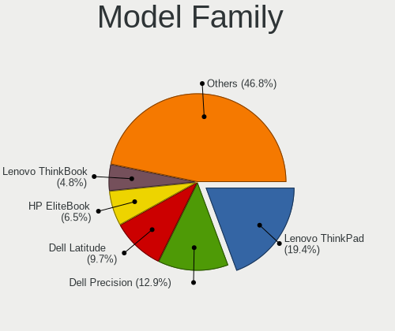

| Name             | Notebooks | Percent |
|------------------|-----------|---------|
| Lenovo ThinkPad  | 7         | 20%     |
| Dell Precision   | 4         | 11.43%  |
| Lenovo ThinkBook | 2         | 5.71%   |
| HP EliteBook     | 2         | 5.71%   |
| Dell Latitude    | 2         | 5.71%   |
| Dell Inspiron    | 2         | 5.71%   |
| System76 Galago  | 1         | 2.86%   |
| Samsung 730QCJ   | 1         | 2.86%   |
| Razer Blade      | 1         | 2.86%   |
| MSI Katana       | 1         | 2.86%   |
| MSI GP75         | 1         | 2.86%   |
| MSI GE72VR       | 1         | 2.86%   |
| Lenovo IdeaPad   | 1         | 2.86%   |
| HP ProBook       | 1         | 2.86%   |
| HP Laptop        | 1         | 2.86%   |
| HP 340S          | 1         | 2.86%   |
| Gigabyte AERO    | 1         | 2.86%   |
| Dell XPS         | 1         | 2.86%   |
| Dell G16         | 1         | 2.86%   |
| ASUS Z450LA      | 1         | 2.86%   |
| ASUS VivoBook    | 1         | 2.86%   |
| ASUS TUF         | 1         | 2.86%   |

MFG Year
--------

Motherboard manufacture year

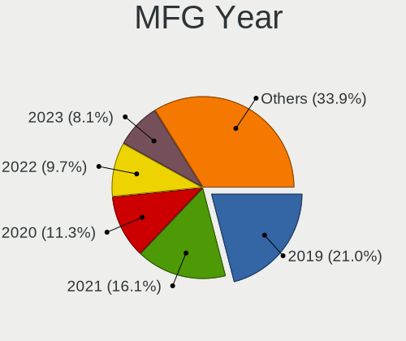

| Year | Notebooks | Percent |
|------|-----------|---------|
| 2019 | 9         | 25.71%  |
| 2021 | 6         | 17.14%  |
| 2020 | 5         | 14.29%  |
| 2015 | 3         | 8.57%   |
| 2022 | 2         | 5.71%   |
| 2018 | 2         | 5.71%   |
| 2017 | 2         | 5.71%   |
| 2023 | 1         | 2.86%   |
| 2016 | 1         | 2.86%   |
| 2014 | 1         | 2.86%   |
| 2013 | 1         | 2.86%   |
| 2012 | 1         | 2.86%   |
| 2010 | 1         | 2.86%   |

Form Factor
-----------

Physical design of the computer

| Name     | Notebooks | Percent |
|----------|-----------|---------|
| Notebook | 35        | 100%    |

Secure Boot
-----------

Enabled or disabled

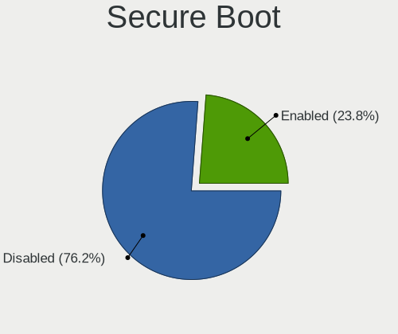

| State    | Notebooks | Percent |
|----------|-----------|---------|
| Disabled | 28        | 77.78%  |
| Enabled  | 8         | 22.22%  |

Coreboot
--------

Have coreboot on board

| Used | Notebooks | Percent |
|------|-----------|---------|
| No   | 34        | 97.14%  |
| Yes  | 1         | 2.86%   |

RAM Size
--------

Total RAM memory

| Size in GB  | Notebooks | Percent |
|-------------|-----------|---------|
| 8.01-16.0   | 15        | 42.86%  |
| 4.01-8.0    | 7         | 20%     |
| 32.01-64.0  | 5         | 14.29%  |
| 3.01-4.0    | 3         | 8.57%   |
| 64.01-256.0 | 3         | 8.57%   |
| 16.01-24.0  | 2         | 5.71%   |

RAM Used
--------

Used RAM memory

| Used GB    | Notebooks | Percent |
|------------|-----------|---------|
| 2.01-3.0   | 13        | 35.14%  |
| 4.01-8.0   | 9         | 24.32%  |
| 3.01-4.0   | 8         | 21.62%  |
| 8.01-16.0  | 4         | 10.81%  |
| 1.01-2.0   | 2         | 5.41%   |
| 32.01-64.0 | 1         | 2.7%    |

Total Drives
------------

Number of drives on board

| Drives | Notebooks | Percent |
|--------|-----------|---------|
| 1      | 21        | 56.76%  |
| 2      | 11        | 29.73%  |
| 3      | 4         | 10.81%  |
| 4      | 1         | 2.7%    |

Has CD-ROM
----------

Has CD-ROM on board

| Presented | Notebooks | Percent |
|-----------|-----------|---------|
| No        | 30        | 85.71%  |
| Yes       | 5         | 14.29%  |

Has Ethernet
------------

Has Ethernet on board

| Presented | Notebooks | Percent |
|-----------|-----------|---------|
| Yes       | 28        | 80%     |
| No        | 7         | 20%     |

Has WiFi
--------

Has WiFi module

| Presented | Notebooks | Percent |
|-----------|-----------|---------|
| Yes       | 35        | 100%    |

Has Bluetooth
-------------

Has Bluetooth module

| Presented | Notebooks | Percent |
|-----------|-----------|---------|
| Yes       | 29        | 80.56%  |
| No        | 7         | 19.44%  |

Location
--------

Country
-------

Geographic location (country)

| Country     | Notebooks | Percent |
|-------------|-----------|---------|
| USA         | 10        | 28.57%  |
| India       | 3         | 8.57%   |
| UK          | 2         | 5.71%   |
| Turkey      | 2         | 5.71%   |
| Guatemala   | 2         | 5.71%   |
| Chile       | 2         | 5.71%   |
| Brazil      | 2         | 5.71%   |
| Switzerland | 1         | 2.86%   |
| Sri Lanka   | 1         | 2.86%   |
| Slovakia    | 1         | 2.86%   |
| Norway      | 1         | 2.86%   |
| Netherlands | 1         | 2.86%   |
| Kenya       | 1         | 2.86%   |
| Jordan      | 1         | 2.86%   |
| Italy       | 1         | 2.86%   |
| Indonesia   | 1         | 2.86%   |
| Finland     | 1         | 2.86%   |
| Egypt       | 1         | 2.86%   |
| Czechia     | 1         | 2.86%   |

City
----

Geographic location (city)

| City                | Notebooks | Percent |
|---------------------|-----------|---------|
| Santiago            | 2         | 5.41%   |
| Guatemala City      | 2         | 5.41%   |
| Whiteley            | 1         | 2.7%    |
| Stratham            | 1         | 2.7%    |
| Skien               | 1         | 2.7%    |
| Sao Paulo           | 1         | 2.7%    |
| Saint Paul          | 1         | 2.7%    |
| Providence          | 1         | 2.7%    |
| Prairieville        | 1         | 2.7%    |
| Piracicaba          | 1         | 2.7%    |
| Parker              | 1         | 2.7%    |
| Nuenen              | 1         | 2.7%    |
| Newcastle upon Tyne | 1         | 2.7%    |
| New Delhi           | 1         | 2.7%    |
| Nairobi             | 1         | 2.7%    |
| Montgomery          | 1         | 2.7%    |
| Milano              | 1         | 2.7%    |
| Maltepe             | 1         | 2.7%    |
| Liberec             | 1         | 2.7%    |
| Kolkata             | 1         | 2.7%    |
| Houston             | 1         | 2.7%    |
| Helsinki            | 1         | 2.7%    |
| Fort Collins        | 1         | 2.7%    |
| Denizli             | 1         | 2.7%    |
| Corona              | 1         | 2.7%    |
| Colombo             | 1         | 2.7%    |
| Christiansburg      | 1         | 2.7%    |
| Chennai             | 1         | 2.7%    |
| Cairo               | 1         | 2.7%    |
| Bratislava          | 1         | 2.7%    |
| Bern                | 1         | 2.7%    |
| Bay Shore           | 1         | 2.7%    |
| Bandung             | 1         | 2.7%    |
| Baltimore           | 1         | 2.7%    |
| Amman               | 1         | 2.7%    |

Drives
------

Drive Vendor
------------

Hard drive vendors

| Vendor                      | Notebooks | Drives | Percent |
|-----------------------------|-----------|--------|---------|
| Samsung Electronics         | 14        | 16     | 25.93%  |
| Sandisk                     | 5         | 6      | 9.26%   |
| Toshiba                     | 4         | 4      | 7.41%   |
| Unknown                     | 3         | 3      | 5.56%   |
| Seagate                     | 3         | 4      | 5.56%   |
| Micron Technology           | 3         | 3      | 5.56%   |
| KIOXIA                      | 3         | 4      | 5.56%   |
| WDC                         | 2         | 2      | 3.7%    |
| SK hynix                    | 2         | 2      | 3.7%    |
| Micron/Crucial Technology   | 2         | 3      | 3.7%    |
| Intel                       | 2         | 3      | 3.7%    |
| SSSTC                       | 1         | 1      | 1.85%   |
| SABRENT                     | 1         | 1      | 1.85%   |
| Plextor                     | 1         | 1      | 1.85%   |
| Phison                      | 1         | 1      | 1.85%   |
| Kingston Technology Company | 1         | 1      | 1.85%   |
| Kingston                    | 1         | 1      | 1.85%   |
| KingSpec                    | 1         | 1      | 1.85%   |
| HGST                        | 1         | 1      | 1.85%   |
| Golden                      | 1         | 1      | 1.85%   |
| China                       | 1         | 1      | 1.85%   |
| A-DATA Technology           | 1         | 1      | 1.85%   |

Drive Model
-----------

Hard drive models

| Model                                               | Notebooks | Percent |
|-----------------------------------------------------|-----------|---------|
| Samsung NVMe SSD Controller SM981/PM981/PM983 512GB | 3         | 5.36%   |
| Unknown MMC Card  256GB                             | 2         | 3.57%   |
| Sandisk WD Blue SN500 / PC SN520 NVMe SSD 128GB     | 2         | 3.57%   |
| Sandisk WD Black SN750 / PC SN730 NVMe SSD 2TB      | 2         | 3.57%   |
| Samsung NVMe SSD Controller PM9A1/PM9A3/980PRO 2TB  | 2         | 3.57%   |
| KIOXIA KBG5AZNT1T02 LA 1TB                          | 2         | 3.57%   |
| WDC WDS240G2G0A-00JH30 240GB SSD                    | 1         | 1.79%   |
| WDC WD10SPZX-60Z10T0 1TB                            | 1         | 1.79%   |
| Unknown MMC Card  512GB                             | 1         | 1.79%   |
| Toshiba MQ01ACF050 500GB                            | 1         | 1.79%   |
| Toshiba MQ01ABF050 500GB                            | 1         | 1.79%   |
| Toshiba MQ01ABF032 320GB                            | 1         | 1.79%   |
| Toshiba MQ01ABD100 1TB                              | 1         | 1.79%   |
| SSSTC CL1-3D512-Q11 NVMe 512GB                      | 1         | 1.79%   |
| SK hynix SHGP31-1000GM 1TB                          | 1         | 1.79%   |
| SK hynix NVMe SSD Drive 1024GB                      | 1         | 1.79%   |
| Seagate ST500LT012-9WS142 500GB                     | 1         | 1.79%   |
| Seagate ST1000LM049-2GH172 1TB                      | 1         | 1.79%   |
| Seagate Backup+ Hub BK 8TB                          | 1         | 1.79%   |
| Sandisk WD Blue SN570 500GB                         | 1         | 1.79%   |
| SanDisk NVMe SSD Drive 1TB                          | 1         | 1.79%   |
| Samsung SSD PM851 2.5 7mm 256GB                     | 1         | 1.79%   |
| Samsung SSD PM830 2.5 7mm 128GB                     | 1         | 1.79%   |
| Samsung SSD 980 1TB                                 | 1         | 1.79%   |
| Samsung SSD 883 DCT 960GB                           | 1         | 1.79%   |
| Samsung SSD 870 EVO 1TB                             | 1         | 1.79%   |
| Samsung NVMe SSD Drive 2TB                          | 1         | 1.79%   |
| Samsung NVMe SSD Drive 1TB                          | 1         | 1.79%   |
| Samsung MZALQ256HBJD-00BL2 256GB                    | 1         | 1.79%   |
| Samsung MZALQ256HAJD-000L2 256GB                    | 1         | 1.79%   |
| Samsung MZ7LN256HAJQ-000L7 256GB SSD                | 1         | 1.79%   |
| SABRENT Disk 2TB                                    | 1         | 1.79%   |
| Plextor PX-128S1G 128GB SSD                         | 1         | 1.79%   |
| Phison NVMe SSD Drive 960GB                         | 1         | 1.79%   |
| Micron/Crucial P2 NVMe PCIe SSD 4TB                 | 1         | 1.79%   |
| Micron/Crucial P1 NVMe PCIe SSD 1TB                 | 1         | 1.79%   |
| Micron MTFDHBA256TCK-1AS1AABHA  256GB               | 1         | 1.79%   |
| Micron 2450_MTFDKBA256TFK 256GB                     | 1         | 1.79%   |
| Micron 2400_MTFDKBA512QFM 512GB                     | 1         | 1.79%   |
| KIOXIA NVMe SSD Drive 512GB                         | 1         | 1.79%   |

HDD Vendor
----------

Hard disk drive vendors

| Vendor  | Notebooks | Drives | Percent |
|---------|-----------|--------|---------|
| Toshiba | 4         | 4      | 40%     |
| Seagate | 3         | 4      | 30%     |
| WDC     | 1         | 1      | 10%     |
| SABRENT | 1         | 1      | 10%     |
| HGST    | 1         | 1      | 10%     |

SSD Vendor
----------

Solid state drive vendors

| Vendor              | Notebooks | Drives | Percent |
|---------------------|-----------|--------|---------|
| Samsung Electronics | 5         | 5      | 50%     |
| WDC                 | 1         | 1      | 10%     |
| Plextor             | 1         | 1      | 10%     |
| KingSpec            | 1         | 1      | 10%     |
| Intel               | 1         | 2      | 10%     |
| China               | 1         | 1      | 10%     |

Drive Kind
----------

HDD or SSD

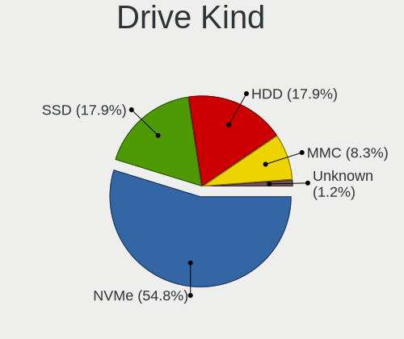

| Kind    | Notebooks | Drives | Percent |
|---------|-----------|--------|---------|
| NVMe    | 27        | 35     | 54%     |
| HDD     | 10        | 11     | 20%     |
| SSD     | 9         | 11     | 18%     |
| MMC     | 3         | 3      | 6%      |
| Unknown | 1         | 1      | 2%      |

Drive Connector
---------------

SATA, SAS, NVMe, etc.

| Type | Notebooks | Drives | Percent |
|------|-----------|--------|---------|
| NVMe | 27        | 35     | 56.25%  |
| SATA | 16        | 20     | 33.33%  |
| MMC  | 3         | 3      | 6.25%   |
| SAS  | 2         | 3      | 4.17%   |

Drive Size
----------

Size of hard drive

| Size in TB | Notebooks | Drives | Percent |
|------------|-----------|--------|---------|
| 0.51-1.0   | 8         | 9      | 44.44%  |
| 0.01-0.5   | 8         | 10     | 44.44%  |
| 1.01-2.0   | 1         | 1      | 5.56%   |
| 4.01-10.0  | 1         | 2      | 5.56%   |

Space Total
-----------

Amount of disk space available on the file system

| Size in GB     | Notebooks | Percent |
|----------------|-----------|---------|
| 101-250        | 14        | 38.89%  |
| 251-500        | 6         | 16.67%  |
| 1001-2000      | 6         | 16.67%  |
| 501-1000       | 5         | 13.89%  |
| 51-100         | 2         | 5.56%   |
| More than 3000 | 1         | 2.78%   |
| 21-50          | 1         | 2.78%   |
| Unknown        | 1         | 2.78%   |

Space Used
----------

Amount of used disk space

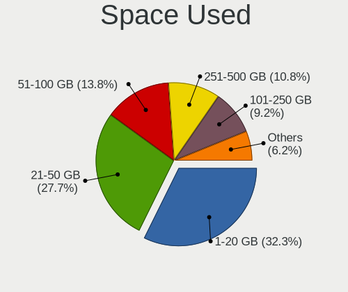

| Used GB   | Notebooks | Percent |
|-----------|-----------|---------|
| 1-20      | 13        | 36.11%  |
| 21-50     | 8         | 22.22%  |
| 51-100    | 7         | 19.44%  |
| 251-500   | 3         | 8.33%   |
| 101-250   | 2         | 5.56%   |
| 1001-2000 | 2         | 5.56%   |
| Unknown   | 1         | 2.78%   |

Malfunc. Drives
---------------

Drive models with a malfunction

| Model                                          | Notebooks | Drives | Percent |
|------------------------------------------------|-----------|--------|---------|
| Seagate ST500LT012-9WS142 500GB                | 1         | 1      | 33.33%  |
| Micron/Crucial Technology P1 NVMe PCIe SSD 1TB | 1         | 1      | 33.33%  |
| Intel SSDSC2BA800G4R 800GB                     | 1         | 2      | 33.33%  |

Malfunc. Drive Vendor
---------------------

Vendors of faulty drives

| Vendor                    | Notebooks | Drives | Percent |
|---------------------------|-----------|--------|---------|
| Seagate                   | 1         | 1      | 33.33%  |
| Micron/Crucial Technology | 1         | 1      | 33.33%  |
| Intel                     | 1         | 2      | 33.33%  |

Malfunc. HDD Vendor
-------------------

Vendors of faulty HDD drives

| Vendor  | Notebooks | Drives | Percent |
|---------|-----------|--------|---------|
| Seagate | 1         | 1      | 100%    |

Malfunc. Drive Kind
-------------------

Kinds of faulty drives

| Kind | Notebooks | Drives | Percent |
|------|-----------|--------|---------|
| NVMe | 1         | 1      | 33.33%  |
| SSD  | 1         | 2      | 33.33%  |
| HDD  | 1         | 1      | 33.33%  |

Failed Drives
-------------

Failed drive models

Zero info for selected period =(

Failed Drive Vendor
-------------------

Failed drive vendors

Zero info for selected period =(

Drive Status
------------

Number of failed and malfunc. drives

| Status   | Notebooks | Drives | Percent |
|----------|-----------|--------|---------|
| Detected | 24        | 39     | 61.54%  |
| Works    | 12        | 18     | 30.77%  |
| Malfunc  | 3         | 4      | 7.69%   |

Storage controller
------------------

Storage Vendor
--------------

Storage controller vendors

| Vendor                      | Notebooks | Percent |
|-----------------------------|-----------|---------|
| Intel                       | 25        | 46.3%   |
| Samsung Electronics         | 9         | 16.67%  |
| SanDisk                     | 5         | 9.26%   |
| Micron Technology           | 3         | 5.56%   |
| KIOXIA                      | 3         | 5.56%   |
| SK hynix                    | 2         | 3.7%    |
| Micron/Crucial Technology   | 2         | 3.7%    |
| Kingston Technology Company | 2         | 3.7%    |
| Phison Electronics          | 1         | 1.85%   |
| AMD                         | 1         | 1.85%   |
| ADATA Technology            | 1         | 1.85%   |

Storage Model
-------------

Storage controller models

| Model                                                                         | Notebooks | Percent |
|-------------------------------------------------------------------------------|-----------|---------|
| Intel Sunrise Point-LP SATA Controller [AHCI mode]                            | 4         | 7.14%   |
| Samsung NVMe SSD Controller SM981/PM981/PM983                                 | 3         | 5.36%   |
| Samsung NVMe SSD Controller PM9A1/PM9A3/980PRO                                | 3         | 5.36%   |
| Samsung NVMe SSD Controller 980 (DRAM-less)                                   | 3         | 5.36%   |
| Intel Comet Lake SATA AHCI Controller                                         | 3         | 5.36%   |
| Intel 82801 Mobile SATA Controller [RAID mode]                                | 3         | 5.36%   |
| SK hynix Gold P31/BC711/PC711 NVMe Solid State Drive                          | 2         | 3.57%   |
| SanDisk WD Blue SN500 / PC SN520 x2 M.2 2280 NVMe SSD                         | 2         | 3.57%   |
| SanDisk Extreme Pro / WD Black SN750 / PC SN730 / Red SN700 NVMe SSD          | 2         | 3.57%   |
| KIOXIA NVMe SSD Controller BG5 (DRAM-less)                                    | 2         | 3.57%   |
| Intel Volume Management Device NVMe RAID Controller                           | 2         | 3.57%   |
| Intel Q170/Q150/B150/H170/H110/Z170/CM236 Chipset SATA Controller [AHCI Mode] | 2         | 3.57%   |
| Intel Cannon Lake Mobile PCH SATA AHCI Controller                             | 2         | 3.57%   |
| Intel 7 Series Chipset Family 6-port SATA Controller [AHCI mode]              | 2         | 3.57%   |
| SanDisk WD PC SN810 / Black SN850 NVMe SSD                                    | 1         | 1.79%   |
| SanDisk Ultra 3D / WD Blue SN570 NVMe SSD (DRAM-less)                         | 1         | 1.79%   |
| Phison E12 NVMe Controller                                                    | 1         | 1.79%   |
| Micron/Crucial P2 [Nick P2] / P3 / P3 Plus NVMe PCIe SSD (DRAM-less)          | 1         | 1.79%   |
| Micron/Crucial P1 NVMe PCIe SSD[Frampton]                                     | 1         | 1.79%   |
| Micron 2450 NVMe SSD [HendrixV] (DRAM-less)                                   | 1         | 1.79%   |
| Micron 2400 NVMe SSD (DRAM-less)                                              | 1         | 1.79%   |
| Micron 2200S NVMe SSD [Cassandra]                                             | 1         | 1.79%   |
| KIOXIA NVMe SSD Controller BG4 (DRAM-less)                                    | 1         | 1.79%   |
| Kingston Company NV2 NVMe SSD E21T                                            | 1         | 1.79%   |
| Kingston Company KC3000/FURY Renegade NVMe SSD E18                            | 1         | 1.79%   |
| Intel SSD 660P Series                                                         | 1         | 1.79%   |
| Intel SATA Controller [RAID mode]                                             | 1         | 1.79%   |
| Intel Ice Lake-LP SATA Controller [AHCI mode]                                 | 1         | 1.79%   |
| Intel HM170/QM170 Chipset SATA Controller [AHCI Mode]                         | 1         | 1.79%   |
| Intel Celeron/Pentium Silver Processor SATA Controller                        | 1         | 1.79%   |
| Intel Alder Lake-P SATA AHCI Controller                                       | 1         | 1.79%   |
| Intel 8 Series SATA Controller 1 [AHCI mode]                                  | 1         | 1.79%   |
| Intel 5 Series/3400 Series Chipset 6 port SATA AHCI Controller                | 1         | 1.79%   |
| AMD FCH SATA Controller [AHCI mode]                                           | 1         | 1.79%   |
| ADATA IM2P33F3 NVMe SSD (DRAM-less)                                           | 1         | 1.79%   |

Storage Kind
------------

Kind of storage controller (IDE, SATA, NVMe, SAS, ...)

| Kind | Notebooks | Percent |
|------|-----------|---------|
| NVMe | 26        | 50%     |
| SATA | 20        | 38.46%  |
| RAID | 6         | 11.54%  |

Processor
---------

CPU Vendor
----------

Processor vendors

| Vendor | Notebooks | Percent |
|--------|-----------|---------|
| Intel  | 33        | 94.29%  |
| AMD    | 2         | 5.71%   |

CPU Model
---------

Processor models

| Model                                         | Notebooks | Percent |
|-----------------------------------------------|-----------|---------|
| Intel Core i5-10210U CPU @ 1.60GHz            | 3         | 8.57%   |
| Intel Core i7-9750H CPU @ 2.60GHz             | 2         | 5.71%   |
| Intel Core i7-6820HQ CPU @ 2.70GHz            | 2         | 5.71%   |
| Intel Core i5-8250U CPU @ 1.60GHz             | 2         | 5.71%   |
| Intel Core i5-1035G1 CPU @ 1.00GHz            | 2         | 5.71%   |
| Intel 12th Gen Core i7-12700H                 | 2         | 5.71%   |
| Intel Xeon W-11855M CPU @ 3.20GHz             | 1         | 2.86%   |
| Intel Core i9-8950HK CPU @ 2.90GHz            | 1         | 2.86%   |
| Intel Core i7-8665U CPU @ 1.90GHz             | 1         | 2.86%   |
| Intel Core i7-7700HQ CPU @ 2.80GHz            | 1         | 2.86%   |
| Intel Core i7-6600U CPU @ 2.60GHz             | 1         | 2.86%   |
| Intel Core i7-5600U CPU @ 2.60GHz             | 1         | 2.86%   |
| Intel Core i7-10510U CPU @ 1.80GHz            | 1         | 2.86%   |
| Intel Core i5-8265U CPU @ 1.60GHz             | 1         | 2.86%   |
| Intel Core i5-6200U CPU @ 2.30GHz             | 1         | 2.86%   |
| Intel Core i5-3360M CPU @ 2.80GHz             | 1         | 2.86%   |
| Intel Core i5-3320M CPU @ 2.60GHz             | 1         | 2.86%   |
| Intel Core i3-4005U CPU @ 1.70GHz             | 1         | 2.86%   |
| Intel Core i3 CPU M 380 @ 2.53GHz             | 1         | 2.86%   |
| Intel Celeron N4020 CPU @ 1.10GHz             | 1         | 2.86%   |
| Intel 12th Gen Core i9-12900K                 | 1         | 2.86%   |
| Intel 12th Gen Core i7-1260P                  | 1         | 2.86%   |
| Intel 12th Gen Core i5-1235U                  | 1         | 2.86%   |
| Intel 11th Gen Core i9-11950H @ 2.60GHz       | 1         | 2.86%   |
| Intel 11th Gen Core i9-11900H @ 2.50GHz       | 1         | 2.86%   |
| Intel 11th Gen Core i7-11800H @ 2.30GHz       | 1         | 2.86%   |
| AMD Ryzen 7 PRO 4750U with Radeon Graphics    | 1         | 2.86%   |
| AMD Ryzen 5 3500U with Radeon Vega Mobile Gfx | 1         | 2.86%   |

CPU Model Family
----------------

Processor model prefix

| Model           | Notebooks | Percent |
|-----------------|-----------|---------|
| Intel Core i5   | 11        | 31.43%  |
| Intel Core i7   | 9         | 25.71%  |
| Other           | 8         | 22.86%  |
| Intel Core i3   | 2         | 5.71%   |
| Intel Xeon      | 1         | 2.86%   |
| Intel Core i9   | 1         | 2.86%   |
| Intel Celeron   | 1         | 2.86%   |
| AMD Ryzen 7 PRO | 1         | 2.86%   |
| AMD Ryzen 5     | 1         | 2.86%   |

CPU Cores
---------

Number of processor cores

| Number | Notebooks | Percent |
|--------|-----------|---------|
| 4      | 14        | 40%     |
| 2      | 8         | 22.86%  |
| 8      | 5         | 14.29%  |
| 6      | 4         | 11.43%  |
| 14     | 2         | 5.71%   |
| 12     | 1         | 2.86%   |
| 10     | 1         | 2.86%   |

CPU Sockets
-----------

Number of sockets

| Number | Notebooks | Percent |
|--------|-----------|---------|
| 1      | 35        | 100%    |

CPU Threads
-----------

Threads per core (Hyper-Threading)

| Number | Notebooks | Percent |
|--------|-----------|---------|
| 2      | 33        | 94.29%  |
| 1      | 2         | 5.71%   |

CPU Op-Modes
------------

CPU Operation Modes (32-bit, 64-bit)

| Op mode        | Notebooks | Percent |
|----------------|-----------|---------|
| 32-bit, 64-bit | 35        | 100%    |

CPU Microcode
-------------

Microcode number

| Number     | Notebooks | Percent |
|------------|-----------|---------|
| 0x806ec    | 6         | 17.14%  |
| 0x806d1    | 4         | 11.43%  |
| 0x906a3    | 3         | 8.57%   |
| 0x706e5    | 2         | 5.71%   |
| 0x506e3    | 2         | 5.71%   |
| 0x406e3    | 2         | 5.71%   |
| 0x306a9    | 2         | 5.71%   |
| Unknown    | 2         | 5.71%   |
| 0x906ed    | 1         | 2.86%   |
| 0x906ea    | 1         | 2.86%   |
| 0x906e9    | 1         | 2.86%   |
| 0x906a4    | 1         | 2.86%   |
| 0x90672    | 1         | 2.86%   |
| 0x806ea    | 1         | 2.86%   |
| 0x706a8    | 1         | 2.86%   |
| 0x40651    | 1         | 2.86%   |
| 0x306d4    | 1         | 2.86%   |
| 0x20655    | 1         | 2.86%   |
| 0x08600106 | 1         | 2.86%   |
| 0x08108109 | 1         | 2.86%   |

CPU Microarch
-------------

Microarchitecture

| Name             | Notebooks | Percent |
|------------------|-----------|---------|
| KabyLake         | 12        | 34.29%  |
| Icelake          | 6         | 17.14%  |
| Alderlake Hybrid | 5         | 14.29%  |
| Skylake          | 4         | 11.43%  |
| IvyBridge        | 2         | 5.71%   |
| Zen+             | 1         | 2.86%   |
| Zen 2            | 1         | 2.86%   |
| Westmere         | 1         | 2.86%   |
| Haswell          | 1         | 2.86%   |
| Goldmont plus    | 1         | 2.86%   |
| Broadwell        | 1         | 2.86%   |

Graphics
--------

GPU Vendor
----------

Vendors of graphics cards

| Vendor | Notebooks | Percent |
|--------|-----------|---------|
| Intel  | 29        | 65.91%  |
| Nvidia | 11        | 25%     |
| AMD    | 4         | 9.09%   |

GPU Model
---------

Graphics card models

| Model                                                                         | Notebooks | Percent |
|-------------------------------------------------------------------------------|-----------|---------|
| Intel CometLake-U GT2 [UHD Graphics]                                          | 4         | 9.09%   |
| Nvidia GA106M [GeForce RTX 3060 Mobile / Max-Q]                               | 3         | 6.82%   |
| Intel CoffeeLake-H GT2 [UHD Graphics 630]                                     | 3         | 6.82%   |
| Intel Alder Lake-P GT2 [Iris Xe Graphics]                                     | 3         | 6.82%   |
| Nvidia TU116M [GeForce GTX 1660 Ti Mobile]                                    | 2         | 4.55%   |
| Intel WhiskeyLake-U GT2 [UHD Graphics 620]                                    | 2         | 4.55%   |
| Intel UHD Graphics 620                                                        | 2         | 4.55%   |
| Intel TigerLake-H GT1 [UHD Graphics]                                          | 2         | 4.55%   |
| Intel Skylake GT2 [HD Graphics 520]                                           | 2         | 4.55%   |
| Intel Iris Plus Graphics G1 (Ice Lake)                                        | 2         | 4.55%   |
| Intel 3rd Gen Core processor Graphics Controller                              | 2         | 4.55%   |
| Nvidia TU117GLM [T1200 Laptop GPU]                                            | 1         | 2.27%   |
| Nvidia GP106M [GeForce GTX 1060 Mobile]                                       | 1         | 2.27%   |
| Nvidia GP104GLM [Quadro P3000 Mobile]                                         | 1         | 2.27%   |
| Nvidia GA107M [GeForce RTX 3050 Mobile]                                       | 1         | 2.27%   |
| Nvidia GA104GLM [RTX A5000 Mobile]                                            | 1         | 2.27%   |
| Nvidia GA102 [GeForce RTX 3090]                                               | 1         | 2.27%   |
| Intel HD Graphics 630                                                         | 1         | 2.27%   |
| Intel HD Graphics 5500                                                        | 1         | 2.27%   |
| Intel HD Graphics 530                                                         | 1         | 2.27%   |
| Intel Haswell-ULT Integrated Graphics Controller                              | 1         | 2.27%   |
| Intel GeminiLake [UHD Graphics 600]                                           | 1         | 2.27%   |
| Intel Core Processor Integrated Graphics Controller                           | 1         | 2.27%   |
| Intel Alder Lake-UP3 GT2 [Iris Xe Graphics]                                   | 1         | 2.27%   |
| AMD Venus XTX [Radeon HD 8890M / R9 M275X/M375X]                              | 1         | 2.27%   |
| AMD Sun XT [Radeon HD 8670A/8670M/8690M / R5 M330 / M430 / Radeon 520 Mobile] | 1         | 2.27%   |
| AMD Renoir [Radeon RX Vega 6 (Ryzen 4000/5000 Mobile Series)]                 | 1         | 2.27%   |
| AMD Picasso/Raven 2 [Radeon Vega Series / Radeon Vega Mobile Series]          | 1         | 2.27%   |

GPU Combo
---------

Combinations of graphics cards

| Name           | Notebooks | Percent |
|----------------|-----------|---------|
| 1 x Intel      | 20        | 57.14%  |
| Intel + Nvidia | 7         | 20%     |
| 1 x Nvidia     | 4         | 11.43%  |
| Intel + AMD    | 2         | 5.71%   |
| 1 x AMD        | 2         | 5.71%   |

GPU Driver
----------

Free vs proprietary

| Driver      | Notebooks | Percent |
|-------------|-----------|---------|
| Free        | 29        | 82.86%  |
| Proprietary | 5         | 14.29%  |
| Unknown     | 1         | 2.86%   |

GPU Memory
----------

Total video memory

| Size in GB | Notebooks | Percent |
|------------|-----------|---------|
| Unknown    | 22        | 62.86%  |
| 5.01-6.0   | 5         | 14.29%  |
| 1.01-2.0   | 3         | 8.57%   |
| 3.01-4.0   | 1         | 2.86%   |
| 2.01-3.0   | 1         | 2.86%   |
| 16.01-24.0 | 1         | 2.86%   |
| 8.01-16.0  | 1         | 2.86%   |
| 0.01-0.5   | 1         | 2.86%   |

Monitor
-------

Monitor Vendor
--------------

Monitor vendors

| Vendor               | Notebooks | Percent |
|----------------------|-----------|---------|
| BOE                  | 10        | 21.74%  |
| LG Display           | 6         | 13.04%  |
| Chimei Innolux       | 6         | 13.04%  |
| AU Optronics         | 4         | 8.7%    |
| Samsung Electronics  | 3         | 6.52%   |
| Dell                 | 3         | 6.52%   |
| Sharp                | 2         | 4.35%   |
| Lenovo               | 2         | 4.35%   |
| Hewlett-Packard      | 2         | 4.35%   |
| Goldstar             | 2         | 4.35%   |
| InfoVision           | 1         | 2.17%   |
| Gigabyte Technology  | 1         | 2.17%   |
| CSO                  | 1         | 2.17%   |
| BOE Technology Group | 1         | 2.17%   |
| ASUSTek Computer     | 1         | 2.17%   |
| AOC                  | 1         | 2.17%   |

Monitor Model
-------------

Monitor models

| Model                                                                 | Notebooks | Percent |
|-----------------------------------------------------------------------|-----------|---------|
| Sharp LCD Monitor SHP1518 1920x1200 366x229mm 17.0-inch               | 1         | 2.13%   |
| Sharp LCD Monitor SHP1430 3840x2160 350x190mm 15.7-inch               | 1         | 2.13%   |
| Samsung Electronics S24E450 SAM0C9B 1920x1080 521x293mm 23.5-inch     | 1         | 2.13%   |
| Samsung Electronics LCD Monitor SEC4149 1366x768 292x174mm 13.4-inch  | 1         | 2.13%   |
| Samsung Electronics LCD Monitor SDC4143 3840x2160 344x194mm 15.5-inch | 1         | 2.13%   |
| LG Display LCD Monitor LGD0625 1920x1080 344x194mm 15.5-inch          | 1         | 2.13%   |
| LG Display LCD Monitor LGD0613 1920x1080 309x174mm 14.0-inch          | 1         | 2.13%   |
| LG Display LCD Monitor LGD05EC 1920x1080 309x174mm 14.0-inch          | 1         | 2.13%   |
| LG Display LCD Monitor LGD0540 1920x1080 344x194mm 15.5-inch          | 1         | 2.13%   |
| LG Display LCD Monitor LGD0486 1920x1080 309x174mm 14.0-inch          | 1         | 2.13%   |
| LG Display LCD Monitor LGD0266 1366x768 344x194mm 15.5-inch           | 1         | 2.13%   |
| Lenovo LEN P24h-20 LEN61F4 2560x1440 527x296mm 23.8-inch              | 1         | 2.13%   |
| Lenovo LEN LT2452pwC LEN1144 1920x1200 518x324mm 24.1-inch            | 1         | 2.13%   |
| Lenovo LEN LT2323pwA LEN0BD0 1920x1080 510x290mm 23.1-inch            | 1         | 2.13%   |
| InfoVision LCD Monitor IVO057D 1920x1080 309x174mm 14.0-inch          | 1         | 2.13%   |
| Hewlett-Packard LP2465 HWP2676 1920x1200 519x324mm 24.1-inch          | 1         | 2.13%   |
| Hewlett-Packard LCD Monitor Pavilion32                                | 1         | 2.13%   |
| Goldstar UltraFine GSM5B11 2560x2880 600x340mm 27.2-inch              | 1         | 2.13%   |
| Goldstar TV SSCR2 GSMC0C8 3840x2160                                   | 1         | 2.13%   |
| Gigabyte Technology M27Q GBT270D 2560x1440 596x335mm 26.9-inch        | 1         | 2.13%   |
| Dell P2422H DELA1C4 1920x1080 527x296mm 23.8-inch                     | 1         | 2.13%   |
| Dell P2419HC DELA11D 1920x1080 527x296mm 23.8-inch                    | 1         | 2.13%   |
| Dell E2218HN DELF09E 1920x1080 476x268mm 21.5-inch                    | 1         | 2.13%   |
| CSO LCD Monitor CSO1303 2160x1350 280x175mm 13.0-inch                 | 1         | 2.13%   |
| Chimei Innolux LCD Monitor CMN1760 1920x1080 381x214mm 17.2-inch      | 1         | 2.13%   |
| Chimei Innolux LCD Monitor CMN1735 1920x1080 382x215mm 17.3-inch      | 1         | 2.13%   |
| Chimei Innolux LCD Monitor CMN15F5 1920x1080 344x193mm 15.5-inch      | 1         | 2.13%   |
| Chimei Innolux LCD Monitor CMN1512 1920x1080 344x193mm 15.5-inch      | 1         | 2.13%   |
| Chimei Innolux LCD Monitor CMN14FF 1920x1080 309x173mm 13.9-inch      | 1         | 2.13%   |
| Chimei Innolux LCD Monitor CMN14C9 1920x1080 309x173mm 13.9-inch      | 1         | 2.13%   |
| BOE Technology Group LCD Monitor 5120x1440                            | 1         | 2.13%   |
| BOE LCD Monitor BOE0AD5 2560x1600 345x215mm 16.0-inch                 | 1         | 2.13%   |
| BOE LCD Monitor BOE0A62 1920x1080 309x174mm 14.0-inch                 | 1         | 2.13%   |
| BOE LCD Monitor BOE08FA 1920x1080 294x165mm 13.3-inch                 | 1         | 2.13%   |
| BOE LCD Monitor BOE07F7 1920x1080 309x174mm 14.0-inch                 | 1         | 2.13%   |
| BOE LCD Monitor BOE07D7 1920x1080 294x165mm 13.3-inch                 | 1         | 2.13%   |
| BOE LCD Monitor BOE07C9 1920x1080 309x173mm 13.9-inch                 | 1         | 2.13%   |
| BOE LCD Monitor BOE07C6 1366x768 309x173mm 13.9-inch                  | 1         | 2.13%   |
| BOE LCD Monitor BOE06F2 1920x1080 309x173mm 13.9-inch                 | 1         | 2.13%   |
| BOE LCD Monitor BOE069A 1366x768 309x173mm 13.9-inch                  | 1         | 2.13%   |

Monitor Resolution
------------------

Monitor screen resolution

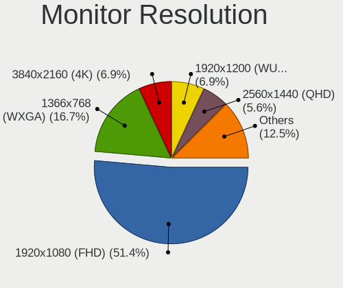

| Resolution        | Notebooks | Percent |
|-------------------|-----------|---------|
| 1920x1080 (FHD)   | 21        | 51.22%  |
| 1366x768 (WXGA)   | 7         | 17.07%  |
| 3840x2160 (4K)    | 3         | 7.32%   |
| 2560x1440 (QHD)   | 3         | 7.32%   |
| 1920x1200 (WUXGA) | 2         | 4.88%   |
| Unknown           | 2         | 4.88%   |
| 5120x1440         | 1         | 2.44%   |
| 2560x1600         | 1         | 2.44%   |
| 2160x1350         | 1         | 2.44%   |

Monitor Diagonal
----------------

Diagonal size in inches

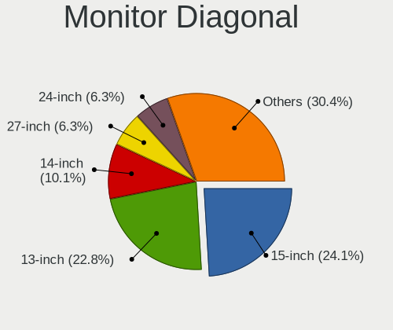

| Inches  | Notebooks | Percent |
|---------|-----------|---------|
| 13      | 13        | 29.55%  |
| 15      | 8         | 18.18%  |
| 14      | 6         | 13.64%  |
| 24      | 3         | 6.82%   |
| 23      | 3         | 6.82%   |
| 17      | 3         | 6.82%   |
| 27      | 2         | 4.55%   |
| Unknown | 2         | 4.55%   |
| 72      | 1         | 2.27%   |
| 31      | 1         | 2.27%   |
| 21      | 1         | 2.27%   |
| 16      | 1         | 2.27%   |

Monitor Width
-------------

Physical width

| Width in mm | Notebooks | Percent |
|-------------|-----------|---------|
| 301-350     | 24        | 55.81%  |
| 501-600     | 7         | 16.28%  |
| 201-300     | 4         | 9.3%    |
| 351-400     | 3         | 6.98%   |
| Unknown     | 2         | 4.65%   |
| 601-700     | 1         | 2.33%   |
| 401-500     | 1         | 2.33%   |
| 1501-2000   | 1         | 2.33%   |

Aspect Ratio
------------

Proportional relationship between the width and the height

| Ratio   | Notebooks | Percent |
|---------|-----------|---------|
| 16/9    | 29        | 80.56%  |
| 16/10   | 5         | 13.89%  |
| Unknown | 2         | 5.56%   |

Monitor Area
------------

Area in inch

| Area in inch | Notebooks | Percent |
|----------------|-----------|---------|
| 81-90          | 15        | 33.33%  |
| 101-110        | 8         | 17.78%  |
| 201-250        | 6         | 13.33%  |
| 71-80          | 4         | 8.89%   |
| 121-130        | 3         | 6.67%   |
| 301-350        | 2         | 4.44%   |
| 251-300        | 2         | 4.44%   |
| Unknown        | 2         | 4.44%   |
| More than 1000 | 1         | 2.22%   |
| 351-500        | 1         | 2.22%   |
| 111-120        | 1         | 2.22%   |

Pixel Density
-------------

Pixels per inch

| Density       | Notebooks | Percent |
|---------------|-----------|---------|
| 121-160       | 18        | 43.9%   |
| 101-120       | 9         | 21.95%  |
| 161-240       | 5         | 12.2%   |
| 51-100        | 5         | 12.2%   |
| More than 240 | 2         | 4.88%   |
| Unknown       | 2         | 4.88%   |

Multiple Monitors
-----------------

Total monitors connected

| Total | Notebooks | Percent |
|-------|-----------|---------|
| 1     | 25        | 69.44%  |
| 2     | 8         | 22.22%  |
| 5     | 1         | 2.78%   |
| 4     | 1         | 2.78%   |
| 3     | 1         | 2.78%   |

Network
-------

Net Controller Vendor
---------------------

Controller vendors

| Vendor                | Notebooks | Percent |
|-----------------------|-----------|---------|
| Intel                 | 30        | 55.56%  |
| Realtek Semiconductor | 17        | 31.48%  |
| Qualcomm Atheros      | 4         | 7.41%   |
| Ralink Technology     | 1         | 1.85%   |
| DisplayLink           | 1         | 1.85%   |
| Broadcom              | 1         | 1.85%   |

Net Controller Model
--------------------

Controller models

| Model                                                             | Notebooks | Percent |
|-------------------------------------------------------------------|-----------|---------|
| Realtek RTL8111/8168/8411 PCI Express Gigabit Ethernet Controller | 8         | 11.76%  |
| Realtek RTL8153 Gigabit Ethernet Adapter                          | 4         | 5.88%   |
| Intel Comet Lake PCH-LP CNVi WiFi                                 | 4         | 5.88%   |
| Intel Alder Lake-P PCH CNVi WiFi                                  | 4         | 5.88%   |
| Realtek RTL810xE PCI Express Fast Ethernet controller             | 3         | 4.41%   |
| Intel Wireless 8265 / 8275                                        | 2         | 2.94%   |
| Intel Wireless 8260                                               | 2         | 2.94%   |
| Intel Wi-Fi 6 AX210/AX211/AX411 160MHz                            | 2         | 2.94%   |
| Intel Wi-Fi 6 AX200                                               | 2         | 2.94%   |
| Intel Ice Lake-LP PCH CNVi WiFi                                   | 2         | 2.94%   |
| Intel Cannon Point-LP CNVi [Wireless-AC]                          | 2         | 2.94%   |
| Intel Cannon Lake PCH CNVi WiFi                                   | 2         | 2.94%   |
| Realtek RTL8821CE 802.11ac PCIe Wireless Network Adapter          | 1         | 1.47%   |
| Realtek RTL8723DE Wireless Network Adapter                        | 1         | 1.47%   |
| Realtek RTL8723BE PCIe Wireless Network Adapter                   | 1         | 1.47%   |
| Realtek RTL8125 2.5GbE Controller                                 | 1         | 1.47%   |
| Realtek Killer E2600 Gigabit Ethernet Controller                  | 1         | 1.47%   |
| Ralink MT7601U Wireless Adapter                                   | 1         | 1.47%   |
| Qualcomm Atheros QCA9565 / AR9565 Wireless Network Adapter        | 1         | 1.47%   |
| Qualcomm Atheros QCA9377 802.11ac Wireless Network Adapter        | 1         | 1.47%   |
| Qualcomm Atheros Killer E2500 Gigabit Ethernet Controller         | 1         | 1.47%   |
| Qualcomm Atheros Killer E2400 Gigabit Ethernet Controller         | 1         | 1.47%   |
| Intel Wireless-AC 9260                                            | 1         | 1.47%   |
| Intel Wireless 7265                                               | 1         | 1.47%   |
| Intel Wireless 3160                                               | 1         | 1.47%   |
| Intel Tiger Lake PCH CNVi WiFi                                    | 1         | 1.47%   |
| Intel Ethernet Controller I225-V                                  | 1         | 1.47%   |
| Intel Ethernet Controller I225-LM                                 | 1         | 1.47%   |
| Intel Ethernet Connection I219-LM                                 | 1         | 1.47%   |
| Intel Ethernet Connection (7) I219-LM                             | 1         | 1.47%   |
| Intel Ethernet Connection (6) I219-LM                             | 1         | 1.47%   |
| Intel Ethernet Connection (5) I219-LM                             | 1         | 1.47%   |
| Intel Ethernet Connection (4) I219-V                              | 1         | 1.47%   |
| Intel Ethernet Connection (3) I218-LM                             | 1         | 1.47%   |
| Intel Ethernet Connection (2) I219-LM                             | 1         | 1.47%   |
| Intel Ethernet Connection (16) I219-V                             | 1         | 1.47%   |
| Intel Ethernet Connection (14) I219-LM                            | 1         | 1.47%   |
| Intel Dual Band Wireless-AC 3168NGW [Stone Peak]                  | 1         | 1.47%   |
| Intel Centrino Wireless-N 2230                                    | 1         | 1.47%   |
| Intel Alder Lake-S PCH CNVi WiFi                                  | 1         | 1.47%   |

Wireless Vendor
---------------

Wireless vendors

| Vendor                | Notebooks | Percent |
|-----------------------|-----------|---------|
| Intel                 | 29        | 80.56%  |
| Realtek Semiconductor | 3         | 8.33%   |
| Qualcomm Atheros      | 2         | 5.56%   |
| Ralink Technology     | 1         | 2.78%   |
| Broadcom              | 1         | 2.78%   |

Wireless Model
--------------

Wireless models

| Model                                                      | Notebooks | Percent |
|------------------------------------------------------------|-----------|---------|
| Intel Comet Lake PCH-LP CNVi WiFi                          | 4         | 11.11%  |
| Intel Alder Lake-P PCH CNVi WiFi                           | 4         | 11.11%  |
| Intel Wireless 8265 / 8275                                 | 2         | 5.56%   |
| Intel Wireless 8260                                        | 2         | 5.56%   |
| Intel Wi-Fi 6 AX210/AX211/AX411 160MHz                     | 2         | 5.56%   |
| Intel Wi-Fi 6 AX200                                        | 2         | 5.56%   |
| Intel Ice Lake-LP PCH CNVi WiFi                            | 2         | 5.56%   |
| Intel Cannon Point-LP CNVi [Wireless-AC]                   | 2         | 5.56%   |
| Intel Cannon Lake PCH CNVi WiFi                            | 2         | 5.56%   |
| Realtek RTL8821CE 802.11ac PCIe Wireless Network Adapter   | 1         | 2.78%   |
| Realtek RTL8723DE Wireless Network Adapter                 | 1         | 2.78%   |
| Realtek RTL8723BE PCIe Wireless Network Adapter            | 1         | 2.78%   |
| Ralink MT7601U Wireless Adapter                            | 1         | 2.78%   |
| Qualcomm Atheros QCA9565 / AR9565 Wireless Network Adapter | 1         | 2.78%   |
| Qualcomm Atheros QCA9377 802.11ac Wireless Network Adapter | 1         | 2.78%   |
| Intel Wireless-AC 9260                                     | 1         | 2.78%   |
| Intel Wireless 7265                                        | 1         | 2.78%   |
| Intel Wireless 3160                                        | 1         | 2.78%   |
| Intel Tiger Lake PCH CNVi WiFi                             | 1         | 2.78%   |
| Intel Dual Band Wireless-AC 3168NGW [Stone Peak]           | 1         | 2.78%   |
| Intel Centrino Wireless-N 2230                             | 1         | 2.78%   |
| Intel Alder Lake-S PCH CNVi WiFi                           | 1         | 2.78%   |
| Broadcom BCM4313 802.11bgn Wireless Network Adapter        | 1         | 2.78%   |

Ethernet Vendor
---------------

Ethernet vendors

| Vendor                | Notebooks | Percent |
|-----------------------|-----------|---------|
| Realtek Semiconductor | 16        | 51.61%  |
| Intel                 | 12        | 38.71%  |
| Qualcomm Atheros      | 2         | 6.45%   |
| DisplayLink           | 1         | 3.23%   |

Ethernet Model
--------------

Ethernet models

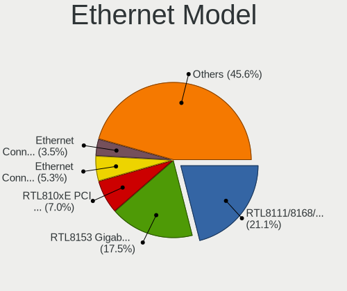

| Model                                                             | Notebooks | Percent |
|-------------------------------------------------------------------|-----------|---------|
| Realtek RTL8111/8168/8411 PCI Express Gigabit Ethernet Controller | 8         | 25%     |
| Realtek RTL8153 Gigabit Ethernet Adapter                          | 4         | 12.5%   |
| Realtek RTL810xE PCI Express Fast Ethernet controller             | 3         | 9.38%   |
| Realtek RTL8125 2.5GbE Controller                                 | 1         | 3.13%   |
| Realtek Killer E2600 Gigabit Ethernet Controller                  | 1         | 3.13%   |
| Qualcomm Atheros Killer E2500 Gigabit Ethernet Controller         | 1         | 3.13%   |
| Qualcomm Atheros Killer E2400 Gigabit Ethernet Controller         | 1         | 3.13%   |
| Intel Ethernet Controller I225-V                                  | 1         | 3.13%   |
| Intel Ethernet Controller I225-LM                                 | 1         | 3.13%   |
| Intel Ethernet Connection I219-LM                                 | 1         | 3.13%   |
| Intel Ethernet Connection (7) I219-LM                             | 1         | 3.13%   |
| Intel Ethernet Connection (6) I219-LM                             | 1         | 3.13%   |
| Intel Ethernet Connection (5) I219-LM                             | 1         | 3.13%   |
| Intel Ethernet Connection (4) I219-V                              | 1         | 3.13%   |
| Intel Ethernet Connection (3) I218-LM                             | 1         | 3.13%   |
| Intel Ethernet Connection (2) I219-LM                             | 1         | 3.13%   |
| Intel Ethernet Connection (16) I219-V                             | 1         | 3.13%   |
| Intel Ethernet Connection (14) I219-LM                            | 1         | 3.13%   |
| Intel 82579LM Gigabit Network Connection (Lewisville)             | 1         | 3.13%   |
| DisplayLink Dell D3100 Docking Station                            | 1         | 3.13%   |

Net Controller Kind
-------------------

Ethernet, WiFi or modem

| Kind     | Notebooks | Percent |
|----------|-----------|---------|
| WiFi     | 35        | 55.56%  |
| Ethernet | 28        | 44.44%  |

Used Controller
---------------

Currently used network controller

| Kind     | Notebooks | Percent |
|----------|-----------|---------|
| WiFi     | 29        | 76.32%  |
| Ethernet | 9         | 23.68%  |

NICs
----

Total network controllers on board

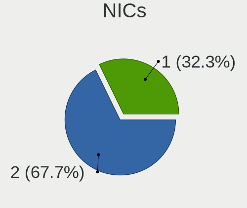

| Total | Notebooks | Percent |
|-------|-----------|---------|
| 2     | 27        | 77.14%  |
| 1     | 8         | 22.86%  |

IPv6
----

IPv6 vs IPv4

| Used | Notebooks | Percent |
|------|-----------|---------|
| No   | 26        | 74.29%  |
| Yes  | 9         | 25.71%  |

Bluetooth
---------

Bluetooth Vendor
----------------

Controller vendors

| Vendor                          | Notebooks | Percent |
|---------------------------------|-----------|---------|
| Intel                           | 23        | 76.67%  |
| Realtek Semiconductor           | 2         | 6.67%   |
| Broadcom                        | 2         | 6.67%   |
| Qualcomm Atheros Communications | 1         | 3.33%   |
| IMC Networks                    | 1         | 3.33%   |
| ASUSTek Computer                | 1         | 3.33%   |

Bluetooth Model
---------------

Controller models

| Model                                          | Notebooks | Percent |
|------------------------------------------------|-----------|---------|
| Intel Bluetooth Device                         | 8         | 26.67%  |
| Intel Bluetooth 9460/9560 Jefferson Peak (JfP) | 5         | 16.67%  |
| Intel Bluetooth wireless interface             | 4         | 13.33%  |
| Intel AX210 Bluetooth                          | 2         | 6.67%   |
| Intel AX200 Bluetooth                          | 2         | 6.67%   |
| Realtek  Bluetooth 4.2 Adapter                 | 1         | 3.33%   |
| Realtek Bluetooth Radio                        | 1         | 3.33%   |
| Qualcomm Atheros  Bluetooth Device             | 1         | 3.33%   |
| Intel Wireless-AC 3168 Bluetooth               | 1         | 3.33%   |
| Intel Centrino Bluetooth Wireless Transceiver  | 1         | 3.33%   |
| IMC Networks Bluetooth Radio                   | 1         | 3.33%   |
| Broadcom HP Portable SoftSailing               | 1         | 3.33%   |
| Broadcom BCM2045B (BDC-2.1)                    | 1         | 3.33%   |
| ASUS Bluetooth Device                          | 1         | 3.33%   |

Sound
-----

Sound Vendor
------------

Sound card vendors

| Vendor                  | Notebooks | Percent |
|-------------------------|-----------|---------|
| Intel                   | 33        | 58.93%  |
| Nvidia                  | 10        | 17.86%  |
| Texas Instruments       | 3         | 5.36%   |
| AMD                     | 3         | 5.36%   |
| Realtek Semiconductor   | 2         | 3.57%   |
| Sony                    | 1         | 1.79%   |
| LG Electronics          | 1         | 1.79%   |
| Hewlett-Packard         | 1         | 1.79%   |
| Corsair                 | 1         | 1.79%   |
| BEHRINGER International | 1         | 1.79%   |

Sound Model
-----------

Sound card models

| Model                                                                   | Notebooks | Percent |
|-------------------------------------------------------------------------|-----------|---------|
| Intel Tiger Lake-H HD Audio Controller                                  | 4         | 6.67%   |
| Intel Sunrise Point-LP HD Audio                                         | 4         | 6.67%   |
| Intel Comet Lake PCH-LP cAVS                                            | 4         | 6.67%   |
| Intel Alder Lake PCH-P High Definition Audio Controller                 | 4         | 6.67%   |
| Nvidia GA106 High Definition Audio Controller                           | 3         | 5%      |
| Intel Cannon Lake PCH cAVS                                              | 3         | 5%      |
| Texas Instruments PCM2902 Audio Codec                                   | 2         | 3.33%   |
| Realtek Semiconductor USB Audio                                         | 2         | 3.33%   |
| Nvidia TU116 High Definition Audio Controller                           | 2         | 3.33%   |
| Intel Ice Lake-LP Smart Sound Technology Audio Controller               | 2         | 3.33%   |
| Intel CM238 HD Audio Controller                                         | 2         | 3.33%   |
| Intel Cannon Point-LP High Definition Audio Controller                  | 2         | 3.33%   |
| Intel 7 Series/C216 Chipset Family High Definition Audio Controller     | 2         | 3.33%   |
| AMD Family 17h/19h HD Audio Controller                                  | 2         | 3.33%   |
| Texas Instruments PCM2704 16-bit stereo audio DAC                       | 1         | 1.67%   |
| Sony DualSense wireless controller (PS5)                                | 1         | 1.67%   |
| Nvidia TU107 GeForce GTX 1650 High Definition Audio Controller          | 1         | 1.67%   |
| Nvidia GP106 High Definition Audio Controller                           | 1         | 1.67%   |
| Nvidia GP104 High Definition Audio Controller                           | 1         | 1.67%   |
| Nvidia GA104 High Definition Audio Controller                           | 1         | 1.67%   |
| Nvidia GA102 High Definition Audio Controller                           | 1         | 1.67%   |
| LG Electronics USB Audio                                                | 1         | 1.67%   |
| Intel Wildcat Point-LP High Definition Audio Controller                 | 1         | 1.67%   |
| Intel Haswell-ULT HD Audio Controller                                   | 1         | 1.67%   |
| Intel Celeron/Pentium Silver Processor High Definition Audio            | 1         | 1.67%   |
| Intel Broadwell-U Audio Controller                                      | 1         | 1.67%   |
| Intel Alder Lake-S HD Audio Controller                                  | 1         | 1.67%   |
| Intel 8 Series HD Audio Controller                                      | 1         | 1.67%   |
| Intel 5 Series/3400 Series Chipset High Definition Audio                | 1         | 1.67%   |
| Intel 100 Series/C230 Series Chipset Family HD Audio Controller         | 1         | 1.67%   |
| Hewlett-Packard USB Audio                                               | 1         | 1.67%   |
| Corsair HS65 SURROUND                                                   | 1         | 1.67%   |
| BEHRINGER International UMC404HD 192k                                   | 1         | 1.67%   |
| AMD Renoir Radeon High Definition Audio Controller                      | 1         | 1.67%   |
| AMD Raven/Raven2/Fenghuang HDMI/DP Audio Controller                     | 1         | 1.67%   |
| AMD Oland/Hainan/Cape Verde/Pitcairn HDMI Audio [Radeon HD 7000 Series] | 1         | 1.67%   |

Memory
------

Memory Vendor
-------------

Memory module vendors

| Vendor              | Notebooks | Percent |
|---------------------|-----------|---------|
| SK hynix            | 3         | 23.08%  |
| Samsung Electronics | 3         | 23.08%  |
| Kingston            | 3         | 23.08%  |
| Smart               | 1         | 7.69%   |
| Micron Technology   | 1         | 7.69%   |
| Elpida              | 1         | 7.69%   |
| Crucial             | 1         | 7.69%   |

Memory Model
------------

Memory module models

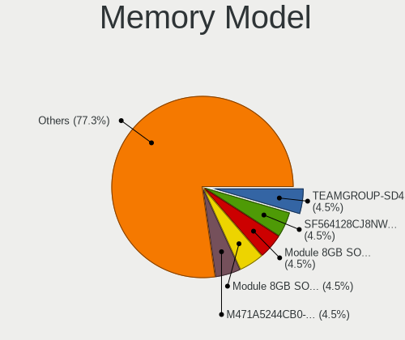

| Model                                                        | Notebooks | Percent |
|--------------------------------------------------------------|-----------|---------|
| Smart RAM SF564128CJ8NWMNSEG 4096MB SODIMM DDR3 1600MT/s     | 1         | 7.14%   |
| SK hynix RAM HMT451S6BFR8A-PB 4GB SODIMM DDR3 1600MT/s       | 1         | 7.14%   |
| SK hynix RAM HMAA2GS6CJR8N-XN 16GB SODIMM DDR4 3200MT/s      | 1         | 7.14%   |
| SK hynix RAM HMA82GS6MFR8N-TF 16GB SODIMM DDR4 2133MT/s      | 1         | 7.14%   |
| SK hynix RAM HMA81GS6JJR8N-VK 8GB SODIMM DDR4 2667MT/s       | 1         | 7.14%   |
| Samsung RAM Module 8GB SODIMM DDR4 2133MT/s                  | 1         | 7.14%   |
| Samsung RAM M471A1K43DB1-CTD 8GB SODIMM DDR4 2667MT/s        | 1         | 7.14%   |
| Samsung RAM K3LK7K7@BM-BGCP 2GB Row Of Chips LPDDR5 6400MT/s | 1         | 7.14%   |
| Micron RAM 4ATF51264HZ-2G3B1 4GB SODIMM DDR4 3200MT/s        | 1         | 7.14%   |
| Kingston RAM X74R9W-MIE 8GB SODIMM DDR4 2933MT/s             | 1         | 7.14%   |
| Kingston RAM MSI24D4S7S8MB-8 8GB SODIMM DDR4 2667MT/s        | 1         | 7.14%   |
| Kingston RAM 9905744-108.A00G 16GB SODIMM DDR4 3200MT/s      | 1         | 7.14%   |
| Elpida RAM EBJ40UG8BBU0-GN-F 4GB SODIMM DDR3 1600MT/s        | 1         | 7.14%   |
| Crucial RAM CT16G4SFD824A.C16FDD 16GB SODIMM DDR4 2400MT/s   | 1         | 7.14%   |

Memory Kind
-----------

Memory module kinds

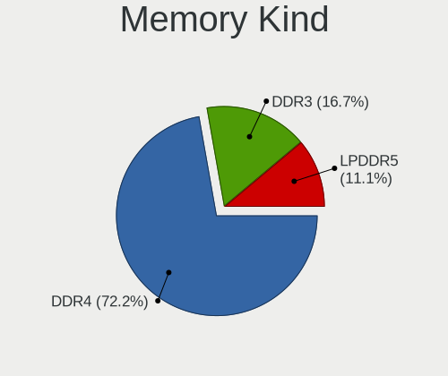

| Kind   | Notebooks | Percent |
|--------|-----------|---------|
| DDR4   | 8         | 72.73%  |
| DDR3   | 2         | 18.18%  |
| LPDDR5 | 1         | 9.09%   |

Memory Form Factor
------------------

Physical design of the memory module

| Name         | Notebooks | Percent |
|--------------|-----------|---------|
| SODIMM       | 10        | 90.91%  |
| Row Of Chips | 1         | 9.09%   |

Memory Size
-----------

Memory module size

| Size  | Notebooks | Percent |
|-------|-----------|---------|
| 8192  | 5         | 38.46%  |
| 16384 | 4         | 30.77%  |
| 4096  | 2         | 15.38%  |
| 32768 | 1         | 7.69%   |
| 2048  | 1         | 7.69%   |

Memory Speed
------------

Memory module speed

| Speed | Notebooks | Percent |
|-------|-----------|---------|
| 3200  | 3         | 23.08%  |
| 2667  | 3         | 23.08%  |
| 2133  | 2         | 15.38%  |
| 1600  | 2         | 15.38%  |
| 6400  | 1         | 7.69%   |
| 2933  | 1         | 7.69%   |
| 2400  | 1         | 7.69%   |

Printers & scanners
-------------------

Printer Vendor
--------------

Printer device vendors

| Vendor      | Notebooks | Percent |
|-------------|-----------|---------|
| Seiko Epson | 1         | 100%    |

Printer Model
-------------

Printer device models

| Model                    | Notebooks | Percent |
|--------------------------|-----------|---------|
| Seiko Epson L3210 Series | 1         | 100%    |

Scanner Vendor
--------------

Scanner device vendors

Zero info for selected period =(

Scanner Model
-------------

Scanner device models

Zero info for selected period =(

Camera
------

Camera Vendor
-------------

Camera device vendors

| Vendor                                 | Notebooks | Percent |
|----------------------------------------|-----------|---------|
| Chicony Electronics                    | 7         | 20.59%  |
| IMC Networks                           | 4         | 11.76%  |
| Microdia                               | 3         | 8.82%   |
| Sunplus Innovation Technology          | 2         | 5.88%   |
| Realtek Semiconductor                  | 2         | 5.88%   |
| Lite-On Technology                     | 2         | 5.88%   |
| Syntek                                 | 1         | 2.94%   |
| Suyin                                  | 1         | 2.94%   |
| Sonix Technology                       | 1         | 2.94%   |
| Shenzhen Kingcome Optoelectronic       | 1         | 2.94%   |
| Samsung Electronics                    | 1         | 2.94%   |
| Remo Tech                              | 1         | 2.94%   |
| Quanta                                 | 1         | 2.94%   |
| Microsoft                              | 1         | 2.94%   |
| Luxvisions Innotech Limited            | 1         | 2.94%   |
| LG Electronics                         | 1         | 2.94%   |
| Cheng Uei Precision Industry (Foxlink) | 1         | 2.94%   |
| Bison Electronics                      | 1         | 2.94%   |
| Acer                                   | 1         | 2.94%   |
| 8SSC21D67422V1SR28902JL                | 1         | 2.94%   |

Camera Model
------------

Camera device models

| Model                                                          | Notebooks | Percent |
|----------------------------------------------------------------|-----------|---------|
| Sunplus Integrated_Webcam_HD                                   | 2         | 5.88%   |
| Microdia Integrated_Webcam_HD                                  | 2         | 5.88%   |
| IMC Networks Integrated Camera                                 | 2         | 5.88%   |
| Chicony Integrated Camera                                      | 2         | 5.88%   |
| Syntek Integrated Camera                                       | 1         | 2.94%   |
| Suyin Integrated_Webcam_HD                                     | 1         | 2.94%   |
| Sonix USB2.0 HD UVC WebCam                                     | 1         | 2.94%   |
| Shenzhen Kingcome Optoelectronic 720p HD Camera                | 1         | 2.94%   |
| Samsung Galaxy series, misc. (MTP mode)                        | 1         | 2.94%   |
| Remo Tech OBSBOT Tiny 4K                                       | 1         | 2.94%   |
| Realtek Integrated_Webcam_HD                                   | 1         | 2.94%   |
| Realtek Integrated Webcam_HD                                   | 1         | 2.94%   |
| Quanta HP TrueVision HD Camera                                 | 1         | 2.94%   |
| Microsoft LifeCam VX-2000                                      | 1         | 2.94%   |
| Microdia 1.3 MPixel Integrated Webcam                          | 1         | 2.94%   |
| Luxvisions Innotech Limited Integrated Camera                  | 1         | 2.94%   |
| Lite-On Integrated Camera                                      | 1         | 2.94%   |
| Lite-On HP HD Camera                                           | 1         | 2.94%   |
| LG LG UltraFine Display Camera                                 | 1         | 2.94%   |
| IMC Networks USB2.0 HD UVC WebCam                              | 1         | 2.94%   |
| IMC Networks USB Camera                                        | 1         | 2.94%   |
| Chicony USB2.0 VGA UVC WebCam                                  | 1         | 2.94%   |
| Chicony ThinkPad T490 Webcam                                   | 1         | 2.94%   |
| Chicony HP HD Webcam [Fixed]                                   | 1         | 2.94%   |
| Chicony HP HD Camera                                           | 1         | 2.94%   |
| Chicony HD Webcam                                              | 1         | 2.94%   |
| Cheng Uei Precision Industry (Foxlink) HP TrueVision HD Camera | 1         | 2.94%   |
| Bison Integrated Camera                                        | 1         | 2.94%   |
| Acer BisonCam, NB Pro                                          | 1         | 2.94%   |
| 8SSC21D67422V1SR28902JL Integrated RGB Camera                  | 1         | 2.94%   |

Security
--------

Fingerprint Vendor
------------------

Fingerprint sensor vendors

| Vendor                     | Notebooks | Percent |
|----------------------------|-----------|---------|
| Synaptics                  | 4         | 44.44%  |
| Validity Sensors           | 2         | 22.22%  |
| Shenzhen Goodix Technology | 2         | 22.22%  |
| Samsung Electronics        | 1         | 11.11%  |

Fingerprint Model
-----------------

Fingerprint sensor models

| Model                                                     | Notebooks | Percent |
|-----------------------------------------------------------|-----------|---------|
| Synaptics Prometheus MIS Touch Fingerprint Reader         | 3         | 33.33%  |
| Shenzhen Goodix  FingerPrint Device                       | 2         | 22.22%  |
| Validity Sensors VFS5011 Fingerprint Reader               | 1         | 11.11%  |
| Validity Sensors VFS491                                   | 1         | 11.11%  |
| Synaptics  FS7604 Touch Fingerprint Sensor with PurePrint | 1         | 11.11%  |
| Samsung Fingerprint Sensor Device - 730B                  | 1         | 11.11%  |

Chipcard Vendor
---------------

Chipcard module vendors

| Vendor      | Notebooks | Percent |
|-------------|-----------|---------|
| Broadcom    | 4         | 80%     |
| Alcor Micro | 1         | 20%     |

Chipcard Model
--------------

Chipcard module models

| Model                                          | Notebooks | Percent |
|------------------------------------------------|-----------|---------|
| Broadcom 5880                                  | 3         | 60%     |
| Broadcom BCM5880 Secure Applications Processor | 1         | 20%     |
| Alcor Micro AU9540 Smartcard Reader            | 1         | 20%     |

Unsupported
-----------

Unsupported Devices
-------------------

Total unsupported devices on board

| Total | Notebooks | Percent |
|-------|-----------|---------|
| 0     | 19        | 54.29%  |
| 1     | 15        | 42.86%  |
| 2     | 1         | 2.86%   |

Unsupported Device Types
------------------------

Types of unsupported devices

| Type                  | Notebooks | Percent |
|-----------------------|-----------|---------|
| Fingerprint reader    | 9         | 47.37%  |
| Multimedia controller | 3         | 15.79%  |
| Chipcard              | 3         | 15.79%  |
| Graphics card         | 2         | 10.53%  |
| Net/wireless          | 1         | 5.26%   |
| Card reader           | 1         | 5.26%   |

