RHEL 9 - Tested Hardware & Statistics
-------------------------------------

A project to collect tested hardware configurations for RHEL 9.

Anyone can contribute to this report by the [hw-probe](https://github.com/linuxhw/hw-probe) tool:

    sudo -E hw-probe -all -upload

Please contribute! Especially if your hardware is rare.

This is a report for all computer types. See also reports for [desktops](/Dist/RHEL_9/Desktop/README.md) and [notebooks](/Dist/RHEL_9/Notebook/README.md).

Contents
--------

* [ Test Cases ](#test-cases)

* [ System ](#system)
  - [ Kernel                   ](#kernel)
  - [ Kernel Family            ](#kernel-family)
  - [ Kernel Major Ver.        ](#kernel-major-ver)
  - [ Arch                     ](#arch)
  - [ DE                       ](#de)
  - [ Display Server           ](#display-server)
  - [ Display Manager          ](#display-manager)
  - [ OS Lang                  ](#os-lang)
  - [ Boot Mode                ](#boot-mode)
  - [ Filesystem               ](#filesystem)
  - [ Part. scheme             ](#part-scheme)
  - [ Dual Boot with Linux/BSD ](#dual-boot-with-linuxbsd)
  - [ Dual Boot (Win)          ](#dual-boot-win)

* [ Board ](#board)
  - [ Vendor                   ](#vendor)
  - [ Model                    ](#model)
  - [ Model Family             ](#model-family)
  - [ MFG Year                 ](#mfg-year)
  - [ Form Factor              ](#form-factor)
  - [ Secure Boot              ](#secure-boot)
  - [ Coreboot                 ](#coreboot)
  - [ RAM Size                 ](#ram-size)
  - [ RAM Used                 ](#ram-used)
  - [ Total Drives             ](#total-drives)
  - [ Has CD-ROM               ](#has-cd-rom)
  - [ Has Ethernet             ](#has-ethernet)
  - [ Has WiFi                 ](#has-wifi)
  - [ Has Bluetooth            ](#has-bluetooth)

* [ Location ](#location)
  - [ Country                  ](#country)
  - [ City                     ](#city)

* [ Drives ](#drives)
  - [ Drive Vendor             ](#drive-vendor)
  - [ Drive Model              ](#drive-model)
  - [ HDD Vendor               ](#hdd-vendor)
  - [ SSD Vendor               ](#ssd-vendor)
  - [ Drive Kind               ](#drive-kind)
  - [ Drive Connector          ](#drive-connector)
  - [ Drive Size               ](#drive-size)
  - [ Space Total              ](#space-total)
  - [ Space Used               ](#space-used)
  - [ Malfunc. Drives          ](#malfunc-drives)
  - [ Malfunc. Drive Vendor    ](#malfunc-drive-vendor)
  - [ Malfunc. HDD Vendor      ](#malfunc-hdd-vendor)
  - [ Malfunc. Drive Kind      ](#malfunc-drive-kind)
  - [ Failed Drives            ](#failed-drives)
  - [ Failed Drive Vendor      ](#failed-drive-vendor)
  - [ Drive Status             ](#drive-status)

* [ Storage controller ](#storage-controller)
  - [ Storage Vendor           ](#storage-vendor)
  - [ Storage Model            ](#storage-model)
  - [ Storage Kind             ](#storage-kind)

* [ Processor ](#processor)
  - [ CPU Vendor               ](#cpu-vendor)
  - [ CPU Model                ](#cpu-model)
  - [ CPU Model Family         ](#cpu-model-family)
  - [ CPU Cores                ](#cpu-cores)
  - [ CPU Sockets              ](#cpu-sockets)
  - [ CPU Threads              ](#cpu-threads)
  - [ CPU Op-Modes             ](#cpu-op-modes)
  - [ CPU Microcode            ](#cpu-microcode)
  - [ CPU Microarch            ](#cpu-microarch)

* [ Graphics ](#graphics)
  - [ GPU Vendor               ](#gpu-vendor)
  - [ GPU Model                ](#gpu-model)
  - [ GPU Combo                ](#gpu-combo)
  - [ GPU Driver               ](#gpu-driver)
  - [ GPU Memory               ](#gpu-memory)

* [ Monitor ](#monitor)
  - [ Monitor Vendor           ](#monitor-vendor)
  - [ Monitor Model            ](#monitor-model)
  - [ Monitor Resolution       ](#monitor-resolution)
  - [ Monitor Diagonal         ](#monitor-diagonal)
  - [ Monitor Width            ](#monitor-width)
  - [ Aspect Ratio             ](#aspect-ratio)
  - [ Monitor Area             ](#monitor-area)
  - [ Pixel Density            ](#pixel-density)
  - [ Multiple Monitors        ](#multiple-monitors)

* [ Network ](#network)
  - [ Net Controller Vendor    ](#net-controller-vendor)
  - [ Net Controller Model     ](#net-controller-model)
  - [ Wireless Vendor          ](#wireless-vendor)
  - [ Wireless Model           ](#wireless-model)
  - [ Ethernet Vendor          ](#ethernet-vendor)
  - [ Ethernet Model           ](#ethernet-model)
  - [ Net Controller Kind      ](#net-controller-kind)
  - [ Used Controller          ](#used-controller)
  - [ NICs                     ](#nics)
  - [ IPv6                     ](#ipv6)

* [ Bluetooth ](#bluetooth)
  - [ Bluetooth Vendor         ](#bluetooth-vendor)
  - [ Bluetooth Model          ](#bluetooth-model)

* [ Sound ](#sound)
  - [ Sound Vendor             ](#sound-vendor)
  - [ Sound Model              ](#sound-model)

* [ Memory ](#memory)
  - [ Memory Vendor            ](#memory-vendor)
  - [ Memory Model             ](#memory-model)
  - [ Memory Kind              ](#memory-kind)
  - [ Memory Form Factor       ](#memory-form-factor)
  - [ Memory Size              ](#memory-size)
  - [ Memory Speed             ](#memory-speed)

* [ Printers & scanners ](#printers--scanners)
  - [ Printer Vendor           ](#printer-vendor)
  - [ Printer Model            ](#printer-model)
  - [ Scanner Vendor           ](#scanner-vendor)
  - [ Scanner Model            ](#scanner-model)

* [ Camera ](#camera)
  - [ Camera Vendor            ](#camera-vendor)
  - [ Camera Model             ](#camera-model)

* [ Security ](#security)
  - [ Fingerprint Vendor       ](#fingerprint-vendor)
  - [ Fingerprint Model        ](#fingerprint-model)
  - [ Chipcard Vendor          ](#chipcard-vendor)
  - [ Chipcard Model           ](#chipcard-model)

* [ Unsupported ](#unsupported)
  - [ Unsupported Devices      ](#unsupported-devices)
  - [ Unsupported Device Types ](#unsupported-device-types)

Test Cases
----------

Total: 91

| Vendor        | Model                       | Form-Factor | Probe                                                      | Date         |
|---------------|-----------------------------|-------------|------------------------------------------------------------|--------------|
| MSI           | PRO Z690-A DDR4             | Desktop     | [55f164e414](https://linux-hardware.org/?probe=55f164e414) | Dec 20, 2023 |
| MSI           | PRO Z690-A DDR4             | Desktop     | [b758a439b8](https://linux-hardware.org/?probe=b758a439b8) | Dec 20, 2023 |
| ASUSTek       | ROG Maximus Z790 HERO       | Desktop     | [c492be4899](https://linux-hardware.org/?probe=c492be4899) | Dec 04, 2023 |
| Dell          | Precision 7530              | Notebook    | [e75b16ca5e](https://linux-hardware.org/?probe=e75b16ca5e) | Dec 03, 2023 |
| Lenovo        | ThinkPad L480 20LS0015UK    | Notebook    | [5f786955fc](https://linux-hardware.org/?probe=5f786955fc) | Nov 26, 2023 |
| Lenovo        | IdeaPad 330S-14IKB U 81F... | Notebook    | [0b06f82d9d](https://linux-hardware.org/?probe=0b06f82d9d) | Nov 19, 2023 |
| ASUSTek       | ROG CROSSHAIR VIII DARK ... | Desktop     | [367bde5a11](https://linux-hardware.org/?probe=367bde5a11) | Nov 03, 2023 |
| ASUSTek       | PRIME Z690-A                | Desktop     | [e356c02979](https://linux-hardware.org/?probe=e356c02979) | Oct 30, 2023 |
| HP            | ProLiant ML310e Gen8        | Desktop     | [79f6aee2c7](https://linux-hardware.org/?probe=79f6aee2c7) | Oct 24, 2023 |
| Lenovo        | ThinkPad P17 Gen 2i 20YU... | Notebook    | [1c3bf8f6ef](https://linux-hardware.org/?probe=1c3bf8f6ef) | Oct 19, 2023 |
| System76      | Galago Pro                  | Notebook    | [fbdb665814](https://linux-hardware.org/?probe=fbdb665814) | Oct 03, 2023 |
| Dell          | Inspiron N5010              | Notebook    | [fe6b9d4c65](https://linux-hardware.org/?probe=fe6b9d4c65) | Oct 01, 2023 |
| Intel         | NUC12WSBi7 M63355-302       | Mini pc     | [043bac31d2](https://linux-hardware.org/?probe=043bac31d2) | Sep 28, 2023 |
| Dell          | G16 7620                    | Notebook    | [cd30e51d53](https://linux-hardware.org/?probe=cd30e51d53) | Sep 27, 2023 |
| Dell          | Precision 7720              | Notebook    | [8cae4c9a31](https://linux-hardware.org/?probe=8cae4c9a31) | Sep 25, 2023 |
| ASUSTek       | ROG CROSSHAIR VIII DARK ... | Desktop     | [ff1efba80e](https://linux-hardware.org/?probe=ff1efba80e) | Sep 13, 2023 |
| Acer          | Aspire C24-865              | All in one  | [de824a4f4e](https://linux-hardware.org/?probe=de824a4f4e) | Sep 03, 2023 |
| Lenovo        | ThinkPad T490 20N3S77601    | Notebook    | [b659e310c9](https://linux-hardware.org/?probe=b659e310c9) | Sep 02, 2023 |
| ASUSTek       | ROG CROSSHAIR VIII DARK ... | Desktop     | [c190907cc8](https://linux-hardware.org/?probe=c190907cc8) | Aug 29, 2023 |
| MSI           | Katana GF66 12UC            | Notebook    | [6651fbd434](https://linux-hardware.org/?probe=6651fbd434) | Aug 22, 2023 |
| ASRock        | A320M-HDV R4.0              | Desktop     | [f88687d2f0](https://linux-hardware.org/?probe=f88687d2f0) | Aug 15, 2023 |
| ASUSTek       | ROG STRIX Z590-E GAMING ... | Desktop     | [f6892c6532](https://linux-hardware.org/?probe=f6892c6532) | Aug 15, 2023 |
| ASRock        | A320M-HDV R4.0              | Desktop     | [eb99d95702](https://linux-hardware.org/?probe=eb99d95702) | Aug 08, 2023 |
| HP            | EliteBook 2570p             | Notebook    | [68734d9dfa](https://linux-hardware.org/?probe=68734d9dfa) | Aug 04, 2023 |
| ASRock        | A320M-HDV R4.0              | Desktop     | [de07e937bb](https://linux-hardware.org/?probe=de07e937bb) | Aug 04, 2023 |
| HP            | 0AECh D                     | Desktop     | [b9ea790e39](https://linux-hardware.org/?probe=b9ea790e39) | Jul 24, 2023 |
| HP            | 0AECh D                     | Desktop     | [078f0cd045](https://linux-hardware.org/?probe=078f0cd045) | Jul 24, 2023 |
| MSI           | Z270-A PRO                  | Desktop     | [0d8b3d7c32](https://linux-hardware.org/?probe=0d8b3d7c32) | Jun 20, 2023 |
| Lenovo        | STA7B38870 02               | Server      | [80a2f3d367](https://linux-hardware.org/?probe=80a2f3d367) | Jun 18, 2023 |
| Dell          | 07T4MC A02                  | Desktop     | [ad310dd147](https://linux-hardware.org/?probe=ad310dd147) | Jun 09, 2023 |
| Dell          | 0HHV7N A00                  | Desktop     | [a3a157f327](https://linux-hardware.org/?probe=a3a157f327) | May 21, 2023 |
| MSI           | MAG X570S TOMAHAWK MAX W... | Desktop     | [2afc4ee693](https://linux-hardware.org/?probe=2afc4ee693) | May 18, 2023 |
| Lenovo        | ThinkPad P17 Gen 2i 20YU... | Notebook    | [49ecdacd71](https://linux-hardware.org/?probe=49ecdacd71) | May 14, 2023 |
| ASUSTek       | TUF Gaming X570-PLUS        | Desktop     | [b1ea93c5fa](https://linux-hardware.org/?probe=b1ea93c5fa) | May 09, 2023 |
| HP            | EliteBook 855 G7 Noteboo... | Notebook    | [6e086ec096](https://linux-hardware.org/?probe=6e086ec096) | May 07, 2023 |
| Lenovo        | ThinkBook 14-IIL 20SL       | Notebook    | [5938e62d47](https://linux-hardware.org/?probe=5938e62d47) | Apr 17, 2023 |
| Dell          | Precision 7510              | Notebook    | [f68123c20a](https://linux-hardware.org/?probe=f68123c20a) | Apr 13, 2023 |
| Gigabyte      | B550M AORUS PRO-P           | Desktop     | [18c5e3c7c3](https://linux-hardware.org/?probe=18c5e3c7c3) | Apr 10, 2023 |
| Lenovo        | ThinkPad X1 Nano Gen 2 2... | Notebook    | [de656b2182](https://linux-hardware.org/?probe=de656b2182) | Apr 06, 2023 |
| MSI           | B450M MORTAR MAX            | Desktop     | [0077b88576](https://linux-hardware.org/?probe=0077b88576) | Apr 06, 2023 |
| Gigabyte      | X670E AORUS MASTER          | Desktop     | [68731ac4ec](https://linux-hardware.org/?probe=68731ac4ec) | Mar 31, 2023 |
| ASUSTek       | PRIME Z690-P WIFI           | Desktop     | [898059efa5](https://linux-hardware.org/?probe=898059efa5) | Mar 28, 2023 |
| MSI           | B450M MORTAR MAX            | Desktop     | [29c85678af](https://linux-hardware.org/?probe=29c85678af) | Mar 28, 2023 |
| ASUSTek       | PRIME Z690-P WIFI           | Desktop     | [1821e3657a](https://linux-hardware.org/?probe=1821e3657a) | Mar 26, 2023 |
| MSI           | B450M MORTAR MAX            | Desktop     | [641481dd1d](https://linux-hardware.org/?probe=641481dd1d) | Mar 21, 2023 |
| MSI           | B450M MORTAR MAX            | Desktop     | [9d859cb8bd](https://linux-hardware.org/?probe=9d859cb8bd) | Mar 20, 2023 |
| HP            | ProBook 640 G2              | Notebook    | [9439371137](https://linux-hardware.org/?probe=9439371137) | Mar 18, 2023 |
| HP            | ProBook 640 G2              | Notebook    | [c968526666](https://linux-hardware.org/?probe=c968526666) | Mar 18, 2023 |
| ASUSTek       | VivoBook_ASUSLaptop X515... | Notebook    | [bc39bd2ce5](https://linux-hardware.org/?probe=bc39bd2ce5) | Mar 17, 2023 |
| Lenovo        | ThinkPad L14 Gen 3 21C2S... | Notebook    | [6772403b62](https://linux-hardware.org/?probe=6772403b62) | Feb 20, 2023 |
| Dell          | Precision 7560              | Notebook    | [7ed10eebe9](https://linux-hardware.org/?probe=7ed10eebe9) | Feb 16, 2023 |
| MSI           | GP75 Leopard 9SD            | Notebook    | [1f2a5b1def](https://linux-hardware.org/?probe=1f2a5b1def) | Feb 11, 2023 |
| Gigabyte      | H510M H                     | Desktop     | [861b7c5aa7](https://linux-hardware.org/?probe=861b7c5aa7) | Feb 02, 2023 |
| ASUSTek       | PRIME Z590-A                | Desktop     | [f328fab9f1](https://linux-hardware.org/?probe=f328fab9f1) | Jan 27, 2023 |
| Hardkernel    | ODROID-H3                   | Desktop     | [98f5768c61](https://linux-hardware.org/?probe=98f5768c61) | Jan 22, 2023 |
| Dell          | Latitude 9420               | Notebook    | [3fd325486b](https://linux-hardware.org/?probe=3fd325486b) | Jan 18, 2023 |
| Dell          | Latitude 3410               | Notebook    | [0a4720ef85](https://linux-hardware.org/?probe=0a4720ef85) | Jan 02, 2023 |
| Unknown       | Unknown                     | Desktop     | [9d66e8f05d](https://linux-hardware.org/?probe=9d66e8f05d) | Dec 25, 2022 |
| MSI           | GE72VR 7RF                  | Notebook    | [f5384e68dd](https://linux-hardware.org/?probe=f5384e68dd) | Dec 16, 2022 |
| Lenovo        | ThinkPad X1 Nano Gen 2 2... | Notebook    | [7c17c479b7](https://linux-hardware.org/?probe=7c17c479b7) | Dec 03, 2022 |
| HP            | Laptop 14s-dk0xxx           | Notebook    | [c1d2a02024](https://linux-hardware.org/?probe=c1d2a02024) | Nov 30, 2022 |
| MSI           | B550M PRO-VDH WIFI          | Desktop     | [af5361313b](https://linux-hardware.org/?probe=af5361313b) | Nov 17, 2022 |
| Dell          | Latitude E7450              | Notebook    | [1fba71c904](https://linux-hardware.org/?probe=1fba71c904) | Nov 15, 2022 |
| MSI           | B550M PRO-VDH WIFI          | Desktop     | [2d830dc96d](https://linux-hardware.org/?probe=2d830dc96d) | Nov 11, 2022 |
| Dell          | 0RN4PJ A02                  | Server      | [84012f61ff](https://linux-hardware.org/?probe=84012f61ff) | Nov 03, 2022 |
| Lenovo        | ThinkPad X220 4291WSH       | Notebook    | [00e77b8815](https://linux-hardware.org/?probe=00e77b8815) | Oct 26, 2022 |
| Lenovo        | ThinkPad X220 4291WSH       | Notebook    | [94d1c333ac](https://linux-hardware.org/?probe=94d1c333ac) | Oct 26, 2022 |
| ASUSTek       | Z450LA                      | Notebook    | [ba00eb6516](https://linux-hardware.org/?probe=ba00eb6516) | Oct 18, 2022 |
| ASUSTek       | Z450LA                      | Notebook    | [6042d84470](https://linux-hardware.org/?probe=6042d84470) | Oct 17, 2022 |
| HP            | 340S G7                     | Notebook    | [7baf4edd11](https://linux-hardware.org/?probe=7baf4edd11) | Oct 09, 2022 |
| Razer         | Blade 15 Mid 2019-Base      | Notebook    | [c1457e4e02](https://linux-hardware.org/?probe=c1457e4e02) | Sep 21, 2022 |
| Acer          | Aspire XC-330               | Desktop     | [2012033d09](https://linux-hardware.org/?probe=2012033d09) | Aug 14, 2022 |
| Dell          | Precision 7510              | Notebook    | [cd8482ea72](https://linux-hardware.org/?probe=cd8482ea72) | Aug 08, 2022 |
| Unknown       | Unknown                     | Desktop     | [fad6d4558f](https://linux-hardware.org/?probe=fad6d4558f) | Jul 26, 2022 |
| Raspberry ... | Raspberry Pi 4 Model B      | Soc         | [4776ecdc2a](https://linux-hardware.org/?probe=4776ecdc2a) | Jul 15, 2022 |
| Intel         | H81                         | Desktop     | [e1a730a6e6](https://linux-hardware.org/?probe=e1a730a6e6) | Jul 08, 2022 |
| Unknown       | Unknown                     | Desktop     | [16c6df7b29](https://linux-hardware.org/?probe=16c6df7b29) | Jul 07, 2022 |
| Unknown       | Unknown                     | Desktop     | [6b25430dc1](https://linux-hardware.org/?probe=6b25430dc1) | Jul 07, 2022 |
| Gigabyte      | MU72-SU0-00 01000100        | Server      | [ab729dc8a5](https://linux-hardware.org/?probe=ab729dc8a5) | Jul 04, 2022 |
| Gigabyte      | MU72-SU0-00 01000100        | Server      | [1cb6aead26](https://linux-hardware.org/?probe=1cb6aead26) | Jul 03, 2022 |
| Dell          | Inspiron 5559               | Notebook    | [aaaaef108a](https://linux-hardware.org/?probe=aaaaef108a) | Jul 03, 2022 |
| Lenovo        | ThinkPad E14 20RA001MMZ     | Notebook    | [4bf795762d](https://linux-hardware.org/?probe=4bf795762d) | Jul 02, 2022 |
| Lenovo        | ThinkPad Edge E431 62771... | Notebook    | [ef8cc06070](https://linux-hardware.org/?probe=ef8cc06070) | Jun 09, 2022 |
| ASUSTek       | TUF Gaming Z690-PLUS WIF... | Notebook    | [48c983a184](https://linux-hardware.org/?probe=48c983a184) | May 15, 2022 |
| Dell          | XPS 17 9710                 | Notebook    | [919abd9078](https://linux-hardware.org/?probe=919abd9078) | May 13, 2022 |
| Dell          | XPS 17 9710                 | Notebook    | [15bc7f6757](https://linux-hardware.org/?probe=15bc7f6757) | May 13, 2022 |
| ASRock        | Z370 Professional Gaming... | Desktop     | [658347ec76](https://linux-hardware.org/?probe=658347ec76) | May 12, 2022 |
| Lenovo        | ThinkBook 13s-IWL 20R9      | Notebook    | [604488642b](https://linux-hardware.org/?probe=604488642b) | Apr 25, 2022 |
| Samsung       | 730QCJ/730QCR               | Notebook    | [24b05b96d7](https://linux-hardware.org/?probe=24b05b96d7) | Jan 19, 2022 |
| HP            | Pavilion Gaming Laptop 1... | Notebook    | [b6b4df52d0](https://linux-hardware.org/?probe=b6b4df52d0) | Dec 25, 2021 |
| Gigabyte      | AERO 15 KD                  | Notebook    | [cfa38b921a](https://linux-hardware.org/?probe=cfa38b921a) | Nov 22, 2021 |

System
------

Kernel
------

Version of the Linux kernel

| Version                      | Computers | Percent |
|------------------------------|-----------|---------|
| 5.14.0-284.30.1.el9_2.x86_64 | 9         | 12.5%   |
| 5.14.0-162.6.1.el9_1.x86_64  | 9         | 12.5%   |
| 5.14.0-284.25.1.el9_2.x86_64 | 7         | 9.72%   |
| 5.14.0-70.17.1.el9_0.x86_64  | 6         | 8.33%   |
| 5.14.0-284.11.1.el9_2.x86_64 | 5         | 6.94%   |
| 5.14.0-162.12.1.el9_1.x86_64 | 5         | 6.94%   |
| 5.14.0-70.5.1.el9_0.x86_64   | 4         | 5.56%   |
| 5.14.0-70.26.1.el9_0.x86_64  | 4         | 5.56%   |
| 5.14.0-162.23.1.el9_1.x86_64 | 4         | 5.56%   |
| 5.14.0-70.22.1.el9_0.x86_64  | 3         | 4.17%   |
| 5.14.0-362.8.1.el9_3.x86_64  | 3         | 4.17%   |
| 5.14.0-162.22.2.el9_1.x86_64 | 3         | 4.17%   |
| 5.14.0-70.13.1.el9_0.x86_64  | 2         | 2.78%   |
| 5.14.0-162.18.1.el9_1.x86_64 | 2         | 2.78%   |
| 5.14.0-70.30.1.el9_0.x86_64  | 1         | 1.39%   |
| 5.14.0-70.17.1.el9_0.aarch64 | 1         | 1.39%   |
| 5.14.0-39.el9.x86_64         | 1         | 1.39%   |
| 5.14.0-362.13.1.el9_3.x86_64 | 1         | 1.39%   |
| 5.14.0-284.18.1.el9_2.x86_64 | 1         | 1.39%   |
| 5.14.0-1.7.1.el9.x86_64      | 1         | 1.39%   |

Kernel Family
-------------

Linux kernel without a distro release

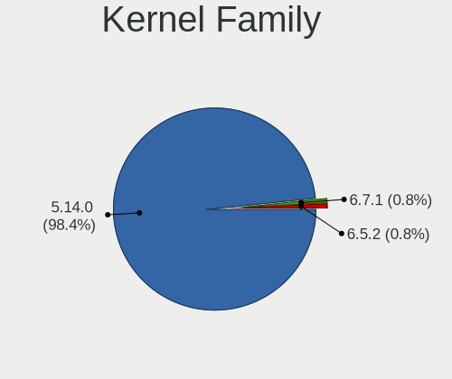

| Version | Computers | Percent |
|---------|-----------|---------|
| 5.14.0  | 68        | 100%    |

Kernel Major Ver.
-----------------

Linux kernel major version

| Version | Computers | Percent |
|---------|-----------|---------|
| 5.14    | 68        | 100%    |

Arch
----

OS architecture (x86_64, i586, etc.)

| Name    | Computers | Percent |
|---------|-----------|---------|
| x86_64  | 67        | 98.53%  |
| aarch64 | 1         | 1.47%   |

DE
--

Desktop Environment

| Name            | Computers | Percent |
|-----------------|-----------|---------|
| GNOME           | 63        | 91.3%   |
| GNOME Classic   | 2         | 2.9%    |
| XFCE            | 1         | 1.45%   |
| KDE5            | 1         | 1.45%   |
| GNOME Flashback | 1         | 1.45%   |
| Unknown         | 1         | 1.45%   |

Display Server
--------------

X11 or Wayland

| Name    | Computers | Percent |
|---------|-----------|---------|
| Wayland | 47        | 69.12%  |
| X11     | 19        | 27.94%  |
| Tty     | 2         | 2.94%   |

Display Manager
---------------

SDDM, LightDM, etc.

| Name    | Computers | Percent |
|---------|-----------|---------|
| Unknown | 40        | 58.82%  |
| GDM     | 27        | 39.71%  |
| SDDM    | 1         | 1.47%   |

OS Lang
-------

Language

| Lang  | Computers | Percent |
|-------|-----------|---------|
| en_US | 46        | 67.65%  |
| en_GB | 7         | 10.29%  |
| pt_BR | 4         | 5.88%   |
| en_IN | 3         | 4.41%   |
| en_NZ | 2         | 2.94%   |
| ru_RU | 1         | 1.47%   |
| ja_JP | 1         | 1.47%   |
| es_ES | 1         | 1.47%   |
| en_ZA | 1         | 1.47%   |
| en_CA | 1         | 1.47%   |
| cs_CZ | 1         | 1.47%   |

Boot Mode
---------

EFI or BIOS

| Mode | Computers | Percent |
|------|-----------|---------|
| EFI  | 61        | 89.71%  |
| BIOS | 7         | 10.29%  |

Filesystem
----------

Type of filesystem

| Type | Computers | Percent |
|------|-----------|---------|
| Xfs  | 66        | 97.06%  |
| Ext4 | 2         | 2.94%   |

Part. scheme
------------

Scheme of partitioning

| Type    | Computers | Percent |
|---------|-----------|---------|
| Unknown | 38        | 55.88%  |
| GPT     | 27        | 39.71%  |
| MBR     | 3         | 4.41%   |

Dual Boot with Linux/BSD
------------------------

Hosting more than one Linux/BSD

| Dual boot | Computers | Percent |
|-----------|-----------|---------|
| No        | 60        | 88.24%  |
| Yes       | 8         | 11.76%  |

Dual Boot (Win)
---------------

Hosting Linux and Windows

| Dual boot | Computers | Percent |
|-----------|-----------|---------|
| No        | 61        | 89.71%  |
| Yes       | 7         | 10.29%  |

Board
-----

Vendor
------

Motherboard manufacturer

| Name                    | Computers | Percent |
|-------------------------|-----------|---------|
| Dell                    | 13        | 19.12%  |
| Lenovo                  | 11        | 16.18%  |
| ASUSTek Computer        | 10        | 14.71%  |
| MSI                     | 8         | 11.76%  |
| Hewlett-Packard         | 7         | 10.29%  |
| Gigabyte Technology     | 5         | 7.35%   |
| Unknown                 | 3         | 4.41%   |
| Intel                   | 2         | 2.94%   |
| ASRock                  | 2         | 2.94%   |
| Acer                    | 2         | 2.94%   |
| System76                | 1         | 1.47%   |
| Samsung Electronics     | 1         | 1.47%   |
| Razer                   | 1         | 1.47%   |
| Raspberry Pi Foundation | 1         | 1.47%   |
| Hardkernel              | 1         | 1.47%   |

Model
-----

Motherboard model

| Name                                     | Computers | Percent |
|------------------------------------------|-----------|---------|
| Unknown                                  | 3         | 4.41%   |
| System76 Galago Pro                      | 1         | 1.47%   |
| Samsung 730QCJ/730QCR                    | 1         | 1.47%   |
| Razer Blade 15 Mid 2019-Base             | 1         | 1.47%   |
| RPi Raspberry Pi 4 Model B               | 1         | 1.47%   |
| MSI MS-7D54                              | 1         | 1.47%   |
| MSI MS-7D25                              | 1         | 1.47%   |
| MSI MS-7C95                              | 1         | 1.47%   |
| MSI MS-7B89                              | 1         | 1.47%   |
| MSI MS-7A71                              | 1         | 1.47%   |
| MSI Katana GF66 12UC                     | 1         | 1.47%   |
| MSI GP75 Leopard 9SD                     | 1         | 1.47%   |
| MSI GE72VR 7RF                           | 1         | 1.47%   |
| Lenovo ThinkSystem SR950 V3              | 1         | 1.47%   |
| Lenovo ThinkPad X1 Nano Gen 2 21E80012US | 1         | 1.47%   |
| Lenovo ThinkPad T490 20N3S77601          | 1         | 1.47%   |
| Lenovo ThinkPad P17 Gen 2i 20YU002KUS    | 1         | 1.47%   |
| Lenovo ThinkPad L480 20LS0015UK          | 1         | 1.47%   |
| Lenovo ThinkPad L14 Gen 3 21C2S1EE00     | 1         | 1.47%   |
| Lenovo ThinkPad Edge E431 62771L7        | 1         | 1.47%   |
| Lenovo ThinkPad E14 20RA001MMZ           | 1         | 1.47%   |
| Lenovo ThinkBook 14-IIL 20SL             | 1         | 1.47%   |
| Lenovo ThinkBook 13s-IWL 20R9            | 1         | 1.47%   |
| Lenovo IdeaPad 330S-14IKB U 81F4         | 1         | 1.47%   |
| Intel NUC12WSHi7                         | 1         | 1.47%   |
| Intel H81                                | 1         | 1.47%   |
| HP Z800 Workstation                      | 1         | 1.47%   |
| HP ProLiant ML310e Gen8                  | 1         | 1.47%   |
| HP ProBook 640 G2                        | 1         | 1.47%   |
| HP Laptop 14s-dk0xxx                     | 1         | 1.47%   |
| HP EliteBook 855 G7 Notebook PC          | 1         | 1.47%   |
| HP EliteBook 2570p                       | 1         | 1.47%   |
| HP 340S G7                               | 1         | 1.47%   |
| Hardkernel ODROID-H3                     | 1         | 1.47%   |
| Gigabyte X670E AORUS MASTER              | 1         | 1.47%   |
| Gigabyte MU72-SU0-00                     | 1         | 1.47%   |
| Gigabyte H510M H                         | 1         | 1.47%   |
| Gigabyte B550M AORUS PRO-P               | 1         | 1.47%   |
| Gigabyte AERO 15 KD                      | 1         | 1.47%   |
| Dell XPS 17 9710                         | 1         | 1.47%   |

Model Family
------------

Motherboard model prefix

| Name                 | Computers | Percent |
|----------------------|-----------|---------|
| Lenovo ThinkPad      | 7         | 10.29%  |
| Dell Precision       | 6         | 8.82%   |
| ASUS ROG             | 3         | 4.41%   |
| ASUS PRIME           | 3         | 4.41%   |
| Unknown              | 3         | 4.41%   |
| Lenovo ThinkBook     | 2         | 2.94%   |
| HP EliteBook         | 2         | 2.94%   |
| Dell Latitude        | 2         | 2.94%   |
| Dell Inspiron        | 2         | 2.94%   |
| ASUS TUF             | 2         | 2.94%   |
| Acer Aspire          | 2         | 2.94%   |
| System76 Galago      | 1         | 1.47%   |
| Samsung 730QCJ       | 1         | 1.47%   |
| Razer Blade          | 1         | 1.47%   |
| RPi Raspberry        | 1         | 1.47%   |
| MSI MS-7D54          | 1         | 1.47%   |
| MSI MS-7D25          | 1         | 1.47%   |
| MSI MS-7C95          | 1         | 1.47%   |
| MSI MS-7B89          | 1         | 1.47%   |
| MSI MS-7A71          | 1         | 1.47%   |
| MSI Katana           | 1         | 1.47%   |
| MSI GP75             | 1         | 1.47%   |
| MSI GE72VR           | 1         | 1.47%   |
| Lenovo ThinkSystem   | 1         | 1.47%   |
| Lenovo IdeaPad       | 1         | 1.47%   |
| Intel NUC12WSHi7     | 1         | 1.47%   |
| Intel H81            | 1         | 1.47%   |
| HP Z800              | 1         | 1.47%   |
| HP ProLiant          | 1         | 1.47%   |
| HP ProBook           | 1         | 1.47%   |
| HP Laptop            | 1         | 1.47%   |
| HP 340S              | 1         | 1.47%   |
| Hardkernel ODROID-H3 | 1         | 1.47%   |
| Gigabyte X670E       | 1         | 1.47%   |
| Gigabyte MU72-SU0-00 | 1         | 1.47%   |
| Gigabyte H510M       | 1         | 1.47%   |
| Gigabyte B550M       | 1         | 1.47%   |
| Gigabyte AERO        | 1         | 1.47%   |
| Dell XPS             | 1         | 1.47%   |
| Dell PowerEdge       | 1         | 1.47%   |

MFG Year
--------

Motherboard manufacture year

| Year | Computers | Percent |
|------|-----------|---------|
| 2021 | 13        | 19.12%  |
| 2019 | 11        | 16.18%  |
| 2022 | 9         | 13.24%  |
| 2020 | 8         | 11.76%  |
| 2018 | 5         | 7.35%   |
| 2017 | 5         | 7.35%   |
| 2023 | 4         | 5.88%   |
| 2016 | 3         | 4.41%   |
| 2015 | 3         | 4.41%   |
| 2014 | 2         | 2.94%   |
| 2012 | 2         | 2.94%   |
| 2010 | 2         | 2.94%   |
| 2013 | 1         | 1.47%   |

Form Factor
-----------

Physical design of the computer

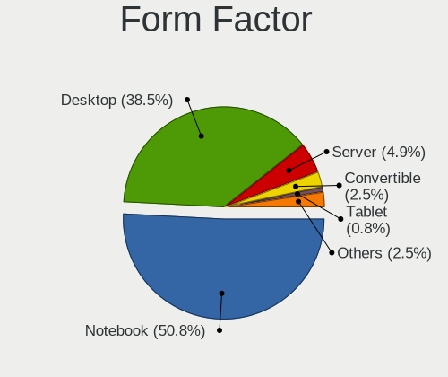

| Name           | Computers | Percent |
|----------------|-----------|---------|
| Notebook       | 35        | 51.47%  |
| Desktop        | 27        | 39.71%  |
| Server         | 3         | 4.41%   |
| System on chip | 1         | 1.47%   |
| Mini pc        | 1         | 1.47%   |
| All in one     | 1         | 1.47%   |

Secure Boot
-----------

Enabled or disabled

| State    | Computers | Percent |
|----------|-----------|---------|
| Disabled | 59        | 85.51%  |
| Enabled  | 10        | 14.49%  |

Coreboot
--------

Have coreboot on board

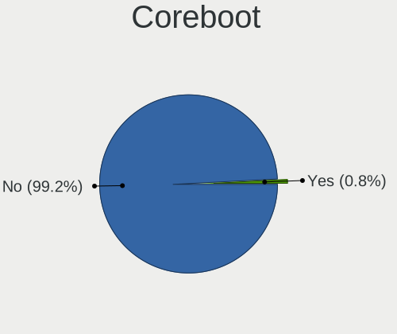

| Used | Computers | Percent |
|------|-----------|---------|
| No   | 67        | 98.53%  |
| Yes  | 1         | 1.47%   |

RAM Size
--------

Total RAM memory

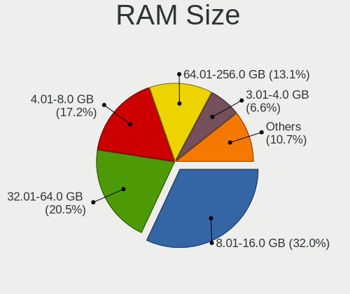

| Size in GB      | Computers | Percent |
|-----------------|-----------|---------|
| 8.01-16.0       | 25        | 36.76%  |
| 32.01-64.0      | 14        | 20.59%  |
| 4.01-8.0        | 11        | 16.18%  |
| 64.01-256.0     | 7         | 10.29%  |
| 3.01-4.0        | 5         | 7.35%   |
| 16.01-24.0      | 3         | 4.41%   |
| More than 256.0 | 2         | 2.94%   |
| 24.01-32.0      | 1         | 1.47%   |

RAM Used
--------

Used RAM memory

| Used GB    | Computers | Percent |
|------------|-----------|---------|
| 2.01-3.0   | 26        | 35.62%  |
| 4.01-8.0   | 16        | 21.92%  |
| 3.01-4.0   | 15        | 20.55%  |
| 8.01-16.0  | 9         | 12.33%  |
| 1.01-2.0   | 6         | 8.22%   |
| 32.01-64.0 | 1         | 1.37%   |

Total Drives
------------

Number of drives on board

| Drives | Computers | Percent |
|--------|-----------|---------|
| 1      | 32        | 45.71%  |
| 2      | 18        | 25.71%  |
| 3      | 10        | 14.29%  |
| 5      | 4         | 5.71%   |
| 4      | 3         | 4.29%   |
| 14     | 1         | 1.43%   |
| 6      | 1         | 1.43%   |
| 0      | 1         | 1.43%   |

Has CD-ROM
----------

Has CD-ROM on board

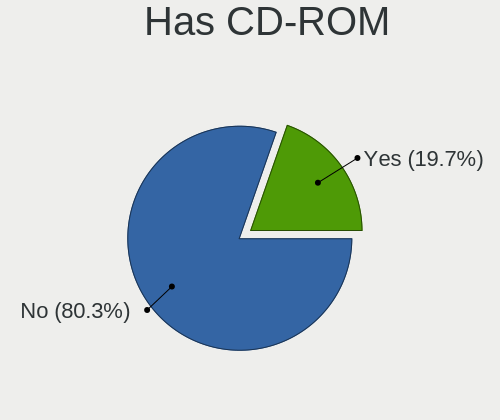

| Presented | Computers | Percent |
|-----------|-----------|---------|
| No        | 55        | 80.88%  |
| Yes       | 13        | 19.12%  |

Has Ethernet
------------

Has Ethernet on board

| Presented | Computers | Percent |
|-----------|-----------|---------|
| Yes       | 60        | 88.24%  |
| No        | 8         | 11.76%  |

Has WiFi
--------

Has WiFi module

| Presented | Computers | Percent |
|-----------|-----------|---------|
| Yes       | 53        | 76.81%  |
| No        | 16        | 23.19%  |

Has Bluetooth
-------------

Has Bluetooth module

| Presented | Computers | Percent |
|-----------|-----------|---------|
| Yes       | 45        | 64.29%  |
| No        | 25        | 35.71%  |

Location
--------

Country
-------

Geographic location (country)

| Country      | Computers | Percent |
|--------------|-----------|---------|
| USA          | 21        | 30.88%  |
| India        | 7         | 10.29%  |
| UK           | 5         | 7.35%   |
| Brazil       | 4         | 5.88%   |
| Guatemala    | 3         | 4.41%   |
| Canada       | 3         | 4.41%   |
| Turkey       | 2         | 2.94%   |
| Spain        | 2         | 2.94%   |
| New Zealand  | 2         | 2.94%   |
| Chile        | 2         | 2.94%   |
| Switzerland  | 1         | 1.47%   |
| Sri Lanka    | 1         | 1.47%   |
| South Africa | 1         | 1.47%   |
| Slovakia     | 1         | 1.47%   |
| Saint Lucia  | 1         | 1.47%   |
| Russia       | 1         | 1.47%   |
| Norway       | 1         | 1.47%   |
| Netherlands  | 1         | 1.47%   |
| Kenya        | 1         | 1.47%   |
| Jordan       | 1         | 1.47%   |
| Japan        | 1         | 1.47%   |
| Italy        | 1         | 1.47%   |
| Indonesia    | 1         | 1.47%   |
| Germany      | 1         | 1.47%   |
| Finland      | 1         | 1.47%   |
| Egypt        | 1         | 1.47%   |
| Czechia      | 1         | 1.47%   |

City
----

Geographic location (city)

| City                      | Computers | Percent |
|---------------------------|-----------|---------|
| Guatemala City            | 3         | 4.23%   |
| Wellington                | 2         | 2.82%   |
| Santiago                  | 2         | 2.82%   |
| Wildomar                  | 1         | 1.41%   |
| Whiteley                  | 1         | 1.41%   |
| Wake Forest               | 1         | 1.41%   |
| Valencia                  | 1         | 1.41%   |
| Tokyo                     | 1         | 1.41%   |
| Sutton                    | 1         | 1.41%   |
| Stratham                  | 1         | 1.41%   |
| Stavropol                 | 1         | 1.41%   |
| Skien                     | 1         | 1.41%   |
| Sao Paulo                 | 1         | 1.41%   |
| Sainte-Marie              | 1         | 1.41%   |
| Saint Paul                | 1         | 1.41%   |
| Rio de Janeiro            | 1         | 1.41%   |
| Ribeirao Preto            | 1         | 1.41%   |
| Providence                | 1         | 1.41%   |
| Prairieville              | 1         | 1.41%   |
| Piracicaba                | 1         | 1.41%   |
| Phoenix                   | 1         | 1.41%   |
| Pforzheim                 | 1         | 1.41%   |
| Parker                    | 1         | 1.41%   |
| Oldham                    | 1         | 1.41%   |
| Nuenen                    | 1         | 1.41%   |
| Newham                    | 1         | 1.41%   |
| Newcastle upon Tyne       | 1         | 1.41%   |
| New Delhi                 | 1         | 1.41%   |
| Nairobi                   | 1         | 1.41%   |
| Montgomery                | 1         | 1.41%   |
| Mohegan Lake              | 1         | 1.41%   |
| Milano                    | 1         | 1.41%   |
| Mattapoisett              | 1         | 1.41%   |
| Maltepe                   | 1         | 1.41%   |
| Liberec                   | 1         | 1.41%   |
| Lansing                   | 1         | 1.41%   |
| L'Hospitalet de Llobregat | 1         | 1.41%   |
| Kolkata                   | 1         | 1.41%   |
| Kochi                     | 1         | 1.41%   |
| Johannesburg              | 1         | 1.41%   |

Drives
------

Drive Vendor
------------

Hard drive vendors

| Vendor                      | Computers | Drives | Percent |
|-----------------------------|-----------|--------|---------|
| Samsung Electronics         | 24        | 29     | 19.83%  |
| WDC                         | 13        | 20     | 10.74%  |
| Seagate                     | 13        | 21     | 10.74%  |
| Sandisk                     | 9         | 13     | 7.44%   |
| Unknown                     | 6         | 8      | 4.96%   |
| Toshiba                     | 5         | 5      | 4.13%   |
| Micron/Crucial Technology   | 4         | 6      | 3.31%   |
| Micron Technology           | 4         | 4      | 3.31%   |
| Kingston                    | 4         | 4      | 3.31%   |
| Intel                       | 4         | 9      | 3.31%   |
| SK hynix                    | 3         | 3      | 2.48%   |
| Phison                      | 3         | 3      | 2.48%   |
| KIOXIA                      | 3         | 4      | 2.48%   |
| HGST                        | 3         | 3      | 2.48%   |
| China                       | 3         | 3      | 2.48%   |
| SABRENT                     | 2         | 2      | 1.65%   |
| Kingston Technology Company | 2         | 2      | 1.65%   |
| KingSpec                    | 2         | 2      | 1.65%   |
| Crucial                     | 2         | 3      | 1.65%   |
| ADATA Technology            | 2         | 2      | 1.65%   |
| XUM                         | 1         | 1      | 0.83%   |
| SSSTC                       | 1         | 1      | 0.83%   |
| PNY                         | 1         | 1      | 0.83%   |
| Plextor                     | 1         | 1      | 0.83%   |
| Phison Electronics          | 1         | 2      | 0.83%   |
| Hitachi                     | 1         | 1      | 0.83%   |
| Golden                      | 1         | 1      | 0.83%   |
| Gigabyte Technology         | 1         | 1      | 0.83%   |
| Fantom                      | 1         | 1      | 0.83%   |
| A-DATA Technology           | 1         | 1      | 0.83%   |

Drive Model
-----------

Hard drive models

| Model                                               | Computers | Percent |
|-----------------------------------------------------|-----------|---------|
| Samsung NVMe SSD Controller SM981/PM981/PM983 250GB | 4         | 2.88%   |
| Samsung NVMe SSD Controller PM9A1/PM9A3/980PRO 2TB  | 4         | 2.88%   |
| Micron/Crucial P2 NVMe PCIe SSD 1TB                 | 3         | 2.16%   |
| Unknown MMC Card  256GB                             | 2         | 1.44%   |
| Seagate ST1000DM010-2EP102 1TB                      | 2         | 1.44%   |
| Sandisk WD Blue SN570 500GB                         | 2         | 1.44%   |
| Sandisk WD Blue SN500 / PC SN520 NVMe SSD 500GB     | 2         | 1.44%   |
| Sandisk WD Black SN750 / PC SN730 NVMe SSD 500GB    | 2         | 1.44%   |
| Samsung SSD 870 EVO 1TB                             | 2         | 1.44%   |
| SABRENT Disk 500GB                                  | 2         | 1.44%   |
| KIOXIA KBG5AZNT1T02 LA 1TB                          | 2         | 1.44%   |
| Kingston Company SNV2S250G 250GB                    | 2         | 1.44%   |
| Intel SSD 660P Series 512GB                         | 2         | 1.44%   |
| HGST HTS721010A9E630 1TB                            | 2         | 1.44%   |
| XUM HX256GSSDSATA3 256GB                            | 1         | 0.72%   |
| WDC WDS240G2G0A-00JH30 240GB SSD                    | 1         | 0.72%   |
| WDC WDBA3V5000ANC-WRSN 500GB                        | 1         | 0.72%   |
| WDC WD80EFAX-68KNBN0 8TB                            | 1         | 0.72%   |
| WDC WD5000AVDS-63U7B0 500GB                         | 1         | 0.72%   |
| WDC WD5000AVCS-632DY1 500GB                         | 1         | 0.72%   |
| WDC WD50 00LPVX-22V0TT0 500GB                       | 1         | 0.72%   |
| WDC WD40EFRX-68N32N0 4TB                            | 1         | 0.72%   |
| WDC WD20EZRZ-00Z5HB0 2TB                            | 1         | 0.72%   |
| WDC WD20EZRX-00D8PB0 2TB                            | 1         | 0.72%   |
| WDC WD20EARX-008FB0 2TB                             | 1         | 0.72%   |
| WDC WD141KFGX-68FH9N0 14TB                          | 1         | 0.72%   |
| WDC WD140EFGX-68B0GN0 14TB                          | 1         | 0.72%   |
| WDC WD10SPZX-60Z10T0 1TB                            | 1         | 0.72%   |
| WDC WD10SPZX-21Z10T0 1TB                            | 1         | 0.72%   |
| WDC WD10SPSX-00A6WT0 1TB                            | 1         | 0.72%   |
| WDC WD10JPLX-00MBPT0 1TB                            | 1         | 0.72%   |
| WDC WD10JPCX-24UE4T0 1TB                            | 1         | 0.72%   |
| WDC WD10EZEX-00BBHA0 1TB                            | 1         | 0.72%   |
| WDC WD100EFAX-68LHPN0 10TB                          | 1         | 0.72%   |
| Unknown SDU1  64GB                                  | 1         | 0.72%   |
| Unknown SD/MMC/MS PRO 128GB                         | 1         | 0.72%   |
| Unknown SD/MMC/M.S.PRO 32GB                         | 1         | 0.72%   |
| Unknown SD/MMC 2GB                                  | 1         | 0.72%   |
| Unknown MMC Card  512GB                             | 1         | 0.72%   |
| Unknown M.S./M.S.Pro/HG 16GB                        | 1         | 0.72%   |

HDD Vendor
----------

Hard disk drive vendors

| Vendor  | Computers | Drives | Percent |
|---------|-----------|--------|---------|
| Seagate | 13        | 21     | 37.14%  |
| WDC     | 11        | 18     | 31.43%  |
| Toshiba | 5         | 5      | 14.29%  |
| HGST    | 3         | 3      | 8.57%   |
| Unknown | 1         | 1      | 2.86%   |
| Hitachi | 1         | 1      | 2.86%   |
| Fantom  | 1         | 1      | 2.86%   |

SSD Vendor
----------

Solid state drive vendors

| Vendor              | Computers | Drives | Percent |
|---------------------|-----------|--------|---------|
| Samsung Electronics | 10        | 11     | 34.48%  |
| China               | 3         | 3      | 10.34%  |
| SanDisk             | 2         | 2      | 6.9%    |
| Kingston            | 2         | 2      | 6.9%    |
| KingSpec            | 2         | 2      | 6.9%    |
| Intel               | 2         | 4      | 6.9%    |
| Crucial             | 2         | 2      | 6.9%    |
| XUM                 | 1         | 1      | 3.45%   |
| WDC                 | 1         | 1      | 3.45%   |
| SK hynix            | 1         | 1      | 3.45%   |
| PNY                 | 1         | 1      | 3.45%   |
| Plextor             | 1         | 1      | 3.45%   |
| Gigabyte Technology | 1         | 1      | 3.45%   |

Drive Kind
----------

HDD or SSD

| Kind    | Computers | Drives | Percent |
|---------|-----------|--------|---------|
| NVMe    | 48        | 67     | 44.44%  |
| HDD     | 28        | 50     | 25.93%  |
| SSD     | 26        | 32     | 24.07%  |
| MMC     | 4         | 4      | 3.7%    |
| Unknown | 2         | 4      | 1.85%   |

Drive Connector
---------------

SATA, SAS, NVMe, etc.

| Type | Computers | Drives | Percent |
|------|-----------|--------|---------|
| NVMe | 48        | 65     | 48.48%  |
| SATA | 41        | 78     | 41.41%  |
| SAS  | 6         | 10     | 6.06%   |
| MMC  | 4         | 4      | 4.04%   |

Drive Size
----------

Size of hard drive

| Size in TB | Computers | Drives | Percent |
|------------|-----------|--------|---------|
| 0.01-0.5   | 23        | 32     | 41.07%  |
| 0.51-1.0   | 18        | 24     | 32.14%  |
| 1.01-2.0   | 5         | 6      | 8.93%   |
| 3.01-4.0   | 3         | 7      | 5.36%   |
| 4.01-10.0  | 3         | 6      | 5.36%   |
| 2.01-3.0   | 2         | 3      | 3.57%   |
| 10.01-20.0 | 2         | 4      | 3.57%   |

Space Total
-----------

Amount of disk space available on the file system

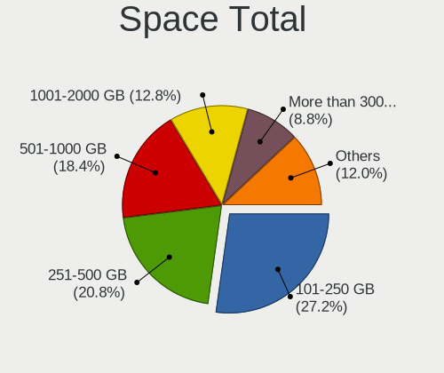

| Size in GB     | Computers | Percent |
|----------------|-----------|---------|
| 101-250        | 24        | 34.29%  |
| 251-500        | 16        | 22.86%  |
| 1001-2000      | 10        | 14.29%  |
| 501-1000       | 10        | 14.29%  |
| More than 3000 | 4         | 5.71%   |
| 51-100         | 3         | 4.29%   |
| 21-50          | 2         | 2.86%   |
| Unknown        | 1         | 1.43%   |

Space Used
----------

Amount of used disk space

| Used GB        | Computers | Percent |
|----------------|-----------|---------|
| 1-20           | 27        | 38.57%  |
| 21-50          | 19        | 27.14%  |
| 51-100         | 10        | 14.29%  |
| 251-500        | 5         | 7.14%   |
| 101-250        | 3         | 4.29%   |
| More than 3000 | 2         | 2.86%   |
| 1001-2000      | 2         | 2.86%   |
| 2001-3000      | 1         | 1.43%   |
| Unknown        | 1         | 1.43%   |

Malfunc. Drives
---------------

Drive models with a malfunction

| Model                                          | Computers | Drives | Percent |
|------------------------------------------------|-----------|--------|---------|
| WDC WD50 00LPVX-22V0TT0 500GB                  | 1         | 1      | 16.67%  |
| Seagate ST500LT012-9WS142 500GB                | 1         | 1      | 16.67%  |
| Seagate ST1000DM010-2EP102 1TB                 | 1         | 1      | 16.67%  |
| Micron/Crucial Technology P1 NVMe PCIe SSD 1TB | 1         | 1      | 16.67%  |
| Intel SSDSC2BA800G4R 800GB                     | 1         | 2      | 16.67%  |
| Crucial CT1000BX500SSD1 1TB                    | 1         | 1      | 16.67%  |

Malfunc. Drive Vendor
---------------------

Vendors of faulty drives

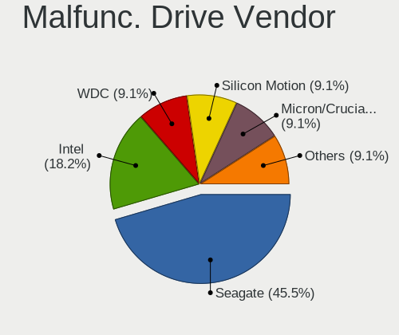

| Vendor                    | Computers | Drives | Percent |
|---------------------------|-----------|--------|---------|
| Seagate                   | 2         | 2      | 33.33%  |
| WDC                       | 1         | 1      | 16.67%  |
| Micron/Crucial Technology | 1         | 1      | 16.67%  |
| Intel                     | 1         | 2      | 16.67%  |
| Crucial                   | 1         | 1      | 16.67%  |

Malfunc. HDD Vendor
-------------------

Vendors of faulty HDD drives

| Vendor  | Computers | Drives | Percent |
|---------|-----------|--------|---------|
| Seagate | 2         | 2      | 66.67%  |
| WDC     | 1         | 1      | 33.33%  |

Malfunc. Drive Kind
-------------------

Kinds of faulty drives

| Kind | Computers | Drives | Percent |
|------|-----------|--------|---------|
| SSD  | 2         | 3      | 40%     |
| HDD  | 2         | 3      | 40%     |
| NVMe | 1         | 1      | 20%     |

Failed Drives
-------------

Failed drive models

Zero info for selected period =(

Failed Drive Vendor
-------------------

Failed drive vendors

Zero info for selected period =(

Drive Status
------------

Number of failed and malfunc. drives

| Status   | Computers | Drives | Percent |
|----------|-----------|--------|---------|
| Detected | 44        | 96     | 59.46%  |
| Works    | 25        | 54     | 33.78%  |
| Malfunc  | 5         | 7      | 6.76%   |

Storage controller
------------------

Storage Vendor
--------------

Storage controller vendors

| Vendor                      | Computers | Percent |
|-----------------------------|-----------|---------|
| Intel                       | 49        | 44.14%  |
| Samsung Electronics         | 15        | 13.51%  |
| AMD                         | 10        | 9.01%   |
| SanDisk                     | 8         | 7.21%   |
| Micron/Crucial Technology   | 5         | 4.5%    |
| Phison Electronics          | 4         | 3.6%    |
| Micron Technology           | 4         | 3.6%    |
| Kingston Technology Company | 4         | 3.6%    |
| KIOXIA                      | 3         | 2.7%    |
| ADATA Technology            | 3         | 2.7%    |
| SK hynix                    | 2         | 1.8%    |
| Broadcom / LSI              | 2         | 1.8%    |
| ASMedia Technology          | 2         | 1.8%    |

Storage Model
-------------

Storage controller models

| Model                                                                         | Computers | Percent |
|-------------------------------------------------------------------------------|-----------|---------|
| AMD FCH SATA Controller [AHCI mode]                                           | 7         | 5.65%   |
| Samsung NVMe SSD Controller SM981/PM981/PM983                                 | 6         | 4.84%   |
| Samsung NVMe SSD Controller PM9A1/PM9A3/980PRO                                | 5         | 4.03%   |
| Intel Sunrise Point-LP SATA Controller [AHCI mode]                            | 5         | 4.03%   |
| Intel Volume Management Device NVMe RAID Controller                           | 4         | 3.23%   |
| Samsung NVMe SSD Controller 980 (DRAM-less)                                   | 3         | 2.42%   |
| Micron/Crucial P2 [Nick P2] / P3 / P3 Plus NVMe PCIe SSD (DRAM-less)          | 3         | 2.42%   |
| Intel SSD 660P Series                                                         | 3         | 2.42%   |
| Intel SATA Controller [RAID mode]                                             | 3         | 2.42%   |
| Intel Comet Lake SATA AHCI Controller                                         | 3         | 2.42%   |
| Intel Alder Lake-S PCH SATA Controller [AHCI Mode]                            | 3         | 2.42%   |
| Intel 82801 Mobile SATA Controller [RAID mode]                                | 3         | 2.42%   |
| SK hynix Gold P31/BC711/PC711 NVMe Solid State Drive                          | 2         | 1.61%   |
| SanDisk WD PC SN810 / Black SN850 NVMe SSD                                    | 2         | 1.61%   |
| SanDisk WD Blue SN500 / PC SN520 x2 M.2 2280 NVMe SSD                         | 2         | 1.61%   |
| SanDisk Ultra 3D / WD Blue SN570 NVMe SSD (DRAM-less)                         | 2         | 1.61%   |
| SanDisk Extreme Pro / WD Black SN750 / PC SN730 / Red SN700 NVMe SSD          | 2         | 1.61%   |
| Phison E16 PCIe4 NVMe Controller                                              | 2         | 1.61%   |
| Phison E12 NVMe Controller                                                    | 2         | 1.61%   |
| KIOXIA NVMe SSD Controller BG5 (DRAM-less)                                    | 2         | 1.61%   |
| Kingston Company NV2 NVMe SSD E21T                                            | 2         | 1.61%   |
| Intel Volume Management Device NVMe RAID Controller Intel Corporation         | 2         | 1.61%   |
| Intel Q170/Q150/B150/H170/H110/Z170/CM236 Chipset SATA Controller [AHCI Mode] | 2         | 1.61%   |
| Intel Jasper Lake SATA AHCI Controller                                        | 2         | 1.61%   |
| Intel Cannon Lake Mobile PCH SATA AHCI Controller                             | 2         | 1.61%   |
| Intel C620 Series Chipset Family SSATA Controller [AHCI mode]                 | 2         | 1.61%   |
| Intel C600/X79 series chipset SATA RAID Controller                            | 2         | 1.61%   |
| Intel Alder Lake-P SATA AHCI Controller                                       | 2         | 1.61%   |
| Intel 7 Series Chipset Family 6-port SATA Controller [AHCI mode]              | 2         | 1.61%   |
| Intel 6 Series/C200 Series Chipset Family 6 port Desktop SATA AHCI Controller | 2         | 1.61%   |
| Intel 500 Series Chipset Family SATA AHCI Controller                          | 2         | 1.61%   |
| Intel 200 Series PCH SATA controller [AHCI mode]                              | 2         | 1.61%   |
| ASMedia ASM1062 Serial ATA Controller                                         | 2         | 1.61%   |
| AMD 500 Series Chipset SATA Controller                                        | 2         | 1.61%   |
| SanDisk WD Black SN770 / PC SN740 256GB / PC SN560 (DRAM-less) NVMe SSD       | 1         | 0.81%   |
| SanDisk Ultra 3D / WD Blue SN550 NVMe SSD                                     | 1         | 0.81%   |
| Samsung NVMe SSD Controller S4LV008[Pascal]                                   | 1         | 0.81%   |
| Phison E7 NVMe Controller                                                     | 1         | 0.81%   |
| Micron/Crucial P5 Plus NVMe PCIe SSD                                          | 1         | 0.81%   |
| Micron/Crucial P1 NVMe PCIe SSD[Frampton]                                     | 1         | 0.81%   |

Storage Kind
------------

Kind of storage controller (IDE, SATA, NVMe, SAS, ...)

| Kind | Computers | Percent |
|------|-----------|---------|
| NVMe | 47        | 42.34%  |
| SATA | 47        | 42.34%  |
| RAID | 15        | 13.51%  |
| SAS  | 1         | 0.9%    |
| IDE  | 1         | 0.9%    |

Processor
---------

CPU Vendor
----------

Processor vendors

| Vendor | Computers | Percent |
|--------|-----------|---------|
| Intel  | 56        | 82.35%  |
| AMD    | 11        | 16.18%  |
| ARM    | 1         | 1.47%   |

CPU Model
---------

Processor models

| Model                                   | Computers | Percent |
|-----------------------------------------|-----------|---------|
| Intel Core i5-8250U CPU @ 1.60GHz       | 3         | 4.41%   |
| Intel Core i5-10210U CPU @ 1.60GHz      | 3         | 4.41%   |
| Intel Core i7-9750H CPU @ 2.60GHz       | 2         | 2.94%   |
| Intel Core i7-6820HQ CPU @ 2.70GHz      | 2         | 2.94%   |
| Intel Core i5-1035G1 CPU @ 1.00GHz      | 2         | 2.94%   |
| Intel 12th Gen Core i9-12900K           | 2         | 2.94%   |
| Intel 12th Gen Core i7-12700H           | 2         | 2.94%   |
| Intel 12th Gen Core i7-1260P            | 2         | 2.94%   |
| Intel 11th Gen Core i7-11700K @ 3.60GHz | 2         | 2.94%   |
| AMD Ryzen 5 3600 6-Core Processor       | 2         | 2.94%   |
| Intel Xeon W-11855M CPU @ 3.20GHz       | 1         | 1.47%   |
| Intel Xeon Silver 4310 CPU @ 2.10GHz    | 1         | 1.47%   |
| Intel Xeon Platinum 8468H               | 1         | 1.47%   |
| Intel Xeon Platinum 8168 CPU @ 2.70GHz  | 1         | 1.47%   |
| Intel Xeon CPU X5570 @ 2.93GHz          | 1         | 1.47%   |
| Intel Xeon CPU E5-1607 v4 @ 3.10GHz     | 1         | 1.47%   |
| Intel Xeon CPU E3-1225 v5 @ 3.30GHz     | 1         | 1.47%   |
| Intel Pentium Silver N6005 @ 2.00GHz    | 1         | 1.47%   |
| Intel Core i9-8950HK CPU @ 2.90GHz      | 1         | 1.47%   |
| Intel Core i7-8700K CPU @ 3.70GHz       | 1         | 1.47%   |
| Intel Core i7-8665U CPU @ 1.90GHz       | 1         | 1.47%   |
| Intel Core i7-7700K CPU @ 4.20GHz       | 1         | 1.47%   |
| Intel Core i7-7700HQ CPU @ 2.80GHz      | 1         | 1.47%   |
| Intel Core i7-6600U CPU @ 2.60GHz       | 1         | 1.47%   |
| Intel Core i7-5600U CPU @ 2.60GHz       | 1         | 1.47%   |
| Intel Core i7-10510U CPU @ 1.80GHz      | 1         | 1.47%   |
| Intel Core i5-8265U CPU @ 1.60GHz       | 1         | 1.47%   |
| Intel Core i5-6200U CPU @ 2.30GHz       | 1         | 1.47%   |
| Intel Core i5-3570 CPU @ 3.40GHz        | 1         | 1.47%   |
| Intel Core i5-3470S CPU @ 2.90GHz       | 1         | 1.47%   |
| Intel Core i5-3360M CPU @ 2.80GHz       | 1         | 1.47%   |
| Intel Core i5-3320M CPU @ 2.60GHz       | 1         | 1.47%   |
| Intel Core i3-4130 CPU @ 3.40GHz        | 1         | 1.47%   |
| Intel Core i3-4005U CPU @ 1.70GHz       | 1         | 1.47%   |
| Intel Core i3-3220 CPU @ 3.30GHz        | 1         | 1.47%   |
| Intel Core i3 CPU M 380 @ 2.53GHz       | 1         | 1.47%   |
| Intel Celeron N5105 @ 2.00GHz           | 1         | 1.47%   |
| Intel Celeron N4020 CPU @ 1.10GHz       | 1         | 1.47%   |
| Intel 13th Gen Core i9-13900K           | 1         | 1.47%   |
| Intel 13th Gen Core i5-13600K           | 1         | 1.47%   |

CPU Model Family
----------------

Processor model prefix

| Model                | Computers | Percent |
|----------------------|-----------|---------|
| Other                | 17        | 25%     |
| Intel Core i5        | 14        | 20.59%  |
| Intel Core i7        | 11        | 16.18%  |
| Intel Xeon           | 4         | 5.88%   |
| Intel Core i3        | 4         | 5.88%   |
| AMD Ryzen 9          | 4         | 5.88%   |
| AMD Ryzen 5          | 4         | 5.88%   |
| Intel Xeon Platinum  | 2         | 2.94%   |
| Intel Celeron        | 2         | 2.94%   |
| Intel Xeon Silver    | 1         | 1.47%   |
| Intel Pentium Silver | 1         | 1.47%   |
| Intel Core i9        | 1         | 1.47%   |
| AMD Ryzen 7 PRO      | 1         | 1.47%   |
| AMD Athlon X4        | 1         | 1.47%   |
| AMD A4               | 1         | 1.47%   |

CPU Cores
---------

Number of processor cores

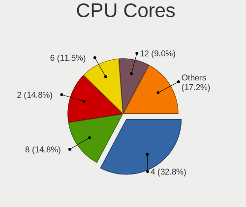

| Number | Computers | Percent |
|--------|-----------|---------|
| 4      | 23        | 33.82%  |
| 2      | 11        | 16.18%  |
| 8      | 9         | 13.24%  |
| 6      | 8         | 11.76%  |
| 12     | 6         | 8.82%   |
| 14     | 3         | 4.41%   |
| 16     | 2         | 2.94%   |
| 10     | 2         | 2.94%   |
| 384    | 1         | 1.47%   |
| 48     | 1         | 1.47%   |
| 24     | 1         | 1.47%   |
| 1      | 1         | 1.47%   |

CPU Sockets
-----------

Number of sockets

| Number | Computers | Percent |
|--------|-----------|---------|
| 1      | 65        | 95.59%  |
| 2      | 2         | 2.94%   |
| 8      | 1         | 1.47%   |

CPU Threads
-----------

Threads per core (Hyper-Threading)

| Number | Computers | Percent |
|--------|-----------|---------|
| 2      | 57        | 83.82%  |
| 1      | 11        | 16.18%  |

CPU Op-Modes
------------

CPU Operation Modes (32-bit, 64-bit)

| Op mode        | Computers | Percent |
|----------------|-----------|---------|
| 32-bit, 64-bit | 68        | 100%    |

CPU Microcode
-------------

Microcode number

| Number     | Computers | Percent |
|------------|-----------|---------|
| 0x806ec    | 6         | 8.82%   |
| 0x306a9    | 5         | 7.35%   |
| Unknown    | 5         | 7.35%   |
| 0x906a3    | 4         | 5.88%   |
| 0x806d1    | 4         | 5.88%   |
| 0xa0671    | 3         | 4.41%   |
| 0x506e3    | 3         | 4.41%   |
| 0x08701021 | 3         | 4.41%   |
| 0x906ea    | 2         | 2.94%   |
| 0x906e9    | 2         | 2.94%   |
| 0x906c0    | 2         | 2.94%   |
| 0x90672    | 2         | 2.94%   |
| 0x806ea    | 2         | 2.94%   |
| 0x706e5    | 2         | 2.94%   |
| 0x406e3    | 2         | 2.94%   |
| 0x0a20120a | 2         | 2.94%   |
| 0xb0671    | 1         | 1.47%   |
| 0x906ed    | 1         | 1.47%   |
| 0x906a4    | 1         | 1.47%   |
| 0x806f6    | 1         | 1.47%   |
| 0x706a8    | 1         | 1.47%   |
| 0x606a6    | 1         | 1.47%   |
| 0x50654    | 1         | 1.47%   |
| 0x406f1    | 1         | 1.47%   |
| 0x40651    | 1         | 1.47%   |
| 0x306d4    | 1         | 1.47%   |
| 0x306c3    | 1         | 1.47%   |
| 0x20655    | 1         | 1.47%   |
| 0x106a5    | 1         | 1.47%   |
| 0x0a601203 | 1         | 1.47%   |
| 0x0a50000c | 1         | 1.47%   |
| 0x08600106 | 1         | 1.47%   |
| 0x08108109 | 1         | 1.47%   |
| 0x06006705 | 1         | 1.47%   |
| 0x0600611a | 1         | 1.47%   |

CPU Microarch
-------------

Microarchitecture

| Name             | Computers | Percent |
|------------------|-----------|---------|
| KabyLake         | 15        | 22.06%  |
| Icelake          | 10        | 14.71%  |
| Alderlake Hybrid | 10        | 14.71%  |
| Skylake          | 6         | 8.82%   |
| IvyBridge        | 5         | 7.35%   |
| Zen 2            | 4         | 5.88%   |
| Zen 3            | 3         | 4.41%   |
| Tremont          | 2         | 2.94%   |
| Haswell          | 2         | 2.94%   |
| Excavator        | 2         | 2.94%   |
| Broadwell        | 2         | 2.94%   |
| Unknown          | 2         | 2.94%   |
| Zen+             | 1         | 1.47%   |
| Westmere         | 1         | 1.47%   |
| Sapphire Rapids  | 1         | 1.47%   |
| Nehalem          | 1         | 1.47%   |
| Goldmont plus    | 1         | 1.47%   |

Graphics
--------

GPU Vendor
----------

Vendors of graphics cards

| Vendor                     | Computers | Percent |
|----------------------------|-----------|---------|
| Intel                      | 41        | 50.62%  |
| Nvidia                     | 24        | 29.63%  |
| AMD                        | 13        | 16.05%  |
| ASPEED Technology          | 2         | 2.47%   |
| Matrox Electronics Systems | 1         | 1.23%   |

GPU Model
---------

Graphics card models

| Model                                                            | Computers | Percent |
|------------------------------------------------------------------|-----------|---------|
| Intel CometLake-U GT2 [UHD Graphics]                             | 4         | 4.82%   |
| Intel Alder Lake-P GT2 [Iris Xe Graphics]                        | 4         | 4.82%   |
| Nvidia GA106M [GeForce RTX 3060 Mobile / Max-Q]                  | 3         | 3.61%   |
| Intel UHD Graphics 620                                           | 3         | 3.61%   |
| Intel CoffeeLake-H GT2 [UHD Graphics 630]                        | 3         | 3.61%   |
| Nvidia TU117GL [T400 4GB]                                        | 2         | 2.41%   |
| Nvidia TU116M [GeForce GTX 1660 Ti Mobile]                       | 2         | 2.41%   |
| Intel WhiskeyLake-U GT2 [UHD Graphics 620]                       | 2         | 2.41%   |
| Intel TigerLake-H GT1 [UHD Graphics]                             | 2         | 2.41%   |
| Intel Skylake GT2 [HD Graphics 520]                              | 2         | 2.41%   |
| Intel RocketLake-S GT1 [UHD Graphics 750]                        | 2         | 2.41%   |
| Intel JasperLake [UHD Graphics]                                  | 2         | 2.41%   |
| Intel Iris Plus Graphics G1 (Ice Lake)                           | 2         | 2.41%   |
| Intel HD Graphics 630                                            | 2         | 2.41%   |
| Intel AlderLake-S GT1                                            | 2         | 2.41%   |
| Intel 3rd Gen Core processor Graphics Controller                 | 2         | 2.41%   |
| ASPEED Technology ASPEED Graphics Family                         | 2         | 2.41%   |
| AMD Navi 14 [Radeon RX 5500/5500M / Pro 5500M]                   | 2         | 2.41%   |
| AMD Ellesmere [Radeon RX 470/480/570/570X/580/580X/590]          | 2         | 2.41%   |
| Nvidia TU117GLM [T1200 Laptop GPU]                               | 1         | 1.2%    |
| Nvidia GT218 [GeForce G210]                                      | 1         | 1.2%    |
| Nvidia GP106M [GeForce GTX 1060 Mobile]                          | 1         | 1.2%    |
| Nvidia GP104GLM [Quadro P3000 Mobile]                            | 1         | 1.2%    |
| Nvidia GP104GL [Quadro P4000]                                    | 1         | 1.2%    |
| Nvidia GP104 [GeForce GTX 1070]                                  | 1         | 1.2%    |
| Nvidia GP104 [GeForce GTX 1070 Ti]                               | 1         | 1.2%    |
| Nvidia GP102 [GeForce GTX 1080 Ti]                               | 1         | 1.2%    |
| Nvidia GM206GL [Quadro M2000]                                    | 1         | 1.2%    |
| Nvidia GK208B [GeForce GT 730]                                   | 1         | 1.2%    |
| Nvidia GK106 [GeForce GTX 660]                                   | 1         | 1.2%    |
| Nvidia GA107M [GeForce RTX 3050 Mobile]                          | 1         | 1.2%    |
| Nvidia GA106 [Geforce RTX 3050]                                  | 1         | 1.2%    |
| Nvidia GA104GLM [RTX A5000 Mobile]                               | 1         | 1.2%    |
| Nvidia GA102 [GeForce RTX 3090]                                  | 1         | 1.2%    |
| Nvidia GA102 [GeForce RTX 3090 Ti]                               | 1         | 1.2%    |
| Nvidia G92 [GeForce 9800 GT]                                     | 1         | 1.2%    |
| Nvidia AD102 [GeForce RTX 4090]                                  | 1         | 1.2%    |
| Matrox Electronics Systems MGA G200EH                            | 1         | 1.2%    |
| Intel Xeon E3-1200 v2/3rd Gen Core processor Graphics Controller | 1         | 1.2%    |
| Intel HD Graphics P530                                           | 1         | 1.2%    |

GPU Combo
---------

Combinations of graphics cards

| Name           | Computers | Percent |
|----------------|-----------|---------|
| 1 x Intel      | 28        | 41.18%  |
| 1 x Nvidia     | 15        | 22.06%  |
| Intel + Nvidia | 8         | 11.76%  |
| 1 x AMD        | 8         | 11.76%  |
| Intel + AMD    | 3         | 4.41%   |
| Other          | 1         | 1.47%   |
| 2 x Nvidia     | 1         | 1.47%   |
| 2 x AMD        | 1         | 1.47%   |
| 1 x Matrox     | 1         | 1.47%   |
| 1 x ASPEED     | 1         | 1.47%   |
| AMD + ASPEED   | 1         | 1.47%   |

GPU Driver
----------

Free vs proprietary

| Driver      | Computers | Percent |
|-------------|-----------|---------|
| Free        | 55        | 80.88%  |
| Proprietary | 10        | 14.71%  |
| Unknown     | 3         | 4.41%   |

GPU Memory
----------

Total video memory

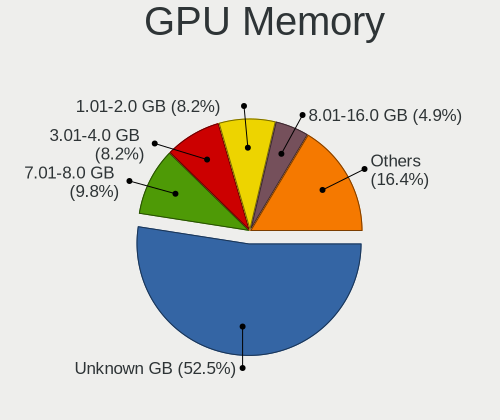

| Size in GB | Computers | Percent |
|------------|-----------|---------|
| Unknown    | 33        | 48.53%  |
| 7.01-8.0   | 7         | 10.29%  |
| 3.01-4.0   | 6         | 8.82%   |
| 1.01-2.0   | 6         | 8.82%   |
| 5.01-6.0   | 5         | 7.35%   |
| 16.01-24.0 | 3         | 4.41%   |
| 8.01-16.0  | 3         | 4.41%   |
| 0.01-0.5   | 3         | 4.41%   |
| 2.01-3.0   | 1         | 1.47%   |
| 0.51-1.0   | 1         | 1.47%   |

Monitor
-------

Monitor Vendor
--------------

Monitor vendors

| Vendor               | Computers | Percent |
|----------------------|-----------|---------|
| Samsung Electronics  | 10        | 12.99%  |
| BOE                  | 10        | 12.99%  |
| Dell                 | 8         | 10.39%  |
| LG Display           | 6         | 7.79%   |
| Chimei Innolux       | 6         | 7.79%   |
| AU Optronics         | 4         | 5.19%   |
| Acer                 | 4         | 5.19%   |
| Goldstar             | 3         | 3.9%    |
| AOC                  | 3         | 3.9%    |
| Sharp                | 2         | 2.6%    |
| Lenovo               | 2         | 2.6%    |
| Hewlett-Packard      | 2         | 2.6%    |
| Unknown              | 2         | 2.6%    |
| Vizio                | 1         | 1.3%    |
| Unknown              | 1         | 1.3%    |
| STD                  | 1         | 1.3%    |
| Sony                 | 1         | 1.3%    |
| Philips              | 1         | 1.3%    |
| Panasonic            | 1         | 1.3%    |
| OUT                  | 1         | 1.3%    |
| InfoVision           | 1         | 1.3%    |
| Haier                | 1         | 1.3%    |
| Gigabyte Technology  | 1         | 1.3%    |
| Deco Gear            | 1         | 1.3%    |
| CSO                  | 1         | 1.3%    |
| BOE Technology Group | 1         | 1.3%    |
| BenQ                 | 1         | 1.3%    |
| ASUSTek Computer     | 1         | 1.3%    |

Monitor Model
-------------

Monitor models

| Model                                                                   | Computers | Percent |
|-------------------------------------------------------------------------|-----------|---------|
| Acer ED322QR ACR06DD 1920x1080 700x390mm 31.5-inch                      | 2         | 2.5%    |
| Unknown                                                                 | 2         | 2.5%    |
| Vizio E480i-C2 VIZ1004 1920x1080 477x268mm 21.5-inch                    | 1         | 1.25%   |
| Unknown LCD Monitor SAMSUNG                                             | 1         | 1.25%   |
| STD HDMI STD0110 1440x900 420x240mm 19.0-inch                           | 1         | 1.25%   |
| Sony TV SNYD703 1360x768                                                | 1         | 1.25%   |
| Sharp LCD Monitor SHP1518 1920x1200 366x229mm 17.0-inch                 | 1         | 1.25%   |
| Sharp LCD Monitor SHP1430 3840x2160 350x190mm 15.7-inch                 | 1         | 1.25%   |
| Samsung Electronics SyncMaster SAM0526 1920x1080 510x287mm 23.0-inch    | 1         | 1.25%   |
| Samsung Electronics SyncMaster SAM0370 1680x1050 459x296mm 21.5-inch    | 1         | 1.25%   |
| Samsung Electronics SyncMaster SAM020D 1280x1024 338x270mm 17.0-inch    | 1         | 1.25%   |
| Samsung Electronics SMS23A550H SAM07CA 1920x1080 509x286mm 23.0-inch    | 1         | 1.25%   |
| Samsung Electronics S27C500 SAM0AF2 1920x1080 598x336mm 27.0-inch       | 1         | 1.25%   |
| Samsung Electronics S24E450 SAM0C9B 1920x1080 521x293mm 23.5-inch       | 1         | 1.25%   |
| Samsung Electronics LCD Monitor SEC4149 1366x768 292x174mm 13.4-inch    | 1         | 1.25%   |
| Samsung Electronics LCD Monitor SDC4143 3840x2160 344x194mm 15.5-inch   | 1         | 1.25%   |
| Samsung Electronics LCD Monitor SAM7103 3840x2160 700x390mm 31.5-inch   | 1         | 1.25%   |
| Samsung Electronics LCD Monitor SAM7016 3840x2160 1872x1053mm 84.6-inch | 1         | 1.25%   |
| Samsung Electronics LCD Monitor SAM0C04 3840x2160 1420x800mm 64.2-inch  | 1         | 1.25%   |
| Samsung Electronics LCD Monitor S34J55x 7280x2160                       | 1         | 1.25%   |
| Philips PHL 322E1 PHLC20F 1920x1080 698x393mm 31.5-inch                 | 1         | 1.25%   |
| Panasonic TV MEIA296 1920x1080 698x392mm 31.5-inch                      | 1         | 1.25%   |
| OUT Analog OUT0096 1280x800 341x256mm 16.8-inch                         | 1         | 1.25%   |
| LG Display LCD Monitor LGD0625 1920x1080 344x194mm 15.5-inch            | 1         | 1.25%   |
| LG Display LCD Monitor LGD0613 1920x1080 309x174mm 14.0-inch            | 1         | 1.25%   |
| LG Display LCD Monitor LGD05EC 1920x1080 309x174mm 14.0-inch            | 1         | 1.25%   |
| LG Display LCD Monitor LGD0540 1920x1080 344x194mm 15.5-inch            | 1         | 1.25%   |
| LG Display LCD Monitor LGD0486 1920x1080 309x174mm 14.0-inch            | 1         | 1.25%   |
| LG Display LCD Monitor LGD0266 1366x768 344x194mm 15.5-inch             | 1         | 1.25%   |
| Lenovo LEN P24h-20 LEN61F4 2560x1440 527x296mm 23.8-inch                | 1         | 1.25%   |
| Lenovo LEN LT2452pwC LEN1144 1920x1200 518x324mm 24.1-inch              | 1         | 1.25%   |
| Lenovo LEN LT2323pwA LEN0BD0 1920x1080 510x290mm 23.1-inch              | 1         | 1.25%   |
| InfoVision LCD Monitor IVO057D 1920x1080 309x174mm 14.0-inch            | 1         | 1.25%   |
| Hewlett-Packard LP2465 HWP2676 1920x1200 519x324mm 24.1-inch            | 1         | 1.25%   |
| Hewlett-Packard LCD Monitor Pavilion32                                  | 1         | 1.25%   |
| Haier LED39C800F HAI17FC 1920x1080 1150x650mm 52.0-inch                 | 1         | 1.25%   |
| Goldstar UltraFine GSM5B11 2560x2880 600x340mm 27.2-inch                | 1         | 1.25%   |
| Goldstar LG TV SSCR2 GSMC0C8 3840x2160                                  | 1         | 1.25%   |
| Goldstar IPS226 GSM5807 1920x1080 477x268mm 21.5-inch                   | 1         | 1.25%   |
| Gigabyte Technology M27Q GBT270D 2560x1440 596x335mm 26.9-inch          | 1         | 1.25%   |

Monitor Resolution
------------------

Monitor screen resolution

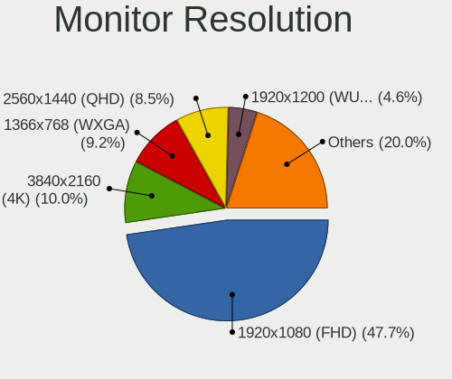

| Resolution         | Computers | Percent |
|--------------------|-----------|---------|
| 1920x1080 (FHD)    | 35        | 48.61%  |
| 3840x2160 (4K)     | 9         | 12.5%   |
| 1366x768 (WXGA)    | 7         | 9.72%   |
| 2560x1440 (QHD)    | 5         | 6.94%   |
| Unknown            | 3         | 4.17%   |
| 1920x1200 (WUXGA)  | 2         | 2.78%   |
| 1680x1050 (WSXGA+) | 2         | 2.78%   |
| 1280x1024 (SXGA)   | 2         | 2.78%   |
| 7280x2160          | 1         | 1.39%   |
| 5120x1440          | 1         | 1.39%   |
| 3440x1440          | 1         | 1.39%   |
| 2560x1600          | 1         | 1.39%   |
| 2160x1350          | 1         | 1.39%   |
| 1600x900 (HD+)     | 1         | 1.39%   |
| 1280x768           | 1         | 1.39%   |

Monitor Diagonal
----------------

Diagonal size in inches

| Inches  | Computers | Percent |
|---------|-----------|---------|
| 13      | 13        | 17.33%  |
| 23      | 9         | 12%     |
| 15      | 8         | 10.67%  |
| 14      | 6         | 8%      |
| 21      | 5         | 6.67%   |
| Unknown | 5         | 6.67%   |
| 27      | 4         | 5.33%   |
| 24      | 4         | 5.33%   |
| 17      | 4         | 5.33%   |
| 31      | 3         | 4%      |
| 84      | 2         | 2.67%   |
| 72      | 2         | 2.67%   |
| 16      | 2         | 2.67%   |
| 64      | 1         | 1.33%   |
| 54      | 1         | 1.33%   |
| 52      | 1         | 1.33%   |
| 43      | 1         | 1.33%   |
| 35      | 1         | 1.33%   |
| 33      | 1         | 1.33%   |
| 20      | 1         | 1.33%   |
| 19      | 1         | 1.33%   |

Monitor Width
-------------

Physical width

| Width in mm | Computers | Percent |
|-------------|-----------|---------|
| 301-350     | 26        | 35.14%  |
| 501-600     | 16        | 21.62%  |
| 401-500     | 6         | 8.11%   |
| Unknown     | 5         | 6.76%   |
| 351-400     | 4         | 5.41%   |
| 201-300     | 4         | 5.41%   |
| 1501-2000   | 4         | 5.41%   |
| 601-700     | 3         | 4.05%   |
| 1001-1500   | 3         | 4.05%   |
| 801-900     | 1         | 1.35%   |
| 701-800     | 1         | 1.35%   |
| 901-1000    | 1         | 1.35%   |

Aspect Ratio
------------

Proportional relationship between the width and the height

| Ratio   | Computers | Percent |
|---------|-----------|---------|
| 16/9    | 49        | 76.56%  |
| 16/10   | 6         | 9.38%   |
| Unknown | 5         | 7.81%   |
| 5/4     | 2         | 3.13%   |
| 4/3     | 1         | 1.56%   |
| 21/9    | 1         | 1.56%   |

Monitor Area
------------

Area in inch

| Area in inch | Computers | Percent |
|----------------|-----------|---------|
| 81-90          | 15        | 20%     |
| 201-250        | 15        | 20%     |
| 101-110        | 8         | 10.67%  |
| More than 1000 | 7         | 9.33%   |
| 351-500        | 5         | 6.67%   |
| Unknown        | 5         | 6.67%   |
| 71-80          | 4         | 5.33%   |
| 301-350        | 4         | 5.33%   |
| 151-200        | 3         | 4%      |
| 121-130        | 3         | 4%      |
| 251-300        | 2         | 2.67%   |
| 141-150        | 1         | 1.33%   |
| 131-140        | 1         | 1.33%   |
| 111-120        | 1         | 1.33%   |
| 501-1000       | 1         | 1.33%   |

Pixel Density
-------------

Pixels per inch

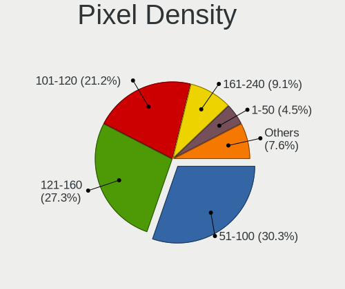

| Density       | Computers | Percent |
|---------------|-----------|---------|
| 51-100        | 22        | 31.43%  |
| 121-160       | 18        | 25.71%  |
| 101-120       | 14        | 20%     |
| 161-240       | 6         | 8.57%   |
| Unknown       | 5         | 7.14%   |
| 1-50          | 3         | 4.29%   |
| More than 240 | 2         | 2.86%   |

Multiple Monitors
-----------------

Total monitors connected

| Total | Computers | Percent |
|-------|-----------|---------|
| 1     | 48        | 69.57%  |
| 2     | 12        | 17.39%  |
| 0     | 5         | 7.25%   |
| 3     | 2         | 2.9%    |
| 5     | 1         | 1.45%   |
| 4     | 1         | 1.45%   |

Network
-------

Net Controller Vendor
---------------------

Controller vendors

| Vendor                | Computers | Percent |
|-----------------------|-----------|---------|
| Intel                 | 51        | 52.04%  |
| Realtek Semiconductor | 33        | 33.67%  |
| Qualcomm Atheros      | 4         | 4.08%   |
| Broadcom              | 4         | 4.08%   |
| Tehuti Networks       | 1         | 1.02%   |
| Ralink Technology     | 1         | 1.02%   |
| IBM                   | 1         | 1.02%   |
| DisplayLink           | 1         | 1.02%   |
| ASUSTek Computer      | 1         | 1.02%   |
| Aquantia              | 1         | 1.02%   |

Net Controller Model
--------------------

Controller models

| Model                                                             | Computers | Percent |
|-------------------------------------------------------------------|-----------|---------|
| Realtek RTL8111/8168/8411 PCI Express Gigabit Ethernet Controller | 16        | 12.4%   |
| Intel Ethernet Controller I225-V                                  | 8         | 6.2%    |
| Realtek RTL8125 2.5GbE Controller                                 | 6         | 4.65%   |
| Realtek RTL810xE PCI Express Fast Ethernet controller             | 6         | 4.65%   |
| Intel Wi-Fi 6 AX210/AX211/AX411 160MHz                            | 6         | 4.65%   |
| Intel Dual Band Wireless-AC 3168NGW [Stone Peak]                  | 5         | 3.88%   |
| Intel Alder Lake-P PCH CNVi WiFi                                  | 5         | 3.88%   |
| Realtek RTL8153 Gigabit Ethernet Adapter                          | 4         | 3.1%    |
| Intel Wi-Fi 6 AX200                                               | 4         | 3.1%    |
| Intel Comet Lake PCH-LP CNVi WiFi                                 | 4         | 3.1%    |
| Intel Wireless 8265 / 8275                                        | 2         | 1.55%   |
| Intel Wireless 8260                                               | 2         | 1.55%   |
| Intel Ice Lake-LP PCH CNVi WiFi                                   | 2         | 1.55%   |
| Intel I211 Gigabit Network Connection                             | 2         | 1.55%   |
| Intel I210 Gigabit Network Connection                             | 2         | 1.55%   |
| Intel Ethernet Connection (2) I219-LM                             | 2         | 1.55%   |
| Intel Cannon Point-LP CNVi [Wireless-AC]                          | 2         | 1.55%   |
| Intel Cannon Lake PCH CNVi WiFi                                   | 2         | 1.55%   |
| Intel Alder Lake-S PCH CNVi WiFi                                  | 2         | 1.55%   |
| Intel 82574L Gigabit Network Connection                           | 2         | 1.55%   |
| Tehuti Networks TN9710P 10GBase-T/NBASE-T Ethernet Adapter        | 1         | 0.78%   |
| Realtek RTL8821CE 802.11ac PCIe Wireless Network Adapter          | 1         | 0.78%   |
| Realtek RTL8723DE Wireless Network Adapter                        | 1         | 0.78%   |
| Realtek RTL8723BE PCIe Wireless Network Adapter                   | 1         | 0.78%   |
| Realtek RTL8192EU 802.11b/g/n WLAN Adapter                        | 1         | 0.78%   |
| Realtek RTL8188EUS 802.11n Wireless Network Adapter               | 1         | 0.78%   |
| Realtek Killer E2600 Gigabit Ethernet Controller                  | 1         | 0.78%   |
| Realtek 802.11n WLAN Adapter                                      | 1         | 0.78%   |
| Ralink MT7601U Wireless Adapter                                   | 1         | 0.78%   |
| Qualcomm Atheros QCA9565 / AR9565 Wireless Network Adapter        | 1         | 0.78%   |
| Qualcomm Atheros QCA9377 802.11ac Wireless Network Adapter        | 1         | 0.78%   |
| Qualcomm Atheros Killer E2500 Gigabit Ethernet Controller         | 1         | 0.78%   |
| Qualcomm Atheros Killer E2400 Gigabit Ethernet Controller         | 1         | 0.78%   |
| Intel Wireless-AC 9260                                            | 1         | 0.78%   |
| Intel Wireless 7265                                               | 1         | 0.78%   |
| Intel Wireless 3160                                               | 1         | 0.78%   |
| Intel Wi-Fi 6 AX201 160MHz                                        | 1         | 0.78%   |
| Intel Tiger Lake PCH CNVi WiFi                                    | 1         | 0.78%   |
| Intel Ethernet Controller X710 for 10GbE SFP+                     | 1         | 0.78%   |
| Intel Ethernet Controller I226-V                                  | 1         | 0.78%   |

Wireless Vendor
---------------

Wireless vendors

| Vendor                | Computers | Percent |
|-----------------------|-----------|---------|
| Intel                 | 43        | 78.18%  |
| Realtek Semiconductor | 6         | 10.91%  |
| Qualcomm Atheros      | 2         | 3.64%   |
| Broadcom              | 2         | 3.64%   |
| Ralink Technology     | 1         | 1.82%   |
| ASUSTek Computer      | 1         | 1.82%   |

Wireless Model
--------------

Wireless models

| Model                                                      | Computers | Percent |
|------------------------------------------------------------|-----------|---------|
| Intel Wi-Fi 6 AX210/AX211/AX411 160MHz                     | 6         | 10.91%  |
| Intel Dual Band Wireless-AC 3168NGW [Stone Peak]           | 5         | 9.09%   |
| Intel Alder Lake-P PCH CNVi WiFi                           | 5         | 9.09%   |
| Intel Wi-Fi 6 AX200                                        | 4         | 7.27%   |
| Intel Comet Lake PCH-LP CNVi WiFi                          | 4         | 7.27%   |
| Intel Wireless 8265 / 8275                                 | 2         | 3.64%   |
| Intel Wireless 8260                                        | 2         | 3.64%   |
| Intel Ice Lake-LP PCH CNVi WiFi                            | 2         | 3.64%   |
| Intel Cannon Point-LP CNVi [Wireless-AC]                   | 2         | 3.64%   |
| Intel Cannon Lake PCH CNVi WiFi                            | 2         | 3.64%   |
| Intel Alder Lake-S PCH CNVi WiFi                           | 2         | 3.64%   |
| Realtek RTL8821CE 802.11ac PCIe Wireless Network Adapter   | 1         | 1.82%   |
| Realtek RTL8723DE Wireless Network Adapter                 | 1         | 1.82%   |
| Realtek RTL8723BE PCIe Wireless Network Adapter            | 1         | 1.82%   |
| Realtek RTL8192EU 802.11b/g/n WLAN Adapter                 | 1         | 1.82%   |
| Realtek RTL8188EUS 802.11n Wireless Network Adapter        | 1         | 1.82%   |
| Realtek 802.11n WLAN Adapter                               | 1         | 1.82%   |
| Ralink MT7601U Wireless Adapter                            | 1         | 1.82%   |
| Qualcomm Atheros QCA9565 / AR9565 Wireless Network Adapter | 1         | 1.82%   |
| Qualcomm Atheros QCA9377 802.11ac Wireless Network Adapter | 1         | 1.82%   |
| Intel Wireless-AC 9260                                     | 1         | 1.82%   |
| Intel Wireless 7265                                        | 1         | 1.82%   |
| Intel Wireless 3160                                        | 1         | 1.82%   |
| Intel Wi-Fi 6 AX201 160MHz                                 | 1         | 1.82%   |
| Intel Tiger Lake PCH CNVi WiFi                             | 1         | 1.82%   |
| Intel Centrino Wireless-N 2230                             | 1         | 1.82%   |
| Intel 700 Series Chipset Family Wi-Fi                      | 1         | 1.82%   |
| Broadcom BCM4321 802.11b/g/n                               | 1         | 1.82%   |
| Broadcom BCM4313 802.11bgn Wireless Network Adapter        | 1         | 1.82%   |
| ASUS WL-167G v3 802.11n Adapter [Realtek RTL8188SU]        | 1         | 1.82%   |

Ethernet Vendor
---------------

Ethernet vendors

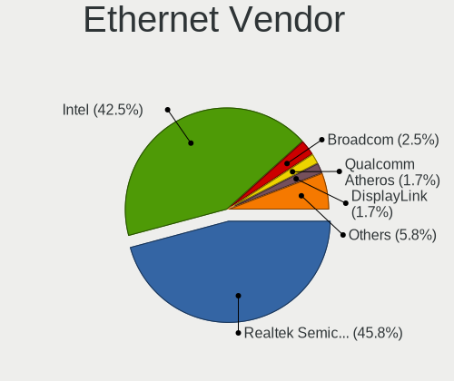

| Vendor                | Computers | Percent |
|-----------------------|-----------|---------|
| Realtek Semiconductor | 32        | 46.38%  |
| Intel                 | 28        | 40.58%  |
| Broadcom              | 3         | 4.35%   |
| Qualcomm Atheros      | 2         | 2.9%    |
| Tehuti Networks       | 1         | 1.45%   |
| IBM                   | 1         | 1.45%   |
| DisplayLink           | 1         | 1.45%   |
| Aquantia              | 1         | 1.45%   |

Ethernet Model
--------------

Ethernet models

| Model                                                             | Computers | Percent |
|-------------------------------------------------------------------|-----------|---------|
| Realtek RTL8111/8168/8411 PCI Express Gigabit Ethernet Controller | 16        | 21.62%  |
| Intel Ethernet Controller I225-V                                  | 8         | 10.81%  |
| Realtek RTL8125 2.5GbE Controller                                 | 6         | 8.11%   |
| Realtek RTL810xE PCI Express Fast Ethernet controller             | 6         | 8.11%   |
| Realtek RTL8153 Gigabit Ethernet Adapter                          | 4         | 5.41%   |
| Intel I211 Gigabit Network Connection                             | 2         | 2.7%    |
| Intel I210 Gigabit Network Connection                             | 2         | 2.7%    |
| Intel Ethernet Connection (2) I219-LM                             | 2         | 2.7%    |
| Intel 82574L Gigabit Network Connection                           | 2         | 2.7%    |
| Tehuti Networks TN9710P 10GBase-T/NBASE-T Ethernet Adapter        | 1         | 1.35%   |
| Realtek Killer E2600 Gigabit Ethernet Controller                  | 1         | 1.35%   |
| Qualcomm Atheros Killer E2500 Gigabit Ethernet Controller         | 1         | 1.35%   |
| Qualcomm Atheros Killer E2400 Gigabit Ethernet Controller         | 1         | 1.35%   |
| Intel Ethernet Controller X710 for 10GbE SFP+                     | 1         | 1.35%   |
| Intel Ethernet Controller I226-V                                  | 1         | 1.35%   |
| Intel Ethernet Controller I225-LM                                 | 1         | 1.35%   |
| Intel Ethernet Controller 10-Gigabit X540-AT2                     | 1         | 1.35%   |
| Intel Ethernet Connection I219-LM                                 | 1         | 1.35%   |
| Intel Ethernet Connection I217-LM                                 | 1         | 1.35%   |
| Intel Ethernet Connection (7) I219-LM                             | 1         | 1.35%   |
| Intel Ethernet Connection (6) I219-LM                             | 1         | 1.35%   |
| Intel Ethernet Connection (5) I219-LM                             | 1         | 1.35%   |
| Intel Ethernet Connection (4) I219-V                              | 1         | 1.35%   |
| Intel Ethernet Connection (3) I219-LM                             | 1         | 1.35%   |
| Intel Ethernet Connection (3) I218-LM                             | 1         | 1.35%   |
| Intel Ethernet Connection (2) I219-V                              | 1         | 1.35%   |
| Intel Ethernet Connection (16) I219-V                             | 1         | 1.35%   |
| Intel Ethernet Connection (14) I219-LM                            | 1         | 1.35%   |
| Intel 82579LM Gigabit Network Connection (Lewisville)             | 1         | 1.35%   |
| IBM RNDIS/CDC ETHER                                               | 1         | 1.35%   |
| DisplayLink Dell D3100 Docking Station                            | 1         | 1.35%   |
| Broadcom NetXtreme BCM5764M Gigabit Ethernet PCIe                 | 1         | 1.35%   |
| Broadcom NetXtreme BCM5719 Gigabit Ethernet PCIe                  | 1         | 1.35%   |
| Broadcom NetXtreme BCM5717 Gigabit Ethernet PCIe                  | 1         | 1.35%   |
| Aquantia AQC107 NBase-T/IEEE 802.3bz Ethernet Controller [AQtion] | 1         | 1.35%   |

Net Controller Kind
-------------------

Ethernet, WiFi or modem

| Kind     | Computers | Percent |
|----------|-----------|---------|
| Ethernet | 60        | 53.1%   |
| WiFi     | 53        | 46.9%   |

Used Controller
---------------

Currently used network controller

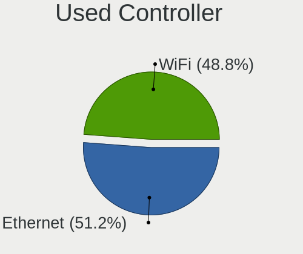

| Kind     | Computers | Percent |
|----------|-----------|---------|
| WiFi     | 35        | 50%     |
| Ethernet | 35        | 50%     |

NICs
----

Total network controllers on board

| Total | Computers | Percent |
|-------|-----------|---------|
| 2     | 38        | 55.07%  |
| 1     | 20        | 28.99%  |
| 4     | 5         | 7.25%   |
| 3     | 5         | 7.25%   |
| 0     | 1         | 1.45%   |

IPv6
----

IPv6 vs IPv4

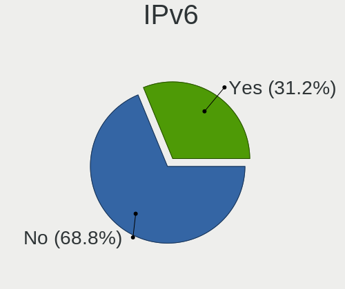

| Used | Computers | Percent |
|------|-----------|---------|
| No   | 50        | 72.46%  |
| Yes  | 19        | 27.54%  |

Bluetooth
---------

Bluetooth Vendor
----------------

Controller vendors

| Vendor                          | Computers | Percent |
|---------------------------------|-----------|---------|
| Intel                           | 37        | 78.72%  |
| Realtek Semiconductor           | 2         | 4.26%   |
| Cambridge Silicon Radio         | 2         | 4.26%   |
| Broadcom                        | 2         | 4.26%   |
| Qualcomm Atheros Communications | 1         | 2.13%   |
| Integrated System Solution      | 1         | 2.13%   |
| IMC Networks                    | 1         | 2.13%   |
| ASUSTek Computer                | 1         | 2.13%   |

Bluetooth Model
---------------

Controller models

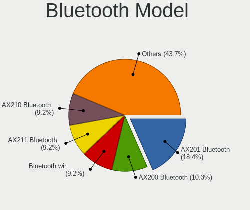

| Model                                                 | Computers | Percent |
|-------------------------------------------------------|-----------|---------|
| Intel AX201 Bluetooth                                 | 9         | 19.15%  |
| Intel AX210 Bluetooth                                 | 6         | 12.77%  |
| Intel Wireless-AC 3168 Bluetooth                      | 5         | 10.64%  |
| Intel Bluetooth 9460/9560 Jefferson Peak (JfP)        | 5         | 10.64%  |
| Intel Bluetooth wireless interface                    | 4         | 8.51%   |
| Intel AX200 Bluetooth                                 | 4         | 8.51%   |
| Intel Bluetooth Device                                | 3         | 6.38%   |
| Cambridge Silicon Radio Bluetooth Dongle (HCI mode)   | 2         | 4.26%   |
| Realtek  Bluetooth 4.2 Adapter                        | 1         | 2.13%   |
| Realtek Bluetooth Radio                               | 1         | 2.13%   |
| Qualcomm Atheros  Bluetooth Device                    | 1         | 2.13%   |
| Intel Centrino Bluetooth Wireless Transceiver         | 1         | 2.13%   |
| Integrated System Solution KY-BT100 Bluetooth Adapter | 1         | 2.13%   |
| IMC Networks Bluetooth Radio                          | 1         | 2.13%   |
| Broadcom HP Portable SoftSailing                      | 1         | 2.13%   |
| Broadcom BCM2045B (BDC-2.1)                           | 1         | 2.13%   |
| ASUS ASUS USB-BT500                                   | 1         | 2.13%   |

Sound
-----

Sound Vendor
------------

Sound card vendors

| Vendor                                       | Computers | Percent |
|----------------------------------------------|-----------|---------|
| Intel                                        | 53        | 48.62%  |
| Nvidia                                       | 22        | 20.18%  |
| AMD                                          | 14        | 12.84%  |
| Texas Instruments                            | 5         | 4.59%   |
| Realtek Semiconductor                        | 2         | 1.83%   |
| ASUSTek Computer                             | 2         | 1.83%   |
| Zoran Co. Personal Media Division (Nogatech) | 1         | 0.92%   |
| Sony                                         | 1         | 0.92%   |
| Micro Star International                     | 1         | 0.92%   |
| Logitech                                     | 1         | 0.92%   |
| LG Electronics                               | 1         | 0.92%   |
| Hewlett-Packard                              | 1         | 0.92%   |
| Creative Labs                                | 1         | 0.92%   |
| Corsair                                      | 1         | 0.92%   |
| Blue Microphones                             | 1         | 0.92%   |
| BEHRINGER International                      | 1         | 0.92%   |
| Astro Gaming                                 | 1         | 0.92%   |

Sound Model
-----------

Sound card models

| Model                                                                      | Computers | Percent |
|----------------------------------------------------------------------------|-----------|---------|
| Intel Tiger Lake-H HD Audio Controller                                     | 7         | 5.74%   |
| Intel Sunrise Point-LP HD Audio                                            | 5         | 4.1%    |
| Intel Alder Lake PCH-P High Definition Audio Controller                    | 5         | 4.1%    |
| Texas Instruments PCM2902 Audio Codec                                      | 4         | 3.28%   |
| Nvidia GP104 High Definition Audio Controller                              | 4         | 3.28%   |
| Nvidia GA106 High Definition Audio Controller                              | 4         | 3.28%   |
| Intel Comet Lake PCH-LP cAVS                                               | 4         | 3.28%   |
| Intel Alder Lake-S HD Audio Controller                                     | 4         | 3.28%   |
| AMD Starship/Matisse HD Audio Controller                                   | 4         | 3.28%   |
| AMD Family 17h/19h HD Audio Controller                                     | 4         | 3.28%   |
| Nvidia TU107 GeForce GTX 1650 High Definition Audio Controller             | 3         | 2.46%   |
| Intel Cannon Lake PCH cAVS                                                 | 3         | 2.46%   |
| Realtek Semiconductor USB Audio                                            | 2         | 1.64%   |
| Nvidia TU116 High Definition Audio Controller                              | 2         | 1.64%   |
| Nvidia GA102 High Definition Audio Controller                              | 2         | 1.64%   |
| Intel Jasper Lake HD Audio                                                 | 2         | 1.64%   |
| Intel Ice Lake-LP Smart Sound Technology Audio Controller                  | 2         | 1.64%   |
| Intel CM238 HD Audio Controller                                            | 2         | 1.64%   |
| Intel Cannon Point-LP High Definition Audio Controller                     | 2         | 1.64%   |
| Intel 7 Series/C216 Chipset Family High Definition Audio Controller        | 2         | 1.64%   |
| Intel 6 Series/C200 Series Chipset Family High Definition Audio Controller | 2         | 1.64%   |
| Intel 200 Series PCH HD Audio                                              | 2         | 1.64%   |
| Intel 100 Series/C230 Series Chipset Family HD Audio Controller            | 2         | 1.64%   |
| ASUSTek Computer USB Audio                                                 | 2         | 1.64%   |
| AMD Renoir Radeon High Definition Audio Controller                         | 2         | 1.64%   |
| AMD Oland/Hainan/Cape Verde/Pitcairn HDMI Audio [Radeon HD 7000 Series]    | 2         | 1.64%   |
| AMD Navi 21/23 HDMI/DP Audio Controller                                    | 2         | 1.64%   |
| AMD Navi 10 HDMI Audio                                                     | 2         | 1.64%   |
| AMD Family 15h (Models 60h-6fh) Audio Controller                           | 2         | 1.64%   |
| AMD Ellesmere HDMI Audio [Radeon RX 470/480 / 570/580/590]                 | 2         | 1.64%   |
| Zoran Co. Personal Media Division (Nogatech) USB Audio and HID             | 1         | 0.82%   |
| Texas Instruments PCM2704 16-bit stereo audio DAC                          | 1         | 0.82%   |
| Sony DualSense wireless controller (PS5)                                   | 1         | 0.82%   |
| Nvidia High Definition Audio Controller                                    | 1         | 0.82%   |
| Nvidia GP106 High Definition Audio Controller                              | 1         | 0.82%   |
| Nvidia GP102 HDMI Audio Controller                                         | 1         | 0.82%   |
| Nvidia GM206 High Definition Audio Controller                              | 1         | 0.82%   |
| Nvidia GK208 HDMI/DP Audio Controller                                      | 1         | 0.82%   |
| Nvidia GK106 HDMI Audio Controller                                         | 1         | 0.82%   |
| Nvidia GA104 High Definition Audio Controller                              | 1         | 0.82%   |

Memory
------

Memory Vendor
-------------

Memory module vendors

| Vendor              | Computers | Percent |
|---------------------|-----------|---------|
| SK hynix            | 7         | 23.33%  |
| Samsung Electronics | 4         | 13.33%  |
| Kingston            | 4         | 13.33%  |
| G.Skill             | 3         | 10%     |
| Unknown             | 2         | 6.67%   |
| Micron Technology   | 2         | 6.67%   |
| Crucial             | 2         | 6.67%   |
| Corsair             | 2         | 6.67%   |
| Team                | 1         | 3.33%   |
| Smart               | 1         | 3.33%   |
| Hewlett-Packard     | 1         | 3.33%   |
| Elpida              | 1         | 3.33%   |

Memory Model
------------

Memory module models

| Model                                                        | Computers | Percent |
|--------------------------------------------------------------|-----------|---------|
| Corsair RAM CMK16GX4M2B3200C16 8GB DIMM DDR4 3600MT/s        | 2         | 6.06%   |
| Unknown RAM Module 8GB DIMM DDR3 1333MT/s                    | 1         | 3.03%   |
| Unknown RAM Module 2GB DIMM DDR3 1600MT/s                    | 1         | 3.03%   |
| Team RAM TEAMGROUP-ED4-2400 16GB DIMM DDR4 2400MT/s          | 1         | 3.03%   |
| Smart RAM SF564128CJ8NWMNSEG 4096MB SODIMM DDR3 1600MT/s     | 1         | 3.03%   |
| SK hynix RAM Module 16GB Row Of Chips LPDDR4 2933MT/s        | 1         | 3.03%   |
| SK hynix RAM HMT451S6BFR8A-PB 4GB SODIMM DDR3 1600MT/s       | 1         | 3.03%   |
| SK hynix RAM HMCG94MEBRA123N 64GB DIMM DDR5 4800MT/s         | 1         | 3.03%   |
| SK hynix RAM HMCG94MEBRA121N 64GB DIMM DDR5 4800MT/s         | 1         | 3.03%   |
| SK hynix RAM HMCG94MEBRA109N 64GB DIMM DDR5 4800MT/s         | 1         | 3.03%   |
| SK hynix RAM HMAA8GL7CPR4N-VK 64GB DIMM DDR4 2666MT/s        | 1         | 3.03%   |
| SK hynix RAM HMAA2GS6CJR8N-XN 16GB SODIMM DDR4 3200MT/s      | 1         | 3.03%   |
| SK hynix RAM HMA82GS6MFR8N-TF 16GB SODIMM DDR4 2133MT/s      | 1         | 3.03%   |
| SK hynix RAM HMA81GU7AFR8N-UH 8GB DIMM DDR4 2400MT/s         | 1         | 3.03%   |
| SK hynix RAM HMA81GS6JJR8N-VK 8GB SODIMM DDR4 2667MT/s       | 1         | 3.03%   |
| Samsung RAM Module 8GB SODIMM DDR4 2133MT/s                  | 1         | 3.03%   |
| Samsung RAM M471A1K43DB1-CTD 8GB SODIMM DDR4 2667MT/s        | 1         | 3.03%   |
| Samsung RAM M378B5273CH0-CH9 4GB DIMM DDR3 1867MT/s          | 1         | 3.03%   |
| Samsung RAM K3LK7K7@BM-BGCP 2GB Row Of Chips LPDDR5 6400MT/s | 1         | 3.03%   |
| Micron RAM Module 8GB Chip LPDDR4                            | 1         | 3.03%   |
| Micron RAM 4ATF51264HZ-2G3B1 4096MB SODIMM DDR4 3200MT/s     | 1         | 3.03%   |
| Kingston RAM X74R9W-MIE 8GB SODIMM DDR4 2933MT/s             | 1         | 3.03%   |
| Kingston RAM MSI24D4S7S8MB-8 8GB SODIMM DDR4 2667MT/s        | 1         | 3.03%   |
| Kingston RAM KF3200C16D4/8GX 8GB DIMM DDR4 3600MT/s          | 1         | 3.03%   |
| Kingston RAM 9905744-108.A00G 16GB SODIMM DDR4 3200MT/s      | 1         | 3.03%   |
| HP RAM 669237-071 2GB DIMM DDR3 1600MT/s                     | 1         | 3.03%   |
| G.Skill RAM F5-6000J3636F16G 16GB DIMM DDR5 6400MT/s         | 1         | 3.03%   |
| G.Skill RAM F4-3600C16-16GTZNC 16GB DIMM DDR4 3600MT/s       | 1         | 3.03%   |
| G.Skill RAM F4-3200C16-16GVK 16GB DIMM DDR4 3600MT/s         | 1         | 3.03%   |
| Elpida RAM EBJ40UG8BBU0-GN-F 4GB SODIMM DDR3 1600MT/s        | 1         | 3.03%   |
| Crucial RAM CT8G4S24AM.M8FJ 8GB SODIMM DDR4 2400MT/s         | 1         | 3.03%   |
| Crucial RAM CT16G4SFD824A.C16FDD 16GB SODIMM DDR4 2400MT/s   | 1         | 3.03%   |

Memory Kind
-----------

Memory module kinds

| Kind   | Computers | Percent |
|--------|-----------|---------|
| DDR4   | 16        | 61.54%  |
| DDR3   | 5         | 19.23%  |
| LPDDR4 | 2         | 7.69%   |
| DDR5   | 2         | 7.69%   |
| LPDDR5 | 1         | 3.85%   |

Memory Form Factor
------------------

Physical design of the memory module

| Name         | Computers | Percent |
|--------------|-----------|---------|
| DIMM         | 12        | 46.15%  |
| SODIMM       | 11        | 42.31%  |
| Row Of Chips | 2         | 7.69%   |
| Chip         | 1         | 3.85%   |

Memory Size
-----------

Memory module size

| Size  | Computers | Percent |
|-------|-----------|---------|
| 8192  | 12        | 41.38%  |
| 16384 | 9         | 31.03%  |
| 4096  | 3         | 10.34%  |
| 65536 | 2         | 6.9%    |
| 2048  | 2         | 6.9%    |
| 32768 | 1         | 3.45%   |

Memory Speed
------------

Memory module speed

| Speed   | Computers | Percent |
|---------|-----------|---------|
| 3600    | 5         | 17.86%  |
| 3200    | 3         | 10.71%  |
| 2667    | 3         | 10.71%  |
| 2400    | 3         | 10.71%  |
| 1600    | 3         | 10.71%  |
| 6400    | 2         | 7.14%   |
| 2933    | 2         | 7.14%   |
| 2133    | 2         | 7.14%   |
| 4800    | 1         | 3.57%   |
| 2666    | 1         | 3.57%   |
| 1867    | 1         | 3.57%   |
| 1333    | 1         | 3.57%   |
| Unknown | 1         | 3.57%   |

Printers & scanners
-------------------

Printer Vendor
--------------

Printer device vendors

| Vendor          | Computers | Percent |
|-----------------|-----------|---------|
| Seiko Epson     | 3         | 60%     |
| Hewlett-Packard | 1         | 20%     |
| Canon           | 1         | 20%     |

Printer Model
-------------

Printer device models

| Model                      | Computers | Percent |
|----------------------------|-----------|---------|
| Seiko Epson XP-4100 Series | 1         | 20%     |
| Seiko Epson WF-3520 Series | 1         | 20%     |
| Seiko Epson L3210 Series   | 1         | 20%     |
| HP DeskJet 3700 series     | 1         | 20%     |
| Canon PIXMA MG2500 Series  | 1         | 20%     |

Scanner Vendor
--------------

Scanner device vendors

Zero info for selected period =(

Scanner Model
-------------

Scanner device models

Zero info for selected period =(

Camera
------

Camera Vendor
-------------

Camera device vendors

| Vendor                                 | Computers | Percent |
|----------------------------------------|-----------|---------|
| Chicony Electronics                    | 7         | 15.91%  |
| IMC Networks                           | 5         | 11.36%  |
| Microdia                               | 4         | 9.09%   |
| Realtek Semiconductor                  | 3         | 6.82%   |
| Sunplus Innovation Technology          | 2         | 4.55%   |
| Luxvisions Innotech Limited            | 2         | 4.55%   |
| Logitech                               | 2         | 4.55%   |
| Lite-On Technology                     | 2         | 4.55%   |
| Apple                                  | 2         | 4.55%   |
| vivo                                   | 1         | 2.27%   |
| Syntek                                 | 1         | 2.27%   |
| Suyin                                  | 1         | 2.27%   |
| Sonix Technology                       | 1         | 2.27%   |
| Shenzhen Kingcome Optoelectronic       | 1         | 2.27%   |
| Samsung Electronics                    | 1         | 2.27%   |
| Remo Tech                              | 1         | 2.27%   |
| Quanta                                 | 1         | 2.27%   |
| Owon                                   | 1         | 2.27%   |
| Microsoft                              | 1         | 2.27%   |
| LG Electronics                         | 1         | 2.27%   |
| Generalplus Technology                 | 1         | 2.27%   |
| Cheng Uei Precision Industry (Foxlink) | 1         | 2.27%   |
| Bison Electronics                      | 1         | 2.27%   |
| Acer                                   | 1         | 2.27%   |

Camera Model
------------

Camera device models

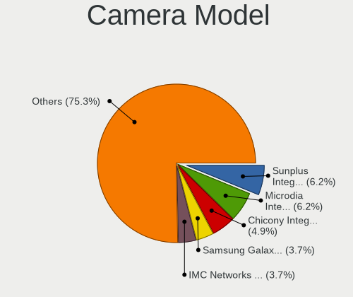

| Model                                                          | Computers | Percent |
|----------------------------------------------------------------|-----------|---------|
| Sunplus Integrated_Webcam_HD                                   | 2         | 4.55%   |
| Microdia Integrated_Webcam_HD                                  | 2         | 4.55%   |
| IMC Networks Integrated Camera                                 | 2         | 4.55%   |
| Chicony Integrated Camera                                      | 2         | 4.55%   |
| Apple iPhone 5/5C/5S/6/SE/7/8/X/XR                             | 2         | 4.55%   |
| vivo V2036                                                     | 1         | 2.27%   |
| Syntek Integrated Camera                                       | 1         | 2.27%   |
| Suyin Integrated_Webcam_HD                                     | 1         | 2.27%   |
| Sonix USB2.0 HD UVC WebCam                                     | 1         | 2.27%   |
| Shenzhen Kingcome Optoelectronic 720p HD Camera                | 1         | 2.27%   |
| Samsung Galaxy series, misc. (MTP mode)                        | 1         | 2.27%   |
| Remo Tech OBSBOT Tiny 4K                                       | 1         | 2.27%   |
| Realtek Integrated_Webcam_HD                                   | 1         | 2.27%   |
| Realtek Integrated Webcam_HD                                   | 1         | 2.27%   |
| Realtek FULL HD 1080P Webcam                                   | 1         | 2.27%   |
| Quanta HP TrueVision HD Camera                                 | 1         | 2.27%   |
| Owon USB CAMERA                                                | 1         | 2.27%   |
| Microsoft LifeCam VX-2000                                      | 1         | 2.27%   |
| Microdia USB Camera                                            | 1         | 2.27%   |
| Microdia 1.3 MPixel Integrated Webcam                          | 1         | 2.27%   |
| Luxvisions Innotech Limited Integrated RGB Camera              | 1         | 2.27%   |
| Luxvisions Innotech Limited Integrated Camera                  | 1         | 2.27%   |
| Logitech Webcam C250                                           | 1         | 2.27%   |
| Logitech C922 Pro Stream Webcam                                | 1         | 2.27%   |
| Lite-On Integrated Camera                                      | 1         | 2.27%   |
| Lite-On HP HD Camera                                           | 1         | 2.27%   |
| LG LG UltraFine Display Camera                                 | 1         | 2.27%   |
| IMC Networks XHC Camera                                        | 1         | 2.27%   |
| IMC Networks USB2.0 HD UVC WebCam                              | 1         | 2.27%   |
| IMC Networks USB Camera                                        | 1         | 2.27%   |
| Generalplus WEB CAM                                            | 1         | 2.27%   |
| Chicony USB2.0 VGA UVC WebCam                                  | 1         | 2.27%   |
| Chicony ThinkPad T490 Webcam                                   | 1         | 2.27%   |
| Chicony HP HD Webcam [Fixed]                                   | 1         | 2.27%   |
| Chicony HP HD Camera                                           | 1         | 2.27%   |
| Chicony HD Webcam                                              | 1         | 2.27%   |
| Cheng Uei Precision Industry (Foxlink) HP TrueVision HD Camera | 1         | 2.27%   |
| Bison Integrated Camera                                        | 1         | 2.27%   |
| Acer BisonCam, NB Pro                                          | 1         | 2.27%   |

Security
--------

Fingerprint Vendor
------------------

Fingerprint sensor vendors

| Vendor                     | Computers | Percent |
|----------------------------|-----------|---------|
| Synaptics                  | 4         | 44.44%  |
| Validity Sensors           | 2         | 22.22%  |
| Shenzhen Goodix Technology | 2         | 22.22%  |
| Samsung Electronics        | 1         | 11.11%  |

Fingerprint Model
-----------------

Fingerprint sensor models

| Model                                                     | Computers | Percent |
|-----------------------------------------------------------|-----------|---------|
| Synaptics Prometheus MIS Touch Fingerprint Reader         | 3         | 33.33%  |
| Shenzhen Goodix  FingerPrint Device                       | 2         | 22.22%  |
| Validity Sensors VFS5011 Fingerprint Reader               | 1         | 11.11%  |
| Validity Sensors VFS491                                   | 1         | 11.11%  |
| Synaptics  FS7604 Touch Fingerprint Sensor with PurePrint | 1         | 11.11%  |
| Samsung Fingerprint Sensor Device - 730B                  | 1         | 11.11%  |

Chipcard Vendor
---------------

Chipcard module vendors

| Vendor      | Computers | Percent |
|-------------|-----------|---------|
| Broadcom    | 4         | 80%     |
| Alcor Micro | 1         | 20%     |

Chipcard Model
--------------

Chipcard module models

| Model                                          | Computers | Percent |
|------------------------------------------------|-----------|---------|
| Broadcom 5880                                  | 3         | 60%     |
| Broadcom BCM5880 Secure Applications Processor | 1         | 20%     |
| Alcor Micro AU9540 Smartcard Reader            | 1         | 20%     |

Unsupported
-----------

Unsupported Devices
-------------------

Total unsupported devices on board

| Total | Computers | Percent |
|-------|-----------|---------|
| 0     | 44        | 63.77%  |
| 1     | 20        | 28.99%  |
| 2     | 3         | 4.35%   |
| 4     | 1         | 1.45%   |
| 3     | 1         | 1.45%   |

Unsupported Device Types
------------------------

Types of unsupported devices

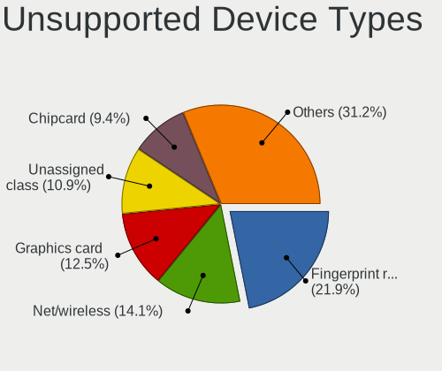

| Type                     | Computers | Percent |
|--------------------------|-----------|---------|
| Fingerprint reader       | 9         | 28.13%  |
| Net/wireless             | 4         | 12.5%   |
| Graphics card            | 4         | 12.5%   |
| Unassigned class         | 3         | 9.38%   |
| Multimedia controller    | 3         | 9.38%   |
| Chipcard                 | 3         | 9.38%   |
| Communication controller | 2         | 6.25%   |
| Storage/ide              | 1         | 3.13%   |
| Net/ethernet             | 1         | 3.13%   |
| Card reader              | 1         | 3.13%   |
| Camera                   | 1         | 3.13%   |

