RHEL 9 - Tested Hardware & Statistics
-------------------------------------

A project to collect tested hardware configurations for RHEL 9.

Anyone can contribute to this report by the [hw-probe](https://github.com/linuxhw/hw-probe) tool:

    sudo -E hw-probe -all -upload

Please contribute! Especially if your hardware is rare.

This is a report for all computer types. See also reports for [desktops](/Dist/RHEL_9/Desktop/README.md) and [notebooks](/Dist/RHEL_9/Notebook/README.md).

Contents
--------

* [ Test Cases ](#test-cases)

* [ System ](#system)
  - [ Kernel                   ](#kernel)
  - [ Kernel Family            ](#kernel-family)
  - [ Kernel Major Ver.        ](#kernel-major-ver)
  - [ Arch                     ](#arch)
  - [ DE                       ](#de)
  - [ Display Server           ](#display-server)
  - [ Display Manager          ](#display-manager)
  - [ OS Lang                  ](#os-lang)
  - [ Boot Mode                ](#boot-mode)
  - [ Filesystem               ](#filesystem)
  - [ Part. scheme             ](#part-scheme)
  - [ Dual Boot with Linux/BSD ](#dual-boot-with-linuxbsd)
  - [ Dual Boot (Win)          ](#dual-boot-win)

* [ Board ](#board)
  - [ Vendor                   ](#vendor)
  - [ Model                    ](#model)
  - [ Model Family             ](#model-family)
  - [ MFG Year                 ](#mfg-year)
  - [ Form Factor              ](#form-factor)
  - [ Secure Boot              ](#secure-boot)
  - [ Coreboot                 ](#coreboot)
  - [ RAM Size                 ](#ram-size)
  - [ RAM Used                 ](#ram-used)
  - [ Total Drives             ](#total-drives)
  - [ Has CD-ROM               ](#has-cd-rom)
  - [ Has Ethernet             ](#has-ethernet)
  - [ Has WiFi                 ](#has-wifi)
  - [ Has Bluetooth            ](#has-bluetooth)

* [ Location ](#location)
  - [ Country                  ](#country)
  - [ City                     ](#city)

* [ Drives ](#drives)
  - [ Drive Vendor             ](#drive-vendor)
  - [ Drive Model              ](#drive-model)
  - [ HDD Vendor               ](#hdd-vendor)
  - [ SSD Vendor               ](#ssd-vendor)
  - [ Drive Kind               ](#drive-kind)
  - [ Drive Connector          ](#drive-connector)
  - [ Drive Size               ](#drive-size)
  - [ Space Total              ](#space-total)
  - [ Space Used               ](#space-used)
  - [ Malfunc. Drives          ](#malfunc-drives)
  - [ Malfunc. Drive Vendor    ](#malfunc-drive-vendor)
  - [ Malfunc. HDD Vendor      ](#malfunc-hdd-vendor)
  - [ Malfunc. Drive Kind      ](#malfunc-drive-kind)
  - [ Failed Drives            ](#failed-drives)
  - [ Failed Drive Vendor      ](#failed-drive-vendor)
  - [ Drive Status             ](#drive-status)

* [ Storage controller ](#storage-controller)
  - [ Storage Vendor           ](#storage-vendor)
  - [ Storage Model            ](#storage-model)
  - [ Storage Kind             ](#storage-kind)

* [ Processor ](#processor)
  - [ CPU Vendor               ](#cpu-vendor)
  - [ CPU Model                ](#cpu-model)
  - [ CPU Model Family         ](#cpu-model-family)
  - [ CPU Cores                ](#cpu-cores)
  - [ CPU Sockets              ](#cpu-sockets)
  - [ CPU Threads              ](#cpu-threads)
  - [ CPU Op-Modes             ](#cpu-op-modes)
  - [ CPU Microcode            ](#cpu-microcode)
  - [ CPU Microarch            ](#cpu-microarch)

* [ Graphics ](#graphics)
  - [ GPU Vendor               ](#gpu-vendor)
  - [ GPU Model                ](#gpu-model)
  - [ GPU Combo                ](#gpu-combo)
  - [ GPU Driver               ](#gpu-driver)
  - [ GPU Memory               ](#gpu-memory)

* [ Monitor ](#monitor)
  - [ Monitor Vendor           ](#monitor-vendor)
  - [ Monitor Model            ](#monitor-model)
  - [ Monitor Resolution       ](#monitor-resolution)
  - [ Monitor Diagonal         ](#monitor-diagonal)
  - [ Monitor Width            ](#monitor-width)
  - [ Aspect Ratio             ](#aspect-ratio)
  - [ Monitor Area             ](#monitor-area)
  - [ Pixel Density            ](#pixel-density)
  - [ Multiple Monitors        ](#multiple-monitors)

* [ Network ](#network)
  - [ Net Controller Vendor    ](#net-controller-vendor)
  - [ Net Controller Model     ](#net-controller-model)
  - [ Wireless Vendor          ](#wireless-vendor)
  - [ Wireless Model           ](#wireless-model)
  - [ Ethernet Vendor          ](#ethernet-vendor)
  - [ Ethernet Model           ](#ethernet-model)
  - [ Net Controller Kind      ](#net-controller-kind)
  - [ Used Controller          ](#used-controller)
  - [ NICs                     ](#nics)
  - [ IPv6                     ](#ipv6)

* [ Bluetooth ](#bluetooth)
  - [ Bluetooth Vendor         ](#bluetooth-vendor)
  - [ Bluetooth Model          ](#bluetooth-model)

* [ Sound ](#sound)
  - [ Sound Vendor             ](#sound-vendor)
  - [ Sound Model              ](#sound-model)

* [ Memory ](#memory)
  - [ Memory Vendor            ](#memory-vendor)
  - [ Memory Model             ](#memory-model)
  - [ Memory Kind              ](#memory-kind)
  - [ Memory Form Factor       ](#memory-form-factor)
  - [ Memory Size              ](#memory-size)
  - [ Memory Speed             ](#memory-speed)

* [ Printers & scanners ](#printers--scanners)
  - [ Printer Vendor           ](#printer-vendor)
  - [ Printer Model            ](#printer-model)
  - [ Scanner Vendor           ](#scanner-vendor)
  - [ Scanner Model            ](#scanner-model)

* [ Camera ](#camera)
  - [ Camera Vendor            ](#camera-vendor)
  - [ Camera Model             ](#camera-model)

* [ Security ](#security)
  - [ Fingerprint Vendor       ](#fingerprint-vendor)
  - [ Fingerprint Model        ](#fingerprint-model)
  - [ Chipcard Vendor          ](#chipcard-vendor)
  - [ Chipcard Model           ](#chipcard-model)

* [ Unsupported ](#unsupported)
  - [ Unsupported Devices      ](#unsupported-devices)
  - [ Unsupported Device Types ](#unsupported-device-types)

Test Cases
----------

Total: 167

| Vendor        | Model                       | Form-Factor | Probe                                                      | Date         |
|---------------|-----------------------------|-------------|------------------------------------------------------------|--------------|
| ASRock        | X570 Steel Legend           | Desktop     | [2b29fc224e](https://linux-hardware.org/?probe=2b29fc224e) | Jan 04, 2025 |
| Dell          | Latitude 7490               | Notebook    | [5781936456](https://linux-hardware.org/?probe=5781936456) | Dec 31, 2024 |
| MSI           | MPG B550 GAMING PLUS        | Desktop     | [8c9e4bdd75](https://linux-hardware.org/?probe=8c9e4bdd75) | Dec 26, 2024 |
| ASRock        | X570 Steel Legend           | Desktop     | [eab49b95cc](https://linux-hardware.org/?probe=eab49b95cc) | Dec 24, 2024 |
| Lenovo        | Legion Y540-15IRH-PG0 81... | Notebook    | [ea8d4bb295](https://linux-hardware.org/?probe=ea8d4bb295) | Nov 24, 2024 |
| Dell          | 0HHV7N A00                  | Desktop     | [36a5d324c6](https://linux-hardware.org/?probe=36a5d324c6) | Nov 20, 2024 |
| Dell          | 0HHV7N A00                  | Desktop     | [2724eb028f](https://linux-hardware.org/?probe=2724eb028f) | Nov 20, 2024 |
| ASRock        | X570 Steel Legend           | Desktop     | [5b8dc636f4](https://linux-hardware.org/?probe=5b8dc636f4) | Nov 16, 2024 |
| ASUSTek       | ROG STRIX B550-E GAMING     | Desktop     | [087f372f3b](https://linux-hardware.org/?probe=087f372f3b) | Nov 16, 2024 |
| ASUSTek       | ROG STRIX B550-E GAMING     | Desktop     | [28e20675ef](https://linux-hardware.org/?probe=28e20675ef) | Nov 16, 2024 |
| ASRock        | H310CM-HG4                  | Desktop     | [947520025d](https://linux-hardware.org/?probe=947520025d) | Nov 12, 2024 |
| ASRock        | H310CM-HG4                  | Desktop     | [11021e8d32](https://linux-hardware.org/?probe=11021e8d32) | Nov 12, 2024 |
| ASRock        | H310CM-HG4                  | Desktop     | [63b0d341db](https://linux-hardware.org/?probe=63b0d341db) | Nov 12, 2024 |
| HP            | EliteBook 840 G5            | Notebook    | [3d9365dd8e](https://linux-hardware.org/?probe=3d9365dd8e) | Nov 08, 2024 |
| Lenovo        | ThinkPad T16 Gen 1 21CH0... | Notebook    | [9f24fcf5f6](https://linux-hardware.org/?probe=9f24fcf5f6) | Nov 07, 2024 |
| Lenovo        | ThinkPad X1 Extreme Gen ... | Notebook    | [1a592a4c8c](https://linux-hardware.org/?probe=1a592a4c8c) | Oct 30, 2024 |
| Lenovo        | ThinkPad X1 Extreme Gen ... | Notebook    | [88c68a9636](https://linux-hardware.org/?probe=88c68a9636) | Oct 19, 2024 |
| Dell          | Latitude E6520              | Notebook    | [1fccf13e1b](https://linux-hardware.org/?probe=1fccf13e1b) | Oct 14, 2024 |
| Unknown       | 01W23F A00                  | Server      | [8e73509007](https://linux-hardware.org/?probe=8e73509007) | Oct 10, 2024 |
| Dell          | 0HHV7N A00                  | Desktop     | [dac9fa757b](https://linux-hardware.org/?probe=dac9fa757b) | Oct 09, 2024 |
| HP            | ENVY x360 Convertible 15... | Convertible | [2739aa253d](https://linux-hardware.org/?probe=2739aa253d) | Oct 09, 2024 |
| HP            | 8949 11                     | Desktop     | [e10c4e5057](https://linux-hardware.org/?probe=e10c4e5057) | Oct 02, 2024 |
| UNOWHY        | Y13G010S4EI                 | Notebook    | [8b9768888f](https://linux-hardware.org/?probe=8b9768888f) | Sep 29, 2024 |
| UNOWHY        | Y13G010S4EI                 | Notebook    | [8bc1a2e515](https://linux-hardware.org/?probe=8bc1a2e515) | Sep 25, 2024 |
| Unknown       | 01W23F A00                  | Server      | [a905969722](https://linux-hardware.org/?probe=a905969722) | Sep 24, 2024 |
| Dell          | Inspiron 14 5410 2-in-1     | Convertible | [1984c24a25](https://linux-hardware.org/?probe=1984c24a25) | Sep 24, 2024 |
| Dell          | Precision 7730              | Notebook    | [7f0ef4c558](https://linux-hardware.org/?probe=7f0ef4c558) | Sep 19, 2024 |
| ASUSTek       | ASUS EXPERTBOOK B1500CEA... | Notebook    | [325da6b558](https://linux-hardware.org/?probe=325da6b558) | Sep 16, 2024 |
| MSI           | H310M PRO-VD                | Desktop     | [7a1624219e](https://linux-hardware.org/?probe=7a1624219e) | Sep 07, 2024 |
| Dell          | Precision 7530              | Notebook    | [f24cdeec73](https://linux-hardware.org/?probe=f24cdeec73) | Aug 18, 2024 |
| ASRock        | B450 Pro4                   | Desktop     | [fe4942ef99](https://linux-hardware.org/?probe=fe4942ef99) | Aug 16, 2024 |
| Dell          | 060K5C A06                  | Server      | [075693e3a5](https://linux-hardware.org/?probe=075693e3a5) | Aug 02, 2024 |
| Dell          | 060K5C A06                  | Server      | [5c5692ba57](https://linux-hardware.org/?probe=5c5692ba57) | Jul 24, 2024 |
| Lenovo        | IdeaPad S145-15API 81UT     | Notebook    | [4d550f9d4c](https://linux-hardware.org/?probe=4d550f9d4c) | Jul 22, 2024 |
| Microsoft     | Surface Go 2                | Tablet      | [d8feb4c87f](https://linux-hardware.org/?probe=d8feb4c87f) | Jul 18, 2024 |
| Unknown       | G13                         | Notebook    | [ac710043ec](https://linux-hardware.org/?probe=ac710043ec) | Jul 09, 2024 |
| Lenovo        | ThinkPad T16 Gen 2 21K7C... | Notebook    | [07807f87ab](https://linux-hardware.org/?probe=07807f87ab) | Jul 04, 2024 |
| HP            | EliteBook 855 G7 Noteboo... | Notebook    | [70d021b045](https://linux-hardware.org/?probe=70d021b045) | Jul 02, 2024 |
| Supermicro    | X10DRH-CT                   | Desktop     | [dd4b138c6e](https://linux-hardware.org/?probe=dd4b138c6e) | Jun 27, 2024 |
| Lenovo        | ThinkBook 13x G2 IAP 21A... | Notebook    | [cd307f9782](https://linux-hardware.org/?probe=cd307f9782) | Jun 27, 2024 |
| Lenovo        | ThinkPad P17 Gen 2i 20YU... | Notebook    | [5f79f30b85](https://linux-hardware.org/?probe=5f79f30b85) | Jun 19, 2024 |
| Dell          | Latitude 5520               | Notebook    | [c1a7e532c9](https://linux-hardware.org/?probe=c1a7e532c9) | Jun 10, 2024 |
| Dell          | Latitude 3340               | Notebook    | [0179e77195](https://linux-hardware.org/?probe=0179e77195) | Jun 10, 2024 |
| Dell          | Latitude 3340               | Notebook    | [3719b02ec1](https://linux-hardware.org/?probe=3719b02ec1) | Jun 10, 2024 |
| HP            | EliteBook 860 16 inch G1... | Notebook    | [a2f0057f55](https://linux-hardware.org/?probe=a2f0057f55) | Jun 05, 2024 |
| HP            | EliteBook 860 16 inch G1... | Notebook    | [75728b162c](https://linux-hardware.org/?probe=75728b162c) | Jun 04, 2024 |
| Dell          | Inspiron 5491 2n1           | Convertible | [5e9a78a9f5](https://linux-hardware.org/?probe=5e9a78a9f5) | Jun 04, 2024 |
| HP            | Stream Laptop 11-ak0xxx     | Notebook    | [564a4d2df9](https://linux-hardware.org/?probe=564a4d2df9) | May 27, 2024 |
| Dell          | 0RN4PJ A01                  | Server      | [d946f59098](https://linux-hardware.org/?probe=d946f59098) | May 27, 2024 |
| Dell          | 0MWYPT A01                  | Desktop     | [4e18ec8df0](https://linux-hardware.org/?probe=4e18ec8df0) | May 15, 2024 |
| MSI           | MPG X570S CARBON MAX WIF... | Desktop     | [c5ad34b5f5](https://linux-hardware.org/?probe=c5ad34b5f5) | May 14, 2024 |
| Dell          | Precision 7540              | Notebook    | [4703617413](https://linux-hardware.org/?probe=4703617413) | May 07, 2024 |
| Dell          | Precision 7540              | Notebook    | [37638500df](https://linux-hardware.org/?probe=37638500df) | May 07, 2024 |
| ASUSTek       | ROG STRIX Z590-A GAMING ... | Desktop     | [fba3144c06](https://linux-hardware.org/?probe=fba3144c06) | May 06, 2024 |
| MSI           | MEG Z790 ACE MAX            | Desktop     | [b10bbe2874](https://linux-hardware.org/?probe=b10bbe2874) | Apr 22, 2024 |
| Dell          | 07WP95 A02                  | Desktop     | [46e0a9d4d4](https://linux-hardware.org/?probe=46e0a9d4d4) | Apr 15, 2024 |
| CX / Air C... | CX-H87-M1                   | Desktop     | [6ca85693a6](https://linux-hardware.org/?probe=6ca85693a6) | Apr 12, 2024 |
| ASUSTek       | G16CH                       | Desktop     | [04a245fffe](https://linux-hardware.org/?probe=04a245fffe) | Apr 11, 2024 |
| ASRock        | X570 Creator                | Desktop     | [53aae5d4cb](https://linux-hardware.org/?probe=53aae5d4cb) | Apr 07, 2024 |
| ASRock        | X399 Taichi                 | Desktop     | [c57b1d4302](https://linux-hardware.org/?probe=c57b1d4302) | Apr 04, 2024 |
| ASRock        | X399 Taichi                 | Desktop     | [0f04c10bfa](https://linux-hardware.org/?probe=0f04c10bfa) | Apr 02, 2024 |
| HP            | 212A                        | Desktop     | [4a6e30808e](https://linux-hardware.org/?probe=4a6e30808e) | Mar 12, 2024 |
| MSI           | Modern 15 A5M               | Notebook    | [e591b9e544](https://linux-hardware.org/?probe=e591b9e544) | Feb 04, 2024 |
| ASUSTek       | TUF Gaming X670E-PLUS WI... | Desktop     | [23c12f49f6](https://linux-hardware.org/?probe=23c12f49f6) | Jan 27, 2024 |
| Dell          | Inspiron N5040              | Notebook    | [7cd09c7dde](https://linux-hardware.org/?probe=7cd09c7dde) | Jan 25, 2024 |
| Intel         | DQ77MK AAG39642-400         | Desktop     | [6d4d5ee6c7](https://linux-hardware.org/?probe=6d4d5ee6c7) | Jan 25, 2024 |
| LG Electro... | 15Z95P-GRLGL                | Notebook    | [ce6c983048](https://linux-hardware.org/?probe=ce6c983048) | Jan 24, 2024 |
| LG Electro... | 15Z95P-GRLGL                | Notebook    | [9dcc8bbc45](https://linux-hardware.org/?probe=9dcc8bbc45) | Jan 24, 2024 |
| Dell          | Precision M4800             | Notebook    | [dccdba8512](https://linux-hardware.org/?probe=dccdba8512) | Jan 21, 2024 |
| Gigabyte      | B550M AORUS PRO-P           | Desktop     | [cb116dae9c](https://linux-hardware.org/?probe=cb116dae9c) | Jan 20, 2024 |
| Lenovo        | ThinkPad X1 Carbon Gen 1... | Notebook    | [d4e6e0ae3e](https://linux-hardware.org/?probe=d4e6e0ae3e) | Jan 19, 2024 |
| MSI           | Katana GF76 12UC            | Notebook    | [73c3208c03](https://linux-hardware.org/?probe=73c3208c03) | Jan 10, 2024 |
| MSI           | Katana GF76 12UC            | Notebook    | [15db2ea112](https://linux-hardware.org/?probe=15db2ea112) | Jan 10, 2024 |
| Lenovo        | ThinkPad S1 Yoga 12 20DK... | Notebook    | [2bb251ffbb](https://linux-hardware.org/?probe=2bb251ffbb) | Jan 09, 2024 |
| Lenovo        | IdeaPad 320-15IKB 80XL      | Notebook    | [1abf742848](https://linux-hardware.org/?probe=1abf742848) | Jan 09, 2024 |
| Dell          | Precision 3480              | Notebook    | [e81f3e856b](https://linux-hardware.org/?probe=e81f3e856b) | Jan 03, 2024 |
| MSI           | PRO Z690-A DDR4             | Desktop     | [55f164e414](https://linux-hardware.org/?probe=55f164e414) | Dec 20, 2023 |
| MSI           | PRO Z690-A DDR4             | Desktop     | [b758a439b8](https://linux-hardware.org/?probe=b758a439b8) | Dec 20, 2023 |
| ASUSTek       | ROG Maximus Z790 HERO       | Desktop     | [c492be4899](https://linux-hardware.org/?probe=c492be4899) | Dec 04, 2023 |
| Dell          | Precision 7530              | Notebook    | [e75b16ca5e](https://linux-hardware.org/?probe=e75b16ca5e) | Dec 03, 2023 |
| Lenovo        | ThinkPad L480 20LS0015UK    | Notebook    | [5f786955fc](https://linux-hardware.org/?probe=5f786955fc) | Nov 26, 2023 |
| Lenovo        | IdeaPad 330S-14IKB U 81F... | Notebook    | [0b06f82d9d](https://linux-hardware.org/?probe=0b06f82d9d) | Nov 19, 2023 |
| ASUSTek       | ROG CROSSHAIR VIII DARK ... | Desktop     | [367bde5a11](https://linux-hardware.org/?probe=367bde5a11) | Nov 03, 2023 |
| ASUSTek       | PRIME Z690-A                | Desktop     | [e356c02979](https://linux-hardware.org/?probe=e356c02979) | Oct 30, 2023 |
| HP            | ProLiant ML310e Gen8        | Desktop     | [79f6aee2c7](https://linux-hardware.org/?probe=79f6aee2c7) | Oct 24, 2023 |
| Lenovo        | ThinkPad P17 Gen 2i 20YU... | Notebook    | [1c3bf8f6ef](https://linux-hardware.org/?probe=1c3bf8f6ef) | Oct 19, 2023 |
| System76      | Galago Pro                  | Notebook    | [fbdb665814](https://linux-hardware.org/?probe=fbdb665814) | Oct 03, 2023 |
| Dell          | Inspiron N5010              | Notebook    | [fe6b9d4c65](https://linux-hardware.org/?probe=fe6b9d4c65) | Oct 01, 2023 |
| Intel         | NUC12WSBi7 M63355-302       | Mini pc     | [043bac31d2](https://linux-hardware.org/?probe=043bac31d2) | Sep 28, 2023 |
| Dell          | G16 7620                    | Notebook    | [cd30e51d53](https://linux-hardware.org/?probe=cd30e51d53) | Sep 27, 2023 |
| Dell          | Precision 7720              | Notebook    | [8cae4c9a31](https://linux-hardware.org/?probe=8cae4c9a31) | Sep 25, 2023 |
| ASUSTek       | ROG CROSSHAIR VIII DARK ... | Desktop     | [ff1efba80e](https://linux-hardware.org/?probe=ff1efba80e) | Sep 13, 2023 |
| Acer          | Aspire C24-865              | All in one  | [de824a4f4e](https://linux-hardware.org/?probe=de824a4f4e) | Sep 03, 2023 |
| Lenovo        | ThinkPad T490 20N3S77601    | Notebook    | [b659e310c9](https://linux-hardware.org/?probe=b659e310c9) | Sep 02, 2023 |
| ASUSTek       | ROG CROSSHAIR VIII DARK ... | Desktop     | [c190907cc8](https://linux-hardware.org/?probe=c190907cc8) | Aug 29, 2023 |
| MSI           | Katana GF66 12UC            | Notebook    | [6651fbd434](https://linux-hardware.org/?probe=6651fbd434) | Aug 22, 2023 |
| ASRock        | A320M-HDV R4.0              | Desktop     | [f88687d2f0](https://linux-hardware.org/?probe=f88687d2f0) | Aug 15, 2023 |
| ASUSTek       | ROG STRIX Z590-E GAMING ... | Desktop     | [f6892c6532](https://linux-hardware.org/?probe=f6892c6532) | Aug 15, 2023 |
| ASRock        | A320M-HDV R4.0              | Desktop     | [eb99d95702](https://linux-hardware.org/?probe=eb99d95702) | Aug 08, 2023 |
| HP            | EliteBook 2570p             | Notebook    | [68734d9dfa](https://linux-hardware.org/?probe=68734d9dfa) | Aug 04, 2023 |
| ASRock        | A320M-HDV R4.0              | Desktop     | [de07e937bb](https://linux-hardware.org/?probe=de07e937bb) | Aug 04, 2023 |
| HP            | 0AECh D                     | Desktop     | [b9ea790e39](https://linux-hardware.org/?probe=b9ea790e39) | Jul 24, 2023 |
| HP            | 0AECh D                     | Desktop     | [078f0cd045](https://linux-hardware.org/?probe=078f0cd045) | Jul 24, 2023 |
| MSI           | Z270-A PRO                  | Desktop     | [0d8b3d7c32](https://linux-hardware.org/?probe=0d8b3d7c32) | Jun 20, 2023 |
| Lenovo        | STA7B38870 02               | Server      | [80a2f3d367](https://linux-hardware.org/?probe=80a2f3d367) | Jun 18, 2023 |
| Dell          | 07T4MC A02                  | Desktop     | [ad310dd147](https://linux-hardware.org/?probe=ad310dd147) | Jun 09, 2023 |
| Dell          | 0HHV7N A00                  | Desktop     | [a3a157f327](https://linux-hardware.org/?probe=a3a157f327) | May 21, 2023 |
| MSI           | MAG X570S TOMAHAWK MAX W... | Desktop     | [2afc4ee693](https://linux-hardware.org/?probe=2afc4ee693) | May 18, 2023 |
| Lenovo        | ThinkPad P17 Gen 2i 20YU... | Notebook    | [49ecdacd71](https://linux-hardware.org/?probe=49ecdacd71) | May 14, 2023 |
| ASUSTek       | TUF Gaming X570-PLUS        | Desktop     | [b1ea93c5fa](https://linux-hardware.org/?probe=b1ea93c5fa) | May 09, 2023 |
| HP            | EliteBook 855 G7 Noteboo... | Notebook    | [6e086ec096](https://linux-hardware.org/?probe=6e086ec096) | May 07, 2023 |
| Lenovo        | ThinkBook 14-IIL 20SL       | Notebook    | [5938e62d47](https://linux-hardware.org/?probe=5938e62d47) | Apr 17, 2023 |
| Dell          | Precision 7510              | Notebook    | [f68123c20a](https://linux-hardware.org/?probe=f68123c20a) | Apr 13, 2023 |
| Gigabyte      | B550M AORUS PRO-P           | Desktop     | [18c5e3c7c3](https://linux-hardware.org/?probe=18c5e3c7c3) | Apr 10, 2023 |
| Lenovo        | ThinkPad X1 Nano Gen 2 2... | Notebook    | [de656b2182](https://linux-hardware.org/?probe=de656b2182) | Apr 06, 2023 |
| MSI           | B450M MORTAR MAX            | Desktop     | [0077b88576](https://linux-hardware.org/?probe=0077b88576) | Apr 06, 2023 |
| Gigabyte      | X670E AORUS MASTER          | Desktop     | [68731ac4ec](https://linux-hardware.org/?probe=68731ac4ec) | Mar 31, 2023 |
| ASUSTek       | PRIME Z690-P WIFI           | Desktop     | [898059efa5](https://linux-hardware.org/?probe=898059efa5) | Mar 28, 2023 |
| MSI           | B450M MORTAR MAX            | Desktop     | [29c85678af](https://linux-hardware.org/?probe=29c85678af) | Mar 28, 2023 |
| ASUSTek       | PRIME Z690-P WIFI           | Desktop     | [1821e3657a](https://linux-hardware.org/?probe=1821e3657a) | Mar 26, 2023 |
| MSI           | B450M MORTAR MAX            | Desktop     | [641481dd1d](https://linux-hardware.org/?probe=641481dd1d) | Mar 21, 2023 |
| MSI           | B450M MORTAR MAX            | Desktop     | [9d859cb8bd](https://linux-hardware.org/?probe=9d859cb8bd) | Mar 20, 2023 |
| HP            | ProBook 640 G2              | Notebook    | [9439371137](https://linux-hardware.org/?probe=9439371137) | Mar 18, 2023 |
| HP            | ProBook 640 G2              | Notebook    | [c968526666](https://linux-hardware.org/?probe=c968526666) | Mar 18, 2023 |
| ASUSTek       | VivoBook_ASUSLaptop X515... | Notebook    | [bc39bd2ce5](https://linux-hardware.org/?probe=bc39bd2ce5) | Mar 17, 2023 |
| Lenovo        | ThinkPad L14 Gen 3 21C2S... | Notebook    | [6772403b62](https://linux-hardware.org/?probe=6772403b62) | Feb 20, 2023 |
| Dell          | Precision 7560              | Notebook    | [7ed10eebe9](https://linux-hardware.org/?probe=7ed10eebe9) | Feb 16, 2023 |
| MSI           | GP75 Leopard 9SD            | Notebook    | [1f2a5b1def](https://linux-hardware.org/?probe=1f2a5b1def) | Feb 11, 2023 |
| Gigabyte      | H510M H                     | Desktop     | [861b7c5aa7](https://linux-hardware.org/?probe=861b7c5aa7) | Feb 02, 2023 |
| ASUSTek       | PRIME Z590-A                | Desktop     | [f328fab9f1](https://linux-hardware.org/?probe=f328fab9f1) | Jan 27, 2023 |
| Hardkernel    | ODROID-H3                   | Desktop     | [98f5768c61](https://linux-hardware.org/?probe=98f5768c61) | Jan 22, 2023 |
| Dell          | Latitude 9420               | Notebook    | [3fd325486b](https://linux-hardware.org/?probe=3fd325486b) | Jan 18, 2023 |
| Dell          | Latitude 3410               | Notebook    | [0a4720ef85](https://linux-hardware.org/?probe=0a4720ef85) | Jan 02, 2023 |
| Unknown       | Unknown                     | Desktop     | [9d66e8f05d](https://linux-hardware.org/?probe=9d66e8f05d) | Dec 25, 2022 |
| MSI           | GE72VR 7RF                  | Notebook    | [f5384e68dd](https://linux-hardware.org/?probe=f5384e68dd) | Dec 16, 2022 |
| Lenovo        | ThinkPad X1 Nano Gen 2 2... | Notebook    | [7c17c479b7](https://linux-hardware.org/?probe=7c17c479b7) | Dec 03, 2022 |
| HP            | Laptop 14s-dk0xxx           | Notebook    | [c1d2a02024](https://linux-hardware.org/?probe=c1d2a02024) | Nov 30, 2022 |
| MSI           | B550M PRO-VDH WIFI          | Desktop     | [af5361313b](https://linux-hardware.org/?probe=af5361313b) | Nov 17, 2022 |
| Dell          | Latitude E7450              | Notebook    | [1fba71c904](https://linux-hardware.org/?probe=1fba71c904) | Nov 15, 2022 |
| MSI           | B550M PRO-VDH WIFI          | Desktop     | [2d830dc96d](https://linux-hardware.org/?probe=2d830dc96d) | Nov 11, 2022 |
| Dell          | 0RN4PJ A02                  | Server      | [84012f61ff](https://linux-hardware.org/?probe=84012f61ff) | Nov 03, 2022 |
| Lenovo        | ThinkPad X220 4291WSH       | Notebook    | [00e77b8815](https://linux-hardware.org/?probe=00e77b8815) | Oct 26, 2022 |
| Lenovo        | ThinkPad X220 4291WSH       | Notebook    | [94d1c333ac](https://linux-hardware.org/?probe=94d1c333ac) | Oct 26, 2022 |
| ASUSTek       | Z450LA                      | Notebook    | [ba00eb6516](https://linux-hardware.org/?probe=ba00eb6516) | Oct 18, 2022 |
| ASUSTek       | Z450LA                      | Notebook    | [6042d84470](https://linux-hardware.org/?probe=6042d84470) | Oct 17, 2022 |
| HP            | 340S G7                     | Notebook    | [7baf4edd11](https://linux-hardware.org/?probe=7baf4edd11) | Oct 09, 2022 |
| Razer         | Blade 15 Mid 2019-Base      | Notebook    | [c1457e4e02](https://linux-hardware.org/?probe=c1457e4e02) | Sep 21, 2022 |
| Acer          | Aspire XC-330               | Desktop     | [2012033d09](https://linux-hardware.org/?probe=2012033d09) | Aug 14, 2022 |
| Dell          | Precision 7510              | Notebook    | [cd8482ea72](https://linux-hardware.org/?probe=cd8482ea72) | Aug 08, 2022 |
| Unknown       | Unknown                     | Desktop     | [fad6d4558f](https://linux-hardware.org/?probe=fad6d4558f) | Jul 26, 2022 |
| Raspberry ... | Raspberry Pi 4 Model B      | Soc         | [4776ecdc2a](https://linux-hardware.org/?probe=4776ecdc2a) | Jul 15, 2022 |
| Intel         | H81                         | Desktop     | [e1a730a6e6](https://linux-hardware.org/?probe=e1a730a6e6) | Jul 08, 2022 |
| Unknown       | Unknown                     | Desktop     | [16c6df7b29](https://linux-hardware.org/?probe=16c6df7b29) | Jul 07, 2022 |
| Unknown       | Unknown                     | Desktop     | [6b25430dc1](https://linux-hardware.org/?probe=6b25430dc1) | Jul 07, 2022 |
| Gigabyte      | MU72-SU0-00 01000100        | Server      | [ab729dc8a5](https://linux-hardware.org/?probe=ab729dc8a5) | Jul 04, 2022 |
| Gigabyte      | MU72-SU0-00 01000100        | Server      | [1cb6aead26](https://linux-hardware.org/?probe=1cb6aead26) | Jul 03, 2022 |
| Dell          | Inspiron 5559               | Notebook    | [aaaaef108a](https://linux-hardware.org/?probe=aaaaef108a) | Jul 03, 2022 |
| Lenovo        | ThinkPad E14 20RA001MMZ     | Notebook    | [4bf795762d](https://linux-hardware.org/?probe=4bf795762d) | Jul 02, 2022 |
| Lenovo        | ThinkPad Edge E431 62771... | Notebook    | [ef8cc06070](https://linux-hardware.org/?probe=ef8cc06070) | Jun 09, 2022 |
| ASUSTek       | TUF Gaming Z690-PLUS WIF... | Notebook    | [48c983a184](https://linux-hardware.org/?probe=48c983a184) | May 15, 2022 |
| Dell          | XPS 17 9710                 | Notebook    | [919abd9078](https://linux-hardware.org/?probe=919abd9078) | May 13, 2022 |
| Dell          | XPS 17 9710                 | Notebook    | [15bc7f6757](https://linux-hardware.org/?probe=15bc7f6757) | May 13, 2022 |
| ASRock        | Z370 Professional Gaming... | Desktop     | [658347ec76](https://linux-hardware.org/?probe=658347ec76) | May 12, 2022 |
| Lenovo        | ThinkBook 13s-IWL 20R9      | Notebook    | [604488642b](https://linux-hardware.org/?probe=604488642b) | Apr 25, 2022 |
| Samsung       | 730QCJ/730QCR               | Notebook    | [24b05b96d7](https://linux-hardware.org/?probe=24b05b96d7) | Jan 19, 2022 |
| HP            | Pavilion Gaming Laptop 1... | Notebook    | [b6b4df52d0](https://linux-hardware.org/?probe=b6b4df52d0) | Dec 25, 2021 |
| Gigabyte      | AERO 15 KD                  | Notebook    | [cfa38b921a](https://linux-hardware.org/?probe=cfa38b921a) | Nov 22, 2021 |

System
------

Kernel
------

Version of the Linux kernel

| Version                         | Computers | Percent |
|---------------------------------|-----------|---------|
| 5.14.0-284.30.1.el9_2.x86_64    | 9         | 7.03%   |
| 5.14.0-162.6.1.el9_1.x86_64     | 9         | 7.03%   |
| 5.14.0-362.24.1.el9_3.x86_64    | 7         | 5.47%   |
| 5.14.0-362.13.1.el9_3.x86_64    | 7         | 5.47%   |
| 5.14.0-284.25.1.el9_2.x86_64    | 7         | 5.47%   |
| 5.14.0-70.17.1.el9_0.x86_64     | 6         | 4.69%   |
| 5.14.0-284.11.1.el9_2.x86_64    | 6         | 4.69%   |
| 5.14.0-162.12.1.el9_1.x86_64    | 6         | 4.69%   |
| 5.14.0-70.5.1.el9_0.x86_64      | 4         | 3.13%   |
| 5.14.0-70.26.1.el9_0.x86_64     | 4         | 3.13%   |
| 5.14.0-427.42.1.el9_4.x86_64    | 4         | 3.13%   |
| 5.14.0-427.22.1.el9_4.x86_64    | 4         | 3.13%   |
| 5.14.0-427.18.1.el9_4.x86_64    | 4         | 3.13%   |
| 5.14.0-362.8.1.el9_3.x86_64     | 4         | 3.13%   |
| 5.14.0-162.23.1.el9_1.x86_64    | 4         | 3.13%   |
| 5.14.0-70.22.1.el9_0.x86_64     | 3         | 2.34%   |
| 5.14.0-427.37.1.el9_4.x86_64    | 3         | 2.34%   |
| 5.14.0-427.26.1.el9_4.x86_64    | 3         | 2.34%   |
| 5.14.0-427.13.1.el9_4.x86_64    | 3         | 2.34%   |
| 5.14.0-362.18.1.el9_3.x86_64    | 3         | 2.34%   |
| 5.14.0-162.22.2.el9_1.x86_64    | 3         | 2.34%   |
| 5.14.0-70.13.1.el9_0.x86_64     | 2         | 1.56%   |
| 5.14.0-503.14.1.el9_5.x86_64    | 2         | 1.56%   |
| 5.14.0-427.35.1.el9_4.x86_64    | 2         | 1.56%   |
| 5.14.0-427.33.1.el9_4.x86_64    | 2         | 1.56%   |
| 5.14.0-427.20.1.el9_4.x86_64    | 2         | 1.56%   |
| 5.14.0-284.18.1.el9_2.x86_64    | 2         | 1.56%   |
| 5.14.0-162.18.1.el9_1.x86_64    | 2         | 1.56%   |
| 6.7.1-1.el9.elrepo.x86_64       | 1         | 0.78%   |
| 6.5.2-1.el9.elrepo.x86_64       | 1         | 0.78%   |
| 5.14.0-70.30.1.el9_0.x86_64     | 1         | 0.78%   |
| 5.14.0-70.17.1.el9_0.aarch64    | 1         | 0.78%   |
| 5.14.0-503.19.1.el9_5.x86_64+rt | 1         | 0.78%   |
| 5.14.0-503.19.1.el9_5.x86_64    | 1         | 0.78%   |
| 5.14.0-427.40.1.el9_4.x86_64    | 1         | 0.78%   |
| 5.14.0-427.31.1.el9_4.x86_64    | 1         | 0.78%   |
| 5.14.0-427.16.1.el9_4.x86_64    | 1         | 0.78%   |
| 5.14.0-39.el9.x86_64            | 1         | 0.78%   |
| 5.14.0-1.7.1.el9.x86_64         | 1         | 0.78%   |

Kernel Family
-------------

Linux kernel without a distro release

| Version | Computers | Percent |
|---------|-----------|---------|
| 5.14.0  | 120       | 98.36%  |
| 6.7.1   | 1         | 0.82%   |
| 6.5.2   | 1         | 0.82%   |

Kernel Major Ver.
-----------------

Linux kernel major version

| Version | Computers | Percent |
|---------|-----------|---------|
| 5.14    | 120       | 98.36%  |
| 6.7     | 1         | 0.82%   |
| 6.5     | 1         | 0.82%   |

Arch
----

OS architecture (x86_64, i586, etc.)

| Name    | Computers | Percent |
|---------|-----------|---------|
| x86_64  | 121       | 99.18%  |
| aarch64 | 1         | 0.82%   |

DE
--

Desktop Environment

| Name            | Computers | Percent |
|-----------------|-----------|---------|
| GNOME           | 109       | 87.9%   |
| KDE5            | 5         | 4.03%   |
| GNOME Classic   | 3         | 2.42%   |
| Unknown         | 2         | 1.61%   |
| XFCE            | 1         | 0.81%   |
| X-Cinnamon      | 1         | 0.81%   |
| MATE            | 1         | 0.81%   |
| GNOME Flashback | 1         | 0.81%   |
| Cinnamon        | 1         | 0.81%   |

Display Server
--------------

X11 or Wayland

| Name    | Computers | Percent |
|---------|-----------|---------|
| Wayland | 90        | 73.17%  |
| X11     | 27        | 21.95%  |
| Tty     | 5         | 4.07%   |
| Unknown | 1         | 0.81%   |

Display Manager
---------------

SDDM, LightDM, etc.

| Name    | Computers | Percent |
|---------|-----------|---------|
| Unknown | 74        | 60.16%  |
| GDM     | 46        | 37.4%   |
| SDDM    | 3         | 2.44%   |

OS Lang
-------

Language

| Lang    | Computers | Percent |
|---------|-----------|---------|
| en_US   | 86        | 70.49%  |
| en_GB   | 8         | 6.56%   |
| pt_BR   | 4         | 3.28%   |
| en_IN   | 3         | 2.46%   |
| en_NZ   | 2         | 1.64%   |
| en_CA   | 2         | 1.64%   |
| cs_CZ   | 2         | 1.64%   |
| C       | 2         | 1.64%   |
| ru_RU   | 1         | 0.82%   |
| ro_RO   | 1         | 0.82%   |
| pl_PL   | 1         | 0.82%   |
| ko_KR   | 1         | 0.82%   |
| ja_JP   | 1         | 0.82%   |
| fr_FR   | 1         | 0.82%   |
| es_ES   | 1         | 0.82%   |
| es_AR   | 1         | 0.82%   |
| en_ZA   | 1         | 0.82%   |
| en_IE   | 1         | 0.82%   |
| en_AU   | 1         | 0.82%   |
| de_DE   | 1         | 0.82%   |
| Unknown | 1         | 0.82%   |

Boot Mode
---------

EFI or BIOS

| Mode | Computers | Percent |
|------|-----------|---------|
| EFI  | 109       | 89.34%  |
| BIOS | 13        | 10.66%  |

Filesystem
----------

Type of filesystem

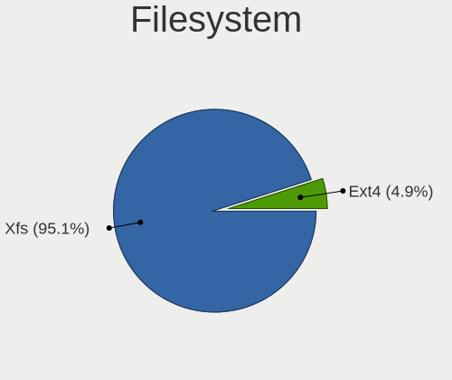

| Type | Computers | Percent |
|------|-----------|---------|
| Xfs  | 116       | 95.08%  |
| Ext4 | 6         | 4.92%   |

Part. scheme
------------

Scheme of partitioning

| Type    | Computers | Percent |
|---------|-----------|---------|
| Unknown | 70        | 56.91%  |
| GPT     | 50        | 40.65%  |
| MBR     | 3         | 2.44%   |

Dual Boot with Linux/BSD
------------------------

Hosting more than one Linux/BSD

| Dual boot | Computers | Percent |
|-----------|-----------|---------|
| No        | 108       | 88.52%  |
| Yes       | 14        | 11.48%  |

Dual Boot (Win)
---------------

Hosting Linux and Windows

| Dual boot | Computers | Percent |
|-----------|-----------|---------|
| No        | 108       | 87.8%   |
| Yes       | 15        | 12.2%   |

Board
-----

Vendor
------

Motherboard manufacturer

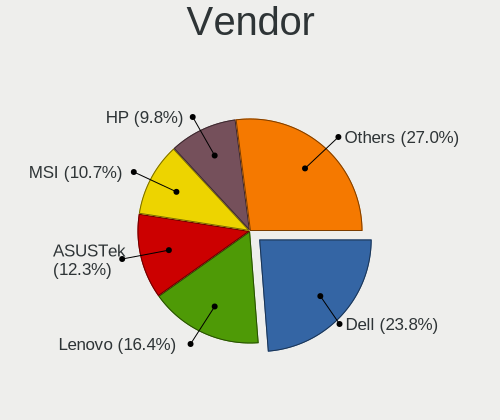

| Name                    | Computers | Percent |
|-------------------------|-----------|---------|
| Dell                    | 29        | 23.77%  |
| Lenovo                  | 20        | 16.39%  |
| ASUSTek Computer        | 15        | 12.3%   |
| MSI                     | 13        | 10.66%  |
| Hewlett-Packard         | 12        | 9.84%   |
| ASRock                  | 7         | 5.74%   |
| Gigabyte Technology     | 6         | 4.92%   |
| Unknown                 | 5         | 4.1%    |
| Intel                   | 3         | 2.46%   |
| Acer                    | 2         | 1.64%   |
| UNOWHY                  | 1         | 0.82%   |
| System76                | 1         | 0.82%   |
| Supermicro              | 1         | 0.82%   |
| Samsung Electronics     | 1         | 0.82%   |
| Razer                   | 1         | 0.82%   |
| Raspberry Pi Foundation | 1         | 0.82%   |
| Microsoft               | 1         | 0.82%   |
| LG Electronics          | 1         | 0.82%   |
| Hardkernel              | 1         | 0.82%   |
| CX / Air Computers.     | 1         | 0.82%   |

Model
-----

Motherboard model

| Name                                         | Computers | Percent |
|----------------------------------------------|-----------|---------|
| Unknown                                      | 5         | 4.1%    |
| Dell Precision 7920 Tower                    | 3         | 2.46%   |
| Gigabyte B550M AORUS PRO-P                   | 2         | 1.64%   |
| Dell Precision Tower 5810                    | 2         | 1.64%   |
| UNOWHY Y13G010S4EI                           | 1         | 0.82%   |
| System76 Galago Pro                          | 1         | 0.82%   |
| Supermicro SSG-6028R-E1CR12T                 | 1         | 0.82%   |
| Samsung 730QCJ/730QCR                        | 1         | 0.82%   |
| Razer Blade 15 Mid 2019-Base                 | 1         | 0.82%   |
| RPi Raspberry Pi 4 Model B                   | 1         | 0.82%   |
| MSI MS-7D86                                  | 1         | 0.82%   |
| MSI MS-7D54                                  | 1         | 0.82%   |
| MSI MS-7D52                                  | 1         | 0.82%   |
| MSI MS-7D25                                  | 1         | 0.82%   |
| MSI MS-7C95                                  | 1         | 0.82%   |
| MSI MS-7C56                                  | 1         | 0.82%   |
| MSI MS-7B89                                  | 1         | 0.82%   |
| MSI MS-7A71                                  | 1         | 0.82%   |
| MSI Modern 15 A5M                            | 1         | 0.82%   |
| MSI Katana GF76 12UC                         | 1         | 0.82%   |
| MSI Katana GF66 12UC                         | 1         | 0.82%   |
| MSI GP75 Leopard 9SD                         | 1         | 0.82%   |
| MSI GE72VR 7RF                               | 1         | 0.82%   |
| Microsoft Surface Go 2                       | 1         | 0.82%   |
| LG 15Z95P-GRLGL                              | 1         | 0.82%   |
| Lenovo ThinkSystem SR950 V3                  | 1         | 0.82%   |
| Lenovo ThinkPad X1 Nano Gen 2 21E80012US     | 1         | 0.82%   |
| Lenovo ThinkPad X1 Extreme Gen 5 21DFS08200  | 1         | 0.82%   |
| Lenovo ThinkPad X1 Extreme Gen 4i 20Y5S08300 | 1         | 0.82%   |
| Lenovo ThinkPad X1 Carbon Gen 11 21HMS1V900  | 1         | 0.82%   |
| Lenovo ThinkPad T490 20N3S77601              | 1         | 0.82%   |
| Lenovo ThinkPad T16 Gen 1 21CH000JUS         | 1         | 0.82%   |
| Lenovo ThinkPad S1 Yoga 12 20DK001YMC        | 1         | 0.82%   |
| Lenovo ThinkPad P17 Gen 2i 20YU002KUS        | 1         | 0.82%   |
| Lenovo ThinkPad L480 20LS0015UK              | 1         | 0.82%   |
| Lenovo ThinkPad L14 Gen 3 21C2S1EE00         | 1         | 0.82%   |
| Lenovo ThinkPad Edge E431 62771L7            | 1         | 0.82%   |
| Lenovo ThinkPad E14 20RA001MMZ               | 1         | 0.82%   |
| Lenovo ThinkBook 14-IIL 20SL                 | 1         | 0.82%   |
| Lenovo ThinkBook 13x G2 IAP 21AT             | 1         | 0.82%   |

Model Family
------------

Motherboard model prefix

| Name                         | Computers | Percent |
|------------------------------|-----------|---------|
| Dell Precision               | 14        | 11.48%  |
| Lenovo ThinkPad              | 12        | 9.84%   |
| Dell Latitude                | 6         | 4.92%   |
| ASUS ROG                     | 6         | 4.92%   |
| Dell Inspiron                | 5         | 4.1%    |
| Unknown                      | 5         | 4.1%    |
| HP EliteBook                 | 4         | 3.28%   |
| Lenovo ThinkBook             | 3         | 2.46%   |
| Lenovo IdeaPad               | 3         | 2.46%   |
| ASUS TUF                     | 3         | 2.46%   |
| ASUS PRIME                   | 3         | 2.46%   |
| MSI Katana                   | 2         | 1.64%   |
| Gigabyte B550M               | 2         | 1.64%   |
| ASRock X570                  | 2         | 1.64%   |
| Acer Aspire                  | 2         | 1.64%   |
| UNOWHY Y13G010S4EI           | 1         | 0.82%   |
| System76 Galago              | 1         | 0.82%   |
| Supermicro SSG-6028R-E1CR12T | 1         | 0.82%   |
| Samsung 730QCJ               | 1         | 0.82%   |
| Razer Blade                  | 1         | 0.82%   |
| RPi Raspberry                | 1         | 0.82%   |
| MSI MS-7D86                  | 1         | 0.82%   |
| MSI MS-7D54                  | 1         | 0.82%   |
| MSI MS-7D52                  | 1         | 0.82%   |
| MSI MS-7D25                  | 1         | 0.82%   |
| MSI MS-7C95                  | 1         | 0.82%   |
| MSI MS-7C56                  | 1         | 0.82%   |
| MSI MS-7B89                  | 1         | 0.82%   |
| MSI MS-7A71                  | 1         | 0.82%   |
| MSI Modern                   | 1         | 0.82%   |
| MSI GP75                     | 1         | 0.82%   |
| MSI GE72VR                   | 1         | 0.82%   |
| Microsoft Surface            | 1         | 0.82%   |
| LG 15Z95P-GRLGL              | 1         | 0.82%   |
| Lenovo ThinkSystem           | 1         | 0.82%   |
| Lenovo Legion                | 1         | 0.82%   |
| Intel NUC12WSHi7             | 1         | 0.82%   |
| Intel H81                    | 1         | 0.82%   |
| Intel DQ77MK                 | 1         | 0.82%   |
| HP Z800                      | 1         | 0.82%   |

MFG Year
--------

Motherboard manufacture year

| Year | Computers | Percent |
|------|-----------|---------|
| 2021 | 22        | 18.03%  |
| 2019 | 20        | 16.39%  |
| 2022 | 16        | 13.11%  |
| 2020 | 14        | 11.48%  |
| 2023 | 10        | 8.2%    |
| 2018 | 9         | 7.38%   |
| 2017 | 8         | 6.56%   |
| 2016 | 5         | 4.1%    |
| 2015 | 4         | 3.28%   |
| 2014 | 4         | 3.28%   |
| 2013 | 3         | 2.46%   |
| 2011 | 3         | 2.46%   |
| 2012 | 2         | 1.64%   |
| 2010 | 2         | 1.64%   |

Form Factor
-----------

Physical design of the computer

| Name           | Computers | Percent |
|----------------|-----------|---------|
| Notebook       | 62        | 50.82%  |
| Desktop        | 47        | 38.52%  |
| Server         | 6         | 4.92%   |
| Convertible    | 3         | 2.46%   |
| System on chip | 1         | 0.82%   |
| Tablet         | 1         | 0.82%   |
| Mini pc        | 1         | 0.82%   |
| All in one     | 1         | 0.82%   |

Secure Boot
-----------

Enabled or disabled

| State    | Computers | Percent |
|----------|-----------|---------|
| Disabled | 102       | 82.93%  |
| Enabled  | 21        | 17.07%  |

Coreboot
--------

Have coreboot on board

| Used | Computers | Percent |
|------|-----------|---------|
| No   | 121       | 99.18%  |
| Yes  | 1         | 0.82%   |

RAM Size
--------

Total RAM memory

| Size in GB      | Computers | Percent |
|-----------------|-----------|---------|
| 8.01-16.0       | 39        | 31.97%  |
| 32.01-64.0      | 25        | 20.49%  |
| 4.01-8.0        | 21        | 17.21%  |
| 64.01-256.0     | 16        | 13.11%  |
| 3.01-4.0        | 8         | 6.56%   |
| More than 256.0 | 5         | 4.1%    |
| 24.01-32.0      | 4         | 3.28%   |
| 16.01-24.0      | 4         | 3.28%   |

RAM Used
--------

Used RAM memory

| Used GB    | Computers | Percent |
|------------|-----------|---------|
| 4.01-8.0   | 44        | 33.59%  |
| 2.01-3.0   | 40        | 30.53%  |
| 3.01-4.0   | 22        | 16.79%  |
| 8.01-16.0  | 18        | 13.74%  |
| 1.01-2.0   | 6         | 4.58%   |
| 32.01-64.0 | 1         | 0.76%   |

Total Drives
------------

Number of drives on board

| Drives | Computers | Percent |
|--------|-----------|---------|
| 1      | 55        | 44%     |
| 2      | 34        | 27.2%   |
| 3      | 18        | 14.4%   |
| 4      | 6         | 4.8%    |
| 5      | 5         | 4%      |
| 6      | 2         | 1.6%    |
| 15     | 1         | 0.8%    |
| 14     | 1         | 0.8%    |
| 10     | 1         | 0.8%    |
| 7      | 1         | 0.8%    |
| 0      | 1         | 0.8%    |

Has CD-ROM
----------

Has CD-ROM on board

| Presented | Computers | Percent |
|-----------|-----------|---------|
| No        | 98        | 80.33%  |
| Yes       | 24        | 19.67%  |

Has Ethernet
------------

Has Ethernet on board

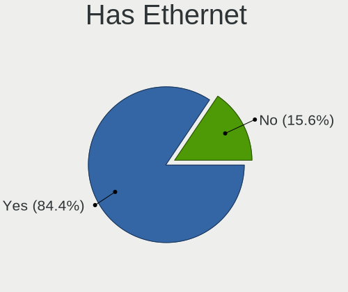

| Presented | Computers | Percent |
|-----------|-----------|---------|
| Yes       | 103       | 84.43%  |
| No        | 19        | 15.57%  |

Has WiFi
--------

Has WiFi module

| Presented | Computers | Percent |
|-----------|-----------|---------|
| Yes       | 96        | 76.8%   |
| No        | 29        | 23.2%   |

Has Bluetooth
-------------

Has Bluetooth module

| Presented | Computers | Percent |
|-----------|-----------|---------|
| Yes       | 85        | 68%     |
| No        | 40        | 32%     |

Location
--------

Country
-------

Geographic location (country)

| Country      | Computers | Percent |
|--------------|-----------|---------|
| USA          | 42        | 34.43%  |
| India        | 10        | 8.2%    |
| Brazil       | 7         | 5.74%   |
| UK           | 6         | 4.92%   |
| Canada       | 6         | 4.92%   |
| Spain        | 4         | 3.28%   |
| Guatemala    | 3         | 2.46%   |
| Turkey       | 2         | 1.64%   |
| Switzerland  | 2         | 1.64%   |
| South Korea  | 2         | 1.64%   |
| Russia       | 2         | 1.64%   |
| Romania      | 2         | 1.64%   |
| New Zealand  | 2         | 1.64%   |
| Italy        | 2         | 1.64%   |
| Ireland      | 2         | 1.64%   |
| Germany      | 2         | 1.64%   |
| Czechia      | 2         | 1.64%   |
| Chile        | 2         | 1.64%   |
| Vietnam      | 1         | 0.82%   |
| Thailand     | 1         | 0.82%   |
| Sweden       | 1         | 0.82%   |
| Sri Lanka    | 1         | 0.82%   |
| South Africa | 1         | 0.82%   |
| Slovakia     | 1         | 0.82%   |
| Saudi Arabia | 1         | 0.82%   |
| Saint Lucia  | 1         | 0.82%   |
| Poland       | 1         | 0.82%   |
| Norway       | 1         | 0.82%   |
| Netherlands  | 1         | 0.82%   |
| Mexico       | 1         | 0.82%   |
| Kenya        | 1         | 0.82%   |
| Jordan       | 1         | 0.82%   |
| Japan        | 1         | 0.82%   |
| Indonesia    | 1         | 0.82%   |
| France       | 1         | 0.82%   |
| Finland      | 1         | 0.82%   |
| Egypt        | 1         | 0.82%   |
| Austria      | 1         | 0.82%   |
| Australia    | 1         | 0.82%   |
| Argentina    | 1         | 0.82%   |

City
----

Geographic location (city)

| City             | Computers | Percent |
|------------------|-----------|---------|
| Guatemala City   | 3         | 2.38%   |
| Wellington       | 2         | 1.59%   |
| Santiago         | 2         | 1.59%   |
| Jaipur           | 2         | 1.59%   |
| Houston          | 2         | 1.59%   |
| Dublin           | 2         | 1.59%   |
| Brampton         | 2         | 1.59%   |
| Zlín            | 1         | 0.79%   |
| Wildomar         | 1         | 0.79%   |
| Whiteley         | 1         | 0.79%   |
| Wake Forest      | 1         | 0.79%   |
| Vancouver        | 1         | 0.79%   |
| Valencia         | 1         | 0.79%   |
| Valbrembo        | 1         | 0.79%   |
| Urbandale        | 1         | 0.79%   |
| Tokyo            | 1         | 0.79%   |
| Sutton           | 1         | 0.79%   |
| Stratham         | 1         | 0.79%   |
| Sterling Heights | 1         | 0.79%   |
| Stavropol        | 1         | 0.79%   |
| Spring Hill      | 1         | 0.79%   |
| Skien            | 1         | 0.79%   |
| Sierra Vista     | 1         | 0.79%   |
| Seoul            | 1         | 0.79%   |
| Sao Paulo        | 1         | 0.79%   |
| Sainte-Marie     | 1         | 0.79%   |
| Saint Paul       | 1         | 0.79%   |
| Sacramento       | 1         | 0.79%   |
| Roseville        | 1         | 0.79%   |
| Rosario          | 1         | 0.79%   |
| Riyadh           | 1         | 0.79%   |
| Rio de Janeiro   | 1         | 0.79%   |
| Ridgecrest       | 1         | 0.79%   |
| Ribeirao Preto   | 1         | 0.79%   |
| Râmnicu Vâlcea | 1         | 0.79%   |
| Providence       | 1         | 0.79%   |
| Prairieville     | 1         | 0.79%   |
| Poznan           | 1         | 0.79%   |
| Port Saint Lucie | 1         | 0.79%   |
| Piracicaba       | 1         | 0.79%   |

Drives
------

Drive Vendor
------------

Hard drive vendors

| Vendor                      | Computers | Drives | Percent |
|-----------------------------|-----------|--------|---------|
| Samsung Electronics         | 39        | 54     | 18.22%  |
| Seagate                     | 24        | 58     | 11.21%  |
| WDC                         | 22        | 36     | 10.28%  |
| Sandisk                     | 16        | 22     | 7.48%   |
| Toshiba                     | 11        | 13     | 5.14%   |
| Unknown                     | 10        | 13     | 4.67%   |
| KIOXIA                      | 8         | 9      | 3.74%   |
| Micron/Crucial Technology   | 7         | 10     | 3.27%   |
| Kingston                    | 7         | 8      | 3.27%   |
| Intel                       | 7         | 14     | 3.27%   |
| SK hynix                    | 6         | 6      | 2.8%    |
| Micron Technology           | 6         | 6      | 2.8%    |
| HGST                        | 4         | 4      | 1.87%   |
| Phison Electronics          | 3         | 4      | 1.4%    |
| Phison                      | 3         | 3      | 1.4%    |
| China                       | 3         | 3      | 1.4%    |
| SABRENT                     | 2         | 2      | 0.93%   |
| Realtek                     | 2         | 2      | 0.93%   |
| PNY                         | 2         | 2      | 0.93%   |
| Kingston Technology Company | 2         | 2      | 0.93%   |
| KingSpec                    | 2         | 2      | 0.93%   |
| Crucial                     | 2         | 3      | 0.93%   |
| ADATA Technology            | 2         | 2      | 0.93%   |
| Unknown                     | 2         | 2      | 0.93%   |
| XUM                         | 1         | 1      | 0.47%   |
| WDC WDS                     | 1         | 1      | 0.47%   |
| Union Memory                | 1         | 1      | 0.47%   |
| SSSTC                       | 1         | 1      | 0.47%   |
| SPCC                        | 1         | 1      | 0.47%   |
| Silicon Motion              | 1         | 1      | 0.47%   |
| Plextor                     | 1         | 1      | 0.47%   |
| NVMe                        | 1         | 1      | 0.47%   |
| NEXDRIVE                    | 1         | 1      | 0.47%   |
| MAXIO Technology (Hangzhou) | 1         | 2      | 0.47%   |
| Lexar                       | 1         | 1      | 0.47%   |
| Kingmax                     | 1         | 1      | 0.47%   |
| KingFast                    | 1         | 1      | 0.47%   |
| Kimtigo                     | 1         | 1      | 0.47%   |
| Inland                      | 1         | 1      | 0.47%   |
| HUSKY                       | 1         | 1      | 0.47%   |

Drive Model
-----------

Hard drive models

| Model                                                | Computers | Percent |
|------------------------------------------------------|-----------|---------|
| Samsung NVMe SSD Controller PM9A1/PM9A3/980PRO 512GB | 8         | 3.24%   |
| Samsung NVMe SSD Controller SM981/PM981/PM983 512GB  | 7         | 2.83%   |
| Samsung SSD 980 1TB                                  | 4         | 1.62%   |
| Micron/Crucial P2 NVMe PCIe SSD 500GB                | 4         | 1.62%   |
| Unknown MMC Card  64GB                               | 3         | 1.21%   |
| Sandisk WD Black SN750 / PC SN730 NVMe SSD 512GB     | 3         | 1.21%   |
| Phison E16 PCIe4 NVMe Controller 1TB                 | 3         | 1.21%   |
| Micron 2400_MTFDKBA512QFM 512GB                      | 3         | 1.21%   |
| HGST HTS721010A9E630 1TB                             | 3         | 1.21%   |
| WDC WDBNCE5000PNC 500GB SSD                          | 2         | 0.81%   |
| Unknown MMC Card  256GB                              | 2         | 0.81%   |
| Toshiba MQ01ABF050 500GB                             | 2         | 0.81%   |
| Seagate ST1000LM049-2GH172 1TB                       | 2         | 0.81%   |
| Seagate ST1000DM010-2EP102 1TB                       | 2         | 0.81%   |
| Seagate BUP Slim BK 2TB                              | 2         | 0.81%   |
| Sandisk WD Blue SN570 500GB                          | 2         | 0.81%   |
| Sandisk WD Blue SN550 NVMe SSD 256GB                 | 2         | 0.81%   |
| Sandisk WD Blue SN500 / PC SN520 NVMe SSD 256GB      | 2         | 0.81%   |
| Sandisk WD Black SN850 2TB                           | 2         | 0.81%   |
| Samsung SSD 990 PRO 2TB                              | 2         | 0.81%   |
| Samsung SSD 870 EVO 1TB                              | 2         | 0.81%   |
| SABRENT Disk 2TB                                     | 2         | 0.81%   |
| Realtek RTL9210B-CG 500GB                            | 2         | 0.81%   |
| KIOXIA KBG5AZNT1T02 LA 1024GB                        | 2         | 0.81%   |
| Kingston Company SNV2S250G 250GB                     | 2         | 0.81%   |
| Intel SSD 660P Series 1024GB                         | 2         | 0.81%   |
| Unknown                                              | 2         | 0.81%   |
| XUM HX256GSSDSATA3 256GB                             | 1         | 0.4%    |
| WDC WDS240G2G0A-00JH30 240GB SSD                     | 1         | 0.4%    |
| WDC WDS 250G2B0A-00SM50 250GB SSD                    | 1         | 0.4%    |
| WDC WDBA3V5000ANC-WRSN 500GB                         | 1         | 0.4%    |
| WDC WD80EFAX-68KNBN0 8TB                             | 1         | 0.4%    |
| WDC WD5000AVDS-63U7B0 500GB                          | 1         | 0.4%    |
| WDC WD5000AVCS-632DY1 500GB                          | 1         | 0.4%    |
| WDC WD5000AAKX-75U6AA0 500GB                         | 1         | 0.4%    |
| WDC WD50 00LPVX-22V0TT0 500GB                        | 1         | 0.4%    |
| WDC WD40EFZX-68AWUN0 4TB                             | 1         | 0.4%    |
| WDC WD40EFRX-68N32N0 4TB                             | 1         | 0.4%    |
| WDC WD40EFPX-68C6CN0 4TB                             | 1         | 0.4%    |
| WDC WD4005FZBX-00K5WB0 4TB                           | 1         | 0.4%    |

HDD Vendor
----------

Hard disk drive vendors

| Vendor              | Computers | Drives | Percent |
|---------------------|-----------|--------|---------|
| Seagate             | 24        | 58     | 38.1%   |
| WDC                 | 19        | 32     | 30.16%  |
| Toshiba             | 10        | 11     | 15.87%  |
| HGST                | 4         | 4      | 6.35%   |
| SABRENT             | 2         | 2      | 3.17%   |
| Unknown             | 1         | 1      | 1.59%   |
| Samsung Electronics | 1         | 1      | 1.59%   |
| Hitachi             | 1         | 1      | 1.59%   |
| Fantom              | 1         | 1      | 1.59%   |

SSD Vendor
----------

Solid state drive vendors

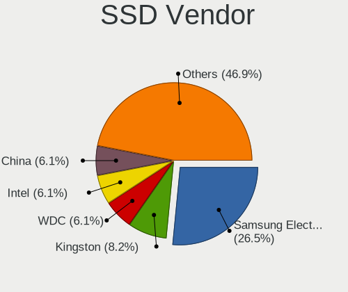

| Vendor              | Computers | Drives | Percent |
|---------------------|-----------|--------|---------|
| Samsung Electronics | 13        | 16     | 26.53%  |
| Kingston            | 4         | 5      | 8.16%   |
| WDC                 | 3         | 3      | 6.12%   |
| Intel               | 3         | 6      | 6.12%   |
| China               | 3         | 3      | 6.12%   |
| SK hynix            | 2         | 2      | 4.08%   |
| SanDisk             | 2         | 2      | 4.08%   |
| PNY                 | 2         | 2      | 4.08%   |
| KingSpec            | 2         | 2      | 4.08%   |
| Crucial             | 2         | 2      | 4.08%   |
| XUM                 | 1         | 1      | 2.04%   |
| WDC WDS             | 1         | 1      | 2.04%   |
| SPCC                | 1         | 1      | 2.04%   |
| Plextor             | 1         | 1      | 2.04%   |
| NVMe                | 1         | 1      | 2.04%   |
| NEXDRIVE            | 1         | 1      | 2.04%   |
| Lexar               | 1         | 1      | 2.04%   |
| Kingmax             | 1         | 1      | 2.04%   |
| Kimtigo             | 1         | 1      | 2.04%   |
| Inland              | 1         | 1      | 2.04%   |
| HUSKY               | 1         | 1      | 2.04%   |
| Gigabyte Technology | 1         | 1      | 2.04%   |
| DERLAR              | 1         | 1      | 2.04%   |

Drive Kind
----------

HDD or SSD

| Kind    | Computers | Drives | Percent |
|---------|-----------|--------|---------|
| NVMe    | 86        | 120    | 45.03%  |
| HDD     | 49        | 111    | 25.65%  |
| SSD     | 45        | 56     | 23.56%  |
| MMC     | 8         | 10     | 4.19%   |
| Unknown | 3         | 6      | 1.57%   |

Drive Connector
---------------

SATA, SAS, NVMe, etc.

| Type | Computers | Drives | Percent |
|------|-----------|--------|---------|
| NVMe | 85        | 118    | 49.13%  |
| SATA | 66        | 154    | 38.15%  |
| SAS  | 14        | 21     | 8.09%   |
| MMC  | 8         | 10     | 4.62%   |

Drive Size
----------

Size of hard drive

| Size in TB | Computers | Drives | Percent |
|------------|-----------|--------|---------|
| 0.01-0.5   | 39        | 54     | 36.79%  |
| 0.51-1.0   | 32        | 40     | 30.19%  |
| 1.01-2.0   | 13        | 19     | 12.26%  |
| 3.01-4.0   | 7         | 20     | 6.6%    |
| 4.01-10.0  | 6         | 20     | 5.66%   |
| 10.01-20.0 | 5         | 9      | 4.72%   |
| 2.01-3.0   | 4         | 5      | 3.77%   |

Space Total
-----------

Amount of disk space available on the file system

| Size in GB     | Computers | Percent |
|----------------|-----------|---------|
| 101-250        | 34        | 27.2%   |
| 251-500        | 26        | 20.8%   |
| 501-1000       | 23        | 18.4%   |
| 1001-2000      | 16        | 12.8%   |
| More than 3000 | 11        | 8.8%    |
| 51-100         | 5         | 4%      |
| 21-50          | 4         | 3.2%    |
| 2001-3000      | 4         | 3.2%    |
| Unknown        | 2         | 1.6%    |

Space Used
----------

Amount of used disk space

| Used GB        | Computers | Percent |
|----------------|-----------|---------|
| 1-20           | 41        | 32.03%  |
| 21-50          | 33        | 25.78%  |
| 51-100         | 17        | 13.28%  |
| 251-500        | 11        | 8.59%   |
| 101-250        | 11        | 8.59%   |
| 1001-2000      | 5         | 3.91%   |
| More than 3000 | 4         | 3.13%   |
| 501-1000       | 3         | 2.34%   |
| Unknown        | 2         | 1.56%   |
| 2001-3000      | 1         | 0.78%   |

Malfunc. Drives
---------------

Drive models with a malfunction

| Model                                             | Computers | Drives | Percent |
|---------------------------------------------------|-----------|--------|---------|
| WDC WD50 00LPVX-22V0TT0 500GB                     | 1         | 1      | 9.09%   |
| Silicon Motion SM2262/SM2262EN SSD Controller 2TB | 1         | 1      | 9.09%   |
| Seagate ST500LT012-9WS142 500GB                   | 1         | 1      | 9.09%   |
| Seagate ST14000NM0018-2H4101 14TB                 | 1         | 1      | 9.09%   |
| Seagate ST12000VN0007-2GS116 12TB                 | 1         | 1      | 9.09%   |
| Seagate ST1000LM035-1RK172 1TB                    | 1         | 1      | 9.09%   |
| Seagate ST1000DM010-2EP102 1TB                    | 1         | 1      | 9.09%   |
| Micron/Crucial Technology P1 NVMe PCIe SSD 1TB    | 1         | 1      | 9.09%   |
| Intel SSDSC2BB480G7 480GB                         | 1         | 2      | 9.09%   |
| Intel SSDSC2BA800G4R 800GB                        | 1         | 2      | 9.09%   |
| Crucial CT1000BX500SSD1 1TB                       | 1         | 1      | 9.09%   |

Malfunc. Drive Vendor
---------------------

Vendors of faulty drives

| Vendor                    | Computers | Drives | Percent |
|---------------------------|-----------|--------|---------|
| Seagate                   | 5         | 5      | 45.45%  |
| Intel                     | 2         | 4      | 18.18%  |
| WDC                       | 1         | 1      | 9.09%   |
| Silicon Motion            | 1         | 1      | 9.09%   |
| Micron/Crucial Technology | 1         | 1      | 9.09%   |
| Crucial                   | 1         | 1      | 9.09%   |

Malfunc. HDD Vendor
-------------------

Vendors of faulty HDD drives

| Vendor  | Computers | Drives | Percent |
|---------|-----------|--------|---------|
| Seagate | 5         | 5      | 83.33%  |
| WDC     | 1         | 1      | 16.67%  |

Malfunc. Drive Kind
-------------------

Kinds of faulty drives

| Kind | Computers | Drives | Percent |
|------|-----------|--------|---------|
| HDD  | 5         | 6      | 50%     |
| SSD  | 3         | 5      | 30%     |
| NVMe | 2         | 2      | 20%     |

Failed Drives
-------------

Failed drive models

| Model                           | Computers | Drives | Percent |
|---------------------------------|-----------|--------|---------|
| Samsung Electronics SSD 980 1TB | 1         | 1      | 100%    |

Failed Drive Vendor
-------------------

Failed drive vendors

| Vendor              | Computers | Drives | Percent |
|---------------------|-----------|--------|---------|
| Samsung Electronics | 1         | 1      | 100%    |

Drive Status
------------

Number of failed and malfunc. drives

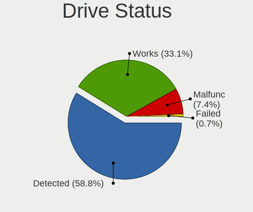

| Status   | Computers | Drives | Percent |
|----------|-----------|--------|---------|
| Detected | 80        | 177    | 58.82%  |
| Works    | 45        | 112    | 33.09%  |
| Malfunc  | 10        | 13     | 7.35%   |
| Failed   | 1         | 1      | 0.74%   |

Storage controller
------------------

Storage Vendor
--------------

Storage controller vendors

| Vendor                       | Computers | Percent |
|------------------------------|-----------|---------|
| Intel                        | 78        | 39.8%   |
| Samsung Electronics          | 27        | 13.78%  |
| AMD                          | 20        | 10.2%   |
| SanDisk                      | 15        | 7.65%   |
| KIOXIA                       | 8         | 4.08%   |
| Micron/Crucial Technology    | 7         | 3.57%   |
| Phison Electronics           | 6         | 3.06%   |
| Micron Technology            | 6         | 3.06%   |
| ASMedia Technology           | 6         | 3.06%   |
| Kingston Technology Company  | 5         | 2.55%   |
| SK hynix                     | 4         | 2.04%   |
| Broadcom / LSI               | 4         | 2.04%   |
| ADATA Technology             | 3         | 1.53%   |
| LSI Logic / Symbios Logic    | 2         | 1.02%   |
| Union Memory (Shenzhen)      | 1         | 0.51%   |
| Toshiba America Info Systems | 1         | 0.51%   |
| Silicon Motion               | 1         | 0.51%   |
| MAXIO Technology (Hangzhou)  | 1         | 0.51%   |
| JMicron Technology           | 1         | 0.51%   |

Storage Model
-------------

Storage controller models

| Model                                                                          | Computers | Percent |
|--------------------------------------------------------------------------------|-----------|---------|
| AMD FCH SATA Controller [AHCI mode]                                            | 11        | 4.93%   |
| Samsung NVMe SSD Controller SM981/PM981/PM983                                  | 9         | 4.04%   |
| Samsung NVMe SSD Controller PM9A1/PM9A3/980PRO                                 | 9         | 4.04%   |
| Intel Volume Management Device NVMe RAID Controller                            | 8         | 3.59%   |
| Samsung NVMe SSD Controller 980 (DRAM-less)                                    | 6         | 2.69%   |
| Intel Sunrise Point-LP SATA Controller [AHCI mode]                             | 6         | 2.69%   |
| ASMedia ASM1061/ASM1062 Serial ATA Controller                                  | 6         | 2.69%   |
| AMD 500 Series Chipset SATA Controller                                         | 6         | 2.69%   |
| KIOXIA NVMe SSD Controller BG5 (DRAM-less)                                     | 5         | 2.24%   |
| Intel SATA Controller [RAID mode]                                              | 5         | 2.24%   |
| Intel 82801 Mobile SATA Controller [RAID mode]                                 | 5         | 2.24%   |
| Phison E16 PCIe4 NVMe Controller                                               | 4         | 1.79%   |
| Micron/Crucial P2 [Nick P2] / P3 / P3 Plus NVMe PCIe SSD (DRAM-less)           | 4         | 1.79%   |
| Intel Comet Lake SATA AHCI Controller                                          | 4         | 1.79%   |
| Intel Cannon Lake Mobile PCH SATA AHCI Controller                              | 4         | 1.79%   |
| Intel C620 Series Chipset Family SSATA Controller [AHCI mode]                  | 4         | 1.79%   |
| SK hynix Gold P31/BC711/PC711 NVMe Solid State Drive                           | 3         | 1.35%   |
| SanDisk WD PC SN810 / Black SN850 NVMe SSD                                     | 3         | 1.35%   |
| SanDisk Ultra 3D / WD PC SN530, IX SN530, Blue SN550 NVMe SSD (DRAM-less)      | 3         | 1.35%   |
| SanDisk Ultra 3D / WD Blue SN570 NVMe SSD (DRAM-less)                          | 3         | 1.35%   |
| SanDisk Extreme Pro / WD Black SN750 / PC SN730 / Red SN700 NVMe SSD           | 3         | 1.35%   |
| Samsung NVMe SSD Controller S4LV008[Pascal]                                    | 3         | 1.35%   |
| Micron 2400 NVMe SSD (DRAM-less)                                               | 3         | 1.35%   |
| KIOXIA NVMe SSD Controller BG4 (DRAM-less)                                     | 3         | 1.35%   |
| Intel Volume Management Device NVMe RAID Controller Intel Corporation          | 3         | 1.35%   |
| Intel SSD 660P Series                                                          | 3         | 1.35%   |
| Intel Raptor Lake SATA AHCI Controller                                         | 3         | 1.35%   |
| Intel Q170/Q150/B150/H170/H110/Z170/CM236 Chipset SATA Controller [AHCI Mode]  | 3         | 1.35%   |
| Intel Jasper Lake SATA AHCI Controller                                         | 3         | 1.35%   |
| Intel C620 Series Chipset Family IDE Redirection                               | 3         | 1.35%   |
| Intel C610/X99 series chipset 6-Port SATA Controller [AHCI mode]               | 3         | 1.35%   |
| Intel Alder Lake-S PCH SATA Controller [AHCI Mode]                             | 3         | 1.35%   |
| Intel Alder Lake-P SATA AHCI Controller                                        | 3         | 1.35%   |
| Intel 8 Series/C220 Series Chipset Family 6-port SATA Controller 1 [AHCI mode] | 3         | 1.35%   |
| Intel 500 Series Chipset Family SATA AHCI Controller                           | 3         | 1.35%   |
| Intel 200 Series PCH SATA controller [AHCI mode]                               | 3         | 1.35%   |
| SanDisk WD Blue SN500 / PC SN520 x2 M.2 2280 NVMe SSD                          | 2         | 0.9%    |
| SanDisk WD Black SN770 / PC SN740 256GB / PC SN560 (DRAM-less) NVMe SSD        | 2         | 0.9%    |
| Phison E12 NVMe Controller                                                     | 2         | 0.9%    |
| Kingston Company NV2 NVMe SSD [E21T] (DRAM-less)                               | 2         | 0.9%    |

Storage Kind
------------

Kind of storage controller (IDE, SATA, NVMe, SAS, ...)

| Kind | Computers | Percent |
|------|-----------|---------|
| NVMe | 83        | 42.56%  |
| SATA | 82        | 42.05%  |
| RAID | 24        | 12.31%  |
| IDE  | 3         | 1.54%   |
| SAS  | 2         | 1.03%   |
| SCSI | 1         | 0.51%   |

Processor
---------

CPU Vendor
----------

Processor vendors

| Vendor | Computers | Percent |
|--------|-----------|---------|
| Intel  | 97        | 79.51%  |
| AMD    | 24        | 19.67%  |
| ARM    | 1         | 0.82%   |

CPU Model
---------

Processor models

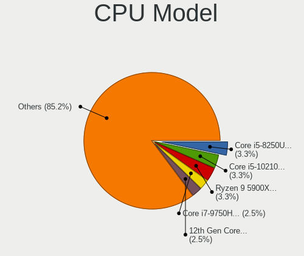

| Model                                   | Computers | Percent |
|-----------------------------------------|-----------|---------|
| Intel Core i5-8250U CPU @ 1.60GHz       | 4         | 3.28%   |
| Intel Core i5-10210U CPU @ 1.60GHz      | 4         | 3.28%   |
| AMD Ryzen 9 5900X 12-Core Processor     | 4         | 3.28%   |
| Intel Core i7-9750H CPU @ 2.60GHz       | 3         | 2.46%   |
| Intel 12th Gen Core i7-12700H           | 3         | 2.46%   |
| AMD Ryzen 5 5600G with Radeon Graphics  | 3         | 2.46%   |
| Intel Core i7-6820HQ CPU @ 2.70GHz      | 2         | 1.64%   |
| Intel Core i5-1035G1 CPU @ 1.00GHz      | 2         | 1.64%   |
| Intel Core i3 CPU M 380 @ 2.53GHz       | 2         | 1.64%   |
| Intel 12th Gen Core i9-12900K           | 2         | 1.64%   |
| Intel 12th Gen Core i7-1260P            | 2         | 1.64%   |
| Intel 11th Gen Core i7-11800H @ 2.30GHz | 2         | 1.64%   |
| Intel 11th Gen Core i7-11700K @ 3.60GHz | 2         | 1.64%   |
| AMD Ryzen 9 3900X 12-Core Processor     | 2         | 1.64%   |
| AMD Ryzen 5 3600 6-Core Processor       | 2         | 1.64%   |
| Intel Xeon W-11855M CPU @ 3.20GHz       | 1         | 0.82%   |
| Intel Xeon Silver 4310 CPU @ 2.10GHz    | 1         | 0.82%   |
| Intel Xeon Platinum 8468H               | 1         | 0.82%   |
| Intel Xeon Platinum 8168 CPU @ 2.70GHz  | 1         | 0.82%   |
| Intel Xeon Gold 6138 CPU @ 2.00GHz      | 1         | 0.82%   |
| Intel Xeon Gold 5122 CPU @ 3.60GHz      | 1         | 0.82%   |
| Intel Xeon CPU X5570 @ 2.93GHz          | 1         | 0.82%   |
| Intel Xeon CPU E5-2660 0 @ 2.20GHz      | 1         | 0.82%   |
| Intel Xeon CPU E5-2620 v4 @ 2.10GHz     | 1         | 0.82%   |
| Intel Xeon CPU E5-1620 v4 @ 3.50GHz     | 1         | 0.82%   |
| Intel Xeon CPU E5-1607 v4 @ 3.10GHz     | 1         | 0.82%   |
| Intel Xeon CPU E3-1240 v5 @ 3.50GHz     | 1         | 0.82%   |
| Intel Xeon CPU E3-1225 v5 @ 3.30GHz     | 1         | 0.82%   |
| Intel Pentium Silver N6005 @ 2.00GHz    | 1         | 0.82%   |
| Intel Pentium CPU 4425Y @ 1.70GHz       | 1         | 0.82%   |
| Intel Core i9-8950HK CPU @ 2.90GHz      | 1         | 0.82%   |
| Intel Core i9-14900KS                   | 1         | 0.82%   |
| Intel Core i7-9700 CPU @ 3.00GHz        | 1         | 0.82%   |
| Intel Core i7-8750H CPU @ 2.20GHz       | 1         | 0.82%   |
| Intel Core i7-8700K CPU @ 3.70GHz       | 1         | 0.82%   |
| Intel Core i7-8665U CPU @ 1.90GHz       | 1         | 0.82%   |
| Intel Core i7-7700K CPU @ 4.20GHz       | 1         | 0.82%   |
| Intel Core i7-7700HQ CPU @ 2.80GHz      | 1         | 0.82%   |
| Intel Core i7-6600U CPU @ 2.60GHz       | 1         | 0.82%   |
| Intel Core i7-5600U CPU @ 2.60GHz       | 1         | 0.82%   |

CPU Model Family
----------------

Processor model prefix

| Model                  | Computers | Percent |
|------------------------|-----------|---------|
| Other                  | 30        | 24.59%  |
| Intel Core i5          | 24        | 19.67%  |
| Intel Core i7          | 17        | 13.93%  |
| Intel Xeon             | 8         | 6.56%   |
| AMD Ryzen 9            | 8         | 6.56%   |
| AMD Ryzen 5            | 7         | 5.74%   |
| Intel Core i3          | 5         | 4.1%    |
| Intel Celeron          | 5         | 4.1%    |
| AMD Ryzen 7            | 3         | 2.46%   |
| Intel Xeon Platinum    | 2         | 1.64%   |
| Intel Xeon Gold        | 2         | 1.64%   |
| Intel Core i9          | 2         | 1.64%   |
| AMD Ryzen 7 PRO        | 2         | 1.64%   |
| Intel Xeon Silver      | 1         | 0.82%   |
| Intel Pentium Silver   | 1         | 0.82%   |
| Intel Pentium          | 1         | 0.82%   |
| AMD Ryzen Threadripper | 1         | 0.82%   |
| AMD Ryzen 3            | 1         | 0.82%   |
| AMD Athlon X4          | 1         | 0.82%   |
| AMD A4                 | 1         | 0.82%   |

CPU Cores
---------

Number of processor cores

| Number | Computers | Percent |
|--------|-----------|---------|
| 4      | 40        | 32.79%  |
| 8      | 18        | 14.75%  |
| 2      | 18        | 14.75%  |
| 6      | 14        | 11.48%  |
| 12     | 11        | 9.02%   |
| 16     | 6         | 4.92%   |
| 10     | 5         | 4.1%    |
| 14     | 4         | 3.28%   |
| 24     | 2         | 1.64%   |
| 384    | 1         | 0.82%   |
| 48     | 1         | 0.82%   |
| 40     | 1         | 0.82%   |
| 1      | 1         | 0.82%   |

CPU Sockets
-----------

Number of sockets

| Number | Computers | Percent |
|--------|-----------|---------|
| 1      | 115       | 94.26%  |
| 2      | 6         | 4.92%   |
| 8      | 1         | 0.82%   |

CPU Threads
-----------

Threads per core (Hyper-Threading)

| Number | Computers | Percent |
|--------|-----------|---------|
| 2      | 102       | 83.61%  |
| 1      | 20        | 16.39%  |

CPU Op-Modes
------------

CPU Operation Modes (32-bit, 64-bit)

| Op mode        | Computers | Percent |
|----------------|-----------|---------|
| 32-bit, 64-bit | 122       | 100%    |

CPU Microcode
-------------

Microcode number

| Number     | Computers | Percent |
|------------|-----------|---------|
| Unknown    | 47        | 38.21%  |
| 0x806ec    | 6         | 4.88%   |
| 0x306a9    | 5         | 4.07%   |
| 0x906a3    | 4         | 3.25%   |
| 0x806d1    | 4         | 3.25%   |
| 0xa0671    | 3         | 2.44%   |
| 0x506e3    | 3         | 2.44%   |
| 0x08701021 | 3         | 2.44%   |
| 0x906ea    | 2         | 1.63%   |
| 0x906e9    | 2         | 1.63%   |
| 0x906c0    | 2         | 1.63%   |
| 0x90672    | 2         | 1.63%   |
| 0x806ea    | 2         | 1.63%   |
| 0x706e5    | 2         | 1.63%   |
| 0x406e3    | 2         | 1.63%   |
| 0x306c3    | 2         | 1.63%   |
| 0x0a50000f | 2         | 1.63%   |
| 0x0a20120a | 2         | 1.63%   |
| 0xb0671    | 1         | 0.81%   |
| 0x906ed    | 1         | 0.81%   |
| 0x906a4    | 1         | 0.81%   |
| 0x806f6    | 1         | 0.81%   |
| 0x706a8    | 1         | 0.81%   |
| 0x706a1    | 1         | 0.81%   |
| 0x606a6    | 1         | 0.81%   |
| 0x50654    | 1         | 0.81%   |
| 0x406f1    | 1         | 0.81%   |
| 0x40651    | 1         | 0.81%   |
| 0x306d4    | 1         | 0.81%   |
| 0x20655    | 1         | 0.81%   |
| 0x106a5    | 1         | 0.81%   |
| 0x0a601206 | 1         | 0.81%   |
| 0x0a601203 | 1         | 0.81%   |
| 0x0a50000c | 1         | 0.81%   |
| 0x0a404102 | 1         | 0.81%   |
| 0x0a201204 | 1         | 0.81%   |
| 0x0a20102b | 1         | 0.81%   |
| 0x08701030 | 1         | 0.81%   |
| 0x08608103 | 1         | 0.81%   |
| 0x08600106 | 1         | 0.81%   |

CPU Microarch
-------------

Microarchitecture

| Name             | Computers | Percent |
|------------------|-----------|---------|
| KabyLake         | 25        | 20.49%  |
| Alderlake Hybrid | 18        | 14.75%  |
| Icelake          | 13        | 10.66%  |
| Zen 3            | 9         | 7.38%   |
| Skylake          | 9         | 7.38%   |
| IvyBridge        | 6         | 4.92%   |
| Zen 2            | 5         | 4.1%    |
| Haswell          | 5         | 4.1%    |
| Broadwell        | 5         | 4.1%    |
| Unknown          | 5         | 4.1%    |
| TigerLake        | 4         | 3.28%   |
| Zen+             | 3         | 2.46%   |
| Tremont          | 3         | 2.46%   |
| Goldmont plus    | 3         | 2.46%   |
| Westmere         | 2         | 1.64%   |
| SandyBridge      | 2         | 1.64%   |
| Excavator        | 2         | 1.64%   |
| Zen              | 1         | 0.82%   |
| Sapphire Rapids  | 1         | 0.82%   |
| Nehalem          | 1         | 0.82%   |

Graphics
--------

GPU Vendor
----------

Vendors of graphics cards

| Vendor                     | Computers | Percent |
|----------------------------|-----------|---------|
| Intel                      | 69        | 48.59%  |
| Nvidia                     | 43        | 30.28%  |
| AMD                        | 25        | 17.61%  |
| ASPEED Technology          | 3         | 2.11%   |
| Matrox Electronics Systems | 2         | 1.41%   |

GPU Model
---------

Graphics card models

| Model                                                                | Computers | Percent |
|----------------------------------------------------------------------|-----------|---------|
| Intel UHD Graphics 620                                               | 5         | 3.45%   |
| Intel CometLake-U GT2 [UHD Graphics]                                 | 5         | 3.45%   |
| Intel Alder Lake-P GT2 [Iris Xe Graphics]                            | 5         | 3.45%   |
| Nvidia GA106M [GeForce RTX 3060 Mobile / Max-Q]                      | 4         | 2.76%   |
| Intel TigerLake-LP GT2 [Iris Xe Graphics]                            | 4         | 2.76%   |
| Intel CoffeeLake-H GT2 [UHD Graphics 630]                            | 4         | 2.76%   |
| AMD Ellesmere [Radeon RX 470/480/570/570X/580/580X/590]              | 4         | 2.76%   |
| Intel TigerLake-H GT1 [UHD Graphics]                                 | 3         | 2.07%   |
| Intel RocketLake-S GT1 [UHD Graphics 750]                            | 3         | 2.07%   |
| Intel Raptor Lake-P [Iris Xe Graphics]                               | 3         | 2.07%   |
| Intel JasperLake [UHD Graphics]                                      | 3         | 2.07%   |
| Intel GeminiLake [UHD Graphics 600]                                  | 3         | 2.07%   |
| ASPEED Technology ASPEED Graphics Family                             | 3         | 2.07%   |
| Nvidia TU117GL [T400 4GB / T400E]                                    | 2         | 1.38%   |
| Nvidia TU116M [GeForce GTX 1660 Ti Mobile]                           | 2         | 1.38%   |
| Nvidia GP104GL [Quadro P4000]                                        | 2         | 1.38%   |
| Nvidia GA107M [GeForce RTX 3050 Mobile]                              | 2         | 1.38%   |
| Nvidia AD102 [GeForce RTX 4090]                                      | 2         | 1.38%   |
| Intel WhiskeyLake-U GT2 [UHD Graphics 620]                           | 2         | 1.38%   |
| Intel Skylake GT2 [HD Graphics 520]                                  | 2         | 1.38%   |
| Intel Iris Plus Graphics G1 (Ice Lake)                               | 2         | 1.38%   |
| Intel HD Graphics 630                                                | 2         | 1.38%   |
| Intel HD Graphics 5500                                               | 2         | 1.38%   |
| Intel Haswell-ULT Integrated Graphics Controller                     | 2         | 1.38%   |
| Intel Core Processor Integrated Graphics Controller                  | 2         | 1.38%   |
| Intel AlderLake-S GT1                                                | 2         | 1.38%   |
| Intel Alder Lake-UP3 GT2 [Iris Xe Graphics]                          | 2         | 1.38%   |
| Intel 3rd Gen Core processor Graphics Controller                     | 2         | 1.38%   |
| AMD Raphael                                                          | 2         | 1.38%   |
| AMD Picasso/Raven 2 [Radeon Vega Series / Radeon Vega Mobile Series] | 2         | 1.38%   |
| AMD Navi 22 [Radeon RX 6700/6700 XT/6750 XT / 6800M/6850M XT]        | 2         | 1.38%   |
| AMD Navi 14 [Radeon RX 5500/5500M / Pro 5500M]                       | 2         | 1.38%   |
| AMD Cezanne [Radeon Vega Series / Radeon Vega Mobile Series]         | 2         | 1.38%   |
| Nvidia TU117M [GeForce GTX 1650 Mobile / Max-Q]                      | 1         | 0.69%   |
| Nvidia TU117GLM [T1200 Laptop GPU]                                   | 1         | 0.69%   |
| Nvidia TU116 [GeForce GTX 1660 SUPER]                                | 1         | 0.69%   |
| Nvidia TU106 [GeForce RTX 2060 SUPER]                                | 1         | 0.69%   |
| Nvidia GT218 [GeForce G210]                                          | 1         | 0.69%   |
| Nvidia GP107GL [Quadro P400]                                         | 1         | 0.69%   |
| Nvidia GP106M [GeForce GTX 1060 Mobile]                              | 1         | 0.69%   |

GPU Combo
---------

Combinations of graphics cards

| Name            | Computers | Percent |
|-----------------|-----------|---------|
| 1 x Intel       | 51        | 41.8%   |
| 1 x Nvidia      | 29        | 23.77%  |
| 1 x AMD         | 17        | 13.93%  |
| Intel + Nvidia  | 11        | 9.02%   |
| Intel + AMD     | 4         | 3.28%   |
| 2 x AMD         | 2         | 1.64%   |
| 1 x Matrox      | 2         | 1.64%   |
| Other           | 1         | 0.82%   |
| 2 x Nvidia      | 1         | 0.82%   |
| Nvidia + ASPEED | 1         | 0.82%   |
| 1 x ASPEED      | 1         | 0.82%   |
| AMD + Nvidia    | 1         | 0.82%   |
| AMD + ASPEED    | 1         | 0.82%   |

GPU Driver
----------

Free vs proprietary

| Driver      | Computers | Percent |
|-------------|-----------|---------|
| Free        | 101       | 82.79%  |
| Proprietary | 17        | 13.93%  |
| Unknown     | 4         | 3.28%   |

GPU Memory
----------

Total video memory

| Size in GB | Computers | Percent |
|------------|-----------|---------|
| Unknown    | 64        | 52.46%  |
| 7.01-8.0   | 12        | 9.84%   |
| 3.01-4.0   | 10        | 8.2%    |
| 1.01-2.0   | 10        | 8.2%    |
| 5.01-6.0   | 6         | 4.92%   |
| 8.01-16.0  | 6         | 4.92%   |
| 0.01-0.5   | 5         | 4.1%    |
| 16.01-24.0 | 4         | 3.28%   |
| 0.51-1.0   | 4         | 3.28%   |
| 2.01-3.0   | 1         | 0.82%   |

Monitor
-------

Monitor Vendor
--------------

Monitor vendors

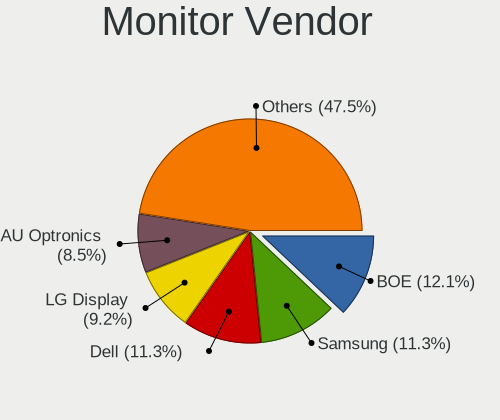

| Vendor               | Computers | Percent |
|----------------------|-----------|---------|
| BOE                  | 17        | 12.06%  |
| Samsung Electronics  | 16        | 11.35%  |
| Dell                 | 16        | 11.35%  |
| LG Display           | 13        | 9.22%   |
| AU Optronics         | 12        | 8.51%   |
| Acer                 | 9         | 6.38%   |
| Chimei Innolux       | 8         | 5.67%   |
| Goldstar             | 7         | 4.96%   |
| CSO                  | 5         | 3.55%   |
| Hewlett-Packard      | 4         | 2.84%   |
| Vizio                | 3         | 2.13%   |
| Philips              | 3         | 2.13%   |
| Lenovo               | 3         | 2.13%   |
| AOC                  | 3         | 2.13%   |
| Sharp                | 2         | 1.42%   |
| Gigabyte Technology  | 2         | 1.42%   |
| Unknown              | 2         | 1.42%   |
| ViewSonic            | 1         | 0.71%   |
| Unknown (XXX)        | 1         | 0.71%   |
| Unknown              | 1         | 0.71%   |
| STD                  | 1         | 0.71%   |
| Sony                 | 1         | 0.71%   |
| PANDA                | 1         | 0.71%   |
| Panasonic            | 1         | 0.71%   |
| OUT                  | 1         | 0.71%   |
| InfoVision           | 1         | 0.71%   |
| Iiyama               | 1         | 0.71%   |
| Haier                | 1         | 0.71%   |
| Deco Gear            | 1         | 0.71%   |
| CEX                  | 1         | 0.71%   |
| BOE Technology Group | 1         | 0.71%   |
| BenQ                 | 1         | 0.71%   |
| ASUSTek Computer     | 1         | 0.71%   |

Monitor Model
-------------

Monitor models

| Model                                                                  | Computers | Percent |
|------------------------------------------------------------------------|-----------|---------|
| Vizio D48-D0 VIZ1004 1920x1080 1070x610mm 48.5-inch                    | 3         | 2.04%   |
| Goldstar ULTRAWIDE GSM59F1 2560x1080 677x290mm 29.0-inch               | 2         | 1.36%   |
| Acer ED322QR ACR06DD 1920x1080 700x390mm 31.5-inch                     | 2         | 1.36%   |
| Unknown                                                                | 2         | 1.36%   |
| ViewSonic VA2732-FHD VSC0D3A 1920x1080 598x336mm 27.0-inch             | 1         | 0.68%   |
| Unknown LCD Monitor SAMSUNG                                            | 1         | 0.68%   |
| Unknown (XXX) Beyond TV XXX9221 1920x1080 1209x680mm 54.6-inch         | 1         | 0.68%   |
| STD VGA STD0110 1600x900 440x230mm 19.5-inch                           | 1         | 0.68%   |
| Sony TV SNYD703 1360x768                                               | 1         | 0.68%   |
| Sharp LCD Monitor SHP1518 1920x1200 366x229mm 17.0-inch                | 1         | 0.68%   |
| Sharp LCD Monitor SHP1430 3840x2160 350x190mm 15.7-inch                | 1         | 0.68%   |
| Samsung Electronics SyncMaster SAM0526 1920x1080 510x287mm 23.0-inch   | 1         | 0.68%   |
| Samsung Electronics SyncMaster SAM0380 1680x1050 459x296mm 21.5-inch   | 1         | 0.68%   |
| Samsung Electronics SyncMaster SAM0370 1680x1050 459x296mm 21.5-inch   | 1         | 0.68%   |
| Samsung Electronics SyncMaster SAM020D 1280x1024 338x270mm 17.0-inch   | 1         | 0.68%   |
| Samsung Electronics SyncMaster SAM011E 1280x1024 338x270mm 17.0-inch   | 1         | 0.68%   |
| Samsung Electronics SMS23A550H SAM07CA 1920x1080 509x286mm 23.0-inch   | 1         | 0.68%   |
| Samsung Electronics S27C500 SAM0AF2 1920x1080 598x336mm 27.0-inch      | 1         | 0.68%   |
| Samsung Electronics S24F350 SAM0D21 1920x1080 521x293mm 23.5-inch      | 1         | 0.68%   |
| Samsung Electronics S24E450 SAM0C9B 1920x1080 521x293mm 23.5-inch      | 1         | 0.68%   |
| Samsung Electronics LU28R55 SAM1015 3840x2160 632x360mm 28.6-inch      | 1         | 0.68%   |
| Samsung Electronics LCD Monitor SEC4149 1366x768 292x174mm 13.4-inch   | 1         | 0.68%   |
| Samsung Electronics LCD Monitor SDC4C48 1920x1080 239x134mm 10.8-inch  | 1         | 0.68%   |
| Samsung Electronics LCD Monitor SDC4143 3840x2160 344x194mm 15.5-inch  | 1         | 0.68%   |
| Samsung Electronics LCD Monitor SAM723F 3840x2160 700x390mm 31.5-inch  | 1         | 0.68%   |
| Samsung Electronics LCD Monitor SAM7103 3840x2160 700x390mm 31.5-inch  | 1         | 0.68%   |
| Samsung Electronics LCD Monitor SAM7016 3840x2160 1110x620mm 50.1-inch | 1         | 0.68%   |
| Samsung Electronics LCD Monitor SAM0C04 3840x2160 1050x590mm 47.4-inch | 1         | 0.68%   |
| Samsung Electronics LCD Monitor S34J55x 7280x2160                      | 1         | 0.68%   |
| Philips PHL 322E1 PHLC20F 1920x1080 700x390mm 31.5-inch                | 1         | 0.68%   |
| Philips PHL 272B8Q PHL0918 2560x1440 597x336mm 27.0-inch               | 1         | 0.68%   |
| Philips PHL 272B7QPJ PHL0900 2560x1440 600x340mm 27.2-inch             | 1         | 0.68%   |
| Philips PHL 243V5 PHLC0D1 1920x1080 521x293mm 23.5-inch                | 1         | 0.68%   |
| PANDA LC133LF2L03 NCP0015 1920x1080 294x165mm 13.3-inch                | 1         | 0.68%   |
| Panasonic TV MEIA296 1920x1080 698x392mm 31.5-inch                     | 1         | 0.68%   |
| OUT Analog OUT0096 1280x800 341x256mm 16.8-inch                        | 1         | 0.68%   |
| LG Display LCD Monitor LGD0753 1920x1080 309x174mm 14.0-inch           | 1         | 0.68%   |
| LG Display LCD Monitor LGD06CF 1920x1080 344x194mm 15.5-inch           | 1         | 0.68%   |
| LG Display LCD Monitor LGD06AA 3840x2400 344x215mm 16.0-inch           | 1         | 0.68%   |
| LG Display LCD Monitor LGD068D 1920x1080 309x174mm 14.0-inch           | 1         | 0.68%   |

Monitor Resolution
------------------

Monitor screen resolution

| Resolution         | Computers | Percent |
|--------------------|-----------|---------|
| 1920x1080 (FHD)    | 62        | 47.69%  |
| 3840x2160 (4K)     | 13        | 10%     |
| 1366x768 (WXGA)    | 12        | 9.23%   |
| 2560x1440 (QHD)    | 11        | 8.46%   |
| 1920x1200 (WUXGA)  | 6         | 4.62%   |
| 2560x1600          | 4         | 3.08%   |
| 1680x1050 (WSXGA+) | 3         | 2.31%   |
| 1280x1024 (SXGA)   | 3         | 2.31%   |
| Unknown            | 3         | 2.31%   |
| 3440x1440          | 2         | 1.54%   |
| 2560x1080          | 2         | 1.54%   |
| 7280x2160          | 1         | 0.77%   |
| 6400x2160          | 1         | 0.77%   |
| 5120x1440          | 1         | 0.77%   |
| 3840x2400          | 1         | 0.77%   |
| 2160x1350          | 1         | 0.77%   |
| 1920x1280          | 1         | 0.77%   |
| 1600x900 (HD+)     | 1         | 0.77%   |
| 1360x768           | 1         | 0.77%   |
| 1280x768           | 1         | 0.77%   |

Monitor Diagonal
----------------

Diagonal size in inches

| Inches  | Computers | Percent |
|---------|-----------|---------|
| 15      | 20        | 14.6%   |
| 13      | 18        | 13.14%  |
| 27      | 13        | 9.49%   |
| 24      | 12        | 8.76%   |
| 23      | 10        | 7.3%    |
| 14      | 10        | 7.3%    |
| 21      | 6         | 4.38%   |
| 17      | 6         | 4.38%   |
| 16      | 6         | 4.38%   |
| Unknown | 6         | 4.38%   |
| 54      | 4         | 2.92%   |
| 31      | 4         | 2.92%   |
| 34      | 3         | 2.19%   |
| 84      | 2         | 1.46%   |
| 72      | 2         | 1.46%   |
| 43      | 2         | 1.46%   |
| 64      | 1         | 0.73%   |
| 52      | 1         | 0.73%   |
| 35      | 1         | 0.73%   |
| 33      | 1         | 0.73%   |
| 29      | 1         | 0.73%   |
| 28      | 1         | 0.73%   |
| 26      | 1         | 0.73%   |
| 20      | 1         | 0.73%   |
| 19      | 1         | 0.73%   |
| 18      | 1         | 0.73%   |
| 12      | 1         | 0.73%   |
| 11      | 1         | 0.73%   |
| 10      | 1         | 0.73%   |

Monitor Width
-------------

Physical width

| Width in mm | Computers | Percent |
|-------------|-----------|---------|
| 301-350     | 49        | 36.3%   |
| 501-600     | 34        | 25.19%  |
| 201-300     | 10        | 7.41%   |
| 401-500     | 8         | 5.93%   |
| 601-700     | 6         | 4.44%   |
| 1001-1500   | 6         | 4.44%   |
| Unknown     | 6         | 4.44%   |
| 351-400     | 5         | 3.7%    |
| 701-800     | 4         | 2.96%   |
| 1501-2000   | 4         | 2.96%   |
| 901-1000    | 2         | 1.48%   |
| 801-900     | 1         | 0.74%   |

Aspect Ratio
------------

Proportional relationship between the width and the height

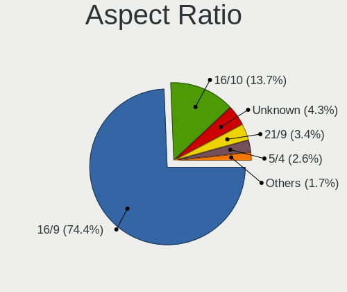

| Ratio   | Computers | Percent |
|---------|-----------|---------|
| 16/9    | 87        | 74.36%  |
| 16/10   | 16        | 13.68%  |
| Unknown | 5         | 4.27%   |
| 21/9    | 4         | 3.42%   |
| 5/4     | 3         | 2.56%   |
| 4/3     | 1         | 0.85%   |
| 3/2     | 1         | 0.85%   |

Monitor Area
------------

Area in inch²

| Area in inch² | Computers | Percent |
|----------------|-----------|---------|
| 201-250        | 22        | 16.06%  |
| 81-90          | 21        | 15.33%  |
| 101-110        | 20        | 14.6%   |
| 301-350        | 14        | 10.22%  |
| 351-500        | 11        | 8.03%   |
| More than 1000 | 10        | 7.3%    |
| 71-80          | 7         | 5.11%   |
| Unknown        | 6         | 4.38%   |
| 251-300        | 5         | 3.65%   |
| 111-120        | 5         | 3.65%   |
| 121-130        | 4         | 2.92%   |
| 151-200        | 3         | 2.19%   |
| 141-150        | 3         | 2.19%   |
| 51-60          | 2         | 1.46%   |
| 501-1000       | 2         | 1.46%   |
| 61-70          | 1         | 0.73%   |
| 131-140        | 1         | 0.73%   |

Pixel Density
-------------

Pixels per inch

| Density       | Computers | Percent |
|---------------|-----------|---------|
| 51-100        | 40        | 30.3%   |
| 121-160       | 36        | 27.27%  |
| 101-120       | 28        | 21.21%  |
| 161-240       | 12        | 9.09%   |
| 1-50          | 6         | 4.55%   |
| Unknown       | 6         | 4.55%   |
| More than 240 | 4         | 3.03%   |

Multiple Monitors
-----------------

Total monitors connected

| Total | Computers | Percent |
|-------|-----------|---------|
| 1     | 88        | 70.97%  |
| 2     | 22        | 17.74%  |
| 0     | 7         | 5.65%   |
| 3     | 5         | 4.03%   |
| 5     | 1         | 0.81%   |
| 4     | 1         | 0.81%   |

Network
-------

Net Controller Vendor
---------------------

Controller vendors

| Vendor                | Computers | Percent |
|-----------------------|-----------|---------|
| Intel                 | 90        | 50.28%  |
| Realtek Semiconductor | 57        | 31.84%  |
| Qualcomm Atheros      | 8         | 4.47%   |
| Broadcom              | 6         | 3.35%   |
| MediaTek              | 2         | 1.12%   |
| Edimax Technology     | 2         | 1.12%   |
| DisplayLink           | 2         | 1.12%   |
| Aquantia              | 2         | 1.12%   |
| Tehuti Networks       | 1         | 0.56%   |
| Ralink Technology     | 1         | 0.56%   |
| Qualcomm              | 1         | 0.56%   |
| OPPO Electronics      | 1         | 0.56%   |
| Mellanox Technologies | 1         | 0.56%   |
| IBM                   | 1         | 0.56%   |
| Dell                  | 1         | 0.56%   |
| Broadcom Limited      | 1         | 0.56%   |
| ASUSTek Computer      | 1         | 0.56%   |
| AMD                   | 1         | 0.56%   |

Net Controller Model
--------------------

Controller models

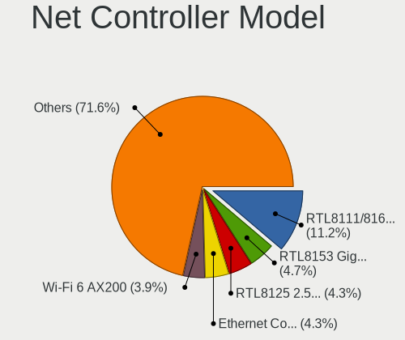

| Model                                                                          | Computers | Percent |
|--------------------------------------------------------------------------------|-----------|---------|
| Realtek RTL8111/8168/8211/8411 PCI Express Gigabit Ethernet Controller         | 26        | 11.21%  |
| Realtek RTL8153 Gigabit Ethernet Adapter                                       | 11        | 4.74%   |
| Realtek RTL8125 2.5GbE Controller                                              | 10        | 4.31%   |
| Intel Ethernet Controller I225-V                                               | 10        | 4.31%   |
| Intel Wi-Fi 6 AX200                                                            | 9         | 3.88%   |
| Intel Wi-Fi 6E(802.11ax) AX210/AX1675* 2x2 [Typhoon Peak]                      | 8         | 3.45%   |
| Intel Alder Lake-P PCH CNVi WiFi                                               | 8         | 3.45%   |
| Realtek RTL810xE PCI Express Fast Ethernet controller                          | 7         | 3.02%   |
| Intel Dual Band Wireless-AC 3168NGW [Stone Peak]                               | 7         | 3.02%   |
| Intel I211 Gigabit Network Connection                                          | 5         | 2.16%   |
| Intel I210 Gigabit Network Connection                                          | 5         | 2.16%   |
| Intel Comet Lake PCH-LP CNVi WiFi                                              | 5         | 2.16%   |
| Qualcomm Atheros QCA9377 802.11ac Wireless Network Adapter                     | 4         | 1.72%   |
| Intel Wireless 8265 / 8275                                                     | 4         | 1.72%   |
| Intel Wi-Fi 6 AX201                                                            | 4         | 1.72%   |
| Intel Raptor Lake PCH CNVi WiFi                                                | 3         | 1.29%   |
| Intel Ice Lake-LP PCH CNVi WiFi                                                | 3         | 1.29%   |
| Intel Ethernet Connection (7) I219-LM                                          | 3         | 1.29%   |
| Intel Ethernet Connection (3) I219-LM                                          | 3         | 1.29%   |
| Intel Ethernet Connection (2) I219-LM                                          | 3         | 1.29%   |
| Intel 82579LM Gigabit Network Connection (Lewisville)                          | 3         | 1.29%   |
| Intel 82574L Gigabit Network Connection                                        | 3         | 1.29%   |
| Realtek RTL8821CE 802.11ac PCIe Wireless Network Adapter                       | 2         | 0.86%   |
| MediaTek MT7921K (RZ608) Wi-Fi 6E 80MHz                                        | 2         | 0.86%   |
| Intel Wireless 8260                                                            | 2         | 0.86%   |
| Intel Wireless 7265                                                            | 2         | 0.86%   |
| Intel Wireless 7260                                                            | 2         | 0.86%   |
| Intel Wi-Fi 5(802.11ac) Wireless-AC 9x6x [Thunder Peak]                        | 2         | 0.86%   |
| Intel Raptor Lake-S PCH CNVi WiFi                                              | 2         | 0.86%   |
| Intel Ethernet Controller I226-V                                               | 2         | 0.86%   |
| Intel Ethernet Controller 10-Gigabit X540-AT2                                  | 2         | 0.86%   |
| Intel Ethernet Connection I217-LM                                              | 2         | 0.86%   |
| Intel Ethernet Connection (4) I219-V                                           | 2         | 0.86%   |
| Intel Cannon Point-LP CNVi [Wireless-AC]                                       | 2         | 0.86%   |
| Intel Cannon Lake PCH CNVi WiFi                                                | 2         | 0.86%   |
| Intel Alder Lake-S PCH CNVi WiFi                                               | 2         | 0.86%   |
| Aquantia AQtion AQC107 NBase-T/IEEE 802.3an Ethernet Controller [Atlantic 10G] | 2         | 0.86%   |
| Tehuti Networks TN9710P 10GBase-T/NBASE-T Ethernet Adapter                     | 1         | 0.43%   |
| Realtek RTL8852CE PCIe 802.11ax Wireless Network Controller                    | 1         | 0.43%   |
| Realtek RTL8852BE PCIe 802.11ax Wireless Network Controller                    | 1         | 0.43%   |

Wireless Vendor
---------------

Wireless vendors

| Vendor                | Computers | Percent |
|-----------------------|-----------|---------|
| Intel                 | 71        | 71%     |
| Realtek Semiconductor | 11        | 11%     |
| Qualcomm Atheros      | 6         | 6%      |
| Broadcom              | 4         | 4%      |
| MediaTek              | 2         | 2%      |
| Edimax Technology     | 2         | 2%      |
| Ralink Technology     | 1         | 1%      |
| Qualcomm              | 1         | 1%      |
| Broadcom Limited      | 1         | 1%      |
| ASUSTek Computer      | 1         | 1%      |

Wireless Model
--------------

Wireless models

| Model                                                          | Computers | Percent |
|----------------------------------------------------------------|-----------|---------|
| Intel Wi-Fi 6 AX200                                            | 9         | 9%      |
| Intel Wi-Fi 6E(802.11ax) AX210/AX1675* 2x2 [Typhoon Peak]      | 8         | 8%      |
| Intel Dual Band Wireless-AC 3168NGW [Stone Peak]               | 7         | 7%      |
| Intel Alder Lake-P PCH CNVi WiFi                               | 7         | 7%      |
| Intel Comet Lake PCH-LP CNVi WiFi                              | 5         | 5%      |
| Qualcomm Atheros QCA9377 802.11ac Wireless Network Adapter     | 4         | 4%      |
| Intel Wireless 8265 / 8275                                     | 4         | 4%      |
| Intel Wi-Fi 6 AX201                                            | 4         | 4%      |
| Intel Raptor Lake PCH CNVi WiFi                                | 3         | 3%      |
| Intel Ice Lake-LP PCH CNVi WiFi                                | 3         | 3%      |
| Realtek RTL8821CE 802.11ac PCIe Wireless Network Adapter       | 2         | 2%      |
| MediaTek MT7921K (RZ608) Wi-Fi 6E 80MHz                        | 2         | 2%      |
| Intel Wireless 8260                                            | 2         | 2%      |
| Intel Wireless 7265                                            | 2         | 2%      |
| Intel Wireless 7260                                            | 2         | 2%      |
| Intel Wi-Fi 5(802.11ac) Wireless-AC 9x6x [Thunder Peak]        | 2         | 2%      |
| Intel Raptor Lake-S PCH CNVi WiFi                              | 2         | 2%      |
| Intel Cannon Point-LP CNVi [Wireless-AC]                       | 2         | 2%      |
| Intel Cannon Lake PCH CNVi WiFi                                | 2         | 2%      |
| Intel Alder Lake-S PCH CNVi WiFi                               | 2         | 2%      |
| Realtek RTL8852CE PCIe 802.11ax Wireless Network Controller    | 1         | 1%      |
| Realtek RTL8852BE PCIe 802.11ax Wireless Network Controller    | 1         | 1%      |
| Realtek RTL8822CE 802.11ac PCIe Wireless Network Adapter       | 1         | 1%      |
| Realtek RTL8723DE Wireless Network Adapter                     | 1         | 1%      |
| Realtek RTL8723BU 802.11b/g/n WLAN Adapter                     | 1         | 1%      |
| Realtek RTL8723BE PCIe Wireless Network Adapter                | 1         | 1%      |
| Realtek RTL8192EU 802.11b/g/n WLAN Adapter                     | 1         | 1%      |
| Realtek RTL8188EUS 802.11n Wireless Network Adapter            | 1         | 1%      |
| Realtek 802.11n WLAN Adapter                                   | 1         | 1%      |
| Ralink MT7601U Wireless Adapter                                | 1         | 1%      |
| Qualcomm QCNFA765 Wireless Network Adapter                     | 1         | 1%      |
| Qualcomm Atheros QCA9565 / AR9565 Wireless Network Adapter     | 1         | 1%      |
| Qualcomm Atheros QCA6174 802.11ac Wireless Network Adapter     | 1         | 1%      |
| Intel Wireless 3165                                            | 1         | 1%      |
| Intel Wireless 3160                                            | 1         | 1%      |
| Intel Wi-Fi 6 AX201 160MHz                                     | 1         | 1%      |
| Intel Tiger Lake PCH CNVi WiFi                                 | 1         | 1%      |
| Intel Centrino Wireless-N 2230                                 | 1         | 1%      |
| Edimax EW-7811Un 802.11n Wireless Adapter [Realtek RTL8188CUS] | 1         | 1%      |
| Edimax AC1200 MU-MIMO USB3.0 Adapter                           | 1         | 1%      |

Ethernet Vendor
---------------

Ethernet vendors

| Vendor                | Computers | Percent |
|-----------------------|-----------|---------|
| Realtek Semiconductor | 55        | 45.83%  |
| Intel                 | 51        | 42.5%   |
| Broadcom              | 3         | 2.5%    |
| Qualcomm Atheros      | 2         | 1.67%   |
| DisplayLink           | 2         | 1.67%   |
| Aquantia              | 2         | 1.67%   |
| Tehuti Networks       | 1         | 0.83%   |
| OPPO Electronics      | 1         | 0.83%   |
| Mellanox Technologies | 1         | 0.83%   |
| IBM                   | 1         | 0.83%   |
| Dell                  | 1         | 0.83%   |

Ethernet Model
--------------

Ethernet models

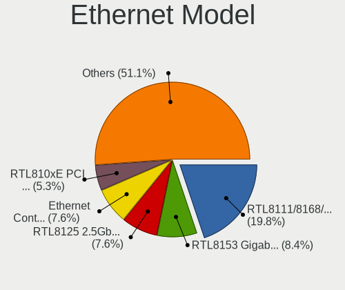

| Model                                                                          | Computers | Percent |
|--------------------------------------------------------------------------------|-----------|---------|
| Realtek RTL8111/8168/8211/8411 PCI Express Gigabit Ethernet Controller         | 26        | 19.85%  |
| Realtek RTL8153 Gigabit Ethernet Adapter                                       | 11        | 8.4%    |
| Realtek RTL8125 2.5GbE Controller                                              | 10        | 7.63%   |
| Intel Ethernet Controller I225-V                                               | 10        | 7.63%   |
| Realtek RTL810xE PCI Express Fast Ethernet controller                          | 7         | 5.34%   |
| Intel I211 Gigabit Network Connection                                          | 5         | 3.82%   |
| Intel I210 Gigabit Network Connection                                          | 5         | 3.82%   |
| Intel Ethernet Connection (7) I219-LM                                          | 3         | 2.29%   |
| Intel Ethernet Connection (3) I219-LM                                          | 3         | 2.29%   |
| Intel Ethernet Connection (2) I219-LM                                          | 3         | 2.29%   |
| Intel 82579LM Gigabit Network Connection (Lewisville)                          | 3         | 2.29%   |
| Intel 82574L Gigabit Network Connection                                        | 3         | 2.29%   |
| Intel Ethernet Controller I226-V                                               | 2         | 1.53%   |
| Intel Ethernet Controller 10-Gigabit X540-AT2                                  | 2         | 1.53%   |
| Intel Ethernet Connection I217-LM                                              | 2         | 1.53%   |
| Intel Ethernet Connection (4) I219-V                                           | 2         | 1.53%   |
| Aquantia AQtion AQC107 NBase-T/IEEE 802.3an Ethernet Controller [Atlantic 10G] | 2         | 1.53%   |
| Tehuti Networks TN9710P 10GBase-T/NBASE-T Ethernet Adapter                     | 1         | 0.76%   |
| Realtek RTL8152 Fast Ethernet Adapter                                          | 1         | 0.76%   |
| Realtek Killer E2600 GbE Controller                                            | 1         | 0.76%   |
| Qualcomm Atheros Killer E2500 Gigabit Ethernet Controller                      | 1         | 0.76%   |
| Qualcomm Atheros Killer E2400 Gigabit Ethernet Controller                      | 1         | 0.76%   |
| OPPO OnePlus Nord 4                                                            | 1         | 0.76%   |
| Mellanox MT27500 Family [ConnectX-3]                                           | 1         | 0.76%   |
| Intel Wi-Fi 7(802.11be) AX1775*/AX1790*/BE20*/BE401/BE1750* 2x2                | 1         | 0.76%   |
| Intel I350 Gigabit Network Connection                                          | 1         | 0.76%   |
| Intel Ethernet Controller X710 for 10GbE SFP+                                  | 1         | 0.76%   |
| Intel Ethernet Controller X550                                                 | 1         | 0.76%   |
| Intel Ethernet Controller I225-LM                                              | 1         | 0.76%   |
| Intel Ethernet Connection I219-LM                                              | 1         | 0.76%   |
| Intel Ethernet Connection I218-LM                                              | 1         | 0.76%   |
| Intel Ethernet Connection (6) I219-LM                                          | 1         | 0.76%   |
| Intel Ethernet Connection (5) I219-LM                                          | 1         | 0.76%   |
| Intel Ethernet Connection (4) I219-LM                                          | 1         | 0.76%   |
| Intel Ethernet Connection (3) I218-LM                                          | 1         | 0.76%   |
| Intel Ethernet Connection (23) I219-LM                                         | 1         | 0.76%   |
| Intel Ethernet Connection (2) I219-V                                           | 1         | 0.76%   |
| Intel Ethernet Connection (16) I219-V                                          | 1         | 0.76%   |
| Intel Ethernet Connection (14) I219-LM                                         | 1         | 0.76%   |
| Intel Ethernet Connection (13) I219-V                                          | 1         | 0.76%   |

Net Controller Kind
-------------------

Ethernet, WiFi or modem

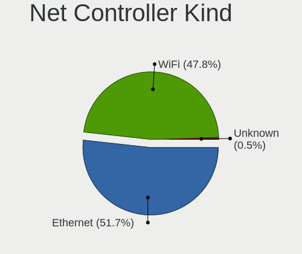

| Kind     | Computers | Percent |
|----------|-----------|---------|
| Ethernet | 104       | 51.74%  |
| WiFi     | 96        | 47.76%  |
| Unknown  | 1         | 0.5%    |

Used Controller
---------------

Currently used network controller

| Kind     | Computers | Percent |
|----------|-----------|---------|
| Ethernet | 65        | 51.18%  |
| WiFi     | 62        | 48.82%  |

NICs
----

Total network controllers on board

| Total | Computers | Percent |
|-------|-----------|---------|
| 2     | 69        | 56.1%   |
| 1     | 39        | 31.71%  |
| 4     | 7         | 5.69%   |
| 3     | 6         | 4.88%   |
| 5     | 1         | 0.81%   |
| 0     | 1         | 0.81%   |

IPv6
----

IPv6 vs IPv4

| Used | Computers | Percent |
|------|-----------|---------|
| No   | 86        | 68.8%   |
| Yes  | 39        | 31.2%   |

Bluetooth
---------

Bluetooth Vendor
----------------

Controller vendors

| Vendor                          | Computers | Percent |
|---------------------------------|-----------|---------|
| Intel                           | 64        | 73.56%  |
| Realtek Semiconductor           | 6         | 6.9%    |
| Qualcomm Atheros Communications | 5         | 5.75%   |
| Broadcom                        | 3         | 3.45%   |
| MediaTek                        | 2         | 2.3%    |
| Cambridge Silicon Radio         | 2         | 2.3%    |
| USI                             | 1         | 1.15%   |
| Integrated System Solution      | 1         | 1.15%   |
| IMC Networks                    | 1         | 1.15%   |
| Foxconn / Hon Hai               | 1         | 1.15%   |
| ASUSTek Computer                | 1         | 1.15%   |

Bluetooth Model
---------------

Controller models

| Model                                                 | Computers | Percent |
|-------------------------------------------------------|-----------|---------|
| Intel AX201 Bluetooth                                 | 16        | 18.39%  |
| Intel AX200 Bluetooth                                 | 9         | 10.34%  |
| Intel Bluetooth wireless interface                    | 8         | 9.2%    |
| Intel AX211 Bluetooth                                 | 8         | 9.2%    |
| Intel AX210 Bluetooth                                 | 8         | 9.2%    |
| Intel Wireless-AC 3168 Bluetooth                      | 7         | 8.05%   |
| Intel Bluetooth 9460/9560 Jefferson Peak (JfP)        | 6         | 6.9%    |
| Realtek Bluetooth Radio                               | 5         | 5.75%   |
| Qualcomm Atheros  Bluetooth Device                    | 5         | 5.75%   |
| MediaTek Wireless_Device                              | 2         | 2.3%    |
| Cambridge Silicon Radio Bluetooth Dongle (HCI mode)   | 2         | 2.3%    |
| USI Bluetooth Device                                  | 1         | 1.15%   |
| Realtek  Bluetooth 4.2 Adapter                        | 1         | 1.15%   |
| Intel Centrino Bluetooth Wireless Transceiver         | 1         | 1.15%   |
| Intel Bluetooth Device                                | 1         | 1.15%   |
| Integrated System Solution KY-BT100 Bluetooth Adapter | 1         | 1.15%   |
| IMC Networks Bluetooth Radio                          | 1         | 1.15%   |
| Foxconn / Hon Hai Bluetooth Device                    | 1         | 1.15%   |
| Broadcom HP Portable SoftSailing                      | 1         | 1.15%   |
| Broadcom BCM2070 Bluetooth 2.1 + EDR                  | 1         | 1.15%   |
| Broadcom BCM2045B (BDC-2.1)                           | 1         | 1.15%   |
| ASUS ASUS USB-BT500                                   | 1         | 1.15%   |

Sound
-----

Sound Vendor
------------

Sound card vendors

| Vendor                                       | Computers | Percent |
|----------------------------------------------|-----------|---------|
| Intel                                        | 92        | 46.94%  |
| Nvidia                                       | 39        | 19.9%   |
| AMD                                          | 29        | 14.8%   |
| Texas Instruments                            | 5         | 2.55%   |
| Realtek Semiconductor                        | 5         | 2.55%   |
| ASUSTek Computer                             | 3         | 1.53%   |
| Micro Star International                     | 2         | 1.02%   |
| Logitech                                     | 2         | 1.02%   |
| Creative Labs                                | 2         | 1.02%   |
| C-Media Electronics                          | 2         | 1.02%   |
| Zoran Co. Personal Media Division (Nogatech) | 1         | 0.51%   |
| Valve Software                               | 1         | 0.51%   |
| Unknown                                      | 1         | 0.51%   |
| SteelSeries ApS                              | 1         | 0.51%   |
| Sony                                         | 1         | 0.51%   |
| Plantronics                                  | 1         | 0.51%   |
| Nordic Semiconductor ASA                     | 1         | 0.51%   |
| LG Electronics                               | 1         | 0.51%   |
| Lenovo                                       | 1         | 0.51%   |
| Hewlett-Packard                              | 1         | 0.51%   |
| Elgato Systems                               | 1         | 0.51%   |
| Corsair                                      | 1         | 0.51%   |
| Blue Microphones                             | 1         | 0.51%   |
| BEHRINGER International                      | 1         | 0.51%   |
| Astro Gaming                                 | 1         | 0.51%   |

Sound Model
-----------

Sound card models

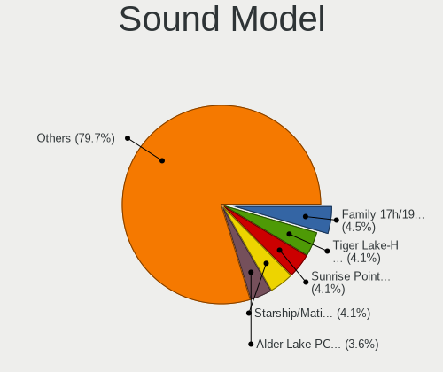

| Model                                                                      | Computers | Percent |
|----------------------------------------------------------------------------|-----------|---------|
| AMD Family 17h/19h/1ah HD Audio Controller                                 | 10        | 4.5%    |
| Intel Tiger Lake-H HD Audio Controller                                     | 9         | 4.05%   |
| Intel Sunrise Point-LP HD Audio                                            | 9         | 4.05%   |
| AMD Starship/Matisse HD Audio Controller                                   | 9         | 4.05%   |
| Intel Alder Lake PCH-P High Definition Audio Controller                    | 8         | 3.6%    |
| Intel Cannon Lake PCH cAVS                                                 | 7         | 3.15%   |
| Nvidia GP104 High Definition Audio Controller                              | 6         | 2.7%    |
| Nvidia GA106 High Definition Audio Controller                              | 6         | 2.7%    |
| Realtek Semiconductor USB Audio                                            | 5         | 2.25%   |
| Intel Comet Lake PCH-LP cAVS                                               | 5         | 2.25%   |
| Texas Instruments PCM2902 Audio Codec                                      | 4         | 1.8%    |
| Nvidia TU107 GeForce GTX 1650 High Definition Audio Controller             | 4         | 1.8%    |
| Intel Tiger Lake-LP Smart Sound Technology Audio Controller                | 4         | 1.8%    |
| Intel Alder Lake-S HD Audio Controller                                     | 4         | 1.8%    |
| AMD Renoir Radeon High Definition Audio Controller                         | 4         | 1.8%    |
| AMD Navi 21/23 HDMI/DP Audio Controller                                    | 4         | 1.8%    |
| AMD Ellesmere HDMI Audio [Radeon RX 470/480 / 570/580/590]                 | 4         | 1.8%    |
| Nvidia TU116 High Definition Audio Controller                              | 3         | 1.35%   |
| Nvidia GA104 High Definition Audio Controller                              | 3         | 1.35%   |
| Intel Raptor Lake-P/U/H cAVS                                               | 3         | 1.35%   |
| Intel Raptor Lake High Definition Audio Controller                         | 3         | 1.35%   |
| Intel Lewisburg MROM 0                                                     | 3         | 1.35%   |
| Intel Jasper Lake HD Audio                                                 | 3         | 1.35%   |
| Intel Ice Lake-LP Smart Sound Technology Audio Controller                  | 3         | 1.35%   |
| Intel Celeron/Pentium Silver Processor High Definition Audio               | 3         | 1.35%   |
| Intel 8 Series/C220 Series Chipset High Definition Audio Controller        | 3         | 1.35%   |
| Intel 7 Series/C216 Chipset Family High Definition Audio Controller        | 3         | 1.35%   |
| Intel 6 Series/C200 Series Chipset Family High Definition Audio Controller | 3         | 1.35%   |
| Intel 200 Series PCH HD Audio                                              | 3         | 1.35%   |
| Intel 100 Series/C230 Series Chipset Family HD Audio Controller            | 3         | 1.35%   |
| ASUSTek Computer USB Audio                                                 | 3         | 1.35%   |
| AMD Rembrandt Radeon High Definition Audio Controller                      | 3         | 1.35%   |
| AMD Navi 10 HDMI Audio                                                     | 3         | 1.35%   |
| Nvidia GM206 High Definition Audio Controller                              | 2         | 0.9%    |
| Nvidia GA102 High Definition Audio Controller                              | 2         | 0.9%    |
| Nvidia AD102 High Definition Audio Controller                              | 2         | 0.9%    |
| Micro Star International USB Audio                                         | 2         | 0.9%    |
| Intel Wildcat Point-LP High Definition Audio Controller                    | 2         | 0.9%    |
| Intel Haswell-ULT HD Audio Controller                                      | 2         | 0.9%    |
| Intel CM238 HD Audio Controller                                            | 2         | 0.9%    |

Memory
------

Memory Vendor
-------------

Memory module vendors

| Vendor              | Computers | Percent |
|---------------------|-----------|---------|
| SK hynix            | 14        | 25%     |
| Samsung Electronics | 11        | 19.64%  |
| G.Skill             | 6         | 10.71%  |
| Corsair             | 6         | 10.71%  |
| Kingston            | 5         | 8.93%   |
| Crucial             | 4         | 7.14%   |
| Micron Technology   | 3         | 5.36%   |
| Unknown             | 2         | 3.57%   |
| Team                | 2         | 3.57%   |
| Smart               | 1         | 1.79%   |
| Hewlett-Packard     | 1         | 1.79%   |
| Elpida              | 1         | 1.79%   |

Memory Model
------------

Memory module models

| Model                                                            | Computers | Percent |
|------------------------------------------------------------------|-----------|---------|
| G.Skill RAM F4-3600C16-16GTZNC 16GB DIMM DDR4 3866MT/s           | 2         | 3.33%   |
| Corsair RAM CMK16GX4M2B3200C16 8GB DIMM DDR4 3600MT/s            | 2         | 3.33%   |
| Unknown RAM Module 8GB DIMM DDR3 1333MT/s                        | 1         | 1.67%   |
| Unknown RAM Module 2GB DIMM DDR3 1600MT/s                        | 1         | 1.67%   |
| Team RAM TEAMGROUP-SD4-3200 16GB SODIMM DDR4 3200MT/s            | 1         | 1.67%   |
| Team RAM TEAMGROUP-ED4-2400 16GB DIMM DDR4 2400MT/s              | 1         | 1.67%   |
| Smart RAM SF564128CJ8NWMNSEG 4GB SODIMM DDR3 1600MT/s            | 1         | 1.67%   |
| SK hynix RAM Module 16GB Row Of Chips LPDDR4 2933MT/s            | 1         | 1.67%   |
| SK hynix RAM HMT451S6BFR8A-PB 4096MB SODIMM DDR3 1600MT/s        | 1         | 1.67%   |
| SK hynix RAM HMT451S6AFR8A-PB 4GB SODIMM DDR3 1600MT/s           | 1         | 1.67%   |
| SK hynix RAM HMCG94MEBRA123N 64GB DIMM DDR5 4800MT/s             | 1         | 1.67%   |
| SK hynix RAM HMCG94MEBRA121N 64GB DIMM DDR5 4800MT/s             | 1         | 1.67%   |
| SK hynix RAM HMCG94MEBRA109N 64GB DIMM DDR5 4800MT/s             | 1         | 1.67%   |
| SK hynix RAM HMAA8GL7MMR4N-UH 64GB DIMM DDR4 2400MT/s            | 1         | 1.67%   |
| SK hynix RAM HMAA8GL7CPR4N-VK 64GB DIMM DDR4 2666MT/s            | 1         | 1.67%   |
| SK hynix RAM HMAA2GS6CJR8N-XN 16GB SODIMM DDR4 3200MT/s          | 1         | 1.67%   |
| SK hynix RAM HMA84GR7MFR4N-UH 32GB RIMM DDR4 2400MT/s            | 1         | 1.67%   |
| SK hynix RAM HMA82GU7AFR8N-UH 16GB DIMM DDR4 2400MT/s            | 1         | 1.67%   |
| SK hynix RAM HMA82GU6CJR8N-VK 16GB DIMM DDR4 2667MT/s            | 1         | 1.67%   |
| SK hynix RAM HMA82GS6MFR8N-TF 16GB SODIMM DDR4 2133MT/s          | 1         | 1.67%   |
| SK hynix RAM HMA81GU7AFR8N-UH 8GB DIMM DDR4 2400MT/s             | 1         | 1.67%   |
| SK hynix RAM HMA81GS6JJR8N-VK 8GB SODIMM DDR4 2667MT/s           | 1         | 1.67%   |
| SK hynix RAM H9CCNNNCPTALBR-NUD 4GB Row Of Chips LPDDR3 1867MT/s | 1         | 1.67%   |
| SK hynix RAM H5AN8G6NDJR-XNC 4GB Row Of Chips DDR4 2400MT/s      | 1         | 1.67%   |
| Samsung RAM Module 8GB SODIMM DDR4 2400MT/s                      | 1         | 1.67%   |
| Samsung RAM Module 8GB SODIMM DDR4 2133MT/s                      | 1         | 1.67%   |
| Samsung RAM M471A5244CB0-CRC 4GB SODIMM DDR4 2667MT/s            | 1         | 1.67%   |
| Samsung RAM M471A1K43DB1-CTD 8GB SODIMM DDR4 2667MT/s            | 1         | 1.67%   |
| Samsung RAM M471A1G44BB0-CWE 8GB SODIMM DDR4 3200MT/s            | 1         | 1.67%   |
| Samsung RAM M393A4K40CB2-CTD 32GB DIMM DDR4 2667MT/s             | 1         | 1.67%   |
| Samsung RAM M393A1G43EB1-CRC 8GB DIMM DDR4 2400MT/s              | 1         | 1.67%   |
| Samsung RAM M386A8K40BMB-CRC 64GB DIMM DDR4 2400MT/s             | 1         | 1.67%   |
| Samsung RAM M378B5273CH0-CH9 4GB DIMM DDR3 1867MT/s              | 1         | 1.67%   |
| Samsung RAM K3LKBKB0BM-MGCP 4GB Row Of Chips LPDDR5 6400MT/s     | 1         | 1.67%   |
| Samsung RAM K3LK7K7@BM-BGCP 2GB Row Of Chips LPDDR5 6400MT/s     | 1         | 1.67%   |
| Micron RAM Module 8GB Chip LPDDR4                                | 1         | 1.67%   |
| Micron RAM 4ATF51264HZ-2G3B1 4GB SODIMM DDR4 3200MT/s            | 1         | 1.67%   |
| Micron RAM 18ASF2G72AZ-2G6D1 16GB DIMM DDR4 2667MT/s             | 1         | 1.67%   |
| Kingston RAM X74R9W-MIE 8GB SODIMM DDR4 2933MT/s                 | 1         | 1.67%   |
| Kingston RAM MSI24D4S7S8MB-8 8GB SODIMM DDR4 2667MT/s            | 1         | 1.67%   |

Memory Kind
-----------

Memory module kinds

| Kind   | Computers | Percent |
|--------|-----------|---------|
| DDR4   | 35        | 70%     |
| DDR3   | 7         | 14%     |
| DDR5   | 3         | 6%      |
| LPDDR5 | 2         | 4%      |
| LPDDR4 | 2         | 4%      |
| LPDDR3 | 1         | 2%      |

Memory Form Factor
------------------

Physical design of the memory module

| Name         | Computers | Percent |
|--------------|-----------|---------|
| DIMM         | 26        | 52%     |
| SODIMM       | 17        | 34%     |
| Row Of Chips | 5         | 10%     |
| RIMM         | 1         | 2%      |
| Chip         | 1         | 2%      |

Memory Size
-----------

Memory module size

| Size  | Computers | Percent |
|-------|-----------|---------|
| 8192  | 20        | 37.74%  |
| 16384 | 16        | 30.19%  |
| 4096  | 7         | 13.21%  |
| 32768 | 4         | 7.55%   |
| 65536 | 3         | 5.66%   |
| 2048  | 2         | 3.77%   |
| 49152 | 1         | 1.89%   |

Memory Speed
------------

Memory module speed

| Speed   | Computers | Percent |
|---------|-----------|---------|
| 2400    | 10        | 18.87%  |
| 2667    | 9         | 16.98%  |
| 3200    | 6         | 11.32%  |
| 1600    | 5         | 9.43%   |
| 6400    | 4         | 7.55%   |
| 3600    | 4         | 7.55%   |
| 2133    | 3         | 5.66%   |
| 3866    | 2         | 3.77%   |
| 2933    | 2         | 3.77%   |
| 1867    | 2         | 3.77%   |
| 4800    | 1         | 1.89%   |
| 4000    | 1         | 1.89%   |
| 3534    | 1         | 1.89%   |
| 2666    | 1         | 1.89%   |
| 1333    | 1         | 1.89%   |
| Unknown | 1         | 1.89%   |

Printers & scanners
-------------------

Printer Vendor
--------------

Printer device vendors

| Vendor          | Computers | Percent |
|-----------------|-----------|---------|
| Seiko Epson     | 3         | 50%     |
| Kyocera         | 1         | 16.67%  |
| Hewlett-Packard | 1         | 16.67%  |
| Canon           | 1         | 16.67%  |

Printer Model
-------------

Printer device models

| Model                      | Computers | Percent |
|----------------------------|-----------|---------|
| Seiko Epson XP-4100 Series | 1         | 16.67%  |
| Seiko Epson WF-3520 Series | 1         | 16.67%  |
| Seiko Epson L3210 Series   | 1         | 16.67%  |
| Kyocera FS-1030D printer   | 1         | 16.67%  |
| HP DeskJet 3700 series     | 1         | 16.67%  |
| Canon PIXMA MG2500 Series  | 1         | 16.67%  |

Scanner Vendor
--------------

Scanner device vendors

Zero info for selected period =(

Scanner Model
-------------

Scanner device models

Zero info for selected period =(

Camera
------

Camera Vendor
-------------

Camera device vendors

| Vendor                                 | Computers | Percent |
|----------------------------------------|-----------|---------|
| Chicony Electronics                    | 15        | 18.52%  |
| Microdia                               | 10        | 12.35%  |
| Sunplus Innovation Technology          | 8         | 9.88%   |
| IMC Networks                           | 7         | 8.64%   |
| Bison Electronics                      | 6         | 7.41%   |
| Realtek Semiconductor                  | 4         | 4.94%   |
| Samsung Electronics                    | 3         | 3.7%    |
| Logitech                               | 3         | 3.7%    |
| Lite-On Technology                     | 3         | 3.7%    |
| Luxvisions Innotech Limited            | 2         | 2.47%   |
| Generalplus Technology                 | 2         | 2.47%   |
| Apple                                  | 2         | 2.47%   |
| vivo                                   | 1         | 1.23%   |
| Valve Software                         | 1         | 1.23%   |
| Syntek                                 | 1         | 1.23%   |
| Suyin                                  | 1         | 1.23%   |
| Sonix Technology                       | 1         | 1.23%   |
| Shenzhen Kingcome Optoelectronic       | 1         | 1.23%   |
| Remo Tech                              | 1         | 1.23%   |
| Quanta                                 | 1         | 1.23%   |
| Owon                                   | 1         | 1.23%   |
| Microsoft                              | 1         | 1.23%   |
| LG Electronics                         | 1         | 1.23%   |
| icSpring                               | 1         | 1.23%   |
| Hewlett-Packard                        | 1         | 1.23%   |
| Cheng Uei Precision Industry (Foxlink) | 1         | 1.23%   |
| Alcor Micro                            | 1         | 1.23%   |
| Acer                                   | 1         | 1.23%   |

Camera Model
------------

Camera device models

| Model                                             | Computers | Percent |
|---------------------------------------------------|-----------|---------|
| Sunplus Integrated_Webcam_HD                      | 5         | 6.17%   |
| Microdia Integrated_Webcam_HD                     | 5         | 6.17%   |
| Chicony Integrated Camera                         | 4         | 4.94%   |
| Samsung Galaxy series, misc. (MTP mode)           | 3         | 3.7%    |
| IMC Networks Integrated Camera                    | 3         | 3.7%    |
| Realtek Integrated_Webcam_HD                      | 2         | 2.47%   |
| Lite-On Integrated Camera                         | 2         | 2.47%   |
| IMC Networks USB2.0 HD UVC WebCam                 | 2         | 2.47%   |
| Generalplus GENERAL WEBCAM                        | 2         | 2.47%   |
| Chicony HP HD Camera                              | 2         | 2.47%   |
| Bison Integrated Camera                           | 2         | 2.47%   |
| Bison HD Webcam                                   | 2         | 2.47%   |
| Apple iPhone 5/5C/5S/6/SE/7/8/X/XR                | 2         | 2.47%   |
| vivo 1906                                         | 1         | 1.23%   |
| Valve Software 3D Camera                          | 1         | 1.23%   |
| Syntek Integrated Camera                          | 1         | 1.23%   |
| Suyin Integrated_Webcam_HD                        | 1         | 1.23%   |
| Sunplus Laptop_Integrated_Webcam_FHD              | 1         | 1.23%   |
| Sunplus Integrated Camera                         | 1         | 1.23%   |
| Sunplus DICOTA 4K                                 | 1         | 1.23%   |
| Sonix USB2.0 HD UVC WebCam                        | 1         | 1.23%   |
| Shenzhen Kingcome Optoelectronic 720p HD Camera   | 1         | 1.23%   |
| Remo Tech OBSBOT Tiny 4K                          | 1         | 1.23%   |
| Realtek Integrated Webcam_HD                      | 1         | 1.23%   |
| Realtek FULL HD 1080P Webcam                      | 1         | 1.23%   |
| Quanta HP TrueVision HD Camera                    | 1         | 1.23%   |
| Owon USB CAMERA                                   | 1         | 1.23%   |
| Microsoft LifeCam VX-2000                         | 1         | 1.23%   |
| Microdia USB 2.0 Camera                           | 1         | 1.23%   |
| Microdia Laptop_Integrated_Webcam_0.3M            | 1         | 1.23%   |
| Microdia Integrated_Webcam_FHD                    | 1         | 1.23%   |
| Microdia Integrated Webcam                        | 1         | 1.23%   |
| Microdia 1.3 MPixel Integrated Webcam             | 1         | 1.23%   |
| Luxvisions Innotech Limited Integrated RGB Camera | 1         | 1.23%   |
| Luxvisions Innotech Limited Integrated Camera     | 1         | 1.23%   |
| Logitech Webcam C310                              | 1         | 1.23%   |
| Logitech Webcam C250                              | 1         | 1.23%   |
| Logitech C922 Pro Stream Webcam                   | 1         | 1.23%   |
| Lite-On HP HD Camera                              | 1         | 1.23%   |
| LG LG UltraFine Display Camera                    | 1         | 1.23%   |

Security
--------

Fingerprint Vendor
------------------

Fingerprint sensor vendors

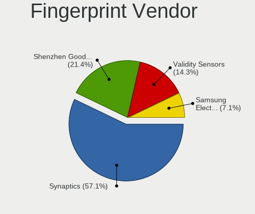

| Vendor                     | Computers | Percent |
|----------------------------|-----------|---------|
| Synaptics                  | 8         | 57.14%  |
| Shenzhen Goodix Technology | 3         | 21.43%  |
| Validity Sensors           | 2         | 14.29%  |
| Samsung Electronics        | 1         | 7.14%   |

Fingerprint Model
-----------------

Fingerprint sensor models

| Model                                                     | Computers | Percent |
|-----------------------------------------------------------|-----------|---------|
| Synaptics UWP WBDI Device                                 | 3         | 21.43%  |
| Synaptics Prometheus MIS Touch Fingerprint Reader         | 3         | 21.43%  |
| Shenzhen Goodix  FingerPrint Device                       | 2         | 14.29%  |
| Validity Sensors VFS5011 Fingerprint Reader               | 1         | 7.14%   |
| Validity Sensors VFS491                                   | 1         | 7.14%   |
| Synaptics  FS7604 Touch Fingerprint Sensor with PurePrint | 1         | 7.14%   |
| Synaptics Prometheus Fingerprint Reader                   | 1         | 7.14%   |
| Shenzhen Goodix Fingerprint Reader                        | 1         | 7.14%   |
| Samsung Fingerprint Sensor Device - 730B                  | 1         | 7.14%   |

Chipcard Vendor
---------------

Chipcard module vendors

| Vendor              | Computers | Percent |
|---------------------|-----------|---------|
| Broadcom            | 11        | 84.62%  |
| Giesecke & Devrient | 1         | 7.69%   |
| Alcor Micro         | 1         | 7.69%   |

Chipcard Model
--------------

Chipcard module models

| Model                                                                        | Computers | Percent |
|------------------------------------------------------------------------------|-----------|---------|
| Broadcom 5880                                                                | 5         | 38.46%  |
| Broadcom 58200                                                               | 3         | 23.08%  |
| Broadcom BCM5880 Secure Applications Processor                               | 2         | 15.38%  |
| Giesecke & Devrient StarSign CUT S                                           | 1         | 7.69%   |
| Broadcom BCM5880 Secure Applications Processor with fingerprint swipe sensor | 1         | 7.69%   |
| Alcor Micro AU9540 Smartcard Reader                                          | 1         | 7.69%   |

Unsupported
-----------

Unsupported Devices
-------------------

Total unsupported devices on board

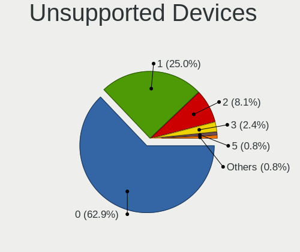

| Total | Computers | Percent |
|-------|-----------|---------|
| 0     | 78        | 62.9%   |
| 1     | 31        | 25%     |
| 2     | 10        | 8.06%   |
| 3     | 3         | 2.42%   |
| 5     | 1         | 0.81%   |
| 4     | 1         | 0.81%   |

Unsupported Device Types
------------------------

Types of unsupported devices

| Type                     | Computers | Percent |
|--------------------------|-----------|---------|
| Fingerprint reader       | 14        | 21.88%  |
| Net/wireless             | 9         | 14.06%  |
| Graphics card            | 8         | 12.5%   |
| Unassigned class         | 7         | 10.94%  |
| Chipcard                 | 6         | 9.38%   |
| Multimedia controller    | 4         | 6.25%   |
| Communication controller | 4         | 6.25%   |
| Storage/ide              | 2         | 3.13%   |
| Net/ethernet             | 2         | 3.13%   |
| Firewire controller      | 2         | 3.13%   |
| Camera                   | 2         | 3.13%   |
| Storage                  | 1         | 1.56%   |
| Sound                    | 1         | 1.56%   |
| Card reader              | 1         | 1.56%   |
| Bluetooth                | 1         | 1.56%   |

