ROSA - Tested Hardware & Statistics
-----------------------------------

A project to collect tested hardware configurations for ROSA.

Anyone can contribute to this report by the [hw-probe](https://github.com/linuxhw/hw-probe) tool:

    sudo -E hw-probe -all -upload

Please contribute! Especially if your hardware is rare.

This is a report for all computer types. See also reports for [desktops](/Dist/ROSA/Desktop/README.md) and [notebooks](/Dist/ROSA/Notebook/README.md).

Contents
--------

* [ Test Cases ](#test-cases)

* [ System ](#system)
  - [ OS                       ](#os)
  - [ OS Family                ](#os-family)
  - [ Kernel                   ](#kernel)
  - [ Kernel Family            ](#kernel-family)
  - [ Kernel Major Ver.        ](#kernel-major-ver)
  - [ Arch                     ](#arch)
  - [ DE                       ](#de)
  - [ Display Server           ](#display-server)
  - [ Display Manager          ](#display-manager)
  - [ OS Lang                  ](#os-lang)
  - [ Boot Mode                ](#boot-mode)
  - [ Filesystem               ](#filesystem)
  - [ Part. scheme             ](#part-scheme)
  - [ Dual Boot with Linux/BSD ](#dual-boot-with-linuxbsd)
  - [ Dual Boot (Win)          ](#dual-boot-win)

* [ Board ](#board)
  - [ Vendor                   ](#vendor)
  - [ Model                    ](#model)
  - [ Model Family             ](#model-family)
  - [ MFG Year                 ](#mfg-year)
  - [ Form Factor              ](#form-factor)
  - [ Secure Boot              ](#secure-boot)
  - [ Coreboot                 ](#coreboot)
  - [ RAM Size                 ](#ram-size)
  - [ RAM Used                 ](#ram-used)
  - [ Total Drives             ](#total-drives)
  - [ Has CD-ROM               ](#has-cd-rom)
  - [ Has Ethernet             ](#has-ethernet)
  - [ Has WiFi                 ](#has-wifi)
  - [ Has Bluetooth            ](#has-bluetooth)

* [ Location ](#location)
  - [ Country                  ](#country)
  - [ City                     ](#city)

* [ Drives ](#drives)
  - [ Drive Vendor             ](#drive-vendor)
  - [ Drive Model              ](#drive-model)
  - [ HDD Vendor               ](#hdd-vendor)
  - [ SSD Vendor               ](#ssd-vendor)
  - [ Drive Kind               ](#drive-kind)
  - [ Drive Connector          ](#drive-connector)
  - [ Drive Size               ](#drive-size)
  - [ Space Total              ](#space-total)
  - [ Space Used               ](#space-used)
  - [ Malfunc. Drives          ](#malfunc-drives)
  - [ Malfunc. Drive Vendor    ](#malfunc-drive-vendor)
  - [ Malfunc. HDD Vendor      ](#malfunc-hdd-vendor)
  - [ Malfunc. Drive Kind      ](#malfunc-drive-kind)
  - [ Failed Drives            ](#failed-drives)
  - [ Failed Drive Vendor      ](#failed-drive-vendor)
  - [ Drive Status             ](#drive-status)

* [ Storage controller ](#storage-controller)
  - [ Storage Vendor           ](#storage-vendor)
  - [ Storage Model            ](#storage-model)
  - [ Storage Kind             ](#storage-kind)

* [ Processor ](#processor)
  - [ CPU Vendor               ](#cpu-vendor)
  - [ CPU Model                ](#cpu-model)
  - [ CPU Model Family         ](#cpu-model-family)
  - [ CPU Cores                ](#cpu-cores)
  - [ CPU Sockets              ](#cpu-sockets)
  - [ CPU Threads              ](#cpu-threads)
  - [ CPU Op-Modes             ](#cpu-op-modes)
  - [ CPU Microcode            ](#cpu-microcode)
  - [ CPU Microarch            ](#cpu-microarch)

* [ Graphics ](#graphics)
  - [ GPU Vendor               ](#gpu-vendor)
  - [ GPU Model                ](#gpu-model)
  - [ GPU Combo                ](#gpu-combo)
  - [ GPU Driver               ](#gpu-driver)
  - [ GPU Memory               ](#gpu-memory)

* [ Monitor ](#monitor)
  - [ Monitor Vendor           ](#monitor-vendor)
  - [ Monitor Model            ](#monitor-model)
  - [ Monitor Resolution       ](#monitor-resolution)
  - [ Monitor Diagonal         ](#monitor-diagonal)
  - [ Monitor Width            ](#monitor-width)
  - [ Aspect Ratio             ](#aspect-ratio)
  - [ Monitor Area             ](#monitor-area)
  - [ Pixel Density            ](#pixel-density)
  - [ Multiple Monitors        ](#multiple-monitors)

* [ Network ](#network)
  - [ Net Controller Vendor    ](#net-controller-vendor)
  - [ Net Controller Model     ](#net-controller-model)
  - [ Wireless Vendor          ](#wireless-vendor)
  - [ Wireless Model           ](#wireless-model)
  - [ Ethernet Vendor          ](#ethernet-vendor)
  - [ Ethernet Model           ](#ethernet-model)
  - [ Net Controller Kind      ](#net-controller-kind)
  - [ Used Controller          ](#used-controller)
  - [ NICs                     ](#nics)
  - [ IPv6                     ](#ipv6)

* [ Bluetooth ](#bluetooth)
  - [ Bluetooth Vendor         ](#bluetooth-vendor)
  - [ Bluetooth Model          ](#bluetooth-model)

* [ Sound ](#sound)
  - [ Sound Vendor             ](#sound-vendor)
  - [ Sound Model              ](#sound-model)

* [ Memory ](#memory)
  - [ Memory Vendor            ](#memory-vendor)
  - [ Memory Model             ](#memory-model)
  - [ Memory Kind              ](#memory-kind)
  - [ Memory Form Factor       ](#memory-form-factor)
  - [ Memory Size              ](#memory-size)
  - [ Memory Speed             ](#memory-speed)

* [ Printers & scanners ](#printers--scanners)
  - [ Printer Vendor           ](#printer-vendor)
  - [ Printer Model            ](#printer-model)
  - [ Scanner Vendor           ](#scanner-vendor)
  - [ Scanner Model            ](#scanner-model)

* [ Camera ](#camera)
  - [ Camera Vendor            ](#camera-vendor)
  - [ Camera Model             ](#camera-model)

* [ Security ](#security)
  - [ Fingerprint Vendor       ](#fingerprint-vendor)
  - [ Fingerprint Model        ](#fingerprint-model)
  - [ Chipcard Vendor          ](#chipcard-vendor)
  - [ Chipcard Model           ](#chipcard-model)

* [ Unsupported ](#unsupported)
  - [ Unsupported Devices      ](#unsupported-devices)
  - [ Unsupported Device Types ](#unsupported-device-types)

Test Cases
----------

Total: 49384

| Vendor        | Model                       | Form-Factor | Probe                                                      | Date         |
|---------------|-----------------------------|-------------|------------------------------------------------------------|--------------|
| Intel         | X99H                        | Desktop     | [c128e2c6eb](https://linux-hardware.org/?probe=c128e2c6eb) | Jan 03, 2026 |
| TECNO Mobi... | MEGABOOK K16SDA             | Notebook    | [7c753ecd02](https://linux-hardware.org/?probe=7c753ecd02) | Jan 03, 2026 |
| Acer          | TravelMate P253             | Notebook    | [7437655096](https://linux-hardware.org/?probe=7437655096) | Jan 03, 2026 |
| Lenovo        | IdeaPad 3 15ITL6 82H8       | Notebook    | [f87b5913e7](https://linux-hardware.org/?probe=f87b5913e7) | Jan 03, 2026 |
| MSI           | H110M PRO-VH PLUS           | Desktop     | [b447d296fe](https://linux-hardware.org/?probe=b447d296fe) | Jan 03, 2026 |
| HP            | Laptop 15-bs0xx             | Notebook    | [2650d734a4](https://linux-hardware.org/?probe=2650d734a4) | Jan 02, 2026 |
| Shenzhen M... | HPBSD                       | Mini pc     | [69d98d9bfe](https://linux-hardware.org/?probe=69d98d9bfe) | Jan 02, 2026 |
| Gigabyte      | B550 AORUS ELITE AX V2      | Desktop     | [3a30112dd1](https://linux-hardware.org/?probe=3a30112dd1) | Jan 02, 2026 |
| ASUSTek       | PRIME B450M-K               | Desktop     | [660e482a8f](https://linux-hardware.org/?probe=660e482a8f) | Jan 02, 2026 |
| Gigabyte      | X870 EAGLE WIFI7            | Desktop     | [339e452cdc](https://linux-hardware.org/?probe=339e452cdc) | Jan 02, 2026 |
| ASRock        | Z68 Professional Gen3       | Desktop     | [66c6c09a3f](https://linux-hardware.org/?probe=66c6c09a3f) | Jan 02, 2026 |
| ASUSTek       | H110M-K                     | Desktop     | [784cad61e6](https://linux-hardware.org/?probe=784cad61e6) | Jan 02, 2026 |
| Lenovo        | G50-30 80G0                 | Notebook    | [1f6c184581](https://linux-hardware.org/?probe=1f6c184581) | Jan 01, 2026 |
| AZW           | SER8 V10                    | Mini pc     | [2aa08231f6](https://linux-hardware.org/?probe=2aa08231f6) | Dec 31, 2025 |
| Lenovo        | G550 20023                  | Notebook    | [9eacc3bfa0](https://linux-hardware.org/?probe=9eacc3bfa0) | Dec 31, 2025 |
| Lenovo        | G550 20023                  | Notebook    | [906ce38118](https://linux-hardware.org/?probe=906ce38118) | Dec 31, 2025 |
| Gigabyte      | B75M-D3V                    | Desktop     | [edc62fad83](https://linux-hardware.org/?probe=edc62fad83) | Dec 31, 2025 |
| ASUSTek       | Vivobook Go E1504FA_E150... | Notebook    | [f95b289f04](https://linux-hardware.org/?probe=f95b289f04) | Dec 31, 2025 |
| Samsung       | 350V5C/351V5C/3540VC/344... | Notebook    | [5ba56ec2ff](https://linux-hardware.org/?probe=5ba56ec2ff) | Dec 31, 2025 |
| ASRock        | G41M-VS3                    | Desktop     | [014d550326](https://linux-hardware.org/?probe=014d550326) | Dec 31, 2025 |
| Acer          | Aspire 4720Z                | Notebook    | [603ea7c32a](https://linux-hardware.org/?probe=603ea7c32a) | Dec 31, 2025 |
| Apple         | MacBook3,1                  | Notebook    | [3e9b7ef512](https://linux-hardware.org/?probe=3e9b7ef512) | Dec 31, 2025 |
| Positivo      | Q4128C-S                    | Notebook    | [1eac53a163](https://linux-hardware.org/?probe=1eac53a163) | Dec 31, 2025 |
| ASUSTek       | VivoBook_ASUSLaptop M140... | Notebook    | [0f90cf58f4](https://linux-hardware.org/?probe=0f90cf58f4) | Dec 31, 2025 |
| Gigabyte      | B550 AORUS ELITE V2         | Desktop     | [d5e15416e3](https://linux-hardware.org/?probe=d5e15416e3) | Dec 30, 2025 |
| Samsung       | 300E4A/300E5A/300E7A        | Notebook    | [6bd6a568ae](https://linux-hardware.org/?probe=6bd6a568ae) | Dec 30, 2025 |
| Intel         | X99                         | Desktop     | [4b84291c2a](https://linux-hardware.org/?probe=4b84291c2a) | Dec 30, 2025 |
| Intel         | X99H                        | Desktop     | [b90f22103c](https://linux-hardware.org/?probe=b90f22103c) | Dec 30, 2025 |
| Huanan        | X99-QD4 V0.1 693H           | Desktop     | [104e676226](https://linux-hardware.org/?probe=104e676226) | Dec 29, 2025 |
| ASUSTek       | Vivobook Go E1504FA_E150... | Notebook    | [c4a5206eb2](https://linux-hardware.org/?probe=c4a5206eb2) | Dec 29, 2025 |
| Acer          | Aspire ES1-411              | Notebook    | [6d55dc4b0b](https://linux-hardware.org/?probe=6d55dc4b0b) | Dec 29, 2025 |
| ASUSTek       | Pro H610T D4                | Desktop     | [25797d3614](https://linux-hardware.org/?probe=25797d3614) | Dec 29, 2025 |
| AZW           | MINI S                      | Desktop     | [0a13f463cb](https://linux-hardware.org/?probe=0a13f463cb) | Dec 29, 2025 |
| ASUSTek       | A88XM-PLUS                  | Desktop     | [92f1f16e5a](https://linux-hardware.org/?probe=92f1f16e5a) | Dec 29, 2025 |
| MSI           | 970A-G43 PLUS               | Desktop     | [e2ea2589de](https://linux-hardware.org/?probe=e2ea2589de) | Dec 29, 2025 |
| MSI           | Z270 GAMING PLUS            | Desktop     | [d68c29fd9b](https://linux-hardware.org/?probe=d68c29fd9b) | Dec 29, 2025 |
| ANCOMP        | Learnmate A15-501           | Notebook    | [2be4994dff](https://linux-hardware.org/?probe=2be4994dff) | Dec 28, 2025 |
| Gigabyte      | F2A88X-D3H                  | Desktop     | [4f39658e29](https://linux-hardware.org/?probe=4f39658e29) | Dec 28, 2025 |
| Maibenben     | Mini PC                     | Mini pc     | [3110414bd4](https://linux-hardware.org/?probe=3110414bd4) | Dec 28, 2025 |
| Echips Imp... | Echips Hot [XPS15U57]       | Notebook    | [95a05e64c5](https://linux-hardware.org/?probe=95a05e64c5) | Dec 28, 2025 |
| ASUSTek       | PRIME A320M-K               | Desktop     | [7abc6b4591](https://linux-hardware.org/?probe=7abc6b4591) | Dec 28, 2025 |
| Dell          | 0HX555                      | Desktop     | [4a7119f9df](https://linux-hardware.org/?probe=4a7119f9df) | Dec 28, 2025 |
| SHUANGWEI     | ST-X79M-2011 V2.0           | Desktop     | [1b1c37cdde](https://linux-hardware.org/?probe=1b1c37cdde) | Dec 28, 2025 |
| Samsung       | 300E4A/300E5A/300E7A/343... | Notebook    | [31924a6983](https://linux-hardware.org/?probe=31924a6983) | Dec 28, 2025 |
| Pegatron      | 2A73h                       | Desktop     | [0a7d617dd0](https://linux-hardware.org/?probe=0a7d617dd0) | Dec 28, 2025 |
| MSI           | PRO B660M-E DDR4            | Desktop     | [663c716b2e](https://linux-hardware.org/?probe=663c716b2e) | Dec 28, 2025 |
| ASUSTek       | ROG Flow X16 GV601VV_GV6... | Convertible | [d579147c84](https://linux-hardware.org/?probe=d579147c84) | Dec 28, 2025 |
| ASRock        | M3A785GMH/128M              | Desktop     | [884c53d1c5](https://linux-hardware.org/?probe=884c53d1c5) | Dec 28, 2025 |
| MSI           | U270 series                 | Notebook    | [0c56417614](https://linux-hardware.org/?probe=0c56417614) | Dec 28, 2025 |
| HP            | Pavilion g7                 | Notebook    | [57da019672](https://linux-hardware.org/?probe=57da019672) | Dec 28, 2025 |
| Gigabyte      | B660 GAMING X DDR4          | Desktop     | [0ccd57dd75](https://linux-hardware.org/?probe=0ccd57dd75) | Dec 27, 2025 |
| Gigabyte      | B660 GAMING X DDR4          | Desktop     | [561a2a75ba](https://linux-hardware.org/?probe=561a2a75ba) | Dec 27, 2025 |
| Intel         | X99                         | Desktop     | [e37845b457](https://linux-hardware.org/?probe=e37845b457) | Dec 27, 2025 |
| MSI           | H110M PRO-VH PLUS           | Desktop     | [cc774b7847](https://linux-hardware.org/?probe=cc774b7847) | Dec 27, 2025 |
| Chuwi         | Hi10 Max                    | Tablet      | [636d209b81](https://linux-hardware.org/?probe=636d209b81) | Dec 27, 2025 |
| MSI           | CX61 0NC/CX61 0ND/CX61 0... | Notebook    | [7590e01f43](https://linux-hardware.org/?probe=7590e01f43) | Dec 27, 2025 |
| SHUANGWEI     | ST-X79M-2011 V2.0           | Desktop     | [142ebdfac7](https://linux-hardware.org/?probe=142ebdfac7) | Dec 27, 2025 |
| Lenovo        | G780 20138                  | Notebook    | [8fa5079f52](https://linux-hardware.org/?probe=8fa5079f52) | Dec 27, 2025 |
| Lenovo        | G780 20138                  | Notebook    | [8cfe656814](https://linux-hardware.org/?probe=8cfe656814) | Dec 27, 2025 |
| ASUSTek       | Vivobook Go E1504GA_E150... | Notebook    | [f573016b6b](https://linux-hardware.org/?probe=f573016b6b) | Dec 27, 2025 |
| HP            | 15                          | Notebook    | [ecbc6e5096](https://linux-hardware.org/?probe=ecbc6e5096) | Dec 26, 2025 |
| ICL Techno    | F160i                       | Notebook    | [bac9008660](https://linux-hardware.org/?probe=bac9008660) | Dec 26, 2025 |
| Gigabyte      | B450M S2H                   | Desktop     | [bd2164c5a3](https://linux-hardware.org/?probe=bd2164c5a3) | Dec 26, 2025 |
| ASUSTek       | PRIME A320M-K               | Desktop     | [ee2ad31ec7](https://linux-hardware.org/?probe=ee2ad31ec7) | Dec 26, 2025 |
| Acer          | Extensa 2511G               | Notebook    | [a06e90429a](https://linux-hardware.org/?probe=a06e90429a) | Dec 26, 2025 |
| Gigabyte      | G31M-ES2L                   | Desktop     | [a82e460aa1](https://linux-hardware.org/?probe=a82e460aa1) | Dec 26, 2025 |
| MSI           | H110M PRO-VH PLUS           | Desktop     | [ac774dbb04](https://linux-hardware.org/?probe=ac774dbb04) | Dec 26, 2025 |
| Dell          | Latitude E7440              | Notebook    | [81c6ca33bb](https://linux-hardware.org/?probe=81c6ca33bb) | Dec 25, 2025 |
| Dell          | Latitude E7440              | Notebook    | [b0555f89da](https://linux-hardware.org/?probe=b0555f89da) | Dec 25, 2025 |
| MSI           | B850 GAMING PLUS WIFI       | Desktop     | [6dfbb2378f](https://linux-hardware.org/?probe=6dfbb2378f) | Dec 25, 2025 |
| Acer          | Aspire A315-24P             | Notebook    | [b741e91f27](https://linux-hardware.org/?probe=b741e91f27) | Dec 25, 2025 |
| MSI           | X470 GAMING PRO CARBON A... | Desktop     | [b9e41348de](https://linux-hardware.org/?probe=b9e41348de) | Dec 25, 2025 |
| HP            | Stream Laptop 14-ax0XX      | Notebook    | [5fbce87398](https://linux-hardware.org/?probe=5fbce87398) | Dec 25, 2025 |
| Intel         | X99                         | Desktop     | [29bcb6daf4](https://linux-hardware.org/?probe=29bcb6daf4) | Dec 25, 2025 |
| Gigabyte      | AB350-Gaming 3-CF           | Desktop     | [3ac58d1aa2](https://linux-hardware.org/?probe=3ac58d1aa2) | Dec 25, 2025 |
| ASUSTek       | VivoBook_ASUSLaptop X350... | Notebook    | [50c46978b4](https://linux-hardware.org/?probe=50c46978b4) | Dec 24, 2025 |
| Unknown       | Unknown                     | Desktop     | [637befb0ae](https://linux-hardware.org/?probe=637befb0ae) | Dec 24, 2025 |
| Aquarius      | CMP NS685U_4                | Notebook    | [be5b574e32](https://linux-hardware.org/?probe=be5b574e32) | Dec 24, 2025 |
| ASUSTek       | VivoBook_ASUSLaptop M370... | Notebook    | [f76a7c18e7](https://linux-hardware.org/?probe=f76a7c18e7) | Dec 24, 2025 |
| Gigabyte      | GA-78LMT-S2P                | Desktop     | [14b6435a3a](https://linux-hardware.org/?probe=14b6435a3a) | Dec 24, 2025 |
| KVADRA        | NAU LE14U                   | Notebook    | [40f1d6da79](https://linux-hardware.org/?probe=40f1d6da79) | Dec 24, 2025 |
| Gigabyte      | P75-D3                      | Desktop     | [3620b638df](https://linux-hardware.org/?probe=3620b638df) | Dec 24, 2025 |
| Samsung       | R55S                        | Notebook    | [fc6cd115ef](https://linux-hardware.org/?probe=fc6cd115ef) | Dec 23, 2025 |
| Gigabyte      | B450M DS3H-CF               | Desktop     | [a6500b8179](https://linux-hardware.org/?probe=a6500b8179) | Dec 23, 2025 |
| Dell          | Latitude E6440              | Notebook    | [a3ade03557](https://linux-hardware.org/?probe=a3ade03557) | Dec 23, 2025 |
| Lenovo        | K14 Gen 1 21CSS16E00        | Notebook    | [8a21735d0b](https://linux-hardware.org/?probe=8a21735d0b) | Dec 23, 2025 |
| ASUSTek       | ASUS Vivobook S 14 S3407... | Notebook    | [e617968f10](https://linux-hardware.org/?probe=e617968f10) | Dec 23, 2025 |
| ASUSTek       | K52JU                       | Notebook    | [c8d6430be3](https://linux-hardware.org/?probe=c8d6430be3) | Dec 22, 2025 |
| ASUSTek       | PRIME H510M-E               | Desktop     | [4502761769](https://linux-hardware.org/?probe=4502761769) | Dec 22, 2025 |
| Lenovo        | Bantry CRB SDK0J40697 WI... | Desktop     | [1a96b2d677](https://linux-hardware.org/?probe=1a96b2d677) | Dec 22, 2025 |
| Gigabyte      | B550M DS3H                  | Desktop     | [8be9a42512](https://linux-hardware.org/?probe=8be9a42512) | Dec 22, 2025 |
| Gigabyte      | H77N-WIFI                   | Desktop     | [408a17f2c5](https://linux-hardware.org/?probe=408a17f2c5) | Dec 22, 2025 |
| Shenzhen M... | F7BSC                       | Mini pc     | [409d23246b](https://linux-hardware.org/?probe=409d23246b) | Dec 22, 2025 |
| LTD Delovo... | EVE 15 P417                 | Notebook    | [30044582c8](https://linux-hardware.org/?probe=30044582c8) | Dec 21, 2025 |
| MSI           | CX61 0NC/CX61 0ND/CX61 0... | Notebook    | [9ef3889e8a](https://linux-hardware.org/?probe=9ef3889e8a) | Dec 21, 2025 |
| ASUSTek       | ROG Strix SCAR 18 G835LW... | Notebook    | [3067f36821](https://linux-hardware.org/?probe=3067f36821) | Dec 21, 2025 |
| HP            | Notebook                    | Notebook    | [123804d767](https://linux-hardware.org/?probe=123804d767) | Dec 21, 2025 |
| Sony          | SVE14A2V1RWI                | Notebook    | [f91b104aae](https://linux-hardware.org/?probe=f91b104aae) | Dec 20, 2025 |
| ASUSTek       | P5GZ-MX                     | Desktop     | [e776ee67c2](https://linux-hardware.org/?probe=e776ee67c2) | Dec 20, 2025 |
| ASUSTek       | UX32VD                      | Notebook    | [a4baf3a4b3](https://linux-hardware.org/?probe=a4baf3a4b3) | Dec 20, 2025 |
| HP            | Compaq nc4200 (PY302AA#A... | Notebook    | [1c1a20dd48](https://linux-hardware.org/?probe=1c1a20dd48) | Dec 20, 2025 |
| Unknown       | Unknown                     | Desktop     | [ec859ede7b](https://linux-hardware.org/?probe=ec859ede7b) | Dec 19, 2025 |
| Lenovo        | Bantry CRB SDK0J40697 WI... | Desktop     | [ee2d8f3a79](https://linux-hardware.org/?probe=ee2d8f3a79) | Dec 19, 2025 |
| ASUSTek       | VivoBook_ASUSLaptop X150... | Notebook    | [79f7ba8742](https://linux-hardware.org/?probe=79f7ba8742) | Dec 19, 2025 |
| LTD Delovo... | EVE 15 P417                 | Notebook    | [c4b8386fbd](https://linux-hardware.org/?probe=c4b8386fbd) | Dec 19, 2025 |
| ASUSTek       | P8Z77-V LX                  | Desktop     | [ca62a8ae1a](https://linux-hardware.org/?probe=ca62a8ae1a) | Dec 19, 2025 |
| ASUSTek       | PRIME B250M-K               | Desktop     | [78e67b13c7](https://linux-hardware.org/?probe=78e67b13c7) | Dec 19, 2025 |
| ASUSTek       | P5K                         | Desktop     | [b70ab0b960](https://linux-hardware.org/?probe=b70ab0b960) | Dec 19, 2025 |
| Toshiba       | Satellite C650              | Notebook    | [0adf64316a](https://linux-hardware.org/?probe=0adf64316a) | Dec 19, 2025 |
| MSI           | Z270 GAMING PLUS            | Desktop     | [c889a7254a](https://linux-hardware.org/?probe=c889a7254a) | Dec 18, 2025 |
| Dell          | Latitude 7350               | Notebook    | [e3705bb612](https://linux-hardware.org/?probe=e3705bb612) | Dec 18, 2025 |
| MAINBRD       | OPS72A-SHA                  | Desktop     | [14780fd9c2](https://linux-hardware.org/?probe=14780fd9c2) | Dec 18, 2025 |
| Huanan        | B75                         | Desktop     | [fcf922ce7b](https://linux-hardware.org/?probe=fcf922ce7b) | Dec 18, 2025 |
| Acer          | Predator PHN16-71           | Notebook    | [d4d0ca3f4c](https://linux-hardware.org/?probe=d4d0ca3f4c) | Dec 18, 2025 |
| Intel         | SKYBAY                      | Desktop     | [332f4cea3e](https://linux-hardware.org/?probe=332f4cea3e) | Dec 18, 2025 |
| HP            | 8265                        | Desktop     | [bc9655d1c7](https://linux-hardware.org/?probe=bc9655d1c7) | Dec 18, 2025 |
| Lenovo        | V14 G2 ALC 82KC             | Notebook    | [4f7e7701f9](https://linux-hardware.org/?probe=4f7e7701f9) | Dec 18, 2025 |
| ASUSTek       | VivoBook 15_ASUS Laptop ... | Notebook    | [9b1f13f884](https://linux-hardware.org/?probe=9b1f13f884) | Dec 17, 2025 |
| Gigabyte      | Z890 EAGLE WIFI7            | Desktop     | [f8434dde22](https://linux-hardware.org/?probe=f8434dde22) | Dec 17, 2025 |
| KVADRA        | NAU LE14U                   | Notebook    | [c11922f617](https://linux-hardware.org/?probe=c11922f617) | Dec 17, 2025 |
| MSI           | G31TM-P35                   | Desktop     | [f2656b168a](https://linux-hardware.org/?probe=f2656b168a) | Dec 17, 2025 |
| Unknown       | Unknown                     | Desktop     | [09735797de](https://linux-hardware.org/?probe=09735797de) | Dec 17, 2025 |
| Lenovo        | Y70-70 Touch 80DU           | Notebook    | [0a09569c9a](https://linux-hardware.org/?probe=0a09569c9a) | Dec 17, 2025 |
| Samsung       | R55S                        | Notebook    | [07fe452be0](https://linux-hardware.org/?probe=07fe452be0) | Dec 16, 2025 |
| MSI           | MEG X570S UNIFY-X MAX       | Desktop     | [0aad518041](https://linux-hardware.org/?probe=0aad518041) | Dec 16, 2025 |
| Aquarius      | CMP NS685U_4                | Notebook    | [3a876c4cc0](https://linux-hardware.org/?probe=3a876c4cc0) | Dec 16, 2025 |
| Gigabyte      | Z170X-Gaming 5              | Desktop     | [ae44694b48](https://linux-hardware.org/?probe=ae44694b48) | Dec 16, 2025 |
| Lenovo        | K14 Gen 1 21CSS16E00        | Notebook    | [a3c2eebb60](https://linux-hardware.org/?probe=a3c2eebb60) | Dec 16, 2025 |
| Gigabyte      | Z890 EAGLE WIFI7            | Desktop     | [6a90c2981e](https://linux-hardware.org/?probe=6a90c2981e) | Dec 16, 2025 |
| Lenovo        | IdeaPad 3 15IIL05 81WE      | Notebook    | [1f71b59fad](https://linux-hardware.org/?probe=1f71b59fad) | Dec 15, 2025 |
| Lenovo        | G570 20079                  | Notebook    | [34b93938fb](https://linux-hardware.org/?probe=34b93938fb) | Dec 15, 2025 |
| Lenovo        | G570 20079                  | Notebook    | [8d1c054bcd](https://linux-hardware.org/?probe=8d1c054bcd) | Dec 15, 2025 |
| Acer          | Extensa 5635ZG              | Notebook    | [4da9cdb0d4](https://linux-hardware.org/?probe=4da9cdb0d4) | Dec 15, 2025 |
| Lenovo        | IdeaPad 3 17ALC6 82KV       | Notebook    | [de8f48fcec](https://linux-hardware.org/?probe=de8f48fcec) | Dec 15, 2025 |
| Lenovo        | G570 20079                  | Notebook    | [d4e55a3f51](https://linux-hardware.org/?probe=d4e55a3f51) | Dec 14, 2025 |
| ASRock        | B550 Pro4                   | Desktop     | [1a2b0a21c6](https://linux-hardware.org/?probe=1a2b0a21c6) | Dec 14, 2025 |
| ASRock        | B550 Pro4                   | Desktop     | [e2b4621330](https://linux-hardware.org/?probe=e2b4621330) | Dec 14, 2025 |
| Intel         | NUC8BEB J72692-308          | Mini pc     | [fce6e98d0f](https://linux-hardware.org/?probe=fce6e98d0f) | Dec 14, 2025 |
| MSI           | B350M GAMING PRO            | Desktop     | [cee2004a9e](https://linux-hardware.org/?probe=cee2004a9e) | Dec 14, 2025 |
| HP            | Unknown                     | Notebook    | [234707220d](https://linux-hardware.org/?probe=234707220d) | Dec 13, 2025 |
| HP            | ENVY Sleekbook 4            | Notebook    | [5d84036167](https://linux-hardware.org/?probe=5d84036167) | Dec 13, 2025 |
| Apple         | Mac-031AEE4D24BFF0B1 Mac... | Mini pc     | [06447b95e2](https://linux-hardware.org/?probe=06447b95e2) | Dec 13, 2025 |
| ASUSTek       | P5K                         | Desktop     | [b872b65bdc](https://linux-hardware.org/?probe=b872b65bdc) | Dec 13, 2025 |
| Samsung       | R580/R590                   | Notebook    | [6fd58e5785](https://linux-hardware.org/?probe=6fd58e5785) | Dec 13, 2025 |
| DEXP          | Atlas M15-I3W302            | Notebook    | [cab1f65dba](https://linux-hardware.org/?probe=cab1f65dba) | Dec 13, 2025 |
| ASUSTek       | P5KPL-AM IN/GB              | Desktop     | [87f8d65b8e](https://linux-hardware.org/?probe=87f8d65b8e) | Dec 13, 2025 |
| Samsung       | 350V5C/351V5C/3540VC/344... | Notebook    | [20b7aac7a8](https://linux-hardware.org/?probe=20b7aac7a8) | Dec 13, 2025 |
| ASUSTek       | PRIME B760M-K               | Desktop     | [0fb3da10fd](https://linux-hardware.org/?probe=0fb3da10fd) | Dec 13, 2025 |
| Maibenben     | X-Treme Typhoon Series      | Notebook    | [431375d97c](https://linux-hardware.org/?probe=431375d97c) | Dec 13, 2025 |
| Intel         | X99E V1.0                   | Desktop     | [e772fd09dc](https://linux-hardware.org/?probe=e772fd09dc) | Dec 12, 2025 |
| Acer          | Aspire A315-21              | Notebook    | [26c12c9dc1](https://linux-hardware.org/?probe=26c12c9dc1) | Dec 12, 2025 |
| HP            | ENVY Sleekbook 4            | Notebook    | [50c6357045](https://linux-hardware.org/?probe=50c6357045) | Dec 12, 2025 |
| Gigabyte      | B85M-D3V                    | Desktop     | [393d2c833f](https://linux-hardware.org/?probe=393d2c833f) | Dec 12, 2025 |
| ASRock        | B450M Pro4 R2.0             | Desktop     | [e8fe4f3095](https://linux-hardware.org/?probe=e8fe4f3095) | Dec 12, 2025 |
| MSI           | Alpha 15 B5EEK              | Notebook    | [60ae24706e](https://linux-hardware.org/?probe=60ae24706e) | Dec 12, 2025 |
| Apple         | Mac-031AEE4D24BFF0B1 Mac... | Mini pc     | [cf969b9eea](https://linux-hardware.org/?probe=cf969b9eea) | Dec 12, 2025 |
| KVADRA        | NAU LE14U                   | Notebook    | [0228f27922](https://linux-hardware.org/?probe=0228f27922) | Dec 12, 2025 |
| Gigabyte      | H110M-S2PV-CF               | Desktop     | [9f9817cbda](https://linux-hardware.org/?probe=9f9817cbda) | Dec 12, 2025 |
| Chuwi         | MiniBook X                  | Notebook    | [5c039493f2](https://linux-hardware.org/?probe=5c039493f2) | Dec 12, 2025 |
| J&W           | H81M-G2S                    | Desktop     | [44b61bb69a](https://linux-hardware.org/?probe=44b61bb69a) | Dec 12, 2025 |
| Machinist     | X99-D8 MAX V2.0             | Desktop     | [eb75f6c8a0](https://linux-hardware.org/?probe=eb75f6c8a0) | Dec 11, 2025 |
| Apple         | MacBookPro12,1              | Notebook    | [5f97a03201](https://linux-hardware.org/?probe=5f97a03201) | Dec 11, 2025 |
| Apple         | MacBookPro12,1              | Notebook    | [5a6f8552d9](https://linux-hardware.org/?probe=5a6f8552d9) | Dec 11, 2025 |
| HP            | EliteBook 840 G5            | Notebook    | [0f8fc86a45](https://linux-hardware.org/?probe=0f8fc86a45) | Dec 11, 2025 |
| ASUSTek       | ASUS Vivobook S 16 S3607... | Notebook    | [c662d2a28f](https://linux-hardware.org/?probe=c662d2a28f) | Dec 11, 2025 |
| ASRock        | B650M Pro RS WiFi           | Desktop     | [1c8d7599fe](https://linux-hardware.org/?probe=1c8d7599fe) | Dec 11, 2025 |
| Intel         | X99-K V7.0                  | Desktop     | [84b614470e](https://linux-hardware.org/?probe=84b614470e) | Dec 11, 2025 |
| Intel         | SKYBAY                      | Desktop     | [f886188f2e](https://linux-hardware.org/?probe=f886188f2e) | Dec 11, 2025 |
| Lenovo        | Bantry CRB NOK              | Desktop     | [eaa1f40b1a](https://linux-hardware.org/?probe=eaa1f40b1a) | Dec 11, 2025 |
| ASUSTek       | H110M-K                     | Desktop     | [6409038e27](https://linux-hardware.org/?probe=6409038e27) | Dec 11, 2025 |
| MAINBRD       | OPS72A-SHA                  | Desktop     | [7b262a5edd](https://linux-hardware.org/?probe=7b262a5edd) | Dec 11, 2025 |
| Intel         | SKYBAY                      | Desktop     | [14bec5c8e9](https://linux-hardware.org/?probe=14bec5c8e9) | Dec 11, 2025 |
| Intel         | SKYBAY                      | Desktop     | [c0fc5b333b](https://linux-hardware.org/?probe=c0fc5b333b) | Dec 11, 2025 |
| MocTex        | OPS6725-SHA                 | Desktop     | [02e7ca591e](https://linux-hardware.org/?probe=02e7ca591e) | Dec 11, 2025 |
| MocTex        | OPS6725-SHA                 | Desktop     | [aa27dfd571](https://linux-hardware.org/?probe=aa27dfd571) | Dec 11, 2025 |
| Gigabyte      | H270-HD3-CF                 | Desktop     | [48fe400775](https://linux-hardware.org/?probe=48fe400775) | Dec 11, 2025 |
| Intel         | X79-VG2 V2.2                | Desktop     | [0220c5af5b](https://linux-hardware.org/?probe=0220c5af5b) | Dec 10, 2025 |
| Lenovo        | K14 Gen 1 21CSS16E00        | Notebook    | [a2830302b9](https://linux-hardware.org/?probe=a2830302b9) | Dec 10, 2025 |
| MSI           | MPG B560I GAMING EDGE WI... | Desktop     | [fac68a3be2](https://linux-hardware.org/?probe=fac68a3be2) | Dec 10, 2025 |
| Gigabyte      | Z68AP-D3                    | Desktop     | [6101aa9c3c](https://linux-hardware.org/?probe=6101aa9c3c) | Dec 10, 2025 |
| MSI           | MPG B560I GAMING EDGE WI... | Desktop     | [20f77c05f2](https://linux-hardware.org/?probe=20f77c05f2) | Dec 10, 2025 |
| Lenovo        | 3102 SDK0J40697 WIN 3305... | Desktop     | [19c2402143](https://linux-hardware.org/?probe=19c2402143) | Dec 10, 2025 |
| ASUSTek       | A88XM-PLUS                  | Desktop     | [25caa70a9c](https://linux-hardware.org/?probe=25caa70a9c) | Dec 10, 2025 |
| Apple         | MacBook3,1                  | Notebook    | [83a0f9f476](https://linux-hardware.org/?probe=83a0f9f476) | Dec 10, 2025 |
| Gigabyte      | H61M-S2PV                   | Desktop     | [ba10210688](https://linux-hardware.org/?probe=ba10210688) | Dec 10, 2025 |
| HP            | 2AA6 PVT                    | Desktop     | [9af878e72a](https://linux-hardware.org/?probe=9af878e72a) | Dec 09, 2025 |
| ASUSTek       | PRIME A320M-K/BR            | Desktop     | [9d2f93dd97](https://linux-hardware.org/?probe=9d2f93dd97) | Dec 09, 2025 |
| Gigabyte      | H270-HD3-CF                 | Desktop     | [4e1955ef9f](https://linux-hardware.org/?probe=4e1955ef9f) | Dec 09, 2025 |
| MAINBRD       | OPS72A-SHA                  | Desktop     | [2cf81d2ab7](https://linux-hardware.org/?probe=2cf81d2ab7) | Dec 09, 2025 |
| Dell          | Inspiron 3793               | Notebook    | [5cd72b4c9e](https://linux-hardware.org/?probe=5cd72b4c9e) | Dec 08, 2025 |
| Gigabyte      | G31M-ES2L                   | Desktop     | [9dc9700ff8](https://linux-hardware.org/?probe=9dc9700ff8) | Dec 08, 2025 |
| Lenovo        | B590 20206                  | Notebook    | [b32d9d3915](https://linux-hardware.org/?probe=b32d9d3915) | Dec 08, 2025 |
| MocTex        | OPS6725-SHA                 | Desktop     | [703be3177c](https://linux-hardware.org/?probe=703be3177c) | Dec 08, 2025 |
| Biostar       | A780LB                      | Desktop     | [1b822bce73](https://linux-hardware.org/?probe=1b822bce73) | Dec 08, 2025 |
| Supermicro    | X9DRW                       | Server      | [8c84404c92](https://linux-hardware.org/?probe=8c84404c92) | Dec 08, 2025 |
| Supermicro    | X11SPW-TF                   | Server      | [a4ad92338f](https://linux-hardware.org/?probe=a4ad92338f) | Dec 08, 2025 |
| ICL           | H510SB-TM v2.0              | All in one  | [0e30b1567a](https://linux-hardware.org/?probe=0e30b1567a) | Dec 08, 2025 |
| Lenovo        | ThinkPad E14 Gen 4 21E4S... | Notebook    | [eb43635a59](https://linux-hardware.org/?probe=eb43635a59) | Dec 08, 2025 |
| HP            | 83E5                        | All in one  | [41628f90f4](https://linux-hardware.org/?probe=41628f90f4) | Dec 08, 2025 |
| Intel         | B75                         | Desktop     | [1765729c31](https://linux-hardware.org/?probe=1765729c31) | Dec 08, 2025 |
| Lenovo        | V15 G2 IJL 82QY             | Notebook    | [394f2b5df0](https://linux-hardware.org/?probe=394f2b5df0) | Dec 07, 2025 |
| ASUSTek       | P8H61-MX                    | Desktop     | [3fc114c4c4](https://linux-hardware.org/?probe=3fc114c4c4) | Dec 07, 2025 |
| iRU           | 14ALH                       | Notebook    | [fa4cb84b2b](https://linux-hardware.org/?probe=fa4cb84b2b) | Dec 07, 2025 |
| Dell          | Inspiron 5565               | Notebook    | [3522288144](https://linux-hardware.org/?probe=3522288144) | Dec 07, 2025 |
| ASRock        | B450M/ac R2.0               | Desktop     | [6f49fcddc4](https://linux-hardware.org/?probe=6f49fcddc4) | Dec 07, 2025 |
| ASRock        | H510M-HDV R2.0              | Desktop     | [a4f8903c34](https://linux-hardware.org/?probe=a4f8903c34) | Dec 07, 2025 |
| OEM           | X79G                        | Desktop     | [47a9ab491d](https://linux-hardware.org/?probe=47a9ab491d) | Dec 07, 2025 |
| Acer          | Aspire 1410                 | Notebook    | [fc96b8b1cc](https://linux-hardware.org/?probe=fc96b8b1cc) | Dec 07, 2025 |
| Huanan        | X99-TF V2.0                 | Desktop     | [387436c4ff](https://linux-hardware.org/?probe=387436c4ff) | Dec 06, 2025 |
| Lenovo        | IdeaPad 5 14ARE05 81YM      | Notebook    | [1beff3cc2c](https://linux-hardware.org/?probe=1beff3cc2c) | Dec 06, 2025 |
| Lenovo        | Bantry CRB NOK              | Desktop     | [267c18bcce](https://linux-hardware.org/?probe=267c18bcce) | Dec 06, 2025 |
| ICL Techno    | F150a                       | Notebook    | [25de542577](https://linux-hardware.org/?probe=25de542577) | Dec 06, 2025 |
| ASUSTek       | X550VB                      | Notebook    | [852f46d89d](https://linux-hardware.org/?probe=852f46d89d) | Dec 06, 2025 |
| Gigabyte      | H310M S2                    | Desktop     | [ce3fec88a2](https://linux-hardware.org/?probe=ce3fec88a2) | Dec 06, 2025 |
| HIPER         | SLIM                        | Notebook    | [cffa8dd1d7](https://linux-hardware.org/?probe=cffa8dd1d7) | Dec 06, 2025 |
| ICL Techno    | F160a                       | Notebook    | [cdd9f278a9](https://linux-hardware.org/?probe=cdd9f278a9) | Dec 06, 2025 |
| 3Q            | TJ1900G-S Series V64.00.... | Desktop     | [ceb53d883f](https://linux-hardware.org/?probe=ceb53d883f) | Dec 06, 2025 |
| ASUSTek       | ROG CROSSHAIR X870E HERO    | Desktop     | [90b78afbc6](https://linux-hardware.org/?probe=90b78afbc6) | Dec 05, 2025 |
| ASUSTek       | H87M-E                      | Desktop     | [c8f464894d](https://linux-hardware.org/?probe=c8f464894d) | Dec 05, 2025 |
| ASRock        | H510M-HDV                   | Desktop     | [05b6a15536](https://linux-hardware.org/?probe=05b6a15536) | Dec 05, 2025 |
| Packard Be... | EasyNote TX86               | Notebook    | [c89b3aa367](https://linux-hardware.org/?probe=c89b3aa367) | Dec 05, 2025 |
| Notebook      | WA50SRQ                     | Notebook    | [7e4b859077](https://linux-hardware.org/?probe=7e4b859077) | Dec 05, 2025 |
| ASUSTek       | H61M-K                      | Desktop     | [8c937feb18](https://linux-hardware.org/?probe=8c937feb18) | Dec 05, 2025 |
| Samsung       | 355V4C/356V4C/3445VC/354... | Notebook    | [41fc59c967](https://linux-hardware.org/?probe=41fc59c967) | Dec 05, 2025 |
| ICL           | H510SB-TM v2.0              | All in one  | [2b352c7532](https://linux-hardware.org/?probe=2b352c7532) | Dec 05, 2025 |
| HP            | 250 G7 Notebook PC          | Notebook    | [19ae04c8ce](https://linux-hardware.org/?probe=19ae04c8ce) | Dec 05, 2025 |
| Sony          | SVE14A2V1RWI                | Notebook    | [bd2ae25cd7](https://linux-hardware.org/?probe=bd2ae25cd7) | Dec 05, 2025 |
| ASUSTek       | X540YA                      | Notebook    | [3a65759d63](https://linux-hardware.org/?probe=3a65759d63) | Dec 05, 2025 |
| Lenovo        | ThinkPad E14 Gen 4 21E4S... | Notebook    | [37e77b8a17](https://linux-hardware.org/?probe=37e77b8a17) | Dec 04, 2025 |
| MSI           | B365M PRO-VDH               | Desktop     | [4da48078ad](https://linux-hardware.org/?probe=4da48078ad) | Dec 04, 2025 |
| Clevo         | NL41MU2                     | Notebook    | [1dd10fc777](https://linux-hardware.org/?probe=1dd10fc777) | Dec 04, 2025 |
| Unknown       | Unknown                     | Desktop     | [dd85ddd5f7](https://linux-hardware.org/?probe=dd85ddd5f7) | Dec 04, 2025 |
| Lenovo        | V560                        | Notebook    | [be64e9bc2b](https://linux-hardware.org/?probe=be64e9bc2b) | Dec 04, 2025 |
| ASUSTek       | TUF Gaming B560-PLUS WIF... | Desktop     | [29ae9e9404](https://linux-hardware.org/?probe=29ae9e9404) | Dec 04, 2025 |
| HP            | 8055                        | Desktop     | [20f8526261](https://linux-hardware.org/?probe=20f8526261) | Dec 04, 2025 |
| Lenovo        | IdeaPad S12 20021,2959      | Notebook    | [f352d7205f](https://linux-hardware.org/?probe=f352d7205f) | Dec 04, 2025 |
| ASUSTek       | P6TD DELUXE                 | Desktop     | [56d9b67f72](https://linux-hardware.org/?probe=56d9b67f72) | Dec 04, 2025 |
| Mini PC       | Rev ADLN62-315              | Mini pc     | [bd82e4df18](https://linux-hardware.org/?probe=bd82e4df18) | Dec 04, 2025 |
| Lenovo        | ThinkPad T480s 20L8S3P80... | Notebook    | [121d47e6e7](https://linux-hardware.org/?probe=121d47e6e7) | Dec 04, 2025 |
| Unknown       | Unknown                     | Desktop     | [1c515d8ebf](https://linux-hardware.org/?probe=1c515d8ebf) | Dec 04, 2025 |
| ASUSTek       | P5KPL-VM                    | Desktop     | [62467d2a73](https://linux-hardware.org/?probe=62467d2a73) | Dec 03, 2025 |
| KVADRA        | NAU LE14U                   | Notebook    | [228e5ac284](https://linux-hardware.org/?probe=228e5ac284) | Dec 03, 2025 |
| Unknown       | Unknown                     | Notebook    | [d4bd467ea1](https://linux-hardware.org/?probe=d4bd467ea1) | Dec 03, 2025 |
| Samsung       | 305V4A/305V5A               | Notebook    | [35697a0961](https://linux-hardware.org/?probe=35697a0961) | Dec 03, 2025 |
| MSI           | IONA                        | Desktop     | [59197c1910](https://linux-hardware.org/?probe=59197c1910) | Dec 03, 2025 |
| Acer          | Aspire XC-830               | Desktop     | [06c3e8b23d](https://linux-hardware.org/?probe=06c3e8b23d) | Dec 03, 2025 |
| Lenovo        | ThinkPad E14 Gen 4 21E4S... | Notebook    | [9ea4976efd](https://linux-hardware.org/?probe=9ea4976efd) | Dec 03, 2025 |
| Lenovo        | ThinkPad E14 Gen 4 21E4S... | Notebook    | [9a73a84bdc](https://linux-hardware.org/?probe=9a73a84bdc) | Dec 03, 2025 |
| MSI           | G31TM-P35                   | Desktop     | [692c4dbb88](https://linux-hardware.org/?probe=692c4dbb88) | Dec 03, 2025 |
| Lenovo        | ThinkPad E14 Gen 4 21E4S... | Notebook    | [bb01dd2498](https://linux-hardware.org/?probe=bb01dd2498) | Dec 03, 2025 |
| Gigabyte      | GA-78LMT-S2P                | Desktop     | [cd1dda25a5](https://linux-hardware.org/?probe=cd1dda25a5) | Dec 03, 2025 |
| ASUSTek       | PRIME A320M-K               | Desktop     | [766decb306](https://linux-hardware.org/?probe=766decb306) | Dec 03, 2025 |
| ASUSTek       | P5KPL-AM IN/GB              | Desktop     | [f4771c72b2](https://linux-hardware.org/?probe=f4771c72b2) | Dec 03, 2025 |
| HUAWEI        | HKD-WXX                     | Notebook    | [a3eef22c47](https://linux-hardware.org/?probe=a3eef22c47) | Dec 02, 2025 |
| ASUSTek       | NUC14RVB 60AS0080-MB0A02    | Mini pc     | [e22943512e](https://linux-hardware.org/?probe=e22943512e) | Dec 02, 2025 |
| Intel         | X79-VG2 V2.2                | Desktop     | [ae13fff232](https://linux-hardware.org/?probe=ae13fff232) | Dec 02, 2025 |
| ASUSTek       | VivoBook 15_ASUS Laptop ... | Notebook    | [86c63c93c8](https://linux-hardware.org/?probe=86c63c93c8) | Dec 02, 2025 |
| Gigabyte      | B450M DS3H V2               | Desktop     | [e3a4684bfd](https://linux-hardware.org/?probe=e3a4684bfd) | Dec 02, 2025 |
| Dell          | Latitude E6440              | Notebook    | [7c7b012a7f](https://linux-hardware.org/?probe=7c7b012a7f) | Dec 02, 2025 |
| Lenovo        | B590 20206                  | Notebook    | [a1855c6b69](https://linux-hardware.org/?probe=a1855c6b69) | Dec 02, 2025 |
| Unknown       | Unknown                     | Desktop     | [d10b5289b6](https://linux-hardware.org/?probe=d10b5289b6) | Dec 02, 2025 |
| Acer          | Spin SP315-51               | Convertible | [eaf4303025](https://linux-hardware.org/?probe=eaf4303025) | Dec 02, 2025 |
| Gigabyte      | 970A-UD3P                   | Desktop     | [61b2c4eadc](https://linux-hardware.org/?probe=61b2c4eadc) | Dec 02, 2025 |
| HP            | Notebook                    | Notebook    | [577a760655](https://linux-hardware.org/?probe=577a760655) | Dec 02, 2025 |
| KVADRA        | NAU LE14U                   | Notebook    | [20ea077243](https://linux-hardware.org/?probe=20ea077243) | Dec 02, 2025 |
| ASUSTek       | PRIME B360M-C               | Desktop     | [056a5f0f10](https://linux-hardware.org/?probe=056a5f0f10) | Dec 02, 2025 |
| Toshiba       | IS 1442                     | Notebook    | [8de11c824b](https://linux-hardware.org/?probe=8de11c824b) | Dec 01, 2025 |
| Gigabyte      | H55M-UD2H                   | Desktop     | [9453510f3c](https://linux-hardware.org/?probe=9453510f3c) | Dec 01, 2025 |
| Lenovo        | Legion Y7000P IRX9 83DG     | Notebook    | [d3b96ccb91](https://linux-hardware.org/?probe=d3b96ccb91) | Dec 01, 2025 |
| MSI           | A320M-A PRO M2              | Desktop     | [2706885c4f](https://linux-hardware.org/?probe=2706885c4f) | Dec 01, 2025 |
| ASUSTek       | X502CA                      | Notebook    | [8e9284261d](https://linux-hardware.org/?probe=8e9284261d) | Dec 01, 2025 |
| ASUSTek       | X502CA                      | Notebook    | [4e9902746e](https://linux-hardware.org/?probe=4e9902746e) | Dec 01, 2025 |
| Clevo         | NL41MU2                     | Notebook    | [8d3485ce1a](https://linux-hardware.org/?probe=8d3485ce1a) | Dec 01, 2025 |
| Lenovo        | IdeaPad 3 15ITL05 81X8      | Notebook    | [7e09d770da](https://linux-hardware.org/?probe=7e09d770da) | Dec 01, 2025 |
| HP            | 0A54h                       | Desktop     | [ec97a70a69](https://linux-hardware.org/?probe=ec97a70a69) | Dec 01, 2025 |
| HP            | 0A54h                       | Desktop     | [fcec4122fd](https://linux-hardware.org/?probe=fcec4122fd) | Dec 01, 2025 |
| MSI           | Z270-A PRO                  | Desktop     | [79a1425fe4](https://linux-hardware.org/?probe=79a1425fe4) | Nov 30, 2025 |
| MSI           | GF615M-P33                  | Desktop     | [37022c1097](https://linux-hardware.org/?probe=37022c1097) | Nov 30, 2025 |
| MSI           | GF615M-P33                  | Desktop     | [6568f5e280](https://linux-hardware.org/?probe=6568f5e280) | Nov 30, 2025 |
| ASRock        | H510M-HDV R2.0              | Desktop     | [9a1b15cdf5](https://linux-hardware.org/?probe=9a1b15cdf5) | Nov 30, 2025 |
| MACHENIKE     | L17                         | Notebook    | [aa2858ace7](https://linux-hardware.org/?probe=aa2858ace7) | Nov 30, 2025 |
| HP            | ProBook 430 G2              | Notebook    | [3a49463cd0](https://linux-hardware.org/?probe=3a49463cd0) | Nov 30, 2025 |
| Gigabyte      | 970A-UD3P                   | Desktop     | [2789805eb9](https://linux-hardware.org/?probe=2789805eb9) | Nov 30, 2025 |
| Lenovo        | 30D2 SDK0J40697 WIN 3305... | Desktop     | [be0843770f](https://linux-hardware.org/?probe=be0843770f) | Nov 30, 2025 |
| HP            | Laptop 15-bw0xx             | Notebook    | [2f242fdc0b](https://linux-hardware.org/?probe=2f242fdc0b) | Nov 30, 2025 |
| Lenovo        | G780 20138                  | Notebook    | [52df720185](https://linux-hardware.org/?probe=52df720185) | Nov 30, 2025 |
| Lenovo        | Win8 STD EM DPK TPG         | Desktop     | [d37fcd1541](https://linux-hardware.org/?probe=d37fcd1541) | Nov 30, 2025 |
| Lenovo        | ThinkPad R61/R61i 7733AY... | Notebook    | [1f5342f0d2](https://linux-hardware.org/?probe=1f5342f0d2) | Nov 29, 2025 |
| HONOR         | NBR-WAX9                    | Notebook    | [a42f67d06f](https://linux-hardware.org/?probe=a42f67d06f) | Nov 29, 2025 |
| MSI           | IONA                        | Desktop     | [7e2e736181](https://linux-hardware.org/?probe=7e2e736181) | Nov 29, 2025 |
| HP            | Laptop 17-by4xxx            | Notebook    | [7f855ad3d1](https://linux-hardware.org/?probe=7f855ad3d1) | Nov 29, 2025 |
| Acer          | Aspire E5-573G              | Notebook    | [730c73c687](https://linux-hardware.org/?probe=730c73c687) | Nov 29, 2025 |
| Samsung       | 340XAA/350XAA/550XAA        | Notebook    | [380a78a34e](https://linux-hardware.org/?probe=380a78a34e) | Nov 29, 2025 |
| Unknown       | Unknown                     | Desktop     | [dd1574f16a](https://linux-hardware.org/?probe=dd1574f16a) | Nov 29, 2025 |
| Gigabyte      | 970A-UD3P                   | Desktop     | [c661f99483](https://linux-hardware.org/?probe=c661f99483) | Nov 29, 2025 |
| Acer          | Aspire A315-32              | Notebook    | [df7efde796](https://linux-hardware.org/?probe=df7efde796) | Nov 29, 2025 |
| Lenovo        | Legion 5 15ARH05 82B5       | Notebook    | [25cd282017](https://linux-hardware.org/?probe=25cd282017) | Nov 29, 2025 |
| ASUSTek       | PRIME A320M-K               | Desktop     | [fdeea6e52b](https://linux-hardware.org/?probe=fdeea6e52b) | Nov 29, 2025 |
| Gigabyte      | H55M-S2                     | Desktop     | [2a89ead728](https://linux-hardware.org/?probe=2a89ead728) | Nov 29, 2025 |
| Acer          | Aspire ES1-520              | Notebook    | [594363d37f](https://linux-hardware.org/?probe=594363d37f) | Nov 29, 2025 |
| Aquarius      | Cmp NS483                   | Convertible | [d01c1b5bf4](https://linux-hardware.org/?probe=d01c1b5bf4) | Nov 29, 2025 |
| MSI           | MPG B550 GAMING CARBON W... | Desktop     | [5ceda45327](https://linux-hardware.org/?probe=5ceda45327) | Nov 29, 2025 |
| Lenovo        | ThinkPad E550 20DF0054IX    | Notebook    | [063a57bb7f](https://linux-hardware.org/?probe=063a57bb7f) | Nov 28, 2025 |
| Apple         | MacBookAir7,2               | Notebook    | [febe23b978](https://linux-hardware.org/?probe=febe23b978) | Nov 28, 2025 |
| Lenovo        | G50-45 80E3                 | Notebook    | [c361dde8b7](https://linux-hardware.org/?probe=c361dde8b7) | Nov 28, 2025 |
| MSI           | MPG B560I GAMING EDGE WI... | Desktop     | [640981ff7e](https://linux-hardware.org/?probe=640981ff7e) | Nov 28, 2025 |
| ASUSTek       | M5A78L-M LX V2              | Desktop     | [67c1c77090](https://linux-hardware.org/?probe=67c1c77090) | Nov 28, 2025 |
| Shenzhen M... | F8BAC                       | Mini pc     | [ba6f4524b1](https://linux-hardware.org/?probe=ba6f4524b1) | Nov 28, 2025 |
| MSI           | Katana 17 B12VFK            | Notebook    | [bd57d9c660](https://linux-hardware.org/?probe=bd57d9c660) | Nov 28, 2025 |
| Unknown       | Unknown                     | Desktop     | [a42be21b9e](https://linux-hardware.org/?probe=a42be21b9e) | Nov 28, 2025 |
| ASUSTek       | VivoBook_ASUSLaptop M350... | Notebook    | [febb2ceca8](https://linux-hardware.org/?probe=febb2ceca8) | Nov 28, 2025 |
| Gigabyte      | B760M DS3H DDR4             | Desktop     | [2f8d2d7e35](https://linux-hardware.org/?probe=2f8d2d7e35) | Nov 28, 2025 |
| ASUSTek       | P9X79 DELUXE                | Desktop     | [eb40160fae](https://linux-hardware.org/?probe=eb40160fae) | Nov 28, 2025 |
| Shenzhen M... | F7BSC                       | Mini pc     | [c8ba2a296c](https://linux-hardware.org/?probe=c8ba2a296c) | Nov 28, 2025 |
| LTD Delovo... | S1902                       | All in one  | [824a4d11ed](https://linux-hardware.org/?probe=824a4d11ed) | Nov 28, 2025 |
| Dell          | Inspiron 15-3567            | Notebook    | [90955a934b](https://linux-hardware.org/?probe=90955a934b) | Nov 27, 2025 |
| ASUSTek       | VivoBook_ASUSLaptop X513... | Notebook    | [d235da21cc](https://linux-hardware.org/?probe=d235da21cc) | Nov 27, 2025 |
| Lenovo        | ThinkBook 16 G4+ IAP 21C... | Notebook    | [e8a6db70e4](https://linux-hardware.org/?probe=e8a6db70e4) | Nov 27, 2025 |
| MocTex        | OPS6725-SHA                 | Desktop     | [9fe3c04867](https://linux-hardware.org/?probe=9fe3c04867) | Nov 27, 2025 |
| Sony          | VPCF11M1R                   | Notebook    | [50afd26693](https://linux-hardware.org/?probe=50afd26693) | Nov 27, 2025 |
| Apple         | MacBook3,1                  | Notebook    | [a3c1dc8347](https://linux-hardware.org/?probe=a3c1dc8347) | Nov 27, 2025 |
| Irbis         | NB143                       | Notebook    | [6002321310](https://linux-hardware.org/?probe=6002321310) | Nov 27, 2025 |
| MSI           | A520M-A PRO                 | Desktop     | [313d050138](https://linux-hardware.org/?probe=313d050138) | Nov 27, 2025 |
| Gigabyte      | PH67A-D3-B3                 | Desktop     | [6a9951d574](https://linux-hardware.org/?probe=6a9951d574) | Nov 27, 2025 |
| ASUSTek       | P5K Premium                 | Desktop     | [02a1690057](https://linux-hardware.org/?probe=02a1690057) | Nov 27, 2025 |
| ASUSTek       | PRIME A320M-K               | Desktop     | [72f6561cc5](https://linux-hardware.org/?probe=72f6561cc5) | Nov 27, 2025 |
| ASUSTek       | X751LJ                      | Notebook    | [d83b3cc580](https://linux-hardware.org/?probe=d83b3cc580) | Nov 27, 2025 |
| ASUSTek       | P5KPL-AM IN/GB              | Desktop     | [65e3db6008](https://linux-hardware.org/?probe=65e3db6008) | Nov 27, 2025 |
| ICL           | H510SB-TM v2.0              | All in one  | [e8187dff86](https://linux-hardware.org/?probe=e8187dff86) | Nov 27, 2025 |
| ASUSTek       | ASUS TUF Gaming F17 FX70... | Notebook    | [4a5c34a8fd](https://linux-hardware.org/?probe=4a5c34a8fd) | Nov 27, 2025 |
| Dell          | Inspiron 15-3573            | Notebook    | [e6776b50ac](https://linux-hardware.org/?probe=e6776b50ac) | Nov 27, 2025 |
| Gigabyte      | N3150ND2H                   | Desktop     | [810c33cbdf](https://linux-hardware.org/?probe=810c33cbdf) | Nov 27, 2025 |
| ASRock        | A55M-HVS                    | Desktop     | [e52e4fd626](https://linux-hardware.org/?probe=e52e4fd626) | Nov 27, 2025 |
| ASUSTek       | PRIME B550-PLUS             | Desktop     | [df5ffecb07](https://linux-hardware.org/?probe=df5ffecb07) | Nov 27, 2025 |
| ASUSTek       | PRIME A520M-A II            | Desktop     | [3544d338fe](https://linux-hardware.org/?probe=3544d338fe) | Nov 27, 2025 |
| ASUSTek       | TUF Gaming B450M-PLUS II    | Desktop     | [2f784ef10e](https://linux-hardware.org/?probe=2f784ef10e) | Nov 27, 2025 |
| ASUSTek       | A68HM-K                     | Desktop     | [ad0241ea01](https://linux-hardware.org/?probe=ad0241ea01) | Nov 26, 2025 |
| HP            | Pavilion dv6                | Notebook    | [f16d2d16be](https://linux-hardware.org/?probe=f16d2d16be) | Nov 26, 2025 |
| ASRock        | H61M-DGS                    | Desktop     | [570bc2c67d](https://linux-hardware.org/?probe=570bc2c67d) | Nov 26, 2025 |
| ASUSTek       | ROG STRIX X470-F GAMING     | Desktop     | [21509f1763](https://linux-hardware.org/?probe=21509f1763) | Nov 26, 2025 |
| Shenzhen M... | F7BSC                       | Mini pc     | [f0bab78ad2](https://linux-hardware.org/?probe=f0bab78ad2) | Nov 26, 2025 |
| ASUSTek       | A68HM-K                     | Desktop     | [af9c01fda1](https://linux-hardware.org/?probe=af9c01fda1) | Nov 26, 2025 |
| ASUSTek       | H81M-PLUS                   | Desktop     | [0c17ace05a](https://linux-hardware.org/?probe=0c17ace05a) | Nov 26, 2025 |
| Sony          | SVF1521D1RW                 | Notebook    | [5437323d4c](https://linux-hardware.org/?probe=5437323d4c) | Nov 26, 2025 |
| ASUSTek       | P8H61-M LE R2.0             | Desktop     | [9115ab8bb2](https://linux-hardware.org/?probe=9115ab8bb2) | Nov 26, 2025 |
| ASUSTek       | VivoBook_ASUSLaptop K360... | Notebook    | [c356933cf8](https://linux-hardware.org/?probe=c356933cf8) | Nov 26, 2025 |
| Dell          | 0D28YY A00                  | Desktop     | [5739693c8f](https://linux-hardware.org/?probe=5739693c8f) | Nov 26, 2025 |
| Apple         | MacBookPro7,1               | Notebook    | [3290efbdf7](https://linux-hardware.org/?probe=3290efbdf7) | Nov 26, 2025 |
| iRU           | 110JLCN                     | Mini pc     | [2f8de4d9a0](https://linux-hardware.org/?probe=2f8de4d9a0) | Nov 26, 2025 |
| MSI           | B760M GAMING PLUS WIFI      | Desktop     | [ea78d2ad92](https://linux-hardware.org/?probe=ea78d2ad92) | Nov 26, 2025 |
| ASUSTek       | M5A97 R2.0                  | Desktop     | [5f96b622f1](https://linux-hardware.org/?probe=5f96b622f1) | Nov 26, 2025 |
| HONOR         | FRI-HXX                     | Notebook    | [9647656c65](https://linux-hardware.org/?probe=9647656c65) | Nov 26, 2025 |
| ASUSTek       | K53SC                       | Notebook    | [9ff8f91c2e](https://linux-hardware.org/?probe=9ff8f91c2e) | Nov 25, 2025 |
| ASUSTek       | P8Z77-V LX                  | Desktop     | [a70d20edc8](https://linux-hardware.org/?probe=a70d20edc8) | Nov 25, 2025 |
| Gigabyte      | GA-990FXA-UD5               | Desktop     | [a3b01fdeef](https://linux-hardware.org/?probe=a3b01fdeef) | Nov 25, 2025 |
| ASUSTek       | PRIME X470-PRO              | Desktop     | [3207b39944](https://linux-hardware.org/?probe=3207b39944) | Nov 25, 2025 |
| ASUSTek       | ROG CROSSHAIR X870E HERO    | Desktop     | [34c9402b9f](https://linux-hardware.org/?probe=34c9402b9f) | Nov 25, 2025 |
| Positivo      | C4128A-14                   | Notebook    | [8265853882](https://linux-hardware.org/?probe=8265853882) | Nov 25, 2025 |
| HP            | EliteBook 820 G2            | Notebook    | [eff013f720](https://linux-hardware.org/?probe=eff013f720) | Nov 25, 2025 |
| Fujitsu       | D2778-C1 S26361-D2778-C1    | Desktop     | [f5e44c8da0](https://linux-hardware.org/?probe=f5e44c8da0) | Nov 25, 2025 |
| Unknown       | Unknown                     | Notebook    | [4b0449aa6e](https://linux-hardware.org/?probe=4b0449aa6e) | Nov 25, 2025 |
| MSI           | 770-C45                     | Desktop     | [8088cc9ead](https://linux-hardware.org/?probe=8088cc9ead) | Nov 25, 2025 |
| Samsung       | 350V5C/351V5C/3540VC/344... | Notebook    | [ae6267812f](https://linux-hardware.org/?probe=ae6267812f) | Nov 25, 2025 |
| ASUSTek       | P5QL                        | Desktop     | [b207ce710f](https://linux-hardware.org/?probe=b207ce710f) | Nov 25, 2025 |
| ASRock        | Z77 Extreme3                | Desktop     | [9cb7fed8a4](https://linux-hardware.org/?probe=9cb7fed8a4) | Nov 25, 2025 |
| Gigabyte      | F2A75M-HD2                  | Desktop     | [c003c0b24e](https://linux-hardware.org/?probe=c003c0b24e) | Nov 25, 2025 |
| ASRock        | 960GM-VGS3 FX               | Desktop     | [7b5214066a](https://linux-hardware.org/?probe=7b5214066a) | Nov 25, 2025 |
| Supermicro    | X11SPW-TF                   | Server      | [b11c1af523](https://linux-hardware.org/?probe=b11c1af523) | Nov 24, 2025 |
| Supermicro    | X9DRW                       | Server      | [e29d81d3ab](https://linux-hardware.org/?probe=e29d81d3ab) | Nov 24, 2025 |
| Dell          | Inspiron 3793               | Notebook    | [ff121e5ccd](https://linux-hardware.org/?probe=ff121e5ccd) | Nov 24, 2025 |
| ASUSTek       | Vivobook Go E1504FA_E150... | Notebook    | [658e6e3fb3](https://linux-hardware.org/?probe=658e6e3fb3) | Nov 24, 2025 |
| Intel         | D945GCLF AAE27042-305       | Desktop     | [c3e87ae263](https://linux-hardware.org/?probe=c3e87ae263) | Nov 24, 2025 |
| Supermicro    | X10SLM-F                    | Desktop     | [83b1711ea5](https://linux-hardware.org/?probe=83b1711ea5) | Nov 24, 2025 |
| ASRock        | J3455M                      | Desktop     | [a1a44b430e](https://linux-hardware.org/?probe=a1a44b430e) | Nov 24, 2025 |
| KVADRA        | B760                        | Server      | [809c54ca5b](https://linux-hardware.org/?probe=809c54ca5b) | Nov 24, 2025 |
| HUAWEI        | HKFG-XX                     | Notebook    | [fea6427cc1](https://linux-hardware.org/?probe=fea6427cc1) | Nov 24, 2025 |
| ASUSTek       | PRIME H310M-C               | Desktop     | [50c202f1b8](https://linux-hardware.org/?probe=50c202f1b8) | Nov 24, 2025 |
| ASUSTek       | TUF Gaming B550M-PLUS       | Desktop     | [78634af24e](https://linux-hardware.org/?probe=78634af24e) | Nov 24, 2025 |
| ASRock        | B450 Pro4                   | Desktop     | [698bd0ebee](https://linux-hardware.org/?probe=698bd0ebee) | Nov 23, 2025 |
| Dell          | Inspiron 3793               | Notebook    | [ae79b3056b](https://linux-hardware.org/?probe=ae79b3056b) | Nov 23, 2025 |
| Apple         | MacBookPro9,1               | Notebook    | [2e2cf4d6a3](https://linux-hardware.org/?probe=2e2cf4d6a3) | Nov 23, 2025 |
| ASUSTek       | P5G41T-M LX2/GB             | Desktop     | [e6d77a74bb](https://linux-hardware.org/?probe=e6d77a74bb) | Nov 23, 2025 |
| Lenovo        | G505 20240                  | Notebook    | [387c644758](https://linux-hardware.org/?probe=387c644758) | Nov 23, 2025 |
| MSI           | PRO B650M-P                 | Desktop     | [701fd2aa98](https://linux-hardware.org/?probe=701fd2aa98) | Nov 23, 2025 |
| HP            | 81B7 0100                   | All in one  | [5bb4594d24](https://linux-hardware.org/?probe=5bb4594d24) | Nov 23, 2025 |
| Acer          | Aspire A315-24P             | Notebook    | [f71ed5d413](https://linux-hardware.org/?probe=f71ed5d413) | Nov 23, 2025 |
| Dell          | Latitude D630               | Notebook    | [adeea110c5](https://linux-hardware.org/?probe=adeea110c5) | Nov 23, 2025 |
| Lenovo        | Legion 5 15ARH05 82B5       | Notebook    | [dbfecee032](https://linux-hardware.org/?probe=dbfecee032) | Nov 22, 2025 |
| HP            | Laptop 17-cp3xxx            | Notebook    | [5c71d47f4a](https://linux-hardware.org/?probe=5c71d47f4a) | Nov 22, 2025 |
| Lenovo        | G50-45 80E3                 | Notebook    | [e843eec589](https://linux-hardware.org/?probe=e843eec589) | Nov 22, 2025 |
| ASUSTek       | P8P67                       | Desktop     | [3b1ac3d2cc](https://linux-hardware.org/?probe=3b1ac3d2cc) | Nov 22, 2025 |
| ASUSTek       | PRIME A320M-K               | Desktop     | [7ca780eccb](https://linux-hardware.org/?probe=7ca780eccb) | Nov 21, 2025 |
| Maibenben     | Medio Series                | Notebook    | [32bd227210](https://linux-hardware.org/?probe=32bd227210) | Nov 21, 2025 |
| iRU           | P233                        | All in one  | [e4c74c568a](https://linux-hardware.org/?probe=e4c74c568a) | Nov 21, 2025 |
| Elpitech      | ET101-1.1                   | Soc         | [fe9a4a2e97](https://linux-hardware.org/?probe=fe9a4a2e97) | Nov 21, 2025 |
| Eluktronic... | Prometheus XVII             | Notebook    | [d3e470d730](https://linux-hardware.org/?probe=d3e470d730) | Nov 21, 2025 |
| Lenovo        | IdeaPad S340-14API 81NB     | Notebook    | [f56124d2ff](https://linux-hardware.org/?probe=f56124d2ff) | Nov 21, 2025 |
| Sony          | VGN-NW2MRE_S                | Notebook    | [401184e312](https://linux-hardware.org/?probe=401184e312) | Nov 20, 2025 |
| Eluktronic... | Prometheus XVII             | Notebook    | [e77c099645](https://linux-hardware.org/?probe=e77c099645) | Nov 20, 2025 |
| Chuwi         | MiniBook X                  | Notebook    | [0e90ed28c5](https://linux-hardware.org/?probe=0e90ed28c5) | Nov 20, 2025 |
| ASUSTek       | VivoBook 15_ASUS Laptop ... | Notebook    | [a38f38ab38](https://linux-hardware.org/?probe=a38f38ab38) | Nov 20, 2025 |
| ASUSTek       | VivoBook 15_ASUS Laptop ... | Notebook    | [2aa43111c0](https://linux-hardware.org/?probe=2aa43111c0) | Nov 20, 2025 |
| ASUSTek       | P8B75-M                     | Desktop     | [faedae3fe9](https://linux-hardware.org/?probe=faedae3fe9) | Nov 20, 2025 |
| Graviton      | Aldan                       | Server      | [7c646082e9](https://linux-hardware.org/?probe=7c646082e9) | Nov 20, 2025 |
| ASUSTek       | P5QL/EPU                    | Desktop     | [4b04d369b0](https://linux-hardware.org/?probe=4b04d369b0) | Nov 20, 2025 |
| Graviton      | Aldan                       | Server      | [26e0995f7a](https://linux-hardware.org/?probe=26e0995f7a) | Nov 20, 2025 |
| ASRock        | B450M-HDV R4.0              | Desktop     | [ed105188bf](https://linux-hardware.org/?probe=ed105188bf) | Nov 19, 2025 |
| MSI           | PRO B660M-E DDR4            | Desktop     | [49ab33590b](https://linux-hardware.org/?probe=49ab33590b) | Nov 19, 2025 |
| Lenovo        | G570 20079                  | Notebook    | [282067a7a1](https://linux-hardware.org/?probe=282067a7a1) | Nov 19, 2025 |
| Acer          | Aspire E5-573               | Notebook    | [3ad0a07fbf](https://linux-hardware.org/?probe=3ad0a07fbf) | Nov 19, 2025 |
| Gigabyte      | B550M AORUS ELITE           | Desktop     | [7b33285adc](https://linux-hardware.org/?probe=7b33285adc) | Nov 19, 2025 |
| MocTex        | OPS6725-SHA                 | Desktop     | [bf74998609](https://linux-hardware.org/?probe=bf74998609) | Nov 19, 2025 |
| ASUSTek       | PRIME H610M-R               | Desktop     | [289d0723a0](https://linux-hardware.org/?probe=289d0723a0) | Nov 19, 2025 |
| Lenovo        | Bantry CRB NOK              | Desktop     | [af17ce483d](https://linux-hardware.org/?probe=af17ce483d) | Nov 18, 2025 |
| Apple         | MacBookAir7,2               | Notebook    | [5f842b9ad6](https://linux-hardware.org/?probe=5f842b9ad6) | Nov 18, 2025 |
| MSI           | 770-C45                     | Desktop     | [6932331632](https://linux-hardware.org/?probe=6932331632) | Nov 18, 2025 |
| ASRock        | A320M-HDV R4.0              | Desktop     | [514186be9b](https://linux-hardware.org/?probe=514186be9b) | Nov 18, 2025 |
| ASRock        | H110M-DVS R2.0              | Desktop     | [b6a120e936](https://linux-hardware.org/?probe=b6a120e936) | Nov 18, 2025 |
| MSI           | B250M PRO-VDH               | Desktop     | [d14d3762ec](https://linux-hardware.org/?probe=d14d3762ec) | Nov 18, 2025 |
| Samsung       | 350V5C/351V5C/3540VC/344... | Notebook    | [355cd9e7b4](https://linux-hardware.org/?probe=355cd9e7b4) | Nov 18, 2025 |
| HP            | Pavilion g6                 | Notebook    | [e0dcaaa03b](https://linux-hardware.org/?probe=e0dcaaa03b) | Nov 17, 2025 |
| ICL           | S1523 G1R                   | Notebook    | [75838504f7](https://linux-hardware.org/?probe=75838504f7) | Nov 17, 2025 |
| MSI           | 970A-G43                    | Desktop     | [1cb4011c16](https://linux-hardware.org/?probe=1cb4011c16) | Nov 17, 2025 |
| ICL           | S1523 G1R                   | Notebook    | [a9b47c884d](https://linux-hardware.org/?probe=a9b47c884d) | Nov 17, 2025 |
| Clevo         | NL41MU2                     | Notebook    | [f07fa16720](https://linux-hardware.org/?probe=f07fa16720) | Nov 17, 2025 |
| MAINBRD       | OPS72A-SHA                  | Desktop     | [530087e81f](https://linux-hardware.org/?probe=530087e81f) | Nov 17, 2025 |
| MAINBRD       | OPS72A-SHA                  | Desktop     | [b1a9733369](https://linux-hardware.org/?probe=b1a9733369) | Nov 17, 2025 |
| ASUSTek       | X550VB                      | Notebook    | [6a68fb57ad](https://linux-hardware.org/?probe=6a68fb57ad) | Nov 16, 2025 |
| MSI           | MPG X570 GAMING PRO CARB... | Desktop     | [152a7757ae](https://linux-hardware.org/?probe=152a7757ae) | Nov 16, 2025 |
| Gigabyte      | Z87M-HD3                    | Desktop     | [eeb93782e8](https://linux-hardware.org/?probe=eeb93782e8) | Nov 15, 2025 |
| Pegatron      | A35                         | Notebook    | [f654f3aacb](https://linux-hardware.org/?probe=f654f3aacb) | Nov 15, 2025 |
| Lenovo        | ThinkPad X1 Carbon 2nd 2... | Notebook    | [1b27cc3839](https://linux-hardware.org/?probe=1b27cc3839) | Nov 15, 2025 |
| ASRock        | H110M-DVS R2.0              | Desktop     | [b4096012e2](https://linux-hardware.org/?probe=b4096012e2) | Nov 15, 2025 |
| ASUSTek       | M5A78L-M/USB3               | Desktop     | [c3895d22b2](https://linux-hardware.org/?probe=c3895d22b2) | Nov 14, 2025 |
| ASUSTek       | TUF Gaming B550-PLUS WIF... | Desktop     | [8e395e0f73](https://linux-hardware.org/?probe=8e395e0f73) | Nov 14, 2025 |
| Acer          | Aspire A517-51G             | Notebook    | [2f0e395a38](https://linux-hardware.org/?probe=2f0e395a38) | Nov 14, 2025 |
| Suqiao tec... | miniPC                      | Desktop     | [686a7b81a2](https://linux-hardware.org/?probe=686a7b81a2) | Nov 14, 2025 |
| Gigabyte      | B450 GAMING X               | Desktop     | [228e887ac3](https://linux-hardware.org/?probe=228e887ac3) | Nov 13, 2025 |
| Samsung       | R55S                        | Notebook    | [c704feaef1](https://linux-hardware.org/?probe=c704feaef1) | Nov 13, 2025 |
| ASRock        | B660M-HDV                   | Desktop     | [610a783542](https://linux-hardware.org/?probe=610a783542) | Nov 13, 2025 |
| ASUSTek       | PRIME B250-PLUS             | Desktop     | [4fc6551ae6](https://linux-hardware.org/?probe=4fc6551ae6) | Nov 13, 2025 |
| Acer          | TravelMate P243             | Notebook    | [0d575a0415](https://linux-hardware.org/?probe=0d575a0415) | Nov 13, 2025 |
| Lenovo        | G575 20081                  | Notebook    | [628e54aa5e](https://linux-hardware.org/?probe=628e54aa5e) | Nov 12, 2025 |
| Gigabyte      | H610M S2H DDR4              | Desktop     | [dbd8a3cb13](https://linux-hardware.org/?probe=dbd8a3cb13) | Nov 12, 2025 |
| HP            | Pavilion dv6                | Notebook    | [700910c8ae](https://linux-hardware.org/?probe=700910c8ae) | Nov 12, 2025 |
| HP            | ProBook 640 G3              | Notebook    | [f1a026c762](https://linux-hardware.org/?probe=f1a026c762) | Nov 12, 2025 |
| HP            | Pavilion dv6                | Notebook    | [6f3ede3ea4](https://linux-hardware.org/?probe=6f3ede3ea4) | Nov 12, 2025 |
| ASUSTek       | PRIME B450-PLUS             | Desktop     | [8c05531902](https://linux-hardware.org/?probe=8c05531902) | Nov 12, 2025 |
| Acer          | Veriton X2640G V:1.0        | Desktop     | [599373cced](https://linux-hardware.org/?probe=599373cced) | Nov 12, 2025 |
| ASUSTek       | Z170-PREMIUM                | Desktop     | [c51602b8ba](https://linux-hardware.org/?probe=c51602b8ba) | Nov 12, 2025 |
| ASUSTek       | X541SA                      | Notebook    | [7ea8b23f2d](https://linux-hardware.org/?probe=7ea8b23f2d) | Nov 12, 2025 |
| Samsung       | R55S                        | Notebook    | [053366ef76](https://linux-hardware.org/?probe=053366ef76) | Nov 11, 2025 |
| Amentmen      | X99-A4 V5.1                 | Desktop     | [79db46ed5c](https://linux-hardware.org/?probe=79db46ed5c) | Nov 10, 2025 |
| Chuwi         | MiniBook X                  | Notebook    | [61b198cde8](https://linux-hardware.org/?probe=61b198cde8) | Nov 10, 2025 |
| iRU           | 15ALG                       | Notebook    | [a7dfec7ef6](https://linux-hardware.org/?probe=a7dfec7ef6) | Nov 10, 2025 |
| HP            | Pavilion g6                 | Notebook    | [5d57cc2fb3](https://linux-hardware.org/?probe=5d57cc2fb3) | Nov 10, 2025 |
| BESHTAU       | H610RU001 V1.0              | Desktop     | [6259aba23b](https://linux-hardware.org/?probe=6259aba23b) | Nov 10, 2025 |
| BESHTAU       | H610RU001 V1.0              | Desktop     | [0738385a2b](https://linux-hardware.org/?probe=0738385a2b) | Nov 10, 2025 |
| Gigabyte      | B550 AORUS ELITE V2         | Desktop     | [9dccd6563d](https://linux-hardware.org/?probe=9dccd6563d) | Nov 10, 2025 |
| HP            | ProBook 4540s               | Notebook    | [b7fc6735ba](https://linux-hardware.org/?probe=b7fc6735ba) | Nov 09, 2025 |
| Haier         | A1410ED                     | Notebook    | [706ee2b6a1](https://linux-hardware.org/?probe=706ee2b6a1) | Nov 09, 2025 |
| MSI           | B450M PRO-VDH               | Desktop     | [51796c0025](https://linux-hardware.org/?probe=51796c0025) | Nov 09, 2025 |
| Gigabyte      | H55M-S2H                    | Desktop     | [c873b6a777](https://linux-hardware.org/?probe=c873b6a777) | Nov 09, 2025 |
| ASUSTek       | H110-PLUS                   | Desktop     | [708010bdbd](https://linux-hardware.org/?probe=708010bdbd) | Nov 09, 2025 |
| Toshiba       | Satellite C660              | Notebook    | [ab473b164e](https://linux-hardware.org/?probe=ab473b164e) | Nov 09, 2025 |
| ASUSTek       | P5KPL-AM IN/ROEM/SI         | Desktop     | [be340f70e7](https://linux-hardware.org/?probe=be340f70e7) | Nov 09, 2025 |
| Lenovo        | G580 20150                  | Notebook    | [db8b630d86](https://linux-hardware.org/?probe=db8b630d86) | Nov 09, 2025 |
| Dell          | 0D4MD1 A00                  | Desktop     | [774d28cfdc](https://linux-hardware.org/?probe=774d28cfdc) | Nov 09, 2025 |
| ASUSTek       | ASUS TUF Gaming F17 FX70... | Notebook    | [c07d72d007](https://linux-hardware.org/?probe=c07d72d007) | Nov 08, 2025 |
| ASUSTek       | K54C                        | Notebook    | [6dd0329ea7](https://linux-hardware.org/?probe=6dd0329ea7) | Nov 08, 2025 |
| Gigabyte      | GA-990XA-UD3                | Desktop     | [1e04b23612](https://linux-hardware.org/?probe=1e04b23612) | Nov 08, 2025 |
| Lenovo        | IdeaPad 5 14ABA7 82SE       | Notebook    | [2d2a5731a2](https://linux-hardware.org/?probe=2d2a5731a2) | Nov 07, 2025 |
| Gigabyte      | B450M GAMING                | Desktop     | [985d0585da](https://linux-hardware.org/?probe=985d0585da) | Nov 07, 2025 |
| MSI           | MAG B650M MORTAR WIFI       | Desktop     | [27a978e4e1](https://linux-hardware.org/?probe=27a978e4e1) | Nov 07, 2025 |
| MSI           | PRO B760-P DDR4 II          | Desktop     | [7936759f35](https://linux-hardware.org/?probe=7936759f35) | Nov 07, 2025 |
| Gigabyte      | B550 EAGLE                  | Desktop     | [c247a7d90d](https://linux-hardware.org/?probe=c247a7d90d) | Nov 07, 2025 |
| Gigabyte      | B550 EAGLE                  | Desktop     | [42c35862a1](https://linux-hardware.org/?probe=42c35862a1) | Nov 07, 2025 |
| MSI           | PRO B650M-P                 | Desktop     | [f32d72a609](https://linux-hardware.org/?probe=f32d72a609) | Nov 07, 2025 |
| MSI           | GF63 Thin 11UC              | Notebook    | [4f72f050bb](https://linux-hardware.org/?probe=4f72f050bb) | Nov 07, 2025 |
| ASUSTek       | P8H67-M                     | Desktop     | [a729fc11d2](https://linux-hardware.org/?probe=a729fc11d2) | Nov 06, 2025 |
| MSI           | MPG X670E CARBON WIFI       | Desktop     | [e7bd325e49](https://linux-hardware.org/?probe=e7bd325e49) | Nov 06, 2025 |
| Gigabyte      | B550 AORUS ELITE V2         | Desktop     | [6453f03034](https://linux-hardware.org/?probe=6453f03034) | Nov 06, 2025 |
| ASUSTek       | M51SE                       | Notebook    | [73e29fed88](https://linux-hardware.org/?probe=73e29fed88) | Nov 06, 2025 |
| Huanan        | X99-QD4 V1.0                | Desktop     | [e3fe17b874](https://linux-hardware.org/?probe=e3fe17b874) | Nov 06, 2025 |
| Huanan        | X99-QD4 V1.0                | Desktop     | [5935eda82e](https://linux-hardware.org/?probe=5935eda82e) | Nov 06, 2025 |
| ASRock        | H310CM-DVS                  | Desktop     | [fed35d9a20](https://linux-hardware.org/?probe=fed35d9a20) | Nov 06, 2025 |
| ICL           | H510SB-TM v2.0              | All in one  | [7373009fc9](https://linux-hardware.org/?probe=7373009fc9) | Nov 06, 2025 |
| ASRock        | H310CM-DVS                  | Desktop     | [ea9de9bd88](https://linux-hardware.org/?probe=ea9de9bd88) | Nov 06, 2025 |
| HP            | Elite x2 1012 G1            | Notebook    | [f0ea810e4e](https://linux-hardware.org/?probe=f0ea810e4e) | Nov 06, 2025 |
| HP            | 18E7                        | Desktop     | [8a7fccab07](https://linux-hardware.org/?probe=8a7fccab07) | Nov 06, 2025 |
| Clevo         | NL41MU2                     | Notebook    | [a1b7ae430e](https://linux-hardware.org/?probe=a1b7ae430e) | Nov 05, 2025 |
| Gigabyte      | H110M-D3H R2-CF             | Desktop     | [648e771c75](https://linux-hardware.org/?probe=648e771c75) | Nov 05, 2025 |
| Acer          | Aspire A315-21G             | Notebook    | [399b5e11dc](https://linux-hardware.org/?probe=399b5e11dc) | Nov 05, 2025 |
| Gigabyte      | H110M-D3H R2-CF             | Desktop     | [64b2c967f1](https://linux-hardware.org/?probe=64b2c967f1) | Nov 05, 2025 |
| Acer          | Aspire A315-21G             | Notebook    | [4ff9897a42](https://linux-hardware.org/?probe=4ff9897a42) | Nov 05, 2025 |
| ASUSTek       | H110I-PLUS                  | Desktop     | [173ba24d57](https://linux-hardware.org/?probe=173ba24d57) | Nov 05, 2025 |
| Chuwi         | GemiBook Plus               | Notebook    | [6dca48c139](https://linux-hardware.org/?probe=6dca48c139) | Nov 04, 2025 |
| Gigabyte      | B450M S2H                   | Desktop     | [a30469c9da](https://linux-hardware.org/?probe=a30469c9da) | Nov 04, 2025 |
| MSI           | B850 GAMING PLUS WIFI       | Desktop     | [d323f6eb15](https://linux-hardware.org/?probe=d323f6eb15) | Nov 04, 2025 |
| ASUSTek       | ROG Flow X16 GV601RM_GV6... | Convertible | [5e10bf0a3d](https://linux-hardware.org/?probe=5e10bf0a3d) | Nov 04, 2025 |
| Dell          | Inspiron 3781               | Notebook    | [0cb39c66c6](https://linux-hardware.org/?probe=0cb39c66c6) | Nov 04, 2025 |
| Intel         | X99                         | Desktop     | [370906c45c](https://linux-hardware.org/?probe=370906c45c) | Nov 04, 2025 |
| Dell          | Inspiron 3781               | Notebook    | [a95951d135](https://linux-hardware.org/?probe=a95951d135) | Nov 04, 2025 |
| AMI           | Intel                       | Desktop     | [151811d015](https://linux-hardware.org/?probe=151811d015) | Nov 04, 2025 |
| ASUSTek       | K93SV                       | Notebook    | [40d3ee8c62](https://linux-hardware.org/?probe=40d3ee8c62) | Nov 04, 2025 |
| Acer          | Extensa 215-31              | Notebook    | [3246c8edad](https://linux-hardware.org/?probe=3246c8edad) | Nov 03, 2025 |
| Dell          | Inspiron 3781               | Notebook    | [573098bfef](https://linux-hardware.org/?probe=573098bfef) | Nov 03, 2025 |
| ASUSTek       | Z170-P                      | Desktop     | [759db0b018](https://linux-hardware.org/?probe=759db0b018) | Nov 03, 2025 |
| Gigabyte      | AB350M-DS3H V2-CF           | Desktop     | [21af7da1fe](https://linux-hardware.org/?probe=21af7da1fe) | Nov 02, 2025 |
| MSI           | Z87-G43                     | Desktop     | [9b8ee0c0d1](https://linux-hardware.org/?probe=9b8ee0c0d1) | Nov 02, 2025 |
| Chuwi         | MiniBook X                  | Notebook    | [b65126c24e](https://linux-hardware.org/?probe=b65126c24e) | Nov 02, 2025 |
| HP            | Pavilion g6                 | Notebook    | [6062664e02](https://linux-hardware.org/?probe=6062664e02) | Nov 02, 2025 |
| Atermiter     | X99 G658Q1.0                | Desktop     | [167a3a60e5](https://linux-hardware.org/?probe=167a3a60e5) | Nov 02, 2025 |
| HP            | Laptop 15-bs0xx             | Notebook    | [f49001d46a](https://linux-hardware.org/?probe=f49001d46a) | Nov 02, 2025 |
| Samsung       | R55S                        | Notebook    | [2d46b73b12](https://linux-hardware.org/?probe=2d46b73b12) | Nov 02, 2025 |
| ASUSTek       | TUF B450M-PLUS GAMING       | Desktop     | [9a5434fc48](https://linux-hardware.org/?probe=9a5434fc48) | Nov 01, 2025 |
| Lenovo        | Yoga 9 14ITL5 82BG          | Convertible | [72970cfa08](https://linux-hardware.org/?probe=72970cfa08) | Nov 01, 2025 |
| MSI           | MPG X570 GAMING PLUS        | Desktop     | [e9592ccd14](https://linux-hardware.org/?probe=e9592ccd14) | Nov 01, 2025 |
| MSI           | Alpha 15 B5EEK              | Notebook    | [194760637e](https://linux-hardware.org/?probe=194760637e) | Nov 01, 2025 |
| Lenovo        | B570e HuronRiver Platfor... | Notebook    | [ae6b5fec21](https://linux-hardware.org/?probe=ae6b5fec21) | Nov 01, 2025 |
| ASUSTek       | M2A-MX                      | Desktop     | [42b7795454](https://linux-hardware.org/?probe=42b7795454) | Nov 01, 2025 |
| Samsung       | N150P                       | Notebook    | [7646cd91af](https://linux-hardware.org/?probe=7646cd91af) | Nov 01, 2025 |
| Huanan        | X99 F8D V2.2                | Desktop     | [7dd080bdbe](https://linux-hardware.org/?probe=7dd080bdbe) | Nov 01, 2025 |
| MSI           | Katana 17 B12UCR            | Notebook    | [6eadcfaaab](https://linux-hardware.org/?probe=6eadcfaaab) | Oct 31, 2025 |
| ASUSTek       | V221ID                      | All in one  | [43bee09743](https://linux-hardware.org/?probe=43bee09743) | Oct 31, 2025 |
| Intel         | NUC5PPYB H76558-106         | Mini pc     | [0ec66769b6](https://linux-hardware.org/?probe=0ec66769b6) | Oct 31, 2025 |
| Intel         | NUC5PPYB H76558-106         | Mini pc     | [084de8acdc](https://linux-hardware.org/?probe=084de8acdc) | Oct 31, 2025 |
| Unknown       | Unknown                     | Notebook    | [2510e9c66b](https://linux-hardware.org/?probe=2510e9c66b) | Oct 31, 2025 |
| ASUSTek       | PRIME B650M-K               | Desktop     | [755b4de923](https://linux-hardware.org/?probe=755b4de923) | Oct 30, 2025 |
| Sony          | VPCEH3F1R                   | Notebook    | [3041a6a565](https://linux-hardware.org/?probe=3041a6a565) | Oct 30, 2025 |
| Lenovo        | K14 Gen 1 21CSS16E00        | Notebook    | [3ab344bc9c](https://linux-hardware.org/?probe=3ab344bc9c) | Oct 30, 2025 |
| HP            | ProBook 440 G4              | Notebook    | [1de777391e](https://linux-hardware.org/?probe=1de777391e) | Oct 30, 2025 |
| KVADRA        | NAU LE14U                   | Notebook    | [ff27b5eea9](https://linux-hardware.org/?probe=ff27b5eea9) | Oct 30, 2025 |
| MAINBRD       | OPS6725                     | Desktop     | [3e0ff9148a](https://linux-hardware.org/?probe=3e0ff9148a) | Oct 30, 2025 |
| ASUSTek       | PRIME B660M-K D4            | Desktop     | [2e44b6f581](https://linux-hardware.org/?probe=2e44b6f581) | Oct 29, 2025 |
| Maibenben     | X-Treme Typhoon Series      | Notebook    | [4f03703462](https://linux-hardware.org/?probe=4f03703462) | Oct 29, 2025 |
| MSI           | 760GM-P34                   | Desktop     | [ca29303240](https://linux-hardware.org/?probe=ca29303240) | Oct 29, 2025 |
| HP            | 250 G6 Notebook PC          | Notebook    | [42fcdd367a](https://linux-hardware.org/?probe=42fcdd367a) | Oct 29, 2025 |
| SZQFTX        | DNB19-SC                    | Mini pc     | [e5a1f4993a](https://linux-hardware.org/?probe=e5a1f4993a) | Oct 29, 2025 |
| MSI           | A320M-A PRO MAX             | Desktop     | [773007ca31](https://linux-hardware.org/?probe=773007ca31) | Oct 29, 2025 |
| Lenovo        | V570c HuronRiver Platfor... | Notebook    | [833ce2d3cd](https://linux-hardware.org/?probe=833ce2d3cd) | Oct 28, 2025 |
| Lenovo        | IdeaPad Z585                | Notebook    | [00e9c85184](https://linux-hardware.org/?probe=00e9c85184) | Oct 28, 2025 |
| HUAWEI        | BOHB-WAX9                   | Notebook    | [089395d2bd](https://linux-hardware.org/?probe=089395d2bd) | Oct 28, 2025 |
| Lenovo        | IdeaPad Z585                | Notebook    | [bcff270245](https://linux-hardware.org/?probe=bcff270245) | Oct 28, 2025 |
| HP            | 0A80h                       | Desktop     | [480823ca57](https://linux-hardware.org/?probe=480823ca57) | Oct 28, 2025 |
| Chuwi         | Hi10 Max                    | Tablet      | [eea35652d8](https://linux-hardware.org/?probe=eea35652d8) | Oct 28, 2025 |
| DIGMA Pro     | Fortis M DN15R5-ADXW07      | Notebook    | [b9f9fb8ef0](https://linux-hardware.org/?probe=b9f9fb8ef0) | Oct 27, 2025 |
| Gigabyte      | H55M-USB3                   | Desktop     | [df0c23894c](https://linux-hardware.org/?probe=df0c23894c) | Oct 27, 2025 |
| ASUSTek       | M5A78L-M/USB3               | Desktop     | [496c13be8d](https://linux-hardware.org/?probe=496c13be8d) | Oct 27, 2025 |
| Chuwi         | Hi10 Max                    | Tablet      | [15559d6a1b](https://linux-hardware.org/?probe=15559d6a1b) | Oct 27, 2025 |
| Packard Be... | DOT S                       | Notebook    | [e2c36738ff](https://linux-hardware.org/?probe=e2c36738ff) | Oct 27, 2025 |
| MSI           | A520M-A PRO                 | Desktop     | [318230127e](https://linux-hardware.org/?probe=318230127e) | Oct 27, 2025 |
| AZW           | GK mini                     | Desktop     | [6c8af12c64](https://linux-hardware.org/?probe=6c8af12c64) | Oct 27, 2025 |
| ASUSTek       | P5QL/EPU                    | Desktop     | [12b1617d50](https://linux-hardware.org/?probe=12b1617d50) | Oct 27, 2025 |
| Eluktronic... | Prometheus XVII             | Notebook    | [4d69a3c301](https://linux-hardware.org/?probe=4d69a3c301) | Oct 27, 2025 |
| Foxconn       | P35A01                      | Desktop     | [25b8f1b497](https://linux-hardware.org/?probe=25b8f1b497) | Oct 26, 2025 |
| ASUSTek       | M4A77TD                     | Desktop     | [a6783c37a0](https://linux-hardware.org/?probe=a6783c37a0) | Oct 26, 2025 |
| Acer          | Aspire 5742G                | Notebook    | [b86c99622d](https://linux-hardware.org/?probe=b86c99622d) | Oct 26, 2025 |
| ASUSTek       | M5A78L-M/USB3               | Desktop     | [2caccbbdf3](https://linux-hardware.org/?probe=2caccbbdf3) | Oct 25, 2025 |
| Foxconn       | P35A01                      | Desktop     | [f9c7e52318](https://linux-hardware.org/?probe=f9c7e52318) | Oct 25, 2025 |
| HP            | EliteBook 8470p             | Notebook    | [fcad6c3450](https://linux-hardware.org/?probe=fcad6c3450) | Oct 25, 2025 |
| Acer          | Aspire 7720Z                | Notebook    | [6d4974c988](https://linux-hardware.org/?probe=6d4974c988) | Oct 24, 2025 |
| Gigabyte      | B450 AORUS PRO-CF           | Desktop     | [f8edd949be](https://linux-hardware.org/?probe=f8edd949be) | Oct 24, 2025 |
| MSI           | Z77A-GD65                   | Desktop     | [7ff21bf294](https://linux-hardware.org/?probe=7ff21bf294) | Oct 24, 2025 |
| ASRock        | B450 Pro4 R2.0              | Desktop     | [5e7c0b425f](https://linux-hardware.org/?probe=5e7c0b425f) | Oct 24, 2025 |
| Positivo      | POS-AG31AP                  | Desktop     | [8582866e63](https://linux-hardware.org/?probe=8582866e63) | Oct 24, 2025 |
| Acer          | Veriton Z4820G              | All in one  | [786d58f9a5](https://linux-hardware.org/?probe=786d58f9a5) | Oct 24, 2025 |
| KVADRA        | B560-DP                     | Desktop     | [104c736ab1](https://linux-hardware.org/?probe=104c736ab1) | Oct 24, 2025 |
| KVADRA        | B560-DP                     | Desktop     | [da7980bbd8](https://linux-hardware.org/?probe=da7980bbd8) | Oct 24, 2025 |
| ASUSTek       | Z87-K                       | Desktop     | [ffc431d0fa](https://linux-hardware.org/?probe=ffc431d0fa) | Oct 24, 2025 |
| OEM           | X79G                        | Desktop     | [41272495cf](https://linux-hardware.org/?probe=41272495cf) | Oct 24, 2025 |
| Positivo      | POS-AG31AP                  | Desktop     | [3f60ef89b8](https://linux-hardware.org/?probe=3f60ef89b8) | Oct 24, 2025 |
| Shenzhen M... | F7BSC                       | Mini pc     | [0484519889](https://linux-hardware.org/?probe=0484519889) | Oct 23, 2025 |
| Gigabyte      | B450M DS3H-CF               | Desktop     | [d14bc40bb8](https://linux-hardware.org/?probe=d14bc40bb8) | Oct 23, 2025 |
| Unknown       | Unknown                     | Notebook    | [f3a9f93434](https://linux-hardware.org/?probe=f3a9f93434) | Oct 23, 2025 |
| ASUSTek       | P8Z77-V LX                  | Desktop     | [4af8b09287](https://linux-hardware.org/?probe=4af8b09287) | Oct 23, 2025 |
| Clevo         | NL41MU2                     | Notebook    | [58fce3e321](https://linux-hardware.org/?probe=58fce3e321) | Oct 23, 2025 |
| Communicat... | TA-04                       | Notebook    | [331b591dc1](https://linux-hardware.org/?probe=331b591dc1) | Oct 23, 2025 |
| KVADRA        | NAU LE14U                   | Notebook    | [d82ac14d80](https://linux-hardware.org/?probe=d82ac14d80) | Oct 23, 2025 |
| ASUSTek       | Maximus VIII HERO           | Desktop     | [7442c42267](https://linux-hardware.org/?probe=7442c42267) | Oct 23, 2025 |
| Digma Pro     | Pro Pactos DN16P3-8CXW01    | Notebook    | [1bc52f736a](https://linux-hardware.org/?probe=1bc52f736a) | Oct 22, 2025 |
| Acer          | Aspire 5755G                | Notebook    | [0fef98617a](https://linux-hardware.org/?probe=0fef98617a) | Oct 22, 2025 |
| ASUSTek       | P5G41T-M LX2/GB             | Desktop     | [6048081a9c](https://linux-hardware.org/?probe=6048081a9c) | Oct 22, 2025 |
| MSI           | H510-A PRO                  | Desktop     | [3dc0a07009](https://linux-hardware.org/?probe=3dc0a07009) | Oct 22, 2025 |
| ICL           | H510SB-TM v2.0              | All in one  | [3f57db5850](https://linux-hardware.org/?probe=3f57db5850) | Oct 22, 2025 |
| Acer          | Veriton X2640G V:1.0        | Desktop     | [600930fa3c](https://linux-hardware.org/?probe=600930fa3c) | Oct 22, 2025 |
| Timi          | Redmi Book Pro 15 2022      | Notebook    | [63c07179b7](https://linux-hardware.org/?probe=63c07179b7) | Oct 22, 2025 |
| Timi          | Redmi Book Pro 15 2022      | Notebook    | [e33b807906](https://linux-hardware.org/?probe=e33b807906) | Oct 22, 2025 |
| ASUSTek       | TUF Gaming B550-PLUS WIF... | Desktop     | [7c03a867f4](https://linux-hardware.org/?probe=7c03a867f4) | Oct 21, 2025 |
| ASUSTek       | P8Z77-V LX                  | Desktop     | [9db24f4b2a](https://linux-hardware.org/?probe=9db24f4b2a) | Oct 21, 2025 |
| ASUSTek       | M51Sr                       | Notebook    | [5eb2366e56](https://linux-hardware.org/?probe=5eb2366e56) | Oct 21, 2025 |
| Unknown       | Unknown                     | Desktop     | [d9c4642b6d](https://linux-hardware.org/?probe=d9c4642b6d) | Oct 21, 2025 |
| Chuwi         | Hi10 X1                     | Tablet      | [943c4e59d6](https://linux-hardware.org/?probe=943c4e59d6) | Oct 21, 2025 |
| Unknown       | Unknown                     | Desktop     | [1727f51317](https://linux-hardware.org/?probe=1727f51317) | Oct 21, 2025 |
| Lenovo        | IdeaPad Gaming 3 15IMH05... | Notebook    | [8a4e398823](https://linux-hardware.org/?probe=8a4e398823) | Oct 21, 2025 |
| Lenovo        | IdeaPad Gaming 3 15IMH05... | Notebook    | [8c0905c518](https://linux-hardware.org/?probe=8c0905c518) | Oct 21, 2025 |
| Acer          | Aspire V3-571               | Notebook    | [d9c2545afc](https://linux-hardware.org/?probe=d9c2545afc) | Oct 21, 2025 |
| ASRock        | 960GM-VGS3 FX               | Desktop     | [71f794fa19](https://linux-hardware.org/?probe=71f794fa19) | Oct 21, 2025 |
| Acer          | Aspire V3-571               | Notebook    | [aafce83c77](https://linux-hardware.org/?probe=aafce83c77) | Oct 21, 2025 |
| ICL           | H510SB-TM v2.0              | All in one  | [98588b9d57](https://linux-hardware.org/?probe=98588b9d57) | Oct 21, 2025 |
| ASUSTek       | P5QL/EPU                    | Desktop     | [9aa41bf0e9](https://linux-hardware.org/?probe=9aa41bf0e9) | Oct 21, 2025 |
| DEPO Compu... | DPC156                      | Notebook    | [140649646e](https://linux-hardware.org/?probe=140649646e) | Oct 21, 2025 |
| Unknown       | Unknown                     | Desktop     | [9ec1ece9f0](https://linux-hardware.org/?probe=9ec1ece9f0) | Oct 21, 2025 |
| HUAWEI        | NBM-WXX9                    | Notebook    | [d50db4ffde](https://linux-hardware.org/?probe=d50db4ffde) | Oct 21, 2025 |
| KVADRA        | B560-DP                     | Desktop     | [4a4f5be25e](https://linux-hardware.org/?probe=4a4f5be25e) | Oct 20, 2025 |
| ASUSTek       | TUF B450M-PRO GAMING        | Desktop     | [00af2a560c](https://linux-hardware.org/?probe=00af2a560c) | Oct 19, 2025 |
| MSI           | A320M-A PRO MAX             | Desktop     | [9b5e997b77](https://linux-hardware.org/?probe=9b5e997b77) | Oct 19, 2025 |
| Gigabyte      | 970A-UD3P                   | Desktop     | [642c404333](https://linux-hardware.org/?probe=642c404333) | Oct 19, 2025 |
| MSI           | PRO H610M-G DDR5            | Desktop     | [b88486b8ef](https://linux-hardware.org/?probe=b88486b8ef) | Oct 18, 2025 |
| MSI           | PRO H610M-G DDR5            | Desktop     | [3225485fe4](https://linux-hardware.org/?probe=3225485fe4) | Oct 18, 2025 |
| ASUSTek       | TUF B360-PRO GAMING         | Desktop     | [d0aad06348](https://linux-hardware.org/?probe=d0aad06348) | Oct 18, 2025 |
| HP            | EliteBook 8470p             | Notebook    | [d88cafa7a7](https://linux-hardware.org/?probe=d88cafa7a7) | Oct 18, 2025 |
| QIYIDA        | X99-H9 V2.0                 | Desktop     | [68a9b26d12](https://linux-hardware.org/?probe=68a9b26d12) | Oct 18, 2025 |
| MSI           | MS-7255                     | Desktop     | [9e1c810ba2](https://linux-hardware.org/?probe=9e1c810ba2) | Oct 18, 2025 |
| Dell          | Inspiron 13-7378            | Notebook    | [88fd329366](https://linux-hardware.org/?probe=88fd329366) | Oct 18, 2025 |
| Samsung       | 350V5C/351V5C/3540VC/344... | Notebook    | [cc4c4b3691](https://linux-hardware.org/?probe=cc4c4b3691) | Oct 18, 2025 |
| HP            | Pavilion g6                 | Notebook    | [0ec1b1476f](https://linux-hardware.org/?probe=0ec1b1476f) | Oct 17, 2025 |
| Samsung       | R55S                        | Notebook    | [eb294069e5](https://linux-hardware.org/?probe=eb294069e5) | Oct 17, 2025 |
| Gigabyte      | 970A-UD3P                   | Desktop     | [aff9ad0691](https://linux-hardware.org/?probe=aff9ad0691) | Oct 17, 2025 |
| Lenovo        | H420                        | Desktop     | [eedbd89eb5](https://linux-hardware.org/?probe=eedbd89eb5) | Oct 17, 2025 |
| HP            | Pavilion Laptop 14-ec1xx... | Notebook    | [6a3a0a64b6](https://linux-hardware.org/?probe=6a3a0a64b6) | Oct 16, 2025 |
| ASUSTek       | PRIME H410M-R               | Desktop     | [92c7a57a65](https://linux-hardware.org/?probe=92c7a57a65) | Oct 16, 2025 |
| Lenovo        | IdeaPad Gaming 3 16ARH7 ... | Notebook    | [d7f52b8da0](https://linux-hardware.org/?probe=d7f52b8da0) | Oct 16, 2025 |
| Dell          | Latitude E5510              | Notebook    | [cd32bf3200](https://linux-hardware.org/?probe=cd32bf3200) | Oct 16, 2025 |
| ICL           | H510SB-TM v2.0              | All in one  | [9b5ba09c33](https://linux-hardware.org/?probe=9b5ba09c33) | Oct 16, 2025 |
| Unknown       | Unknown                     | Notebook    | [74ba89ad9b](https://linux-hardware.org/?probe=74ba89ad9b) | Oct 16, 2025 |
| ASUSTek       | M2NPV-VM                    | Desktop     | [8203958e63](https://linux-hardware.org/?probe=8203958e63) | Oct 16, 2025 |
| ASUSTek       | PRIME B450M-K               | Desktop     | [b6134b3bcf](https://linux-hardware.org/?probe=b6134b3bcf) | Oct 15, 2025 |
| ASRock        | 960GM-VGS3 FX               | Desktop     | [218403f9fc](https://linux-hardware.org/?probe=218403f9fc) | Oct 15, 2025 |
| HP            | ProBook 440 G5              | Notebook    | [0a3fd32e42](https://linux-hardware.org/?probe=0a3fd32e42) | Oct 15, 2025 |
| Gigabyte      | B450 GAMING X               | Desktop     | [afda0b56a6](https://linux-hardware.org/?probe=afda0b56a6) | Oct 15, 2025 |
| Shenzhen M... | F7BSC                       | Mini pc     | [023833c268](https://linux-hardware.org/?probe=023833c268) | Oct 15, 2025 |
| MSI           | G31TM-P21                   | Desktop     | [a6caa9171f](https://linux-hardware.org/?probe=a6caa9171f) | Oct 14, 2025 |
| MSI           | G31TM-P21                   | Desktop     | [c1cd302418](https://linux-hardware.org/?probe=c1cd302418) | Oct 14, 2025 |
| Dell          | Inspiron 3781               | Notebook    | [beb143cf1d](https://linux-hardware.org/?probe=beb143cf1d) | Oct 14, 2025 |
| ASRock        | H570M Pro4                  | Desktop     | [246e173887](https://linux-hardware.org/?probe=246e173887) | Oct 14, 2025 |
| DIGMA Pro     | Fortis M DN15R5-ADXW07      | Notebook    | [a7f9f636bb](https://linux-hardware.org/?probe=a7f9f636bb) | Oct 13, 2025 |
| Lenovo        | ThinkBook 14 G8 IAL 21SJ    | Notebook    | [1a0fb173f0](https://linux-hardware.org/?probe=1a0fb173f0) | Oct 13, 2025 |
| Clevo         | NL41MU2                     | Notebook    | [70c261e58f](https://linux-hardware.org/?probe=70c261e58f) | Oct 13, 2025 |
| HP            | 255 G8 Notebook PC          | Notebook    | [d06861a5ea](https://linux-hardware.org/?probe=d06861a5ea) | Oct 13, 2025 |
| Sony          | VPCEB3Z1R                   | Notebook    | [95e5de3604](https://linux-hardware.org/?probe=95e5de3604) | Oct 13, 2025 |
| Lenovo        | ThinkBook 14 G8 IAL 21SJ    | Notebook    | [5f38e0e5e9](https://linux-hardware.org/?probe=5f38e0e5e9) | Oct 13, 2025 |
| HP            | Pavilion g6                 | Notebook    | [0f481183c1](https://linux-hardware.org/?probe=0f481183c1) | Oct 13, 2025 |
| Sony          | VAIO                        | All in one  | [1111b3e17c](https://linux-hardware.org/?probe=1111b3e17c) | Oct 13, 2025 |
| Lenovo        | B590 627435G                | Notebook    | [439b1c0ebc](https://linux-hardware.org/?probe=439b1c0ebc) | Oct 12, 2025 |
| ASUSTek       | BM2AD_D510MT_D310MT         | Desktop     | [daef30b321](https://linux-hardware.org/?probe=daef30b321) | Oct 12, 2025 |
| Acer          | Aspire 1410                 | Notebook    | [22b2f25db6](https://linux-hardware.org/?probe=22b2f25db6) | Oct 12, 2025 |
| MSI           | A520M PRO-VH                | Desktop     | [0568b880aa](https://linux-hardware.org/?probe=0568b880aa) | Oct 12, 2025 |
| Intel         | X99                         | Desktop     | [a07af073b7](https://linux-hardware.org/?probe=a07af073b7) | Oct 12, 2025 |
| Unknown       | Unknown                     | Notebook    | [37e12fcfd7](https://linux-hardware.org/?probe=37e12fcfd7) | Oct 12, 2025 |
| Dell          | Inspiron 5565               | Notebook    | [ddb77b5113](https://linux-hardware.org/?probe=ddb77b5113) | Oct 11, 2025 |
| ASUSTek       | PRIME B450M-K               | Desktop     | [6422edc492](https://linux-hardware.org/?probe=6422edc492) | Oct 11, 2025 |
| Gigabyte      | AB350M-DS3H V2-CF           | Desktop     | [1b8c0fd308](https://linux-hardware.org/?probe=1b8c0fd308) | Oct 11, 2025 |
| Acer          | TravelMate P214-52          | Notebook    | [b6a80d2ac0](https://linux-hardware.org/?probe=b6a80d2ac0) | Oct 11, 2025 |
| MSI           | B450M PRO-VDH MAX           | Desktop     | [ea95c78aa4](https://linux-hardware.org/?probe=ea95c78aa4) | Oct 11, 2025 |
| QIYIDA        | X99-H9 V2.0                 | Desktop     | [1b56a5d118](https://linux-hardware.org/?probe=1b56a5d118) | Oct 11, 2025 |
| KUANLITU      | S series                    | Notebook    | [acb0a84ac8](https://linux-hardware.org/?probe=acb0a84ac8) | Oct 11, 2025 |
| Lenovo        | IdeaPad 300-15ISK 80Q7      | Notebook    | [662b56f4cc](https://linux-hardware.org/?probe=662b56f4cc) | Oct 11, 2025 |
| Pegatron      | IPPCR-SS                    | Desktop     | [4046f9ef46](https://linux-hardware.org/?probe=4046f9ef46) | Oct 10, 2025 |
| Dell          | Inspiron N5110              | Notebook    | [92743c904a](https://linux-hardware.org/?probe=92743c904a) | Oct 10, 2025 |
| ASUSTek       | ASUS TUF Gaming A17 FA70... | Notebook    | [1d420161b2](https://linux-hardware.org/?probe=1d420161b2) | Oct 10, 2025 |
| Foxconn       | P45A01                      | Desktop     | [24d889948f](https://linux-hardware.org/?probe=24d889948f) | Oct 10, 2025 |
| Lenovo        | 3702                        | All in one  | [9bd6a4eb04](https://linux-hardware.org/?probe=9bd6a4eb04) | Oct 10, 2025 |
| ASUSTek       | P5QL/EPU                    | Desktop     | [37c28e8aa9](https://linux-hardware.org/?probe=37c28e8aa9) | Oct 10, 2025 |
| Acer          | Veriton N4660G              | Desktop     | [87767e36b6](https://linux-hardware.org/?probe=87767e36b6) | Oct 09, 2025 |
| Acer          | Veriton N4660G              | Desktop     | [9eab775c5f](https://linux-hardware.org/?probe=9eab775c5f) | Oct 09, 2025 |
| ASRock        | Z68 Extreme4 Gen3           | Desktop     | [5521eaaa1c](https://linux-hardware.org/?probe=5521eaaa1c) | Oct 08, 2025 |
| ASUSTek       | PRIME H310M-E R2.0          | Desktop     | [78c6fb6573](https://linux-hardware.org/?probe=78c6fb6573) | Oct 08, 2025 |
| ASUSTek       | P5G41T-M LX2/GB             | Desktop     | [4b0bf240d9](https://linux-hardware.org/?probe=4b0bf240d9) | Oct 08, 2025 |
| ICL           | H510SB-TM v2.0              | All in one  | [fa1fad23f1](https://linux-hardware.org/?probe=fa1fad23f1) | Oct 08, 2025 |
| MSI           | GL62M 7RDX                  | Notebook    | [d825b634e8](https://linux-hardware.org/?probe=d825b634e8) | Oct 08, 2025 |
| Chuwi         | MiniBook X                  | Notebook    | [651b7b9d87](https://linux-hardware.org/?probe=651b7b9d87) | Oct 08, 2025 |
| Kraftway      | GEG                         | Desktop     | [3e73c744e3](https://linux-hardware.org/?probe=3e73c744e3) | Oct 08, 2025 |
| ASRock        | X870 Steel Legend WiFi      | Desktop     | [184b2ba862](https://linux-hardware.org/?probe=184b2ba862) | Oct 08, 2025 |
| Dell          | Pro 14 Plus PB14250         | Notebook    | [d548c4ec11](https://linux-hardware.org/?probe=d548c4ec11) | Oct 07, 2025 |
| Dell          | Pro 14 Plus PB14250         | Notebook    | [d036bf9e49](https://linux-hardware.org/?probe=d036bf9e49) | Oct 07, 2025 |
| MSI           | B760M BOMBER WIFI           | Desktop     | [7e1b3c4c71](https://linux-hardware.org/?probe=7e1b3c4c71) | Oct 07, 2025 |
| Samsung       | R780                        | Notebook    | [3c1ccb8707](https://linux-hardware.org/?probe=3c1ccb8707) | Oct 07, 2025 |
| Acer          | Acadia V1.42                | Notebook    | [977c4f815f](https://linux-hardware.org/?probe=977c4f815f) | Oct 07, 2025 |
| Lenovo        | V15 G4 AMN 82YU             | Notebook    | [c1e101f64f](https://linux-hardware.org/?probe=c1e101f64f) | Oct 07, 2025 |
| Clevo         | NL41MU2                     | Notebook    | [cd9397003b](https://linux-hardware.org/?probe=cd9397003b) | Oct 07, 2025 |
| Gigabyte      | Z97M-D3H                    | Desktop     | [d31181eacd](https://linux-hardware.org/?probe=d31181eacd) | Oct 07, 2025 |
| Google        | Helios                      | Notebook    | [db5c794e53](https://linux-hardware.org/?probe=db5c794e53) | Oct 07, 2025 |
| ICL           | H510SB-TM v2.0              | All in one  | [ba7f2768fb](https://linux-hardware.org/?probe=ba7f2768fb) | Oct 07, 2025 |
| Lenovo        | 3122 SDK0J40697 WIN 3305... | All in one  | [cd3c6fa285](https://linux-hardware.org/?probe=cd3c6fa285) | Oct 07, 2025 |
| Intel         | X99                         | Desktop     | [6f00466e02](https://linux-hardware.org/?probe=6f00466e02) | Oct 06, 2025 |
| Lenovo        | IdeaPad Slim 3 16ABR8 82... | Notebook    | [59a53481bb](https://linux-hardware.org/?probe=59a53481bb) | Oct 06, 2025 |
| HP            | Pavilion dm1                | Notebook    | [c84162750f](https://linux-hardware.org/?probe=c84162750f) | Oct 06, 2025 |
| HP            | Pavilion dm1                | Notebook    | [ba3e98daf1](https://linux-hardware.org/?probe=ba3e98daf1) | Oct 06, 2025 |
| ICL           | H510SB-TM v2.0              | All in one  | [db8cac2b51](https://linux-hardware.org/?probe=db8cac2b51) | Oct 06, 2025 |
| ASUSTek       | TUF Gaming B550M-PLUS       | Desktop     | [ad7dcd0df7](https://linux-hardware.org/?probe=ad7dcd0df7) | Oct 06, 2025 |
| Acer          | Aspire SW3-013              | Notebook    | [790defceb8](https://linux-hardware.org/?probe=790defceb8) | Oct 06, 2025 |
| HP            | Pavilion g6                 | Notebook    | [240b190948](https://linux-hardware.org/?probe=240b190948) | Oct 05, 2025 |
| MSI           | B360M PRO-VD 2019-01-24     | Desktop     | [f0862ae847](https://linux-hardware.org/?probe=f0862ae847) | Oct 04, 2025 |
| Samsung       | RF510/RF410/RF710           | Notebook    | [4890859362](https://linux-hardware.org/?probe=4890859362) | Oct 04, 2025 |
| Samsung       | 350V5C/351V5C/3540VC/344... | Notebook    | [7bc0b0d64c](https://linux-hardware.org/?probe=7bc0b0d64c) | Oct 04, 2025 |
| Gigabyte      | Z68AP-D3                    | Desktop     | [b4b409ec8a](https://linux-hardware.org/?probe=b4b409ec8a) | Oct 04, 2025 |
| ASUSTek       | TUF Gaming B550M-E          | Desktop     | [7dc6abbaa9](https://linux-hardware.org/?probe=7dc6abbaa9) | Oct 03, 2025 |
| XIAOMI        | Redmi Book Pro 16 2024      | Notebook    | [ec4242351e](https://linux-hardware.org/?probe=ec4242351e) | Oct 03, 2025 |
| ASUSTek       | X55A                        | Notebook    | [fce1124dee](https://linux-hardware.org/?probe=fce1124dee) | Oct 03, 2025 |
| ASUSTek       | P8H61-MX                    | Desktop     | [c33e7f39cc](https://linux-hardware.org/?probe=c33e7f39cc) | Oct 03, 2025 |
| ZoomSmart     | A1002                       | Tablet      | [652a72ff4a](https://linux-hardware.org/?probe=652a72ff4a) | Oct 03, 2025 |
| Gigabyte      | A320M-S2H V2-CF             | Desktop     | [d436888e9f](https://linux-hardware.org/?probe=d436888e9f) | Oct 03, 2025 |
| ASUSTek       | PRIME B450M-K II            | Desktop     | [6785540c09](https://linux-hardware.org/?probe=6785540c09) | Oct 03, 2025 |
| MSI           | MS-A6161                    | All in one  | [d9dd7d60b7](https://linux-hardware.org/?probe=d9dd7d60b7) | Oct 03, 2025 |
| HP            | EliteBook 8470p             | Notebook    | [0f554efbb5](https://linux-hardware.org/?probe=0f554efbb5) | Oct 02, 2025 |
| BESHTAU       | H610RU001 V1.0              | Desktop     | [c5fc6829e6](https://linux-hardware.org/?probe=c5fc6829e6) | Oct 02, 2025 |
| MSI           | MPG B560I GAMING EDGE WI... | Desktop     | [3eb111ed37](https://linux-hardware.org/?probe=3eb111ed37) | Oct 02, 2025 |
| MSI           | B760M BOMBER WIFI           | Desktop     | [2287f4299f](https://linux-hardware.org/?probe=2287f4299f) | Oct 02, 2025 |
| MSI           | PRO H610M-G DDR5            | Desktop     | [fa8e476e5b](https://linux-hardware.org/?probe=fa8e476e5b) | Oct 02, 2025 |
| HP            | EliteBook 840 G4            | Notebook    | [9112c312e1](https://linux-hardware.org/?probe=9112c312e1) | Oct 01, 2025 |
| HP            | Laptop 15-bw0xx             | Notebook    | [b11a4c15a9](https://linux-hardware.org/?probe=b11a4c15a9) | Oct 01, 2025 |
| Clevo         | NL41MU2                     | Notebook    | [9a73ee8c6b](https://linux-hardware.org/?probe=9a73ee8c6b) | Oct 01, 2025 |
| Lenovo        | ThinkPad L520 5017BK4       | Notebook    | [aceb05e77e](https://linux-hardware.org/?probe=aceb05e77e) | Oct 01, 2025 |
| Apple         | MacBook7,1                  | Notebook    | [d5214a0b71](https://linux-hardware.org/?probe=d5214a0b71) | Oct 01, 2025 |
| Apple         | MacBook7,1                  | Notebook    | [ace63366e2](https://linux-hardware.org/?probe=ace63366e2) | Oct 01, 2025 |
| Apple         | MacBookPro8,1               | Notebook    | [74da896ec9](https://linux-hardware.org/?probe=74da896ec9) | Oct 01, 2025 |
| Lenovo        | IdeaPad D330-10IGM 81MD     | Tablet      | [6722b5c8de](https://linux-hardware.org/?probe=6722b5c8de) | Oct 01, 2025 |
| Acer          | Veriton Z4820G              | All in one  | [75cd381f70](https://linux-hardware.org/?probe=75cd381f70) | Oct 01, 2025 |
| KVADRA        | U15W                        | Notebook    | [7530d47234](https://linux-hardware.org/?probe=7530d47234) | Oct 01, 2025 |
| KVADRA        | NAU LE14U                   | Notebook    | [fbdc9c3689](https://linux-hardware.org/?probe=fbdc9c3689) | Oct 01, 2025 |
| MSI           | MPG B560I GAMING EDGE WI... | Desktop     | [097ceab4a4](https://linux-hardware.org/?probe=097ceab4a4) | Oct 01, 2025 |
| Clevo         | NL41MU2                     | Notebook    | [0873e2a9fc](https://linux-hardware.org/?probe=0873e2a9fc) | Oct 01, 2025 |
| Graviton      | N17i-T                      | Notebook    | [fc4add0c15](https://linux-hardware.org/?probe=fc4add0c15) | Oct 01, 2025 |
| ANCOMP        | LAPTOP                      | All in one  | [86801a29cb](https://linux-hardware.org/?probe=86801a29cb) | Oct 01, 2025 |
| Manufact      | Pineview-D                  | Desktop     | [f6ab67808b](https://linux-hardware.org/?probe=f6ab67808b) | Oct 01, 2025 |
| ICL           | S1523 G1R                   | Notebook    | [c2c180a4e3](https://linux-hardware.org/?probe=c2c180a4e3) | Oct 01, 2025 |
| ICL           | NJ50_70CU                   | Notebook    | [aa80a936b2](https://linux-hardware.org/?probe=aa80a936b2) | Oct 01, 2025 |
| Notebook      | Si155                       | Notebook    | [0f03ffe904](https://linux-hardware.org/?probe=0f03ffe904) | Oct 01, 2025 |
| KVADRA        | NAU LE15T                   | Notebook    | [0ad0233a50](https://linux-hardware.org/?probe=0ad0233a50) | Oct 01, 2025 |
| Lenovo        | ThinkPad L520 5017BK4       | Notebook    | [2d12b57a69](https://linux-hardware.org/?probe=2d12b57a69) | Oct 01, 2025 |
| HP            | ProBook 440 G5              | Notebook    | [f925a30081](https://linux-hardware.org/?probe=f925a30081) | Oct 01, 2025 |
| ASRock        | AQH410T                     | Desktop     | [030041b473](https://linux-hardware.org/?probe=030041b473) | Oct 01, 2025 |
| Lenovo        | IdeaPad 1 15IAU7 82QD       | Notebook    | [db349c4045](https://linux-hardware.org/?probe=db349c4045) | Sep 30, 2025 |
| Lenovo        | IdeaPad 1 15IAU7 82QD       | Notebook    | [4bfd25aeef](https://linux-hardware.org/?probe=4bfd25aeef) | Sep 30, 2025 |
| Lenovo        | ThinkPad E14 Gen 4 21E4S... | Notebook    | [f46824018a](https://linux-hardware.org/?probe=f46824018a) | Sep 30, 2025 |
| ASUSTek       | N3050I-C                    | Desktop     | [bce7909f2b](https://linux-hardware.org/?probe=bce7909f2b) | Sep 30, 2025 |
| Acer          | Veriton Z4820G              | All in one  | [50ba0ccc34](https://linux-hardware.org/?probe=50ba0ccc34) | Sep 30, 2025 |
| MocTex        | OPS6725-SHA                 | Desktop     | [9d81733afa](https://linux-hardware.org/?probe=9d81733afa) | Sep 30, 2025 |
| Intel         | SKYBAY                      | Desktop     | [d055c55a7d](https://linux-hardware.org/?probe=d055c55a7d) | Sep 30, 2025 |
| KVADRA        | B560-DP                     | Desktop     | [4d35c3b63a](https://linux-hardware.org/?probe=4d35c3b63a) | Sep 30, 2025 |
| KVADRA        | B560-DP                     | Desktop     | [cf445ebb7e](https://linux-hardware.org/?probe=cf445ebb7e) | Sep 30, 2025 |
| Graviton      | N17i-T                      | Notebook    | [a2244ba436](https://linux-hardware.org/?probe=a2244ba436) | Sep 30, 2025 |
| Graviton      | N17i-T                      | Notebook    | [b4ccf9b1e2](https://linux-hardware.org/?probe=b4ccf9b1e2) | Sep 30, 2025 |
| ICL           | H510SB-TM v2.0              | All in one  | [e3272a86a5](https://linux-hardware.org/?probe=e3272a86a5) | Sep 30, 2025 |
| MSI           | MPG B560I GAMING EDGE WI... | Desktop     | [449df5fd24](https://linux-hardware.org/?probe=449df5fd24) | Sep 30, 2025 |
| ASUSTek       | X541SA                      | Notebook    | [3ae57e264a](https://linux-hardware.org/?probe=3ae57e264a) | Sep 30, 2025 |
| ASUSTek       | P8H61-M LE/USB3             | Desktop     | [ee7674fc61](https://linux-hardware.org/?probe=ee7674fc61) | Sep 30, 2025 |
| Huanan        | X99-BD4 V1.1, NALEX         | Desktop     | [c620ca5aa3](https://linux-hardware.org/?probe=c620ca5aa3) | Sep 29, 2025 |
| MSI           | B850 GAMING PLUS WIFI       | Desktop     | [acbcc985d4](https://linux-hardware.org/?probe=acbcc985d4) | Sep 29, 2025 |
| Unknown       | Unknown                     | Desktop     | [a2f33b21fc](https://linux-hardware.org/?probe=a2f33b21fc) | Sep 29, 2025 |
| Unknown       | Unknown                     | Desktop     | [0a006c121c](https://linux-hardware.org/?probe=0a006c121c) | Sep 29, 2025 |
| Gigabyte      | A520M K V2                  | Desktop     | [185c4624bd](https://linux-hardware.org/?probe=185c4624bd) | Sep 29, 2025 |
| Maibenben     | MaiBook M                   | Notebook    | [e30038ee97](https://linux-hardware.org/?probe=e30038ee97) | Sep 29, 2025 |
| ASUSTek       | K53SV                       | Notebook    | [cbd3b954e9](https://linux-hardware.org/?probe=cbd3b954e9) | Sep 29, 2025 |
| Acer          | Extensa 7630EZ              | Notebook    | [8c7f4b8182](https://linux-hardware.org/?probe=8c7f4b8182) | Sep 29, 2025 |
| Acer          | Aspire A315-23              | Notebook    | [aa7bba5c23](https://linux-hardware.org/?probe=aa7bba5c23) | Sep 28, 2025 |
| ASUSTek       | TUF Gaming B550M-E          | Desktop     | [96c83878e2](https://linux-hardware.org/?probe=96c83878e2) | Sep 28, 2025 |
| HUAWEI        | HKFG-XX                     | Notebook    | [42002341fe](https://linux-hardware.org/?probe=42002341fe) | Sep 27, 2025 |
| LTD Delovo... | EVE 15 P417                 | Notebook    | [71841f222e](https://linux-hardware.org/?probe=71841f222e) | Sep 27, 2025 |
| Sony          | VGN-NR31ER_S                | Notebook    | [66e4938a99](https://linux-hardware.org/?probe=66e4938a99) | Sep 27, 2025 |
| Chuwi         | MiniBook X                  | Notebook    | [ddfae46563](https://linux-hardware.org/?probe=ddfae46563) | Sep 26, 2025 |
| HP            | Pavilion g6                 | Notebook    | [e498881c8e](https://linux-hardware.org/?probe=e498881c8e) | Sep 26, 2025 |
| Gigabyte      | GA-MA770-S3                 | Desktop     | [67d3375f8a](https://linux-hardware.org/?probe=67d3375f8a) | Sep 26, 2025 |
| ASUSTek       | H81M-C                      | Desktop     | [09aad44d5c](https://linux-hardware.org/?probe=09aad44d5c) | Sep 26, 2025 |
| Lenovo        | ThinkPad P50 20EQS4XN00     | Notebook    | [9be47d2873](https://linux-hardware.org/?probe=9be47d2873) | Sep 26, 2025 |
| Gigabyte      | PA65-UD3-B3                 | Desktop     | [d1093122e1](https://linux-hardware.org/?probe=d1093122e1) | Sep 25, 2025 |
| Gigabyte      | GA-MA78LMT-S2               | Desktop     | [a0550e69f8](https://linux-hardware.org/?probe=a0550e69f8) | Sep 25, 2025 |
| Gigabyte      | G6X9MG                      | Notebook    | [19af0f5565](https://linux-hardware.org/?probe=19af0f5565) | Sep 25, 2025 |
| Samsung       | 350V5C/351V5C/3540VC/344... | Notebook    | [859a0a4f52](https://linux-hardware.org/?probe=859a0a4f52) | Sep 25, 2025 |
| Unknown       | Unknown                     | Desktop     | [cb9881f009](https://linux-hardware.org/?probe=cb9881f009) | Sep 25, 2025 |
| Gigabyte      | H310M S2H                   | Desktop     | [5d5b46b3e5](https://linux-hardware.org/?probe=5d5b46b3e5) | Sep 25, 2025 |
| Gigabyte      | H61M-S1                     | Desktop     | [6feca09398](https://linux-hardware.org/?probe=6feca09398) | Sep 25, 2025 |
| ASUSTek       | H61M-E                      | Desktop     | [90d7ad0c92](https://linux-hardware.org/?probe=90d7ad0c92) | Sep 25, 2025 |
| ICL           | H510SB-TM v2.0              | All in one  | [699ce0d652](https://linux-hardware.org/?probe=699ce0d652) | Sep 25, 2025 |
| Acer          | Aspire E5-551G              | Notebook    | [e82589ccb5](https://linux-hardware.org/?probe=e82589ccb5) | Sep 24, 2025 |
| HP            | Victus by Laptop 16-e0xx... | Notebook    | [679f32c355](https://linux-hardware.org/?probe=679f32c355) | Sep 24, 2025 |
| HUAWEI        | CREFG-XX                    | Notebook    | [4b97f10069](https://linux-hardware.org/?probe=4b97f10069) | Sep 24, 2025 |
| Lenovo        | K14 Gen 1 21CSS16E00        | Notebook    | [4e842bf3a2](https://linux-hardware.org/?probe=4e842bf3a2) | Sep 24, 2025 |
| Biostar       | H110MDE                     | Desktop     | [e2f3154bca](https://linux-hardware.org/?probe=e2f3154bca) | Sep 24, 2025 |
| MSI           | GE70 2OC\2OD\2OE            | Notebook    | [884c28ecbc](https://linux-hardware.org/?probe=884c28ecbc) | Sep 23, 2025 |
| Pegatron      | 2AB5                        | Desktop     | [070833699c](https://linux-hardware.org/?probe=070833699c) | Sep 23, 2025 |
| AZW           | SER8 V10                    | Mini pc     | [2d5da02229](https://linux-hardware.org/?probe=2d5da02229) | Sep 23, 2025 |
| ASUSTek       | M2NPV-VM                    | Desktop     | [f5ff2578b7](https://linux-hardware.org/?probe=f5ff2578b7) | Sep 23, 2025 |
| HP            | Pavilion g6                 | Notebook    | [0b1e053c51](https://linux-hardware.org/?probe=0b1e053c51) | Sep 23, 2025 |
| ICL Techno    | F160i                       | Notebook    | [9c5eeb4ec3](https://linux-hardware.org/?probe=9c5eeb4ec3) | Sep 23, 2025 |
| ASUSTek       | PRIME Z790-P WIFI           | Desktop     | [5e387505aa](https://linux-hardware.org/?probe=5e387505aa) | Sep 22, 2025 |
| HUAWEI        | BOHK-WAX9X                  | Notebook    | [a02a426485](https://linux-hardware.org/?probe=a02a426485) | Sep 22, 2025 |
| Lenovo        | B590 20208                  | Notebook    | [711f8c621a](https://linux-hardware.org/?probe=711f8c621a) | Sep 22, 2025 |
| KVADRA        | B560-DP                     | Desktop     | [88eeea5366](https://linux-hardware.org/?probe=88eeea5366) | Sep 22, 2025 |
| Lenovo        | ThinkPad T440 20B7A15YRT    | Notebook    | [7ed3cdd151](https://linux-hardware.org/?probe=7ed3cdd151) | Sep 22, 2025 |
| ASUSTek       | X550VC                      | Notebook    | [db3636921f](https://linux-hardware.org/?probe=db3636921f) | Sep 22, 2025 |
| Dell          | Inspiron N5010              | Notebook    | [6156819dba](https://linux-hardware.org/?probe=6156819dba) | Sep 22, 2025 |
| Gigabyte      | B450 GAMING X               | Desktop     | [9ad949db27](https://linux-hardware.org/?probe=9ad949db27) | Sep 22, 2025 |
| MSI           | 2AE0                        | Desktop     | [de8d576375](https://linux-hardware.org/?probe=de8d576375) | Sep 22, 2025 |
| HP            | Pavilion g6                 | Notebook    | [12856100f7](https://linux-hardware.org/?probe=12856100f7) | Sep 22, 2025 |
| ASRock        | 880GM-LE FX                 | Desktop     | [2ad4145f62](https://linux-hardware.org/?probe=2ad4145f62) | Sep 22, 2025 |
| KVADRA        | B560-DP                     | Desktop     | [eb41d19584](https://linux-hardware.org/?probe=eb41d19584) | Sep 22, 2025 |
| ASRock        | 880GM-LE FX                 | Desktop     | [2b249c14bb](https://linux-hardware.org/?probe=2b249c14bb) | Sep 21, 2025 |
| Timi          | Redmi Book Pro 15 2022      | Notebook    | [d725cae8eb](https://linux-hardware.org/?probe=d725cae8eb) | Sep 21, 2025 |
| ASUSTek       | A88XM-A                     | Desktop     | [af18bdfe68](https://linux-hardware.org/?probe=af18bdfe68) | Sep 21, 2025 |
| Dell          | Inspiron N5110              | Notebook    | [b5b975f533](https://linux-hardware.org/?probe=b5b975f533) | Sep 21, 2025 |
| AZW           | SER V1                      | Desktop     | [b5619b49f0](https://linux-hardware.org/?probe=b5619b49f0) | Sep 21, 2025 |
| KVADRA        | NAU LE14U                   | Notebook    | [dd0dabe0cf](https://linux-hardware.org/?probe=dd0dabe0cf) | Sep 21, 2025 |
| ASUSTek       | PRIME H410M-A               | Desktop     | [68208e88ce](https://linux-hardware.org/?probe=68208e88ce) | Sep 20, 2025 |
| MSI           | B550-A PRO                  | Desktop     | [a85de34181](https://linux-hardware.org/?probe=a85de34181) | Sep 20, 2025 |
| HP            | EliteBook 2560p             | Notebook    | [a819ebc55b](https://linux-hardware.org/?probe=a819ebc55b) | Sep 19, 2025 |
| Acer          | F690GVM                     | Desktop     | [d33aeb9192](https://linux-hardware.org/?probe=d33aeb9192) | Sep 19, 2025 |
| ICL           | H510SB-TM v2.0              | All in one  | [d96bcdc25e](https://linux-hardware.org/?probe=d96bcdc25e) | Sep 19, 2025 |
| Gigabyte      | G41M-Combo                  | Desktop     | [7c0dac7ee2](https://linux-hardware.org/?probe=7c0dac7ee2) | Sep 19, 2025 |
| KVADRA        | B760                        | Server      | [d3f0abbb36](https://linux-hardware.org/?probe=d3f0abbb36) | Sep 19, 2025 |
| ASRock        | N68-VS3 FX                  | Desktop     | [8f24cdd5db](https://linux-hardware.org/?probe=8f24cdd5db) | Sep 19, 2025 |
| KVADRA        | B560-DP                     | Desktop     | [edc292eefb](https://linux-hardware.org/?probe=edc292eefb) | Sep 18, 2025 |
| Gigabyte      | GA-78LMT-S2                 | Desktop     | [aa39508930](https://linux-hardware.org/?probe=aa39508930) | Sep 18, 2025 |
| KVADRA        | B560-DP                     | Desktop     | [6895a57590](https://linux-hardware.org/?probe=6895a57590) | Sep 18, 2025 |
| KVADRA        | B560-DP                     | Desktop     | [aa1b5b3f1a](https://linux-hardware.org/?probe=aa1b5b3f1a) | Sep 18, 2025 |
| Gigabyte      | 970A-UD3P                   | Desktop     | [ce9ef2bff1](https://linux-hardware.org/?probe=ce9ef2bff1) | Sep 18, 2025 |
| KVADRA        | NAU LE14U                   | Notebook    | [cfff3c4532](https://linux-hardware.org/?probe=cfff3c4532) | Sep 17, 2025 |
| ICL           | H510SB-TM v2.0              | All in one  | [4705869d4e](https://linux-hardware.org/?probe=4705869d4e) | Sep 17, 2025 |
| HP            | Pavilion g6                 | Notebook    | [f046c215cb](https://linux-hardware.org/?probe=f046c215cb) | Sep 17, 2025 |
| Huanan        | X79 (INTEL Xeon E5/Core ... | Desktop     | [3c49f599de](https://linux-hardware.org/?probe=3c49f599de) | Sep 16, 2025 |
| Gigabyte      | Z97M-D3H                    | Desktop     | [3f6581a398](https://linux-hardware.org/?probe=3f6581a398) | Sep 16, 2025 |
| HONOR         | BRI-XX                      | Notebook    | [4071ebf052](https://linux-hardware.org/?probe=4071ebf052) | Sep 16, 2025 |
| ASRock        | B760M Pro RS/D4             | Desktop     | [e392b9f072](https://linux-hardware.org/?probe=e392b9f072) | Sep 16, 2025 |
| Dell          | XPS 15 9550                 | Notebook    | [c00d7d062d](https://linux-hardware.org/?probe=c00d7d062d) | Sep 16, 2025 |
| Lenovo        | ThinkPad X220 4291B66       | Notebook    | [64a74af838](https://linux-hardware.org/?probe=64a74af838) | Sep 16, 2025 |
| Lenovo        | Bantry CRB SDK0J40697 WI... | Desktop     | [2b3f39b9ef](https://linux-hardware.org/?probe=2b3f39b9ef) | Sep 16, 2025 |
| ASRock        | B450M-HDV R4.0              | Desktop     | [4e365a78f3](https://linux-hardware.org/?probe=4e365a78f3) | Sep 16, 2025 |
| ASUSTek       | M5A99X EVO R2.0             | Desktop     | [0e990feca8](https://linux-hardware.org/?probe=0e990feca8) | Sep 15, 2025 |
| Gigabyte      | G31M-S2C                    | Desktop     | [00126c9d5c](https://linux-hardware.org/?probe=00126c9d5c) | Sep 15, 2025 |
| HP            | Laptop 15-dw1xxx            | Notebook    | [ebc6c93ad0](https://linux-hardware.org/?probe=ebc6c93ad0) | Sep 15, 2025 |
| ASUSTek       | P8H77-V LE                  | Desktop     | [e90b49ed14](https://linux-hardware.org/?probe=e90b49ed14) | Sep 15, 2025 |
| iEi           | B327 V1.0                   | Desktop     | [a21b581614](https://linux-hardware.org/?probe=a21b581614) | Sep 15, 2025 |
| iEi           | B327 V1.0                   | Desktop     | [62e4361bc0](https://linux-hardware.org/?probe=62e4361bc0) | Sep 15, 2025 |
| TRINITY       | REWRITE                     | Server      | [94bedabc66](https://linux-hardware.org/?probe=94bedabc66) | Sep 15, 2025 |
| KVADRA        | NAU LE14U                   | Notebook    | [6084aceb16](https://linux-hardware.org/?probe=6084aceb16) | Sep 15, 2025 |
| QIYIDA        | X99-H9 V2.0                 | Desktop     | [fe536a841a](https://linux-hardware.org/?probe=fe536a841a) | Sep 15, 2025 |
| Gigabyte      | B450M S2H                   | Desktop     | [f251e6d72d](https://linux-hardware.org/?probe=f251e6d72d) | Sep 14, 2025 |
| Irbis         | NB291                       | Notebook    | [f6a58307d6](https://linux-hardware.org/?probe=f6a58307d6) | Sep 14, 2025 |
| Fujitsu       | LIFEBOOK A3511              | Notebook    | [445c121a74](https://linux-hardware.org/?probe=445c121a74) | Sep 14, 2025 |
| ASUSTek       | X453MA                      | Notebook    | [7de2e0cc87](https://linux-hardware.org/?probe=7de2e0cc87) | Sep 14, 2025 |
| Infinix       | ZERO BOOK ULTRA             | Notebook    | [20cae5f92e](https://linux-hardware.org/?probe=20cae5f92e) | Sep 13, 2025 |
| Acer Gadge... | ETBox                       | Mini pc     | [eac84018bc](https://linux-hardware.org/?probe=eac84018bc) | Sep 13, 2025 |
| Lenovo        | K14 Gen 1 21CSS16E00        | Notebook    | [98de2d48d8](https://linux-hardware.org/?probe=98de2d48d8) | Sep 13, 2025 |
| KVADRA        | NAU LE14U                   | Notebook    | [54c934e783](https://linux-hardware.org/?probe=54c934e783) | Sep 13, 2025 |
| Gigabyte      | Z68P-DS3                    | Desktop     | [deafdd95f1](https://linux-hardware.org/?probe=deafdd95f1) | Sep 13, 2025 |
| ASUSTek       | 970 PRO GAMING/AURA         | Desktop     | [f861f55414](https://linux-hardware.org/?probe=f861f55414) | Sep 13, 2025 |
| OEM           | X79G                        | Desktop     | [2e94b20928](https://linux-hardware.org/?probe=2e94b20928) | Sep 13, 2025 |
| ASUSTek       | TUF Gaming B550M-PLUS       | Desktop     | [494e3c58da](https://linux-hardware.org/?probe=494e3c58da) | Sep 12, 2025 |
| Dell          | Inspiron 15 7000 Gaming     | Notebook    | [966dae330d](https://linux-hardware.org/?probe=966dae330d) | Sep 12, 2025 |
| MSI           | B550M PRO-VDH WIFI          | Desktop     | [fb142db400](https://linux-hardware.org/?probe=fb142db400) | Sep 12, 2025 |
| ASUSTek       | P7H55D-M PRO                | Desktop     | [8d9abf5e0b](https://linux-hardware.org/?probe=8d9abf5e0b) | Sep 12, 2025 |
| ASUSTek       | M5A97 R2.0                  | Desktop     | [4427d6cef3](https://linux-hardware.org/?probe=4427d6cef3) | Sep 12, 2025 |
| Toshiba       | Satellite C650              | Notebook    | [db1e84a3a0](https://linux-hardware.org/?probe=db1e84a3a0) | Sep 12, 2025 |
| ASUSTek       | K53SD                       | Notebook    | [14f35381d9](https://linux-hardware.org/?probe=14f35381d9) | Sep 12, 2025 |
| Intel         | SKYBAY                      | Desktop     | [5dbb5a049b](https://linux-hardware.org/?probe=5dbb5a049b) | Sep 11, 2025 |
| Dell          | Inspiron 15 7000 Gaming     | Notebook    | [756e59ddda](https://linux-hardware.org/?probe=756e59ddda) | Sep 11, 2025 |
| ICL           | H510SB-TM v2.0              | All in one  | [4a2debcc16](https://linux-hardware.org/?probe=4a2debcc16) | Sep 11, 2025 |
| GMKtec        | NucBox K8 Plus              | Desktop     | [fd6dabadae](https://linux-hardware.org/?probe=fd6dabadae) | Sep 11, 2025 |
| MAINBRD       | OPS72A-SHA                  | Desktop     | [e7f965582e](https://linux-hardware.org/?probe=e7f965582e) | Sep 11, 2025 |
| MSI           | B560M BOMBER                | Desktop     | [aca815f6d3](https://linux-hardware.org/?probe=aca815f6d3) | Sep 11, 2025 |
| Durabook      | S15                         | Notebook    | [e575c5e799](https://linux-hardware.org/?probe=e575c5e799) | Sep 10, 2025 |
| MACHINIST     | X99 RS9                     | Desktop     | [dd65a60e27](https://linux-hardware.org/?probe=dd65a60e27) | Sep 10, 2025 |
| Lenovo        | K14 Gen 1 21CSS16E00        | Notebook    | [b1c88e0e91](https://linux-hardware.org/?probe=b1c88e0e91) | Sep 10, 2025 |
| ICL Techno    | F160a                       | Notebook    | [c16a714f8b](https://linux-hardware.org/?probe=c16a714f8b) | Sep 10, 2025 |
| KVADRA        | NAU LE14U                   | Notebook    | [2548605f64](https://linux-hardware.org/?probe=2548605f64) | Sep 10, 2025 |
| ASUSTek       | H110M-K                     | Desktop     | [ac0b05784e](https://linux-hardware.org/?probe=ac0b05784e) | Sep 10, 2025 |
| Samsung       | RV413/RV513                 | Notebook    | [3cf3fd9b5a](https://linux-hardware.org/?probe=3cf3fd9b5a) | Sep 10, 2025 |
| Acer          | Aspire E1-522               | Notebook    | [1fb89e88c2](https://linux-hardware.org/?probe=1fb89e88c2) | Sep 09, 2025 |
| Lenovo        | B70-80 80MR                 | Notebook    | [77445f0305](https://linux-hardware.org/?probe=77445f0305) | Sep 09, 2025 |
| eMachines     | eME732ZG                    | Notebook    | [a21a7f6d54](https://linux-hardware.org/?probe=a21a7f6d54) | Sep 09, 2025 |
| GMKtec        | NucBox K8 Plus              | Desktop     | [bb17c85eca](https://linux-hardware.org/?probe=bb17c85eca) | Sep 09, 2025 |
| Gigabyte      | Z590M GAMING X              | Desktop     | [a5d64cf6a9](https://linux-hardware.org/?probe=a5d64cf6a9) | Sep 09, 2025 |
| ICL           | H510SB-TM v2.0              | All in one  | [61cc7c0d29](https://linux-hardware.org/?probe=61cc7c0d29) | Sep 09, 2025 |
| ASUSTek       | H110M-K                     | Desktop     | [3eb8ef7e59](https://linux-hardware.org/?probe=3eb8ef7e59) | Sep 09, 2025 |
| Huanan        | X99-BD4 V1.1, NALEX         | Desktop     | [cabf83d32f](https://linux-hardware.org/?probe=cabf83d32f) | Sep 09, 2025 |
| Gigabyte      | B450 AORUS ELITE            | Desktop     | [8cb707893b](https://linux-hardware.org/?probe=8cb707893b) | Sep 08, 2025 |
| HP            | Pavilion dv6                | Notebook    | [41f62b8b1f](https://linux-hardware.org/?probe=41f62b8b1f) | Sep 08, 2025 |
| ASUSTek       | ROG STRIX X570-E GAMING     | Desktop     | [8b62c4333a](https://linux-hardware.org/?probe=8b62c4333a) | Sep 08, 2025 |
| MSI           | A520M-A PRO                 | Desktop     | [7522019efa](https://linux-hardware.org/?probe=7522019efa) | Sep 08, 2025 |
| MSI           | A520M-A PRO                 | Desktop     | [5fbd740288](https://linux-hardware.org/?probe=5fbd740288) | Sep 08, 2025 |
| TRINITY       | REWRITE                     | Server      | [a4d2597405](https://linux-hardware.org/?probe=a4d2597405) | Sep 08, 2025 |
| Intel         | B75                         | Desktop     | [d2ecf11f2f](https://linux-hardware.org/?probe=d2ecf11f2f) | Sep 08, 2025 |
| ASUSTek       | TUF Gaming FX505DT_FX505... | Notebook    | [0c5361d2cc](https://linux-hardware.org/?probe=0c5361d2cc) | Sep 08, 2025 |
| ASUSTek       | P5GC-MX/1333                | Desktop     | [4cc2d7e454](https://linux-hardware.org/?probe=4cc2d7e454) | Sep 07, 2025 |
| Dell          | Latitude 2100               | Notebook    | [c7b7d6dc1d](https://linux-hardware.org/?probe=c7b7d6dc1d) | Sep 07, 2025 |
| HONOR         | NBR-WAX9                    | Notebook    | [81c18f1aa1](https://linux-hardware.org/?probe=81c18f1aa1) | Sep 07, 2025 |
| Irbis         | NB291                       | Notebook    | [bc5b3e88f2](https://linux-hardware.org/?probe=bc5b3e88f2) | Sep 07, 2025 |
| Gigabyte      | P61-DS3-B3                  | Desktop     | [39894cf545](https://linux-hardware.org/?probe=39894cf545) | Sep 06, 2025 |
| Shenzhen M... | AHBTB                       | Desktop     | [f41d19452b](https://linux-hardware.org/?probe=f41d19452b) | Sep 06, 2025 |
| ASUSTek       | X541NA                      | Notebook    | [fe158bd42b](https://linux-hardware.org/?probe=fe158bd42b) | Sep 06, 2025 |
| Huanan        | X99-BD4 V1.33               | Desktop     | [22a9f1aaea](https://linux-hardware.org/?probe=22a9f1aaea) | Sep 06, 2025 |
| ASRock        | A320M-HDV R4.0              | Desktop     | [5cb22f8d4c](https://linux-hardware.org/?probe=5cb22f8d4c) | Sep 06, 2025 |
| ICL Techno    | F160i                       | Notebook    | [40258feea5](https://linux-hardware.org/?probe=40258feea5) | Sep 06, 2025 |
| ASUSTek       | H81M-C                      | Desktop     | [0d7fb3af1f](https://linux-hardware.org/?probe=0d7fb3af1f) | Sep 06, 2025 |
| Acer          | F690GVM                     | Desktop     | [8944edd565](https://linux-hardware.org/?probe=8944edd565) | Sep 06, 2025 |
| Fujitsu Si... | LIFEBOOK S6410              | Notebook    | [38526903da](https://linux-hardware.org/?probe=38526903da) | Sep 06, 2025 |
| Gigabyte      | F2A78M-D3H                  | Desktop     | [c030422290](https://linux-hardware.org/?probe=c030422290) | Sep 06, 2025 |
| Gigabyte      | GA-MA770T-UD3P              | Desktop     | [d94fdf0af3](https://linux-hardware.org/?probe=d94fdf0af3) | Sep 06, 2025 |
| TRINITY       | REWRITE                     | Server      | [8a9a19cdbe](https://linux-hardware.org/?probe=8a9a19cdbe) | Sep 05, 2025 |
| Dell          | 0HX555                      | Desktop     | [6ba6fb0d33](https://linux-hardware.org/?probe=6ba6fb0d33) | Sep 05, 2025 |
| TRINITY       | REWRITE                     | Server      | [7bcdbfde82](https://linux-hardware.org/?probe=7bcdbfde82) | Sep 05, 2025 |
| Biostar       | J4125NHU                    | Desktop     | [14baa3ab68](https://linux-hardware.org/?probe=14baa3ab68) | Sep 05, 2025 |
| Lenovo        | G70-80 80FF                 | Notebook    | [ca406896dc](https://linux-hardware.org/?probe=ca406896dc) | Sep 05, 2025 |
| Acer          | Aspire E1-522               | Notebook    | [abb0dcb8ed](https://linux-hardware.org/?probe=abb0dcb8ed) | Sep 05, 2025 |
| ASUSTek       | ROG Strix SCAR 18 G835LW... | Notebook    | [df6384f8f7](https://linux-hardware.org/?probe=df6384f8f7) | Sep 05, 2025 |
| BESHTAU       | H610RU001 V1.0              | Desktop     | [7b966f709f](https://linux-hardware.org/?probe=7b966f709f) | Sep 05, 2025 |
| BESHTAU       | H610RU001 V1.0              | Desktop     | [ea5a102283](https://linux-hardware.org/?probe=ea5a102283) | Sep 05, 2025 |
| Lenovo        | ThinkPad X220 4291B66       | Notebook    | [e425ecb8e7](https://linux-hardware.org/?probe=e425ecb8e7) | Sep 05, 2025 |
| ICL           | H510SB-TM v2.0              | All in one  | [423712a352](https://linux-hardware.org/?probe=423712a352) | Sep 05, 2025 |
| ASUSTek       | TUF Gaming B550M-PLUS       | Desktop     | [37aebd72f2](https://linux-hardware.org/?probe=37aebd72f2) | Sep 05, 2025 |
| ASRock        | 970 Pro3 R2.0               | Desktop     | [175c748da2](https://linux-hardware.org/?probe=175c748da2) | Sep 04, 2025 |
| Acer          | AOA110                      | Notebook    | [b73837781e](https://linux-hardware.org/?probe=b73837781e) | Sep 04, 2025 |
| ICL           | S1523 G1R                   | Notebook    | [ce68b895c7](https://linux-hardware.org/?probe=ce68b895c7) | Sep 04, 2025 |
| MAINBRD       | OPS72A-SHA                  | Desktop     | [1a9f58a136](https://linux-hardware.org/?probe=1a9f58a136) | Sep 04, 2025 |
| MAINBRD       | OPS72A-SHA                  | Desktop     | [632cd516ce](https://linux-hardware.org/?probe=632cd516ce) | Sep 04, 2025 |
| Digma         | Pro Fortis M DN15P5-8DXW... | Notebook    | [d3d831a047](https://linux-hardware.org/?probe=d3d831a047) | Sep 04, 2025 |
| Digma         | Pro Fortis M DN15P5-8DXW... | Notebook    | [78b565c1b1](https://linux-hardware.org/?probe=78b565c1b1) | Sep 04, 2025 |
| HP            | Victus by Gaming Laptop ... | Notebook    | [dc4fc671c6](https://linux-hardware.org/?probe=dc4fc671c6) | Sep 03, 2025 |
| Unknown       | Unknown                     | Desktop     | [d17a72ff83](https://linux-hardware.org/?probe=d17a72ff83) | Sep 03, 2025 |
| Lenovo        | 3140 NOK                    | Desktop     | [bae8c7b5e6](https://linux-hardware.org/?probe=bae8c7b5e6) | Sep 03, 2025 |
| Lenovo        | ThinkPad T60 200757U        | Notebook    | [9f86bc2772](https://linux-hardware.org/?probe=9f86bc2772) | Sep 03, 2025 |
| Notebook      | NJ50_70CU                   | Notebook    | [903cfc59a0](https://linux-hardware.org/?probe=903cfc59a0) | Sep 03, 2025 |
| Gigabyte      | H610M S2H DDR4              | Desktop     | [7d697ffb98](https://linux-hardware.org/?probe=7d697ffb98) | Sep 02, 2025 |
| Dell          | Latitude E5470              | Notebook    | [bc863e4822](https://linux-hardware.org/?probe=bc863e4822) | Sep 02, 2025 |
| Notebook      | WA50SRQ                     | Notebook    | [ad74ad526b](https://linux-hardware.org/?probe=ad74ad526b) | Sep 02, 2025 |
| ASUSTek       | Z97-PRO                     | Desktop     | [98d1445327](https://linux-hardware.org/?probe=98d1445327) | Sep 02, 2025 |
| ASUSTek       | VivoBook_ASUSLaptop M350... | Notebook    | [0c829297cf](https://linux-hardware.org/?probe=0c829297cf) | Sep 02, 2025 |
| Acer          | Aspire 5738                 | Notebook    | [95bf860bc4](https://linux-hardware.org/?probe=95bf860bc4) | Sep 02, 2025 |
| eMachines     | Rhine V1.45                 | Notebook    | [7358641170](https://linux-hardware.org/?probe=7358641170) | Sep 01, 2025 |
| ASRock        | B650 LiveMixer              | Desktop     | [3eb2a0c944](https://linux-hardware.org/?probe=3eb2a0c944) | Sep 01, 2025 |
| Dell          | 02N3WF A01                  | Desktop     | [3ce906fa8e](https://linux-hardware.org/?probe=3ce906fa8e) | Sep 01, 2025 |
| Lenovo        | ThinkPad E14 Gen 4 21E4S... | Notebook    | [5aa7054d72](https://linux-hardware.org/?probe=5aa7054d72) | Sep 01, 2025 |
| ASUSTek       | H110M-K                     | Desktop     | [defdd1a818](https://linux-hardware.org/?probe=defdd1a818) | Sep 01, 2025 |
| Unknown       | Unknown                     | Desktop     | [59a9e6a9bc](https://linux-hardware.org/?probe=59a9e6a9bc) | Aug 31, 2025 |
| ASUSTek       | ROG STRIX B550-A GAMING     | Desktop     | [f7726f6206](https://linux-hardware.org/?probe=f7726f6206) | Aug 31, 2025 |
| Lenovo        | IdeaPad 1 15AMN7 82VG       | Notebook    | [a050af7816](https://linux-hardware.org/?probe=a050af7816) | Aug 31, 2025 |
| HP            | ProBook 430 G5              | Notebook    | [8fee95dc3f](https://linux-hardware.org/?probe=8fee95dc3f) | Aug 31, 2025 |
| MSI           | H61M-P20                    | Desktop     | [05b7be2152](https://linux-hardware.org/?probe=05b7be2152) | Aug 31, 2025 |
| Intel         | X58                         | Desktop     | [e32e6a309b](https://linux-hardware.org/?probe=e32e6a309b) | Aug 30, 2025 |
| Irbis         | NB291                       | Notebook    | [a46a9f2252](https://linux-hardware.org/?probe=a46a9f2252) | Aug 30, 2025 |
| MSI           | B360M PRO-VD 2019-01-24     | Desktop     | [1ac27e5e6c](https://linux-hardware.org/?probe=1ac27e5e6c) | Aug 29, 2025 |
| ASUSTek       | B85M-G                      | Desktop     | [16b4b61446](https://linux-hardware.org/?probe=16b4b61446) | Aug 29, 2025 |
| MAINBRD       | OPS62A-SHA                  | Desktop     | [22d874d657](https://linux-hardware.org/?probe=22d874d657) | Aug 29, 2025 |
| MSI           | A320M-A PRO MAX             | Desktop     | [b601d4430f](https://linux-hardware.org/?probe=b601d4430f) | Aug 29, 2025 |
| Acer          | Aspire E5-573G              | Notebook    | [6f351e1256](https://linux-hardware.org/?probe=6f351e1256) | Aug 29, 2025 |
| Gigabyte      | 970A-UD3P                   | Desktop     | [30835e6578](https://linux-hardware.org/?probe=30835e6578) | Aug 29, 2025 |
| Unknown       | Unknown                     | Desktop     | [bf1b577e91](https://linux-hardware.org/?probe=bf1b577e91) | Aug 29, 2025 |
| ASUSTek       | P8B75-M                     | Desktop     | [3a6f5ec039](https://linux-hardware.org/?probe=3a6f5ec039) | Aug 29, 2025 |
| MAINBRD       | OPS72A-SHA                  | Desktop     | [303698315b](https://linux-hardware.org/?probe=303698315b) | Aug 29, 2025 |
| Sony          | VPCCA2S1R                   | Notebook    | [5afedab933](https://linux-hardware.org/?probe=5afedab933) | Aug 29, 2025 |
| Gigabyte      | B850M D3HP                  | Desktop     | [bc6a622017](https://linux-hardware.org/?probe=bc6a622017) | Aug 29, 2025 |
| Chuwi         | MiniBook X                  | Notebook    | [e287ca55da](https://linux-hardware.org/?probe=e287ca55da) | Aug 28, 2025 |
| HJS           | OPSADLPA07                  | Desktop     | [3b10b27eab](https://linux-hardware.org/?probe=3b10b27eab) | Aug 28, 2025 |
| ASUSTek       | PRIME Z270-P                | Desktop     | [219b0f6f95](https://linux-hardware.org/?probe=219b0f6f95) | Aug 28, 2025 |
| Delovoy Of... | S1801                       | All in one  | [839aa9fa9d](https://linux-hardware.org/?probe=839aa9fa9d) | Aug 28, 2025 |
| Notebook      | WA50SRQ                     | Notebook    | [7971a26441](https://linux-hardware.org/?probe=7971a26441) | Aug 28, 2025 |
| ASUSTek       | VivoBook_ASUSLaptop M370... | Notebook    | [9797c14451](https://linux-hardware.org/?probe=9797c14451) | Aug 28, 2025 |
| Acer          | Aspire A315-23              | Notebook    | [a253f9b5bf](https://linux-hardware.org/?probe=a253f9b5bf) | Aug 27, 2025 |
| Lenovo        | IdeaPad Z500 20202          | Notebook    | [6398a6db41](https://linux-hardware.org/?probe=6398a6db41) | Aug 27, 2025 |
| Gigabyte      | B550 AORUS ELITE V2         | Desktop     | [9473559bd1](https://linux-hardware.org/?probe=9473559bd1) | Aug 27, 2025 |
| Dell          | Inspiron 3558               | Notebook    | [b33adce7dd](https://linux-hardware.org/?probe=b33adce7dd) | Aug 27, 2025 |
| MSI           | PRO B650-S WIFI             | Desktop     | [c984453b4b](https://linux-hardware.org/?probe=c984453b4b) | Aug 27, 2025 |
| AMUR          | AMUE.469559.202             | Desktop     | [fc43386b6c](https://linux-hardware.org/?probe=fc43386b6c) | Aug 27, 2025 |
| Rikor         | MSK 401.1                   | Notebook    | [7f5492d5f4](https://linux-hardware.org/?probe=7f5492d5f4) | Aug 27, 2025 |
| Packard Be... | EasyNote TM98               | Notebook    | [e9508db22f](https://linux-hardware.org/?probe=e9508db22f) | Aug 27, 2025 |
| Gigabyte      | H61M-S2-B3                  | Desktop     | [b3930d3f65](https://linux-hardware.org/?probe=b3930d3f65) | Aug 27, 2025 |
| ASUSTek       | X751MD                      | Notebook    | [32b1019bfb](https://linux-hardware.org/?probe=32b1019bfb) | Aug 27, 2025 |
| AMUR          | AMUE.469559.202             | Desktop     | [472b723c7e](https://linux-hardware.org/?probe=472b723c7e) | Aug 27, 2025 |
| ASUSTek       | PRIME A320M-E               | Desktop     | [46d4378793](https://linux-hardware.org/?probe=46d4378793) | Aug 26, 2025 |
| Decenta       | S21-RKLS-OPSC12-A           | Desktop     | [e2ccd0c22a](https://linux-hardware.org/?probe=e2ccd0c22a) | Aug 26, 2025 |
| Biostar       | A68MDE                      | Desktop     | [a9087c8e0a](https://linux-hardware.org/?probe=a9087c8e0a) | Aug 26, 2025 |
| HUAWEI        | BOM-WXX9                    | Notebook    | [14d590097e](https://linux-hardware.org/?probe=14d590097e) | Aug 26, 2025 |
| KUANLITU      | S series                    | Notebook    | [c0149d6786](https://linux-hardware.org/?probe=c0149d6786) | Aug 25, 2025 |
| Gigabyte      | P67A-UD4-B3                 | Desktop     | [9c4c8b8396](https://linux-hardware.org/?probe=9c4c8b8396) | Aug 25, 2025 |
| ASRock        | 880GM-LE FX                 | Desktop     | [8e1dd0b4e0](https://linux-hardware.org/?probe=8e1dd0b4e0) | Aug 25, 2025 |
| HP            | EliteBook 2540p             | Notebook    | [714af7ab27](https://linux-hardware.org/?probe=714af7ab27) | Aug 25, 2025 |
| Lenovo        | B70-80 80MR                 | Notebook    | [ec27a19507](https://linux-hardware.org/?probe=ec27a19507) | Aug 24, 2025 |
| MSI           | H510-A PRO                  | Desktop     | [fb035d74ad](https://linux-hardware.org/?probe=fb035d74ad) | Aug 24, 2025 |
| HONOR         | BMH-WDX9                    | Notebook    | [43c2436c09](https://linux-hardware.org/?probe=43c2436c09) | Aug 24, 2025 |
| MSI           | MAG B550 TOMAHAWK MAX WI... | Desktop     | [bb6b393a70](https://linux-hardware.org/?probe=bb6b393a70) | Aug 24, 2025 |
| ASRock        | B450M Pro4 R2.0             | Desktop     | [f54a39dce2](https://linux-hardware.org/?probe=f54a39dce2) | Aug 24, 2025 |
| ASUSTek       | TUF B450M-PRO GAMING        | Desktop     | [3ddf646e6d](https://linux-hardware.org/?probe=3ddf646e6d) | Aug 24, 2025 |
| ASUSTek       | M5A78L-M/USB3               | Desktop     | [e8a1af491f](https://linux-hardware.org/?probe=e8a1af491f) | Aug 24, 2025 |
| ASUSTek       | TUF Gaming Z690-PLUS D4     | Desktop     | [97aa54b2c4](https://linux-hardware.org/?probe=97aa54b2c4) | Aug 24, 2025 |
| Dell          | Inspiron 15-3573            | Notebook    | [85e41c548b](https://linux-hardware.org/?probe=85e41c548b) | Aug 23, 2025 |
| ASUSTek       | Vivobook Go E1504FA_E150... | Notebook    | [0e212293db](https://linux-hardware.org/?probe=0e212293db) | Aug 23, 2025 |
| DEXP          | C15-ICW300                  | Notebook    | [f34ce7c753](https://linux-hardware.org/?probe=f34ce7c753) | Aug 22, 2025 |
| MSI           | PRO B760-VC WIFI            | Desktop     | [d556f6af5e](https://linux-hardware.org/?probe=d556f6af5e) | Aug 22, 2025 |
| MSI           | PRO B760-VC WIFI            | Desktop     | [25999492af](https://linux-hardware.org/?probe=25999492af) | Aug 22, 2025 |
| RAMEC         | RAMG.467145.010 V1.1        | Desktop     | [e5391eb7ec](https://linux-hardware.org/?probe=e5391eb7ec) | Aug 22, 2025 |
| RAMEC         | RAMG.467145.010 V1.1        | Desktop     | [9dd1b4f90f](https://linux-hardware.org/?probe=9dd1b4f90f) | Aug 22, 2025 |
| Lenovo        | ThinkPad X220 4291B66       | Notebook    | [ebc856cc52](https://linux-hardware.org/?probe=ebc856cc52) | Aug 22, 2025 |
| Lenovo        | IdeaPad 1 15IAU7 82QD       | Notebook    | [538bf416d8](https://linux-hardware.org/?probe=538bf416d8) | Aug 22, 2025 |
| ASUSTek       | TUF Gaming B550M-PLUS       | Desktop     | [a3b1edcd66](https://linux-hardware.org/?probe=a3b1edcd66) | Aug 22, 2025 |
| 3NOD          | ALH236SBG                   | All in one  | [ba437b1914](https://linux-hardware.org/?probe=ba437b1914) | Aug 22, 2025 |
| ASRock        | H310CM-DVS                  | Desktop     | [7a97ecee0a](https://linux-hardware.org/?probe=7a97ecee0a) | Aug 21, 2025 |
| KVADRA        | B560-DP                     | Desktop     | [2044eb873f](https://linux-hardware.org/?probe=2044eb873f) | Aug 21, 2025 |
| Acer          | Aspire 5750ZG               | Notebook    | [d8a91175b3](https://linux-hardware.org/?probe=d8a91175b3) | Aug 21, 2025 |
| Toshiba       | Satellite C850-C3K          | Notebook    | [501d9e6b43](https://linux-hardware.org/?probe=501d9e6b43) | Aug 21, 2025 |
| Lenovo        | ThinkBook 16 G6 IRL 21KH    | Notebook    | [9c6946612b](https://linux-hardware.org/?probe=9c6946612b) | Aug 20, 2025 |

...

See full list of test cases in the file [Test_Cases.md](</Dist/ROSA/All/Test_Cases.md>).

System
------

OS
--

Installed operating systems

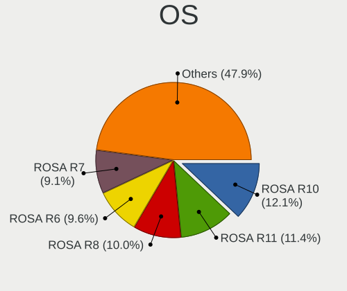

| Name               | Computers | Percent |
|--------------------|-----------|---------|
| ROSA R10           | 4398      | 12.07%  |
| ROSA R11           | 4148      | 11.38%  |
| ROSA R8            | 3637      | 9.98%   |
| ROSA R6            | 3496      | 9.59%   |
| ROSA R7            | 3301      | 9.06%   |
| ROSA R8.1          | 2860      | 7.85%   |
| ROSA R9            | 2554      | 7.01%   |
| ROSA R11.1         | 2456      | 6.74%   |
| ROSA 12.2          | 2039      | 5.59%   |
| ROSA 12.4          | 1645      | 4.51%   |
| ROSA 12.5.1        | 1434      | 3.93%   |
| ROSA 12.3          | 1005      | 2.76%   |
| ROSA 13.0          | 757       | 2.08%   |
| ROSA 12            | 757       | 2.08%   |
| ROSA R5            | 571       | 1.57%   |
| ROSA 12.1          | 385       | 1.06%   |
| ROSA 12.5          | 338       | 0.93%   |
| ROSA 13.1          | 200       | 0.55%   |
| ROSA R4            | 121       | 0.33%   |
| ROSA R3            | 86        | 0.24%   |
| ROSA R12           | 71        | 0.19%   |
| ROSA 12.6          | 46        | 0.13%   |
| ROSA 2019.05       | 22        | 0.06%   |
| ROSA 12f.1         | 18        | 0.05%   |
| ROSA R9-R11        | 16        | 0.04%   |
| ROSA R2            | 16        | 0.04%   |
| ROSA 12.7          | 15        | 0.04%   |
| ROSA 2021.1        | 13        | 0.04%   |
| ROSA 2012.0        | 12        | 0.03%   |
| ROSA Chrome 2.0    | 7         | 0.02%   |
| ROSA 13            | 5         | 0.01%   |
| ROSA R4-R8         | 4         | 0.01%   |
| ROSA DX 1.0        | 4         | 0.01%   |
| ROSA Nickel 2019.0 | 3         | 0.01%   |
| ROSA 2019.0        | 2         | 0.01%   |
| ROSA SX 1.0        | 1         | 0.003%  |
| ROSA R1            | 1         | 0.003%  |
| ROSA 8.3           | 1         | 0.003%  |
| ROSA 1.0           | 1         | 0.003%  |

OS Family
---------

OS without a version

| Name | Computers | Percent |
|------|-----------|---------|
| ROSA | 29953     | 100%    |

Kernel
------

Version of the Linux kernel

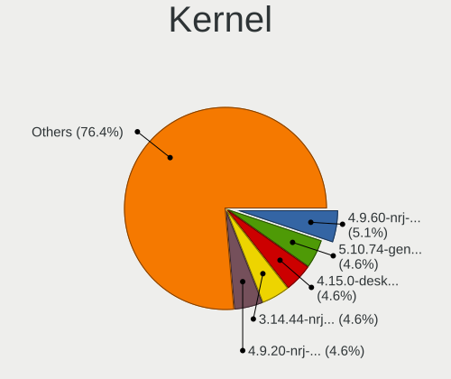

| Version                             | Computers | Percent |
|-------------------------------------|-----------|---------|
| 4.9.60-nrj-desktop-1rosa-x86_64     | 2023      | 5.12%   |
| 5.10.74-generic-2rosa2021.1-x86_64  | 1835      | 4.65%   |
| 4.15.0-desktop-45.1rosa-x86_64      | 1827      | 4.63%   |
| 3.14.44-nrj-desktop-2rosa-x86_64    | 1827      | 4.63%   |
| 4.9.20-nrj-desktop-1rosa-x86_64     | 1816      | 4.6%    |
| 4.1.25-nrj-desktop-1rosa-x86_64     | 1590      | 4.03%   |
| 4.1.15-nrj-desktop-1rosa-x86_64     | 1352      | 3.42%   |
| 4.1.34-nrj-desktop-2rosa-x86_64     | 979       | 2.48%   |
| 3.14.44-nrj-desktop-2rosa-i586      | 819       | 2.07%   |
| 6.1.20-generic-2rosa2021.1-x86_64   | 808       | 2.05%   |
| 4.9.124-nrj-desktop-1rosa-x86_64    | 798       | 2.02%   |
| 6.6.27-generic-3rosa2021.1-x86_64   | 722       | 1.83%   |
| 4.9.9-nrj-desktop-1rosa-x86_64      | 680       | 1.72%   |
| 4.1.38-nrj-desktop-2rosa-x86_64     | 645       | 1.63%   |
| 4.1.25-nrj-desktop-1rosa-i586       | 576       | 1.46%   |
| 4.9.60-nrj-desktop-1rosa-i586       | 548       | 1.39%   |
| 6.6.47-generic-1rosa2021.1-x86_64   | 541       | 1.37%   |
| 4.9.155-nrj-desktop-1rosa-x86_64    | 535       | 1.36%   |
| 4.9.76-nrj-desktop-1rosa-x86_64     | 512       | 1.3%    |
| 4.9.20-nrj-desktop-1rosa-i586       | 489       | 1.24%   |
| 4.15.0-desktop-122.124.1rosa-x86_64 | 469       | 1.19%   |
| 4.15.0-desktop-45.1rosa-i586        | 465       | 1.18%   |
| 4.9.41-nrj-desktop-1rosa-x86_64     | 463       | 1.17%   |
| 4.1.16-nrj-desktop-1rosa-x86_64     | 460       | 1.17%   |
| 6.1.58-generic-1rosa2021.1-x86_64   | 459       | 1.16%   |
| 4.15.0-desktop-68.5rosa-x86_64      | 458       | 1.16%   |
| 5.4.32-generic-2rosa-x86_64         | 456       | 1.16%   |
| 4.1.15-nrj-desktop-1rosa-i586       | 446       | 1.13%   |
| 5.4.83-generic-2rosa-x86_64         | 430       | 1.09%   |
| 4.1.34-nrj-desktop-2rosa-i586       | 377       | 0.95%   |
| 5.15.75-generic-1rosa2021.1-x86_64  | 370       | 0.94%   |
| 5.10.118-generic-2rosa2021.1-x86_64 | 368       | 0.93%   |
| 4.15.0-desktop-47.2rosa-x86_64      | 340       | 0.86%   |
| 4.15.0-desktop-94.1rosa-x86_64      | 334       | 0.85%   |
| 4.9.9-nrj-desktop-1rosa-i586        | 303       | 0.77%   |
| 5.15.79-generic-1rosa2021.1-x86_64  | 284       | 0.72%   |
| 4.9.95-nrj-desktop-2rosa-x86_64     | 283       | 0.72%   |
| 4.1.38-nrj-desktop-2rosa-i586       | 278       | 0.7%    |
| 3.14.53-nrj-desktop-1rosa-x86_64    | 278       | 0.7%    |
| 4.1.22-nrj-desktop-2rosa-x86_64     | 268       | 0.68%   |

Kernel Family
-------------

Linux kernel without a distro release

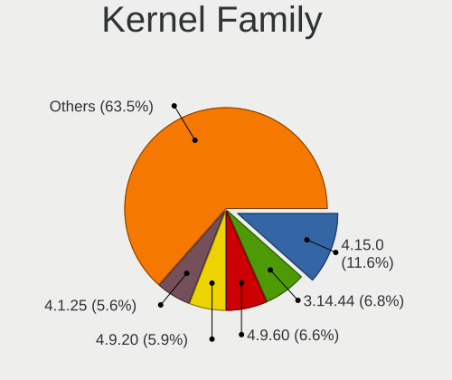

| Version  | Computers | Percent |
|----------|-----------|---------|
| 4.15.0   | 4493      | 11.58%  |
| 3.14.44  | 2647      | 6.82%   |
| 4.9.60   | 2562      | 6.6%    |
| 4.9.20   | 2304      | 5.94%   |
| 4.1.25   | 2160      | 5.57%   |
| 5.10.74  | 1895      | 4.88%   |
| 4.1.15   | 1797      | 4.63%   |
| 4.1.34   | 1355      | 3.49%   |
| 4.1.38   | 1114      | 2.87%   |
| 4.9.124  | 991       | 2.55%   |
| 4.9.9    | 979       | 2.52%   |
| 6.1.20   | 820       | 2.11%   |
| 6.6.27   | 742       | 1.91%   |
| 4.9.155  | 709       | 1.83%   |
| 4.9.76   | 647       | 1.67%   |
| 5.4.32   | 634       | 1.63%   |
| 4.1.16   | 628       | 1.62%   |
| 4.9.41   | 610       | 1.57%   |
| 5.4.83   | 556       | 1.43%   |
| 6.6.47   | 545       | 1.4%    |
| 6.1.58   | 481       | 1.24%   |
| 5.15.75  | 424       | 1.09%   |
| 4.1.19   | 410       | 1.06%   |
| 3.14.53  | 398       | 1.03%   |
| 5.10.118 | 377       | 0.97%   |
| 4.1.22   | 376       | 0.97%   |
| 4.9.95   | 357       | 0.92%   |
| 6.12.47  | 350       | 0.9%    |
| 4.1.33   | 344       | 0.89%   |
| 4.1.13   | 318       | 0.82%   |
| 5.15.79  | 284       | 0.73%   |
| 4.9.111  | 249       | 0.64%   |
| 6.6.21   | 220       | 0.57%   |
| 3.14.25  | 217       | 0.56%   |
| 6.12.13  | 210       | 0.54%   |
| 6.12.34  | 196       | 0.51%   |
| 5.10.71  | 195       | 0.5%    |
| 3.14.33  | 194       | 0.5%    |
| 6.1.38   | 184       | 0.47%   |
| 4.9.87   | 182       | 0.47%   |

Kernel Major Ver.
-----------------

Linux kernel major version

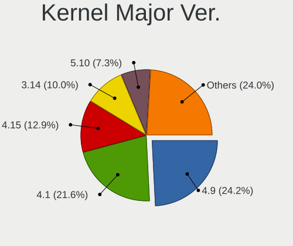

| Version | Computers | Percent |
|---------|-----------|---------|
| 4.9     | 8465      | 24.2%   |
| 4.1     | 7570      | 21.64%  |
| 4.15    | 4507      | 12.88%  |
| 3.14    | 3492      | 9.98%   |
| 5.10    | 2539      | 7.26%   |
| 6.1     | 1796      | 5.13%   |
| 6.6     | 1670      | 4.77%   |
| 5.4     | 1353      | 3.87%   |
| 5.15    | 1117      | 3.19%   |
| 6.12    | 958       | 2.74%   |
| 4.4     | 154       | 0.44%   |
| 5.17    | 108       | 0.31%   |
| 4.13    | 106       | 0.3%    |
| 3.10    | 101       | 0.29%   |
| 5.18    | 78        | 0.22%   |
| 4.8     | 77        | 0.22%   |
| 6.0     | 59        | 0.17%   |
| 5.0     | 58        | 0.17%   |
| 4.0     | 55        | 0.16%   |
| 4.6     | 52        | 0.15%   |
| 4.7     | 48        | 0.14%   |
| 4.16    | 46        | 0.13%   |
| 3.18    | 42        | 0.12%   |
| 4.19    | 41        | 0.12%   |
| 4.18    | 41        | 0.12%   |
| 4.14    | 35        | 0.1%    |
| 4.3     | 28        | 0.08%   |
| 5.16    | 26        | 0.07%   |
| 4.2     | 24        | 0.07%   |
| 4.5     | 22        | 0.06%   |
| 4.17    | 22        | 0.06%   |
| 4.11    | 18        | 0.05%   |
| 5.5     | 16        | 0.05%   |
| 6.8     | 15        | 0.04%   |
| 4.12    | 15        | 0.04%   |
| 6.11    | 14        | 0.04%   |
| 3.0     | 14        | 0.04%   |
| 6.4     | 13        | 0.04%   |
| 6.10    | 13        | 0.04%   |
| 5.3     | 12        | 0.03%   |

Arch
----

OS architecture (x86_64, i586, etc.)

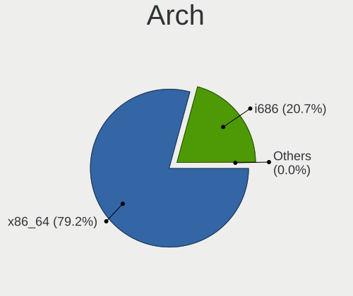

| Name        | Computers | Percent |
|-------------|-----------|---------|
| x86_64      | 24236     | 79.23%  |
| i686        | 6333      | 20.7%   |
| aarch64     | 17        | 0.06%   |
| e2k         | 3         | 0.01%   |
| riscv64     | 1         | 0.003%  |
| loongarch64 | 1         | 0.003%  |

DE
--

Desktop Environment

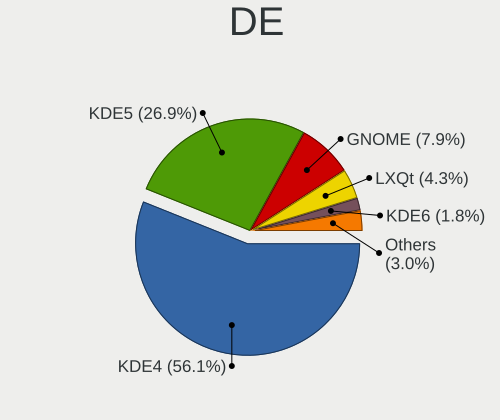

| Name       | Computers | Percent |
|------------|-----------|---------|
| KDE4       | 18218     | 56.07%  |
| KDE5       | 8746      | 26.92%  |
| GNOME      | 2573      | 7.92%   |
| LXQt       | 1402      | 4.32%   |
| KDE6       | 586       | 1.8%    |
| MATE       | 386       | 1.19%   |
| XFCE       | 250       | 0.77%   |
| LXDE       | 166       | 0.51%   |
| Unknown    | 139       | 0.43%   |
| i3         | 9         | 0.03%   |
| Budgie     | 5         | 0.02%   |
| KDE        | 4         | 0.01%   |
| Cinnamon   | 3         | 0.01%   |
| X-Cinnamon | 2         | 0.01%   |

Display Server
--------------

X11 or Wayland

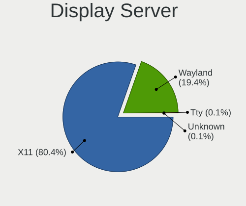

| Name    | Computers | Percent |
|---------|-----------|---------|
| X11     | 24754     | 80.35%  |
| Wayland | 5985      | 19.43%  |
| Tty     | 45        | 0.15%   |
| Unknown | 23        | 0.07%   |

Display Manager
---------------

SDDM, LightDM, etc.

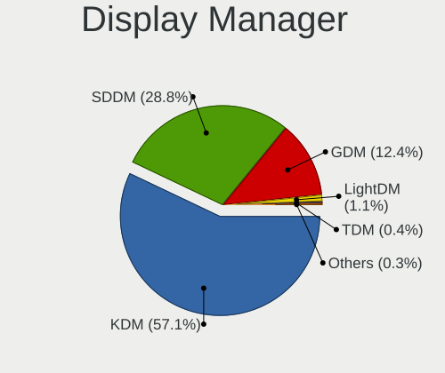

| Name        | Computers | Percent |
|-------------|-----------|---------|
| KDM         | 18399     | 57.07%  |
| SDDM        | 9292      | 28.82%  |
| GDM         | 4001      | 12.41%  |
| LightDM     | 346       | 1.07%   |
| TDM         | 114       | 0.35%   |
| Unknown     | 64        | 0.2%    |
| XDM         | 19        | 0.06%   |
| PLASMALOGIN | 1         | 0.003%  |
| LXDM        | 1         | 0.003%  |
| LDM         | 1         | 0.003%  |

OS Lang
-------

Language

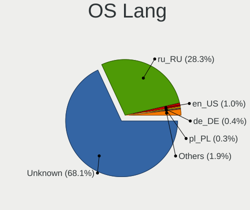

| Lang    | Computers | Percent |
|---------|-----------|---------|
| Unknown | 21159     | 68.1%   |
| ru_RU   | 8800      | 28.32%  |
| en_US   | 320       | 1.03%   |
| de_DE   | 124       | 0.4%    |
| pl_PL   | 92        | 0.3%    |
| es_ES   | 78        | 0.25%   |
| it_IT   | 71        | 0.23%   |
| fr_FR   | 69        | 0.22%   |
| pt_BR   | 67        | 0.22%   |
| en_GB   | 48        | 0.15%   |
| ru_UA   | 32        | 0.1%    |
| C       | 22        | 0.07%   |
| pt_PT   | 20        | 0.06%   |
| sk_SK   | 13        | 0.04%   |
| ro_RO   | 12        | 0.04%   |
| es_PE   | 11        | 0.04%   |
| hu_HU   | 9         | 0.03%   |
| es_MX   | 9         | 0.03%   |
| es_CO   | 9         | 0.03%   |
| es_AR   | 9         | 0.03%   |
| tr_TR   | 8         | 0.03%   |
| fr_BE   | 6         | 0.02%   |
| cs_CZ   | 6         | 0.02%   |
| es_VE   | 5         | 0.02%   |
| bg_BG   | 4         | 0.01%   |
| zh_TW   | 3         | 0.01%   |
| ru_BY   | 3         | 0.01%   |
| nb_NO   | 3         | 0.01%   |
| hr_HR   | 3         | 0.01%   |
| es_CL   | 3         | 0.01%   |
| en_IN   | 3         | 0.01%   |
| zh_CN   | 2         | 0.01%   |
| sv_SE   | 2         | 0.01%   |
| sr_RS   | 2         | 0.01%   |
| ru_KZ   | 2         | 0.01%   |
| nl_NL   | 2         | 0.01%   |
| lv_LV   | 2         | 0.01%   |
| lt_LT   | 2         | 0.01%   |
| id_ID   | 2         | 0.01%   |
| et_EE   | 2         | 0.01%   |

Boot Mode
---------

EFI or BIOS

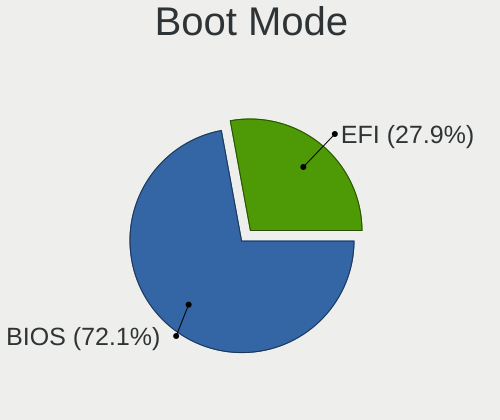

| Mode | Computers | Percent |
|------|-----------|---------|
| BIOS | 22118     | 72.12%  |
| EFI  | 8552      | 27.88%  |

Filesystem
----------

Type of filesystem

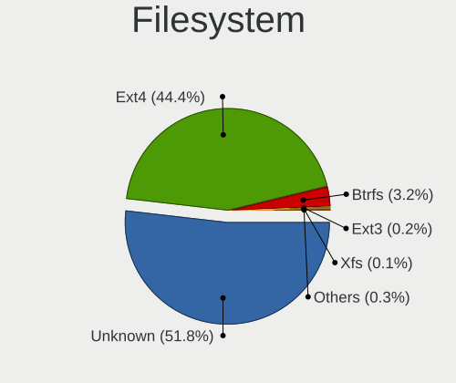

| Type     | Computers | Percent |
|----------|-----------|---------|
| Unknown  | 16432     | 51.82%  |
| Ext4     | 14068     | 44.37%  |
| Btrfs    | 1002      | 3.16%   |
| Ext3     | 75        | 0.24%   |
| Xfs      | 32        | 0.1%    |
| Ext2     | 25        | 0.08%   |
| F2fs     | 21        | 0.07%   |
| Overlay  | 18        | 0.06%   |
| Aufs     | 18        | 0.06%   |
| SAMSUNG  | 7         | 0.02%   |
| Reiserfs | 4         | 0.01%   |
| XXXXX    | 1         | 0.003%  |
| Jfs      | 1         | 0.003%  |
| Exfat    | 1         | 0.003%  |
| 2G       | 1         | 0.003%  |
| 20G      | 1         | 0.003%  |
| 12G      | 1         | 0.003%  |

Part. scheme
------------

Scheme of partitioning

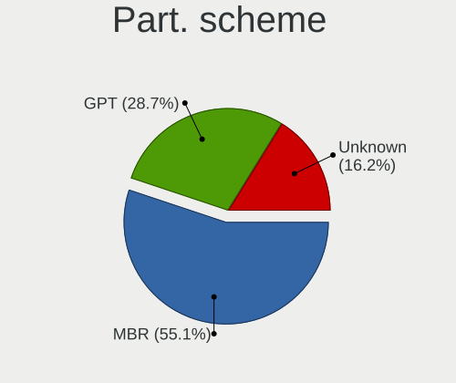

| Type    | Computers | Percent |
|---------|-----------|---------|
| MBR     | 17696     | 55.12%  |
| GPT     | 9215      | 28.7%   |
| Unknown | 5193      | 16.18%  |

Dual Boot with Linux/BSD
------------------------

Hosting more than one Linux/BSD

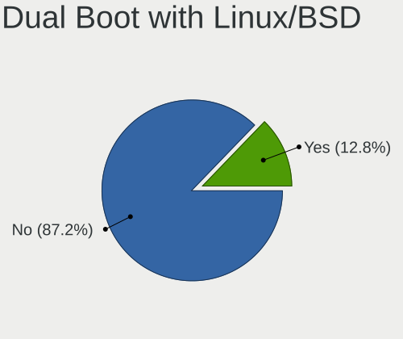

| Dual boot | Computers | Percent |
|-----------|-----------|---------|
| No        | 27092     | 87.22%  |
| Yes       | 3969      | 12.78%  |

Dual Boot (Win)
---------------

Hosting Linux and Windows

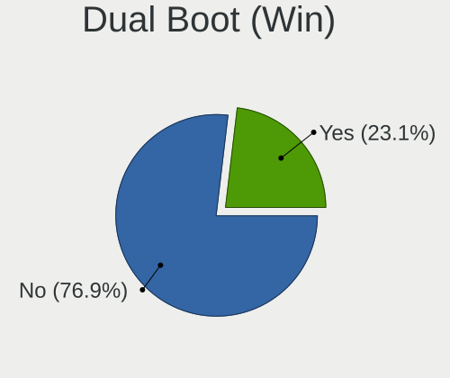

| Dual boot | Computers | Percent |
|-----------|-----------|---------|
| No        | 24129     | 76.87%  |
| Yes       | 7259      | 23.13%  |

Board
-----

Vendor
------

Motherboard manufacturer

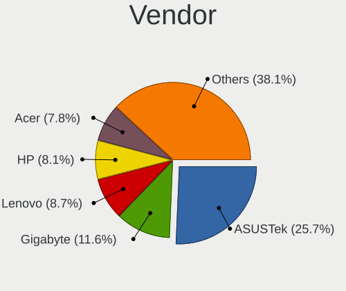

| Name                | Computers | Percent |
|---------------------|-----------|---------|
| ASUSTek Computer    | 7690      | 25.67%  |
| Gigabyte Technology | 3463      | 11.56%  |
| Lenovo              | 2616      | 8.73%   |
| Hewlett-Packard     | 2440      | 8.15%   |
| Acer                | 2333      | 7.79%   |
| MSI                 | 1882      | 6.28%   |
| ASRock              | 1608      | 5.37%   |
| Dell                | 1231      | 4.11%   |
| Samsung Electronics | 1006      | 3.36%   |
| Intel               | 551       | 1.84%   |
| Toshiba             | 526       | 1.76%   |
| Sony                | 368       | 1.23%   |
| Unknown             | 345       | 1.15%   |
| ECS                 | 309       | 1.03%   |
| Packard Bell        | 278       | 0.93%   |
| Biostar             | 233       | 0.78%   |
| eMachines           | 200       | 0.67%   |
| Pegatron            | 199       | 0.66%   |
| Foxconn             | 183       | 0.61%   |
| Apple               | 174       | 0.58%   |
| Clevo               | 162       | 0.54%   |
| Fujitsu Siemens     | 125       | 0.42%   |
| Notebook            | 117       | 0.39%   |
| ICL                 | 112       | 0.37%   |
| Fujitsu             | 106       | 0.35%   |
| HUAWEI              | 64        | 0.21%   |
| Huanan              | 64        | 0.21%   |
| KVADRA              | 53        | 0.18%   |
| DNS                 | 52        | 0.17%   |
| Aquarius            | 47        | 0.16%   |
| Quanta              | 44        | 0.15%   |
| Medion              | 41        | 0.14%   |
| DEXP                | 37        | 0.12%   |
| EPoX Computer       | 35        | 0.12%   |
| Digma               | 35        | 0.12%   |
| WinFast             | 33        | 0.11%   |
| Maibenben           | 33        | 0.11%   |
| Supermicro          | 32        | 0.11%   |
| AMI                 | 32        | 0.11%   |
| Irbis               | 31        | 0.1%    |

Model
-----

Motherboard model

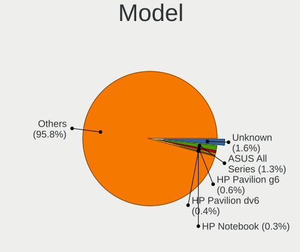

| Name                         | Computers | Percent |
|------------------------------|-----------|---------|
| Unknown                      | 468       | 1.56%   |
| ASUS All Series              | 398       | 1.33%   |
| HP Pavilion g6               | 190       | 0.63%   |
| HP Pavilion dv6              | 119       | 0.4%    |
| HP Notebook                  | 92        | 0.31%   |
| MSI MS-7817                  | 82        | 0.27%   |
| ASUS M5A78L-M LX3            | 80        | 0.27%   |
| ASUS M5A97 R2.0              | 74        | 0.25%   |
| Lenovo G570 20079            | 73        | 0.24%   |
| ICL RAY Si105.Mi             | 73        | 0.24%   |
| Acer Aspire V3-571G          | 72        | 0.24%   |
| Gigabyte 970A-DS3P           | 67        | 0.22%   |
| ASRock G31M-S                | 66        | 0.22%   |
| MSI MS-7529                  | 63        | 0.21%   |
| ASRock N68C-S UCC            | 63        | 0.21%   |
| Lenovo B590 20206            | 61        | 0.2%    |
| MSI MS-7592                  | 60        | 0.2%    |
| Gigabyte G31M-ES2L           | 59        | 0.2%    |
| Lenovo G50-30 80G0           | 58        | 0.19%   |
| Gigabyte H61M-S1             | 58        | 0.19%   |
| ASUS P5K                     | 58        | 0.19%   |
| Clevo NL41MU2                | 57        | 0.19%   |
| ASUS P8H61-M LX3 R2.0        | 56        | 0.19%   |
| Packard Bell EasyNote TE11HC | 55        | 0.18%   |
| HP Pavilion dv7              | 54        | 0.18%   |
| Lenovo G500 20236            | 53        | 0.18%   |
| HP Pavilion g7               | 53        | 0.18%   |
| HP Pavilion 15               | 52        | 0.17%   |
| Dell Inspiron N5110          | 51        | 0.17%   |
| MSI MS-7788                  | 50        | 0.17%   |
| ASUS P5KPL-AM                | 50        | 0.17%   |
| ASUS P5G41T-M LX2/GB         | 50        | 0.17%   |
| ASUS P5B                     | 50        | 0.17%   |
| ASUS M5A97 LE R2.0           | 48        | 0.16%   |
| Lenovo G50-45 80E3           | 47        | 0.16%   |
| ASUS P8Z77-V LX              | 47        | 0.16%   |
| Acer Aspire 5742G            | 47        | 0.16%   |
| Toshiba Satellite C660       | 46        | 0.15%   |
| MSI MS-7309                  | 46        | 0.15%   |
| ASUS P5KPL-AM IN/ROEM/SI     | 46        | 0.15%   |

Model Family
------------

Motherboard model prefix

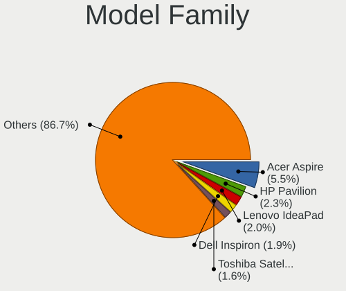

| Name                  | Computers | Percent |
|-----------------------|-----------|---------|
| Acer Aspire           | 1653      | 5.52%   |
| HP Pavilion           | 702       | 2.34%   |
| Lenovo IdeaPad        | 589       | 1.97%   |
| Dell Inspiron         | 556       | 1.86%   |
| Toshiba Satellite     | 476       | 1.59%   |
| Unknown               | 468       | 1.56%   |
| Lenovo ThinkPad       | 443       | 1.48%   |
| ASUS All              | 398       | 1.33%   |
| HP Compaq             | 374       | 1.25%   |
| ASUS PRIME            | 289       | 0.96%   |
| HP ProBook            | 248       | 0.83%   |
| Dell Latitude         | 228       | 0.76%   |
| Packard Bell EasyNote | 218       | 0.73%   |
| ASUS M5A78L-M         | 215       | 0.72%   |
| ASUS P8H61-M          | 208       | 0.69%   |
| Acer Extensa          | 192       | 0.64%   |
| ASUS P5KPL-AM         | 167       | 0.56%   |
| Dell OptiPlex         | 164       | 0.55%   |
| ASUS M5A97            | 164       | 0.55%   |
| HP Laptop             | 160       | 0.53%   |
| ASUS P5K              | 149       | 0.5%    |
| ASUS P8Z77-V          | 138       | 0.46%   |
| ASUS VivoBook         | 131       | 0.44%   |
| ASUS P5G41T-M         | 127       | 0.42%   |
| Dell Vostro           | 123       | 0.41%   |
| Lenovo ThinkCentre    | 119       | 0.4%    |
| HP EliteBook          | 117       | 0.39%   |
| ASUS P5Q              | 113       | 0.38%   |
| Lenovo G580           | 107       | 0.36%   |
| Lenovo B590           | 106       | 0.35%   |
| Acer TravelMate       | 102       | 0.34%   |
| HP Notebook           | 92        | 0.31%   |
| ASUS TUF              | 89        | 0.3%    |
| MSI MS-7817           | 82        | 0.27%   |
| ICL RAY               | 75        | 0.25%   |
| Lenovo G570           | 74        | 0.25%   |
| ASUS SABERTOOTH       | 74        | 0.25%   |
| Gigabyte 970A-DS3P    | 68        | 0.23%   |
| ASUS ROG              | 67        | 0.22%   |
| ASRock G31M-S         | 66        | 0.22%   |

MFG Year
--------

Motherboard manufacture year

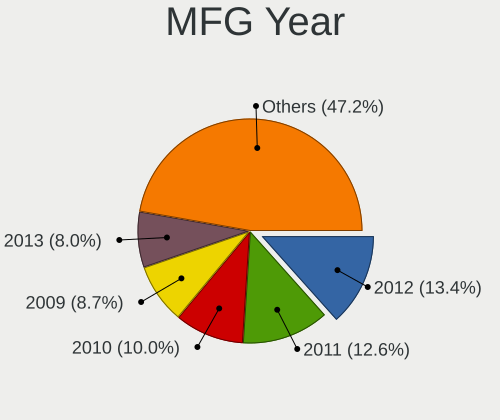

| Year    | Computers | Percent |
|---------|-----------|---------|
| 2012    | 4011      | 13.39%  |
| 2011    | 3781      | 12.62%  |
| 2010    | 3001      | 10.02%  |
| 2009    | 2605      | 8.7%    |
| 2013    | 2411      | 8.05%   |
| 2008    | 2239      | 7.48%   |
| 2007    | 2036      | 6.8%    |
| 2014    | 1525      | 5.09%   |
| 2006    | 1213      | 4.05%   |
| 2015    | 1118      | 3.73%   |
| 2016    | 913       | 3.05%   |
| 2018    | 900       | 3%      |
| 2017    | 766       | 2.56%   |
| 2019    | 552       | 1.84%   |
| 2020    | 544       | 1.82%   |
| 2021    | 541       | 1.81%   |
| 2022    | 533       | 1.78%   |
| 2005    | 438       | 1.46%   |
| 2023    | 309       | 1.03%   |
| 2024    | 161       | 0.54%   |
| 2004    | 155       | 0.52%   |
| 2003    | 85        | 0.28%   |
| Unknown | 52        | 0.17%   |
| 2025    | 43        | 0.14%   |
| 2002    | 15        | 0.05%   |
| 2001    | 5         | 0.02%   |
| 2000    | 1         | 0.003%  |

Form Factor
-----------

Physical design of the computer

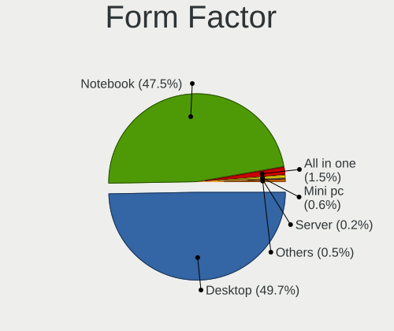

| Name           | Computers | Percent |
|----------------|-----------|---------|
| Desktop        | 14893     | 49.72%  |
| Notebook       | 14232     | 47.51%  |
| All in one     | 439       | 1.47%   |
| Mini pc        | 176       | 0.59%   |
| Server         | 74        | 0.25%   |
| Tablet         | 71        | 0.24%   |
| Convertible    | 49        | 0.16%   |
| System on chip | 17        | 0.06%   |
| Stick pc       | 2         | 0.01%   |

Secure Boot
-----------

Enabled or disabled

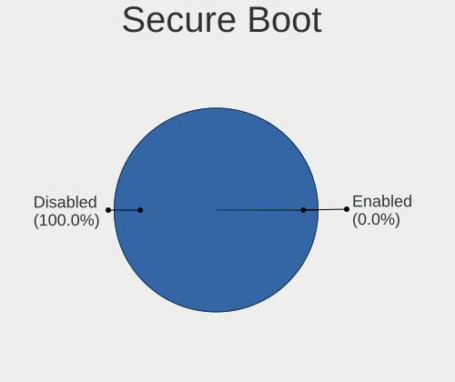

| State    | Computers | Percent |
|----------|-----------|---------|
| Disabled | 29950     | 99.98%  |
| Enabled  | 7         | 0.02%   |

Coreboot
--------

Have coreboot on board

| Used | Computers | Percent |
|------|-----------|---------|
| No   | 29943     | 99.97%  |
| Yes  | 10        | 0.03%   |

RAM Size
--------

Total RAM memory

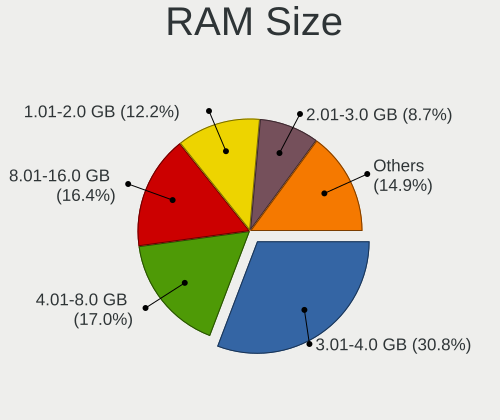

| Size in GB      | Computers | Percent |
|-----------------|-----------|---------|
| 3.01-4.0        | 9722      | 30.79%  |
| 4.01-8.0        | 5384      | 17.05%  |
| 8.01-16.0       | 5190      | 16.43%  |
| 1.01-2.0        | 3837      | 12.15%  |
| 2.01-3.0        | 2740      | 8.68%   |
| 16.01-24.0      | 2538      | 8.04%   |
| 0.51-1.0        | 777       | 2.46%   |
| 32.01-64.0      | 682       | 2.16%   |
| Unknown         | 374       | 1.18%   |
| 24.01-32.0      | 163       | 0.52%   |
| 64.01-256.0     | 121       | 0.38%   |
| 0.01-0.5        | 38        | 0.12%   |
| More than 256.0 | 14        | 0.04%   |

RAM Used
--------

Used RAM memory

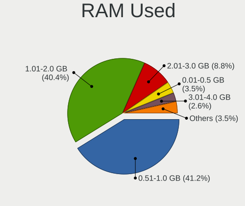

| Used GB     | Computers | Percent |
|-------------|-----------|---------|
| 0.51-1.0    | 14336     | 41.19%  |
| 1.01-2.0    | 14064     | 40.41%  |
| 2.01-3.0    | 3075      | 8.83%   |
| 0.01-0.5    | 1211      | 3.48%   |
| 3.01-4.0    | 904       | 2.6%    |
| 4.01-8.0    | 655       | 1.88%   |
| Unknown     | 443       | 1.27%   |
| 8.01-16.0   | 101       | 0.29%   |
| 16.01-24.0  | 14        | 0.04%   |
| 24.01-32.0  | 1         | 0.003%  |
| 64.01-256.0 | 1         | 0.003%  |

Total Drives
------------

Number of drives on board

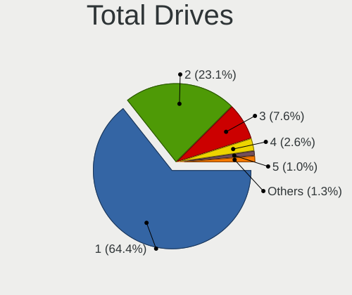

| Drives  | Computers | Percent |
|---------|-----------|---------|
| 1       | 20448     | 64.38%  |
| 2       | 7341      | 23.11%  |
| 3       | 2411      | 7.59%   |
| 4       | 822       | 2.59%   |
| 5       | 322       | 1.01%   |
| 0       | 231       | 0.73%   |
| 6       | 112       | 0.35%   |
| 7       | 29        | 0.09%   |
| 8       | 18        | 0.06%   |
| 9       | 11        | 0.03%   |
| Unknown | 10        | 0.03%   |
| 10      | 3         | 0.01%   |
| 25      | 1         | 0.003%  |
| 19      | 1         | 0.003%  |
| 14      | 1         | 0.003%  |

Has CD-ROM
----------

Has CD-ROM on board

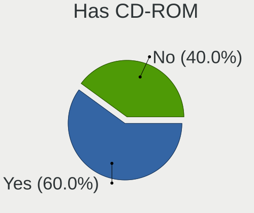

| Presented | Computers | Percent |
|-----------|-----------|---------|
| Yes       | 18439     | 60.04%  |
| No        | 12274     | 39.96%  |

Has Ethernet
------------

Has Ethernet on board

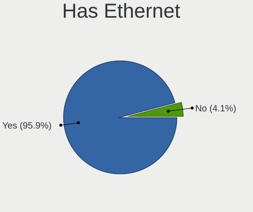

| Presented | Computers | Percent |
|-----------|-----------|---------|
| Yes       | 28745     | 95.89%  |
| No        | 1232      | 4.11%   |

Has WiFi
--------

Has WiFi module

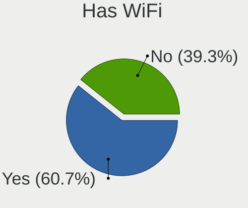

| Presented | Computers | Percent |
|-----------|-----------|---------|
| Yes       | 18424     | 60.73%  |
| No        | 11913     | 39.27%  |

Has Bluetooth
-------------

Has Bluetooth module

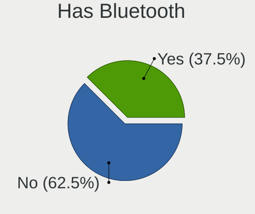

| Presented | Computers | Percent |
|-----------|-----------|---------|
| No        | 19070     | 62.48%  |
| Yes       | 11452     | 37.52%  |

Location
--------

Country
-------

Geographic location (country)

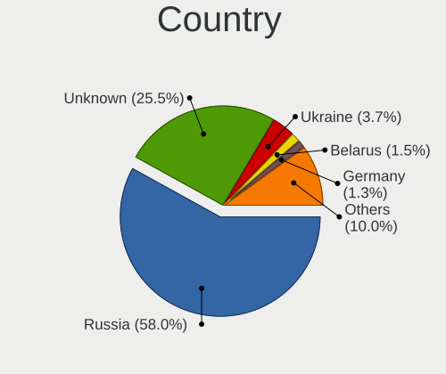

| Country     | Computers | Percent |
|-------------|-----------|---------|
| Russia      | 18226     | 58.04%  |
| Unknown     | 7998      | 25.47%  |
| Ukraine     | 1164      | 3.71%   |
| Belarus     | 479       | 1.53%   |
| Germany     | 408       | 1.3%    |
| Poland      | 357       | 1.14%   |
| Kazakhstan  | 278       | 0.89%   |
| Italy       | 219       | 0.7%    |
| USA         | 212       | 0.68%   |
| France      | 206       | 0.66%   |
| Brazil      | 164       | 0.52%   |
| Spain       | 125       | 0.4%    |
| Canada      | 84        | 0.27%   |
| UK          | 83        | 0.26%   |
| Moldova     | 75        | 0.24%   |
| Romania     | 70        | 0.22%   |
| Latvia      | 59        | 0.19%   |
| Bulgaria    | 58        | 0.18%   |
| Mexico      | 53        | 0.17%   |
| Czechia     | 47        | 0.15%   |
| Serbia      | 45        | 0.14%   |
| Slovakia    | 43        | 0.14%   |
| Israel      | 42        | 0.13%   |
| Austria     | 42        | 0.13%   |
| Turkey      | 37        | 0.12%   |
| Estonia     | 35        | 0.11%   |
| Netherlands | 33        | 0.11%   |
| Belgium     | 33        | 0.11%   |
| Lithuania   | 32        | 0.1%    |
| Hungary     | 32        | 0.1%    |
| Finland     | 31        | 0.1%    |
| Australia   | 30        | 0.1%    |
| Uzbekistan  | 29        | 0.09%   |
| Colombia    | 29        | 0.09%   |
| Argentina   | 28        | 0.09%   |
| Switzerland | 27        | 0.09%   |
| Sweden      | 25        | 0.08%   |
| Portugal    | 24        | 0.08%   |
| Peru        | 24        | 0.08%   |
| India       | 24        | 0.08%   |

City
----

Geographic location (city)

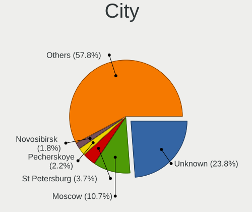

| City             | Computers | Percent |
|------------------|-----------|---------|
| Unknown          | 8001      | 23.78%  |
| Moscow           | 3594      | 10.68%  |
| St Petersburg    | 1258      | 3.74%   |
| Pecherskoye      | 746       | 2.22%   |
| Novosibirsk      | 609       | 1.81%   |
| Krasnodar        | 567       | 1.69%   |
| Yekaterinburg    | 517       | 1.54%   |
| Samara           | 396       | 1.18%   |
| Nizhniy Novgorod | 392       | 1.17%   |
| Rostov-on-Don    | 357       | 1.06%   |
| Chelyabinsk      | 348       | 1.03%   |
| Voronezh         | 309       | 0.92%   |
| Perm             | 303       | 0.9%    |
| Krasnoyarsk      | 264       | 0.78%   |
| Saratov          | 246       | 0.73%   |
| Omsk             | 212       | 0.63%   |
| Volgograd        | 195       | 0.58%   |
| Kazan’         | 192       | 0.57%   |
| Khabarovsk       | 179       | 0.53%   |
| Minsk            | 176       | 0.52%   |
| Barnaul          | 174       | 0.52%   |
| Ufa              | 171       | 0.51%   |
| Tyumen           | 167       | 0.5%    |
| Stavropol        | 166       | 0.49%   |
| Irkutsk          | 156       | 0.46%   |
| Vladivostok      | 146       | 0.43%   |
| Yaroslavl        | 136       | 0.4%    |
| Tula             | 129       | 0.38%   |
| Kemerovo         | 129       | 0.38%   |
| Kaliningrad      | 123       | 0.37%   |
| Bryansk          | 123       | 0.37%   |
| Orenburg         | 120       | 0.36%   |
| Kirov            | 119       | 0.35%   |
| Kyiv             | 118       | 0.35%   |
| Belgorod         | 116       | 0.34%   |
| Simferopol       | 114       | 0.34%   |
| Novokuznetsk     | 113       | 0.34%   |
| Ulyanovsk        | 111       | 0.33%   |
| Surgut           | 108       | 0.32%   |
| Lipetsk          | 107       | 0.32%   |

Drives
------

Drive Vendor
------------

Hard drive vendors

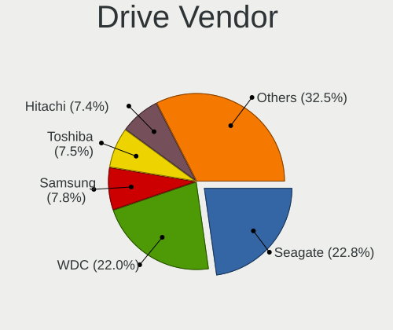

| Vendor                      | Computers | Drives | Percent |
|-----------------------------|-----------|--------|---------|
| Seagate                     | 9746      | 15352  | 22.76%  |
| WDC                         | 9415      | 15390  | 21.99%  |
| Samsung Electronics         | 3355      | 5139   | 7.84%   |
| Toshiba                     | 3197      | 4588   | 7.47%   |
| Hitachi                     | 3181      | 4495   | 7.43%   |
| Kingston                    | 1831      | 2612   | 4.28%   |
| HGST                        | 978       | 1513   | 2.28%   |
| Unknown                     | 951       | 1270   | 2.22%   |
| A-DATA Technology           | 744       | 1011   | 1.74%   |
| SanDisk                     | 700       | 1024   | 1.63%   |
| China                       | 594       | 797    | 1.39%   |
| Maxtor                      | 497       | 640    | 1.16%   |
| SPCC                        | 450       | 667    | 1.05%   |
| Crucial                     | 422       | 608    | 0.99%   |
| Intel                       | 414       | 638    | 0.97%   |
| OCZ                         | 403       | 549    | 0.94%   |
| Fujitsu                     | 342       | 429    | 0.8%    |
| Apacer                      | 315       | 446    | 0.74%   |
| Plextor                     | 289       | 441    | 0.68%   |
| HUAWEI                      | 289       | 341    | 0.68%   |
| KingSpec                    | 221       | 323    | 0.52%   |
| Smartbuy                    | 216       | 284    | 0.5%    |
| SK hynix                    | 213       | 313    | 0.5%    |
| AMD                         | 199       | 261    | 0.46%   |
| Transcend                   | 192       | 265    | 0.45%   |
| Patriot                     | 192       | 251    | 0.45%   |
| Netac                       | 153       | 200    | 0.36%   |
| GOODRAM                     | 153       | 211    | 0.36%   |
| Corsair                     | 142       | 192    | 0.33%   |
| Micron Technology           | 140       | 188    | 0.33%   |
| Silicon Motion              | 115       | 154    | 0.27%   |
| Gigabyte Technology         | 93        | 129    | 0.22%   |
| Unknown                     | 92        | 102    | 0.21%   |
| MAXIO Technology (Hangzhou) | 82        | 100    | 0.19%   |
| KingDian                    | 73        | 113    | 0.17%   |
| JMicron Technology          | 73        | 77     | 0.17%   |
| Apple                       | 73        | 90     | 0.17%   |
| TF CARD                     | 72        | 95     | 0.17%   |
| BIWIN                       | 70        | 78     | 0.16%   |
| Hewlett-Packard             | 65        | 134    | 0.15%   |

Drive Model
-----------

Hard drive models

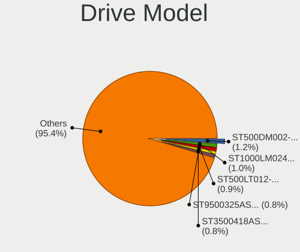

| Model                               | Computers | Percent |
|-------------------------------------|-----------|---------|
| Seagate ST500DM002-1BD142 500GB     | 552       | 1.18%   |
| Seagate ST1000LM024 HN-M101MBB 1TB  | 453       | 0.97%   |
| Seagate ST500LT012-1DG142 500GB     | 413       | 0.88%   |
| Seagate ST9500325AS 500GB           | 367       | 0.78%   |
| Seagate ST3500418AS 500GB           | 359       | 0.77%   |
| Toshiba MQ01ABF050 500GB            | 343       | 0.73%   |
| Toshiba DT01ACA050 500GB            | 322       | 0.69%   |
| Seagate ST1000DM003-1CH162 1TB      | 306       | 0.65%   |
| Kingston SV300S37A120G 120GB SSD    | 298       | 0.64%   |
| Toshiba DT01ACA100 1TB              | 265       | 0.57%   |
| Seagate ST9320325AS 320GB           | 258       | 0.55%   |
| Kingston SA400S37240G 240GB SSD     | 245       | 0.52%   |
| Kingston SA400S37120G 120GB SSD     | 244       | 0.52%   |
| HGST HTS545050A7E680 500GB          | 236       | 0.5%    |
| Seagate ST1000DM010-2EP102 1TB      | 223       | 0.48%   |
| Toshiba HDWD110 1TB                 | 209       | 0.45%   |
| Unknown xD/SD/M.S.                  | 207       | 0.44%   |
| Seagate ST3250410AS 250GB           | 202       | 0.43%   |
| Hitachi HTS543232A7A384 320GB       | 201       | 0.43%   |
| Seagate ST500LT012-9WS142 500GB     | 199       | 0.43%   |
| WDC WD5000AAKX-001CA0 500GB         | 196       | 0.42%   |
| Seagate ST9250315AS 250GB           | 191       | 0.41%   |
| Seagate ST3160815AS 160GB           | 190       | 0.41%   |
| Seagate ST380011A 80GB              | 186       | 0.4%    |
| WDC WD10EZEX-08WN4A0 1TB            | 182       | 0.39%   |
| WDC WD5000LPVX-22V0TT0 500GB        | 178       | 0.38%   |
| Seagate ST3250310AS 250GB           | 175       | 0.37%   |
| Toshiba MQ01ABD100 1TB              | 171       | 0.37%   |
| Seagate ST31000528AS 1TB            | 170       | 0.36%   |
| Seagate ST31000524AS 1TB            | 169       | 0.36%   |
| Seagate ST380815AS 80GB             | 168       | 0.36%   |
| Seagate ST500LM012 HN-M500MBB 500GB | 167       | 0.36%   |
| Seagate ST320LT020-9YG142 320GB     | 160       | 0.34%   |
| Seagate ST1000DM003-1ER162 1TB      | 158       | 0.34%   |
| HGST HTS545050A7E380 500GB          | 152       | 0.33%   |
| Hitachi HTS547550A9E384 500GB       | 149       | 0.32%   |
| WDC WDS240G2G0A-00JH30 240GB SSD    | 141       | 0.3%    |
| Hitachi HDS721050CLA362 500GB       | 141       | 0.3%    |
| HGST HTS541010A9E680 1TB            | 141       | 0.3%    |
| HUAWEI TF CARD Storage 2GB          | 137       | 0.29%   |

HDD Vendor
----------

Hard disk drive vendors

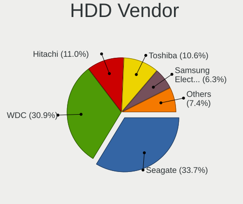

| Vendor              | Computers | Drives | Percent |
|---------------------|-----------|--------|---------|
| Seagate             | 9711      | 15271  | 33.7%   |
| WDC                 | 8919      | 14384  | 30.95%  |
| Hitachi             | 3180      | 4494   | 11.03%  |
| Toshiba             | 3044      | 4357   | 10.56%  |
| Samsung Electronics | 1822      | 2597   | 6.32%   |
| HGST                | 978       | 1513   | 3.39%   |
| Maxtor              | 492       | 634    | 1.71%   |
| Fujitsu             | 340       | 426    | 1.18%   |
| JMicron Technology  | 53        | 58     | 0.18%   |
| Unknown             | 44        | 70     | 0.15%   |
| Apple               | 33        | 41     | 0.11%   |
| IBM/Hitachi         | 31        | 36     | 0.11%   |
| Hewlett-Packard     | 23        | 62     | 0.08%   |
| TO Exter            | 17        | 21     | 0.06%   |
| External            | 17        | 19     | 0.06%   |
| ExcelStor           | 14        | 21     | 0.05%   |
| ASMT                | 12        | 29     | 0.04%   |
| WD MediaMax         | 9         | 13     | 0.03%   |
| USB3.0              | 7         | 7      | 0.02%   |
| USB                 | 6         | 7      | 0.02%   |
| QUANTUM             | 6         | 6      | 0.02%   |
| IBM                 | 6         | 9      | 0.02%   |
| HGST HTS            | 5         | 5      | 0.02%   |
| ASMedia             | 5         | 12     | 0.02%   |
| Unknown             | 4         | 4      | 0.01%   |
| SATAFIRM            | 3         | 3      | 0.01%   |
| SAGE                | 3         | 3      | 0.01%   |
| NVME USB            | 3         | 3      | 0.01%   |
| Magnetic Data       | 3         | 3      | 0.01%   |
| Intenso             | 3         | 3      | 0.01%   |
| MARSHAL             | 2         | 3      | 0.01%   |
| FC-1307             | 2         | 2      | 0.01%   |
| CLOVER              | 2         | 2      | 0.01%   |
| ZALMAN              | 1         | 1      | 0.003%  |
| USB 3.0             | 1         | 1      | 0.003%  |
| TPH01204000GB       | 1         | 1      | 0.003%  |
| TPH00100500GB       | 1         | 1      | 0.003%  |
| StoreJet            | 1         | 2      | 0.003%  |
| Speeding            | 1         | 1      | 0.003%  |
| SILICONMOTION       | 1         | 1      | 0.003%  |

SSD Vendor
----------

Solid state drive vendors

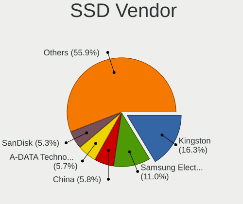

| Vendor              | Computers | Drives | Percent |
|---------------------|-----------|--------|---------|
| Kingston            | 1662      | 2339   | 16.32%  |
| Samsung Electronics | 1124      | 1763   | 11.04%  |
| China               | 588       | 791    | 5.77%   |
| A-DATA Technology   | 580       | 774    | 5.7%    |
| SanDisk             | 541       | 805    | 5.31%   |
| WDC                 | 536       | 756    | 5.26%   |
| SPCC                | 428       | 638    | 4.2%    |
| OCZ                 | 402       | 548    | 3.95%   |
| Crucial             | 399       | 552    | 3.92%   |
| Intel               | 297       | 454    | 2.92%   |
| Plextor             | 278       | 421    | 2.73%   |
| Apacer              | 277       | 389    | 2.72%   |
| KingSpec            | 212       | 310    | 2.08%   |
| Smartbuy            | 205       | 271    | 2.01%   |
| AMD                 | 184       | 235    | 1.81%   |
| Transcend           | 181       | 241    | 1.78%   |
| Patriot             | 173       | 231    | 1.7%    |
| GOODRAM             | 149       | 207    | 1.46%   |
| Corsair             | 139       | 185    | 1.36%   |
| Toshiba             | 128       | 184    | 1.26%   |
| Netac               | 114       | 144    | 1.12%   |
| KingDian            | 71        | 111    | 0.7%    |
| Gigabyte Technology | 69        | 93     | 0.68%   |
| SK hynix            | 62        | 92     | 0.61%   |
| Unknown             | 60        | 68     | 0.59%   |
| XrayDisk            | 54        | 87     | 0.53%   |
| Micron Technology   | 52        | 67     | 0.51%   |
| DEXP                | 52        | 59     | 0.51%   |
| Kingmax             | 50        | 103    | 0.49%   |
| Team                | 47        | 60     | 0.46%   |
| LITEONIT            | 38        | 60     | 0.37%   |
| Apple               | 36        | 43     | 0.35%   |
| KingFast            | 35        | 47     | 0.34%   |
| LITEON              | 33        | 45     | 0.32%   |
| Digma               | 30        | 35     | 0.29%   |
| PNY                 | 29        | 35     | 0.28%   |
| Qumo                | 28        | 37     | 0.27%   |
| Intenso             | 28        | 37     | 0.27%   |
| Hewlett-Packard     | 26        | 35     | 0.26%   |
| OCZ-VERTEX3         | 23        | 35     | 0.23%   |

Drive Kind
----------

HDD or SSD

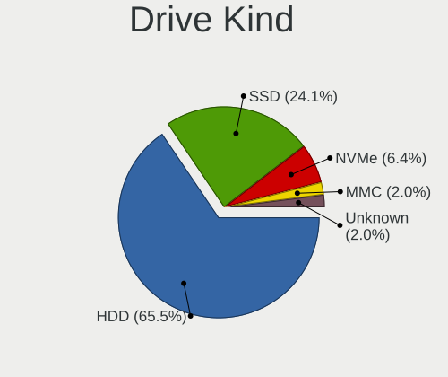

| Kind    | Computers | Drives | Percent |
|---------|-----------|--------|---------|
| HDD     | 24172     | 44142  | 65.52%  |
| SSD     | 8887      | 14460  | 24.09%  |
| NVMe    | 2344      | 3766   | 6.35%   |
| MMC     | 746       | 1013   | 2.02%   |
| Unknown | 742       | 898    | 2.01%   |

Drive Connector
---------------

SATA, SAS, NVMe, etc.

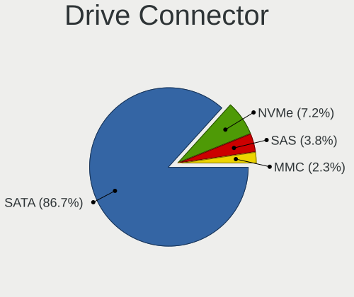

| Type | Computers | Drives | Percent |
|------|-----------|--------|---------|
| SATA | 28142     | 57932  | 86.7%   |
| NVMe | 2337      | 3747   | 7.2%    |
| SAS  | 1235      | 1587   | 3.8%    |
| MMC  | 746       | 1013   | 2.3%    |

Drive Size
----------

Size of hard drive

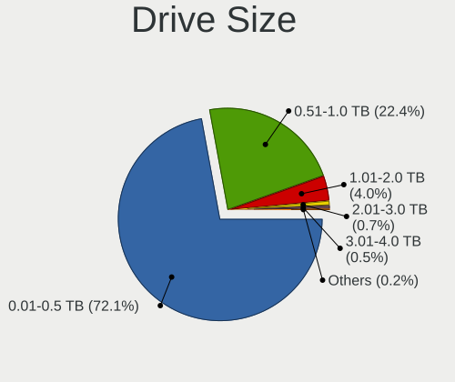

| Size in TB      | Computers | Drives | Percent |
|-----------------|-----------|--------|---------|
| 0.01-0.5        | 24205     | 42763  | 72.12%  |
| 0.51-1.0        | 7523      | 12744  | 22.42%  |
| 1.01-2.0        | 1335      | 2213   | 3.98%   |
| 2.01-3.0        | 240       | 373    | 0.72%   |
| 3.01-4.0        | 182       | 321    | 0.54%   |
| 4.01-10.0       | 64        | 166    | 0.19%   |
| 10.01-20.0      | 10        | 20     | 0.03%   |
| More than 100.0 | 1         | 1      | 0.003%  |
| 20.01-50.0      | 1         | 1      | 0.003%  |

Space Total
-----------

Amount of disk space available on the file system

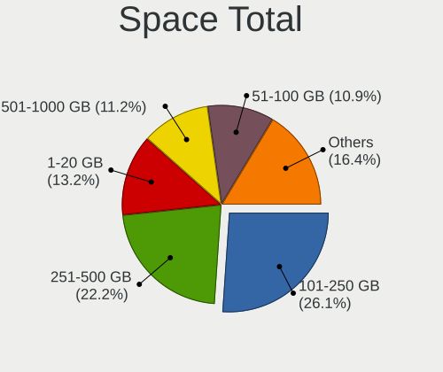

| Size in GB     | Computers | Percent |
|----------------|-----------|---------|
| 101-250        | 9024      | 26.09%  |
| 251-500        | 7693      | 22.24%  |
| 1-20           | 4581      | 13.24%  |
| 501-1000       | 3870      | 11.19%  |
| 51-100         | 3754      | 10.85%  |
| 21-50          | 2802      | 8.1%    |
| 1001-2000      | 1637      | 4.73%   |
| Unknown        | 458       | 1.32%   |
| 2001-3000      | 437       | 1.26%   |
| More than 3000 | 338       | 0.98%   |

Space Used
----------

Amount of used disk space

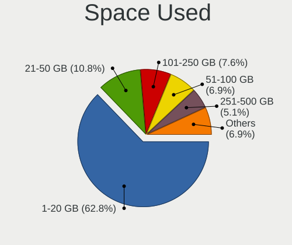

| Used GB        | Computers | Percent |
|----------------|-----------|---------|
| 1-20           | 21771     | 62.8%   |
| 21-50          | 3751      | 10.82%  |
| 101-250        | 2627      | 7.58%   |
| 51-100         | 2378      | 6.86%   |
| 251-500        | 1762      | 5.08%   |
| 501-1000       | 1185      | 3.42%   |
| 1001-2000      | 487       | 1.4%    |
| Unknown        | 458       | 1.32%   |
| 2001-3000      | 133       | 0.38%   |
| More than 3000 | 115       | 0.33%   |

Malfunc. Drives
---------------

Drive models with a malfunction

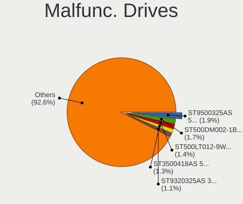

| Model                              | Computers | Drives | Percent |
|------------------------------------|-----------|--------|---------|
| Seagate ST9500325AS 500GB          | 268       | 366    | 1.93%   |
| Seagate ST500DM002-1BD142 500GB    | 230       | 307    | 1.66%   |
| Seagate ST500LT012-9WS142 500GB    | 193       | 240    | 1.39%   |
| Seagate ST3500418AS 500GB          | 182       | 250    | 1.31%   |
| Seagate ST9320325AS 320GB          | 156       | 196    | 1.13%   |
| Seagate ST9250315AS 250GB          | 132       | 175    | 0.95%   |
| Seagate ST1000LM024 HN-M101MBB 1TB | 131       | 157    | 0.95%   |
| Seagate ST3250410AS 250GB          | 129       | 164    | 0.93%   |
| Seagate ST500LT012-1DG142 500GB    | 117       | 143    | 0.84%   |
| Seagate ST3250310AS 250GB          | 115       | 174    | 0.83%   |
| HGST HTS545050A7E680 500GB         | 108       | 146    | 0.78%   |
| WDC WD5000AAKX-001CA0 500GB        | 105       | 135    | 0.76%   |
| Seagate ST320LT020-9YG142 320GB    | 104       | 146    | 0.75%   |
| Seagate ST3320613AS 320GB          | 86        | 120    | 0.62%   |
| Seagate ST31000528AS 1TB           | 86        | 115    | 0.62%   |
| Hitachi HTS543232A7A384 320GB      | 86        | 106    | 0.62%   |
| HGST HTS545050A7E380 500GB         | 76        | 125    | 0.55%   |
| Seagate ST3160815AS 160GB          | 74        | 87     | 0.53%   |
| Hitachi HTS545025B9A300 250GB      | 72        | 93     | 0.52%   |
| WDC WD5000AADS-00S9B0 500GB        | 71        | 84     | 0.51%   |
| Seagate ST1000DM003-1CH162 1TB     | 68        | 97     | 0.49%   |
| Samsung Electronics HD080HJ/ 80GB  | 68        | 83     | 0.49%   |
| Seagate ST380011A 80GB             | 67        | 77     | 0.48%   |
| Seagate ST31000524AS 1TB           | 67        | 95     | 0.48%   |
| Seagate ST3160811AS 160GB          | 65        | 91     | 0.47%   |
| Hitachi HTS541612J9SA00 120GB      | 65        | 80     | 0.47%   |
| Hitachi HDS721616PLA380 160GB      | 64        | 83     | 0.46%   |
| Seagate ST320LT012-9WS14C 320GB    | 63        | 90     | 0.45%   |
| Seagate ST1000DM003-9YN162 1TB     | 62        | 77     | 0.45%   |
| Hitachi HTS547550A9E384 500GB      | 61        | 84     | 0.44%   |
| Hitachi HDS721050CLA362 500GB      | 60        | 75     | 0.43%   |
| Toshiba MQ01ABF050 500GB           | 59        | 71     | 0.43%   |
| Toshiba MQ01ABD050 500GB           | 59        | 75     | 0.43%   |
| Seagate ST3250318AS 250GB          | 58        | 79     | 0.42%   |
| Hitachi HTS545050B9A300 500GB      | 58        | 80     | 0.42%   |
| Hitachi HDP725050GLA360 500GB      | 57        | 75     | 0.41%   |
| Hitachi HTS547575A9E384 752GB      | 56        | 79     | 0.4%    |
| Samsung Electronics HD160JJ 160GB  | 55        | 85     | 0.4%    |
| WDC WD3200AAJS-00L7A0 320GB        | 54        | 67     | 0.39%   |
| Seagate ST380815AS 80GB            | 54        | 67     | 0.39%   |

Malfunc. Drive Vendor
---------------------

Vendors of faulty drives

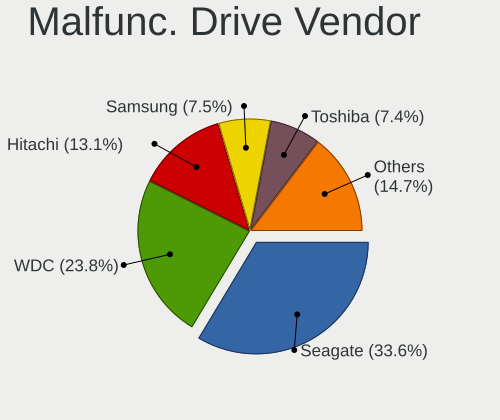

| Vendor              | Computers | Drives | Percent |
|---------------------|-----------|--------|---------|
| Seagate             | 4453      | 6274   | 33.61%  |
| WDC                 | 3149      | 4438   | 23.77%  |
| Hitachi             | 1731      | 2324   | 13.07%  |
| Samsung Electronics | 1000      | 1354   | 7.55%   |
| Toshiba             | 974       | 1309   | 7.35%   |
| HGST                | 327       | 470    | 2.47%   |
| Maxtor              | 293       | 364    | 2.21%   |
| Kingston            | 225       | 278    | 1.7%    |
| Fujitsu             | 147       | 194    | 1.11%   |
| SanDisk             | 89        | 108    | 0.67%   |
| SPCC                | 79        | 99     | 0.6%    |
| OCZ                 | 77        | 112    | 0.58%   |
| Intel               | 73        | 90     | 0.55%   |
| A-DATA Technology   | 64        | 91     | 0.48%   |
| China               | 50        | 64     | 0.38%   |
| Corsair             | 43        | 53     | 0.32%   |
| Crucial             | 35        | 53     | 0.26%   |
| Kingmax             | 34        | 64     | 0.26%   |
| KingSpec            | 28        | 42     | 0.21%   |
| IBM/Hitachi         | 27        | 32     | 0.2%    |
| AMD                 | 25        | 30     | 0.19%   |
| Plextor             | 22        | 34     | 0.17%   |
| SK hynix            | 21        | 29     | 0.16%   |
| Netac               | 19        | 23     | 0.14%   |
| LITEONIT            | 13        | 18     | 0.1%    |
| Apacer              | 12        | 18     | 0.09%   |
| Transcend           | 11        | 13     | 0.08%   |
| Patriot             | 11        | 11     | 0.08%   |
| ExcelStor           | 10        | 12     | 0.08%   |
| Unknown             | 9         | 11     | 0.07%   |
| OCZ-VERTEX3         | 8         | 16     | 0.06%   |
| Micron Technology   | 8         | 13     | 0.06%   |
| Apple               | 8         | 9      | 0.06%   |
| Smartbuy            | 6         | 7      | 0.05%   |
| Neo                 | 6         | 13     | 0.05%   |
| LITEON              | 6         | 6      | 0.05%   |
| Hewlett-Packard     | 6         | 7      | 0.05%   |
| Qumo                | 5         | 11     | 0.04%   |
| Mushkin             | 5         | 5      | 0.04%   |
| KingDian            | 5         | 6      | 0.04%   |

Malfunc. HDD Vendor
-------------------

Vendors of faulty HDD drives

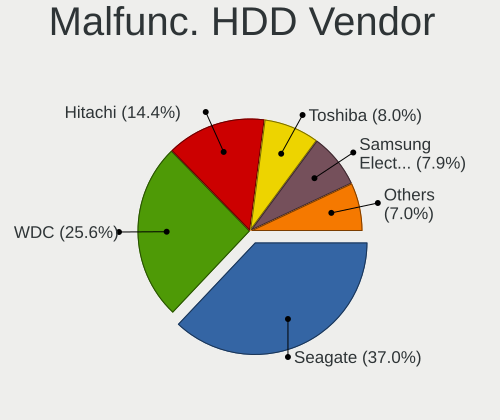

| Vendor              | Computers | Drives | Percent |
|---------------------|-----------|--------|---------|
| Seagate             | 4453      | 6274   | 37.04%  |
| WDC                 | 3083      | 4339   | 25.64%  |
| Hitachi             | 1731      | 2324   | 14.4%   |
| Toshiba             | 967       | 1302   | 8.04%   |
| Samsung Electronics | 949       | 1283   | 7.89%   |
| HGST                | 327       | 470    | 2.72%   |
| Maxtor              | 293       | 364    | 2.44%   |
| Fujitsu             | 147       | 194    | 1.22%   |
| IBM/Hitachi         | 27        | 32     | 0.22%   |
| ExcelStor           | 10        | 12     | 0.08%   |
| Apple               | 6         | 7      | 0.05%   |
| IBM                 | 5         | 7      | 0.04%   |
| WD MediaMax         | 4         | 6      | 0.03%   |
| ASMT                | 4         | 7      | 0.03%   |
| Hewlett-Packard     | 3         | 4      | 0.02%   |
| Quantum             | 2         | 2      | 0.02%   |
| MARSHAL             | 2         | 3      | 0.02%   |
| Unknown             | 2         | 2      | 0.02%   |
| TPH00100500GB       | 1         | 1      | 0.01%   |
| SATAFIRM            | 1         | 1      | 0.01%   |
| Magnetic Data       | 1         | 1      | 0.01%   |
| LaCie               | 1         | 1      | 0.01%   |
| HGST HTS            | 1         | 1      | 0.01%   |
| External            | 1         | 1      | 0.01%   |
| ASMedia             | 1         | 1      | 0.01%   |

Malfunc. Drive Kind
-------------------

Kinds of faulty drives

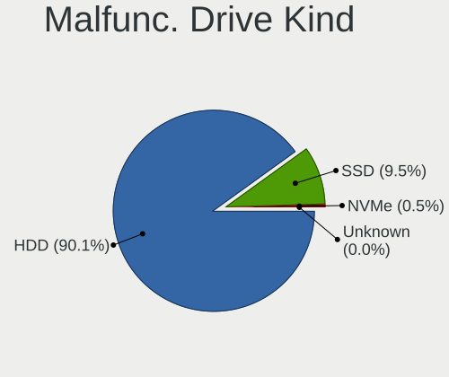

| Kind    | Computers | Drives | Percent |
|---------|-----------|--------|---------|
| HDD     | 11007     | 16639  | 90.05%  |
| SSD     | 1157      | 1558   | 9.47%   |
| NVMe    | 58        | 82     | 0.47%   |
| Unknown | 1         | 1      | 0.01%   |

Failed Drives
-------------

Failed drive models

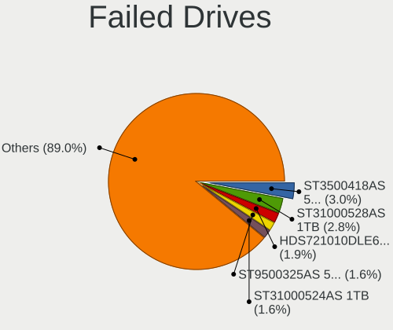

| Model                              | Computers | Drives | Percent |
|------------------------------------|-----------|--------|---------|
| Seagate ST3500418AS 500GB          | 13        | 14     | 3.04%   |
| Seagate ST31000528AS 1TB           | 12        | 14     | 2.8%    |
| Hitachi HDS721010DLE630 1TB        | 8         | 11     | 1.87%   |
| Seagate ST9500325AS 500GB          | 7         | 9      | 1.64%   |
| Seagate ST31000524AS 1TB           | 7         | 8      | 1.64%   |
| Samsung Electronics HM321HI 320GB  | 7         | 9      | 1.64%   |
| HGST HTS545050A7E680 500GB         | 7         | 7      | 1.64%   |
| WDC WD3200BEVT-22ZCT0 320GB        | 6         | 7      | 1.4%    |
| Seagate ST3500412AS 500GB          | 6         | 8      | 1.4%    |
| WDC WD1600BEVT-22ZCT0 160GB        | 5         | 6      | 1.17%   |
| Toshiba MK3265GSX 320GB            | 5         | 5      | 1.17%   |
| Seagate ST9320325AS 320GB          | 5         | 6      | 1.17%   |
| Seagate ST9250315AS 250GB          | 5         | 5      | 1.17%   |
| Seagate ST1000LM024 HN-M101MBB 1TB | 5         | 5      | 1.17%   |
| Samsung Electronics HD502HJ 500GB  | 5         | 5      | 1.17%   |
| HGST HTS545050A7E380 500GB         | 5         | 5      | 1.17%   |
| Toshiba MQ01ABD050 500GB           | 4         | 4      | 0.93%   |
| Toshiba MK6465GSX 640GB            | 4         | 6      | 0.93%   |
| Seagate ST500LT012-1DG142 500GB    | 4         | 4      | 0.93%   |
| Seagate ST3500410AS 500GB          | 4         | 5      | 0.93%   |
| Seagate ST31000333AS 1TB           | 4         | 4      | 0.93%   |
| Samsung Electronics SP0411N 40GB   | 4         | 5      | 0.93%   |
| Samsung Electronics HM160HI 160GB  | 4         | 4      | 0.93%   |
| Samsung Electronics HD502IJ 500GB  | 4         | 4      | 0.93%   |
| Samsung Electronics HD322GJ 320GB  | 4         | 5      | 0.93%   |
| Hitachi HTS547550A9E384 500GB      | 4         | 5      | 0.93%   |
| WDC WD5000AAKS-00V1A0 500GB        | 3         | 4      | 0.7%    |
| WDC WD3200BPVT-22JJ5T0 320GB       | 3         | 3      | 0.7%    |
| WDC WD3200AAJS-00L7A0 320GB        | 3         | 4      | 0.7%    |
| WDC WD1600BEVS-22RST0 160GB        | 3         | 4      | 0.7%    |
| WDC WD15EARS-00MVWB0 1TB           | 3         | 6      | 0.7%    |
| Toshiba MK3259GSXP 320GB           | 3         | 3      | 0.7%    |
| Seagate ST3750528AS 752GB          | 3         | 3      | 0.7%    |
| Seagate ST3320613AS 320GB          | 3         | 4      | 0.7%    |
| Seagate ST32000542AS 2TB           | 3         | 5      | 0.7%    |
| Maxtor 6Y080L0 81GB                | 3         | 3      | 0.7%    |
| Hitachi HTS547575A9E384 752GB      | 3         | 3      | 0.7%    |
| Hitachi HTS545050A7E380 500GB      | 3         | 3      | 0.7%    |
| Hitachi HDS721050DLE630 500GB      | 3         | 3      | 0.7%    |
| Hitachi HDS721010CLA332 1TB        | 3         | 3      | 0.7%    |

Failed Drive Vendor
-------------------

Failed drive vendors

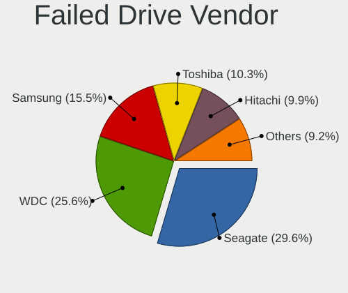

| Vendor              | Computers | Drives | Percent |
|---------------------|-----------|--------|---------|
| Seagate             | 126       | 153    | 29.58%  |
| WDC                 | 109       | 129    | 25.59%  |
| Samsung Electronics | 66        | 76     | 15.49%  |
| Toshiba             | 44        | 50     | 10.33%  |
| Hitachi             | 42        | 47     | 9.86%   |
| HGST                | 20        | 23     | 4.69%   |
| Maxtor              | 10        | 10     | 2.35%   |
| Fujitsu             | 2         | 2      | 0.47%   |
| Apple               | 2         | 3      | 0.47%   |
| SK hynix            | 1         | 1      | 0.23%   |
| SanDisk             | 1         | 2      | 0.23%   |
| Hewlett-Packard     | 1         | 1      | 0.23%   |
| DEXP                | 1         | 1      | 0.23%   |
| Corsair             | 1         | 1      | 0.23%   |

Drive Status
------------

Number of failed and malfunc. drives

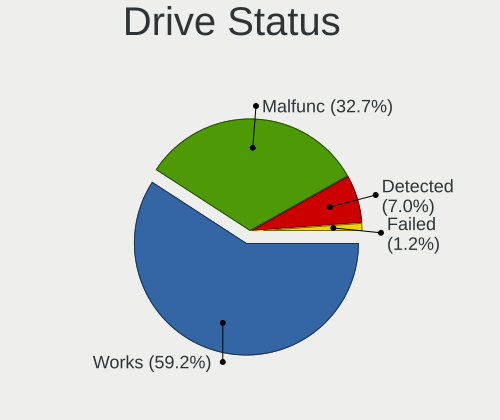

| Status   | Computers | Drives | Percent |
|----------|-----------|--------|---------|
| Works    | 21528     | 41823  | 59.17%  |
| Malfunc  | 11903     | 18280  | 32.71%  |
| Detected | 2532      | 3677   | 6.96%   |
| Failed   | 423       | 499    | 1.16%   |

Storage controller
------------------

Storage Vendor
--------------

Storage controller vendors

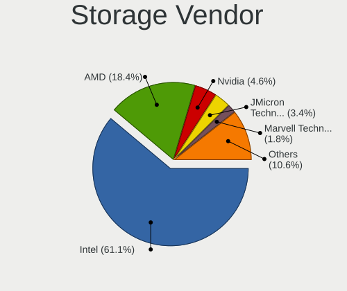

| Vendor                           | Computers | Percent |
|----------------------------------|-----------|---------|
| Intel                            | 20971     | 61.12%  |
| AMD                              | 6317      | 18.41%  |
| Nvidia                           | 1582      | 4.61%   |
| JMicron Technology               | 1167      | 3.4%    |
| Marvell Technology Group         | 631       | 1.84%   |
| Samsung Electronics              | 516       | 1.5%    |
| ASMedia Technology               | 424       | 1.24%   |
| VIA Technologies                 | 349       | 1.02%   |
| SanDisk                          | 239       | 0.7%    |
| Kingston Technology Company      | 226       | 0.66%   |
| Silicon Motion                   | 224       | 0.65%   |
| ADATA Technology                 | 204       | 0.59%   |
| Silicon Integrated Systems [SiS] | 195       | 0.57%   |
| Phison Electronics               | 187       | 0.55%   |
| MAXIO Technology (Hangzhou)      | 128       | 0.37%   |
| SK hynix                         | 124       | 0.36%   |
| Micron Technology                | 90        | 0.26%   |
| Realtek Semiconductor            | 83        | 0.24%   |
| INNOGRIT                         | 71        | 0.21%   |
| KIOXIA                           | 64        | 0.19%   |
| Silicon Image                    | 58        | 0.17%   |
| Shenzhen Longsys Electronics     | 57        | 0.17%   |
| Integrated Technology Express    | 43        | 0.13%   |
| Netac Technology                 | 37        | 0.11%   |
| Micron/Crucial Technology        | 33        | 0.1%    |
| Toshiba America Info Systems     | 25        | 0.07%   |
| LSI Logic / Symbios Logic        | 25        | 0.07%   |
| Union Memory (Shenzhen)          | 20        | 0.06%   |
| Solid State Storage Technology   | 20        | 0.06%   |
| Lite-On Technology               | 20        | 0.06%   |
| ULi Electronics                  | 18        | 0.05%   |
| Shenzhen Shichuangyi Electronics | 18        | 0.05%   |
| Hosin Global Electronics         | 14        | 0.04%   |
| Adaptec                          | 14        | 0.04%   |
| Unknown                          | 14        | 0.04%   |
| Hewlett-Packard                  | 13        | 0.04%   |
| Broadcom / LSI                   | 13        | 0.04%   |
| Yangtze Memory Technologies      | 10        | 0.03%   |
| OCZ Technology Group             | 8         | 0.02%   |
| Promise Technology               | 7         | 0.02%   |

Storage Model
-------------

Storage controller models

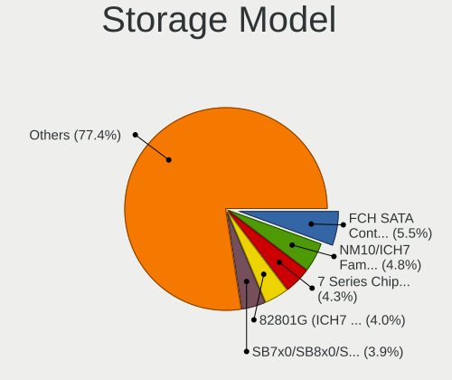

| Model                                                                                   | Computers | Percent |
|-----------------------------------------------------------------------------------------|-----------|---------|
| AMD FCH SATA Controller [AHCI mode]                                                     | 2503      | 5.55%   |
| Intel NM10/ICH7 Family SATA Controller [IDE mode]                                       | 2153      | 4.77%   |
| Intel 7 Series Chipset Family 6-port SATA Controller [AHCI mode]                        | 1954      | 4.33%   |
| Intel 82801G (ICH7 Family) IDE Controller                                               | 1799      | 3.99%   |
| AMD SB7x0/SB8x0/SB9x0 IDE Controller                                                    | 1765      | 3.91%   |
| AMD SB7x0/SB8x0/SB9x0 SATA Controller [AHCI mode]                                       | 1601      | 3.55%   |
| Intel 6 Series/C200 Series Chipset Family 6 port Mobile SATA AHCI Controller            | 1360      | 3.01%   |
| AMD SB7x0/SB8x0/SB9x0 SATA Controller [IDE mode]                                        | 1262      | 2.8%    |
| Intel 8 Series/C220 Series Chipset Family 6-port SATA Controller 1 [AHCI mode]          | 1222      | 2.71%   |
| Intel 82801IBM/IEM (ICH9M/ICH9M-E) 4 port SATA Controller [AHCI mode]                   | 916       | 2.03%   |
| Intel 5 Series/3400 Series Chipset 4 port SATA AHCI Controller                          | 795       | 1.76%   |
| Intel 6 Series/C200 Series Chipset Family 6 port Desktop SATA AHCI Controller           | 782       | 1.73%   |
| Intel 6 Series/C200 Series Chipset Family Desktop SATA Controller (IDE mode, ports 4-5) | 777       | 1.72%   |
| Intel 6 Series/C200 Series Chipset Family Desktop SATA Controller (IDE mode, ports 0-3) | 775       | 1.72%   |
| Intel NM10/ICH7 Family SATA Controller [AHCI mode]                                      | 728       | 1.61%   |
| Nvidia MCP61 SATA Controller                                                            | 685       | 1.52%   |
| Intel 82801HM/HEM (ICH8M/ICH8M-E) IDE Controller                                        | 683       | 1.51%   |
| Nvidia MCP61 IDE                                                                        | 640       | 1.42%   |
| Intel 7 Series/C210 Series Chipset Family 6-port SATA Controller [AHCI mode]            | 600       | 1.33%   |
| JMicron JMB363 SATA/IDE Controller                                                      | 569       | 1.26%   |
| Intel 82801HM/HEM (ICH8M/ICH8M-E) SATA Controller [AHCI mode]                           | 546       | 1.21%   |
| Intel Q170/Q150/B150/H170/H110/Z170/CM236 Chipset SATA Controller [AHCI Mode]           | 537       | 1.19%   |
| Intel 8 Series SATA Controller 1 [AHCI mode]                                            | 486       | 1.08%   |
| Intel Sunrise Point-LP SATA Controller [AHCI mode]                                      | 467       | 1.04%   |
| Intel Atom Processor E3800 Series SATA AHCI Controller                                  | 465       | 1.03%   |
| Intel 82801JI (ICH10 Family) 4 port SATA IDE Controller #1                              | 449       | 1%      |
| Intel 82801JI (ICH10 Family) 2 port SATA IDE Controller #2                              | 447       | 0.99%   |
| Intel 82801I (ICH9 Family) 2 port SATA Controller [IDE mode]                            | 418       | 0.93%   |
| JMicron JMB368 IDE controller                                                           | 404       | 0.9%    |
| ASMedia ASM1061/ASM1062 Serial ATA Controller                                           | 402       | 0.89%   |
| Intel 5 Series/3400 Series Chipset 6 port SATA AHCI Controller                          | 360       | 0.8%    |
| Intel 82801GBM/GHM (ICH7-M Family) SATA Controller [IDE mode]                           | 352       | 0.78%   |
| Intel 5 Series/3400 Series Chipset 4 port SATA IDE Controller                           | 343       | 0.76%   |
| AMD SB600 Non-Raid-5 SATA                                                               | 341       | 0.76%   |
| AMD SB600 IDE                                                                           | 338       | 0.75%   |
| Intel 5 Series/3400 Series Chipset 2 port SATA IDE Controller                           | 336       | 0.74%   |
| AMD FCH IDE Controller                                                                  | 326       | 0.72%   |
| Intel Atom/Celeron/Pentium Processor x5-E8000/J3xxx/N3xxx Series SATA Controller        | 309       | 0.69%   |
| AMD 400 Series Chipset SATA Controller                                                  | 309       | 0.69%   |
| Intel 200 Series PCH SATA controller [AHCI mode]                                        | 282       | 0.63%   |

Storage Kind
------------

Kind of storage controller (IDE, SATA, NVMe, SAS, ...)

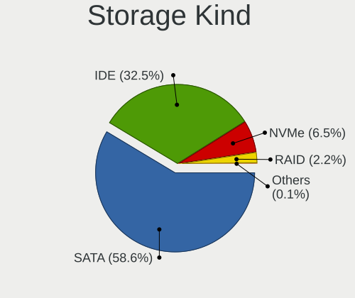

| Kind | Computers | Percent |
|------|-----------|---------|
| SATA | 20998     | 58.61%  |
| IDE  | 11636     | 32.48%  |
| NVMe | 2339      | 6.53%   |
| RAID | 799       | 2.23%   |
| SAS  | 27        | 0.08%   |
| SCSI | 27        | 0.08%   |

Processor
---------

CPU Vendor
----------

Processor vendors

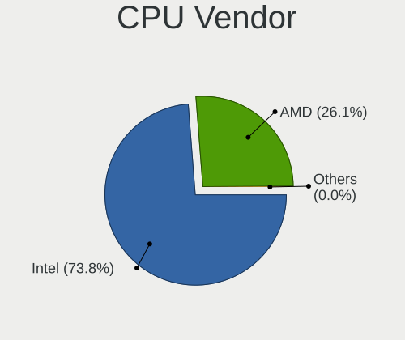

| Vendor       | Computers | Percent |
|--------------|-----------|---------|
| Intel        | 22098     | 73.77%  |
| AMD          | 7823      | 26.11%  |
| ARM          | 17        | 0.06%   |
| CentaurHauls | 12        | 0.04%   |
| spacemit,x60 | 1         | 0.003%  |
| MBE8C-PC     | 1         | 0.003%  |
| Loongson     | 1         | 0.003%  |
| Elbrus-MCST  | 1         | 0.003%  |
| E8C-mITX     | 1         | 0.003%  |
| Unknown      | 1         | 0.003%  |

CPU Model
---------

Processor models

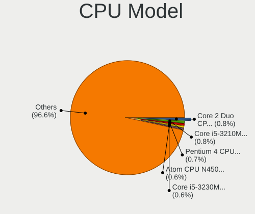

| Model                                       | Computers | Percent |
|---------------------------------------------|-----------|---------|
| Intel Core 2 Duo CPU E8400 @ 3.00GHz        | 254       | 0.84%   |
| Intel Core i5-3210M CPU @ 2.50GHz           | 231       | 0.76%   |
| Intel Pentium 4 CPU 3.00GHz                 | 200       | 0.66%   |
| Intel Atom CPU N450 @ 1.66GHz               | 179       | 0.59%   |
| Intel Core i5-3230M CPU @ 2.60GHz           | 178       | 0.59%   |
| Intel Pentium CPU B960 @ 2.20GHz            | 176       | 0.58%   |
| Intel Atom CPU N270 @ 1.60GHz               | 172       | 0.57%   |
| AMD Athlon II X2 250 Processor              | 169       | 0.56%   |
| Intel Core i3-2350M CPU @ 2.30GHz           | 167       | 0.55%   |
| Intel Core i5-2450M CPU @ 2.50GHz           | 163       | 0.54%   |
| Intel Core i5-2410M CPU @ 2.30GHz           | 162       | 0.54%   |
| Intel Celeron CPU N2840 @ 2.16GHz           | 160       | 0.53%   |
| AMD FX-6300 Six-Core Processor              | 158       | 0.52%   |
| AMD E-450 APU with Radeon HD Graphics       | 151       | 0.5%    |
| Intel Core i3-2120 CPU @ 3.30GHz            | 148       | 0.49%   |
| Intel Core i3-2310M CPU @ 2.10GHz           | 144       | 0.48%   |
| Intel Core i3-3110M CPU @ 2.40GHz           | 142       | 0.47%   |
| Intel Core i3 CPU M 370 @ 2.40GHz           | 142       | 0.47%   |
| Intel Core 2 Duo CPU E7500 @ 2.93GHz        | 142       | 0.47%   |
| Intel Core i5-2430M CPU @ 2.40GHz           | 141       | 0.47%   |
| Intel Atom CPU N2600 @ 1.60GHz              | 139       | 0.46%   |
| Intel Core i3 CPU M 380 @ 2.53GHz           | 137       | 0.45%   |
| Intel Core 2 Quad CPU Q6600 @ 2.40GHz       | 135       | 0.45%   |
| Intel Core i3-2100 CPU @ 3.10GHz            | 131       | 0.43%   |
| Intel Atom CPU N455 @ 1.66GHz               | 129       | 0.43%   |
| Intel Core i5-3470 CPU @ 3.20GHz            | 127       | 0.42%   |
| Intel Pentium Dual-Core CPU E5300 @ 2.60GHz | 126       | 0.42%   |
| Intel Core i5-2400 CPU @ 3.10GHz            | 125       | 0.41%   |
| Intel Core i5-10400 CPU @ 2.90GHz           | 122       | 0.4%    |
| Intel Core i3-3220 CPU @ 3.30GHz            | 122       | 0.4%    |
| Intel 11th Gen Core i5-1135G7 @ 2.40GHz     | 122       | 0.4%    |
| Intel Pentium CPU 2020M @ 2.40GHz           | 116       | 0.38%   |
| AMD FX-8350 Eight-Core Processor            | 116       | 0.38%   |
| Intel Core i5-4210U CPU @ 1.70GHz           | 113       | 0.37%   |
| Intel Atom CPU N570 @ 1.66GHz               | 110       | 0.36%   |
| Intel Core 2 Duo CPU E8500 @ 3.16GHz        | 109       | 0.36%   |
| Intel Pentium Dual-Core CPU T4500 @ 2.30GHz | 102       | 0.34%   |
| Intel Core 2 Duo CPU E6550 @ 2.33GHz        | 101       | 0.33%   |
| Intel Core i3-2330M CPU @ 2.20GHz           | 96        | 0.32%   |
| Intel Celeron CPU N3050 @ 1.60GHz           | 94        | 0.31%   |

CPU Model Family
----------------

Processor model prefix

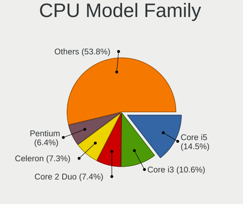

| Model                   | Computers | Percent |
|-------------------------|-----------|---------|
| Intel Core i5           | 4386      | 14.54%  |
| Intel Core i3           | 3199      | 10.61%  |
| Intel Core 2 Duo        | 2225      | 7.38%   |
| Intel Celeron           | 2202      | 7.3%    |
| Intel Pentium           | 1932      | 6.41%   |
| Intel Core i7           | 1827      | 6.06%   |
| Intel Atom              | 1315      | 4.36%   |
| Intel Pentium Dual-Core | 912       | 3.02%   |
| AMD FX                  | 807       | 2.68%   |
| Other                   | 778       | 2.58%   |
| AMD Athlon 64 X2        | 744       | 2.47%   |
| AMD Ryzen 5             | 635       | 2.11%   |
| Intel Xeon              | 593       | 1.97%   |
| AMD Athlon II X2        | 543       | 1.8%    |
| Intel Core 2 Quad       | 505       | 1.67%   |
| Intel Pentium 4         | 464       | 1.54%   |
| Intel Core 2            | 435       | 1.44%   |
| Intel Pentium Dual      | 428       | 1.42%   |
| AMD A6                  | 390       | 1.29%   |
| AMD A4                  | 356       | 1.18%   |
| AMD A8                  | 353       | 1.17%   |
| AMD Phenom II X4        | 336       | 1.11%   |
| AMD A10                 | 313       | 1.04%   |
| AMD E                   | 294       | 0.97%   |
| AMD Ryzen 7             | 288       | 0.95%   |
| Intel Genuine           | 253       | 0.84%   |
| AMD Athlon II X4        | 228       | 0.76%   |
| AMD Ryzen 3             | 192       | 0.64%   |
| AMD E1                  | 192       | 0.64%   |
| Intel Pentium D         | 178       | 0.59%   |
| AMD Athlon II X3        | 170       | 0.56%   |
| AMD Athlon 64           | 162       | 0.54%   |
| Intel Celeron M         | 147       | 0.49%   |
| AMD Athlon              | 138       | 0.46%   |
| Intel Celeron Dual-Core | 127       | 0.42%   |
| AMD Turion 64 X2 Mobile | 126       | 0.42%   |
| AMD E2                  | 126       | 0.42%   |
| AMD Phenom              | 117       | 0.39%   |
| AMD Sempron             | 112       | 0.37%   |
| AMD Athlon X4           | 112       | 0.37%   |

CPU Cores
---------

Number of processor cores

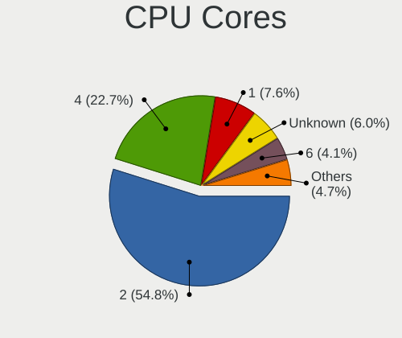

| Number  | Computers | Percent |
|---------|-----------|---------|
| 2       | 16825     | 54.84%  |
| 4       | 6970      | 22.72%  |
| 1       | 2318      | 7.56%   |
| Unknown | 1847      | 6.02%   |
| 6       | 1266      | 4.13%   |
| 8       | 563       | 1.84%   |
| 3       | 476       | 1.55%   |
| 10      | 135       | 0.44%   |
| 12      | 106       | 0.35%   |
| 14      | 65        | 0.21%   |
| 16      | 44        | 0.14%   |
| 24      | 17        | 0.06%   |
| 20      | 15        | 0.05%   |
| 18      | 11        | 0.04%   |
| 64      | 5         | 0.02%   |
| 32      | 4         | 0.01%   |
| 56      | 3         | 0.01%   |
| 28      | 3         | 0.01%   |
| 192     | 2         | 0.01%   |
| 120     | 1         | 0.003%  |
| 115     | 1         | 0.003%  |
| 50      | 1         | 0.003%  |
| 36      | 1         | 0.003%  |
| 5       | 1         | 0.003%  |

CPU Sockets
-----------

Number of sockets

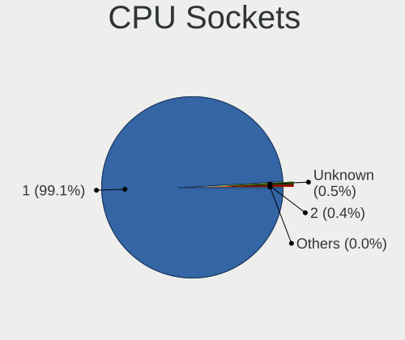

| Number  | Computers | Percent |
|---------|-----------|---------|
| 1       | 29749     | 99.07%  |
| Unknown | 140       | 0.47%   |
| 2       | 128       | 0.43%   |
| 4       | 8         | 0.03%   |
| 8       | 2         | 0.01%   |
| 3       | 1         | 0.003%  |

CPU Threads
-----------

Threads per core (Hyper-Threading)

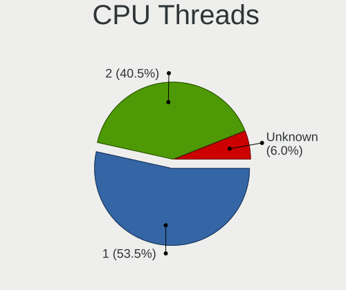

| Number  | Computers | Percent |
|---------|-----------|---------|
| 1       | 16394     | 53.47%  |
| 2       | 12420     | 40.51%  |
| Unknown | 1847      | 6.02%   |

CPU Op-Modes
------------

CPU Operation Modes (32-bit, 64-bit)

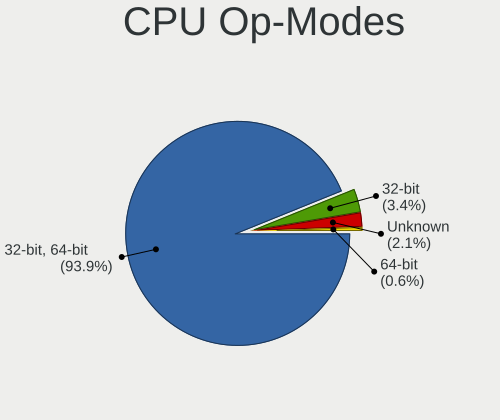

| Op mode        | Computers | Percent |
|----------------|-----------|---------|
| 32-bit, 64-bit | 28363     | 93.88%  |
| 32-bit         | 1042      | 3.45%   |
| Unknown        | 629       | 2.08%   |
| 64-bit         | 178       | 0.59%   |

CPU Microcode
-------------

Microcode number

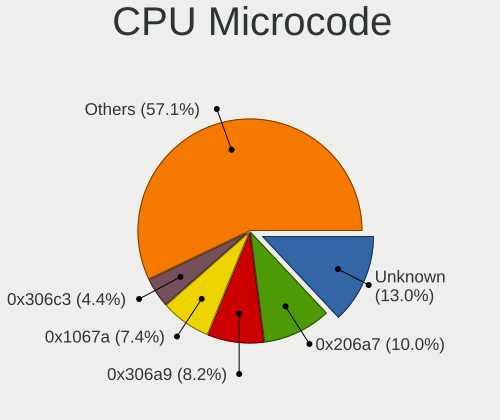

| Number     | Computers | Percent |
|------------|-----------|---------|
| Unknown    | 4037      | 13.01%  |
| 0x206a7    | 3097      | 9.98%   |
| 0x306a9    | 2540      | 8.18%   |
| 0x1067a    | 2286      | 7.36%   |
| 0x306c3    | 1356      | 4.37%   |
| 0x6fd      | 1039      | 3.35%   |
| 0x010000c8 | 968       | 3.12%   |
| 0x20655    | 853       | 2.75%   |
| 0x10676    | 638       | 2.06%   |
| 0x106ca    | 586       | 1.89%   |
| 0x06001119 | 527       | 1.7%    |
| 0x30678    | 482       | 1.55%   |
| 0x40651    | 467       | 1.5%    |
| 0x6fb      | 453       | 1.46%   |
| 0x506e3    | 379       | 1.22%   |
| 0x20652    | 353       | 1.14%   |
| 0x6f6      | 304       | 0.98%   |
| 0x906e9    | 295       | 0.95%   |
| 0x03000027 | 276       | 0.89%   |
| 0x106c2    | 271       | 0.87%   |
| 0x30661    | 245       | 0.79%   |
| 0x05000119 | 243       | 0.78%   |
| 0x10661    | 238       | 0.77%   |
| 0x306d4    | 235       | 0.76%   |
| 0x906ea    | 234       | 0.75%   |
| 0x0600084f | 223       | 0.72%   |
| 0x406c4    | 213       | 0.69%   |
| 0x106e5    | 205       | 0.66%   |
| 0x010000b6 | 199       | 0.64%   |
| 0x06000852 | 197       | 0.63%   |
| 0x406e3    | 196       | 0.63%   |
| 0x07030105 | 181       | 0.58%   |
| 0x406c3    | 177       | 0.57%   |
| 0x6f2      | 168       | 0.54%   |
| 0x010000db | 164       | 0.53%   |
| 0x06003106 | 151       | 0.49%   |
| 0x6e8      | 146       | 0.47%   |
| 0x806e9    | 144       | 0.46%   |
| 0xf41      | 141       | 0.45%   |
| 0xa0653    | 137       | 0.44%   |

CPU Microarch
-------------

Microarchitecture

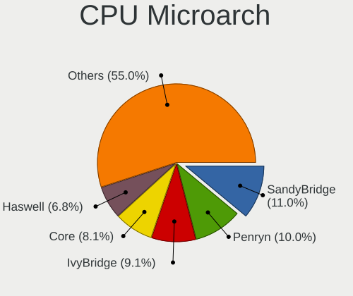

| Name              | Computers | Percent |
|-------------------|-----------|---------|
| SandyBridge       | 3330      | 11.03%  |
| Penryn            | 3019      | 10%     |
| IvyBridge         | 2751      | 9.12%   |
| Core              | 2438      | 8.08%   |
| Haswell           | 2038      | 6.75%   |
| K10               | 1975      | 6.54%   |
| Westmere          | 1326      | 4.39%   |
| Piledriver        | 1208      | 4%      |
| KabyLake          | 1200      | 3.98%   |
| K8 Hammer         | 1178      | 3.9%    |
| Bonnell           | 1063      | 3.52%   |
| Silvermont        | 1009      | 3.34%   |
| NetBurst          | 829       | 2.75%   |
| Skylake           | 669       | 2.22%   |
| Unknown           | 606       | 2.01%   |
| Bobcat            | 507       | 1.68%   |
| P6                | 376       | 1.25%   |
| K10 Llano         | 351       | 1.16%   |
| Alderlake Hybrid  | 321       | 1.06%   |
| Zen+              | 318       | 1.05%   |
| Broadwell         | 316       | 1.05%   |
| CometLake         | 297       | 0.98%   |
| Nehalem           | 295       | 0.98%   |
| Zen 3             | 281       | 0.93%   |
| Zen               | 270       | 0.89%   |
| Zen 2             | 252       | 0.84%   |
| Excavator         | 235       | 0.78%   |
| Puma              | 234       | 0.78%   |
| TigerLake         | 230       | 0.76%   |
| Bulldozer         | 211       | 0.7%    |
| Jaguar            | 193       | 0.64%   |
| Steamroller       | 183       | 0.61%   |
| Goldmont plus     | 175       | 0.58%   |
| Goldmont          | 128       | 0.42%   |
| K8 & K10 hybrid   | 127       | 0.42%   |
| Icelake           | 126       | 0.42%   |
| Tremont           | 37        | 0.12%   |
| Gracemont         | 33        | 0.11%   |
| K6                | 27        | 0.09%   |
| Meteorlake Hybrid | 11        | 0.04%   |

Graphics
--------

GPU Vendor
----------

Vendors of graphics cards

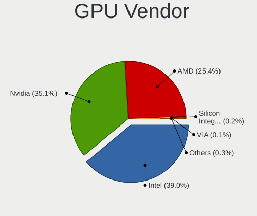

| Vendor                           | Computers | Percent |
|----------------------------------|-----------|---------|
| Intel                            | 13448     | 38.98%  |
| Nvidia                           | 12096     | 35.06%  |
| AMD                              | 8755      | 25.38%  |
| Silicon Integrated Systems [SiS] | 63        | 0.18%   |
| VIA Technologies                 | 51        | 0.15%   |
| ASPEED Technology                | 38        | 0.11%   |
| Matrox Electronics Systems       | 31        | 0.09%   |
| ATI Technologies                 | 10        | 0.03%   |
| S3 Graphics                      | 6         | 0.02%   |
| Zhaoxin                          | 1         | 0.003%  |
| Trident Microsystems             | 1         | 0.003%  |
| Loongson Technology              | 1         | 0.003%  |
| Huawei Technologies              | 1         | 0.003%  |

GPU Model
---------

Graphics card models

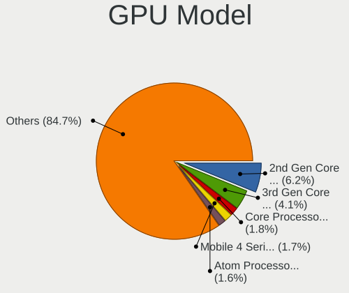

| Model                                                                                    | Computers | Percent |
|------------------------------------------------------------------------------------------|-----------|---------|
| Intel 2nd Generation Core Processor Family Integrated Graphics Controller                | 2278      | 6.16%   |
| Intel 3rd Gen Core processor Graphics Controller                                         | 1532      | 4.14%   |
| Intel Core Processor Integrated Graphics Controller                                      | 648       | 1.75%   |
| Intel Mobile 4 Series Chipset Integrated Graphics Controller                             | 635       | 1.72%   |
| Intel Atom Processor Z36xxx/Z37xxx Series Graphics & Display                             | 580       | 1.57%   |
| Intel Atom Processor D4xx/D5xx/N4xx/N5xx Integrated Graphics Controller                  | 563       | 1.52%   |
| Intel Haswell-ULT Integrated Graphics Controller                                         | 494       | 1.34%   |
| Nvidia GF117M [GeForce 610M/710M/810M/820M / GT 620M/625M/630M/720M]                     | 471       | 1.27%   |
| Intel Xeon E3-1200 v3/4th Gen Core Processor Integrated Graphics Controller              | 427       | 1.15%   |
| Intel Atom/Celeron/Pentium Processor x5-E8000/J3xxx/N3xxx Integrated Graphics Controller | 424       | 1.15%   |
| Intel Mobile 945GM/GMS/GME, 943/940GML Express Integrated Graphics Controller            | 420       | 1.14%   |
| Intel Mobile GM965/GL960 Integrated Graphics Controller (secondary)                      | 412       | 1.11%   |
| Intel Mobile GM965/GL960 Integrated Graphics Controller (primary)                        | 412       | 1.11%   |
| Nvidia GT218 [GeForce 210]                                                               | 408       | 1.1%    |
| Intel 4th Gen Core Processor Integrated Graphics Controller                              | 349       | 0.94%   |
| Intel Xeon E3-1200 v2/3rd Gen Core processor Graphics Controller                         | 332       | 0.9%    |
| Intel 4 Series Chipset Integrated Graphics Controller                                    | 310       | 0.84%   |
| AMD Seymour [Radeon HD 6400M/7400M Series]                                               | 303       | 0.82%   |
| Nvidia GP107 [GeForce GTX 1050 Ti]                                                       | 272       | 0.74%   |
| Intel 82G33/G31 Express Integrated Graphics Controller                                   | 262       | 0.71%   |
| Nvidia G94 [GeForce 9600 GT]                                                             | 260       | 0.7%    |
| Nvidia GK208B [GeForce GT 710]                                                           | 259       | 0.7%    |
| Nvidia GK107 [GeForce GTX 650]                                                           | 258       | 0.7%    |
| AMD Thames [Radeon HD 7500M/7600M Series]                                                | 258       | 0.7%    |
| AMD Park [Mobility Radeon HD 5430/5450/5470]                                             | 247       | 0.67%   |
| Intel Mobile 945GM/GMS, 943/940GML Express Integrated Graphics Controller                | 239       | 0.65%   |
| Intel Atom Processor D2xxx/N2xxx Integrated Graphics Controller                          | 238       | 0.64%   |
| Nvidia GF108 [GeForce GT 630]                                                            | 235       | 0.64%   |
| Nvidia GF116 [GeForce GTX 550 Ti]                                                        | 232       | 0.63%   |
| AMD Ellesmere [Radeon RX 470/480/570/570X/580/580X/590]                                  | 230       | 0.62%   |
| Nvidia GM107 [GeForce GTX 750 Ti]                                                        | 221       | 0.6%    |
| Nvidia GF119 [GeForce GT 610]                                                            | 219       | 0.59%   |
| Intel Broadwell-U GT2 [HD Graphics 5500]                                                 | 213       | 0.58%   |
| Nvidia GF108M [GeForce GT 540M]                                                          | 207       | 0.56%   |
| Intel 82945G/GZ Integrated Graphics Controller                                           | 205       | 0.55%   |
| AMD RS880M [Mobility Radeon HD 4225/4250]                                                | 192       | 0.52%   |
| Intel Skylake-U GT2 [HD Graphics 520]                                                    | 184       | 0.5%    |
| Intel Mobile 945GSE Express Integrated Graphics Controller                               | 182       | 0.49%   |
| Nvidia GF108M [GeForce GT 620M/630M/635M/640M LE]                                        | 181       | 0.49%   |
| Nvidia GF108 [GeForce GT 440]                                                            | 178       | 0.48%   |

GPU Combo
---------

Combinations of graphics cards

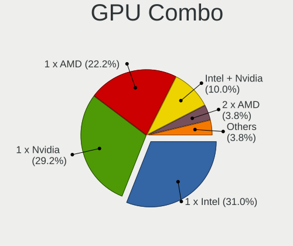

| Name                          | Computers | Percent |
|-------------------------------|-----------|---------|
| 1 x Intel                     | 9445      | 31.02%  |
| 1 x Nvidia                    | 8905      | 29.24%  |
| 1 x AMD                       | 6750      | 22.17%  |
| Intel + Nvidia                | 3043      | 9.99%   |
| 2 x AMD                       | 1165      | 3.83%   |
| Intel + AMD                   | 742       | 2.44%   |
| AMD + Nvidia                  | 123       | 0.4%    |
| 1 x SiS                       | 63        | 0.21%   |
| 1 x VIA                       | 51        | 0.17%   |
| 2 x Nvidia                    | 36        | 0.12%   |
| Other                         | 27        | 0.09%   |
| 1 x ASPEED                    | 27        | 0.09%   |
| 1 x Matrox                    | 22        | 0.07%   |
| 2 x Intel                     | 13        | 0.04%   |
| Nvidia + Matrox               | 9         | 0.03%   |
| AMD + ASPEED                  | 6         | 0.02%   |
| 1 x S3 Graphics               | 4         | 0.01%   |
| Nvidia + ASPEED               | 4         | 0.01%   |
| 3 x AMD                       | 3         | 0.01%   |
| 3 x Nvidia                    | 2         | 0.01%   |
| 2 x AMD + 1 x Nvidia          | 1         | 0.003%  |
| 1 x Zhaoxin                   | 1         | 0.003%  |
| 1 x Trident Microsystems      | 1         | 0.003%  |
| 1 x Loongson Technology       | 1         | 0.003%  |
| Intel + 2 x Nvidia            | 1         | 0.003%  |
| Intel + 2 x AMD               | 1         | 0.003%  |
| Intel + SiS + 1 x S3 Graphics | 1         | 0.003%  |
| Intel + S3 Graphics           | 1         | 0.003%  |
| Intel + ASPEED                | 1         | 0.003%  |
| 1 x Huawei Technologies       | 1         | 0.003%  |
| AMD + 2 x Nvidia              | 1         | 0.003%  |

GPU Driver
----------

Free vs proprietary

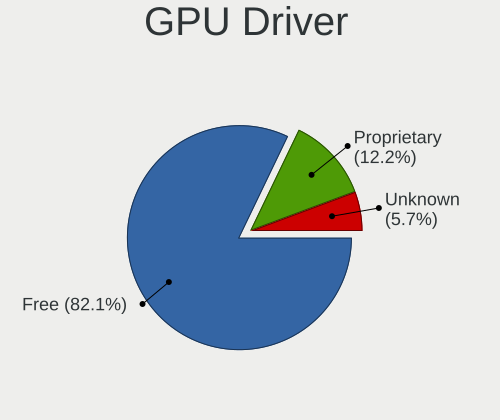

| Driver      | Computers | Percent |
|-------------|-----------|---------|
| Free        | 25897     | 82.13%  |
| Proprietary | 3844      | 12.19%  |
| Unknown     | 1790      | 5.68%   |

GPU Memory
----------

Total video memory

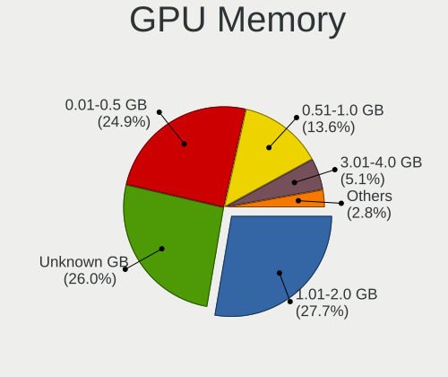

| Size in GB | Computers | Percent |
|------------|-----------|---------|
| 1.01-2.0   | 8858      | 27.67%  |
| Unknown    | 8315      | 25.97%  |
| 0.01-0.5   | 7961      | 24.87%  |
| 0.51-1.0   | 4343      | 13.57%  |
| 3.01-4.0   | 1635      | 5.11%   |
| 7.01-8.0   | 400       | 1.25%   |
| 5.01-6.0   | 195       | 0.61%   |
| 2.01-3.0   | 185       | 0.58%   |
| 8.01-16.0  | 120       | 0.37%   |
| 16.01-24.0 | 4         | 0.01%   |

Monitor
-------

Monitor Vendor
--------------

Monitor vendors

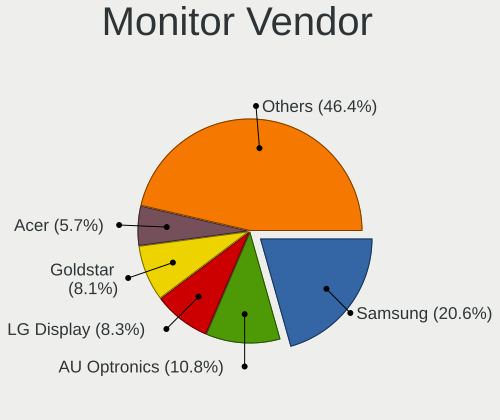

| Vendor                  | Computers | Percent |
|-------------------------|-----------|---------|
| Samsung Electronics     | 6182      | 20.62%  |
| AU Optronics            | 3237      | 10.8%   |
| LG Display              | 2493      | 8.32%   |
| Goldstar                | 2441      | 8.14%   |
| Acer                    | 1720      | 5.74%   |
| Chi Mei Optoelectronics | 1275      | 4.25%   |
| Chimei Innolux          | 1263      | 4.21%   |
| BenQ                    | 1205      | 4.02%   |
| BOE                     | 1079      | 3.6%    |
| Philips                 | 1063      | 3.55%   |
| ViewSonic               | 688       | 2.3%    |
| Dell                    | 663       | 2.21%   |
| AOC                     | 604       | 2.02%   |
| Ancor Communications    | 586       | 1.95%   |
| Hewlett-Packard         | 540       | 1.8%    |
| LG Philips              | 457       | 1.52%   |
| Lenovo                  | 454       | 1.51%   |
| NEC Computers           | 342       | 1.14%   |
| HannStar                | 341       | 1.14%   |
| Sony                    | 243       | 0.81%   |
| CPT                     | 199       | 0.66%   |
| Apple                   | 174       | 0.58%   |
| Iiyama                  | 168       | 0.56%   |
| InfoVision              | 144       | 0.48%   |
| Toshiba                 | 84        | 0.28%   |
| Plain Tree Systems      | 83        | 0.28%   |
| ASUSTek Computer        | 83        | 0.28%   |
| Sharp                   | 80        | 0.27%   |
| PANDA                   | 73        | 0.24%   |
| MSI                     | 67        | 0.22%   |
| Unknown                 | 66        | 0.22%   |
| Fujitsu Siemens         | 63        | 0.21%   |
| Envision Peripherals    | 62        | 0.21%   |
| InnoLux Display         | 60        | 0.2%    |
| CHR                     | 60        | 0.2%    |
| Mi                      | 58        | 0.19%   |
| Packard Bell            | 55        | 0.18%   |
| Quanta Display          | 52        | 0.17%   |
| ___                     | 48        | 0.16%   |
| MiTAC                   | 45        | 0.15%   |

Monitor Model
-------------

Monitor models

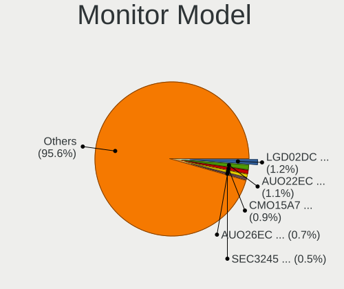

| Model                                                                     | Computers | Percent |
|---------------------------------------------------------------------------|-----------|---------|
| LG Display LCD Monitor LGD02DC 1366x768 344x194mm 15.5-inch               | 360       | 1.18%   |
| AU Optronics LCD Monitor AUO22EC 1366x768 344x193mm 15.5-inch             | 341       | 1.12%   |
| Chi Mei Optoelectronics LCD Monitor CMO15A7 1366x768 344x193mm 15.5-inch  | 262       | 0.86%   |
| AU Optronics LCD Monitor AUO26EC 1366x768 344x193mm 15.5-inch             | 228       | 0.75%   |
| Samsung Electronics LCD Monitor SEC3245 1366x768 340x190mm 15.3-inch      | 165       | 0.54%   |
| LG Display LCD Monitor LGD033A 1366x768 344x194mm 15.5-inch               | 154       | 0.5%    |
| Samsung Electronics LCD Monitor SEC5441 1280x800 331x207mm 15.4-inch      | 137       | 0.45%   |
| AU Optronics LCD Monitor AUO21EC 1366x768 344x193mm 15.5-inch             | 133       | 0.44%   |
| HannStar LCD Monitor HSD03E9 1024x600 220x129mm 10.0-inch                 | 128       | 0.42%   |
| Samsung Electronics SyncMaster SAM01E1 1280x1024 376x301mm 19.0-inch      | 123       | 0.4%    |
| AU Optronics LCD Monitor AUO8174 1280x800 331x207mm 15.4-inch             | 114       | 0.37%   |
| Samsung Electronics SyncMaster SAM011E 1280x1024 338x270mm 17.0-inch      | 113       | 0.37%   |
| Samsung Electronics LCD Monitor SEC324A 1366x768 344x194mm 15.5-inch      | 111       | 0.36%   |
| AU Optronics LCD Monitor AUO20EC 1366x768 344x193mm 15.5-inch             | 111       | 0.36%   |
| AU Optronics LCD Monitor AUO61D2 1024x600 222x125mm 10.0-inch             | 107       | 0.35%   |
| Samsung Electronics SyncMaster SAM01B7 1280x1024 340x270mm 17.1-inch      | 104       | 0.34%   |
| Chi Mei Optoelectronics LCD Monitor CMO1592 1366x768 344x193mm 15.5-inch  | 103       | 0.34%   |
| Lenovo LCD Monitor LEN40B0 1366x768 344x194mm 15.5-inch                   | 101       | 0.33%   |
| LG Display LCD Monitor LGD038E 1366x768 344x194mm 15.5-inch               | 95        | 0.31%   |
| AU Optronics LCD Monitor AUO38ED 1920x1080 344x193mm 15.5-inch            | 89        | 0.29%   |
| Samsung Electronics SyncMaster SAM036E 1280x1024 376x301mm 19.0-inch      | 85        | 0.28%   |
| Chimei Innolux LCD Monitor CMN15DB 1366x768 344x193mm 15.5-inch           | 83        | 0.27%   |
| AU Optronics LCD Monitor AUO45EC 1366x768 344x193mm 15.5-inch             | 82        | 0.27%   |
| Chi Mei Optoelectronics LCD Monitor CMO15A3 1366x768 344x193mm 15.5-inch  | 81        | 0.27%   |
| Acer AL1707 A ACRAD46 1280x1024 338x270mm 17.0-inch                       | 74        | 0.24%   |
| LG Display LCD Monitor LGD02F2 1366x768 344x194mm 15.5-inch               | 72        | 0.24%   |
| Philips PHL 223V5 PHLC0CF 1920x1080 477x268mm 21.5-inch                   | 69        | 0.23%   |
| LG Display LCD Monitor LGD039F 1366x768 345x194mm 15.6-inch               | 68        | 0.22%   |
| Goldstar W1943 GSM4BAD 1360x768 406x229mm 18.4-inch                       | 68        | 0.22%   |
| Chimei Innolux LCD Monitor CMN1728 1600x900 382x215mm 17.3-inch           | 67        | 0.22%   |
| BOE LCD Monitor BOE06A5 1366x768 344x194mm 15.5-inch                      | 66        | 0.22%   |
| AU Optronics LCD Monitor AUO46EC 1366x768 344x193mm 15.5-inch             | 66        | 0.22%   |
| AU Optronics LCD Monitor AUO139E 1600x900 382x214mm 17.2-inch             | 66        | 0.22%   |
| InfoVision LCD Monitor IVO03F4 1920x1080 309x173mm 13.9-inch              | 65        | 0.21%   |
| Goldstar W1942 GSM4B6F 1440x900 408x255mm 18.9-inch                       | 63        | 0.21%   |
| Chi Mei Optoelectronics LCD Monitor CMO1720 1920x1080 382x215mm 17.3-inch | 63        | 0.21%   |
| LG Display LP156WH2-TLAA LGD0230 1366x768 344x194mm 15.5-inch             | 62        | 0.2%    |
| HannStar HSD121PHW1 HSD04B6 1366x768 270x150mm 12.2-inch                  | 62        | 0.2%    |
| Chimei Innolux LCD Monitor CMN15C9 1366x768 344x193mm 15.5-inch           | 62        | 0.2%    |
| LG Display LCD Monitor LGD02AC 1366x768 344x194mm 15.5-inch               | 61        | 0.2%    |

Monitor Resolution
------------------

Monitor screen resolution

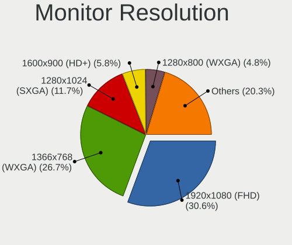

| Resolution         | Computers | Percent |
|--------------------|-----------|---------|
| 1920x1080 (FHD)    | 9059      | 30.64%  |
| 1366x768 (WXGA)    | 7894      | 26.7%   |
| 1280x1024 (SXGA)   | 3470      | 11.74%  |
| 1600x900 (HD+)     | 1715      | 5.8%    |
| 1280x800 (WXGA)    | 1416      | 4.79%   |
| 1440x900 (WXGA+)   | 1217      | 4.12%   |
| 1680x1050 (WSXGA+) | 1185      | 4.01%   |
| 1024x600           | 642       | 2.17%   |
| 3840x2160 (4K)     | 553       | 1.87%   |
| 1920x1200 (WUXGA)  | 474       | 1.6%    |
| 2560x1440 (QHD)    | 465       | 1.57%   |
| 1024x768 (XGA)     | 318       | 1.08%   |
| 1360x768           | 299       | 1.01%   |
| 1600x1200          | 158       | 0.53%   |
| 2560x1080          | 121       | 0.41%   |
| 2560x1600          | 81        | 0.27%   |
| 1920x540           | 81        | 0.27%   |
| 1280x720 (HD)      | 62        | 0.21%   |
| 1400x1050          | 55        | 0.19%   |
| 3440x1440          | 45        | 0.15%   |
| 1152x864           | 39        | 0.13%   |
| 2288x1287          | 30        | 0.1%    |
| 1680x945           | 22        | 0.07%   |
| 2160x1440          | 17        | 0.06%   |
| 2048x1536          | 16        | 0.05%   |
| 1280x960           | 16        | 0.05%   |
| 2048x1152          | 14        | 0.05%   |
| 1920x1440          | 14        | 0.05%   |
| 2880x1800          | 11        | 0.04%   |
| 1280x768           | 9         | 0.03%   |
| 1024x576           | 8         | 0.03%   |
| 2880x1920          | 7         | 0.02%   |
| Unknown            | 7         | 0.02%   |
| 2520x1680          | 5         | 0.02%   |
| 3840x1600          | 4         | 0.01%   |
| 3200x1800 (QHD+)   | 4         | 0.01%   |
| 4093x4093          | 3         | 0.01%   |
| 3200x2000          | 3         | 0.01%   |
| 3000x2000          | 3         | 0.01%   |
| 2880x1620          | 3         | 0.01%   |

Monitor Diagonal
----------------

Diagonal size in inches

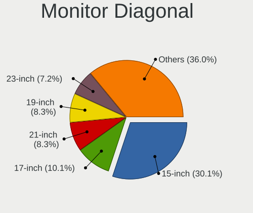

| Inches  | Computers | Percent |
|---------|-----------|---------|
| 15      | 9046      | 30.1%   |
| 17      | 3034      | 10.1%   |
| 21      | 2495      | 8.3%    |
| 19      | 2493      | 8.3%    |
| 23      | 2165      | 7.2%    |
| 24      | 1585      | 5.27%   |
| 14      | 1099      | 3.66%   |
| 18      | 1090      | 3.63%   |
| 27      | 1048      | 3.49%   |
| 13      | 930       | 3.09%   |
| 20      | 885       | 2.94%   |
| 22      | 706       | 2.35%   |
| 10      | 666       | 2.22%   |
| 11      | 372       | 1.24%   |
| 31      | 322       | 1.07%   |
| 12      | 303       | 1.01%   |
| Unknown | 248       | 0.83%   |
| 16      | 193       | 0.64%   |
| 72      | 149       | 0.5%    |
| 40      | 140       | 0.47%   |
| 32      | 133       | 0.44%   |
| 54      | 130       | 0.43%   |
| 34      | 123       | 0.41%   |
| 52      | 79        | 0.26%   |
| 84      | 71        | 0.24%   |
| 26      | 64        | 0.21%   |
| 25      | 62        | 0.21%   |
| 46      | 60        | 0.2%    |
| 8       | 38        | 0.13%   |
| 48      | 32        | 0.11%   |
| 28      | 31        | 0.1%    |
| 42      | 26        | 0.09%   |
| 65      | 23        | 0.08%   |
| 43      | 23        | 0.08%   |
| 29      | 22        | 0.07%   |
| 37      | 20        | 0.07%   |
| 63      | 16        | 0.05%   |
| 49      | 12        | 0.04%   |
| 33      | 12        | 0.04%   |
| 142     | 10        | 0.03%   |

Monitor Width
-------------

Physical width

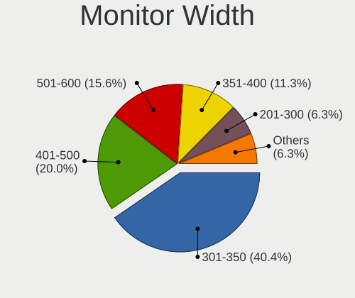

| Width in mm    | Computers | Percent |
|----------------|-----------|---------|
| 301-350        | 12026     | 40.42%  |
| 401-500        | 5963      | 20.04%  |
| 501-600        | 4649      | 15.62%  |
| 351-400        | 3368      | 11.32%  |
| 201-300        | 1881      | 6.32%   |
| 601-700        | 433       | 1.46%   |
| 1001-1500      | 396       | 1.33%   |
| 701-800        | 267       | 0.9%    |
| Unknown        | 248       | 0.83%   |
| 1501-2000      | 241       | 0.81%   |
| 801-900        | 144       | 0.48%   |
| 901-1000       | 82        | 0.28%   |
| 101-200        | 40        | 0.13%   |
| More than 2000 | 16        | 0.05%   |

Aspect Ratio
------------

Proportional relationship between the width and the height

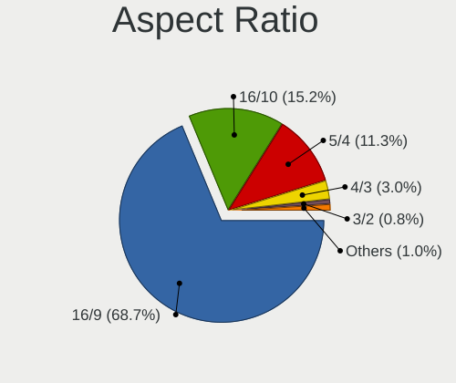

| Ratio   | Computers | Percent |
|---------|-----------|---------|
| 16/9    | 19899     | 68.74%  |
| 16/10   | 4391      | 15.17%  |
| 5/4     | 3274      | 11.31%  |
| 4/3     | 868       | 3%      |
| 3/2     | 219       | 0.76%   |
| 21/9    | 164       | 0.57%   |
| 6/5     | 57        | 0.2%    |
| Unknown | 39        | 0.13%   |
| 32/9    | 22        | 0.08%   |
| 1.00    | 11        | 0.04%   |
| 0.56    | 3         | 0.01%   |
| 2.21    | 1         | 0.003%  |
| 2.00    | 1         | 0.003%  |
| 1.96    | 1         | 0.003%  |

Monitor Area
------------

Area in inch²

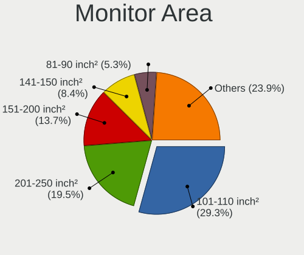

| Area in inch² | Computers | Percent |
|----------------|-----------|---------|
| 101-110        | 8755      | 29.27%  |
| 201-250        | 5819      | 19.45%  |
| 151-200        | 4101      | 13.71%  |
| 141-150        | 2508      | 8.38%   |
| 81-90          | 1578      | 5.28%   |
| 301-350        | 1101      | 3.68%   |
| 121-130        | 1071      | 3.58%   |
| 41-50          | 669       | 2.24%   |
| 351-500        | 618       | 2.07%   |
| 251-300        | 615       | 2.06%   |
| More than 1000 | 573       | 1.92%   |
| 71-80          | 399       | 1.33%   |
| 131-140        | 381       | 1.27%   |
| 51-60          | 372       | 1.24%   |
| 111-120        | 322       | 1.08%   |
| 501-1000       | 310       | 1.04%   |
| 61-70          | 273       | 0.91%   |
| Unknown        | 248       | 0.83%   |
| 91-100         | 160       | 0.53%   |
| 1-40           | 40        | 0.13%   |

Pixel Density
-------------

Pixels per inch

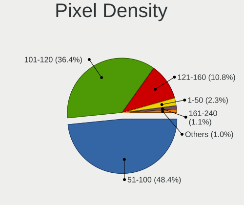

| Density       | Computers | Percent |
|---------------|-----------|---------|
| 51-100        | 14145     | 48.41%  |
| 101-120       | 10644     | 36.43%  |
| 121-160       | 3149      | 10.78%  |
| 1-50          | 674       | 2.31%   |
| 161-240       | 318       | 1.09%   |
| Unknown       | 248       | 0.85%   |
| More than 240 | 40        | 0.14%   |

Multiple Monitors
-----------------

Total monitors connected

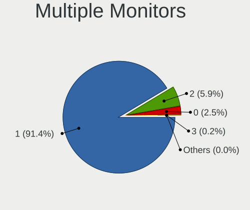

| Total | Computers | Percent |
|-------|-----------|---------|
| 1     | 27943     | 91.41%  |
| 2     | 1796      | 5.88%   |
| 0     | 752       | 2.46%   |
| 3     | 74        | 0.24%   |
| 4     | 2         | 0.01%   |
| 5     | 1         | 0.003%  |

Network
-------

Net Controller Vendor
---------------------

Controller vendors

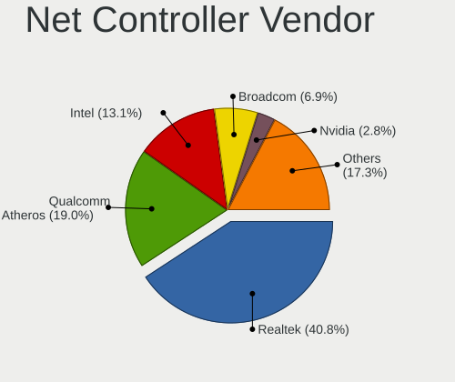

| Vendor                                 | Computers | Percent |
|----------------------------------------|-----------|---------|
| Realtek Semiconductor                  | 18688     | 40.78%  |
| Qualcomm Atheros                       | 8697      | 18.98%  |
| Intel                                  | 6022      | 13.14%  |
| Broadcom                               | 3174      | 6.93%   |
| Nvidia                                 | 1296      | 2.83%   |
| Marvell Technology Group               | 1134      | 2.47%   |
| Broadcom Limited                       | 916       | 2%      |
| Ralink                                 | 881       | 1.92%   |
| Ralink Technology                      | 684       | 1.49%   |
| Huawei Technologies                    | 682       | 1.49%   |
| VIA Technologies                       | 331       | 0.72%   |
| MediaTek                               | 266       | 0.58%   |
| TP-Link                                | 256       | 0.56%   |
| Qualcomm Atheros Communications        | 251       | 0.55%   |
| D-Link System                          | 217       | 0.47%   |
| D-Link                                 | 204       | 0.45%   |
| JMicron Technology                     | 188       | 0.41%   |
| ASUSTek Computer                       | 178       | 0.39%   |
| Attansic Technology                    | 162       | 0.35%   |
| ZTE WCDMA Technologies MSM             | 147       | 0.32%   |
| Silicon Integrated Systems [SiS]       | 136       | 0.3%    |
| Xiaomi                                 | 97        | 0.21%   |
| Samsung Electronics                    | 93        | 0.2%    |
| Sundance Technology Inc / IC Plus      | 69        | 0.15%   |
| ASIX Electronics                       | 62        | 0.14%   |
| HTC (High Tech Computer)               | 57        | 0.12%   |
| NetGear                                | 51        | 0.11%   |
| Qualcomm                               | 49        | 0.11%   |
| Gemtek                                 | 48        | 0.1%    |
| 3Com                                   | 47        | 0.1%    |
| Ericsson Business Mobile Networks      | 39        | 0.09%   |
| Hewlett-Packard                        | 30        | 0.07%   |
| T & A Mobile Phones                    | 26        | 0.06%   |
| IMC Networks                           | 25        | 0.05%   |
| Microsoft                              | 24        | 0.05%   |
| Mercucys                               | 24        | 0.05%   |
| Sony Ericsson Mobile Communications AB | 22        | 0.05%   |
| LSI                                    | 22        | 0.05%   |
| Vimtron Electronics                    | 20        | 0.04%   |
| ZyXEL Communications                   | 19        | 0.04%   |

Net Controller Model
--------------------

Controller models

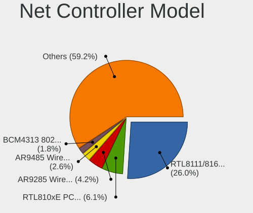

| Model                                                                   | Computers | Percent |
|-------------------------------------------------------------------------|-----------|---------|
| Realtek RTL8111/8168/8211/8411 PCI Express Gigabit Ethernet Controller  | 13323     | 26.01%  |
| Realtek RTL810xE PCI Express Fast Ethernet controller                   | 3146      | 6.14%   |
| Qualcomm Atheros AR9285 Wireless Network Adapter (PCI-Express)          | 2175      | 4.25%   |
| Qualcomm Atheros AR9485 Wireless Network Adapter                        | 1312      | 2.56%   |
| Broadcom BCM4313 802.11bgn Wireless Network Adapter                     | 929       | 1.81%   |
| Realtek RTL-8100/8101L/8139 PCI Fast Ethernet Adapter                   | 900       | 1.76%   |
| Qualcomm Atheros QCA9565 / AR9565 Wireless Network Adapter              | 825       | 1.61%   |
| Qualcomm Atheros AR8151 v2.0 Gigabit Ethernet                           | 637       | 1.24%   |
| Qualcomm Atheros AR242x / AR542x Wireless Network Adapter (PCI-Express) | 633       | 1.24%   |
| Nvidia MCP61 Ethernet                                                   | 605       | 1.18%   |
| Realtek RTL8723BE PCIe Wireless Network Adapter                         | 554       | 1.08%   |
| Intel PRO/Wireless 3945ABG [Golan] Network Connection                   | 507       | 0.99%   |
| Broadcom BCM43142 802.11b/g/n                                           | 428       | 0.84%   |
| Huawei Modem/Networkcard                                                | 364       | 0.71%   |
| Qualcomm Atheros AR8131 Gigabit Ethernet                                | 356       | 0.7%    |
| Ralink MT7601U Wireless Adapter                                         | 353       | 0.69%   |
| Qualcomm Atheros QCA9377 802.11ac Wireless Network Adapter              | 347       | 0.68%   |
| Qualcomm Atheros AR8121/AR8113/AR8114 Gigabit or Fast Ethernet          | 338       | 0.66%   |
| Broadcom NetLink BCM57785 Gigabit Ethernet PCIe                         | 336       | 0.66%   |
| Qualcomm Atheros AR8161 Gigabit Ethernet                                | 313       | 0.61%   |
| Qualcomm Atheros AR8152 v2.0 Fast Ethernet                              | 313       | 0.61%   |
| Intel 82579LM Gigabit Network Connection (Lewisville)                   | 310       | 0.61%   |
| Qualcomm Atheros AR8132 Fast Ethernet                                   | 302       | 0.59%   |
| Qualcomm Atheros AR9462 Wireless Network Adapter                        | 300       | 0.59%   |
| Qualcomm Atheros Attansic L1 Gigabit Ethernet                           | 297       | 0.58%   |
| Ralink RT3290 Wireless 802.11n 1T/1R PCIe                               | 285       | 0.56%   |
| Realtek RTL8821CE 802.11ac PCIe Wireless Network Adapter                | 283       | 0.55%   |
| Marvell Group 88E8040 PCI-E Fast Ethernet Controller                    | 279       | 0.54%   |
| Realtek RTL8188EUS 802.11n Wireless Network Adapter                     | 277       | 0.54%   |
| Realtek RTL8188CE 802.11b/g/n WiFi Adapter                              | 277       | 0.54%   |
| Intel 82579V Gigabit Network Connection                                 | 248       | 0.48%   |
| Intel Wireless 3165                                                     | 235       | 0.46%   |
| Intel WiFi Link 5100                                                    | 235       | 0.46%   |
| Realtek RTL8125 2.5GbE Controller                                       | 233       | 0.45%   |
| Broadcom BCM4312 802.11b/g LP-PHY                                       | 228       | 0.45%   |
| Intel Wireless 7265                                                     | 216       | 0.42%   |
| Qualcomm Atheros AR9287 Wireless Network Adapter (PCI-Express)          | 206       | 0.4%    |
| VIA VT6105/VT6106S [Rhine-III]                                          | 205       | 0.4%    |
| Qualcomm Atheros AR9271 802.11n                                         | 204       | 0.4%    |
| Intel Wireless 7260                                                     | 195       | 0.38%   |

Wireless Vendor
---------------

Wireless vendors

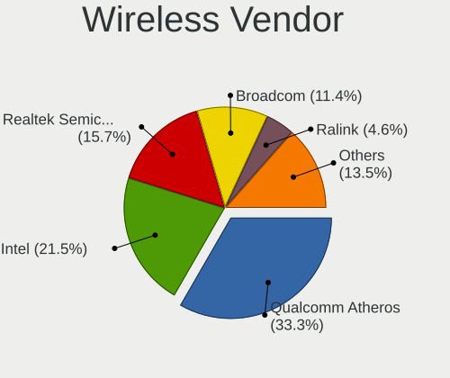

| Vendor                          | Computers | Percent |
|---------------------------------|-----------|---------|
| Qualcomm Atheros                | 6358      | 33.33%  |
| Intel                           | 4100      | 21.49%  |
| Realtek Semiconductor           | 2990      | 15.67%  |
| Broadcom                        | 2179      | 11.42%  |
| Ralink                          | 881       | 4.62%   |
| Ralink Technology               | 684       | 3.59%   |
| Broadcom Limited                | 430       | 2.25%   |
| Qualcomm Atheros Communications | 251       | 1.32%   |
| TP-Link                         | 245       | 1.28%   |
| D-Link                          | 196       | 1.03%   |
| MediaTek                        | 175       | 0.92%   |
| ASUSTek Computer                | 160       | 0.84%   |
| D-Link System                   | 117       | 0.61%   |
| NetGear                         | 50        | 0.26%   |
| IMC Networks                    | 25        | 0.13%   |
| Mercucys                        | 24        | 0.13%   |
| Microsoft                       | 23        | 0.12%   |
| Edimax Technology               | 17        | 0.09%   |
| ZyXEL Communications            | 15        | 0.08%   |
| Qualcomm                        | 15        | 0.08%   |
| Sierra Wireless                 | 13        | 0.07%   |
| Belkin Components               | 12        | 0.06%   |
| Dell                            | 10        | 0.05%   |
| Linksys                         | 9         | 0.05%   |
| Marvell Technology Group        | 8         | 0.04%   |
| ZyDAS                           | 7         | 0.04%   |
| Sitecom Europe                  | 6         | 0.03%   |
| Micro Star International        | 6         | 0.03%   |
| Hewlett-Packard                 | 6         | 0.03%   |
| Gemtek                          | 6         | 0.03%   |
| Tenda                           | 5         | 0.03%   |
| Sagem                           | 5         | 0.03%   |
| Fibocom                         | 5         | 0.03%   |
| Accton Technology               | 5         | 0.03%   |
| Xiaomi                          | 4         | 0.02%   |
| TRENDnet                        | 4         | 0.02%   |
| Fujitsu Siemens Computers       | 4         | 0.02%   |
| VIA Technologies                | 3         | 0.02%   |
| Texas Instruments               | 3         | 0.02%   |
| BUFFALO                         | 3         | 0.02%   |

Wireless Model
--------------

Wireless models

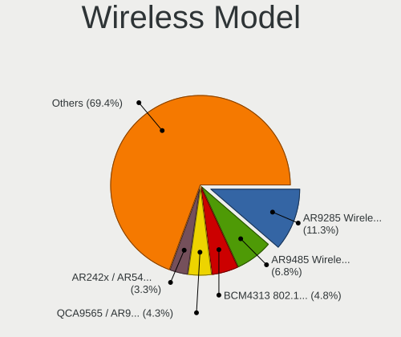

| Model                                                                   | Computers | Percent |
|-------------------------------------------------------------------------|-----------|---------|
| Qualcomm Atheros AR9285 Wireless Network Adapter (PCI-Express)          | 2175      | 11.32%  |
| Qualcomm Atheros AR9485 Wireless Network Adapter                        | 1312      | 6.83%   |
| Broadcom BCM4313 802.11bgn Wireless Network Adapter                     | 929       | 4.83%   |
| Qualcomm Atheros QCA9565 / AR9565 Wireless Network Adapter              | 825       | 4.29%   |
| Qualcomm Atheros AR242x / AR542x Wireless Network Adapter (PCI-Express) | 633       | 3.29%   |
| Realtek RTL8723BE PCIe Wireless Network Adapter                         | 554       | 2.88%   |
| Intel PRO/Wireless 3945ABG [Golan] Network Connection                   | 507       | 2.64%   |
| Broadcom BCM43142 802.11b/g/n                                           | 428       | 2.23%   |
| Ralink MT7601U Wireless Adapter                                         | 353       | 1.84%   |
| Qualcomm Atheros QCA9377 802.11ac Wireless Network Adapter              | 347       | 1.81%   |
| Qualcomm Atheros AR9462 Wireless Network Adapter                        | 300       | 1.56%   |
| Ralink RT3290 Wireless 802.11n 1T/1R PCIe                               | 285       | 1.48%   |
| Realtek RTL8821CE 802.11ac PCIe Wireless Network Adapter                | 283       | 1.47%   |
| Realtek RTL8188EUS 802.11n Wireless Network Adapter                     | 277       | 1.44%   |
| Realtek RTL8188CE 802.11b/g/n WiFi Adapter                              | 277       | 1.44%   |
| Intel Wireless 3165                                                     | 235       | 1.22%   |
| Intel WiFi Link 5100                                                    | 235       | 1.22%   |
| Broadcom BCM4312 802.11b/g LP-PHY                                       | 228       | 1.19%   |
| Intel Wireless 7265                                                     | 216       | 1.12%   |
| Qualcomm Atheros AR9287 Wireless Network Adapter (PCI-Express)          | 206       | 1.07%   |
| Qualcomm Atheros AR9271 802.11n                                         | 204       | 1.06%   |
| Intel Wireless 7260                                                     | 195       | 1.01%   |
| Realtek RTL8723AE PCIe Wireless Network Adapter                         | 187       | 0.97%   |
| Ralink RT3090 Wireless 802.11n 1T/1R PCIe                               | 184       | 0.96%   |
| Intel Centrino Wireless-N 130                                           | 174       | 0.91%   |
| Intel PRO/Wireless 4965 AG or AGN [Kedron] Network Connection           | 173       | 0.9%    |
| Intel Wi-Fi 6 AX201                                                     | 163       | 0.85%   |
| Intel Centrino Advanced-N 6205 [Taylor Peak]                            | 156       | 0.81%   |
| Broadcom Limited BCM4312 802.11b/g LP-PHY                               | 155       | 0.81%   |
| Realtek RTL8192CU 802.11n WLAN Adapter                                  | 152       | 0.79%   |
| Realtek RTL8188EE Wireless Network Adapter                              | 150       | 0.78%   |
| Broadcom BCM4311 802.11b/g WLAN                                         | 147       | 0.76%   |
| Ralink RT5370 Wireless Adapter                                          | 145       | 0.75%   |
| Intel Wi-Fi 6 AX200                                                     | 140       | 0.73%   |
| Intel Centrino Wireless-N 2230                                          | 140       | 0.73%   |
| Intel Dual Band Wireless-AC 3168NGW [Stone Peak]                        | 129       | 0.67%   |
| Qualcomm Atheros AR928X Wireless Network Adapter (PCI-Express)          | 128       | 0.67%   |
| Realtek RTL8822CE 802.11ac PCIe Wireless Network Adapter                | 118       | 0.61%   |
| Intel WiMAX/WiFi Link 5150                                              | 111       | 0.58%   |
| Realtek RTL8723DE Wireless Network Adapter                              | 106       | 0.55%   |

Ethernet Vendor
---------------

Ethernet vendors

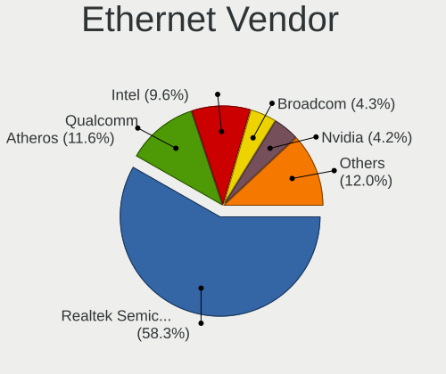

| Vendor                                 | Computers | Percent |
|----------------------------------------|-----------|---------|
| Realtek Semiconductor                  | 17792     | 58.26%  |
| Qualcomm Atheros                       | 3556      | 11.64%  |
| Intel                                  | 2920      | 9.56%   |
| Broadcom                               | 1322      | 4.33%   |
| Nvidia                                 | 1295      | 4.24%   |
| Marvell Technology Group               | 1127      | 3.69%   |
| Broadcom Limited                       | 505       | 1.65%   |
| VIA Technologies                       | 320       | 1.05%   |
| JMicron Technology                     | 188       | 0.62%   |
| Huawei Technologies                    | 173       | 0.57%   |
| Attansic Technology                    | 162       | 0.53%   |
| Silicon Integrated Systems [SiS]       | 133       | 0.44%   |
| D-Link System                          | 101       | 0.33%   |
| Xiaomi                                 | 93        | 0.3%    |
| MediaTek                               | 87        | 0.28%   |
| Samsung Electronics                    | 85        | 0.28%   |
| Sundance Technology Inc / IC Plus      | 69        | 0.23%   |
| ASIX Electronics                       | 62        | 0.2%    |
| HTC (High Tech Computer)               | 57        | 0.19%   |
| 3Com                                   | 47        | 0.15%   |
| Gemtek                                 | 42        | 0.14%   |
| Qualcomm                               | 34        | 0.11%   |
| ZTE WCDMA Technologies MSM             | 22        | 0.07%   |
| T & A Mobile Phones                    | 22        | 0.07%   |
| Vimtron Electronics                    | 20        | 0.07%   |
| Sony Ericsson Mobile Communications AB | 20        | 0.07%   |
| Spreadtrum Communications              | 19        | 0.06%   |
| ASUSTek Computer                       | 19        | 0.06%   |
| GCT Semiconductor                      | 16        | 0.05%   |
| OPPO Electronics                       | 15        | 0.05%   |
| Lenovo                                 | 15        | 0.05%   |
| Altair Semiconductor                   | 14        | 0.05%   |
| American Megatrends                    | 13        | 0.04%   |
| ICS Advent                             | 12        | 0.04%   |
| TP-Link                                | 11        | 0.04%   |
| Motorola PCS                           | 11        | 0.04%   |
| ULi Electronics                        | 9         | 0.03%   |
| Davicom Semiconductor                  | 9         | 0.03%   |
| D-Link                                 | 8         | 0.03%   |
| DisplayLink                            | 7         | 0.02%   |

Ethernet Model
--------------

Ethernet models

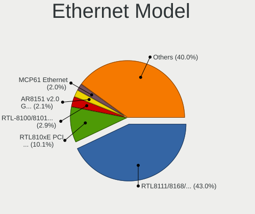

| Model                                                                  | Computers | Percent |
|------------------------------------------------------------------------|-----------|---------|
| Realtek RTL8111/8168/8211/8411 PCI Express Gigabit Ethernet Controller | 13323     | 42.96%  |
| Realtek RTL810xE PCI Express Fast Ethernet controller                  | 3146      | 10.14%  |
| Realtek RTL-8100/8101L/8139 PCI Fast Ethernet Adapter                  | 900       | 2.9%    |
| Qualcomm Atheros AR8151 v2.0 Gigabit Ethernet                          | 637       | 2.05%   |
| Nvidia MCP61 Ethernet                                                  | 605       | 1.95%   |
| Qualcomm Atheros AR8131 Gigabit Ethernet                               | 356       | 1.15%   |
| Qualcomm Atheros AR8121/AR8113/AR8114 Gigabit or Fast Ethernet         | 338       | 1.09%   |
| Broadcom NetLink BCM57785 Gigabit Ethernet PCIe                        | 336       | 1.08%   |
| Qualcomm Atheros AR8161 Gigabit Ethernet                               | 313       | 1.01%   |
| Qualcomm Atheros AR8152 v2.0 Fast Ethernet                             | 313       | 1.01%   |
| Intel 82579LM Gigabit Network Connection (Lewisville)                  | 310       | 1%      |
| Qualcomm Atheros AR8132 Fast Ethernet                                  | 302       | 0.97%   |
| Qualcomm Atheros Attansic L1 Gigabit Ethernet                          | 297       | 0.96%   |
| Marvell Group 88E8040 PCI-E Fast Ethernet Controller                   | 279       | 0.9%    |
| Intel 82579V Gigabit Network Connection                                | 248       | 0.8%    |
| Realtek RTL8125 2.5GbE Controller                                      | 233       | 0.75%   |
| VIA VT6105/VT6106S [Rhine-III]                                         | 205       | 0.66%   |
| Qualcomm Atheros QCA8172 Fast Ethernet                                 | 186       | 0.6%    |
| Intel Ethernet Connection (2) I219-V                                   | 185       | 0.6%    |
| Marvell Group 88E8056 PCI-E Gigabit Ethernet Controller                | 174       | 0.56%   |
| Qualcomm Atheros QCA8171 Gigabit Ethernet                              | 170       | 0.55%   |
| Qualcomm Atheros AR8162 Fast Ethernet                                  | 170       | 0.55%   |
| Broadcom NetLink BCM57780 Gigabit Ethernet PCIe                        | 170       | 0.55%   |
| Attansic AR8152 v2.0 Fast Ethernet                                     | 162       | 0.52%   |
| Marvell Group 88E8055 PCI-E Gigabit Ethernet Controller                | 160       | 0.52%   |
| JMicron JMC250 PCI Express Gigabit Ethernet Controller                 | 151       | 0.49%   |
| Realtek RTL-8110SC/8169SC Gigabit Ethernet                             | 142       | 0.46%   |
| Broadcom NetLink BCM5787M Gigabit Ethernet PCI Express                 | 142       | 0.46%   |
| Intel WiMAX Connection 2400m                                           | 133       | 0.43%   |
| Intel I211 Gigabit Network Connection                                  | 132       | 0.43%   |
| Qualcomm Atheros Killer E220x Gigabit Ethernet Controller              | 131       | 0.42%   |
| Realtek RTL8169 PCI Gigabit Ethernet Controller                        | 127       | 0.41%   |
| Broadcom Limited NetLink BCM57780 Gigabit Ethernet PCIe                | 122       | 0.39%   |
| Broadcom BCM4401-B0 100Base-TX                                         | 121       | 0.39%   |
| Qualcomm Atheros Attansic L2 Fast Ethernet                             | 120       | 0.39%   |
| Nvidia MCP77 Ethernet                                                  | 120       | 0.39%   |
| Marvell Group 88E8001 Gigabit Ethernet Controller                      | 118       | 0.38%   |
| Nvidia CK804 Ethernet Controller                                       | 113       | 0.36%   |
| VIA VT6102/VT6103 [Rhine-II]                                           | 112       | 0.36%   |
| Nvidia MCP51 Ethernet Controller                                       | 106       | 0.34%   |

Net Controller Kind
-------------------

Ethernet, WiFi or modem

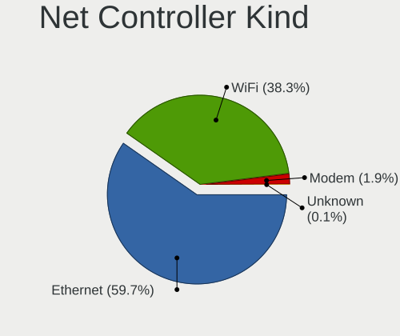

| Kind     | Computers | Percent |
|----------|-----------|---------|
| Ethernet | 28724     | 59.72%  |
| WiFi     | 18418     | 38.29%  |
| Modem    | 925       | 1.92%   |
| Unknown  | 34        | 0.07%   |

Used Controller
---------------

Currently used network controller

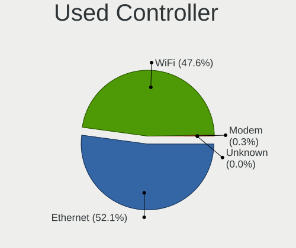

| Kind     | Computers | Percent |
|----------|-----------|---------|
| Ethernet | 15994     | 52.14%  |
| WiFi     | 14591     | 47.57%  |
| Modem    | 80        | 0.26%   |
| Unknown  | 9         | 0.03%   |

NICs
----

Total network controllers on board

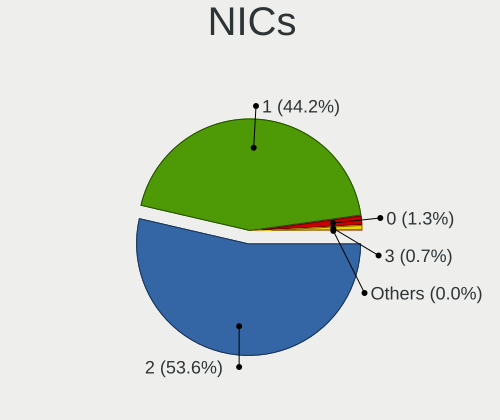

| Total | Computers | Percent |
|-------|-----------|---------|
| 2     | 16162     | 53.62%  |
| 1     | 13316     | 44.17%  |
| 0     | 406       | 1.35%   |
| 3     | 220       | 0.73%   |
| 4     | 27        | 0.09%   |
| 6     | 8         | 0.03%   |
| 5     | 2         | 0.01%   |
| 33    | 1         | 0.003%  |
| 16    | 1         | 0.003%  |
| 11    | 1         | 0.003%  |

IPv6
----

IPv6 vs IPv4

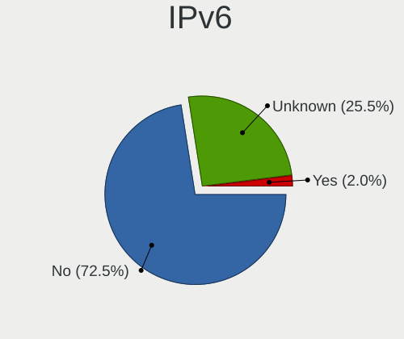

| Used    | Computers | Percent |
|---------|-----------|---------|
| No      | 22751     | 72.53%  |
| Unknown | 7998      | 25.5%   |
| Yes     | 620       | 1.98%   |

Bluetooth
---------

Bluetooth Vendor
----------------

Controller vendors

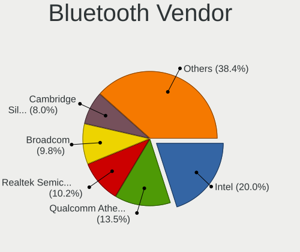

| Vendor                          | Computers | Percent |
|---------------------------------|-----------|---------|
| Intel                           | 2325      | 20.04%  |
| Qualcomm Atheros Communications | 1569      | 13.53%  |
| Realtek Semiconductor           | 1187      | 10.23%  |
| Broadcom                        | 1135      | 9.78%   |
| Cambridge Silicon Radio         | 928       | 8%      |
| IMC Networks                    | 778       | 6.71%   |
| Lite-On Technology              | 674       | 5.81%   |
| Foxconn / Hon Hai               | 674       | 5.81%   |
| ASUSTek Computer                | 463       | 3.99%   |
| Ralink                          | 285       | 2.46%   |
| Hewlett-Packard                 | 252       | 2.17%   |
| Toshiba                         | 248       | 2.14%   |
| Dell                            | 206       | 1.78%   |
| Foxconn International           | 196       | 1.69%   |
| Apple                           | 177       | 1.53%   |
| Alps Electric                   | 83        | 0.72%   |
| MediaTek                        | 66        | 0.57%   |
| Ralink Technology               | 64        | 0.55%   |
| Integrated System Solution      | 57        | 0.49%   |
| TP-Link                         | 35        | 0.3%    |
| Realtek                         | 32        | 0.28%   |
| Chicony Electronics             | 23        | 0.2%    |
| Taiyo Yuden                     | 18        | 0.16%   |
| Micro Star International        | 18        | 0.16%   |
| Askey Computer                  | 13        | 0.11%   |
| USI                             | 11        | 0.09%   |
| SiW                             | 10        | 0.09%   |
| Conwise Technology              | 10        | 0.09%   |
| Actions                         | 10        | 0.09%   |
| Qcom                            | 9         | 0.08%   |
| Roper                           | 8         | 0.07%   |
| Unknown                         | 6         | 0.05%   |
| Syntek                          | 4         | 0.03%   |
| Opticis                         | 4         | 0.03%   |
| Logitech                        | 4         | 0.03%   |
| Samsung Electronics             | 3         | 0.03%   |
| Belkin Components               | 3         | 0.03%   |
| Fujitsu                         | 2         | 0.02%   |
| Smart Modular Technologies      | 1         | 0.01%   |
| Quectel Wireless Solutions      | 1         | 0.01%   |

Bluetooth Model
---------------

Controller models

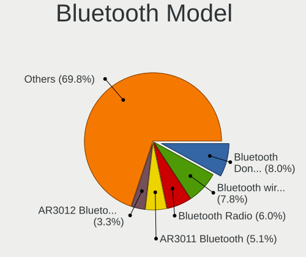

| Model                                               | Computers | Percent |
|-----------------------------------------------------|-----------|---------|
| Cambridge Silicon Radio Bluetooth Dongle (HCI mode) | 928       | 7.99%   |
| Intel Bluetooth wireless interface                  | 904       | 7.79%   |
| Realtek Bluetooth Radio                             | 693       | 5.97%   |
| Qualcomm Atheros AR3011 Bluetooth                   | 590       | 5.08%   |
| Qualcomm Atheros AR3012 Bluetooth 4.0               | 386       | 3.33%   |
| Intel AX201 Bluetooth                               | 343       | 2.95%   |
| Qualcomm Atheros  Bluetooth Device                  | 286       | 2.46%   |
| Ralink RT3290 Bluetooth                             | 285       | 2.45%   |
| Foxconn / Hon Hai Bluetooth Device                  | 232       | 2%      |
| Intel Centrino Advanced-N 6230 Bluetooth adapter    | 224       | 1.93%   |
| Intel Centrino Bluetooth Wireless Transceiver       | 222       | 1.91%   |
| Lite-On Atheros AR3012 Bluetooth                    | 220       | 1.9%    |
| IMC Networks Atheros AR3012 Bluetooth 4.0 Adapter   | 199       | 1.71%   |
| Foxconn International BCM43142A0 Bluetooth module   | 193       | 1.66%   |
| Intel Bluetooth 9460/9560 Jefferson Peak (JfP)      | 190       | 1.64%   |
| Broadcom BCM2070 Bluetooth Device                   | 178       | 1.53%   |
| Realtek  Bluetooth 4.2 Adapter                      | 174       | 1.5%    |
| IMC Networks Bluetooth Device                       | 172       | 1.48%   |
| Lite-On Bluetooth Device                            | 161       | 1.39%   |
| Broadcom BCM2070 Bluetooth 2.1 + EDR                | 159       | 1.37%   |
| Broadcom BCM2045 Bluetooth                          | 158       | 1.36%   |
| Realtek RTL8723B Bluetooth                          | 149       | 1.28%   |
| IMC Networks Bluetooth Radio                        | 144       | 1.24%   |
| Intel AX200 Bluetooth                               | 138       | 1.19%   |
| Intel Wireless-AC 3168 Bluetooth                    | 125       | 1.08%   |
| HP Bluetooth 2.0 Interface [Broadcom BCM2045]       | 124       | 1.07%   |
| HP Broadcom 2070 Bluetooth Combo                    | 117       | 1.01%   |
| Qualcomm Atheros Bluetooth                          | 113       | 0.97%   |
| Lite-On Qualcomm Atheros QCA9377 Bluetooth          | 111       | 0.96%   |
| ASUS BT-183 Bluetooth 2.0+EDR adapter               | 105       | 0.9%    |
| Broadcom BCM2045B (BDC-2.1)                         | 102       | 0.88%   |
| Toshiba Integrated Bluetooth HCI                    | 98        | 0.84%   |
| Foxconn / Hon Hai Broadcom Bluetooth 2.1 Device     | 90        | 0.78%   |
| Broadcom HP Portable Valentine                      | 89        | 0.77%   |
| ASUS BT-270 Bluetooth Adapter                       | 86        | 0.74%   |
| Lite-On Broadcom BCM43142A0 Bluetooth Device        | 82        | 0.71%   |
| Apple Bluetooth Host Controller                     | 81        | 0.7%    |
| Qualcomm Atheros AR9462 Bluetooth                   | 80        | 0.69%   |
| ASUS BT-253 Bluetooth Adapter                       | 79        | 0.68%   |
| Intel AX210 Bluetooth                               | 77        | 0.66%   |

Sound
-----

Sound Vendor
------------

Sound card vendors

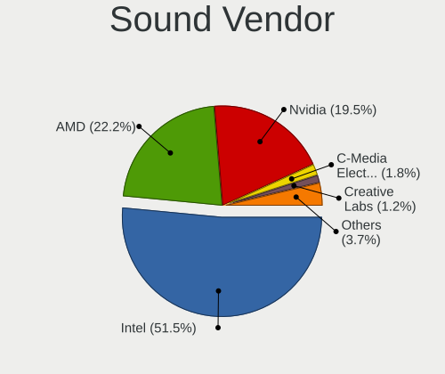

| Vendor                                          | Computers | Percent |
|-------------------------------------------------|-----------|---------|
| Intel                                           | 20911     | 51.5%   |
| AMD                                             | 9004      | 22.18%  |
| Nvidia                                          | 7927      | 19.52%  |
| C-Media Electronics                             | 745       | 1.83%   |
| Creative Labs                                   | 507       | 1.25%   |
| VIA Technologies                                | 223       | 0.55%   |
| Silicon Integrated Systems [SiS]                | 191       | 0.47%   |
| Creative Technology                             | 98        | 0.24%   |
| Logitech                                        | 92        | 0.23%   |
| Generalplus Technology                          | 69        | 0.17%   |
| JMTek                                           | 66        | 0.16%   |
| Texas Instruments                               | 57        | 0.14%   |
| ASUSTek Computer                                | 37        | 0.09%   |
| Plantronics                                     | 33        | 0.08%   |
| Ensoniq                                         | 25        | 0.06%   |
| Zoran Co. Personal Media Division (Nogatech)    | 24        | 0.06%   |
| Razer USA                                       | 21        | 0.05%   |
| Pixart Imaging                                  | 20        | 0.05%   |
| Lenovo                                          | 19        | 0.05%   |
| ULi Electronics                                 | 18        | 0.04%   |
| Tenx Technology                                 | 18        | 0.04%   |
| Micro Star International                        | 17        | 0.04%   |
| M-Audio                                         | 15        | 0.04%   |
| Jieli Technology                                | 15        | 0.04%   |
| Yamaha                                          | 13        | 0.03%   |
| Kingston Technology                             | 13        | 0.03%   |
| A4Tech                                          | 12        | 0.03%   |
| Shenzhen Rapoo Technology                       | 10        | 0.02%   |
| Focusrite-Novation                              | 10        | 0.02%   |
| BEHRINGER International                         | 10        | 0.02%   |
| Aureal Semiconductor                            | 10        | 0.02%   |
| ATI Technologies                                | 10        | 0.02%   |
| XMOS                                            | 9         | 0.02%   |
| Licensed by Sony Computer Entertainment America | 9         | 0.02%   |
| iCreate Technologies                            | 9         | 0.02%   |
| ESS Technology                                  | 9         | 0.02%   |
| Asahi Kasei Microsystems                        | 9         | 0.02%   |
| Yealink Network Technology                      | 8         | 0.02%   |
| Sony                                            | 8         | 0.02%   |
| Guillemot                                       | 8         | 0.02%   |

Sound Model
-----------

Sound card models

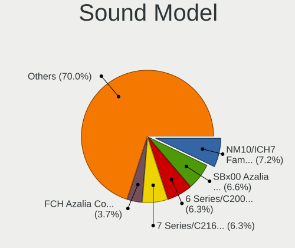

| Model                                                                                             | Computers | Percent |
|---------------------------------------------------------------------------------------------------|-----------|---------|
| Intel NM10/ICH7 Family High Definition Audio Controller                                           | 3364      | 7.17%   |
| AMD SBx00 Azalia (Intel HDA)                                                                      | 3088      | 6.58%   |
| Intel 6 Series/C200 Series Chipset Family High Definition Audio Controller                        | 2948      | 6.28%   |
| Intel 7 Series/C216 Chipset Family High Definition Audio Controller                               | 2947      | 6.28%   |
| AMD FCH Azalia Controller                                                                         | 1729      | 3.68%   |
| Intel 82801I (ICH9 Family) HD Audio Controller                                                    | 1549      | 3.3%    |
| Intel 5 Series/3400 Series Chipset High Definition Audio                                          | 1473      | 3.14%   |
| Intel 8 Series/C220 Series Chipset High Definition Audio Controller                               | 1285      | 2.74%   |
| Nvidia GF108 High Definition Audio Controller                                                     | 1035      | 2.2%    |
| Intel 82801H (ICH8 Family) HD Audio Controller                                                    | 961       | 2.05%   |
| Nvidia High Definition Audio Controller                                                           | 857       | 1.83%   |
| Intel Xeon E3-1200 v3/4th Gen Core Processor HD Audio Controller                                  | 763       | 1.63%   |
| AMD Ryzen HD Audio Controller                                                                     | 733       | 1.56%   |
| Nvidia MCP61 High Definition Audio                                                                | 663       | 1.41%   |
| AMD Oland/Hainan/Cape Verde/Pitcairn HDMI Audio [Radeon HD 7000 Series]                           | 642       | 1.37%   |
| Intel 82801JI (ICH10 Family) HD Audio Controller                                                  | 598       | 1.27%   |
| Intel 100 Series/C230 Series Chipset Family HD Audio Controller                                   | 563       | 1.2%    |
| Intel Sunrise Point-LP HD Audio                                                                   | 536       | 1.14%   |
| Nvidia GK208 HDMI/DP Audio Controller                                                             | 534       | 1.14%   |
| Intel 8 Series HD Audio Controller                                                                | 501       | 1.07%   |
| AMD Kabini HDMI/DP Audio                                                                          | 500       | 1.07%   |
| Intel Haswell-ULT HD Audio Controller                                                             | 499       | 1.06%   |
| Nvidia GK107 HDMI Audio Controller                                                                | 493       | 1.05%   |
| Intel Atom Processor Z36xxx/Z37xxx Series High Definition Audio Controller                        | 492       | 1.05%   |
| AMD Trinity HDMI Audio Controller                                                                 | 434       | 0.92%   |
| Nvidia GP107GL High Definition Audio Controller                                                   | 424       | 0.9%    |
| AMD Wrestler HDMI Audio                                                                           | 422       | 0.9%    |
| AMD Cedar HDMI Audio [Radeon HD 5400/6300/7300 Series]                                            | 416       | 0.89%   |
| Nvidia GF119 HDMI Audio Controller                                                                | 381       | 0.81%   |
| AMD RV710/730 HDMI Audio [Radeon HD 4000 series]                                                  | 379       | 0.81%   |
| Nvidia GM107 High Definition Audio Controller [GeForce 940MX]                                     | 349       | 0.74%   |
| Nvidia GF116 High Definition Audio Controller                                                     | 339       | 0.72%   |
| Intel Atom/Celeron/Pentium Processor x5-E8000/J3xxx/N3xxx Series High Definition Audio Controller | 334       | 0.71%   |
| Nvidia GK106 HDMI Audio Controller                                                                | 322       | 0.69%   |
| AMD Renoir/Cezanne HDMI/DP Audio Controller                                                       | 311       | 0.66%   |
| Intel 200 Series PCH HD Audio                                                                     | 297       | 0.63%   |
| AMD Turks HDMI Audio [Radeon HD 6500/6600 / 6700M Series]                                         | 295       | 0.63%   |
| Intel Broadwell-U Audio Controller                                                                | 272       | 0.58%   |
| AMD BeaverCreek HDMI Audio [Radeon HD 6500D and 6400G-6600G series]                               | 271       | 0.58%   |
| Intel Wildcat Point-LP High Definition Audio Controller                                           | 269       | 0.57%   |

Memory
------

Memory Vendor
-------------

Memory module vendors

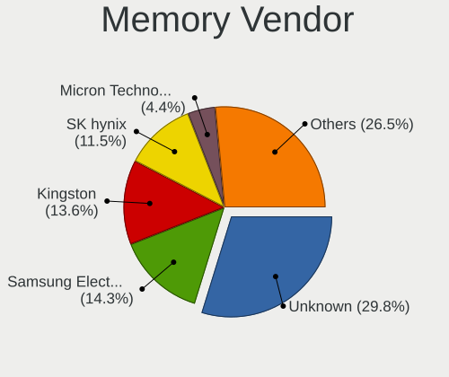

| Vendor                | Computers | Percent |
|-----------------------|-----------|---------|
| Unknown               | 9974      | 29.76%  |
| Samsung Electronics   | 4786      | 14.28%  |
| Kingston              | 4554      | 13.59%  |
| SK hynix              | 3846      | 11.47%  |
| Micron Technology     | 1478      | 4.41%   |
| Crucial               | 1162      | 3.47%   |
| Elpida                | 875       | 2.61%   |
| Nanya Technology      | 802       | 2.39%   |
| Corsair               | 742       | 2.21%   |
| A-DATA Technology     | 714       | 2.13%   |
| Ramaxel Technology    | 602       | 1.8%    |
| AMD                   | 443       | 1.32%   |
| Patriot               | 371       | 1.11%   |
| Unknown               | 202       | 0.6%    |
| ASint Technology      | 196       | 0.58%   |
| GOODRAM               | 184       | 0.55%   |
| Goldkey               | 174       | 0.52%   |
| G.Skill               | 161       | 0.48%   |
| Transcend             | 149       | 0.44%   |
| Apacer                | 140       | 0.42%   |
| 48spaces              | 137       | 0.41%   |
| Silicon Power         | 121       | 0.36%   |
| Kingmax               | 111       | 0.33%   |
| Unknown (ABCD)        | 99        | 0.3%    |
| Team                  | 84        | 0.25%   |
| Qimonda               | 84        | 0.25%   |
| SHARETRONIC           | 83        | 0.25%   |
| Qumo                  | 83        | 0.25%   |
| Foxline               | 79        | 0.24%   |
| Unifosa               | 76        | 0.23%   |
| Kllisre               | 76        | 0.23%   |
| ACPI Digital          | 73        | 0.22%   |
| GeIL                  | 69        | 0.21%   |
| Atermiter             | 42        | 0.13%   |
| Toshiba               | 32        | 0.1%    |
| Smart                 | 31        | 0.09%   |
| KETECH                | 31        | 0.09%   |
| Ramos Technology      | 22        | 0.07%   |
| Kingmax Semiconductor | 22        | 0.07%   |
| TakeMS                | 20        | 0.06%   |

Memory Model
------------

Memory module models

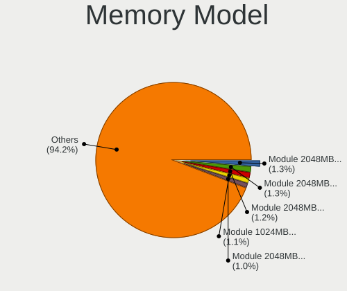

| Model                                                                     | Computers | Percent |
|---------------------------------------------------------------------------|-----------|---------|
| Unknown RAM Module 2048MB DIMM DDR2 800MT/s                               | 491       | 1.29%   |
| Unknown RAM Module 2048MB DIMM SDRAM                                      | 478       | 1.26%   |
| Unknown RAM Module 2048MB DIMM 800MT/s                                    | 446       | 1.18%   |
| Unknown RAM Module 1024MB DIMM SDRAM                                      | 417       | 1.1%    |
| Unknown RAM Module 2048MB DIMM 1333MT/s                                   | 373       | 0.98%   |
| Unknown RAM Module 4096MB DIMM 1333MT/s                                   | 357       | 0.94%   |
| Samsung RAM M471B5273DH0-CH9 4GB SODIMM DDR3 1600MT/s                     | 347       | 0.91%   |
| Unknown RAM Module 1024MB DIMM DDR2 800MT/s                               | 328       | 0.86%   |
| Unknown RAM Module 1024MB DIMM 800MT/s                                    | 252       | 0.66%   |
| Unknown RAM Module 1024MB DIMM DDR2 667MT/s                               | 250       | 0.66%   |
| Samsung RAM M471B5773CHS-CH9 2GB SODIMM DDR3 4199MT/s                     | 248       | 0.65%   |
| Samsung RAM M471B5273CH0-CH9 4GB SODIMM DDR3 1334MT/s                     | 226       | 0.6%    |
| Unknown RAM Module 2048MB SODIMM DDR2 667MT/s                             | 225       | 0.59%   |
| Samsung RAM M471B5773DH0-CH9 2GB SODIMM DDR3 1600MT/s                     | 221       | 0.58%   |
| SK hynix RAM HMT351S6CFR8C-PB 4GB SODIMM DDR3 1600MT/s                    | 211       | 0.56%   |
| Samsung RAM M471B5173DB0-YK0 4GB SODIMM DDR3 1600MT/s                     | 211       | 0.56%   |
| Unknown RAM Module 2048MB DIMM DDR2 667MT/s                               | 207       | 0.55%   |
| Unknown RAM Module 2048MB SODIMM DDR2                                     | 206       | 0.54%   |
| Samsung RAM M471B5273DH0-CK0 4GB SODIMM DDR3 2400MT/s                     | 206       | 0.54%   |
| Unknown                                                                   | 202       | 0.53%   |
| Samsung RAM M471B5173QH0-YK0 4GB SODIMM DDR3 1600MT/s                     | 182       | 0.48%   |
| Unknown RAM Module 1024MB SODIMM DDR2                                     | 181       | 0.48%   |
| SK hynix RAM HMT451S6BFR8A-PB 4GB SODIMM DDR3 1600MT/s                    | 181       | 0.48%   |
| Unknown RAM Module 1024MB DIMM 667MT/s                                    | 164       | 0.43%   |
| Unknown RAM Module 2048MB DIMM 667MT/s                                    | 163       | 0.43%   |
| Unknown RAM Module 4096MB DIMM DDR3 1333MT/s                              | 161       | 0.42%   |
| Unknown RAM Module 1024MB SODIMM DDR2 667MT/s                             | 160       | 0.42%   |
| Samsung RAM M471B5173EB0-YK0 4GB SODIMM DDR3 1600MT/s                     | 148       | 0.39%   |
| SK hynix RAM HMT325S6CFR8C-PB 2GB SODIMM DDR3 1600MT/s                    | 147       | 0.39%   |
| Unknown RAM Module 512MB DIMM SDRAM                                       | 146       | 0.38%   |
| Unknown RAM Module 2048MB DIMM 400MT/s                                    | 146       | 0.38%   |
| Elpida RAM EBJ41UF8BCS0-DJ-F 4GB SODIMM DDR3 1334MT/s                     | 145       | 0.38%   |
| Unknown RAM Module 1024MB DIMM                                            | 138       | 0.36%   |
| SK hynix RAM HMT451S6AFR8A-PB 4GB SODIMM DDR3 1600MT/s                    | 138       | 0.36%   |
| Kingston RAM KHX1600C9D3/4GX 4GB DIMM DDR3 1867MT/s                       | 136       | 0.36%   |
| Samsung RAM M471B5673FH0-CH9 2048MB SODIMM DDR3 1600MT/s                  | 135       | 0.36%   |
| Unknown RAM Module 4096MB DIMM 1600MT/s                                   | 134       | 0.35%   |
| 48spaces RAM 012345678901234567890123456789012345 2GB SODIMM DDR2 667MT/s | 129       | 0.34%   |
| Unknown RAM Module 2048MB DIMM DDR3 1333MT/s                              | 125       | 0.33%   |
| Unknown RAM Module 4096MB SODIMM DDR3                                     | 121       | 0.32%   |

Memory Kind
-----------

Memory module kinds

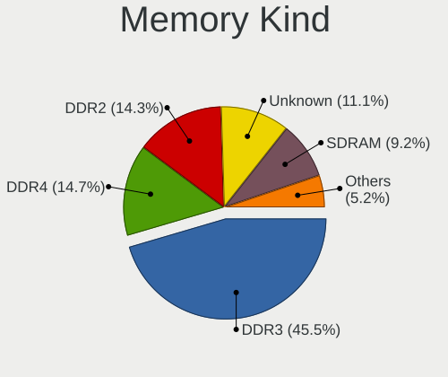

| Kind    | Computers | Percent |
|---------|-----------|---------|
| DDR3    | 13471     | 45.46%  |
| DDR4    | 4364      | 14.73%  |
| DDR2    | 4245      | 14.33%  |
| Unknown | 3303      | 11.15%  |
| SDRAM   | 2720      | 9.18%   |
| DDR     | 780       | 2.63%   |
| LPDDR4  | 262       | 0.88%   |
| DRAM    | 220       | 0.74%   |
| DDR5    | 156       | 0.53%   |
| LPDDR5  | 65        | 0.22%   |
| LPDDR3  | 41        | 0.14%   |
| EEPROM  | 3         | 0.01%   |
| SRAM    | 1         | 0.003%  |
| RAM     | 1         | 0.003%  |

Memory Form Factor
------------------

Physical design of the memory module

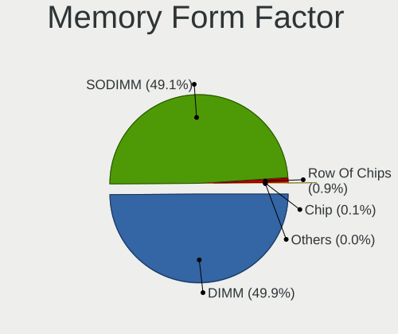

| Name         | Computers | Percent |
|--------------|-----------|---------|
| DIMM         | 14337     | 49.89%  |
| SODIMM       | 14097     | 49.06%  |
| Row Of Chips | 246       | 0.86%   |
| Chip         | 31        | 0.11%   |
| FB-DIMM      | 12        | 0.04%   |
| Unknown      | 11        | 0.04%   |
| RIMM         | 1         | 0.003%  |

Memory Size
-----------

Memory module size

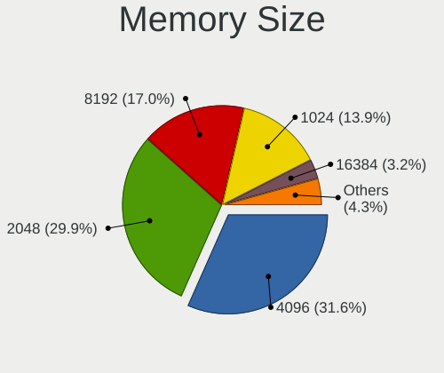

| Size    | Computers | Percent |
|---------|-----------|---------|
| 4096    | 10827     | 31.65%  |
| 2048    | 10243     | 29.94%  |
| 8192    | 5809      | 16.98%  |
| 1024    | 4766      | 13.93%  |
| 16384   | 1083      | 3.17%   |
| 512     | 989       | 2.89%   |
| 32768   | 248       | 0.72%   |
| 256     | 199       | 0.58%   |
| Unknown | 11        | 0.03%   |
| 3072    | 8         | 0.02%   |
| 128     | 6         | 0.02%   |
| 65536   | 4         | 0.01%   |
| 1536    | 4         | 0.01%   |
| 32      | 4         | 0.01%   |
| 49152   | 3         | 0.01%   |
| 16      | 3         | 0.01%   |
| 1       | 3         | 0.01%   |
| 32767   | 1         | 0.003%  |
| 12288   | 1         | 0.003%  |
| 11825   | 1         | 0.003%  |

Memory Speed
------------

Memory module speed

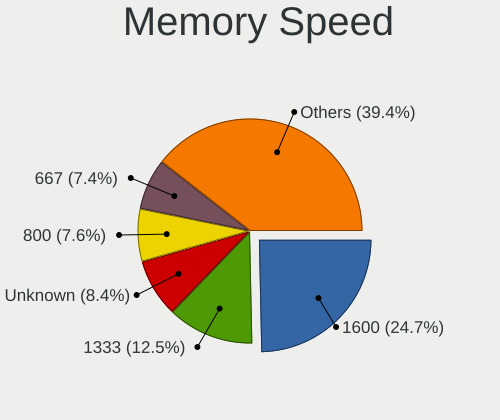

| Speed   | Computers | Percent |
|---------|-----------|---------|
| 1600    | 7996      | 24.67%  |
| 1333    | 4060      | 12.53%  |
| Unknown | 2726      | 8.41%   |
| 800     | 2461      | 7.59%   |
| 667     | 2386      | 7.36%   |
| 1334    | 1848      | 5.7%    |
| 3200    | 1456      | 4.49%   |
| 2400    | 1203      | 3.71%   |
| 2667    | 1122      | 3.46%   |
| 2133    | 699       | 2.16%   |
| 1067    | 577       | 1.78%   |
| 4199    | 567       | 1.75%   |
| 533     | 551       | 1.7%    |
| 400     | 537       | 1.66%   |
| 1066    | 459       | 1.42%   |
| 1867    | 325       | 1%      |
| 333     | 322       | 0.99%   |
| 2048    | 271       | 0.84%   |
| 1866    | 268       | 0.83%   |
| 3600    | 252       | 0.78%   |
| 1800    | 176       | 0.54%   |
| 975     | 141       | 0.44%   |
| 3266    | 137       | 0.42%   |
| 3400    | 132       | 0.41%   |
| 266     | 110       | 0.34%   |
| 2666    | 108       | 0.33%   |
| 1639    | 103       | 0.32%   |
| 3733    | 92        | 0.28%   |
| 3000    | 82        | 0.25%   |
| 2933    | 69        | 0.21%   |
| 4800    | 60        | 0.19%   |
| 3466    | 56        | 0.17%   |
| 5600    | 52        | 0.16%   |
| 66      | 50        | 0.15%   |
| 2000    | 48        | 0.15%   |
| 6400    | 47        | 0.15%   |
| 2800    | 45        | 0.14%   |
| 1648    | 44        | 0.14%   |
| 4267    | 43        | 0.13%   |
| 3333    | 42        | 0.13%   |

Printers & scanners
-------------------

Printer Vendor
--------------

Printer device vendors

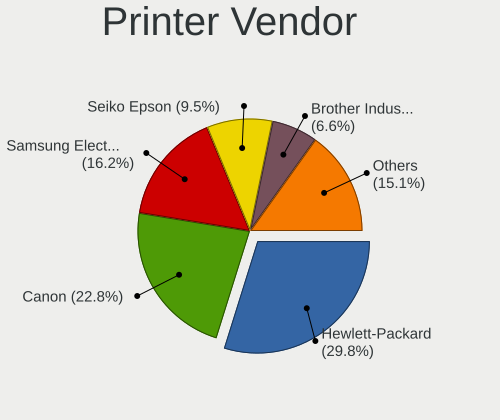

| Vendor                          | Computers | Percent |
|---------------------------------|-----------|---------|
| Hewlett-Packard                 | 566       | 29.82%  |
| Canon                           | 432       | 22.76%  |
| Samsung Electronics             | 307       | 16.17%  |
| Seiko Epson                     | 180       | 9.48%   |
| Brother Industries              | 126       | 6.64%   |
| Xerox                           | 65        | 3.42%   |
| Pantum                          | 48        | 2.53%   |
| Panasonic (Matsushita)          | 41        | 2.16%   |
| Kyocera                         | 33        | 1.74%   |
| Ricoh                           | 23        | 1.21%   |
| Prolific Technology             | 13        | 0.68%   |
| Lexmark International           | 12        | 0.63%   |
| QinHeng Electronics             | 8         | 0.42%   |
| Xiaomi                          | 4         | 0.21%   |
| TSC Auto ID Technology          | 4         | 0.21%   |
| WinChipHead                     | 3         | 0.16%   |
| Sharp                           | 3         | 0.16%   |
| Konica Minolta                  | 3         | 0.16%   |
| Custom Engineering SPA          | 3         | 0.16%   |
| STMicroelectronics              | 2         | 0.11%   |
| HIPER                           | 2         | 0.11%   |
| Dell                            | 2         | 0.11%   |
| cab Produkttechnik GmbH & Co KG | 2         | 0.11%   |
| Zebra                           | 1         | 0.05%   |
| Yurex                           | 1         | 0.05%   |
| Toshiba TEC                     | 1         | 0.05%   |
| Samsung Info. Systems America   | 1         | 0.05%   |
| Oki Data                        | 1         | 0.05%   |
| NXP Semiconductors              | 1         | 0.05%   |
| NCR                             | 1         | 0.05%   |
| MiiiW                           | 1         | 0.05%   |
| KODAK                           | 1         | 0.05%   |
| Katusha"                        | 1         | 0.05%   |
| Index Braille AB                | 1         | 0.05%   |
| iDPRT                           | 1         | 0.05%   |
| Fuji Xerox                      | 1         | 0.05%   |
| Avision                         | 1         | 0.05%   |
| ATEN International              | 1         | 0.05%   |
| Apple                           | 1         | 0.05%   |

Printer Model
-------------

Printer device models

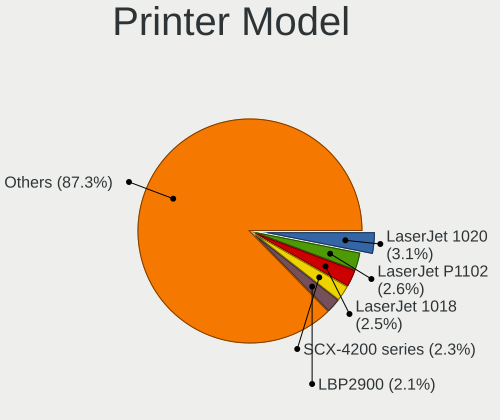

| Model                                                        | Computers | Percent |
|--------------------------------------------------------------|-----------|---------|
| HP LaserJet 1020                                             | 60        | 3.1%    |
| HP LaserJet P1102                                            | 50        | 2.59%   |
| HP LaserJet 1018                                             | 49        | 2.53%   |
| Samsung SCX-4200 series                                      | 45        | 2.33%   |
| Canon LBP2900                                                | 41        | 2.12%   |
| Seiko Epson Printer                                          | 36        | 1.86%   |
| HP LaserJet P1005                                            | 26        | 1.35%   |
| HP LaserJet 1010                                             | 26        | 1.35%   |
| Samsung SCX-3400 Series                                      | 25        | 1.29%   |
| Panasonic (Matsushita) KX-MB1500RU                           | 25        | 1.29%   |
| Canon MF4410                                                 | 25        | 1.29%   |
| Canon MF3010                                                 | 25        | 1.29%   |
| Seiko Epson USB2.0 Printer (Hi-speed)                        | 24        | 1.24%   |
| Samsung SCX-3200 Series                                      | 24        | 1.24%   |
| Canon MF4010 series                                          | 22        | 1.14%   |
| Seiko Epson L210 Series                                      | 20        | 1.03%   |
| Canon CAPT USB Device                                        | 18        | 0.93%   |
| Samsung ML-1640 Series Laser Printer                         | 17        | 0.88%   |
| Samsung M2070 Series                                         | 17        | 0.88%   |
| Canon LBP3010/LBP3018/LBP3050                                | 17        | 0.88%   |
| Canon PIXMA MG2500 Series                                    | 16        | 0.83%   |
| Canon LBP6000                                                | 16        | 0.83%   |
| Brother DCP-7057 scanner/printer                             | 16        | 0.83%   |
| Samsung ML-1210 Printer                                      | 15        | 0.78%   |
| Samsung M2020 Series                                         | 15        | 0.78%   |
| HP DeskJet 2130 series                                       | 15        | 0.78%   |
| Canon LBP810                                                 | 15        | 0.78%   |
| Samsung ML-2010P Mono Laser Printer                          | 14        | 0.72%   |
| HP LaserJet 1320                                             | 14        | 0.72%   |
| HP Deskjet 2050 J510                                         | 14        | 0.72%   |
| Canon LaserShot LBP-1120 Printer                             | 14        | 0.72%   |
| Canon iP7200 series                                          | 14        | 0.72%   |
| Xerox Phaser 3140 and 3155                                   | 13        | 0.67%   |
| Prolific PL2305 Parallel Port                                | 13        | 0.67%   |
| Panasonic (Matsushita) KX-MB2030 Multifunction Laser Printer | 13        | 0.67%   |
| HP LaserJet 1200                                             | 13        | 0.67%   |
| Canon MG2400 series                                          | 13        | 0.67%   |
| Brother HL-2030 Laser Printer                                | 13        | 0.67%   |
| Pantum M6500 series                                          | 12        | 0.62%   |
| Brother HL-1110 series                                       | 12        | 0.62%   |

Scanner Vendor
--------------

Scanner device vendors

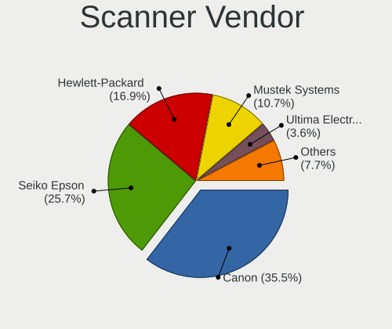

| Vendor                      | Computers | Percent |
|-----------------------------|-----------|---------|
| Canon                       | 189       | 35.46%  |
| Seiko Epson                 | 137       | 25.7%   |
| Hewlett-Packard             | 90        | 16.89%  |
| Mustek Systems              | 57        | 10.69%  |
| Ultima Electronics          | 19        | 3.56%   |
| Acer Peripherals (now BenQ) | 19        | 3.56%   |
| KYE Systems (Mouse Systems) | 7         | 1.31%   |
| Fujitsu                     | 4         | 0.75%   |
| Plustek                     | 2         | 0.38%   |
| Microtek International      | 2         | 0.38%   |
| Avision                     | 2         | 0.38%   |
| AGFA-Gevaert NV             | 2         | 0.38%   |
| Visioneer                   | 1         | 0.19%   |
| Papillon Systems            | 1         | 0.19%   |
| Canon Electronics           | 1         | 0.19%   |

Scanner Model
-------------

Scanner device models

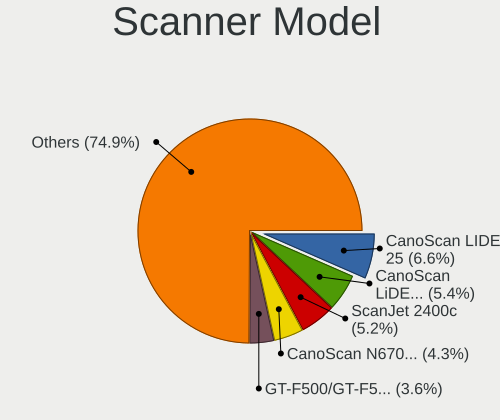

| Model                                                                                 | Computers | Percent |
|---------------------------------------------------------------------------------------|-----------|---------|
| Canon CanoScan LIDE 25                                                                | 35        | 6.55%   |
| Canon CanoScan LiDE 110                                                               | 29        | 5.43%   |
| HP ScanJet 2400c                                                                      | 28        | 5.24%   |
| Canon CanoScan N670U/N676U/LiDE 20                                                    | 23        | 4.31%   |
| Seiko Epson GT-F500/GT-F550 [Perfection 2480/2580 PHOTO]                              | 19        | 3.56%   |
| Canon CanoScan LiDE 120                                                               | 19        | 3.56%   |
| Mustek Systems BearPaw 1200 CU Plus                                                   | 18        | 3.37%   |
| Ultima Artec Ultima 2000 (GT6801 based)/Lifetec LT9385/ScanMagic 1200 UB Plus Scanner | 17        | 3.18%   |
| Seiko Epson GT-F650 [GT-S600/Perfection V10/V100]                                     | 17        | 3.18%   |
| Seiko Epson GT-F730 [GT-S630/Perfection V33/V330 Photo]                               | 14        | 2.62%   |
| Canon CanoScan LiDE 60                                                                | 14        | 2.62%   |
| Canon CanoScan LiDE 210                                                               | 14        | 2.62%   |
| Seiko Epson GT-7400U [Perfection 1270]                                                | 12        | 2.25%   |
| Seiko Epson GT-F520/GT-F570 [Perfection 3590 PHOTO]                                   | 10        | 1.87%   |
| Canon CanoScan LiDE 100                                                               | 10        | 1.87%   |
| Seiko Epson Perfection V37/V370                                                       | 9         | 1.69%   |
| Mustek Systems SNAPSCAN e22                                                           | 9         | 1.69%   |
| Mustek Systems BearPaw 2400 CU Plus                                                   | 9         | 1.69%   |
| Canon CanoScan LiDE 220                                                               | 9         | 1.69%   |
| Seiko Epson GT-8400UF [Perfection 1670/1670 PHOTO]                                    | 8         | 1.5%    |
| Seiko Epson GT-F670 [Perfection V200 Photo]                                           | 7         | 1.31%   |
| Seiko Epson Perfection 660                                                            | 6         | 1.12%   |
| Canon CanoScan                                                                        | 6         | 1.12%   |
| Mustek Systems BearPaw 2448 TA Plus                                                   | 5         | 0.94%   |
| HP Scanjet 200                                                                        | 5         | 0.94%   |
| Acer Peripherals (now BenQ) Benq 5560                                                 | 5         | 0.94%   |
| Seiko Epson GT-7200U [Perfection 1250/1250 PHOTO]                                     | 4         | 0.75%   |
| Mustek Systems BearPaw 2448 CU Pro                                                    | 4         | 0.75%   |
| HP ScanJet 3800c                                                                      | 4         | 0.75%   |
| HP ScanJet 3770                                                                       | 4         | 0.75%   |
| HP HP Scanjet 300                                                                     | 4         | 0.75%   |
| Canon CanoScan LiDE 70                                                                | 4         | 0.75%   |
| Canon CanoScan LiDE 50/LiDE 35/LiDE 40                                                | 4         | 0.75%   |
| Seiko Epson GT-X800 [Perfection 4990 PHOTO]                                           | 3         | 0.56%   |
| Seiko Epson GT-X750 [Perfection 4490 Photo]                                           | 3         | 0.56%   |
| Seiko Epson GT-7300U [Perfection 1260/1260 PHOTO]                                     | 3         | 0.56%   |
| Mustek Systems BearPaw 2400 TA Plus                                                   | 3         | 0.56%   |
| HP ScanJet G3010                                                                      | 3         | 0.56%   |
| HP ScanJet 3970c                                                                      | 3         | 0.56%   |
| HP ScanJet 3500c                                                                      | 3         | 0.56%   |

Camera
------

Camera Vendor
-------------

Camera device vendors

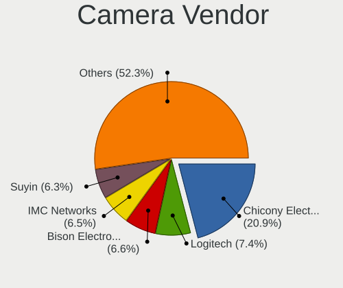

| Vendor                                 | Computers | Percent |
|----------------------------------------|-----------|---------|
| Chicony Electronics                    | 3397      | 20.95%  |
| Logitech                               | 1208      | 7.45%   |
| Bison Electronics                      | 1069      | 6.59%   |
| IMC Networks                           | 1048      | 6.46%   |
| Suyin                                  | 1018      | 6.28%   |
| Realtek Semiconductor                  | 963       | 5.94%   |
| Microdia                               | 930       | 5.73%   |
| Z-Star Microelectronics                | 896       | 5.52%   |
| Sunplus Innovation Technology          | 756       | 4.66%   |
| Silicon Motion                         | 652       | 4.02%   |
| Alcor Micro                            | 419       | 2.58%   |
| Syntek                                 | 381       | 2.35%   |
| Cheng Uei Precision Industry (Foxlink) | 381       | 2.35%   |
| Quanta                                 | 281       | 1.73%   |
| Apple                                  | 187       | 1.15%   |
| Microsoft                              | 177       | 1.09%   |
| ALi                                    | 176       | 1.09%   |
| Ricoh                                  | 174       | 1.07%   |
| Acer                                   | 174       | 1.07%   |
| KYE Systems (Mouse Systems)            | 135       | 0.83%   |
| DigiTech                               | 133       | 0.82%   |
| Cubeternet                             | 110       | 0.68%   |
| Pixart Imaging                         | 108       | 0.67%   |
| Arkmicro Technologies                  | 107       | 0.66%   |
| Aveo Technology                        | 100       | 0.62%   |
| GEMBIRD                                | 99        | 0.61%   |
| Lite-On Technology                     | 94        | 0.58%   |
| Samsung Electronics                    | 91        | 0.56%   |
| Lenovo                                 | 73        | 0.45%   |
| Importek                               | 58        | 0.36%   |
| Primax Electronics                     | 56        | 0.35%   |
| Luxvisions Innotech Limited            | 54        | 0.33%   |
| Sonix Technology                       | 50        | 0.31%   |
| Creative Technology                    | 48        | 0.3%    |
| Unknown                                | 38        | 0.23%   |
| SunplusIT                              | 35        | 0.22%   |
| Genesys Logic                          | 35        | 0.22%   |
| OmniVision Technologies                | 26        | 0.16%   |
| Sunplus Technology                     | 24        | 0.15%   |
| Guillemot                              | 23        | 0.14%   |

Camera Model
------------

Camera device models

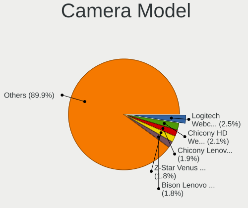

| Model                                    | Computers | Percent |
|------------------------------------------|-----------|---------|
| Logitech Webcam C270                     | 405       | 2.49%   |
| Chicony HD Webcam                        | 335       | 2.06%   |
| Chicony Lenovo EasyCamera                | 304       | 1.87%   |
| Z-Star Venus USB2.0 Camera               | 299       | 1.84%   |
| Bison Lenovo Integrated Webcam           | 293       | 1.8%    |
| IMC Networks UVC VGA Webcam              | 230       | 1.42%   |
| Bison Lenovo EasyCamera                  | 214       | 1.32%   |
| Realtek USB Camera                       | 211       | 1.3%    |
| Sunplus HD WebCam                        | 209       | 1.29%   |
| Chicony USB 2.0 Camera                   | 192       | 1.18%   |
| Chicony USB2.0 HD UVC WebCam             | 174       | 1.07%   |
| Z-Star A4 TECH USB 2.0 Camera J          | 170       | 1.05%   |
| Chicony Integrated Camera                | 165       | 1.02%   |
| Microdia Camera                          | 164       | 1.01%   |
| Suyin Acer/HP Integrated Webcam [CN0314] | 129       | 0.79%   |
| Chicony 2.0M UVC Webcam / CNF7129        | 128       | 0.79%   |
| Realtek Lenovo EasyCamera                | 126       | 0.78%   |
| Silicon Motion WebCam SC-0311139N        | 125       | 0.77%   |
| Microdia Sonix USB 2.0 Camera            | 125       | 0.77%   |
| Alcor Micro Asus Integrated Webcam       | 123       | 0.76%   |
| Z-Star A4 TECH USB2.0 PC Camera E        | 122       | 0.75%   |
| Syntek Lenovo EasyCamera                 | 119       | 0.73%   |
| ALi Gateway Webcam                       | 117       | 0.72%   |
| IMC Networks Integrated Webcam           | 114       | 0.7%    |
| Chicony USB2.0 VGA UVC WebCam            | 112       | 0.69%   |
| DigiTech USB 2.0 PC Camera               | 111       | 0.68%   |
| IMC Networks USB2.0 VGA UVC WebCam       | 108       | 0.66%   |
| Suyin 1.3M HD WebCam                     | 103       | 0.63%   |
| Sunplus Asus Webcam                      | 103       | 0.63%   |
| Chicony HP Truevision HD                 | 100       | 0.62%   |
| Logitech Webcam C170                     | 99        | 0.61%   |
| Chicony VGA WebCam                       | 99        | 0.61%   |
| Bison BisonCam, NB Pro                   | 98        | 0.6%    |
| Arkmicro USB2.0 PC CAMERA                | 97        | 0.6%    |
| Chicony HP Webcam                        | 96        | 0.59%   |
| Logitech Webcam C310                     | 94        | 0.58%   |
| Chicony USB2.0 0.3M UVC WebCam           | 91        | 0.56%   |
| Microdia USB 2.0 Camera                  | 88        | 0.54%   |
| Logitech Webcam C210                     | 88        | 0.54%   |
| Suyin Acer CrystalEye Webcam             | 86        | 0.53%   |

Security
--------

Fingerprint Vendor
------------------

Fingerprint sensor vendors

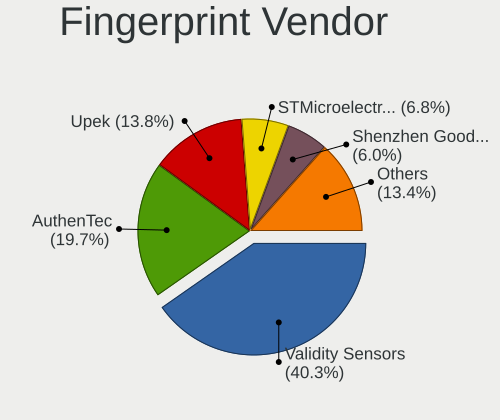

| Vendor                             | Computers | Percent |
|------------------------------------|-----------|---------|
| Validity Sensors                   | 492       | 40.29%  |
| AuthenTec                          | 241       | 19.74%  |
| Upek                               | 168       | 13.76%  |
| STMicroelectronics                 | 83        | 6.8%    |
| Shenzhen Goodix Technology         | 73        | 5.98%   |
| LighTuning Technology              | 71        | 5.81%   |
| Synaptics                          | 32        | 2.62%   |
| Elan Microelectronics              | 28        | 2.29%   |
| HOLTEK                             | 12        | 0.98%   |
| Focal-systems.Corp                 | 10        | 0.82%   |
| Realtek USB2.0 Finger Print Bridge | 4         | 0.33%   |
| GDMicroelectronics                 | 4         | 0.33%   |
| Microsoft                          | 2         | 0.16%   |
| DigitalPersona                     | 1         | 0.08%   |

Fingerprint Model
-----------------

Fingerprint sensor models

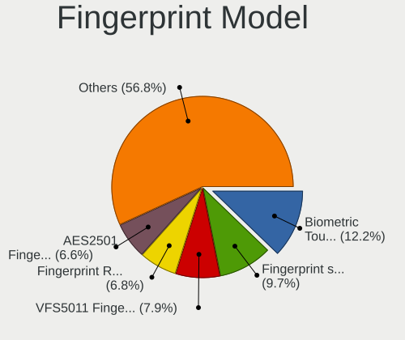

| Model                                                                      | Computers | Percent |
|----------------------------------------------------------------------------|-----------|---------|
| Upek Biometric Touchchip/Touchstrip Fingerprint Sensor                     | 149       | 12.2%   |
| Validity Sensors Fingerprint scanner                                       | 118       | 9.66%   |
| Validity Sensors VFS5011 Fingerprint Reader                                | 97        | 7.94%   |
| STMicroelectronics Fingerprint Reader                                      | 83        | 6.8%    |
| AuthenTec AES2501 Fingerprint Sensor                                       | 80        | 6.55%   |
| Shenzhen Goodix  Fingerprint Device                                        | 69        | 5.65%   |
| AuthenTec AES1600                                                          | 69        | 5.65%   |
| Validity Sensors VFS495 Fingerprint Reader                                 | 58        | 4.75%   |
| AuthenTec AES2810                                                          | 56        | 4.59%   |
| Validity Sensors VFS451 Fingerprint Reader                                 | 45        | 3.69%   |
| LighTuning Fingerprint Reader                                              | 45        | 3.69%   |
| Validity Sensors VFS491                                                    | 36        | 2.95%   |
| Validity Sensors VFS301 Fingerprint Reader                                 | 34        | 2.78%   |
| Validity Sensors VFS471 Fingerprint Reader                                 | 29        | 2.38%   |
| Validity Sensors VFS101 Fingerprint Reader                                 | 28        | 2.29%   |
| Elan ELAN:Fingerprint                                                      | 22        | 1.8%    |
| AuthenTec AES1660 Fingerprint Sensor                                       | 21        | 1.72%   |
| Upek TCS5B Fingerprint sensor                                              | 19        | 1.56%   |
| LighTuning ES603 Swipe Fingerprint Sensor                                  | 19        | 1.56%   |
| Validity Sensors VFS 5011 fingerprint sensor                               | 13        | 1.06%   |
| Validity Sensors Swipe Fingerprint Sensor                                  | 13        | 1.06%   |
| HOLTEK FocalTech Fingerprint Device                                        | 12        | 0.98%   |
| Focal-systems.Corp FT9201Fingerprint.                                      | 10        | 0.82%   |
| AuthenTec Fingerprint Sensor                                               | 7         | 0.57%   |
| AuthenTec AES2550 Fingerprint Sensor                                       | 7         | 0.57%   |
| Validity Sensors VFS Fingerprint sensor                                    | 6         | 0.49%   |
| Synaptics  WBDI                                                            | 6         | 0.49%   |
| Synaptics Metallica MIS Touch Fingerprint Reader                           | 6         | 0.49%   |
| LighTuning EgisTec Touch Fingerprint Sensor                                | 6         | 0.49%   |
| Synaptics Prometheus MIS Touch Fingerprint Reader                          | 5         | 0.41%   |
| Elan ELAN:ARM-M4                                                           | 5         | 0.41%   |
| Validity Sensors VFS300 Fingerprint Reader                                 | 4         | 0.33%   |
| Validity Sensors Synaptics WBDI                                            | 4         | 0.33%   |
| Shenzhen Goodix Fingerprint Reader                                         | 4         | 0.33%   |
| Realtek USB2.0 Finger Print Bridge FocalTech Fingerprint Device            | 4         | 0.33%   |
| GDMicroelectronics Touch Fingerprint Sensor                                | 4         | 0.33%   |
| Validity Sensors Synaptics VFS7552 Touch Fingerprint Sensor with PurePrint | 3         | 0.25%   |
| Synaptics Fingerprint reader [HP G6]                                       | 3         | 0.25%   |
| Validity Sensors VFS7500 Touch Fingerprint Sensor                          | 2         | 0.16%   |
| Validity Sensors Synaptics VFS7552 Touch Fingerprint Sensor                | 2         | 0.16%   |

Chipcard Vendor
---------------

Chipcard module vendors

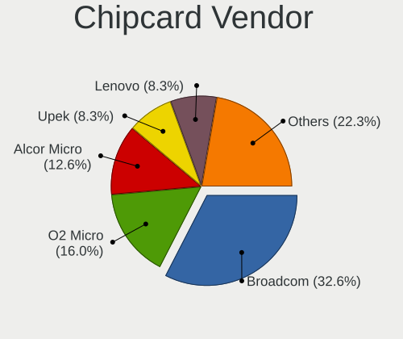

| Vendor                                  | Computers | Percent |
|-----------------------------------------|-----------|---------|
| Broadcom                                | 114       | 32.57%  |
| O2 Micro                                | 56        | 16%     |
| Alcor Micro                             | 44        | 12.57%  |
| Upek                                    | 29        | 8.29%   |
| Lenovo                                  | 29        | 8.29%   |
| Aktiv                                   | 15        | 4.29%   |
| Aladdin Knowledge Systems               | 14        | 4%      |
| Advanced Card Systems                   | 11        | 3.14%   |
| OmniKey                                 | 8         | 2.29%   |
| Realtek Semiconductor                   | 5         | 1.43%   |
| Gemalto (was Gemplus)                   | 5         | 1.43%   |
| Athena Smartcard Solutions              | 4         | 1.14%   |
| Aladdin R.D.                            | 3         | 0.86%   |
| Chicony Electronics                     | 2         | 0.57%   |
| Castles Technology                      | 2         | 0.57%   |
| Avtor                                   | 2         | 0.57%   |
| Reiner SCT Kartensysteme                | 1         | 0.29%   |
| In Focus Systems                        | 1         | 0.29%   |
| Future Technology Devices International | 1         | 0.29%   |
| Fujitsu Siemens Computers               | 1         | 0.29%   |
| Feitian Technologies                    | 1         | 0.29%   |
| Cherry                                  | 1         | 0.29%   |
| BIFIT                                   | 1         | 0.29%   |

Chipcard Model
--------------

Chipcard module models

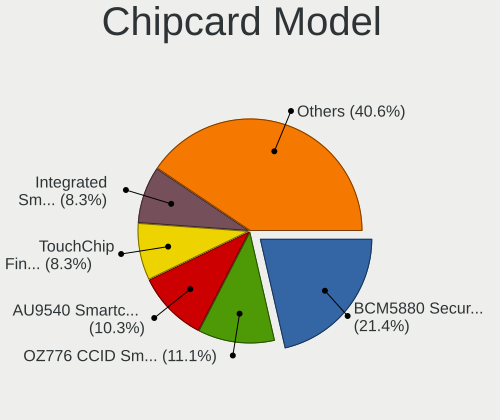

| Model                                                                        | Computers | Percent |
|------------------------------------------------------------------------------|-----------|---------|
| Broadcom BCM5880 Secure Applications Processor                               | 75        | 21.43%  |
| O2 Micro OZ776 CCID Smartcard Reader                                         | 39        | 11.14%  |
| Alcor Micro AU9540 Smartcard Reader                                          | 36        | 10.29%  |
| Upek TouchChip Fingerprint Coprocessor (WBF advanced mode)                   | 29        | 8.29%   |
| Lenovo Integrated Smart Card Reader                                          | 29        | 8.29%   |
| Broadcom BCM5880 Secure Applications Processor with fingerprint swipe sensor | 27        | 7.71%   |
| O2 Micro Oz776 SmartCard Reader                                              | 17        | 4.86%   |
| Aladdin Knowledge Systems Token JC                                           | 14        | 4%      |
| Aktiv Rutoken lite                                                           | 13        | 3.71%   |
| Broadcom 5880                                                                | 9         | 2.57%   |
| Alcor Micro Watchdata W 1981                                                 | 8         | 2.29%   |
| OmniKey CardMan 1021                                                         | 6         | 1.71%   |
| Realtek Semiconductor Smart Card Reader Interface                            | 5         | 1.43%   |
| Athena Smartcard Solutions ASEDrive V3C                                      | 4         | 1.14%   |
| Advanced Card Systems ACR38 SmartCard Reader                                 | 4         | 1.14%   |
| Gemalto (was Gemplus) Compact Smart Card Reader Writer                       | 3         | 0.86%   |
| Aladdin R.D. JaCarta                                                         | 3         | 0.86%   |
| Advanced Card Systems Token USB 64K                                          | 3         | 0.86%   |
| Gemalto (was Gemplus) GemPC Key SmartCard Reader                             | 2         | 0.57%   |
| Chicony Electronics HP Skylab USB Smartcard Keyboard                         | 2         | 0.57%   |
| Castles Technology EZCCID Smart Card Reader                                  | 2         | 0.57%   |
| Broadcom 58200                                                               | 2         | 0.57%   |
| Avtor SecureToken                                                            | 2         | 0.57%   |
| Advanced Card Systems ACR3901U                                               | 2         | 0.57%   |
| Reiner SCT Kartensysteme cyberJack RFID basis contactless smartcard reader   | 1         | 0.29%   |
| OmniKey CardMan 4321                                                         | 1         | 0.29%   |
| OmniKey CardMan 3021 / 3121                                                  | 1         | 0.29%   |
| In Focus Systems EMV Smartcard Reader                                        | 1         | 0.29%   |
| Future Technology Devices International Parsec Desktop Reader PR-EH08        | 1         | 0.29%   |
| Fujitsu Siemens Computers SmartCard Reader 2A                                | 1         | 0.29%   |
| Feitian Technologies SCR301                                                  | 1         | 0.29%   |
| Cherry SmartCard Reader Keyboard KC 1000 SC                                  | 1         | 0.29%   |
| Broadcom BCM58200 ControlVault 3 (FingerPrint sensor + Contacted SmartCard)  | 1         | 0.29%   |
| BIFIT iBank2Key                                                              | 1         | 0.29%   |
| Aktiv Reader                                                                 | 1         | 0.29%   |
| Aktiv KAZTOKEN                                                               | 1         | 0.29%   |
| Advanced Card Systems ACR39U                                                 | 1         | 0.29%   |
| Advanced Card Systems ACR1281 1S Dual Reader                                 | 1         | 0.29%   |

Unsupported
-----------

Unsupported Devices
-------------------

Total unsupported devices on board

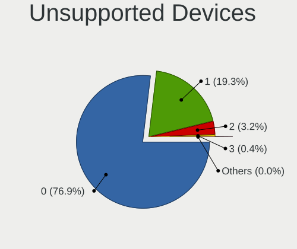

| Total | Computers | Percent |
|-------|-----------|---------|
| 0     | 23935     | 76.87%  |
| 1     | 6010      | 19.3%   |
| 2     | 1010      | 3.24%   |
| 3     | 138       | 0.44%   |
| 4     | 35        | 0.11%   |
| 5     | 5         | 0.02%   |
| 9     | 1         | 0.003%  |
| 8     | 1         | 0.003%  |
| 7     | 1         | 0.003%  |

Unsupported Device Types
------------------------

Types of unsupported devices

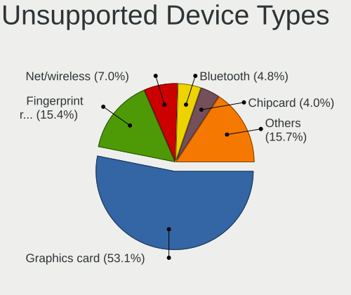

| Type                     | Computers | Percent |
|--------------------------|-----------|---------|
| Graphics card            | 4212      | 53.12%  |
| Fingerprint reader       | 1219      | 15.37%  |
| Net/wireless             | 554       | 6.99%   |
| Bluetooth                | 380       | 4.79%   |
| Chipcard                 | 319       | 4.02%   |
| Communication controller | 275       | 3.47%   |
| Multimedia controller    | 259       | 3.27%   |
| Camera                   | 153       | 1.93%   |
| Storage                  | 136       | 1.72%   |
| Unassigned class         | 116       | 1.46%   |
| Flash memory             | 107       | 1.35%   |
| Sound                    | 41        | 0.52%   |
| Modem                    | 30        | 0.38%   |
| Net/ethernet             | 29        | 0.37%   |
| Dvb card                 | 28        | 0.35%   |
| Card reader              | 28        | 0.35%   |
| Network                  | 14        | 0.18%   |
| Tv card                  | 10        | 0.13%   |
| Storage/raid             | 8         | 0.1%    |
| Video                    | 5         | 0.06%   |
| Storage/ata              | 4         | 0.05%   |
| Wireless                 | 1         | 0.01%   |
| Storage/ide              | 1         | 0.01%   |

