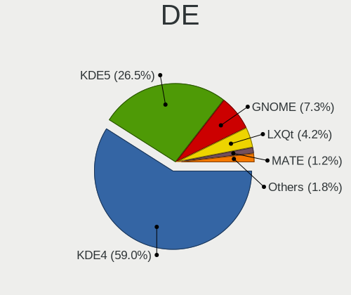
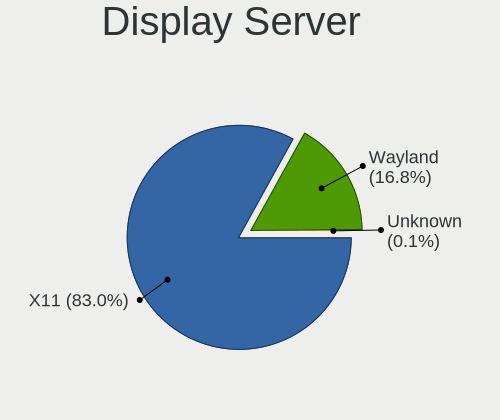
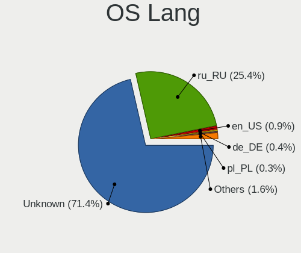
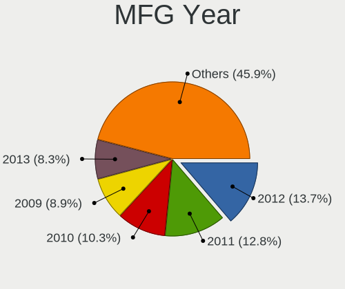
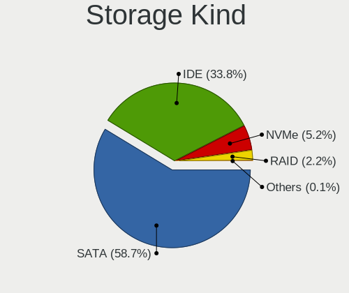
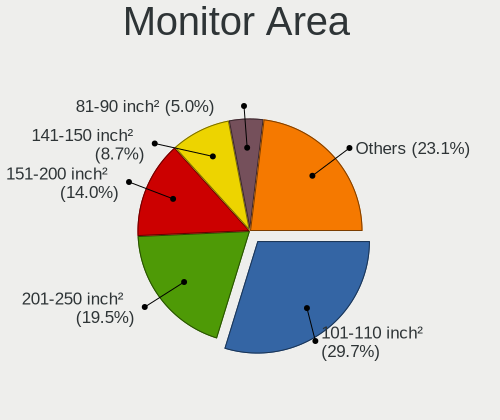
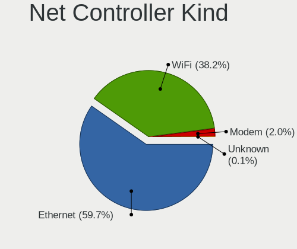

ROSA - Tested Hardware & Statistics
-----------------------------------

A project to collect tested hardware configurations for ROSA.

Anyone can contribute to this report by the [hw-probe](https://github.com/linuxhw/hw-probe) tool:

    sudo -E hw-probe -all -upload

Please contribute! Especially if your hardware is rare.

This is a report for all computer types. See also reports for [desktops](/Dist/ROSA/Desktop/README.md) and [notebooks](/Dist/ROSA/Notebook/README.md).

Contents
--------

* [ Test Cases ](#test-cases)

* [ System ](#system)
  - [ OS                       ](#os)
  - [ OS Family                ](#os-family)
  - [ Kernel                   ](#kernel)
  - [ Kernel Family            ](#kernel-family)
  - [ Kernel Major Ver.        ](#kernel-major-ver)
  - [ Arch                     ](#arch)
  - [ DE                       ](#de)
  - [ Display Server           ](#display-server)
  - [ Display Manager          ](#display-manager)
  - [ OS Lang                  ](#os-lang)
  - [ Boot Mode                ](#boot-mode)
  - [ Filesystem               ](#filesystem)
  - [ Part. scheme             ](#part-scheme)
  - [ Dual Boot with Linux/BSD ](#dual-boot-with-linuxbsd)
  - [ Dual Boot (Win)          ](#dual-boot-win)

* [ Board ](#board)
  - [ Vendor                   ](#vendor)
  - [ Model                    ](#model)
  - [ Model Family             ](#model-family)
  - [ MFG Year                 ](#mfg-year)
  - [ Form Factor              ](#form-factor)
  - [ Secure Boot              ](#secure-boot)
  - [ Coreboot                 ](#coreboot)
  - [ RAM Size                 ](#ram-size)
  - [ RAM Used                 ](#ram-used)
  - [ Total Drives             ](#total-drives)
  - [ Has CD-ROM               ](#has-cd-rom)
  - [ Has Ethernet             ](#has-ethernet)
  - [ Has WiFi                 ](#has-wifi)
  - [ Has Bluetooth            ](#has-bluetooth)

* [ Location ](#location)
  - [ Country                  ](#country)
  - [ City                     ](#city)

* [ Drives ](#drives)
  - [ Drive Vendor             ](#drive-vendor)
  - [ Drive Model              ](#drive-model)
  - [ HDD Vendor               ](#hdd-vendor)
  - [ SSD Vendor               ](#ssd-vendor)
  - [ Drive Kind               ](#drive-kind)
  - [ Drive Connector          ](#drive-connector)
  - [ Drive Size               ](#drive-size)
  - [ Space Total              ](#space-total)
  - [ Space Used               ](#space-used)
  - [ Malfunc. Drives          ](#malfunc-drives)
  - [ Malfunc. Drive Vendor    ](#malfunc-drive-vendor)
  - [ Malfunc. HDD Vendor      ](#malfunc-hdd-vendor)
  - [ Malfunc. Drive Kind      ](#malfunc-drive-kind)
  - [ Failed Drives            ](#failed-drives)
  - [ Failed Drive Vendor      ](#failed-drive-vendor)
  - [ Drive Status             ](#drive-status)

* [ Storage controller ](#storage-controller)
  - [ Storage Vendor           ](#storage-vendor)
  - [ Storage Model            ](#storage-model)
  - [ Storage Kind             ](#storage-kind)

* [ Processor ](#processor)
  - [ CPU Vendor               ](#cpu-vendor)
  - [ CPU Model                ](#cpu-model)
  - [ CPU Model Family         ](#cpu-model-family)
  - [ CPU Cores                ](#cpu-cores)
  - [ CPU Sockets              ](#cpu-sockets)
  - [ CPU Threads              ](#cpu-threads)
  - [ CPU Op-Modes             ](#cpu-op-modes)
  - [ CPU Microcode            ](#cpu-microcode)
  - [ CPU Microarch            ](#cpu-microarch)

* [ Graphics ](#graphics)
  - [ GPU Vendor               ](#gpu-vendor)
  - [ GPU Model                ](#gpu-model)
  - [ GPU Combo                ](#gpu-combo)
  - [ GPU Driver               ](#gpu-driver)
  - [ GPU Memory               ](#gpu-memory)

* [ Monitor ](#monitor)
  - [ Monitor Vendor           ](#monitor-vendor)
  - [ Monitor Model            ](#monitor-model)
  - [ Monitor Resolution       ](#monitor-resolution)
  - [ Monitor Diagonal         ](#monitor-diagonal)
  - [ Monitor Width            ](#monitor-width)
  - [ Aspect Ratio             ](#aspect-ratio)
  - [ Monitor Area             ](#monitor-area)
  - [ Pixel Density            ](#pixel-density)
  - [ Multiple Monitors        ](#multiple-monitors)

* [ Network ](#network)
  - [ Net Controller Vendor    ](#net-controller-vendor)
  - [ Net Controller Model     ](#net-controller-model)
  - [ Wireless Vendor          ](#wireless-vendor)
  - [ Wireless Model           ](#wireless-model)
  - [ Ethernet Vendor          ](#ethernet-vendor)
  - [ Ethernet Model           ](#ethernet-model)
  - [ Net Controller Kind      ](#net-controller-kind)
  - [ Used Controller          ](#used-controller)
  - [ NICs                     ](#nics)
  - [ IPv6                     ](#ipv6)

* [ Bluetooth ](#bluetooth)
  - [ Bluetooth Vendor         ](#bluetooth-vendor)
  - [ Bluetooth Model          ](#bluetooth-model)

* [ Sound ](#sound)
  - [ Sound Vendor             ](#sound-vendor)
  - [ Sound Model              ](#sound-model)

* [ Memory ](#memory)
  - [ Memory Vendor            ](#memory-vendor)
  - [ Memory Model             ](#memory-model)
  - [ Memory Kind              ](#memory-kind)
  - [ Memory Form Factor       ](#memory-form-factor)
  - [ Memory Size              ](#memory-size)
  - [ Memory Speed             ](#memory-speed)

* [ Printers & scanners ](#printers--scanners)
  - [ Printer Vendor           ](#printer-vendor)
  - [ Printer Model            ](#printer-model)
  - [ Scanner Vendor           ](#scanner-vendor)
  - [ Scanner Model            ](#scanner-model)

* [ Camera ](#camera)
  - [ Camera Vendor            ](#camera-vendor)
  - [ Camera Model             ](#camera-model)

* [ Security ](#security)
  - [ Fingerprint Vendor       ](#fingerprint-vendor)
  - [ Fingerprint Model        ](#fingerprint-model)
  - [ Chipcard Vendor          ](#chipcard-vendor)
  - [ Chipcard Model           ](#chipcard-model)

* [ Unsupported ](#unsupported)
  - [ Unsupported Devices      ](#unsupported-devices)
  - [ Unsupported Device Types ](#unsupported-device-types)

Test Cases
----------

Total: 43232

| Vendor        | Model                       | Form-Factor | Probe                                                      | Date         |
|---------------|-----------------------------|-------------|------------------------------------------------------------|--------------|
| Dell          | Vostro 3560                 | Notebook    | [9acebbf655](https://linux-hardware.org/?probe=9acebbf655) | Oct 01, 2023 |
| Gigabyte      | 970A-D3                     | Desktop     | [9b47949b87](https://linux-hardware.org/?probe=9b47949b87) | Oct 01, 2023 |
| Digma         | EVE 11 C421Y ES1067EW       | Notebook    | [2a54b2d3e1](https://linux-hardware.org/?probe=2a54b2d3e1) | Oct 01, 2023 |
| ASUSTek       | PRIME B450-PLUS             | Desktop     | [cd4c3fb654](https://linux-hardware.org/?probe=cd4c3fb654) | Oct 01, 2023 |
| Toshiba       | Satellite C850-D4K          | Notebook    | [47d93b3030](https://linux-hardware.org/?probe=47d93b3030) | Oct 01, 2023 |
| Huanan        | X99 F8D V2.2                | Desktop     | [50101ff8ee](https://linux-hardware.org/?probe=50101ff8ee) | Oct 01, 2023 |
| Packard Be... | EasyNote ENLG81BA           | Notebook    | [c10a5eef39](https://linux-hardware.org/?probe=c10a5eef39) | Oct 01, 2023 |
| Gigabyte      | H61M-S2-B3                  | Desktop     | [447e04bd9d](https://linux-hardware.org/?probe=447e04bd9d) | Sep 30, 2023 |
| ECS           | G31T-M7                     | Desktop     | [0749fa9352](https://linux-hardware.org/?probe=0749fa9352) | Sep 30, 2023 |
| MSI           | 890FXA-GD70                 | Desktop     | [f9c2509bc6](https://linux-hardware.org/?probe=f9c2509bc6) | Sep 30, 2023 |
| Gigabyte      | G31M-S2L                    | Desktop     | [4f147c1f3a](https://linux-hardware.org/?probe=4f147c1f3a) | Sep 30, 2023 |
| Gigabyte      | G31M-S2L                    | Desktop     | [391af7c221](https://linux-hardware.org/?probe=391af7c221) | Sep 30, 2023 |
| Fujitsu Si... | AMILO Pro Edition V3405     | Notebook    | [4814760ac1](https://linux-hardware.org/?probe=4814760ac1) | Sep 30, 2023 |
| Dell          | Inspiron N5110              | Notebook    | [e796baf50f](https://linux-hardware.org/?probe=e796baf50f) | Sep 30, 2023 |
| MSI           | MAG X570S TOMAHAWK MAX W... | Desktop     | [813b0bcb38](https://linux-hardware.org/?probe=813b0bcb38) | Sep 30, 2023 |
| ASUSTek       | TUF B450M-PRO GAMING        | Desktop     | [b34539564f](https://linux-hardware.org/?probe=b34539564f) | Sep 29, 2023 |
| Dell          | Inspiron 5558               | Notebook    | [f94587a692](https://linux-hardware.org/?probe=f94587a692) | Sep 29, 2023 |
| Lenovo        | G70-70 80HW                 | Notebook    | [4e22db020f](https://linux-hardware.org/?probe=4e22db020f) | Sep 29, 2023 |
| F-PLUS EQU... | FNB-156-P1                  | Notebook    | [cceaaac2d3](https://linux-hardware.org/?probe=cceaaac2d3) | Sep 29, 2023 |
| Gigabyte      | H97-D3H-CF                  | Desktop     | [c0c34400ad](https://linux-hardware.org/?probe=c0c34400ad) | Sep 29, 2023 |
| Samsung       | 350V5C/351V5C/3540VC/344... | Notebook    | [b9f67caef4](https://linux-hardware.org/?probe=b9f67caef4) | Sep 29, 2023 |
| ASRock        | H510M-HVS R2.0              | Desktop     | [f50b0e51d3](https://linux-hardware.org/?probe=f50b0e51d3) | Sep 29, 2023 |
| Lenovo        | G70-70 80HW                 | Notebook    | [5ef0f97836](https://linux-hardware.org/?probe=5ef0f97836) | Sep 29, 2023 |
| ASRock        | A520M Pro4                  | Desktop     | [5a7da2e0de](https://linux-hardware.org/?probe=5a7da2e0de) | Sep 28, 2023 |
| F-PLUS EQU... | FNB-156-P1                  | Notebook    | [fb8fd7617c](https://linux-hardware.org/?probe=fb8fd7617c) | Sep 28, 2023 |
| ICL           | H510SB-TM v2.0              | All in one  | [41193155ed](https://linux-hardware.org/?probe=41193155ed) | Sep 28, 2023 |
| ASUSTek       | PRIME X470-PRO              | Desktop     | [1f420db3fd](https://linux-hardware.org/?probe=1f420db3fd) | Sep 28, 2023 |
| Lenovo        | ThinkPad X250 20CMS0A200    | Notebook    | [54f848d222](https://linux-hardware.org/?probe=54f848d222) | Sep 28, 2023 |
| Gigabyte      | H410M H V3                  | Desktop     | [3a08b7188c](https://linux-hardware.org/?probe=3a08b7188c) | Sep 28, 2023 |
| ASUSTek       | P8H61-MX R2.0               | Desktop     | [cfc3a037ed](https://linux-hardware.org/?probe=cfc3a037ed) | Sep 27, 2023 |
| Huanan        | X99-BD4 V1.34, NALEX        | Desktop     | [493d23b3f0](https://linux-hardware.org/?probe=493d23b3f0) | Sep 27, 2023 |
| ASUSTek       | P5QD TURBO                  | Desktop     | [9e8a75e698](https://linux-hardware.org/?probe=9e8a75e698) | Sep 27, 2023 |
| Lenovo        | XiaoXinPro 16 APH8 83AR     | Notebook    | [9ad96a3803](https://linux-hardware.org/?probe=9ad96a3803) | Sep 27, 2023 |
| Lenovo        | ThinkBook 15 G3 ACL 21A4    | Notebook    | [278578e488](https://linux-hardware.org/?probe=278578e488) | Sep 27, 2023 |
| Lenovo        | ThinkBook 15 G3 ACL 21A4    | Notebook    | [6f4a404e89](https://linux-hardware.org/?probe=6f4a404e89) | Sep 27, 2023 |
| HP            | Laptop 14s-dq2xxx           | Notebook    | [cf522515d7](https://linux-hardware.org/?probe=cf522515d7) | Sep 26, 2023 |
| Insyde        | Purley                      | Server      | [be671b1f3c](https://linux-hardware.org/?probe=be671b1f3c) | Sep 26, 2023 |
| ASUSTek       | H110M-K                     | Desktop     | [a067d2e97d](https://linux-hardware.org/?probe=a067d2e97d) | Sep 26, 2023 |
| ASUSTek       | P8B75-M LE                  | Desktop     | [96d214417d](https://linux-hardware.org/?probe=96d214417d) | Sep 26, 2023 |
| ASUSTek       | H110M-K                     | Desktop     | [74a379288b](https://linux-hardware.org/?probe=74a379288b) | Sep 26, 2023 |
| ASUSTek       | VivoBook_ASUSLaptop M350... | Notebook    | [cf4a15af9e](https://linux-hardware.org/?probe=cf4a15af9e) | Sep 26, 2023 |
| Acer          | Aspire 5750ZG               | Notebook    | [b8e46e5780](https://linux-hardware.org/?probe=b8e46e5780) | Sep 26, 2023 |
| Lenovo        | IdeaPad Y510                | Notebook    | [caec91aae7](https://linux-hardware.org/?probe=caec91aae7) | Sep 26, 2023 |
| Acer          | TravelMate 5744             | Notebook    | [2e69d317ef](https://linux-hardware.org/?probe=2e69d317ef) | Sep 26, 2023 |
| HP            | 3397                        | Desktop     | [5740126c3c](https://linux-hardware.org/?probe=5740126c3c) | Sep 25, 2023 |
| Dell          | Inspiron 5558               | Notebook    | [dbf4dfe481](https://linux-hardware.org/?probe=dbf4dfe481) | Sep 25, 2023 |
| Shenzhen M... | F7BFD                       | Desktop     | [a4891e1691](https://linux-hardware.org/?probe=a4891e1691) | Sep 25, 2023 |
| Toshiba       | Satellite A300              | Notebook    | [03aa0d1366](https://linux-hardware.org/?probe=03aa0d1366) | Sep 25, 2023 |
| ASUSTek       | TUF Gaming B550M-PLUS       | Desktop     | [977a189b29](https://linux-hardware.org/?probe=977a189b29) | Sep 25, 2023 |
| Lenovo        | 3123 SDK0J40697 WIN 3305... | All in one  | [96aa5d7dcf](https://linux-hardware.org/?probe=96aa5d7dcf) | Sep 25, 2023 |
| Samsung       | N250P                       | Notebook    | [7eb858a64d](https://linux-hardware.org/?probe=7eb858a64d) | Sep 25, 2023 |
| MSI           | FM2-A55M-E33                | Desktop     | [40ef9a86ab](https://linux-hardware.org/?probe=40ef9a86ab) | Sep 25, 2023 |
| Acer          | Aspire 3610                 | Notebook    | [021d48bbdb](https://linux-hardware.org/?probe=021d48bbdb) | Sep 25, 2023 |
| Lenovo        | IdeaPad 5 14ABA7 82SE       | Notebook    | [2695ee345d](https://linux-hardware.org/?probe=2695ee345d) | Sep 24, 2023 |
| Acer          | Aspire ES1-520              | Notebook    | [c2b98b035f](https://linux-hardware.org/?probe=c2b98b035f) | Sep 24, 2023 |
| Gigabyte      | B450 AORUS ELITE V2         | Desktop     | [57a4e724b8](https://linux-hardware.org/?probe=57a4e724b8) | Sep 24, 2023 |
| ASRock        | P4i65G                      | Desktop     | [9f283a95d6](https://linux-hardware.org/?probe=9f283a95d6) | Sep 24, 2023 |
| Samsung       | 300E4Z/300E5Z/300E7Z        | Notebook    | [30d9462d2d](https://linux-hardware.org/?probe=30d9462d2d) | Sep 24, 2023 |
| ASUSTek       | E520                        | Desktop     | [50ea664229](https://linux-hardware.org/?probe=50ea664229) | Sep 24, 2023 |
| ASRock        | B550 Phantom Gaming 4       | Desktop     | [39e26bf376](https://linux-hardware.org/?probe=39e26bf376) | Sep 24, 2023 |
| Apple         | MacBookPro11,1              | Notebook    | [0f396f4227](https://linux-hardware.org/?probe=0f396f4227) | Sep 24, 2023 |
| Lenovo        | IdeaPad 330-15AST 81D6      | Notebook    | [2814a495de](https://linux-hardware.org/?probe=2814a495de) | Sep 24, 2023 |
| Sony          | VGN-FW11LR                  | Notebook    | [81921a2f1d](https://linux-hardware.org/?probe=81921a2f1d) | Sep 24, 2023 |
| MSI           | H110M PRO-VD PLUS           | Desktop     | [b8d1509801](https://linux-hardware.org/?probe=b8d1509801) | Sep 24, 2023 |
| Gigabyte      | G31M-ES2L                   | Desktop     | [bbf676f129](https://linux-hardware.org/?probe=bbf676f129) | Sep 24, 2023 |
| Unknown       | Unknown                     | Notebook    | [b6f7bc9bd2](https://linux-hardware.org/?probe=b6f7bc9bd2) | Sep 24, 2023 |
| Gigabyte      | H61M-D2-B3                  | Desktop     | [90bdd8a3e6](https://linux-hardware.org/?probe=90bdd8a3e6) | Sep 23, 2023 |
| Gigabyte      | H61M-D2-B3                  | Desktop     | [41dba827f2](https://linux-hardware.org/?probe=41dba827f2) | Sep 23, 2023 |
| MSI           | MAG X570S TOMAHAWK MAX W... | Desktop     | [17963d3a87](https://linux-hardware.org/?probe=17963d3a87) | Sep 23, 2023 |
| Gigabyte      | H110-D3-CF                  | Desktop     | [0762df27f4](https://linux-hardware.org/?probe=0762df27f4) | Sep 23, 2023 |
| Gigabyte      | PH67A-D3-B3                 | Desktop     | [e3023f5f8c](https://linux-hardware.org/?probe=e3023f5f8c) | Sep 23, 2023 |
| Lenovo        | G560 20042                  | Notebook    | [a8a67a12c7](https://linux-hardware.org/?probe=a8a67a12c7) | Sep 23, 2023 |
| Apple         | MacBook10,1                 | Notebook    | [50a9107d5d](https://linux-hardware.org/?probe=50a9107d5d) | Sep 23, 2023 |
| MSI           | H110M PRO-VD                | Desktop     | [a13e4d4b27](https://linux-hardware.org/?probe=a13e4d4b27) | Sep 22, 2023 |
| Acer          | AOHAPPY2                    | Notebook    | [b9937354f2](https://linux-hardware.org/?probe=b9937354f2) | Sep 22, 2023 |
| Gigabyte      | P43-ES3G                    | Desktop     | [79557b8229](https://linux-hardware.org/?probe=79557b8229) | Sep 22, 2023 |
| HP            | Laptop 14s-fq0xxx           | Notebook    | [3f7ef99bf3](https://linux-hardware.org/?probe=3f7ef99bf3) | Sep 22, 2023 |
| Gigabyte      | H87M-HD3                    | Desktop     | [f5fead6eb4](https://linux-hardware.org/?probe=f5fead6eb4) | Sep 22, 2023 |
| ASRock        | A320M-DVS R4.0              | Desktop     | [893ef72c0c](https://linux-hardware.org/?probe=893ef72c0c) | Sep 21, 2023 |
| ASRock        | A520M-ITX/ac                | Desktop     | [35be6167f1](https://linux-hardware.org/?probe=35be6167f1) | Sep 21, 2023 |
| Biostar       | A68MHE                      | Desktop     | [8ab720b66b](https://linux-hardware.org/?probe=8ab720b66b) | Sep 21, 2023 |
| Gigabyte      | GA-E350N-USB3               | Desktop     | [b9a29448e1](https://linux-hardware.org/?probe=b9a29448e1) | Sep 21, 2023 |
| HP            | 2820h                       | Desktop     | [cd402f5dad](https://linux-hardware.org/?probe=cd402f5dad) | Sep 21, 2023 |
| Unknown       | Unknown                     | Desktop     | [339f506aa1](https://linux-hardware.org/?probe=339f506aa1) | Sep 21, 2023 |
| ASUSTek       | K50IJ                       | Notebook    | [a1dcfd7ff7](https://linux-hardware.org/?probe=a1dcfd7ff7) | Sep 21, 2023 |
| ASUSTek       | E520                        | Desktop     | [f5be06ecdb](https://linux-hardware.org/?probe=f5be06ecdb) | Sep 21, 2023 |
| Lenovo        | B590 20208                  | Notebook    | [f8c48a3ed3](https://linux-hardware.org/?probe=f8c48a3ed3) | Sep 21, 2023 |
| Aquarius      | Cmp NS483                   | Convertible | [ab4258a229](https://linux-hardware.org/?probe=ab4258a229) | Sep 20, 2023 |
| Fujitsu Si... | AMILO Li3710                | Notebook    | [5a5c48d3df](https://linux-hardware.org/?probe=5a5c48d3df) | Sep 20, 2023 |
| Shenzhen M... | F7BFD                       | Desktop     | [b898184916](https://linux-hardware.org/?probe=b898184916) | Sep 20, 2023 |
| Clevo         | NL41MU2                     | Notebook    | [68b62bb7da](https://linux-hardware.org/?probe=68b62bb7da) | Sep 20, 2023 |
| ASUSTek       | 1001PX                      | Notebook    | [6331a101c7](https://linux-hardware.org/?probe=6331a101c7) | Sep 20, 2023 |
| HP            | 3048h                       | Desktop     | [f140c33d20](https://linux-hardware.org/?probe=f140c33d20) | Sep 20, 2023 |
| ASRock        | N68C-GS FX                  | Desktop     | [7c54afbcbd](https://linux-hardware.org/?probe=7c54afbcbd) | Sep 20, 2023 |
| HP            | Pavilion Gaming Laptop 1... | Notebook    | [17bfc616ef](https://linux-hardware.org/?probe=17bfc616ef) | Sep 20, 2023 |
| Lenovo        | IdeaPad 3 15ALC6 82KU       | Notebook    | [911f7b8df2](https://linux-hardware.org/?probe=911f7b8df2) | Sep 19, 2023 |
| Clevo         | W240EL/W250ELQ/W270ELQ      | Notebook    | [6e554fc589](https://linux-hardware.org/?probe=6e554fc589) | Sep 19, 2023 |
| ASUSTek       | P8H61-M LE                  | Desktop     | [7f04e1eefd](https://linux-hardware.org/?probe=7f04e1eefd) | Sep 19, 2023 |
| Toshiba       | QOSMIO X300                 | Notebook    | [fe89cd3f23](https://linux-hardware.org/?probe=fe89cd3f23) | Sep 19, 2023 |
| ASUSTek       | H81M-K                      | Desktop     | [6735d18449](https://linux-hardware.org/?probe=6735d18449) | Sep 19, 2023 |
| Acer          | Aspire ES1-520              | Notebook    | [8006999633](https://linux-hardware.org/?probe=8006999633) | Sep 19, 2023 |
| Acer          | Aspire A315-42              | Notebook    | [ae09470cce](https://linux-hardware.org/?probe=ae09470cce) | Sep 19, 2023 |
| Gigabyte      | B550I AORUS PRO AX          | Desktop     | [2666cd8dbe](https://linux-hardware.org/?probe=2666cd8dbe) | Sep 19, 2023 |
| ASRock        | FM2A78 Pro4+                | Desktop     | [cad8cdf94c](https://linux-hardware.org/?probe=cad8cdf94c) | Sep 19, 2023 |
| HP            | Pavilion g6                 | Notebook    | [f11438b1a2](https://linux-hardware.org/?probe=f11438b1a2) | Sep 19, 2023 |
| Fujitsu       | LIFEBOOK N6470              | Notebook    | [bbc02d8d99](https://linux-hardware.org/?probe=bbc02d8d99) | Sep 18, 2023 |
| Clevo         | NL41MU2                     | Notebook    | [ae7db27e79](https://linux-hardware.org/?probe=ae7db27e79) | Sep 18, 2023 |
| HP            | ProBook 4535s               | Notebook    | [4fad5ba2da](https://linux-hardware.org/?probe=4fad5ba2da) | Sep 17, 2023 |
| Lenovo        | H420                        | Desktop     | [3cb3765e4c](https://linux-hardware.org/?probe=3cb3765e4c) | Sep 17, 2023 |
| Unknown       | Unknown                     | Notebook    | [3b4224eda5](https://linux-hardware.org/?probe=3b4224eda5) | Sep 17, 2023 |
| eMachines     | Rhine V1.43                 | Notebook    | [1dc929e263](https://linux-hardware.org/?probe=1dc929e263) | Sep 17, 2023 |
| Clevo         | W240EL/W250ELQ/W270ELQ      | Notebook    | [e5a3155306](https://linux-hardware.org/?probe=e5a3155306) | Sep 17, 2023 |
| Gigabyte      | GA-880GA-UD3H               | Desktop     | [12b833e456](https://linux-hardware.org/?probe=12b833e456) | Sep 16, 2023 |
| HP            | Laptop 15-db0xxx            | Notebook    | [3cbd0bc118](https://linux-hardware.org/?probe=3cbd0bc118) | Sep 16, 2023 |
| Lenovo        | G570 20079                  | Notebook    | [f2da433d78](https://linux-hardware.org/?probe=f2da433d78) | Sep 16, 2023 |
| ASUSTek       | VivoBook_ASUSLaptop X513... | Notebook    | [80435bbec3](https://linux-hardware.org/?probe=80435bbec3) | Sep 16, 2023 |
| ASUSTek       | 1215P                       | Notebook    | [6741860726](https://linux-hardware.org/?probe=6741860726) | Sep 16, 2023 |
| Pegatron      | A35                         | Notebook    | [b95829115c](https://linux-hardware.org/?probe=b95829115c) | Sep 16, 2023 |
| ASRock        | G41M-GS3                    | Desktop     | [145d2c27ac](https://linux-hardware.org/?probe=145d2c27ac) | Sep 16, 2023 |
| ASUSTek       | 1215P                       | Notebook    | [51735ee7d6](https://linux-hardware.org/?probe=51735ee7d6) | Sep 16, 2023 |
| Unknown       | Unknown                     | Desktop     | [ce7fc75838](https://linux-hardware.org/?probe=ce7fc75838) | Sep 15, 2023 |
| F-PLUS EQU... | FNB-156-P1                  | Notebook    | [ddd1dc3953](https://linux-hardware.org/?probe=ddd1dc3953) | Sep 15, 2023 |
| MSI           | A520M-A PRO                 | Desktop     | [d97b8e1ce0](https://linux-hardware.org/?probe=d97b8e1ce0) | Sep 15, 2023 |
| Gigabyte      | H55M-USB3                   | Desktop     | [6cf3ece600](https://linux-hardware.org/?probe=6cf3ece600) | Sep 15, 2023 |
| ASRock        | B450 Pro4                   | Desktop     | [b961eae623](https://linux-hardware.org/?probe=b961eae623) | Sep 14, 2023 |
| Clevo         | NL41MU2                     | Notebook    | [4400eaccdb](https://linux-hardware.org/?probe=4400eaccdb) | Sep 14, 2023 |
| ASUSTek       | T100TAM                     | Notebook    | [f3d6cb60ec](https://linux-hardware.org/?probe=f3d6cb60ec) | Sep 14, 2023 |
| Apple         | Mac-942B5BF58194151B        | All in one  | [4323d964fa](https://linux-hardware.org/?probe=4323d964fa) | Sep 14, 2023 |
| ASUSTek       | ROG STRIX B550-F GAMING     | Desktop     | [9d3a7e1014](https://linux-hardware.org/?probe=9d3a7e1014) | Sep 14, 2023 |
| MSI           | PRO H610M-G DDR4            | Desktop     | [33f52069d5](https://linux-hardware.org/?probe=33f52069d5) | Sep 13, 2023 |
| Acer          | Veriton X275                | Desktop     | [6dcd8b863a](https://linux-hardware.org/?probe=6dcd8b863a) | Sep 13, 2023 |
| Dell          | System Inspiron 17 7000 ... | Notebook    | [9dd436fa60](https://linux-hardware.org/?probe=9dd436fa60) | Sep 13, 2023 |
| HP            | Pavilion g6                 | Notebook    | [8ae79d7b93](https://linux-hardware.org/?probe=8ae79d7b93) | Sep 13, 2023 |
| HP            | Laptop 15-da3xxx            | Notebook    | [86c32c23db](https://linux-hardware.org/?probe=86c32c23db) | Sep 13, 2023 |
| Lenovo        | BRASWELL NOK                | Desktop     | [621f570151](https://linux-hardware.org/?probe=621f570151) | Sep 13, 2023 |
| ASRock        | E350M1                      | Desktop     | [49c94468cf](https://linux-hardware.org/?probe=49c94468cf) | Sep 13, 2023 |
| Dell          | G3 3579                     | Notebook    | [0da9f9b572](https://linux-hardware.org/?probe=0da9f9b572) | Sep 13, 2023 |
| HP            | ProBook 4310s               | Notebook    | [5c60f06750](https://linux-hardware.org/?probe=5c60f06750) | Sep 13, 2023 |
| ASUSTek       | N56VJ                       | Notebook    | [8cf70251ac](https://linux-hardware.org/?probe=8cf70251ac) | Sep 13, 2023 |
| MSI           | MPG X570 GAMING PRO CARB... | Desktop     | [279517882b](https://linux-hardware.org/?probe=279517882b) | Sep 13, 2023 |
| Gigabyte      | G1.Assassin                 | Desktop     | [4b60be7fca](https://linux-hardware.org/?probe=4b60be7fca) | Sep 12, 2023 |
| Gigabyte      | A520M AORUS ELITE           | Desktop     | [05ac023ab9](https://linux-hardware.org/?probe=05ac023ab9) | Sep 12, 2023 |
| ASUSTek       | TUF Gaming B550-PLUS        | Desktop     | [d8747ce048](https://linux-hardware.org/?probe=d8747ce048) | Sep 12, 2023 |
| Dell          | 0J190T A01                  | Desktop     | [b14e059cea](https://linux-hardware.org/?probe=b14e059cea) | Sep 12, 2023 |
| HP            | ENVY Notebook               | Notebook    | [cd276f172f](https://linux-hardware.org/?probe=cd276f172f) | Sep 12, 2023 |
| MSI           | G31TM-P21                   | Desktop     | [cdeced49b1](https://linux-hardware.org/?probe=cdeced49b1) | Sep 12, 2023 |
| MSI           | 785GT-E63                   | Desktop     | [ac5b6e8a67](https://linux-hardware.org/?probe=ac5b6e8a67) | Sep 12, 2023 |
| Gigabyte      | H77N-WIFI                   | Desktop     | [fe040c7510](https://linux-hardware.org/?probe=fe040c7510) | Sep 12, 2023 |
| ASUSTek       | PRIME H310M-R R2.0          | Desktop     | [d7b21557f8](https://linux-hardware.org/?probe=d7b21557f8) | Sep 12, 2023 |
| Lenovo        | V15-IGL 82C3                | Notebook    | [b6c8bbb82f](https://linux-hardware.org/?probe=b6c8bbb82f) | Sep 12, 2023 |
| HP            | Pavilion DV6                | Notebook    | [fde8a8cef6](https://linux-hardware.org/?probe=fde8a8cef6) | Sep 11, 2023 |
| Intel         | H81                         | Desktop     | [9844243c1a](https://linux-hardware.org/?probe=9844243c1a) | Sep 11, 2023 |
| HP            | ProBook 4535s               | Notebook    | [7ba4ddd436](https://linux-hardware.org/?probe=7ba4ddd436) | Sep 11, 2023 |
| Intel         | SKYBAY                      | Desktop     | [63b6f62eae](https://linux-hardware.org/?probe=63b6f62eae) | Sep 11, 2023 |
| ASUSTek       | H110M-A/M.2                 | Desktop     | [e186172ee4](https://linux-hardware.org/?probe=e186172ee4) | Sep 10, 2023 |
| Unknown       | X79A                        | Desktop     | [96d6dc2e5d](https://linux-hardware.org/?probe=96d6dc2e5d) | Sep 10, 2023 |
| Notebook      | W54_W94_W955TU,-T,-C        | Notebook    | [7418d15ca6](https://linux-hardware.org/?probe=7418d15ca6) | Sep 10, 2023 |
| Notebook      | W54_W94_W955TU,-T,-C        | Notebook    | [c1f536984f](https://linux-hardware.org/?probe=c1f536984f) | Sep 10, 2023 |
| Lenovo        | IdeaPad 5 14ABA7 82SE       | Notebook    | [2387d97fff](https://linux-hardware.org/?probe=2387d97fff) | Sep 10, 2023 |
| HUAWEI        | KLVL-WXXW                   | Notebook    | [7cb4d5f364](https://linux-hardware.org/?probe=7cb4d5f364) | Sep 10, 2023 |
| ASUSTek       | PRIME H310M-K               | Desktop     | [a17cc2a1d2](https://linux-hardware.org/?probe=a17cc2a1d2) | Sep 10, 2023 |
| Gigabyte      | X570 AORUS ELITE            | Desktop     | [e49a8302ef](https://linux-hardware.org/?probe=e49a8302ef) | Sep 10, 2023 |
| ASUSTek       | N56VJ                       | Notebook    | [cb528e4c6d](https://linux-hardware.org/?probe=cb528e4c6d) | Sep 09, 2023 |
| Acer          | Swift SF314-43              | Notebook    | [7c50d60e91](https://linux-hardware.org/?probe=7c50d60e91) | Sep 09, 2023 |
| ASUSTek       | H81M-E                      | Desktop     | [4bb36bc968](https://linux-hardware.org/?probe=4bb36bc968) | Sep 09, 2023 |
| Lenovo        | IdeaPad Gaming 3 15ARH05... | Notebook    | [82c10c1ff9](https://linux-hardware.org/?probe=82c10c1ff9) | Sep 09, 2023 |
| HP            | Laptop 14s-dq2xxx           | Notebook    | [a61ebacf85](https://linux-hardware.org/?probe=a61ebacf85) | Sep 09, 2023 |
| ASUSTek       | P8H61-MX                    | Desktop     | [f9568de8f3](https://linux-hardware.org/?probe=f9568de8f3) | Sep 09, 2023 |
| Acer          | Nitro N50-610               | Desktop     | [1c695a40ca](https://linux-hardware.org/?probe=1c695a40ca) | Sep 09, 2023 |
| Acer          | Nitro N50-610               | Desktop     | [b002674315](https://linux-hardware.org/?probe=b002674315) | Sep 09, 2023 |
| Lenovo        | G580 20157                  | Notebook    | [3a772f3179](https://linux-hardware.org/?probe=3a772f3179) | Sep 08, 2023 |
| ASUSTek       | P8H61-M LE/USB3             | Desktop     | [099e89d09f](https://linux-hardware.org/?probe=099e89d09f) | Sep 08, 2023 |
| Lenovo        | 31A7 NOK                    | Mini pc     | [8187c9590e](https://linux-hardware.org/?probe=8187c9590e) | Sep 08, 2023 |
| Unknown       | Unknown                     | Desktop     | [72447e3c4b](https://linux-hardware.org/?probe=72447e3c4b) | Sep 08, 2023 |
| Gigabyte      | X570 AORUS MASTER           | Desktop     | [2c64750e2e](https://linux-hardware.org/?probe=2c64750e2e) | Sep 08, 2023 |
| Aquarius      | NS685U R11                  | Notebook    | [0a5a01ea58](https://linux-hardware.org/?probe=0a5a01ea58) | Sep 08, 2023 |
| LTD Delovo... | 15CLG2                      | Notebook    | [2497c739e2](https://linux-hardware.org/?probe=2497c739e2) | Sep 08, 2023 |
| Lenovo        | IdeaPadFlex 5 14ABR8 82X... | Convertible | [e3152ede03](https://linux-hardware.org/?probe=e3152ede03) | Sep 08, 2023 |
| Lenovo        | IdeaPadFlex 5 14ABR8 82X... | Convertible | [04b9d6891a](https://linux-hardware.org/?probe=04b9d6891a) | Sep 08, 2023 |
| ASUSTek       | Pro H610T D4                | Desktop     | [ebced0bee8](https://linux-hardware.org/?probe=ebced0bee8) | Sep 08, 2023 |
| Dell          | Vostro 15 3510              | Notebook    | [0937591ca4](https://linux-hardware.org/?probe=0937591ca4) | Sep 08, 2023 |
| ASRock        | H510M-HDV/M.2               | Desktop     | [63dae39236](https://linux-hardware.org/?probe=63dae39236) | Sep 08, 2023 |
| HP            | Pavilion dv6                | Notebook    | [9ffcb827b4](https://linux-hardware.org/?probe=9ffcb827b4) | Sep 07, 2023 |
| ASUSTek       | ProArt Z690-CREATOR WIFI    | Desktop     | [881837a1cb](https://linux-hardware.org/?probe=881837a1cb) | Sep 07, 2023 |
| ASRock        | H510M-HDV/M.2               | Desktop     | [3fb594ab96](https://linux-hardware.org/?probe=3fb594ab96) | Sep 07, 2023 |
| Gigabyte      | X670E AORUS MASTER          | Desktop     | [ade0754252](https://linux-hardware.org/?probe=ade0754252) | Sep 07, 2023 |
| Biostar       | A320MH                      | Desktop     | [87ae9fef79](https://linux-hardware.org/?probe=87ae9fef79) | Sep 07, 2023 |
| Acer          | Veriton X2640G V:1.0        | Desktop     | [76b044add6](https://linux-hardware.org/?probe=76b044add6) | Sep 07, 2023 |
| ASUSTek       | P8Z77-V LE PLUS             | Desktop     | [43fa75d035](https://linux-hardware.org/?probe=43fa75d035) | Sep 07, 2023 |
| Biostar       | B550M-SILVER                | Desktop     | [12ad2e157b](https://linux-hardware.org/?probe=12ad2e157b) | Sep 07, 2023 |
| Acer          | Nitro N50-610               | Desktop     | [3a6cb86551](https://linux-hardware.org/?probe=3a6cb86551) | Sep 07, 2023 |
| Acer          | Nitro N50-610               | Desktop     | [6ba5f1b344](https://linux-hardware.org/?probe=6ba5f1b344) | Sep 07, 2023 |
| Gigabyte      | F2A68HM-DS2                 | Desktop     | [ffe10aadbe](https://linux-hardware.org/?probe=ffe10aadbe) | Sep 06, 2023 |
| Maibenben     | MaiBook M                   | Notebook    | [c3a39bc1f1](https://linux-hardware.org/?probe=c3a39bc1f1) | Sep 06, 2023 |
| Clevo         | NL41MU2                     | Notebook    | [c309162d11](https://linux-hardware.org/?probe=c309162d11) | Sep 06, 2023 |
| Samsung       | 350V5C/351V5C/3540VC/344... | Notebook    | [e8caa63849](https://linux-hardware.org/?probe=e8caa63849) | Sep 06, 2023 |
| MSI           | MAG B550 TOMAHAWK           | Desktop     | [1c8b9eed31](https://linux-hardware.org/?probe=1c8b9eed31) | Sep 06, 2023 |
| Biostar       | A68MHE                      | Desktop     | [65bd192bf0](https://linux-hardware.org/?probe=65bd192bf0) | Sep 06, 2023 |
| ECS           | A740GM-M                    | Desktop     | [132b141a7d](https://linux-hardware.org/?probe=132b141a7d) | Sep 05, 2023 |
| Lenovo        | ThinkPad L13 Yoga 20R5A0... | Convertible | [8aa97e8393](https://linux-hardware.org/?probe=8aa97e8393) | Sep 05, 2023 |
| ASUSTek       | N76VJ                       | Notebook    | [382d892ff6](https://linux-hardware.org/?probe=382d892ff6) | Sep 05, 2023 |
| Toshiba       | Satellite A200              | Notebook    | [a26939af7b](https://linux-hardware.org/?probe=a26939af7b) | Sep 05, 2023 |
| HP            | Pavilion Notebook           | Notebook    | [b8dd9b8f96](https://linux-hardware.org/?probe=b8dd9b8f96) | Sep 05, 2023 |
| Biostar       | A68MHE                      | Desktop     | [65a3d0ff34](https://linux-hardware.org/?probe=65a3d0ff34) | Sep 05, 2023 |
| ASRock        | B450M Pro4-F R2.0           | Desktop     | [3eef4ac5d3](https://linux-hardware.org/?probe=3eef4ac5d3) | Sep 05, 2023 |
| HP            | EliteBook 840 G4            | Notebook    | [28d5496080](https://linux-hardware.org/?probe=28d5496080) | Sep 04, 2023 |
| ASUSTek       | N76VB                       | Notebook    | [246d3b2d0a](https://linux-hardware.org/?probe=246d3b2d0a) | Sep 04, 2023 |
| Foxconn       | 2ABF                        | Desktop     | [8928cdbfa8](https://linux-hardware.org/?probe=8928cdbfa8) | Sep 04, 2023 |
| ASUSTek       | Leonite2                    | Desktop     | [543ae5c1f3](https://linux-hardware.org/?probe=543ae5c1f3) | Sep 04, 2023 |
| ASUSTek       | Leonite2                    | Desktop     | [cb59b205d9](https://linux-hardware.org/?probe=cb59b205d9) | Sep 04, 2023 |
| ASUSTek       | TUF Gaming FX505DT_FX505... | Notebook    | [8320743af2](https://linux-hardware.org/?probe=8320743af2) | Sep 04, 2023 |
| Lenovo        | B460e                       | Notebook    | [7134698bfb](https://linux-hardware.org/?probe=7134698bfb) | Sep 03, 2023 |
| Gigabyte      | P55M-UD4                    | Desktop     | [d04a4aef90](https://linux-hardware.org/?probe=d04a4aef90) | Sep 03, 2023 |
| Sony          | VPCEL1E1R                   | Notebook    | [64dec0f73c](https://linux-hardware.org/?probe=64dec0f73c) | Sep 03, 2023 |
| Sony          | VPCEL1E1R                   | Notebook    | [4a55a9ce8d](https://linux-hardware.org/?probe=4a55a9ce8d) | Sep 03, 2023 |
| ASUSTek       | H97M-E                      | Desktop     | [6624329e1c](https://linux-hardware.org/?probe=6624329e1c) | Sep 03, 2023 |
| Gigabyte      | GA-780T-D3L                 | Desktop     | [f0c5bbc0c1](https://linux-hardware.org/?probe=f0c5bbc0c1) | Sep 03, 2023 |
| ASUSTek       | PRIME H410M-R               | Desktop     | [d714ef63c2](https://linux-hardware.org/?probe=d714ef63c2) | Sep 03, 2023 |
| MSI           | 770-C45                     | Desktop     | [002c1856c6](https://linux-hardware.org/?probe=002c1856c6) | Sep 03, 2023 |
| MSI           | GT60 2QE                    | Notebook    | [234502653b](https://linux-hardware.org/?probe=234502653b) | Sep 02, 2023 |
| ASUSTek       | TUF Gaming FX504GD_FX80G... | Notebook    | [c93a88de93](https://linux-hardware.org/?probe=c93a88de93) | Sep 02, 2023 |
| ASUSTek       | TUF Gaming FX504GE_FX80G... | Notebook    | [3969affef8](https://linux-hardware.org/?probe=3969affef8) | Sep 02, 2023 |
| ASUSTek       | P7P55-M                     | Desktop     | [c74782636f](https://linux-hardware.org/?probe=c74782636f) | Sep 02, 2023 |
| ASRock        | B450 Steel Legend           | Desktop     | [29a4025447](https://linux-hardware.org/?probe=29a4025447) | Sep 02, 2023 |
| Irbis         | NB133                       | Notebook    | [62f2194b9a](https://linux-hardware.org/?probe=62f2194b9a) | Sep 02, 2023 |
| HONOR         | HYM-WXX                     | Notebook    | [1af7f717b0](https://linux-hardware.org/?probe=1af7f717b0) | Sep 02, 2023 |
| HP            | 630                         | Notebook    | [a1f0efde46](https://linux-hardware.org/?probe=a1f0efde46) | Sep 02, 2023 |
| Dell          | Inspiron 3793               | Notebook    | [fb0900afbb](https://linux-hardware.org/?probe=fb0900afbb) | Sep 02, 2023 |
| Lenovo        | IdeaPadFlex 5 14ABR8 82X... | Convertible | [61a10ef907](https://linux-hardware.org/?probe=61a10ef907) | Sep 02, 2023 |
| Foxconn       | 45CS                        | Desktop     | [56c503e42c](https://linux-hardware.org/?probe=56c503e42c) | Sep 02, 2023 |
| Apple         | Mac-27ADBB7B4CEE8E61 iMa... | All in one  | [400dc7ae1b](https://linux-hardware.org/?probe=400dc7ae1b) | Sep 01, 2023 |
| HP            | Unknown                     | Notebook    | [3809d7ad85](https://linux-hardware.org/?probe=3809d7ad85) | Sep 01, 2023 |
| ASUSTek       | STRIX Z270H GAMING          | Desktop     | [1e51610ea3](https://linux-hardware.org/?probe=1e51610ea3) | Sep 01, 2023 |
| Dell          | Inspiron 5520               | Notebook    | [0aac344d78](https://linux-hardware.org/?probe=0aac344d78) | Sep 01, 2023 |
| Aquarius      | Cmp NS483                   | Convertible | [64c1508237](https://linux-hardware.org/?probe=64c1508237) | Sep 01, 2023 |
| ASUSTek       | M5A97 R2.0                  | Desktop     | [52911d341d](https://linux-hardware.org/?probe=52911d341d) | Sep 01, 2023 |
| ASUSTek       | ASUS TUF Gaming F17 FX70... | Notebook    | [42547fa1b3](https://linux-hardware.org/?probe=42547fa1b3) | Sep 01, 2023 |
| ASRock        | N68-GS4 FX                  | Desktop     | [87f94b4ba7](https://linux-hardware.org/?probe=87f94b4ba7) | Sep 01, 2023 |
| Acer          | TravelMate 5744Z            | Notebook    | [6a875dbee6](https://linux-hardware.org/?probe=6a875dbee6) | Sep 01, 2023 |
| ASUSTek       | W7S                         | Notebook    | [6865435d79](https://linux-hardware.org/?probe=6865435d79) | Aug 31, 2023 |
| HP            | Notebook                    | Notebook    | [0d55f397ff](https://linux-hardware.org/?probe=0d55f397ff) | Aug 31, 2023 |
| Samsung       | R518                        | Notebook    | [1869c33e8e](https://linux-hardware.org/?probe=1869c33e8e) | Aug 31, 2023 |
| ASUSTek       | Z97-K                       | Desktop     | [6d77cf1b8f](https://linux-hardware.org/?probe=6d77cf1b8f) | Aug 31, 2023 |
| ASUSTek       | P5Q SE2                     | Desktop     | [293c912276](https://linux-hardware.org/?probe=293c912276) | Aug 31, 2023 |
| ASUSTek       | P8H61-M LX3 PLUS R2.0       | Desktop     | [9cb322dda0](https://linux-hardware.org/?probe=9cb322dda0) | Aug 30, 2023 |
| ASRock        | B450 Steel Legend           | Desktop     | [7aa770bf00](https://linux-hardware.org/?probe=7aa770bf00) | Aug 30, 2023 |
| ASUSTek       | K52Je                       | Notebook    | [27136611ed](https://linux-hardware.org/?probe=27136611ed) | Aug 30, 2023 |
| MSI           | A68HM-P33 V2                | Desktop     | [44d09f93c9](https://linux-hardware.org/?probe=44d09f93c9) | Aug 30, 2023 |
| ASUSTek       | PRIME H310M-R R2.0          | Desktop     | [91d3472ba6](https://linux-hardware.org/?probe=91d3472ba6) | Aug 30, 2023 |
| Gigabyte      | 970A-DS3P                   | Desktop     | [3eb3a344ee](https://linux-hardware.org/?probe=3eb3a344ee) | Aug 30, 2023 |
| Aquarius      | Cmp NS483                   | Convertible | [4205c815b9](https://linux-hardware.org/?probe=4205c815b9) | Aug 30, 2023 |
| ASUSTek       | VivoBook_ASUSLaptop M350... | Notebook    | [98d2e58ba6](https://linux-hardware.org/?probe=98d2e58ba6) | Aug 30, 2023 |
| HP            | ENVY Notebook               | Notebook    | [eda6f43e59](https://linux-hardware.org/?probe=eda6f43e59) | Aug 30, 2023 |
| Foxconn       | 2ABF                        | Desktop     | [26558ed0ce](https://linux-hardware.org/?probe=26558ed0ce) | Aug 30, 2023 |
| Huanan        | X99-QD4 V1.0                | Desktop     | [c5030f8fa1](https://linux-hardware.org/?probe=c5030f8fa1) | Aug 30, 2023 |
| ASUSTek       | VivoBook 15 ASUS Laptop ... | Notebook    | [7b3b082c14](https://linux-hardware.org/?probe=7b3b082c14) | Aug 30, 2023 |
| Gigabyte      | G41M-Combo                  | Desktop     | [927a574e71](https://linux-hardware.org/?probe=927a574e71) | Aug 30, 2023 |
| ASUSTek       | TUF Gaming FX504GD_FX80G... | Notebook    | [40693c0171](https://linux-hardware.org/?probe=40693c0171) | Aug 29, 2023 |
| Fujitsu Si... | AMILO Pro Edition V3405     | Notebook    | [95aa09fab6](https://linux-hardware.org/?probe=95aa09fab6) | Aug 29, 2023 |
| HP            | Pavilion dv7                | Notebook    | [2d5e628923](https://linux-hardware.org/?probe=2d5e628923) | Aug 29, 2023 |
| ASUSTek       | PRIME B560-PLUS             | Desktop     | [4acce51a96](https://linux-hardware.org/?probe=4acce51a96) | Aug 29, 2023 |
| Clevo         | NL41MU2                     | Notebook    | [9bd0b91866](https://linux-hardware.org/?probe=9bd0b91866) | Aug 29, 2023 |
| ASUSTek       | PRIME B560-PLUS             | Desktop     | [205286a7e8](https://linux-hardware.org/?probe=205286a7e8) | Aug 29, 2023 |
| Dell          | Inspiron 3501               | Notebook    | [9d092039d3](https://linux-hardware.org/?probe=9d092039d3) | Aug 29, 2023 |
| ASUSTek       | STRIX B250G GAMING          | Desktop     | [16d3d84013](https://linux-hardware.org/?probe=16d3d84013) | Aug 29, 2023 |
| Gigabyte      | H110-D3-CF                  | Desktop     | [e0d36eed9a](https://linux-hardware.org/?probe=e0d36eed9a) | Aug 29, 2023 |
| Dell          | Inspiron 3501               | Notebook    | [65f52f1180](https://linux-hardware.org/?probe=65f52f1180) | Aug 29, 2023 |
| Gigabyte      | 8IPE1000                    | Desktop     | [50a9455c00](https://linux-hardware.org/?probe=50a9455c00) | Aug 28, 2023 |
| MSI           | 770-C45                     | Desktop     | [6f52d0be24](https://linux-hardware.org/?probe=6f52d0be24) | Aug 28, 2023 |
| Gigabyte      | 8IPE1000                    | Desktop     | [eb4740694a](https://linux-hardware.org/?probe=eb4740694a) | Aug 28, 2023 |
| ASRock        | Z97 Pro4                    | Desktop     | [6c232e36c3](https://linux-hardware.org/?probe=6c232e36c3) | Aug 28, 2023 |
| Apple         | MacBook7,1                  | Notebook    | [c823f63fd6](https://linux-hardware.org/?probe=c823f63fd6) | Aug 28, 2023 |
| ASUSTek       | PRIME H510M-K               | Desktop     | [f8906dfb9c](https://linux-hardware.org/?probe=f8906dfb9c) | Aug 28, 2023 |
| ASUSTek       | P5QL/EPU                    | Desktop     | [b2bc9269e5](https://linux-hardware.org/?probe=b2bc9269e5) | Aug 28, 2023 |
| Dell          | Inspiron 3558               | Notebook    | [7c1198413a](https://linux-hardware.org/?probe=7c1198413a) | Aug 28, 2023 |
| Gigabyte      | AB350M-DS3H V2-CF           | Desktop     | [9d90b80d9a](https://linux-hardware.org/?probe=9d90b80d9a) | Aug 27, 2023 |
| MSI           | A320M-A PRO                 | Desktop     | [14d4e6bf4c](https://linux-hardware.org/?probe=14d4e6bf4c) | Aug 27, 2023 |
| ASUSTek       | K42DY                       | Notebook    | [5a9171654b](https://linux-hardware.org/?probe=5a9171654b) | Aug 27, 2023 |
| Gigabyte      | AB350M-DS3H V2-CF           | Desktop     | [1f59c17089](https://linux-hardware.org/?probe=1f59c17089) | Aug 27, 2023 |
| MSI           | A320M-A PRO                 | Desktop     | [5ad490f8cb](https://linux-hardware.org/?probe=5ad490f8cb) | Aug 27, 2023 |
| HP            | 470 G8 Notebook PC          | Notebook    | [b725ab24df](https://linux-hardware.org/?probe=b725ab24df) | Aug 27, 2023 |
| ASUSTek       | N76VZ                       | Notebook    | [096dcfdc21](https://linux-hardware.org/?probe=096dcfdc21) | Aug 27, 2023 |
| ASRock        | N68PV-GS                    | Desktop     | [d9171bedd5](https://linux-hardware.org/?probe=d9171bedd5) | Aug 27, 2023 |
| Unknown       | Unknown                     | Desktop     | [4d432af6c0](https://linux-hardware.org/?probe=4d432af6c0) | Aug 27, 2023 |
| Gigabyte      | F2A55M-DS2                  | Desktop     | [3efec986ee](https://linux-hardware.org/?probe=3efec986ee) | Aug 27, 2023 |
| HP            | ProBook 640 G1              | Notebook    | [c3b97aa105](https://linux-hardware.org/?probe=c3b97aa105) | Aug 27, 2023 |
| Acer          | Aspire E5-573G              | Notebook    | [75836d26df](https://linux-hardware.org/?probe=75836d26df) | Aug 26, 2023 |
| Apple         | Mac-F42386C8 PVT            | All in one  | [a869037c97](https://linux-hardware.org/?probe=a869037c97) | Aug 26, 2023 |
| Apple         | Mac-F42386C8 PVT            | All in one  | [df0bcd69ff](https://linux-hardware.org/?probe=df0bcd69ff) | Aug 26, 2023 |
| Gigabyte      | H61M-S2-B3                  | Desktop     | [c9505b94ed](https://linux-hardware.org/?probe=c9505b94ed) | Aug 26, 2023 |
| Lenovo        | ThinkPad P50 20EN001CUS     | Notebook    | [ba41fd65f9](https://linux-hardware.org/?probe=ba41fd65f9) | Aug 26, 2023 |
| Lenovo        | ThinkPad P50 20EN001CUS     | Notebook    | [e4e1b91970](https://linux-hardware.org/?probe=e4e1b91970) | Aug 26, 2023 |
| ASUSTek       | PRIME H310M-K               | Desktop     | [1f606cb9da](https://linux-hardware.org/?probe=1f606cb9da) | Aug 26, 2023 |
| Gigabyte      | Z87-HD3                     | Desktop     | [3601cce38e](https://linux-hardware.org/?probe=3601cce38e) | Aug 26, 2023 |
| Gigabyte      | GA-880GA-UD3H               | Desktop     | [5d4b85d28b](https://linux-hardware.org/?probe=5d4b85d28b) | Aug 26, 2023 |
| HP            | 240 G8 Notebook PC          | Notebook    | [088ef87d1b](https://linux-hardware.org/?probe=088ef87d1b) | Aug 26, 2023 |
| ASUSTek       | PRIME H410M-A               | Desktop     | [1538d66b38](https://linux-hardware.org/?probe=1538d66b38) | Aug 25, 2023 |
| Dell          | Inspiron 5520               | Notebook    | [5b99637f66](https://linux-hardware.org/?probe=5b99637f66) | Aug 25, 2023 |
| ASUSTek       | P8P67 PRO                   | Desktop     | [8f51778271](https://linux-hardware.org/?probe=8f51778271) | Aug 25, 2023 |
| ASRock        | M3N78D                      | Desktop     | [cbaee686c2](https://linux-hardware.org/?probe=cbaee686c2) | Aug 25, 2023 |
| Lenovo        | 3000 G530 4151/200          | Notebook    | [a5812138d3](https://linux-hardware.org/?probe=a5812138d3) | Aug 25, 2023 |
| ASUSTek       | M4N78 SE                    | Desktop     | [aff07fea82](https://linux-hardware.org/?probe=aff07fea82) | Aug 25, 2023 |
| HP            | ProBook 430 G5              | Notebook    | [2f5a204e94](https://linux-hardware.org/?probe=2f5a204e94) | Aug 25, 2023 |
| Gigabyte      | H87-HD3                     | Desktop     | [84ef801923](https://linux-hardware.org/?probe=84ef801923) | Aug 24, 2023 |
| Intel         | D2700DC AAG32420-602        | Desktop     | [d3743d52fa](https://linux-hardware.org/?probe=d3743d52fa) | Aug 24, 2023 |
| HP            | 635                         | Notebook    | [4c35f9ca58](https://linux-hardware.org/?probe=4c35f9ca58) | Aug 24, 2023 |
| Timi          | Redmi Book Pro 14 2022      | Notebook    | [298355e334](https://linux-hardware.org/?probe=298355e334) | Aug 24, 2023 |
| Lenovo        | ThinkPad Edge E120 3043A... | Notebook    | [14d6dcc28e](https://linux-hardware.org/?probe=14d6dcc28e) | Aug 24, 2023 |
| Gigabyte      | H110-D3-CF                  | Desktop     | [2436229edb](https://linux-hardware.org/?probe=2436229edb) | Aug 24, 2023 |
| Intel         | D2700DC AAG32420-602        | Desktop     | [3381b3de96](https://linux-hardware.org/?probe=3381b3de96) | Aug 24, 2023 |
| Digma         | Pro Fortis M DN15P7-ADXW... | Notebook    | [8b2a8a66d0](https://linux-hardware.org/?probe=8b2a8a66d0) | Aug 24, 2023 |
| ASRock        | M3N78D                      | Desktop     | [86e93b6cec](https://linux-hardware.org/?probe=86e93b6cec) | Aug 23, 2023 |
| HP            | EliteBook 830 G5            | Notebook    | [15c7624753](https://linux-hardware.org/?probe=15c7624753) | Aug 23, 2023 |
| ASRock        | P4i945GC                    | Desktop     | [5fd422ae68](https://linux-hardware.org/?probe=5fd422ae68) | Aug 23, 2023 |
| Digma         | Pro Fortis M DN15P7-ADXW... | Notebook    | [400fb89d1d](https://linux-hardware.org/?probe=400fb89d1d) | Aug 23, 2023 |
| AZW           | SER V01                     | Mini pc     | [035a23669b](https://linux-hardware.org/?probe=035a23669b) | Aug 23, 2023 |
| Gigabyte      | F2A55M-DS2                  | Desktop     | [2889ef1f56](https://linux-hardware.org/?probe=2889ef1f56) | Aug 23, 2023 |
| Lenovo        | ThinkBook 16 G4+ ARA 21D... | Notebook    | [01beb6bf37](https://linux-hardware.org/?probe=01beb6bf37) | Aug 23, 2023 |
| ANCOMP        | LearnMate A15-501           | Notebook    | [f886cf8a23](https://linux-hardware.org/?probe=f886cf8a23) | Aug 23, 2023 |
| Biostar       | A68MHE                      | Desktop     | [3ff360b5c5](https://linux-hardware.org/?probe=3ff360b5c5) | Aug 23, 2023 |
| Lenovo        | IdeaPad 3 14ADA05 81W0      | Notebook    | [e3c7a7a5b3](https://linux-hardware.org/?probe=e3c7a7a5b3) | Aug 22, 2023 |
| Gigabyte      | H61M-S2PV                   | Desktop     | [df34a2b0db](https://linux-hardware.org/?probe=df34a2b0db) | Aug 22, 2023 |
| Foxconn       | 2ABF                        | Desktop     | [82b421a678](https://linux-hardware.org/?probe=82b421a678) | Aug 22, 2023 |
| ASUSTek       | TUF Gaming FX505DT_FX505... | Notebook    | [af048c393b](https://linux-hardware.org/?probe=af048c393b) | Aug 22, 2023 |
| HP            | ProBook 455 G8 Notebook ... | Notebook    | [7687b9e74a](https://linux-hardware.org/?probe=7687b9e74a) | Aug 22, 2023 |
| ASUSTek       | P7P55-M                     | Desktop     | [01ee3a9784](https://linux-hardware.org/?probe=01ee3a9784) | Aug 21, 2023 |
| WeiBu         | H310CX1B V1.0               | Desktop     | [b3ec8e66ae](https://linux-hardware.org/?probe=b3ec8e66ae) | Aug 21, 2023 |
| HUAWEI        | BOM-WXX9                    | Notebook    | [3bea77516f](https://linux-hardware.org/?probe=3bea77516f) | Aug 21, 2023 |
| HP            | Stream x360 Convertible ... | Convertible | [6661215cd2](https://linux-hardware.org/?probe=6661215cd2) | Aug 20, 2023 |
| Gigabyte      | GA-970A-D3                  | Desktop     | [e784b29438](https://linux-hardware.org/?probe=e784b29438) | Aug 20, 2023 |
| HP            | Pavilion Notebook           | Notebook    | [bc9275cc73](https://linux-hardware.org/?probe=bc9275cc73) | Aug 20, 2023 |
| Intel         | X99                         | Desktop     | [3f141e2bd1](https://linux-hardware.org/?probe=3f141e2bd1) | Aug 20, 2023 |
| Dell          | Inspiron 11-3157            | Notebook    | [eae8586474](https://linux-hardware.org/?probe=eae8586474) | Aug 20, 2023 |
| Gigabyte      | B660 DS3H DDR4              | Desktop     | [581265dcb6](https://linux-hardware.org/?probe=581265dcb6) | Aug 20, 2023 |
| Lenovo        | H420                        | Desktop     | [0741adee29](https://linux-hardware.org/?probe=0741adee29) | Aug 20, 2023 |
| Gigabyte      | GA-A55M-S2V                 | Desktop     | [11d699cccd](https://linux-hardware.org/?probe=11d699cccd) | Aug 20, 2023 |
| ASUSTek       | P5KPL-AM SE                 | Desktop     | [d8fd2a6d98](https://linux-hardware.org/?probe=d8fd2a6d98) | Aug 20, 2023 |
| ROMBICA       | myBook Eclipse              | Notebook    | [01efda8d0a](https://linux-hardware.org/?probe=01efda8d0a) | Aug 20, 2023 |
| ASUSTek       | P5P41D                      | Desktop     | [4ccbd3e19e](https://linux-hardware.org/?probe=4ccbd3e19e) | Aug 20, 2023 |
| Lenovo        | IdeaPad 3 15IML05 81WB      | Notebook    | [b0580e41dc](https://linux-hardware.org/?probe=b0580e41dc) | Aug 20, 2023 |
| Infomash      | RoverBook                   | Notebook    | [a105ac22d7](https://linux-hardware.org/?probe=a105ac22d7) | Aug 20, 2023 |
| Lenovo        | H420                        | Desktop     | [ef44de6298](https://linux-hardware.org/?probe=ef44de6298) | Aug 20, 2023 |
| HP            | Pavilion 17                 | Notebook    | [c6a4bc6b75](https://linux-hardware.org/?probe=c6a4bc6b75) | Aug 19, 2023 |
| Gigabyte      | B250M-DS3H-CF               | Desktop     | [34a23c836c](https://linux-hardware.org/?probe=34a23c836c) | Aug 19, 2023 |
| Notebook      | WA50SRQ                     | Notebook    | [615e7be12b](https://linux-hardware.org/?probe=615e7be12b) | Aug 19, 2023 |
| K-Systems     | Unknown                     | Desktop     | [52ff91dc03](https://linux-hardware.org/?probe=52ff91dc03) | Aug 19, 2023 |
| Samsung       | 350V5C/351V5C/3540VC/344... | Notebook    | [6a0b53d7c1](https://linux-hardware.org/?probe=6a0b53d7c1) | Aug 18, 2023 |
| Notebook      | WA50SRQ                     | Notebook    | [5970fa0344](https://linux-hardware.org/?probe=5970fa0344) | Aug 18, 2023 |
| ANCOMP        | LearnMate A15-501           | Notebook    | [cf541ae2bd](https://linux-hardware.org/?probe=cf541ae2bd) | Aug 18, 2023 |
| ASRock        | H510M-HVS R2.0              | Desktop     | [0a2d342da5](https://linux-hardware.org/?probe=0a2d342da5) | Aug 18, 2023 |
| Gigabyte      | X470 AORUS GAMING 5 WIFI... | Desktop     | [2de4fc4556](https://linux-hardware.org/?probe=2de4fc4556) | Aug 18, 2023 |
| ASRock        | H510M-HVS R2.0              | Desktop     | [b83a6ac1b7](https://linux-hardware.org/?probe=b83a6ac1b7) | Aug 18, 2023 |
| ASUSTek       | P8H77-M PRO                 | Desktop     | [98b50f195d](https://linux-hardware.org/?probe=98b50f195d) | Aug 18, 2023 |
| Biostar       | A68MHE                      | Desktop     | [0c88bf33f4](https://linux-hardware.org/?probe=0c88bf33f4) | Aug 18, 2023 |
| HP            | Pavilion 15                 | Notebook    | [83dfd08b75](https://linux-hardware.org/?probe=83dfd08b75) | Aug 18, 2023 |
| HP            | Pavilion g6                 | Notebook    | [085d83c79a](https://linux-hardware.org/?probe=085d83c79a) | Aug 17, 2023 |
| Gigabyte      | H61M-S1                     | Desktop     | [dbe8d496ac](https://linux-hardware.org/?probe=dbe8d496ac) | Aug 17, 2023 |
| Positivo      | N6440                       | Notebook    | [66e9ee4711](https://linux-hardware.org/?probe=66e9ee4711) | Aug 17, 2023 |
| Positivo      | N6440                       | Notebook    | [3516f8d728](https://linux-hardware.org/?probe=3516f8d728) | Aug 17, 2023 |
| Gigabyte      | B360M DS3H                  | Desktop     | [31165e8a73](https://linux-hardware.org/?probe=31165e8a73) | Aug 17, 2023 |
| Acer          | Aspire E5-575G              | Notebook    | [1bca67f78b](https://linux-hardware.org/?probe=1bca67f78b) | Aug 17, 2023 |
| Sony          | VAIO                        | All in one  | [7478d42db4](https://linux-hardware.org/?probe=7478d42db4) | Aug 17, 2023 |
| Intel         | H55                         | Desktop     | [9d45836b3b](https://linux-hardware.org/?probe=9d45836b3b) | Aug 17, 2023 |
| HP            | Laptop 15-bs1xx             | Notebook    | [8933be3bc7](https://linux-hardware.org/?probe=8933be3bc7) | Aug 16, 2023 |
| Acer          | Aspire E5-575G              | Notebook    | [131eb14e26](https://linux-hardware.org/?probe=131eb14e26) | Aug 16, 2023 |
| Acer          | Aspire A315-56              | Notebook    | [ea88be85a3](https://linux-hardware.org/?probe=ea88be85a3) | Aug 16, 2023 |
| MSI           | X460/X460DX                 | Notebook    | [2e5d1c9b46](https://linux-hardware.org/?probe=2e5d1c9b46) | Aug 15, 2023 |
| ASUSTek       | PRIME B450M-K II            | Desktop     | [7052cd45dc](https://linux-hardware.org/?probe=7052cd45dc) | Aug 15, 2023 |
| Unknown       | Unknown                     | Desktop     | [632e853b38](https://linux-hardware.org/?probe=632e853b38) | Aug 15, 2023 |
| ASUSTek       | P8H61-M LX                  | Desktop     | [e1d0ef3bb8](https://linux-hardware.org/?probe=e1d0ef3bb8) | Aug 15, 2023 |
| Lenovo        | G580 20157                  | Notebook    | [3156a63d06](https://linux-hardware.org/?probe=3156a63d06) | Aug 15, 2023 |
| ASUSTek       | M5A99X EVO R2.0             | Desktop     | [0d21b420ac](https://linux-hardware.org/?probe=0d21b420ac) | Aug 15, 2023 |
| HP            | 1495                        | Desktop     | [d038a45bbd](https://linux-hardware.org/?probe=d038a45bbd) | Aug 15, 2023 |
| Fujitsu Si... | AMILO Li 2727               | Notebook    | [fd38ce192c](https://linux-hardware.org/?probe=fd38ce192c) | Aug 15, 2023 |
| Dell          | Studio 1735                 | Notebook    | [ff082d7af8](https://linux-hardware.org/?probe=ff082d7af8) | Aug 14, 2023 |
| Intel         | S1200SP H57532-210          | Server      | [65dc0edd69](https://linux-hardware.org/?probe=65dc0edd69) | Aug 14, 2023 |
| ASRock        | G41C-GS R2.0                | Desktop     | [82d639b155](https://linux-hardware.org/?probe=82d639b155) | Aug 14, 2023 |
| ASUSTek       | P8H61-M LX                  | Desktop     | [63c0e75955](https://linux-hardware.org/?probe=63c0e75955) | Aug 14, 2023 |
| Lenovo        | ThinkPad P1 Gen 4i 20Y30... | Notebook    | [85ce620e44](https://linux-hardware.org/?probe=85ce620e44) | Aug 14, 2023 |
| ASUSTek       | B85-PLUS                    | Desktop     | [64c547a12b](https://linux-hardware.org/?probe=64c547a12b) | Aug 13, 2023 |
| Acer          | Aspire V3-571G              | Notebook    | [1d96e3b473](https://linux-hardware.org/?probe=1d96e3b473) | Aug 13, 2023 |
| ECS           | G41T-M2                     | Desktop     | [b67afe5845](https://linux-hardware.org/?probe=b67afe5845) | Aug 13, 2023 |
| Gigabyte      | Z790 AORUS ELITE AX-W       | Desktop     | [ccaf390b87](https://linux-hardware.org/?probe=ccaf390b87) | Aug 13, 2023 |
| ASUSTek       | TUF B450M-PRO GAMING        | Desktop     | [4775c7e602](https://linux-hardware.org/?probe=4775c7e602) | Aug 13, 2023 |
| Acer          | Swift SF314-43              | Notebook    | [e0b2f87734](https://linux-hardware.org/?probe=e0b2f87734) | Aug 13, 2023 |
| Gigabyte      | Z790 AORUS ELITE AX-W       | Desktop     | [aeee4a0b68](https://linux-hardware.org/?probe=aeee4a0b68) | Aug 13, 2023 |
| Maibenben     | MaiBook X series            | Notebook    | [823d437123](https://linux-hardware.org/?probe=823d437123) | Aug 13, 2023 |
| ASUSTek       | PRIME B365M-K               | Desktop     | [1f86102443](https://linux-hardware.org/?probe=1f86102443) | Aug 12, 2023 |
| Gigabyte      | Z77X-D3H                    | Desktop     | [8599cd2ad3](https://linux-hardware.org/?probe=8599cd2ad3) | Aug 12, 2023 |
| Irbis         | NB264                       | Notebook    | [ed38bccd6d](https://linux-hardware.org/?probe=ed38bccd6d) | Aug 12, 2023 |
| Acer          | Aspire E5-573G              | Notebook    | [f1aa84a40b](https://linux-hardware.org/?probe=f1aa84a40b) | Aug 12, 2023 |
| Gigabyte      | Z77X-D3H                    | Desktop     | [f57a3e9f6a](https://linux-hardware.org/?probe=f57a3e9f6a) | Aug 12, 2023 |
| ASUSTek       | M5A97 R2.0                  | Desktop     | [96995d7026](https://linux-hardware.org/?probe=96995d7026) | Aug 12, 2023 |
| HP            | ENVY Notebook               | Notebook    | [24c2810def](https://linux-hardware.org/?probe=24c2810def) | Aug 12, 2023 |
| Lenovo        | IdeaPad 5 15IAL7 82SF       | Notebook    | [c2d9d3160b](https://linux-hardware.org/?probe=c2d9d3160b) | Aug 11, 2023 |
| Edelweiss     | TF307-MB-S-D                | Soc         | [e0fa5039b4](https://linux-hardware.org/?probe=e0fa5039b4) | Aug 11, 2023 |
| Gigabyte      | B560M DS3H V2               | Desktop     | [2805e140b5](https://linux-hardware.org/?probe=2805e140b5) | Aug 11, 2023 |
| HP            | ENVY Notebook               | Notebook    | [6327abde35](https://linux-hardware.org/?probe=6327abde35) | Aug 11, 2023 |
| HP            | Pavilion 15                 | Notebook    | [0f7859844f](https://linux-hardware.org/?probe=0f7859844f) | Aug 11, 2023 |
| Unknown       | Unknown                     | Desktop     | [e32bb1bbb2](https://linux-hardware.org/?probe=e32bb1bbb2) | Aug 11, 2023 |
| Acer          | Extensa 2511G               | Notebook    | [536699834a](https://linux-hardware.org/?probe=536699834a) | Aug 11, 2023 |
| Fujitsu Si... | AMILO Li 2727               | Notebook    | [1dc2c421f8](https://linux-hardware.org/?probe=1dc2c421f8) | Aug 11, 2023 |
| Huanan        | X99-F8 V2.0                 | Desktop     | [f028b8f65d](https://linux-hardware.org/?probe=f028b8f65d) | Aug 11, 2023 |
| Acer          | Aspire E5-571G              | Notebook    | [6c55de5ac8](https://linux-hardware.org/?probe=6c55de5ac8) | Aug 10, 2023 |
| Aquarius P... | MBM                         | Soc         | [09d0d96e92](https://linux-hardware.org/?probe=09d0d96e92) | Aug 10, 2023 |
| HP            | Pavilion 15                 | Notebook    | [3de983a470](https://linux-hardware.org/?probe=3de983a470) | Aug 10, 2023 |
| ASUSTek       | P7P55-M                     | Desktop     | [6f80191c4a](https://linux-hardware.org/?probe=6f80191c4a) | Aug 10, 2023 |
| Lenovo        | H420                        | Desktop     | [d418e9d1d1](https://linux-hardware.org/?probe=d418e9d1d1) | Aug 10, 2023 |
| MSI           | H97 GAMING 3                | Desktop     | [584a47e4ae](https://linux-hardware.org/?probe=584a47e4ae) | Aug 10, 2023 |
| HP            | ENVY Notebook               | Notebook    | [9e8624aa8d](https://linux-hardware.org/?probe=9e8624aa8d) | Aug 09, 2023 |
| ASUSTek       | VivoBook_ASUSLaptop M350... | Notebook    | [70765ac17b](https://linux-hardware.org/?probe=70765ac17b) | Aug 09, 2023 |
| HP            | Pavilion 15                 | Notebook    | [8636764a35](https://linux-hardware.org/?probe=8636764a35) | Aug 09, 2023 |
| Supermicro    | X10SRi-FB                   | Server      | [5911a0289e](https://linux-hardware.org/?probe=5911a0289e) | Aug 09, 2023 |
| Gateway       | SX2865                      | Desktop     | [f3655d0539](https://linux-hardware.org/?probe=f3655d0539) | Aug 09, 2023 |
| Toshiba       | Satellite L775D             | Notebook    | [6cb0b52e77](https://linux-hardware.org/?probe=6cb0b52e77) | Aug 08, 2023 |
| ASUSTek       | X501U                       | Notebook    | [1cd218236c](https://linux-hardware.org/?probe=1cd218236c) | Aug 08, 2023 |
| HUAWEI        | BOHB-WAX9                   | Notebook    | [42303ab8af](https://linux-hardware.org/?probe=42303ab8af) | Aug 08, 2023 |
| MSI           | H61M-P31                    | Desktop     | [3fa41aaf62](https://linux-hardware.org/?probe=3fa41aaf62) | Aug 08, 2023 |
| HP            | ENVY Notebook               | Notebook    | [9c6d8ac7f9](https://linux-hardware.org/?probe=9c6d8ac7f9) | Aug 08, 2023 |
| MSI           | H97M-G43                    | Desktop     | [f8905cffe2](https://linux-hardware.org/?probe=f8905cffe2) | Aug 08, 2023 |
| Acer          | Extensa 215-51K             | Notebook    | [27a26187b9](https://linux-hardware.org/?probe=27a26187b9) | Aug 08, 2023 |
| HP            | Presario CQ58               | Notebook    | [07f5cdfaa8](https://linux-hardware.org/?probe=07f5cdfaa8) | Aug 08, 2023 |
| Samsung       | R528/R728                   | Notebook    | [cc6458fab9](https://linux-hardware.org/?probe=cc6458fab9) | Aug 08, 2023 |
| Gigabyte      | B75M-D3H                    | Desktop     | [d78e4ab87d](https://linux-hardware.org/?probe=d78e4ab87d) | Aug 08, 2023 |
| MSI           | H97 GAMING 3                | Desktop     | [04962a5072](https://linux-hardware.org/?probe=04962a5072) | Aug 08, 2023 |
| Acer          | Aspire A315-42G             | Notebook    | [eff926e4a9](https://linux-hardware.org/?probe=eff926e4a9) | Aug 07, 2023 |
| ASUSTek       | X751NV                      | Notebook    | [ff33d23814](https://linux-hardware.org/?probe=ff33d23814) | Aug 07, 2023 |
| Soyo          | SY-Classic B450M            | Desktop     | [708e9837c5](https://linux-hardware.org/?probe=708e9837c5) | Aug 07, 2023 |
| ASUSTek       | Z170-K                      | Desktop     | [209b568765](https://linux-hardware.org/?probe=209b568765) | Aug 07, 2023 |
| Intel         | S3420GPV E80883-106         | Server      | [3ed0bb462d](https://linux-hardware.org/?probe=3ed0bb462d) | Aug 07, 2023 |
| Dell          | Inspiron N5110              | Notebook    | [52c9bb6c33](https://linux-hardware.org/?probe=52c9bb6c33) | Aug 06, 2023 |
| ASUSTek       | PRIME B450M-K II            | Desktop     | [06e86f7f63](https://linux-hardware.org/?probe=06e86f7f63) | Aug 06, 2023 |
| Soyo          | SY-Classic B450M            | Desktop     | [04a850b33b](https://linux-hardware.org/?probe=04a850b33b) | Aug 06, 2023 |
| Timi          | TM1701                      | Notebook    | [2fc0a44940](https://linux-hardware.org/?probe=2fc0a44940) | Aug 06, 2023 |
| ASUSTek       | X550CC                      | Notebook    | [0a99f6f654](https://linux-hardware.org/?probe=0a99f6f654) | Aug 06, 2023 |
| ASUSTek       | X550CC                      | Notebook    | [23298de8c1](https://linux-hardware.org/?probe=23298de8c1) | Aug 06, 2023 |
| Acer          | TravelMate 5744Z            | Notebook    | [19297331fd](https://linux-hardware.org/?probe=19297331fd) | Aug 05, 2023 |
| Lenovo        | IdeaPad 330-15IGM 81D1      | Notebook    | [efe021e3b5](https://linux-hardware.org/?probe=efe021e3b5) | Aug 05, 2023 |
| ASUSTek       | N53SV                       | Notebook    | [2c4db62652](https://linux-hardware.org/?probe=2c4db62652) | Aug 05, 2023 |
| HP            | EliteBook 830 G5            | Notebook    | [d4ebcfaf3d](https://linux-hardware.org/?probe=d4ebcfaf3d) | Aug 05, 2023 |
| HP            | EliteBook 830 G5            | Notebook    | [cf67e6a006](https://linux-hardware.org/?probe=cf67e6a006) | Aug 05, 2023 |
| RuggedPC      | T8S                         | Tablet      | [18f5243a7c](https://linux-hardware.org/?probe=18f5243a7c) | Aug 04, 2023 |
| Lenovo        | G50-45 80E3                 | Notebook    | [34edcb7dae](https://linux-hardware.org/?probe=34edcb7dae) | Aug 04, 2023 |
| iRU           | J231                        | All in one  | [ddf5429a07](https://linux-hardware.org/?probe=ddf5429a07) | Aug 04, 2023 |
| iRU           | J231                        | All in one  | [e0bc93351c](https://linux-hardware.org/?probe=e0bc93351c) | Aug 04, 2023 |
| MSI           | MAG B550M MORTAR            | Desktop     | [87d27d2a99](https://linux-hardware.org/?probe=87d27d2a99) | Aug 04, 2023 |
| ASUSTek       | M5A97 LE R2.0               | Desktop     | [6d37036a76](https://linux-hardware.org/?probe=6d37036a76) | Aug 03, 2023 |
| ASUSTek       | P9X79                       | Desktop     | [381ebee880](https://linux-hardware.org/?probe=381ebee880) | Aug 03, 2023 |
| MSI           | H110M PRO-VD Plus           | Desktop     | [de9bb54769](https://linux-hardware.org/?probe=de9bb54769) | Aug 03, 2023 |
| Notebook      | W54_W94_W955TU,-T,-C        | Notebook    | [1f1f14320c](https://linux-hardware.org/?probe=1f1f14320c) | Aug 03, 2023 |
| Gigabyte      | X570 I AORUS PRO WIFI       | Desktop     | [448ad2c06a](https://linux-hardware.org/?probe=448ad2c06a) | Aug 03, 2023 |
| Gigabyte      | H67A-USB3-B3                | Desktop     | [5a368bb70f](https://linux-hardware.org/?probe=5a368bb70f) | Aug 03, 2023 |
| HP            | Compaq Presario CQ60        | Notebook    | [1a14facdec](https://linux-hardware.org/?probe=1a14facdec) | Aug 03, 2023 |
| Gigabyte      | B550 AORUS PRO              | Desktop     | [bd5d07f54f](https://linux-hardware.org/?probe=bd5d07f54f) | Aug 02, 2023 |
| ASUSTek       | P5K PRO                     | Desktop     | [b8c2590139](https://linux-hardware.org/?probe=b8c2590139) | Aug 02, 2023 |
| ASUSTek       | P8H77-M PRO                 | Desktop     | [1ea7139d7e](https://linux-hardware.org/?probe=1ea7139d7e) | Aug 02, 2023 |
| Gigabyte      | H67A-USB3-B3                | Desktop     | [23ba156377](https://linux-hardware.org/?probe=23ba156377) | Aug 02, 2023 |
| ASUSTek       | VivoBook_ASUSLaptop M350... | Notebook    | [e3f2347cf7](https://linux-hardware.org/?probe=e3f2347cf7) | Aug 02, 2023 |
| ASRock        | B450M-HDV                   | Desktop     | [56c71bf2d5](https://linux-hardware.org/?probe=56c71bf2d5) | Aug 01, 2023 |
| Acer          | Aspire 5600U                | All in one  | [dd8dcf6ed8](https://linux-hardware.org/?probe=dd8dcf6ed8) | Aug 01, 2023 |
| Dell          | Vostro 3500                 | Notebook    | [266d25478e](https://linux-hardware.org/?probe=266d25478e) | Aug 01, 2023 |
| HP            | Compaq Presario CQ50        | Notebook    | [f2a2e77d61](https://linux-hardware.org/?probe=f2a2e77d61) | Aug 01, 2023 |
| MSI           | G41M-P33 Combo              | Desktop     | [ec5e4c2338](https://linux-hardware.org/?probe=ec5e4c2338) | Aug 01, 2023 |
| Toshiba       | Satellite C870-D7K          | Notebook    | [9e8acac201](https://linux-hardware.org/?probe=9e8acac201) | Jul 31, 2023 |
| Gigabyte      | MP32-AR0                    | Server      | [f6563c2624](https://linux-hardware.org/?probe=f6563c2624) | Jul 31, 2023 |
| Gigabyte      | Z490 UD                     | Desktop     | [bdf93fa781](https://linux-hardware.org/?probe=bdf93fa781) | Jul 31, 2023 |
| Lenovo        | G580 20150                  | Notebook    | [81ab0317ab](https://linux-hardware.org/?probe=81ab0317ab) | Jul 31, 2023 |
| ASUSTek       | TUF H310-PLUS GAMING        | Desktop     | [a9326ba27e](https://linux-hardware.org/?probe=a9326ba27e) | Jul 31, 2023 |
| ASUSTek       | X411UA                      | Notebook    | [9ceaa9062e](https://linux-hardware.org/?probe=9ceaa9062e) | Jul 31, 2023 |
| Gigabyte      | B75M-D3V                    | Desktop     | [ef86202c7f](https://linux-hardware.org/?probe=ef86202c7f) | Jul 31, 2023 |
| Samsung       | 300V3A/300V4A/300V5A        | Notebook    | [a757cca527](https://linux-hardware.org/?probe=a757cca527) | Jul 31, 2023 |
| ASUSTek       | F3Se                        | Notebook    | [e5f8a806ea](https://linux-hardware.org/?probe=e5f8a806ea) | Jul 31, 2023 |
| Acer          | Aspire E5-573G              | Notebook    | [14307e0b7e](https://linux-hardware.org/?probe=14307e0b7e) | Jul 30, 2023 |
| HP            | Pavilion dv6                | Notebook    | [2046d205d6](https://linux-hardware.org/?probe=2046d205d6) | Jul 30, 2023 |
| Dell          | Vostro A860                 | Notebook    | [0148ba9cdc](https://linux-hardware.org/?probe=0148ba9cdc) | Jul 30, 2023 |
| Google        | Relm                        | Notebook    | [1c8bd1f9dd](https://linux-hardware.org/?probe=1c8bd1f9dd) | Jul 30, 2023 |
| HP            | Pavilion dv7                | Notebook    | [cdf06f1680](https://linux-hardware.org/?probe=cdf06f1680) | Jul 30, 2023 |
| Acer          | Aspire E5-576G              | Notebook    | [eac04b4464](https://linux-hardware.org/?probe=eac04b4464) | Jul 29, 2023 |
| Gigabyte      | Z790 AORUS ELITE AX-W       | Desktop     | [9c5eccdca7](https://linux-hardware.org/?probe=9c5eccdca7) | Jul 29, 2023 |
| Lenovo        | Unknown                     | Notebook    | [d43f4e6715](https://linux-hardware.org/?probe=d43f4e6715) | Jul 29, 2023 |
| ASUSTek       | GL503VD                     | Notebook    | [4c3516813b](https://linux-hardware.org/?probe=4c3516813b) | Jul 28, 2023 |
| Gigabyte      | B660 GAMING X DDR4          | Desktop     | [3ef07a69e6](https://linux-hardware.org/?probe=3ef07a69e6) | Jul 28, 2023 |
| ASUSTek       | X411UA                      | Notebook    | [0126e6254a](https://linux-hardware.org/?probe=0126e6254a) | Jul 28, 2023 |
| ASUSTek       | VivoBook_ASUSLaptop M350... | Notebook    | [cb17388b8c](https://linux-hardware.org/?probe=cb17388b8c) | Jul 28, 2023 |
| ECS           | G33T_M                      | Desktop     | [cfaf5eaf20](https://linux-hardware.org/?probe=cfaf5eaf20) | Jul 28, 2023 |
| ASUSTek       | TUF Gaming FX504GD_FX80G... | Notebook    | [bca814cbb5](https://linux-hardware.org/?probe=bca814cbb5) | Jul 28, 2023 |
| Acer          | Aspire E5-573G              | Notebook    | [f07b71e1d6](https://linux-hardware.org/?probe=f07b71e1d6) | Jul 28, 2023 |
| ASUSTek       | A88XM-A                     | Desktop     | [3ef67c1e1c](https://linux-hardware.org/?probe=3ef67c1e1c) | Jul 27, 2023 |
| Gigabyte      | GA-870A-UD3                 | Desktop     | [cc502a8417](https://linux-hardware.org/?probe=cc502a8417) | Jul 27, 2023 |
| HP            | 1495                        | Desktop     | [7db2d77f67](https://linux-hardware.org/?probe=7db2d77f67) | Jul 27, 2023 |
| HP            | 1495                        | Desktop     | [376f9777d4](https://linux-hardware.org/?probe=376f9777d4) | Jul 27, 2023 |
| Lenovo        | V15-IGL 82C3                | Notebook    | [613164e308](https://linux-hardware.org/?probe=613164e308) | Jul 27, 2023 |
| ECS           | G41T-M7                     | Desktop     | [eb7ea6e3f6](https://linux-hardware.org/?probe=eb7ea6e3f6) | Jul 26, 2023 |
| HP            | Laptop 14s-dq0xxx           | Notebook    | [dc484f95af](https://linux-hardware.org/?probe=dc484f95af) | Jul 26, 2023 |
| HUAWEI        | BOD-WXX9                    | Notebook    | [52358f6567](https://linux-hardware.org/?probe=52358f6567) | Jul 26, 2023 |
| HP            | Laptop 14s-dq0xxx           | Notebook    | [8a0b28f729](https://linux-hardware.org/?probe=8a0b28f729) | Jul 26, 2023 |
| ASUSTek       | P8H77-V LE                  | Desktop     | [4800f23655](https://linux-hardware.org/?probe=4800f23655) | Jul 26, 2023 |
| Gigabyte      | A320M-H-CF                  | Desktop     | [1852d1455f](https://linux-hardware.org/?probe=1852d1455f) | Jul 25, 2023 |
| Shenzhen M... | F7BAA                       | Desktop     | [761f825569](https://linux-hardware.org/?probe=761f825569) | Jul 25, 2023 |
| ASUSTek       | X550CC                      | Notebook    | [15d4d04323](https://linux-hardware.org/?probe=15d4d04323) | Jul 25, 2023 |
| Acer          | Aspire 5742G                | Notebook    | [dd2b862a0c](https://linux-hardware.org/?probe=dd2b862a0c) | Jul 25, 2023 |
| Dell          | Vostro A860                 | Notebook    | [8932ae1e87](https://linux-hardware.org/?probe=8932ae1e87) | Jul 25, 2023 |
| ASUSTek       | X550CC                      | Notebook    | [9b0d43ec8f](https://linux-hardware.org/?probe=9b0d43ec8f) | Jul 25, 2023 |
| ASUSTek       | D500TC                      | Desktop     | [4fa391d922](https://linux-hardware.org/?probe=4fa391d922) | Jul 25, 2023 |
| ASUSTek       | X751SA                      | Notebook    | [27185d9ec1](https://linux-hardware.org/?probe=27185d9ec1) | Jul 25, 2023 |
| HP            | Victus by Laptop 16-e0xx... | Notebook    | [58ac4a2c1b](https://linux-hardware.org/?probe=58ac4a2c1b) | Jul 25, 2023 |
| Lenovo        | ThinkPad T420 4180EP2       | Notebook    | [298fe52a60](https://linux-hardware.org/?probe=298fe52a60) | Jul 25, 2023 |
| ASUSTek       | ASUS TUF Dash F15 FX516P... | Notebook    | [c4d5317061](https://linux-hardware.org/?probe=c4d5317061) | Jul 25, 2023 |
| Notebook      | W510LU                      | Notebook    | [c770b71a6b](https://linux-hardware.org/?probe=c770b71a6b) | Jul 24, 2023 |
| ASUSTek       | VivoBook_ASUSLaptop M160... | Notebook    | [a15d078adf](https://linux-hardware.org/?probe=a15d078adf) | Jul 24, 2023 |
| ASUSTek       | PRIME B250M-K               | Desktop     | [5b6e05fa3b](https://linux-hardware.org/?probe=5b6e05fa3b) | Jul 24, 2023 |
| ASUSTek       | VivoBook_ASUSLaptop M350... | Notebook    | [7bd82402c7](https://linux-hardware.org/?probe=7bd82402c7) | Jul 24, 2023 |
| Gigabyte      | Z77-DS3H                    | Desktop     | [27a5af5007](https://linux-hardware.org/?probe=27a5af5007) | Jul 24, 2023 |
| MSI           | MPG X570S EDGE MAX WIFI     | Desktop     | [f8df0d0706](https://linux-hardware.org/?probe=f8df0d0706) | Jul 24, 2023 |
| Unknown       | Unknown                     | Notebook    | [1f64a4762c](https://linux-hardware.org/?probe=1f64a4762c) | Jul 24, 2023 |
| Timi          | Redmi G 2022                | Notebook    | [2a01d75ab6](https://linux-hardware.org/?probe=2a01d75ab6) | Jul 24, 2023 |
| Acer          | Swift SF114-34              | Notebook    | [eef65c51cf](https://linux-hardware.org/?probe=eef65c51cf) | Jul 24, 2023 |
| ASRock        | N68-GS4 FX                  | Desktop     | [304505406b](https://linux-hardware.org/?probe=304505406b) | Jul 24, 2023 |
| Dell          | 0Y5DDC A00                  | Desktop     | [a0cb68bf97](https://linux-hardware.org/?probe=a0cb68bf97) | Jul 24, 2023 |
| Dell          | System Inspiron 17 7000 ... | Notebook    | [d4af5c7529](https://linux-hardware.org/?probe=d4af5c7529) | Jul 24, 2023 |
| ASUSTek       | VivoBook_ASUSLaptop M160... | Notebook    | [db7d7ddd9c](https://linux-hardware.org/?probe=db7d7ddd9c) | Jul 23, 2023 |
| HUAWEI        | BOM-WXX9                    | Notebook    | [3c35f3e9b5](https://linux-hardware.org/?probe=3c35f3e9b5) | Jul 23, 2023 |
| Maibenben     | MaiBook M                   | Notebook    | [7b591c93bb](https://linux-hardware.org/?probe=7b591c93bb) | Jul 23, 2023 |
| Acer          | Aspire V3-571G              | Notebook    | [0581ed028d](https://linux-hardware.org/?probe=0581ed028d) | Jul 23, 2023 |
| Gigabyte      | GA-MA785GM-US2H             | Desktop     | [3eadaff590](https://linux-hardware.org/?probe=3eadaff590) | Jul 23, 2023 |
| Lenovo        | IdeaPad Yoga 2-13 594202... | Notebook    | [66db18067c](https://linux-hardware.org/?probe=66db18067c) | Jul 23, 2023 |
| Maibenben     | MaiBook M                   | Notebook    | [09beccd6f9](https://linux-hardware.org/?probe=09beccd6f9) | Jul 23, 2023 |
| ASUSTek       | TUF Gaming FX505DT_FX505... | Notebook    | [a14a1b8379](https://linux-hardware.org/?probe=a14a1b8379) | Jul 23, 2023 |
| Intel         | X79 V1.x                    | Desktop     | [dda9563d4a](https://linux-hardware.org/?probe=dda9563d4a) | Jul 23, 2023 |
| Lenovo        | V14-IIL 82C4                | Notebook    | [b2870ce6ad](https://linux-hardware.org/?probe=b2870ce6ad) | Jul 22, 2023 |
| ASUSTek       | S551LN                      | Notebook    | [c716419bfb](https://linux-hardware.org/?probe=c716419bfb) | Jul 22, 2023 |
| ASRock        | M3N78D                      | Desktop     | [4ab55414b4](https://linux-hardware.org/?probe=4ab55414b4) | Jul 21, 2023 |
| ASRock        | M3N78D                      | Desktop     | [8175c636e8](https://linux-hardware.org/?probe=8175c636e8) | Jul 21, 2023 |
| Lenovo        | G505 20240                  | Notebook    | [c9c45ceeaf](https://linux-hardware.org/?probe=c9c45ceeaf) | Jul 21, 2023 |
| Acer          | Aspire 5610                 | Notebook    | [aa66524b51](https://linux-hardware.org/?probe=aa66524b51) | Jul 21, 2023 |
| Lenovo        | ThinkCentre M81 5049C12     | Desktop     | [a3cb3aa377](https://linux-hardware.org/?probe=a3cb3aa377) | Jul 21, 2023 |
| ZoomSmart     | A8006                       | Tablet      | [4d20f47175](https://linux-hardware.org/?probe=4d20f47175) | Jul 21, 2023 |
| Unknown       | Unknown                     | Notebook    | [139780d2a0](https://linux-hardware.org/?probe=139780d2a0) | Jul 21, 2023 |
| HP            | ProBook 4545s               | Notebook    | [cf43675118](https://linux-hardware.org/?probe=cf43675118) | Jul 20, 2023 |
| Acer          | Aspire E5-573G              | Notebook    | [b9e9f5f7fa](https://linux-hardware.org/?probe=b9e9f5f7fa) | Jul 20, 2023 |
| Gigabyte      | H61M-DS2V                   | Desktop     | [4720d80645](https://linux-hardware.org/?probe=4720d80645) | Jul 20, 2023 |
| Gigabyte      | GA-MA785GM-US2H             | Desktop     | [97c85ab250](https://linux-hardware.org/?probe=97c85ab250) | Jul 20, 2023 |
| Samsung       | R530/R730                   | Notebook    | [0af014c11b](https://linux-hardware.org/?probe=0af014c11b) | Jul 20, 2023 |
| MSI           | GS73 Stealth 8RE            | Notebook    | [8fdb7e6e4e](https://linux-hardware.org/?probe=8fdb7e6e4e) | Jul 20, 2023 |
| Unknown       | Unknown                     | Notebook    | [7e6c1d1018](https://linux-hardware.org/?probe=7e6c1d1018) | Jul 19, 2023 |
| HP            | ProBook 440 G4              | Notebook    | [5fbf587eba](https://linux-hardware.org/?probe=5fbf587eba) | Jul 19, 2023 |
| Acer          | AOD260                      | Notebook    | [e3854aa993](https://linux-hardware.org/?probe=e3854aa993) | Jul 19, 2023 |
| ASRock        | A520M-HVS                   | Desktop     | [9dd9b64ff1](https://linux-hardware.org/?probe=9dd9b64ff1) | Jul 19, 2023 |
| Biostar       | H61MHV2                     | Desktop     | [c108eac8f6](https://linux-hardware.org/?probe=c108eac8f6) | Jul 19, 2023 |
| Aquarius      | AQNS483V2                   | Convertible | [0d820d1ddd](https://linux-hardware.org/?probe=0d820d1ddd) | Jul 19, 2023 |
| Toshiba       | QOSMIO G30                  | Notebook    | [520eb05b29](https://linux-hardware.org/?probe=520eb05b29) | Jul 19, 2023 |
| HP            | Notebook                    | Notebook    | [92bc221e2c](https://linux-hardware.org/?probe=92bc221e2c) | Jul 19, 2023 |
| Lenovo        | IdeaPad 100-14IBY 80MH      | Notebook    | [39035af050](https://linux-hardware.org/?probe=39035af050) | Jul 19, 2023 |
| Lenovo        | B590 20208                  | Notebook    | [5f2fbf2720](https://linux-hardware.org/?probe=5f2fbf2720) | Jul 19, 2023 |
| ASUSTek       | K40IN                       | Notebook    | [ad25a9b9a2](https://linux-hardware.org/?probe=ad25a9b9a2) | Jul 19, 2023 |
| ASRock        | FM2A58M-VG3+ R2.0           | Desktop     | [278c03b690](https://linux-hardware.org/?probe=278c03b690) | Jul 19, 2023 |
| Lenovo        | IdeaPad S10-2 20027         | Notebook    | [ea5513d981](https://linux-hardware.org/?probe=ea5513d981) | Jul 18, 2023 |
| HP            | Compaq nx7400 (EY587ES#A... | Notebook    | [15ba20b136](https://linux-hardware.org/?probe=15ba20b136) | Jul 18, 2023 |
| Apple         | MacBookAir6,2               | Notebook    | [fe575143d6](https://linux-hardware.org/?probe=fe575143d6) | Jul 18, 2023 |
| MSI           | GS73 Stealth 8RE            | Notebook    | [83f9ea8fc6](https://linux-hardware.org/?probe=83f9ea8fc6) | Jul 18, 2023 |
| Gigabyte      | Z77-DS3H                    | Desktop     | [0eea552cfa](https://linux-hardware.org/?probe=0eea552cfa) | Jul 18, 2023 |
| Acer          | Aspire A315-51              | Notebook    | [9d3efe2fa2](https://linux-hardware.org/?probe=9d3efe2fa2) | Jul 18, 2023 |
| Acer          | Extensa 2519                | Notebook    | [59550c139a](https://linux-hardware.org/?probe=59550c139a) | Jul 18, 2023 |
| Gigabyte      | B85M-D3H                    | Desktop     | [0e8d97083a](https://linux-hardware.org/?probe=0e8d97083a) | Jul 18, 2023 |
| Unknown       | X79A                        | Desktop     | [2ed232ccd6](https://linux-hardware.org/?probe=2ed232ccd6) | Jul 18, 2023 |
| Gigabyte      | H77N-WIFI                   | Desktop     | [6bbfd9fb86](https://linux-hardware.org/?probe=6bbfd9fb86) | Jul 17, 2023 |
| Gigabyte      | H77N-WIFI                   | Desktop     | [3f0741555c](https://linux-hardware.org/?probe=3f0741555c) | Jul 17, 2023 |
| Dell          | 0Y5DDC A00                  | Desktop     | [dd5a0bc45b](https://linux-hardware.org/?probe=dd5a0bc45b) | Jul 17, 2023 |
| Pegatron      | A24                         | Notebook    | [2423e38b38](https://linux-hardware.org/?probe=2423e38b38) | Jul 17, 2023 |
| MSI           | H61M-P32/W8                 | Desktop     | [e6fab16cf4](https://linux-hardware.org/?probe=e6fab16cf4) | Jul 17, 2023 |
| Dell          | Latitude 5490               | Notebook    | [3938a20867](https://linux-hardware.org/?probe=3938a20867) | Jul 16, 2023 |
| Gigabyte      | G41M-ES2L                   | Desktop     | [69a2bba4a9](https://linux-hardware.org/?probe=69a2bba4a9) | Jul 16, 2023 |
| ECS           | H61H2-M17                   | Desktop     | [853b239a9a](https://linux-hardware.org/?probe=853b239a9a) | Jul 16, 2023 |
| MSI           | 890FXA-GD70                 | Desktop     | [43f7b3e0e2](https://linux-hardware.org/?probe=43f7b3e0e2) | Jul 16, 2023 |
| HP            | Pavilion g7                 | Notebook    | [55b3650fc4](https://linux-hardware.org/?probe=55b3650fc4) | Jul 16, 2023 |
| MACHINIST     | X99-RS9 V3.0                | Desktop     | [4cb2ff7ed5](https://linux-hardware.org/?probe=4cb2ff7ed5) | Jul 15, 2023 |
| Unknown       | X133                        | Notebook    | [9ddb375619](https://linux-hardware.org/?probe=9ddb375619) | Jul 15, 2023 |
| Quanta        | SWH                         | Notebook    | [b7b21e5a7e](https://linux-hardware.org/?probe=b7b21e5a7e) | Jul 15, 2023 |
| ASUSTek       | P8Z77-V LK                  | Desktop     | [f29be846e3](https://linux-hardware.org/?probe=f29be846e3) | Jul 15, 2023 |
| AZW           | MINI S 10                   | Desktop     | [8f835cc3a7](https://linux-hardware.org/?probe=8f835cc3a7) | Jul 15, 2023 |
| Dell          | 0KWVT8 A03                  | Desktop     | [e07a936bc3](https://linux-hardware.org/?probe=e07a936bc3) | Jul 14, 2023 |
| Lenovo        | G570 20079                  | Notebook    | [942a140f96](https://linux-hardware.org/?probe=942a140f96) | Jul 14, 2023 |
| PC Partner    | A512-H110 HYOSUNG TNS       | Desktop     | [67a987c4e7](https://linux-hardware.org/?probe=67a987c4e7) | Jul 14, 2023 |
| MSI           | B450M PRO-VDH MAX           | Desktop     | [47d9a3330d](https://linux-hardware.org/?probe=47d9a3330d) | Jul 14, 2023 |
| Biostar       | H310MHC2                    | Desktop     | [7952179adb](https://linux-hardware.org/?probe=7952179adb) | Jul 14, 2023 |
| ASUSTek       | N56VZ                       | Notebook    | [af989434ae](https://linux-hardware.org/?probe=af989434ae) | Jul 13, 2023 |
| Dell          | Inspiron 3721               | Notebook    | [bc68686efe](https://linux-hardware.org/?probe=bc68686efe) | Jul 13, 2023 |
| MSI           | G31TM-P21                   | Desktop     | [6456f7b16f](https://linux-hardware.org/?probe=6456f7b16f) | Jul 13, 2023 |
| Intel         | S1200RP_SE G62252-408       | Server      | [6f499d1a29](https://linux-hardware.org/?probe=6f499d1a29) | Jul 13, 2023 |
| ASUSTek       | PRIME H510M-R               | Desktop     | [d251995cde](https://linux-hardware.org/?probe=d251995cde) | Jul 13, 2023 |
| HP            | ENVY dv7                    | Notebook    | [f9022b116c](https://linux-hardware.org/?probe=f9022b116c) | Jul 13, 2023 |
| Unknown       | Unknown                     | Desktop     | [5dbf56c4bb](https://linux-hardware.org/?probe=5dbf56c4bb) | Jul 13, 2023 |
| Intel         | X79 (INTEL Xeon E5/Corei... | Desktop     | [45a5b265be](https://linux-hardware.org/?probe=45a5b265be) | Jul 13, 2023 |
| ASUSTek       | K40IN                       | Notebook    | [882334cade](https://linux-hardware.org/?probe=882334cade) | Jul 13, 2023 |
| Acer          | TravelMate B118-M           | Notebook    | [97e1dc01ce](https://linux-hardware.org/?probe=97e1dc01ce) | Jul 12, 2023 |
| ASUSTek       | PRIME B450M-A               | Desktop     | [6321a0ad87](https://linux-hardware.org/?probe=6321a0ad87) | Jul 12, 2023 |
| Acer          | Aspire E1-531               | Notebook    | [77e5715691](https://linux-hardware.org/?probe=77e5715691) | Jul 12, 2023 |
| ASUSTek       | H81M-R                      | Desktop     | [d06f7da2b4](https://linux-hardware.org/?probe=d06f7da2b4) | Jul 12, 2023 |
| Toshiba       | Satellite C850-1GL          | Notebook    | [e160b642b4](https://linux-hardware.org/?probe=e160b642b4) | Jul 12, 2023 |
| MSI           | Katana GF76 11UD            | Notebook    | [dc3e50c4e3](https://linux-hardware.org/?probe=dc3e50c4e3) | Jul 11, 2023 |
| Huanan        | X99 F8D V2.2                | Desktop     | [b170940e9c](https://linux-hardware.org/?probe=b170940e9c) | Jul 11, 2023 |
| AZW           | MINI S 10                   | Desktop     | [3517d6f744](https://linux-hardware.org/?probe=3517d6f744) | Jul 11, 2023 |
| Unknown       | X79                         | Desktop     | [95331fcaf5](https://linux-hardware.org/?probe=95331fcaf5) | Jul 11, 2023 |
| Edelweiss     | TF307-MB-S-D                | Soc         | [228423a6f7](https://linux-hardware.org/?probe=228423a6f7) | Jul 11, 2023 |
| ASUSTek       | K53SV                       | Notebook    | [3a7ff2690e](https://linux-hardware.org/?probe=3a7ff2690e) | Jul 11, 2023 |
| HP            | Notebook                    | Notebook    | [eb64e08d64](https://linux-hardware.org/?probe=eb64e08d64) | Jul 11, 2023 |
| ASUSTek       | VivoBook_ASUSLaptop M350... | Notebook    | [fc0d49b8b1](https://linux-hardware.org/?probe=fc0d49b8b1) | Jul 11, 2023 |
| Lenovo        | ThinkBook 16 G4+ ARA 21D... | Notebook    | [b073050c46](https://linux-hardware.org/?probe=b073050c46) | Jul 11, 2023 |
| ASUSTek       | P5K                         | Desktop     | [c80746e740](https://linux-hardware.org/?probe=c80746e740) | Jul 11, 2023 |
| Toshiba       | Satellite C850-1GL          | Notebook    | [f7305d0265](https://linux-hardware.org/?probe=f7305d0265) | Jul 11, 2023 |
| Acer          | Swift SF114-34              | Notebook    | [aef11f1cde](https://linux-hardware.org/?probe=aef11f1cde) | Jul 11, 2023 |
| Samsung       | 355V4C/355V4X/355V5C/355... | Notebook    | [11b9751db7](https://linux-hardware.org/?probe=11b9751db7) | Jul 10, 2023 |
| Biostar       | A780LB                      | Desktop     | [b911227789](https://linux-hardware.org/?probe=b911227789) | Jul 10, 2023 |
| ASUSTek       | PRIME H310M-R R2.0          | Desktop     | [47136e08eb](https://linux-hardware.org/?probe=47136e08eb) | Jul 10, 2023 |
| Unknown       | SKYBAY                      | Desktop     | [c699ea4ec4](https://linux-hardware.org/?probe=c699ea4ec4) | Jul 10, 2023 |
| ASUSTek       | ASUS TUF Gaming F17 FX70... | Notebook    | [1367b103ae](https://linux-hardware.org/?probe=1367b103ae) | Jul 09, 2023 |
| HP            | Pavilion 17                 | Notebook    | [e181859893](https://linux-hardware.org/?probe=e181859893) | Jul 09, 2023 |
| HP            | Pavilion 17                 | Notebook    | [3824925c02](https://linux-hardware.org/?probe=3824925c02) | Jul 09, 2023 |
| HONOR         | HLYL-WXX9                   | Notebook    | [874777047d](https://linux-hardware.org/?probe=874777047d) | Jul 09, 2023 |
| ASUSTek       | ROG CROSSHAIR X670E HERO    | Desktop     | [7e933bc3ff](https://linux-hardware.org/?probe=7e933bc3ff) | Jul 09, 2023 |
| HP            | 3048h                       | Desktop     | [99232ecd53](https://linux-hardware.org/?probe=99232ecd53) | Jul 09, 2023 |
| ASUSTek       | X555LJ                      | Notebook    | [2dfec77944](https://linux-hardware.org/?probe=2dfec77944) | Jul 09, 2023 |
| ASUSTek       | K53SD                       | Notebook    | [61da77f999](https://linux-hardware.org/?probe=61da77f999) | Jul 09, 2023 |
| HP            | 87F3 0100                   | All in one  | [e92e104039](https://linux-hardware.org/?probe=e92e104039) | Jul 09, 2023 |
| Acer          | Extensa 2519                | Notebook    | [1aa67ff6d3](https://linux-hardware.org/?probe=1aa67ff6d3) | Jul 09, 2023 |
| HP            | Notebook                    | Notebook    | [9944e4c37d](https://linux-hardware.org/?probe=9944e4c37d) | Jul 09, 2023 |
| Lenovo        | IdeaPad 3 15ARE05 81W4      | Notebook    | [2eb50b690c](https://linux-hardware.org/?probe=2eb50b690c) | Jul 08, 2023 |
| Huanan        | X99 F8D V2.2                | Desktop     | [0c834188ca](https://linux-hardware.org/?probe=0c834188ca) | Jul 08, 2023 |
| ASUSTek       | PRIME B365M-K               | Desktop     | [2d7f5009a9](https://linux-hardware.org/?probe=2d7f5009a9) | Jul 08, 2023 |
| ASUSTek       | PRIME B365M-K               | Desktop     | [0b55f3b050](https://linux-hardware.org/?probe=0b55f3b050) | Jul 08, 2023 |
| Acer          | Extensa 5630                | Notebook    | [8ba8120911](https://linux-hardware.org/?probe=8ba8120911) | Jul 08, 2023 |
| Samsung       | 350V5C/351V5C/3540VC/344... | Notebook    | [cdff301d1a](https://linux-hardware.org/?probe=cdff301d1a) | Jul 08, 2023 |
| HP            | EliteBook 840 G4            | Notebook    | [cc006abf72](https://linux-hardware.org/?probe=cc006abf72) | Jul 08, 2023 |
| ASUSTek       | Z97-DELUXE                  | Desktop     | [fbf3c93eec](https://linux-hardware.org/?probe=fbf3c93eec) | Jul 07, 2023 |
| MSI           | Katana GF76 11UD            | Notebook    | [c3a26fb815](https://linux-hardware.org/?probe=c3a26fb815) | Jul 06, 2023 |
| ASUSTek       | VivoBook_ASUSLaptop M350... | Notebook    | [d9dc7d5425](https://linux-hardware.org/?probe=d9dc7d5425) | Jul 06, 2023 |
| HP            | 630                         | Notebook    | [d1836d596c](https://linux-hardware.org/?probe=d1836d596c) | Jul 06, 2023 |
| MSI           | Modern 15 A11SBU            | Notebook    | [1d46fd852c](https://linux-hardware.org/?probe=1d46fd852c) | Jul 06, 2023 |
| HP            | Laptop 14s-fq0xxx           | Notebook    | [638a590e01](https://linux-hardware.org/?probe=638a590e01) | Jul 05, 2023 |
| Gigabyte      | B550 AORUS ELITE AX V2      | Desktop     | [df9456692e](https://linux-hardware.org/?probe=df9456692e) | Jul 05, 2023 |
| Acer          | Veriton X2640G V:1.0        | Desktop     | [19359bc748](https://linux-hardware.org/?probe=19359bc748) | Jul 05, 2023 |
| HONOR         | HYM-WXX                     | Notebook    | [d164a02f42](https://linux-hardware.org/?probe=d164a02f42) | Jul 05, 2023 |
| Acer          | Aspire 5750G                | Notebook    | [d487f9f635](https://linux-hardware.org/?probe=d487f9f635) | Jul 05, 2023 |
| HP            | Laptop 15s-eq0xxx           | Notebook    | [02df64cd7b](https://linux-hardware.org/?probe=02df64cd7b) | Jul 05, 2023 |
| ASUSTek       | P8H61-M LX3 R2.0            | Desktop     | [951a1de3df](https://linux-hardware.org/?probe=951a1de3df) | Jul 05, 2023 |
| ASUSTek       | VivoBook_ASUSLaptop M350... | Notebook    | [f876739c27](https://linux-hardware.org/?probe=f876739c27) | Jul 04, 2023 |
| Gigabyte      | H110-D3A-CF                 | Desktop     | [8c75792d03](https://linux-hardware.org/?probe=8c75792d03) | Jul 04, 2023 |
| Unknown       | Intel X79                   | Desktop     | [dd5b91674c](https://linux-hardware.org/?probe=dd5b91674c) | Jul 04, 2023 |
| ASRock        | H87 Pro4                    | Desktop     | [23a37febbf](https://linux-hardware.org/?probe=23a37febbf) | Jul 04, 2023 |
| ASRock        | G41C-GS R2.0                | Desktop     | [03f7bb8764](https://linux-hardware.org/?probe=03f7bb8764) | Jul 04, 2023 |
| TECNO         | MEGABOOK T1                 | Notebook    | [484f3282fa](https://linux-hardware.org/?probe=484f3282fa) | Jul 04, 2023 |
| Gigabyte      | B550M S2H                   | Desktop     | [d2a57633e1](https://linux-hardware.org/?probe=d2a57633e1) | Jul 04, 2023 |
| ASUSTek       | B85M-G                      | Desktop     | [05c3f236ca](https://linux-hardware.org/?probe=05c3f236ca) | Jul 04, 2023 |
| Lenovo        | IdeaPad 3 17ALC6 82KV       | Notebook    | [d33df8d1a0](https://linux-hardware.org/?probe=d33df8d1a0) | Jul 03, 2023 |
| HP            | EliteBook 830 G5            | Notebook    | [72f7ad0022](https://linux-hardware.org/?probe=72f7ad0022) | Jul 03, 2023 |
| ASUSTek       | A68HM-K                     | Desktop     | [19922b162e](https://linux-hardware.org/?probe=19922b162e) | Jul 03, 2023 |
| ASRock        | H510M-HVS R2.0              | Desktop     | [7ea0a824ca](https://linux-hardware.org/?probe=7ea0a824ca) | Jul 03, 2023 |
| HP            | Laptop 15s-eq0xxx           | Notebook    | [ee60bb65df](https://linux-hardware.org/?probe=ee60bb65df) | Jul 03, 2023 |
| MSI           | ER710                       | Notebook    | [aa6325e66e](https://linux-hardware.org/?probe=aa6325e66e) | Jul 03, 2023 |
| HP            | Notebook                    | Notebook    | [8399533d47](https://linux-hardware.org/?probe=8399533d47) | Jul 03, 2023 |
| ASUSTek       | PRIME H510M-K               | Desktop     | [8c03022351](https://linux-hardware.org/?probe=8c03022351) | Jul 03, 2023 |
| OEM           | X79G                        | Desktop     | [828b034832](https://linux-hardware.org/?probe=828b034832) | Jul 02, 2023 |
| ASUSTek       | P5G41T-M LX2/GB             | Desktop     | [ba67c9d426](https://linux-hardware.org/?probe=ba67c9d426) | Jul 02, 2023 |
| Haier         | i1500SD                     | Notebook    | [1a118c855a](https://linux-hardware.org/?probe=1a118c855a) | Jul 02, 2023 |
| ASUSTek       | ROG STRIX Z490-G GAMING     | Desktop     | [5b11b41272](https://linux-hardware.org/?probe=5b11b41272) | Jul 02, 2023 |
| Chuwi         | HeroBook Pro                | Notebook    | [d1abb5f348](https://linux-hardware.org/?probe=d1abb5f348) | Jul 02, 2023 |
| HP            | 250 G1                      | Notebook    | [25559429ca](https://linux-hardware.org/?probe=25559429ca) | Jul 02, 2023 |
| Prestigio     | Smartbook PSB116A           | Notebook    | [ff56870120](https://linux-hardware.org/?probe=ff56870120) | Jul 02, 2023 |
| Chuwi         | HeroBook Pro                | Notebook    | [c0238ceb53](https://linux-hardware.org/?probe=c0238ceb53) | Jul 02, 2023 |
| Dell          | Inspiron N5110              | Notebook    | [d49ddcbcf1](https://linux-hardware.org/?probe=d49ddcbcf1) | Jul 01, 2023 |
| MSI           | A68HM-P33 V2                | Desktop     | [4cc48107c9](https://linux-hardware.org/?probe=4cc48107c9) | Jul 01, 2023 |
| MSI           | A68HM-P33 V2                | Desktop     | [3d124a5e1a](https://linux-hardware.org/?probe=3d124a5e1a) | Jul 01, 2023 |
| ASRock        | H55M-LE                     | Desktop     | [cc1f0cad53](https://linux-hardware.org/?probe=cc1f0cad53) | Jul 01, 2023 |
| Chuwi         | Hi10 pro tablet             | Tablet      | [ac39cc2f2a](https://linux-hardware.org/?probe=ac39cc2f2a) | Jul 01, 2023 |
| Gigabyte      | B550 AORUS ELITE V2         | Desktop     | [0eb501cde5](https://linux-hardware.org/?probe=0eb501cde5) | Jun 30, 2023 |
| Gigabyte      | G33M-S2L                    | Desktop     | [99ffcc407b](https://linux-hardware.org/?probe=99ffcc407b) | Jun 30, 2023 |
| Gigabyte      | B365M DS3H                  | Desktop     | [0272953855](https://linux-hardware.org/?probe=0272953855) | Jun 30, 2023 |
| ASUSTek       | ASUS TUF Gaming F17 FX70... | Notebook    | [4677625b04](https://linux-hardware.org/?probe=4677625b04) | Jun 30, 2023 |
| Gigabyte      | B450M S2H                   | Desktop     | [9a9ca045af](https://linux-hardware.org/?probe=9a9ca045af) | Jun 30, 2023 |
| Gigabyte      | H77N-WIFI                   | Desktop     | [a366d05b2b](https://linux-hardware.org/?probe=a366d05b2b) | Jun 30, 2023 |
| Huanan        | X99-F8 GAMING V5.0          | Desktop     | [6a95d2096d](https://linux-hardware.org/?probe=6a95d2096d) | Jun 29, 2023 |
| Acer          | Aspire E5-531G              | Notebook    | [a6eaac367e](https://linux-hardware.org/?probe=a6eaac367e) | Jun 29, 2023 |
| MSI           | MS-7267 100                 | Desktop     | [3a014aae8a](https://linux-hardware.org/?probe=3a014aae8a) | Jun 29, 2023 |
| ASUSTek       | H81M-C                      | Desktop     | [e12c71fb39](https://linux-hardware.org/?probe=e12c71fb39) | Jun 29, 2023 |
| ASUSTek       | VivoBook_ASUSLaptop M350... | Notebook    | [076e14da35](https://linux-hardware.org/?probe=076e14da35) | Jun 29, 2023 |
| HP            | Pavilion g6                 | Notebook    | [b16b0ced2f](https://linux-hardware.org/?probe=b16b0ced2f) | Jun 28, 2023 |
| HP            | Notebook                    | Notebook    | [d5ab0810e6](https://linux-hardware.org/?probe=d5ab0810e6) | Jun 28, 2023 |
| HP            | Notebook                    | Notebook    | [2b5ac7b339](https://linux-hardware.org/?probe=2b5ac7b339) | Jun 28, 2023 |
| ASUSTek       | M2A-VM                      | Desktop     | [d25910c419](https://linux-hardware.org/?probe=d25910c419) | Jun 28, 2023 |
| Unknown       | Unknown                     | Notebook    | [0ea4bcb3df](https://linux-hardware.org/?probe=0ea4bcb3df) | Jun 28, 2023 |
| ATOPNUC       | MA90                        | Mini pc     | [ed5faedbe1](https://linux-hardware.org/?probe=ed5faedbe1) | Jun 28, 2023 |
| Lenovo        | ThinkPad P17 Gen 1 20SN0... | Notebook    | [5ea6336cb5](https://linux-hardware.org/?probe=5ea6336cb5) | Jun 28, 2023 |
| ASUSTek       | PRIME B550-PLUS             | Desktop     | [6a2c4254e7](https://linux-hardware.org/?probe=6a2c4254e7) | Jun 28, 2023 |
| ASUSTek       | PRIME H510M-K               | Desktop     | [b96f0a3b19](https://linux-hardware.org/?probe=b96f0a3b19) | Jun 27, 2023 |
| MSI           | GL65 Leopard 10SCSR         | Notebook    | [165a76b787](https://linux-hardware.org/?probe=165a76b787) | Jun 27, 2023 |
| Gigabyte      | H410M S2 V2                 | Desktop     | [65794907cc](https://linux-hardware.org/?probe=65794907cc) | Jun 27, 2023 |
| ASUSTek       | PRIME H510M-K               | Desktop     | [a0c358b2b3](https://linux-hardware.org/?probe=a0c358b2b3) | Jun 27, 2023 |
| Acer          | Aspire Z1811                | All in one  | [0115283b1c](https://linux-hardware.org/?probe=0115283b1c) | Jun 27, 2023 |
| Clevo         | NL41MU2                     | Notebook    | [d7e51d1ddb](https://linux-hardware.org/?probe=d7e51d1ddb) | Jun 27, 2023 |
| ASUSTek       | VivoBook_ASUSLaptop M350... | Notebook    | [5336cd4400](https://linux-hardware.org/?probe=5336cd4400) | Jun 27, 2023 |
| Lenovo        | ThinkPad SL410 2842RN9      | Notebook    | [37157ab2f7](https://linux-hardware.org/?probe=37157ab2f7) | Jun 27, 2023 |
| ASUSTek       | P5P41D                      | Desktop     | [cd85f8d99e](https://linux-hardware.org/?probe=cd85f8d99e) | Jun 27, 2023 |
| Dell          | Inspiron N5110              | Notebook    | [ec28913b4e](https://linux-hardware.org/?probe=ec28913b4e) | Jun 27, 2023 |
| 3Logic Gro... | APM Graviton A15i-K2        | Notebook    | [6371ce9a45](https://linux-hardware.org/?probe=6371ce9a45) | Jun 26, 2023 |
| Acer          | Nitro AN515-45              | Notebook    | [674acd96a8](https://linux-hardware.org/?probe=674acd96a8) | Jun 26, 2023 |
| Lenovo        | G780 20138                  | Notebook    | [41cdbe05fe](https://linux-hardware.org/?probe=41cdbe05fe) | Jun 26, 2023 |
| HP            | Pavilion Notebook           | Notebook    | [eb68fc38b0](https://linux-hardware.org/?probe=eb68fc38b0) | Jun 25, 2023 |
| ASUSTek       | P5P41D                      | Desktop     | [aaf9376be5](https://linux-hardware.org/?probe=aaf9376be5) | Jun 25, 2023 |
| ASUSTek       | ZenBook UX435EG_UX435EG     | Notebook    | [a5d8941505](https://linux-hardware.org/?probe=a5d8941505) | Jun 25, 2023 |
| ASUSTek       | ZenBook UX435EG_UX435EG     | Notebook    | [6398806c80](https://linux-hardware.org/?probe=6398806c80) | Jun 25, 2023 |
| ASUSTek       | PRIME H510M-K               | Desktop     | [3f74c8ae6f](https://linux-hardware.org/?probe=3f74c8ae6f) | Jun 25, 2023 |
| ASUSTek       | K53SD                       | Notebook    | [66f2fbfdf4](https://linux-hardware.org/?probe=66f2fbfdf4) | Jun 25, 2023 |
| Lenovo        | G580                        | Notebook    | [daa41583f5](https://linux-hardware.org/?probe=daa41583f5) | Jun 25, 2023 |
| Dell          | Inspiron N5110              | Notebook    | [0a3cfef2ce](https://linux-hardware.org/?probe=0a3cfef2ce) | Jun 25, 2023 |
| ASUSTek       | ROG Maximus X HERO          | Desktop     | [02db87eec4](https://linux-hardware.org/?probe=02db87eec4) | Jun 25, 2023 |
| Gigabyte      | B760M GAMING X AX DDR4      | Desktop     | [9f48465b75](https://linux-hardware.org/?probe=9f48465b75) | Jun 24, 2023 |
| HP            | Pavilion Gaming Laptop 1... | Notebook    | [39719594b9](https://linux-hardware.org/?probe=39719594b9) | Jun 24, 2023 |
| eMachines     | E725                        | Notebook    | [91c6056aff](https://linux-hardware.org/?probe=91c6056aff) | Jun 24, 2023 |
| Toshiba       | Satellite U300              | Notebook    | [2abf629721](https://linux-hardware.org/?probe=2abf629721) | Jun 24, 2023 |
| MSI           | 760GM-P21                   | Desktop     | [a6ab8ab499](https://linux-hardware.org/?probe=a6ab8ab499) | Jun 24, 2023 |
| ASUSTek       | PRIME H510M-K               | Desktop     | [6da517e892](https://linux-hardware.org/?probe=6da517e892) | Jun 23, 2023 |
| Gigabyte      | A320M-S2H V2-CF             | Desktop     | [d4f7477589](https://linux-hardware.org/?probe=d4f7477589) | Jun 23, 2023 |
| HP            | Pavilion Gaming Laptop 1... | Notebook    | [b6bc214e79](https://linux-hardware.org/?probe=b6bc214e79) | Jun 23, 2023 |
| HP            | 530 Notebook PC(KP479AA#... | Notebook    | [0c639de47d](https://linux-hardware.org/?probe=0c639de47d) | Jun 23, 2023 |
| ASUSTek       | M5A88-V EVO                 | Desktop     | [3708ae400f](https://linux-hardware.org/?probe=3708ae400f) | Jun 23, 2023 |
| ASUSTek       | M5A88-V EVO                 | Desktop     | [d447bb1029](https://linux-hardware.org/?probe=d447bb1029) | Jun 23, 2023 |
| ASUSTek       | P5VD2-VM                    | Desktop     | [d6e01ed04d](https://linux-hardware.org/?probe=d6e01ed04d) | Jun 23, 2023 |
| ASUSTek       | P5VD2-VM                    | Desktop     | [ec3da2f6be](https://linux-hardware.org/?probe=ec3da2f6be) | Jun 23, 2023 |
| HP            | Pavilion Aero Laptop 13-... | Notebook    | [610b99a65b](https://linux-hardware.org/?probe=610b99a65b) | Jun 23, 2023 |
| Gigabyte      | G41M-ES2L                   | Desktop     | [d2e49b65bc](https://linux-hardware.org/?probe=d2e49b65bc) | Jun 23, 2023 |
| Gigabyte      | F2A75M-D3H                  | Desktop     | [12fb789329](https://linux-hardware.org/?probe=12fb789329) | Jun 23, 2023 |
| Lenovo        | Legion Y540-15IRH Laptop... | Notebook    | [3f7008d282](https://linux-hardware.org/?probe=3f7008d282) | Jun 22, 2023 |
| Unknown       | Unknown                     | Desktop     | [cac503031c](https://linux-hardware.org/?probe=cac503031c) | Jun 22, 2023 |
| ASRock        | N68-GS4 FX                  | Desktop     | [c665b54f21](https://linux-hardware.org/?probe=c665b54f21) | Jun 22, 2023 |
| MSI           | B360M PRO-VD 2019-01-24     | Desktop     | [a036f44a4c](https://linux-hardware.org/?probe=a036f44a4c) | Jun 22, 2023 |
| ASUSTek       | PRIME B450M-K               | Desktop     | [fcb112b431](https://linux-hardware.org/?probe=fcb112b431) | Jun 22, 2023 |
| HP            | 3048h                       | Desktop     | [e4353bb3d2](https://linux-hardware.org/?probe=e4353bb3d2) | Jun 22, 2023 |
| Acer          | Aspire A315-51              | Notebook    | [0e6960c76b](https://linux-hardware.org/?probe=0e6960c76b) | Jun 22, 2023 |
| Acer          | Aspire A315-51              | Notebook    | [981385c200](https://linux-hardware.org/?probe=981385c200) | Jun 22, 2023 |
| Timi          | RedmiBook Pro 14S           | Notebook    | [f46c865218](https://linux-hardware.org/?probe=f46c865218) | Jun 22, 2023 |
| MSI           | H510M-A PRO                 | Desktop     | [5d9a09395c](https://linux-hardware.org/?probe=5d9a09395c) | Jun 22, 2023 |
| Lenovo        | B590 20206                  | Notebook    | [17fb06c810](https://linux-hardware.org/?probe=17fb06c810) | Jun 21, 2023 |
| HP            | ProLiant ML150 G5           | Desktop     | [9106155d17](https://linux-hardware.org/?probe=9106155d17) | Jun 21, 2023 |
| Gigabyte      | B360M DS3H                  | Desktop     | [f4894017da](https://linux-hardware.org/?probe=f4894017da) | Jun 21, 2023 |
| Packard Be... | EasyNote TE69CX             | Notebook    | [d72fa50a56](https://linux-hardware.org/?probe=d72fa50a56) | Jun 21, 2023 |
| HP            | Unknown                     | Notebook    | [f7a4bc57b0](https://linux-hardware.org/?probe=f7a4bc57b0) | Jun 21, 2023 |
| Gigabyte      | B360M DS3H                  | Desktop     | [f92fdecc78](https://linux-hardware.org/?probe=f92fdecc78) | Jun 21, 2023 |
| Lenovo        | B50-70 20384                | Notebook    | [03450fe3f0](https://linux-hardware.org/?probe=03450fe3f0) | Jun 21, 2023 |
| Lenovo        | 3123 SDK0J40697 WIN 3305... | All in one  | [415c08bfe4](https://linux-hardware.org/?probe=415c08bfe4) | Jun 21, 2023 |
| HP            | 255 G1                      | Notebook    | [f09174c096](https://linux-hardware.org/?probe=f09174c096) | Jun 21, 2023 |
| Quanta        | TWH                         | Notebook    | [5d04c17be4](https://linux-hardware.org/?probe=5d04c17be4) | Jun 21, 2023 |
| Huanan        | B660-D4 V1.0                | Desktop     | [b28fa98f7e](https://linux-hardware.org/?probe=b28fa98f7e) | Jun 21, 2023 |
| Acer          | Nitro AN515-45              | Notebook    | [b34b0bc6e5](https://linux-hardware.org/?probe=b34b0bc6e5) | Jun 20, 2023 |
| Lenovo        | K14 Gen 1 21CSS16E00        | Notebook    | [d60f0418a5](https://linux-hardware.org/?probe=d60f0418a5) | Jun 20, 2023 |
| HP            | Laptop 15-bw0xx             | Notebook    | [2e2c8b4c64](https://linux-hardware.org/?probe=2e2c8b4c64) | Jun 20, 2023 |
| ASUSTek       | TUF Gaming B550-PRO         | Desktop     | [07f19ac996](https://linux-hardware.org/?probe=07f19ac996) | Jun 20, 2023 |
| ASUSTek       | K53SC                       | Notebook    | [1dee87098f](https://linux-hardware.org/?probe=1dee87098f) | Jun 20, 2023 |
| ASUSTek       | P8B75-M LE                  | Desktop     | [8e171dc32b](https://linux-hardware.org/?probe=8e171dc32b) | Jun 20, 2023 |
| Lenovo        | 3130 NOK                    | Mini pc     | [4d78f4e3ca](https://linux-hardware.org/?probe=4d78f4e3ca) | Jun 20, 2023 |
| Acer          | Extensa 5630                | Notebook    | [b3abbec1ca](https://linux-hardware.org/?probe=b3abbec1ca) | Jun 19, 2023 |
| Gigabyte      | B450M DS3H-CF               | Desktop     | [41eb54fba2](https://linux-hardware.org/?probe=41eb54fba2) | Jun 19, 2023 |
| Samsung       | 350V5C/351V5C/3540VC/344... | Notebook    | [2ac629a3ac](https://linux-hardware.org/?probe=2ac629a3ac) | Jun 19, 2023 |
| Apple         | MacBookPro7,1               | Notebook    | [0d56b62a99](https://linux-hardware.org/?probe=0d56b62a99) | Jun 19, 2023 |
| Acer          | AOD257                      | Notebook    | [d3510be962](https://linux-hardware.org/?probe=d3510be962) | Jun 18, 2023 |
| ASUSTek       | X200LA                      | Notebook    | [28ba5d9a3a](https://linux-hardware.org/?probe=28ba5d9a3a) | Jun 18, 2023 |
| ASUSTek       | VivoBook_ASUSLaptop X412... | Notebook    | [f3cbbb121e](https://linux-hardware.org/?probe=f3cbbb121e) | Jun 18, 2023 |
| ASUSTek       | X200LA                      | Notebook    | [5aca48b9ca](https://linux-hardware.org/?probe=5aca48b9ca) | Jun 18, 2023 |
| ASUSTek       | PRIME Z390M-PLUS            | Desktop     | [4be686b049](https://linux-hardware.org/?probe=4be686b049) | Jun 18, 2023 |
| MSI           | B75A-G43                    | Desktop     | [d2399f16bd](https://linux-hardware.org/?probe=d2399f16bd) | Jun 18, 2023 |
| ASUSTek       | M5A78L-M LE/USB3            | Desktop     | [e4eb86f394](https://linux-hardware.org/?probe=e4eb86f394) | Jun 18, 2023 |
| Gigabyte      | B550 GAMING X V2            | Desktop     | [c3b7f0c23e](https://linux-hardware.org/?probe=c3b7f0c23e) | Jun 18, 2023 |
| Lenovo        | IdeaPad S145-15IWL 81MV     | Notebook    | [6b85997420](https://linux-hardware.org/?probe=6b85997420) | Jun 17, 2023 |
| MSI           | GX60 1AC                    | Notebook    | [64c48d22a7](https://linux-hardware.org/?probe=64c48d22a7) | Jun 17, 2023 |
| ASUSTek       | M2A-VM                      | Desktop     | [0d1a4c9975](https://linux-hardware.org/?probe=0d1a4c9975) | Jun 17, 2023 |
| ASUSTek       | TUF Gaming Z590-PLUS WIF... | Desktop     | [2791b66594](https://linux-hardware.org/?probe=2791b66594) | Jun 17, 2023 |
| Acer          | Aspire A315-33              | Notebook    | [c6a929a9ec](https://linux-hardware.org/?probe=c6a929a9ec) | Jun 17, 2023 |
| Acer          | Aspire A315-33              | Notebook    | [d72b8e616f](https://linux-hardware.org/?probe=d72b8e616f) | Jun 17, 2023 |
| Lenovo        | H420                        | Desktop     | [c8d4d2fe1b](https://linux-hardware.org/?probe=c8d4d2fe1b) | Jun 17, 2023 |
| Sony          | SVF1521L1RB                 | Notebook    | [b0dfbb64d0](https://linux-hardware.org/?probe=b0dfbb64d0) | Jun 17, 2023 |
| ASRock        | N68-GS4 FX                  | Desktop     | [10376b9b47](https://linux-hardware.org/?probe=10376b9b47) | Jun 17, 2023 |
| Gigabyte      | GA-MA770-US3                | Desktop     | [c7460aff4f](https://linux-hardware.org/?probe=c7460aff4f) | Jun 16, 2023 |
| MSI           | X470 GAMING PLUS MAX        | Desktop     | [61e45982dc](https://linux-hardware.org/?probe=61e45982dc) | Jun 16, 2023 |
| NCR           | Estoril                     | Desktop     | [d29339575f](https://linux-hardware.org/?probe=d29339575f) | Jun 16, 2023 |
| HIPER Tech... | HIPER WORKBOOK              | Notebook    | [06ce0448f5](https://linux-hardware.org/?probe=06ce0448f5) | Jun 16, 2023 |
| ASUSTek       | P5QL-CM                     | Desktop     | [13f819c2d6](https://linux-hardware.org/?probe=13f819c2d6) | Jun 16, 2023 |
| WeiBu         | OEM                         | Notebook    | [349908e6d0](https://linux-hardware.org/?probe=349908e6d0) | Jun 16, 2023 |
| ASUSTek       | X555LN                      | Notebook    | [1e46ee1872](https://linux-hardware.org/?probe=1e46ee1872) | Jun 16, 2023 |
| HP            | Laptop 15-bw0xx             | Notebook    | [baa9231329](https://linux-hardware.org/?probe=baa9231329) | Jun 15, 2023 |
| ASUSTek       | H97M-E                      | Desktop     | [f3a2b5f30f](https://linux-hardware.org/?probe=f3a2b5f30f) | Jun 15, 2023 |
| HP            | ENVY Notebook               | Notebook    | [ee7a2ae915](https://linux-hardware.org/?probe=ee7a2ae915) | Jun 15, 2023 |
| HP            | ENVY Notebook               | Notebook    | [29828fefe2](https://linux-hardware.org/?probe=29828fefe2) | Jun 15, 2023 |
| MSI           | H81M-P33                    | Desktop     | [49cfb3fdda](https://linux-hardware.org/?probe=49cfb3fdda) | Jun 15, 2023 |
| Unknown       | Unknown                     | Desktop     | [377af23ae8](https://linux-hardware.org/?probe=377af23ae8) | Jun 15, 2023 |
| ASUSTek       | ROG Zephyrus M16 GU603HE... | Notebook    | [ff2a2aeca0](https://linux-hardware.org/?probe=ff2a2aeca0) | Jun 15, 2023 |
| HP            | EliteBook 1040 G4           | Notebook    | [01724286d9](https://linux-hardware.org/?probe=01724286d9) | Jun 15, 2023 |
| ASUSTek       | ROG Strix G731GT_GL731GT    | Notebook    | [fe83d43137](https://linux-hardware.org/?probe=fe83d43137) | Jun 15, 2023 |
| MSI           | MPG B560I GAMING EDGE WI... | Desktop     | [a796ed0ed7](https://linux-hardware.org/?probe=a796ed0ed7) | Jun 14, 2023 |
| ASUSTek       | VivoBook_ASUSLaptop X421... | Notebook    | [eba8248dae](https://linux-hardware.org/?probe=eba8248dae) | Jun 14, 2023 |
| Acer          | Aspire S3-391               | Notebook    | [0547c7bf3a](https://linux-hardware.org/?probe=0547c7bf3a) | Jun 14, 2023 |
| ASUSTek       | VivoBook_ASUSLaptop X421... | Notebook    | [6ef7b87ef5](https://linux-hardware.org/?probe=6ef7b87ef5) | Jun 14, 2023 |
| MSI           | Katana GF66 12UE            | Notebook    | [49026cdaf3](https://linux-hardware.org/?probe=49026cdaf3) | Jun 14, 2023 |
| Toshiba       | Satellite L30               | Notebook    | [0b240892de](https://linux-hardware.org/?probe=0b240892de) | Jun 14, 2023 |
| MAINBRD       | OPS62A-SHA                  | Desktop     | [d7e7c84a43](https://linux-hardware.org/?probe=d7e7c84a43) | Jun 14, 2023 |
| Dell          | Inspiron 15-3573            | Notebook    | [129574e8dc](https://linux-hardware.org/?probe=129574e8dc) | Jun 14, 2023 |
| HP            | 255 G1                      | Notebook    | [a8c4597ccd](https://linux-hardware.org/?probe=a8c4597ccd) | Jun 14, 2023 |
| Gigabyte      | B660M GAMING X DDR4         | Desktop     | [493866d0e6](https://linux-hardware.org/?probe=493866d0e6) | Jun 14, 2023 |
| Dell          | 0V8WGR A02                  | Desktop     | [448fd1711d](https://linux-hardware.org/?probe=448fd1711d) | Jun 12, 2023 |
| Apple         | MacBookPro9,2               | Notebook    | [4a879a147e](https://linux-hardware.org/?probe=4a879a147e) | Jun 12, 2023 |
| MSI           | A68HM-P33 V2                | Desktop     | [23097e912c](https://linux-hardware.org/?probe=23097e912c) | Jun 12, 2023 |
| Dell          | Inspiron N5110              | Notebook    | [dcae82c86f](https://linux-hardware.org/?probe=dcae82c86f) | Jun 12, 2023 |
| Gigabyte      | G31M-ES2L                   | Desktop     | [887dced95a](https://linux-hardware.org/?probe=887dced95a) | Jun 12, 2023 |
| Acer          | Extensa 5220                | Notebook    | [3f547b15a3](https://linux-hardware.org/?probe=3f547b15a3) | Jun 12, 2023 |
| ASUSTek       | X551CAP                     | Notebook    | [4076a43510](https://linux-hardware.org/?probe=4076a43510) | Jun 12, 2023 |
| Lenovo        | IdeaPad S10-2 20027         | Notebook    | [cd1619a50d](https://linux-hardware.org/?probe=cd1619a50d) | Jun 11, 2023 |
| Acer          | Aspire 5920G                | Notebook    | [2a5625ca4c](https://linux-hardware.org/?probe=2a5625ca4c) | Jun 11, 2023 |
| Samsung       | P29/28/26                   | Notebook    | [d7e9b6f2f3](https://linux-hardware.org/?probe=d7e9b6f2f3) | Jun 11, 2023 |
| Acer          | Aspire TC-605               | Desktop     | [d28c61c2a7](https://linux-hardware.org/?probe=d28c61c2a7) | Jun 11, 2023 |
| Samsung       | P29/28/26                   | Notebook    | [6040d56961](https://linux-hardware.org/?probe=6040d56961) | Jun 10, 2023 |
| Gigabyte      | 8I865GVMK-775               | Desktop     | [3d90d76b7b](https://linux-hardware.org/?probe=3d90d76b7b) | Jun 10, 2023 |
| Lenovo        | ThinkPad P16s Gen 1 21CK... | Notebook    | [c768cfa03d](https://linux-hardware.org/?probe=c768cfa03d) | Jun 10, 2023 |
| Gigabyte      | H410M H                     | Desktop     | [dfba5357ee](https://linux-hardware.org/?probe=dfba5357ee) | Jun 10, 2023 |
| WeiBu         | OEM                         | Notebook    | [49bd40f956](https://linux-hardware.org/?probe=49bd40f956) | Jun 10, 2023 |
| Gigabyte      | GA-MA770-US3                | Desktop     | [704cc1c02b](https://linux-hardware.org/?probe=704cc1c02b) | Jun 10, 2023 |
| Huanan        | X99 F8D V2.2                | Desktop     | [1eeaac2701](https://linux-hardware.org/?probe=1eeaac2701) | Jun 10, 2023 |
| ASRock        | H610M-ITX/ac                | Desktop     | [80002221f5](https://linux-hardware.org/?probe=80002221f5) | Jun 10, 2023 |
| MSI           | B250M PRO-VH                | Desktop     | [16b496c21d](https://linux-hardware.org/?probe=16b496c21d) | Jun 10, 2023 |
| Lenovo        | Legion 5 15ARH05 82B5       | Notebook    | [2b4f40f41b](https://linux-hardware.org/?probe=2b4f40f41b) | Jun 09, 2023 |
| Dell          | Inspiron N5110              | Notebook    | [62d37454d3](https://linux-hardware.org/?probe=62d37454d3) | Jun 09, 2023 |
| Acer          | Aspire 5750G                | Notebook    | [69227c0908](https://linux-hardware.org/?probe=69227c0908) | Jun 09, 2023 |
| Lenovo        | Unknown                     | Notebook    | [1842b75de0](https://linux-hardware.org/?probe=1842b75de0) | Jun 08, 2023 |
| INFERIT       | Silver                      | Notebook    | [f6b3fc6762](https://linux-hardware.org/?probe=f6b3fc6762) | Jun 08, 2023 |
| Dell          | Inspiron 3558               | Notebook    | [87b5fd28c2](https://linux-hardware.org/?probe=87b5fd28c2) | Jun 08, 2023 |
| Lenovo        | B590 20208                  | Notebook    | [102b3706f4](https://linux-hardware.org/?probe=102b3706f4) | Jun 08, 2023 |
| ASRock        | A320M-DVS R4.0              | Desktop     | [aaf59358b7](https://linux-hardware.org/?probe=aaf59358b7) | Jun 07, 2023 |
| Samsung       | 355V4C/356V4C/3445VC/354... | Notebook    | [6e2a67c010](https://linux-hardware.org/?probe=6e2a67c010) | Jun 07, 2023 |
| Samsung       | 350V5C/351V5C/3540VC/344... | Notebook    | [2e0b21f8d4](https://linux-hardware.org/?probe=2e0b21f8d4) | Jun 07, 2023 |
| Lenovo        | ThinkPad X61 7674GS3        | Notebook    | [629a290a98](https://linux-hardware.org/?probe=629a290a98) | Jun 07, 2023 |
| ASUSTek       | PRIME Z690M-PLUS D4         | Desktop     | [468f6fe603](https://linux-hardware.org/?probe=468f6fe603) | Jun 06, 2023 |
| Acer          | AOD257                      | Notebook    | [1b75b86659](https://linux-hardware.org/?probe=1b75b86659) | Jun 06, 2023 |
| Gigabyte      | H67MA-USB3-B3               | Desktop     | [c2f52c637b](https://linux-hardware.org/?probe=c2f52c637b) | Jun 06, 2023 |
| AMI           | Aptio CRB                   | Mini pc     | [443550d99f](https://linux-hardware.org/?probe=443550d99f) | Jun 06, 2023 |
| HP            | Pavilion 15                 | Notebook    | [d75a894e8c](https://linux-hardware.org/?probe=d75a894e8c) | Jun 06, 2023 |
| Acer          | Aspire V5-551G              | Notebook    | [7c55457a7e](https://linux-hardware.org/?probe=7c55457a7e) | Jun 06, 2023 |
| MSI           | Delta 15 A5EFK              | Notebook    | [d55fa44834](https://linux-hardware.org/?probe=d55fa44834) | Jun 05, 2023 |
| Unknown       | X79                         | Desktop     | [8c1de0f494](https://linux-hardware.org/?probe=8c1de0f494) | Jun 05, 2023 |
| Lenovo        | 3123 SDK0J40697 WIN 3305... | All in one  | [b5b1c0dd60](https://linux-hardware.org/?probe=b5b1c0dd60) | Jun 05, 2023 |
| Lenovo        | IdeaPad 520-15IKB 81BF      | Notebook    | [2e429d02d1](https://linux-hardware.org/?probe=2e429d02d1) | Jun 05, 2023 |
| ASUSTek       | M5A78L-M LX3 PLUS           | Desktop     | [1f07862108](https://linux-hardware.org/?probe=1f07862108) | Jun 05, 2023 |
| ASUSTek       | SABERTOOTH 55i              | Desktop     | [c208cb2024](https://linux-hardware.org/?probe=c208cb2024) | Jun 05, 2023 |
| Samsung       | N102                        | Notebook    | [c3e402b50d](https://linux-hardware.org/?probe=c3e402b50d) | Jun 04, 2023 |
| HP            | Pavilion 15                 | Notebook    | [944c353c44](https://linux-hardware.org/?probe=944c353c44) | Jun 04, 2023 |
| Intel         | S1200RP_SE G62252-408       | Server      | [887b53c07e](https://linux-hardware.org/?probe=887b53c07e) | Jun 04, 2023 |
| Intel         | S1200RP_SE G62252-408       | Server      | [267a861f0d](https://linux-hardware.org/?probe=267a861f0d) | Jun 04, 2023 |
| Gigabyte      | G41MT-S2P                   | Desktop     | [aa5ed8cbc0](https://linux-hardware.org/?probe=aa5ed8cbc0) | Jun 04, 2023 |
| ASRock        | G31M-GS                     | Desktop     | [558dec9114](https://linux-hardware.org/?probe=558dec9114) | Jun 04, 2023 |
| Samsung       | 305V4A/305V5A/3415VA        | Notebook    | [a0f9cde008](https://linux-hardware.org/?probe=a0f9cde008) | Jun 04, 2023 |
| Maibenben     | MaiBook M                   | Notebook    | [b5d7957b55](https://linux-hardware.org/?probe=b5d7957b55) | Jun 03, 2023 |
| Acer          | Aspire S3                   | Notebook    | [23c1a32b88](https://linux-hardware.org/?probe=23c1a32b88) | Jun 03, 2023 |
| Samsung       | N102                        | Notebook    | [b21ddf3fea](https://linux-hardware.org/?probe=b21ddf3fea) | Jun 03, 2023 |
| ASUSTek       | VivoBook 17_ASUS Laptop ... | Notebook    | [88c3440ff2](https://linux-hardware.org/?probe=88c3440ff2) | Jun 03, 2023 |
| Dell          | Inspiron 1525               | Notebook    | [3160e89723](https://linux-hardware.org/?probe=3160e89723) | Jun 03, 2023 |
| ASRock        | H81M-HDS                    | Desktop     | [248372dd54](https://linux-hardware.org/?probe=248372dd54) | Jun 03, 2023 |
| ASUSTek       | X556UQ                      | Notebook    | [088518df2b](https://linux-hardware.org/?probe=088518df2b) | Jun 02, 2023 |
| ASUSTek       | PRIME B450M-A II            | Desktop     | [11e04db670](https://linux-hardware.org/?probe=11e04db670) | Jun 02, 2023 |
| HP            | ENVY Notebook               | Notebook    | [e7f4c63499](https://linux-hardware.org/?probe=e7f4c63499) | Jun 02, 2023 |
| DEXP          | Aquilon C15                 | Notebook    | [763c923576](https://linux-hardware.org/?probe=763c923576) | Jun 02, 2023 |
| Zvezda        | Arctur test_serv            | Server      | [f728993499](https://linux-hardware.org/?probe=f728993499) | Jun 02, 2023 |
| ASUSTek       | B85M-E                      | Desktop     | [ba95473e9c](https://linux-hardware.org/?probe=ba95473e9c) | Jun 02, 2023 |
| Gigabyte      | GA-880GMA-USB3              | Desktop     | [3feb5e9cb5](https://linux-hardware.org/?probe=3feb5e9cb5) | Jun 02, 2023 |
| Lenovo        | ThinkPad X61 7674GS3        | Notebook    | [194299200c](https://linux-hardware.org/?probe=194299200c) | Jun 01, 2023 |
| ASRock        | J3455M                      | Desktop     | [ca1db2cfb9](https://linux-hardware.org/?probe=ca1db2cfb9) | Jun 01, 2023 |
| ASUSTek       | B85M-E                      | Desktop     | [57f47246aa](https://linux-hardware.org/?probe=57f47246aa) | Jun 01, 2023 |
| ASRock        | H81M-HDS                    | Desktop     | [775913e245](https://linux-hardware.org/?probe=775913e245) | Jun 01, 2023 |
| ATOPNUC       | MA90                        | Mini pc     | [cbab8dd834](https://linux-hardware.org/?probe=cbab8dd834) | Jun 01, 2023 |
| Acer          | WG43M                       | Desktop     | [cdd78e1cac](https://linux-hardware.org/?probe=cdd78e1cac) | May 31, 2023 |
| Lenovo        | K14 Gen 1 21CSS16E00        | Notebook    | [9c95ad4263](https://linux-hardware.org/?probe=9c95ad4263) | May 31, 2023 |
| MSI           | X370 GAMING PLUS            | Desktop     | [ba0b4e2430](https://linux-hardware.org/?probe=ba0b4e2430) | May 31, 2023 |
| Acer          | Aspire 4810T                | Notebook    | [3058ac9018](https://linux-hardware.org/?probe=3058ac9018) | May 31, 2023 |
| ASRock        | FM2A88X-ITX+                | Desktop     | [6a2cd16e95](https://linux-hardware.org/?probe=6a2cd16e95) | May 31, 2023 |
| ASUSTek       | B85M-E                      | Desktop     | [08e31c6634](https://linux-hardware.org/?probe=08e31c6634) | May 31, 2023 |
| Acer          | TravelMate 5744Z            | Notebook    | [bde6d2f364](https://linux-hardware.org/?probe=bde6d2f364) | May 31, 2023 |
| Acer          | Aspire ES1-523              | Notebook    | [d68236f41d](https://linux-hardware.org/?probe=d68236f41d) | May 31, 2023 |
| ASRock        | A320D4-P1                   | Desktop     | [195945844b](https://linux-hardware.org/?probe=195945844b) | May 31, 2023 |
| ASUSTek       | PRIME A320M-K               | Desktop     | [6bcba3e54d](https://linux-hardware.org/?probe=6bcba3e54d) | May 31, 2023 |
| AMD           | AOPW-PLUS                   | Server      | [9e0f4d41e2](https://linux-hardware.org/?probe=9e0f4d41e2) | May 31, 2023 |
| HP            | EliteBook 840 G3            | Notebook    | [384ebf87a3](https://linux-hardware.org/?probe=384ebf87a3) | May 31, 2023 |
| Samsung       | RV410/RV510/S3510/E3510     | Notebook    | [d20ebd68c0](https://linux-hardware.org/?probe=d20ebd68c0) | May 30, 2023 |
| Lenovo        | Legion Y530-15ICH 81FV      | Notebook    | [85a2504037](https://linux-hardware.org/?probe=85a2504037) | May 30, 2023 |
| ASUSTek       | PRIME B450M-A               | Desktop     | [4833d37ec3](https://linux-hardware.org/?probe=4833d37ec3) | May 30, 2023 |
| Biostar       | H610MH                      | Desktop     | [708df29fd6](https://linux-hardware.org/?probe=708df29fd6) | May 30, 2023 |
| HP            | Laptop 15s-fq2xxx           | Notebook    | [7ab8c72481](https://linux-hardware.org/?probe=7ab8c72481) | May 30, 2023 |
| ASRock        | B550 Phantom Gaming 4       | Desktop     | [c23ef58095](https://linux-hardware.org/?probe=c23ef58095) | May 30, 2023 |
| Acer          | Swift SF114-34              | Notebook    | [3722c76b10](https://linux-hardware.org/?probe=3722c76b10) | May 30, 2023 |
| HP            | ProBook 440 G7              | Notebook    | [9da720226e](https://linux-hardware.org/?probe=9da720226e) | May 30, 2023 |
| Lenovo        | Legion Y530-15ICH 81FV      | Notebook    | [c0e9edd453](https://linux-hardware.org/?probe=c0e9edd453) | May 30, 2023 |
| MSI           | GE60 2PC                    | Notebook    | [48c124853f](https://linux-hardware.org/?probe=48c124853f) | May 30, 2023 |
| ASRock        | B450 Gaming K4              | Desktop     | [2ef322a58d](https://linux-hardware.org/?probe=2ef322a58d) | May 29, 2023 |
| ASUSTek       | B85M-E                      | Desktop     | [eea74e88a5](https://linux-hardware.org/?probe=eea74e88a5) | May 29, 2023 |
| Huanan        | X99 F8D V2.2                | Desktop     | [b4e407cdb0](https://linux-hardware.org/?probe=b4e407cdb0) | May 29, 2023 |
| Samsung       | RV410/RV510/S3510/E3510     | Notebook    | [a786eb985d](https://linux-hardware.org/?probe=a786eb985d) | May 29, 2023 |
| ASUSTek       | B85M-G                      | Desktop     | [8f51b4170e](https://linux-hardware.org/?probe=8f51b4170e) | May 29, 2023 |
| Gigabyte      | F2A68HM-S1                  | Desktop     | [9b21df1d8e](https://linux-hardware.org/?probe=9b21df1d8e) | May 29, 2023 |
| ICL-KME CS    | RAYbook                     | Notebook    | [9e976ffc1a](https://linux-hardware.org/?probe=9e976ffc1a) | May 29, 2023 |
| MSI           | 770-C45                     | Desktop     | [dae0d25fcc](https://linux-hardware.org/?probe=dae0d25fcc) | May 29, 2023 |
| Acer          | Swift SF114-34              | Notebook    | [b7be0bf5ad](https://linux-hardware.org/?probe=b7be0bf5ad) | May 29, 2023 |
| Unknown       | X79                         | Desktop     | [cfda28fe65](https://linux-hardware.org/?probe=cfda28fe65) | May 28, 2023 |
| ASUSTek       | PN52                        | Mini pc     | [6f81612c62](https://linux-hardware.org/?probe=6f81612c62) | May 28, 2023 |
| Maibenben     | MaiBook M                   | Notebook    | [fa3f4694ba](https://linux-hardware.org/?probe=fa3f4694ba) | May 28, 2023 |
| ASUSTek       | PN52                        | Mini pc     | [444239084c](https://linux-hardware.org/?probe=444239084c) | May 28, 2023 |
| Gigabyte      | H81M-S1                     | Desktop     | [849ff29f29](https://linux-hardware.org/?probe=849ff29f29) | May 28, 2023 |
| Gigabyte      | H81M-S1                     | Desktop     | [45a2eb8526](https://linux-hardware.org/?probe=45a2eb8526) | May 28, 2023 |
| HIPER Tech... | HIPER WORKBOOK              | Notebook    | [8283b1247f](https://linux-hardware.org/?probe=8283b1247f) | May 28, 2023 |
| LTD Delovo... | EVE 14 C414                 | Notebook    | [d52f6c1303](https://linux-hardware.org/?probe=d52f6c1303) | May 28, 2023 |
| Acer          | Aspire ES1-523              | Notebook    | [bd06482a4e](https://linux-hardware.org/?probe=bd06482a4e) | May 27, 2023 |
| Gigabyte      | GA-78LMT-USB3               | Desktop     | [ac650845ad](https://linux-hardware.org/?probe=ac650845ad) | May 27, 2023 |
| Infinix       | INBOOK X2                   | Notebook    | [1f8b536f4f](https://linux-hardware.org/?probe=1f8b536f4f) | May 27, 2023 |
| ASUSTek       | H81M-PLUS                   | Desktop     | [e43931a1af](https://linux-hardware.org/?probe=e43931a1af) | May 27, 2023 |
| Gigabyte      | F2A55M-DS2                  | Desktop     | [f1bfd18361](https://linux-hardware.org/?probe=f1bfd18361) | May 27, 2023 |
| ASRock        | B450 Gaming K4              | Desktop     | [985e20f0ad](https://linux-hardware.org/?probe=985e20f0ad) | May 27, 2023 |
| Samsung       | N130                        | Notebook    | [bd37239d10](https://linux-hardware.org/?probe=bd37239d10) | May 26, 2023 |
| eMachines     | eME644G                     | Notebook    | [cde4d7b461](https://linux-hardware.org/?probe=cde4d7b461) | May 26, 2023 |
| Infinix       | INBOOK X2                   | Notebook    | [925318e521](https://linux-hardware.org/?probe=925318e521) | May 26, 2023 |
| ASRock        | FM2A68M-DG3+                | Desktop     | [cd4b2a2c6e](https://linux-hardware.org/?probe=cd4b2a2c6e) | May 26, 2023 |
| ASUSTek       | P8H61-M LX3 R2.0            | Desktop     | [4fedff68f1](https://linux-hardware.org/?probe=4fedff68f1) | May 26, 2023 |
| ASUSTek       | VivoBook_ASUSLaptop X512... | Notebook    | [4086fae2a5](https://linux-hardware.org/?probe=4086fae2a5) | May 26, 2023 |
| THUNDEROBO... | IGER F1                     | Notebook    | [d492356b33](https://linux-hardware.org/?probe=d492356b33) | May 25, 2023 |
| ASUSTek       | M5A78L-M PLUS/USB3          | Desktop     | [fc02e21f13](https://linux-hardware.org/?probe=fc02e21f13) | May 25, 2023 |
| ATOPNUC       | MA90                        | Mini pc     | [103a047401](https://linux-hardware.org/?probe=103a047401) | May 25, 2023 |
| HP            | ProBook 4535s               | Notebook    | [bf141ba124](https://linux-hardware.org/?probe=bf141ba124) | May 25, 2023 |
| Gigabyte      | E350N WIN8                  | Desktop     | [3d858aac61](https://linux-hardware.org/?probe=3d858aac61) | May 25, 2023 |
| eMachines     | eME644G                     | Notebook    | [bc740da95e](https://linux-hardware.org/?probe=bc740da95e) | May 25, 2023 |
| ASUSTek       | PRIME B450M-K               | Desktop     | [4670302b3a](https://linux-hardware.org/?probe=4670302b3a) | May 25, 2023 |
| Gigabyte      | Z68MA-D2H-B3                | Desktop     | [a5f7973a09](https://linux-hardware.org/?probe=a5f7973a09) | May 25, 2023 |
| HONOR         | HYM-WXX                     | Notebook    | [00a5e48ef4](https://linux-hardware.org/?probe=00a5e48ef4) | May 25, 2023 |
| Acer          | Aspire 7750G                | Notebook    | [589639a63f](https://linux-hardware.org/?probe=589639a63f) | May 25, 2023 |
| Acer          | Aspire E5-573G              | Notebook    | [c6cc5e2a20](https://linux-hardware.org/?probe=c6cc5e2a20) | May 24, 2023 |
| Gigabyte      | GA-E240N                    | Desktop     | [f538fa3add](https://linux-hardware.org/?probe=f538fa3add) | May 24, 2023 |
| Gigabyte      | GA-770T-USB3                | Desktop     | [60e294f0e6](https://linux-hardware.org/?probe=60e294f0e6) | May 24, 2023 |
| Acer          | Extensa 5630                | Notebook    | [00e8bb4d6a](https://linux-hardware.org/?probe=00e8bb4d6a) | May 24, 2023 |
| Samsung       | R710                        | Notebook    | [a2c199b3cd](https://linux-hardware.org/?probe=a2c199b3cd) | May 24, 2023 |
| Packard Be... | DOT S                       | Notebook    | [a49bbc7aa2](https://linux-hardware.org/?probe=a49bbc7aa2) | May 24, 2023 |
| ASUSTek       | P8H61-MX R2.0               | Desktop     | [0854b7f24a](https://linux-hardware.org/?probe=0854b7f24a) | May 24, 2023 |
| Gigabyte      | G41MT-S2P                   | Desktop     | [edfd6dd6d9](https://linux-hardware.org/?probe=edfd6dd6d9) | May 24, 2023 |
| Gigabyte      | G41MT-S2P                   | Desktop     | [43cf78743a](https://linux-hardware.org/?probe=43cf78743a) | May 24, 2023 |
| ASUSTek       | Maximus V GENE              | Desktop     | [64085de9fe](https://linux-hardware.org/?probe=64085de9fe) | May 24, 2023 |
| Lenovo        | Legion Y530-15ICH 81FV      | Notebook    | [dd1104fc5a](https://linux-hardware.org/?probe=dd1104fc5a) | May 23, 2023 |
| Acer          | Aspire XC-330               | Desktop     | [5d462a687d](https://linux-hardware.org/?probe=5d462a687d) | May 23, 2023 |
| HP            | 255 G8 Notebook PC          | Notebook    | [eb644c96f3](https://linux-hardware.org/?probe=eb644c96f3) | May 23, 2023 |
| Unknown       | Unknown                     | Notebook    | [6680332a54](https://linux-hardware.org/?probe=6680332a54) | May 23, 2023 |
| ASUSTek       | N53SM                       | Notebook    | [95301f4dea](https://linux-hardware.org/?probe=95301f4dea) | May 23, 2023 |
| Dell          | Inspiron N5110              | Notebook    | [a410c18f8c](https://linux-hardware.org/?probe=a410c18f8c) | May 23, 2023 |
| MSI           | MAG B560M BAZOOKA           | Desktop     | [712c1eecdb](https://linux-hardware.org/?probe=712c1eecdb) | May 23, 2023 |
| ASUSTek       | TUF Gaming Z490-PLUS        | Desktop     | [4d067a1511](https://linux-hardware.org/?probe=4d067a1511) | May 22, 2023 |
| ASUSTek       | ROG Zephyrus G15 GA503QS... | Notebook    | [374ccaecd9](https://linux-hardware.org/?probe=374ccaecd9) | May 22, 2023 |
| MSI           | 770-C45                     | Desktop     | [98672fa54c](https://linux-hardware.org/?probe=98672fa54c) | May 22, 2023 |
| Gigabyte      | B560 HD3                    | Desktop     | [5dd26df23e](https://linux-hardware.org/?probe=5dd26df23e) | May 22, 2023 |
| ASUSTek       | Z97-C                       | Desktop     | [e308a2d977](https://linux-hardware.org/?probe=e308a2d977) | May 22, 2023 |
| Unknown       | X133                        | Notebook    | [52cd0be8f5](https://linux-hardware.org/?probe=52cd0be8f5) | May 21, 2023 |
| Dell          | Inspiron N5110              | Notebook    | [279141fa2a](https://linux-hardware.org/?probe=279141fa2a) | May 21, 2023 |
| ASUSTek       | ASUS TUF Gaming A15 FA50... | Notebook    | [47ab72fc6c](https://linux-hardware.org/?probe=47ab72fc6c) | May 20, 2023 |
| GX55          | Standard                    | Mini pc     | [c30cac8dda](https://linux-hardware.org/?probe=c30cac8dda) | May 20, 2023 |
| ASRock        | H61M-HVGS                   | Desktop     | [653f6e9a8e](https://linux-hardware.org/?probe=653f6e9a8e) | May 20, 2023 |
| ASUSTek       | K53SC                       | Notebook    | [d2ddb09cc1](https://linux-hardware.org/?probe=d2ddb09cc1) | May 20, 2023 |
| Gigabyte      | 970A-DS3P                   | Desktop     | [c43eef4a3a](https://linux-hardware.org/?probe=c43eef4a3a) | May 20, 2023 |
| Gigabyte      | G31M-S2L                    | Desktop     | [927345991a](https://linux-hardware.org/?probe=927345991a) | May 20, 2023 |
| MSI           | Z170A TOMAHAWK              | Desktop     | [ab569c8de9](https://linux-hardware.org/?probe=ab569c8de9) | May 19, 2023 |
| ASUSTek       | TUF Gaming FX504GE_FX80G... | Notebook    | [a51baad28a](https://linux-hardware.org/?probe=a51baad28a) | May 19, 2023 |
| ASUSTek       | ROG STRIX B360-G GAMING     | Desktop     | [e1901ac344](https://linux-hardware.org/?probe=e1901ac344) | May 19, 2023 |
| ASUSTek       | PRIME B250M-PLUS            | Desktop     | [d5ffcf1bec](https://linux-hardware.org/?probe=d5ffcf1bec) | May 19, 2023 |
| Gigabyte      | GA-970A-D3                  | Desktop     | [52dbfc4c5a](https://linux-hardware.org/?probe=52dbfc4c5a) | May 19, 2023 |
| Gigabyte      | H510M H                     | Desktop     | [e7949de034](https://linux-hardware.org/?probe=e7949de034) | May 19, 2023 |
| HP            | Laptop 15-bs1xx             | Notebook    | [0517273b27](https://linux-hardware.org/?probe=0517273b27) | May 18, 2023 |
| ASUSTek       | ROG STRIX B360-G GAMING     | Desktop     | [276b10e762](https://linux-hardware.org/?probe=276b10e762) | May 18, 2023 |
| ASUSTek       | P8H61-M LE R2.0             | Desktop     | [286c28d090](https://linux-hardware.org/?probe=286c28d090) | May 18, 2023 |
| ASUSTek       | P8H67-M LE                  | Desktop     | [a6bcd864f3](https://linux-hardware.org/?probe=a6bcd864f3) | May 18, 2023 |
| MSI           | B450M PRO-VDH MAX           | Desktop     | [6c9d197b74](https://linux-hardware.org/?probe=6c9d197b74) | May 18, 2023 |
| HONOR         | HLYL-WXX9                   | Notebook    | [01a49c336d](https://linux-hardware.org/?probe=01a49c336d) | May 18, 2023 |
| ASUSTek       | Maximus IV Extreme-Z        | Desktop     | [4651c937d1](https://linux-hardware.org/?probe=4651c937d1) | May 18, 2023 |
| OEM           | X79G                        | Desktop     | [08ece3d402](https://linux-hardware.org/?probe=08ece3d402) | May 18, 2023 |
| Dell          | 0Y5DDC A00                  | Desktop     | [86b17fb9ff](https://linux-hardware.org/?probe=86b17fb9ff) | May 17, 2023 |
| Gigabyte      | EP41-UD3L                   | Desktop     | [adc188c60b](https://linux-hardware.org/?probe=adc188c60b) | May 17, 2023 |
| ASUSTek       | PRIME A320M-E               | Desktop     | [6688a22b2b](https://linux-hardware.org/?probe=6688a22b2b) | May 17, 2023 |
| ASUSTek       | Z97M-PLUS                   | Desktop     | [1455e60d54](https://linux-hardware.org/?probe=1455e60d54) | May 17, 2023 |
| HP            | 1589                        | Desktop     | [2eb60ba617](https://linux-hardware.org/?probe=2eb60ba617) | May 17, 2023 |
| Acer          | Veriton N4680G              | Desktop     | [c1fc339cf0](https://linux-hardware.org/?probe=c1fc339cf0) | May 17, 2023 |
| ASUSTek       | TUF Gaming X670E-PLUS WI... | Desktop     | [e814f06497](https://linux-hardware.org/?probe=e814f06497) | May 17, 2023 |
| Gigabyte      | H55M-S2H                    | Desktop     | [e571fb4d7d](https://linux-hardware.org/?probe=e571fb4d7d) | May 17, 2023 |
| Intel         | DG41WV AAE90316-101         | Desktop     | [9bef3b952d](https://linux-hardware.org/?probe=9bef3b952d) | May 16, 2023 |
| Gigabyte      | B450M S2H                   | Desktop     | [03316a0819](https://linux-hardware.org/?probe=03316a0819) | May 16, 2023 |
| ASUSTek       | Z97M-PLUS                   | Desktop     | [930e5f69ed](https://linux-hardware.org/?probe=930e5f69ed) | May 16, 2023 |
| ASUSTek       | A88XM-E                     | Desktop     | [81366d4eb1](https://linux-hardware.org/?probe=81366d4eb1) | May 16, 2023 |
| ASUSTek       | K53TA                       | Notebook    | [9700522405](https://linux-hardware.org/?probe=9700522405) | May 16, 2023 |
| Digma         | EVE 11 C422 ES1068EW        | Notebook    | [21255b70aa](https://linux-hardware.org/?probe=21255b70aa) | May 16, 2023 |
| Acer          | AOD257                      | Notebook    | [421fde4e9b](https://linux-hardware.org/?probe=421fde4e9b) | May 16, 2023 |
| Samsung       | R780                        | Notebook    | [5862ae2996](https://linux-hardware.org/?probe=5862ae2996) | May 16, 2023 |
| Samsung       | R780                        | Notebook    | [1fc01590bb](https://linux-hardware.org/?probe=1fc01590bb) | May 16, 2023 |
| Lenovo        | 3145 No DPK                 | All in one  | [4fac5ac06a](https://linux-hardware.org/?probe=4fac5ac06a) | May 16, 2023 |
| ASUSTek       | K53TA                       | Notebook    | [57a36429fe](https://linux-hardware.org/?probe=57a36429fe) | May 15, 2023 |
| ASUSTek       | TUF Gaming Z590-PLUS WIF... | Desktop     | [6586d8eaed](https://linux-hardware.org/?probe=6586d8eaed) | May 15, 2023 |
| Acer          | Aspire TC-705               | Desktop     | [781430f6f0](https://linux-hardware.org/?probe=781430f6f0) | May 15, 2023 |
| Gigabyte      | B550 AORUS PRO AC           | Desktop     | [34e7782996](https://linux-hardware.org/?probe=34e7782996) | May 15, 2023 |

...

See full list of test cases in the file [Test_Cases.md](</Dist/ROSA/All/Test_Cases.md>).

System
------

OS
--

Installed operating systems

| Name               | Computers | Percent |
|--------------------|-----------|---------|
| ROSA R10           | 4390      | 13.69%  |
| ROSA R11           | 4120      | 12.85%  |
| ROSA R8            | 3637      | 11.35%  |
| ROSA R6            | 3496      | 10.91%  |
| ROSA R7            | 3301      | 10.3%   |
| ROSA R8.1          | 2852      | 8.9%    |
| ROSA R9            | 2549      | 7.95%   |
| ROSA R11.1         | 2318      | 7.23%   |
| ROSA 12.2          | 2008      | 6.26%   |
| ROSA 12.3          | 968       | 3.02%   |
| ROSA 12.4          | 870       | 2.71%   |
| ROSA R5            | 571       | 1.78%   |
| ROSA 12.1          | 358       | 1.12%   |
| ROSA 12            | 229       | 0.71%   |
| ROSA R4            | 121       | 0.38%   |
| ROSA R3            | 86        | 0.27%   |
| ROSA R12           | 71        | 0.22%   |
| ROSA 2019.05       | 21        | 0.07%   |
| ROSA R9-R11        | 16        | 0.05%   |
| ROSA R2            | 16        | 0.05%   |
| ROSA 13.0          | 15        | 0.05%   |
| ROSA 2012.0        | 12        | 0.04%   |
| ROSA Chrome 2.0    | 7         | 0.02%   |
| ROSA 2021.1        | 5         | 0.02%   |
| ROSA R4-R8         | 4         | 0.01%   |
| ROSA DX 1.0        | 4         | 0.01%   |
| ROSA Nickel 2019.0 | 3         | 0.01%   |
| ROSA DX 2.0        | 2         | 0.01%   |
| ROSA 2019.0        | 2         | 0.01%   |
| ROSA SX 1.0        | 1         | 0.003%  |
| ROSA R1            | 1         | 0.003%  |
| ROSA 12f.1         | 1         | 0.003%  |
| ROSA 1.0           | 1         | 0.003%  |

OS Family
---------

OS without a version

| Name | Computers | Percent |
|------|-----------|---------|
| ROSA | 26476     | 100%    |

Kernel
------

Version of the Linux kernel

| Version                             | Computers | Percent |
|-------------------------------------|-----------|---------|
| 4.9.60-nrj-desktop-1rosa-x86_64     | 2054      | 5.94%   |
| 3.14.44-nrj-desktop-2rosa-x86_64    | 1866      | 5.39%   |
| 4.9.20-nrj-desktop-1rosa-x86_64     | 1828      | 5.28%   |
| 4.15.0-desktop-45.1rosa-x86_64      | 1803      | 5.21%   |
| 5.10.74-generic-2rosa2021.1-x86_64  | 1780      | 5.14%   |
| 4.1.25-nrj-desktop-1rosa-x86_64     | 1600      | 4.62%   |
| 4.1.15-nrj-desktop-1rosa-x86_64     | 1381      | 3.99%   |
| 4.1.34-nrj-desktop-2rosa-x86_64     | 971       | 2.81%   |
| 3.14.44-nrj-desktop-2rosa-i586      | 833       | 2.41%   |
| 4.9.124-nrj-desktop-1rosa-x86_64    | 782       | 2.26%   |
| 4.9.9-nrj-desktop-1rosa-x86_64      | 697       | 2.01%   |
| 4.1.38-nrj-desktop-2rosa-x86_64     | 647       | 1.87%   |
| 4.1.25-nrj-desktop-1rosa-i586       | 580       | 1.68%   |
| 4.9.60-nrj-desktop-1rosa-i586       | 549       | 1.59%   |
| 4.9.155-nrj-desktop-1rosa-x86_64    | 521       | 1.51%   |
| 6.1.20-generic-2rosa2021.1-x86_64   | 518       | 1.5%    |
| 4.9.76-nrj-desktop-1rosa-x86_64     | 502       | 1.45%   |
| 4.9.20-nrj-desktop-1rosa-i586       | 491       | 1.42%   |
| 4.1.16-nrj-desktop-1rosa-x86_64     | 463       | 1.34%   |
| 4.15.0-desktop-68.5rosa-x86_64      | 457       | 1.32%   |
| 4.15.0-desktop-45.1rosa-i586        | 456       | 1.32%   |
| 4.1.15-nrj-desktop-1rosa-i586       | 452       | 1.31%   |
| 5.4.32-generic-2rosa-x86_64         | 446       | 1.29%   |
| 4.9.41-nrj-desktop-1rosa-x86_64     | 446       | 1.29%   |
| 4.15.0-desktop-122.124.1rosa-x86_64 | 436       | 1.26%   |
| 5.4.83-generic-2rosa-x86_64         | 398       | 1.15%   |
| 4.1.34-nrj-desktop-2rosa-i586       | 379       | 1.1%    |
| 5.10.118-generic-2rosa2021.1-x86_64 | 363       | 1.05%   |
| 5.15.75-generic-1rosa2021.1-x86_64  | 347       | 1%      |
| 4.15.0-desktop-47.2rosa-x86_64      | 340       | 0.98%   |
| 4.15.0-desktop-94.1rosa-x86_64      | 334       | 0.97%   |
| 4.9.9-nrj-desktop-1rosa-i586        | 311       | 0.9%    |
| 5.15.79-generic-1rosa2021.1-x86_64  | 282       | 0.82%   |
| 4.1.38-nrj-desktop-2rosa-i586       | 278       | 0.8%    |
| 4.9.95-nrj-desktop-2rosa-x86_64     | 270       | 0.78%   |
| 3.14.53-nrj-desktop-1rosa-x86_64    | 270       | 0.78%   |
| 4.1.22-nrj-desktop-2rosa-x86_64     | 258       | 0.75%   |
| 4.1.33-nrj-desktop-1rosa-x86_64     | 250       | 0.72%   |
| 4.15.0-desktop-60.7rosa-x86_64      | 228       | 0.66%   |
| 3.14.25-nrj-desktop-1rosa           | 219       | 0.63%   |

Kernel Family
-------------

Linux kernel without a distro release

| Version  | Computers | Percent |
|----------|-----------|---------|
| 4.15.0   | 4419      | 13.01%  |
| 3.14.44  | 2695      | 7.94%   |
| 4.9.60   | 2595      | 7.64%   |
| 4.9.20   | 2318      | 6.83%   |
| 4.1.25   | 2172      | 6.4%    |
| 5.10.74  | 1836      | 5.41%   |
| 4.1.15   | 1832      | 5.4%    |
| 4.1.34   | 1349      | 3.97%   |
| 4.1.38   | 1110      | 3.27%   |
| 4.9.9    | 1002      | 2.95%   |
| 4.9.124  | 974       | 2.87%   |
| 4.9.155  | 691       | 2.04%   |
| 4.9.76   | 638       | 1.88%   |
| 4.1.16   | 631       | 1.86%   |
| 5.4.32   | 607       | 1.79%   |
| 4.9.41   | 589       | 1.73%   |
| 6.1.20   | 528       | 1.56%   |
| 5.4.83   | 512       | 1.51%   |
| 5.15.75  | 396       | 1.17%   |
| 4.1.19   | 390       | 1.15%   |
| 3.14.53  | 387       | 1.14%   |
| 5.10.118 | 372       | 1.1%    |
| 4.1.22   | 366       | 1.08%   |
| 4.9.95   | 339       | 1%      |
| 4.1.33   | 339       | 1%      |
| 4.1.13   | 305       | 0.9%    |
| 5.15.79  | 282       | 0.83%   |
| 4.9.111  | 244       | 0.72%   |
| 3.14.25  | 222       | 0.65%   |
| 3.14.33  | 196       | 0.58%   |
| 5.10.71  | 186       | 0.55%   |
| 4.9.87   | 174       | 0.51%   |
| 6.1.38   | 169       | 0.5%    |
| 3.14.39  | 134       | 0.39%   |
| 4.9.14   | 109       | 0.32%   |
| 5.4.40   | 104       | 0.31%   |
| 5.17.11  | 100       | 0.29%   |
| 5.10.155 | 84        | 0.25%   |
| 5.15.77  | 81        | 0.24%   |
| 4.9.34   | 80        | 0.24%   |

Kernel Major Ver.
-----------------

Linux kernel major version

| Version | Computers | Percent |
|---------|-----------|---------|
| 4.9     | 8442      | 27.49%  |
| 4.1     | 7556      | 24.6%   |
| 4.15    | 4433      | 14.43%  |
| 3.14    | 3541      | 11.53%  |
| 5.10    | 2414      | 7.86%   |
| 5.4     | 1277      | 4.16%   |
| 5.15    | 912       | 2.97%   |
| 6.1     | 769       | 2.5%    |
| 4.4     | 150       | 0.49%   |
| 4.13    | 108       | 0.35%   |
| 5.17    | 101       | 0.33%   |
| 3.10    | 101       | 0.33%   |
| 4.8     | 77        | 0.25%   |
| 5.18    | 76        | 0.25%   |
| 6.0     | 60        | 0.2%    |
| 5.0     | 58        | 0.19%   |
| 4.0     | 48        | 0.16%   |
| 4.7     | 47        | 0.15%   |
| 4.6     | 46        | 0.15%   |
| 4.16    | 44        | 0.14%   |
| 4.19    | 41        | 0.13%   |
| 4.18    | 40        | 0.13%   |
| 3.18    | 38        | 0.12%   |
| 4.14    | 32        | 0.1%    |
| 4.3     | 27        | 0.09%   |
| 5.16    | 26        | 0.08%   |
| 4.2     | 26        | 0.08%   |
| 4.5     | 24        | 0.08%   |
| 4.17    | 21        | 0.07%   |
| 4.11    | 17        | 0.06%   |
| 5.5     | 16        | 0.05%   |
| 4.12    | 15        | 0.05%   |
| 3.0     | 14        | 0.05%   |
| 5.3     | 12        | 0.04%   |
| 5.2     | 12        | 0.04%   |
| 6.2     | 9         | 0.03%   |
| 4.10    | 9         | 0.03%   |
| 3.17    | 9         | 0.03%   |
| 5.9     | 7         | 0.02%   |
| 5.8     | 7         | 0.02%   |

Arch
----

OS architecture (x86_64, i586, etc.)

| Name    | Computers | Percent |
|---------|-----------|---------|
| x86_64  | 20921     | 77.22%  |
| i686    | 6163      | 22.75%  |
| aarch64 | 7         | 0.03%   |
| e2k     | 2         | 0.01%   |

DE
--

Desktop Environment

| Name       | Computers | Percent |
|------------|-----------|---------|
| KDE4       | 18118     | 63.42%  |
| KDE5       | 6869      | 24.04%  |
| GNOME      | 1701      | 5.95%   |
| LXQt       | 1012      | 3.54%   |
| MATE       | 363       | 1.27%   |
| XFCE       | 232       | 0.81%   |
| LXDE       | 165       | 0.58%   |
| Unknown    | 98        | 0.34%   |
| KDE        | 4         | 0.01%   |
| i3         | 2         | 0.01%   |
| Budgie     | 2         | 0.01%   |
| X-Cinnamon | 1         | 0.004%  |
| Cinnamon   | 1         | 0.004%  |

Display Server
--------------

X11 or Wayland

| Name    | Computers | Percent |
|---------|-----------|---------|
| X11     | 23678     | 87.48%  |
| Wayland | 3364      | 12.43%  |
| Tty     | 19        | 0.07%   |
| Unknown | 5         | 0.02%   |

Display Manager
---------------

SDDM, LightDM, etc.

| Name    | Computers | Percent |
|---------|-----------|---------|
| KDM     | 18286     | 64.41%  |
| SDDM    | 7400      | 26.07%  |
| GDM     | 2349      | 8.27%   |
| LightDM | 187       | 0.66%   |
| TDM     | 115       | 0.41%   |
| Unknown | 32        | 0.11%   |
| XDM     | 19        | 0.07%   |
| LXDM    | 1         | 0.004%  |
| LDM     | 1         | 0.004%  |

OS Lang
-------

Language

| Lang        | Computers | Percent |
|-------------|-----------|---------|
| Unknown     | 21109     | 76.93%  |
| ru_RU       | 5605      | 20.43%  |
| en_US       | 198       | 0.72%   |
| de_DE       | 86        | 0.31%   |
| pl_PL       | 78        | 0.28%   |
| es_ES       | 56        | 0.2%    |
| pt_BR       | 46        | 0.17%   |
| fr_FR       | 39        | 0.14%   |
| en_GB       | 39        | 0.14%   |
| it_IT       | 37        | 0.13%   |
| ru_UA       | 23        | 0.08%   |
| pt_PT       | 12        | 0.04%   |
| ro_RO       | 10        | 0.04%   |
| es_PE       | 8         | 0.03%   |
| es_MX       | 7         | 0.03%   |
| C           | 7         | 0.03%   |
| tr_TR       | 6         | 0.02%   |
| es_CO       | 6         | 0.02%   |
| hu_HU       | 5         | 0.02%   |
| es_AR       | 5         | 0.02%   |
| cs_CZ       | 5         | 0.02%   |
| sk_SK       | 4         | 0.01%   |
| fr_BE       | 4         | 0.01%   |
| en_IN       | 3         | 0.01%   |
| bg_BG       | 3         | 0.01%   |
| ru_BY       | 2         | 0.01%   |
| nl_NL       | 2         | 0.01%   |
| lv_LV       | 2         | 0.01%   |
| lt_LT       | 2         | 0.01%   |
| et_EE       | 2         | 0.01%   |
| es_VE       | 2         | 0.01%   |
| el_GR       | 2         | 0.01%   |
| de_CH       | 2         | 0.01%   |
| da_DK       | 2         | 0.01%   |
| be_BY       | 2         | 0.01%   |
| vi_VN       | 1         | 0.004%  |
| tt_RU       | 1         | 0.004%  |
| sv_SE       | 1         | 0.004%  |
| sr_RS@latin | 1         | 0.004%  |
| sr_RS       | 1         | 0.004%  |

Boot Mode
---------

EFI or BIOS

| Mode | Computers | Percent |
|------|-----------|---------|
| BIOS | 20839     | 76.95%  |
| EFI  | 6241      | 23.05%  |

Filesystem
----------

Type of filesystem

| Type     | Computers | Percent |
|----------|-----------|---------|
| Unknown  | 16470     | 58.61%  |
| Ext4     | 11030     | 39.25%  |
| Btrfs    | 432       | 1.54%   |
| Ext3     | 68        | 0.24%   |
| Ext2     | 24        | 0.09%   |
| Xfs      | 23        | 0.08%   |
| Aufs     | 17        | 0.06%   |
| F2fs     | 14        | 0.05%   |
| Overlay  | 7         | 0.02%   |
| SAMSUNG  | 6         | 0.02%   |
| Reiserfs | 4         | 0.01%   |
| Jfs      | 1         | 0.004%  |
| Exfat    | 1         | 0.004%  |
| 2G       | 1         | 0.004%  |
| 20G      | 1         | 0.004%  |
| 12G      | 1         | 0.004%  |

Part. scheme
------------

Scheme of partitioning

| Type    | Computers | Percent |
|---------|-----------|---------|
| MBR     | 16589     | 58.26%  |
| GPT     | 6663      | 23.4%   |
| Unknown | 5224      | 18.35%  |

Dual Boot with Linux/BSD
------------------------

Hosting more than one Linux/BSD

| Dual boot | Computers | Percent |
|-----------|-----------|---------|
| No        | 24275     | 88.79%  |
| Yes       | 3066      | 11.21%  |

Dual Boot (Win)
---------------

Hosting Linux and Windows

| Dual boot | Computers | Percent |
|-----------|-----------|---------|
| No        | 21956     | 79.26%  |
| Yes       | 5745      | 20.74%  |

Board
-----

Vendor
------

Motherboard manufacturer

| Name                | Computers | Percent |
|---------------------|-----------|---------|
| ASUSTek Computer    | 7065      | 26.68%  |
| Gigabyte Technology | 3119      | 11.78%  |
| Lenovo              | 2285      | 8.63%   |
| Hewlett-Packard     | 2176      | 8.22%   |
| Acer                | 2131      | 8.05%   |
| MSI                 | 1638      | 6.19%   |
| ASRock              | 1481      | 5.59%   |
| Dell                | 1113      | 4.2%    |
| Samsung Electronics | 937       | 3.54%   |
| Toshiba             | 489       | 1.85%   |
| Intel               | 440       | 1.66%   |
| Sony                | 333       | 1.26%   |
| ECS                 | 299       | 1.13%   |
| Packard Bell        | 266       | 1%      |
| Unknown             | 248       | 0.94%   |
| Biostar             | 216       | 0.82%   |
| Pegatron            | 188       | 0.71%   |
| eMachines           | 183       | 0.69%   |
| Foxconn             | 175       | 0.66%   |
| Apple               | 123       | 0.46%   |
| Fujitsu Siemens     | 115       | 0.43%   |
| Notebook            | 107       | 0.4%    |
| Clevo               | 106       | 0.4%    |
| Fujitsu             | 94        | 0.36%   |
| DNS                 | 50        | 0.19%   |
| Quanta              | 44        | 0.17%   |
| Huanan              | 41        | 0.15%   |
| Medion              | 38        | 0.14%   |
| EPoX Computer       | 35        | 0.13%   |
| WinFast             | 33        | 0.12%   |
| DEXP                | 31        | 0.12%   |
| Aquarius            | 30        | 0.11%   |
| AMI                 | 30        | 0.11%   |
| Irbis               | 28        | 0.11%   |
| Digma               | 26        | 0.1%    |
| Supermicro          | 25        | 0.09%   |
| Prestigio           | 25        | 0.09%   |
| IBM                 | 23        | 0.09%   |
| Nvidia              | 18        | 0.07%   |
| ABIT                | 18        | 0.07%   |

Model
-----

Motherboard model

| Name                         | Computers | Percent |
|------------------------------|-----------|---------|
| ASUS All Series              | 372       | 1.41%   |
| Unknown                      | 360       | 1.36%   |
| HP Pavilion g6               | 181       | 0.68%   |
| HP Pavilion dv6              | 111       | 0.42%   |
| HP Notebook                  | 80        | 0.3%    |
| ASUS M5A78L-M LX3            | 78        | 0.29%   |
| MSI MS-7817                  | 76        | 0.29%   |
| ASUS M5A97 R2.0              | 70        | 0.26%   |
| Acer Aspire V3-571G          | 69        | 0.26%   |
| Lenovo G570 20079            | 66        | 0.25%   |
| ASRock G31M-S                | 66        | 0.25%   |
| Gigabyte 970A-DS3P           | 63        | 0.24%   |
| ASRock N68C-S UCC            | 60        | 0.23%   |
| MSI MS-7529                  | 58        | 0.22%   |
| Lenovo B590 20206            | 58        | 0.22%   |
| Gigabyte G31M-ES2L           | 57        | 0.22%   |
| Gigabyte H61M-S1             | 56        | 0.21%   |
| ASUS P5K                     | 56        | 0.21%   |
| MSI MS-7592                  | 54        | 0.2%    |
| HP Pavilion dv7              | 53        | 0.2%    |
| Packard Bell EasyNote TE11HC | 52        | 0.2%    |
| Lenovo G50-30 80G0           | 51        | 0.19%   |
| HP Pavilion g7               | 51        | 0.19%   |
| Dell Inspiron N5110          | 50        | 0.19%   |
| Lenovo G500 20236            | 49        | 0.19%   |
| ASUS P8H61-M LX3 R2.0        | 49        | 0.19%   |
| ASUS P5KPL-AM                | 49        | 0.19%   |
| ASUS P5B                     | 49        | 0.19%   |
| HP Pavilion 15               | 48        | 0.18%   |
| MSI MS-7788                  | 46        | 0.17%   |
| MSI MS-7309                  | 46        | 0.17%   |
| ASUS P8Z77-V LX              | 46        | 0.17%   |
| ASUS P5G41T-M LX2/GB         | 46        | 0.17%   |
| ASUS M5A97 LE R2.0           | 46        | 0.17%   |
| Lenovo G50-45 80E3           | 44        | 0.17%   |
| ASUS P5KPL-AM IN/ROEM/SI     | 43        | 0.16%   |
| Acer Aspire 5750G            | 43        | 0.16%   |
| Acer Aspire 5742G            | 42        | 0.16%   |
| Toshiba Satellite C660       | 41        | 0.15%   |
| MSI MS-7721                  | 41        | 0.15%   |

Model Family
------------

Motherboard model prefix

| Name                  | Computers | Percent |
|-----------------------|-----------|---------|
| Acer Aspire           | 1527      | 5.77%   |
| HP Pavilion           | 654       | 2.47%   |
| Lenovo IdeaPad        | 510       | 1.93%   |
| Dell Inspiron         | 508       | 1.92%   |
| Toshiba Satellite     | 443       | 1.67%   |
| ASUS All              | 372       | 1.41%   |
| Lenovo ThinkPad       | 370       | 1.4%    |
| Unknown               | 360       | 1.36%   |
| HP Compaq             | 356       | 1.34%   |
| ASUS PRIME            | 215       | 0.81%   |
| Packard Bell EasyNote | 209       | 0.79%   |
| ASUS M5A78L-M         | 207       | 0.78%   |
| Dell Latitude         | 203       | 0.77%   |
| HP ProBook            | 201       | 0.76%   |
| ASUS P8H61-M          | 192       | 0.73%   |
| Acer Extensa          | 177       | 0.67%   |
| ASUS P5KPL-AM         | 162       | 0.61%   |
| ASUS M5A97            | 158       | 0.6%    |
| Dell OptiPlex         | 147       | 0.56%   |
| ASUS P5K              | 142       | 0.54%   |
| ASUS P8Z77-V          | 134       | 0.51%   |
| HP Laptop             | 122       | 0.46%   |
| ASUS P5G41T-M         | 120       | 0.45%   |
| Dell Vostro           | 112       | 0.42%   |
| ASUS P5Q              | 108       | 0.41%   |
| Lenovo G580           | 103       | 0.39%   |
| HP EliteBook          | 102       | 0.39%   |
| Lenovo B590           | 99        | 0.37%   |
| Acer TravelMate       | 90        | 0.34%   |
| Lenovo ThinkCentre    | 86        | 0.32%   |
| HP Notebook           | 80        | 0.3%    |
| ASUS VivoBook         | 77        | 0.29%   |
| MSI MS-7817           | 76        | 0.29%   |
| ASUS SABERTOOTH       | 71        | 0.27%   |
| Lenovo G570           | 67        | 0.25%   |
| ASRock G31M-S         | 66        | 0.25%   |
| Gigabyte 970A-DS3P    | 64        | 0.24%   |
| ASRock N68C-S         | 62        | 0.23%   |
| HP ENVY               | 60        | 0.23%   |
| MSI MS-7529           | 58        | 0.22%   |

MFG Year
--------

Motherboard manufacture year

| Year    | Computers | Percent |
|---------|-----------|---------|
| 2012    | 3773      | 14.25%  |
| 2011    | 3493      | 13.19%  |
| 2010    | 2785      | 10.52%  |
| 2009    | 2436      | 9.2%    |
| 2013    | 2257      | 8.52%   |
| 2008    | 2137      | 8.07%   |
| 2007    | 1934      | 7.3%    |
| 2014    | 1397      | 5.28%   |
| 2006    | 1148      | 4.34%   |
| 2015    | 1006      | 3.8%    |
| 2016    | 831       | 3.14%   |
| 2018    | 707       | 2.67%   |
| 2017    | 613       | 2.32%   |
| 2005    | 424       | 1.6%    |
| 2019    | 405       | 1.53%   |
| 2021    | 343       | 1.3%    |
| 2020    | 333       | 1.26%   |
| 2004    | 149       | 0.56%   |
| 2022    | 136       | 0.51%   |
| 2003    | 82        | 0.31%   |
| Unknown | 47        | 0.18%   |
| 2023    | 19        | 0.07%   |
| 2002    | 15        | 0.06%   |
| 2001    | 5         | 0.02%   |
| 2000    | 1         | 0.004%  |

Form Factor
-----------

Physical design of the computer

| Name           | Computers | Percent |
|----------------|-----------|---------|
| Desktop        | 13380     | 50.54%  |
| Notebook       | 12565     | 47.46%  |
| All in one     | 257       | 0.97%   |
| Mini pc        | 126       | 0.48%   |
| Tablet         | 58        | 0.22%   |
| Server         | 46        | 0.17%   |
| Convertible    | 36        | 0.14%   |
| System on chip | 6         | 0.02%   |
| Stick pc       | 2         | 0.01%   |

Secure Boot
-----------

Enabled or disabled

| State    | Computers | Percent |
|----------|-----------|---------|
| Disabled | 26474     | 99.98%  |
| Enabled  | 5         | 0.02%   |

Coreboot
--------

Have coreboot on board

| Used | Computers | Percent |
|------|-----------|---------|
| No   | 26467     | 99.97%  |
| Yes  | 9         | 0.03%   |

RAM Size
--------

Total RAM memory

| Size in GB      | Computers | Percent |
|-----------------|-----------|---------|
| 3.01-4.0        | 9113      | 32.66%  |
| 8.01-16.0       | 4532      | 16.24%  |
| 4.01-8.0        | 4489      | 16.09%  |
| 1.01-2.0        | 3656      | 13.1%   |
| 2.01-3.0        | 2660      | 9.53%   |
| 16.01-24.0      | 1727      | 6.19%   |
| 0.51-1.0        | 757       | 2.71%   |
| 32.01-64.0      | 389       | 1.39%   |
| Unknown         | 380       | 1.36%   |
| 24.01-32.0      | 107       | 0.38%   |
| 64.01-256.0     | 46        | 0.16%   |
| 0.01-0.5        | 38        | 0.14%   |
| More than 256.0 | 6         | 0.02%   |

RAM Used
--------

Used RAM memory

| Used GB    | Computers | Percent |
|------------|-----------|---------|
| 0.51-1.0   | 13800     | 45.03%  |
| 1.01-2.0   | 12052     | 39.33%  |
| 2.01-3.0   | 2215      | 7.23%   |
| 0.01-0.5   | 1161      | 3.79%   |
| 3.01-4.0   | 542       | 1.77%   |
| Unknown    | 447       | 1.46%   |
| 4.01-8.0   | 379       | 1.24%   |
| 8.01-16.0  | 41        | 0.13%   |
| 16.01-24.0 | 7         | 0.02%   |
| 24.01-32.0 | 1         | 0.003%  |

Total Drives
------------

Number of drives on board

| Drives  | Computers | Percent |
|---------|-----------|---------|
| 1       | 18189     | 64.92%  |
| 2       | 6490      | 23.16%  |
| 3       | 2081      | 7.43%   |
| 4       | 664       | 2.37%   |
| 5       | 246       | 0.88%   |
| 0       | 206       | 0.74%   |
| 6       | 87        | 0.31%   |
| 7       | 21        | 0.07%   |
| 8       | 14        | 0.05%   |
| Unknown | 10        | 0.04%   |
| 9       | 6         | 0.02%   |
| 10      | 2         | 0.01%   |
| 19      | 1         | 0.004%  |

Has CD-ROM
----------

Has CD-ROM on board

| Presented | Computers | Percent |
|-----------|-----------|---------|
| Yes       | 17418     | 64.16%  |
| No        | 9731      | 35.84%  |

Has Ethernet
------------

Has Ethernet on board

| Presented | Computers | Percent |
|-----------|-----------|---------|
| Yes       | 25595     | 96.62%  |
| No        | 895       | 3.38%   |

Has WiFi
--------

Has WiFi module

| Presented | Computers | Percent |
|-----------|-----------|---------|
| Yes       | 16071     | 59.95%  |
| No        | 10735     | 40.05%  |

Has Bluetooth
-------------

Has Bluetooth module

| Presented | Computers | Percent |
|-----------|-----------|---------|
| No        | 17541     | 65.11%  |
| Yes       | 9401      | 34.89%  |

Location
--------

Country
-------

Geographic location (country)

| Country     | Computers | Percent |
|-------------|-----------|---------|
| Russia      | 15228     | 54.61%  |
| Unknown     | 8003      | 28.7%   |
| Ukraine     | 1105      | 3.96%   |
| Belarus     | 437       | 1.57%   |
| Germany     | 362       | 1.3%    |
| Poland      | 336       | 1.21%   |
| Kazakhstan  | 245       | 0.88%   |
| USA         | 197       | 0.71%   |
| Italy       | 186       | 0.67%   |
| France      | 175       | 0.63%   |
| Brazil      | 136       | 0.49%   |
| Spain       | 112       | 0.4%    |
| UK          | 79        | 0.28%   |
| Canada      | 76        | 0.27%   |
| Moldova     | 69        | 0.25%   |
| Romania     | 67        | 0.24%   |
| Latvia      | 53        | 0.19%   |
| Bulgaria    | 49        | 0.18%   |
| Mexico      | 46        | 0.16%   |
| Serbia      | 42        | 0.15%   |
| Czechia     | 41        | 0.15%   |
| Austria     | 36        | 0.13%   |
| Israel      | 35        | 0.13%   |
| Turkey      | 34        | 0.12%   |
| Estonia     | 33        | 0.12%   |
| Slovakia    | 31        | 0.11%   |
| Belgium     | 30        | 0.11%   |
| Australia   | 29        | 0.1%    |
| Netherlands | 28        | 0.1%    |
| Lithuania   | 28        | 0.1%    |
| Uzbekistan  | 26        | 0.09%   |
| Switzerland | 26        | 0.09%   |
| Finland     | 26        | 0.09%   |
| Colombia    | 25        | 0.09%   |
| Greece      | 23        | 0.08%   |
| Argentina   | 23        | 0.08%   |
| India       | 22        | 0.08%   |
| Hungary     | 22        | 0.08%   |
| Sweden      | 20        | 0.07%   |
| Portugal    | 20        | 0.07%   |

City
----

Geographic location (city)

| City             | Computers | Percent |
|------------------|-----------|---------|
| Unknown          | 8005      | 26.89%  |
| Moscow           | 2516      | 8.45%   |
| St Petersburg    | 1045      | 3.51%   |
| Pecherskoye      | 759       | 2.55%   |
| Novosibirsk      | 531       | 1.78%   |
| Krasnodar        | 478       | 1.61%   |
| Yekaterinburg    | 425       | 1.43%   |
| Samara           | 361       | 1.21%   |
| Nizhniy Novgorod | 347       | 1.17%   |
| Rostov-on-Don    | 305       | 1.02%   |
| Chelyabinsk      | 286       | 0.96%   |
| Perm             | 270       | 0.91%   |
| Voronezh         | 264       | 0.89%   |
| Krasnoyarsk      | 226       | 0.76%   |
| Saratov          | 222       | 0.75%   |
| Omsk             | 184       | 0.62%   |
| Volgograd        | 175       | 0.59%   |
| Kazan         | 168       | 0.56%   |
| Khabarovsk       | 161       | 0.54%   |
| Minsk            | 160       | 0.54%   |
| Tyumen           | 149       | 0.5%    |
| Barnaul          | 146       | 0.49%   |
| Ufa              | 142       | 0.48%   |
| Stavropol        | 141       | 0.47%   |
| Vladivostok      | 128       | 0.43%   |
| Irkutsk          | 128       | 0.43%   |
| Kyiv             | 118       | 0.4%    |
| Kemerovo         | 118       | 0.4%    |
| Yaroslavl        | 117       | 0.39%   |
| Tula             | 108       | 0.36%   |
| Kaliningrad      | 105       | 0.35%   |
| Simferopol       | 104       | 0.35%   |
| Bryansk          | 104       | 0.35%   |
| Orenburg         | 103       | 0.35%   |
| Novokuznetsk     | 103       | 0.35%   |
| Kirov            | 98        | 0.33%   |
| Surgut           | 96        | 0.32%   |
| Belgorod         | 96        | 0.32%   |
| Tomsk            | 91        | 0.31%   |
| Lipetsk          | 89        | 0.3%    |

Drives
------

Drive Vendor
------------

Hard drive vendors

| Vendor              | Computers | Drives | Percent |
|---------------------|-----------|--------|---------|
| Seagate             | 9127      | 14290  | 24.5%   |
| WDC                 | 8686      | 13901  | 23.32%  |
| Hitachi             | 3008      | 4200   | 8.08%   |
| Samsung Electronics | 2932      | 4392   | 7.87%   |
| Toshiba             | 2906      | 4094   | 7.8%    |
| Kingston            | 1506      | 2086   | 4.04%   |
| HGST                | 912       | 1370   | 2.45%   |
| Unknown             | 845       | 1114   | 2.27%   |
| SanDisk             | 573       | 809    | 1.54%   |
| Maxtor              | 483       | 618    | 1.3%    |
| A-DATA Technology   | 439       | 624    | 1.18%   |
| China               | 417       | 554    | 1.12%   |
| SPCC                | 390       | 565    | 1.05%   |
| OCZ                 | 381       | 514    | 1.02%   |
| Intel               | 341       | 523    | 0.92%   |
| Crucial             | 340       | 469    | 0.91%   |
| Fujitsu             | 315       | 383    | 0.85%   |
| HUAWEI              | 286       | 336    | 0.77%   |
| Plextor             | 270       | 404    | 0.72%   |
| Apacer              | 187       | 256    | 0.5%    |
| Smartbuy            | 181       | 234    | 0.49%   |
| Transcend           | 163       | 228    | 0.44%   |
| SK hynix            | 147       | 203    | 0.39%   |
| KingSpec            | 139       | 188    | 0.37%   |
| AMD                 | 139       | 170    | 0.37%   |
| Corsair             | 137       | 182    | 0.37%   |
| GOODRAM             | 133       | 175    | 0.36%   |
| Patriot             | 127       | 163    | 0.34%   |
| Netac               | 78        | 92     | 0.21%   |
| TF CARD             | 72        | 94     | 0.19%   |
| Micron Technology   | 71        | 91     | 0.19%   |
| Gigabyte Technology | 66        | 88     | 0.18%   |
| KingDian            | 65        | 97     | 0.17%   |
| Apple               | 55        | 69     | 0.15%   |
| Silicon Motion      | 51        | 65     | 0.14%   |
| Unknown             | 48        | 52     | 0.13%   |
| Kingmax             | 47        | 98     | 0.13%   |
| ZTE                 | 46        | 53     | 0.12%   |
| JMicron Technology  | 45        | 47     | 0.12%   |
| XPG                 | 38        | 47     | 0.1%    |

Drive Model
-----------

Hard drive models

| Model                               | Computers | Percent |
|-------------------------------------|-----------|---------|
| Seagate ST500DM002-1BD142 500GB     | 502       | 1.23%   |
| Seagate ST1000LM024 HN-M101MBB 1TB  | 425       | 1.04%   |
| Seagate ST500LT012-1DG142 500GB     | 386       | 0.95%   |
| Seagate ST9500325AS 500GB           | 350       | 0.86%   |
| Seagate ST3500418AS 500GB           | 344       | 0.84%   |
| Toshiba MQ01ABF050 500GB            | 311       | 0.76%   |
| Kingston SV300S37A120G 120GB SSD    | 291       | 0.71%   |
| Toshiba DT01ACA050 500GB            | 289       | 0.71%   |
| Seagate ST1000DM003-1CH162 1TB      | 288       | 0.71%   |
| Toshiba DT01ACA100 1TB              | 243       | 0.6%    |
| Seagate ST9320325AS 320GB           | 238       | 0.58%   |
| HGST HTS545050A7E680 500GB          | 228       | 0.56%   |
| Unknown xD/SD/M.S.                  | 207       | 0.51%   |
| Kingston SA400S37120G 120GB SSD     | 205       | 0.5%    |
| Seagate ST3250410AS 250GB           | 194       | 0.48%   |
| Seagate ST500LT012-9WS142 500GB     | 189       | 0.46%   |
| Hitachi HTS543232A7A384 320GB       | 185       | 0.45%   |
| WDC WD5000AAKX-001CA0 500GB         | 183       | 0.45%   |
| Seagate ST1000DM010-2EP102 1TB      | 182       | 0.45%   |
| Seagate ST380011A 80GB              | 181       | 0.44%   |
| Seagate ST9250315AS 250GB           | 180       | 0.44%   |
| Seagate ST3160815AS 160GB           | 180       | 0.44%   |
| Toshiba HDWD110 1TB                 | 168       | 0.41%   |
| Kingston SA400S37240G 240GB SSD     | 167       | 0.41%   |
| WDC WD5000LPVX-22V0TT0 500GB        | 166       | 0.41%   |
| Seagate ST3250310AS 250GB           | 166       | 0.41%   |
| Seagate ST31000528AS 1TB            | 166       | 0.41%   |
| Toshiba MQ01ABD100 1TB              | 162       | 0.4%    |
| Seagate ST31000524AS 1TB            | 161       | 0.4%    |
| Seagate ST500LM012 HN-M500MBB 500GB | 160       | 0.39%   |
| Seagate ST380815AS 80GB             | 158       | 0.39%   |
| WDC WD10EZEX-08WN4A0 1TB            | 157       | 0.39%   |
| Seagate ST1000DM003-1ER162 1TB      | 150       | 0.37%   |
| HGST HTS545050A7E380 500GB          | 149       | 0.37%   |
| Seagate ST320LT020-9YG142 320GB     | 148       | 0.36%   |
| HUAWEI TF CARD Storage 2GB          | 136       | 0.33%   |
| Hitachi HTS547550A9E384 500GB       | 136       | 0.33%   |
| HUAWEI SD Storage 33GB              | 134       | 0.33%   |
| Hitachi HDS721050CLA362 500GB       | 134       | 0.33%   |
| HGST HTS541010A9E680 1TB            | 128       | 0.31%   |

HDD Vendor
----------

Hard disk drive vendors

| Vendor              | Computers | Drives | Percent |
|---------------------|-----------|--------|---------|
| Seagate             | 9100      | 14227  | 33.9%   |
| WDC                 | 8310      | 13173  | 30.96%  |
| Hitachi             | 3008      | 4200   | 11.21%  |
| Toshiba             | 2770      | 3888   | 10.32%  |
| Samsung Electronics | 1754      | 2502   | 6.53%   |
| HGST                | 912       | 1370   | 3.4%    |
| Maxtor              | 480       | 615    | 1.79%   |
| Fujitsu             | 313       | 380    | 1.17%   |
| IBM/Hitachi         | 31        | 36     | 0.12%   |
| Unknown             | 30        | 42     | 0.11%   |
| Apple               | 29        | 36     | 0.11%   |
| External            | 13        | 15     | 0.05%   |
| Hewlett-Packard     | 12        | 23     | 0.04%   |
| ExcelStor           | 12        | 19     | 0.04%   |
| WD MediaMax         | 8         | 12     | 0.03%   |
| Quantum             | 6         | 6      | 0.02%   |
| IBM                 | 6         | 9      | 0.02%   |
| USB3.0              | 5         | 5      | 0.02%   |
| ASMT                | 5         | 19     | 0.02%   |
| HGST HTS            | 4         | 4      | 0.01%   |
| Magnetic Data       | 3         | 3      | 0.01%   |
| JMicron Technology  | 3         | 3      | 0.01%   |
| Intenso             | 3         | 3      | 0.01%   |
| Unknown             | 3         | 3      | 0.01%   |
| USB                 | 2         | 2      | 0.01%   |
| MARSHAL             | 2         | 3      | 0.01%   |
| CLOVER              | 2         | 2      | 0.01%   |
| ASMedia             | 2         | 8      | 0.01%   |
| ZALMAN              | 1         | 1      | 0.004%  |
| USB 3.0             | 1         | 1      | 0.004%  |
| TPH01204000GB       | 1         | 1      | 0.004%  |
| TPH00100500GB       | 1         | 1      | 0.004%  |
| Speeding            | 1         | 1      | 0.004%  |
| SILICONMOTION       | 1         | 1      | 0.004%  |
| Silicon             | 1         | 1      | 0.004%  |
| SAGE                | 1         | 1      | 0.004%  |
| SABRENT             | 1         | 1      | 0.004%  |
| OEM                 | 1         | 2      | 0.004%  |
| MSCC                | 1         | 1      | 0.004%  |
| MR2020              | 1         | 1      | 0.004%  |

SSD Vendor
----------

Solid state drive vendors

| Vendor              | Computers | Drives | Percent |
|---------------------|-----------|--------|---------|
| Kingston            | 1400      | 1929   | 17.34%  |
| Samsung Electronics | 954       | 1465   | 11.81%  |
| SanDisk             | 489       | 706    | 6.06%   |
| WDC                 | 428       | 572    | 5.3%    |
| China               | 415       | 552    | 5.14%   |
| SPCC                | 380       | 551    | 4.71%   |
| OCZ                 | 380       | 513    | 4.71%   |
| A-DATA Technology   | 379       | 521    | 4.69%   |
| Crucial             | 327       | 443    | 4.05%   |
| Intel               | 271       | 418    | 3.36%   |
| Plextor             | 261       | 388    | 3.23%   |
| Smartbuy            | 174       | 226    | 2.15%   |
| Apacer              | 169       | 229    | 2.09%   |
| Transcend           | 154       | 210    | 1.91%   |
| KingSpec            | 139       | 188    | 1.72%   |
| Corsair             | 135       | 179    | 1.67%   |
| GOODRAM             | 129       | 171    | 1.6%    |
| AMD                 | 128       | 154    | 1.59%   |
| Toshiba             | 121       | 172    | 1.5%    |
| Patriot             | 118       | 154    | 1.46%   |
| KingDian            | 64        | 96     | 0.79%   |
| Netac               | 63        | 74     | 0.78%   |
| SK hynix            | 48        | 69     | 0.59%   |
| Kingmax             | 47        | 98     | 0.58%   |
| Gigabyte Technology | 47        | 58     | 0.58%   |
| Micron Technology   | 40        | 51     | 0.5%    |
| Team                | 35        | 43     | 0.43%   |
| JMicron Technology  | 34        | 37     | 0.42%   |
| LITEONIT            | 33        | 49     | 0.41%   |
| XrayDisk            | 32        | 47     | 0.4%    |
| Unknown             | 31        | 34     | 0.38%   |
| LITEON              | 26        | 37     | 0.32%   |
| KingFast            | 24        | 32     | 0.3%    |
| Intenso             | 24        | 33     | 0.3%    |
| Apple               | 24        | 30     | 0.3%    |
| PNY                 | 23        | 28     | 0.28%   |
| OCZ-VERTEX3         | 22        | 34     | 0.27%   |
| Foxline             | 21        | 30     | 0.26%   |
| Zheino              | 17        | 23     | 0.21%   |
| Qumo                | 17        | 23     | 0.21%   |

Drive Kind
----------

HDD or SSD

| Kind    | Computers | Drives | Percent |
|---------|-----------|--------|---------|
| HDD     | 22568     | 40626  | 70.16%  |
| SSD     | 7133      | 11287  | 22.17%  |
| NVMe    | 1108      | 1659   | 3.44%   |
| Unknown | 702       | 845    | 2.18%   |
| MMC     | 656       | 894    | 2.04%   |

Drive Connector
---------------

SATA, SAS, NVMe, etc.

| Type | Computers | Drives | Percent |
|------|-----------|--------|---------|
| SATA | 25559     | 51434  | 90.09%  |
| NVMe | 1105      | 1655   | 3.89%   |
| SAS  | 1051      | 1328   | 3.7%    |
| MMC  | 656       | 894    | 2.31%   |

Drive Size
----------

Size of hard drive

| Size in TB      | Computers | Drives | Percent |
|-----------------|-----------|--------|---------|
| 0.01-0.5        | 21991     | 38342  | 72.82%  |
| 0.51-1.0        | 6776      | 11202  | 22.44%  |
| 1.01-2.0        | 1032      | 1716   | 3.42%   |
| 2.01-3.0        | 213       | 327    | 0.71%   |
| 3.01-4.0        | 125       | 218    | 0.41%   |
| 4.01-10.0       | 50        | 95     | 0.17%   |
| More than 100.0 | 6         | 7      | 0.02%   |
| 10.01-20.0      | 5         | 6      | 0.02%   |

Space Total
-----------

Amount of disk space available on the file system

| Size in GB     | Computers | Percent |
|----------------|-----------|---------|
| 101-250        | 7774      | 25.43%  |
| 251-500        | 6725      | 22%     |
| 1-20           | 4254      | 13.92%  |
| 51-100         | 3483      | 11.39%  |
| 501-1000       | 3293      | 10.77%  |
| 21-50          | 2635      | 8.62%   |
| 1001-2000      | 1347      | 4.41%   |
| Unknown        | 458       | 1.5%    |
| 2001-3000      | 356       | 1.16%   |
| More than 3000 | 246       | 0.8%    |

Space Used
----------

Amount of used disk space

| Used GB        | Computers | Percent |
|----------------|-----------|---------|
| 1-20           | 19701     | 64.56%  |
| 21-50          | 2936      | 9.62%   |
| 101-250        | 2293      | 7.51%   |
| 51-100         | 1981      | 6.49%   |
| 251-500        | 1540      | 5.05%   |
| 501-1000       | 1010      | 3.31%   |
| Unknown        | 458       | 1.5%    |
| 1001-2000      | 417       | 1.37%   |
| 2001-3000      | 98        | 0.32%   |
| More than 3000 | 84        | 0.28%   |

Malfunc. Drives
---------------

Drive models with a malfunction

| Model                              | Computers | Drives | Percent |
|------------------------------------|-----------|--------|---------|
| Seagate ST9500325AS 500GB          | 254       | 350    | 1.98%   |
| Seagate ST500DM002-1BD142 500GB    | 204       | 267    | 1.59%   |
| Seagate ST500LT012-9WS142 500GB    | 184       | 230    | 1.44%   |
| Seagate ST3500418AS 500GB          | 173       | 238    | 1.35%   |
| Seagate ST9320325AS 320GB          | 140       | 178    | 1.09%   |
| Seagate ST3250410AS 250GB          | 123       | 158    | 0.96%   |
| Seagate ST9250315AS 250GB          | 122       | 152    | 0.95%   |
| Seagate ST1000LM024 HN-M101MBB 1TB | 114       | 136    | 0.89%   |
| Seagate ST3250310AS 250GB          | 111       | 169    | 0.87%   |
| Seagate ST500LT012-1DG142 500GB    | 105       | 130    | 0.82%   |
| HGST HTS545050A7E680 500GB         | 103       | 140    | 0.8%    |
| WDC WD5000AAKX-001CA0 500GB        | 100       | 125    | 0.78%   |
| Seagate ST320LT020-9YG142 320GB    | 92        | 129    | 0.72%   |
| Seagate ST3320613AS 320GB          | 83        | 115    | 0.65%   |
| Seagate ST31000528AS 1TB           | 82        | 110    | 0.64%   |
| Hitachi HTS543232A7A384 320GB      | 82        | 100    | 0.64%   |
| HGST HTS545050A7E380 500GB         | 73        | 115    | 0.57%   |
| Seagate ST3160815AS 160GB          | 71        | 84     | 0.55%   |
| Hitachi HTS545025B9A300 250GB      | 69        | 90     | 0.54%   |
| WDC WD5000AADS-00S9B0 500GB        | 66        | 79     | 0.52%   |
| Samsung Electronics HD080HJ 80GB   | 66        | 81     | 0.52%   |
| Seagate ST380011A 80GB             | 65        | 74     | 0.51%   |
| Seagate ST1000DM003-1CH162 1TB     | 65        | 94     | 0.51%   |
| Seagate ST3160811AS 160GB          | 64        | 90     | 0.5%    |
| Seagate ST31000524AS 1TB           | 61        | 89     | 0.48%   |
| Hitachi HTS541612J9SA00 120GB      | 60        | 74     | 0.47%   |
| Hitachi HDS721616PLA380 160GB      | 59        | 77     | 0.46%   |
| Seagate ST320LT012-9WS14C 320GB    | 58        | 83     | 0.45%   |
| Toshiba MQ01ABD050 500GB           | 57        | 73     | 0.45%   |
| Seagate ST1000DM003-9YN162 1TB     | 56        | 68     | 0.44%   |
| Hitachi HTS547550A9E384 500GB      | 56        | 77     | 0.44%   |
| Samsung Electronics HD160JJ/ 160GB | 55        | 85     | 0.43%   |
| Hitachi HDS721050CLA362 500GB      | 55        | 70     | 0.43%   |
| Hitachi HDP725050GLA360 500GB      | 55        | 73     | 0.43%   |
| Seagate ST3250318AS 250GB          | 54        | 74     | 0.42%   |
| Hitachi HTS547575A9E384 752GB      | 54        | 77     | 0.42%   |
| Hitachi HTS545050B9A300 500GB      | 54        | 76     | 0.42%   |
| WDC WD3200AAJS-00L7A0 320GB        | 51        | 60     | 0.4%    |
| WDC WD10EARS-00Y5B1 1TB            | 51        | 83     | 0.4%    |
| Hitachi HTS545032B9A300 320GB      | 51        | 61     | 0.4%    |

Malfunc. Drive Vendor
---------------------

Vendors of faulty drives

| Vendor              | Computers | Drives | Percent |
|---------------------|-----------|--------|---------|
| Seagate             | 4178      | 5860   | 34.17%  |
| WDC                 | 2898      | 4038   | 23.7%   |
| Hitachi             | 1632      | 2189   | 13.35%  |
| Samsung Electronics | 951       | 1284   | 7.78%   |
| Toshiba             | 895       | 1185   | 7.32%   |
| HGST                | 299       | 424    | 2.45%   |
| Maxtor              | 285       | 352    | 2.33%   |
| Kingston            | 183       | 224    | 1.5%    |
| Fujitsu             | 133       | 162    | 1.09%   |
| SanDisk             | 84        | 101    | 0.69%   |
| OCZ                 | 73        | 102    | 0.6%    |
| SPCC                | 70        | 88     | 0.57%   |
| Intel               | 64        | 76     | 0.52%   |
| A-DATA Technology   | 51        | 75     | 0.42%   |
| Corsair             | 41        | 51     | 0.34%   |
| Kingmax             | 32        | 60     | 0.26%   |
| Crucial             | 31        | 48     | 0.25%   |
| China               | 31        | 39     | 0.25%   |
| IBM/Hitachi         | 27        | 32     | 0.22%   |
| KingSpec            | 24        | 35     | 0.2%    |
| Plextor             | 20        | 27     | 0.16%   |
| AMD                 | 19        | 23     | 0.16%   |
| SK hynix            | 16        | 21     | 0.13%   |
| Netac               | 12        | 13     | 0.1%    |
| LITEONIT            | 12        | 17     | 0.1%    |
| Transcend           | 9         | 11     | 0.07%   |
| OCZ-VERTEX3         | 8         | 16     | 0.07%   |
| ExcelStor           | 8         | 10     | 0.07%   |
| Apple               | 7         | 8      | 0.06%   |
| Unknown             | 7         | 9      | 0.06%   |
| Micron Technology   | 6         | 11     | 0.05%   |
| Apacer              | 6         | 11     | 0.05%   |
| Patriot             | 5         | 5      | 0.04%   |
| Neo                 | 5         | 5      | 0.04%   |
| Mushkin             | 5         | 5      | 0.04%   |
| IBM                 | 5         | 7      | 0.04%   |
| Hewlett-Packard     | 5         | 6      | 0.04%   |
| Smartbuy            | 4         | 5      | 0.03%   |
| PNY                 | 4         | 7      | 0.03%   |
| KingDian            | 4         | 5      | 0.03%   |

Malfunc. HDD Vendor
-------------------

Vendors of faulty HDD drives

| Vendor              | Computers | Drives | Percent |
|---------------------|-----------|--------|---------|
| Seagate             | 4178      | 5860   | 37.16%  |
| WDC                 | 2852      | 3969   | 25.36%  |
| Hitachi             | 1632      | 2189   | 14.51%  |
| Samsung Electronics | 913       | 1235   | 8.12%   |
| Toshiba             | 889       | 1179   | 7.91%   |
| HGST                | 299       | 424    | 2.66%   |
| Maxtor              | 285       | 352    | 2.53%   |
| Fujitsu             | 133       | 162    | 1.18%   |
| IBM/Hitachi         | 27        | 32     | 0.24%   |
| ExcelStor           | 8         | 10     | 0.07%   |
| IBM                 | 5         | 7      | 0.04%   |
| Apple               | 5         | 6      | 0.04%   |
| WD MediaMax         | 3         | 5      | 0.03%   |
| Hewlett-Packard     | 3         | 4      | 0.03%   |
| Quantum             | 2         | 2      | 0.02%   |
| MARSHAL             | 2         | 3      | 0.02%   |
| ASMT                | 2         | 4      | 0.02%   |
| TPH00100500GB       | 1         | 1      | 0.01%   |
| Magnetic Data       | 1         | 1      | 0.01%   |
| LaCie               | 1         | 1      | 0.01%   |
| HGST HTS            | 1         | 1      | 0.01%   |
| External            | 1         | 1      | 0.01%   |
| Unknown             | 1         | 1      | 0.01%   |

Malfunc. Drive Kind
-------------------

Kinds of faulty drives

| Kind | Computers | Drives | Percent |
|------|-----------|--------|---------|
| HDD  | 10289     | 15449  | 91.34%  |
| SSD  | 948       | 1267   | 8.42%   |
| NVMe | 27        | 35     | 0.24%   |

Failed Drives
-------------

Failed drive models

| Model                              | Computers | Drives | Percent |
|------------------------------------|-----------|--------|---------|
| Seagate ST3500418AS 500GB          | 13        | 14     | 3.18%   |
| Seagate ST31000528AS 1TB           | 12        | 14     | 2.93%   |
| Seagate ST9500325AS 500GB          | 7         | 9      | 1.71%   |
| Seagate ST31000524AS 1TB           | 7         | 8      | 1.71%   |
| Samsung Electronics HM321HI 320GB  | 7         | 9      | 1.71%   |
| Hitachi HDS721010DLE630 1TB        | 7         | 9      | 1.71%   |
| HGST HTS545050A7E680 500GB         | 7         | 7      | 1.71%   |
| WDC WD3200BEVT-22ZCT0 320GB        | 6         | 7      | 1.47%   |
| Seagate ST3500412AS 500GB          | 6         | 8      | 1.47%   |
| WDC WD1600BEVT-22ZCT0 160GB        | 5         | 6      | 1.22%   |
| Seagate ST9320325AS 320GB          | 5         | 6      | 1.22%   |
| Seagate ST1000LM024 HN-M101MBB 1TB | 5         | 5      | 1.22%   |
| Samsung Electronics HD502HJ 500GB  | 5         | 5      | 1.22%   |
| HGST HTS545050A7E380 500GB         | 5         | 5      | 1.22%   |
| Toshiba MQ01ABD050 500GB           | 4         | 4      | 0.98%   |
| Toshiba MK6465GSX 640GB            | 4         | 6      | 0.98%   |
| Toshiba MK3265GSX 320GB            | 4         | 4      | 0.98%   |
| Seagate ST9250315AS 250GB          | 4         | 4      | 0.98%   |
| Seagate ST500LT012-1DG142 500GB    | 4         | 4      | 0.98%   |
| Seagate ST3500410AS 500GB          | 4         | 5      | 0.98%   |
| Seagate ST31000333AS 1TB           | 4         | 4      | 0.98%   |
| Samsung Electronics SP0411N 40GB   | 4         | 5      | 0.98%   |
| Samsung Electronics HD502IJ 500GB  | 4         | 4      | 0.98%   |
| Samsung Electronics HD322GJ 320GB  | 4         | 5      | 0.98%   |
| Hitachi HTS547550A9E384 500GB      | 4         | 5      | 0.98%   |
| WDC WD5000AAKS-00V1A0 500GB        | 3         | 4      | 0.73%   |
| WDC WD3200BPVT-22JJ5T0 320GB       | 3         | 3      | 0.73%   |
| WDC WD3200AAJS-00L7A0 320GB        | 3         | 4      | 0.73%   |
| WDC WD1600BEVS-22RST0 160GB        | 3         | 4      | 0.73%   |
| WDC WD15EARS-00MVWB0 1TB           | 3         | 6      | 0.73%   |
| Seagate ST3750528AS 752GB          | 3         | 3      | 0.73%   |
| Seagate ST3320613AS 320GB          | 3         | 4      | 0.73%   |
| Seagate ST32000542AS 2TB           | 3         | 5      | 0.73%   |
| Samsung Electronics HM160HI 160GB  | 3         | 3      | 0.73%   |
| Maxtor 6Y080L0 82GB                | 3         | 3      | 0.73%   |
| Hitachi HTS547575A9E384 752GB      | 3         | 3      | 0.73%   |
| Hitachi HTS545050A7E380 500GB      | 3         | 3      | 0.73%   |
| Hitachi HDS721050DLE630 500GB      | 3         | 3      | 0.73%   |
| HGST HTS721010A9E630 1TB           | 3         | 4      | 0.73%   |
| WDC WD7501AALS-00J7B0 752GB        | 2         | 2      | 0.49%   |

Failed Drive Vendor
-------------------

Failed drive vendors

| Vendor              | Computers | Drives | Percent |
|---------------------|-----------|--------|---------|
| Seagate             | 124       | 151    | 30.47%  |
| WDC                 | 105       | 125    | 25.8%   |
| Samsung Electronics | 63        | 72     | 15.48%  |
| Toshiba             | 40        | 46     | 9.83%   |
| Hitachi             | 40        | 44     | 9.83%   |
| HGST                | 19        | 21     | 4.67%   |
| Maxtor              | 10        | 10     | 2.46%   |
| Fujitsu             | 2         | 2      | 0.49%   |
| Apple               | 2         | 3      | 0.49%   |
| Hewlett-Packard     | 1         | 1      | 0.25%   |
| Corsair             | 1         | 1      | 0.25%   |

Drive Status
------------

Number of failed and malfunc. drives

| Status   | Computers | Drives | Percent |
|----------|-----------|--------|---------|
| Works    | 18560     | 34901  | 57.67%  |
| Malfunc  | 11010     | 16751  | 34.21%  |
| Detected | 2207      | 3183   | 6.86%   |
| Failed   | 404       | 476    | 1.26%   |

Storage controller
------------------

Storage Vendor
--------------

Storage controller vendors

| Vendor                           | Computers | Percent |
|----------------------------------|-----------|---------|
| Intel                            | 18580     | 62.6%   |
| AMD                              | 5646      | 19.02%  |
| Nvidia                           | 1526      | 5.14%   |
| JMicron Technology               | 1107      | 3.73%   |
| Marvell Technology Group         | 599       | 2.02%   |
| ASMedia Technology               | 379       | 1.28%   |
| VIA Technologies                 | 330       | 1.11%   |
| Samsung Electronics              | 302       | 1.02%   |
| Silicon Integrated Systems [SiS] | 189       | 0.64%   |
| SanDisk                          | 127       | 0.43%   |
| Kingston Technology Company      | 120       | 0.4%    |
| Silicon Motion                   | 117       | 0.39%   |
| Phison Electronics               | 83        | 0.28%   |
| SK hynix                         | 76        | 0.26%   |
| ADATA Technology                 | 65        | 0.22%   |
| Silicon Image                    | 55        | 0.19%   |
| Integrated Technology Express    | 42        | 0.14%   |
| Realtek Semiconductor            | 41        | 0.14%   |
| Micron Technology                | 31        | 0.1%    |
| KIOXIA                           | 27        | 0.09%   |
| LSI Logic / Symbios Logic        | 20        | 0.07%   |
| Toshiba America Info Systems     | 18        | 0.06%   |
| MAXIO Technology (Hangzhou)      | 18        | 0.06%   |
| Lite-On Technology               | 18        | 0.06%   |
| Micron/Crucial Technology        | 17        | 0.06%   |
| ULi Electronics                  | 16        | 0.05%   |
| Union Memory (Shenzhen)          | 14        | 0.05%   |
| Adaptec                          | 14        | 0.05%   |
| Netac Technology                 | 13        | 0.04%   |
| Solid State Storage Technology   | 12        | 0.04%   |
| INNOGRIT                         | 12        | 0.04%   |
| Shenzhen Longsys Electronics     | 9         | 0.03%   |
| Hewlett-Packard                  | 9         | 0.03%   |
| Promise Technology               | 7         | 0.02%   |
| OCZ Technology Group             | 7         | 0.02%   |
| Lite-On IT Corp. / Plextor       | 6         | 0.02%   |
| Broadcom / LSI                   | 4         | 0.01%   |
| ATI Technologies                 | 3         | 0.01%   |
| Transcend                        | 2         | 0.01%   |
| Shenzhen Shichuangyi Electronics | 2         | 0.01%   |

Storage Model
-------------

Storage controller models

| Model                                                                                   | Computers | Percent |
|-----------------------------------------------------------------------------------------|-----------|---------|
| AMD FCH SATA Controller [AHCI mode]                                                     | 2180      | 5.49%   |
| Intel NM10/ICH7 Family SATA Controller [IDE mode]                                       | 2072      | 5.21%   |
| Intel 7 Series Chipset Family 6-port SATA Controller [AHCI mode]                        | 1812      | 4.56%   |
| Intel 82801G (ICH7 Family) IDE Controller                                               | 1723      | 4.34%   |
| AMD SB7x0/SB8x0/SB9x0 IDE Controller                                                    | 1672      | 4.21%   |
| AMD SB7x0/SB8x0/SB9x0 SATA Controller [AHCI mode]                                       | 1517      | 3.82%   |
| Intel 6 Series/C200 Series Chipset Family 6 port Mobile SATA AHCI Controller            | 1256      | 3.16%   |
| AMD SB7x0/SB8x0/SB9x0 SATA Controller [IDE mode]                                        | 1197      | 3.01%   |
| Intel 8 Series/C220 Series Chipset Family 6-port SATA Controller 1 [AHCI mode]          | 1103      | 2.78%   |
| Intel 82801IBM/IEM (ICH9M/ICH9M-E) 4 port SATA Controller [AHCI mode]                   | 867       | 2.18%   |
| Intel 5 Series/3400 Series Chipset 4 port SATA AHCI Controller                          | 723       | 1.82%   |
| Intel 6 Series/C200 Series Chipset Family Desktop SATA Controller (IDE mode, ports 4-5) | 722       | 1.82%   |
| Intel 6 Series/C200 Series Chipset Family Desktop SATA Controller (IDE mode, ports 0-3) | 720       | 1.81%   |
| Intel 6 Series/C200 Series Chipset Family 6 port Desktop SATA AHCI Controller           | 703       | 1.77%   |
| Intel NM10/ICH7 Family SATA Controller [AHCI mode]                                      | 682       | 1.72%   |
| Nvidia MCP61 SATA Controller                                                            | 667       | 1.68%   |
| Intel 82801HM/HEM (ICH8M/ICH8M-E) IDE Controller                                        | 624       | 1.57%   |
| Nvidia MCP61 IDE                                                                        | 622       | 1.57%   |
| Intel 7 Series/C210 Series Chipset Family 6-port SATA Controller [AHCI mode]            | 549       | 1.38%   |
| JMicron JMB363 SATA/IDE Controller                                                      | 542       | 1.36%   |
| Intel 82801HM/HEM (ICH8M/ICH8M-E) SATA Controller [AHCI mode]                           | 498       | 1.25%   |
| Intel 8 Series SATA Controller 1 [AHCI mode]                                            | 446       | 1.12%   |
| Intel Q170/Q150/B150/H170/H110/Z170/CM236 Chipset SATA Controller [AHCI Mode]           | 444       | 1.12%   |
| Intel 82801JI (ICH10 Family) 4 port SATA IDE Controller #1                              | 428       | 1.08%   |
| Intel 82801JI (ICH10 Family) 2 port SATA IDE Controller #2                              | 427       | 1.07%   |
| Intel Atom Processor E3800 Series SATA AHCI Controller                                  | 423       | 1.06%   |
| Intel 82801I (ICH9 Family) 2 port SATA Controller [IDE mode]                            | 404       | 1.02%   |
| Intel Sunrise Point-LP SATA Controller [AHCI mode]                                      | 385       | 0.97%   |
| JMicron JMB368 IDE controller                                                           | 381       | 0.96%   |
| ASMedia ASM1062 Serial ATA Controller                                                   | 361       | 0.91%   |
| Intel 82801GBM/GHM (ICH7-M Family) SATA Controller [IDE mode]                           | 336       | 0.85%   |
| Intel 5 Series/3400 Series Chipset 6 port SATA AHCI Controller                          | 326       | 0.82%   |
| AMD SB600 Non-Raid-5 SATA                                                               | 325       | 0.82%   |
| AMD SB600 IDE                                                                           | 322       | 0.81%   |
| AMD FCH IDE Controller                                                                  | 316       | 0.8%    |
| Intel 5 Series/3400 Series Chipset 4 port SATA IDE Controller                           | 313       | 0.79%   |
| Intel 5 Series/3400 Series Chipset 2 port SATA IDE Controller                           | 306       | 0.77%   |
| Intel Atom/Celeron/Pentium Processor x5-E8000/J3xxx/N3xxx Series SATA Controller        | 276       | 0.69%   |
| Intel 82801IB (ICH9) 2 port SATA Controller [IDE mode]                                  | 238       | 0.6%    |
| Intel 7 Series/C210 Series Chipset Family 4-port SATA Controller [IDE mode]             | 235       | 0.59%   |

Storage Kind
------------

Kind of storage controller (IDE, SATA, NVMe, SAS, ...)

| Kind | Computers | Percent |
|------|-----------|---------|
| SATA | 18283     | 58.68%  |
| IDE  | 11066     | 35.52%  |
| NVMe | 1105      | 3.55%   |
| RAID | 657       | 2.11%   |
| SCSI | 25        | 0.08%   |
| SAS  | 20        | 0.06%   |

Processor
---------

CPU Vendor
----------

Processor vendors

| Vendor       | Computers | Percent |
|--------------|-----------|---------|
| Intel        | 19479     | 73.57%  |
| AMD          | 6978      | 26.35%  |
| CentaurHauls | 12        | 0.05%   |
| ARM          | 7         | 0.03%   |
| MBE8C-PC     | 1         | 0.004%  |
| E8C-mITX     | 1         | 0.004%  |

CPU Model
---------

Processor models

| Model                                       | Computers | Percent |
|---------------------------------------------|-----------|---------|
| Intel Core 2 Duo CPU E8400 @ 3.00GHz        | 243       | 0.91%   |
| Intel Core i5-3210M CPU @ 2.50GHz           | 223       | 0.84%   |
| Intel Pentium 4 CPU 3.00GHz                 | 200       | 0.75%   |
| Intel Atom CPU N450 @ 1.66GHz               | 172       | 0.64%   |
| Intel Pentium CPU B960 @ 2.20GHz            | 164       | 0.61%   |
| Intel Core i5-3230M CPU @ 2.60GHz           | 159       | 0.6%    |
| Intel Atom CPU N270 @ 1.60GHz               | 158       | 0.59%   |
| AMD Athlon II X2 250 Processor              | 155       | 0.58%   |
| Intel Core i5-2410M CPU @ 2.30GHz           | 153       | 0.57%   |
| Intel Core i3-2350M CPU @ 2.30GHz           | 153       | 0.57%   |
| AMD FX-6300 Six-Core Processor              | 148       | 0.55%   |
| Intel Core i5-2450M CPU @ 2.50GHz           | 147       | 0.55%   |
| Intel Celeron CPU N2840 @ 2.16GHz           | 145       | 0.54%   |
| Intel Core i3-2120 CPU @ 3.30GHz            | 140       | 0.52%   |
| AMD E-450 APU with Radeon HD Graphics       | 140       | 0.52%   |
| Intel Core i3-2310M CPU @ 2.10GHz           | 134       | 0.5%    |
| Intel Core i3-3110M CPU @ 2.40GHz           | 133       | 0.5%    |
| Intel Core 2 Duo CPU E7500 @ 2.93GHz        | 133       | 0.5%    |
| Intel Core i5-2430M CPU @ 2.40GHz           | 132       | 0.49%   |
| Intel Core 2 Quad CPU Q6600 @ 2.40GHz       | 131       | 0.49%   |
| Intel Atom CPU N2600 @ 1.60GHz              | 130       | 0.49%   |
| Intel Core i3 CPU M 380 @ 2.53GHz           | 126       | 0.47%   |
| Intel Core i3 CPU M 370 @ 2.40GHz           | 126       | 0.47%   |
| Intel Core i3-2100 CPU @ 3.10GHz            | 123       | 0.46%   |
| Intel Pentium Dual-Core CPU E5300 @ 2.60GHz | 118       | 0.44%   |
| Intel Core i5-3470 CPU @ 3.20GHz            | 116       | 0.43%   |
| Intel Core i3-3220 CPU @ 3.30GHz            | 115       | 0.43%   |
| Intel Atom CPU N455 @ 1.66GHz               | 115       | 0.43%   |
| Intel Core i5-2400 CPU @ 3.10GHz            | 110       | 0.41%   |
| AMD FX-8350 Eight-Core Processor            | 106       | 0.4%    |
| Intel Pentium CPU 2020M @ 2.40GHz           | 105       | 0.39%   |
| Intel Atom CPU N570 @ 1.66GHz               | 105       | 0.39%   |
| Intel Core 2 Duo CPU E8500 @ 3.16GHz        | 104       | 0.39%   |
| Intel Core i5-4210U CPU @ 1.70GHz           | 102       | 0.38%   |
| Intel Core 2 Duo CPU E6550 @ 2.33GHz        | 100       | 0.37%   |
| Intel Pentium Dual-Core CPU T4500 @ 2.30GHz | 97        | 0.36%   |
| Intel Core i3-2330M CPU @ 2.20GHz           | 92        | 0.34%   |
| Intel Pentium Dual-Core CPU E5700 @ 3.00GHz | 91        | 0.34%   |
| Intel Core i3 CPU M 350 @ 2.27GHz           | 85        | 0.32%   |
| AMD Athlon 64 X2 Dual Core Processor 4200+  | 85        | 0.32%   |

CPU Model Family
----------------

Processor model prefix

| Model                   | Computers | Percent |
|-------------------------|-----------|---------|
| Intel Core i5           | 3793      | 14.24%  |
| Intel Core i3           | 2833      | 10.63%  |
| Intel Core 2 Duo        | 2094      | 7.86%   |
| Intel Celeron           | 1984      | 7.45%   |
| Intel Pentium           | 1789      | 6.72%   |
| Intel Core i7           | 1620      | 6.08%   |
| Intel Atom              | 1223      | 4.59%   |
| Intel Pentium Dual-Core | 869       | 3.26%   |
| AMD FX                  | 753       | 2.83%   |
| AMD Athlon 64 X2        | 729       | 2.74%   |
| AMD Athlon II X2        | 517       | 1.94%   |
| Intel Core 2 Quad       | 480       | 1.8%    |
| Intel Pentium 4         | 460       | 1.73%   |
| Intel Xeon              | 447       | 1.68%   |
| Intel Core 2            | 412       | 1.55%   |
| Intel Pentium Dual      | 409       | 1.54%   |
| AMD Ryzen 5             | 370       | 1.39%   |
| AMD A6                  | 356       | 1.34%   |
| AMD A4                  | 340       | 1.28%   |
| AMD A8                  | 330       | 1.24%   |
| AMD Phenom II X4        | 321       | 1.21%   |
| AMD A10                 | 290       | 1.09%   |
| AMD E                   | 280       | 1.05%   |
| Intel Genuine           | 236       | 0.89%   |
| Other                   | 223       | 0.84%   |
| AMD Athlon II X4        | 219       | 0.82%   |
| AMD E1                  | 182       | 0.68%   |
| Intel Pentium D         | 173       | 0.65%   |
| AMD Athlon II X3        | 164       | 0.62%   |
| AMD Athlon 64           | 162       | 0.61%   |
| AMD Ryzen 7             | 157       | 0.59%   |
| Intel Celeron M         | 142       | 0.53%   |
| AMD Ryzen 3             | 140       | 0.53%   |
| Intel Celeron Dual-Core | 121       | 0.45%   |
| AMD Turion 64 X2 Mobile | 118       | 0.44%   |
| AMD Athlon              | 117       | 0.44%   |
| AMD Phenom              | 116       | 0.44%   |
| AMD E2                  | 116       | 0.44%   |
| AMD Sempron             | 112       | 0.42%   |
| AMD Phenom II           | 104       | 0.39%   |

CPU Cores
---------

Number of processor cores

| Number  | Computers | Percent |
|---------|-----------|---------|
| 2       | 15472     | 56.97%  |
| 4       | 5961      | 21.95%  |
| 1       | 2206      | 8.12%   |
| Unknown | 1870      | 6.89%   |
| 6       | 755       | 2.78%   |
| 3       | 454       | 1.67%   |
| 8       | 323       | 1.19%   |
| 12      | 47        | 0.17%   |
| 10      | 26        | 0.1%    |
| 16      | 14        | 0.05%   |
| 20      | 8         | 0.03%   |
| 24      | 7         | 0.03%   |
| 14      | 5         | 0.02%   |
| 192     | 2         | 0.01%   |
| 18      | 2         | 0.01%   |
| 120     | 1         | 0.004%  |
| 64      | 1         | 0.004%  |
| 28      | 1         | 0.004%  |
| 5       | 1         | 0.004%  |

CPU Sockets
-----------

Number of sockets

| Number  | Computers | Percent |
|---------|-----------|---------|
| 1       | 26293     | 99.01%  |
| Unknown | 159       | 0.6%    |
| 2       | 94        | 0.35%   |
| 4       | 7         | 0.03%   |
| 8       | 2         | 0.01%   |

CPU Threads
-----------

Threads per core (Hyper-Threading)

| Number  | Computers | Percent |
|---------|-----------|---------|
| 1       | 15119     | 55.69%  |
| 2       | 10158     | 37.42%  |
| Unknown | 1870      | 6.89%   |

CPU Op-Modes
------------

CPU Operation Modes (32-bit, 64-bit)

| Op mode        | Computers | Percent |
|----------------|-----------|---------|
| 32-bit, 64-bit | 24931     | 93.26%  |
| 32-bit         | 996       | 3.73%   |
| Unknown        | 627       | 2.35%   |
| 64-bit         | 179       | 0.67%   |

CPU Microcode
-------------

Microcode number

| Number     | Computers | Percent |
|------------|-----------|---------|
| 0x206a7    | 3001      | 11.06%  |
| 0x306a9    | 2459      | 9.06%   |
| 0x1067a    | 2207      | 8.14%   |
| Unknown    | 1778      | 6.55%   |
| 0x306c3    | 1309      | 4.83%   |
| 0x6fd      | 1010      | 3.72%   |
| 0x010000c8 | 931       | 3.43%   |
| 0x20655    | 820       | 3.02%   |
| 0x10676    | 623       | 2.3%    |
| 0x106ca    | 556       | 2.05%   |
| 0x06001119 | 517       | 1.91%   |
| 0x30678    | 462       | 1.7%    |
| 0x40651    | 451       | 1.66%   |
| 0x6fb      | 437       | 1.61%   |
| 0x506e3    | 345       | 1.27%   |
| 0x20652    | 339       | 1.25%   |
| 0x6f6      | 287       | 1.06%   |
| 0x906e9    | 273       | 1.01%   |
| 0x03000027 | 269       | 0.99%   |
| 0x106c2    | 255       | 0.94%   |
| 0x05000119 | 239       | 0.88%   |
| 0x10661    | 231       | 0.85%   |
| 0x30661    | 230       | 0.85%   |
| 0x306d4    | 222       | 0.82%   |
| 0x0600084f | 222       | 0.82%   |
| 0x906ea    | 216       | 0.8%    |
| 0x406c4    | 207       | 0.76%   |
| 0x106e5    | 199       | 0.73%   |
| 0x06000852 | 195       | 0.72%   |
| 0x406e3    | 189       | 0.7%    |
| 0x010000b6 | 186       | 0.69%   |
| 0x07030105 | 172       | 0.63%   |
| 0x6f2      | 167       | 0.62%   |
| 0x406c3    | 166       | 0.61%   |
| 0x010000db | 162       | 0.6%    |
| 0xf41      | 140       | 0.52%   |
| 0x06003106 | 139       | 0.51%   |
| 0x6e8      | 137       | 0.5%    |
| 0x806e9    | 135       | 0.5%    |
| 0xf49      | 134       | 0.49%   |

CPU Microarch
-------------

Microarchitecture

| Name             | Computers | Percent |
|------------------|-----------|---------|
| SandyBridge      | 3081      | 11.55%  |
| Penryn           | 2845      | 10.66%  |
| IvyBridge        | 2525      | 9.46%   |
| Core             | 2331      | 8.74%   |
| K10              | 1882      | 7.05%   |
| Haswell          | 1845      | 6.92%   |
| Westmere         | 1203      | 4.51%   |
| K8 Hammer        | 1147      | 4.3%    |
| Piledriver       | 1138      | 4.27%   |
| Bonnell          | 985       | 3.69%   |
| KabyLake         | 921       | 3.45%   |
| Silvermont       | 913       | 3.42%   |
| NetBurst         | 819       | 3.07%   |
| Skylake          | 566       | 2.12%   |
| Bobcat           | 485       | 1.82%   |
| Unknown          | 442       | 1.66%   |
| P6               | 352       | 1.32%   |
| K10 Llano        | 329       | 1.23%   |
| Nehalem          | 275       | 1.03%   |
| Broadwell        | 241       | 0.9%    |
| Zen+             | 233       | 0.87%   |
| Zen              | 226       | 0.85%   |
| Puma             | 220       | 0.82%   |
| Excavator        | 195       | 0.73%   |
| Bulldozer        | 195       | 0.73%   |
| Jaguar           | 183       | 0.69%   |
| Zen 2            | 159       | 0.6%    |
| Steamroller      | 159       | 0.6%    |
| CometLake        | 129       | 0.48%   |
| K8 & K10 hybrid  | 122       | 0.46%   |
| Goldmont plus    | 119       | 0.45%   |
| Zen 3            | 118       | 0.44%   |
| Goldmont         | 100       | 0.37%   |
| TigerLake        | 60        | 0.22%   |
| IceLake          | 56        | 0.21%   |
| Alderlake Hybrid | 34        | 0.13%   |
| K6               | 26        | 0.1%    |
| Tremont          | 19        | 0.07%   |
| Gracemont        | 1         | 0.004%  |

Graphics
--------

GPU Vendor
----------

Vendors of graphics cards

| Vendor                           | Computers | Percent |
|----------------------------------|-----------|---------|
| Intel                            | 11535     | 37.75%  |
| Nvidia                           | 11017     | 36.06%  |
| AMD                              | 7832      | 25.63%  |
| Silicon Integrated Systems [SiS] | 61        | 0.2%    |
| VIA Technologies                 | 49        | 0.16%   |
| Matrox Electronics Systems       | 27        | 0.09%   |
| ASPEED Technology                | 19        | 0.06%   |
| ATI Technologies                 | 8         | 0.03%   |
| S3 Graphics                      | 5         | 0.02%   |
| Zhaoxin                          | 1         | 0.003%  |
| Trident Microsystems             | 1         | 0.003%  |
| Huawei Technologies              | 1         | 0.003%  |

GPU Model
---------

Graphics card models

| Model                                                                                    | Computers | Percent |
|------------------------------------------------------------------------------------------|-----------|---------|
| Intel 2nd Generation Core Processor Family Integrated Graphics Controller                | 2112      | 6.43%   |
| Intel 3rd Gen Core processor Graphics Controller                                         | 1425      | 4.34%   |
| Intel Mobile 4 Series Chipset Integrated Graphics Controller                             | 594       | 1.81%   |
| Intel Core Processor Integrated Graphics Controller                                      | 584       | 1.78%   |
| Intel Atom Processor Z36xxx/Z37xxx Series Graphics & Display                             | 529       | 1.61%   |
| Intel Atom Processor D4xx/D5xx/N4xx/N5xx Integrated Graphics Controller                  | 525       | 1.6%    |
| Intel Haswell-ULT Integrated Graphics Controller                                         | 451       | 1.37%   |
| Nvidia GF117M [GeForce 610M/710M/810M/820M / GT 620M/625M/630M/720M]                     | 433       | 1.32%   |
| Intel Xeon E3-1200 v3/4th Gen Core Processor Integrated Graphics Controller              | 393       | 1.2%    |
| Intel Mobile 945GM/GMS/GME, 943/940GML Express Integrated Graphics Controller            | 386       | 1.18%   |
| Intel Atom/Celeron/Pentium Processor x5-E8000/J3xxx/N3xxx Integrated Graphics Controller | 380       | 1.16%   |
| Nvidia GT218 [GeForce 210]                                                               | 379       | 1.15%   |
| Intel Mobile GM965/GL960 Integrated Graphics Controller (secondary)                      | 379       | 1.15%   |
| Intel Mobile GM965/GL960 Integrated Graphics Controller (primary)                        | 379       | 1.15%   |
| Intel 4th Gen Core Processor Integrated Graphics Controller                              | 326       | 0.99%   |
| Intel Xeon E3-1200 v2/3rd Gen Core processor Graphics Controller                         | 291       | 0.89%   |
| Intel 4 Series Chipset Integrated Graphics Controller                                    | 289       | 0.88%   |
| AMD Seymour [Radeon HD 6400M/7400M Series]                                               | 285       | 0.87%   |
| Nvidia G94 [GeForce 9600 GT]                                                             | 253       | 0.77%   |
| Intel 82G33/G31 Express Integrated Graphics Controller                                   | 250       | 0.76%   |
| AMD Thames [Radeon HD 7500M/7600M Series]                                                | 244       | 0.74%   |
| Nvidia GK107 [GeForce GTX 650]                                                           | 240       | 0.73%   |
| AMD Park [Mobility Radeon HD 5430/5450/5470]                                             | 230       | 0.7%    |
| Nvidia GP107 [GeForce GTX 1050 Ti]                                                       | 227       | 0.69%   |
| Nvidia GK208B [GeForce GT 710]                                                           | 225       | 0.69%   |
| Nvidia GF108 [GeForce GT 630]                                                            | 223       | 0.68%   |
| Nvidia GF116 [GeForce GTX 550 Ti]                                                        | 220       | 0.67%   |
| Intel Atom Processor D2xxx/N2xxx Integrated Graphics Controller                          | 220       | 0.67%   |
| Intel Mobile 945GM/GMS, 943/940GML Express Integrated Graphics Controller                | 217       | 0.66%   |
| Nvidia GF119 [GeForce GT 610]                                                            | 204       | 0.62%   |
| Nvidia GM107 [GeForce GTX 750 Ti]                                                        | 200       | 0.61%   |
| Intel 82945G/GZ Integrated Graphics Controller                                           | 197       | 0.6%    |
| Nvidia GF108M [GeForce GT 540M]                                                          | 190       | 0.58%   |
| AMD RS880M [Mobility Radeon HD 4225/4250]                                                | 183       | 0.56%   |
| Intel HD Graphics 5500                                                                   | 181       | 0.55%   |
| Nvidia GF108M [GeForce GT 620M/630M/635M/640M LE]                                        | 172       | 0.52%   |
| Nvidia GF108 [GeForce GT 440]                                                            | 172       | 0.52%   |
| Intel Mobile 945GSE Express Integrated Graphics Controller                               | 170       | 0.52%   |
| AMD Ellesmere [Radeon RX 470/480/570/570X/580/580X/590]                                  | 170       | 0.52%   |
| Nvidia GF108 [GeForce GT 430]                                                            | 169       | 0.51%   |

GPU Combo
---------

Combinations of graphics cards

| Name                          | Computers | Percent |
|-------------------------------|-----------|---------|
| 1 x Nvidia                    | 8181      | 30.42%  |
| 1 x Intel                     | 7910      | 29.41%  |
| 1 x AMD                       | 5992      | 22.28%  |
| Intel + Nvidia                | 2725      | 10.13%  |
| 2 x AMD                       | 1091      | 4.06%   |
| Intel + AMD                   | 693       | 2.58%   |
| AMD + Nvidia                  | 79        | 0.29%   |
| 1 x SiS                       | 61        | 0.23%   |
| 1 x VIA                       | 49        | 0.18%   |
| 2 x Nvidia                    | 33        | 0.12%   |
| 1 x Matrox                    | 19        | 0.07%   |
| Other                         | 18        | 0.07%   |
| 1 x ASPEED                    | 12        | 0.04%   |
| Nvidia + Matrox               | 8         | 0.03%   |
| 1 x S3 Graphics               | 4         | 0.01%   |
| AMD + ASPEED                  | 4         | 0.01%   |
| 3 x AMD                       | 3         | 0.01%   |
| 3 x Nvidia                    | 2         | 0.01%   |
| Nvidia + ASPEED               | 2         | 0.01%   |
| 2 x AMD + 1 x Nvidia          | 1         | 0.004%  |
| 1 x Zhaoxin                   | 1         | 0.004%  |
| 1 x Trident Microsystems      | 1         | 0.004%  |
| Intel + 2 x Nvidia            | 1         | 0.004%  |
| Intel + 2 x AMD               | 1         | 0.004%  |
| Intel + SiS + 1 x S3 Graphics | 1         | 0.004%  |
| Intel + ASPEED                | 1         | 0.004%  |
| 1 x Huawei Technologies       | 1         | 0.004%  |
| AMD + 2 x Nvidia              | 1         | 0.004%  |

GPU Driver
----------

Free vs proprietary

| Driver      | Computers | Percent |
|-------------|-----------|---------|
| Free        | 22541     | 80.79%  |
| Proprietary | 3790      | 13.58%  |
| Unknown     | 1571      | 5.63%   |

GPU Memory
----------

Total video memory

| Size in GB | Computers | Percent |
|------------|-----------|---------|
| 1.01-2.0   | 8489      | 30.04%  |
| 0.01-0.5   | 7427      | 26.28%  |
| Unknown    | 6233      | 22.06%  |
| 0.51-1.0   | 4046      | 14.32%  |
| 3.01-4.0   | 1448      | 5.12%   |
| 7.01-8.0   | 255       | 0.9%    |
| 2.01-3.0   | 164       | 0.58%   |
| 5.01-6.0   | 149       | 0.53%   |
| 8.01-16.0  | 48        | 0.17%   |
| 16.01-24.0 | 1         | 0.004%  |

Monitor
-------

Monitor Vendor
--------------

Monitor vendors

| Vendor                  | Computers | Percent |
|-------------------------|-----------|---------|
| Samsung Electronics     | 5699      | 21.66%  |
| AU Optronics            | 2861      | 10.87%  |
| LG Display              | 2285      | 8.69%   |
| Goldstar                | 2266      | 8.61%   |
| Acer                    | 1564      | 5.94%   |
| Chi Mei Optoelectronics | 1205      | 4.58%   |
| BenQ                    | 1099      | 4.18%   |
| Chimei Innolux          | 1030      | 3.92%   |
| Philips                 | 921       | 3.5%    |
| BOE                     | 725       | 2.76%   |
| ViewSonic               | 641       | 2.44%   |
| Dell                    | 564       | 2.14%   |
| Ancor Communications    | 545       | 2.07%   |
| AOC                     | 497       | 1.89%   |
| Hewlett-Packard         | 448       | 1.7%    |
| LG Philips              | 431       | 1.64%   |
| Lenovo                  | 406       | 1.54%   |
| HannStar                | 327       | 1.24%   |
| NEC Computers           | 316       | 1.2%    |
| Sony                    | 217       | 0.82%   |
| CPT                     | 186       | 0.71%   |
| Iiyama                  | 146       | 0.55%   |
| InfoVision              | 132       | 0.5%    |
| Apple                   | 123       | 0.47%   |
| Toshiba                 | 80        | 0.3%    |
| Plain Tree Systems      | 80        | 0.3%    |
| Envision Peripherals    | 58        | 0.22%   |
| Fujitsu Siemens         | 57        | 0.22%   |
| Unknown                 | 55        | 0.21%   |
| InnoLux Display         | 52        | 0.2%    |
| Sharp                   | 50        | 0.19%   |
| Quanta Display          | 50        | 0.19%   |
| Packard Bell            | 49        | 0.19%   |
| ASUSTek Computer        | 49        | 0.19%   |
| ___                     | 44        | 0.17%   |
| PANDA                   | 43        | 0.16%   |
| MiTAC                   | 42        | 0.16%   |
| Panasonic               | 41        | 0.16%   |
| MStar                   | 30        | 0.11%   |
| Belinea                 | 30        | 0.11%   |

Monitor Model
-------------

Monitor models

| Model                                                                     | Computers | Percent |
|---------------------------------------------------------------------------|-----------|---------|
| LG Display LCD Monitor LGD02DC 1366x768 344x194mm 15.5-inch               | 343       | 1.28%   |
| AU Optronics LCD Monitor AUO22EC 1366x768 344x193mm 15.5-inch             | 316       | 1.18%   |
| Chi Mei Optoelectronics LCD Monitor CMO15A7 1366x768 344x193mm 15.5-inch  | 249       | 0.93%   |
| AU Optronics LCD Monitor AUO26EC 1366x768 344x193mm 15.5-inch             | 214       | 0.8%    |
| Samsung Electronics LCD Monitor SEC3245 1280x800 331x207mm 15.4-inch      | 158       | 0.59%   |
| LG Display LCD Monitor LGD033A 1366x768 344x194mm 15.5-inch               | 139       | 0.52%   |
| Samsung Electronics LCD Monitor SEC5441 1366x768 344x194mm 15.5-inch      | 130       | 0.48%   |
| HannStar LCD Monitor HSD03E9 1024x600 220x129mm 10.0-inch                 | 122       | 0.46%   |
| AU Optronics LCD Monitor AUO21EC 1366x768 344x193mm 15.5-inch             | 121       | 0.45%   |
| Samsung Electronics SyncMaster SAM01E1 1280x1024 380x300mm 19.1-inch      | 114       | 0.43%   |
| AU Optronics LCD Monitor AUO8174 1280x800 331x207mm 15.4-inch             | 107       | 0.4%    |
| AU Optronics LCD Monitor AUO20EC 1366x768 344x193mm 15.5-inch             | 107       | 0.4%    |
| Samsung Electronics SyncMaster SAM011E 1280x1024 338x270mm 17.0-inch      | 106       | 0.4%    |
| AU Optronics LCD Monitor AUO61D2 1024x600 222x125mm 10.0-inch             | 101       | 0.38%   |
| Samsung Electronics SyncMaster SAM01B7 1280x1024 338x270mm 17.0-inch      | 98        | 0.37%   |
| Samsung Electronics LCD Monitor SEC324A 1366x768 344x194mm 15.5-inch      | 98        | 0.37%   |
| Chi Mei Optoelectronics LCD Monitor CMO1592 1366x768 344x193mm 15.5-inch  | 96        | 0.36%   |
| Lenovo LCD Monitor LEN40B0 1366x768 345x194mm 15.6-inch                   | 93        | 0.35%   |
| LG Display LCD Monitor LGD038E 1366x768 344x194mm 15.5-inch               | 91        | 0.34%   |
| Samsung Electronics SyncMaster SAM036E 1280x1024 376x301mm 19.0-inch      | 80        | 0.3%    |
| Chi Mei Optoelectronics LCD Monitor CMO15A3 1366x768 344x193mm 15.5-inch  | 77        | 0.29%   |
| AU Optronics LCD Monitor AUO45EC 1366x768 344x193mm 15.5-inch             | 77        | 0.29%   |
| AU Optronics LCD Monitor AUO38ED 1920x1080 344x193mm 15.5-inch            | 75        | 0.28%   |
| Acer AL1716 ACRAD46 1280x1024 338x270mm 17.0-inch                         | 72        | 0.27%   |
| LG Display LCD Monitor LGD02F2 1366x768 344x194mm 15.5-inch               | 69        | 0.26%   |
| Chimei Innolux LCD Monitor CMN15DB 1366x768 344x193mm 15.5-inch           | 68        | 0.25%   |
| Goldstar W1943 GSM4BAD 1360x768 406x229mm 18.4-inch                       | 67        | 0.25%   |
| LG Display LCD Monitor LGD039F 1366x768 345x194mm 15.6-inch               | 66        | 0.25%   |
| InfoVision LCD Monitor IVO03F4 1366x768 344x193mm 15.5-inch               | 63        | 0.24%   |
| Chimei Innolux LCD Monitor CMN1728 1600x900 382x215mm 17.3-inch           | 62        | 0.23%   |
| AU Optronics LCD Monitor AUO139E 1600x900 382x214mm 17.2-inch             | 61        | 0.23%   |
| HannStar HSD121PHW1 HSD04B6 1366x768 270x150mm 12.2-inch                  | 60        | 0.22%   |
| Goldstar W1942 GSM4B6F 1440x900 408x255mm 18.9-inch                       | 60        | 0.22%   |
| Chi Mei Optoelectronics LCD Monitor CMO1720 1920x1080 380x210mm 17.1-inch | 59        | 0.22%   |
| AU Optronics LCD Monitor AUO2174 1280x800 331x207mm 15.4-inch             | 59        | 0.22%   |
| Samsung Electronics LCD Monitor SEC4252 1366x768 344x194mm 15.5-inch      | 57        | 0.21%   |
| LG Display LCD Monitor LGD02AC 1366x768 340x190mm 15.3-inch               | 57        | 0.21%   |
| AU Optronics LCD Monitor AUO46EC 1366x768 344x193mm 15.5-inch             | 57        | 0.21%   |
| Philips PHL 223V5 PHLC0CF 1920x1080 477x268mm 21.5-inch                   | 56        | 0.21%   |
| Chi Mei Optoelectronics LCD Monitor CMO15A2 1366x768 344x193mm 15.5-inch  | 55        | 0.21%   |

Monitor Resolution
------------------

Monitor screen resolution

| Resolution         | Computers | Percent |
|--------------------|-----------|---------|
| 1920x1080 (FHD)    | 7420      | 28.5%   |
| 1366x768 (WXGA)    | 7270      | 27.92%  |
| 1280x1024 (SXGA)   | 3287      | 12.62%  |
| 1600x900 (HD+)     | 1604      | 6.16%   |
| 1280x800 (WXGA)    | 1327      | 5.1%    |
| 1440x900 (WXGA+)   | 1153      | 4.43%   |
| 1680x1050 (WSXGA+) | 1127      | 4.33%   |
| 1024x600           | 606       | 2.33%   |
| 1920x1200 (WUXGA)  | 361       | 1.39%   |
| 3840x2160 (4K)     | 353       | 1.36%   |
| 1024x768 (XGA)     | 299       | 1.15%   |
| 1360x768           | 295       | 1.13%   |
| 2560x1440 (QHD)    | 255       | 0.98%   |
| 1600x1200          | 151       | 0.58%   |
| 2560x1080          | 104       | 0.4%    |
| 1920x540           | 68        | 0.26%   |
| 1280x720 (HD)      | 60        | 0.23%   |
| 1400x1050          | 52        | 0.2%    |
| 1152x864           | 39        | 0.15%   |
| 3440x1440          | 26        | 0.1%    |
| 2560x1600          | 26        | 0.1%    |
| 2288x1287          | 24        | 0.09%   |
| 1680x945           | 20        | 0.08%   |
| 2048x1536          | 16        | 0.06%   |
| 2048x1152          | 13        | 0.05%   |
| 1920x1440          | 12        | 0.05%   |
| 1280x960           | 12        | 0.05%   |
| 2160x1440          | 9         | 0.03%   |
| 1280x768           | 8         | 0.03%   |
| 1024x576           | 8         | 0.03%   |
| 2880x1800          | 5         | 0.02%   |
| Unknown            | 5         | 0.02%   |
| 4093x4093          | 3         | 0.01%   |
| 3200x1800 (QHD+)   | 3         | 0.01%   |
| 2880x1920          | 3         | 0.01%   |
| 2736x1824          | 3         | 0.01%   |
| 832x624            | 1         | 0.004%  |
| 640x480            | 1         | 0.004%  |
| 3840x2560          | 1         | 0.004%  |
| 3840x1200          | 1         | 0.004%  |

Monitor Diagonal
----------------

Diagonal size in inches

| Inches  | Computers | Percent |
|---------|-----------|---------|
| 15      | 8159      | 30.89%  |
| 17      | 2829      | 10.71%  |
| 19      | 2338      | 8.85%   |
| 21      | 2324      | 8.8%    |
| 23      | 1939      | 7.34%   |
| 24      | 1170      | 4.43%   |
| 18      | 1017      | 3.85%   |
| 14      | 899       | 3.4%    |
| 20      | 832       | 3.15%   |
| 27      | 716       | 2.71%   |
| 13      | 711       | 2.69%   |
| 22      | 640       | 2.42%   |
| 10      | 633       | 2.4%    |
| 11      | 330       | 1.25%   |
| 12      | 275       | 1.04%   |
| Unknown | 220       | 0.83%   |
| 31      | 185       | 0.7%    |
| 72      | 135       | 0.51%   |
| 54      | 120       | 0.45%   |
| 16      | 110       | 0.42%   |
| 40      | 108       | 0.41%   |
| 32      | 105       | 0.4%    |
| 34      | 96        | 0.36%   |
| 52      | 65        | 0.25%   |
| 26      | 58        | 0.22%   |
| 25      | 53        | 0.2%    |
| 84      | 52        | 0.2%    |
| 46      | 43        | 0.16%   |
| 8       | 34        | 0.13%   |
| 48      | 30        | 0.11%   |
| 42      | 24        | 0.09%   |
| 43      | 20        | 0.08%   |
| 28      | 17        | 0.06%   |
| 65      | 13        | 0.05%   |
| 29      | 13        | 0.05%   |
| 37      | 12        | 0.05%   |
| 33      | 11        | 0.04%   |
| 55      | 10        | 0.04%   |
| 50      | 6         | 0.02%   |
| 41      | 6         | 0.02%   |

Monitor Width
-------------

Physical width

| Width in mm    | Computers | Percent |
|----------------|-----------|---------|
| 301-350        | 10670     | 40.78%  |
| 401-500        | 5547      | 21.2%   |
| 501-600        | 3720      | 14.22%  |
| 351-400        | 3116      | 11.91%  |
| 201-300        | 1691      | 6.46%   |
| 1001-1500      | 310       | 1.18%   |
| 601-700        | 262       | 1%      |
| Unknown        | 220       | 0.84%   |
| 701-800        | 215       | 0.82%   |
| 1501-2000      | 193       | 0.74%   |
| 801-900        | 128       | 0.49%   |
| 901-1000       | 49        | 0.19%   |
| 101-200        | 36        | 0.14%   |
| More than 2000 | 10        | 0.04%   |

Aspect Ratio
------------

Proportional relationship between the width and the height

| Ratio   | Computers | Percent |
|---------|-----------|---------|
| 16/9    | 17380     | 67.96%  |
| 16/10   | 3858      | 15.09%  |
| 5/4     | 3091      | 12.09%  |
| 4/3     | 829       | 3.24%   |
| 3/2     | 193       | 0.75%   |
| 21/9    | 106       | 0.41%   |
| 6/5     | 57        | 0.22%   |
| Unknown | 36        | 0.14%   |
| 32/9    | 11        | 0.04%   |
| 1.00    | 5         | 0.02%   |
| 0.56    | 3         | 0.01%   |
| 2.21    | 1         | 0.004%  |
| 2.00    | 1         | 0.004%  |
| 1.96    | 1         | 0.004%  |

Monitor Area
------------

Area in inch

| Area in inch | Computers | Percent |
|----------------|-----------|---------|
| 101-110        | 7894      | 30.04%  |
| 201-250        | 5204      | 19.8%   |
| 151-200        | 3852      | 14.66%  |
| 141-150        | 2361      | 8.98%   |
| 81-90          | 1210      | 4.6%    |
| 121-130        | 956       | 3.64%   |
| 301-350        | 764       | 2.91%   |
| 41-50          | 636       | 2.42%   |
| More than 1000 | 461       | 1.75%   |
| 351-500        | 402       | 1.53%   |
| 251-300        | 385       | 1.46%   |
| 71-80          | 351       | 1.34%   |
| 131-140        | 341       | 1.3%    |
| 51-60          | 330       | 1.26%   |
| 111-120        | 252       | 0.96%   |
| 61-70          | 249       | 0.95%   |
| 501-1000       | 237       | 0.9%    |
| Unknown        | 220       | 0.84%   |
| 91-100         | 141       | 0.54%   |
| 1-40           | 36        | 0.14%   |

Pixel Density
-------------

Pixels per inch

| Density       | Computers | Percent |
|---------------|-----------|---------|
| 51-100        | 12628     | 49.12%  |
| 101-120       | 9694      | 37.71%  |
| 121-160       | 2374      | 9.23%   |
| 1-50          | 579       | 2.25%   |
| Unknown       | 220       | 0.86%   |
| 161-240       | 183       | 0.71%   |
| More than 240 | 29        | 0.11%   |

Multiple Monitors
-----------------

Total monitors connected

| Total | Computers | Percent |
|-------|-----------|---------|
| 1     | 24844     | 92.12%  |
| 2     | 1487      | 5.51%   |
| 0     | 593       | 2.2%    |
| 3     | 44        | 0.16%   |

Network
-------

Net Controller Vendor
---------------------

Controller vendors

| Vendor                                 | Computers | Percent |
|----------------------------------------|-----------|---------|
| Realtek Semiconductor                  | 16277     | 40.13%  |
| Qualcomm Atheros                       | 8095      | 19.96%  |
| Intel                                  | 4771      | 11.76%  |
| Broadcom                               | 2939      | 7.25%   |
| Nvidia                                 | 1253      | 3.09%   |
| Marvell Technology Group               | 1059      | 2.61%   |
| Broadcom Limited                       | 850       | 2.1%    |
| Ralink                                 | 832       | 2.05%   |
| Huawei Technologies                    | 659       | 1.62%   |
| Ralink Technology                      | 609       | 1.5%    |
| VIA Technologies                       | 320       | 0.79%   |
| Qualcomm Atheros Communications        | 242       | 0.6%    |
| D-Link System                          | 211       | 0.52%   |
| TP-Link                                | 202       | 0.5%    |
| D-Link                                 | 193       | 0.48%   |
| JMicron Technology                     | 177       | 0.44%   |
| ASUSTek Computer                       | 166       | 0.41%   |
| MediaTek                               | 164       | 0.4%    |
| Attansic Technology                    | 154       | 0.38%   |
| ZTE WCDMA Technologies MSM             | 137       | 0.34%   |
| Silicon Integrated Systems [SiS]       | 132       | 0.33%   |
| Samsung Electronics                    | 88        | 0.22%   |
| Xiaomi                                 | 81        | 0.2%    |
| Sundance Technology Inc / IC Plus      | 66        | 0.16%   |
| HTC (High Tech Computer)               | 57        | 0.14%   |
| Gemtek                                 | 48        | 0.12%   |
| NetGear                                | 47        | 0.12%   |
| 3Com                                   | 46        | 0.11%   |
| Ericsson Business Mobile Networks      | 39        | 0.1%    |
| Qualcomm                               | 30        | 0.07%   |
| ASIX Electronics                       | 30        | 0.07%   |
| Hewlett-Packard                        | 27        | 0.07%   |
| T & A Mobile Phones                    | 24        | 0.06%   |
| LSI                                    | 22        | 0.05%   |
| IMC Networks                           | 22        | 0.05%   |
| Microsoft                              | 21        | 0.05%   |
| ZyXEL Communications                   | 19        | 0.05%   |
| Sony Ericsson Mobile Communications AB | 19        | 0.05%   |
| Vimtron Electronics                    | 17        | 0.04%   |
| Lenovo                                 | 17        | 0.04%   |

Net Controller Model
--------------------

Controller models

| Model                                                                   | Computers | Percent |
|-------------------------------------------------------------------------|-----------|---------|
| Realtek RTL8111/8168/8411 PCI Express Gigabit Ethernet Controller       | 11563     | 25.61%  |
| Realtek RTL810xE PCI Express Fast Ethernet controller                   | 2923      | 6.47%   |
| Qualcomm Atheros AR9285 Wireless Network Adapter (PCI-Express)          | 2037      | 4.51%   |
| Qualcomm Atheros AR9485 Wireless Network Adapter                        | 1227      | 2.72%   |
| Realtek RTL-8100/8101L/8139 PCI Fast Ethernet Adapter                   | 868       | 1.92%   |
| Broadcom BCM4313 802.11bgn Wireless Network Adapter                     | 868       | 1.92%   |
| Qualcomm Atheros QCA9565 / AR9565 Wireless Network Adapter              | 749       | 1.66%   |
| Qualcomm Atheros AR242x / AR542x Wireless Network Adapter (PCI-Express) | 603       | 1.34%   |
| Qualcomm Atheros AR8151 v2.0 Gigabit Ethernet                           | 600       | 1.33%   |
| Nvidia MCP61 Ethernet                                                   | 590       | 1.31%   |
| Realtek RTL8723BE PCIe Wireless Network Adapter                         | 508       | 1.12%   |
| Intel PRO/Wireless 3945ABG [Golan] Network Connection                   | 468       | 1.04%   |
| Broadcom BCM43142 802.11b/g/n                                           | 394       | 0.87%   |
| Huawei Modem/Networkcard                                                | 362       | 0.8%    |
| Qualcomm Atheros AR8131 Gigabit Ethernet                                | 328       | 0.73%   |
| Qualcomm Atheros AR8121/AR8113/AR8114 Gigabit or Fast Ethernet          | 323       | 0.72%   |
| Broadcom NetLink BCM57785 Gigabit Ethernet PCIe                         | 322       | 0.71%   |
| Ralink MT7601U Wireless Adapter                                         | 301       | 0.67%   |
| Qualcomm Atheros AR8152 v2.0 Fast Ethernet                              | 295       | 0.65%   |
| Qualcomm Atheros AR8161 Gigabit Ethernet                                | 292       | 0.65%   |
| Qualcomm Atheros AR8132 Fast Ethernet                                   | 288       | 0.64%   |
| Qualcomm Atheros AR9462 Wireless Network Adapter                        | 282       | 0.62%   |
| Qualcomm Atheros Attansic L1 Gigabit Ethernet                           | 281       | 0.62%   |
| Qualcomm Atheros QCA9377 802.11ac Wireless Network Adapter              | 273       | 0.6%    |
| Intel 82579LM Gigabit Network Connection (Lewisville)                   | 273       | 0.6%    |
| Ralink RT3290 Wireless 802.11n 1T/1R PCIe                               | 271       | 0.6%    |
| Marvell Group 88E8040 PCI-E Fast Ethernet Controller                    | 264       | 0.58%   |
| Realtek RTL8188CE 802.11b/g/n WiFi Adapter                              | 253       | 0.56%   |
| Realtek RTL8188EUS 802.11n Wireless Network Adapter                     | 249       | 0.55%   |
| Intel 82579V Gigabit Network Connection                                 | 235       | 0.52%   |
| Intel WiFi Link 5100                                                    | 226       | 0.5%    |
| Broadcom BCM4312 802.11b/g LP-PHY                                       | 214       | 0.47%   |
| VIA VT6105/VT6106S [Rhine-III]                                          | 197       | 0.44%   |
| Qualcomm Atheros AR9287 Wireless Network Adapter (PCI-Express)          | 197       | 0.44%   |
| Qualcomm Atheros AR9271 802.11n                                         | 195       | 0.43%   |
| Qualcomm Atheros QCA8172 Fast Ethernet                                  | 177       | 0.39%   |
| Realtek RTL8723AE PCIe Wireless Network Adapter                         | 175       | 0.39%   |
| Ralink RT3090 Wireless 802.11n 1T/1R PCIe                               | 174       | 0.39%   |
| Realtek RTL8821CE 802.11ac PCIe Wireless Network Adapter                | 172       | 0.38%   |
| Intel Wireless 7260                                                     | 170       | 0.38%   |

Wireless Vendor
---------------

Wireless vendors

| Vendor                          | Computers | Percent |
|---------------------------------|-----------|---------|
| Qualcomm Atheros                | 5881      | 35.34%  |
| Intel                           | 3207      | 19.27%  |
| Realtek Semiconductor           | 2486      | 14.94%  |
| Broadcom                        | 2002      | 12.03%  |
| Ralink                          | 832       | 5%      |
| Ralink Technology               | 609       | 3.66%   |
| Broadcom Limited                | 387       | 2.33%   |
| Qualcomm Atheros Communications | 242       | 1.45%   |
| TP-Link                         | 194       | 1.17%   |
| D-Link                          | 185       | 1.11%   |
| ASUSTek Computer                | 149       | 0.9%    |
| D-Link System                   | 114       | 0.69%   |
| MediaTek                        | 91        | 0.55%   |
| NetGear                         | 46        | 0.28%   |
| IMC Networks                    | 22        | 0.13%   |
| Microsoft                       | 20        | 0.12%   |
| ZyXEL Communications            | 15        | 0.09%   |
| Mercucys                        | 14        | 0.08%   |
| Edimax Technology               | 14        | 0.08%   |
| Belkin Components               | 12        | 0.07%   |
| Sierra Wireless                 | 9         | 0.05%   |
| Linksys                         | 9         | 0.05%   |
| Marvell Technology Group        | 8         | 0.05%   |
| Dell                            | 8         | 0.05%   |
| ZyDAS                           | 7         | 0.04%   |
| Micro Star International        | 6         | 0.04%   |
| Gemtek                          | 6         | 0.04%   |
| Tenda                           | 5         | 0.03%   |
| Sitecom Europe                  | 5         | 0.03%   |
| Sagem                           | 5         | 0.03%   |
| Qualcomm                        | 5         | 0.03%   |
| Hewlett-Packard                 | 5         | 0.03%   |
| Xiaomi                          | 4         | 0.02%   |
| TRENDnet                        | 4         | 0.02%   |
| Fujitsu Siemens Computers       | 4         | 0.02%   |
| Accton Technology               | 4         | 0.02%   |
| VIA Technologies                | 3         | 0.02%   |
| Texas Instruments               | 3         | 0.02%   |
| BUFFALO                         | 3         | 0.02%   |
| AboCom Systems                  | 3         | 0.02%   |

Wireless Model
--------------

Wireless models

| Model                                                                   | Computers | Percent |
|-------------------------------------------------------------------------|-----------|---------|
| Qualcomm Atheros AR9285 Wireless Network Adapter (PCI-Express)          | 2037      | 12.15%  |
| Qualcomm Atheros AR9485 Wireless Network Adapter                        | 1227      | 7.32%   |
| Broadcom BCM4313 802.11bgn Wireless Network Adapter                     | 868       | 5.18%   |
| Qualcomm Atheros QCA9565 / AR9565 Wireless Network Adapter              | 749       | 4.47%   |
| Qualcomm Atheros AR242x / AR542x Wireless Network Adapter (PCI-Express) | 603       | 3.6%    |
| Realtek RTL8723BE PCIe Wireless Network Adapter                         | 508       | 3.03%   |
| Intel PRO/Wireless 3945ABG [Golan] Network Connection                   | 468       | 2.79%   |
| Broadcom BCM43142 802.11b/g/n                                           | 394       | 2.35%   |
| Ralink MT7601U Wireless Adapter                                         | 301       | 1.79%   |
| Qualcomm Atheros AR9462 Wireless Network Adapter                        | 282       | 1.68%   |
| Qualcomm Atheros QCA9377 802.11ac Wireless Network Adapter              | 273       | 1.63%   |
| Ralink RT3290 Wireless 802.11n 1T/1R PCIe                               | 271       | 1.62%   |
| Realtek RTL8188CE 802.11b/g/n WiFi Adapter                              | 253       | 1.51%   |
| Realtek RTL8188EUS 802.11n Wireless Network Adapter                     | 249       | 1.48%   |
| Intel WiFi Link 5100                                                    | 226       | 1.35%   |
| Broadcom BCM4312 802.11b/g LP-PHY                                       | 214       | 1.28%   |
| Qualcomm Atheros AR9287 Wireless Network Adapter (PCI-Express)          | 197       | 1.17%   |
| Qualcomm Atheros AR9271 802.11n                                         | 195       | 1.16%   |
| Realtek RTL8723AE PCIe Wireless Network Adapter                         | 175       | 1.04%   |
| Ralink RT3090 Wireless 802.11n 1T/1R PCIe                               | 174       | 1.04%   |
| Realtek RTL8821CE 802.11ac PCIe Wireless Network Adapter                | 172       | 1.03%   |
| Intel Wireless 7260                                                     | 170       | 1.01%   |
| Intel PRO/Wireless 4965 AG or AGN [Kedron] Network Connection           | 164       | 0.98%   |
| Intel Centrino Wireless-N 130                                           | 162       | 0.97%   |
| Intel Wireless 7265                                                     | 146       | 0.87%   |
| Broadcom BCM4311 802.11b/g WLAN                                         | 145       | 0.86%   |
| Intel Centrino Advanced-N 6205 [Taylor Peak]                            | 142       | 0.85%   |
| Realtek RTL8192CU 802.11n WLAN Adapter                                  | 141       | 0.84%   |
| Broadcom Limited BCM4312 802.11b/g LP-PHY                               | 136       | 0.81%   |
| Realtek RTL8188EE Wireless Network Adapter                              | 135       | 0.81%   |
| Ralink RT5370 Wireless Adapter                                          | 131       | 0.78%   |
| Intel Centrino Wireless-N 2230                                          | 130       | 0.78%   |
| Intel Wireless 3165                                                     | 116       | 0.69%   |
| Qualcomm Atheros AR928X Wireless Network Adapter (PCI-Express)          | 115       | 0.69%   |
| Intel WiMAX/WiFi Link 5150                                              | 103       | 0.61%   |
| Qualcomm Atheros AR9227 Wireless Network Adapter                        | 102       | 0.61%   |
| Intel Centrino Wireless-N 100                                           | 97        | 0.58%   |
| Intel Dual Band Wireless-AC 3168NGW [Stone Peak]                        | 96        | 0.57%   |
| Broadcom Limited BCM4313 802.11bgn Wireless Network Adapter             | 92        | 0.55%   |
| Realtek RTL8723DE Wireless Network Adapter                              | 88        | 0.52%   |

Ethernet Vendor
---------------

Ethernet vendors

| Vendor                                 | Computers | Percent |
|----------------------------------------|-----------|---------|
| Realtek Semiconductor                  | 15548     | 57.16%  |
| Qualcomm Atheros                       | 3358      | 12.35%  |
| Intel                                  | 2353      | 8.65%   |
| Nvidia                                 | 1252      | 4.6%    |
| Broadcom                               | 1231      | 4.53%   |
| Marvell Technology Group               | 1052      | 3.87%   |
| Broadcom Limited                       | 481       | 1.77%   |
| VIA Technologies                       | 309       | 1.14%   |
| JMicron Technology                     | 177       | 0.65%   |
| Huawei Technologies                    | 157       | 0.58%   |
| Attansic Technology                    | 154       | 0.57%   |
| Silicon Integrated Systems [SiS]       | 129       | 0.47%   |
| ZTE WCDMA Technologies MSM             | 126       | 0.46%   |
| D-Link System                          | 98        | 0.36%   |
| Samsung Electronics                    | 84        | 0.31%   |
| Xiaomi                                 | 77        | 0.28%   |
| MediaTek                               | 70        | 0.26%   |
| Sundance Technology Inc / IC Plus      | 66        | 0.24%   |
| HTC (High Tech Computer)               | 57        | 0.21%   |
| 3Com                                   | 46        | 0.17%   |
| Gemtek                                 | 42        | 0.15%   |
| ASIX Electronics                       | 30        | 0.11%   |
| Qualcomm                               | 25        | 0.09%   |
| T & A Mobile Phones                    | 22        | 0.08%   |
| ASUSTek Computer                       | 18        | 0.07%   |
| Vimtron Electronics                    | 17        | 0.06%   |
| Sony Ericsson Mobile Communications AB | 17        | 0.06%   |
| GCT Semiconductor                      | 16        | 0.06%   |
| Spreadtrum Communications              | 15        | 0.06%   |
| Lenovo                                 | 15        | 0.06%   |
| NTmore                                 | 14        | 0.05%   |
| ICS Advent                             | 9         | 0.03%   |
| ULi Electronics                        | 8         | 0.03%   |
| TP-Link                                | 8         | 0.03%   |
| Davicom Semiconductor                  | 8         | 0.03%   |
| D-Link                                 | 8         | 0.03%   |
| OPPO Electronics                       | 7         | 0.03%   |
| Motorola PCS                           | 7         | 0.03%   |
| ADMtek                                 | 7         | 0.03%   |
| LG Electronics                         | 6         | 0.02%   |

Ethernet Model
--------------

Ethernet models

| Model                                                             | Computers | Percent |
|-------------------------------------------------------------------|-----------|---------|
| Realtek RTL8111/8168/8411 PCI Express Gigabit Ethernet Controller | 11563     | 41.98%  |
| Realtek RTL810xE PCI Express Fast Ethernet controller             | 2923      | 10.61%  |
| Realtek RTL-8100/8101L/8139 PCI Fast Ethernet Adapter             | 868       | 3.15%   |
| Qualcomm Atheros AR8151 v2.0 Gigabit Ethernet                     | 600       | 2.18%   |
| Nvidia MCP61 Ethernet                                             | 590       | 2.14%   |
| Qualcomm Atheros AR8131 Gigabit Ethernet                          | 328       | 1.19%   |
| Qualcomm Atheros AR8121/AR8113/AR8114 Gigabit or Fast Ethernet    | 323       | 1.17%   |
| Broadcom NetLink BCM57785 Gigabit Ethernet PCIe                   | 322       | 1.17%   |
| Qualcomm Atheros AR8152 v2.0 Fast Ethernet                        | 295       | 1.07%   |
| Qualcomm Atheros AR8161 Gigabit Ethernet                          | 292       | 1.06%   |
| Qualcomm Atheros AR8132 Fast Ethernet                             | 288       | 1.05%   |
| Qualcomm Atheros Attansic L1 Gigabit Ethernet                     | 281       | 1.02%   |
| Intel 82579LM Gigabit Network Connection (Lewisville)             | 273       | 0.99%   |
| Marvell Group 88E8040 PCI-E Fast Ethernet Controller              | 264       | 0.96%   |
| Intel 82579V Gigabit Network Connection                           | 235       | 0.85%   |
| VIA VT6105/VT6106S [Rhine-III]                                    | 197       | 0.72%   |
| Qualcomm Atheros QCA8172 Fast Ethernet                            | 177       | 0.64%   |
| Qualcomm Atheros QCA8171 Gigabit Ethernet                         | 163       | 0.59%   |
| Marvell Group 88E8056 PCI-E Gigabit Ethernet Controller           | 163       | 0.59%   |
| Broadcom NetLink BCM57780 Gigabit Ethernet PCIe                   | 161       | 0.58%   |
| Qualcomm Atheros AR8162 Fast Ethernet                             | 160       | 0.58%   |
| Intel Ethernet Connection (2) I219-V                              | 154       | 0.56%   |
| Attansic AR8152 v2.0 Fast Ethernet                                | 154       | 0.56%   |
| Marvell Group 88E8055 PCI-E Gigabit Ethernet Controller           | 149       | 0.54%   |
| JMicron JMC250 PCI Express Gigabit Ethernet Controller            | 144       | 0.52%   |
| Broadcom NetLink BCM5787M Gigabit Ethernet PCI Express            | 135       | 0.49%   |
| Realtek RTL-8110SC/8169SC Gigabit Ethernet                        | 133       | 0.48%   |
| Qualcomm Atheros Killer E220x Gigabit Ethernet Controller         | 125       | 0.45%   |
| Realtek RTL8169 PCI Gigabit Ethernet Controller                   | 123       | 0.45%   |
| Intel WiMAX Connection 2400m                                      | 123       | 0.45%   |
| Nvidia MCP77 Ethernet                                             | 118       | 0.43%   |
| Qualcomm Atheros Attansic L2 Fast Ethernet                        | 117       | 0.42%   |
| Broadcom BCM4401-B0 100Base-TX                                    | 117       | 0.42%   |
| Intel I211 Gigabit Network Connection                             | 115       | 0.42%   |
| Marvell Group 88E8001 Gigabit Ethernet Controller                 | 113       | 0.41%   |
| Nvidia CK804 Ethernet Controller                                  | 111       | 0.4%    |
| Broadcom Limited NetLink BCM57780 Gigabit Ethernet PCIe           | 111       | 0.4%    |
| VIA VT6102/VT6103 [Rhine-II]                                      | 109       | 0.4%    |
| ZTE WCDMA MSM SCSI CD-ROM 2.31                                    | 107       | 0.39%   |
| Nvidia MCP51 Ethernet Controller                                  | 105       | 0.38%   |

Net Controller Kind
-------------------

Ethernet, WiFi or modem

| Kind     | Computers | Percent |
|----------|-----------|---------|
| Ethernet | 25576     | 60.23%  |
| WiFi     | 16069     | 37.84%  |
| Modem    | 785       | 1.85%   |
| Unknown  | 33        | 0.08%   |

Used Controller
---------------

Currently used network controller

| Kind     | Computers | Percent |
|----------|-----------|---------|
| Ethernet | 14242     | 52.68%  |
| WiFi     | 12782     | 47.28%  |
| Unknown  | 9         | 0.03%   |
| Modem    | 4         | 0.01%   |

NICs
----

Total network controllers on board

| Total | Computers | Percent |
|-------|-----------|---------|
| 2     | 14276     | 53.57%  |
| 1     | 11823     | 44.37%  |
| 0     | 351       | 1.32%   |
| 3     | 171       | 0.64%   |
| 4     | 20        | 0.08%   |
| 6     | 3         | 0.01%   |
| 33    | 1         | 0.004%  |
| 16    | 1         | 0.004%  |
| 11    | 1         | 0.004%  |

IPv6
----

IPv6 vs IPv4

| Used    | Computers | Percent |
|---------|-----------|---------|
| No      | 19512     | 70.14%  |
| Unknown | 8003      | 28.77%  |
| Yes     | 304       | 1.09%   |

Bluetooth
---------

Bluetooth Vendor
----------------

Controller vendors

| Vendor                          | Computers | Percent |
|---------------------------------|-----------|---------|
| Intel                           | 1470      | 15.45%  |
| Qualcomm Atheros Communications | 1419      | 14.91%  |
| Broadcom                        | 1038      | 10.91%  |
| Realtek Semiconductor           | 901       | 9.47%   |
| Cambridge Silicon Radio         | 788       | 8.28%   |
| IMC Networks                    | 633       | 6.65%   |
| Lite-On Technology              | 606       | 6.37%   |
| Foxconn / Hon Hai               | 598       | 6.28%   |
| ASUSTek Computer                | 421       | 4.42%   |
| Ralink                          | 271       | 2.85%   |
| Toshiba                         | 237       | 2.49%   |
| Hewlett-Packard                 | 234       | 2.46%   |
| Dell                            | 196       | 2.06%   |
| Foxconn International           | 185       | 1.94%   |
| Apple                           | 126       | 1.32%   |
| Alps Electric                   | 76        | 0.8%    |
| Ralink Technology               | 61        | 0.64%   |
| Integrated System Solution      | 57        | 0.6%    |
| MediaTek                        | 34        | 0.36%   |
| Chicony Electronics             | 21        | 0.22%   |
| Micro Star International        | 18        | 0.19%   |
| Taiyo Yuden                     | 16        | 0.17%   |
| Realtek                         | 14        | 0.15%   |
| TP-Link                         | 12        | 0.13%   |
| Askey Computer                  | 12        | 0.13%   |
| ISSC                            | 10        | 0.11%   |
| USI                             | 9         | 0.09%   |
| Qcom                            | 9         | 0.09%   |
| Roper                           | 8         | 0.08%   |
| Conwise Technology              | 7         | 0.07%   |
| Syntek                          | 4         | 0.04%   |
| Logitech                        | 4         | 0.04%   |
| Samsung Electronics             | 3         | 0.03%   |
| Opticis                         | 3         | 0.03%   |
| Belkin Components               | 3         | 0.03%   |
| Fujitsu                         | 2         | 0.02%   |
| Actions                         | 2         | 0.02%   |
| Smart Modular Technologies      | 1         | 0.01%   |
| Qualcomm Atheros                | 1         | 0.01%   |
| Primax Electronics              | 1         | 0.01%   |

Bluetooth Model
---------------

Controller models

| Model                                               | Computers | Percent |
|-----------------------------------------------------|-----------|---------|
| Cambridge Silicon Radio Bluetooth Dongle (HCI mode) | 788       | 8.27%   |
| Intel Bluetooth wireless interface                  | 622       | 6.53%   |
| Qualcomm Atheros AR3011 Bluetooth                   | 546       | 5.73%   |
| Realtek Bluetooth Radio                             | 501       | 5.26%   |
| Qualcomm Atheros AR3012 Bluetooth 4.0               | 353       | 3.71%   |
| Ralink RT3290 Bluetooth                             | 271       | 2.85%   |
| Qualcomm Atheros  Bluetooth Device                  | 240       | 2.52%   |
| Intel Centrino Advanced-N 6230 Bluetooth adapter    | 211       | 2.22%   |
| Foxconn / Hon Hai Bluetooth Device                  | 205       | 2.15%   |
| Intel Centrino Bluetooth Wireless Transceiver       | 203       | 2.13%   |
| Lite-On Atheros AR3012 Bluetooth                    | 200       | 2.1%    |
| Foxconn International BCM43142A0 Bluetooth module   | 183       | 1.92%   |
| IMC Networks Atheros AR3012 Bluetooth 4.0 Adapter   | 182       | 1.91%   |
| Broadcom BCM2070 Bluetooth Device                   | 162       | 1.7%    |
| Broadcom BCM2070 Bluetooth 2.1 + EDR                | 153       | 1.61%   |
| Lite-On Bluetooth Device                            | 149       | 1.56%   |
| Broadcom BCM2045 Bluetooth                          | 149       | 1.56%   |
| Realtek RTL8723B Bluetooth                          | 138       | 1.45%   |
| Realtek  Bluetooth 4.2 Adapter                      | 137       | 1.44%   |
| IMC Networks Bluetooth Device                       | 137       | 1.44%   |
| Intel Bluetooth 9460/9560 Jefferson Peak (JfP)      | 123       | 1.29%   |
| HP Bluetooth 2.0 Interface [Broadcom BCM2045]       | 118       | 1.24%   |
| HP Broadcom 2070 Bluetooth Combo                    | 105       | 1.1%    |
| Qualcomm Atheros Bluetooth                          | 103       | 1.08%   |
| ASUS BT-183 Bluetooth 2.0+EDR adapter               | 100       | 1.05%   |
| IMC Networks Bluetooth Radio                        | 97        | 1.02%   |
| Toshiba Integrated Bluetooth HCI                    | 95        | 1%      |
| Lite-On Qualcomm Atheros QCA9377 Bluetooth          | 95        | 1%      |
| Intel Wireless-AC 3168 Bluetooth                    | 93        | 0.98%   |
| Broadcom BCM2045B (BDC-2.1)                         | 93        | 0.98%   |
| Intel AX201 Bluetooth                               | 89        | 0.93%   |
| Foxconn / Hon Hai Broadcom Bluetooth 2.1 Device     | 85        | 0.89%   |
| Broadcom HP Portable Valentine                      | 84        | 0.88%   |
| ASUS BT-270 Bluetooth Adapter                       | 79        | 0.83%   |
| Qualcomm Atheros AR9462 Bluetooth                   | 76        | 0.8%    |
| Lite-On Broadcom BCM43142A0 Bluetooth Device        | 75        | 0.79%   |
| Intel AX200 Bluetooth                               | 75        | 0.79%   |
| IMC Networks Bluetooth Module                       | 71        | 0.75%   |
| ASUS BT-253 Bluetooth Adapter                       | 71        | 0.75%   |
| Foxconn / Hon Hai Bluetooth USB Host Controller     | 70        | 0.73%   |

Sound
-----

Sound Vendor
------------

Sound card vendors

| Vendor                                          | Computers | Percent |
|-------------------------------------------------|-----------|---------|
| Intel                                           | 18376     | 51.43%  |
| AMD                                             | 7983      | 22.34%  |
| Nvidia                                          | 7072      | 19.79%  |
| C-Media Electronics                             | 609       | 1.7%    |
| Creative Labs                                   | 470       | 1.32%   |
| VIA Technologies                                | 216       | 0.6%    |
| Silicon Integrated Systems [SiS]                | 185       | 0.52%   |
| Creative Technology                             | 87        | 0.24%   |
| Logitech                                        | 74        | 0.21%   |
| JMTek                                           | 48        | 0.13%   |
| Generalplus Technology                          | 47        | 0.13%   |
| Texas Instruments                               | 45        | 0.13%   |
| Plantronics                                     | 27        | 0.08%   |
| Ensoniq                                         | 24        | 0.07%   |
| ASUSTek Computer                                | 21        | 0.06%   |
| Pixart Imaging                                  | 19        | 0.05%   |
| Tenx Technology                                 | 18        | 0.05%   |
| ULi Electronics                                 | 16        | 0.04%   |
| Razer USA                                       | 15        | 0.04%   |
| Yamaha                                          | 11        | 0.03%   |
| M-Audio                                         | 11        | 0.03%   |
| Kingston Technology                             | 11        | 0.03%   |
| A4Tech                                          | 11        | 0.03%   |
| Shenzhen Rapoo Technology                       | 10        | 0.03%   |
| Aureal Semiconductor                            | 10        | 0.03%   |
| iCreate Technologies                            | 9         | 0.03%   |
| ESS Technology                                  | 9         | 0.03%   |
| Asahi Kasei Microsystems                        | 9         | 0.03%   |
| XMOS                                            | 8         | 0.02%   |
| Guillemot                                       | 8         | 0.02%   |
| ATI Technologies                                | 8         | 0.02%   |
| Yealink Network Technology                      | 7         | 0.02%   |
| Samson Technologies                             | 7         | 0.02%   |
| Micro Star International                        | 7         | 0.02%   |
| Licensed by Sony Computer Entertainment America | 7         | 0.02%   |
| GYROCOM C&C                                     | 7         | 0.02%   |
| GN Netcom                                       | 7         | 0.02%   |
| Focusrite-Novation                              | 7         | 0.02%   |
| Sony                                            | 6         | 0.02%   |
| Philips (or NXP)                                | 6         | 0.02%   |

Sound Model
-----------

Sound card models

| Model                                                                                             | Computers | Percent |
|---------------------------------------------------------------------------------------------------|-----------|---------|
| Intel NM10/ICH7 Family High Definition Audio Controller                                           | 3200      | 7.76%   |
| AMD SBx00 Azalia (Intel HDA)                                                                      | 2928      | 7.1%    |
| Intel 7 Series/C216 Chipset Family High Definition Audio Controller                               | 2735      | 6.63%   |
| Intel 6 Series/C200 Series Chipset Family High Definition Audio Controller                        | 2704      | 6.56%   |
| AMD FCH Azalia Controller                                                                         | 1623      | 3.94%   |
| Intel 82801I (ICH9 Family) HD Audio Controller                                                    | 1471      | 3.57%   |
| Intel 5 Series/3400 Series Chipset High Definition Audio                                          | 1343      | 3.26%   |
| Intel 8 Series/C220 Series Chipset High Definition Audio Controller                               | 1152      | 2.79%   |
| Nvidia GF108 High Definition Audio Controller                                                     | 950       | 2.3%    |
| Intel 82801H (ICH8 Family) HD Audio Controller                                                    | 892       | 2.16%   |
| Nvidia High Definition Audio Controller                                                           | 791       | 1.92%   |
| Intel Xeon E3-1200 v3/4th Gen Core Processor HD Audio Controller                                  | 703       | 1.7%    |
| Nvidia MCP61 High Definition Audio                                                                | 646       | 1.57%   |
| AMD Oland/Hainan/Cape Verde/Pitcairn HDMI Audio [Radeon HD 7000 Series]                           | 609       | 1.48%   |
| Intel 82801JI (ICH10 Family) HD Audio Controller                                                  | 567       | 1.38%   |
| Nvidia GK208 HDMI/DP Audio Controller                                                             | 464       | 1.13%   |
| AMD Kabini HDMI/DP Audio                                                                          | 463       | 1.12%   |
| Intel 100 Series/C230 Series Chipset Family HD Audio Controller                                   | 462       | 1.12%   |
| Nvidia GK107 HDMI Audio Controller                                                                | 458       | 1.11%   |
| Intel 8 Series HD Audio Controller                                                                | 458       | 1.11%   |
| Intel Haswell-ULT HD Audio Controller                                                             | 456       | 1.11%   |
| Intel Atom Processor Z36xxx/Z37xxx Series High Definition Audio Controller                        | 446       | 1.08%   |
| Intel Sunrise Point-LP HD Audio                                                                   | 439       | 1.06%   |
| AMD Trinity HDMI Audio Controller                                                                 | 410       | 0.99%   |
| AMD Wrestler HDMI Audio                                                                           | 407       | 0.99%   |
| AMD Family 17h/19h HD Audio Controller                                                            | 397       | 0.96%   |
| AMD Cedar HDMI Audio [Radeon HD 5400/6300/7300 Series]                                            | 396       | 0.96%   |
| AMD RV710/730 HDMI Audio [Radeon HD 4000 series]                                                  | 369       | 0.89%   |
| Nvidia GP107GL High Definition Audio Controller                                                   | 352       | 0.85%   |
| Nvidia GF119 HDMI Audio Controller                                                                | 352       | 0.85%   |
| Nvidia GF116 High Definition Audio Controller                                                     | 316       | 0.77%   |
| Nvidia GM107 High Definition Audio Controller [GeForce 940MX]                                     | 312       | 0.76%   |
| Nvidia GK106 HDMI Audio Controller                                                                | 306       | 0.74%   |
| Intel Atom/Celeron/Pentium Processor x5-E8000/J3xxx/N3xxx Series High Definition Audio Controller | 298       | 0.72%   |
| AMD Turks HDMI Audio [Radeon HD 6500/6600 / 6700M Series]                                         | 284       | 0.69%   |
| AMD BeaverCreek HDMI Audio [Radeon HD 6500D and 6400G-6600G series]                               | 255       | 0.62%   |
| AMD Redwood HDMI Audio [Radeon HD 5000 Series]                                                    | 254       | 0.62%   |
| Nvidia GK104 HDMI Audio Controller                                                                | 250       | 0.61%   |
| Intel 200 Series PCH HD Audio                                                                     | 240       | 0.58%   |
| Intel Broadwell-U Audio Controller                                                                | 228       | 0.55%   |

Memory
------

Memory Vendor
-------------

Memory module vendors

| Vendor                | Computers | Percent |
|-----------------------|-----------|---------|
| Unknown               | 9409      | 31.91%  |
| Samsung Electronics   | 4140      | 14.04%  |
| Kingston              | 3996      | 13.55%  |
| SK hynix              | 3404      | 11.54%  |
| Micron Technology     | 1222      | 4.14%   |
| Crucial               | 987       | 3.35%   |
| Elpida                | 821       | 2.78%   |
| Nanya Technology      | 748       | 2.54%   |
| Corsair               | 674       | 2.29%   |
| Ramaxel Technology    | 536       | 1.82%   |
| A-DATA Technology     | 534       | 1.81%   |
| AMD                   | 332       | 1.13%   |
| Patriot               | 299       | 1.01%   |
| ASint Technology      | 182       | 0.62%   |
| GOODRAM               | 164       | 0.56%   |
| Goldkey               | 163       | 0.55%   |
| Transcend             | 138       | 0.47%   |
| 48spaces              | 127       | 0.43%   |
| G.Skill               | 115       | 0.39%   |
| Silicon Power         | 112       | 0.38%   |
| Kingmax               | 98        | 0.33%   |
| Apacer                | 87        | 0.3%    |
| Qimonda               | 81        | 0.27%   |
| SHARETRONIC           | 78        | 0.26%   |
| Qumo                  | 78        | 0.26%   |
| Unifosa               | 74        | 0.25%   |
| Team                  | 71        | 0.24%   |
| Unknown (ABCD)        | 69        | 0.23%   |
| GeIL                  | 64        | 0.22%   |
| Unknown               | 62        | 0.21%   |
| Foxline               | 56        | 0.19%   |
| Kllisre               | 52        | 0.18%   |
| Toshiba               | 31        | 0.11%   |
| KETECH                | 31        | 0.11%   |
| Atermiter             | 22        | 0.07%   |
| Smart                 | 21        | 0.07%   |
| Ramos Technology      | 20        | 0.07%   |
| TakeMS                | 18        | 0.06%   |
| Kingmax Semiconductor | 18        | 0.06%   |
| Hexon                 | 14        | 0.05%   |

Memory Model
------------

Memory module models

| Model                                                                     | Computers | Percent |
|---------------------------------------------------------------------------|-----------|---------|
| Unknown RAM Module 2048MB DIMM DDR2 800MT/s                               | 487       | 1.45%   |
| Unknown RAM Module 2048MB DIMM SDRAM                                      | 474       | 1.42%   |
| Unknown RAM Module 2048MB DIMM 800MT/s                                    | 443       | 1.32%   |
| Unknown RAM Module 1024MB DIMM SDRAM                                      | 415       | 1.24%   |
| Unknown RAM Module 2048MB DIMM 1333MT/s                                   | 372       | 1.11%   |
| Unknown RAM Module 4096MB DIMM 1333MT/s                                   | 352       | 1.05%   |
| Unknown RAM Module 1024MB DIMM DDR2 800MT/s                               | 324       | 0.97%   |
| Samsung RAM M471B5273DH0-CH9 4GB SODIMM DDR3 1334MT/s                     | 323       | 0.96%   |
| Unknown RAM Module 1024MB DIMM 800MT/s                                    | 250       | 0.75%   |
| Unknown RAM Module 1024MB DIMM DDR2 667MT/s                               | 248       | 0.74%   |
| SK hynix RAM HMT351S6CFR8C-PB 4GB SODIMM DDR3 1600MT/s                    | 240       | 0.72%   |
| Samsung RAM M471B5773CHS-CH9 2GB SODIMM DDR3 4199MT/s                     | 227       | 0.68%   |
| Unknown RAM Module 2048MB SODIMM DDR2 667MT/s                             | 223       | 0.67%   |
| Samsung RAM M471B5773DH0-CH9 2048MB SODIMM DDR3 1600MT/s                  | 210       | 0.63%   |
| Unknown RAM Module 2048MB DIMM DDR2 667MT/s                               | 206       | 0.62%   |
| Samsung RAM M471B5273CH0-CH9 4GB SODIMM DDR3 1334MT/s                     | 206       | 0.62%   |
| Unknown RAM Module 2048MB SODIMM DDR2                                     | 202       | 0.6%    |
| Samsung RAM M471B5173DB0-YK0 4GB SODIMM DDR3 1600MT/s                     | 197       | 0.59%   |
| Samsung RAM M471B5273DH0-CK0 4GB SODIMM DDR3 1600MT/s                     | 193       | 0.58%   |
| Unknown RAM Module 1024MB SODIMM DDR2                                     | 179       | 0.53%   |
| Samsung RAM M471B5173QH0-YK0 4GB SODIMM DDR3 1600MT/s                     | 173       | 0.52%   |
| Unknown RAM Module 1024MB DIMM 667MT/s                                    | 164       | 0.49%   |
| Unknown RAM Module 2048MB DIMM 667MT/s                                    | 162       | 0.48%   |
| Unknown RAM Module 4096MB DIMM DDR3 1333MT/s                              | 160       | 0.48%   |
| Unknown RAM Module 1024MB SODIMM DDR2 667MT/s                             | 157       | 0.47%   |
| Unknown RAM Module 2048MB DIMM 400MT/s                                    | 146       | 0.44%   |
| SK hynix RAM HMT451S6BFR8A-PB 4GB SODIMM DDR3 1600MT/s                    | 146       | 0.44%   |
| Unknown RAM Module 512MB DIMM SDRAM                                       | 144       | 0.43%   |
| SK hynix RAM HMT325S6CFR8C-PB 2GB SODIMM DDR3 1600MT/s                    | 141       | 0.42%   |
| Unknown RAM Module 1024MB DIMM                                            | 138       | 0.41%   |
| Samsung RAM M471B5173EB0-YK0 4GB SODIMM DDR3 1600MT/s                     | 138       | 0.41%   |
| Elpida RAM EBJ41UF8BCS0-DJ-F 4GB SODIMM DDR3 1334MT/s                     | 138       | 0.41%   |
| Unknown RAM Module 4096MB DIMM 1600MT/s                                   | 132       | 0.39%   |
| SK hynix RAM HMT451S6AFR8A-PB 4GB SODIMM DDR3 1600MT/s                    | 132       | 0.39%   |
| Kingston RAM KHX1600C9D3/4GX 4GB DIMM DDR3 1600MT/s                       | 131       | 0.39%   |
| Samsung RAM M471B5673FH0-CH9 2GB SODIMM DDR3 1334MT/s                     | 129       | 0.39%   |
| Unknown RAM Module 2048MB DIMM DDR3 1333MT/s                              | 123       | 0.37%   |
| Unknown RAM Module 4096MB SODIMM DDR3                                     | 120       | 0.36%   |
| 48spaces RAM 012345678901234567890123456789012345 1GB SODIMM DDR2 667MT/s | 119       | 0.36%   |
| Nanya RAM NT2GC64B88B0NS-CG 2GB SODIMM DDR3 1334MT/s                      | 110       | 0.33%   |

Memory Kind
-----------

Memory module kinds

| Kind    | Computers | Percent |
|---------|-----------|---------|
| DDR3    | 12575     | 48.44%  |
| DDR2    | 4005      | 15.43%  |
| Unknown | 3141      | 12.1%   |
| DDR4    | 2626      | 10.12%  |
| SDRAM   | 2450      | 9.44%   |
| DDR     | 745       | 2.87%   |
| DRAM    | 205       | 0.79%   |
| LPDDR4  | 156       | 0.6%    |
| LPDDR3  | 35        | 0.13%   |
| DDR5    | 13        | 0.05%   |
| LPDDR5  | 5         | 0.02%   |
| EEPROM  | 3         | 0.01%   |
| SRAM    | 1         | 0.004%  |
| RAM     | 1         | 0.004%  |

Memory Form Factor
------------------

Physical design of the memory module

| Name         | Computers | Percent |
|--------------|-----------|---------|
| DIMM         | 12954     | 51.17%  |
| SODIMM       | 12213     | 48.24%  |
| Row Of Chips | 106       | 0.42%   |
| Chip         | 25        | 0.1%    |
| FB-DIMM      | 10        | 0.04%   |
| Unknown      | 8         | 0.03%   |

Memory Size
-----------

Memory module size

| Size    | Computers | Percent |
|---------|-----------|---------|
| 4096    | 9977      | 33.03%  |
| 2048    | 9861      | 32.65%  |
| 1024    | 4568      | 15.12%  |
| 8192    | 4064      | 13.46%  |
| 512     | 966       | 3.2%    |
| 16384   | 413       | 1.37%   |
| 256     | 199       | 0.66%   |
| 32768   | 123       | 0.41%   |
| Unknown | 10        | 0.03%   |
| 128     | 6         | 0.02%   |
| 32      | 4         | 0.01%   |
| 1536    | 3         | 0.01%   |
| 16      | 3         | 0.01%   |
| 1       | 3         | 0.01%   |
| 65536   | 1         | 0.003%  |
| 32767   | 1         | 0.003%  |
| 12288   | 1         | 0.003%  |

Memory Speed
------------

Memory module speed

| Speed   | Computers | Percent |
|---------|-----------|---------|
| 1600    | 7105      | 24.98%  |
| 1333    | 3830      | 13.47%  |
| Unknown | 2600      | 9.14%   |
| 800     | 2363      | 8.31%   |
| 667     | 2270      | 7.98%   |
| 1334    | 2135      | 7.51%   |
| 2400    | 816       | 2.87%   |
| 2667    | 785       | 2.76%   |
| 3200    | 592       | 2.08%   |
| 1067    | 555       | 1.95%   |
| 2133    | 527       | 1.85%   |
| 400     | 518       | 1.82%   |
| 533     | 506       | 1.78%   |
| 4199    | 476       | 1.67%   |
| 1066    | 424       | 1.49%   |
| 1867    | 361       | 1.27%   |
| 333     | 310       | 1.09%   |
| 2048    | 260       | 0.91%   |
| 1866    | 200       | 0.7%    |
| 1800    | 168       | 0.59%   |
| 3600    | 151       | 0.53%   |
| 975     | 130       | 0.46%   |
| 266     | 109       | 0.38%   |
| 3266    | 104       | 0.37%   |
| 3400    | 101       | 0.36%   |
| 2933    | 85        | 0.3%    |
| 1639    | 76        | 0.27%   |
| 2666    | 57        | 0.2%    |
| 3000    | 49        | 0.17%   |
| 66      | 49        | 0.17%   |
| 3466    | 44        | 0.15%   |
| 2000    | 44        | 0.15%   |
| 1648    | 39        | 0.14%   |
| 2800    | 38        | 0.13%   |
| 1400    | 36        | 0.13%   |
| 2134    | 32        | 0.11%   |
| 200     | 32        | 0.11%   |
| 3333    | 30        | 0.11%   |
| 49926   | 26        | 0.09%   |
| 3733    | 17        | 0.06%   |

Printers & scanners
-------------------

Printer Vendor
--------------

Printer device vendors

| Vendor                          | Computers | Percent |
|---------------------------------|-----------|---------|
| Hewlett-Packard                 | 529       | 30.97%  |
| Canon                           | 392       | 22.95%  |
| Samsung Electronics             | 284       | 16.63%  |
| Seiko Epson                     | 169       | 9.89%   |
| Brother Industries              | 111       | 6.5%    |
| Xerox                           | 52        | 3.04%   |
| Panasonic (Matsushita)          | 38        | 2.22%   |
| Pantum                          | 28        | 1.64%   |
| Kyocera                         | 26        | 1.52%   |
| Ricoh                           | 21        | 1.23%   |
| Prolific Technology             | 13        | 0.76%   |
| QinHeng Electronics             | 8         | 0.47%   |
| Lexmark International           | 8         | 0.47%   |
| TSC Auto ID Technology          | 4         | 0.23%   |
| WinChipHead                     | 3         | 0.18%   |
| STMicroelectronics              | 2         | 0.12%   |
| Sharp                           | 2         | 0.12%   |
| Custom Engineering SPA          | 2         | 0.12%   |
| cab Produkttechnik GmbH & Co KG | 2         | 0.12%   |
| Yurex                           | 1         | 0.06%   |
| Xiaomi                          | 1         | 0.06%   |
| Toshiba TEC                     | 1         | 0.06%   |
| Samsung Info. Systems America   | 1         | 0.06%   |
| NXP Semiconductors              | 1         | 0.06%   |
| NCR                             | 1         | 0.06%   |
| Konica Minolta                  | 1         | 0.06%   |
| KODAK                           | 1         | 0.06%   |
| iDPRT                           | 1         | 0.06%   |
| HIPER                           | 1         | 0.06%   |
| Fuji Xerox                      | 1         | 0.06%   |
| Dell                            | 1         | 0.06%   |
| ATEN International              | 1         | 0.06%   |
| Apple                           | 1         | 0.06%   |

Printer Model
-------------

Printer device models

| Model                                 | Computers | Percent |
|---------------------------------------|-----------|---------|
| HP LaserJet 1020                      | 58        | 3.33%   |
| HP LaserJet 1018                      | 48        | 2.76%   |
| HP LaserJet P1102                     | 47        | 2.7%    |
| Samsung SCX-4200 series               | 43        | 2.47%   |
| Canon LBP2900                         | 38        | 2.18%   |
| Seiko Epson Printer                   | 34        | 1.95%   |
| Panasonic (Matsushita) KX-MB1500RU    | 25        | 1.44%   |
| HP LaserJet 1010                      | 25        | 1.44%   |
| Seiko Epson USB2.0 Printer (Hi-speed) | 24        | 1.38%   |
| Samsung SCX-3400 Series               | 24        | 1.38%   |
| Samsung SCX-3200 Series               | 24        | 1.38%   |
| HP LaserJet P1005                     | 24        | 1.38%   |
| Canon MF4410                          | 24        | 1.38%   |
| Canon MF3010                          | 23        | 1.32%   |
| Seiko Epson L210 Series               | 19        | 1.09%   |
| Samsung ML-1640 Series Laser Printer  | 17        | 0.98%   |
| Canon MF4010 series                   | 16        | 0.92%   |
| Canon LBP3010/LBP3018/LBP3050         | 16        | 0.92%   |
| Samsung ML-1210 Printer               | 15        | 0.86%   |
| Canon LBP6000                         | 15        | 0.86%   |
| HP Deskjet 2050 J510                  | 14        | 0.8%    |
| Canon PIXMA MG2500 Series             | 14        | 0.8%    |
| Canon LBP810                          | 14        | 0.8%    |
| Canon LaserShot LBP-1120 Printer      | 14        | 0.8%    |
| Samsung M2070 Series                  | 13        | 0.75%   |
| Prolific PL2305 Parallel Port         | 13        | 0.75%   |
| Canon LBP6020                         | 13        | 0.75%   |
| Canon iP7200 series                   | 13        | 0.75%   |
| Brother HL-2030 Laser Printer         | 13        | 0.75%   |
| Xerox Phaser 3140 and 3155            | 12        | 0.69%   |
| Samsung ML-2010P Mono Laser Printer   | 12        | 0.69%   |
| HP LaserJet 1320                      | 12        | 0.69%   |
| HP LaserJet 1200                      | 12        | 0.69%   |
| HP DeskJet 2130 series                | 12        | 0.69%   |
| Canon MG2400 series                   | 12        | 0.69%   |
| Brother HL-1110 series                | 12        | 0.69%   |
| Brother DCP-7057 scanner/printer      | 12        | 0.69%   |
| Samsung M2020 Series                  | 11        | 0.63%   |
| HP LaserJet 1022                      | 11        | 0.63%   |
| HP LaserJet 1000                      | 11        | 0.63%   |

Scanner Vendor
--------------

Scanner device vendors

| Vendor                      | Computers | Percent |
|-----------------------------|-----------|---------|
| Canon                       | 174       | 36.25%  |
| Seiko Epson                 | 115       | 23.96%  |
| Hewlett-Packard             | 83        | 17.29%  |
| Mustek Systems              | 50        | 10.42%  |
| Acer Peripherals (now BenQ) | 19        | 3.96%   |
| Ultima Electronics          | 18        | 3.75%   |
| KYE Systems (Mouse Systems) | 7         | 1.46%   |
| Fujitsu                     | 4         | 0.83%   |
| Microtek International      | 2         | 0.42%   |
| Avision                     | 2         | 0.42%   |
| AGFA-Gevaert NV             | 2         | 0.42%   |
| Visioneer                   | 1         | 0.21%   |
| Plustek                     | 1         | 0.21%   |
| Papillon Systems            | 1         | 0.21%   |
| Canon Electronics           | 1         | 0.21%   |

Scanner Model
-------------

Scanner device models

| Model                                                                                 | Computers | Percent |
|---------------------------------------------------------------------------------------|-----------|---------|
| Canon CanoScan LIDE 25                                                                | 31        | 6.44%   |
| HP ScanJet 2400c                                                                      | 27        | 5.61%   |
| Canon CanoScan LiDE 110                                                               | 27        | 5.61%   |
| Canon CanoScan N670U/N676U/LiDE 20                                                    | 21        | 4.37%   |
| Seiko Epson GT-F500/GT-F550 [Perfection 2480/2580 PHOTO]                              | 18        | 3.74%   |
| Canon CanoScan LiDE 120                                                               | 18        | 3.74%   |
| Mustek Systems BearPaw 1200 CU Plus                                                   | 17        | 3.53%   |
| Ultima Artec Ultima 2000 (GT6801 based)/Lifetec LT9385/ScanMagic 1200 UB Plus Scanner | 16        | 3.33%   |
| Seiko Epson GT-F650 [GT-S600/Perfection V10/V100]                                     | 15        | 3.12%   |
| Seiko Epson GT-F730 [GT-S630/Perfection V33/V330 Photo]                               | 14        | 2.91%   |
| Canon CanoScan LiDE 210                                                               | 12        | 2.49%   |
| Canon CanoScan LiDE 60                                                                | 11        | 2.29%   |
| Seiko Epson GT-7400U [Perfection 1270]                                                | 10        | 2.08%   |
| Canon CanoScan LiDE 100                                                               | 10        | 2.08%   |
| Canon CanoScan LiDE 220                                                               | 9         | 1.87%   |
| Seiko Epson GT-8400UF [Perfection 1670/1670 PHOTO]                                    | 8         | 1.66%   |
| Mustek Systems BearPaw 2400 CU Plus                                                   | 8         | 1.66%   |
| Seiko Epson GT-F670 [Perfection V200 Photo]                                           | 7         | 1.46%   |
| Seiko Epson GT-F520/GT-F570 [Perfection 3590 PHOTO]                                   | 7         | 1.46%   |
| Mustek Systems SNAPSCAN e22                                                           | 7         | 1.46%   |
| Seiko Epson Perfection 660                                                            | 6         | 1.25%   |
| Canon CanoScan                                                                        | 6         | 1.25%   |
| Mustek Systems BearPaw 2448 TA Plus                                                   | 5         | 1.04%   |
| Acer Peripherals (now BenQ) Benq 5560                                                 | 5         | 1.04%   |
| Seiko Epson GT-7200U [Perfection 1250/1250 PHOTO]                                     | 4         | 0.83%   |
| Mustek Systems BearPaw 2448 CU Pro                                                    | 4         | 0.83%   |
| HP ScanJet 3800c                                                                      | 4         | 0.83%   |
| HP Scanjet 200                                                                        | 4         | 0.83%   |
| Canon CanoScan LiDE 70                                                                | 4         | 0.83%   |
| Canon CanoScan LiDE 50/LiDE 35/LiDE 40                                                | 4         | 0.83%   |
| Seiko Epson GT-X800 [Perfection 4990 PHOTO]                                           | 3         | 0.62%   |
| Mustek Systems BearPaw 2400 TA Plus                                                   | 3         | 0.62%   |
| HP ScanJet G3010                                                                      | 3         | 0.62%   |
| HP ScanJet 3970c                                                                      | 3         | 0.62%   |
| HP ScanJet 3770                                                                       | 3         | 0.62%   |
| HP ScanJet 3500c                                                                      | 3         | 0.62%   |
| HP ScanJet 2200c                                                                      | 3         | 0.62%   |
| HP PSC 1200                                                                           | 3         | 0.62%   |
| Fujitsu ScanSnap SV600                                                                | 3         | 0.62%   |
| Canon CanoScan N1240U/LiDE 30                                                         | 3         | 0.62%   |

Camera
------

Camera Vendor
-------------

Camera device vendors

| Vendor                                 | Computers | Percent |
|----------------------------------------|-----------|---------|
| Chicony Electronics                    | 3053      | 21.46%  |
| Logitech                               | 1103      | 7.75%   |
| Suyin                                  | 960       | 6.75%   |
| IMC Networks                           | 913       | 6.42%   |
| Z-Star Microelectronics                | 857       | 6.02%   |
| Microdia                               | 834       | 5.86%   |
| Realtek Semiconductor                  | 762       | 5.36%   |
| Bison Electronics                      | 743       | 5.22%   |
| Silicon Motion                         | 603       | 4.24%   |
| Sunplus Innovation Technology          | 598       | 4.2%    |
| Alcor Micro                            | 380       | 2.67%   |
| Cheng Uei Precision Industry (Foxlink) | 347       | 2.44%   |
| Syntek                                 | 330       | 2.32%   |
| Acer                                   | 314       | 2.21%   |
| Quanta                                 | 193       | 1.36%   |
| Microsoft                              | 172       | 1.21%   |
| ALi                                    | 169       | 1.19%   |
| Ricoh                                  | 158       | 1.11%   |
| Apple                                  | 147       | 1.03%   |
| DigiTech                               | 127       | 0.89%   |
| KYE Systems (Mouse Systems)            | 125       | 0.88%   |
| Cubeternet                             | 108       | 0.76%   |
| Pixart Imaging                         | 106       | 0.75%   |
| Arkmicro Technologies                  | 103       | 0.72%   |
| Aveo Technology                        | 98        | 0.69%   |
| GEMBIRD                                | 94        | 0.66%   |
| Samsung Electronics                    | 83        | 0.58%   |
| Lite-On Technology                     | 70        | 0.49%   |
| Lenovo                                 | 68        | 0.48%   |
| Importek                               | 54        | 0.38%   |
| Primax Electronics                     | 43        | 0.3%    |
| Creative Technology                    | 43        | 0.3%    |
| Genesys Logic                          | 32        | 0.22%   |
| OmniVision Technologies                | 26        | 0.18%   |
| Luxvisions Innotech Limited            | 25        | 0.18%   |
| Sunplus Technology                     | 24        | 0.17%   |
| Guillemot                              | 22        | 0.15%   |
| Nokia Mobile Phones                    | 21        | 0.15%   |
| Image Processor                        | 18        | 0.13%   |
| Philips (or NXP)                       | 17        | 0.12%   |

Camera Model
------------

Camera device models

| Model                                    | Computers | Percent |
|------------------------------------------|-----------|---------|
| Logitech Webcam C270                     | 368       | 2.58%   |
| Chicony HD WebCam                        | 300       | 2.11%   |
| Z-Star Venus USB2.0 Camera               | 286       | 2.01%   |
| Chicony Lenovo EasyCamera                | 279       | 1.96%   |
| Bison Lenovo Integrated Webcam           | 238       | 1.67%   |
| Sunplus HD WebCam                        | 221       | 1.55%   |
| IMC Networks UVC VGA Webcam              | 209       | 1.47%   |
| Chicony USB 2.0 Camera                   | 202       | 1.42%   |
| Z-Star A4 TECH USB2.0 PC Camera J        | 167       | 1.17%   |
| Chicony USB2.0 HD UVC WebCam             | 162       | 1.14%   |
| Bison Lenovo EasyCamera                  | 159       | 1.12%   |
| Microdia Camera                          | 153       | 1.07%   |
| Chicony Integrated Camera                | 133       | 0.93%   |
| Suyin Acer/HP Integrated Webcam [CN0314] | 122       | 0.86%   |
| Microdia Sonix USB 2.0 Camera            | 121       | 0.85%   |
| Realtek Lenovo EasyCamera                | 120       | 0.84%   |
| Z-Star A4 tech USB2.0 Camera             | 118       | 0.83%   |
| Chicony 2.0M UVC Webcam / CNF7129        | 117       | 0.82%   |
| Silicon Motion WebCam SC-0311139N        | 115       | 0.81%   |
| ALi Gateway Webcam                       | 113       | 0.79%   |
| Syntek Lenovo EasyCamera                 | 112       | 0.79%   |
| Alcor Micro Asus Integrated Webcam       | 112       | 0.79%   |
| IMC Networks Integrated Webcam           | 110       | 0.77%   |
| DigiTech USB 2.0 PC Camera               | 106       | 0.74%   |
| Realtek USB Camera                       | 103       | 0.72%   |
| Chicony USB2.0 VGA UVC WebCam            | 100       | 0.7%    |
| Sunplus Asus Webcam                      | 98        | 0.69%   |
| Chicony HP Truevision HD                 | 95        | 0.67%   |
| Arkmicro USB2.0 PC CAMERA                | 93        | 0.65%   |
| Logitech Webcam C170                     | 92        | 0.65%   |
| Chicony HP Webcam                        | 90        | 0.63%   |
| Acer BisonCam, NB Pro                    | 90        | 0.63%   |
| Chicony USB2.0 0.3M UVC WebCam           | 87        | 0.61%   |
| Logitech Webcam C310                     | 86        | 0.6%    |
| IMC Networks USB2.0 VGA UVC WebCam       | 86        | 0.6%    |
| Chicony VGA Webcam                       | 85        | 0.6%    |
| Logitech Webcam C210                     | 84        | 0.59%   |
| Suyin Acer CrystalEye Webcam             | 81        | 0.57%   |
| IMC Networks USB2.0 UVC HD Webcam        | 81        | 0.57%   |
| IMC Networks USB 2.0 UVC VGA WebCam      | 79        | 0.55%   |

Security
--------

Fingerprint Vendor
------------------

Fingerprint sensor vendors

| Vendor                     | Computers | Percent |
|----------------------------|-----------|---------|
| Validity Sensors           | 440       | 42.51%  |
| AuthenTec                  | 230       | 22.22%  |
| Upek                       | 158       | 15.27%  |
| STMicroelectronics         | 76        | 7.34%   |
| LighTuning Technology      | 64        | 6.18%   |
| Shenzhen Goodix Technology | 24        | 2.32%   |
| Synaptics                  | 18        | 1.74%   |
| Elan Microelectronics      | 18        | 1.74%   |
| Focal-systems.Corp         | 4         | 0.39%   |
| Microsoft                  | 2         | 0.19%   |
| DigitalPersona             | 1         | 0.1%    |

Fingerprint Model
-----------------

Fingerprint sensor models

| Model                                                                      | Computers | Percent |
|----------------------------------------------------------------------------|-----------|---------|
| Upek Biometric Touchchip/Touchstrip Fingerprint Sensor                     | 141       | 13.62%  |
| Validity Sensors Fingerprint scanner                                       | 115       | 11.11%  |
| Validity Sensors VFS5011 Fingerprint Reader                                | 89        | 8.6%    |
| STMicroelectronics Fingerprint Reader                                      | 76        | 7.34%   |
| AuthenTec AES2501 Fingerprint Sensor                                       | 75        | 7.25%   |
| AuthenTec AES1600                                                          | 65        | 6.28%   |
| AuthenTec AES2810                                                          | 55        | 5.31%   |
| Validity Sensors VFS495 Fingerprint Reader                                 | 47        | 4.54%   |
| Validity Sensors VFS451 Fingerprint Reader                                 | 41        | 3.96%   |
| LighTuning Fingerprint Reader                                              | 40        | 3.86%   |
| Validity Sensors VFS301 Fingerprint Reader                                 | 33        | 3.19%   |
| Validity Sensors VFS491                                                    | 27        | 2.61%   |
| Validity Sensors VFS471 Fingerprint Reader                                 | 26        | 2.51%   |
| Validity Sensors VFS101 Fingerprint Reader                                 | 24        | 2.32%   |
| Shenzhen Goodix  FingerPrint Device                                        | 20        | 1.93%   |
| AuthenTec AES1660 Fingerprint Sensor                                       | 20        | 1.93%   |
| LighTuning ES603 Swipe Fingerprint Sensor                                  | 18        | 1.74%   |
| Upek TCS5B Fingerprint sensor                                              | 17        | 1.64%   |
| Validity Sensors Swipe Fingerprint Sensor                                  | 12        | 1.16%   |
| Validity Sensors VFS 5011 fingerprint sensor                               | 9         | 0.87%   |
| Elan ELAN:Fingerprint                                                      | 9         | 0.87%   |
| AuthenTec Fingerprint Sensor                                               | 7         | 0.68%   |
| AuthenTec AES2550 Fingerprint Sensor                                       | 7         | 0.68%   |
| Validity Sensors VFS Fingerprint sensor                                    | 6         | 0.58%   |
| LighTuning EgisTec Touch Fingerprint Sensor                                | 6         | 0.58%   |
| Elan WBF Fingerprint Sensor                                                | 5         | 0.48%   |
| Validity Sensors Synaptics WBDI                                            | 4         | 0.39%   |
| Shenzhen Goodix Fingerprint Reader                                         | 4         | 0.39%   |
| Focal-systems.Corp FT9201Fingerprint.                                      | 4         | 0.39%   |
| Validity Sensors VFS300 Fingerprint Reader                                 | 3         | 0.29%   |
| Synaptics  WBDI                                                            | 3         | 0.29%   |
| Synaptics Metallica MIS Touch Fingerprint Reader                           | 3         | 0.29%   |
| Elan ELAN:ARM-M4                                                           | 3         | 0.29%   |
| Validity Sensors Synaptics VFS7552 Touch Fingerprint Sensor                | 2         | 0.19%   |
| Synaptics WBDI                                                             | 2         | 0.19%   |
| Synaptics UWP WBDI                                                         | 2         | 0.19%   |
| Synaptics Prometheus MIS Touch Fingerprint Reader                          | 2         | 0.19%   |
| Microsoft Fingerprint Reader                                               | 2         | 0.19%   |
| Validity Sensors VFS7500 Touch Fingerprint Sensor                          | 1         | 0.1%    |
| Validity Sensors Synaptics VFS7552 Touch Fingerprint Sensor with PurePrint | 1         | 0.1%    |

Chipcard Vendor
---------------

Chipcard module vendors

| Vendor                                  | Computers | Percent |
|-----------------------------------------|-----------|---------|
| Broadcom                                | 103       | 33.01%  |
| O2 Micro                                | 52        | 16.67%  |
| Alcor Micro                             | 36        | 11.54%  |
| Lenovo                                  | 28        | 8.97%   |
| Upek                                    | 27        | 8.65%   |
| Aladdin Knowledge Systems               | 14        | 4.49%   |
| Advanced Card Systems                   | 11        | 3.53%   |
| OmniKey                                 | 8         | 2.56%   |
| Aktiv                                   | 8         | 2.56%   |
| Realtek Semiconductor                   | 5         | 1.6%    |
| Gemalto (was Gemplus)                   | 5         | 1.6%    |
| Athena Smartcard Solutions              | 4         | 1.28%   |
| Aladdin R.D.                            | 3         | 0.96%   |
| Castles Technology                      | 2         | 0.64%   |
| Reiner SCT Kartensysteme                | 1         | 0.32%   |
| In Focus Systems                        | 1         | 0.32%   |
| Future Technology Devices International | 1         | 0.32%   |
| Cherry                                  | 1         | 0.32%   |
| BIFIT                                   | 1         | 0.32%   |
| Avtor                                   | 1         | 0.32%   |

Chipcard Model
--------------

Chipcard module models

| Model                                                                        | Computers | Percent |
|------------------------------------------------------------------------------|-----------|---------|
| Broadcom BCM5880 Secure Applications Processor                               | 68        | 21.79%  |
| O2 Micro OZ776 CCID Smartcard Reader                                         | 36        | 11.54%  |
| Lenovo Integrated Smart Card Reader                                          | 28        | 8.97%   |
| Alcor Micro AU9540 Smartcard Reader                                          | 28        | 8.97%   |
| Upek TouchChip Fingerprint Coprocessor (WBF advanced mode)                   | 27        | 8.65%   |
| Broadcom BCM5880 Secure Applications Processor with fingerprint swipe sensor | 26        | 8.33%   |
| O2 Micro Oz776 SmartCard Reader                                              | 16        | 5.13%   |
| Aladdin Knowledge Systems Token JC                                           | 14        | 4.49%   |
| Alcor Micro Watchdata W 1981                                                 | 8         | 2.56%   |
| Broadcom 5880                                                                | 7         | 2.24%   |
| Aktiv Rutoken lite                                                           | 7         | 2.24%   |
| OmniKey CardMan 1021                                                         | 6         | 1.92%   |
| Realtek Semiconductor Smart Card Reader Interface                            | 5         | 1.6%    |
| Athena Smartcard Solutions ASEDrive CCID                                     | 4         | 1.28%   |
| Advanced Card Systems ACR38 SmartCard Reader                                 | 4         | 1.28%   |
| Gemalto (was Gemplus) Compact Smart Card Reader Writer                       | 3         | 0.96%   |
| Aladdin R.D. JaCarta                                                         | 3         | 0.96%   |
| Advanced Card Systems Token USB 64K                                          | 3         | 0.96%   |
| Gemalto (was Gemplus) GemPC Key SmartCard Reader                             | 2         | 0.64%   |
| Castles Technology EZCCID Smart Card Reader                                  | 2         | 0.64%   |
| Broadcom 58200                                                               | 2         | 0.64%   |
| Advanced Card Systems ACR3901U                                               | 2         | 0.64%   |
| Reiner SCT Kartensysteme cyberJack RFID basis contactless smartcard reader   | 1         | 0.32%   |
| OmniKey CardMan 4321                                                         | 1         | 0.32%   |
| OmniKey CardMan 3021 / 3121                                                  | 1         | 0.32%   |
| In Focus Systems EMV Smartcard Reader                                        | 1         | 0.32%   |
| Future Technology Devices International Parsec Desktop Reader PR-EH08        | 1         | 0.32%   |
| Cherry SmartCard Reader Keyboard KC 1000 SC                                  | 1         | 0.32%   |
| BIFIT iBank2Key                                                              | 1         | 0.32%   |
| Avtor SecureToken                                                            | 1         | 0.32%   |
| Aktiv KAZTOKEN                                                               | 1         | 0.32%   |
| Advanced Card Systems ACR39U                                                 | 1         | 0.32%   |
| Advanced Card Systems ACR1281 1S Dual Reader                                 | 1         | 0.32%   |

Unsupported
-----------

Unsupported Devices
-------------------

Total unsupported devices on board

| Total | Computers | Percent |
|-------|-----------|---------|
| 0     | 21473     | 77.92%  |
| 1     | 5039      | 18.28%  |
| 2     | 908       | 3.29%   |
| 3     | 111       | 0.4%    |
| 4     | 23        | 0.08%   |
| 5     | 3         | 0.01%   |
| 9     | 1         | 0.004%  |
| 7     | 1         | 0.004%  |

Unsupported Device Types
------------------------

Types of unsupported devices

| Type                     | Computers | Percent |
|--------------------------|-----------|---------|
| Graphics card            | 3401      | 50.69%  |
| Fingerprint reader       | 1033      | 15.4%   |
| Net/wireless             | 531       | 7.91%   |
| Bluetooth                | 361       | 5.38%   |
| Chipcard                 | 293       | 4.37%   |
| Communication controller | 242       | 3.61%   |
| Multimedia controller    | 239       | 3.56%   |
| Camera                   | 140       | 2.09%   |
| Storage                  | 127       | 1.89%   |
| Flash memory             | 100       | 1.49%   |
| Unassigned class         | 70        | 1.04%   |
| Sound                    | 36        | 0.54%   |
| Modem                    | 30        | 0.45%   |
| Dvb card                 | 27        | 0.4%    |
| Card reader              | 26        | 0.39%   |
| Net/ethernet             | 17        | 0.25%   |
| Network                  | 13        | 0.19%   |
| Tv card                  | 7         | 0.1%    |
| Video                    | 5         | 0.07%   |
| Storage/raid             | 5         | 0.07%   |
| Storage/ata              | 4         | 0.06%   |
| Wireless                 | 1         | 0.01%   |
| Storage/ide              | 1         | 0.01%   |

