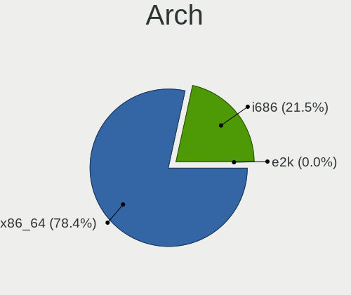
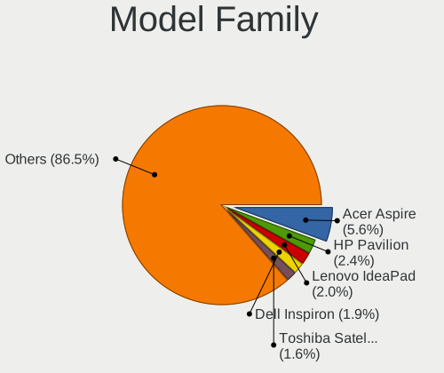
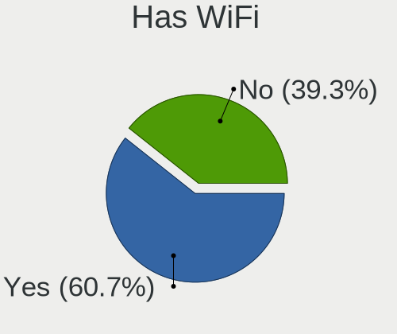
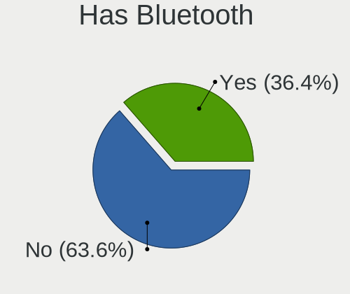
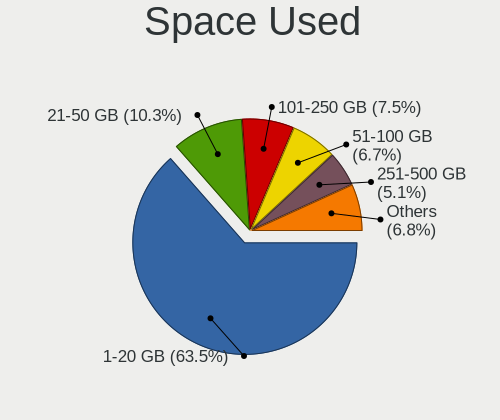
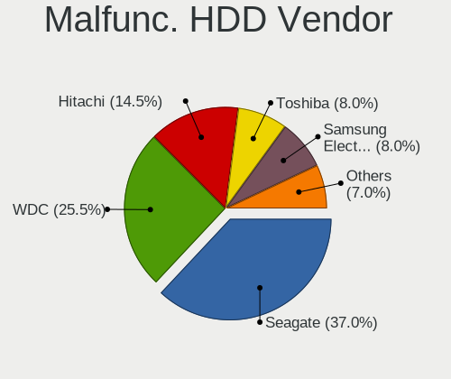
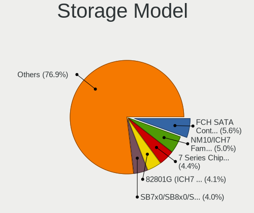
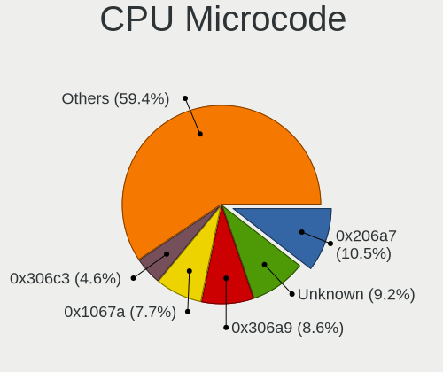
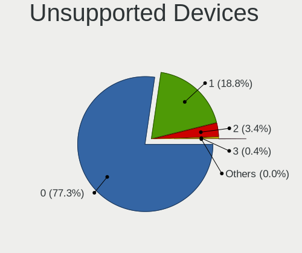

ROSA - Tested Hardware & Statistics
-----------------------------------

A project to collect tested hardware configurations for ROSA.

Anyone can contribute to this report by the [hw-probe](https://github.com/linuxhw/hw-probe) tool:

    sudo -E hw-probe -all -upload

Please contribute! Especially if your hardware is rare.

This is a report for all computer types. See also reports for [desktops](/Dist/ROSA/Desktop/README.md) and [notebooks](/Dist/ROSA/Notebook/README.md).

Contents
--------

* [ Test Cases ](#test-cases)

* [ System ](#system)
  - [ OS                       ](#os)
  - [ OS Family                ](#os-family)
  - [ Kernel                   ](#kernel)
  - [ Kernel Family            ](#kernel-family)
  - [ Kernel Major Ver.        ](#kernel-major-ver)
  - [ Arch                     ](#arch)
  - [ DE                       ](#de)
  - [ Display Server           ](#display-server)
  - [ Display Manager          ](#display-manager)
  - [ OS Lang                  ](#os-lang)
  - [ Boot Mode                ](#boot-mode)
  - [ Filesystem               ](#filesystem)
  - [ Part. scheme             ](#part-scheme)
  - [ Dual Boot with Linux/BSD ](#dual-boot-with-linuxbsd)
  - [ Dual Boot (Win)          ](#dual-boot-win)

* [ Board ](#board)
  - [ Vendor                   ](#vendor)
  - [ Model                    ](#model)
  - [ Model Family             ](#model-family)
  - [ MFG Year                 ](#mfg-year)
  - [ Form Factor              ](#form-factor)
  - [ Secure Boot              ](#secure-boot)
  - [ Coreboot                 ](#coreboot)
  - [ RAM Size                 ](#ram-size)
  - [ RAM Used                 ](#ram-used)
  - [ Total Drives             ](#total-drives)
  - [ Has CD-ROM               ](#has-cd-rom)
  - [ Has Ethernet             ](#has-ethernet)
  - [ Has WiFi                 ](#has-wifi)
  - [ Has Bluetooth            ](#has-bluetooth)

* [ Location ](#location)
  - [ Country                  ](#country)
  - [ City                     ](#city)

* [ Drives ](#drives)
  - [ Drive Vendor             ](#drive-vendor)
  - [ Drive Model              ](#drive-model)
  - [ HDD Vendor               ](#hdd-vendor)
  - [ SSD Vendor               ](#ssd-vendor)
  - [ Drive Kind               ](#drive-kind)
  - [ Drive Connector          ](#drive-connector)
  - [ Drive Size               ](#drive-size)
  - [ Space Total              ](#space-total)
  - [ Space Used               ](#space-used)
  - [ Malfunc. Drives          ](#malfunc-drives)
  - [ Malfunc. Drive Vendor    ](#malfunc-drive-vendor)
  - [ Malfunc. HDD Vendor      ](#malfunc-hdd-vendor)
  - [ Malfunc. Drive Kind      ](#malfunc-drive-kind)
  - [ Failed Drives            ](#failed-drives)
  - [ Failed Drive Vendor      ](#failed-drive-vendor)
  - [ Drive Status             ](#drive-status)

* [ Storage controller ](#storage-controller)
  - [ Storage Vendor           ](#storage-vendor)
  - [ Storage Model            ](#storage-model)
  - [ Storage Kind             ](#storage-kind)

* [ Processor ](#processor)
  - [ CPU Vendor               ](#cpu-vendor)
  - [ CPU Model                ](#cpu-model)
  - [ CPU Model Family         ](#cpu-model-family)
  - [ CPU Cores                ](#cpu-cores)
  - [ CPU Sockets              ](#cpu-sockets)
  - [ CPU Threads              ](#cpu-threads)
  - [ CPU Op-Modes             ](#cpu-op-modes)
  - [ CPU Microcode            ](#cpu-microcode)
  - [ CPU Microarch            ](#cpu-microarch)

* [ Graphics ](#graphics)
  - [ GPU Vendor               ](#gpu-vendor)
  - [ GPU Model                ](#gpu-model)
  - [ GPU Combo                ](#gpu-combo)
  - [ GPU Driver               ](#gpu-driver)
  - [ GPU Memory               ](#gpu-memory)

* [ Monitor ](#monitor)
  - [ Monitor Vendor           ](#monitor-vendor)
  - [ Monitor Model            ](#monitor-model)
  - [ Monitor Resolution       ](#monitor-resolution)
  - [ Monitor Diagonal         ](#monitor-diagonal)
  - [ Monitor Width            ](#monitor-width)
  - [ Aspect Ratio             ](#aspect-ratio)
  - [ Monitor Area             ](#monitor-area)
  - [ Pixel Density            ](#pixel-density)
  - [ Multiple Monitors        ](#multiple-monitors)

* [ Network ](#network)
  - [ Net Controller Vendor    ](#net-controller-vendor)
  - [ Net Controller Model     ](#net-controller-model)
  - [ Wireless Vendor          ](#wireless-vendor)
  - [ Wireless Model           ](#wireless-model)
  - [ Ethernet Vendor          ](#ethernet-vendor)
  - [ Ethernet Model           ](#ethernet-model)
  - [ Net Controller Kind      ](#net-controller-kind)
  - [ Used Controller          ](#used-controller)
  - [ NICs                     ](#nics)
  - [ IPv6                     ](#ipv6)

* [ Bluetooth ](#bluetooth)
  - [ Bluetooth Vendor         ](#bluetooth-vendor)
  - [ Bluetooth Model          ](#bluetooth-model)

* [ Sound ](#sound)
  - [ Sound Vendor             ](#sound-vendor)
  - [ Sound Model              ](#sound-model)

* [ Memory ](#memory)
  - [ Memory Vendor            ](#memory-vendor)
  - [ Memory Model             ](#memory-model)
  - [ Memory Kind              ](#memory-kind)
  - [ Memory Form Factor       ](#memory-form-factor)
  - [ Memory Size              ](#memory-size)
  - [ Memory Speed             ](#memory-speed)

* [ Printers & scanners ](#printers--scanners)
  - [ Printer Vendor           ](#printer-vendor)
  - [ Printer Model            ](#printer-model)
  - [ Scanner Vendor           ](#scanner-vendor)
  - [ Scanner Model            ](#scanner-model)

* [ Camera ](#camera)
  - [ Camera Vendor            ](#camera-vendor)
  - [ Camera Model             ](#camera-model)

* [ Security ](#security)
  - [ Fingerprint Vendor       ](#fingerprint-vendor)
  - [ Fingerprint Model        ](#fingerprint-model)
  - [ Chipcard Vendor          ](#chipcard-vendor)
  - [ Chipcard Model           ](#chipcard-model)

* [ Unsupported ](#unsupported)
  - [ Unsupported Devices      ](#unsupported-devices)
  - [ Unsupported Device Types ](#unsupported-device-types)

Test Cases
----------

Total: 40938

| Vendor        | Model                       | Form-Factor | Probe                                                      | Date         |
|---------------|-----------------------------|-------------|------------------------------------------------------------|--------------|
| Lenovo        | G500 20236                  | Notebook    | [75f2e6fae1](https://linux-hardware.org/?probe=75f2e6fae1) | Dec 31, 2022 |
| ASUSTek       | PRIME B550M-A               | Desktop     | [2161cbc9a0](https://linux-hardware.org/?probe=2161cbc9a0) | Dec 31, 2022 |
| Lenovo        | G500 20236                  | Notebook    | [0d3ed20685](https://linux-hardware.org/?probe=0d3ed20685) | Dec 31, 2022 |
| Lenovo        | G780 20138                  | Notebook    | [896aeb4e20](https://linux-hardware.org/?probe=896aeb4e20) | Dec 31, 2022 |
| Gigabyte      | F2A68HM-DS2                 | Desktop     | [7b10613c1e](https://linux-hardware.org/?probe=7b10613c1e) | Dec 31, 2022 |
| MSI           | B550M PRO-VDH WIFI          | Desktop     | [92920d8ac2](https://linux-hardware.org/?probe=92920d8ac2) | Dec 31, 2022 |
| Dell          | Inspiron 15-3552            | Notebook    | [e8b804ddd5](https://linux-hardware.org/?probe=e8b804ddd5) | Dec 31, 2022 |
| Samsung       | 300V3A/300V4A/300V5A        | Notebook    | [14b589709d](https://linux-hardware.org/?probe=14b589709d) | Dec 31, 2022 |
| Gigabyte      | H55M-USB3                   | Desktop     | [729e1569a8](https://linux-hardware.org/?probe=729e1569a8) | Dec 30, 2022 |
| MSI           | B360M GAMING PLUS           | Desktop     | [9d4f6afc25](https://linux-hardware.org/?probe=9d4f6afc25) | Dec 30, 2022 |
| HP            | Pavilion g6                 | Notebook    | [6f29ccd86e](https://linux-hardware.org/?probe=6f29ccd86e) | Dec 30, 2022 |
| ASUSTek       | P8Z77-V                     | Desktop     | [b0a607e8d8](https://linux-hardware.org/?probe=b0a607e8d8) | Dec 30, 2022 |
| ASUSTek       | VivoBook 15_ASUS Laptop ... | Notebook    | [5710b93654](https://linux-hardware.org/?probe=5710b93654) | Dec 30, 2022 |
| AZW           | U59                         | Desktop     | [290e34b89a](https://linux-hardware.org/?probe=290e34b89a) | Dec 30, 2022 |
| ASRock        | N68-GS4 FX                  | Desktop     | [379552e4d2](https://linux-hardware.org/?probe=379552e4d2) | Dec 30, 2022 |
| Lenovo        | IdeaPad 330-15IKB 81DE      | Notebook    | [2d63537d23](https://linux-hardware.org/?probe=2d63537d23) | Dec 30, 2022 |
| ASUSTek       | VivoBook_ASUS Laptop E21... | Notebook    | [41da11b027](https://linux-hardware.org/?probe=41da11b027) | Dec 30, 2022 |
| Lenovo        | IdeaPad 330-15IKB 81DE      | Notebook    | [954fdfcd25](https://linux-hardware.org/?probe=954fdfcd25) | Dec 30, 2022 |
| Prestigio     | PSB141C04CGH                | Notebook    | [591f91b689](https://linux-hardware.org/?probe=591f91b689) | Dec 29, 2022 |
| Gigabyte      | B550 GAMING X               | Desktop     | [6e92b3e37b](https://linux-hardware.org/?probe=6e92b3e37b) | Dec 29, 2022 |
| Lenovo        | IdeaPad L340-17IRH Gamin... | Notebook    | [83acd419e0](https://linux-hardware.org/?probe=83acd419e0) | Dec 29, 2022 |
| ASUSTek       | H97-PRO                     | Desktop     | [b96b861fd7](https://linux-hardware.org/?probe=b96b861fd7) | Dec 29, 2022 |
| ASUSTek       | K40IN                       | Notebook    | [1b4a2d0604](https://linux-hardware.org/?probe=1b4a2d0604) | Dec 29, 2022 |
| ASUSTek       | PRIME A320M-A               | Desktop     | [2cdb821b42](https://linux-hardware.org/?probe=2cdb821b42) | Dec 29, 2022 |
| Gigabyte      | B360M HD3                   | Desktop     | [556bc61c51](https://linux-hardware.org/?probe=556bc61c51) | Dec 29, 2022 |
| Gigabyte      | B360M HD3                   | Desktop     | [f0ab6f0649](https://linux-hardware.org/?probe=f0ab6f0649) | Dec 29, 2022 |
| Aquarius      | NS685U R11                  | Notebook    | [d99ae12a0c](https://linux-hardware.org/?probe=d99ae12a0c) | Dec 29, 2022 |
| Lenovo        | V14-IIL 82C4                | Notebook    | [221e9b9fd6](https://linux-hardware.org/?probe=221e9b9fd6) | Dec 28, 2022 |
| ASRock        | B450 Gaming K4              | Desktop     | [1afc5015f1](https://linux-hardware.org/?probe=1afc5015f1) | Dec 28, 2022 |
| ASUSTek       | M4A79XTD EVO                | Desktop     | [91c217e497](https://linux-hardware.org/?probe=91c217e497) | Dec 28, 2022 |
| ASUSTek       | VivoBook 15_ASUS Laptop ... | Notebook    | [e36e85614e](https://linux-hardware.org/?probe=e36e85614e) | Dec 28, 2022 |
| ASUSTek       | M4A785-M                    | Desktop     | [7fb63e4360](https://linux-hardware.org/?probe=7fb63e4360) | Dec 27, 2022 |
| Dell          | 0XHGV1 A01                  | Desktop     | [415c0ff63e](https://linux-hardware.org/?probe=415c0ff63e) | Dec 27, 2022 |
| MSI           | B350 PC MATE                | Desktop     | [3b9dbdb180](https://linux-hardware.org/?probe=3b9dbdb180) | Dec 27, 2022 |
| Toshiba       | Satellite U300              | Notebook    | [88861461c8](https://linux-hardware.org/?probe=88861461c8) | Dec 27, 2022 |
| MSI           | MPG X570 GAMING PLUS        | Desktop     | [1aac1f7eca](https://linux-hardware.org/?probe=1aac1f7eca) | Dec 27, 2022 |
| Gigabyte      | H97-HD3                     | Desktop     | [1707593d6d](https://linux-hardware.org/?probe=1707593d6d) | Dec 27, 2022 |
| HP            | Compaq Presario CQ50        | Notebook    | [802e160a5a](https://linux-hardware.org/?probe=802e160a5a) | Dec 27, 2022 |
| Lenovo        | V14-IIL 82C4                | Notebook    | [2b7f53c989](https://linux-hardware.org/?probe=2b7f53c989) | Dec 27, 2022 |
| ASRock        | H510M-HVS                   | Desktop     | [3733446191](https://linux-hardware.org/?probe=3733446191) | Dec 27, 2022 |
| HP            | Laptop 15s-eq2xxx           | Notebook    | [155c738d10](https://linux-hardware.org/?probe=155c738d10) | Dec 27, 2022 |
| Dell          | Inspiron N4050              | Notebook    | [542b5ae2f6](https://linux-hardware.org/?probe=542b5ae2f6) | Dec 27, 2022 |
| HP            | Compaq Mini CQ10-100        | Notebook    | [8b34b357bb](https://linux-hardware.org/?probe=8b34b357bb) | Dec 27, 2022 |
| Gigabyte      | i1520N                      | Notebook    | [4f94938d1b](https://linux-hardware.org/?probe=4f94938d1b) | Dec 27, 2022 |
| MSI           | Modern 14 B4MW              | Notebook    | [17bd139f0c](https://linux-hardware.org/?probe=17bd139f0c) | Dec 26, 2022 |
| Acer          | Aspire Z1-612               | All in one  | [19582f3331](https://linux-hardware.org/?probe=19582f3331) | Dec 26, 2022 |
| ASUSTek       | N56VZ                       | Notebook    | [1ba62f0fab](https://linux-hardware.org/?probe=1ba62f0fab) | Dec 26, 2022 |
| Dell          | G5 5590                     | Notebook    | [43fbc3b36d](https://linux-hardware.org/?probe=43fbc3b36d) | Dec 26, 2022 |
| Gigabyte      | B365M DS3H                  | Desktop     | [f9d83535bd](https://linux-hardware.org/?probe=f9d83535bd) | Dec 26, 2022 |
| Gigabyte      | F2A55M-DS2                  | Desktop     | [735d3cfda2](https://linux-hardware.org/?probe=735d3cfda2) | Dec 26, 2022 |
| Dell          | 0XHGV1 A01                  | Desktop     | [5d26c7c543](https://linux-hardware.org/?probe=5d26c7c543) | Dec 26, 2022 |
| Acer          | Acadia V1.45                | Notebook    | [2d98a8cef2](https://linux-hardware.org/?probe=2d98a8cef2) | Dec 25, 2022 |
| ASUSTek       | P8H61-MX R2.0               | Desktop     | [5174af9fdd](https://linux-hardware.org/?probe=5174af9fdd) | Dec 25, 2022 |
| ASUSTek       | H81M-K                      | Desktop     | [c702bed39d](https://linux-hardware.org/?probe=c702bed39d) | Dec 25, 2022 |
| Unknown       | Unknown                     | Notebook    | [8f4d031a78](https://linux-hardware.org/?probe=8f4d031a78) | Dec 25, 2022 |
| ASUSTek       | P7H55-M/USB3                | Desktop     | [85b55a267a](https://linux-hardware.org/?probe=85b55a267a) | Dec 25, 2022 |
| Gigabyte      | A320M-S2H V2-CF             | Desktop     | [8994b9a877](https://linux-hardware.org/?probe=8994b9a877) | Dec 25, 2022 |
| Pegatron      | C15B                        | Notebook    | [f838b3f22c](https://linux-hardware.org/?probe=f838b3f22c) | Dec 25, 2022 |
| Acer          | Nitro AN515-52              | Notebook    | [1571f74238](https://linux-hardware.org/?probe=1571f74238) | Dec 25, 2022 |
| HP            | 0AACh                       | Desktop     | [b83da338ee](https://linux-hardware.org/?probe=b83da338ee) | Dec 25, 2022 |
| ASUSTek       | X551CAP                     | Notebook    | [3442037418](https://linux-hardware.org/?probe=3442037418) | Dec 25, 2022 |
| Gigabyte      | B450M DS3H-CF               | Desktop     | [f48ac4aa81](https://linux-hardware.org/?probe=f48ac4aa81) | Dec 25, 2022 |
| MSI           | MAG X570S TOMAHAWK MAX W... | Desktop     | [b98be1b1e7](https://linux-hardware.org/?probe=b98be1b1e7) | Dec 25, 2022 |
| ASRock        | A75M-HVS                    | Desktop     | [5368526dc0](https://linux-hardware.org/?probe=5368526dc0) | Dec 25, 2022 |
| ASRock        | A75M-HVS                    | Desktop     | [fab270a7bf](https://linux-hardware.org/?probe=fab270a7bf) | Dec 25, 2022 |
| ASRock        | B365M-HDV                   | Desktop     | [84ea64b29c](https://linux-hardware.org/?probe=84ea64b29c) | Dec 24, 2022 |
| ASRock        | B365M-HDV                   | Desktop     | [407f76f02f](https://linux-hardware.org/?probe=407f76f02f) | Dec 24, 2022 |
| ASRock        | B450 Gaming K4              | Desktop     | [bb8b44cf69](https://linux-hardware.org/?probe=bb8b44cf69) | Dec 24, 2022 |
| ASRock        | H510M-HDV R2.0              | Desktop     | [70312467b7](https://linux-hardware.org/?probe=70312467b7) | Dec 24, 2022 |
| Gigabyte      | B660M D2H DDR4              | Desktop     | [c34803fb1e](https://linux-hardware.org/?probe=c34803fb1e) | Dec 24, 2022 |
| Gigabyte      | H61M-S2V-B3                 | Desktop     | [6f60f1b6da](https://linux-hardware.org/?probe=6f60f1b6da) | Dec 24, 2022 |
| Dell          | 0Y5DDC A00                  | Desktop     | [c107bb3a14](https://linux-hardware.org/?probe=c107bb3a14) | Dec 24, 2022 |
| ASUSTek       | P8B75-V                     | Desktop     | [cf3882b3f7](https://linux-hardware.org/?probe=cf3882b3f7) | Dec 24, 2022 |
| Gigabyte      | H55M-S2H                    | Desktop     | [7cecfa756a](https://linux-hardware.org/?probe=7cecfa756a) | Dec 24, 2022 |
| HP            | 0AACh                       | Desktop     | [4a7840e1cf](https://linux-hardware.org/?probe=4a7840e1cf) | Dec 24, 2022 |
| Gigabyte      | X470 AORUS GAMING 7 WIFI... | Desktop     | [40c2593694](https://linux-hardware.org/?probe=40c2593694) | Dec 24, 2022 |
| Gigabyte      | A320M-H-CF                  | Desktop     | [81febc2905](https://linux-hardware.org/?probe=81febc2905) | Dec 23, 2022 |
| ASUSTek       | H97-PLUS                    | Desktop     | [0d45265efc](https://linux-hardware.org/?probe=0d45265efc) | Dec 23, 2022 |
| Unknown       | 865GV-ICH5                  | Desktop     | [fe2ef2ef31](https://linux-hardware.org/?probe=fe2ef2ef31) | Dec 23, 2022 |
| ASUSTek       | H81M-C                      | Desktop     | [73dc1109eb](https://linux-hardware.org/?probe=73dc1109eb) | Dec 23, 2022 |
| Intel         | ChiefRiver                  | Notebook    | [a23ea2e43e](https://linux-hardware.org/?probe=a23ea2e43e) | Dec 23, 2022 |
| Acer          | Aspire A315-51              | Notebook    | [b53beddded](https://linux-hardware.org/?probe=b53beddded) | Dec 23, 2022 |
| Gigabyte      | H310M A-CF x.x              | Desktop     | [daf1310bfa](https://linux-hardware.org/?probe=daf1310bfa) | Dec 23, 2022 |
| Lenovo        | B570e HuronRiver Platfor... | Notebook    | [672c320794](https://linux-hardware.org/?probe=672c320794) | Dec 22, 2022 |
| HP            | G62                         | Notebook    | [00b47da7dc](https://linux-hardware.org/?probe=00b47da7dc) | Dec 22, 2022 |
| Lenovo        | G700 20251                  | Notebook    | [1a8f388366](https://linux-hardware.org/?probe=1a8f388366) | Dec 22, 2022 |
| Toshiba       | Satellite A300              | Notebook    | [8981102ebe](https://linux-hardware.org/?probe=8981102ebe) | Dec 22, 2022 |
| Gigabyte      | B550 AORUS ELITE AX V2      | Desktop     | [ae98ccd9c2](https://linux-hardware.org/?probe=ae98ccd9c2) | Dec 22, 2022 |
| Unknown       | 865GV-ICH5                  | Desktop     | [f42b7383f4](https://linux-hardware.org/?probe=f42b7383f4) | Dec 22, 2022 |
| Gigabyte      | B450 AORUS ELITE V2         | Desktop     | [2683bf55bf](https://linux-hardware.org/?probe=2683bf55bf) | Dec 22, 2022 |
| Gigabyte      | B550 AORUS ELITE AX V2      | Desktop     | [c485d688ad](https://linux-hardware.org/?probe=c485d688ad) | Dec 22, 2022 |
| Acer          | Aspire A315-51              | Notebook    | [4fc8630d91](https://linux-hardware.org/?probe=4fc8630d91) | Dec 22, 2022 |
| HP            | ProBook 440 G6              | Notebook    | [ad317dc4fd](https://linux-hardware.org/?probe=ad317dc4fd) | Dec 22, 2022 |
| ASUSTek       | P5K PRO                     | Desktop     | [4088ff40e3](https://linux-hardware.org/?probe=4088ff40e3) | Dec 22, 2022 |
| ASUSTek       | PRIME X370-PRO              | Desktop     | [10a98289bb](https://linux-hardware.org/?probe=10a98289bb) | Dec 21, 2022 |
| Gigabyte      | F2A68HM-DS2                 | Desktop     | [b7311f5a21](https://linux-hardware.org/?probe=b7311f5a21) | Dec 21, 2022 |
| ASUSTek       | P5KPL-AM IN/ROEM/SI         | Desktop     | [c39538e70e](https://linux-hardware.org/?probe=c39538e70e) | Dec 21, 2022 |
| Lenovo        | G700 20251                  | Notebook    | [afac6a5bfa](https://linux-hardware.org/?probe=afac6a5bfa) | Dec 21, 2022 |
| MSI           | Alpha 15 B5EEK              | Notebook    | [d6e55e247a](https://linux-hardware.org/?probe=d6e55e247a) | Dec 21, 2022 |
| ASUSTek       | VivoBook_ASUSLaptop X570... | Notebook    | [cc485cc076](https://linux-hardware.org/?probe=cc485cc076) | Dec 21, 2022 |
| ASRock        | ALiveXFire-eSATA2           | Desktop     | [e7383e309b](https://linux-hardware.org/?probe=e7383e309b) | Dec 21, 2022 |
| eMachines     | E525                        | Notebook    | [8368666118](https://linux-hardware.org/?probe=8368666118) | Dec 21, 2022 |
| ASUSTek       | X555SJ                      | Notebook    | [c580c82fe2](https://linux-hardware.org/?probe=c580c82fe2) | Dec 21, 2022 |
| Lenovo        | G700 20251                  | Notebook    | [ba8b12c87e](https://linux-hardware.org/?probe=ba8b12c87e) | Dec 21, 2022 |
| Samsung       | 350V5C/351V5C/3540VC/344... | Notebook    | [c56023ff15](https://linux-hardware.org/?probe=c56023ff15) | Dec 21, 2022 |
| Pegatron      | A17                         | Notebook    | [f40a055eac](https://linux-hardware.org/?probe=f40a055eac) | Dec 21, 2022 |
| ASUSTek       | M2N-E                       | Desktop     | [d27a2a4e0f](https://linux-hardware.org/?probe=d27a2a4e0f) | Dec 20, 2022 |
| Gigabyte      | EP43-S3L                    | Desktop     | [8a24afa21d](https://linux-hardware.org/?probe=8a24afa21d) | Dec 20, 2022 |
| Intel         | X99                         | Desktop     | [ce9b83b781](https://linux-hardware.org/?probe=ce9b83b781) | Dec 20, 2022 |
| ASUSTek       | TUF Gaming B450-PLUS II     | Desktop     | [e7cfce65f6](https://linux-hardware.org/?probe=e7cfce65f6) | Dec 20, 2022 |
| ASUSTek       | P5QL PRO                    | Desktop     | [44d3238797](https://linux-hardware.org/?probe=44d3238797) | Dec 20, 2022 |
| Gigabyte      | H77N-WIFI                   | Desktop     | [a39b8f54af](https://linux-hardware.org/?probe=a39b8f54af) | Dec 20, 2022 |
| Acer          | Aspire A315-51              | Notebook    | [8777d682b0](https://linux-hardware.org/?probe=8777d682b0) | Dec 20, 2022 |
| ASUSTek       | M4A79XTD EVO                | Desktop     | [7c854ad5e0](https://linux-hardware.org/?probe=7c854ad5e0) | Dec 20, 2022 |
| ASUSTek       | M4A79XTD EVO                | Desktop     | [f82010222c](https://linux-hardware.org/?probe=f82010222c) | Dec 20, 2022 |
| ASRock        | Z77M                        | Desktop     | [33c2afa3e0](https://linux-hardware.org/?probe=33c2afa3e0) | Dec 20, 2022 |
| ASUSTek       | PRIME B450M-K               | Desktop     | [de20614d06](https://linux-hardware.org/?probe=de20614d06) | Dec 19, 2022 |
| Gigabyte      | 970A-DS3P                   | Desktop     | [66e45d9a82](https://linux-hardware.org/?probe=66e45d9a82) | Dec 19, 2022 |
| ASUSTek       | PRIME B450M-K               | Desktop     | [90ea21bd4a](https://linux-hardware.org/?probe=90ea21bd4a) | Dec 19, 2022 |
| ASUSTek       | P7P55D EVO                  | Desktop     | [c8f2df83aa](https://linux-hardware.org/?probe=c8f2df83aa) | Dec 19, 2022 |
| ASRock        | P67 Pro3 SE                 | Desktop     | [5a59282fea](https://linux-hardware.org/?probe=5a59282fea) | Dec 19, 2022 |
| Dell          | 0Y5DDC A00                  | Desktop     | [aa5228e9b8](https://linux-hardware.org/?probe=aa5228e9b8) | Dec 19, 2022 |
| Intel         | MAHOBAY                     | Desktop     | [7f8c2370d4](https://linux-hardware.org/?probe=7f8c2370d4) | Dec 19, 2022 |
| Acer          | Aspire A315-51              | Notebook    | [faf7ad4c29](https://linux-hardware.org/?probe=faf7ad4c29) | Dec 19, 2022 |
| MSI           | X460/X460DX                 | Notebook    | [6fff37a8a5](https://linux-hardware.org/?probe=6fff37a8a5) | Dec 18, 2022 |
| MSI           | X460/X460DX                 | Notebook    | [71ca32ac12](https://linux-hardware.org/?probe=71ca32ac12) | Dec 18, 2022 |
| MSI           | Delta 15 A5EFK              | Notebook    | [c793cb6f38](https://linux-hardware.org/?probe=c793cb6f38) | Dec 18, 2022 |
| Acer          | Nitro AN515-56              | Notebook    | [cac9892365](https://linux-hardware.org/?probe=cac9892365) | Dec 18, 2022 |
| Gigabyte      | GA-K8NE                     | Desktop     | [64adeb3e60](https://linux-hardware.org/?probe=64adeb3e60) | Dec 18, 2022 |
| eMachines     | E525                        | Notebook    | [2a0aeb50bf](https://linux-hardware.org/?probe=2a0aeb50bf) | Dec 18, 2022 |
| Gigabyte      | B550 AORUS ELITE AX V2      | Desktop     | [626b750c51](https://linux-hardware.org/?probe=626b750c51) | Dec 18, 2022 |
| ASUSTek       | P8H61-MX R2.0               | Desktop     | [320ef20ffa](https://linux-hardware.org/?probe=320ef20ffa) | Dec 18, 2022 |
| Acer          | AO533                       | Notebook    | [1639951fe5](https://linux-hardware.org/?probe=1639951fe5) | Dec 18, 2022 |
| ASUSTek       | PRIME X470-PRO              | Desktop     | [7e864dc271](https://linux-hardware.org/?probe=7e864dc271) | Dec 18, 2022 |
| Gigabyte      | P41T-D3P                    | Desktop     | [20f90ee21e](https://linux-hardware.org/?probe=20f90ee21e) | Dec 18, 2022 |
| ASUSTek       | 1201N                       | Notebook    | [214a7002b9](https://linux-hardware.org/?probe=214a7002b9) | Dec 18, 2022 |
| Dell          | Inspiron 15-3552            | Notebook    | [0dc1961e62](https://linux-hardware.org/?probe=0dc1961e62) | Dec 18, 2022 |
| MSI           | MS-B0A41                    | Desktop     | [3eff37d029](https://linux-hardware.org/?probe=3eff37d029) | Dec 18, 2022 |
| HP            | Pavilion g7                 | Notebook    | [6a1a042504](https://linux-hardware.org/?probe=6a1a042504) | Dec 18, 2022 |
| HP            | Pavilion g7                 | Notebook    | [465a08d81a](https://linux-hardware.org/?probe=465a08d81a) | Dec 18, 2022 |
| Lenovo        | G580 20157                  | Notebook    | [c6cce8ff6d](https://linux-hardware.org/?probe=c6cce8ff6d) | Dec 18, 2022 |
| Gigabyte      | H110N-CF                    | Desktop     | [239dcc2a5c](https://linux-hardware.org/?probe=239dcc2a5c) | Dec 18, 2022 |
| Dell          | Inspiron 1525               | Notebook    | [216bedab36](https://linux-hardware.org/?probe=216bedab36) | Dec 18, 2022 |
| ASUSTek       | A88XM-A                     | Desktop     | [e889711ed9](https://linux-hardware.org/?probe=e889711ed9) | Dec 17, 2022 |
| Prestigio     | PSB141C04CGH                | Notebook    | [60f02a4cb4](https://linux-hardware.org/?probe=60f02a4cb4) | Dec 17, 2022 |
| ASUSTek       | M2N-XE                      | Desktop     | [5cf5b3eb1b](https://linux-hardware.org/?probe=5cf5b3eb1b) | Dec 17, 2022 |
| ASRock        | X570 Pro4                   | Desktop     | [09fc64653e](https://linux-hardware.org/?probe=09fc64653e) | Dec 17, 2022 |
| ASUSTek       | ROG STRIX B550-I GAMING     | Desktop     | [00cc810cfc](https://linux-hardware.org/?probe=00cc810cfc) | Dec 17, 2022 |
| MSI           | MAG B550 TOMAHAWK MAX WI... | Desktop     | [74133cd0bd](https://linux-hardware.org/?probe=74133cd0bd) | Dec 17, 2022 |
| ICL           | RAYbook Si1511              | Notebook    | [9994b3ec08](https://linux-hardware.org/?probe=9994b3ec08) | Dec 17, 2022 |
| ASUSTek       | ROG Strix G713QM_G713QM     | Notebook    | [c04b0805ad](https://linux-hardware.org/?probe=c04b0805ad) | Dec 17, 2022 |
| Gigabyte      | X470 AORUS ULTRA GAMING-... | Desktop     | [0eb4a7c919](https://linux-hardware.org/?probe=0eb4a7c919) | Dec 17, 2022 |
| Gigabyte      | F2A55M-DS2                  | Desktop     | [d34f278afd](https://linux-hardware.org/?probe=d34f278afd) | Dec 17, 2022 |
| Gigabyte      | 970A-DS3P                   | Desktop     | [f0303dc0a9](https://linux-hardware.org/?probe=f0303dc0a9) | Dec 17, 2022 |
| Acer          | Aspire C22-820              | All in one  | [3e6cfa25b2](https://linux-hardware.org/?probe=3e6cfa25b2) | Dec 17, 2022 |
| Gigabyte      | H81-D3                      | Desktop     | [547126e9e7](https://linux-hardware.org/?probe=547126e9e7) | Dec 17, 2022 |
| Acer          | Aspire ES1-521              | Notebook    | [4f4f04579a](https://linux-hardware.org/?probe=4f4f04579a) | Dec 17, 2022 |
| Maibenben     | MaiBook M                   | Notebook    | [a216b90cac](https://linux-hardware.org/?probe=a216b90cac) | Dec 17, 2022 |
| Gigabyte      | H110M-M2-CF                 | Desktop     | [11c0643905](https://linux-hardware.org/?probe=11c0643905) | Dec 16, 2022 |
| Graviton      | DMB-H510-MCA01              | Desktop     | [702f634fc4](https://linux-hardware.org/?probe=702f634fc4) | Dec 16, 2022 |
| 3Logic Gro... | Graviton N15i               | Notebook    | [9d85f624db](https://linux-hardware.org/?probe=9d85f624db) | Dec 16, 2022 |
| Gigabyte      | P75-D3                      | Desktop     | [32b4b4d664](https://linux-hardware.org/?probe=32b4b4d664) | Dec 16, 2022 |
| Acer          | Aspire A315-51              | Notebook    | [116b321e68](https://linux-hardware.org/?probe=116b321e68) | Dec 16, 2022 |
| 3Logic Gro... | Graviton N15i-K2            | Notebook    | [a04f7471b9](https://linux-hardware.org/?probe=a04f7471b9) | Dec 16, 2022 |
| Samsung       | 350V5C/351V5C/3540VC/344... | Notebook    | [66d31fc2c8](https://linux-hardware.org/?probe=66d31fc2c8) | Dec 16, 2022 |
| Huanan        | X99-QD4 V1.0                | Desktop     | [a959e56dc8](https://linux-hardware.org/?probe=a959e56dc8) | Dec 15, 2022 |
| Intel         | SHARKBAY                    | Desktop     | [0d07341d58](https://linux-hardware.org/?probe=0d07341d58) | Dec 15, 2022 |
| Acer          | Aspire A315-51              | Notebook    | [5f2e420614](https://linux-hardware.org/?probe=5f2e420614) | Dec 15, 2022 |
| MSI           | K9N6PGM2-V2                 | Desktop     | [c25f374572](https://linux-hardware.org/?probe=c25f374572) | Dec 15, 2022 |
| ASUSTek       | H110M-R                     | Desktop     | [6367cb9215](https://linux-hardware.org/?probe=6367cb9215) | Dec 15, 2022 |
| ASRock        | A520M Pro4                  | Desktop     | [9a6fcc5f1b](https://linux-hardware.org/?probe=9a6fcc5f1b) | Dec 15, 2022 |
| ASUSTek       | PRIME B450M-A               | Desktop     | [766e33e4fb](https://linux-hardware.org/?probe=766e33e4fb) | Dec 15, 2022 |
| ASUSTek       | H110M-R                     | Desktop     | [db904895cc](https://linux-hardware.org/?probe=db904895cc) | Dec 15, 2022 |
| Digma         | EVE 11 C421Y ES1067EW       | Notebook    | [458afe13df](https://linux-hardware.org/?probe=458afe13df) | Dec 14, 2022 |
| Apple         | MacBookPro5,4               | Notebook    | [902c809015](https://linux-hardware.org/?probe=902c809015) | Dec 14, 2022 |
| ASUSTek       | F2A55-M LE                  | Desktop     | [f4c6e3c225](https://linux-hardware.org/?probe=f4c6e3c225) | Dec 14, 2022 |
| ASUSTek       | F7Z                         | Notebook    | [3c42714822](https://linux-hardware.org/?probe=3c42714822) | Dec 14, 2022 |
| Samsung       | 350V5C/351V5C/3540VC/344... | Notebook    | [7040d4353c](https://linux-hardware.org/?probe=7040d4353c) | Dec 14, 2022 |
| Gigabyte      | H77N-WIFI                   | Desktop     | [5093772c0f](https://linux-hardware.org/?probe=5093772c0f) | Dec 14, 2022 |
| ASUSTek       | N73SV                       | Notebook    | [7b729a3a7c](https://linux-hardware.org/?probe=7b729a3a7c) | Dec 14, 2022 |
| Intel         | X79v2.72 KD V2.0            | Desktop     | [0e58af2a59](https://linux-hardware.org/?probe=0e58af2a59) | Dec 14, 2022 |
| Lenovo        | Legion 5 15IMH05H 81Y6      | Notebook    | [1457c2669d](https://linux-hardware.org/?probe=1457c2669d) | Dec 13, 2022 |
| Acer          | Aspire 5720                 | Notebook    | [5940b07034](https://linux-hardware.org/?probe=5940b07034) | Dec 13, 2022 |
| Gigabyte      | B85M-D3V-A                  | Desktop     | [22431e9b10](https://linux-hardware.org/?probe=22431e9b10) | Dec 13, 2022 |
| ASUSTek       | N73SV                       | Notebook    | [c696bac1dd](https://linux-hardware.org/?probe=c696bac1dd) | Dec 13, 2022 |
| Gigabyte      | B85M-D3V-A                  | Desktop     | [0e9eba0773](https://linux-hardware.org/?probe=0e9eba0773) | Dec 13, 2022 |
| Lenovo        | IdeaPad L340-17IRH Gamin... | Notebook    | [b479704ea5](https://linux-hardware.org/?probe=b479704ea5) | Dec 13, 2022 |
| Samsung       | 305V4A/305V5A/3415VA        | Notebook    | [d01e578aa0](https://linux-hardware.org/?probe=d01e578aa0) | Dec 13, 2022 |
| Sony          | VPCEJ1L1R                   | Notebook    | [25ab3e0119](https://linux-hardware.org/?probe=25ab3e0119) | Dec 13, 2022 |
| ASUSTek       | P5KPL-AM EPU                | Desktop     | [af674c6b1b](https://linux-hardware.org/?probe=af674c6b1b) | Dec 13, 2022 |
| MSI           | GF65 Thin 10UE              | Notebook    | [ff4ab808c0](https://linux-hardware.org/?probe=ff4ab808c0) | Dec 13, 2022 |
| Clevo         | M7x0K                       | Notebook    | [08ce94ab11](https://linux-hardware.org/?probe=08ce94ab11) | Dec 13, 2022 |
| ASUSTek       | PRIME H270-PRO              | Desktop     | [dc7d6ae170](https://linux-hardware.org/?probe=dc7d6ae170) | Dec 13, 2022 |
| Intel         | X79v2.72 KD V2.0            | Desktop     | [476f1e7cad](https://linux-hardware.org/?probe=476f1e7cad) | Dec 12, 2022 |
| Lenovo        | V14-IIL 82C4                | Notebook    | [8c4853dba7](https://linux-hardware.org/?probe=8c4853dba7) | Dec 12, 2022 |
| MSI           | K9N6PGM2-V2                 | Desktop     | [f09e3c0e19](https://linux-hardware.org/?probe=f09e3c0e19) | Dec 12, 2022 |
| Sony          | SVE1111M1RW                 | Notebook    | [bc29721da9](https://linux-hardware.org/?probe=bc29721da9) | Dec 12, 2022 |
| Acer          | Aspire 5740                 | Notebook    | [5b35ba45a3](https://linux-hardware.org/?probe=5b35ba45a3) | Dec 12, 2022 |
| Gigabyte      | B450 GAMING X               | Desktop     | [8918608744](https://linux-hardware.org/?probe=8918608744) | Dec 12, 2022 |
| Gigabyte      | H310M A-CF x.x              | Desktop     | [2e0158ba73](https://linux-hardware.org/?probe=2e0158ba73) | Dec 12, 2022 |
| Gigabyte      | H310M A-CF x.x              | Desktop     | [c6e03bcd07](https://linux-hardware.org/?probe=c6e03bcd07) | Dec 12, 2022 |
| HP            | ProBook x360 435 G8 Note... | Convertible | [a096df53ed](https://linux-hardware.org/?probe=a096df53ed) | Dec 12, 2022 |
| Acer          | Aspire A315-42G             | Notebook    | [1d93c8b401](https://linux-hardware.org/?probe=1d93c8b401) | Dec 11, 2022 |
| Lenovo        | IdeaPad Duet 3 10IGL5 82... | Tablet      | [4471c4a012](https://linux-hardware.org/?probe=4471c4a012) | Dec 11, 2022 |
| TUXEDO        | Pulse 15 Gen1               | Notebook    | [f803c32eae](https://linux-hardware.org/?probe=f803c32eae) | Dec 11, 2022 |
| ASUSTek       | ROG Zephyrus M16 GU603HE... | Notebook    | [c90a3cb8c2](https://linux-hardware.org/?probe=c90a3cb8c2) | Dec 11, 2022 |
| Gigabyte      | M61SME-S2                   | Desktop     | [e2932e425c](https://linux-hardware.org/?probe=e2932e425c) | Dec 11, 2022 |
| ASUSTek       | UL30A                       | Notebook    | [f24e02511f](https://linux-hardware.org/?probe=f24e02511f) | Dec 11, 2022 |
| Lenovo        | G700 20251                  | Notebook    | [0400a58c53](https://linux-hardware.org/?probe=0400a58c53) | Dec 11, 2022 |
| ASUSTek       | PRIME B450-PLUS             | Desktop     | [f0fa1101ce](https://linux-hardware.org/?probe=f0fa1101ce) | Dec 11, 2022 |
| ECS           | H61H2-M3                    | Desktop     | [dcd96a2b45](https://linux-hardware.org/?probe=dcd96a2b45) | Dec 11, 2022 |
| ECS           | H61H2-M3                    | Desktop     | [9f9fafa75b](https://linux-hardware.org/?probe=9f9fafa75b) | Dec 11, 2022 |
| Samsung       | SQ45/Q70C/P200              | Notebook    | [4a96589cf5](https://linux-hardware.org/?probe=4a96589cf5) | Dec 11, 2022 |
| ASUSTek       | Z170-K                      | Desktop     | [f883834ef1](https://linux-hardware.org/?probe=f883834ef1) | Dec 11, 2022 |
| HP            | 8860 A                      | Desktop     | [c039452bd4](https://linux-hardware.org/?probe=c039452bd4) | Dec 11, 2022 |
| ASUSTek       | P8H61-M LE/USB3             | Desktop     | [9f72d262ef](https://linux-hardware.org/?probe=9f72d262ef) | Dec 11, 2022 |
| ASUSTek       | Z170-K                      | Desktop     | [8bd005fd95](https://linux-hardware.org/?probe=8bd005fd95) | Dec 11, 2022 |
| ASUSTek       | PRIME B360M-K               | Desktop     | [aac6da2dfb](https://linux-hardware.org/?probe=aac6da2dfb) | Dec 11, 2022 |
| Gigabyte      | H77-DS3H                    | Desktop     | [4c52e333dd](https://linux-hardware.org/?probe=4c52e333dd) | Dec 10, 2022 |
| ASRock        | H81M-HDS R2.0               | Desktop     | [e3c2a2bc54](https://linux-hardware.org/?probe=e3c2a2bc54) | Dec 10, 2022 |
| Lenovo        | IdeaPad Gaming 3 15ARH05... | Notebook    | [bb4615bd96](https://linux-hardware.org/?probe=bb4615bd96) | Dec 10, 2022 |
| Intel         | D2500HN AAG81480-500        | Desktop     | [0963fa0173](https://linux-hardware.org/?probe=0963fa0173) | Dec 10, 2022 |
| Supermicro    | X8DT3                       | Server      | [737f9e5af8](https://linux-hardware.org/?probe=737f9e5af8) | Dec 10, 2022 |
| ASUSTek       | PRIME B350M-A               | Desktop     | [619a4c2f87](https://linux-hardware.org/?probe=619a4c2f87) | Dec 10, 2022 |
| ASRock        | 760GM-HDV                   | Desktop     | [bbd75ce275](https://linux-hardware.org/?probe=bbd75ce275) | Dec 10, 2022 |
| Samsung       | RC530/RC730                 | Notebook    | [4b7783525a](https://linux-hardware.org/?probe=4b7783525a) | Dec 10, 2022 |
| ASUSTek       | M5A99X EVO R2.0             | Desktop     | [941668ad89](https://linux-hardware.org/?probe=941668ad89) | Dec 10, 2022 |
| ASUSTek       | M5A99X EVO R2.0             | Desktop     | [fc07cad186](https://linux-hardware.org/?probe=fc07cad186) | Dec 10, 2022 |
| HP            | 158A                        | Desktop     | [ebcf08f784](https://linux-hardware.org/?probe=ebcf08f784) | Dec 10, 2022 |
| ASRock        | H97 Anniversary             | Desktop     | [3f7aa1b6de](https://linux-hardware.org/?probe=3f7aa1b6de) | Dec 10, 2022 |
| ASUSTek       | PRIME X570-P                | Desktop     | [f064a744ba](https://linux-hardware.org/?probe=f064a744ba) | Dec 10, 2022 |
| ASUSTek       | Z170-A                      | Desktop     | [c9df3386c5](https://linux-hardware.org/?probe=c9df3386c5) | Dec 10, 2022 |
| Lenovo        | IdeaPad 3 15ITL6 82H8       | Notebook    | [fa13871cf9](https://linux-hardware.org/?probe=fa13871cf9) | Dec 10, 2022 |
| Gigabyte      | H61N-USB3                   | Desktop     | [9a8885a88d](https://linux-hardware.org/?probe=9a8885a88d) | Dec 09, 2022 |
| Lenovo        | 3130 NOK                    | Mini pc     | [02df085bd5](https://linux-hardware.org/?probe=02df085bd5) | Dec 09, 2022 |
| ASUSTek       | M5A97 R2.0                  | Desktop     | [75f1600dba](https://linux-hardware.org/?probe=75f1600dba) | Dec 09, 2022 |
| MSI           | Modern 15 B12M              | Notebook    | [b5f43a3075](https://linux-hardware.org/?probe=b5f43a3075) | Dec 09, 2022 |
| ASUSTek       | PRIME B450-PLUS             | Desktop     | [ed30003f61](https://linux-hardware.org/?probe=ed30003f61) | Dec 09, 2022 |
| Gigabyte      | D425TUD                     | Desktop     | [4d8c330a78](https://linux-hardware.org/?probe=4d8c330a78) | Dec 09, 2022 |
| HP            | 18E7                        | Desktop     | [3ae864582a](https://linux-hardware.org/?probe=3ae864582a) | Dec 09, 2022 |
| Aquarius      | AQB560M                     | Desktop     | [b4bd04a5a0](https://linux-hardware.org/?probe=b4bd04a5a0) | Dec 09, 2022 |
| Aquarius      | AQB560M                     | Desktop     | [56a6a749bb](https://linux-hardware.org/?probe=56a6a749bb) | Dec 09, 2022 |
| Acer          | Aspire C22-820              | All in one  | [1fb0e14b70](https://linux-hardware.org/?probe=1fb0e14b70) | Dec 09, 2022 |
| Gigabyte      | G31M-S2L                    | Desktop     | [05707c88e0](https://linux-hardware.org/?probe=05707c88e0) | Dec 08, 2022 |
| ASUSTek       | UX310UQK                    | Notebook    | [c4a573e93c](https://linux-hardware.org/?probe=c4a573e93c) | Dec 08, 2022 |
| Acer          | Aspire F5-571G              | Notebook    | [dedd56f0fe](https://linux-hardware.org/?probe=dedd56f0fe) | Dec 08, 2022 |
| Lenovo        | B590 20206                  | Notebook    | [969ca94bb7](https://linux-hardware.org/?probe=969ca94bb7) | Dec 08, 2022 |
| Gigabyte      | H81M-S1                     | Desktop     | [c2ba58af35](https://linux-hardware.org/?probe=c2ba58af35) | Dec 08, 2022 |
| ASUSTek       | K42F                        | Notebook    | [ee90271b2d](https://linux-hardware.org/?probe=ee90271b2d) | Dec 08, 2022 |
| Biostar       | GF8200C M2+                 | Desktop     | [e42ae4deef](https://linux-hardware.org/?probe=e42ae4deef) | Dec 08, 2022 |
| Gigabyte      | H61M-S2V-B3                 | Desktop     | [4462cb3156](https://linux-hardware.org/?probe=4462cb3156) | Dec 08, 2022 |
| Acer          | Aspire A315-51              | Notebook    | [1b1e1ae174](https://linux-hardware.org/?probe=1b1e1ae174) | Dec 08, 2022 |
| Gigabyte      | P31-ES3G                    | Desktop     | [21c291e1e2](https://linux-hardware.org/?probe=21c291e1e2) | Dec 08, 2022 |
| Huanan        | X99 F8D V2.2                | Desktop     | [d960add854](https://linux-hardware.org/?probe=d960add854) | Dec 08, 2022 |
| ASUSTek       | P5W DH Deluxe               | Desktop     | [bedb81f629](https://linux-hardware.org/?probe=bedb81f629) | Dec 08, 2022 |
| Dell          | Inspiron 3721               | Notebook    | [3bfc5892fe](https://linux-hardware.org/?probe=3bfc5892fe) | Dec 08, 2022 |
| Samsung       | 350V5C/351V5C/3540VC/344... | Notebook    | [c6d0984a2c](https://linux-hardware.org/?probe=c6d0984a2c) | Dec 08, 2022 |
| Aquarius      | AQB560M                     | Desktop     | [3ac41202cf](https://linux-hardware.org/?probe=3ac41202cf) | Dec 08, 2022 |
| ASUSTek       | U24E                        | Notebook    | [e8bdc6be97](https://linux-hardware.org/?probe=e8bdc6be97) | Dec 08, 2022 |
| Acer          | Aspire A114-33              | Notebook    | [0bb6c29bb6](https://linux-hardware.org/?probe=0bb6c29bb6) | Dec 07, 2022 |
| HP            | ENVY x360 Convertible 13... | Convertible | [6160229247](https://linux-hardware.org/?probe=6160229247) | Dec 07, 2022 |
| ASUSTek       | P8Z77-V LE PLUS             | Desktop     | [eafc4dffd4](https://linux-hardware.org/?probe=eafc4dffd4) | Dec 07, 2022 |
| ASUSTek       | PRIME B460M-K               | Desktop     | [ceff27eeef](https://linux-hardware.org/?probe=ceff27eeef) | Dec 07, 2022 |
| Dell          | Inspiron 3137               | Notebook    | [2f74d45567](https://linux-hardware.org/?probe=2f74d45567) | Dec 07, 2022 |
| Lenovo        | IdeaPad 3 15ITL6 82H8       | Notebook    | [fd694a5ddd](https://linux-hardware.org/?probe=fd694a5ddd) | Dec 07, 2022 |
| Pegatron      | C17A                        | Notebook    | [5fc3c61389](https://linux-hardware.org/?probe=5fc3c61389) | Dec 07, 2022 |
| eMachines     | ET1350                      | Desktop     | [2d05a7a068](https://linux-hardware.org/?probe=2d05a7a068) | Dec 07, 2022 |
| ASUSTek       | PRIME B350-PLUS             | Desktop     | [038581b13f](https://linux-hardware.org/?probe=038581b13f) | Dec 07, 2022 |
| ASUSTek       | M2N-XE                      | Desktop     | [663b3c7870](https://linux-hardware.org/?probe=663b3c7870) | Dec 06, 2022 |
| Lenovo        | G700 20251                  | Notebook    | [0613a1c41e](https://linux-hardware.org/?probe=0613a1c41e) | Dec 06, 2022 |
| HP            | Pavilion 15                 | Notebook    | [eb3caff76e](https://linux-hardware.org/?probe=eb3caff76e) | Dec 06, 2022 |
| ASRock        | P67 Pro                     | Desktop     | [74b28c3c76](https://linux-hardware.org/?probe=74b28c3c76) | Dec 06, 2022 |
| Acer          | Nitro AN517-51              | Notebook    | [6b5fd6a48c](https://linux-hardware.org/?probe=6b5fd6a48c) | Dec 05, 2022 |
| ASRock        | B450M-HDV                   | Desktop     | [afeed5f423](https://linux-hardware.org/?probe=afeed5f423) | Dec 05, 2022 |
| Gigabyte      | 970A-DS3P                   | Desktop     | [517e06781a](https://linux-hardware.org/?probe=517e06781a) | Dec 05, 2022 |
| Apple         | MacBookPro5,4               | Notebook    | [bd98ec1bcb](https://linux-hardware.org/?probe=bd98ec1bcb) | Dec 05, 2022 |
| HONOR         | BOHK-WAX9X                  | Notebook    | [543eb800d7](https://linux-hardware.org/?probe=543eb800d7) | Dec 05, 2022 |
| Gigabyte      | B450 GAMING X               | Desktop     | [c8b886d9bf](https://linux-hardware.org/?probe=c8b886d9bf) | Dec 05, 2022 |
| ASUSTek       | PRIME A320M-K               | Desktop     | [0301ad14ee](https://linux-hardware.org/?probe=0301ad14ee) | Dec 05, 2022 |
| Acer          | Aspire A315-51              | Notebook    | [26828f578e](https://linux-hardware.org/?probe=26828f578e) | Dec 05, 2022 |
| MSI           | H97 PC Mate                 | Desktop     | [b8081159ab](https://linux-hardware.org/?probe=b8081159ab) | Dec 05, 2022 |
| Dell          | Inspiron 3521               | Notebook    | [44f8fe348a](https://linux-hardware.org/?probe=44f8fe348a) | Dec 05, 2022 |
| Dell          | Vostro 1310                 | Notebook    | [60bdc28f50](https://linux-hardware.org/?probe=60bdc28f50) | Dec 04, 2022 |
| ASUSTek       | F3Sg                        | Notebook    | [f5ae748125](https://linux-hardware.org/?probe=f5ae748125) | Dec 04, 2022 |
| Lenovo        | ThinkPad L420 7854RP1       | Notebook    | [3216e34b2e](https://linux-hardware.org/?probe=3216e34b2e) | Dec 04, 2022 |
| ASUSTek       | PRIME B450M-A               | Desktop     | [10dd0b119a](https://linux-hardware.org/?probe=10dd0b119a) | Dec 04, 2022 |
| Unknown       | Unknown                     | Desktop     | [bdf0020add](https://linux-hardware.org/?probe=bdf0020add) | Dec 04, 2022 |
| Acer          | Nitro AN515-43              | Notebook    | [f18907cee0](https://linux-hardware.org/?probe=f18907cee0) | Dec 04, 2022 |
| HP            | 2AAC                        | Desktop     | [a6fb7751ed](https://linux-hardware.org/?probe=a6fb7751ed) | Dec 04, 2022 |
| Intel         | DG41CN AAE82429-102         | Desktop     | [8d5cd3253c](https://linux-hardware.org/?probe=8d5cd3253c) | Dec 04, 2022 |
| ASUSTek       | P8H61-M LX2 R2.0            | Desktop     | [d3c99c8d63](https://linux-hardware.org/?probe=d3c99c8d63) | Dec 04, 2022 |
| Intel         | D2500HN AAG34776-404        | Desktop     | [b1ccefe421](https://linux-hardware.org/?probe=b1ccefe421) | Dec 04, 2022 |
| ASUSTek       | H81M-C                      | Desktop     | [0218d4ec25](https://linux-hardware.org/?probe=0218d4ec25) | Dec 03, 2022 |
| Lenovo        | IdeaPad Gaming 3 15ARH05... | Notebook    | [c795306dd2](https://linux-hardware.org/?probe=c795306dd2) | Dec 03, 2022 |
| Gigabyte      | P35-DS3                     | Desktop     | [f4be331a61](https://linux-hardware.org/?probe=f4be331a61) | Dec 03, 2022 |
| Lenovo        | MAHOBAY No DPK              | All in one  | [87db7dbb99](https://linux-hardware.org/?probe=87db7dbb99) | Dec 03, 2022 |
| ASUSTek       | H81M-C                      | Desktop     | [ea7168ab4c](https://linux-hardware.org/?probe=ea7168ab4c) | Dec 03, 2022 |
| Gigabyte      | GA-990FXA-UD3               | Desktop     | [1d881e7756](https://linux-hardware.org/?probe=1d881e7756) | Dec 03, 2022 |
| Dell          | Inspiron 5570               | Notebook    | [c2ee22631f](https://linux-hardware.org/?probe=c2ee22631f) | Dec 03, 2022 |
| ASRock        | K10N78D                     | Desktop     | [7d0d581c7a](https://linux-hardware.org/?probe=7d0d581c7a) | Dec 03, 2022 |
| Lenovo        | IdeaPad 330-15IKB 81DE      | Notebook    | [91bffab1ae](https://linux-hardware.org/?probe=91bffab1ae) | Dec 03, 2022 |
| Lenovo        | IdeaPad 330-14AST 81D5      | Notebook    | [795327c2b7](https://linux-hardware.org/?probe=795327c2b7) | Dec 03, 2022 |
| Gigabyte      | A320M-H-CF                  | Desktop     | [f1e82e8a2a](https://linux-hardware.org/?probe=f1e82e8a2a) | Dec 03, 2022 |
| Gigabyte      | 970A-UD3P                   | Desktop     | [7bb879efed](https://linux-hardware.org/?probe=7bb879efed) | Dec 03, 2022 |
| Gigabyte      | MZBSWMP-00                  | Desktop     | [76ba1ef6f2](https://linux-hardware.org/?probe=76ba1ef6f2) | Dec 03, 2022 |
| MSI           | P67S-C43                    | Desktop     | [9674663124](https://linux-hardware.org/?probe=9674663124) | Dec 03, 2022 |
| Samsung       | 350V5C/351V5C/3540VC/344... | Notebook    | [6cb73d5a1c](https://linux-hardware.org/?probe=6cb73d5a1c) | Dec 03, 2022 |
| ASUSTek       | Z170M-PLUS                  | Desktop     | [a39dbe7189](https://linux-hardware.org/?probe=a39dbe7189) | Dec 03, 2022 |
| MSI           | GE72 6QC                    | Notebook    | [8411668d4d](https://linux-hardware.org/?probe=8411668d4d) | Dec 02, 2022 |
| Intel         | JSL MRD                     | Desktop     | [1a63097a67](https://linux-hardware.org/?probe=1a63097a67) | Dec 02, 2022 |
| ASUSTek       | PRIME B450-PLUS             | Desktop     | [5c0129ab3f](https://linux-hardware.org/?probe=5c0129ab3f) | Dec 02, 2022 |
| Acer          | Aspire 5951G                | Notebook    | [0b1e900a8c](https://linux-hardware.org/?probe=0b1e900a8c) | Dec 02, 2022 |
| ASUSTek       | M5A78L-M LE/USB3            | Desktop     | [eaaeeb57fe](https://linux-hardware.org/?probe=eaaeeb57fe) | Dec 02, 2022 |
| HP            | 635                         | Notebook    | [cf79165440](https://linux-hardware.org/?probe=cf79165440) | Dec 02, 2022 |
| Acer          | Aspire V5-572G              | Notebook    | [638e9873a7](https://linux-hardware.org/?probe=638e9873a7) | Dec 02, 2022 |
| Acer          | Aspire V5-572G              | Notebook    | [711acef394](https://linux-hardware.org/?probe=711acef394) | Dec 02, 2022 |
| HP            | 18E7                        | Desktop     | [37c3c7db33](https://linux-hardware.org/?probe=37c3c7db33) | Dec 02, 2022 |
| Samsung       | R410                        | Notebook    | [7c2a18f2cc](https://linux-hardware.org/?probe=7c2a18f2cc) | Dec 01, 2022 |
| 3Q            | TD2500G-P-Q3 A01            | Desktop     | [46626558f6](https://linux-hardware.org/?probe=46626558f6) | Dec 01, 2022 |
| ASUSTek       | AT3IONT-I DELUXE            | Desktop     | [16680c5211](https://linux-hardware.org/?probe=16680c5211) | Dec 01, 2022 |
| Acer          | Aspire V3-571G              | Notebook    | [bbb0c707bb](https://linux-hardware.org/?probe=bbb0c707bb) | Dec 01, 2022 |
| Acer          | Aspire V3-771               | Notebook    | [38dfcb79d5](https://linux-hardware.org/?probe=38dfcb79d5) | Dec 01, 2022 |
| Gigabyte      | B450 GAMING X               | Desktop     | [ff5aef2f59](https://linux-hardware.org/?probe=ff5aef2f59) | Dec 01, 2022 |
| MSI           | H81M-E33                    | Desktop     | [aa874580d3](https://linux-hardware.org/?probe=aa874580d3) | Dec 01, 2022 |
| Lenovo        | IdeaPad S340-14API 81NB     | Notebook    | [a8156db955](https://linux-hardware.org/?probe=a8156db955) | Dec 01, 2022 |
| Lenovo        | IdeaPad 5 Pro 14ACN6 82L... | Notebook    | [5955142015](https://linux-hardware.org/?probe=5955142015) | Dec 01, 2022 |
| HP            | 8184 X4                     | Desktop     | [2b5ea5e34c](https://linux-hardware.org/?probe=2b5ea5e34c) | Dec 01, 2022 |
| ASUSTek       | PRIME B460M-K               | Desktop     | [c8dd66d6de](https://linux-hardware.org/?probe=c8dd66d6de) | Dec 01, 2022 |
| Lenovo        | 3190 NOK                    | Mini pc     | [b550b6a30e](https://linux-hardware.org/?probe=b550b6a30e) | Dec 01, 2022 |
| Acer          | Aspire 5336                 | Notebook    | [65be105c02](https://linux-hardware.org/?probe=65be105c02) | Dec 01, 2022 |
| ASUSTek       | P8H77-V LE                  | Desktop     | [d82ed03dd9](https://linux-hardware.org/?probe=d82ed03dd9) | Dec 01, 2022 |
| ASUSTek       | SABERTOOTH X58              | Desktop     | [4ae619c728](https://linux-hardware.org/?probe=4ae619c728) | Dec 01, 2022 |
| Acer          | Aspire 5741G                | Notebook    | [0a336099ba](https://linux-hardware.org/?probe=0a336099ba) | Dec 01, 2022 |
| Lenovo        | B450 1S1680033610187        | Notebook    | [e33670a27b](https://linux-hardware.org/?probe=e33670a27b) | Nov 30, 2022 |
| MSI           | GE72 6QC                    | Notebook    | [ba4847397e](https://linux-hardware.org/?probe=ba4847397e) | Nov 30, 2022 |
| Pegatron      | C15B                        | Notebook    | [defacd8748](https://linux-hardware.org/?probe=defacd8748) | Nov 30, 2022 |
| ASUSTek       | ROG STRIX B550-I GAMING     | Desktop     | [4e6ae396d9](https://linux-hardware.org/?probe=4e6ae396d9) | Nov 30, 2022 |
| Lenovo        | IdeaPad Gaming 3 15ARH05... | Notebook    | [65c3211b0a](https://linux-hardware.org/?probe=65c3211b0a) | Nov 30, 2022 |
| Lenovo        | IdeaPad Gaming 3 15ARH05... | Notebook    | [2a8dbc14ef](https://linux-hardware.org/?probe=2a8dbc14ef) | Nov 30, 2022 |
| Lenovo        | G500 20236                  | Notebook    | [43815283d9](https://linux-hardware.org/?probe=43815283d9) | Nov 30, 2022 |
| Lenovo        | Y520-15IKBN 80WK            | Notebook    | [b245f9da58](https://linux-hardware.org/?probe=b245f9da58) | Nov 30, 2022 |
| Dell          | Inspiron 3558               | Notebook    | [481755baa3](https://linux-hardware.org/?probe=481755baa3) | Nov 30, 2022 |
| ASUSTek       | H81M-C                      | Desktop     | [458ea4bd06](https://linux-hardware.org/?probe=458ea4bd06) | Nov 29, 2022 |
| ASUSTek       | M5A78L/USB3                 | Desktop     | [99c33f6741](https://linux-hardware.org/?probe=99c33f6741) | Nov 29, 2022 |
| HP            | 8437                        | Desktop     | [c5bbfc32f6](https://linux-hardware.org/?probe=c5bbfc32f6) | Nov 29, 2022 |
| Lenovo        | 3162 SDK0J40697 WIN 3305... | Desktop     | [296ceaab80](https://linux-hardware.org/?probe=296ceaab80) | Nov 29, 2022 |
| ASRock        | N68C-S UCC                  | Desktop     | [c7bff3d908](https://linux-hardware.org/?probe=c7bff3d908) | Nov 29, 2022 |
| Samsung       | 355V4C/356V4C/3445VC/354... | Notebook    | [8a99ec717f](https://linux-hardware.org/?probe=8a99ec717f) | Nov 29, 2022 |
| ASUSTek       | Q170T                       | Desktop     | [99abcc63ab](https://linux-hardware.org/?probe=99abcc63ab) | Nov 29, 2022 |
| Dell          | 0Y5DDC A00                  | Desktop     | [5d4811b390](https://linux-hardware.org/?probe=5d4811b390) | Nov 29, 2022 |
| Gigabyte      | A320M-H-CF                  | Desktop     | [66fe0c3ddf](https://linux-hardware.org/?probe=66fe0c3ddf) | Nov 29, 2022 |
| ECS           | BSWI-D2                     | Desktop     | [b7e4fbdd31](https://linux-hardware.org/?probe=b7e4fbdd31) | Nov 29, 2022 |
| Lenovo        | G500 20236                  | Notebook    | [6ece9d62e6](https://linux-hardware.org/?probe=6ece9d62e6) | Nov 29, 2022 |
| Lenovo        | G565 20071                  | Notebook    | [659a9a89b9](https://linux-hardware.org/?probe=659a9a89b9) | Nov 28, 2022 |
| MSI           | K9N6PGM2-V2                 | Desktop     | [b2eb1eccbd](https://linux-hardware.org/?probe=b2eb1eccbd) | Nov 28, 2022 |
| Acer          | Aspire ES1-522              | Notebook    | [114c1d0914](https://linux-hardware.org/?probe=114c1d0914) | Nov 28, 2022 |
| Lenovo        | IdeaPad S340-14API 81NB     | Notebook    | [4fbe923ad2](https://linux-hardware.org/?probe=4fbe923ad2) | Nov 28, 2022 |
| Lenovo        | IdeaPad S340-14API 81NB     | Notebook    | [e117f07f42](https://linux-hardware.org/?probe=e117f07f42) | Nov 28, 2022 |
| MSI           | MPG Z390 GAMING EDGE AC     | Desktop     | [245ea45167](https://linux-hardware.org/?probe=245ea45167) | Nov 28, 2022 |
| HP            | 82F1                        | Desktop     | [17ed0cee6a](https://linux-hardware.org/?probe=17ed0cee6a) | Nov 28, 2022 |
| Lenovo        | ThinkPad T460 20FMS07000    | Notebook    | [0c1dece352](https://linux-hardware.org/?probe=0c1dece352) | Nov 28, 2022 |
| MSI           | K9N6PGM2-V2                 | Desktop     | [82b84f846b](https://linux-hardware.org/?probe=82b84f846b) | Nov 27, 2022 |
| Lenovo        | ThinkPad L540 20AVA07BJP    | Notebook    | [cfc9d5c8a2](https://linux-hardware.org/?probe=cfc9d5c8a2) | Nov 27, 2022 |
| Gigabyte      | B550 GAMING X               | Desktop     | [f8979201eb](https://linux-hardware.org/?probe=f8979201eb) | Nov 27, 2022 |
| Unknown       | Unknown                     | Desktop     | [1a24753132](https://linux-hardware.org/?probe=1a24753132) | Nov 27, 2022 |
| Gigabyte      | B450 AORUS ELITE            | Desktop     | [3fda27c7b6](https://linux-hardware.org/?probe=3fda27c7b6) | Nov 27, 2022 |
| Gigabyte      | B450 AORUS ELITE            | Desktop     | [e6a6d0affd](https://linux-hardware.org/?probe=e6a6d0affd) | Nov 27, 2022 |
| Quanta        | JW6H                        | Notebook    | [12c85e1c14](https://linux-hardware.org/?probe=12c85e1c14) | Nov 27, 2022 |
| ASUSTek       | PRIME B450M-A               | Desktop     | [2a77cd8415](https://linux-hardware.org/?probe=2a77cd8415) | Nov 27, 2022 |
| ASUSTek       | PRIME B250M-K               | Desktop     | [73b4c53383](https://linux-hardware.org/?probe=73b4c53383) | Nov 27, 2022 |
| ASUSTek       | P7H55-USB3                  | Desktop     | [ff31791cfb](https://linux-hardware.org/?probe=ff31791cfb) | Nov 27, 2022 |
| ASUSTek       | P7H55-USB3                  | Desktop     | [e09f910876](https://linux-hardware.org/?probe=e09f910876) | Nov 27, 2022 |
| MACHINIST     | X99-RS9 V3.1                | Desktop     | [86cead0335](https://linux-hardware.org/?probe=86cead0335) | Nov 27, 2022 |
| HP            | Notebook                    | Notebook    | [4ff28b891c](https://linux-hardware.org/?probe=4ff28b891c) | Nov 27, 2022 |
| HP            | Pavilion g6                 | Notebook    | [c5f8f3f82b](https://linux-hardware.org/?probe=c5f8f3f82b) | Nov 26, 2022 |
| Acer          | Aspire 5733Z                | Notebook    | [7fc415db1f](https://linux-hardware.org/?probe=7fc415db1f) | Nov 26, 2022 |
| ASUSTek       | H110M-R                     | Desktop     | [f35782a773](https://linux-hardware.org/?probe=f35782a773) | Nov 26, 2022 |
| ASUSTek       | PRIME B450M-A               | Desktop     | [f368bfcbe2](https://linux-hardware.org/?probe=f368bfcbe2) | Nov 26, 2022 |
| Sony          | VGN-P31ZRK_G                | Notebook    | [3c0c707fd4](https://linux-hardware.org/?probe=3c0c707fd4) | Nov 26, 2022 |
| Gigabyte      | B560 HD3                    | Desktop     | [f7915b54fb](https://linux-hardware.org/?probe=f7915b54fb) | Nov 26, 2022 |
| ASUSTek       | PRIME B460M-K               | Desktop     | [7df334aaa0](https://linux-hardware.org/?probe=7df334aaa0) | Nov 26, 2022 |
| AZW           | SER V01                     | Mini pc     | [fa908550bd](https://linux-hardware.org/?probe=fa908550bd) | Nov 26, 2022 |
| Unknown       | PCWARE APMCP68              | Desktop     | [0cb03d53bb](https://linux-hardware.org/?probe=0cb03d53bb) | Nov 26, 2022 |
| ASUSTek       | P8H77-V LE                  | Desktop     | [c17b2fcd65](https://linux-hardware.org/?probe=c17b2fcd65) | Nov 26, 2022 |
| HP            | Notebook                    | Notebook    | [6a8992e3ee](https://linux-hardware.org/?probe=6a8992e3ee) | Nov 26, 2022 |
| Acer          | Aspire E1-570G              | Notebook    | [9c2f530d6a](https://linux-hardware.org/?probe=9c2f530d6a) | Nov 25, 2022 |
| MSI           | K9AG Neo2                   | Desktop     | [a57a6f079b](https://linux-hardware.org/?probe=a57a6f079b) | Nov 25, 2022 |
| Insyde        | CherryTrail                 | Notebook    | [f7728857e6](https://linux-hardware.org/?probe=f7728857e6) | Nov 25, 2022 |
| HP            | Pavilion g7                 | Notebook    | [9b84cb2362](https://linux-hardware.org/?probe=9b84cb2362) | Nov 25, 2022 |
| ASRock        | H55M-LE                     | Desktop     | [75b9a8fb03](https://linux-hardware.org/?probe=75b9a8fb03) | Nov 25, 2022 |
| JGINYUE       | B660M-VDH                   | Desktop     | [bd879c87f8](https://linux-hardware.org/?probe=bd879c87f8) | Nov 25, 2022 |
| ASUSTek       | P5K                         | Desktop     | [87e7a3c0d0](https://linux-hardware.org/?probe=87e7a3c0d0) | Nov 25, 2022 |
| Acer          | Aspire A315-51              | Notebook    | [e08bf40900](https://linux-hardware.org/?probe=e08bf40900) | Nov 25, 2022 |
| ASUSTek       | P8H61-MX                    | Desktop     | [d2e3977693](https://linux-hardware.org/?probe=d2e3977693) | Nov 25, 2022 |
| DEPO Compu... | DPC156                      | Notebook    | [9607de1a9c](https://linux-hardware.org/?probe=9607de1a9c) | Nov 25, 2022 |
| Lenovo        | IdeaPad Y580 20132          | Notebook    | [41fc6614f7](https://linux-hardware.org/?probe=41fc6614f7) | Nov 25, 2022 |
| Samsung       | 530U3BI/530U4BI/530U4BH     | Notebook    | [0bb72a6a2a](https://linux-hardware.org/?probe=0bb72a6a2a) | Nov 25, 2022 |
| MSI           | GE72 6QC                    | Notebook    | [07084dd8f9](https://linux-hardware.org/?probe=07084dd8f9) | Nov 24, 2022 |
| Acer          | Aspire A315-51              | Notebook    | [a636cfb9ff](https://linux-hardware.org/?probe=a636cfb9ff) | Nov 24, 2022 |
| Lenovo        | B590 20208                  | Notebook    | [b1551151f5](https://linux-hardware.org/?probe=b1551151f5) | Nov 24, 2022 |
| Aquarius      | NS685U R11                  | Notebook    | [866e6d043c](https://linux-hardware.org/?probe=866e6d043c) | Nov 24, 2022 |
| ASUSTek       | P5P43TD                     | Desktop     | [324669845a](https://linux-hardware.org/?probe=324669845a) | Nov 24, 2022 |
| ASUSTek       | ROG Zephyrus M16 GU603HE... | Notebook    | [a31935f117](https://linux-hardware.org/?probe=a31935f117) | Nov 24, 2022 |
| ASUSTek       | PRIME X370-PRO              | Desktop     | [8a5a155a45](https://linux-hardware.org/?probe=8a5a155a45) | Nov 24, 2022 |
| Intel         | NUC7i3DNB J57625-508        | Mini pc     | [e65c082f84](https://linux-hardware.org/?probe=e65c082f84) | Nov 24, 2022 |
| eMachines     | Rhine V1.40                 | Other       | [0c40e6da00](https://linux-hardware.org/?probe=0c40e6da00) | Nov 24, 2022 |
| ASUSTek       | P5KPL-VM                    | Desktop     | [4e15e21f75](https://linux-hardware.org/?probe=4e15e21f75) | Nov 24, 2022 |
| ASUSTek       | H81M-C                      | Desktop     | [e892605084](https://linux-hardware.org/?probe=e892605084) | Nov 24, 2022 |
| ASUSTek       | P5K Premium                 | Desktop     | [5ff50a49ba](https://linux-hardware.org/?probe=5ff50a49ba) | Nov 23, 2022 |
| HP            | Notebook                    | Notebook    | [f81a524d22](https://linux-hardware.org/?probe=f81a524d22) | Nov 23, 2022 |
| Gigabyte      | GA-78LMT-S2                 | Desktop     | [a17992aaa3](https://linux-hardware.org/?probe=a17992aaa3) | Nov 23, 2022 |
| Gigabyte      | H77N-WIFI                   | Desktop     | [4617b6803a](https://linux-hardware.org/?probe=4617b6803a) | Nov 23, 2022 |
| MSI           | MAG X570 TOMAHAWK WIFI      | Desktop     | [e83d79d385](https://linux-hardware.org/?probe=e83d79d385) | Nov 23, 2022 |
| ASUSTek       | P5KPL-AM IN/ROEM/SI         | Desktop     | [64728372e9](https://linux-hardware.org/?probe=64728372e9) | Nov 23, 2022 |
| HP            | Pavilion dv6                | Notebook    | [e3921e4da9](https://linux-hardware.org/?probe=e3921e4da9) | Nov 23, 2022 |
| Samsung       | 300E4C/300E5C/300E7C        | Notebook    | [2485671def](https://linux-hardware.org/?probe=2485671def) | Nov 23, 2022 |
| Toshiba       | Satellite U300              | Notebook    | [f24a55abbf](https://linux-hardware.org/?probe=f24a55abbf) | Nov 23, 2022 |
| RuggedPC      | RuggedPadC16V               | Tablet      | [20de4fb74a](https://linux-hardware.org/?probe=20de4fb74a) | Nov 22, 2022 |
| Gigabyte      | X470 AORUS GAMING 7 WIFI... | Desktop     | [3a36391d83](https://linux-hardware.org/?probe=3a36391d83) | Nov 22, 2022 |
| MSI           | MS-N051                     | Notebook    | [efb37aedbe](https://linux-hardware.org/?probe=efb37aedbe) | Nov 22, 2022 |
| Gigabyte      | B450 GAMING X               | Desktop     | [c427f12dca](https://linux-hardware.org/?probe=c427f12dca) | Nov 22, 2022 |
| ASUSTek       | PRIME B450M-K               | Desktop     | [2438420107](https://linux-hardware.org/?probe=2438420107) | Nov 22, 2022 |
| ASUSTek       | P8H61-I LX                  | Desktop     | [a537f96848](https://linux-hardware.org/?probe=a537f96848) | Nov 22, 2022 |
| ASUSTek       | VivoBook_ASUSLaptop X571... | Notebook    | [ab91a099a5](https://linux-hardware.org/?probe=ab91a099a5) | Nov 22, 2022 |
| ASUSTek       | TUF Gaming FX505DT_FX505... | Notebook    | [149f57ad9c](https://linux-hardware.org/?probe=149f57ad9c) | Nov 22, 2022 |
| Acer          | Aspire V3-771               | Notebook    | [c0a3895ac4](https://linux-hardware.org/?probe=c0a3895ac4) | Nov 22, 2022 |
| Gigabyte      | 970A-UD3P                   | Desktop     | [2cd736b247](https://linux-hardware.org/?probe=2cd736b247) | Nov 22, 2022 |
| ASUSTek       | PRIME B450M-A               | Desktop     | [49cb3f2e52](https://linux-hardware.org/?probe=49cb3f2e52) | Nov 22, 2022 |
| Biostar       | G41D3+                      | Desktop     | [6ce48937fe](https://linux-hardware.org/?probe=6ce48937fe) | Nov 22, 2022 |
| Notebook      | W65_67SF                    | Notebook    | [91f6aa0bfb](https://linux-hardware.org/?probe=91f6aa0bfb) | Nov 22, 2022 |
| Dell          | 0Y5DDC A00                  | Desktop     | [37808c6686](https://linux-hardware.org/?probe=37808c6686) | Nov 22, 2022 |
| ASRock        | H55M-LE                     | Desktop     | [206082ac3f](https://linux-hardware.org/?probe=206082ac3f) | Nov 22, 2022 |
| Toshiba       | Satellite L45Dt-B           | Notebook    | [9cdcee20dc](https://linux-hardware.org/?probe=9cdcee20dc) | Nov 22, 2022 |
| ASUSTek       | SABERTOOTH 990FX            | Desktop     | [2575d2aab2](https://linux-hardware.org/?probe=2575d2aab2) | Nov 22, 2022 |
| Gigabyte      | B75M-D3V                    | Desktop     | [06396e3088](https://linux-hardware.org/?probe=06396e3088) | Nov 21, 2022 |
| Lenovo        | IdeaPad S145-15IGM 81MX     | Notebook    | [ed6bb8845a](https://linux-hardware.org/?probe=ed6bb8845a) | Nov 21, 2022 |
| Acer          | Extensa 2519                | Notebook    | [1ab63c7353](https://linux-hardware.org/?probe=1ab63c7353) | Nov 21, 2022 |
| Lenovo        | B590 20206                  | Notebook    | [7d8faca25a](https://linux-hardware.org/?probe=7d8faca25a) | Nov 21, 2022 |
| MSI           | PRO H410M-B                 | Desktop     | [a81c612515](https://linux-hardware.org/?probe=a81c612515) | Nov 21, 2022 |
| MSI           | PRO H410M-B                 | Desktop     | [ebc5b13d4e](https://linux-hardware.org/?probe=ebc5b13d4e) | Nov 21, 2022 |
| Biostar       | G41D3+                      | Desktop     | [d1d42fec13](https://linux-hardware.org/?probe=d1d42fec13) | Nov 21, 2022 |
| HP            | Notebook                    | Notebook    | [c8bac5b72d](https://linux-hardware.org/?probe=c8bac5b72d) | Nov 20, 2022 |
| Acer          | Extensa 2519                | Notebook    | [fc5526a30f](https://linux-hardware.org/?probe=fc5526a30f) | Nov 20, 2022 |
| Acer          | Extensa 2519                | Notebook    | [5ae619eb32](https://linux-hardware.org/?probe=5ae619eb32) | Nov 20, 2022 |
| Acer          | Extensa 2540                | Notebook    | [2cd32708f2](https://linux-hardware.org/?probe=2cd32708f2) | Nov 20, 2022 |
| Intel         | DG45ID AAE27729-310         | Desktop     | [81ecca3cd1](https://linux-hardware.org/?probe=81ecca3cd1) | Nov 20, 2022 |
| ASUSTek       | M4A785T-M                   | Desktop     | [451b8a6b52](https://linux-hardware.org/?probe=451b8a6b52) | Nov 20, 2022 |
| HP            | Compaq Presario CQ60        | Notebook    | [3f18cccea5](https://linux-hardware.org/?probe=3f18cccea5) | Nov 20, 2022 |
| HP            | Compaq nx9020 (PG641ES#A... | Notebook    | [ba63296d55](https://linux-hardware.org/?probe=ba63296d55) | Nov 20, 2022 |
| MSI           | X470 GAMING PLUS MAX        | Desktop     | [122a37af55](https://linux-hardware.org/?probe=122a37af55) | Nov 20, 2022 |
| ASUSTek       | X550CC                      | Notebook    | [a2eae9195c](https://linux-hardware.org/?probe=a2eae9195c) | Nov 20, 2022 |
| Lenovo        | G560 20042                  | Notebook    | [e2ea91a4ca](https://linux-hardware.org/?probe=e2ea91a4ca) | Nov 20, 2022 |
| ASUSTek       | M5A78L-M LX3                | Desktop     | [b133dcd886](https://linux-hardware.org/?probe=b133dcd886) | Nov 20, 2022 |
| Acer          | Aspire E5-771G              | Notebook    | [5099a55836](https://linux-hardware.org/?probe=5099a55836) | Nov 20, 2022 |
| ASUSTek       | P7H55                       | Desktop     | [aaaefec31e](https://linux-hardware.org/?probe=aaaefec31e) | Nov 20, 2022 |
| Pegatron      | A15                         | Notebook    | [dea0a0c81e](https://linux-hardware.org/?probe=dea0a0c81e) | Nov 20, 2022 |
| Acer          | Aspire 5750G                | Notebook    | [8b000b014f](https://linux-hardware.org/?probe=8b000b014f) | Nov 20, 2022 |
| ASRock        | P43ME                       | Desktop     | [3b90870750](https://linux-hardware.org/?probe=3b90870750) | Nov 20, 2022 |
| Gigabyte      | B560M AORUS PRO AX          | Desktop     | [5cf9d6d04e](https://linux-hardware.org/?probe=5cf9d6d04e) | Nov 20, 2022 |
| Samsung       | R528/R728                   | Notebook    | [ea586efd66](https://linux-hardware.org/?probe=ea586efd66) | Nov 19, 2022 |
| Acer          | Aspire Z5101                | All in one  | [66f065adce](https://linux-hardware.org/?probe=66f065adce) | Nov 19, 2022 |
| Huanan        | B75                         | Desktop     | [cfc1803ca1](https://linux-hardware.org/?probe=cfc1803ca1) | Nov 19, 2022 |
| Acer          | Aspire 5740                 | Notebook    | [450ca9f243](https://linux-hardware.org/?probe=450ca9f243) | Nov 19, 2022 |
| iRU           | J231                        | All in one  | [4556fb8986](https://linux-hardware.org/?probe=4556fb8986) | Nov 19, 2022 |
| MSI           | H61M-P21                    | Desktop     | [a91ee7dc9d](https://linux-hardware.org/?probe=a91ee7dc9d) | Nov 19, 2022 |
| iRU           | J231                        | All in one  | [3a1fc1760d](https://linux-hardware.org/?probe=3a1fc1760d) | Nov 19, 2022 |
| Acer          | Aspire ES1-331              | Notebook    | [32e06647dd](https://linux-hardware.org/?probe=32e06647dd) | Nov 19, 2022 |
| ASUSTek       | K53SD                       | Notebook    | [7620fe2bdd](https://linux-hardware.org/?probe=7620fe2bdd) | Nov 19, 2022 |
| ASUSTek       | PRIME B460M-K               | Desktop     | [19663894ff](https://linux-hardware.org/?probe=19663894ff) | Nov 18, 2022 |
| ASUSTek       | PRIME B460M-K               | Desktop     | [99a32a02ce](https://linux-hardware.org/?probe=99a32a02ce) | Nov 18, 2022 |
| Dell          | 0RY007                      | Desktop     | [d11a712f82](https://linux-hardware.org/?probe=d11a712f82) | Nov 18, 2022 |
| ASUSTek       | PRIME Z370-P                | Desktop     | [65abbfb38e](https://linux-hardware.org/?probe=65abbfb38e) | Nov 18, 2022 |
| Dell          | Inspiron 1525               | Notebook    | [3e09380a65](https://linux-hardware.org/?probe=3e09380a65) | Nov 18, 2022 |
| Unknown       | Unknown                     | Desktop     | [53f563177d](https://linux-hardware.org/?probe=53f563177d) | Nov 18, 2022 |
| ASUSTek       | PRIME H510M-K               | Desktop     | [c695addaa3](https://linux-hardware.org/?probe=c695addaa3) | Nov 18, 2022 |
| HP            | 8906 SMVB                   | Desktop     | [f644eba622](https://linux-hardware.org/?probe=f644eba622) | Nov 18, 2022 |
| Irbis         | TW103                       | Tablet      | [3f6ebcde0a](https://linux-hardware.org/?probe=3f6ebcde0a) | Nov 18, 2022 |
| Gigabyte      | B550 AORUS PRO              | Desktop     | [ceafbe876d](https://linux-hardware.org/?probe=ceafbe876d) | Nov 18, 2022 |
| Gigabyte      | B550 AORUS PRO              | Desktop     | [f6f8ae996d](https://linux-hardware.org/?probe=f6f8ae996d) | Nov 18, 2022 |
| Haier         | U1520HD                     | Notebook    | [7a9c0df4f1](https://linux-hardware.org/?probe=7a9c0df4f1) | Nov 18, 2022 |
| Dell          | 0Y5DDC A00                  | Desktop     | [99aed6e6d2](https://linux-hardware.org/?probe=99aed6e6d2) | Nov 17, 2022 |
| Intel         | H81                         | Desktop     | [f99a623867](https://linux-hardware.org/?probe=f99a623867) | Nov 17, 2022 |
| Gigabyte      | A520M H                     | Desktop     | [d353571eef](https://linux-hardware.org/?probe=d353571eef) | Nov 17, 2022 |
| Intel         | H81                         | Desktop     | [5bfd56a1f8](https://linux-hardware.org/?probe=5bfd56a1f8) | Nov 17, 2022 |
| ASUSTek       | P5KPL-AM EPU                | Desktop     | [814b71a20c](https://linux-hardware.org/?probe=814b71a20c) | Nov 17, 2022 |
| Intel         | X79 (INTEL Xeon E5/Corei... | Desktop     | [f9da339cc7](https://linux-hardware.org/?probe=f9da339cc7) | Nov 17, 2022 |
| ASUSTek       | Z170-P                      | Desktop     | [735035876a](https://linux-hardware.org/?probe=735035876a) | Nov 17, 2022 |
| MSI           | H61M-P32/W8                 | Desktop     | [82cba9e87c](https://linux-hardware.org/?probe=82cba9e87c) | Nov 16, 2022 |
| ASUSTek       | X507UA                      | Notebook    | [9a2fe77bac](https://linux-hardware.org/?probe=9a2fe77bac) | Nov 16, 2022 |
| ASUSTek       | B75M-A                      | Desktop     | [087a904af2](https://linux-hardware.org/?probe=087a904af2) | Nov 16, 2022 |
| ASUSTek       | TUF Gaming B550-PLUS        | Desktop     | [ccf8236d38](https://linux-hardware.org/?probe=ccf8236d38) | Nov 16, 2022 |
| ASUSTek       | Z87-K                       | Desktop     | [39078e426c](https://linux-hardware.org/?probe=39078e426c) | Nov 16, 2022 |
| Gigabyte      | H110M-S2V-CF                | Desktop     | [74cdb80f42](https://linux-hardware.org/?probe=74cdb80f42) | Nov 16, 2022 |
| Lenovo        | V14 G2 ALC 82KC             | Notebook    | [cf10680f5f](https://linux-hardware.org/?probe=cf10680f5f) | Nov 15, 2022 |
| ASRock        | N68C-GS FX                  | Desktop     | [e7d93e8540](https://linux-hardware.org/?probe=e7d93e8540) | Nov 15, 2022 |
| Intel         | NUC7i3DNB J57625-508        | Mini pc     | [8e3861630d](https://linux-hardware.org/?probe=8e3861630d) | Nov 15, 2022 |
| ASRock        | N68C-GS FX                  | Desktop     | [c67fea651e](https://linux-hardware.org/?probe=c67fea651e) | Nov 15, 2022 |
| ASRock        | N68-GS4 FX                  | Desktop     | [c651e62593](https://linux-hardware.org/?probe=c651e62593) | Nov 15, 2022 |
| Samsung       | NC210/NC110                 | Notebook    | [31ebbfaf58](https://linux-hardware.org/?probe=31ebbfaf58) | Nov 15, 2022 |
| Toshiba       | Satellite A300D             | Notebook    | [c5dc216e31](https://linux-hardware.org/?probe=c5dc216e31) | Nov 15, 2022 |
| Acer          | Aspire ES1-512              | Notebook    | [5802f0db59](https://linux-hardware.org/?probe=5802f0db59) | Nov 15, 2022 |
| Unknown       | Intel X79                   | Desktop     | [61483ea15b](https://linux-hardware.org/?probe=61483ea15b) | Nov 14, 2022 |
| Intel         | NUC7i3DNB J57625-508        | Mini pc     | [fbaa96eef7](https://linux-hardware.org/?probe=fbaa96eef7) | Nov 14, 2022 |
| HP            | ENVY m6                     | Notebook    | [4397c54e20](https://linux-hardware.org/?probe=4397c54e20) | Nov 14, 2022 |
| Lenovo        | 31900059 STD                | All in one  | [cb73069418](https://linux-hardware.org/?probe=cb73069418) | Nov 14, 2022 |
| ASUSTek       | PRIME H510M-K               | Desktop     | [191fa275ad](https://linux-hardware.org/?probe=191fa275ad) | Nov 14, 2022 |
| Acer          | Aspire C22-820              | All in one  | [65598ad0b3](https://linux-hardware.org/?probe=65598ad0b3) | Nov 14, 2022 |
| ASUSTek       | PRIME H510M-K               | Desktop     | [0f8a90fef7](https://linux-hardware.org/?probe=0f8a90fef7) | Nov 14, 2022 |
| ASUSTek       | K42DY                       | Notebook    | [f7a61f85d9](https://linux-hardware.org/?probe=f7a61f85d9) | Nov 14, 2022 |
| Intel         | H81                         | Desktop     | [738056c2ab](https://linux-hardware.org/?probe=738056c2ab) | Nov 14, 2022 |
| ASUSTek       | UX330CAK                    | Notebook    | [bd7d377985](https://linux-hardware.org/?probe=bd7d377985) | Nov 14, 2022 |
| MSI           | MS-7360                     | Desktop     | [4899c85a97](https://linux-hardware.org/?probe=4899c85a97) | Nov 14, 2022 |
| Samsung       | 300V3A/300V4A/300V5A/200... | Notebook    | [34a5f361bd](https://linux-hardware.org/?probe=34a5f361bd) | Nov 14, 2022 |
| ASUSTek       | K53SM                       | Notebook    | [297194e8e4](https://linux-hardware.org/?probe=297194e8e4) | Nov 13, 2022 |
| Toshiba       | Satellite P300              | Notebook    | [02285947b8](https://linux-hardware.org/?probe=02285947b8) | Nov 13, 2022 |
| Pegatron      | 2A94h                       | Desktop     | [5ebd2a4bf4](https://linux-hardware.org/?probe=5ebd2a4bf4) | Nov 13, 2022 |
| Acer          | Aspire E1-531G              | Notebook    | [9f3c8742f7](https://linux-hardware.org/?probe=9f3c8742f7) | Nov 13, 2022 |
| Sony          | SVE1512H1RW                 | Notebook    | [032fdf5260](https://linux-hardware.org/?probe=032fdf5260) | Nov 13, 2022 |
| Samsung       | 300E4C/300E5C/300E7C        | Notebook    | [e8e7b815c4](https://linux-hardware.org/?probe=e8e7b815c4) | Nov 13, 2022 |
| Lenovo        | B590 20208                  | Notebook    | [af898e0d66](https://linux-hardware.org/?probe=af898e0d66) | Nov 13, 2022 |
| Gigabyte      | H110M-M2-CF                 | Desktop     | [aedb84820e](https://linux-hardware.org/?probe=aedb84820e) | Nov 13, 2022 |
| ASUSTek       | F2A85-V PRO                 | Desktop     | [0127d7b1cd](https://linux-hardware.org/?probe=0127d7b1cd) | Nov 12, 2022 |
| Dell          | Inspiron 3521               | Notebook    | [10482f151a](https://linux-hardware.org/?probe=10482f151a) | Nov 12, 2022 |
| MSI           | A320M-A PRO                 | Desktop     | [6b77cc7062](https://linux-hardware.org/?probe=6b77cc7062) | Nov 12, 2022 |
| Dell          | Inspiron 3521               | Notebook    | [5f20ed2dd2](https://linux-hardware.org/?probe=5f20ed2dd2) | Nov 12, 2022 |
| Foxconn       | H77M/H77M-S                 | Desktop     | [bebf7f53f8](https://linux-hardware.org/?probe=bebf7f53f8) | Nov 12, 2022 |
| HP            | Compaq nc6120 (PY507EA#A... | Notebook    | [a4c594d8db](https://linux-hardware.org/?probe=a4c594d8db) | Nov 12, 2022 |
| Gigabyte      | B450 AORUS ELITE            | Desktop     | [c8538a21be](https://linux-hardware.org/?probe=c8538a21be) | Nov 12, 2022 |
| Acer          | Acadia V1.45                | Notebook    | [c6a91498cc](https://linux-hardware.org/?probe=c6a91498cc) | Nov 12, 2022 |
| ASUSTek       | P5K-VM                      | Desktop     | [8d1ad25443](https://linux-hardware.org/?probe=8d1ad25443) | Nov 12, 2022 |
| ASUSTek       | M5A78L-M LE/USB3            | Desktop     | [7fe6789365](https://linux-hardware.org/?probe=7fe6789365) | Nov 12, 2022 |
| Acer          | Swift SF314-43              | Notebook    | [1243c9795a](https://linux-hardware.org/?probe=1243c9795a) | Nov 12, 2022 |
| ASUSTek       | K53BR                       | Notebook    | [15838034f5](https://linux-hardware.org/?probe=15838034f5) | Nov 12, 2022 |
| Samsung       | 700Z3A/700Z4A/700Z5A/700... | Notebook    | [4f40815737](https://linux-hardware.org/?probe=4f40815737) | Nov 12, 2022 |
| MSI           | Z97-G43                     | Desktop     | [f5946a94b0](https://linux-hardware.org/?probe=f5946a94b0) | Nov 12, 2022 |
| Gigabyte      | B450 AORUS ELITE            | Desktop     | [a8d2d850a5](https://linux-hardware.org/?probe=a8d2d850a5) | Nov 12, 2022 |
| Lenovo        | ThinkBook 15 G3 ACL 21A4    | Notebook    | [4838271135](https://linux-hardware.org/?probe=4838271135) | Nov 11, 2022 |
| Acer          | Acadia V1.19                | Notebook    | [f43450e9d4](https://linux-hardware.org/?probe=f43450e9d4) | Nov 11, 2022 |
| ASUSTek       | M5A97 EVO R2.0              | Desktop     | [0d1333128b](https://linux-hardware.org/?probe=0d1333128b) | Nov 11, 2022 |
| ASUSTek       | M4A88T-M                    | Desktop     | [ff49e5ddb5](https://linux-hardware.org/?probe=ff49e5ddb5) | Nov 11, 2022 |
| Sapphire      | IPC-E350M1                  | Desktop     | [58a5544fb4](https://linux-hardware.org/?probe=58a5544fb4) | Nov 11, 2022 |
| Gigabyte      | A320M-H-CF                  | Desktop     | [af490e0878](https://linux-hardware.org/?probe=af490e0878) | Nov 11, 2022 |
| ASUSTek       | M4A88T-M                    | Desktop     | [b152665a17](https://linux-hardware.org/?probe=b152665a17) | Nov 11, 2022 |
| ASUSTek       | H81M-PLUS                   | Desktop     | [12d6552ded](https://linux-hardware.org/?probe=12d6552ded) | Nov 11, 2022 |
| ASUSTek       | VivoBook 15_ASUS Laptop ... | Notebook    | [cbd9e440a6](https://linux-hardware.org/?probe=cbd9e440a6) | Nov 11, 2022 |
| ASRock        | B550M-HDV                   | Desktop     | [277c219cef](https://linux-hardware.org/?probe=277c219cef) | Nov 11, 2022 |
| Acer          | Aspire E5-573               | Notebook    | [b8b0c9fae3](https://linux-hardware.org/?probe=b8b0c9fae3) | Nov 11, 2022 |
| Biostar       | N68S3+                      | Desktop     | [a37667f835](https://linux-hardware.org/?probe=a37667f835) | Nov 11, 2022 |
| ASUSTek       | M5A99X EVO R2.0             | Desktop     | [a37ca89eae](https://linux-hardware.org/?probe=a37ca89eae) | Nov 11, 2022 |
| Samsung       | R519/R719                   | Notebook    | [31260d4616](https://linux-hardware.org/?probe=31260d4616) | Nov 11, 2022 |
| Sony          | VPCEH3J1R                   | Notebook    | [4944a2e287](https://linux-hardware.org/?probe=4944a2e287) | Nov 11, 2022 |
| HP            | Pavilion g6                 | Notebook    | [fc422ba1a4](https://linux-hardware.org/?probe=fc422ba1a4) | Nov 11, 2022 |
| MSI           | B150 GAMING M3              | Desktop     | [13f42af580](https://linux-hardware.org/?probe=13f42af580) | Nov 11, 2022 |
| MSI           | B450M GAMING PLUS           | Desktop     | [dd56553c17](https://linux-hardware.org/?probe=dd56553c17) | Nov 11, 2022 |
| ASUSTek       | VivoBook_ASUSLaptop X403... | Notebook    | [f56dc1af6b](https://linux-hardware.org/?probe=f56dc1af6b) | Nov 10, 2022 |
| Unknown       | NF-CK804                    | Desktop     | [6bda1f2345](https://linux-hardware.org/?probe=6bda1f2345) | Nov 10, 2022 |
| ASRock        | H410M-HDV                   | Desktop     | [985b9b55e2](https://linux-hardware.org/?probe=985b9b55e2) | Nov 10, 2022 |
| Acer          | Aspire V5-572G              | Notebook    | [bd537cc78c](https://linux-hardware.org/?probe=bd537cc78c) | Nov 10, 2022 |
| Acer          | H11H4-AI V:1.0              | Desktop     | [0873e8bf70](https://linux-hardware.org/?probe=0873e8bf70) | Nov 10, 2022 |
| ASUSTek       | H110M-K                     | Desktop     | [4d6af313f5](https://linux-hardware.org/?probe=4d6af313f5) | Nov 10, 2022 |
| Sony          | VPCS11V9R                   | Notebook    | [a0b4bf7869](https://linux-hardware.org/?probe=a0b4bf7869) | Nov 10, 2022 |
| ASUSTek       | M5A78L-M LE/USB3            | Desktop     | [b5ce55106f](https://linux-hardware.org/?probe=b5ce55106f) | Nov 10, 2022 |
| Gigabyte      | A320M-H-CF                  | Desktop     | [4cf7d8ea41](https://linux-hardware.org/?probe=4cf7d8ea41) | Nov 10, 2022 |
| Intel         | X79                         | Desktop     | [f806dcc4da](https://linux-hardware.org/?probe=f806dcc4da) | Nov 10, 2022 |
| Pegatron      | 2A73h                       | Desktop     | [dc035c362e](https://linux-hardware.org/?probe=dc035c362e) | Nov 10, 2022 |
| ASUSTek       | P8Z77-V LK                  | Desktop     | [640d78b1e4](https://linux-hardware.org/?probe=640d78b1e4) | Nov 10, 2022 |
| ASUSTek       | M4N68T-M-LE-V2              | Desktop     | [d9d004077a](https://linux-hardware.org/?probe=d9d004077a) | Nov 10, 2022 |
| HP            | Laptop 14s-dq3xxx           | Notebook    | [2da4055f76](https://linux-hardware.org/?probe=2da4055f76) | Nov 09, 2022 |
| Gigabyte      | A520M H                     | Desktop     | [50b86d41a2](https://linux-hardware.org/?probe=50b86d41a2) | Nov 09, 2022 |
| MSI           | Z370 TOMAHAWK               | Desktop     | [0763a922c8](https://linux-hardware.org/?probe=0763a922c8) | Nov 09, 2022 |
| ASUSTek       | P5KPL-SE                    | Desktop     | [dafce5f727](https://linux-hardware.org/?probe=dafce5f727) | Nov 09, 2022 |
| ASRock        | H97 Pro4                    | Desktop     | [bdd79e7a9e](https://linux-hardware.org/?probe=bdd79e7a9e) | Nov 09, 2022 |
| Gigabyte      | 990XA-UD3                   | Desktop     | [c92f8d8b22](https://linux-hardware.org/?probe=c92f8d8b22) | Nov 09, 2022 |
| Lenovo        | E31-70 80KX                 | Notebook    | [61343c5ca1](https://linux-hardware.org/?probe=61343c5ca1) | Nov 09, 2022 |
| ASUSTek       | X507UB                      | Notebook    | [2790049313](https://linux-hardware.org/?probe=2790049313) | Nov 09, 2022 |
| TUXEDO        | Pulse 15 Gen1               | Notebook    | [97ed2f1140](https://linux-hardware.org/?probe=97ed2f1140) | Nov 09, 2022 |
| MSI           | GE70 2PL                    | Notebook    | [d09e002aa8](https://linux-hardware.org/?probe=d09e002aa8) | Nov 09, 2022 |
| ASUSTek       | X550CC                      | Notebook    | [46dd8a0416](https://linux-hardware.org/?probe=46dd8a0416) | Nov 08, 2022 |
| ASUSTek       | U24E                        | Notebook    | [a51fe3226f](https://linux-hardware.org/?probe=a51fe3226f) | Nov 08, 2022 |
| MSI           | X370 GAMING PLUS            | Desktop     | [ae91098674](https://linux-hardware.org/?probe=ae91098674) | Nov 08, 2022 |
| MSI           | GE70 2PL                    | Notebook    | [8752dacd05](https://linux-hardware.org/?probe=8752dacd05) | Nov 08, 2022 |
| Acer          | Nitro AN517-52              | Notebook    | [3a2bb9e1e9](https://linux-hardware.org/?probe=3a2bb9e1e9) | Nov 08, 2022 |
| Gigabyte      | GA-A75M-UD2H                | Desktop     | [c8383aa811](https://linux-hardware.org/?probe=c8383aa811) | Nov 08, 2022 |
| Gigabyte      | GA-A75M-UD2H                | Desktop     | [7f6cff35d7](https://linux-hardware.org/?probe=7f6cff35d7) | Nov 08, 2022 |
| ASUSTek       | ROG STRIX B550-I GAMING     | Desktop     | [558d46bf81](https://linux-hardware.org/?probe=558d46bf81) | Nov 08, 2022 |
| Acer          | Aspire E5-573G              | Notebook    | [b6a1f08748](https://linux-hardware.org/?probe=b6a1f08748) | Nov 08, 2022 |
| HP            | Notebook                    | Notebook    | [0868a7d110](https://linux-hardware.org/?probe=0868a7d110) | Nov 08, 2022 |
| Acer          | IPISB-AG                    | All in one  | [fbca3edeb5](https://linux-hardware.org/?probe=fbca3edeb5) | Nov 08, 2022 |
| Gigabyte      | A320M-H-CF                  | Desktop     | [137958160c](https://linux-hardware.org/?probe=137958160c) | Nov 08, 2022 |
| HP            | EliteBook 2540p             | Notebook    | [515cdf3f6c](https://linux-hardware.org/?probe=515cdf3f6c) | Nov 08, 2022 |
| Unknown       | Unknown                     | Desktop     | [37226d7d92](https://linux-hardware.org/?probe=37226d7d92) | Nov 07, 2022 |
| MSI           | X370 GAMING PLUS            | Desktop     | [cda3bef0bc](https://linux-hardware.org/?probe=cda3bef0bc) | Nov 07, 2022 |
| Fujitsu       | D3061-B1 S26361-D3061-B1    | Desktop     | [731ce5b944](https://linux-hardware.org/?probe=731ce5b944) | Nov 07, 2022 |
| Toshiba       | Satellite C660              | Notebook    | [5e972fdb95](https://linux-hardware.org/?probe=5e972fdb95) | Nov 07, 2022 |
| ASRock        | D1800M                      | Desktop     | [4935d67430](https://linux-hardware.org/?probe=4935d67430) | Nov 07, 2022 |
| HP            | Pavilion g6                 | Notebook    | [9992a08641](https://linux-hardware.org/?probe=9992a08641) | Nov 07, 2022 |
| Acer          | Aspire A315-51              | Notebook    | [d5c179046a](https://linux-hardware.org/?probe=d5c179046a) | Nov 07, 2022 |
| Toshiba       | Satellite C660              | Notebook    | [e75f44efd0](https://linux-hardware.org/?probe=e75f44efd0) | Nov 07, 2022 |
| ASUSTek       | P5KPL-AM EPU                | Desktop     | [dd30cc2e63](https://linux-hardware.org/?probe=dd30cc2e63) | Nov 07, 2022 |
| eMachines     | eM350                       | Notebook    | [ac6dda5ddb](https://linux-hardware.org/?probe=ac6dda5ddb) | Nov 07, 2022 |
| Sony          | VPCZ13S9R                   | Notebook    | [9a0f47ed25](https://linux-hardware.org/?probe=9a0f47ed25) | Nov 07, 2022 |
| ASRock        | N68C-GS FX                  | Desktop     | [c7b8fac7e2](https://linux-hardware.org/?probe=c7b8fac7e2) | Nov 07, 2022 |
| Gigabyte      | A320M-H-CF                  | Desktop     | [16b37f0b80](https://linux-hardware.org/?probe=16b37f0b80) | Nov 07, 2022 |
| ASUSTek       | ROG Flow X13 GV301QH_GV3... | Notebook    | [614a486442](https://linux-hardware.org/?probe=614a486442) | Nov 07, 2022 |
| ASUSTek       | F2A55-M LK                  | Desktop     | [0c888d2b1f](https://linux-hardware.org/?probe=0c888d2b1f) | Nov 07, 2022 |
| MSI           | B450M MORTAR MAX            | Desktop     | [eae2553adf](https://linux-hardware.org/?probe=eae2553adf) | Nov 06, 2022 |
| MSI           | H81M-P33                    | Desktop     | [00cb3af126](https://linux-hardware.org/?probe=00cb3af126) | Nov 06, 2022 |
| MSI           | GP66 Leopard 11UG           | Notebook    | [0dab96ade2](https://linux-hardware.org/?probe=0dab96ade2) | Nov 06, 2022 |
| ASUSTek       | P8B75-M LE                  | Desktop     | [65ac5d12c7](https://linux-hardware.org/?probe=65ac5d12c7) | Nov 06, 2022 |
| ASRock        | H370M-ITX/ac                | Desktop     | [fe29240874](https://linux-hardware.org/?probe=fe29240874) | Nov 06, 2022 |
| Acer          | EG31M R01-C2                | Desktop     | [1c541d28e0](https://linux-hardware.org/?probe=1c541d28e0) | Nov 06, 2022 |
| ASUSTek       | P8B75-M LE                  | Desktop     | [3ffeb18e56](https://linux-hardware.org/?probe=3ffeb18e56) | Nov 06, 2022 |
| ASUSTek       | PRIME H270-PRO              | Desktop     | [a60e7d1961](https://linux-hardware.org/?probe=a60e7d1961) | Nov 06, 2022 |
| Lenovo        | IdeaPad S145-15API 81UT     | Notebook    | [db56889368](https://linux-hardware.org/?probe=db56889368) | Nov 06, 2022 |
| Lenovo        | IdeaPad 3 17ADA05 81W2      | Notebook    | [05ac02550e](https://linux-hardware.org/?probe=05ac02550e) | Nov 06, 2022 |
| MSI           | B150 GAMING M3              | Desktop     | [38a85b01ad](https://linux-hardware.org/?probe=38a85b01ad) | Nov 06, 2022 |
| MSI           | MPG X570 GAMING PRO CARB... | Desktop     | [b6a4d355bc](https://linux-hardware.org/?probe=b6a4d355bc) | Nov 06, 2022 |
| Digma         | EVE 10 C301T ES1043EW       | Tablet      | [873aa1a6bb](https://linux-hardware.org/?probe=873aa1a6bb) | Nov 06, 2022 |
| ASUSTek       | TUF Gaming B550M-PLUS WI... | Desktop     | [ba495c1631](https://linux-hardware.org/?probe=ba495c1631) | Nov 06, 2022 |
| Samsung       | R510/P510                   | Notebook    | [4921b97206](https://linux-hardware.org/?probe=4921b97206) | Nov 06, 2022 |
| Packard Be... | EasyNote TS11HR             | Notebook    | [19304dd869](https://linux-hardware.org/?probe=19304dd869) | Nov 06, 2022 |
| Gigabyte      | F2A55M-DS2                  | Desktop     | [4cadf85e6e](https://linux-hardware.org/?probe=4cadf85e6e) | Nov 06, 2022 |
| Acer          | Aspire A317-52              | Notebook    | [e9ed162010](https://linux-hardware.org/?probe=e9ed162010) | Nov 06, 2022 |
| ASUSTek       | Z97-C                       | Desktop     | [ce7c45a3d9](https://linux-hardware.org/?probe=ce7c45a3d9) | Nov 06, 2022 |
| Biostar       | A78LR-M3S                   | Desktop     | [8e8da94ddb](https://linux-hardware.org/?probe=8e8da94ddb) | Nov 06, 2022 |
| Toshiba       | Satellite L550              | Notebook    | [3b95d22100](https://linux-hardware.org/?probe=3b95d22100) | Nov 06, 2022 |
| Gigabyte      | B365M D3H-CF                | Desktop     | [53d09fc292](https://linux-hardware.org/?probe=53d09fc292) | Nov 05, 2022 |
| Acer          | Nitro AN515-42              | Notebook    | [a89bc09dca](https://linux-hardware.org/?probe=a89bc09dca) | Nov 05, 2022 |
| MSI           | MPG X570 GAMING PRO CARB... | Desktop     | [5d6951212b](https://linux-hardware.org/?probe=5d6951212b) | Nov 05, 2022 |
| Lenovo        | V14-ADA 82C6                | Notebook    | [92be197f2d](https://linux-hardware.org/?probe=92be197f2d) | Nov 05, 2022 |
| ASUSTek       | PRIME H510M-R               | Desktop     | [922e24a1a0](https://linux-hardware.org/?probe=922e24a1a0) | Nov 05, 2022 |
| Gigabyte      | H110M-M2-CF                 | Desktop     | [40ef04163d](https://linux-hardware.org/?probe=40ef04163d) | Nov 05, 2022 |
| ASUSTek       | M5A78L-M LX                 | Desktop     | [d7512f31a3](https://linux-hardware.org/?probe=d7512f31a3) | Nov 05, 2022 |
| Intel         | X79 (INTEL Xeon E5/Corei... | Desktop     | [a8926fce15](https://linux-hardware.org/?probe=a8926fce15) | Nov 05, 2022 |
| ASUSTek       | N76VB                       | Notebook    | [c46794ba60](https://linux-hardware.org/?probe=c46794ba60) | Nov 05, 2022 |
| MSI           | P67A-C43                    | Desktop     | [a5e86512d1](https://linux-hardware.org/?probe=a5e86512d1) | Nov 05, 2022 |
| Fujitsu Si... | AMILO Pro V3205             | Notebook    | [7a03ef6ae1](https://linux-hardware.org/?probe=7a03ef6ae1) | Nov 05, 2022 |
| Dell          | Inspiron N5110              | Notebook    | [698596bd58](https://linux-hardware.org/?probe=698596bd58) | Nov 05, 2022 |
| Gigabyte      | H110M-S2HP-CF               | Desktop     | [94004d5828](https://linux-hardware.org/?probe=94004d5828) | Nov 05, 2022 |
| HP            | Pavilion dv7                | Notebook    | [d17019e1f7](https://linux-hardware.org/?probe=d17019e1f7) | Nov 05, 2022 |
| Gigabyte      | B75-D3V                     | Desktop     | [a562aef0c3](https://linux-hardware.org/?probe=a562aef0c3) | Nov 05, 2022 |
| ASUSTek       | N56VJ                       | Notebook    | [1685737249](https://linux-hardware.org/?probe=1685737249) | Nov 05, 2022 |
| ASUSTek       | M4A77TD PRO                 | Desktop     | [b5fa37b726](https://linux-hardware.org/?probe=b5fa37b726) | Nov 04, 2022 |
| ASUSTek       | F5N                         | Notebook    | [f1efa34bf8](https://linux-hardware.org/?probe=f1efa34bf8) | Nov 04, 2022 |
| ASUSTek       | X75VD                       | Notebook    | [60e91d212e](https://linux-hardware.org/?probe=60e91d212e) | Nov 04, 2022 |
| Lenovo        | B590 20206                  | Notebook    | [6807b6b584](https://linux-hardware.org/?probe=6807b6b584) | Nov 04, 2022 |
| Lenovo        | B590 20206                  | Notebook    | [d0267472d6](https://linux-hardware.org/?probe=d0267472d6) | Nov 04, 2022 |
| Lenovo        | G500 20236                  | Notebook    | [82213a5471](https://linux-hardware.org/?probe=82213a5471) | Nov 04, 2022 |
| ASUSTek       | M5A78L LE                   | Desktop     | [edf9105fc5](https://linux-hardware.org/?probe=edf9105fc5) | Nov 04, 2022 |
| ASUSTek       | F5N                         | Notebook    | [8e3878fe4d](https://linux-hardware.org/?probe=8e3878fe4d) | Nov 04, 2022 |
| ASUSTek       | F5N                         | Notebook    | [f95b9890f6](https://linux-hardware.org/?probe=f95b9890f6) | Nov 04, 2022 |
| HUAWEI        | HKD-WXX                     | Notebook    | [7a8f33b5bf](https://linux-hardware.org/?probe=7a8f33b5bf) | Nov 04, 2022 |
| Apple         | Mac-942B5BF58194151B        | All in one  | [ae6073535e](https://linux-hardware.org/?probe=ae6073535e) | Nov 04, 2022 |
| Gigabyte      | Z87-HD3                     | Desktop     | [f67d642096](https://linux-hardware.org/?probe=f67d642096) | Nov 04, 2022 |
| MSI           | B360M PRO-VDH               | Desktop     | [2a801a9792](https://linux-hardware.org/?probe=2a801a9792) | Nov 04, 2022 |
| Fujitsu       | LIFEBOOK A512               | Notebook    | [8732711bf0](https://linux-hardware.org/?probe=8732711bf0) | Nov 04, 2022 |
| ASUSTek       | U24E                        | Notebook    | [6303641e69](https://linux-hardware.org/?probe=6303641e69) | Nov 04, 2022 |
| ASRock        | B85M Pro4                   | Desktop     | [55da31d807](https://linux-hardware.org/?probe=55da31d807) | Nov 04, 2022 |
| ASUSTek       | P5K                         | Desktop     | [ebc4a23dcc](https://linux-hardware.org/?probe=ebc4a23dcc) | Nov 04, 2022 |
| Samsung       | 350V5C/351V5C/3540VC/344... | Notebook    | [d7c44d9e94](https://linux-hardware.org/?probe=d7c44d9e94) | Nov 04, 2022 |
| MSI           | X370 GAMING PLUS            | Desktop     | [db81c87a42](https://linux-hardware.org/?probe=db81c87a42) | Nov 04, 2022 |
| Lenovo        | G580 20157                  | Notebook    | [16cd4b28ce](https://linux-hardware.org/?probe=16cd4b28ce) | Nov 04, 2022 |
| Huanan        | X99-BD4 V1.3                | Desktop     | [3eccdb8ba1](https://linux-hardware.org/?probe=3eccdb8ba1) | Nov 03, 2022 |
| Gigabyte      | Z87-HD3                     | Desktop     | [ef71fa8dd6](https://linux-hardware.org/?probe=ef71fa8dd6) | Nov 03, 2022 |
| Gigabyte      | Z490 UD                     | Desktop     | [c560dfaab4](https://linux-hardware.org/?probe=c560dfaab4) | Nov 03, 2022 |
| ASUSTek       | P8H77-V LE                  | Desktop     | [d5c39748e3](https://linux-hardware.org/?probe=d5c39748e3) | Nov 03, 2022 |
| MSI           | X370 GAMING PLUS            | Desktop     | [749d91dfd4](https://linux-hardware.org/?probe=749d91dfd4) | Nov 03, 2022 |
| Gigabyte      | Z490 UD                     | Desktop     | [eb3812d5ce](https://linux-hardware.org/?probe=eb3812d5ce) | Nov 03, 2022 |
| ECS           | MCP61M-M3                   | Desktop     | [fe5e87a9ef](https://linux-hardware.org/?probe=fe5e87a9ef) | Nov 03, 2022 |
| ASUSTek       | 1215B                       | Notebook    | [eeff579fe6](https://linux-hardware.org/?probe=eeff579fe6) | Nov 03, 2022 |
| ASUSTek       | Z97-C                       | Desktop     | [be4968a790](https://linux-hardware.org/?probe=be4968a790) | Nov 03, 2022 |
| ASUSTek       | K501LB                      | Notebook    | [e28cd8cfbf](https://linux-hardware.org/?probe=e28cd8cfbf) | Nov 03, 2022 |
| ASUSTek       | 1215B                       | Notebook    | [3cc2c5ad48](https://linux-hardware.org/?probe=3cc2c5ad48) | Nov 03, 2022 |
| ASRock        | A320D4-P1                   | Desktop     | [8e453f4158](https://linux-hardware.org/?probe=8e453f4158) | Nov 03, 2022 |
| Gigabyte      | Z390 UD                     | Desktop     | [c54743b7e8](https://linux-hardware.org/?probe=c54743b7e8) | Nov 02, 2022 |
| ASRock        | N68-GS4 FX                  | Desktop     | [da7a70afe1](https://linux-hardware.org/?probe=da7a70afe1) | Nov 02, 2022 |
| Gigabyte      | Z390 UD                     | Desktop     | [24a3f977bf](https://linux-hardware.org/?probe=24a3f977bf) | Nov 02, 2022 |
| MSI           | MS-7392                     | Desktop     | [d453f89064](https://linux-hardware.org/?probe=d453f89064) | Nov 02, 2022 |
| ASUSTek       | VivoBook_ASUSLaptop X570... | Notebook    | [28d7daff10](https://linux-hardware.org/?probe=28d7daff10) | Nov 02, 2022 |
| Acer          | Nitro AN515-54              | Notebook    | [710ab678b2](https://linux-hardware.org/?probe=710ab678b2) | Nov 02, 2022 |
| Acer          | Aspire A515-54G             | Notebook    | [519fa92199](https://linux-hardware.org/?probe=519fa92199) | Nov 02, 2022 |
| Gigabyte      | H77N-WIFI                   | Desktop     | [d8b066edcd](https://linux-hardware.org/?probe=d8b066edcd) | Nov 02, 2022 |
| ASUSTek       | 1215B                       | Notebook    | [21694405a9](https://linux-hardware.org/?probe=21694405a9) | Nov 02, 2022 |
| Acer          | Aspire 5750G                | Notebook    | [496a16216c](https://linux-hardware.org/?probe=496a16216c) | Nov 02, 2022 |
| Intel         | NUC7i3DNB J57625-508        | Mini pc     | [075f628a80](https://linux-hardware.org/?probe=075f628a80) | Nov 02, 2022 |
| Lenovo        | H420                        | Desktop     | [3e3f04d875](https://linux-hardware.org/?probe=3e3f04d875) | Nov 02, 2022 |
| ASUSTek       | VivoBook_ASUSLaptop X570... | Notebook    | [6f89789444](https://linux-hardware.org/?probe=6f89789444) | Nov 02, 2022 |
| Gigabyte      | EP45-DS4                    | Desktop     | [fa96a26c5a](https://linux-hardware.org/?probe=fa96a26c5a) | Nov 02, 2022 |
| ECS           | H61H2-M2                    | Desktop     | [b70c0aa20d](https://linux-hardware.org/?probe=b70c0aa20d) | Nov 01, 2022 |
| Gigabyte      | EP45-DS4                    | Desktop     | [2eb78b1c3d](https://linux-hardware.org/?probe=2eb78b1c3d) | Nov 01, 2022 |
| ASUSTek       | PRIME H310M-K               | Desktop     | [9efd2724b2](https://linux-hardware.org/?probe=9efd2724b2) | Nov 01, 2022 |
| HP            | Laptop 14s-fq0xxx           | Notebook    | [fe23529093](https://linux-hardware.org/?probe=fe23529093) | Nov 01, 2022 |
| ASRock        | B365M-HDV                   | Desktop     | [29a6bce4c0](https://linux-hardware.org/?probe=29a6bce4c0) | Nov 01, 2022 |
| ASUSTek       | H81M-C                      | Desktop     | [76052b7756](https://linux-hardware.org/?probe=76052b7756) | Nov 01, 2022 |
| Lenovo        | V14-ADA 82C6                | Notebook    | [a54d6876b6](https://linux-hardware.org/?probe=a54d6876b6) | Nov 01, 2022 |
| MSI           | H61M-P32/W8                 | Desktop     | [14df9c3c14](https://linux-hardware.org/?probe=14df9c3c14) | Nov 01, 2022 |
| ASRock        | N68C-GS FX                  | Desktop     | [f7a9c5f382](https://linux-hardware.org/?probe=f7a9c5f382) | Nov 01, 2022 |
| Lenovo        | V15 G2 ALC 82KD             | Notebook    | [406aae2f66](https://linux-hardware.org/?probe=406aae2f66) | Nov 01, 2022 |
| Apple         | MacBookPro8,1               | Notebook    | [da912b99f4](https://linux-hardware.org/?probe=da912b99f4) | Nov 01, 2022 |
| MSI           | H81M-P33                    | Desktop     | [29e4a4ec52](https://linux-hardware.org/?probe=29e4a4ec52) | Oct 31, 2022 |
| ASUSTek       | PRIME Z690M-PLUS D4         | Desktop     | [96d61ed3e1](https://linux-hardware.org/?probe=96d61ed3e1) | Oct 31, 2022 |
| MSI           | B450-A PRO MAX              | Desktop     | [8e480ded02](https://linux-hardware.org/?probe=8e480ded02) | Oct 31, 2022 |
| Gigabyte      | X99-SLI-CF                  | Desktop     | [d6bc77d638](https://linux-hardware.org/?probe=d6bc77d638) | Oct 31, 2022 |
| Acer          | Aspire A315-51              | Notebook    | [eaa9bcaadb](https://linux-hardware.org/?probe=eaa9bcaadb) | Oct 31, 2022 |
| ASUSTek       | H81M-C                      | Desktop     | [2fdcf19b6d](https://linux-hardware.org/?probe=2fdcf19b6d) | Oct 31, 2022 |
| Acer          | Aspire A315-51              | Notebook    | [7b016c85d8](https://linux-hardware.org/?probe=7b016c85d8) | Oct 31, 2022 |
| Acer          | Aspire 5733                 | Notebook    | [bcc1836178](https://linux-hardware.org/?probe=bcc1836178) | Oct 31, 2022 |
| Foxconn       | RS690M2MA 0A                | Desktop     | [29605bcad9](https://linux-hardware.org/?probe=29605bcad9) | Oct 31, 2022 |
| ASUSTek       | K43SJ                       | Notebook    | [778e6caf06](https://linux-hardware.org/?probe=778e6caf06) | Oct 31, 2022 |
| Gigabyte      | B660M GAMING X AX           | Desktop     | [d48fe55211](https://linux-hardware.org/?probe=d48fe55211) | Oct 31, 2022 |
| ASRock        | H470M-HDV                   | Desktop     | [a4e522270c](https://linux-hardware.org/?probe=a4e522270c) | Oct 31, 2022 |
| Biostar       | H310MHC2                    | Desktop     | [5ad5ba772f](https://linux-hardware.org/?probe=5ad5ba772f) | Oct 31, 2022 |
| ASRock        | B550 Phantom Gaming 4       | Desktop     | [5e87d391a3](https://linux-hardware.org/?probe=5e87d391a3) | Oct 31, 2022 |
| Sony          | VGN-AR71MR                  | Notebook    | [4ecd695b12](https://linux-hardware.org/?probe=4ecd695b12) | Oct 31, 2022 |
| Intel         | D946GZAB AAD66610-300       | Desktop     | [33c41323a3](https://linux-hardware.org/?probe=33c41323a3) | Oct 31, 2022 |
| ASUSTek       | M5A78L/USB3                 | Desktop     | [b5098e9fe5](https://linux-hardware.org/?probe=b5098e9fe5) | Oct 31, 2022 |
| ASRock        | N68C-GS FX                  | Desktop     | [e24bf2e31f](https://linux-hardware.org/?probe=e24bf2e31f) | Oct 31, 2022 |
| Gigabyte      | H77N-WIFI                   | Desktop     | [d4340d8d66](https://linux-hardware.org/?probe=d4340d8d66) | Oct 31, 2022 |
| HP            | Laptop 14s-dq3xxx           | Notebook    | [674ced10f2](https://linux-hardware.org/?probe=674ced10f2) | Oct 31, 2022 |
| ASUSTek       | Leonite2                    | Desktop     | [955ce84cf2](https://linux-hardware.org/?probe=955ce84cf2) | Oct 30, 2022 |
| ASUSTek       | VivoBook_ASUS Laptop E21... | Notebook    | [cb2a07da11](https://linux-hardware.org/?probe=cb2a07da11) | Oct 30, 2022 |
| ASUSTek       | X501A1                      | Notebook    | [037e1402b1](https://linux-hardware.org/?probe=037e1402b1) | Oct 30, 2022 |
| WeiBu         | Aptio CRB                   | Mini pc     | [fa111a4799](https://linux-hardware.org/?probe=fa111a4799) | Oct 30, 2022 |
| MSI           | Sword 15 A11UE              | Notebook    | [c039d4321b](https://linux-hardware.org/?probe=c039d4321b) | Oct 30, 2022 |
| ASRock        | N68C-GS FX                  | Desktop     | [bf96e5a0a1](https://linux-hardware.org/?probe=bf96e5a0a1) | Oct 30, 2022 |
| ASRock        | H410M-HVS                   | Desktop     | [2d540e06b9](https://linux-hardware.org/?probe=2d540e06b9) | Oct 30, 2022 |
| ASUSTek       | PRIME A320M-K               | Desktop     | [6bbea41ce5](https://linux-hardware.org/?probe=6bbea41ce5) | Oct 30, 2022 |
| ASUSTek       | SABERTOOTH 990FX R2.0       | Desktop     | [b132f4c4e9](https://linux-hardware.org/?probe=b132f4c4e9) | Oct 30, 2022 |
| ASUSTek       | SABERTOOTH 990FX R2.0       | Desktop     | [7e1df59daa](https://linux-hardware.org/?probe=7e1df59daa) | Oct 30, 2022 |
| HP            | Pavilion g6                 | Notebook    | [666a829545](https://linux-hardware.org/?probe=666a829545) | Oct 30, 2022 |
| Gigabyte      | G41M-Combo                  | Desktop     | [180622c3be](https://linux-hardware.org/?probe=180622c3be) | Oct 30, 2022 |
| HIPER         | WORKBOOK                    | Notebook    | [0a3eb12b15](https://linux-hardware.org/?probe=0a3eb12b15) | Oct 30, 2022 |
| ASUSTek       | ROG STRIX B365-G GAMING     | Desktop     | [7f78f3451e](https://linux-hardware.org/?probe=7f78f3451e) | Oct 29, 2022 |
| Acer          | Aspire ZC-605               | All in one  | [0b6c0b7a7c](https://linux-hardware.org/?probe=0b6c0b7a7c) | Oct 29, 2022 |
| Gigabyte      | B450M DS3H-CF               | Desktop     | [47b5907eec](https://linux-hardware.org/?probe=47b5907eec) | Oct 29, 2022 |
| Acer          | Nitro AN515-42              | Notebook    | [763e5e0492](https://linux-hardware.org/?probe=763e5e0492) | Oct 29, 2022 |
| ASUSTek       | P5Q SE2                     | Desktop     | [7d576ac245](https://linux-hardware.org/?probe=7d576ac245) | Oct 29, 2022 |
| MSI           | B450M MORTAR MAX            | Desktop     | [d8321f617e](https://linux-hardware.org/?probe=d8321f617e) | Oct 29, 2022 |
| MSI           | B450M MORTAR MAX            | Desktop     | [7f67023fa9](https://linux-hardware.org/?probe=7f67023fa9) | Oct 29, 2022 |
| Gigabyte      | GA-790XTA-UD4               | Desktop     | [a750edc641](https://linux-hardware.org/?probe=a750edc641) | Oct 29, 2022 |
| ASRock        | H410M-HVS                   | Desktop     | [9371d71f6d](https://linux-hardware.org/?probe=9371d71f6d) | Oct 29, 2022 |
| Foxconn       | 2ACA                        | Desktop     | [69544f77d0](https://linux-hardware.org/?probe=69544f77d0) | Oct 29, 2022 |
| ASUSTek       | ZenBook 13 UX310UFR         | Notebook    | [11b52c3e1f](https://linux-hardware.org/?probe=11b52c3e1f) | Oct 29, 2022 |
| Gigabyte      | H110M-M2-CF                 | Desktop     | [34c4f594c4](https://linux-hardware.org/?probe=34c4f594c4) | Oct 29, 2022 |
| Dell          | 0Y5DDC A00                  | Desktop     | [e3421b1908](https://linux-hardware.org/?probe=e3421b1908) | Oct 29, 2022 |
| ASUSTek       | X550DP                      | Notebook    | [b0a52fe296](https://linux-hardware.org/?probe=b0a52fe296) | Oct 29, 2022 |
| Samsung       | 350V5C/351V5C/3540VC/344... | Notebook    | [0a24d1491a](https://linux-hardware.org/?probe=0a24d1491a) | Oct 29, 2022 |
| ASRock        | N68-GS4 FX                  | Desktop     | [04334f2930](https://linux-hardware.org/?probe=04334f2930) | Oct 29, 2022 |
| Gigabyte      | B550 GAMING X V2            | Desktop     | [7b3b808198](https://linux-hardware.org/?probe=7b3b808198) | Oct 29, 2022 |
| Gigabyte      | B550 GAMING X V2            | Desktop     | [5405caf9dc](https://linux-hardware.org/?probe=5405caf9dc) | Oct 28, 2022 |
| Lenovo        | B560                        | Notebook    | [f8676b0e49](https://linux-hardware.org/?probe=f8676b0e49) | Oct 28, 2022 |
| MSI           | MAG B560 TOMAHAWK WIFI      | Desktop     | [429fd34d64](https://linux-hardware.org/?probe=429fd34d64) | Oct 28, 2022 |
| ASUSTek       | H81M-C                      | Desktop     | [c96189c44c](https://linux-hardware.org/?probe=c96189c44c) | Oct 28, 2022 |
| ASUSTek       | F3Ka                        | Notebook    | [06235844a1](https://linux-hardware.org/?probe=06235844a1) | Oct 28, 2022 |
| Gigabyte      | PH67-UD3-B3                 | Desktop     | [c66fb514ab](https://linux-hardware.org/?probe=c66fb514ab) | Oct 28, 2022 |
| Lenovo        | Legion Y540-15IRH-PG0 81... | Notebook    | [f845ed2866](https://linux-hardware.org/?probe=f845ed2866) | Oct 28, 2022 |
| Dell          | Inspiron 3542               | Notebook    | [a3a24a81fa](https://linux-hardware.org/?probe=a3a24a81fa) | Oct 28, 2022 |
| Lenovo        | IdeaPad 110-15IBR 80T7      | Notebook    | [26311f56d7](https://linux-hardware.org/?probe=26311f56d7) | Oct 28, 2022 |
| Gigabyte      | A320M-S2H-CF                | Desktop     | [594b16e254](https://linux-hardware.org/?probe=594b16e254) | Oct 28, 2022 |
| ASUSTek       | K501LB                      | Notebook    | [25003181f1](https://linux-hardware.org/?probe=25003181f1) | Oct 27, 2022 |
| Gigabyte      | F2A88X-D3H                  | Desktop     | [dc1e16bba1](https://linux-hardware.org/?probe=dc1e16bba1) | Oct 27, 2022 |
| ASUSTek       | M5A97 PRO                   | Desktop     | [de99c600e5](https://linux-hardware.org/?probe=de99c600e5) | Oct 27, 2022 |
| Acer          | Aspire E5-573G              | Notebook    | [6f926eed65](https://linux-hardware.org/?probe=6f926eed65) | Oct 27, 2022 |
| Gigabyte      | H110M-S2V-CF                | Desktop     | [1d4dfc3e06](https://linux-hardware.org/?probe=1d4dfc3e06) | Oct 27, 2022 |
| ASUSTek       | K501LB                      | Notebook    | [2481764903](https://linux-hardware.org/?probe=2481764903) | Oct 27, 2022 |
| HP            | Laptop 14s-fq0xxx           | Notebook    | [377893cdc6](https://linux-hardware.org/?probe=377893cdc6) | Oct 27, 2022 |
| Fujitsu       | D2990-A2 S26361-D2990-A2    | Desktop     | [6de2b1229f](https://linux-hardware.org/?probe=6de2b1229f) | Oct 27, 2022 |
| Acer          | Aspire A315-51              | Notebook    | [17faa0d40a](https://linux-hardware.org/?probe=17faa0d40a) | Oct 27, 2022 |
| ASUSTek       | N56VZ                       | Notebook    | [399d92f9e0](https://linux-hardware.org/?probe=399d92f9e0) | Oct 27, 2022 |
| HP            | Compaq 610                  | Notebook    | [5adc7e0aba](https://linux-hardware.org/?probe=5adc7e0aba) | Oct 26, 2022 |
| MSI           | H81M-P33                    | Desktop     | [e4f38c5519](https://linux-hardware.org/?probe=e4f38c5519) | Oct 26, 2022 |
| Lenovo        | Legion 5 15IMH05H 81Y6      | Notebook    | [9bb0c7d3b0](https://linux-hardware.org/?probe=9bb0c7d3b0) | Oct 26, 2022 |
| HP            | 8717                        | Desktop     | [c2fcc7119a](https://linux-hardware.org/?probe=c2fcc7119a) | Oct 26, 2022 |
| Acer          | Nitro AN515-54              | Notebook    | [89180ba46b](https://linux-hardware.org/?probe=89180ba46b) | Oct 26, 2022 |
| Samsung       | 300V3A/300V4A/300V5A/200... | Notebook    | [70ea39404e](https://linux-hardware.org/?probe=70ea39404e) | Oct 26, 2022 |
| HP            | EliteBook 840 G4            | Notebook    | [73ee5ace17](https://linux-hardware.org/?probe=73ee5ace17) | Oct 26, 2022 |
| ASRock        | 970 Pro3 R2.0               | Desktop     | [c2b4882963](https://linux-hardware.org/?probe=c2b4882963) | Oct 26, 2022 |
| MiTAC         | E220 E220AQ-601             | Desktop     | [1ee0c036f8](https://linux-hardware.org/?probe=1ee0c036f8) | Oct 26, 2022 |
| ASUSTek       | VivoBook_ASUSLaptop M350... | Notebook    | [8b68d25121](https://linux-hardware.org/?probe=8b68d25121) | Oct 26, 2022 |
| HP            | Laptop 15s-fq2xxx           | Notebook    | [a7a7e4b82c](https://linux-hardware.org/?probe=a7a7e4b82c) | Oct 26, 2022 |
| HP            | Pavilion dv7                | Notebook    | [1b53255010](https://linux-hardware.org/?probe=1b53255010) | Oct 25, 2022 |
| Gigabyte      | AB350M-Gaming 3-CF          | Desktop     | [926be6d85b](https://linux-hardware.org/?probe=926be6d85b) | Oct 25, 2022 |
| Gigabyte      | AB350M-Gaming 3-CF          | Desktop     | [94a393835b](https://linux-hardware.org/?probe=94a393835b) | Oct 25, 2022 |
| ASUSTek       | VivoBook_ASUSLaptop X570... | Notebook    | [09eec214ae](https://linux-hardware.org/?probe=09eec214ae) | Oct 25, 2022 |
| Lenovo        | Larne CRB 31900059 STD 2... | All in one  | [a0f7baa45e](https://linux-hardware.org/?probe=a0f7baa45e) | Oct 25, 2022 |
| Acer          | Extensa 5630                | Notebook    | [bdc63e9670](https://linux-hardware.org/?probe=bdc63e9670) | Oct 25, 2022 |
| Toshiba       | Satellite C660              | Notebook    | [b9d0cd845c](https://linux-hardware.org/?probe=b9d0cd845c) | Oct 25, 2022 |
| Toshiba       | Satellite C660              | Notebook    | [36faa336cf](https://linux-hardware.org/?probe=36faa336cf) | Oct 25, 2022 |
| MSI           | B450M-A PRO MAX             | Desktop     | [9f404fe6b4](https://linux-hardware.org/?probe=9f404fe6b4) | Oct 25, 2022 |
| Dell          | 0Y5DDC A00                  | Desktop     | [bc39e0cfd6](https://linux-hardware.org/?probe=bc39e0cfd6) | Oct 25, 2022 |
| ASUSTek       | PRIME B550-PLUS             | Desktop     | [b8b23daad5](https://linux-hardware.org/?probe=b8b23daad5) | Oct 25, 2022 |
| Gigabyte      | H410M H V3                  | Desktop     | [b4c5ed92b7](https://linux-hardware.org/?probe=b4c5ed92b7) | Oct 24, 2022 |
| MSI           | B450M GAMING PLUS           | Desktop     | [e3041ae2eb](https://linux-hardware.org/?probe=e3041ae2eb) | Oct 24, 2022 |
| Lenovo        | IdeaPad L340-15IRH Gamin... | Notebook    | [f426a7b690](https://linux-hardware.org/?probe=f426a7b690) | Oct 24, 2022 |
| Gigabyte      | B450 AORUS M                | Desktop     | [08c2a2abf9](https://linux-hardware.org/?probe=08c2a2abf9) | Oct 24, 2022 |
| Gigabyte      | X58A-UD7                    | Desktop     | [8b0cff9259](https://linux-hardware.org/?probe=8b0cff9259) | Oct 24, 2022 |
| ASUSTek       | P8H77-V                     | Desktop     | [fdb1bce84a](https://linux-hardware.org/?probe=fdb1bce84a) | Oct 24, 2022 |
| ECS           | H310CH5-M2                  | Desktop     | [e9d2a5becb](https://linux-hardware.org/?probe=e9d2a5becb) | Oct 24, 2022 |
| MSI           | GE60 2PC                    | Notebook    | [e4378edb2b](https://linux-hardware.org/?probe=e4378edb2b) | Oct 24, 2022 |
| Sony          | SVE1513U1RW                 | Notebook    | [019c35087a](https://linux-hardware.org/?probe=019c35087a) | Oct 24, 2022 |
| MSI           | GE60 2PC                    | Notebook    | [930a153301](https://linux-hardware.org/?probe=930a153301) | Oct 24, 2022 |
| ASUSTek       | N56DY                       | Notebook    | [2d308224ee](https://linux-hardware.org/?probe=2d308224ee) | Oct 23, 2022 |
| ASUSTek       | N56DY                       | Notebook    | [d0caa49d24](https://linux-hardware.org/?probe=d0caa49d24) | Oct 23, 2022 |
| Gigabyte      | B450M DS3H V2               | Desktop     | [a159a5720e](https://linux-hardware.org/?probe=a159a5720e) | Oct 23, 2022 |
| HUAWEI        | NBD-WXX9                    | Notebook    | [c6c2d4cab0](https://linux-hardware.org/?probe=c6c2d4cab0) | Oct 23, 2022 |
| HP            | Pavilion g6                 | Notebook    | [1c355f37b9](https://linux-hardware.org/?probe=1c355f37b9) | Oct 23, 2022 |
| HP            | Compaq 610                  | Notebook    | [9a584886fe](https://linux-hardware.org/?probe=9a584886fe) | Oct 23, 2022 |
| ASUSTek       | W7S                         | Notebook    | [5797f4be95](https://linux-hardware.org/?probe=5797f4be95) | Oct 23, 2022 |
| HP            | Pavilion dv7                | Notebook    | [acaa8b9309](https://linux-hardware.org/?probe=acaa8b9309) | Oct 23, 2022 |
| Lenovo        | IdeaPad 330-14AST 81D5      | Notebook    | [e0face3bcb](https://linux-hardware.org/?probe=e0face3bcb) | Oct 22, 2022 |
| ASUSTek       | M4A77T/USB3                 | Desktop     | [2df43ccc5d](https://linux-hardware.org/?probe=2df43ccc5d) | Oct 22, 2022 |
| ASUSTek       | M32CD_A_F_K20CD_K31CD       | Desktop     | [6105b0d3a9](https://linux-hardware.org/?probe=6105b0d3a9) | Oct 22, 2022 |
| Unknown       | NF-CK804                    | Desktop     | [4df3f7c7e6](https://linux-hardware.org/?probe=4df3f7c7e6) | Oct 22, 2022 |
| HP            | Pavilion dv7                | Notebook    | [ede1ff6d62](https://linux-hardware.org/?probe=ede1ff6d62) | Oct 22, 2022 |
| Samsung       | 300V3A/300V4A/300V5A/200... | Notebook    | [eb7a276b51](https://linux-hardware.org/?probe=eb7a276b51) | Oct 22, 2022 |
| Shanghai Z... | ZXE CRB                     | Notebook    | [166b646956](https://linux-hardware.org/?probe=166b646956) | Oct 22, 2022 |
| Acer          | Aspire E1-571G              | Notebook    | [3440b5765d](https://linux-hardware.org/?probe=3440b5765d) | Oct 21, 2022 |
| MSI           | A320M GRENADE               | Desktop     | [30bcc61268](https://linux-hardware.org/?probe=30bcc61268) | Oct 21, 2022 |
| 3Logic Gro... | APM Graviton                | Notebook    | [0dd152f1d6](https://linux-hardware.org/?probe=0dd152f1d6) | Oct 21, 2022 |
| AZW           | SER V01                     | Mini pc     | [8bcd74b302](https://linux-hardware.org/?probe=8bcd74b302) | Oct 21, 2022 |
| Gigabyte      | H81M-S1                     | Desktop     | [8168ea4028](https://linux-hardware.org/?probe=8168ea4028) | Oct 21, 2022 |
| Samsung       | RV411/RV511/E3511/S3511/... | Notebook    | [6c8562fa45](https://linux-hardware.org/?probe=6c8562fa45) | Oct 21, 2022 |
| Dell          | 0GM819                      | Desktop     | [e2ebe8bae1](https://linux-hardware.org/?probe=e2ebe8bae1) | Oct 21, 2022 |
| ASRock        | N68-S                       | Desktop     | [3cfa7cd9f8](https://linux-hardware.org/?probe=3cfa7cd9f8) | Oct 21, 2022 |
| Lenovo        | IdeaPad 330-15AST 81D6      | Notebook    | [123b6fc51a](https://linux-hardware.org/?probe=123b6fc51a) | Oct 21, 2022 |
| Gigabyte      | H310M H x.x                 | Desktop     | [a0a8fc6cb0](https://linux-hardware.org/?probe=a0a8fc6cb0) | Oct 21, 2022 |
| Acer          | Aspire A315-51              | Notebook    | [244d93ab06](https://linux-hardware.org/?probe=244d93ab06) | Oct 21, 2022 |
| Acer          | Aspire A315-51              | Notebook    | [dc26121480](https://linux-hardware.org/?probe=dc26121480) | Oct 21, 2022 |
| MSI           | A320M GRENADE               | Desktop     | [73112f41f7](https://linux-hardware.org/?probe=73112f41f7) | Oct 21, 2022 |
| ASUSTek       | B85-PLUS                    | Desktop     | [a057e410d0](https://linux-hardware.org/?probe=a057e410d0) | Oct 21, 2022 |
| ASUSTek       | B85-PLUS                    | Desktop     | [72c61d8c50](https://linux-hardware.org/?probe=72c61d8c50) | Oct 21, 2022 |
| ASRock        | H81M-HDS R2.0               | Desktop     | [6161a12f13](https://linux-hardware.org/?probe=6161a12f13) | Oct 20, 2022 |
| ASUSTek       | VivoBook_ASUSLaptop M350... | Notebook    | [4c95f64c92](https://linux-hardware.org/?probe=4c95f64c92) | Oct 20, 2022 |
| ASUSTek       | P5Q SE                      | Desktop     | [c223e518c9](https://linux-hardware.org/?probe=c223e518c9) | Oct 20, 2022 |
| ASUSTek       | PRIME B360M-A               | Desktop     | [444b923209](https://linux-hardware.org/?probe=444b923209) | Oct 20, 2022 |
| Gigabyte      | EP41-UD3L                   | Desktop     | [d82763649b](https://linux-hardware.org/?probe=d82763649b) | Oct 20, 2022 |
| Gigabyte      | H77N-WIFI                   | Desktop     | [fffc0ab985](https://linux-hardware.org/?probe=fffc0ab985) | Oct 20, 2022 |
| Acer          | Aspire E5-575G              | Notebook    | [66cfe85e96](https://linux-hardware.org/?probe=66cfe85e96) | Oct 20, 2022 |
| Lenovo        | IdeaPad Gaming 3 15ACH6 ... | Notebook    | [344040aee1](https://linux-hardware.org/?probe=344040aee1) | Oct 19, 2022 |
| ASRock        | H81M-HDS R2.0               | Desktop     | [b27f916880](https://linux-hardware.org/?probe=b27f916880) | Oct 19, 2022 |
| HP            | Pavilion g6                 | Notebook    | [8744b669fe](https://linux-hardware.org/?probe=8744b669fe) | Oct 19, 2022 |
| Acer          | FMCP7A-ION                  | Desktop     | [e7646c8fe4](https://linux-hardware.org/?probe=e7646c8fe4) | Oct 19, 2022 |
| Pegatron      | A17                         | Notebook    | [14f7d2a90d](https://linux-hardware.org/?probe=14f7d2a90d) | Oct 19, 2022 |
| Lenovo        | IdeaPad 3 15ADA05 81W1      | Notebook    | [d6d2256d26](https://linux-hardware.org/?probe=d6d2256d26) | Oct 19, 2022 |
| Gigabyte      | EP41-UD3L                   | Desktop     | [31867fb669](https://linux-hardware.org/?probe=31867fb669) | Oct 19, 2022 |
| ECS           | H61H2-M12                   | Desktop     | [7c4ae7b4ab](https://linux-hardware.org/?probe=7c4ae7b4ab) | Oct 19, 2022 |
| ASUSTek       | Leonite2                    | Desktop     | [717cc412e5](https://linux-hardware.org/?probe=717cc412e5) | Oct 19, 2022 |
| MSI           | PRO H410M-B                 | Desktop     | [549eeb915c](https://linux-hardware.org/?probe=549eeb915c) | Oct 19, 2022 |
| ASUSTek       | VivoBook_ASUSLaptop X570... | Notebook    | [3c2bd41b69](https://linux-hardware.org/?probe=3c2bd41b69) | Oct 19, 2022 |
| ASUSTek       | H81M-K                      | Desktop     | [a4a1d563b5](https://linux-hardware.org/?probe=a4a1d563b5) | Oct 19, 2022 |
| Lenovo        | IdeaPad 5 Pro 16ACH6 82L... | Notebook    | [71f188e90c](https://linux-hardware.org/?probe=71f188e90c) | Oct 19, 2022 |
| Dell          | Inspiron 15-3567            | Notebook    | [4727244665](https://linux-hardware.org/?probe=4727244665) | Oct 18, 2022 |
| ASRock        | H61M-GE                     | Desktop     | [6149e0c478](https://linux-hardware.org/?probe=6149e0c478) | Oct 18, 2022 |
| Intel         | X99                         | Desktop     | [4217ddeb6b](https://linux-hardware.org/?probe=4217ddeb6b) | Oct 18, 2022 |
| MSI           | Z490-A PRO                  | Desktop     | [db93de2ab4](https://linux-hardware.org/?probe=db93de2ab4) | Oct 18, 2022 |
| Gigabyte      | B450M DS3H-CF               | Desktop     | [3b1ce3ab08](https://linux-hardware.org/?probe=3b1ce3ab08) | Oct 18, 2022 |
| eMachines     | E525                        | Notebook    | [6b500273c6](https://linux-hardware.org/?probe=6b500273c6) | Oct 18, 2022 |
| Lenovo        | G565 20071                  | Notebook    | [52758e9b4b](https://linux-hardware.org/?probe=52758e9b4b) | Oct 18, 2022 |
| MSI           | B360M GAMING PLUS           | Desktop     | [df2e89c571](https://linux-hardware.org/?probe=df2e89c571) | Oct 18, 2022 |
| Lenovo        | B570e HuronRiver Platfor... | Notebook    | [b8a2cca654](https://linux-hardware.org/?probe=b8a2cca654) | Oct 18, 2022 |
| Gigabyte      | H77N-WIFI                   | Desktop     | [1e8b0c8279](https://linux-hardware.org/?probe=1e8b0c8279) | Oct 18, 2022 |
| Biostar       | A320MD PRO                  | Desktop     | [0497b12091](https://linux-hardware.org/?probe=0497b12091) | Oct 18, 2022 |
| Maibenben     | ZiMai Z5                    | Notebook    | [96d25004be](https://linux-hardware.org/?probe=96d25004be) | Oct 18, 2022 |
| Lenovo        | V310-15IKB 80T3             | Notebook    | [c56ac0436c](https://linux-hardware.org/?probe=c56ac0436c) | Oct 18, 2022 |
| ASRock        | H310CM-HDV/M.2              | Desktop     | [f2112b8b74](https://linux-hardware.org/?probe=f2112b8b74) | Oct 18, 2022 |
| Lenovo        | G480                        | Notebook    | [55e0ad0e82](https://linux-hardware.org/?probe=55e0ad0e82) | Oct 17, 2022 |
| ASUSTek       | ROG STRIX B550-I GAMING     | Desktop     | [5335a66143](https://linux-hardware.org/?probe=5335a66143) | Oct 17, 2022 |
| ASRock        | H61M-GE                     | Desktop     | [873932f557](https://linux-hardware.org/?probe=873932f557) | Oct 17, 2022 |
| ASUSTek       | M5A97 R2.0                  | Desktop     | [b85a76dd7f](https://linux-hardware.org/?probe=b85a76dd7f) | Oct 17, 2022 |
| Biostar       | H61MLV                      | Desktop     | [c2fb8ebaac](https://linux-hardware.org/?probe=c2fb8ebaac) | Oct 17, 2022 |
| Acer          | Aspire 5740                 | Notebook    | [83bb80a8d4](https://linux-hardware.org/?probe=83bb80a8d4) | Oct 17, 2022 |
| Dell          | 0HY553                      | Desktop     | [08f05b94e6](https://linux-hardware.org/?probe=08f05b94e6) | Oct 17, 2022 |
| Maibenben     | MaiBook M                   | Notebook    | [ca20ade584](https://linux-hardware.org/?probe=ca20ade584) | Oct 16, 2022 |
| ASUSTek       | VivoBook_ASUSLaptop M350... | Notebook    | [2740d3c96e](https://linux-hardware.org/?probe=2740d3c96e) | Oct 16, 2022 |
| HP            | 81B3                        | Desktop     | [e303e50785](https://linux-hardware.org/?probe=e303e50785) | Oct 16, 2022 |
| Fujitsu       | D3413-A1 S26361-D3413-A1    | Desktop     | [62cacee577](https://linux-hardware.org/?probe=62cacee577) | Oct 16, 2022 |
| Gigabyte      | B75M-D2V                    | Desktop     | [20ac585859](https://linux-hardware.org/?probe=20ac585859) | Oct 16, 2022 |
| Gigabyte      | MQHUDVI                     | All in one  | [a8a5d51913](https://linux-hardware.org/?probe=a8a5d51913) | Oct 16, 2022 |
| HONOR         | NBR-WAX9                    | Notebook    | [3862d6fc41](https://linux-hardware.org/?probe=3862d6fc41) | Oct 16, 2022 |
| ASUSTek       | P8H61-M LE                  | Desktop     | [cf76898812](https://linux-hardware.org/?probe=cf76898812) | Oct 16, 2022 |
| Lenovo        | B580 20144                  | Notebook    | [3de13d5e45](https://linux-hardware.org/?probe=3de13d5e45) | Oct 16, 2022 |
| Samsung       | RV413/RV513                 | Notebook    | [22d5794b5d](https://linux-hardware.org/?probe=22d5794b5d) | Oct 16, 2022 |
| Sony          | SVE1512H1RW                 | Notebook    | [bdc28748b2](https://linux-hardware.org/?probe=bdc28748b2) | Oct 16, 2022 |
| ASUSTek       | VivoBook_ASUSLaptop X403... | Notebook    | [7782926601](https://linux-hardware.org/?probe=7782926601) | Oct 16, 2022 |
| ECS           | G41T-M7                     | Desktop     | [3abe70653e](https://linux-hardware.org/?probe=3abe70653e) | Oct 16, 2022 |
| Gigabyte      | GA-770TA-UD3                | Desktop     | [82f436a99c](https://linux-hardware.org/?probe=82f436a99c) | Oct 16, 2022 |
| MSI           | Sword 15 A11UE              | Notebook    | [514b1ab74d](https://linux-hardware.org/?probe=514b1ab74d) | Oct 16, 2022 |
| Gigabyte      | X470 AORUS ULTRA GAMING-... | Desktop     | [59a0225889](https://linux-hardware.org/?probe=59a0225889) | Oct 16, 2022 |
| ASRock        | A55 Pro3                    | Desktop     | [0b3e7a1cd2](https://linux-hardware.org/?probe=0b3e7a1cd2) | Oct 16, 2022 |
| ASUSTek       | PRIME B450M-K               | Desktop     | [288b9fadfe](https://linux-hardware.org/?probe=288b9fadfe) | Oct 15, 2022 |
| Gigabyte      | B250M-D3H-CF                | Desktop     | [c351e0fae6](https://linux-hardware.org/?probe=c351e0fae6) | Oct 15, 2022 |
| Pegatron      | A15                         | Notebook    | [25bf0fe850](https://linux-hardware.org/?probe=25bf0fe850) | Oct 15, 2022 |
| ASUSTek       | K53TA                       | Notebook    | [8759f9f39c](https://linux-hardware.org/?probe=8759f9f39c) | Oct 15, 2022 |
| ASUSTek       | P7H55-M/USB3                | Desktop     | [8a98e44bee](https://linux-hardware.org/?probe=8a98e44bee) | Oct 15, 2022 |
| ASRock        | B460 Steel Legend           | Desktop     | [ca98840e23](https://linux-hardware.org/?probe=ca98840e23) | Oct 14, 2022 |
| Lenovo        | IdeaPad 330-15IGM 81D1      | Notebook    | [f7b75c7dff](https://linux-hardware.org/?probe=f7b75c7dff) | Oct 14, 2022 |
| Acer          | Aspire E5-511               | Notebook    | [823f951e7a](https://linux-hardware.org/?probe=823f951e7a) | Oct 14, 2022 |
| MSI           | B85M-P33                    | Desktop     | [83d476e3d7](https://linux-hardware.org/?probe=83d476e3d7) | Oct 14, 2022 |
| ASUSTek       | ROG Zephyrus M16 GU603HE... | Notebook    | [2356263af1](https://linux-hardware.org/?probe=2356263af1) | Oct 14, 2022 |
| ASUSTek       | K53TA                       | Notebook    | [dd95142fda](https://linux-hardware.org/?probe=dd95142fda) | Oct 14, 2022 |
| Gigabyte      | H77N-WIFI                   | Desktop     | [d1f08d0589](https://linux-hardware.org/?probe=d1f08d0589) | Oct 14, 2022 |
| HUAWEI        | NBLK-WAX9X                  | Notebook    | [9f4368b685](https://linux-hardware.org/?probe=9f4368b685) | Oct 14, 2022 |
| ASUSTek       | P8H77-V                     | Desktop     | [9c98c411c5](https://linux-hardware.org/?probe=9c98c411c5) | Oct 14, 2022 |
| eMachines     | E525                        | Notebook    | [a2c8a5cadb](https://linux-hardware.org/?probe=a2c8a5cadb) | Oct 14, 2022 |
| ASUSTek       | ROG STRIX B550-I GAMING     | Desktop     | [da04425205](https://linux-hardware.org/?probe=da04425205) | Oct 14, 2022 |
| ASUSTek       | K55N                        | Notebook    | [8a7b8b14f3](https://linux-hardware.org/?probe=8a7b8b14f3) | Oct 13, 2022 |
| ASUSTek       | VivoBook_ASUSLaptop M350... | Notebook    | [54d1a0ebb2](https://linux-hardware.org/?probe=54d1a0ebb2) | Oct 13, 2022 |
| Acer          | Aspire E1-571G              | Notebook    | [75b10196e0](https://linux-hardware.org/?probe=75b10196e0) | Oct 13, 2022 |
| ASRock        | G41M-VS3                    | Desktop     | [7fa0f82664](https://linux-hardware.org/?probe=7fa0f82664) | Oct 13, 2022 |
| Gigabyte      | H77N-WIFI                   | Desktop     | [6597eea759](https://linux-hardware.org/?probe=6597eea759) | Oct 13, 2022 |
| Acer          | Aspire 5742G                | Notebook    | [b9da06eb9c](https://linux-hardware.org/?probe=b9da06eb9c) | Oct 13, 2022 |
| Lenovo        | ThinkPad X1 Carbon 34481... | Notebook    | [adce18affa](https://linux-hardware.org/?probe=adce18affa) | Oct 13, 2022 |
| Founder       | H61H2-AM V1.1               | Desktop     | [4d558904f5](https://linux-hardware.org/?probe=4d558904f5) | Oct 13, 2022 |
| Lenovo        | ThinkCentre M71z 1782RP4    | Desktop     | [bee14a3740](https://linux-hardware.org/?probe=bee14a3740) | Oct 13, 2022 |
| Lenovo        | G50-30 80G0                 | Notebook    | [f3bdfee67a](https://linux-hardware.org/?probe=f3bdfee67a) | Oct 13, 2022 |
| ASUSTek       | P8B75-M                     | Desktop     | [98ea718793](https://linux-hardware.org/?probe=98ea718793) | Oct 12, 2022 |
| ASUSTek       | P8H61-M LX3                 | Desktop     | [be3020e232](https://linux-hardware.org/?probe=be3020e232) | Oct 12, 2022 |
| HP            | Laptop 15-db0xxx            | Notebook    | [16bb04d1db](https://linux-hardware.org/?probe=16bb04d1db) | Oct 11, 2022 |
| ASUSTek       | PRIME B560M-A               | Desktop     | [15cc45253b](https://linux-hardware.org/?probe=15cc45253b) | Oct 11, 2022 |
| ASUSTek       | VivoBook_ASUSLaptop M350... | Notebook    | [7969631063](https://linux-hardware.org/?probe=7969631063) | Oct 11, 2022 |
| Lenovo        | ThinkPad S1 Yoga 20CDA00... | Notebook    | [7bc7561ab1](https://linux-hardware.org/?probe=7bc7561ab1) | Oct 11, 2022 |
| ASRock        | D1800B-ITX                  | Desktop     | [a44ef4b82f](https://linux-hardware.org/?probe=a44ef4b82f) | Oct 11, 2022 |
| Lenovo        | G710 20252                  | Notebook    | [d83e7270f9](https://linux-hardware.org/?probe=d83e7270f9) | Oct 11, 2022 |
| Gigabyte      | GA-78LMT-S2P                | Desktop     | [8ec5da3fb1](https://linux-hardware.org/?probe=8ec5da3fb1) | Oct 10, 2022 |
| ASRock        | D1800B-ITX                  | Desktop     | [7b33424235](https://linux-hardware.org/?probe=7b33424235) | Oct 10, 2022 |
| Fujitsu       | D3062-A1 S26361-D3062-A1    | Desktop     | [899c4a1231](https://linux-hardware.org/?probe=899c4a1231) | Oct 10, 2022 |
| Acer          | Aspire C24-963              | All in one  | [9cbb565cca](https://linux-hardware.org/?probe=9cbb565cca) | Oct 10, 2022 |
| MSI           | MS-7430 0A                  | Desktop     | [ac3040f9c3](https://linux-hardware.org/?probe=ac3040f9c3) | Oct 10, 2022 |
| Aquarius      | NS685U R11                  | Notebook    | [ce27c5e6f7](https://linux-hardware.org/?probe=ce27c5e6f7) | Oct 10, 2022 |
| ASUSTek       | H61M-K                      | Desktop     | [f6d2b67f4a](https://linux-hardware.org/?probe=f6d2b67f4a) | Oct 10, 2022 |
| MSI           | B450M-A PRO MAX             | Desktop     | [cac41cb816](https://linux-hardware.org/?probe=cac41cb816) | Oct 10, 2022 |
| ASUSTek       | VivoBook_ASUSLaptop M350... | Notebook    | [f5e933eaac](https://linux-hardware.org/?probe=f5e933eaac) | Oct 10, 2022 |
| ASUSTek       | VivoBook_ASUS Laptop E21... | Notebook    | [52c4e232f3](https://linux-hardware.org/?probe=52c4e232f3) | Oct 10, 2022 |
| Lenovo        | IdeaPad S340-14API 81NB     | Notebook    | [efabc0c1ba](https://linux-hardware.org/?probe=efabc0c1ba) | Oct 09, 2022 |
| Gigabyte      | GA-78LMT-S2P                | Desktop     | [b4dd4f4043](https://linux-hardware.org/?probe=b4dd4f4043) | Oct 09, 2022 |
| ASUSTek       | M4A78T-E                    | Desktop     | [0d574bf35b](https://linux-hardware.org/?probe=0d574bf35b) | Oct 09, 2022 |
| Unknown       | Unknown                     | Notebook    | [d00832c27c](https://linux-hardware.org/?probe=d00832c27c) | Oct 09, 2022 |
| Gigabyte      | B560M AORUS ELITE           | Desktop     | [81e6a3e257](https://linux-hardware.org/?probe=81e6a3e257) | Oct 09, 2022 |
| ASUSTek       | P5QL PRO                    | Desktop     | [93af7ecaf6](https://linux-hardware.org/?probe=93af7ecaf6) | Oct 09, 2022 |
| Gigabyte      | B550M DS3H                  | Desktop     | [1f344c3f2f](https://linux-hardware.org/?probe=1f344c3f2f) | Oct 09, 2022 |
| Pegatron      | 2A73h                       | Desktop     | [a5b4cd2cda](https://linux-hardware.org/?probe=a5b4cd2cda) | Oct 09, 2022 |
| Dell          | Inspiron 3520               | Notebook    | [12650c819a](https://linux-hardware.org/?probe=12650c819a) | Oct 09, 2022 |
| Huanan        | H97-ZD3 V2.0                | Desktop     | [c6106f322e](https://linux-hardware.org/?probe=c6106f322e) | Oct 09, 2022 |
| ECS           | BSWI-D2                     | Desktop     | [97c824abf6](https://linux-hardware.org/?probe=97c824abf6) | Oct 09, 2022 |
| Lenovo        | G50-70 20351                | Notebook    | [300cc7d78f](https://linux-hardware.org/?probe=300cc7d78f) | Oct 09, 2022 |
| MSI           | GF63 Thin 9RCX              | Notebook    | [b8e1d8da2a](https://linux-hardware.org/?probe=b8e1d8da2a) | Oct 09, 2022 |
| Acer          | Aspire 5742G                | Notebook    | [d7c3182832](https://linux-hardware.org/?probe=d7c3182832) | Oct 08, 2022 |
| MSI           | GF63 Thin 9RCX              | Notebook    | [64bcf40d38](https://linux-hardware.org/?probe=64bcf40d38) | Oct 08, 2022 |
| ASUSTek       | P8H61-M LX2 R2.0            | Desktop     | [0f690e6e12](https://linux-hardware.org/?probe=0f690e6e12) | Oct 08, 2022 |
| HP            | Pavilion g6                 | Notebook    | [1c2fd7400d](https://linux-hardware.org/?probe=1c2fd7400d) | Oct 08, 2022 |
| HP            | EliteBook 6930p             | Notebook    | [6f175167b8](https://linux-hardware.org/?probe=6f175167b8) | Oct 08, 2022 |
| ECS           | BSWI-D2                     | Desktop     | [d717be733f](https://linux-hardware.org/?probe=d717be733f) | Oct 08, 2022 |
| HONOR         | NBR-WAX9                    | Notebook    | [2f0c3ba507](https://linux-hardware.org/?probe=2f0c3ba507) | Oct 08, 2022 |
| Acer          | Nitro AN515-54              | Notebook    | [dc5782e5a2](https://linux-hardware.org/?probe=dc5782e5a2) | Oct 08, 2022 |
| Gigabyte      | H81M-H                      | Desktop     | [7f78dda318](https://linux-hardware.org/?probe=7f78dda318) | Oct 07, 2022 |
| Dell          | Vostro 15 7510              | Notebook    | [b9ab199135](https://linux-hardware.org/?probe=b9ab199135) | Oct 07, 2022 |
| Colorful T... | B85M-G PRO V21              | Desktop     | [b41a5ff649](https://linux-hardware.org/?probe=b41a5ff649) | Oct 07, 2022 |
| HP            | 0A60h                       | Desktop     | [8d9a2bf124](https://linux-hardware.org/?probe=8d9a2bf124) | Oct 07, 2022 |
| Gigabyte      | P35-S3                      | Desktop     | [bfd38fc1aa](https://linux-hardware.org/?probe=bfd38fc1aa) | Oct 07, 2022 |
| Clevo         | W210CUQ                     | Notebook    | [d698b7fe27](https://linux-hardware.org/?probe=d698b7fe27) | Oct 07, 2022 |
| Gigabyte      | P35-S3                      | Desktop     | [45acd19412](https://linux-hardware.org/?probe=45acd19412) | Oct 07, 2022 |
| eMachines     | ER1401                      | Desktop     | [ee4504d60f](https://linux-hardware.org/?probe=ee4504d60f) | Oct 07, 2022 |
| Fujitsu       | D3161-A1 S26361-D3161-A1    | Desktop     | [ec9fd4936c](https://linux-hardware.org/?probe=ec9fd4936c) | Oct 07, 2022 |
| MSI           | CX62 6QD                    | Notebook    | [cf52082ecb](https://linux-hardware.org/?probe=cf52082ecb) | Oct 07, 2022 |
| HP            | ProBook 450 G6              | Notebook    | [646d9b09b3](https://linux-hardware.org/?probe=646d9b09b3) | Oct 07, 2022 |
| HUAWEI        | HLY-WX9XX                   | Notebook    | [af5d214080](https://linux-hardware.org/?probe=af5d214080) | Oct 06, 2022 |
| Sony          | VPCSB1V9R                   | Notebook    | [c19abb47cc](https://linux-hardware.org/?probe=c19abb47cc) | Oct 06, 2022 |
| HP            | Pavilion dv7                | Notebook    | [13e60be2de](https://linux-hardware.org/?probe=13e60be2de) | Oct 06, 2022 |
| Kllisre       | X79 V1.2                    | Desktop     | [30966c572c](https://linux-hardware.org/?probe=30966c572c) | Oct 06, 2022 |
| Acer          | Extensa 4220                | Notebook    | [10e3973e91](https://linux-hardware.org/?probe=10e3973e91) | Oct 06, 2022 |
| HP            | ProBook 4310s               | Notebook    | [ac57665927](https://linux-hardware.org/?probe=ac57665927) | Oct 06, 2022 |
| Gigabyte      | H410M S2 V2                 | Desktop     | [ab20fa33ac](https://linux-hardware.org/?probe=ab20fa33ac) | Oct 06, 2022 |
| RuggedPC      | RuggedPadC16V               | Tablet      | [5592d8c861](https://linux-hardware.org/?probe=5592d8c861) | Oct 06, 2022 |
| ASUSTek       | PRIME H510M-R               | Desktop     | [1b770a47f7](https://linux-hardware.org/?probe=1b770a47f7) | Oct 06, 2022 |
| Biostar       | TF570 SLI A2+               | Desktop     | [f7cacc2b3d](https://linux-hardware.org/?probe=f7cacc2b3d) | Oct 06, 2022 |
| HP            | Notebook                    | Notebook    | [49ab3eec39](https://linux-hardware.org/?probe=49ab3eec39) | Oct 06, 2022 |
| Gigabyte      | H110M-S2V-CF                | Desktop     | [a2dd3b08ba](https://linux-hardware.org/?probe=a2dd3b08ba) | Oct 06, 2022 |
| Unknown       | X79                         | Desktop     | [be112e773d](https://linux-hardware.org/?probe=be112e773d) | Oct 06, 2022 |
| ASUSTek       | PRIME B550-PLUS             | Desktop     | [ebe4e45d60](https://linux-hardware.org/?probe=ebe4e45d60) | Oct 05, 2022 |
| Gigabyte      | GA-78LMT-S2P                | Desktop     | [f92b06fc20](https://linux-hardware.org/?probe=f92b06fc20) | Oct 05, 2022 |
| ASUSTek       | P8H77-V                     | Desktop     | [0b3b1d97f8](https://linux-hardware.org/?probe=0b3b1d97f8) | Oct 05, 2022 |
| ASUSTek       | ASUS TUF Gaming A15 FA50... | Notebook    | [75a7a7f691](https://linux-hardware.org/?probe=75a7a7f691) | Oct 05, 2022 |
| Gigabyte      | B450M S2H                   | Desktop     | [9d214ef1da](https://linux-hardware.org/?probe=9d214ef1da) | Oct 05, 2022 |
| Gigabyte      | B450 AORUS ELITE            | Desktop     | [7bf87b89f8](https://linux-hardware.org/?probe=7bf87b89f8) | Oct 05, 2022 |
| Gigabyte      | H110M-S2V-CF                | Desktop     | [20673d8f1e](https://linux-hardware.org/?probe=20673d8f1e) | Oct 05, 2022 |
| F+ Mobile     | FPD-8-SP-H2K288G5-CTO       | Server      | [f66456366b](https://linux-hardware.org/?probe=f66456366b) | Oct 05, 2022 |
| Lenovo        | Larne CRB 31900059 STD 2... | All in one  | [abf39dbbee](https://linux-hardware.org/?probe=abf39dbbee) | Oct 05, 2022 |
| MSI           | PRO H410M-B                 | Desktop     | [e85d76f196](https://linux-hardware.org/?probe=e85d76f196) | Oct 05, 2022 |
| ASRock        | D1800M                      | Desktop     | [f8f6e6c8f2](https://linux-hardware.org/?probe=f8f6e6c8f2) | Oct 05, 2022 |
| MSI           | B350 TOMAHAWK ARCTIC        | Desktop     | [afcf9c151f](https://linux-hardware.org/?probe=afcf9c151f) | Oct 05, 2022 |
| ASUSTek       | H110M-R                     | Desktop     | [4a6d780641](https://linux-hardware.org/?probe=4a6d780641) | Oct 05, 2022 |
| Gigabyte      | AX370-Gaming K3             | Desktop     | [5ae0d33f23](https://linux-hardware.org/?probe=5ae0d33f23) | Oct 05, 2022 |
| Samsung       | NC110P/NC108P/NC111P        | Notebook    | [33b573e4a1](https://linux-hardware.org/?probe=33b573e4a1) | Oct 04, 2022 |
| ASUSTek       | X101CH                      | Notebook    | [c90b38a699](https://linux-hardware.org/?probe=c90b38a699) | Oct 04, 2022 |
| Clevo         | P150HMx                     | Notebook    | [48c8941ee9](https://linux-hardware.org/?probe=48c8941ee9) | Oct 04, 2022 |
| ASUSTek       | Maximus IX CODE             | Desktop     | [da694ad588](https://linux-hardware.org/?probe=da694ad588) | Oct 04, 2022 |
| OEM           | Unknown                     | Desktop     | [ab6e21774c](https://linux-hardware.org/?probe=ab6e21774c) | Oct 04, 2022 |
| ASUSTek       | P6T WS PRO                  | Desktop     | [fb442877c5](https://linux-hardware.org/?probe=fb442877c5) | Oct 04, 2022 |
| Lenovo        | Legion Y-540-17IRH-PG0 8... | Notebook    | [3dbbfc44f6](https://linux-hardware.org/?probe=3dbbfc44f6) | Oct 04, 2022 |
| ASUSTek       | K43SJ                       | Notebook    | [826d1c0dc8](https://linux-hardware.org/?probe=826d1c0dc8) | Oct 04, 2022 |
| HP            | Stream Laptop 14-cb1xxx     | Notebook    | [a38d4c3754](https://linux-hardware.org/?probe=a38d4c3754) | Oct 04, 2022 |

...

See full list of test cases in the file [Test_Cases.md](</Dist/ROSA/All/Test_Cases.md>).

System
------

OS
--

Installed operating systems

| Name               | Computers | Percent |
|--------------------|-----------|---------|
| ROSA R10           | 4389      | 14.42%  |
| ROSA R11           | 4114      | 13.52%  |
| ROSA R8            | 3637      | 11.95%  |
| ROSA R6            | 3496      | 11.49%  |
| ROSA R7            | 3301      | 10.85%  |
| ROSA R8.1          | 2852      | 9.37%   |
| ROSA R9            | 2548      | 8.37%   |
| ROSA R11.1         | 2240      | 7.36%   |
| ROSA 12.2          | 1970      | 6.47%   |
| ROSA R5            | 571       | 1.88%   |
| ROSA 12.3          | 436       | 1.43%   |
| ROSA 12.1          | 331       | 1.09%   |
| ROSA 12            | 184       | 0.6%    |
| ROSA R4            | 121       | 0.4%    |
| ROSA R3            | 86        | 0.28%   |
| ROSA R12           | 71        | 0.23%   |
| ROSA 2019.05       | 20        | 0.07%   |
| ROSA R9-R11        | 16        | 0.05%   |
| ROSA R2            | 16        | 0.05%   |
| ROSA 2012.0        | 12        | 0.04%   |
| ROSA Chrome 2.0    | 7         | 0.02%   |
| ROSA R4-R8         | 4         | 0.01%   |
| ROSA DX 1.0        | 4         | 0.01%   |
| ROSA Nickel 2019.0 | 3         | 0.01%   |
| ROSA DX 2.0        | 2         | 0.01%   |
| ROSA 2021.1        | 2         | 0.01%   |
| ROSA 2019.0        | 2         | 0.01%   |
| ROSA SX 1.0        | 1         | 0.003%  |
| ROSA R1            | 1         | 0.003%  |

OS Family
---------

OS without a version

| Name | Computers | Percent |
|------|-----------|---------|
| ROSA | 25255     | 100%    |

Kernel
------

Version of the Linux kernel

| Version                             | Computers | Percent |
|-------------------------------------|-----------|---------|
| 4.9.60-nrj-desktop-1rosa-x86_64     | 2053      | 6.25%   |
| 3.14.44-nrj-desktop-2rosa-x86_64    | 1866      | 5.68%   |
| 4.9.20-nrj-desktop-1rosa-x86_64     | 1827      | 5.56%   |
| 4.15.0-desktop-45.1rosa-x86_64      | 1799      | 5.47%   |
| 5.10.74-generic-2rosa2021.1-x86_64  | 1719      | 5.23%   |
| 4.1.25-nrj-desktop-1rosa-x86_64     | 1600      | 4.87%   |
| 4.1.15-nrj-desktop-1rosa-x86_64     | 1381      | 4.2%    |
| 4.1.34-nrj-desktop-2rosa-x86_64     | 971       | 2.95%   |
| 3.14.44-nrj-desktop-2rosa-i586      | 833       | 2.53%   |
| 4.9.124-nrj-desktop-1rosa-x86_64    | 782       | 2.38%   |
| 4.9.9-nrj-desktop-1rosa-x86_64      | 697       | 2.12%   |
| 4.1.38-nrj-desktop-2rosa-x86_64     | 647       | 1.97%   |
| 4.1.25-nrj-desktop-1rosa-i586       | 580       | 1.76%   |
| 4.9.60-nrj-desktop-1rosa-i586       | 549       | 1.67%   |
| 4.9.155-nrj-desktop-1rosa-x86_64    | 515       | 1.57%   |
| 4.9.76-nrj-desktop-1rosa-x86_64     | 502       | 1.53%   |
| 4.9.20-nrj-desktop-1rosa-i586       | 491       | 1.49%   |
| 4.1.16-nrj-desktop-1rosa-x86_64     | 463       | 1.41%   |
| 4.15.0-desktop-68.5rosa-x86_64      | 457       | 1.39%   |
| 4.15.0-desktop-45.1rosa-i586        | 453       | 1.38%   |
| 4.1.15-nrj-desktop-1rosa-i586       | 452       | 1.38%   |
| 4.9.41-nrj-desktop-1rosa-x86_64     | 446       | 1.36%   |
| 5.4.32-generic-2rosa-x86_64         | 432       | 1.31%   |
| 4.15.0-desktop-122.124.1rosa-x86_64 | 421       | 1.28%   |
| 5.4.83-generic-2rosa-x86_64         | 384       | 1.17%   |
| 4.1.34-nrj-desktop-2rosa-i586       | 379       | 1.15%   |
| 5.10.118-generic-2rosa2021.1-x86_64 | 358       | 1.09%   |
| 4.15.0-desktop-47.2rosa-x86_64      | 340       | 1.03%   |
| 4.15.0-desktop-94.1rosa-x86_64      | 334       | 1.02%   |
| 4.9.9-nrj-desktop-1rosa-i586        | 311       | 0.95%   |
| 4.1.38-nrj-desktop-2rosa-i586       | 278       | 0.85%   |
| 4.9.95-nrj-desktop-2rosa-x86_64     | 270       | 0.82%   |
| 3.14.53-nrj-desktop-1rosa-x86_64    | 270       | 0.82%   |
| 4.1.22-nrj-desktop-2rosa-x86_64     | 258       | 0.78%   |
| 4.1.33-nrj-desktop-1rosa-x86_64     | 250       | 0.76%   |
| 4.15.0-desktop-60.7rosa-x86_64      | 228       | 0.69%   |
| 3.14.25-nrj-desktop-1rosa           | 219       | 0.67%   |
| 4.1.13-nrj-desktop-1rosa-x86_64     | 200       | 0.61%   |
| 4.9.111-nrj-desktop-2rosa-x86_64    | 195       | 0.59%   |
| 3.14.33-nrj-desktop-1rosa           | 190       | 0.58%   |

Kernel Family
-------------

Linux kernel without a distro release

| Version  | Computers | Percent |
|----------|-----------|---------|
| 4.15.0   | 4392      | 13.62%  |
| 3.14.44  | 2695      | 8.36%   |
| 4.9.60   | 2594      | 8.05%   |
| 4.9.20   | 2317      | 7.19%   |
| 4.1.25   | 2172      | 6.74%   |
| 4.1.15   | 1832      | 5.68%   |
| 5.10.74  | 1771      | 5.49%   |
| 4.1.34   | 1349      | 4.18%   |
| 4.1.38   | 1110      | 3.44%   |
| 4.9.9    | 1002      | 3.11%   |
| 4.9.124  | 973       | 3.02%   |
| 4.9.155  | 683       | 2.12%   |
| 4.9.76   | 638       | 1.98%   |
| 4.1.16   | 631       | 1.96%   |
| 4.9.41   | 589       | 1.83%   |
| 5.4.32   | 588       | 1.82%   |
| 5.4.83   | 487       | 1.51%   |
| 4.1.19   | 390       | 1.21%   |
| 3.14.53  | 387       | 1.2%    |
| 5.10.118 | 366       | 1.14%   |
| 4.1.22   | 366       | 1.14%   |
| 4.9.95   | 339       | 1.05%   |
| 4.1.33   | 339       | 1.05%   |
| 4.1.13   | 305       | 0.95%   |
| 4.9.111  | 244       | 0.76%   |
| 3.14.25  | 222       | 0.69%   |
| 3.14.33  | 196       | 0.61%   |
| 5.10.71  | 180       | 0.56%   |
| 4.9.87   | 174       | 0.54%   |
| 5.15.75  | 170       | 0.53%   |
| 3.14.39  | 134       | 0.42%   |
| 4.9.14   | 109       | 0.34%   |
| 5.4.40   | 104       | 0.32%   |
| 5.15.79  | 82        | 0.25%   |
| 4.9.34   | 80        | 0.25%   |
| 4.13.0   | 79        | 0.25%   |
| 5.17.11  | 77        | 0.24%   |
| 5.15.77  | 67        | 0.21%   |
| 3.14.15  | 66        | 0.2%    |
| 5.10.150 | 59        | 0.18%   |

Kernel Major Ver.
-----------------

Linux kernel major version

| Version | Computers | Percent |
|---------|-----------|---------|
| 4.9     | 8435      | 28.93%  |
| 4.1     | 7556      | 25.91%  |
| 4.15    | 4406      | 15.11%  |
| 3.14    | 3541      | 12.14%  |
| 5.10    | 2284      | 7.83%   |
| 5.4     | 1233      | 4.23%   |
| 5.15    | 414       | 1.42%   |
| 4.4     | 150       | 0.51%   |
| 4.13    | 108       | 0.37%   |
| 3.10    | 101       | 0.35%   |
| 5.17    | 78        | 0.27%   |
| 4.8     | 77        | 0.26%   |
| 5.18    | 74        | 0.25%   |
| 5.0     | 57        | 0.2%    |
| 4.0     | 48        | 0.16%   |
| 4.7     | 47        | 0.16%   |
| 4.6     | 46        | 0.16%   |
| 4.16    | 44        | 0.15%   |
| 4.19    | 41        | 0.14%   |
| 4.18    | 40        | 0.14%   |
| 3.18    | 38        | 0.13%   |
| 4.14    | 32        | 0.11%   |
| 4.3     | 27        | 0.09%   |
| 4.2     | 26        | 0.09%   |
| 6.0     | 25        | 0.09%   |
| 4.5     | 24        | 0.08%   |
| 5.16    | 23        | 0.08%   |
| 4.17    | 21        | 0.07%   |
| 4.11    | 17        | 0.06%   |
| 5.5     | 15        | 0.05%   |
| 4.12    | 15        | 0.05%   |
| 3.0     | 14        | 0.05%   |
| 6.1     | 12        | 0.04%   |
| 5.3     | 12        | 0.04%   |
| 5.2     | 12        | 0.04%   |
| 4.10    | 9         | 0.03%   |
| 3.17    | 9         | 0.03%   |
| 5.9     | 7         | 0.02%   |
| 5.8     | 7         | 0.02%   |
| 5.6     | 6         | 0.02%   |

Arch
----

OS architecture (x86_64, i586, etc.)

| Name    | Computers | Percent |
|---------|-----------|---------|
| x86_64  | 19786     | 76.51%  |
| i686    | 6071      | 23.48%  |
| aarch64 | 3         | 0.01%   |
| e2k     | 1         | 0.004%  |

DE
--

Desktop Environment

| Name       | Computers | Percent |
|------------|-----------|---------|
| KDE4       | 18070     | 66.48%  |
| KDE5       | 6130      | 22.55%  |
| GNOME      | 1290      | 4.75%   |
| LXQt       | 848       | 3.12%   |
| MATE       | 360       | 1.32%   |
| XFCE       | 222       | 0.82%   |
| LXDE       | 164       | 0.6%    |
| Unknown    | 90        | 0.33%   |
| KDE        | 4         | 0.01%   |
| X-Cinnamon | 1         | 0.004%  |
| Cinnamon   | 1         | 0.004%  |
| Budgie     | 1         | 0.004%  |

Display Server
--------------

X11 or Wayland

| Name    | Computers | Percent |
|---------|-----------|---------|
| X11     | 23352     | 90.8%   |
| Wayland | 2350      | 9.14%   |
| Tty     | 13        | 0.05%   |
| Unknown | 2         | 0.01%   |

Display Manager
---------------

SDDM, LightDM, etc.

| Name    | Computers | Percent |
|---------|-----------|---------|
| KDM     | 18238     | 67.53%  |
| SDDM    | 6660      | 24.66%  |
| GDM     | 1843      | 6.82%   |
| TDM     | 115       | 0.43%   |
| LightDM | 109       | 0.4%    |
| Unknown | 21        | 0.08%   |
| XDM     | 19        | 0.07%   |
| LXDM    | 1         | 0.004%  |
| LDM     | 1         | 0.004%  |

OS Lang
-------

Language

| Lang        | Computers | Percent |
|-------------|-----------|---------|
| Unknown     | 21101     | 80.7%   |
| ru_RU       | 4458      | 17.05%  |
| en_US       | 150       | 0.57%   |
| pl_PL       | 71        | 0.27%   |
| de_DE       | 71        | 0.27%   |
| es_ES       | 43        | 0.16%   |
| pt_BR       | 40        | 0.15%   |
| fr_FR       | 35        | 0.13%   |
| en_GB       | 32        | 0.12%   |
| it_IT       | 27        | 0.1%    |
| ru_UA       | 22        | 0.08%   |
| ro_RO       | 9         | 0.03%   |
| pt_PT       | 9         | 0.03%   |
| C           | 6         | 0.02%   |
| es_PE       | 5         | 0.02%   |
| es_MX       | 5         | 0.02%   |
| es_CO       | 5         | 0.02%   |
| fr_BE       | 4         | 0.02%   |
| es_AR       | 4         | 0.02%   |
| cs_CZ       | 4         | 0.02%   |
| tr_TR       | 3         | 0.01%   |
| sk_SK       | 3         | 0.01%   |
| hu_HU       | 3         | 0.01%   |
| en_IN       | 3         | 0.01%   |
| bg_BG       | 3         | 0.01%   |
| nl_NL       | 2         | 0.01%   |
| lv_LV       | 2         | 0.01%   |
| lt_LT       | 2         | 0.01%   |
| es_VE       | 2         | 0.01%   |
| da_DK       | 2         | 0.01%   |
| be_BY       | 2         | 0.01%   |
| tt_RU       | 1         | 0.004%  |
| sv_SE       | 1         | 0.004%  |
| sr_RS@latin | 1         | 0.004%  |
| sr_RS       | 1         | 0.004%  |
| sr_ME       | 1         | 0.004%  |
| ru_KZ       | 1         | 0.004%  |
| ru_BY       | 1         | 0.004%  |
| ja_JP       | 1         | 0.004%  |
| et_EE       | 1         | 0.004%  |

Boot Mode
---------

EFI or BIOS

| Mode | Computers | Percent |
|------|-----------|---------|
| BIOS | 20271     | 78.51%  |
| EFI  | 5548      | 21.49%  |

Filesystem
----------

Type of filesystem

| Type     | Computers | Percent |
|----------|-----------|---------|
| Unknown  | 16470     | 61.4%   |
| Ext4     | 9850      | 36.72%  |
| Btrfs    | 351       | 1.31%   |
| Ext3     | 67        | 0.25%   |
| Ext2     | 24        | 0.09%   |
| Xfs      | 21        | 0.08%   |
| Aufs     | 14        | 0.05%   |
| F2fs     | 10        | 0.04%   |
| SAMSUNG  | 6         | 0.02%   |
| Reiserfs | 4         | 0.01%   |
| Overlay  | 2         | 0.01%   |
| Jfs      | 1         | 0.004%  |
| Exfat    | 1         | 0.004%  |
| 2G       | 1         | 0.004%  |
| 20G      | 1         | 0.004%  |
| 12G      | 1         | 0.004%  |

Part. scheme
------------

Scheme of partitioning

| Type    | Computers | Percent |
|---------|-----------|---------|
| MBR     | 16124     | 59.28%  |
| GPT     | 5859      | 21.54%  |
| Unknown | 5215      | 19.17%  |

Dual Boot with Linux/BSD
------------------------

Hosting more than one Linux/BSD

| Dual boot | Computers | Percent |
|-----------|-----------|---------|
| No        | 23348     | 89.76%  |
| Yes       | 2665      | 10.24%  |

Dual Boot (Win)
---------------

Hosting Linux and Windows

| Dual boot | Computers | Percent |
|-----------|-----------|---------|
| No        | 21268     | 80.56%  |
| Yes       | 5133      | 19.44%  |

Board
-----

Vendor
------

Motherboard manufacturer

| Name                | Computers | Percent |
|---------------------|-----------|---------|
| ASUSTek Computer    | 6818      | 27%     |
| Gigabyte Technology | 2963      | 11.73%  |
| Lenovo              | 2180      | 8.63%   |
| Hewlett-Packard     | 2070      | 8.2%    |
| Acer                | 2036      | 8.06%   |
| MSI                 | 1565      | 6.2%    |
| ASRock              | 1421      | 5.63%   |
| Dell                | 1068      | 4.23%   |
| Samsung Electronics | 913       | 3.62%   |
| Toshiba             | 470       | 1.86%   |
| Intel               | 418       | 1.66%   |
| Sony                | 320       | 1.27%   |
| ECS                 | 287       | 1.14%   |
| Packard Bell        | 261       | 1.03%   |
| Unknown             | 222       | 0.88%   |
| Biostar             | 201       | 0.8%    |
| Pegatron            | 184       | 0.73%   |
| eMachines           | 178       | 0.7%    |
| Foxconn             | 168       | 0.67%   |
| Fujitsu Siemens     | 110       | 0.44%   |
| Apple               | 109       | 0.43%   |
| Notebook            | 100       | 0.4%    |
| Clevo               | 96        | 0.38%   |
| Fujitsu             | 90        | 0.36%   |
| DNS                 | 49        | 0.19%   |
| Quanta              | 42        | 0.17%   |
| Medion              | 37        | 0.15%   |
| WinFast             | 33        | 0.13%   |
| EPoX Computer       | 32        | 0.13%   |
| Huanan              | 30        | 0.12%   |
| DEXP                | 30        | 0.12%   |
| AMI                 | 28        | 0.11%   |
| Supermicro          | 24        | 0.1%    |
| Prestigio           | 24        | 0.1%    |
| Digma               | 23        | 0.09%   |
| Aquarius            | 23        | 0.09%   |
| Irbis               | 22        | 0.09%   |
| IBM                 | 22        | 0.09%   |
| Nvidia              | 18        | 0.07%   |
| ABIT                | 18        | 0.07%   |

Model
-----

Motherboard model

| Name                         | Computers | Percent |
|------------------------------|-----------|---------|
| ASUS All Series              | 357       | 1.41%   |
| Unknown                      | 327       | 1.29%   |
| HP Pavilion g6               | 177       | 0.7%    |
| HP Pavilion dv6              | 108       | 0.43%   |
| ASUS M5A78L-M LX3            | 78        | 0.31%   |
| MSI MS-7817                  | 75        | 0.3%    |
| HP Notebook                  | 74        | 0.29%   |
| ASUS M5A97 R2.0              | 68        | 0.27%   |
| ASRock G31M-S                | 66        | 0.26%   |
| Acer Aspire V3-571G          | 66        | 0.26%   |
| Lenovo G570 20079            | 65        | 0.26%   |
| Gigabyte 970A-DS3P           | 62        | 0.25%   |
| ASRock N68C-S UCC            | 59        | 0.23%   |
| MSI MS-7529                  | 56        | 0.22%   |
| Lenovo B590 20206            | 56        | 0.22%   |
| Gigabyte G31M-ES2L           | 55        | 0.22%   |
| Gigabyte H61M-S1             | 54        | 0.21%   |
| MSI MS-7592                  | 53        | 0.21%   |
| HP Pavilion dv7              | 53        | 0.21%   |
| ASUS P5K                     | 53        | 0.21%   |
| Packard Bell EasyNote TE11HC | 52        | 0.21%   |
| Lenovo G50-30 80G0           | 51        | 0.2%    |
| HP Pavilion g7               | 51        | 0.2%    |
| Lenovo G500 20236            | 48        | 0.19%   |
| ASUS P5B                     | 48        | 0.19%   |
| HP Pavilion 15               | 47        | 0.19%   |
| ASUS P8H61-M LX3 R2.0        | 47        | 0.19%   |
| ASUS P5KPL-AM                | 47        | 0.19%   |
| MSI MS-7309                  | 46        | 0.18%   |
| Dell Inspiron N5110          | 46        | 0.18%   |
| ASUS P8Z77-V LX              | 46        | 0.18%   |
| ASUS P5G41T-M LX2/GB         | 45        | 0.18%   |
| ASUS M5A97 LE R2.0           | 45        | 0.18%   |
| MSI MS-7788                  | 44        | 0.17%   |
| Lenovo G50-45 80E3           | 43        | 0.17%   |
| ASUS P5KPL-AM IN/ROEM/SI     | 43        | 0.17%   |
| Acer Aspire 5750G            | 43        | 0.17%   |
| Toshiba Satellite C660       | 41        | 0.16%   |
| ASRock G41M-VS3              | 41        | 0.16%   |
| Acer Aspire 5742G            | 41        | 0.16%   |

Model Family
------------

Motherboard model prefix

| Name                  | Computers | Percent |
|-----------------------|-----------|---------|
| Acer Aspire           | 1464      | 5.8%    |
| HP Pavilion           | 634       | 2.51%   |
| Dell Inspiron         | 490       | 1.94%   |
| Lenovo IdeaPad        | 484       | 1.92%   |
| Toshiba Satellite     | 426       | 1.69%   |
| ASUS All              | 357       | 1.41%   |
| Lenovo ThinkPad       | 352       | 1.39%   |
| HP Compaq             | 344       | 1.36%   |
| Unknown               | 327       | 1.29%   |
| Packard Bell EasyNote | 206       | 0.82%   |
| ASUS M5A78L-M         | 205       | 0.81%   |
| Dell Latitude         | 200       | 0.79%   |
| HP ProBook            | 188       | 0.74%   |
| ASUS PRIME            | 185       | 0.73%   |
| ASUS P8H61-M          | 184       | 0.73%   |
| Acer Extensa          | 168       | 0.67%   |
| ASUS P5KPL-AM         | 158       | 0.63%   |
| ASUS M5A97            | 155       | 0.61%   |
| Dell OptiPlex         | 139       | 0.55%   |
| ASUS P5K              | 138       | 0.55%   |
| ASUS P8Z77-V          | 131       | 0.52%   |
| ASUS P5G41T-M         | 118       | 0.47%   |
| HP Laptop             | 111       | 0.44%   |
| ASUS P5Q              | 106       | 0.42%   |
| Dell Vostro           | 102       | 0.4%    |
| Lenovo G580           | 100       | 0.4%    |
| HP EliteBook          | 95        | 0.38%   |
| Lenovo B590           | 94        | 0.37%   |
| Acer TravelMate       | 85        | 0.34%   |
| Lenovo ThinkCentre    | 76        | 0.3%    |
| MSI MS-7817           | 75        | 0.3%    |
| HP Notebook           | 74        | 0.29%   |
| ASUS SABERTOOTH       | 68        | 0.27%   |
| Lenovo G570           | 66        | 0.26%   |
| ASRock G31M-S         | 66        | 0.26%   |
| Gigabyte 970A-DS3P    | 63        | 0.25%   |
| ASUS VivoBook         | 63        | 0.25%   |
| ASRock N68C-S         | 61        | 0.24%   |
| HP ENVY               | 58        | 0.23%   |
| MSI MS-7529           | 56        | 0.22%   |

MFG Year
--------

Motherboard manufacture year

| Year    | Computers | Percent |
|---------|-----------|---------|
| 2012    | 3659      | 14.49%  |
| 2011    | 3364      | 13.32%  |
| 2010    | 2719      | 10.77%  |
| 2009    | 2359      | 9.34%   |
| 2013    | 2192      | 8.68%   |
| 2008    | 2092      | 8.28%   |
| 2007    | 1898      | 7.52%   |
| 2014    | 1332      | 5.27%   |
| 2006    | 1114      | 4.41%   |
| 2015    | 942       | 3.73%   |
| 2016    | 815       | 3.23%   |
| 2018    | 633       | 2.51%   |
| 2017    | 585       | 2.32%   |
| 2005    | 419       | 1.66%   |
| 2019    | 336       | 1.33%   |
| 2020    | 245       | 0.97%   |
| 2021    | 213       | 0.84%   |
| 2004    | 148       | 0.59%   |
| 2003    | 79        | 0.31%   |
| Unknown | 46        | 0.18%   |
| 2022    | 44        | 0.17%   |
| 2002    | 15        | 0.06%   |
| 2001    | 5         | 0.02%   |
| 2000    | 1         | 0.004%  |

Form Factor
-----------

Physical design of the computer

| Name           | Computers | Percent |
|----------------|-----------|---------|
| Desktop        | 12795     | 50.66%  |
| Notebook       | 11989     | 47.47%  |
| All in one     | 237       | 0.94%   |
| Mini pc        | 116       | 0.46%   |
| Tablet         | 53        | 0.21%   |
| Server         | 35        | 0.14%   |
| Convertible    | 24        | 0.1%    |
| System on chip | 3         | 0.01%   |
| Stick pc       | 2         | 0.01%   |
| Other          | 1         | 0.004%  |

Secure Boot
-----------

Enabled or disabled

| State    | Computers | Percent |
|----------|-----------|---------|
| Disabled | 25253     | 99.98%  |
| Enabled  | 5         | 0.02%   |

Coreboot
--------

Have coreboot on board

| Used | Computers | Percent |
|------|-----------|---------|
| No   | 25247     | 99.97%  |
| Yes  | 8         | 0.03%   |

RAM Size
--------

Total RAM memory

| Size in GB      | Computers | Percent |
|-----------------|-----------|---------|
| 3.01-4.0        | 8874      | 33.35%  |
| 8.01-16.0       | 4313      | 16.21%  |
| 4.01-8.0        | 4177      | 15.7%   |
| 1.01-2.0        | 3572      | 13.43%  |
| 2.01-3.0        | 2607      | 9.8%    |
| 16.01-24.0      | 1495      | 5.62%   |
| 0.51-1.0        | 746       | 2.8%    |
| Unknown         | 380       | 1.43%   |
| 32.01-64.0      | 285       | 1.07%   |
| 24.01-32.0      | 82        | 0.31%   |
| 0.01-0.5        | 38        | 0.14%   |
| 64.01-256.0     | 35        | 0.13%   |
| More than 256.0 | 3         | 0.01%   |

RAM Used
--------

Used RAM memory

| Used GB    | Computers | Percent |
|------------|-----------|---------|
| 0.51-1.0   | 13530     | 46.36%  |
| 1.01-2.0   | 11337     | 38.84%  |
| 2.01-3.0   | 1930      | 6.61%   |
| 0.01-0.5   | 1146      | 3.93%   |
| 3.01-4.0   | 457       | 1.57%   |
| Unknown    | 447       | 1.53%   |
| 4.01-8.0   | 302       | 1.03%   |
| 8.01-16.0  | 32        | 0.11%   |
| 16.01-24.0 | 5         | 0.02%   |

Total Drives
------------

Number of drives on board

| Drives  | Computers | Percent |
|---------|-----------|---------|
| 1       | 17483     | 65.52%  |
| 2       | 6111      | 22.9%   |
| 3       | 1945      | 7.29%   |
| 4       | 601       | 2.25%   |
| 5       | 223       | 0.84%   |
| 0       | 202       | 0.76%   |
| 6       | 76        | 0.28%   |
| 7       | 17        | 0.06%   |
| 8       | 12        | 0.04%   |
| Unknown | 10        | 0.04%   |
| 9       | 5         | 0.02%   |

Has CD-ROM
----------

Has CD-ROM on board

| Presented | Computers | Percent |
|-----------|-----------|---------|
| Yes       | 16918     | 65.37%  |
| No        | 8961      | 34.63%  |

Has Ethernet
------------

Has Ethernet on board

| Presented | Computers | Percent |
|-----------|-----------|---------|
| Yes       | 24483     | 96.89%  |
| No        | 786       | 3.11%   |

Has WiFi
--------

Has WiFi module

| Presented | Computers | Percent |
|-----------|-----------|---------|
| Yes       | 15253     | 59.68%  |
| No        | 10304     | 40.32%  |

Has Bluetooth
-------------

Has Bluetooth module

| Presented | Computers | Percent |
|-----------|-----------|---------|
| No        | 16903     | 65.78%  |
| Yes       | 8793      | 34.22%  |

Location
--------

Country
-------

Geographic location (country)

| Country     | Computers | Percent |
|-------------|-----------|---------|
| Russia      | 14201     | 53.3%   |
| Unknown     | 8003      | 30.04%  |
| Ukraine     | 1078      | 4.05%   |
| Belarus     | 411       | 1.54%   |
| Germany     | 340       | 1.28%   |
| Poland      | 326       | 1.22%   |
| Kazakhstan  | 234       | 0.88%   |
| USA         | 183       | 0.69%   |
| Italy       | 177       | 0.66%   |
| France      | 171       | 0.64%   |
| Brazil      | 125       | 0.47%   |
| Spain       | 106       | 0.4%    |
| Canada      | 76        | 0.29%   |
| UK          | 74        | 0.28%   |
| Moldova     | 67        | 0.25%   |
| Romania     | 65        | 0.24%   |
| Latvia      | 50        | 0.19%   |
| Bulgaria    | 47        | 0.18%   |
| Mexico      | 43        | 0.16%   |
| Serbia      | 40        | 0.15%   |
| Czechia     | 36        | 0.14%   |
| Austria     | 36        | 0.14%   |
| Israel      | 34        | 0.13%   |
| Turkey      | 31        | 0.12%   |
| Estonia     | 31        | 0.12%   |
| Slovakia    | 30        | 0.11%   |
| Belgium     | 29        | 0.11%   |
| Lithuania   | 28        | 0.11%   |
| Australia   | 28        | 0.11%   |
| Netherlands | 26        | 0.1%    |
| Switzerland | 25        | 0.09%   |
| Finland     | 25        | 0.09%   |
| Uzbekistan  | 24        | 0.09%   |
| Colombia    | 23        | 0.09%   |
| India       | 22        | 0.08%   |
| Greece      | 22        | 0.08%   |
| Argentina   | 22        | 0.08%   |
| Sweden      | 20        | 0.08%   |
| Portugal    | 19        | 0.07%   |
| Hungary     | 18        | 0.07%   |

City
----

Geographic location (city)

| City             | Computers | Percent |
|------------------|-----------|---------|
| Unknown          | 8004      | 28.21%  |
| Moscow           | 2273      | 8.01%   |
| St Petersburg    | 960       | 3.38%   |
| Pecherskoye      | 759       | 2.68%   |
| Novosibirsk      | 501       | 1.77%   |
| Krasnodar        | 436       | 1.54%   |
| Yekaterinburg    | 401       | 1.41%   |
| Nizhniy Novgorod | 333       | 1.17%   |
| Samara           | 329       | 1.16%   |
| Rostov-on-Don    | 287       | 1.01%   |
| Chelyabinsk      | 267       | 0.94%   |
| Perm             | 259       | 0.91%   |
| Voronezh         | 246       | 0.87%   |
| Krasnoyarsk      | 212       | 0.75%   |
| Saratov          | 210       | 0.74%   |
| Omsk             | 168       | 0.59%   |
| Kazan         | 159       | 0.56%   |
| Volgograd        | 157       | 0.55%   |
| Khabarovsk       | 150       | 0.53%   |
| Minsk            | 148       | 0.52%   |
| Tyumen           | 137       | 0.48%   |
| Barnaul          | 137       | 0.48%   |
| Stavropol        | 134       | 0.47%   |
| Ufa              | 129       | 0.45%   |
| Vladivostok      | 119       | 0.42%   |
| Irkutsk          | 116       | 0.41%   |
| Kemerovo         | 115       | 0.41%   |
| Kyiv             | 114       | 0.4%    |
| Yaroslavl        | 111       | 0.39%   |
| Tula             | 104       | 0.37%   |
| Kaliningrad      | 104       | 0.37%   |
| Novokuznetsk     | 100       | 0.35%   |
| Simferopol       | 96        | 0.34%   |
| Orenburg         | 96        | 0.34%   |
| Bryansk          | 96        | 0.34%   |
| Belgorod         | 92        | 0.32%   |
| Kirov            | 89        | 0.31%   |
| Surgut           | 86        | 0.3%    |
| Astrakhan        | 86        | 0.3%    |
| Ryazan           | 85        | 0.3%    |

Drives
------

Drive Vendor
------------

Hard drive vendors

| Vendor              | Computers | Drives  | Percent |
|---------------------|-----------|---------|---------|
| Seagate             | 8843      | 13788   | 25.14%  |
| WDC                 | 8345      | 13228   | 23.73%  |
| Hitachi             | 2932      | 4067    | 8.34%   |
| Toshiba             | 2793      | 3921    | 7.94%   |
| Samsung Electronics | 2760      | 4095    | 7.85%   |
| Kingston            | 1368      | 1871    | 3.89%   |
| HGST                | 883       | 1310    | 2.51%   |
| Unknown             | 801       | 1058    | 2.28%   |
| SanDisk             | 534       | 748     | 1.52%   |
| Maxtor              | 470       | 604     | 1.34%   |
| A-DATA Technology   | 378       | 536     | 1.07%   |
| OCZ                 | 370       | 499     | 1.05%   |
| SPCC                | 354       | 508     | 1.01%   |
| China               | 351       | 468     | 1%      |
| Intel               | 313       | 475     | 0.89%   |
| Fujitsu             | 304       | 368     | 0.86%   |
| Crucial             | 287       | 397     | 0.82%   |
| HUAWEI              | 285       | 334     | 0.81%   |
| Plextor             | 261       | 389     | 0.74%   |
| Smartbuy            | 166       | 212     | 0.47%   |
| Transcend           | 149       | 211     | 0.42%   |
| Apacer              | 145       | 199     | 0.41%   |
| Corsair             | 134       | 178     | 0.38%   |
| GOODRAM             | 125       | 165     | 0.36%   |
| SK hynix            | 118       | 162     | 0.34%   |
| KingSpec            | 116       | 159     | 0.33%   |
| AMD                 | 111       | 133     | 0.32%   |
| Patriot             | 107       | 135     | 0.3%    |
| TF CARD             | 72        | 94      | 0.2%    |
| KingDian            | 62        | 92      | 0.18%   |
| Micron Technology   | 56        | 70      | 0.16%   |
| Gigabyte Technology | 53        | 70      | 0.15%   |
| Apple               | 48        | 61      | 0.14%   |
| ZTE                 | 46        | 53      | 0.13%   |
| Kingmax             | 46        | 95      | 0.13%   |
| Netac               | 43        | 49      | 0.12%   |
| JMicron Technology  | 36        | 38      | 0.1%    |
| Silicon Motion      | 35        | 44      | 0.1%    |
| Mass                | 34        | Unknown | 0.1%    |
| LITEONIT            | 32        | 48      | 0.09%   |

Drive Model
-----------

Hard drive models

| Model                               | Computers | Percent |
|-------------------------------------|-----------|---------|
| Seagate ST500DM002-1BD142 500GB     | 487       | 1.27%   |
| Seagate ST1000LM024 HN-M101MBB 1TB  | 416       | 1.08%   |
| Seagate ST500LT012-1DG142 500GB     | 372       | 0.97%   |
| Seagate ST9500325AS 500GB           | 340       | 0.88%   |
| Seagate ST3500418AS 500GB           | 337       | 0.88%   |
| Toshiba MQ01ABF050 500GB            | 291       | 0.76%   |
| Kingston SV300S37A120G 120GB SSD    | 284       | 0.74%   |
| Toshiba DT01ACA050 500GB            | 281       | 0.73%   |
| Seagate ST1000DM003-1CH162 1TB      | 276       | 0.72%   |
| Toshiba DT01ACA100 1TB              | 235       | 0.61%   |
| Seagate ST9320325AS 320GB           | 232       | 0.6%    |
| HGST HTS545050A7E680 500GB          | 221       | 0.57%   |
| Unknown xD/SD/M.S.                  | 207       | 0.54%   |
| Seagate ST3250410AS 250GB           | 190       | 0.49%   |
| Hitachi HTS543232A7A384 320GB       | 182       | 0.47%   |
| Seagate ST380011A 80GB              | 181       | 0.47%   |
| Seagate ST500LT012-9WS142 500GB     | 180       | 0.47%   |
| Kingston SA400S37120G 120GB SSD     | 180       | 0.47%   |
| WDC WD5000AAKX-001CA0 500GB         | 179       | 0.47%   |
| Seagate ST9250315AS 250GB           | 177       | 0.46%   |
| Seagate ST3160815AS 160GB           | 176       | 0.46%   |
| Seagate ST1000DM010-2EP102 1TB      | 166       | 0.43%   |
| WDC WD5000LPVX-22V0TT0 500GB        | 163       | 0.42%   |
| Seagate ST31000528AS 1TB            | 161       | 0.42%   |
| Seagate ST3250310AS 250GB           | 160       | 0.42%   |
| Seagate ST31000524AS 1TB            | 159       | 0.41%   |
| Seagate ST500LM012 HN-M500MBB 500GB | 156       | 0.41%   |
| Toshiba HDWD110 1TB                 | 155       | 0.4%    |
| Toshiba MQ01ABD100 1TB              | 153       | 0.4%    |
| Seagate ST380815AS 80GB             | 153       | 0.4%    |
| Seagate ST320LT020-9YG142 320GB     | 143       | 0.37%   |
| Seagate ST1000DM003-1ER162 1TB      | 141       | 0.37%   |
| HGST HTS545050A7E380 500GB          | 141       | 0.37%   |
| Kingston SA400S37240G 240GB SSD     | 140       | 0.36%   |
| WDC WD10EZEX-08WN4A0 1TB            | 139       | 0.36%   |
| HUAWEI TF CARD Storage 16GB         | 135       | 0.35%   |
| HUAWEI SD Storage 8GB               | 134       | 0.35%   |
| Hitachi HTS547550A9E384 500GB       | 133       | 0.35%   |
| Hitachi HDS721050CLA362 500GB       | 130       | 0.34%   |
| HGST HTS541010A9E680 1TB            | 125       | 0.32%   |

HDD Vendor
----------

Hard disk drive vendors

| Vendor              | Computers | Drives | Percent |
|---------------------|-----------|--------|---------|
| Seagate             | 8817      | 13733  | 33.91%  |
| WDC                 | 8029      | 12625  | 30.88%  |
| Hitachi             | 2932      | 4067   | 11.28%  |
| Toshiba             | 2665      | 3727   | 10.25%  |
| Samsung Electronics | 1727      | 2465   | 6.64%   |
| HGST                | 883       | 1310   | 3.4%    |
| Maxtor              | 468       | 602    | 1.8%    |
| Fujitsu             | 302       | 365    | 1.16%   |
| IBM/Hitachi         | 31        | 36     | 0.12%   |
| Unknown             | 27        | 36     | 0.1%    |
| Apple               | 27        | 34     | 0.1%    |
| ExcelStor           | 12        | 19     | 0.05%   |
| Hewlett-Packard     | 11        | 15     | 0.04%   |
| ASMT                | 9         | 22     | 0.03%   |
| WD MediaMax         | 8         | 12     | 0.03%   |
| IBM                 | 6         | 9      | 0.02%   |
| Quantum             | 5         | 5      | 0.02%   |
| USB3.0              | 4         | 4      | 0.02%   |
| ASMedia             | 4         | 11     | 0.02%   |
| Magnetic Data       | 3         | 3      | 0.01%   |
| HGST HTS            | 3         | 3      | 0.01%   |
| PHD 3.0             | 2         | 2      | 0.01%   |
| JMicron Technology  | 2         | 2      | 0.01%   |
| Intenso             | 2         | 2      | 0.01%   |
| HPE                 | 2         | 2      | 0.01%   |
| CLOVER              | 2         | 2      | 0.01%   |
| Unknown             | 2         | 2      | 0.01%   |
| ZALMAN              | 1         | 1      | 0.004%  |
| USB 3.0             | 1         | 1      | 0.004%  |
| USB                 | 1         | 1      | 0.004%  |
| TPH01204000GB       | 1         | 1      | 0.004%  |
| TPH00100500GB       | 1         | 1      | 0.004%  |
| Speeding            | 1         | 1      | 0.004%  |
| SILICONMOTION       | 1         | 1      | 0.004%  |
| Silicon             | 1         | 1      | 0.004%  |
| SAGE                | 1         | 1      | 0.004%  |
| OEM                 | 1         | 2      | 0.004%  |
| MSCC                | 1         | 1      | 0.004%  |
| MR2020              | 1         | 1      | 0.004%  |
| MARSHAL             | 1         | 2      | 0.004%  |

SSD Vendor
----------

Solid state drive vendors

| Vendor              | Computers | Drives | Percent |
|---------------------|-----------|--------|---------|
| Kingston            | 1291      | 1764   | 17.89%  |
| Samsung Electronics | 871       | 1324   | 12.07%  |
| SanDisk             | 466       | 664    | 6.46%   |
| WDC                 | 372       | 488    | 5.16%   |
| OCZ                 | 369       | 498    | 5.11%   |
| China               | 350       | 467    | 4.85%   |
| SPCC                | 349       | 501    | 4.84%   |
| A-DATA Technology   | 335       | 459    | 4.64%   |
| Crucial             | 279       | 382    | 3.87%   |
| Intel               | 260       | 398    | 3.6%    |
| Plextor             | 252       | 373    | 3.49%   |
| Smartbuy            | 161       | 206    | 2.23%   |
| Transcend           | 142       | 198    | 1.97%   |
| Apacer              | 137       | 187    | 1.9%    |
| Corsair             | 133       | 176    | 1.84%   |
| GOODRAM             | 122       | 162    | 1.69%   |
| Toshiba             | 116       | 165    | 1.61%   |
| KingSpec            | 116       | 159    | 1.61%   |
| Patriot             | 102       | 130    | 1.41%   |
| AMD                 | 102       | 121    | 1.41%   |
| KingDian            | 61        | 91     | 0.85%   |
| Kingmax             | 46        | 95     | 0.64%   |
| SK hynix            | 41        | 60     | 0.57%   |
| Gigabyte Technology | 40        | 49     | 0.55%   |
| Micron Technology   | 36        | 47     | 0.5%    |
| Netac               | 34        | 39     | 0.47%   |
| LITEONIT            | 32        | 48     | 0.44%   |
| JMicron Technology  | 27        | 30     | 0.37%   |
| Team                | 26        | 32     | 0.36%   |
| LITEON              | 25        | 36     | 0.35%   |
| OCZ-VERTEX3         | 22        | 33     | 0.3%    |
| KingFast            | 22        | 30     | 0.3%    |
| Apple               | 20        | 26     | 0.28%   |
| XrayDisk            | 19        | 26     | 0.26%   |
| PNY                 | 19        | 23     | 0.26%   |
| Foxline             | 18        | 23     | 0.25%   |
| Zheino              | 17        | 21     | 0.24%   |
| Intenso             | 17        | 21     | 0.24%   |
| Unknown             | 17        | 18     | 0.24%   |
| Londisk             | 14        | 16     | 0.19%   |

Drive Kind
----------

HDD or SSD

| Kind    | Computers | Drives | Percent |
|---------|-----------|--------|---------|
| HDD     | 21869     | 39136  | 71.94%  |
| SSD     | 6444      | 10056  | 21.2%   |
| NVMe    | 786       | 1135   | 2.59%   |
| Unknown | 690       | 830    | 2.27%   |
| MMC     | 612       | 843    | 2.01%   |

Drive Connector
---------------

SATA, SAS, NVMe, etc.

| Type | Computers | Drives | Percent |
|------|-----------|--------|---------|
| SATA | 24525     | 48790  | 91.15%  |
| SAS  | 994       | 1245   | 3.69%   |
| NVMe | 776       | 1122   | 2.88%   |
| MMC  | 612       | 843    | 2.27%   |

Drive Size
----------

Size of hard drive

| Size in TB      | Computers | Drives | Percent |
|-----------------|-----------|--------|---------|
| 0.01-0.5        | 21095     | 36483  | 73.06%  |
| 0.51-1.0        | 6395      | 10477  | 22.15%  |
| 1.01-2.0        | 950       | 1572   | 3.29%   |
| 2.01-3.0        | 195       | 297    | 0.68%   |
| 3.01-4.0        | 193       | 288    | 0.67%   |
| 4.01-10.0       | 40        | 68     | 0.14%   |
| 10.01-20.0      | 5         | 6      | 0.02%   |
| More than 100.0 | 1         | 1      | 0.003%  |

Space Total
-----------

Amount of disk space available on the file system

| Size in GB     | Computers | Percent |
|----------------|-----------|---------|
| 101-250        | 7310      | 25.1%   |
| 251-500        | 6421      | 22.04%  |
| 1-20           | 4098      | 14.07%  |
| 51-100         | 3367      | 11.56%  |
| 501-1000       | 3133      | 10.76%  |
| 21-50          | 2546      | 8.74%   |
| 1001-2000      | 1260      | 4.33%   |
| Unknown        | 457       | 1.57%   |
| 2001-3000      | 316       | 1.08%   |
| More than 3000 | 219       | 0.75%   |

Space Used
----------

Amount of used disk space

| Used GB        | Computers | Percent |
|----------------|-----------|---------|
| 1-20           | 18848     | 64.87%  |
| 21-50          | 2744      | 9.44%   |
| 101-250        | 2172      | 7.48%   |
| 51-100         | 1867      | 6.43%   |
| 251-500        | 1480      | 5.09%   |
| 501-1000       | 946       | 3.26%   |
| Unknown        | 457       | 1.57%   |
| 1001-2000      | 380       | 1.31%   |
| 2001-3000      | 85        | 0.29%   |
| More than 3000 | 76        | 0.26%   |

Malfunc. Drives
---------------

Drive models with a malfunction

| Model                              | Computers | Drives | Percent |
|------------------------------------|-----------|--------|---------|
| Seagate ST9500325AS 500GB          | 245       | 337    | 1.99%   |
| Seagate ST500DM002-1BD142 500GB    | 194       | 257    | 1.58%   |
| Seagate ST500LT012-9WS142 500GB    | 175       | 221    | 1.42%   |
| Seagate ST3500418AS 500GB          | 167       | 229    | 1.36%   |
| Seagate ST9320325AS 320GB          | 136       | 173    | 1.1%    |
| Seagate ST3250410AS 250GB          | 121       | 154    | 0.98%   |
| Seagate ST9250315AS 250GB          | 119       | 148    | 0.97%   |
| Seagate ST1000LM024 HN-M101MBB 1TB | 110       | 129    | 0.89%   |
| Seagate ST3250310AS 250GB          | 105       | 159    | 0.85%   |
| HGST HTS545050A7E680 500GB         | 100       | 132    | 0.81%   |
| Seagate ST500LT012-1DG142 500GB    | 98        | 121    | 0.8%    |
| WDC WD5000AAKX-001CA0 500GB        | 96        | 120    | 0.78%   |
| Seagate ST320LT020-9YG142 320GB    | 87        | 122    | 0.71%   |
| Seagate ST3320613AS 320GB          | 80        | 109    | 0.65%   |
| Seagate ST31000528AS 1TB           | 80        | 107    | 0.65%   |
| Hitachi HTS543232A7A384 320GB      | 79        | 97     | 0.64%   |
| Seagate ST3160815AS 160GB          | 70        | 83     | 0.57%   |
| HGST HTS545050A7E380 500GB         | 69        | 109    | 0.56%   |
| Hitachi HTS545025B9A300 250GB      | 68        | 88     | 0.55%   |
| WDC WD5000AADS-00S9B0 500GB        | 65        | 78     | 0.53%   |
| Seagate ST380011A 80GB             | 65        | 74     | 0.53%   |
| Samsung Electronics HD080HJ/ 80GB  | 65        | 80     | 0.53%   |
| Seagate ST3160811AS 160GB          | 64        | 90     | 0.52%   |
| Seagate ST31000524AS 1TB           | 59        | 86     | 0.48%   |
| Seagate ST1000DM003-1CH162 1TB     | 58        | 85     | 0.47%   |
| Hitachi HDS721616PLA380 160GB      | 58        | 75     | 0.47%   |
| Seagate ST320LT012-9WS14C 320GB    | 57        | 82     | 0.46%   |
| Hitachi HTS541612J9SA00 120GB      | 57        | 71     | 0.46%   |
| Toshiba MQ01ABD050 500GB           | 56        | 71     | 0.45%   |
| Hitachi HTS547550A9E384 500GB      | 56        | 77     | 0.45%   |
| Samsung Electronics HD160JJ/ 160GB | 55        | 85     | 0.45%   |
| Seagate ST1000DM003-9YN162 1TB     | 54        | 65     | 0.44%   |
| Hitachi HDS721050CLA362 500GB      | 54        | 68     | 0.44%   |
| Hitachi HTS547575A9E384 752GB      | 53        | 76     | 0.43%   |
| Hitachi HTS545050B9A300 500GB      | 53        | 75     | 0.43%   |
| Hitachi HDP725050GLA360 500GB      | 53        | 71     | 0.43%   |
| Seagate ST3250318AS 250GB          | 52        | 69     | 0.42%   |
| WDC WD3200AAJS-00L7A0 320GB        | 50        | 59     | 0.41%   |
| Seagate ST9500420AS 500GB          | 50        | 72     | 0.41%   |
| Seagate ST31500341AS 1TB           | 50        | 71     | 0.41%   |

Malfunc. Drive Vendor
---------------------

Vendors of faulty drives

| Vendor              | Computers | Drives | Percent |
|---------------------|-----------|--------|---------|
| Seagate             | 4040      | 5660   | 34.36%  |
| WDC                 | 2790      | 3882   | 23.73%  |
| Hitachi             | 1590      | 2124   | 13.52%  |
| Samsung Electronics | 925       | 1249   | 7.87%   |
| Toshiba             | 855       | 1125   | 7.27%   |
| HGST                | 289       | 406    | 2.46%   |
| Maxtor              | 279       | 345    | 2.37%   |
| Kingston            | 171       | 212    | 1.45%   |
| Fujitsu             | 127       | 155    | 1.08%   |
| SanDisk             | 81        | 98     | 0.69%   |
| SPCC                | 68        | 86     | 0.58%   |
| OCZ                 | 66        | 93     | 0.56%   |
| Intel               | 59        | 70     | 0.5%    |
| A-DATA Technology   | 48        | 70     | 0.41%   |
| Corsair             | 41        | 51     | 0.35%   |
| Kingmax             | 31        | 57     | 0.26%   |
| Crucial             | 31        | 48     | 0.26%   |
| IBM/Hitachi         | 27        | 32     | 0.23%   |
| China               | 24        | 31     | 0.2%    |
| KingSpec            | 20        | 29     | 0.17%   |
| Plextor             | 18        | 24     | 0.15%   |
| AMD                 | 13        | 17     | 0.11%   |
| SK hynix            | 12        | 17     | 0.1%    |
| LITEONIT            | 12        | 17     | 0.1%    |
| Transcend           | 8         | 10     | 0.07%   |
| OCZ-VERTEX3         | 8         | 15     | 0.07%   |
| ExcelStor           | 8         | 10     | 0.07%   |
| Apple               | 7         | 8      | 0.06%   |
| Micron Technology   | 6         | 11     | 0.05%   |
| Mushkin             | 5         | 5      | 0.04%   |
| IBM                 | 5         | 7      | 0.04%   |
| Unknown             | 5         | 6      | 0.04%   |
| Smartbuy            | 4         | 4      | 0.03%   |
| Patriot             | 4         | 4      | 0.03%   |
| Netac               | 4         | 5      | 0.03%   |
| Apacer              | 4         | 9      | 0.03%   |
| WD MediaMax         | 3         | 5      | 0.03%   |
| Team                | 3         | 3      | 0.03%   |
| SSSTC               | 3         | 4      | 0.03%   |
| Qumo                | 3         | 5      | 0.03%   |

Malfunc. HDD Vendor
-------------------

Vendors of faulty HDD drives

| Vendor              | Computers | Drives | Percent |
|---------------------|-----------|--------|---------|
| Seagate             | 4040      | 5660   | 37.11%  |
| WDC                 | 2758      | 3831   | 25.33%  |
| Hitachi             | 1590      | 2124   | 14.6%   |
| Samsung Electronics | 894       | 1212   | 8.21%   |
| Toshiba             | 850       | 1120   | 7.81%   |
| HGST                | 289       | 406    | 2.65%   |
| Maxtor              | 279       | 345    | 2.56%   |
| Fujitsu             | 127       | 155    | 1.17%   |
| IBM/Hitachi         | 27        | 32     | 0.25%   |
| ExcelStor           | 8         | 10     | 0.07%   |
| IBM                 | 5         | 7      | 0.05%   |
| Apple               | 5         | 6      | 0.05%   |
| WD MediaMax         | 3         | 5      | 0.03%   |
| Hewlett-Packard     | 3         | 4      | 0.03%   |
| Quantum             | 2         | 2      | 0.02%   |
| ASMT                | 2         | 4      | 0.02%   |
| TPH00100500GB       | 1         | 1      | 0.01%   |
| MARSHAL             | 1         | 2      | 0.01%   |
| Magnetic Data       | 1         | 1      | 0.01%   |
| HGST HTS            | 1         | 1      | 0.01%   |
| Unknown             | 1         | 1      | 0.01%   |

Malfunc. Drive Kind
-------------------

Kinds of faulty drives

| Kind | Computers | Drives | Percent |
|------|-----------|--------|---------|
| HDD  | 9973      | 14929  | 92.02%  |
| SSD  | 848       | 1137   | 7.82%   |
| NVMe | 17        | 21     | 0.16%   |

Failed Drives
-------------

Failed drive models

| Model                              | Computers | Drives | Percent |
|------------------------------------|-----------|--------|---------|
| Seagate ST3500418AS 500GB          | 13        | 14     | 3.25%   |
| Seagate ST31000528AS 1TB           | 12        | 14     | 3%      |
| Seagate ST9500325AS 500GB          | 7         | 8      | 1.75%   |
| Seagate ST31000524AS 1TB           | 7         | 8      | 1.75%   |
| Samsung Electronics HM321HI 320GB  | 7         | 9      | 1.75%   |
| HGST HTS545050A7E680 500GB         | 7         | 7      | 1.75%   |
| WDC WD3200BEVT-22ZCT0 320GB        | 6         | 7      | 1.5%    |
| Seagate ST3500412AS 500GB          | 6         | 8      | 1.5%    |
| Hitachi HDS721010DLE630 1TB        | 6         | 8      | 1.5%    |
| WDC WD1600BEVT-22ZCT0 160GB        | 5         | 6      | 1.25%   |
| Seagate ST9320325AS 320GB          | 5         | 6      | 1.25%   |
| Seagate ST1000LM024 HN-M101MBB 1TB | 5         | 5      | 1.25%   |
| Samsung Electronics HD502HJ 500GB  | 5         | 5      | 1.25%   |
| HGST HTS545050A7E380 500GB         | 5         | 5      | 1.25%   |
| Toshiba MQ01ABD050 500GB           | 4         | 4      | 1%      |
| Toshiba MK6465GSX 640GB            | 4         | 6      | 1%      |
| Seagate ST9250315AS 250GB          | 4         | 4      | 1%      |
| Seagate ST500LT012-1DG142 500GB    | 4         | 4      | 1%      |
| Seagate ST3500410AS 500GB          | 4         | 5      | 1%      |
| Seagate ST31000333AS 1TB           | 4         | 4      | 1%      |
| Samsung Electronics SP0411N 40GB   | 4         | 5      | 1%      |
| Samsung Electronics HD502IJ 500GB  | 4         | 4      | 1%      |
| Samsung Electronics HD322GJ 320GB  | 4         | 5      | 1%      |
| WDC WD5000AAKS-00V1A0 500GB        | 3         | 4      | 0.75%   |
| WDC WD3200BPVT-22JJ5T0 320GB       | 3         | 3      | 0.75%   |
| WDC WD3200AAJS-00L7A0 320GB        | 3         | 4      | 0.75%   |
| WDC WD1600BEVS-22RST0 160GB        | 3         | 4      | 0.75%   |
| WDC WD15EARS-00MVWB0 1TB           | 3         | 6      | 0.75%   |
| Toshiba MK3265GSX 320GB            | 3         | 3      | 0.75%   |
| Seagate ST3750528AS 752GB          | 3         | 3      | 0.75%   |
| Seagate ST32000542AS 2TB           | 3         | 5      | 0.75%   |
| Samsung Electronics HM160HI 160GB  | 3         | 3      | 0.75%   |
| Maxtor 6Y080L0 81GB                | 3         | 3      | 0.75%   |
| Hitachi HTS547575A9E384 752GB      | 3         | 3      | 0.75%   |
| Hitachi HTS547550A9E384 500GB      | 3         | 4      | 0.75%   |
| Hitachi HDS721050DLE630 500GB      | 3         | 3      | 0.75%   |
| HGST HTS721010A9E630 1TB           | 3         | 4      | 0.75%   |
| WDC WD5000BPVT-00HXZT1 500GB       | 2         | 2      | 0.5%    |
| WDC WD2500JS-22NCB1 250GB          | 2         | 3      | 0.5%    |
| Toshiba MK3259GSXP 320GB           | 2         | 2      | 0.5%    |

Failed Drive Vendor
-------------------

Failed drive vendors

| Vendor              | Computers | Drives | Percent |
|---------------------|-----------|--------|---------|
| Seagate             | 122       | 148    | 30.58%  |
| WDC                 | 104       | 122    | 26.07%  |
| Samsung Electronics | 63        | 72     | 15.79%  |
| Toshiba             | 38        | 44     | 9.52%   |
| Hitachi             | 37        | 41     | 9.27%   |
| HGST                | 19        | 21     | 4.76%   |
| Maxtor              | 10        | 10     | 2.51%   |
| Fujitsu             | 2         | 2      | 0.5%    |
| Apple               | 2         | 3      | 0.5%    |
| Hewlett-Packard     | 1         | 1      | 0.25%   |
| Corsair             | 1         | 1      | 0.25%   |

Drive Status
------------

Number of failed and malfunc. drives

| Status   | Computers | Drives | Percent |
|----------|-----------|--------|---------|
| Works    | 17554     | 32425  | 57.27%  |
| Malfunc  | 10607     | 16087  | 34.61%  |
| Detected | 2092      | 3023   | 6.83%   |
| Failed   | 396       | 465    | 1.29%   |

Storage controller
------------------

Storage Vendor
--------------

Storage controller vendors

| Vendor                           | Computers | Percent |
|----------------------------------|-----------|---------|
| Intel                            | 17732     | 63.07%  |
| AMD                              | 5380      | 19.14%  |
| Nvidia                           | 1498      | 5.33%   |
| JMicron Technology               | 1082      | 3.85%   |
| Marvell Technology Group         | 587       | 2.09%   |
| ASMedia Technology               | 360       | 1.28%   |
| VIA Technologies                 | 322       | 1.15%   |
| Samsung Electronics              | 226       | 0.8%    |
| Silicon Integrated Systems [SiS] | 187       | 0.67%   |
| SanDisk                          | 88        | 0.31%   |
| Kingston Technology Company      | 85        | 0.3%    |
| Silicon Motion                   | 82        | 0.29%   |
| SK hynix                         | 56        | 0.2%    |
| Silicon Image                    | 54        | 0.19%   |
| Phison Electronics               | 48        | 0.17%   |
| ADATA Technology                 | 46        | 0.16%   |
| Integrated Technology Express    | 42        | 0.15%   |
| Realtek Semiconductor            | 31        | 0.11%   |
| Micron Technology                | 20        | 0.07%   |
| LSI Logic / Symbios Logic        | 19        | 0.07%   |
| Lite-On Technology               | 18        | 0.06%   |
| KIOXIA                           | 18        | 0.06%   |
| ULi Electronics                  | 16        | 0.06%   |
| Toshiba America Info Systems     | 15        | 0.05%   |
| Union Memory (Shenzhen)          | 14        | 0.05%   |
| Adaptec                          | 13        | 0.05%   |
| Micron/Crucial Technology        | 12        | 0.04%   |
| Solid State Storage Technology   | 9         | 0.03%   |
| Promise Technology               | 7         | 0.02%   |
| OCZ Technology Group             | 7         | 0.02%   |
| Netac Technology                 | 6         | 0.02%   |
| Lite-On IT Corp. / Plextor       | 6         | 0.02%   |
| MAXIO Technology (Hangzhou)      | 5         | 0.02%   |
| Hewlett-Packard                  | 5         | 0.02%   |
| ATI Technologies                 | 3         | 0.01%   |
| Transcend                        | 2         | 0.01%   |
| Shenzhen Longsys Electronics     | 2         | 0.01%   |
| Seagate Technology               | 2         | 0.01%   |
| Broadcom / LSI                   | 2         | 0.01%   |
| Artop Electronic                 | 2         | 0.01%   |

Storage Model
-------------

Storage controller models

| Model                                                                                   | Computers | Percent |
|-----------------------------------------------------------------------------------------|-----------|---------|
| AMD FCH SATA Controller [AHCI mode]                                                     | 2038      | 5.38%   |
| Intel NM10/ICH7 Family SATA Controller [IDE mode]                                       | 2032      | 5.36%   |
| Intel 7 Series Chipset Family 6-port SATA Controller [AHCI mode]                        | 1755      | 4.63%   |
| Intel 82801G (ICH7 Family) IDE Controller                                               | 1688      | 4.45%   |
| AMD SB7x0/SB8x0/SB9x0 IDE Controller                                                    | 1630      | 4.3%    |
| AMD SB7x0/SB8x0/SB9x0 SATA Controller [AHCI mode]                                       | 1474      | 3.89%   |
| Intel 6 Series/C200 Series Chipset Family 6 port Mobile SATA AHCI Controller            | 1212      | 3.2%    |
| AMD SB7x0/SB8x0/SB9x0 SATA Controller [IDE mode]                                        | 1169      | 3.08%   |
| Intel 8 Series/C220 Series Chipset Family 6-port SATA Controller 1 [AHCI mode]          | 1049      | 2.77%   |
| Intel 82801IBM/IEM (ICH9M/ICH9M-E) 4 port SATA Controller [AHCI mode]                   | 840       | 2.22%   |
| Intel 5 Series/3400 Series Chipset 4 port SATA AHCI Controller                          | 706       | 1.86%   |
| Intel 6 Series/C200 Series Chipset Family Desktop SATA Controller (IDE mode, ports 4-5) | 701       | 1.85%   |
| Intel 6 Series/C200 Series Chipset Family Desktop SATA Controller (IDE mode, ports 0-3) | 699       | 1.84%   |
| Intel 6 Series/C200 Series Chipset Family 6 port Desktop SATA AHCI Controller           | 667       | 1.76%   |
| Nvidia MCP61 SATA Controller                                                            | 660       | 1.74%   |
| Intel NM10/ICH7 Family SATA Controller [AHCI mode]                                      | 657       | 1.73%   |
| Nvidia MCP61 IDE                                                                        | 616       | 1.63%   |
| Intel 82801HM/HEM (ICH8M/ICH8M-E) IDE Controller                                        | 600       | 1.58%   |
| JMicron JMB363 SATA/IDE Controller                                                      | 533       | 1.41%   |
| Intel 7 Series/C210 Series Chipset Family 6-port SATA Controller [AHCI mode]            | 528       | 1.39%   |
| Intel 82801HM/HEM (ICH8M/ICH8M-E) SATA Controller [AHCI mode]                           | 476       | 1.26%   |
| Intel 8 Series SATA Controller 1 [AHCI mode]                                            | 429       | 1.13%   |
| Intel Q170/Q150/B150/H170/H110/Z170/CM236 Chipset SATA Controller [AHCI Mode]           | 420       | 1.11%   |
| Intel 82801JI (ICH10 Family) 4 port SATA IDE Controller #1                              | 420       | 1.11%   |
| Intel 82801JI (ICH10 Family) 2 port SATA IDE Controller #2                              | 419       | 1.11%   |
| Intel Atom Processor E3800 Series SATA AHCI Controller                                  | 414       | 1.09%   |
| Intel 82801I (ICH9 Family) 2 port SATA Controller [IDE mode]                            | 394       | 1.04%   |
| JMicron JMB368 IDE controller                                                           | 373       | 0.98%   |
| Intel Sunrise Point-LP SATA Controller [AHCI mode]                                      | 358       | 0.94%   |
| ASMedia ASM1062 Serial ATA Controller                                                   | 343       | 0.91%   |
| Intel 82801GBM/GHM (ICH7-M Family) SATA Controller [IDE mode]                           | 328       | 0.87%   |
| AMD SB600 Non-Raid-5 SATA                                                               | 319       | 0.84%   |
| AMD SB600 IDE                                                                           | 316       | 0.83%   |
| Intel 5 Series/3400 Series Chipset 6 port SATA AHCI Controller                          | 313       | 0.83%   |
| AMD FCH IDE Controller                                                                  | 310       | 0.82%   |
| Intel 5 Series/3400 Series Chipset 4 port SATA IDE Controller                           | 307       | 0.81%   |
| Intel 5 Series/3400 Series Chipset 2 port SATA IDE Controller                           | 301       | 0.79%   |
| Intel Atom/Celeron/Pentium Processor x5-E8000/J3xxx/N3xxx Series SATA Controller        | 265       | 0.7%    |
| Intel 82801IB (ICH9) 2 port SATA Controller [IDE mode]                                  | 229       | 0.6%    |
| Intel 7 Series/C210 Series Chipset Family 4-port SATA Controller [IDE mode]             | 227       | 0.6%    |

Storage Kind
------------

Kind of storage controller (IDE, SATA, NVMe, SAS, ...)

| Kind | Computers | Percent |
|------|-----------|---------|
| SATA | 17336     | 58.58%  |
| IDE  | 10817     | 36.55%  |
| NVMe | 782       | 2.64%   |
| RAID | 619       | 2.09%   |
| SCSI | 23        | 0.08%   |
| SAS  | 16        | 0.05%   |

Processor
---------

CPU Vendor
----------

Processor vendors

| Vendor       | Computers | Percent |
|--------------|-----------|---------|
| Intel        | 18583     | 73.58%  |
| AMD          | 6658      | 26.36%  |
| CentaurHauls | 12        | 0.05%   |
| ARM          | 3         | 0.01%   |
| MBE8C-PC     | 1         | 0.004%  |

CPU Model
---------

Processor models

| Model                                       | Computers | Percent |
|---------------------------------------------|-----------|---------|
| Intel Core 2 Duo CPU E8400 @ 3.00GHz        | 239       | 0.94%   |
| Intel Core i5-3210M CPU @ 2.50GHz           | 216       | 0.85%   |
| Intel Pentium 4 CPU 3.00GHz                 | 199       | 0.78%   |
| Intel Atom CPU N450 @ 1.66GHz               | 168       | 0.66%   |
| Intel Pentium CPU B960 @ 2.20GHz            | 161       | 0.63%   |
| Intel Core i5-3230M CPU @ 2.60GHz           | 154       | 0.6%    |
| Intel Atom CPU N270 @ 1.60GHz               | 154       | 0.6%    |
| Intel Core i3-2350M CPU @ 2.30GHz           | 151       | 0.59%   |
| AMD Athlon II X2 250 Processor              | 151       | 0.59%   |
| Intel Core i5-2410M CPU @ 2.30GHz           | 150       | 0.59%   |
| AMD FX-6300 Six-Core Processor              | 145       | 0.57%   |
| Intel Core i5-2450M CPU @ 2.50GHz           | 143       | 0.56%   |
| Intel Celeron CPU N2840 @ 2.16GHz           | 143       | 0.56%   |
| AMD E-450 APU with Radeon HD Graphics       | 139       | 0.55%   |
| Intel Core 2 Duo CPU E7500 @ 2.93GHz        | 133       | 0.52%   |
| Intel Core i5-2430M CPU @ 2.40GHz           | 130       | 0.51%   |
| Intel Core i3-2120 CPU @ 3.30GHz            | 130       | 0.51%   |
| Intel Atom CPU N2600 @ 1.60GHz              | 128       | 0.5%    |
| Intel Core i3-3110M CPU @ 2.40GHz           | 127       | 0.5%    |
| Intel Core 2 Quad CPU Q6600 @ 2.40GHz       | 127       | 0.5%    |
| Intel Core i3-2310M CPU @ 2.10GHz           | 125       | 0.49%   |
| Intel Core i3 CPU M 370 @ 2.40GHz           | 124       | 0.49%   |
| Intel Core i3 CPU M 380 @ 2.53GHz           | 122       | 0.48%   |
| Intel Core i3-2100 CPU @ 3.10GHz            | 120       | 0.47%   |
| Intel Pentium Dual-Core CPU E5300 @ 2.60GHz | 115       | 0.45%   |
| Intel Core i5-3470 CPU @ 3.20GHz            | 113       | 0.44%   |
| Intel Atom CPU N455 @ 1.66GHz               | 111       | 0.44%   |
| Intel Core i3-3220 CPU @ 3.30GHz            | 110       | 0.43%   |
| AMD FX-8350 Eight-Core Processor            | 105       | 0.41%   |
| Intel Pentium CPU 2020M @ 2.40GHz           | 104       | 0.41%   |
| Intel Core i5-2400 CPU @ 3.10GHz            | 103       | 0.4%    |
| Intel Core 2 Duo CPU E8500 @ 3.16GHz        | 102       | 0.4%    |
| Intel Core 2 Duo CPU E6550 @ 2.33GHz        | 99        | 0.39%   |
| Intel Atom CPU N570 @ 1.66GHz               | 99        | 0.39%   |
| Intel Core i5-4210U CPU @ 1.70GHz           | 98        | 0.38%   |
| Intel Pentium Dual-Core CPU T4500 @ 2.30GHz | 96        | 0.38%   |
| Intel Core i3-2330M CPU @ 2.20GHz           | 89        | 0.35%   |
| Intel Pentium Dual-Core CPU E5700 @ 3.00GHz | 88        | 0.35%   |
| Intel Core i3 CPU M 350 @ 2.27GHz           | 85        | 0.33%   |
| AMD Athlon 64 X2 Dual Core Processor 4200+  | 85        | 0.33%   |

CPU Model Family
----------------

Processor model prefix

| Model                   | Computers | Percent |
|-------------------------|-----------|---------|
| Intel Core i5           | 3589      | 14.12%  |
| Intel Core i3           | 2693      | 10.6%   |
| Intel Core 2 Duo        | 2042      | 8.04%   |
| Intel Celeron           | 1892      | 7.45%   |
| Intel Pentium           | 1731      | 6.81%   |
| Intel Core i7           | 1538      | 6.05%   |
| Intel Atom              | 1184      | 4.66%   |
| Intel Pentium Dual-Core | 847       | 3.33%   |
| AMD FX                  | 736       | 2.9%    |
| AMD Athlon 64 X2        | 715       | 2.81%   |
| AMD Athlon II X2        | 508       | 2%      |
| Intel Core 2 Quad       | 465       | 1.83%   |
| Intel Pentium 4         | 457       | 1.8%    |
| Intel Pentium Dual      | 404       | 1.59%   |
| Intel Core 2            | 403       | 1.59%   |
| Intel Xeon              | 388       | 1.53%   |
| AMD A6                  | 347       | 1.37%   |
| AMD A4                  | 327       | 1.29%   |
| AMD A8                  | 320       | 1.26%   |
| AMD Phenom II X4        | 312       | 1.23%   |
| AMD Ryzen 5             | 288       | 1.13%   |
| AMD A10                 | 280       | 1.1%    |
| AMD E                   | 272       | 1.07%   |
| Intel Genuine           | 226       | 0.89%   |
| AMD Athlon II X4        | 216       | 0.85%   |
| AMD E1                  | 176       | 0.69%   |
| Intel Pentium D         | 171       | 0.67%   |
| AMD Athlon II X3        | 164       | 0.65%   |
| AMD Athlon 64           | 159       | 0.63%   |
| Other                   | 143       | 0.56%   |
| Intel Celeron M         | 137       | 0.54%   |
| AMD Ryzen 3             | 122       | 0.48%   |
| AMD Turion 64 X2 Mobile | 116       | 0.46%   |
| AMD Phenom              | 114       | 0.45%   |
| Intel Celeron Dual-Core | 113       | 0.44%   |
| AMD E2                  | 113       | 0.44%   |
| AMD Sempron             | 111       | 0.44%   |
| AMD Athlon              | 110       | 0.43%   |
| AMD Ryzen 7             | 108       | 0.43%   |
| AMD Athlon X4           | 102       | 0.4%    |

CPU Cores
---------

Number of processor cores

| Number  | Computers | Percent |
|---------|-----------|---------|
| 2       | 14931     | 57.6%   |
| 4       | 5596      | 21.59%  |
| 1       | 2149      | 8.29%   |
| Unknown | 1870      | 7.21%   |
| 6       | 608       | 2.35%   |
| 3       | 445       | 1.72%   |
| 8       | 257       | 0.99%   |
| 12      | 32        | 0.12%   |
| 10      | 11        | 0.04%   |
| 16      | 8         | 0.03%   |
| 24      | 5         | 0.02%   |
| 20      | 4         | 0.02%   |
| 192     | 2         | 0.01%   |
| 18      | 2         | 0.01%   |
| 120     | 1         | 0.004%  |
| 28      | 1         | 0.004%  |
| 5       | 1         | 0.004%  |

CPU Sockets
-----------

Number of sockets

| Number  | Computers | Percent |
|---------|-----------|---------|
| 1       | 25080     | 99%     |
| Unknown | 159       | 0.63%   |
| 2       | 85        | 0.34%   |
| 4       | 7         | 0.03%   |
| 8       | 2         | 0.01%   |

CPU Threads
-----------

Threads per core (Hyper-Threading)

| Number  | Computers | Percent |
|---------|-----------|---------|
| 1       | 14605     | 56.34%  |
| 2       | 9446      | 36.44%  |
| Unknown | 1870      | 7.21%   |

CPU Op-Modes
------------

CPU Operation Modes (32-bit, 64-bit)

| Op mode        | Computers | Percent |
|----------------|-----------|---------|
| 32-bit, 64-bit | 23734     | 93.03%  |
| 32-bit         | 973       | 3.81%   |
| Unknown        | 626       | 2.45%   |
| 64-bit         | 179       | 0.7%    |

CPU Microcode
-------------

Microcode number

| Number     | Computers | Percent |
|------------|-----------|---------|
| 0x206a7    | 2899      | 11.21%  |
| 0x306a9    | 2375      | 9.18%   |
| 0x1067a    | 2148      | 8.31%   |
| Unknown    | 1703      | 6.58%   |
| 0x306c3    | 1246      | 4.82%   |
| 0x6fd      | 988       | 3.82%   |
| 0x010000c8 | 918       | 3.55%   |
| 0x20655    | 802       | 3.1%    |
| 0x10676    | 603       | 2.33%   |
| 0x106ca    | 536       | 2.07%   |
| 0x06001119 | 511       | 1.98%   |
| 0x30678    | 452       | 1.75%   |
| 0x40651    | 433       | 1.67%   |
| 0x6fb      | 424       | 1.64%   |
| 0x506e3    | 330       | 1.28%   |
| 0x20652    | 329       | 1.27%   |
| 0x6f6      | 281       | 1.09%   |
| 0x03000027 | 266       | 1.03%   |
| 0x906e9    | 249       | 0.96%   |
| 0x106c2    | 246       | 0.95%   |
| 0x05000119 | 238       | 0.92%   |
| 0x10661    | 226       | 0.87%   |
| 0x30661    | 225       | 0.87%   |
| 0x0600084f | 222       | 0.86%   |
| 0x306d4    | 209       | 0.81%   |
| 0x406c4    | 196       | 0.76%   |
| 0x06000852 | 195       | 0.75%   |
| 0x906ea    | 193       | 0.75%   |
| 0x106e5    | 191       | 0.74%   |
| 0x010000b6 | 181       | 0.7%    |
| 0x406e3    | 180       | 0.7%    |
| 0x07030105 | 167       | 0.65%   |
| 0x6f2      | 163       | 0.63%   |
| 0x406c3    | 161       | 0.62%   |
| 0x010000db | 161       | 0.62%   |
| 0xf41      | 140       | 0.54%   |
| 0xf49      | 133       | 0.51%   |
| 0x06003106 | 133       | 0.51%   |
| 0x6e8      | 132       | 0.51%   |
| 0x806e9    | 123       | 0.48%   |

CPU Microarch
-------------

Microarchitecture

| Name             | Computers | Percent |
|------------------|-----------|---------|
| SandyBridge      | 2969      | 11.67%  |
| Penryn           | 2764      | 10.86%  |
| IvyBridge        | 2433      | 9.56%   |
| Core             | 2279      | 8.96%   |
| K10              | 1844      | 7.25%   |
| Haswell          | 1748      | 6.87%   |
| Westmere         | 1172      | 4.61%   |
| K8 Hammer        | 1125      | 4.42%   |
| Piledriver       | 1107      | 4.35%   |
| Bonnell          | 950       | 3.73%   |
| Silvermont       | 886       | 3.48%   |
| NetBurst         | 813       | 3.19%   |
| KabyLake         | 804       | 3.16%   |
| Skylake          | 539       | 2.12%   |
| Bobcat           | 474       | 1.86%   |
| Unknown          | 410       | 1.61%   |
| P6               | 337       | 1.32%   |
| K10 Llano        | 322       | 1.27%   |
| Nehalem          | 265       | 1.04%   |
| Broadwell        | 224       | 0.88%   |
| Puma             | 215       | 0.84%   |
| Zen              | 207       | 0.81%   |
| Zen+             | 198       | 0.78%   |
| Bulldozer        | 191       | 0.75%   |
| Excavator        | 182       | 0.72%   |
| Jaguar           | 178       | 0.7%    |
| Steamroller      | 152       | 0.6%    |
| K8 & K10 hybrid  | 119       | 0.47%   |
| Zen 2            | 113       | 0.44%   |
| Goldmont         | 90        | 0.35%   |
| Goldmont plus    | 87        | 0.34%   |
| CometLake        | 81        | 0.32%   |
| Zen 3            | 63        | 0.25%   |
| IceLake          | 35        | 0.14%   |
| TigerLake        | 29        | 0.11%   |
| K6               | 26        | 0.1%    |
| Tremont          | 12        | 0.05%   |
| Alderlake Hybrid | 5         | 0.02%   |

Graphics
--------

GPU Vendor
----------

Vendors of graphics cards

| Vendor                           | Computers | Percent |
|----------------------------------|-----------|---------|
| Intel                            | 10947     | 37.61%  |
| Nvidia                           | 10529     | 36.17%  |
| AMD                              | 7471      | 25.67%  |
| Silicon Integrated Systems [SiS] | 61        | 0.21%   |
| VIA Technologies                 | 48        | 0.16%   |
| Matrox Electronics Systems       | 20        | 0.07%   |
| ASPEED Technology                | 15        | 0.05%   |
| ATI Technologies                 | 7         | 0.02%   |
| S3 Graphics                      | 5         | 0.02%   |
| Zhaoxin                          | 1         | 0.003%  |
| Trident Microsystems             | 1         | 0.003%  |
| Huawei Technologies              | 1         | 0.003%  |

GPU Model
---------

Graphics card models

| Model                                                                                    | Computers | Percent |
|------------------------------------------------------------------------------------------|-----------|---------|
| Intel 2nd Generation Core Processor Family Integrated Graphics Controller                | 2041      | 6.52%   |
| Intel 3rd Gen Core processor Graphics Controller                                         | 1385      | 4.43%   |
| Intel Mobile 4 Series Chipset Integrated Graphics Controller                             | 578       | 1.85%   |
| Intel Core Processor Integrated Graphics Controller                                      | 565       | 1.81%   |
| Intel Atom Processor Z36xxx/Z37xxx Series Graphics & Display                             | 518       | 1.66%   |
| Intel Atom Processor D4xx/D5xx/N4xx/N5xx Integrated Graphics Controller                  | 505       | 1.61%   |
| Intel Haswell-ULT Integrated Graphics Controller                                         | 432       | 1.38%   |
| Nvidia GF117M [GeForce 610M/710M/810M/820M / GT 620M/625M/630M/720M]                     | 420       | 1.34%   |
| Intel Xeon E3-1200 v3/4th Gen Core Processor Integrated Graphics Controller              | 376       | 1.2%    |
| Intel Mobile 945GM/GMS/GME, 943/940GML Express Integrated Graphics Controller            | 373       | 1.19%   |
| Nvidia GT218 [GeForce 210]                                                               | 371       | 1.19%   |
| Intel Mobile GM965/GL960 Integrated Graphics Controller (secondary)                      | 366       | 1.17%   |
| Intel Mobile GM965/GL960 Integrated Graphics Controller (primary)                        | 366       | 1.17%   |
| Intel Atom/Celeron/Pentium Processor x5-E8000/J3xxx/N3xxx Integrated Graphics Controller | 364       | 1.16%   |
| Intel 4th Gen Core Processor Integrated Graphics Controller                              | 314       | 1%      |
| Intel 4 Series Chipset Integrated Graphics Controller                                    | 277       | 0.89%   |
| AMD Seymour [Radeon HD 6400M/7400M Series]                                               | 276       | 0.88%   |
| Intel Xeon E3-1200 v2/3rd Gen Core processor Graphics Controller                         | 271       | 0.87%   |
| Nvidia G94 [GeForce 9600 GT]                                                             | 249       | 0.8%    |
| Intel 82G33/G31 Express Integrated Graphics Controller                                   | 243       | 0.78%   |
| AMD Thames [Radeon HD 7500M/7600M Series]                                                | 238       | 0.76%   |
| Nvidia GK107 [GeForce GTX 650]                                                           | 236       | 0.75%   |
| AMD Park [Mobility Radeon HD 5430/5450/5470]                                             | 228       | 0.73%   |
| Nvidia GF108 [GeForce GT 630]                                                            | 217       | 0.69%   |
| Nvidia GF116 [GeForce GTX 550 Ti]                                                        | 214       | 0.68%   |
| Intel Atom Processor D2xxx/N2xxx Integrated Graphics Controller                          | 214       | 0.68%   |
| Nvidia GK208B [GeForce GT 710]                                                           | 212       | 0.68%   |
| Intel Mobile 945GM/GMS, 943/940GML Express Integrated Graphics Controller                | 210       | 0.67%   |
| Nvidia GP107 [GeForce GTX 1050 Ti]                                                       | 203       | 0.65%   |
| Nvidia GF119 [GeForce GT 610]                                                            | 197       | 0.63%   |
| Nvidia GM107 [GeForce GTX 750 Ti]                                                        | 193       | 0.62%   |
| Intel 82945G/GZ Integrated Graphics Controller                                           | 192       | 0.61%   |
| Nvidia GF108M [GeForce GT 540M]                                                          | 185       | 0.59%   |
| AMD RS880M [Mobility Radeon HD 4225/4250]                                                | 179       | 0.57%   |
| Intel HD Graphics 5500                                                                   | 172       | 0.55%   |
| Nvidia GF108 [GeForce GT 440]                                                            | 170       | 0.54%   |
| Nvidia GF108 [GeForce GT 430]                                                            | 167       | 0.53%   |
| Nvidia G92 [GeForce GTS 250]                                                             | 167       | 0.53%   |
| Nvidia GF108M [GeForce GT 620M/630M/635M/640M LE]                                        | 165       | 0.53%   |
| Intel Mobile 945GSE Express Integrated Graphics Controller                               | 164       | 0.52%   |

GPU Combo
---------

Combinations of graphics cards

| Name                          | Computers | Percent |
|-------------------------------|-----------|---------|
| 1 x Nvidia                    | 7857      | 30.64%  |
| 1 x Intel                     | 7501      | 29.25%  |
| 1 x AMD                       | 5710      | 22.27%  |
| Intel + Nvidia                | 2586      | 10.08%  |
| 2 x AMD                       | 1055      | 4.11%   |
| Intel + AMD                   | 671       | 2.62%   |
| 1 x SiS                       | 61        | 0.24%   |
| AMD + Nvidia                  | 57        | 0.22%   |
| 1 x VIA                       | 48        | 0.19%   |
| 2 x Nvidia                    | 33        | 0.13%   |
| 1 x Matrox                    | 17        | 0.07%   |
| Other                         | 15        | 0.06%   |
| 1 x ASPEED                    | 9         | 0.04%   |
| 1 x S3 Graphics               | 4         | 0.02%   |
| AMD + ASPEED                  | 4         | 0.02%   |
| 3 x AMD                       | 3         | 0.01%   |
| Nvidia + Matrox               | 3         | 0.01%   |
| 3 x Nvidia                    | 2         | 0.01%   |
| Nvidia + ASPEED               | 2         | 0.01%   |
| 2 x AMD + 1 x Nvidia          | 1         | 0.004%  |
| 1 x Zhaoxin                   | 1         | 0.004%  |
| 1 x Trident Microsystems      | 1         | 0.004%  |
| Intel + 2 x Nvidia            | 1         | 0.004%  |
| Intel + SiS + 1 x S3 Graphics | 1         | 0.004%  |
| 1 x Huawei Technologies       | 1         | 0.004%  |
| AMD + 2 x Nvidia              | 1         | 0.004%  |

GPU Driver
----------

Free vs proprietary

| Driver      | Computers | Percent |
|-------------|-----------|---------|
| Free        | 21442     | 80.53%  |
| Proprietary | 3639      | 13.67%  |
| Unknown     | 1545      | 5.8%    |

GPU Memory
----------

Total video memory

| Size in GB | Computers | Percent |
|------------|-----------|---------|
| 1.01-2.0   | 8299      | 30.82%  |
| 0.01-0.5   | 7218      | 26.8%   |
| Unknown    | 5667      | 21.04%  |
| 0.51-1.0   | 3904      | 14.5%   |
| 3.01-4.0   | 1349      | 5.01%   |
| 7.01-8.0   | 191       | 0.71%   |
| 2.01-3.0   | 157       | 0.58%   |
| 5.01-6.0   | 119       | 0.44%   |
| 8.01-16.0  | 27        | 0.1%    |

Monitor
-------

Monitor Vendor
--------------

Monitor vendors

| Vendor                  | Computers | Percent |
|-------------------------|-----------|---------|
| Samsung Electronics     | 5516      | 21.97%  |
| AU Optronics            | 2765      | 11.01%  |
| LG Display              | 2208      | 8.79%   |
| Goldstar                | 2191      | 8.73%   |
| Acer                    | 1490      | 5.93%   |
| Chi Mei Optoelectronics | 1169      | 4.66%   |
| BenQ                    | 1060      | 4.22%   |
| Chimei Innolux          | 954       | 3.8%    |
| Philips                 | 861       | 3.43%   |
| BOE                     | 626       | 2.49%   |
| ViewSonic               | 613       | 2.44%   |
| Dell                    | 549       | 2.19%   |
| Ancor Communications    | 527       | 2.1%    |
| AOC                     | 468       | 1.86%   |
| Hewlett-Packard         | 420       | 1.67%   |
| LG Philips              | 416       | 1.66%   |
| Lenovo                  | 389       | 1.55%   |
| HannStar                | 316       | 1.26%   |
| NEC Computers           | 311       | 1.24%   |
| Sony                    | 206       | 0.82%   |
| CPT                     | 180       | 0.72%   |
| Iiyama                  | 140       | 0.56%   |
| InfoVision              | 124       | 0.49%   |
| Apple                   | 107       | 0.43%   |
| Plain Tree Systems      | 79        | 0.31%   |
| Toshiba                 | 76        | 0.3%    |
| Envision Peripherals    | 58        | 0.23%   |
| Fujitsu Siemens         | 55        | 0.22%   |
| InnoLux Display         | 50        | 0.2%    |
| Unknown                 | 49        | 0.2%    |
| Quanta Display          | 48        | 0.19%   |
| Packard Bell            | 48        | 0.19%   |
| Sharp                   | 45        | 0.18%   |
| ___                     | 42        | 0.17%   |
| Panasonic               | 40        | 0.16%   |
| MiTAC                   | 40        | 0.16%   |
| ASUSTek Computer        | 32        | 0.13%   |
| PANDA                   | 31        | 0.12%   |
| Belinea                 | 29        | 0.12%   |
| Hitachi                 | 26        | 0.1%    |

Monitor Model
-------------

Monitor models

| Model                                                                     | Computers | Percent |
|---------------------------------------------------------------------------|-----------|---------|
| LG Display LCD Monitor LGD02DC 1366x768 344x194mm 15.5-inch               | 337       | 1.32%   |
| AU Optronics LCD Monitor AUO22EC 1366x768 344x193mm 15.5-inch             | 306       | 1.2%    |
| Chi Mei Optoelectronics LCD Monitor CMO15A7 1366x768 344x193mm 15.5-inch  | 241       | 0.94%   |
| AU Optronics LCD Monitor AUO26EC 1366x768 344x193mm 15.5-inch             | 210       | 0.82%   |
| Samsung Electronics LCD Monitor SEC3245 1366x768 344x194mm 15.5-inch      | 154       | 0.6%    |
| LG Display LCD Monitor LGD033A 1366x768 344x194mm 15.5-inch               | 133       | 0.52%   |
| Samsung Electronics LCD Monitor SEC5441 1366x768 344x194mm 15.5-inch      | 127       | 0.5%    |
| HannStar HSD101PFW2 HSD03E9 1024x600 222x125mm 10.0-inch                  | 119       | 0.47%   |
| AU Optronics LCD Monitor AUO21EC 1366x768 344x193mm 15.5-inch             | 116       | 0.45%   |
| Samsung Electronics SyncMaster SAM01E1 1280x1024 376x301mm 19.0-inch      | 113       | 0.44%   |
| AU Optronics LCD Monitor AUO8174 1280x800 331x207mm 15.4-inch             | 104       | 0.41%   |
| AU Optronics LCD Monitor AUO20EC 1366x768 344x193mm 15.5-inch             | 104       | 0.41%   |
| Samsung Electronics SyncMaster SAM011E 1280x1024 338x270mm 17.0-inch      | 103       | 0.4%    |
| Samsung Electronics LCD Monitor SEC324A 1366x768 344x194mm 15.5-inch      | 96        | 0.38%   |
| Samsung Electronics SyncMaster SAM01B7 1280x1024 338x270mm 17.0-inch      | 95        | 0.37%   |
| AU Optronics LCD Monitor AUO61D2 1024x600 222x125mm 10.0-inch             | 95        | 0.37%   |
| Chi Mei Optoelectronics LCD Monitor CMO1592 1366x768 344x193mm 15.5-inch  | 94        | 0.37%   |
| Lenovo LCD Monitor LEN40B0 1366x768 344x193mm 15.5-inch                   | 92        | 0.36%   |
| LG Display LCD Monitor LGD038E 1366x768 344x194mm 15.5-inch               | 89        | 0.35%   |
| Samsung Electronics SyncMaster SAM036E 1280x1024 376x301mm 19.0-inch      | 77        | 0.3%    |
| Chi Mei Optoelectronics LCD Monitor CMO15A3 1366x768 344x193mm 15.5-inch  | 75        | 0.29%   |
| AU Optronics LCD Monitor AUO45EC 1366x768 344x193mm 15.5-inch             | 74        | 0.29%   |
| Acer AL1716A ACRAD46 1280x1024 338x270mm 17.0-inch                        | 70        | 0.27%   |
| AU Optronics LCD Monitor AUO38ED 1920x1080 344x193mm 15.5-inch            | 69        | 0.27%   |
| LG Display LCD Monitor LGD02F2 1366x768 344x194mm 15.5-inch               | 68        | 0.27%   |
| Goldstar W1943 GSM4BAD 1360x768 406x229mm 18.4-inch                       | 66        | 0.26%   |
| LG Display LCD Monitor LGD039F 1366x768 345x194mm 15.6-inch               | 65        | 0.25%   |
| Chimei Innolux LCD Monitor CMN15DB 1366x768 344x193mm 15.5-inch           | 65        | 0.25%   |
| Chimei Innolux LCD Monitor CMN1728 1600x900 382x215mm 17.3-inch           | 62        | 0.24%   |
| InfoVision LCD Monitor IVO03F4 1024x600 223x125mm 10.1-inch               | 61        | 0.24%   |
| AU Optronics LCD Monitor AUO139E 1600x900 382x214mm 17.2-inch             | 59        | 0.23%   |
| HannStar HSD121PHW1 HSD04B6 1366x768 270x150mm 12.2-inch                  | 57        | 0.22%   |
| Goldstar W1942 GSM4B6F 1440x900 408x255mm 18.9-inch                       | 57        | 0.22%   |
| Chi Mei Optoelectronics LCD Monitor CMO1720 1920x1080 382x215mm 17.3-inch | 57        | 0.22%   |
| AU Optronics LCD Monitor AUO2174 1280x800 331x207mm 15.4-inch             | 57        | 0.22%   |
| Samsung Electronics LCD Monitor SEC4252 1366x768 344x194mm 15.5-inch      | 56        | 0.22%   |
| Chi Mei Optoelectronics LCD Monitor CMO15A2 1366x768 344x193mm 15.5-inch  | 55        | 0.21%   |
| AU Optronics LCD Monitor AUO46EC 1366x768 344x193mm 15.5-inch             | 55        | 0.21%   |
| LG Display LCD Monitor LGD02AC 1366x768 344x194mm 15.5-inch               | 54        | 0.21%   |
| Philips PHL 223V5 PHLC0CF 1920x1080 477x268mm 21.5-inch                   | 53        | 0.21%   |

Monitor Resolution
------------------

Monitor screen resolution

| Resolution         | Computers | Percent |
|--------------------|-----------|---------|
| 1366x768 (WXGA)    | 7030      | 28.27%  |
| 1920x1080 (FHD)    | 6917      | 27.81%  |
| 1280x1024 (SXGA)   | 3224      | 12.96%  |
| 1600x900 (HD+)     | 1559      | 6.27%   |
| 1280x800 (WXGA)    | 1281      | 5.15%   |
| 1440x900 (WXGA+)   | 1117      | 4.49%   |
| 1680x1050 (WSXGA+) | 1096      | 4.41%   |
| 1024x600           | 587       | 2.36%   |
| 1920x1200 (WUXGA)  | 356       | 1.43%   |
| 3840x2160 (4K)     | 295       | 1.19%   |
| 1024x768 (XGA)     | 290       | 1.17%   |
| 1360x768           | 281       | 1.13%   |
| 2560x1440 (QHD)    | 197       | 0.79%   |
| 1600x1200          | 151       | 0.61%   |
| 2560x1080          | 96        | 0.39%   |
| 1920x540           | 63        | 0.25%   |
| 1280x720 (HD)      | 59        | 0.24%   |
| 1400x1050          | 48        | 0.19%   |
| 1152x864           | 38        | 0.15%   |
| 2288x1287          | 23        | 0.09%   |
| 3440x1440          | 22        | 0.09%   |
| 1680x945           | 20        | 0.08%   |
| 2560x1600          | 16        | 0.06%   |
| 2048x1536          | 16        | 0.06%   |
| 2048x1152          | 13        | 0.05%   |
| 1920x1440          | 12        | 0.05%   |
| 1280x960           | 12        | 0.05%   |
| 1280x768           | 8         | 0.03%   |
| 1024x576           | 8         | 0.03%   |
| 2160x1440          | 7         | 0.03%   |
| 2880x1800          | 4         | 0.02%   |
| 4093x4093          | 3         | 0.01%   |
| 3200x1800 (QHD+)   | 3         | 0.01%   |
| 2880x1920          | 3         | 0.01%   |
| 2736x1824          | 3         | 0.01%   |
| Unknown            | 2         | 0.01%   |
| 832x624            | 1         | 0.004%  |
| 640x480            | 1         | 0.004%  |
| 3840x2560          | 1         | 0.004%  |
| 3840x1200          | 1         | 0.004%  |

Monitor Diagonal
----------------

Diagonal size in inches

| Inches  | Computers | Percent |
|---------|-----------|---------|
| 15      | 7824      | 31.04%  |
| 17      | 2756      | 10.93%  |
| 19      | 2275      | 9.03%   |
| 21      | 2221      | 8.81%   |
| 23      | 1846      | 7.32%   |
| 24      | 1072      | 4.25%   |
| 18      | 993       | 3.94%   |
| 14      | 846       | 3.36%   |
| 20      | 811       | 3.22%   |
| 13      | 659       | 2.61%   |
| 27      | 658       | 2.61%   |
| 22      | 625       | 2.48%   |
| 10      | 609       | 2.42%   |
| 11      | 315       | 1.25%   |
| 12      | 263       | 1.04%   |
| Unknown | 194       | 0.77%   |
| 31      | 160       | 0.63%   |
| 72      | 125       | 0.5%    |
| 54      | 119       | 0.47%   |
| 16      | 95        | 0.38%   |
| 32      | 92        | 0.36%   |
| 34      | 86        | 0.34%   |
| 40      | 76        | 0.3%    |
| 52      | 56        | 0.22%   |
| 26      | 56        | 0.22%   |
| 25      | 53        | 0.21%   |
| 84      | 49        | 0.19%   |
| 46      | 42        | 0.17%   |
| 8       | 34        | 0.13%   |
| 48      | 30        | 0.12%   |
| 42      | 21        | 0.08%   |
| 43      | 17        | 0.07%   |
| 28      | 14        | 0.06%   |
| 37      | 12        | 0.05%   |
| 55      | 10        | 0.04%   |
| 29      | 10        | 0.04%   |
| 33      | 9         | 0.04%   |
| 47      | 8         | 0.03%   |
| 65      | 7         | 0.03%   |
| 50      | 6         | 0.02%   |

Monitor Width
-------------

Physical width

| Width in mm    | Computers | Percent |
|----------------|-----------|---------|
| 301-350        | 10235     | 40.99%  |
| 401-500        | 5359      | 21.46%  |
| 501-600        | 3485      | 13.96%  |
| 351-400        | 3017      | 12.08%  |
| 201-300        | 1612      | 6.46%   |
| 1001-1500      | 292       | 1.17%   |
| 601-700        | 221       | 0.89%   |
| Unknown        | 194       | 0.78%   |
| 701-800        | 191       | 0.76%   |
| 1501-2000      | 179       | 0.72%   |
| 801-900        | 97        | 0.39%   |
| 901-1000       | 42        | 0.17%   |
| 101-200        | 36        | 0.14%   |
| More than 2000 | 8         | 0.03%   |

Aspect Ratio
------------

Proportional relationship between the width and the height

| Ratio   | Computers | Percent |
|---------|-----------|---------|
| 16/9    | 16491     | 67.48%  |
| 16/10   | 3734      | 15.28%  |
| 5/4     | 3029      | 12.4%   |
| 4/3     | 807       | 3.3%    |
| 3/2     | 188       | 0.77%   |
| 21/9    | 93        | 0.38%   |
| 6/5     | 57        | 0.23%   |
| Unknown | 21        | 0.09%   |
| 32/9    | 10        | 0.04%   |
| 1.00    | 4         | 0.02%   |
| 2.21    | 1         | 0.004%  |
| 2.00    | 1         | 0.004%  |
| 1.96    | 1         | 0.004%  |

Monitor Area
------------

Area in inch

| Area in inch | Computers | Percent |
|----------------|-----------|---------|
| 101-110        | 7557      | 30.12%  |
| 201-250        | 4941      | 19.7%   |
| 151-200        | 3749      | 14.94%  |
| 141-150        | 2319      | 9.24%   |
| 81-90          | 1127      | 4.49%   |
| 121-130        | 913       | 3.64%   |
| 301-350        | 701       | 2.79%   |
| 41-50          | 612       | 2.44%   |
| More than 1000 | 426       | 1.7%    |
| 251-300        | 363       | 1.45%   |
| 351-500        | 349       | 1.39%   |
| 131-140        | 332       | 1.32%   |
| 71-80          | 330       | 1.32%   |
| 51-60          | 315       | 1.26%   |
| 111-120        | 242       | 0.96%   |
| 61-70          | 238       | 0.95%   |
| 501-1000       | 203       | 0.81%   |
| Unknown        | 194       | 0.77%   |
| 91-100         | 139       | 0.55%   |
| 1-40           | 36        | 0.14%   |

Pixel Density
-------------

Pixels per inch

| Density       | Computers | Percent |
|---------------|-----------|---------|
| 51-100        | 12118     | 49.39%  |
| 101-120       | 9345      | 38.09%  |
| 121-160       | 2137      | 8.71%   |
| 1-50          | 551       | 2.25%   |
| Unknown       | 194       | 0.79%   |
| 161-240       | 162       | 0.66%   |
| More than 240 | 26        | 0.11%   |

Multiple Monitors
-----------------

Total monitors connected

| Total | Computers | Percent |
|-------|-----------|---------|
| 1     | 23740     | 92.34%  |
| 2     | 1393      | 5.42%   |
| 0     | 533       | 2.07%   |
| 3     | 42        | 0.16%   |

Network
-------

Net Controller Vendor
---------------------

Controller vendors

| Vendor                                 | Computers | Percent |
|----------------------------------------|-----------|---------|
| Realtek Semiconductor                  | 15440     | 39.85%  |
| Qualcomm Atheros                       | 7843      | 20.24%  |
| Intel                                  | 4422      | 11.41%  |
| Broadcom                               | 2854      | 7.37%   |
| Nvidia                                 | 1235      | 3.19%   |
| Marvell Technology Group               | 1035      | 2.67%   |
| Ralink                                 | 816       | 2.11%   |
| Broadcom Limited                       | 814       | 2.1%    |
| Huawei Technologies                    | 652       | 1.68%   |
| Ralink Technology                      | 578       | 1.49%   |
| VIA Technologies                       | 316       | 0.82%   |
| Qualcomm Atheros Communications        | 238       | 0.61%   |
| D-Link System                          | 206       | 0.53%   |
| D-Link                                 | 190       | 0.49%   |
| JMicron Technology                     | 174       | 0.45%   |
| TP-Link                                | 164       | 0.42%   |
| ASUSTek Computer                       | 163       | 0.42%   |
| Attansic Technology                    | 150       | 0.39%   |
| ZTE WCDMA Technologies MSM             | 134       | 0.35%   |
| Silicon Integrated Systems [SiS]       | 130       | 0.34%   |
| MediaTek                               | 130       | 0.34%   |
| Samsung Electronics                    | 84        | 0.22%   |
| Xiaomi                                 | 69        | 0.18%   |
| Sundance Technology Inc / IC Plus      | 66        | 0.17%   |
| HTC (High Tech Computer)               | 57        | 0.15%   |
| Gemtek                                 | 48        | 0.12%   |
| NetGear                                | 45        | 0.12%   |
| 3Com                                   | 45        | 0.12%   |
| Ericsson Business Mobile Networks      | 39        | 0.1%    |
| Qualcomm                               | 24        | 0.06%   |
| ASIX Electronics                       | 24        | 0.06%   |
| Hewlett-Packard                        | 23        | 0.06%   |
| T & A Mobile Phones                    | 22        | 0.06%   |
| LSI                                    | 22        | 0.06%   |
| IMC Networks                           | 21        | 0.05%   |
| Microsoft                              | 20        | 0.05%   |
| ZyXEL Communications                   | 19        | 0.05%   |
| Sony Ericsson Mobile Communications AB | 19        | 0.05%   |
| Lenovo                                 | 17        | 0.04%   |
| GCT Semiconductor                      | 16        | 0.04%   |

Net Controller Model
--------------------

Controller models

| Model                                                                   | Computers | Percent |
|-------------------------------------------------------------------------|-----------|---------|
| Realtek RTL8111/8168/8411 PCI Express Gigabit Ethernet Controller       | 10957     | 25.43%  |
| Realtek RTL810xE PCI Express Fast Ethernet controller                   | 2829      | 6.57%   |
| Qualcomm Atheros AR9285 Wireless Network Adapter (PCI-Express)          | 1976      | 4.59%   |
| Qualcomm Atheros AR9485 Wireless Network Adapter                        | 1197      | 2.78%   |
| Realtek RTL-8100/8101L/8139 PCI Fast Ethernet Adapter                   | 855       | 1.98%   |
| Broadcom BCM4313 802.11bgn Wireless Network Adapter                     | 853       | 1.98%   |
| Qualcomm Atheros QCA9565 / AR9565 Wireless Network Adapter              | 723       | 1.68%   |
| Qualcomm Atheros AR242x / AR542x Wireless Network Adapter (PCI-Express) | 587       | 1.36%   |
| Nvidia MCP61 Ethernet                                                   | 585       | 1.36%   |
| Qualcomm Atheros AR8151 v2.0 Gigabit Ethernet                           | 580       | 1.35%   |
| Realtek RTL8723BE PCIe Wireless Network Adapter                         | 494       | 1.15%   |
| Intel PRO/Wireless 3945ABG [Golan] Network Connection                   | 450       | 1.04%   |
| Broadcom BCM43142 802.11b/g/n                                           | 383       | 0.89%   |
| Huawei Modem/Networkcard                                                | 361       | 0.84%   |
| Qualcomm Atheros AR8131 Gigabit Ethernet                                | 323       | 0.75%   |
| Qualcomm Atheros AR8121/AR8113/AR8114 Gigabit or Fast Ethernet          | 317       | 0.74%   |
| Broadcom NetLink BCM57785 Gigabit Ethernet PCIe                         | 316       | 0.73%   |
| Qualcomm Atheros AR8152 v2.0 Fast Ethernet                              | 289       | 0.67%   |
| Qualcomm Atheros AR8161 Gigabit Ethernet                                | 286       | 0.66%   |
| Qualcomm Atheros AR8132 Fast Ethernet                                   | 281       | 0.65%   |
| Ralink MT7601U Wireless Adapter                                         | 277       | 0.64%   |
| Qualcomm Atheros Attansic L1 Gigabit Ethernet                           | 273       | 0.63%   |
| Qualcomm Atheros AR9462 Wireless Network Adapter                        | 268       | 0.62%   |
| Ralink RT3290 Wireless 802.11n 1T/1R PCIe                               | 265       | 0.62%   |
| Marvell Group 88E8040 PCI-E Fast Ethernet Controller                    | 258       | 0.6%    |
| Intel 82579LM Gigabit Network Connection (Lewisville)                   | 254       | 0.59%   |
| Qualcomm Atheros QCA9377 802.11ac Wireless Network Adapter              | 249       | 0.58%   |
| Realtek RTL8188CE 802.11b/g/n WiFi Adapter                              | 247       | 0.57%   |
| Realtek RTL8188EUS 802.11n Wireless Network Adapter                     | 236       | 0.55%   |
| Intel 82579V Gigabit Network Connection                                 | 230       | 0.53%   |
| Intel WiFi Link 5100                                                    | 220       | 0.51%   |
| Broadcom BCM4312 802.11b/g LP-PHY                                       | 209       | 0.49%   |
| VIA VT6105/VT6106S [Rhine-III]                                          | 194       | 0.45%   |
| Qualcomm Atheros AR9271 802.11n                                         | 192       | 0.45%   |
| Qualcomm Atheros AR9287 Wireless Network Adapter (PCI-Express)          | 189       | 0.44%   |
| Qualcomm Atheros QCA8172 Fast Ethernet                                  | 176       | 0.41%   |
| Ralink RT3090 Wireless 802.11n 1T/1R PCIe                               | 171       | 0.4%    |
| Realtek RTL8723AE PCIe Wireless Network Adapter                         | 168       | 0.39%   |
| Marvell Group 88E8056 PCI-E Gigabit Ethernet Controller                 | 161       | 0.37%   |
| Intel Wireless 7260                                                     | 161       | 0.37%   |

Wireless Vendor
---------------

Wireless vendors

| Vendor                          | Computers | Percent |
|---------------------------------|-----------|---------|
| Qualcomm Atheros                | 5683      | 36%     |
| Intel                           | 2947      | 18.67%  |
| Realtek Semiconductor           | 2297      | 14.55%  |
| Broadcom                        | 1949      | 12.35%  |
| Ralink                          | 816       | 5.17%   |
| Ralink Technology               | 578       | 3.66%   |
| Broadcom Limited                | 368       | 2.33%   |
| Qualcomm Atheros Communications | 238       | 1.51%   |
| D-Link                          | 181       | 1.15%   |
| TP-Link                         | 160       | 1.01%   |
| ASUSTek Computer                | 146       | 0.92%   |
| D-Link System                   | 113       | 0.72%   |
| MediaTek                        | 62        | 0.39%   |
| NetGear                         | 44        | 0.28%   |
| IMC Networks                    | 21        | 0.13%   |
| Microsoft                       | 19        | 0.12%   |
| ZyXEL Communications            | 15        | 0.1%    |
| Edimax Technology               | 13        | 0.08%   |
| Belkin Components               | 12        | 0.08%   |
| Linksys                         | 10        | 0.06%   |
| Sierra Wireless                 | 9         | 0.06%   |
| Mercucys                        | 9         | 0.06%   |
| Marvell Technology Group        | 8         | 0.05%   |
| Dell                            | 8         | 0.05%   |
| ZyDAS                           | 7         | 0.04%   |
| Micro Star International        | 6         | 0.04%   |
| Gemtek                          | 6         | 0.04%   |
| Tenda                           | 5         | 0.03%   |
| Sitecom Europe                  | 5         | 0.03%   |
| Sagem                           | 5         | 0.03%   |
| Hewlett-Packard                 | 5         | 0.03%   |
| TRENDnet                        | 4         | 0.03%   |
| Fujitsu Siemens Computers       | 4         | 0.03%   |
| Accton Technology               | 4         | 0.03%   |
| Xiaomi                          | 3         | 0.02%   |
| VIA Technologies                | 3         | 0.02%   |
| Texas Instruments               | 3         | 0.02%   |
| BUFFALO                         | 3         | 0.02%   |
| AboCom Systems                  | 3         | 0.02%   |
| Wacom                           | 2         | 0.01%   |

Wireless Model
--------------

Wireless models

| Model                                                                   | Computers | Percent |
|-------------------------------------------------------------------------|-----------|---------|
| Qualcomm Atheros AR9285 Wireless Network Adapter (PCI-Express)          | 1976      | 12.42%  |
| Qualcomm Atheros AR9485 Wireless Network Adapter                        | 1197      | 7.52%   |
| Broadcom BCM4313 802.11bgn Wireless Network Adapter                     | 853       | 5.36%   |
| Qualcomm Atheros QCA9565 / AR9565 Wireless Network Adapter              | 723       | 4.54%   |
| Qualcomm Atheros AR242x / AR542x Wireless Network Adapter (PCI-Express) | 587       | 3.69%   |
| Realtek RTL8723BE PCIe Wireless Network Adapter                         | 494       | 3.11%   |
| Intel PRO/Wireless 3945ABG [Golan] Network Connection                   | 450       | 2.83%   |
| Broadcom BCM43142 802.11b/g/n                                           | 383       | 2.41%   |
| Ralink MT7601U Wireless Adapter                                         | 277       | 1.74%   |
| Qualcomm Atheros AR9462 Wireless Network Adapter                        | 268       | 1.68%   |
| Ralink RT3290 Wireless 802.11n 1T/1R PCIe                               | 265       | 1.67%   |
| Qualcomm Atheros QCA9377 802.11ac Wireless Network Adapter              | 249       | 1.57%   |
| Realtek RTL8188CE 802.11b/g/n WiFi Adapter                              | 247       | 1.55%   |
| Realtek RTL8188EUS 802.11n Wireless Network Adapter                     | 236       | 1.48%   |
| Intel WiFi Link 5100                                                    | 220       | 1.38%   |
| Broadcom BCM4312 802.11b/g LP-PHY                                       | 209       | 1.31%   |
| Qualcomm Atheros AR9271 802.11n                                         | 192       | 1.21%   |
| Qualcomm Atheros AR9287 Wireless Network Adapter (PCI-Express)          | 189       | 1.19%   |
| Ralink RT3090 Wireless 802.11n 1T/1R PCIe                               | 171       | 1.07%   |
| Realtek RTL8723AE PCIe Wireless Network Adapter                         | 168       | 1.06%   |
| Intel Wireless 7260                                                     | 161       | 1.01%   |
| Intel Centrino Wireless-N 130                                           | 159       | 1%      |
| Intel PRO/Wireless 4965 AG or AGN [Kedron] Network Connection           | 158       | 0.99%   |
| Broadcom BCM4311 802.11b/g WLAN                                         | 140       | 0.88%   |
| Realtek RTL8821CE 802.11ac PCIe Wireless Network Adapter                | 136       | 0.85%   |
| Realtek RTL8192CU 802.11n WLAN Adapter                                  | 134       | 0.84%   |
| Intel Centrino Advanced-N 6205 [Taylor Peak]                            | 134       | 0.84%   |
| Broadcom Limited BCM4312 802.11b/g LP-PHY                               | 132       | 0.83%   |
| Intel Wireless 7265                                                     | 131       | 0.82%   |
| Ralink RT5370 Wireless Adapter                                          | 128       | 0.8%    |
| Realtek RTL8188EE Wireless Network Adapter                              | 126       | 0.79%   |
| Intel Centrino Wireless-N 2230                                          | 126       | 0.79%   |
| Qualcomm Atheros AR928X Wireless Network Adapter (PCI-Express)          | 111       | 0.7%    |
| Intel Wireless 3165                                                     | 101       | 0.63%   |
| Intel WiMAX/WiFi Link 5150                                              | 100       | 0.63%   |
| Qualcomm Atheros AR9227 Wireless Network Adapter                        | 98        | 0.62%   |
| Intel Centrino Wireless-N 100                                           | 93        | 0.58%   |
| Broadcom Limited BCM4313 802.11bgn Wireless Network Adapter             | 91        | 0.57%   |
| Realtek RTL8723DE Wireless Network Adapter                              | 85        | 0.53%   |
| Intel Dual Band Wireless-AC 3168NGW [Stone Peak]                        | 82        | 0.52%   |

Ethernet Vendor
---------------

Ethernet vendors

| Vendor                                 | Computers | Percent |
|----------------------------------------|-----------|---------|
| Realtek Semiconductor                  | 14782     | 56.81%  |
| Qualcomm Atheros                       | 3276      | 12.59%  |
| Intel                                  | 2200      | 8.45%   |
| Nvidia                                 | 1234      | 4.74%   |
| Broadcom                               | 1189      | 4.57%   |
| Marvell Technology Group               | 1028      | 3.95%   |
| Broadcom Limited                       | 463       | 1.78%   |
| VIA Technologies                       | 305       | 1.17%   |
| JMicron Technology                     | 174       | 0.67%   |
| Huawei Technologies                    | 151       | 0.58%   |
| Attansic Technology                    | 150       | 0.58%   |
| Silicon Integrated Systems [SiS]       | 127       | 0.49%   |
| ZTE WCDMA Technologies MSM             | 123       | 0.47%   |
| D-Link System                          | 94        | 0.36%   |
| Samsung Electronics                    | 80        | 0.31%   |
| Xiaomi                                 | 66        | 0.25%   |
| Sundance Technology Inc / IC Plus      | 66        | 0.25%   |
| MediaTek                               | 65        | 0.25%   |
| HTC (High Tech Computer)               | 57        | 0.22%   |
| 3Com                                   | 45        | 0.17%   |
| Gemtek                                 | 42        | 0.16%   |
| ASIX Electronics                       | 24        | 0.09%   |
| Qualcomm                               | 22        | 0.08%   |
| T & A Mobile Phones                    | 19        | 0.07%   |
| ASUSTek Computer                       | 18        | 0.07%   |
| Sony Ericsson Mobile Communications AB | 17        | 0.07%   |
| GCT Semiconductor                      | 16        | 0.06%   |
| Vimtron Electronics                    | 15        | 0.06%   |
| Spreadtrum Communications              | 15        | 0.06%   |
| Lenovo                                 | 15        | 0.06%   |
| NTmore                                 | 14        | 0.05%   |
| ICS Advent                             | 9         | 0.03%   |
| D-Link                                 | 9         | 0.03%   |
| ULi Electronics                        | 8         | 0.03%   |
| Davicom Semiconductor                  | 8         | 0.03%   |
| Motorola PCS                           | 7         | 0.03%   |
| ADMtek                                 | 7         | 0.03%   |
| OPPO Electronics                       | 6         | 0.02%   |
| LG Electronics                         | 6         | 0.02%   |
| Android                                | 6         | 0.02%   |

Ethernet Model
--------------

Ethernet models

| Model                                                             | Computers | Percent |
|-------------------------------------------------------------------|-----------|---------|
| Realtek RTL8111/8168/8411 PCI Express Gigabit Ethernet Controller | 10957     | 41.58%  |
| Realtek RTL810xE PCI Express Fast Ethernet controller             | 2829      | 10.74%  |
| Realtek RTL-8100/8101L/8139 PCI Fast Ethernet Adapter             | 855       | 3.24%   |
| Nvidia MCP61 Ethernet                                             | 585       | 2.22%   |
| Qualcomm Atheros AR8151 v2.0 Gigabit Ethernet                     | 580       | 2.2%    |
| Qualcomm Atheros AR8131 Gigabit Ethernet                          | 323       | 1.23%   |
| Qualcomm Atheros AR8121/AR8113/AR8114 Gigabit or Fast Ethernet    | 317       | 1.2%    |
| Broadcom NetLink BCM57785 Gigabit Ethernet PCIe                   | 316       | 1.2%    |
| Qualcomm Atheros AR8152 v2.0 Fast Ethernet                        | 289       | 1.1%    |
| Qualcomm Atheros AR8161 Gigabit Ethernet                          | 286       | 1.09%   |
| Qualcomm Atheros AR8132 Fast Ethernet                             | 281       | 1.07%   |
| Qualcomm Atheros Attansic L1 Gigabit Ethernet                     | 273       | 1.04%   |
| Marvell Group 88E8040 PCI-E Fast Ethernet Controller              | 258       | 0.98%   |
| Intel 82579LM Gigabit Network Connection (Lewisville)             | 254       | 0.96%   |
| Intel 82579V Gigabit Network Connection                           | 230       | 0.87%   |
| VIA VT6105/VT6106S [Rhine-III]                                    | 194       | 0.74%   |
| Qualcomm Atheros QCA8172 Fast Ethernet                            | 176       | 0.67%   |
| Marvell Group 88E8056 PCI-E Gigabit Ethernet Controller           | 161       | 0.61%   |
| Qualcomm Atheros QCA8171 Gigabit Ethernet                         | 158       | 0.6%    |
| Broadcom NetLink BCM57780 Gigabit Ethernet PCIe                   | 157       | 0.6%    |
| Qualcomm Atheros AR8162 Fast Ethernet                             | 155       | 0.59%   |
| Attansic AR8152 v2.0 Fast Ethernet                                | 150       | 0.57%   |
| Intel Ethernet Connection (2) I219-V                              | 149       | 0.57%   |
| Marvell Group 88E8055 PCI-E Gigabit Ethernet Controller           | 144       | 0.55%   |
| JMicron JMC250 PCI Express Gigabit Ethernet Controller            | 141       | 0.54%   |
| Realtek RTL-8110SC/8169SC Gigabit Ethernet                        | 130       | 0.49%   |
| Broadcom NetLink BCM5787M Gigabit Ethernet PCI Express            | 130       | 0.49%   |
| Realtek RTL8169 PCI Gigabit Ethernet Controller                   | 119       | 0.45%   |
| Qualcomm Atheros Killer E220x Gigabit Ethernet Controller         | 119       | 0.45%   |
| Intel WiMAX Connection 2400m                                      | 119       | 0.45%   |
| Qualcomm Atheros Attansic L2 Fast Ethernet                        | 115       | 0.44%   |
| Nvidia MCP77 Ethernet                                             | 115       | 0.44%   |
| Marvell Group 88E8001 Gigabit Ethernet Controller                 | 112       | 0.43%   |
| Broadcom BCM4401-B0 100Base-TX                                    | 112       | 0.43%   |
| VIA VT6102/VT6103 [Rhine-II]                                      | 108       | 0.41%   |
| Nvidia CK804 Ethernet Controller                                  | 107       | 0.41%   |
| ZTE WCDMA MSM ZTE WCDMA MSM                                       | 106       | 0.4%    |
| Broadcom Limited NetLink BCM57780 Gigabit Ethernet PCIe           | 106       | 0.4%    |
| Nvidia MCP51 Ethernet Controller                                  | 104       | 0.39%   |
| Intel I211 Gigabit Network Connection                             | 104       | 0.39%   |

Net Controller Kind
-------------------

Ethernet, WiFi or modem

| Kind     | Computers | Percent |
|----------|-----------|---------|
| Ethernet | 24465     | 60.38%  |
| WiFi     | 15250     | 37.63%  |
| Modem    | 772       | 1.91%   |
| Unknown  | 34        | 0.08%   |

Used Controller
---------------

Currently used network controller

| Kind     | Computers | Percent |
|----------|-----------|---------|
| Ethernet | 13620     | 52.85%  |
| WiFi     | 12137     | 47.1%   |
| Unknown  | 10        | 0.04%   |
| Modem    | 4         | 0.02%   |

NICs
----

Total network controllers on board

| Total | Computers | Percent |
|-------|-----------|---------|
| 2     | 13658     | 53.74%  |
| 1     | 11251     | 44.27%  |
| 0     | 324       | 1.27%   |
| 3     | 160       | 0.63%   |
| 4     | 17        | 0.07%   |
| 6     | 2         | 0.01%   |
| 33    | 1         | 0.004%  |
| 16    | 1         | 0.004%  |
| 11    | 1         | 0.004%  |

IPv6
----

IPv6 vs IPv4

| Used    | Computers | Percent |
|---------|-----------|---------|
| No      | 18360     | 69.12%  |
| Unknown | 8003      | 30.13%  |
| Yes     | 200       | 0.75%   |

Bluetooth
---------

Bluetooth Vendor
----------------

Controller vendors

| Vendor                          | Computers | Percent |
|---------------------------------|-----------|---------|
| Qualcomm Atheros Communications | 1367      | 15.36%  |
| Intel                           | 1273      | 14.3%   |
| Broadcom                        | 1028      | 11.55%  |
| Realtek Semiconductor           | 820       | 9.21%   |
| Cambridge Silicon Radio         | 731       | 8.21%   |
| IMC Networks                    | 590       | 6.63%   |
| Lite-On Technology              | 574       | 6.45%   |
| Foxconn / Hon Hai               | 569       | 6.39%   |
| ASUSTek Computer                | 403       | 4.53%   |
| Ralink                          | 265       | 2.98%   |
| Hewlett-Packard                 | 226       | 2.54%   |
| Toshiba                         | 225       | 2.53%   |
| Dell                            | 192       | 2.16%   |
| Foxconn International           | 178       | 2%      |
| Apple                           | 111       | 1.25%   |
| Alps Electric                   | 74        | 0.83%   |
| Ralink Technology               | 61        | 0.69%   |
| Integrated System Solution      | 57        | 0.64%   |
| MediaTek                        | 22        | 0.25%   |
| Chicony Electronics             | 21        | 0.24%   |
| Micro Star International        | 18        | 0.2%    |
| Taiyo Yuden                     | 15        | 0.17%   |
| Askey Computer                  | 11        | 0.12%   |
| Realtek                         | 9         | 0.1%    |
| Qcom                            | 9         | 0.1%    |
| USI                             | 8         | 0.09%   |
| Roper                           | 8         | 0.09%   |
| TP-Link                         | 6         | 0.07%   |
| Conwise Technology              | 6         | 0.07%   |
| Syntek                          | 4         | 0.04%   |
| Logitech                        | 4         | 0.04%   |
| Samsung Electronics             | 3         | 0.03%   |
| Belkin Components               | 3         | 0.03%   |
| Unknown                         | 2         | 0.02%   |
| Qualcomm Atheros                | 1         | 0.01%   |
| Primax Electronics              | 1         | 0.01%   |
| Opticis                         | 1         | 0.01%   |
| Marvell Semiconductor           | 1         | 0.01%   |
| Fujitsu                         | 1         | 0.01%   |
| D-Link                          | 1         | 0.01%   |

Bluetooth Model
---------------

Controller models

| Model                                                                               | Computers | Percent |
|-------------------------------------------------------------------------------------|-----------|---------|
| Cambridge Silicon Radio Bluetooth Dongle (HCI mode)                                 | 731       | 8.21%   |
| Intel Bluetooth wireless interface                                                  | 562       | 6.31%   |
| Qualcomm Atheros AR3011 Bluetooth                                                   | 525       | 5.89%   |
| Realtek Bluetooth Radio                                                             | 446       | 5.01%   |
| Qualcomm Atheros AR3012 Bluetooth 4.0                                               | 343       | 3.85%   |
| Ralink RT3290 Bluetooth                                                             | 265       | 2.98%   |
| Qualcomm Atheros  Bluetooth Device                                                  | 225       | 2.53%   |
| Intel Centrino Advanced-N 6230 Bluetooth adapter                                    | 207       | 2.32%   |
| Intel Centrino Bluetooth Wireless Transceiver                                       | 199       | 2.23%   |
| Foxconn / Hon Hai Bluetooth Device                                                  | 196       | 2.2%    |
| Lite-On Atheros AR3012 Bluetooth                                                    | 194       | 2.18%   |
| Foxconn International BCM43142A0 Bluetooth module                                   | 176       | 1.98%   |
| IMC Networks Atheros AR3012 Bluetooth 4.0 Adapter                                   | 172       | 1.93%   |
| Broadcom BCM2070 Bluetooth Device                                                   | 160       | 1.8%    |
| Broadcom BCM2070 Bluetooth 2.1 + EDR                                                | 151       | 1.7%    |
| Broadcom BCM2045 Bluetooth                                                          | 145       | 1.63%   |
| Lite-On Bluetooth Device                                                            | 144       | 1.62%   |
| Realtek RTL8723B Bluetooth                                                          | 135       | 1.52%   |
| IMC Networks Bluetooth Device                                                       | 128       | 1.44%   |
| Realtek  Bluetooth 4.2 Adapter                                                      | 124       | 1.39%   |
| HP Bluetooth 2.0 Interface [Broadcom BCM2045]                                       | 117       | 1.31%   |
| Qualcomm Atheros Bluetooth                                                          | 101       | 1.13%   |
| HP Broadcom 2070 Bluetooth Combo                                                    | 98        | 1.1%    |
| ASUS BT-183 Bluetooth 2.0+EDR adapter                                               | 95        | 1.07%   |
| Intel Bluetooth 9460/9560 Jefferson Peak (JfP)                                      | 94        | 1.06%   |
| Broadcom BCM2045B (BDC-2.1)                                                         | 89        | 1%      |
| Toshiba Integrated Bluetooth HCI                                                    | 88        | 0.99%   |
| Lite-On Qualcomm Atheros QCA9377 Bluetooth                                          | 84        | 0.94%   |
| Broadcom HP Portable Valentine                                                      | 84        | 0.94%   |
| IMC Networks Bluetooth Radio                                                        | 83        | 0.93%   |
| Foxconn / Hon Hai Broadcom Bluetooth 2.1 Device                                     | 82        | 0.92%   |
| Intel Wireless-AC 3168 Bluetooth                                                    | 79        | 0.89%   |
| ASUS BT-270 Bluetooth Adapter                                                       | 77        | 0.86%   |
| Qualcomm Atheros AR9462 Bluetooth                                                   | 76        | 0.85%   |
| Lite-On Broadcom BCM43142A0 Bluetooth Device                                        | 72        | 0.81%   |
| ASUS BT-253 Bluetooth Adapter                                                       | 70        | 0.79%   |
| IMC Networks Bluetooth module                                                       | 69        | 0.77%   |
| Foxconn / Hon Hai Bluetooth USB Host Controller                                     | 67        | 0.75%   |
| Realtek RTL8723A Bluetooth                                                          | 65        | 0.73%   |
| Foxconn / Hon Hai Foxconn T77H114 BCM2070 [Single-Chip Bluetooth 2.1 + EDR Adapter] | 63        | 0.71%   |

Sound
-----

Sound Vendor
------------

Sound card vendors

| Vendor                                          | Computers | Percent |
|-------------------------------------------------|-----------|---------|
| Intel                                           | 17522     | 51.62%  |
| AMD                                             | 7584      | 22.34%  |
| Nvidia                                          | 6687      | 19.7%   |
| C-Media Electronics                             | 568       | 1.67%   |
| Creative Labs                                   | 450       | 1.33%   |
| VIA Technologies                                | 213       | 0.63%   |
| Silicon Integrated Systems [SiS]                | 183       | 0.54%   |
| Creative Technology                             | 82        | 0.24%   |
| Logitech                                        | 68        | 0.2%    |
| JMTek                                           | 44        | 0.13%   |
| Texas Instruments                               | 42        | 0.12%   |
| Generalplus Technology                          | 30        | 0.09%   |
| Plantronics                                     | 25        | 0.07%   |
| Ensoniq                                         | 23        | 0.07%   |
| Pixart Imaging                                  | 19        | 0.06%   |
| ASUSTek Computer                                | 19        | 0.06%   |
| Tenx Technology                                 | 18        | 0.05%   |
| ULi Electronics                                 | 16        | 0.05%   |
| Razer USA                                       | 13        | 0.04%   |
| Yamaha                                          | 10        | 0.03%   |
| Shenzhen Rapoo Technology                       | 10        | 0.03%   |
| M-Audio                                         | 10        | 0.03%   |
| Kingston Technology                             | 10        | 0.03%   |
| Aureal Semiconductor                            | 10        | 0.03%   |
| A4Tech                                          | 10        | 0.03%   |
| iCreate Technologies                            | 9         | 0.03%   |
| ESS Technology                                  | 9         | 0.03%   |
| Asahi Kasei Microsystems                        | 9         | 0.03%   |
| Guillemot                                       | 8         | 0.02%   |
| ATI Technologies                                | 8         | 0.02%   |
| Yealink Network Technology                      | 7         | 0.02%   |
| Licensed by Sony Computer Entertainment America | 7         | 0.02%   |
| GYROCOM C&C                                     | 7         | 0.02%   |
| Focusrite-Novation                              | 7         | 0.02%   |
| XMOS                                            | 6         | 0.02%   |
| Samson Technologies                             | 6         | 0.02%   |
| Philips (or NXP)                                | 6         | 0.02%   |
| Fortemedia                                      | 6         | 0.02%   |
| EGO SYStems                                     | 6         | 0.02%   |
| DigiTech                                        | 6         | 0.02%   |

Sound Model
-----------

Sound card models

| Model                                                                                             | Computers | Percent |
|---------------------------------------------------------------------------------------------------|-----------|---------|
| Intel NM10/ICH7 Family High Definition Audio Controller                                           | 3118      | 7.97%   |
| AMD SBx00 Azalia (Intel HDA)                                                                      | 2858      | 7.3%    |
| Intel 7 Series/C216 Chipset Family High Definition Audio Controller                               | 2646      | 6.76%   |
| Intel 6 Series/C200 Series Chipset Family High Definition Audio Controller                        | 2602      | 6.65%   |
| AMD FCH Azalia Controller                                                                         | 1584      | 4.05%   |
| Intel 82801I (ICH9 Family) HD Audio Controller                                                    | 1433      | 3.66%   |
| Intel 5 Series/3400 Series Chipset High Definition Audio                                          | 1308      | 3.34%   |
| Intel 8 Series/C220 Series Chipset High Definition Audio Controller                               | 1097      | 2.8%    |
| Nvidia GF108 High Definition Audio Controller                                                     | 908       | 2.32%   |
| Intel 82801H (ICH8 Family) HD Audio Controller                                                    | 865       | 2.21%   |
| Nvidia High Definition Audio Controller                                                           | 768       | 1.96%   |
| Intel Xeon E3-1200 v3/4th Gen Core Processor HD Audio Controller                                  | 672       | 1.72%   |
| Nvidia MCP61 High Definition Audio                                                                | 640       | 1.63%   |
| AMD Oland/Hainan/Cape Verde/Pitcairn HDMI Audio [Radeon HD 7000 Series]                           | 595       | 1.52%   |
| Intel 82801JI (ICH10 Family) HD Audio Controller                                                  | 552       | 1.41%   |
| AMD Kabini HDMI/DP Audio                                                                          | 451       | 1.15%   |
| Nvidia GK107 HDMI Audio Controller                                                                | 448       | 1.14%   |
| Intel 8 Series HD Audio Controller                                                                | 439       | 1.12%   |
| Intel 100 Series/C230 Series Chipset Family HD Audio Controller                                   | 438       | 1.12%   |
| Intel Haswell-ULT HD Audio Controller                                                             | 437       | 1.12%   |
| Intel Atom Processor Z36xxx/Z37xxx Series High Definition Audio Controller                        | 437       | 1.12%   |
| Nvidia GK208 HDMI/DP Audio Controller                                                             | 436       | 1.11%   |
| Intel Sunrise Point-LP HD Audio                                                                   | 404       | 1.03%   |
| AMD Trinity HDMI Audio Controller                                                                 | 398       | 1.02%   |
| AMD Wrestler HDMI Audio                                                                           | 396       | 1.01%   |
| AMD Cedar HDMI Audio [Radeon HD 5400/6300/7300 Series]                                            | 386       | 0.99%   |
| AMD RV710/730 HDMI Audio [Radeon HD 4000 series]                                                  | 359       | 0.92%   |
| Nvidia GF119 HDMI Audio Controller                                                                | 339       | 0.87%   |
| Nvidia GP107GL High Definition Audio Controller                                                   | 314       | 0.8%    |
| Nvidia GF116 High Definition Audio Controller                                                     | 308       | 0.79%   |
| AMD Family 17h/19h HD Audio Controller                                                            | 298       | 0.76%   |
| Nvidia GM107 High Definition Audio Controller [GeForce 940MX]                                     | 295       | 0.75%   |
| Nvidia GK106 HDMI Audio Controller                                                                | 295       | 0.75%   |
| Intel Atom/Celeron/Pentium Processor x5-E8000/J3xxx/N3xxx Series High Definition Audio Controller | 284       | 0.73%   |
| AMD Turks HDMI Audio [Radeon HD 6500/6600 / 6700M Series]                                         | 276       | 0.71%   |
| AMD BeaverCreek HDMI Audio [Radeon HD 6500D and 6400G-6600G series]                               | 250       | 0.64%   |
| AMD Redwood HDMI Audio [Radeon HD 5000 Series]                                                    | 248       | 0.63%   |
| Nvidia GK104 HDMI Audio Controller                                                                | 241       | 0.62%   |
| Nvidia GT216 HDMI Audio Controller                                                                | 217       | 0.55%   |
| Intel 200 Series PCH HD Audio                                                                     | 216       | 0.55%   |

Memory
------

Memory Vendor
-------------

Memory module vendors

| Vendor                | Computers | Percent |
|-----------------------|-----------|---------|
| Unknown               | 9154      | 32.65%  |
| Samsung Electronics   | 3915      | 13.97%  |
| Kingston              | 3782      | 13.49%  |
| SK hynix              | 3242      | 11.56%  |
| Micron Technology     | 1134      | 4.05%   |
| Crucial               | 921       | 3.29%   |
| Elpida                | 797       | 2.84%   |
| Nanya Technology      | 724       | 2.58%   |
| Corsair               | 648       | 2.31%   |
| Ramaxel Technology    | 519       | 1.85%   |
| A-DATA Technology     | 492       | 1.76%   |
| AMD                   | 277       | 0.99%   |
| Patriot               | 263       | 0.94%   |
| ASint Technology      | 179       | 0.64%   |
| Goldkey               | 155       | 0.55%   |
| Goodram               | 154       | 0.55%   |
| Transcend             | 138       | 0.49%   |
| 48spaces              | 123       | 0.44%   |
| Silicon Power         | 109       | 0.39%   |
| G.Skill               | 96        | 0.34%   |
| Kingmax               | 95        | 0.34%   |
| SHARETRONIC           | 77        | 0.27%   |
| Qumo                  | 77        | 0.27%   |
| Qimonda               | 77        | 0.27%   |
| Apacer                | 74        | 0.26%   |
| Unifosa               | 70        | 0.25%   |
| Team                  | 68        | 0.24%   |
| GeIL                  | 61        | 0.22%   |
| Kllisre               | 48        | 0.17%   |
| Foxline               | 47        | 0.17%   |
| Unknown (ABCD)        | 45        | 0.16%   |
| Unknown               | 42        | 0.15%   |
| Toshiba               | 30        | 0.11%   |
| KETECH                | 30        | 0.11%   |
| Smart                 | 18        | 0.06%   |
| TakeMS                | 17        | 0.06%   |
| Ramos Technology      | 17        | 0.06%   |
| Kingmax Semiconductor | 16        | 0.06%   |
| Hexon                 | 14        | 0.05%   |
| Atermiter             | 14        | 0.05%   |

Memory Model
------------

Memory module models

| Model                                                                     | Computers | Percent |
|---------------------------------------------------------------------------|-----------|---------|
| Unknown RAM Module 2048MB DIMM DDR2 800MT/s                               | 486       | 1.53%   |
| Unknown RAM Module 2048MB DIMM SDRAM                                      | 473       | 1.48%   |
| Unknown RAM Module 2048MB DIMM 800MT/s                                    | 442       | 1.39%   |
| Unknown RAM Module 1024MB DIMM SDRAM                                      | 414       | 1.3%    |
| Unknown RAM Module 2048MB DIMM 1333MT/s                                   | 371       | 1.16%   |
| Unknown RAM Module 4096MB DIMM 1333MT/s                                   | 350       | 1.1%    |
| Unknown RAM Module 1024MB DIMM DDR2 800MT/s                               | 324       | 1.02%   |
| Samsung RAM M471B5273DH0-CH9 4096MB SODIMM DDR3 1334MT/s                  | 313       | 0.98%   |
| Unknown RAM Module 1024MB DIMM 800MT/s                                    | 250       | 0.78%   |
| Unknown RAM Module 1024MB DIMM DDR2 667MT/s                               | 248       | 0.78%   |
| SK hynix RAM HMT351S6CFR8C-PB 4GB SODIMM DDR3 1600MT/s                    | 234       | 0.73%   |
| Samsung RAM M471B5773CHS-CH9 2GB SODIMM DDR3 4199MT/s                     | 224       | 0.7%    |
| Unknown RAM Module 2048MB SODIMM DDR2 667MT/s                             | 221       | 0.69%   |
| Samsung RAM M471B5773DH0-CH9 2GB SODIMM DDR3 1600MT/s                     | 207       | 0.65%   |
| Unknown RAM Module 2048MB DIMM DDR2 667MT/s                               | 206       | 0.65%   |
| Unknown RAM Module 2048MB SODIMM DDR2                                     | 201       | 0.63%   |
| Samsung RAM M471B5273CH0-CH9 4GB SODIMM DDR3 1334MT/s                     | 200       | 0.63%   |
| Samsung RAM M471B5173DB0-YK0 4GB SODIMM DDR3 1600MT/s                     | 192       | 0.6%    |
| Samsung RAM M471B5273DH0-CK0 4GB SODIMM DDR3 1600MT/s                     | 185       | 0.58%   |
| Unknown RAM Module 1024MB SODIMM DDR2                                     | 177       | 0.56%   |
| Samsung RAM M471B5173QH0-YK0 4GB SODIMM DDR3 1600MT/s                     | 167       | 0.52%   |
| Unknown RAM Module 1024MB DIMM 667MT/s                                    | 164       | 0.51%   |
| Unknown RAM Module 2048MB DIMM 667MT/s                                    | 162       | 0.51%   |
| Unknown RAM Module 4096MB DIMM DDR3 1333MT/s                              | 160       | 0.5%    |
| SK hynix RAM HMT451S6BFR8A-PB 4GB SODIMM DDR3 1600MT/s                    | 159       | 0.5%    |
| Unknown RAM Module 1024MB SODIMM DDR2 667MT/s                             | 156       | 0.49%   |
| Unknown RAM Module 2048MB DIMM 400MT/s                                    | 146       | 0.46%   |
| Unknown RAM Module 512MB DIMM SDRAM                                       | 142       | 0.45%   |
| SK hynix RAM HMT325S6CFR8C-PB 2GB SODIMM DDR3 1600MT/s                    | 139       | 0.44%   |
| Unknown RAM Module 1024MB DIMM                                            | 138       | 0.43%   |
| Elpida RAM EBJ41UF8BCS0-DJ-F 4GB SODIMM DDR3 1334MT/s                     | 132       | 0.41%   |
| Unknown RAM Module 4096MB DIMM 1600MT/s                                   | 131       | 0.41%   |
| Samsung RAM M471B5173EB0-YK0 4GB SODIMM DDR3 1600MT/s                     | 129       | 0.4%    |
| SK hynix RAM HMT451S6AFR8A-PB 4GB SODIMM DDR3 1600MT/s                    | 128       | 0.4%    |
| Unknown RAM Module 2048MB DIMM DDR3 1333MT/s                              | 123       | 0.39%   |
| Samsung RAM M471B5673FH0-CH9 2GB SODIMM DDR3 1334MT/s                     | 123       | 0.39%   |
| Kingston RAM KHX1600C9D3/4GX 4GB DIMM DDR3 2400MT/s                       | 123       | 0.39%   |
| Unknown RAM Module 4096MB SODIMM DDR3                                     | 120       | 0.38%   |
| 48spaces RAM 012345678901234567890123456789012345 2GB SODIMM DDR2 667MT/s | 115       | 0.36%   |
| Nanya RAM NT2GC64B88B0NS-CG 2GB SODIMM DDR3 1334MT/s                      | 110       | 0.35%   |

Memory Kind
-----------

Memory module kinds

| Kind    | Computers | Percent |
|---------|-----------|---------|
| DDR3    | 12141     | 49.12%  |
| DDR2    | 3892      | 15.75%  |
| Unknown | 3069      | 12.42%  |
| SDRAM   | 2372      | 9.6%    |
| DDR4    | 2175      | 8.8%    |
| DDR     | 724       | 2.93%   |
| DRAM    | 197       | 0.8%    |
| LPDDR4  | 111       | 0.45%   |
| LPDDR3  | 31        | 0.13%   |
| EEPROM  | 3         | 0.01%   |
| SRAM    | 1         | 0.004%  |
| RAM     | 1         | 0.004%  |
| DDR5    | 1         | 0.004%  |

Memory Form Factor
------------------

Physical design of the memory module

| Name         | Computers | Percent |
|--------------|-----------|---------|
| DIMM         | 12382     | 51.38%  |
| SODIMM       | 11610     | 48.17%  |
| Row Of Chips | 68        | 0.28%   |
| Chip         | 25        | 0.1%    |
| FB-DIMM      | 9         | 0.04%   |
| Unknown      | 7         | 0.03%   |

Memory Size
-----------

Memory module size

| Size    | Computers | Percent |
|---------|-----------|---------|
| 4096    | 9898      | 34.57%  |
| 2048    | 9573      | 33.43%  |
| 1024    | 4482      | 15.65%  |
| 8192    | 3175      | 11.09%  |
| 512     | 951       | 3.32%   |
| 16384   | 278       | 0.97%   |
| 256     | 197       | 0.69%   |
| 32768   | 50        | 0.17%   |
| Unknown | 10        | 0.03%   |
| 128     | 6         | 0.02%   |
| 32      | 4         | 0.01%   |
| 16      | 3         | 0.01%   |
| 1       | 3         | 0.01%   |
| 1536    | 2         | 0.01%   |
| 32767   | 1         | 0.003%  |

Memory Speed
------------

Memory module speed

| Speed   | Computers | Percent |
|---------|-----------|---------|
| 1600    | 6839      | 25.31%  |
| 1333    | 3740      | 13.84%  |
| Unknown | 2545      | 9.42%   |
| 800     | 2307      | 8.54%   |
| 667     | 2209      | 8.17%   |
| 1334    | 2080      | 7.7%    |
| 2400    | 766       | 2.83%   |
| 2667    | 648       | 2.4%    |
| 1067    | 538       | 1.99%   |
| 2133    | 507       | 1.88%   |
| 400     | 507       | 1.88%   |
| 533     | 490       | 1.81%   |
| 4199    | 470       | 1.74%   |
| 1066    | 420       | 1.55%   |
| 3200    | 417       | 1.54%   |
| 1867    | 347       | 1.28%   |
| 333     | 302       | 1.12%   |
| 2048    | 248       | 0.92%   |
| 1866    | 170       | 0.63%   |
| 975     | 124       | 0.46%   |
| 266     | 108       | 0.4%    |
| 1800    | 103       | 0.38%   |
| 3600    | 86        | 0.32%   |
| 3400    | 84        | 0.31%   |
| 2933    | 77        | 0.28%   |
| 1639    | 73        | 0.27%   |
| 3266    | 64        | 0.24%   |
| 66      | 49        | 0.18%   |
| 2666    | 47        | 0.17%   |
| 3466    | 45        | 0.17%   |
| 3000    | 45        | 0.17%   |
| 2000    | 41        | 0.15%   |
| 1648    | 37        | 0.14%   |
| 2134    | 35        | 0.13%   |
| 1400    | 35        | 0.13%   |
| 200     | 32        | 0.12%   |
| 2800    | 31        | 0.11%   |
| 49926   | 25        | 0.09%   |
| 2866    | 24        | 0.09%   |
| 3066    | 19        | 0.07%   |

Printers & scanners
-------------------

Printer Vendor
--------------

Printer device vendors

| Vendor                          | Computers | Percent |
|---------------------------------|-----------|---------|
| Hewlett-Packard                 | 499       | 30.56%  |
| Canon                           | 378       | 23.15%  |
| Samsung Electronics             | 281       | 17.21%  |
| Seiko Epson                     | 162       | 9.92%   |
| Brother Industries              | 107       | 6.55%   |
| Xerox                           | 48        | 2.94%   |
| Panasonic (Matsushita)          | 38        | 2.33%   |
| Pantum                          | 24        | 1.47%   |
| Kyocera                         | 23        | 1.41%   |
| Ricoh                           | 20        | 1.22%   |
| Prolific Technology             | 13        | 0.8%    |
| QinHeng Electronics             | 8         | 0.49%   |
| Lexmark International           | 8         | 0.49%   |
| TSC Auto ID Technology          | 4         | 0.24%   |
| WinChipHead                     | 3         | 0.18%   |
| Sharp                           | 2         | 0.12%   |
| cab Produkttechnik GmbH & Co KG | 2         | 0.12%   |
| Yurex                           | 1         | 0.06%   |
| Xiaomi                          | 1         | 0.06%   |
| Toshiba TEC                     | 1         | 0.06%   |
| STMicroelectronics              | 1         | 0.06%   |
| Samsung Info. Systems America   | 1         | 0.06%   |
| NXP Semiconductors              | 1         | 0.06%   |
| Konica Minolta                  | 1         | 0.06%   |
| KODAK                           | 1         | 0.06%   |
| Fuji Xerox                      | 1         | 0.06%   |
| Dell                            | 1         | 0.06%   |
| Custom Engineering SPA          | 1         | 0.06%   |
| ATEN International              | 1         | 0.06%   |
| Apple                           | 1         | 0.06%   |

Printer Model
-------------

Printer device models

| Model                                 | Computers | Percent |
|---------------------------------------|-----------|---------|
| HP LaserJet 1020                      | 58        | 3.48%   |
| HP LaserJet 1018                      | 44        | 2.64%   |
| Samsung SCX-4200 series               | 43        | 2.58%   |
| HP LaserJet P1102                     | 43        | 2.58%   |
| Canon LBP2900                         | 38        | 2.28%   |
| Seiko Epson Printer                   | 34        | 2.04%   |
| Panasonic (Matsushita) KX-MB1500RU    | 25        | 1.5%    |
| Seiko Epson USB2.0 Printer (Hi-speed) | 24        | 1.44%   |
| Samsung SCX-3400 Series               | 24        | 1.44%   |
| HP LaserJet 1010                      | 24        | 1.44%   |
| Samsung SCX-3200 Series               | 23        | 1.38%   |
| Canon MF4410                          | 23        | 1.38%   |
| Canon MF3010                          | 23        | 1.38%   |
| HP LaserJet P1005                     | 21        | 1.26%   |
| Seiko Epson L210 Series               | 17        | 1.02%   |
| Samsung ML-1640 Series Laser Printer  | 17        | 1.02%   |
| Canon LBP3010/LBP3018/LBP3050         | 16        | 0.96%   |
| Samsung ML-1210 Printer               | 15        | 0.9%    |
| Canon MF4010 series                   | 15        | 0.9%    |
| HP Deskjet 2050 J510                  | 14        | 0.84%   |
| Canon LBP6000                         | 14        | 0.84%   |
| Canon LaserShot LBP-1120 Printer      | 14        | 0.84%   |
| Prolific PL2305 Parallel Port         | 13        | 0.78%   |
| Canon PIXMA MG2500 Series             | 13        | 0.78%   |
| Canon LBP810                          | 13        | 0.78%   |
| Canon iP7200 series                   | 13        | 0.78%   |
| Brother HL-2030 Laser Printer         | 13        | 0.78%   |
| Xerox Phaser 3140 and 3155            | 12        | 0.72%   |
| Samsung ML-2010P Mono Laser Printer   | 12        | 0.72%   |
| Samsung M2070 Series                  | 12        | 0.72%   |
| HP LaserJet 1200                      | 12        | 0.72%   |
| Canon MG2400 series                   | 12        | 0.72%   |
| Brother HL-1110 series                | 12        | 0.72%   |
| Brother DCP-7057 scanner/printer      | 12        | 0.72%   |
| HP LaserJet 1320                      | 11        | 0.66%   |
| HP LaserJet 1000                      | 11        | 0.66%   |
| HP DeskJet 2130 series                | 11        | 0.66%   |
| Canon LBP6020                         | 11        | 0.66%   |
| Samsung SCX-4100 Scanner              | 10        | 0.6%    |
| Samsung M2020 Series                  | 10        | 0.6%    |

Scanner Vendor
--------------

Scanner device vendors

| Vendor                      | Computers | Percent |
|-----------------------------|-----------|---------|
| Canon                       | 172       | 36.29%  |
| Seiko Epson                 | 114       | 24.05%  |
| Hewlett-Packard             | 81        | 17.09%  |
| Mustek Systems              | 49        | 10.34%  |
| Acer Peripherals (now BenQ) | 19        | 4.01%   |
| Ultima Electronics          | 18        | 3.8%    |
| KYE Systems (Mouse Systems) | 7         | 1.48%   |
| Fujitsu                     | 4         | 0.84%   |
| Microtek International      | 2         | 0.42%   |
| Avision                     | 2         | 0.42%   |
| AGFA-Gevaert NV             | 2         | 0.42%   |
| Visioneer                   | 1         | 0.21%   |
| Plustek                     | 1         | 0.21%   |
| Papillon Systems            | 1         | 0.21%   |
| Canon Electronics           | 1         | 0.21%   |

Scanner Model
-------------

Scanner device models

| Model                                                                                 | Computers | Percent |
|---------------------------------------------------------------------------------------|-----------|---------|
| Canon CanoScan LIDE 25                                                                | 31        | 6.53%   |
| Canon CanoScan LiDE 110                                                               | 26        | 5.47%   |
| HP ScanJet 2400c                                                                      | 25        | 5.26%   |
| Canon CanoScan N670U/N676U/LiDE 20                                                    | 21        | 4.42%   |
| Seiko Epson GT-F500/GT-F550 [Perfection 2480/2580 PHOTO]                              | 18        | 3.79%   |
| Canon CanoScan LiDE 120                                                               | 18        | 3.79%   |
| Mustek Systems BearPaw 1200 CU Plus                                                   | 17        | 3.58%   |
| Ultima Artec Ultima 2000 (GT6801 based)/Lifetec LT9385/ScanMagic 1200 UB Plus Scanner | 16        | 3.37%   |
| Seiko Epson GT-F650 [GT-S600/Perfection V10/V100]                                     | 15        | 3.16%   |
| Seiko Epson GT-F730 [GT-S630/Perfection V33/V330 Photo]                               | 14        | 2.95%   |
| Canon CanoScan LiDE 210                                                               | 12        | 2.53%   |
| Canon CanoScan LiDE 60                                                                | 11        | 2.32%   |
| Seiko Epson GT-7400U [Perfection 1270]                                                | 10        | 2.11%   |
| Canon CanoScan LiDE 100                                                               | 10        | 2.11%   |
| Canon CanoScan LiDE 220                                                               | 9         | 1.89%   |
| Seiko Epson GT-8400UF [Perfection 1670/1670 PHOTO]                                    | 8         | 1.68%   |
| Mustek Systems BearPaw 2400 CU Plus                                                   | 8         | 1.68%   |
| Seiko Epson GT-F670 [Perfection V200 Photo]                                           | 7         | 1.47%   |
| Seiko Epson GT-F520/GT-F570 [Perfection 3590 PHOTO]                                   | 7         | 1.47%   |
| Seiko Epson Perfection 660                                                            | 6         | 1.26%   |
| Mustek Systems SNAPSCAN e22                                                           | 6         | 1.26%   |
| Canon CanoScan                                                                        | 6         | 1.26%   |
| Mustek Systems BearPaw 2448 TA Plus                                                   | 5         | 1.05%   |
| Acer Peripherals (now BenQ) Benq 5560                                                 | 5         | 1.05%   |
| Seiko Epson GT-7200U [Perfection 1250/1250 PHOTO]                                     | 4         | 0.84%   |
| Mustek Systems BearPaw 2448 CU Pro                                                    | 4         | 0.84%   |
| HP ScanJet 3800c                                                                      | 4         | 0.84%   |
| HP Scanjet 200                                                                        | 4         | 0.84%   |
| Canon CanoScan LiDE 70                                                                | 4         | 0.84%   |
| Canon CanoScan LiDE 50/LiDE 35/LiDE 40                                                | 4         | 0.84%   |
| Seiko Epson GT-X800 [Perfection 4990 PHOTO]                                           | 3         | 0.63%   |
| Mustek Systems BearPaw 2400 TA Plus                                                   | 3         | 0.63%   |
| HP ScanJet G3010                                                                      | 3         | 0.63%   |
| HP ScanJet 3970c                                                                      | 3         | 0.63%   |
| HP ScanJet 3770                                                                       | 3         | 0.63%   |
| HP ScanJet 3500c                                                                      | 3         | 0.63%   |
| HP ScanJet 2200c                                                                      | 3         | 0.63%   |
| HP PSC 1200                                                                           | 3         | 0.63%   |
| Fujitsu ScanSnap SV600                                                                | 3         | 0.63%   |
| Canon CanoScan N1240U/LiDE 30                                                         | 3         | 0.63%   |

Camera
------

Camera Vendor
-------------

Camera device vendors

| Vendor                                 | Computers | Percent |
|----------------------------------------|-----------|---------|
| Chicony Electronics                    | 2927      | 21.55%  |
| Logitech                               | 1069      | 7.87%   |
| Acer                                   | 994       | 7.32%   |
| Suyin                                  | 932       | 6.86%   |
| IMC Networks                           | 856       | 6.3%    |
| Z-Star Microelectronics                | 837       | 6.16%   |
| Microdia                               | 806       | 5.93%   |
| Realtek Semiconductor                  | 727       | 5.35%   |
| Silicon Motion                         | 587       | 4.32%   |
| Sunplus Innovation Technology          | 560       | 4.12%   |
| Alcor Micro                            | 367       | 2.7%    |
| Cheng Uei Precision Industry (Foxlink) | 327       | 2.41%   |
| Syntek                                 | 316       | 2.33%   |
| Quanta                                 | 169       | 1.24%   |
| Microsoft                              | 164       | 1.21%   |
| ALi                                    | 164       | 1.21%   |
| Ricoh                                  | 153       | 1.13%   |
| Apple                                  | 132       | 0.97%   |
| KYE Systems (Mouse Systems)            | 127       | 0.93%   |
| DigiTech                               | 124       | 0.91%   |
| Pixart Imaging                         | 106       | 0.78%   |
| Arkmicro Technologies                  | 103       | 0.76%   |
| Cubeternet                             | 101       | 0.74%   |
| Aveo Technology                        | 97        | 0.71%   |
| GEMBIRD                                | 87        | 0.64%   |
| Samsung Electronics                    | 79        | 0.58%   |
| Lenovo                                 | 67        | 0.49%   |
| Lite-On Technology                     | 63        | 0.46%   |
| Importek                               | 54        | 0.4%    |
| Primax Electronics                     | 46        | 0.34%   |
| Creative Technology                    | 40        | 0.29%   |
| Genesys Logic                          | 32        | 0.24%   |
| OmniVision Technologies                | 26        | 0.19%   |
| Sunplus Technology                     | 23        | 0.17%   |
| Nokia Mobile Phones                    | 21        | 0.15%   |
| Guillemot                              | 21        | 0.15%   |
| Luxvisions Innotech Limited            | 18        | 0.13%   |
| Image Processor                        | 18        | 0.13%   |
| Philips (or NXP)                       | 17        | 0.13%   |
| Hewlett-Packard                        | 16        | 0.12%   |

Camera Model
------------

Camera device models

| Model                                    | Computers | Percent |
|------------------------------------------|-----------|---------|
| Logitech Webcam C270                     | 359       | 2.64%   |
| Chicony HD WebCam                        | 299       | 2.2%    |
| Z-Star Venus USB2.0 Camera               | 282       | 2.07%   |
| Chicony Lenovo EasyCamera                | 273       | 2.01%   |
| Acer Lenovo Integrated Webcam            | 267       | 1.96%   |
| Acer Lenovo EasyCamera                   | 204       | 1.5%    |
| IMC Networks UVC VGA Webcam              | 202       | 1.48%   |
| Sunplus HD WebCam                        | 195       | 1.43%   |
| Chicony USB 2.0 Camera                   | 193       | 1.42%   |
| Z-Star A4 TECH USB2.0 PC Camera J        | 163       | 1.2%    |
| Chicony USB2.0 HD UVC WebCam             | 158       | 1.16%   |
| Acer BisonCam, NB Pro                    | 151       | 1.11%   |
| Microdia Camera                          | 148       | 1.09%   |
| Realtek USB Camera                       | 137       | 1.01%   |
| Chicony Integrated Camera                | 125       | 0.92%   |
| Microdia Sonix USB 2.0 Camera            | 120       | 0.88%   |
| Suyin Acer/HP Integrated Webcam [CN0314] | 119       | 0.87%   |
| Realtek Lenovo EasyCamera                | 118       | 0.87%   |
| Z-Star Vimicro USB Camera (Altair)       | 115       | 0.85%   |
| Syntek Lenovo EasyCamera                 | 112       | 0.82%   |
| Silicon Motion WebCam SC-0311139N        | 112       | 0.82%   |
| Chicony 2.0M UVC Webcam / CNF7129        | 112       | 0.82%   |
| ALi Gateway Webcam                       | 111       | 0.82%   |
| IMC Networks Integrated Webcam           | 109       | 0.8%    |
| Alcor Micro Asus Integrated Webcam       | 109       | 0.8%    |
| DigiTech USB 2.0 PC Camera               | 103       | 0.76%   |
| Sunplus Asus Webcam                      | 94        | 0.69%   |
| Chicony USB2.0 VGA UVC WebCam            | 93        | 0.68%   |
| Arkmicro USB2.0 PC CAMERA                | 93        | 0.68%   |
| Chicony HP Truevision HD                 | 91        | 0.67%   |
| Microdia USB 2.0 Camera                  | 89        | 0.65%   |
| Logitech Webcam C170                     | 88        | 0.65%   |
| Chicony USB2.0 0.3M UVC WebCam           | 86        | 0.63%   |
| Chicony HP Webcam                        | 85        | 0.62%   |
| Logitech Webcam C310                     | 84        | 0.62%   |
| Logitech Webcam C210                     | 84        | 0.62%   |
| IMC Networks USB2.0 VGA UVC WebCam       | 81        | 0.6%    |
| Suyin Acer CrystalEye Webcam             | 78        | 0.57%   |
| Pixart Imaging GE 1.3 MP MiniCam Pro     | 78        | 0.57%   |
| IMC Networks USB2.0 UVC HD Webcam        | 78        | 0.57%   |

Security
--------

Fingerprint Vendor
------------------

Fingerprint sensor vendors

| Vendor                     | Computers | Percent |
|----------------------------|-----------|---------|
| Validity Sensors           | 426       | 43.16%  |
| AuthenTec                  | 224       | 22.7%   |
| Upek                       | 156       | 15.81%  |
| STMicroelectronics         | 74        | 7.5%    |
| LighTuning Technology      | 62        | 6.28%   |
| Elan Microelectronics      | 15        | 1.52%   |
| Synaptics                  | 13        | 1.32%   |
| Shenzhen Goodix Technology | 13        | 1.32%   |
| Microsoft                  | 2         | 0.2%    |
| Focal-systems.Corp         | 1         | 0.1%    |
| DigitalPersona             | 1         | 0.1%    |

Fingerprint Model
-----------------

Fingerprint sensor models

| Model                                                                      | Computers | Percent |
|----------------------------------------------------------------------------|-----------|---------|
| Upek Biometric Touchchip/Touchstrip Fingerprint Sensor                     | 139       | 14.08%  |
| Validity Sensors Fingerprint scanner                                       | 114       | 11.55%  |
| Validity Sensors VFS5011 Fingerprint Reader                                | 87        | 8.81%   |
| STMicroelectronics Fingerprint Reader                                      | 74        | 7.5%    |
| AuthenTec AES2501 Fingerprint Sensor                                       | 73        | 7.4%    |
| AuthenTec AES1600                                                          | 62        | 6.28%   |
| AuthenTec AES2810                                                          | 55        | 5.57%   |
| Validity Sensors VFS495 Fingerprint Reader                                 | 45        | 4.56%   |
| LighTuning Fingerprint Reader                                              | 40        | 4.05%   |
| Validity Sensors VFS451 Fingerprint Reader                                 | 39        | 3.95%   |
| Validity Sensors VFS301 Fingerprint Reader                                 | 31        | 3.14%   |
| Validity Sensors VFS491                                                    | 26        | 2.63%   |
| Validity Sensors VFS471 Fingerprint Reader                                 | 25        | 2.53%   |
| Validity Sensors VFS101 Fingerprint Reader                                 | 24        | 2.43%   |
| AuthenTec AES1660 Fingerprint Sensor                                       | 19        | 1.93%   |
| Upek TCS5B Fingerprint sensor                                              | 17        | 1.72%   |
| LighTuning ES603 Swipe Fingerprint Sensor                                  | 17        | 1.72%   |
| Elan ELAN:Fingerprint                                                      | 13        | 1.32%   |
| Validity Sensors Swipe Fingerprint Sensor                                  | 12        | 1.22%   |
| Shenzhen Goodix  Fingerprint Device                                        | 12        | 1.22%   |
| Validity Sensors VFS 5011 fingerprint sensor                               | 8         | 0.81%   |
| AuthenTec Fingerprint Sensor                                               | 7         | 0.71%   |
| AuthenTec AES2550 Fingerprint Sensor                                       | 7         | 0.71%   |
| Validity Sensors VFS Fingerprint sensor                                    | 6         | 0.61%   |
| LighTuning EgisTec Touch Fingerprint Sensor                                | 5         | 0.51%   |
| Unknown                                                                    | 5         | 0.51%   |
| Validity Sensors Synaptics WBDI                                            | 4         | 0.41%   |
| Validity Sensors VFS300 Fingerprint Reader                                 | 3         | 0.3%    |
| Synaptics  WBDI                                                            | 2         | 0.2%    |
| Synaptics Metallica MIS Touch Fingerprint Reader                           | 2         | 0.2%    |
| Microsoft Fingerprint Reader                                               | 2         | 0.2%    |
| Validity Sensors VFS7500 Touch Fingerprint Sensor                          | 1         | 0.1%    |
| Validity Sensors Synaptics VFS7552 Touch Fingerprint Sensor with PurePrint | 1         | 0.1%    |
| Synaptics  VFS7552 Touch Fingerprint Sensor with PurePrint                 | 1         | 0.1%    |
| Synaptics  FS7604 Touch Fingerprint Sensor with PurePrint                  | 1         | 0.1%    |
| Synaptics Prometheus MIS Touch Fingerprint Reader                          | 1         | 0.1%    |
| Synaptics Metallica MOH Touch Fingerprint Reader                           | 1         | 0.1%    |
| Shenzhen Goodix Fingerprint Reader                                         | 1         | 0.1%    |
| Focal-systems.Corp FT9201Fingerprint.                                      | 1         | 0.1%    |
| Elan fingerprint sensor [FeinTech FPS00200]                                | 1         | 0.1%    |

Chipcard Vendor
---------------

Chipcard module vendors

| Vendor                                  | Computers | Percent |
|-----------------------------------------|-----------|---------|
| Broadcom                                | 99        | 32.67%  |
| O2 Micro                                | 52        | 17.16%  |
| Alcor Micro                             | 34        | 11.22%  |
| Lenovo                                  | 27        | 8.91%   |
| Upek                                    | 26        | 8.58%   |
| Aladdin Knowledge Systems               | 14        | 4.62%   |
| Advanced Card Systems                   | 11        | 3.63%   |
| OmniKey                                 | 8         | 2.64%   |
| Aktiv                                   | 8         | 2.64%   |
| Realtek Semiconductor                   | 5         | 1.65%   |
| Gemalto (was Gemplus)                   | 5         | 1.65%   |
| Athena Smartcard Solutions              | 4         | 1.32%   |
| Castles Technology                      | 2         | 0.66%   |
| Aladdin R.D.                            | 2         | 0.66%   |
| Reiner SCT Kartensysteme                | 1         | 0.33%   |
| In Focus Systems                        | 1         | 0.33%   |
| Future Technology Devices International | 1         | 0.33%   |
| Cherry                                  | 1         | 0.33%   |
| BIFIT                                   | 1         | 0.33%   |
| Avtor                                   | 1         | 0.33%   |

Chipcard Model
--------------

Chipcard module models

| Model                                                                        | Computers | Percent |
|------------------------------------------------------------------------------|-----------|---------|
| Broadcom BCM5880 Secure Applications Processor                               | 66        | 21.78%  |
| O2 Micro OZ776 CCID Smartcard Reader                                         | 36        | 11.88%  |
| Lenovo Integrated Smart Card Reader                                          | 27        | 8.91%   |
| Upek TouchChip Fingerprint Coprocessor (WBF advanced mode)                   | 26        | 8.58%   |
| Alcor Micro AU9540 Smartcard Reader                                          | 26        | 8.58%   |
| Broadcom BCM5880 Secure Applications Processor with fingerprint swipe sensor | 25        | 8.25%   |
| O2 Micro Oz776 SmartCard Reader                                              | 16        | 5.28%   |
| Aladdin Knowledge Systems Token JC                                           | 14        | 4.62%   |
| Alcor Micro Watchdata W 1981                                                 | 8         | 2.64%   |
| Aktiv Rutoken lite                                                           | 7         | 2.31%   |
| OmniKey CardMan 1021                                                         | 6         | 1.98%   |
| Broadcom 5880                                                                | 6         | 1.98%   |
| Realtek Semiconductor Smart Card Reader Interface                            | 5         | 1.65%   |
| Athena Smartcard Solutions ASEDrive CCID                                     | 4         | 1.32%   |
| Advanced Card Systems ACR38 SmartCard Reader                                 | 4         | 1.32%   |
| Gemalto (was Gemplus) Compact Smart Card Reader Writer                       | 3         | 0.99%   |
| Advanced Card Systems Token USB 64K                                          | 3         | 0.99%   |
| Gemalto (was Gemplus) GemPC Key SmartCard Reader                             | 2         | 0.66%   |
| Castles Technology EZCCID Smart Card Reader                                  | 2         | 0.66%   |
| Broadcom 58200                                                               | 2         | 0.66%   |
| Aladdin R.D. JaCarta                                                         | 2         | 0.66%   |
| Advanced Card Systems ACR3901U                                               | 2         | 0.66%   |
| Reiner SCT Kartensysteme cyberJack RFID basis contactless smartcard reader   | 1         | 0.33%   |
| OmniKey CardMan 4321                                                         | 1         | 0.33%   |
| OmniKey CardMan 3021 / 3121                                                  | 1         | 0.33%   |
| In Focus Systems EMV Smartcard Reader                                        | 1         | 0.33%   |
| Future Technology Devices International Parsec Desktop Reader PR-EH08        | 1         | 0.33%   |
| Cherry SmartCard Reader Keyboard KC 1000 SC                                  | 1         | 0.33%   |
| BIFIT iBank2Key                                                              | 1         | 0.33%   |
| Avtor SecureToken                                                            | 1         | 0.33%   |
| Aktiv KAZTOKEN                                                               | 1         | 0.33%   |
| Advanced Card Systems ACR39U                                                 | 1         | 0.33%   |
| Advanced Card Systems ACR1281 1S Dual Reader                                 | 1         | 0.33%   |

Unsupported
-----------

Unsupported Devices
-------------------

Total unsupported devices on board

| Total | Computers | Percent |
|-------|-----------|---------|
| 0     | 20639     | 78.48%  |
| 1     | 4727      | 17.98%  |
| 2     | 809       | 3.08%   |
| 3     | 96        | 0.37%   |
| 4     | 21        | 0.08%   |
| 5     | 3         | 0.01%   |
| 9     | 1         | 0.004%  |
| 7     | 1         | 0.004%  |

Unsupported Device Types
------------------------

Types of unsupported devices

| Type                     | Computers | Percent |
|--------------------------|-----------|---------|
| Graphics card            | 3016      | 48.63%  |
| Fingerprint reader       | 985       | 15.88%  |
| Net/wireless             | 514       | 8.29%   |
| Bluetooth                | 353       | 5.69%   |
| Chipcard                 | 288       | 4.64%   |
| Multimedia controller    | 234       | 3.77%   |
| Communication controller | 234       | 3.77%   |
| Camera                   | 137       | 2.21%   |
| Storage                  | 122       | 1.97%   |
| Flash memory             | 96        | 1.55%   |
| Unassigned class         | 58        | 0.94%   |
| Sound                    | 36        | 0.58%   |
| Modem                    | 30        | 0.48%   |
| Card reader              | 26        | 0.42%   |
| Dvb card                 | 25        | 0.4%    |
| Net/ethernet             | 14        | 0.23%   |
| Network                  | 13        | 0.21%   |
| Tv card                  | 6         | 0.1%    |
| Video                    | 5         | 0.08%   |
| Storage/raid             | 4         | 0.06%   |
| Storage/ata              | 4         | 0.06%   |
| Wireless                 | 1         | 0.02%   |
| Storage/ide              | 1         | 0.02%   |

