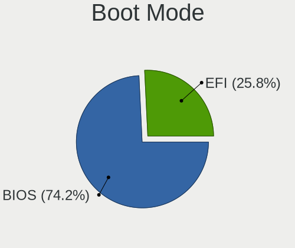
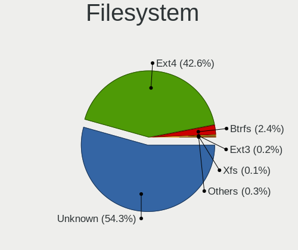
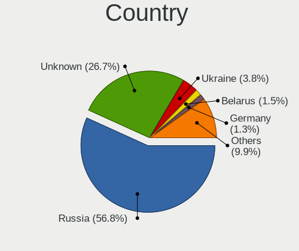
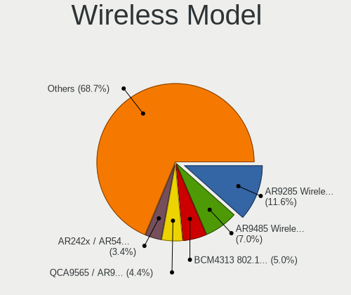
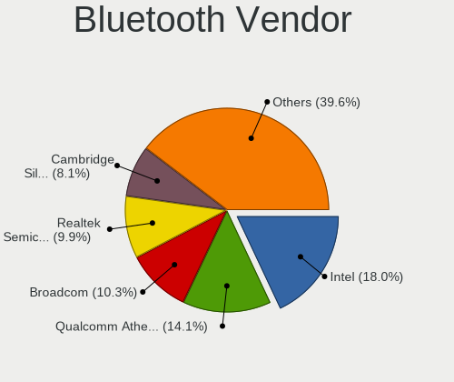
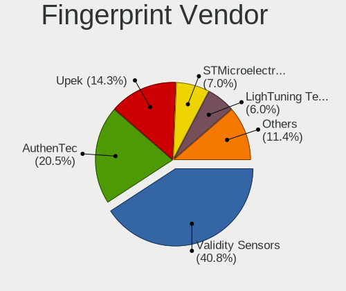

ROSA - Tested Hardware & Statistics
-----------------------------------

A project to collect tested hardware configurations for ROSA.

Anyone can contribute to this report by the [hw-probe](https://github.com/linuxhw/hw-probe) tool:

    sudo -E hw-probe -all -upload

Please contribute! Especially if your hardware is rare.

This is a report for all computer types. See also reports for [desktops](/Dist/ROSA/Desktop/README.md) and [notebooks](/Dist/ROSA/Notebook/README.md).

Contents
--------

* [ Test Cases ](#test-cases)

* [ System ](#system)
  - [ OS                       ](#os)
  - [ OS Family                ](#os-family)
  - [ Kernel                   ](#kernel)
  - [ Kernel Family            ](#kernel-family)
  - [ Kernel Major Ver.        ](#kernel-major-ver)
  - [ Arch                     ](#arch)
  - [ DE                       ](#de)
  - [ Display Server           ](#display-server)
  - [ Display Manager          ](#display-manager)
  - [ OS Lang                  ](#os-lang)
  - [ Boot Mode                ](#boot-mode)
  - [ Filesystem               ](#filesystem)
  - [ Part. scheme             ](#part-scheme)
  - [ Dual Boot with Linux/BSD ](#dual-boot-with-linuxbsd)
  - [ Dual Boot (Win)          ](#dual-boot-win)

* [ Board ](#board)
  - [ Vendor                   ](#vendor)
  - [ Model                    ](#model)
  - [ Model Family             ](#model-family)
  - [ MFG Year                 ](#mfg-year)
  - [ Form Factor              ](#form-factor)
  - [ Secure Boot              ](#secure-boot)
  - [ Coreboot                 ](#coreboot)
  - [ RAM Size                 ](#ram-size)
  - [ RAM Used                 ](#ram-used)
  - [ Total Drives             ](#total-drives)
  - [ Has CD-ROM               ](#has-cd-rom)
  - [ Has Ethernet             ](#has-ethernet)
  - [ Has WiFi                 ](#has-wifi)
  - [ Has Bluetooth            ](#has-bluetooth)

* [ Location ](#location)
  - [ Country                  ](#country)
  - [ City                     ](#city)

* [ Drives ](#drives)
  - [ Drive Vendor             ](#drive-vendor)
  - [ Drive Model              ](#drive-model)
  - [ HDD Vendor               ](#hdd-vendor)
  - [ SSD Vendor               ](#ssd-vendor)
  - [ Drive Kind               ](#drive-kind)
  - [ Drive Connector          ](#drive-connector)
  - [ Drive Size               ](#drive-size)
  - [ Space Total              ](#space-total)
  - [ Space Used               ](#space-used)
  - [ Malfunc. Drives          ](#malfunc-drives)
  - [ Malfunc. Drive Vendor    ](#malfunc-drive-vendor)
  - [ Malfunc. HDD Vendor      ](#malfunc-hdd-vendor)
  - [ Malfunc. Drive Kind      ](#malfunc-drive-kind)
  - [ Failed Drives            ](#failed-drives)
  - [ Failed Drive Vendor      ](#failed-drive-vendor)
  - [ Drive Status             ](#drive-status)

* [ Storage controller ](#storage-controller)
  - [ Storage Vendor           ](#storage-vendor)
  - [ Storage Model            ](#storage-model)
  - [ Storage Kind             ](#storage-kind)

* [ Processor ](#processor)
  - [ CPU Vendor               ](#cpu-vendor)
  - [ CPU Model                ](#cpu-model)
  - [ CPU Model Family         ](#cpu-model-family)
  - [ CPU Cores                ](#cpu-cores)
  - [ CPU Sockets              ](#cpu-sockets)
  - [ CPU Threads              ](#cpu-threads)
  - [ CPU Op-Modes             ](#cpu-op-modes)
  - [ CPU Microcode            ](#cpu-microcode)
  - [ CPU Microarch            ](#cpu-microarch)

* [ Graphics ](#graphics)
  - [ GPU Vendor               ](#gpu-vendor)
  - [ GPU Model                ](#gpu-model)
  - [ GPU Combo                ](#gpu-combo)
  - [ GPU Driver               ](#gpu-driver)
  - [ GPU Memory               ](#gpu-memory)

* [ Monitor ](#monitor)
  - [ Monitor Vendor           ](#monitor-vendor)
  - [ Monitor Model            ](#monitor-model)
  - [ Monitor Resolution       ](#monitor-resolution)
  - [ Monitor Diagonal         ](#monitor-diagonal)
  - [ Monitor Width            ](#monitor-width)
  - [ Aspect Ratio             ](#aspect-ratio)
  - [ Monitor Area             ](#monitor-area)
  - [ Pixel Density            ](#pixel-density)
  - [ Multiple Monitors        ](#multiple-monitors)

* [ Network ](#network)
  - [ Net Controller Vendor    ](#net-controller-vendor)
  - [ Net Controller Model     ](#net-controller-model)
  - [ Wireless Vendor          ](#wireless-vendor)
  - [ Wireless Model           ](#wireless-model)
  - [ Ethernet Vendor          ](#ethernet-vendor)
  - [ Ethernet Model           ](#ethernet-model)
  - [ Net Controller Kind      ](#net-controller-kind)
  - [ Used Controller          ](#used-controller)
  - [ NICs                     ](#nics)
  - [ IPv6                     ](#ipv6)

* [ Bluetooth ](#bluetooth)
  - [ Bluetooth Vendor         ](#bluetooth-vendor)
  - [ Bluetooth Model          ](#bluetooth-model)

* [ Sound ](#sound)
  - [ Sound Vendor             ](#sound-vendor)
  - [ Sound Model              ](#sound-model)

* [ Memory ](#memory)
  - [ Memory Vendor            ](#memory-vendor)
  - [ Memory Model             ](#memory-model)
  - [ Memory Kind              ](#memory-kind)
  - [ Memory Form Factor       ](#memory-form-factor)
  - [ Memory Size              ](#memory-size)
  - [ Memory Speed             ](#memory-speed)

* [ Printers & scanners ](#printers--scanners)
  - [ Printer Vendor           ](#printer-vendor)
  - [ Printer Model            ](#printer-model)
  - [ Scanner Vendor           ](#scanner-vendor)
  - [ Scanner Model            ](#scanner-model)

* [ Camera ](#camera)
  - [ Camera Vendor            ](#camera-vendor)
  - [ Camera Model             ](#camera-model)

* [ Security ](#security)
  - [ Fingerprint Vendor       ](#fingerprint-vendor)
  - [ Fingerprint Model        ](#fingerprint-model)
  - [ Chipcard Vendor          ](#chipcard-vendor)
  - [ Chipcard Model           ](#chipcard-model)

* [ Unsupported ](#unsupported)
  - [ Unsupported Devices      ](#unsupported-devices)
  - [ Unsupported Device Types ](#unsupported-device-types)

Test Cases
----------

Total: 40261

| Vendor        | Model                       | Form-Factor | Probe                                                      | Date         |
|---------------|-----------------------------|-------------|------------------------------------------------------------|--------------|
| MSI           | MS-7392                     | Desktop     | [d453f89064](https://linux-hardware.org/?probe=d453f89064) | Nov 02, 2022 |
| ASUSTek       | VivoBook_ASUSLaptop X570... | Notebook    | [28d7daff10](https://linux-hardware.org/?probe=28d7daff10) | Nov 02, 2022 |
| Acer          | Nitro AN515-54              | Notebook    | [710ab678b2](https://linux-hardware.org/?probe=710ab678b2) | Nov 02, 2022 |
| Acer          | Aspire A515-54G             | Notebook    | [519fa92199](https://linux-hardware.org/?probe=519fa92199) | Nov 02, 2022 |
| Gigabyte      | H77N-WIFI                   | Desktop     | [d8b066edcd](https://linux-hardware.org/?probe=d8b066edcd) | Nov 02, 2022 |
| ASUSTek       | 1215B                       | Notebook    | [21694405a9](https://linux-hardware.org/?probe=21694405a9) | Nov 02, 2022 |
| Acer          | Aspire 5750G                | Notebook    | [496a16216c](https://linux-hardware.org/?probe=496a16216c) | Nov 02, 2022 |
| Intel         | NUC7i3DNB J57625-508        | Mini pc     | [075f628a80](https://linux-hardware.org/?probe=075f628a80) | Nov 02, 2022 |
| Lenovo        | H420                        | Desktop     | [3e3f04d875](https://linux-hardware.org/?probe=3e3f04d875) | Nov 02, 2022 |
| ASUSTek       | VivoBook_ASUSLaptop X570... | Notebook    | [6f89789444](https://linux-hardware.org/?probe=6f89789444) | Nov 02, 2022 |
| Gigabyte      | EP45-DS4                    | Desktop     | [fa96a26c5a](https://linux-hardware.org/?probe=fa96a26c5a) | Nov 02, 2022 |
| ECS           | H61H2-M2                    | Desktop     | [b70c0aa20d](https://linux-hardware.org/?probe=b70c0aa20d) | Nov 01, 2022 |
| Gigabyte      | EP45-DS4                    | Desktop     | [2eb78b1c3d](https://linux-hardware.org/?probe=2eb78b1c3d) | Nov 01, 2022 |
| ASUSTek       | PRIME H310M-K               | Desktop     | [9efd2724b2](https://linux-hardware.org/?probe=9efd2724b2) | Nov 01, 2022 |
| HP            | Laptop 14s-fq0xxx           | Notebook    | [fe23529093](https://linux-hardware.org/?probe=fe23529093) | Nov 01, 2022 |
| ASRock        | B365M-HDV                   | Desktop     | [29a6bce4c0](https://linux-hardware.org/?probe=29a6bce4c0) | Nov 01, 2022 |
| ASUSTek       | H81M-C                      | Desktop     | [76052b7756](https://linux-hardware.org/?probe=76052b7756) | Nov 01, 2022 |
| Lenovo        | V14-ADA 82C6                | Notebook    | [a54d6876b6](https://linux-hardware.org/?probe=a54d6876b6) | Nov 01, 2022 |
| MSI           | H61M-P32/W8                 | Desktop     | [14df9c3c14](https://linux-hardware.org/?probe=14df9c3c14) | Nov 01, 2022 |
| ASRock        | N68C-GS FX                  | Desktop     | [f7a9c5f382](https://linux-hardware.org/?probe=f7a9c5f382) | Nov 01, 2022 |
| Lenovo        | V15 G2 ALC 82KD             | Notebook    | [406aae2f66](https://linux-hardware.org/?probe=406aae2f66) | Nov 01, 2022 |
| Apple         | MacBookPro8,1               | Notebook    | [da912b99f4](https://linux-hardware.org/?probe=da912b99f4) | Nov 01, 2022 |
| MSI           | H81M-P33                    | Desktop     | [29e4a4ec52](https://linux-hardware.org/?probe=29e4a4ec52) | Oct 31, 2022 |
| ASUSTek       | PRIME Z690M-PLUS D4         | Desktop     | [96d61ed3e1](https://linux-hardware.org/?probe=96d61ed3e1) | Oct 31, 2022 |
| MSI           | B450-A PRO MAX              | Desktop     | [8e480ded02](https://linux-hardware.org/?probe=8e480ded02) | Oct 31, 2022 |
| Gigabyte      | X99-SLI-CF                  | Desktop     | [d6bc77d638](https://linux-hardware.org/?probe=d6bc77d638) | Oct 31, 2022 |
| Acer          | Aspire A315-51              | Notebook    | [eaa9bcaadb](https://linux-hardware.org/?probe=eaa9bcaadb) | Oct 31, 2022 |
| ASUSTek       | H81M-C                      | Desktop     | [2fdcf19b6d](https://linux-hardware.org/?probe=2fdcf19b6d) | Oct 31, 2022 |
| Acer          | Aspire A315-51              | Notebook    | [7b016c85d8](https://linux-hardware.org/?probe=7b016c85d8) | Oct 31, 2022 |
| Acer          | Aspire 5733                 | Notebook    | [bcc1836178](https://linux-hardware.org/?probe=bcc1836178) | Oct 31, 2022 |
| Foxconn       | RS690M2MA 0A                | Desktop     | [29605bcad9](https://linux-hardware.org/?probe=29605bcad9) | Oct 31, 2022 |
| ASUSTek       | K43SJ                       | Notebook    | [778e6caf06](https://linux-hardware.org/?probe=778e6caf06) | Oct 31, 2022 |
| Gigabyte      | B660M GAMING X AX           | Desktop     | [d48fe55211](https://linux-hardware.org/?probe=d48fe55211) | Oct 31, 2022 |
| ASRock        | H470M-HDV                   | Desktop     | [a4e522270c](https://linux-hardware.org/?probe=a4e522270c) | Oct 31, 2022 |
| Biostar       | H310MHC2                    | Desktop     | [5ad5ba772f](https://linux-hardware.org/?probe=5ad5ba772f) | Oct 31, 2022 |
| ASRock        | B550 Phantom Gaming 4       | Desktop     | [5e87d391a3](https://linux-hardware.org/?probe=5e87d391a3) | Oct 31, 2022 |
| Sony          | VGN-AR71MR                  | Notebook    | [4ecd695b12](https://linux-hardware.org/?probe=4ecd695b12) | Oct 31, 2022 |
| Intel         | D946GZAB AAD66610-300       | Desktop     | [33c41323a3](https://linux-hardware.org/?probe=33c41323a3) | Oct 31, 2022 |
| ASUSTek       | M5A78L/USB3                 | Desktop     | [b5098e9fe5](https://linux-hardware.org/?probe=b5098e9fe5) | Oct 31, 2022 |
| ASRock        | N68C-GS FX                  | Desktop     | [e24bf2e31f](https://linux-hardware.org/?probe=e24bf2e31f) | Oct 31, 2022 |
| Gigabyte      | H77N-WIFI                   | Desktop     | [d4340d8d66](https://linux-hardware.org/?probe=d4340d8d66) | Oct 31, 2022 |
| HP            | Laptop 14s-dq3xxx           | Notebook    | [674ced10f2](https://linux-hardware.org/?probe=674ced10f2) | Oct 31, 2022 |
| ASUSTek       | Leonite2                    | Desktop     | [955ce84cf2](https://linux-hardware.org/?probe=955ce84cf2) | Oct 30, 2022 |
| ASUSTek       | VivoBook_ASUS Laptop E21... | Notebook    | [cb2a07da11](https://linux-hardware.org/?probe=cb2a07da11) | Oct 30, 2022 |
| ASUSTek       | X501A1                      | Notebook    | [037e1402b1](https://linux-hardware.org/?probe=037e1402b1) | Oct 30, 2022 |
| WeiBu         | Aptio CRB                   | Mini pc     | [fa111a4799](https://linux-hardware.org/?probe=fa111a4799) | Oct 30, 2022 |
| MSI           | Sword 15 A11UE              | Notebook    | [c039d4321b](https://linux-hardware.org/?probe=c039d4321b) | Oct 30, 2022 |
| ASRock        | N68C-GS FX                  | Desktop     | [bf96e5a0a1](https://linux-hardware.org/?probe=bf96e5a0a1) | Oct 30, 2022 |
| ASRock        | H410M-HVS                   | Desktop     | [2d540e06b9](https://linux-hardware.org/?probe=2d540e06b9) | Oct 30, 2022 |
| ASUSTek       | PRIME A320M-K               | Desktop     | [6bbea41ce5](https://linux-hardware.org/?probe=6bbea41ce5) | Oct 30, 2022 |
| ASUSTek       | SABERTOOTH 990FX R2.0       | Desktop     | [b132f4c4e9](https://linux-hardware.org/?probe=b132f4c4e9) | Oct 30, 2022 |
| ASUSTek       | SABERTOOTH 990FX R2.0       | Desktop     | [7e1df59daa](https://linux-hardware.org/?probe=7e1df59daa) | Oct 30, 2022 |
| HP            | Pavilion g6                 | Notebook    | [666a829545](https://linux-hardware.org/?probe=666a829545) | Oct 30, 2022 |
| Gigabyte      | G41M-Combo                  | Desktop     | [180622c3be](https://linux-hardware.org/?probe=180622c3be) | Oct 30, 2022 |
| HIPER         | WORKBOOK                    | Notebook    | [0a3eb12b15](https://linux-hardware.org/?probe=0a3eb12b15) | Oct 30, 2022 |
| ASUSTek       | ROG STRIX B365-G GAMING     | Desktop     | [7f78f3451e](https://linux-hardware.org/?probe=7f78f3451e) | Oct 29, 2022 |
| Acer          | Aspire ZC-605               | All in one  | [0b6c0b7a7c](https://linux-hardware.org/?probe=0b6c0b7a7c) | Oct 29, 2022 |
| Gigabyte      | B450M DS3H-CF               | Desktop     | [47b5907eec](https://linux-hardware.org/?probe=47b5907eec) | Oct 29, 2022 |
| Acer          | Nitro AN515-42              | Notebook    | [763e5e0492](https://linux-hardware.org/?probe=763e5e0492) | Oct 29, 2022 |
| ASUSTek       | P5Q SE2                     | Desktop     | [7d576ac245](https://linux-hardware.org/?probe=7d576ac245) | Oct 29, 2022 |
| MSI           | B450M MORTAR MAX            | Desktop     | [d8321f617e](https://linux-hardware.org/?probe=d8321f617e) | Oct 29, 2022 |
| MSI           | B450M MORTAR MAX            | Desktop     | [7f67023fa9](https://linux-hardware.org/?probe=7f67023fa9) | Oct 29, 2022 |
| Gigabyte      | GA-790XTA-UD4               | Desktop     | [a750edc641](https://linux-hardware.org/?probe=a750edc641) | Oct 29, 2022 |
| ASRock        | H410M-HVS                   | Desktop     | [9371d71f6d](https://linux-hardware.org/?probe=9371d71f6d) | Oct 29, 2022 |
| Foxconn       | 2ACA                        | Desktop     | [69544f77d0](https://linux-hardware.org/?probe=69544f77d0) | Oct 29, 2022 |
| ASUSTek       | ZenBook 13 UX310UFR         | Notebook    | [11b52c3e1f](https://linux-hardware.org/?probe=11b52c3e1f) | Oct 29, 2022 |
| Gigabyte      | H110M-M2-CF                 | Desktop     | [34c4f594c4](https://linux-hardware.org/?probe=34c4f594c4) | Oct 29, 2022 |
| Dell          | 0Y5DDC A00                  | Desktop     | [e3421b1908](https://linux-hardware.org/?probe=e3421b1908) | Oct 29, 2022 |
| ASUSTek       | X550DP                      | Notebook    | [b0a52fe296](https://linux-hardware.org/?probe=b0a52fe296) | Oct 29, 2022 |
| Samsung       | 350V5C/351V5C/3540VC/344... | Notebook    | [0a24d1491a](https://linux-hardware.org/?probe=0a24d1491a) | Oct 29, 2022 |
| ASRock        | N68-GS4 FX                  | Desktop     | [04334f2930](https://linux-hardware.org/?probe=04334f2930) | Oct 29, 2022 |
| Gigabyte      | B550 GAMING X V2            | Desktop     | [7b3b808198](https://linux-hardware.org/?probe=7b3b808198) | Oct 29, 2022 |
| Gigabyte      | B550 GAMING X V2            | Desktop     | [5405caf9dc](https://linux-hardware.org/?probe=5405caf9dc) | Oct 28, 2022 |
| Lenovo        | B560                        | Notebook    | [f8676b0e49](https://linux-hardware.org/?probe=f8676b0e49) | Oct 28, 2022 |
| MSI           | MAG B560 TOMAHAWK WIFI      | Desktop     | [429fd34d64](https://linux-hardware.org/?probe=429fd34d64) | Oct 28, 2022 |
| ASUSTek       | H81M-C                      | Desktop     | [c96189c44c](https://linux-hardware.org/?probe=c96189c44c) | Oct 28, 2022 |
| ASUSTek       | F3Ka                        | Notebook    | [06235844a1](https://linux-hardware.org/?probe=06235844a1) | Oct 28, 2022 |
| Gigabyte      | PH67-UD3-B3                 | Desktop     | [c66fb514ab](https://linux-hardware.org/?probe=c66fb514ab) | Oct 28, 2022 |
| Lenovo        | Legion Y540-15IRH-PG0 81... | Notebook    | [f845ed2866](https://linux-hardware.org/?probe=f845ed2866) | Oct 28, 2022 |
| Dell          | Inspiron 3542               | Notebook    | [a3a24a81fa](https://linux-hardware.org/?probe=a3a24a81fa) | Oct 28, 2022 |
| Lenovo        | IdeaPad 110-15IBR 80T7      | Notebook    | [26311f56d7](https://linux-hardware.org/?probe=26311f56d7) | Oct 28, 2022 |
| Gigabyte      | A320M-S2H-CF                | Desktop     | [594b16e254](https://linux-hardware.org/?probe=594b16e254) | Oct 28, 2022 |
| ASUSTek       | K501LB                      | Notebook    | [25003181f1](https://linux-hardware.org/?probe=25003181f1) | Oct 27, 2022 |
| Gigabyte      | F2A88X-D3H                  | Desktop     | [dc1e16bba1](https://linux-hardware.org/?probe=dc1e16bba1) | Oct 27, 2022 |
| ASUSTek       | M5A97 PRO                   | Desktop     | [de99c600e5](https://linux-hardware.org/?probe=de99c600e5) | Oct 27, 2022 |
| Acer          | Aspire E5-573G              | Notebook    | [6f926eed65](https://linux-hardware.org/?probe=6f926eed65) | Oct 27, 2022 |
| Gigabyte      | H110M-S2V-CF                | Desktop     | [1d4dfc3e06](https://linux-hardware.org/?probe=1d4dfc3e06) | Oct 27, 2022 |
| ASUSTek       | K501LB                      | Notebook    | [2481764903](https://linux-hardware.org/?probe=2481764903) | Oct 27, 2022 |
| HP            | Laptop 14s-fq0xxx           | Notebook    | [377893cdc6](https://linux-hardware.org/?probe=377893cdc6) | Oct 27, 2022 |
| Fujitsu       | D2990-A2 S26361-D2990-A2    | Desktop     | [6de2b1229f](https://linux-hardware.org/?probe=6de2b1229f) | Oct 27, 2022 |
| Acer          | Aspire A315-51              | Notebook    | [17faa0d40a](https://linux-hardware.org/?probe=17faa0d40a) | Oct 27, 2022 |
| ASUSTek       | N56VZ                       | Notebook    | [399d92f9e0](https://linux-hardware.org/?probe=399d92f9e0) | Oct 27, 2022 |
| HP            | Compaq 610                  | Notebook    | [5adc7e0aba](https://linux-hardware.org/?probe=5adc7e0aba) | Oct 26, 2022 |
| MSI           | H81M-P33                    | Desktop     | [e4f38c5519](https://linux-hardware.org/?probe=e4f38c5519) | Oct 26, 2022 |
| Lenovo        | Legion 5 15IMH05H 81Y6      | Notebook    | [9bb0c7d3b0](https://linux-hardware.org/?probe=9bb0c7d3b0) | Oct 26, 2022 |
| HP            | 8717                        | Desktop     | [c2fcc7119a](https://linux-hardware.org/?probe=c2fcc7119a) | Oct 26, 2022 |
| Acer          | Nitro AN515-54              | Notebook    | [89180ba46b](https://linux-hardware.org/?probe=89180ba46b) | Oct 26, 2022 |
| Samsung       | 300V3A/300V4A/300V5A/200... | Notebook    | [70ea39404e](https://linux-hardware.org/?probe=70ea39404e) | Oct 26, 2022 |
| HP            | EliteBook 840 G4            | Notebook    | [73ee5ace17](https://linux-hardware.org/?probe=73ee5ace17) | Oct 26, 2022 |
| ASRock        | 970 Pro3 R2.0               | Desktop     | [c2b4882963](https://linux-hardware.org/?probe=c2b4882963) | Oct 26, 2022 |
| MiTAC         | E220 E220AQ-601             | Desktop     | [1ee0c036f8](https://linux-hardware.org/?probe=1ee0c036f8) | Oct 26, 2022 |
| ASUSTek       | VivoBook_ASUSLaptop M350... | Notebook    | [8b68d25121](https://linux-hardware.org/?probe=8b68d25121) | Oct 26, 2022 |
| HP            | Laptop 15s-fq2xxx           | Notebook    | [a7a7e4b82c](https://linux-hardware.org/?probe=a7a7e4b82c) | Oct 26, 2022 |
| HP            | Pavilion dv7                | Notebook    | [1b53255010](https://linux-hardware.org/?probe=1b53255010) | Oct 25, 2022 |
| Gigabyte      | AB350M-Gaming 3-CF          | Desktop     | [926be6d85b](https://linux-hardware.org/?probe=926be6d85b) | Oct 25, 2022 |
| Gigabyte      | AB350M-Gaming 3-CF          | Desktop     | [94a393835b](https://linux-hardware.org/?probe=94a393835b) | Oct 25, 2022 |
| ASUSTek       | VivoBook_ASUSLaptop X570... | Notebook    | [09eec214ae](https://linux-hardware.org/?probe=09eec214ae) | Oct 25, 2022 |
| Lenovo        | Larne CRB 31900059 STD 2... | All in one  | [a0f7baa45e](https://linux-hardware.org/?probe=a0f7baa45e) | Oct 25, 2022 |
| Acer          | Extensa 5630                | Notebook    | [bdc63e9670](https://linux-hardware.org/?probe=bdc63e9670) | Oct 25, 2022 |
| Toshiba       | Satellite C660              | Notebook    | [b9d0cd845c](https://linux-hardware.org/?probe=b9d0cd845c) | Oct 25, 2022 |
| Toshiba       | Satellite C660              | Notebook    | [36faa336cf](https://linux-hardware.org/?probe=36faa336cf) | Oct 25, 2022 |
| MSI           | B450M-A PRO MAX             | Desktop     | [9f404fe6b4](https://linux-hardware.org/?probe=9f404fe6b4) | Oct 25, 2022 |
| Dell          | 0Y5DDC A00                  | Desktop     | [bc39e0cfd6](https://linux-hardware.org/?probe=bc39e0cfd6) | Oct 25, 2022 |
| ASUSTek       | PRIME B550-PLUS             | Desktop     | [b8b23daad5](https://linux-hardware.org/?probe=b8b23daad5) | Oct 25, 2022 |
| Gigabyte      | H410M H V3                  | Desktop     | [b4c5ed92b7](https://linux-hardware.org/?probe=b4c5ed92b7) | Oct 24, 2022 |
| MSI           | B450M GAMING PLUS           | Desktop     | [e3041ae2eb](https://linux-hardware.org/?probe=e3041ae2eb) | Oct 24, 2022 |
| Lenovo        | IdeaPad L340-15IRH Gamin... | Notebook    | [f426a7b690](https://linux-hardware.org/?probe=f426a7b690) | Oct 24, 2022 |
| Gigabyte      | B450 AORUS M                | Desktop     | [08c2a2abf9](https://linux-hardware.org/?probe=08c2a2abf9) | Oct 24, 2022 |
| Gigabyte      | X58A-UD7                    | Desktop     | [8b0cff9259](https://linux-hardware.org/?probe=8b0cff9259) | Oct 24, 2022 |
| ASUSTek       | P8H77-V                     | Desktop     | [fdb1bce84a](https://linux-hardware.org/?probe=fdb1bce84a) | Oct 24, 2022 |
| ECS           | H310CH5-M2                  | Desktop     | [e9d2a5becb](https://linux-hardware.org/?probe=e9d2a5becb) | Oct 24, 2022 |
| MSI           | GE60 2PC                    | Notebook    | [e4378edb2b](https://linux-hardware.org/?probe=e4378edb2b) | Oct 24, 2022 |
| Sony          | SVE1513U1RW                 | Notebook    | [019c35087a](https://linux-hardware.org/?probe=019c35087a) | Oct 24, 2022 |
| MSI           | GE60 2PC                    | Notebook    | [930a153301](https://linux-hardware.org/?probe=930a153301) | Oct 24, 2022 |
| ASUSTek       | N56DY                       | Notebook    | [2d308224ee](https://linux-hardware.org/?probe=2d308224ee) | Oct 23, 2022 |
| ASUSTek       | N56DY                       | Notebook    | [d0caa49d24](https://linux-hardware.org/?probe=d0caa49d24) | Oct 23, 2022 |
| Gigabyte      | B450M DS3H V2               | Desktop     | [a159a5720e](https://linux-hardware.org/?probe=a159a5720e) | Oct 23, 2022 |
| HUAWEI        | NBD-WXX9                    | Notebook    | [c6c2d4cab0](https://linux-hardware.org/?probe=c6c2d4cab0) | Oct 23, 2022 |
| HP            | Pavilion g6                 | Notebook    | [1c355f37b9](https://linux-hardware.org/?probe=1c355f37b9) | Oct 23, 2022 |
| HP            | Compaq 610                  | Notebook    | [9a584886fe](https://linux-hardware.org/?probe=9a584886fe) | Oct 23, 2022 |
| ASUSTek       | W7S                         | Notebook    | [5797f4be95](https://linux-hardware.org/?probe=5797f4be95) | Oct 23, 2022 |
| HP            | Pavilion dv7                | Notebook    | [acaa8b9309](https://linux-hardware.org/?probe=acaa8b9309) | Oct 23, 2022 |
| Lenovo        | IdeaPad 330-14AST 81D5      | Notebook    | [e0face3bcb](https://linux-hardware.org/?probe=e0face3bcb) | Oct 22, 2022 |
| ASUSTek       | M4A77T/USB3                 | Desktop     | [2df43ccc5d](https://linux-hardware.org/?probe=2df43ccc5d) | Oct 22, 2022 |
| ASUSTek       | M32CD_A_F_K20CD_K31CD       | Desktop     | [6105b0d3a9](https://linux-hardware.org/?probe=6105b0d3a9) | Oct 22, 2022 |
| Unknown       | NF-CK804                    | Desktop     | [4df3f7c7e6](https://linux-hardware.org/?probe=4df3f7c7e6) | Oct 22, 2022 |
| HP            | Pavilion dv7                | Notebook    | [ede1ff6d62](https://linux-hardware.org/?probe=ede1ff6d62) | Oct 22, 2022 |
| Samsung       | 300V3A/300V4A/300V5A/200... | Notebook    | [eb7a276b51](https://linux-hardware.org/?probe=eb7a276b51) | Oct 22, 2022 |
| Shanghai Z... | ZXE CRB                     | Notebook    | [166b646956](https://linux-hardware.org/?probe=166b646956) | Oct 22, 2022 |
| Acer          | Aspire E1-571G              | Notebook    | [3440b5765d](https://linux-hardware.org/?probe=3440b5765d) | Oct 21, 2022 |
| MSI           | A320M GRENADE               | Desktop     | [30bcc61268](https://linux-hardware.org/?probe=30bcc61268) | Oct 21, 2022 |
| 3Logic Gro... | APM Graviton                | Notebook    | [0dd152f1d6](https://linux-hardware.org/?probe=0dd152f1d6) | Oct 21, 2022 |
| AZW           | SER V01                     | Mini pc     | [8bcd74b302](https://linux-hardware.org/?probe=8bcd74b302) | Oct 21, 2022 |
| Gigabyte      | H81M-S1                     | Desktop     | [8168ea4028](https://linux-hardware.org/?probe=8168ea4028) | Oct 21, 2022 |
| Samsung       | RV411/RV511/E3511/S3511/... | Notebook    | [6c8562fa45](https://linux-hardware.org/?probe=6c8562fa45) | Oct 21, 2022 |
| Dell          | 0GM819                      | Desktop     | [e2ebe8bae1](https://linux-hardware.org/?probe=e2ebe8bae1) | Oct 21, 2022 |
| ASRock        | N68-S                       | Desktop     | [3cfa7cd9f8](https://linux-hardware.org/?probe=3cfa7cd9f8) | Oct 21, 2022 |
| Lenovo        | IdeaPad 330-15AST 81D6      | Notebook    | [123b6fc51a](https://linux-hardware.org/?probe=123b6fc51a) | Oct 21, 2022 |
| Gigabyte      | H310M H x.x                 | Desktop     | [a0a8fc6cb0](https://linux-hardware.org/?probe=a0a8fc6cb0) | Oct 21, 2022 |
| Acer          | Aspire A315-51              | Notebook    | [244d93ab06](https://linux-hardware.org/?probe=244d93ab06) | Oct 21, 2022 |
| Acer          | Aspire A315-51              | Notebook    | [dc26121480](https://linux-hardware.org/?probe=dc26121480) | Oct 21, 2022 |
| MSI           | A320M GRENADE               | Desktop     | [73112f41f7](https://linux-hardware.org/?probe=73112f41f7) | Oct 21, 2022 |
| ASUSTek       | B85-PLUS                    | Desktop     | [a057e410d0](https://linux-hardware.org/?probe=a057e410d0) | Oct 21, 2022 |
| ASUSTek       | B85-PLUS                    | Desktop     | [72c61d8c50](https://linux-hardware.org/?probe=72c61d8c50) | Oct 21, 2022 |
| ASRock        | H81M-HDS R2.0               | Desktop     | [6161a12f13](https://linux-hardware.org/?probe=6161a12f13) | Oct 20, 2022 |
| ASUSTek       | VivoBook_ASUSLaptop M350... | Notebook    | [4c95f64c92](https://linux-hardware.org/?probe=4c95f64c92) | Oct 20, 2022 |
| ASUSTek       | P5Q SE                      | Desktop     | [c223e518c9](https://linux-hardware.org/?probe=c223e518c9) | Oct 20, 2022 |
| ASUSTek       | PRIME B360M-A               | Desktop     | [444b923209](https://linux-hardware.org/?probe=444b923209) | Oct 20, 2022 |
| Gigabyte      | EP41-UD3L                   | Desktop     | [d82763649b](https://linux-hardware.org/?probe=d82763649b) | Oct 20, 2022 |
| Gigabyte      | H77N-WIFI                   | Desktop     | [fffc0ab985](https://linux-hardware.org/?probe=fffc0ab985) | Oct 20, 2022 |
| Acer          | Aspire E5-575G              | Notebook    | [66cfe85e96](https://linux-hardware.org/?probe=66cfe85e96) | Oct 20, 2022 |
| Lenovo        | IdeaPad Gaming 3 15ACH6 ... | Notebook    | [344040aee1](https://linux-hardware.org/?probe=344040aee1) | Oct 19, 2022 |
| ASRock        | H81M-HDS R2.0               | Desktop     | [b27f916880](https://linux-hardware.org/?probe=b27f916880) | Oct 19, 2022 |
| HP            | Pavilion g6                 | Notebook    | [8744b669fe](https://linux-hardware.org/?probe=8744b669fe) | Oct 19, 2022 |
| Acer          | FMCP7A-ION                  | Desktop     | [e7646c8fe4](https://linux-hardware.org/?probe=e7646c8fe4) | Oct 19, 2022 |
| Pegatron      | A17                         | Notebook    | [14f7d2a90d](https://linux-hardware.org/?probe=14f7d2a90d) | Oct 19, 2022 |
| Lenovo        | IdeaPad 3 15ADA05 81W1      | Notebook    | [d6d2256d26](https://linux-hardware.org/?probe=d6d2256d26) | Oct 19, 2022 |
| Gigabyte      | EP41-UD3L                   | Desktop     | [31867fb669](https://linux-hardware.org/?probe=31867fb669) | Oct 19, 2022 |
| ECS           | H61H2-M12                   | Desktop     | [7c4ae7b4ab](https://linux-hardware.org/?probe=7c4ae7b4ab) | Oct 19, 2022 |
| ASUSTek       | Leonite2                    | Desktop     | [717cc412e5](https://linux-hardware.org/?probe=717cc412e5) | Oct 19, 2022 |
| MSI           | PRO H410M-B                 | Desktop     | [549eeb915c](https://linux-hardware.org/?probe=549eeb915c) | Oct 19, 2022 |
| ASUSTek       | VivoBook_ASUSLaptop X570... | Notebook    | [3c2bd41b69](https://linux-hardware.org/?probe=3c2bd41b69) | Oct 19, 2022 |
| ASUSTek       | H81M-K                      | Desktop     | [a4a1d563b5](https://linux-hardware.org/?probe=a4a1d563b5) | Oct 19, 2022 |
| Lenovo        | IdeaPad 5 Pro 16ACH6 82L... | Notebook    | [71f188e90c](https://linux-hardware.org/?probe=71f188e90c) | Oct 19, 2022 |
| Dell          | Inspiron 15-3567            | Notebook    | [4727244665](https://linux-hardware.org/?probe=4727244665) | Oct 18, 2022 |
| ASRock        | H61M-GE                     | Desktop     | [6149e0c478](https://linux-hardware.org/?probe=6149e0c478) | Oct 18, 2022 |
| Intel         | X99                         | Desktop     | [4217ddeb6b](https://linux-hardware.org/?probe=4217ddeb6b) | Oct 18, 2022 |
| MSI           | Z490-A PRO                  | Desktop     | [db93de2ab4](https://linux-hardware.org/?probe=db93de2ab4) | Oct 18, 2022 |
| Gigabyte      | B450M DS3H-CF               | Desktop     | [3b1ce3ab08](https://linux-hardware.org/?probe=3b1ce3ab08) | Oct 18, 2022 |
| eMachines     | E525                        | Notebook    | [6b500273c6](https://linux-hardware.org/?probe=6b500273c6) | Oct 18, 2022 |
| Lenovo        | G565 20071                  | Notebook    | [52758e9b4b](https://linux-hardware.org/?probe=52758e9b4b) | Oct 18, 2022 |
| MSI           | B360M GAMING PLUS           | Desktop     | [df2e89c571](https://linux-hardware.org/?probe=df2e89c571) | Oct 18, 2022 |
| Lenovo        | B570e HuronRiver Platfor... | Notebook    | [b8a2cca654](https://linux-hardware.org/?probe=b8a2cca654) | Oct 18, 2022 |
| Gigabyte      | H77N-WIFI                   | Desktop     | [1e8b0c8279](https://linux-hardware.org/?probe=1e8b0c8279) | Oct 18, 2022 |
| Biostar       | A320MD PRO                  | Desktop     | [0497b12091](https://linux-hardware.org/?probe=0497b12091) | Oct 18, 2022 |
| Maibenben     | ZiMai Z5                    | Notebook    | [96d25004be](https://linux-hardware.org/?probe=96d25004be) | Oct 18, 2022 |
| Lenovo        | V310-15IKB 80T3             | Notebook    | [c56ac0436c](https://linux-hardware.org/?probe=c56ac0436c) | Oct 18, 2022 |
| ASRock        | H310CM-HDV/M.2              | Desktop     | [f2112b8b74](https://linux-hardware.org/?probe=f2112b8b74) | Oct 18, 2022 |
| Lenovo        | G480                        | Notebook    | [55e0ad0e82](https://linux-hardware.org/?probe=55e0ad0e82) | Oct 17, 2022 |
| ASUSTek       | ROG STRIX B550-I GAMING     | Desktop     | [5335a66143](https://linux-hardware.org/?probe=5335a66143) | Oct 17, 2022 |
| ASRock        | H61M-GE                     | Desktop     | [873932f557](https://linux-hardware.org/?probe=873932f557) | Oct 17, 2022 |
| ASUSTek       | M5A97 R2.0                  | Desktop     | [b85a76dd7f](https://linux-hardware.org/?probe=b85a76dd7f) | Oct 17, 2022 |
| Biostar       | H61MLV                      | Desktop     | [c2fb8ebaac](https://linux-hardware.org/?probe=c2fb8ebaac) | Oct 17, 2022 |
| Acer          | Aspire 5740                 | Notebook    | [83bb80a8d4](https://linux-hardware.org/?probe=83bb80a8d4) | Oct 17, 2022 |
| Dell          | 0HY553                      | Desktop     | [08f05b94e6](https://linux-hardware.org/?probe=08f05b94e6) | Oct 17, 2022 |
| Maibenben     | MaiBook M                   | Notebook    | [ca20ade584](https://linux-hardware.org/?probe=ca20ade584) | Oct 16, 2022 |
| ASUSTek       | VivoBook_ASUSLaptop M350... | Notebook    | [2740d3c96e](https://linux-hardware.org/?probe=2740d3c96e) | Oct 16, 2022 |
| HP            | 81B3                        | Desktop     | [e303e50785](https://linux-hardware.org/?probe=e303e50785) | Oct 16, 2022 |
| Fujitsu       | D3413-A1 S26361-D3413-A1    | Desktop     | [62cacee577](https://linux-hardware.org/?probe=62cacee577) | Oct 16, 2022 |
| Gigabyte      | B75M-D2V                    | Desktop     | [20ac585859](https://linux-hardware.org/?probe=20ac585859) | Oct 16, 2022 |
| Gigabyte      | MQHUDVI                     | All in one  | [a8a5d51913](https://linux-hardware.org/?probe=a8a5d51913) | Oct 16, 2022 |
| HONOR         | NBR-WAX9                    | Notebook    | [3862d6fc41](https://linux-hardware.org/?probe=3862d6fc41) | Oct 16, 2022 |
| ASUSTek       | P8H61-M LE                  | Desktop     | [cf76898812](https://linux-hardware.org/?probe=cf76898812) | Oct 16, 2022 |
| Lenovo        | B580 20144                  | Notebook    | [3de13d5e45](https://linux-hardware.org/?probe=3de13d5e45) | Oct 16, 2022 |
| Samsung       | RV413/RV513                 | Notebook    | [22d5794b5d](https://linux-hardware.org/?probe=22d5794b5d) | Oct 16, 2022 |
| Sony          | SVE1512H1RW                 | Notebook    | [bdc28748b2](https://linux-hardware.org/?probe=bdc28748b2) | Oct 16, 2022 |
| ASUSTek       | VivoBook_ASUSLaptop X403... | Notebook    | [7782926601](https://linux-hardware.org/?probe=7782926601) | Oct 16, 2022 |
| ECS           | G41T-M7                     | Desktop     | [3abe70653e](https://linux-hardware.org/?probe=3abe70653e) | Oct 16, 2022 |
| Gigabyte      | GA-770TA-UD3                | Desktop     | [82f436a99c](https://linux-hardware.org/?probe=82f436a99c) | Oct 16, 2022 |
| MSI           | Sword 15 A11UE              | Notebook    | [514b1ab74d](https://linux-hardware.org/?probe=514b1ab74d) | Oct 16, 2022 |
| Gigabyte      | X470 AORUS ULTRA GAMING-... | Desktop     | [59a0225889](https://linux-hardware.org/?probe=59a0225889) | Oct 16, 2022 |
| ASRock        | A55 Pro3                    | Desktop     | [0b3e7a1cd2](https://linux-hardware.org/?probe=0b3e7a1cd2) | Oct 16, 2022 |
| ASUSTek       | PRIME B450M-K               | Desktop     | [288b9fadfe](https://linux-hardware.org/?probe=288b9fadfe) | Oct 15, 2022 |
| Gigabyte      | B250M-D3H-CF                | Desktop     | [c351e0fae6](https://linux-hardware.org/?probe=c351e0fae6) | Oct 15, 2022 |
| Pegatron      | A15                         | Notebook    | [25bf0fe850](https://linux-hardware.org/?probe=25bf0fe850) | Oct 15, 2022 |
| ASUSTek       | K53TA                       | Notebook    | [8759f9f39c](https://linux-hardware.org/?probe=8759f9f39c) | Oct 15, 2022 |
| ASUSTek       | P7H55-M/USB3                | Desktop     | [8a98e44bee](https://linux-hardware.org/?probe=8a98e44bee) | Oct 15, 2022 |
| ASRock        | B460 Steel Legend           | Desktop     | [ca98840e23](https://linux-hardware.org/?probe=ca98840e23) | Oct 14, 2022 |
| Lenovo        | IdeaPad 330-15IGM 81D1      | Notebook    | [f7b75c7dff](https://linux-hardware.org/?probe=f7b75c7dff) | Oct 14, 2022 |
| Acer          | Aspire E5-511               | Notebook    | [823f951e7a](https://linux-hardware.org/?probe=823f951e7a) | Oct 14, 2022 |
| MSI           | B85M-P33                    | Desktop     | [83d476e3d7](https://linux-hardware.org/?probe=83d476e3d7) | Oct 14, 2022 |
| ASUSTek       | ROG Zephyrus M16 GU603HE... | Notebook    | [2356263af1](https://linux-hardware.org/?probe=2356263af1) | Oct 14, 2022 |
| ASUSTek       | K53TA                       | Notebook    | [dd95142fda](https://linux-hardware.org/?probe=dd95142fda) | Oct 14, 2022 |
| Gigabyte      | H77N-WIFI                   | Desktop     | [d1f08d0589](https://linux-hardware.org/?probe=d1f08d0589) | Oct 14, 2022 |
| HUAWEI        | NBLK-WAX9X                  | Notebook    | [9f4368b685](https://linux-hardware.org/?probe=9f4368b685) | Oct 14, 2022 |
| ASUSTek       | P8H77-V                     | Desktop     | [9c98c411c5](https://linux-hardware.org/?probe=9c98c411c5) | Oct 14, 2022 |
| eMachines     | E525                        | Notebook    | [a2c8a5cadb](https://linux-hardware.org/?probe=a2c8a5cadb) | Oct 14, 2022 |
| ASUSTek       | ROG STRIX B550-I GAMING     | Desktop     | [da04425205](https://linux-hardware.org/?probe=da04425205) | Oct 14, 2022 |
| ASUSTek       | K55N                        | Notebook    | [8a7b8b14f3](https://linux-hardware.org/?probe=8a7b8b14f3) | Oct 13, 2022 |
| ASUSTek       | VivoBook_ASUSLaptop M350... | Notebook    | [54d1a0ebb2](https://linux-hardware.org/?probe=54d1a0ebb2) | Oct 13, 2022 |
| Acer          | Aspire E1-571G              | Notebook    | [75b10196e0](https://linux-hardware.org/?probe=75b10196e0) | Oct 13, 2022 |
| ASRock        | G41M-VS3                    | Desktop     | [7fa0f82664](https://linux-hardware.org/?probe=7fa0f82664) | Oct 13, 2022 |
| Gigabyte      | H77N-WIFI                   | Desktop     | [6597eea759](https://linux-hardware.org/?probe=6597eea759) | Oct 13, 2022 |
| Acer          | Aspire 5742G                | Notebook    | [b9da06eb9c](https://linux-hardware.org/?probe=b9da06eb9c) | Oct 13, 2022 |
| Lenovo        | ThinkPad X1 Carbon 34481... | Notebook    | [adce18affa](https://linux-hardware.org/?probe=adce18affa) | Oct 13, 2022 |
| Founder       | H61H2-AM V1.1               | Desktop     | [4d558904f5](https://linux-hardware.org/?probe=4d558904f5) | Oct 13, 2022 |
| Lenovo        | ThinkCentre M71z 1782RP4    | Desktop     | [bee14a3740](https://linux-hardware.org/?probe=bee14a3740) | Oct 13, 2022 |
| Lenovo        | G50-30 80G0                 | Notebook    | [f3bdfee67a](https://linux-hardware.org/?probe=f3bdfee67a) | Oct 13, 2022 |
| ASUSTek       | P8B75-M                     | Desktop     | [98ea718793](https://linux-hardware.org/?probe=98ea718793) | Oct 12, 2022 |
| ASUSTek       | P8H61-M LX3                 | Desktop     | [be3020e232](https://linux-hardware.org/?probe=be3020e232) | Oct 12, 2022 |
| HP            | Laptop 15-db0xxx            | Notebook    | [16bb04d1db](https://linux-hardware.org/?probe=16bb04d1db) | Oct 11, 2022 |
| ASUSTek       | PRIME B560M-A               | Desktop     | [15cc45253b](https://linux-hardware.org/?probe=15cc45253b) | Oct 11, 2022 |
| ASUSTek       | VivoBook_ASUSLaptop M350... | Notebook    | [7969631063](https://linux-hardware.org/?probe=7969631063) | Oct 11, 2022 |
| Lenovo        | ThinkPad S1 Yoga 20CDA00... | Notebook    | [7bc7561ab1](https://linux-hardware.org/?probe=7bc7561ab1) | Oct 11, 2022 |
| ASRock        | D1800B-ITX                  | Desktop     | [a44ef4b82f](https://linux-hardware.org/?probe=a44ef4b82f) | Oct 11, 2022 |
| Lenovo        | G710 20252                  | Notebook    | [d83e7270f9](https://linux-hardware.org/?probe=d83e7270f9) | Oct 11, 2022 |
| Gigabyte      | GA-78LMT-S2P                | Desktop     | [8ec5da3fb1](https://linux-hardware.org/?probe=8ec5da3fb1) | Oct 10, 2022 |
| ASRock        | D1800B-ITX                  | Desktop     | [7b33424235](https://linux-hardware.org/?probe=7b33424235) | Oct 10, 2022 |
| Fujitsu       | D3062-A1 S26361-D3062-A1    | Desktop     | [899c4a1231](https://linux-hardware.org/?probe=899c4a1231) | Oct 10, 2022 |
| Acer          | Aspire C24-963              | All in one  | [9cbb565cca](https://linux-hardware.org/?probe=9cbb565cca) | Oct 10, 2022 |
| MSI           | MS-7430 0A                  | Desktop     | [ac3040f9c3](https://linux-hardware.org/?probe=ac3040f9c3) | Oct 10, 2022 |
| Aquarius      | NS685U R11                  | Notebook    | [ce27c5e6f7](https://linux-hardware.org/?probe=ce27c5e6f7) | Oct 10, 2022 |
| ASUSTek       | H61M-K                      | Desktop     | [f6d2b67f4a](https://linux-hardware.org/?probe=f6d2b67f4a) | Oct 10, 2022 |
| MSI           | B450M-A PRO MAX             | Desktop     | [cac41cb816](https://linux-hardware.org/?probe=cac41cb816) | Oct 10, 2022 |
| ASUSTek       | VivoBook_ASUSLaptop M350... | Notebook    | [f5e933eaac](https://linux-hardware.org/?probe=f5e933eaac) | Oct 10, 2022 |
| ASUSTek       | VivoBook_ASUS Laptop E21... | Notebook    | [52c4e232f3](https://linux-hardware.org/?probe=52c4e232f3) | Oct 10, 2022 |
| Lenovo        | IdeaPad S340-14API 81NB     | Notebook    | [efabc0c1ba](https://linux-hardware.org/?probe=efabc0c1ba) | Oct 09, 2022 |
| Gigabyte      | GA-78LMT-S2P                | Desktop     | [b4dd4f4043](https://linux-hardware.org/?probe=b4dd4f4043) | Oct 09, 2022 |
| ASUSTek       | M4A78T-E                    | Desktop     | [0d574bf35b](https://linux-hardware.org/?probe=0d574bf35b) | Oct 09, 2022 |
| Unknown       | Unknown                     | Notebook    | [d00832c27c](https://linux-hardware.org/?probe=d00832c27c) | Oct 09, 2022 |
| Gigabyte      | B560M AORUS ELITE           | Desktop     | [81e6a3e257](https://linux-hardware.org/?probe=81e6a3e257) | Oct 09, 2022 |
| ASUSTek       | P5QL PRO                    | Desktop     | [93af7ecaf6](https://linux-hardware.org/?probe=93af7ecaf6) | Oct 09, 2022 |
| Gigabyte      | B550M DS3H                  | Desktop     | [1f344c3f2f](https://linux-hardware.org/?probe=1f344c3f2f) | Oct 09, 2022 |
| Pegatron      | 2A73h                       | Desktop     | [a5b4cd2cda](https://linux-hardware.org/?probe=a5b4cd2cda) | Oct 09, 2022 |
| Dell          | Inspiron 3520               | Notebook    | [12650c819a](https://linux-hardware.org/?probe=12650c819a) | Oct 09, 2022 |
| Huanan        | H97-ZD3 V2.0                | Desktop     | [c6106f322e](https://linux-hardware.org/?probe=c6106f322e) | Oct 09, 2022 |
| ECS           | BSWI-D2                     | Desktop     | [97c824abf6](https://linux-hardware.org/?probe=97c824abf6) | Oct 09, 2022 |
| Lenovo        | G50-70 20351                | Notebook    | [300cc7d78f](https://linux-hardware.org/?probe=300cc7d78f) | Oct 09, 2022 |
| MSI           | GF63 Thin 9RCX              | Notebook    | [b8e1d8da2a](https://linux-hardware.org/?probe=b8e1d8da2a) | Oct 09, 2022 |
| Acer          | Aspire 5742G                | Notebook    | [d7c3182832](https://linux-hardware.org/?probe=d7c3182832) | Oct 08, 2022 |
| MSI           | GF63 Thin 9RCX              | Notebook    | [64bcf40d38](https://linux-hardware.org/?probe=64bcf40d38) | Oct 08, 2022 |
| ASUSTek       | P8H61-M LX2 R2.0            | Desktop     | [0f690e6e12](https://linux-hardware.org/?probe=0f690e6e12) | Oct 08, 2022 |
| HP            | Pavilion g6                 | Notebook    | [1c2fd7400d](https://linux-hardware.org/?probe=1c2fd7400d) | Oct 08, 2022 |
| HP            | EliteBook 6930p             | Notebook    | [6f175167b8](https://linux-hardware.org/?probe=6f175167b8) | Oct 08, 2022 |
| ECS           | BSWI-D2                     | Desktop     | [d717be733f](https://linux-hardware.org/?probe=d717be733f) | Oct 08, 2022 |
| HONOR         | NBR-WAX9                    | Notebook    | [2f0c3ba507](https://linux-hardware.org/?probe=2f0c3ba507) | Oct 08, 2022 |
| Acer          | Nitro AN515-54              | Notebook    | [dc5782e5a2](https://linux-hardware.org/?probe=dc5782e5a2) | Oct 08, 2022 |
| Gigabyte      | H81M-H                      | Desktop     | [7f78dda318](https://linux-hardware.org/?probe=7f78dda318) | Oct 07, 2022 |
| Dell          | Vostro 15 7510              | Notebook    | [b9ab199135](https://linux-hardware.org/?probe=b9ab199135) | Oct 07, 2022 |
| Colorful T... | B85M-G PRO V21              | Desktop     | [b41a5ff649](https://linux-hardware.org/?probe=b41a5ff649) | Oct 07, 2022 |
| HP            | 0A60h                       | Desktop     | [8d9a2bf124](https://linux-hardware.org/?probe=8d9a2bf124) | Oct 07, 2022 |
| Gigabyte      | P35-S3                      | Desktop     | [bfd38fc1aa](https://linux-hardware.org/?probe=bfd38fc1aa) | Oct 07, 2022 |
| Clevo         | W210CUQ                     | Notebook    | [d698b7fe27](https://linux-hardware.org/?probe=d698b7fe27) | Oct 07, 2022 |
| Gigabyte      | P35-S3                      | Desktop     | [45acd19412](https://linux-hardware.org/?probe=45acd19412) | Oct 07, 2022 |
| eMachines     | ER1401                      | Desktop     | [ee4504d60f](https://linux-hardware.org/?probe=ee4504d60f) | Oct 07, 2022 |
| Fujitsu       | D3161-A1 S26361-D3161-A1    | Desktop     | [ec9fd4936c](https://linux-hardware.org/?probe=ec9fd4936c) | Oct 07, 2022 |
| MSI           | CX62 6QD                    | Notebook    | [cf52082ecb](https://linux-hardware.org/?probe=cf52082ecb) | Oct 07, 2022 |
| HP            | ProBook 450 G6              | Notebook    | [646d9b09b3](https://linux-hardware.org/?probe=646d9b09b3) | Oct 07, 2022 |
| HUAWEI        | HLY-WX9XX                   | Notebook    | [af5d214080](https://linux-hardware.org/?probe=af5d214080) | Oct 06, 2022 |
| Sony          | VPCSB1V9R                   | Notebook    | [c19abb47cc](https://linux-hardware.org/?probe=c19abb47cc) | Oct 06, 2022 |
| HP            | Pavilion dv7                | Notebook    | [13e60be2de](https://linux-hardware.org/?probe=13e60be2de) | Oct 06, 2022 |
| Kllisre       | X79 V1.2                    | Desktop     | [30966c572c](https://linux-hardware.org/?probe=30966c572c) | Oct 06, 2022 |
| Acer          | Extensa 4220                | Notebook    | [10e3973e91](https://linux-hardware.org/?probe=10e3973e91) | Oct 06, 2022 |
| HP            | ProBook 4310s               | Notebook    | [ac57665927](https://linux-hardware.org/?probe=ac57665927) | Oct 06, 2022 |
| Gigabyte      | H410M S2 V2                 | Desktop     | [ab20fa33ac](https://linux-hardware.org/?probe=ab20fa33ac) | Oct 06, 2022 |
| RuggedPC      | RuggedPadC16V               | Tablet      | [5592d8c861](https://linux-hardware.org/?probe=5592d8c861) | Oct 06, 2022 |
| ASUSTek       | PRIME H510M-R               | Desktop     | [1b770a47f7](https://linux-hardware.org/?probe=1b770a47f7) | Oct 06, 2022 |
| Biostar       | TF570 SLI A2+               | Desktop     | [f7cacc2b3d](https://linux-hardware.org/?probe=f7cacc2b3d) | Oct 06, 2022 |
| HP            | Notebook                    | Notebook    | [49ab3eec39](https://linux-hardware.org/?probe=49ab3eec39) | Oct 06, 2022 |
| Gigabyte      | H110M-S2V-CF                | Desktop     | [a2dd3b08ba](https://linux-hardware.org/?probe=a2dd3b08ba) | Oct 06, 2022 |
| Unknown       | X79                         | Desktop     | [be112e773d](https://linux-hardware.org/?probe=be112e773d) | Oct 06, 2022 |
| ASUSTek       | PRIME B550-PLUS             | Desktop     | [ebe4e45d60](https://linux-hardware.org/?probe=ebe4e45d60) | Oct 05, 2022 |
| Gigabyte      | GA-78LMT-S2P                | Desktop     | [f92b06fc20](https://linux-hardware.org/?probe=f92b06fc20) | Oct 05, 2022 |
| ASUSTek       | P8H77-V                     | Desktop     | [0b3b1d97f8](https://linux-hardware.org/?probe=0b3b1d97f8) | Oct 05, 2022 |
| ASUSTek       | ASUS TUF Gaming A15 FA50... | Notebook    | [75a7a7f691](https://linux-hardware.org/?probe=75a7a7f691) | Oct 05, 2022 |
| Gigabyte      | B450M S2H                   | Desktop     | [9d214ef1da](https://linux-hardware.org/?probe=9d214ef1da) | Oct 05, 2022 |
| Gigabyte      | B450 AORUS ELITE            | Desktop     | [7bf87b89f8](https://linux-hardware.org/?probe=7bf87b89f8) | Oct 05, 2022 |
| Gigabyte      | H110M-S2V-CF                | Desktop     | [20673d8f1e](https://linux-hardware.org/?probe=20673d8f1e) | Oct 05, 2022 |
| F+ Mobile     | FPD-8-SP-H2K288G5-CTO       | Server      | [f66456366b](https://linux-hardware.org/?probe=f66456366b) | Oct 05, 2022 |
| Lenovo        | Larne CRB 31900059 STD 2... | All in one  | [abf39dbbee](https://linux-hardware.org/?probe=abf39dbbee) | Oct 05, 2022 |
| MSI           | PRO H410M-B                 | Desktop     | [e85d76f196](https://linux-hardware.org/?probe=e85d76f196) | Oct 05, 2022 |
| ASRock        | D1800M                      | Desktop     | [f8f6e6c8f2](https://linux-hardware.org/?probe=f8f6e6c8f2) | Oct 05, 2022 |
| MSI           | B350 TOMAHAWK ARCTIC        | Desktop     | [afcf9c151f](https://linux-hardware.org/?probe=afcf9c151f) | Oct 05, 2022 |
| ASUSTek       | H110M-R                     | Desktop     | [4a6d780641](https://linux-hardware.org/?probe=4a6d780641) | Oct 05, 2022 |
| Gigabyte      | AX370-Gaming K3             | Desktop     | [5ae0d33f23](https://linux-hardware.org/?probe=5ae0d33f23) | Oct 05, 2022 |
| Samsung       | NC110P/NC108P/NC111P        | Notebook    | [33b573e4a1](https://linux-hardware.org/?probe=33b573e4a1) | Oct 04, 2022 |
| ASUSTek       | X101CH                      | Notebook    | [c90b38a699](https://linux-hardware.org/?probe=c90b38a699) | Oct 04, 2022 |
| Clevo         | P150HMx                     | Notebook    | [48c8941ee9](https://linux-hardware.org/?probe=48c8941ee9) | Oct 04, 2022 |
| ASUSTek       | Maximus IX CODE             | Desktop     | [da694ad588](https://linux-hardware.org/?probe=da694ad588) | Oct 04, 2022 |
| OEM           | Unknown                     | Desktop     | [ab6e21774c](https://linux-hardware.org/?probe=ab6e21774c) | Oct 04, 2022 |
| ASUSTek       | P6T WS PRO                  | Desktop     | [fb442877c5](https://linux-hardware.org/?probe=fb442877c5) | Oct 04, 2022 |
| Lenovo        | Legion Y-540-17IRH-PG0 8... | Notebook    | [3dbbfc44f6](https://linux-hardware.org/?probe=3dbbfc44f6) | Oct 04, 2022 |
| ASUSTek       | K43SJ                       | Notebook    | [826d1c0dc8](https://linux-hardware.org/?probe=826d1c0dc8) | Oct 04, 2022 |
| HP            | Stream Laptop 14-cb1xxx     | Notebook    | [a38d4c3754](https://linux-hardware.org/?probe=a38d4c3754) | Oct 04, 2022 |
| Sapphire      | IPC-E350M1                  | Desktop     | [e9a9db8e30](https://linux-hardware.org/?probe=e9a9db8e30) | Oct 04, 2022 |
| ASUSTek       | T101MT                      | Notebook    | [d0fc7c3dae](https://linux-hardware.org/?probe=d0fc7c3dae) | Oct 04, 2022 |
| Gigabyte      | A320M-S2H-CF                | Desktop     | [c8e379037f](https://linux-hardware.org/?probe=c8e379037f) | Oct 03, 2022 |
| Acer          | Nitro AN515-52              | Notebook    | [9a69b6dc4a](https://linux-hardware.org/?probe=9a69b6dc4a) | Oct 03, 2022 |
| ASUSTek       | H110M-R                     | Desktop     | [ad1e756112](https://linux-hardware.org/?probe=ad1e756112) | Oct 03, 2022 |
| Lenovo        | B590 62743BG                | Notebook    | [8c120b5fea](https://linux-hardware.org/?probe=8c120b5fea) | Oct 03, 2022 |
| ASUSTek       | A68HM-K                     | Desktop     | [80f73c9aa8](https://linux-hardware.org/?probe=80f73c9aa8) | Oct 03, 2022 |
| Sony          | VPCF12Z1R                   | Notebook    | [6d7cd0d51d](https://linux-hardware.org/?probe=6d7cd0d51d) | Oct 03, 2022 |
| ASUSTek       | Leonite2                    | Desktop     | [45ac930d40](https://linux-hardware.org/?probe=45ac930d40) | Oct 03, 2022 |
| Gigabyte      | Z97-HD3                     | Desktop     | [eccf4c45f5](https://linux-hardware.org/?probe=eccf4c45f5) | Oct 03, 2022 |
| Teclast       | H610-AIO T1 E1.3G           | All in one  | [61e26a269d](https://linux-hardware.org/?probe=61e26a269d) | Oct 03, 2022 |
| ASUSTek       | VivoBook_ASUSLaptop M350... | Notebook    | [2ac8b7a157](https://linux-hardware.org/?probe=2ac8b7a157) | Oct 03, 2022 |
| ASUSTek       | ROG STRIX B550-I GAMING     | Desktop     | [13f60e066f](https://linux-hardware.org/?probe=13f60e066f) | Oct 03, 2022 |
| ASUSTek       | ROG STRIX B550-I GAMING     | Desktop     | [e3eb4cd95f](https://linux-hardware.org/?probe=e3eb4cd95f) | Oct 02, 2022 |
| Lenovo        | ThinkPad T490s 20NYS4HL1... | Notebook    | [7f5e71e099](https://linux-hardware.org/?probe=7f5e71e099) | Oct 02, 2022 |
| Gigabyte      | P67X-UD3-B3                 | Desktop     | [a63ce26ce2](https://linux-hardware.org/?probe=a63ce26ce2) | Oct 02, 2022 |
| Lenovo        | ThinkPad T490s 20NYS4HL1... | Notebook    | [8b81fb7c67](https://linux-hardware.org/?probe=8b81fb7c67) | Oct 02, 2022 |
| HP            | Pavilion dv7                | Notebook    | [219524e854](https://linux-hardware.org/?probe=219524e854) | Oct 02, 2022 |
| Gigabyte      | EP41-UD3L                   | Desktop     | [30464f2c62](https://linux-hardware.org/?probe=30464f2c62) | Oct 02, 2022 |
| BenQ          | Joybook S32                 | Notebook    | [ba2b78c3e4](https://linux-hardware.org/?probe=ba2b78c3e4) | Oct 02, 2022 |
| Gigabyte      | B460M DS3H                  | Desktop     | [1f51daf0c8](https://linux-hardware.org/?probe=1f51daf0c8) | Oct 02, 2022 |
| HP            | Pavilion g7                 | Notebook    | [458c7b0f65](https://linux-hardware.org/?probe=458c7b0f65) | Oct 02, 2022 |
| Sony          | VPCEB1M1R                   | Notebook    | [343feefe62](https://linux-hardware.org/?probe=343feefe62) | Oct 02, 2022 |
| Acer          | Aspire A315-42G             | Notebook    | [84345ea89c](https://linux-hardware.org/?probe=84345ea89c) | Oct 02, 2022 |
| Gigabyte      | B450 AORUS ELITE            | Desktop     | [77a9b37139](https://linux-hardware.org/?probe=77a9b37139) | Oct 02, 2022 |
| Lenovo        | G550 20023                  | Notebook    | [68961f954b](https://linux-hardware.org/?probe=68961f954b) | Oct 02, 2022 |
| Gigabyte      | B450M DS3H-CF               | Desktop     | [00b0117f9a](https://linux-hardware.org/?probe=00b0117f9a) | Oct 02, 2022 |
| MSI           | H61M-P21                    | Desktop     | [f2f4c990bb](https://linux-hardware.org/?probe=f2f4c990bb) | Oct 02, 2022 |
| ASUSTek       | K53SM                       | Notebook    | [49967682a7](https://linux-hardware.org/?probe=49967682a7) | Oct 02, 2022 |
| Gigabyte      | Z97-HD3                     | Desktop     | [0085eb8249](https://linux-hardware.org/?probe=0085eb8249) | Oct 02, 2022 |
| Dell          | Inspiron 3520               | Notebook    | [5fdeec4922](https://linux-hardware.org/?probe=5fdeec4922) | Oct 02, 2022 |
| Gigabyte      | X470 AORUS ULTRA GAMING-... | Desktop     | [ade6e8d765](https://linux-hardware.org/?probe=ade6e8d765) | Oct 02, 2022 |
| Huanan        | H97-ZD3 V2.0                | Desktop     | [283a2e4ee5](https://linux-hardware.org/?probe=283a2e4ee5) | Oct 02, 2022 |
| Quanta        | TWC                         | Notebook    | [423f504621](https://linux-hardware.org/?probe=423f504621) | Oct 02, 2022 |
| HP            | 650                         | Notebook    | [162893e9ad](https://linux-hardware.org/?probe=162893e9ad) | Oct 01, 2022 |
| Lenovo        | G770 20089                  | Notebook    | [e06e588d62](https://linux-hardware.org/?probe=e06e588d62) | Oct 01, 2022 |
| MSI           | B450M-A PRO MAX             | Desktop     | [649f4ec8c6](https://linux-hardware.org/?probe=649f4ec8c6) | Oct 01, 2022 |
| ASUSTek       | F5V                         | Notebook    | [463cd15493](https://linux-hardware.org/?probe=463cd15493) | Oct 01, 2022 |
| Dell          | Inspiron 5737               | Notebook    | [14113affa1](https://linux-hardware.org/?probe=14113affa1) | Oct 01, 2022 |
| Dell          | Inspiron 5737               | Notebook    | [6893292144](https://linux-hardware.org/?probe=6893292144) | Oct 01, 2022 |
| Acer          | Aspire 5750G                | Notebook    | [8e87575f75](https://linux-hardware.org/?probe=8e87575f75) | Oct 01, 2022 |
| ASUSTek       | H81-PLUS                    | Desktop     | [e251d6b8f7](https://linux-hardware.org/?probe=e251d6b8f7) | Sep 30, 2022 |
| Acer          | Extensa 4220                | Notebook    | [c35a0a579a](https://linux-hardware.org/?probe=c35a0a579a) | Sep 30, 2022 |
| HP            | Pavilion dv7                | Notebook    | [4d54db9389](https://linux-hardware.org/?probe=4d54db9389) | Sep 30, 2022 |
| Acer          | Aspire A514-54              | Notebook    | [b8b0da1194](https://linux-hardware.org/?probe=b8b0da1194) | Sep 30, 2022 |
| Gigabyte      | Z390 AORUS ULTRA-CF         | Desktop     | [8d8e54ed69](https://linux-hardware.org/?probe=8d8e54ed69) | Sep 30, 2022 |
| Lenovo        | IdeaPad S145-15API 81UT     | Notebook    | [9ccd242ca4](https://linux-hardware.org/?probe=9ccd242ca4) | Sep 30, 2022 |
| Lenovo        | G580 20150                  | Notebook    | [d057161e9d](https://linux-hardware.org/?probe=d057161e9d) | Sep 30, 2022 |
| ASUSTek       | Maximus V GENE              | Desktop     | [7998f02578](https://linux-hardware.org/?probe=7998f02578) | Sep 29, 2022 |
| ASUSTek       | B85M-G                      | Desktop     | [a9983b2858](https://linux-hardware.org/?probe=a9983b2858) | Sep 29, 2022 |
| Acer          | Aspire 5741G                | Notebook    | [837c4599cc](https://linux-hardware.org/?probe=837c4599cc) | Sep 29, 2022 |
| Acer          | AOD257                      | Notebook    | [87b7501836](https://linux-hardware.org/?probe=87b7501836) | Sep 29, 2022 |
| ASUSTek       | H81M-D                      | Desktop     | [a1580941c3](https://linux-hardware.org/?probe=a1580941c3) | Sep 29, 2022 |
| Biostar       | IH61MF-Q5                   | Desktop     | [7a63314188](https://linux-hardware.org/?probe=7a63314188) | Sep 29, 2022 |
| ASUSTek       | TUF Gaming FX504GE_FX80G... | Notebook    | [4a8bc2a5e5](https://linux-hardware.org/?probe=4a8bc2a5e5) | Sep 28, 2022 |
| ASUSTek       | M4A785T-M                   | Desktop     | [03277d55bc](https://linux-hardware.org/?probe=03277d55bc) | Sep 28, 2022 |
| MSI           | G41M-P26                    | Desktop     | [45f0101515](https://linux-hardware.org/?probe=45f0101515) | Sep 28, 2022 |
| Acer          | Aspire A715-42G             | Notebook    | [44d8521e1d](https://linux-hardware.org/?probe=44d8521e1d) | Sep 28, 2022 |
| Acer          | Aspire A715-42G             | Notebook    | [ecbc8d9288](https://linux-hardware.org/?probe=ecbc8d9288) | Sep 28, 2022 |
| Gigabyte      | B560M H                     | Desktop     | [80e3cd655a](https://linux-hardware.org/?probe=80e3cd655a) | Sep 28, 2022 |
| Gigabyte      | B560M H                     | Desktop     | [0192951511](https://linux-hardware.org/?probe=0192951511) | Sep 28, 2022 |
| 3Logic Gro... | Graviton N15i-K2            | Notebook    | [6ce327114c](https://linux-hardware.org/?probe=6ce327114c) | Sep 28, 2022 |
| ASUSTek       | P8H61-MX R2.0               | Desktop     | [3def6cd1c2](https://linux-hardware.org/?probe=3def6cd1c2) | Sep 28, 2022 |
| ASUSTek       | H87-PLUS                    | Desktop     | [ccb24cd91e](https://linux-hardware.org/?probe=ccb24cd91e) | Sep 28, 2022 |
| Lenovo        | IdeaPad Gaming 3 15ACH6 ... | Notebook    | [d0fd059ca7](https://linux-hardware.org/?probe=d0fd059ca7) | Sep 28, 2022 |
| Acer          | Aspire A515-45G             | Notebook    | [0e8bdd2e37](https://linux-hardware.org/?probe=0e8bdd2e37) | Sep 27, 2022 |
| ASUSTek       | P8H61-M LE                  | Desktop     | [0d9fdddd8a](https://linux-hardware.org/?probe=0d9fdddd8a) | Sep 27, 2022 |
| Samsung       | R530/R730                   | Notebook    | [e6168a9f1a](https://linux-hardware.org/?probe=e6168a9f1a) | Sep 27, 2022 |
| ASUSTek       | ASUSPRO P3540FA_P3540FA     | Notebook    | [bb1530a50e](https://linux-hardware.org/?probe=bb1530a50e) | Sep 27, 2022 |
| Gigabyte      | B360M HD3                   | Desktop     | [1107ba42b7](https://linux-hardware.org/?probe=1107ba42b7) | Sep 27, 2022 |
| Dell          | 0Y5DDC A00                  | Desktop     | [a135b97045](https://linux-hardware.org/?probe=a135b97045) | Sep 27, 2022 |
| Lenovo        | IdeaPad S340-15IML 81NA     | Notebook    | [03d36518de](https://linux-hardware.org/?probe=03d36518de) | Sep 27, 2022 |
| Unknown       | Unknown                     | Desktop     | [128a8b6e2f](https://linux-hardware.org/?probe=128a8b6e2f) | Sep 27, 2022 |
| Gigabyte      | B450M S2H                   | Desktop     | [b5cc268970](https://linux-hardware.org/?probe=b5cc268970) | Sep 27, 2022 |
| ASUSTek       | Maximus V GENE              | Desktop     | [fc7a783877](https://linux-hardware.org/?probe=fc7a783877) | Sep 26, 2022 |
| ASUSTek       | P8H61-M LX2 R2.0            | Desktop     | [e9bc8b1f10](https://linux-hardware.org/?probe=e9bc8b1f10) | Sep 26, 2022 |
| Huanan        | X99-F8                      | Desktop     | [24c118fb0c](https://linux-hardware.org/?probe=24c118fb0c) | Sep 26, 2022 |
| Huanan        | X99 F8D V2.2                | Desktop     | [7663168534](https://linux-hardware.org/?probe=7663168534) | Sep 26, 2022 |
| Medion        | C15MU-N                     | Notebook    | [e4a1e96ebd](https://linux-hardware.org/?probe=e4a1e96ebd) | Sep 26, 2022 |
| ASUSTek       | H81M-K                      | Desktop     | [c449af2ab6](https://linux-hardware.org/?probe=c449af2ab6) | Sep 26, 2022 |
| Unknown       | Unknown                     | Desktop     | [4cff54bad3](https://linux-hardware.org/?probe=4cff54bad3) | Sep 26, 2022 |
| Gigabyte      | H81M-DS2                    | Desktop     | [c8f6c9dd27](https://linux-hardware.org/?probe=c8f6c9dd27) | Sep 26, 2022 |
| Unknown       | Unknown                     | Desktop     | [681b9501bf](https://linux-hardware.org/?probe=681b9501bf) | Sep 26, 2022 |
| MSI           | 870-C45                     | Desktop     | [b110878f50](https://linux-hardware.org/?probe=b110878f50) | Sep 26, 2022 |
| ASUSTek       | PRIME B350-PLUS             | Desktop     | [a9c5aeb1f0](https://linux-hardware.org/?probe=a9c5aeb1f0) | Sep 25, 2022 |
| Gigabyte      | B550M DS3H                  | Desktop     | [4c7d9584fc](https://linux-hardware.org/?probe=4c7d9584fc) | Sep 25, 2022 |
| Gigabyte      | Z590 GAMING X               | Desktop     | [1adef3d977](https://linux-hardware.org/?probe=1adef3d977) | Sep 25, 2022 |
| Lenovo        | ThinkBook 16p Gen 2 20YM    | Notebook    | [efcbc52fcd](https://linux-hardware.org/?probe=efcbc52fcd) | Sep 25, 2022 |
| MSI           | MS-7253                     | Desktop     | [d697f7b879](https://linux-hardware.org/?probe=d697f7b879) | Sep 25, 2022 |
| MSI           | GL65 Leopard 10SCSR         | Notebook    | [d1b60d3f52](https://linux-hardware.org/?probe=d1b60d3f52) | Sep 25, 2022 |
| Lenovo        | Legion Y-540-17IRH-PG0 8... | Notebook    | [29c967b4ec](https://linux-hardware.org/?probe=29c967b4ec) | Sep 25, 2022 |
| MSI           | GL65 Leopard 10SCSR         | Notebook    | [1487715bc7](https://linux-hardware.org/?probe=1487715bc7) | Sep 25, 2022 |
| Unknown       | Unknown                     | Notebook    | [d5d8bdbf34](https://linux-hardware.org/?probe=d5d8bdbf34) | Sep 25, 2022 |
| ASUSTek       | ROG STRIX B550-I GAMING     | Desktop     | [0546e47f90](https://linux-hardware.org/?probe=0546e47f90) | Sep 25, 2022 |
| HP            | Pavilion g6                 | Notebook    | [915b5a320a](https://linux-hardware.org/?probe=915b5a320a) | Sep 25, 2022 |
| Lenovo        | ThinkBook 16p Gen 2 20YM    | Notebook    | [436bfa4c50](https://linux-hardware.org/?probe=436bfa4c50) | Sep 25, 2022 |
| HP            | Pavilion g6                 | Notebook    | [2c685dca1c](https://linux-hardware.org/?probe=2c685dca1c) | Sep 24, 2022 |
| ASUSTek       | P8Z77-V LE PLUS             | Desktop     | [d58256a0f6](https://linux-hardware.org/?probe=d58256a0f6) | Sep 24, 2022 |
| Huanan        | X99 F8D V2.2                | Desktop     | [6316c089eb](https://linux-hardware.org/?probe=6316c089eb) | Sep 24, 2022 |
| Samsung       | R540/R580/R780/SA41/E452    | Notebook    | [fe4a71500c](https://linux-hardware.org/?probe=fe4a71500c) | Sep 24, 2022 |
| Lenovo        | ThinkBook 16p Gen 2 20YM    | Notebook    | [bf6e11dcf3](https://linux-hardware.org/?probe=bf6e11dcf3) | Sep 24, 2022 |
| HP            | Laptop 15-bw0xx             | Notebook    | [ea756ff16b](https://linux-hardware.org/?probe=ea756ff16b) | Sep 24, 2022 |
| ASRock        | H470M-HDV                   | Desktop     | [dc08f98ca5](https://linux-hardware.org/?probe=dc08f98ca5) | Sep 24, 2022 |
| ASUSTek       | X541NC                      | Notebook    | [226d4d741d](https://linux-hardware.org/?probe=226d4d741d) | Sep 24, 2022 |
| ASUSTek       | X453SA                      | Notebook    | [b879e569d1](https://linux-hardware.org/?probe=b879e569d1) | Sep 24, 2022 |
| Acer          | Aspire 5253G                | Notebook    | [098f7ee3ed](https://linux-hardware.org/?probe=098f7ee3ed) | Sep 24, 2022 |
| ASRock        | G41M-VS3                    | Desktop     | [21cfcdcbdd](https://linux-hardware.org/?probe=21cfcdcbdd) | Sep 23, 2022 |
| Gigabyte      | EP45-DS3                    | Desktop     | [7b827acac4](https://linux-hardware.org/?probe=7b827acac4) | Sep 23, 2022 |
| Acer          | Aspire 5733Z                | Notebook    | [c22d27a781](https://linux-hardware.org/?probe=c22d27a781) | Sep 23, 2022 |
| ASUSTek       | X550EA                      | Notebook    | [256620a993](https://linux-hardware.org/?probe=256620a993) | Sep 23, 2022 |
| Haier         | GG1560XT                    | Notebook    | [fbdbeb0e82](https://linux-hardware.org/?probe=fbdbeb0e82) | Sep 22, 2022 |
| Acer          | Aspire A315-51              | Notebook    | [29e3f57ef9](https://linux-hardware.org/?probe=29e3f57ef9) | Sep 22, 2022 |
| Lenovo        | ThinkCentre M58 8910A8U     | Desktop     | [e9028d165d](https://linux-hardware.org/?probe=e9028d165d) | Sep 22, 2022 |
| Dell          | Inspiron 5547               | Notebook    | [e3a9b82c15](https://linux-hardware.org/?probe=e3a9b82c15) | Sep 22, 2022 |
| Lenovo        | ThinkCentre M58 8910A8U     | Desktop     | [03a3a22c54](https://linux-hardware.org/?probe=03a3a22c54) | Sep 22, 2022 |
| ASUSTek       | X550LC                      | Notebook    | [03f4677430](https://linux-hardware.org/?probe=03f4677430) | Sep 22, 2022 |
| eMachines     | EZ1700                      | All in one  | [211c6e13f3](https://linux-hardware.org/?probe=211c6e13f3) | Sep 22, 2022 |
| ASUSTek       | H110M-R                     | Desktop     | [0d2eec569a](https://linux-hardware.org/?probe=0d2eec569a) | Sep 22, 2022 |
| ASUSTek       | K50IJ                       | Notebook    | [a0d9805cbb](https://linux-hardware.org/?probe=a0d9805cbb) | Sep 22, 2022 |
| Unknown       | Unknown                     | Notebook    | [a3dbfe1076](https://linux-hardware.org/?probe=a3dbfe1076) | Sep 22, 2022 |
| Intel         | X99                         | Desktop     | [d751fcb309](https://linux-hardware.org/?probe=d751fcb309) | Sep 22, 2022 |
| Gigabyte      | Z370P D3-CF                 | Desktop     | [5513e351d9](https://linux-hardware.org/?probe=5513e351d9) | Sep 22, 2022 |
| Lenovo        | ThinkPad L13 20R3000CRT     | Notebook    | [cec261f5e2](https://linux-hardware.org/?probe=cec261f5e2) | Sep 22, 2022 |
| ASUSTek       | K53E                        | Notebook    | [dc270d21ac](https://linux-hardware.org/?probe=dc270d21ac) | Sep 22, 2022 |
| ASUSTek       | ET2230I                     | Desktop     | [074ecf956a](https://linux-hardware.org/?probe=074ecf956a) | Sep 22, 2022 |
| MSI           | Katana GF66 11UE            | Notebook    | [b418d015a6](https://linux-hardware.org/?probe=b418d015a6) | Sep 22, 2022 |
| Lenovo        | G500 20236                  | Notebook    | [ede942e5a1](https://linux-hardware.org/?probe=ede942e5a1) | Sep 21, 2022 |
| DEXP          | Notebook                    | Notebook    | [2caa8c0be4](https://linux-hardware.org/?probe=2caa8c0be4) | Sep 21, 2022 |
| Acer          | Aspire A315-23              | Notebook    | [204980d2bd](https://linux-hardware.org/?probe=204980d2bd) | Sep 21, 2022 |
| Gigabyte      | H61M-S2PV                   | Desktop     | [65dc86f8d2](https://linux-hardware.org/?probe=65dc86f8d2) | Sep 21, 2022 |
| Gigabyte      | H61M-S2PV                   | Desktop     | [b905e8df57](https://linux-hardware.org/?probe=b905e8df57) | Sep 21, 2022 |
| ASUSTek       | X550LC                      | Notebook    | [018ca85503](https://linux-hardware.org/?probe=018ca85503) | Sep 21, 2022 |
| ASUSTek       | PRIME B350-PLUS             | Desktop     | [c03d31a1c5](https://linux-hardware.org/?probe=c03d31a1c5) | Sep 21, 2022 |
| Gigabyte      | P85-D3                      | Desktop     | [d0b65afb41](https://linux-hardware.org/?probe=d0b65afb41) | Sep 20, 2022 |
| ASRock        | H55M-LE                     | Desktop     | [d361539e5a](https://linux-hardware.org/?probe=d361539e5a) | Sep 20, 2022 |
| ASUSTek       | P8H61-M LX3 R2.0            | Desktop     | [5b22a32f45](https://linux-hardware.org/?probe=5b22a32f45) | Sep 20, 2022 |
| ASUSTek       | K50IJ                       | Notebook    | [3662255ac7](https://linux-hardware.org/?probe=3662255ac7) | Sep 20, 2022 |
| HP            | 871A                        | Mini pc     | [de7e44ecb7](https://linux-hardware.org/?probe=de7e44ecb7) | Sep 20, 2022 |
| ASUSTek       | BU401LG                     | Notebook    | [12d87b6cad](https://linux-hardware.org/?probe=12d87b6cad) | Sep 20, 2022 |
| Gigabyte      | P85-D3                      | Desktop     | [97849eb715](https://linux-hardware.org/?probe=97849eb715) | Sep 20, 2022 |
| Lenovo        | IdeaPad 110-15ACL 80TJ      | Notebook    | [1db8da5821](https://linux-hardware.org/?probe=1db8da5821) | Sep 20, 2022 |
| HP            | Pavilion g6                 | Notebook    | [930de8d94d](https://linux-hardware.org/?probe=930de8d94d) | Sep 20, 2022 |
| ASUSTek       | X550LC                      | Notebook    | [3683e3fd1b](https://linux-hardware.org/?probe=3683e3fd1b) | Sep 20, 2022 |
| ASUSTek       | TUF Gaming Z590-PLUS WIF... | Desktop     | [8886c62f6c](https://linux-hardware.org/?probe=8886c62f6c) | Sep 20, 2022 |
| Intel         | ChiefRiver Platform         | Notebook    | [87cff551c8](https://linux-hardware.org/?probe=87cff551c8) | Sep 20, 2022 |
| Intel         | ChiefRiver Platform         | Notebook    | [ffaa34d0c1](https://linux-hardware.org/?probe=ffaa34d0c1) | Sep 20, 2022 |
| ECS           | A55F-M3                     | Desktop     | [4961be8414](https://linux-hardware.org/?probe=4961be8414) | Sep 20, 2022 |
| HP            | Pavilion g6                 | Notebook    | [dfd4d1f4e2](https://linux-hardware.org/?probe=dfd4d1f4e2) | Sep 20, 2022 |
| Colorful T... | C.A68M-K PLUS V16           | Desktop     | [805edc36d5](https://linux-hardware.org/?probe=805edc36d5) | Sep 20, 2022 |
| MSI           | H67MS-E23                   | Desktop     | [5093a2b5b8](https://linux-hardware.org/?probe=5093a2b5b8) | Sep 20, 2022 |
| HP            | ProBook 5330m               | Notebook    | [659bc725a3](https://linux-hardware.org/?probe=659bc725a3) | Sep 19, 2022 |
| HP            | EliteBook 840 G4            | Notebook    | [32b16880e2](https://linux-hardware.org/?probe=32b16880e2) | Sep 19, 2022 |
| ASUSTek       | X550MJ                      | Notebook    | [8b3130c363](https://linux-hardware.org/?probe=8b3130c363) | Sep 19, 2022 |
| Biostar       | G41D3C                      | Desktop     | [ad549ccee8](https://linux-hardware.org/?probe=ad549ccee8) | Sep 19, 2022 |
| ASUSTek       | VivoBook_ASUS Laptop E21... | Notebook    | [d9742b9445](https://linux-hardware.org/?probe=d9742b9445) | Sep 19, 2022 |
| RuggedPC      | RuggedBookJ22               | Tablet      | [720bbb18a8](https://linux-hardware.org/?probe=720bbb18a8) | Sep 19, 2022 |
| MSI           | H67MS-E23                   | Desktop     | [2f819d4ed2](https://linux-hardware.org/?probe=2f819d4ed2) | Sep 19, 2022 |
| Aquarius      | NS685U R11                  | Notebook    | [f1f88e57c5](https://linux-hardware.org/?probe=f1f88e57c5) | Sep 19, 2022 |
| HP            | Pavilion g6                 | Notebook    | [4d623b8260](https://linux-hardware.org/?probe=4d623b8260) | Sep 19, 2022 |
| HP            | Notebook                    | Notebook    | [91f7c83215](https://linux-hardware.org/?probe=91f7c83215) | Sep 18, 2022 |
| Sony          | VGN-FW245J                  | Notebook    | [ab3391f43e](https://linux-hardware.org/?probe=ab3391f43e) | Sep 18, 2022 |
| ASUSTek       | F3Sa                        | Notebook    | [0950d9df40](https://linux-hardware.org/?probe=0950d9df40) | Sep 18, 2022 |
| Acer          | Ferrari 3200                | Notebook    | [ca5401c49c](https://linux-hardware.org/?probe=ca5401c49c) | Sep 18, 2022 |
| ASUSTek       | PRIME B250M-A               | Desktop     | [082bdbb3a9](https://linux-hardware.org/?probe=082bdbb3a9) | Sep 18, 2022 |
| Samsung       | N150P/N210P/N220P           | Notebook    | [0dc99cefb4](https://linux-hardware.org/?probe=0dc99cefb4) | Sep 18, 2022 |
| ASUSTek       | VivoBook_ASUS Laptop E21... | Notebook    | [6c5e991427](https://linux-hardware.org/?probe=6c5e991427) | Sep 18, 2022 |
| ASUSTek       | A68HM-K                     | Desktop     | [eaccfe0b67](https://linux-hardware.org/?probe=eaccfe0b67) | Sep 18, 2022 |
| Huanan        | H97-ZD3 V2.0                | Desktop     | [e54a1ee16e](https://linux-hardware.org/?probe=e54a1ee16e) | Sep 18, 2022 |
| ASUSTek       | ROG STRIX B550-I GAMING     | Desktop     | [3b06edf9e6](https://linux-hardware.org/?probe=3b06edf9e6) | Sep 18, 2022 |
| Samsung       | 355V4C/356V4C/3445VC/354... | Notebook    | [bf101b4985](https://linux-hardware.org/?probe=bf101b4985) | Sep 17, 2022 |
| ASUSTek       | M3A78-VM                    | Desktop     | [1a85e8ddb9](https://linux-hardware.org/?probe=1a85e8ddb9) | Sep 17, 2022 |
| Acer          | Aspire ES1-523              | Notebook    | [cf05d4169b](https://linux-hardware.org/?probe=cf05d4169b) | Sep 17, 2022 |
| Gigabyte      | A520M H                     | Desktop     | [d75913fe94](https://linux-hardware.org/?probe=d75913fe94) | Sep 17, 2022 |
| Gigabyte      | 945GCMX-S2                  | Desktop     | [fda56f277f](https://linux-hardware.org/?probe=fda56f277f) | Sep 17, 2022 |
| Biostar       | G41D3C                      | Desktop     | [a5db82aa23](https://linux-hardware.org/?probe=a5db82aa23) | Sep 17, 2022 |
| Biostar       | G41D3C                      | Desktop     | [4fa3ad9c51](https://linux-hardware.org/?probe=4fa3ad9c51) | Sep 17, 2022 |
| HP            | Compaq Presario CQ50        | Notebook    | [dce2af5435](https://linux-hardware.org/?probe=dce2af5435) | Sep 16, 2022 |
| Gigabyte      | M61PME-S2P                  | Desktop     | [128b564017](https://linux-hardware.org/?probe=128b564017) | Sep 16, 2022 |
| HP            | Pavilion g6                 | Notebook    | [ba360b5712](https://linux-hardware.org/?probe=ba360b5712) | Sep 16, 2022 |
| HP            | Laptop 15-bs1xx             | Notebook    | [5529c09c5e](https://linux-hardware.org/?probe=5529c09c5e) | Sep 16, 2022 |
| ASUSTek       | X550MD                      | Notebook    | [69cce160a1](https://linux-hardware.org/?probe=69cce160a1) | Sep 16, 2022 |
| Aquarius      | NS685U R11                  | Notebook    | [3b687d6944](https://linux-hardware.org/?probe=3b687d6944) | Sep 16, 2022 |
| Lenovo        | MAHOBAY Win8 Pro DPK TPG    | Desktop     | [bf7824cf20](https://linux-hardware.org/?probe=bf7824cf20) | Sep 16, 2022 |
| Aquarius      | NS685U R11                  | Notebook    | [9e626224d3](https://linux-hardware.org/?probe=9e626224d3) | Sep 16, 2022 |
| Gigabyte      | H77N-WIFI                   | Desktop     | [4c524e3336](https://linux-hardware.org/?probe=4c524e3336) | Sep 16, 2022 |
| MACHINIST     | B75 PRO V1.0                | Desktop     | [ef89bf1d8c](https://linux-hardware.org/?probe=ef89bf1d8c) | Sep 16, 2022 |
| ASUSTek       | B75M-A                      | Desktop     | [2680627549](https://linux-hardware.org/?probe=2680627549) | Sep 16, 2022 |
| MSI           | GS66 Stealth 10SE           | Notebook    | [de4d4f5b61](https://linux-hardware.org/?probe=de4d4f5b61) | Sep 16, 2022 |
| Gigabyte      | H110M-S2-CF                 | Desktop     | [43a9184afe](https://linux-hardware.org/?probe=43a9184afe) | Sep 16, 2022 |
| ASRock        | P43DE3                      | Desktop     | [c1c1a13db0](https://linux-hardware.org/?probe=c1c1a13db0) | Sep 16, 2022 |
| Gigabyte      | Z490 UD                     | Desktop     | [66c96720a1](https://linux-hardware.org/?probe=66c96720a1) | Sep 16, 2022 |
| Gigabyte      | G41M-Combo                  | Desktop     | [a4b02d9021](https://linux-hardware.org/?probe=a4b02d9021) | Sep 16, 2022 |
| ASRock        | H61M-VS                     | Desktop     | [6aef75c837](https://linux-hardware.org/?probe=6aef75c837) | Sep 15, 2022 |
| Acer          | Aspire A717-72G             | Notebook    | [b0f989d584](https://linux-hardware.org/?probe=b0f989d584) | Sep 15, 2022 |
| Intel         | D33217GKE G76540-204        | Desktop     | [cb5eb5c2c6](https://linux-hardware.org/?probe=cb5eb5c2c6) | Sep 15, 2022 |
| ASUSTek       | P8H61-M LE                  | Desktop     | [d8ecff6375](https://linux-hardware.org/?probe=d8ecff6375) | Sep 15, 2022 |
| ASUSTek       | P8H61-M LX3                 | Desktop     | [b1e2832974](https://linux-hardware.org/?probe=b1e2832974) | Sep 15, 2022 |
| Huanan        | X99-F8D V2.4                | Desktop     | [6f3638ecc6](https://linux-hardware.org/?probe=6f3638ecc6) | Sep 15, 2022 |
| Lenovo        | IdeaPad 5 Pro 16ACH6 82L... | Notebook    | [f632794c70](https://linux-hardware.org/?probe=f632794c70) | Sep 15, 2022 |
| Lenovo        | IdeaPad 5 Pro 16ACH6 82L... | Notebook    | [d99530ffd0](https://linux-hardware.org/?probe=d99530ffd0) | Sep 15, 2022 |
| Aquarius      | NS685U R11                  | Notebook    | [37cfe22203](https://linux-hardware.org/?probe=37cfe22203) | Sep 15, 2022 |
| Aquarius      | NS685U R11                  | Notebook    | [e8ba91b867](https://linux-hardware.org/?probe=e8ba91b867) | Sep 15, 2022 |
| Lenovo        | IdeaPad 320-15IKB 80XL      | Notebook    | [b731b95d0f](https://linux-hardware.org/?probe=b731b95d0f) | Sep 15, 2022 |
| Foxconn       | G41MD                       | Desktop     | [9b301e1ebe](https://linux-hardware.org/?probe=9b301e1ebe) | Sep 15, 2022 |
| Timi          | RedmiBook Pro 14S           | Notebook    | [1662163cb8](https://linux-hardware.org/?probe=1662163cb8) | Sep 15, 2022 |
| HP            | Notebook                    | Notebook    | [65621e9bea](https://linux-hardware.org/?probe=65621e9bea) | Sep 14, 2022 |
| Acer          | Extensa 215-52              | Notebook    | [cb38a4efeb](https://linux-hardware.org/?probe=cb38a4efeb) | Sep 14, 2022 |
| Gigabyte      | X79-UD3                     | Desktop     | [e343c2470f](https://linux-hardware.org/?probe=e343c2470f) | Sep 14, 2022 |
| Gigabyte      | Z77M-D3H                    | Desktop     | [d4b7cae48f](https://linux-hardware.org/?probe=d4b7cae48f) | Sep 14, 2022 |
| Huanan        | X99-F8D V2.4                | Desktop     | [c364778ad7](https://linux-hardware.org/?probe=c364778ad7) | Sep 14, 2022 |
| Gigabyte      | MZBSWMP-00                  | Desktop     | [92d4357c28](https://linux-hardware.org/?probe=92d4357c28) | Sep 14, 2022 |
| ASRock        | N68-S3 UCC                  | Desktop     | [5f3b320503](https://linux-hardware.org/?probe=5f3b320503) | Sep 14, 2022 |
| ASUSTek       | Maximus IV Extreme-Z        | Desktop     | [1c7a238f26](https://linux-hardware.org/?probe=1c7a238f26) | Sep 13, 2022 |
| Gigabyte      | A320M-H-CF                  | Desktop     | [591cf6246a](https://linux-hardware.org/?probe=591cf6246a) | Sep 13, 2022 |
| ASUSTek       | PRIME H310M-E R2.0          | Desktop     | [377d466877](https://linux-hardware.org/?probe=377d466877) | Sep 13, 2022 |
| MSI           | 870-G45                     | Desktop     | [0245395372](https://linux-hardware.org/?probe=0245395372) | Sep 13, 2022 |
| ASUSTek       | B85M-G                      | Desktop     | [74a9860a2e](https://linux-hardware.org/?probe=74a9860a2e) | Sep 13, 2022 |
| ASUSTek       | TUF Gaming B660M-PLUS WI... | Desktop     | [2adaf06b86](https://linux-hardware.org/?probe=2adaf06b86) | Sep 13, 2022 |
| Acer          | TravelMate 5744Z            | Notebook    | [f9846e0165](https://linux-hardware.org/?probe=f9846e0165) | Sep 13, 2022 |
| Gigabyte      | Z77M-D3H                    | Desktop     | [5f8b8dc32d](https://linux-hardware.org/?probe=5f8b8dc32d) | Sep 13, 2022 |
| Chuwi         | HeroBook Pro                | Notebook    | [aa99b0558b](https://linux-hardware.org/?probe=aa99b0558b) | Sep 13, 2022 |
| Gigabyte      | H110M-D3H R2-CF             | Desktop     | [87971a36df](https://linux-hardware.org/?probe=87971a36df) | Sep 13, 2022 |
| ASRock        | N68-GS4 FX                  | Desktop     | [85daab087c](https://linux-hardware.org/?probe=85daab087c) | Sep 13, 2022 |
| Acer          | Nitro AN515-54              | Notebook    | [552b310540](https://linux-hardware.org/?probe=552b310540) | Sep 13, 2022 |
| AZW           | SER V01                     | Mini pc     | [77b14b11df](https://linux-hardware.org/?probe=77b14b11df) | Sep 12, 2022 |
| ASUSTek       | 1005HA                      | Notebook    | [93ee340172](https://linux-hardware.org/?probe=93ee340172) | Sep 12, 2022 |
| Aquarius      | win10 HOME rs10             | Notebook    | [988e1b3035](https://linux-hardware.org/?probe=988e1b3035) | Sep 12, 2022 |
| Lenovo        | IdeaPad 100-14IBY 80MH      | Notebook    | [0d14398a88](https://linux-hardware.org/?probe=0d14398a88) | Sep 12, 2022 |
| HP            | EliteBook 2530p             | Notebook    | [4bae06f3d0](https://linux-hardware.org/?probe=4bae06f3d0) | Sep 12, 2022 |
| Huanan        | X99 F8D V2.2                | Desktop     | [ea2b1239e5](https://linux-hardware.org/?probe=ea2b1239e5) | Sep 12, 2022 |
| ASUSTek       | F5N                         | Notebook    | [343f77754d](https://linux-hardware.org/?probe=343f77754d) | Sep 12, 2022 |
| Gigabyte      | F2A55M-S1                   | Desktop     | [a5ce933202](https://linux-hardware.org/?probe=a5ce933202) | Sep 12, 2022 |
| Huanan        | X99 F8D V2.2                | Desktop     | [a463708cda](https://linux-hardware.org/?probe=a463708cda) | Sep 12, 2022 |
| ASUSTek       | TUF Gaming Z590-PLUS WIF... | Desktop     | [1930cd2551](https://linux-hardware.org/?probe=1930cd2551) | Sep 12, 2022 |
| ASUSTek       | X550LC                      | Notebook    | [124bce938e](https://linux-hardware.org/?probe=124bce938e) | Sep 12, 2022 |
| ASUSTek       | TUF Gaming Z590-PLUS WIF... | Desktop     | [9062abaf37](https://linux-hardware.org/?probe=9062abaf37) | Sep 12, 2022 |
| ASUSTek       | PRIME H510M-K               | Desktop     | [19b674cc6d](https://linux-hardware.org/?probe=19b674cc6d) | Sep 12, 2022 |
| Lenovo        | IdeaPad S145-15AST 81N3     | Notebook    | [017c9c9f8f](https://linux-hardware.org/?probe=017c9c9f8f) | Sep 11, 2022 |
| ASUSTek       | N56VJ                       | Notebook    | [a67b781113](https://linux-hardware.org/?probe=a67b781113) | Sep 11, 2022 |
| ASRock        | H110M-DGS R3.0              | Desktop     | [451dab91c7](https://linux-hardware.org/?probe=451dab91c7) | Sep 11, 2022 |
| ASUSTek       | N56VJ                       | Notebook    | [c384cac71a](https://linux-hardware.org/?probe=c384cac71a) | Sep 11, 2022 |
| HP            | Pavilion g6                 | Notebook    | [15a646b1af](https://linux-hardware.org/?probe=15a646b1af) | Sep 11, 2022 |
| Biostar       | G41D3C                      | Desktop     | [d7c3e18f9a](https://linux-hardware.org/?probe=d7c3e18f9a) | Sep 11, 2022 |
| Gigabyte      | Z490 UD                     | Desktop     | [d7cbff0646](https://linux-hardware.org/?probe=d7cbff0646) | Sep 11, 2022 |
| Lenovo        | Legion Y540-17IRH 81UJ      | Notebook    | [404a01ee53](https://linux-hardware.org/?probe=404a01ee53) | Sep 11, 2022 |
| HP            | Pavilion g6                 | Notebook    | [abeefb9863](https://linux-hardware.org/?probe=abeefb9863) | Sep 11, 2022 |
| Lenovo        | IdeaPad Y510                | Notebook    | [460d140033](https://linux-hardware.org/?probe=460d140033) | Sep 11, 2022 |
| Intel         | D2500HN AAG81480-500        | Desktop     | [e78623b2a0](https://linux-hardware.org/?probe=e78623b2a0) | Sep 11, 2022 |
| ASRock        | 880GM-LE                    | Desktop     | [87e17aae81](https://linux-hardware.org/?probe=87e17aae81) | Sep 11, 2022 |
| MSI           | B450M PRO-VDH MAX           | Desktop     | [2944280488](https://linux-hardware.org/?probe=2944280488) | Sep 11, 2022 |
| Lenovo        | IdeaPad S12 20021,2959      | Notebook    | [d26f8478cf](https://linux-hardware.org/?probe=d26f8478cf) | Sep 10, 2022 |
| ASRock        | G41M-VS3                    | Desktop     | [ea9ac42e6d](https://linux-hardware.org/?probe=ea9ac42e6d) | Sep 10, 2022 |
| ASUSTek       | H87-PLUS                    | Desktop     | [76dd595c93](https://linux-hardware.org/?probe=76dd595c93) | Sep 10, 2022 |
| ASRock        | A320M-HDV R4.0              | Desktop     | [cbb786796b](https://linux-hardware.org/?probe=cbb786796b) | Sep 10, 2022 |
| Gigabyte      | A320M-H-CF                  | Desktop     | [9fe50985ad](https://linux-hardware.org/?probe=9fe50985ad) | Sep 10, 2022 |
| ASUSTek       | X705UQ                      | Notebook    | [8afcde5edb](https://linux-hardware.org/?probe=8afcde5edb) | Sep 10, 2022 |
| HP            | Presario CQ56               | Notebook    | [9ab1ac3d7d](https://linux-hardware.org/?probe=9ab1ac3d7d) | Sep 10, 2022 |
| ASUSTek       | SABERTOOTH X58              | Desktop     | [ce9d09e18a](https://linux-hardware.org/?probe=ce9d09e18a) | Sep 10, 2022 |
| ASUSTek       | VivoBook_ASUSLaptop X513... | Notebook    | [894e7133b8](https://linux-hardware.org/?probe=894e7133b8) | Sep 10, 2022 |
| Toshiba       | Satellite A200              | Notebook    | [ce084887f1](https://linux-hardware.org/?probe=ce084887f1) | Sep 10, 2022 |
| ASUSTek       | VivoBook_ASUSLaptop X509... | Notebook    | [7d63a02b7a](https://linux-hardware.org/?probe=7d63a02b7a) | Sep 09, 2022 |
| ASUSTek       | X401A1                      | Notebook    | [8da7efe143](https://linux-hardware.org/?probe=8da7efe143) | Sep 09, 2022 |
| ASRock        | H510M-HVS                   | Desktop     | [0874eaca4c](https://linux-hardware.org/?probe=0874eaca4c) | Sep 09, 2022 |
| ASUSTek       | X55A                        | Notebook    | [3164e4194b](https://linux-hardware.org/?probe=3164e4194b) | Sep 09, 2022 |
| ASUSTek       | PRIME H310M-E R2.0          | Desktop     | [8f8a2cc0cb](https://linux-hardware.org/?probe=8f8a2cc0cb) | Sep 09, 2022 |
| ASUSTek       | 1225C                       | Notebook    | [91f049c977](https://linux-hardware.org/?probe=91f049c977) | Sep 09, 2022 |
| ASUSTek       | PRIME A320M-K               | Desktop     | [cb47ce6e71](https://linux-hardware.org/?probe=cb47ce6e71) | Sep 09, 2022 |
| Dell          | Inspiron N5110              | Notebook    | [6743b005a2](https://linux-hardware.org/?probe=6743b005a2) | Sep 09, 2022 |
| HP            | 1494                        | Desktop     | [5f0a73b28f](https://linux-hardware.org/?probe=5f0a73b28f) | Sep 09, 2022 |
| Acer          | Aspire 5742G                | Notebook    | [64789ba939](https://linux-hardware.org/?probe=64789ba939) | Sep 08, 2022 |
| ASRock        | X370 Professional Gaming    | Desktop     | [a4bbe3346b](https://linux-hardware.org/?probe=a4bbe3346b) | Sep 08, 2022 |
| ASRock        | X370 Professional Gaming    | Desktop     | [129011f0c7](https://linux-hardware.org/?probe=129011f0c7) | Sep 08, 2022 |
| ASUSTek       | TUF Gaming B450M-PRO S      | Desktop     | [97374173e6](https://linux-hardware.org/?probe=97374173e6) | Sep 08, 2022 |
| Acer          | Aspire 7530G                | Notebook    | [c60f3942b7](https://linux-hardware.org/?probe=c60f3942b7) | Sep 08, 2022 |
| MSI           | H61M-P23                    | Desktop     | [457a0bd32f](https://linux-hardware.org/?probe=457a0bd32f) | Sep 08, 2022 |
| Dell          | Inspiron 3521               | Notebook    | [684eb65731](https://linux-hardware.org/?probe=684eb65731) | Sep 08, 2022 |
| Aquarius      | win10 HOME rs10             | Notebook    | [6d31915653](https://linux-hardware.org/?probe=6d31915653) | Sep 08, 2022 |
| ASUSTek       | M5A78L-M LX3                | Desktop     | [82ea2a555b](https://linux-hardware.org/?probe=82ea2a555b) | Sep 08, 2022 |
| System76      | Lemur                       | Notebook    | [5993c130bc](https://linux-hardware.org/?probe=5993c130bc) | Sep 07, 2022 |
| HP            | 1497                        | Desktop     | [3cf8f5d97a](https://linux-hardware.org/?probe=3cf8f5d97a) | Sep 07, 2022 |
| Apple         | MacBook4,1                  | Notebook    | [dcc65ebdf1](https://linux-hardware.org/?probe=dcc65ebdf1) | Sep 07, 2022 |
| ASUSTek       | VivoBook 15_ASUS Laptop ... | Notebook    | [c22457dc35](https://linux-hardware.org/?probe=c22457dc35) | Sep 07, 2022 |
| Gigabyte      | H55M-S2                     | Desktop     | [4aaaeb3cc4](https://linux-hardware.org/?probe=4aaaeb3cc4) | Sep 07, 2022 |
| Gigabyte      | P43T-ES3G                   | Desktop     | [9b62da0565](https://linux-hardware.org/?probe=9b62da0565) | Sep 07, 2022 |
| ASUSTek       | P8B75-V                     | Desktop     | [6848ab681b](https://linux-hardware.org/?probe=6848ab681b) | Sep 07, 2022 |
| ASUSTek       | P8B75-V                     | Desktop     | [cb3f77526b](https://linux-hardware.org/?probe=cb3f77526b) | Sep 06, 2022 |
| Toshiba       | Satellite Pro L630          | Notebook    | [9f20969845](https://linux-hardware.org/?probe=9f20969845) | Sep 06, 2022 |
| ASRock        | H110M-DVS R2.0              | Desktop     | [a47d0d40bf](https://linux-hardware.org/?probe=a47d0d40bf) | Sep 06, 2022 |
| Samsung       | 350V5C/351V5C/3540VC/344... | Notebook    | [c0933e083b](https://linux-hardware.org/?probe=c0933e083b) | Sep 06, 2022 |
| HP            | Pavilion g6                 | Notebook    | [fe038c57a9](https://linux-hardware.org/?probe=fe038c57a9) | Sep 06, 2022 |
| Aquarius      | NS685U R11                  | Notebook    | [e4b0733994](https://linux-hardware.org/?probe=e4b0733994) | Sep 06, 2022 |
| Lenovo        | IdeaPad 330-15AST 81D6      | Notebook    | [edd9555b23](https://linux-hardware.org/?probe=edd9555b23) | Sep 06, 2022 |
| ASUSTek       | PRIME B350-PLUS             | Desktop     | [b86276ae55](https://linux-hardware.org/?probe=b86276ae55) | Sep 06, 2022 |
| Gigabyte      | 990XA-UD3                   | Desktop     | [307df0d230](https://linux-hardware.org/?probe=307df0d230) | Sep 05, 2022 |
| Positivo B... | VJFE52F11X-B0611H           | Notebook    | [93d596fc4f](https://linux-hardware.org/?probe=93d596fc4f) | Sep 05, 2022 |
| Lenovo        | B50-10 80QR                 | Notebook    | [983c62f244](https://linux-hardware.org/?probe=983c62f244) | Sep 05, 2022 |
| Gigabyte      | X79-UD3                     | Desktop     | [a3ebfb427d](https://linux-hardware.org/?probe=a3ebfb427d) | Sep 05, 2022 |
| MSI           | GP60 2OD                    | Notebook    | [edfcc5eb89](https://linux-hardware.org/?probe=edfcc5eb89) | Sep 05, 2022 |
| Positivo B... | VJFE52F11X-B0611H           | Notebook    | [0e3fd8d374](https://linux-hardware.org/?probe=0e3fd8d374) | Sep 05, 2022 |
| Lenovo        | IdeaPad 320-15IKB 80XL      | Notebook    | [90f0d2a48d](https://linux-hardware.org/?probe=90f0d2a48d) | Sep 04, 2022 |
| Gigabyte      | MSQ87TN-00                  | Desktop     | [af31e1b75a](https://linux-hardware.org/?probe=af31e1b75a) | Sep 04, 2022 |
| Lenovo        | 3178 NOK                    | Desktop     | [9752c3bf3a](https://linux-hardware.org/?probe=9752c3bf3a) | Sep 04, 2022 |
| JGINYUE       | X99 TITANIUM D4             | Desktop     | [12ac2b2e8b](https://linux-hardware.org/?probe=12ac2b2e8b) | Sep 04, 2022 |
| Lenovo        | G710 20252                  | Notebook    | [f43077f02f](https://linux-hardware.org/?probe=f43077f02f) | Sep 04, 2022 |
| Gigabyte      | F2A68HM-DS2                 | Desktop     | [b5c65ceb22](https://linux-hardware.org/?probe=b5c65ceb22) | Sep 03, 2022 |
| ASUSTek       | P8Z77-M                     | Desktop     | [fc29a8d6f0](https://linux-hardware.org/?probe=fc29a8d6f0) | Sep 03, 2022 |
| MSI           | MS-N051                     | Notebook    | [a7ae139021](https://linux-hardware.org/?probe=a7ae139021) | Sep 03, 2022 |
| Dell          | Inspiron N5110              | Notebook    | [5201cd643e](https://linux-hardware.org/?probe=5201cd643e) | Sep 03, 2022 |
| MSI           | B450M BAZOOKA V2            | Desktop     | [6cb8a5dda5](https://linux-hardware.org/?probe=6cb8a5dda5) | Sep 03, 2022 |
| ASUSTek       | U24E                        | Notebook    | [2b872b7fa8](https://linux-hardware.org/?probe=2b872b7fa8) | Sep 03, 2022 |
| Lenovo        | 3140 NOK                    | Desktop     | [15c11bff97](https://linux-hardware.org/?probe=15c11bff97) | Sep 03, 2022 |
| ASUSTek       | K50IJ                       | Notebook    | [8fd7454abf](https://linux-hardware.org/?probe=8fd7454abf) | Sep 03, 2022 |
| MACHINIST     | B75 PRO V1.0                | Desktop     | [0f6c8f7249](https://linux-hardware.org/?probe=0f6c8f7249) | Sep 03, 2022 |
| ASRock        | G31M-S                      | Desktop     | [1adc4fd6b0](https://linux-hardware.org/?probe=1adc4fd6b0) | Sep 03, 2022 |
| ASUSTek       | A55BM-E                     | Desktop     | [69de391136](https://linux-hardware.org/?probe=69de391136) | Sep 03, 2022 |
| Gigabyte      | H81M-S1                     | Desktop     | [03a13ca37c](https://linux-hardware.org/?probe=03a13ca37c) | Sep 03, 2022 |
| Gigabyte      | B85-HD3                     | Desktop     | [3fdc9bf72e](https://linux-hardware.org/?probe=3fdc9bf72e) | Sep 03, 2022 |
| Lenovo        | H420                        | Desktop     | [becb9210d9](https://linux-hardware.org/?probe=becb9210d9) | Sep 03, 2022 |
| HP            | Compaq nx7300 (RU373ES#A... | Notebook    | [e32e503c04](https://linux-hardware.org/?probe=e32e503c04) | Sep 03, 2022 |
| Pegatron      | 2A73h                       | Desktop     | [42b260ec6b](https://linux-hardware.org/?probe=42b260ec6b) | Sep 03, 2022 |
| ASRock        | A320M-DVS R4.0              | Desktop     | [599f5e06cb](https://linux-hardware.org/?probe=599f5e06cb) | Sep 02, 2022 |
| Dell          | Inspiron 3531               | Notebook    | [929b1f8bf4](https://linux-hardware.org/?probe=929b1f8bf4) | Sep 02, 2022 |
| Acer          | Aspire A315-34              | Notebook    | [35cbd90c30](https://linux-hardware.org/?probe=35cbd90c30) | Sep 02, 2022 |
| Gigabyte      | F2A88XN-WIFI                | Desktop     | [6ae1e9ad80](https://linux-hardware.org/?probe=6ae1e9ad80) | Sep 02, 2022 |
| Digma         | CITI E400                   | Tablet      | [a401f0251d](https://linux-hardware.org/?probe=a401f0251d) | Sep 02, 2022 |
| Dell          | 0RY007                      | Desktop     | [29ee3bdaac](https://linux-hardware.org/?probe=29ee3bdaac) | Sep 02, 2022 |
| ASRock        | N68-GS4 FX                  | Desktop     | [f222b860da](https://linux-hardware.org/?probe=f222b860da) | Sep 02, 2022 |
| HP            | Pavilion Gaming Laptop 1... | Notebook    | [cbab6ab08c](https://linux-hardware.org/?probe=cbab6ab08c) | Sep 02, 2022 |
| ASUSTek       | VivoBook_ASUSLaptop X350... | Notebook    | [2a3eb4b772](https://linux-hardware.org/?probe=2a3eb4b772) | Sep 02, 2022 |
| ASRock        | 990FX Extreme3              | Desktop     | [1e75cefa31](https://linux-hardware.org/?probe=1e75cefa31) | Sep 01, 2022 |
| Lenovo        | B570e HuronRiver Platfor... | Notebook    | [23e052db95](https://linux-hardware.org/?probe=23e052db95) | Sep 01, 2022 |
| ASUSTek       | P8Z77-V LE PLUS             | Desktop     | [0f7d76d65c](https://linux-hardware.org/?probe=0f7d76d65c) | Sep 01, 2022 |
| Gigabyte      | P55-US3L                    | Desktop     | [93e1829d36](https://linux-hardware.org/?probe=93e1829d36) | Sep 01, 2022 |
| Gigabyte      | GA-E6010N                   | Desktop     | [8daf2205a5](https://linux-hardware.org/?probe=8daf2205a5) | Sep 01, 2022 |
| ASUSTek       | PRIME B350M-K               | Desktop     | [ae0450c52a](https://linux-hardware.org/?probe=ae0450c52a) | Sep 01, 2022 |
| Notebook      | W65_67SB                    | Notebook    | [38393a5559](https://linux-hardware.org/?probe=38393a5559) | Sep 01, 2022 |
| ASUSTek       | PRIME H310M-R R2.0          | Desktop     | [c1ba9218de](https://linux-hardware.org/?probe=c1ba9218de) | Sep 01, 2022 |
| Gigabyte      | 970A-DS3P                   | Desktop     | [1bc16dc2be](https://linux-hardware.org/?probe=1bc16dc2be) | Sep 01, 2022 |
| ASRock        | A320M-DVS R4.0              | Desktop     | [c3ca58ba40](https://linux-hardware.org/?probe=c3ca58ba40) | Sep 01, 2022 |
| Lenovo        | IdeaPad 320-15IAP 80XR      | Notebook    | [6aba706c0c](https://linux-hardware.org/?probe=6aba706c0c) | Aug 31, 2022 |
| Lenovo        | G710 20252                  | Notebook    | [37b1f6e81c](https://linux-hardware.org/?probe=37b1f6e81c) | Aug 31, 2022 |
| ASUSTek       | P8H61-MX                    | Desktop     | [52e7588080](https://linux-hardware.org/?probe=52e7588080) | Aug 31, 2022 |
| ASUSTek       | K46CM                       | Notebook    | [742d7047ea](https://linux-hardware.org/?probe=742d7047ea) | Aug 31, 2022 |
| Intel         | X99                         | Desktop     | [8f4cdd5290](https://linux-hardware.org/?probe=8f4cdd5290) | Aug 31, 2022 |
| Gigabyte      | H55M-UD2H                   | Desktop     | [1a72b89675](https://linux-hardware.org/?probe=1a72b89675) | Aug 31, 2022 |
| Gigabyte      | B75M-D3H                    | Desktop     | [0146e0f5c8](https://linux-hardware.org/?probe=0146e0f5c8) | Aug 31, 2022 |
| ASUSTek       | M2A-VM HDMI                 | Desktop     | [9d9462f5a9](https://linux-hardware.org/?probe=9d9462f5a9) | Aug 31, 2022 |
| ASUSTek       | VivoBook 15_ASUS Laptop ... | Notebook    | [9da97f5dea](https://linux-hardware.org/?probe=9da97f5dea) | Aug 30, 2022 |
| Lenovo        | ThinkPad Helix 2nd 20CHS... | Tablet      | [d2d55164f0](https://linux-hardware.org/?probe=d2d55164f0) | Aug 30, 2022 |
| ASUSTek       | TUF Gaming X570-PLUS        | Desktop     | [858b04d480](https://linux-hardware.org/?probe=858b04d480) | Aug 30, 2022 |
| ASRock        | B550M-HDV                   | Desktop     | [61f310f2a2](https://linux-hardware.org/?probe=61f310f2a2) | Aug 30, 2022 |
| iRU           | J231                        | All in one  | [7a81465010](https://linux-hardware.org/?probe=7a81465010) | Aug 30, 2022 |
| Lenovo        | Y520-15IKBN 80WK            | Notebook    | [8036c3df64](https://linux-hardware.org/?probe=8036c3df64) | Aug 30, 2022 |
| Gigabyte      | B550M S2H                   | Desktop     | [73a8574652](https://linux-hardware.org/?probe=73a8574652) | Aug 30, 2022 |
| ASUSTek       | P5G41-M LX                  | Desktop     | [ecf64e8d47](https://linux-hardware.org/?probe=ecf64e8d47) | Aug 30, 2022 |
| ASUSTek       | P5G41-M LX                  | Desktop     | [b7e2198026](https://linux-hardware.org/?probe=b7e2198026) | Aug 30, 2022 |
| ASUSTek       | PRIME H310M-R R2.0          | Desktop     | [9d3e935355](https://linux-hardware.org/?probe=9d3e935355) | Aug 30, 2022 |
| Dell          | G3 3579                     | Notebook    | [fd78a1cf65](https://linux-hardware.org/?probe=fd78a1cf65) | Aug 30, 2022 |
| Packard Be... | EasyNote LM85               | Notebook    | [4294f9bdaf](https://linux-hardware.org/?probe=4294f9bdaf) | Aug 30, 2022 |
| Unknown       | Unknown                     | Desktop     | [3f51be2653](https://linux-hardware.org/?probe=3f51be2653) | Aug 30, 2022 |
| Lenovo        | IdeaPad 330-15IKB 81DE      | Notebook    | [339b12ba13](https://linux-hardware.org/?probe=339b12ba13) | Aug 30, 2022 |
| Lenovo        | IdeaPad 330-15AST 81D6      | Notebook    | [3236ef3b00](https://linux-hardware.org/?probe=3236ef3b00) | Aug 30, 2022 |
| Acer          | Aspire V3-731               | Notebook    | [19d7285e0f](https://linux-hardware.org/?probe=19d7285e0f) | Aug 30, 2022 |
| Google        | Rammus                      | Notebook    | [cd31fc11aa](https://linux-hardware.org/?probe=cd31fc11aa) | Aug 29, 2022 |
| Intel         | D525MWV AAE93081-401        | Desktop     | [985d906899](https://linux-hardware.org/?probe=985d906899) | Aug 29, 2022 |
| HP            | Pavilion g6                 | Notebook    | [d127560ff3](https://linux-hardware.org/?probe=d127560ff3) | Aug 29, 2022 |
| Positivo B... | VJFE52F11X-B0611H           | Notebook    | [eedd8fa1eb](https://linux-hardware.org/?probe=eedd8fa1eb) | Aug 29, 2022 |
| Gigabyte      | B450 AORUS ELITE            | Desktop     | [a37d7cae28](https://linux-hardware.org/?probe=a37d7cae28) | Aug 29, 2022 |
| Gigabyte      | B550M S2H                   | Desktop     | [ac1d1ffdba](https://linux-hardware.org/?probe=ac1d1ffdba) | Aug 29, 2022 |
| ASUSTek       | X550LC                      | Notebook    | [3507f6f2ba](https://linux-hardware.org/?probe=3507f6f2ba) | Aug 29, 2022 |
| Dell          | Vostro 1014                 | Notebook    | [bf43d87a11](https://linux-hardware.org/?probe=bf43d87a11) | Aug 29, 2022 |
| HP            | Notebook                    | Notebook    | [e00cfcb387](https://linux-hardware.org/?probe=e00cfcb387) | Aug 29, 2022 |
| ASUSTek       | VivoBook_ASUSLaptop X350... | Notebook    | [bddbedffed](https://linux-hardware.org/?probe=bddbedffed) | Aug 29, 2022 |
| Gigabyte      | F2A88XM-D3H                 | Desktop     | [3b245a809d](https://linux-hardware.org/?probe=3b245a809d) | Aug 28, 2022 |
| Gigabyte      | F2A88XM-D3H                 | Desktop     | [dcb225651d](https://linux-hardware.org/?probe=dcb225651d) | Aug 28, 2022 |
| MSI           | B560M-A PRO                 | Desktop     | [a550031b1d](https://linux-hardware.org/?probe=a550031b1d) | Aug 28, 2022 |
| ASUSTek       | F3E                         | Notebook    | [1314dc63b6](https://linux-hardware.org/?probe=1314dc63b6) | Aug 28, 2022 |
| Gigabyte      | Z170-HD3P-CF                | Desktop     | [3ca98fc058](https://linux-hardware.org/?probe=3ca98fc058) | Aug 28, 2022 |
| ASRock        | 990FX Extreme3              | Desktop     | [ec517dabad](https://linux-hardware.org/?probe=ec517dabad) | Aug 28, 2022 |
| Samsung       | R580/R590                   | Notebook    | [cb30537ee4](https://linux-hardware.org/?probe=cb30537ee4) | Aug 28, 2022 |
| Acer          | Nitro AN515-42              | Notebook    | [a82d7c03b0](https://linux-hardware.org/?probe=a82d7c03b0) | Aug 28, 2022 |
| Lenovo        | Legion 5 Pro 16ACH6H 82J... | Notebook    | [6cd83991d9](https://linux-hardware.org/?probe=6cd83991d9) | Aug 28, 2022 |
| ASUSTek       | P7P55D                      | Desktop     | [4476755d78](https://linux-hardware.org/?probe=4476755d78) | Aug 28, 2022 |
| HP            | Pavilion g6                 | Notebook    | [709d3e19e8](https://linux-hardware.org/?probe=709d3e19e8) | Aug 28, 2022 |
| KupiDesheg... | Intel X79 lga 2011          | Desktop     | [92f097526f](https://linux-hardware.org/?probe=92f097526f) | Aug 28, 2022 |
| Acer          | Aspire E5-573G              | Notebook    | [70ea653c9c](https://linux-hardware.org/?probe=70ea653c9c) | Aug 28, 2022 |
| HP            | Laptop 15-bw0xx             | Notebook    | [90fa9c15ec](https://linux-hardware.org/?probe=90fa9c15ec) | Aug 27, 2022 |
| Dell          | 0RY007                      | Desktop     | [8ff65ac056](https://linux-hardware.org/?probe=8ff65ac056) | Aug 27, 2022 |
| ASUSTek       | PRIME A320M-A               | Desktop     | [517c813c17](https://linux-hardware.org/?probe=517c813c17) | Aug 27, 2022 |
| Gigabyte      | GA-E6010N                   | Desktop     | [5a180519a2](https://linux-hardware.org/?probe=5a180519a2) | Aug 27, 2022 |
| Acer          | Aspire V3-571G              | Notebook    | [e584bee2db](https://linux-hardware.org/?probe=e584bee2db) | Aug 27, 2022 |
| Lenovo        | V14-ADA 82C6                | Notebook    | [46741f4613](https://linux-hardware.org/?probe=46741f4613) | Aug 27, 2022 |
| Gigabyte      | H77N-WIFI                   | Desktop     | [458442867e](https://linux-hardware.org/?probe=458442867e) | Aug 27, 2022 |
| ASUSTek       | F1A75-M-PRO R2.0            | Desktop     | [e7e057dd6d](https://linux-hardware.org/?probe=e7e057dd6d) | Aug 27, 2022 |
| ASUSTek       | M5A97 EVO R2.0              | Desktop     | [0d6eddc581](https://linux-hardware.org/?probe=0d6eddc581) | Aug 27, 2022 |
| ASUSTek       | M5A78L-M PLUS/USB3          | Desktop     | [d745245f37](https://linux-hardware.org/?probe=d745245f37) | Aug 27, 2022 |
| ASUSTek       | VivoBook_ASUSLaptop X515... | Notebook    | [2267f01dee](https://linux-hardware.org/?probe=2267f01dee) | Aug 27, 2022 |
| Acer          | Nitro AN515-42              | Notebook    | [063eca4290](https://linux-hardware.org/?probe=063eca4290) | Aug 26, 2022 |
| Intel         | X99                         | Desktop     | [4acddafcc3](https://linux-hardware.org/?probe=4acddafcc3) | Aug 26, 2022 |
| ASUSTek       | P5KPL-AM IN/ROEM/SI         | Desktop     | [8ca59c4893](https://linux-hardware.org/?probe=8ca59c4893) | Aug 26, 2022 |
| Acer          | Aspire 5570Z                | Notebook    | [38fe74cbe3](https://linux-hardware.org/?probe=38fe74cbe3) | Aug 26, 2022 |
| Acer          | Nitro AN517-52              | Notebook    | [8732c0caef](https://linux-hardware.org/?probe=8732c0caef) | Aug 26, 2022 |
| ASUSTek       | K52Dr                       | Notebook    | [aa74e72258](https://linux-hardware.org/?probe=aa74e72258) | Aug 26, 2022 |
| Gigabyte      | B450 AORUS ELITE            | Desktop     | [bb51a9a03b](https://linux-hardware.org/?probe=bb51a9a03b) | Aug 26, 2022 |
| Lenovo        | IdeaPad 330-15IKB 81DE      | Notebook    | [619be9ede9](https://linux-hardware.org/?probe=619be9ede9) | Aug 26, 2022 |
| Positivo B... | VJFE52F11X-B0611H           | Notebook    | [635925265e](https://linux-hardware.org/?probe=635925265e) | Aug 25, 2022 |
| Gigabyte      | Z170X-Gaming 3              | Desktop     | [d1ca2bc878](https://linux-hardware.org/?probe=d1ca2bc878) | Aug 25, 2022 |
| Unknown       | Unknown                     | Notebook    | [b9616ab32f](https://linux-hardware.org/?probe=b9616ab32f) | Aug 25, 2022 |
| Dell          | 0RY007                      | Desktop     | [8dece84856](https://linux-hardware.org/?probe=8dece84856) | Aug 25, 2022 |
| Acer          | AO533                       | Notebook    | [5150a8b326](https://linux-hardware.org/?probe=5150a8b326) | Aug 25, 2022 |
| HP            | Pavilion 17                 | Notebook    | [e252f6b16e](https://linux-hardware.org/?probe=e252f6b16e) | Aug 25, 2022 |
| Gigabyte      | Z170X-Gaming 3              | Desktop     | [8cb82a76c6](https://linux-hardware.org/?probe=8cb82a76c6) | Aug 25, 2022 |
| 3Logic Gro... | APM Graviton                | Notebook    | [03fd96a27c](https://linux-hardware.org/?probe=03fd96a27c) | Aug 24, 2022 |
| HP            | Compaq 610                  | Notebook    | [538b6ae6f8](https://linux-hardware.org/?probe=538b6ae6f8) | Aug 24, 2022 |
| HP            | Pavilion g6                 | Notebook    | [4c027aa104](https://linux-hardware.org/?probe=4c027aa104) | Aug 24, 2022 |
| Samsung       | NC210/NC110                 | Notebook    | [8063d3ecff](https://linux-hardware.org/?probe=8063d3ecff) | Aug 24, 2022 |
| Lenovo        | IdeaPad Gaming 3 15IMH05... | Notebook    | [37c239f9d1](https://linux-hardware.org/?probe=37c239f9d1) | Aug 24, 2022 |
| HP            | Pavilion g6                 | Notebook    | [96672b6762](https://linux-hardware.org/?probe=96672b6762) | Aug 24, 2022 |
| HP            | Laptop 15s-fq2xxx           | Notebook    | [3c37e04cf3](https://linux-hardware.org/?probe=3c37e04cf3) | Aug 24, 2022 |
| HUAWEI        | KLVD-WXX9                   | Notebook    | [b5dea99797](https://linux-hardware.org/?probe=b5dea99797) | Aug 24, 2022 |
| HP            | Compaq Presario CQ50        | Notebook    | [ca5e35f5fd](https://linux-hardware.org/?probe=ca5e35f5fd) | Aug 24, 2022 |
| ASUSTek       | Z170-A                      | Desktop     | [d3c0ea0334](https://linux-hardware.org/?probe=d3c0ea0334) | Aug 23, 2022 |
| ASUSTek       | Z170-A                      | Desktop     | [257425efde](https://linux-hardware.org/?probe=257425efde) | Aug 23, 2022 |
| ASUSTek       | P8B75-M LX PLUS             | Desktop     | [9f66ff50d5](https://linux-hardware.org/?probe=9f66ff50d5) | Aug 23, 2022 |
| MSI           | Z390-A PRO                  | Desktop     | [f48d5a0a1c](https://linux-hardware.org/?probe=f48d5a0a1c) | Aug 23, 2022 |
| Lenovo        | Legion Y740-17IRHg 81UJ     | Notebook    | [b8859a4f21](https://linux-hardware.org/?probe=b8859a4f21) | Aug 23, 2022 |
| Lenovo        | Legion Y740-17IRHg 81UJ     | Notebook    | [ce734a061a](https://linux-hardware.org/?probe=ce734a061a) | Aug 23, 2022 |
| Dell          | 0T1D10 A01                  | Desktop     | [c67ce079c7](https://linux-hardware.org/?probe=c67ce079c7) | Aug 23, 2022 |
| ASUSTek       | TUF X470-PLUS GAMING        | Desktop     | [ef940d86f4](https://linux-hardware.org/?probe=ef940d86f4) | Aug 23, 2022 |
| Gigabyte      | Z170-HD3P-CF                | Desktop     | [5a6911f8d2](https://linux-hardware.org/?probe=5a6911f8d2) | Aug 23, 2022 |
| Soyo          | SY-Classic B660M            | Desktop     | [7a2731c6bb](https://linux-hardware.org/?probe=7a2731c6bb) | Aug 23, 2022 |
| Soyo          | SY-Classic B660M            | Desktop     | [dcb41473bd](https://linux-hardware.org/?probe=dcb41473bd) | Aug 23, 2022 |
| ASUSTek       | P5QPL-AM                    | Desktop     | [1fdb1ad301](https://linux-hardware.org/?probe=1fdb1ad301) | Aug 23, 2022 |
| ASRock        | N68-GS4 FX                  | Desktop     | [026abd6a11](https://linux-hardware.org/?probe=026abd6a11) | Aug 23, 2022 |
| Gigabyte      | A320M-H-CF                  | Desktop     | [70d138aa2e](https://linux-hardware.org/?probe=70d138aa2e) | Aug 23, 2022 |
| Gigabyte      | F2A88XM-DS2                 | Desktop     | [6c91036286](https://linux-hardware.org/?probe=6c91036286) | Aug 22, 2022 |
| ASUSTek       | P9X79                       | Desktop     | [e279591136](https://linux-hardware.org/?probe=e279591136) | Aug 22, 2022 |
| ASUSTek       | PRIME H310M-E R2.0          | Desktop     | [37af41aa76](https://linux-hardware.org/?probe=37af41aa76) | Aug 22, 2022 |
| Gigabyte      | 970A-DS3                    | Desktop     | [ae71518dcf](https://linux-hardware.org/?probe=ae71518dcf) | Aug 22, 2022 |
| Unknown       | Unknown                     | Notebook    | [40c763302e](https://linux-hardware.org/?probe=40c763302e) | Aug 22, 2022 |
| MSI           | MAG B550M MORTAR            | Desktop     | [441eb14634](https://linux-hardware.org/?probe=441eb14634) | Aug 21, 2022 |
| ASUSTek       | K55DR                       | Notebook    | [3620d3d416](https://linux-hardware.org/?probe=3620d3d416) | Aug 21, 2022 |
| Huanan        | X99 F8D V2.2                | Desktop     | [d12525038d](https://linux-hardware.org/?probe=d12525038d) | Aug 21, 2022 |
| Lenovo        | IdeaPad Gaming 3 15IMH05... | Notebook    | [0d73b91195](https://linux-hardware.org/?probe=0d73b91195) | Aug 21, 2022 |
| HP            | 304Bh                       | Desktop     | [1e3d59e493](https://linux-hardware.org/?probe=1e3d59e493) | Aug 21, 2022 |
| Gigabyte      | G41MT-S2P                   | Desktop     | [6d96e92f0d](https://linux-hardware.org/?probe=6d96e92f0d) | Aug 21, 2022 |
| HP            | Pavilion g6                 | Notebook    | [7e345d980f](https://linux-hardware.org/?probe=7e345d980f) | Aug 21, 2022 |
| Samsung       | 700Z3A/700Z4A/700Z5A/700... | Notebook    | [8756581baa](https://linux-hardware.org/?probe=8756581baa) | Aug 21, 2022 |
| Foxconn       | G31MX Series                | Desktop     | [a68130c719](https://linux-hardware.org/?probe=a68130c719) | Aug 21, 2022 |
| Acer          | Aspire E1-572G              | Notebook    | [d3d75b83d2](https://linux-hardware.org/?probe=d3d75b83d2) | Aug 21, 2022 |
| HP            | Pavilion m6                 | Notebook    | [54fcf9b1b4](https://linux-hardware.org/?probe=54fcf9b1b4) | Aug 21, 2022 |
| Lenovo        | Z710 20250                  | Notebook    | [8c7e567f41](https://linux-hardware.org/?probe=8c7e567f41) | Aug 21, 2022 |
| ASUSTek       | PRIME H510M-K               | Desktop     | [d52c203fc9](https://linux-hardware.org/?probe=d52c203fc9) | Aug 21, 2022 |
| ECS           | B75H2-M3                    | Desktop     | [c42410be8b](https://linux-hardware.org/?probe=c42410be8b) | Aug 21, 2022 |
| Lenovo        | IdeaPad 320-15IKB 80XL      | Notebook    | [8ab10bdcff](https://linux-hardware.org/?probe=8ab10bdcff) | Aug 21, 2022 |
| ASUSTek       | VM45                        | Desktop     | [7d7b99c7f4](https://linux-hardware.org/?probe=7d7b99c7f4) | Aug 21, 2022 |
| HP            | 255 G7 Notebook PC          | Notebook    | [c001653a5a](https://linux-hardware.org/?probe=c001653a5a) | Aug 20, 2022 |
| Acer          | Aspire A315-23              | Notebook    | [cedbeec8c7](https://linux-hardware.org/?probe=cedbeec8c7) | Aug 20, 2022 |
| ASUSTek       | A88XM-A                     | Desktop     | [f8900d8840](https://linux-hardware.org/?probe=f8900d8840) | Aug 20, 2022 |
| Gigabyte      | H61M-S1                     | Desktop     | [a558a229d2](https://linux-hardware.org/?probe=a558a229d2) | Aug 20, 2022 |
| MSI           | MPG X570 GAMING PRO CARB... | Desktop     | [8b871bcdc8](https://linux-hardware.org/?probe=8b871bcdc8) | Aug 20, 2022 |
| Gigabyte      | Z170-D3H-CF                 | Desktop     | [8b3ca4e7d1](https://linux-hardware.org/?probe=8b3ca4e7d1) | Aug 19, 2022 |
| Lenovo        | IdeaPad Gaming 3 15IMH05... | Notebook    | [0008792e11](https://linux-hardware.org/?probe=0008792e11) | Aug 19, 2022 |
| MSI           | Z390-A PRO                  | Desktop     | [4bb68951b6](https://linux-hardware.org/?probe=4bb68951b6) | Aug 19, 2022 |
| Dell          | 0TVR1F A01                  | Desktop     | [1b8906bb20](https://linux-hardware.org/?probe=1b8906bb20) | Aug 19, 2022 |
| Gigabyte      | Z590 UD AC                  | Desktop     | [2709dfd2c3](https://linux-hardware.org/?probe=2709dfd2c3) | Aug 19, 2022 |
| Gigabyte      | Q87M-D2H                    | Desktop     | [8c56960243](https://linux-hardware.org/?probe=8c56960243) | Aug 19, 2022 |
| ASUSTek       | PRIME B460M-K               | Desktop     | [f5f3761418](https://linux-hardware.org/?probe=f5f3761418) | Aug 19, 2022 |
| ASUSTek       | VivoBook_ASUSLaptop M350... | Notebook    | [8fd948229f](https://linux-hardware.org/?probe=8fd948229f) | Aug 19, 2022 |
| Acer          | Nitro AN517-52              | Notebook    | [8a1b401faa](https://linux-hardware.org/?probe=8a1b401faa) | Aug 19, 2022 |
| ASUSTek       | M4A77TD PRO                 | Desktop     | [a93d70f67b](https://linux-hardware.org/?probe=a93d70f67b) | Aug 19, 2022 |
| Chuwi         | UBook X                     | Tablet      | [088a315adf](https://linux-hardware.org/?probe=088a315adf) | Aug 19, 2022 |
| Samsung       | RV411/RV511/E3511/S3511/... | Notebook    | [b1602685e4](https://linux-hardware.org/?probe=b1602685e4) | Aug 19, 2022 |
| eMachines     | E525                        | Notebook    | [90d5ce71fa](https://linux-hardware.org/?probe=90d5ce71fa) | Aug 19, 2022 |
| Acer          | TravelMate B118-M           | Notebook    | [e35887bbe0](https://linux-hardware.org/?probe=e35887bbe0) | Aug 18, 2022 |
| Gigabyte      | H310M H x.x                 | Desktop     | [67f253af6e](https://linux-hardware.org/?probe=67f253af6e) | Aug 18, 2022 |
| ASUSTek       | SABERTOOTH 990FX R2.0       | Desktop     | [334844dd8c](https://linux-hardware.org/?probe=334844dd8c) | Aug 18, 2022 |
| HP            | Compaq 610                  | Notebook    | [2b90520f8f](https://linux-hardware.org/?probe=2b90520f8f) | Aug 18, 2022 |
| Lenovo        | ACLUAB                      | Notebook    | [3dcd5fa41c](https://linux-hardware.org/?probe=3dcd5fa41c) | Aug 18, 2022 |
| ASUSTek       | X551MA                      | Notebook    | [7baf2d8841](https://linux-hardware.org/?probe=7baf2d8841) | Aug 18, 2022 |
| Gigabyte      | F2A88XM-D3H                 | Desktop     | [3d5404aaff](https://linux-hardware.org/?probe=3d5404aaff) | Aug 18, 2022 |
| MSI           | MS-AA721 100                | All in one  | [97971415be](https://linux-hardware.org/?probe=97971415be) | Aug 18, 2022 |
| MSI           | MS-AA721 100                | All in one  | [596afef47d](https://linux-hardware.org/?probe=596afef47d) | Aug 18, 2022 |
| Lenovo        | B590 20206                  | Notebook    | [d2d8a01f80](https://linux-hardware.org/?probe=d2d8a01f80) | Aug 18, 2022 |
| HP            | ProBook 440 G4              | Notebook    | [7bdaf1eeed](https://linux-hardware.org/?probe=7bdaf1eeed) | Aug 18, 2022 |
| HUAWEI        | NBD-WXX9                    | Notebook    | [fa32705b39](https://linux-hardware.org/?probe=fa32705b39) | Aug 18, 2022 |
| ASRock        | 960GM-GS3 FX                | Desktop     | [ea73b0ba84](https://linux-hardware.org/?probe=ea73b0ba84) | Aug 17, 2022 |
| Lenovo        | IdeaPad 320-15IAP 80XR      | Notebook    | [7e5604ed7a](https://linux-hardware.org/?probe=7e5604ed7a) | Aug 17, 2022 |
| Acer          | Aspire TC-705               | Desktop     | [22d9229d27](https://linux-hardware.org/?probe=22d9229d27) | Aug 17, 2022 |
| Lenovo        | ThinkPad T440p 20AWS0VB0... | Notebook    | [0c8e0377e6](https://linux-hardware.org/?probe=0c8e0377e6) | Aug 17, 2022 |
| Apple         | MacBookAir7,2               | Notebook    | [1bbad39284](https://linux-hardware.org/?probe=1bbad39284) | Aug 17, 2022 |
| Lenovo        | G505 20240                  | Notebook    | [fa8889478b](https://linux-hardware.org/?probe=fa8889478b) | Aug 17, 2022 |
| ASUSTek       | VivoBook 15_ASUS Laptop ... | Notebook    | [3f685da542](https://linux-hardware.org/?probe=3f685da542) | Aug 17, 2022 |
| ASUSTek       | STRIX X99 GAMING            | Desktop     | [49872997f2](https://linux-hardware.org/?probe=49872997f2) | Aug 17, 2022 |
| ASRock        | FM2A75M-DGS R2.0            | Desktop     | [f6ff5fc2bf](https://linux-hardware.org/?probe=f6ff5fc2bf) | Aug 17, 2022 |
| MSI           | 870-G45                     | Desktop     | [37a9139281](https://linux-hardware.org/?probe=37a9139281) | Aug 16, 2022 |
| Gigabyte      | 990XA-UD3                   | Desktop     | [6c1d243576](https://linux-hardware.org/?probe=6c1d243576) | Aug 16, 2022 |
| Acer          | AOD260                      | Notebook    | [f9256627d2](https://linux-hardware.org/?probe=f9256627d2) | Aug 16, 2022 |
| ASUSTek       | VivoBook_ASUSLaptop M350... | Notebook    | [8057f74fa1](https://linux-hardware.org/?probe=8057f74fa1) | Aug 16, 2022 |
| Pegatron      | A17                         | Notebook    | [18101d1b69](https://linux-hardware.org/?probe=18101d1b69) | Aug 16, 2022 |
| MSI           | Z170-A PRO                  | Desktop     | [c4a4ad3997](https://linux-hardware.org/?probe=c4a4ad3997) | Aug 16, 2022 |
| Pegatron      | A17                         | Notebook    | [a845e63b56](https://linux-hardware.org/?probe=a845e63b56) | Aug 16, 2022 |
| Sony          | VPCSB1V9R                   | Notebook    | [6c72559c96](https://linux-hardware.org/?probe=6c72559c96) | Aug 16, 2022 |
| Lenovo        | B570e HuronRiver Platfor... | Notebook    | [51cb006bb3](https://linux-hardware.org/?probe=51cb006bb3) | Aug 16, 2022 |
| ASRock        | 970 Pro3 R2.0               | Desktop     | [ca6f08767b](https://linux-hardware.org/?probe=ca6f08767b) | Aug 16, 2022 |
| Sony          | VPCSB1V9R                   | Notebook    | [6aee1e8e96](https://linux-hardware.org/?probe=6aee1e8e96) | Aug 15, 2022 |
| Acer          | AOD260                      | Notebook    | [ba32775bba](https://linux-hardware.org/?probe=ba32775bba) | Aug 15, 2022 |
| Gigabyte      | 965P-S3                     | Desktop     | [46a181ec76](https://linux-hardware.org/?probe=46a181ec76) | Aug 15, 2022 |
| Lenovo        | IdeaPad 320-15IKB 80XL      | Notebook    | [44af3a6839](https://linux-hardware.org/?probe=44af3a6839) | Aug 15, 2022 |
| ASUSTek       | M3A76-CM                    | Desktop     | [710f116ee9](https://linux-hardware.org/?probe=710f116ee9) | Aug 15, 2022 |
| Lenovo        | ThinkPad X220 4291B66       | Notebook    | [4e32cfa8bb](https://linux-hardware.org/?probe=4e32cfa8bb) | Aug 15, 2022 |
| MSI           | B450 TOMAHAWK MAX II        | Desktop     | [0b0efd02ad](https://linux-hardware.org/?probe=0b0efd02ad) | Aug 15, 2022 |
| Positivo B... | VJFE52F11X-B0611H           | Notebook    | [3a6b82f27f](https://linux-hardware.org/?probe=3a6b82f27f) | Aug 15, 2022 |
| Lenovo        | Legion 5 17IMH05H 81Y8      | Notebook    | [f2e01b5017](https://linux-hardware.org/?probe=f2e01b5017) | Aug 14, 2022 |
| Lenovo        | 3130 NOK                    | Mini pc     | [99e6ee2dec](https://linux-hardware.org/?probe=99e6ee2dec) | Aug 14, 2022 |
| Acer          | Nitro AN515-43              | Notebook    | [a7d615e104](https://linux-hardware.org/?probe=a7d615e104) | Aug 14, 2022 |
| HP            | 550                         | Notebook    | [620939b295](https://linux-hardware.org/?probe=620939b295) | Aug 14, 2022 |
| Dell          | Inspiron 3537               | Notebook    | [bcd6162709](https://linux-hardware.org/?probe=bcd6162709) | Aug 14, 2022 |
| ASUSTek       | Basswood                    | Desktop     | [26e4efad3f](https://linux-hardware.org/?probe=26e4efad3f) | Aug 14, 2022 |
| ASUSTek       | STRIX X99 GAMING            | Desktop     | [b326bf9edc](https://linux-hardware.org/?probe=b326bf9edc) | Aug 14, 2022 |
| ASUSTek       | 1215N                       | Notebook    | [40d99f3703](https://linux-hardware.org/?probe=40d99f3703) | Aug 14, 2022 |
| ASUSTek       | PRIME B250-PLUS             | Desktop     | [6dab67810d](https://linux-hardware.org/?probe=6dab67810d) | Aug 14, 2022 |
| ASUSTek       | X550DP                      | Notebook    | [ce42b65252](https://linux-hardware.org/?probe=ce42b65252) | Aug 13, 2022 |
| Gigabyte      | H87-D3H-CF                  | Desktop     | [a37d2f3c90](https://linux-hardware.org/?probe=a37d2f3c90) | Aug 13, 2022 |
| ASRock        | H110M-DGS R3.0              | Desktop     | [5ae618501c](https://linux-hardware.org/?probe=5ae618501c) | Aug 13, 2022 |
| Lenovo        | No DPK                      | All in one  | [35c8c75884](https://linux-hardware.org/?probe=35c8c75884) | Aug 13, 2022 |
| MSI           | B450M GAMING PLUS           | Desktop     | [ac47b6f330](https://linux-hardware.org/?probe=ac47b6f330) | Aug 13, 2022 |
| Dell          | Vostro 15 3515              | Notebook    | [442f64dba9](https://linux-hardware.org/?probe=442f64dba9) | Aug 13, 2022 |
| Lenovo        | IdeaPad Gaming 3 15ARH05... | Notebook    | [4602665059](https://linux-hardware.org/?probe=4602665059) | Aug 13, 2022 |
| ASUSTek       | SABERTOOTH 990FX R2.0       | Desktop     | [c00d2d23cb](https://linux-hardware.org/?probe=c00d2d23cb) | Aug 13, 2022 |
| Gigabyte      | X470 AORUS ULTRA GAMING-... | Desktop     | [f542f6836c](https://linux-hardware.org/?probe=f542f6836c) | Aug 13, 2022 |
| ASRock        | J5040-ITX                   | Desktop     | [acb79396fd](https://linux-hardware.org/?probe=acb79396fd) | Aug 13, 2022 |
| Dell          | Inspiron 7720               | Notebook    | [0435e973e0](https://linux-hardware.org/?probe=0435e973e0) | Aug 13, 2022 |
| Dell          | Precision M6600             | Notebook    | [7fcd14ca35](https://linux-hardware.org/?probe=7fcd14ca35) | Aug 13, 2022 |
| ASRock        | H61M-HVS                    | Desktop     | [12ad08259b](https://linux-hardware.org/?probe=12ad08259b) | Aug 12, 2022 |
| Acer          | Extensa 215-32              | Notebook    | [1a14e5a16b](https://linux-hardware.org/?probe=1a14e5a16b) | Aug 12, 2022 |
| Lenovo        | ThinkPad SL500 2746AA3      | Notebook    | [c4535a80a1](https://linux-hardware.org/?probe=c4535a80a1) | Aug 12, 2022 |
| ASUSTek       | K52Dr                       | Notebook    | [df4d29153d](https://linux-hardware.org/?probe=df4d29153d) | Aug 12, 2022 |
| ASUSTek       | P8Z77-V LK                  | Desktop     | [913f2b20a8](https://linux-hardware.org/?probe=913f2b20a8) | Aug 12, 2022 |
| HP            | 240 G8 Notebook PC          | Notebook    | [65080f426a](https://linux-hardware.org/?probe=65080f426a) | Aug 12, 2022 |
| ASUSTek       | F5N                         | Notebook    | [27348ad31d](https://linux-hardware.org/?probe=27348ad31d) | Aug 11, 2022 |
| Acer          | Unknown                     | Notebook    | [da56362a7e](https://linux-hardware.org/?probe=da56362a7e) | Aug 11, 2022 |
| MSI           | FX610                       | Notebook    | [60d49d467b](https://linux-hardware.org/?probe=60d49d467b) | Aug 11, 2022 |
| Dell          | Vostro 3460                 | Notebook    | [fbaf8208cb](https://linux-hardware.org/?probe=fbaf8208cb) | Aug 11, 2022 |
| eMachines     | eME728                      | Notebook    | [951d4614b6](https://linux-hardware.org/?probe=951d4614b6) | Aug 11, 2022 |
| Acer          | Aspire 5730                 | Notebook    | [34e252c0e0](https://linux-hardware.org/?probe=34e252c0e0) | Aug 11, 2022 |
| ASUSTek       | H81-PLUS                    | Desktop     | [fd9673005a](https://linux-hardware.org/?probe=fd9673005a) | Aug 10, 2022 |
| Acer          | AOHAPPY2                    | Notebook    | [dbed059d31](https://linux-hardware.org/?probe=dbed059d31) | Aug 10, 2022 |
| Acer          | Extensa 2519                | Notebook    | [674500aced](https://linux-hardware.org/?probe=674500aced) | Aug 10, 2022 |
| Lenovo        | IdeaPad Gaming 3 15ACH6 ... | Notebook    | [4f4d3ac481](https://linux-hardware.org/?probe=4f4d3ac481) | Aug 10, 2022 |
| Gigabyte      | H55M-USB3                   | Desktop     | [505a83fd9d](https://linux-hardware.org/?probe=505a83fd9d) | Aug 10, 2022 |
| ASUSTek       | M5A97 R2.0                  | Desktop     | [4b083cc768](https://linux-hardware.org/?probe=4b083cc768) | Aug 10, 2022 |
| win elemen... | M1K A00                     | Desktop     | [b8fbdf223f](https://linux-hardware.org/?probe=b8fbdf223f) | Aug 10, 2022 |
| ASUSTek       | H81M-K                      | Desktop     | [79d09da66f](https://linux-hardware.org/?probe=79d09da66f) | Aug 10, 2022 |
| win elemen... | M1K A00                     | Desktop     | [06eeaf2405](https://linux-hardware.org/?probe=06eeaf2405) | Aug 10, 2022 |
| HP            | 255 G4                      | Notebook    | [44b5858d14](https://linux-hardware.org/?probe=44b5858d14) | Aug 10, 2022 |
| ASUSTek       | M5A78L LE                   | Desktop     | [e4cf778f69](https://linux-hardware.org/?probe=e4cf778f69) | Aug 09, 2022 |
| Dell          | 0Y5DDC A00                  | Desktop     | [d9058af5e6](https://linux-hardware.org/?probe=d9058af5e6) | Aug 09, 2022 |
| HP            | Compaq Presario CQ60        | Notebook    | [20f30b16e5](https://linux-hardware.org/?probe=20f30b16e5) | Aug 09, 2022 |
| Haier         | GG1560XT                    | Notebook    | [5b42159441](https://linux-hardware.org/?probe=5b42159441) | Aug 09, 2022 |
| ASUSTek       | ASUS TUF Gaming A15 FA50... | Notebook    | [d37a512899](https://linux-hardware.org/?probe=d37a512899) | Aug 09, 2022 |
| Dell          | XPS 15 9550                 | Notebook    | [abf6de9a2d](https://linux-hardware.org/?probe=abf6de9a2d) | Aug 09, 2022 |
| Lenovo        | ThinkPad X220 4291B66       | Notebook    | [e3362a3a9f](https://linux-hardware.org/?probe=e3362a3a9f) | Aug 09, 2022 |
| MSI           | B250M PRO-VD                | Desktop     | [1cc3a005fc](https://linux-hardware.org/?probe=1cc3a005fc) | Aug 09, 2022 |
| Acer          | Aspire ES1-522              | Notebook    | [bcde4c3494](https://linux-hardware.org/?probe=bcde4c3494) | Aug 08, 2022 |
| Gigabyte      | H110M-S2V-CF                | Desktop     | [df0b3c4e19](https://linux-hardware.org/?probe=df0b3c4e19) | Aug 08, 2022 |
| Gigabyte      | B450 GAMING X               | Desktop     | [cb35907248](https://linux-hardware.org/?probe=cb35907248) | Aug 08, 2022 |
| Lenovo        | ThinkPad 13 2nd Gen 20J1... | Notebook    | [06d7313a34](https://linux-hardware.org/?probe=06d7313a34) | Aug 08, 2022 |
| Intel         | X99                         | Desktop     | [7004914e87](https://linux-hardware.org/?probe=7004914e87) | Aug 08, 2022 |
| MSI           | B85-G43                     | Desktop     | [d35fcb0c87](https://linux-hardware.org/?probe=d35fcb0c87) | Aug 08, 2022 |
| Pegatron      | IPX41-D3                    | Desktop     | [2b76b11954](https://linux-hardware.org/?probe=2b76b11954) | Aug 08, 2022 |
| ASUSTek       | TUF Gaming FX505DY_FX505... | Notebook    | [c11322ce1e](https://linux-hardware.org/?probe=c11322ce1e) | Aug 08, 2022 |
| Gigabyte      | X58-USB3                    | Desktop     | [c4b360063d](https://linux-hardware.org/?probe=c4b360063d) | Aug 08, 2022 |
| Lenovo        | G70-80 80FF                 | Notebook    | [495516e19d](https://linux-hardware.org/?probe=495516e19d) | Aug 08, 2022 |
| ASUSTek       | B85M-G                      | Desktop     | [82c2bcc60f](https://linux-hardware.org/?probe=82c2bcc60f) | Aug 07, 2022 |
| ASUSTek       | X101CH                      | Notebook    | [07505fcd44](https://linux-hardware.org/?probe=07505fcd44) | Aug 07, 2022 |
| ASRock        | 960GM-VGS3 FX               | Desktop     | [c5c5963283](https://linux-hardware.org/?probe=c5c5963283) | Aug 07, 2022 |
| ASUSTek       | H110M-R                     | Desktop     | [5c19c69b07](https://linux-hardware.org/?probe=5c19c69b07) | Aug 07, 2022 |
| ASUSTek       | ROG STRIX X570-F GAMING     | Desktop     | [02fcf42041](https://linux-hardware.org/?probe=02fcf42041) | Aug 07, 2022 |
| Lenovo        | B570e HuronRiver Platfor... | Notebook    | [091037a7fb](https://linux-hardware.org/?probe=091037a7fb) | Aug 07, 2022 |
| ASUSTek       | PRIME Z370-P                | Desktop     | [6c9131c742](https://linux-hardware.org/?probe=6c9131c742) | Aug 07, 2022 |
| Acer          | Swift SF114-34              | Notebook    | [12de778ffd](https://linux-hardware.org/?probe=12de778ffd) | Aug 07, 2022 |
| ASUSTek       | Z170-P                      | Desktop     | [8ed3ede567](https://linux-hardware.org/?probe=8ed3ede567) | Aug 06, 2022 |
| ASRock        | N68C-GS UCC                 | Desktop     | [c426402288](https://linux-hardware.org/?probe=c426402288) | Aug 06, 2022 |
| ASUSTek       | F5N                         | Notebook    | [82b1172101](https://linux-hardware.org/?probe=82b1172101) | Aug 06, 2022 |
| PCWare        | IPX3060E                    | Desktop     | [3fc0886f3b](https://linux-hardware.org/?probe=3fc0886f3b) | Aug 06, 2022 |
| eMachines     | eME728                      | Notebook    | [4000a32585](https://linux-hardware.org/?probe=4000a32585) | Aug 06, 2022 |
| ASRock        | 970 Pro3 R2.0               | Desktop     | [3bdcd4ebd0](https://linux-hardware.org/?probe=3bdcd4ebd0) | Aug 06, 2022 |
| Lenovo        | IdeaPad Y580 20132          | Notebook    | [f801b501ae](https://linux-hardware.org/?probe=f801b501ae) | Aug 06, 2022 |
| Lenovo        | G50-80 80L0                 | Notebook    | [eb58813044](https://linux-hardware.org/?probe=eb58813044) | Aug 06, 2022 |
| Gigabyte      | H110M-M2-CF                 | Desktop     | [23e85738fb](https://linux-hardware.org/?probe=23e85738fb) | Aug 06, 2022 |
| Lenovo        | IdeaPad S145-15API 81UT     | Notebook    | [36d7a0a9bd](https://linux-hardware.org/?probe=36d7a0a9bd) | Aug 05, 2022 |
| Dell          | Latitude E5550              | Notebook    | [cecf472493](https://linux-hardware.org/?probe=cecf472493) | Aug 05, 2022 |
| ASUSTek       | P8Z77-V LX                  | Desktop     | [62ec3bce07](https://linux-hardware.org/?probe=62ec3bce07) | Aug 05, 2022 |
| Acer          | Extensa 2509                | Notebook    | [5093176e6c](https://linux-hardware.org/?probe=5093176e6c) | Aug 05, 2022 |
| Acer          | Extensa 5220                | Notebook    | [d9bdf6e628](https://linux-hardware.org/?probe=d9bdf6e628) | Aug 05, 2022 |
| ASUSTek       | P5GC-MX/1333                | Desktop     | [4de0aa7ccf](https://linux-hardware.org/?probe=4de0aa7ccf) | Aug 05, 2022 |
| Gigabyte      | P35-DS3L                    | Desktop     | [8479ed8742](https://linux-hardware.org/?probe=8479ed8742) | Aug 05, 2022 |
| PCWare        | IPX3060E                    | Desktop     | [d5045f1364](https://linux-hardware.org/?probe=d5045f1364) | Aug 04, 2022 |
| Foxconn       | nT-330i                     | Desktop     | [64504a98ed](https://linux-hardware.org/?probe=64504a98ed) | Aug 04, 2022 |
| Lenovo        | IdeaPad S20-30              | Notebook    | [f845cb2e0e](https://linux-hardware.org/?probe=f845cb2e0e) | Aug 04, 2022 |
| ASUSTek       | P8H61-MX R2.0               | Desktop     | [37bbf9a538](https://linux-hardware.org/?probe=37bbf9a538) | Aug 04, 2022 |
| Samsung       | R528/R728                   | Notebook    | [8681847134](https://linux-hardware.org/?probe=8681847134) | Aug 04, 2022 |
| Pegatron      | A17                         | Notebook    | [15db0a3ade](https://linux-hardware.org/?probe=15db0a3ade) | Aug 04, 2022 |
| ASUSTek       | X541UV                      | Notebook    | [feb8312a2c](https://linux-hardware.org/?probe=feb8312a2c) | Aug 04, 2022 |
| HP            | 8430 1000                   | All in one  | [f2d422d956](https://linux-hardware.org/?probe=f2d422d956) | Aug 04, 2022 |
| Lenovo        | B550 20053                  | Notebook    | [e42ac0b420](https://linux-hardware.org/?probe=e42ac0b420) | Aug 03, 2022 |
| Biostar       | TB85                        | Desktop     | [8d00176a54](https://linux-hardware.org/?probe=8d00176a54) | Aug 03, 2022 |
| Gigabyte      | 970A-DS3P                   | Desktop     | [7f6ef3b14a](https://linux-hardware.org/?probe=7f6ef3b14a) | Aug 03, 2022 |
| eMachines     | E725                        | Notebook    | [12668c1e21](https://linux-hardware.org/?probe=12668c1e21) | Aug 03, 2022 |
| ASUSTek       | N56VV                       | Notebook    | [cc6eac0001](https://linux-hardware.org/?probe=cc6eac0001) | Aug 03, 2022 |
| eMachines     | E725                        | Notebook    | [3d751e0afa](https://linux-hardware.org/?probe=3d751e0afa) | Aug 03, 2022 |
| Dell          | 0RY007                      | Desktop     | [2ae37df942](https://linux-hardware.org/?probe=2ae37df942) | Aug 03, 2022 |
| Koloe         | X58                         | Desktop     | [19c2318b39](https://linux-hardware.org/?probe=19c2318b39) | Aug 03, 2022 |
| Koloe         | X58                         | Desktop     | [a98013f216](https://linux-hardware.org/?probe=a98013f216) | Aug 03, 2022 |
| Huanan        | X79 PLUS V6.11              | Desktop     | [a4109a7ce6](https://linux-hardware.org/?probe=a4109a7ce6) | Aug 03, 2022 |
| ASUSTek       | A88XM-A                     | Desktop     | [633c971916](https://linux-hardware.org/?probe=633c971916) | Aug 02, 2022 |
| HP            | Pavilion dv7                | Notebook    | [895d651847](https://linux-hardware.org/?probe=895d651847) | Aug 02, 2022 |
| ASUSTek       | X550LC                      | Notebook    | [e430c69fbc](https://linux-hardware.org/?probe=e430c69fbc) | Aug 02, 2022 |
| ASUSTek       | X301A1                      | Notebook    | [60d9f2bc4d](https://linux-hardware.org/?probe=60d9f2bc4d) | Aug 02, 2022 |
| ASUSTek       | P8H61-M LX2                 | Desktop     | [e1918e04fc](https://linux-hardware.org/?probe=e1918e04fc) | Aug 02, 2022 |
| Acer          | Aspire A315-42              | Notebook    | [7d8e339d92](https://linux-hardware.org/?probe=7d8e339d92) | Aug 02, 2022 |
| Lenovo        | ThinkPad Edge E545 20B2A... | Notebook    | [51fe5d6f47](https://linux-hardware.org/?probe=51fe5d6f47) | Aug 02, 2022 |
| BBEN          | MN9                         | Notebook    | [d6ce556349](https://linux-hardware.org/?probe=d6ce556349) | Aug 02, 2022 |
| HP            | Pavilion dv6                | Notebook    | [28cf5336ab](https://linux-hardware.org/?probe=28cf5336ab) | Aug 02, 2022 |
| Dell          | Latitude 3490               | Notebook    | [3cd8f6d390](https://linux-hardware.org/?probe=3cd8f6d390) | Aug 02, 2022 |
| ASUSTek       | TUF B450M-PRO GAMING        | Desktop     | [afdfe95192](https://linux-hardware.org/?probe=afdfe95192) | Aug 01, 2022 |
| Lenovo        | B560                        | Notebook    | [010fb7ada1](https://linux-hardware.org/?probe=010fb7ada1) | Aug 01, 2022 |
| Shenzhen B... | XN1A                        | Notebook    | [6b1dd20a55](https://linux-hardware.org/?probe=6b1dd20a55) | Aug 01, 2022 |
| Samsung       | R530/R730/R540              | Notebook    | [73f8fb9528](https://linux-hardware.org/?probe=73f8fb9528) | Aug 01, 2022 |
| ASUSTek       | 1011PX                      | Notebook    | [c95aa572a4](https://linux-hardware.org/?probe=c95aa572a4) | Aug 01, 2022 |
| ASRock        | G41M-VS3                    | Desktop     | [db7419f5a9](https://linux-hardware.org/?probe=db7419f5a9) | Aug 01, 2022 |
| Gigabyte      | H110M-S2V-CF                | Desktop     | [c82958696b](https://linux-hardware.org/?probe=c82958696b) | Aug 01, 2022 |
| Acer          | Aspire 5830TG               | Notebook    | [7eb001e6b4](https://linux-hardware.org/?probe=7eb001e6b4) | Jul 31, 2022 |
| Gigabyte      | Z370M D3H-CF                | Desktop     | [73f940e59b](https://linux-hardware.org/?probe=73f940e59b) | Jul 31, 2022 |
| ASRock        | B450M Pro4                  | Desktop     | [33185c0a98](https://linux-hardware.org/?probe=33185c0a98) | Jul 31, 2022 |
| Aquarius      | Pro, Std, Elt Series        | Notebook    | [3f08a29e9a](https://linux-hardware.org/?probe=3f08a29e9a) | Jul 31, 2022 |
| Timi          | Mi Laptop Pro 15 2020       | Notebook    | [d27e88a924](https://linux-hardware.org/?probe=d27e88a924) | Jul 31, 2022 |
| ASUSTek       | X550LC                      | Notebook    | [841508c072](https://linux-hardware.org/?probe=841508c072) | Jul 31, 2022 |
| ASUSTek       | P8B75-M LE                  | Desktop     | [2433e8dc49](https://linux-hardware.org/?probe=2433e8dc49) | Jul 31, 2022 |
| ASUSTek       | P8B-E Series                | Server      | [2e3f302546](https://linux-hardware.org/?probe=2e3f302546) | Jul 31, 2022 |
| MSI           | A68HM-P33 V2                | Desktop     | [35aafbb9db](https://linux-hardware.org/?probe=35aafbb9db) | Jul 31, 2022 |
| Lenovo        | G580 20157                  | Notebook    | [a2270894c7](https://linux-hardware.org/?probe=a2270894c7) | Jul 31, 2022 |
| Acer          | Aspire 5730                 | Notebook    | [1541bd94e2](https://linux-hardware.org/?probe=1541bd94e2) | Jul 31, 2022 |
| Gigabyte      | H61MS                       | Desktop     | [45fe0a0e86](https://linux-hardware.org/?probe=45fe0a0e86) | Jul 31, 2022 |
| ASRock        | J5040-ITX                   | Desktop     | [4a45cd058d](https://linux-hardware.org/?probe=4a45cd058d) | Jul 31, 2022 |
| ASUSTek       | P8B75-M LE                  | Desktop     | [d24e7e66b7](https://linux-hardware.org/?probe=d24e7e66b7) | Jul 31, 2022 |
| MSI           | GL65 Leopard 10SCSR         | Notebook    | [2cbf6d3aae](https://linux-hardware.org/?probe=2cbf6d3aae) | Jul 31, 2022 |
| Gigabyte      | B450M DS3H-CF               | Desktop     | [addad8d630](https://linux-hardware.org/?probe=addad8d630) | Jul 31, 2022 |
| Gigabyte      | X570 GAMING X               | Desktop     | [b9feec66d2](https://linux-hardware.org/?probe=b9feec66d2) | Jul 31, 2022 |
| Acer          | Aspire 3610                 | Notebook    | [d56c48ade2](https://linux-hardware.org/?probe=d56c48ade2) | Jul 31, 2022 |
| Gigabyte      | H110M-S2V-CF                | Desktop     | [492fb06d3e](https://linux-hardware.org/?probe=492fb06d3e) | Jul 31, 2022 |
| Acer          | Unknown                     | Notebook    | [99992e8b67](https://linux-hardware.org/?probe=99992e8b67) | Jul 30, 2022 |
| Sony          | VPCEH2E1R                   | Notebook    | [24d621e667](https://linux-hardware.org/?probe=24d621e667) | Jul 30, 2022 |
| ASUSTek       | P8H61-M LE/USB3             | Desktop     | [baa47b4cd4](https://linux-hardware.org/?probe=baa47b4cd4) | Jul 30, 2022 |
| HP            | Laptop 15-db1xxx            | Notebook    | [dcbb6ec79b](https://linux-hardware.org/?probe=dcbb6ec79b) | Jul 30, 2022 |
| ASUSTek       | B85M-G                      | Desktop     | [ef873d3e58](https://linux-hardware.org/?probe=ef873d3e58) | Jul 30, 2022 |
| HP            | OMEN by Laptop 16-c0xxx     | Notebook    | [8ad22205d4](https://linux-hardware.org/?probe=8ad22205d4) | Jul 30, 2022 |
| ECS           | GF8100VM-M5                 | Desktop     | [ddefa755d1](https://linux-hardware.org/?probe=ddefa755d1) | Jul 30, 2022 |
| Gigabyte      | H55M-UD2H                   | Desktop     | [82b5528a51](https://linux-hardware.org/?probe=82b5528a51) | Jul 30, 2022 |
| ASUSTek       | ROG STRIX Z690-F GAMING ... | Desktop     | [9ff7c179fc](https://linux-hardware.org/?probe=9ff7c179fc) | Jul 30, 2022 |
| Acer          | Aspire 5730                 | Notebook    | [8ac8b8a87a](https://linux-hardware.org/?probe=8ac8b8a87a) | Jul 30, 2022 |
| Acer          | Predator G3100              | Desktop     | [f730533a75](https://linux-hardware.org/?probe=f730533a75) | Jul 30, 2022 |
| MSI           | MPG X570S CARBON MAX WIF... | Desktop     | [bace89cd10](https://linux-hardware.org/?probe=bace89cd10) | Jul 30, 2022 |
| Gigabyte      | Z170X-Gaming 3              | Desktop     | [d01440215a](https://linux-hardware.org/?probe=d01440215a) | Jul 29, 2022 |
| HP            | Pavilion g6                 | Notebook    | [ea628a71ee](https://linux-hardware.org/?probe=ea628a71ee) | Jul 29, 2022 |
| Acer          | Swift SF314-52              | Notebook    | [e9f0b2fcb7](https://linux-hardware.org/?probe=e9f0b2fcb7) | Jul 29, 2022 |
| ASUSTek       | P50IJ                       | Notebook    | [b11ce03a3b](https://linux-hardware.org/?probe=b11ce03a3b) | Jul 29, 2022 |
| Kraftway      | ACCORD                      | Notebook    | [1d694d32ba](https://linux-hardware.org/?probe=1d694d32ba) | Jul 29, 2022 |
| MSI           | FX610                       | Notebook    | [9e545d6a24](https://linux-hardware.org/?probe=9e545d6a24) | Jul 29, 2022 |
| Packard Be... | EasyNote LJ75               | Notebook    | [a883180728](https://linux-hardware.org/?probe=a883180728) | Jul 29, 2022 |
| ASRock        | B450M Steel Legend          | Desktop     | [7cb85f4322](https://linux-hardware.org/?probe=7cb85f4322) | Jul 29, 2022 |
| ASUSTek       | P5QL PRO                    | Desktop     | [d105090c63](https://linux-hardware.org/?probe=d105090c63) | Jul 29, 2022 |
| Gigabyte      | A320M-H-CF                  | Desktop     | [4abf7b2771](https://linux-hardware.org/?probe=4abf7b2771) | Jul 29, 2022 |
| ASUSTek       | M2N-E                       | Desktop     | [79286bb1fe](https://linux-hardware.org/?probe=79286bb1fe) | Jul 28, 2022 |
| MSI           | H110M PRO-D                 | Desktop     | [9d4c1e01db](https://linux-hardware.org/?probe=9d4c1e01db) | Jul 28, 2022 |
| ASUSTek       | PRIME B250M-K               | Desktop     | [311e74ba31](https://linux-hardware.org/?probe=311e74ba31) | Jul 28, 2022 |

...

See full list of test cases in the file [Test_Cases.md](</Dist/ROSA/All/Test_Cases.md>).

System
------

OS
--

Installed operating systems

| Name               | Computers | Percent |
|--------------------|-----------|---------|
| ROSA R10           | 4389      | 14.66%  |
| ROSA R11           | 4110      | 13.73%  |
| ROSA R8            | 3637      | 12.15%  |
| ROSA R6            | 3496      | 11.68%  |
| ROSA R7            | 3301      | 11.03%  |
| ROSA R8.1          | 2852      | 9.53%   |
| ROSA R9            | 2548      | 8.51%   |
| ROSA R11.1         | 2217      | 7.41%   |
| ROSA 12.2          | 1932      | 6.45%   |
| ROSA R5            | 571       | 1.91%   |
| ROSA 12.1          | 324       | 1.08%   |
| ROSA 12            | 182       | 0.61%   |
| ROSA R4            | 121       | 0.4%    |
| ROSA R3            | 86        | 0.29%   |
| ROSA R12           | 71        | 0.24%   |
| ROSA 2019.05       | 20        | 0.07%   |
| ROSA R2            | 16        | 0.05%   |
| ROSA R9-R11        | 15        | 0.05%   |
| ROSA 2012.0        | 12        | 0.04%   |
| ROSA 12.3          | 12        | 0.04%   |
| ROSA Chrome 2.0    | 7         | 0.02%   |
| ROSA R4-R8         | 4         | 0.01%   |
| ROSA DX 1.0        | 4         | 0.01%   |
| ROSA Nickel 2019.0 | 3         | 0.01%   |
| ROSA DX 2.0        | 2         | 0.01%   |
| ROSA 2019.0        | 2         | 0.01%   |
| ROSA SX 1.0        | 1         | 0.003%  |
| ROSA R1            | 1         | 0.003%  |

OS Family
---------

OS without a version

| Name | Computers | Percent |
|------|-----------|---------|
| ROSA | 24917     | 100%    |

Kernel
------

Version of the Linux kernel

| Version                             | Computers | Percent |
|-------------------------------------|-----------|---------|
| 4.9.60-nrj-desktop-1rosa-x86_64     | 2053      | 6.35%   |
| 3.14.44-nrj-desktop-2rosa-x86_64    | 1866      | 5.77%   |
| 4.9.20-nrj-desktop-1rosa-x86_64     | 1827      | 5.65%   |
| 4.15.0-desktop-45.1rosa-x86_64      | 1797      | 5.56%   |
| 5.10.74-generic-2rosa2021.1-x86_64  | 1681      | 5.2%    |
| 4.1.25-nrj-desktop-1rosa-x86_64     | 1600      | 4.95%   |
| 4.1.15-nrj-desktop-1rosa-x86_64     | 1381      | 4.27%   |
| 4.1.34-nrj-desktop-2rosa-x86_64     | 971       | 3%      |
| 3.14.44-nrj-desktop-2rosa-i586      | 833       | 2.58%   |
| 4.9.124-nrj-desktop-1rosa-x86_64    | 782       | 2.42%   |
| 4.9.9-nrj-desktop-1rosa-x86_64      | 697       | 2.15%   |
| 4.1.38-nrj-desktop-2rosa-x86_64     | 647       | 2%      |
| 4.1.25-nrj-desktop-1rosa-i586       | 580       | 1.79%   |
| 4.9.60-nrj-desktop-1rosa-i586       | 549       | 1.7%    |
| 4.9.155-nrj-desktop-1rosa-x86_64    | 511       | 1.58%   |
| 4.9.76-nrj-desktop-1rosa-x86_64     | 502       | 1.55%   |
| 4.9.20-nrj-desktop-1rosa-i586       | 491       | 1.52%   |
| 4.1.16-nrj-desktop-1rosa-x86_64     | 463       | 1.43%   |
| 4.15.0-desktop-68.5rosa-x86_64      | 457       | 1.41%   |
| 4.1.15-nrj-desktop-1rosa-i586       | 452       | 1.4%    |
| 4.15.0-desktop-45.1rosa-i586        | 450       | 1.39%   |
| 4.9.41-nrj-desktop-1rosa-x86_64     | 446       | 1.38%   |
| 5.4.32-generic-2rosa-x86_64         | 429       | 1.33%   |
| 4.15.0-desktop-122.124.1rosa-x86_64 | 414       | 1.28%   |
| 5.4.83-generic-2rosa-x86_64         | 380       | 1.17%   |
| 4.1.34-nrj-desktop-2rosa-i586       | 379       | 1.17%   |
| 5.10.118-generic-2rosa2021.1-x86_64 | 344       | 1.06%   |
| 4.15.0-desktop-47.2rosa-x86_64      | 340       | 1.05%   |
| 4.15.0-desktop-94.1rosa-x86_64      | 334       | 1.03%   |
| 4.9.9-nrj-desktop-1rosa-i586        | 311       | 0.96%   |
| 4.1.38-nrj-desktop-2rosa-i586       | 278       | 0.86%   |
| 4.9.95-nrj-desktop-2rosa-x86_64     | 270       | 0.83%   |
| 3.14.53-nrj-desktop-1rosa-x86_64    | 270       | 0.83%   |
| 4.1.22-nrj-desktop-2rosa-x86_64     | 258       | 0.8%    |
| 4.1.33-nrj-desktop-1rosa-x86_64     | 250       | 0.77%   |
| 4.15.0-desktop-60.7rosa-x86_64      | 228       | 0.7%    |
| 3.14.25-nrj-desktop-1rosa           | 219       | 0.68%   |
| 4.1.13-nrj-desktop-1rosa-x86_64     | 200       | 0.62%   |
| 4.9.111-nrj-desktop-2rosa-x86_64    | 195       | 0.6%    |
| 3.14.33-nrj-desktop-1rosa           | 190       | 0.59%   |

Kernel Family
-------------

Linux kernel without a distro release

| Version  | Computers | Percent |
|----------|-----------|---------|
| 4.15.0   | 4378      | 13.81%  |
| 3.14.44  | 2695      | 8.5%    |
| 4.9.60   | 2594      | 8.18%   |
| 4.9.20   | 2317      | 7.31%   |
| 4.1.25   | 2172      | 6.85%   |
| 4.1.15   | 1832      | 5.78%   |
| 5.10.74  | 1732      | 5.46%   |
| 4.1.34   | 1349      | 4.25%   |
| 4.1.38   | 1110      | 3.5%    |
| 4.9.9    | 1002      | 3.16%   |
| 4.9.124  | 973       | 3.07%   |
| 4.9.155  | 678       | 2.14%   |
| 4.9.76   | 638       | 2.01%   |
| 4.1.16   | 631       | 1.99%   |
| 4.9.41   | 589       | 1.86%   |
| 5.4.32   | 584       | 1.84%   |
| 5.4.83   | 481       | 1.52%   |
| 4.1.19   | 390       | 1.23%   |
| 3.14.53  | 387       | 1.22%   |
| 4.1.22   | 366       | 1.15%   |
| 5.10.118 | 352       | 1.11%   |
| 4.9.95   | 339       | 1.07%   |
| 4.1.33   | 339       | 1.07%   |
| 4.1.13   | 305       | 0.96%   |
| 4.9.111  | 244       | 0.77%   |
| 3.14.25  | 222       | 0.7%    |
| 3.14.33  | 196       | 0.62%   |
| 5.10.71  | 177       | 0.56%   |
| 4.9.87   | 174       | 0.55%   |
| 3.14.39  | 134       | 0.42%   |
| 4.9.14   | 109       | 0.34%   |
| 5.4.40   | 104       | 0.33%   |
| 4.9.34   | 80        | 0.25%   |
| 4.13.0   | 79        | 0.25%   |
| 3.14.15  | 66        | 0.21%   |
| 3.14.22  | 59        | 0.19%   |
| 5.17.11  | 58        | 0.18%   |
| 5.15.32  | 56        | 0.18%   |
| 3.10.34  | 54        | 0.17%   |
| 5.0.0    | 53        | 0.17%   |

Kernel Major Ver.
-----------------

Linux kernel major version

| Version | Computers | Percent |
|---------|-----------|---------|
| 4.9     | 8430      | 29.38%  |
| 4.1     | 7556      | 26.33%  |
| 4.15    | 4392      | 15.31%  |
| 3.14    | 3541      | 12.34%  |
| 5.10    | 2190      | 7.63%   |
| 5.4     | 1223      | 4.26%   |
| 4.4     | 150       | 0.52%   |
| 5.15    | 122       | 0.43%   |
| 4.13    | 108       | 0.38%   |
| 3.10    | 101       | 0.35%   |
| 4.8     | 77        | 0.27%   |
| 5.18    | 70        | 0.24%   |
| 5.17    | 59        | 0.21%   |
| 5.0     | 57        | 0.2%    |
| 4.0     | 48        | 0.17%   |
| 4.7     | 47        | 0.16%   |
| 4.6     | 46        | 0.16%   |
| 4.16    | 44        | 0.15%   |
| 4.19    | 41        | 0.14%   |
| 4.18    | 40        | 0.14%   |
| 3.18    | 38        | 0.13%   |
| 4.14    | 32        | 0.11%   |
| 4.3     | 27        | 0.09%   |
| 4.2     | 26        | 0.09%   |
| 4.5     | 24        | 0.08%   |
| 5.16    | 23        | 0.08%   |
| 4.17    | 21        | 0.07%   |
| 4.11    | 17        | 0.06%   |
| 5.5     | 15        | 0.05%   |
| 4.12    | 15        | 0.05%   |
| 3.0     | 14        | 0.05%   |
| 5.3     | 12        | 0.04%   |
| 5.2     | 12        | 0.04%   |
| 6.0     | 9         | 0.03%   |
| 4.10    | 9         | 0.03%   |
| 3.17    | 9         | 0.03%   |
| 5.9     | 7         | 0.02%   |
| 5.8     | 7         | 0.02%   |
| 5.6     | 6         | 0.02%   |
| 3.19    | 6         | 0.02%   |

Arch
----

OS architecture (x86_64, i586, etc.)

| Name    | Computers | Percent |
|---------|-----------|---------|
| x86_64  | 19470     | 76.3%   |
| i686    | 6045      | 23.69%  |
| aarch64 | 3         | 0.01%   |
| e2k     | 1         | 0.004%  |

DE
--

Desktop Environment

| Name       | Computers | Percent |
|------------|-----------|---------|
| KDE4       | 18051     | 67.38%  |
| KDE5       | 5923      | 22.11%  |
| GNOME      | 1177      | 4.39%   |
| LXQt       | 801       | 2.99%   |
| MATE       | 359       | 1.34%   |
| XFCE       | 221       | 0.82%   |
| LXDE       | 164       | 0.61%   |
| Unknown    | 88        | 0.33%   |
| KDE        | 4         | 0.01%   |
| X-Cinnamon | 1         | 0.004%  |
| Cinnamon   | 1         | 0.004%  |
| Budgie     | 1         | 0.004%  |

Display Server
--------------

X11 or Wayland

| Name    | Computers | Percent |
|---------|-----------|---------|
| X11     | 23259     | 91.84%  |
| Wayland | 2051      | 8.1%    |
| Tty     | 13        | 0.05%   |
| Unknown | 2         | 0.01%   |

Display Manager
---------------

SDDM, LightDM, etc.

| Name    | Computers | Percent |
|---------|-----------|---------|
| KDM     | 18219     | 68.45%  |
| SDDM    | 6454      | 24.25%  |
| GDM     | 1700      | 6.39%   |
| TDM     | 115       | 0.43%   |
| LightDM | 91        | 0.34%   |
| XDM     | 19        | 0.07%   |
| Unknown | 15        | 0.06%   |
| LXDM    | 1         | 0.004%  |
| LDM     | 1         | 0.004%  |

OS Lang
-------

Language

| Lang        | Computers | Percent |
|-------------|-----------|---------|
| Unknown     | 21097     | 81.82%  |
| ru_RU       | 4134      | 16.03%  |
| en_US       | 139       | 0.54%   |
| de_DE       | 70        | 0.27%   |
| pl_PL       | 69        | 0.27%   |
| es_ES       | 43        | 0.17%   |
| pt_BR       | 37        | 0.14%   |
| fr_FR       | 32        | 0.12%   |
| en_GB       | 31        | 0.12%   |
| it_IT       | 26        | 0.1%    |
| ru_UA       | 22        | 0.09%   |
| ro_RO       | 7         | 0.03%   |
| pt_PT       | 6         | 0.02%   |
| C           | 6         | 0.02%   |
| es_CO       | 5         | 0.02%   |
| es_PE       | 4         | 0.02%   |
| es_MX       | 4         | 0.02%   |
| es_AR       | 4         | 0.02%   |
| cs_CZ       | 4         | 0.02%   |
| tr_TR       | 3         | 0.01%   |
| sk_SK       | 3         | 0.01%   |
| hu_HU       | 3         | 0.01%   |
| fr_BE       | 3         | 0.01%   |
| en_IN       | 3         | 0.01%   |
| bg_BG       | 3         | 0.01%   |
| nl_NL       | 2         | 0.01%   |
| lv_LV       | 2         | 0.01%   |
| lt_LT       | 2         | 0.01%   |
| es_VE       | 2         | 0.01%   |
| be_BY       | 2         | 0.01%   |
| tt_RU       | 1         | 0.004%  |
| sv_SE       | 1         | 0.004%  |
| sr_RS@latin | 1         | 0.004%  |
| sr_RS       | 1         | 0.004%  |
| ru_KZ       | 1         | 0.004%  |
| ru_BY       | 1         | 0.004%  |
| ja_JP       | 1         | 0.004%  |
| et_EE       | 1         | 0.004%  |
| es_UY       | 1         | 0.004%  |
| en_AU       | 1         | 0.004%  |

Boot Mode
---------

EFI or BIOS

| Mode | Computers | Percent |
|------|-----------|---------|
| BIOS | 20097     | 78.9%   |
| EFI  | 5373      | 21.1%   |

Filesystem
----------

Type of filesystem

| Type     | Computers | Percent |
|----------|-----------|---------|
| Unknown  | 16470     | 62.23%  |
| Ext4     | 9510      | 35.93%  |
| Btrfs    | 337       | 1.27%   |
| Ext3     | 67        | 0.25%   |
| Ext2     | 23        | 0.09%   |
| Xfs      | 21        | 0.08%   |
| Aufs     | 14        | 0.05%   |
| F2fs     | 9         | 0.03%   |
| SAMSUNG  | 6         | 0.02%   |
| Reiserfs | 4         | 0.02%   |
| Overlay  | 2         | 0.01%   |
| Jfs      | 1         | 0.004%  |
| Exfat    | 1         | 0.004%  |
| 2G       | 1         | 0.004%  |
| 20G      | 1         | 0.004%  |
| 12G      | 1         | 0.004%  |

Part. scheme
------------

Scheme of partitioning

| Type    | Computers | Percent |
|---------|-----------|---------|
| MBR     | 15973     | 59.54%  |
| GPT     | 5644      | 21.04%  |
| Unknown | 5212      | 19.43%  |

Dual Boot with Linux/BSD
------------------------

Hosting more than one Linux/BSD

| Dual boot | Computers | Percent |
|-----------|-----------|---------|
| No        | 23106     | 90.07%  |
| Yes       | 2546      | 9.93%   |

Dual Boot (Win)
---------------

Hosting Linux and Windows

| Dual boot | Computers | Percent |
|-----------|-----------|---------|
| No        | 21078     | 80.99%  |
| Yes       | 4948      | 19.01%  |

Board
-----

Vendor
------

Motherboard manufacturer

| Name                | Computers | Percent |
|---------------------|-----------|---------|
| ASUSTek Computer    | 6735      | 27.03%  |
| Gigabyte Technology | 2921      | 11.72%  |
| Lenovo              | 2156      | 8.65%   |
| Hewlett-Packard     | 2045      | 8.21%   |
| Acer                | 2007      | 8.05%   |
| MSI                 | 1534      | 6.16%   |
| ASRock              | 1406      | 5.64%   |
| Dell                | 1056      | 4.24%   |
| Samsung Electronics | 904       | 3.63%   |
| Toshiba             | 464       | 1.86%   |
| Intel               | 409       | 1.64%   |
| Sony                | 315       | 1.26%   |
| ECS                 | 285       | 1.14%   |
| Packard Bell        | 261       | 1.05%   |
| Unknown             | 217       | 0.87%   |
| Biostar             | 199       | 0.8%    |
| Pegatron            | 180       | 0.72%   |
| eMachines           | 175       | 0.7%    |
| Foxconn             | 168       | 0.67%   |
| Fujitsu Siemens     | 109       | 0.44%   |
| Apple               | 108       | 0.43%   |
| Notebook            | 100       | 0.4%    |
| Clevo               | 95        | 0.38%   |
| Fujitsu             | 89        | 0.36%   |
| DNS                 | 49        | 0.2%    |
| Quanta              | 41        | 0.16%   |
| Medion              | 37        | 0.15%   |
| WinFast             | 33        | 0.13%   |
| EPoX Computer       | 32        | 0.13%   |
| DEXP                | 30        | 0.12%   |
| AMI                 | 28        | 0.11%   |
| Huanan              | 27        | 0.11%   |
| Supermicro          | 24        | 0.1%    |
| Prestigio           | 23        | 0.09%   |
| IBM                 | 22        | 0.09%   |
| Irbis               | 21        | 0.08%   |
| Digma               | 21        | 0.08%   |
| Aquarius            | 19        | 0.08%   |
| Nvidia              | 18        | 0.07%   |
| ABIT                | 18        | 0.07%   |

Model
-----

Motherboard model

| Name                         | Computers | Percent |
|------------------------------|-----------|---------|
| ASUS All Series              | 354       | 1.42%   |
| Unknown                      | 322       | 1.29%   |
| HP Pavilion g6               | 176       | 0.71%   |
| HP Pavilion dv6              | 107       | 0.43%   |
| ASUS M5A78L-M LX3            | 77        | 0.31%   |
| MSI MS-7817                  | 74        | 0.3%    |
| HP Notebook                  | 71        | 0.28%   |
| ASUS M5A97 R2.0              | 67        | 0.27%   |
| ASRock G31M-S                | 66        | 0.26%   |
| Lenovo G570 20079            | 65        | 0.26%   |
| Acer Aspire V3-571G          | 65        | 0.26%   |
| Gigabyte 970A-DS3P           | 61        | 0.24%   |
| ASRock N68C-S UCC            | 59        | 0.24%   |
| MSI MS-7529                  | 56        | 0.22%   |
| Lenovo B590 20206            | 55        | 0.22%   |
| Gigabyte G31M-ES2L           | 55        | 0.22%   |
| Gigabyte H61M-S1             | 54        | 0.22%   |
| MSI MS-7592                  | 53        | 0.21%   |
| HP Pavilion dv7              | 53        | 0.21%   |
| Packard Bell EasyNote TE11HC | 52        | 0.21%   |
| Lenovo G50-30 80G0           | 51        | 0.2%    |
| ASUS P5K                     | 51        | 0.2%    |
| HP Pavilion g7               | 50        | 0.2%    |
| Lenovo G500 20236            | 48        | 0.19%   |
| ASUS P5B                     | 48        | 0.19%   |
| HP Pavilion 15               | 47        | 0.19%   |
| ASUS P8H61-M LX3 R2.0        | 47        | 0.19%   |
| ASUS P5KPL-AM                | 47        | 0.19%   |
| Dell Inspiron N5110          | 46        | 0.18%   |
| ASUS P8Z77-V LX              | 46        | 0.18%   |
| ASUS P5G41T-M LX2/GB         | 45        | 0.18%   |
| ASUS M5A97 LE R2.0           | 45        | 0.18%   |
| MSI MS-7788                  | 44        | 0.18%   |
| MSI MS-7309                  | 44        | 0.18%   |
| Lenovo G50-45 80E3           | 43        | 0.17%   |
| Acer Aspire 5750G            | 43        | 0.17%   |
| ASUS P5KPL-AM IN/ROEM/SI     | 42        | 0.17%   |
| ASRock G41M-VS3              | 41        | 0.16%   |
| Acer Aspire 5742G            | 41        | 0.16%   |
| Toshiba Satellite C660       | 40        | 0.16%   |

Model Family
------------

Motherboard model prefix

| Name                  | Computers | Percent |
|-----------------------|-----------|---------|
| Acer Aspire           | 1439      | 5.78%   |
| HP Pavilion           | 630       | 2.53%   |
| Dell Inspiron         | 481       | 1.93%   |
| Lenovo IdeaPad        | 473       | 1.9%    |
| Toshiba Satellite     | 420       | 1.69%   |
| ASUS All              | 354       | 1.42%   |
| Lenovo ThinkPad       | 349       | 1.4%    |
| HP Compaq             | 340       | 1.36%   |
| Unknown               | 322       | 1.29%   |
| Packard Bell EasyNote | 206       | 0.83%   |
| ASUS M5A78L-M         | 203       | 0.81%   |
| Dell Latitude         | 200       | 0.8%    |
| HP ProBook            | 186       | 0.75%   |
| ASUS P8H61-M          | 183       | 0.73%   |
| ASUS PRIME            | 174       | 0.7%    |
| Acer Extensa          | 168       | 0.67%   |
| ASUS P5KPL-AM         | 154       | 0.62%   |
| ASUS M5A97            | 153       | 0.61%   |
| Dell OptiPlex         | 138       | 0.55%   |
| ASUS P5K              | 136       | 0.55%   |
| ASUS P8Z77-V          | 129       | 0.52%   |
| ASUS P5G41T-M         | 118       | 0.47%   |
| HP Laptop             | 109       | 0.44%   |
| ASUS P5Q              | 106       | 0.43%   |
| Dell Vostro           | 101       | 0.41%   |
| Lenovo G580           | 99        | 0.4%    |
| HP EliteBook          | 94        | 0.38%   |
| Lenovo B590           | 92        | 0.37%   |
| Acer TravelMate       | 85        | 0.34%   |
| Lenovo ThinkCentre    | 75        | 0.3%    |
| MSI MS-7817           | 74        | 0.3%    |
| HP Notebook           | 71        | 0.28%   |
| Lenovo G570           | 66        | 0.26%   |
| ASUS SABERTOOTH       | 66        | 0.26%   |
| ASRock G31M-S         | 66        | 0.26%   |
| Gigabyte 970A-DS3P    | 62        | 0.25%   |
| ASUS VivoBook         | 61        | 0.24%   |
| ASRock N68C-S         | 61        | 0.24%   |
| HP ENVY               | 57        | 0.23%   |
| MSI MS-7529           | 56        | 0.22%   |

MFG Year
--------

Motherboard manufacture year

| Year    | Computers | Percent |
|---------|-----------|---------|
| 2012    | 3619      | 14.52%  |
| 2011    | 3323      | 13.34%  |
| 2010    | 2705      | 10.86%  |
| 2009    | 2328      | 9.34%   |
| 2013    | 2180      | 8.75%   |
| 2008    | 2077      | 8.34%   |
| 2007    | 1883      | 7.56%   |
| 2014    | 1321      | 5.3%    |
| 2006    | 1114      | 4.47%   |
| 2015    | 922       | 3.7%    |
| 2016    | 810       | 3.25%   |
| 2018    | 607       | 2.44%   |
| 2017    | 578       | 2.32%   |
| 2005    | 414       | 1.66%   |
| 2019    | 313       | 1.26%   |
| 2020    | 218       | 0.87%   |
| 2021    | 181       | 0.73%   |
| 2004    | 147       | 0.59%   |
| 2003    | 79        | 0.32%   |
| Unknown | 46        | 0.18%   |
| 2022    | 31        | 0.12%   |
| 2002    | 15        | 0.06%   |
| 2001    | 5         | 0.02%   |
| 2000    | 1         | 0.004%  |

Form Factor
-----------

Physical design of the computer

| Name           | Computers | Percent |
|----------------|-----------|---------|
| Desktop        | 12614     | 50.62%  |
| Notebook       | 11846     | 47.54%  |
| All in one     | 231       | 0.93%   |
| Mini pc        | 115       | 0.46%   |
| Tablet         | 49        | 0.2%    |
| Server         | 35        | 0.14%   |
| Convertible    | 22        | 0.09%   |
| System on chip | 3         | 0.01%   |
| Stick pc       | 2         | 0.01%   |

Secure Boot
-----------

Enabled or disabled

| State    | Computers | Percent |
|----------|-----------|---------|
| Disabled | 24915     | 99.98%  |
| Enabled  | 5         | 0.02%   |

Coreboot
--------

Have coreboot on board

| Used | Computers | Percent |
|------|-----------|---------|
| No   | 24909     | 99.97%  |
| Yes  | 8         | 0.03%   |

RAM Size
--------

Total RAM memory

| Size in GB      | Computers | Percent |
|-----------------|-----------|---------|
| 3.01-4.0        | 8788      | 33.48%  |
| 8.01-16.0       | 4247      | 16.18%  |
| 4.01-8.0        | 4102      | 15.63%  |
| 1.01-2.0        | 3548      | 13.52%  |
| 2.01-3.0        | 2597      | 9.89%   |
| 16.01-24.0      | 1428      | 5.44%   |
| 0.51-1.0        | 739       | 2.82%   |
| Unknown         | 380       | 1.45%   |
| 32.01-64.0      | 265       | 1.01%   |
| 24.01-32.0      | 79        | 0.3%    |
| 0.01-0.5        | 38        | 0.14%   |
| 64.01-256.0     | 32        | 0.12%   |
| More than 256.0 | 3         | 0.01%   |

RAM Used
--------

Used RAM memory

| Used GB    | Computers | Percent |
|------------|-----------|---------|
| 0.51-1.0   | 13447     | 46.74%  |
| 1.01-2.0   | 11133     | 38.69%  |
| 2.01-3.0   | 1845      | 6.41%   |
| 0.01-0.5   | 1139      | 3.96%   |
| Unknown    | 447       | 1.55%   |
| 3.01-4.0   | 438       | 1.52%   |
| 4.01-8.0   | 288       | 1%      |
| 8.01-16.0  | 30        | 0.1%    |
| 16.01-24.0 | 5         | 0.02%   |

Total Drives
------------

Number of drives on board

| Drives  | Computers | Percent |
|---------|-----------|---------|
| 1       | 17293     | 65.71%  |
| 2       | 5995      | 22.78%  |
| 3       | 1910      | 7.26%   |
| 4       | 584       | 2.22%   |
| 5       | 215       | 0.82%   |
| 0       | 201       | 0.76%   |
| 6       | 75        | 0.28%   |
| 7       | 17        | 0.06%   |
| 8       | 12        | 0.05%   |
| Unknown | 10        | 0.04%   |
| 9       | 4         | 0.02%   |

Has CD-ROM
----------

Has CD-ROM on board

| Presented | Computers | Percent |
|-----------|-----------|---------|
| Yes       | 16837     | 65.92%  |
| No        | 8704      | 34.08%  |

Has Ethernet
------------

Has Ethernet on board

| Presented | Computers | Percent |
|-----------|-----------|---------|
| Yes       | 24174     | 96.96%  |
| No        | 757       | 3.04%   |

Has WiFi
--------

Has WiFi module

| Presented | Computers | Percent |
|-----------|-----------|---------|
| Yes       | 15033     | 59.62%  |
| No        | 10181     | 40.38%  |

Has Bluetooth
-------------

Has Bluetooth module

| Presented | Computers | Percent |
|-----------|-----------|---------|
| No        | 16727     | 65.99%  |
| Yes       | 8619      | 34.01%  |

Location
--------

Country
-------

Geographic location (country)

| Country     | Computers | Percent |
|-------------|-----------|---------|
| Russia      | 13904     | 52.87%  |
| Unknown     | 8003      | 30.43%  |
| Ukraine     | 1069      | 4.06%   |
| Belarus     | 403       | 1.53%   |
| Germany     | 336       | 1.28%   |
| Poland      | 323       | 1.23%   |
| Kazakhstan  | 233       | 0.89%   |
| USA         | 182       | 0.69%   |
| Italy       | 177       | 0.67%   |
| France      | 170       | 0.65%   |
| Brazil      | 120       | 0.46%   |
| Spain       | 106       | 0.4%    |
| Canada      | 75        | 0.29%   |
| UK          | 73        | 0.28%   |
| Moldova     | 66        | 0.25%   |
| Romania     | 64        | 0.24%   |
| Latvia      | 50        | 0.19%   |
| Bulgaria    | 47        | 0.18%   |
| Mexico      | 42        | 0.16%   |
| Serbia      | 40        | 0.15%   |
| Austria     | 36        | 0.14%   |
| Israel      | 34        | 0.13%   |
| Czechia     | 34        | 0.13%   |
| Turkey      | 31        | 0.12%   |
| Estonia     | 31        | 0.12%   |
| Slovakia    | 30        | 0.11%   |
| Lithuania   | 28        | 0.11%   |
| Australia   | 28        | 0.11%   |
| Belgium     | 27        | 0.1%    |
| Netherlands | 26        | 0.1%    |
| Switzerland | 25        | 0.1%    |
| Uzbekistan  | 24        | 0.09%   |
| Finland     | 24        | 0.09%   |
| Colombia    | 23        | 0.09%   |
| India       | 22        | 0.08%   |
| Greece      | 22        | 0.08%   |
| Argentina   | 22        | 0.08%   |
| Sweden      | 20        | 0.08%   |
| Portugal    | 18        | 0.07%   |
| Hungary     | 18        | 0.07%   |

City
----

Geographic location (city)

| City             | Computers | Percent |
|------------------|-----------|---------|
| Unknown          | 8004      | 28.61%  |
| Moscow           | 2216      | 7.92%   |
| St Petersburg    | 934       | 3.34%   |
| Pecherskoye      | 759       | 2.71%   |
| Novosibirsk      | 489       | 1.75%   |
| Krasnodar        | 423       | 1.51%   |
| Yekaterinburg    | 390       | 1.39%   |
| Nizhniy Novgorod | 326       | 1.17%   |
| Samara           | 321       | 1.15%   |
| Rostov-on-Don    | 279       | 1%      |
| Chelyabinsk      | 259       | 0.93%   |
| Perm             | 254       | 0.91%   |
| Voronezh         | 237       | 0.85%   |
| Krasnoyarsk      | 209       | 0.75%   |
| Saratov          | 207       | 0.74%   |
| Omsk             | 166       | 0.59%   |
| Kazan         | 155       | 0.55%   |
| Volgograd        | 152       | 0.54%   |
| Khabarovsk       | 147       | 0.53%   |
| Minsk            | 145       | 0.52%   |
| Tyumen           | 137       | 0.49%   |
| Barnaul          | 136       | 0.49%   |
| Stavropol        | 126       | 0.45%   |
| Ufa              | 125       | 0.45%   |
| Vladivostok      | 117       | 0.42%   |
| Kemerovo         | 114       | 0.41%   |
| Irkutsk          | 114       | 0.41%   |
| Kyiv             | 113       | 0.4%    |
| Yaroslavl        | 110       | 0.39%   |
| Tula             | 103       | 0.37%   |
| Kaliningrad      | 103       | 0.37%   |
| Novokuznetsk     | 99        | 0.35%   |
| Bryansk          | 95        | 0.34%   |
| Simferopol       | 94        | 0.34%   |
| Orenburg         | 94        | 0.34%   |
| Belgorod         | 90        | 0.32%   |
| Kirov            | 88        | 0.31%   |
| Surgut           | 86        | 0.31%   |
| Ryazan           | 84        | 0.3%    |
| Astrakhan        | 84        | 0.3%    |

Drives
------

Drive Vendor
------------

Hard drive vendors

| Vendor              | Computers | Drives  | Percent |
|---------------------|-----------|---------|---------|
| Seagate             | 8756      | 13620   | 25.3%   |
| WDC                 | 8243      | 13035   | 23.82%  |
| Hitachi             | 2901      | 4015    | 8.38%   |
| Toshiba             | 2745      | 3845    | 7.93%   |
| Samsung Electronics | 2718      | 4020    | 7.85%   |
| Kingston            | 1324      | 1804    | 3.83%   |
| HGST                | 875       | 1292    | 2.53%   |
| Unknown             | 787       | 1039    | 2.27%   |
| SanDisk             | 522       | 728     | 1.51%   |
| Maxtor              | 467       | 601     | 1.35%   |
| OCZ                 | 366       | 494     | 1.06%   |
| A-DATA Technology   | 360       | 510     | 1.04%   |
| SPCC                | 348       | 492     | 1.01%   |
| China               | 336       | 445     | 0.97%   |
| Intel               | 310       | 459     | 0.9%    |
| Fujitsu             | 302       | 366     | 0.87%   |
| HUAWEI              | 285       | 334     | 0.82%   |
| Crucial             | 280       | 387     | 0.81%   |
| Plextor             | 259       | 384     | 0.75%   |
| Smartbuy            | 164       | 208     | 0.47%   |
| Transcend           | 148       | 207     | 0.43%   |
| Corsair             | 133       | 176     | 0.38%   |
| Apacer              | 131       | 179     | 0.38%   |
| GOODRAM             | 123       | 160     | 0.36%   |
| SK hynix            | 113       | 151     | 0.33%   |
| KingSpec            | 111       | 150     | 0.32%   |
| AMD                 | 104       | 121     | 0.3%    |
| Patriot             | 101       | 128     | 0.29%   |
| TF CARD             | 72        | 94      | 0.21%   |
| KingDian            | 61        | 90      | 0.18%   |
| Micron Technology   | 51        | 64      | 0.15%   |
| Gigabyte Technology | 48        | 59      | 0.14%   |
| Apple               | 48        | 61      | 0.14%   |
| ZTE                 | 46        | 53      | 0.13%   |
| Kingmax             | 46        | 92      | 0.13%   |
| Netac               | 38        | 44      | 0.11%   |
| JMicron Technology  | 35        | 37      | 0.1%    |
| Mass                | 33        | Unknown | 0.1%    |
| Silicon Motion      | 32        | 39      | 0.09%   |
| LITEONIT            | 31        | 47      | 0.09%   |

Drive Model
-----------

Hard drive models

| Model                               | Computers | Percent |
|-------------------------------------|-----------|---------|
| Seagate ST500DM002-1BD142 500GB     | 483       | 1.28%   |
| Seagate ST1000LM024 HN-M101MBB 1TB  | 414       | 1.09%   |
| Seagate ST500LT012-1DG142 500GB     | 368       | 0.97%   |
| Seagate ST9500325AS 500GB           | 339       | 0.9%    |
| Seagate ST3500418AS 500GB           | 335       | 0.89%   |
| Toshiba MQ01ABF050 500GB            | 286       | 0.76%   |
| Kingston SV300S37A120G 120GB SSD    | 283       | 0.75%   |
| Toshiba DT01ACA050 500GB            | 277       | 0.73%   |
| Seagate ST1000DM003-1CH162 1TB      | 273       | 0.72%   |
| Toshiba DT01ACA100 1TB              | 230       | 0.61%   |
| Seagate ST9320325AS 320GB           | 230       | 0.61%   |
| HGST HTS545050A7E680 500GB          | 218       | 0.58%   |
| Unknown xD/SD/M.S.                  | 207       | 0.55%   |
| Seagate ST3250410AS 250GB           | 187       | 0.49%   |
| Seagate ST380011A 80GB              | 181       | 0.48%   |
| Hitachi HTS543232A7A384 320GB       | 179       | 0.47%   |
| WDC WD5000AAKX-001CA0 500GB         | 178       | 0.47%   |
| Seagate ST500LT012-9WS142 500GB     | 177       | 0.47%   |
| Seagate ST9250315AS 250GB           | 175       | 0.46%   |
| Kingston SA400S37120G 120GB SSD     | 175       | 0.46%   |
| Seagate ST3160815AS 160GB           | 174       | 0.46%   |
| WDC WD5000LPVX-22V0TT0 500GB        | 162       | 0.43%   |
| Seagate ST31000528AS 1TB            | 161       | 0.43%   |
| Seagate ST3250310AS 250GB           | 159       | 0.42%   |
| Seagate ST31000524AS 1TB            | 158       | 0.42%   |
| Seagate ST1000DM010-2EP102 1TB      | 158       | 0.42%   |
| Seagate ST500LM012 HN-M500MBB 500GB | 155       | 0.41%   |
| Seagate ST380815AS 80GB             | 152       | 0.4%    |
| Toshiba MQ01ABD100 1TB              | 151       | 0.4%    |
| Toshiba HDWD110 1TB                 | 151       | 0.4%    |
| Seagate ST320LT020-9YG142 320GB     | 142       | 0.38%   |
| Seagate ST1000DM003-1ER162 1TB      | 140       | 0.37%   |
| HGST HTS545050A7E380 500GB          | 140       | 0.37%   |
| WDC WD10EZEX-08WN4A0 1TB            | 136       | 0.36%   |
| HUAWEI TF CARD Storage 16GB         | 135       | 0.36%   |
| HUAWEI SD Storage 8GB               | 134       | 0.35%   |
| Hitachi HTS547550A9E384 500GB       | 132       | 0.35%   |
| Kingston SA400S37240G 240GB SSD     | 130       | 0.34%   |
| Hitachi HDS721050CLA362 500GB       | 129       | 0.34%   |
| HGST HTS541010A9E680 1TB            | 124       | 0.33%   |

HDD Vendor
----------

Hard disk drive vendors

| Vendor              | Computers | Drives | Percent |
|---------------------|-----------|--------|---------|
| Seagate             | 8732      | 13569  | 33.94%  |
| WDC                 | 7942      | 12468  | 30.87%  |
| Hitachi             | 2901      | 4015   | 11.28%  |
| Toshiba             | 2621      | 3658   | 10.19%  |
| Samsung Electronics | 1718      | 2454   | 6.68%   |
| HGST                | 875       | 1292   | 3.4%    |
| Maxtor              | 465       | 599    | 1.81%   |
| Fujitsu             | 300       | 363    | 1.17%   |
| IBM/Hitachi         | 31        | 36     | 0.12%   |
| Apple               | 27        | 34     | 0.1%    |
| Unknown             | 25        | 34     | 0.1%    |
| ExcelStor           | 12        | 19     | 0.05%   |
| Hewlett-Packard     | 11        | 15     | 0.04%   |
| WD MediaMax         | 8         | 12     | 0.03%   |
| IBM                 | 6         | 9      | 0.02%   |
| Quantum             | 5         | 5      | 0.02%   |
| USB3.0              | 4         | 4      | 0.02%   |
| ASMT                | 4         | 14     | 0.02%   |
| ASMedia             | 4         | 11     | 0.02%   |
| Magnetic Data       | 3         | 3      | 0.01%   |
| HGST HTS            | 3         | 3      | 0.01%   |
| PHD 3.0             | 2         | 2      | 0.01%   |
| JMicron Technology  | 2         | 2      | 0.01%   |
| Intenso             | 2         | 2      | 0.01%   |
| HPE                 | 2         | 2      | 0.01%   |
| CLOVER              | 2         | 2      | 0.01%   |
| ZALMAN              | 1         | 1      | 0.004%  |
| USB 3.0             | 1         | 1      | 0.004%  |
| USB                 | 1         | 1      | 0.004%  |
| TPH01204000GB       | 1         | 1      | 0.004%  |
| TPH00100500GB       | 1         | 1      | 0.004%  |
| Speeding            | 1         | 1      | 0.004%  |
| SILICONMOTION       | 1         | 1      | 0.004%  |
| Silicon             | 1         | 1      | 0.004%  |
| SATAFIRM            | 1         | 1      | 0.004%  |
| SAGE                | 1         | 1      | 0.004%  |
| SABRENT             | 1         | 1      | 0.004%  |
| OEM                 | 1         | 2      | 0.004%  |
| MSCC                | 1         | 1      | 0.004%  |
| MR2020              | 1         | 1      | 0.004%  |

SSD Vendor
----------

Solid state drive vendors

| Vendor              | Computers | Drives | Percent |
|---------------------|-----------|--------|---------|
| Kingston            | 1258      | 1713   | 18.01%  |
| Samsung Electronics | 854       | 1293   | 12.22%  |
| SanDisk             | 457       | 647    | 6.54%   |
| OCZ                 | 365       | 493    | 5.22%   |
| WDC                 | 356       | 465    | 5.1%    |
| SPCC                | 343       | 485    | 4.91%   |
| China               | 335       | 444    | 4.8%    |
| A-DATA Technology   | 319       | 439    | 4.57%   |
| Crucial             | 272       | 373    | 3.89%   |
| Intel               | 260       | 392    | 3.72%   |
| Plextor             | 250       | 369    | 3.58%   |
| Smartbuy            | 159       | 202    | 2.28%   |
| Transcend           | 142       | 197    | 2.03%   |
| Corsair             | 132       | 175    | 1.89%   |
| Apacer              | 126       | 172    | 1.8%    |
| GOODRAM             | 120       | 157    | 1.72%   |
| Toshiba             | 114       | 161    | 1.63%   |
| KingSpec            | 111       | 150    | 1.59%   |
| Patriot             | 96        | 123    | 1.37%   |
| AMD                 | 95        | 111    | 1.36%   |
| KingDian            | 60        | 89     | 0.86%   |
| Kingmax             | 46        | 92     | 0.66%   |
| SK hynix            | 40        | 58     | 0.57%   |
| Gigabyte Technology | 35        | 41     | 0.5%    |
| Micron Technology   | 34        | 45     | 0.49%   |
| Netac               | 33        | 38     | 0.47%   |
| LITEONIT            | 31        | 47     | 0.44%   |
| LITEON              | 25        | 36     | 0.36%   |
| Team                | 24        | 29     | 0.34%   |
| KingFast            | 22        | 29     | 0.31%   |
| OCZ-VERTEX3         | 21        | 32     | 0.3%    |
| Apple               | 20        | 26     | 0.29%   |
| PNY                 | 19        | 23     | 0.27%   |
| Foxline             | 18        | 22     | 0.26%   |
| Intenso             | 17        | 21     | 0.24%   |
| Zheino              | 16        | 20     | 0.23%   |
| XrayDisk            | 15        | 22     | 0.21%   |
| Londisk             | 14        | 16     | 0.2%    |
| TO Exter            | 12        | 15     | 0.17%   |
| Unknown             | 11        | 12     | 0.16%   |

Drive Kind
----------

HDD or SSD

| Kind    | Computers | Drives | Percent |
|---------|-----------|--------|---------|
| HDD     | 21645     | 38651  | 72.34%  |
| SSD     | 6264      | 9705   | 20.94%  |
| NVMe    | 726       | 1019   | 2.43%   |
| Unknown | 686       | 827    | 2.29%   |
| MMC     | 600       | 828    | 2.01%   |

Drive Connector
---------------

SATA, SAS, NVMe, etc.

| Type | Computers | Drives | Percent |
|------|-----------|--------|---------|
| SATA | 24229     | 47991  | 91.4%   |
| SAS  | 984       | 1234   | 3.71%   |
| NVMe | 695       | 977    | 2.62%   |
| MMC  | 600       | 828    | 2.26%   |

Drive Size
----------

Size of hard drive

| Size in TB      | Computers | Drives | Percent |
|-----------------|-----------|--------|---------|
| 0.01-0.5        | 20810     | 35836  | 73.09%  |
| 0.51-1.0        | 6315      | 10347  | 22.18%  |
| 1.01-2.0        | 1004      | 1630   | 3.53%   |
| 2.01-3.0        | 191       | 290    | 0.67%   |
| 3.01-4.0        | 107       | 182    | 0.38%   |
| 4.01-10.0       | 40        | 65     | 0.14%   |
| 10.01-20.0      | 4         | 5      | 0.01%   |
| More than 100.0 | 1         | 1      | 0.004%  |

Space Total
-----------

Amount of disk space available on the file system

| Size in GB     | Computers | Percent |
|----------------|-----------|---------|
| 101-250        | 7189      | 25.03%  |
| 251-500        | 6336      | 22.06%  |
| 1-20           | 4046      | 14.09%  |
| 51-100         | 3334      | 11.61%  |
| 501-1000       | 3085      | 10.74%  |
| 21-50          | 2524      | 8.79%   |
| 1001-2000      | 1228      | 4.28%   |
| Unknown        | 457       | 1.59%   |
| 2001-3000      | 308       | 1.07%   |
| More than 3000 | 209       | 0.73%   |

Space Used
----------

Amount of used disk space

| Used GB        | Computers | Percent |
|----------------|-----------|---------|
| 1-20           | 18605     | 64.94%  |
| 21-50          | 2700      | 9.42%   |
| 101-250        | 2141      | 7.47%   |
| 51-100         | 1833      | 6.4%    |
| 251-500        | 1458      | 5.09%   |
| 501-1000       | 932       | 3.25%   |
| Unknown        | 457       | 1.6%    |
| 1001-2000      | 366       | 1.28%   |
| 2001-3000      | 83        | 0.29%   |
| More than 3000 | 73        | 0.25%   |

Malfunc. Drives
---------------

Drive models with a malfunction

| Model                              | Computers | Drives | Percent |
|------------------------------------|-----------|--------|---------|
| Seagate ST9500325AS 500GB          | 244       | 336    | 2%      |
| Seagate ST500DM002-1BD142 500GB    | 192       | 254    | 1.58%   |
| Seagate ST500LT012-9WS142 500GB    | 172       | 218    | 1.41%   |
| Seagate ST3500418AS 500GB          | 166       | 227    | 1.36%   |
| Seagate ST9320325AS 320GB          | 135       | 171    | 1.11%   |
| Seagate ST9250315AS 250GB          | 119       | 148    | 0.98%   |
| Seagate ST3250410AS 250GB          | 118       | 151    | 0.97%   |
| Seagate ST1000LM024 HN-M101MBB 1TB | 108       | 127    | 0.89%   |
| Seagate ST3250310AS 250GB          | 105       | 158    | 0.86%   |
| HGST HTS545050A7E680 500GB         | 97        | 128    | 0.8%    |
| Seagate ST500LT012-1DG142 500GB    | 96        | 119    | 0.79%   |
| WDC WD5000AAKX-001CA0 500GB        | 95        | 119    | 0.78%   |
| Seagate ST320LT020-9YG142 320GB    | 86        | 121    | 0.71%   |
| Seagate ST31000528AS 1TB           | 80        | 107    | 0.66%   |
| Seagate ST3320613AS 320GB          | 78        | 107    | 0.64%   |
| Hitachi HTS543232A7A384 320GB      | 78        | 96     | 0.64%   |
| Seagate ST3160815AS 160GB          | 69        | 82     | 0.57%   |
| HGST HTS545050A7E380 500GB         | 69        | 108    | 0.57%   |
| Hitachi HTS545025B9A300 250GB      | 68        | 88     | 0.56%   |
| WDC WD5000AADS-00S9B0 500GB        | 65        | 78     | 0.53%   |
| Seagate ST380011A 80GB             | 65        | 74     | 0.53%   |
| Samsung Electronics HD080HJ 80GB   | 65        | 80     | 0.53%   |
| Seagate ST3160811AS 160GB          | 64        | 90     | 0.53%   |
| Seagate ST31000524AS 1TB           | 59        | 86     | 0.48%   |
| Seagate ST1000DM003-1CH162 1TB     | 58        | 85     | 0.48%   |
| Seagate ST320LT012-9WS14C 320GB    | 57        | 79     | 0.47%   |
| Hitachi HTS541612J9SA00 120GB      | 56        | 69     | 0.46%   |
| Hitachi HDS721616PLA380 160GB      | 56        | 73     | 0.46%   |
| Toshiba MQ01ABD050 500GB           | 55        | 70     | 0.45%   |
| Samsung Electronics HD160JJ 160GB  | 55        | 85     | 0.45%   |
| Hitachi HTS547550A9E384 500GB      | 55        | 75     | 0.45%   |
| Hitachi HTS545050B9A300 500GB      | 53        | 75     | 0.44%   |
| Hitachi HDS721050CLA362 500GB      | 53        | 67     | 0.44%   |
| Seagate ST1000DM003-9YN162 1TB     | 52        | 63     | 0.43%   |
| Hitachi HTS547575A9E384 752GB      | 52        | 74     | 0.43%   |
| Seagate ST3250318AS 250GB          | 51        | 68     | 0.42%   |
| Hitachi HDP725050GLA360 500GB      | 51        | 69     | 0.42%   |
| WDC WD3200AAJS-00L7A0 320GB        | 50        | 59     | 0.41%   |
| Seagate ST9500420AS 500GB          | 50        | 72     | 0.41%   |
| Seagate ST31500341AS 1TB           | 50        | 71     | 0.41%   |

Malfunc. Drive Vendor
---------------------

Vendors of faulty drives

| Vendor              | Computers | Drives | Percent |
|---------------------|-----------|--------|---------|
| Seagate             | 4005      | 5604   | 34.44%  |
| WDC                 | 2754      | 3826   | 23.68%  |
| Hitachi             | 1570      | 2097   | 13.5%   |
| Samsung Electronics | 921       | 1242   | 7.92%   |
| Toshiba             | 845       | 1113   | 7.27%   |
| HGST                | 286       | 401    | 2.46%   |
| Maxtor              | 277       | 343    | 2.38%   |
| Kingston            | 166       | 207    | 1.43%   |
| Fujitsu             | 126       | 154    | 1.08%   |
| SanDisk             | 79        | 95     | 0.68%   |
| SPCC                | 68        | 86     | 0.58%   |
| OCZ                 | 66        | 93     | 0.57%   |
| Intel               | 59        | 69     | 0.51%   |
| A-DATA Technology   | 46        | 67     | 0.4%    |
| Corsair             | 41        | 51     | 0.35%   |
| Kingmax             | 31        | 55     | 0.27%   |
| Crucial             | 31        | 48     | 0.27%   |
| IBM/Hitachi         | 27        | 32     | 0.23%   |
| China               | 24        | 30     | 0.21%   |
| KingSpec            | 20        | 28     | 0.17%   |
| Plextor             | 18        | 23     | 0.15%   |
| LITEONIT            | 12        | 17     | 0.1%    |
| AMD                 | 12        | 16     | 0.1%    |
| SK hynix            | 11        | 16     | 0.09%   |
| Transcend           | 8         | 10     | 0.07%   |
| ExcelStor           | 8         | 10     | 0.07%   |
| OCZ-VERTEX3         | 7         | 14     | 0.06%   |
| Apple               | 7         | 8      | 0.06%   |
| Micron Technology   | 6         | 11     | 0.05%   |
| Mushkin             | 5         | 5      | 0.04%   |
| IBM                 | 5         | 7      | 0.04%   |
| Smartbuy            | 4         | 4      | 0.03%   |
| Patriot             | 4         | 4      | 0.03%   |
| Netac               | 4         | 5      | 0.03%   |
| WD MediaMax         | 3         | 5      | 0.03%   |
| SSSTC               | 3         | 4      | 0.03%   |
| Qumo                | 3         | 5      | 0.03%   |
| PNY                 | 3         | 5      | 0.03%   |
| KingDian            | 3         | 4      | 0.03%   |
| Intenso             | 3         | 4      | 0.03%   |

Malfunc. HDD Vendor
-------------------

Vendors of faulty HDD drives

| Vendor              | Computers | Drives | Percent |
|---------------------|-----------|--------|---------|
| Seagate             | 4005      | 5604   | 37.16%  |
| WDC                 | 2726      | 3780   | 25.29%  |
| Hitachi             | 1570      | 2097   | 14.57%  |
| Samsung Electronics | 890       | 1207   | 8.26%   |
| Toshiba             | 840       | 1108   | 7.79%   |
| HGST                | 286       | 401    | 2.65%   |
| Maxtor              | 277       | 343    | 2.57%   |
| Fujitsu             | 126       | 154    | 1.17%   |
| IBM/Hitachi         | 27        | 32     | 0.25%   |
| ExcelStor           | 8         | 10     | 0.07%   |
| IBM                 | 5         | 7      | 0.05%   |
| Apple               | 5         | 6      | 0.05%   |
| WD MediaMax         | 3         | 5      | 0.03%   |
| Hewlett-Packard     | 3         | 4      | 0.03%   |
| Quantum             | 2         | 2      | 0.02%   |
| ASMT                | 2         | 4      | 0.02%   |
| TPH00100500GB       | 1         | 1      | 0.01%   |
| MARSHAL             | 1         | 2      | 0.01%   |
| Magnetic Data       | 1         | 1      | 0.01%   |
| HGST HTS            | 1         | 1      | 0.01%   |

Malfunc. Drive Kind
-------------------

Kinds of faulty drives

| Kind | Computers | Drives | Percent |
|------|-----------|--------|---------|
| HDD  | 9872      | 14769  | 92.14%  |
| SSD  | 828       | 1107   | 7.73%   |
| NVMe | 14        | 17     | 0.13%   |

Failed Drives
-------------

Failed drive models

| Model                              | Computers | Drives | Percent |
|------------------------------------|-----------|--------|---------|
| Seagate ST3500418AS 500GB          | 13        | 14     | 3.29%   |
| Seagate ST31000528AS 1TB           | 12        | 14     | 3.04%   |
| Seagate ST9500325AS 500GB          | 7         | 8      | 1.77%   |
| Seagate ST31000524AS 1TB           | 7         | 8      | 1.77%   |
| Samsung Electronics HM321HI 320GB  | 7         | 9      | 1.77%   |
| HGST HTS545050A7E680 500GB         | 7         | 7      | 1.77%   |
| WDC WD3200BEVT-22ZCT0 320GB        | 6         | 7      | 1.52%   |
| Seagate ST3500412AS 500GB          | 6         | 8      | 1.52%   |
| Hitachi HDS721010DLE630 1TB        | 6         | 8      | 1.52%   |
| WDC WD1600BEVT-22ZCT0 160GB        | 5         | 6      | 1.27%   |
| Seagate ST9320325AS 320GB          | 5         | 6      | 1.27%   |
| Seagate ST1000LM024 HN-M101MBB 1TB | 5         | 5      | 1.27%   |
| Samsung Electronics HD502HJ 500GB  | 5         | 5      | 1.27%   |
| Toshiba MQ01ABD050 500GB           | 4         | 4      | 1.01%   |
| Toshiba MK6465GSX 640GB            | 4         | 6      | 1.01%   |
| Seagate ST9250315AS 250GB          | 4         | 4      | 1.01%   |
| Seagate ST500LT012-1DG142 500GB    | 4         | 4      | 1.01%   |
| Seagate ST3500410AS 500GB          | 4         | 5      | 1.01%   |
| Seagate ST31000333AS 1TB           | 4         | 4      | 1.01%   |
| Samsung Electronics SP0411N 40GB   | 4         | 5      | 1.01%   |
| Samsung Electronics HD502IJ 500GB  | 4         | 4      | 1.01%   |
| Samsung Electronics HD322GJ 320GB  | 4         | 5      | 1.01%   |
| HGST HTS545050A7E380 500GB         | 4         | 4      | 1.01%   |
| WDC WD5000AAKS-00V1A0 500GB        | 3         | 4      | 0.76%   |
| WDC WD3200BPVT-22JJ5T0 320GB       | 3         | 3      | 0.76%   |
| WDC WD3200AAJS-00L7A0 320GB        | 3         | 4      | 0.76%   |
| WDC WD1600BEVS-22RST0 160GB        | 3         | 4      | 0.76%   |
| WDC WD15EARS-00MVWB0 1TB           | 3         | 6      | 0.76%   |
| Toshiba MK3265GSX 320GB            | 3         | 3      | 0.76%   |
| Seagate ST3750528AS 752GB          | 3         | 3      | 0.76%   |
| Seagate ST32000542AS 2TB           | 3         | 5      | 0.76%   |
| Samsung Electronics HM160HI 160GB  | 3         | 3      | 0.76%   |
| Maxtor 6Y080L0 81GB                | 3         | 3      | 0.76%   |
| Hitachi HTS547575A9E384 752GB      | 3         | 3      | 0.76%   |
| Hitachi HTS547550A9E384 500GB      | 3         | 4      | 0.76%   |
| HGST HTS721010A9E630 1TB           | 3         | 4      | 0.76%   |
| WDC WD5000BPVT-00HXZT1 500GB       | 2         | 2      | 0.51%   |
| WDC WD2500JS-22NCB1 250GB          | 2         | 3      | 0.51%   |
| Toshiba MK3259GSXP 320GB           | 2         | 2      | 0.51%   |
| Toshiba MK2565GSX 250GB            | 2         | 2      | 0.51%   |

Failed Drive Vendor
-------------------

Failed drive vendors

| Vendor              | Computers | Drives | Percent |
|---------------------|-----------|--------|---------|
| Seagate             | 122       | 148    | 30.96%  |
| WDC                 | 102       | 120    | 25.89%  |
| Samsung Electronics | 62        | 71     | 15.74%  |
| Toshiba             | 38        | 43     | 9.64%   |
| Hitachi             | 36        | 40     | 9.14%   |
| HGST                | 18        | 20     | 4.57%   |
| Maxtor              | 10        | 10     | 2.54%   |
| Fujitsu             | 2         | 2      | 0.51%   |
| Apple               | 2         | 3      | 0.51%   |
| Hewlett-Packard     | 1         | 1      | 0.25%   |
| Corsair             | 1         | 1      | 0.25%   |

Drive Status
------------

Number of failed and malfunc. drives

| Status   | Computers | Drives | Percent |
|----------|-----------|--------|---------|
| Works    | 17280     | 31696  | 57.18%  |
| Malfunc  | 10489     | 15893  | 34.71%  |
| Detected | 2060      | 2982   | 6.82%   |
| Failed   | 391       | 459    | 1.29%   |

Storage controller
------------------

Storage Vendor
--------------

Storage controller vendors

| Vendor                           | Computers | Percent |
|----------------------------------|-----------|---------|
| Intel                            | 17511     | 63.25%  |
| AMD                              | 5296      | 19.13%  |
| Nvidia                           | 1481      | 5.35%   |
| JMicron Technology               | 1072      | 3.87%   |
| Marvell Technology Group         | 582       | 2.1%    |
| ASMedia Technology               | 354       | 1.28%   |
| VIA Technologies                 | 320       | 1.16%   |
| Samsung Electronics              | 205       | 0.74%   |
| Silicon Integrated Systems [SiS] | 187       | 0.68%   |
| SanDisk                          | 76        | 0.27%   |
| Silicon Motion                   | 75        | 0.27%   |
| Kingston Technology Company      | 72        | 0.26%   |
| Silicon Image                    | 54        | 0.2%    |
| SK hynix                         | 52        | 0.19%   |
| Phison Electronics               | 45        | 0.16%   |
| ADATA Technology                 | 43        | 0.16%   |
| Integrated Technology Express    | 42        | 0.15%   |
| Realtek Semiconductor            | 28        | 0.1%    |
| LSI Logic / Symbios Logic        | 19        | 0.07%   |
| Lite-On Technology               | 18        | 0.07%   |
| Micron Technology                | 17        | 0.06%   |
| ULi Electronics                  | 16        | 0.06%   |
| KIOXIA                           | 15        | 0.05%   |
| Union Memory (Shenzhen)          | 14        | 0.05%   |
| Adaptec                          | 13        | 0.05%   |
| Toshiba America Info Systems     | 11        | 0.04%   |
| Micron/Crucial Technology        | 11        | 0.04%   |
| Solid State Storage Technology   | 9         | 0.03%   |
| Promise Technology               | 7         | 0.03%   |
| OCZ Technology Group             | 7         | 0.03%   |
| Lite-On IT Corp. / Plextor       | 6         | 0.02%   |
| Hewlett-Packard                  | 5         | 0.02%   |
| ATI Technologies                 | 3         | 0.01%   |
| Transcend                        | 2         | 0.01%   |
| Shenzhen Longsys Electronics     | 2         | 0.01%   |
| Seagate Technology               | 2         | 0.01%   |
| Netac Technology                 | 2         | 0.01%   |
| Broadcom / LSI                   | 2         | 0.01%   |
| Artop Electronic                 | 2         | 0.01%   |
| Zhaoxin                          | 1         | 0.004%  |

Storage Model
-------------

Storage controller models

| Model                                                                                   | Computers | Percent |
|-----------------------------------------------------------------------------------------|-----------|---------|
| Intel NM10/ICH7 Family SATA Controller [IDE mode]                                       | 2023      | 5.42%   |
| AMD FCH SATA Controller [AHCI mode]                                                     | 1994      | 5.34%   |
| Intel 7 Series Chipset Family 6-port SATA Controller [AHCI mode]                        | 1739      | 4.65%   |
| Intel 82801G (ICH7 Family) IDE Controller                                               | 1679      | 4.49%   |
| AMD SB7x0/SB8x0/SB9x0 IDE Controller                                                    | 1614      | 4.32%   |
| AMD SB7x0/SB8x0/SB9x0 SATA Controller [AHCI mode]                                       | 1460      | 3.91%   |
| Intel 6 Series/C200 Series Chipset Family 6 port Mobile SATA AHCI Controller            | 1198      | 3.21%   |
| AMD SB7x0/SB8x0/SB9x0 SATA Controller [IDE mode]                                        | 1162      | 3.11%   |
| Intel 8 Series/C220 Series Chipset Family 6-port SATA Controller 1 [AHCI mode]          | 1034      | 2.77%   |
| Intel 82801IBM/IEM (ICH9M/ICH9M-E) 4 port SATA Controller [AHCI mode]                   | 835       | 2.24%   |
| Intel 5 Series/3400 Series Chipset 4 port SATA AHCI Controller                          | 698       | 1.87%   |
| Intel 6 Series/C200 Series Chipset Family Desktop SATA Controller (IDE mode, ports 4-5) | 692       | 1.85%   |
| Intel 6 Series/C200 Series Chipset Family Desktop SATA Controller (IDE mode, ports 0-3) | 690       | 1.85%   |
| Intel 6 Series/C200 Series Chipset Family 6 port Desktop SATA AHCI Controller           | 663       | 1.77%   |
| Nvidia MCP61 SATA Controller                                                            | 652       | 1.75%   |
| Intel NM10/ICH7 Family SATA Controller [AHCI mode]                                      | 651       | 1.74%   |
| Nvidia MCP61 IDE                                                                        | 608       | 1.63%   |
| Intel 82801HM/HEM (ICH8M/ICH8M-E) IDE Controller                                        | 591       | 1.58%   |
| JMicron JMB363 SATA/IDE Controller                                                      | 526       | 1.41%   |
| Intel 7 Series/C210 Series Chipset Family 6-port SATA Controller [AHCI mode]            | 522       | 1.4%    |
| Intel 82801HM/HEM (ICH8M/ICH8M-E) SATA Controller [AHCI mode]                           | 470       | 1.26%   |
| Intel 8 Series SATA Controller 1 [AHCI mode]                                            | 426       | 1.14%   |
| Intel 82801JI (ICH10 Family) 4 port SATA IDE Controller #1                              | 416       | 1.11%   |
| Intel 82801JI (ICH10 Family) 2 port SATA IDE Controller #2                              | 414       | 1.11%   |
| Intel Atom Processor E3800 Series SATA AHCI Controller                                  | 413       | 1.11%   |
| Intel Q170/Q150/B150/H170/H110/Z170/CM236 Chipset SATA Controller [AHCI Mode]           | 410       | 1.1%    |
| Intel 82801I (ICH9 Family) 2 port SATA Controller [IDE mode]                            | 389       | 1.04%   |
| JMicron JMB368 IDE controller                                                           | 370       | 0.99%   |
| Intel Sunrise Point-LP SATA Controller [AHCI mode]                                      | 351       | 0.94%   |
| ASMedia ASM1062 Serial ATA Controller                                                   | 338       | 0.9%    |
| Intel 82801GBM/GHM (ICH7-M Family) SATA Controller [IDE mode]                           | 328       | 0.88%   |
| AMD SB600 Non-Raid-5 SATA                                                               | 315       | 0.84%   |
| Intel 5 Series/3400 Series Chipset 6 port SATA AHCI Controller                          | 312       | 0.84%   |
| AMD SB600 IDE                                                                           | 312       | 0.84%   |
| AMD FCH IDE Controller                                                                  | 308       | 0.82%   |
| Intel 5 Series/3400 Series Chipset 4 port SATA IDE Controller                           | 301       | 0.81%   |
| Intel 5 Series/3400 Series Chipset 2 port SATA IDE Controller                           | 295       | 0.79%   |
| Intel Atom/Celeron/Pentium Processor x5-E8000/J3xxx/N3xxx Series SATA Controller        | 259       | 0.69%   |
| Intel 82801IB (ICH9) 2 port SATA Controller [IDE mode]                                  | 225       | 0.6%    |
| Intel 7 Series/C210 Series Chipset Family 4-port SATA Controller [IDE mode]             | 224       | 0.6%    |

Storage Kind
------------

Kind of storage controller (IDE, SATA, NVMe, SAS, ...)

| Kind | Computers | Percent |
|------|-----------|---------|
| SATA | 17069     | 58.48%  |
| IDE  | 10729     | 36.76%  |
| NVMe | 701       | 2.4%    |
| RAID | 652       | 2.23%   |
| SCSI | 23        | 0.08%   |
| SAS  | 15        | 0.05%   |

Processor
---------

CPU Vendor
----------

Processor vendors

| Vendor       | Computers | Percent |
|--------------|-----------|---------|
| Intel        | 18350     | 73.64%  |
| AMD          | 6553      | 26.3%   |
| CentaurHauls | 12        | 0.05%   |
| ARM          | 3         | 0.01%   |
| MBE8C-PC     | 1         | 0.004%  |

CPU Model
---------

Processor models

| Model                                       | Computers | Percent |
|---------------------------------------------|-----------|---------|
| Intel Core 2 Duo CPU E8400 @ 3.00GHz        | 238       | 0.95%   |
| Intel Core i5-3210M CPU @ 2.50GHz           | 214       | 0.85%   |
| Intel Pentium 4 CPU 3.00GHz                 | 199       | 0.79%   |
| Intel Atom CPU N450 @ 1.66GHz               | 166       | 0.66%   |
| Intel Pentium CPU B960 @ 2.20GHz            | 159       | 0.63%   |
| Intel Atom CPU N270 @ 1.60GHz               | 154       | 0.61%   |
| Intel Core i5-3230M CPU @ 2.60GHz           | 153       | 0.61%   |
| AMD Athlon II X2 250 Processor              | 149       | 0.59%   |
| Intel Core i3-2350M CPU @ 2.30GHz           | 148       | 0.59%   |
| Intel Core i5-2410M CPU @ 2.30GHz           | 147       | 0.59%   |
| Intel Core i5-2450M CPU @ 2.50GHz           | 143       | 0.57%   |
| Intel Celeron CPU N2840 @ 2.16GHz           | 142       | 0.57%   |
| AMD FX-6300 Six-Core Processor              | 140       | 0.56%   |
| AMD E-450 APU with Radeon HD Graphics       | 138       | 0.55%   |
| Intel Core 2 Duo CPU E7500 @ 2.93GHz        | 132       | 0.53%   |
| Intel Core i3-2120 CPU @ 3.30GHz            | 129       | 0.51%   |
| Intel Atom CPU N2600 @ 1.60GHz              | 128       | 0.51%   |
| Intel Core i5-2430M CPU @ 2.40GHz           | 127       | 0.51%   |
| Intel Core i3-3110M CPU @ 2.40GHz           | 127       | 0.51%   |
| Intel Core 2 Quad CPU Q6600 @ 2.40GHz       | 125       | 0.5%    |
| Intel Core i3-2310M CPU @ 2.10GHz           | 124       | 0.49%   |
| Intel Core i3 CPU M 370 @ 2.40GHz           | 123       | 0.49%   |
| Intel Core i3 CPU M 380 @ 2.53GHz           | 122       | 0.49%   |
| Intel Core i3-2100 CPU @ 3.10GHz            | 119       | 0.47%   |
| Intel Pentium Dual-Core CPU E5300 @ 2.60GHz | 115       | 0.46%   |
| Intel Core i5-3470 CPU @ 3.20GHz            | 112       | 0.45%   |
| Intel Atom CPU N455 @ 1.66GHz               | 111       | 0.44%   |
| Intel Core i3-3220 CPU @ 3.30GHz            | 107       | 0.43%   |
| AMD FX-8350 Eight-Core Processor            | 105       | 0.42%   |
| Intel Core i5-2400 CPU @ 3.10GHz            | 103       | 0.41%   |
| Intel Pentium CPU 2020M @ 2.40GHz           | 102       | 0.41%   |
| Intel Core 2 Duo CPU E8500 @ 3.16GHz        | 101       | 0.4%    |
| Intel Atom CPU N570 @ 1.66GHz               | 99        | 0.39%   |
| Intel Core i5-4210U CPU @ 1.70GHz           | 98        | 0.39%   |
| Intel Core 2 Duo CPU E6550 @ 2.33GHz        | 97        | 0.39%   |
| Intel Pentium Dual-Core CPU T4500 @ 2.30GHz | 95        | 0.38%   |
| Intel Pentium Dual-Core CPU E5700 @ 3.00GHz | 88        | 0.35%   |
| Intel Core i3-2330M CPU @ 2.20GHz           | 87        | 0.35%   |
| AMD Athlon 64 X2 Dual Core Processor 4200+  | 85        | 0.34%   |
| Intel Core i3 CPU M 350 @ 2.27GHz           | 84        | 0.33%   |

CPU Model Family
----------------

Processor model prefix

| Model                   | Computers | Percent |
|-------------------------|-----------|---------|
| Intel Core i5           | 3521      | 14.04%  |
| Intel Core i3           | 2653      | 10.58%  |
| Intel Core 2 Duo        | 2026      | 8.08%   |
| Intel Celeron           | 1873      | 7.47%   |
| Intel Pentium           | 1712      | 6.83%   |
| Intel Core i7           | 1520      | 6.06%   |
| Intel Atom              | 1172      | 4.67%   |
| Intel Pentium Dual-Core | 842       | 3.36%   |
| AMD FX                  | 725       | 2.89%   |
| AMD Athlon 64 X2        | 712       | 2.84%   |
| AMD Athlon II X2        | 500       | 1.99%   |
| Intel Core 2 Quad       | 462       | 1.84%   |
| Intel Pentium 4         | 457       | 1.82%   |
| Intel Core 2            | 403       | 1.61%   |
| Intel Pentium Dual      | 402       | 1.6%    |
| Intel Xeon              | 379       | 1.51%   |
| AMD A6                  | 346       | 1.38%   |
| AMD A4                  | 325       | 1.3%    |
| AMD A8                  | 317       | 1.26%   |
| AMD Phenom II X4        | 310       | 1.24%   |
| AMD A10                 | 278       | 1.11%   |
| AMD E                   | 270       | 1.08%   |
| AMD Ryzen 5             | 261       | 1.04%   |
| Intel Genuine           | 224       | 0.89%   |
| AMD Athlon II X4        | 215       | 0.86%   |
| AMD E1                  | 173       | 0.69%   |
| Intel Pentium D         | 170       | 0.68%   |
| AMD Athlon II X3        | 162       | 0.65%   |
| AMD Athlon 64           | 159       | 0.63%   |
| Intel Celeron M         | 136       | 0.54%   |
| Other                   | 132       | 0.53%   |
| AMD Turion 64 X2 Mobile | 116       | 0.46%   |
| AMD Ryzen 3             | 114       | 0.45%   |
| Intel Celeron Dual-Core | 112       | 0.45%   |
| AMD Phenom              | 112       | 0.45%   |
| AMD Sempron             | 110       | 0.44%   |
| AMD E2                  | 110       | 0.44%   |
| AMD Athlon              | 109       | 0.43%   |
| AMD Phenom II           | 101       | 0.4%    |
| AMD Athlon X4           | 101       | 0.4%    |

CPU Cores
---------

Number of processor cores

| Number  | Computers | Percent |
|---------|-----------|---------|
| 2       | 14782     | 57.78%  |
| 4       | 5494      | 21.48%  |
| 1       | 2133      | 8.34%   |
| Unknown | 1870      | 7.31%   |
| 6       | 568       | 2.22%   |
| 3       | 435       | 1.7%    |
| 8       | 238       | 0.93%   |
| 12      | 31        | 0.12%   |
| 10      | 10        | 0.04%   |
| 16      | 8         | 0.03%   |
| 24      | 4         | 0.02%   |
| 20      | 4         | 0.02%   |
| 192     | 2         | 0.01%   |
| 120     | 1         | 0.004%  |
| 28      | 1         | 0.004%  |
| 5       | 1         | 0.004%  |

CPU Sockets
-----------

Number of sockets

| Number  | Computers | Percent |
|---------|-----------|---------|
| 1       | 24743     | 98.99%  |
| Unknown | 159       | 0.64%   |
| 2       | 84        | 0.34%   |
| 4       | 7         | 0.03%   |
| 8       | 2         | 0.01%   |

CPU Threads
-----------

Threads per core (Hyper-Threading)

| Number  | Computers | Percent |
|---------|-----------|---------|
| 1       | 14444     | 56.46%  |
| 2       | 9268      | 36.23%  |
| Unknown | 1870      | 7.31%   |

CPU Op-Modes
------------

CPU Operation Modes (32-bit, 64-bit)

| Op mode        | Computers | Percent |
|----------------|-----------|---------|
| 32-bit, 64-bit | 23400     | 92.95%  |
| 32-bit         | 969       | 3.85%   |
| Unknown        | 626       | 2.49%   |
| 64-bit         | 179       | 0.71%   |

CPU Microcode
-------------

Microcode number

| Number     | Computers | Percent |
|------------|-----------|---------|
| 0x206a7    | 2871      | 11.26%  |
| 0x306a9    | 2348      | 9.21%   |
| 0x1067a    | 2135      | 8.37%   |
| Unknown    | 1685      | 6.61%   |
| 0x306c3    | 1228      | 4.81%   |
| 0x6fd      | 979       | 3.84%   |
| 0x010000c8 | 912       | 3.58%   |
| 0x20655    | 794       | 3.11%   |
| 0x10676    | 599       | 2.35%   |
| 0x106ca    | 532       | 2.09%   |
| 0x06001119 | 507       | 1.99%   |
| 0x30678    | 451       | 1.77%   |
| 0x40651    | 431       | 1.69%   |
| 0x6fb      | 419       | 1.64%   |
| 0x506e3    | 324       | 1.27%   |
| 0x20652    | 324       | 1.27%   |
| 0x6f6      | 281       | 1.1%    |
| 0x03000027 | 266       | 1.04%   |
| 0x906e9    | 244       | 0.96%   |
| 0x106c2    | 244       | 0.96%   |
| 0x05000119 | 237       | 0.93%   |
| 0x30661    | 222       | 0.87%   |
| 0x10661    | 222       | 0.87%   |
| 0x0600084f | 222       | 0.87%   |
| 0x306d4    | 208       | 0.82%   |
| 0x06000852 | 194       | 0.76%   |
| 0x406c4    | 191       | 0.75%   |
| 0x106e5    | 190       | 0.74%   |
| 0x906ea    | 185       | 0.73%   |
| 0x406e3    | 177       | 0.69%   |
| 0x010000b6 | 176       | 0.69%   |
| 0x07030105 | 164       | 0.64%   |
| 0x6f2      | 163       | 0.64%   |
| 0x010000db | 161       | 0.63%   |
| 0x406c3    | 157       | 0.62%   |
| 0xf41      | 139       | 0.55%   |
| 0xf49      | 133       | 0.52%   |
| 0x06003106 | 132       | 0.52%   |
| 0x6e8      | 131       | 0.51%   |
| 0x806e9    | 120       | 0.47%   |

CPU Microarch
-------------

Microarchitecture

| Name             | Computers | Percent |
|------------------|-----------|---------|
| SandyBridge      | 2940      | 11.71%  |
| Penryn           | 2747      | 10.94%  |
| IvyBridge        | 2406      | 9.58%   |
| Core             | 2261      | 9.01%   |
| K10              | 1827      | 7.28%   |
| Haswell          | 1723      | 6.86%   |
| Westmere         | 1157      | 4.61%   |
| K8 Hammer        | 1120      | 4.46%   |
| Piledriver       | 1093      | 4.35%   |
| Bonnell          | 941       | 3.75%   |
| Silvermont       | 876       | 3.49%   |
| NetBurst         | 811       | 3.23%   |
| KabyLake         | 774       | 3.08%   |
| Skylake          | 528       | 2.1%    |
| Bobcat           | 471       | 1.88%   |
| Unknown          | 406       | 1.62%   |
| P6               | 334       | 1.33%   |
| K10 Llano        | 320       | 1.27%   |
| Nehalem          | 264       | 1.05%   |
| Broadwell        | 223       | 0.89%   |
| Puma             | 210       | 0.84%   |
| Zen              | 203       | 0.81%   |
| Bulldozer        | 189       | 0.75%   |
| Zen+             | 183       | 0.73%   |
| Excavator        | 180       | 0.72%   |
| Jaguar           | 178       | 0.71%   |
| Steamroller      | 151       | 0.6%    |
| K8 & K10 hybrid  | 116       | 0.46%   |
| Zen 2            | 100       | 0.4%    |
| Goldmont         | 89        | 0.35%   |
| Goldmont plus    | 80        | 0.32%   |
| CometLake        | 69        | 0.27%   |
| Zen 3            | 46        | 0.18%   |
| IceLake          | 29        | 0.12%   |
| TigerLake        | 27        | 0.11%   |
| K6               | 26        | 0.1%    |
| Tremont          | 8         | 0.03%   |
| Alderlake Hybrid | 2         | 0.01%   |

Graphics
--------

GPU Vendor
----------

Vendors of graphics cards

| Vendor                           | Computers | Percent |
|----------------------------------|-----------|---------|
| Intel                            | 10801     | 37.62%  |
| Nvidia                           | 10379     | 36.15%  |
| AMD                              | 7373      | 25.68%  |
| Silicon Integrated Systems [SiS] | 61        | 0.21%   |
| VIA Technologies                 | 48        | 0.17%   |
| Matrox Electronics Systems       | 20        | 0.07%   |
| ASPEED Technology                | 15        | 0.05%   |
| ATI Technologies                 | 7         | 0.02%   |
| S3 Graphics                      | 5         | 0.02%   |
| Zhaoxin                          | 1         | 0.003%  |
| Trident Microsystems             | 1         | 0.003%  |
| Huawei Technologies              | 1         | 0.003%  |

GPU Model
---------

Graphics card models

| Model                                                                                    | Computers | Percent |
|------------------------------------------------------------------------------------------|-----------|---------|
| Intel 2nd Generation Core Processor Family Integrated Graphics Controller                | 2019      | 6.54%   |
| Intel 3rd Gen Core processor Graphics Controller                                         | 1371      | 4.44%   |
| Intel Mobile 4 Series Chipset Integrated Graphics Controller                             | 576       | 1.87%   |
| Intel Core Processor Integrated Graphics Controller                                      | 558       | 1.81%   |
| Intel Atom Processor Z36xxx/Z37xxx Series Graphics & Display                             | 517       | 1.68%   |
| Intel Atom Processor D4xx/D5xx/N4xx/N5xx Integrated Graphics Controller                  | 501       | 1.62%   |
| Intel Haswell-ULT Integrated Graphics Controller                                         | 430       | 1.39%   |
| Nvidia GF117M [GeForce 610M/710M/810M/820M / GT 620M/625M/630M/720M]                     | 416       | 1.35%   |
| Intel Mobile 945GM/GMS/GME, 943/940GML Express Integrated Graphics Controller            | 372       | 1.21%   |
| Intel Xeon E3-1200 v3/4th Gen Core Processor Integrated Graphics Controller              | 371       | 1.2%    |
| Nvidia GT218 [GeForce 210]                                                               | 369       | 1.2%    |
| Intel Mobile GM965/GL960 Integrated Graphics Controller (secondary)                      | 358       | 1.16%   |
| Intel Mobile GM965/GL960 Integrated Graphics Controller (primary)                        | 358       | 1.16%   |
| Intel Atom/Celeron/Pentium Processor x5-E8000/J3xxx/N3xxx Integrated Graphics Controller | 355       | 1.15%   |
| Intel 4th Gen Core Processor Integrated Graphics Controller                              | 311       | 1.01%   |
| Intel 4 Series Chipset Integrated Graphics Controller                                    | 275       | 0.89%   |
| AMD Seymour [Radeon HD 6400M/7400M Series]                                               | 272       | 0.88%   |
| Intel Xeon E3-1200 v2/3rd Gen Core processor Graphics Controller                         | 267       | 0.87%   |
| Nvidia G94 [GeForce 9600 GT]                                                             | 247       | 0.8%    |
| Intel 82G33/G31 Express Integrated Graphics Controller                                   | 240       | 0.78%   |
| AMD Thames [Radeon HD 7500M/7600M Series]                                                | 237       | 0.77%   |
| Nvidia GK107 [GeForce GTX 650]                                                           | 232       | 0.75%   |
| AMD Park [Mobility Radeon HD 5430/5450/5470]                                             | 226       | 0.73%   |
| Nvidia GF108 [GeForce GT 630]                                                            | 216       | 0.7%    |
| Nvidia GF116 [GeForce GTX 550 Ti]                                                        | 212       | 0.69%   |
| Intel Atom Processor D2xxx/N2xxx Integrated Graphics Controller                          | 211       | 0.68%   |
| Nvidia GK208B [GeForce GT 710]                                                           | 209       | 0.68%   |
| Intel Mobile 945GM/GMS, 943/940GML Express Integrated Graphics Controller                | 209       | 0.68%   |
| Nvidia GP107 [GeForce GTX 1050 Ti]                                                       | 197       | 0.64%   |
| Nvidia GF119 [GeForce GT 610]                                                            | 194       | 0.63%   |
| Intel 82945G/GZ Integrated Graphics Controller                                           | 192       | 0.62%   |
| Nvidia GM107 [GeForce GTX 750 Ti]                                                        | 190       | 0.62%   |
| Nvidia GF108M [GeForce GT 540M]                                                          | 181       | 0.59%   |
| AMD RS880M [Mobility Radeon HD 4225/4250]                                                | 178       | 0.58%   |
| Intel HD Graphics 5500                                                                   | 171       | 0.55%   |
| Nvidia GF108 [GeForce GT 440]                                                            | 168       | 0.54%   |
| Nvidia G92 [GeForce GTS 250]                                                             | 166       | 0.54%   |
| Nvidia GF108M [GeForce GT 620M/630M/635M/640M LE]                                        | 164       | 0.53%   |
| Nvidia GF108 [GeForce GT 430]                                                            | 164       | 0.53%   |
| Intel Mobile 945GSE Express Integrated Graphics Controller                               | 164       | 0.53%   |

GPU Combo
---------

Combinations of graphics cards

| Name                          | Computers | Percent |
|-------------------------------|-----------|---------|
| 1 x Nvidia                    | 7750      | 30.64%  |
| 1 x Intel                     | 7399      | 29.25%  |
| 1 x AMD                       | 5625      | 22.24%  |
| Intel + Nvidia                | 2549      | 10.08%  |
| 2 x AMD                       | 1048      | 4.14%   |
| Intel + AMD                   | 667       | 2.64%   |
| 1 x SiS                       | 61        | 0.24%   |
| AMD + Nvidia                  | 52        | 0.21%   |
| 1 x VIA                       | 48        | 0.19%   |
| 2 x Nvidia                    | 32        | 0.13%   |
| 1 x Matrox                    | 17        | 0.07%   |
| Other                         | 14        | 0.06%   |
| 1 x ASPEED                    | 9         | 0.04%   |
| 1 x S3 Graphics               | 4         | 0.02%   |
| AMD + ASPEED                  | 4         | 0.02%   |
| 3 x AMD                       | 3         | 0.01%   |
| Nvidia + Matrox               | 3         | 0.01%   |
| 3 x Nvidia                    | 2         | 0.01%   |
| Nvidia + ASPEED               | 2         | 0.01%   |
| 2 x AMD + 1 x Nvidia          | 1         | 0.004%  |
| 1 x Zhaoxin                   | 1         | 0.004%  |
| 1 x Trident Microsystems      | 1         | 0.004%  |
| Intel + 2 x Nvidia            | 1         | 0.004%  |
| Intel + SiS + 1 x S3 Graphics | 1         | 0.004%  |
| 1 x Huawei Technologies       | 1         | 0.004%  |
| AMD + 2 x Nvidia              | 1         | 0.004%  |

GPU Driver
----------

Free vs proprietary

| Driver      | Computers | Percent |
|-------------|-----------|---------|
| Free        | 21137     | 80.49%  |
| Proprietary | 3590      | 13.67%  |
| Unknown     | 1535      | 5.84%   |

GPU Memory
----------

Total video memory

| Size in GB | Computers | Percent |
|------------|-----------|---------|
| 1.01-2.0   | 8249      | 31.08%  |
| 0.01-0.5   | 7153      | 26.95%  |
| Unknown    | 5501      | 20.73%  |
| 0.51-1.0   | 3857      | 14.53%  |
| 3.01-4.0   | 1326      | 5%      |
| 7.01-8.0   | 174       | 0.66%   |
| 2.01-3.0   | 153       | 0.58%   |
| 5.01-6.0   | 108       | 0.41%   |
| 8.01-16.0  | 16        | 0.06%   |

Monitor
-------

Monitor Vendor
--------------

Monitor vendors

| Vendor                  | Computers | Percent |
|-------------------------|-----------|---------|
| Samsung Electronics     | 5463      | 22.06%  |
| AU Optronics            | 2733      | 11.04%  |
| LG Display              | 2185      | 8.82%   |
| Goldstar                | 2169      | 8.76%   |
| Acer                    | 1471      | 5.94%   |
| Chi Mei Optoelectronics | 1156      | 4.67%   |
| BenQ                    | 1042      | 4.21%   |
| Chimei Innolux          | 934       | 3.77%   |
| Philips                 | 850       | 3.43%   |
| ViewSonic               | 608       | 2.45%   |
| BOE                     | 605       | 2.44%   |
| Dell                    | 532       | 2.15%   |
| Ancor Communications    | 518       | 2.09%   |
| AOC                     | 453       | 1.83%   |
| LG Philips              | 413       | 1.67%   |
| Hewlett-Packard         | 411       | 1.66%   |
| Lenovo                  | 385       | 1.55%   |
| HannStar                | 315       | 1.27%   |
| NEC Computers           | 310       | 1.25%   |
| Sony                    | 203       | 0.82%   |
| CPT                     | 179       | 0.72%   |
| Iiyama                  | 136       | 0.55%   |
| InfoVision              | 124       | 0.5%    |
| Apple                   | 106       | 0.43%   |
| Plain Tree Systems      | 79        | 0.32%   |
| Toshiba                 | 75        | 0.3%    |
| Envision Peripherals    | 58        | 0.23%   |
| Fujitsu Siemens         | 53        | 0.21%   |
| InnoLux Display         | 50        | 0.2%    |
| Unknown                 | 48        | 0.19%   |
| Quanta Display          | 48        | 0.19%   |
| Packard Bell            | 48        | 0.19%   |
| Sharp                   | 42        | 0.17%   |
| ___                     | 41        | 0.17%   |
| Panasonic               | 40        | 0.16%   |
| MiTAC                   | 40        | 0.16%   |
| ASUSTek Computer        | 30        | 0.12%   |
| PANDA                   | 29        | 0.12%   |
| Belinea                 | 29        | 0.12%   |
| Hitachi                 | 26        | 0.1%    |

Monitor Model
-------------

Monitor models

| Model                                                                     | Computers | Percent |
|---------------------------------------------------------------------------|-----------|---------|
| LG Display LCD Monitor LGD02DC 1366x768 344x194mm 15.5-inch               | 336       | 1.33%   |
| AU Optronics LCD Monitor AUO22EC 1366x768 344x193mm 15.5-inch             | 304       | 1.2%    |
| Chi Mei Optoelectronics LCD Monitor CMO15A7 1366x768 344x193mm 15.5-inch  | 238       | 0.94%   |
| AU Optronics LCD Monitor AUO26EC 1366x768 344x193mm 15.5-inch             | 208       | 0.82%   |
| Samsung Electronics LCD Monitor SEC3245 1366x768 344x194mm 15.5-inch      | 150       | 0.59%   |
| LG Display LCD Monitor LGD033A 1366x768 344x194mm 15.5-inch               | 133       | 0.53%   |
| Samsung Electronics LCD Monitor SEC5441 1366x768 344x194mm 15.5-inch      | 127       | 0.5%    |
| HannStar LCD Monitor HSD03E9 1024x600 220x129mm 10.0-inch                 | 119       | 0.47%   |
| AU Optronics LCD Monitor AUO21EC 1366x768 344x193mm 15.5-inch             | 116       | 0.46%   |
| Samsung Electronics SyncMaster SAM01E1 1280x1024 376x301mm 19.0-inch      | 113       | 0.45%   |
| AU Optronics LCD Monitor AUO20EC 1366x768 344x193mm 15.5-inch             | 104       | 0.41%   |
| Samsung Electronics SyncMaster SAM011E 1280x1024 338x270mm 17.0-inch      | 103       | 0.41%   |
| AU Optronics LCD Monitor AUO8174 1280x800 331x207mm 15.4-inch             | 101       | 0.4%    |
| Samsung Electronics SyncMaster SAM01B7 1280x1024 340x270mm 17.1-inch      | 95        | 0.38%   |
| Samsung Electronics LCD Monitor SEC324A 1366x768 344x194mm 15.5-inch      | 95        | 0.38%   |
| AU Optronics LCD Monitor AUO61D2 1024x600 222x125mm 10.0-inch             | 95        | 0.38%   |
| Chi Mei Optoelectronics LCD Monitor CMO1592 1366x768 344x193mm 15.5-inch  | 94        | 0.37%   |
| Lenovo LCD Monitor LEN40B0 1366x768 344x194mm 15.5-inch                   | 92        | 0.36%   |
| LG Display LCD Monitor LGD038E 1366x768 344x194mm 15.5-inch               | 88        | 0.35%   |
| Samsung Electronics SyncMaster SAM036E 1280x1024 380x300mm 19.1-inch      | 77        | 0.31%   |
| Chi Mei Optoelectronics LCD Monitor CMO15A3 1366x768 344x193mm 15.5-inch  | 73        | 0.29%   |
| AU Optronics LCD Monitor AUO45EC 1366x768 344x193mm 15.5-inch             | 73        | 0.29%   |
| AU Optronics LCD Monitor AUO38ED 1920x1080 344x193mm 15.5-inch            | 69        | 0.27%   |
| LG Display LCD Monitor LGD02F2 1366x768 344x194mm 15.5-inch               | 68        | 0.27%   |
| Acer AL1716 ACRAD46 1280x1024 338x270mm 17.0-inch                         | 67        | 0.27%   |
| Goldstar W1943 GSM4BAD 1360x768 406x229mm 18.4-inch                       | 66        | 0.26%   |
| LG Display LCD Monitor LGD039F 1366x768 345x194mm 15.6-inch               | 64        | 0.25%   |
| Chimei Innolux LCD Monitor CMN15DB 1366x768 344x193mm 15.5-inch           | 64        | 0.25%   |
| Chimei Innolux LCD Monitor CMN1728 1600x900 382x215mm 17.3-inch           | 62        | 0.25%   |
| InfoVision LCD Monitor IVO03F4 1920x1080 309x173mm 13.9-inch              | 61        | 0.24%   |
| AU Optronics LCD Monitor AUO139E 1600x900 382x214mm 17.2-inch             | 59        | 0.23%   |
| Goldstar W1942 GSM4B6F 1440x900 408x255mm 18.9-inch                       | 57        | 0.23%   |
| AU Optronics LCD Monitor AUO2174 1280x800 331x207mm 15.4-inch             | 57        | 0.23%   |
| HannStar HSD121PHW1 HSD04B6 1366x768 270x150mm 12.2-inch                  | 56        | 0.22%   |
| Samsung Electronics LCD Monitor SEC4252 1366x768 344x194mm 15.5-inch      | 55        | 0.22%   |
| AU Optronics LCD Monitor AUO46EC 1366x768 344x193mm 15.5-inch             | 55        | 0.22%   |
| Chi Mei Optoelectronics LCD Monitor CMO1720 1920x1080 382x215mm 17.3-inch | 54        | 0.21%   |
| Chi Mei Optoelectronics LCD Monitor CMO15A2 1366x768 344x193mm 15.5-inch  | 54        | 0.21%   |
| Philips PHL 223V5 PHLC0CF 1920x1080 477x268mm 21.5-inch                   | 53        | 0.21%   |
| LG Display LCD Monitor LGD02AC 1366x768 344x194mm 15.5-inch               | 52        | 0.21%   |

Monitor Resolution
------------------

Monitor screen resolution

| Resolution         | Computers | Percent |
|--------------------|-----------|---------|
| 1366x768 (WXGA)    | 6963      | 28.38%  |
| 1920x1080 (FHD)    | 6763      | 27.56%  |
| 1280x1024 (SXGA)   | 3207      | 13.07%  |
| 1600x900 (HD+)     | 1539      | 6.27%   |
| 1280x800 (WXGA)    | 1269      | 5.17%   |
| 1440x900 (WXGA+)   | 1109      | 4.52%   |
| 1680x1050 (WSXGA+) | 1091      | 4.45%   |
| 1024x600           | 585       | 2.38%   |
| 1920x1200 (WUXGA)  | 349       | 1.42%   |
| 1024x768 (XGA)     | 288       | 1.17%   |
| 3840x2160 (4K)     | 282       | 1.15%   |
| 1360x768           | 280       | 1.14%   |
| 2560x1440 (QHD)    | 187       | 0.76%   |
| 1600x1200          | 148       | 0.6%    |
| 2560x1080          | 95        | 0.39%   |
| 1920x540           | 62        | 0.25%   |
| 1280x720 (HD)      | 57        | 0.23%   |
| 1400x1050          | 47        | 0.19%   |
| 1152x864           | 38        | 0.15%   |
| 2288x1287          | 23        | 0.09%   |
| 1680x945           | 20        | 0.08%   |
| 3440x1440          | 19        | 0.08%   |
| 2560x1600          | 16        | 0.07%   |
| 2048x1536          | 16        | 0.07%   |
| 2048x1152          | 13        | 0.05%   |
| 1920x1440          | 12        | 0.05%   |
| 1280x960           | 12        | 0.05%   |
| 1280x768           | 8         | 0.03%   |
| 1024x576           | 8         | 0.03%   |
| 2160x1440          | 7         | 0.03%   |
| 3200x1800 (QHD+)   | 3         | 0.01%   |
| 2880x1920          | 3         | 0.01%   |
| 2880x1800          | 3         | 0.01%   |
| 2736x1824          | 3         | 0.01%   |
| Unknown            | 2         | 0.01%   |
| 832x624            | 1         | 0.004%  |
| 640x480            | 1         | 0.004%  |
| 3840x2560          | 1         | 0.004%  |
| 3840x1200          | 1         | 0.004%  |
| 1920x1280          | 1         | 0.004%  |

Monitor Diagonal
----------------

Diagonal size in inches

| Inches  | Computers | Percent |
|---------|-----------|---------|
| 15      | 7739      | 31.12%  |
| 17      | 2727      | 10.97%  |
| 19      | 2257      | 9.08%   |
| 21      | 2176      | 8.75%   |
| 23      | 1812      | 7.29%   |
| 24      | 1046      | 4.21%   |
| 18      | 980       | 3.94%   |
| 14      | 834       | 3.35%   |
| 20      | 802       | 3.23%   |
| 13      | 645       | 2.59%   |
| 27      | 639       | 2.57%   |
| 22      | 623       | 2.51%   |
| 10      | 606       | 2.44%   |
| 11      | 311       | 1.25%   |
| 12      | 260       | 1.05%   |
| Unknown | 192       | 0.77%   |
| 31      | 156       | 0.63%   |
| 72      | 124       | 0.5%    |
| 54      | 118       | 0.47%   |
| 16      | 95        | 0.38%   |
| 32      | 93        | 0.37%   |
| 34      | 83        | 0.33%   |
| 40      | 77        | 0.31%   |
| 52      | 55        | 0.22%   |
| 26      | 54        | 0.22%   |
| 25      | 52        | 0.21%   |
| 84      | 47        | 0.19%   |
| 46      | 43        | 0.17%   |
| 8       | 34        | 0.14%   |
| 48      | 30        | 0.12%   |
| 42      | 19        | 0.08%   |
| 43      | 16        | 0.06%   |
| 28      | 14        | 0.06%   |
| 37      | 12        | 0.05%   |
| 29      | 10        | 0.04%   |
| 55      | 9         | 0.04%   |
| 33      | 9         | 0.04%   |
| 65      | 7         | 0.03%   |
| 47      | 7         | 0.03%   |
| 50      | 6         | 0.02%   |

Monitor Width
-------------

Physical width

| Width in mm    | Computers | Percent |
|----------------|-----------|---------|
| 301-350        | 10126     | 41.11%  |
| 401-500        | 5283      | 21.45%  |
| 501-600        | 3409      | 13.84%  |
| 351-400        | 2984      | 12.11%  |
| 201-300        | 1593      | 6.47%   |
| 1001-1500      | 286       | 1.16%   |
| 601-700        | 217       | 0.88%   |
| Unknown        | 192       | 0.78%   |
| 701-800        | 186       | 0.76%   |
| 1501-2000      | 176       | 0.71%   |
| 801-900        | 98        | 0.4%    |
| 901-1000       | 39        | 0.16%   |
| 101-200        | 36        | 0.15%   |
| More than 2000 | 8         | 0.03%   |

Aspect Ratio
------------

Proportional relationship between the width and the height

| Ratio   | Computers | Percent |
|---------|-----------|---------|
| 16/9    | 16240     | 67.35%  |
| 16/10   | 3697      | 15.33%  |
| 5/4     | 3009      | 12.48%  |
| 4/3     | 799       | 3.31%   |
| 3/2     | 185       | 0.77%   |
| 21/9    | 90        | 0.37%   |
| 6/5     | 56        | 0.23%   |
| Unknown | 21        | 0.09%   |
| 32/9    | 9         | 0.04%   |
| 1.00    | 4         | 0.02%   |
| 2.21    | 1         | 0.004%  |
| 2.00    | 1         | 0.004%  |
| 1.96    | 1         | 0.004%  |

Monitor Area
------------

Area in inch

| Area in inch | Computers | Percent |
|----------------|-----------|---------|
| 101-110        | 7474      | 30.2%   |
| 201-250        | 4835      | 19.54%  |
| 151-200        | 3734      | 15.09%  |
| 141-150        | 2299      | 9.29%   |
| 81-90          | 1109      | 4.48%   |
| 121-130        | 896       | 3.62%   |
| 301-350        | 680       | 2.75%   |
| 41-50          | 609       | 2.46%   |
| More than 1000 | 417       | 1.68%   |
| 251-300        | 352       | 1.42%   |
| 351-500        | 343       | 1.39%   |
| 131-140        | 328       | 1.33%   |
| 71-80          | 323       | 1.31%   |
| 51-60          | 311       | 1.26%   |
| 111-120        | 241       | 0.97%   |
| 61-70          | 235       | 0.95%   |
| 501-1000       | 198       | 0.8%    |
| Unknown        | 192       | 0.78%   |
| 91-100         | 137       | 0.55%   |
| 1-40           | 36        | 0.15%   |

Pixel Density
-------------

Pixels per inch

| Density       | Computers | Percent |
|---------------|-----------|---------|
| 51-100        | 11970     | 49.45%  |
| 101-120       | 9236      | 38.16%  |
| 121-160       | 2082      | 8.6%    |
| 1-50          | 543       | 2.24%   |
| Unknown       | 192       | 0.79%   |
| 161-240       | 156       | 0.64%   |
| More than 240 | 25        | 0.1%    |

Multiple Monitors
-----------------

Total monitors connected

| Total | Computers | Percent |
|-------|-----------|---------|
| 1     | 23448     | 92.45%  |
| 2     | 1366      | 5.39%   |
| 0     | 508       | 2%      |
| 3     | 41        | 0.16%   |

Network
-------

Net Controller Vendor
---------------------

Controller vendors

| Vendor                                 | Computers | Percent |
|----------------------------------------|-----------|---------|
| Realtek Semiconductor                  | 15211     | 39.77%  |
| Qualcomm Atheros                       | 7755      | 20.28%  |
| Intel                                  | 4336      | 11.34%  |
| Broadcom                               | 2832      | 7.41%   |
| Nvidia                                 | 1222      | 3.2%    |
| Marvell Technology Group               | 1026      | 2.68%   |
| Ralink                                 | 811       | 2.12%   |
| Broadcom Limited                       | 811       | 2.12%   |
| Huawei Technologies                    | 649       | 1.7%    |
| Ralink Technology                      | 569       | 1.49%   |
| VIA Technologies                       | 315       | 0.82%   |
| Qualcomm Atheros Communications        | 238       | 0.62%   |
| D-Link System                          | 205       | 0.54%   |
| D-Link                                 | 189       | 0.49%   |
| JMicron Technology                     | 171       | 0.45%   |
| ASUSTek Computer                       | 160       | 0.42%   |
| TP-Link                                | 157       | 0.41%   |
| Attansic Technology                    | 150       | 0.39%   |
| ZTE WCDMA Technologies MSM             | 134       | 0.35%   |
| Silicon Integrated Systems [SiS]       | 130       | 0.34%   |
| MediaTek                               | 125       | 0.33%   |
| Samsung Electronics                    | 83        | 0.22%   |
| Xiaomi                                 | 66        | 0.17%   |
| Sundance Technology Inc / IC Plus      | 66        | 0.17%   |
| HTC (High Tech Computer)               | 57        | 0.15%   |
| Gemtek                                 | 48        | 0.13%   |
| NetGear                                | 45        | 0.12%   |
| 3Com                                   | 45        | 0.12%   |
| Ericsson Business Mobile Networks      | 39        | 0.1%    |
| Qualcomm                               | 24        | 0.06%   |
| ASIX Electronics                       | 24        | 0.06%   |
| Hewlett-Packard                        | 23        | 0.06%   |
| T & A Mobile Phones                    | 22        | 0.06%   |
| LSI                                    | 22        | 0.06%   |
| IMC Networks                           | 21        | 0.05%   |
| Microsoft                              | 20        | 0.05%   |
| ZyXEL Communications                   | 19        | 0.05%   |
| Sony Ericsson Mobile Communications AB | 19        | 0.05%   |
| Lenovo                                 | 17        | 0.04%   |
| GCT Semiconductor                      | 16        | 0.04%   |

Net Controller Model
--------------------

Controller models

| Model                                                                   | Computers | Percent |
|-------------------------------------------------------------------------|-----------|---------|
| Realtek RTL8111/8168/8411 PCI Express Gigabit Ethernet Controller       | 10791     | 25.37%  |
| Realtek RTL810xE PCI Express Fast Ethernet controller                   | 2807      | 6.6%    |
| Qualcomm Atheros AR9285 Wireless Network Adapter (PCI-Express)          | 1957      | 4.6%    |
| Qualcomm Atheros AR9485 Wireless Network Adapter                        | 1183      | 2.78%   |
| Realtek RTL-8100/8101L/8139 PCI Fast Ethernet Adapter                   | 852       | 2%      |
| Broadcom BCM4313 802.11bgn Wireless Network Adapter                     | 848       | 1.99%   |
| Qualcomm Atheros QCA9565 / AR9565 Wireless Network Adapter              | 713       | 1.68%   |
| Qualcomm Atheros AR242x / AR542x Wireless Network Adapter (PCI-Express) | 580       | 1.36%   |
| Nvidia MCP61 Ethernet                                                   | 578       | 1.36%   |
| Qualcomm Atheros AR8151 v2.0 Gigabit Ethernet                           | 575       | 1.35%   |
| Realtek RTL8723BE PCIe Wireless Network Adapter                         | 489       | 1.15%   |
| Intel PRO/Wireless 3945ABG [Golan] Network Connection                   | 447       | 1.05%   |
| Broadcom BCM43142 802.11b/g/n                                           | 381       | 0.9%    |
| Huawei Modem/Networkcard                                                | 360       | 0.85%   |
| Qualcomm Atheros AR8131 Gigabit Ethernet                                | 322       | 0.76%   |
| Broadcom NetLink BCM57785 Gigabit Ethernet PCIe                         | 314       | 0.74%   |
| Qualcomm Atheros AR8121/AR8113/AR8114 Gigabit or Fast Ethernet          | 312       | 0.73%   |
| Qualcomm Atheros AR8152 v2.0 Fast Ethernet                              | 287       | 0.67%   |
| Qualcomm Atheros AR8161 Gigabit Ethernet                                | 281       | 0.66%   |
| Qualcomm Atheros AR8132 Fast Ethernet                                   | 279       | 0.66%   |
| Qualcomm Atheros Attansic L1 Gigabit Ethernet                           | 270       | 0.63%   |
| Ralink MT7601U Wireless Adapter                                         | 269       | 0.63%   |
| Qualcomm Atheros AR9462 Wireless Network Adapter                        | 265       | 0.62%   |
| Ralink RT3290 Wireless 802.11n 1T/1R PCIe                               | 263       | 0.62%   |
| Marvell Group 88E8040 PCI-E Fast Ethernet Controller                    | 255       | 0.6%    |
| Intel 82579LM Gigabit Network Connection (Lewisville)                   | 253       | 0.59%   |
| Realtek RTL8188CE 802.11b/g/n WiFi Adapter                              | 246       | 0.58%   |
| Qualcomm Atheros QCA9377 802.11ac Wireless Network Adapter              | 243       | 0.57%   |
| Realtek RTL8188EUS 802.11n Wireless Network Adapter                     | 234       | 0.55%   |
| Intel 82579V Gigabit Network Connection                                 | 228       | 0.54%   |
| Intel WiFi Link 5100                                                    | 219       | 0.51%   |
| Broadcom BCM4312 802.11b/g LP-PHY                                       | 206       | 0.48%   |
| VIA VT6105/VT6106S [Rhine-III]                                          | 193       | 0.45%   |
| Qualcomm Atheros AR9271 802.11n                                         | 192       | 0.45%   |
| Qualcomm Atheros AR9287 Wireless Network Adapter (PCI-Express)          | 188       | 0.44%   |
| Qualcomm Atheros QCA8172 Fast Ethernet                                  | 176       | 0.41%   |
| Ralink RT3090 Wireless 802.11n 1T/1R PCIe                               | 170       | 0.4%    |
| Realtek RTL8723AE PCIe Wireless Network Adapter                         | 167       | 0.39%   |
| Marvell Group 88E8056 PCI-E Gigabit Ethernet Controller                 | 160       | 0.38%   |
| Intel Wireless 7260                                                     | 159       | 0.37%   |

Wireless Vendor
---------------

Wireless vendors

| Vendor                          | Computers | Percent |
|---------------------------------|-----------|---------|
| Qualcomm Atheros                | 5614      | 36.07%  |
| Intel                           | 2887      | 18.55%  |
| Realtek Semiconductor           | 2246      | 14.43%  |
| Broadcom                        | 1937      | 12.45%  |
| Ralink                          | 811       | 5.21%   |
| Ralink Technology               | 569       | 3.66%   |
| Broadcom Limited                | 367       | 2.36%   |
| Qualcomm Atheros Communications | 238       | 1.53%   |
| D-Link                          | 181       | 1.16%   |
| TP-Link                         | 153       | 0.98%   |
| ASUSTek Computer                | 143       | 0.92%   |
| D-Link System                   | 112       | 0.72%   |
| MediaTek                        | 57        | 0.37%   |
| NetGear                         | 44        | 0.28%   |
| IMC Networks                    | 21        | 0.13%   |
| Microsoft                       | 19        | 0.12%   |
| ZyXEL Communications            | 15        | 0.1%    |
| Edimax Technology               | 13        | 0.08%   |
| Belkin Components               | 12        | 0.08%   |
| Linksys                         | 10        | 0.06%   |
| Sierra Wireless                 | 9         | 0.06%   |
| Mercucys                        | 9         | 0.06%   |
| Marvell Technology Group        | 8         | 0.05%   |
| Dell                            | 8         | 0.05%   |
| ZyDAS                           | 7         | 0.04%   |
| Micro Star International        | 6         | 0.04%   |
| Gemtek                          | 6         | 0.04%   |
| Tenda                           | 5         | 0.03%   |
| Sitecom Europe                  | 5         | 0.03%   |
| Sagem                           | 5         | 0.03%   |
| Hewlett-Packard                 | 5         | 0.03%   |
| TRENDnet                        | 4         | 0.03%   |
| Fujitsu Siemens Computers       | 4         | 0.03%   |
| Xiaomi                          | 3         | 0.02%   |
| VIA Technologies                | 3         | 0.02%   |
| Texas Instruments               | 3         | 0.02%   |
| BUFFALO                         | 3         | 0.02%   |
| Accton Technology               | 3         | 0.02%   |
| AboCom Systems                  | 3         | 0.02%   |
| Wacom                           | 2         | 0.01%   |

Wireless Model
--------------

Wireless models

| Model                                                                   | Computers | Percent |
|-------------------------------------------------------------------------|-----------|---------|
| Qualcomm Atheros AR9285 Wireless Network Adapter (PCI-Express)          | 1957      | 12.48%  |
| Qualcomm Atheros AR9485 Wireless Network Adapter                        | 1183      | 7.54%   |
| Broadcom BCM4313 802.11bgn Wireless Network Adapter                     | 848       | 5.41%   |
| Qualcomm Atheros QCA9565 / AR9565 Wireless Network Adapter              | 713       | 4.55%   |
| Qualcomm Atheros AR242x / AR542x Wireless Network Adapter (PCI-Express) | 580       | 3.7%    |
| Realtek RTL8723BE PCIe Wireless Network Adapter                         | 489       | 3.12%   |
| Intel PRO/Wireless 3945ABG [Golan] Network Connection                   | 447       | 2.85%   |
| Broadcom BCM43142 802.11b/g/n                                           | 381       | 2.43%   |
| Ralink MT7601U Wireless Adapter                                         | 269       | 1.72%   |
| Qualcomm Atheros AR9462 Wireless Network Adapter                        | 265       | 1.69%   |
| Ralink RT3290 Wireless 802.11n 1T/1R PCIe                               | 263       | 1.68%   |
| Realtek RTL8188CE 802.11b/g/n WiFi Adapter                              | 246       | 1.57%   |
| Qualcomm Atheros QCA9377 802.11ac Wireless Network Adapter              | 243       | 1.55%   |
| Realtek RTL8188EUS 802.11n Wireless Network Adapter                     | 234       | 1.49%   |
| Intel WiFi Link 5100                                                    | 219       | 1.4%    |
| Broadcom BCM4312 802.11b/g LP-PHY                                       | 206       | 1.31%   |
| Qualcomm Atheros AR9271 802.11n                                         | 192       | 1.22%   |
| Qualcomm Atheros AR9287 Wireless Network Adapter (PCI-Express)          | 188       | 1.2%    |
| Ralink RT3090 Wireless 802.11n 1T/1R PCIe                               | 170       | 1.08%   |
| Realtek RTL8723AE PCIe Wireless Network Adapter                         | 167       | 1.06%   |
| Intel Wireless 7260                                                     | 159       | 1.01%   |
| Intel PRO/Wireless 4965 AG or AGN [Kedron] Network Connection           | 158       | 1.01%   |
| Intel Centrino Wireless-N 130                                           | 157       | 1%      |
| Broadcom BCM4311 802.11b/g WLAN                                         | 139       | 0.89%   |
| Intel Centrino Advanced-N 6205 [Taylor Peak]                            | 134       | 0.85%   |
| Realtek RTL8192CU 802.11n WLAN Adapter                                  | 133       | 0.85%   |
| Broadcom Limited BCM4312 802.11b/g LP-PHY                               | 132       | 0.84%   |
| Realtek RTL8821CE 802.11ac PCIe Wireless Network Adapter                | 129       | 0.82%   |
| Ralink RT5370 Wireless Adapter                                          | 128       | 0.82%   |
| Intel Centrino Wireless-N 2230                                          | 126       | 0.8%    |
| Realtek RTL8188EE Wireless Network Adapter                              | 124       | 0.79%   |
| Intel Wireless 7265                                                     | 124       | 0.79%   |
| Qualcomm Atheros AR928X Wireless Network Adapter (PCI-Express)          | 108       | 0.69%   |
| Intel WiMAX/WiFi Link 5150                                              | 100       | 0.64%   |
| Intel Wireless 3165                                                     | 99        | 0.63%   |
| Qualcomm Atheros AR9227 Wireless Network Adapter                        | 98        | 0.62%   |
| Intel Centrino Wireless-N 100                                           | 93        | 0.59%   |
| Broadcom Limited BCM4313 802.11bgn Wireless Network Adapter             | 91        | 0.58%   |
| Realtek RTL8723DE Wireless Network Adapter                              | 85        | 0.54%   |
| Ralink RT2870/RT3070 Wireless Adapter                                   | 81        | 0.52%   |

Ethernet Vendor
---------------

Ethernet vendors

| Vendor                                 | Computers | Percent |
|----------------------------------------|-----------|---------|
| Realtek Semiconductor                  | 14574     | 56.72%  |
| Qualcomm Atheros                       | 3247      | 12.64%  |
| Intel                                  | 2160      | 8.41%   |
| Nvidia                                 | 1221      | 4.75%   |
| Broadcom                               | 1178      | 4.58%   |
| Marvell Technology Group               | 1019      | 3.97%   |
| Broadcom Limited                       | 461       | 1.79%   |
| VIA Technologies                       | 304       | 1.18%   |
| JMicron Technology                     | 171       | 0.67%   |
| Attansic Technology                    | 150       | 0.58%   |
| Huawei Technologies                    | 149       | 0.58%   |
| Silicon Integrated Systems [SiS]       | 127       | 0.49%   |
| ZTE WCDMA Technologies MSM             | 123       | 0.48%   |
| D-Link System                          | 94        | 0.37%   |
| Samsung Electronics                    | 79        | 0.31%   |
| Sundance Technology Inc / IC Plus      | 66        | 0.26%   |
| MediaTek                               | 65        | 0.25%   |
| Xiaomi                                 | 63        | 0.25%   |
| HTC (High Tech Computer)               | 52        | 0.2%    |
| 3Com                                   | 45        | 0.18%   |
| Gemtek                                 | 42        | 0.16%   |
| ASIX Electronics                       | 24        | 0.09%   |
| Qualcomm                               | 22        | 0.09%   |
| T & A Mobile Phones                    | 19        | 0.07%   |
| ASUSTek Computer                       | 18        | 0.07%   |
| Sony Ericsson Mobile Communications AB | 17        | 0.07%   |
| GCT Semiconductor                      | 16        | 0.06%   |
| Vimtron Electronics                    | 15        | 0.06%   |
| Spreadtrum Communications              | 15        | 0.06%   |
| Lenovo                                 | 15        | 0.06%   |
| NTmore                                 | 14        | 0.05%   |
| ICS Advent                             | 9         | 0.04%   |
| ULi Electronics                        | 8         | 0.03%   |
| Davicom Semiconductor                  | 8         | 0.03%   |
| D-Link                                 | 8         | 0.03%   |
| Motorola PCS                           | 7         | 0.03%   |
| ADMtek                                 | 7         | 0.03%   |
| LG Electronics                         | 6         | 0.02%   |
| Android                                | 6         | 0.02%   |
| OPPO Electronics                       | 5         | 0.02%   |

Ethernet Model
--------------

Ethernet models

| Model                                                             | Computers | Percent |
|-------------------------------------------------------------------|-----------|---------|
| Realtek RTL8111/8168/8411 PCI Express Gigabit Ethernet Controller | 10791     | 41.48%  |
| Realtek RTL810xE PCI Express Fast Ethernet controller             | 2807      | 10.79%  |
| Realtek RTL-8100/8101L/8139 PCI Fast Ethernet Adapter             | 852       | 3.27%   |
| Nvidia MCP61 Ethernet                                             | 578       | 2.22%   |
| Qualcomm Atheros AR8151 v2.0 Gigabit Ethernet                     | 575       | 2.21%   |
| Qualcomm Atheros AR8131 Gigabit Ethernet                          | 322       | 1.24%   |
| Broadcom NetLink BCM57785 Gigabit Ethernet PCIe                   | 314       | 1.21%   |
| Qualcomm Atheros AR8121/AR8113/AR8114 Gigabit or Fast Ethernet    | 312       | 1.2%    |
| Qualcomm Atheros AR8152 v2.0 Fast Ethernet                        | 287       | 1.1%    |
| Qualcomm Atheros AR8161 Gigabit Ethernet                          | 281       | 1.08%   |
| Qualcomm Atheros AR8132 Fast Ethernet                             | 279       | 1.07%   |
| Qualcomm Atheros Attansic L1 Gigabit Ethernet                     | 270       | 1.04%   |
| Marvell Group 88E8040 PCI-E Fast Ethernet Controller              | 255       | 0.98%   |
| Intel 82579LM Gigabit Network Connection (Lewisville)             | 253       | 0.97%   |
| Intel 82579V Gigabit Network Connection                           | 228       | 0.88%   |
| VIA VT6105/VT6106S [Rhine-III]                                    | 193       | 0.74%   |
| Qualcomm Atheros QCA8172 Fast Ethernet                            | 176       | 0.68%   |
| Marvell Group 88E8056 PCI-E Gigabit Ethernet Controller           | 160       | 0.61%   |
| Qualcomm Atheros QCA8171 Gigabit Ethernet                         | 157       | 0.6%    |
| Broadcom NetLink BCM57780 Gigabit Ethernet PCIe                   | 155       | 0.6%    |
| Qualcomm Atheros AR8162 Fast Ethernet                             | 154       | 0.59%   |
| Attansic AR8152 v2.0 Fast Ethernet                                | 150       | 0.58%   |
| Intel Ethernet Connection (2) I219-V                              | 144       | 0.55%   |
| Marvell Group 88E8055 PCI-E Gigabit Ethernet Controller           | 142       | 0.55%   |
| JMicron JMC250 PCI Express Gigabit Ethernet Controller            | 139       | 0.53%   |
| Broadcom NetLink BCM5787M Gigabit Ethernet PCI Express            | 129       | 0.5%    |
| Realtek RTL-8110SC/8169SC Gigabit Ethernet                        | 128       | 0.49%   |
| Qualcomm Atheros Killer E220x Gigabit Ethernet Controller         | 118       | 0.45%   |
| Realtek RTL8169 PCI Gigabit Ethernet Controller                   | 117       | 0.45%   |
| Intel WiMAX Connection 2400m                                      | 116       | 0.45%   |
| Qualcomm Atheros Attansic L2 Fast Ethernet                        | 115       | 0.44%   |
| Marvell Group 88E8001 Gigabit Ethernet Controller                 | 112       | 0.43%   |
| Broadcom BCM4401-B0 100Base-TX                                    | 112       | 0.43%   |
| Nvidia MCP77 Ethernet                                             | 111       | 0.43%   |
| VIA VT6102/VT6103 [Rhine-II]                                      | 108       | 0.42%   |
| ZTE WCDMA MSM ZTE MSM                                             | 106       | 0.41%   |
| Nvidia CK804 Ethernet Controller                                  | 106       | 0.41%   |
| Broadcom Limited NetLink BCM57780 Gigabit Ethernet PCIe           | 105       | 0.4%    |
| Nvidia MCP51 Ethernet Controller                                  | 104       | 0.4%    |
| Intel I211 Gigabit Network Connection                             | 101       | 0.39%   |

Net Controller Kind
-------------------

Ethernet, WiFi or modem

| Kind     | Computers | Percent |
|----------|-----------|---------|
| Ethernet | 24156     | 60.4%   |
| WiFi     | 15031     | 37.59%  |
| Modem    | 772       | 1.93%   |
| Unknown  | 33        | 0.08%   |

Used Controller
---------------

Currently used network controller

| Kind     | Computers | Percent |
|----------|-----------|---------|
| Ethernet | 13435     | 52.87%  |
| WiFi     | 11958     | 47.06%  |
| Unknown  | 10        | 0.04%   |
| Modem    | 9         | 0.04%   |

NICs
----

Total network controllers on board

| Total | Computers | Percent |
|-------|-----------|---------|
| 2     | 13497     | 53.82%  |
| 1     | 11085     | 44.2%   |
| 0     | 317       | 1.26%   |
| 3     | 156       | 0.62%   |
| 4     | 17        | 0.07%   |
| 6     | 2         | 0.01%   |
| 33    | 1         | 0.004%  |
| 16    | 1         | 0.004%  |
| 11    | 1         | 0.004%  |

IPv6
----

IPv6 vs IPv4

| Used    | Computers | Percent |
|---------|-----------|---------|
| No      | 18038     | 68.81%  |
| Unknown | 8003      | 30.53%  |
| Yes     | 173       | 0.66%   |

Bluetooth
---------

Bluetooth Vendor
----------------

Controller vendors

| Vendor                          | Computers | Percent |
|---------------------------------|-----------|---------|
| Qualcomm Atheros Communications | 1345      | 15.41%  |
| Intel                           | 1225      | 14.04%  |
| Broadcom                        | 1023      | 11.72%  |
| Realtek Semiconductor           | 798       | 9.15%   |
| Cambridge Silicon Radio         | 706       | 8.09%   |
| IMC Networks                    | 577       | 6.61%   |
| Lite-On Technology              | 565       | 6.47%   |
| Foxconn / Hon Hai               | 562       | 6.44%   |
| ASUSTek Computer                | 399       | 4.57%   |
| Ralink                          | 263       | 3.01%   |
| Hewlett-Packard                 | 225       | 2.58%   |
| Toshiba                         | 221       | 2.53%   |
| Dell                            | 191       | 2.19%   |
| Foxconn International           | 177       | 2.03%   |
| Apple                           | 110       | 1.26%   |
| Alps Electric                   | 74        | 0.85%   |
| Ralink Technology               | 61        | 0.7%    |
| Integrated System Solution      | 57        | 0.65%   |
| Chicony Electronics             | 21        | 0.24%   |
| Micro Star International        | 18        | 0.21%   |
| MediaTek                        | 17        | 0.19%   |
| Taiyo Yuden                     | 15        | 0.17%   |
| Askey Computer                  | 11        | 0.13%   |
| Qcom                            | 9         | 0.1%    |
| USI                             | 8         | 0.09%   |
| Roper                           | 8         | 0.09%   |
| Realtek                         | 8         | 0.09%   |
| Conwise Technology              | 5         | 0.06%   |
| Syntek                          | 4         | 0.05%   |
| Logitech                        | 4         | 0.05%   |
| TP-Link                         | 3         | 0.03%   |
| Samsung Electronics             | 3         | 0.03%   |
| Belkin Components               | 3         | 0.03%   |
| Unknown                         | 2         | 0.02%   |
| Qualcomm Atheros                | 1         | 0.01%   |
| Primax Electronics              | 1         | 0.01%   |
| Opticis                         | 1         | 0.01%   |
| Marvell Semiconductor           | 1         | 0.01%   |
| Fujitsu                         | 1         | 0.01%   |
| D-Link                          | 1         | 0.01%   |

Bluetooth Model
---------------

Controller models

| Model                                                                               | Computers | Percent |
|-------------------------------------------------------------------------------------|-----------|---------|
| Cambridge Silicon Radio Bluetooth Dongle (HCI mode)                                 | 706       | 8.09%   |
| Intel Bluetooth wireless interface                                                  | 548       | 6.28%   |
| Qualcomm Atheros AR3011 Bluetooth                                                   | 516       | 5.91%   |
| Realtek Bluetooth Radio                                                             | 424       | 4.86%   |
| Qualcomm Atheros AR3012 Bluetooth 4.0                                               | 342       | 3.92%   |
| Ralink RT3290 Bluetooth                                                             | 263       | 3.01%   |
| Qualcomm Atheros  Bluetooth Device                                                  | 219       | 2.51%   |
| Intel Centrino Advanced-N 6230 Bluetooth adapter                                    | 203       | 2.32%   |
| Intel Centrino Bluetooth Wireless Transceiver                                       | 198       | 2.27%   |
| Foxconn / Hon Hai Bluetooth Device                                                  | 194       | 2.22%   |
| Lite-On Atheros AR3012 Bluetooth                                                    | 192       | 2.2%    |
| Foxconn International BCM43142A0 Bluetooth module                                   | 175       | 2%      |
| IMC Networks Atheros AR3012 Bluetooth 4.0 Adapter                                   | 167       | 1.91%   |
| Broadcom BCM2070 Bluetooth Device                                                   | 160       | 1.83%   |
| Broadcom BCM2070 Bluetooth 2.1 + EDR                                                | 150       | 1.72%   |
| Broadcom BCM2045 Bluetooth                                                          | 142       | 1.63%   |
| Lite-On Bluetooth Device                                                            | 141       | 1.61%   |
| Realtek RTL8723B Bluetooth                                                          | 135       | 1.55%   |
| IMC Networks Bluetooth Device                                                       | 127       | 1.45%   |
| Realtek  Bluetooth 4.2 Adapter                                                      | 123       | 1.41%   |
| HP Bluetooth 2.0 Interface [Broadcom BCM2045]                                       | 117       | 1.34%   |
| Qualcomm Atheros Bluetooth                                                          | 101       | 1.16%   |
| HP Broadcom 2070 Bluetooth Combo                                                    | 97        | 1.11%   |
| ASUS BT-183 Bluetooth 2.0+EDR adapter                                               | 95        | 1.09%   |
| Broadcom BCM2045B (BDC-2.1)                                                         | 89        | 1.02%   |
| Intel Bluetooth 9460/9560 Jefferson Peak (JfP)                                      | 86        | 0.98%   |
| Toshiba Integrated Bluetooth HCI                                                    | 85        | 0.97%   |
| Broadcom HP Portable Valentine                                                      | 84        | 0.96%   |
| Lite-On Qualcomm Atheros QCA9377 Bluetooth                                          | 82        | 0.94%   |
| Foxconn / Hon Hai Broadcom Bluetooth 2.1 Device                                     | 82        | 0.94%   |
| IMC Networks Bluetooth Radio                                                        | 79        | 0.9%    |
| ASUS BT-270 Bluetooth Adapter                                                       | 76        | 0.87%   |
| Qualcomm Atheros AR9462 Bluetooth                                                   | 74        | 0.85%   |
| Intel Wireless-AC 3168 Bluetooth                                                    | 73        | 0.84%   |
| Lite-On Broadcom BCM43142A0 Bluetooth Device                                        | 71        | 0.81%   |
| IMC Networks Bluetooth module                                                       | 69        | 0.79%   |
| ASUS BT-253 Bluetooth Adapter                                                       | 69        | 0.79%   |
| Foxconn / Hon Hai Bluetooth USB Host Controller                                     | 66        | 0.76%   |
| Realtek RTL8723A Bluetooth                                                          | 65        | 0.74%   |
| Foxconn / Hon Hai Foxconn T77H114 BCM2070 [Single-Chip Bluetooth 2.1 + EDR Adapter] | 61        | 0.7%    |

Sound
-----

Sound Vendor
------------

Sound card vendors

| Vendor                                          | Computers | Percent |
|-------------------------------------------------|-----------|---------|
| Intel                                           | 17297     | 51.71%  |
| AMD                                             | 7466      | 22.32%  |
| Nvidia                                          | 6562      | 19.62%  |
| C-Media Electronics                             | 562       | 1.68%   |
| Creative Labs                                   | 446       | 1.33%   |
| VIA Technologies                                | 213       | 0.64%   |
| Silicon Integrated Systems [SiS]                | 183       | 0.55%   |
| Creative Technology                             | 80        | 0.24%   |
| Logitech                                        | 66        | 0.2%    |
| JMTek                                           | 42        | 0.13%   |
| Texas Instruments                               | 40        | 0.12%   |
| Generalplus Technology                          | 30        | 0.09%   |
| Plantronics                                     | 25        | 0.07%   |
| Ensoniq                                         | 23        | 0.07%   |
| Pixart Imaging                                  | 19        | 0.06%   |
| ASUSTek Computer                                | 19        | 0.06%   |
| Tenx Technology                                 | 18        | 0.05%   |
| ULi Electronics                                 | 16        | 0.05%   |
| Razer USA                                       | 13        | 0.04%   |
| Yamaha                                          | 10        | 0.03%   |
| Shenzhen Rapoo Technology                       | 10        | 0.03%   |
| M-Audio                                         | 10        | 0.03%   |
| Kingston Technology                             | 10        | 0.03%   |
| Aureal Semiconductor                            | 10        | 0.03%   |
| A4Tech                                          | 10        | 0.03%   |
| iCreate Technologies                            | 9         | 0.03%   |
| ESS Technology                                  | 9         | 0.03%   |
| Asahi Kasei Microsystems                        | 9         | 0.03%   |
| Guillemot                                       | 8         | 0.02%   |
| ATI Technologies                                | 8         | 0.02%   |
| Yealink Network Technology                      | 7         | 0.02%   |
| Licensed by Sony Computer Entertainment America | 7         | 0.02%   |
| GYROCOM C&C                                     | 7         | 0.02%   |
| Focusrite-Novation                              | 7         | 0.02%   |
| XMOS                                            | 6         | 0.02%   |
| Samson Technologies                             | 6         | 0.02%   |
| Philips (or NXP)                                | 6         | 0.02%   |
| Fortemedia                                      | 6         | 0.02%   |
| EGO SYStems                                     | 6         | 0.02%   |
| DigiTech                                        | 6         | 0.02%   |

Sound Model
-----------

Sound card models

| Model                                                                                             | Computers | Percent |
|---------------------------------------------------------------------------------------------------|-----------|---------|
| Intel NM10/ICH7 Family High Definition Audio Controller                                           | 3102      | 8.05%   |
| AMD SBx00 Azalia (Intel HDA)                                                                      | 2832      | 7.35%   |
| Intel 7 Series/C216 Chipset Family High Definition Audio Controller                               | 2618      | 6.79%   |
| Intel 6 Series/C200 Series Chipset Family High Definition Audio Controller                        | 2575      | 6.68%   |
| AMD FCH Azalia Controller                                                                         | 1570      | 4.07%   |
| Intel 82801I (ICH9 Family) HD Audio Controller                                                    | 1422      | 3.69%   |
| Intel 5 Series/3400 Series Chipset High Definition Audio                                          | 1293      | 3.35%   |
| Intel 8 Series/C220 Series Chipset High Definition Audio Controller                               | 1081      | 2.8%    |
| Nvidia GF108 High Definition Audio Controller                                                     | 895       | 2.32%   |
| Intel 82801H (ICH8 Family) HD Audio Controller                                                    | 856       | 2.22%   |
| Nvidia High Definition Audio Controller                                                           | 761       | 1.97%   |
| Intel Xeon E3-1200 v3/4th Gen Core Processor HD Audio Controller                                  | 663       | 1.72%   |
| Nvidia MCP61 High Definition Audio                                                                | 632       | 1.64%   |
| AMD Oland/Hainan/Cape Verde/Pitcairn HDMI Audio [Radeon HD 7000 Series]                           | 588       | 1.53%   |
| Intel 82801JI (ICH10 Family) HD Audio Controller                                                  | 546       | 1.42%   |
| AMD Kabini HDMI/DP Audio                                                                          | 446       | 1.16%   |
| Nvidia GK107 HDMI Audio Controller                                                                | 442       | 1.15%   |
| Intel Atom Processor Z36xxx/Z37xxx Series High Definition Audio Controller                        | 436       | 1.13%   |
| Intel 8 Series HD Audio Controller                                                                | 436       | 1.13%   |
| Intel Haswell-ULT HD Audio Controller                                                             | 434       | 1.13%   |
| Nvidia GK208 HDMI/DP Audio Controller                                                             | 427       | 1.11%   |
| Intel 100 Series/C230 Series Chipset Family HD Audio Controller                                   | 427       | 1.11%   |
| Intel Sunrise Point-LP HD Audio                                                                   | 396       | 1.03%   |
| AMD Trinity HDMI Audio Controller                                                                 | 394       | 1.02%   |
| AMD Wrestler HDMI Audio                                                                           | 393       | 1.02%   |
| AMD Cedar HDMI Audio [Radeon HD 5400/6300/7300 Series]                                            | 383       | 0.99%   |
| AMD RV710/730 HDMI Audio [Radeon HD 4000 series]                                                  | 355       | 0.92%   |
| Nvidia GF119 HDMI Audio Controller                                                                | 333       | 0.86%   |
| Nvidia GP107GL High Definition Audio Controller                                                   | 307       | 0.8%    |
| Nvidia GF116 High Definition Audio Controller                                                     | 304       | 0.79%   |
| Nvidia GK106 HDMI Audio Controller                                                                | 293       | 0.76%   |
| Nvidia GM107 High Definition Audio Controller [GeForce 940MX]                                     | 291       | 0.75%   |
| Intel Atom/Celeron/Pentium Processor x5-E8000/J3xxx/N3xxx Series High Definition Audio Controller | 278       | 0.72%   |
| AMD Turks HDMI Audio [Radeon HD 6500/6600 / 6700M Series]                                         | 274       | 0.71%   |
| AMD Family 17h/19h HD Audio Controller                                                            | 271       | 0.7%    |
| AMD Redwood HDMI Audio [Radeon HD 5000 Series]                                                    | 248       | 0.64%   |
| AMD BeaverCreek HDMI Audio [Radeon HD 6500D and 6400G-6600G series]                               | 248       | 0.64%   |
| Nvidia GK104 HDMI Audio Controller                                                                | 239       | 0.62%   |
| Intel Broadwell-U Audio Controller                                                                | 214       | 0.56%   |
| Nvidia GT216 HDMI Audio Controller                                                                | 212       | 0.55%   |

Memory
------

Memory Vendor
-------------

Memory module vendors

| Vendor                | Computers | Percent |
|-----------------------|-----------|---------|
| Unknown               | 9069      | 32.83%  |
| Samsung Electronics   | 3852      | 13.94%  |
| Kingston              | 3717      | 13.46%  |
| SK hynix              | 3199      | 11.58%  |
| Micron Technology     | 1117      | 4.04%   |
| Crucial               | 902       | 3.27%   |
| Elpida                | 788       | 2.85%   |
| Nanya Technology      | 716       | 2.59%   |
| Corsair               | 636       | 2.3%    |
| Ramaxel Technology    | 514       | 1.86%   |
| A-DATA Technology     | 484       | 1.75%   |
| AMD                   | 262       | 0.95%   |
| Patriot               | 255       | 0.92%   |
| ASint Technology      | 179       | 0.65%   |
| Goldkey               | 154       | 0.56%   |
| Goodram               | 152       | 0.55%   |
| Transcend             | 137       | 0.5%    |
| 48spaces              | 123       | 0.45%   |
| Silicon Power         | 109       | 0.39%   |
| G.Skill               | 94        | 0.34%   |
| Kingmax               | 93        | 0.34%   |
| Qumo                  | 77        | 0.28%   |
| Qimonda               | 77        | 0.28%   |
| SHARETRONIC           | 76        | 0.28%   |
| Unifosa               | 69        | 0.25%   |
| Apacer                | 69        | 0.25%   |
| Team                  | 68        | 0.25%   |
| GeIL                  | 60        | 0.22%   |
| Kllisre               | 47        | 0.17%   |
| Unknown (ABCD)        | 41        | 0.15%   |
| Foxline               | 40        | 0.14%   |
| Unknown               | 31        | 0.11%   |
| Toshiba               | 30        | 0.11%   |
| KETECH                | 30        | 0.11%   |
| TakeMS                | 17        | 0.06%   |
| Smart                 | 17        | 0.06%   |
| Kingmax Semiconductor | 16        | 0.06%   |
| Ramos Technology      | 15        | 0.05%   |
| Hexon                 | 14        | 0.05%   |
| Atermiter             | 13        | 0.05%   |

Memory Model
------------

Memory module models

| Model                                                                     | Computers | Percent |
|---------------------------------------------------------------------------|-----------|---------|
| Unknown RAM Module 2048MB DIMM DDR2 800MT/s                               | 485       | 1.54%   |
| Unknown RAM Module 2048MB DIMM SDRAM                                      | 473       | 1.51%   |
| Unknown RAM Module 2048MB DIMM 800MT/s                                    | 442       | 1.41%   |
| Unknown RAM Module 1024MB DIMM SDRAM                                      | 413       | 1.32%   |
| Unknown RAM Module 2048MB DIMM 1333MT/s                                   | 370       | 1.18%   |
| Unknown RAM Module 4096MB DIMM 1333MT/s                                   | 350       | 1.11%   |
| Unknown RAM Module 1024MB DIMM DDR2 800MT/s                               | 321       | 1.02%   |
| Samsung RAM M471B5273DH0-CH9 4GB SODIMM DDR3 1334MT/s                     | 310       | 0.99%   |
| Unknown RAM Module 1024MB DIMM 800MT/s                                    | 250       | 0.8%    |
| Unknown RAM Module 1024MB DIMM DDR2 667MT/s                               | 248       | 0.79%   |
| SK hynix RAM HMT351S6CFR8C-PB 4GB SODIMM DDR3 1600MT/s                    | 233       | 0.74%   |
| Samsung RAM M471B5773CHS-CH9 2GB SODIMM DDR3 4199MT/s                     | 223       | 0.71%   |
| Unknown RAM Module 2048MB SODIMM DDR2 667MT/s                             | 220       | 0.7%    |
| Unknown RAM Module 2048MB DIMM DDR2 667MT/s                               | 206       | 0.66%   |
| Samsung RAM M471B5773DH0-CH9 2GB SODIMM DDR3 1600MT/s                     | 206       | 0.66%   |
| Unknown RAM Module 2048MB SODIMM DDR2                                     | 201       | 0.64%   |
| Samsung RAM M471B5273CH0-CH9 4GB SODIMM DDR3 1334MT/s                     | 197       | 0.63%   |
| Samsung RAM M471B5173DB0-YK0 4GB SODIMM DDR3 1600MT/s                     | 191       | 0.61%   |
| Samsung RAM M471B5273DH0-CK0 4GB SODIMM DDR3 1600MT/s                     | 185       | 0.59%   |
| Unknown RAM Module 1024MB SODIMM DDR2                                     | 177       | 0.56%   |
| Samsung RAM M471B5173QH0-YK0 4GB SODIMM DDR3 1600MT/s                     | 166       | 0.53%   |
| Unknown RAM Module 1024MB DIMM 667MT/s                                    | 164       | 0.52%   |
| Unknown RAM Module 2048MB DIMM 667MT/s                                    | 162       | 0.52%   |
| Unknown RAM Module 4096MB DIMM DDR3 1333MT/s                              | 160       | 0.51%   |
| Unknown RAM Module 1024MB SODIMM DDR2 667MT/s                             | 156       | 0.5%    |
| Unknown RAM Module 2048MB DIMM 400MT/s                                    | 146       | 0.47%   |
| Unknown RAM Module 512MB DIMM SDRAM                                       | 141       | 0.45%   |
| Unknown RAM Module 1024MB DIMM                                            | 138       | 0.44%   |
| Unknown RAM Module 4096MB DIMM 1600MT/s                                   | 131       | 0.42%   |
| Elpida RAM EBJ41UF8BCS0-DJ-F 4GB SODIMM DDR3 1334MT/s                     | 129       | 0.41%   |
| Samsung RAM M471B5173EB0-YK0 4GB SODIMM DDR3 1600MT/s                     | 126       | 0.4%    |
| Unknown RAM Module 2048MB DIMM DDR3 1333MT/s                              | 123       | 0.39%   |
| Samsung RAM M471B5673FH0-CH9 2GB SODIMM DDR3 1334MT/s                     | 122       | 0.39%   |
| Kingston RAM KHX1600C9D3/4GX 4GB DIMM DDR3 2400MT/s                       | 121       | 0.39%   |
| Unknown RAM Module 4096MB SODIMM DDR3                                     | 120       | 0.38%   |
| 48spaces RAM 012345678901234567890123456789012345 2GB SODIMM DDR2 667MT/s | 115       | 0.37%   |
| SK hynix RAM HMT325S6CFR8C-PB 2GB SODIMM DDR3 1600MT/s                    | 112       | 0.36%   |
| Nanya RAM NT2GC64B88B0NS-CG 2048MB SODIMM DDR3 1334MT/s                   | 110       | 0.35%   |
| SK hynix RAM HMT451S6BFR8A-PB 4GB SODIMM DDR3 1600MT/s                    | 108       | 0.34%   |
| A-DATA RAM AD73I1C1674EV 4GB SODIMM DDR3 1334MT/s                         | 106       | 0.34%   |

Memory Kind
-----------

Memory module kinds

| Kind    | Computers | Percent |
|---------|-----------|---------|
| DDR3    | 12029     | 49.38%  |
| DDR2    | 3860      | 15.85%  |
| Unknown | 3049      | 12.52%  |
| SDRAM   | 2320      | 9.52%   |
| DDR4    | 2055      | 8.44%   |
| DDR     | 715       | 2.94%   |
| DRAM    | 194       | 0.8%    |
| LPDDR4  | 102       | 0.42%   |
| LPDDR3  | 30        | 0.12%   |
| EEPROM  | 3         | 0.01%   |
| SRAM    | 1         | 0.004%  |
| RAM     | 1         | 0.004%  |
| DDR5    | 1         | 0.004%  |

Memory Form Factor
------------------

Physical design of the memory module

| Name         | Computers | Percent |
|--------------|-----------|---------|
| DIMM         | 12206     | 51.37%  |
| SODIMM       | 11456     | 48.21%  |
| Row Of Chips | 59        | 0.25%   |
| Chip         | 25        | 0.11%   |
| FB-DIMM      | 9         | 0.04%   |
| Unknown      | 7         | 0.03%   |

Memory Size
-----------

Memory module size

| Size    | Computers | Percent |
|---------|-----------|---------|
| 4096    | 9824      | 34.78%  |
| 2048    | 9492      | 33.61%  |
| 1024    | 4459      | 15.79%  |
| 8192    | 3003      | 10.63%  |
| 512     | 946       | 3.35%   |
| 16384   | 255       | 0.9%    |
| 256     | 194       | 0.69%   |
| 32768   | 42        | 0.15%   |
| Unknown | 10        | 0.04%   |
| 128     | 6         | 0.02%   |
| 32      | 4         | 0.01%   |
| 16      | 3         | 0.01%   |
| 1       | 3         | 0.01%   |
| 1536    | 2         | 0.01%   |
| 32767   | 1         | 0.004%  |

Memory Speed
------------

Memory module speed

| Speed   | Computers | Percent |
|---------|-----------|---------|
| 1600    | 6763      | 25.41%  |
| 1333    | 3707      | 13.93%  |
| Unknown | 2530      | 9.51%   |
| 800     | 2281      | 8.57%   |
| 667     | 2196      | 8.25%   |
| 1334    | 2060      | 7.74%   |
| 2400    | 748       | 2.81%   |
| 2667    | 625       | 2.35%   |
| 1067    | 555       | 2.09%   |
| 400     | 503       | 1.89%   |
| 2133    | 498       | 1.87%   |
| 533     | 484       | 1.82%   |
| 4199    | 431       | 1.62%   |
| 1066    | 414       | 1.56%   |
| 3200    | 364       | 1.37%   |
| 1867    | 344       | 1.29%   |
| 333     | 298       | 1.12%   |
| 2048    | 242       | 0.91%   |
| 1866    | 166       | 0.62%   |
| 975     | 124       | 0.47%   |
| 266     | 108       | 0.41%   |
| 1800    | 103       | 0.39%   |
| 3400    | 80        | 0.3%    |
| 3600    | 77        | 0.29%   |
| 1639    | 73        | 0.27%   |
| 2933    | 64        | 0.24%   |
| 3266    | 62        | 0.23%   |
| 2666    | 49        | 0.18%   |
| 66      | 49        | 0.18%   |
| 3000    | 45        | 0.17%   |
| 3466    | 42        | 0.16%   |
| 2000    | 41        | 0.15%   |
| 2134    | 35        | 0.13%   |
| 1400    | 35        | 0.13%   |
| 200     | 31        | 0.12%   |
| 2800    | 30        | 0.11%   |
| 49926   | 25        | 0.09%   |
| 2866    | 23        | 0.09%   |
| 3066    | 18        | 0.07%   |
| 1648    | 15        | 0.06%   |

Printers & scanners
-------------------

Printer Vendor
--------------

Printer device vendors

| Vendor                          | Computers | Percent |
|---------------------------------|-----------|---------|
| Hewlett-Packard                 | 499       | 30.73%  |
| Canon                           | 377       | 23.21%  |
| Samsung Electronics             | 278       | 17.12%  |
| Seiko Epson                     | 161       | 9.91%   |
| Brother Industries              | 106       | 6.53%   |
| Xerox                           | 47        | 2.89%   |
| Panasonic (Matsushita)          | 38        | 2.34%   |
| Kyocera                         | 23        | 1.42%   |
| Pantum                          | 22        | 1.35%   |
| Ricoh                           | 20        | 1.23%   |
| Prolific Technology             | 13        | 0.8%    |
| QinHeng Electronics             | 8         | 0.49%   |
| Lexmark International           | 8         | 0.49%   |
| TSC Auto ID Technology          | 4         | 0.25%   |
| WinChipHead                     | 3         | 0.18%   |
| Sharp                           | 2         | 0.12%   |
| cab Produkttechnik GmbH & Co KG | 2         | 0.12%   |
| Yurex                           | 1         | 0.06%   |
| Xiaomi                          | 1         | 0.06%   |
| Toshiba TEC                     | 1         | 0.06%   |
| STMicroelectronics              | 1         | 0.06%   |
| Samsung Info. Systems America   | 1         | 0.06%   |
| NXP Semiconductors              | 1         | 0.06%   |
| Konica Minolta                  | 1         | 0.06%   |
| KODAK                           | 1         | 0.06%   |
| Fuji Xerox                      | 1         | 0.06%   |
| Dell                            | 1         | 0.06%   |
| Custom Engineering SPA          | 1         | 0.06%   |
| ATEN International              | 1         | 0.06%   |
| Apple                           | 1         | 0.06%   |

Printer Model
-------------

Printer device models

| Model                                 | Computers | Percent |
|---------------------------------------|-----------|---------|
| HP LaserJet 1020                      | 58        | 3.5%    |
| HP LaserJet 1018                      | 44        | 2.65%   |
| Samsung SCX-4200 series               | 43        | 2.59%   |
| HP LaserJet P1102                     | 43        | 2.59%   |
| Canon LBP2900                         | 38        | 2.29%   |
| Seiko Epson Printer                   | 34        | 2.05%   |
| Panasonic (Matsushita) KX-MB1520G     | 25        | 1.51%   |
| Seiko Epson USB2.0 Printer (Hi-speed) | 24        | 1.45%   |
| Samsung SCX-3400 Series               | 24        | 1.45%   |
| HP LaserJet 1010                      | 24        | 1.45%   |
| Samsung SCX-3200 Series               | 23        | 1.39%   |
| Canon MF4410                          | 23        | 1.39%   |
| Canon MF3010                          | 23        | 1.39%   |
| HP LaserJet P1005                     | 21        | 1.27%   |
| Seiko Epson L210 Series               | 17        | 1.03%   |
| Samsung ML-1640 Series Laser Printer  | 17        | 1.03%   |
| Canon LBP3010/LBP3018/LBP3050         | 16        | 0.97%   |
| Samsung ML-1210 Printer               | 15        | 0.9%    |
| HP Deskjet 2050 J510                  | 14        | 0.84%   |
| Canon MF4010 series                   | 14        | 0.84%   |
| Canon LBP6000                         | 14        | 0.84%   |
| Canon LaserShot LBP-1120 Printer      | 14        | 0.84%   |
| Prolific PL2305 Parallel Port         | 13        | 0.78%   |
| Canon PIXMA MG2500 Series             | 13        | 0.78%   |
| Canon LBP810                          | 13        | 0.78%   |
| Canon iP7200 series                   | 13        | 0.78%   |
| Brother HL-2030 Laser Printer         | 13        | 0.78%   |
| Samsung ML-2010P Mono Laser Printer   | 12        | 0.72%   |
| Samsung M2070 Series                  | 12        | 0.72%   |
| HP LaserJet 1200                      | 12        | 0.72%   |
| Canon MG2400 series                   | 12        | 0.72%   |
| Brother HL-1110 series                | 12        | 0.72%   |
| Xerox Phaser 3140 and 3155            | 11        | 0.66%   |
| HP LaserJet 1320                      | 11        | 0.66%   |
| HP LaserJet 1000                      | 11        | 0.66%   |
| HP DeskJet 2130 series                | 11        | 0.66%   |
| Canon LBP6020                         | 11        | 0.66%   |
| Brother DCP-7057 scanner/printer      | 11        | 0.66%   |
| Samsung SCX-4100 Scanner              | 10        | 0.6%    |
| Samsung M2020 Series                  | 10        | 0.6%    |

Scanner Vendor
--------------

Scanner device vendors

| Vendor                      | Computers | Percent |
|-----------------------------|-----------|---------|
| Canon                       | 171       | 36.38%  |
| Seiko Epson                 | 112       | 23.83%  |
| Hewlett-Packard             | 81        | 17.23%  |
| Mustek Systems              | 49        | 10.43%  |
| Ultima Electronics          | 18        | 3.83%   |
| Acer Peripherals (now BenQ) | 18        | 3.83%   |
| KYE Systems (Mouse Systems) | 7         | 1.49%   |
| Fujitsu                     | 4         | 0.85%   |
| Microtek International      | 2         | 0.43%   |
| Avision                     | 2         | 0.43%   |
| AGFA-Gevaert NV             | 2         | 0.43%   |
| Visioneer                   | 1         | 0.21%   |
| Plustek                     | 1         | 0.21%   |
| Papillon Systems            | 1         | 0.21%   |
| Canon Electronics           | 1         | 0.21%   |

Scanner Model
-------------

Scanner device models

| Model                                                                                 | Computers | Percent |
|---------------------------------------------------------------------------------------|-----------|---------|
| Canon CanoScan LIDE 25                                                                | 31        | 6.58%   |
| Canon CanoScan LiDE 110                                                               | 26        | 5.52%   |
| HP ScanJet 2400c                                                                      | 25        | 5.31%   |
| Canon CanoScan N670U/N676U/LiDE 20                                                    | 21        | 4.46%   |
| Canon CanoScan LiDE 120                                                               | 18        | 3.82%   |
| Seiko Epson GT-F500/GT-F550 [Perfection 2480/2580 PHOTO]                              | 17        | 3.61%   |
| Mustek Systems BearPaw 1200 CU Plus                                                   | 17        | 3.61%   |
| Ultima Artec Ultima 2000 (GT6801 based)/Lifetec LT9385/ScanMagic 1200 UB Plus Scanner | 16        | 3.4%    |
| Seiko Epson GT-F730 [GT-S630/Perfection V33/V330 Photo]                               | 14        | 2.97%   |
| Seiko Epson GT-F650 [GT-S600/Perfection V10/V100]                                     | 14        | 2.97%   |
| Canon CanoScan LiDE 60                                                                | 11        | 2.34%   |
| Canon CanoScan LiDE 210                                                               | 11        | 2.34%   |
| Seiko Epson GT-7400U [Perfection 1270]                                                | 10        | 2.12%   |
| Canon CanoScan LiDE 100                                                               | 10        | 2.12%   |
| Canon CanoScan LiDE 220                                                               | 9         | 1.91%   |
| Seiko Epson GT-8400UF [Perfection 1670/1670 PHOTO]                                    | 8         | 1.7%    |
| Mustek Systems BearPaw 2400 CU Plus                                                   | 8         | 1.7%    |
| Seiko Epson GT-F670 [Perfection V200 Photo]                                           | 7         | 1.49%   |
| Seiko Epson GT-F520/GT-F570 [Perfection 3590 PHOTO]                                   | 7         | 1.49%   |
| Seiko Epson Perfection 660                                                            | 6         | 1.27%   |
| Mustek Systems SNAPSCAN e22                                                           | 6         | 1.27%   |
| Canon CanoScan                                                                        | 6         | 1.27%   |
| Mustek Systems BearPaw 2448 TA Plus                                                   | 5         | 1.06%   |
| Seiko Epson GT-7200U [Perfection 1250/1250 PHOTO]                                     | 4         | 0.85%   |
| Mustek Systems BearPaw 2448 CU Pro                                                    | 4         | 0.85%   |
| HP ScanJet 3800c                                                                      | 4         | 0.85%   |
| HP Scanjet 200                                                                        | 4         | 0.85%   |
| Canon CanoScan LiDE 70                                                                | 4         | 0.85%   |
| Canon CanoScan LiDE 50/LiDE 35/LiDE 40                                                | 4         | 0.85%   |
| Acer Peripherals (now BenQ) Benq 5560                                                 | 4         | 0.85%   |
| Seiko Epson GT-X800 [Perfection 4990 PHOTO]                                           | 3         | 0.64%   |
| Mustek Systems BearPaw 2400 TA Plus                                                   | 3         | 0.64%   |
| HP ScanJet G3010                                                                      | 3         | 0.64%   |
| HP ScanJet 3970c                                                                      | 3         | 0.64%   |
| HP ScanJet 3770                                                                       | 3         | 0.64%   |
| HP ScanJet 3500c                                                                      | 3         | 0.64%   |
| HP ScanJet 2200c                                                                      | 3         | 0.64%   |
| HP PSC 1200                                                                           | 3         | 0.64%   |
| Fujitsu ScanSnap SV600                                                                | 3         | 0.64%   |
| Canon CanoScan N1240U/LiDE 30                                                         | 3         | 0.64%   |

Camera
------

Camera Vendor
-------------

Camera device vendors

| Vendor                                 | Computers | Percent |
|----------------------------------------|-----------|---------|
| Chicony Electronics                    | 2890      | 21.55%  |
| Logitech                               | 1056      | 7.87%   |
| Acer                                   | 981       | 7.31%   |
| Suyin                                  | 922       | 6.87%   |
| IMC Networks                           | 838       | 6.25%   |
| Z-Star Microelectronics                | 829       | 6.18%   |
| Microdia                               | 793       | 5.91%   |
| Realtek Semiconductor                  | 722       | 5.38%   |
| Silicon Motion                         | 582       | 4.34%   |
| Sunplus Innovation Technology          | 555       | 4.14%   |
| Alcor Micro                            | 364       | 2.71%   |
| Cheng Uei Precision Industry (Foxlink) | 326       | 2.43%   |
| Syntek                                 | 311       | 2.32%   |
| Quanta                                 | 162       | 1.21%   |
| Microsoft                              | 162       | 1.21%   |
| ALi                                    | 161       | 1.2%    |
| Ricoh                                  | 151       | 1.13%   |
| Apple                                  | 131       | 0.98%   |
| KYE Systems (Mouse Systems)            | 126       | 0.94%   |
| DigiTech                               | 123       | 0.92%   |
| Pixart Imaging                         | 105       | 0.78%   |
| Arkmicro Technologies                  | 102       | 0.76%   |
| Cubeternet                             | 101       | 0.75%   |
| Aveo Technology                        | 96        | 0.72%   |
| GEMBIRD                                | 86        | 0.64%   |
| Samsung Electronics                    | 77        | 0.57%   |
| Lenovo                                 | 67        | 0.5%    |
| Lite-On Technology                     | 62        | 0.46%   |
| Importek                               | 54        | 0.4%    |
| Primax Electronics                     | 46        | 0.34%   |
| Creative Technology                    | 39        | 0.29%   |
| Genesys Logic                          | 32        | 0.24%   |
| OmniVision Technologies                | 26        | 0.19%   |
| Sunplus Technology                     | 23        | 0.17%   |
| Nokia Mobile Phones                    | 21        | 0.16%   |
| Guillemot                              | 21        | 0.16%   |
| Philips (or NXP)                       | 17        | 0.13%   |
| Image Processor                        | 17        | 0.13%   |
| Luxvisions Innotech Limited            | 16        | 0.12%   |
| Hewlett-Packard                        | 16        | 0.12%   |

Camera Model
------------

Camera device models

| Model                                    | Computers | Percent |
|------------------------------------------|-----------|---------|
| Logitech Webcam C270                     | 351       | 2.61%   |
| Chicony HD WebCam                        | 295       | 2.2%    |
| Z-Star Venus USB2.0 Camera               | 279       | 2.08%   |
| Chicony Lenovo EasyCamera                | 273       | 2.03%   |
| Acer Lenovo Integrated Webcam            | 265       | 1.97%   |
| IMC Networks UVC VGA Webcam              | 201       | 1.5%    |
| Sunplus HD WebCam                        | 194       | 1.44%   |
| Acer Lenovo EasyCamera                   | 192       | 1.43%   |
| Chicony USB 2.0 Camera                   | 190       | 1.41%   |
| Acer BisonCam, NB Pro                    | 162       | 1.21%   |
| Z-Star A4 TECH USB2.0 PC Camera J        | 161       | 1.2%    |
| Chicony USB2.0 HD UVC WebCam             | 155       | 1.15%   |
| Microdia Camera                          | 145       | 1.08%   |
| Chicony Integrated Camera                | 123       | 0.92%   |
| Suyin Acer/HP Integrated Webcam [CN0314] | 118       | 0.88%   |
| Realtek Lenovo EasyCamera                | 118       | 0.88%   |
| Microdia Sonix USB 2.0 Camera            | 118       | 0.88%   |
| Z-Star USB2.0 Camera                     | 115       | 0.86%   |
| Silicon Motion WebCam SC-0311139N        | 112       | 0.83%   |
| Syntek Lenovo EasyCamera                 | 111       | 0.83%   |
| Chicony 2.0M UVC Webcam / CNF7129        | 111       | 0.83%   |
| ALi Gateway Webcam                       | 110       | 0.82%   |
| IMC Networks Integrated Webcam           | 108       | 0.8%    |
| Alcor Micro Asus Integrated Webcam       | 108       | 0.8%    |
| Realtek USB Camera                       | 103       | 0.77%   |
| DigiTech USB 2.0 PC Camera               | 102       | 0.76%   |
| Suyin 1.3M HD WebCam                     | 96        | 0.71%   |
| Sunplus Asus Webcam                      | 93        | 0.69%   |
| Chicony USB2.0 VGA UVC WebCam            | 92        | 0.69%   |
| Arkmicro USB2.0 PC CAMERA                | 92        | 0.69%   |
| Chicony HP Truevision HD                 | 90        | 0.67%   |
| Logitech Webcam C170                     | 88        | 0.66%   |
| Chicony USB2.0 0.3M UVC WebCam           | 85        | 0.63%   |
| Logitech Webcam C310                     | 84        | 0.63%   |
| Logitech Webcam C210                     | 83        | 0.62%   |
| Chicony HP Webcam                        | 82        | 0.61%   |
| Pixart Imaging GE 1.3 MP MiniCam Pro     | 78        | 0.58%   |
| IMC Networks USB2.0 VGA UVC WebCam       | 78        | 0.58%   |
| IMC Networks USB 2.0 UVC VGA WebCam      | 78        | 0.58%   |
| Suyin Acer CrystalEye Webcam             | 77        | 0.57%   |

Security
--------

Fingerprint Vendor
------------------

Fingerprint sensor vendors

| Vendor                     | Computers | Percent |
|----------------------------|-----------|---------|
| Validity Sensors           | 424       | 43.35%  |
| AuthenTec                  | 224       | 22.9%   |
| Upek                       | 155       | 15.85%  |
| STMicroelectronics         | 74        | 7.57%   |
| LighTuning Technology      | 61        | 6.24%   |
| Elan Microelectronics      | 15        | 1.53%   |
| Synaptics                  | 11        | 1.12%   |
| Shenzhen Goodix Technology | 10        | 1.02%   |
| Microsoft                  | 2         | 0.2%    |
| Focal-systems.Corp         | 1         | 0.1%    |
| DigitalPersona             | 1         | 0.1%    |

Fingerprint Model
-----------------

Fingerprint sensor models

| Model                                                                      | Computers | Percent |
|----------------------------------------------------------------------------|-----------|---------|
| Upek Biometric Touchchip/Touchstrip Fingerprint Sensor                     | 139       | 14.21%  |
| Validity Sensors Fingerprint scanner                                       | 114       | 11.66%  |
| Validity Sensors VFS5011 Fingerprint Reader                                | 85        | 8.69%   |
| STMicroelectronics Fingerprint Reader                                      | 74        | 7.57%   |
| AuthenTec AES2501 Fingerprint Sensor                                       | 73        | 7.46%   |
| AuthenTec AES1600                                                          | 62        | 6.34%   |
| AuthenTec AES2810                                                          | 55        | 5.62%   |
| Validity Sensors VFS495 Fingerprint Reader                                 | 45        | 4.6%    |
| Validity Sensors VFS451 Fingerprint Reader                                 | 39        | 3.99%   |
| LighTuning Fingerprint Reader                                              | 39        | 3.99%   |
| Validity Sensors VFS301 Fingerprint Reader                                 | 31        | 3.17%   |
| Validity Sensors VFS491                                                    | 26        | 2.66%   |
| Validity Sensors VFS471 Fingerprint Reader                                 | 25        | 2.56%   |
| Validity Sensors VFS101 Fingerprint Reader                                 | 24        | 2.45%   |
| AuthenTec AES1660 Fingerprint Sensor                                       | 19        | 1.94%   |
| LighTuning EgisTec_ES603                                                   | 17        | 1.74%   |
| Upek TCS5B Fingerprint sensor                                              | 16        | 1.64%   |
| Elan ELAN:Fingerprint                                                      | 13        | 1.33%   |
| Validity Sensors Swipe Fingerprint Sensor                                  | 12        | 1.23%   |
| Shenzhen Goodix  Fingerprint Device                                        | 9         | 0.92%   |
| Validity Sensors VFS 5011 fingerprint sensor                               | 8         | 0.82%   |
| AuthenTec Fingerprint Sensor                                               | 7         | 0.72%   |
| AuthenTec AES2550 Fingerprint Sensor                                       | 7         | 0.72%   |
| Validity Sensors VFS Fingerprint sensor                                    | 6         | 0.61%   |
| LighTuning EgisTec Touch Fingerprint Sensor                                | 5         | 0.51%   |
| Validity Sensors Synaptics WBDI                                            | 4         | 0.41%   |
| Validity Sensors VFS300 Fingerprint Reader                                 | 3         | 0.31%   |
| Unknown                                                                    | 3         | 0.31%   |
| Synaptics  WBDI                                                            | 2         | 0.2%    |
| Synaptics Metallica MIS Touch Fingerprint Reader                           | 2         | 0.2%    |
| Microsoft Fingerprint Reader                                               | 2         | 0.2%    |
| Validity Sensors VFS7500 Touch Fingerprint Sensor                          | 1         | 0.1%    |
| Validity Sensors Synaptics VFS7552 Touch Fingerprint Sensor with PurePrint | 1         | 0.1%    |
| Synaptics  VFS7552 Touch Fingerprint Sensor with PurePrint                 | 1         | 0.1%    |
| Synaptics  FS7604 Touch Fingerprint Sensor with PurePrint                  | 1         | 0.1%    |
| Synaptics Prometheus MIS Touch Fingerprint Reader                          | 1         | 0.1%    |
| Synaptics Metallica MOH Touch Fingerprint Reader                           | 1         | 0.1%    |
| Shenzhen Goodix Fingerprint Reader                                         | 1         | 0.1%    |
| Focal-systems.Corp FT9201Fingerprint.                                      | 1         | 0.1%    |
| Elan fingerprint sensor [FeinTech FPS00200]                                | 1         | 0.1%    |

Chipcard Vendor
---------------

Chipcard module vendors

| Vendor                                  | Computers | Percent |
|-----------------------------------------|-----------|---------|
| Broadcom                                | 99        | 32.89%  |
| O2 Micro                                | 52        | 17.28%  |
| Alcor Micro                             | 33        | 10.96%  |
| Lenovo                                  | 27        | 8.97%   |
| Upek                                    | 26        | 8.64%   |
| Aladdin Knowledge Systems               | 14        | 4.65%   |
| Advanced Card Systems                   | 11        | 3.65%   |
| OmniKey                                 | 8         | 2.66%   |
| Aktiv                                   | 7         | 2.33%   |
| Realtek Semiconductor                   | 5         | 1.66%   |
| Gemalto (was Gemplus)                   | 5         | 1.66%   |
| Athena Smartcard Solutions              | 4         | 1.33%   |
| Castles Technology                      | 2         | 0.66%   |
| Aladdin R.D.                            | 2         | 0.66%   |
| Reiner SCT Kartensysteme                | 1         | 0.33%   |
| In Focus Systems                        | 1         | 0.33%   |
| Future Technology Devices International | 1         | 0.33%   |
| Cherry                                  | 1         | 0.33%   |
| BIFIT                                   | 1         | 0.33%   |
| Avtor                                   | 1         | 0.33%   |

Chipcard Model
--------------

Chipcard module models

| Model                                                                        | Computers | Percent |
|------------------------------------------------------------------------------|-----------|---------|
| Broadcom BCM5880 Secure Applications Processor                               | 66        | 21.93%  |
| O2 Micro OZ776 CCID Smartcard Reader                                         | 36        | 11.96%  |
| Lenovo Integrated Smart Card Reader                                          | 27        | 8.97%   |
| Upek TouchChip Fingerprint Coprocessor (WBF advanced mode)                   | 26        | 8.64%   |
| Broadcom BCM5880 Secure Applications Processor with fingerprint swipe sensor | 25        | 8.31%   |
| Alcor Micro AU9540 Smartcard Reader                                          | 25        | 8.31%   |
| O2 Micro Oz776 SmartCard Reader                                              | 16        | 5.32%   |
| Aladdin Knowledge Systems Token JC                                           | 14        | 4.65%   |
| Alcor Micro Watchdata W 1981                                                 | 8         | 2.66%   |
| OmniKey CardMan 1021                                                         | 6         | 1.99%   |
| Broadcom 5880                                                                | 6         | 1.99%   |
| Aktiv Rutoken lite                                                           | 6         | 1.99%   |
| Realtek Semiconductor Smart Card Reader Interface                            | 5         | 1.66%   |
| Athena Smartcard Solutions ASEDrive CCID                                     | 4         | 1.33%   |
| Advanced Card Systems ACR38 SmartCard Reader                                 | 4         | 1.33%   |
| Gemalto (was Gemplus) Compact Smart Card Reader Writer                       | 3         | 1%      |
| Advanced Card Systems Token USB 64K                                          | 3         | 1%      |
| Gemalto (was Gemplus) GemPC Key SmartCard Reader                             | 2         | 0.66%   |
| Castles Technology EZCCID Smart Card Reader                                  | 2         | 0.66%   |
| Broadcom 58200                                                               | 2         | 0.66%   |
| Aladdin R.D. JaCarta                                                         | 2         | 0.66%   |
| Advanced Card Systems ACR3901U                                               | 2         | 0.66%   |
| Reiner SCT Kartensysteme cyberJack RFID basis contactless smartcard reader   | 1         | 0.33%   |
| OmniKey CardMan 4321                                                         | 1         | 0.33%   |
| OmniKey CardMan 3021 / 3121                                                  | 1         | 0.33%   |
| In Focus Systems EMV Smartcard Reader                                        | 1         | 0.33%   |
| Future Technology Devices International Parsec Desktop Reader PR-EH08        | 1         | 0.33%   |
| Cherry SmartCard Reader Keyboard KC 1000 SC                                  | 1         | 0.33%   |
| BIFIT iBank2Key                                                              | 1         | 0.33%   |
| Avtor SecureToken                                                            | 1         | 0.33%   |
| Aktiv KAZTOKEN                                                               | 1         | 0.33%   |
| Advanced Card Systems ACR39U                                                 | 1         | 0.33%   |
| Advanced Card Systems ACR1281 1S Dual Reader                                 | 1         | 0.33%   |

Unsupported
-----------

Unsupported Devices
-------------------

Total unsupported devices on board

| Total | Computers | Percent |
|-------|-----------|---------|
| 0     | 20340     | 78.4%   |
| 1     | 4679      | 18.04%  |
| 2     | 802       | 3.09%   |
| 3     | 96        | 0.37%   |
| 4     | 21        | 0.08%   |
| 5     | 3         | 0.01%   |
| 9     | 1         | 0.004%  |
| 7     | 1         | 0.004%  |

Unsupported Device Types
------------------------

Types of unsupported devices

| Type                     | Computers | Percent |
|--------------------------|-----------|---------|
| Graphics card            | 2972      | 48.47%  |
| Fingerprint reader       | 976       | 15.92%  |
| Net/wireless             | 509       | 8.3%    |
| Bluetooth                | 351       | 5.73%   |
| Chipcard                 | 286       | 4.66%   |
| Multimedia controller    | 232       | 3.78%   |
| Communication controller | 232       | 3.78%   |
| Camera                   | 136       | 2.22%   |
| Storage                  | 119       | 1.94%   |
| Flash memory             | 96        | 1.57%   |
| Unassigned class         | 57        | 0.93%   |
| Sound                    | 36        | 0.59%   |
| Modem                    | 30        | 0.49%   |
| Card reader              | 26        | 0.42%   |
| Dvb card                 | 25        | 0.41%   |
| Net/ethernet             | 14        | 0.23%   |
| Network                  | 13        | 0.21%   |
| Tv card                  | 6         | 0.1%    |
| Video                    | 5         | 0.08%   |
| Storage/raid             | 4         | 0.07%   |
| Storage/ata              | 4         | 0.07%   |
| Wireless                 | 1         | 0.02%   |
| Storage/ide              | 1         | 0.02%   |

