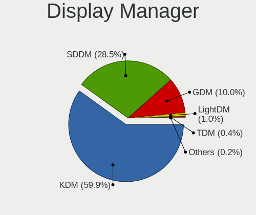
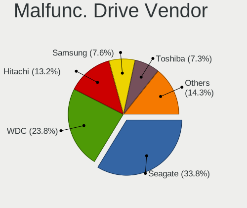
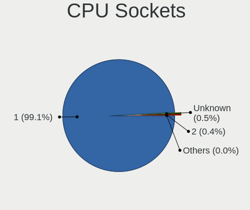
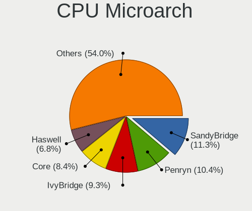
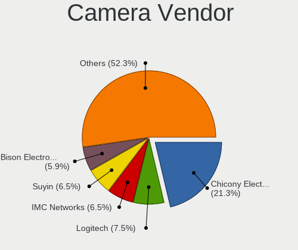

ROSA - Tested Hardware & Statistics
-----------------------------------

A project to collect tested hardware configurations for ROSA.

Anyone can contribute to this report by the [hw-probe](https://github.com/linuxhw/hw-probe) tool:

    sudo -E hw-probe -all -upload

Please contribute! Especially if your hardware is rare.

This is a report for all computer types. See also reports for [desktops](/Dist/ROSA/Desktop/README.md) and [notebooks](/Dist/ROSA/Notebook/README.md).

Contents
--------

* [ Test Cases ](#test-cases)

* [ System ](#system)
  - [ OS                       ](#os)
  - [ OS Family                ](#os-family)
  - [ Kernel                   ](#kernel)
  - [ Kernel Family            ](#kernel-family)
  - [ Kernel Major Ver.        ](#kernel-major-ver)
  - [ Arch                     ](#arch)
  - [ DE                       ](#de)
  - [ Display Server           ](#display-server)
  - [ Display Manager          ](#display-manager)
  - [ OS Lang                  ](#os-lang)
  - [ Boot Mode                ](#boot-mode)
  - [ Filesystem               ](#filesystem)
  - [ Part. scheme             ](#part-scheme)
  - [ Dual Boot with Linux/BSD ](#dual-boot-with-linuxbsd)
  - [ Dual Boot (Win)          ](#dual-boot-win)

* [ Board ](#board)
  - [ Vendor                   ](#vendor)
  - [ Model                    ](#model)
  - [ Model Family             ](#model-family)
  - [ MFG Year                 ](#mfg-year)
  - [ Form Factor              ](#form-factor)
  - [ Secure Boot              ](#secure-boot)
  - [ Coreboot                 ](#coreboot)
  - [ RAM Size                 ](#ram-size)
  - [ RAM Used                 ](#ram-used)
  - [ Total Drives             ](#total-drives)
  - [ Has CD-ROM               ](#has-cd-rom)
  - [ Has Ethernet             ](#has-ethernet)
  - [ Has WiFi                 ](#has-wifi)
  - [ Has Bluetooth            ](#has-bluetooth)

* [ Location ](#location)
  - [ Country                  ](#country)
  - [ City                     ](#city)

* [ Drives ](#drives)
  - [ Drive Vendor             ](#drive-vendor)
  - [ Drive Model              ](#drive-model)
  - [ HDD Vendor               ](#hdd-vendor)
  - [ SSD Vendor               ](#ssd-vendor)
  - [ Drive Kind               ](#drive-kind)
  - [ Drive Connector          ](#drive-connector)
  - [ Drive Size               ](#drive-size)
  - [ Space Total              ](#space-total)
  - [ Space Used               ](#space-used)
  - [ Malfunc. Drives          ](#malfunc-drives)
  - [ Malfunc. Drive Vendor    ](#malfunc-drive-vendor)
  - [ Malfunc. HDD Vendor      ](#malfunc-hdd-vendor)
  - [ Malfunc. Drive Kind      ](#malfunc-drive-kind)
  - [ Failed Drives            ](#failed-drives)
  - [ Failed Drive Vendor      ](#failed-drive-vendor)
  - [ Drive Status             ](#drive-status)

* [ Storage controller ](#storage-controller)
  - [ Storage Vendor           ](#storage-vendor)
  - [ Storage Model            ](#storage-model)
  - [ Storage Kind             ](#storage-kind)

* [ Processor ](#processor)
  - [ CPU Vendor               ](#cpu-vendor)
  - [ CPU Model                ](#cpu-model)
  - [ CPU Model Family         ](#cpu-model-family)
  - [ CPU Cores                ](#cpu-cores)
  - [ CPU Sockets              ](#cpu-sockets)
  - [ CPU Threads              ](#cpu-threads)
  - [ CPU Op-Modes             ](#cpu-op-modes)
  - [ CPU Microcode            ](#cpu-microcode)
  - [ CPU Microarch            ](#cpu-microarch)

* [ Graphics ](#graphics)
  - [ GPU Vendor               ](#gpu-vendor)
  - [ GPU Model                ](#gpu-model)
  - [ GPU Combo                ](#gpu-combo)
  - [ GPU Driver               ](#gpu-driver)
  - [ GPU Memory               ](#gpu-memory)

* [ Monitor ](#monitor)
  - [ Monitor Vendor           ](#monitor-vendor)
  - [ Monitor Model            ](#monitor-model)
  - [ Monitor Resolution       ](#monitor-resolution)
  - [ Monitor Diagonal         ](#monitor-diagonal)
  - [ Monitor Width            ](#monitor-width)
  - [ Aspect Ratio             ](#aspect-ratio)
  - [ Monitor Area             ](#monitor-area)
  - [ Pixel Density            ](#pixel-density)
  - [ Multiple Monitors        ](#multiple-monitors)

* [ Network ](#network)
  - [ Net Controller Vendor    ](#net-controller-vendor)
  - [ Net Controller Model     ](#net-controller-model)
  - [ Wireless Vendor          ](#wireless-vendor)
  - [ Wireless Model           ](#wireless-model)
  - [ Ethernet Vendor          ](#ethernet-vendor)
  - [ Ethernet Model           ](#ethernet-model)
  - [ Net Controller Kind      ](#net-controller-kind)
  - [ Used Controller          ](#used-controller)
  - [ NICs                     ](#nics)
  - [ IPv6                     ](#ipv6)

* [ Bluetooth ](#bluetooth)
  - [ Bluetooth Vendor         ](#bluetooth-vendor)
  - [ Bluetooth Model          ](#bluetooth-model)

* [ Sound ](#sound)
  - [ Sound Vendor             ](#sound-vendor)
  - [ Sound Model              ](#sound-model)

* [ Memory ](#memory)
  - [ Memory Vendor            ](#memory-vendor)
  - [ Memory Model             ](#memory-model)
  - [ Memory Kind              ](#memory-kind)
  - [ Memory Form Factor       ](#memory-form-factor)
  - [ Memory Size              ](#memory-size)
  - [ Memory Speed             ](#memory-speed)

* [ Printers & scanners ](#printers--scanners)
  - [ Printer Vendor           ](#printer-vendor)
  - [ Printer Model            ](#printer-model)
  - [ Scanner Vendor           ](#scanner-vendor)
  - [ Scanner Model            ](#scanner-model)

* [ Camera ](#camera)
  - [ Camera Vendor            ](#camera-vendor)
  - [ Camera Model             ](#camera-model)

* [ Security ](#security)
  - [ Fingerprint Vendor       ](#fingerprint-vendor)
  - [ Fingerprint Model        ](#fingerprint-model)
  - [ Chipcard Vendor          ](#chipcard-vendor)
  - [ Chipcard Model           ](#chipcard-model)

* [ Unsupported ](#unsupported)
  - [ Unsupported Devices      ](#unsupported-devices)
  - [ Unsupported Device Types ](#unsupported-device-types)

Test Cases
----------

Total: 43537

| Vendor        | Model                       | Form-Factor | Probe                                                      | Date         |
|---------------|-----------------------------|-------------|------------------------------------------------------------|--------------|
| ASUSTek       | ASUS TUF Gaming A15 FA50... | Notebook    | [60ec029256](https://linux-hardware.org/?probe=60ec029256) | Nov 05, 2023 |
| ASRock        | H81M-VG4 R2.0               | Desktop     | [2de5f4ef98](https://linux-hardware.org/?probe=2de5f4ef98) | Nov 05, 2023 |
| Gigabyte      | B450M H                     | Desktop     | [436a3dc68e](https://linux-hardware.org/?probe=436a3dc68e) | Nov 05, 2023 |
| ASUSTek       | P5K PRO                     | Desktop     | [7dd5e78310](https://linux-hardware.org/?probe=7dd5e78310) | Nov 05, 2023 |
| HP            | Laptop 17t-by000            | Notebook    | [b23b606118](https://linux-hardware.org/?probe=b23b606118) | Nov 05, 2023 |
| Intel         | DH61DL AAG14066-205         | Desktop     | [be33944c69](https://linux-hardware.org/?probe=be33944c69) | Nov 05, 2023 |
| Acer          | Aspire 5349                 | Notebook    | [b1ca6f597c](https://linux-hardware.org/?probe=b1ca6f597c) | Nov 05, 2023 |
| Lenovo        | IdeaPad 100-15IBY 80MJ      | Notebook    | [f782cf5541](https://linux-hardware.org/?probe=f782cf5541) | Nov 05, 2023 |
| Gigabyte      | X570 UD                     | Desktop     | [287ceab4df](https://linux-hardware.org/?probe=287ceab4df) | Nov 05, 2023 |
| Gigabyte      | X570 UD                     | Desktop     | [1c9b1632b8](https://linux-hardware.org/?probe=1c9b1632b8) | Nov 05, 2023 |
| ASUSTek       | VivoBook 15_ASUS Laptop ... | Notebook    | [5541e01522](https://linux-hardware.org/?probe=5541e01522) | Nov 05, 2023 |
| Acer          | Aspire 5100                 | Notebook    | [62b63704e9](https://linux-hardware.org/?probe=62b63704e9) | Nov 04, 2023 |
| Pegatron      | IPMIP-H55-GEN               | Desktop     | [f87bf6e0dd](https://linux-hardware.org/?probe=f87bf6e0dd) | Nov 04, 2023 |
| Acer          | Aspire 5100                 | Notebook    | [c4d628cb50](https://linux-hardware.org/?probe=c4d628cb50) | Nov 04, 2023 |
| Intel         | DG33BU AAD79951-407         | Desktop     | [734dafca4e](https://linux-hardware.org/?probe=734dafca4e) | Nov 04, 2023 |
| MSI           | H110M PRO-D                 | Desktop     | [9a7337554c](https://linux-hardware.org/?probe=9a7337554c) | Nov 04, 2023 |
| Lenovo        | IdeaPad 330-15IGM 81D1      | Notebook    | [157f4d1006](https://linux-hardware.org/?probe=157f4d1006) | Nov 04, 2023 |
| Pegatron      | E60                         | Desktop     | [42e0c4ad61](https://linux-hardware.org/?probe=42e0c4ad61) | Nov 04, 2023 |
| MSI           | B550M PRO-VDH WIFI          | Desktop     | [cda17ca99b](https://linux-hardware.org/?probe=cda17ca99b) | Nov 04, 2023 |
| ASUSTek       | P8H61-M LX3 R2.0            | Desktop     | [18bafa67dc](https://linux-hardware.org/?probe=18bafa67dc) | Nov 04, 2023 |
| Dell          | Inspiron M5110              | Notebook    | [20e338fb21](https://linux-hardware.org/?probe=20e338fb21) | Nov 04, 2023 |
| ASUSTek       | VivoBook 15_ASUS Laptop ... | Notebook    | [86d2394935](https://linux-hardware.org/?probe=86d2394935) | Nov 03, 2023 |
| ASUSTek       | P5QD TURBO                  | Desktop     | [4a350b6fdb](https://linux-hardware.org/?probe=4a350b6fdb) | Nov 03, 2023 |
| ASRock        | A770DE+                     | Desktop     | [330e203c8a](https://linux-hardware.org/?probe=330e203c8a) | Nov 03, 2023 |
| Intel         | H610-MIX v1.0               | Desktop     | [eeaea55301](https://linux-hardware.org/?probe=eeaea55301) | Nov 03, 2023 |
| MSI           | 760GM-P21                   | Desktop     | [f3b16a05ae](https://linux-hardware.org/?probe=f3b16a05ae) | Nov 03, 2023 |
| Shenzhen M... | F7BFD                       | Desktop     | [f2b8e311c3](https://linux-hardware.org/?probe=f2b8e311c3) | Nov 02, 2023 |
| ASUSTek       | A88XM-E                     | Desktop     | [b828019cc1](https://linux-hardware.org/?probe=b828019cc1) | Nov 02, 2023 |
| Lenovo        | G580                        | Notebook    | [d137c3bc30](https://linux-hardware.org/?probe=d137c3bc30) | Nov 02, 2023 |
| 3Logic Gro... | Graviton N15i               | Notebook    | [555d634638](https://linux-hardware.org/?probe=555d634638) | Nov 02, 2023 |
| KVADRA        | U15W                        | Notebook    | [1c1f562cf5](https://linux-hardware.org/?probe=1c1f562cf5) | Nov 02, 2023 |
| Lenovo        | ThinkPad T430 23493V2       | Notebook    | [6fc33e3528](https://linux-hardware.org/?probe=6fc33e3528) | Nov 02, 2023 |
| MSI           | 760GM-P21                   | Desktop     | [2d08e07e5d](https://linux-hardware.org/?probe=2d08e07e5d) | Nov 02, 2023 |
| Digma         | Pro Fortis M DN15P5-8CXN... | Notebook    | [7bb9e8e743](https://linux-hardware.org/?probe=7bb9e8e743) | Nov 02, 2023 |
| Lenovo        | 30BB SDK0J40697 WIN 3305... | All in one  | [b65465f281](https://linux-hardware.org/?probe=b65465f281) | Nov 02, 2023 |
| Samsung       | 350V5C/351V5C/3540VC/344... | Notebook    | [10b531fcd1](https://linux-hardware.org/?probe=10b531fcd1) | Nov 02, 2023 |
| Gigabyte      | 945GCMX-S2                  | Desktop     | [9e43e8bb79](https://linux-hardware.org/?probe=9e43e8bb79) | Nov 01, 2023 |
| ASRock        | N68C-S UCC                  | Desktop     | [cc636af8e3](https://linux-hardware.org/?probe=cc636af8e3) | Nov 01, 2023 |
| ASUSTek       | PRIME B350M-K               | Desktop     | [bc9c6a8334](https://linux-hardware.org/?probe=bc9c6a8334) | Nov 01, 2023 |
| HUAWEI        | DRC-WXX                     | Tablet      | [2764e50f21](https://linux-hardware.org/?probe=2764e50f21) | Nov 01, 2023 |
| ASUSTek       | PN53                        | Mini pc     | [5dfa3730a0](https://linux-hardware.org/?probe=5dfa3730a0) | Nov 01, 2023 |
| MAINBRD       | OPS62A-SHA                  | Desktop     | [41dc7afbc6](https://linux-hardware.org/?probe=41dc7afbc6) | Nov 01, 2023 |
| Samsung       | P29/28/26                   | Notebook    | [15d449da5d](https://linux-hardware.org/?probe=15d449da5d) | Nov 01, 2023 |
| ASRock        | B450M-HDV R4.0              | Desktop     | [c962dd6f41](https://linux-hardware.org/?probe=c962dd6f41) | Nov 01, 2023 |
| Unknown       | Unknown                     | Desktop     | [ae244bf378](https://linux-hardware.org/?probe=ae244bf378) | Nov 01, 2023 |
| ANCOMP        | Learnmate A15-501           | Notebook    | [da0c777960](https://linux-hardware.org/?probe=da0c777960) | Nov 01, 2023 |
| HUAWEI        | DRC-WXX                     | Tablet      | [55b168413e](https://linux-hardware.org/?probe=55b168413e) | Nov 01, 2023 |
| Gigabyte      | B760 GAMING X               | Desktop     | [a360fd740f](https://linux-hardware.org/?probe=a360fd740f) | Nov 01, 2023 |
| Unknown       | Unknown                     | Desktop     | [e135ca8165](https://linux-hardware.org/?probe=e135ca8165) | Oct 31, 2023 |
| Gigabyte      | EP43T-UD3L                  | Desktop     | [a3a25165b1](https://linux-hardware.org/?probe=a3a25165b1) | Oct 31, 2023 |
| Acer          | Extensa 215-22              | Notebook    | [5fd05270e7](https://linux-hardware.org/?probe=5fd05270e7) | Oct 31, 2023 |
| MSI           | MAG X570S TOMAHAWK MAX W... | Desktop     | [b522c4b372](https://linux-hardware.org/?probe=b522c4b372) | Oct 31, 2023 |
| ASRock        | B450M-HDV R4.0              | Desktop     | [54a16261d5](https://linux-hardware.org/?probe=54a16261d5) | Oct 31, 2023 |
| Gigabyte      | Z590 D                      | Desktop     | [d986377165](https://linux-hardware.org/?probe=d986377165) | Oct 31, 2023 |
| ASUSTek       | N61Vn                       | Notebook    | [d8ee34cdbc](https://linux-hardware.org/?probe=d8ee34cdbc) | Oct 30, 2023 |
| HP            | Laptop 15-dy2xxx            | Notebook    | [f39cf8f2f8](https://linux-hardware.org/?probe=f39cf8f2f8) | Oct 30, 2023 |
| MSI           | MPG B550 GAMING PLUS        | Desktop     | [c8b24699a5](https://linux-hardware.org/?probe=c8b24699a5) | Oct 30, 2023 |
| Lenovo        | ThinkBook 15 G3 ACL 21A4    | Notebook    | [8ddd5fdfba](https://linux-hardware.org/?probe=8ddd5fdfba) | Oct 29, 2023 |
| eMachines     | Rhine V1.45                 | Notebook    | [dc1b87d14a](https://linux-hardware.org/?probe=dc1b87d14a) | Oct 29, 2023 |
| Intel         | H81 V2.3                    | Desktop     | [ad1b4d2589](https://linux-hardware.org/?probe=ad1b4d2589) | Oct 29, 2023 |
| Dell          | 0Y5DDC A00                  | Desktop     | [537823e1ce](https://linux-hardware.org/?probe=537823e1ce) | Oct 29, 2023 |
| Clevo         | W150HRM                     | Notebook    | [ef386d81b5](https://linux-hardware.org/?probe=ef386d81b5) | Oct 29, 2023 |
| HP            | Pavilion Notebook           | Notebook    | [c76c1fe34a](https://linux-hardware.org/?probe=c76c1fe34a) | Oct 29, 2023 |
| ASUSTek       | M5A87                       | Desktop     | [7e4a0870d1](https://linux-hardware.org/?probe=7e4a0870d1) | Oct 29, 2023 |
| Toshiba       | Satellite L755              | Notebook    | [6f0566d95a](https://linux-hardware.org/?probe=6f0566d95a) | Oct 28, 2023 |
| Shenzhen M... | F7BFD                       | Desktop     | [28096584b1](https://linux-hardware.org/?probe=28096584b1) | Oct 28, 2023 |
| MSI           | MS-7235                     | Desktop     | [a20f50ce09](https://linux-hardware.org/?probe=a20f50ce09) | Oct 28, 2023 |
| Gigabyte      | EG41MF-US2H                 | Desktop     | [e79e5c88a2](https://linux-hardware.org/?probe=e79e5c88a2) | Oct 28, 2023 |
| Gigabyte      | EG41MF-US2H                 | Desktop     | [54665c8266](https://linux-hardware.org/?probe=54665c8266) | Oct 28, 2023 |
| Sony          | VPCEB1S1R                   | Notebook    | [bb50d8e6f3](https://linux-hardware.org/?probe=bb50d8e6f3) | Oct 28, 2023 |
| MSI           | A320M GRENADE               | Desktop     | [723b3a152b](https://linux-hardware.org/?probe=723b3a152b) | Oct 28, 2023 |
| HP            | 15                          | Notebook    | [a9e38be5d5](https://linux-hardware.org/?probe=a9e38be5d5) | Oct 27, 2023 |
| ASUSTek       | N56VZ                       | Notebook    | [bfe478311d](https://linux-hardware.org/?probe=bfe478311d) | Oct 26, 2023 |
| ASRock        | G31M-GS                     | Desktop     | [362c4857dd](https://linux-hardware.org/?probe=362c4857dd) | Oct 26, 2023 |
| Timi          | Mi NoteBook Ultra           | Notebook    | [66cfbcd057](https://linux-hardware.org/?probe=66cfbcd057) | Oct 26, 2023 |
| Intel         | X99                         | Desktop     | [c23c2dd478](https://linux-hardware.org/?probe=c23c2dd478) | Oct 26, 2023 |
| MSI           | A320M-A PRO                 | Desktop     | [5a0de31e5c](https://linux-hardware.org/?probe=5a0de31e5c) | Oct 26, 2023 |
| HP            | ProBook 4730s               | Notebook    | [935df70e31](https://linux-hardware.org/?probe=935df70e31) | Oct 26, 2023 |
| Toshiba       | Satellite C660D             | Notebook    | [8dc1c1d768](https://linux-hardware.org/?probe=8dc1c1d768) | Oct 26, 2023 |
| ANCOMP        | Learnmate A15-501           | Notebook    | [832eeb008b](https://linux-hardware.org/?probe=832eeb008b) | Oct 26, 2023 |
| Unknown       | Unknown                     | Desktop     | [4631da3dbf](https://linux-hardware.org/?probe=4631da3dbf) | Oct 26, 2023 |
| Intel         | H81                         | Desktop     | [59ac163151](https://linux-hardware.org/?probe=59ac163151) | Oct 26, 2023 |
| Sony          | VGN-SR19VRN                 | Notebook    | [b6137146d6](https://linux-hardware.org/?probe=b6137146d6) | Oct 26, 2023 |
| HP            | Pavilion dv6700             | Notebook    | [4e65db3924](https://linux-hardware.org/?probe=4e65db3924) | Oct 26, 2023 |
| ASUSTek       | G56JR                       | Notebook    | [9dd84ffe04](https://linux-hardware.org/?probe=9dd84ffe04) | Oct 26, 2023 |
| Acer          | Aspire 7520                 | Notebook    | [e5636cc92b](https://linux-hardware.org/?probe=e5636cc92b) | Oct 25, 2023 |
| eMachines     | Rhine V1.45                 | Notebook    | [7b3fd7da03](https://linux-hardware.org/?probe=7b3fd7da03) | Oct 25, 2023 |
| Lenovo        | MAHOBAY NO DPK              | Desktop     | [7ed95a4707](https://linux-hardware.org/?probe=7ed95a4707) | Oct 25, 2023 |
| Maibenben     | MaiBook P series            | Notebook    | [227638ee70](https://linux-hardware.org/?probe=227638ee70) | Oct 25, 2023 |
| Acer          | Aspire 5541                 | Notebook    | [df4f0f3912](https://linux-hardware.org/?probe=df4f0f3912) | Oct 25, 2023 |
| Gigabyte      | A320M-S2H-CF                | Desktop     | [b3e80c2dc5](https://linux-hardware.org/?probe=b3e80c2dc5) | Oct 25, 2023 |
| HP            | ProLiant DL380 Gen9         | Server      | [48bdda33c4](https://linux-hardware.org/?probe=48bdda33c4) | Oct 25, 2023 |
| Dell          | Latitude E6220              | Notebook    | [afc941b941](https://linux-hardware.org/?probe=afc941b941) | Oct 25, 2023 |
| Lenovo        | Unknown                     | Notebook    | [1139846802](https://linux-hardware.org/?probe=1139846802) | Oct 25, 2023 |
| Samsung       | 350V5C/351V5C/3540VC/344... | Notebook    | [118822d39f](https://linux-hardware.org/?probe=118822d39f) | Oct 25, 2023 |
| HP            | Pavilion dv6700             | Notebook    | [5e143a92d1](https://linux-hardware.org/?probe=5e143a92d1) | Oct 25, 2023 |
| Irbis         | NB264                       | Notebook    | [ac65f72c50](https://linux-hardware.org/?probe=ac65f72c50) | Oct 24, 2023 |
| Lenovo        | ThinkPad L520 5017BK4       | Notebook    | [77037e51b0](https://linux-hardware.org/?probe=77037e51b0) | Oct 24, 2023 |
| ASUSTek       | B85M-G                      | Desktop     | [a7463f3745](https://linux-hardware.org/?probe=a7463f3745) | Oct 24, 2023 |
| ASRock        | N68C-GS FX                  | Desktop     | [0c3142b94d](https://linux-hardware.org/?probe=0c3142b94d) | Oct 24, 2023 |
| ASUSTek       | M5A87                       | Desktop     | [273561af88](https://linux-hardware.org/?probe=273561af88) | Oct 24, 2023 |
| ASUSTek       | H81M-PLUS                   | Desktop     | [541d6f63b0](https://linux-hardware.org/?probe=541d6f63b0) | Oct 23, 2023 |
| ASUSTek       | P6X58D-E                    | Desktop     | [6af3baae7b](https://linux-hardware.org/?probe=6af3baae7b) | Oct 23, 2023 |
| MSI           | 770-C45                     | Desktop     | [9b5876d0eb](https://linux-hardware.org/?probe=9b5876d0eb) | Oct 23, 2023 |
| Packard Be... | EasyNote ENLG81BA           | Notebook    | [a9cb75e4fa](https://linux-hardware.org/?probe=a9cb75e4fa) | Oct 23, 2023 |
| ASUSTek       | N73SV                       | Notebook    | [6be1f80f91](https://linux-hardware.org/?probe=6be1f80f91) | Oct 23, 2023 |
| ASRock        | P67 Pro3                    | Desktop     | [93d23ddc07](https://linux-hardware.org/?probe=93d23ddc07) | Oct 23, 2023 |
| Acer          | Aspire 5734Z                | Notebook    | [cf4468ed0d](https://linux-hardware.org/?probe=cf4468ed0d) | Oct 23, 2023 |
| Lenovo        | 0x36C4                      | All in one  | [d801635668](https://linux-hardware.org/?probe=d801635668) | Oct 23, 2023 |
| Gigabyte      | GA-870A-UD3                 | Desktop     | [e0cffa70b5](https://linux-hardware.org/?probe=e0cffa70b5) | Oct 23, 2023 |
| ASUSTek       | VivoBook_ASUSLaptop M650... | Notebook    | [06d21bfdb4](https://linux-hardware.org/?probe=06d21bfdb4) | Oct 23, 2023 |
| ASUSTek       | P5KPL-SE                    | Desktop     | [2a58496283](https://linux-hardware.org/?probe=2a58496283) | Oct 22, 2023 |
| Samsung       | N100                        | Notebook    | [449f1837f5](https://linux-hardware.org/?probe=449f1837f5) | Oct 22, 2023 |
| Sony          | VGN-NS11ER_S                | Notebook    | [ece59481cb](https://linux-hardware.org/?probe=ece59481cb) | Oct 22, 2023 |
| HUAWEI        | BOD-WXX9                    | Notebook    | [102c170156](https://linux-hardware.org/?probe=102c170156) | Oct 22, 2023 |
| Gigabyte      | B360M AORUS Gaming 3-CF     | Desktop     | [7b963d7fff](https://linux-hardware.org/?probe=7b963d7fff) | Oct 21, 2023 |
| ASUSTek       | VivoBook_ASUSLaptop M150... | Notebook    | [d1026594ae](https://linux-hardware.org/?probe=d1026594ae) | Oct 21, 2023 |
| Samsung       | R530/R730/P530              | Notebook    | [ba506f75d1](https://linux-hardware.org/?probe=ba506f75d1) | Oct 21, 2023 |
| HP            | Notebook                    | Notebook    | [3bf9870d4a](https://linux-hardware.org/?probe=3bf9870d4a) | Oct 21, 2023 |
| Samsung       | N100                        | Notebook    | [80cf7b4a53](https://linux-hardware.org/?probe=80cf7b4a53) | Oct 21, 2023 |
| Gigabyte      | A320M-S2H-CF                | Desktop     | [53a0ed7609](https://linux-hardware.org/?probe=53a0ed7609) | Oct 21, 2023 |
| Acer          | Ferrari 3200                | Notebook    | [01ef021946](https://linux-hardware.org/?probe=01ef021946) | Oct 21, 2023 |
| ASRock        | D1800B-ITX                  | Desktop     | [c332512757](https://linux-hardware.org/?probe=c332512757) | Oct 21, 2023 |
| ASRock        | P45DE3                      | Desktop     | [2f9bd57442](https://linux-hardware.org/?probe=2f9bd57442) | Oct 21, 2023 |
| ASRock        | H61M                        | Desktop     | [b58eae7b88](https://linux-hardware.org/?probe=b58eae7b88) | Oct 21, 2023 |
| Gigabyte      | Z790 AORUS ELITE AX         | Desktop     | [0748fa3430](https://linux-hardware.org/?probe=0748fa3430) | Oct 21, 2023 |
| HUAWEI        | HKD-WXX                     | Notebook    | [73735cfb57](https://linux-hardware.org/?probe=73735cfb57) | Oct 20, 2023 |
| MSI           | 760GM-P23                   | Desktop     | [77ee2b1957](https://linux-hardware.org/?probe=77ee2b1957) | Oct 20, 2023 |
| ASRock        | J3455M                      | Desktop     | [9e627ef04c](https://linux-hardware.org/?probe=9e627ef04c) | Oct 20, 2023 |
| MSI           | 770T-C45                    | Desktop     | [bbe901612f](https://linux-hardware.org/?probe=bbe901612f) | Oct 20, 2023 |
| HP            | Notebook                    | Notebook    | [4d0eddbb92](https://linux-hardware.org/?probe=4d0eddbb92) | Oct 20, 2023 |
| Jumper        | Ezbook X3                   | Notebook    | [54ebd459be](https://linux-hardware.org/?probe=54ebd459be) | Oct 20, 2023 |
| ASUSTek       | F3JA                        | Notebook    | [6a96b7e347](https://linux-hardware.org/?probe=6a96b7e347) | Oct 20, 2023 |
| Lenovo        | ThinkPad T60 1952W2Q        | Notebook    | [4493954de6](https://linux-hardware.org/?probe=4493954de6) | Oct 19, 2023 |
| realme        | RMNBXXXX                    | Notebook    | [55266c03b1](https://linux-hardware.org/?probe=55266c03b1) | Oct 19, 2023 |
| MSI           | 760GM-P23                   | Desktop     | [5936be0473](https://linux-hardware.org/?probe=5936be0473) | Oct 19, 2023 |
| ICL           | H510SB-TM v2.0              | All in one  | [5c6a2470fe](https://linux-hardware.org/?probe=5c6a2470fe) | Oct 19, 2023 |
| Lenovo        | IdeaPad Y550P 20035         | Notebook    | [899b4e9638](https://linux-hardware.org/?probe=899b4e9638) | Oct 19, 2023 |
| Dell          | Inspiron 15-3565            | Notebook    | [d60190dd5f](https://linux-hardware.org/?probe=d60190dd5f) | Oct 19, 2023 |
| ASRock        | J3455M                      | Desktop     | [a65255a6ec](https://linux-hardware.org/?probe=a65255a6ec) | Oct 19, 2023 |
| Dell          | Inspiron 5558               | Notebook    | [5a4436b191](https://linux-hardware.org/?probe=5a4436b191) | Oct 19, 2023 |
| Gigabyte      | X58A-UD3R                   | Desktop     | [e5ecd53787](https://linux-hardware.org/?probe=e5ecd53787) | Oct 19, 2023 |
| Yadro         | YadroB560                   | Desktop     | [d231d3b930](https://linux-hardware.org/?probe=d231d3b930) | Oct 19, 2023 |
| Acer          | TravelMate 4150             | Notebook    | [26bf6dbfcf](https://linux-hardware.org/?probe=26bf6dbfcf) | Oct 18, 2023 |
| Acer          | Aspire 5750G                | Notebook    | [ae0eccc095](https://linux-hardware.org/?probe=ae0eccc095) | Oct 18, 2023 |
| HONOR         | HYM-WXX                     | Notebook    | [84da562e08](https://linux-hardware.org/?probe=84da562e08) | Oct 18, 2023 |
| MSI           | B360M PRO-VD                | Desktop     | [4d1cd49c1c](https://linux-hardware.org/?probe=4d1cd49c1c) | Oct 18, 2023 |
| Acer          | TravelMate 5720             | Notebook    | [8902ce3049](https://linux-hardware.org/?probe=8902ce3049) | Oct 18, 2023 |
| Toshiba       | Satellite A200              | Notebook    | [afc5127b45](https://linux-hardware.org/?probe=afc5127b45) | Oct 18, 2023 |
| ASUSTek       | K53SC                       | Notebook    | [5e5a88b3e2](https://linux-hardware.org/?probe=5e5a88b3e2) | Oct 18, 2023 |
| Gigabyte      | H310M S2 x.x                | Desktop     | [dd1f79a66a](https://linux-hardware.org/?probe=dd1f79a66a) | Oct 18, 2023 |
| HUAWEI        | BOD-WXX9                    | Notebook    | [b6bc7ed678](https://linux-hardware.org/?probe=b6bc7ed678) | Oct 17, 2023 |
| QBIC          | BXT-512-7100U               | Desktop     | [e23f579099](https://linux-hardware.org/?probe=e23f579099) | Oct 17, 2023 |
| OpenYard      | RMB-MR91 01000100           | Server      | [00fb2051a8](https://linux-hardware.org/?probe=00fb2051a8) | Oct 17, 2023 |
| Acer          | Nitro AN515-57              | Notebook    | [2651ff0eba](https://linux-hardware.org/?probe=2651ff0eba) | Oct 17, 2023 |
| Intel         | H81                         | Desktop     | [317de00832](https://linux-hardware.org/?probe=317de00832) | Oct 17, 2023 |
| Clevo         | NL41MU2                     | Notebook    | [001109b89b](https://linux-hardware.org/?probe=001109b89b) | Oct 17, 2023 |
| Gigabyte      | X570 I AORUS PRO WIFI       | Desktop     | [a80532e1a0](https://linux-hardware.org/?probe=a80532e1a0) | Oct 17, 2023 |
| Clevo         | NL41MU2                     | Notebook    | [da3768d9f4](https://linux-hardware.org/?probe=da3768d9f4) | Oct 17, 2023 |
| Gigabyte      | B360M DS3H                  | Desktop     | [cf5190078f](https://linux-hardware.org/?probe=cf5190078f) | Oct 17, 2023 |
| Gigabyte      | B360M DS3H                  | Desktop     | [06e6e5db34](https://linux-hardware.org/?probe=06e6e5db34) | Oct 17, 2023 |
| OEM           | X79G                        | Desktop     | [887a2b8f36](https://linux-hardware.org/?probe=887a2b8f36) | Oct 17, 2023 |
| Lenovo        | ThinkBook 15 G3 ACL 21A4    | Notebook    | [3c327fc90c](https://linux-hardware.org/?probe=3c327fc90c) | Oct 16, 2023 |
| HP            | 2820h                       | Desktop     | [73769961eb](https://linux-hardware.org/?probe=73769961eb) | Oct 16, 2023 |
| MSI           | VR610                       | Notebook    | [3cac0bd8c9](https://linux-hardware.org/?probe=3cac0bd8c9) | Oct 16, 2023 |
| Fujitsu Si... | AMILO Pro Edition V3405     | Notebook    | [ba0ead0d37](https://linux-hardware.org/?probe=ba0ead0d37) | Oct 16, 2023 |
| Clevo         | NL41MU2                     | Notebook    | [9e4818431f](https://linux-hardware.org/?probe=9e4818431f) | Oct 16, 2023 |
| Gigabyte      | B450M S2H V2                | Desktop     | [72258458a5](https://linux-hardware.org/?probe=72258458a5) | Oct 16, 2023 |
| MSI           | B360M PRO-VD                | Desktop     | [98deafd70e](https://linux-hardware.org/?probe=98deafd70e) | Oct 15, 2023 |
| MSI           | H110M PRO-D                 | Desktop     | [14ad3343a7](https://linux-hardware.org/?probe=14ad3343a7) | Oct 15, 2023 |
| HP            | Victus by Gaming Laptop ... | Notebook    | [6570860ebd](https://linux-hardware.org/?probe=6570860ebd) | Oct 15, 2023 |
| ASUSTek       | P5K PRO                     | Desktop     | [a4c386b42e](https://linux-hardware.org/?probe=a4c386b42e) | Oct 15, 2023 |
| ASUSTek       | P5K PRO                     | Desktop     | [aa244a1f00](https://linux-hardware.org/?probe=aa244a1f00) | Oct 15, 2023 |
| ASUSTek       | N56VV                       | Notebook    | [657664de04](https://linux-hardware.org/?probe=657664de04) | Oct 15, 2023 |
| Acer          | TravelMate B118-M           | Notebook    | [0d185effc4](https://linux-hardware.org/?probe=0d185effc4) | Oct 15, 2023 |
| eMachines     | Rhine V1.43                 | Notebook    | [1ec836f915](https://linux-hardware.org/?probe=1ec836f915) | Oct 15, 2023 |
| MSI           | Katana GF76 12UC            | Notebook    | [28c2984d39](https://linux-hardware.org/?probe=28c2984d39) | Oct 15, 2023 |
| Acer          | Aspire V3-571G              | Notebook    | [5e50c3624b](https://linux-hardware.org/?probe=5e50c3624b) | Oct 15, 2023 |
| ASUSTek       | VivoBook 15_ASUS Laptop ... | Notebook    | [fbf9250075](https://linux-hardware.org/?probe=fbf9250075) | Oct 15, 2023 |
| HP            | Laptop 15-ra0xx             | Notebook    | [7d7ff23b31](https://linux-hardware.org/?probe=7d7ff23b31) | Oct 15, 2023 |
| Samsung       | 350V5C/351V5C/3540VC/344... | Notebook    | [60cf13a0ce](https://linux-hardware.org/?probe=60cf13a0ce) | Oct 15, 2023 |
| ASUSTek       | F3Sr                        | Notebook    | [b7568466f9](https://linux-hardware.org/?probe=b7568466f9) | Oct 14, 2023 |
| MSI           | X299 RAIDER                 | Desktop     | [28f37d6590](https://linux-hardware.org/?probe=28f37d6590) | Oct 14, 2023 |
| MSI           | 770-C45                     | Desktop     | [c1e11a6e3d](https://linux-hardware.org/?probe=c1e11a6e3d) | Oct 14, 2023 |
| Gigabyte      | EP43-DS3L                   | Desktop     | [7cc4c9f010](https://linux-hardware.org/?probe=7cc4c9f010) | Oct 14, 2023 |
| MSI           | G31M3-F V2                  | Desktop     | [9a26b22114](https://linux-hardware.org/?probe=9a26b22114) | Oct 14, 2023 |
| Biostar       | H81MHV3 5.0                 | Desktop     | [11b853321a](https://linux-hardware.org/?probe=11b853321a) | Oct 14, 2023 |
| ASUSTek       | F50GX                       | Notebook    | [4665f359b9](https://linux-hardware.org/?probe=4665f359b9) | Oct 14, 2023 |
| HP            | Notebook                    | Notebook    | [20fd24630c](https://linux-hardware.org/?probe=20fd24630c) | Oct 14, 2023 |
| Biostar       | H81MHV3 5.0                 | Desktop     | [9fdaa00358](https://linux-hardware.org/?probe=9fdaa00358) | Oct 13, 2023 |
| Acer          | Aspire A515-52G             | Notebook    | [e347245de9](https://linux-hardware.org/?probe=e347245de9) | Oct 13, 2023 |
| HP            | ProLiant DL380 Gen9         | Server      | [9ea9761b35](https://linux-hardware.org/?probe=9ea9761b35) | Oct 13, 2023 |
| Clevo         | NL41MU2                     | Notebook    | [366bab6858](https://linux-hardware.org/?probe=366bab6858) | Oct 13, 2023 |
| Unknown       | Unknown                     | Desktop     | [05b441657d](https://linux-hardware.org/?probe=05b441657d) | Oct 13, 2023 |
| ASRock        | H55M-LE                     | Desktop     | [db9ce33137](https://linux-hardware.org/?probe=db9ce33137) | Oct 13, 2023 |
| Acer          | TravelMate 3040             | Notebook    | [8fe8316945](https://linux-hardware.org/?probe=8fe8316945) | Oct 13, 2023 |
| Acer          | TravelMate 5744Z            | Notebook    | [38f2a731a5](https://linux-hardware.org/?probe=38f2a731a5) | Oct 13, 2023 |
| Gigabyte      | H55M-USB3                   | Desktop     | [ba758fb431](https://linux-hardware.org/?probe=ba758fb431) | Oct 13, 2023 |
| HP            | 635                         | Notebook    | [a44c783f17](https://linux-hardware.org/?probe=a44c783f17) | Oct 13, 2023 |
| Pegatron      | IPPSB-SDQ/H61               | All in one  | [5ce23926ac](https://linux-hardware.org/?probe=5ce23926ac) | Oct 12, 2023 |
| Gigabyte      | A320M-S2H-CF                | Desktop     | [683a06d3a1](https://linux-hardware.org/?probe=683a06d3a1) | Oct 12, 2023 |
| MSI           | PRO H610M-B DDR4            | Desktop     | [5a954486f1](https://linux-hardware.org/?probe=5a954486f1) | Oct 12, 2023 |
| Intel         | X99 V3.0                    | Desktop     | [10d96ed192](https://linux-hardware.org/?probe=10d96ed192) | Oct 12, 2023 |
| Lenovo        | MAHOBAY NO DPK              | Desktop     | [f39e659abb](https://linux-hardware.org/?probe=f39e659abb) | Oct 12, 2023 |
| MSI           | Z390-A PRO                  | Desktop     | [41ceddf203](https://linux-hardware.org/?probe=41ceddf203) | Oct 12, 2023 |
| ANCOMP        | LAPTOP                      | All in one  | [9508f6f8de](https://linux-hardware.org/?probe=9508f6f8de) | Oct 12, 2023 |
| Intel         | X99 V3.0                    | Desktop     | [e22c1235d0](https://linux-hardware.org/?probe=e22c1235d0) | Oct 12, 2023 |
| Clevo         | NL41MU2                     | Notebook    | [b44ced08df](https://linux-hardware.org/?probe=b44ced08df) | Oct 12, 2023 |
| ANCOMP        | Learnmate A15-501           | Notebook    | [6994a91e07](https://linux-hardware.org/?probe=6994a91e07) | Oct 12, 2023 |
| ANCOMP        | Learnmate A15-501           | Notebook    | [2d6b73a209](https://linux-hardware.org/?probe=2d6b73a209) | Oct 12, 2023 |
| ASUSTek       | STRIX B250F GAMING          | Desktop     | [8d4eefa612](https://linux-hardware.org/?probe=8d4eefa612) | Oct 12, 2023 |
| ASUSTek       | PRIME A320M-K               | Desktop     | [9af9d0ea5e](https://linux-hardware.org/?probe=9af9d0ea5e) | Oct 11, 2023 |
| Medion        | MS-7800                     | Desktop     | [806b81f839](https://linux-hardware.org/?probe=806b81f839) | Oct 11, 2023 |
| Gigabyte      | B550M AORUS PRO-P           | Desktop     | [d9183a2d23](https://linux-hardware.org/?probe=d9183a2d23) | Oct 11, 2023 |
| Acer          | AOD270                      | Notebook    | [f42863f60d](https://linux-hardware.org/?probe=f42863f60d) | Oct 11, 2023 |
| Acer          | Aspire 5750G                | Notebook    | [56bdc382d5](https://linux-hardware.org/?probe=56bdc382d5) | Oct 10, 2023 |
| HONOR         | HYM-WXX                     | Notebook    | [d8ab8c960a](https://linux-hardware.org/?probe=d8ab8c960a) | Oct 10, 2023 |
| MSI           | 785GM-E51                   | Desktop     | [6034bcda1d](https://linux-hardware.org/?probe=6034bcda1d) | Oct 10, 2023 |
| Lenovo        | ThinkPad T400 6474WPU       | Notebook    | [8c4f0dda0f](https://linux-hardware.org/?probe=8c4f0dda0f) | Oct 10, 2023 |
| ASUSTek       | K40IJ                       | Notebook    | [67ca367ad2](https://linux-hardware.org/?probe=67ca367ad2) | Oct 10, 2023 |
| Gigabyte      | H55M-USB3                   | Desktop     | [9bf81b8cb2](https://linux-hardware.org/?probe=9bf81b8cb2) | Oct 09, 2023 |
| Gigabyte      | GA-8S655FX-L                | Desktop     | [4c81a7a377](https://linux-hardware.org/?probe=4c81a7a377) | Oct 09, 2023 |
| ASUSTek       | M2A-VM                      | Desktop     | [ac2f8ef69c](https://linux-hardware.org/?probe=ac2f8ef69c) | Oct 09, 2023 |
| ASRock        | N68C-GS FX                  | Desktop     | [2da75b7afa](https://linux-hardware.org/?probe=2da75b7afa) | Oct 09, 2023 |
| Acer          | Swift SF114-34              | Notebook    | [1b92216526](https://linux-hardware.org/?probe=1b92216526) | Oct 09, 2023 |
| MSI           | Z87I                        | Desktop     | [6cd843a979](https://linux-hardware.org/?probe=6cd843a979) | Oct 09, 2023 |
| HP            | 650                         | Notebook    | [1339361633](https://linux-hardware.org/?probe=1339361633) | Oct 09, 2023 |
| HP            | ProBook 4545s               | Notebook    | [bc5404508f](https://linux-hardware.org/?probe=bc5404508f) | Oct 09, 2023 |
| Gigabyte      | B450M K-CF                  | Desktop     | [4f495e0c37](https://linux-hardware.org/?probe=4f495e0c37) | Oct 09, 2023 |
| Intel         | SKYBAY                      | Desktop     | [a501059141](https://linux-hardware.org/?probe=a501059141) | Oct 09, 2023 |
| MSI           | U210/U210 Light             | Notebook    | [14ee9aa051](https://linux-hardware.org/?probe=14ee9aa051) | Oct 09, 2023 |
| Lenovo        | ThinkPad X200 7458Y28       | Notebook    | [ad9893f44c](https://linux-hardware.org/?probe=ad9893f44c) | Oct 09, 2023 |
| ASUSTek       | M2A74-AM SE                 | Desktop     | [05c13f10df](https://linux-hardware.org/?probe=05c13f10df) | Oct 09, 2023 |
| Unknown       | Unknown                     | Desktop     | [27022c7042](https://linux-hardware.org/?probe=27022c7042) | Oct 08, 2023 |
| Pegatron      | 2A94h                       | Desktop     | [4c5ce13f3a](https://linux-hardware.org/?probe=4c5ce13f3a) | Oct 08, 2023 |
| ASRock        | N68C-GS FX                  | Desktop     | [67ebeba633](https://linux-hardware.org/?probe=67ebeba633) | Oct 08, 2023 |
| ASRock        | P4i65G                      | Desktop     | [251a845634](https://linux-hardware.org/?probe=251a845634) | Oct 08, 2023 |
| ASUSTek       | PRIME B450M-K               | Desktop     | [ef1a8f61be](https://linux-hardware.org/?probe=ef1a8f61be) | Oct 08, 2023 |
| Gigabyte      | 970A-DS3P                   | Desktop     | [b8d92e6419](https://linux-hardware.org/?probe=b8d92e6419) | Oct 08, 2023 |
| Samsung       | 355V4C/355V4X/355V5C/355... | Notebook    | [0cc35c9eaf](https://linux-hardware.org/?probe=0cc35c9eaf) | Oct 08, 2023 |
| MSI           | Alpha 15 B5EEK              | Notebook    | [8af576f99e](https://linux-hardware.org/?probe=8af576f99e) | Oct 08, 2023 |
| MSI           | X299 RAIDER                 | Desktop     | [ec7eb75235](https://linux-hardware.org/?probe=ec7eb75235) | Oct 08, 2023 |
| MSI           | U210/U210 Light             | Notebook    | [29ff1c90ca](https://linux-hardware.org/?probe=29ff1c90ca) | Oct 08, 2023 |
| Lenovo        | IdeaPad 3 15IML05 81WB      | Notebook    | [ee2df4d880](https://linux-hardware.org/?probe=ee2df4d880) | Oct 08, 2023 |
| ASUSTek       | N56VZ                       | Notebook    | [1fd7b27414](https://linux-hardware.org/?probe=1fd7b27414) | Oct 07, 2023 |
| ASUSTek       | M5A78L-M LE                 | Desktop     | [c5387f239d](https://linux-hardware.org/?probe=c5387f239d) | Oct 07, 2023 |
| Gigabyte      | 970A-DS3P                   | Desktop     | [5b05f29471](https://linux-hardware.org/?probe=5b05f29471) | Oct 07, 2023 |
| ASUSTek       | Leonite2                    | Desktop     | [67f5bc1c0a](https://linux-hardware.org/?probe=67f5bc1c0a) | Oct 07, 2023 |
| Acer          | Aspire A515-52G             | Notebook    | [653d2049d2](https://linux-hardware.org/?probe=653d2049d2) | Oct 07, 2023 |
| Gigabyte      | H97-D3H-CF                  | Desktop     | [6f0b19f927](https://linux-hardware.org/?probe=6f0b19f927) | Oct 07, 2023 |
| Gigabyte      | B450M H                     | Desktop     | [0ad7f99071](https://linux-hardware.org/?probe=0ad7f99071) | Oct 07, 2023 |
| Gigabyte      | A320M-S2H-CF                | Desktop     | [75ceec744e](https://linux-hardware.org/?probe=75ceec744e) | Oct 07, 2023 |
| HUAWEI        | HKD-WXX                     | Notebook    | [20886a702a](https://linux-hardware.org/?probe=20886a702a) | Oct 07, 2023 |
| ASUSTek       | P8H77-V LE                  | Desktop     | [0b38be8780](https://linux-hardware.org/?probe=0b38be8780) | Oct 06, 2023 |
| HP            | Laptop 15-rb0xx             | Notebook    | [a52cde95dc](https://linux-hardware.org/?probe=a52cde95dc) | Oct 06, 2023 |
| MACHINIST     | E5-V2.82H V1.1              | Desktop     | [2a5bdb0b90](https://linux-hardware.org/?probe=2a5bdb0b90) | Oct 06, 2023 |
| Apple         | MacBookPro8,1               | Notebook    | [1f095979f4](https://linux-hardware.org/?probe=1f095979f4) | Oct 06, 2023 |
| Gigabyte      | A320M-S2H V2-CF             | Desktop     | [63087df172](https://linux-hardware.org/?probe=63087df172) | Oct 06, 2023 |
| ASUSTek       | G50V                        | Notebook    | [90f92902b1](https://linux-hardware.org/?probe=90f92902b1) | Oct 06, 2023 |
| ANCOMP        | LAPTOP                      | All in one  | [ea795eaab6](https://linux-hardware.org/?probe=ea795eaab6) | Oct 06, 2023 |
| ASUSTek       | PRIME X470-PRO              | Desktop     | [37d9a6d75f](https://linux-hardware.org/?probe=37d9a6d75f) | Oct 06, 2023 |
| Kraftway      | ACCORD                      | Notebook    | [b8d5508724](https://linux-hardware.org/?probe=b8d5508724) | Oct 06, 2023 |
| ASUSTek       | P8H77-V LE                  | Desktop     | [26a7af1326](https://linux-hardware.org/?probe=26a7af1326) | Oct 06, 2023 |
| Lenovo        | Y520-15IKBN 80WK            | Notebook    | [7b88a62033](https://linux-hardware.org/?probe=7b88a62033) | Oct 05, 2023 |
| Intel         | SKYBAY                      | Desktop     | [9f8bbc14f4](https://linux-hardware.org/?probe=9f8bbc14f4) | Oct 05, 2023 |
| Gigabyte      | B550 AORUS ELITE V2         | Desktop     | [c2fcd9d06e](https://linux-hardware.org/?probe=c2fcd9d06e) | Oct 05, 2023 |
| Gigabyte      | GA-870A-UD3                 | Desktop     | [fca602c192](https://linux-hardware.org/?probe=fca602c192) | Oct 05, 2023 |
| Fujitsu Si... | AMILO Pro Edition V3405     | Notebook    | [b566dd24ff](https://linux-hardware.org/?probe=b566dd24ff) | Oct 04, 2023 |
| ASUSTek       | PRIME B365M-C               | Desktop     | [81ab5fe3f3](https://linux-hardware.org/?probe=81ab5fe3f3) | Oct 04, 2023 |
| MSI           | P43 Neo-F                   | Desktop     | [4b19989894](https://linux-hardware.org/?probe=4b19989894) | Oct 04, 2023 |
| HP            | Pavilion Gaming Laptop 1... | Notebook    | [6256ecb2a2](https://linux-hardware.org/?probe=6256ecb2a2) | Oct 04, 2023 |
| ASUSTek       | GL703VD                     | Notebook    | [cfa1d9861b](https://linux-hardware.org/?probe=cfa1d9861b) | Oct 04, 2023 |
| ASUSTek       | PRIME H510M-K               | Desktop     | [9483230f98](https://linux-hardware.org/?probe=9483230f98) | Oct 04, 2023 |
| ASUSTek       | P5K PRO                     | Desktop     | [2d4ce43693](https://linux-hardware.org/?probe=2d4ce43693) | Oct 04, 2023 |
| HUAWEI        | BOHK-WAX9X                  | Notebook    | [deb34982fa](https://linux-hardware.org/?probe=deb34982fa) | Oct 04, 2023 |
| HP            | Pavilion Gaming Laptop 1... | Notebook    | [2acaa4ddbc](https://linux-hardware.org/?probe=2acaa4ddbc) | Oct 04, 2023 |
| MSI           | P43 Neo-F                   | Desktop     | [c4e8261756](https://linux-hardware.org/?probe=c4e8261756) | Oct 04, 2023 |
| HP            | 250 G8 Notebook PC          | Notebook    | [46b3fb73b0](https://linux-hardware.org/?probe=46b3fb73b0) | Oct 04, 2023 |
| ASUSTek       | P5K                         | Desktop     | [83eea396c1](https://linux-hardware.org/?probe=83eea396c1) | Oct 03, 2023 |
| Acer          | Swift SF314-43              | Notebook    | [b451657ad6](https://linux-hardware.org/?probe=b451657ad6) | Oct 03, 2023 |
| Lenovo        | G70-70 80HW                 | Notebook    | [c63d12108b](https://linux-hardware.org/?probe=c63d12108b) | Oct 03, 2023 |
| MSI           | GS43VR 7RE                  | Notebook    | [cf9a5a8be9](https://linux-hardware.org/?probe=cf9a5a8be9) | Oct 03, 2023 |
| Dell          | System Inspiron 17 7000 ... | Notebook    | [4a237f21f8](https://linux-hardware.org/?probe=4a237f21f8) | Oct 03, 2023 |
| Acer          | Aspire VN7-571G             | Notebook    | [0babc8185b](https://linux-hardware.org/?probe=0babc8185b) | Oct 03, 2023 |
| HP            | 650                         | Notebook    | [f652e189f9](https://linux-hardware.org/?probe=f652e189f9) | Oct 03, 2023 |
| HP            | 3031h                       | Desktop     | [a05ac19b87](https://linux-hardware.org/?probe=a05ac19b87) | Oct 03, 2023 |
| ASUSTek       | X551CAP                     | Notebook    | [37d7bd14c7](https://linux-hardware.org/?probe=37d7bd14c7) | Oct 03, 2023 |
| ASUSTek       | PRIME H510M-K               | Desktop     | [62e437adf3](https://linux-hardware.org/?probe=62e437adf3) | Oct 03, 2023 |
| MSI           | 760GM-P33                   | Desktop     | [5967be8309](https://linux-hardware.org/?probe=5967be8309) | Oct 03, 2023 |
| ASUSTek       | G50V                        | Notebook    | [a6edae3eff](https://linux-hardware.org/?probe=a6edae3eff) | Oct 03, 2023 |
| HP            | Notebook                    | Notebook    | [02403b0967](https://linux-hardware.org/?probe=02403b0967) | Oct 02, 2023 |
| ASRock        | H110M-DGS R3.0              | Desktop     | [a8d8ab9d2c](https://linux-hardware.org/?probe=a8d8ab9d2c) | Oct 02, 2023 |
| Toshiba       | Satellite A200              | Notebook    | [6a3308fba2](https://linux-hardware.org/?probe=6a3308fba2) | Oct 02, 2023 |
| MSI           | B360M PRO-VD 2019-01-24     | Desktop     | [43062f3c9a](https://linux-hardware.org/?probe=43062f3c9a) | Oct 02, 2023 |
| MSI           | FM2-A55M-E33                | Desktop     | [ed22a192a5](https://linux-hardware.org/?probe=ed22a192a5) | Oct 02, 2023 |
| ASRock        | N68C-GS FX                  | Desktop     | [49d7edb011](https://linux-hardware.org/?probe=49d7edb011) | Oct 02, 2023 |
| MSI           | Katana GF76 12UC            | Notebook    | [3939c14096](https://linux-hardware.org/?probe=3939c14096) | Oct 02, 2023 |
| ASUSTek       | P5K                         | Desktop     | [e8cf25ae85](https://linux-hardware.org/?probe=e8cf25ae85) | Oct 02, 2023 |
| ASUSTek       | P8H61-M LX2 R2.0            | Desktop     | [e1f02a7f4f](https://linux-hardware.org/?probe=e1f02a7f4f) | Oct 02, 2023 |
| MSI           | Z170A TOMAHAWK              | Desktop     | [6f48b6d79c](https://linux-hardware.org/?probe=6f48b6d79c) | Oct 02, 2023 |
| ASUSTek       | TUF Gaming FX505DT_FX505... | Notebook    | [0aa82776f5](https://linux-hardware.org/?probe=0aa82776f5) | Oct 01, 2023 |
| HP            | Compaq 610                  | Notebook    | [9570db13af](https://linux-hardware.org/?probe=9570db13af) | Oct 01, 2023 |
| Unknown       | X79                         | Desktop     | [64628cc08d](https://linux-hardware.org/?probe=64628cc08d) | Oct 01, 2023 |
| ASUSTek       | T305CA                      | Tablet      | [821fb55f33](https://linux-hardware.org/?probe=821fb55f33) | Oct 01, 2023 |
| MSI           | GE70 0NC/GE70 0ND/GE70K ... | Notebook    | [0939610428](https://linux-hardware.org/?probe=0939610428) | Oct 01, 2023 |
| Dell          | Vostro 3560                 | Notebook    | [9acebbf655](https://linux-hardware.org/?probe=9acebbf655) | Oct 01, 2023 |
| Gigabyte      | 970A-D3                     | Desktop     | [9b47949b87](https://linux-hardware.org/?probe=9b47949b87) | Oct 01, 2023 |
| Digma         | EVE 11 C421Y ES1067EW       | Notebook    | [2a54b2d3e1](https://linux-hardware.org/?probe=2a54b2d3e1) | Oct 01, 2023 |
| ASUSTek       | PRIME B450-PLUS             | Desktop     | [cd4c3fb654](https://linux-hardware.org/?probe=cd4c3fb654) | Oct 01, 2023 |
| Toshiba       | Satellite C850-D4K          | Notebook    | [47d93b3030](https://linux-hardware.org/?probe=47d93b3030) | Oct 01, 2023 |
| Huanan        | X99 F8D V2.2                | Desktop     | [50101ff8ee](https://linux-hardware.org/?probe=50101ff8ee) | Oct 01, 2023 |
| Packard Be... | EasyNote ENLG81BA           | Notebook    | [c10a5eef39](https://linux-hardware.org/?probe=c10a5eef39) | Oct 01, 2023 |
| Gigabyte      | H61M-S2-B3                  | Desktop     | [447e04bd9d](https://linux-hardware.org/?probe=447e04bd9d) | Sep 30, 2023 |
| ECS           | G31T-M7                     | Desktop     | [0749fa9352](https://linux-hardware.org/?probe=0749fa9352) | Sep 30, 2023 |
| MSI           | 890FXA-GD70                 | Desktop     | [f9c2509bc6](https://linux-hardware.org/?probe=f9c2509bc6) | Sep 30, 2023 |
| Gigabyte      | G31M-S2L                    | Desktop     | [4f147c1f3a](https://linux-hardware.org/?probe=4f147c1f3a) | Sep 30, 2023 |
| Gigabyte      | G31M-S2L                    | Desktop     | [391af7c221](https://linux-hardware.org/?probe=391af7c221) | Sep 30, 2023 |
| Fujitsu Si... | AMILO Pro Edition V3405     | Notebook    | [4814760ac1](https://linux-hardware.org/?probe=4814760ac1) | Sep 30, 2023 |
| Dell          | Inspiron N5110              | Notebook    | [e796baf50f](https://linux-hardware.org/?probe=e796baf50f) | Sep 30, 2023 |
| MSI           | MAG X570S TOMAHAWK MAX W... | Desktop     | [813b0bcb38](https://linux-hardware.org/?probe=813b0bcb38) | Sep 30, 2023 |
| ASUSTek       | TUF B450M-PRO GAMING        | Desktop     | [b34539564f](https://linux-hardware.org/?probe=b34539564f) | Sep 29, 2023 |
| Dell          | Inspiron 5558               | Notebook    | [f94587a692](https://linux-hardware.org/?probe=f94587a692) | Sep 29, 2023 |
| Lenovo        | G70-70 80HW                 | Notebook    | [4e22db020f](https://linux-hardware.org/?probe=4e22db020f) | Sep 29, 2023 |
| F-PLUS EQU... | FNB-156-P1                  | Notebook    | [cceaaac2d3](https://linux-hardware.org/?probe=cceaaac2d3) | Sep 29, 2023 |
| Gigabyte      | H97-D3H-CF                  | Desktop     | [c0c34400ad](https://linux-hardware.org/?probe=c0c34400ad) | Sep 29, 2023 |
| Samsung       | 350V5C/351V5C/3540VC/344... | Notebook    | [b9f67caef4](https://linux-hardware.org/?probe=b9f67caef4) | Sep 29, 2023 |
| ASRock        | H510M-HVS R2.0              | Desktop     | [f50b0e51d3](https://linux-hardware.org/?probe=f50b0e51d3) | Sep 29, 2023 |
| Lenovo        | G70-70 80HW                 | Notebook    | [5ef0f97836](https://linux-hardware.org/?probe=5ef0f97836) | Sep 29, 2023 |
| ASRock        | A520M Pro4                  | Desktop     | [5a7da2e0de](https://linux-hardware.org/?probe=5a7da2e0de) | Sep 28, 2023 |
| F-PLUS EQU... | FNB-156-P1                  | Notebook    | [fb8fd7617c](https://linux-hardware.org/?probe=fb8fd7617c) | Sep 28, 2023 |
| ICL           | H510SB-TM v2.0              | All in one  | [41193155ed](https://linux-hardware.org/?probe=41193155ed) | Sep 28, 2023 |
| ASUSTek       | PRIME X470-PRO              | Desktop     | [1f420db3fd](https://linux-hardware.org/?probe=1f420db3fd) | Sep 28, 2023 |
| Lenovo        | ThinkPad X250 20CMS0A200    | Notebook    | [54f848d222](https://linux-hardware.org/?probe=54f848d222) | Sep 28, 2023 |
| Gigabyte      | H410M H V3                  | Desktop     | [3a08b7188c](https://linux-hardware.org/?probe=3a08b7188c) | Sep 28, 2023 |
| ASUSTek       | P8H61-MX R2.0               | Desktop     | [cfc3a037ed](https://linux-hardware.org/?probe=cfc3a037ed) | Sep 27, 2023 |
| Huanan        | X99-BD4 V1.34, NALEX        | Desktop     | [493d23b3f0](https://linux-hardware.org/?probe=493d23b3f0) | Sep 27, 2023 |
| ASUSTek       | P5QD TURBO                  | Desktop     | [9e8a75e698](https://linux-hardware.org/?probe=9e8a75e698) | Sep 27, 2023 |
| Lenovo        | XiaoXinPro 16 APH8 83AR     | Notebook    | [9ad96a3803](https://linux-hardware.org/?probe=9ad96a3803) | Sep 27, 2023 |
| Lenovo        | ThinkBook 15 G3 ACL 21A4    | Notebook    | [278578e488](https://linux-hardware.org/?probe=278578e488) | Sep 27, 2023 |
| Lenovo        | ThinkBook 15 G3 ACL 21A4    | Notebook    | [6f4a404e89](https://linux-hardware.org/?probe=6f4a404e89) | Sep 27, 2023 |
| HP            | Laptop 14s-dq2xxx           | Notebook    | [cf522515d7](https://linux-hardware.org/?probe=cf522515d7) | Sep 26, 2023 |
| Insyde        | Purley                      | Server      | [be671b1f3c](https://linux-hardware.org/?probe=be671b1f3c) | Sep 26, 2023 |
| ASUSTek       | H110M-K                     | Desktop     | [a067d2e97d](https://linux-hardware.org/?probe=a067d2e97d) | Sep 26, 2023 |
| ASUSTek       | P8B75-M LE                  | Desktop     | [96d214417d](https://linux-hardware.org/?probe=96d214417d) | Sep 26, 2023 |
| ASUSTek       | H110M-K                     | Desktop     | [74a379288b](https://linux-hardware.org/?probe=74a379288b) | Sep 26, 2023 |
| ASUSTek       | VivoBook_ASUSLaptop M350... | Notebook    | [cf4a15af9e](https://linux-hardware.org/?probe=cf4a15af9e) | Sep 26, 2023 |
| Acer          | Aspire 5750ZG               | Notebook    | [b8e46e5780](https://linux-hardware.org/?probe=b8e46e5780) | Sep 26, 2023 |
| Lenovo        | IdeaPad Y510                | Notebook    | [caec91aae7](https://linux-hardware.org/?probe=caec91aae7) | Sep 26, 2023 |
| Acer          | TravelMate 5744             | Notebook    | [2e69d317ef](https://linux-hardware.org/?probe=2e69d317ef) | Sep 26, 2023 |
| HP            | 3397                        | Desktop     | [5740126c3c](https://linux-hardware.org/?probe=5740126c3c) | Sep 25, 2023 |
| Dell          | Inspiron 5558               | Notebook    | [dbf4dfe481](https://linux-hardware.org/?probe=dbf4dfe481) | Sep 25, 2023 |
| Shenzhen M... | F7BFD                       | Desktop     | [a4891e1691](https://linux-hardware.org/?probe=a4891e1691) | Sep 25, 2023 |
| Toshiba       | Satellite A300              | Notebook    | [03aa0d1366](https://linux-hardware.org/?probe=03aa0d1366) | Sep 25, 2023 |
| ASUSTek       | TUF Gaming B550M-PLUS       | Desktop     | [977a189b29](https://linux-hardware.org/?probe=977a189b29) | Sep 25, 2023 |
| Lenovo        | 3123 SDK0J40697 WIN 3305... | All in one  | [96aa5d7dcf](https://linux-hardware.org/?probe=96aa5d7dcf) | Sep 25, 2023 |
| Samsung       | N250P                       | Notebook    | [7eb858a64d](https://linux-hardware.org/?probe=7eb858a64d) | Sep 25, 2023 |
| MSI           | FM2-A55M-E33                | Desktop     | [40ef9a86ab](https://linux-hardware.org/?probe=40ef9a86ab) | Sep 25, 2023 |
| Acer          | Aspire 3610                 | Notebook    | [021d48bbdb](https://linux-hardware.org/?probe=021d48bbdb) | Sep 25, 2023 |
| Lenovo        | IdeaPad 5 14ABA7 82SE       | Notebook    | [2695ee345d](https://linux-hardware.org/?probe=2695ee345d) | Sep 24, 2023 |
| Acer          | Aspire ES1-520              | Notebook    | [c2b98b035f](https://linux-hardware.org/?probe=c2b98b035f) | Sep 24, 2023 |
| Gigabyte      | B450 AORUS ELITE V2         | Desktop     | [57a4e724b8](https://linux-hardware.org/?probe=57a4e724b8) | Sep 24, 2023 |
| ASRock        | P4i65G                      | Desktop     | [9f283a95d6](https://linux-hardware.org/?probe=9f283a95d6) | Sep 24, 2023 |
| Samsung       | 300E4Z/300E5Z/300E7Z        | Notebook    | [30d9462d2d](https://linux-hardware.org/?probe=30d9462d2d) | Sep 24, 2023 |
| ASUSTek       | E520                        | Desktop     | [50ea664229](https://linux-hardware.org/?probe=50ea664229) | Sep 24, 2023 |
| ASRock        | B550 Phantom Gaming 4       | Desktop     | [39e26bf376](https://linux-hardware.org/?probe=39e26bf376) | Sep 24, 2023 |
| Apple         | MacBookPro11,1              | Notebook    | [0f396f4227](https://linux-hardware.org/?probe=0f396f4227) | Sep 24, 2023 |
| Lenovo        | IdeaPad 330-15AST 81D6      | Notebook    | [2814a495de](https://linux-hardware.org/?probe=2814a495de) | Sep 24, 2023 |
| Sony          | VGN-FW11LR                  | Notebook    | [81921a2f1d](https://linux-hardware.org/?probe=81921a2f1d) | Sep 24, 2023 |
| MSI           | H110M PRO-VD PLUS           | Desktop     | [b8d1509801](https://linux-hardware.org/?probe=b8d1509801) | Sep 24, 2023 |
| Gigabyte      | G31M-ES2L                   | Desktop     | [bbf676f129](https://linux-hardware.org/?probe=bbf676f129) | Sep 24, 2023 |
| Unknown       | Unknown                     | Notebook    | [b6f7bc9bd2](https://linux-hardware.org/?probe=b6f7bc9bd2) | Sep 24, 2023 |
| Gigabyte      | H61M-D2-B3                  | Desktop     | [90bdd8a3e6](https://linux-hardware.org/?probe=90bdd8a3e6) | Sep 23, 2023 |
| Gigabyte      | H61M-D2-B3                  | Desktop     | [41dba827f2](https://linux-hardware.org/?probe=41dba827f2) | Sep 23, 2023 |
| MSI           | MAG X570S TOMAHAWK MAX W... | Desktop     | [17963d3a87](https://linux-hardware.org/?probe=17963d3a87) | Sep 23, 2023 |
| Gigabyte      | H110-D3-CF                  | Desktop     | [0762df27f4](https://linux-hardware.org/?probe=0762df27f4) | Sep 23, 2023 |
| Gigabyte      | PH67A-D3-B3                 | Desktop     | [e3023f5f8c](https://linux-hardware.org/?probe=e3023f5f8c) | Sep 23, 2023 |
| Lenovo        | G560 20042                  | Notebook    | [a8a67a12c7](https://linux-hardware.org/?probe=a8a67a12c7) | Sep 23, 2023 |
| Apple         | MacBook10,1                 | Notebook    | [50a9107d5d](https://linux-hardware.org/?probe=50a9107d5d) | Sep 23, 2023 |
| MSI           | H110M PRO-VD                | Desktop     | [a13e4d4b27](https://linux-hardware.org/?probe=a13e4d4b27) | Sep 22, 2023 |
| Acer          | AOHAPPY2                    | Notebook    | [b9937354f2](https://linux-hardware.org/?probe=b9937354f2) | Sep 22, 2023 |
| Gigabyte      | P43-ES3G                    | Desktop     | [79557b8229](https://linux-hardware.org/?probe=79557b8229) | Sep 22, 2023 |
| HP            | Laptop 14s-fq0xxx           | Notebook    | [3f7ef99bf3](https://linux-hardware.org/?probe=3f7ef99bf3) | Sep 22, 2023 |
| Gigabyte      | H87M-HD3                    | Desktop     | [f5fead6eb4](https://linux-hardware.org/?probe=f5fead6eb4) | Sep 22, 2023 |
| ASRock        | A320M-DVS R4.0              | Desktop     | [893ef72c0c](https://linux-hardware.org/?probe=893ef72c0c) | Sep 21, 2023 |
| ASRock        | A520M-ITX/ac                | Desktop     | [35be6167f1](https://linux-hardware.org/?probe=35be6167f1) | Sep 21, 2023 |
| Biostar       | A68MHE                      | Desktop     | [8ab720b66b](https://linux-hardware.org/?probe=8ab720b66b) | Sep 21, 2023 |
| Gigabyte      | GA-E350N-USB3               | Desktop     | [b9a29448e1](https://linux-hardware.org/?probe=b9a29448e1) | Sep 21, 2023 |
| HP            | 2820h                       | Desktop     | [cd402f5dad](https://linux-hardware.org/?probe=cd402f5dad) | Sep 21, 2023 |
| Unknown       | Unknown                     | Desktop     | [339f506aa1](https://linux-hardware.org/?probe=339f506aa1) | Sep 21, 2023 |
| ASUSTek       | K50IJ                       | Notebook    | [a1dcfd7ff7](https://linux-hardware.org/?probe=a1dcfd7ff7) | Sep 21, 2023 |
| ASUSTek       | E520                        | Desktop     | [f5be06ecdb](https://linux-hardware.org/?probe=f5be06ecdb) | Sep 21, 2023 |
| Lenovo        | B590 20208                  | Notebook    | [f8c48a3ed3](https://linux-hardware.org/?probe=f8c48a3ed3) | Sep 21, 2023 |
| Aquarius      | Cmp NS483                   | Convertible | [ab4258a229](https://linux-hardware.org/?probe=ab4258a229) | Sep 20, 2023 |
| Fujitsu Si... | AMILO Li3710                | Notebook    | [5a5c48d3df](https://linux-hardware.org/?probe=5a5c48d3df) | Sep 20, 2023 |
| Shenzhen M... | F7BFD                       | Desktop     | [b898184916](https://linux-hardware.org/?probe=b898184916) | Sep 20, 2023 |
| Clevo         | NL41MU2                     | Notebook    | [68b62bb7da](https://linux-hardware.org/?probe=68b62bb7da) | Sep 20, 2023 |
| ASUSTek       | 1001PX                      | Notebook    | [6331a101c7](https://linux-hardware.org/?probe=6331a101c7) | Sep 20, 2023 |
| HP            | 3048h                       | Desktop     | [f140c33d20](https://linux-hardware.org/?probe=f140c33d20) | Sep 20, 2023 |
| ASRock        | N68C-GS FX                  | Desktop     | [7c54afbcbd](https://linux-hardware.org/?probe=7c54afbcbd) | Sep 20, 2023 |
| HP            | Pavilion Gaming Laptop 1... | Notebook    | [17bfc616ef](https://linux-hardware.org/?probe=17bfc616ef) | Sep 20, 2023 |
| Lenovo        | IdeaPad 3 15ALC6 82KU       | Notebook    | [911f7b8df2](https://linux-hardware.org/?probe=911f7b8df2) | Sep 19, 2023 |
| Clevo         | W240EL/W250ELQ/W270ELQ      | Notebook    | [6e554fc589](https://linux-hardware.org/?probe=6e554fc589) | Sep 19, 2023 |
| ASUSTek       | P8H61-M LE                  | Desktop     | [7f04e1eefd](https://linux-hardware.org/?probe=7f04e1eefd) | Sep 19, 2023 |
| Toshiba       | QOSMIO X300                 | Notebook    | [fe89cd3f23](https://linux-hardware.org/?probe=fe89cd3f23) | Sep 19, 2023 |
| ASUSTek       | H81M-K                      | Desktop     | [6735d18449](https://linux-hardware.org/?probe=6735d18449) | Sep 19, 2023 |
| Acer          | Aspire ES1-520              | Notebook    | [8006999633](https://linux-hardware.org/?probe=8006999633) | Sep 19, 2023 |
| Acer          | Aspire A315-42              | Notebook    | [ae09470cce](https://linux-hardware.org/?probe=ae09470cce) | Sep 19, 2023 |
| Gigabyte      | B550I AORUS PRO AX          | Desktop     | [2666cd8dbe](https://linux-hardware.org/?probe=2666cd8dbe) | Sep 19, 2023 |
| ASRock        | FM2A78 Pro4+                | Desktop     | [cad8cdf94c](https://linux-hardware.org/?probe=cad8cdf94c) | Sep 19, 2023 |
| HP            | Pavilion g6                 | Notebook    | [f11438b1a2](https://linux-hardware.org/?probe=f11438b1a2) | Sep 19, 2023 |
| Fujitsu       | LIFEBOOK N6470              | Notebook    | [bbc02d8d99](https://linux-hardware.org/?probe=bbc02d8d99) | Sep 18, 2023 |
| Clevo         | NL41MU2                     | Notebook    | [ae7db27e79](https://linux-hardware.org/?probe=ae7db27e79) | Sep 18, 2023 |
| HP            | ProBook 4535s               | Notebook    | [4fad5ba2da](https://linux-hardware.org/?probe=4fad5ba2da) | Sep 17, 2023 |
| Lenovo        | H420                        | Desktop     | [3cb3765e4c](https://linux-hardware.org/?probe=3cb3765e4c) | Sep 17, 2023 |
| Unknown       | Unknown                     | Notebook    | [3b4224eda5](https://linux-hardware.org/?probe=3b4224eda5) | Sep 17, 2023 |
| eMachines     | Rhine V1.43                 | Notebook    | [1dc929e263](https://linux-hardware.org/?probe=1dc929e263) | Sep 17, 2023 |
| Clevo         | W240EL/W250ELQ/W270ELQ      | Notebook    | [e5a3155306](https://linux-hardware.org/?probe=e5a3155306) | Sep 17, 2023 |
| Gigabyte      | GA-880GA-UD3H               | Desktop     | [12b833e456](https://linux-hardware.org/?probe=12b833e456) | Sep 16, 2023 |
| HP            | Laptop 15-db0xxx            | Notebook    | [3cbd0bc118](https://linux-hardware.org/?probe=3cbd0bc118) | Sep 16, 2023 |
| Lenovo        | G570 20079                  | Notebook    | [f2da433d78](https://linux-hardware.org/?probe=f2da433d78) | Sep 16, 2023 |
| ASUSTek       | VivoBook_ASUSLaptop X513... | Notebook    | [80435bbec3](https://linux-hardware.org/?probe=80435bbec3) | Sep 16, 2023 |
| ASUSTek       | 1215P                       | Notebook    | [6741860726](https://linux-hardware.org/?probe=6741860726) | Sep 16, 2023 |
| Pegatron      | A35                         | Notebook    | [b95829115c](https://linux-hardware.org/?probe=b95829115c) | Sep 16, 2023 |
| ASRock        | G41M-GS3                    | Desktop     | [145d2c27ac](https://linux-hardware.org/?probe=145d2c27ac) | Sep 16, 2023 |
| ASUSTek       | 1215P                       | Notebook    | [51735ee7d6](https://linux-hardware.org/?probe=51735ee7d6) | Sep 16, 2023 |
| Unknown       | Unknown                     | Desktop     | [ce7fc75838](https://linux-hardware.org/?probe=ce7fc75838) | Sep 15, 2023 |
| F-PLUS EQU... | FNB-156-P1                  | Notebook    | [ddd1dc3953](https://linux-hardware.org/?probe=ddd1dc3953) | Sep 15, 2023 |
| MSI           | A520M-A PRO                 | Desktop     | [d97b8e1ce0](https://linux-hardware.org/?probe=d97b8e1ce0) | Sep 15, 2023 |
| Gigabyte      | H55M-USB3                   | Desktop     | [6cf3ece600](https://linux-hardware.org/?probe=6cf3ece600) | Sep 15, 2023 |
| ASRock        | B450 Pro4                   | Desktop     | [b961eae623](https://linux-hardware.org/?probe=b961eae623) | Sep 14, 2023 |
| Clevo         | NL41MU2                     | Notebook    | [4400eaccdb](https://linux-hardware.org/?probe=4400eaccdb) | Sep 14, 2023 |
| ASUSTek       | T100TAM                     | Notebook    | [f3d6cb60ec](https://linux-hardware.org/?probe=f3d6cb60ec) | Sep 14, 2023 |
| Apple         | Mac-942B5BF58194151B        | All in one  | [4323d964fa](https://linux-hardware.org/?probe=4323d964fa) | Sep 14, 2023 |
| ASUSTek       | ROG STRIX B550-F GAMING     | Desktop     | [9d3a7e1014](https://linux-hardware.org/?probe=9d3a7e1014) | Sep 14, 2023 |
| MSI           | PRO H610M-G DDR4            | Desktop     | [33f52069d5](https://linux-hardware.org/?probe=33f52069d5) | Sep 13, 2023 |
| Acer          | Veriton X275                | Desktop     | [6dcd8b863a](https://linux-hardware.org/?probe=6dcd8b863a) | Sep 13, 2023 |
| Dell          | System Inspiron 17 7000 ... | Notebook    | [9dd436fa60](https://linux-hardware.org/?probe=9dd436fa60) | Sep 13, 2023 |
| HP            | Pavilion g6                 | Notebook    | [8ae79d7b93](https://linux-hardware.org/?probe=8ae79d7b93) | Sep 13, 2023 |
| HP            | Laptop 15-da3xxx            | Notebook    | [86c32c23db](https://linux-hardware.org/?probe=86c32c23db) | Sep 13, 2023 |
| Lenovo        | BRASWELL NOK                | Desktop     | [621f570151](https://linux-hardware.org/?probe=621f570151) | Sep 13, 2023 |
| ASRock        | E350M1                      | Desktop     | [49c94468cf](https://linux-hardware.org/?probe=49c94468cf) | Sep 13, 2023 |
| Dell          | G3 3579                     | Notebook    | [0da9f9b572](https://linux-hardware.org/?probe=0da9f9b572) | Sep 13, 2023 |
| HP            | ProBook 4310s               | Notebook    | [5c60f06750](https://linux-hardware.org/?probe=5c60f06750) | Sep 13, 2023 |
| ASUSTek       | N56VJ                       | Notebook    | [8cf70251ac](https://linux-hardware.org/?probe=8cf70251ac) | Sep 13, 2023 |
| MSI           | MPG X570 GAMING PRO CARB... | Desktop     | [279517882b](https://linux-hardware.org/?probe=279517882b) | Sep 13, 2023 |
| Gigabyte      | G1.Assassin                 | Desktop     | [4b60be7fca](https://linux-hardware.org/?probe=4b60be7fca) | Sep 12, 2023 |
| Gigabyte      | A520M AORUS ELITE           | Desktop     | [05ac023ab9](https://linux-hardware.org/?probe=05ac023ab9) | Sep 12, 2023 |
| ASUSTek       | TUF Gaming B550-PLUS        | Desktop     | [d8747ce048](https://linux-hardware.org/?probe=d8747ce048) | Sep 12, 2023 |
| Dell          | 0J190T A01                  | Desktop     | [b14e059cea](https://linux-hardware.org/?probe=b14e059cea) | Sep 12, 2023 |
| HP            | ENVY Notebook               | Notebook    | [cd276f172f](https://linux-hardware.org/?probe=cd276f172f) | Sep 12, 2023 |
| MSI           | G31TM-P21                   | Desktop     | [cdeced49b1](https://linux-hardware.org/?probe=cdeced49b1) | Sep 12, 2023 |
| MSI           | 785GT-E63                   | Desktop     | [ac5b6e8a67](https://linux-hardware.org/?probe=ac5b6e8a67) | Sep 12, 2023 |
| Gigabyte      | H77N-WIFI                   | Desktop     | [fe040c7510](https://linux-hardware.org/?probe=fe040c7510) | Sep 12, 2023 |
| ASUSTek       | PRIME H310M-R R2.0          | Desktop     | [d7b21557f8](https://linux-hardware.org/?probe=d7b21557f8) | Sep 12, 2023 |
| Lenovo        | V15-IGL 82C3                | Notebook    | [b6c8bbb82f](https://linux-hardware.org/?probe=b6c8bbb82f) | Sep 12, 2023 |
| HP            | Pavilion DV6                | Notebook    | [fde8a8cef6](https://linux-hardware.org/?probe=fde8a8cef6) | Sep 11, 2023 |
| Intel         | H81                         | Desktop     | [9844243c1a](https://linux-hardware.org/?probe=9844243c1a) | Sep 11, 2023 |
| HP            | ProBook 4535s               | Notebook    | [7ba4ddd436](https://linux-hardware.org/?probe=7ba4ddd436) | Sep 11, 2023 |
| Intel         | SKYBAY                      | Desktop     | [63b6f62eae](https://linux-hardware.org/?probe=63b6f62eae) | Sep 11, 2023 |
| ASUSTek       | H110M-A/M.2                 | Desktop     | [e186172ee4](https://linux-hardware.org/?probe=e186172ee4) | Sep 10, 2023 |
| Unknown       | X79A                        | Desktop     | [96d6dc2e5d](https://linux-hardware.org/?probe=96d6dc2e5d) | Sep 10, 2023 |
| Notebook      | W54_W94_W955TU,-T,-C        | Notebook    | [7418d15ca6](https://linux-hardware.org/?probe=7418d15ca6) | Sep 10, 2023 |
| Notebook      | W54_W94_W955TU,-T,-C        | Notebook    | [c1f536984f](https://linux-hardware.org/?probe=c1f536984f) | Sep 10, 2023 |
| Lenovo        | IdeaPad 5 14ABA7 82SE       | Notebook    | [2387d97fff](https://linux-hardware.org/?probe=2387d97fff) | Sep 10, 2023 |
| HUAWEI        | KLVL-WXXW                   | Notebook    | [7cb4d5f364](https://linux-hardware.org/?probe=7cb4d5f364) | Sep 10, 2023 |
| ASUSTek       | PRIME H310M-K               | Desktop     | [a17cc2a1d2](https://linux-hardware.org/?probe=a17cc2a1d2) | Sep 10, 2023 |
| Gigabyte      | X570 AORUS ELITE            | Desktop     | [e49a8302ef](https://linux-hardware.org/?probe=e49a8302ef) | Sep 10, 2023 |
| ASUSTek       | N56VJ                       | Notebook    | [cb528e4c6d](https://linux-hardware.org/?probe=cb528e4c6d) | Sep 09, 2023 |
| Acer          | Swift SF314-43              | Notebook    | [7c50d60e91](https://linux-hardware.org/?probe=7c50d60e91) | Sep 09, 2023 |
| ASUSTek       | H81M-E                      | Desktop     | [4bb36bc968](https://linux-hardware.org/?probe=4bb36bc968) | Sep 09, 2023 |
| Lenovo        | IdeaPad Gaming 3 15ARH05... | Notebook    | [82c10c1ff9](https://linux-hardware.org/?probe=82c10c1ff9) | Sep 09, 2023 |
| HP            | Laptop 14s-dq2xxx           | Notebook    | [a61ebacf85](https://linux-hardware.org/?probe=a61ebacf85) | Sep 09, 2023 |
| ASUSTek       | P8H61-MX                    | Desktop     | [f9568de8f3](https://linux-hardware.org/?probe=f9568de8f3) | Sep 09, 2023 |
| Acer          | Nitro N50-610               | Desktop     | [1c695a40ca](https://linux-hardware.org/?probe=1c695a40ca) | Sep 09, 2023 |
| Acer          | Nitro N50-610               | Desktop     | [b002674315](https://linux-hardware.org/?probe=b002674315) | Sep 09, 2023 |
| Lenovo        | G580 20157                  | Notebook    | [3a772f3179](https://linux-hardware.org/?probe=3a772f3179) | Sep 08, 2023 |
| ASUSTek       | P8H61-M LE/USB3             | Desktop     | [099e89d09f](https://linux-hardware.org/?probe=099e89d09f) | Sep 08, 2023 |
| Lenovo        | 31A7 NOK                    | Mini pc     | [8187c9590e](https://linux-hardware.org/?probe=8187c9590e) | Sep 08, 2023 |
| Unknown       | Unknown                     | Desktop     | [72447e3c4b](https://linux-hardware.org/?probe=72447e3c4b) | Sep 08, 2023 |
| Gigabyte      | X570 AORUS MASTER           | Desktop     | [2c64750e2e](https://linux-hardware.org/?probe=2c64750e2e) | Sep 08, 2023 |
| Aquarius      | NS685U R11                  | Notebook    | [0a5a01ea58](https://linux-hardware.org/?probe=0a5a01ea58) | Sep 08, 2023 |
| LTD Delovo... | 15CLG2                      | Notebook    | [2497c739e2](https://linux-hardware.org/?probe=2497c739e2) | Sep 08, 2023 |
| Lenovo        | IdeaPadFlex 5 14ABR8 82X... | Convertible | [e3152ede03](https://linux-hardware.org/?probe=e3152ede03) | Sep 08, 2023 |
| Lenovo        | IdeaPadFlex 5 14ABR8 82X... | Convertible | [04b9d6891a](https://linux-hardware.org/?probe=04b9d6891a) | Sep 08, 2023 |
| ASUSTek       | Pro H610T D4                | Desktop     | [ebced0bee8](https://linux-hardware.org/?probe=ebced0bee8) | Sep 08, 2023 |
| Dell          | Vostro 15 3510              | Notebook    | [0937591ca4](https://linux-hardware.org/?probe=0937591ca4) | Sep 08, 2023 |
| ASRock        | H510M-HDV/M.2               | Desktop     | [63dae39236](https://linux-hardware.org/?probe=63dae39236) | Sep 08, 2023 |
| HP            | Pavilion dv6                | Notebook    | [9ffcb827b4](https://linux-hardware.org/?probe=9ffcb827b4) | Sep 07, 2023 |
| ASUSTek       | ProArt Z690-CREATOR WIFI    | Desktop     | [881837a1cb](https://linux-hardware.org/?probe=881837a1cb) | Sep 07, 2023 |
| ASRock        | H510M-HDV/M.2               | Desktop     | [3fb594ab96](https://linux-hardware.org/?probe=3fb594ab96) | Sep 07, 2023 |
| Gigabyte      | X670E AORUS MASTER          | Desktop     | [ade0754252](https://linux-hardware.org/?probe=ade0754252) | Sep 07, 2023 |
| Biostar       | A320MH                      | Desktop     | [87ae9fef79](https://linux-hardware.org/?probe=87ae9fef79) | Sep 07, 2023 |
| Acer          | Veriton X2640G V:1.0        | Desktop     | [76b044add6](https://linux-hardware.org/?probe=76b044add6) | Sep 07, 2023 |
| ASUSTek       | P8Z77-V LE PLUS             | Desktop     | [43fa75d035](https://linux-hardware.org/?probe=43fa75d035) | Sep 07, 2023 |
| Biostar       | B550M-SILVER                | Desktop     | [12ad2e157b](https://linux-hardware.org/?probe=12ad2e157b) | Sep 07, 2023 |
| Acer          | Nitro N50-610               | Desktop     | [3a6cb86551](https://linux-hardware.org/?probe=3a6cb86551) | Sep 07, 2023 |
| Acer          | Nitro N50-610               | Desktop     | [6ba5f1b344](https://linux-hardware.org/?probe=6ba5f1b344) | Sep 07, 2023 |
| Gigabyte      | F2A68HM-DS2                 | Desktop     | [ffe10aadbe](https://linux-hardware.org/?probe=ffe10aadbe) | Sep 06, 2023 |
| Maibenben     | MaiBook M                   | Notebook    | [c3a39bc1f1](https://linux-hardware.org/?probe=c3a39bc1f1) | Sep 06, 2023 |
| Clevo         | NL41MU2                     | Notebook    | [c309162d11](https://linux-hardware.org/?probe=c309162d11) | Sep 06, 2023 |
| Samsung       | 350V5C/351V5C/3540VC/344... | Notebook    | [e8caa63849](https://linux-hardware.org/?probe=e8caa63849) | Sep 06, 2023 |
| MSI           | MAG B550 TOMAHAWK           | Desktop     | [1c8b9eed31](https://linux-hardware.org/?probe=1c8b9eed31) | Sep 06, 2023 |
| Biostar       | A68MHE                      | Desktop     | [65bd192bf0](https://linux-hardware.org/?probe=65bd192bf0) | Sep 06, 2023 |
| ECS           | A740GM-M                    | Desktop     | [132b141a7d](https://linux-hardware.org/?probe=132b141a7d) | Sep 05, 2023 |
| Lenovo        | ThinkPad L13 Yoga 20R5A0... | Convertible | [8aa97e8393](https://linux-hardware.org/?probe=8aa97e8393) | Sep 05, 2023 |
| ASUSTek       | N76VJ                       | Notebook    | [382d892ff6](https://linux-hardware.org/?probe=382d892ff6) | Sep 05, 2023 |
| Toshiba       | Satellite A200              | Notebook    | [a26939af7b](https://linux-hardware.org/?probe=a26939af7b) | Sep 05, 2023 |
| HP            | Pavilion Notebook           | Notebook    | [b8dd9b8f96](https://linux-hardware.org/?probe=b8dd9b8f96) | Sep 05, 2023 |
| Biostar       | A68MHE                      | Desktop     | [65a3d0ff34](https://linux-hardware.org/?probe=65a3d0ff34) | Sep 05, 2023 |
| ASRock        | B450M Pro4-F R2.0           | Desktop     | [3eef4ac5d3](https://linux-hardware.org/?probe=3eef4ac5d3) | Sep 05, 2023 |
| HP            | EliteBook 840 G4            | Notebook    | [28d5496080](https://linux-hardware.org/?probe=28d5496080) | Sep 04, 2023 |
| ASUSTek       | N76VB                       | Notebook    | [246d3b2d0a](https://linux-hardware.org/?probe=246d3b2d0a) | Sep 04, 2023 |
| Foxconn       | 2ABF                        | Desktop     | [8928cdbfa8](https://linux-hardware.org/?probe=8928cdbfa8) | Sep 04, 2023 |
| ASUSTek       | Leonite2                    | Desktop     | [543ae5c1f3](https://linux-hardware.org/?probe=543ae5c1f3) | Sep 04, 2023 |
| ASUSTek       | Leonite2                    | Desktop     | [cb59b205d9](https://linux-hardware.org/?probe=cb59b205d9) | Sep 04, 2023 |
| ASUSTek       | TUF Gaming FX505DT_FX505... | Notebook    | [8320743af2](https://linux-hardware.org/?probe=8320743af2) | Sep 04, 2023 |
| Lenovo        | B460e                       | Notebook    | [7134698bfb](https://linux-hardware.org/?probe=7134698bfb) | Sep 03, 2023 |
| Gigabyte      | P55M-UD4                    | Desktop     | [d04a4aef90](https://linux-hardware.org/?probe=d04a4aef90) | Sep 03, 2023 |
| Sony          | VPCEL1E1R                   | Notebook    | [64dec0f73c](https://linux-hardware.org/?probe=64dec0f73c) | Sep 03, 2023 |
| Sony          | VPCEL1E1R                   | Notebook    | [4a55a9ce8d](https://linux-hardware.org/?probe=4a55a9ce8d) | Sep 03, 2023 |
| ASUSTek       | H97M-E                      | Desktop     | [6624329e1c](https://linux-hardware.org/?probe=6624329e1c) | Sep 03, 2023 |
| Gigabyte      | GA-780T-D3L                 | Desktop     | [f0c5bbc0c1](https://linux-hardware.org/?probe=f0c5bbc0c1) | Sep 03, 2023 |
| ASUSTek       | PRIME H410M-R               | Desktop     | [d714ef63c2](https://linux-hardware.org/?probe=d714ef63c2) | Sep 03, 2023 |
| MSI           | 770-C45                     | Desktop     | [002c1856c6](https://linux-hardware.org/?probe=002c1856c6) | Sep 03, 2023 |
| MSI           | GT60 2QE                    | Notebook    | [234502653b](https://linux-hardware.org/?probe=234502653b) | Sep 02, 2023 |
| ASUSTek       | TUF Gaming FX504GD_FX80G... | Notebook    | [c93a88de93](https://linux-hardware.org/?probe=c93a88de93) | Sep 02, 2023 |
| ASUSTek       | TUF Gaming FX504GE_FX80G... | Notebook    | [3969affef8](https://linux-hardware.org/?probe=3969affef8) | Sep 02, 2023 |
| ASUSTek       | P7P55-M                     | Desktop     | [c74782636f](https://linux-hardware.org/?probe=c74782636f) | Sep 02, 2023 |
| ASRock        | B450 Steel Legend           | Desktop     | [29a4025447](https://linux-hardware.org/?probe=29a4025447) | Sep 02, 2023 |
| Irbis         | NB133                       | Notebook    | [62f2194b9a](https://linux-hardware.org/?probe=62f2194b9a) | Sep 02, 2023 |
| HONOR         | HYM-WXX                     | Notebook    | [1af7f717b0](https://linux-hardware.org/?probe=1af7f717b0) | Sep 02, 2023 |
| HP            | 630                         | Notebook    | [a1f0efde46](https://linux-hardware.org/?probe=a1f0efde46) | Sep 02, 2023 |
| Dell          | Inspiron 3793               | Notebook    | [fb0900afbb](https://linux-hardware.org/?probe=fb0900afbb) | Sep 02, 2023 |
| Lenovo        | IdeaPadFlex 5 14ABR8 82X... | Convertible | [61a10ef907](https://linux-hardware.org/?probe=61a10ef907) | Sep 02, 2023 |
| Foxconn       | 45CS                        | Desktop     | [56c503e42c](https://linux-hardware.org/?probe=56c503e42c) | Sep 02, 2023 |
| Apple         | Mac-27ADBB7B4CEE8E61 iMa... | All in one  | [400dc7ae1b](https://linux-hardware.org/?probe=400dc7ae1b) | Sep 01, 2023 |
| HP            | Unknown                     | Notebook    | [3809d7ad85](https://linux-hardware.org/?probe=3809d7ad85) | Sep 01, 2023 |
| ASUSTek       | STRIX Z270H GAMING          | Desktop     | [1e51610ea3](https://linux-hardware.org/?probe=1e51610ea3) | Sep 01, 2023 |
| Dell          | Inspiron 5520               | Notebook    | [0aac344d78](https://linux-hardware.org/?probe=0aac344d78) | Sep 01, 2023 |
| Aquarius      | Cmp NS483                   | Convertible | [64c1508237](https://linux-hardware.org/?probe=64c1508237) | Sep 01, 2023 |
| ASUSTek       | M5A97 R2.0                  | Desktop     | [52911d341d](https://linux-hardware.org/?probe=52911d341d) | Sep 01, 2023 |
| ASUSTek       | ASUS TUF Gaming F17 FX70... | Notebook    | [42547fa1b3](https://linux-hardware.org/?probe=42547fa1b3) | Sep 01, 2023 |
| ASRock        | N68-GS4 FX                  | Desktop     | [87f94b4ba7](https://linux-hardware.org/?probe=87f94b4ba7) | Sep 01, 2023 |
| Acer          | TravelMate 5744Z            | Notebook    | [6a875dbee6](https://linux-hardware.org/?probe=6a875dbee6) | Sep 01, 2023 |
| ASUSTek       | W7S                         | Notebook    | [6865435d79](https://linux-hardware.org/?probe=6865435d79) | Aug 31, 2023 |
| HP            | Notebook                    | Notebook    | [0d55f397ff](https://linux-hardware.org/?probe=0d55f397ff) | Aug 31, 2023 |
| Samsung       | R518                        | Notebook    | [1869c33e8e](https://linux-hardware.org/?probe=1869c33e8e) | Aug 31, 2023 |
| ASUSTek       | Z97-K                       | Desktop     | [6d77cf1b8f](https://linux-hardware.org/?probe=6d77cf1b8f) | Aug 31, 2023 |
| ASUSTek       | P5Q SE2                     | Desktop     | [293c912276](https://linux-hardware.org/?probe=293c912276) | Aug 31, 2023 |
| ASUSTek       | P8H61-M LX3 PLUS R2.0       | Desktop     | [9cb322dda0](https://linux-hardware.org/?probe=9cb322dda0) | Aug 30, 2023 |
| ASRock        | B450 Steel Legend           | Desktop     | [7aa770bf00](https://linux-hardware.org/?probe=7aa770bf00) | Aug 30, 2023 |
| ASUSTek       | K52Je                       | Notebook    | [27136611ed](https://linux-hardware.org/?probe=27136611ed) | Aug 30, 2023 |
| MSI           | A68HM-P33 V2                | Desktop     | [44d09f93c9](https://linux-hardware.org/?probe=44d09f93c9) | Aug 30, 2023 |
| ASUSTek       | PRIME H310M-R R2.0          | Desktop     | [91d3472ba6](https://linux-hardware.org/?probe=91d3472ba6) | Aug 30, 2023 |
| Gigabyte      | 970A-DS3P                   | Desktop     | [3eb3a344ee](https://linux-hardware.org/?probe=3eb3a344ee) | Aug 30, 2023 |
| Aquarius      | Cmp NS483                   | Convertible | [4205c815b9](https://linux-hardware.org/?probe=4205c815b9) | Aug 30, 2023 |
| ASUSTek       | VivoBook_ASUSLaptop M350... | Notebook    | [98d2e58ba6](https://linux-hardware.org/?probe=98d2e58ba6) | Aug 30, 2023 |
| HP            | ENVY Notebook               | Notebook    | [eda6f43e59](https://linux-hardware.org/?probe=eda6f43e59) | Aug 30, 2023 |
| Foxconn       | 2ABF                        | Desktop     | [26558ed0ce](https://linux-hardware.org/?probe=26558ed0ce) | Aug 30, 2023 |
| Huanan        | X99-QD4 V1.0                | Desktop     | [c5030f8fa1](https://linux-hardware.org/?probe=c5030f8fa1) | Aug 30, 2023 |
| ASUSTek       | VivoBook 15 ASUS Laptop ... | Notebook    | [7b3b082c14](https://linux-hardware.org/?probe=7b3b082c14) | Aug 30, 2023 |
| Gigabyte      | G41M-Combo                  | Desktop     | [927a574e71](https://linux-hardware.org/?probe=927a574e71) | Aug 30, 2023 |
| ASUSTek       | TUF Gaming FX504GD_FX80G... | Notebook    | [40693c0171](https://linux-hardware.org/?probe=40693c0171) | Aug 29, 2023 |
| Fujitsu Si... | AMILO Pro Edition V3405     | Notebook    | [95aa09fab6](https://linux-hardware.org/?probe=95aa09fab6) | Aug 29, 2023 |
| HP            | Pavilion dv7                | Notebook    | [2d5e628923](https://linux-hardware.org/?probe=2d5e628923) | Aug 29, 2023 |
| ASUSTek       | PRIME B560-PLUS             | Desktop     | [4acce51a96](https://linux-hardware.org/?probe=4acce51a96) | Aug 29, 2023 |
| Clevo         | NL41MU2                     | Notebook    | [9bd0b91866](https://linux-hardware.org/?probe=9bd0b91866) | Aug 29, 2023 |
| ASUSTek       | PRIME B560-PLUS             | Desktop     | [205286a7e8](https://linux-hardware.org/?probe=205286a7e8) | Aug 29, 2023 |
| Dell          | Inspiron 3501               | Notebook    | [9d092039d3](https://linux-hardware.org/?probe=9d092039d3) | Aug 29, 2023 |
| ASUSTek       | STRIX B250G GAMING          | Desktop     | [16d3d84013](https://linux-hardware.org/?probe=16d3d84013) | Aug 29, 2023 |
| Gigabyte      | H110-D3-CF                  | Desktop     | [e0d36eed9a](https://linux-hardware.org/?probe=e0d36eed9a) | Aug 29, 2023 |
| Dell          | Inspiron 3501               | Notebook    | [65f52f1180](https://linux-hardware.org/?probe=65f52f1180) | Aug 29, 2023 |
| Gigabyte      | 8IPE1000                    | Desktop     | [50a9455c00](https://linux-hardware.org/?probe=50a9455c00) | Aug 28, 2023 |
| MSI           | 770-C45                     | Desktop     | [6f52d0be24](https://linux-hardware.org/?probe=6f52d0be24) | Aug 28, 2023 |
| Gigabyte      | 8IPE1000                    | Desktop     | [eb4740694a](https://linux-hardware.org/?probe=eb4740694a) | Aug 28, 2023 |
| ASRock        | Z97 Pro4                    | Desktop     | [6c232e36c3](https://linux-hardware.org/?probe=6c232e36c3) | Aug 28, 2023 |
| Apple         | MacBook7,1                  | Notebook    | [c823f63fd6](https://linux-hardware.org/?probe=c823f63fd6) | Aug 28, 2023 |
| ASUSTek       | PRIME H510M-K               | Desktop     | [f8906dfb9c](https://linux-hardware.org/?probe=f8906dfb9c) | Aug 28, 2023 |
| ASUSTek       | P5QL/EPU                    | Desktop     | [b2bc9269e5](https://linux-hardware.org/?probe=b2bc9269e5) | Aug 28, 2023 |
| Dell          | Inspiron 3558               | Notebook    | [7c1198413a](https://linux-hardware.org/?probe=7c1198413a) | Aug 28, 2023 |
| Gigabyte      | AB350M-DS3H V2-CF           | Desktop     | [9d90b80d9a](https://linux-hardware.org/?probe=9d90b80d9a) | Aug 27, 2023 |
| MSI           | A320M-A PRO                 | Desktop     | [14d4e6bf4c](https://linux-hardware.org/?probe=14d4e6bf4c) | Aug 27, 2023 |
| ASUSTek       | K42DY                       | Notebook    | [5a9171654b](https://linux-hardware.org/?probe=5a9171654b) | Aug 27, 2023 |
| Gigabyte      | AB350M-DS3H V2-CF           | Desktop     | [1f59c17089](https://linux-hardware.org/?probe=1f59c17089) | Aug 27, 2023 |
| MSI           | A320M-A PRO                 | Desktop     | [5ad490f8cb](https://linux-hardware.org/?probe=5ad490f8cb) | Aug 27, 2023 |
| HP            | 470 G8 Notebook PC          | Notebook    | [b725ab24df](https://linux-hardware.org/?probe=b725ab24df) | Aug 27, 2023 |
| ASUSTek       | N76VZ                       | Notebook    | [096dcfdc21](https://linux-hardware.org/?probe=096dcfdc21) | Aug 27, 2023 |
| ASRock        | N68PV-GS                    | Desktop     | [d9171bedd5](https://linux-hardware.org/?probe=d9171bedd5) | Aug 27, 2023 |
| Unknown       | Unknown                     | Desktop     | [4d432af6c0](https://linux-hardware.org/?probe=4d432af6c0) | Aug 27, 2023 |
| Gigabyte      | F2A55M-DS2                  | Desktop     | [3efec986ee](https://linux-hardware.org/?probe=3efec986ee) | Aug 27, 2023 |
| HP            | ProBook 640 G1              | Notebook    | [c3b97aa105](https://linux-hardware.org/?probe=c3b97aa105) | Aug 27, 2023 |
| Acer          | Aspire E5-573G              | Notebook    | [75836d26df](https://linux-hardware.org/?probe=75836d26df) | Aug 26, 2023 |
| Apple         | Mac-F42386C8 PVT            | All in one  | [a869037c97](https://linux-hardware.org/?probe=a869037c97) | Aug 26, 2023 |
| Apple         | Mac-F42386C8 PVT            | All in one  | [df0bcd69ff](https://linux-hardware.org/?probe=df0bcd69ff) | Aug 26, 2023 |
| Gigabyte      | H61M-S2-B3                  | Desktop     | [c9505b94ed](https://linux-hardware.org/?probe=c9505b94ed) | Aug 26, 2023 |
| Lenovo        | ThinkPad P50 20EN001CUS     | Notebook    | [ba41fd65f9](https://linux-hardware.org/?probe=ba41fd65f9) | Aug 26, 2023 |
| Lenovo        | ThinkPad P50 20EN001CUS     | Notebook    | [e4e1b91970](https://linux-hardware.org/?probe=e4e1b91970) | Aug 26, 2023 |
| ASUSTek       | PRIME H310M-K               | Desktop     | [1f606cb9da](https://linux-hardware.org/?probe=1f606cb9da) | Aug 26, 2023 |
| Gigabyte      | Z87-HD3                     | Desktop     | [3601cce38e](https://linux-hardware.org/?probe=3601cce38e) | Aug 26, 2023 |
| Gigabyte      | GA-880GA-UD3H               | Desktop     | [5d4b85d28b](https://linux-hardware.org/?probe=5d4b85d28b) | Aug 26, 2023 |
| HP            | 240 G8 Notebook PC          | Notebook    | [088ef87d1b](https://linux-hardware.org/?probe=088ef87d1b) | Aug 26, 2023 |
| ASUSTek       | PRIME H410M-A               | Desktop     | [1538d66b38](https://linux-hardware.org/?probe=1538d66b38) | Aug 25, 2023 |
| Dell          | Inspiron 5520               | Notebook    | [5b99637f66](https://linux-hardware.org/?probe=5b99637f66) | Aug 25, 2023 |
| ASUSTek       | P8P67 PRO                   | Desktop     | [8f51778271](https://linux-hardware.org/?probe=8f51778271) | Aug 25, 2023 |
| ASRock        | M3N78D                      | Desktop     | [cbaee686c2](https://linux-hardware.org/?probe=cbaee686c2) | Aug 25, 2023 |
| Lenovo        | 3000 G530 4151/200          | Notebook    | [a5812138d3](https://linux-hardware.org/?probe=a5812138d3) | Aug 25, 2023 |
| ASUSTek       | M4N78 SE                    | Desktop     | [aff07fea82](https://linux-hardware.org/?probe=aff07fea82) | Aug 25, 2023 |
| HP            | ProBook 430 G5              | Notebook    | [2f5a204e94](https://linux-hardware.org/?probe=2f5a204e94) | Aug 25, 2023 |
| Gigabyte      | H87-HD3                     | Desktop     | [84ef801923](https://linux-hardware.org/?probe=84ef801923) | Aug 24, 2023 |
| Intel         | D2700DC AAG32420-602        | Desktop     | [d3743d52fa](https://linux-hardware.org/?probe=d3743d52fa) | Aug 24, 2023 |
| HP            | 635                         | Notebook    | [4c35f9ca58](https://linux-hardware.org/?probe=4c35f9ca58) | Aug 24, 2023 |
| Timi          | Redmi Book Pro 14 2022      | Notebook    | [298355e334](https://linux-hardware.org/?probe=298355e334) | Aug 24, 2023 |
| Lenovo        | ThinkPad Edge E120 3043A... | Notebook    | [14d6dcc28e](https://linux-hardware.org/?probe=14d6dcc28e) | Aug 24, 2023 |
| Gigabyte      | H110-D3-CF                  | Desktop     | [2436229edb](https://linux-hardware.org/?probe=2436229edb) | Aug 24, 2023 |
| Intel         | D2700DC AAG32420-602        | Desktop     | [3381b3de96](https://linux-hardware.org/?probe=3381b3de96) | Aug 24, 2023 |
| Digma         | Pro Fortis M DN15P7-ADXW... | Notebook    | [8b2a8a66d0](https://linux-hardware.org/?probe=8b2a8a66d0) | Aug 24, 2023 |
| ASRock        | M3N78D                      | Desktop     | [86e93b6cec](https://linux-hardware.org/?probe=86e93b6cec) | Aug 23, 2023 |
| HP            | EliteBook 830 G5            | Notebook    | [15c7624753](https://linux-hardware.org/?probe=15c7624753) | Aug 23, 2023 |
| ASRock        | P4i945GC                    | Desktop     | [5fd422ae68](https://linux-hardware.org/?probe=5fd422ae68) | Aug 23, 2023 |
| Digma         | Pro Fortis M DN15P7-ADXW... | Notebook    | [400fb89d1d](https://linux-hardware.org/?probe=400fb89d1d) | Aug 23, 2023 |
| AZW           | SER V01                     | Mini pc     | [035a23669b](https://linux-hardware.org/?probe=035a23669b) | Aug 23, 2023 |
| Gigabyte      | F2A55M-DS2                  | Desktop     | [2889ef1f56](https://linux-hardware.org/?probe=2889ef1f56) | Aug 23, 2023 |
| Lenovo        | ThinkBook 16 G4+ ARA 21D... | Notebook    | [01beb6bf37](https://linux-hardware.org/?probe=01beb6bf37) | Aug 23, 2023 |
| ANCOMP        | LearnMate A15-501           | Notebook    | [f886cf8a23](https://linux-hardware.org/?probe=f886cf8a23) | Aug 23, 2023 |
| Biostar       | A68MHE                      | Desktop     | [3ff360b5c5](https://linux-hardware.org/?probe=3ff360b5c5) | Aug 23, 2023 |
| Lenovo        | IdeaPad 3 14ADA05 81W0      | Notebook    | [e3c7a7a5b3](https://linux-hardware.org/?probe=e3c7a7a5b3) | Aug 22, 2023 |
| Gigabyte      | H61M-S2PV                   | Desktop     | [df34a2b0db](https://linux-hardware.org/?probe=df34a2b0db) | Aug 22, 2023 |
| Foxconn       | 2ABF                        | Desktop     | [82b421a678](https://linux-hardware.org/?probe=82b421a678) | Aug 22, 2023 |
| ASUSTek       | TUF Gaming FX505DT_FX505... | Notebook    | [af048c393b](https://linux-hardware.org/?probe=af048c393b) | Aug 22, 2023 |
| HP            | ProBook 455 G8 Notebook ... | Notebook    | [7687b9e74a](https://linux-hardware.org/?probe=7687b9e74a) | Aug 22, 2023 |
| ASUSTek       | P7P55-M                     | Desktop     | [01ee3a9784](https://linux-hardware.org/?probe=01ee3a9784) | Aug 21, 2023 |
| WeiBu         | H310CX1B V1.0               | Desktop     | [b3ec8e66ae](https://linux-hardware.org/?probe=b3ec8e66ae) | Aug 21, 2023 |
| HUAWEI        | BOM-WXX9                    | Notebook    | [3bea77516f](https://linux-hardware.org/?probe=3bea77516f) | Aug 21, 2023 |
| HP            | Stream x360 Convertible ... | Convertible | [6661215cd2](https://linux-hardware.org/?probe=6661215cd2) | Aug 20, 2023 |
| Gigabyte      | GA-970A-D3                  | Desktop     | [e784b29438](https://linux-hardware.org/?probe=e784b29438) | Aug 20, 2023 |
| HP            | Pavilion Notebook           | Notebook    | [bc9275cc73](https://linux-hardware.org/?probe=bc9275cc73) | Aug 20, 2023 |
| Intel         | X99                         | Desktop     | [3f141e2bd1](https://linux-hardware.org/?probe=3f141e2bd1) | Aug 20, 2023 |
| Dell          | Inspiron 11-3157            | Notebook    | [eae8586474](https://linux-hardware.org/?probe=eae8586474) | Aug 20, 2023 |
| Gigabyte      | B660 DS3H DDR4              | Desktop     | [581265dcb6](https://linux-hardware.org/?probe=581265dcb6) | Aug 20, 2023 |
| Lenovo        | H420                        | Desktop     | [0741adee29](https://linux-hardware.org/?probe=0741adee29) | Aug 20, 2023 |
| Gigabyte      | GA-A55M-S2V                 | Desktop     | [11d699cccd](https://linux-hardware.org/?probe=11d699cccd) | Aug 20, 2023 |
| ASUSTek       | P5KPL-AM SE                 | Desktop     | [d8fd2a6d98](https://linux-hardware.org/?probe=d8fd2a6d98) | Aug 20, 2023 |
| ROMBICA       | myBook Eclipse              | Notebook    | [01efda8d0a](https://linux-hardware.org/?probe=01efda8d0a) | Aug 20, 2023 |
| ASUSTek       | P5P41D                      | Desktop     | [4ccbd3e19e](https://linux-hardware.org/?probe=4ccbd3e19e) | Aug 20, 2023 |
| Lenovo        | IdeaPad 3 15IML05 81WB      | Notebook    | [b0580e41dc](https://linux-hardware.org/?probe=b0580e41dc) | Aug 20, 2023 |
| Infomash      | RoverBook                   | Notebook    | [a105ac22d7](https://linux-hardware.org/?probe=a105ac22d7) | Aug 20, 2023 |
| Lenovo        | H420                        | Desktop     | [ef44de6298](https://linux-hardware.org/?probe=ef44de6298) | Aug 20, 2023 |
| HP            | Pavilion 17                 | Notebook    | [c6a4bc6b75](https://linux-hardware.org/?probe=c6a4bc6b75) | Aug 19, 2023 |
| Gigabyte      | B250M-DS3H-CF               | Desktop     | [34a23c836c](https://linux-hardware.org/?probe=34a23c836c) | Aug 19, 2023 |
| Notebook      | WA50SRQ                     | Notebook    | [615e7be12b](https://linux-hardware.org/?probe=615e7be12b) | Aug 19, 2023 |
| K-Systems     | Unknown                     | Desktop     | [52ff91dc03](https://linux-hardware.org/?probe=52ff91dc03) | Aug 19, 2023 |
| Samsung       | 350V5C/351V5C/3540VC/344... | Notebook    | [6a0b53d7c1](https://linux-hardware.org/?probe=6a0b53d7c1) | Aug 18, 2023 |
| Notebook      | WA50SRQ                     | Notebook    | [5970fa0344](https://linux-hardware.org/?probe=5970fa0344) | Aug 18, 2023 |
| ANCOMP        | LearnMate A15-501           | Notebook    | [cf541ae2bd](https://linux-hardware.org/?probe=cf541ae2bd) | Aug 18, 2023 |
| ASRock        | H510M-HVS R2.0              | Desktop     | [0a2d342da5](https://linux-hardware.org/?probe=0a2d342da5) | Aug 18, 2023 |
| Gigabyte      | X470 AORUS GAMING 5 WIFI... | Desktop     | [2de4fc4556](https://linux-hardware.org/?probe=2de4fc4556) | Aug 18, 2023 |
| ASRock        | H510M-HVS R2.0              | Desktop     | [b83a6ac1b7](https://linux-hardware.org/?probe=b83a6ac1b7) | Aug 18, 2023 |
| ASUSTek       | P8H77-M PRO                 | Desktop     | [98b50f195d](https://linux-hardware.org/?probe=98b50f195d) | Aug 18, 2023 |
| Biostar       | A68MHE                      | Desktop     | [0c88bf33f4](https://linux-hardware.org/?probe=0c88bf33f4) | Aug 18, 2023 |
| HP            | Pavilion 15                 | Notebook    | [83dfd08b75](https://linux-hardware.org/?probe=83dfd08b75) | Aug 18, 2023 |
| HP            | Pavilion g6                 | Notebook    | [085d83c79a](https://linux-hardware.org/?probe=085d83c79a) | Aug 17, 2023 |
| Gigabyte      | H61M-S1                     | Desktop     | [dbe8d496ac](https://linux-hardware.org/?probe=dbe8d496ac) | Aug 17, 2023 |
| Positivo      | N6440                       | Notebook    | [66e9ee4711](https://linux-hardware.org/?probe=66e9ee4711) | Aug 17, 2023 |
| Positivo      | N6440                       | Notebook    | [3516f8d728](https://linux-hardware.org/?probe=3516f8d728) | Aug 17, 2023 |
| Gigabyte      | B360M DS3H                  | Desktop     | [31165e8a73](https://linux-hardware.org/?probe=31165e8a73) | Aug 17, 2023 |
| Acer          | Aspire E5-575G              | Notebook    | [1bca67f78b](https://linux-hardware.org/?probe=1bca67f78b) | Aug 17, 2023 |
| Sony          | VAIO                        | All in one  | [7478d42db4](https://linux-hardware.org/?probe=7478d42db4) | Aug 17, 2023 |
| Intel         | H55                         | Desktop     | [9d45836b3b](https://linux-hardware.org/?probe=9d45836b3b) | Aug 17, 2023 |
| HP            | Laptop 15-bs1xx             | Notebook    | [8933be3bc7](https://linux-hardware.org/?probe=8933be3bc7) | Aug 16, 2023 |
| Acer          | Aspire E5-575G              | Notebook    | [131eb14e26](https://linux-hardware.org/?probe=131eb14e26) | Aug 16, 2023 |
| Acer          | Aspire A315-56              | Notebook    | [ea88be85a3](https://linux-hardware.org/?probe=ea88be85a3) | Aug 16, 2023 |
| MSI           | X460/X460DX                 | Notebook    | [2e5d1c9b46](https://linux-hardware.org/?probe=2e5d1c9b46) | Aug 15, 2023 |
| ASUSTek       | PRIME B450M-K II            | Desktop     | [7052cd45dc](https://linux-hardware.org/?probe=7052cd45dc) | Aug 15, 2023 |
| Unknown       | Unknown                     | Desktop     | [632e853b38](https://linux-hardware.org/?probe=632e853b38) | Aug 15, 2023 |
| ASUSTek       | P8H61-M LX                  | Desktop     | [e1d0ef3bb8](https://linux-hardware.org/?probe=e1d0ef3bb8) | Aug 15, 2023 |
| Lenovo        | G580 20157                  | Notebook    | [3156a63d06](https://linux-hardware.org/?probe=3156a63d06) | Aug 15, 2023 |
| ASUSTek       | M5A99X EVO R2.0             | Desktop     | [0d21b420ac](https://linux-hardware.org/?probe=0d21b420ac) | Aug 15, 2023 |
| HP            | 1495                        | Desktop     | [d038a45bbd](https://linux-hardware.org/?probe=d038a45bbd) | Aug 15, 2023 |
| Fujitsu Si... | AMILO Li 2727               | Notebook    | [fd38ce192c](https://linux-hardware.org/?probe=fd38ce192c) | Aug 15, 2023 |
| Dell          | Studio 1735                 | Notebook    | [ff082d7af8](https://linux-hardware.org/?probe=ff082d7af8) | Aug 14, 2023 |
| Intel         | S1200SP H57532-210          | Server      | [65dc0edd69](https://linux-hardware.org/?probe=65dc0edd69) | Aug 14, 2023 |
| ASRock        | G41C-GS R2.0                | Desktop     | [82d639b155](https://linux-hardware.org/?probe=82d639b155) | Aug 14, 2023 |
| ASUSTek       | P8H61-M LX                  | Desktop     | [63c0e75955](https://linux-hardware.org/?probe=63c0e75955) | Aug 14, 2023 |
| Lenovo        | ThinkPad P1 Gen 4i 20Y30... | Notebook    | [85ce620e44](https://linux-hardware.org/?probe=85ce620e44) | Aug 14, 2023 |
| ASUSTek       | B85-PLUS                    | Desktop     | [64c547a12b](https://linux-hardware.org/?probe=64c547a12b) | Aug 13, 2023 |
| Acer          | Aspire V3-571G              | Notebook    | [1d96e3b473](https://linux-hardware.org/?probe=1d96e3b473) | Aug 13, 2023 |
| ECS           | G41T-M2                     | Desktop     | [b67afe5845](https://linux-hardware.org/?probe=b67afe5845) | Aug 13, 2023 |
| Gigabyte      | Z790 AORUS ELITE AX-W       | Desktop     | [ccaf390b87](https://linux-hardware.org/?probe=ccaf390b87) | Aug 13, 2023 |
| ASUSTek       | TUF B450M-PRO GAMING        | Desktop     | [4775c7e602](https://linux-hardware.org/?probe=4775c7e602) | Aug 13, 2023 |
| Acer          | Swift SF314-43              | Notebook    | [e0b2f87734](https://linux-hardware.org/?probe=e0b2f87734) | Aug 13, 2023 |
| Gigabyte      | Z790 AORUS ELITE AX-W       | Desktop     | [aeee4a0b68](https://linux-hardware.org/?probe=aeee4a0b68) | Aug 13, 2023 |
| Maibenben     | MaiBook X series            | Notebook    | [823d437123](https://linux-hardware.org/?probe=823d437123) | Aug 13, 2023 |
| ASUSTek       | PRIME B365M-K               | Desktop     | [1f86102443](https://linux-hardware.org/?probe=1f86102443) | Aug 12, 2023 |
| Gigabyte      | Z77X-D3H                    | Desktop     | [8599cd2ad3](https://linux-hardware.org/?probe=8599cd2ad3) | Aug 12, 2023 |
| Irbis         | NB264                       | Notebook    | [ed38bccd6d](https://linux-hardware.org/?probe=ed38bccd6d) | Aug 12, 2023 |
| Acer          | Aspire E5-573G              | Notebook    | [f1aa84a40b](https://linux-hardware.org/?probe=f1aa84a40b) | Aug 12, 2023 |
| Gigabyte      | Z77X-D3H                    | Desktop     | [f57a3e9f6a](https://linux-hardware.org/?probe=f57a3e9f6a) | Aug 12, 2023 |
| ASUSTek       | M5A97 R2.0                  | Desktop     | [96995d7026](https://linux-hardware.org/?probe=96995d7026) | Aug 12, 2023 |
| HP            | ENVY Notebook               | Notebook    | [24c2810def](https://linux-hardware.org/?probe=24c2810def) | Aug 12, 2023 |
| Lenovo        | IdeaPad 5 15IAL7 82SF       | Notebook    | [c2d9d3160b](https://linux-hardware.org/?probe=c2d9d3160b) | Aug 11, 2023 |
| Edelweiss     | TF307-MB-S-D                | Soc         | [e0fa5039b4](https://linux-hardware.org/?probe=e0fa5039b4) | Aug 11, 2023 |
| Gigabyte      | B560M DS3H V2               | Desktop     | [2805e140b5](https://linux-hardware.org/?probe=2805e140b5) | Aug 11, 2023 |
| HP            | ENVY Notebook               | Notebook    | [6327abde35](https://linux-hardware.org/?probe=6327abde35) | Aug 11, 2023 |
| HP            | Pavilion 15                 | Notebook    | [0f7859844f](https://linux-hardware.org/?probe=0f7859844f) | Aug 11, 2023 |
| Unknown       | Unknown                     | Desktop     | [e32bb1bbb2](https://linux-hardware.org/?probe=e32bb1bbb2) | Aug 11, 2023 |
| Acer          | Extensa 2511G               | Notebook    | [536699834a](https://linux-hardware.org/?probe=536699834a) | Aug 11, 2023 |
| Fujitsu Si... | AMILO Li 2727               | Notebook    | [1dc2c421f8](https://linux-hardware.org/?probe=1dc2c421f8) | Aug 11, 2023 |
| Huanan        | X99-F8 V2.0                 | Desktop     | [f028b8f65d](https://linux-hardware.org/?probe=f028b8f65d) | Aug 11, 2023 |
| Acer          | Aspire E5-571G              | Notebook    | [6c55de5ac8](https://linux-hardware.org/?probe=6c55de5ac8) | Aug 10, 2023 |
| Aquarius P... | MBM                         | Soc         | [09d0d96e92](https://linux-hardware.org/?probe=09d0d96e92) | Aug 10, 2023 |
| HP            | Pavilion 15                 | Notebook    | [3de983a470](https://linux-hardware.org/?probe=3de983a470) | Aug 10, 2023 |
| ASUSTek       | P7P55-M                     | Desktop     | [6f80191c4a](https://linux-hardware.org/?probe=6f80191c4a) | Aug 10, 2023 |
| Lenovo        | H420                        | Desktop     | [d418e9d1d1](https://linux-hardware.org/?probe=d418e9d1d1) | Aug 10, 2023 |
| MSI           | H97 GAMING 3                | Desktop     | [584a47e4ae](https://linux-hardware.org/?probe=584a47e4ae) | Aug 10, 2023 |
| HP            | ENVY Notebook               | Notebook    | [9e8624aa8d](https://linux-hardware.org/?probe=9e8624aa8d) | Aug 09, 2023 |
| ASUSTek       | VivoBook_ASUSLaptop M350... | Notebook    | [70765ac17b](https://linux-hardware.org/?probe=70765ac17b) | Aug 09, 2023 |
| HP            | Pavilion 15                 | Notebook    | [8636764a35](https://linux-hardware.org/?probe=8636764a35) | Aug 09, 2023 |
| Supermicro    | X10SRi-FB                   | Server      | [5911a0289e](https://linux-hardware.org/?probe=5911a0289e) | Aug 09, 2023 |
| Gateway       | SX2865                      | Desktop     | [f3655d0539](https://linux-hardware.org/?probe=f3655d0539) | Aug 09, 2023 |
| Toshiba       | Satellite L775D             | Notebook    | [6cb0b52e77](https://linux-hardware.org/?probe=6cb0b52e77) | Aug 08, 2023 |
| ASUSTek       | X501U                       | Notebook    | [1cd218236c](https://linux-hardware.org/?probe=1cd218236c) | Aug 08, 2023 |
| HUAWEI        | BOHB-WAX9                   | Notebook    | [42303ab8af](https://linux-hardware.org/?probe=42303ab8af) | Aug 08, 2023 |
| MSI           | H61M-P31                    | Desktop     | [3fa41aaf62](https://linux-hardware.org/?probe=3fa41aaf62) | Aug 08, 2023 |
| HP            | ENVY Notebook               | Notebook    | [9c6d8ac7f9](https://linux-hardware.org/?probe=9c6d8ac7f9) | Aug 08, 2023 |
| MSI           | H97M-G43                    | Desktop     | [f8905cffe2](https://linux-hardware.org/?probe=f8905cffe2) | Aug 08, 2023 |
| Acer          | Extensa 215-51K             | Notebook    | [27a26187b9](https://linux-hardware.org/?probe=27a26187b9) | Aug 08, 2023 |
| HP            | Presario CQ58               | Notebook    | [07f5cdfaa8](https://linux-hardware.org/?probe=07f5cdfaa8) | Aug 08, 2023 |
| Samsung       | R528/R728                   | Notebook    | [cc6458fab9](https://linux-hardware.org/?probe=cc6458fab9) | Aug 08, 2023 |
| Gigabyte      | B75M-D3H                    | Desktop     | [d78e4ab87d](https://linux-hardware.org/?probe=d78e4ab87d) | Aug 08, 2023 |
| MSI           | H97 GAMING 3                | Desktop     | [04962a5072](https://linux-hardware.org/?probe=04962a5072) | Aug 08, 2023 |
| Acer          | Aspire A315-42G             | Notebook    | [eff926e4a9](https://linux-hardware.org/?probe=eff926e4a9) | Aug 07, 2023 |
| ASUSTek       | X751NV                      | Notebook    | [ff33d23814](https://linux-hardware.org/?probe=ff33d23814) | Aug 07, 2023 |
| Soyo          | SY-Classic B450M            | Desktop     | [708e9837c5](https://linux-hardware.org/?probe=708e9837c5) | Aug 07, 2023 |
| ASUSTek       | Z170-K                      | Desktop     | [209b568765](https://linux-hardware.org/?probe=209b568765) | Aug 07, 2023 |
| Intel         | S3420GPV E80883-106         | Server      | [3ed0bb462d](https://linux-hardware.org/?probe=3ed0bb462d) | Aug 07, 2023 |
| Dell          | Inspiron N5110              | Notebook    | [52c9bb6c33](https://linux-hardware.org/?probe=52c9bb6c33) | Aug 06, 2023 |
| ASUSTek       | PRIME B450M-K II            | Desktop     | [06e86f7f63](https://linux-hardware.org/?probe=06e86f7f63) | Aug 06, 2023 |
| Soyo          | SY-Classic B450M            | Desktop     | [04a850b33b](https://linux-hardware.org/?probe=04a850b33b) | Aug 06, 2023 |
| Timi          | TM1701                      | Notebook    | [2fc0a44940](https://linux-hardware.org/?probe=2fc0a44940) | Aug 06, 2023 |
| ASUSTek       | X550CC                      | Notebook    | [0a99f6f654](https://linux-hardware.org/?probe=0a99f6f654) | Aug 06, 2023 |
| ASUSTek       | X550CC                      | Notebook    | [23298de8c1](https://linux-hardware.org/?probe=23298de8c1) | Aug 06, 2023 |
| Acer          | TravelMate 5744Z            | Notebook    | [19297331fd](https://linux-hardware.org/?probe=19297331fd) | Aug 05, 2023 |
| Lenovo        | IdeaPad 330-15IGM 81D1      | Notebook    | [efe021e3b5](https://linux-hardware.org/?probe=efe021e3b5) | Aug 05, 2023 |
| ASUSTek       | N53SV                       | Notebook    | [2c4db62652](https://linux-hardware.org/?probe=2c4db62652) | Aug 05, 2023 |
| HP            | EliteBook 830 G5            | Notebook    | [d4ebcfaf3d](https://linux-hardware.org/?probe=d4ebcfaf3d) | Aug 05, 2023 |
| HP            | EliteBook 830 G5            | Notebook    | [cf67e6a006](https://linux-hardware.org/?probe=cf67e6a006) | Aug 05, 2023 |
| RuggedPC      | T8S                         | Tablet      | [18f5243a7c](https://linux-hardware.org/?probe=18f5243a7c) | Aug 04, 2023 |
| Lenovo        | G50-45 80E3                 | Notebook    | [34edcb7dae](https://linux-hardware.org/?probe=34edcb7dae) | Aug 04, 2023 |
| iRU           | J231                        | All in one  | [ddf5429a07](https://linux-hardware.org/?probe=ddf5429a07) | Aug 04, 2023 |
| iRU           | J231                        | All in one  | [e0bc93351c](https://linux-hardware.org/?probe=e0bc93351c) | Aug 04, 2023 |
| MSI           | MAG B550M MORTAR            | Desktop     | [87d27d2a99](https://linux-hardware.org/?probe=87d27d2a99) | Aug 04, 2023 |
| ASUSTek       | M5A97 LE R2.0               | Desktop     | [6d37036a76](https://linux-hardware.org/?probe=6d37036a76) | Aug 03, 2023 |
| ASUSTek       | P9X79                       | Desktop     | [381ebee880](https://linux-hardware.org/?probe=381ebee880) | Aug 03, 2023 |
| MSI           | H110M PRO-VD Plus           | Desktop     | [de9bb54769](https://linux-hardware.org/?probe=de9bb54769) | Aug 03, 2023 |
| Notebook      | W54_W94_W955TU,-T,-C        | Notebook    | [1f1f14320c](https://linux-hardware.org/?probe=1f1f14320c) | Aug 03, 2023 |
| Gigabyte      | X570 I AORUS PRO WIFI       | Desktop     | [448ad2c06a](https://linux-hardware.org/?probe=448ad2c06a) | Aug 03, 2023 |
| Gigabyte      | H67A-USB3-B3                | Desktop     | [5a368bb70f](https://linux-hardware.org/?probe=5a368bb70f) | Aug 03, 2023 |
| HP            | Compaq Presario CQ60        | Notebook    | [1a14facdec](https://linux-hardware.org/?probe=1a14facdec) | Aug 03, 2023 |
| Gigabyte      | B550 AORUS PRO              | Desktop     | [bd5d07f54f](https://linux-hardware.org/?probe=bd5d07f54f) | Aug 02, 2023 |
| ASUSTek       | P5K PRO                     | Desktop     | [b8c2590139](https://linux-hardware.org/?probe=b8c2590139) | Aug 02, 2023 |
| ASUSTek       | P8H77-M PRO                 | Desktop     | [1ea7139d7e](https://linux-hardware.org/?probe=1ea7139d7e) | Aug 02, 2023 |
| Gigabyte      | H67A-USB3-B3                | Desktop     | [23ba156377](https://linux-hardware.org/?probe=23ba156377) | Aug 02, 2023 |
| ASUSTek       | VivoBook_ASUSLaptop M350... | Notebook    | [e3f2347cf7](https://linux-hardware.org/?probe=e3f2347cf7) | Aug 02, 2023 |
| ASRock        | B450M-HDV                   | Desktop     | [56c71bf2d5](https://linux-hardware.org/?probe=56c71bf2d5) | Aug 01, 2023 |
| Acer          | Aspire 5600U                | All in one  | [dd8dcf6ed8](https://linux-hardware.org/?probe=dd8dcf6ed8) | Aug 01, 2023 |
| Dell          | Vostro 3500                 | Notebook    | [266d25478e](https://linux-hardware.org/?probe=266d25478e) | Aug 01, 2023 |
| HP            | Compaq Presario CQ50        | Notebook    | [f2a2e77d61](https://linux-hardware.org/?probe=f2a2e77d61) | Aug 01, 2023 |
| MSI           | G41M-P33 Combo              | Desktop     | [ec5e4c2338](https://linux-hardware.org/?probe=ec5e4c2338) | Aug 01, 2023 |
| Toshiba       | Satellite C870-D7K          | Notebook    | [9e8acac201](https://linux-hardware.org/?probe=9e8acac201) | Jul 31, 2023 |
| Gigabyte      | MP32-AR0                    | Server      | [f6563c2624](https://linux-hardware.org/?probe=f6563c2624) | Jul 31, 2023 |
| Gigabyte      | Z490 UD                     | Desktop     | [bdf93fa781](https://linux-hardware.org/?probe=bdf93fa781) | Jul 31, 2023 |
| Lenovo        | G580 20150                  | Notebook    | [81ab0317ab](https://linux-hardware.org/?probe=81ab0317ab) | Jul 31, 2023 |
| ASUSTek       | TUF H310-PLUS GAMING        | Desktop     | [a9326ba27e](https://linux-hardware.org/?probe=a9326ba27e) | Jul 31, 2023 |
| ASUSTek       | X411UA                      | Notebook    | [9ceaa9062e](https://linux-hardware.org/?probe=9ceaa9062e) | Jul 31, 2023 |
| Gigabyte      | B75M-D3V                    | Desktop     | [ef86202c7f](https://linux-hardware.org/?probe=ef86202c7f) | Jul 31, 2023 |
| Samsung       | 300V3A/300V4A/300V5A        | Notebook    | [a757cca527](https://linux-hardware.org/?probe=a757cca527) | Jul 31, 2023 |
| ASUSTek       | F3Se                        | Notebook    | [e5f8a806ea](https://linux-hardware.org/?probe=e5f8a806ea) | Jul 31, 2023 |
| Acer          | Aspire E5-573G              | Notebook    | [14307e0b7e](https://linux-hardware.org/?probe=14307e0b7e) | Jul 30, 2023 |
| HP            | Pavilion dv6                | Notebook    | [2046d205d6](https://linux-hardware.org/?probe=2046d205d6) | Jul 30, 2023 |
| Dell          | Vostro A860                 | Notebook    | [0148ba9cdc](https://linux-hardware.org/?probe=0148ba9cdc) | Jul 30, 2023 |
| Google        | Relm                        | Notebook    | [1c8bd1f9dd](https://linux-hardware.org/?probe=1c8bd1f9dd) | Jul 30, 2023 |
| HP            | Pavilion dv7                | Notebook    | [cdf06f1680](https://linux-hardware.org/?probe=cdf06f1680) | Jul 30, 2023 |
| Acer          | Aspire E5-576G              | Notebook    | [eac04b4464](https://linux-hardware.org/?probe=eac04b4464) | Jul 29, 2023 |
| Gigabyte      | Z790 AORUS ELITE AX-W       | Desktop     | [9c5eccdca7](https://linux-hardware.org/?probe=9c5eccdca7) | Jul 29, 2023 |
| Lenovo        | Unknown                     | Notebook    | [d43f4e6715](https://linux-hardware.org/?probe=d43f4e6715) | Jul 29, 2023 |
| ASUSTek       | GL503VD                     | Notebook    | [4c3516813b](https://linux-hardware.org/?probe=4c3516813b) | Jul 28, 2023 |
| Gigabyte      | B660 GAMING X DDR4          | Desktop     | [3ef07a69e6](https://linux-hardware.org/?probe=3ef07a69e6) | Jul 28, 2023 |
| ASUSTek       | X411UA                      | Notebook    | [0126e6254a](https://linux-hardware.org/?probe=0126e6254a) | Jul 28, 2023 |
| ASUSTek       | VivoBook_ASUSLaptop M350... | Notebook    | [cb17388b8c](https://linux-hardware.org/?probe=cb17388b8c) | Jul 28, 2023 |
| ECS           | G33T_M                      | Desktop     | [cfaf5eaf20](https://linux-hardware.org/?probe=cfaf5eaf20) | Jul 28, 2023 |
| ASUSTek       | TUF Gaming FX504GD_FX80G... | Notebook    | [bca814cbb5](https://linux-hardware.org/?probe=bca814cbb5) | Jul 28, 2023 |
| Acer          | Aspire E5-573G              | Notebook    | [f07b71e1d6](https://linux-hardware.org/?probe=f07b71e1d6) | Jul 28, 2023 |
| ASUSTek       | A88XM-A                     | Desktop     | [3ef67c1e1c](https://linux-hardware.org/?probe=3ef67c1e1c) | Jul 27, 2023 |
| Gigabyte      | GA-870A-UD3                 | Desktop     | [cc502a8417](https://linux-hardware.org/?probe=cc502a8417) | Jul 27, 2023 |
| HP            | 1495                        | Desktop     | [7db2d77f67](https://linux-hardware.org/?probe=7db2d77f67) | Jul 27, 2023 |
| HP            | 1495                        | Desktop     | [376f9777d4](https://linux-hardware.org/?probe=376f9777d4) | Jul 27, 2023 |
| Lenovo        | V15-IGL 82C3                | Notebook    | [613164e308](https://linux-hardware.org/?probe=613164e308) | Jul 27, 2023 |
| ECS           | G41T-M7                     | Desktop     | [eb7ea6e3f6](https://linux-hardware.org/?probe=eb7ea6e3f6) | Jul 26, 2023 |
| HP            | Laptop 14s-dq0xxx           | Notebook    | [dc484f95af](https://linux-hardware.org/?probe=dc484f95af) | Jul 26, 2023 |
| HUAWEI        | BOD-WXX9                    | Notebook    | [52358f6567](https://linux-hardware.org/?probe=52358f6567) | Jul 26, 2023 |
| HP            | Laptop 14s-dq0xxx           | Notebook    | [8a0b28f729](https://linux-hardware.org/?probe=8a0b28f729) | Jul 26, 2023 |
| ASUSTek       | P8H77-V LE                  | Desktop     | [4800f23655](https://linux-hardware.org/?probe=4800f23655) | Jul 26, 2023 |
| Gigabyte      | A320M-H-CF                  | Desktop     | [1852d1455f](https://linux-hardware.org/?probe=1852d1455f) | Jul 25, 2023 |
| Shenzhen M... | F7BAA                       | Desktop     | [761f825569](https://linux-hardware.org/?probe=761f825569) | Jul 25, 2023 |
| ASUSTek       | X550CC                      | Notebook    | [15d4d04323](https://linux-hardware.org/?probe=15d4d04323) | Jul 25, 2023 |
| Acer          | Aspire 5742G                | Notebook    | [dd2b862a0c](https://linux-hardware.org/?probe=dd2b862a0c) | Jul 25, 2023 |
| Dell          | Vostro A860                 | Notebook    | [8932ae1e87](https://linux-hardware.org/?probe=8932ae1e87) | Jul 25, 2023 |
| ASUSTek       | X550CC                      | Notebook    | [9b0d43ec8f](https://linux-hardware.org/?probe=9b0d43ec8f) | Jul 25, 2023 |
| ASUSTek       | D500TC                      | Desktop     | [4fa391d922](https://linux-hardware.org/?probe=4fa391d922) | Jul 25, 2023 |
| ASUSTek       | X751SA                      | Notebook    | [27185d9ec1](https://linux-hardware.org/?probe=27185d9ec1) | Jul 25, 2023 |
| HP            | Victus by Laptop 16-e0xx... | Notebook    | [58ac4a2c1b](https://linux-hardware.org/?probe=58ac4a2c1b) | Jul 25, 2023 |
| Lenovo        | ThinkPad T420 4180EP2       | Notebook    | [298fe52a60](https://linux-hardware.org/?probe=298fe52a60) | Jul 25, 2023 |
| ASUSTek       | ASUS TUF Dash F15 FX516P... | Notebook    | [c4d5317061](https://linux-hardware.org/?probe=c4d5317061) | Jul 25, 2023 |
| Notebook      | W510LU                      | Notebook    | [c770b71a6b](https://linux-hardware.org/?probe=c770b71a6b) | Jul 24, 2023 |
| ASUSTek       | VivoBook_ASUSLaptop M160... | Notebook    | [a15d078adf](https://linux-hardware.org/?probe=a15d078adf) | Jul 24, 2023 |
| ASUSTek       | PRIME B250M-K               | Desktop     | [5b6e05fa3b](https://linux-hardware.org/?probe=5b6e05fa3b) | Jul 24, 2023 |
| ASUSTek       | VivoBook_ASUSLaptop M350... | Notebook    | [7bd82402c7](https://linux-hardware.org/?probe=7bd82402c7) | Jul 24, 2023 |
| Gigabyte      | Z77-DS3H                    | Desktop     | [27a5af5007](https://linux-hardware.org/?probe=27a5af5007) | Jul 24, 2023 |
| MSI           | MPG X570S EDGE MAX WIFI     | Desktop     | [f8df0d0706](https://linux-hardware.org/?probe=f8df0d0706) | Jul 24, 2023 |
| Unknown       | Unknown                     | Notebook    | [1f64a4762c](https://linux-hardware.org/?probe=1f64a4762c) | Jul 24, 2023 |
| Timi          | Redmi G 2022                | Notebook    | [2a01d75ab6](https://linux-hardware.org/?probe=2a01d75ab6) | Jul 24, 2023 |
| Acer          | Swift SF114-34              | Notebook    | [eef65c51cf](https://linux-hardware.org/?probe=eef65c51cf) | Jul 24, 2023 |
| ASRock        | N68-GS4 FX                  | Desktop     | [304505406b](https://linux-hardware.org/?probe=304505406b) | Jul 24, 2023 |
| Dell          | 0Y5DDC A00                  | Desktop     | [a0cb68bf97](https://linux-hardware.org/?probe=a0cb68bf97) | Jul 24, 2023 |
| Dell          | System Inspiron 17 7000 ... | Notebook    | [d4af5c7529](https://linux-hardware.org/?probe=d4af5c7529) | Jul 24, 2023 |
| ASUSTek       | VivoBook_ASUSLaptop M160... | Notebook    | [db7d7ddd9c](https://linux-hardware.org/?probe=db7d7ddd9c) | Jul 23, 2023 |
| HUAWEI        | BOM-WXX9                    | Notebook    | [3c35f3e9b5](https://linux-hardware.org/?probe=3c35f3e9b5) | Jul 23, 2023 |
| Maibenben     | MaiBook M                   | Notebook    | [7b591c93bb](https://linux-hardware.org/?probe=7b591c93bb) | Jul 23, 2023 |
| Acer          | Aspire V3-571G              | Notebook    | [0581ed028d](https://linux-hardware.org/?probe=0581ed028d) | Jul 23, 2023 |
| Gigabyte      | GA-MA785GM-US2H             | Desktop     | [3eadaff590](https://linux-hardware.org/?probe=3eadaff590) | Jul 23, 2023 |
| Lenovo        | IdeaPad Yoga 2-13 594202... | Notebook    | [66db18067c](https://linux-hardware.org/?probe=66db18067c) | Jul 23, 2023 |
| Maibenben     | MaiBook M                   | Notebook    | [09beccd6f9](https://linux-hardware.org/?probe=09beccd6f9) | Jul 23, 2023 |
| ASUSTek       | TUF Gaming FX505DT_FX505... | Notebook    | [a14a1b8379](https://linux-hardware.org/?probe=a14a1b8379) | Jul 23, 2023 |
| Intel         | X79 V1.x                    | Desktop     | [dda9563d4a](https://linux-hardware.org/?probe=dda9563d4a) | Jul 23, 2023 |
| Lenovo        | V14-IIL 82C4                | Notebook    | [b2870ce6ad](https://linux-hardware.org/?probe=b2870ce6ad) | Jul 22, 2023 |
| ASUSTek       | S551LN                      | Notebook    | [c716419bfb](https://linux-hardware.org/?probe=c716419bfb) | Jul 22, 2023 |
| ASRock        | M3N78D                      | Desktop     | [4ab55414b4](https://linux-hardware.org/?probe=4ab55414b4) | Jul 21, 2023 |
| ASRock        | M3N78D                      | Desktop     | [8175c636e8](https://linux-hardware.org/?probe=8175c636e8) | Jul 21, 2023 |
| Lenovo        | G505 20240                  | Notebook    | [c9c45ceeaf](https://linux-hardware.org/?probe=c9c45ceeaf) | Jul 21, 2023 |
| Acer          | Aspire 5610                 | Notebook    | [aa66524b51](https://linux-hardware.org/?probe=aa66524b51) | Jul 21, 2023 |
| Lenovo        | ThinkCentre M81 5049C12     | Desktop     | [a3cb3aa377](https://linux-hardware.org/?probe=a3cb3aa377) | Jul 21, 2023 |
| ZoomSmart     | A8006                       | Tablet      | [4d20f47175](https://linux-hardware.org/?probe=4d20f47175) | Jul 21, 2023 |
| Unknown       | Unknown                     | Notebook    | [139780d2a0](https://linux-hardware.org/?probe=139780d2a0) | Jul 21, 2023 |
| HP            | ProBook 4545s               | Notebook    | [cf43675118](https://linux-hardware.org/?probe=cf43675118) | Jul 20, 2023 |
| Acer          | Aspire E5-573G              | Notebook    | [b9e9f5f7fa](https://linux-hardware.org/?probe=b9e9f5f7fa) | Jul 20, 2023 |
| Gigabyte      | H61M-DS2V                   | Desktop     | [4720d80645](https://linux-hardware.org/?probe=4720d80645) | Jul 20, 2023 |
| Gigabyte      | GA-MA785GM-US2H             | Desktop     | [97c85ab250](https://linux-hardware.org/?probe=97c85ab250) | Jul 20, 2023 |
| Samsung       | R530/R730                   | Notebook    | [0af014c11b](https://linux-hardware.org/?probe=0af014c11b) | Jul 20, 2023 |
| MSI           | GS73 Stealth 8RE            | Notebook    | [8fdb7e6e4e](https://linux-hardware.org/?probe=8fdb7e6e4e) | Jul 20, 2023 |
| Unknown       | Unknown                     | Notebook    | [7e6c1d1018](https://linux-hardware.org/?probe=7e6c1d1018) | Jul 19, 2023 |
| HP            | ProBook 440 G4              | Notebook    | [5fbf587eba](https://linux-hardware.org/?probe=5fbf587eba) | Jul 19, 2023 |
| Acer          | AOD260                      | Notebook    | [e3854aa993](https://linux-hardware.org/?probe=e3854aa993) | Jul 19, 2023 |
| ASRock        | A520M-HVS                   | Desktop     | [9dd9b64ff1](https://linux-hardware.org/?probe=9dd9b64ff1) | Jul 19, 2023 |
| Biostar       | H61MHV2                     | Desktop     | [c108eac8f6](https://linux-hardware.org/?probe=c108eac8f6) | Jul 19, 2023 |
| Aquarius      | AQNS483V2                   | Convertible | [0d820d1ddd](https://linux-hardware.org/?probe=0d820d1ddd) | Jul 19, 2023 |
| Toshiba       | QOSMIO G30                  | Notebook    | [520eb05b29](https://linux-hardware.org/?probe=520eb05b29) | Jul 19, 2023 |
| HP            | Notebook                    | Notebook    | [92bc221e2c](https://linux-hardware.org/?probe=92bc221e2c) | Jul 19, 2023 |
| Lenovo        | IdeaPad 100-14IBY 80MH      | Notebook    | [39035af050](https://linux-hardware.org/?probe=39035af050) | Jul 19, 2023 |
| Lenovo        | B590 20208                  | Notebook    | [5f2fbf2720](https://linux-hardware.org/?probe=5f2fbf2720) | Jul 19, 2023 |
| ASUSTek       | K40IN                       | Notebook    | [ad25a9b9a2](https://linux-hardware.org/?probe=ad25a9b9a2) | Jul 19, 2023 |
| ASRock        | FM2A58M-VG3+ R2.0           | Desktop     | [278c03b690](https://linux-hardware.org/?probe=278c03b690) | Jul 19, 2023 |
| Lenovo        | IdeaPad S10-2 20027         | Notebook    | [ea5513d981](https://linux-hardware.org/?probe=ea5513d981) | Jul 18, 2023 |
| HP            | Compaq nx7400 (EY587ES#A... | Notebook    | [15ba20b136](https://linux-hardware.org/?probe=15ba20b136) | Jul 18, 2023 |
| Apple         | MacBookAir6,2               | Notebook    | [fe575143d6](https://linux-hardware.org/?probe=fe575143d6) | Jul 18, 2023 |
| MSI           | GS73 Stealth 8RE            | Notebook    | [83f9ea8fc6](https://linux-hardware.org/?probe=83f9ea8fc6) | Jul 18, 2023 |
| Gigabyte      | Z77-DS3H                    | Desktop     | [0eea552cfa](https://linux-hardware.org/?probe=0eea552cfa) | Jul 18, 2023 |
| Acer          | Aspire A315-51              | Notebook    | [9d3efe2fa2](https://linux-hardware.org/?probe=9d3efe2fa2) | Jul 18, 2023 |
| Acer          | Extensa 2519                | Notebook    | [59550c139a](https://linux-hardware.org/?probe=59550c139a) | Jul 18, 2023 |
| Gigabyte      | B85M-D3H                    | Desktop     | [0e8d97083a](https://linux-hardware.org/?probe=0e8d97083a) | Jul 18, 2023 |
| Unknown       | X79A                        | Desktop     | [2ed232ccd6](https://linux-hardware.org/?probe=2ed232ccd6) | Jul 18, 2023 |
| Gigabyte      | H77N-WIFI                   | Desktop     | [6bbfd9fb86](https://linux-hardware.org/?probe=6bbfd9fb86) | Jul 17, 2023 |
| Gigabyte      | H77N-WIFI                   | Desktop     | [3f0741555c](https://linux-hardware.org/?probe=3f0741555c) | Jul 17, 2023 |
| Dell          | 0Y5DDC A00                  | Desktop     | [dd5a0bc45b](https://linux-hardware.org/?probe=dd5a0bc45b) | Jul 17, 2023 |
| Pegatron      | A24                         | Notebook    | [2423e38b38](https://linux-hardware.org/?probe=2423e38b38) | Jul 17, 2023 |
| MSI           | H61M-P32/W8                 | Desktop     | [e6fab16cf4](https://linux-hardware.org/?probe=e6fab16cf4) | Jul 17, 2023 |
| Dell          | Latitude 5490               | Notebook    | [3938a20867](https://linux-hardware.org/?probe=3938a20867) | Jul 16, 2023 |
| Gigabyte      | G41M-ES2L                   | Desktop     | [69a2bba4a9](https://linux-hardware.org/?probe=69a2bba4a9) | Jul 16, 2023 |
| ECS           | H61H2-M17                   | Desktop     | [853b239a9a](https://linux-hardware.org/?probe=853b239a9a) | Jul 16, 2023 |
| MSI           | 890FXA-GD70                 | Desktop     | [43f7b3e0e2](https://linux-hardware.org/?probe=43f7b3e0e2) | Jul 16, 2023 |
| HP            | Pavilion g7                 | Notebook    | [55b3650fc4](https://linux-hardware.org/?probe=55b3650fc4) | Jul 16, 2023 |
| MACHINIST     | X99-RS9 V3.0                | Desktop     | [4cb2ff7ed5](https://linux-hardware.org/?probe=4cb2ff7ed5) | Jul 15, 2023 |
| Unknown       | X133                        | Notebook    | [9ddb375619](https://linux-hardware.org/?probe=9ddb375619) | Jul 15, 2023 |
| Quanta        | SWH                         | Notebook    | [b7b21e5a7e](https://linux-hardware.org/?probe=b7b21e5a7e) | Jul 15, 2023 |
| ASUSTek       | P8Z77-V LK                  | Desktop     | [f29be846e3](https://linux-hardware.org/?probe=f29be846e3) | Jul 15, 2023 |
| AZW           | MINI S 10                   | Desktop     | [8f835cc3a7](https://linux-hardware.org/?probe=8f835cc3a7) | Jul 15, 2023 |
| Dell          | 0KWVT8 A03                  | Desktop     | [e07a936bc3](https://linux-hardware.org/?probe=e07a936bc3) | Jul 14, 2023 |
| Lenovo        | G570 20079                  | Notebook    | [942a140f96](https://linux-hardware.org/?probe=942a140f96) | Jul 14, 2023 |
| PC Partner    | A512-H110 HYOSUNG TNS       | Desktop     | [67a987c4e7](https://linux-hardware.org/?probe=67a987c4e7) | Jul 14, 2023 |
| MSI           | B450M PRO-VDH MAX           | Desktop     | [47d9a3330d](https://linux-hardware.org/?probe=47d9a3330d) | Jul 14, 2023 |
| Biostar       | H310MHC2                    | Desktop     | [7952179adb](https://linux-hardware.org/?probe=7952179adb) | Jul 14, 2023 |
| ASUSTek       | N56VZ                       | Notebook    | [af989434ae](https://linux-hardware.org/?probe=af989434ae) | Jul 13, 2023 |
| Dell          | Inspiron 3721               | Notebook    | [bc68686efe](https://linux-hardware.org/?probe=bc68686efe) | Jul 13, 2023 |
| MSI           | G31TM-P21                   | Desktop     | [6456f7b16f](https://linux-hardware.org/?probe=6456f7b16f) | Jul 13, 2023 |
| Intel         | S1200RP_SE G62252-408       | Server      | [6f499d1a29](https://linux-hardware.org/?probe=6f499d1a29) | Jul 13, 2023 |
| ASUSTek       | PRIME H510M-R               | Desktop     | [d251995cde](https://linux-hardware.org/?probe=d251995cde) | Jul 13, 2023 |
| HP            | ENVY dv7                    | Notebook    | [f9022b116c](https://linux-hardware.org/?probe=f9022b116c) | Jul 13, 2023 |
| Unknown       | Unknown                     | Desktop     | [5dbf56c4bb](https://linux-hardware.org/?probe=5dbf56c4bb) | Jul 13, 2023 |
| Intel         | X79 (INTEL Xeon E5/Corei... | Desktop     | [45a5b265be](https://linux-hardware.org/?probe=45a5b265be) | Jul 13, 2023 |
| ASUSTek       | K40IN                       | Notebook    | [882334cade](https://linux-hardware.org/?probe=882334cade) | Jul 13, 2023 |
| Acer          | TravelMate B118-M           | Notebook    | [97e1dc01ce](https://linux-hardware.org/?probe=97e1dc01ce) | Jul 12, 2023 |
| ASUSTek       | PRIME B450M-A               | Desktop     | [6321a0ad87](https://linux-hardware.org/?probe=6321a0ad87) | Jul 12, 2023 |
| Acer          | Aspire E1-531               | Notebook    | [77e5715691](https://linux-hardware.org/?probe=77e5715691) | Jul 12, 2023 |
| ASUSTek       | H81M-R                      | Desktop     | [d06f7da2b4](https://linux-hardware.org/?probe=d06f7da2b4) | Jul 12, 2023 |
| Toshiba       | Satellite C850-1GL          | Notebook    | [e160b642b4](https://linux-hardware.org/?probe=e160b642b4) | Jul 12, 2023 |
| MSI           | Katana GF76 11UD            | Notebook    | [dc3e50c4e3](https://linux-hardware.org/?probe=dc3e50c4e3) | Jul 11, 2023 |
| Huanan        | X99 F8D V2.2                | Desktop     | [b170940e9c](https://linux-hardware.org/?probe=b170940e9c) | Jul 11, 2023 |
| AZW           | MINI S 10                   | Desktop     | [3517d6f744](https://linux-hardware.org/?probe=3517d6f744) | Jul 11, 2023 |
| Unknown       | X79                         | Desktop     | [95331fcaf5](https://linux-hardware.org/?probe=95331fcaf5) | Jul 11, 2023 |
| Edelweiss     | TF307-MB-S-D                | Soc         | [228423a6f7](https://linux-hardware.org/?probe=228423a6f7) | Jul 11, 2023 |
| ASUSTek       | K53SV                       | Notebook    | [3a7ff2690e](https://linux-hardware.org/?probe=3a7ff2690e) | Jul 11, 2023 |
| HP            | Notebook                    | Notebook    | [eb64e08d64](https://linux-hardware.org/?probe=eb64e08d64) | Jul 11, 2023 |
| ASUSTek       | VivoBook_ASUSLaptop M350... | Notebook    | [fc0d49b8b1](https://linux-hardware.org/?probe=fc0d49b8b1) | Jul 11, 2023 |
| Lenovo        | ThinkBook 16 G4+ ARA 21D... | Notebook    | [b073050c46](https://linux-hardware.org/?probe=b073050c46) | Jul 11, 2023 |
| ASUSTek       | P5K                         | Desktop     | [c80746e740](https://linux-hardware.org/?probe=c80746e740) | Jul 11, 2023 |
| Toshiba       | Satellite C850-1GL          | Notebook    | [f7305d0265](https://linux-hardware.org/?probe=f7305d0265) | Jul 11, 2023 |
| Acer          | Swift SF114-34              | Notebook    | [aef11f1cde](https://linux-hardware.org/?probe=aef11f1cde) | Jul 11, 2023 |
| Samsung       | 355V4C/355V4X/355V5C/355... | Notebook    | [11b9751db7](https://linux-hardware.org/?probe=11b9751db7) | Jul 10, 2023 |
| Biostar       | A780LB                      | Desktop     | [b911227789](https://linux-hardware.org/?probe=b911227789) | Jul 10, 2023 |
| ASUSTek       | PRIME H310M-R R2.0          | Desktop     | [47136e08eb](https://linux-hardware.org/?probe=47136e08eb) | Jul 10, 2023 |
| Unknown       | SKYBAY                      | Desktop     | [c699ea4ec4](https://linux-hardware.org/?probe=c699ea4ec4) | Jul 10, 2023 |
| ASUSTek       | ASUS TUF Gaming F17 FX70... | Notebook    | [1367b103ae](https://linux-hardware.org/?probe=1367b103ae) | Jul 09, 2023 |
| HP            | Pavilion 17                 | Notebook    | [e181859893](https://linux-hardware.org/?probe=e181859893) | Jul 09, 2023 |
| HP            | Pavilion 17                 | Notebook    | [3824925c02](https://linux-hardware.org/?probe=3824925c02) | Jul 09, 2023 |
| HONOR         | HLYL-WXX9                   | Notebook    | [874777047d](https://linux-hardware.org/?probe=874777047d) | Jul 09, 2023 |
| ASUSTek       | ROG CROSSHAIR X670E HERO    | Desktop     | [7e933bc3ff](https://linux-hardware.org/?probe=7e933bc3ff) | Jul 09, 2023 |
| HP            | 3048h                       | Desktop     | [99232ecd53](https://linux-hardware.org/?probe=99232ecd53) | Jul 09, 2023 |
| ASUSTek       | X555LJ                      | Notebook    | [2dfec77944](https://linux-hardware.org/?probe=2dfec77944) | Jul 09, 2023 |
| ASUSTek       | K53SD                       | Notebook    | [61da77f999](https://linux-hardware.org/?probe=61da77f999) | Jul 09, 2023 |
| HP            | 87F3 0100                   | All in one  | [e92e104039](https://linux-hardware.org/?probe=e92e104039) | Jul 09, 2023 |
| Acer          | Extensa 2519                | Notebook    | [1aa67ff6d3](https://linux-hardware.org/?probe=1aa67ff6d3) | Jul 09, 2023 |
| HP            | Notebook                    | Notebook    | [9944e4c37d](https://linux-hardware.org/?probe=9944e4c37d) | Jul 09, 2023 |
| Lenovo        | IdeaPad 3 15ARE05 81W4      | Notebook    | [2eb50b690c](https://linux-hardware.org/?probe=2eb50b690c) | Jul 08, 2023 |
| Huanan        | X99 F8D V2.2                | Desktop     | [0c834188ca](https://linux-hardware.org/?probe=0c834188ca) | Jul 08, 2023 |
| ASUSTek       | PRIME B365M-K               | Desktop     | [2d7f5009a9](https://linux-hardware.org/?probe=2d7f5009a9) | Jul 08, 2023 |
| ASUSTek       | PRIME B365M-K               | Desktop     | [0b55f3b050](https://linux-hardware.org/?probe=0b55f3b050) | Jul 08, 2023 |
| Acer          | Extensa 5630                | Notebook    | [8ba8120911](https://linux-hardware.org/?probe=8ba8120911) | Jul 08, 2023 |
| Samsung       | 350V5C/351V5C/3540VC/344... | Notebook    | [cdff301d1a](https://linux-hardware.org/?probe=cdff301d1a) | Jul 08, 2023 |
| HP            | EliteBook 840 G4            | Notebook    | [cc006abf72](https://linux-hardware.org/?probe=cc006abf72) | Jul 08, 2023 |
| ASUSTek       | Z97-DELUXE                  | Desktop     | [fbf3c93eec](https://linux-hardware.org/?probe=fbf3c93eec) | Jul 07, 2023 |
| MSI           | Katana GF76 11UD            | Notebook    | [c3a26fb815](https://linux-hardware.org/?probe=c3a26fb815) | Jul 06, 2023 |
| ASUSTek       | VivoBook_ASUSLaptop M350... | Notebook    | [d9dc7d5425](https://linux-hardware.org/?probe=d9dc7d5425) | Jul 06, 2023 |
| HP            | 630                         | Notebook    | [d1836d596c](https://linux-hardware.org/?probe=d1836d596c) | Jul 06, 2023 |
| MSI           | Modern 15 A11SBU            | Notebook    | [1d46fd852c](https://linux-hardware.org/?probe=1d46fd852c) | Jul 06, 2023 |
| HP            | Laptop 14s-fq0xxx           | Notebook    | [638a590e01](https://linux-hardware.org/?probe=638a590e01) | Jul 05, 2023 |
| Gigabyte      | B550 AORUS ELITE AX V2      | Desktop     | [df9456692e](https://linux-hardware.org/?probe=df9456692e) | Jul 05, 2023 |
| Acer          | Veriton X2640G V:1.0        | Desktop     | [19359bc748](https://linux-hardware.org/?probe=19359bc748) | Jul 05, 2023 |
| HONOR         | HYM-WXX                     | Notebook    | [d164a02f42](https://linux-hardware.org/?probe=d164a02f42) | Jul 05, 2023 |
| Acer          | Aspire 5750G                | Notebook    | [d487f9f635](https://linux-hardware.org/?probe=d487f9f635) | Jul 05, 2023 |
| HP            | Laptop 15s-eq0xxx           | Notebook    | [02df64cd7b](https://linux-hardware.org/?probe=02df64cd7b) | Jul 05, 2023 |
| ASUSTek       | P8H61-M LX3 R2.0            | Desktop     | [951a1de3df](https://linux-hardware.org/?probe=951a1de3df) | Jul 05, 2023 |
| ASUSTek       | VivoBook_ASUSLaptop M350... | Notebook    | [f876739c27](https://linux-hardware.org/?probe=f876739c27) | Jul 04, 2023 |
| Gigabyte      | H110-D3A-CF                 | Desktop     | [8c75792d03](https://linux-hardware.org/?probe=8c75792d03) | Jul 04, 2023 |
| Unknown       | Intel X79                   | Desktop     | [dd5b91674c](https://linux-hardware.org/?probe=dd5b91674c) | Jul 04, 2023 |
| ASRock        | H87 Pro4                    | Desktop     | [23a37febbf](https://linux-hardware.org/?probe=23a37febbf) | Jul 04, 2023 |
| ASRock        | G41C-GS R2.0                | Desktop     | [03f7bb8764](https://linux-hardware.org/?probe=03f7bb8764) | Jul 04, 2023 |
| TECNO         | MEGABOOK T1                 | Notebook    | [484f3282fa](https://linux-hardware.org/?probe=484f3282fa) | Jul 04, 2023 |
| Gigabyte      | B550M S2H                   | Desktop     | [d2a57633e1](https://linux-hardware.org/?probe=d2a57633e1) | Jul 04, 2023 |
| ASUSTek       | B85M-G                      | Desktop     | [05c3f236ca](https://linux-hardware.org/?probe=05c3f236ca) | Jul 04, 2023 |
| Lenovo        | IdeaPad 3 17ALC6 82KV       | Notebook    | [d33df8d1a0](https://linux-hardware.org/?probe=d33df8d1a0) | Jul 03, 2023 |
| HP            | EliteBook 830 G5            | Notebook    | [72f7ad0022](https://linux-hardware.org/?probe=72f7ad0022) | Jul 03, 2023 |
| ASUSTek       | A68HM-K                     | Desktop     | [19922b162e](https://linux-hardware.org/?probe=19922b162e) | Jul 03, 2023 |
| ASRock        | H510M-HVS R2.0              | Desktop     | [7ea0a824ca](https://linux-hardware.org/?probe=7ea0a824ca) | Jul 03, 2023 |
| HP            | Laptop 15s-eq0xxx           | Notebook    | [ee60bb65df](https://linux-hardware.org/?probe=ee60bb65df) | Jul 03, 2023 |
| MSI           | ER710                       | Notebook    | [aa6325e66e](https://linux-hardware.org/?probe=aa6325e66e) | Jul 03, 2023 |
| HP            | Notebook                    | Notebook    | [8399533d47](https://linux-hardware.org/?probe=8399533d47) | Jul 03, 2023 |
| ASUSTek       | PRIME H510M-K               | Desktop     | [8c03022351](https://linux-hardware.org/?probe=8c03022351) | Jul 03, 2023 |
| OEM           | X79G                        | Desktop     | [828b034832](https://linux-hardware.org/?probe=828b034832) | Jul 02, 2023 |
| ASUSTek       | P5G41T-M LX2/GB             | Desktop     | [ba67c9d426](https://linux-hardware.org/?probe=ba67c9d426) | Jul 02, 2023 |
| Haier         | i1500SD                     | Notebook    | [1a118c855a](https://linux-hardware.org/?probe=1a118c855a) | Jul 02, 2023 |
| ASUSTek       | ROG STRIX Z490-G GAMING     | Desktop     | [5b11b41272](https://linux-hardware.org/?probe=5b11b41272) | Jul 02, 2023 |
| Chuwi         | HeroBook Pro                | Notebook    | [d1abb5f348](https://linux-hardware.org/?probe=d1abb5f348) | Jul 02, 2023 |
| HP            | 250 G1                      | Notebook    | [25559429ca](https://linux-hardware.org/?probe=25559429ca) | Jul 02, 2023 |
| Prestigio     | Smartbook PSB116A           | Notebook    | [ff56870120](https://linux-hardware.org/?probe=ff56870120) | Jul 02, 2023 |
| Chuwi         | HeroBook Pro                | Notebook    | [c0238ceb53](https://linux-hardware.org/?probe=c0238ceb53) | Jul 02, 2023 |
| Dell          | Inspiron N5110              | Notebook    | [d49ddcbcf1](https://linux-hardware.org/?probe=d49ddcbcf1) | Jul 01, 2023 |
| MSI           | A68HM-P33 V2                | Desktop     | [4cc48107c9](https://linux-hardware.org/?probe=4cc48107c9) | Jul 01, 2023 |
| MSI           | A68HM-P33 V2                | Desktop     | [3d124a5e1a](https://linux-hardware.org/?probe=3d124a5e1a) | Jul 01, 2023 |
| ASRock        | H55M-LE                     | Desktop     | [cc1f0cad53](https://linux-hardware.org/?probe=cc1f0cad53) | Jul 01, 2023 |
| Chuwi         | Hi10 pro tablet             | Tablet      | [ac39cc2f2a](https://linux-hardware.org/?probe=ac39cc2f2a) | Jul 01, 2023 |
| Gigabyte      | B550 AORUS ELITE V2         | Desktop     | [0eb501cde5](https://linux-hardware.org/?probe=0eb501cde5) | Jun 30, 2023 |
| Gigabyte      | G33M-S2L                    | Desktop     | [99ffcc407b](https://linux-hardware.org/?probe=99ffcc407b) | Jun 30, 2023 |
| Gigabyte      | B365M DS3H                  | Desktop     | [0272953855](https://linux-hardware.org/?probe=0272953855) | Jun 30, 2023 |
| ASUSTek       | ASUS TUF Gaming F17 FX70... | Notebook    | [4677625b04](https://linux-hardware.org/?probe=4677625b04) | Jun 30, 2023 |
| Gigabyte      | B450M S2H                   | Desktop     | [9a9ca045af](https://linux-hardware.org/?probe=9a9ca045af) | Jun 30, 2023 |
| Gigabyte      | H77N-WIFI                   | Desktop     | [a366d05b2b](https://linux-hardware.org/?probe=a366d05b2b) | Jun 30, 2023 |
| Huanan        | X99-F8 GAMING V5.0          | Desktop     | [6a95d2096d](https://linux-hardware.org/?probe=6a95d2096d) | Jun 29, 2023 |
| Acer          | Aspire E5-531G              | Notebook    | [a6eaac367e](https://linux-hardware.org/?probe=a6eaac367e) | Jun 29, 2023 |
| MSI           | MS-7267 100                 | Desktop     | [3a014aae8a](https://linux-hardware.org/?probe=3a014aae8a) | Jun 29, 2023 |
| ASUSTek       | H81M-C                      | Desktop     | [e12c71fb39](https://linux-hardware.org/?probe=e12c71fb39) | Jun 29, 2023 |
| ASUSTek       | VivoBook_ASUSLaptop M350... | Notebook    | [076e14da35](https://linux-hardware.org/?probe=076e14da35) | Jun 29, 2023 |
| HP            | Pavilion g6                 | Notebook    | [b16b0ced2f](https://linux-hardware.org/?probe=b16b0ced2f) | Jun 28, 2023 |
| HP            | Notebook                    | Notebook    | [d5ab0810e6](https://linux-hardware.org/?probe=d5ab0810e6) | Jun 28, 2023 |
| HP            | Notebook                    | Notebook    | [2b5ac7b339](https://linux-hardware.org/?probe=2b5ac7b339) | Jun 28, 2023 |
| ASUSTek       | M2A-VM                      | Desktop     | [d25910c419](https://linux-hardware.org/?probe=d25910c419) | Jun 28, 2023 |
| Unknown       | Unknown                     | Notebook    | [0ea4bcb3df](https://linux-hardware.org/?probe=0ea4bcb3df) | Jun 28, 2023 |
| ATOPNUC       | MA90                        | Mini pc     | [ed5faedbe1](https://linux-hardware.org/?probe=ed5faedbe1) | Jun 28, 2023 |
| Lenovo        | ThinkPad P17 Gen 1 20SN0... | Notebook    | [5ea6336cb5](https://linux-hardware.org/?probe=5ea6336cb5) | Jun 28, 2023 |
| ASUSTek       | PRIME B550-PLUS             | Desktop     | [6a2c4254e7](https://linux-hardware.org/?probe=6a2c4254e7) | Jun 28, 2023 |
| ASUSTek       | PRIME H510M-K               | Desktop     | [b96f0a3b19](https://linux-hardware.org/?probe=b96f0a3b19) | Jun 27, 2023 |
| MSI           | GL65 Leopard 10SCSR         | Notebook    | [165a76b787](https://linux-hardware.org/?probe=165a76b787) | Jun 27, 2023 |
| Gigabyte      | H410M S2 V2                 | Desktop     | [65794907cc](https://linux-hardware.org/?probe=65794907cc) | Jun 27, 2023 |

...

See full list of test cases in the file [Test_Cases.md](</Dist/ROSA/All/Test_Cases.md>).

System
------

OS
--

Installed operating systems

| Name               | Computers | Percent |
|--------------------|-----------|---------|
| ROSA R10           | 4390      | 13.61%  |
| ROSA R11           | 4120      | 12.77%  |
| ROSA R8            | 3637      | 11.27%  |
| ROSA R6            | 3496      | 10.84%  |
| ROSA R7            | 3301      | 10.23%  |
| ROSA R8.1          | 2853      | 8.84%   |
| ROSA R9            | 2549      | 7.9%    |
| ROSA R11.1         | 2330      | 7.22%   |
| ROSA 12.2          | 2009      | 6.23%   |
| ROSA 12.4          | 1032      | 3.2%    |
| ROSA 12.3          | 973       | 3.02%   |
| ROSA R5            | 571       | 1.77%   |
| ROSA 12.1          | 360       | 1.12%   |
| ROSA 12            | 250       | 0.77%   |
| ROSA R4            | 121       | 0.38%   |
| ROSA R3            | 86        | 0.27%   |
| ROSA R12           | 71        | 0.22%   |
| ROSA 2019.05       | 21        | 0.07%   |
| ROSA R9-R11        | 16        | 0.05%   |
| ROSA R2            | 16        | 0.05%   |
| ROSA 13.0          | 15        | 0.05%   |
| ROSA 2012.0        | 12        | 0.04%   |
| ROSA Chrome 2.0    | 7         | 0.02%   |
| ROSA 2021.1        | 6         | 0.02%   |
| ROSA R4-R8         | 4         | 0.01%   |
| ROSA DX 1.0        | 4         | 0.01%   |
| ROSA Nickel 2019.0 | 3         | 0.01%   |
| ROSA DX 2.0        | 2         | 0.01%   |
| ROSA 2019.0        | 2         | 0.01%   |
| ROSA SX 1.0        | 1         | 0.003%  |
| ROSA R1            | 1         | 0.003%  |
| ROSA 12f.1         | 1         | 0.003%  |
| ROSA 1.0           | 1         | 0.003%  |

OS Family
---------

OS without a version

| Name | Computers | Percent |
|------|-----------|---------|
| ROSA | 26647     | 100%    |

Kernel
------

Version of the Linux kernel

| Version                             | Computers | Percent |
|-------------------------------------|-----------|---------|
| 4.9.60-nrj-desktop-1rosa-x86_64     | 2054      | 5.9%    |
| 3.14.44-nrj-desktop-2rosa-x86_64    | 1866      | 5.36%   |
| 4.9.20-nrj-desktop-1rosa-x86_64     | 1828      | 5.25%   |
| 4.15.0-desktop-45.1rosa-x86_64      | 1803      | 5.18%   |
| 5.10.74-generic-2rosa2021.1-x86_64  | 1784      | 5.12%   |
| 4.1.25-nrj-desktop-1rosa-x86_64     | 1600      | 4.59%   |
| 4.1.15-nrj-desktop-1rosa-x86_64     | 1381      | 3.97%   |
| 4.1.34-nrj-desktop-2rosa-x86_64     | 971       | 2.79%   |
| 3.14.44-nrj-desktop-2rosa-i586      | 833       | 2.39%   |
| 4.9.124-nrj-desktop-1rosa-x86_64    | 782       | 2.25%   |
| 4.9.9-nrj-desktop-1rosa-x86_64      | 697       | 2%      |
| 4.1.38-nrj-desktop-2rosa-x86_64     | 647       | 1.86%   |
| 6.1.20-generic-2rosa2021.1-x86_64   | 582       | 1.67%   |
| 4.1.25-nrj-desktop-1rosa-i586       | 580       | 1.67%   |
| 4.9.60-nrj-desktop-1rosa-i586       | 549       | 1.58%   |
| 4.9.155-nrj-desktop-1rosa-x86_64    | 521       | 1.5%    |
| 4.9.76-nrj-desktop-1rosa-x86_64     | 502       | 1.44%   |
| 4.9.20-nrj-desktop-1rosa-i586       | 491       | 1.41%   |
| 4.1.16-nrj-desktop-1rosa-x86_64     | 463       | 1.33%   |
| 4.15.0-desktop-68.5rosa-x86_64      | 457       | 1.31%   |
| 4.15.0-desktop-45.1rosa-i586        | 456       | 1.31%   |
| 4.1.15-nrj-desktop-1rosa-i586       | 452       | 1.3%    |
| 5.4.32-generic-2rosa-x86_64         | 446       | 1.28%   |
| 4.9.41-nrj-desktop-1rosa-x86_64     | 446       | 1.28%   |
| 4.15.0-desktop-122.124.1rosa-x86_64 | 440       | 1.26%   |
| 5.4.83-generic-2rosa-x86_64         | 402       | 1.15%   |
| 4.1.34-nrj-desktop-2rosa-i586       | 379       | 1.09%   |
| 5.10.118-generic-2rosa2021.1-x86_64 | 364       | 1.05%   |
| 5.15.75-generic-1rosa2021.1-x86_64  | 350       | 1%      |
| 4.15.0-desktop-47.2rosa-x86_64      | 340       | 0.98%   |
| 4.15.0-desktop-94.1rosa-x86_64      | 334       | 0.96%   |
| 4.9.9-nrj-desktop-1rosa-i586        | 311       | 0.89%   |
| 5.15.79-generic-1rosa2021.1-x86_64  | 282       | 0.81%   |
| 4.1.38-nrj-desktop-2rosa-i586       | 279       | 0.8%    |
| 4.9.95-nrj-desktop-2rosa-x86_64     | 270       | 0.78%   |
| 3.14.53-nrj-desktop-1rosa-x86_64    | 270       | 0.78%   |
| 4.1.22-nrj-desktop-2rosa-x86_64     | 258       | 0.74%   |
| 4.1.33-nrj-desktop-1rosa-x86_64     | 250       | 0.72%   |
| 4.15.0-desktop-60.7rosa-x86_64      | 228       | 0.65%   |
| 3.14.25-nrj-desktop-1rosa           | 219       | 0.63%   |

Kernel Family
-------------

Linux kernel without a distro release

| Version  | Computers | Percent |
|----------|-----------|---------|
| 4.15.0   | 4423      | 12.94%  |
| 3.14.44  | 2695      | 7.88%   |
| 4.9.60   | 2595      | 7.59%   |
| 4.9.20   | 2318      | 6.78%   |
| 4.1.25   | 2172      | 6.35%   |
| 5.10.74  | 1840      | 5.38%   |
| 4.1.15   | 1832      | 5.36%   |
| 4.1.34   | 1349      | 3.95%   |
| 4.1.38   | 1111      | 3.25%   |
| 4.9.9    | 1002      | 2.93%   |
| 4.9.124  | 974       | 2.85%   |
| 4.9.155  | 691       | 2.02%   |
| 4.9.76   | 638       | 1.87%   |
| 4.1.16   | 631       | 1.85%   |
| 5.4.32   | 609       | 1.78%   |
| 6.1.20   | 592       | 1.73%   |
| 4.9.41   | 589       | 1.72%   |
| 5.4.83   | 516       | 1.51%   |
| 5.15.75  | 401       | 1.17%   |
| 4.1.19   | 390       | 1.14%   |
| 3.14.53  | 387       | 1.13%   |
| 5.10.118 | 373       | 1.09%   |
| 4.1.22   | 366       | 1.07%   |
| 4.9.95   | 339       | 0.99%   |
| 4.1.33   | 339       | 0.99%   |
| 4.1.13   | 305       | 0.89%   |
| 5.15.79  | 282       | 0.82%   |
| 4.9.111  | 244       | 0.71%   |
| 3.14.25  | 222       | 0.65%   |
| 3.14.33  | 196       | 0.57%   |
| 5.10.71  | 186       | 0.54%   |
| 6.1.38   | 176       | 0.51%   |
| 4.9.87   | 174       | 0.51%   |
| 6.1.46   | 146       | 0.43%   |
| 3.14.39  | 134       | 0.39%   |
| 4.9.14   | 109       | 0.32%   |
| 5.4.40   | 104       | 0.3%    |
| 5.17.11  | 100       | 0.29%   |
| 5.15.103 | 86        | 0.25%   |
| 5.10.155 | 84        | 0.25%   |

Kernel Major Ver.
-----------------

Linux kernel major version

| Version | Computers | Percent |
|---------|-----------|---------|
| 4.9     | 8442      | 27.31%  |
| 4.1     | 7557      | 24.45%  |
| 4.15    | 4437      | 14.35%  |
| 3.14    | 3541      | 11.46%  |
| 5.10    | 2421      | 7.83%   |
| 5.4     | 1283      | 4.15%   |
| 5.15    | 933       | 3.02%   |
| 6.1     | 926       | 3%      |
| 4.4     | 150       | 0.49%   |
| 4.13    | 108       | 0.35%   |
| 5.17    | 101       | 0.33%   |
| 3.10    | 101       | 0.33%   |
| 4.8     | 77        | 0.25%   |
| 5.18    | 76        | 0.25%   |
| 6.0     | 60        | 0.19%   |
| 5.0     | 58        | 0.19%   |
| 4.0     | 48        | 0.16%   |
| 4.7     | 47        | 0.15%   |
| 4.6     | 46        | 0.15%   |
| 4.16    | 44        | 0.14%   |
| 4.19    | 41        | 0.13%   |
| 4.18    | 40        | 0.13%   |
| 3.18    | 38        | 0.12%   |
| 4.14    | 32        | 0.1%    |
| 4.3     | 27        | 0.09%   |
| 5.16    | 26        | 0.08%   |
| 4.2     | 26        | 0.08%   |
| 4.5     | 24        | 0.08%   |
| 4.17    | 21        | 0.07%   |
| 4.11    | 17        | 0.05%   |
| 5.5     | 16        | 0.05%   |
| 4.12    | 15        | 0.05%   |
| 3.0     | 14        | 0.05%   |
| 5.3     | 12        | 0.04%   |
| 5.2     | 12        | 0.04%   |
| 6.2     | 9         | 0.03%   |
| 4.10    | 9         | 0.03%   |
| 3.17    | 9         | 0.03%   |
| 6.3     | 8         | 0.03%   |
| 6.4     | 7         | 0.02%   |

Arch
----

OS architecture (x86_64, i586, etc.)

| Name    | Computers | Percent |
|---------|-----------|---------|
| x86_64  | 21079     | 77.31%  |
| i686    | 6177      | 22.66%  |
| aarch64 | 7         | 0.03%   |
| e2k     | 2         | 0.01%   |

DE
--

Desktop Environment

| Name       | Computers | Percent |
|------------|-----------|---------|
| KDE4       | 18124     | 63.02%  |
| KDE5       | 6982      | 24.28%  |
| GNOME      | 1742      | 6.06%   |
| LXQt       | 1037      | 3.61%   |
| MATE       | 364       | 1.27%   |
| XFCE       | 232       | 0.81%   |
| LXDE       | 165       | 0.57%   |
| Unknown    | 101       | 0.35%   |
| i3         | 5         | 0.02%   |
| KDE        | 4         | 0.01%   |
| Budgie     | 2         | 0.01%   |
| X-Cinnamon | 1         | 0.003%  |
| Cinnamon   | 1         | 0.003%  |

Display Server
--------------

X11 or Wayland

| Name    | Computers | Percent |
|---------|-----------|---------|
| X11     | 23730     | 87.09%  |
| Wayland | 3491      | 12.81%  |
| Tty     | 20        | 0.07%   |
| Unknown | 7         | 0.03%   |

Display Manager
---------------

SDDM, LightDM, etc.

| Name    | Computers | Percent |
|---------|-----------|---------|
| KDM     | 18292     | 64%     |
| SDDM    | 7514      | 26.29%  |
| GDM     | 2402      | 8.4%    |
| LightDM | 202       | 0.71%   |
| TDM     | 115       | 0.4%    |
| Unknown | 36        | 0.13%   |
| XDM     | 19        | 0.07%   |
| LXDM    | 1         | 0.003%  |
| LDM     | 1         | 0.003%  |

OS Lang
-------

Language

| Lang    | Computers | Percent |
|---------|-----------|---------|
| Unknown | 21110     | 76.44%  |
| ru_RU   | 5771      | 20.9%   |
| en_US   | 201       | 0.73%   |
| de_DE   | 87        | 0.32%   |
| pl_PL   | 78        | 0.28%   |
| es_ES   | 56        | 0.2%    |
| pt_BR   | 46        | 0.17%   |
| it_IT   | 39        | 0.14%   |
| fr_FR   | 39        | 0.14%   |
| en_GB   | 39        | 0.14%   |
| ru_UA   | 24        | 0.09%   |
| pt_PT   | 12        | 0.04%   |
| ro_RO   | 10        | 0.04%   |
| es_PE   | 8         | 0.03%   |
| es_MX   | 7         | 0.03%   |
| C       | 7         | 0.03%   |
| tr_TR   | 6         | 0.02%   |
| es_CO   | 6         | 0.02%   |
| hu_HU   | 5         | 0.02%   |
| es_AR   | 5         | 0.02%   |
| cs_CZ   | 5         | 0.02%   |
| sk_SK   | 4         | 0.01%   |
| fr_BE   | 4         | 0.01%   |
| en_IN   | 3         | 0.01%   |
| bg_BG   | 3         | 0.01%   |
| ru_KZ   | 2         | 0.01%   |
| ru_BY   | 2         | 0.01%   |
| nl_NL   | 2         | 0.01%   |
| lv_LV   | 2         | 0.01%   |
| lt_LT   | 2         | 0.01%   |
| hr_HR   | 2         | 0.01%   |
| et_EE   | 2         | 0.01%   |
| es_VE   | 2         | 0.01%   |
| el_GR   | 2         | 0.01%   |
| de_CH   | 2         | 0.01%   |
| da_DK   | 2         | 0.01%   |
| be_BY   | 2         | 0.01%   |
| vi_VN   | 1         | 0.004%  |
| tt_RU   | 1         | 0.004%  |
| sv_SE   | 1         | 0.004%  |

Boot Mode
---------

EFI or BIOS

| Mode | Computers | Percent |
|------|-----------|---------|
| BIOS | 20923     | 76.76%  |
| EFI  | 6333      | 23.24%  |

Filesystem
----------

Type of filesystem

| Type     | Computers | Percent |
|----------|-----------|---------|
| Unknown  | 16470     | 58.25%  |
| Ext4     | 11180     | 39.54%  |
| Btrfs    | 454       | 1.61%   |
| Ext3     | 68        | 0.24%   |
| Ext2     | 24        | 0.08%   |
| Xfs      | 23        | 0.08%   |
| Aufs     | 18        | 0.06%   |
| F2fs     | 15        | 0.05%   |
| Overlay  | 9         | 0.03%   |
| SAMSUNG  | 6         | 0.02%   |
| Reiserfs | 4         | 0.01%   |
| Jfs      | 1         | 0.004%  |
| Exfat    | 1         | 0.004%  |
| 2G       | 1         | 0.004%  |
| 20G      | 1         | 0.004%  |
| 12G      | 1         | 0.004%  |

Part. scheme
------------

Scheme of partitioning

| Type    | Computers | Percent |
|---------|-----------|---------|
| MBR     | 16676     | 58.2%   |
| GPT     | 6754      | 23.57%  |
| Unknown | 5225      | 18.23%  |

Dual Boot with Linux/BSD
------------------------

Hosting more than one Linux/BSD

| Dual boot | Computers | Percent |
|-----------|-----------|---------|
| No        | 24411     | 88.7%   |
| Yes       | 3109      | 11.3%   |

Dual Boot (Win)
---------------

Hosting Linux and Windows

| Dual boot | Computers | Percent |
|-----------|-----------|---------|
| No        | 22058     | 79.11%  |
| Yes       | 5823      | 20.89%  |

Board
-----

Vendor
------

Motherboard manufacturer

| Name                | Computers | Percent |
|---------------------|-----------|---------|
| ASUSTek Computer    | 7093      | 26.62%  |
| Gigabyte Technology | 3137      | 11.77%  |
| Lenovo              | 2294      | 8.61%   |
| Hewlett-Packard     | 2194      | 8.23%   |
| Acer                | 2145      | 8.05%   |
| MSI                 | 1657      | 6.22%   |
| ASRock              | 1488      | 5.58%   |
| Dell                | 1116      | 4.19%   |
| Samsung Electronics | 941       | 3.53%   |
| Toshiba             | 492       | 1.85%   |
| Intel               | 447       | 1.68%   |
| Sony                | 336       | 1.26%   |
| ECS                 | 299       | 1.12%   |
| Packard Bell        | 266       | 1%      |
| Unknown             | 253       | 0.95%   |
| Biostar             | 217       | 0.81%   |
| Pegatron            | 191       | 0.72%   |
| eMachines           | 184       | 0.69%   |
| Foxconn             | 175       | 0.66%   |
| Apple               | 124       | 0.47%   |
| Fujitsu Siemens     | 115       | 0.43%   |
| Clevo               | 111       | 0.42%   |
| Notebook            | 107       | 0.4%    |
| Fujitsu             | 94        | 0.35%   |
| DNS                 | 50        | 0.19%   |
| Quanta              | 44        | 0.17%   |
| Huanan              | 41        | 0.15%   |
| Medion              | 39        | 0.15%   |
| EPoX Computer       | 35        | 0.13%   |
| WinFast             | 33        | 0.12%   |
| DEXP                | 31        | 0.12%   |
| Aquarius            | 30        | 0.11%   |
| AMI                 | 30        | 0.11%   |
| Irbis               | 28        | 0.11%   |
| Digma               | 27        | 0.1%    |
| Supermicro          | 25        | 0.09%   |
| Prestigio           | 25        | 0.09%   |
| IBM                 | 23        | 0.09%   |
| Nvidia              | 18        | 0.07%   |
| HUAWEI              | 18        | 0.07%   |

Model
-----

Motherboard model

| Name                         | Computers | Percent |
|------------------------------|-----------|---------|
| ASUS All Series              | 374       | 1.4%    |
| Unknown                      | 366       | 1.37%   |
| HP Pavilion g6               | 181       | 0.68%   |
| HP Pavilion dv6              | 111       | 0.42%   |
| HP Notebook                  | 83        | 0.31%   |
| ASUS M5A78L-M LX3            | 78        | 0.29%   |
| MSI MS-7817                  | 76        | 0.29%   |
| ASUS M5A97 R2.0              | 70        | 0.26%   |
| Acer Aspire V3-571G          | 70        | 0.26%   |
| Lenovo G570 20079            | 66        | 0.25%   |
| ASRock G31M-S                | 66        | 0.25%   |
| Gigabyte 970A-DS3P           | 63        | 0.24%   |
| ASRock N68C-S UCC            | 60        | 0.23%   |
| MSI MS-7529                  | 59        | 0.22%   |
| Lenovo B590 20206            | 58        | 0.22%   |
| Gigabyte G31M-ES2L           | 57        | 0.21%   |
| ASUS P5K                     | 57        | 0.21%   |
| Gigabyte H61M-S1             | 56        | 0.21%   |
| MSI MS-7592                  | 54        | 0.2%    |
| HP Pavilion dv7              | 53        | 0.2%    |
| Packard Bell EasyNote TE11HC | 52        | 0.2%    |
| Lenovo G50-30 80G0           | 51        | 0.19%   |
| HP Pavilion g7               | 51        | 0.19%   |
| Dell Inspiron N5110          | 50        | 0.19%   |
| ASUS P8H61-M LX3 R2.0        | 50        | 0.19%   |
| Lenovo G500 20236            | 49        | 0.18%   |
| ASUS P5KPL-AM                | 49        | 0.18%   |
| ASUS P5B                     | 49        | 0.18%   |
| HP Pavilion 15               | 48        | 0.18%   |
| MSI MS-7788                  | 46        | 0.17%   |
| MSI MS-7309                  | 46        | 0.17%   |
| ASUS P8Z77-V LX              | 46        | 0.17%   |
| ASUS P5G41T-M LX2/GB         | 46        | 0.17%   |
| ASUS M5A97 LE R2.0           | 46        | 0.17%   |
| Lenovo G50-45 80E3           | 44        | 0.17%   |
| Acer Aspire 5750G            | 44        | 0.17%   |
| ASUS P5KPL-AM IN/ROEM/SI     | 43        | 0.16%   |
| Acer Aspire 5742G            | 42        | 0.16%   |
| Toshiba Satellite C660       | 41        | 0.15%   |
| MSI MS-7721                  | 41        | 0.15%   |

Model Family
------------

Motherboard model prefix

| Name                  | Computers | Percent |
|-----------------------|-----------|---------|
| Acer Aspire           | 1533      | 5.75%   |
| HP Pavilion           | 655       | 2.46%   |
| Lenovo IdeaPad        | 512       | 1.92%   |
| Dell Inspiron         | 510       | 1.91%   |
| Toshiba Satellite     | 446       | 1.67%   |
| ASUS All              | 374       | 1.4%    |
| Lenovo ThinkPad       | 373       | 1.4%    |
| Unknown               | 366       | 1.37%   |
| HP Compaq             | 358       | 1.34%   |
| ASUS PRIME            | 217       | 0.81%   |
| Packard Bell EasyNote | 209       | 0.78%   |
| ASUS M5A78L-M         | 207       | 0.78%   |
| Dell Latitude         | 204       | 0.77%   |
| HP ProBook            | 203       | 0.76%   |
| ASUS P8H61-M          | 194       | 0.73%   |
| Acer Extensa          | 178       | 0.67%   |
| ASUS P5KPL-AM         | 162       | 0.61%   |
| ASUS M5A97            | 158       | 0.59%   |
| Dell OptiPlex         | 147       | 0.55%   |
| ASUS P5K              | 145       | 0.54%   |
| ASUS P8Z77-V          | 134       | 0.5%    |
| HP Laptop             | 126       | 0.47%   |
| ASUS P5G41T-M         | 120       | 0.45%   |
| Dell Vostro           | 112       | 0.42%   |
| ASUS P5Q              | 108       | 0.41%   |
| Lenovo G580           | 103       | 0.39%   |
| HP EliteBook          | 102       | 0.38%   |
| Lenovo B590           | 99        | 0.37%   |
| Acer TravelMate       | 94        | 0.35%   |
| Lenovo ThinkCentre    | 88        | 0.33%   |
| HP Notebook           | 83        | 0.31%   |
| ASUS VivoBook         | 80        | 0.3%    |
| MSI MS-7817           | 76        | 0.29%   |
| ASUS SABERTOOTH       | 71        | 0.27%   |
| Lenovo G570           | 67        | 0.25%   |
| ASRock G31M-S         | 66        | 0.25%   |
| Gigabyte 970A-DS3P    | 64        | 0.24%   |
| ASRock N68C-S         | 62        | 0.23%   |
| HP ENVY               | 60        | 0.23%   |
| MSI MS-7529           | 59        | 0.22%   |

MFG Year
--------

Motherboard manufacture year

| Year    | Computers | Percent |
|---------|-----------|---------|
| 2012    | 3789      | 14.22%  |
| 2011    | 3508      | 13.16%  |
| 2010    | 2792      | 10.48%  |
| 2009    | 2454      | 9.21%   |
| 2013    | 2258      | 8.47%   |
| 2008    | 2144      | 8.05%   |
| 2007    | 1946      | 7.3%    |
| 2014    | 1405      | 5.27%   |
| 2006    | 1153      | 4.33%   |
| 2015    | 1018      | 3.82%   |
| 2016    | 824       | 3.09%   |
| 2018    | 719       | 2.7%    |
| 2017    | 621       | 2.33%   |
| 2005    | 425       | 1.59%   |
| 2019    | 412       | 1.55%   |
| 2021    | 349       | 1.31%   |
| 2020    | 343       | 1.29%   |
| 2022    | 160       | 0.6%    |
| 2004    | 149       | 0.56%   |
| 2003    | 82        | 0.31%   |
| Unknown | 47        | 0.18%   |
| 2023    | 28        | 0.11%   |
| 2002    | 15        | 0.06%   |
| 2001    | 5         | 0.02%   |
| 2000    | 1         | 0.004%  |

Form Factor
-----------

Physical design of the computer

| Name           | Computers | Percent |
|----------------|-----------|---------|
| Desktop        | 13458     | 50.5%   |
| Notebook       | 12649     | 47.47%  |
| All in one     | 262       | 0.98%   |
| Mini pc        | 127       | 0.48%   |
| Tablet         | 58        | 0.22%   |
| Server         | 49        | 0.18%   |
| Convertible    | 36        | 0.14%   |
| System on chip | 6         | 0.02%   |
| Stick pc       | 2         | 0.01%   |

Secure Boot
-----------

Enabled or disabled

| State    | Computers | Percent |
|----------|-----------|---------|
| Disabled | 26645     | 99.98%  |
| Enabled  | 5         | 0.02%   |

Coreboot
--------

Have coreboot on board

| Used | Computers | Percent |
|------|-----------|---------|
| No   | 26638     | 99.97%  |
| Yes  | 9         | 0.03%   |

RAM Size
--------

Total RAM memory

| Size in GB      | Computers | Percent |
|-----------------|-----------|---------|
| 3.01-4.0        | 9158      | 32.62%  |
| 8.01-16.0       | 4563      | 16.25%  |
| 4.01-8.0        | 4529      | 16.13%  |
| 1.01-2.0        | 3663      | 13.05%  |
| 2.01-3.0        | 2666      | 9.5%    |
| 16.01-24.0      | 1756      | 6.25%   |
| 0.51-1.0        | 760       | 2.71%   |
| 32.01-64.0      | 397       | 1.41%   |
| Unknown         | 380       | 1.35%   |
| 24.01-32.0      | 108       | 0.38%   |
| 64.01-256.0     | 52        | 0.19%   |
| 0.01-0.5        | 38        | 0.14%   |
| More than 256.0 | 6         | 0.02%   |

RAM Used
--------

Used RAM memory

| Used GB    | Computers | Percent |
|------------|-----------|---------|
| 0.51-1.0   | 13834     | 44.85%  |
| 1.01-2.0   | 12152     | 39.39%  |
| 2.01-3.0   | 2256      | 7.31%   |
| 0.01-0.5   | 1168      | 3.79%   |
| 3.01-4.0   | 556       | 1.8%    |
| Unknown    | 447       | 1.45%   |
| 4.01-8.0   | 385       | 1.25%   |
| 8.01-16.0  | 41        | 0.13%   |
| 16.01-24.0 | 8         | 0.03%   |
| 24.01-32.0 | 1         | 0.003%  |

Total Drives
------------

Number of drives on board

| Drives  | Computers | Percent |
|---------|-----------|---------|
| 1       | 18305     | 64.9%   |
| 2       | 6540      | 23.19%  |
| 3       | 2090      | 7.41%   |
| 4       | 672       | 2.38%   |
| 5       | 246       | 0.87%   |
| 0       | 207       | 0.73%   |
| 6       | 87        | 0.31%   |
| 7       | 22        | 0.08%   |
| 8       | 14        | 0.05%   |
| Unknown | 10        | 0.04%   |
| 9       | 7         | 0.02%   |
| 10      | 2         | 0.01%   |
| 25      | 1         | 0.004%  |
| 19      | 1         | 0.004%  |

Has CD-ROM
----------

Has CD-ROM on board

| Presented | Computers | Percent |
|-----------|-----------|---------|
| Yes       | 17454     | 63.89%  |
| No        | 9863      | 36.11%  |

Has Ethernet
------------

Has Ethernet on board

| Presented | Computers | Percent |
|-----------|-----------|---------|
| Yes       | 25755     | 96.6%   |
| No        | 907       | 3.4%    |

Has WiFi
--------

Has WiFi module

| Presented | Computers | Percent |
|-----------|-----------|---------|
| Yes       | 16192     | 60.01%  |
| No        | 10788     | 39.99%  |

Has Bluetooth
-------------

Has Bluetooth module

| Presented | Computers | Percent |
|-----------|-----------|---------|
| No        | 17623     | 64.99%  |
| Yes       | 9495      | 35.01%  |

Location
--------

Country
-------

Geographic location (country)

| Country     | Computers | Percent |
|-------------|-----------|---------|
| Russia      | 15376     | 54.81%  |
| Unknown     | 8003      | 28.53%  |
| Ukraine     | 1109      | 3.95%   |
| Belarus     | 439       | 1.56%   |
| Germany     | 363       | 1.29%   |
| Poland      | 336       | 1.2%    |
| Kazakhstan  | 248       | 0.88%   |
| USA         | 197       | 0.7%    |
| Italy       | 188       | 0.67%   |
| France      | 175       | 0.62%   |
| Brazil      | 136       | 0.48%   |
| Spain       | 112       | 0.4%    |
| UK          | 79        | 0.28%   |
| Canada      | 76        | 0.27%   |
| Moldova     | 69        | 0.25%   |
| Romania     | 67        | 0.24%   |
| Latvia      | 53        | 0.19%   |
| Bulgaria    | 50        | 0.18%   |
| Mexico      | 46        | 0.16%   |
| Serbia      | 42        | 0.15%   |
| Czechia     | 41        | 0.15%   |
| Austria     | 36        | 0.13%   |
| Israel      | 35        | 0.12%   |
| Turkey      | 34        | 0.12%   |
| Estonia     | 34        | 0.12%   |
| Slovakia    | 31        | 0.11%   |
| Belgium     | 30        | 0.11%   |
| Lithuania   | 29        | 0.1%    |
| Australia   | 29        | 0.1%    |
| Netherlands | 28        | 0.1%    |
| Finland     | 28        | 0.1%    |
| Uzbekistan  | 26        | 0.09%   |
| Switzerland | 26        | 0.09%   |
| Colombia    | 25        | 0.09%   |
| India       | 23        | 0.08%   |
| Greece      | 23        | 0.08%   |
| Argentina   | 23        | 0.08%   |
| Hungary     | 22        | 0.08%   |
| Portugal    | 21        | 0.07%   |
| Sweden      | 20        | 0.07%   |

City
----

Geographic location (city)

| City             | Computers | Percent |
|------------------|-----------|---------|
| Unknown          | 8005      | 26.72%  |
| Moscow           | 2573      | 8.59%   |
| St Petersburg    | 1054      | 3.52%   |
| Pecherskoye      | 759       | 2.53%   |
| Novosibirsk      | 535       | 1.79%   |
| Krasnodar        | 480       | 1.6%    |
| Yekaterinburg    | 432       | 1.44%   |
| Samara           | 362       | 1.21%   |
| Nizhniy Novgorod | 348       | 1.16%   |
| Rostov-on-Don    | 306       | 1.02%   |
| Chelyabinsk      | 291       | 0.97%   |
| Perm             | 271       | 0.9%    |
| Voronezh         | 267       | 0.89%   |
| Krasnoyarsk      | 227       | 0.76%   |
| Saratov          | 223       | 0.74%   |
| Omsk             | 186       | 0.62%   |
| Volgograd        | 178       | 0.59%   |
| Kazan         | 169       | 0.56%   |
| Khabarovsk       | 162       | 0.54%   |
| Minsk            | 160       | 0.53%   |
| Tyumen           | 150       | 0.5%    |
| Barnaul          | 147       | 0.49%   |
| Stavropol        | 144       | 0.48%   |
| Ufa              | 142       | 0.47%   |
| Vladivostok      | 130       | 0.43%   |
| Irkutsk          | 128       | 0.43%   |
| Yaroslavl        | 119       | 0.4%    |
| Kyiv             | 118       | 0.39%   |
| Kemerovo         | 118       | 0.39%   |
| Tula             | 111       | 0.37%   |
| Orenburg         | 105       | 0.35%   |
| Novokuznetsk     | 105       | 0.35%   |
| Kaliningrad      | 105       | 0.35%   |
| Simferopol       | 104       | 0.35%   |
| Bryansk          | 104       | 0.35%   |
| Kirov            | 98        | 0.33%   |
| Belgorod         | 98        | 0.33%   |
| Surgut           | 96        | 0.32%   |
| Tomsk            | 91        | 0.3%    |
| Ryazan           | 90        | 0.3%    |

Drives
------

Drive Vendor
------------

Hard drive vendors

| Vendor              | Computers | Drives | Percent |
|---------------------|-----------|--------|---------|
| Seagate             | 9157      | 14335  | 24.42%  |
| WDC                 | 8727      | 13977  | 23.27%  |
| Hitachi             | 3021      | 4218   | 8.05%   |
| Samsung Electronics | 2954      | 4430   | 7.88%   |
| Toshiba             | 2919      | 4117   | 7.78%   |
| Kingston            | 1525      | 2118   | 4.07%   |
| HGST                | 923       | 1405   | 2.46%   |
| Unknown             | 850       | 1121   | 2.27%   |
| SanDisk             | 576       | 815    | 1.54%   |
| Maxtor              | 485       | 623    | 1.29%   |
| A-DATA Technology   | 449       | 637    | 1.2%    |
| China               | 424       | 566    | 1.13%   |
| SPCC                | 393       | 570    | 1.05%   |
| OCZ                 | 383       | 516    | 1.02%   |
| Intel               | 344       | 526    | 0.92%   |
| Crucial             | 344       | 477    | 0.92%   |
| Fujitsu             | 316       | 386    | 0.84%   |
| HUAWEI              | 286       | 336    | 0.76%   |
| Plextor             | 270       | 405    | 0.72%   |
| Apacer              | 191       | 263    | 0.51%   |
| Smartbuy            | 185       | 240    | 0.49%   |
| Transcend           | 165       | 230    | 0.44%   |
| SK hynix            | 149       | 205    | 0.4%    |
| KingSpec            | 143       | 193    | 0.38%   |
| AMD                 | 142       | 173    | 0.38%   |
| Corsair             | 138       | 183    | 0.37%   |
| GOODRAM             | 133       | 175    | 0.35%   |
| Patriot             | 128       | 166    | 0.34%   |
| Netac               | 79        | 94     | 0.21%   |
| Micron Technology   | 75        | 95     | 0.2%    |
| TF CARD             | 72        | 94     | 0.19%   |
| Gigabyte Technology | 66        | 88     | 0.18%   |
| KingDian            | 65        | 97     | 0.17%   |
| Apple               | 55        | 69     | 0.15%   |
| Silicon Motion      | 52        | 69     | 0.14%   |
| Unknown             | 49        | 53     | 0.13%   |
| Kingmax             | 47        | 98     | 0.13%   |
| ZTE                 | 46        | 53     | 0.12%   |
| JMicron Technology  | 46        | 48     | 0.12%   |
| XrayDisk            | 39        | 54     | 0.1%    |

Drive Model
-----------

Hard drive models

| Model                               | Computers | Percent |
|-------------------------------------|-----------|---------|
| Seagate ST500DM002-1BD142 500GB     | 504       | 1.23%   |
| Seagate ST1000LM024 HN-M101MBB 1TB  | 426       | 1.04%   |
| Seagate ST500LT012-1DG142 500GB     | 387       | 0.94%   |
| Seagate ST9500325AS 500GB           | 350       | 0.85%   |
| Seagate ST3500418AS 500GB           | 344       | 0.84%   |
| Toshiba MQ01ABF050 500GB            | 313       | 0.76%   |
| Toshiba DT01ACA050 500GB            | 291       | 0.71%   |
| Kingston SV300S37A120G 120GB SSD    | 291       | 0.71%   |
| Seagate ST1000DM003-1CH162 1TB      | 288       | 0.7%    |
| Toshiba DT01ACA100 1TB              | 243       | 0.59%   |
| Seagate ST9320325AS 320GB           | 239       | 0.58%   |
| HGST HTS545050A7E680 500GB          | 228       | 0.56%   |
| Kingston SA400S37120G 120GB SSD     | 208       | 0.51%   |
| Unknown xD/SD/M.S.                  | 207       | 0.5%    |
| Seagate ST3250410AS 250GB           | 195       | 0.48%   |
| Seagate ST500LT012-9WS142 500GB     | 192       | 0.47%   |
| Hitachi HTS543232A7A384 320GB       | 186       | 0.45%   |
| WDC WD5000AAKX-001CA0 500GB         | 183       | 0.45%   |
| Seagate ST1000DM010-2EP102 1TB      | 183       | 0.45%   |
| Seagate ST380011A 80GB              | 181       | 0.44%   |
| Seagate ST9250315AS 250GB           | 180       | 0.44%   |
| Seagate ST3160815AS 160GB           | 180       | 0.44%   |
| Kingston SA400S37240G 240GB SSD     | 171       | 0.42%   |
| Toshiba HDWD110 1TB                 | 168       | 0.41%   |
| WDC WD5000LPVX-22V0TT0 500GB        | 167       | 0.41%   |
| Seagate ST3250310AS 250GB           | 166       | 0.4%    |
| Seagate ST31000528AS 1TB            | 166       | 0.4%    |
| Toshiba MQ01ABD100 1TB              | 163       | 0.4%    |
| Seagate ST31000524AS 1TB            | 162       | 0.4%    |
| Seagate ST500LM012 HN-M500MBB 500GB | 160       | 0.39%   |
| Seagate ST380815AS 80GB             | 160       | 0.39%   |
| WDC WD10EZEX-08WN4A0 1TB            | 158       | 0.39%   |
| Seagate ST1000DM003-1ER162 1TB      | 151       | 0.37%   |
| HGST HTS545050A7E380 500GB          | 150       | 0.37%   |
| Seagate ST320LT020-9YG142 320GB     | 149       | 0.36%   |
| Hitachi HTS547550A9E384 500GB       | 138       | 0.34%   |
| HUAWEI TF CARD Storage 2GB          | 136       | 0.33%   |
| HUAWEI SD Storage 33GB              | 134       | 0.33%   |
| Hitachi HDS721050CLA362 500GB       | 134       | 0.33%   |
| HGST HTS541010A9E680 1TB            | 133       | 0.32%   |

HDD Vendor
----------

Hard disk drive vendors

| Vendor              | Computers | Drives | Percent |
|---------------------|-----------|--------|---------|
| Seagate             | 9130      | 14272  | 33.88%  |
| WDC                 | 8346      | 13239  | 30.97%  |
| Hitachi             | 3021      | 4218   | 11.21%  |
| Toshiba             | 2783      | 3909   | 10.33%  |
| Samsung Electronics | 1757      | 2506   | 6.52%   |
| HGST                | 923       | 1405   | 3.42%   |
| Maxtor              | 481       | 619    | 1.78%   |
| Fujitsu             | 314       | 383    | 1.17%   |
| IBM/Hitachi         | 31        | 36     | 0.12%   |
| Unknown             | 30        | 43     | 0.11%   |
| Apple               | 29        | 36     | 0.11%   |
| External            | 13        | 15     | 0.05%   |
| ExcelStor           | 13        | 20     | 0.05%   |
| Hewlett-Packard     | 12        | 23     | 0.04%   |
| WD MediaMax         | 8         | 12     | 0.03%   |
| Quantum             | 6         | 6      | 0.02%   |
| IBM                 | 6         | 9      | 0.02%   |
| USB3.0              | 5         | 5      | 0.02%   |
| ASMT                | 5         | 20     | 0.02%   |
| HGST HTS            | 4         | 4      | 0.01%   |
| Magnetic Data       | 3         | 3      | 0.01%   |
| JMicron Technology  | 3         | 3      | 0.01%   |
| Intenso             | 3         | 3      | 0.01%   |
| Unknown             | 3         | 3      | 0.01%   |
| USB                 | 2         | 2      | 0.01%   |
| MARSHAL             | 2         | 3      | 0.01%   |
| CLOVER              | 2         | 2      | 0.01%   |
| ZALMAN              | 1         | 1      | 0.004%  |
| USB 3.0             | 1         | 1      | 0.004%  |
| TPH01204000GB       | 1         | 1      | 0.004%  |
| TPH00100500GB       | 1         | 1      | 0.004%  |
| Speeding            | 1         | 1      | 0.004%  |
| SILICONMOTION       | 1         | 1      | 0.004%  |
| Silicon             | 1         | 1      | 0.004%  |
| SAGE                | 1         | 1      | 0.004%  |
| OEM                 | 1         | 2      | 0.004%  |
| MR2020              | 1         | 1      | 0.004%  |
| Lexar               | 1         | 1      | 0.004%  |
| LaCie               | 1         | 1      | 0.004%  |
| FC-1307             | 1         | 1      | 0.004%  |

SSD Vendor
----------

Solid state drive vendors

| Vendor              | Computers | Drives | Percent |
|---------------------|-----------|--------|---------|
| Kingston            | 1413      | 1952   | 17.37%  |
| Samsung Electronics | 964       | 1486   | 11.85%  |
| SanDisk             | 490       | 710    | 6.02%   |
| WDC                 | 431       | 576    | 5.3%    |
| China               | 422       | 564    | 5.19%   |
| A-DATA Technology   | 386       | 530    | 4.74%   |
| SPCC                | 382       | 554    | 4.69%   |
| OCZ                 | 382       | 515    | 4.69%   |
| Crucial             | 330       | 448    | 4.06%   |
| Intel               | 272       | 419    | 3.34%   |
| Plextor             | 261       | 389    | 3.21%   |
| Smartbuy            | 178       | 232    | 2.19%   |
| Apacer              | 171       | 233    | 2.1%    |
| Transcend           | 155       | 211    | 1.9%    |
| KingSpec            | 142       | 192    | 1.75%   |
| Corsair             | 136       | 180    | 1.67%   |
| AMD                 | 131       | 157    | 1.61%   |
| GOODRAM             | 129       | 171    | 1.59%   |
| Toshiba             | 121       | 173    | 1.49%   |
| Patriot             | 119       | 157    | 1.46%   |
| Netac               | 64        | 76     | 0.79%   |
| KingDian            | 64        | 96     | 0.79%   |
| SK hynix            | 48        | 69     | 0.59%   |
| Kingmax             | 47        | 98     | 0.58%   |
| Gigabyte Technology | 47        | 58     | 0.58%   |
| Micron Technology   | 43        | 54     | 0.53%   |
| Team                | 36        | 44     | 0.44%   |
| XrayDisk            | 34        | 49     | 0.42%   |
| LITEONIT            | 33        | 49     | 0.41%   |
| Unknown             | 32        | 35     | 0.39%   |
| KingFast            | 27        | 35     | 0.33%   |
| LITEON              | 26        | 37     | 0.32%   |
| Intenso             | 24        | 33     | 0.29%   |
| Apple               | 24        | 30     | 0.29%   |
| PNY                 | 23        | 28     | 0.28%   |
| OCZ-VERTEX3         | 22        | 34     | 0.27%   |
| Foxline             | 22        | 31     | 0.27%   |
| Zheino              | 18        | 24     | 0.22%   |
| Qumo                | 17        | 23     | 0.21%   |
| TO Exter            | 16        | 19     | 0.2%    |

Drive Kind
----------

HDD or SSD

| Kind    | Computers | Drives | Percent |
|---------|-----------|--------|---------|
| HDD     | 22657     | 40815  | 69.94%  |
| SSD     | 7195      | 11404  | 22.21%  |
| NVMe    | 1180      | 1773   | 3.64%   |
| Unknown | 705       | 848    | 2.18%   |
| MMC     | 659       | 898    | 2.03%   |

Drive Connector
---------------

SATA, SAS, NVMe, etc.

| Type | Computers | Drives | Percent |
|------|-----------|--------|---------|
| SATA | 25696     | 51771  | 89.96%  |
| NVMe | 1153      | 1732   | 4.04%   |
| SAS  | 1056      | 1337   | 3.7%    |
| MMC  | 659       | 898    | 2.31%   |

Drive Size
----------

Size of hard drive

| Size in TB      | Computers | Drives | Percent |
|-----------------|-----------|--------|---------|
| 0.01-0.5        | 22085     | 38493  | 72.73%  |
| 0.51-1.0        | 6803      | 11263  | 22.4%   |
| 1.01-2.0        | 1072      | 1779   | 3.53%   |
| 2.01-3.0        | 224       | 339    | 0.74%   |
| 3.01-4.0        | 128       | 223    | 0.42%   |
| 4.01-10.0       | 41        | 106    | 0.14%   |
| 10.01-20.0      | 7         | 9      | 0.02%   |
| More than 100.0 | 6         | 7      | 0.02%   |

Space Total
-----------

Amount of disk space available on the file system

| Size in GB     | Computers | Percent |
|----------------|-----------|---------|
| 101-250        | 7840      | 25.48%  |
| 251-500        | 6774      | 22.01%  |
| 1-20           | 4276      | 13.9%   |
| 51-100         | 3499      | 11.37%  |
| 501-1000       | 3321      | 10.79%  |
| 21-50          | 2642      | 8.59%   |
| 1001-2000      | 1358      | 4.41%   |
| Unknown        | 458       | 1.49%   |
| 2001-3000      | 357       | 1.16%   |
| More than 3000 | 248       | 0.81%   |

Space Used
----------

Amount of used disk space

| Used GB        | Computers | Percent |
|----------------|-----------|---------|
| 1-20           | 19826     | 64.54%  |
| 21-50          | 2970      | 9.67%   |
| 101-250        | 2302      | 7.49%   |
| 51-100         | 1995      | 6.49%   |
| 251-500        | 1553      | 5.06%   |
| 501-1000       | 1014      | 3.3%    |
| Unknown        | 458       | 1.49%   |
| 1001-2000      | 418       | 1.36%   |
| 2001-3000      | 98        | 0.32%   |
| More than 3000 | 85        | 0.28%   |

Malfunc. Drives
---------------

Drive models with a malfunction

| Model                              | Computers | Drives | Percent |
|------------------------------------|-----------|--------|---------|
| Seagate ST9500325AS 500GB          | 254       | 350    | 1.98%   |
| Seagate ST500DM002-1BD142 500GB    | 204       | 267    | 1.59%   |
| Seagate ST500LT012-9WS142 500GB    | 187       | 233    | 1.45%   |
| Seagate ST3500418AS 500GB          | 173       | 238    | 1.35%   |
| Seagate ST9320325AS 320GB          | 141       | 179    | 1.1%    |
| Seagate ST3250410AS 250GB          | 124       | 159    | 0.96%   |
| Seagate ST9250315AS 250GB          | 122       | 152    | 0.95%   |
| Seagate ST1000LM024 HN-M101MBB 1TB | 114       | 136    | 0.89%   |
| Seagate ST3250310AS 250GB          | 111       | 169    | 0.86%   |
| Seagate ST500LT012-1DG142 500GB    | 106       | 131    | 0.82%   |
| HGST HTS545050A7E680 500GB         | 103       | 141    | 0.8%    |
| WDC WD5000AAKX-001CA0 500GB        | 100       | 125    | 0.78%   |
| Seagate ST320LT020-9YG142 320GB    | 93        | 130    | 0.72%   |
| Seagate ST3320613AS 320GB          | 83        | 116    | 0.65%   |
| Seagate ST31000528AS 1TB           | 82        | 110    | 0.64%   |
| Hitachi HTS543232A7A384 320GB      | 82        | 100    | 0.64%   |
| HGST HTS545050A7E380 500GB         | 74        | 116    | 0.58%   |
| Seagate ST3160815AS 160GB          | 71        | 84     | 0.55%   |
| Hitachi HTS545025B9A300 250GB      | 69        | 90     | 0.54%   |
| WDC WD5000AADS-00S9B0 500GB        | 66        | 79     | 0.51%   |
| Samsung Electronics HD080HJ 80GB   | 66        | 81     | 0.51%   |
| Seagate ST380011A 80GB             | 65        | 74     | 0.51%   |
| Seagate ST1000DM003-1CH162 1TB     | 65        | 94     | 0.51%   |
| Seagate ST3160811AS 160GB          | 64        | 90     | 0.5%    |
| Seagate ST31000524AS 1TB           | 62        | 90     | 0.48%   |
| Hitachi HTS541612J9SA00 120GB      | 61        | 75     | 0.47%   |
| Hitachi HDS721616PLA380 164GB      | 59        | 77     | 0.46%   |
| Seagate ST320LT012-9WS14C 320GB    | 58        | 84     | 0.45%   |
| Toshiba MQ01ABD050 500GB           | 57        | 73     | 0.44%   |
| Seagate ST1000DM003-9YN162 1TB     | 56        | 68     | 0.44%   |
| Hitachi HTS547550A9E384 500GB      | 56        | 77     | 0.44%   |
| Samsung Electronics HD160JJ 160GB  | 55        | 85     | 0.43%   |
| Hitachi HDS721050CLA362 500GB      | 55        | 70     | 0.43%   |
| Hitachi HDP725050GLA360 500GB      | 55        | 73     | 0.43%   |
| Seagate ST3250318AS 250GB          | 54        | 74     | 0.42%   |
| Hitachi HTS547575A9E384 752GB      | 54        | 77     | 0.42%   |
| Hitachi HTS545050B9A300 500GB      | 54        | 76     | 0.42%   |
| WDC WD3200AAJS-00L7A0 320GB        | 51        | 60     | 0.4%    |
| WDC WD10EARS-00Y5B1 1TB            | 51        | 83     | 0.4%    |
| Hitachi HTS545032B9A300 320GB      | 51        | 61     | 0.4%    |

Malfunc. Drive Vendor
---------------------

Vendors of faulty drives

| Vendor              | Computers | Drives | Percent |
|---------------------|-----------|--------|---------|
| Seagate             | 4192      | 5879   | 34.14%  |
| WDC                 | 2909      | 4053   | 23.69%  |
| Hitachi             | 1638      | 2196   | 13.34%  |
| Samsung Electronics | 954       | 1287   | 7.77%   |
| Toshiba             | 899       | 1190   | 7.32%   |
| HGST                | 306       | 433    | 2.49%   |
| Maxtor              | 285       | 353    | 2.32%   |
| Kingston            | 186       | 228    | 1.51%   |
| Fujitsu             | 133       | 164    | 1.08%   |
| SanDisk             | 84        | 101    | 0.68%   |
| OCZ                 | 73        | 102    | 0.59%   |
| SPCC                | 70        | 88     | 0.57%   |
| Intel               | 64        | 76     | 0.52%   |
| A-DATA Technology   | 52        | 76     | 0.42%   |
| Corsair             | 42        | 52     | 0.34%   |
| Kingmax             | 32        | 60     | 0.26%   |
| Crucial             | 31        | 48     | 0.25%   |
| China               | 31        | 39     | 0.25%   |
| IBM/Hitachi         | 27        | 32     | 0.22%   |
| KingSpec            | 24        | 35     | 0.2%    |
| Plextor             | 20        | 27     | 0.16%   |
| AMD                 | 19        | 23     | 0.15%   |
| SK hynix            | 16        | 21     | 0.13%   |
| Netac               | 12        | 13     | 0.1%    |
| LITEONIT            | 12        | 17     | 0.1%    |
| Transcend           | 9         | 11     | 0.07%   |
| ExcelStor           | 9         | 11     | 0.07%   |
| OCZ-VERTEX3         | 8         | 16     | 0.07%   |
| Apple               | 7         | 8      | 0.06%   |
| Unknown             | 7         | 9      | 0.06%   |
| Micron Technology   | 6         | 11     | 0.05%   |
| Apacer              | 6         | 11     | 0.05%   |
| Patriot             | 5         | 5      | 0.04%   |
| Neo                 | 5         | 6      | 0.04%   |
| Mushkin             | 5         | 5      | 0.04%   |
| IBM                 | 5         | 7      | 0.04%   |
| Hewlett-Packard     | 5         | 6      | 0.04%   |
| Smartbuy            | 4         | 5      | 0.03%   |
| PNY                 | 4         | 7      | 0.03%   |
| KingDian            | 4         | 5      | 0.03%   |

Malfunc. HDD Vendor
-------------------

Vendors of faulty HDD drives

| Vendor              | Computers | Drives | Percent |
|---------------------|-----------|--------|---------|
| Seagate             | 4192      | 5879   | 37.14%  |
| WDC                 | 2862      | 3983   | 25.35%  |
| Hitachi             | 1638      | 2196   | 14.51%  |
| Samsung Electronics | 915       | 1237   | 8.11%   |
| Toshiba             | 893       | 1184   | 7.91%   |
| HGST                | 306       | 433    | 2.71%   |
| Maxtor              | 285       | 353    | 2.52%   |
| Fujitsu             | 133       | 164    | 1.18%   |
| IBM/Hitachi         | 27        | 32     | 0.24%   |
| ExcelStor           | 9         | 11     | 0.08%   |
| IBM                 | 5         | 7      | 0.04%   |
| Apple               | 5         | 6      | 0.04%   |
| WD MediaMax         | 3         | 5      | 0.03%   |
| Hewlett-Packard     | 3         | 4      | 0.03%   |
| Quantum             | 2         | 2      | 0.02%   |
| MARSHAL             | 2         | 3      | 0.02%   |
| ASMT                | 2         | 4      | 0.02%   |
| TPH00100500GB       | 1         | 1      | 0.01%   |
| Magnetic Data       | 1         | 1      | 0.01%   |
| LaCie               | 1         | 1      | 0.01%   |
| HGST HTS            | 1         | 1      | 0.01%   |
| External            | 1         | 1      | 0.01%   |
| Unknown             | 1         | 1      | 0.01%   |

Malfunc. Drive Kind
-------------------

Kinds of faulty drives

| Kind | Computers | Drives | Percent |
|------|-----------|--------|---------|
| HDD  | 10330     | 15509  | 91.32%  |
| SSD  | 955       | 1277   | 8.44%   |
| NVMe | 27        | 35     | 0.24%   |

Failed Drives
-------------

Failed drive models

| Model                              | Computers | Drives | Percent |
|------------------------------------|-----------|--------|---------|
| Seagate ST3500418AS 500GB          | 13        | 14     | 3.17%   |
| Seagate ST31000528AS 1TB           | 12        | 14     | 2.93%   |
| Seagate ST9500325AS 500GB          | 7         | 9      | 1.71%   |
| Seagate ST31000524AS 1TB           | 7         | 8      | 1.71%   |
| Samsung Electronics HM321HI 320GB  | 7         | 9      | 1.71%   |
| Hitachi HDS721010DLE630 1TB        | 7         | 9      | 1.71%   |
| HGST HTS545050A7E680 500GB         | 7         | 7      | 1.71%   |
| WDC WD3200BEVT-22ZCT0 320GB        | 6         | 7      | 1.46%   |
| Seagate ST3500412AS 500GB          | 6         | 8      | 1.46%   |
| WDC WD1600BEVT-22ZCT0 160GB        | 5         | 6      | 1.22%   |
| Seagate ST9320325AS 320GB          | 5         | 6      | 1.22%   |
| Seagate ST1000LM024 HN-M101MBB 1TB | 5         | 5      | 1.22%   |
| Samsung Electronics HD502HJ 500GB  | 5         | 5      | 1.22%   |
| HGST HTS545050A7E380 500GB         | 5         | 5      | 1.22%   |
| Toshiba MQ01ABD050 500GB           | 4         | 4      | 0.98%   |
| Toshiba MK6465GSX 640GB            | 4         | 6      | 0.98%   |
| Toshiba MK3265GSX 320GB            | 4         | 4      | 0.98%   |
| Seagate ST9250315AS 250GB          | 4         | 4      | 0.98%   |
| Seagate ST500LT012-1DG142 500GB    | 4         | 4      | 0.98%   |
| Seagate ST3500410AS 500GB          | 4         | 5      | 0.98%   |
| Seagate ST31000333AS 1TB           | 4         | 4      | 0.98%   |
| Samsung Electronics SP0411N 40GB   | 4         | 5      | 0.98%   |
| Samsung Electronics HD502IJ 500GB  | 4         | 4      | 0.98%   |
| Samsung Electronics HD322GJ 320GB  | 4         | 5      | 0.98%   |
| Hitachi HTS547550A9E384 500GB      | 4         | 5      | 0.98%   |
| WDC WD5000AAKS-00V1A0 500GB        | 3         | 4      | 0.73%   |
| WDC WD3200BPVT-22JJ5T0 320GB       | 3         | 3      | 0.73%   |
| WDC WD3200AAJS-00L7A0 320GB        | 3         | 4      | 0.73%   |
| WDC WD1600BEVS-22RST0 160GB        | 3         | 4      | 0.73%   |
| WDC WD15EARS-00MVWB0 1TB           | 3         | 6      | 0.73%   |
| Seagate ST3750528AS 752GB          | 3         | 3      | 0.73%   |
| Seagate ST3320613AS 320GB          | 3         | 4      | 0.73%   |
| Seagate ST32000542AS 2TB           | 3         | 5      | 0.73%   |
| Samsung Electronics HM160HI 160GB  | 3         | 3      | 0.73%   |
| Maxtor 6Y080L0 82GB                | 3         | 3      | 0.73%   |
| Hitachi HTS547575A9E384 752GB      | 3         | 3      | 0.73%   |
| Hitachi HTS545050A7E380 500GB      | 3         | 3      | 0.73%   |
| Hitachi HDS721050DLE630 500GB      | 3         | 3      | 0.73%   |
| HGST HTS721010A9E630 1TB           | 3         | 4      | 0.73%   |
| HGST HTS541010A9E680 1TB           | 3         | 4      | 0.73%   |

Failed Drive Vendor
-------------------

Failed drive vendors

| Vendor              | Computers | Drives | Percent |
|---------------------|-----------|--------|---------|
| Seagate             | 124       | 151    | 30.39%  |
| WDC                 | 105       | 125    | 25.74%  |
| Samsung Electronics | 63        | 72     | 15.44%  |
| Toshiba             | 40        | 46     | 9.8%    |
| Hitachi             | 40        | 44     | 9.8%    |
| HGST                | 20        | 23     | 4.9%    |
| Maxtor              | 10        | 10     | 2.45%   |
| Fujitsu             | 2         | 2      | 0.49%   |
| Apple               | 2         | 3      | 0.49%   |
| Hewlett-Packard     | 1         | 1      | 0.25%   |
| Corsair             | 1         | 1      | 0.25%   |

Drive Status
------------

Number of failed and malfunc. drives

| Status   | Computers | Drives | Percent |
|----------|-----------|--------|---------|
| Works    | 18703     | 35237  | 57.75%  |
| Malfunc  | 11055     | 16821  | 34.14%  |
| Detected | 2222      | 3202   | 6.86%   |
| Failed   | 405       | 478    | 1.25%   |

Storage controller
------------------

Storage Vendor
--------------

Storage controller vendors

| Vendor                           | Computers | Percent |
|----------------------------------|-----------|---------|
| Intel                            | 18700     | 62.52%  |
| AMD                              | 5682      | 19%     |
| Nvidia                           | 1530      | 5.12%   |
| JMicron Technology               | 1115      | 3.73%   |
| Marvell Technology Group         | 604       | 2.02%   |
| ASMedia Technology               | 380       | 1.27%   |
| VIA Technologies                 | 331       | 1.11%   |
| Samsung Electronics              | 311       | 1.04%   |
| Silicon Integrated Systems [SiS] | 189       | 0.63%   |
| SanDisk                          | 131       | 0.44%   |
| Kingston Technology Company      | 128       | 0.43%   |
| Silicon Motion                   | 118       | 0.39%   |
| Phison Electronics               | 87        | 0.29%   |
| SK hynix                         | 78        | 0.26%   |
| ADATA Technology                 | 68        | 0.23%   |
| Silicon Image                    | 55        | 0.18%   |
| Realtek Semiconductor            | 44        | 0.15%   |
| Integrated Technology Express    | 42        | 0.14%   |
| Micron Technology                | 32        | 0.11%   |
| KIOXIA                           | 28        | 0.09%   |
| MAXIO Technology (Hangzhou)      | 21        | 0.07%   |
| LSI Logic / Symbios Logic        | 20        | 0.07%   |
| Toshiba America Info Systems     | 18        | 0.06%   |
| Micron/Crucial Technology        | 18        | 0.06%   |
| Lite-On Technology               | 18        | 0.06%   |
| INNOGRIT                         | 17        | 0.06%   |
| ULi Electronics                  | 16        | 0.05%   |
| Union Memory (Shenzhen)          | 14        | 0.05%   |
| Adaptec                          | 14        | 0.05%   |
| Netac Technology                 | 13        | 0.04%   |
| Solid State Storage Technology   | 12        | 0.04%   |
| Hewlett-Packard                  | 11        | 0.04%   |
| Shenzhen Longsys Electronics     | 9         | 0.03%   |
| Promise Technology               | 7         | 0.02%   |
| OCZ Technology Group             | 7         | 0.02%   |
| Shenzhen Shichuangyi Electronics | 6         | 0.02%   |
| Lite-On IT Corp. / Plextor       | 6         | 0.02%   |
| Broadcom / LSI                   | 5         | 0.02%   |
| Transcend                        | 3         | 0.01%   |
| Biwin Storage Technology         | 3         | 0.01%   |

Storage Model
-------------

Storage controller models

| Model                                                                                   | Computers | Percent |
|-----------------------------------------------------------------------------------------|-----------|---------|
| AMD FCH SATA Controller [AHCI mode]                                                     | 2197      | 5.49%   |
| Intel NM10/ICH7 Family SATA Controller [IDE mode]                                       | 2077      | 5.19%   |
| Intel 7 Series Chipset Family 6-port SATA Controller [AHCI mode]                        | 1816      | 4.54%   |
| Intel 82801G (ICH7 Family) IDE Controller                                               | 1726      | 4.31%   |
| AMD SB7x0/SB8x0/SB9x0 IDE Controller                                                    | 1682      | 4.2%    |
| AMD SB7x0/SB8x0/SB9x0 SATA Controller [AHCI mode]                                       | 1523      | 3.81%   |
| Intel 6 Series/C200 Series Chipset Family 6 port Mobile SATA AHCI Controller            | 1263      | 3.16%   |
| AMD SB7x0/SB8x0/SB9x0 SATA Controller [IDE mode]                                        | 1203      | 3.01%   |
| Intel 8 Series/C220 Series Chipset Family 6-port SATA Controller 1 [AHCI mode]          | 1109      | 2.77%   |
| Intel 82801IBM/IEM (ICH9M/ICH9M-E) 4 port SATA Controller [AHCI mode]                   | 872       | 2.18%   |
| Intel 5 Series/3400 Series Chipset 4 port SATA AHCI Controller                          | 726       | 1.81%   |
| Intel 6 Series/C200 Series Chipset Family Desktop SATA Controller (IDE mode, ports 4-5) | 725       | 1.81%   |
| Intel 6 Series/C200 Series Chipset Family Desktop SATA Controller (IDE mode, ports 0-3) | 723       | 1.81%   |
| Intel 6 Series/C200 Series Chipset Family 6 port Desktop SATA AHCI Controller           | 707       | 1.77%   |
| Intel NM10/ICH7 Family SATA Controller [AHCI mode]                                      | 684       | 1.71%   |
| Nvidia MCP61 SATA Controller                                                            | 667       | 1.67%   |
| Intel 82801HM/HEM (ICH8M/ICH8M-E) IDE Controller                                        | 628       | 1.57%   |
| Nvidia MCP61 IDE                                                                        | 622       | 1.55%   |
| Intel 7 Series/C210 Series Chipset Family 6-port SATA Controller [AHCI mode]            | 549       | 1.37%   |
| JMicron JMB363 SATA/IDE Controller                                                      | 545       | 1.36%   |
| Intel 82801HM/HEM (ICH8M/ICH8M-E) SATA Controller [AHCI mode]                           | 501       | 1.25%   |
| Intel Q170/Q150/B150/H170/H110/Z170/CM236 Chipset SATA Controller [AHCI Mode]           | 448       | 1.12%   |
| Intel 8 Series SATA Controller 1 [AHCI mode]                                            | 447       | 1.12%   |
| Intel 82801JI (ICH10 Family) 4 port SATA IDE Controller #1                              | 432       | 1.08%   |
| Intel 82801JI (ICH10 Family) 2 port SATA IDE Controller #2                              | 431       | 1.08%   |
| Intel Atom Processor E3800 Series SATA AHCI Controller                                  | 425       | 1.06%   |
| Intel 82801I (ICH9 Family) 2 port SATA Controller [IDE mode]                            | 407       | 1.02%   |
| Intel Sunrise Point-LP SATA Controller [AHCI mode]                                      | 386       | 0.96%   |
| JMicron JMB368 IDE controller                                                           | 384       | 0.96%   |
| ASMedia ASM1062 Serial ATA Controller                                                   | 362       | 0.9%    |
| Intel 82801GBM/GHM (ICH7-M Family) SATA Controller [IDE mode]                           | 339       | 0.85%   |
| Intel 5 Series/3400 Series Chipset 6 port SATA AHCI Controller                          | 326       | 0.81%   |
| AMD SB600 Non-Raid-5 SATA                                                               | 326       | 0.81%   |
| AMD SB600 IDE                                                                           | 323       | 0.81%   |
| AMD FCH IDE Controller                                                                  | 317       | 0.79%   |
| Intel 5 Series/3400 Series Chipset 4 port SATA IDE Controller                           | 315       | 0.79%   |
| Intel 5 Series/3400 Series Chipset 2 port SATA IDE Controller                           | 308       | 0.77%   |
| Intel Atom/Celeron/Pentium Processor x5-E8000/J3xxx/N3xxx Series SATA Controller        | 278       | 0.69%   |
| Intel 82801IB (ICH9) 2 port SATA Controller [IDE mode]                                  | 240       | 0.6%    |
| Intel 82801 Mobile SATA Controller [RAID mode]                                          | 236       | 0.59%   |

Storage Kind
------------

Kind of storage controller (IDE, SATA, NVMe, SAS, ...)

| Kind | Computers | Percent |
|------|-----------|---------|
| SATA | 18412     | 58.66%  |
| IDE  | 11113     | 35.41%  |
| NVMe | 1153      | 3.67%   |
| RAID | 662       | 2.11%   |
| SCSI | 25        | 0.08%   |
| SAS  | 21        | 0.07%   |

Processor
---------

CPU Vendor
----------

Processor vendors

| Vendor       | Computers | Percent |
|--------------|-----------|---------|
| Intel        | 19605     | 73.57%  |
| AMD          | 7023      | 26.35%  |
| CentaurHauls | 12        | 0.05%   |
| ARM          | 7         | 0.03%   |
| MBE8C-PC     | 1         | 0.004%  |
| E8C-mITX     | 1         | 0.004%  |

CPU Model
---------

Processor models

| Model                                       | Computers | Percent |
|---------------------------------------------|-----------|---------|
| Intel Core 2 Duo CPU E8400 @ 3.00GHz        | 245       | 0.91%   |
| Intel Core i5-3210M CPU @ 2.50GHz           | 224       | 0.83%   |
| Intel Pentium 4 CPU 3.00GHz                 | 200       | 0.74%   |
| Intel Atom CPU N450 @ 1.66GHz               | 172       | 0.64%   |
| Intel Pentium CPU B960 @ 2.20GHz            | 164       | 0.61%   |
| Intel Core i5-3230M CPU @ 2.60GHz           | 159       | 0.59%   |
| AMD Athlon II X2 250 Processor              | 159       | 0.59%   |
| Intel Atom CPU N270 @ 1.60GHz               | 158       | 0.59%   |
| Intel Core i5-2410M CPU @ 2.30GHz           | 154       | 0.57%   |
| Intel Core i3-2350M CPU @ 2.30GHz           | 154       | 0.57%   |
| Intel Core i5-2450M CPU @ 2.50GHz           | 148       | 0.55%   |
| AMD FX-6300 Six-Core Processor              | 148       | 0.55%   |
| Intel Celeron CPU N2840 @ 2.16GHz           | 146       | 0.54%   |
| Intel Core i3-2120 CPU @ 3.30GHz            | 140       | 0.52%   |
| AMD E-450 APU with Radeon HD Graphics       | 140       | 0.52%   |
| Intel Core i5-2430M CPU @ 2.40GHz           | 134       | 0.5%    |
| Intel Core i3-2310M CPU @ 2.10GHz           | 134       | 0.5%    |
| Intel Core 2 Duo CPU E7500 @ 2.93GHz        | 134       | 0.5%    |
| Intel Core i3-3110M CPU @ 2.40GHz           | 133       | 0.49%   |
| Intel Core 2 Quad CPU Q6600 @ 2.40GHz       | 131       | 0.49%   |
| Intel Atom CPU N2600 @ 1.60GHz              | 131       | 0.49%   |
| Intel Core i3 CPU M 380 @ 2.53GHz           | 126       | 0.47%   |
| Intel Core i3 CPU M 370 @ 2.40GHz           | 126       | 0.47%   |
| Intel Core i3-2100 CPU @ 3.10GHz            | 123       | 0.46%   |
| Intel Pentium Dual-Core CPU E5300 @ 2.60GHz | 119       | 0.44%   |
| Intel Core i5-3470 CPU @ 3.20GHz            | 116       | 0.43%   |
| Intel Core i3-3220 CPU @ 3.30GHz            | 115       | 0.43%   |
| Intel Atom CPU N455 @ 1.66GHz               | 115       | 0.43%   |
| Intel Core i5-2400 CPU @ 3.10GHz            | 111       | 0.41%   |
| AMD FX-8350 Eight-Core Processor            | 106       | 0.39%   |
| Intel Pentium CPU 2020M @ 2.40GHz           | 105       | 0.39%   |
| Intel Core 2 Duo CPU E8500 @ 3.16GHz        | 105       | 0.39%   |
| Intel Atom CPU N570 @ 1.66GHz               | 105       | 0.39%   |
| Intel Core i5-4210U CPU @ 1.70GHz           | 103       | 0.38%   |
| Intel Core 2 Duo CPU E6550 @ 2.33GHz        | 100       | 0.37%   |
| Intel Pentium Dual-Core CPU T4500 @ 2.30GHz | 97        | 0.36%   |
| Intel Core i3-2330M CPU @ 2.20GHz           | 92        | 0.34%   |
| Intel Pentium Dual-Core CPU E5700 @ 3.00GHz | 91        | 0.34%   |
| Intel Pentium Dual-Core CPU E5200 @ 2.50GHz | 85        | 0.32%   |
| Intel Core i3 CPU M 350 @ 2.27GHz           | 85        | 0.32%   |

CPU Model Family
----------------

Processor model prefix

| Model                   | Computers | Percent |
|-------------------------|-----------|---------|
| Intel Core i5           | 3822      | 14.25%  |
| Intel Core i3           | 2842      | 10.6%   |
| Intel Core 2 Duo        | 2111      | 7.87%   |
| Intel Celeron           | 1993      | 7.43%   |
| Intel Pentium           | 1791      | 6.68%   |
| Intel Core i7           | 1630      | 6.08%   |
| Intel Atom              | 1225      | 4.57%   |
| Intel Pentium Dual-Core | 872       | 3.25%   |
| AMD FX                  | 754       | 2.81%   |
| AMD Athlon 64 X2        | 730       | 2.72%   |
| AMD Athlon II X2        | 522       | 1.95%   |
| Intel Core 2 Quad       | 484       | 1.81%   |
| Intel Pentium 4         | 460       | 1.72%   |
| Intel Xeon              | 455       | 1.7%    |
| Intel Core 2            | 416       | 1.55%   |
| Intel Pentium Dual      | 409       | 1.53%   |
| AMD Ryzen 5             | 379       | 1.41%   |
| AMD A6                  | 358       | 1.34%   |
| AMD A4                  | 340       | 1.27%   |
| AMD A8                  | 333       | 1.24%   |
| AMD Phenom II X4        | 322       | 1.2%    |
| AMD A10                 | 290       | 1.08%   |
| AMD E                   | 280       | 1.04%   |
| Other                   | 245       | 0.91%   |
| Intel Genuine           | 238       | 0.89%   |
| AMD Athlon II X4        | 220       | 0.82%   |
| AMD E1                  | 182       | 0.68%   |
| Intel Pentium D         | 173       | 0.65%   |
| AMD Ryzen 7             | 164       | 0.61%   |
| AMD Athlon II X3        | 164       | 0.61%   |
| AMD Athlon 64           | 162       | 0.6%    |
| AMD Ryzen 3             | 143       | 0.53%   |
| Intel Celeron M         | 142       | 0.53%   |
| Intel Celeron Dual-Core | 122       | 0.46%   |
| AMD Turion 64 X2 Mobile | 121       | 0.45%   |
| AMD E2                  | 118       | 0.44%   |
| AMD Athlon              | 118       | 0.44%   |
| AMD Phenom              | 116       | 0.43%   |
| AMD Sempron             | 112       | 0.42%   |
| AMD Phenom II           | 104       | 0.39%   |

CPU Cores
---------

Number of processor cores

| Number  | Computers | Percent |
|---------|-----------|---------|
| 2       | 15549     | 56.89%  |
| 4       | 6018      | 22.02%  |
| 1       | 2211      | 8.09%   |
| Unknown | 1870      | 6.84%   |
| 6       | 770       | 2.82%   |
| 3       | 455       | 1.66%   |
| 8       | 333       | 1.22%   |
| 12      | 47        | 0.17%   |
| 10      | 32        | 0.12%   |
| 16      | 15        | 0.05%   |
| 20      | 9         | 0.03%   |
| 24      | 7         | 0.03%   |
| 14      | 5         | 0.02%   |
| 192     | 2         | 0.01%   |
| 64      | 2         | 0.01%   |
| 18      | 2         | 0.01%   |
| 120     | 1         | 0.004%  |
| 28      | 1         | 0.004%  |
| 5       | 1         | 0.004%  |

CPU Sockets
-----------

Number of sockets

| Number  | Computers | Percent |
|---------|-----------|---------|
| 1       | 26463     | 99.01%  |
| Unknown | 159       | 0.59%   |
| 2       | 96        | 0.36%   |
| 4       | 7         | 0.03%   |
| 8       | 2         | 0.01%   |

CPU Threads
-----------

Threads per core (Hyper-Threading)

| Number  | Computers | Percent |
|---------|-----------|---------|
| 1       | 15197     | 55.63%  |
| 2       | 10253     | 37.53%  |
| Unknown | 1870      | 6.84%   |

CPU Op-Modes
------------

CPU Operation Modes (32-bit, 64-bit)

| Op mode        | Computers | Percent |
|----------------|-----------|---------|
| 32-bit, 64-bit | 25100     | 93.29%  |
| 32-bit         | 998       | 3.71%   |
| Unknown        | 627       | 2.33%   |
| 64-bit         | 179       | 0.67%   |

CPU Microcode
-------------

Microcode number

| Number     | Computers | Percent |
|------------|-----------|---------|
| 0x206a7    | 3012      | 11.03%  |
| 0x306a9    | 2466      | 9.03%   |
| 0x1067a    | 2222      | 8.14%   |
| Unknown    | 1792      | 6.56%   |
| 0x306c3    | 1314      | 4.81%   |
| 0x6fd      | 1014      | 3.71%   |
| 0x010000c8 | 935       | 3.42%   |
| 0x20655    | 821       | 3.01%   |
| 0x10676    | 628       | 2.3%    |
| 0x106ca    | 557       | 2.04%   |
| 0x06001119 | 517       | 1.89%   |
| 0x30678    | 464       | 1.7%    |
| 0x40651    | 452       | 1.66%   |
| 0x6fb      | 438       | 1.6%    |
| 0x506e3    | 349       | 1.28%   |
| 0x20652    | 341       | 1.25%   |
| 0x6f6      | 290       | 1.06%   |
| 0x906e9    | 275       | 1.01%   |
| 0x03000027 | 269       | 0.99%   |
| 0x106c2    | 255       | 0.93%   |
| 0x05000119 | 240       | 0.88%   |
| 0x30661    | 231       | 0.85%   |
| 0x10661    | 231       | 0.85%   |
| 0x306d4    | 225       | 0.82%   |
| 0x0600084f | 222       | 0.81%   |
| 0x906ea    | 218       | 0.8%    |
| 0x406c4    | 208       | 0.76%   |
| 0x106e5    | 200       | 0.73%   |
| 0x06000852 | 195       | 0.71%   |
| 0x406e3    | 189       | 0.69%   |
| 0x010000b6 | 187       | 0.68%   |
| 0x07030105 | 172       | 0.63%   |
| 0x6f2      | 167       | 0.61%   |
| 0x406c3    | 167       | 0.61%   |
| 0x010000db | 162       | 0.59%   |
| 0xf41      | 140       | 0.51%   |
| 0x06003106 | 139       | 0.51%   |
| 0x6e8      | 138       | 0.51%   |
| 0x806e9    | 136       | 0.5%    |
| 0xf49      | 134       | 0.49%   |

CPU Microarch
-------------

Microarchitecture

| Name             | Computers | Percent |
|------------------|-----------|---------|
| SandyBridge      | 3092      | 11.52%  |
| Penryn           | 2865      | 10.67%  |
| IvyBridge        | 2534      | 9.44%   |
| Core             | 2341      | 8.72%   |
| K10              | 1892      | 7.05%   |
| Haswell          | 1853      | 6.9%    |
| Westmere         | 1206      | 4.49%   |
| K8 Hammer        | 1152      | 4.29%   |
| Piledriver       | 1140      | 4.25%   |
| Bonnell          | 987       | 3.68%   |
| KabyLake         | 931       | 3.47%   |
| Silvermont       | 917       | 3.42%   |
| NetBurst         | 819       | 3.05%   |
| Skylake          | 571       | 2.13%   |
| Bobcat           | 486       | 1.81%   |
| Unknown          | 446       | 1.66%   |
| P6               | 354       | 1.32%   |
| K10 Llano        | 330       | 1.23%   |
| Nehalem          | 278       | 1.04%   |
| Broadwell        | 245       | 0.91%   |
| Zen+             | 237       | 0.88%   |
| Zen              | 227       | 0.85%   |
| Puma             | 220       | 0.82%   |
| Excavator        | 198       | 0.74%   |
| Bulldozer        | 196       | 0.73%   |
| Jaguar           | 183       | 0.68%   |
| Zen 2            | 162       | 0.6%    |
| Steamroller      | 159       | 0.59%   |
| CometLake        | 135       | 0.5%    |
| Zen 3            | 129       | 0.48%   |
| Goldmont plus    | 123       | 0.46%   |
| K8 & K10 hybrid  | 122       | 0.45%   |
| Goldmont         | 102       | 0.38%   |
| TigerLake        | 74        | 0.28%   |
| Icelake          | 58        | 0.22%   |
| Alderlake Hybrid | 40        | 0.15%   |
| K6               | 26        | 0.1%    |
| Tremont          | 19        | 0.07%   |
| Gracemont        | 1         | 0.004%  |

Graphics
--------

GPU Vendor
----------

Vendors of graphics cards

| Vendor                           | Computers | Percent |
|----------------------------------|-----------|---------|
| Intel                            | 11615     | 37.77%  |
| Nvidia                           | 11077     | 36.02%  |
| AMD                              | 7886      | 25.64%  |
| Silicon Integrated Systems [SiS] | 61        | 0.2%    |
| VIA Technologies                 | 49        | 0.16%   |
| Matrox Electronics Systems       | 29        | 0.09%   |
| ASPEED Technology                | 20        | 0.07%   |
| ATI Technologies                 | 8         | 0.03%   |
| S3 Graphics                      | 5         | 0.02%   |
| Zhaoxin                          | 1         | 0.003%  |
| Trident Microsystems             | 1         | 0.003%  |
| Huawei Technologies              | 1         | 0.003%  |

GPU Model
---------

Graphics card models

| Model                                                                                    | Computers | Percent |
|------------------------------------------------------------------------------------------|-----------|---------|
| Intel 2nd Generation Core Processor Family Integrated Graphics Controller                | 2120      | 6.42%   |
| Intel 3rd Gen Core processor Graphics Controller                                         | 1428      | 4.32%   |
| Intel Mobile 4 Series Chipset Integrated Graphics Controller                             | 597       | 1.81%   |
| Intel Core Processor Integrated Graphics Controller                                      | 584       | 1.77%   |
| Intel Atom Processor Z36xxx/Z37xxx Series Graphics & Display                             | 530       | 1.6%    |
| Intel Atom Processor D4xx/D5xx/N4xx/N5xx Integrated Graphics Controller                  | 526       | 1.59%   |
| Intel Haswell-ULT Integrated Graphics Controller                                         | 452       | 1.37%   |
| Nvidia GF117M [GeForce 610M/710M/810M/820M / GT 620M/625M/630M/720M]                     | 435       | 1.32%   |
| Intel Xeon E3-1200 v3/4th Gen Core Processor Integrated Graphics Controller              | 393       | 1.19%   |
| Intel Mobile 945GM/GMS/GME, 943/940GML Express Integrated Graphics Controller            | 388       | 1.17%   |
| Nvidia GT218 [GeForce 210]                                                               | 382       | 1.16%   |
| Intel Atom/Celeron/Pentium Processor x5-E8000/J3xxx/N3xxx Integrated Graphics Controller | 382       | 1.16%   |
| Intel Mobile GM965/GL960 Integrated Graphics Controller (secondary)                      | 381       | 1.15%   |
| Intel Mobile GM965/GL960 Integrated Graphics Controller (primary)                        | 381       | 1.15%   |
| Intel 4th Gen Core Processor Integrated Graphics Controller                              | 327       | 0.99%   |
| Intel Xeon E3-1200 v2/3rd Gen Core processor Graphics Controller                         | 293       | 0.89%   |
| Intel 4 Series Chipset Integrated Graphics Controller                                    | 290       | 0.88%   |
| AMD Seymour [Radeon HD 6400M/7400M Series]                                               | 286       | 0.87%   |
| Nvidia G94 [GeForce 9600 GT]                                                             | 253       | 0.77%   |
| Intel 82G33/G31 Express Integrated Graphics Controller                                   | 253       | 0.77%   |
| AMD Thames [Radeon HD 7500M/7600M Series]                                                | 245       | 0.74%   |
| Nvidia GK107 [GeForce GTX 650]                                                           | 240       | 0.73%   |
| AMD Park [Mobility Radeon HD 5430/5450/5470]                                             | 230       | 0.7%    |
| Nvidia GP107 [GeForce GTX 1050 Ti]                                                       | 228       | 0.69%   |
| Nvidia GK208B [GeForce GT 710]                                                           | 227       | 0.69%   |
| Nvidia GF108 [GeForce GT 630]                                                            | 223       | 0.68%   |
| Intel Atom Processor D2xxx/N2xxx Integrated Graphics Controller                          | 221       | 0.67%   |
| Nvidia GF116 [GeForce GTX 550 Ti]                                                        | 220       | 0.67%   |
| Intel Mobile 945GM/GMS, 943/940GML Express Integrated Graphics Controller                | 219       | 0.66%   |
| Nvidia GF119 [GeForce GT 610]                                                            | 204       | 0.62%   |
| Nvidia GM107 [GeForce GTX 750 Ti]                                                        | 201       | 0.61%   |
| Intel 82945G/GZ Integrated Graphics Controller                                           | 198       | 0.6%    |
| Nvidia GF108M [GeForce GT 540M]                                                          | 191       | 0.58%   |
| AMD RS880M [Mobility Radeon HD 4225/4250]                                                | 184       | 0.56%   |
| Intel HD Graphics 5500                                                                   | 183       | 0.55%   |
| Nvidia GF108M [GeForce GT 620M/630M/635M/640M LE]                                        | 172       | 0.52%   |
| Nvidia GF108 [GeForce GT 440]                                                            | 172       | 0.52%   |
| AMD Ellesmere [Radeon RX 470/480/570/570X/580/580X/590]                                  | 172       | 0.52%   |
| Nvidia GF108 [GeForce GT 430]                                                            | 170       | 0.51%   |
| Intel Mobile 945GSE Express Integrated Graphics Controller                               | 170       | 0.51%   |

GPU Combo
---------

Combinations of graphics cards

| Name                          | Computers | Percent |
|-------------------------------|-----------|---------|
| 1 x Nvidia                    | 8221      | 30.37%  |
| 1 x Intel                     | 7973      | 29.45%  |
| 1 x AMD                       | 6038      | 22.3%   |
| Intel + Nvidia                | 2739      | 10.12%  |
| 2 x AMD                       | 1094      | 4.04%   |
| Intel + AMD                   | 695       | 2.57%   |
| AMD + Nvidia                  | 84        | 0.31%   |
| 1 x SiS                       | 61        | 0.23%   |
| 1 x VIA                       | 49        | 0.18%   |
| 2 x Nvidia                    | 33        | 0.12%   |
| 1 x Matrox                    | 20        | 0.07%   |
| Other                         | 19        | 0.07%   |
| 1 x ASPEED                    | 13        | 0.05%   |
| Nvidia + Matrox               | 9         | 0.03%   |
| 1 x S3 Graphics               | 4         | 0.01%   |
| AMD + ASPEED                  | 4         | 0.01%   |
| 3 x AMD                       | 3         | 0.01%   |
| 3 x Nvidia                    | 2         | 0.01%   |
| Nvidia + ASPEED               | 2         | 0.01%   |
| 2 x AMD + 1 x Nvidia          | 1         | 0.004%  |
| 1 x Zhaoxin                   | 1         | 0.004%  |
| 1 x Trident Microsystems      | 1         | 0.004%  |
| Intel + 2 x Nvidia            | 1         | 0.004%  |
| Intel + 2 x AMD               | 1         | 0.004%  |
| Intel + SiS + 1 x S3 Graphics | 1         | 0.004%  |
| Intel + ASPEED                | 1         | 0.004%  |
| 1 x Huawei Technologies       | 1         | 0.004%  |
| AMD + 2 x Nvidia              | 1         | 0.004%  |

GPU Driver
----------

Free vs proprietary

| Driver      | Computers | Percent |
|-------------|-----------|---------|
| Free        | 22695     | 80.83%  |
| Proprietary | 3803      | 13.54%  |
| Unknown     | 1580      | 5.63%   |

GPU Memory
----------

Total video memory

| Size in GB | Computers | Percent |
|------------|-----------|---------|
| 1.01-2.0   | 8514      | 29.93%  |
| 0.01-0.5   | 7464      | 26.24%  |
| Unknown    | 6314      | 22.19%  |
| 0.51-1.0   | 4060      | 14.27%  |
| 3.01-4.0   | 1460      | 5.13%   |
| 7.01-8.0   | 265       | 0.93%   |
| 2.01-3.0   | 164       | 0.58%   |
| 5.01-6.0   | 154       | 0.54%   |
| 8.01-16.0  | 52        | 0.18%   |
| 16.01-24.0 | 1         | 0.004%  |

Monitor
-------

Monitor Vendor
--------------

Monitor vendors

| Vendor                  | Computers | Percent |
|-------------------------|-----------|---------|
| Samsung Electronics     | 5723      | 21.61%  |
| AU Optronics            | 2880      | 10.88%  |
| LG Display              | 2295      | 8.67%   |
| Goldstar                | 2278      | 8.6%    |
| Acer                    | 1575      | 5.95%   |
| Chi Mei Optoelectronics | 1211      | 4.57%   |
| BenQ                    | 1103      | 4.17%   |
| Chimei Innolux          | 1038      | 3.92%   |
| Philips                 | 927       | 3.5%    |
| BOE                     | 740       | 2.79%   |
| ViewSonic               | 644       | 2.43%   |
| Dell                    | 571       | 2.16%   |
| Ancor Communications    | 547       | 2.07%   |
| AOC                     | 503       | 1.9%    |
| Hewlett-Packard         | 450       | 1.7%    |
| LG Philips              | 434       | 1.64%   |
| Lenovo                  | 409       | 1.54%   |
| HannStar                | 327       | 1.24%   |
| NEC Computers           | 316       | 1.19%   |
| Sony                    | 218       | 0.82%   |
| CPT                     | 186       | 0.7%    |
| Iiyama                  | 148       | 0.56%   |
| InfoVision              | 132       | 0.5%    |
| Apple                   | 124       | 0.47%   |
| Toshiba                 | 80        | 0.3%    |
| Plain Tree Systems      | 80        | 0.3%    |
| Envision Peripherals    | 58        | 0.22%   |
| Fujitsu Siemens         | 57        | 0.22%   |
| Unknown                 | 55        | 0.21%   |
| InnoLux Display         | 52        | 0.2%    |
| Quanta Display          | 51        | 0.19%   |
| Sharp                   | 50        | 0.19%   |
| ASUSTek Computer        | 50        | 0.19%   |
| PANDA                   | 49        | 0.19%   |
| Packard Bell            | 49        | 0.19%   |
| ___                     | 44        | 0.17%   |
| Panasonic               | 42        | 0.16%   |
| MiTAC                   | 42        | 0.16%   |
| MStar                   | 30        | 0.11%   |
| Belinea                 | 30        | 0.11%   |

Monitor Model
-------------

Monitor models

| Model                                                                     | Computers | Percent |
|---------------------------------------------------------------------------|-----------|---------|
| LG Display LCD Monitor LGD02DC 1366x768 344x194mm 15.5-inch               | 344       | 1.28%   |
| AU Optronics LCD Monitor AUO22EC 1366x768 344x193mm 15.5-inch             | 317       | 1.18%   |
| Chi Mei Optoelectronics LCD Monitor CMO15A7 1366x768 344x193mm 15.5-inch  | 249       | 0.92%   |
| AU Optronics LCD Monitor AUO26EC 1366x768 344x193mm 15.5-inch             | 216       | 0.8%    |
| Samsung Electronics LCD Monitor SEC3245 1366x768 344x194mm 15.5-inch      | 158       | 0.59%   |
| LG Display LCD Monitor LGD033A 1366x768 344x194mm 15.5-inch               | 139       | 0.52%   |
| Samsung Electronics LCD Monitor SEC5441 1366x768 309x174mm 14.0-inch      | 130       | 0.48%   |
| AU Optronics LCD Monitor AUO21EC 1366x768 344x193mm 15.5-inch             | 124       | 0.46%   |
| HannStar LCD Monitor HSD03E9 1024x600 220x129mm 10.0-inch                 | 122       | 0.45%   |
| Samsung Electronics SyncMaster SAM01E1 1280x1024 376x301mm 19.0-inch      | 116       | 0.43%   |
| AU Optronics LCD Monitor AUO8174 1280x800 331x207mm 15.4-inch             | 109       | 0.4%    |
| Samsung Electronics SyncMaster SAM011E 1280x1024 338x270mm 17.0-inch      | 107       | 0.4%    |
| AU Optronics LCD Monitor AUO20EC 1366x768 344x193mm 15.5-inch             | 107       | 0.4%    |
| AU Optronics LCD Monitor AUO61D2 1024x600 222x125mm 10.0-inch             | 102       | 0.38%   |
| Samsung Electronics SyncMaster SAM01B7 1280x1024 338x270mm 17.0-inch      | 98        | 0.36%   |
| Samsung Electronics LCD Monitor SEC324A 1366x768 344x194mm 15.5-inch      | 98        | 0.36%   |
| Chi Mei Optoelectronics LCD Monitor CMO1592 1366x768 344x193mm 15.5-inch  | 96        | 0.36%   |
| Lenovo LCD Monitor LEN40B0 1366x768 345x194mm 15.6-inch                   | 93        | 0.34%   |
| LG Display LCD Monitor LGD038E 1366x768 344x194mm 15.5-inch               | 91        | 0.34%   |
| Samsung Electronics SyncMaster SAM036E 1280x1024 376x301mm 19.0-inch      | 80        | 0.3%    |
| Chi Mei Optoelectronics LCD Monitor CMO15A3 1366x768 344x193mm 15.5-inch  | 77        | 0.29%   |
| AU Optronics LCD Monitor AUO45EC 1366x768 344x193mm 15.5-inch             | 77        | 0.29%   |
| AU Optronics LCD Monitor AUO38ED 1920x1080 344x193mm 15.5-inch            | 75        | 0.28%   |
| Acer AL1717 A ACRAD46 1280x1024 338x270mm 17.0-inch                       | 72        | 0.27%   |
| LG Display LCD Monitor LGD02F2 1366x768 344x194mm 15.5-inch               | 69        | 0.26%   |
| Chimei Innolux LCD Monitor CMN15DB 1366x768 344x193mm 15.5-inch           | 69        | 0.26%   |
| Goldstar W1943 GSM4BAD 1360x768 406x229mm 18.4-inch                       | 67        | 0.25%   |
| LG Display LCD Monitor LGD039F 1366x768 345x194mm 15.6-inch               | 66        | 0.24%   |
| InfoVision LCD Monitor IVO03F4 1024x600 223x125mm 10.1-inch               | 63        | 0.23%   |
| Chimei Innolux LCD Monitor CMN1728 1600x900 382x215mm 17.3-inch           | 62        | 0.23%   |
| Chi Mei Optoelectronics LCD Monitor CMO1720 1920x1080 382x215mm 17.3-inch | 61        | 0.23%   |
| AU Optronics LCD Monitor AUO139E 1600x900 382x214mm 17.2-inch             | 61        | 0.23%   |
| HannStar HSD121PHW1 HSD04B6 1366x768 270x150mm 12.2-inch                  | 60        | 0.22%   |
| Goldstar W1942 GSM4B6F 1440x900 408x255mm 18.9-inch                       | 60        | 0.22%   |
| AU Optronics LCD Monitor AUO2174 1280x800 331x207mm 15.4-inch             | 59        | 0.22%   |
| Samsung Electronics LCD Monitor SEC4252 1366x768 344x194mm 15.5-inch      | 57        | 0.21%   |
| Philips PHL 223V5 PHLC0CF 1920x1080 477x268mm 21.5-inch                   | 57        | 0.21%   |
| LG Display LCD Monitor LGD02AC 1366x768 344x194mm 15.5-inch               | 57        | 0.21%   |
| AU Optronics LCD Monitor AUO46EC 1366x768 344x193mm 15.5-inch             | 57        | 0.21%   |
| Chi Mei Optoelectronics LCD Monitor CMO15A2 1366x768 344x193mm 15.5-inch  | 55        | 0.2%    |

Monitor Resolution
------------------

Monitor screen resolution

| Resolution         | Computers | Percent |
|--------------------|-----------|---------|
| 1920x1080 (FHD)    | 7488      | 28.58%  |
| 1366x768 (WXGA)    | 7301      | 27.87%  |
| 1280x1024 (SXGA)   | 3299      | 12.59%  |
| 1600x900 (HD+)     | 1612      | 6.15%   |
| 1280x800 (WXGA)    | 1337      | 5.1%    |
| 1440x900 (WXGA+)   | 1156      | 4.41%   |
| 1680x1050 (WSXGA+) | 1131      | 4.32%   |
| 1024x600           | 608       | 2.32%   |
| 1920x1200 (WUXGA)  | 362       | 1.38%   |
| 3840x2160 (4K)     | 360       | 1.37%   |
| 1024x768 (XGA)     | 301       | 1.15%   |
| 1360x768           | 296       | 1.13%   |
| 2560x1440 (QHD)    | 261       | 1%      |
| 1600x1200          | 151       | 0.58%   |
| 2560x1080          | 106       | 0.4%    |
| 1920x540           | 68        | 0.26%   |
| 1280x720 (HD)      | 61        | 0.23%   |
| 1400x1050          | 52        | 0.2%    |
| 1152x864           | 39        | 0.15%   |
| 3440x1440          | 27        | 0.1%    |
| 2560x1600          | 26        | 0.1%    |
| 2288x1287          | 24        | 0.09%   |
| 1680x945           | 20        | 0.08%   |
| 2048x1536          | 16        | 0.06%   |
| 2048x1152          | 13        | 0.05%   |
| 1920x1440          | 13        | 0.05%   |
| 1280x960           | 12        | 0.05%   |
| 2160x1440          | 10        | 0.04%   |
| 1280x768           | 8         | 0.03%   |
| 1024x576           | 8         | 0.03%   |
| 2880x1800          | 5         | 0.02%   |
| Unknown            | 5         | 0.02%   |
| 4093x4093          | 3         | 0.01%   |
| 3200x1800 (QHD+)   | 3         | 0.01%   |
| 2880x1920          | 3         | 0.01%   |
| 2736x1824          | 3         | 0.01%   |
| 832x624            | 1         | 0.004%  |
| 640x480            | 1         | 0.004%  |
| 3840x2560          | 1         | 0.004%  |
| 3840x1200          | 1         | 0.004%  |

Monitor Diagonal
----------------

Diagonal size in inches

| Inches  | Computers | Percent |
|---------|-----------|---------|
| 15      | 8190      | 30.81%  |
| 17      | 2844      | 10.7%   |
| 19      | 2348      | 8.83%   |
| 21      | 2337      | 8.79%   |
| 23      | 1954      | 7.35%   |
| 24      | 1178      | 4.43%   |
| 18      | 1021      | 3.84%   |
| 14      | 909       | 3.42%   |
| 20      | 835       | 3.14%   |
| 27      | 724       | 2.72%   |
| 13      | 714       | 2.69%   |
| 22      | 643       | 2.42%   |
| 10      | 635       | 2.39%   |
| 11      | 331       | 1.25%   |
| 12      | 281       | 1.06%   |
| Unknown | 222       | 0.84%   |
| 31      | 188       | 0.71%   |
| 72      | 135       | 0.51%   |
| 16      | 133       | 0.5%    |
| 54      | 120       | 0.45%   |
| 40      | 111       | 0.42%   |
| 32      | 106       | 0.4%    |
| 34      | 99        | 0.37%   |
| 52      | 65        | 0.24%   |
| 26      | 58        | 0.22%   |
| 84      | 53        | 0.2%    |
| 25      | 53        | 0.2%    |
| 46      | 43        | 0.16%   |
| 8       | 34        | 0.13%   |
| 48      | 30        | 0.11%   |
| 42      | 24        | 0.09%   |
| 43      | 20        | 0.08%   |
| 28      | 17        | 0.06%   |
| 65      | 13        | 0.05%   |
| 29      | 13        | 0.05%   |
| 37      | 12        | 0.05%   |
| 33      | 11        | 0.04%   |
| 55      | 10        | 0.04%   |
| 50      | 6         | 0.02%   |
| 41      | 6         | 0.02%   |

Monitor Width
-------------

Physical width

| Width in mm    | Computers | Percent |
|----------------|-----------|---------|
| 301-350        | 10735     | 40.76%  |
| 401-500        | 5573      | 21.16%  |
| 501-600        | 3750      | 14.24%  |
| 351-400        | 3136      | 11.91%  |
| 201-300        | 1704      | 6.47%   |
| 1001-1500      | 310       | 1.18%   |
| 601-700        | 266       | 1.01%   |
| Unknown        | 222       | 0.84%   |
| 701-800        | 219       | 0.83%   |
| 1501-2000      | 194       | 0.74%   |
| 801-900        | 129       | 0.49%   |
| 901-1000       | 51        | 0.19%   |
| 101-200        | 36        | 0.14%   |
| More than 2000 | 10        | 0.04%   |

Aspect Ratio
------------

Proportional relationship between the width and the height

| Ratio   | Computers | Percent |
|---------|-----------|---------|
| 16/9    | 17491     | 67.98%  |
| 16/10   | 3879      | 15.08%  |
| 5/4     | 3104      | 12.06%  |
| 4/3     | 835       | 3.25%   |
| 3/2     | 194       | 0.75%   |
| 21/9    | 111       | 0.43%   |
| 6/5     | 57        | 0.22%   |
| Unknown | 36        | 0.14%   |
| 32/9    | 11        | 0.04%   |
| 1.00    | 5         | 0.02%   |
| 0.56    | 3         | 0.01%   |
| 2.21    | 1         | 0.004%  |
| 2.00    | 1         | 0.004%  |
| 1.96    | 1         | 0.004%  |

Monitor Area
------------

Area in inch

| Area in inch | Computers | Percent |
|----------------|-----------|---------|
| 101-110        | 7925      | 29.96%  |
| 201-250        | 5244      | 19.83%  |
| 151-200        | 3860      | 14.59%  |
| 141-150        | 2370      | 8.96%   |
| 81-90          | 1221      | 4.62%   |
| 121-130        | 986       | 3.73%   |
| 301-350        | 772       | 2.92%   |
| 41-50          | 638       | 2.41%   |
| More than 1000 | 462       | 1.75%   |
| 351-500        | 409       | 1.55%   |
| 251-300        | 387       | 1.46%   |
| 71-80          | 353       | 1.33%   |
| 131-140        | 343       | 1.3%    |
| 51-60          | 331       | 1.25%   |
| 61-70          | 253       | 0.96%   |
| 111-120        | 253       | 0.96%   |
| 501-1000       | 240       | 0.91%   |
| Unknown        | 222       | 0.84%   |
| 91-100         | 143       | 0.54%   |
| 1-40           | 36        | 0.14%   |

Pixel Density
-------------

Pixels per inch

| Density       | Computers | Percent |
|---------------|-----------|---------|
| 51-100        | 12696     | 49.08%  |
| 101-120       | 9743      | 37.66%  |
| 121-160       | 2413      | 9.33%   |
| 1-50          | 579       | 2.24%   |
| Unknown       | 222       | 0.86%   |
| 161-240       | 187       | 0.72%   |
| More than 240 | 30        | 0.12%   |

Multiple Monitors
-----------------

Total monitors connected

| Total | Computers | Percent |
|-------|-----------|---------|
| 1     | 24988     | 92.06%  |
| 2     | 1504      | 5.54%   |
| 0     | 606       | 2.23%   |
| 3     | 45        | 0.17%   |

Network
-------

Net Controller Vendor
---------------------

Controller vendors

| Vendor                                 | Computers | Percent |
|----------------------------------------|-----------|---------|
| Realtek Semiconductor                  | 16391     | 40.16%  |
| Qualcomm Atheros                       | 8121      | 19.9%   |
| Intel                                  | 4828      | 11.83%  |
| Broadcom                               | 2950      | 7.23%   |
| Nvidia                                 | 1257      | 3.08%   |
| Marvell Technology Group               | 1065      | 2.61%   |
| Broadcom Limited                       | 856       | 2.1%    |
| Ralink                                 | 836       | 2.05%   |
| Huawei Technologies                    | 659       | 1.61%   |
| Ralink Technology                      | 618       | 1.51%   |
| VIA Technologies                       | 320       | 0.78%   |
| Qualcomm Atheros Communications        | 242       | 0.59%   |
| D-Link System                          | 211       | 0.52%   |
| TP-Link                                | 204       | 0.5%    |
| D-Link                                 | 194       | 0.48%   |
| JMicron Technology                     | 178       | 0.44%   |
| MediaTek                               | 171       | 0.42%   |
| ASUSTek Computer                       | 166       | 0.41%   |
| Attansic Technology                    | 154       | 0.38%   |
| ZTE WCDMA Technologies MSM             | 137       | 0.34%   |
| Silicon Integrated Systems [SiS]       | 132       | 0.32%   |
| Samsung Electronics                    | 88        | 0.22%   |
| Xiaomi                                 | 83        | 0.2%    |
| Sundance Technology Inc / IC Plus      | 66        | 0.16%   |
| HTC (High Tech Computer)               | 57        | 0.14%   |
| Gemtek                                 | 48        | 0.12%   |
| NetGear                                | 47        | 0.12%   |
| 3Com                                   | 46        | 0.11%   |
| Ericsson Business Mobile Networks      | 39        | 0.1%    |
| Qualcomm                               | 31        | 0.08%   |
| ASIX Electronics                       | 30        | 0.07%   |
| Hewlett-Packard                        | 27        | 0.07%   |
| T & A Mobile Phones                    | 24        | 0.06%   |
| LSI                                    | 22        | 0.05%   |
| IMC Networks                           | 22        | 0.05%   |
| Microsoft                              | 21        | 0.05%   |
| ZyXEL Communications                   | 19        | 0.05%   |
| Sony Ericsson Mobile Communications AB | 19        | 0.05%   |
| Vimtron Electronics                    | 17        | 0.04%   |
| Lenovo                                 | 17        | 0.04%   |

Net Controller Model
--------------------

Controller models

| Model                                                                   | Computers | Percent |
|-------------------------------------------------------------------------|-----------|---------|
| Realtek RTL8111/8168/8411 PCI Express Gigabit Ethernet Controller       | 11641     | 25.61%  |
| Realtek RTL810xE PCI Express Fast Ethernet controller                   | 2937      | 6.46%   |
| Qualcomm Atheros AR9285 Wireless Network Adapter (PCI-Express)          | 2045      | 4.5%    |
| Qualcomm Atheros AR9485 Wireless Network Adapter                        | 1231      | 2.71%   |
| Broadcom BCM4313 802.11bgn Wireless Network Adapter                     | 871       | 1.92%   |
| Realtek RTL-8100/8101L/8139 PCI Fast Ethernet Adapter                   | 870       | 1.91%   |
| Qualcomm Atheros QCA9565 / AR9565 Wireless Network Adapter              | 749       | 1.65%   |
| Qualcomm Atheros AR242x / AR542x Wireless Network Adapter (PCI-Express) | 604       | 1.33%   |
| Qualcomm Atheros AR8151 v2.0 Gigabit Ethernet                           | 602       | 1.32%   |
| Nvidia MCP61 Ethernet                                                   | 590       | 1.3%    |
| Realtek RTL8723BE PCIe Wireless Network Adapter                         | 510       | 1.12%   |
| Intel PRO/Wireless 3945ABG [Golan] Network Connection                   | 472       | 1.04%   |
| Broadcom BCM43142 802.11b/g/n                                           | 394       | 0.87%   |
| Huawei Modem/Networkcard                                                | 362       | 0.8%    |
| Qualcomm Atheros AR8131 Gigabit Ethernet                                | 330       | 0.73%   |
| Qualcomm Atheros AR8121/AR8113/AR8114 Gigabit or Fast Ethernet          | 324       | 0.71%   |
| Broadcom NetLink BCM57785 Gigabit Ethernet PCIe                         | 324       | 0.71%   |
| Ralink MT7601U Wireless Adapter                                         | 308       | 0.68%   |
| Qualcomm Atheros AR8152 v2.0 Fast Ethernet                              | 295       | 0.65%   |
| Qualcomm Atheros AR8161 Gigabit Ethernet                                | 292       | 0.64%   |
| Qualcomm Atheros AR8132 Fast Ethernet                                   | 289       | 0.64%   |
| Qualcomm Atheros Attansic L1 Gigabit Ethernet                           | 283       | 0.62%   |
| Qualcomm Atheros AR9462 Wireless Network Adapter                        | 283       | 0.62%   |
| Qualcomm Atheros QCA9377 802.11ac Wireless Network Adapter              | 276       | 0.61%   |
| Intel 82579LM Gigabit Network Connection (Lewisville)                   | 274       | 0.6%    |
| Ralink RT3290 Wireless 802.11n 1T/1R PCIe                               | 272       | 0.6%    |
| Marvell Group 88E8040 PCI-E Fast Ethernet Controller                    | 265       | 0.58%   |
| Realtek RTL8188CE 802.11b/g/n WiFi Adapter                              | 256       | 0.56%   |
| Realtek RTL8188EUS 802.11n Wireless Network Adapter                     | 251       | 0.55%   |
| Intel 82579V Gigabit Network Connection                                 | 236       | 0.52%   |
| Intel WiFi Link 5100                                                    | 228       | 0.5%    |
| Broadcom BCM4312 802.11b/g LP-PHY                                       | 214       | 0.47%   |
| VIA VT6105/VT6106S [Rhine-III]                                          | 197       | 0.43%   |
| Qualcomm Atheros AR9287 Wireless Network Adapter (PCI-Express)          | 197       | 0.43%   |
| Qualcomm Atheros AR9271 802.11n                                         | 195       | 0.43%   |
| Qualcomm Atheros QCA8172 Fast Ethernet                                  | 177       | 0.39%   |
| Realtek RTL8821CE 802.11ac PCIe Wireless Network Adapter                | 176       | 0.39%   |
| Realtek RTL8723AE PCIe Wireless Network Adapter                         | 176       | 0.39%   |
| Ralink RT3090 Wireless 802.11n 1T/1R PCIe                               | 174       | 0.38%   |
| Intel Wireless 7260                                                     | 171       | 0.38%   |

Wireless Vendor
---------------

Wireless vendors

| Vendor                            | Computers | Percent |
|-----------------------------------|-----------|---------|
| Qualcomm Atheros                  | 5902      | 35.19%  |
| Intel                             | 3249      | 19.37%  |
| Realtek Semiconductor             | 2516      | 15%     |
| Broadcom                          | 2007      | 11.97%  |
| Ralink                            | 836       | 4.99%   |
| Ralink Technology                 | 618       | 3.69%   |
| Broadcom Limited                  | 390       | 2.33%   |
| Qualcomm Atheros Communications   | 242       | 1.44%   |
| TP-Link                           | 196       | 1.17%   |
| D-Link                            | 186       | 1.11%   |
| ASUSTek Computer                  | 149       | 0.89%   |
| D-Link System                     | 114       | 0.68%   |
| MediaTek                          | 98        | 0.58%   |
| NetGear                           | 46        | 0.27%   |
| IMC Networks                      | 22        | 0.13%   |
| Microsoft                         | 20        | 0.12%   |
| ZyXEL Communications              | 15        | 0.09%   |
| Mercucys                          | 14        | 0.08%   |
| Edimax Technology                 | 14        | 0.08%   |
| Belkin Components                 | 12        | 0.07%   |
| Sierra Wireless                   | 9         | 0.05%   |
| Linksys                           | 9         | 0.05%   |
| Marvell Technology Group          | 8         | 0.05%   |
| Dell                              | 8         | 0.05%   |
| ZyDAS                             | 7         | 0.04%   |
| Micro Star International          | 6         | 0.04%   |
| Gemtek                            | 6         | 0.04%   |
| Tenda                             | 5         | 0.03%   |
| Sitecom Europe                    | 5         | 0.03%   |
| Sagem                             | 5         | 0.03%   |
| Qualcomm                          | 5         | 0.03%   |
| Hewlett-Packard                   | 5         | 0.03%   |
| Xiaomi                            | 4         | 0.02%   |
| TRENDnet                          | 4         | 0.02%   |
| Fujitsu Siemens Computers         | 4         | 0.02%   |
| Ericsson Business Mobile Networks | 4         | 0.02%   |
| Accton Technology                 | 4         | 0.02%   |
| VIA Technologies                  | 3         | 0.02%   |
| Texas Instruments                 | 3         | 0.02%   |
| BUFFALO                           | 3         | 0.02%   |

Wireless Model
--------------

Wireless models

| Model                                                                   | Computers | Percent |
|-------------------------------------------------------------------------|-----------|---------|
| Qualcomm Atheros AR9285 Wireless Network Adapter (PCI-Express)          | 2045      | 12.1%   |
| Qualcomm Atheros AR9485 Wireless Network Adapter                        | 1231      | 7.28%   |
| Broadcom BCM4313 802.11bgn Wireless Network Adapter                     | 871       | 5.15%   |
| Qualcomm Atheros QCA9565 / AR9565 Wireless Network Adapter              | 749       | 4.43%   |
| Qualcomm Atheros AR242x / AR542x Wireless Network Adapter (PCI-Express) | 604       | 3.57%   |
| Realtek RTL8723BE PCIe Wireless Network Adapter                         | 510       | 3.02%   |
| Intel PRO/Wireless 3945ABG [Golan] Network Connection                   | 472       | 2.79%   |
| Broadcom BCM43142 802.11b/g/n                                           | 394       | 2.33%   |
| Ralink MT7601U Wireless Adapter                                         | 308       | 1.82%   |
| Qualcomm Atheros AR9462 Wireless Network Adapter                        | 283       | 1.67%   |
| Qualcomm Atheros QCA9377 802.11ac Wireless Network Adapter              | 276       | 1.63%   |
| Ralink RT3290 Wireless 802.11n 1T/1R PCIe                               | 272       | 1.61%   |
| Realtek RTL8188CE 802.11b/g/n WiFi Adapter                              | 256       | 1.51%   |
| Realtek RTL8188EUS 802.11n Wireless Network Adapter                     | 251       | 1.49%   |
| Intel WiFi Link 5100                                                    | 228       | 1.35%   |
| Broadcom BCM4312 802.11b/g LP-PHY                                       | 214       | 1.27%   |
| Qualcomm Atheros AR9287 Wireless Network Adapter (PCI-Express)          | 197       | 1.17%   |
| Qualcomm Atheros AR9271 802.11n                                         | 195       | 1.15%   |
| Realtek RTL8821CE 802.11ac PCIe Wireless Network Adapter                | 176       | 1.04%   |
| Realtek RTL8723AE PCIe Wireless Network Adapter                         | 176       | 1.04%   |
| Ralink RT3090 Wireless 802.11n 1T/1R PCIe                               | 174       | 1.03%   |
| Intel Wireless 7260                                                     | 171       | 1.01%   |
| Intel PRO/Wireless 4965 AG or AGN [Kedron] Network Connection           | 166       | 0.98%   |
| Intel Centrino Wireless-N 130                                           | 162       | 0.96%   |
| Intel Wireless 7265                                                     | 149       | 0.88%   |
| Broadcom BCM4311 802.11b/g WLAN                                         | 146       | 0.86%   |
| Intel Centrino Advanced-N 6205 [Taylor Peak]                            | 142       | 0.84%   |
| Realtek RTL8192CU 802.11n WLAN Adapter                                  | 141       | 0.83%   |
| Realtek RTL8188EE Wireless Network Adapter                              | 138       | 0.82%   |
| Broadcom Limited BCM4312 802.11b/g LP-PHY                               | 137       | 0.81%   |
| Ralink RT5370 Wireless Adapter                                          | 132       | 0.78%   |
| Intel Centrino Wireless-N 2230                                          | 130       | 0.77%   |
| Qualcomm Atheros AR928X Wireless Network Adapter (PCI-Express)          | 118       | 0.7%    |
| Intel Wireless 3165                                                     | 118       | 0.7%    |
| Intel WiMAX/WiFi Link 5150                                              | 103       | 0.61%   |
| Qualcomm Atheros AR9227 Wireless Network Adapter                        | 102       | 0.6%    |
| Intel Centrino Wireless-N 100                                           | 98        | 0.58%   |
| Intel Dual Band Wireless-AC 3168NGW [Stone Peak]                        | 97        | 0.57%   |
| Broadcom Limited BCM4313 802.11bgn Wireless Network Adapter             | 93        | 0.55%   |
| Realtek RTL8723DE Wireless Network Adapter                              | 91        | 0.54%   |

Ethernet Vendor
---------------

Ethernet vendors

| Vendor                                 | Computers | Percent |
|----------------------------------------|-----------|---------|
| Realtek Semiconductor                  | 15654     | 57.2%   |
| Qualcomm Atheros                       | 3367      | 12.3%   |
| Intel                                  | 2379      | 8.69%   |
| Nvidia                                 | 1256      | 4.59%   |
| Broadcom                               | 1238      | 4.52%   |
| Marvell Technology Group               | 1058      | 3.87%   |
| Broadcom Limited                       | 484       | 1.77%   |
| VIA Technologies                       | 309       | 1.13%   |
| JMicron Technology                     | 178       | 0.65%   |
| Huawei Technologies                    | 157       | 0.57%   |
| Attansic Technology                    | 154       | 0.56%   |
| Silicon Integrated Systems [SiS]       | 129       | 0.47%   |
| ZTE WCDMA Technologies MSM             | 126       | 0.46%   |
| D-Link System                          | 98        | 0.36%   |
| Samsung Electronics                    | 84        | 0.31%   |
| Xiaomi                                 | 79        | 0.29%   |
| MediaTek                               | 70        | 0.26%   |
| Sundance Technology Inc / IC Plus      | 66        | 0.24%   |
| HTC (High Tech Computer)               | 57        | 0.21%   |
| 3Com                                   | 46        | 0.17%   |
| Gemtek                                 | 42        | 0.15%   |
| ASIX Electronics                       | 30        | 0.11%   |
| Qualcomm                               | 26        | 0.1%    |
| T & A Mobile Phones                    | 22        | 0.08%   |
| ASUSTek Computer                       | 18        | 0.07%   |
| Vimtron Electronics                    | 17        | 0.06%   |
| Sony Ericsson Mobile Communications AB | 17        | 0.06%   |
| GCT Semiconductor                      | 16        | 0.06%   |
| Spreadtrum Communications              | 15        | 0.05%   |
| Lenovo                                 | 15        | 0.05%   |
| NTmore                                 | 14        | 0.05%   |
| ICS Advent                             | 9         | 0.03%   |
| ULi Electronics                        | 8         | 0.03%   |
| TP-Link                                | 8         | 0.03%   |
| OPPO Electronics                       | 8         | 0.03%   |
| Davicom Semiconductor                  | 8         | 0.03%   |
| D-Link                                 | 8         | 0.03%   |
| Motorola PCS                           | 7         | 0.03%   |
| ADMtek                                 | 7         | 0.03%   |
| LG Electronics                         | 6         | 0.02%   |

Ethernet Model
--------------

Ethernet models

| Model                                                             | Computers | Percent |
|-------------------------------------------------------------------|-----------|---------|
| Realtek RTL8111/8168/8411 PCI Express Gigabit Ethernet Controller | 11641     | 42%     |
| Realtek RTL810xE PCI Express Fast Ethernet controller             | 2937      | 10.6%   |
| Realtek RTL-8100/8101L/8139 PCI Fast Ethernet Adapter             | 870       | 3.14%   |
| Qualcomm Atheros AR8151 v2.0 Gigabit Ethernet                     | 602       | 2.17%   |
| Nvidia MCP61 Ethernet                                             | 590       | 2.13%   |
| Qualcomm Atheros AR8131 Gigabit Ethernet                          | 330       | 1.19%   |
| Qualcomm Atheros AR8121/AR8113/AR8114 Gigabit or Fast Ethernet    | 324       | 1.17%   |
| Broadcom NetLink BCM57785 Gigabit Ethernet PCIe                   | 324       | 1.17%   |
| Qualcomm Atheros AR8152 v2.0 Fast Ethernet                        | 295       | 1.06%   |
| Qualcomm Atheros AR8161 Gigabit Ethernet                          | 292       | 1.05%   |
| Qualcomm Atheros AR8132 Fast Ethernet                             | 289       | 1.04%   |
| Qualcomm Atheros Attansic L1 Gigabit Ethernet                     | 283       | 1.02%   |
| Intel 82579LM Gigabit Network Connection (Lewisville)             | 274       | 0.99%   |
| Marvell Group 88E8040 PCI-E Fast Ethernet Controller              | 265       | 0.96%   |
| Intel 82579V Gigabit Network Connection                           | 236       | 0.85%   |
| VIA VT6105/VT6106S [Rhine-III]                                    | 197       | 0.71%   |
| Qualcomm Atheros QCA8172 Fast Ethernet                            | 177       | 0.64%   |
| Marvell Group 88E8056 PCI-E Gigabit Ethernet Controller           | 165       | 0.6%    |
| Qualcomm Atheros QCA8171 Gigabit Ethernet                         | 163       | 0.59%   |
| Broadcom NetLink BCM57780 Gigabit Ethernet PCIe                   | 161       | 0.58%   |
| Qualcomm Atheros AR8162 Fast Ethernet                             | 160       | 0.58%   |
| Intel Ethernet Connection (2) I219-V                              | 156       | 0.56%   |
| Attansic AR8152 v2.0 Fast Ethernet                                | 154       | 0.56%   |
| Marvell Group 88E8055 PCI-E Gigabit Ethernet Controller           | 150       | 0.54%   |
| JMicron JMC250 PCI Express Gigabit Ethernet Controller            | 145       | 0.52%   |
| Broadcom NetLink BCM5787M Gigabit Ethernet PCI Express            | 137       | 0.49%   |
| Realtek RTL-8110SC/8169SC Gigabit Ethernet                        | 135       | 0.49%   |
| Qualcomm Atheros Killer E220x Gigabit Ethernet Controller         | 125       | 0.45%   |
| Realtek RTL8169 PCI Gigabit Ethernet Controller                   | 124       | 0.45%   |
| Intel WiMAX Connection 2400m                                      | 123       | 0.44%   |
| Nvidia MCP77 Ethernet                                             | 118       | 0.43%   |
| Qualcomm Atheros Attansic L2 Fast Ethernet                        | 117       | 0.42%   |
| Broadcom BCM4401-B0 100Base-TX                                    | 117       | 0.42%   |
| Intel I211 Gigabit Network Connection                             | 116       | 0.42%   |
| Marvell Group 88E8001 Gigabit Ethernet Controller                 | 113       | 0.41%   |
| Broadcom Limited NetLink BCM57780 Gigabit Ethernet PCIe           | 112       | 0.4%    |
| Nvidia CK804 Ethernet Controller                                  | 111       | 0.4%    |
| VIA VT6102/VT6103 [Rhine-II]                                      | 109       | 0.39%   |
| ZTE WCDMA MSM DEMO Mobile Boardband                               | 107       | 0.39%   |
| Nvidia MCP51 Ethernet Controller                                  | 105       | 0.38%   |

Net Controller Kind
-------------------

Ethernet, WiFi or modem

| Kind     | Computers | Percent |
|----------|-----------|---------|
| Ethernet | 25736     | 60.21%  |
| WiFi     | 16190     | 37.88%  |
| Modem    | 783       | 1.83%   |
| Unknown  | 33        | 0.08%   |

Used Controller
---------------

Currently used network controller

| Kind     | Computers | Percent |
|----------|-----------|---------|
| Ethernet | 14322     | 52.62%  |
| WiFi     | 12881     | 47.33%  |
| Unknown  | 9         | 0.03%   |
| Modem    | 4         | 0.01%   |

NICs
----

Total network controllers on board

| Total | Computers | Percent |
|-------|-----------|---------|
| 2     | 14370     | 53.58%  |
| 1     | 11896     | 44.36%  |
| 0     | 351       | 1.31%   |
| 3     | 172       | 0.64%   |
| 4     | 22        | 0.08%   |
| 6     | 4         | 0.01%   |
| 33    | 1         | 0.004%  |
| 16    | 1         | 0.004%  |
| 11    | 1         | 0.004%  |

IPv6
----

IPv6 vs IPv4

| Used    | Computers | Percent |
|---------|-----------|---------|
| No      | 19674     | 70.28%  |
| Unknown | 8003      | 28.59%  |
| Yes     | 316       | 1.13%   |

Bluetooth
---------

Bluetooth Vendor
----------------

Controller vendors

| Vendor                          | Computers | Percent |
|---------------------------------|-----------|---------|
| Intel                           | 1500      | 15.61%  |
| Qualcomm Atheros Communications | 1428      | 14.86%  |
| Broadcom                        | 1047      | 10.89%  |
| Realtek Semiconductor           | 914       | 9.51%   |
| Cambridge Silicon Radio         | 793       | 8.25%   |
| IMC Networks                    | 640       | 6.66%   |
| Lite-On Technology              | 608       | 6.33%   |
| Foxconn / Hon Hai               | 601       | 6.25%   |
| ASUSTek Computer                | 427       | 4.44%   |
| Ralink                          | 272       | 2.83%   |
| Toshiba                         | 239       | 2.49%   |
| Hewlett-Packard                 | 235       | 2.44%   |
| Dell                            | 197       | 2.05%   |
| Foxconn International           | 185       | 1.92%   |
| Apple                           | 127       | 1.32%   |
| Alps Electric                   | 77        | 0.8%    |
| Ralink Technology               | 61        | 0.63%   |
| Integrated System Solution      | 57        | 0.59%   |
| MediaTek                        | 37        | 0.38%   |
| Chicony Electronics             | 21        | 0.22%   |
| Micro Star International        | 18        | 0.19%   |
| Taiyo Yuden                     | 16        | 0.17%   |
| Realtek                         | 15        | 0.16%   |
| TP-Link                         | 13        | 0.14%   |
| Askey Computer                  | 12        | 0.12%   |
| ISSC                            | 10        | 0.1%    |
| USI                             | 9         | 0.09%   |
| Qcom                            | 9         | 0.09%   |
| Roper                           | 8         | 0.08%   |
| Conwise Technology              | 7         | 0.07%   |
| Syntek                          | 4         | 0.04%   |
| Logitech                        | 4         | 0.04%   |
| Samsung Electronics             | 3         | 0.03%   |
| Opticis                         | 3         | 0.03%   |
| Belkin Components               | 3         | 0.03%   |
| Fujitsu                         | 2         | 0.02%   |
| Actions                         | 2         | 0.02%   |
| Smart Modular Technologies      | 1         | 0.01%   |
| Qualcomm Atheros                | 1         | 0.01%   |
| Primax Electronics              | 1         | 0.01%   |

Bluetooth Model
---------------

Controller models

| Model                                               | Computers | Percent |
|-----------------------------------------------------|-----------|---------|
| Cambridge Silicon Radio Bluetooth Dongle (HCI mode) | 793       | 8.24%   |
| Intel Bluetooth wireless interface                  | 630       | 6.55%   |
| Qualcomm Atheros AR3011 Bluetooth                   | 549       | 5.71%   |
| Realtek Bluetooth Radio                             | 509       | 5.29%   |
| Qualcomm Atheros AR3012 Bluetooth 4.0               | 355       | 3.69%   |
| Ralink RT3290 Bluetooth                             | 272       | 2.83%   |
| Qualcomm Atheros  Bluetooth Device                  | 242       | 2.52%   |
| Intel Bluetooth Device                              | 215       | 2.23%   |
| Foxconn / Hon Hai Bluetooth Device                  | 206       | 2.14%   |
| Intel Centrino Bluetooth Wireless Transceiver       | 203       | 2.11%   |
| Lite-On Atheros AR3012 Bluetooth                    | 200       | 2.08%   |
| IMC Networks Atheros AR3012 Bluetooth 4.0 Adapter   | 183       | 1.9%    |
| Foxconn International BCM43142A0 Bluetooth module   | 183       | 1.9%    |
| Broadcom BCM2070 Bluetooth Device                   | 162       | 1.68%   |
| Broadcom BCM2070 Bluetooth 2.1 + EDR                | 154       | 1.6%    |
| Broadcom BCM2045 Bluetooth                          | 151       | 1.57%   |
| Lite-On Bluetooth Device                            | 149       | 1.55%   |
| Realtek  Bluetooth 4.2 Adapter                      | 140       | 1.46%   |
| Realtek RTL8723B Bluetooth                          | 138       | 1.43%   |
| IMC Networks Bluetooth Device                       | 138       | 1.43%   |
| Intel Bluetooth 9460/9560 Jefferson Peak (JfP)      | 125       | 1.3%    |
| HP Bluetooth 2.0 Interface [Broadcom BCM2045]       | 119       | 1.24%   |
| HP Broadcom 2070 Bluetooth Combo                    | 105       | 1.09%   |
| Qualcomm Atheros Bluetooth                          | 104       | 1.08%   |
| Intel AX201 Bluetooth                               | 103       | 1.07%   |
| ASUS BT-183 Bluetooth 2.0+EDR adapter               | 102       | 1.06%   |
| IMC Networks Bluetooth Radio                        | 100       | 1.04%   |
| Toshiba Integrated Bluetooth HCI                    | 96        | 1%      |
| Lite-On Qualcomm Atheros QCA9377 Bluetooth          | 95        | 0.99%   |
| Intel Wireless-AC 3168 Bluetooth                    | 94        | 0.98%   |
| Broadcom BCM2045B (BDC-2.1)                         | 94        | 0.98%   |
| Foxconn / Hon Hai Broadcom Bluetooth 2.1 Device     | 85        | 0.88%   |
| Broadcom HP Portable Valentine                      | 84        | 0.87%   |
| ASUS BT-270 Bluetooth Adapter                       | 79        | 0.82%   |
| Intel AX200 Bluetooth                               | 77        | 0.8%    |
| Qualcomm Atheros AR9462 Bluetooth                   | 76        | 0.79%   |
| Lite-On Broadcom BCM43142A0 Bluetooth Device        | 75        | 0.78%   |
| ASUS BT-253 Bluetooth Adapter                       | 74        | 0.77%   |
| IMC Networks Bluetooth Module                       | 71        | 0.74%   |
| Foxconn / Hon Hai Bluetooth USB Host Controller     | 70        | 0.73%   |

Sound
-----

Sound Vendor
------------

Sound card vendors

| Vendor                                          | Computers | Percent |
|-------------------------------------------------|-----------|---------|
| Intel                                           | 18497     | 51.43%  |
| AMD                                             | 8038      | 22.35%  |
| Nvidia                                          | 7117      | 19.79%  |
| C-Media Electronics                             | 616       | 1.71%   |
| Creative Labs                                   | 471       | 1.31%   |
| VIA Technologies                                | 216       | 0.6%    |
| Silicon Integrated Systems [SiS]                | 185       | 0.51%   |
| Creative Technology                             | 87        | 0.24%   |
| Logitech                                        | 74        | 0.21%   |
| JMTek                                           | 48        | 0.13%   |
| Generalplus Technology                          | 47        | 0.13%   |
| Texas Instruments                               | 46        | 0.13%   |
| Plantronics                                     | 27        | 0.08%   |
| Ensoniq                                         | 24        | 0.07%   |
| ASUSTek Computer                                | 21        | 0.06%   |
| Pixart Imaging                                  | 19        | 0.05%   |
| Tenx Technology                                 | 18        | 0.05%   |
| ULi Electronics                                 | 16        | 0.04%   |
| Razer USA                                       | 15        | 0.04%   |
| Yamaha                                          | 11        | 0.03%   |
| M-Audio                                         | 11        | 0.03%   |
| Kingston Technology                             | 11        | 0.03%   |
| A4Tech                                          | 11        | 0.03%   |
| Shenzhen Rapoo Technology                       | 10        | 0.03%   |
| Aureal Semiconductor                            | 10        | 0.03%   |
| iCreate Technologies                            | 9         | 0.03%   |
| ESS Technology                                  | 9         | 0.03%   |
| Asahi Kasei Microsystems                        | 9         | 0.03%   |
| Yealink Network Technology                      | 8         | 0.02%   |
| XMOS                                            | 8         | 0.02%   |
| Guillemot                                       | 8         | 0.02%   |
| ATI Technologies                                | 8         | 0.02%   |
| Samson Technologies                             | 7         | 0.02%   |
| Micro Star International                        | 7         | 0.02%   |
| Licensed by Sony Computer Entertainment America | 7         | 0.02%   |
| GYROCOM C&C                                     | 7         | 0.02%   |
| GN Netcom                                       | 7         | 0.02%   |
| Focusrite-Novation                              | 7         | 0.02%   |
| Sony                                            | 6         | 0.02%   |
| Philips (or NXP)                                | 6         | 0.02%   |

Sound Model
-----------

Sound card models

| Model                                                                                             | Computers | Percent |
|---------------------------------------------------------------------------------------------------|-----------|---------|
| Intel NM10/ICH7 Family High Definition Audio Controller                                           | 3210      | 7.73%   |
| AMD SBx00 Azalia (Intel HDA)                                                                      | 2941      | 7.09%   |
| Intel 7 Series/C216 Chipset Family High Definition Audio Controller                               | 2739      | 6.6%    |
| Intel 6 Series/C200 Series Chipset Family High Definition Audio Controller                        | 2719      | 6.55%   |
| AMD FCH Azalia Controller                                                                         | 1627      | 3.92%   |
| Intel 82801I (ICH9 Family) HD Audio Controller                                                    | 1482      | 3.57%   |
| Intel 5 Series/3400 Series Chipset High Definition Audio                                          | 1347      | 3.25%   |
| Intel 8 Series/C220 Series Chipset High Definition Audio Controller                               | 1158      | 2.79%   |
| Nvidia GF108 High Definition Audio Controller                                                     | 953       | 2.3%    |
| Intel 82801H (ICH8 Family) HD Audio Controller                                                    | 897       | 2.16%   |
| Nvidia High Definition Audio Controller                                                           | 795       | 1.92%   |
| Intel Xeon E3-1200 v3/4th Gen Core Processor HD Audio Controller                                  | 705       | 1.7%    |
| Nvidia MCP61 High Definition Audio                                                                | 646       | 1.56%   |
| AMD Oland/Hainan/Cape Verde/Pitcairn HDMI Audio [Radeon HD 7000 Series]                           | 611       | 1.47%   |
| Intel 82801JI (ICH10 Family) HD Audio Controller                                                  | 573       | 1.38%   |
| Nvidia GK208 HDMI/DP Audio Controller                                                             | 467       | 1.13%   |
| Intel 100 Series/C230 Series Chipset Family HD Audio Controller                                   | 466       | 1.12%   |
| AMD Kabini HDMI/DP Audio                                                                          | 464       | 1.12%   |
| Nvidia GK107 HDMI Audio Controller                                                                | 460       | 1.11%   |
| Intel 8 Series HD Audio Controller                                                                | 459       | 1.11%   |
| Intel Haswell-ULT HD Audio Controller                                                             | 457       | 1.1%    |
| Intel Atom Processor Z36xxx/Z37xxx Series High Definition Audio Controller                        | 448       | 1.08%   |
| Intel Sunrise Point-LP HD Audio                                                                   | 440       | 1.06%   |
| AMD Family 17h/19h HD Audio Controller                                                            | 415       | 1%      |
| AMD Trinity HDMI Audio Controller                                                                 | 412       | 0.99%   |
| AMD Wrestler HDMI Audio                                                                           | 408       | 0.98%   |
| AMD Cedar HDMI Audio [Radeon HD 5400/6300/7300 Series]                                            | 397       | 0.96%   |
| AMD RV710/730 HDMI Audio [Radeon HD 4000 series]                                                  | 369       | 0.89%   |
| Nvidia GP107GL High Definition Audio Controller                                                   | 354       | 0.85%   |
| Nvidia GF119 HDMI Audio Controller                                                                | 353       | 0.85%   |
| Nvidia GF116 High Definition Audio Controller                                                     | 316       | 0.76%   |
| Nvidia GM107 High Definition Audio Controller [GeForce 940MX]                                     | 313       | 0.75%   |
| Nvidia GK106 HDMI Audio Controller                                                                | 307       | 0.74%   |
| Intel Atom/Celeron/Pentium Processor x5-E8000/J3xxx/N3xxx Series High Definition Audio Controller | 300       | 0.72%   |
| AMD Turks HDMI Audio [Radeon HD 6500/6600 / 6700M Series]                                         | 285       | 0.69%   |
| AMD BeaverCreek HDMI Audio [Radeon HD 6500D and 6400G-6600G series]                               | 256       | 0.62%   |
| AMD Redwood HDMI Audio [Radeon HD 5000 Series]                                                    | 255       | 0.61%   |
| Nvidia GK104 HDMI Audio Controller                                                                | 251       | 0.6%    |
| Intel 200 Series PCH HD Audio                                                                     | 243       | 0.59%   |
| Intel Broadwell-U Audio Controller                                                                | 231       | 0.56%   |

Memory
------

Memory Vendor
-------------

Memory module vendors

| Vendor                | Computers | Percent |
|-----------------------|-----------|---------|
| Unknown               | 9450      | 31.84%  |
| Samsung Electronics   | 4172      | 14.06%  |
| Kingston              | 4026      | 13.56%  |
| SK hynix              | 3419      | 11.52%  |
| Micron Technology     | 1230      | 4.14%   |
| Crucial               | 990       | 3.34%   |
| Elpida                | 823       | 2.77%   |
| Nanya Technology      | 752       | 2.53%   |
| Corsair               | 677       | 2.28%   |
| A-DATA Technology     | 541       | 1.82%   |
| Ramaxel Technology    | 538       | 1.81%   |
| AMD                   | 341       | 1.15%   |
| Patriot               | 303       | 1.02%   |
| ASint Technology      | 183       | 0.62%   |
| Goodram               | 164       | 0.55%   |
| Goldkey               | 164       | 0.55%   |
| Transcend             | 141       | 0.48%   |
| 48spaces              | 128       | 0.43%   |
| G.Skill               | 116       | 0.39%   |
| Silicon Power         | 112       | 0.38%   |
| Kingmax               | 99        | 0.33%   |
| Apacer                | 90        | 0.3%    |
| Qimonda               | 82        | 0.28%   |
| SHARETRONIC           | 78        | 0.26%   |
| Qumo                  | 78        | 0.26%   |
| Unifosa               | 74        | 0.25%   |
| Team                  | 71        | 0.24%   |
| Unknown (ABCD)        | 70        | 0.24%   |
| Unknown               | 66        | 0.22%   |
| GeIL                  | 65        | 0.22%   |
| Foxline               | 58        | 0.2%    |
| Kllisre               | 52        | 0.18%   |
| Toshiba               | 31        | 0.1%    |
| KETECH                | 31        | 0.1%    |
| Atermiter             | 23        | 0.08%   |
| Smart                 | 21        | 0.07%   |
| Ramos Technology      | 20        | 0.07%   |
| TakeMS                | 18        | 0.06%   |
| Kingmax Semiconductor | 18        | 0.06%   |
| Hexon                 | 14        | 0.05%   |

Memory Model
------------

Memory module models

| Model                                                                     | Computers | Percent |
|---------------------------------------------------------------------------|-----------|---------|
| Unknown RAM Module 2048MB DIMM DDR2 800MT/s                               | 487       | 1.44%   |
| Unknown RAM Module 2048MB DIMM SDRAM                                      | 475       | 1.41%   |
| Unknown RAM Module 2048MB DIMM 800MT/s                                    | 443       | 1.31%   |
| Unknown RAM Module 1024MB DIMM SDRAM                                      | 416       | 1.23%   |
| Unknown RAM Module 2048MB DIMM 1333MT/s                                   | 372       | 1.1%    |
| Unknown RAM Module 4096MB DIMM 1333MT/s                                   | 352       | 1.04%   |
| Unknown RAM Module 1024MB DIMM DDR2 800MT/s                               | 325       | 0.96%   |
| Samsung RAM M471B5273DH0-CH9 4GB SODIMM DDR3 1334MT/s                     | 324       | 0.96%   |
| Unknown RAM Module 1024MB DIMM 800MT/s                                    | 250       | 0.74%   |
| Unknown RAM Module 1024MB DIMM DDR2 667MT/s                               | 249       | 0.74%   |
| SK hynix RAM HMT351S6CFR8C-PB 4GB SODIMM DDR3 1600MT/s                    | 241       | 0.71%   |
| Samsung RAM M471B5773CHS-CH9 2GB SODIMM 4199MT/s                          | 229       | 0.68%   |
| Unknown RAM Module 2048MB SODIMM DDR2 667MT/s                             | 223       | 0.66%   |
| Samsung RAM M471B5773DH0-CH9 2048MB SODIMM DDR3 1600MT/s                  | 210       | 0.62%   |
| Samsung RAM M471B5273CH0-CH9 4GB SODIMM DDR3 1334MT/s                     | 208       | 0.62%   |
| Unknown RAM Module 2048MB DIMM DDR2 667MT/s                               | 207       | 0.61%   |
| Unknown RAM Module 2048MB SODIMM DDR2                                     | 203       | 0.6%    |
| Samsung RAM M471B5173DB0-YK0 4GB SODIMM DDR3 1600MT/s                     | 198       | 0.59%   |
| Samsung RAM M471B5273DH0-CK0 4GB SODIMM DDR3 1600MT/s                     | 193       | 0.57%   |
| Unknown RAM Module 1024MB SODIMM DDR2                                     | 179       | 0.53%   |
| Samsung RAM M471B5173QH0-YK0 4GB SODIMM DDR3 1600MT/s                     | 173       | 0.51%   |
| Unknown RAM Module 1024MB DIMM 667MT/s                                    | 164       | 0.49%   |
| Unknown RAM Module 2048MB DIMM 667MT/s                                    | 162       | 0.48%   |
| Unknown RAM Module 4096MB DIMM DDR3 1333MT/s                              | 160       | 0.47%   |
| Unknown RAM Module 1024MB SODIMM DDR2 667MT/s                             | 158       | 0.47%   |
| SK hynix RAM HMT451S6BFR8A-PB 4GB SODIMM DDR3 1600MT/s                    | 147       | 0.44%   |
| Unknown RAM Module 2048MB DIMM 400MT/s                                    | 146       | 0.43%   |
| Unknown RAM Module 512MB DIMM SDRAM                                       | 144       | 0.43%   |
| Elpida RAM EBJ41UF8BCS0-DJ-F 4GB SODIMM DDR3 1334MT/s                     | 140       | 0.42%   |
| Unknown RAM Module 1024MB DIMM                                            | 138       | 0.41%   |
| Samsung RAM M471B5173EB0-YK0 4GB SODIMM DDR3 1600MT/s                     | 138       | 0.41%   |
| Unknown RAM Module 4096MB DIMM 1600MT/s                                   | 132       | 0.39%   |
| SK hynix RAM HMT451S6AFR8A-PB 4GB SODIMM DDR3 1600MT/s                    | 132       | 0.39%   |
| Kingston RAM KHX1600C9D3/4GX 4GB DIMM DDR3 1600MT/s                       | 131       | 0.39%   |
| Samsung RAM M471B5673FH0-CH9 2GB SODIMM DDR3 1334MT/s                     | 129       | 0.38%   |
| Unknown RAM Module 2048MB DIMM DDR3 1333MT/s                              | 123       | 0.36%   |
| Unknown RAM Module 4096MB SODIMM DDR3                                     | 120       | 0.36%   |
| 48spaces RAM 012345678901234567890123456789012345 2GB SODIMM DDR3 667MT/s | 120       | 0.36%   |
| Nanya RAM NT2GC64B88B0NS-CG 2GB SODIMM DDR3 1334MT/s                      | 111       | 0.33%   |
| A-DATA RAM AD73I1C1674EV 4GB SODIMM DDR3 1334MT/s                         | 106       | 0.31%   |

Memory Kind
-----------

Memory module kinds

| Kind    | Computers | Percent |
|---------|-----------|---------|
| DDR3    | 12620     | 48.29%  |
| DDR2    | 4031      | 15.42%  |
| Unknown | 3152      | 12.06%  |
| DDR4    | 2693      | 10.3%   |
| SDRAM   | 2462      | 9.42%   |
| DDR     | 747       | 2.86%   |
| DRAM    | 205       | 0.78%   |
| LPDDR4  | 161       | 0.62%   |
| LPDDR3  | 35        | 0.13%   |
| DDR5    | 17        | 0.07%   |
| LPDDR5  | 5         | 0.02%   |
| EEPROM  | 3         | 0.01%   |
| SRAM    | 1         | 0.004%  |
| RAM     | 1         | 0.004%  |

Memory Form Factor
------------------

Physical design of the memory module

| Name         | Computers | Percent |
|--------------|-----------|---------|
| DIMM         | 13021     | 51.1%   |
| SODIMM       | 12309     | 48.3%   |
| Row Of Chips | 110       | 0.43%   |
| Chip         | 25        | 0.1%    |
| FB-DIMM      | 10        | 0.04%   |
| Unknown      | 8         | 0.03%   |

Memory Size
-----------

Memory module size

| Size    | Computers | Percent |
|---------|-----------|---------|
| 4096    | 10022     | 32.96%  |
| 2048    | 9910      | 32.6%   |
| 1024    | 4582      | 15.07%  |
| 8192    | 4117      | 13.54%  |
| 512     | 969       | 3.19%   |
| 16384   | 442       | 1.45%   |
| 256     | 199       | 0.65%   |
| 32768   | 129       | 0.42%   |
| Unknown | 10        | 0.03%   |
| 128     | 6         | 0.02%   |
| 32      | 4         | 0.01%   |
| 1536    | 3         | 0.01%   |
| 16      | 3         | 0.01%   |
| 1       | 3         | 0.01%   |
| 65536   | 1         | 0.003%  |
| 32767   | 1         | 0.003%  |
| 12288   | 1         | 0.003%  |

Memory Speed
------------

Memory module speed

| Speed   | Computers | Percent |
|---------|-----------|---------|
| 1600    | 7093      | 24.77%  |
| 1333    | 3839      | 13.4%   |
| Unknown | 2613      | 9.12%   |
| 800     | 2374      | 8.29%   |
| 667     | 2281      | 7.96%   |
| 1334    | 2143      | 7.48%   |
| 2400    | 810       | 2.83%   |
| 2667    | 798       | 2.79%   |
| 3200    | 675       | 2.36%   |
| 1067    | 557       | 1.94%   |
| 2133    | 531       | 1.85%   |
| 400     | 522       | 1.82%   |
| 533     | 509       | 1.78%   |
| 4199    | 479       | 1.67%   |
| 1066    | 428       | 1.49%   |
| 1867    | 366       | 1.28%   |
| 333     | 310       | 1.08%   |
| 2048    | 261       | 0.91%   |
| 1866    | 203       | 0.71%   |
| 1800    | 168       | 0.59%   |
| 3600    | 136       | 0.47%   |
| 975     | 130       | 0.45%   |
| 3266    | 109       | 0.38%   |
| 266     | 109       | 0.38%   |
| 3400    | 101       | 0.35%   |
| 2933    | 86        | 0.3%    |
| 1639    | 77        | 0.27%   |
| 2666    | 69        | 0.24%   |
| 3000    | 49        | 0.17%   |
| 66      | 49        | 0.17%   |
| 3466    | 45        | 0.16%   |
| 2000    | 44        | 0.15%   |
| 1648    | 39        | 0.14%   |
| 2800    | 38        | 0.13%   |
| 3733    | 37        | 0.13%   |
| 1400    | 36        | 0.13%   |
| 2134    | 32        | 0.11%   |
| 200     | 32        | 0.11%   |
| 3333    | 30        | 0.1%    |
| 49926   | 26        | 0.09%   |

Printers & scanners
-------------------

Printer Vendor
--------------

Printer device vendors

| Vendor                          | Computers | Percent |
|---------------------------------|-----------|---------|
| Hewlett-Packard                 | 530       | 30.92%  |
| Canon                           | 394       | 22.99%  |
| Samsung Electronics             | 284       | 16.57%  |
| Seiko Epson                     | 170       | 9.92%   |
| Brother Industries              | 112       | 6.53%   |
| Xerox                           | 52        | 3.03%   |
| Panasonic (Matsushita)          | 38        | 2.22%   |
| Pantum                          | 28        | 1.63%   |
| Kyocera                         | 27        | 1.58%   |
| Ricoh                           | 21        | 1.23%   |
| Prolific Technology             | 13        | 0.76%   |
| QinHeng Electronics             | 8         | 0.47%   |
| Lexmark International           | 8         | 0.47%   |
| TSC Auto ID Technology          | 4         | 0.23%   |
| WinChipHead                     | 3         | 0.18%   |
| STMicroelectronics              | 2         | 0.12%   |
| Sharp                           | 2         | 0.12%   |
| Custom Engineering SPA          | 2         | 0.12%   |
| cab Produkttechnik GmbH & Co KG | 2         | 0.12%   |
| Yurex                           | 1         | 0.06%   |
| Xiaomi                          | 1         | 0.06%   |
| Toshiba TEC                     | 1         | 0.06%   |
| Samsung Info. Systems America   | 1         | 0.06%   |
| NXP Semiconductors              | 1         | 0.06%   |
| NCR                             | 1         | 0.06%   |
| Konica Minolta                  | 1         | 0.06%   |
| KODAK                           | 1         | 0.06%   |
| iDPRT                           | 1         | 0.06%   |
| HIPER                           | 1         | 0.06%   |
| Fuji Xerox                      | 1         | 0.06%   |
| Dell                            | 1         | 0.06%   |
| ATEN International              | 1         | 0.06%   |
| Apple                           | 1         | 0.06%   |

Printer Model
-------------

Printer device models

| Model                                | Computers | Percent |
|--------------------------------------|-----------|---------|
| HP LaserJet 1020                     | 58        | 3.32%   |
| HP LaserJet 1018                     | 49        | 2.8%    |
| HP LaserJet P1102                    | 47        | 2.69%   |
| Samsung SCX-4200 series              | 43        | 2.46%   |
| Canon LBP2900                        | 38        | 2.17%   |
| Seiko Epson Printer                  | 34        | 1.95%   |
| Panasonic (Matsushita) KX-MB1500RU   | 25        | 1.43%   |
| HP LaserJet 1010                     | 25        | 1.43%   |
| Seiko Epson USB2.0 Printer           | 24        | 1.37%   |
| Samsung SCX-3400 Series              | 24        | 1.37%   |
| Samsung SCX-3200 Series              | 24        | 1.37%   |
| HP LaserJet P1005                    | 24        | 1.37%   |
| Canon MF4410                         | 24        | 1.37%   |
| Canon MF3010                         | 23        | 1.32%   |
| Seiko Epson L210 Series              | 19        | 1.09%   |
| Samsung ML-1640 Series Laser Printer | 17        | 0.97%   |
| Canon MF4010 series                  | 16        | 0.92%   |
| Canon LBP3010/LBP3018/LBP3050        | 16        | 0.92%   |
| Samsung ML-1210 Printer              | 15        | 0.86%   |
| Canon LBP810                         | 15        | 0.86%   |
| Canon LBP6000                        | 15        | 0.86%   |
| HP Deskjet 2050 J510                 | 14        | 0.8%    |
| Canon PIXMA MG2500 Series            | 14        | 0.8%    |
| Canon LaserShot LBP-1120 Printer     | 14        | 0.8%    |
| Samsung M2070 Series                 | 13        | 0.74%   |
| Prolific PL2305 Parallel Port        | 13        | 0.74%   |
| Canon LBP6020                        | 13        | 0.74%   |
| Canon iP7200 series                  | 13        | 0.74%   |
| Brother HL-2030 Laser Printer        | 13        | 0.74%   |
| Xerox Phaser 3140 and 3155           | 12        | 0.69%   |
| Samsung ML-2010P Mono Laser Printer  | 12        | 0.69%   |
| HP LaserJet 1320                     | 12        | 0.69%   |
| HP LaserJet 1200                     | 12        | 0.69%   |
| HP DeskJet 2130 series               | 12        | 0.69%   |
| Canon MG2400 series                  | 12        | 0.69%   |
| Brother HL-1110 series               | 12        | 0.69%   |
| Brother DCP-7057 scanner/printer     | 12        | 0.69%   |
| Samsung M2020 Series                 | 11        | 0.63%   |
| HP LaserJet 1022                     | 11        | 0.63%   |
| HP LaserJet 1000                     | 11        | 0.63%   |

Scanner Vendor
--------------

Scanner device vendors

| Vendor                      | Computers | Percent |
|-----------------------------|-----------|---------|
| Canon                       | 174       | 36.1%   |
| Seiko Epson                 | 116       | 24.07%  |
| Hewlett-Packard             | 83        | 17.22%  |
| Mustek Systems              | 50        | 10.37%  |
| Acer Peripherals (now BenQ) | 19        | 3.94%   |
| Ultima Electronics          | 18        | 3.73%   |
| KYE Systems (Mouse Systems) | 7         | 1.45%   |
| Fujitsu                     | 4         | 0.83%   |
| Plustek                     | 2         | 0.41%   |
| Microtek International      | 2         | 0.41%   |
| Avision                     | 2         | 0.41%   |
| AGFA-Gevaert NV             | 2         | 0.41%   |
| Visioneer                   | 1         | 0.21%   |
| Papillon Systems            | 1         | 0.21%   |
| Canon Electronics           | 1         | 0.21%   |

Scanner Model
-------------

Scanner device models

| Model                                                                                 | Computers | Percent |
|---------------------------------------------------------------------------------------|-----------|---------|
| Canon CanoScan LIDE 25                                                                | 31        | 6.42%   |
| HP ScanJet 2400c                                                                      | 27        | 5.59%   |
| Canon CanoScan LiDE 110                                                               | 27        | 5.59%   |
| Canon CanoScan N670U/N676U/LiDE 20                                                    | 21        | 4.35%   |
| Seiko Epson GT-F500/GT-F550 [Perfection 2480/2580 PHOTO]                              | 18        | 3.73%   |
| Canon CanoScan LiDE 120                                                               | 18        | 3.73%   |
| Mustek Systems BearPaw 1200 CU Plus                                                   | 17        | 3.52%   |
| Ultima Artec Ultima 2000 (GT6801 based)/Lifetec LT9385/ScanMagic 1200 UB Plus Scanner | 16        | 3.31%   |
| Seiko Epson GT-F650 [GT-S600/Perfection V10/V100]                                     | 15        | 3.11%   |
| Seiko Epson GT-F730 [GT-S630/Perfection V33/V330 Photo]                               | 14        | 2.9%    |
| Canon CanoScan LiDE 210                                                               | 12        | 2.48%   |
| Canon CanoScan LiDE 60                                                                | 11        | 2.28%   |
| Seiko Epson GT-7400U [Perfection 1270]                                                | 10        | 2.07%   |
| Canon CanoScan LiDE 100                                                               | 10        | 2.07%   |
| Canon CanoScan LiDE 220                                                               | 9         | 1.86%   |
| Seiko Epson GT-8400UF [Perfection 1670/1670 PHOTO]                                    | 8         | 1.66%   |
| Mustek Systems BearPaw 2400 CU Plus                                                   | 8         | 1.66%   |
| Seiko Epson GT-F670 [Perfection V200 Photo]                                           | 7         | 1.45%   |
| Seiko Epson GT-F520/GT-F570 [Perfection 3590 PHOTO]                                   | 7         | 1.45%   |
| Mustek Systems SNAPSCAN e22                                                           | 7         | 1.45%   |
| Seiko Epson Perfection 660                                                            | 6         | 1.24%   |
| Canon CanoScan                                                                        | 6         | 1.24%   |
| Mustek Systems BearPaw 2448 TA Plus                                                   | 5         | 1.04%   |
| Acer Peripherals (now BenQ) Benq 5560                                                 | 5         | 1.04%   |
| Seiko Epson GT-7200U [Perfection 1250/1250 PHOTO]                                     | 4         | 0.83%   |
| Mustek Systems BearPaw 2448 CU Pro                                                    | 4         | 0.83%   |
| HP ScanJet 3800c                                                                      | 4         | 0.83%   |
| HP Scanjet 200                                                                        | 4         | 0.83%   |
| Canon CanoScan LiDE 70                                                                | 4         | 0.83%   |
| Canon CanoScan LiDE 50/LiDE 35/LiDE 40                                                | 4         | 0.83%   |
| Seiko Epson GT-X800 [Perfection 4990 PHOTO]                                           | 3         | 0.62%   |
| Mustek Systems BearPaw 2400 TA Plus                                                   | 3         | 0.62%   |
| HP ScanJet G3010                                                                      | 3         | 0.62%   |
| HP ScanJet 3970c                                                                      | 3         | 0.62%   |
| HP ScanJet 3770                                                                       | 3         | 0.62%   |
| HP ScanJet 3500c                                                                      | 3         | 0.62%   |
| HP ScanJet 2200c                                                                      | 3         | 0.62%   |
| HP PSC 1200                                                                           | 3         | 0.62%   |
| Fujitsu ScanSnap SV600                                                                | 3         | 0.62%   |
| Canon CanoScan N1240U/LiDE 30                                                         | 3         | 0.62%   |

Camera
------

Camera Vendor
-------------

Camera device vendors

| Vendor                                 | Computers | Percent |
|----------------------------------------|-----------|---------|
| Chicony Electronics                    | 3071      | 21.45%  |
| Logitech                               | 1109      | 7.74%   |
| Suyin                                  | 964       | 6.73%   |
| IMC Networks                           | 917       | 6.4%    |
| Z-Star Microelectronics                | 860       | 6.01%   |
| Microdia                               | 838       | 5.85%   |
| Bison Electronics                      | 791       | 5.52%   |
| Realtek Semiconductor                  | 763       | 5.33%   |
| Sunplus Innovation Technology          | 606       | 4.23%   |
| Silicon Motion                         | 606       | 4.23%   |
| Alcor Micro                            | 383       | 2.67%   |
| Cheng Uei Precision Industry (Foxlink) | 349       | 2.44%   |
| Syntek                                 | 334       | 2.33%   |
| Acer                                   | 275       | 1.92%   |
| Quanta                                 | 196       | 1.37%   |
| Microsoft                              | 172       | 1.2%    |
| ALi                                    | 170       | 1.19%   |
| Ricoh                                  | 159       | 1.11%   |
| Apple                                  | 148       | 1.03%   |
| KYE Systems (Mouse Systems)            | 130       | 0.91%   |
| DigiTech                               | 128       | 0.89%   |
| Cubeternet                             | 108       | 0.75%   |
| Pixart Imaging                         | 106       | 0.74%   |
| Arkmicro Technologies                  | 104       | 0.73%   |
| Aveo Technology                        | 98        | 0.68%   |
| GEMBIRD                                | 94        | 0.66%   |
| Samsung Electronics                    | 84        | 0.59%   |
| Lite-On Technology                     | 71        | 0.5%    |
| Lenovo                                 | 69        | 0.48%   |
| Importek                               | 54        | 0.38%   |
| Primax Electronics                     | 51        | 0.36%   |
| Creative Technology                    | 43        | 0.3%    |
| Genesys Logic                          | 32        | 0.22%   |
| Luxvisions Innotech Limited            | 27        | 0.19%   |
| OmniVision Technologies                | 26        | 0.18%   |
| Sunplus Technology                     | 24        | 0.17%   |
| Guillemot                              | 22        | 0.15%   |
| Nokia Mobile Phones                    | 21        | 0.15%   |
| Sonix Technology                       | 18        | 0.13%   |
| Image Processor                        | 18        | 0.13%   |

Camera Model
------------

Camera device models

| Model                                    | Computers | Percent |
|------------------------------------------|-----------|---------|
| Logitech Webcam C270                     | 370       | 2.58%   |
| Chicony HD WebCam                        | 302       | 2.11%   |
| Z-Star Venus USB2.0 Camera               | 288       | 2.01%   |
| Chicony Lenovo EasyCamera                | 279       | 1.95%   |
| Bison Lenovo Integrated Webcam           | 273       | 1.9%    |
| Sunplus HD WebCam                        | 222       | 1.55%   |
| IMC Networks UVC VGA Webcam              | 209       | 1.46%   |
| Chicony USB 2.0 Camera                   | 205       | 1.43%   |
| Z-Star A4 TECH USB2.0 PC Camera J        | 167       | 1.16%   |
| Bison Lenovo EasyCamera                  | 165       | 1.15%   |
| Chicony USB2.0 HD UVC WebCam             | 162       | 1.13%   |
| Microdia Camera                          | 154       | 1.07%   |
| Chicony Integrated Camera                | 133       | 0.93%   |
| Suyin Acer/HP Integrated Webcam [CN0314] | 122       | 0.85%   |
| Microdia Sonix USB 2.0 Camera            | 121       | 0.84%   |
| Realtek Lenovo EasyCamera                | 120       | 0.84%   |
| Z-Star A4 TECH USB2.0 PC Camera E        | 119       | 0.83%   |
| Chicony 2.0M UVC Webcam / CNF7129        | 119       | 0.83%   |
| Silicon Motion WebCam SC-0311139N        | 115       | 0.8%    |
| Syntek Lenovo EasyCamera                 | 113       | 0.79%   |
| ALi Gateway Webcam                       | 113       | 0.79%   |
| Alcor Micro Asus Integrated Webcam       | 112       | 0.78%   |
| IMC Networks Integrated Webcam           | 110       | 0.77%   |
| DigiTech USB 2.0 PC Camera               | 107       | 0.75%   |
| Realtek USB Camera                       | 104       | 0.73%   |
| Chicony USB2.0 VGA UVC WebCam            | 101       | 0.7%    |
| Suyin 1.3M HD WebCam                     | 100       | 0.7%    |
| Sunplus Asus Webcam                      | 98        | 0.68%   |
| Chicony HP TrueVision HD                 | 96        | 0.67%   |
| Arkmicro USB2.0 PC CAMERA                | 94        | 0.66%   |
| Logitech Webcam C170                     | 92        | 0.64%   |
| Chicony HP Webcam                        | 91        | 0.63%   |
| Acer BisonCam, NB Pro                    | 88        | 0.61%   |
| Chicony USB2.0 0.3M UVC WebCam           | 87        | 0.61%   |
| Logitech Webcam C310                     | 86        | 0.6%    |
| IMC Networks USB2.0 VGA UVC WebCam       | 86        | 0.6%    |
| Chicony VGA WebCam                       | 86        | 0.6%    |
| Logitech Webcam C210                     | 84        | 0.59%   |
| Bison BisonCam, NB Pro                   | 82        | 0.57%   |
| Suyin Acer CrystalEye Webcam             | 81        | 0.56%   |

Security
--------

Fingerprint Vendor
------------------

Fingerprint sensor vendors

| Vendor                             | Computers | Percent |
|------------------------------------|-----------|---------|
| Validity Sensors                   | 440       | 42.23%  |
| AuthenTec                          | 232       | 22.26%  |
| Upek                               | 159       | 15.26%  |
| STMicroelectronics                 | 77        | 7.39%   |
| LighTuning Technology              | 64        | 6.14%   |
| Shenzhen Goodix Technology         | 26        | 2.5%    |
| Synaptics                          | 18        | 1.73%   |
| Elan Microelectronics              | 18        | 1.73%   |
| Focal-systems.Corp                 | 4         | 0.38%   |
| Microsoft                          | 2         | 0.19%   |
| Realtek USB2.0 Finger Print Bridge | 1         | 0.1%    |
| DigitalPersona                     | 1         | 0.1%    |

Fingerprint Model
-----------------

Fingerprint sensor models

| Model                                                                      | Computers | Percent |
|----------------------------------------------------------------------------|-----------|---------|
| Upek Biometric Touchchip/Touchstrip Fingerprint Sensor                     | 142       | 13.63%  |
| Validity Sensors Fingerprint scanner                                       | 115       | 11.04%  |
| Validity Sensors VFS5011 Fingerprint Reader                                | 89        | 8.54%   |
| STMicroelectronics Fingerprint Reader                                      | 77        | 7.39%   |
| AuthenTec AES2501 Fingerprint Sensor                                       | 76        | 7.29%   |
| AuthenTec AES1600                                                          | 65        | 6.24%   |
| AuthenTec AES2810                                                          | 56        | 5.37%   |
| Validity Sensors VFS495 Fingerprint Reader                                 | 47        | 4.51%   |
| Validity Sensors VFS451 Fingerprint Reader                                 | 41        | 3.93%   |
| LighTuning Fingerprint Reader                                              | 40        | 3.84%   |
| Validity Sensors VFS301 Fingerprint Reader                                 | 33        | 3.17%   |
| Validity Sensors VFS491                                                    | 27        | 2.59%   |
| Validity Sensors VFS471 Fingerprint Reader                                 | 26        | 2.5%    |
| Validity Sensors VFS101 Fingerprint Reader                                 | 24        | 2.3%    |
| Shenzhen Goodix  Fingerprint Device                                        | 22        | 2.11%   |
| AuthenTec AES1660 Fingerprint Sensor                                       | 20        | 1.92%   |
| LighTuning ES603 Swipe Fingerprint Sensor                                  | 18        | 1.73%   |
| Upek TCS5B Fingerprint sensor                                              | 17        | 1.63%   |
| Elan ELAN:Fingerprint                                                      | 14        | 1.34%   |
| Validity Sensors Swipe Fingerprint Sensor                                  | 12        | 1.15%   |
| Validity Sensors VFS 5011 fingerprint sensor                               | 9         | 0.86%   |
| AuthenTec Fingerprint Sensor                                               | 7         | 0.67%   |
| AuthenTec AES2550 Fingerprint Sensor                                       | 7         | 0.67%   |
| Validity Sensors VFS Fingerprint sensor                                    | 6         | 0.58%   |
| LighTuning EgisTec Touch Fingerprint Sensor                                | 6         | 0.58%   |
| Validity Sensors Synaptics WBDI                                            | 4         | 0.38%   |
| Shenzhen Goodix Fingerprint Reader                                         | 4         | 0.38%   |
| Focal-systems.Corp FT9201Fingerprint.                                      | 4         | 0.38%   |
| Validity Sensors VFS300 Fingerprint Reader                                 | 3         | 0.29%   |
| Synaptics  WBDI                                                            | 3         | 0.29%   |
| Synaptics Metallica MIS Touch Fingerprint Reader                           | 3         | 0.29%   |
| Elan ELAN:ARM-M4                                                           | 3         | 0.29%   |
| Validity Sensors Synaptics VFS7552 Touch Fingerprint Sensor                | 2         | 0.19%   |
| Synaptics WBDI                                                             | 2         | 0.19%   |
| Synaptics UWP WBDI                                                         | 2         | 0.19%   |
| Synaptics Prometheus MIS Touch Fingerprint Reader                          | 2         | 0.19%   |
| Microsoft Fingerprint Reader                                               | 2         | 0.19%   |
| Validity Sensors VFS7500 Touch Fingerprint Sensor                          | 1         | 0.1%    |
| Validity Sensors Synaptics VFS7552 Touch Fingerprint Sensor with PurePrint | 1         | 0.1%    |
| Synaptics WBDI Fingerprint Reader USB 102                                  | 1         | 0.1%    |

Chipcard Vendor
---------------

Chipcard module vendors

| Vendor                                  | Computers | Percent |
|-----------------------------------------|-----------|---------|
| Broadcom                                | 104       | 33.12%  |
| O2 Micro                                | 52        | 16.56%  |
| Alcor Micro                             | 36        | 11.46%  |
| Lenovo                                  | 28        | 8.92%   |
| Upek                                    | 27        | 8.6%    |
| Aladdin Knowledge Systems               | 14        | 4.46%   |
| Advanced Card Systems                   | 11        | 3.5%    |
| Aktiv                                   | 9         | 2.87%   |
| OmniKey                                 | 8         | 2.55%   |
| Realtek Semiconductor                   | 5         | 1.59%   |
| Gemalto (was Gemplus)                   | 5         | 1.59%   |
| Athena Smartcard Solutions              | 4         | 1.27%   |
| Aladdin R.D.                            | 3         | 0.96%   |
| Castles Technology                      | 2         | 0.64%   |
| Reiner SCT Kartensysteme                | 1         | 0.32%   |
| In Focus Systems                        | 1         | 0.32%   |
| Future Technology Devices International | 1         | 0.32%   |
| Cherry                                  | 1         | 0.32%   |
| BIFIT                                   | 1         | 0.32%   |
| Avtor                                   | 1         | 0.32%   |

Chipcard Model
--------------

Chipcard module models

| Model                                                                        | Computers | Percent |
|------------------------------------------------------------------------------|-----------|---------|
| Broadcom BCM5880 Secure Applications Processor                               | 69        | 21.97%  |
| O2 Micro OZ776 CCID Smartcard Reader                                         | 36        | 11.46%  |
| Lenovo Integrated Smart Card Reader                                          | 28        | 8.92%   |
| Alcor Micro AU9540 Smartcard Reader                                          | 28        | 8.92%   |
| Upek TouchChip Fingerprint Coprocessor (WBF advanced mode)                   | 27        | 8.6%    |
| Broadcom BCM5880 Secure Applications Processor with fingerprint swipe sensor | 26        | 8.28%   |
| O2 Micro Oz776 SmartCard Reader                                              | 16        | 5.1%    |
| Aladdin Knowledge Systems Token JC                                           | 14        | 4.46%   |
| Alcor Micro Watchdata W 1981                                                 | 8         | 2.55%   |
| Aktiv Rutoken lite                                                           | 8         | 2.55%   |
| Broadcom 5880                                                                | 7         | 2.23%   |
| OmniKey CardMan 1021                                                         | 6         | 1.91%   |
| Realtek Semiconductor Smart Card Reader Interface                            | 5         | 1.59%   |
| Athena Smartcard Solutions ASEDrive CCID                                     | 4         | 1.27%   |
| Advanced Card Systems ACR38 SmartCard Reader                                 | 4         | 1.27%   |
| Gemalto (was Gemplus) Compact Smart Card Reader Writer                       | 3         | 0.96%   |
| Aladdin R.D. JaCarta                                                         | 3         | 0.96%   |
| Advanced Card Systems Token USB 64K                                          | 3         | 0.96%   |
| Gemalto (was Gemplus) GemPC Key SmartCard Reader                             | 2         | 0.64%   |
| Castles Technology EZCCID Smart Card Reader                                  | 2         | 0.64%   |
| Broadcom 58200                                                               | 2         | 0.64%   |
| Advanced Card Systems ACR3901U                                               | 2         | 0.64%   |
| Reiner SCT Kartensysteme cyberJack RFID basis contactless smartcard reader   | 1         | 0.32%   |
| OmniKey CardMan 4321                                                         | 1         | 0.32%   |
| OmniKey CardMan 3021 / 3121                                                  | 1         | 0.32%   |
| In Focus Systems EMV Smartcard Reader                                        | 1         | 0.32%   |
| Future Technology Devices International Parsec Desktop Reader PR-EH08        | 1         | 0.32%   |
| Cherry SmartCard Reader Keyboard KC 1000 SC                                  | 1         | 0.32%   |
| BIFIT iBank2Key                                                              | 1         | 0.32%   |
| Avtor SecureToken                                                            | 1         | 0.32%   |
| Aktiv KAZTOKEN                                                               | 1         | 0.32%   |
| Advanced Card Systems ACR39U                                                 | 1         | 0.32%   |
| Advanced Card Systems ACR1281 1S Dual Reader                                 | 1         | 0.32%   |

Unsupported
-----------

Unsupported Devices
-------------------

Total unsupported devices on board

| Total | Computers | Percent |
|-------|-----------|---------|
| 0     | 21539     | 77.65%  |
| 1     | 5163      | 18.61%  |
| 2     | 899       | 3.24%   |
| 3     | 107       | 0.39%   |
| 4     | 24        | 0.09%   |
| 5     | 3         | 0.01%   |
| 9     | 1         | 0.004%  |
| 7     | 1         | 0.004%  |

Unsupported Device Types
------------------------

Types of unsupported devices

| Type                     | Computers | Percent |
|--------------------------|-----------|---------|
| Graphics card            | 3473      | 51.08%  |
| Fingerprint reader       | 1040      | 15.3%   |
| Net/wireless             | 531       | 7.81%   |
| Bluetooth                | 362       | 5.32%   |
| Chipcard                 | 293       | 4.31%   |
| Communication controller | 244       | 3.59%   |
| Multimedia controller    | 240       | 3.53%   |
| Camera                   | 140       | 2.06%   |
| Storage                  | 128       | 1.88%   |
| Flash memory             | 102       | 1.5%    |
| Unassigned class         | 73        | 1.07%   |
| Sound                    | 36        | 0.53%   |
| Modem                    | 30        | 0.44%   |
| Dvb card                 | 27        | 0.4%    |
| Card reader              | 26        | 0.38%   |
| Net/ethernet             | 18        | 0.26%   |
| Network                  | 13        | 0.19%   |
| Tv card                  | 7         | 0.1%    |
| Video                    | 5         | 0.07%   |
| Storage/raid             | 5         | 0.07%   |
| Storage/ata              | 4         | 0.06%   |
| Wireless                 | 1         | 0.01%   |
| Storage/ide              | 1         | 0.01%   |

