ROSA - Tested Hardware & Statistics (Desktops)
----------------------------------------------

A project to collect tested hardware configurations for ROSA.

Anyone can contribute to this report by the [hw-probe](https://github.com/linuxhw/hw-probe) tool:

    sudo -E hw-probe -all -upload

Please contribute! Especially if your hardware is rare.

Contents
--------

* [ Test Cases ](#test-cases)

* [ System ](#system)
  - [ OS                       ](#os)
  - [ OS Family                ](#os-family)
  - [ Kernel                   ](#kernel)
  - [ Kernel Family            ](#kernel-family)
  - [ Kernel Major Ver.        ](#kernel-major-ver)
  - [ Arch                     ](#arch)
  - [ DE                       ](#de)
  - [ Display Server           ](#display-server)
  - [ Display Manager          ](#display-manager)
  - [ OS Lang                  ](#os-lang)
  - [ Boot Mode                ](#boot-mode)
  - [ Filesystem               ](#filesystem)
  - [ Part. scheme             ](#part-scheme)
  - [ Dual Boot with Linux/BSD ](#dual-boot-with-linuxbsd)
  - [ Dual Boot (Win)          ](#dual-boot-win)

* [ Board ](#board)
  - [ Vendor                   ](#vendor)
  - [ Model                    ](#model)
  - [ Model Family             ](#model-family)
  - [ MFG Year                 ](#mfg-year)
  - [ Form Factor              ](#form-factor)
  - [ Secure Boot              ](#secure-boot)
  - [ Coreboot                 ](#coreboot)
  - [ RAM Size                 ](#ram-size)
  - [ RAM Used                 ](#ram-used)
  - [ Total Drives             ](#total-drives)
  - [ Has CD-ROM               ](#has-cd-rom)
  - [ Has Ethernet             ](#has-ethernet)
  - [ Has WiFi                 ](#has-wifi)
  - [ Has Bluetooth            ](#has-bluetooth)

* [ Location ](#location)
  - [ Country                  ](#country)
  - [ City                     ](#city)

* [ Drives ](#drives)
  - [ Drive Vendor             ](#drive-vendor)
  - [ Drive Model              ](#drive-model)
  - [ HDD Vendor               ](#hdd-vendor)
  - [ SSD Vendor               ](#ssd-vendor)
  - [ Drive Kind               ](#drive-kind)
  - [ Drive Connector          ](#drive-connector)
  - [ Drive Size               ](#drive-size)
  - [ Space Total              ](#space-total)
  - [ Space Used               ](#space-used)
  - [ Malfunc. Drives          ](#malfunc-drives)
  - [ Malfunc. Drive Vendor    ](#malfunc-drive-vendor)
  - [ Malfunc. HDD Vendor      ](#malfunc-hdd-vendor)
  - [ Malfunc. Drive Kind      ](#malfunc-drive-kind)
  - [ Failed Drives            ](#failed-drives)
  - [ Failed Drive Vendor      ](#failed-drive-vendor)
  - [ Drive Status             ](#drive-status)

* [ Storage controller ](#storage-controller)
  - [ Storage Vendor           ](#storage-vendor)
  - [ Storage Model            ](#storage-model)
  - [ Storage Kind             ](#storage-kind)

* [ Processor ](#processor)
  - [ CPU Vendor               ](#cpu-vendor)
  - [ CPU Model                ](#cpu-model)
  - [ CPU Model Family         ](#cpu-model-family)
  - [ CPU Cores                ](#cpu-cores)
  - [ CPU Sockets              ](#cpu-sockets)
  - [ CPU Threads              ](#cpu-threads)
  - [ CPU Op-Modes             ](#cpu-op-modes)
  - [ CPU Microcode            ](#cpu-microcode)
  - [ CPU Microarch            ](#cpu-microarch)

* [ Graphics ](#graphics)
  - [ GPU Vendor               ](#gpu-vendor)
  - [ GPU Model                ](#gpu-model)
  - [ GPU Combo                ](#gpu-combo)
  - [ GPU Driver               ](#gpu-driver)
  - [ GPU Memory               ](#gpu-memory)

* [ Monitor ](#monitor)
  - [ Monitor Vendor           ](#monitor-vendor)
  - [ Monitor Model            ](#monitor-model)
  - [ Monitor Resolution       ](#monitor-resolution)
  - [ Monitor Diagonal         ](#monitor-diagonal)
  - [ Monitor Width            ](#monitor-width)
  - [ Aspect Ratio             ](#aspect-ratio)
  - [ Monitor Area             ](#monitor-area)
  - [ Pixel Density            ](#pixel-density)
  - [ Multiple Monitors        ](#multiple-monitors)

* [ Network ](#network)
  - [ Net Controller Vendor    ](#net-controller-vendor)
  - [ Net Controller Model     ](#net-controller-model)
  - [ Wireless Vendor          ](#wireless-vendor)
  - [ Wireless Model           ](#wireless-model)
  - [ Ethernet Vendor          ](#ethernet-vendor)
  - [ Ethernet Model           ](#ethernet-model)
  - [ Net Controller Kind      ](#net-controller-kind)
  - [ Used Controller          ](#used-controller)
  - [ NICs                     ](#nics)
  - [ IPv6                     ](#ipv6)

* [ Bluetooth ](#bluetooth)
  - [ Bluetooth Vendor         ](#bluetooth-vendor)
  - [ Bluetooth Model          ](#bluetooth-model)

* [ Sound ](#sound)
  - [ Sound Vendor             ](#sound-vendor)
  - [ Sound Model              ](#sound-model)

* [ Memory ](#memory)
  - [ Memory Vendor            ](#memory-vendor)
  - [ Memory Model             ](#memory-model)
  - [ Memory Kind              ](#memory-kind)
  - [ Memory Form Factor       ](#memory-form-factor)
  - [ Memory Size              ](#memory-size)
  - [ Memory Speed             ](#memory-speed)

* [ Printers & scanners ](#printers--scanners)
  - [ Printer Vendor           ](#printer-vendor)
  - [ Printer Model            ](#printer-model)
  - [ Scanner Vendor           ](#scanner-vendor)
  - [ Scanner Model            ](#scanner-model)

* [ Camera ](#camera)
  - [ Camera Vendor            ](#camera-vendor)
  - [ Camera Model             ](#camera-model)

* [ Security ](#security)
  - [ Fingerprint Vendor       ](#fingerprint-vendor)
  - [ Fingerprint Model        ](#fingerprint-model)
  - [ Chipcard Vendor          ](#chipcard-vendor)
  - [ Chipcard Model           ](#chipcard-model)

* [ Unsupported ](#unsupported)
  - [ Unsupported Devices      ](#unsupported-devices)
  - [ Unsupported Device Types ](#unsupported-device-types)

Test Cases
----------

Total: 24766

| Vendor        | Model                       | Probe                                                      | Date         |
|---------------|-----------------------------|------------------------------------------------------------|--------------|
| Intel         | X99H                        | [c128e2c6eb](https://linux-hardware.org/?probe=c128e2c6eb) | Jan 03, 2026 |
| MSI           | H110M PRO-VH PLUS           | [b447d296fe](https://linux-hardware.org/?probe=b447d296fe) | Jan 03, 2026 |
| Gigabyte      | B550 AORUS ELITE AX V2      | [3a30112dd1](https://linux-hardware.org/?probe=3a30112dd1) | Jan 02, 2026 |
| ASUSTek       | PRIME B450M-K               | [660e482a8f](https://linux-hardware.org/?probe=660e482a8f) | Jan 02, 2026 |
| Gigabyte      | X870 EAGLE WIFI7            | [339e452cdc](https://linux-hardware.org/?probe=339e452cdc) | Jan 02, 2026 |
| ASRock        | Z68 Professional Gen3       | [66c6c09a3f](https://linux-hardware.org/?probe=66c6c09a3f) | Jan 02, 2026 |
| ASUSTek       | H110M-K                     | [784cad61e6](https://linux-hardware.org/?probe=784cad61e6) | Jan 02, 2026 |
| Gigabyte      | B75M-D3V                    | [edc62fad83](https://linux-hardware.org/?probe=edc62fad83) | Dec 31, 2025 |
| ASRock        | G41M-VS3                    | [014d550326](https://linux-hardware.org/?probe=014d550326) | Dec 31, 2025 |
| Gigabyte      | B550 AORUS ELITE V2         | [d5e15416e3](https://linux-hardware.org/?probe=d5e15416e3) | Dec 30, 2025 |
| Intel         | X99                         | [4b84291c2a](https://linux-hardware.org/?probe=4b84291c2a) | Dec 30, 2025 |
| Intel         | X99H                        | [b90f22103c](https://linux-hardware.org/?probe=b90f22103c) | Dec 30, 2025 |
| Huanan        | X99-QD4 V0.1 693H           | [104e676226](https://linux-hardware.org/?probe=104e676226) | Dec 29, 2025 |
| ASUSTek       | Pro H610T D4                | [25797d3614](https://linux-hardware.org/?probe=25797d3614) | Dec 29, 2025 |
| AZW           | MINI S                      | [0a13f463cb](https://linux-hardware.org/?probe=0a13f463cb) | Dec 29, 2025 |
| ASUSTek       | A88XM-PLUS                  | [92f1f16e5a](https://linux-hardware.org/?probe=92f1f16e5a) | Dec 29, 2025 |
| MSI           | 970A-G43 PLUS               | [e2ea2589de](https://linux-hardware.org/?probe=e2ea2589de) | Dec 29, 2025 |
| MSI           | Z270 GAMING PLUS            | [d68c29fd9b](https://linux-hardware.org/?probe=d68c29fd9b) | Dec 29, 2025 |
| Gigabyte      | F2A88X-D3H                  | [4f39658e29](https://linux-hardware.org/?probe=4f39658e29) | Dec 28, 2025 |
| ASUSTek       | PRIME A320M-K               | [7abc6b4591](https://linux-hardware.org/?probe=7abc6b4591) | Dec 28, 2025 |
| Dell          | 0HX555                      | [4a7119f9df](https://linux-hardware.org/?probe=4a7119f9df) | Dec 28, 2025 |
| SHUANGWEI     | ST-X79M-2011 V2.0           | [1b1c37cdde](https://linux-hardware.org/?probe=1b1c37cdde) | Dec 28, 2025 |
| Pegatron      | 2A73h                       | [0a7d617dd0](https://linux-hardware.org/?probe=0a7d617dd0) | Dec 28, 2025 |
| MSI           | PRO B660M-E DDR4            | [663c716b2e](https://linux-hardware.org/?probe=663c716b2e) | Dec 28, 2025 |
| ASRock        | M3A785GMH/128M              | [884c53d1c5](https://linux-hardware.org/?probe=884c53d1c5) | Dec 28, 2025 |
| Gigabyte      | B660 GAMING X DDR4          | [0ccd57dd75](https://linux-hardware.org/?probe=0ccd57dd75) | Dec 27, 2025 |
| Gigabyte      | B660 GAMING X DDR4          | [561a2a75ba](https://linux-hardware.org/?probe=561a2a75ba) | Dec 27, 2025 |
| Intel         | X99                         | [e37845b457](https://linux-hardware.org/?probe=e37845b457) | Dec 27, 2025 |
| MSI           | H110M PRO-VH PLUS           | [cc774b7847](https://linux-hardware.org/?probe=cc774b7847) | Dec 27, 2025 |
| SHUANGWEI     | ST-X79M-2011 V2.0           | [142ebdfac7](https://linux-hardware.org/?probe=142ebdfac7) | Dec 27, 2025 |
| Gigabyte      | B450M S2H                   | [bd2164c5a3](https://linux-hardware.org/?probe=bd2164c5a3) | Dec 26, 2025 |
| ASUSTek       | PRIME A320M-K               | [ee2ad31ec7](https://linux-hardware.org/?probe=ee2ad31ec7) | Dec 26, 2025 |
| Gigabyte      | G31M-ES2L                   | [a82e460aa1](https://linux-hardware.org/?probe=a82e460aa1) | Dec 26, 2025 |
| MSI           | H110M PRO-VH PLUS           | [ac774dbb04](https://linux-hardware.org/?probe=ac774dbb04) | Dec 26, 2025 |
| MSI           | B850 GAMING PLUS WIFI       | [6dfbb2378f](https://linux-hardware.org/?probe=6dfbb2378f) | Dec 25, 2025 |
| MSI           | X470 GAMING PRO CARBON A... | [b9e41348de](https://linux-hardware.org/?probe=b9e41348de) | Dec 25, 2025 |
| Intel         | X99                         | [29bcb6daf4](https://linux-hardware.org/?probe=29bcb6daf4) | Dec 25, 2025 |
| Gigabyte      | AB350-Gaming 3-CF           | [3ac58d1aa2](https://linux-hardware.org/?probe=3ac58d1aa2) | Dec 25, 2025 |
| Unknown       | Unknown                     | [637befb0ae](https://linux-hardware.org/?probe=637befb0ae) | Dec 24, 2025 |
| Gigabyte      | GA-78LMT-S2P                | [14b6435a3a](https://linux-hardware.org/?probe=14b6435a3a) | Dec 24, 2025 |
| Gigabyte      | P75-D3                      | [3620b638df](https://linux-hardware.org/?probe=3620b638df) | Dec 24, 2025 |
| Gigabyte      | B450M DS3H-CF               | [a6500b8179](https://linux-hardware.org/?probe=a6500b8179) | Dec 23, 2025 |
| ASUSTek       | PRIME H510M-E               | [4502761769](https://linux-hardware.org/?probe=4502761769) | Dec 22, 2025 |
| Lenovo        | Bantry CRB SDK0J40697 WI... | [1a96b2d677](https://linux-hardware.org/?probe=1a96b2d677) | Dec 22, 2025 |
| Gigabyte      | B550M DS3H                  | [8be9a42512](https://linux-hardware.org/?probe=8be9a42512) | Dec 22, 2025 |
| Gigabyte      | H77N-WIFI                   | [408a17f2c5](https://linux-hardware.org/?probe=408a17f2c5) | Dec 22, 2025 |
| ASUSTek       | P5GZ-MX                     | [e776ee67c2](https://linux-hardware.org/?probe=e776ee67c2) | Dec 20, 2025 |
| Unknown       | Unknown                     | [ec859ede7b](https://linux-hardware.org/?probe=ec859ede7b) | Dec 19, 2025 |
| Lenovo        | Bantry CRB SDK0J40697 WI... | [ee2d8f3a79](https://linux-hardware.org/?probe=ee2d8f3a79) | Dec 19, 2025 |
| ASUSTek       | P8Z77-V LX                  | [ca62a8ae1a](https://linux-hardware.org/?probe=ca62a8ae1a) | Dec 19, 2025 |
| ASUSTek       | PRIME B250M-K               | [78e67b13c7](https://linux-hardware.org/?probe=78e67b13c7) | Dec 19, 2025 |
| ASUSTek       | P5K                         | [b70ab0b960](https://linux-hardware.org/?probe=b70ab0b960) | Dec 19, 2025 |
| MSI           | Z270 GAMING PLUS            | [c889a7254a](https://linux-hardware.org/?probe=c889a7254a) | Dec 18, 2025 |
| MAINBRD       | OPS72A-SHA                  | [14780fd9c2](https://linux-hardware.org/?probe=14780fd9c2) | Dec 18, 2025 |
| Huanan        | B75                         | [fcf922ce7b](https://linux-hardware.org/?probe=fcf922ce7b) | Dec 18, 2025 |
| Intel         | SKYBAY                      | [332f4cea3e](https://linux-hardware.org/?probe=332f4cea3e) | Dec 18, 2025 |
| HP            | 8265                        | [bc9655d1c7](https://linux-hardware.org/?probe=bc9655d1c7) | Dec 18, 2025 |
| Gigabyte      | Z890 EAGLE WIFI7            | [f8434dde22](https://linux-hardware.org/?probe=f8434dde22) | Dec 17, 2025 |
| MSI           | G31TM-P35                   | [f2656b168a](https://linux-hardware.org/?probe=f2656b168a) | Dec 17, 2025 |
| Unknown       | Unknown                     | [09735797de](https://linux-hardware.org/?probe=09735797de) | Dec 17, 2025 |
| MSI           | MEG X570S UNIFY-X MAX       | [0aad518041](https://linux-hardware.org/?probe=0aad518041) | Dec 16, 2025 |
| Gigabyte      | Z170X-Gaming 5              | [ae44694b48](https://linux-hardware.org/?probe=ae44694b48) | Dec 16, 2025 |
| Gigabyte      | Z890 EAGLE WIFI7            | [6a90c2981e](https://linux-hardware.org/?probe=6a90c2981e) | Dec 16, 2025 |
| ASRock        | B550 Pro4                   | [1a2b0a21c6](https://linux-hardware.org/?probe=1a2b0a21c6) | Dec 14, 2025 |
| ASRock        | B550 Pro4                   | [e2b4621330](https://linux-hardware.org/?probe=e2b4621330) | Dec 14, 2025 |
| MSI           | B350M GAMING PRO            | [cee2004a9e](https://linux-hardware.org/?probe=cee2004a9e) | Dec 14, 2025 |
| ASUSTek       | P5K                         | [b872b65bdc](https://linux-hardware.org/?probe=b872b65bdc) | Dec 13, 2025 |
| ASUSTek       | P5KPL-AM IN/GB              | [87f8d65b8e](https://linux-hardware.org/?probe=87f8d65b8e) | Dec 13, 2025 |
| ASUSTek       | PRIME B760M-K               | [0fb3da10fd](https://linux-hardware.org/?probe=0fb3da10fd) | Dec 13, 2025 |
| Intel         | X99E V1.0                   | [e772fd09dc](https://linux-hardware.org/?probe=e772fd09dc) | Dec 12, 2025 |
| Gigabyte      | B85M-D3V                    | [393d2c833f](https://linux-hardware.org/?probe=393d2c833f) | Dec 12, 2025 |
| ASRock        | B450M Pro4 R2.0             | [e8fe4f3095](https://linux-hardware.org/?probe=e8fe4f3095) | Dec 12, 2025 |
| Gigabyte      | H110M-S2PV-CF               | [9f9817cbda](https://linux-hardware.org/?probe=9f9817cbda) | Dec 12, 2025 |
| J&W           | H81M-G2S                    | [44b61bb69a](https://linux-hardware.org/?probe=44b61bb69a) | Dec 12, 2025 |
| Machinist     | X99-D8 MAX V2.0             | [eb75f6c8a0](https://linux-hardware.org/?probe=eb75f6c8a0) | Dec 11, 2025 |
| ASRock        | B650M Pro RS WiFi           | [1c8d7599fe](https://linux-hardware.org/?probe=1c8d7599fe) | Dec 11, 2025 |
| Intel         | X99-K V7.0                  | [84b614470e](https://linux-hardware.org/?probe=84b614470e) | Dec 11, 2025 |
| Intel         | SKYBAY                      | [f886188f2e](https://linux-hardware.org/?probe=f886188f2e) | Dec 11, 2025 |
| Lenovo        | Bantry CRB NOK              | [eaa1f40b1a](https://linux-hardware.org/?probe=eaa1f40b1a) | Dec 11, 2025 |
| ASUSTek       | H110M-K                     | [6409038e27](https://linux-hardware.org/?probe=6409038e27) | Dec 11, 2025 |
| MAINBRD       | OPS72A-SHA                  | [7b262a5edd](https://linux-hardware.org/?probe=7b262a5edd) | Dec 11, 2025 |
| Intel         | SKYBAY                      | [14bec5c8e9](https://linux-hardware.org/?probe=14bec5c8e9) | Dec 11, 2025 |
| Intel         | SKYBAY                      | [c0fc5b333b](https://linux-hardware.org/?probe=c0fc5b333b) | Dec 11, 2025 |
| MocTex        | OPS6725-SHA                 | [02e7ca591e](https://linux-hardware.org/?probe=02e7ca591e) | Dec 11, 2025 |
| MocTex        | OPS6725-SHA                 | [aa27dfd571](https://linux-hardware.org/?probe=aa27dfd571) | Dec 11, 2025 |
| Gigabyte      | H270-HD3-CF                 | [48fe400775](https://linux-hardware.org/?probe=48fe400775) | Dec 11, 2025 |
| Intel         | X79-VG2 V2.2                | [0220c5af5b](https://linux-hardware.org/?probe=0220c5af5b) | Dec 10, 2025 |
| MSI           | MPG B560I GAMING EDGE WI... | [fac68a3be2](https://linux-hardware.org/?probe=fac68a3be2) | Dec 10, 2025 |
| Gigabyte      | Z68AP-D3                    | [6101aa9c3c](https://linux-hardware.org/?probe=6101aa9c3c) | Dec 10, 2025 |
| MSI           | MPG B560I GAMING EDGE WI... | [20f77c05f2](https://linux-hardware.org/?probe=20f77c05f2) | Dec 10, 2025 |
| Lenovo        | 3102 SDK0J40697 WIN 3305... | [19c2402143](https://linux-hardware.org/?probe=19c2402143) | Dec 10, 2025 |
| ASUSTek       | A88XM-PLUS                  | [25caa70a9c](https://linux-hardware.org/?probe=25caa70a9c) | Dec 10, 2025 |
| Gigabyte      | H61M-S2PV                   | [ba10210688](https://linux-hardware.org/?probe=ba10210688) | Dec 10, 2025 |
| HP            | 2AA6 PVT                    | [9af878e72a](https://linux-hardware.org/?probe=9af878e72a) | Dec 09, 2025 |
| ASUSTek       | PRIME A320M-K/BR            | [9d2f93dd97](https://linux-hardware.org/?probe=9d2f93dd97) | Dec 09, 2025 |
| Gigabyte      | H270-HD3-CF                 | [4e1955ef9f](https://linux-hardware.org/?probe=4e1955ef9f) | Dec 09, 2025 |
| MAINBRD       | OPS72A-SHA                  | [2cf81d2ab7](https://linux-hardware.org/?probe=2cf81d2ab7) | Dec 09, 2025 |
| Gigabyte      | G31M-ES2L                   | [9dc9700ff8](https://linux-hardware.org/?probe=9dc9700ff8) | Dec 08, 2025 |
| MocTex        | OPS6725-SHA                 | [703be3177c](https://linux-hardware.org/?probe=703be3177c) | Dec 08, 2025 |
| Biostar       | A780LB                      | [1b822bce73](https://linux-hardware.org/?probe=1b822bce73) | Dec 08, 2025 |
| Intel         | B75                         | [1765729c31](https://linux-hardware.org/?probe=1765729c31) | Dec 08, 2025 |
| ASUSTek       | P8H61-MX                    | [3fc114c4c4](https://linux-hardware.org/?probe=3fc114c4c4) | Dec 07, 2025 |
| ASRock        | B450M/ac R2.0               | [6f49fcddc4](https://linux-hardware.org/?probe=6f49fcddc4) | Dec 07, 2025 |
| ASRock        | H510M-HDV R2.0              | [a4f8903c34](https://linux-hardware.org/?probe=a4f8903c34) | Dec 07, 2025 |
| OEM           | X79G                        | [47a9ab491d](https://linux-hardware.org/?probe=47a9ab491d) | Dec 07, 2025 |
| Huanan        | X99-TF V2.0                 | [387436c4ff](https://linux-hardware.org/?probe=387436c4ff) | Dec 06, 2025 |
| Lenovo        | Bantry CRB NOK              | [267c18bcce](https://linux-hardware.org/?probe=267c18bcce) | Dec 06, 2025 |
| Gigabyte      | H310M S2                    | [ce3fec88a2](https://linux-hardware.org/?probe=ce3fec88a2) | Dec 06, 2025 |
| 3Q            | TJ1900G-S Series V64.00.... | [ceb53d883f](https://linux-hardware.org/?probe=ceb53d883f) | Dec 06, 2025 |
| ASUSTek       | ROG CROSSHAIR X870E HERO    | [90b78afbc6](https://linux-hardware.org/?probe=90b78afbc6) | Dec 05, 2025 |
| ASUSTek       | H87M-E                      | [c8f464894d](https://linux-hardware.org/?probe=c8f464894d) | Dec 05, 2025 |
| ASRock        | H510M-HDV                   | [05b6a15536](https://linux-hardware.org/?probe=05b6a15536) | Dec 05, 2025 |
| ASUSTek       | H61M-K                      | [8c937feb18](https://linux-hardware.org/?probe=8c937feb18) | Dec 05, 2025 |
| MSI           | B365M PRO-VDH               | [4da48078ad](https://linux-hardware.org/?probe=4da48078ad) | Dec 04, 2025 |
| Unknown       | Unknown                     | [dd85ddd5f7](https://linux-hardware.org/?probe=dd85ddd5f7) | Dec 04, 2025 |
| ASUSTek       | TUF Gaming B560-PLUS WIF... | [29ae9e9404](https://linux-hardware.org/?probe=29ae9e9404) | Dec 04, 2025 |
| HP            | 8055                        | [20f8526261](https://linux-hardware.org/?probe=20f8526261) | Dec 04, 2025 |
| ASUSTek       | P6TD DELUXE                 | [56d9b67f72](https://linux-hardware.org/?probe=56d9b67f72) | Dec 04, 2025 |
| Unknown       | Unknown                     | [1c515d8ebf](https://linux-hardware.org/?probe=1c515d8ebf) | Dec 04, 2025 |
| ASUSTek       | P5KPL-VM                    | [62467d2a73](https://linux-hardware.org/?probe=62467d2a73) | Dec 03, 2025 |
| MSI           | IONA                        | [59197c1910](https://linux-hardware.org/?probe=59197c1910) | Dec 03, 2025 |
| Acer          | Aspire XC-830               | [06c3e8b23d](https://linux-hardware.org/?probe=06c3e8b23d) | Dec 03, 2025 |
| MSI           | G31TM-P35                   | [692c4dbb88](https://linux-hardware.org/?probe=692c4dbb88) | Dec 03, 2025 |
| Gigabyte      | GA-78LMT-S2P                | [cd1dda25a5](https://linux-hardware.org/?probe=cd1dda25a5) | Dec 03, 2025 |
| ASUSTek       | PRIME A320M-K               | [766decb306](https://linux-hardware.org/?probe=766decb306) | Dec 03, 2025 |
| ASUSTek       | P5KPL-AM IN/GB              | [f4771c72b2](https://linux-hardware.org/?probe=f4771c72b2) | Dec 03, 2025 |
| Intel         | X79-VG2 V2.2                | [ae13fff232](https://linux-hardware.org/?probe=ae13fff232) | Dec 02, 2025 |
| Gigabyte      | B450M DS3H V2               | [e3a4684bfd](https://linux-hardware.org/?probe=e3a4684bfd) | Dec 02, 2025 |
| Unknown       | Unknown                     | [d10b5289b6](https://linux-hardware.org/?probe=d10b5289b6) | Dec 02, 2025 |
| Gigabyte      | 970A-UD3P                   | [61b2c4eadc](https://linux-hardware.org/?probe=61b2c4eadc) | Dec 02, 2025 |
| ASUSTek       | PRIME B360M-C               | [056a5f0f10](https://linux-hardware.org/?probe=056a5f0f10) | Dec 02, 2025 |
| Gigabyte      | H55M-UD2H                   | [9453510f3c](https://linux-hardware.org/?probe=9453510f3c) | Dec 01, 2025 |
| MSI           | A320M-A PRO M2              | [2706885c4f](https://linux-hardware.org/?probe=2706885c4f) | Dec 01, 2025 |
| HP            | 0A54h                       | [ec97a70a69](https://linux-hardware.org/?probe=ec97a70a69) | Dec 01, 2025 |
| HP            | 0A54h                       | [fcec4122fd](https://linux-hardware.org/?probe=fcec4122fd) | Dec 01, 2025 |
| MSI           | Z270-A PRO                  | [79a1425fe4](https://linux-hardware.org/?probe=79a1425fe4) | Nov 30, 2025 |
| MSI           | GF615M-P33                  | [37022c1097](https://linux-hardware.org/?probe=37022c1097) | Nov 30, 2025 |
| MSI           | GF615M-P33                  | [6568f5e280](https://linux-hardware.org/?probe=6568f5e280) | Nov 30, 2025 |
| ASRock        | H510M-HDV R2.0              | [9a1b15cdf5](https://linux-hardware.org/?probe=9a1b15cdf5) | Nov 30, 2025 |
| Gigabyte      | 970A-UD3P                   | [2789805eb9](https://linux-hardware.org/?probe=2789805eb9) | Nov 30, 2025 |
| Lenovo        | 30D2 SDK0J40697 WIN 3305... | [be0843770f](https://linux-hardware.org/?probe=be0843770f) | Nov 30, 2025 |
| Lenovo        | Win8 STD EM DPK TPG         | [d37fcd1541](https://linux-hardware.org/?probe=d37fcd1541) | Nov 30, 2025 |
| MSI           | IONA                        | [7e2e736181](https://linux-hardware.org/?probe=7e2e736181) | Nov 29, 2025 |
| Unknown       | Unknown                     | [dd1574f16a](https://linux-hardware.org/?probe=dd1574f16a) | Nov 29, 2025 |
| Gigabyte      | 970A-UD3P                   | [c661f99483](https://linux-hardware.org/?probe=c661f99483) | Nov 29, 2025 |
| ASUSTek       | PRIME A320M-K               | [fdeea6e52b](https://linux-hardware.org/?probe=fdeea6e52b) | Nov 29, 2025 |
| Gigabyte      | H55M-S2                     | [2a89ead728](https://linux-hardware.org/?probe=2a89ead728) | Nov 29, 2025 |
| MSI           | MPG B550 GAMING CARBON W... | [5ceda45327](https://linux-hardware.org/?probe=5ceda45327) | Nov 29, 2025 |
| MSI           | MPG B560I GAMING EDGE WI... | [640981ff7e](https://linux-hardware.org/?probe=640981ff7e) | Nov 28, 2025 |
| ASUSTek       | M5A78L-M LX V2              | [67c1c77090](https://linux-hardware.org/?probe=67c1c77090) | Nov 28, 2025 |
| Unknown       | Unknown                     | [a42be21b9e](https://linux-hardware.org/?probe=a42be21b9e) | Nov 28, 2025 |
| Gigabyte      | B760M DS3H DDR4             | [2f8d2d7e35](https://linux-hardware.org/?probe=2f8d2d7e35) | Nov 28, 2025 |
| ASUSTek       | P9X79 DELUXE                | [eb40160fae](https://linux-hardware.org/?probe=eb40160fae) | Nov 28, 2025 |
| MocTex        | OPS6725-SHA                 | [9fe3c04867](https://linux-hardware.org/?probe=9fe3c04867) | Nov 27, 2025 |
| MSI           | A520M-A PRO                 | [313d050138](https://linux-hardware.org/?probe=313d050138) | Nov 27, 2025 |
| Gigabyte      | PH67A-D3-B3                 | [6a9951d574](https://linux-hardware.org/?probe=6a9951d574) | Nov 27, 2025 |
| ASUSTek       | P5K Premium                 | [02a1690057](https://linux-hardware.org/?probe=02a1690057) | Nov 27, 2025 |
| ASUSTek       | PRIME A320M-K               | [72f6561cc5](https://linux-hardware.org/?probe=72f6561cc5) | Nov 27, 2025 |
| ASUSTek       | P5KPL-AM IN/GB              | [65e3db6008](https://linux-hardware.org/?probe=65e3db6008) | Nov 27, 2025 |
| Gigabyte      | N3150ND2H                   | [810c33cbdf](https://linux-hardware.org/?probe=810c33cbdf) | Nov 27, 2025 |
| ASRock        | A55M-HVS                    | [e52e4fd626](https://linux-hardware.org/?probe=e52e4fd626) | Nov 27, 2025 |
| ASUSTek       | PRIME B550-PLUS             | [df5ffecb07](https://linux-hardware.org/?probe=df5ffecb07) | Nov 27, 2025 |
| ASUSTek       | PRIME A520M-A II            | [3544d338fe](https://linux-hardware.org/?probe=3544d338fe) | Nov 27, 2025 |
| ASUSTek       | TUF Gaming B450M-PLUS II    | [2f784ef10e](https://linux-hardware.org/?probe=2f784ef10e) | Nov 27, 2025 |
| ASUSTek       | A68HM-K                     | [ad0241ea01](https://linux-hardware.org/?probe=ad0241ea01) | Nov 26, 2025 |
| ASRock        | H61M-DGS                    | [570bc2c67d](https://linux-hardware.org/?probe=570bc2c67d) | Nov 26, 2025 |
| ASUSTek       | ROG STRIX X470-F GAMING     | [21509f1763](https://linux-hardware.org/?probe=21509f1763) | Nov 26, 2025 |
| ASUSTek       | A68HM-K                     | [af9c01fda1](https://linux-hardware.org/?probe=af9c01fda1) | Nov 26, 2025 |
| ASUSTek       | H81M-PLUS                   | [0c17ace05a](https://linux-hardware.org/?probe=0c17ace05a) | Nov 26, 2025 |
| ASUSTek       | P8H61-M LE R2.0             | [9115ab8bb2](https://linux-hardware.org/?probe=9115ab8bb2) | Nov 26, 2025 |
| Dell          | 0D28YY A00                  | [5739693c8f](https://linux-hardware.org/?probe=5739693c8f) | Nov 26, 2025 |
| MSI           | B760M GAMING PLUS WIFI      | [ea78d2ad92](https://linux-hardware.org/?probe=ea78d2ad92) | Nov 26, 2025 |
| ASUSTek       | M5A97 R2.0                  | [5f96b622f1](https://linux-hardware.org/?probe=5f96b622f1) | Nov 26, 2025 |
| ASUSTek       | P8Z77-V LX                  | [a70d20edc8](https://linux-hardware.org/?probe=a70d20edc8) | Nov 25, 2025 |
| Gigabyte      | GA-990FXA-UD5               | [a3b01fdeef](https://linux-hardware.org/?probe=a3b01fdeef) | Nov 25, 2025 |
| ASUSTek       | PRIME X470-PRO              | [3207b39944](https://linux-hardware.org/?probe=3207b39944) | Nov 25, 2025 |
| ASUSTek       | ROG CROSSHAIR X870E HERO    | [34c9402b9f](https://linux-hardware.org/?probe=34c9402b9f) | Nov 25, 2025 |
| Fujitsu       | D2778-C1 S26361-D2778-C1    | [f5e44c8da0](https://linux-hardware.org/?probe=f5e44c8da0) | Nov 25, 2025 |
| MSI           | 770-C45                     | [8088cc9ead](https://linux-hardware.org/?probe=8088cc9ead) | Nov 25, 2025 |
| ASUSTek       | P5QL                        | [b207ce710f](https://linux-hardware.org/?probe=b207ce710f) | Nov 25, 2025 |
| ASRock        | Z77 Extreme3                | [9cb7fed8a4](https://linux-hardware.org/?probe=9cb7fed8a4) | Nov 25, 2025 |
| Gigabyte      | F2A75M-HD2                  | [c003c0b24e](https://linux-hardware.org/?probe=c003c0b24e) | Nov 25, 2025 |
| ASRock        | 960GM-VGS3 FX               | [7b5214066a](https://linux-hardware.org/?probe=7b5214066a) | Nov 25, 2025 |
| Intel         | D945GCLF AAE27042-305       | [c3e87ae263](https://linux-hardware.org/?probe=c3e87ae263) | Nov 24, 2025 |
| Supermicro    | X10SLM-F                    | [83b1711ea5](https://linux-hardware.org/?probe=83b1711ea5) | Nov 24, 2025 |
| ASRock        | J3455M                      | [a1a44b430e](https://linux-hardware.org/?probe=a1a44b430e) | Nov 24, 2025 |
| ASUSTek       | PRIME H310M-C               | [50c202f1b8](https://linux-hardware.org/?probe=50c202f1b8) | Nov 24, 2025 |
| ASUSTek       | TUF Gaming B550M-PLUS       | [78634af24e](https://linux-hardware.org/?probe=78634af24e) | Nov 24, 2025 |
| ASRock        | B450 Pro4                   | [698bd0ebee](https://linux-hardware.org/?probe=698bd0ebee) | Nov 23, 2025 |
| ASUSTek       | P5G41T-M LX2/GB             | [e6d77a74bb](https://linux-hardware.org/?probe=e6d77a74bb) | Nov 23, 2025 |
| MSI           | PRO B650M-P                 | [701fd2aa98](https://linux-hardware.org/?probe=701fd2aa98) | Nov 23, 2025 |
| ASUSTek       | P8P67                       | [3b1ac3d2cc](https://linux-hardware.org/?probe=3b1ac3d2cc) | Nov 22, 2025 |
| ASUSTek       | PRIME A320M-K               | [7ca780eccb](https://linux-hardware.org/?probe=7ca780eccb) | Nov 21, 2025 |
| ASUSTek       | P8B75-M                     | [faedae3fe9](https://linux-hardware.org/?probe=faedae3fe9) | Nov 20, 2025 |
| ASUSTek       | P5QL/EPU                    | [4b04d369b0](https://linux-hardware.org/?probe=4b04d369b0) | Nov 20, 2025 |
| ASRock        | B450M-HDV R4.0              | [ed105188bf](https://linux-hardware.org/?probe=ed105188bf) | Nov 19, 2025 |
| MSI           | PRO B660M-E DDR4            | [49ab33590b](https://linux-hardware.org/?probe=49ab33590b) | Nov 19, 2025 |
| Gigabyte      | B550M AORUS ELITE           | [7b33285adc](https://linux-hardware.org/?probe=7b33285adc) | Nov 19, 2025 |
| MocTex        | OPS6725-SHA                 | [bf74998609](https://linux-hardware.org/?probe=bf74998609) | Nov 19, 2025 |
| ASUSTek       | PRIME H610M-R               | [289d0723a0](https://linux-hardware.org/?probe=289d0723a0) | Nov 19, 2025 |
| Lenovo        | Bantry CRB NOK              | [af17ce483d](https://linux-hardware.org/?probe=af17ce483d) | Nov 18, 2025 |
| MSI           | 770-C45                     | [6932331632](https://linux-hardware.org/?probe=6932331632) | Nov 18, 2025 |
| ASRock        | A320M-HDV R4.0              | [514186be9b](https://linux-hardware.org/?probe=514186be9b) | Nov 18, 2025 |
| ASRock        | H110M-DVS R2.0              | [b6a120e936](https://linux-hardware.org/?probe=b6a120e936) | Nov 18, 2025 |
| MSI           | B250M PRO-VDH               | [d14d3762ec](https://linux-hardware.org/?probe=d14d3762ec) | Nov 18, 2025 |
| MSI           | 970A-G43                    | [1cb4011c16](https://linux-hardware.org/?probe=1cb4011c16) | Nov 17, 2025 |
| MAINBRD       | OPS72A-SHA                  | [530087e81f](https://linux-hardware.org/?probe=530087e81f) | Nov 17, 2025 |
| MAINBRD       | OPS72A-SHA                  | [b1a9733369](https://linux-hardware.org/?probe=b1a9733369) | Nov 17, 2025 |
| MSI           | MPG X570 GAMING PRO CARB... | [152a7757ae](https://linux-hardware.org/?probe=152a7757ae) | Nov 16, 2025 |
| Gigabyte      | Z87M-HD3                    | [eeb93782e8](https://linux-hardware.org/?probe=eeb93782e8) | Nov 15, 2025 |
| ASRock        | H110M-DVS R2.0              | [b4096012e2](https://linux-hardware.org/?probe=b4096012e2) | Nov 15, 2025 |
| ASUSTek       | M5A78L-M/USB3               | [c3895d22b2](https://linux-hardware.org/?probe=c3895d22b2) | Nov 14, 2025 |
| ASUSTek       | TUF Gaming B550-PLUS WIF... | [8e395e0f73](https://linux-hardware.org/?probe=8e395e0f73) | Nov 14, 2025 |
| Suqiao tec... | miniPC                      | [686a7b81a2](https://linux-hardware.org/?probe=686a7b81a2) | Nov 14, 2025 |
| Gigabyte      | B450 GAMING X               | [228e887ac3](https://linux-hardware.org/?probe=228e887ac3) | Nov 13, 2025 |
| ASRock        | B660M-HDV                   | [610a783542](https://linux-hardware.org/?probe=610a783542) | Nov 13, 2025 |
| ASUSTek       | PRIME B250-PLUS             | [4fc6551ae6](https://linux-hardware.org/?probe=4fc6551ae6) | Nov 13, 2025 |
| Gigabyte      | H610M S2H DDR4              | [dbd8a3cb13](https://linux-hardware.org/?probe=dbd8a3cb13) | Nov 12, 2025 |
| ASUSTek       | PRIME B450-PLUS             | [8c05531902](https://linux-hardware.org/?probe=8c05531902) | Nov 12, 2025 |
| Acer          | Veriton X2640G V:1.0        | [599373cced](https://linux-hardware.org/?probe=599373cced) | Nov 12, 2025 |
| ASUSTek       | Z170-PREMIUM                | [c51602b8ba](https://linux-hardware.org/?probe=c51602b8ba) | Nov 12, 2025 |
| Amentmen      | X99-A4 V5.1                 | [79db46ed5c](https://linux-hardware.org/?probe=79db46ed5c) | Nov 10, 2025 |
| BESHTAU       | H610RU001 V1.0              | [6259aba23b](https://linux-hardware.org/?probe=6259aba23b) | Nov 10, 2025 |
| BESHTAU       | H610RU001 V1.0              | [0738385a2b](https://linux-hardware.org/?probe=0738385a2b) | Nov 10, 2025 |
| Gigabyte      | B550 AORUS ELITE V2         | [9dccd6563d](https://linux-hardware.org/?probe=9dccd6563d) | Nov 10, 2025 |
| MSI           | B450M PRO-VDH               | [51796c0025](https://linux-hardware.org/?probe=51796c0025) | Nov 09, 2025 |
| Gigabyte      | H55M-S2H                    | [c873b6a777](https://linux-hardware.org/?probe=c873b6a777) | Nov 09, 2025 |
| ASUSTek       | H110-PLUS                   | [708010bdbd](https://linux-hardware.org/?probe=708010bdbd) | Nov 09, 2025 |
| ASUSTek       | P5KPL-AM IN/ROEM/SI         | [be340f70e7](https://linux-hardware.org/?probe=be340f70e7) | Nov 09, 2025 |
| Dell          | 0D4MD1 A00                  | [774d28cfdc](https://linux-hardware.org/?probe=774d28cfdc) | Nov 09, 2025 |
| Gigabyte      | GA-990XA-UD3                | [1e04b23612](https://linux-hardware.org/?probe=1e04b23612) | Nov 08, 2025 |
| Gigabyte      | B450M GAMING                | [985d0585da](https://linux-hardware.org/?probe=985d0585da) | Nov 07, 2025 |
| MSI           | MAG B650M MORTAR WIFI       | [27a978e4e1](https://linux-hardware.org/?probe=27a978e4e1) | Nov 07, 2025 |
| MSI           | PRO B760-P DDR4 II          | [7936759f35](https://linux-hardware.org/?probe=7936759f35) | Nov 07, 2025 |
| Gigabyte      | B550 EAGLE                  | [c247a7d90d](https://linux-hardware.org/?probe=c247a7d90d) | Nov 07, 2025 |
| Gigabyte      | B550 EAGLE                  | [42c35862a1](https://linux-hardware.org/?probe=42c35862a1) | Nov 07, 2025 |
| MSI           | PRO B650M-P                 | [f32d72a609](https://linux-hardware.org/?probe=f32d72a609) | Nov 07, 2025 |
| ASUSTek       | P8H67-M                     | [a729fc11d2](https://linux-hardware.org/?probe=a729fc11d2) | Nov 06, 2025 |
| MSI           | MPG X670E CARBON WIFI       | [e7bd325e49](https://linux-hardware.org/?probe=e7bd325e49) | Nov 06, 2025 |
| Gigabyte      | B550 AORUS ELITE V2         | [6453f03034](https://linux-hardware.org/?probe=6453f03034) | Nov 06, 2025 |
| Huanan        | X99-QD4 V1.0                | [e3fe17b874](https://linux-hardware.org/?probe=e3fe17b874) | Nov 06, 2025 |
| Huanan        | X99-QD4 V1.0                | [5935eda82e](https://linux-hardware.org/?probe=5935eda82e) | Nov 06, 2025 |
| ASRock        | H310CM-DVS                  | [fed35d9a20](https://linux-hardware.org/?probe=fed35d9a20) | Nov 06, 2025 |
| ASRock        | H310CM-DVS                  | [ea9de9bd88](https://linux-hardware.org/?probe=ea9de9bd88) | Nov 06, 2025 |
| HP            | 18E7                        | [8a7fccab07](https://linux-hardware.org/?probe=8a7fccab07) | Nov 06, 2025 |
| Gigabyte      | H110M-D3H R2-CF             | [648e771c75](https://linux-hardware.org/?probe=648e771c75) | Nov 05, 2025 |
| Gigabyte      | H110M-D3H R2-CF             | [64b2c967f1](https://linux-hardware.org/?probe=64b2c967f1) | Nov 05, 2025 |
| ASUSTek       | H110I-PLUS                  | [173ba24d57](https://linux-hardware.org/?probe=173ba24d57) | Nov 05, 2025 |
| Gigabyte      | B450M S2H                   | [a30469c9da](https://linux-hardware.org/?probe=a30469c9da) | Nov 04, 2025 |
| MSI           | B850 GAMING PLUS WIFI       | [d323f6eb15](https://linux-hardware.org/?probe=d323f6eb15) | Nov 04, 2025 |
| Intel         | X99                         | [370906c45c](https://linux-hardware.org/?probe=370906c45c) | Nov 04, 2025 |
| AMI           | Intel                       | [151811d015](https://linux-hardware.org/?probe=151811d015) | Nov 04, 2025 |
| ASUSTek       | Z170-P                      | [759db0b018](https://linux-hardware.org/?probe=759db0b018) | Nov 03, 2025 |
| Gigabyte      | AB350M-DS3H V2-CF           | [21af7da1fe](https://linux-hardware.org/?probe=21af7da1fe) | Nov 02, 2025 |
| MSI           | Z87-G43                     | [9b8ee0c0d1](https://linux-hardware.org/?probe=9b8ee0c0d1) | Nov 02, 2025 |
| Atermiter     | X99 G658Q1.0                | [167a3a60e5](https://linux-hardware.org/?probe=167a3a60e5) | Nov 02, 2025 |
| ASUSTek       | TUF B450M-PLUS GAMING       | [9a5434fc48](https://linux-hardware.org/?probe=9a5434fc48) | Nov 01, 2025 |
| MSI           | MPG X570 GAMING PLUS        | [e9592ccd14](https://linux-hardware.org/?probe=e9592ccd14) | Nov 01, 2025 |
| ASUSTek       | M2A-MX                      | [42b7795454](https://linux-hardware.org/?probe=42b7795454) | Nov 01, 2025 |
| Huanan        | X99 F8D V2.2                | [7dd080bdbe](https://linux-hardware.org/?probe=7dd080bdbe) | Nov 01, 2025 |
| ASUSTek       | PRIME B650M-K               | [755b4de923](https://linux-hardware.org/?probe=755b4de923) | Oct 30, 2025 |
| MAINBRD       | OPS6725                     | [3e0ff9148a](https://linux-hardware.org/?probe=3e0ff9148a) | Oct 30, 2025 |
| ASUSTek       | PRIME B660M-K D4            | [2e44b6f581](https://linux-hardware.org/?probe=2e44b6f581) | Oct 29, 2025 |
| MSI           | 760GM-P34                   | [ca29303240](https://linux-hardware.org/?probe=ca29303240) | Oct 29, 2025 |
| MSI           | A320M-A PRO MAX             | [773007ca31](https://linux-hardware.org/?probe=773007ca31) | Oct 29, 2025 |
| HP            | 0A80h                       | [480823ca57](https://linux-hardware.org/?probe=480823ca57) | Oct 28, 2025 |
| Gigabyte      | H55M-USB3                   | [df0c23894c](https://linux-hardware.org/?probe=df0c23894c) | Oct 27, 2025 |
| ASUSTek       | M5A78L-M/USB3               | [496c13be8d](https://linux-hardware.org/?probe=496c13be8d) | Oct 27, 2025 |
| MSI           | A520M-A PRO                 | [318230127e](https://linux-hardware.org/?probe=318230127e) | Oct 27, 2025 |
| AZW           | GK mini                     | [6c8af12c64](https://linux-hardware.org/?probe=6c8af12c64) | Oct 27, 2025 |
| ASUSTek       | P5QL/EPU                    | [12b1617d50](https://linux-hardware.org/?probe=12b1617d50) | Oct 27, 2025 |
| Foxconn       | P35A01                      | [25b8f1b497](https://linux-hardware.org/?probe=25b8f1b497) | Oct 26, 2025 |
| ASUSTek       | M4A77TD                     | [a6783c37a0](https://linux-hardware.org/?probe=a6783c37a0) | Oct 26, 2025 |
| ASUSTek       | M5A78L-M/USB3               | [2caccbbdf3](https://linux-hardware.org/?probe=2caccbbdf3) | Oct 25, 2025 |
| Foxconn       | P35A01                      | [f9c7e52318](https://linux-hardware.org/?probe=f9c7e52318) | Oct 25, 2025 |
| Gigabyte      | B450 AORUS PRO-CF           | [f8edd949be](https://linux-hardware.org/?probe=f8edd949be) | Oct 24, 2025 |
| MSI           | Z77A-GD65                   | [7ff21bf294](https://linux-hardware.org/?probe=7ff21bf294) | Oct 24, 2025 |
| ASRock        | B450 Pro4 R2.0              | [5e7c0b425f](https://linux-hardware.org/?probe=5e7c0b425f) | Oct 24, 2025 |
| Positivo      | POS-AG31AP                  | [8582866e63](https://linux-hardware.org/?probe=8582866e63) | Oct 24, 2025 |
| KVADRA        | B560-DP                     | [104c736ab1](https://linux-hardware.org/?probe=104c736ab1) | Oct 24, 2025 |
| KVADRA        | B560-DP                     | [da7980bbd8](https://linux-hardware.org/?probe=da7980bbd8) | Oct 24, 2025 |
| ASUSTek       | Z87-K                       | [ffc431d0fa](https://linux-hardware.org/?probe=ffc431d0fa) | Oct 24, 2025 |
| OEM           | X79G                        | [41272495cf](https://linux-hardware.org/?probe=41272495cf) | Oct 24, 2025 |
| Positivo      | POS-AG31AP                  | [3f60ef89b8](https://linux-hardware.org/?probe=3f60ef89b8) | Oct 24, 2025 |
| Gigabyte      | B450M DS3H-CF               | [d14bc40bb8](https://linux-hardware.org/?probe=d14bc40bb8) | Oct 23, 2025 |
| ASUSTek       | P8Z77-V LX                  | [4af8b09287](https://linux-hardware.org/?probe=4af8b09287) | Oct 23, 2025 |
| ASUSTek       | Maximus VIII HERO           | [7442c42267](https://linux-hardware.org/?probe=7442c42267) | Oct 23, 2025 |
| ASUSTek       | P5G41T-M LX2/GB             | [6048081a9c](https://linux-hardware.org/?probe=6048081a9c) | Oct 22, 2025 |
| MSI           | H510-A PRO                  | [3dc0a07009](https://linux-hardware.org/?probe=3dc0a07009) | Oct 22, 2025 |
| Acer          | Veriton X2640G V:1.0        | [600930fa3c](https://linux-hardware.org/?probe=600930fa3c) | Oct 22, 2025 |
| ASUSTek       | TUF Gaming B550-PLUS WIF... | [7c03a867f4](https://linux-hardware.org/?probe=7c03a867f4) | Oct 21, 2025 |
| ASUSTek       | P8Z77-V LX                  | [9db24f4b2a](https://linux-hardware.org/?probe=9db24f4b2a) | Oct 21, 2025 |
| Unknown       | Unknown                     | [d9c4642b6d](https://linux-hardware.org/?probe=d9c4642b6d) | Oct 21, 2025 |
| Unknown       | Unknown                     | [1727f51317](https://linux-hardware.org/?probe=1727f51317) | Oct 21, 2025 |
| ASRock        | 960GM-VGS3 FX               | [71f794fa19](https://linux-hardware.org/?probe=71f794fa19) | Oct 21, 2025 |
| ASUSTek       | P5QL/EPU                    | [9aa41bf0e9](https://linux-hardware.org/?probe=9aa41bf0e9) | Oct 21, 2025 |
| Unknown       | Unknown                     | [9ec1ece9f0](https://linux-hardware.org/?probe=9ec1ece9f0) | Oct 21, 2025 |
| KVADRA        | B560-DP                     | [4a4f5be25e](https://linux-hardware.org/?probe=4a4f5be25e) | Oct 20, 2025 |
| ASUSTek       | TUF B450M-PRO GAMING        | [00af2a560c](https://linux-hardware.org/?probe=00af2a560c) | Oct 19, 2025 |
| MSI           | A320M-A PRO MAX             | [9b5e997b77](https://linux-hardware.org/?probe=9b5e997b77) | Oct 19, 2025 |
| Gigabyte      | 970A-UD3P                   | [642c404333](https://linux-hardware.org/?probe=642c404333) | Oct 19, 2025 |
| MSI           | PRO H610M-G DDR5            | [b88486b8ef](https://linux-hardware.org/?probe=b88486b8ef) | Oct 18, 2025 |
| MSI           | PRO H610M-G DDR5            | [3225485fe4](https://linux-hardware.org/?probe=3225485fe4) | Oct 18, 2025 |
| ASUSTek       | TUF B360-PRO GAMING         | [d0aad06348](https://linux-hardware.org/?probe=d0aad06348) | Oct 18, 2025 |
| QIYIDA        | X99-H9 V2.0                 | [68a9b26d12](https://linux-hardware.org/?probe=68a9b26d12) | Oct 18, 2025 |
| MSI           | MS-7255                     | [9e1c810ba2](https://linux-hardware.org/?probe=9e1c810ba2) | Oct 18, 2025 |
| Gigabyte      | 970A-UD3P                   | [aff9ad0691](https://linux-hardware.org/?probe=aff9ad0691) | Oct 17, 2025 |
| Lenovo        | H420                        | [eedbd89eb5](https://linux-hardware.org/?probe=eedbd89eb5) | Oct 17, 2025 |
| ASUSTek       | PRIME H410M-R               | [92c7a57a65](https://linux-hardware.org/?probe=92c7a57a65) | Oct 16, 2025 |
| ASUSTek       | M2NPV-VM                    | [8203958e63](https://linux-hardware.org/?probe=8203958e63) | Oct 16, 2025 |
| ASUSTek       | PRIME B450M-K               | [b6134b3bcf](https://linux-hardware.org/?probe=b6134b3bcf) | Oct 15, 2025 |
| ASRock        | 960GM-VGS3 FX               | [218403f9fc](https://linux-hardware.org/?probe=218403f9fc) | Oct 15, 2025 |
| Gigabyte      | B450 GAMING X               | [afda0b56a6](https://linux-hardware.org/?probe=afda0b56a6) | Oct 15, 2025 |
| MSI           | G31TM-P21                   | [a6caa9171f](https://linux-hardware.org/?probe=a6caa9171f) | Oct 14, 2025 |
| MSI           | G31TM-P21                   | [c1cd302418](https://linux-hardware.org/?probe=c1cd302418) | Oct 14, 2025 |
| ASRock        | H570M Pro4                  | [246e173887](https://linux-hardware.org/?probe=246e173887) | Oct 14, 2025 |
| ASUSTek       | BM2AD_D510MT_D310MT         | [daef30b321](https://linux-hardware.org/?probe=daef30b321) | Oct 12, 2025 |
| MSI           | A520M PRO-VH                | [0568b880aa](https://linux-hardware.org/?probe=0568b880aa) | Oct 12, 2025 |
| Intel         | X99                         | [a07af073b7](https://linux-hardware.org/?probe=a07af073b7) | Oct 12, 2025 |
| ASUSTek       | PRIME B450M-K               | [6422edc492](https://linux-hardware.org/?probe=6422edc492) | Oct 11, 2025 |
| Gigabyte      | AB350M-DS3H V2-CF           | [1b8c0fd308](https://linux-hardware.org/?probe=1b8c0fd308) | Oct 11, 2025 |
| MSI           | B450M PRO-VDH MAX           | [ea95c78aa4](https://linux-hardware.org/?probe=ea95c78aa4) | Oct 11, 2025 |
| QIYIDA        | X99-H9 V2.0                 | [1b56a5d118](https://linux-hardware.org/?probe=1b56a5d118) | Oct 11, 2025 |
| Pegatron      | IPPCR-SS                    | [4046f9ef46](https://linux-hardware.org/?probe=4046f9ef46) | Oct 10, 2025 |
| Foxconn       | P45A01                      | [24d889948f](https://linux-hardware.org/?probe=24d889948f) | Oct 10, 2025 |
| ASUSTek       | P5QL/EPU                    | [37c28e8aa9](https://linux-hardware.org/?probe=37c28e8aa9) | Oct 10, 2025 |
| Acer          | Veriton N4660G              | [87767e36b6](https://linux-hardware.org/?probe=87767e36b6) | Oct 09, 2025 |
| Acer          | Veriton N4660G              | [9eab775c5f](https://linux-hardware.org/?probe=9eab775c5f) | Oct 09, 2025 |
| ASRock        | Z68 Extreme4 Gen3           | [5521eaaa1c](https://linux-hardware.org/?probe=5521eaaa1c) | Oct 08, 2025 |
| ASUSTek       | PRIME H310M-E R2.0          | [78c6fb6573](https://linux-hardware.org/?probe=78c6fb6573) | Oct 08, 2025 |
| ASUSTek       | P5G41T-M LX2/GB             | [4b0bf240d9](https://linux-hardware.org/?probe=4b0bf240d9) | Oct 08, 2025 |
| Kraftway      | GEG                         | [3e73c744e3](https://linux-hardware.org/?probe=3e73c744e3) | Oct 08, 2025 |
| ASRock        | X870 Steel Legend WiFi      | [184b2ba862](https://linux-hardware.org/?probe=184b2ba862) | Oct 08, 2025 |
| MSI           | B760M BOMBER WIFI           | [7e1b3c4c71](https://linux-hardware.org/?probe=7e1b3c4c71) | Oct 07, 2025 |
| Gigabyte      | Z97M-D3H                    | [d31181eacd](https://linux-hardware.org/?probe=d31181eacd) | Oct 07, 2025 |
| Intel         | X99                         | [6f00466e02](https://linux-hardware.org/?probe=6f00466e02) | Oct 06, 2025 |
| ASUSTek       | TUF Gaming B550M-PLUS       | [ad7dcd0df7](https://linux-hardware.org/?probe=ad7dcd0df7) | Oct 06, 2025 |
| MSI           | B360M PRO-VD 2019-01-24     | [f0862ae847](https://linux-hardware.org/?probe=f0862ae847) | Oct 04, 2025 |
| Gigabyte      | Z68AP-D3                    | [b4b409ec8a](https://linux-hardware.org/?probe=b4b409ec8a) | Oct 04, 2025 |
| ASUSTek       | TUF Gaming B550M-E          | [7dc6abbaa9](https://linux-hardware.org/?probe=7dc6abbaa9) | Oct 03, 2025 |
| ASUSTek       | P8H61-MX                    | [c33e7f39cc](https://linux-hardware.org/?probe=c33e7f39cc) | Oct 03, 2025 |
| Gigabyte      | A320M-S2H V2-CF             | [d436888e9f](https://linux-hardware.org/?probe=d436888e9f) | Oct 03, 2025 |
| ASUSTek       | PRIME B450M-K II            | [6785540c09](https://linux-hardware.org/?probe=6785540c09) | Oct 03, 2025 |
| BESHTAU       | H610RU001 V1.0              | [c5fc6829e6](https://linux-hardware.org/?probe=c5fc6829e6) | Oct 02, 2025 |
| MSI           | MPG B560I GAMING EDGE WI... | [3eb111ed37](https://linux-hardware.org/?probe=3eb111ed37) | Oct 02, 2025 |
| MSI           | B760M BOMBER WIFI           | [2287f4299f](https://linux-hardware.org/?probe=2287f4299f) | Oct 02, 2025 |
| MSI           | PRO H610M-G DDR5            | [fa8e476e5b](https://linux-hardware.org/?probe=fa8e476e5b) | Oct 02, 2025 |
| MSI           | MPG B560I GAMING EDGE WI... | [097ceab4a4](https://linux-hardware.org/?probe=097ceab4a4) | Oct 01, 2025 |
| Manufact      | Pineview-D                  | [f6ab67808b](https://linux-hardware.org/?probe=f6ab67808b) | Oct 01, 2025 |
| ASRock        | AQH410T                     | [030041b473](https://linux-hardware.org/?probe=030041b473) | Oct 01, 2025 |
| ASUSTek       | N3050I-C                    | [bce7909f2b](https://linux-hardware.org/?probe=bce7909f2b) | Sep 30, 2025 |
| MocTex        | OPS6725-SHA                 | [9d81733afa](https://linux-hardware.org/?probe=9d81733afa) | Sep 30, 2025 |
| Intel         | SKYBAY                      | [d055c55a7d](https://linux-hardware.org/?probe=d055c55a7d) | Sep 30, 2025 |
| KVADRA        | B560-DP                     | [4d35c3b63a](https://linux-hardware.org/?probe=4d35c3b63a) | Sep 30, 2025 |
| KVADRA        | B560-DP                     | [cf445ebb7e](https://linux-hardware.org/?probe=cf445ebb7e) | Sep 30, 2025 |
| MSI           | MPG B560I GAMING EDGE WI... | [449df5fd24](https://linux-hardware.org/?probe=449df5fd24) | Sep 30, 2025 |
| ASUSTek       | P8H61-M LE/USB3             | [ee7674fc61](https://linux-hardware.org/?probe=ee7674fc61) | Sep 30, 2025 |
| Huanan        | X99-BD4 V1.1, NALEX         | [c620ca5aa3](https://linux-hardware.org/?probe=c620ca5aa3) | Sep 29, 2025 |
| MSI           | B850 GAMING PLUS WIFI       | [acbcc985d4](https://linux-hardware.org/?probe=acbcc985d4) | Sep 29, 2025 |
| Unknown       | Unknown                     | [a2f33b21fc](https://linux-hardware.org/?probe=a2f33b21fc) | Sep 29, 2025 |
| Unknown       | Unknown                     | [0a006c121c](https://linux-hardware.org/?probe=0a006c121c) | Sep 29, 2025 |
| Gigabyte      | A520M K V2                  | [185c4624bd](https://linux-hardware.org/?probe=185c4624bd) | Sep 29, 2025 |
| ASUSTek       | TUF Gaming B550M-E          | [96c83878e2](https://linux-hardware.org/?probe=96c83878e2) | Sep 28, 2025 |
| Gigabyte      | GA-MA770-S3                 | [67d3375f8a](https://linux-hardware.org/?probe=67d3375f8a) | Sep 26, 2025 |
| ASUSTek       | H81M-C                      | [09aad44d5c](https://linux-hardware.org/?probe=09aad44d5c) | Sep 26, 2025 |
| Gigabyte      | PA65-UD3-B3                 | [d1093122e1](https://linux-hardware.org/?probe=d1093122e1) | Sep 25, 2025 |
| Gigabyte      | GA-MA78LMT-S2               | [a0550e69f8](https://linux-hardware.org/?probe=a0550e69f8) | Sep 25, 2025 |
| Unknown       | Unknown                     | [cb9881f009](https://linux-hardware.org/?probe=cb9881f009) | Sep 25, 2025 |
| Gigabyte      | H310M S2H                   | [5d5b46b3e5](https://linux-hardware.org/?probe=5d5b46b3e5) | Sep 25, 2025 |
| Gigabyte      | H61M-S1                     | [6feca09398](https://linux-hardware.org/?probe=6feca09398) | Sep 25, 2025 |
| ASUSTek       | H61M-E                      | [90d7ad0c92](https://linux-hardware.org/?probe=90d7ad0c92) | Sep 25, 2025 |
| Biostar       | H110MDE                     | [e2f3154bca](https://linux-hardware.org/?probe=e2f3154bca) | Sep 24, 2025 |
| Pegatron      | 2AB5                        | [070833699c](https://linux-hardware.org/?probe=070833699c) | Sep 23, 2025 |
| ASUSTek       | M2NPV-VM                    | [f5ff2578b7](https://linux-hardware.org/?probe=f5ff2578b7) | Sep 23, 2025 |
| ASUSTek       | PRIME Z790-P WIFI           | [5e387505aa](https://linux-hardware.org/?probe=5e387505aa) | Sep 22, 2025 |
| KVADRA        | B560-DP                     | [88eeea5366](https://linux-hardware.org/?probe=88eeea5366) | Sep 22, 2025 |
| Gigabyte      | B450 GAMING X               | [9ad949db27](https://linux-hardware.org/?probe=9ad949db27) | Sep 22, 2025 |
| MSI           | 2AE0                        | [de8d576375](https://linux-hardware.org/?probe=de8d576375) | Sep 22, 2025 |
| ASRock        | 880GM-LE FX                 | [2ad4145f62](https://linux-hardware.org/?probe=2ad4145f62) | Sep 22, 2025 |
| KVADRA        | B560-DP                     | [eb41d19584](https://linux-hardware.org/?probe=eb41d19584) | Sep 22, 2025 |
| ASRock        | 880GM-LE FX                 | [2b249c14bb](https://linux-hardware.org/?probe=2b249c14bb) | Sep 21, 2025 |
| ASUSTek       | A88XM-A                     | [af18bdfe68](https://linux-hardware.org/?probe=af18bdfe68) | Sep 21, 2025 |
| AZW           | SER V1                      | [b5619b49f0](https://linux-hardware.org/?probe=b5619b49f0) | Sep 21, 2025 |
| ASUSTek       | PRIME H410M-A               | [68208e88ce](https://linux-hardware.org/?probe=68208e88ce) | Sep 20, 2025 |
| MSI           | B550-A PRO                  | [a85de34181](https://linux-hardware.org/?probe=a85de34181) | Sep 20, 2025 |
| Acer          | F690GVM                     | [d33aeb9192](https://linux-hardware.org/?probe=d33aeb9192) | Sep 19, 2025 |
| Gigabyte      | G41M-Combo                  | [7c0dac7ee2](https://linux-hardware.org/?probe=7c0dac7ee2) | Sep 19, 2025 |
| ASRock        | N68-VS3 FX                  | [8f24cdd5db](https://linux-hardware.org/?probe=8f24cdd5db) | Sep 19, 2025 |
| KVADRA        | B560-DP                     | [edc292eefb](https://linux-hardware.org/?probe=edc292eefb) | Sep 18, 2025 |
| Gigabyte      | GA-78LMT-S2                 | [aa39508930](https://linux-hardware.org/?probe=aa39508930) | Sep 18, 2025 |
| KVADRA        | B560-DP                     | [6895a57590](https://linux-hardware.org/?probe=6895a57590) | Sep 18, 2025 |
| KVADRA        | B560-DP                     | [aa1b5b3f1a](https://linux-hardware.org/?probe=aa1b5b3f1a) | Sep 18, 2025 |
| Gigabyte      | 970A-UD3P                   | [ce9ef2bff1](https://linux-hardware.org/?probe=ce9ef2bff1) | Sep 18, 2025 |
| Huanan        | X79 (INTEL Xeon E5/Core ... | [3c49f599de](https://linux-hardware.org/?probe=3c49f599de) | Sep 16, 2025 |
| Gigabyte      | Z97M-D3H                    | [3f6581a398](https://linux-hardware.org/?probe=3f6581a398) | Sep 16, 2025 |
| ASRock        | B760M Pro RS/D4             | [e392b9f072](https://linux-hardware.org/?probe=e392b9f072) | Sep 16, 2025 |
| Lenovo        | Bantry CRB SDK0J40697 WI... | [2b3f39b9ef](https://linux-hardware.org/?probe=2b3f39b9ef) | Sep 16, 2025 |
| ASRock        | B450M-HDV R4.0              | [4e365a78f3](https://linux-hardware.org/?probe=4e365a78f3) | Sep 16, 2025 |
| ASUSTek       | M5A99X EVO R2.0             | [0e990feca8](https://linux-hardware.org/?probe=0e990feca8) | Sep 15, 2025 |
| Gigabyte      | G31M-S2C                    | [00126c9d5c](https://linux-hardware.org/?probe=00126c9d5c) | Sep 15, 2025 |
| ASUSTek       | P8H77-V LE                  | [e90b49ed14](https://linux-hardware.org/?probe=e90b49ed14) | Sep 15, 2025 |
| iEi           | B327 V1.0                   | [a21b581614](https://linux-hardware.org/?probe=a21b581614) | Sep 15, 2025 |
| iEi           | B327 V1.0                   | [62e4361bc0](https://linux-hardware.org/?probe=62e4361bc0) | Sep 15, 2025 |
| QIYIDA        | X99-H9 V2.0                 | [fe536a841a](https://linux-hardware.org/?probe=fe536a841a) | Sep 15, 2025 |
| Gigabyte      | B450M S2H                   | [f251e6d72d](https://linux-hardware.org/?probe=f251e6d72d) | Sep 14, 2025 |
| Gigabyte      | Z68P-DS3                    | [deafdd95f1](https://linux-hardware.org/?probe=deafdd95f1) | Sep 13, 2025 |
| ASUSTek       | 970 PRO GAMING/AURA         | [f861f55414](https://linux-hardware.org/?probe=f861f55414) | Sep 13, 2025 |
| OEM           | X79G                        | [2e94b20928](https://linux-hardware.org/?probe=2e94b20928) | Sep 13, 2025 |
| ASUSTek       | TUF Gaming B550M-PLUS       | [494e3c58da](https://linux-hardware.org/?probe=494e3c58da) | Sep 12, 2025 |
| MSI           | B550M PRO-VDH WIFI          | [fb142db400](https://linux-hardware.org/?probe=fb142db400) | Sep 12, 2025 |
| ASUSTek       | P7H55D-M PRO                | [8d9abf5e0b](https://linux-hardware.org/?probe=8d9abf5e0b) | Sep 12, 2025 |
| ASUSTek       | M5A97 R2.0                  | [4427d6cef3](https://linux-hardware.org/?probe=4427d6cef3) | Sep 12, 2025 |
| Intel         | SKYBAY                      | [5dbb5a049b](https://linux-hardware.org/?probe=5dbb5a049b) | Sep 11, 2025 |
| GMKtec        | NucBox K8 Plus              | [fd6dabadae](https://linux-hardware.org/?probe=fd6dabadae) | Sep 11, 2025 |
| MAINBRD       | OPS72A-SHA                  | [e7f965582e](https://linux-hardware.org/?probe=e7f965582e) | Sep 11, 2025 |
| MSI           | B560M BOMBER                | [aca815f6d3](https://linux-hardware.org/?probe=aca815f6d3) | Sep 11, 2025 |
| MACHINIST     | X99 RS9                     | [dd65a60e27](https://linux-hardware.org/?probe=dd65a60e27) | Sep 10, 2025 |
| ASUSTek       | H110M-K                     | [ac0b05784e](https://linux-hardware.org/?probe=ac0b05784e) | Sep 10, 2025 |
| GMKtec        | NucBox K8 Plus              | [bb17c85eca](https://linux-hardware.org/?probe=bb17c85eca) | Sep 09, 2025 |
| Gigabyte      | Z590M GAMING X              | [a5d64cf6a9](https://linux-hardware.org/?probe=a5d64cf6a9) | Sep 09, 2025 |
| ASUSTek       | H110M-K                     | [3eb8ef7e59](https://linux-hardware.org/?probe=3eb8ef7e59) | Sep 09, 2025 |
| Huanan        | X99-BD4 V1.1, NALEX         | [cabf83d32f](https://linux-hardware.org/?probe=cabf83d32f) | Sep 09, 2025 |
| Gigabyte      | B450 AORUS ELITE            | [8cb707893b](https://linux-hardware.org/?probe=8cb707893b) | Sep 08, 2025 |
| ASUSTek       | ROG STRIX X570-E GAMING     | [8b62c4333a](https://linux-hardware.org/?probe=8b62c4333a) | Sep 08, 2025 |
| MSI           | A520M-A PRO                 | [7522019efa](https://linux-hardware.org/?probe=7522019efa) | Sep 08, 2025 |
| MSI           | A520M-A PRO                 | [5fbd740288](https://linux-hardware.org/?probe=5fbd740288) | Sep 08, 2025 |
| Intel         | B75                         | [d2ecf11f2f](https://linux-hardware.org/?probe=d2ecf11f2f) | Sep 08, 2025 |
| ASUSTek       | P5GC-MX/1333                | [4cc2d7e454](https://linux-hardware.org/?probe=4cc2d7e454) | Sep 07, 2025 |
| Gigabyte      | P61-DS3-B3                  | [39894cf545](https://linux-hardware.org/?probe=39894cf545) | Sep 06, 2025 |
| Shenzhen M... | AHBTB                       | [f41d19452b](https://linux-hardware.org/?probe=f41d19452b) | Sep 06, 2025 |
| Huanan        | X99-BD4 V1.33               | [22a9f1aaea](https://linux-hardware.org/?probe=22a9f1aaea) | Sep 06, 2025 |
| ASRock        | A320M-HDV R4.0              | [5cb22f8d4c](https://linux-hardware.org/?probe=5cb22f8d4c) | Sep 06, 2025 |
| ASUSTek       | H81M-C                      | [0d7fb3af1f](https://linux-hardware.org/?probe=0d7fb3af1f) | Sep 06, 2025 |
| Acer          | F690GVM                     | [8944edd565](https://linux-hardware.org/?probe=8944edd565) | Sep 06, 2025 |
| Gigabyte      | F2A78M-D3H                  | [c030422290](https://linux-hardware.org/?probe=c030422290) | Sep 06, 2025 |
| Gigabyte      | GA-MA770T-UD3P              | [d94fdf0af3](https://linux-hardware.org/?probe=d94fdf0af3) | Sep 06, 2025 |
| Dell          | 0HX555                      | [6ba6fb0d33](https://linux-hardware.org/?probe=6ba6fb0d33) | Sep 05, 2025 |
| Biostar       | J4125NHU                    | [14baa3ab68](https://linux-hardware.org/?probe=14baa3ab68) | Sep 05, 2025 |
| BESHTAU       | H610RU001 V1.0              | [7b966f709f](https://linux-hardware.org/?probe=7b966f709f) | Sep 05, 2025 |
| BESHTAU       | H610RU001 V1.0              | [ea5a102283](https://linux-hardware.org/?probe=ea5a102283) | Sep 05, 2025 |
| ASUSTek       | TUF Gaming B550M-PLUS       | [37aebd72f2](https://linux-hardware.org/?probe=37aebd72f2) | Sep 05, 2025 |
| ASRock        | 970 Pro3 R2.0               | [175c748da2](https://linux-hardware.org/?probe=175c748da2) | Sep 04, 2025 |
| MAINBRD       | OPS72A-SHA                  | [1a9f58a136](https://linux-hardware.org/?probe=1a9f58a136) | Sep 04, 2025 |
| MAINBRD       | OPS72A-SHA                  | [632cd516ce](https://linux-hardware.org/?probe=632cd516ce) | Sep 04, 2025 |
| Unknown       | Unknown                     | [d17a72ff83](https://linux-hardware.org/?probe=d17a72ff83) | Sep 03, 2025 |
| Lenovo        | 3140 NOK                    | [bae8c7b5e6](https://linux-hardware.org/?probe=bae8c7b5e6) | Sep 03, 2025 |
| Gigabyte      | H610M S2H DDR4              | [7d697ffb98](https://linux-hardware.org/?probe=7d697ffb98) | Sep 02, 2025 |
| ASUSTek       | Z97-PRO                     | [98d1445327](https://linux-hardware.org/?probe=98d1445327) | Sep 02, 2025 |
| ASRock        | B650 LiveMixer              | [3eb2a0c944](https://linux-hardware.org/?probe=3eb2a0c944) | Sep 01, 2025 |
| Dell          | 02N3WF A01                  | [3ce906fa8e](https://linux-hardware.org/?probe=3ce906fa8e) | Sep 01, 2025 |
| ASUSTek       | H110M-K                     | [defdd1a818](https://linux-hardware.org/?probe=defdd1a818) | Sep 01, 2025 |
| Unknown       | Unknown                     | [59a9e6a9bc](https://linux-hardware.org/?probe=59a9e6a9bc) | Aug 31, 2025 |
| ASUSTek       | ROG STRIX B550-A GAMING     | [f7726f6206](https://linux-hardware.org/?probe=f7726f6206) | Aug 31, 2025 |
| MSI           | H61M-P20                    | [05b7be2152](https://linux-hardware.org/?probe=05b7be2152) | Aug 31, 2025 |
| Intel         | X58                         | [e32e6a309b](https://linux-hardware.org/?probe=e32e6a309b) | Aug 30, 2025 |
| MSI           | B360M PRO-VD 2019-01-24     | [1ac27e5e6c](https://linux-hardware.org/?probe=1ac27e5e6c) | Aug 29, 2025 |
| ASUSTek       | B85M-G                      | [16b4b61446](https://linux-hardware.org/?probe=16b4b61446) | Aug 29, 2025 |
| MAINBRD       | OPS62A-SHA                  | [22d874d657](https://linux-hardware.org/?probe=22d874d657) | Aug 29, 2025 |
| MSI           | A320M-A PRO MAX             | [b601d4430f](https://linux-hardware.org/?probe=b601d4430f) | Aug 29, 2025 |
| Gigabyte      | 970A-UD3P                   | [30835e6578](https://linux-hardware.org/?probe=30835e6578) | Aug 29, 2025 |
| Unknown       | Unknown                     | [bf1b577e91](https://linux-hardware.org/?probe=bf1b577e91) | Aug 29, 2025 |
| ASUSTek       | P8B75-M                     | [3a6f5ec039](https://linux-hardware.org/?probe=3a6f5ec039) | Aug 29, 2025 |
| MAINBRD       | OPS72A-SHA                  | [303698315b](https://linux-hardware.org/?probe=303698315b) | Aug 29, 2025 |
| Gigabyte      | B850M D3HP                  | [bc6a622017](https://linux-hardware.org/?probe=bc6a622017) | Aug 29, 2025 |
| HJS           | OPSADLPA07                  | [3b10b27eab](https://linux-hardware.org/?probe=3b10b27eab) | Aug 28, 2025 |
| ASUSTek       | PRIME Z270-P                | [219b0f6f95](https://linux-hardware.org/?probe=219b0f6f95) | Aug 28, 2025 |
| Gigabyte      | B550 AORUS ELITE V2         | [9473559bd1](https://linux-hardware.org/?probe=9473559bd1) | Aug 27, 2025 |
| MSI           | PRO B650-S WIFI             | [c984453b4b](https://linux-hardware.org/?probe=c984453b4b) | Aug 27, 2025 |
| AMUR          | AMUE.469559.202             | [fc43386b6c](https://linux-hardware.org/?probe=fc43386b6c) | Aug 27, 2025 |
| Gigabyte      | H61M-S2-B3                  | [b3930d3f65](https://linux-hardware.org/?probe=b3930d3f65) | Aug 27, 2025 |
| AMUR          | AMUE.469559.202             | [472b723c7e](https://linux-hardware.org/?probe=472b723c7e) | Aug 27, 2025 |
| ASUSTek       | PRIME A320M-E               | [46d4378793](https://linux-hardware.org/?probe=46d4378793) | Aug 26, 2025 |
| Decenta       | S21-RKLS-OPSC12-A           | [e2ccd0c22a](https://linux-hardware.org/?probe=e2ccd0c22a) | Aug 26, 2025 |
| Biostar       | A68MDE                      | [a9087c8e0a](https://linux-hardware.org/?probe=a9087c8e0a) | Aug 26, 2025 |
| Gigabyte      | P67A-UD4-B3                 | [9c4c8b8396](https://linux-hardware.org/?probe=9c4c8b8396) | Aug 25, 2025 |
| ASRock        | 880GM-LE FX                 | [8e1dd0b4e0](https://linux-hardware.org/?probe=8e1dd0b4e0) | Aug 25, 2025 |
| MSI           | H510-A PRO                  | [fb035d74ad](https://linux-hardware.org/?probe=fb035d74ad) | Aug 24, 2025 |
| MSI           | MAG B550 TOMAHAWK MAX WI... | [bb6b393a70](https://linux-hardware.org/?probe=bb6b393a70) | Aug 24, 2025 |
| ASRock        | B450M Pro4 R2.0             | [f54a39dce2](https://linux-hardware.org/?probe=f54a39dce2) | Aug 24, 2025 |
| ASUSTek       | TUF B450M-PRO GAMING        | [3ddf646e6d](https://linux-hardware.org/?probe=3ddf646e6d) | Aug 24, 2025 |
| ASUSTek       | M5A78L-M/USB3               | [e8a1af491f](https://linux-hardware.org/?probe=e8a1af491f) | Aug 24, 2025 |
| ASUSTek       | TUF Gaming Z690-PLUS D4     | [97aa54b2c4](https://linux-hardware.org/?probe=97aa54b2c4) | Aug 24, 2025 |
| MSI           | PRO B760-VC WIFI            | [d556f6af5e](https://linux-hardware.org/?probe=d556f6af5e) | Aug 22, 2025 |
| MSI           | PRO B760-VC WIFI            | [25999492af](https://linux-hardware.org/?probe=25999492af) | Aug 22, 2025 |
| RAMEC         | RAMG.467145.010 V1.1        | [e5391eb7ec](https://linux-hardware.org/?probe=e5391eb7ec) | Aug 22, 2025 |
| RAMEC         | RAMG.467145.010 V1.1        | [9dd1b4f90f](https://linux-hardware.org/?probe=9dd1b4f90f) | Aug 22, 2025 |
| ASUSTek       | TUF Gaming B550M-PLUS       | [a3b1edcd66](https://linux-hardware.org/?probe=a3b1edcd66) | Aug 22, 2025 |
| ASRock        | H310CM-DVS                  | [7a97ecee0a](https://linux-hardware.org/?probe=7a97ecee0a) | Aug 21, 2025 |
| KVADRA        | B560-DP                     | [2044eb873f](https://linux-hardware.org/?probe=2044eb873f) | Aug 21, 2025 |
| ASUSTek       | PRIME H610I-PLUS D4         | [14bd904753](https://linux-hardware.org/?probe=14bd904753) | Aug 20, 2025 |
| MSI           | Z77A-GD65                   | [4a02284bd6](https://linux-hardware.org/?probe=4a02284bd6) | Aug 20, 2025 |
| Gigabyte      | GA-870A-UD3                 | [82f8c90eff](https://linux-hardware.org/?probe=82f8c90eff) | Aug 20, 2025 |
| Gigabyte      | A520M S2H                   | [ced22c8e85](https://linux-hardware.org/?probe=ced22c8e85) | Aug 20, 2025 |
| ASUSTek       | H110M-K                     | [21ec6d7737](https://linux-hardware.org/?probe=21ec6d7737) | Aug 19, 2025 |
| Gigabyte      | A520M S2H                   | [de295522f7](https://linux-hardware.org/?probe=de295522f7) | Aug 19, 2025 |
| ASRock        | B450 Pro4 R2.0              | [40b2426edf](https://linux-hardware.org/?probe=40b2426edf) | Aug 19, 2025 |
| Intel         | Intel                       | [72d01e5ead](https://linux-hardware.org/?probe=72d01e5ead) | Aug 18, 2025 |
| ECS           | B75H2-M3                    | [c36fbf02bb](https://linux-hardware.org/?probe=c36fbf02bb) | Aug 18, 2025 |
| ASUSTek       | TUF Gaming B550M-PLUS       | [ba0c8cd65d](https://linux-hardware.org/?probe=ba0c8cd65d) | Aug 16, 2025 |
| ASUSTek       | B85M-G                      | [617c2c371d](https://linux-hardware.org/?probe=617c2c371d) | Aug 15, 2025 |
| ASRock        | B450 Pro4 R2.0              | [0bfd9bd084](https://linux-hardware.org/?probe=0bfd9bd084) | Aug 15, 2025 |
| ASUSTek       | A88XM-A                     | [d53f3841eb](https://linux-hardware.org/?probe=d53f3841eb) | Aug 14, 2025 |
| ASUSTek       | H110M-K                     | [b893a3ab42](https://linux-hardware.org/?probe=b893a3ab42) | Aug 14, 2025 |
| Dell          | 0Y5DDC A00                  | [88448fba18](https://linux-hardware.org/?probe=88448fba18) | Aug 13, 2025 |
| ASUSTek       | STRIX Z270H GAMING          | [31b2063be8](https://linux-hardware.org/?probe=31b2063be8) | Aug 13, 2025 |
| Acer          | Aspire XC-1660 V:1.1        | [bde2af3346](https://linux-hardware.org/?probe=bde2af3346) | Aug 13, 2025 |
| ASUSTek       | P8H67-V                     | [859422fe9c](https://linux-hardware.org/?probe=859422fe9c) | Aug 13, 2025 |
| ASUSTek       | P8Z77-V LX2                 | [41b731609e](https://linux-hardware.org/?probe=41b731609e) | Aug 12, 2025 |
| ASUSTek       | P5GC-MX/1333                | [291259ed7d](https://linux-hardware.org/?probe=291259ed7d) | Aug 12, 2025 |
| Amentmen      | X99-K V7.1                  | [dd60d3c289](https://linux-hardware.org/?probe=dd60d3c289) | Aug 12, 2025 |
| ASRock        | 880GM-LE FX                 | [40cb3e160b](https://linux-hardware.org/?probe=40cb3e160b) | Aug 12, 2025 |
| Biostar       | H61MHV3                     | [4ee48aaaff](https://linux-hardware.org/?probe=4ee48aaaff) | Aug 12, 2025 |
| ASUSTek       | TUF Gaming B550-PLUS        | [c32de5574c](https://linux-hardware.org/?probe=c32de5574c) | Aug 11, 2025 |
| MSI           | X370 GAMING PLUS            | [a3bcd3aa53](https://linux-hardware.org/?probe=a3bcd3aa53) | Aug 11, 2025 |
| KVADRA        | B560-DP                     | [2b0e810aab](https://linux-hardware.org/?probe=2b0e810aab) | Aug 11, 2025 |
| Kraftway      | KWQ67                       | [a8e148a968](https://linux-hardware.org/?probe=a8e148a968) | Aug 11, 2025 |
| Gigabyte      | PA65-UD3-B3                 | [4fe9134768](https://linux-hardware.org/?probe=4fe9134768) | Aug 10, 2025 |
| Gigabyte      | B75M-D3V                    | [bd5de2897f](https://linux-hardware.org/?probe=bd5de2897f) | Aug 09, 2025 |
| ASUSTek       | PRIME X570-P                | [d271de467e](https://linux-hardware.org/?probe=d271de467e) | Aug 09, 2025 |
| Gigabyte      | PH67A-D3-B3                 | [60490003cb](https://linux-hardware.org/?probe=60490003cb) | Aug 08, 2025 |
| MSI           | H510-A PRO                  | [634015c440](https://linux-hardware.org/?probe=634015c440) | Aug 08, 2025 |
| Intel         | X99-H9S V1.1                | [a0b69aad96](https://linux-hardware.org/?probe=a0b69aad96) | Aug 08, 2025 |
| KVADRA        | B560-DP                     | [252feef67e](https://linux-hardware.org/?probe=252feef67e) | Aug 08, 2025 |
| AMUR          | AMUE.469559.201 752D3020... | [9d4d73a44d](https://linux-hardware.org/?probe=9d4d73a44d) | Aug 08, 2025 |
| Gigabyte      | B560M DS3H                  | [7354d29838](https://linux-hardware.org/?probe=7354d29838) | Aug 08, 2025 |
| MSI           | Z77A-GD65                   | [0bc36aebe0](https://linux-hardware.org/?probe=0bc36aebe0) | Aug 07, 2025 |
| ASUSTek       | PRIME H310M-E R2.0          | [6932b74acb](https://linux-hardware.org/?probe=6932b74acb) | Aug 07, 2025 |
| Gigabyte      | H610M H DDR4                | [b94f9091f6](https://linux-hardware.org/?probe=b94f9091f6) | Aug 07, 2025 |
| Gigabyte      | A320M-S2H-CF                | [fc98556ba0](https://linux-hardware.org/?probe=fc98556ba0) | Aug 06, 2025 |
| ASUSTek       | TUF Gaming B550M-PLUS       | [ac3bf860b4](https://linux-hardware.org/?probe=ac3bf860b4) | Aug 06, 2025 |
| Kraftway      | KWQ67                       | [648e667e77](https://linux-hardware.org/?probe=648e667e77) | Aug 06, 2025 |
| Gigabyte      | B560M DS3H                  | [2fbb40e75d](https://linux-hardware.org/?probe=2fbb40e75d) | Aug 06, 2025 |
| ASUSTek       | M5A97 R2.0                  | [dc773d3b6d](https://linux-hardware.org/?probe=dc773d3b6d) | Aug 05, 2025 |
| Dell          | 0NNNCT A01                  | [fddc9661e3](https://linux-hardware.org/?probe=fddc9661e3) | Aug 05, 2025 |
| Dell          | 0NNNCT A01                  | [feeb25255e](https://linux-hardware.org/?probe=feeb25255e) | Aug 05, 2025 |
| ASUSTek       | E420                        | [34f9005e51](https://linux-hardware.org/?probe=34f9005e51) | Aug 05, 2025 |
| ASUSTek       | E420                        | [ea8032feac](https://linux-hardware.org/?probe=ea8032feac) | Aug 05, 2025 |
| ASRock        | B760M-HDV/M.2 D4            | [779e1585fd](https://linux-hardware.org/?probe=779e1585fd) | Aug 04, 2025 |
| Gigabyte      | A520M H                     | [532df6647d](https://linux-hardware.org/?probe=532df6647d) | Aug 04, 2025 |
| MSI           | MPG X570 GAMING PLUS        | [d05a887bb8](https://linux-hardware.org/?probe=d05a887bb8) | Aug 04, 2025 |
| KVADRA        | B560-DP                     | [c295c63c29](https://linux-hardware.org/?probe=c295c63c29) | Aug 04, 2025 |
| ASUSTek       | P8H61-M LE                  | [66a6e3280d](https://linux-hardware.org/?probe=66a6e3280d) | Aug 04, 2025 |
| Gigabyte      | H610M H DDR4                | [235350326e](https://linux-hardware.org/?probe=235350326e) | Aug 04, 2025 |
| Gigabyte      | B850M D3HP                  | [d4278ddd73](https://linux-hardware.org/?probe=d4278ddd73) | Aug 03, 2025 |
| ASRock        | 760GM-GS3                   | [a248e5cca3](https://linux-hardware.org/?probe=a248e5cca3) | Aug 03, 2025 |
| Shenzhen M... | F6BFC                       | [0c4a77fcdd](https://linux-hardware.org/?probe=0c4a77fcdd) | Aug 03, 2025 |
| ASRock        | AB350M Pro4                 | [d34d2b5845](https://linux-hardware.org/?probe=d34d2b5845) | Aug 03, 2025 |
| Gigabyte      | B560 HD3                    | [5d33a47ec0](https://linux-hardware.org/?probe=5d33a47ec0) | Aug 03, 2025 |
| ASUSTek       | Maximus VI FORMULA          | [f953137ab5](https://linux-hardware.org/?probe=f953137ab5) | Aug 02, 2025 |
| JGINYUE       | X99-TI D4 PLUS              | [e5ddbea080](https://linux-hardware.org/?probe=e5ddbea080) | Aug 01, 2025 |
| Gigabyte      | B75M-D3V                    | [fec389e036](https://linux-hardware.org/?probe=fec389e036) | Aug 01, 2025 |
| MSI           | H510M-A PRO                 | [b70877051e](https://linux-hardware.org/?probe=b70877051e) | Aug 01, 2025 |
| ASRock        | B450M-HDV                   | [63814f47f7](https://linux-hardware.org/?probe=63814f47f7) | Aug 01, 2025 |
| ASRock        | B760M PG Lightning          | [5663a553dd](https://linux-hardware.org/?probe=5663a553dd) | Jul 31, 2025 |
| ASRock        | 960GM-VGS3 FX               | [0ceec83ddc](https://linux-hardware.org/?probe=0ceec83ddc) | Jul 31, 2025 |
| ASUSTek       | P5GC-MX/1333                | [326d83570e](https://linux-hardware.org/?probe=326d83570e) | Jul 31, 2025 |
| MSI           | 760GM-P33                   | [efcae3fca4](https://linux-hardware.org/?probe=efcae3fca4) | Jul 29, 2025 |
| Biostar       | H61MHV3                     | [46d1cacf69](https://linux-hardware.org/?probe=46d1cacf69) | Jul 29, 2025 |
| Apple         | Mac-F42C88C8 Proto1         | [9ae45aff72](https://linux-hardware.org/?probe=9ae45aff72) | Jul 29, 2025 |
| Gigabyte      | H310M H x.x                 | [cf2c481bcc](https://linux-hardware.org/?probe=cf2c481bcc) | Jul 28, 2025 |
| Intel         | SKYBAY                      | [fbf2085978](https://linux-hardware.org/?probe=fbf2085978) | Jul 28, 2025 |
| ASUSTek       | P8Z77-V LE PLUS             | [86e67b9434](https://linux-hardware.org/?probe=86e67b9434) | Jul 27, 2025 |
| ASUSTek       | P8Z77-V LE PLUS             | [f1770a25a5](https://linux-hardware.org/?probe=f1770a25a5) | Jul 27, 2025 |
| Dell          | 0X30MX A00                  | [9d668b5960](https://linux-hardware.org/?probe=9d668b5960) | Jul 24, 2025 |
| Gigabyte      | GA-78LMT-S2                 | [091a8f571a](https://linux-hardware.org/?probe=091a8f571a) | Jul 21, 2025 |
| ASUSTek       | TUF B450M-PRO GAMING        | [ab022255d9](https://linux-hardware.org/?probe=ab022255d9) | Jul 21, 2025 |
| MSI           | PRO B650-S WIFI             | [d65bae84e5](https://linux-hardware.org/?probe=d65bae84e5) | Jul 21, 2025 |
| ASUSTek       | H110M-R                     | [a3b3513eed](https://linux-hardware.org/?probe=a3b3513eed) | Jul 21, 2025 |
| Gigabyte      | Z590 GAMING X               | [cd83c8a07c](https://linux-hardware.org/?probe=cd83c8a07c) | Jul 18, 2025 |
| Biostar       | B450MH                      | [782454e4ac](https://linux-hardware.org/?probe=782454e4ac) | Jul 17, 2025 |
| Gigabyte      | 8PEMT4                      | [c4cdb5c029](https://linux-hardware.org/?probe=c4cdb5c029) | Jul 17, 2025 |
| Gigabyte      | GA-A75M-UD2H                | [22ffe41bae](https://linux-hardware.org/?probe=22ffe41bae) | Jul 17, 2025 |
| Intel         | SKYBAY                      | [a596e3cce6](https://linux-hardware.org/?probe=a596e3cce6) | Jul 17, 2025 |
| Gigabyte      | B560M DS3H                  | [4603096f58](https://linux-hardware.org/?probe=4603096f58) | Jul 16, 2025 |
| ASUSTek       | PRIME B550-PLUS             | [c635521ad2](https://linux-hardware.org/?probe=c635521ad2) | Jul 16, 2025 |
| MSI           | 970A-G43                    | [b4ddfb1d2e](https://linux-hardware.org/?probe=b4ddfb1d2e) | Jul 16, 2025 |
| Intel         | X99                         | [8945c03acb](https://linux-hardware.org/?probe=8945c03acb) | Jul 15, 2025 |
| MSI           | A320M-A PRO MAX             | [5c17a3652a](https://linux-hardware.org/?probe=5c17a3652a) | Jul 15, 2025 |
| MSI           | MPG B560I GAMING EDGE WI... | [781f06c96b](https://linux-hardware.org/?probe=781f06c96b) | Jul 14, 2025 |
| Dell          | 042P49 A00                  | [0fbe2c3ce8](https://linux-hardware.org/?probe=0fbe2c3ce8) | Jul 14, 2025 |
| ASUSTek       | TUF Gaming B550-PLUS        | [0a13d5fc7e](https://linux-hardware.org/?probe=0a13d5fc7e) | Jul 14, 2025 |
| Gigabyte      | A520M K V2                  | [dc94323bc7](https://linux-hardware.org/?probe=dc94323bc7) | Jul 13, 2025 |
| HP            | 8184 X4                     | [ecff9842f0](https://linux-hardware.org/?probe=ecff9842f0) | Jul 13, 2025 |
| ASRock        | N68C-GS FX                  | [e8ba3dcbe7](https://linux-hardware.org/?probe=e8ba3dcbe7) | Jul 12, 2025 |
| ASRock        | N68C-GS FX                  | [45d272a5ec](https://linux-hardware.org/?probe=45d272a5ec) | Jul 12, 2025 |
| ASUSTek       | PRIME H310M-K               | [151d65b444](https://linux-hardware.org/?probe=151d65b444) | Jul 12, 2025 |
| MACHINIST     | X99-MR9D PLUS V2.1          | [05e248b4b8](https://linux-hardware.org/?probe=05e248b4b8) | Jul 12, 2025 |
| ASUSTek       | A88XM-A                     | [cece166557](https://linux-hardware.org/?probe=cece166557) | Jul 12, 2025 |
| MSI           | Z77A-GD65                   | [8be193d52d](https://linux-hardware.org/?probe=8be193d52d) | Jul 11, 2025 |
| ASRock        | P43DE3                      | [47d2bc6ae9](https://linux-hardware.org/?probe=47d2bc6ae9) | Jul 10, 2025 |
| MSI           | 770-C45                     | [61f6d36774](https://linux-hardware.org/?probe=61f6d36774) | Jul 10, 2025 |
| ASUSTek       | M4N98TD EVO                 | [f30e7afdab](https://linux-hardware.org/?probe=f30e7afdab) | Jul 10, 2025 |
| ASUSTek       | M5A97 R2.0                  | [d01ca3da66](https://linux-hardware.org/?probe=d01ca3da66) | Jul 09, 2025 |
| Gigabyte      | 970A-UD3P                   | [d003c06e87](https://linux-hardware.org/?probe=d003c06e87) | Jul 09, 2025 |
| GMKtec        | NucBox K8 Plus              | [5b93e1894f](https://linux-hardware.org/?probe=5b93e1894f) | Jul 08, 2025 |
| Gigabyte      | H61M-S1                     | [6b7ca2ae0e](https://linux-hardware.org/?probe=6b7ca2ae0e) | Jul 08, 2025 |
| ASUSTek       | M5A97 R2.0                  | [a8c17b2f9b](https://linux-hardware.org/?probe=a8c17b2f9b) | Jul 08, 2025 |
| Foxconn       | 2ABF                        | [7c5954eb36](https://linux-hardware.org/?probe=7c5954eb36) | Jul 08, 2025 |
| Foxconn       | 2ABF                        | [36011c5e8a](https://linux-hardware.org/?probe=36011c5e8a) | Jul 08, 2025 |
| ASUSTek       | P5P41D                      | [c925abccea](https://linux-hardware.org/?probe=c925abccea) | Jul 08, 2025 |
| Unknown       | Unknown                     | [6cb9f76eba](https://linux-hardware.org/?probe=6cb9f76eba) | Jul 07, 2025 |
| ASUSTek       | M2N68-VM                    | [d079f311b4](https://linux-hardware.org/?probe=d079f311b4) | Jul 07, 2025 |
| Intel         | X99                         | [4956454f94](https://linux-hardware.org/?probe=4956454f94) | Jul 05, 2025 |
| Soyo          | SY-Classic B450M            | [ae6a5943bb](https://linux-hardware.org/?probe=ae6a5943bb) | Jul 05, 2025 |
| Gigabyte      | EX58-UD5                    | [1cbef94f9c](https://linux-hardware.org/?probe=1cbef94f9c) | Jul 05, 2025 |
| HP            | 8653 A                      | [ccfc068723](https://linux-hardware.org/?probe=ccfc068723) | Jul 05, 2025 |
| HP            | 8653 A                      | [c190d136ab](https://linux-hardware.org/?probe=c190d136ab) | Jul 05, 2025 |
| ASUSTek       | P5KPL-VM                    | [4f195bb50a](https://linux-hardware.org/?probe=4f195bb50a) | Jul 05, 2025 |
| Gigabyte      | B450 GAMING X               | [5a7224969e](https://linux-hardware.org/?probe=5a7224969e) | Jul 05, 2025 |
| ASUSTek       | Pro H610T D4                | [f61d921b40](https://linux-hardware.org/?probe=f61d921b40) | Jul 04, 2025 |
| Biostar       | H81MHV3                     | [c78f790203](https://linux-hardware.org/?probe=c78f790203) | Jul 04, 2025 |
| ASUSTek       | PRIME A320M-R               | [2736bc314d](https://linux-hardware.org/?probe=2736bc314d) | Jul 04, 2025 |
| ASUSTek       | M4N68T-M-V2                 | [d7c5a695d2](https://linux-hardware.org/?probe=d7c5a695d2) | Jul 03, 2025 |
| Huanan        | X99 F8D V2.2                | [9a9c0d2932](https://linux-hardware.org/?probe=9a9c0d2932) | Jul 03, 2025 |
| Unknown       | T660D11 GEN2                | [02bce48880](https://linux-hardware.org/?probe=02bce48880) | Jul 03, 2025 |
| Gigabyte      | B450 GAMING X               | [af95ed7921](https://linux-hardware.org/?probe=af95ed7921) | Jul 03, 2025 |
| ASUSTek       | PRIME X299-A II             | [96cc1bd5f5](https://linux-hardware.org/?probe=96cc1bd5f5) | Jul 03, 2025 |
| Gigabyte      | EX58-UD5                    | [aae985bc82](https://linux-hardware.org/?probe=aae985bc82) | Jul 03, 2025 |
| MSI           | Z97-G43 GAMING              | [209335a294](https://linux-hardware.org/?probe=209335a294) | Jul 03, 2025 |
| ASRock        | H61M-VG3                    | [efe7622f9e](https://linux-hardware.org/?probe=efe7622f9e) | Jul 03, 2025 |
| MSI           | PRO H610M-E DDR4            | [0d11c42ea7](https://linux-hardware.org/?probe=0d11c42ea7) | Jul 02, 2025 |
| MSI           | A520M PRO-VH                | [cf960ec885](https://linux-hardware.org/?probe=cf960ec885) | Jul 02, 2025 |
| ASUSTek       | PRIME H610M-K               | [edad8ea8d1](https://linux-hardware.org/?probe=edad8ea8d1) | Jul 02, 2025 |
| Gigabyte      | H77N-WIFI                   | [1b35549f41](https://linux-hardware.org/?probe=1b35549f41) | Jul 01, 2025 |
| Gigabyte      | H410M S2H V3                | [1cee7ec89a](https://linux-hardware.org/?probe=1cee7ec89a) | Jul 01, 2025 |
| MSI           | H87-G41 PC Mate             | [de9913e596](https://linux-hardware.org/?probe=de9913e596) | Jun 30, 2025 |
| Gigabyte      | B450 GAMING X               | [4e26bd60f8](https://linux-hardware.org/?probe=4e26bd60f8) | Jun 28, 2025 |
| Huanan        | X99-BD4 V1.1, NALEX         | [6dd035950e](https://linux-hardware.org/?probe=6dd035950e) | Jun 28, 2025 |
| Acer          | Veriton N2510G              | [dbb4cbfcec](https://linux-hardware.org/?probe=dbb4cbfcec) | Jun 28, 2025 |
| Gigabyte      | H87-HD3                     | [fd003eef5c](https://linux-hardware.org/?probe=fd003eef5c) | Jun 28, 2025 |
| Gigabyte      | B560 HD3                    | [601a8c5496](https://linux-hardware.org/?probe=601a8c5496) | Jun 28, 2025 |
| ASRock        | H61M-VG3                    | [976e3ef1cc](https://linux-hardware.org/?probe=976e3ef1cc) | Jun 27, 2025 |
| ASUSTek       | TUF Gaming B550-PLUS        | [4c5a35d768](https://linux-hardware.org/?probe=4c5a35d768) | Jun 27, 2025 |
| MSI           | B550M PRO-VDH WIFI          | [47a0648c6f](https://linux-hardware.org/?probe=47a0648c6f) | Jun 27, 2025 |
| Lenovo        | Bantry CRB SDK0J40697 WI... | [82c42ea17d](https://linux-hardware.org/?probe=82c42ea17d) | Jun 26, 2025 |
| ASUSTek       | M4A785TD-V EVO              | [6c5cef7da2](https://linux-hardware.org/?probe=6c5cef7da2) | Jun 26, 2025 |
| Fujitsu       | D3233-A1 S26361-D3233-A1    | [50d716c5fc](https://linux-hardware.org/?probe=50d716c5fc) | Jun 25, 2025 |
| ASUSTek       | Pro H610T D4                | [4108df13cd](https://linux-hardware.org/?probe=4108df13cd) | Jun 25, 2025 |
| Intel         | X79 V1.x                    | [8780428875](https://linux-hardware.org/?probe=8780428875) | Jun 25, 2025 |
| Unknown       | Intel X79                   | [0e4c82acc2](https://linux-hardware.org/?probe=0e4c82acc2) | Jun 25, 2025 |
| Gigabyte      | A320M-H-CF                  | [95c62ccd04](https://linux-hardware.org/?probe=95c62ccd04) | Jun 25, 2025 |
| ASUSTek       | P8H61-M LE R2.0             | [0e131cbc18](https://linux-hardware.org/?probe=0e131cbc18) | Jun 24, 2025 |
| Unknown       | AD18                        | [6015c43461](https://linux-hardware.org/?probe=6015c43461) | Jun 24, 2025 |
| Gigabyte      | B660 GAMING X DDR4          | [6c30ec388b](https://linux-hardware.org/?probe=6c30ec388b) | Jun 24, 2025 |
| ASUSTek       | TUF Gaming B550M-PLUS       | [cb6815d99c](https://linux-hardware.org/?probe=cb6815d99c) | Jun 23, 2025 |
| Gigabyte      | B650 GAMING X AX V2         | [9de1cef6c6](https://linux-hardware.org/?probe=9de1cef6c6) | Jun 23, 2025 |
| Gigabyte      | 970A-UD3P                   | [283c499823](https://linux-hardware.org/?probe=283c499823) | Jun 23, 2025 |
| ASUSTek       | PRIME X470-PRO              | [0f99503dd8](https://linux-hardware.org/?probe=0f99503dd8) | Jun 23, 2025 |
| ASUSTek       | TUF Gaming X570-PLUS        | [078be92988](https://linux-hardware.org/?probe=078be92988) | Jun 23, 2025 |
| MSI           | 770-C45                     | [c7acbf2dcc](https://linux-hardware.org/?probe=c7acbf2dcc) | Jun 22, 2025 |
| Gigabyte      | B450M GAMING                | [4d603db1de](https://linux-hardware.org/?probe=4d603db1de) | Jun 22, 2025 |
| Huanan        | X99 F8D V2.2                | [f7175299d9](https://linux-hardware.org/?probe=f7175299d9) | Jun 22, 2025 |
| MSI           | Z490-A PRO                  | [f6d7cb18f5](https://linux-hardware.org/?probe=f6d7cb18f5) | Jun 21, 2025 |
| Intel         | E5-A99 V1.0                 | [f7836286d8](https://linux-hardware.org/?probe=f7836286d8) | Jun 21, 2025 |
| Lenovo        | Bantry CRB SDK0J40697 WI... | [dc11bcf64f](https://linux-hardware.org/?probe=dc11bcf64f) | Jun 21, 2025 |
| Lenovo        | Bantry CRB SDK0J40697 WI... | [e124dcc197](https://linux-hardware.org/?probe=e124dcc197) | Jun 21, 2025 |
| ASUSTek       | H81M-C                      | [e4ee934ac5](https://linux-hardware.org/?probe=e4ee934ac5) | Jun 21, 2025 |
| ASUSTek       | P5KPL-VM                    | [d01d584ef2](https://linux-hardware.org/?probe=d01d584ef2) | Jun 20, 2025 |
| MSI           | MPG B550 GAMING PLUS        | [168714358c](https://linux-hardware.org/?probe=168714358c) | Jun 20, 2025 |
| ASUSTek       | H81M-K                      | [3774c09628](https://linux-hardware.org/?probe=3774c09628) | Jun 19, 2025 |
| Intel         | E5-A99 V1.0                 | [e0616387aa](https://linux-hardware.org/?probe=e0616387aa) | Jun 18, 2025 |
| MSI           | G41M-P33 Combo              | [81cc7aadc5](https://linux-hardware.org/?probe=81cc7aadc5) | Jun 18, 2025 |
| ASUSTek       | P8H77-M                     | [e73fb112eb](https://linux-hardware.org/?probe=e73fb112eb) | Jun 18, 2025 |
| ASUSTek       | P8H61-M LX3 R2.0            | [9c9d2ed20e](https://linux-hardware.org/?probe=9c9d2ed20e) | Jun 18, 2025 |
| Acer          | WMCP78M                     | [0d9e76958b](https://linux-hardware.org/?probe=0d9e76958b) | Jun 18, 2025 |
| ASUSTek       | PRIME B350-PLUS             | [1ba2243f96](https://linux-hardware.org/?probe=1ba2243f96) | Jun 17, 2025 |
| MSI           | 760G-P43                    | [fa0f0e2bde](https://linux-hardware.org/?probe=fa0f0e2bde) | Jun 17, 2025 |
| Acer          | WMCP78M                     | [8b9b28017c](https://linux-hardware.org/?probe=8b9b28017c) | Jun 17, 2025 |
| Gigabyte      | GA-MA770-S3                 | [bdd43d85d0](https://linux-hardware.org/?probe=bdd43d85d0) | Jun 15, 2025 |
| Gigabyte      | GA-MA770-S3                 | [4b441585f4](https://linux-hardware.org/?probe=4b441585f4) | Jun 15, 2025 |
| ASRock        | B650M-H/M.2+                | [97239ecfc8](https://linux-hardware.org/?probe=97239ecfc8) | Jun 15, 2025 |
| Huanan        | X99-BD4 V1.1, NALEX         | [74a8e12e6e](https://linux-hardware.org/?probe=74a8e12e6e) | Jun 14, 2025 |
| ASUSTek       | P8H61-M LX                  | [27105a3ce4](https://linux-hardware.org/?probe=27105a3ce4) | Jun 14, 2025 |
| Gigabyte      | B550M AORUS PRO-P           | [f9cd30d8d0](https://linux-hardware.org/?probe=f9cd30d8d0) | Jun 12, 2025 |
| Lenovo        | NO DPK                      | [aa7f37c2a5](https://linux-hardware.org/?probe=aa7f37c2a5) | Jun 11, 2025 |
| Gigabyte      | GA-870A-UD3                 | [454e185b43](https://linux-hardware.org/?probe=454e185b43) | Jun 11, 2025 |
| ASUSTek       | P8H77-M                     | [208d8fac14](https://linux-hardware.org/?probe=208d8fac14) | Jun 11, 2025 |
| Gigabyte      | F2A55M-S1                   | [fd315982b4](https://linux-hardware.org/?probe=fd315982b4) | Jun 09, 2025 |
| ASUSTek       | M4A88T-V EVO/USB3           | [ad38ff8b58](https://linux-hardware.org/?probe=ad38ff8b58) | Jun 09, 2025 |
| ICL           | B660SB v1.0                 | [cc80c82c6a](https://linux-hardware.org/?probe=cc80c82c6a) | Jun 09, 2025 |
| Gigabyte      | H410M H V3                  | [e0339d7183](https://linux-hardware.org/?probe=e0339d7183) | Jun 09, 2025 |
| Koloe         | X58                         | [895b6e2e75](https://linux-hardware.org/?probe=895b6e2e75) | Jun 08, 2025 |
| Gigabyte      | H410M H V3                  | [dbf93522c7](https://linux-hardware.org/?probe=dbf93522c7) | Jun 08, 2025 |
| ASRock        | H610M-HVS/M.2 R2.0          | [3eed18b6a2](https://linux-hardware.org/?probe=3eed18b6a2) | Jun 08, 2025 |
| ASRock        | B650 Pro RS                 | [1ece411b92](https://linux-hardware.org/?probe=1ece411b92) | Jun 07, 2025 |
| Gigabyte      | B450M S2H V2                | [658eea53cc](https://linux-hardware.org/?probe=658eea53cc) | Jun 07, 2025 |
| MSI           | B550 GAMING GEN3            | [02ad40b1d3](https://linux-hardware.org/?probe=02ad40b1d3) | Jun 07, 2025 |
| HP            | 86E9 A                      | [e78c29d0f1](https://linux-hardware.org/?probe=e78c29d0f1) | Jun 06, 2025 |
| ASUSTek       | PRIME A320M-R               | [53182b518b](https://linux-hardware.org/?probe=53182b518b) | Jun 06, 2025 |
| ASUSTek       | P8H61-M LX3 R2.0            | [d000068992](https://linux-hardware.org/?probe=d000068992) | Jun 06, 2025 |
| ASUSTek       | SABERTOOTH 990FX R2.0       | [7ebaed41a6](https://linux-hardware.org/?probe=7ebaed41a6) | Jun 06, 2025 |
| ASRock        | B450M Pro4 R2.0             | [06cf44e4af](https://linux-hardware.org/?probe=06cf44e4af) | Jun 05, 2025 |
| MSI           | A520M-A PRO                 | [d85fabbc7c](https://linux-hardware.org/?probe=d85fabbc7c) | Jun 05, 2025 |
| Gigabyte      | EP31-DS3L                   | [41c82a5aa6](https://linux-hardware.org/?probe=41c82a5aa6) | Jun 05, 2025 |
| Gigabyte      | X79S-UP5                    | [0ab92f7d3e](https://linux-hardware.org/?probe=0ab92f7d3e) | Jun 05, 2025 |
| MSI           | PRO B760-VC WIFI IV         | [c4e3c3f2cd](https://linux-hardware.org/?probe=c4e3c3f2cd) | Jun 04, 2025 |
| Gigabyte      | GA-M56S-S3                  | [45f818d501](https://linux-hardware.org/?probe=45f818d501) | Jun 04, 2025 |
| Acer          | Veriton X2640G V:1.0        | [55244659f1](https://linux-hardware.org/?probe=55244659f1) | Jun 03, 2025 |
| MSI           | MPG B560I GAMING EDGE WI... | [357450bb0c](https://linux-hardware.org/?probe=357450bb0c) | Jun 03, 2025 |
| MSI           | MPG B560I GAMING EDGE WI... | [9f676a13ea](https://linux-hardware.org/?probe=9f676a13ea) | Jun 03, 2025 |
| Gigabyte      | B560 HD3                    | [2a223d5907](https://linux-hardware.org/?probe=2a223d5907) | Jun 03, 2025 |
| ASUSTek       | P7H55-M                     | [4b565e4944](https://linux-hardware.org/?probe=4b565e4944) | Jun 02, 2025 |
| MSI           | G41M-P33 Combo              | [4906fd25d5](https://linux-hardware.org/?probe=4906fd25d5) | Jun 01, 2025 |
| Intel         | X79-VG2 V2.2                | [2115111301](https://linux-hardware.org/?probe=2115111301) | Jun 01, 2025 |
| Gigabyte      | B450M H                     | [fec7ab108b](https://linux-hardware.org/?probe=fec7ab108b) | Jun 01, 2025 |
| AFOX          | I610M4                      | [a7d3f24dd2](https://linux-hardware.org/?probe=a7d3f24dd2) | Jun 01, 2025 |
| ASUSTek       | P8H61-M LE                  | [c82664a11b](https://linux-hardware.org/?probe=c82664a11b) | Jun 01, 2025 |
| Gigabyte      | B660 GAMING X DDR4          | [af34592561](https://linux-hardware.org/?probe=af34592561) | Jun 01, 2025 |
| Gigabyte      | 970A-DS3P                   | [fcc52841b5](https://linux-hardware.org/?probe=fcc52841b5) | Jun 01, 2025 |
| ASUSTek       | E420                        | [a852a1bee3](https://linux-hardware.org/?probe=a852a1bee3) | Jun 01, 2025 |
| Gigabyte      | P61-DS3-B3                  | [aeecf16bc3](https://linux-hardware.org/?probe=aeecf16bc3) | May 31, 2025 |
| Biostar       | A68MDE                      | [648f6ff59b](https://linux-hardware.org/?probe=648f6ff59b) | May 31, 2025 |
| Gigabyte      | Z68M-D2H                    | [4534d35a5a](https://linux-hardware.org/?probe=4534d35a5a) | May 30, 2025 |
| Intel         | E5-A99 V1.0                 | [bb762ba4ee](https://linux-hardware.org/?probe=bb762ba4ee) | May 30, 2025 |
| KVADRA        | B560-DP                     | [da35f52d9d](https://linux-hardware.org/?probe=da35f52d9d) | May 29, 2025 |
| MSI           | G41M-P33 Combo              | [21ee56289a](https://linux-hardware.org/?probe=21ee56289a) | May 29, 2025 |
| Unknown       | Unknown                     | [a950d76004](https://linux-hardware.org/?probe=a950d76004) | May 28, 2025 |
| Gigabyte      | H310M S2H x.x               | [549e6d7cbe](https://linux-hardware.org/?probe=549e6d7cbe) | May 28, 2025 |
| ASUSTek       | TUF Gaming B550M-PLUS       | [75a0ecbbca](https://linux-hardware.org/?probe=75a0ecbbca) | May 28, 2025 |
| Gigabyte      | H310M S2H x.x               | [5d3548ad44](https://linux-hardware.org/?probe=5d3548ad44) | May 28, 2025 |
| Intel         | X99-P4 V8.2                 | [5e8228edac](https://linux-hardware.org/?probe=5e8228edac) | May 28, 2025 |
| ASRock        | 960GM-VGS3 FX               | [b0374aba53](https://linux-hardware.org/?probe=b0374aba53) | May 27, 2025 |
| MSI           | 970A SLI Krait Edition      | [552bb9e446](https://linux-hardware.org/?probe=552bb9e446) | May 27, 2025 |
| Gigabyte      | GA-780T-D3L                 | [6d07c75e98](https://linux-hardware.org/?probe=6d07c75e98) | May 27, 2025 |
| Gigabyte      | A320M-S2H V2-CF             | [2c8b40b0ad](https://linux-hardware.org/?probe=2c8b40b0ad) | May 26, 2025 |
| ASUSTek       | PRIME A320M-K               | [d545a66302](https://linux-hardware.org/?probe=d545a66302) | May 26, 2025 |
| MSI           | G41M-P33 Combo              | [d3864fa5fb](https://linux-hardware.org/?probe=d3864fa5fb) | May 26, 2025 |
| Lenovo        | 3102 SDK0J40697 WIN 3305... | [c659b02b76](https://linux-hardware.org/?probe=c659b02b76) | May 26, 2025 |
| Gigabyte      | 945GCMX-S2                  | [7254afe3da](https://linux-hardware.org/?probe=7254afe3da) | May 26, 2025 |
| ASUSTek       | P7H55-M                     | [f209025860](https://linux-hardware.org/?probe=f209025860) | May 26, 2025 |
| Shenzhen M... | F7BFD                       | [0ca8bbe6ca](https://linux-hardware.org/?probe=0ca8bbe6ca) | May 26, 2025 |
| Acer          | Veriton X2640G V:1.0        | [8c4e68b1bc](https://linux-hardware.org/?probe=8c4e68b1bc) | May 25, 2025 |
| MSI           | MS-7430 0A                  | [9dc6bc4efd](https://linux-hardware.org/?probe=9dc6bc4efd) | May 25, 2025 |
| ASUSTek       | PRIME B450M-A               | [aea793755d](https://linux-hardware.org/?probe=aea793755d) | May 25, 2025 |
| ASUSTek       | P8H77-M                     | [357b0039e1](https://linux-hardware.org/?probe=357b0039e1) | May 25, 2025 |
| ASUSTek       | PRIME B550-PLUS             | [569f0cf572](https://linux-hardware.org/?probe=569f0cf572) | May 24, 2025 |
| Biostar       | A68MDE                      | [7a2460cea8](https://linux-hardware.org/?probe=7a2460cea8) | May 23, 2025 |
| MSI           | MPG X570 GAMING PLUS        | [9660f557e6](https://linux-hardware.org/?probe=9660f557e6) | May 23, 2025 |
| ASRock        | H61M/U3S3                   | [cffa9072dc](https://linux-hardware.org/?probe=cffa9072dc) | May 23, 2025 |
| ASRock        | H510M-HDV                   | [94a983c216](https://linux-hardware.org/?probe=94a983c216) | May 23, 2025 |
| Gigabyte      | A520M H                     | [c2f57d5f55](https://linux-hardware.org/?probe=c2f57d5f55) | May 22, 2025 |
| MSI           | B350M PRO-VD PLUS           | [1e1f9178e0](https://linux-hardware.org/?probe=1e1f9178e0) | May 22, 2025 |
| ASRock        | A320M-DVS R4.0              | [623c7ba53d](https://linux-hardware.org/?probe=623c7ba53d) | May 22, 2025 |
| Gigabyte      | A320M-H-CF                  | [c833746a0f](https://linux-hardware.org/?probe=c833746a0f) | May 22, 2025 |
| ASUSTek       | H81M-R                      | [6c3932debb](https://linux-hardware.org/?probe=6c3932debb) | May 22, 2025 |
| Intel         | X99                         | [f6177e4b39](https://linux-hardware.org/?probe=f6177e4b39) | May 22, 2025 |
| ASUSTek       | TUF B360-PRO GAMING         | [8ede072378](https://linux-hardware.org/?probe=8ede072378) | May 21, 2025 |
| ASUSTek       | PRIME B550-PLUS             | [24e534c84b](https://linux-hardware.org/?probe=24e534c84b) | May 21, 2025 |
| Gigabyte      | P67X-UD3-B3                 | [f5dac48988](https://linux-hardware.org/?probe=f5dac48988) | May 21, 2025 |
| MSI           | B450M GAMING PLUS           | [55c15efbe6](https://linux-hardware.org/?probe=55c15efbe6) | May 20, 2025 |
| Gigabyte      | B760M DS3H DDR4             | [1a90a9aa05](https://linux-hardware.org/?probe=1a90a9aa05) | May 20, 2025 |
| Intel         | X99                         | [403b5fd2c1](https://linux-hardware.org/?probe=403b5fd2c1) | May 19, 2025 |
| Gigabyte      | J1800N-D2H                  | [85df4deaac](https://linux-hardware.org/?probe=85df4deaac) | May 18, 2025 |
| ASRock        | H55M-LE                     | [f43ee674ef](https://linux-hardware.org/?probe=f43ee674ef) | May 18, 2025 |
| ASUSTek       | H81M-C                      | [99bd75a449](https://linux-hardware.org/?probe=99bd75a449) | May 18, 2025 |
| Huanan        | X99-QD4 V0.1 693H           | [e7f859509f](https://linux-hardware.org/?probe=e7f859509f) | May 18, 2025 |
| ASUSTek       | H61M-K                      | [effcdb55cc](https://linux-hardware.org/?probe=effcdb55cc) | May 18, 2025 |
| ASUSTek       | H61M-K                      | [85b03ff33e](https://linux-hardware.org/?probe=85b03ff33e) | May 18, 2025 |
| ASUSTek       | PRIME H410M-A               | [688609f797](https://linux-hardware.org/?probe=688609f797) | May 17, 2025 |
| Dell          | 0VHXCD A01                  | [339649fa74](https://linux-hardware.org/?probe=339649fa74) | May 17, 2025 |
| MSI           | 770-C45                     | [b62f9c558a](https://linux-hardware.org/?probe=b62f9c558a) | May 17, 2025 |
| Gigabyte      | B550M AORUS ELITE           | [6292a638c0](https://linux-hardware.org/?probe=6292a638c0) | May 17, 2025 |
| MSI           | 770-C45                     | [2b42105ff4](https://linux-hardware.org/?probe=2b42105ff4) | May 17, 2025 |
| Acer          | EM61SM/EM61PM               | [e24280675b](https://linux-hardware.org/?probe=e24280675b) | May 17, 2025 |
| AMUR          | AMUE.469559.201             | [dbf8cc6238](https://linux-hardware.org/?probe=dbf8cc6238) | May 16, 2025 |
| Dell          | 0HX555                      | [df2f896e86](https://linux-hardware.org/?probe=df2f896e86) | May 15, 2025 |
| MSI           | MAG B550 TOMAHAWK MAX WI... | [0d3e8130c6](https://linux-hardware.org/?probe=0d3e8130c6) | May 15, 2025 |
| MSI           | MS-B0A81                    | [78a104f0cf](https://linux-hardware.org/?probe=78a104f0cf) | May 15, 2025 |
| MSI           | MS-B0A81                    | [f02bf8e2b4](https://linux-hardware.org/?probe=f02bf8e2b4) | May 15, 2025 |
| ASUSTek       | M2N-E                       | [fcc750192e](https://linux-hardware.org/?probe=fcc750192e) | May 15, 2025 |
| Gigabyte      | AB350M-DS3H V2-CF           | [562195d62b](https://linux-hardware.org/?probe=562195d62b) | May 15, 2025 |
| Gigabyte      | AB350M-DS3H V2-CF           | [5fbc398111](https://linux-hardware.org/?probe=5fbc398111) | May 14, 2025 |
| ASRock        | H67M                        | [3c547fa6e6](https://linux-hardware.org/?probe=3c547fa6e6) | May 14, 2025 |
| Acer          | Veriton X2640G V:1.0        | [18fda13570](https://linux-hardware.org/?probe=18fda13570) | May 14, 2025 |
| ASUSTek       | P5QL-ASUS-SE                | [4441ca4f83](https://linux-hardware.org/?probe=4441ca4f83) | May 14, 2025 |
| Huanan        | B85                         | [5d1cb73604](https://linux-hardware.org/?probe=5d1cb73604) | May 14, 2025 |
| Gigabyte      | GA-990XA-UD3                | [e04fde4176](https://linux-hardware.org/?probe=e04fde4176) | May 14, 2025 |
| ASUSTek       | P5K                         | [65d0548de8](https://linux-hardware.org/?probe=65d0548de8) | May 13, 2025 |
| ASUSTek       | ROG STRIX B450-F GAMING     | [58295cd646](https://linux-hardware.org/?probe=58295cd646) | May 13, 2025 |
| Gigabyte      | 990XA-UD3                   | [3f6558022d](https://linux-hardware.org/?probe=3f6558022d) | May 13, 2025 |
| ASUSTek       | A88XM-E                     | [4a73bb2529](https://linux-hardware.org/?probe=4a73bb2529) | May 13, 2025 |
| Gigabyte      | B250M-D3H-CF                | [d728c875bf](https://linux-hardware.org/?probe=d728c875bf) | May 13, 2025 |
| Gigabyte      | B550M AORUS PRO             | [e4f2b4b0e5](https://linux-hardware.org/?probe=e4f2b4b0e5) | May 13, 2025 |
| Gigabyte      | H270-HD3-CF                 | [9c8659503d](https://linux-hardware.org/?probe=9c8659503d) | May 12, 2025 |
| MSI           | A88X-G41 PC Mate V2         | [54dfe3c1e2](https://linux-hardware.org/?probe=54dfe3c1e2) | May 12, 2025 |
| MSI           | MAG B550 TOMAHAWK           | [1f8781a56e](https://linux-hardware.org/?probe=1f8781a56e) | May 12, 2025 |
| ASRock        | H55M-LE                     | [ca8aa40f30](https://linux-hardware.org/?probe=ca8aa40f30) | May 12, 2025 |
| MSI           | A320M-A PRO M2              | [250c572c37](https://linux-hardware.org/?probe=250c572c37) | May 11, 2025 |
| Gigabyte      | B650M D3HP                  | [6fdc376d47](https://linux-hardware.org/?probe=6fdc376d47) | May 11, 2025 |
| ASUSTek       | H110M-K                     | [5c3e21afdc](https://linux-hardware.org/?probe=5c3e21afdc) | May 11, 2025 |
| ASRock        | B650 LiveMixer              | [0a633c6a00](https://linux-hardware.org/?probe=0a633c6a00) | May 10, 2025 |
| Unknown       | Unknown                     | [c727482d2f](https://linux-hardware.org/?probe=c727482d2f) | May 10, 2025 |
| ASUSTek       | P5L1394                     | [a2fb6dcff2](https://linux-hardware.org/?probe=a2fb6dcff2) | May 10, 2025 |
| Lenovo        | Bantry CRB NOK              | [726859eed5](https://linux-hardware.org/?probe=726859eed5) | May 09, 2025 |
| Dell          | 0HX555                      | [03a622b8be](https://linux-hardware.org/?probe=03a622b8be) | May 09, 2025 |
| Gigabyte      | B760 DS3H DDR4              | [8b324ca84e](https://linux-hardware.org/?probe=8b324ca84e) | May 08, 2025 |
| Gigabyte      | B450M H                     | [efd983bf13](https://linux-hardware.org/?probe=efd983bf13) | May 08, 2025 |
| MSI           | Z97-G43                     | [41ceaabc00](https://linux-hardware.org/?probe=41ceaabc00) | May 08, 2025 |
| MSI           | A88X-G41 PC Mate V2         | [48c5f28185](https://linux-hardware.org/?probe=48c5f28185) | May 08, 2025 |
| Intel         | B75                         | [0d0114a69e](https://linux-hardware.org/?probe=0d0114a69e) | May 06, 2025 |
| Gigabyte      | AB350M-DS3H V2-CF           | [f3552420be](https://linux-hardware.org/?probe=f3552420be) | May 05, 2025 |
| MSI           | H61M-P20                    | [2fa12c986b](https://linux-hardware.org/?probe=2fa12c986b) | May 05, 2025 |
| MSI           | B760M BOMBER WIFI           | [01e8b7b19b](https://linux-hardware.org/?probe=01e8b7b19b) | May 05, 2025 |
| ASUSTek       | Z170M-PLUS                  | [55fde62cf4](https://linux-hardware.org/?probe=55fde62cf4) | May 05, 2025 |
| HP            | 8105                        | [97fc7de91b](https://linux-hardware.org/?probe=97fc7de91b) | May 05, 2025 |
| ASRock        | N61P-S                      | [56122d05ca](https://linux-hardware.org/?probe=56122d05ca) | May 04, 2025 |
| MSI           | H310M PRO-VD PLUS           | [85b05f0d64](https://linux-hardware.org/?probe=85b05f0d64) | May 03, 2025 |
| Unknown       | SKYBAY                      | [6a864d0459](https://linux-hardware.org/?probe=6a864d0459) | May 03, 2025 |
| Intel         | H61 V1.6B                   | [5c4506b2a9](https://linux-hardware.org/?probe=5c4506b2a9) | May 03, 2025 |
| Gigabyte      | H61M-DS2                    | [9447e72b03](https://linux-hardware.org/?probe=9447e72b03) | May 03, 2025 |
| Gigabyte      | F2A55M-DS2                  | [3efd7a5230](https://linux-hardware.org/?probe=3efd7a5230) | May 03, 2025 |
| ASUSTek       | P5P41D                      | [9ad1f2ba4f](https://linux-hardware.org/?probe=9ad1f2ba4f) | May 03, 2025 |
| HP            | 3397                        | [9fa1a013ee](https://linux-hardware.org/?probe=9fa1a013ee) | May 03, 2025 |
| Huanan        | X99 F8D V2.2                | [a0c72dd9fb](https://linux-hardware.org/?probe=a0c72dd9fb) | May 02, 2025 |
| ASUSTek       | PRIME B450-PLUS             | [b47182eb1f](https://linux-hardware.org/?probe=b47182eb1f) | May 02, 2025 |
| Gigabyte      | H410M H                     | [28ce9b630b](https://linux-hardware.org/?probe=28ce9b630b) | May 02, 2025 |
| ASUSTek       | Q170T                       | [fdfc6c1576](https://linux-hardware.org/?probe=fdfc6c1576) | May 02, 2025 |
| ASRock        | Z790 Steel Legend WiFi      | [13c0b0b631](https://linux-hardware.org/?probe=13c0b0b631) | May 02, 2025 |
| MSI           | 970A-G43                    | [3c48802574](https://linux-hardware.org/?probe=3c48802574) | May 01, 2025 |
| ASUSTek       | TUF Gaming B550-PLUS WIF... | [38609593fd](https://linux-hardware.org/?probe=38609593fd) | May 01, 2025 |
| ASUSTek       | PRIME B460-PLUS             | [27602d56e0](https://linux-hardware.org/?probe=27602d56e0) | May 01, 2025 |
| MSI           | H510M-A PRO                 | [da205d2ad4](https://linux-hardware.org/?probe=da205d2ad4) | May 01, 2025 |
| ASRock        | B365 Pro4                   | [aa3fd04b5e](https://linux-hardware.org/?probe=aa3fd04b5e) | Apr 30, 2025 |
| MSI           | B75MA-E33                   | [04c5bbbf37](https://linux-hardware.org/?probe=04c5bbbf37) | Apr 29, 2025 |
| Soyo          | SY-Classic B450M            | [1532392ae9](https://linux-hardware.org/?probe=1532392ae9) | Apr 29, 2025 |
| MSI           | MPG B560I GAMING EDGE WI... | [f810eb369c](https://linux-hardware.org/?probe=f810eb369c) | Apr 29, 2025 |
| Intel         | SKYBAY                      | [4074e46621](https://linux-hardware.org/?probe=4074e46621) | Apr 28, 2025 |
| Huanan        | X99 F8D V2.2                | [887b223e9f](https://linux-hardware.org/?probe=887b223e9f) | Apr 28, 2025 |
| ASRock        | FM2A85X Extreme4-M          | [bed26c6d9e](https://linux-hardware.org/?probe=bed26c6d9e) | Apr 28, 2025 |
| ASUSTek       | P8H67-M LX                  | [6005d0c2d0](https://linux-hardware.org/?probe=6005d0c2d0) | Apr 27, 2025 |
| MSI           | PRO B660M-P DDR4            | [98ad62fe8c](https://linux-hardware.org/?probe=98ad62fe8c) | Apr 27, 2025 |
| Gigabyte      | H77N-WIFI                   | [64d522d116](https://linux-hardware.org/?probe=64d522d116) | Apr 27, 2025 |
| Acer          | H11H4-AI V:1.0              | [897bb754c0](https://linux-hardware.org/?probe=897bb754c0) | Apr 27, 2025 |
| ASUSTek       | P8Z77-M                     | [1dd014f69e](https://linux-hardware.org/?probe=1dd014f69e) | Apr 26, 2025 |
| Gigabyte      | B365M D2V                   | [f4addfb721](https://linux-hardware.org/?probe=f4addfb721) | Apr 25, 2025 |
| Huanan        | X99-BD4 V1.34               | [4d5ba48c4c](https://linux-hardware.org/?probe=4d5ba48c4c) | Apr 25, 2025 |
| Fujitsu       | D3233-A1 S26361-D3233-A1    | [c3f4ecb302](https://linux-hardware.org/?probe=c3f4ecb302) | Apr 25, 2025 |
| Gigabyte      | Z790 GAMING X AX            | [368c20bbdb](https://linux-hardware.org/?probe=368c20bbdb) | Apr 25, 2025 |
| Gigabyte      | 945GCMX-S2                  | [fa1a1f3f6b](https://linux-hardware.org/?probe=fa1a1f3f6b) | Apr 25, 2025 |
| ASUSTek       | P7P55D-E PRO                | [57f0e6306a](https://linux-hardware.org/?probe=57f0e6306a) | Apr 24, 2025 |
| Unknown       | Unknown                     | [4737321404](https://linux-hardware.org/?probe=4737321404) | Apr 24, 2025 |
| Gigabyte      | H470M K                     | [c1e2b495ea](https://linux-hardware.org/?probe=c1e2b495ea) | Apr 24, 2025 |
| Unknown       | Unknown                     | [579a243c53](https://linux-hardware.org/?probe=579a243c53) | Apr 23, 2025 |
| MSI           | MPG B560I GAMING EDGE WI... | [6dfcb1df4e](https://linux-hardware.org/?probe=6dfcb1df4e) | Apr 22, 2025 |
| ASUSTek       | TUF Gaming B450-PLUS II     | [099b695d4d](https://linux-hardware.org/?probe=099b695d4d) | Apr 22, 2025 |
| Intel         | X99-P4 V8.2                 | [a9b18afe7e](https://linux-hardware.org/?probe=a9b18afe7e) | Apr 21, 2025 |
| Intel         | X99-P4 V8.2                 | [7e74c4f2b0](https://linux-hardware.org/?probe=7e74c4f2b0) | Apr 21, 2025 |
| ASUSTek       | PRIME B550-PLUS             | [588641baa7](https://linux-hardware.org/?probe=588641baa7) | Apr 20, 2025 |
| ASUSTek       | PRIME B550-PLUS             | [5ca3b62a24](https://linux-hardware.org/?probe=5ca3b62a24) | Apr 20, 2025 |
| Dell          | 0Y5DDC A00                  | [8a4940d078](https://linux-hardware.org/?probe=8a4940d078) | Apr 20, 2025 |
| Gigabyte      | GA-970A-DS3                 | [48eae00166](https://linux-hardware.org/?probe=48eae00166) | Apr 19, 2025 |
| Dell          | 042P49 A02                  | [748d6f2188](https://linux-hardware.org/?probe=748d6f2188) | Apr 19, 2025 |
| ASUSTek       | P5L1394                     | [db376e4d3f](https://linux-hardware.org/?probe=db376e4d3f) | Apr 19, 2025 |
| Unknown       | Intel X79                   | [4a6706289b](https://linux-hardware.org/?probe=4a6706289b) | Apr 18, 2025 |
| MSI           | MAG X570S TOMAHAWK MAX W... | [f3b382566d](https://linux-hardware.org/?probe=f3b382566d) | Apr 18, 2025 |
| Gigabyte      | A320M-S2H V2-CF             | [51143ab4e0](https://linux-hardware.org/?probe=51143ab4e0) | Apr 18, 2025 |
| Intel         | E5-A99 V1.0                 | [e8a133684e](https://linux-hardware.org/?probe=e8a133684e) | Apr 18, 2025 |
| ASUSTek       | M5A88-V EVO                 | [6666c3aaca](https://linux-hardware.org/?probe=6666c3aaca) | Apr 18, 2025 |
| ASUSTek       | A88XM-E                     | [90a07177c4](https://linux-hardware.org/?probe=90a07177c4) | Apr 17, 2025 |
| ASUSTek       | ROG CROSSHAIR X670E HERO    | [69868f7e27](https://linux-hardware.org/?probe=69868f7e27) | Apr 17, 2025 |
| Gigabyte      | GA-870A-UD3                 | [8d5deaa2d7](https://linux-hardware.org/?probe=8d5deaa2d7) | Apr 17, 2025 |
| MSI           | 970 GAMING                  | [566e0bcace](https://linux-hardware.org/?probe=566e0bcace) | Apr 17, 2025 |
| Gigabyte      | P61-DS3-B3                  | [c39a7400ca](https://linux-hardware.org/?probe=c39a7400ca) | Apr 16, 2025 |
| Unknown       | Unknown                     | [a1b43d1f9e](https://linux-hardware.org/?probe=a1b43d1f9e) | Apr 16, 2025 |
| MSI           | Z490-A PRO                  | [f3d1404a50](https://linux-hardware.org/?probe=f3d1404a50) | Apr 16, 2025 |
| ASUSTek       | TUF B450-PLUS GAMING        | [c46da2a379](https://linux-hardware.org/?probe=c46da2a379) | Apr 15, 2025 |
| SU            | ARB19D                      | [564b6dfafe](https://linux-hardware.org/?probe=564b6dfafe) | Apr 15, 2025 |
| Gigabyte      | B550 AORUS ELITE V2         | [431abbd831](https://linux-hardware.org/?probe=431abbd831) | Apr 14, 2025 |
| ASUSTek       | TUF Gaming B550-PLUS        | [34aaa08a70](https://linux-hardware.org/?probe=34aaa08a70) | Apr 13, 2025 |
| Gigabyte      | B650M D3HP                  | [e350dba8d1](https://linux-hardware.org/?probe=e350dba8d1) | Apr 13, 2025 |
| ASRock        | A320M-HDV                   | [e77693824a](https://linux-hardware.org/?probe=e77693824a) | Apr 13, 2025 |
| ASUSTek       | ProArt Z690-CREATOR WIFI    | [6c19569468](https://linux-hardware.org/?probe=6c19569468) | Apr 13, 2025 |
| Gigabyte      | B365M D2V                   | [5bf50e6db4](https://linux-hardware.org/?probe=5bf50e6db4) | Apr 12, 2025 |
| MSI           | B450 TOMAHAWK               | [552532cba7](https://linux-hardware.org/?probe=552532cba7) | Apr 12, 2025 |
| MSI           | B450 TOMAHAWK               | [1f10ebe7ca](https://linux-hardware.org/?probe=1f10ebe7ca) | Apr 12, 2025 |
| ASUSTek       | P7P55 LX                    | [9f0d2e5e3e](https://linux-hardware.org/?probe=9f0d2e5e3e) | Apr 12, 2025 |
| MACHINIST     | X99-MR9D PLUS V2.1          | [2ec356519a](https://linux-hardware.org/?probe=2ec356519a) | Apr 11, 2025 |
| Gigabyte      | X570 AORUS ELITE            | [3fe655d2f2](https://linux-hardware.org/?probe=3fe655d2f2) | Apr 11, 2025 |
| ASUSTek       | TUF Gaming A620M-PLUS       | [15d159e964](https://linux-hardware.org/?probe=15d159e964) | Apr 11, 2025 |
| Gigabyte      | H61M-DS2 DVI                | [a7d5588ea2](https://linux-hardware.org/?probe=a7d5588ea2) | Apr 11, 2025 |
| Dell          | 0HGFJM A00                  | [4afd0f787e](https://linux-hardware.org/?probe=4afd0f787e) | Apr 10, 2025 |
| ASRock        | B650 LiveMixer              | [0025a1356a](https://linux-hardware.org/?probe=0025a1356a) | Apr 10, 2025 |
| MSI           | Z490-A PRO                  | [42d5aadf30](https://linux-hardware.org/?probe=42d5aadf30) | Apr 10, 2025 |
| HP            | 198E                        | [8724f703d5](https://linux-hardware.org/?probe=8724f703d5) | Apr 10, 2025 |
| MSI           | 770-C45                     | [ff3d0e9d8b](https://linux-hardware.org/?probe=ff3d0e9d8b) | Apr 10, 2025 |
| Shenzhen M... | F7BFD                       | [d22e2fc34a](https://linux-hardware.org/?probe=d22e2fc34a) | Apr 10, 2025 |
| ASUSTek       | PRIME H510M-K               | [7374ae5f6e](https://linux-hardware.org/?probe=7374ae5f6e) | Apr 10, 2025 |
| ASRock        | B760M PG Lightning          | [45bc7fb9f0](https://linux-hardware.org/?probe=45bc7fb9f0) | Apr 09, 2025 |
| ASUSTek       | PRIME B550-PLUS             | [344700c41e](https://linux-hardware.org/?probe=344700c41e) | Apr 09, 2025 |
| MSI           | MPG B560I GAMING EDGE WI... | [b839bee1d1](https://linux-hardware.org/?probe=b839bee1d1) | Apr 09, 2025 |
| Gigabyte      | H55M-S2                     | [29b06f1e3f](https://linux-hardware.org/?probe=29b06f1e3f) | Apr 08, 2025 |
| ASUSTek       | P8Z77-M PRO                 | [35dc7f2875](https://linux-hardware.org/?probe=35dc7f2875) | Apr 08, 2025 |
| Dell          | 0Y5DDC A00                  | [adf8eee61e](https://linux-hardware.org/?probe=adf8eee61e) | Apr 08, 2025 |
| ASRock        | J4125-ITX                   | [7ffa597699](https://linux-hardware.org/?probe=7ffa597699) | Apr 08, 2025 |
| ASRock        | 990FX Extreme3              | [8427e4584c](https://linux-hardware.org/?probe=8427e4584c) | Apr 07, 2025 |
| Gigabyte      | H61M-S2PV                   | [639307fbf3](https://linux-hardware.org/?probe=639307fbf3) | Apr 07, 2025 |
| ZR            | H610CD5G V1.0               | [8c321b64a3](https://linux-hardware.org/?probe=8c321b64a3) | Apr 07, 2025 |
| MAINBRD       | OPS72A-SHA                  | [9e8e8b0565](https://linux-hardware.org/?probe=9e8e8b0565) | Apr 07, 2025 |
| ASUSTek       | P5G41T-M LX2/GB             | [bf06e02f8f](https://linux-hardware.org/?probe=bf06e02f8f) | Apr 06, 2025 |
| Gigabyte      | GA-880GM-D2H                | [7ad0061ca3](https://linux-hardware.org/?probe=7ad0061ca3) | Apr 06, 2025 |
| Gigabyte      | H81M-S2PH                   | [cd2df08fef](https://linux-hardware.org/?probe=cd2df08fef) | Apr 06, 2025 |
| MSI           | B150 GAMING M3              | [9e98843cfe](https://linux-hardware.org/?probe=9e98843cfe) | Apr 06, 2025 |
| Lenovo        | Bantry CRB NOK              | [cda6cc1da2](https://linux-hardware.org/?probe=cda6cc1da2) | Apr 05, 2025 |
| Gigabyte      | GA-78LMT-USB3 R2 sex        | [749474d68f](https://linux-hardware.org/?probe=749474d68f) | Apr 05, 2025 |
| ASUSTek       | PRIME H510M-K               | [96da205fa7](https://linux-hardware.org/?probe=96da205fa7) | Apr 04, 2025 |
| Intel         | SKYBAY                      | [67a08ab5c9](https://linux-hardware.org/?probe=67a08ab5c9) | Apr 04, 2025 |
| ASRock        | B365M-HDV                   | [4a8731228f](https://linux-hardware.org/?probe=4a8731228f) | Apr 04, 2025 |
| Gigabyte      | H97-HD3                     | [6c9f6d9717](https://linux-hardware.org/?probe=6c9f6d9717) | Apr 03, 2025 |
| Gigabyte      | X670 AORUS ELITE AX         | [6cbc9023b2](https://linux-hardware.org/?probe=6cbc9023b2) | Apr 02, 2025 |
| Unknown       | Unknown                     | [fb4ddeefe5](https://linux-hardware.org/?probe=fb4ddeefe5) | Apr 02, 2025 |
| Unknown       | H67                         | [58328f4113](https://linux-hardware.org/?probe=58328f4113) | Apr 02, 2025 |
| Lenovo        | H420                        | [957cf8ea9d](https://linux-hardware.org/?probe=957cf8ea9d) | Apr 02, 2025 |
| MSI           | MAG Z790 TOMAHAWK WIFI      | [c6312a4562](https://linux-hardware.org/?probe=c6312a4562) | Apr 01, 2025 |
| HP            | 1495                        | [d2e93170d9](https://linux-hardware.org/?probe=d2e93170d9) | Apr 01, 2025 |
| ASUSTek       | PRIME H610M-K D4            | [dce228d7d3](https://linux-hardware.org/?probe=dce228d7d3) | Apr 01, 2025 |
| Huanan        | X99 F8D V2.2                | [8aca097d03](https://linux-hardware.org/?probe=8aca097d03) | Apr 01, 2025 |
| MSI           | A320M-A PRO MAX             | [852c00658a](https://linux-hardware.org/?probe=852c00658a) | Apr 01, 2025 |
| ASUSTek       | PRIME H510M-K               | [01f58142ae](https://linux-hardware.org/?probe=01f58142ae) | Mar 31, 2025 |
| Intel         | H61 V1.6B                   | [4f47701d1b](https://linux-hardware.org/?probe=4f47701d1b) | Mar 31, 2025 |
| Aquarius      | AQH310CM                    | [4c7d4da291](https://linux-hardware.org/?probe=4c7d4da291) | Mar 31, 2025 |
| Gigabyte      | GA-990XA-UD3                | [68bf18f91d](https://linux-hardware.org/?probe=68bf18f91d) | Mar 31, 2025 |
| ASRock        | A320M-HDV R4.0              | [070d302fc3](https://linux-hardware.org/?probe=070d302fc3) | Mar 31, 2025 |
| HP            | 1495                        | [550b1c800c](https://linux-hardware.org/?probe=550b1c800c) | Mar 31, 2025 |
| ASUSTek       | TUF Gaming B550M-E WIFI     | [d7a6af546b](https://linux-hardware.org/?probe=d7a6af546b) | Mar 30, 2025 |
| ASUSTek       | B85M-G                      | [4aeb9a26ce](https://linux-hardware.org/?probe=4aeb9a26ce) | Mar 30, 2025 |
| Gigabyte      | Z390 UD V2                  | [f8a95104e5](https://linux-hardware.org/?probe=f8a95104e5) | Mar 30, 2025 |
| ASUSTek       | M4A88TD-V EVO/USB3          | [05d9b7c4ad](https://linux-hardware.org/?probe=05d9b7c4ad) | Mar 30, 2025 |
| Gigabyte      | P61-DS3-B3                  | [c462a82fcc](https://linux-hardware.org/?probe=c462a82fcc) | Mar 30, 2025 |
| ASUSTek       | M4A88TD-V EVO/USB3          | [49fa723d2c](https://linux-hardware.org/?probe=49fa723d2c) | Mar 29, 2025 |
| Gigabyte      | GA-970A-DS3                 | [2cb5ef7938](https://linux-hardware.org/?probe=2cb5ef7938) | Mar 29, 2025 |
| Gigabyte      | P61-DS3-B3                  | [23f8671304](https://linux-hardware.org/?probe=23f8671304) | Mar 29, 2025 |
| ASRock        | H61M-VG3                    | [decd6538d8](https://linux-hardware.org/?probe=decd6538d8) | Mar 29, 2025 |
| ASUSTek       | PRIME B450-PLUS             | [5106967435](https://linux-hardware.org/?probe=5106967435) | Mar 29, 2025 |
| MSI           | Z490-A PRO                  | [e6fddb0f8d](https://linux-hardware.org/?probe=e6fddb0f8d) | Mar 28, 2025 |
| MSI           | MS-7379                     | [78d274570b](https://linux-hardware.org/?probe=78d274570b) | Mar 28, 2025 |
| Gigabyte      | EP45C-DS3R                  | [4eecd6e62b](https://linux-hardware.org/?probe=4eecd6e62b) | Mar 27, 2025 |
| Unknown       | Unknown                     | [629d215f1f](https://linux-hardware.org/?probe=629d215f1f) | Mar 27, 2025 |
| Unknown       | Unknown                     | [7a5b3f578d](https://linux-hardware.org/?probe=7a5b3f578d) | Mar 26, 2025 |
| KVADRA        | B560-DP                     | [ef1eb5bdf5](https://linux-hardware.org/?probe=ef1eb5bdf5) | Mar 26, 2025 |
| ASUSTek       | PRIME B760M-K               | [d8209650f3](https://linux-hardware.org/?probe=d8209650f3) | Mar 25, 2025 |
| ASUSTek       | TUF B450-PRO GAMING         | [d0d6d52526](https://linux-hardware.org/?probe=d0d6d52526) | Mar 24, 2025 |
| Lenovo        | H420                        | [91ce7bd124](https://linux-hardware.org/?probe=91ce7bd124) | Mar 23, 2025 |
| Unknown       | Unknown                     | [63ce69865b](https://linux-hardware.org/?probe=63ce69865b) | Mar 22, 2025 |
| MSI           | A520M-A PRO                 | [9ba7258222](https://linux-hardware.org/?probe=9ba7258222) | Mar 22, 2025 |
| Intel         | X99-B4 V3.0                 | [75d3b4cd95](https://linux-hardware.org/?probe=75d3b4cd95) | Mar 22, 2025 |
| ASUSTek       | M5A97 R2.0                  | [04a0fbf611](https://linux-hardware.org/?probe=04a0fbf611) | Mar 21, 2025 |
| ASUSTek       | 970 PRO GAMING/AURA         | [48a8c2c9cc](https://linux-hardware.org/?probe=48a8c2c9cc) | Mar 21, 2025 |
| ASUSTek       | 970 PRO GAMING/AURA         | [c24d43686e](https://linux-hardware.org/?probe=c24d43686e) | Mar 21, 2025 |
| MSI           | B75MA-E33                   | [be8701279b](https://linux-hardware.org/?probe=be8701279b) | Mar 20, 2025 |
| ASUSTek       | PRIME B660M-K D4            | [8ae6b754a5](https://linux-hardware.org/?probe=8ae6b754a5) | Mar 20, 2025 |
| Intel         | X99-B4 V3.0                 | [c6afd31109](https://linux-hardware.org/?probe=c6afd31109) | Mar 20, 2025 |
| Intel         | H61                         | [6164bd268a](https://linux-hardware.org/?probe=6164bd268a) | Mar 20, 2025 |
| MSI           | PRO H610M-E DDR4            | [691786dad8](https://linux-hardware.org/?probe=691786dad8) | Mar 18, 2025 |
| MSI           | B550-A PRO                  | [1b67543056](https://linux-hardware.org/?probe=1b67543056) | Mar 18, 2025 |
| ASUSTek       | P8H61 PRO                   | [f1cf4e8f76](https://linux-hardware.org/?probe=f1cf4e8f76) | Mar 18, 2025 |
| MACHINIST     | B75 PRO V2.0                | [28d72e97f4](https://linux-hardware.org/?probe=28d72e97f4) | Mar 18, 2025 |
| Acer          | Veriton EN2580              | [a48e6a5aa6](https://linux-hardware.org/?probe=a48e6a5aa6) | Mar 17, 2025 |
| Gigabyte      | GA-870A-UD3                 | [4ea3b5fad7](https://linux-hardware.org/?probe=4ea3b5fad7) | Mar 17, 2025 |
| ASUSTek       | TUF Gaming B450-PLUS II     | [e46f559e4a](https://linux-hardware.org/?probe=e46f559e4a) | Mar 16, 2025 |
| Intel         | H61                         | [923f2ecb6c](https://linux-hardware.org/?probe=923f2ecb6c) | Mar 16, 2025 |
| Gigabyte      | B450M H                     | [88081123d4](https://linux-hardware.org/?probe=88081123d4) | Mar 15, 2025 |
| Unknown       | Unknown                     | [f59f48f0f6](https://linux-hardware.org/?probe=f59f48f0f6) | Mar 15, 2025 |
| ASRock        | B650 Pro RS                 | [ea681f6570](https://linux-hardware.org/?probe=ea681f6570) | Mar 15, 2025 |
| MSI           | H81M-P33                    | [7aa38648ee](https://linux-hardware.org/?probe=7aa38648ee) | Mar 14, 2025 |
| MSI           | B460M-A PRO                 | [055d8e8c8a](https://linux-hardware.org/?probe=055d8e8c8a) | Mar 14, 2025 |
| Unknown       | Unknown                     | [3dffbec8f3](https://linux-hardware.org/?probe=3dffbec8f3) | Mar 14, 2025 |
| Gigabyte      | Z77P-D3                     | [696c07a9ee](https://linux-hardware.org/?probe=696c07a9ee) | Mar 14, 2025 |
| ASUSTek       | SABERTOOTH Z97 MARK 1       | [d2d0261b2e](https://linux-hardware.org/?probe=d2d0261b2e) | Mar 14, 2025 |
| Gigabyte      | P31-ES3G                    | [03a1b6051a](https://linux-hardware.org/?probe=03a1b6051a) | Mar 13, 2025 |
| ASRock        | B450M-HDV R4.0              | [d744f1277d](https://linux-hardware.org/?probe=d744f1277d) | Mar 13, 2025 |
| Huanan        | X99-QD4 V0.1 693H           | [09371397f3](https://linux-hardware.org/?probe=09371397f3) | Mar 13, 2025 |
| MSI           | MPG B560I GAMING EDGE WI... | [231182ce45](https://linux-hardware.org/?probe=231182ce45) | Mar 12, 2025 |
| Intel         | DH55TC AAE70932-301         | [a180e9f59c](https://linux-hardware.org/?probe=a180e9f59c) | Mar 12, 2025 |
| Intel         | DH55TC AAE70932-301         | [5b4ccdb451](https://linux-hardware.org/?probe=5b4ccdb451) | Mar 12, 2025 |
| ASRock        | Z370 Pro4                   | [c602128276](https://linux-hardware.org/?probe=c602128276) | Mar 11, 2025 |
| ASUSTek       | PRIME B450M-K II            | [b9b3e8a887](https://linux-hardware.org/?probe=b9b3e8a887) | Mar 11, 2025 |
| KVADRA        | B560-DP                     | [fcc184910f](https://linux-hardware.org/?probe=fcc184910f) | Mar 11, 2025 |
| Intel         | D510MO AAE76523-403         | [e9967fada4](https://linux-hardware.org/?probe=e9967fada4) | Mar 11, 2025 |
| Unknown       | Unknown                     | [0f3b14e38e](https://linux-hardware.org/?probe=0f3b14e38e) | Mar 10, 2025 |
| ASUSTek       | A88XM-E                     | [53ed562d0e](https://linux-hardware.org/?probe=53ed562d0e) | Mar 10, 2025 |
| Unknown       | Unknown                     | [549ff36f12](https://linux-hardware.org/?probe=549ff36f12) | Mar 10, 2025 |
| Biostar       | A68MHE                      | [cc08e5991a](https://linux-hardware.org/?probe=cc08e5991a) | Mar 10, 2025 |
| ICL           | H310SB                      | [e491524fe1](https://linux-hardware.org/?probe=e491524fe1) | Mar 10, 2025 |
| Unknown       | Unknown                     | [f8655994e6](https://linux-hardware.org/?probe=f8655994e6) | Mar 10, 2025 |
| JHZD          | BQM5                        | [78767e66cf](https://linux-hardware.org/?probe=78767e66cf) | Mar 09, 2025 |
| Lenovo        | 30D0 SDK0J40697 WIN 3305... | [5f1582b920](https://linux-hardware.org/?probe=5f1582b920) | Mar 09, 2025 |
| Gigabyte      | H110M-S2H-CF                | [a98ce8bb3c](https://linux-hardware.org/?probe=a98ce8bb3c) | Mar 09, 2025 |
| ASUSTek       | PRIME A320M-K               | [ba77772b00](https://linux-hardware.org/?probe=ba77772b00) | Mar 09, 2025 |
| Shenzhen M... | F7BFD                       | [9c9b907fdc](https://linux-hardware.org/?probe=9c9b907fdc) | Mar 08, 2025 |
| ASUSTek       | PRIME B650M-K               | [cb16e9a3db](https://linux-hardware.org/?probe=cb16e9a3db) | Mar 08, 2025 |
| Gigabyte      | 8PEMT4                      | [2d436363b6](https://linux-hardware.org/?probe=2d436363b6) | Mar 08, 2025 |
| MSI           | Z490-A PRO                  | [5f2df46c68](https://linux-hardware.org/?probe=5f2df46c68) | Mar 08, 2025 |
| ASUSTek       | P5KR                        | [3322aa67c8](https://linux-hardware.org/?probe=3322aa67c8) | Mar 07, 2025 |
| MAXSUN        | MS-Terminator B550M         | [2dc31a7042](https://linux-hardware.org/?probe=2dc31a7042) | Mar 06, 2025 |
| ASUSTek       | PRIME H510M-K               | [dcb5867f46](https://linux-hardware.org/?probe=dcb5867f46) | Mar 06, 2025 |
| Intel         | DG31PR AAD97573-301         | [766043f4bd](https://linux-hardware.org/?probe=766043f4bd) | Mar 05, 2025 |
| KVADRA        | B560-DP                     | [26437a0373](https://linux-hardware.org/?probe=26437a0373) | Mar 05, 2025 |
| Gigabyte      | B450M S2H                   | [648f94b4e8](https://linux-hardware.org/?probe=648f94b4e8) | Mar 05, 2025 |
| ASUSTek       | P5RD2-VM                    | [b7c3ae0532](https://linux-hardware.org/?probe=b7c3ae0532) | Mar 04, 2025 |
| ASRock        | H510M-HDV R2.0              | [4bf25d2414](https://linux-hardware.org/?probe=4bf25d2414) | Mar 04, 2025 |
| RAMEC         | RAMG.467145.011 V1.0        | [bc5d512b4e](https://linux-hardware.org/?probe=bc5d512b4e) | Mar 04, 2025 |

...

See full list of test cases in the file [Test_Cases.md](</Dist/ROSA/Desktop/Test_Cases.md>).

System
------

OS
--

Installed operating systems

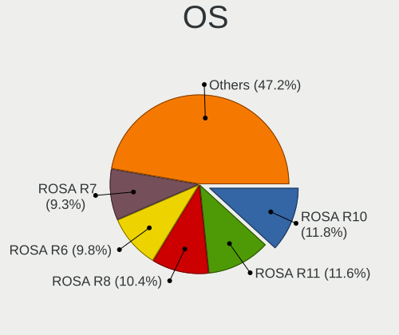

| Name               | Desktops | Percent |
|--------------------|----------|---------|
| ROSA R10           | 2146     | 11.78%  |
| ROSA R11           | 2108     | 11.57%  |
| ROSA R8            | 1892     | 10.38%  |
| ROSA R6            | 1778     | 9.76%   |
| ROSA R7            | 1692     | 9.29%   |
| ROSA R8.1          | 1464     | 8.03%   |
| ROSA R9            | 1280     | 7.02%   |
| ROSA R11.1         | 1245     | 6.83%   |
| ROSA 12.2          | 1045     | 5.74%   |
| ROSA 12.4          | 787      | 4.32%   |
| ROSA 12.5.1        | 659      | 3.62%   |
| ROSA 12.3          | 520      | 2.85%   |
| ROSA 13.0          | 393      | 2.16%   |
| ROSA 12            | 283      | 1.55%   |
| ROSA R5            | 244      | 1.34%   |
| ROSA 12.1          | 205      | 1.13%   |
| ROSA 12.5          | 171      | 0.94%   |
| ROSA 13.1          | 104      | 0.57%   |
| ROSA R4            | 42       | 0.23%   |
| ROSA R12           | 42       | 0.23%   |
| ROSA R3            | 26       | 0.14%   |
| ROSA 12.6          | 19       | 0.1%    |
| ROSA 2019.05       | 15       | 0.08%   |
| ROSA R9-R11        | 12       | 0.07%   |
| ROSA 2021.1        | 9        | 0.05%   |
| ROSA 12.7          | 8        | 0.04%   |
| ROSA Chrome 2.0    | 7        | 0.04%   |
| ROSA R2            | 6        | 0.03%   |
| ROSA 2012.0        | 5        | 0.03%   |
| ROSA R4-R8         | 3        | 0.02%   |
| ROSA Nickel 2019.0 | 3        | 0.02%   |
| ROSA DX 1.0        | 2        | 0.01%   |
| ROSA 13            | 2        | 0.01%   |
| ROSA R1            | 1        | 0.01%   |
| ROSA 2019.0        | 1        | 0.01%   |
| ROSA 12f.1         | 1        | 0.01%   |
| ROSA 1.0           | 1        | 0.01%   |

OS Family
---------

OS without a version

| Name | Desktops | Percent |
|------|----------|---------|
| ROSA | 14893    | 100%    |

Kernel
------

Version of the Linux kernel

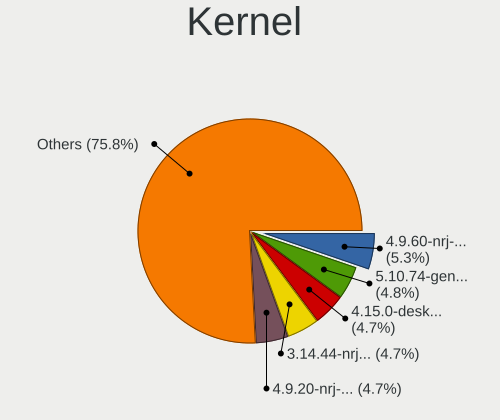

| Version                             | Desktops | Percent |
|-------------------------------------|----------|---------|
| 4.9.60-nrj-desktop-1rosa-x86_64     | 1039     | 5.25%   |
| 5.10.74-generic-2rosa2021.1-x86_64  | 950      | 4.8%    |
| 4.15.0-desktop-45.1rosa-x86_64      | 936      | 4.73%   |
| 3.14.44-nrj-desktop-2rosa-x86_64    | 930      | 4.7%    |
| 4.9.20-nrj-desktop-1rosa-x86_64     | 929      | 4.69%   |
| 4.1.25-nrj-desktop-1rosa-x86_64     | 860      | 4.35%   |
| 4.1.15-nrj-desktop-1rosa-x86_64     | 732      | 3.7%    |
| 4.1.34-nrj-desktop-2rosa-x86_64     | 502      | 2.54%   |
| 3.14.44-nrj-desktop-2rosa-i586      | 430      | 2.17%   |
| 4.9.124-nrj-desktop-1rosa-x86_64    | 405      | 2.05%   |
| 6.1.20-generic-2rosa2021.1-x86_64   | 382      | 1.93%   |
| 4.1.38-nrj-desktop-2rosa-x86_64     | 351      | 1.77%   |
| 4.9.9-nrj-desktop-1rosa-x86_64      | 321      | 1.62%   |
| 6.6.27-generic-3rosa2021.1-x86_64   | 319      | 1.61%   |
| 4.1.25-nrj-desktop-1rosa-i586       | 305      | 1.54%   |
| 4.9.155-nrj-desktop-1rosa-x86_64    | 299      | 1.51%   |
| 4.9.76-nrj-desktop-1rosa-x86_64     | 267      | 1.35%   |
| 4.15.0-desktop-122.124.1rosa-x86_64 | 263      | 1.33%   |
| 4.9.60-nrj-desktop-1rosa-i586       | 257      | 1.3%    |
| 4.1.16-nrj-desktop-1rosa-x86_64     | 249      | 1.26%   |
| 6.6.47-generic-1rosa2021.1-x86_64   | 233      | 1.18%   |
| 4.9.20-nrj-desktop-1rosa-i586       | 233      | 1.18%   |
| 4.15.0-desktop-68.5rosa-x86_64      | 232      | 1.17%   |
| 4.9.41-nrj-desktop-1rosa-x86_64     | 228      | 1.15%   |
| 4.15.0-desktop-45.1rosa-i586        | 226      | 1.14%   |
| 5.4.32-generic-2rosa-x86_64         | 225      | 1.14%   |
| 4.1.15-nrj-desktop-1rosa-i586       | 214      | 1.08%   |
| 5.4.83-generic-2rosa-x86_64         | 213      | 1.08%   |
| 6.1.58-generic-1rosa2021.1-x86_64   | 206      | 1.04%   |
| 4.1.34-nrj-desktop-2rosa-i586       | 194      | 0.98%   |
| 5.15.75-generic-1rosa2021.1-x86_64  | 191      | 0.97%   |
| 5.10.118-generic-2rosa2021.1-x86_64 | 189      | 0.96%   |
| 4.15.0-desktop-94.1rosa-x86_64      | 178      | 0.9%    |
| 4.15.0-desktop-47.2rosa-x86_64      | 178      | 0.9%    |
| 4.9.9-nrj-desktop-1rosa-i586        | 173      | 0.87%   |
| 5.15.79-generic-1rosa2021.1-x86_64  | 157      | 0.79%   |
| 4.1.38-nrj-desktop-2rosa-i586       | 146      | 0.74%   |
| 4.1.22-nrj-desktop-2rosa-x86_64     | 145      | 0.73%   |
| 3.14.53-nrj-desktop-1rosa-x86_64    | 145      | 0.73%   |
| 4.1.33-nrj-desktop-1rosa-x86_64     | 133      | 0.67%   |

Kernel Family
-------------

Linux kernel without a distro release

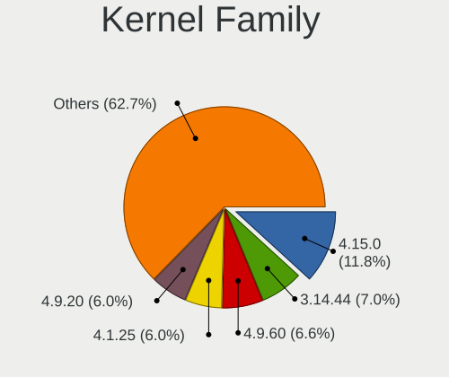

| Version  | Desktops | Percent |
|----------|----------|---------|
| 4.15.0   | 2292     | 11.79%  |
| 3.14.44  | 1357     | 6.98%   |
| 4.9.60   | 1288     | 6.63%   |
| 4.1.25   | 1160     | 5.97%   |
| 4.9.20   | 1157     | 5.95%   |
| 5.10.74  | 966      | 4.97%   |
| 4.1.15   | 942      | 4.85%   |
| 4.1.34   | 692      | 3.56%   |
| 4.1.38   | 591      | 3.04%   |
| 4.9.9    | 490      | 2.52%   |
| 4.9.124  | 481      | 2.47%   |
| 6.1.20   | 389      | 2%      |
| 4.9.155  | 378      | 1.94%   |
| 6.6.27   | 330      | 1.7%    |
| 4.9.76   | 327      | 1.68%   |
| 4.1.16   | 323      | 1.66%   |
| 5.4.32   | 304      | 1.56%   |
| 4.9.41   | 296      | 1.52%   |
| 5.4.83   | 263      | 1.35%   |
| 6.6.47   | 236      | 1.21%   |
| 6.1.58   | 210      | 1.08%   |
| 5.15.75  | 208      | 1.07%   |
| 4.1.19   | 208      | 1.07%   |
| 3.14.53  | 199      | 1.02%   |
| 4.1.22   | 196      | 1.01%   |
| 5.10.118 | 193      | 0.99%   |
| 4.1.33   | 177      | 0.91%   |
| 6.12.47  | 171      | 0.88%   |
| 4.9.95   | 168      | 0.86%   |
| 4.1.13   | 158      | 0.81%   |
| 5.15.79  | 157      | 0.81%   |
| 4.9.111  | 138      | 0.71%   |
| 6.12.13  | 124      | 0.64%   |
| 5.10.71  | 122      | 0.63%   |
| 6.6.21   | 108      | 0.56%   |
| 4.9.87   | 98       | 0.5%    |
| 6.12.34  | 92       | 0.47%   |
| 6.1.46   | 91       | 0.47%   |
| 3.14.33  | 88       | 0.45%   |
| 3.14.25  | 83       | 0.43%   |

Kernel Major Ver.
-----------------

Linux kernel major version

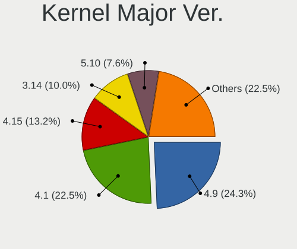

| Version | Desktops | Percent |
|---------|----------|---------|
| 4.9     | 4237     | 24.29%  |
| 4.1     | 3920     | 22.47%  |
| 4.15    | 2298     | 13.17%  |
| 3.14    | 1738     | 9.96%   |
| 5.10    | 1326     | 7.6%    |
| 6.1     | 808      | 4.63%   |
| 6.6     | 723      | 4.14%   |
| 5.4     | 655      | 3.75%   |
| 5.15    | 523      | 3%      |
| 6.12    | 479      | 2.75%   |
| 4.4     | 73       | 0.42%   |
| 5.17    | 59       | 0.34%   |
| 5.18    | 53       | 0.3%    |
| 4.8     | 37       | 0.21%   |
| 6.0     | 35       | 0.2%    |
| 3.10    | 32       | 0.18%   |
| 4.7     | 27       | 0.15%   |
| 5.0     | 26       | 0.15%   |
| 4.16    | 24       | 0.14%   |
| 4.13    | 24       | 0.14%   |
| 4.19    | 23       | 0.13%   |
| 4.6     | 21       | 0.12%   |
| 4.18    | 20       | 0.11%   |
| 3.18    | 20       | 0.11%   |
| 5.16    | 16       | 0.09%   |
| 4.14    | 14       | 0.08%   |
| 4.0     | 14       | 0.08%   |
| 5.5     | 13       | 0.07%   |
| 4.3     | 13       | 0.07%   |
| 4.17    | 13       | 0.07%   |
| 4.5     | 12       | 0.07%   |
| 5.3     | 11       | 0.06%   |
| 4.2     | 11       | 0.06%   |
| 6.2     | 10       | 0.06%   |
| 6.8     | 8        | 0.05%   |
| 5.2     | 8        | 0.05%   |
| 6.4     | 7        | 0.04%   |
| 6.17    | 7        | 0.04%   |
| 6.11    | 7        | 0.04%   |
| 6.10    | 7        | 0.04%   |

Arch
----

OS architecture (x86_64, i586, etc.)

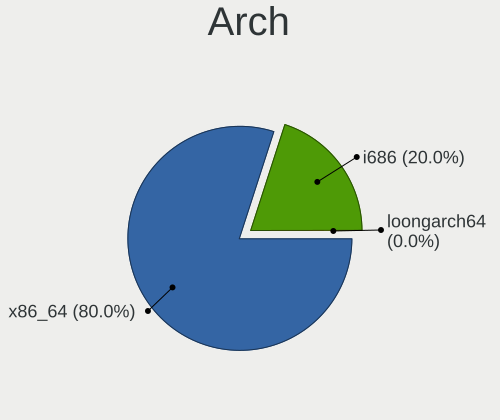

| Name        | Desktops | Percent |
|-------------|----------|---------|
| x86_64      | 12169    | 79.97%  |
| i686        | 3044     | 20%     |
| e2k         | 3        | 0.02%   |
| loongarch64 | 1        | 0.01%   |

DE
--

Desktop Environment

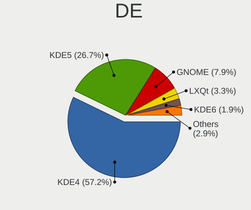

| Name       | Desktops | Percent |
|------------|----------|---------|
| KDE4       | 9255     | 57.21%  |
| KDE5       | 4320     | 26.7%   |
| GNOME      | 1282     | 7.92%   |
| LXQt       | 535      | 3.31%   |
| KDE6       | 309      | 1.91%   |
| MATE       | 197      | 1.22%   |
| XFCE       | 124      | 0.77%   |
| LXDE       | 72       | 0.45%   |
| Unknown    | 72       | 0.45%   |
| i3         | 4        | 0.02%   |
| X-Cinnamon | 2        | 0.01%   |
| KDE        | 2        | 0.01%   |
| Cinnamon   | 2        | 0.01%   |
| Budgie     | 1        | 0.01%   |

Display Server
--------------

X11 or Wayland

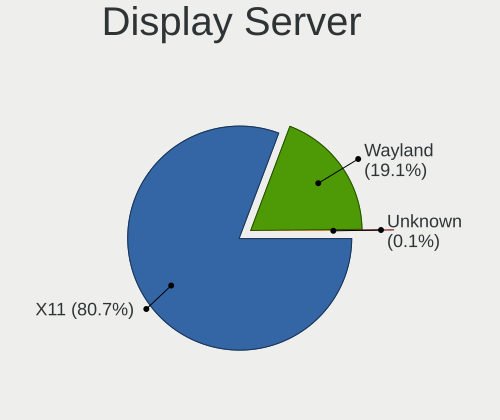

| Name    | Desktops | Percent |
|---------|----------|---------|
| X11     | 12396    | 80.73%  |
| Wayland | 2932     | 19.09%  |
| Tty     | 17       | 0.11%   |
| Unknown | 10       | 0.07%   |

Display Manager
---------------

SDDM, LightDM, etc.

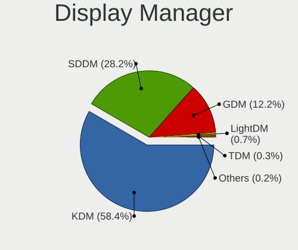

| Name        | Desktops | Percent |
|-------------|----------|---------|
| KDM         | 9366     | 58.38%  |
| SDDM        | 4523     | 28.19%  |
| GDM         | 1958     | 12.2%   |
| LightDM     | 107      | 0.67%   |
| TDM         | 49       | 0.31%   |
| Unknown     | 30       | 0.19%   |
| XDM         | 8        | 0.05%   |
| PLASMALOGIN | 1        | 0.01%   |
| LDM         | 1        | 0.01%   |

OS Lang
-------

Language

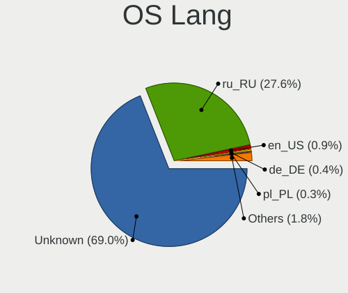

| Lang        | Desktops | Percent |
|-------------|----------|---------|
| Unknown     | 10671    | 69.03%  |
| ru_RU       | 4270     | 27.62%  |
| en_US       | 132      | 0.85%   |
| de_DE       | 65       | 0.42%   |
| pl_PL       | 42       | 0.27%   |
| es_ES       | 38       | 0.25%   |
| pt_BR       | 36       | 0.23%   |
| fr_FR       | 36       | 0.23%   |
| it_IT       | 28       | 0.18%   |
| ru_UA       | 22       | 0.14%   |
| en_GB       | 18       | 0.12%   |
| pt_PT       | 15       | 0.1%    |
| C           | 10       | 0.06%   |
| ro_RO       | 7        | 0.05%   |
| es_AR       | 7        | 0.05%   |
| sk_SK       | 5        | 0.03%   |
| hu_HU       | 5        | 0.03%   |
| tr_TR       | 4        | 0.03%   |
| es_CO       | 4        | 0.03%   |
| es_PE       | 3        | 0.02%   |
| es_MX       | 3        | 0.02%   |
| cs_CZ       | 3        | 0.02%   |
| zh_TW       | 2        | 0.01%   |
| ru_KZ       | 2        | 0.01%   |
| hr_HR       | 2        | 0.01%   |
| es_VE       | 2        | 0.01%   |
| el_GR       | 2        | 0.01%   |
| ca_ES       | 2        | 0.01%   |
| ar_SA       | 2        | 0.01%   |
| ar_EG       | 2        | 0.01%   |
| zh_CN       | 1        | 0.01%   |
| sr_RS@latin | 1        | 0.01%   |
| sr_ME       | 1        | 0.01%   |
| ru_BY       | 1        | 0.01%   |
| nb_NO       | 1        | 0.01%   |
| lt_LT       | 1        | 0.01%   |
| ja_JP       | 1        | 0.01%   |
| id_ID       | 1        | 0.01%   |
| fr_CA       | 1        | 0.01%   |
| fr_BE       | 1        | 0.01%   |

Boot Mode
---------

EFI or BIOS

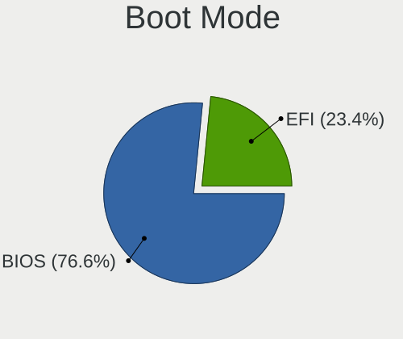

| Mode | Desktops | Percent |
|------|----------|---------|
| BIOS | 11710    | 76.57%  |
| EFI  | 3583     | 23.43%  |

Filesystem
----------

Type of filesystem

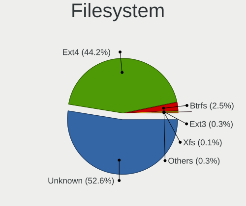

| Type     | Desktops | Percent |
|----------|----------|---------|
| Unknown  | 8289     | 52.57%  |
| Ext4     | 6963     | 44.16%  |
| Btrfs    | 402      | 2.55%   |
| Ext3     | 43       | 0.27%   |
| Xfs      | 18       | 0.11%   |
| F2fs     | 16       | 0.1%    |
| Ext2     | 16       | 0.1%    |
| SAMSUNG  | 7        | 0.04%   |
| Overlay  | 5        | 0.03%   |
| Aufs     | 4        | 0.03%   |
| Reiserfs | 2        | 0.01%   |
| Exfat    | 1        | 0.01%   |
| 2G       | 1        | 0.01%   |

Part. scheme
------------

Scheme of partitioning

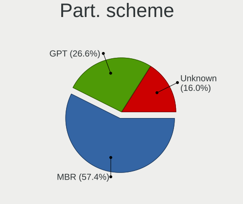

| Type    | Desktops | Percent |
|---------|----------|---------|
| MBR     | 9184     | 57.39%  |
| GPT     | 4257     | 26.6%   |
| Unknown | 2562     | 16.01%  |

Dual Boot with Linux/BSD
------------------------

Hosting more than one Linux/BSD

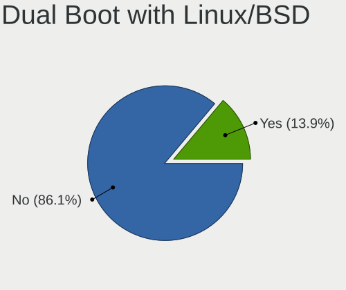

| Dual boot | Desktops | Percent |
|-----------|----------|---------|
| No        | 13351    | 86.11%  |
| Yes       | 2154     | 13.89%  |

Dual Boot (Win)
---------------

Hosting Linux and Windows

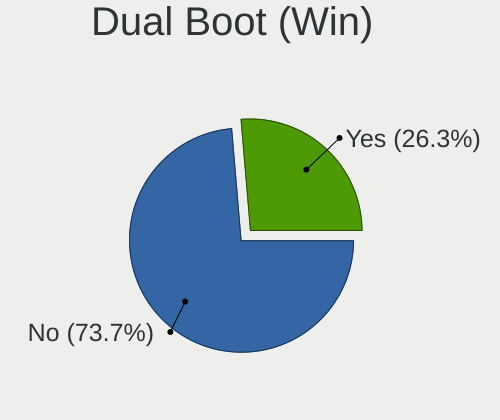

| Dual boot | Desktops | Percent |
|-----------|----------|---------|
| No        | 11558    | 73.66%  |
| Yes       | 4133     | 26.34%  |

Board
-----

Vendor
------

Motherboard manufacturer

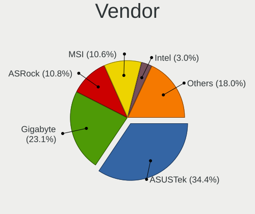

| Name                | Desktops | Percent |
|---------------------|----------|---------|
| ASUSTek Computer    | 5122     | 34.39%  |
| Gigabyte Technology | 3443     | 23.12%  |
| ASRock              | 1608     | 10.8%   |
| MSI                 | 1586     | 10.65%  |
| Intel               | 447      | 3%      |
| Hewlett-Packard     | 315      | 2.12%   |
| ECS                 | 308      | 2.07%   |
| Dell                | 243      | 1.63%   |
| Unknown             | 238      | 1.6%    |
| Biostar             | 233      | 1.56%   |
| Acer                | 187      | 1.26%   |
| Foxconn             | 182      | 1.22%   |
| Lenovo              | 166      | 1.11%   |
| Pegatron            | 116      | 0.78%   |
| Huanan              | 64       | 0.43%   |
| Fujitsu             | 45       | 0.3%    |
| Fujitsu Siemens     | 35       | 0.24%   |
| EPoX Computer       | 35       | 0.24%   |
| WinFast             | 33       | 0.22%   |
| Nvidia              | 19       | 0.13%   |
| MACHINIST           | 18       | 0.12%   |
| ABIT                | 18       | 0.12%   |
| Packard Bell        | 17       | 0.11%   |
| Medion              | 17       | 0.11%   |
| MAINBRD             | 17       | 0.11%   |
| AZW                 | 17       | 0.11%   |
| OEM                 | 16       | 0.11%   |
| Supermicro          | 14       | 0.09%   |
| KVADRA              | 13       | 0.09%   |
| SiS Technology      | 11       | 0.07%   |
| AMD                 | 11       | 0.07%   |
| Shuttle             | 10       | 0.07%   |
| eMachines           | 10       | 0.07%   |
| JW Technology       | 9        | 0.06%   |
| JGINYUE             | 8        | 0.05%   |
| IBM                 | 7        | 0.05%   |
| BESHTAU             | 7        | 0.05%   |
| Aquarius            | 7        | 0.05%   |
| ZOTAC               | 6        | 0.04%   |
| PCChips             | 6        | 0.04%   |

Model
-----

Motherboard model

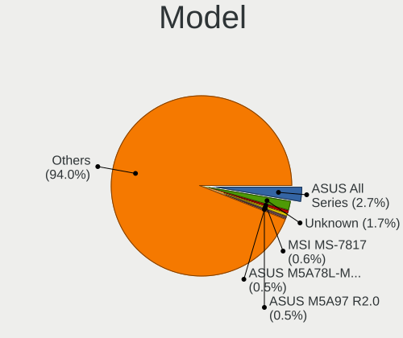

| Name                       | Desktops | Percent |
|----------------------------|----------|---------|
| ASUS All Series            | 398      | 2.67%   |
| Unknown                    | 255      | 1.71%   |
| MSI MS-7817                | 82       | 0.55%   |
| ASUS M5A78L-M LX3          | 80       | 0.54%   |
| ASUS M5A97 R2.0            | 74       | 0.5%    |
| Gigabyte 970A-DS3P         | 67       | 0.45%   |
| ASRock G31M-S              | 66       | 0.44%   |
| MSI MS-7529                | 63       | 0.42%   |
| ASRock N68C-S UCC          | 63       | 0.42%   |
| MSI MS-7592                | 60       | 0.4%    |
| Gigabyte G31M-ES2L         | 59       | 0.4%    |
| Gigabyte H61M-S1           | 58       | 0.39%   |
| ASUS P5K                   | 58       | 0.39%   |
| ASUS P8H61-M LX3 R2.0      | 56       | 0.38%   |
| MSI MS-7788                | 50       | 0.34%   |
| ASUS P5KPL-AM              | 50       | 0.34%   |
| ASUS P5G41T-M LX2/GB       | 50       | 0.34%   |
| ASUS P5B                   | 50       | 0.34%   |
| ASUS M5A97 LE R2.0         | 48       | 0.32%   |
| ASUS P8Z77-V LX            | 47       | 0.32%   |
| MSI MS-7309                | 46       | 0.31%   |
| ASUS P5KPL-AM IN/ROEM/SI   | 46       | 0.31%   |
| MSI MS-7693                | 45       | 0.3%    |
| Gigabyte H61M-S2PV         | 44       | 0.3%    |
| ASUS H110M-R               | 44       | 0.3%    |
| ASRock G41M-VS3            | 44       | 0.3%    |
| MSI MS-7721                | 43       | 0.29%   |
| ASUS SABERTOOTH 990FX R2.0 | 43       | 0.29%   |
| Gigabyte G41M-Combo        | 41       | 0.28%   |
| ASUS P5GC-MX/1333          | 38       | 0.26%   |
| ASUS M5A78L-M/USB3         | 38       | 0.26%   |
| MSI MS-7369                | 37       | 0.25%   |
| ASUS P5Q SE2               | 36       | 0.24%   |
| Gigabyte Z77-DS3H          | 34       | 0.23%   |
| MSI MS-7641                | 33       | 0.22%   |
| Gigabyte GA-78LMT-S2       | 33       | 0.22%   |
| ASUS P5G41T-M LX           | 33       | 0.22%   |
| MSI MS-7758                | 32       | 0.21%   |
| MSI MS-7680                | 32       | 0.21%   |
| ASUS P8H77-V LE            | 32       | 0.21%   |

Model Family
------------

Motherboard model prefix

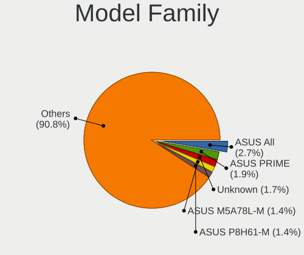

| Name               | Desktops | Percent |
|--------------------|----------|---------|
| ASUS All           | 398      | 2.67%   |
| ASUS PRIME         | 289      | 1.94%   |
| Unknown            | 255      | 1.71%   |
| ASUS M5A78L-M      | 215      | 1.44%   |
| ASUS P8H61-M       | 208      | 1.4%    |
| ASUS P5KPL-AM      | 167      | 1.12%   |
| ASUS M5A97         | 164      | 1.1%    |
| HP Compaq          | 161      | 1.08%   |
| Dell OptiPlex      | 161      | 1.08%   |
| ASUS P5K           | 149      | 1%      |
| ASUS P8Z77-V       | 138      | 0.93%   |
| ASUS P5G41T-M      | 127      | 0.85%   |
| Acer Aspire        | 120      | 0.81%   |
| ASUS P5Q           | 113      | 0.76%   |
| Lenovo ThinkCentre | 93       | 0.62%   |
| MSI MS-7817        | 82       | 0.55%   |
| ASUS SABERTOOTH    | 74       | 0.5%    |
| ASUS TUF           | 70       | 0.47%   |
| Gigabyte 970A-DS3P | 68       | 0.46%   |
| ASRock G31M-S      | 66       | 0.44%   |
| ASRock N68C-S      | 65       | 0.44%   |
| MSI MS-7529        | 63       | 0.42%   |
| MSI MS-7592        | 60       | 0.4%    |
| Gigabyte B450M     | 60       | 0.4%    |
| Gigabyte G31M-ES2L | 59       | 0.4%    |
| ASUS P5GC-MX       | 59       | 0.4%    |
| Gigabyte H61M-S1   | 58       | 0.39%   |
| ASUS P5B           | 58       | 0.39%   |
| ASUS P8H61-MX      | 53       | 0.36%   |
| ASUS P8H77-V       | 52       | 0.35%   |
| MSI MS-7788        | 50       | 0.34%   |
| ASUS ROG           | 50       | 0.34%   |
| ASUS P8B75-M       | 50       | 0.34%   |
| ASRock 970         | 49       | 0.33%   |
| MSI MS-7309        | 46       | 0.31%   |
| Acer Veriton       | 46       | 0.31%   |
| MSI MS-7693        | 45       | 0.3%    |
| ASUS M2N-MX        | 45       | 0.3%    |
| Gigabyte H61M-S2PV | 44       | 0.3%    |
| ASUS M5A78L        | 44       | 0.3%    |

MFG Year
--------

Motherboard manufacture year

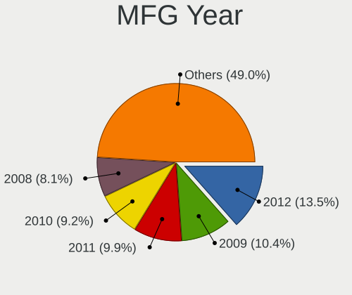

| Year    | Desktops | Percent |
|---------|----------|---------|
| 2012    | 2007     | 13.48%  |
| 2009    | 1545     | 10.37%  |
| 2011    | 1474     | 9.9%    |
| 2010    | 1365     | 9.17%   |
| 2008    | 1205     | 8.09%   |
| 2007    | 1197     | 8.04%   |
| 2013    | 1129     | 7.58%   |
| 2006    | 806      | 5.41%   |
| 2014    | 641      | 4.3%    |
| 2018    | 538      | 3.61%   |
| 2016    | 438      | 2.94%   |
| 2015    | 435      | 2.92%   |
| 2005    | 338      | 2.27%   |
| 2017    | 326      | 2.19%   |
| 2020    | 285      | 1.91%   |
| 2019    | 275      | 1.85%   |
| 2021    | 253      | 1.7%    |
| 2022    | 176      | 1.18%   |
| 2004    | 130      | 0.87%   |
| 2023    | 111      | 0.75%   |
| 2003    | 81       | 0.54%   |
| 2024    | 65       | 0.44%   |
| Unknown | 35       | 0.24%   |
| 2025    | 20       | 0.13%   |
| 2002    | 13       | 0.09%   |
| 2001    | 4        | 0.03%   |
| 2000    | 1        | 0.01%   |

Form Factor
-----------

Physical design of the computer

| Name    | Desktops | Percent |
|---------|----------|---------|
| Desktop | 14893    | 100%    |

Secure Boot
-----------

Enabled or disabled

| State    | Desktops | Percent |
|----------|----------|---------|
| Disabled | 14893    | 100%    |

Coreboot
--------

Have coreboot on board

| Used | Desktops | Percent |
|------|----------|---------|
| No   | 14892    | 99.99%  |
| Yes  | 1        | 0.01%   |

RAM Size
--------

Total RAM memory

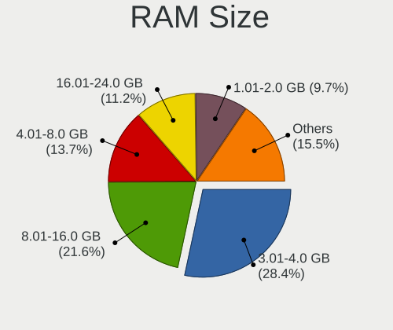

| Size in GB      | Desktops | Percent |
|-----------------|----------|---------|
| 3.01-4.0        | 4482     | 28.35%  |
| 8.01-16.0       | 3411     | 21.58%  |
| 4.01-8.0        | 2161     | 13.67%  |
| 16.01-24.0      | 1769     | 11.19%  |
| 1.01-2.0        | 1529     | 9.67%   |
| 2.01-3.0        | 1218     | 7.71%   |
| 32.01-64.0      | 554      | 3.5%    |
| 0.51-1.0        | 294      | 1.86%   |
| Unknown         | 149      | 0.94%   |
| 24.01-32.0      | 122      | 0.77%   |
| 64.01-256.0     | 97       | 0.61%   |
| 0.01-0.5        | 18       | 0.11%   |
| More than 256.0 | 3        | 0.02%   |

RAM Used
--------

Used RAM memory

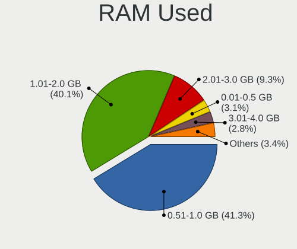

| Used GB     | Desktops | Percent |
|-------------|----------|---------|
| 0.51-1.0    | 7182     | 41.29%  |
| 1.01-2.0    | 6975     | 40.1%   |
| 2.01-3.0    | 1611     | 9.26%   |
| 0.01-0.5    | 546      | 3.14%   |
| 3.01-4.0    | 480      | 2.76%   |
| 4.01-8.0    | 365      | 2.1%    |
| Unknown     | 175      | 1.01%   |
| 8.01-16.0   | 50       | 0.29%   |
| 16.01-24.0  | 9        | 0.05%   |
| 64.01-256.0 | 1        | 0.01%   |

Total Drives
------------

Number of drives on board

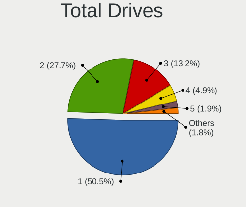

| Drives  | Desktops | Percent |
|---------|----------|---------|
| 1       | 8141     | 50.51%  |
| 2       | 4460     | 27.67%  |
| 3       | 2122     | 13.17%  |
| 4       | 792      | 4.91%   |
| 5       | 314      | 1.95%   |
| 0       | 121      | 0.75%   |
| 6       | 111      | 0.69%   |
| 7       | 29       | 0.18%   |
| 8       | 16       | 0.1%    |
| 9       | 7        | 0.04%   |
| Unknown | 4        | 0.02%   |
| 10      | 1        | 0.01%   |

Has CD-ROM
----------

Has CD-ROM on board

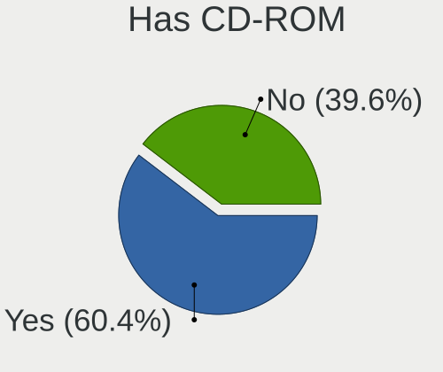

| Presented | Desktops | Percent |
|-----------|----------|---------|
| Yes       | 9305     | 60.39%  |
| No        | 6102     | 39.61%  |

Has Ethernet
------------

Has Ethernet on board

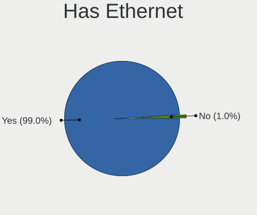

| Presented | Desktops | Percent |
|-----------|----------|---------|
| Yes       | 14738    | 98.95%  |
| No        | 156      | 1.05%   |

Has WiFi
--------

Has WiFi module

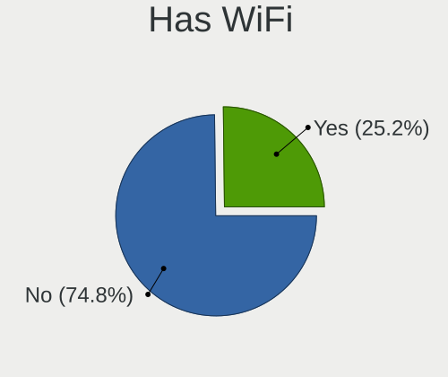

| Presented | Desktops | Percent |
|-----------|----------|---------|
| No        | 11407    | 74.82%  |
| Yes       | 3839     | 25.18%  |

Has Bluetooth
-------------

Has Bluetooth module

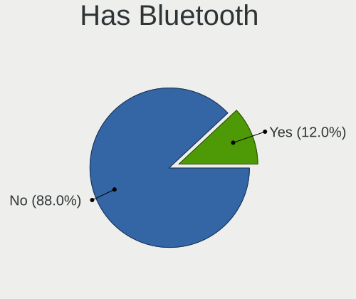

| Presented | Desktops | Percent |
|-----------|----------|---------|
| No        | 13343    | 88.04%  |
| Yes       | 1812     | 11.96%  |

Location
--------

Country
-------

Geographic location (country)

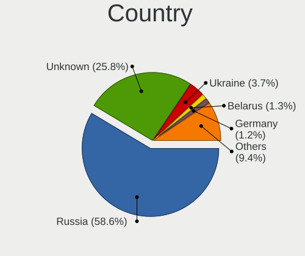

| Country     | Desktops | Percent |
|-------------|----------|---------|
| Russia      | 9145     | 58.58%  |
| Unknown     | 4031     | 25.82%  |
| Ukraine     | 579      | 3.71%   |
| Belarus     | 199      | 1.27%   |
| Germany     | 187      | 1.2%    |
| Poland      | 157      | 1.01%   |
| Kazakhstan  | 148      | 0.95%   |
| France      | 105      | 0.67%   |
| Italy       | 103      | 0.66%   |
| USA         | 95       | 0.61%   |
| Brazil      | 91       | 0.58%   |
| Spain       | 54       | 0.35%   |
| UK          | 45       | 0.29%   |
| Moldova     | 43       | 0.28%   |
| Canada      | 41       | 0.26%   |
| Mexico      | 33       | 0.21%   |
| Romania     | 32       | 0.2%    |
| Austria     | 24       | 0.15%   |
| Israel      | 23       | 0.15%   |
| Serbia      | 21       | 0.13%   |
| Latvia      | 21       | 0.13%   |
| Czechia     | 21       | 0.13%   |
| Bulgaria    | 21       | 0.13%   |
| Slovakia    | 20       | 0.13%   |
| Netherlands | 19       | 0.12%   |
| Estonia     | 18       | 0.12%   |
| Argentina   | 17       | 0.11%   |
| Australia   | 16       | 0.1%    |
| Hungary     | 14       | 0.09%   |
| Turkey      | 13       | 0.08%   |
| Lithuania   | 13       | 0.08%   |
| Venezuela   | 12       | 0.08%   |
| Sweden      | 12       | 0.08%   |
| Finland     | 12       | 0.08%   |
| Portugal    | 11       | 0.07%   |
| Kyrgyzstan  | 11       | 0.07%   |
| Greece      | 11       | 0.07%   |
| Colombia    | 11       | 0.07%   |
| Uzbekistan  | 10       | 0.06%   |
| Switzerland | 10       | 0.06%   |

City
----

Geographic location (city)

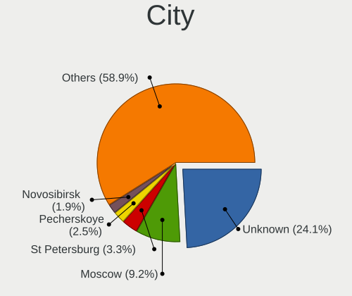

| City             | Desktops | Percent |
|------------------|----------|---------|
| Unknown          | 4032     | 24.13%  |
| Moscow           | 1541     | 9.22%   |
| St Petersburg    | 551      | 3.3%    |
| Pecherskoye      | 412      | 2.47%   |
| Novosibirsk      | 324      | 1.94%   |
| Yekaterinburg    | 261      | 1.56%   |
| Krasnodar        | 259      | 1.55%   |
| Samara           | 217      | 1.3%    |
| Rostov-on-Don    | 206      | 1.23%   |
| Nizhniy Novgorod | 199      | 1.19%   |
| Chelyabinsk      | 181      | 1.08%   |
| Perm             | 152      | 0.91%   |
| Voronezh         | 151      | 0.9%    |
| Krasnoyarsk      | 138      | 0.83%   |
| Saratov          | 132      | 0.79%   |
| Omsk             | 121      | 0.72%   |
| Volgograd        | 109      | 0.65%   |
| Barnaul          | 96       | 0.57%   |
| Stavropol        | 95       | 0.57%   |
| Kazan’         | 94       | 0.56%   |
| Vladivostok      | 87       | 0.52%   |
| Tyumen           | 87       | 0.52%   |
| Khabarovsk       | 83       | 0.5%    |
| Ufa              | 80       | 0.48%   |
| Irkutsk          | 80       | 0.48%   |
| Orenburg         | 77       | 0.46%   |
| Bryansk          | 72       | 0.43%   |
| Minsk            | 70       | 0.42%   |
| Lipetsk          | 70       | 0.42%   |
| Ulyanovsk        | 67       | 0.4%    |
| Tula             | 67       | 0.4%    |
| Yaroslavl        | 66       | 0.39%   |
| Tomsk            | 62       | 0.37%   |
| Novokuznetsk     | 62       | 0.37%   |
| Belgorod         | 61       | 0.37%   |
| Kemerovo         | 60       | 0.36%   |
| Tolyatti         | 56       | 0.34%   |
| Ryazan           | 55       | 0.33%   |
| Kirov            | 53       | 0.32%   |
| Kyiv             | 51       | 0.31%   |

Drives
------

Drive Vendor
------------

Hard drive vendors

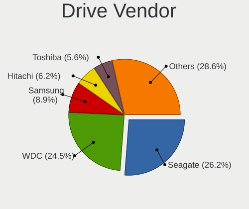

| Vendor                      | Desktops | Drives | Percent |
|-----------------------------|----------|--------|---------|
| Seagate                     | 6391     | 10722  | 26.2%   |
| WDC                         | 5985     | 10532  | 24.54%  |
| Samsung Electronics         | 2176     | 3447   | 8.92%   |
| Hitachi                     | 1509     | 2209   | 6.19%   |
| Toshiba                     | 1356     | 2072   | 5.56%   |
| Kingston                    | 1089     | 1627   | 4.47%   |
| Maxtor                      | 495      | 638    | 2.03%   |
| A-DATA Technology           | 395      | 572    | 1.62%   |
| China                       | 340      | 473    | 1.39%   |
| SPCC                        | 306      | 425    | 1.25%   |
| OCZ                         | 294      | 399    | 1.21%   |
| SanDisk                     | 274      | 442    | 1.12%   |
| Crucial                     | 257      | 402    | 1.05%   |
| Apacer                      | 221      | 323    | 0.91%   |
| Plextor                     | 201      | 323    | 0.82%   |
| Intel                       | 200      | 352    | 0.82%   |
| HGST                        | 178      | 280    | 0.73%   |
| HUAWEI                      | 152      | 183    | 0.62%   |
| KingSpec                    | 122      | 176    | 0.5%    |
| AMD                         | 122      | 167    | 0.5%    |
| Patriot                     | 120      | 154    | 0.49%   |
| Smartbuy                    | 116      | 159    | 0.48%   |
| Transcend                   | 96       | 133    | 0.39%   |
| GOODRAM                     | 96       | 144    | 0.39%   |
| Corsair                     | 96       | 127    | 0.39%   |
| Netac                       | 92       | 129    | 0.38%   |
| Silicon Motion              | 73       | 97     | 0.3%    |
| Unknown                     | 71       | 139    | 0.29%   |
| Gigabyte Technology         | 65       | 95     | 0.27%   |
| Fujitsu                     | 65       | 86     | 0.27%   |
| MAXIO Technology (Hangzhou) | 64       | 76     | 0.26%   |
| XPG                         | 49       | 72     | 0.2%    |
| XrayDisk                    | 45       | 63     | 0.18%   |
| KingDian                    | 43       | 71     | 0.18%   |
| JMicron Technology          | 40       | 44     | 0.16%   |
| Unknown                     | 40       | 45     | 0.16%   |
| Hewlett-Packard             | 39       | 77     | 0.16%   |
| TF CARD                     | 34       | 42     | 0.14%   |
| Team                        | 34       | 43     | 0.14%   |
| Kingmax                     | 34       | 70     | 0.14%   |

Drive Model
-----------

Hard drive models

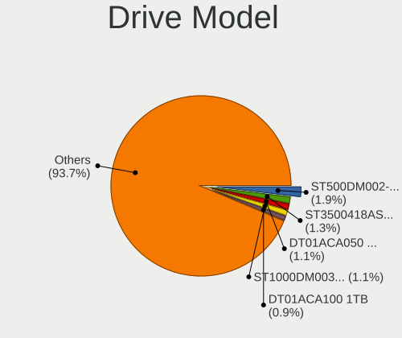

| Model                            | Desktops | Percent |
|----------------------------------|----------|---------|
| Seagate ST500DM002-1BD142 500GB  | 529      | 1.89%   |
| Seagate ST3500418AS 500GB        | 355      | 1.27%   |
| Toshiba DT01ACA050 500GB         | 319      | 1.14%   |
| Seagate ST1000DM003-1CH162 1TB   | 299      | 1.07%   |
| Toshiba DT01ACA100 1TB           | 261      | 0.93%   |
| Seagate ST1000DM010-2EP102 1TB   | 220      | 0.79%   |
| Toshiba HDWD110 1TB              | 209      | 0.75%   |
| Seagate ST3250410AS 250GB        | 201      | 0.72%   |
| WDC WD5000AAKX-001CA0 500GB      | 195      | 0.7%    |
| Seagate ST3160815AS 160GB        | 190      | 0.68%   |
| Kingston SV300S37A120G 120GB SSD | 186      | 0.67%   |
| Seagate ST380011A 80GB           | 185      | 0.66%   |
| WDC WD10EZEX-08WN4A0 1TB         | 178      | 0.64%   |
| Seagate ST3250310AS 250GB        | 175      | 0.63%   |
| Seagate ST380815AS 80GB          | 167      | 0.6%    |
| Seagate ST31000528AS 1TB         | 165      | 0.59%   |
| Seagate ST31000524AS 1TB         | 163      | 0.58%   |
| Kingston SA400S37120G 120GB SSD  | 158      | 0.57%   |
| Seagate ST1000DM003-1ER162 1TB   | 156      | 0.56%   |
| Kingston SA400S37240G 240GB SSD  | 149      | 0.53%   |
| Hitachi HDS721050CLA362 500GB    | 140      | 0.5%    |
| Seagate ST3500413AS 500GB        | 124      | 0.44%   |
| WDC WD5000AADS-00S9B0 500GB      | 121      | 0.43%   |
| WDC WD5000AAKX-00ERMA0 500GB     | 115      | 0.41%   |
| Seagate ST3320620AS 320GB        | 113      | 0.4%    |
| Hitachi HDS721010CLA332 1TB      | 113      | 0.4%    |
| Seagate ST3320613AS 320GB        | 112      | 0.4%    |
| Seagate ST1000DM003-9YN162 1TB   | 112      | 0.4%    |
| Samsung HD080HJ/ 80GB            | 109      | 0.39%   |
| Seagate ST2000DM001-1CH164 2TB   | 108      | 0.39%   |
| WDC WD10EZEX-00BN5A0 1TB         | 104      | 0.37%   |
| Seagate ST3250318AS 250GB        | 104      | 0.37%   |
| Hitachi HDS721616PLA380 160GB    | 104      | 0.37%   |
| Seagate ST250DM000-1BD141 250GB  | 103      | 0.37%   |
| Seagate ST3160811AS 160GB        | 97       | 0.35%   |
| Toshiba HDWD105 500GB            | 96       | 0.34%   |
| Seagate ST340014A 40GB           | 96       | 0.34%   |
| Seagate ST3320418AS 320GB        | 96       | 0.34%   |
| WDC WD10EARS-00Y5B1 1TB          | 93       | 0.33%   |
| Samsung HD502HJ 500GB            | 88       | 0.31%   |

HDD Vendor
----------

Hard disk drive vendors

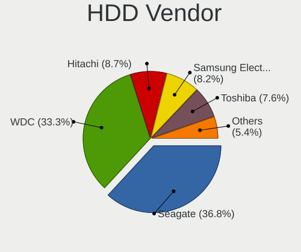

| Vendor              | Desktops | Drives | Percent |
|---------------------|----------|--------|---------|
| Seagate             | 6375     | 10677  | 36.85%  |
| WDC                 | 5764     | 9938   | 33.32%  |
| Hitachi             | 1509     | 2209   | 8.72%   |
| Samsung Electronics | 1416     | 2081   | 8.18%   |
| Toshiba             | 1311     | 1987   | 7.58%   |
| Maxtor              | 490      | 632    | 2.83%   |
| HGST                | 178      | 280    | 1.03%   |
| Fujitsu             | 64       | 85     | 0.37%   |
| JMicron Technology  | 32       | 35     | 0.18%   |
| Unknown             | 21       | 41     | 0.12%   |
| IBM/Hitachi         | 19       | 24     | 0.11%   |
| Hewlett-Packard     | 14       | 38     | 0.08%   |
| ExcelStor           | 14       | 21     | 0.08%   |
| Apple               | 9        | 9      | 0.05%   |
| WD MediaMax         | 8        | 11     | 0.05%   |
| External            | 7        | 9      | 0.04%   |
| ASMT                | 7        | 22     | 0.04%   |
| TO Exter            | 6        | 7      | 0.03%   |
| Quantum             | 6        | 6      | 0.03%   |
| IBM                 | 5        | 7      | 0.03%   |
| USB3.0              | 4        | 4      | 0.02%   |
| USB                 | 4        | 5      | 0.02%   |
| Magnetic Data       | 3        | 3      | 0.02%   |
| ASMedia             | 3        | 9      | 0.02%   |
| Unknown             | 3        | 3      | 0.02%   |
| SATAFIRM            | 2        | 2      | 0.01%   |
| SAGE                | 2        | 2      | 0.01%   |
| NVME USB            | 2        | 2      | 0.01%   |
| Intenso             | 2        | 2      | 0.01%   |
| HGST HTS            | 2        | 2      | 0.01%   |
| FC-1307             | 2        | 2      | 0.01%   |
| USB 3.0             | 1        | 1      | 0.01%   |
| TPH01204000GB       | 1        | 1      | 0.01%   |
| TPH00100500GB       | 1        | 1      | 0.01%   |
| Speeding            | 1        | 1      | 0.01%   |
| Silicon             | 1        | 1      | 0.01%   |
| MR2020              | 1        | 1      | 0.01%   |
| Min Yi U            | 1        | 1      | 0.01%   |
| MARSHAL             | 1        | 1      | 0.01%   |
| Lexar               | 1        | 1      | 0.01%   |

SSD Vendor
----------

Solid state drive vendors

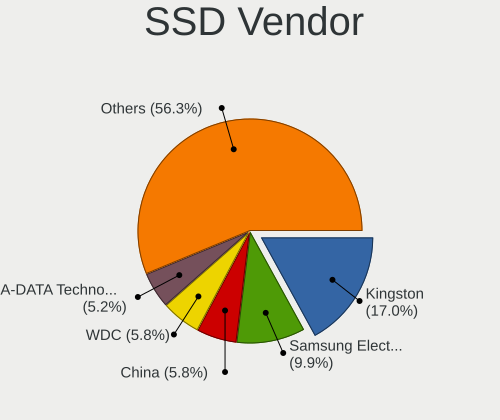

| Vendor              | Desktops | Drives | Percent |
|---------------------|----------|--------|---------|
| Kingston            | 984      | 1447   | 17.01%  |
| Samsung Electronics | 574      | 961    | 9.92%   |
| China               | 336      | 469    | 5.81%   |
| WDC                 | 333      | 502    | 5.76%   |
| A-DATA Technology   | 303      | 428    | 5.24%   |
| OCZ                 | 293      | 398    | 5.07%   |
| SPCC                | 287      | 400    | 4.96%   |
| Crucial             | 242      | 363    | 4.18%   |
| SanDisk             | 239      | 386    | 4.13%   |
| Apacer              | 194      | 279    | 3.35%   |
| Plextor             | 191      | 304    | 3.3%    |
| Intel               | 170      | 294    | 2.94%   |
| KingSpec            | 116      | 168    | 2.01%   |
| AMD                 | 113      | 148    | 1.95%   |
| Smartbuy            | 110      | 151    | 1.9%    |
| Patriot             | 103      | 136    | 1.78%   |
| Corsair             | 93       | 120    | 1.61%   |
| GOODRAM             | 92       | 140    | 1.59%   |
| Transcend           | 86       | 113    | 1.49%   |
| Netac               | 65       | 87     | 1.12%   |
| Gigabyte Technology | 52       | 72     | 0.9%    |
| Toshiba             | 44       | 75     | 0.76%   |
| KingDian            | 42       | 70     | 0.73%   |
| XrayDisk            | 38       | 55     | 0.66%   |
| Kingmax             | 34       | 70     | 0.59%   |
| Unknown             | 34       | 39     | 0.59%   |
| DEXP                | 30       | 37     | 0.52%   |
| Team                | 28       | 35     | 0.48%   |
| KingFast            | 19       | 27     | 0.33%   |
| Intenso             | 19       | 28     | 0.33%   |
| AGI                 | 19       | 24     | 0.33%   |
| Foxline             | 18       | 27     | 0.31%   |
| PNY                 | 17       | 18     | 0.29%   |
| OCZ-VERTEX3         | 17       | 27     | 0.29%   |
| Qumo                | 16       | 23     | 0.28%   |
| Digma               | 15       | 18     | 0.26%   |
| Micron Technology   | 14       | 17     | 0.24%   |
| Hewlett-Packard     | 13       | 21     | 0.22%   |
| Seagate             | 11       | 19     | 0.19%   |
| Londisk             | 10       | 11     | 0.17%   |

Drive Kind
----------

HDD or SSD

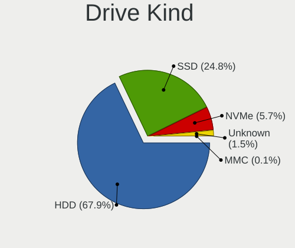

| Kind    | Desktops | Drives | Percent |
|---------|----------|--------|---------|
| HDD     | 13114    | 28173  | 67.91%  |
| SSD     | 4790     | 8533   | 24.8%   |
| NVMe    | 1105     | 1868   | 5.72%   |
| Unknown | 287      | 356    | 1.49%   |
| MMC     | 16       | 21     | 0.08%   |

Drive Connector
---------------

SATA, SAS, NVMe, etc.

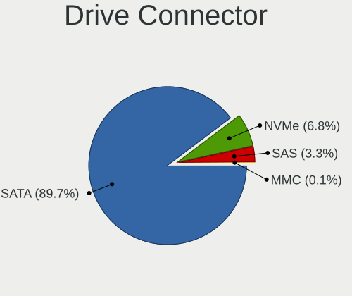

| Type | Desktops | Drives | Percent |
|------|----------|--------|---------|
| SATA | 14469    | 36346  | 89.74%  |
| NVMe | 1103     | 1865   | 6.84%   |
| SAS  | 536      | 719    | 3.32%   |
| MMC  | 16       | 21     | 0.1%    |

Drive Size
----------

Size of hard drive

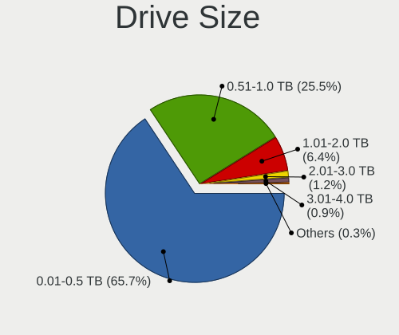

| Size in TB      | Desktops | Drives | Percent |
|-----------------|----------|--------|---------|
| 0.01-0.5        | 12450    | 25310  | 65.66%  |
| 0.51-1.0        | 4838     | 8602   | 25.52%  |
| 1.01-2.0        | 1210     | 2019   | 6.38%   |
| 2.01-3.0        | 233      | 353    | 1.23%   |
| 3.01-4.0        | 168      | 295    | 0.89%   |
| 4.01-10.0       | 52       | 113    | 0.27%   |
| 10.01-20.0      | 8        | 12     | 0.04%   |
| More than 100.0 | 1        | 1      | 0.01%   |
| 20.01-50.0      | 1        | 1      | 0.01%   |

Space Total
-----------

Amount of disk space available on the file system

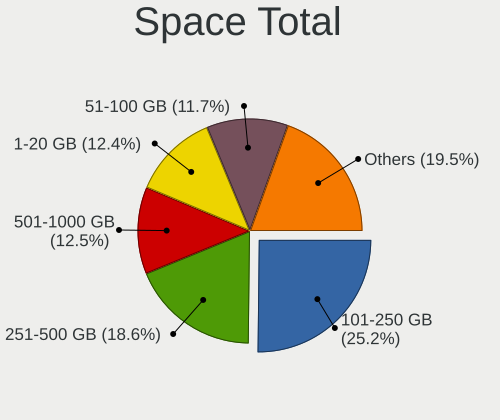

| Size in GB     | Desktops | Percent |
|----------------|----------|---------|
| 101-250        | 4404     | 25.18%  |
| 251-500        | 3259     | 18.63%  |
| 501-1000       | 2193     | 12.54%  |
| 1-20           | 2168     | 12.39%  |
| 51-100         | 2055     | 11.75%  |
| 21-50          | 1297     | 7.41%   |
| 1001-2000      | 1255     | 7.17%   |
| 2001-3000      | 381      | 2.18%   |
| More than 3000 | 300      | 1.72%   |
| Unknown        | 180      | 1.03%   |

Space Used
----------

Amount of used disk space

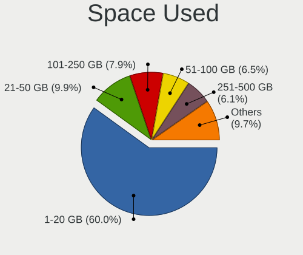

| Used GB        | Desktops | Percent |
|----------------|----------|---------|
| 1-20           | 10439    | 59.97%  |
| 21-50          | 1716     | 9.86%   |
| 101-250        | 1378     | 7.92%   |
| 51-100         | 1125     | 6.46%   |
| 251-500        | 1063     | 6.11%   |
| 501-1000       | 873      | 5.01%   |
| 1001-2000      | 417      | 2.4%    |
| Unknown        | 180      | 1.03%   |
| 2001-3000      | 117      | 0.67%   |
| More than 3000 | 100      | 0.57%   |

Malfunc. Drives
---------------

Drive models with a malfunction

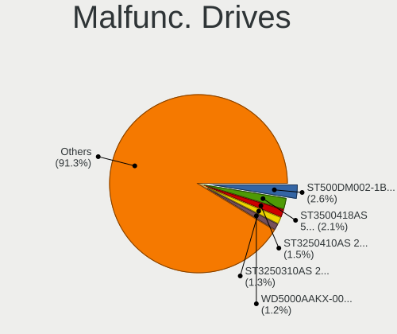

| Model                             | Desktops | Drives | Percent |
|-----------------------------------|----------|--------|---------|
| Seagate ST500DM002-1BD142 500GB   | 223      | 296    | 2.57%   |
| Seagate ST3500418AS 500GB         | 182      | 250    | 2.1%    |
| Seagate ST3250410AS 250GB         | 128      | 163    | 1.47%   |
| Seagate ST3250310AS 250GB         | 115      | 174    | 1.32%   |
| WDC WD5000AAKX-001CA0 500GB       | 105      | 135    | 1.21%   |
| Seagate ST3320613AS 320GB         | 86       | 120    | 0.99%   |
| Seagate ST31000528AS 1TB          | 83       | 109    | 0.96%   |
| Seagate ST3160815AS 160GB         | 74       | 87     | 0.85%   |
| WDC WD5000AADS-00S9B0 500GB       | 71       | 84     | 0.82%   |
| Samsung Electronics HD080HJ/ 80GB | 68       | 83     | 0.78%   |
| Seagate ST380011A 80GB            | 67       | 77     | 0.77%   |
| Seagate ST1000DM003-1CH162 1TB    | 67       | 96     | 0.77%   |
| Seagate ST3160811AS 160GB         | 65       | 91     | 0.75%   |
| Seagate ST31000524AS 1TB          | 65       | 93     | 0.75%   |
| Hitachi HDS721616PLA380 160GB     | 64       | 83     | 0.74%   |
| Seagate ST1000DM003-9YN162 1TB    | 62       | 77     | 0.71%   |
| Hitachi HDS721050CLA362 500GB     | 59       | 74     | 0.68%   |
| Seagate ST3250318AS 250GB         | 58       | 79     | 0.67%   |
| Hitachi HDP725050GLA360 500GB     | 57       | 75     | 0.66%   |
| Samsung Electronics HD160JJ 160GB | 55       | 85     | 0.63%   |
| WDC WD3200AAJS-00L7A0 320GB       | 54       | 67     | 0.62%   |
| Hitachi HDS721010CLA332 1TB       | 54       | 66     | 0.62%   |
| WDC WD10EARS-00Y5B1 1TB           | 53       | 95     | 0.61%   |
| Seagate ST380815AS 80GB           | 53       | 66     | 0.61%   |
| Seagate ST31500341AS 1TB          | 52       | 73     | 0.6%    |
| Seagate ST3320620AS 320GB         | 50       | 67     | 0.58%   |
| Seagate ST3500413AS 500GB         | 49       | 54     | 0.56%   |
| Samsung Electronics HD321KJ 320GB | 47       | 57     | 0.54%   |
| Seagate ST3500320AS 500GB         | 46       | 60     | 0.53%   |
| WDC WD5000AAKX-00ERMA0 500GB      | 44       | 67     | 0.51%   |
| Samsung Electronics HD161HJ 160GB | 44       | 56     | 0.51%   |
| WDC WD5000AAKS-00V1A0 500GB       | 43       | 52     | 0.5%    |
| Toshiba DT01ACA050 500GB          | 43       | 62     | 0.5%    |
| Maxtor STM3250310AS 250GB         | 43       | 56     | 0.5%    |
| Seagate ST3320418AS 320GB         | 42       | 57     | 0.48%   |
| Seagate ST250DM000-1BD141 250GB   | 42       | 61     | 0.48%   |
| WDC WD5000AAKS-00UU3A0 500GB      | 40       | 46     | 0.46%   |
| Toshiba DT01ACA100 1TB            | 38       | 70     | 0.44%   |
| Samsung Electronics SP2504C 250GB | 36       | 60     | 0.41%   |
| Kingston SV300S37A120G 120GB SSD  | 36       | 41     | 0.41%   |

Malfunc. Drive Vendor
---------------------

Vendors of faulty drives

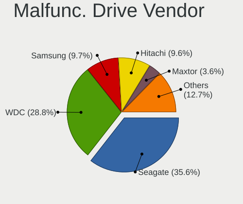

| Vendor                      | Desktops | Drives | Percent |
|-----------------------------|----------|--------|---------|
| Seagate                     | 2881     | 4209   | 35.55%  |
| WDC                         | 2331     | 3354   | 28.76%  |
| Samsung Electronics         | 789      | 1089   | 9.74%   |
| Hitachi                     | 781      | 1073   | 9.64%   |
| Maxtor                      | 293      | 364    | 3.62%   |
| Toshiba                     | 251      | 353    | 3.1%    |
| Kingston                    | 143      | 175    | 1.76%   |
| OCZ                         | 56       | 80     | 0.69%   |
| SPCC                        | 55       | 74     | 0.68%   |
| Intel                       | 46       | 54     | 0.57%   |
| HGST                        | 46       | 58     | 0.57%   |
| A-DATA Technology           | 44       | 62     | 0.54%   |
| SanDisk                     | 33       | 43     | 0.41%   |
| Corsair                     | 31       | 41     | 0.38%   |
| Fujitsu                     | 30       | 45     | 0.37%   |
| Kingmax                     | 26       | 55     | 0.32%   |
| Crucial                     | 19       | 34     | 0.23%   |
| AMD                         | 18       | 21     | 0.22%   |
| China                       | 17       | 21     | 0.21%   |
| IBM/Hitachi                 | 16       | 21     | 0.2%    |
| Netac                       | 14       | 16     | 0.17%   |
| Plextor                     | 13       | 24     | 0.16%   |
| KingSpec                    | 13       | 18     | 0.16%   |
| ExcelStor                   | 10       | 12     | 0.12%   |
| Apacer                      | 9        | 13     | 0.11%   |
| Patriot                     | 6        | 6      | 0.07%   |
| OCZ-VERTEX3                 | 6        | 13     | 0.07%   |
| IBM                         | 5        | 7      | 0.06%   |
| Unknown                     | 5        | 6      | 0.06%   |
| WD MediaMax                 | 4        | 6      | 0.05%   |
| Transcend                   | 4        | 4      | 0.05%   |
| Smartbuy                    | 4        | 5      | 0.05%   |
| Neo                         | 4        | 6      | 0.05%   |
| LITEONIT                    | 4        | 4      | 0.05%   |
| Hewlett-Packard             | 4        | 5      | 0.05%   |
| XrayDisk                    | 3        | 6      | 0.04%   |
| XPG                         | 3        | 6      | 0.04%   |
| Qumo                        | 3        | 9      | 0.04%   |
| MAXIO Technology (Hangzhou) | 3        | 4      | 0.04%   |
| Intenso                     | 3        | 4      | 0.04%   |

Malfunc. HDD Vendor
-------------------

Vendors of faulty HDD drives

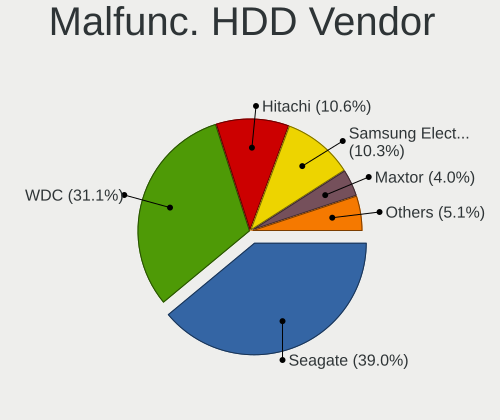

| Vendor              | Desktops | Drives | Percent |
|---------------------|----------|--------|---------|
| Seagate             | 2881     | 4209   | 38.98%  |
| WDC                 | 2299     | 3294   | 31.11%  |
| Hitachi             | 781      | 1073   | 10.57%  |
| Samsung Electronics | 760      | 1045   | 10.28%  |
| Maxtor              | 293      | 364    | 3.96%   |
| Toshiba             | 251      | 353    | 3.4%    |
| HGST                | 46       | 58     | 0.62%   |
| Fujitsu             | 30       | 45     | 0.41%   |
| IBM/Hitachi         | 16       | 21     | 0.22%   |
| ExcelStor           | 10       | 12     | 0.14%   |
| IBM                 | 5        | 7      | 0.07%   |
| WD MediaMax         | 4        | 6      | 0.05%   |
| Hewlett-Packard     | 3        | 4      | 0.04%   |
| Quantum             | 2        | 2      | 0.03%   |
| ASMT                | 2        | 3      | 0.03%   |
| Unknown             | 2        | 2      | 0.03%   |
| TPH00100500GB       | 1        | 1      | 0.01%   |
| MARSHAL             | 1        | 1      | 0.01%   |
| Magnetic Data       | 1        | 1      | 0.01%   |
| LaCie               | 1        | 1      | 0.01%   |
| ASMedia             | 1        | 1      | 0.01%   |
| Apple               | 1        | 1      | 0.01%   |

Malfunc. Drive Kind
-------------------

Kinds of faulty drives

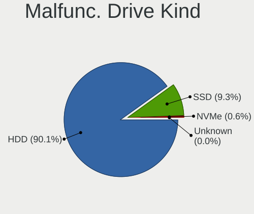

| Kind    | Desktops | Drives | Percent |
|---------|----------|--------|---------|
| HDD     | 6444     | 10504  | 90.11%  |
| SSD     | 665      | 926    | 9.3%    |
| NVMe    | 41       | 63     | 0.57%   |
| Unknown | 1        | 1      | 0.01%   |

Failed Drives
-------------

Failed drive models

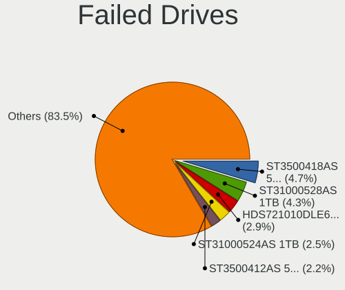

| Model                             | Desktops | Drives | Percent |
|-----------------------------------|----------|--------|---------|
| Seagate ST3500418AS 500GB         | 13       | 14     | 4.68%   |
| Seagate ST31000528AS 1TB          | 12       | 14     | 4.32%   |
| Hitachi HDS721010DLE630 1TB       | 8        | 11     | 2.88%   |
| Seagate ST31000524AS 1TB          | 7        | 8      | 2.52%   |
| Seagate ST3500412AS 500GB         | 6        | 8      | 2.16%   |
| Samsung Electronics HD502HJ 500GB | 5        | 5      | 1.8%    |
| Seagate ST3500410AS 500GB         | 4        | 5      | 1.44%   |
| Seagate ST31000333AS 1TB          | 4        | 4      | 1.44%   |
| Samsung Electronics SP0411N 40GB  | 4        | 5      | 1.44%   |
| Samsung Electronics HD502IJ 500GB | 4        | 4      | 1.44%   |
| Samsung Electronics HD322GJ 320GB | 4        | 5      | 1.44%   |
| HGST HTS545050A7E380 500GB        | 4        | 4      | 1.44%   |
| WDC WD5000AAKS-00V1A0 500GB       | 3        | 4      | 1.08%   |
| WDC WD3200AAJS-00L7A0 320GB       | 3        | 4      | 1.08%   |
| WDC WD15EARS-00MVWB0 1TB          | 3        | 6      | 1.08%   |
| Seagate ST9250315AS 250GB         | 3        | 3      | 1.08%   |
| Seagate ST3750528AS 752GB         | 3        | 3      | 1.08%   |
| Seagate ST3320613AS 320GB         | 3        | 4      | 1.08%   |
| Seagate ST32000542AS 2TB          | 3        | 5      | 1.08%   |
| Maxtor 6Y080L0 81GB               | 3        | 3      | 1.08%   |
| Hitachi HDS721050DLE630 500GB     | 3        | 3      | 1.08%   |
| Hitachi HDS721010CLA332 1TB       | 3        | 3      | 1.08%   |
| WDC WD7501AALS-00J7B0 752GB       | 2        | 2      | 0.72%   |
| WDC WD2500JS-22NCB1 250GB         | 2        | 3      | 0.72%   |
| Toshiba MK3265GSX 320GB           | 2        | 2      | 0.72%   |
| Toshiba DT01ACA050 500GB          | 2        | 2      | 0.72%   |
| Seagate STM3500418AS 500GB        | 2        | 2      | 0.72%   |
| Seagate ST9320325AS 320GB         | 2        | 3      | 0.72%   |
| Seagate ST500DM002-1BD142 500GB   | 2        | 2      | 0.72%   |
| Seagate ST3640323AS 640GB         | 2        | 2      | 0.72%   |
| Seagate ST3250318AS 250GB         | 2        | 6      | 0.72%   |
| Seagate ST3160318AS 160GB         | 2        | 2      | 0.72%   |
| Seagate ST31500341AS 1TB          | 2        | 3      | 0.72%   |
| Samsung Electronics HM321HI 320GB | 2        | 3      | 0.72%   |
| Samsung Electronics HM250HI 250GB | 2        | 2      | 0.72%   |
| Samsung Electronics HD503HI 500GB | 2        | 2      | 0.72%   |
| Samsung Electronics HD252HJ 250GB | 2        | 6      | 0.72%   |
| Samsung Electronics HD251HJ 250GB | 2        | 2      | 0.72%   |
| Samsung Electronics HD204UI 2TB   | 2        | 2      | 0.72%   |
| Samsung Electronics HD105SI 1TB   | 2        | 2      | 0.72%   |

Failed Drive Vendor
-------------------

Failed drive vendors

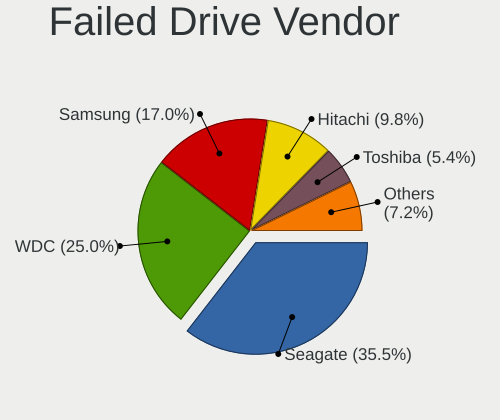

| Vendor              | Desktops | Drives | Percent |
|---------------------|----------|--------|---------|
| Seagate             | 98       | 118    | 35.51%  |
| WDC                 | 69       | 86     | 25%     |
| Samsung Electronics | 47       | 56     | 17.03%  |
| Hitachi             | 27       | 31     | 9.78%   |
| Toshiba             | 15       | 15     | 5.43%   |
| Maxtor              | 9        | 9      | 3.26%   |
| HGST                | 8        | 9      | 2.9%    |
| Hewlett-Packard     | 1        | 1      | 0.36%   |
| Corsair             | 1        | 1      | 0.36%   |
| Apple               | 1        | 1      | 0.36%   |

Drive Status
------------

Number of failed and malfunc. drives

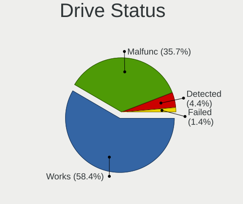

| Status   | Desktops | Drives | Percent |
|----------|----------|--------|---------|
| Works    | 11266    | 25809  | 58.41%  |
| Malfunc  | 6893     | 11494  | 35.74%  |
| Detected | 857      | 1321   | 4.44%   |
| Failed   | 273      | 327    | 1.42%   |

Storage controller
------------------

Storage Vendor
--------------

Storage controller vendors

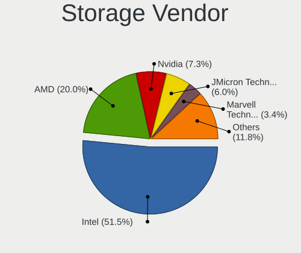

| Vendor                           | Desktops | Percent |
|----------------------------------|----------|---------|
| Intel                            | 9567     | 51.53%  |
| AMD                              | 3717     | 20.02%  |
| Nvidia                           | 1348     | 7.26%   |
| JMicron Technology               | 1117     | 6.02%   |
| Marvell Technology Group         | 624      | 3.36%   |
| ASMedia Technology               | 419      | 2.26%   |
| VIA Technologies                 | 319      | 1.72%   |
| Samsung Electronics              | 262      | 1.41%   |
| Silicon Motion                   | 156      | 0.84%   |
| Kingston Technology Company      | 148      | 0.8%    |
| ADATA Technology                 | 132      | 0.71%   |
| Phison Electronics               | 114      | 0.61%   |
| MAXIO Technology (Hangzhou)      | 87       | 0.47%   |
| SanDisk                          | 79       | 0.43%   |
| Silicon Integrated Systems [SiS] | 72       | 0.39%   |
| Silicon Image                    | 54       | 0.29%   |
| Realtek Semiconductor            | 54       | 0.29%   |
| Integrated Technology Express    | 43       | 0.23%   |
| Shenzhen Longsys Electronics     | 32       | 0.17%   |
| Netac Technology                 | 27       | 0.15%   |
| Micron/Crucial Technology        | 27       | 0.15%   |
| Lite-On Technology               | 19       | 0.1%    |
| ULi Electronics                  | 16       | 0.09%   |
| LSI Logic / Symbios Logic        | 14       | 0.08%   |
| SK hynix                         | 13       | 0.07%   |
| INNOGRIT                         | 13       | 0.07%   |
| Adaptec                          | 10       | 0.05%   |
| KIOXIA                           | 9        | 0.05%   |
| OCZ Technology Group             | 8        | 0.04%   |
| Promise Technology               | 7        | 0.04%   |
| Hosin Global Electronics         | 7        | 0.04%   |
| Lite-On IT Corp. / Plextor       | 6        | 0.03%   |
| Micron Technology                | 5        | 0.03%   |
| Hewlett-Packard                  | 5        | 0.03%   |
| Toshiba America Info Systems     | 4        | 0.02%   |
| Biwin Storage Technology         | 4        | 0.02%   |
| Solid State Storage Technology   | 3        | 0.02%   |
| MCST                             | 3        | 0.02%   |
| ATI Technologies                 | 3        | 0.02%   |
| YEESTOR Microelectronics         | 2        | 0.01%   |

Storage Model
-------------

Storage controller models

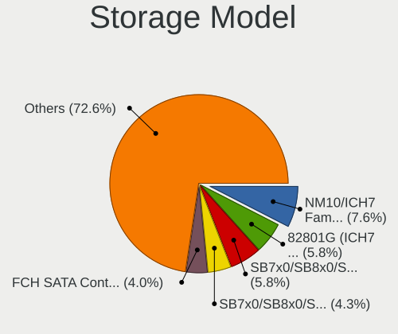

| Model                                                                                   | Desktops | Percent |
|-----------------------------------------------------------------------------------------|----------|---------|
| Intel NM10/ICH7 Family SATA Controller [IDE mode]                                       | 2053     | 7.55%   |
| Intel 82801G (ICH7 Family) IDE Controller                                               | 1574     | 5.79%   |
| AMD SB7x0/SB8x0/SB9x0 IDE Controller                                                    | 1571     | 5.78%   |
| AMD SB7x0/SB8x0/SB9x0 SATA Controller [IDE mode]                                        | 1172     | 4.31%   |
| AMD FCH SATA Controller [AHCI mode]                                                     | 1076     | 3.96%   |
| Intel 8 Series/C220 Series Chipset Family 6-port SATA Controller 1 [AHCI mode]          | 857      | 3.15%   |
| AMD SB7x0/SB8x0/SB9x0 SATA Controller [AHCI mode]                                       | 846      | 3.11%   |
| Intel 6 Series/C200 Series Chipset Family Desktop SATA Controller (IDE mode, ports 4-5) | 771      | 2.84%   |
| Intel 6 Series/C200 Series Chipset Family Desktop SATA Controller (IDE mode, ports 0-3) | 769      | 2.83%   |
| Intel 6 Series/C200 Series Chipset Family 6 port Desktop SATA AHCI Controller           | 730      | 2.69%   |
| Nvidia MCP61 SATA Controller                                                            | 685      | 2.52%   |
| Nvidia MCP61 IDE                                                                        | 640      | 2.35%   |
| Intel 7 Series/C210 Series Chipset Family 6-port SATA Controller [AHCI mode]            | 592      | 2.18%   |
| JMicron JMB363 SATA/IDE Controller                                                      | 566      | 2.08%   |
| Intel Q170/Q150/B150/H170/H110/Z170/CM236 Chipset SATA Controller [AHCI Mode]           | 506      | 1.86%   |
| Intel 82801JI (ICH10 Family) 4 port SATA IDE Controller #1                              | 443      | 1.63%   |
| Intel 82801JI (ICH10 Family) 2 port SATA IDE Controller #2                              | 443      | 1.63%   |
| Intel 82801I (ICH9 Family) 2 port SATA Controller [IDE mode]                            | 417      | 1.53%   |
| JMicron JMB368 IDE controller                                                           | 402      | 1.48%   |
| ASMedia ASM1061/ASM1062 Serial ATA Controller                                           | 398      | 1.46%   |
| AMD 400 Series Chipset SATA Controller                                                  | 309      | 1.14%   |
| Intel 5 Series/3400 Series Chipset 4 port SATA IDE Controller                           | 274      | 1.01%   |
| Intel 200 Series PCH SATA controller [AHCI mode]                                        | 271      | 1%      |
| Intel 5 Series/3400 Series Chipset 2 port SATA IDE Controller                           | 270      | 0.99%   |
| Intel 7 Series/C210 Series Chipset Family 4-port SATA Controller [IDE mode]             | 252      | 0.93%   |
| Intel 7 Series/C210 Series Chipset Family 2-port SATA Controller [IDE mode]             | 252      | 0.93%   |
| Intel 82801IB (ICH9) 2 port SATA Controller [IDE mode]                                  | 244      | 0.9%    |
| AMD FCH IDE Controller                                                                  | 241      | 0.89%   |
| Intel 82801H (ICH8 Family) 4 port SATA Controller [IDE mode]                            | 185      | 0.68%   |
| AMD FCH SATA Controller [IDE mode]                                                      | 183      | 0.67%   |
| Intel 82801JI (ICH10 Family) SATA AHCI Controller                                       | 174      | 0.64%   |
| Intel 9 Series Chipset Family SATA Controller [AHCI Mode]                               | 173      | 0.64%   |
| Intel 82801IR/IO/IH (ICH9R/DO/DH) 4 port SATA Controller [IDE mode]                     | 173      | 0.64%   |
| Intel 82801HR/HO/HH (ICH8R/DO/DH) 2 port SATA Controller [IDE mode]                     | 172      | 0.63%   |
| AMD 500 Series Chipset SATA Controller                                                  | 167      | 0.61%   |
| Marvell Group 88SE6111/6121 SATA II / PATA Controller                                   | 165      | 0.61%   |
| Intel 5 Series/3400 Series Chipset 6 port SATA AHCI Controller                          | 159      | 0.58%   |
| Marvell Group 88SE6101/6102 single-port PATA133 interface                               | 156      | 0.57%   |
| Intel 82801EB/ER (ICH5/ICH5R) IDE Controller                                            | 154      | 0.57%   |
| Intel SATA Controller [RAID mode]                                                       | 151      | 0.56%   |

Storage Kind
------------

Kind of storage controller (IDE, SATA, NVMe, SAS, ...)

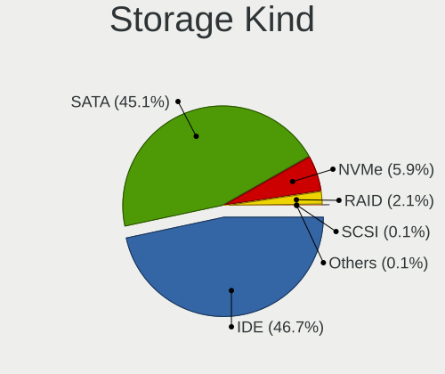

| Kind | Desktops | Percent |
|------|----------|---------|
| IDE  | 8791     | 46.66%  |
| SATA | 8505     | 45.14%  |
| NVMe | 1104     | 5.86%   |
| RAID | 401      | 2.13%   |
| SCSI | 25       | 0.13%   |
| SAS  | 15       | 0.08%   |

Processor
---------

CPU Vendor
----------

Processor vendors

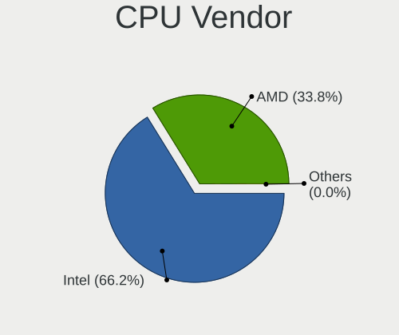

| Vendor      | Desktops | Percent |
|-------------|----------|---------|
| Intel       | 9858     | 66.18%  |
| AMD         | 5032     | 33.78%  |
| MBE8C-PC    | 1        | 0.01%   |
| Loongson    | 1        | 0.01%   |
| Elbrus-MCST | 1        | 0.01%   |
| E8C-mITX    | 1        | 0.01%   |
| Unknown     | 1        | 0.01%   |

CPU Model
---------

Processor models

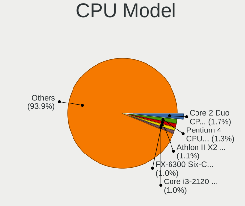

| Model                                       | Desktops | Percent |
|---------------------------------------------|----------|---------|
| Intel Core 2 Duo CPU E8400 @ 3.00GHz        | 254      | 1.68%   |
| Intel Pentium 4 CPU 3.00GHz                 | 199      | 1.32%   |
| AMD Athlon II X2 250 Processor              | 168      | 1.11%   |
| AMD FX-6300 Six-Core Processor              | 157      | 1.04%   |
| Intel Core i3-2120 CPU @ 3.30GHz            | 144      | 0.95%   |
| Intel Core 2 Duo CPU E7500 @ 2.93GHz        | 141      | 0.93%   |
| Intel Core 2 Quad CPU Q6600 @ 2.40GHz       | 135      | 0.89%   |
| Intel Core i3-2100 CPU @ 3.10GHz            | 129      | 0.85%   |
| Intel Core i5-3470 CPU @ 3.20GHz            | 127      | 0.84%   |
| Intel Pentium Dual-Core CPU E5300 @ 2.60GHz | 126      | 0.83%   |
| Intel Core i5-2400 CPU @ 3.10GHz            | 125      | 0.83%   |
| Intel Core i3-3220 CPU @ 3.30GHz            | 119      | 0.79%   |
| AMD FX-8350 Eight-Core Processor            | 116      | 0.77%   |
| Intel Core 2 Duo CPU E8500 @ 3.16GHz        | 109      | 0.72%   |
| Intel Core 2 Duo CPU E6550 @ 2.33GHz        | 101      | 0.67%   |
| Intel Pentium Dual-Core CPU E5700 @ 3.00GHz | 92       | 0.61%   |
| AMD Athlon 64 X2 Dual Core Processor 4200+  | 87       | 0.58%   |
| Intel Pentium Dual-Core CPU E5200 @ 2.50GHz | 86       | 0.57%   |
| AMD FX-8320 Eight-Core Processor            | 86       | 0.57%   |
| Intel Core i7-3770 CPU @ 3.40GHz            | 85       | 0.56%   |
| Intel Core 2 Duo CPU E4500 @ 2.20GHz        | 85       | 0.56%   |
| AMD FX-4300 Quad-Core Processor             | 85       | 0.56%   |
| AMD Athlon II X2 240 Processor              | 80       | 0.53%   |
| Intel Core i7-3770K CPU @ 3.50GHz           | 79       | 0.52%   |
| Intel Core i5-4460 CPU @ 3.20GHz            | 79       | 0.52%   |
| Intel Core i3 CPU 540 @ 3.07GHz             | 79       | 0.52%   |
| AMD Athlon 64 X2 Dual Core Processor 6000+  | 77       | 0.51%   |
| Intel Core i5-2500 CPU @ 3.30GHz            | 76       | 0.5%    |
| AMD Phenom II X4 955 Processor              | 76       | 0.5%    |
| Intel Core i3-6100 CPU @ 3.70GHz            | 74       | 0.49%   |
| AMD Ryzen 5 3600 6-Core Processor           | 73       | 0.48%   |
| AMD Athlon 64 X2 Dual Core Processor 5200+  | 73       | 0.48%   |
| Intel Core 2 Duo CPU E6750 @ 2.66GHz        | 72       | 0.48%   |
| AMD Athlon 64 X2 Dual Core Processor 5600+  | 72       | 0.48%   |
| Intel Pentium Dual CPU E2200 @ 2.20GHz      | 71       | 0.47%   |
| Intel Core i5-2500K CPU @ 3.30GHz           | 70       | 0.46%   |
| Intel Core i3-3240 CPU @ 3.40GHz            | 70       | 0.46%   |
| AMD Phenom II X4 965 Processor              | 70       | 0.46%   |
| Intel Pentium Dual CPU E2180 @ 2.00GHz      | 69       | 0.46%   |
| Intel Core i7-2600K CPU @ 3.40GHz           | 68       | 0.45%   |

CPU Model Family
----------------

Processor model prefix

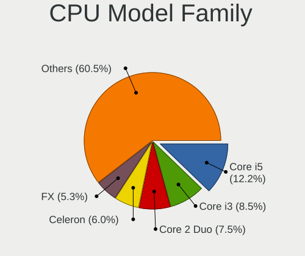

| Model                   | Desktops | Percent |
|-------------------------|----------|---------|
| Intel Core i5           | 1838     | 12.21%  |
| Intel Core i3           | 1285     | 8.54%   |
| Intel Core 2 Duo        | 1125     | 7.47%   |
| Intel Celeron           | 896      | 5.95%   |
| AMD FX                  | 803      | 5.33%   |
| Intel Core i7           | 781      | 5.19%   |
| Intel Pentium           | 737      | 4.9%    |
| AMD Athlon 64 X2        | 701      | 4.66%   |
| Intel Pentium Dual-Core | 559      | 3.71%   |
| Intel Xeon              | 547      | 3.63%   |
| AMD Athlon II X2        | 540      | 3.59%   |
| Intel Core 2 Quad       | 504      | 3.35%   |
| Intel Pentium 4         | 460      | 3.06%   |
| AMD Ryzen 5             | 437      | 2.9%    |
| AMD Phenom II X4        | 336      | 2.23%   |
| Other                   | 268      | 1.78%   |
| Intel Core 2            | 245      | 1.63%   |
| Intel Pentium Dual      | 243      | 1.61%   |
| AMD Athlon II X4        | 223      | 1.48%   |
| Intel Atom              | 180      | 1.2%    |
| Intel Pentium D         | 178      | 1.18%   |
| AMD Ryzen 7             | 173      | 1.15%   |
| AMD Athlon II X3        | 169      | 1.12%   |
| AMD Athlon 64           | 160      | 1.06%   |
| AMD A8                  | 147      | 0.98%   |
| AMD A4                  | 145      | 0.96%   |
| AMD A10                 | 138      | 0.92%   |
| AMD Ryzen 3             | 123      | 0.82%   |
| AMD Phenom              | 117      | 0.78%   |
| AMD Athlon X4           | 112      | 0.74%   |
| AMD Phenom II X6        | 109      | 0.72%   |
| AMD A6                  | 101      | 0.67%   |
| AMD Athlon              | 98       | 0.65%   |
| AMD Sempron             | 96       | 0.64%   |
| AMD Phenom II X2        | 67       | 0.45%   |
| Intel Pentium Gold      | 54       | 0.36%   |
| Intel Genuine           | 41       | 0.27%   |
| AMD Ryzen 9             | 38       | 0.25%   |
| AMD E                   | 31       | 0.21%   |
| AMD Phenom II X3        | 27       | 0.18%   |

CPU Cores
---------

Number of processor cores

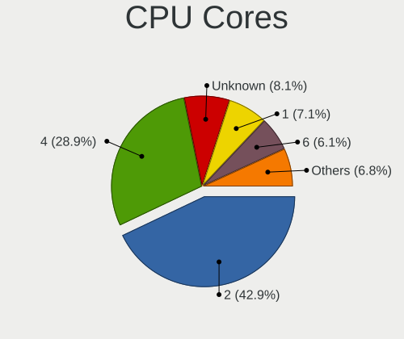

| Number  | Desktops | Percent |
|---------|----------|---------|
| 2       | 6632     | 42.94%  |
| 4       | 4462     | 28.89%  |
| Unknown | 1252     | 8.11%   |
| 1       | 1099     | 7.12%   |
| 6       | 945      | 6.12%   |
| 3       | 435      | 2.82%   |
| 8       | 382      | 2.47%   |
| 12      | 84       | 0.54%   |
| 10      | 51       | 0.33%   |
| 14      | 43       | 0.28%   |
| 16      | 30       | 0.19%   |
| 18      | 10       | 0.06%   |
| 24      | 8        | 0.05%   |
| 20      | 6        | 0.04%   |
| 28      | 2        | 0.01%   |
| 115     | 1        | 0.01%   |
| 50      | 1        | 0.01%   |
| 36      | 1        | 0.01%   |
| 32      | 1        | 0.01%   |
| 5       | 1        | 0.01%   |

CPU Sockets
-----------

Number of sockets

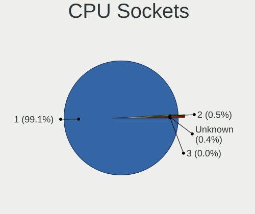

| Number  | Desktops | Percent |
|---------|----------|---------|
| 1       | 14799    | 99.1%   |
| 2       | 73       | 0.49%   |
| Unknown | 59       | 0.4%    |
| 4       | 2        | 0.01%   |
| 3       | 1        | 0.01%   |

CPU Threads
-----------

Threads per core (Hyper-Threading)

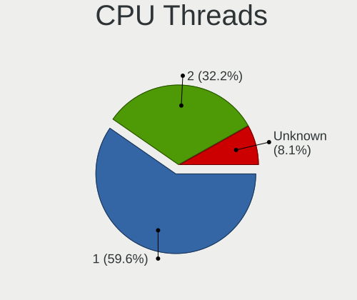

| Number  | Desktops | Percent |
|---------|----------|---------|
| 1       | 9180     | 59.65%  |
| 2       | 4959     | 32.22%  |
| Unknown | 1252     | 8.13%   |

CPU Op-Modes
------------

CPU Operation Modes (32-bit, 64-bit)

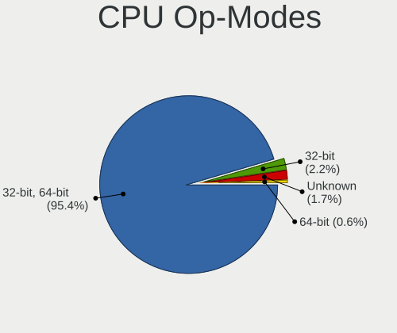

| Op mode        | Desktops | Percent |
|----------------|----------|---------|
| 32-bit, 64-bit | 14317    | 95.44%  |
| 32-bit         | 330      | 2.2%    |
| Unknown        | 261      | 1.74%   |
| 64-bit         | 93       | 0.62%   |

CPU Microcode
-------------

Microcode number

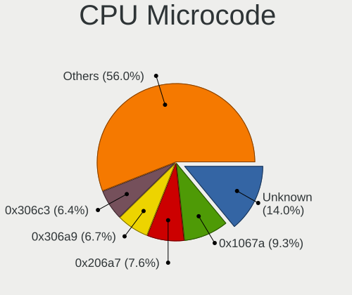

| Number     | Desktops | Percent |
|------------|----------|---------|
| Unknown    | 2182     | 14.04%  |
| 0x1067a    | 1444     | 9.29%   |
| 0x206a7    | 1188     | 7.64%   |
| 0x306a9    | 1041     | 6.7%    |
| 0x306c3    | 988      | 6.36%   |
| 0x010000c8 | 739      | 4.75%   |
| 0x6fd      | 440      | 2.83%   |
| 0x10676    | 366      | 2.35%   |
| 0x6fb      | 365      | 2.35%   |
| 0x506e3    | 337      | 2.17%   |
| 0x06001119 | 312      | 2.01%   |
| 0x906e9    | 242      | 1.56%   |
| 0x0600084f | 223      | 1.43%   |
| 0x06000852 | 196      | 1.26%   |
| 0x010000db | 164      | 1.06%   |
| 0x20655    | 155      | 1%      |
| 0x106e5    | 153      | 0.98%   |
| 0x906ea    | 152      | 0.98%   |
| 0x6f6      | 148      | 0.95%   |
| 0xf41      | 140      | 0.9%    |
| 0x010000b6 | 139      | 0.89%   |
| 0x06003106 | 137      | 0.88%   |
| 0xf49      | 134      | 0.86%   |
| 0x6f2      | 127      | 0.82%   |
| 0x010000c7 | 119      | 0.77%   |
| 0x06000822 | 113      | 0.73%   |
| 0x20652    | 112      | 0.72%   |
| 0x0800820d | 111      | 0.71%   |
| 0xf65      | 108      | 0.69%   |
| 0x0600063d | 100      | 0.64%   |
| 0x03000027 | 100      | 0.64%   |
| 0x10677    | 94       | 0.6%    |
| 0x08701021 | 92       | 0.59%   |
| 0xa0653    | 89       | 0.57%   |
| 0x106ca    | 86       | 0.55%   |
| 0xf29      | 78       | 0.5%    |
| 0x010000dc | 77       | 0.5%    |
| 0x01000086 | 73       | 0.47%   |
| 0x106a5    | 69       | 0.44%   |
| 0x306f2    | 68       | 0.44%   |

CPU Microarch
-------------

Microarchitecture

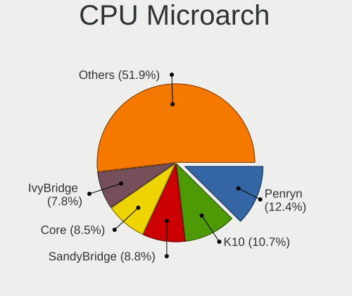

| Name             | Desktops | Percent |
|------------------|----------|---------|
| Penryn           | 1867     | 12.39%  |
| K10              | 1619     | 10.75%  |
| SandyBridge      | 1319     | 8.76%   |
| Core             | 1276     | 8.47%   |
| IvyBridge        | 1172     | 7.78%   |
| Haswell          | 1143     | 7.59%   |
| K8 Hammer        | 930      | 6.17%   |
| Piledriver       | 909      | 6.03%   |
| NetBurst         | 816      | 5.42%   |
| KabyLake         | 567      | 3.76%   |
| Skylake          | 385      | 2.56%   |
| Westmere         | 315      | 2.09%   |
| Unknown          | 275      | 1.83%   |
| Nehalem          | 240      | 1.59%   |
| Zen              | 236      | 1.57%   |
| Bulldozer        | 211      | 1.4%    |
| Zen+             | 207      | 1.37%   |
| Zen 3            | 186      | 1.23%   |
| Zen 2            | 179      | 1.19%   |
| Steamroller      | 166      | 1.1%    |
| CometLake        | 164      | 1.09%   |
| Bonnell          | 155      | 1.03%   |
| Alderlake Hybrid | 147      | 0.98%   |
| Silvermont       | 122      | 0.81%   |
| K10 Llano        | 116      | 0.77%   |
| Excavator        | 53       | 0.35%   |
| Icelake          | 49       | 0.33%   |
| Broadwell        | 42       | 0.28%   |
| Bobcat           | 41       | 0.27%   |
| Jaguar           | 33       | 0.22%   |
| Goldmont plus    | 33       | 0.22%   |
| K6               | 27       | 0.18%   |
| Goldmont         | 22       | 0.15%   |
| Gracemont        | 13       | 0.09%   |
| Tremont          | 9        | 0.06%   |
| TigerLake        | 7        | 0.05%   |
| Puma             | 7        | 0.05%   |
| P6               | 3        | 0.02%   |
| K8 & K10 hybrid  | 2        | 0.01%   |
| Lunarlake Hybrid | 1        | 0.01%   |

Graphics
--------

GPU Vendor
----------

Vendors of graphics cards

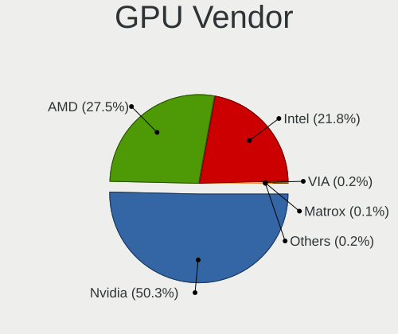

| Vendor                           | Desktops | Percent |
|----------------------------------|----------|---------|
| Nvidia                           | 7939     | 50.35%  |
| AMD                              | 4337     | 27.51%  |
| Intel                            | 3430     | 21.75%  |
| VIA Technologies                 | 27       | 0.17%   |
| Matrox Electronics Systems       | 8        | 0.05%   |
| ATI Technologies                 | 8        | 0.05%   |
| Silicon Integrated Systems [SiS] | 7        | 0.04%   |
| S3 Graphics                      | 6        | 0.04%   |
| ASPEED Technology                | 5        | 0.03%   |
| Loongson Technology              | 1        | 0.01%   |

GPU Model
---------

Graphics card models

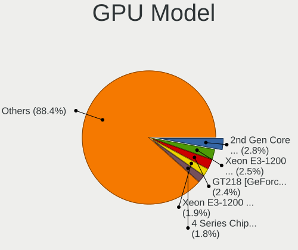

| Model                                                                       | Desktops | Percent |
|-----------------------------------------------------------------------------|----------|---------|
| Intel 2nd Generation Core Processor Family Integrated Graphics Controller   | 474      | 2.84%   |
| Intel Xeon E3-1200 v3/4th Gen Core Processor Integrated Graphics Controller | 420      | 2.52%   |
| Nvidia GT218 [GeForce 210]                                                  | 407      | 2.44%   |
| Intel Xeon E3-1200 v2/3rd Gen Core processor Graphics Controller            | 320      | 1.92%   |
| Intel 4 Series Chipset Integrated Graphics Controller                       | 308      | 1.85%   |
| Nvidia GP107 [GeForce GTX 1050 Ti]                                          | 272      | 1.63%   |
| Intel 82G33/G31 Express Integrated Graphics Controller                      | 261      | 1.56%   |
| Nvidia GK208B [GeForce GT 710]                                              | 258      | 1.55%   |
| Nvidia G94 [GeForce 9600 GT]                                                | 258      | 1.55%   |
| Nvidia GK107 [GeForce GTX 650]                                              | 256      | 1.53%   |
| Nvidia GF108 [GeForce GT 630]                                               | 235      | 1.41%   |
| Nvidia GF116 [GeForce GTX 550 Ti]                                           | 231      | 1.38%   |
| AMD Ellesmere [Radeon RX 470/480/570/570X/580/580X/590]                     | 227      | 1.36%   |
| Nvidia GM107 [GeForce GTX 750 Ti]                                           | 221      | 1.32%   |
| Nvidia GF119 [GeForce GT 610]                                               | 217      | 1.3%    |
| Intel 82945G/GZ Integrated Graphics Controller                              | 205      | 1.23%   |
| Nvidia GF108 [GeForce GT 440]                                               | 178      | 1.07%   |
| Nvidia GF108 [GeForce GT 430]                                               | 176      | 1.05%   |
| Nvidia G92 [GeForce GTS 250]                                                | 171      | 1.02%   |
| Nvidia G84 [GeForce 8600 GT]                                                | 169      | 1.01%   |
| Nvidia GK106 [GeForce GTX 660]                                              | 166      | 1%      |
| Nvidia G96C [GeForce 9500 GT]                                               | 166      | 1%      |
| Nvidia GK208B [GeForce GT 730]                                              | 157      | 0.94%   |
| AMD RS780L [Radeon 3000]                                                    | 148      | 0.89%   |
| Nvidia G92 [GeForce 9800 GT]                                                | 147      | 0.88%   |
| Nvidia GT215 [GeForce GT 240]                                               | 146      | 0.88%   |
| AMD Cedar [Radeon HD 5000/6000/7350/8350 Series]                            | 141      | 0.85%   |
| Nvidia GK107 [GeForce GT 640]                                               | 129      | 0.77%   |
| Nvidia GK104 [GeForce GTX 760]                                              | 124      | 0.74%   |
| Nvidia GP108 [GeForce GT 1030]                                              | 121      | 0.73%   |
| Intel Skylake-S GT2 [HD Graphics 530]                                       | 119      | 0.71%   |
| Nvidia GF106 [GeForce GTS 450]                                              | 118      | 0.71%   |
| Nvidia GF108 [GeForce GT 730]                                               | 115      | 0.69%   |
| Nvidia GK106 [GeForce GTX 650 Ti]                                           | 113      | 0.68%   |
| AMD Turks XT [Radeon HD 6670/7670]                                          | 112      | 0.67%   |
| AMD Caicos [Radeon HD 6450/7450/8450 / R5 230 OEM]                          | 112      | 0.67%   |
| AMD Cape Verde XT [Radeon HD 7770/8760 / R7 250X]                           | 108      | 0.65%   |
| Nvidia GP107 [GeForce GTX 1050]                                             | 106      | 0.64%   |
| Intel Kaby Lake-S GT2 [HD Graphics 630]                                     | 105      | 0.63%   |
| Intel 4th Generation Core Processor Family Integrated Graphics Controller   | 105      | 0.63%   |

GPU Combo
---------

Combinations of graphics cards

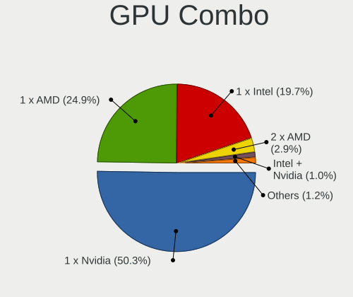

| Name                          | Desktops | Percent |
|-------------------------------|----------|---------|
| 1 x Nvidia                    | 7707     | 50.25%  |
| 1 x AMD                       | 3816     | 24.88%  |
| 1 x Intel                     | 3015     | 19.66%  |
| 2 x AMD                       | 447      | 2.91%   |
| Intel + Nvidia                | 161      | 1.05%   |
| AMD + Nvidia                  | 53       | 0.35%   |
| Intel + AMD                   | 41       | 0.27%   |
| 2 x Nvidia                    | 32       | 0.21%   |
| 1 x VIA                       | 27       | 0.18%   |
| 1 x SiS                       | 7        | 0.05%   |
| 1 x Matrox                    | 5        | 0.03%   |
| 1 x S3 Graphics               | 4        | 0.03%   |
| 3 x AMD                       | 3        | 0.02%   |
| Nvidia + Matrox               | 3        | 0.02%   |
| 1 x ASPEED                    | 3        | 0.02%   |
| Other                         | 2        | 0.01%   |
| 3 x Nvidia                    | 2        | 0.01%   |
| 2 x Intel                     | 1        | 0.01%   |
| 2 x AMD + 1 x Nvidia          | 1        | 0.01%   |
| Nvidia + ASPEED               | 1        | 0.01%   |
| 1 x Loongson Technology       | 1        | 0.01%   |
| Intel + 2 x AMD               | 1        | 0.01%   |
| Intel + SiS + 1 x S3 Graphics | 1        | 0.01%   |
| Intel + S3 Graphics           | 1        | 0.01%   |
| AMD + 2 x Nvidia              | 1        | 0.01%   |
| AMD + ASPEED                  | 1        | 0.01%   |

GPU Driver
----------

Free vs proprietary

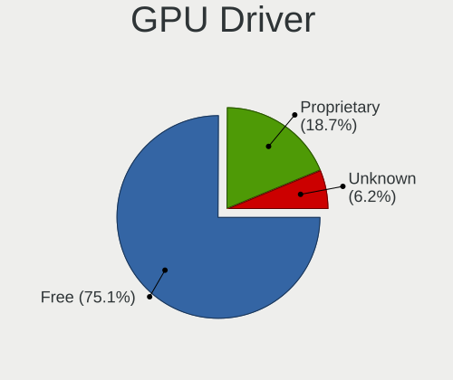

| Driver      | Desktops | Percent |
|-------------|----------|---------|
| Free        | 12011    | 75.06%  |
| Proprietary | 2993     | 18.7%   |
| Unknown     | 998      | 6.24%   |

GPU Memory
----------

Total video memory

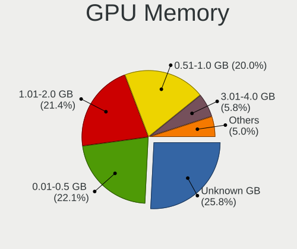

| Size in GB | Desktops | Percent |
|------------|----------|---------|
| Unknown    | 4183     | 25.79%  |
| 0.01-0.5   | 3579     | 22.06%  |
| 1.01-2.0   | 3464     | 21.35%  |
| 0.51-1.0   | 3240     | 19.97%  |
| 3.01-4.0   | 943      | 5.81%   |
| 7.01-8.0   | 375      | 2.31%   |
| 2.01-3.0   | 161      | 0.99%   |
| 5.01-6.0   | 160      | 0.99%   |
| 8.01-16.0  | 113      | 0.7%    |
| 16.01-24.0 | 4        | 0.02%   |

Monitor
-------

Monitor Vendor
--------------

Monitor vendors

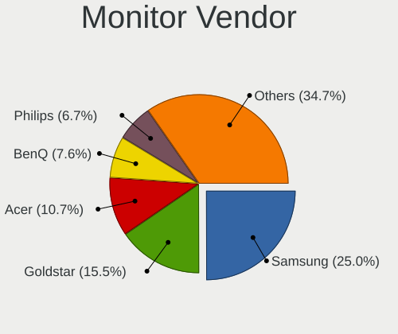

| Vendor               | Desktops | Percent |
|----------------------|----------|---------|
| Samsung Electronics  | 3715     | 24.97%  |
| Goldstar             | 2302     | 15.47%  |
| Acer                 | 1586     | 10.66%  |
| BenQ                 | 1124     | 7.55%   |
| Philips              | 990      | 6.65%   |
| ViewSonic            | 646      | 4.34%   |
| AOC                  | 560      | 3.76%   |
| Dell                 | 554      | 3.72%   |
| Ancor Communications | 545      | 3.66%   |
| Hewlett-Packard      | 445      | 2.99%   |
| NEC Computers        | 313      | 2.1%    |
| Sony                 | 154      | 1.04%   |
| Iiyama               | 149      | 1%      |
| Plain Tree Systems   | 80       | 0.54%   |
| ASUSTek Computer     | 74       | 0.5%    |
| Lenovo               | 68       | 0.46%   |
| Envision Peripherals | 61       | 0.41%   |
| Unknown              | 58       | 0.39%   |
| Fujitsu Siemens      | 58       | 0.39%   |
| Mi                   | 51       | 0.34%   |
| Packard Bell         | 50       | 0.34%   |
| HannStar             | 47       | 0.32%   |
| Toshiba              | 46       | 0.31%   |
| MSI                  | 43       | 0.29%   |
| ___                  | 41       | 0.28%   |
| MiTAC                | 40       | 0.27%   |
| Hitachi              | 33       | 0.22%   |
| MStar                | 31       | 0.21%   |
| SKG                  | 30       | 0.2%    |
| Belinea              | 30       | 0.2%    |
| SAC                  | 29       | 0.19%   |
| Panasonic            | 29       | 0.19%   |
| VIE                  | 28       | 0.19%   |
| KTC                  | 27       | 0.18%   |
| HHT                  | 25       | 0.17%   |
| JRY                  | 24       | 0.16%   |
| Medion               | 23       | 0.15%   |
| Eizo                 | 23       | 0.15%   |
| Haier                | 20       | 0.13%   |
| Sharp                | 18       | 0.12%   |

Monitor Model
-------------

Monitor models

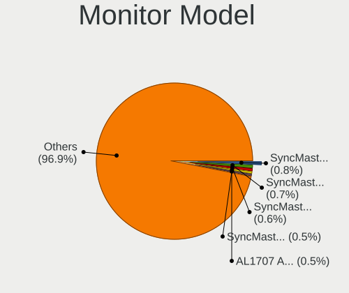

| Model                                                                 | Desktops | Percent |
|-----------------------------------------------------------------------|----------|---------|
| Samsung Electronics SyncMaster SAM01E1 1280x1024 376x301mm 19.0-inch  | 116      | 0.76%   |
| Samsung Electronics SyncMaster SAM011E 1280x1024 338x270mm 17.0-inch  | 106      | 0.69%   |
| Samsung Electronics SyncMaster SAM01B7 1280x1024 340x270mm 17.1-inch  | 98       | 0.64%   |
| Samsung Electronics SyncMaster SAM036E 1280x1024 376x301mm 19.0-inch  | 80       | 0.52%   |
| Acer AL1707 A ACRAD46 1280x1024 338x270mm 17.0-inch                   | 74       | 0.48%   |
| Goldstar W1943 GSM4BAD 1360x768 406x229mm 18.4-inch                   | 65       | 0.42%   |
| Philips PHL 223V5 PHLC0CF 1920x1080 477x268mm 21.5-inch               | 62       | 0.4%    |
| Goldstar W1942 GSM4B6F 1440x900 408x255mm 18.9-inch                   | 59       | 0.38%   |
| Samsung Electronics SME1920NR SAM06A4 1280x1024 376x301mm 19.0-inch   | 51       | 0.33%   |
| Goldstar FULL HD GSM5B55 1920x1080 480x270mm 21.7-inch                | 50       | 0.33%   |
| Goldstar W2243 GSM56FE 1920x1080 477x269mm 21.6-inch                  | 49       | 0.32%   |
| Samsung Electronics SyncMaster SAM02AD 1440x900 410x257mm 19.1-inch   | 48       | 0.31%   |
| Goldstar L1942 GSM4B85 1280x1024 376x301mm 19.0-inch                  | 44       | 0.29%   |
| Acer AL1916 ACRAD49 1280x1024 376x301mm 19.0-inch                     | 44       | 0.29%   |
| Samsung Electronics SyncMaster SAM022B 1280x1024 338x270mm 17.0-inch  | 42       | 0.27%   |
| Goldstar LG ULTRAWIDE GSM59F1 2560x1080 670x280mm 28.6-inch           | 38       | 0.25%   |
| Samsung Electronics SyncMaster SAM036F 1440x900 428x255mm 19.6-inch   | 37       | 0.24%   |
| Goldstar L1918S GSM4B31 1280x1024 380x300mm 19.1-inch                 | 37       | 0.24%   |
| Samsung Electronics LCD Monitor SAM0902 1920x1080 890x500mm 40.2-inch | 36       | 0.23%   |
| Goldstar L1730S GSM438D 1280x1024 338x270mm 17.0-inch                 | 36       | 0.23%   |
| Samsung Electronics C24F390 SAM0D2C 1920x1080 521x293mm 23.5-inch     | 35       | 0.23%   |
| Philips 226V4 PHLC0B1 1920x1080 477x268mm 21.5-inch                   | 35       | 0.23%   |
| AOC 24G2W1G3 AOC2402 1920x1080 527x296mm 23.8-inch                    | 35       | 0.23%   |
| Samsung Electronics S24D300 SAM0B43 1920x1080 531x299mm 24.0-inch     | 34       | 0.22%   |
| Goldstar W2242 GSM5677 1680x1050 474x296mm 22.0-inch                  | 34       | 0.22%   |
| Goldstar L192WS GSM4B32 1440x900 410x256mm 19.0-inch                  | 34       | 0.22%   |
| Goldstar W1934 GSM4B7A 1440x900 410x256mm 19.0-inch                   | 33       | 0.22%   |
| Goldstar L1952S GSM4AE0 1280x1024 376x301mm 19.0-inch                 | 33       | 0.22%   |
| Samsung Electronics SyncMaster SAM01F9 1280x1024 376x301mm 19.0-inch  | 32       | 0.21%   |
| Samsung Electronics SyncMaster SAM011F 1280x1024 376x301mm 19.0-inch  | 32       | 0.21%   |
| Plain Tree Systems LCD Monitor PTS06A5 1280x1024 340x270mm 17.1-inch  | 32       | 0.21%   |
| Philips PHL 243V5 PHLC0D1 1920x1080 521x293mm 23.5-inch               | 32       | 0.21%   |
| Dell U2412M DELA07A 1920x1200 518x324mm 24.1-inch                     | 32       | 0.21%   |
| Philips PHL 243V7 PHLC155 1920x1080 527x296mm 23.8-inch               | 31       | 0.2%    |
| Goldstar W2043 GSM4E9D 1600x900 443x249mm 20.0-inch                   | 31       | 0.2%    |
| Goldstar IPS FULLHD GSM5AB6 1920x1080 480x270mm 21.7-inch             | 31       | 0.2%    |
| AOC 2270W AOC2270 1920x1080 477x268mm 21.5-inch                       | 30       | 0.2%    |
| Samsung Electronics C27F390 SAM0D32 1920x1080 598x336mm 27.0-inch     | 29       | 0.19%   |
| Goldstar W2042 GSM4E7E 1680x1050 434x270mm 20.1-inch                  | 29       | 0.19%   |
| Goldstar L1718S GSM443C 1280x1024 338x270mm 17.0-inch                 | 29       | 0.19%   |

Monitor Resolution
------------------

Monitor screen resolution

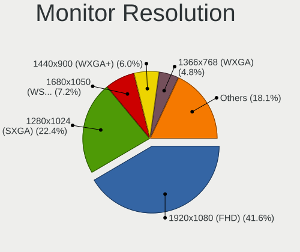

| Resolution         | Desktops | Percent |
|--------------------|----------|---------|
| 1920x1080 (FHD)    | 6093     | 41.55%  |
| 1280x1024 (SXGA)   | 3288     | 22.42%  |
| 1680x1050 (WSXGA+) | 1050     | 7.16%   |
| 1440x900 (WXGA+)   | 886      | 6.04%   |
| 1366x768 (WXGA)    | 699      | 4.77%   |
| 1600x900 (HD+)     | 544      | 3.71%   |
| 3840x2160 (4K)     | 406      | 2.77%   |
| 2560x1440 (QHD)    | 364      | 2.48%   |
| 1360x768           | 271      | 1.85%   |
| 1920x1200 (WUXGA)  | 266      | 1.81%   |
| 1024x768 (XGA)     | 245      | 1.67%   |
| 1600x1200          | 143      | 0.98%   |
| 2560x1080          | 89       | 0.61%   |
| 1920x540           | 66       | 0.45%   |
| 1280x720 (HD)      | 40       | 0.27%   |
| 3440x1440          | 38       | 0.26%   |
| 1152x864           | 36       | 0.25%   |
| 1400x1050          | 34       | 0.23%   |
| 1280x960           | 16       | 0.11%   |
| 2560x1600          | 15       | 0.1%    |
| 2048x1536          | 14       | 0.1%    |
| 1920x1440          | 13       | 0.09%   |
| 2048x1152          | 12       | 0.08%   |
| 2288x1287          | 11       | 0.08%   |
| Unknown            | 5        | 0.03%   |
| 1280x768           | 4        | 0.03%   |
| 4093x4093          | 2        | 0.01%   |
| 832x624            | 1        | 0.01%   |
| 640x480            | 1        | 0.01%   |
| 3840x2560          | 1        | 0.01%   |
| 3840x1600          | 1        | 0.01%   |
| 3840x1200          | 1        | 0.01%   |
| 3840x1080          | 1        | 0.01%   |
| 3360x1080          | 1        | 0.01%   |
| 3200x1080          | 1        | 0.01%   |
| 2880x1620          | 1        | 0.01%   |
| 2288x1430          | 1        | 0.01%   |
| 1792x1344          | 1        | 0.01%   |
| 1280x800 (WXGA)    | 1        | 0.01%   |
| 1024x600           | 1        | 0.01%   |

Monitor Diagonal
----------------

Diagonal size in inches

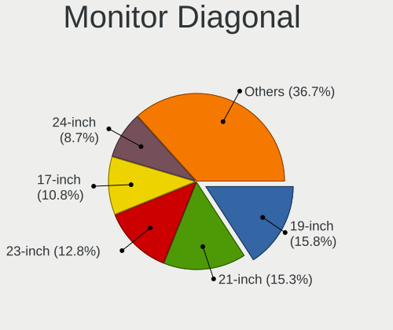

| Inches  | Desktops | Percent |
|---------|----------|---------|
| 19      | 2370     | 15.83%  |
| 21      | 2285     | 15.26%  |
| 23      | 1909     | 12.75%  |
| 17      | 1610     | 10.76%  |
| 24      | 1301     | 8.69%   |
| 18      | 945      | 6.31%   |
| 27      | 887      | 5.93%   |
| 20      | 811      | 5.42%   |
| 22      | 668      | 4.46%   |
| 15      | 495      | 3.31%   |
| 31      | 269      | 1.8%    |
| Unknown | 193      | 1.29%   |
| 72      | 129      | 0.86%   |
| 40      | 123      | 0.82%   |
| 32      | 117      | 0.78%   |
| 34      | 110      | 0.73%   |
| 54      | 106      | 0.71%   |
| 16      | 73       | 0.49%   |
| 52      | 64       | 0.43%   |
| 84      | 56       | 0.37%   |
| 46      | 52       | 0.35%   |
| 25      | 51       | 0.34%   |
| 48      | 27       | 0.18%   |
| 28      | 27       | 0.18%   |
| 13      | 26       | 0.17%   |
| 12      | 23       | 0.15%   |
| 43      | 22       | 0.15%   |
| 65      | 21       | 0.14%   |
| 14      | 21       | 0.14%   |
| 42      | 19       | 0.13%   |
| 26      | 18       | 0.12%   |
| 29      | 17       | 0.11%   |
| 63      | 13       | 0.09%   |
| 37      | 12       | 0.08%   |
| 33      | 12       | 0.08%   |
| 49      | 9        | 0.06%   |
| 142     | 7        | 0.05%   |
| 75      | 7        | 0.05%   |
| 39      | 7        | 0.05%   |
| 47      | 6        | 0.04%   |

Monitor Width
-------------

Physical width

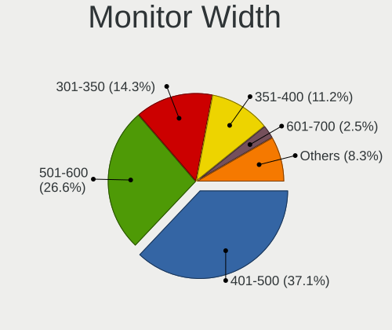

| Width in mm    | Desktops | Percent |
|----------------|----------|---------|
| 401-500        | 5471     | 37.07%  |
| 501-600        | 3925     | 26.59%  |
| 301-350        | 2115     | 14.33%  |
| 351-400        | 1658     | 11.23%  |
| 601-700        | 365      | 2.47%   |
| 1001-1500      | 323      | 2.19%   |
| 701-800        | 236      | 1.6%    |
| 1501-2000      | 202      | 1.37%   |
| Unknown        | 193      | 1.31%   |
| 801-900        | 121      | 0.82%   |
| 201-300        | 69       | 0.47%   |
| 901-1000       | 69       | 0.47%   |
| More than 2000 | 12       | 0.08%   |

Aspect Ratio
------------

Proportional relationship between the width and the height

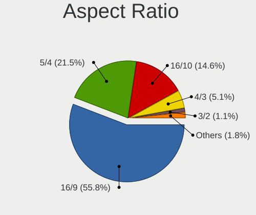

| Ratio   | Desktops | Percent |
|---------|----------|---------|
| 16/9    | 8056     | 55.84%  |
| 5/4     | 3108     | 21.54%  |
| 16/10   | 2112     | 14.64%  |
| 4/3     | 737      | 5.11%   |
| 3/2     | 161      | 1.12%   |
| 21/9    | 147      | 1.02%   |
| 6/5     | 49       | 0.34%   |
| Unknown | 32       | 0.22%   |
| 32/9    | 17       | 0.12%   |
| 1.00    | 8        | 0.06%   |
| 2.00    | 1        | 0.01%   |

Monitor Area
------------

Area in inch²

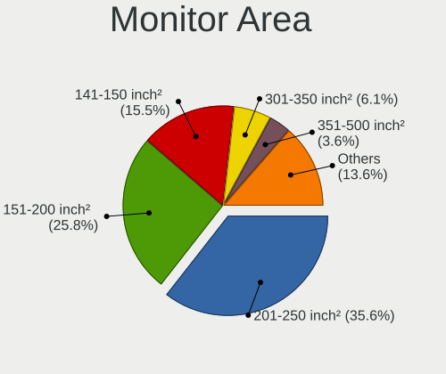

| Area in inch² | Desktops | Percent |
|----------------|----------|---------|
| 201-250        | 5272     | 35.55%  |
| 151-200        | 3822     | 25.78%  |
| 141-150        | 2292     | 15.46%  |
| 301-350        | 900      | 6.07%   |
| 351-500        | 527      | 3.55%   |
| More than 1000 | 469      | 3.16%   |
| 251-300        | 438      | 2.95%   |
| 101-110        | 288      | 1.94%   |
| 501-1000       | 261      | 1.76%   |
| 111-120        | 232      | 1.56%   |
| Unknown        | 193      | 1.3%    |
| 121-130        | 46       | 0.31%   |
| 131-140        | 34       | 0.23%   |
| 71-80          | 24       | 0.16%   |
| 81-90          | 17       | 0.11%   |
| 91-100         | 11       | 0.07%   |
| 61-70          | 1        | 0.01%   |
| 41-50          | 1        | 0.01%   |

Pixel Density
-------------

Pixels per inch

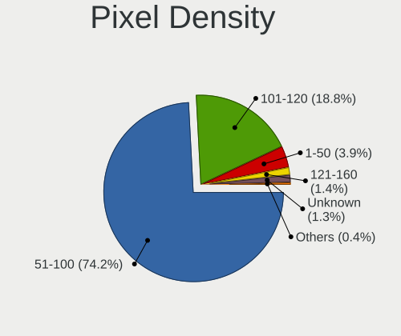

| Density       | Desktops | Percent |
|---------------|----------|---------|
| 51-100        | 10606    | 74.17%  |
| 101-120       | 2691     | 18.82%  |
| 1-50          | 552      | 3.86%   |
| 121-160       | 194      | 1.36%   |
| Unknown       | 193      | 1.35%   |
| 161-240       | 62       | 0.43%   |
| More than 240 | 1        | 0.01%   |

Multiple Monitors
-----------------

Total monitors connected

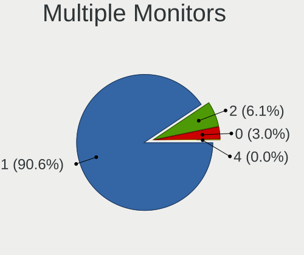

| Total | Desktops | Percent |
|-------|----------|---------|
| 1     | 13804    | 90.62%  |
| 2     | 936      | 6.14%   |
| 0     | 458      | 3.01%   |
| 3     | 33       | 0.22%   |
| 4     | 2        | 0.01%   |

Network
-------

Net Controller Vendor
---------------------

Controller vendors

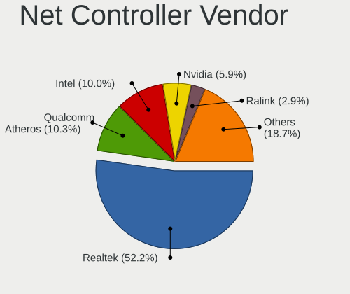

| Vendor                                 | Desktops | Percent |
|----------------------------------------|----------|---------|
| Realtek Semiconductor                  | 10239    | 52.23%  |
| Qualcomm Atheros                       | 2015     | 10.28%  |
| Intel                                  | 1959     | 9.99%   |
| Nvidia                                 | 1152     | 5.88%   |
| Ralink Technology                      | 564      | 2.88%   |
| Marvell Technology Group               | 365      | 1.86%   |
| Huawei Technologies                    | 355      | 1.81%   |
| Ralink                                 | 323      | 1.65%   |
| VIA Technologies                       | 313      | 1.6%    |
| Broadcom                               | 233      | 1.19%   |
| Qualcomm Atheros Communications        | 209      | 1.07%   |
| TP-Link                                | 207      | 1.06%   |
| D-Link System                          | 206      | 1.05%   |
| D-Link                                 | 167      | 0.85%   |
| Broadcom Limited                       | 142      | 0.72%   |
| ASUSTek Computer                       | 138      | 0.7%    |
| MediaTek                               | 91       | 0.46%   |
| ZTE WCDMA Technologies MSM             | 86       | 0.44%   |
| Sundance Technology Inc / IC Plus      | 69       | 0.35%   |
| Xiaomi                                 | 54       | 0.28%   |
| Silicon Integrated Systems [SiS]       | 53       | 0.27%   |
| NetGear                                | 50       | 0.26%   |
| Samsung Electronics                    | 47       | 0.24%   |
| 3Com                                   | 45       | 0.23%   |
| HTC (High Tech Computer)               | 36       | 0.18%   |
| ASIX Electronics                       | 34       | 0.17%   |
| IMC Networks                           | 25       | 0.13%   |
| Microsoft                              | 24       | 0.12%   |
| Gemtek                                 | 21       | 0.11%   |
| ZyXEL Communications                   | 19       | 0.1%    |
| T & A Mobile Phones                    | 18       | 0.09%   |
| Mercucys                               | 18       | 0.09%   |
| LSI                                    | 18       | 0.09%   |
| Qualcomm                               | 16       | 0.08%   |
| Spreadtrum Communications              | 14       | 0.07%   |
| Sony Ericsson Mobile Communications AB | 14       | 0.07%   |
| Edimax Technology                      | 13       | 0.07%   |
| JMicron Technology                     | 11       | 0.06%   |
| Belkin Components                      | 10       | 0.05%   |
| GCT Semiconductor                      | 9        | 0.05%   |

Net Controller Model
--------------------

Controller models

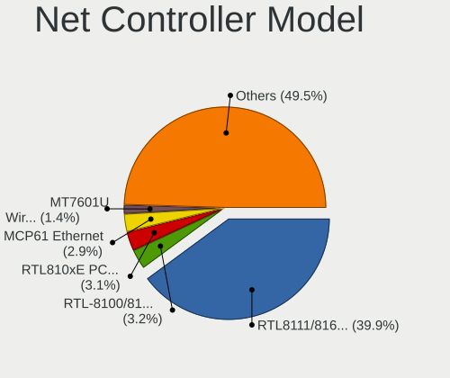

| Model                                                                  | Desktops | Percent |
|------------------------------------------------------------------------|----------|---------|
| Realtek RTL8111/8168/8211/8411 PCI Express Gigabit Ethernet Controller | 8357     | 39.9%   |
| Realtek RTL-8100/8101L/8139 PCI Fast Ethernet Adapter                  | 669      | 3.19%   |
| Realtek RTL810xE PCI Express Fast Ethernet controller                  | 643      | 3.07%   |
| Nvidia MCP61 Ethernet                                                  | 605      | 2.89%   |
| Ralink MT7601U Wireless Adapter                                        | 302      | 1.44%   |
| Qualcomm Atheros AR8151 v2.0 Gigabit Ethernet                          | 271      | 1.29%   |
| Qualcomm Atheros Attansic L1 Gigabit Ethernet                          | 265      | 1.27%   |
| Realtek RTL8188EUS 802.11n Wireless Network Adapter                    | 218      | 1.04%   |
| Qualcomm Atheros AR8121/AR8113/AR8114 Gigabit or Fast Ethernet         | 213      | 1.02%   |
| Intel 82579V Gigabit Network Connection                                | 211      | 1.01%   |
| VIA VT6105/VT6106S [Rhine-III]                                         | 204      | 0.97%   |
| Realtek RTL8125 2.5GbE Controller                                      | 196      | 0.94%   |
| Huawei Modem/Networkcard                                               | 191      | 0.91%   |
| Intel Ethernet Connection (2) I219-V                                   | 180      | 0.86%   |
| Marvell Group 88E8056 PCI-E Gigabit Ethernet Controller                | 174      | 0.83%   |
| Qualcomm Atheros AR9271 802.11n                                        | 166      | 0.79%   |
| Qualcomm Atheros AR9485 Wireless Network Adapter                       | 149      | 0.71%   |
| Qualcomm Atheros AR8131 Gigabit Ethernet                               | 143      | 0.68%   |
| Realtek RTL8192CU 802.11n WLAN Adapter                                 | 132      | 0.63%   |
| Qualcomm Atheros AR8161 Gigabit Ethernet                               | 132      | 0.63%   |
| Realtek RTL-8110SC/8169SC Gigabit Ethernet                             | 131      | 0.63%   |
| Intel I211 Gigabit Network Connection                                  | 125      | 0.6%    |
| Ralink RT5370 Wireless Adapter                                         | 122      | 0.58%   |
| Marvell Group 88E8001 Gigabit Ethernet Controller                      | 117      | 0.56%   |
| Realtek RTL8169 PCI Gigabit Ethernet Controller                        | 112      | 0.53%   |
| Nvidia CK804 Ethernet Controller                                       | 112      | 0.53%   |
| Intel 82579LM Gigabit Network Connection (Lewisville)                  | 112      | 0.53%   |
| Qualcomm Atheros AR9227 Wireless Network Adapter                       | 106      | 0.51%   |
| Qualcomm Atheros AR8152 v2.0 Fast Ethernet                             | 100      | 0.48%   |
| Qualcomm Atheros Attansic L2 Fast Ethernet                             | 98       | 0.47%   |
| VIA VT6102/VT6103 [Rhine-II]                                           | 96       | 0.46%   |
| Nvidia MCP77 Ethernet                                                  | 93       | 0.44%   |
| Nvidia MCP55 Ethernet                                                  | 93       | 0.44%   |
| Qualcomm Atheros QCA8171 Gigabit Ethernet                              | 92       | 0.44%   |
| Intel Ethernet Connection I217-V                                       | 87       | 0.42%   |
| Nvidia MCP51 Ethernet Controller                                       | 86       | 0.41%   |
| Intel 82567LM-3 Gigabit Network Connection                             | 86       | 0.41%   |
| Intel 82566DM-2 Gigabit Network Connection                             | 84       | 0.4%    |
| Intel Wi-Fi 6 AX200                                                    | 81       | 0.39%   |
| Intel Ethernet Connection (2) I218-V                                   | 81       | 0.39%   |

Wireless Vendor
---------------

Wireless vendors

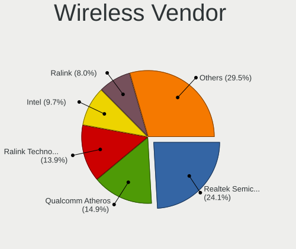

| Vendor                          | Desktops | Percent |
|---------------------------------|----------|---------|
| Realtek Semiconductor           | 977      | 24.09%  |
| Qualcomm Atheros                | 604      | 14.89%  |
| Ralink Technology               | 564      | 13.91%  |
| Intel                           | 393      | 9.69%   |
| Ralink                          | 323      | 7.96%   |
| Qualcomm Atheros Communications | 209      | 5.15%   |
| TP-Link                         | 205      | 5.05%   |
| D-Link                          | 165      | 4.07%   |
| ASUSTek Computer                | 127      | 3.13%   |
| D-Link System                   | 106      | 2.61%   |
| Broadcom                        | 97       | 2.39%   |
| NetGear                         | 49       | 1.21%   |
| MediaTek                        | 44       | 1.08%   |
| IMC Networks                    | 25       | 0.62%   |
| Microsoft                       | 23       | 0.57%   |
| Broadcom Limited                | 22       | 0.54%   |
| Mercucys                        | 18       | 0.44%   |
| ZyXEL Communications            | 15       | 0.37%   |
| Edimax Technology               | 13       | 0.32%   |
| Belkin Components               | 9        | 0.22%   |
| Marvell Technology Group        | 6        | 0.15%   |
| Gemtek                          | 6        | 0.15%   |
| ZyDAS                           | 5        | 0.12%   |
| Linksys                         | 5        | 0.12%   |
| Accton Technology               | 5        | 0.12%   |
| TRENDnet                        | 4        | 0.1%    |
| Sitecom Europe                  | 4        | 0.1%    |
| VIA Technologies                | 3        | 0.07%   |
| Texas Instruments               | 3        | 0.07%   |
| Tenda                           | 3        | 0.07%   |
| Sagem                           | 3        | 0.07%   |
| Micro Star International        | 3        | 0.07%   |
| BUFFALO                         | 3        | 0.07%   |
| AboCom Systems                  | 3        | 0.07%   |
| Xiaomi                          | 2        | 0.05%   |
| ZTopInc                         | 1        | 0.02%   |
| Z-Com                           | 1        | 0.02%   |
| Wacom                           | 1        | 0.02%   |
| Sierra Wireless                 | 1        | 0.02%   |
| Philips (or NXP)                | 1        | 0.02%   |

Wireless Model
--------------

Wireless models

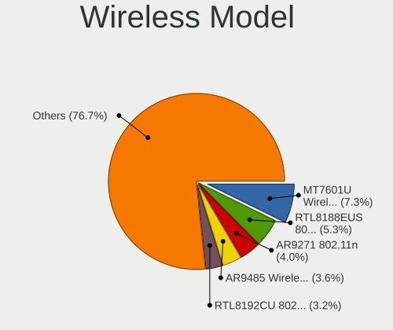

| Model                                                                         | Desktops | Percent |
|-------------------------------------------------------------------------------|----------|---------|
| Ralink MT7601U Wireless Adapter                                               | 302      | 7.29%   |
| Realtek RTL8188EUS 802.11n Wireless Network Adapter                           | 218      | 5.26%   |
| Qualcomm Atheros AR9271 802.11n                                               | 166      | 4.01%   |
| Qualcomm Atheros AR9485 Wireless Network Adapter                              | 149      | 3.6%    |
| Realtek RTL8192CU 802.11n WLAN Adapter                                        | 132      | 3.19%   |
| Ralink RT5370 Wireless Adapter                                                | 122      | 2.95%   |
| Qualcomm Atheros AR9227 Wireless Network Adapter                              | 106      | 2.56%   |
| Intel Wi-Fi 6 AX200                                                           | 81       | 1.96%   |
| Ralink RT3060 Wireless 802.11n 1T/1R                                          | 73       | 1.76%   |
| Ralink RT2870/RT3070 Wireless Adapter                                         | 68       | 1.64%   |
| Qualcomm Atheros AR9285 Wireless Network Adapter (PCI-Express)                | 68       | 1.64%   |
| Realtek RTL8188CE 802.11b/g/n WiFi Adapter                                    | 66       | 1.59%   |
| Realtek 802.11ac NIC                                                          | 65       | 1.57%   |
| Qualcomm Atheros AR5212/5213/2414 Wireless Network Adapter                    | 65       | 1.57%   |
| Ralink RT2561/RT61 rev B 802.11g                                              | 57       | 1.38%   |
| Qualcomm Atheros AR9287 Wireless Network Adapter (PCI-Express)                | 57       | 1.38%   |
| Realtek RTL8188CUS 802.11n WLAN Adapter                                       | 56       | 1.35%   |
| Intel Wi-Fi 6E(802.11ax) AX210/AX1675* 2x2 [Typhoon Peak]                     | 49       | 1.18%   |
| Realtek RTL8188EE Wireless Network Adapter                                    | 48       | 1.16%   |
| TP-Link TL-WN722N v2/v3 [Realtek RTL8188EUS]                                  | 45       | 1.09%   |
| Ralink RT5360 Wireless 802.11n 1T/1R                                          | 44       | 1.06%   |
| Intel Dual Band Wireless-AC 3168NGW [Stone Peak]                              | 43       | 1.04%   |
| Realtek RTL8192EU 802.11b/g/n WLAN Adapter                                    | 41       | 0.99%   |
| Realtek RTL8187 Wireless Adapter                                              | 40       | 0.97%   |
| Realtek RTL-8185 IEEE 802.11a/b/g Wireless LAN Controller                     | 39       | 0.94%   |
| D-Link 802.11 n WLAN                                                          | 38       | 0.92%   |
| Realtek RTL8821CE 802.11ac PCIe Wireless Network Adapter                      | 35       | 0.85%   |
| Intel Wireless 7265                                                           | 35       | 0.85%   |
| Qualcomm Atheros AR93xx Wireless Network Adapter                              | 32       | 0.77%   |
| Intel Wireless 7260                                                           | 32       | 0.77%   |
| TP-Link TL-WN823N v2/v3 [Realtek RTL8192EU]                                   | 31       | 0.75%   |
| Ralink RT5390 Wireless 802.11n 1T/1R PCIe                                     | 30       | 0.72%   |
| D-Link DWA-140 RangeBooster N Adapter(rev.B3) [Ralink RT5372]                 | 29       | 0.7%    |
| ASUS USB-N13 802.11n Network Adapter (rev. B1) [Realtek RTL8192CU]            | 28       | 0.68%   |
| ASUS N10 Nano 802.11n Network Adapter [Realtek RTL8192CU]                     | 28       | 0.68%   |
| Ralink RT2561/RT61 802.11g PCI                                                | 27       | 0.65%   |
| TP-Link Archer T2U PLUS [RTL8821AU]                                           | 26       | 0.63%   |
| Realtek RTL88x2bu [AC1200 Techkey]                                            | 26       | 0.63%   |
| Ralink RT3090 Wireless 802.11n 1T/1R PCIe                                     | 26       | 0.63%   |
| Qualcomm Atheros AR2413/AR2414 Wireless Network Adapter [AR5005G(S) 802.11bg] | 26       | 0.63%   |

Ethernet Vendor
---------------

Ethernet vendors

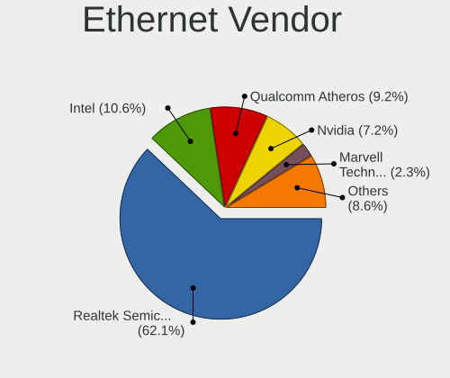

| Vendor                                 | Desktops | Percent |
|----------------------------------------|----------|---------|
| Realtek Semiconductor                  | 9919     | 62.08%  |
| Intel                                  | 1690     | 10.58%  |
| Qualcomm Atheros                       | 1476     | 9.24%   |
| Nvidia                                 | 1152     | 7.21%   |
| Marvell Technology Group               | 360      | 2.25%   |
| VIA Technologies                       | 303      | 1.9%    |
| Broadcom                               | 137      | 0.86%   |
| Broadcom Limited                       | 120      | 0.75%   |
| D-Link System                          | 101      | 0.63%   |
| Huawei Technologies                    | 100      | 0.63%   |
| Sundance Technology Inc / IC Plus      | 69       | 0.43%   |
| Xiaomi                                 | 52       | 0.33%   |
| Silicon Integrated Systems [SiS]       | 51       | 0.32%   |
| MediaTek                               | 45       | 0.28%   |
| 3Com                                   | 45       | 0.28%   |
| Samsung Electronics                    | 44       | 0.28%   |
| HTC (High Tech Computer)               | 36       | 0.23%   |
| ASIX Electronics                       | 34       | 0.21%   |
| T & A Mobile Phones                    | 16       | 0.1%    |
| Qualcomm                               | 16       | 0.1%    |
| Gemtek                                 | 15       | 0.09%   |
| ZTE WCDMA Technologies MSM             | 14       | 0.09%   |
| Spreadtrum Communications              | 14       | 0.09%   |
| Sony Ericsson Mobile Communications AB | 14       | 0.09%   |
| JMicron Technology                     | 11       | 0.07%   |
| ASUSTek Computer                       | 11       | 0.07%   |
| GCT Semiconductor                      | 9        | 0.06%   |
| ULi Electronics                        | 8        | 0.05%   |
| OPPO Electronics                       | 8        | 0.05%   |
| Lenovo                                 | 8        | 0.05%   |
| Vimtron Electronics                    | 7        | 0.04%   |
| Davicom Semiconductor                  | 7        | 0.04%   |
| ADMtek                                 | 7        | 0.04%   |
| Motorola PCS                           | 6        | 0.04%   |
| ICS Advent                             | 5        | 0.03%   |
| ZyXEL Communications                   | 4        | 0.03%   |
| MCST                                   | 3        | 0.02%   |
| Marvell Semiconductor                  | 3        | 0.02%   |
| LG Electronics                         | 3        | 0.02%   |
| Digitech Systems                       | 3        | 0.02%   |

Ethernet Model
--------------

Ethernet models

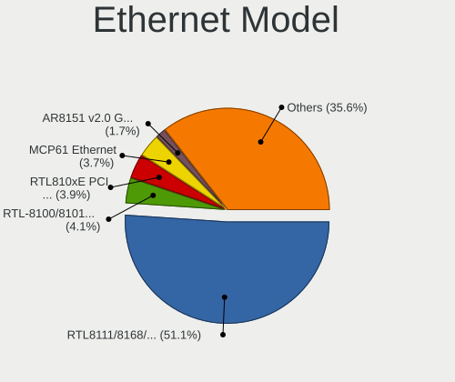

| Model                                                                      | Desktops | Percent |
|----------------------------------------------------------------------------|----------|---------|
| Realtek RTL8111/8168/8211/8411 PCI Express Gigabit Ethernet Controller     | 8357     | 51.07%  |
| Realtek RTL-8100/8101L/8139 PCI Fast Ethernet Adapter                      | 669      | 4.09%   |
| Realtek RTL810xE PCI Express Fast Ethernet controller                      | 643      | 3.93%   |
| Nvidia MCP61 Ethernet                                                      | 605      | 3.7%    |
| Qualcomm Atheros AR8151 v2.0 Gigabit Ethernet                              | 271      | 1.66%   |
| Qualcomm Atheros Attansic L1 Gigabit Ethernet                              | 265      | 1.62%   |
| Qualcomm Atheros AR8121/AR8113/AR8114 Gigabit or Fast Ethernet             | 213      | 1.3%    |
| Intel 82579V Gigabit Network Connection                                    | 211      | 1.29%   |
| VIA VT6105/VT6106S [Rhine-III]                                             | 204      | 1.25%   |
| Realtek RTL8125 2.5GbE Controller                                          | 196      | 1.2%    |
| Intel Ethernet Connection (2) I219-V                                       | 180      | 1.1%    |
| Marvell Group 88E8056 PCI-E Gigabit Ethernet Controller                    | 174      | 1.06%   |
| Qualcomm Atheros AR8131 Gigabit Ethernet                                   | 143      | 0.87%   |
| Qualcomm Atheros AR8161 Gigabit Ethernet                                   | 132      | 0.81%   |
| Realtek RTL-8110SC/8169SC Gigabit Ethernet                                 | 131      | 0.8%    |
| Intel I211 Gigabit Network Connection                                      | 125      | 0.76%   |
| Marvell Group 88E8001 Gigabit Ethernet Controller                          | 117      | 0.71%   |
| Realtek RTL8169 PCI Gigabit Ethernet Controller                            | 112      | 0.68%   |
| Nvidia CK804 Ethernet Controller                                           | 112      | 0.68%   |
| Intel 82579LM Gigabit Network Connection (Lewisville)                      | 112      | 0.68%   |
| Qualcomm Atheros AR8152 v2.0 Fast Ethernet                                 | 100      | 0.61%   |
| Qualcomm Atheros Attansic L2 Fast Ethernet                                 | 98       | 0.6%    |
| VIA VT6102/VT6103 [Rhine-II]                                               | 96       | 0.59%   |
| Nvidia MCP77 Ethernet                                                      | 93       | 0.57%   |
| Nvidia MCP55 Ethernet                                                      | 93       | 0.57%   |
| Qualcomm Atheros QCA8171 Gigabit Ethernet                                  | 92       | 0.56%   |
| Intel Ethernet Connection I217-V                                           | 87       | 0.53%   |
| Nvidia MCP51 Ethernet Controller                                           | 86       | 0.53%   |
| Intel 82567LM-3 Gigabit Network Connection                                 | 86       | 0.53%   |
| Intel 82566DM-2 Gigabit Network Connection                                 | 84       | 0.51%   |
| Intel Ethernet Connection (2) I218-V                                       | 81       | 0.49%   |
| Qualcomm Atheros Killer E220x Gigabit Ethernet Controller                  | 78       | 0.48%   |
| Sundance Inc / IC Plus IC Plus IP100A Integrated 10/100 Ethernet MAC + PHY | 65       | 0.4%    |
| Marvell Group 88E8053 PCI-E Gigabit Ethernet Controller                    | 64       | 0.39%   |
| D-Link System DGE-528T Gigabit Ethernet Adapter                            | 63       | 0.38%   |
| Huawei E353/E3131                                                          | 59       | 0.36%   |
| Intel Ethernet Connection (14) I219-V                                      | 56       | 0.34%   |
| Intel 82574L Gigabit Network Connection                                    | 56       | 0.34%   |
| Intel Ethernet Connection I217-LM                                          | 54       | 0.33%   |
| Intel Ethernet Controller I225-V                                           | 50       | 0.31%   |

Net Controller Kind
-------------------

Ethernet, WiFi or modem

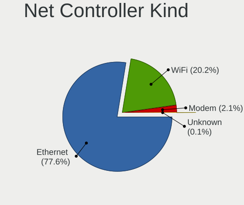

| Kind     | Desktops | Percent |
|----------|----------|---------|
| Ethernet | 14729    | 77.57%  |
| WiFi     | 3833     | 20.19%  |
| Modem    | 406      | 2.14%   |
| Unknown  | 20       | 0.11%   |

Used Controller
---------------

Currently used network controller

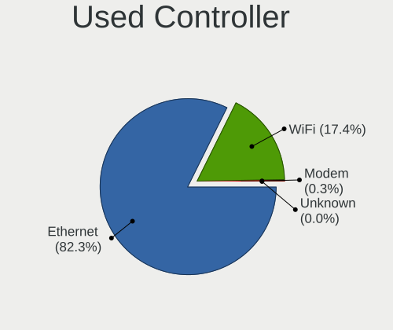

| Kind     | Desktops | Percent |
|----------|----------|---------|
| Ethernet | 12291    | 82.33%  |
| WiFi     | 2595     | 17.38%  |
| Modem    | 42       | 0.28%   |
| Unknown  | 1        | 0.01%   |

NICs
----

Total network controllers on board

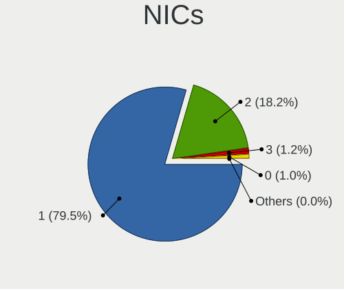

| Total | Desktops | Percent |
|-------|----------|---------|
| 1     | 11955    | 79.47%  |
| 2     | 2744     | 18.24%  |
| 3     | 187      | 1.24%   |
| 0     | 144      | 0.96%   |
| 4     | 10       | 0.07%   |
| 33    | 1        | 0.01%   |
| 6     | 1        | 0.01%   |
| 5     | 1        | 0.01%   |

IPv6
----

IPv6 vs IPv4

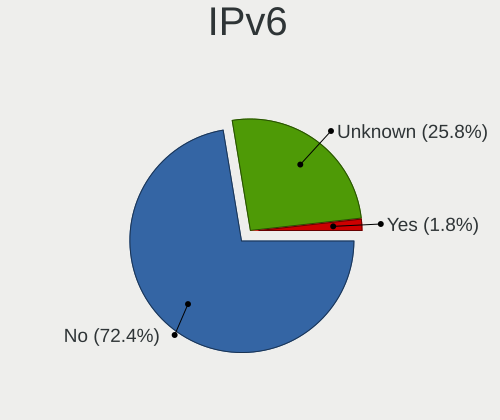

| Used    | Desktops | Percent |
|---------|----------|---------|
| No      | 11293    | 72.39%  |
| Unknown | 4031     | 25.84%  |
| Yes     | 276      | 1.77%   |

Bluetooth
---------

Bluetooth Vendor
----------------

Controller vendors

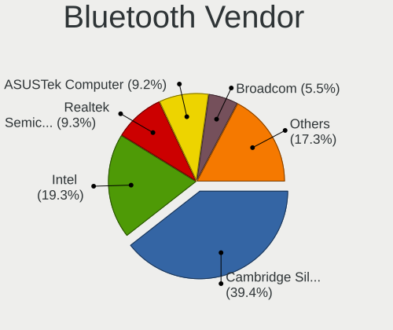

| Vendor                          | Desktops | Percent |
|---------------------------------|----------|---------|
| Cambridge Silicon Radio         | 736      | 39.44%  |
| Intel                           | 361      | 19.35%  |
| Realtek Semiconductor           | 173      | 9.27%   |
| ASUSTek Computer                | 171      | 9.16%   |
| Broadcom                        | 102      | 5.47%   |
| Qualcomm Atheros Communications | 60       | 3.22%   |
| Integrated System Solution      | 53       | 2.84%   |
| IMC Networks                    | 48       | 2.57%   |
| TP-Link                         | 30       | 1.61%   |
| MediaTek                        | 30       | 1.61%   |
| Lite-On Technology              | 15       | 0.8%    |
| Foxconn / Hon Hai               | 12       | 0.64%   |
| Apple                           | 11       | 0.59%   |
| Conwise Technology              | 10       | 0.54%   |
| Actions                         | 9        | 0.48%   |
| SiW                             | 8        | 0.43%   |
| Roper                           | 7        | 0.38%   |
| Ralink                          | 7        | 0.38%   |
| Unknown                         | 6        | 0.32%   |
| Micro Star International        | 4        | 0.21%   |
| Logitech                        | 4        | 0.21%   |
| Belkin Components               | 2        | 0.11%   |
| Realtek                         | 1        | 0.05%   |
| Ralink Technology               | 1        | 0.05%   |
| Primax Electronics              | 1        | 0.05%   |
| Hewlett-Packard                 | 1        | 0.05%   |
| Dell                            | 1        | 0.05%   |
| D-Link                          | 1        | 0.05%   |
| Accel Semiconductor             | 1        | 0.05%   |

Bluetooth Model
---------------

Controller models

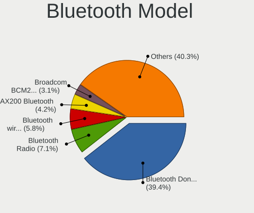

| Model                                                 | Desktops | Percent |
|-------------------------------------------------------|----------|---------|
| Cambridge Silicon Radio Bluetooth Dongle (HCI mode)   | 736      | 39.42%  |
| Realtek Bluetooth Radio                               | 133      | 7.12%   |
| Intel Bluetooth wireless interface                    | 109      | 5.84%   |
| Intel AX200 Bluetooth                                 | 79       | 4.23%   |
| ASUS Broadcom BCM20702A0 Bluetooth                    | 58       | 3.11%   |
| Intel AX210 Bluetooth                                 | 47       | 2.52%   |
| Intel Wireless-AC 3168 Bluetooth                      | 43       | 2.3%    |
| Qualcomm Atheros AR3011 Bluetooth                     | 39       | 2.09%   |
| ASUS Bluetooth Adapter                                | 38       | 2.04%   |
| Integrated System Solution Bluetooth Device           | 33       | 1.77%   |
| TP-Link TP-T@- UB500 Adapter                          | 30       | 1.61%   |
| MediaTek Wireless_Device                              | 30       | 1.61%   |
| ASUS BCM20702A0                                       | 26       | 1.39%   |
| Intel AX201 Bluetooth                                 | 23       | 1.23%   |
| Broadcom BCM2045 Bluetooth                            | 23       | 1.23%   |
| Realtek Bluetooth 5.3 Radio                           | 22       | 1.18%   |
| IMC Networks Bluetooth Radio                          | 21       | 1.12%   |
| Broadcom BCM20702A0 Bluetooth 4.0                     | 21       | 1.12%   |
| Integrated System Solution KY-BT100 Bluetooth Adapter | 20       | 1.07%   |
| Intel Bluetooth Device                                | 19       | 1.02%   |
| ASUS ASUS USB-BT500                                   | 17       | 0.91%   |
| Intel Centrino Bluetooth Wireless Transceiver         | 15       | 0.8%    |
| Intel Wireless-AC 9260 Bluetooth Adapter              | 14       | 0.75%   |
| Lite-On Bluetooth Device                              | 12       | 0.64%   |
| Intel Bluetooth 9460/9560 Jefferson Peak (JfP)        | 12       | 0.64%   |
| ASUS Qualcomm Bluetooth 4.1                           | 12       | 0.64%   |
| Conwise CW6622                                        | 10       | 0.54%   |
| ASUS Bluetooth Radio                                  | 10       | 0.54%   |
| Realtek  Bluetooth 4.2 Adapter                        | 9        | 0.48%   |
| IMC Networks Wireless_Device                          | 9        | 0.48%   |
| Actions general adapter                               | 9        | 0.48%   |
| SiW SiW                                               | 8        | 0.43%   |
| IMC Networks Bluetooth Module                         | 8        | 0.43%   |
| Apple Bluetooth Host Controller                       | 8        | 0.43%   |
| Roper Class 1 Bluetooth Dongle                        | 7        | 0.37%   |
| Ralink RT3290 Bluetooth                               | 7        | 0.37%   |
| Broadcom Bluetooth 3.0 USB Dongle                     | 7        | 0.37%   |
| Broadcom Bluetooth 3.0 Device                         | 7        | 0.37%   |
| Qualcomm Atheros  Bluetooth Device                    | 6        | 0.32%   |
| Broadcom Bluetooth dongle                             | 6        | 0.32%   |

Sound
-----

Sound Vendor
------------

Sound card vendors

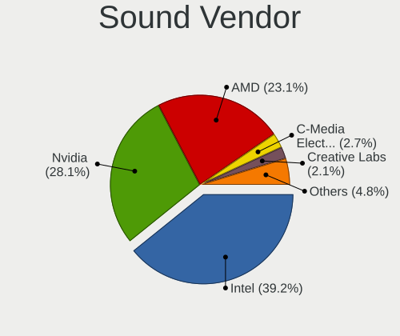

| Vendor                                          | Desktops | Percent |
|-------------------------------------------------|----------|---------|
| Intel                                           | 9310     | 39.2%   |
| Nvidia                                          | 6685     | 28.15%  |
| AMD                                             | 5485     | 23.1%   |
| C-Media Electronics                             | 634      | 2.67%   |
| Creative Labs                                   | 502      | 2.11%   |
| VIA Technologies                                | 195      | 0.82%   |
| Creative Technology                             | 76       | 0.32%   |
| Logitech                                        | 69       | 0.29%   |
| Silicon Integrated Systems [SiS]                | 68       | 0.29%   |
| JMTek                                           | 58       | 0.24%   |
| Generalplus Technology                          | 49       | 0.21%   |
| Texas Instruments                               | 46       | 0.19%   |
| ASUSTek Computer                                | 31       | 0.13%   |
| Plantronics                                     | 27       | 0.11%   |
| Ensoniq                                         | 25       | 0.11%   |
| Razer USA                                       | 20       | 0.08%   |
| Zoran Co. Personal Media Division (Nogatech)    | 19       | 0.08%   |
| Pixart Imaging                                  | 19       | 0.08%   |
| Tenx Technology                                 | 17       | 0.07%   |
| Micro Star International                        | 17       | 0.07%   |
| ULi Electronics                                 | 16       | 0.07%   |
| Kingston Technology                             | 12       | 0.05%   |
| Yamaha                                          | 11       | 0.05%   |
| M-Audio                                         | 11       | 0.05%   |
| Aureal Semiconductor                            | 10       | 0.04%   |
| ATI Technologies                                | 10       | 0.04%   |
| A4Tech                                          | 10       | 0.04%   |
| Shenzhen Rapoo Technology                       | 9        | 0.04%   |
| Jieli Technology                                | 9        | 0.04%   |
| ESS Technology                                  | 9        | 0.04%   |
| Asahi Kasei Microsystems                        | 9        | 0.04%   |
| Licensed by Sony Computer Entertainment America | 8        | 0.03%   |
| XMOS                                            | 7        | 0.03%   |
| Sony                                            | 7        | 0.03%   |
| KTMicro                                         | 7        | 0.03%   |
| Guillemot                                       | 7        | 0.03%   |
| Focusrite-Novation                              | 7        | 0.03%   |
| BEHRINGER International                         | 7        | 0.03%   |
| Yealink Network Technology                      | 6        | 0.03%   |
| Philips (or NXP)                                | 6        | 0.03%   |

Sound Model
-----------

Sound card models

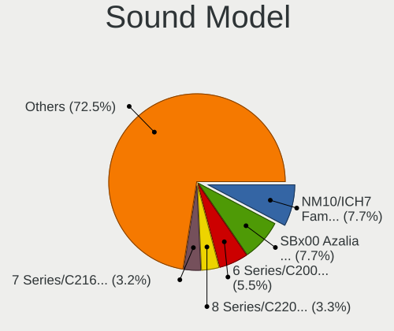

| Model                                                                      | Desktops | Percent |
|----------------------------------------------------------------------------|----------|---------|
| Intel NM10/ICH7 Family High Definition Audio Controller                    | 2058     | 7.73%   |
| AMD SBx00 Azalia (Intel HDA)                                               | 2051     | 7.71%   |
| Intel 6 Series/C200 Series Chipset Family High Definition Audio Controller | 1454     | 5.46%   |
| Intel 8 Series/C220 Series Chipset High Definition Audio Controller        | 891      | 3.35%   |
| Intel 7 Series/C216 Chipset Family High Definition Audio Controller        | 863      | 3.24%   |
| Nvidia GF108 High Definition Audio Controller                              | 767      | 2.88%   |
| Nvidia High Definition Audio Controller                                    | 669      | 2.51%   |
| Nvidia MCP61 High Definition Audio                                         | 663      | 2.49%   |
| AMD FCH Azalia Controller                                                  | 658      | 2.47%   |
| AMD Oland/Hainan/Cape Verde/Pitcairn HDMI Audio [Radeon HD 7000 Series]    | 630      | 2.37%   |
| Intel 82801JI (ICH10 Family) HD Audio Controller                           | 588      | 2.21%   |
| Intel 82801I (ICH9 Family) HD Audio Controller                             | 508      | 1.91%   |
| Intel 100 Series/C230 Series Chipset Family HD Audio Controller            | 502      | 1.89%   |
| Nvidia GK208 HDMI/DP Audio Controller                                      | 481      | 1.81%   |
| Nvidia GK107 HDMI Audio Controller                                         | 454      | 1.71%   |
| Intel 5 Series/3400 Series Chipset High Definition Audio                   | 418      | 1.57%   |
| Intel Xeon E3-1200 v3/4th Gen Core Processor HD Audio Controller           | 393      | 1.48%   |
| Nvidia GP107GL High Definition Audio Controller                            | 385      | 1.45%   |
| Nvidia GM107 High Definition Audio Controller [GeForce 940MX]              | 335      | 1.26%   |
| Nvidia GF116 High Definition Audio Controller                              | 332      | 1.25%   |
| AMD Ryzen HD Audio Controller                                              | 320      | 1.2%    |
| Nvidia GK106 HDMI Audio Controller                                         | 316      | 1.19%   |
| Nvidia GF119 HDMI Audio Controller                                         | 310      | 1.17%   |
| Intel 200 Series PCH HD Audio                                              | 284      | 1.07%   |
| AMD Ellesmere HDMI Audio [Radeon RX 470/480 / 570/580/590]                 | 258      | 0.97%   |
| Nvidia GK104 HDMI Audio Controller                                         | 255      | 0.96%   |
| AMD Family 17h (Models 00h-0fh) HD Audio Controller                        | 251      | 0.94%   |
| AMD Starship/Matisse HD Audio Controller                                   | 246      | 0.92%   |
| Intel 82801H (ICH8 Family) HD Audio Controller                             | 207      | 0.78%   |
| AMD Turks HDMI Audio [Radeon HD 6500/6600 / 6700M Series]                  | 200      | 0.75%   |
| C-Media Electronics CMI8738/CMI8768 PCI Audio                              | 197      | 0.74%   |
| AMD Juniper HDMI Audio [Radeon HD 5700 Series]                             | 196      | 0.74%   |
| Nvidia GP106 High Definition Audio Controller                              | 182      | 0.68%   |
| AMD RV710/730 HDMI Audio [Radeon HD 4000 series]                           | 181      | 0.68%   |
| Intel 9 Series Chipset Family HD Audio Controller                          | 176      | 0.66%   |
| AMD Baffin HDMI/DP Audio [Radeon RX 550 640SP / RX 560/560X]               | 172      | 0.65%   |
| Intel 82801EB/ER (ICH5/ICH5R) AC'97 Audio Controller                       | 168      | 0.63%   |
| Nvidia GF114 HDMI Audio Controller                                         | 164      | 0.62%   |
| C-Media Electronics CMI8788 [Oxygen HD Audio]                              | 158      | 0.59%   |
| AMD Cedar HDMI Audio [Radeon HD 5400/6300/7300 Series]                     | 158      | 0.59%   |

Memory
------

Memory Vendor
-------------

Memory module vendors

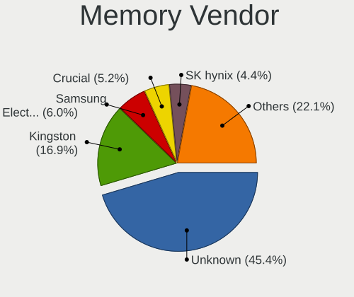

| Vendor                       | Desktops | Percent |
|------------------------------|----------|---------|
| Unknown                      | 7334     | 45.39%  |
| Kingston                     | 2724     | 16.86%  |
| Samsung Electronics          | 973      | 6.02%   |
| Crucial                      | 834      | 5.16%   |
| SK hynix                     | 719      | 4.45%   |
| Corsair                      | 627      | 3.88%   |
| AMD                          | 302      | 1.87%   |
| Patriot                      | 279      | 1.73%   |
| Micron Technology            | 279      | 1.73%   |
| A-DATA Technology            | 182      | 1.13%   |
| G.Skill                      | 152      | 0.94%   |
| Nanya Technology             | 148      | 0.92%   |
| GOODRAM                      | 139      | 0.86%   |
| Unknown                      | 107      | 0.66%   |
| Silicon Power                | 101      | 0.63%   |
| Apacer                       | 96       | 0.59%   |
| Kingmax                      | 92       | 0.57%   |
| Transcend                    | 91       | 0.56%   |
| Elpida                       | 84       | 0.52%   |
| Team                         | 65       | 0.4%    |
| Qumo                         | 64       | 0.4%    |
| GeIL                         | 61       | 0.38%   |
| Goldkey                      | 54       | 0.33%   |
| Kllisre                      | 48       | 0.3%    |
| Ramaxel Technology           | 43       | 0.27%   |
| Foxline                      | 37       | 0.23%   |
| Atermiter                    | 37       | 0.23%   |
| Unifosa                      | 31       | 0.19%   |
| KETECH                       | 30       | 0.19%   |
| Qimonda                      | 27       | 0.17%   |
| Ramos Technology             | 20       | 0.12%   |
| Patriot Memory (PDP Systems) | 18       | 0.11%   |
| Unknown (ABCD)               | 16       | 0.1%    |
| TakeMS                       | 16       | 0.1%    |
| Shenzhen Longsys             | 14       | 0.09%   |
| Patriot Memory               | 12       | 0.07%   |
| Juhor                        | 11       | 0.07%   |
| Hexon                        | 11       | 0.07%   |
| OCZ                          | 10       | 0.06%   |
| Exceleram                    | 10       | 0.06%   |

Memory Model
------------

Memory module models

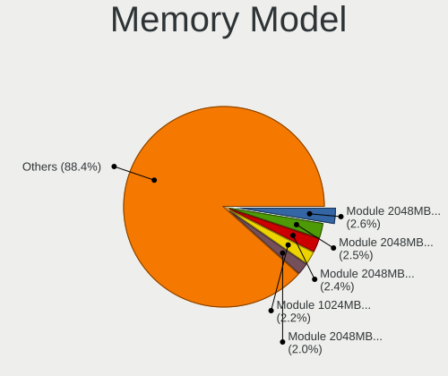

| Model                                                 | Desktops | Percent |
|-------------------------------------------------------|----------|---------|
| Unknown RAM Module 2048MB DIMM DDR2 800MT/s           | 491      | 2.59%   |
| Unknown RAM Module 2048MB DIMM SDRAM                  | 473      | 2.5%    |
| Unknown RAM Module 2048MB DIMM 800MT/s                | 445      | 2.35%   |
| Unknown RAM Module 1024MB DIMM SDRAM                  | 417      | 2.2%    |
| Unknown RAM Module 2048MB DIMM 1333MT/s               | 373      | 1.97%   |
| Unknown RAM Module 4096MB DIMM 1333MT/s               | 357      | 1.89%   |
| Unknown RAM Module 1024MB DIMM DDR2 800MT/s           | 328      | 1.73%   |
| Unknown RAM Module 1024MB DIMM 800MT/s                | 252      | 1.33%   |
| Unknown RAM Module 1024MB DIMM DDR2 667MT/s           | 249      | 1.32%   |
| Unknown RAM Module 2048MB DIMM DDR2 667MT/s           | 207      | 1.09%   |
| Unknown RAM Module 1024MB DIMM 667MT/s                | 164      | 0.87%   |
| Unknown RAM Module 4096MB DIMM DDR3 1333MT/s          | 161      | 0.85%   |
| Unknown RAM Module 2048MB DIMM 667MT/s                | 157      | 0.83%   |
| Unknown RAM Module 512MB DIMM SDRAM                   | 146      | 0.77%   |
| Unknown RAM Module 2048MB DIMM 400MT/s                | 146      | 0.77%   |
| Unknown RAM Module 1024MB DIMM                        | 138      | 0.73%   |
| Kingston RAM KHX1600C9D3/4GX 4GB DIMM DDR3 1867MT/s   | 136      | 0.72%   |
| Unknown RAM Module 4096MB DIMM 1600MT/s               | 134      | 0.71%   |
| Unknown                                               | 107      | 0.57%   |
| Unknown RAM Module 2048MB DIMM DDR3 1333MT/s          | 104      | 0.55%   |
| Unknown RAM Module 4096MB DIMM 400MT/s                | 102      | 0.54%   |
| Unknown RAM Module 2048MB DIMM DDR 1333MT/s           | 101      | 0.53%   |
| Unknown RAM Module 1024MB DIMM DDR2                   | 99       | 0.52%   |
| Unknown RAM Module 4096MB DIMM DDR3 1600MT/s          | 95       | 0.5%    |
| Unknown RAM Module 1024MB DIMM DDR2 333MT/s           | 94       | 0.5%    |
| Unknown RAM Module 2048MB DIMM 1066MT/s               | 87       | 0.46%   |
| Unknown RAM Module 2048MB DIMM                        | 82       | 0.43%   |
| Kingston RAM KHX1600C10D3/8G 8GB DIMM DDR3 2133MT/s   | 79       | 0.42%   |
| Kingston RAM 99U5584-005.A00LF 4GB DIMM DDR3 1600MT/s | 78       | 0.41%   |
| Unknown RAM Module 2048MB DIMM DDR2                   | 77       | 0.41%   |
| Kingston RAM 99U5471-012.A00LF 4GB DIMM DDR3 1333MT/s | 76       | 0.4%    |
| Unknown RAM Module 512MB DIMM                         | 75       | 0.4%    |
| Unknown RAM Module 2048MB DIMM DDR2 333MT/s           | 75       | 0.4%    |
| Unknown RAM Module 4096MB DIMM SDRAM                  | 71       | 0.38%   |
| Unknown RAM Module 4GB DIMM 1333MT/s                  | 70       | 0.37%   |
| Unknown RAM Module 2GB DIMM DDR2 800MT/s              | 69       | 0.36%   |
| Unknown RAM Module 1024MB DIMM 400MT/s                | 67       | 0.35%   |
| Unknown RAM Module 2GB DIMM 1333MT/s                  | 64       | 0.34%   |
| Kingston RAM 99U5471-020.A00LF 4GB DIMM 1600MT/s      | 63       | 0.33%   |
| Unknown RAM Module 2048MB DIMM DDR 800MT/s            | 61       | 0.32%   |

Memory Kind
-----------

Memory module kinds

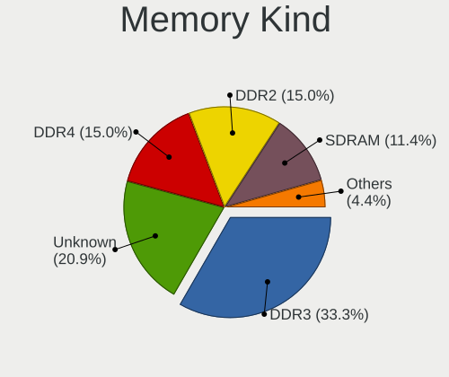

| Kind    | Desktops | Percent |
|---------|----------|---------|
| DDR3    | 4912     | 33.33%  |
| Unknown | 3076     | 20.87%  |
| DDR4    | 2215     | 15.03%  |
| DDR2    | 2205     | 14.96%  |
| SDRAM   | 1682     | 11.41%  |
| DDR     | 504      | 3.42%   |
| DDR5    | 89       | 0.6%    |
| DRAM    | 34       | 0.23%   |
| LPDDR4  | 20       | 0.14%   |

Memory Form Factor
------------------

Physical design of the memory module

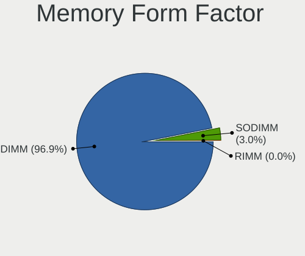

| Name         | Desktops | Percent |
|--------------|----------|---------|
| DIMM         | 14021    | 96.89%  |
| SODIMM       | 438      | 3.03%   |
| FB-DIMM      | 10       | 0.07%   |
| Row Of Chips | 1        | 0.01%   |
| RIMM         | 1        | 0.01%   |

Memory Size
-----------

Memory module size

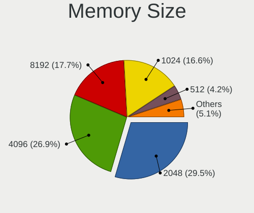

| Size  | Desktops | Percent |
|-------|----------|---------|
| 2048  | 5034     | 29.53%  |
| 4096  | 4580     | 26.87%  |
| 8192  | 3019     | 17.71%  |
| 1024  | 2833     | 16.62%  |
| 512   | 709      | 4.16%   |
| 16384 | 540      | 3.17%   |
| 256   | 165      | 0.97%   |
| 32768 | 151      | 0.89%   |
| 128   | 5        | 0.03%   |
| 32    | 4        | 0.02%   |
| 49152 | 3        | 0.02%   |
| 16    | 3        | 0.02%   |
| 65536 | 1        | 0.01%   |

Memory Speed
------------

Memory module speed

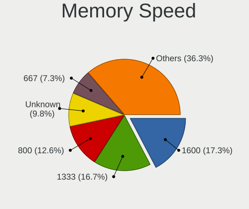

| Speed   | Desktops | Percent |
|---------|----------|---------|
| 1600    | 2769     | 17.32%  |
| 1333    | 2672     | 16.71%  |
| 800     | 2020     | 12.63%  |
| Unknown | 1560     | 9.76%   |
| 667     | 1161     | 7.26%   |
| 2400    | 579      | 3.62%   |
| 2133    | 524      | 3.28%   |
| 400     | 484      | 3.03%   |
| 3200    | 458      | 2.86%   |
| 2667    | 348      | 2.18%   |
| 1066    | 283      | 1.77%   |
| 533     | 258      | 1.61%   |
| 3600    | 251      | 1.57%   |
| 1866    | 247      | 1.54%   |
| 1867    | 246      | 1.54%   |
| 333     | 230      | 1.44%   |
| 1800    | 176      | 1.1%    |
| 3400    | 132      | 0.83%   |
| 2666    | 99       | 0.62%   |
| 266     | 96       | 0.6%    |
| 1067    | 91       | 0.57%   |
| 3000    | 82       | 0.51%   |
| 3733    | 73       | 0.46%   |
| 1334    | 61       | 0.38%   |
| 3466    | 56       | 0.35%   |
| 2933    | 55       | 0.34%   |
| 66      | 50       | 0.31%   |
| 2000    | 48       | 0.3%    |
| 2800    | 45       | 0.28%   |
| 1639    | 45       | 0.28%   |
| 2048    | 43       | 0.27%   |
| 1648    | 43       | 0.27%   |
| 3333    | 41       | 0.26%   |
| 1400    | 37       | 0.23%   |
| 3266    | 34       | 0.21%   |
| 3800    | 32       | 0.2%    |
| 2134    | 32       | 0.2%    |
| 200     | 29       | 0.18%   |
| 4800    | 28       | 0.18%   |
| 49926   | 27       | 0.17%   |

Printers & scanners
-------------------

Printer Vendor
--------------

Printer device vendors

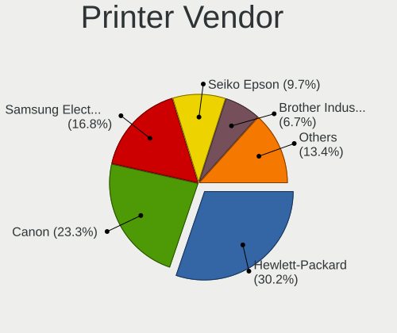

| Vendor                          | Desktops | Percent |
|---------------------------------|----------|---------|
| Hewlett-Packard                 | 452      | 30.19%  |
| Canon                           | 349      | 23.31%  |
| Samsung Electronics             | 251      | 16.77%  |
| Seiko Epson                     | 145      | 9.69%   |
| Brother Industries              | 100      | 6.68%   |
| Xerox                           | 44       | 2.94%   |
| Pantum                          | 31       | 2.07%   |
| Panasonic (Matsushita)          | 27       | 1.8%    |
| Kyocera                         | 25       | 1.67%   |
| Ricoh                           | 15       | 1%      |
| Prolific Technology             | 10       | 0.67%   |
| Lexmark International           | 9        | 0.6%    |
| QinHeng Electronics             | 6        | 0.4%    |
| TSC Auto ID Technology          | 4        | 0.27%   |
| WinChipHead                     | 3        | 0.2%    |
| Konica Minolta                  | 3        | 0.2%    |
| Custom Engineering SPA          | 3        | 0.2%    |
| STMicroelectronics              | 2        | 0.13%   |
| Sharp                           | 2        | 0.13%   |
| HIPER                           | 2        | 0.13%   |
| cab Produkttechnik GmbH & Co KG | 2        | 0.13%   |
| Zebra                           | 1        | 0.07%   |
| Yurex                           | 1        | 0.07%   |
| Xiaomi                          | 1        | 0.07%   |
| Toshiba TEC                     | 1        | 0.07%   |
| Samsung Info. Systems America   | 1        | 0.07%   |
| NXP Semiconductors              | 1        | 0.07%   |
| NCR                             | 1        | 0.07%   |
| KODAK                           | 1        | 0.07%   |
| Fuji Xerox                      | 1        | 0.07%   |
| Dell                            | 1        | 0.07%   |
| Avision                         | 1        | 0.07%   |
| ATEN International              | 1        | 0.07%   |

Printer Model
-------------

Printer device models

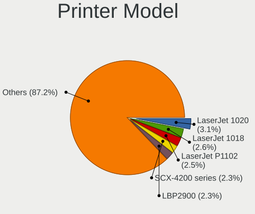

| Model                                 | Desktops | Percent |
|---------------------------------------|----------|---------|
| HP LaserJet 1020                      | 47       | 3.09%   |
| HP LaserJet 1018                      | 40       | 2.63%   |
| HP LaserJet P1102                     | 38       | 2.5%    |
| Samsung SCX-4200 series               | 35       | 2.3%    |
| Canon LBP2900                         | 35       | 2.3%    |
| Seiko Epson Printer                   | 30       | 1.97%   |
| Seiko Epson USB2.0 Printer (Hi-speed) | 22       | 1.45%   |
| HP LaserJet P1005                     | 21       | 1.38%   |
| HP LaserJet 1010                      | 20       | 1.32%   |
| Canon MF4410                          | 20       | 1.32%   |
| Canon MF4010 series                   | 20       | 1.32%   |
| Samsung SCX-3400 Series               | 19       | 1.25%   |
| Samsung SCX-3200 Series               | 19       | 1.25%   |
| Canon MF3010                          | 19       | 1.25%   |
| Panasonic (Matsushita) KX-MB1500RU    | 17       | 1.12%   |
| Seiko Epson L210 Series               | 15       | 0.99%   |
| Samsung ML-1640 Series Laser Printer  | 15       | 0.99%   |
| Brother DCP-7057 scanner/printer      | 15       | 0.99%   |
| Samsung M2020 Series                  | 13       | 0.86%   |
| HP LaserJet 1320                      | 13       | 0.86%   |
| HP DeskJet 2130 series                | 13       | 0.86%   |
| Canon LBP810                          | 13       | 0.86%   |
| Canon LBP3010/LBP3018/LBP3050         | 13       | 0.86%   |
| Xerox Phaser 3140 and 3155            | 12       | 0.79%   |
| Samsung ML-2010P Mono Laser Printer   | 12       | 0.79%   |
| Canon PIXMA MG2500 Series             | 12       | 0.79%   |
| Canon iP7200 series                   | 12       | 0.79%   |
| Canon CAPT USB Device                 | 12       | 0.79%   |
| Samsung ML-1210 Printer               | 11       | 0.72%   |
| Samsung M2070 Series                  | 11       | 0.72%   |
| HP LaserJet 1022                      | 11       | 0.72%   |
| HP Deskjet 2050 J510                  | 11       | 0.72%   |
| Canon LaserShot LBP-1120 Printer      | 11       | 0.72%   |
| Prolific PL2305 Parallel Port         | 10       | 0.66%   |
| Pantum M6500 series                   | 10       | 0.66%   |
| HP LaserJet P1006                     | 10       | 0.66%   |
| HP LaserJet 1200                      | 10       | 0.66%   |
| HP LaserJet 1000                      | 10       | 0.66%   |
| Canon PIXMA MP230                     | 10       | 0.66%   |
| Canon MG2400 series                   | 10       | 0.66%   |

Scanner Vendor
--------------

Scanner device vendors

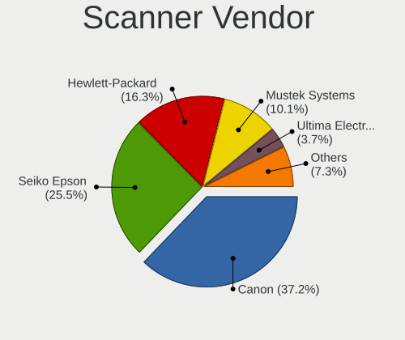

| Vendor                      | Desktops | Percent |
|-----------------------------|----------|---------|
| Canon                       | 162      | 37.16%  |
| Seiko Epson                 | 111      | 25.46%  |
| Hewlett-Packard             | 71       | 16.28%  |
| Mustek Systems              | 44       | 10.09%  |
| Ultima Electronics          | 16       | 3.67%   |
| Acer Peripherals (now BenQ) | 16       | 3.67%   |
| KYE Systems (Mouse Systems) | 5        | 1.15%   |
| Fujitsu                     | 3        | 0.69%   |
| Plustek                     | 2        | 0.46%   |
| Avision                     | 2        | 0.46%   |
| AGFA-Gevaert NV             | 2        | 0.46%   |
| Microtek International      | 1        | 0.23%   |
| Canon Electronics           | 1        | 0.23%   |

Scanner Model
-------------

Scanner device models

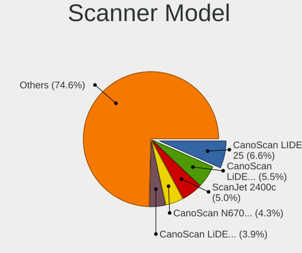

| Model                                                                                 | Desktops | Percent |
|---------------------------------------------------------------------------------------|----------|---------|
| Canon CanoScan LIDE 25                                                                | 29       | 6.64%   |
| Canon CanoScan LiDE 110                                                               | 24       | 5.49%   |
| HP ScanJet 2400c                                                                      | 22       | 5.03%   |
| Canon CanoScan N670U/N676U/LiDE 20                                                    | 19       | 4.35%   |
| Canon CanoScan LiDE 120                                                               | 17       | 3.89%   |
| Seiko Epson GT-F500/GT-F550 [Perfection 2480/2580 PHOTO]                              | 16       | 3.66%   |
| Ultima Artec Ultima 2000 (GT6801 based)/Lifetec LT9385/ScanMagic 1200 UB Plus Scanner | 14       | 3.2%    |
| Mustek Systems BearPaw 1200 CU Plus                                                   | 14       | 3.2%    |
| Canon CanoScan LiDE 60                                                                | 13       | 2.97%   |
| Canon CanoScan LiDE 210                                                               | 13       | 2.97%   |
| Seiko Epson GT-F650 [GT-S600/Perfection V10/V100]                                     | 12       | 2.75%   |
| Seiko Epson GT-F730 [GT-S630/Perfection V33/V330 Photo]                               | 11       | 2.52%   |
| Seiko Epson GT-7400U [Perfection 1270]                                                | 10       | 2.29%   |
| Seiko Epson Perfection V37/V370                                                       | 9        | 2.06%   |
| Mustek Systems BearPaw 2400 CU Plus                                                   | 8        | 1.83%   |
| Canon CanoScan LiDE 100                                                               | 8        | 1.83%   |
| Seiko Epson GT-F520/GT-F570 [Perfection 3590 PHOTO]                                   | 7        | 1.6%    |
| Seiko Epson GT-8400UF [Perfection 1670/1670 PHOTO]                                    | 7        | 1.6%    |
| Canon CanoScan LiDE 220                                                               | 7        | 1.6%    |
| Seiko Epson Perfection 660                                                            | 6        | 1.37%   |
| Seiko Epson GT-F670 [Perfection V200 Photo]                                           | 6        | 1.37%   |
| Mustek Systems SNAPSCAN e22                                                           | 6        | 1.37%   |
| Mustek Systems BearPaw 2448 TA Plus                                                   | 5        | 1.14%   |
| Canon CanoScan                                                                        | 5        | 1.14%   |
| Acer Peripherals (now BenQ) Benq 5560                                                 | 5        | 1.14%   |
| Seiko Epson GT-7200U [Perfection 1250/1250 PHOTO]                                     | 4        | 0.92%   |
| HP ScanJet 3800c                                                                      | 4        | 0.92%   |
| Canon CanoScan LiDE 50/LiDE 35/LiDE 40                                                | 4        | 0.92%   |
| Seiko Epson GT-X750 [Perfection 4490 Photo]                                           | 3        | 0.69%   |
| Mustek Systems BearPaw 2448 CU Pro                                                    | 3        | 0.69%   |
| HP ScanJet 3970c                                                                      | 3        | 0.69%   |
| HP ScanJet 2200c                                                                      | 3        | 0.69%   |
| HP PSC 1200                                                                           | 3        | 0.69%   |
| HP HP Scanjet 300                                                                     | 3        | 0.69%   |
| Fujitsu ScanSnap SV600                                                                | 3        | 0.69%   |
| Canon CanoScan N1240U/LiDE 30                                                         | 3        | 0.69%   |
| Canon CanoScan LiDE 90                                                                | 3        | 0.69%   |
| Canon CanoScan LiDE 70                                                                | 3        | 0.69%   |
| Acer Peripherals (now BenQ) Benq 5000                                                 | 3        | 0.69%   |
| Seiko Epson GT-X820 [Perfection V600 Photo]                                           | 2        | 0.46%   |

Camera
------

Camera Vendor
-------------

Camera device vendors

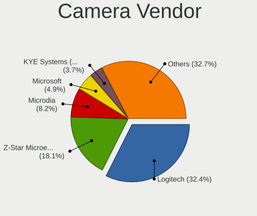

| Vendor                          | Desktops | Percent |
|---------------------------------|----------|---------|
| Logitech                        | 1117     | 32.44%  |
| Z-Star Microelectronics         | 622      | 18.07%  |
| Microdia                        | 282      | 8.19%   |
| Microsoft                       | 169      | 4.91%   |
| KYE Systems (Mouse Systems)     | 128      | 3.72%   |
| Cubeternet                      | 103      | 2.99%   |
| Arkmicro Technologies           | 100      | 2.9%    |
| Pixart Imaging                  | 98       | 2.85%   |
| Aveo Technology                 | 98       | 2.85%   |
| GEMBIRD                         | 87       | 2.53%   |
| Chicony Electronics             | 59       | 1.71%   |
| Realtek Semiconductor           | 52       | 1.51%   |
| Samsung Electronics             | 46       | 1.34%   |
| Creative Technology             | 45       | 1.31%   |
| Alcor Micro                     | 36       | 1.05%   |
| Apple                           | 34       | 0.99%   |
| Sunplus Innovation Technology   | 28       | 0.81%   |
| Guillemot                       | 22       | 0.64%   |
| Genesys Logic                   | 20       | 0.58%   |
| Philips (or NXP)                | 17       | 0.49%   |
| CVT Electronics.Co.             | 17       | 0.49%   |
| A4Tech                          | 16       | 0.46%   |
| Hewlett-Packard                 | 15       | 0.44%   |
| Generalplus Technology          | 15       | 0.44%   |
| Silicon Motion                  | 14       | 0.41%   |
| Unknown                         | 14       | 0.41%   |
| Nokia Mobile Phones             | 13       | 0.38%   |
| SunplusIT                       | 11       | 0.32%   |
| SiGma Micro                     | 10       | 0.29%   |
| IMC Networks                    | 10       | 0.29%   |
| lihappe8                        | 9        | 0.26%   |
| Trust                           | 8        | 0.23%   |
| Jieli Technology                | 8        | 0.23%   |
| Suyin                           | 5        | 0.15%   |
| SeeVision                       | 5        | 0.15%   |
| Canon                           | 5        | 0.15%   |
| Unknown                         | 4        | 0.12%   |
| Panasonic (Matsushita)          | 4        | 0.12%   |
| Google                          | 4        | 0.12%   |
| Fitipower Integrated Technology | 4        | 0.12%   |

Camera Model
------------

Camera device models

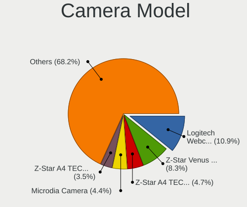

| Model                                             | Desktops | Percent |
|---------------------------------------------------|----------|---------|
| Logitech Webcam C270                              | 375      | 10.86%  |
| Z-Star Venus USB2.0 Camera                        | 286      | 8.29%   |
| Z-Star A4 TECH USB 2.0 Camera J                   | 163      | 4.72%   |
| Microdia Camera                                   | 153      | 4.43%   |
| Z-Star A4 TECH USB2.0 PC Camera E                 | 121      | 3.51%   |
| Logitech Webcam C170                              | 96       | 2.78%   |
| Arkmicro USB2.0 PC CAMERA                         | 91       | 2.64%   |
| Logitech Webcam C310                              | 89       | 2.58%   |
| Logitech Webcam C210                              | 84       | 2.43%   |
| Pixart Imaging GE 1.3 MP MiniCam Pro              | 74       | 2.14%   |
| Logitech HD Webcam C525                           | 67       | 1.94%   |
| Cubeternet GL-UPC822 UVC WebCam                   | 55       | 1.59%   |
| Microsoft LifeCam HD-3000                         | 54       | 1.56%   |
| Logitech Webcam C110                              | 52       | 1.51%   |
| GEMBIRD USB2.0 PC CAMERA                          | 52       | 1.51%   |
| Microdia Sonix USB 2.0 Camera                     | 46       | 1.33%   |
| Samsung Galaxy series, misc. (MTP mode)           | 44       | 1.27%   |
| Logitech HD Webcam C510                           | 38       | 1.1%    |
| Logitech Logitech Webcam C160                     | 35       | 1.01%   |
| Aveo Camera                                       | 35       | 1.01%   |
| Microdia USB 2.0 Camera                           | 34       | 0.98%   |
| Logitech HD Pro Webcam C920                       | 34       | 0.98%   |
| GEMBIRD Generic UVC 1.00 camera [AppoTech AX2311] | 34       | 0.98%   |
| Aveo USB2.0 Camera                                | 33       | 0.96%   |
| Logitech Logitech Webcam C100                     | 31       | 0.9%    |
| Cubeternet USB2.0 Camera                          | 30       | 0.87%   |
| Realtek FULL HD 1080P Webcam                      | 29       | 0.84%   |
| Microsoft LifeCam VX-800                          | 28       | 0.81%   |
| Alcor Micro USB 2.0 PC Camera                     | 28       | 0.81%   |
| Aveo UVC camera (Bresser microscope)              | 26       | 0.75%   |
| Apple iPhone 5/5C/5S/6/SE/7/8/X                   | 26       | 0.75%   |
| Logitech Webcam C250                              | 24       | 0.7%    |
| Logitech HD Webcam C910                           | 21       | 0.61%   |
| Microsoft LifeCam VX-2000                         | 20       | 0.58%   |
| Microdia MSI Starcam Racer                        | 19       | 0.55%   |
| Logitech Webcam C120                              | 19       | 0.55%   |
| Logitech HD Webcam C615                           | 19       | 0.55%   |
| Microsoft LifeCam HD-5000                         | 18       | 0.52%   |
| Logitech Webcam C200                              | 18       | 0.52%   |
| Z-Star Full HD 1080P PC Camera                    | 17       | 0.49%   |

Security
--------

Fingerprint Vendor
------------------

Fingerprint sensor vendors

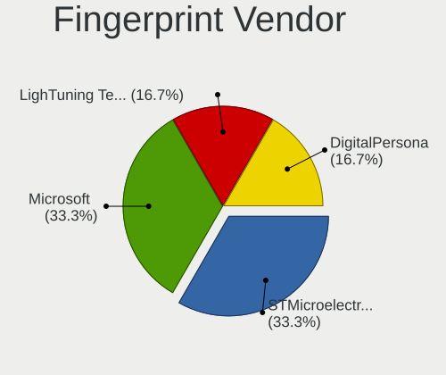

| Vendor                | Desktops | Percent |
|-----------------------|----------|---------|
| STMicroelectronics    | 2        | 33.33%  |
| Microsoft             | 2        | 33.33%  |
| LighTuning Technology | 1        | 16.67%  |
| DigitalPersona        | 1        | 16.67%  |

Fingerprint Model
-----------------

Fingerprint sensor models

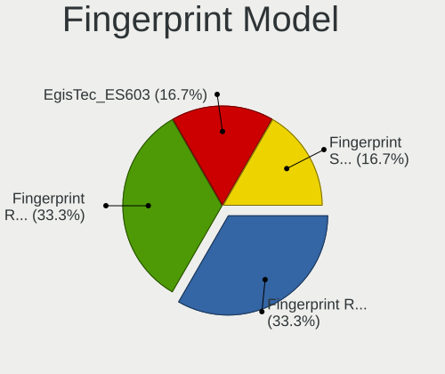

| Model                                            | Desktops | Percent |
|--------------------------------------------------|----------|---------|
| STMicroelectronics Fingerprint Reader            | 2        | 33.33%  |
| Microsoft Fingerprint Reader                     | 2        | 33.33%  |
| LighTuning ES603 Swipe Fingerprint Sensor        | 1        | 16.67%  |
| DigitalPersona Fingerprint Scanner, U.are.U 2000 | 1        | 16.67%  |

Chipcard Vendor
---------------

Chipcard module vendors

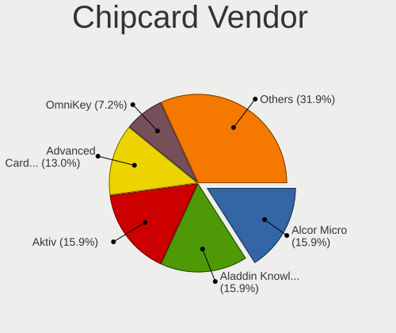

| Vendor                                  | Desktops | Percent |
|-----------------------------------------|----------|---------|
| Alcor Micro                             | 11       | 15.94%  |
| Aladdin Knowledge Systems               | 11       | 15.94%  |
| Aktiv                                   | 11       | 15.94%  |
| Advanced Card Systems                   | 9        | 13.04%  |
| OmniKey                                 | 5        | 7.25%   |
| Realtek Semiconductor                   | 4        | 5.8%    |
| Athena Smartcard Solutions              | 4        | 5.8%    |
| Chicony Electronics                     | 2        | 2.9%    |
| Castles Technology                      | 2        | 2.9%    |
| Avtor                                   | 2        | 2.9%    |
| Reiner SCT Kartensysteme                | 1        | 1.45%   |
| Gemalto (was Gemplus)                   | 1        | 1.45%   |
| Future Technology Devices International | 1        | 1.45%   |
| Fujitsu Siemens Computers               | 1        | 1.45%   |
| Feitian Technologies                    | 1        | 1.45%   |
| Cherry                                  | 1        | 1.45%   |
| BIFIT                                   | 1        | 1.45%   |
| Aladdin R.D.                            | 1        | 1.45%   |

Chipcard Model
--------------

Chipcard module models

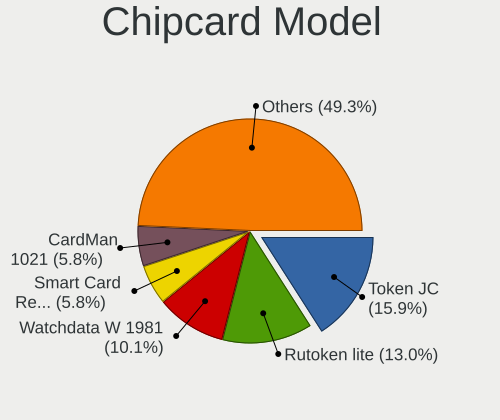

| Model                                                                      | Desktops | Percent |
|----------------------------------------------------------------------------|----------|---------|
| Aladdin Knowledge Systems Token JC                                         | 11       | 15.94%  |
| Aktiv Rutoken lite                                                         | 9        | 13.04%  |
| Alcor Micro Watchdata W 1981                                               | 7        | 10.14%  |
| Realtek Semiconductor Smart Card Reader Interface                          | 4        | 5.8%    |
| OmniKey CardMan 1021                                                       | 4        | 5.8%    |
| Athena Smartcard Solutions ASEDrive V3C                                    | 4        | 5.8%    |
| Alcor Micro AU9540 Smartcard Reader                                        | 4        | 5.8%    |
| Advanced Card Systems ACR38 SmartCard Reader                               | 3        | 4.35%   |
| Chicony Electronics HP Skylab USB Smartcard Keyboard                       | 2        | 2.9%    |
| Castles Technology EZCCID Smart Card Reader                                | 2        | 2.9%    |
| Avtor SecureToken                                                          | 2        | 2.9%    |
| Advanced Card Systems Token USB 64K                                        | 2        | 2.9%    |
| Advanced Card Systems ACR3901U                                             | 2        | 2.9%    |
| Reiner SCT Kartensysteme cyberJack RFID basis contactless smartcard reader | 1        | 1.45%   |
| OmniKey CardMan 3021 / 3121                                                | 1        | 1.45%   |
| Gemalto (was Gemplus) GemPC Key SmartCard Reader                           | 1        | 1.45%   |
| Future Technology Devices International Parsec Desktop Reader PR-EH08      | 1        | 1.45%   |
| Fujitsu Siemens Computers SmartCard Reader 2A                              | 1        | 1.45%   |
| Feitian Technologies SCR301                                                | 1        | 1.45%   |
| Cherry SmartCard Reader Keyboard KC 1000 SC                                | 1        | 1.45%   |
| BIFIT iBank2Key                                                            | 1        | 1.45%   |
| Aladdin R.D. JaCarta                                                       | 1        | 1.45%   |
| Aktiv Reader                                                               | 1        | 1.45%   |
| Aktiv KAZTOKEN                                                             | 1        | 1.45%   |
| Advanced Card Systems ACR39U                                               | 1        | 1.45%   |
| Advanced Card Systems ACR1281 1S Dual Reader                               | 1        | 1.45%   |

Unsupported
-----------

Unsupported Devices
-------------------

Total unsupported devices on board

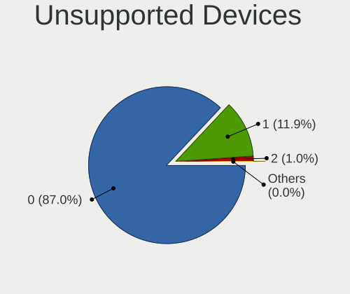

| Total | Desktops | Percent |
|-------|----------|---------|
| 0     | 13376    | 87%     |
| 1     | 1828     | 11.89%  |
| 2     | 148      | 0.96%   |
| 3     | 19       | 0.12%   |
| 9     | 1        | 0.01%   |
| 7     | 1        | 0.01%   |
| 4     | 1        | 0.01%   |

Unsupported Device Types
------------------------

Types of unsupported devices

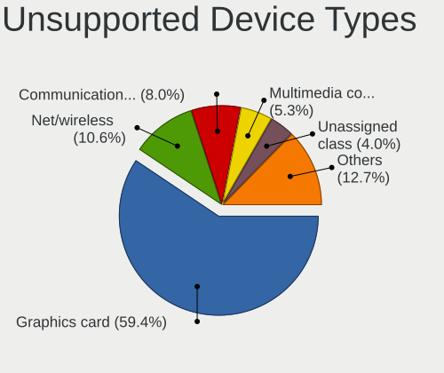

| Type                     | Desktops | Percent |
|--------------------------|----------|---------|
| Graphics card            | 1256     | 59.41%  |
| Net/wireless             | 224      | 10.6%   |
| Communication controller | 170      | 8.04%   |
| Multimedia controller    | 111      | 5.25%   |
| Unassigned class         | 85       | 4.02%   |
| Camera                   | 68       | 3.22%   |
| Chipcard                 | 56       | 2.65%   |
| Modem                    | 28       | 1.32%   |
| Sound                    | 26       | 1.23%   |
| Net/ethernet             | 18       | 0.85%   |
| Dvb card                 | 14       | 0.66%   |
| Network                  | 12       | 0.57%   |
| Bluetooth                | 11       | 0.52%   |
| Storage/raid             | 7        | 0.33%   |
| Tv card                  | 6        | 0.28%   |
| Storage                  | 6        | 0.28%   |
| Card reader              | 5        | 0.24%   |
| Storage/ata              | 4        | 0.19%   |
| Fingerprint reader       | 4        | 0.19%   |
| Video                    | 2        | 0.09%   |
| Storage/ide              | 1        | 0.05%   |

