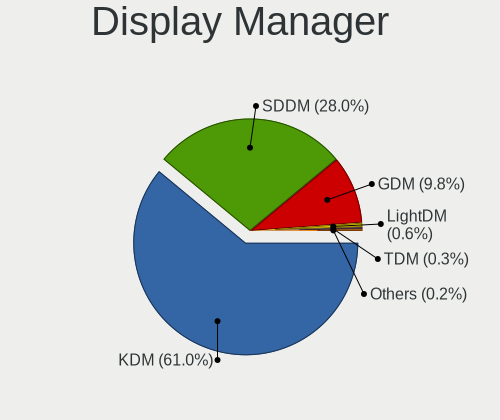
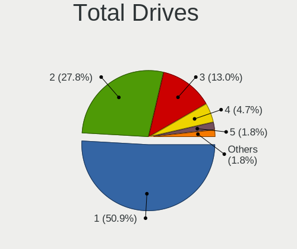
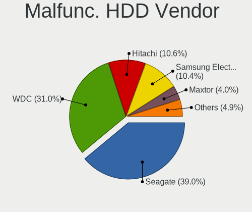
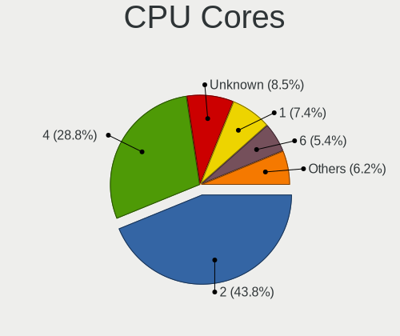
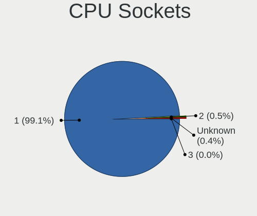
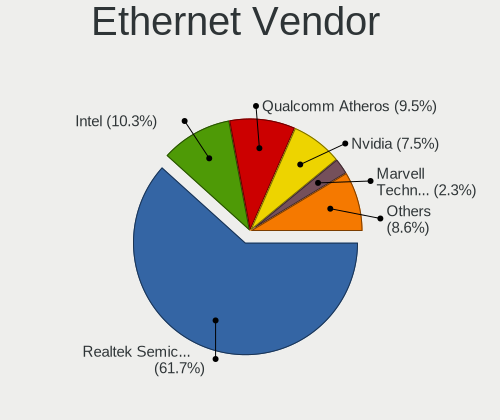
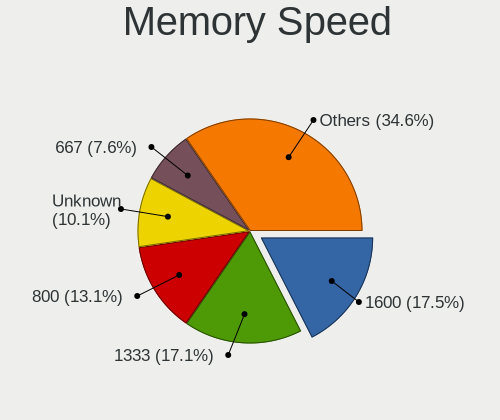
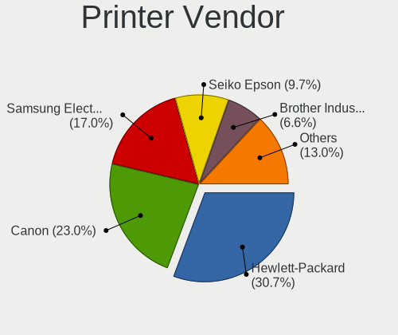

ROSA - Tested Hardware & Statistics (Desktops)
----------------------------------------------

A project to collect tested hardware configurations for ROSA.

Anyone can contribute to this report by the [hw-probe](https://github.com/linuxhw/hw-probe) tool:

    sudo -E hw-probe -all -upload

Please contribute! Especially if your hardware is rare.

Contents
--------

* [ Test Cases ](#test-cases)

* [ System ](#system)
  - [ OS                       ](#os)
  - [ OS Family                ](#os-family)
  - [ Kernel                   ](#kernel)
  - [ Kernel Family            ](#kernel-family)
  - [ Kernel Major Ver.        ](#kernel-major-ver)
  - [ Arch                     ](#arch)
  - [ DE                       ](#de)
  - [ Display Server           ](#display-server)
  - [ Display Manager          ](#display-manager)
  - [ OS Lang                  ](#os-lang)
  - [ Boot Mode                ](#boot-mode)
  - [ Filesystem               ](#filesystem)
  - [ Part. scheme             ](#part-scheme)
  - [ Dual Boot with Linux/BSD ](#dual-boot-with-linuxbsd)
  - [ Dual Boot (Win)          ](#dual-boot-win)

* [ Board ](#board)
  - [ Vendor                   ](#vendor)
  - [ Model                    ](#model)
  - [ Model Family             ](#model-family)
  - [ MFG Year                 ](#mfg-year)
  - [ Form Factor              ](#form-factor)
  - [ Secure Boot              ](#secure-boot)
  - [ Coreboot                 ](#coreboot)
  - [ RAM Size                 ](#ram-size)
  - [ RAM Used                 ](#ram-used)
  - [ Total Drives             ](#total-drives)
  - [ Has CD-ROM               ](#has-cd-rom)
  - [ Has Ethernet             ](#has-ethernet)
  - [ Has WiFi                 ](#has-wifi)
  - [ Has Bluetooth            ](#has-bluetooth)

* [ Location ](#location)
  - [ Country                  ](#country)
  - [ City                     ](#city)

* [ Drives ](#drives)
  - [ Drive Vendor             ](#drive-vendor)
  - [ Drive Model              ](#drive-model)
  - [ HDD Vendor               ](#hdd-vendor)
  - [ SSD Vendor               ](#ssd-vendor)
  - [ Drive Kind               ](#drive-kind)
  - [ Drive Connector          ](#drive-connector)
  - [ Drive Size               ](#drive-size)
  - [ Space Total              ](#space-total)
  - [ Space Used               ](#space-used)
  - [ Malfunc. Drives          ](#malfunc-drives)
  - [ Malfunc. Drive Vendor    ](#malfunc-drive-vendor)
  - [ Malfunc. HDD Vendor      ](#malfunc-hdd-vendor)
  - [ Malfunc. Drive Kind      ](#malfunc-drive-kind)
  - [ Failed Drives            ](#failed-drives)
  - [ Failed Drive Vendor      ](#failed-drive-vendor)
  - [ Drive Status             ](#drive-status)

* [ Storage controller ](#storage-controller)
  - [ Storage Vendor           ](#storage-vendor)
  - [ Storage Model            ](#storage-model)
  - [ Storage Kind             ](#storage-kind)

* [ Processor ](#processor)
  - [ CPU Vendor               ](#cpu-vendor)
  - [ CPU Model                ](#cpu-model)
  - [ CPU Model Family         ](#cpu-model-family)
  - [ CPU Cores                ](#cpu-cores)
  - [ CPU Sockets              ](#cpu-sockets)
  - [ CPU Threads              ](#cpu-threads)
  - [ CPU Op-Modes             ](#cpu-op-modes)
  - [ CPU Microcode            ](#cpu-microcode)
  - [ CPU Microarch            ](#cpu-microarch)

* [ Graphics ](#graphics)
  - [ GPU Vendor               ](#gpu-vendor)
  - [ GPU Model                ](#gpu-model)
  - [ GPU Combo                ](#gpu-combo)
  - [ GPU Driver               ](#gpu-driver)
  - [ GPU Memory               ](#gpu-memory)

* [ Monitor ](#monitor)
  - [ Monitor Vendor           ](#monitor-vendor)
  - [ Monitor Model            ](#monitor-model)
  - [ Monitor Resolution       ](#monitor-resolution)
  - [ Monitor Diagonal         ](#monitor-diagonal)
  - [ Monitor Width            ](#monitor-width)
  - [ Aspect Ratio             ](#aspect-ratio)
  - [ Monitor Area             ](#monitor-area)
  - [ Pixel Density            ](#pixel-density)
  - [ Multiple Monitors        ](#multiple-monitors)

* [ Network ](#network)
  - [ Net Controller Vendor    ](#net-controller-vendor)
  - [ Net Controller Model     ](#net-controller-model)
  - [ Wireless Vendor          ](#wireless-vendor)
  - [ Wireless Model           ](#wireless-model)
  - [ Ethernet Vendor          ](#ethernet-vendor)
  - [ Ethernet Model           ](#ethernet-model)
  - [ Net Controller Kind      ](#net-controller-kind)
  - [ Used Controller          ](#used-controller)
  - [ NICs                     ](#nics)
  - [ IPv6                     ](#ipv6)

* [ Bluetooth ](#bluetooth)
  - [ Bluetooth Vendor         ](#bluetooth-vendor)
  - [ Bluetooth Model          ](#bluetooth-model)

* [ Sound ](#sound)
  - [ Sound Vendor             ](#sound-vendor)
  - [ Sound Model              ](#sound-model)

* [ Memory ](#memory)
  - [ Memory Vendor            ](#memory-vendor)
  - [ Memory Model             ](#memory-model)
  - [ Memory Kind              ](#memory-kind)
  - [ Memory Form Factor       ](#memory-form-factor)
  - [ Memory Size              ](#memory-size)
  - [ Memory Speed             ](#memory-speed)

* [ Printers & scanners ](#printers--scanners)
  - [ Printer Vendor           ](#printer-vendor)
  - [ Printer Model            ](#printer-model)
  - [ Scanner Vendor           ](#scanner-vendor)
  - [ Scanner Model            ](#scanner-model)

* [ Camera ](#camera)
  - [ Camera Vendor            ](#camera-vendor)
  - [ Camera Model             ](#camera-model)

* [ Security ](#security)
  - [ Fingerprint Vendor       ](#fingerprint-vendor)
  - [ Fingerprint Model        ](#fingerprint-model)
  - [ Chipcard Vendor          ](#chipcard-vendor)
  - [ Chipcard Model           ](#chipcard-model)

* [ Unsupported ](#unsupported)
  - [ Unsupported Devices      ](#unsupported-devices)
  - [ Unsupported Device Types ](#unsupported-device-types)

Test Cases
----------

Total: 21248

| Vendor        | Model                       | Probe                                                      | Date         |
|---------------|-----------------------------|------------------------------------------------------------|--------------|
| HP            | 8906 SMVB                   | [74430f2160](https://linux-hardware.org/?probe=74430f2160) | Apr 01, 2023 |
| Gigabyte      | B550 AORUS ELITE V2         | [978a5e2579](https://linux-hardware.org/?probe=978a5e2579) | Apr 01, 2023 |
| Gigabyte      | G41M-Combo                  | [ac658bcb80](https://linux-hardware.org/?probe=ac658bcb80) | Apr 01, 2023 |
| ASUSTek       | M5A78L LE                   | [af64a32a09](https://linux-hardware.org/?probe=af64a32a09) | Apr 01, 2023 |
| MSI           | H510M-A PRO                 | [a6953d3b96](https://linux-hardware.org/?probe=a6953d3b96) | Apr 01, 2023 |
| Unknown       | X79                         | [d0592836a5](https://linux-hardware.org/?probe=d0592836a5) | Apr 01, 2023 |
| Acer          | WG43M                       | [77cb0bf517](https://linux-hardware.org/?probe=77cb0bf517) | Apr 01, 2023 |
| ASUSTek       | P8B75-V                     | [5ed3be8dbc](https://linux-hardware.org/?probe=5ed3be8dbc) | Mar 31, 2023 |
| ASUSTek       | PRIME Z690M-PLUS D4         | [51c601477f](https://linux-hardware.org/?probe=51c601477f) | Mar 31, 2023 |
| Gigabyte      | Z77X-UD5H                   | [323d8881a5](https://linux-hardware.org/?probe=323d8881a5) | Mar 31, 2023 |
| ASRock        | N68-GS4 FX                  | [573f5db37d](https://linux-hardware.org/?probe=573f5db37d) | Mar 31, 2023 |
| MSI           | H510M-A PRO                 | [49a4903c58](https://linux-hardware.org/?probe=49a4903c58) | Mar 30, 2023 |
| Gigabyte      | GA-A55M-S2V                 | [6bb5f276cd](https://linux-hardware.org/?probe=6bb5f276cd) | Mar 30, 2023 |
| Gigabyte      | H77N-WIFI                   | [fecc161428](https://linux-hardware.org/?probe=fecc161428) | Mar 30, 2023 |
| Huanan        | X99-QD4 V1.0                | [d88393be26](https://linux-hardware.org/?probe=d88393be26) | Mar 30, 2023 |
| Acer          | Aspire TC-605               | [5938e606b6](https://linux-hardware.org/?probe=5938e606b6) | Mar 30, 2023 |
| ASRock        | H110M-DGS R3.0              | [0580e11b2f](https://linux-hardware.org/?probe=0580e11b2f) | Mar 29, 2023 |
| ASRock        | B650M PG Riptide            | [f019265109](https://linux-hardware.org/?probe=f019265109) | Mar 29, 2023 |
| Unknown       | Unknown                     | [e62607df55](https://linux-hardware.org/?probe=e62607df55) | Mar 29, 2023 |
| ASRock        | N68PV-GS                    | [1c473cd5c6](https://linux-hardware.org/?probe=1c473cd5c6) | Mar 29, 2023 |
| Gigabyte      | 945P-S3                     | [8aa985b6fa](https://linux-hardware.org/?probe=8aa985b6fa) | Mar 29, 2023 |
| ASUSTek       | ProArt Z690-CREATOR WIFI    | [55a22382cc](https://linux-hardware.org/?probe=55a22382cc) | Mar 29, 2023 |
| ASRock        | 990FX Extreme3              | [ca172328f1](https://linux-hardware.org/?probe=ca172328f1) | Mar 29, 2023 |
| ASRock        | H81M-HDS R2.0               | [1f333c98e1](https://linux-hardware.org/?probe=1f333c98e1) | Mar 29, 2023 |
| Gigabyte      | H410M H V3                  | [10fd7d1526](https://linux-hardware.org/?probe=10fd7d1526) | Mar 28, 2023 |
| MSI           | X370 GAMING PLUS            | [53543ce276](https://linux-hardware.org/?probe=53543ce276) | Mar 28, 2023 |
| Gigabyte      | 946GMX-S2                   | [41f98f54fd](https://linux-hardware.org/?probe=41f98f54fd) | Mar 28, 2023 |
| ASUSTek       | P8Z77-V LK                  | [b097373c25](https://linux-hardware.org/?probe=b097373c25) | Mar 28, 2023 |
| MSI           | 770-C45                     | [9b23a7e2d0](https://linux-hardware.org/?probe=9b23a7e2d0) | Mar 28, 2023 |
| MSI           | MPG B550 GAMING PLUS        | [23438353bb](https://linux-hardware.org/?probe=23438353bb) | Mar 28, 2023 |
| MSI           | MPG B550 GAMING PLUS        | [c49cc33482](https://linux-hardware.org/?probe=c49cc33482) | Mar 28, 2023 |
| MACHINIST     | E5-MR9A PRO V1.1            | [727f980b20](https://linux-hardware.org/?probe=727f980b20) | Mar 27, 2023 |
| Dell          | 0WMJ54 A01                  | [0b26a988f6](https://linux-hardware.org/?probe=0b26a988f6) | Mar 27, 2023 |
| Intel         | X79v2.72 KD V2.0            | [7b9dfca8cc](https://linux-hardware.org/?probe=7b9dfca8cc) | Mar 27, 2023 |
| Foxconn       | 2AA9                        | [97192fc35b](https://linux-hardware.org/?probe=97192fc35b) | Mar 27, 2023 |
| Unknown       | Unknown                     | [6f77d9be36](https://linux-hardware.org/?probe=6f77d9be36) | Mar 26, 2023 |
| Dell          | 04YP6J A02                  | [797053b2f7](https://linux-hardware.org/?probe=797053b2f7) | Mar 26, 2023 |
| Gigabyte      | Z590 D                      | [095ade7803](https://linux-hardware.org/?probe=095ade7803) | Mar 26, 2023 |
| Gigabyte      | H77-DS3H                    | [36d80a146f](https://linux-hardware.org/?probe=36d80a146f) | Mar 26, 2023 |
| Foxconn       | G41MXE-V                    | [38d87a8061](https://linux-hardware.org/?probe=38d87a8061) | Mar 26, 2023 |
| ASUSTek       | TUF Gaming B550-PLUS        | [bbfe5423c9](https://linux-hardware.org/?probe=bbfe5423c9) | Mar 26, 2023 |
| ASUSTek       | M5A78L/USB3                 | [732b7b7fab](https://linux-hardware.org/?probe=732b7b7fab) | Mar 26, 2023 |
| Gigabyte      | F2A55M-S1                   | [fff8f87d2a](https://linux-hardware.org/?probe=fff8f87d2a) | Mar 25, 2023 |
| MSI           | PRO H610M-E DDR4            | [c33415cb2b](https://linux-hardware.org/?probe=c33415cb2b) | Mar 25, 2023 |
| MSI           | B360M PRO-VD 2019-01-24     | [71fc8dc05c](https://linux-hardware.org/?probe=71fc8dc05c) | Mar 25, 2023 |
| Gigabyte      | B75M-D2V                    | [c98eac375f](https://linux-hardware.org/?probe=c98eac375f) | Mar 25, 2023 |
| Dell          | 01TKCC A01                  | [c250d03840](https://linux-hardware.org/?probe=c250d03840) | Mar 25, 2023 |
| ASUSTek       | P5KPL-AM SE                 | [357a52fe14](https://linux-hardware.org/?probe=357a52fe14) | Mar 25, 2023 |
| Gigabyte      | X470 AORUS ULTRA GAMING-... | [f185ea819d](https://linux-hardware.org/?probe=f185ea819d) | Mar 24, 2023 |
| MACHINIST     | X99-RS9 V3.1                | [c1e2b5e7fb](https://linux-hardware.org/?probe=c1e2b5e7fb) | Mar 24, 2023 |
| ASRock        | 990FX Extreme3              | [c310b97b8d](https://linux-hardware.org/?probe=c310b97b8d) | Mar 24, 2023 |
| Gigabyte      | GA-880GM-USB3               | [e6219dd355](https://linux-hardware.org/?probe=e6219dd355) | Mar 24, 2023 |
| HP            | 8906 SMVB                   | [ae7d4327f5](https://linux-hardware.org/?probe=ae7d4327f5) | Mar 24, 2023 |
| Unknown       | X79M2-Q                     | [f517d6c26d](https://linux-hardware.org/?probe=f517d6c26d) | Mar 23, 2023 |
| ASRock        | H61M-HVGS                   | [8023b22765](https://linux-hardware.org/?probe=8023b22765) | Mar 23, 2023 |
| ASRock        | N68C-GS FX                  | [03da177044](https://linux-hardware.org/?probe=03da177044) | Mar 23, 2023 |
| Gigabyte      | 970-GAMING                  | [f16afa095b](https://linux-hardware.org/?probe=f16afa095b) | Mar 23, 2023 |
| HP            | 3048h                       | [8cee790d83](https://linux-hardware.org/?probe=8cee790d83) | Mar 23, 2023 |
| Gigabyte      | B450M S2H                   | [73d22216c2](https://linux-hardware.org/?probe=73d22216c2) | Mar 23, 2023 |
| MSI           | 760GM-P23                   | [f170457555](https://linux-hardware.org/?probe=f170457555) | Mar 23, 2023 |
| ASUSTek       | H97-PLUS                    | [577716237d](https://linux-hardware.org/?probe=577716237d) | Mar 22, 2023 |
| ASUSTek       | H97-PLUS                    | [32fa1d46e2](https://linux-hardware.org/?probe=32fa1d46e2) | Mar 22, 2023 |
| MACHINIST     | X99-k9 V2.0                 | [24377b0218](https://linux-hardware.org/?probe=24377b0218) | Mar 22, 2023 |
| ASUSTek       | M2N-MX                      | [7eead8bd18](https://linux-hardware.org/?probe=7eead8bd18) | Mar 22, 2023 |
| Gigabyte      | Z390 AORUS PRO-CF           | [7d8950b25b](https://linux-hardware.org/?probe=7d8950b25b) | Mar 21, 2023 |
| Gigabyte      | Z390 AORUS PRO-CF           | [c58012d73d](https://linux-hardware.org/?probe=c58012d73d) | Mar 21, 2023 |
| Gigabyte      | H77N-WIFI                   | [3a70b6918f](https://linux-hardware.org/?probe=3a70b6918f) | Mar 21, 2023 |
| ASRock        | H470M-HDV                   | [52b14963e3](https://linux-hardware.org/?probe=52b14963e3) | Mar 21, 2023 |
| Unknown       | X79M2-Q                     | [11e2caa120](https://linux-hardware.org/?probe=11e2caa120) | Mar 20, 2023 |
| Gigabyte      | B550 AORUS PRO AC           | [e128423a13](https://linux-hardware.org/?probe=e128423a13) | Mar 20, 2023 |
| Gigabyte      | B360M DS3H                  | [4df457f6bb](https://linux-hardware.org/?probe=4df457f6bb) | Mar 20, 2023 |
| ASUSTek       | P5KPL-AM SE                 | [9a5bfcc056](https://linux-hardware.org/?probe=9a5bfcc056) | Mar 20, 2023 |
| ASUSTek       | ROG STRIX B550-I GAMING     | [9b2ff390f6](https://linux-hardware.org/?probe=9b2ff390f6) | Mar 20, 2023 |
| ASRock        | H310CM-DVS                  | [2ef180bad0](https://linux-hardware.org/?probe=2ef180bad0) | Mar 20, 2023 |
| ASUSTek       | PRIME H310M-R R2.0          | [e49b9e39d5](https://linux-hardware.org/?probe=e49b9e39d5) | Mar 20, 2023 |
| ASUSTek       | Z97-K                       | [a48a2fbdd0](https://linux-hardware.org/?probe=a48a2fbdd0) | Mar 19, 2023 |
| MSI           | B360M PRO-VD 2019-01-24     | [cd708d0e58](https://linux-hardware.org/?probe=cd708d0e58) | Mar 19, 2023 |
| Dell          | 01TKCC A01                  | [fd02c2aade](https://linux-hardware.org/?probe=fd02c2aade) | Mar 19, 2023 |
| ASUSTek       | PRIME H270-PLUS             | [4f56864a63](https://linux-hardware.org/?probe=4f56864a63) | Mar 19, 2023 |
| Soyo          | SY-Classic B660M            | [cebe1d8722](https://linux-hardware.org/?probe=cebe1d8722) | Mar 19, 2023 |
| HP            | 0A54h                       | [6ec15582a7](https://linux-hardware.org/?probe=6ec15582a7) | Mar 19, 2023 |
| ASRock        | N68C-GS FX                  | [4d50b47e95](https://linux-hardware.org/?probe=4d50b47e95) | Mar 19, 2023 |
| MB            | A320-SF110                  | [588c8f3fe5](https://linux-hardware.org/?probe=588c8f3fe5) | Mar 19, 2023 |
| ASUSTek       | PRIME H310M-R R2.0          | [99096c6a78](https://linux-hardware.org/?probe=99096c6a78) | Mar 19, 2023 |
| ASUSTek       | TUF Gaming X570-PLUS        | [e0a2f725e3](https://linux-hardware.org/?probe=e0a2f725e3) | Mar 19, 2023 |
| ASUSTek       | TUF Gaming X570-PLUS        | [a77ff93d75](https://linux-hardware.org/?probe=a77ff93d75) | Mar 19, 2023 |
| ASRock        | B550 Steel Legend           | [8c50fc6c24](https://linux-hardware.org/?probe=8c50fc6c24) | Mar 19, 2023 |
| ASRock        | B550 Steel Legend           | [2283637069](https://linux-hardware.org/?probe=2283637069) | Mar 18, 2023 |
| Gigabyte      | H110M-S2V-CF                | [1bedc9be7e](https://linux-hardware.org/?probe=1bedc9be7e) | Mar 18, 2023 |
| Gigabyte      | GA-870A-UD3                 | [caf54bddb9](https://linux-hardware.org/?probe=caf54bddb9) | Mar 18, 2023 |
| ASRock        | B550 Steel Legend           | [d7d537c353](https://linux-hardware.org/?probe=d7d537c353) | Mar 18, 2023 |
| ASRock        | B550 Steel Legend           | [213f4f774f](https://linux-hardware.org/?probe=213f4f774f) | Mar 18, 2023 |
| Gigabyte      | B550 AORUS ELITE AX V2      | [b33066c1b7](https://linux-hardware.org/?probe=b33066c1b7) | Mar 18, 2023 |
| ASRock        | N68C-GS FX                  | [94b8c06fdd](https://linux-hardware.org/?probe=94b8c06fdd) | Mar 18, 2023 |
| Gigabyte      | G41M-Combo                  | [877608b32b](https://linux-hardware.org/?probe=877608b32b) | Mar 18, 2023 |
| Unknown       | X79M2-Q                     | [fe58227748](https://linux-hardware.org/?probe=fe58227748) | Mar 17, 2023 |
| Biostar       | G41-M7                      | [7109205ef0](https://linux-hardware.org/?probe=7109205ef0) | Mar 17, 2023 |
| ASRock        | N68C-GS FX                  | [814c2e63c6](https://linux-hardware.org/?probe=814c2e63c6) | Mar 17, 2023 |
| Biostar       | G41-M7                      | [b1fe372b7d](https://linux-hardware.org/?probe=b1fe372b7d) | Mar 17, 2023 |
| Gigabyte      | H410M H V3                  | [be0d148aa6](https://linux-hardware.org/?probe=be0d148aa6) | Mar 17, 2023 |
| Gigabyte      | H410M H V3                  | [3b591bcb12](https://linux-hardware.org/?probe=3b591bcb12) | Mar 17, 2023 |
| Gigabyte      | H410M H V3                  | [97ef9205b5](https://linux-hardware.org/?probe=97ef9205b5) | Mar 17, 2023 |
| ASUSTek       | PRIME B250M-K               | [244382a7f5](https://linux-hardware.org/?probe=244382a7f5) | Mar 17, 2023 |
| Dell          | 0VRWRC A00                  | [2159ca2389](https://linux-hardware.org/?probe=2159ca2389) | Mar 16, 2023 |
| ASUSTek       | P7H57D-V EVO                | [f93f85e76d](https://linux-hardware.org/?probe=f93f85e76d) | Mar 16, 2023 |
| Gigabyte      | A320M-S2H V2-CF             | [dfe927cc13](https://linux-hardware.org/?probe=dfe927cc13) | Mar 15, 2023 |
| ASRock        | Z77 Extreme3                | [e128413357](https://linux-hardware.org/?probe=e128413357) | Mar 15, 2023 |
| ECS           | K8M890M-M                   | [f38e796f51](https://linux-hardware.org/?probe=f38e796f51) | Mar 15, 2023 |
| Gigabyte      | H55-UD3H                    | [bd69e8e59c](https://linux-hardware.org/?probe=bd69e8e59c) | Mar 15, 2023 |
| ASUSTek       | P5Q SE2                     | [4f76198c2d](https://linux-hardware.org/?probe=4f76198c2d) | Mar 15, 2023 |
| ASRock        | B250M Pro4                  | [98382222cd](https://linux-hardware.org/?probe=98382222cd) | Mar 14, 2023 |
| Gigabyte      | B450M S2H                   | [31a56518c3](https://linux-hardware.org/?probe=31a56518c3) | Mar 14, 2023 |
| Gigabyte      | GA-A55M-S2V                 | [25f7fa6e96](https://linux-hardware.org/?probe=25f7fa6e96) | Mar 14, 2023 |
| ASRock        | H55M Pro                    | [fe7531d450](https://linux-hardware.org/?probe=fe7531d450) | Mar 14, 2023 |
| MSI           | 770-C45                     | [ec1fc57db4](https://linux-hardware.org/?probe=ec1fc57db4) | Mar 14, 2023 |
| ASUSTek       | P5K                         | [2257feac11](https://linux-hardware.org/?probe=2257feac11) | Mar 14, 2023 |
| Gigabyte      | E350N WIN8                  | [fd71263100](https://linux-hardware.org/?probe=fd71263100) | Mar 14, 2023 |
| Gigabyte      | B550 GAMING X V2            | [72f5663d9d](https://linux-hardware.org/?probe=72f5663d9d) | Mar 13, 2023 |
| Intel         | X79                         | [ae742c13ae](https://linux-hardware.org/?probe=ae742c13ae) | Mar 13, 2023 |
| Gigabyte      | X570 GAMING X               | [d4ebb8d458](https://linux-hardware.org/?probe=d4ebb8d458) | Mar 13, 2023 |
| ASUSTek       | H110M-K                     | [d0e82a7ba0](https://linux-hardware.org/?probe=d0e82a7ba0) | Mar 13, 2023 |
| MSI           | H61M-P32/W8                 | [9eefe8ac8e](https://linux-hardware.org/?probe=9eefe8ac8e) | Mar 13, 2023 |
| Foxconn       | nT-330i                     | [e4b99289c7](https://linux-hardware.org/?probe=e4b99289c7) | Mar 13, 2023 |
| ECS           | K8M890M-M                   | [5adfeea7d1](https://linux-hardware.org/?probe=5adfeea7d1) | Mar 12, 2023 |
| MSI           | MPG B550 GAMING PLUS        | [3103d0f0c2](https://linux-hardware.org/?probe=3103d0f0c2) | Mar 12, 2023 |
| Fujitsu       | D2778-D1 S26361-D2778-D1    | [092aec6abe](https://linux-hardware.org/?probe=092aec6abe) | Mar 12, 2023 |
| Gigabyte      | B365M H                     | [1f3f97f186](https://linux-hardware.org/?probe=1f3f97f186) | Mar 12, 2023 |
| MSI           | MPG B550 GAMING PLUS        | [b1df269b3c](https://linux-hardware.org/?probe=b1df269b3c) | Mar 12, 2023 |
| Dell          | 0M859N A00                  | [4de136eea0](https://linux-hardware.org/?probe=4de136eea0) | Mar 11, 2023 |
| Gigabyte      | H55M-USB3                   | [3633c704cc](https://linux-hardware.org/?probe=3633c704cc) | Mar 11, 2023 |
| Gigabyte      | H55M-USB3                   | [c249ea9094](https://linux-hardware.org/?probe=c249ea9094) | Mar 11, 2023 |
| ASUSTek       | SABERTOOTH 990FX            | [70fe849438](https://linux-hardware.org/?probe=70fe849438) | Mar 11, 2023 |
| MSI           | MPG B550 GAMING PLUS        | [c3c00e99aa](https://linux-hardware.org/?probe=c3c00e99aa) | Mar 11, 2023 |
| ASRock        | B550 Steel Legend           | [811704abe4](https://linux-hardware.org/?probe=811704abe4) | Mar 11, 2023 |
| ASUSTek       | P5QL/EPU                    | [ccd888c89f](https://linux-hardware.org/?probe=ccd888c89f) | Mar 10, 2023 |
| ASUSTek       | PRIME H510M-R               | [058f4d66e2](https://linux-hardware.org/?probe=058f4d66e2) | Mar 10, 2023 |
| Gigabyte      | B650 AORUS ELITE AX         | [fb2f4741e9](https://linux-hardware.org/?probe=fb2f4741e9) | Mar 10, 2023 |
| Gigabyte      | B650 AORUS ELITE AX         | [9260aaddc7](https://linux-hardware.org/?probe=9260aaddc7) | Mar 10, 2023 |
| ASUSTek       | Z87-DELUXE                  | [cd975ff510](https://linux-hardware.org/?probe=cd975ff510) | Mar 10, 2023 |
| EPoX Compu... | nForce3 DDR: 8KDA3I Seri... | [271d259059](https://linux-hardware.org/?probe=271d259059) | Mar 08, 2023 |
| EPoX Compu... | nForce3 DDR: 8KDA3I Seri... | [4cb9932b91](https://linux-hardware.org/?probe=4cb9932b91) | Mar 08, 2023 |
| ASRock        | B450 Gaming K4              | [ef22a14cc5](https://linux-hardware.org/?probe=ef22a14cc5) | Mar 08, 2023 |
| Gigabyte      | H170-HD3-CF                 | [5785eede0a](https://linux-hardware.org/?probe=5785eede0a) | Mar 08, 2023 |
| Gigabyte      | 8IPE1000-G                  | [58d94793e2](https://linux-hardware.org/?probe=58d94793e2) | Mar 08, 2023 |
| Gigabyte      | A320M-S2H V2-CF             | [38c0ccd72e](https://linux-hardware.org/?probe=38c0ccd72e) | Mar 08, 2023 |
| Gigabyte      | P35-DS3L                    | [246f8d46b3](https://linux-hardware.org/?probe=246f8d46b3) | Mar 08, 2023 |
| MSI           | B550M PRO-VDH WIFI          | [c4c9827316](https://linux-hardware.org/?probe=c4c9827316) | Mar 08, 2023 |
| ASUSTek       | P5Q-EM                      | [371913da58](https://linux-hardware.org/?probe=371913da58) | Mar 08, 2023 |
| MSI           | A320M-A PRO                 | [ce2373e31a](https://linux-hardware.org/?probe=ce2373e31a) | Mar 07, 2023 |
| MSI           | B450-A PRO MAX              | [55883b5a5d](https://linux-hardware.org/?probe=55883b5a5d) | Mar 07, 2023 |
| Gigabyte      | B550 AORUS PRO AC           | [887c698c7d](https://linux-hardware.org/?probe=887c698c7d) | Mar 07, 2023 |
| Dell          | 0Y5DDC A00                  | [46fa342e07](https://linux-hardware.org/?probe=46fa342e07) | Mar 07, 2023 |
| EPoX Compu... | MCP61S DDR2: AGF6110-M S... | [537087cc72](https://linux-hardware.org/?probe=537087cc72) | Mar 06, 2023 |
| Gigabyte      | B650 AORUS ELITE AX         | [2c8192e064](https://linux-hardware.org/?probe=2c8192e064) | Mar 06, 2023 |
| ASUSTek       | SABERTOOTH Z77              | [f85824345a](https://linux-hardware.org/?probe=f85824345a) | Mar 06, 2023 |
| EPoX Compu... | NF550/570 DDR2: AF550/57... | [de616ef63b](https://linux-hardware.org/?probe=de616ef63b) | Mar 06, 2023 |
| ASRock        | X470 Gaming K4              | [3884dbf23c](https://linux-hardware.org/?probe=3884dbf23c) | Mar 05, 2023 |
| ASRock        | X470 Gaming K4              | [36b6cd2a7e](https://linux-hardware.org/?probe=36b6cd2a7e) | Mar 05, 2023 |
| Shuttle       | XS35V3                      | [1f391b4852](https://linux-hardware.org/?probe=1f391b4852) | Mar 05, 2023 |
| ASUSTek       | PRIME H270-PLUS             | [93b1720fa7](https://linux-hardware.org/?probe=93b1720fa7) | Mar 05, 2023 |
| Biostar       | A320MH                      | [f4701d1a66](https://linux-hardware.org/?probe=f4701d1a66) | Mar 05, 2023 |
| Dell          | 0T1D10 A01                  | [e42a2e580a](https://linux-hardware.org/?probe=e42a2e580a) | Mar 05, 2023 |
| ASUSTek       | STRIX B250F GAMING          | [8555857264](https://linux-hardware.org/?probe=8555857264) | Mar 05, 2023 |
| ASUSTek       | PRIME B550-PLUS             | [b51b70bc1a](https://linux-hardware.org/?probe=b51b70bc1a) | Mar 05, 2023 |
| Gigabyte      | H110M-D3H R2-CF             | [35866f074d](https://linux-hardware.org/?probe=35866f074d) | Mar 04, 2023 |
| ASRock        | B550 Steel Legend           | [eadfad8fc8](https://linux-hardware.org/?probe=eadfad8fc8) | Mar 04, 2023 |
| Huanan        | X99-QD4 V1.0                | [17889079ab](https://linux-hardware.org/?probe=17889079ab) | Mar 04, 2023 |
| ASUSTek       | PRIME B450M-A               | [dd9492dd43](https://linux-hardware.org/?probe=dd9492dd43) | Mar 03, 2023 |
| Dell          | 03NVJ6 A01                  | [0e8d1a9e75](https://linux-hardware.org/?probe=0e8d1a9e75) | Mar 03, 2023 |
| Gigabyte      | B75M-HD3                    | [c76495f7b0](https://linux-hardware.org/?probe=c76495f7b0) | Mar 03, 2023 |
| MSI           | 970A SLI Krait Edition      | [55b187db64](https://linux-hardware.org/?probe=55b187db64) | Mar 03, 2023 |
| MSI           | 970A SLI Krait Edition      | [db674213ce](https://linux-hardware.org/?probe=db674213ce) | Mar 03, 2023 |
| ASUSTek       | PRIME Z370-P II             | [771fd25f9d](https://linux-hardware.org/?probe=771fd25f9d) | Mar 02, 2023 |
| ASUSTek       | PRIME H310M-K               | [8c7ab87113](https://linux-hardware.org/?probe=8c7ab87113) | Mar 02, 2023 |
| Intel         | H61                         | [7bc298c53d](https://linux-hardware.org/?probe=7bc298c53d) | Mar 02, 2023 |
| MSI           | MPG X570 GAMING PLUS        | [ea9a7523dc](https://linux-hardware.org/?probe=ea9a7523dc) | Mar 01, 2023 |
| MSI           | MPG X570 GAMING PLUS        | [0a096e93c1](https://linux-hardware.org/?probe=0a096e93c1) | Mar 01, 2023 |
| Huanan        | X99-F8 NALEX, NALEX         | [ada9b78c86](https://linux-hardware.org/?probe=ada9b78c86) | Mar 01, 2023 |
| Gigabyte      | GA-78LMT-S2 sex             | [ee3aeec484](https://linux-hardware.org/?probe=ee3aeec484) | Mar 01, 2023 |
| Biostar       | A320MH                      | [d1f48d6cab](https://linux-hardware.org/?probe=d1f48d6cab) | Mar 01, 2023 |
| Gigabyte      | H61M-S1                     | [a37a935237](https://linux-hardware.org/?probe=a37a935237) | Mar 01, 2023 |
| HP            | ProLiant ML350 G5           | [073427bc3c](https://linux-hardware.org/?probe=073427bc3c) | Feb 28, 2023 |
| HP            | ProLiant ML350 Gen9         | [bbad31d175](https://linux-hardware.org/?probe=bbad31d175) | Feb 28, 2023 |
| MSI           | MS-7210 100                 | [5cb2d5ea2c](https://linux-hardware.org/?probe=5cb2d5ea2c) | Feb 28, 2023 |
| MSI           | MS-7210 100                 | [a541b48e4d](https://linux-hardware.org/?probe=a541b48e4d) | Feb 28, 2023 |
| MSI           | MPG B560I GAMING EDGE WI... | [882168458c](https://linux-hardware.org/?probe=882168458c) | Feb 27, 2023 |
| Gigabyte      | GA-970A-UD3                 | [e4bb117847](https://linux-hardware.org/?probe=e4bb117847) | Feb 27, 2023 |
| Gigabyte      | GA-970A-UD3                 | [732f6c8c00](https://linux-hardware.org/?probe=732f6c8c00) | Feb 27, 2023 |
| ASUSTek       | P7H55                       | [394ad3d24f](https://linux-hardware.org/?probe=394ad3d24f) | Feb 27, 2023 |
| Gigabyte      | B365M D2V                   | [aa39313621](https://linux-hardware.org/?probe=aa39313621) | Feb 27, 2023 |
| Dell          | 0Y5DDC A00                  | [e3090d9725](https://linux-hardware.org/?probe=e3090d9725) | Feb 27, 2023 |
| Gigabyte      | B550M AORUS PRO             | [ffdac8fa88](https://linux-hardware.org/?probe=ffdac8fa88) | Feb 27, 2023 |
| Gigabyte      | GA-M56S-S3                  | [e8e3f57eef](https://linux-hardware.org/?probe=e8e3f57eef) | Feb 26, 2023 |
| ASUSTek       | Z97-K                       | [77a5832b3f](https://linux-hardware.org/?probe=77a5832b3f) | Feb 26, 2023 |
| Dell          | 0UP453                      | [e45bff8252](https://linux-hardware.org/?probe=e45bff8252) | Feb 26, 2023 |
| MSI           | Z77A-G43                    | [2fe5c30b13](https://linux-hardware.org/?probe=2fe5c30b13) | Feb 26, 2023 |
| MSI           | Z77A-G43                    | [4b96538701](https://linux-hardware.org/?probe=4b96538701) | Feb 26, 2023 |
| ASRock        | 880GM-LE                    | [32366172e4](https://linux-hardware.org/?probe=32366172e4) | Feb 26, 2023 |
| ASRock        | AB350 Pro4                  | [887241ec59](https://linux-hardware.org/?probe=887241ec59) | Feb 26, 2023 |
| Unknown       | Intel X79                   | [0f7920afd6](https://linux-hardware.org/?probe=0f7920afd6) | Feb 26, 2023 |
| Unknown       | Unknown                     | [b4e0540b00](https://linux-hardware.org/?probe=b4e0540b00) | Feb 25, 2023 |
| HP            | 1497                        | [bd24913452](https://linux-hardware.org/?probe=bd24913452) | Feb 24, 2023 |
| HP            | 1497                        | [ebf580cb5d](https://linux-hardware.org/?probe=ebf580cb5d) | Feb 24, 2023 |
| ASUSTek       | P5Q-EM                      | [3fef9c126a](https://linux-hardware.org/?probe=3fef9c126a) | Feb 24, 2023 |
| ASRock        | 760GM-GS3                   | [5440ad3270](https://linux-hardware.org/?probe=5440ad3270) | Feb 24, 2023 |
| ASRock        | N68C-GS FX                  | [6b7b16645d](https://linux-hardware.org/?probe=6b7b16645d) | Feb 24, 2023 |
| Gigabyte      | B660M DS3H DDR4             | [4cddc9362b](https://linux-hardware.org/?probe=4cddc9362b) | Feb 23, 2023 |
| MSI           | B450M GAMING PLUS           | [accb966ada](https://linux-hardware.org/?probe=accb966ada) | Feb 23, 2023 |
| Gigabyte      | GA-970A-D3                  | [8b1222a755](https://linux-hardware.org/?probe=8b1222a755) | Feb 23, 2023 |
| MSI           | G31TM-P21                   | [7d6e4cd766](https://linux-hardware.org/?probe=7d6e4cd766) | Feb 23, 2023 |
| ASUSTek       | PRIME H510M-K               | [3dab1052d4](https://linux-hardware.org/?probe=3dab1052d4) | Feb 22, 2023 |
| Unknown       | NF-CK804                    | [3dd6239815](https://linux-hardware.org/?probe=3dd6239815) | Feb 22, 2023 |
| MSI           | MPG X570 GAMING EDGE WIF... | [feea587fef](https://linux-hardware.org/?probe=feea587fef) | Feb 22, 2023 |
| ASUSTek       | P8H61-M LX3                 | [af3c7b2459](https://linux-hardware.org/?probe=af3c7b2459) | Feb 22, 2023 |
| ASUSTek       | Z97-K                       | [132a805814](https://linux-hardware.org/?probe=132a805814) | Feb 20, 2023 |
| Huanan        | X99 F8D V2.2                | [c9d8617e08](https://linux-hardware.org/?probe=c9d8617e08) | Feb 20, 2023 |
| Intel         | X79M-S                      | [89ac8fc3ce](https://linux-hardware.org/?probe=89ac8fc3ce) | Feb 20, 2023 |
| ASUSTek       | P8H61-M LX3                 | [509f76c7ec](https://linux-hardware.org/?probe=509f76c7ec) | Feb 20, 2023 |
| ASUSTek       | M5A99FX PRO R2.0            | [45e185354c](https://linux-hardware.org/?probe=45e185354c) | Feb 20, 2023 |
| Gigabyte      | 945P-S3                     | [2cdcb107ab](https://linux-hardware.org/?probe=2cdcb107ab) | Feb 20, 2023 |
| Gigabyte      | H61M-S1                     | [82ab7aabe2](https://linux-hardware.org/?probe=82ab7aabe2) | Feb 19, 2023 |
| Gigabyte      | P85-D3                      | [970f04658e](https://linux-hardware.org/?probe=970f04658e) | Feb 19, 2023 |
| Gigabyte      | P85-D3                      | [331f606733](https://linux-hardware.org/?probe=331f606733) | Feb 19, 2023 |
| Dell          | 0Y5DDC A00                  | [87c921a93a](https://linux-hardware.org/?probe=87c921a93a) | Feb 19, 2023 |
| ASUSTek       | SABERTOOTH Z77              | [b8b41b7a6e](https://linux-hardware.org/?probe=b8b41b7a6e) | Feb 19, 2023 |
| Gigabyte      | H410M S2H                   | [bdb8c0094b](https://linux-hardware.org/?probe=bdb8c0094b) | Feb 18, 2023 |
| OEM           | Intel H81                   | [2dc44e8ff2](https://linux-hardware.org/?probe=2dc44e8ff2) | Feb 18, 2023 |
| Acer          | Aspire TC-895 V:1.0         | [cbe7b5e34f](https://linux-hardware.org/?probe=cbe7b5e34f) | Feb 18, 2023 |
| Biostar       | H61MLB                      | [b79584c7c9](https://linux-hardware.org/?probe=b79584c7c9) | Feb 18, 2023 |
| ASRock        | 970 Pro3 R2.0               | [55a53738ee](https://linux-hardware.org/?probe=55a53738ee) | Feb 17, 2023 |
| MSI           | B460M PRO-VDH               | [38f8f579be](https://linux-hardware.org/?probe=38f8f579be) | Feb 17, 2023 |
| HP            | 3031h                       | [f3d2748999](https://linux-hardware.org/?probe=f3d2748999) | Feb 17, 2023 |
| Gigabyte      | B360M DS3H                  | [1ceaa9af7d](https://linux-hardware.org/?probe=1ceaa9af7d) | Feb 17, 2023 |
| ASRock        | 760GM-GS3                   | [88433e4e24](https://linux-hardware.org/?probe=88433e4e24) | Feb 16, 2023 |
| Intel         | DP67BA AAG10219-300         | [8fc0c69640](https://linux-hardware.org/?probe=8fc0c69640) | Feb 16, 2023 |
| MSI           | G41M-P28                    | [85efceb14b](https://linux-hardware.org/?probe=85efceb14b) | Feb 16, 2023 |
| ASRock        | N68C-GS FX                  | [bc0fe319be](https://linux-hardware.org/?probe=bc0fe319be) | Feb 15, 2023 |
| ASRock        | Z77 Pro3                    | [095671c1c9](https://linux-hardware.org/?probe=095671c1c9) | Feb 15, 2023 |
| Dell          | 0Y5DDC A00                  | [261e3ca363](https://linux-hardware.org/?probe=261e3ca363) | Feb 15, 2023 |
| Unknown       | X79A                        | [4cf2d15d70](https://linux-hardware.org/?probe=4cf2d15d70) | Feb 14, 2023 |
| Gigabyte      | Z87-HD3                     | [e856a4629d](https://linux-hardware.org/?probe=e856a4629d) | Feb 14, 2023 |
| ASRock        | AQH410T                     | [9ca03a8dcd](https://linux-hardware.org/?probe=9ca03a8dcd) | Feb 14, 2023 |
| Gigabyte      | GA-990XA-UD3                | [da50295fcc](https://linux-hardware.org/?probe=da50295fcc) | Feb 14, 2023 |
| Gigabyte      | B450M S2H                   | [2120a2f3b5](https://linux-hardware.org/?probe=2120a2f3b5) | Feb 13, 2023 |
| Gigabyte      | B450M DS3H V2               | [6338542845](https://linux-hardware.org/?probe=6338542845) | Feb 13, 2023 |
| Gigabyte      | B450 AORUS ELITE            | [c66b51a84d](https://linux-hardware.org/?probe=c66b51a84d) | Feb 13, 2023 |
| Gigabyte      | H510M S2H V2                | [e3580e73af](https://linux-hardware.org/?probe=e3580e73af) | Feb 13, 2023 |
| Biostar       | A320MH                      | [d51405079c](https://linux-hardware.org/?probe=d51405079c) | Feb 13, 2023 |
| ASUSTek       | M2N-E SLI                   | [8bf6aedf43](https://linux-hardware.org/?probe=8bf6aedf43) | Feb 12, 2023 |
| Huanan        | X99 F8D V2.2                | [7b98ade6b1](https://linux-hardware.org/?probe=7b98ade6b1) | Feb 12, 2023 |
| ASRock        | B450M Pro4                  | [8f60713f8a](https://linux-hardware.org/?probe=8f60713f8a) | Feb 12, 2023 |
| Gigabyte      | B550M DS3H                  | [06dc671402](https://linux-hardware.org/?probe=06dc671402) | Feb 12, 2023 |
| MSI           | MS-7369                     | [f2d9a7a428](https://linux-hardware.org/?probe=f2d9a7a428) | Feb 12, 2023 |
| MSI           | 770-C45                     | [80cd4311f5](https://linux-hardware.org/?probe=80cd4311f5) | Feb 12, 2023 |
| OEM           | Intel H81                   | [89ca7b56ce](https://linux-hardware.org/?probe=89ca7b56ce) | Feb 12, 2023 |
| Unknown       | X79A                        | [d2cdf88906](https://linux-hardware.org/?probe=d2cdf88906) | Feb 12, 2023 |
| Medion        | TJ4105                      | [b9f44d3290](https://linux-hardware.org/?probe=b9f44d3290) | Feb 11, 2023 |
| Gigabyte      | B550 AORUS PRO AC           | [0207d4f5eb](https://linux-hardware.org/?probe=0207d4f5eb) | Feb 11, 2023 |
| MSI           | MAG X570S TOMAHAWK MAX W... | [4a3b0fd844](https://linux-hardware.org/?probe=4a3b0fd844) | Feb 11, 2023 |
| Huanan        | X99 F8D V2.2                | [226310e919](https://linux-hardware.org/?probe=226310e919) | Feb 10, 2023 |
| MSI           | MAG X570S TOMAHAWK MAX W... | [d88dcef939](https://linux-hardware.org/?probe=d88dcef939) | Feb 10, 2023 |
| ASUSTek       | PRIME H510M-K               | [ad01ef1c97](https://linux-hardware.org/?probe=ad01ef1c97) | Feb 10, 2023 |
| EPoX Compu... | nForce4 DDR: 9NPA3I / 9N... | [978c5bad53](https://linux-hardware.org/?probe=978c5bad53) | Feb 10, 2023 |
| ASUSTek       | M4A785TD-M EVO              | [31d8a68d71](https://linux-hardware.org/?probe=31d8a68d71) | Feb 09, 2023 |
| ASUSTek       | ROG STRIX B550-A GAMING     | [2a366ac100](https://linux-hardware.org/?probe=2a366ac100) | Feb 09, 2023 |
| Gigabyte      | H61M-S2PV                   | [6cd301542b](https://linux-hardware.org/?probe=6cd301542b) | Feb 09, 2023 |
| Unknown       | X99H                        | [722aafff41](https://linux-hardware.org/?probe=722aafff41) | Feb 09, 2023 |
| Huanan        | B75 V10.1 376               | [f501974f04](https://linux-hardware.org/?probe=f501974f04) | Feb 09, 2023 |
| Intel         | DG31PR AAD97573-301         | [665f8e7d81](https://linux-hardware.org/?probe=665f8e7d81) | Feb 09, 2023 |
| ASUSTek       | P5Q DELUXE                  | [6c056321fa](https://linux-hardware.org/?probe=6c056321fa) | Feb 08, 2023 |
| ASUSTek       | P7H55-USB3                  | [0c02735e75](https://linux-hardware.org/?probe=0c02735e75) | Feb 08, 2023 |
| ASRock        | A320M-DVS R4.0              | [8fb4060e1f](https://linux-hardware.org/?probe=8fb4060e1f) | Feb 08, 2023 |
| ASRock        | B450M Pro4-F                | [133f0c845d](https://linux-hardware.org/?probe=133f0c845d) | Feb 07, 2023 |
| ASUSTek       | TUF B450M-PRO GAMING        | [d7157a7862](https://linux-hardware.org/?probe=d7157a7862) | Feb 07, 2023 |
| ASUSTek       | P7H55-USB3                  | [8d7cca4218](https://linux-hardware.org/?probe=8d7cca4218) | Feb 07, 2023 |
| Dell          | 0Y5DDC A00                  | [35c52844f5](https://linux-hardware.org/?probe=35c52844f5) | Feb 07, 2023 |
| Gigabyte      | B550 AORUS ELITE V2         | [b6c83b73c5](https://linux-hardware.org/?probe=b6c83b73c5) | Feb 07, 2023 |
| Pegatron      | 2A73h                       | [6745d62f6e](https://linux-hardware.org/?probe=6745d62f6e) | Feb 07, 2023 |
| HP            | 0AA0h                       | [921b7f0d0c](https://linux-hardware.org/?probe=921b7f0d0c) | Feb 07, 2023 |
| Gigabyte      | B450M S2H V2                | [62a01ed1f1](https://linux-hardware.org/?probe=62a01ed1f1) | Feb 07, 2023 |
| ASUSTek       | P8B75-V                     | [04d1d12416](https://linux-hardware.org/?probe=04d1d12416) | Feb 07, 2023 |
| Gigabyte      | B560 HD3                    | [ab4ab47498](https://linux-hardware.org/?probe=ab4ab47498) | Feb 06, 2023 |
| ASUSTek       | P5QL/EPU                    | [32c834326a](https://linux-hardware.org/?probe=32c834326a) | Feb 06, 2023 |
| Acer          | FMCP7A-ION-LE               | [4567c6a09c](https://linux-hardware.org/?probe=4567c6a09c) | Feb 06, 2023 |
| Gigabyte      | B450M DS3H-CF               | [ebe7e665d6](https://linux-hardware.org/?probe=ebe7e665d6) | Feb 05, 2023 |
| ASUSTek       | PRIME Z270-P                | [8884f6f6dd](https://linux-hardware.org/?probe=8884f6f6dd) | Feb 05, 2023 |
| Huanan        | X79 VAA1                    | [62888124bd](https://linux-hardware.org/?probe=62888124bd) | Feb 05, 2023 |
| Acer          | WG43M                       | [e463181f54](https://linux-hardware.org/?probe=e463181f54) | Feb 05, 2023 |
| ASRock        | G41M-VS3                    | [d6cea67f50](https://linux-hardware.org/?probe=d6cea67f50) | Feb 05, 2023 |
| ASUSTek       | M2N                         | [cc5d457ca6](https://linux-hardware.org/?probe=cc5d457ca6) | Feb 05, 2023 |
| ASRock        | A75M-HVS                    | [74c7bde15c](https://linux-hardware.org/?probe=74c7bde15c) | Feb 05, 2023 |
| ASUSTek       | M4A785T-M                   | [5402edfed1](https://linux-hardware.org/?probe=5402edfed1) | Feb 04, 2023 |
| ASUSTek       | ROG STRIX B550-I GAMING     | [4214ad8f29](https://linux-hardware.org/?probe=4214ad8f29) | Feb 04, 2023 |
| JGINYUE       | H97I GAMING V1.0            | [d83687e8ea](https://linux-hardware.org/?probe=d83687e8ea) | Feb 03, 2023 |
| Biostar       | A320MH                      | [61f708d874](https://linux-hardware.org/?probe=61f708d874) | Feb 03, 2023 |
| Gigabyte      | 990XA-UD3                   | [f26da18faa](https://linux-hardware.org/?probe=f26da18faa) | Feb 02, 2023 |
| MSI           | 770-C45                     | [fa06564503](https://linux-hardware.org/?probe=fa06564503) | Feb 02, 2023 |
| MSI           | Z87-GD65 GAMING             | [0021264c10](https://linux-hardware.org/?probe=0021264c10) | Feb 02, 2023 |
| Gigabyte      | X58A-UD3R                   | [e29b47f46f](https://linux-hardware.org/?probe=e29b47f46f) | Feb 02, 2023 |
| Gigabyte      | A320M-S2H-CF                | [3b016839cd](https://linux-hardware.org/?probe=3b016839cd) | Feb 02, 2023 |
| Biostar       | G41-M7                      | [862afd5a70](https://linux-hardware.org/?probe=862afd5a70) | Feb 01, 2023 |
| Gigabyte      | B560 HD3                    | [477504bfc6](https://linux-hardware.org/?probe=477504bfc6) | Feb 01, 2023 |
| ASUSTek       | H110M-R                     | [c790793197](https://linux-hardware.org/?probe=c790793197) | Feb 01, 2023 |
| Unknown       | Unknown                     | [7e53e3c6e8](https://linux-hardware.org/?probe=7e53e3c6e8) | Jan 31, 2023 |
| Gigabyte      | A320M-H-CF                  | [f5379a55ea](https://linux-hardware.org/?probe=f5379a55ea) | Jan 31, 2023 |
| ASUSTek       | H110-PLUS                   | [c20a43e3e5](https://linux-hardware.org/?probe=c20a43e3e5) | Jan 31, 2023 |
| ASRock        | B650M PG Riptide            | [260d257a0c](https://linux-hardware.org/?probe=260d257a0c) | Jan 30, 2023 |
| ASUSTek       | P8H61-MX                    | [4830eacf5e](https://linux-hardware.org/?probe=4830eacf5e) | Jan 30, 2023 |
| ASUSTek       | P8H61-MX                    | [0b59b68d55](https://linux-hardware.org/?probe=0b59b68d55) | Jan 30, 2023 |
| ASUSTek       | M4A89GTD-PRO/USB3           | [10c275723f](https://linux-hardware.org/?probe=10c275723f) | Jan 30, 2023 |
| MSI           | B450M-A PRO MAX             | [a7232f4811](https://linux-hardware.org/?probe=a7232f4811) | Jan 30, 2023 |
| Gigabyte      | B550 GAMING X V2            | [868269808a](https://linux-hardware.org/?probe=868269808a) | Jan 29, 2023 |
| ASRock        | P45DE3                      | [e4c2e737f7](https://linux-hardware.org/?probe=e4c2e737f7) | Jan 29, 2023 |
| ASRock        | Z77M                        | [83a27ed2b5](https://linux-hardware.org/?probe=83a27ed2b5) | Jan 29, 2023 |
| ASRock        | G41M-S3                     | [2196343afa](https://linux-hardware.org/?probe=2196343afa) | Jan 29, 2023 |
| ASUSTek       | P7P55D LE                   | [943a02b7e9](https://linux-hardware.org/?probe=943a02b7e9) | Jan 29, 2023 |
| ASUSTek       | P6T SE                      | [c52b5b3357](https://linux-hardware.org/?probe=c52b5b3357) | Jan 29, 2023 |
| ASRock        | B450 Gaming K4              | [e768563b42](https://linux-hardware.org/?probe=e768563b42) | Jan 29, 2023 |
| MSI           | B450M MORTAR MAX            | [017467452c](https://linux-hardware.org/?probe=017467452c) | Jan 29, 2023 |
| Unknown       | X79                         | [164508bcb4](https://linux-hardware.org/?probe=164508bcb4) | Jan 28, 2023 |
| Gigabyte      | AB350M-DS3H V2-CF           | [8492e549e2](https://linux-hardware.org/?probe=8492e549e2) | Jan 28, 2023 |
| ASUSTek       | ROG STRIX B460-G GAMING     | [836e9a9809](https://linux-hardware.org/?probe=836e9a9809) | Jan 28, 2023 |
| Acer          | Aspire TC-705               | [be48644835](https://linux-hardware.org/?probe=be48644835) | Jan 27, 2023 |
| ASUSTek       | M2N-MX                      | [0920c10a0e](https://linux-hardware.org/?probe=0920c10a0e) | Jan 27, 2023 |
| Gigabyte      | B85M-D3H-A                  | [8289da39ca](https://linux-hardware.org/?probe=8289da39ca) | Jan 27, 2023 |
| Gigabyte      | 970A-DS3P                   | [547e171057](https://linux-hardware.org/?probe=547e171057) | Jan 27, 2023 |
| ASRock        | B450 Gaming K4              | [7ce2ff0443](https://linux-hardware.org/?probe=7ce2ff0443) | Jan 27, 2023 |
| MSI           | 770-C45                     | [3da3ee46c2](https://linux-hardware.org/?probe=3da3ee46c2) | Jan 26, 2023 |
| ASUSTek       | P6T SE                      | [1033fae7e9](https://linux-hardware.org/?probe=1033fae7e9) | Jan 26, 2023 |
| ASRock        | B650M PG Riptide            | [e9f4894d6d](https://linux-hardware.org/?probe=e9f4894d6d) | Jan 26, 2023 |
| ASUSTek       | P7H55-M                     | [34c55ab8ae](https://linux-hardware.org/?probe=34c55ab8ae) | Jan 26, 2023 |
| iRU           | v1.0                        | [5dfa804f74](https://linux-hardware.org/?probe=5dfa804f74) | Jan 26, 2023 |
| ASUSTek       | P5E-VM SE                   | [0b25483160](https://linux-hardware.org/?probe=0b25483160) | Jan 26, 2023 |
| Gigabyte      | AB350M-DS3H V2-CF           | [883b4a1c39](https://linux-hardware.org/?probe=883b4a1c39) | Jan 26, 2023 |
| MSI           | 770-C45                     | [42ffd24c35](https://linux-hardware.org/?probe=42ffd24c35) | Jan 25, 2023 |
| MSI           | 770-C45                     | [1991e96ff2](https://linux-hardware.org/?probe=1991e96ff2) | Jan 25, 2023 |
| ASRock        | H310CM-DVS                  | [41b1ad4545](https://linux-hardware.org/?probe=41b1ad4545) | Jan 25, 2023 |
| Gigabyte      | B550 GAMING X V2            | [8a7a7f6b72](https://linux-hardware.org/?probe=8a7a7f6b72) | Jan 25, 2023 |
| Gigabyte      | B450M S2H V2                | [e8e7a44a2a](https://linux-hardware.org/?probe=e8e7a44a2a) | Jan 24, 2023 |
| Biostar       | G41-M7                      | [3f66a61637](https://linux-hardware.org/?probe=3f66a61637) | Jan 24, 2023 |
| Pegatron      | IPPPV-D3G                   | [770e25fefd](https://linux-hardware.org/?probe=770e25fefd) | Jan 24, 2023 |
| ASUSTek       | M5A97 R2.0                  | [e2d597c046](https://linux-hardware.org/?probe=e2d597c046) | Jan 24, 2023 |
| Gigabyte      | B650 AORUS ELITE AX         | [416a11089a](https://linux-hardware.org/?probe=416a11089a) | Jan 23, 2023 |
| ASRock        | B450 Gaming K4              | [0a7ef9990f](https://linux-hardware.org/?probe=0a7ef9990f) | Jan 23, 2023 |
| ASUSTek       | P5KPL-AM SE                 | [257f3b320c](https://linux-hardware.org/?probe=257f3b320c) | Jan 23, 2023 |
| Gigabyte      | A320M-S2H V2-CF             | [10fa3eeed2](https://linux-hardware.org/?probe=10fa3eeed2) | Jan 23, 2023 |
| ASUSTek       | P5K SE                      | [6d55940af7](https://linux-hardware.org/?probe=6d55940af7) | Jan 23, 2023 |
| Gigabyte      | B75M-HD3                    | [77d58eb890](https://linux-hardware.org/?probe=77d58eb890) | Jan 23, 2023 |
| ASUSTek       | Z97-C                       | [3a89f39a8f](https://linux-hardware.org/?probe=3a89f39a8f) | Jan 23, 2023 |
| Gigabyte      | F2A55M-DS2                  | [0e1605a304](https://linux-hardware.org/?probe=0e1605a304) | Jan 22, 2023 |
| Gigabyte      | H310M H                     | [bd85a7e96e](https://linux-hardware.org/?probe=bd85a7e96e) | Jan 22, 2023 |
| Huanan        | X99-F8 GAMING V5.0          | [ecfd1795a0](https://linux-hardware.org/?probe=ecfd1795a0) | Jan 22, 2023 |
| ASRock        | B360 Pro4                   | [9cd508a59c](https://linux-hardware.org/?probe=9cd508a59c) | Jan 22, 2023 |
| ASUSTek       | P5E-VM SE                   | [a0b3d87534](https://linux-hardware.org/?probe=a0b3d87534) | Jan 22, 2023 |
| Huanan        | H97-ZD3 V2.0                | [afb82fa3cf](https://linux-hardware.org/?probe=afb82fa3cf) | Jan 22, 2023 |
| MSI           | H97 GAMING 3                | [c861b7e450](https://linux-hardware.org/?probe=c861b7e450) | Jan 22, 2023 |
| Gigabyte      | GA-78LMT-USB3               | [0bf19053f1](https://linux-hardware.org/?probe=0bf19053f1) | Jan 21, 2023 |
| ASUSTek       | P5KPL-AM SE                 | [9672c4222a](https://linux-hardware.org/?probe=9672c4222a) | Jan 21, 2023 |
| ASUSTek       | P7H55-M                     | [18efa12cb2](https://linux-hardware.org/?probe=18efa12cb2) | Jan 21, 2023 |
| MSI           | B75MA-E33                   | [df4c3bb4d2](https://linux-hardware.org/?probe=df4c3bb4d2) | Jan 21, 2023 |
| ASUSTek       | P7H55-USB3                  | [3f270588f4](https://linux-hardware.org/?probe=3f270588f4) | Jan 21, 2023 |
| ASRock        | 880GMH/U3S3                 | [f2dff18301](https://linux-hardware.org/?probe=f2dff18301) | Jan 21, 2023 |
| MSI           | Z490-A PRO                  | [712d12e3e9](https://linux-hardware.org/?probe=712d12e3e9) | Jan 20, 2023 |
| ASUSTek       | P5E-VM SE                   | [b3df4a1dfa](https://linux-hardware.org/?probe=b3df4a1dfa) | Jan 20, 2023 |
| Lenovo        | 3111 SDK0J40697 WIN 3305... | [4ebd222ef1](https://linux-hardware.org/?probe=4ebd222ef1) | Jan 20, 2023 |
| ECS           | G41T-M7                     | [e6be57e3c3](https://linux-hardware.org/?probe=e6be57e3c3) | Jan 20, 2023 |
| Gigabyte      | H510M H                     | [f44f319e21](https://linux-hardware.org/?probe=f44f319e21) | Jan 20, 2023 |
| Huanan        | X99-F8D V2.4                | [26bc61b381](https://linux-hardware.org/?probe=26bc61b381) | Jan 19, 2023 |
| AZW           | U59                         | [6621409d8c](https://linux-hardware.org/?probe=6621409d8c) | Jan 19, 2023 |
| Biostar       | A780LB                      | [ffce251f42](https://linux-hardware.org/?probe=ffce251f42) | Jan 19, 2023 |
| Gigabyte      | B660 GAMING X DDR4          | [348a5d1848](https://linux-hardware.org/?probe=348a5d1848) | Jan 19, 2023 |
| ASUSTek       | P4P800                      | [f37bee349c](https://linux-hardware.org/?probe=f37bee349c) | Jan 18, 2023 |
| Intel         | DG41MJ AAE54659-206         | [98a0ca82de](https://linux-hardware.org/?probe=98a0ca82de) | Jan 18, 2023 |
| Lenovo        | ThinkCentre M57e 6305B2U    | [fbd4306314](https://linux-hardware.org/?probe=fbd4306314) | Jan 18, 2023 |
| ASRock        | B75 Pro3-M                  | [a42e9dbc36](https://linux-hardware.org/?probe=a42e9dbc36) | Jan 18, 2023 |
| ASRock        | B75 Pro3-M                  | [d4147630a1](https://linux-hardware.org/?probe=d4147630a1) | Jan 18, 2023 |
| ASUSTek       | Z97-K                       | [ac58bc440d](https://linux-hardware.org/?probe=ac58bc440d) | Jan 17, 2023 |
| ASRock        | H410M-HVS                   | [2024f1ae76](https://linux-hardware.org/?probe=2024f1ae76) | Jan 17, 2023 |
| Gigabyte      | 970A-DS3P                   | [b01089cba7](https://linux-hardware.org/?probe=b01089cba7) | Jan 17, 2023 |
| Biostar       | A780LB                      | [fe4d79e9f8](https://linux-hardware.org/?probe=fe4d79e9f8) | Jan 17, 2023 |
| Gigabyte      | 970A-DS3P                   | [bffcece8fb](https://linux-hardware.org/?probe=bffcece8fb) | Jan 17, 2023 |
| Gigabyte      | B450M H                     | [e3638a2110](https://linux-hardware.org/?probe=e3638a2110) | Jan 17, 2023 |
| Gigabyte      | A320M-S2H-CF                | [df0f33ee66](https://linux-hardware.org/?probe=df0f33ee66) | Jan 16, 2023 |
| Intel         | X99                         | [f966e7aa92](https://linux-hardware.org/?probe=f966e7aa92) | Jan 16, 2023 |
| Huanan        | H97-ZD3 V2.0                | [aececc6971](https://linux-hardware.org/?probe=aececc6971) | Jan 16, 2023 |
| MSI           | 970A-G43                    | [f15370df26](https://linux-hardware.org/?probe=f15370df26) | Jan 16, 2023 |
| ECS           | G41T-M7                     | [51a45a431a](https://linux-hardware.org/?probe=51a45a431a) | Jan 16, 2023 |
| Biostar       | H310MHC2                    | [2ebeb3fa1a](https://linux-hardware.org/?probe=2ebeb3fa1a) | Jan 16, 2023 |
| Gigabyte      | MZBSWMP-00                  | [c1660ab5a4](https://linux-hardware.org/?probe=c1660ab5a4) | Jan 16, 2023 |
| Biostar       | H310MHC2                    | [939ab29431](https://linux-hardware.org/?probe=939ab29431) | Jan 16, 2023 |
| MSI           | 970A-G43                    | [669512ff6c](https://linux-hardware.org/?probe=669512ff6c) | Jan 15, 2023 |
| ASUSTek       | P7H55-USB3                  | [d412197c51](https://linux-hardware.org/?probe=d412197c51) | Jan 15, 2023 |
| ASUSTek       | P5KPL-AM SE                 | [fe4b311f78](https://linux-hardware.org/?probe=fe4b311f78) | Jan 15, 2023 |
| Gigabyte      | B450 AORUS ELITE            | [a65831f165](https://linux-hardware.org/?probe=a65831f165) | Jan 15, 2023 |
| ASUSTek       | P5E-VM SE                   | [af5169b24d](https://linux-hardware.org/?probe=af5169b24d) | Jan 15, 2023 |
| ASUSTek       | M5A99X EVO R2.0             | [c59c9570d6](https://linux-hardware.org/?probe=c59c9570d6) | Jan 14, 2023 |
| Gigabyte      | B250M-DS3H-CF               | [69819d1ce1](https://linux-hardware.org/?probe=69819d1ce1) | Jan 14, 2023 |
| ASRock        | N68C-S UCC                  | [7c5f173e5c](https://linux-hardware.org/?probe=7c5f173e5c) | Jan 13, 2023 |
| Gigabyte      | GA-MA770T-UD3P              | [7cde78238f](https://linux-hardware.org/?probe=7cde78238f) | Jan 13, 2023 |
| ASUSTek       | P8H77-V LE                  | [ae418043f3](https://linux-hardware.org/?probe=ae418043f3) | Jan 13, 2023 |
| ASUSTek       | P5E-VM SE                   | [feee0755d0](https://linux-hardware.org/?probe=feee0755d0) | Jan 12, 2023 |
| ASRock        | B450M Pro4                  | [5b24178097](https://linux-hardware.org/?probe=5b24178097) | Jan 11, 2023 |
| ASUSTek       | P7H55-USB3                  | [ae85db39c6](https://linux-hardware.org/?probe=ae85db39c6) | Jan 11, 2023 |
| ASUSTek       | A8N32-SLI-Deluxe            | [e9a8dfc18e](https://linux-hardware.org/?probe=e9a8dfc18e) | Jan 11, 2023 |
| Acer          | Aspire TC-605               | [77ecead5ed](https://linux-hardware.org/?probe=77ecead5ed) | Jan 09, 2023 |
| ASUSTek       | P5E-VM SE                   | [d9f3023575](https://linux-hardware.org/?probe=d9f3023575) | Jan 09, 2023 |
| Intel         | DP43BF AAE78171-302         | [ef4b23a73d](https://linux-hardware.org/?probe=ef4b23a73d) | Jan 09, 2023 |
| ASUSTek       | ROG STRIX B550-I GAMING     | [2f03fd41c1](https://linux-hardware.org/?probe=2f03fd41c1) | Jan 09, 2023 |
| Intel         | DP43BF AAE78171-302         | [2a22078fe1](https://linux-hardware.org/?probe=2a22078fe1) | Jan 09, 2023 |
| ASRock        | Z77 Extreme3                | [51f731b0f4](https://linux-hardware.org/?probe=51f731b0f4) | Jan 08, 2023 |
| ASRock        | 960GM-VGS3 FX               | [5b64e74a17](https://linux-hardware.org/?probe=5b64e74a17) | Jan 08, 2023 |
| ASUSTek       | PRIME A320M-K               | [49f4c2fbc8](https://linux-hardware.org/?probe=49f4c2fbc8) | Jan 08, 2023 |
| ASUSTek       | P5QL PRO                    | [e5d4ce1aa7](https://linux-hardware.org/?probe=e5d4ce1aa7) | Jan 08, 2023 |
| MSI           | B450M MORTAR MAX            | [93957e7a70](https://linux-hardware.org/?probe=93957e7a70) | Jan 07, 2023 |
| Gigabyte      | GA-MA770-UD3                | [b4bf97514d](https://linux-hardware.org/?probe=b4bf97514d) | Jan 07, 2023 |
| ASUSTek       | P8H61-M LX2                 | [9193043004](https://linux-hardware.org/?probe=9193043004) | Jan 07, 2023 |
| ASUSTek       | P8H61-M LX2                 | [a6d1d6523b](https://linux-hardware.org/?probe=a6d1d6523b) | Jan 07, 2023 |
| MB            | A320-SF110                  | [d23ec63d82](https://linux-hardware.org/?probe=d23ec63d82) | Jan 07, 2023 |
| ASUSTek       | M5A97 R2.0                  | [6893b29920](https://linux-hardware.org/?probe=6893b29920) | Jan 07, 2023 |
| Gigabyte      | F2A68HM-DS2                 | [a9288e85f6](https://linux-hardware.org/?probe=a9288e85f6) | Jan 06, 2023 |
| ASRock        | 960GM-VGS3 FX               | [633f31b57e](https://linux-hardware.org/?probe=633f31b57e) | Jan 06, 2023 |
| Gigabyte      | GA-A75M-DS2                 | [843dbca31d](https://linux-hardware.org/?probe=843dbca31d) | Jan 06, 2023 |
| MB            | A320-SF110                  | [5b690cf226](https://linux-hardware.org/?probe=5b690cf226) | Jan 06, 2023 |
| Huanan        | X99-F8 NALEX, NALEX         | [e59b16e379](https://linux-hardware.org/?probe=e59b16e379) | Jan 06, 2023 |
| ASRock        | A320D4-P1                   | [b6a61f9d2d](https://linux-hardware.org/?probe=b6a61f9d2d) | Jan 06, 2023 |
| Gigabyte      | H61M-S1                     | [7b61bf12d0](https://linux-hardware.org/?probe=7b61bf12d0) | Jan 06, 2023 |
| ASRock        | D1800M                      | [f70a4786d7](https://linux-hardware.org/?probe=f70a4786d7) | Jan 06, 2023 |
| ASUSTek       | P7H55-USB3                  | [e94f2584b0](https://linux-hardware.org/?probe=e94f2584b0) | Jan 06, 2023 |
| MSI           | H61M-P20                    | [f48c04fe8f](https://linux-hardware.org/?probe=f48c04fe8f) | Jan 05, 2023 |
| ASRock        | Z77M                        | [fe6f6a7b05](https://linux-hardware.org/?probe=fe6f6a7b05) | Jan 05, 2023 |
| Gigabyte      | H61M-S1                     | [e1b3de18e9](https://linux-hardware.org/?probe=e1b3de18e9) | Jan 05, 2023 |
| ASUSTek       | A55BM-PLUS                  | [8601b7f2e9](https://linux-hardware.org/?probe=8601b7f2e9) | Jan 04, 2023 |
| ASRock        | H510M-HVS                   | [738739788a](https://linux-hardware.org/?probe=738739788a) | Jan 04, 2023 |
| Unknown       | Unknown                     | [5194029152](https://linux-hardware.org/?probe=5194029152) | Jan 04, 2023 |
| Maibenben     | PC34 V1.0                   | [0ed25644b7](https://linux-hardware.org/?probe=0ed25644b7) | Jan 04, 2023 |
| Gigabyte      | P35-DS3L                    | [c07ba0a973](https://linux-hardware.org/?probe=c07ba0a973) | Jan 04, 2023 |
| ECS           | G41T-M2                     | [8df8f82fb8](https://linux-hardware.org/?probe=8df8f82fb8) | Jan 04, 2023 |
| MSI           | A320M GRENADE               | [5e6f9a181c](https://linux-hardware.org/?probe=5e6f9a181c) | Jan 04, 2023 |
| MSI           | MS-B0A41                    | [f57c26d714](https://linux-hardware.org/?probe=f57c26d714) | Jan 04, 2023 |
| Lenovo        | H420                        | [0765ceb3e8](https://linux-hardware.org/?probe=0765ceb3e8) | Jan 04, 2023 |
| ASUSTek       | PRIME B450M-A               | [89868317cd](https://linux-hardware.org/?probe=89868317cd) | Jan 03, 2023 |
| ASRock        | H510M-HDV R2.0              | [f75b0a7e71](https://linux-hardware.org/?probe=f75b0a7e71) | Jan 03, 2023 |
| Gigabyte      | B550M DS3H                  | [c8618e40a6](https://linux-hardware.org/?probe=c8618e40a6) | Jan 03, 2023 |
| ASRock        | H510M-HDV R2.0              | [ee31a67035](https://linux-hardware.org/?probe=ee31a67035) | Jan 03, 2023 |
| ASRock        | N68-GS4 FX                  | [f55d8b7bc9](https://linux-hardware.org/?probe=f55d8b7bc9) | Jan 03, 2023 |
| Gigabyte      | H470M DS3H                  | [07e46fc5f7](https://linux-hardware.org/?probe=07e46fc5f7) | Jan 03, 2023 |
| ASUSTek       | PRIME B560M-A               | [3a801b9e90](https://linux-hardware.org/?probe=3a801b9e90) | Jan 01, 2023 |
| Huanan        | X99 F8D V2.2                | [c1818201ce](https://linux-hardware.org/?probe=c1818201ce) | Jan 01, 2023 |
| ASUSTek       | P8H67                       | [33bf029e5f](https://linux-hardware.org/?probe=33bf029e5f) | Jan 01, 2023 |
| ASUSTek       | PRIME B550M-A               | [2161cbc9a0](https://linux-hardware.org/?probe=2161cbc9a0) | Dec 31, 2022 |
| Gigabyte      | F2A68HM-DS2                 | [7b10613c1e](https://linux-hardware.org/?probe=7b10613c1e) | Dec 31, 2022 |
| MSI           | B550M PRO-VDH WIFI          | [92920d8ac2](https://linux-hardware.org/?probe=92920d8ac2) | Dec 31, 2022 |
| Gigabyte      | H55M-USB3                   | [729e1569a8](https://linux-hardware.org/?probe=729e1569a8) | Dec 30, 2022 |
| MSI           | B360M GAMING PLUS           | [9d4f6afc25](https://linux-hardware.org/?probe=9d4f6afc25) | Dec 30, 2022 |
| ASUSTek       | P8Z77-V                     | [b0a607e8d8](https://linux-hardware.org/?probe=b0a607e8d8) | Dec 30, 2022 |
| AZW           | U59                         | [290e34b89a](https://linux-hardware.org/?probe=290e34b89a) | Dec 30, 2022 |
| ASRock        | N68-GS4 FX                  | [379552e4d2](https://linux-hardware.org/?probe=379552e4d2) | Dec 30, 2022 |
| Gigabyte      | B550 GAMING X               | [6e92b3e37b](https://linux-hardware.org/?probe=6e92b3e37b) | Dec 29, 2022 |
| ASUSTek       | H97-PRO                     | [b96b861fd7](https://linux-hardware.org/?probe=b96b861fd7) | Dec 29, 2022 |
| ASUSTek       | PRIME A320M-A               | [2cdb821b42](https://linux-hardware.org/?probe=2cdb821b42) | Dec 29, 2022 |
| Gigabyte      | B360M HD3                   | [556bc61c51](https://linux-hardware.org/?probe=556bc61c51) | Dec 29, 2022 |
| Gigabyte      | B360M HD3                   | [f0ab6f0649](https://linux-hardware.org/?probe=f0ab6f0649) | Dec 29, 2022 |
| ASRock        | B450 Gaming K4              | [1afc5015f1](https://linux-hardware.org/?probe=1afc5015f1) | Dec 28, 2022 |
| ASUSTek       | M4A79XTD EVO                | [91c217e497](https://linux-hardware.org/?probe=91c217e497) | Dec 28, 2022 |
| ASUSTek       | M4A785-M                    | [7fb63e4360](https://linux-hardware.org/?probe=7fb63e4360) | Dec 27, 2022 |
| Dell          | 0XHGV1 A01                  | [415c0ff63e](https://linux-hardware.org/?probe=415c0ff63e) | Dec 27, 2022 |
| MSI           | B350 PC MATE                | [3b9dbdb180](https://linux-hardware.org/?probe=3b9dbdb180) | Dec 27, 2022 |
| MSI           | MPG X570 GAMING PLUS        | [1aac1f7eca](https://linux-hardware.org/?probe=1aac1f7eca) | Dec 27, 2022 |
| Gigabyte      | H97-HD3                     | [1707593d6d](https://linux-hardware.org/?probe=1707593d6d) | Dec 27, 2022 |
| ASRock        | H510M-HVS                   | [3733446191](https://linux-hardware.org/?probe=3733446191) | Dec 27, 2022 |
| Gigabyte      | B365M DS3H                  | [f9d83535bd](https://linux-hardware.org/?probe=f9d83535bd) | Dec 26, 2022 |
| Gigabyte      | F2A55M-DS2                  | [735d3cfda2](https://linux-hardware.org/?probe=735d3cfda2) | Dec 26, 2022 |
| Dell          | 0XHGV1 A01                  | [5d26c7c543](https://linux-hardware.org/?probe=5d26c7c543) | Dec 26, 2022 |
| ASUSTek       | P8H61-MX R2.0               | [5174af9fdd](https://linux-hardware.org/?probe=5174af9fdd) | Dec 25, 2022 |
| ASUSTek       | H81M-K                      | [c702bed39d](https://linux-hardware.org/?probe=c702bed39d) | Dec 25, 2022 |
| ASUSTek       | P7H55-M/USB3                | [85b55a267a](https://linux-hardware.org/?probe=85b55a267a) | Dec 25, 2022 |
| Gigabyte      | A320M-S2H V2-CF             | [8994b9a877](https://linux-hardware.org/?probe=8994b9a877) | Dec 25, 2022 |
| HP            | 0AACh                       | [b83da338ee](https://linux-hardware.org/?probe=b83da338ee) | Dec 25, 2022 |
| Gigabyte      | B450M DS3H-CF               | [f48ac4aa81](https://linux-hardware.org/?probe=f48ac4aa81) | Dec 25, 2022 |
| MSI           | MAG X570S TOMAHAWK MAX W... | [b98be1b1e7](https://linux-hardware.org/?probe=b98be1b1e7) | Dec 25, 2022 |
| ASRock        | A75M-HVS                    | [5368526dc0](https://linux-hardware.org/?probe=5368526dc0) | Dec 25, 2022 |
| ASRock        | A75M-HVS                    | [fab270a7bf](https://linux-hardware.org/?probe=fab270a7bf) | Dec 25, 2022 |
| ASRock        | B365M-HDV                   | [84ea64b29c](https://linux-hardware.org/?probe=84ea64b29c) | Dec 24, 2022 |
| ASRock        | B365M-HDV                   | [407f76f02f](https://linux-hardware.org/?probe=407f76f02f) | Dec 24, 2022 |
| ASRock        | B450 Gaming K4              | [bb8b44cf69](https://linux-hardware.org/?probe=bb8b44cf69) | Dec 24, 2022 |
| ASRock        | H510M-HDV R2.0              | [70312467b7](https://linux-hardware.org/?probe=70312467b7) | Dec 24, 2022 |
| Gigabyte      | B660M D2H DDR4              | [c34803fb1e](https://linux-hardware.org/?probe=c34803fb1e) | Dec 24, 2022 |
| Gigabyte      | H61M-S2V-B3                 | [6f60f1b6da](https://linux-hardware.org/?probe=6f60f1b6da) | Dec 24, 2022 |
| Dell          | 0Y5DDC A00                  | [c107bb3a14](https://linux-hardware.org/?probe=c107bb3a14) | Dec 24, 2022 |
| ASUSTek       | P8B75-V                     | [cf3882b3f7](https://linux-hardware.org/?probe=cf3882b3f7) | Dec 24, 2022 |
| Gigabyte      | H55M-S2H                    | [7cecfa756a](https://linux-hardware.org/?probe=7cecfa756a) | Dec 24, 2022 |
| HP            | 0AACh                       | [4a7840e1cf](https://linux-hardware.org/?probe=4a7840e1cf) | Dec 24, 2022 |
| Gigabyte      | X470 AORUS GAMING 7 WIFI... | [40c2593694](https://linux-hardware.org/?probe=40c2593694) | Dec 24, 2022 |
| Gigabyte      | A320M-H-CF                  | [81febc2905](https://linux-hardware.org/?probe=81febc2905) | Dec 23, 2022 |
| ASUSTek       | H97-PLUS                    | [0d45265efc](https://linux-hardware.org/?probe=0d45265efc) | Dec 23, 2022 |
| Unknown       | 865GV-ICH5                  | [fe2ef2ef31](https://linux-hardware.org/?probe=fe2ef2ef31) | Dec 23, 2022 |
| ASUSTek       | H81M-C                      | [73dc1109eb](https://linux-hardware.org/?probe=73dc1109eb) | Dec 23, 2022 |
| Gigabyte      | H310M A-CF x.x              | [daf1310bfa](https://linux-hardware.org/?probe=daf1310bfa) | Dec 23, 2022 |
| Gigabyte      | B550 AORUS ELITE AX V2      | [ae98ccd9c2](https://linux-hardware.org/?probe=ae98ccd9c2) | Dec 22, 2022 |
| Unknown       | 865GV-ICH5                  | [f42b7383f4](https://linux-hardware.org/?probe=f42b7383f4) | Dec 22, 2022 |
| Gigabyte      | B450 AORUS ELITE V2         | [2683bf55bf](https://linux-hardware.org/?probe=2683bf55bf) | Dec 22, 2022 |
| Gigabyte      | B550 AORUS ELITE AX V2      | [c485d688ad](https://linux-hardware.org/?probe=c485d688ad) | Dec 22, 2022 |
| ASUSTek       | P5K PRO                     | [4088ff40e3](https://linux-hardware.org/?probe=4088ff40e3) | Dec 22, 2022 |
| ASUSTek       | PRIME X370-PRO              | [10a98289bb](https://linux-hardware.org/?probe=10a98289bb) | Dec 21, 2022 |
| Gigabyte      | F2A68HM-DS2                 | [b7311f5a21](https://linux-hardware.org/?probe=b7311f5a21) | Dec 21, 2022 |
| ASUSTek       | P5KPL-AM IN/ROEM/SI         | [c39538e70e](https://linux-hardware.org/?probe=c39538e70e) | Dec 21, 2022 |
| ASRock        | ALiveXFire-eSATA2           | [e7383e309b](https://linux-hardware.org/?probe=e7383e309b) | Dec 21, 2022 |
| ASUSTek       | M2N-E                       | [d27a2a4e0f](https://linux-hardware.org/?probe=d27a2a4e0f) | Dec 20, 2022 |
| Gigabyte      | EP43-S3L                    | [8a24afa21d](https://linux-hardware.org/?probe=8a24afa21d) | Dec 20, 2022 |
| Intel         | X99                         | [ce9b83b781](https://linux-hardware.org/?probe=ce9b83b781) | Dec 20, 2022 |
| ASUSTek       | TUF Gaming B450-PLUS II     | [e7cfce65f6](https://linux-hardware.org/?probe=e7cfce65f6) | Dec 20, 2022 |
| ASUSTek       | P5QL PRO                    | [44d3238797](https://linux-hardware.org/?probe=44d3238797) | Dec 20, 2022 |
| Gigabyte      | H77N-WIFI                   | [a39b8f54af](https://linux-hardware.org/?probe=a39b8f54af) | Dec 20, 2022 |
| ASUSTek       | M4A79XTD EVO                | [7c854ad5e0](https://linux-hardware.org/?probe=7c854ad5e0) | Dec 20, 2022 |
| ASUSTek       | M4A79XTD EVO                | [f82010222c](https://linux-hardware.org/?probe=f82010222c) | Dec 20, 2022 |
| ASRock        | Z77M                        | [33c2afa3e0](https://linux-hardware.org/?probe=33c2afa3e0) | Dec 20, 2022 |
| ASUSTek       | PRIME B450M-K               | [de20614d06](https://linux-hardware.org/?probe=de20614d06) | Dec 19, 2022 |
| Gigabyte      | 970A-DS3P                   | [66e45d9a82](https://linux-hardware.org/?probe=66e45d9a82) | Dec 19, 2022 |
| ASUSTek       | PRIME B450M-K               | [90ea21bd4a](https://linux-hardware.org/?probe=90ea21bd4a) | Dec 19, 2022 |
| ASUSTek       | P7P55D EVO                  | [c8f2df83aa](https://linux-hardware.org/?probe=c8f2df83aa) | Dec 19, 2022 |
| ASRock        | P67 Pro3 SE                 | [5a59282fea](https://linux-hardware.org/?probe=5a59282fea) | Dec 19, 2022 |
| Dell          | 0Y5DDC A00                  | [aa5228e9b8](https://linux-hardware.org/?probe=aa5228e9b8) | Dec 19, 2022 |
| Intel         | MAHOBAY                     | [7f8c2370d4](https://linux-hardware.org/?probe=7f8c2370d4) | Dec 19, 2022 |
| Gigabyte      | GA-K8NE                     | [64adeb3e60](https://linux-hardware.org/?probe=64adeb3e60) | Dec 18, 2022 |
| Gigabyte      | B550 AORUS ELITE AX V2      | [626b750c51](https://linux-hardware.org/?probe=626b750c51) | Dec 18, 2022 |
| ASUSTek       | P8H61-MX R2.0               | [320ef20ffa](https://linux-hardware.org/?probe=320ef20ffa) | Dec 18, 2022 |
| ASUSTek       | PRIME X470-PRO              | [7e864dc271](https://linux-hardware.org/?probe=7e864dc271) | Dec 18, 2022 |
| Gigabyte      | P41T-D3P                    | [20f90ee21e](https://linux-hardware.org/?probe=20f90ee21e) | Dec 18, 2022 |
| MSI           | MS-B0A41                    | [3eff37d029](https://linux-hardware.org/?probe=3eff37d029) | Dec 18, 2022 |
| Gigabyte      | H110N-CF                    | [239dcc2a5c](https://linux-hardware.org/?probe=239dcc2a5c) | Dec 18, 2022 |
| ASUSTek       | A88XM-A                     | [e889711ed9](https://linux-hardware.org/?probe=e889711ed9) | Dec 17, 2022 |
| ASUSTek       | M2N-XE                      | [5cf5b3eb1b](https://linux-hardware.org/?probe=5cf5b3eb1b) | Dec 17, 2022 |
| ASRock        | X570 Pro4                   | [09fc64653e](https://linux-hardware.org/?probe=09fc64653e) | Dec 17, 2022 |
| ASUSTek       | ROG STRIX B550-I GAMING     | [00cc810cfc](https://linux-hardware.org/?probe=00cc810cfc) | Dec 17, 2022 |
| MSI           | MAG B550 TOMAHAWK MAX WI... | [74133cd0bd](https://linux-hardware.org/?probe=74133cd0bd) | Dec 17, 2022 |
| Gigabyte      | X470 AORUS ULTRA GAMING-... | [0eb4a7c919](https://linux-hardware.org/?probe=0eb4a7c919) | Dec 17, 2022 |
| Gigabyte      | F2A55M-DS2                  | [d34f278afd](https://linux-hardware.org/?probe=d34f278afd) | Dec 17, 2022 |
| Gigabyte      | 970A-DS3P                   | [f0303dc0a9](https://linux-hardware.org/?probe=f0303dc0a9) | Dec 17, 2022 |
| Gigabyte      | H81-D3                      | [547126e9e7](https://linux-hardware.org/?probe=547126e9e7) | Dec 17, 2022 |
| Gigabyte      | H110M-M2-CF                 | [11c0643905](https://linux-hardware.org/?probe=11c0643905) | Dec 16, 2022 |
| Graviton      | DMB-H510-MCA01              | [702f634fc4](https://linux-hardware.org/?probe=702f634fc4) | Dec 16, 2022 |
| Gigabyte      | P75-D3                      | [32b4b4d664](https://linux-hardware.org/?probe=32b4b4d664) | Dec 16, 2022 |
| Huanan        | X99-QD4 V1.0                | [a959e56dc8](https://linux-hardware.org/?probe=a959e56dc8) | Dec 15, 2022 |
| Intel         | SHARKBAY                    | [0d07341d58](https://linux-hardware.org/?probe=0d07341d58) | Dec 15, 2022 |
| MSI           | K9N6PGM2-V2                 | [c25f374572](https://linux-hardware.org/?probe=c25f374572) | Dec 15, 2022 |
| ASUSTek       | H110M-R                     | [6367cb9215](https://linux-hardware.org/?probe=6367cb9215) | Dec 15, 2022 |
| ASRock        | A520M Pro4                  | [9a6fcc5f1b](https://linux-hardware.org/?probe=9a6fcc5f1b) | Dec 15, 2022 |
| ASUSTek       | PRIME B450M-A               | [766e33e4fb](https://linux-hardware.org/?probe=766e33e4fb) | Dec 15, 2022 |
| ASUSTek       | H110M-R                     | [db904895cc](https://linux-hardware.org/?probe=db904895cc) | Dec 15, 2022 |
| ASUSTek       | F2A55-M LE                  | [f4c6e3c225](https://linux-hardware.org/?probe=f4c6e3c225) | Dec 14, 2022 |
| Gigabyte      | H77N-WIFI                   | [5093772c0f](https://linux-hardware.org/?probe=5093772c0f) | Dec 14, 2022 |
| Intel         | X79v2.72 KD V2.0            | [0e58af2a59](https://linux-hardware.org/?probe=0e58af2a59) | Dec 14, 2022 |
| Gigabyte      | B85M-D3V-A                  | [22431e9b10](https://linux-hardware.org/?probe=22431e9b10) | Dec 13, 2022 |
| Gigabyte      | B85M-D3V-A                  | [0e9eba0773](https://linux-hardware.org/?probe=0e9eba0773) | Dec 13, 2022 |
| ASUSTek       | P5KPL-AM EPU                | [af674c6b1b](https://linux-hardware.org/?probe=af674c6b1b) | Dec 13, 2022 |
| ASUSTek       | PRIME H270-PRO              | [dc7d6ae170](https://linux-hardware.org/?probe=dc7d6ae170) | Dec 13, 2022 |
| Intel         | X79v2.72 KD V2.0            | [476f1e7cad](https://linux-hardware.org/?probe=476f1e7cad) | Dec 12, 2022 |
| MSI           | K9N6PGM2-V2                 | [f09e3c0e19](https://linux-hardware.org/?probe=f09e3c0e19) | Dec 12, 2022 |
| Gigabyte      | B450 GAMING X               | [8918608744](https://linux-hardware.org/?probe=8918608744) | Dec 12, 2022 |
| Gigabyte      | H310M A-CF x.x              | [2e0158ba73](https://linux-hardware.org/?probe=2e0158ba73) | Dec 12, 2022 |
| Gigabyte      | H310M A-CF x.x              | [c6e03bcd07](https://linux-hardware.org/?probe=c6e03bcd07) | Dec 12, 2022 |
| Gigabyte      | M61SME-S2                   | [e2932e425c](https://linux-hardware.org/?probe=e2932e425c) | Dec 11, 2022 |
| ASUSTek       | PRIME B450-PLUS             | [f0fa1101ce](https://linux-hardware.org/?probe=f0fa1101ce) | Dec 11, 2022 |
| ECS           | H61H2-M3                    | [dcd96a2b45](https://linux-hardware.org/?probe=dcd96a2b45) | Dec 11, 2022 |
| ECS           | H61H2-M3                    | [9f9fafa75b](https://linux-hardware.org/?probe=9f9fafa75b) | Dec 11, 2022 |
| ASUSTek       | Z170-K                      | [f883834ef1](https://linux-hardware.org/?probe=f883834ef1) | Dec 11, 2022 |
| HP            | 8860 A                      | [c039452bd4](https://linux-hardware.org/?probe=c039452bd4) | Dec 11, 2022 |
| ASUSTek       | P8H61-M LE/USB3             | [9f72d262ef](https://linux-hardware.org/?probe=9f72d262ef) | Dec 11, 2022 |
| ASUSTek       | Z170-K                      | [8bd005fd95](https://linux-hardware.org/?probe=8bd005fd95) | Dec 11, 2022 |
| ASUSTek       | PRIME B360M-K               | [aac6da2dfb](https://linux-hardware.org/?probe=aac6da2dfb) | Dec 11, 2022 |
| Gigabyte      | H77-DS3H                    | [4c52e333dd](https://linux-hardware.org/?probe=4c52e333dd) | Dec 10, 2022 |
| ASRock        | H81M-HDS R2.0               | [e3c2a2bc54](https://linux-hardware.org/?probe=e3c2a2bc54) | Dec 10, 2022 |
| Intel         | D2500HN AAG81480-500        | [0963fa0173](https://linux-hardware.org/?probe=0963fa0173) | Dec 10, 2022 |
| ASUSTek       | PRIME B350M-A               | [619a4c2f87](https://linux-hardware.org/?probe=619a4c2f87) | Dec 10, 2022 |
| ASRock        | 760GM-HDV                   | [bbd75ce275](https://linux-hardware.org/?probe=bbd75ce275) | Dec 10, 2022 |
| ASUSTek       | M5A99X EVO R2.0             | [941668ad89](https://linux-hardware.org/?probe=941668ad89) | Dec 10, 2022 |
| ASUSTek       | M5A99X EVO R2.0             | [fc07cad186](https://linux-hardware.org/?probe=fc07cad186) | Dec 10, 2022 |
| HP            | 158A                        | [ebcf08f784](https://linux-hardware.org/?probe=ebcf08f784) | Dec 10, 2022 |
| ASRock        | H97 Anniversary             | [3f7aa1b6de](https://linux-hardware.org/?probe=3f7aa1b6de) | Dec 10, 2022 |
| ASUSTek       | PRIME X570-P                | [f064a744ba](https://linux-hardware.org/?probe=f064a744ba) | Dec 10, 2022 |
| ASUSTek       | Z170-A                      | [c9df3386c5](https://linux-hardware.org/?probe=c9df3386c5) | Dec 10, 2022 |
| Gigabyte      | H61N-USB3                   | [9a8885a88d](https://linux-hardware.org/?probe=9a8885a88d) | Dec 09, 2022 |
| ASUSTek       | M5A97 R2.0                  | [75f1600dba](https://linux-hardware.org/?probe=75f1600dba) | Dec 09, 2022 |
| ASUSTek       | PRIME B450-PLUS             | [ed30003f61](https://linux-hardware.org/?probe=ed30003f61) | Dec 09, 2022 |
| Gigabyte      | D425TUD                     | [4d8c330a78](https://linux-hardware.org/?probe=4d8c330a78) | Dec 09, 2022 |
| HP            | 18E7                        | [3ae864582a](https://linux-hardware.org/?probe=3ae864582a) | Dec 09, 2022 |
| Aquarius      | AQB560M                     | [b4bd04a5a0](https://linux-hardware.org/?probe=b4bd04a5a0) | Dec 09, 2022 |
| Aquarius      | AQB560M                     | [56a6a749bb](https://linux-hardware.org/?probe=56a6a749bb) | Dec 09, 2022 |
| Gigabyte      | G31M-S2L                    | [05707c88e0](https://linux-hardware.org/?probe=05707c88e0) | Dec 08, 2022 |
| Gigabyte      | H81M-S1                     | [c2ba58af35](https://linux-hardware.org/?probe=c2ba58af35) | Dec 08, 2022 |
| Biostar       | GF8200C M2+                 | [e42ae4deef](https://linux-hardware.org/?probe=e42ae4deef) | Dec 08, 2022 |
| Gigabyte      | H61M-S2V-B3                 | [4462cb3156](https://linux-hardware.org/?probe=4462cb3156) | Dec 08, 2022 |
| Gigabyte      | P31-ES3G                    | [21c291e1e2](https://linux-hardware.org/?probe=21c291e1e2) | Dec 08, 2022 |
| Huanan        | X99 F8D V2.2                | [d960add854](https://linux-hardware.org/?probe=d960add854) | Dec 08, 2022 |
| ASUSTek       | P5W DH Deluxe               | [bedb81f629](https://linux-hardware.org/?probe=bedb81f629) | Dec 08, 2022 |
| Aquarius      | AQB560M                     | [3ac41202cf](https://linux-hardware.org/?probe=3ac41202cf) | Dec 08, 2022 |
| ASUSTek       | P8Z77-V LE PLUS             | [eafc4dffd4](https://linux-hardware.org/?probe=eafc4dffd4) | Dec 07, 2022 |
| ASUSTek       | PRIME B460M-K               | [ceff27eeef](https://linux-hardware.org/?probe=ceff27eeef) | Dec 07, 2022 |
| eMachines     | ET1350                      | [2d05a7a068](https://linux-hardware.org/?probe=2d05a7a068) | Dec 07, 2022 |
| ASUSTek       | PRIME B350-PLUS             | [038581b13f](https://linux-hardware.org/?probe=038581b13f) | Dec 07, 2022 |
| ASUSTek       | M2N-XE                      | [663b3c7870](https://linux-hardware.org/?probe=663b3c7870) | Dec 06, 2022 |
| ASRock        | P67 Pro                     | [74b28c3c76](https://linux-hardware.org/?probe=74b28c3c76) | Dec 06, 2022 |
| ASRock        | B450M-HDV                   | [afeed5f423](https://linux-hardware.org/?probe=afeed5f423) | Dec 05, 2022 |
| Gigabyte      | 970A-DS3P                   | [517e06781a](https://linux-hardware.org/?probe=517e06781a) | Dec 05, 2022 |
| Gigabyte      | B450 GAMING X               | [c8b886d9bf](https://linux-hardware.org/?probe=c8b886d9bf) | Dec 05, 2022 |
| ASUSTek       | PRIME A320M-K               | [0301ad14ee](https://linux-hardware.org/?probe=0301ad14ee) | Dec 05, 2022 |
| MSI           | H97 PC Mate                 | [b8081159ab](https://linux-hardware.org/?probe=b8081159ab) | Dec 05, 2022 |
| ASUSTek       | PRIME B450M-A               | [10dd0b119a](https://linux-hardware.org/?probe=10dd0b119a) | Dec 04, 2022 |
| Unknown       | Unknown                     | [bdf0020add](https://linux-hardware.org/?probe=bdf0020add) | Dec 04, 2022 |
| HP            | 2AAC                        | [a6fb7751ed](https://linux-hardware.org/?probe=a6fb7751ed) | Dec 04, 2022 |
| Intel         | DG41CN AAE82429-102         | [8d5cd3253c](https://linux-hardware.org/?probe=8d5cd3253c) | Dec 04, 2022 |
| ASUSTek       | P8H61-M LX2 R2.0            | [d3c99c8d63](https://linux-hardware.org/?probe=d3c99c8d63) | Dec 04, 2022 |
| Intel         | D2500HN AAG34776-404        | [b1ccefe421](https://linux-hardware.org/?probe=b1ccefe421) | Dec 04, 2022 |
| ASUSTek       | H81M-C                      | [0218d4ec25](https://linux-hardware.org/?probe=0218d4ec25) | Dec 03, 2022 |
| Gigabyte      | P35-DS3                     | [f4be331a61](https://linux-hardware.org/?probe=f4be331a61) | Dec 03, 2022 |
| ASUSTek       | H81M-C                      | [ea7168ab4c](https://linux-hardware.org/?probe=ea7168ab4c) | Dec 03, 2022 |
| Gigabyte      | GA-990FXA-UD3               | [1d881e7756](https://linux-hardware.org/?probe=1d881e7756) | Dec 03, 2022 |
| ASRock        | K10N78D                     | [7d0d581c7a](https://linux-hardware.org/?probe=7d0d581c7a) | Dec 03, 2022 |
| Gigabyte      | A320M-H-CF                  | [f1e82e8a2a](https://linux-hardware.org/?probe=f1e82e8a2a) | Dec 03, 2022 |
| Gigabyte      | 970A-UD3P                   | [7bb879efed](https://linux-hardware.org/?probe=7bb879efed) | Dec 03, 2022 |
| Gigabyte      | MZBSWMP-00                  | [76ba1ef6f2](https://linux-hardware.org/?probe=76ba1ef6f2) | Dec 03, 2022 |
| MSI           | P67S-C43                    | [9674663124](https://linux-hardware.org/?probe=9674663124) | Dec 03, 2022 |
| ASUSTek       | Z170M-PLUS                  | [a39dbe7189](https://linux-hardware.org/?probe=a39dbe7189) | Dec 03, 2022 |
| Intel         | JSL MRD                     | [1a63097a67](https://linux-hardware.org/?probe=1a63097a67) | Dec 02, 2022 |
| ASUSTek       | PRIME B450-PLUS             | [5c0129ab3f](https://linux-hardware.org/?probe=5c0129ab3f) | Dec 02, 2022 |
| ASUSTek       | M5A78L-M LE/USB3            | [eaaeeb57fe](https://linux-hardware.org/?probe=eaaeeb57fe) | Dec 02, 2022 |
| HP            | 18E7                        | [37c3c7db33](https://linux-hardware.org/?probe=37c3c7db33) | Dec 02, 2022 |
| 3Q            | TD2500G-P-Q3 A01            | [46626558f6](https://linux-hardware.org/?probe=46626558f6) | Dec 01, 2022 |
| ASUSTek       | AT3IONT-I DELUXE            | [16680c5211](https://linux-hardware.org/?probe=16680c5211) | Dec 01, 2022 |
| Gigabyte      | B450 GAMING X               | [ff5aef2f59](https://linux-hardware.org/?probe=ff5aef2f59) | Dec 01, 2022 |
| MSI           | H81M-E33                    | [aa874580d3](https://linux-hardware.org/?probe=aa874580d3) | Dec 01, 2022 |
| HP            | 8184 X4                     | [2b5ea5e34c](https://linux-hardware.org/?probe=2b5ea5e34c) | Dec 01, 2022 |
| ASUSTek       | PRIME B460M-K               | [c8dd66d6de](https://linux-hardware.org/?probe=c8dd66d6de) | Dec 01, 2022 |
| ASUSTek       | P8H77-V LE                  | [d82ed03dd9](https://linux-hardware.org/?probe=d82ed03dd9) | Dec 01, 2022 |
| ASUSTek       | SABERTOOTH X58              | [4ae619c728](https://linux-hardware.org/?probe=4ae619c728) | Dec 01, 2022 |
| ASUSTek       | ROG STRIX B550-I GAMING     | [4e6ae396d9](https://linux-hardware.org/?probe=4e6ae396d9) | Nov 30, 2022 |
| ASUSTek       | H81M-C                      | [458ea4bd06](https://linux-hardware.org/?probe=458ea4bd06) | Nov 29, 2022 |
| ASUSTek       | M5A78L/USB3                 | [99c33f6741](https://linux-hardware.org/?probe=99c33f6741) | Nov 29, 2022 |
| HP            | 8437                        | [c5bbfc32f6](https://linux-hardware.org/?probe=c5bbfc32f6) | Nov 29, 2022 |
| Lenovo        | 3162 SDK0J40697 WIN 3305... | [296ceaab80](https://linux-hardware.org/?probe=296ceaab80) | Nov 29, 2022 |
| ASRock        | N68C-S UCC                  | [c7bff3d908](https://linux-hardware.org/?probe=c7bff3d908) | Nov 29, 2022 |
| ASUSTek       | Q170T                       | [99abcc63ab](https://linux-hardware.org/?probe=99abcc63ab) | Nov 29, 2022 |
| Dell          | 0Y5DDC A00                  | [5d4811b390](https://linux-hardware.org/?probe=5d4811b390) | Nov 29, 2022 |
| Gigabyte      | A320M-H-CF                  | [66fe0c3ddf](https://linux-hardware.org/?probe=66fe0c3ddf) | Nov 29, 2022 |
| ECS           | BSWI-D2                     | [b7e4fbdd31](https://linux-hardware.org/?probe=b7e4fbdd31) | Nov 29, 2022 |
| MSI           | K9N6PGM2-V2                 | [b2eb1eccbd](https://linux-hardware.org/?probe=b2eb1eccbd) | Nov 28, 2022 |
| MSI           | MPG Z390 GAMING EDGE AC     | [245ea45167](https://linux-hardware.org/?probe=245ea45167) | Nov 28, 2022 |
| HP            | 82F1                        | [17ed0cee6a](https://linux-hardware.org/?probe=17ed0cee6a) | Nov 28, 2022 |
| MSI           | K9N6PGM2-V2                 | [82b84f846b](https://linux-hardware.org/?probe=82b84f846b) | Nov 27, 2022 |
| Gigabyte      | B550 GAMING X               | [f8979201eb](https://linux-hardware.org/?probe=f8979201eb) | Nov 27, 2022 |
| Unknown       | Unknown                     | [1a24753132](https://linux-hardware.org/?probe=1a24753132) | Nov 27, 2022 |
| Gigabyte      | B450 AORUS ELITE            | [3fda27c7b6](https://linux-hardware.org/?probe=3fda27c7b6) | Nov 27, 2022 |
| Gigabyte      | B450 AORUS ELITE            | [e6a6d0affd](https://linux-hardware.org/?probe=e6a6d0affd) | Nov 27, 2022 |
| ASUSTek       | PRIME B450M-A               | [2a77cd8415](https://linux-hardware.org/?probe=2a77cd8415) | Nov 27, 2022 |
| ASUSTek       | PRIME B250M-K               | [73b4c53383](https://linux-hardware.org/?probe=73b4c53383) | Nov 27, 2022 |
| ASUSTek       | P7H55-USB3                  | [ff31791cfb](https://linux-hardware.org/?probe=ff31791cfb) | Nov 27, 2022 |
| ASUSTek       | P7H55-USB3                  | [e09f910876](https://linux-hardware.org/?probe=e09f910876) | Nov 27, 2022 |
| MACHINIST     | X99-RS9 V3.1                | [86cead0335](https://linux-hardware.org/?probe=86cead0335) | Nov 27, 2022 |
| ASUSTek       | H110M-R                     | [f35782a773](https://linux-hardware.org/?probe=f35782a773) | Nov 26, 2022 |
| ASUSTek       | PRIME B450M-A               | [f368bfcbe2](https://linux-hardware.org/?probe=f368bfcbe2) | Nov 26, 2022 |
| Gigabyte      | B560 HD3                    | [f7915b54fb](https://linux-hardware.org/?probe=f7915b54fb) | Nov 26, 2022 |
| ASUSTek       | PRIME B460M-K               | [7df334aaa0](https://linux-hardware.org/?probe=7df334aaa0) | Nov 26, 2022 |
| Unknown       | PCWARE APMCP68              | [0cb03d53bb](https://linux-hardware.org/?probe=0cb03d53bb) | Nov 26, 2022 |
| ASUSTek       | P8H77-V LE                  | [c17b2fcd65](https://linux-hardware.org/?probe=c17b2fcd65) | Nov 26, 2022 |
| MSI           | K9AG Neo2                   | [a57a6f079b](https://linux-hardware.org/?probe=a57a6f079b) | Nov 25, 2022 |
| ASRock        | H55M-LE                     | [75b9a8fb03](https://linux-hardware.org/?probe=75b9a8fb03) | Nov 25, 2022 |
| JGINYUE       | B660M-VDH                   | [bd879c87f8](https://linux-hardware.org/?probe=bd879c87f8) | Nov 25, 2022 |
| ASUSTek       | P5K                         | [87e7a3c0d0](https://linux-hardware.org/?probe=87e7a3c0d0) | Nov 25, 2022 |
| ASUSTek       | P8H61-MX                    | [d2e3977693](https://linux-hardware.org/?probe=d2e3977693) | Nov 25, 2022 |
| ASUSTek       | P5P43TD                     | [324669845a](https://linux-hardware.org/?probe=324669845a) | Nov 24, 2022 |
| ASUSTek       | PRIME X370-PRO              | [8a5a155a45](https://linux-hardware.org/?probe=8a5a155a45) | Nov 24, 2022 |
| ASUSTek       | P5KPL-VM                    | [4e15e21f75](https://linux-hardware.org/?probe=4e15e21f75) | Nov 24, 2022 |
| ASUSTek       | H81M-C                      | [e892605084](https://linux-hardware.org/?probe=e892605084) | Nov 24, 2022 |
| ASUSTek       | P5K Premium                 | [5ff50a49ba](https://linux-hardware.org/?probe=5ff50a49ba) | Nov 23, 2022 |
| Gigabyte      | GA-78LMT-S2                 | [a17992aaa3](https://linux-hardware.org/?probe=a17992aaa3) | Nov 23, 2022 |
| Gigabyte      | H77N-WIFI                   | [4617b6803a](https://linux-hardware.org/?probe=4617b6803a) | Nov 23, 2022 |
| MSI           | MAG X570 TOMAHAWK WIFI      | [e83d79d385](https://linux-hardware.org/?probe=e83d79d385) | Nov 23, 2022 |
| ASUSTek       | P5KPL-AM IN/ROEM/SI         | [64728372e9](https://linux-hardware.org/?probe=64728372e9) | Nov 23, 2022 |
| Gigabyte      | X470 AORUS GAMING 7 WIFI... | [3a36391d83](https://linux-hardware.org/?probe=3a36391d83) | Nov 22, 2022 |
| Gigabyte      | B450 GAMING X               | [c427f12dca](https://linux-hardware.org/?probe=c427f12dca) | Nov 22, 2022 |
| ASUSTek       | PRIME B450M-K               | [2438420107](https://linux-hardware.org/?probe=2438420107) | Nov 22, 2022 |
| ASUSTek       | P8H61-I LX                  | [a537f96848](https://linux-hardware.org/?probe=a537f96848) | Nov 22, 2022 |
| Gigabyte      | 970A-UD3P                   | [2cd736b247](https://linux-hardware.org/?probe=2cd736b247) | Nov 22, 2022 |
| ASUSTek       | PRIME B450M-A               | [49cb3f2e52](https://linux-hardware.org/?probe=49cb3f2e52) | Nov 22, 2022 |
| Biostar       | G41D3+                      | [6ce48937fe](https://linux-hardware.org/?probe=6ce48937fe) | Nov 22, 2022 |
| Dell          | 0Y5DDC A00                  | [37808c6686](https://linux-hardware.org/?probe=37808c6686) | Nov 22, 2022 |
| ASRock        | H55M-LE                     | [206082ac3f](https://linux-hardware.org/?probe=206082ac3f) | Nov 22, 2022 |
| ASUSTek       | SABERTOOTH 990FX            | [2575d2aab2](https://linux-hardware.org/?probe=2575d2aab2) | Nov 22, 2022 |
| Gigabyte      | B75M-D3V                    | [06396e3088](https://linux-hardware.org/?probe=06396e3088) | Nov 21, 2022 |
| MSI           | PRO H410M-B                 | [a81c612515](https://linux-hardware.org/?probe=a81c612515) | Nov 21, 2022 |
| MSI           | PRO H410M-B                 | [ebc5b13d4e](https://linux-hardware.org/?probe=ebc5b13d4e) | Nov 21, 2022 |
| Biostar       | G41D3+                      | [d1d42fec13](https://linux-hardware.org/?probe=d1d42fec13) | Nov 21, 2022 |
| Intel         | DG45ID AAE27729-310         | [81ecca3cd1](https://linux-hardware.org/?probe=81ecca3cd1) | Nov 20, 2022 |
| ASUSTek       | M4A785T-M                   | [451b8a6b52](https://linux-hardware.org/?probe=451b8a6b52) | Nov 20, 2022 |
| MSI           | X470 GAMING PLUS MAX        | [122a37af55](https://linux-hardware.org/?probe=122a37af55) | Nov 20, 2022 |
| ASUSTek       | M5A78L-M LX3                | [b133dcd886](https://linux-hardware.org/?probe=b133dcd886) | Nov 20, 2022 |
| ASUSTek       | P7H55                       | [aaaefec31e](https://linux-hardware.org/?probe=aaaefec31e) | Nov 20, 2022 |
| ASRock        | P43ME                       | [3b90870750](https://linux-hardware.org/?probe=3b90870750) | Nov 20, 2022 |
| Gigabyte      | B560M AORUS PRO AX          | [5cf9d6d04e](https://linux-hardware.org/?probe=5cf9d6d04e) | Nov 20, 2022 |
| Huanan        | B75                         | [cfc1803ca1](https://linux-hardware.org/?probe=cfc1803ca1) | Nov 19, 2022 |
| MSI           | H61M-P21                    | [a91ee7dc9d](https://linux-hardware.org/?probe=a91ee7dc9d) | Nov 19, 2022 |
| ASUSTek       | PRIME B460M-K               | [19663894ff](https://linux-hardware.org/?probe=19663894ff) | Nov 18, 2022 |
| ASUSTek       | PRIME B460M-K               | [99a32a02ce](https://linux-hardware.org/?probe=99a32a02ce) | Nov 18, 2022 |
| Dell          | 0RY007                      | [d11a712f82](https://linux-hardware.org/?probe=d11a712f82) | Nov 18, 2022 |
| ASUSTek       | PRIME Z370-P                | [65abbfb38e](https://linux-hardware.org/?probe=65abbfb38e) | Nov 18, 2022 |
| Unknown       | Unknown                     | [53f563177d](https://linux-hardware.org/?probe=53f563177d) | Nov 18, 2022 |
| ASUSTek       | PRIME H510M-K               | [c695addaa3](https://linux-hardware.org/?probe=c695addaa3) | Nov 18, 2022 |
| HP            | 8906 SMVB                   | [f644eba622](https://linux-hardware.org/?probe=f644eba622) | Nov 18, 2022 |
| Gigabyte      | B550 AORUS PRO              | [ceafbe876d](https://linux-hardware.org/?probe=ceafbe876d) | Nov 18, 2022 |
| Gigabyte      | B550 AORUS PRO              | [f6f8ae996d](https://linux-hardware.org/?probe=f6f8ae996d) | Nov 18, 2022 |
| Dell          | 0Y5DDC A00                  | [99aed6e6d2](https://linux-hardware.org/?probe=99aed6e6d2) | Nov 17, 2022 |
| Intel         | H81                         | [f99a623867](https://linux-hardware.org/?probe=f99a623867) | Nov 17, 2022 |
| Gigabyte      | A520M H                     | [d353571eef](https://linux-hardware.org/?probe=d353571eef) | Nov 17, 2022 |
| Intel         | H81                         | [5bfd56a1f8](https://linux-hardware.org/?probe=5bfd56a1f8) | Nov 17, 2022 |
| ASUSTek       | P5KPL-AM EPU                | [814b71a20c](https://linux-hardware.org/?probe=814b71a20c) | Nov 17, 2022 |
| Intel         | X79 (INTEL Xeon E5/Corei... | [f9da339cc7](https://linux-hardware.org/?probe=f9da339cc7) | Nov 17, 2022 |
| ASUSTek       | Z170-P                      | [735035876a](https://linux-hardware.org/?probe=735035876a) | Nov 17, 2022 |
| MSI           | H61M-P32/W8                 | [82cba9e87c](https://linux-hardware.org/?probe=82cba9e87c) | Nov 16, 2022 |
| ASUSTek       | B75M-A                      | [087a904af2](https://linux-hardware.org/?probe=087a904af2) | Nov 16, 2022 |
| ASUSTek       | TUF Gaming B550-PLUS        | [ccf8236d38](https://linux-hardware.org/?probe=ccf8236d38) | Nov 16, 2022 |
| ASUSTek       | Z87-K                       | [39078e426c](https://linux-hardware.org/?probe=39078e426c) | Nov 16, 2022 |
| Gigabyte      | H110M-S2V-CF                | [74cdb80f42](https://linux-hardware.org/?probe=74cdb80f42) | Nov 16, 2022 |
| ASRock        | N68C-GS FX                  | [e7d93e8540](https://linux-hardware.org/?probe=e7d93e8540) | Nov 15, 2022 |
| ASRock        | N68C-GS FX                  | [c67fea651e](https://linux-hardware.org/?probe=c67fea651e) | Nov 15, 2022 |
| ASRock        | N68-GS4 FX                  | [c651e62593](https://linux-hardware.org/?probe=c651e62593) | Nov 15, 2022 |
| Unknown       | Intel X79                   | [61483ea15b](https://linux-hardware.org/?probe=61483ea15b) | Nov 14, 2022 |
| ASUSTek       | PRIME H510M-K               | [191fa275ad](https://linux-hardware.org/?probe=191fa275ad) | Nov 14, 2022 |
| ASUSTek       | PRIME H510M-K               | [0f8a90fef7](https://linux-hardware.org/?probe=0f8a90fef7) | Nov 14, 2022 |
| Intel         | H81                         | [738056c2ab](https://linux-hardware.org/?probe=738056c2ab) | Nov 14, 2022 |
| MSI           | MS-7360                     | [4899c85a97](https://linux-hardware.org/?probe=4899c85a97) | Nov 14, 2022 |
| Pegatron      | 2A94h                       | [5ebd2a4bf4](https://linux-hardware.org/?probe=5ebd2a4bf4) | Nov 13, 2022 |
| Gigabyte      | H110M-M2-CF                 | [aedb84820e](https://linux-hardware.org/?probe=aedb84820e) | Nov 13, 2022 |
| ASUSTek       | F2A85-V PRO                 | [0127d7b1cd](https://linux-hardware.org/?probe=0127d7b1cd) | Nov 12, 2022 |
| MSI           | A320M-A PRO                 | [6b77cc7062](https://linux-hardware.org/?probe=6b77cc7062) | Nov 12, 2022 |
| Foxconn       | H77M/H77M-S                 | [bebf7f53f8](https://linux-hardware.org/?probe=bebf7f53f8) | Nov 12, 2022 |
| Gigabyte      | B450 AORUS ELITE            | [c8538a21be](https://linux-hardware.org/?probe=c8538a21be) | Nov 12, 2022 |
| ASUSTek       | P5K-VM                      | [8d1ad25443](https://linux-hardware.org/?probe=8d1ad25443) | Nov 12, 2022 |
| ASUSTek       | M5A78L-M LE/USB3            | [7fe6789365](https://linux-hardware.org/?probe=7fe6789365) | Nov 12, 2022 |
| MSI           | Z97-G43                     | [f5946a94b0](https://linux-hardware.org/?probe=f5946a94b0) | Nov 12, 2022 |
| Gigabyte      | B450 AORUS ELITE            | [a8d2d850a5](https://linux-hardware.org/?probe=a8d2d850a5) | Nov 12, 2022 |
| ASUSTek       | M5A97 EVO R2.0              | [0d1333128b](https://linux-hardware.org/?probe=0d1333128b) | Nov 11, 2022 |
| ASUSTek       | M4A88T-M                    | [ff49e5ddb5](https://linux-hardware.org/?probe=ff49e5ddb5) | Nov 11, 2022 |
| Sapphire      | IPC-E350M1                  | [58a5544fb4](https://linux-hardware.org/?probe=58a5544fb4) | Nov 11, 2022 |
| Gigabyte      | A320M-H-CF                  | [af490e0878](https://linux-hardware.org/?probe=af490e0878) | Nov 11, 2022 |
| ASUSTek       | M4A88T-M                    | [b152665a17](https://linux-hardware.org/?probe=b152665a17) | Nov 11, 2022 |
| ASUSTek       | H81M-PLUS                   | [12d6552ded](https://linux-hardware.org/?probe=12d6552ded) | Nov 11, 2022 |
| ASRock        | B550M-HDV                   | [277c219cef](https://linux-hardware.org/?probe=277c219cef) | Nov 11, 2022 |
| Biostar       | N68S3+                      | [a37667f835](https://linux-hardware.org/?probe=a37667f835) | Nov 11, 2022 |
| ASUSTek       | M5A99X EVO R2.0             | [a37ca89eae](https://linux-hardware.org/?probe=a37ca89eae) | Nov 11, 2022 |
| MSI           | B150 GAMING M3              | [13f42af580](https://linux-hardware.org/?probe=13f42af580) | Nov 11, 2022 |
| MSI           | B450M GAMING PLUS           | [dd56553c17](https://linux-hardware.org/?probe=dd56553c17) | Nov 11, 2022 |
| Unknown       | NF-CK804                    | [6bda1f2345](https://linux-hardware.org/?probe=6bda1f2345) | Nov 10, 2022 |
| ASRock        | H410M-HDV                   | [985b9b55e2](https://linux-hardware.org/?probe=985b9b55e2) | Nov 10, 2022 |
| Acer          | H11H4-AI V:1.0              | [0873e8bf70](https://linux-hardware.org/?probe=0873e8bf70) | Nov 10, 2022 |
| ASUSTek       | H110M-K                     | [4d6af313f5](https://linux-hardware.org/?probe=4d6af313f5) | Nov 10, 2022 |
| ASUSTek       | M5A78L-M LE/USB3            | [b5ce55106f](https://linux-hardware.org/?probe=b5ce55106f) | Nov 10, 2022 |
| Gigabyte      | A320M-H-CF                  | [4cf7d8ea41](https://linux-hardware.org/?probe=4cf7d8ea41) | Nov 10, 2022 |
| Intel         | X79                         | [f806dcc4da](https://linux-hardware.org/?probe=f806dcc4da) | Nov 10, 2022 |
| Pegatron      | 2A73h                       | [dc035c362e](https://linux-hardware.org/?probe=dc035c362e) | Nov 10, 2022 |
| ASUSTek       | P8Z77-V LK                  | [640d78b1e4](https://linux-hardware.org/?probe=640d78b1e4) | Nov 10, 2022 |
| ASUSTek       | M4N68T-M-LE-V2              | [d9d004077a](https://linux-hardware.org/?probe=d9d004077a) | Nov 10, 2022 |
| Gigabyte      | A520M H                     | [50b86d41a2](https://linux-hardware.org/?probe=50b86d41a2) | Nov 09, 2022 |
| MSI           | Z370 TOMAHAWK               | [0763a922c8](https://linux-hardware.org/?probe=0763a922c8) | Nov 09, 2022 |
| ASUSTek       | P5KPL-SE                    | [dafce5f727](https://linux-hardware.org/?probe=dafce5f727) | Nov 09, 2022 |
| ASRock        | H97 Pro4                    | [bdd79e7a9e](https://linux-hardware.org/?probe=bdd79e7a9e) | Nov 09, 2022 |
| Gigabyte      | 990XA-UD3                   | [c92f8d8b22](https://linux-hardware.org/?probe=c92f8d8b22) | Nov 09, 2022 |
| MSI           | X370 GAMING PLUS            | [ae91098674](https://linux-hardware.org/?probe=ae91098674) | Nov 08, 2022 |
| Gigabyte      | GA-A75M-UD2H                | [c8383aa811](https://linux-hardware.org/?probe=c8383aa811) | Nov 08, 2022 |
| Gigabyte      | GA-A75M-UD2H                | [7f6cff35d7](https://linux-hardware.org/?probe=7f6cff35d7) | Nov 08, 2022 |
| ASUSTek       | ROG STRIX B550-I GAMING     | [558d46bf81](https://linux-hardware.org/?probe=558d46bf81) | Nov 08, 2022 |
| Gigabyte      | A320M-H-CF                  | [137958160c](https://linux-hardware.org/?probe=137958160c) | Nov 08, 2022 |
| Unknown       | Unknown                     | [37226d7d92](https://linux-hardware.org/?probe=37226d7d92) | Nov 07, 2022 |
| MSI           | X370 GAMING PLUS            | [cda3bef0bc](https://linux-hardware.org/?probe=cda3bef0bc) | Nov 07, 2022 |
| Fujitsu       | D3061-B1 S26361-D3061-B1    | [731ce5b944](https://linux-hardware.org/?probe=731ce5b944) | Nov 07, 2022 |
| ASRock        | D1800M                      | [4935d67430](https://linux-hardware.org/?probe=4935d67430) | Nov 07, 2022 |
| ASUSTek       | P5KPL-AM EPU                | [dd30cc2e63](https://linux-hardware.org/?probe=dd30cc2e63) | Nov 07, 2022 |
| ASRock        | N68C-GS FX                  | [c7b8fac7e2](https://linux-hardware.org/?probe=c7b8fac7e2) | Nov 07, 2022 |
| Gigabyte      | A320M-H-CF                  | [16b37f0b80](https://linux-hardware.org/?probe=16b37f0b80) | Nov 07, 2022 |
| ASUSTek       | F2A55-M LK                  | [0c888d2b1f](https://linux-hardware.org/?probe=0c888d2b1f) | Nov 07, 2022 |
| MSI           | B450M MORTAR MAX            | [eae2553adf](https://linux-hardware.org/?probe=eae2553adf) | Nov 06, 2022 |
| MSI           | H81M-P33                    | [00cb3af126](https://linux-hardware.org/?probe=00cb3af126) | Nov 06, 2022 |
| ASUSTek       | P8B75-M LE                  | [65ac5d12c7](https://linux-hardware.org/?probe=65ac5d12c7) | Nov 06, 2022 |
| ASRock        | H370M-ITX/ac                | [fe29240874](https://linux-hardware.org/?probe=fe29240874) | Nov 06, 2022 |
| Acer          | EG31M R01-C2                | [1c541d28e0](https://linux-hardware.org/?probe=1c541d28e0) | Nov 06, 2022 |
| ASUSTek       | P8B75-M LE                  | [3ffeb18e56](https://linux-hardware.org/?probe=3ffeb18e56) | Nov 06, 2022 |
| ASUSTek       | PRIME H270-PRO              | [a60e7d1961](https://linux-hardware.org/?probe=a60e7d1961) | Nov 06, 2022 |
| MSI           | B150 GAMING M3              | [38a85b01ad](https://linux-hardware.org/?probe=38a85b01ad) | Nov 06, 2022 |
| MSI           | MPG X570 GAMING PRO CARB... | [b6a4d355bc](https://linux-hardware.org/?probe=b6a4d355bc) | Nov 06, 2022 |
| ASUSTek       | TUF Gaming B550M-PLUS WI... | [ba495c1631](https://linux-hardware.org/?probe=ba495c1631) | Nov 06, 2022 |
| Gigabyte      | F2A55M-DS2                  | [4cadf85e6e](https://linux-hardware.org/?probe=4cadf85e6e) | Nov 06, 2022 |
| ASUSTek       | Z97-C                       | [ce7c45a3d9](https://linux-hardware.org/?probe=ce7c45a3d9) | Nov 06, 2022 |
| Biostar       | A78LR-M3S                   | [8e8da94ddb](https://linux-hardware.org/?probe=8e8da94ddb) | Nov 06, 2022 |
| Gigabyte      | B365M D3H-CF                | [53d09fc292](https://linux-hardware.org/?probe=53d09fc292) | Nov 05, 2022 |
| MSI           | MPG X570 GAMING PRO CARB... | [5d6951212b](https://linux-hardware.org/?probe=5d6951212b) | Nov 05, 2022 |
| ASUSTek       | PRIME H510M-R               | [922e24a1a0](https://linux-hardware.org/?probe=922e24a1a0) | Nov 05, 2022 |
| Gigabyte      | H110M-M2-CF                 | [40ef04163d](https://linux-hardware.org/?probe=40ef04163d) | Nov 05, 2022 |
| ASUSTek       | M5A78L-M LX                 | [d7512f31a3](https://linux-hardware.org/?probe=d7512f31a3) | Nov 05, 2022 |
| Intel         | X79 (INTEL Xeon E5/Corei... | [a8926fce15](https://linux-hardware.org/?probe=a8926fce15) | Nov 05, 2022 |
| MSI           | P67A-C43                    | [a5e86512d1](https://linux-hardware.org/?probe=a5e86512d1) | Nov 05, 2022 |
| Gigabyte      | H110M-S2HP-CF               | [94004d5828](https://linux-hardware.org/?probe=94004d5828) | Nov 05, 2022 |
| Gigabyte      | B75-D3V                     | [a562aef0c3](https://linux-hardware.org/?probe=a562aef0c3) | Nov 05, 2022 |
| ASUSTek       | M4A77TD PRO                 | [b5fa37b726](https://linux-hardware.org/?probe=b5fa37b726) | Nov 04, 2022 |
| ASUSTek       | M5A78L LE                   | [edf9105fc5](https://linux-hardware.org/?probe=edf9105fc5) | Nov 04, 2022 |
| Gigabyte      | Z87-HD3                     | [f67d642096](https://linux-hardware.org/?probe=f67d642096) | Nov 04, 2022 |
| MSI           | B360M PRO-VDH               | [2a801a9792](https://linux-hardware.org/?probe=2a801a9792) | Nov 04, 2022 |
| ASRock        | B85M Pro4                   | [55da31d807](https://linux-hardware.org/?probe=55da31d807) | Nov 04, 2022 |
| ASUSTek       | P5K                         | [ebc4a23dcc](https://linux-hardware.org/?probe=ebc4a23dcc) | Nov 04, 2022 |
| MSI           | X370 GAMING PLUS            | [db81c87a42](https://linux-hardware.org/?probe=db81c87a42) | Nov 04, 2022 |
| Huanan        | X99-BD4 V1.3                | [3eccdb8ba1](https://linux-hardware.org/?probe=3eccdb8ba1) | Nov 03, 2022 |
| Gigabyte      | Z87-HD3                     | [ef71fa8dd6](https://linux-hardware.org/?probe=ef71fa8dd6) | Nov 03, 2022 |
| Gigabyte      | Z490 UD                     | [c560dfaab4](https://linux-hardware.org/?probe=c560dfaab4) | Nov 03, 2022 |
| ASUSTek       | P8H77-V LE                  | [d5c39748e3](https://linux-hardware.org/?probe=d5c39748e3) | Nov 03, 2022 |
| MSI           | X370 GAMING PLUS            | [749d91dfd4](https://linux-hardware.org/?probe=749d91dfd4) | Nov 03, 2022 |
| Gigabyte      | Z490 UD                     | [eb3812d5ce](https://linux-hardware.org/?probe=eb3812d5ce) | Nov 03, 2022 |
| ECS           | MCP61M-M3                   | [fe5e87a9ef](https://linux-hardware.org/?probe=fe5e87a9ef) | Nov 03, 2022 |
| ASUSTek       | Z97-C                       | [be4968a790](https://linux-hardware.org/?probe=be4968a790) | Nov 03, 2022 |
| ASRock        | A320D4-P1                   | [8e453f4158](https://linux-hardware.org/?probe=8e453f4158) | Nov 03, 2022 |
| Gigabyte      | Z390 UD                     | [c54743b7e8](https://linux-hardware.org/?probe=c54743b7e8) | Nov 02, 2022 |
| ASRock        | N68-GS4 FX                  | [da7a70afe1](https://linux-hardware.org/?probe=da7a70afe1) | Nov 02, 2022 |
| Gigabyte      | Z390 UD                     | [24a3f977bf](https://linux-hardware.org/?probe=24a3f977bf) | Nov 02, 2022 |
| MSI           | MS-7392                     | [d453f89064](https://linux-hardware.org/?probe=d453f89064) | Nov 02, 2022 |
| Gigabyte      | H77N-WIFI                   | [d8b066edcd](https://linux-hardware.org/?probe=d8b066edcd) | Nov 02, 2022 |
| Lenovo        | H420                        | [3e3f04d875](https://linux-hardware.org/?probe=3e3f04d875) | Nov 02, 2022 |
| Gigabyte      | EP45-DS4                    | [fa96a26c5a](https://linux-hardware.org/?probe=fa96a26c5a) | Nov 02, 2022 |
| ECS           | H61H2-M2                    | [b70c0aa20d](https://linux-hardware.org/?probe=b70c0aa20d) | Nov 01, 2022 |
| Gigabyte      | EP45-DS4                    | [2eb78b1c3d](https://linux-hardware.org/?probe=2eb78b1c3d) | Nov 01, 2022 |
| ASUSTek       | PRIME H310M-K               | [9efd2724b2](https://linux-hardware.org/?probe=9efd2724b2) | Nov 01, 2022 |
| ASRock        | B365M-HDV                   | [29a6bce4c0](https://linux-hardware.org/?probe=29a6bce4c0) | Nov 01, 2022 |
| ASUSTek       | H81M-C                      | [76052b7756](https://linux-hardware.org/?probe=76052b7756) | Nov 01, 2022 |
| MSI           | H61M-P32/W8                 | [14df9c3c14](https://linux-hardware.org/?probe=14df9c3c14) | Nov 01, 2022 |
| ASRock        | N68C-GS FX                  | [f7a9c5f382](https://linux-hardware.org/?probe=f7a9c5f382) | Nov 01, 2022 |
| MSI           | H81M-P33                    | [29e4a4ec52](https://linux-hardware.org/?probe=29e4a4ec52) | Oct 31, 2022 |
| ASUSTek       | PRIME Z690M-PLUS D4         | [96d61ed3e1](https://linux-hardware.org/?probe=96d61ed3e1) | Oct 31, 2022 |
| MSI           | B450-A PRO MAX              | [8e480ded02](https://linux-hardware.org/?probe=8e480ded02) | Oct 31, 2022 |
| Gigabyte      | X99-SLI-CF                  | [d6bc77d638](https://linux-hardware.org/?probe=d6bc77d638) | Oct 31, 2022 |
| ASUSTek       | H81M-C                      | [2fdcf19b6d](https://linux-hardware.org/?probe=2fdcf19b6d) | Oct 31, 2022 |
| Foxconn       | RS690M2MA 0A                | [29605bcad9](https://linux-hardware.org/?probe=29605bcad9) | Oct 31, 2022 |
| Gigabyte      | B660M GAMING X AX           | [d48fe55211](https://linux-hardware.org/?probe=d48fe55211) | Oct 31, 2022 |
| ASRock        | H470M-HDV                   | [a4e522270c](https://linux-hardware.org/?probe=a4e522270c) | Oct 31, 2022 |
| Biostar       | H310MHC2                    | [5ad5ba772f](https://linux-hardware.org/?probe=5ad5ba772f) | Oct 31, 2022 |
| ASRock        | B550 Phantom Gaming 4       | [5e87d391a3](https://linux-hardware.org/?probe=5e87d391a3) | Oct 31, 2022 |
| Intel         | D946GZAB AAD66610-300       | [33c41323a3](https://linux-hardware.org/?probe=33c41323a3) | Oct 31, 2022 |
| ASUSTek       | M5A78L/USB3                 | [b5098e9fe5](https://linux-hardware.org/?probe=b5098e9fe5) | Oct 31, 2022 |
| ASRock        | N68C-GS FX                  | [e24bf2e31f](https://linux-hardware.org/?probe=e24bf2e31f) | Oct 31, 2022 |
| Gigabyte      | H77N-WIFI                   | [d4340d8d66](https://linux-hardware.org/?probe=d4340d8d66) | Oct 31, 2022 |
| ASUSTek       | Leonite2                    | [955ce84cf2](https://linux-hardware.org/?probe=955ce84cf2) | Oct 30, 2022 |
| ASRock        | N68C-GS FX                  | [bf96e5a0a1](https://linux-hardware.org/?probe=bf96e5a0a1) | Oct 30, 2022 |
| ASRock        | H410M-HVS                   | [2d540e06b9](https://linux-hardware.org/?probe=2d540e06b9) | Oct 30, 2022 |
| ASUSTek       | PRIME A320M-K               | [6bbea41ce5](https://linux-hardware.org/?probe=6bbea41ce5) | Oct 30, 2022 |
| ASUSTek       | SABERTOOTH 990FX R2.0       | [b132f4c4e9](https://linux-hardware.org/?probe=b132f4c4e9) | Oct 30, 2022 |
| ASUSTek       | SABERTOOTH 990FX R2.0       | [7e1df59daa](https://linux-hardware.org/?probe=7e1df59daa) | Oct 30, 2022 |
| Gigabyte      | G41M-Combo                  | [180622c3be](https://linux-hardware.org/?probe=180622c3be) | Oct 30, 2022 |
| ASUSTek       | ROG STRIX B365-G GAMING     | [7f78f3451e](https://linux-hardware.org/?probe=7f78f3451e) | Oct 29, 2022 |
| Gigabyte      | B450M DS3H-CF               | [47b5907eec](https://linux-hardware.org/?probe=47b5907eec) | Oct 29, 2022 |
| ASUSTek       | P5Q SE2                     | [7d576ac245](https://linux-hardware.org/?probe=7d576ac245) | Oct 29, 2022 |
| MSI           | B450M MORTAR MAX            | [d8321f617e](https://linux-hardware.org/?probe=d8321f617e) | Oct 29, 2022 |
| MSI           | B450M MORTAR MAX            | [7f67023fa9](https://linux-hardware.org/?probe=7f67023fa9) | Oct 29, 2022 |
| Gigabyte      | GA-790XTA-UD4               | [a750edc641](https://linux-hardware.org/?probe=a750edc641) | Oct 29, 2022 |
| ASRock        | H410M-HVS                   | [9371d71f6d](https://linux-hardware.org/?probe=9371d71f6d) | Oct 29, 2022 |
| Foxconn       | 2ACA                        | [69544f77d0](https://linux-hardware.org/?probe=69544f77d0) | Oct 29, 2022 |
| Gigabyte      | H110M-M2-CF                 | [34c4f594c4](https://linux-hardware.org/?probe=34c4f594c4) | Oct 29, 2022 |
| Dell          | 0Y5DDC A00                  | [e3421b1908](https://linux-hardware.org/?probe=e3421b1908) | Oct 29, 2022 |
| ASRock        | N68-GS4 FX                  | [04334f2930](https://linux-hardware.org/?probe=04334f2930) | Oct 29, 2022 |
| Gigabyte      | B550 GAMING X V2            | [7b3b808198](https://linux-hardware.org/?probe=7b3b808198) | Oct 29, 2022 |
| Gigabyte      | B550 GAMING X V2            | [5405caf9dc](https://linux-hardware.org/?probe=5405caf9dc) | Oct 28, 2022 |
| MSI           | MAG B560 TOMAHAWK WIFI      | [429fd34d64](https://linux-hardware.org/?probe=429fd34d64) | Oct 28, 2022 |
| ASUSTek       | H81M-C                      | [c96189c44c](https://linux-hardware.org/?probe=c96189c44c) | Oct 28, 2022 |
| Gigabyte      | PH67-UD3-B3                 | [c66fb514ab](https://linux-hardware.org/?probe=c66fb514ab) | Oct 28, 2022 |
| Gigabyte      | A320M-S2H-CF                | [594b16e254](https://linux-hardware.org/?probe=594b16e254) | Oct 28, 2022 |
| Gigabyte      | F2A88X-D3H                  | [dc1e16bba1](https://linux-hardware.org/?probe=dc1e16bba1) | Oct 27, 2022 |
| ASUSTek       | M5A97 PRO                   | [de99c600e5](https://linux-hardware.org/?probe=de99c600e5) | Oct 27, 2022 |
| Gigabyte      | H110M-S2V-CF                | [1d4dfc3e06](https://linux-hardware.org/?probe=1d4dfc3e06) | Oct 27, 2022 |
| Fujitsu       | D2990-A2 S26361-D2990-A2    | [6de2b1229f](https://linux-hardware.org/?probe=6de2b1229f) | Oct 27, 2022 |
| MSI           | H81M-P33                    | [e4f38c5519](https://linux-hardware.org/?probe=e4f38c5519) | Oct 26, 2022 |
| HP            | 8717                        | [c2fcc7119a](https://linux-hardware.org/?probe=c2fcc7119a) | Oct 26, 2022 |
| ASRock        | 970 Pro3 R2.0               | [c2b4882963](https://linux-hardware.org/?probe=c2b4882963) | Oct 26, 2022 |
| MiTAC         | E220 E220AQ-601             | [1ee0c036f8](https://linux-hardware.org/?probe=1ee0c036f8) | Oct 26, 2022 |
| Gigabyte      | AB350M-Gaming 3-CF          | [926be6d85b](https://linux-hardware.org/?probe=926be6d85b) | Oct 25, 2022 |
| Gigabyte      | AB350M-Gaming 3-CF          | [94a393835b](https://linux-hardware.org/?probe=94a393835b) | Oct 25, 2022 |
| MSI           | B450M-A PRO MAX             | [9f404fe6b4](https://linux-hardware.org/?probe=9f404fe6b4) | Oct 25, 2022 |
| Dell          | 0Y5DDC A00                  | [bc39e0cfd6](https://linux-hardware.org/?probe=bc39e0cfd6) | Oct 25, 2022 |
| ASUSTek       | PRIME B550-PLUS             | [b8b23daad5](https://linux-hardware.org/?probe=b8b23daad5) | Oct 25, 2022 |
| Gigabyte      | H410M H V3                  | [b4c5ed92b7](https://linux-hardware.org/?probe=b4c5ed92b7) | Oct 24, 2022 |
| MSI           | B450M GAMING PLUS           | [e3041ae2eb](https://linux-hardware.org/?probe=e3041ae2eb) | Oct 24, 2022 |
| Gigabyte      | B450 AORUS M                | [08c2a2abf9](https://linux-hardware.org/?probe=08c2a2abf9) | Oct 24, 2022 |
| Gigabyte      | X58A-UD7                    | [8b0cff9259](https://linux-hardware.org/?probe=8b0cff9259) | Oct 24, 2022 |
| ASUSTek       | P8H77-V                     | [fdb1bce84a](https://linux-hardware.org/?probe=fdb1bce84a) | Oct 24, 2022 |
| ECS           | H310CH5-M2                  | [e9d2a5becb](https://linux-hardware.org/?probe=e9d2a5becb) | Oct 24, 2022 |
| Gigabyte      | B450M DS3H V2               | [a159a5720e](https://linux-hardware.org/?probe=a159a5720e) | Oct 23, 2022 |
| ASUSTek       | M4A77T/USB3                 | [2df43ccc5d](https://linux-hardware.org/?probe=2df43ccc5d) | Oct 22, 2022 |
| ASUSTek       | M32CD_A_F_K20CD_K31CD       | [6105b0d3a9](https://linux-hardware.org/?probe=6105b0d3a9) | Oct 22, 2022 |
| Unknown       | NF-CK804                    | [4df3f7c7e6](https://linux-hardware.org/?probe=4df3f7c7e6) | Oct 22, 2022 |
| MSI           | A320M GRENADE               | [30bcc61268](https://linux-hardware.org/?probe=30bcc61268) | Oct 21, 2022 |
| Gigabyte      | H81M-S1                     | [8168ea4028](https://linux-hardware.org/?probe=8168ea4028) | Oct 21, 2022 |
| Dell          | 0GM819                      | [e2ebe8bae1](https://linux-hardware.org/?probe=e2ebe8bae1) | Oct 21, 2022 |
| ASRock        | N68-S                       | [3cfa7cd9f8](https://linux-hardware.org/?probe=3cfa7cd9f8) | Oct 21, 2022 |
| Gigabyte      | H310M H x.x                 | [a0a8fc6cb0](https://linux-hardware.org/?probe=a0a8fc6cb0) | Oct 21, 2022 |
| MSI           | A320M GRENADE               | [73112f41f7](https://linux-hardware.org/?probe=73112f41f7) | Oct 21, 2022 |
| ASUSTek       | B85-PLUS                    | [a057e410d0](https://linux-hardware.org/?probe=a057e410d0) | Oct 21, 2022 |
| ASUSTek       | B85-PLUS                    | [72c61d8c50](https://linux-hardware.org/?probe=72c61d8c50) | Oct 21, 2022 |
| ASRock        | H81M-HDS R2.0               | [6161a12f13](https://linux-hardware.org/?probe=6161a12f13) | Oct 20, 2022 |
| ASUSTek       | P5Q SE                      | [c223e518c9](https://linux-hardware.org/?probe=c223e518c9) | Oct 20, 2022 |
| ASUSTek       | PRIME B360M-A               | [444b923209](https://linux-hardware.org/?probe=444b923209) | Oct 20, 2022 |
| Gigabyte      | EP41-UD3L                   | [d82763649b](https://linux-hardware.org/?probe=d82763649b) | Oct 20, 2022 |
| Gigabyte      | H77N-WIFI                   | [fffc0ab985](https://linux-hardware.org/?probe=fffc0ab985) | Oct 20, 2022 |
| ASRock        | H81M-HDS R2.0               | [b27f916880](https://linux-hardware.org/?probe=b27f916880) | Oct 19, 2022 |
| Acer          | FMCP7A-ION                  | [e7646c8fe4](https://linux-hardware.org/?probe=e7646c8fe4) | Oct 19, 2022 |
| Gigabyte      | EP41-UD3L                   | [31867fb669](https://linux-hardware.org/?probe=31867fb669) | Oct 19, 2022 |
| ECS           | H61H2-M12                   | [7c4ae7b4ab](https://linux-hardware.org/?probe=7c4ae7b4ab) | Oct 19, 2022 |
| ASUSTek       | Leonite2                    | [717cc412e5](https://linux-hardware.org/?probe=717cc412e5) | Oct 19, 2022 |
| MSI           | PRO H410M-B                 | [549eeb915c](https://linux-hardware.org/?probe=549eeb915c) | Oct 19, 2022 |
| ASUSTek       | H81M-K                      | [a4a1d563b5](https://linux-hardware.org/?probe=a4a1d563b5) | Oct 19, 2022 |
| ASRock        | H61M-GE                     | [6149e0c478](https://linux-hardware.org/?probe=6149e0c478) | Oct 18, 2022 |
| Intel         | X99                         | [4217ddeb6b](https://linux-hardware.org/?probe=4217ddeb6b) | Oct 18, 2022 |
| MSI           | Z490-A PRO                  | [db93de2ab4](https://linux-hardware.org/?probe=db93de2ab4) | Oct 18, 2022 |
| Gigabyte      | B450M DS3H-CF               | [3b1ce3ab08](https://linux-hardware.org/?probe=3b1ce3ab08) | Oct 18, 2022 |
| MSI           | B360M GAMING PLUS           | [df2e89c571](https://linux-hardware.org/?probe=df2e89c571) | Oct 18, 2022 |
| Gigabyte      | H77N-WIFI                   | [1e8b0c8279](https://linux-hardware.org/?probe=1e8b0c8279) | Oct 18, 2022 |
| Biostar       | A320MD PRO                  | [0497b12091](https://linux-hardware.org/?probe=0497b12091) | Oct 18, 2022 |
| ASRock        | H310CM-HDV/M.2              | [f2112b8b74](https://linux-hardware.org/?probe=f2112b8b74) | Oct 18, 2022 |
| ASUSTek       | ROG STRIX B550-I GAMING     | [5335a66143](https://linux-hardware.org/?probe=5335a66143) | Oct 17, 2022 |
| ASRock        | H61M-GE                     | [873932f557](https://linux-hardware.org/?probe=873932f557) | Oct 17, 2022 |
| ASUSTek       | M5A97 R2.0                  | [b85a76dd7f](https://linux-hardware.org/?probe=b85a76dd7f) | Oct 17, 2022 |
| Biostar       | H61MLV                      | [c2fb8ebaac](https://linux-hardware.org/?probe=c2fb8ebaac) | Oct 17, 2022 |
| Dell          | 0HY553                      | [08f05b94e6](https://linux-hardware.org/?probe=08f05b94e6) | Oct 17, 2022 |
| HP            | 81B3                        | [e303e50785](https://linux-hardware.org/?probe=e303e50785) | Oct 16, 2022 |
| Fujitsu       | D3413-A1 S26361-D3413-A1    | [62cacee577](https://linux-hardware.org/?probe=62cacee577) | Oct 16, 2022 |
| Gigabyte      | B75M-D2V                    | [20ac585859](https://linux-hardware.org/?probe=20ac585859) | Oct 16, 2022 |
| ASUSTek       | P8H61-M LE                  | [cf76898812](https://linux-hardware.org/?probe=cf76898812) | Oct 16, 2022 |
| ECS           | G41T-M7                     | [3abe70653e](https://linux-hardware.org/?probe=3abe70653e) | Oct 16, 2022 |
| Gigabyte      | GA-770TA-UD3                | [82f436a99c](https://linux-hardware.org/?probe=82f436a99c) | Oct 16, 2022 |
| Gigabyte      | X470 AORUS ULTRA GAMING-... | [59a0225889](https://linux-hardware.org/?probe=59a0225889) | Oct 16, 2022 |
| ASRock        | A55 Pro3                    | [0b3e7a1cd2](https://linux-hardware.org/?probe=0b3e7a1cd2) | Oct 16, 2022 |
| ASUSTek       | PRIME B450M-K               | [288b9fadfe](https://linux-hardware.org/?probe=288b9fadfe) | Oct 15, 2022 |
| Gigabyte      | B250M-D3H-CF                | [c351e0fae6](https://linux-hardware.org/?probe=c351e0fae6) | Oct 15, 2022 |
| ASUSTek       | P7H55-M/USB3                | [8a98e44bee](https://linux-hardware.org/?probe=8a98e44bee) | Oct 15, 2022 |
| ASRock        | B460 Steel Legend           | [ca98840e23](https://linux-hardware.org/?probe=ca98840e23) | Oct 14, 2022 |
| MSI           | B85M-P33                    | [83d476e3d7](https://linux-hardware.org/?probe=83d476e3d7) | Oct 14, 2022 |
| Gigabyte      | H77N-WIFI                   | [d1f08d0589](https://linux-hardware.org/?probe=d1f08d0589) | Oct 14, 2022 |
| ASUSTek       | P8H77-V                     | [9c98c411c5](https://linux-hardware.org/?probe=9c98c411c5) | Oct 14, 2022 |
| ASUSTek       | ROG STRIX B550-I GAMING     | [da04425205](https://linux-hardware.org/?probe=da04425205) | Oct 14, 2022 |
| ASRock        | G41M-VS3                    | [7fa0f82664](https://linux-hardware.org/?probe=7fa0f82664) | Oct 13, 2022 |
| Gigabyte      | H77N-WIFI                   | [6597eea759](https://linux-hardware.org/?probe=6597eea759) | Oct 13, 2022 |
| Founder       | H61H2-AM V1.1               | [4d558904f5](https://linux-hardware.org/?probe=4d558904f5) | Oct 13, 2022 |
| Lenovo        | ThinkCentre M71z 1782RP4    | [bee14a3740](https://linux-hardware.org/?probe=bee14a3740) | Oct 13, 2022 |
| ASUSTek       | P8B75-M                     | [98ea718793](https://linux-hardware.org/?probe=98ea718793) | Oct 12, 2022 |
| ASUSTek       | P8H61-M LX3                 | [be3020e232](https://linux-hardware.org/?probe=be3020e232) | Oct 12, 2022 |
| ASUSTek       | PRIME B560M-A               | [15cc45253b](https://linux-hardware.org/?probe=15cc45253b) | Oct 11, 2022 |
| ASRock        | D1800B-ITX                  | [a44ef4b82f](https://linux-hardware.org/?probe=a44ef4b82f) | Oct 11, 2022 |
| Gigabyte      | GA-78LMT-S2P                | [8ec5da3fb1](https://linux-hardware.org/?probe=8ec5da3fb1) | Oct 10, 2022 |
| ASRock        | D1800B-ITX                  | [7b33424235](https://linux-hardware.org/?probe=7b33424235) | Oct 10, 2022 |
| Fujitsu       | D3062-A1 S26361-D3062-A1    | [899c4a1231](https://linux-hardware.org/?probe=899c4a1231) | Oct 10, 2022 |
| MSI           | MS-7430 0A                  | [ac3040f9c3](https://linux-hardware.org/?probe=ac3040f9c3) | Oct 10, 2022 |
| ASUSTek       | H61M-K                      | [f6d2b67f4a](https://linux-hardware.org/?probe=f6d2b67f4a) | Oct 10, 2022 |
| MSI           | B450M-A PRO MAX             | [cac41cb816](https://linux-hardware.org/?probe=cac41cb816) | Oct 10, 2022 |
| Gigabyte      | GA-78LMT-S2P                | [b4dd4f4043](https://linux-hardware.org/?probe=b4dd4f4043) | Oct 09, 2022 |
| ASUSTek       | M4A78T-E                    | [0d574bf35b](https://linux-hardware.org/?probe=0d574bf35b) | Oct 09, 2022 |
| Gigabyte      | B560M AORUS ELITE           | [81e6a3e257](https://linux-hardware.org/?probe=81e6a3e257) | Oct 09, 2022 |
| ASUSTek       | P5QL PRO                    | [93af7ecaf6](https://linux-hardware.org/?probe=93af7ecaf6) | Oct 09, 2022 |
| Gigabyte      | B550M DS3H                  | [1f344c3f2f](https://linux-hardware.org/?probe=1f344c3f2f) | Oct 09, 2022 |
| Pegatron      | 2A73h                       | [a5b4cd2cda](https://linux-hardware.org/?probe=a5b4cd2cda) | Oct 09, 2022 |
| Huanan        | H97-ZD3 V2.0                | [c6106f322e](https://linux-hardware.org/?probe=c6106f322e) | Oct 09, 2022 |
| ECS           | BSWI-D2                     | [97c824abf6](https://linux-hardware.org/?probe=97c824abf6) | Oct 09, 2022 |
| ASUSTek       | P8H61-M LX2 R2.0            | [0f690e6e12](https://linux-hardware.org/?probe=0f690e6e12) | Oct 08, 2022 |
| ECS           | BSWI-D2                     | [d717be733f](https://linux-hardware.org/?probe=d717be733f) | Oct 08, 2022 |
| Gigabyte      | H81M-H                      | [7f78dda318](https://linux-hardware.org/?probe=7f78dda318) | Oct 07, 2022 |
| Colorful T... | B85M-G PRO V21              | [b41a5ff649](https://linux-hardware.org/?probe=b41a5ff649) | Oct 07, 2022 |
| HP            | 0A60h                       | [8d9a2bf124](https://linux-hardware.org/?probe=8d9a2bf124) | Oct 07, 2022 |
| Gigabyte      | P35-S3                      | [bfd38fc1aa](https://linux-hardware.org/?probe=bfd38fc1aa) | Oct 07, 2022 |
| Gigabyte      | P35-S3                      | [45acd19412](https://linux-hardware.org/?probe=45acd19412) | Oct 07, 2022 |
| eMachines     | ER1401                      | [ee4504d60f](https://linux-hardware.org/?probe=ee4504d60f) | Oct 07, 2022 |
| Fujitsu       | D3161-A1 S26361-D3161-A1    | [ec9fd4936c](https://linux-hardware.org/?probe=ec9fd4936c) | Oct 07, 2022 |
| Kllisre       | X79 V1.2                    | [30966c572c](https://linux-hardware.org/?probe=30966c572c) | Oct 06, 2022 |
| Gigabyte      | H410M S2 V2                 | [ab20fa33ac](https://linux-hardware.org/?probe=ab20fa33ac) | Oct 06, 2022 |
| ASUSTek       | PRIME H510M-R               | [1b770a47f7](https://linux-hardware.org/?probe=1b770a47f7) | Oct 06, 2022 |
| Biostar       | TF570 SLI A2+               | [f7cacc2b3d](https://linux-hardware.org/?probe=f7cacc2b3d) | Oct 06, 2022 |
| Gigabyte      | H110M-S2V-CF                | [a2dd3b08ba](https://linux-hardware.org/?probe=a2dd3b08ba) | Oct 06, 2022 |
| Unknown       | X79                         | [be112e773d](https://linux-hardware.org/?probe=be112e773d) | Oct 06, 2022 |
| ASUSTek       | PRIME B550-PLUS             | [ebe4e45d60](https://linux-hardware.org/?probe=ebe4e45d60) | Oct 05, 2022 |
| Gigabyte      | GA-78LMT-S2P                | [f92b06fc20](https://linux-hardware.org/?probe=f92b06fc20) | Oct 05, 2022 |
| ASUSTek       | P8H77-V                     | [0b3b1d97f8](https://linux-hardware.org/?probe=0b3b1d97f8) | Oct 05, 2022 |
| Gigabyte      | B450M S2H                   | [9d214ef1da](https://linux-hardware.org/?probe=9d214ef1da) | Oct 05, 2022 |
| Gigabyte      | B450 AORUS ELITE            | [7bf87b89f8](https://linux-hardware.org/?probe=7bf87b89f8) | Oct 05, 2022 |
| Gigabyte      | H110M-S2V-CF                | [20673d8f1e](https://linux-hardware.org/?probe=20673d8f1e) | Oct 05, 2022 |
| MSI           | PRO H410M-B                 | [e85d76f196](https://linux-hardware.org/?probe=e85d76f196) | Oct 05, 2022 |
| ASRock        | D1800M                      | [f8f6e6c8f2](https://linux-hardware.org/?probe=f8f6e6c8f2) | Oct 05, 2022 |
| MSI           | B350 TOMAHAWK ARCTIC        | [afcf9c151f](https://linux-hardware.org/?probe=afcf9c151f) | Oct 05, 2022 |
| ASUSTek       | H110M-R                     | [4a6d780641](https://linux-hardware.org/?probe=4a6d780641) | Oct 05, 2022 |
| Gigabyte      | AX370-Gaming K3             | [5ae0d33f23](https://linux-hardware.org/?probe=5ae0d33f23) | Oct 05, 2022 |
| ASUSTek       | Maximus IX CODE             | [da694ad588](https://linux-hardware.org/?probe=da694ad588) | Oct 04, 2022 |
| OEM           | Unknown                     | [ab6e21774c](https://linux-hardware.org/?probe=ab6e21774c) | Oct 04, 2022 |
| ASUSTek       | P6T WS PRO                  | [fb442877c5](https://linux-hardware.org/?probe=fb442877c5) | Oct 04, 2022 |
| Sapphire      | IPC-E350M1                  | [e9a9db8e30](https://linux-hardware.org/?probe=e9a9db8e30) | Oct 04, 2022 |
| Gigabyte      | A320M-S2H-CF                | [c8e379037f](https://linux-hardware.org/?probe=c8e379037f) | Oct 03, 2022 |
| ASUSTek       | H110M-R                     | [ad1e756112](https://linux-hardware.org/?probe=ad1e756112) | Oct 03, 2022 |
| ASUSTek       | A68HM-K                     | [80f73c9aa8](https://linux-hardware.org/?probe=80f73c9aa8) | Oct 03, 2022 |
| ASUSTek       | Leonite2                    | [45ac930d40](https://linux-hardware.org/?probe=45ac930d40) | Oct 03, 2022 |
| Gigabyte      | Z97-HD3                     | [eccf4c45f5](https://linux-hardware.org/?probe=eccf4c45f5) | Oct 03, 2022 |
| ASUSTek       | ROG STRIX B550-I GAMING     | [13f60e066f](https://linux-hardware.org/?probe=13f60e066f) | Oct 03, 2022 |
| ASUSTek       | ROG STRIX B550-I GAMING     | [e3eb4cd95f](https://linux-hardware.org/?probe=e3eb4cd95f) | Oct 02, 2022 |
| Gigabyte      | P67X-UD3-B3                 | [a63ce26ce2](https://linux-hardware.org/?probe=a63ce26ce2) | Oct 02, 2022 |

...

See full list of test cases in the file [Test_Cases.md](</Dist/ROSA/Desktop/Test_Cases.md>).

System
------

OS
--

Installed operating systems

| Name               | Desktops | Percent |
|--------------------|----------|---------|
| ROSA R10           | 2140     | 13.6%   |
| ROSA R11           | 2087     | 13.27%  |
| ROSA R8            | 1892     | 12.03%  |
| ROSA R6            | 1778     | 11.3%   |
| ROSA R7            | 1692     | 10.75%  |
| ROSA R8.1          | 1459     | 9.27%   |
| ROSA R9            | 1277     | 8.12%   |
| ROSA R11.1         | 1165     | 7.4%    |
| ROSA 12.2          | 1029     | 6.54%   |
| ROSA 12.3          | 476      | 3.03%   |
| ROSA R5            | 244      | 1.55%   |
| ROSA 12.1          | 183      | 1.16%   |
| ROSA 12            | 120      | 0.76%   |
| ROSA R4            | 42       | 0.27%   |
| ROSA R12           | 42       | 0.27%   |
| ROSA R3            | 26       | 0.17%   |
| ROSA 12.4          | 25       | 0.16%   |
| ROSA 2019.05       | 13       | 0.08%   |
| ROSA R9-R11        | 12       | 0.08%   |
| ROSA Chrome 2.0    | 7        | 0.04%   |
| ROSA R2            | 6        | 0.04%   |
| ROSA 2012.0        | 5        | 0.03%   |
| ROSA R4-R8         | 3        | 0.02%   |
| ROSA Nickel 2019.0 | 3        | 0.02%   |
| ROSA DX 1.0        | 2        | 0.01%   |
| ROSA 2021.1        | 2        | 0.01%   |
| ROSA R1            | 1        | 0.01%   |
| ROSA 2019.0        | 1        | 0.01%   |
| ROSA 1.0           | 1        | 0.01%   |

OS Family
---------

OS without a version

| Name | Desktops | Percent |
|------|----------|---------|
| ROSA | 13014    | 100%    |

Kernel
------

Version of the Linux kernel

| Version                             | Desktops | Percent |
|-------------------------------------|----------|---------|
| 4.9.60-nrj-desktop-1rosa-x86_64     | 1048     | 6.16%   |
| 3.14.44-nrj-desktop-2rosa-x86_64    | 950      | 5.58%   |
| 4.9.20-nrj-desktop-1rosa-x86_64     | 938      | 5.51%   |
| 4.15.0-desktop-45.1rosa-x86_64      | 916      | 5.38%   |
| 5.10.74-generic-2rosa2021.1-x86_64  | 913      | 5.37%   |
| 4.1.25-nrj-desktop-1rosa-x86_64     | 862      | 5.07%   |
| 4.1.15-nrj-desktop-1rosa-x86_64     | 745      | 4.38%   |
| 4.1.34-nrj-desktop-2rosa-x86_64     | 500      | 2.94%   |
| 3.14.44-nrj-desktop-2rosa-i586      | 437      | 2.57%   |
| 4.9.124-nrj-desktop-1rosa-x86_64    | 399      | 2.34%   |
| 4.1.38-nrj-desktop-2rosa-x86_64     | 351      | 2.06%   |
| 4.9.9-nrj-desktop-1rosa-x86_64      | 330      | 1.94%   |
| 4.1.25-nrj-desktop-1rosa-i586       | 306      | 1.8%    |
| 4.9.155-nrj-desktop-1rosa-x86_64    | 291      | 1.71%   |
| 4.9.76-nrj-desktop-1rosa-x86_64     | 262      | 1.54%   |
| 4.9.60-nrj-desktop-1rosa-i586       | 256      | 1.5%    |
| 4.1.16-nrj-desktop-1rosa-x86_64     | 256      | 1.5%    |
| 4.15.0-desktop-122.124.1rosa-x86_64 | 242      | 1.42%   |
| 4.9.20-nrj-desktop-1rosa-i586       | 235      | 1.38%   |
| 4.15.0-desktop-68.5rosa-x86_64      | 232      | 1.36%   |
| 4.15.0-desktop-45.1rosa-i586        | 221      | 1.3%    |
| 4.9.41-nrj-desktop-1rosa-x86_64     | 218      | 1.28%   |
| 4.1.15-nrj-desktop-1rosa-i586       | 218      | 1.28%   |
| 5.4.32-generic-2rosa-x86_64         | 215      | 1.26%   |
| 5.4.83-generic-2rosa-x86_64         | 195      | 1.15%   |
| 4.1.34-nrj-desktop-2rosa-i586       | 194      | 1.14%   |
| 5.10.118-generic-2rosa2021.1-x86_64 | 184      | 1.08%   |
| 4.9.9-nrj-desktop-1rosa-i586        | 178      | 1.05%   |
| 4.15.0-desktop-94.1rosa-x86_64      | 178      | 1.05%   |
| 4.15.0-desktop-47.2rosa-x86_64      | 178      | 1.05%   |
| 5.15.75-generic-1rosa2021.1-x86_64  | 165      | 0.97%   |
| 5.15.79-generic-1rosa2021.1-x86_64  | 151      | 0.89%   |
| 4.1.38-nrj-desktop-2rosa-i586       | 145      | 0.85%   |
| 4.1.22-nrj-desktop-2rosa-x86_64     | 143      | 0.84%   |
| 3.14.53-nrj-desktop-1rosa-x86_64    | 143      | 0.84%   |
| 4.1.33-nrj-desktop-1rosa-x86_64     | 132      | 0.78%   |
| 4.9.95-nrj-desktop-2rosa-x86_64     | 126      | 0.74%   |
| 4.15.0-desktop-60.7rosa-x86_64      | 124      | 0.73%   |
| 5.10.71-generic-1rosa2021.1-x86_64  | 117      | 0.69%   |
| 4.9.111-nrj-desktop-2rosa-x86_64    | 111      | 0.65%   |

Kernel Family
-------------

Linux kernel without a distro release

| Version  | Desktops | Percent |
|----------|----------|---------|
| 4.15.0   | 2241     | 13.44%  |
| 3.14.44  | 1381     | 8.28%   |
| 4.9.60   | 1297     | 7.78%   |
| 4.9.20   | 1167     | 7%      |
| 4.1.25   | 1161     | 6.96%   |
| 4.1.15   | 959      | 5.75%   |
| 5.10.74  | 927      | 5.56%   |
| 4.1.34   | 690      | 4.14%   |
| 4.1.38   | 588      | 3.53%   |
| 4.9.9    | 503      | 3.02%   |
| 4.9.124  | 475      | 2.85%   |
| 4.9.155  | 365      | 2.19%   |
| 4.1.16   | 329      | 1.97%   |
| 4.9.76   | 321      | 1.92%   |
| 5.4.32   | 289      | 1.73%   |
| 4.9.41   | 283      | 1.7%    |
| 5.4.83   | 241      | 1.45%   |
| 4.1.22   | 196      | 1.18%   |
| 3.14.53  | 195      | 1.17%   |
| 4.1.19   | 192      | 1.15%   |
| 5.10.118 | 187      | 1.12%   |
| 5.15.75  | 179      | 1.07%   |
| 4.1.33   | 177      | 1.06%   |
| 4.9.95   | 162      | 0.97%   |
| 5.15.79  | 151      | 0.91%   |
| 4.1.13   | 148      | 0.89%   |
| 4.9.111  | 135      | 0.81%   |
| 5.10.71  | 117      | 0.7%    |
| 4.9.87   | 96       | 0.58%   |
| 3.14.33  | 91       | 0.55%   |
| 3.14.25  | 87       | 0.52%   |
| 4.9.14   | 54       | 0.32%   |
| 5.4.40   | 53       | 0.32%   |
| 3.14.39  | 52       | 0.31%   |
| 5.17.11  | 49       | 0.29%   |
| 4.9.34   | 45       | 0.27%   |
| 5.10.155 | 41       | 0.25%   |
| 5.15.77  | 39       | 0.23%   |
| 5.10.150 | 35       | 0.21%   |
| 5.15.43  | 33       | 0.2%    |

Kernel Major Ver.
-----------------

Linux kernel major version

| Version | Desktops | Percent |
|---------|----------|---------|
| 4.9     | 4223     | 28.05%  |
| 4.1     | 3915     | 26.01%  |
| 4.15    | 2247     | 14.93%  |
| 3.14    | 1766     | 11.73%  |
| 5.10    | 1230     | 8.17%   |
| 5.4     | 613      | 4.07%   |
| 5.15    | 409      | 2.72%   |
| 4.4     | 67       | 0.45%   |
| 5.18    | 53       | 0.35%   |
| 5.17    | 49       | 0.33%   |
| 4.8     | 38       | 0.25%   |
| 6.1     | 34       | 0.23%   |
| 3.10    | 32       | 0.21%   |
| 6.0     | 29       | 0.19%   |
| 4.7     | 26       | 0.17%   |
| 4.13    | 26       | 0.17%   |
| 5.0     | 25       | 0.17%   |
| 4.19    | 23       | 0.15%   |
| 4.16    | 22       | 0.15%   |
| 4.6     | 20       | 0.13%   |
| 4.18    | 20       | 0.13%   |
| 3.18    | 19       | 0.13%   |
| 5.16    | 15       | 0.1%    |
| 5.5     | 13       | 0.09%   |
| 4.14    | 13       | 0.09%   |
| 4.3     | 12       | 0.08%   |
| 4.2     | 12       | 0.08%   |
| 4.17    | 12       | 0.08%   |
| 5.3     | 11       | 0.07%   |
| 4.5     | 11       | 0.07%   |
| 4.0     | 10       | 0.07%   |
| 5.2     | 8        | 0.05%   |
| 4.12    | 6        | 0.04%   |
| 4.11    | 6        | 0.04%   |
| 3.0     | 6        | 0.04%   |
| 5.8     | 5        | 0.03%   |
| 5.9     | 4        | 0.03%   |
| 3.19    | 4        | 0.03%   |
| 6.2     | 3        | 0.02%   |
| 5.6     | 3        | 0.02%   |

Arch
----

OS architecture (x86_64, i586, etc.)

| Name   | Desktops | Percent |
|--------|----------|---------|
| x86_64 | 10344    | 77.62%  |
| i686   | 2982     | 22.38%  |
| e2k    | 1        | 0.01%   |

DE
--

Desktop Environment

| Name       | Desktops | Percent |
|------------|----------|---------|
| KDE4       | 9183     | 65.56%  |
| KDE5       | 3270     | 23.34%  |
| GNOME      | 745      | 5.32%   |
| LXQt       | 390      | 2.78%   |
| MATE       | 178      | 1.27%   |
| XFCE       | 109      | 0.78%   |
| LXDE       | 73       | 0.52%   |
| Unknown    | 56       | 0.4%    |
| KDE        | 2        | 0.01%   |
| X-Cinnamon | 1        | 0.01%   |
| Cinnamon   | 1        | 0.01%   |

Display Server
--------------

X11 or Wayland

| Name    | Desktops | Percent |
|---------|----------|---------|
| X11     | 11886    | 89.29%  |
| Wayland | 1416     | 10.64%  |
| Tty     | 6        | 0.05%   |
| Unknown | 3        | 0.02%   |

Display Manager
---------------

SDDM, LightDM, etc.

| Name    | Desktops | Percent |
|---------|----------|---------|
| KDM     | 9286     | 66.69%  |
| SDDM    | 3469     | 24.91%  |
| GDM     | 1050     | 7.54%   |
| TDM     | 51       | 0.37%   |
| LightDM | 47       | 0.34%   |
| Unknown | 13       | 0.09%   |
| XDM     | 8        | 0.06%   |
| LDM     | 1        | 0.01%   |

OS Lang
-------

Language

| Lang        | Desktops | Percent |
|-------------|----------|---------|
| Unknown     | 10635    | 78.82%  |
| ru_RU       | 2536     | 18.8%   |
| en_US       | 77       | 0.57%   |
| de_DE       | 41       | 0.3%    |
| pl_PL       | 36       | 0.27%   |
| fr_FR       | 24       | 0.18%   |
| pt_BR       | 23       | 0.17%   |
| es_ES       | 22       | 0.16%   |
| it_IT       | 18       | 0.13%   |
| ru_UA       | 16       | 0.12%   |
| en_GB       | 13       | 0.1%    |
| ro_RO       | 6        | 0.04%   |
| pt_PT       | 6        | 0.04%   |
| es_AR       | 4        | 0.03%   |
| hu_HU       | 3        | 0.02%   |
| es_CO       | 3        | 0.02%   |
| cs_CZ       | 3        | 0.02%   |
| C           | 3        | 0.02%   |
| sk_SK       | 2        | 0.01%   |
| es_MX       | 2        | 0.01%   |
| el_GR       | 2        | 0.01%   |
| sr_RS@latin | 1        | 0.01%   |
| sr_ME       | 1        | 0.01%   |
| ru_KZ       | 1        | 0.01%   |
| ru_BY       | 1        | 0.01%   |
| lt_LT       | 1        | 0.01%   |
| ja_JP       | 1        | 0.01%   |
| fr_BE       | 1        | 0.01%   |
| es_VE       | 1        | 0.01%   |
| es_UY       | 1        | 0.01%   |
| es_PE       | 1        | 0.01%   |
| en_IN       | 1        | 0.01%   |
| en_CA       | 1        | 0.01%   |
| de_CH       | 1        | 0.01%   |
| Default     | 1        | 0.01%   |
| bg_BG       | 1        | 0.01%   |
| be_BY       | 1        | 0.01%   |
| ar_EG       | 1        | 0.01%   |

Boot Mode
---------

EFI or BIOS

| Mode | Desktops | Percent |
|------|----------|---------|
| BIOS | 10911    | 81.83%  |
| EFI  | 2422     | 18.17%  |

Filesystem
----------

Type of filesystem

| Type     | Desktops | Percent |
|----------|----------|---------|
| Unknown  | 8297     | 60.09%  |
| Ext4     | 5229     | 37.87%  |
| Btrfs    | 192      | 1.39%   |
| Ext3     | 40       | 0.29%   |
| Ext2     | 16       | 0.12%   |
| Xfs      | 12       | 0.09%   |
| F2fs     | 8        | 0.06%   |
| SAMSUNG  | 6        | 0.04%   |
| Aufs     | 3        | 0.02%   |
| Reiserfs | 2        | 0.01%   |
| Overlay  | 1        | 0.01%   |
| Exfat    | 1        | 0.01%   |
| 2G       | 1        | 0.01%   |

Part. scheme
------------

Scheme of partitioning

| Type    | Desktops | Percent |
|---------|----------|---------|
| MBR     | 8554     | 61%     |
| GPT     | 2904     | 20.71%  |
| Unknown | 2565     | 18.29%  |

Dual Boot with Linux/BSD
------------------------

Hosting more than one Linux/BSD

| Dual boot | Desktops | Percent |
|-----------|----------|---------|
| No        | 11889    | 88.26%  |
| Yes       | 1582     | 11.74%  |

Dual Boot (Win)
---------------

Hosting Linux and Windows

| Dual boot | Desktops | Percent |
|-----------|----------|---------|
| No        | 10552    | 77.16%  |
| Yes       | 3123     | 22.84%  |

Board
-----

Vendor
------

Motherboard manufacturer

| Name                | Desktops | Percent |
|---------------------|----------|---------|
| ASUSTek Computer    | 4662     | 35.82%  |
| Gigabyte Technology | 3012     | 23.14%  |
| ASRock              | 1442     | 11.08%  |
| MSI                 | 1350     | 10.37%  |
| Intel               | 337      | 2.59%   |
| ECS                 | 289      | 2.22%   |
| Hewlett-Packard     | 271      | 2.08%   |
| Dell                | 213      | 1.64%   |
| Biostar             | 206      | 1.58%   |
| Foxconn             | 170      | 1.31%   |
| Unknown             | 170      | 1.31%   |
| Acer                | 157      | 1.21%   |
| Lenovo              | 135      | 1.04%   |
| Pegatron            | 109      | 0.84%   |
| Fujitsu             | 37       | 0.28%   |
| Huanan              | 36       | 0.28%   |
| Fujitsu Siemens     | 35       | 0.27%   |
| EPoX Computer       | 35       | 0.27%   |
| WinFast             | 33       | 0.25%   |
| Nvidia              | 18       | 0.14%   |
| ABIT                | 18       | 0.14%   |
| Medion              | 16       | 0.12%   |
| Packard Bell        | 15       | 0.12%   |
| Supermicro          | 13       | 0.1%    |
| SiS Technology      | 11       | 0.08%   |
| AMD                 | 10       | 0.08%   |
| Shuttle             | 9        | 0.07%   |
| JW Technology       | 9        | 0.07%   |
| eMachines           | 9        | 0.07%   |
| MACHINIST           | 7        | 0.05%   |
| IBM                 | 7        | 0.05%   |
| ZOTAC               | 6        | 0.05%   |
| PCChips             | 6        | 0.05%   |
| OEM                 | 6        | 0.05%   |
| Lite-On             | 5        | 0.04%   |
| EVGA                | 5        | 0.04%   |
| Colorful Technology | 5        | 0.04%   |
| AMI                 | 5        | 0.04%   |
| VIA Technologies    | 4        | 0.03%   |
| Positivo            | 4        | 0.03%   |

Model
-----

Motherboard model

| Name                       | Desktops | Percent |
|----------------------------|----------|---------|
| ASUS All Series            | 360      | 2.77%   |
| Unknown                    | 184      | 1.41%   |
| ASUS M5A78L-M LX3          | 78       | 0.6%    |
| MSI MS-7817                | 75       | 0.58%   |
| ASUS M5A97 R2.0            | 68       | 0.52%   |
| ASRock G31M-S              | 66       | 0.51%   |
| Gigabyte 970A-DS3P         | 62       | 0.48%   |
| ASRock N68C-S UCC          | 60       | 0.46%   |
| MSI MS-7529                | 57       | 0.44%   |
| Gigabyte H61M-S1           | 55       | 0.42%   |
| Gigabyte G31M-ES2L         | 55       | 0.42%   |
| MSI MS-7592                | 53       | 0.41%   |
| ASUS P5K                   | 53       | 0.41%   |
| ASUS P5B                   | 48       | 0.37%   |
| ASUS P8H61-M LX3 R2.0      | 47       | 0.36%   |
| ASUS P5KPL-AM              | 47       | 0.36%   |
| MSI MS-7309                | 46       | 0.35%   |
| ASUS P8Z77-V LX            | 46       | 0.35%   |
| MSI MS-7788                | 45       | 0.35%   |
| ASUS P5G41T-M LX2/GB       | 45       | 0.35%   |
| ASUS M5A97 LE R2.0         | 45       | 0.35%   |
| ASUS P5KPL-AM IN/ROEM/SI   | 43       | 0.33%   |
| ASRock G41M-VS3            | 41       | 0.32%   |
| MSI MS-7721                | 40       | 0.31%   |
| MSI MS-7693                | 40       | 0.31%   |
| Gigabyte G41M-Combo        | 40       | 0.31%   |
| ASUS H110M-R               | 40       | 0.31%   |
| ASUS SABERTOOTH 990FX R2.0 | 39       | 0.3%    |
| Gigabyte H61M-S2PV         | 38       | 0.29%   |
| MSI MS-7369                | 37       | 0.28%   |
| ASUS M5A78L-M/USB3         | 37       | 0.28%   |
| ASUS P5Q SE2               | 35       | 0.27%   |
| ASUS P5GC-MX/1333          | 35       | 0.27%   |
| ASUS P8H61-M LE            | 32       | 0.25%   |
| ASUS P5G41T-M LX           | 32       | 0.25%   |
| MSI MS-7758                | 31       | 0.24%   |
| MSI MS-7680                | 31       | 0.24%   |
| Gigabyte Z77-DS3H          | 31       | 0.24%   |
| ASUS P5KPL-AM SE           | 31       | 0.24%   |
| ASUS M2N                   | 31       | 0.24%   |

Model Family
------------

Motherboard model prefix

| Name                | Desktops | Percent |
|---------------------|----------|---------|
| ASUS All            | 360      | 2.77%   |
| ASUS M5A78L-M       | 205      | 1.58%   |
| ASUS PRIME          | 192      | 1.48%   |
| ASUS P8H61-M        | 186      | 1.43%   |
| Unknown             | 184      | 1.41%   |
| ASUS P5KPL-AM       | 159      | 1.22%   |
| ASUS M5A97          | 155      | 1.19%   |
| HP Compaq           | 144      | 1.11%   |
| Dell OptiPlex       | 143      | 1.1%    |
| ASUS P5K            | 139      | 1.07%   |
| ASUS P8Z77-V        | 132      | 1.01%   |
| ASUS P5G41T-M       | 118      | 0.91%   |
| Acer Aspire         | 109      | 0.84%   |
| ASUS P5Q            | 107      | 0.82%   |
| MSI MS-7817         | 75       | 0.58%   |
| ASUS SABERTOOTH     | 69       | 0.53%   |
| Lenovo ThinkCentre  | 68       | 0.52%   |
| ASRock G31M-S       | 66       | 0.51%   |
| Gigabyte 970A-DS3P  | 63       | 0.48%   |
| ASRock N68C-S       | 62       | 0.48%   |
| MSI MS-7529         | 57       | 0.44%   |
| ASUS P5B            | 56       | 0.43%   |
| Gigabyte H61M-S1    | 55       | 0.42%   |
| Gigabyte G31M-ES2L  | 55       | 0.42%   |
| ASUS P5GC-MX        | 55       | 0.42%   |
| MSI MS-7592         | 53       | 0.41%   |
| ASUS P8B75-M        | 47       | 0.36%   |
| ASRock 970          | 47       | 0.36%   |
| MSI MS-7309         | 46       | 0.35%   |
| ASUS P8H61-MX       | 46       | 0.35%   |
| MSI MS-7788         | 45       | 0.35%   |
| ASUS P8H77-V        | 45       | 0.35%   |
| ASUS M2N-MX         | 44       | 0.34%   |
| ASUS M5A78L         | 43       | 0.33%   |
| ASRock G41M-VS3     | 41       | 0.32%   |
| MSI MS-7721         | 40       | 0.31%   |
| MSI MS-7693         | 40       | 0.31%   |
| Gigabyte G41M-Combo | 40       | 0.31%   |
| ASUS P7H55-M        | 40       | 0.31%   |
| ASUS H110M-R        | 40       | 0.31%   |

MFG Year
--------

Motherboard manufacture year

| Year    | Desktops | Percent |
|---------|----------|---------|
| 2012    | 1856     | 14.26%  |
| 2009    | 1433     | 11.01%  |
| 2011    | 1325     | 10.18%  |
| 2010    | 1253     | 9.63%   |
| 2008    | 1161     | 8.92%   |
| 2007    | 1135     | 8.72%   |
| 2013    | 1028     | 7.9%    |
| 2006    | 778      | 5.98%   |
| 2014    | 561      | 4.31%   |
| 2018    | 394      | 3.03%   |
| 2016    | 381      | 2.93%   |
| 2015    | 378      | 2.9%    |
| 2005    | 334      | 2.57%   |
| 2017    | 254      | 1.95%   |
| 2019    | 196      | 1.51%   |
| 2021    | 133      | 1.02%   |
| 2020    | 132      | 1.01%   |
| 2004    | 126      | 0.97%   |
| 2003    | 76       | 0.58%   |
| Unknown | 32       | 0.25%   |
| 2022    | 30       | 0.23%   |
| 2002    | 13       | 0.1%    |
| 2001    | 4        | 0.03%   |
| 2000    | 1        | 0.01%   |

Form Factor
-----------

Physical design of the computer

| Name    | Desktops | Percent |
|---------|----------|---------|
| Desktop | 13014    | 100%    |

Secure Boot
-----------

Enabled or disabled

| State    | Desktops | Percent |
|----------|----------|---------|
| Disabled | 13014    | 100%    |

Coreboot
--------

Have coreboot on board

| Used | Desktops | Percent |
|------|----------|---------|
| No   | 13013    | 99.99%  |
| Yes  | 1        | 0.01%   |

RAM Size
--------

Total RAM memory

| Size in GB  | Desktops | Percent |
|-------------|----------|---------|
| 3.01-4.0    | 4233     | 30.67%  |
| 8.01-16.0   | 2977     | 21.57%  |
| 4.01-8.0    | 1815     | 13.15%  |
| 1.01-2.0    | 1485     | 10.76%  |
| 16.01-24.0  | 1265     | 9.16%   |
| 2.01-3.0    | 1182     | 8.56%   |
| 0.51-1.0    | 289      | 2.09%   |
| 32.01-64.0  | 277      | 2.01%   |
| Unknown     | 153      | 1.11%   |
| 24.01-32.0  | 76       | 0.55%   |
| 64.01-256.0 | 33       | 0.24%   |
| 0.01-0.5    | 18       | 0.13%   |

RAM Used
--------

Used RAM memory

| Used GB    | Desktops | Percent |
|------------|----------|---------|
| 0.51-1.0   | 6904     | 45.74%  |
| 1.01-2.0   | 5875     | 38.93%  |
| 2.01-3.0   | 1100     | 7.29%   |
| 0.01-0.5   | 528      | 3.5%    |
| 3.01-4.0   | 273      | 1.81%   |
| 4.01-8.0   | 207      | 1.37%   |
| Unknown    | 178      | 1.18%   |
| 8.01-16.0  | 23       | 0.15%   |
| 16.01-24.0 | 5        | 0.03%   |

Total Drives
------------

Number of drives on board

| Drives  | Desktops | Percent |
|---------|----------|---------|
| 1       | 7261     | 51.89%  |
| 2       | 3897     | 27.85%  |
| 3       | 1768     | 12.63%  |
| 4       | 615      | 4.39%   |
| 5       | 223      | 1.59%   |
| 0       | 107      | 0.76%   |
| 6       | 84       | 0.6%    |
| 7       | 19       | 0.14%   |
| 8       | 10       | 0.07%   |
| 9       | 5        | 0.04%   |
| Unknown | 4        | 0.03%   |
| 10      | 1        | 0.01%   |

Has CD-ROM
----------

Has CD-ROM on board

| Presented | Desktops | Percent |
|-----------|----------|---------|
| Yes       | 8741     | 64.98%  |
| No        | 4711     | 35.02%  |

Has Ethernet
------------

Has Ethernet on board

| Presented | Desktops | Percent |
|-----------|----------|---------|
| Yes       | 12878    | 98.95%  |
| No        | 137      | 1.05%   |

Has WiFi
--------

Has WiFi module

| Presented | Desktops | Percent |
|-----------|----------|---------|
| No        | 10140    | 76.23%  |
| Yes       | 3161     | 23.77%  |

Has Bluetooth
-------------

Has Bluetooth module

| Presented | Desktops | Percent |
|-----------|----------|---------|
| No        | 11948    | 90.55%  |
| Yes       | 1247     | 9.45%   |

Location
--------

Country
-------

Geographic location (country)

| Country     | Desktops | Percent |
|-------------|----------|---------|
| Russia      | 7519     | 54.82%  |
| Unknown     | 4036     | 29.43%  |
| Ukraine     | 544      | 3.97%   |
| Belarus     | 169      | 1.23%   |
| Germany     | 159      | 1.16%   |
| Poland      | 147      | 1.07%   |
| Kazakhstan  | 125      | 0.91%   |
| France      | 94       | 0.69%   |
| Italy       | 93       | 0.68%   |
| USA         | 88       | 0.64%   |
| Brazil      | 73       | 0.53%   |
| Spain       | 48       | 0.35%   |
| Moldova     | 42       | 0.31%   |
| UK          | 41       | 0.3%    |
| Canada      | 38       | 0.28%   |
| Romania     | 31       | 0.23%   |
| Mexico      | 28       | 0.2%    |
| Austria     | 23       | 0.17%   |
| Israel      | 20       | 0.15%   |
| Bulgaria    | 20       | 0.15%   |
| Serbia      | 19       | 0.14%   |
| Latvia      | 18       | 0.13%   |
| Czechia     | 18       | 0.13%   |
| Netherlands | 17       | 0.12%   |
| Estonia     | 16       | 0.12%   |
| Slovakia    | 15       | 0.11%   |
| Australia   | 15       | 0.11%   |
| Lithuania   | 13       | 0.09%   |
| Argentina   | 13       | 0.09%   |
| Sweden      | 12       | 0.09%   |
| Greece      | 11       | 0.08%   |
| Venezuela   | 10       | 0.07%   |
| Switzerland | 10       | 0.07%   |
| Kyrgyzstan  | 10       | 0.07%   |
| Finland     | 10       | 0.07%   |
| Uzbekistan  | 9        | 0.07%   |
| Hungary     | 9        | 0.07%   |
| Colombia    | 9        | 0.07%   |
| Belgium     | 9        | 0.07%   |
| Turkey      | 8        | 0.06%   |

City
----

Geographic location (city)

| City             | Desktops | Percent |
|------------------|----------|---------|
| Unknown          | 4036     | 27.67%  |
| Moscow           | 1101     | 7.55%   |
| St Petersburg    | 449      | 3.08%   |
| Pecherskoye      | 416      | 2.85%   |
| Novosibirsk      | 272      | 1.86%   |
| Krasnodar        | 201      | 1.38%   |
| Yekaterinburg    | 199      | 1.36%   |
| Samara           | 199      | 1.36%   |
| Nizhniy Novgorod | 179      | 1.23%   |
| Rostov-on-Don    | 168      | 1.15%   |
| Chelyabinsk      | 140      | 0.96%   |
| Perm             | 135      | 0.93%   |
| Voronezh         | 124      | 0.85%   |
| Krasnoyarsk      | 116      | 0.8%    |
| Saratov          | 115      | 0.79%   |
| Omsk             | 99       | 0.68%   |
| Volgograd        | 90       | 0.62%   |
| Stavropol        | 80       | 0.55%   |
| Kazan         | 80       | 0.55%   |
| Barnaul          | 79       | 0.54%   |
| Tyumen           | 73       | 0.5%    |
| Vladivostok      | 72       | 0.49%   |
| Khabarovsk       | 70       | 0.48%   |
| Orenburg         | 66       | 0.45%   |
| Ufa              | 60       | 0.41%   |
| Minsk            | 58       | 0.4%    |
| Bryansk          | 58       | 0.4%    |
| Lipetsk          | 57       | 0.39%   |
| Kemerovo         | 57       | 0.39%   |
| Irkutsk          | 57       | 0.39%   |
| Novokuznetsk     | 55       | 0.38%   |
| Yaroslavl        | 54       | 0.37%   |
| Tula             | 54       | 0.37%   |
| Tomsk            | 51       | 0.35%   |
| Belgorod         | 51       | 0.35%   |
| Kyiv             | 50       | 0.34%   |
| Ulyanovsk        | 49       | 0.34%   |
| Tolyatti         | 48       | 0.33%   |
| Astrakhan        | 47       | 0.32%   |
| Izhevsk          | 46       | 0.32%   |

Drives
------

Drive Vendor
------------

Hard drive vendors

| Vendor              | Desktops | Drives | Percent |
|---------------------|----------|--------|---------|
| Seagate             | 5861     | 9785   | 28.47%  |
| WDC                 | 5357     | 9130   | 26.02%  |
| Samsung Electronics | 1889     | 2914   | 9.18%   |
| Hitachi             | 1399     | 2001   | 6.8%    |
| Toshiba             | 1145     | 1710   | 5.56%   |
| Kingston            | 828      | 1191   | 4.02%   |
| Maxtor              | 472      | 606    | 2.29%   |
| OCZ                 | 272      | 362    | 1.32%   |
| SPCC                | 257      | 357    | 1.25%   |
| A-DATA Technology   | 257      | 383    | 1.25%   |
| SanDisk             | 220      | 325    | 1.07%   |
| China               | 220      | 305    | 1.07%   |
| Plextor             | 182      | 288    | 0.88%   |
| Crucial             | 181      | 273    | 0.88%   |
| Intel               | 178      | 311    | 0.86%   |
| HUAWEI              | 150      | 179    | 0.73%   |
| HGST                | 150      | 217    | 0.73%   |
| Apacer              | 108      | 155    | 0.52%   |
| Smartbuy            | 91       | 124    | 0.44%   |
| Corsair             | 89       | 115    | 0.43%   |
| Transcend           | 78       | 109    | 0.38%   |
| GOODRAM             | 77       | 110    | 0.37%   |
| AMD                 | 73       | 92     | 0.35%   |
| Patriot             | 72       | 93     | 0.35%   |
| KingSpec            | 58       | 70     | 0.28%   |
| Fujitsu             | 53       | 62     | 0.26%   |
| Unknown             | 48       | 87     | 0.23%   |
| Gigabyte Technology | 40       | 55     | 0.19%   |
| KingDian            | 37       | 56     | 0.18%   |
| Silicon Motion      | 36       | 43     | 0.17%   |
| TF CARD             | 34       | 41     | 0.17%   |
| Netac               | 33       | 40     | 0.16%   |
| Kingmax             | 32       | 66     | 0.16%   |
| ZTE                 | 31       | 35     | 0.15%   |
| XPG                 | 28       | 33     | 0.14%   |
| XrayDisk            | 22       | 29     | 0.11%   |
| Team                | 19       | 24     | 0.09%   |
| JMicron Technology  | 19       | 22     | 0.09%   |
| IBM/Hitachi         | 19       | 24     | 0.09%   |
| Hewlett-Packard     | 19       | 33     | 0.09%   |

Drive Model
-----------

Hard drive models

| Model                            | Desktops | Percent |
|----------------------------------|----------|---------|
| Seagate ST500DM002-1BD142 500GB  | 476      | 2.01%   |
| Seagate ST3500418AS 500GB        | 336      | 1.42%   |
| Toshiba DT01ACA050 500GB         | 281      | 1.19%   |
| Seagate ST1000DM003-1CH162 1TB   | 275      | 1.16%   |
| Toshiba DT01ACA100 1TB           | 236      | 1%      |
| Seagate ST3250410AS 250GB        | 191      | 0.81%   |
| WDC WD5000AAKX-001CA0 500GB      | 181      | 0.76%   |
| Seagate ST380011A 80GB           | 180      | 0.76%   |
| Kingston SV300S37A120G 120GB SSD | 179      | 0.76%   |
| Seagate ST3160815AS 160GB        | 177      | 0.75%   |
| Seagate ST1000DM010-2EP102 1TB   | 169      | 0.71%   |
| Seagate ST3250310AS 250GB        | 162      | 0.68%   |
| Toshiba HDWD110 1TB              | 161      | 0.68%   |
| Seagate ST31000528AS 1TB         | 159      | 0.67%   |
| Seagate ST380815AS 80GB          | 155      | 0.66%   |
| Seagate ST31000524AS 1TB         | 155      | 0.66%   |
| WDC WD10EZEX-08WN4A0 1TB         | 140      | 0.59%   |
| Seagate ST1000DM003-1ER162 1TB   | 140      | 0.59%   |
| Hitachi HDS721050CLA362 500GB    | 132      | 0.56%   |
| Kingston SA400S37120G 120GB SSD  | 120      | 0.51%   |
| Seagate ST3500413AS 500GB        | 115      | 0.49%   |
| WDC WD5000AADS-00S9B0 500GB      | 113      | 0.48%   |
| Seagate ST3320620AS 320GB        | 110      | 0.46%   |
| Seagate ST3320613AS 320GB        | 105      | 0.44%   |
| WDC WD5000AAKX-00ERMA0 500GB     | 104      | 0.44%   |
| Seagate ST1000DM003-9YN162 1TB   | 104      | 0.44%   |
| Samsung HD080HJ 80GB             | 104      | 0.44%   |
| Hitachi HDS721010CLA332 1TB      | 102      | 0.43%   |
| Seagate ST3250318AS 250GB        | 98       | 0.41%   |
| Seagate ST2000DM001-1CH164 2TB   | 97       | 0.41%   |
| Hitachi HDS721616PLA380 160GB    | 97       | 0.41%   |
| WDC WD10EZEX-00BN5A0 1TB         | 96       | 0.41%   |
| Seagate ST340014A 40GB           | 95       | 0.4%    |
| Seagate ST3160811AS 160GB        | 95       | 0.4%    |
| Seagate ST250DM000-1BD141 250GB  | 94       | 0.4%    |
| Seagate ST3320418AS 320GB        | 92       | 0.39%   |
| WDC WD10EARS-00Y5B1 1TB          | 89       | 0.38%   |
| Kingston SA400S37240G 240GB SSD  | 86       | 0.36%   |
| Samsung HD502HJ 500GB            | 85       | 0.36%   |
| Toshiba HDWD105 500GB            | 81       | 0.34%   |

HDD Vendor
----------

Hard disk drive vendors

| Vendor              | Desktops | Drives | Percent |
|---------------------|----------|--------|---------|
| Seagate             | 5850     | 9755   | 37.26%  |
| WDC                 | 5202     | 8742   | 33.13%  |
| Hitachi             | 1399     | 2001   | 8.91%   |
| Samsung Electronics | 1351     | 1986   | 8.61%   |
| Toshiba             | 1106     | 1634   | 7.04%   |
| Maxtor              | 470      | 604    | 2.99%   |
| HGST                | 150      | 217    | 0.96%   |
| Fujitsu             | 52       | 61     | 0.33%   |
| IBM/Hitachi         | 19       | 24     | 0.12%   |
| Unknown             | 16       | 22     | 0.1%    |
| ExcelStor           | 12       | 19     | 0.08%   |
| Hewlett-Packard     | 11       | 21     | 0.07%   |
| Apple               | 8        | 8      | 0.05%   |
| WD MediaMax         | 7        | 10     | 0.04%   |
| QUANTUM             | 6        | 6      | 0.04%   |
| ASMT                | 6        | 17     | 0.04%   |
| IBM                 | 5        | 7      | 0.03%   |
| USB3.0              | 4        | 4      | 0.03%   |
| Magnetic Data       | 3        | 3      | 0.02%   |
| Intenso             | 2        | 2      | 0.01%   |
| ASMedia             | 2        | 8      | 0.01%   |
| Unknown             | 2        | 2      | 0.01%   |
| USB 3.0             | 1        | 1      | 0.01%   |
| USB                 | 1        | 1      | 0.01%   |
| TPH01204000GB       | 1        | 1      | 0.01%   |
| TPH00100500GB       | 1        | 1      | 0.01%   |
| Speeding            | 1        | 1      | 0.01%   |
| Silicon             | 1        | 1      | 0.01%   |
| SAGE                | 1        | 1      | 0.01%   |
| PHD 3.0             | 1        | 1      | 0.01%   |
| MR2020              | 1        | 1      | 0.01%   |
| Lexar               | 1        | 1      | 0.01%   |
| LaCie               | 1        | 1      | 0.01%   |
| HGST HTS            | 1        | 1      | 0.01%   |
| FC-1307             | 1        | 1      | 0.01%   |
| External            | 1        | 1      | 0.01%   |
| Ext Hard            | 1        | 1      | 0.01%   |
| CLOVER              | 1        | 1      | 0.01%   |
| China               | 1        | 1      | 0.01%   |

SSD Vendor
----------

Solid state drive vendors

| Vendor              | Desktops | Drives | Percent |
|---------------------|----------|--------|---------|
| Kingston            | 776      | 1116   | 18.11%  |
| Samsung Electronics | 452      | 745    | 10.55%  |
| OCZ                 | 271      | 361    | 6.32%   |
| SPCC                | 251      | 349    | 5.86%   |
| WDC                 | 245      | 343    | 5.72%   |
| A-DATA Technology   | 221      | 310    | 5.16%   |
| China               | 219      | 304    | 5.11%   |
| SanDisk             | 213      | 318    | 4.97%   |
| Crucial             | 174      | 259    | 4.06%   |
| Plextor             | 173      | 272    | 4.04%   |
| Intel               | 156      | 273    | 3.64%   |
| Apacer              | 103      | 145    | 2.4%    |
| Smartbuy            | 88       | 120    | 2.05%   |
| Corsair             | 88       | 113    | 2.05%   |
| GOODRAM             | 74       | 107    | 1.73%   |
| Transcend           | 71       | 96     | 1.66%   |
| AMD                 | 66       | 81     | 1.54%   |
| Patriot             | 65       | 86     | 1.52%   |
| KingSpec            | 58       | 70     | 1.35%   |
| Toshiba             | 41       | 69     | 0.96%   |
| KingDian            | 37       | 56     | 0.86%   |
| Kingmax             | 32       | 66     | 0.75%   |
| Gigabyte Technology | 32       | 39     | 0.75%   |
| Netac               | 24       | 29     | 0.56%   |
| XrayDisk            | 18       | 25     | 0.42%   |
| Team                | 17       | 21     | 0.4%    |
| OCZ-VERTEX3         | 16       | 25     | 0.37%   |
| JMicron Technology  | 16       | 18     | 0.37%   |
| Foxline             | 15       | 21     | 0.35%   |
| Intenso             | 14       | 19     | 0.33%   |
| KingFast            | 13       | 19     | 0.3%    |
| Unknown             | 13       | 14     | 0.3%    |
| Qumo                | 11       | 16     | 0.26%   |
| PNY                 | 11       | 12     | 0.26%   |
| Micron Technology   | 10       | 11     | 0.23%   |
| Zheino              | 8        | 11     | 0.19%   |
| Palit               | 8        | 12     | 0.19%   |
| Londisk             | 8        | 8      | 0.19%   |
| OCZ-VERTEX          | 7        | 12     | 0.16%   |
| e2e4                | 7        | 11     | 0.16%   |

Drive Kind
----------

HDD or SSD

| Kind    | Desktops | Drives | Percent |
|---------|----------|--------|---------|
| HDD     | 11910    | 25170  | 72.91%  |
| SSD     | 3669     | 6225   | 22.46%  |
| NVMe    | 477      | 712    | 2.92%   |
| Unknown | 266      | 322    | 1.63%   |
| MMC     | 14       | 19     | 0.09%   |

Drive Connector
---------------

SATA, SAS, NVMe, etc.

| Type | Desktops | Drives | Percent |
|------|----------|--------|---------|
| SATA | 12830    | 31147  | 93.22%  |
| NVMe | 472      | 704    | 3.43%   |
| SAS  | 447      | 578    | 3.25%   |
| MMC  | 14       | 19     | 0.1%    |

Drive Size
----------

Size of hard drive

| Size in TB      | Desktops | Drives | Percent |
|-----------------|----------|--------|---------|
| 0.01-0.5        | 11072    | 21958  | 66.71%  |
| 0.51-1.0        | 4182     | 7226   | 25.2%   |
| 1.01-2.0        | 985      | 1634   | 5.93%   |
| 2.01-3.0        | 199      | 309    | 1.2%    |
| 3.01-4.0        | 112      | 190    | 0.67%   |
| 4.01-10.0       | 42       | 72     | 0.25%   |
| 10.01-20.0      | 4        | 5      | 0.02%   |
| More than 100.0 | 1        | 1      | 0.01%   |

Space Total
-----------

Amount of disk space available on the file system

| Size in GB     | Desktops | Percent |
|----------------|----------|---------|
| 101-250        | 3725     | 24.47%  |
| 251-500        | 2806     | 18.43%  |
| 1-20           | 1976     | 12.98%  |
| 51-100         | 1915     | 12.58%  |
| 501-1000       | 1879     | 12.34%  |
| 21-50          | 1234     | 8.11%   |
| 1001-2000      | 1011     | 6.64%   |
| 2001-3000      | 291      | 1.91%   |
| More than 3000 | 207      | 1.36%   |
| Unknown        | 181      | 1.19%   |

Space Used
----------

Amount of used disk space

| Used GB        | Desktops | Percent |
|----------------|----------|---------|
| 1-20           | 9326     | 61.89%  |
| 21-50          | 1363     | 9.05%   |
| 101-250        | 1166     | 7.74%   |
| 251-500        | 918      | 6.09%   |
| 51-100         | 910      | 6.04%   |
| 501-1000       | 714      | 4.74%   |
| 1001-2000      | 340      | 2.26%   |
| Unknown        | 181      | 1.2%    |
| 2001-3000      | 81       | 0.54%   |
| More than 3000 | 70       | 0.46%   |

Malfunc. Drives
---------------

Drive models with a malfunction

| Model                              | Desktops | Drives | Percent |
|------------------------------------|----------|--------|---------|
| Seagate ST500DM002-1BD142 500GB    | 194      | 253    | 2.48%   |
| Seagate ST3500418AS 500GB          | 170      | 232    | 2.17%   |
| Seagate ST3250410AS 250GB          | 121      | 155    | 1.55%   |
| Seagate ST3250310AS 250GB          | 107      | 163    | 1.37%   |
| WDC WD5000AAKX-001CA0 500GB        | 98       | 122    | 1.25%   |
| Seagate ST3320613AS 320GB          | 82       | 113    | 1.05%   |
| Seagate ST31000528AS 1TB           | 79       | 104    | 1.01%   |
| Seagate ST3160815AS 160GB          | 70       | 83     | 0.9%    |
| WDC WD5000AADS-00S9B0 500GB        | 65       | 78     | 0.83%   |
| Seagate ST380011A 80GB             | 65       | 74     | 0.83%   |
| Samsung Electronics HD080HJ 80GB   | 65       | 80     | 0.83%   |
| Seagate ST3160811AS 160GB          | 64       | 90     | 0.82%   |
| Seagate ST1000DM003-1CH162 1TB     | 61       | 89     | 0.78%   |
| Seagate ST31000524AS 1TB           | 59       | 86     | 0.75%   |
| Hitachi HDS721616PLA380 160GB      | 59       | 77     | 0.75%   |
| Seagate ST1000DM003-9YN162 1TB     | 55       | 66     | 0.7%    |
| Samsung Electronics HD160JJ/ 160GB | 55       | 85     | 0.7%    |
| Hitachi HDP725050GLA360 500GB      | 54       | 72     | 0.69%   |
| Seagate ST3250318AS 250GB          | 53       | 71     | 0.68%   |
| Hitachi HDS721050CLA362 500GB      | 53       | 68     | 0.68%   |
| WDC WD3200AAJS-00L7A0 320GB        | 50       | 59     | 0.64%   |
| WDC WD10EARS-00Y5B1 1TB            | 50       | 82     | 0.64%   |
| Seagate ST3320620AS 320GB          | 50       | 67     | 0.64%   |
| Seagate ST31500341AS 1TB           | 50       | 71     | 0.64%   |
| Hitachi HDS721010CLA332 1TB        | 50       | 62     | 0.64%   |
| Seagate ST380815AS 80GB            | 48       | 61     | 0.61%   |
| Samsung Electronics HD321KJ 320GB  | 46       | 55     | 0.59%   |
| Seagate ST3500413AS 500GB          | 44       | 49     | 0.56%   |
| Seagate ST3500320AS 500GB          | 44       | 58     | 0.56%   |
| Samsung Electronics HD161HJ 160GB  | 42       | 52     | 0.54%   |
| Seagate ST3320418AS 320GB          | 41       | 51     | 0.52%   |
| Seagate ST250DM000-1BD141 250GB    | 39       | 55     | 0.5%    |
| Maxtor STM3250310AS 250GB          | 39       | 52     | 0.5%    |
| WDC WD5000AAKX-00ERMA0 500GB       | 37       | 52     | 0.47%   |
| WDC WD5000AAKS-00V1A0 500GB        | 37       | 46     | 0.47%   |
| WDC WD5000AAKS-00UU3A0 500GB       | 36       | 42     | 0.46%   |
| Toshiba DT01ACA050 500GB           | 35       | 50     | 0.45%   |
| Samsung Electronics SP2504C 250GB  | 33       | 56     | 0.42%   |
| Samsung Electronics SP0802N 80GB   | 33       | 39     | 0.42%   |
| Kingston SV300S37A120G 120GB SSD   | 33       | 38     | 0.42%   |

Malfunc. Drive Vendor
---------------------

Vendors of faulty drives

| Vendor              | Desktops | Drives | Percent |
|---------------------|----------|--------|---------|
| Seagate             | 2658     | 3879   | 36.5%   |
| WDC                 | 2097     | 2978   | 28.8%   |
| Samsung Electronics | 743      | 1024   | 10.2%   |
| Hitachi             | 717      | 985    | 9.85%   |
| Maxtor              | 281      | 347    | 3.86%   |
| Toshiba             | 198      | 265    | 2.72%   |
| Kingston            | 109      | 136    | 1.5%    |
| OCZ                 | 50       | 68     | 0.69%   |
| SPCC                | 49       | 66     | 0.67%   |
| Intel               | 39       | 45     | 0.54%   |
| HGST                | 36       | 45     | 0.49%   |
| A-DATA Technology   | 33       | 47     | 0.45%   |
| SanDisk             | 32       | 41     | 0.44%   |
| Corsair             | 29       | 39     | 0.4%    |
| Kingmax             | 25       | 52     | 0.34%   |
| Fujitsu             | 24       | 28     | 0.33%   |
| IBM/Hitachi         | 16       | 21     | 0.22%   |
| Crucial             | 16       | 30     | 0.22%   |
| Plextor             | 10       | 15     | 0.14%   |
| KingSpec            | 10       | 12     | 0.14%   |
| AMD                 | 9        | 11     | 0.12%   |
| ExcelStor           | 8        | 10     | 0.11%   |
| China               | 8        | 11     | 0.11%   |
| OCZ-VERTEX3         | 6        | 12     | 0.08%   |
| Netac               | 5        | 5      | 0.07%   |
| IBM                 | 5        | 7      | 0.07%   |
| WD MediaMax         | 3        | 5      | 0.04%   |
| Transcend           | 3        | 3      | 0.04%   |
| Smartbuy            | 3        | 3      | 0.04%   |
| Qumo                | 3        | 7      | 0.04%   |
| Patriot             | 3        | 3      | 0.04%   |
| LITEONIT            | 3        | 3      | 0.04%   |
| Intenso             | 3        | 4      | 0.04%   |
| Hewlett-Packard     | 3        | 4      | 0.04%   |
| Unknown             | 3        | 4      | 0.04%   |
| XPG                 | 2        | 3      | 0.03%   |
| Silicon Motion      | 2        | 3      | 0.03%   |
| Quantum             | 2        | 2      | 0.03%   |
| Neo                 | 2        | 2      | 0.03%   |
| Mushkin             | 2        | 2      | 0.03%   |

Malfunc. HDD Vendor
-------------------

Vendors of faulty HDD drives

| Vendor              | Desktops | Drives | Percent |
|---------------------|----------|--------|---------|
| Seagate             | 2658     | 3879   | 39.32%  |
| WDC                 | 2078     | 2940   | 30.74%  |
| Samsung Electronics | 725      | 1000   | 10.72%  |
| Hitachi             | 717      | 985    | 10.61%  |
| Maxtor              | 281      | 347    | 4.16%   |
| Toshiba             | 198      | 265    | 2.93%   |
| HGST                | 36       | 45     | 0.53%   |
| Fujitsu             | 24       | 28     | 0.36%   |
| IBM/Hitachi         | 16       | 21     | 0.24%   |
| ExcelStor           | 8        | 10     | 0.12%   |
| IBM                 | 5        | 7      | 0.07%   |
| WD MediaMax         | 3        | 5      | 0.04%   |
| Hewlett-Packard     | 3        | 4      | 0.04%   |
| Quantum             | 2        | 2      | 0.03%   |
| TPH00100500GB       | 1        | 1      | 0.01%   |
| Magnetic Data       | 1        | 1      | 0.01%   |
| LaCie               | 1        | 1      | 0.01%   |
| ASMT                | 1        | 2      | 0.01%   |
| Apple               | 1        | 1      | 0.01%   |
| Unknown             | 1        | 1      | 0.01%   |

Malfunc. Drive Kind
-------------------

Kinds of faulty drives

| Kind | Desktops | Drives | Percent |
|------|----------|--------|---------|
| HDD  | 5893     | 9545   | 91.91%  |
| SSD  | 504      | 704    | 7.86%   |
| NVMe | 15       | 21     | 0.23%   |

Failed Drives
-------------

Failed drive models

| Model                             | Desktops | Drives | Percent |
|-----------------------------------|----------|--------|---------|
| Seagate ST3500418AS 500GB         | 13       | 14     | 4.98%   |
| Seagate ST31000528AS 1TB          | 12       | 14     | 4.6%    |
| Seagate ST31000524AS 1TB          | 7        | 8      | 2.68%   |
| Seagate ST3500412AS 500GB         | 6        | 8      | 2.3%    |
| Hitachi HDS721010DLE630 1TB       | 6        | 8      | 2.3%    |
| Samsung Electronics HD502HJ 500GB | 5        | 5      | 1.92%   |
| Seagate ST3500410AS 500GB         | 4        | 5      | 1.53%   |
| Seagate ST31000333AS 1TB          | 4        | 4      | 1.53%   |
| Samsung Electronics SP0411N 40GB  | 4        | 5      | 1.53%   |
| Samsung Electronics HD502IJ 500GB | 4        | 4      | 1.53%   |
| Samsung Electronics HD322GJ 320GB | 4        | 5      | 1.53%   |
| HGST HTS545050A7E380 500GB        | 4        | 4      | 1.53%   |
| WDC WD5000AAKS-00V1A0 500GB       | 3        | 4      | 1.15%   |
| WDC WD3200AAJS-00L7A0 320GB       | 3        | 4      | 1.15%   |
| WDC WD15EARS-00MVWB0 1TB          | 3        | 6      | 1.15%   |
| Seagate ST3750528AS 752GB         | 3        | 3      | 1.15%   |
| Seagate ST32000542AS 2TB          | 3        | 5      | 1.15%   |
| Maxtor 6Y080L0 82GB               | 3        | 3      | 1.15%   |
| Hitachi HDS721050DLE630 500GB     | 3        | 3      | 1.15%   |
| WDC WD7501AALS-00J7B0 752GB       | 2        | 2      | 0.77%   |
| WDC WD2500JS-22NCB1 250GB         | 2        | 3      | 0.77%   |
| Toshiba DT01ACA050 500GB          | 2        | 2      | 0.77%   |
| Seagate STM3500418AS 500GB        | 2        | 2      | 0.77%   |
| Seagate ST9320325AS 320GB         | 2        | 3      | 0.77%   |
| Seagate ST9250315AS 250GB         | 2        | 2      | 0.77%   |
| Seagate ST500DM002-1BD142 500GB   | 2        | 2      | 0.77%   |
| Seagate ST3640323AS 640GB         | 2        | 2      | 0.77%   |
| Seagate ST3320613AS 320GB         | 2        | 3      | 0.77%   |
| Seagate ST3250318AS 250GB         | 2        | 6      | 0.77%   |
| Seagate ST3160318AS 160GB         | 2        | 2      | 0.77%   |
| Seagate ST31500341AS 1TB          | 2        | 3      | 0.77%   |
| Samsung Electronics HM321HI 320GB | 2        | 3      | 0.77%   |
| Samsung Electronics HM250HI 250GB | 2        | 2      | 0.77%   |
| Samsung Electronics HD503HI 500GB | 2        | 2      | 0.77%   |
| Samsung Electronics HD252HJ 250GB | 2        | 6      | 0.77%   |
| Samsung Electronics HD251HJ 249GB | 2        | 2      | 0.77%   |
| Samsung Electronics HD204UI 2TB   | 2        | 2      | 0.77%   |
| Samsung Electronics HD105SI 1TB   | 2        | 2      | 0.77%   |
| Hitachi HDT721032SLA380 320GB     | 2        | 2      | 0.77%   |
| Hitachi HDS721025CLA382 250GB     | 2        | 2      | 0.77%   |

Failed Drive Vendor
-------------------

Failed drive vendors

| Vendor              | Desktops | Drives | Percent |
|---------------------|----------|--------|---------|
| Seagate             | 94       | 114    | 36.29%  |
| WDC                 | 66       | 82     | 25.48%  |
| Samsung Electronics | 46       | 54     | 17.76%  |
| Hitachi             | 24       | 27     | 9.27%   |
| Toshiba             | 10       | 10     | 3.86%   |
| Maxtor              | 9        | 9      | 3.47%   |
| HGST                | 7        | 7      | 2.7%    |
| Hewlett-Packard     | 1        | 1      | 0.39%   |
| Corsair             | 1        | 1      | 0.39%   |
| Apple               | 1        | 1      | 0.39%   |

Drive Status
------------

Number of failed and malfunc. drives

| Status   | Desktops | Drives | Percent |
|----------|----------|--------|---------|
| Works    | 9628     | 20786  | 57.23%  |
| Malfunc  | 6220     | 10270  | 36.97%  |
| Detected | 720      | 1086   | 4.28%   |
| Failed   | 256      | 306    | 1.52%   |

Storage controller
------------------

Storage Vendor
--------------

Storage controller vendors

| Vendor                           | Desktops | Percent |
|----------------------------------|----------|---------|
| Intel                            | 8332     | 52.7%   |
| AMD                              | 3158     | 19.97%  |
| Nvidia                           | 1305     | 8.25%   |
| JMicron Technology               | 1049     | 6.63%   |
| Marvell Technology Group         | 589      | 3.73%   |
| ASMedia Technology               | 362      | 2.29%   |
| VIA Technologies                 | 297      | 1.88%   |
| Samsung Electronics              | 134      | 0.85%   |
| Silicon Motion                   | 83       | 0.52%   |
| Silicon Integrated Systems [SiS] | 71       | 0.45%   |
| Kingston Technology Company      | 61       | 0.39%   |
| Silicon Image                    | 51       | 0.32%   |
| Integrated Technology Express    | 42       | 0.27%   |
| ADATA Technology                 | 42       | 0.27%   |
| Phison Electronics               | 40       | 0.25%   |
| SanDisk                          | 36       | 0.23%   |
| Realtek Semiconductor            | 25       | 0.16%   |
| Lite-On Technology               | 17       | 0.11%   |
| ULi Electronics                  | 15       | 0.09%   |
| LSI Logic / Symbios Logic        | 13       | 0.08%   |
| Micron/Crucial Technology        | 11       | 0.07%   |
| Adaptec                          | 9        | 0.06%   |
| MAXIO Technology (Hangzhou)      | 8        | 0.05%   |
| SK hynix                         | 7        | 0.04%   |
| Promise Technology               | 7        | 0.04%   |
| OCZ Technology Group             | 7        | 0.04%   |
| Netac Technology                 | 6        | 0.04%   |
| Lite-On IT Corp. / Plextor       | 6        | 0.04%   |
| Hewlett-Packard                  | 5        | 0.03%   |
| KIOXIA                           | 4        | 0.03%   |
| Toshiba America Info Systems     | 3        | 0.02%   |
| ATI Technologies                 | 3        | 0.02%   |
| Union Memory (Shenzhen)          | 2        | 0.01%   |
| Shenzhen Longsys Electronics     | 2        | 0.01%   |
| Seagate Technology               | 2        | 0.01%   |
| Artop Electronic                 | 2        | 0.01%   |
| Transcend                        | 1        | 0.01%   |
| Tekram Technology                | 1        | 0.01%   |
| MCST                             | 1        | 0.01%   |
| INNOGRIT                         | 1        | 0.01%   |

Storage Model
-------------

Storage controller models

| Model                                                                                   | Desktops | Percent |
|-----------------------------------------------------------------------------------------|----------|---------|
| Intel NM10/ICH7 Family SATA Controller [IDE mode]                                       | 1953     | 8.21%   |
| Intel 82801G (ICH7 Family) IDE Controller                                               | 1502     | 6.32%   |
| AMD SB7x0/SB8x0/SB9x0 IDE Controller                                                    | 1462     | 6.15%   |
| AMD SB7x0/SB8x0/SB9x0 SATA Controller [IDE mode]                                        | 1094     | 4.6%    |
| AMD FCH SATA Controller [AHCI mode]                                                     | 872      | 3.67%   |
| AMD SB7x0/SB8x0/SB9x0 SATA Controller [AHCI mode]                                       | 778      | 3.27%   |
| Intel 8 Series/C220 Series Chipset Family 6-port SATA Controller 1 [AHCI mode]          | 735      | 3.09%   |
| Intel 6 Series/C200 Series Chipset Family Desktop SATA Controller (IDE mode, ports 4-5) | 702      | 2.95%   |
| Intel 6 Series/C200 Series Chipset Family Desktop SATA Controller (IDE mode, ports 0-3) | 700      | 2.94%   |
| Nvidia MCP61 SATA Controller                                                            | 663      | 2.79%   |
| Intel 6 Series/C200 Series Chipset Family 6 port Desktop SATA AHCI Controller           | 629      | 2.65%   |
| Nvidia MCP61 IDE                                                                        | 619      | 2.6%    |
| JMicron JMB363 SATA/IDE Controller                                                      | 532      | 2.24%   |
| Intel 7 Series/C210 Series Chipset Family 6-port SATA Controller [AHCI mode]            | 528      | 2.22%   |
| Intel 82801JI (ICH10 Family) 4 port SATA IDE Controller #1                              | 422      | 1.77%   |
| Intel 82801JI (ICH10 Family) 2 port SATA IDE Controller #2                              | 422      | 1.77%   |
| Intel Q170/Q150/B150/H170/H110/Z170/CM236 Chipset SATA Controller [AHCI Mode]           | 405      | 1.7%    |
| Intel 82801I (ICH9 Family) 2 port SATA Controller [IDE mode]                            | 396      | 1.67%   |
| JMicron JMB368 IDE controller                                                           | 375      | 1.58%   |
| ASMedia ASM1062 Serial ATA Controller                                                   | 346      | 1.46%   |
| Intel 5 Series/3400 Series Chipset 4 port SATA IDE Controller                           | 247      | 1.04%   |
| Intel 5 Series/3400 Series Chipset 2 port SATA IDE Controller                           | 244      | 1.03%   |
| Intel 82801IB (ICH9) 2 port SATA Controller [IDE mode]                                  | 232      | 0.98%   |
| Intel 7 Series/C210 Series Chipset Family 4-port SATA Controller [IDE mode]             | 231      | 0.97%   |
| Intel 7 Series/C210 Series Chipset Family 2-port SATA Controller [IDE mode]             | 231      | 0.97%   |
| AMD FCH IDE Controller                                                                  | 230      | 0.97%   |
| Intel 200 Series PCH SATA controller [AHCI mode]                                        | 210      | 0.88%   |
| AMD 400 Series Chipset SATA Controller                                                  | 198      | 0.83%   |
| Intel 82801H (ICH8 Family) 4 port SATA Controller [IDE mode]                            | 178      | 0.75%   |
| AMD FCH SATA Controller [IDE mode]                                                      | 173      | 0.73%   |
| Intel 82801HR/HO/HH (ICH8R/DO/DH) 2 port SATA Controller [IDE mode]                     | 165      | 0.69%   |
| Intel 82801IR/IO/IH (ICH9R/DO/DH) 4 port SATA Controller [IDE mode]                     | 164      | 0.69%   |
| Marvell Group 88SE6111/6121 SATA II / PATA Controller                                   | 161      | 0.68%   |
| Intel 82801JI (ICH10 Family) SATA AHCI Controller                                       | 161      | 0.68%   |
| Intel 9 Series Chipset Family SATA Controller [AHCI Mode]                               | 153      | 0.64%   |
| Intel 82801EB/ER (ICH5/ICH5R) IDE Controller                                            | 152      | 0.64%   |
| Marvell Group 88SE6101/6102 single-port PATA133 interface                               | 146      | 0.61%   |
| Intel 5 Series/3400 Series Chipset 6 port SATA AHCI Controller                          | 135      | 0.57%   |
| AMD SB600 Non-Raid-5 SATA                                                               | 135      | 0.57%   |
| AMD SB600 IDE                                                                           | 135      | 0.57%   |

Storage Kind
------------

Kind of storage controller (IDE, SATA, NVMe, SAS, ...)

| Kind | Desktops | Percent |
|------|----------|---------|
| IDE  | 8294     | 51.29%  |
| SATA | 6979     | 43.16%  |
| NVMe | 476      | 2.94%   |
| RAID | 388      | 2.4%    |
| SCSI | 21       | 0.13%   |
| SAS  | 12       | 0.07%   |

Processor
---------

CPU Vendor
----------

Processor vendors

| Vendor   | Desktops | Percent |
|----------|----------|---------|
| Intel    | 8597     | 66.05%  |
| AMD      | 4417     | 33.94%  |
| MBE8C-PC | 1        | 0.01%   |

CPU Model
---------

Processor models

| Model                                       | Desktops | Percent |
|---------------------------------------------|----------|---------|
| Intel Core 2 Duo CPU E8400 @ 3.00GHz        | 241      | 1.83%   |
| Intel Pentium 4 CPU 3.00GHz                 | 200      | 1.52%   |
| AMD Athlon II X2 250 Processor              | 150      | 1.14%   |
| AMD FX-6300 Six-Core Processor              | 145      | 1.1%    |
| Intel Core 2 Duo CPU E7500 @ 2.93GHz        | 132      | 1%      |
| Intel Core i3-2120 CPU @ 3.30GHz            | 130      | 0.99%   |
| Intel Core 2 Quad CPU Q6600 @ 2.40GHz       | 130      | 0.99%   |
| Intel Core i3-2100 CPU @ 3.10GHz            | 120      | 0.91%   |
| Intel Pentium Dual-Core CPU E5300 @ 2.60GHz | 116      | 0.88%   |
| Intel Core i5-3470 CPU @ 3.20GHz            | 114      | 0.86%   |
| Intel Core i3-3220 CPU @ 3.30GHz            | 108      | 0.82%   |
| Intel Core i5-2400 CPU @ 3.10GHz            | 106      | 0.8%    |
| AMD FX-8350 Eight-Core Processor            | 105      | 0.8%    |
| Intel Core 2 Duo CPU E8500 @ 3.16GHz        | 103      | 0.78%   |
| Intel Core 2 Duo CPU E6550 @ 2.33GHz        | 99       | 0.75%   |
| Intel Pentium Dual-Core CPU E5700 @ 3.00GHz | 89       | 0.68%   |
| AMD Athlon 64 X2 Dual Core Processor 4200+  | 85       | 0.64%   |
| Intel Pentium Dual-Core CPU E5200 @ 2.50GHz | 83       | 0.63%   |
| AMD FX-8320 Eight-Core Processor            | 82       | 0.62%   |
| AMD FX-4300 Quad-Core Processor             | 80       | 0.61%   |
| Intel Core 2 Duo CPU E4500 @ 2.20GHz        | 78       | 0.59%   |
| AMD Athlon II X2 240 Processor              | 78       | 0.59%   |
| Intel Core i5-4460 CPU @ 3.20GHz            | 77       | 0.58%   |
| AMD Athlon 64 X2 Dual Core Processor 6000+  | 77       | 0.58%   |
| Intel Core i3 CPU 540 @ 3.07GHz             | 73       | 0.55%   |
| Intel Core i7-3770K CPU @ 3.50GHz           | 71       | 0.54%   |
| Intel Core i5-2500 CPU @ 3.30GHz            | 71       | 0.54%   |
| Intel Pentium Dual CPU E2200 @ 2.20GHz      | 70       | 0.53%   |
| Intel Core i7-3770 CPU @ 3.40GHz            | 70       | 0.53%   |
| AMD Athlon 64 X2 Dual Core Processor 5200+  | 70       | 0.53%   |
| AMD Phenom II X4 955 Processor              | 68       | 0.52%   |
| AMD Athlon 64 X2 Dual Core Processor 5600+  | 67       | 0.51%   |
| Intel Pentium Dual CPU E2180 @ 2.00GHz      | 66       | 0.5%    |
| AMD Phenom II X4 965 Processor              | 66       | 0.5%    |
| AMD Athlon 64 X2 Dual Core Processor 5000+  | 66       | 0.5%    |
| AMD Athlon 64 X2 Dual Core Processor 3800+  | 66       | 0.5%    |
| AMD Athlon II X4 640 Processor              | 65       | 0.49%   |
| AMD Athlon II X2 245 Processor              | 64       | 0.49%   |
| Intel Pentium Dual-Core CPU E5400 @ 2.70GHz | 63       | 0.48%   |
| AMD Athlon 64 X2 Dual Core Processor 4400+  | 63       | 0.48%   |

CPU Model Family
----------------

Processor model prefix

| Model                   | Desktops | Percent |
|-------------------------|----------|---------|
| Intel Core i5           | 1568     | 11.93%  |
| Intel Core i3           | 1068     | 8.13%   |
| Intel Core 2 Duo        | 1061     | 8.07%   |
| Intel Celeron           | 830      | 6.32%   |
| AMD FX                  | 738      | 5.62%   |
| AMD Athlon 64 X2        | 686      | 5.22%   |
| Intel Pentium           | 681      | 5.18%   |
| Intel Core i7           | 657      | 5%      |
| Intel Pentium Dual-Core | 531      | 4.04%   |
| AMD Athlon II X2        | 507      | 3.86%   |
| Intel Core 2 Quad       | 473      | 3.6%    |
| Intel Pentium 4         | 455      | 3.46%   |
| Intel Xeon              | 382      | 2.91%   |
| AMD Phenom II X4        | 316      | 2.4%    |
| AMD Ryzen 5             | 242      | 1.84%   |
| Intel Pentium Dual      | 237      | 1.8%    |
| Intel Core 2            | 237      | 1.8%    |
| AMD Athlon II X4        | 212      | 1.61%   |
| Intel Pentium D         | 171      | 1.3%    |
| AMD Athlon II X3        | 163      | 1.24%   |
| Intel Atom              | 159      | 1.21%   |
| AMD Athlon 64           | 159      | 1.21%   |
| AMD A4                  | 142      | 1.08%   |
| AMD A8                  | 126      | 0.96%   |
| AMD A10                 | 124      | 0.94%   |
| AMD Phenom              | 114      | 0.87%   |
| AMD Athlon X4           | 102      | 0.78%   |
| AMD Phenom II X6        | 98       | 0.75%   |
| AMD Sempron             | 95       | 0.72%   |
| AMD A6                  | 92       | 0.7%    |
| AMD Ryzen 7             | 90       | 0.68%   |
| AMD Ryzen 3             | 89       | 0.68%   |
| AMD Athlon              | 81       | 0.62%   |
| Other                   | 74       | 0.56%   |
| AMD Phenom II X2        | 61       | 0.46%   |
| Intel Pentium Gold      | 40       | 0.3%    |
| Intel Genuine           | 40       | 0.3%    |
| AMD Phenom II X3        | 25       | 0.19%   |
| AMD E                   | 25       | 0.19%   |
| Intel Celeron D         | 23       | 0.18%   |

CPU Cores
---------

Number of processor cores

| Number  | Desktops | Percent |
|---------|----------|---------|
| 2       | 6091     | 45.06%  |
| 4       | 3810     | 28.18%  |
| Unknown | 1264     | 9.35%   |
| 1       | 1067     | 7.89%   |
| 6       | 573      | 4.24%   |
| 3       | 408      | 3.02%   |
| 8       | 239      | 1.77%   |
| 12      | 33       | 0.24%   |
| 10      | 14       | 0.1%    |
| 16      | 9        | 0.07%   |
| 24      | 4        | 0.03%   |
| 20      | 3        | 0.02%   |
| 18      | 2        | 0.01%   |
| 14      | 1        | 0.01%   |
| 5       | 1        | 0.01%   |

CPU Sockets
-----------

Number of sockets

| Number  | Desktops | Percent |
|---------|----------|---------|
| 1       | 12923    | 98.99%  |
| Unknown | 69       | 0.53%   |
| 2       | 62       | 0.47%   |
| 4       | 1        | 0.01%   |

CPU Threads
-----------

Threads per core (Hyper-Threading)

| Number  | Desktops | Percent |
|---------|----------|---------|
| 1       | 8392     | 62.26%  |
| 2       | 3822     | 28.36%  |
| Unknown | 1264     | 9.38%   |

CPU Op-Modes
------------

CPU Operation Modes (32-bit, 64-bit)

| Op mode        | Desktops | Percent |
|----------------|----------|---------|
| 32-bit, 64-bit | 12445    | 94.84%  |
| 32-bit         | 324      | 2.47%   |
| Unknown        | 259      | 1.97%   |
| 64-bit         | 94       | 0.72%   |

CPU Microcode
-------------

Microcode number

| Number     | Desktops | Percent |
|------------|----------|---------|
| 0x1067a    | 1377     | 10.27%  |
| Unknown    | 1180     | 8.8%    |
| 0x206a7    | 1127     | 8.4%    |
| 0x306a9    | 970      | 7.23%   |
| 0x306c3    | 916      | 6.83%   |
| 0x010000c8 | 707      | 5.27%   |
| 0x6fd      | 428      | 3.19%   |
| 0x10676    | 358      | 2.67%   |
| 0x6fb      | 350      | 2.61%   |
| 0x06001119 | 302      | 2.25%   |
| 0x506e3    | 296      | 2.21%   |
| 0x0600084f | 222      | 1.66%   |
| 0x906e9    | 217      | 1.62%   |
| 0x06000852 | 194      | 1.45%   |
| 0x010000db | 162      | 1.21%   |
| 0x106e5    | 145      | 1.08%   |
| 0x20655    | 144      | 1.07%   |
| 0x6f6      | 143      | 1.07%   |
| 0xf41      | 139      | 1.04%   |
| 0xf49      | 134      | 1%      |
| 0x906ea    | 133      | 0.99%   |
| 0x6f2      | 126      | 0.94%   |
| 0x010000b6 | 124      | 0.92%   |
| 0x06003106 | 120      | 0.89%   |
| 0x010000c7 | 117      | 0.87%   |
| 0xf65      | 108      | 0.81%   |
| 0x20652    | 105      | 0.78%   |
| 0x0600063d | 98       | 0.73%   |
| 0x03000027 | 94       | 0.7%    |
| 0x10677    | 93       | 0.69%   |
| 0x06000822 | 90       | 0.67%   |
| 0x0800820d | 85       | 0.63%   |
| 0x106ca    | 79       | 0.59%   |
| 0xf29      | 76       | 0.57%   |
| 0x010000dc | 76       | 0.57%   |
| 0x08701021 | 69       | 0.51%   |
| 0xf43      | 68       | 0.51%   |
| 0x106a5    | 67       | 0.5%    |
| 0x01000086 | 63       | 0.47%   |
| 0xa0653    | 61       | 0.45%   |

CPU Microarch
-------------

Microarchitecture

| Name             | Desktops | Percent |
|------------------|----------|---------|
| Penryn           | 1752     | 13.31%  |
| K10              | 1520     | 11.55%  |
| Core             | 1230     | 9.35%   |
| SandyBridge      | 1189     | 9.03%   |
| IvyBridge        | 1019     | 7.74%   |
| Haswell          | 984      | 7.48%   |
| K8 Hammer        | 912      | 6.93%   |
| Piledriver       | 845      | 6.42%   |
| NetBurst         | 803      | 6.1%    |
| KabyLake         | 432      | 3.28%   |
| Skylake          | 307      | 2.33%   |
| Westmere         | 276      | 2.1%    |
| Nehalem          | 220      | 1.67%   |
| Unknown          | 213      | 1.62%   |
| Bulldozer        | 193      | 1.47%   |
| Zen              | 191      | 1.45%   |
| Zen+             | 143      | 1.09%   |
| Steamroller      | 137      | 1.04%   |
| Bonnell          | 135      | 1.03%   |
| Silvermont       | 108      | 0.82%   |
| K10 Llano        | 108      | 0.82%   |
| Zen 2            | 93       | 0.71%   |
| CometLake        | 77       | 0.59%   |
| Zen 3            | 53       | 0.4%    |
| Excavator        | 40       | 0.3%    |
| Bobcat           | 35       | 0.27%   |
| Jaguar           | 32       | 0.24%   |
| K6               | 26       | 0.2%    |
| Goldmont plus    | 21       | 0.16%   |
| Goldmont         | 15       | 0.11%   |
| Icelake          | 14       | 0.11%   |
| Broadwell        | 13       | 0.1%    |
| Alderlake Hybrid | 10       | 0.08%   |
| Puma             | 7        | 0.05%   |
| Tremont          | 3        | 0.02%   |
| P6               | 3        | 0.02%   |
| K8 & K10 hybrid  | 2        | 0.02%   |

Graphics
--------

GPU Vendor
----------

Vendors of graphics cards

| Vendor                           | Desktops | Percent |
|----------------------------------|----------|---------|
| Nvidia                           | 7086     | 51.55%  |
| AMD                              | 3760     | 27.35%  |
| Intel                            | 2848     | 20.72%  |
| VIA Technologies                 | 25       | 0.18%   |
| Silicon Integrated Systems [SiS] | 7        | 0.05%   |
| Matrox Electronics Systems       | 7        | 0.05%   |
| ATI Technologies                 | 6        | 0.04%   |
| S3 Graphics                      | 5        | 0.04%   |
| ASPEED Technology                | 2        | 0.01%   |

GPU Model
---------

Graphics card models

| Model                                                                       | Desktops | Percent |
|-----------------------------------------------------------------------------|----------|---------|
| Intel 2nd Generation Core Processor Family Integrated Graphics Controller   | 433      | 2.98%   |
| Nvidia GT218 [GeForce 210]                                                  | 374      | 2.57%   |
| Intel Xeon E3-1200 v3/4th Gen Core Processor Integrated Graphics Controller | 374      | 2.57%   |
| Intel 4 Series Chipset Integrated Graphics Controller                       | 281      | 1.93%   |
| Intel Xeon E3-1200 v2/3rd Gen Core processor Graphics Controller            | 265      | 1.82%   |
| Nvidia G94 [GeForce 9600 GT]                                                | 248      | 1.71%   |
| Intel 82G33/G31 Express Integrated Graphics Controller                      | 244      | 1.68%   |
| Nvidia GK107 [GeForce GTX 650]                                              | 234      | 1.61%   |
| Nvidia GF108 [GeForce GT 630]                                               | 219      | 1.51%   |
| Nvidia GK208B [GeForce GT 710]                                              | 216      | 1.49%   |
| Nvidia GF116 [GeForce GTX 550 Ti]                                           | 216      | 1.49%   |
| Nvidia GP107 [GeForce GTX 1050 Ti]                                          | 215      | 1.48%   |
| Nvidia GF119 [GeForce GT 610]                                               | 197      | 1.35%   |
| Nvidia GM107 [GeForce GTX 750 Ti]                                           | 194      | 1.33%   |
| Intel 82945G/GZ Integrated Graphics Controller                              | 193      | 1.33%   |
| Nvidia GF108 [GeForce GT 440]                                               | 170      | 1.17%   |
| Nvidia GF108 [GeForce GT 430]                                               | 169      | 1.16%   |
| Nvidia G92 [GeForce GTS 250]                                                | 167      | 1.15%   |
| Nvidia G96C [GeForce 9500 GT]                                               | 161      | 1.11%   |
| Nvidia G84 [GeForce 8600 GT]                                                | 161      | 1.11%   |
| Nvidia GK106 [GeForce GTX 660]                                              | 153      | 1.05%   |
| Nvidia G92 [GeForce 9800 GT]                                                | 141      | 0.97%   |
| AMD Ellesmere [Radeon RX 470/480/570/570X/580/580X/590]                     | 141      | 0.97%   |
| Nvidia GK208B [GeForce GT 730]                                              | 136      | 0.94%   |
| Nvidia GT215 [GeForce GT 240]                                               | 135      | 0.93%   |
| AMD Cedar [Radeon HD 5000/6000/7350/8350 Series]                            | 132      | 0.91%   |
| AMD RS780L [Radeon 3000]                                                    | 131      | 0.9%    |
| Nvidia GK107 [GeForce GT 640]                                               | 121      | 0.83%   |
| Nvidia GK104 [GeForce GTX 760]                                              | 118      | 0.81%   |
| Nvidia GF106 [GeForce GTS 450]                                              | 115      | 0.79%   |
| AMD Turks XT [Radeon HD 6670/7670]                                          | 109      | 0.75%   |
| AMD Cape Verde XT [Radeon HD 7770/8760 / R7 250X]                           | 105      | 0.72%   |
| Nvidia GK106 [GeForce GTX 650 Ti]                                           | 104      | 0.72%   |
| AMD Caicos [Radeon HD 6450/7450/8450 / R5 230 OEM]                          | 103      | 0.71%   |
| AMD Cape Verde PRO [Radeon HD 7750/8740 / R7 250E]                          | 98       | 0.67%   |
| Nvidia G86 [GeForce 8500 GT]                                                | 97       | 0.67%   |
| Nvidia GF108 [GeForce GT 730]                                               | 96       | 0.66%   |
| Nvidia GT216 [GeForce GT 220]                                               | 93       | 0.64%   |
| Nvidia GP108 [GeForce GT 1030]                                              | 92       | 0.63%   |
| AMD Pitcairn PRO [Radeon HD 7850 / R7 265 / R9 270 1024SP]                  | 92       | 0.63%   |

GPU Combo
---------

Combinations of graphics cards

| Name                          | Desktops | Percent |
|-------------------------------|----------|---------|
| 1 x Nvidia                    | 6907     | 51.63%  |
| 1 x AMD                       | 3293     | 24.62%  |
| 1 x Intel                     | 2489     | 18.61%  |
| 2 x AMD                       | 419      | 3.13%   |
| Intel + Nvidia                | 124      | 0.93%   |
| Intel + AMD                   | 33       | 0.25%   |
| AMD + Nvidia                  | 31       | 0.23%   |
| 2 x Nvidia                    | 29       | 0.22%   |
| 1 x VIA                       | 25       | 0.19%   |
| 1 x SiS                       | 7        | 0.05%   |
| 1 x Matrox                    | 5        | 0.04%   |
| 1 x S3 Graphics               | 4        | 0.03%   |
| 3 x AMD                       | 3        | 0.02%   |
| 3 x Nvidia                    | 2        | 0.01%   |
| Nvidia + Matrox               | 2        | 0.01%   |
| 1 x ASPEED                    | 2        | 0.01%   |
| 2 x AMD + 1 x Nvidia          | 1        | 0.01%   |
| Intel + SiS + 1 x S3 Graphics | 1        | 0.01%   |
| AMD + 2 x Nvidia              | 1        | 0.01%   |

GPU Driver
----------

Free vs proprietary

| Driver      | Desktops | Percent |
|-------------|----------|---------|
| Free        | 10229    | 73.09%  |
| Proprietary | 2864     | 20.46%  |
| Unknown     | 902      | 6.45%   |

GPU Memory
----------

Total video memory

| Size in GB | Desktops | Percent |
|------------|----------|---------|
| 0.01-0.5   | 3362     | 23.81%  |
| Unknown    | 3285     | 23.26%  |
| 1.01-2.0   | 3191     | 22.6%   |
| 0.51-1.0   | 3021     | 21.39%  |
| 3.01-4.0   | 766      | 5.42%   |
| 7.01-8.0   | 206      | 1.46%   |
| 2.01-3.0   | 148      | 1.05%   |
| 5.01-6.0   | 113      | 0.8%    |
| 8.01-16.0  | 30       | 0.21%   |

Monitor
-------

Monitor Vendor
--------------

Monitor vendors

| Vendor               | Desktops | Percent |
|----------------------|----------|---------|
| Samsung Electronics  | 3358     | 26.02%  |
| Goldstar             | 2098     | 16.26%  |
| Acer                 | 1407     | 10.9%   |
| BenQ                 | 1008     | 7.81%   |
| Philips              | 836      | 6.48%   |
| ViewSonic            | 586      | 4.54%   |
| Ancor Communications | 494      | 3.83%   |
| Dell                 | 479      | 3.71%   |
| AOC                  | 451      | 3.49%   |
| Hewlett-Packard      | 359      | 2.78%   |
| NEC Computers        | 288      | 2.23%   |
| Sony                 | 132      | 1.02%   |
| Iiyama               | 128      | 0.99%   |
| Plain Tree Systems   | 77       | 0.6%    |
| Lenovo               | 61       | 0.47%   |
| Envision Peripherals | 57       | 0.44%   |
| Fujitsu Siemens      | 52       | 0.4%    |
| Unknown              | 47       | 0.36%   |
| Packard Bell         | 45       | 0.35%   |
| HannStar             | 44       | 0.34%   |
| Toshiba              | 42       | 0.33%   |
| ___                  | 36       | 0.28%   |
| MiTAC                | 36       | 0.28%   |
| ASUSTek Computer     | 36       | 0.28%   |
| Belinea              | 28       | 0.22%   |
| Panasonic            | 27       | 0.21%   |
| VIE                  | 23       | 0.18%   |
| KTC                  | 23       | 0.18%   |
| Hitachi              | 23       | 0.18%   |
| Medion               | 21       | 0.16%   |
| Eizo                 | 21       | 0.16%   |
| MStar                | 18       | 0.14%   |
| JRY                  | 18       | 0.14%   |
| HKC                  | 17       | 0.13%   |
| Haier                | 16       | 0.12%   |
| eMachines            | 15       | 0.12%   |
| Sharp                | 14       | 0.11%   |
| BBK                  | 14       | 0.11%   |
| CVT                  | 12       | 0.09%   |
| RoverScan            | 11       | 0.09%   |

Monitor Model
-------------

Monitor models

| Model                                                                 | Desktops | Percent |
|-----------------------------------------------------------------------|----------|---------|
| Samsung Electronics SyncMaster SAM01E1 1280x1024 376x301mm 19.0-inch  | 107      | 0.8%    |
| Samsung Electronics SyncMaster SAM011E 1280x1024 338x270mm 17.0-inch  | 97       | 0.73%   |
| Samsung Electronics SyncMaster SAM01B7 1280x1024 338x270mm 17.0-inch  | 90       | 0.68%   |
| Samsung Electronics SyncMaster SAM036E 1280x1024 376x301mm 19.0-inch  | 74       | 0.56%   |
| Acer AL1716A ACRAD46 1280x1024 338x270mm 17.0-inch                    | 72       | 0.54%   |
| Goldstar W1943 GSM4BAD 1360x768 406x229mm 18.4-inch                   | 64       | 0.48%   |
| Goldstar W1942 GSM4B6F 1440x900 408x255mm 18.9-inch                   | 55       | 0.41%   |
| Philips PHL 223V5 PHLC0CF 1920x1080 477x268mm 21.5-inch               | 49       | 0.37%   |
| Samsung Electronics SME1920NR SAM06A4 1280x1024 376x301mm 19.0-inch   | 48       | 0.36%   |
| Goldstar W2243 GSM56FE 1920x1080 477x269mm 21.6-inch                  | 44       | 0.33%   |
| Samsung Electronics SyncMaster SAM02AD 1440x900 410x257mm 19.1-inch   | 43       | 0.32%   |
| Acer AL1916 ACRAD49 1280x1024 376x301mm 19.0-inch                     | 42       | 0.32%   |
| Goldstar FULL HD GSM5B55 1920x1080 480x270mm 21.7-inch                | 41       | 0.31%   |
| Samsung Electronics SyncMaster SAM022B 1280x1024 338x270mm 17.0-inch  | 40       | 0.3%    |
| Goldstar L1942 GSM4B85 1280x1024 376x301mm 19.0-inch                  | 40       | 0.3%    |
| Goldstar L1918S GSM4B31 1280x1024 376x301mm 19.0-inch                 | 37       | 0.28%   |
| Samsung Electronics LCD Monitor SAM0902 1920x1080 700x390mm 31.5-inch | 33       | 0.25%   |
| Goldstar ULTRAWIDE GSM59F1 2560x1080 673x284mm 28.8-inch              | 33       | 0.25%   |
| Goldstar W2242 GSM5677 1680x1050 474x296mm 22.0-inch                  | 32       | 0.24%   |
| Goldstar L192WS GSM4B32 1440x900 410x256mm 19.0-inch                  | 32       | 0.24%   |
| Samsung Electronics SyncMaster SAM036F 1440x900 428x255mm 19.6-inch   | 31       | 0.23%   |
| Plain Tree Systems LCD Monitor PTS06A5 1280x1024 337x270mm 17.0-inch  | 31       | 0.23%   |
| Goldstar W2043 GSM4E9D 1600x900 443x249mm 20.0-inch                   | 31       | 0.23%   |
| Goldstar W1934 GSM4B7A 1440x900 410x256mm 19.0-inch                   | 31       | 0.23%   |
| Goldstar L1952S GSM4AE0 1280x1024 376x301mm 19.0-inch                 | 31       | 0.23%   |
| Goldstar L1730S GSM438D 1280x1024 338x270mm 17.0-inch                 | 31       | 0.23%   |
| Philips 226V4 PHLC0B1 1920x1080 477x268mm 21.5-inch                   | 30       | 0.23%   |
| Samsung Electronics C24F390 SAM0D2C 1920x1080 521x293mm 23.5-inch     | 29       | 0.22%   |
| Goldstar L1718S GSM443C 1280x1024 338x270mm 17.0-inch                 | 29       | 0.22%   |
| Dell U2412M DELA07A 1920x1200 518x324mm 24.1-inch                     | 29       | 0.22%   |
| Goldstar FULL HD GSM5AB9 1920x1080 480x270mm 21.7-inch                | 28       | 0.21%   |
| Samsung Electronics SyncMaster SAM01F9 1280x1024 376x301mm 19.0-inch  | 27       | 0.2%    |
| Samsung Electronics SyncMaster SAM011F 1280x1024 376x301mm 19.0-inch  | 27       | 0.2%    |
| Samsung Electronics S24D300 SAM0B43 1920x1080 531x299mm 24.0-inch     | 27       | 0.2%    |
| Goldstar IPS FULLHD GSM5AB6 1920x1080 480x270mm 21.7-inch             | 26       | 0.2%    |
| BenQ GL2460 BNQ78CE 1920x1080 531x299mm 24.0-inch                     | 26       | 0.2%    |
| Samsung Electronics SyncMaster SAM0285 1440x900 410x257mm 19.1-inch   | 25       | 0.19%   |
| Samsung Electronics SyncMaster SAM0022 1280x1024 312x234mm 15.4-inch  | 25       | 0.19%   |
| Ancor Communications ASUS VW193D ACI19D5 1440x900 408x255mm 18.9-inch | 25       | 0.19%   |
| Acer V193W ACR0053 1440x900 408x255mm 18.9-inch                       | 25       | 0.19%   |

Monitor Resolution
------------------

Monitor screen resolution

| Resolution         | Desktops | Percent |
|--------------------|----------|---------|
| 1920x1080 (FHD)    | 5159     | 40.45%  |
| 1280x1024 (SXGA)   | 3096     | 24.27%  |
| 1680x1050 (WSXGA+) | 986      | 7.73%   |
| 1440x900 (WXGA+)   | 820      | 6.43%   |
| 1366x768 (WXGA)    | 617      | 4.84%   |
| 1600x900 (HD+)     | 504      | 3.95%   |
| 1360x768           | 259      | 2.03%   |
| 1920x1200 (WUXGA)  | 230      | 1.8%    |
| 1024x768 (XGA)     | 226      | 1.77%   |
| 3840x2160 (4K)     | 214      | 1.68%   |
| 2560x1440 (QHD)    | 183      | 1.43%   |
| 1600x1200          | 140      | 1.1%    |
| 2560x1080          | 67       | 0.53%   |
| 1920x540           | 51       | 0.4%    |
| 1280x720 (HD)      | 39       | 0.31%   |
| 1152x864           | 35       | 0.27%   |
| 1400x1050          | 29       | 0.23%   |
| 3440x1440          | 21       | 0.16%   |
| 2048x1536          | 14       | 0.11%   |
| 2048x1152          | 12       | 0.09%   |
| 1920x1440          | 12       | 0.09%   |
| 1280x960           | 12       | 0.09%   |
| 2560x1600          | 6        | 0.05%   |
| 2288x1287          | 6        | 0.05%   |
| 1280x768           | 4        | 0.03%   |
| 4093x4093          | 2        | 0.02%   |
| Unknown            | 2        | 0.02%   |
| 832x624            | 1        | 0.01%   |
| 640x480            | 1        | 0.01%   |
| 3840x2560          | 1        | 0.01%   |
| 3840x1200          | 1        | 0.01%   |
| 3360x1080          | 1        | 0.01%   |
| 1792x1344          | 1        | 0.01%   |
| 1280x800 (WXGA)    | 1        | 0.01%   |
| 1024x600           | 1        | 0.01%   |

Monitor Diagonal
----------------

Diagonal size in inches

| Inches  | Desktops | Percent |
|---------|----------|---------|
| 19      | 2188     | 16.83%  |
| 21      | 2098     | 16.14%  |
| 23      | 1664     | 12.8%   |
| 17      | 1529     | 11.76%  |
| 24      | 984      | 7.57%   |
| 18      | 872      | 6.71%   |
| 20      | 748      | 5.75%   |
| 27      | 608      | 4.68%   |
| 22      | 604      | 4.65%   |
| 15      | 461      | 3.55%   |
| Unknown | 167      | 1.28%   |
| 31      | 141      | 1.08%   |
| 72      | 115      | 0.88%   |
| 54      | 90       | 0.69%   |
| 32      | 88       | 0.68%   |
| 40      | 87       | 0.67%   |
| 34      | 80       | 0.62%   |
| 16      | 65       | 0.5%    |
| 52      | 50       | 0.38%   |
| 25      | 46       | 0.35%   |
| 84      | 41       | 0.32%   |
| 46      | 38       | 0.29%   |
| 48      | 25       | 0.19%   |
| 13      | 24       | 0.18%   |
| 14      | 20       | 0.15%   |
| 42      | 18       | 0.14%   |
| 12      | 18       | 0.14%   |
| 43      | 17       | 0.13%   |
| 28      | 15       | 0.12%   |
| 26      | 15       | 0.12%   |
| 33      | 10       | 0.08%   |
| 65      | 9        | 0.07%   |
| 37      | 8        | 0.06%   |
| 29      | 8        | 0.06%   |
| 55      | 6        | 0.05%   |
| 39      | 6        | 0.05%   |
| 99      | 4        | 0.03%   |
| 60      | 4        | 0.03%   |
| 50      | 4        | 0.03%   |
| 47      | 4        | 0.03%   |

Monitor Width
-------------

Physical width

| Width in mm    | Desktops | Percent |
|----------------|----------|---------|
| 401-500        | 5010     | 39.04%  |
| 501-600        | 3129     | 24.38%  |
| 301-350        | 1994     | 15.54%  |
| 351-400        | 1549     | 12.07%  |
| 1001-1500      | 239      | 1.86%   |
| 601-700        | 201      | 1.57%   |
| 701-800        | 179      | 1.39%   |
| Unknown        | 167      | 1.3%    |
| 1501-2000      | 159      | 1.24%   |
| 801-900        | 104      | 0.81%   |
| 201-300        | 61       | 0.48%   |
| 901-1000       | 36       | 0.28%   |
| More than 2000 | 6        | 0.05%   |

Aspect Ratio
------------

Proportional relationship between the width and the height

| Ratio   | Desktops | Percent |
|---------|----------|---------|
| 16/9    | 6775     | 53.74%  |
| 5/4     | 2915     | 23.12%  |
| 16/10   | 1897     | 15.05%  |
| 4/3     | 698      | 5.54%   |
| 3/2     | 149      | 1.18%   |
| 21/9    | 88       | 0.7%    |
| 6/5     | 49       | 0.39%   |
| Unknown | 25       | 0.2%    |
| 32/9    | 8        | 0.06%   |
| 1.00    | 3        | 0.02%   |
| 2.00    | 1        | 0.01%   |

Monitor Area
------------

Area in inch

| Area in inch | Desktops | Percent |
|----------------|----------|---------|
| 201-250        | 4611     | 35.82%  |
| 151-200        | 3540     | 27.5%   |
| 141-150        | 2148     | 16.68%  |
| 301-350        | 616      | 4.78%   |
| More than 1000 | 360      | 2.8%    |
| 351-500        | 321      | 2.49%   |
| 251-300        | 316      | 2.45%   |
| 101-110        | 256      | 1.99%   |
| 111-120        | 225      | 1.75%   |
| 501-1000       | 191      | 1.48%   |
| Unknown        | 167      | 1.3%    |
| 121-130        | 43       | 0.33%   |
| 131-140        | 33       | 0.26%   |
| 71-80          | 19       | 0.15%   |
| 81-90          | 15       | 0.12%   |
| 91-100         | 11       | 0.09%   |
| 61-70          | 1        | 0.01%   |
| 41-50          | 1        | 0.01%   |

Pixel Density
-------------

Pixels per inch

| Density       | Desktops | Percent |
|---------------|----------|---------|
| 51-100        | 9284     | 74.5%   |
| 101-120       | 2366     | 18.99%  |
| 1-50          | 465      | 3.73%   |
| Unknown       | 167      | 1.34%   |
| 121-160       | 141      | 1.13%   |
| 161-240       | 38       | 0.3%    |
| More than 240 | 1        | 0.01%   |

Multiple Monitors
-----------------

Total monitors connected

| Total | Desktops | Percent |
|-------|----------|---------|
| 1     | 12112    | 91.26%  |
| 2     | 763      | 5.75%   |
| 0     | 373      | 2.81%   |
| 3     | 24       | 0.18%   |

Network
-------

Net Controller Vendor
---------------------

Controller vendors

| Vendor                                 | Desktops | Percent |
|----------------------------------------|----------|---------|
| Realtek Semiconductor                  | 8764     | 51.37%  |
| Qualcomm Atheros                       | 1886     | 11.06%  |
| Intel                                  | 1495     | 8.76%   |
| Nvidia                                 | 1115     | 6.54%   |
| Ralink Technology                      | 487      | 2.85%   |
| Marvell Technology Group               | 349      | 2.05%   |
| Huawei Technologies                    | 336      | 1.97%   |
| VIA Technologies                       | 302      | 1.77%   |
| Ralink                                 | 302      | 1.77%   |
| Broadcom                               | 210      | 1.23%   |
| Qualcomm Atheros Communications        | 200      | 1.17%   |
| D-Link System                          | 198      | 1.16%   |
| D-Link                                 | 155      | 0.91%   |
| TP-Link                                | 146      | 0.86%   |
| Broadcom Limited                       | 136      | 0.8%    |
| ASUSTek Computer                       | 128      | 0.75%   |
| ZTE WCDMA Technologies MSM             | 81       | 0.47%   |
| Sundance Technology Inc / IC Plus      | 66       | 0.39%   |
| Silicon Integrated Systems [SiS]       | 52       | 0.3%    |
| MediaTek                               | 46       | 0.27%   |
| Xiaomi                                 | 45       | 0.26%   |
| Samsung Electronics                    | 45       | 0.26%   |
| NetGear                                | 45       | 0.26%   |
| 3Com                                   | 44       | 0.26%   |
| HTC (High Tech Computer)               | 36       | 0.21%   |
| IMC Networks                           | 22       | 0.13%   |
| Gemtek                                 | 21       | 0.12%   |
| Microsoft                              | 20       | 0.12%   |
| ZyXEL Communications                   | 19       | 0.11%   |
| LSI                                    | 18       | 0.11%   |
| T & A Mobile Phones                    | 15       | 0.09%   |
| Spreadtrum Communications              | 12       | 0.07%   |
| Sony Ericsson Mobile Communications AB | 11       | 0.06%   |
| Qualcomm                               | 11       | 0.06%   |
| JMicron Technology                     | 10       | 0.06%   |
| Edimax Technology                      | 10       | 0.06%   |
| Belkin Components                      | 10       | 0.06%   |
| Mercucys                               | 9        | 0.05%   |
| GCT Semiconductor                      | 9        | 0.05%   |
| ULi Electronics                        | 8        | 0.05%   |

Net Controller Model
--------------------

Controller models

| Model                                                             | Desktops | Percent |
|-------------------------------------------------------------------|----------|---------|
| Realtek RTL8111/8168/8411 PCI Express Gigabit Ethernet Controller | 7167     | 39.57%  |
| Realtek RTL-8100/8101L/8139 PCI Fast Ethernet Adapter             | 651      | 3.59%   |
| Realtek RTL810xE PCI Express Fast Ethernet controller             | 593      | 3.27%   |
| Nvidia MCP61 Ethernet                                             | 588      | 3.25%   |
| Qualcomm Atheros AR8151 v2.0 Gigabit Ethernet                     | 253      | 1.4%    |
| Qualcomm Atheros Attansic L1 Gigabit Ethernet                     | 249      | 1.37%   |
| Ralink MT7601U Wireless Adapter                                   | 245      | 1.35%   |
| Qualcomm Atheros AR8121/AR8113/AR8114 Gigabit or Fast Ethernet    | 204      | 1.13%   |
| Intel 82579V Gigabit Network Connection                           | 201      | 1.11%   |
| VIA VT6105/VT6106S [Rhine-III]                                    | 195      | 1.08%   |
| Realtek RTL8188EUS 802.11n Wireless Network Adapter               | 189      | 1.04%   |
| Huawei Modem/Networkcard                                          | 189      | 1.04%   |
| Marvell Group 88E8056 PCI-E Gigabit Ethernet Controller           | 163      | 0.9%    |
| Qualcomm Atheros AR9271 802.11n                                   | 158      | 0.87%   |
| Intel Ethernet Connection (2) I219-V                              | 148      | 0.82%   |
| Qualcomm Atheros AR9485 Wireless Network Adapter                  | 137      | 0.76%   |
| Qualcomm Atheros AR8131 Gigabit Ethernet                          | 137      | 0.76%   |
| Qualcomm Atheros AR8161 Gigabit Ethernet                          | 124      | 0.68%   |
| Realtek RTL-8110SC/8169SC Gigabit Ethernet                        | 122      | 0.67%   |
| Realtek RTL8192CU 802.11n WLAN Adapter                            | 118      | 0.65%   |
| Marvell Group 88E8001 Gigabit Ethernet Controller                 | 112      | 0.62%   |
| Ralink RT5370 Wireless Adapter                                    | 110      | 0.61%   |
| Nvidia CK804 Ethernet Controller                                  | 110      | 0.61%   |
| Realtek RTL8169 PCI Gigabit Ethernet Controller                   | 107      | 0.59%   |
| Intel I211 Gigabit Network Connection                             | 101      | 0.56%   |
| Qualcomm Atheros AR9227 Wireless Network Adapter                  | 99       | 0.55%   |
| VIA VT6102/VT6103 [Rhine-II]                                      | 94       | 0.52%   |
| Qualcomm Atheros Attansic L2 Fast Ethernet                        | 93       | 0.51%   |
| Qualcomm Atheros AR8152 v2.0 Fast Ethernet                        | 93       | 0.51%   |
| Nvidia MCP55 Ethernet                                             | 91       | 0.5%    |
| Nvidia MCP77 Ethernet                                             | 88       | 0.49%   |
| Qualcomm Atheros QCA8171 Gigabit Ethernet                         | 87       | 0.48%   |
| Intel 82579LM Gigabit Network Connection (Lewisville)             | 87       | 0.48%   |
| Nvidia MCP51 Ethernet Controller                                  | 84       | 0.46%   |
| Intel Ethernet Connection I217-V                                  | 82       | 0.45%   |
| Intel 82567LM-3 Gigabit Network Connection                        | 78       | 0.43%   |
| Intel 82566DM-2 Gigabit Network Connection                        | 78       | 0.43%   |
| Qualcomm Atheros Killer E220x Gigabit Ethernet Controller         | 74       | 0.41%   |
| Intel Ethernet Connection (2) I218-V                              | 72       | 0.4%    |
| Ralink RT3060 Wireless 802.11n 1T/1R                              | 68       | 0.38%   |

Wireless Vendor
---------------

Wireless vendors

| Vendor                          | Desktops | Percent |
|---------------------------------|----------|---------|
| Realtek Semiconductor           | 775      | 23.09%  |
| Qualcomm Atheros                | 557      | 16.59%  |
| Ralink Technology               | 487      | 14.51%  |
| Ralink                          | 302      | 9%      |
| Intel                           | 209      | 6.23%   |
| Qualcomm Atheros Communications | 200      | 5.96%   |
| D-Link                          | 153      | 4.56%   |
| TP-Link                         | 145      | 4.32%   |
| ASUSTek Computer                | 118      | 3.52%   |
| D-Link System                   | 103      | 3.07%   |
| Broadcom                        | 85       | 2.53%   |
| NetGear                         | 44       | 1.31%   |
| IMC Networks                    | 22       | 0.66%   |
| Microsoft                       | 19       | 0.57%   |
| Broadcom Limited                | 19       | 0.57%   |
| ZyXEL Communications            | 15       | 0.45%   |
| MediaTek                        | 10       | 0.3%    |
| Edimax Technology               | 10       | 0.3%    |
| Mercucys                        | 9        | 0.27%   |
| Belkin Components               | 9        | 0.27%   |
| Marvell Technology Group        | 6        | 0.18%   |
| Gemtek                          | 6        | 0.18%   |
| ZyDAS                           | 5        | 0.15%   |
| Linksys                         | 5        | 0.15%   |
| TRENDnet                        | 4        | 0.12%   |
| Sitecom Europe                  | 4        | 0.12%   |
| Accton Technology               | 4        | 0.12%   |
| VIA Technologies                | 3        | 0.09%   |
| Texas Instruments               | 3        | 0.09%   |
| Tenda                           | 3        | 0.09%   |
| Sagem                           | 3        | 0.09%   |
| Micro Star International        | 3        | 0.09%   |
| BUFFALO                         | 3        | 0.09%   |
| AboCom Systems                  | 3        | 0.09%   |
| Xiaomi                          | 2        | 0.06%   |
| Z-Com                           | 1        | 0.03%   |
| Wacom                           | 1        | 0.03%   |
| Sierra Wireless                 | 1        | 0.03%   |
| Philips (or NXP)                | 1        | 0.03%   |
| Guillemot                       | 1        | 0.03%   |

Wireless Model
--------------

Wireless models

| Model                                                                                | Desktops | Percent |
|--------------------------------------------------------------------------------------|----------|---------|
| Ralink MT7601U Wireless Adapter                                                      | 245      | 7.13%   |
| Realtek RTL8188EUS 802.11n Wireless Network Adapter                                  | 189      | 5.5%    |
| Qualcomm Atheros AR9271 802.11n                                                      | 158      | 4.6%    |
| Qualcomm Atheros AR9485 Wireless Network Adapter                                     | 137      | 3.98%   |
| Realtek RTL8192CU 802.11n WLAN Adapter                                               | 118      | 3.43%   |
| Ralink RT5370 Wireless Adapter                                                       | 110      | 3.2%    |
| Qualcomm Atheros AR9227 Wireless Network Adapter                                     | 99       | 2.88%   |
| Ralink RT3060 Wireless 802.11n 1T/1R                                                 | 68       | 1.98%   |
| Ralink RT2870/RT3070 Wireless Adapter                                                | 65       | 1.89%   |
| Qualcomm Atheros AR9285 Wireless Network Adapter (PCI-Express)                       | 62       | 1.8%    |
| Realtek RTL8188CE 802.11b/g/n WiFi Adapter                                           | 61       | 1.77%   |
| Ralink RT2561/RT61 rev B 802.11g                                                     | 56       | 1.63%   |
| Qualcomm Atheros AR5212/5213/2414 Wireless Network Adapter                           | 56       | 1.63%   |
| Qualcomm Atheros AR9287 Wireless Network Adapter (PCI-Express)                       | 53       | 1.54%   |
| Realtek RTL8188CUS 802.11n WLAN Adapter                                              | 52       | 1.51%   |
| TP-Link TL-WN722N v2/v3 [Realtek RTL8188EUS]                                         | 39       | 1.13%   |
| Realtek RTL8188EE Wireless Network Adapter                                           | 37       | 1.08%   |
| Realtek RTL8187 Wireless Adapter                                                     | 37       | 1.08%   |
| Realtek RTL-8185 IEEE 802.11a/b/g Wireless LAN Controller                            | 37       | 1.08%   |
| Ralink RT5360 Wireless 802.11n 1T/1R                                                 | 37       | 1.08%   |
| Intel Wi-Fi 6 AX200                                                                  | 36       | 1.05%   |
| D-Link 802.11 n WLAN                                                                 | 36       | 1.05%   |
| Realtek 802.11ac NIC                                                                 | 33       | 0.96%   |
| Realtek RTL8192EU 802.11b/g/n WLAN Adapter                                           | 30       | 0.87%   |
| Qualcomm Atheros AR93xx Wireless Network Adapter                                     | 30       | 0.87%   |
| TP-Link TL-WN823N v2/v3 [Realtek RTL8192EU]                                          | 27       | 0.79%   |
| Ralink RT5390 Wireless 802.11n 1T/1R PCIe                                            | 27       | 0.79%   |
| Intel Dual Band Wireless-AC 3168NGW [Stone Peak]                                     | 27       | 0.79%   |
| Ralink RT3090 Wireless 802.11n 1T/1R PCIe                                            | 26       | 0.76%   |
| ASUS USB-N13 802.11n Network Adapter (rev. B1) [Realtek RTL8192CU]                   | 26       | 0.76%   |
| ASUS N10 Nano 802.11n Network Adapter [Realtek RTL8192CU]                            | 26       | 0.76%   |
| Realtek RTL8191SU 802.11n WLAN Adapter                                               | 25       | 0.73%   |
| Ralink RT2561/RT61 802.11g PCI                                                       | 25       | 0.73%   |
| Qualcomm Atheros AR2413/AR2414 Wireless Network Adapter [AR5005G(S) 802.11bg]        | 25       | 0.73%   |
| D-Link DWA-140 RangeBooster N Adapter(rev.B3) [Ralink RT5372]                        | 25       | 0.73%   |
| Qualcomm Atheros TP-Link TL-WN821N v3 / TL-WN822N v2 802.11n [Atheros AR7010+AR9287] | 23       | 0.67%   |
| NetGear WNA1100 Wireless-N 150 [Atheros AR9271]                                      | 22       | 0.64%   |
| Qualcomm Atheros AR9462 Wireless Network Adapter                                     | 21       | 0.61%   |
| Intel Wireless 7260                                                                  | 21       | 0.61%   |
| D-Link System DWA-125 Wireless N 150 Adapter(rev.A2) [Ralink RT3070]                 | 21       | 0.61%   |

Ethernet Vendor
---------------

Ethernet vendors

| Vendor                                 | Desktops | Percent |
|----------------------------------------|----------|---------|
| Realtek Semiconductor                  | 8488     | 60.58%  |
| Qualcomm Atheros                       | 1390     | 9.92%   |
| Intel                                  | 1369     | 9.77%   |
| Nvidia                                 | 1115     | 7.96%   |
| Marvell Technology Group               | 344      | 2.46%   |
| VIA Technologies                       | 292      | 2.08%   |
| Broadcom                               | 125      | 0.89%   |
| Broadcom Limited                       | 117      | 0.84%   |
| D-Link System                          | 96       | 0.69%   |
| Huawei Technologies                    | 84       | 0.6%    |
| ZTE WCDMA Technologies MSM             | 75       | 0.54%   |
| Sundance Technology Inc / IC Plus      | 66       | 0.47%   |
| Silicon Integrated Systems [SiS]       | 50       | 0.36%   |
| Samsung Electronics                    | 44       | 0.31%   |
| 3Com                                   | 44       | 0.31%   |
| Xiaomi                                 | 43       | 0.31%   |
| HTC (High Tech Computer)               | 36       | 0.26%   |
| MediaTek                               | 35       | 0.25%   |
| T & A Mobile Phones                    | 15       | 0.11%   |
| Gemtek                                 | 15       | 0.11%   |
| Spreadtrum Communications              | 12       | 0.09%   |
| Sony Ericsson Mobile Communications AB | 11       | 0.08%   |
| Qualcomm                               | 11       | 0.08%   |
| JMicron Technology                     | 10       | 0.07%   |
| ASUSTek Computer                       | 10       | 0.07%   |
| GCT Semiconductor                      | 9        | 0.06%   |
| ULi Electronics                        | 8        | 0.06%   |
| Lenovo                                 | 8        | 0.06%   |
| Vimtron Electronics                    | 7        | 0.05%   |
| Davicom Semiconductor                  | 7        | 0.05%   |
| ASIX Electronics                       | 7        | 0.05%   |
| ADMtek                                 | 7        | 0.05%   |
| OPPO Electronics                       | 5        | 0.04%   |
| ZyXEL Communications                   | 4        | 0.03%   |
| ICS Advent                             | 4        | 0.03%   |
| Motorola PCS                           | 3        | 0.02%   |
| LG Electronics                         | 3        | 0.02%   |
| Aquantia                               | 3        | 0.02%   |
| Android                                | 3        | 0.02%   |
| TOMTOM                                 | 2        | 0.01%   |

Ethernet Model
--------------

Ethernet models

| Model                                                                      | Desktops | Percent |
|----------------------------------------------------------------------------|----------|---------|
| Realtek RTL8111/8168/8411 PCI Express Gigabit Ethernet Controller          | 7167     | 50.06%  |
| Realtek RTL-8100/8101L/8139 PCI Fast Ethernet Adapter                      | 651      | 4.55%   |
| Realtek RTL810xE PCI Express Fast Ethernet controller                      | 593      | 4.14%   |
| Nvidia MCP61 Ethernet                                                      | 588      | 4.11%   |
| Qualcomm Atheros AR8151 v2.0 Gigabit Ethernet                              | 253      | 1.77%   |
| Qualcomm Atheros Attansic L1 Gigabit Ethernet                              | 249      | 1.74%   |
| Qualcomm Atheros AR8121/AR8113/AR8114 Gigabit or Fast Ethernet             | 204      | 1.42%   |
| Intel 82579V Gigabit Network Connection                                    | 201      | 1.4%    |
| VIA VT6105/VT6106S [Rhine-III]                                             | 195      | 1.36%   |
| Marvell Group 88E8056 PCI-E Gigabit Ethernet Controller                    | 163      | 1.14%   |
| Intel Ethernet Connection (2) I219-V                                       | 148      | 1.03%   |
| Qualcomm Atheros AR8131 Gigabit Ethernet                                   | 137      | 0.96%   |
| Qualcomm Atheros AR8161 Gigabit Ethernet                                   | 124      | 0.87%   |
| Realtek RTL-8110SC/8169SC Gigabit Ethernet                                 | 122      | 0.85%   |
| Marvell Group 88E8001 Gigabit Ethernet Controller                          | 112      | 0.78%   |
| Nvidia CK804 Ethernet Controller                                           | 110      | 0.77%   |
| Realtek RTL8169 PCI Gigabit Ethernet Controller                            | 107      | 0.75%   |
| Intel I211 Gigabit Network Connection                                      | 101      | 0.71%   |
| VIA VT6102/VT6103 [Rhine-II]                                               | 94       | 0.66%   |
| Qualcomm Atheros Attansic L2 Fast Ethernet                                 | 93       | 0.65%   |
| Qualcomm Atheros AR8152 v2.0 Fast Ethernet                                 | 93       | 0.65%   |
| Nvidia MCP55 Ethernet                                                      | 91       | 0.64%   |
| Nvidia MCP77 Ethernet                                                      | 88       | 0.61%   |
| Qualcomm Atheros QCA8171 Gigabit Ethernet                                  | 87       | 0.61%   |
| Intel 82579LM Gigabit Network Connection (Lewisville)                      | 87       | 0.61%   |
| Nvidia MCP51 Ethernet Controller                                           | 84       | 0.59%   |
| Intel Ethernet Connection I217-V                                           | 82       | 0.57%   |
| Intel 82567LM-3 Gigabit Network Connection                                 | 78       | 0.54%   |
| Intel 82566DM-2 Gigabit Network Connection                                 | 78       | 0.54%   |
| Qualcomm Atheros Killer E220x Gigabit Ethernet Controller                  | 74       | 0.52%   |
| Intel Ethernet Connection (2) I218-V                                       | 72       | 0.5%    |
| Marvell Group 88E8053 PCI-E Gigabit Ethernet Controller                    | 64       | 0.45%   |
| ZTE WCDMA MSM USB SCSI CD-ROM                                              | 63       | 0.44%   |
| Sundance Inc / IC Plus IC Plus IP100A Integrated 10/100 Ethernet MAC + PHY | 63       | 0.44%   |
| D-Link System DGE-528T Gigabit Ethernet Adapter                            | 58       | 0.41%   |
| Realtek RTL8125 2.5GbE Controller                                          | 53       | 0.37%   |
| Huawei E353/E3131                                                          | 50       | 0.35%   |
| Intel 82574L Gigabit Network Connection                                    | 48       | 0.34%   |
| Silicon Integrated Systems [SiS] SiS900 PCI Fast Ethernet                  | 42       | 0.29%   |
| Nvidia MCP67 Ethernet                                                      | 40       | 0.28%   |

Net Controller Kind
-------------------

Ethernet, WiFi or modem

| Kind     | Desktops | Percent |
|----------|----------|---------|
| Ethernet | 12869    | 78.59%  |
| WiFi     | 3159     | 19.29%  |
| Modem    | 326      | 1.99%   |
| Unknown  | 20       | 0.12%   |

Used Controller
---------------

Currently used network controller

| Kind     | Desktops | Percent |
|----------|----------|---------|
| Ethernet | 10820    | 83.36%  |
| WiFi     | 2159     | 16.63%  |
| Unknown  | 1        | 0.01%   |

NICs
----

Total network controllers on board

| Total | Desktops | Percent |
|-------|----------|---------|
| 1     | 10564    | 80.39%  |
| 2     | 2297     | 17.48%  |
| 3     | 146      | 1.11%   |
| 0     | 124      | 0.94%   |
| 4     | 8        | 0.06%   |
| 33    | 1        | 0.01%   |
| 6     | 1        | 0.01%   |

IPv6
----

IPv6 vs IPv4

| Used    | Desktops | Percent |
|---------|----------|---------|
| No      | 9519     | 69.55%  |
| Unknown | 4036     | 29.49%  |
| Yes     | 132      | 0.96%   |

Bluetooth
---------

Bluetooth Vendor
----------------

Controller vendors

| Vendor                          | Desktops | Percent |
|---------------------------------|----------|---------|
| Cambridge Silicon Radio         | 591      | 46.17%  |
| Intel                           | 178      | 13.91%  |
| ASUSTek Computer                | 147      | 11.48%  |
| Broadcom                        | 97       | 7.58%   |
| Realtek Semiconductor           | 61       | 4.77%   |
| Qualcomm Atheros Communications | 54       | 4.22%   |
| Integrated System Solution      | 53       | 4.14%   |
| IMC Networks                    | 27       | 2.11%   |
| Lite-On Technology              | 14       | 1.09%   |
| TP-Link                         | 7        | 0.55%   |
| Roper                           | 7        | 0.55%   |
| Ralink                          | 7        | 0.55%   |
| MediaTek                        | 6        | 0.47%   |
| Conwise Technology              | 6        | 0.47%   |
| Apple                           | 5        | 0.39%   |
| Micro Star International        | 4        | 0.31%   |
| Logitech                        | 4        | 0.31%   |
| Foxconn / Hon Hai               | 3        | 0.23%   |
| Belkin Components               | 2        | 0.16%   |
| Realtek                         | 1        | 0.08%   |
| Ralink Technology               | 1        | 0.08%   |
| Primax Electronics              | 1        | 0.08%   |
| Hewlett-Packard                 | 1        | 0.08%   |
| Dell                            | 1        | 0.08%   |
| D-Link                          | 1        | 0.08%   |
| Accel Semiconductor             | 1        | 0.08%   |

Bluetooth Model
---------------

Controller models

| Model                                                 | Desktops | Percent |
|-------------------------------------------------------|----------|---------|
| Cambridge Silicon Radio Bluetooth Dongle (HCI mode)   | 591      | 46.14%  |
| Intel Bluetooth wireless interface                    | 67       | 5.23%   |
| Realtek Bluetooth Radio                               | 52       | 4.06%   |
| ASUS Broadcom BCM20702A0 Bluetooth                    | 52       | 4.06%   |
| ASUS Bluetooth Adapter                                | 36       | 2.81%   |
| Intel AX200 Bluetooth                                 | 35       | 2.73%   |
| Qualcomm Atheros AR3011 Bluetooth                     | 34       | 2.65%   |
| Integrated System Solution Bluetooth Device           | 33       | 2.58%   |
| Intel Wireless-AC 3168 Bluetooth                      | 27       | 2.11%   |
| Broadcom BCM2045 Bluetooth                            | 22       | 1.72%   |
| ASUS BCM20702A0                                       | 22       | 1.72%   |
| Integrated System Solution KY-BT100 Bluetooth Adapter | 20       | 1.56%   |
| Broadcom BCM20702A0 Bluetooth 4.0                     | 19       | 1.48%   |
| Intel AX210 Bluetooth                                 | 15       | 1.17%   |
| Intel Wireless-AC 9260 Bluetooth Adapter              | 13       | 1.01%   |
| Lite-On Bluetooth Device                              | 12       | 0.94%   |
| ASUS Qualcomm Bluetooth 4.1                           | 11       | 0.86%   |
| Intel Centrino Bluetooth Wireless Transceiver         | 10       | 0.78%   |
| ASUS Bluetooth Radio                                  | 10       | 0.78%   |
| IMC Networks Bluetooth Radio                          | 9        | 0.7%    |
| IMC Networks Bluetooth Module                         | 8        | 0.62%   |
| Broadcom BCM92045B3 ROM                               | 8        | 0.62%   |
| TP-Link UB500 Adapter                                 | 7        | 0.55%   |
| Roper Class 1 Bluetooth Dongle                        | 7        | 0.55%   |
| Ralink RT3290 Bluetooth                               | 7        | 0.55%   |
| Broadcom Bluetooth 3.0 Device                         | 7        | 0.55%   |
| ASUS ASUS USB-BT500                                   | 7        | 0.55%   |
| Qualcomm Atheros  Bluetooth Device                    | 6        | 0.47%   |
| MediaTek Wireless_Device                              | 6        | 0.47%   |
| Conwise CW6622                                        | 6        | 0.47%   |
| Broadcom Bluetooth 3.0 Dongle                         | 6        | 0.47%   |
| Broadcom Bluetooth 2.0+eDR dongle                     | 6        | 0.47%   |
| Realtek  Bluetooth 4.2 Adapter                        | 5        | 0.39%   |
| Intel Bluetooth 9460/9560 Jefferson Peak (JfP)        | 5        | 0.39%   |
| Broadcom BCM2210 Bluetooth                            | 5        | 0.39%   |
| Broadcom BCM2035 Bluetooth dongle                     | 5        | 0.39%   |
| Qualcomm Atheros Bluetooth (AR3011)                   | 4        | 0.31%   |
| Micro Star International Bluetooth Device             | 4        | 0.31%   |
| Logitech BT Mini-Receiver (HCI mode)                  | 4        | 0.31%   |
| Intel AX201 Bluetooth                                 | 4        | 0.31%   |

Sound
-----

Sound Vendor
------------

Sound card vendors

| Vendor                                          | Desktops | Percent |
|-------------------------------------------------|----------|---------|
| Intel                                           | 8074     | 39.27%  |
| Nvidia                                          | 5880     | 28.6%   |
| AMD                                             | 4719     | 22.95%  |
| C-Media Electronics                             | 550      | 2.67%   |
| Creative Labs                                   | 455      | 2.21%   |
| VIA Technologies                                | 187      | 0.91%   |
| Silicon Integrated Systems [SiS]                | 67       | 0.33%   |
| Creative Technology                             | 64       | 0.31%   |
| Logitech                                        | 55       | 0.27%   |
| JMTek                                           | 39       | 0.19%   |
| Texas Instruments                               | 37       | 0.18%   |
| Generalplus Technology                          | 25       | 0.12%   |
| Ensoniq                                         | 24       | 0.12%   |
| Plantronics                                     | 22       | 0.11%   |
| Pixart Imaging                                  | 18       | 0.09%   |
| Tenx Technology                                 | 17       | 0.08%   |
| ASUSTek Computer                                | 17       | 0.08%   |
| ULi Electronics                                 | 15       | 0.07%   |
| Razer USA                                       | 14       | 0.07%   |
| Kingston Technology                             | 10       | 0.05%   |
| Aureal Semiconductor                            | 10       | 0.05%   |
| Shenzhen Rapoo Technology                       | 9        | 0.04%   |
| ESS Technology                                  | 9        | 0.04%   |
| Asahi Kasei Microsystems                        | 9        | 0.04%   |
| Yamaha                                          | 8        | 0.04%   |
| ATI Technologies                                | 8        | 0.04%   |
| A4Tech                                          | 8        | 0.04%   |
| Guillemot                                       | 7        | 0.03%   |
| XMOS                                            | 6        | 0.03%   |
| Sony                                            | 6        | 0.03%   |
| Philips (or NXP)                                | 6        | 0.03%   |
| M-Audio                                         | 6        | 0.03%   |
| Licensed by Sony Computer Entertainment America | 6        | 0.03%   |
| Fortemedia                                      | 6        | 0.03%   |
| Yealink Network Technology                      | 5        | 0.02%   |
| Samson Technologies                             | 5        | 0.02%   |
| Micro Star International                        | 5        | 0.02%   |
| iCreate Technologies                            | 5        | 0.02%   |
| Focusrite-Novation                              | 5        | 0.02%   |
| EGO SYStems                                     | 5        | 0.02%   |

Sound Model
-----------

Sound card models

| Model                                                                             | Desktops | Percent |
|-----------------------------------------------------------------------------------|----------|---------|
| Intel NM10/ICH7 Family High Definition Audio Controller                           | 1951     | 8.52%   |
| AMD SBx00 Azalia (Intel HDA)                                                      | 1907     | 8.32%   |
| Intel 6 Series/C200 Series Chipset Family High Definition Audio Controller        | 1288     | 5.62%   |
| Intel 7 Series/C216 Chipset Family High Definition Audio Controller               | 771      | 3.37%   |
| Intel 8 Series/C220 Series Chipset High Definition Audio Controller               | 761      | 3.32%   |
| Nvidia GF108 High Definition Audio Controller                                     | 714      | 3.12%   |
| Nvidia MCP61 High Definition Audio                                                | 642      | 2.8%    |
| Nvidia High Definition Audio Controller                                           | 617      | 2.69%   |
| AMD FCH Azalia Controller                                                         | 604      | 2.64%   |
| AMD Oland/Hainan/Cape Verde/Pitcairn HDMI Audio [Radeon HD 7000 Series]           | 596      | 2.6%    |
| Intel 82801JI (ICH10 Family) HD Audio Controller                                  | 553      | 2.41%   |
| Intel 82801I (ICH9 Family) HD Audio Controller                                    | 481      | 2.1%    |
| Nvidia GK107 HDMI Audio Controller                                                | 417      | 1.82%   |
| Nvidia GK208 HDMI/DP Audio Controller                                             | 415      | 1.81%   |
| Intel 100 Series/C230 Series Chipset Family HD Audio Controller                   | 402      | 1.75%   |
| Intel 5 Series/3400 Series Chipset High Definition Audio                          | 370      | 1.62%   |
| Intel Xeon E3-1200 v3/4th Gen Core Processor HD Audio Controller                  | 342      | 1.49%   |
| Nvidia GF116 High Definition Audio Controller                                     | 306      | 1.34%   |
| Nvidia GP107GL High Definition Audio Controller                                   | 304      | 1.33%   |
| Nvidia GK106 HDMI Audio Controller                                                | 291      | 1.27%   |
| Nvidia GM107 High Definition Audio Controller [GeForce 940MX]                     | 289      | 1.26%   |
| Nvidia GF119 HDMI Audio Controller                                                | 281      | 1.23%   |
| Nvidia GK104 HDMI Audio Controller                                                | 236      | 1.03%   |
| Intel 200 Series PCH HD Audio                                                     | 220      | 0.96%   |
| AMD Family 17h (Models 00h-0fh) HD Audio Controller                               | 201      | 0.88%   |
| Intel 82801H (ICH8 Family) HD Audio Controller                                    | 198      | 0.86%   |
| AMD Turks HDMI Audio [Radeon HD 6500/6600 / 6700M Series]                         | 194      | 0.85%   |
| C-Media Electronics CMI8738/CMI8768 PCI Audio                                     | 193      | 0.84%   |
| AMD Juniper HDMI Audio [Radeon HD 5700 Series]                                    | 186      | 0.81%   |
| AMD RV710/730 HDMI Audio [Radeon HD 4000 series]                                  | 176      | 0.77%   |
| Intel 82801EB/ER (ICH5/ICH5R) AC'97 Audio Controller                              | 165      | 0.72%   |
| AMD Family 17h/19h HD Audio Controller                                            | 160      | 0.7%    |
| Nvidia GF114 HDMI Audio Controller                                                | 156      | 0.68%   |
| Intel 9 Series Chipset Family HD Audio Controller                                 | 154      | 0.67%   |
| C-Media Electronics CMI8788 [Oxygen HD Audio]                                     | 151      | 0.66%   |
| AMD Ellesmere HDMI Audio [Radeon RX 470/480 / 570/580/590]                        | 151      | 0.66%   |
| Nvidia GP106 High Definition Audio Controller                                     | 150      | 0.65%   |
| AMD Cedar HDMI Audio [Radeon HD 5400/6300/7300 Series]                            | 149      | 0.65%   |
| AMD Caicos HDMI Audio [Radeon HD 6450 / 7450/8450/8490 OEM / R5 230/235/235X OEM] | 138      | 0.6%    |
| Nvidia GF106 High Definition Audio Controller                                     | 128      | 0.56%   |

Memory
------

Memory Vendor
-------------

Memory module vendors

| Vendor              | Desktops | Percent |
|---------------------|----------|---------|
| Unknown             | 6898     | 49.16%  |
| Kingston            | 2296     | 16.36%  |
| Samsung Electronics | 808      | 5.76%   |
| Crucial             | 708      | 5.05%   |
| SK hynix            | 602      | 4.29%   |
| Corsair             | 556      | 3.96%   |
| Micron Technology   | 222      | 1.58%   |
| Patriot             | 210      | 1.5%    |
| AMD                 | 210      | 1.5%    |
| Nanya Technology    | 131      | 0.93%   |
| GOODRAM             | 123      | 0.88%   |
| A-DATA Technology   | 101      | 0.72%   |
| G.Skill             | 94       | 0.67%   |
| Silicon Power       | 92       | 0.66%   |
| Transcend           | 86       | 0.61%   |
| Kingmax             | 83       | 0.59%   |
| Elpida              | 77       | 0.55%   |
| Qumo                | 60       | 0.43%   |
| GeIL                | 55       | 0.39%   |
| Apacer              | 52       | 0.37%   |
| Team                | 51       | 0.36%   |
| Goldkey             | 46       | 0.33%   |
| Ramaxel Technology  | 35       | 0.25%   |
| Kllisre             | 33       | 0.24%   |
| Unknown             | 31       | 0.22%   |
| Unifosa             | 29       | 0.21%   |
| KETECH              | 29       | 0.21%   |
| Foxline             | 26       | 0.19%   |
| Qimonda             | 25       | 0.18%   |
| Ramos Technology    | 17       | 0.12%   |
| Atermiter           | 17       | 0.12%   |
| TakeMS              | 14       | 0.1%    |
| Unknown (ABCD)      | 13       | 0.09%   |
| Hexon               | 10       | 0.07%   |
| Exceleram           | 10       | 0.07%   |
| OCZ                 | 9        | 0.06%   |
| TwinMOS             | 7        | 0.05%   |
| PNY                 | 6        | 0.04%   |
| ASint Technology    | 6        | 0.04%   |
| Aeneon              | 6        | 0.04%   |

Memory Model
------------

Memory module models

| Model                                                 | Desktops | Percent |
|-------------------------------------------------------|----------|---------|
| Unknown RAM Module 2048MB DIMM DDR2 800MT/s           | 486      | 2.94%   |
| Unknown RAM Module 2048MB DIMM SDRAM                  | 468      | 2.84%   |
| Unknown RAM Module 2048MB DIMM 800MT/s                | 442      | 2.68%   |
| Unknown RAM Module 1024MB DIMM SDRAM                  | 415      | 2.51%   |
| Unknown RAM Module 2048MB DIMM 1333MT/s               | 371      | 2.25%   |
| Unknown RAM Module 4096MB DIMM 1333MT/s               | 350      | 2.12%   |
| Unknown RAM Module 1024MB DIMM DDR2 800MT/s           | 324      | 1.96%   |
| Unknown RAM Module 1024MB DIMM 800MT/s                | 250      | 1.51%   |
| Unknown RAM Module 1024MB DIMM DDR2 667MT/s           | 248      | 1.5%    |
| Unknown RAM Module 2048MB DIMM DDR2 667MT/s           | 206      | 1.25%   |
| Unknown RAM Module 1024MB DIMM 667MT/s                | 164      | 0.99%   |
| Unknown RAM Module 4096MB DIMM DDR3 1333MT/s          | 160      | 0.97%   |
| Unknown RAM Module 2048MB DIMM 667MT/s                | 156      | 0.95%   |
| Unknown RAM Module 2048MB DIMM 400MT/s                | 146      | 0.88%   |
| Unknown RAM Module 512MB DIMM SDRAM                   | 144      | 0.87%   |
| Unknown RAM Module 1024MB DIMM                        | 138      | 0.84%   |
| Unknown RAM Module 4096MB DIMM 1600MT/s               | 132      | 0.8%    |
| Kingston RAM KHX1600C9D3/4GX 4GB DIMM DDR3 1600MT/s   | 124      | 0.75%   |
| Unknown RAM Module 2048MB DIMM DDR3 1333MT/s          | 104      | 0.63%   |
| Unknown RAM Module 4096MB DIMM 400MT/s                | 102      | 0.62%   |
| Unknown RAM Module 2048MB DIMM DDR 1333MT/s           | 101      | 0.61%   |
| Unknown RAM Module 1024MB DIMM DDR2                   | 98       | 0.59%   |
| Unknown RAM Module 4096MB DIMM DDR3 1600MT/s          | 95       | 0.58%   |
| Unknown RAM Module 1024MB DIMM DDR2 333MT/s           | 94       | 0.57%   |
| Unknown RAM Module 2048MB DIMM 1066MT/s               | 87       | 0.53%   |
| Unknown RAM Module 2048MB DIMM                        | 82       | 0.5%    |
| Unknown RAM Module 2048MB DIMM DDR2                   | 76       | 0.46%   |
| Unknown RAM Module 2048MB DIMM DDR2 333MT/s           | 75       | 0.45%   |
| Unknown RAM Module 512MB DIMM                         | 74       | 0.45%   |
| Kingston RAM 99U5471-012.A00LF 4GB DIMM DDR3 1600MT/s | 73       | 0.44%   |
| Unknown RAM Module 4096MB DIMM SDRAM                  | 69       | 0.42%   |
| Unknown RAM Module 1024MB DIMM 400MT/s                | 67       | 0.41%   |
| Kingston RAM KHX1600C10D3/8G 8GB DIMM DDR3 1600MT/s   | 67       | 0.41%   |
| Kingston RAM 99U5584-005.A00LF 4GB DIMM DDR3 1600MT/s | 66       | 0.4%    |
| Unknown RAM Module 2048MB DIMM DDR 800MT/s            | 60       | 0.36%   |
| Unknown RAM Module 2048MB DIMM DDR2 400MT/s           | 58       | 0.35%   |
| Unknown RAM Module 512MB DIMM DDR2 667MT/s            | 57       | 0.35%   |
| Kingston RAM 99U5471-020.A00LF 4GB DIMM DDR3 1600MT/s | 57       | 0.35%   |
| Unknown RAM Module 4096MB DIMM 667MT/s                | 56       | 0.34%   |
| Unknown RAM Module 4096MB DIMM 1066MT/s               | 56       | 0.34%   |

Memory Kind
-----------

Memory module kinds

| Kind    | Desktops | Percent |
|---------|----------|---------|
| DDR3    | 4467     | 34.77%  |
| Unknown | 2889     | 22.49%  |
| DDR2    | 2100     | 16.34%  |
| SDRAM   | 1498     | 11.66%  |
| DDR4    | 1372     | 10.68%  |
| DDR     | 480      | 3.74%   |
| DRAM    | 21       | 0.16%   |
| LPDDR4  | 16       | 0.12%   |
| DDR5    | 5        | 0.04%   |

Memory Form Factor
------------------

Physical design of the memory module

| Name         | Desktops | Percent |
|--------------|----------|---------|
| DIMM         | 12370    | 97.86%  |
| SODIMM       | 262      | 2.07%   |
| FB-DIMM      | 8        | 0.06%   |
| Row Of Chips | 1        | 0.01%   |

Memory Size
-----------

Memory module size

| Size  | Desktops | Percent |
|-------|----------|---------|
| 2048  | 4736     | 31.78%  |
| 4096  | 4217     | 28.3%   |
| 1024  | 2749     | 18.45%  |
| 8192  | 2066     | 13.86%  |
| 512   | 691      | 4.64%   |
| 16384 | 214      | 1.44%   |
| 256   | 165      | 1.11%   |
| 32768 | 51       | 0.34%   |
| 128   | 5        | 0.03%   |
| 32    | 4        | 0.03%   |
| 16    | 3        | 0.02%   |

Memory Speed
------------

Memory module speed

| Speed   | Desktops | Percent |
|---------|----------|---------|
| 1600    | 2496     | 18.01%  |
| 1333    | 2469     | 17.81%  |
| 800     | 1924     | 13.88%  |
| Unknown | 1503     | 10.84%  |
| 667     | 1121     | 8.09%   |
| 2400    | 473      | 3.41%   |
| 400     | 461      | 3.33%   |
| 2133    | 388      | 2.8%    |
| 1867    | 287      | 2.07%   |
| 1066    | 256      | 1.85%   |
| 533     | 245      | 1.77%   |
| 333     | 220      | 1.59%   |
| 2667    | 195      | 1.41%   |
| 1866    | 165      | 1.19%   |
| 3200    | 159      | 1.15%   |
| 3400    | 109      | 0.79%   |
| 3600    | 108      | 0.78%   |
| 1800    | 103      | 0.74%   |
| 266     | 96       | 0.69%   |
| 1067    | 89       | 0.64%   |
| 2933    | 69       | 0.5%    |
| 1334    | 63       | 0.45%   |
| 3466    | 49       | 0.35%   |
| 66      | 49       | 0.35%   |
| 3000    | 48       | 0.35%   |
| 2666    | 46       | 0.33%   |
| 2000    | 42       | 0.3%    |
| 2048    | 39       | 0.28%   |
| 1648    | 37       | 0.27%   |
| 2800    | 35       | 0.25%   |
| 1639    | 35       | 0.25%   |
| 1400    | 35       | 0.25%   |
| 3266    | 31       | 0.22%   |
| 2134    | 31       | 0.22%   |
| 200     | 28       | 0.2%    |
| 49926   | 25       | 0.18%   |
| 2866    | 25       | 0.18%   |
| 3333    | 24       | 0.17%   |
| 3066    | 21       | 0.15%   |
| 2187    | 14       | 0.1%    |

Printers & scanners
-------------------

Printer Vendor
--------------

Printer device vendors

| Vendor                          | Desktops | Percent |
|---------------------------------|----------|---------|
| Hewlett-Packard                 | 415      | 30.95%  |
| Canon                           | 313      | 23.34%  |
| Samsung Electronics             | 233      | 17.38%  |
| Seiko Epson                     | 131      | 9.77%   |
| Brother Industries              | 86       | 6.41%   |
| Xerox                           | 38       | 2.83%   |
| Panasonic (Matsushita)          | 25       | 1.86%   |
| Kyocera                         | 23       | 1.72%   |
| Pantum                          | 18       | 1.34%   |
| Ricoh                           | 13       | 0.97%   |
| Prolific Technology             | 10       | 0.75%   |
| Lexmark International           | 8        | 0.6%    |
| QinHeng Electronics             | 6        | 0.45%   |
| TSC Auto ID Technology          | 4        | 0.3%    |
| WinChipHead                     | 3        | 0.22%   |
| STMicroelectronics              | 2        | 0.15%   |
| Sharp                           | 2        | 0.15%   |
| cab Produkttechnik GmbH & Co KG | 2        | 0.15%   |
| Yurex                           | 1        | 0.07%   |
| Toshiba TEC                     | 1        | 0.07%   |
| Samsung Info. Systems America   | 1        | 0.07%   |
| NXP Semiconductors              | 1        | 0.07%   |
| Konica Minolta                  | 1        | 0.07%   |
| KODAK                           | 1        | 0.07%   |
| Fuji Xerox                      | 1        | 0.07%   |
| Custom Engineering SPA          | 1        | 0.07%   |
| ATEN International              | 1        | 0.07%   |

Printer Model
-------------

Printer device models

| Model                                         | Desktops | Percent |
|-----------------------------------------------|----------|---------|
| HP LaserJet 1020                              | 46       | 3.37%   |
| HP LaserJet 1018                              | 39       | 2.86%   |
| HP LaserJet P1102                             | 34       | 2.49%   |
| Samsung SCX-4200 series                       | 33       | 2.42%   |
| Canon LBP2900                                 | 33       | 2.42%   |
| Seiko Epson Printer                           | 28       | 2.05%   |
| Seiko Epson USB2.0 Printer (Hi-speed)         | 22       | 1.61%   |
| Samsung SCX-3400 Series                       | 19       | 1.39%   |
| HP LaserJet P1005                             | 19       | 1.39%   |
| HP LaserJet 1010                              | 19       | 1.39%   |
| Canon MF4410                                  | 19       | 1.39%   |
| Samsung SCX-3200 Series                       | 18       | 1.32%   |
| Canon MF3010                                  | 18       | 1.32%   |
| Panasonic (Matsushita) KX-MB1500RU            | 17       | 1.25%   |
| Samsung ML-1640 Series Laser Printer          | 15       | 1.1%    |
| Seiko Epson L210 Series                       | 13       | 0.95%   |
| Canon MF4010 series                           | 13       | 0.95%   |
| Canon LBP810                                  | 12       | 0.88%   |
| Canon LBP3010/LBP3018/LBP3050                 | 12       | 0.88%   |
| Xerox Phaser 3140 and 3155                    | 11       | 0.81%   |
| Samsung ML-2010P Mono Laser Printer           | 11       | 0.81%   |
| Samsung ML-1210 Printer                       | 11       | 0.81%   |
| HP Deskjet 2050 J510                          | 11       | 0.81%   |
| Canon LaserShot LBP-1120 Printer              | 11       | 0.81%   |
| Canon iP7200 series                           | 11       | 0.81%   |
| Brother DCP-7057 scanner/printer              | 11       | 0.81%   |
| Prolific PL2305 Parallel Port                 | 10       | 0.73%   |
| HP LaserJet 1320                              | 10       | 0.73%   |
| HP LaserJet 1022                              | 10       | 0.73%   |
| HP LaserJet 1000                              | 10       | 0.73%   |
| HP DeskJet 2130 series                        | 10       | 0.73%   |
| Canon PIXMA MG2500 Series                     | 10       | 0.73%   |
| Canon LBP6000                                 | 10       | 0.73%   |
| Brother HL-2030 Laser Printer                 | 10       | 0.73%   |
| Samsung SCX-4100 Scanner                      | 9        | 0.66%   |
| Samsung M2070 Series                          | 9        | 0.66%   |
| HP LaserJet 1200                              | 9        | 0.66%   |
| Canon PIXMA MP230                             | 9        | 0.66%   |
| Canon MG2400 series                           | 9        | 0.66%   |
| Seiko Epson ME 340 Series/Stylus NX130 Series | 8        | 0.59%   |

Scanner Vendor
--------------

Scanner device vendors

| Vendor                      | Desktops | Percent |
|-----------------------------|----------|---------|
| Canon                       | 147      | 37.5%   |
| Seiko Epson                 | 93       | 23.72%  |
| Hewlett-Packard             | 67       | 17.09%  |
| Mustek Systems              | 39       | 9.95%   |
| Acer Peripherals (now BenQ) | 16       | 4.08%   |
| Ultima Electronics          | 15       | 3.83%   |
| KYE Systems (Mouse Systems) | 5        | 1.28%   |
| Fujitsu                     | 3        | 0.77%   |
| Avision                     | 2        | 0.51%   |
| AGFA-Gevaert NV             | 2        | 0.51%   |
| Plustek                     | 1        | 0.26%   |
| Microtek International      | 1        | 0.26%   |
| Canon Electronics           | 1        | 0.26%   |

Scanner Model
-------------

Scanner device models

| Model                                                                                 | Desktops | Percent |
|---------------------------------------------------------------------------------------|----------|---------|
| Canon CanoScan LIDE 25                                                                | 27       | 6.87%   |
| HP ScanJet 2400c                                                                      | 21       | 5.34%   |
| Canon CanoScan LiDE 110                                                               | 21       | 5.34%   |
| Canon CanoScan N670U/N676U/LiDE 20                                                    | 17       | 4.33%   |
| Canon CanoScan LiDE 120                                                               | 16       | 4.07%   |
| Seiko Epson GT-F500/GT-F550 [Perfection 2480/2580 PHOTO]                              | 15       | 3.82%   |
| Mustek Systems BearPaw 1200 CU Plus                                                   | 14       | 3.56%   |
| Ultima Artec Ultima 2000 (GT6801 based)/Lifetec LT9385/ScanMagic 1200 UB Plus Scanner | 13       | 3.31%   |
| Seiko Epson GT-F730 [GT-S630/Perfection V33/V330 Photo]                               | 11       | 2.8%    |
| Canon CanoScan LiDE 210                                                               | 11       | 2.8%    |
| Seiko Epson GT-F650 [GT-S600/Perfection V10/V100]                                     | 10       | 2.54%   |
| Canon CanoScan LiDE 60                                                                | 10       | 2.54%   |
| Seiko Epson GT-7400U [Perfection 1270]                                                | 8        | 2.04%   |
| Canon CanoScan LiDE 100                                                               | 8        | 2.04%   |
| Seiko Epson GT-8400UF [Perfection 1670/1670 PHOTO]                                    | 7        | 1.78%   |
| Mustek Systems BearPaw 2400 CU Plus                                                   | 7        | 1.78%   |
| Canon CanoScan LiDE 220                                                               | 7        | 1.78%   |
| Seiko Epson Perfection 660                                                            | 6        | 1.53%   |
| Seiko Epson GT-F670 [Perfection V200 Photo]                                           | 6        | 1.53%   |
| Seiko Epson GT-F520/GT-F570 [Perfection 3590 PHOTO]                                   | 5        | 1.27%   |
| Mustek Systems SNAPSCAN e22                                                           | 5        | 1.27%   |
| Mustek Systems BearPaw 2448 TA Plus                                                   | 5        | 1.27%   |
| Canon CanoScan                                                                        | 5        | 1.27%   |
| Acer Peripherals (now BenQ) Benq 5560                                                 | 5        | 1.27%   |
| Seiko Epson GT-7200U [Perfection 1250/1250 PHOTO]                                     | 4        | 1.02%   |
| HP ScanJet 3800c                                                                      | 4        | 1.02%   |
| Canon CanoScan LiDE 50/LiDE 35/LiDE 40                                                | 4        | 1.02%   |
| Mustek Systems BearPaw 2448 CU Pro                                                    | 3        | 0.76%   |
| HP ScanJet 3970c                                                                      | 3        | 0.76%   |
| HP ScanJet 2200c                                                                      | 3        | 0.76%   |
| HP PSC 1200                                                                           | 3        | 0.76%   |
| Fujitsu ScanSnap SV600                                                                | 3        | 0.76%   |
| Canon CanoScan N1240U/LiDE 30                                                         | 3        | 0.76%   |
| Canon CanoScan LiDE 90                                                                | 3        | 0.76%   |
| Canon CanoScan LiDE 70                                                                | 3        | 0.76%   |
| Acer Peripherals (now BenQ) Benq 5000                                                 | 3        | 0.76%   |
| Seiko Epson GT-X820 [Perfection V600 Photo]                                           | 2        | 0.51%   |
| Seiko Epson GT-X800 [Perfection 4990 PHOTO]                                           | 2        | 0.51%   |
| Seiko Epson GT-X750 [Perfection 4490 Photo]                                           | 2        | 0.51%   |
| Seiko Epson GT-F720 [GT-S620/Perfection V30/V300 Photo]                               | 2        | 0.51%   |

Camera
------

Camera Vendor
-------------

Camera device vendors

| Vendor                          | Desktops | Percent |
|---------------------------------|----------|---------|
| Logitech                        | 1012     | 32.6%   |
| Z-Star Microelectronics         | 592      | 19.07%  |
| Microdia                        | 263      | 8.47%   |
| Microsoft                       | 159      | 5.12%   |
| KYE Systems (Mouse Systems)     | 120      | 3.87%   |
| Cubeternet                      | 101      | 3.25%   |
| Pixart Imaging                  | 96       | 3.09%   |
| Aveo Technology                 | 96       | 3.09%   |
| Arkmicro Technologies           | 96       | 3.09%   |
| GEMBIRD                         | 79       | 2.55%   |
| Chicony Electronics             | 52       | 1.68%   |
| Realtek Semiconductor           | 45       | 1.45%   |
| Samsung Electronics             | 42       | 1.35%   |
| Creative Technology             | 37       | 1.19%   |
| Alcor Micro                     | 30       | 0.97%   |
| Apple                           | 29       | 0.93%   |
| Guillemot                       | 20       | 0.64%   |
| Genesys Logic                   | 18       | 0.58%   |
| Philips (or NXP)                | 17       | 0.55%   |
| Hewlett-Packard                 | 15       | 0.48%   |
| Sunplus Innovation Technology   | 14       | 0.45%   |
| Silicon Motion                  | 14       | 0.45%   |
| Nokia Mobile Phones             | 13       | 0.42%   |
| SiGma Micro                     | 10       | 0.32%   |
| IMC Networks                    | 10       | 0.32%   |
| Generalplus Technology          | 8        | 0.26%   |
| Trust                           | 7        | 0.23%   |
| A4Tech                          | 7        | 0.23%   |
| Acer                            | 6        | 0.19%   |
| Suyin                           | 5        | 0.16%   |
| SunplusIT                       | 5        | 0.16%   |
| lihappe8                        | 5        | 0.16%   |
| Canon                           | 5        | 0.16%   |
| Unknown                         | 4        | 0.13%   |
| Google                          | 4        | 0.13%   |
| Fitipower Integrated Technology | 4        | 0.13%   |
| Sweex                           | 3        | 0.1%    |
| Sony                            | 3        | 0.1%    |
| Panasonic (Matsushita)          | 3        | 0.1%    |
| Fushicai                        | 3        | 0.1%    |

Camera Model
------------

Camera device models

| Model                                             | Desktops | Percent |
|---------------------------------------------------|----------|---------|
| Logitech Webcam C270                              | 339      | 10.9%   |
| Z-Star Venus USB2.0 Camera                        | 270      | 8.68%   |
| Z-Star A4 TECH USB2.0 PC Camera J                 | 159      | 5.11%   |
| Microdia Camera                                   | 142      | 4.57%   |
| Z-Star Vimicro USB Camera (Altair)                | 115      | 3.7%    |
| Logitech Webcam C170                              | 87       | 2.8%    |
| Arkmicro USB2.0 PC CAMERA                         | 87       | 2.8%    |
| Logitech Webcam C310                              | 80       | 2.57%   |
| Logitech Webcam C210                              | 80       | 2.57%   |
| Pixart Imaging GE 1.3 MP MiniCam Pro              | 72       | 2.32%   |
| Logitech HD Webcam C525                           | 63       | 2.03%   |
| Cubeternet GL-UPC822 UVC WebCam                   | 55       | 1.77%   |
| Microsoft LifeCam HD-3000                         | 49       | 1.58%   |
| Logitech Webcam C110                              | 48       | 1.54%   |
| Microdia Sonix USB 2.0 Camera                     | 45       | 1.45%   |
| GEMBIRD USB2.0 PC CAMERA                          | 44       | 1.41%   |
| Samsung Galaxy A5 (MTP)                           | 40       | 1.29%   |
| GEMBIRD Generic UVC 1.00 camera [AppoTech AX2311] | 34       | 1.09%   |
| Logitech HD Webcam C510                           | 33       | 1.06%   |
| Aveo USB2.0 Camera                                | 33       | 1.06%   |
| Aveo Camera                                       | 33       | 1.06%   |
| Microdia USB 2.0 Camera                           | 32       | 1.03%   |
| Logitech HD Pro Webcam C920                       | 31       | 1%      |
| Microsoft LifeCam VX-800                          | 28       | 0.9%    |
| Logitech Logitech Webcam C100                     | 28       | 0.9%    |
| Cubeternet USB2.0 Camera                          | 28       | 0.9%    |
| Logitech Logitech Webcam C160                     | 27       | 0.87%   |
| Realtek FULL HD 1080P Webcam                      | 26       | 0.84%   |
| Aveo UVC camera (Bresser microscope)              | 26       | 0.84%   |
| Logitech Webcam C250                              | 22       | 0.71%   |
| Apple iPhone 5/5C/5S/6/SE/7/8/X                   | 22       | 0.71%   |
| Alcor Micro USB 2.0 PC Camera                     | 22       | 0.71%   |
| Microsoft LifeCam VX-2000                         | 20       | 0.64%   |
| Microdia MSI Starcam Racer                        | 19       | 0.61%   |
| Logitech Webcam C120                              | 19       | 0.61%   |
| Logitech HD Webcam C910                           | 19       | 0.61%   |
| Microsoft LifeCam HD-5000                         | 18       | 0.58%   |
| Logitech Webcam C200                              | 18       | 0.58%   |
| Logitech HD Webcam C615                           | 18       | 0.58%   |
| Z-Star A4 TECH HD PC Camera                       | 15       | 0.48%   |

Security
--------

Fingerprint Vendor
------------------

Fingerprint sensor vendors

| Vendor                | Desktops | Percent |
|-----------------------|----------|---------|
| STMicroelectronics    | 2        | 33.33%  |
| Microsoft             | 2        | 33.33%  |
| LighTuning Technology | 1        | 16.67%  |
| DigitalPersona        | 1        | 16.67%  |

Fingerprint Model
-----------------

Fingerprint sensor models

| Model                                            | Desktops | Percent |
|--------------------------------------------------|----------|---------|
| STMicroelectronics Fingerprint Reader            | 2        | 33.33%  |
| Microsoft Fingerprint Reader                     | 2        | 33.33%  |
| LighTuning ES603 Swipe Fingerprint Sensor        | 1        | 16.67%  |
| DigitalPersona Fingerprint Scanner, U.are.U 2000 | 1        | 16.67%  |

Chipcard Vendor
---------------

Chipcard module vendors

| Vendor                                  | Desktops | Percent |
|-----------------------------------------|----------|---------|
| Aladdin Knowledge Systems               | 11       | 18.64%  |
| Alcor Micro                             | 10       | 16.95%  |
| Advanced Card Systems                   | 9        | 15.25%  |
| Aktiv                                   | 7        | 11.86%  |
| OmniKey                                 | 5        | 8.47%   |
| Realtek Semiconductor                   | 4        | 6.78%   |
| Athena Smartcard Solutions              | 4        | 6.78%   |
| Castles Technology                      | 2        | 3.39%   |
| Reiner SCT Kartensysteme                | 1        | 1.69%   |
| Gemalto (was Gemplus)                   | 1        | 1.69%   |
| Future Technology Devices International | 1        | 1.69%   |
| Cherry                                  | 1        | 1.69%   |
| BIFIT                                   | 1        | 1.69%   |
| Avtor                                   | 1        | 1.69%   |
| Aladdin R.D.                            | 1        | 1.69%   |

Chipcard Model
--------------

Chipcard module models

| Model                                                                      | Desktops | Percent |
|----------------------------------------------------------------------------|----------|---------|
| Aladdin Knowledge Systems Token JC                                         | 11       | 18.64%  |
| Alcor Micro Watchdata W 1981                                               | 7        | 11.86%  |
| Aktiv Rutoken lite                                                         | 6        | 10.17%  |
| Realtek Semiconductor Smart Card Reader Interface                          | 4        | 6.78%   |
| OmniKey CardMan 1021                                                       | 4        | 6.78%   |
| Athena Smartcard Solutions ASEDrive CCID                                   | 4        | 6.78%   |
| Alcor Micro AU9540 Smartcard Reader                                        | 3        | 5.08%   |
| Advanced Card Systems ACR38 SmartCard Reader                               | 3        | 5.08%   |
| Castles Technology EZCCID Smart Card Reader                                | 2        | 3.39%   |
| Advanced Card Systems Token USB 64K                                        | 2        | 3.39%   |
| Advanced Card Systems ACR3901U                                             | 2        | 3.39%   |
| Reiner SCT Kartensysteme cyberJack RFID basis contactless smartcard reader | 1        | 1.69%   |
| OmniKey CardMan 3021 / 3121                                                | 1        | 1.69%   |
| Gemalto (was Gemplus) GemPC Key SmartCard Reader                           | 1        | 1.69%   |
| Future Technology Devices International Parsec Desktop Reader PR-EH08      | 1        | 1.69%   |
| Cherry SmartCard Reader Keyboard KC 1000 SC                                | 1        | 1.69%   |
| BIFIT iBank2Key                                                            | 1        | 1.69%   |
| Avtor SecureToken                                                          | 1        | 1.69%   |
| Aladdin R.D. JaCarta                                                       | 1        | 1.69%   |
| Aktiv KAZTOKEN                                                             | 1        | 1.69%   |
| Advanced Card Systems ACR39U                                               | 1        | 1.69%   |
| Advanced Card Systems ACR1281 1S Dual Reader                               | 1        | 1.69%   |

Unsupported
-----------

Unsupported Devices
-------------------

Total unsupported devices on board

| Total | Desktops | Percent |
|-------|----------|---------|
| 0     | 11640    | 86.61%  |
| 1     | 1638     | 12.19%  |
| 2     | 140      | 1.04%   |
| 3     | 18       | 0.13%   |
| 9     | 1        | 0.01%   |
| 7     | 1        | 0.01%   |
| 4     | 1        | 0.01%   |

Unsupported Device Types
------------------------

Types of unsupported devices

| Type                     | Desktops | Percent |
|--------------------------|----------|---------|
| Graphics card            | 1141     | 59.8%   |
| Net/wireless             | 208      | 10.9%   |
| Communication controller | 158      | 8.28%   |
| Multimedia controller    | 106      | 5.56%   |
| Camera                   | 64       | 3.35%   |
| Unassigned class         | 54       | 2.83%   |
| Chipcard                 | 52       | 2.73%   |
| Modem                    | 28       | 1.47%   |
| Sound                    | 23       | 1.21%   |
| Dvb card                 | 13       | 0.68%   |
| Network                  | 12       | 0.63%   |
| Net/ethernet             | 10       | 0.52%   |
| Bluetooth                | 10       | 0.52%   |
| Tv card                  | 5        | 0.26%   |
| Card reader              | 5        | 0.26%   |
| Storage/raid             | 4        | 0.21%   |
| Storage/ata              | 4        | 0.21%   |
| Storage                  | 4        | 0.21%   |
| Fingerprint reader       | 4        | 0.21%   |
| Video                    | 2        | 0.1%    |
| Storage/ide              | 1        | 0.05%   |

