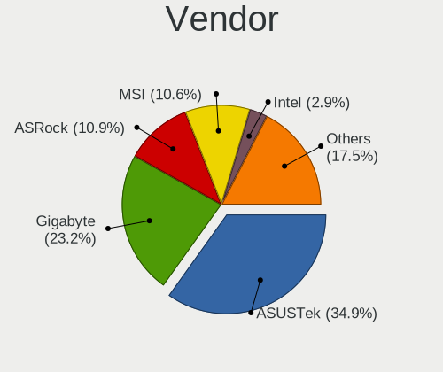
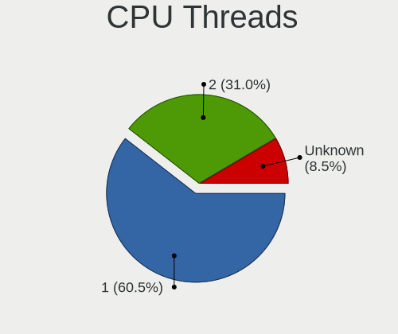
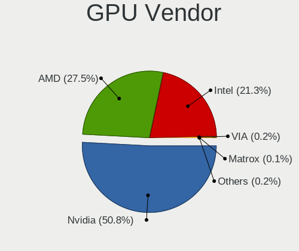
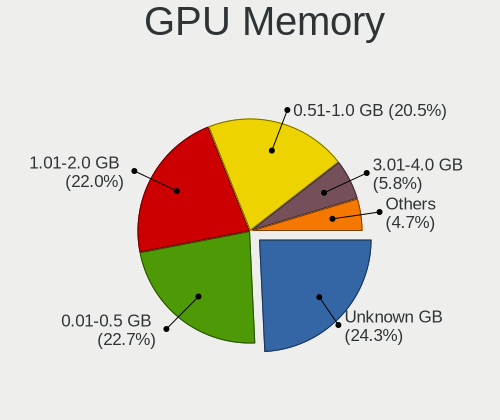
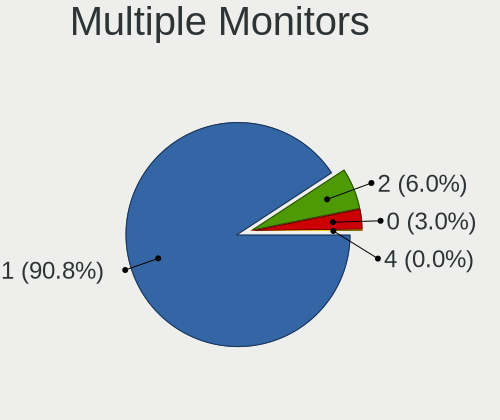
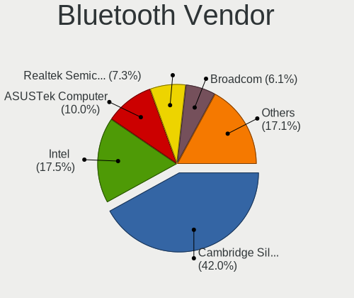
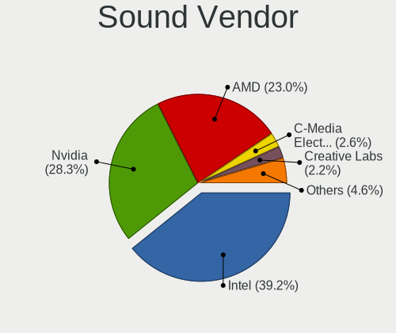

ROSA - Tested Hardware & Statistics (Desktops)
----------------------------------------------

A project to collect tested hardware configurations for ROSA.

Anyone can contribute to this report by the [hw-probe](https://github.com/linuxhw/hw-probe) tool:

    sudo -E hw-probe -all -upload

Please contribute! Especially if your hardware is rare.

Contents
--------

* [ Test Cases ](#test-cases)

* [ System ](#system)
  - [ OS                       ](#os)
  - [ OS Family                ](#os-family)
  - [ Kernel                   ](#kernel)
  - [ Kernel Family            ](#kernel-family)
  - [ Kernel Major Ver.        ](#kernel-major-ver)
  - [ Arch                     ](#arch)
  - [ DE                       ](#de)
  - [ Display Server           ](#display-server)
  - [ Display Manager          ](#display-manager)
  - [ OS Lang                  ](#os-lang)
  - [ Boot Mode                ](#boot-mode)
  - [ Filesystem               ](#filesystem)
  - [ Part. scheme             ](#part-scheme)
  - [ Dual Boot with Linux/BSD ](#dual-boot-with-linuxbsd)
  - [ Dual Boot (Win)          ](#dual-boot-win)

* [ Board ](#board)
  - [ Vendor                   ](#vendor)
  - [ Model                    ](#model)
  - [ Model Family             ](#model-family)
  - [ MFG Year                 ](#mfg-year)
  - [ Form Factor              ](#form-factor)
  - [ Secure Boot              ](#secure-boot)
  - [ Coreboot                 ](#coreboot)
  - [ RAM Size                 ](#ram-size)
  - [ RAM Used                 ](#ram-used)
  - [ Total Drives             ](#total-drives)
  - [ Has CD-ROM               ](#has-cd-rom)
  - [ Has Ethernet             ](#has-ethernet)
  - [ Has WiFi                 ](#has-wifi)
  - [ Has Bluetooth            ](#has-bluetooth)

* [ Location ](#location)
  - [ Country                  ](#country)
  - [ City                     ](#city)

* [ Drives ](#drives)
  - [ Drive Vendor             ](#drive-vendor)
  - [ Drive Model              ](#drive-model)
  - [ HDD Vendor               ](#hdd-vendor)
  - [ SSD Vendor               ](#ssd-vendor)
  - [ Drive Kind               ](#drive-kind)
  - [ Drive Connector          ](#drive-connector)
  - [ Drive Size               ](#drive-size)
  - [ Space Total              ](#space-total)
  - [ Space Used               ](#space-used)
  - [ Malfunc. Drives          ](#malfunc-drives)
  - [ Malfunc. Drive Vendor    ](#malfunc-drive-vendor)
  - [ Malfunc. HDD Vendor      ](#malfunc-hdd-vendor)
  - [ Malfunc. Drive Kind      ](#malfunc-drive-kind)
  - [ Failed Drives            ](#failed-drives)
  - [ Failed Drive Vendor      ](#failed-drive-vendor)
  - [ Drive Status             ](#drive-status)

* [ Storage controller ](#storage-controller)
  - [ Storage Vendor           ](#storage-vendor)
  - [ Storage Model            ](#storage-model)
  - [ Storage Kind             ](#storage-kind)

* [ Processor ](#processor)
  - [ CPU Vendor               ](#cpu-vendor)
  - [ CPU Model                ](#cpu-model)
  - [ CPU Model Family         ](#cpu-model-family)
  - [ CPU Cores                ](#cpu-cores)
  - [ CPU Sockets              ](#cpu-sockets)
  - [ CPU Threads              ](#cpu-threads)
  - [ CPU Op-Modes             ](#cpu-op-modes)
  - [ CPU Microcode            ](#cpu-microcode)
  - [ CPU Microarch            ](#cpu-microarch)

* [ Graphics ](#graphics)
  - [ GPU Vendor               ](#gpu-vendor)
  - [ GPU Model                ](#gpu-model)
  - [ GPU Combo                ](#gpu-combo)
  - [ GPU Driver               ](#gpu-driver)
  - [ GPU Memory               ](#gpu-memory)

* [ Monitor ](#monitor)
  - [ Monitor Vendor           ](#monitor-vendor)
  - [ Monitor Model            ](#monitor-model)
  - [ Monitor Resolution       ](#monitor-resolution)
  - [ Monitor Diagonal         ](#monitor-diagonal)
  - [ Monitor Width            ](#monitor-width)
  - [ Aspect Ratio             ](#aspect-ratio)
  - [ Monitor Area             ](#monitor-area)
  - [ Pixel Density            ](#pixel-density)
  - [ Multiple Monitors        ](#multiple-monitors)

* [ Network ](#network)
  - [ Net Controller Vendor    ](#net-controller-vendor)
  - [ Net Controller Model     ](#net-controller-model)
  - [ Wireless Vendor          ](#wireless-vendor)
  - [ Wireless Model           ](#wireless-model)
  - [ Ethernet Vendor          ](#ethernet-vendor)
  - [ Ethernet Model           ](#ethernet-model)
  - [ Net Controller Kind      ](#net-controller-kind)
  - [ Used Controller          ](#used-controller)
  - [ NICs                     ](#nics)
  - [ IPv6                     ](#ipv6)

* [ Bluetooth ](#bluetooth)
  - [ Bluetooth Vendor         ](#bluetooth-vendor)
  - [ Bluetooth Model          ](#bluetooth-model)

* [ Sound ](#sound)
  - [ Sound Vendor             ](#sound-vendor)
  - [ Sound Model              ](#sound-model)

* [ Memory ](#memory)
  - [ Memory Vendor            ](#memory-vendor)
  - [ Memory Model             ](#memory-model)
  - [ Memory Kind              ](#memory-kind)
  - [ Memory Form Factor       ](#memory-form-factor)
  - [ Memory Size              ](#memory-size)
  - [ Memory Speed             ](#memory-speed)

* [ Printers & scanners ](#printers--scanners)
  - [ Printer Vendor           ](#printer-vendor)
  - [ Printer Model            ](#printer-model)
  - [ Scanner Vendor           ](#scanner-vendor)
  - [ Scanner Model            ](#scanner-model)

* [ Camera ](#camera)
  - [ Camera Vendor            ](#camera-vendor)
  - [ Camera Model             ](#camera-model)

* [ Security ](#security)
  - [ Fingerprint Vendor       ](#fingerprint-vendor)
  - [ Fingerprint Model        ](#fingerprint-model)
  - [ Chipcard Vendor          ](#chipcard-vendor)
  - [ Chipcard Model           ](#chipcard-model)

* [ Unsupported ](#unsupported)
  - [ Unsupported Devices      ](#unsupported-devices)
  - [ Unsupported Device Types ](#unsupported-device-types)

Test Cases
----------

Total: 19559

| Vendor        | Model                       | Probe                                                      | Date         |
|---------------|-----------------------------|------------------------------------------------------------|--------------|
| Huanan        | X99-F8 NALEX                | [5c3c77a5a0](https://linux-hardware.org/?probe=5c3c77a5a0) | May 31, 2022 |
| Huanan        | X99-F8 NALEX                | [11d242c4f4](https://linux-hardware.org/?probe=11d242c4f4) | May 31, 2022 |
| ASUSTek       | H110M-A/M.2                 | [990cfd2d12](https://linux-hardware.org/?probe=990cfd2d12) | May 31, 2022 |
| Gigabyte      | P31-S3L                     | [329c96c5af](https://linux-hardware.org/?probe=329c96c5af) | May 31, 2022 |
| ASUSTek       | P8Z68-V GEN3                | [139f0688be](https://linux-hardware.org/?probe=139f0688be) | May 31, 2022 |
| Intel         | MAHOBAY                     | [2d6ef8ef23](https://linux-hardware.org/?probe=2d6ef8ef23) | May 31, 2022 |
| ASUSTek       | B85M-G                      | [451572720e](https://linux-hardware.org/?probe=451572720e) | May 31, 2022 |
| ASUSTek       | P5L-VM 1394                 | [5f44d47258](https://linux-hardware.org/?probe=5f44d47258) | May 31, 2022 |
| ASUSTek       | P8Z77-V LX                  | [0368b3543a](https://linux-hardware.org/?probe=0368b3543a) | May 31, 2022 |
| Gigabyte      | H77-DS3H                    | [d593c93e62](https://linux-hardware.org/?probe=d593c93e62) | May 30, 2022 |
| Gigabyte      | EP45C-DS3R                  | [dc6dbe40d9](https://linux-hardware.org/?probe=dc6dbe40d9) | May 30, 2022 |
| Huanan        | X99-F8 NALEX                | [d6de670b16](https://linux-hardware.org/?probe=d6de670b16) | May 30, 2022 |
| Dell          | 0Y5DDC A00                  | [1a67c11533](https://linux-hardware.org/?probe=1a67c11533) | May 30, 2022 |
| ASUSTek       | F1A75-M-PRO R2.0            | [070e59ce1e](https://linux-hardware.org/?probe=070e59ce1e) | May 30, 2022 |
| Intel         | MAHOBAY                     | [90c386e917](https://linux-hardware.org/?probe=90c386e917) | May 30, 2022 |
| ASUSTek       | VM40B                       | [7ca55e50b4](https://linux-hardware.org/?probe=7ca55e50b4) | May 30, 2022 |
| Intel         | DH55TC AAE70932-204         | [774da6cf18](https://linux-hardware.org/?probe=774da6cf18) | May 30, 2022 |
| ASUSTek       | ROG STRIX Z590-F GAMING ... | [f1ed3c6a46](https://linux-hardware.org/?probe=f1ed3c6a46) | May 30, 2022 |
| Lenovo        | 3129 SDK0J40679 WIN 3273... | [0314182c7f](https://linux-hardware.org/?probe=0314182c7f) | May 29, 2022 |
| Gigabyte      | G31M-S2C                    | [458bf7fd6d](https://linux-hardware.org/?probe=458bf7fd6d) | May 29, 2022 |
| ASUSTek       | PRIME A320M-R               | [70e20c1143](https://linux-hardware.org/?probe=70e20c1143) | May 29, 2022 |
| Gigabyte      | B250-HD3-CF                 | [75d42068ac](https://linux-hardware.org/?probe=75d42068ac) | May 29, 2022 |
| Gigabyte      | B250-HD3-CF                 | [f4a35d313c](https://linux-hardware.org/?probe=f4a35d313c) | May 29, 2022 |
| ASUSTek       | ROG STRIX Z590-F GAMING ... | [bcc7398945](https://linux-hardware.org/?probe=bcc7398945) | May 29, 2022 |
| ASUSTek       | P5KPL-AM IN/ROEM/SI         | [4647f374ee](https://linux-hardware.org/?probe=4647f374ee) | May 28, 2022 |
| ASUSTek       | TUF B450M-PRO GAMING        | [7e68528d56](https://linux-hardware.org/?probe=7e68528d56) | May 28, 2022 |
| Gigabyte      | 965P-S3                     | [2058a25c1e](https://linux-hardware.org/?probe=2058a25c1e) | May 28, 2022 |
| Intel         | X79 V2.72B                  | [15d19c724b](https://linux-hardware.org/?probe=15d19c724b) | May 28, 2022 |
| Gigabyte      | AB350M-DS3H V2-CF           | [c7eceb86c2](https://linux-hardware.org/?probe=c7eceb86c2) | May 28, 2022 |
| ASRock        | H87 Pro4                    | [c2bbd20120](https://linux-hardware.org/?probe=c2bbd20120) | May 28, 2022 |
| MACHINIST     | X99-K9 V2.0                 | [6c8e83728c](https://linux-hardware.org/?probe=6c8e83728c) | May 28, 2022 |
| MACHINIST     | X99-K9 V2.0                 | [11bdd69dc0](https://linux-hardware.org/?probe=11bdd69dc0) | May 28, 2022 |
| ASUSTek       | P8H61                       | [45ec66aa68](https://linux-hardware.org/?probe=45ec66aa68) | May 28, 2022 |
| Intel         | X79 V2.72B                  | [a1a4ad8594](https://linux-hardware.org/?probe=a1a4ad8594) | May 28, 2022 |
| MSI           | B450-A PRO                  | [a634794de3](https://linux-hardware.org/?probe=a634794de3) | May 28, 2022 |
| ASRock        | H110M-HDV R3.0              | [2540080e55](https://linux-hardware.org/?probe=2540080e55) | May 28, 2022 |
| Gigabyte      | GA-870A-USB3                | [f61c44c7b4](https://linux-hardware.org/?probe=f61c44c7b4) | May 28, 2022 |
| Gigabyte      | X570 GAMING X               | [2dba625d78](https://linux-hardware.org/?probe=2dba625d78) | May 28, 2022 |
| Acer          | Veriton X2665G              | [b07be0c2aa](https://linux-hardware.org/?probe=b07be0c2aa) | May 27, 2022 |
| ASUSTek       | PRIME A320M-R               | [93de227774](https://linux-hardware.org/?probe=93de227774) | May 27, 2022 |
| Dell          | 0Y5DDC A00                  | [e5dd5ddffe](https://linux-hardware.org/?probe=e5dd5ddffe) | May 27, 2022 |
| MSI           | MPG X570 GAMING PRO CARB... | [2cca2a7979](https://linux-hardware.org/?probe=2cca2a7979) | May 27, 2022 |
| HP            | 0B54h D                     | [d36988a09b](https://linux-hardware.org/?probe=d36988a09b) | May 26, 2022 |
| ASRock        | B85M Pro3                   | [661f30003c](https://linux-hardware.org/?probe=661f30003c) | May 26, 2022 |
| Intel         | DH55TC AAE70932-204         | [63c6e6a359](https://linux-hardware.org/?probe=63c6e6a359) | May 26, 2022 |
| ASUSTek       | H87-PLUS                    | [b3abdcf25f](https://linux-hardware.org/?probe=b3abdcf25f) | May 26, 2022 |
| Gigabyte      | P61A-D3                     | [2ec61142d0](https://linux-hardware.org/?probe=2ec61142d0) | May 26, 2022 |
| ASUSTek       | P8H77-M                     | [a34b43d64c](https://linux-hardware.org/?probe=a34b43d64c) | May 25, 2022 |
| Gigabyte      | P75-D3                      | [becf8cce19](https://linux-hardware.org/?probe=becf8cce19) | May 25, 2022 |
| Acer          | Aspire TC-705               | [57bd3c5501](https://linux-hardware.org/?probe=57bd3c5501) | May 24, 2022 |
| ASUSTek       | ROG STRIX B550-I GAMING     | [f680d813d7](https://linux-hardware.org/?probe=f680d813d7) | May 24, 2022 |
| ASRock        | N68-S3 UCC                  | [068b759d6e](https://linux-hardware.org/?probe=068b759d6e) | May 24, 2022 |
| HP            | 0B54h D                     | [9dc982847a](https://linux-hardware.org/?probe=9dc982847a) | May 24, 2022 |
| Gigabyte      | A320M-H-CF                  | [13c83f5c47](https://linux-hardware.org/?probe=13c83f5c47) | May 23, 2022 |
| Gigabyte      | B450M DS3H-CF               | [6d2738eb29](https://linux-hardware.org/?probe=6d2738eb29) | May 23, 2022 |
| ASUSTek       | C60M1-I                     | [169d96b73b](https://linux-hardware.org/?probe=169d96b73b) | May 23, 2022 |
| ASUSTek       | Z87-A                       | [861da6e999](https://linux-hardware.org/?probe=861da6e999) | May 23, 2022 |
| Gigabyte      | H55M-USB3                   | [08e7d1f0d2](https://linux-hardware.org/?probe=08e7d1f0d2) | May 22, 2022 |
| ASUSTek       | M4A88TD-V EVO/USB3          | [ed2bf9256c](https://linux-hardware.org/?probe=ed2bf9256c) | May 22, 2022 |
| Intel         | X79                         | [904bf5297c](https://linux-hardware.org/?probe=904bf5297c) | May 22, 2022 |
| Unknown       | Intel X79                   | [52d19fdb12](https://linux-hardware.org/?probe=52d19fdb12) | May 22, 2022 |
| ASRock        | B550M-HDV                   | [b64b85418b](https://linux-hardware.org/?probe=b64b85418b) | May 22, 2022 |
| Gigabyte      | GA-MA770-UD3                | [58dcd147b7](https://linux-hardware.org/?probe=58dcd147b7) | May 22, 2022 |
| Gigabyte      | GA-MA770-UD3                | [aeb22efb30](https://linux-hardware.org/?probe=aeb22efb30) | May 22, 2022 |
| Gigabyte      | B365M DS3H                  | [092f8be315](https://linux-hardware.org/?probe=092f8be315) | May 22, 2022 |
| ASUSTek       | P5KPL-AM IN/ROEM/SI         | [0e14154fc0](https://linux-hardware.org/?probe=0e14154fc0) | May 22, 2022 |
| ASUSTek       | P5KPL-AM IN/ROEM/SI         | [a94464dc7e](https://linux-hardware.org/?probe=a94464dc7e) | May 21, 2022 |
| Gigabyte      | B560M H                     | [193e7d05a0](https://linux-hardware.org/?probe=193e7d05a0) | May 20, 2022 |
| ASRock        | A320M-HDV R4.0              | [71797f9336](https://linux-hardware.org/?probe=71797f9336) | May 20, 2022 |
| ASUSTek       | H110M-K                     | [25cf1b1ec9](https://linux-hardware.org/?probe=25cf1b1ec9) | May 20, 2022 |
| Gigabyte      | GA-MA770-UD3                | [afce6e6cee](https://linux-hardware.org/?probe=afce6e6cee) | May 20, 2022 |
| ASUSTek       | P8H67-M PRO                 | [da744c49fd](https://linux-hardware.org/?probe=da744c49fd) | May 20, 2022 |
| ASUSTek       | M5A97 LE R2.0               | [696932f291](https://linux-hardware.org/?probe=696932f291) | May 20, 2022 |
| ASUSTek       | M5A97 LE R2.0               | [be0659ce93](https://linux-hardware.org/?probe=be0659ce93) | May 20, 2022 |
| Gigabyte      | GA-78LMT-S2P                | [73fdd642c6](https://linux-hardware.org/?probe=73fdd642c6) | May 19, 2022 |
| ASUSTek       | P6T WS PRO                  | [1064f07721](https://linux-hardware.org/?probe=1064f07721) | May 19, 2022 |
| ASUSTek       | ROG STRIX X570-E GAMING     | [63acfbdc55](https://linux-hardware.org/?probe=63acfbdc55) | May 18, 2022 |
| Gigabyte      | B365 HD3                    | [82bd3dbfe9](https://linux-hardware.org/?probe=82bd3dbfe9) | May 18, 2022 |
| Gigabyte      | H55-UD3H                    | [e766ad4581](https://linux-hardware.org/?probe=e766ad4581) | May 18, 2022 |
| ASUSTek       | P5E                         | [4038be4f49](https://linux-hardware.org/?probe=4038be4f49) | May 18, 2022 |
| Gigabyte      | AB350M-DS3H-CF              | [cc38925ca1](https://linux-hardware.org/?probe=cc38925ca1) | May 18, 2022 |
| Gigabyte      | E350N WIN8                  | [31923a075f](https://linux-hardware.org/?probe=31923a075f) | May 18, 2022 |
| Gigabyte      | P61A-D3                     | [dd4b8bf4e7](https://linux-hardware.org/?probe=dd4b8bf4e7) | May 18, 2022 |
| Gigabyte      | H61M-DS2                    | [01dc038814](https://linux-hardware.org/?probe=01dc038814) | May 18, 2022 |
| ASRock        | N68-S3 UCC                  | [5f2fb2e8bd](https://linux-hardware.org/?probe=5f2fb2e8bd) | May 17, 2022 |
| ASUSTek       | Z97M-PLUS                   | [a54f021132](https://linux-hardware.org/?probe=a54f021132) | May 17, 2022 |
| ASUSTek       | Z97M-PLUS                   | [5feb18b37b](https://linux-hardware.org/?probe=5feb18b37b) | May 17, 2022 |
| EPoX Compu... | nForce3 DDR: 8KDA3I Seri... | [4b38991c7a](https://linux-hardware.org/?probe=4b38991c7a) | May 17, 2022 |
| Foxconn       | 945 7MD Series              | [523af6afbd](https://linux-hardware.org/?probe=523af6afbd) | May 17, 2022 |
| MSI           | H310M PRO-VDH PLUS          | [7fe3dc4301](https://linux-hardware.org/?probe=7fe3dc4301) | May 17, 2022 |
| ASUSTek       | A68HM-K                     | [a3b4c84c89](https://linux-hardware.org/?probe=a3b4c84c89) | May 17, 2022 |
| ASUSTek       | P5L-VM 1394                 | [1589892eec](https://linux-hardware.org/?probe=1589892eec) | May 17, 2022 |
| ASUSTek       | A68HM-K                     | [a38bac0479](https://linux-hardware.org/?probe=a38bac0479) | May 17, 2022 |
| Gigabyte      | H67N-USB3-B3                | [8feeed71b7](https://linux-hardware.org/?probe=8feeed71b7) | May 17, 2022 |
| ASUSTek       | P5L-VM 1394                 | [aee504bd13](https://linux-hardware.org/?probe=aee504bd13) | May 17, 2022 |
| Gigabyte      | P61A-D3                     | [d495e3aa63](https://linux-hardware.org/?probe=d495e3aa63) | May 17, 2022 |
| Acer          | Aspire TC-705               | [b0873a64d2](https://linux-hardware.org/?probe=b0873a64d2) | May 16, 2022 |
| Gigabyte      | H81M-S2V                    | [9646d7027f](https://linux-hardware.org/?probe=9646d7027f) | May 16, 2022 |
| Gigabyte      | Z97-HD3                     | [2c91bb6c51](https://linux-hardware.org/?probe=2c91bb6c51) | May 16, 2022 |
| Foxconn       | A9DA                        | [ab3ac79470](https://linux-hardware.org/?probe=ab3ac79470) | May 16, 2022 |
| Gigabyte      | B450M S2H                   | [44da55727f](https://linux-hardware.org/?probe=44da55727f) | May 16, 2022 |
| Foxconn       | A9DA                        | [e950ffe8d9](https://linux-hardware.org/?probe=e950ffe8d9) | May 16, 2022 |
| ASUSTek       | P8H61-MX R2.0               | [45da577bc5](https://linux-hardware.org/?probe=45da577bc5) | May 15, 2022 |
| ECS           | BSWI-D2                     | [f5ad79fb60](https://linux-hardware.org/?probe=f5ad79fb60) | May 15, 2022 |
| MSI           | B450-A PRO                  | [e5121153f7](https://linux-hardware.org/?probe=e5121153f7) | May 15, 2022 |
| ASUSTek       | M5A97 PRO                   | [18cf20e9a2](https://linux-hardware.org/?probe=18cf20e9a2) | May 15, 2022 |
| ASUSTek       | M5A97 PRO                   | [15d32c7578](https://linux-hardware.org/?probe=15d32c7578) | May 15, 2022 |
| Gigabyte      | Z370M D3H-CF                | [eab1bcc17e](https://linux-hardware.org/?probe=eab1bcc17e) | May 15, 2022 |
| ASUSTek       | PRIME Z370-P                | [5fb1304e59](https://linux-hardware.org/?probe=5fb1304e59) | May 14, 2022 |
| Gigabyte      | F2A55M-S1                   | [ecacfd48de](https://linux-hardware.org/?probe=ecacfd48de) | May 14, 2022 |
| Gigabyte      | P61A-D3                     | [5abe5033c6](https://linux-hardware.org/?probe=5abe5033c6) | May 14, 2022 |
| ASRock        | G41M-VS2                    | [9cf93ac497](https://linux-hardware.org/?probe=9cf93ac497) | May 14, 2022 |
| ASRock        | B75M-DGS R2.0               | [1d61892cb0](https://linux-hardware.org/?probe=1d61892cb0) | May 14, 2022 |
| MSI           | B350M PRO-VDH               | [a8033573ef](https://linux-hardware.org/?probe=a8033573ef) | May 14, 2022 |
| Dell          | 02YYK5 A01                  | [a068dc57c8](https://linux-hardware.org/?probe=a068dc57c8) | May 13, 2022 |
| Gigabyte      | AB350-Gaming-CF             | [30085d6f41](https://linux-hardware.org/?probe=30085d6f41) | May 13, 2022 |
| Gigabyte      | X470 AORUS GAMING 7 WIFI... | [531749d46b](https://linux-hardware.org/?probe=531749d46b) | May 12, 2022 |
| Gigabyte      | F2A68HM-S1                  | [5674fc5620](https://linux-hardware.org/?probe=5674fc5620) | May 12, 2022 |
| ASUSTek       | H110-PLUS                   | [56b6d0f154](https://linux-hardware.org/?probe=56b6d0f154) | May 12, 2022 |
| ASRock        | H310CM-HDV                  | [319f70da4e](https://linux-hardware.org/?probe=319f70da4e) | May 12, 2022 |
| ASUSTek       | H110-PLUS                   | [cf7ae5c07b](https://linux-hardware.org/?probe=cf7ae5c07b) | May 12, 2022 |
| Gigabyte      | B550M S2H                   | [41c7fd7bcc](https://linux-hardware.org/?probe=41c7fd7bcc) | May 12, 2022 |
| ASUSTek       | PRIME B250M-PLUS            | [a4f4e7c199](https://linux-hardware.org/?probe=a4f4e7c199) | May 12, 2022 |
| ASUSTek       | H110M-R                     | [e4107f3e84](https://linux-hardware.org/?probe=e4107f3e84) | May 12, 2022 |
| MSI           | B450 TOMAHAWK               | [d14b68d592](https://linux-hardware.org/?probe=d14b68d592) | May 11, 2022 |
| ASRock        | B450 Gaming K4              | [a6873c7d7b](https://linux-hardware.org/?probe=a6873c7d7b) | May 11, 2022 |
| ASUSTek       | B75M-A                      | [70ef1387b3](https://linux-hardware.org/?probe=70ef1387b3) | May 11, 2022 |
| Fujitsu       | D3041-A1 S26361-D3041-A1    | [bc84347b65](https://linux-hardware.org/?probe=bc84347b65) | May 11, 2022 |
| ASRock        | FM2A68M-DG3+                | [4060102b0d](https://linux-hardware.org/?probe=4060102b0d) | May 11, 2022 |
| ASRock        | B365M-HDV                   | [06a97b74c2](https://linux-hardware.org/?probe=06a97b74c2) | May 11, 2022 |
| ASRock        | B365M-HDV                   | [e118437b55](https://linux-hardware.org/?probe=e118437b55) | May 11, 2022 |
| ASRock        | N68-S3 UCC                  | [083ee33b93](https://linux-hardware.org/?probe=083ee33b93) | May 11, 2022 |
| ASUSTek       | A68HM-K                     | [657c27be04](https://linux-hardware.org/?probe=657c27be04) | May 10, 2022 |
| Huanan        | X99 F8D V2.2                | [af98aacde1](https://linux-hardware.org/?probe=af98aacde1) | May 10, 2022 |
| MSI           | Z370 TOMAHAWK               | [89222d6d5a](https://linux-hardware.org/?probe=89222d6d5a) | May 10, 2022 |
| ASUSTek       | Q170T                       | [7b142a9bf8](https://linux-hardware.org/?probe=7b142a9bf8) | May 10, 2022 |
| MSI           | X99A SLI PLUS               | [d329ab7f27](https://linux-hardware.org/?probe=d329ab7f27) | May 10, 2022 |
| ASUSTek       | M4A88TD-V EVO/USB3          | [38838b0da0](https://linux-hardware.org/?probe=38838b0da0) | May 10, 2022 |
| ASUSTek       | P5L-VM 1394                 | [b0a089f59e](https://linux-hardware.org/?probe=b0a089f59e) | May 10, 2022 |
| ASRock        | FM2A55M-VG3+                | [43c813fe70](https://linux-hardware.org/?probe=43c813fe70) | May 10, 2022 |
| ASUSTek       | M5A78L-M LE/USB3            | [21b06f22da](https://linux-hardware.org/?probe=21b06f22da) | May 09, 2022 |
| ASUSTek       | M2N-VM HDMI                 | [28ef8fe01d](https://linux-hardware.org/?probe=28ef8fe01d) | May 09, 2022 |
| ASRock        | 960GM-GS3 FX                | [36fe76c490](https://linux-hardware.org/?probe=36fe76c490) | May 09, 2022 |
| Gigabyte      | Z87P-D3                     | [2a916e3eb5](https://linux-hardware.org/?probe=2a916e3eb5) | May 09, 2022 |
| ASRock        | H81M-ITX                    | [7da59c1f4c](https://linux-hardware.org/?probe=7da59c1f4c) | May 09, 2022 |
| Acer          | Aspire TC-710 V:1.1         | [bc95d94be6](https://linux-hardware.org/?probe=bc95d94be6) | May 08, 2022 |
| Gigabyte      | P31-S3G                     | [98c00acfd0](https://linux-hardware.org/?probe=98c00acfd0) | May 08, 2022 |
| ASRock        | B560M Pro4                  | [c7e61a8776](https://linux-hardware.org/?probe=c7e61a8776) | May 08, 2022 |
| ASRock        | B560M Pro4                  | [b532438c73](https://linux-hardware.org/?probe=b532438c73) | May 08, 2022 |
| ASRock        | 960GM-GS3 FX                | [ee12f03755](https://linux-hardware.org/?probe=ee12f03755) | May 08, 2022 |
| Gigabyte      | B450M DS3H-CF               | [9127ce17dc](https://linux-hardware.org/?probe=9127ce17dc) | May 08, 2022 |
| MSI           | 970A-G43                    | [3338da03cc](https://linux-hardware.org/?probe=3338da03cc) | May 07, 2022 |
| Dell          | 0M858N A00                  | [a864f8a7c4](https://linux-hardware.org/?probe=a864f8a7c4) | May 07, 2022 |
| Gigabyte      | H77-DS3H                    | [7a595e57da](https://linux-hardware.org/?probe=7a595e57da) | May 07, 2022 |
| MSI           | MAG Z690 TOMAHAWK WIFI D... | [38c0346cf7](https://linux-hardware.org/?probe=38c0346cf7) | May 07, 2022 |
| Gigabyte      | B450M DS3H-CF               | [4f8a4f6d1d](https://linux-hardware.org/?probe=4f8a4f6d1d) | May 07, 2022 |
| Gigabyte      | EP45-UD3LR                  | [1f6748931c](https://linux-hardware.org/?probe=1f6748931c) | May 07, 2022 |
| ASUSTek       | H110M-R                     | [720be5218f](https://linux-hardware.org/?probe=720be5218f) | May 07, 2022 |
| ASUSTek       | PRIME B450M-K II            | [f115d870eb](https://linux-hardware.org/?probe=f115d870eb) | May 07, 2022 |
| ASUSTek       | P5QL-E                      | [7847a3091b](https://linux-hardware.org/?probe=7847a3091b) | May 07, 2022 |
| Acer          | Aspire TC-391               | [ec090fb244](https://linux-hardware.org/?probe=ec090fb244) | May 07, 2022 |
| Huanan        | X99-F8                      | [f9699aaa3e](https://linux-hardware.org/?probe=f9699aaa3e) | May 05, 2022 |
| MSI           | H410I PRO WIFI              | [bc1d89fabc](https://linux-hardware.org/?probe=bc1d89fabc) | May 05, 2022 |
| MSI           | A520M-A PRO                 | [ab6c74c421](https://linux-hardware.org/?probe=ab6c74c421) | May 05, 2022 |
| Gigabyte      | IMB1900N                    | [8ed8cb17d5](https://linux-hardware.org/?probe=8ed8cb17d5) | May 04, 2022 |
| MSI           | 970A-G43                    | [8b6588eada](https://linux-hardware.org/?probe=8b6588eada) | May 04, 2022 |
| Gigabyte      | B75-D3V                     | [08bd0f2662](https://linux-hardware.org/?probe=08bd0f2662) | May 04, 2022 |
| Gigabyte      | P67A-D3-B3                  | [506ffac23c](https://linux-hardware.org/?probe=506ffac23c) | May 04, 2022 |
| ASUSTek       | H81M-K                      | [c25a0f8526](https://linux-hardware.org/?probe=c25a0f8526) | May 04, 2022 |
| Lenovo        | ThinkCentre M55 8795B1G     | [295fe2b588](https://linux-hardware.org/?probe=295fe2b588) | May 04, 2022 |
| Lenovo        | ThinkCentre M55 8795B1G     | [b88ff00133](https://linux-hardware.org/?probe=b88ff00133) | May 04, 2022 |
| Unknown       | RS690-SB600                 | [a5a63d87df](https://linux-hardware.org/?probe=a5a63d87df) | May 04, 2022 |
| MSI           | B450M MORTAR MAX            | [5e1f408239](https://linux-hardware.org/?probe=5e1f408239) | May 04, 2022 |
| ASUSTek       | M5A97 EVO R2.0              | [256b7b7658](https://linux-hardware.org/?probe=256b7b7658) | May 03, 2022 |
| Unknown       | RS690-SB600                 | [cdda671470](https://linux-hardware.org/?probe=cdda671470) | May 03, 2022 |
| Gigabyte      | H57M-USB3                   | [2f061f5e18](https://linux-hardware.org/?probe=2f061f5e18) | May 03, 2022 |
| ASRock        | B450 Gaming K4              | [2010f5f8cc](https://linux-hardware.org/?probe=2010f5f8cc) | May 03, 2022 |
| ASUSTek       | PRIME X370-PRO              | [aed319bae8](https://linux-hardware.org/?probe=aed319bae8) | May 03, 2022 |
| Unknown       | Unknown                     | [755bcaa97c](https://linux-hardware.org/?probe=755bcaa97c) | May 03, 2022 |
| ABIT          | F-I90HD                     | [a76a1e15a0](https://linux-hardware.org/?probe=a76a1e15a0) | May 03, 2022 |
| Gigabyte      | H110M-S2V-CF                | [73358636b6](https://linux-hardware.org/?probe=73358636b6) | May 03, 2022 |
| ASUSTek       | PRIME X370-PRO              | [fd61db399b](https://linux-hardware.org/?probe=fd61db399b) | May 03, 2022 |
| MSI           | B550-A PRO                  | [6b961e699a](https://linux-hardware.org/?probe=6b961e699a) | May 03, 2022 |
| ASUSTek       | B150-PRO D3                 | [1620040802](https://linux-hardware.org/?probe=1620040802) | May 02, 2022 |
| Gigabyte      | 970A-DS3P                   | [68a966265b](https://linux-hardware.org/?probe=68a966265b) | May 02, 2022 |
| MSI           | NF520T-C35                  | [626f45376a](https://linux-hardware.org/?probe=626f45376a) | May 02, 2022 |
| Huanan        | X79 INTEL (INTEL Xeon E5... | [f776c43073](https://linux-hardware.org/?probe=f776c43073) | May 02, 2022 |
| Gigabyte      | GA-78LMT-S2P                | [e0983f2b8c](https://linux-hardware.org/?probe=e0983f2b8c) | May 02, 2022 |
| ASRock        | B450M-HDV                   | [1e0e1acbd3](https://linux-hardware.org/?probe=1e0e1acbd3) | May 02, 2022 |
| Gigabyte      | H77N-WIFI                   | [fa46d0866b](https://linux-hardware.org/?probe=fa46d0866b) | May 02, 2022 |
| MSI           | Z390-A PRO                  | [f77de23642](https://linux-hardware.org/?probe=f77de23642) | May 02, 2022 |
| Gigabyte      | A320M-S2H V2-CF             | [c19f2858f0](https://linux-hardware.org/?probe=c19f2858f0) | May 01, 2022 |
| ASUSTek       | SABERTOOTH 990FX R2.0       | [8532d4b88f](https://linux-hardware.org/?probe=8532d4b88f) | May 01, 2022 |
| ASRock        | Z270 Gaming K4              | [c497e3c5a9](https://linux-hardware.org/?probe=c497e3c5a9) | May 01, 2022 |
| ASUSTek       | M5A78L-M LE/USB3            | [57d77dbfdd](https://linux-hardware.org/?probe=57d77dbfdd) | May 01, 2022 |
| Gigabyte      | H310M S2P                   | [c5303ab540](https://linux-hardware.org/?probe=c5303ab540) | May 01, 2022 |
| ECS           | H61H2-M13                   | [c7ac6032f5](https://linux-hardware.org/?probe=c7ac6032f5) | May 01, 2022 |
| Acer          | Aspire TC-705               | [0e4b8cfff4](https://linux-hardware.org/?probe=0e4b8cfff4) | May 01, 2022 |
| Lenovo        | H420                        | [2f22f32e19](https://linux-hardware.org/?probe=2f22f32e19) | May 01, 2022 |
| MSI           | 760GM-P23                   | [95d109769d](https://linux-hardware.org/?probe=95d109769d) | May 01, 2022 |
| ASUSTek       | P8H61-M LX3 R2.0            | [8538f5cbeb](https://linux-hardware.org/?probe=8538f5cbeb) | May 01, 2022 |
| Gigabyte      | F2A68HM-S1                  | [23a77acbe8](https://linux-hardware.org/?probe=23a77acbe8) | Apr 30, 2022 |
| ASRock        | B560 Pro4                   | [a788b08450](https://linux-hardware.org/?probe=a788b08450) | Apr 30, 2022 |
| ASUSTek       | PRIME Z490-P                | [b6658c2ada](https://linux-hardware.org/?probe=b6658c2ada) | Apr 30, 2022 |
| ASUSTek       | CROSSHAIR VI HERO           | [5220d21e84](https://linux-hardware.org/?probe=5220d21e84) | Apr 30, 2022 |
| ASUSTek       | H81M-K                      | [d5d92c2890](https://linux-hardware.org/?probe=d5d92c2890) | Apr 30, 2022 |
| ASUSTek       | PRIME B450M-A               | [a53000596e](https://linux-hardware.org/?probe=a53000596e) | Apr 30, 2022 |
| Gigabyte      | H610I DDR4                  | [b9ee954651](https://linux-hardware.org/?probe=b9ee954651) | Apr 30, 2022 |
| Gigabyte      | H610I DDR4                  | [ead878ad96](https://linux-hardware.org/?probe=ead878ad96) | Apr 29, 2022 |
| ASUSTek       | M4N68T                      | [8113a96dff](https://linux-hardware.org/?probe=8113a96dff) | Apr 29, 2022 |
| Lite-On       | 08FCh E01                   | [876d70350c](https://linux-hardware.org/?probe=876d70350c) | Apr 29, 2022 |
| Gigabyte      | X570 AORUS ULTRA            | [d3872db37e](https://linux-hardware.org/?probe=d3872db37e) | Apr 29, 2022 |
| Gigabyte      | B550 AORUS PRO              | [9686556653](https://linux-hardware.org/?probe=9686556653) | Apr 29, 2022 |
| Gigabyte      | H55M-UD2H                   | [12e326fab8](https://linux-hardware.org/?probe=12e326fab8) | Apr 28, 2022 |
| ASUSTek       | CROSSHAIR VI HERO           | [c4fc81307d](https://linux-hardware.org/?probe=c4fc81307d) | Apr 28, 2022 |
| Gigabyte      | A320M-S2H V2-CF             | [02b4a9bd72](https://linux-hardware.org/?probe=02b4a9bd72) | Apr 28, 2022 |
| ASUSTek       | P5KPL-AM                    | [7669e97557](https://linux-hardware.org/?probe=7669e97557) | Apr 28, 2022 |
| ECS           | A780LM-M2                   | [ae8fabafb3](https://linux-hardware.org/?probe=ae8fabafb3) | Apr 28, 2022 |
| Gigabyte      | B450 GAMING X               | [155297b5da](https://linux-hardware.org/?probe=155297b5da) | Apr 27, 2022 |
| ASUSTek       | PRIME H570-PLUS             | [217e24d827](https://linux-hardware.org/?probe=217e24d827) | Apr 27, 2022 |
| Gigabyte      | F2A68HM-S1                  | [e1f76d9f38](https://linux-hardware.org/?probe=e1f76d9f38) | Apr 27, 2022 |
| MSI           | B85M-P33                    | [b18d0beead](https://linux-hardware.org/?probe=b18d0beead) | Apr 27, 2022 |
| Gigabyte      | H61M-S1                     | [32fd06793f](https://linux-hardware.org/?probe=32fd06793f) | Apr 27, 2022 |
| Biostar       | H410MH S2                   | [2670b60f3c](https://linux-hardware.org/?probe=2670b60f3c) | Apr 27, 2022 |
| Pegatron      | 2A73h                       | [a756a0148d](https://linux-hardware.org/?probe=a756a0148d) | Apr 27, 2022 |
| ASUSTek       | PRIME H510M-K               | [67c03df307](https://linux-hardware.org/?probe=67c03df307) | Apr 27, 2022 |
| MSI           | H510M-A PRO                 | [7630e097d9](https://linux-hardware.org/?probe=7630e097d9) | Apr 27, 2022 |
| ASUSTek       | M5A78L-M LX3                | [9fc1163ba6](https://linux-hardware.org/?probe=9fc1163ba6) | Apr 26, 2022 |
| ASUSTek       | PRIME B450M-K               | [458eb421b9](https://linux-hardware.org/?probe=458eb421b9) | Apr 26, 2022 |
| ASUSTek       | B85M-G                      | [a8934b94b8](https://linux-hardware.org/?probe=a8934b94b8) | Apr 26, 2022 |
| ASUSTek       | PRIME H510M-K               | [7e8c222029](https://linux-hardware.org/?probe=7e8c222029) | Apr 26, 2022 |
| ASRock        | B550M Pro4                  | [feea6c0d76](https://linux-hardware.org/?probe=feea6c0d76) | Apr 25, 2022 |
| Lenovo        | 3132 SDK0J40697 WIN 3305... | [c26bb7d11c](https://linux-hardware.org/?probe=c26bb7d11c) | Apr 25, 2022 |
| Gigabyte      | X570S AORUS MASTER          | [5ac12e226f](https://linux-hardware.org/?probe=5ac12e226f) | Apr 25, 2022 |
| Gigabyte      | Z390 UD                     | [f7290e5680](https://linux-hardware.org/?probe=f7290e5680) | Apr 25, 2022 |
| ASUSTek       | M5A78L-M LX3                | [5991a49238](https://linux-hardware.org/?probe=5991a49238) | Apr 25, 2022 |
| ASUSTek       | M2N-MX SE Plus              | [7c068a38f3](https://linux-hardware.org/?probe=7c068a38f3) | Apr 25, 2022 |
| ASUSTek       | H81M-C                      | [643eb9c031](https://linux-hardware.org/?probe=643eb9c031) | Apr 25, 2022 |
| ASUSTek       | H81M-PLUS                   | [4479bed84f](https://linux-hardware.org/?probe=4479bed84f) | Apr 25, 2022 |
| ASUSTek       | H81M-PLUS                   | [4fd4202535](https://linux-hardware.org/?probe=4fd4202535) | Apr 25, 2022 |
| ASUSTek       | P8H61-M LE                  | [9d244bbdcc](https://linux-hardware.org/?probe=9d244bbdcc) | Apr 24, 2022 |
| Gigabyte      | H310M H                     | [5c94950753](https://linux-hardware.org/?probe=5c94950753) | Apr 24, 2022 |
| ASRock        | B550 Taichi                 | [12060212f8](https://linux-hardware.org/?probe=12060212f8) | Apr 24, 2022 |
| Gigabyte      | X570S AORUS MASTER          | [fee9fe1263](https://linux-hardware.org/?probe=fee9fe1263) | Apr 24, 2022 |
| ASRock        | B560 Pro4                   | [734fbc9db6](https://linux-hardware.org/?probe=734fbc9db6) | Apr 24, 2022 |
| Acer          | Aspire TC-390               | [69a7263b5a](https://linux-hardware.org/?probe=69a7263b5a) | Apr 24, 2022 |
| Gigabyte      | B560M H                     | [fa2c44bf71](https://linux-hardware.org/?probe=fa2c44bf71) | Apr 24, 2022 |
| Gigabyte      | H61M-S1                     | [0ca4241f02](https://linux-hardware.org/?probe=0ca4241f02) | Apr 23, 2022 |
| ASUSTek       | M5A97 R2.0                  | [d68949ed95](https://linux-hardware.org/?probe=d68949ed95) | Apr 23, 2022 |
| ASUSTek       | AM1I-A                      | [b041f2cde0](https://linux-hardware.org/?probe=b041f2cde0) | Apr 23, 2022 |
| Gigabyte      | 990XA-UD3                   | [d01bcb69ea](https://linux-hardware.org/?probe=d01bcb69ea) | Apr 23, 2022 |
| Gigabyte      | E2500N                      | [92784cd549](https://linux-hardware.org/?probe=92784cd549) | Apr 23, 2022 |
| ASUSTek       | PRIME H310M-R R2.0          | [661b8cc46d](https://linux-hardware.org/?probe=661b8cc46d) | Apr 23, 2022 |
| ASRock        | H410M-HVS                   | [5357a4e149](https://linux-hardware.org/?probe=5357a4e149) | Apr 23, 2022 |
| ASRock        | H410M-HVS                   | [97f2c666ff](https://linux-hardware.org/?probe=97f2c666ff) | Apr 23, 2022 |
| ASRock        | QC5000M                     | [b9341a0704](https://linux-hardware.org/?probe=b9341a0704) | Apr 23, 2022 |
| ASUSTek       | P8H61-M LX3 R2.0            | [1d8b10f388](https://linux-hardware.org/?probe=1d8b10f388) | Apr 22, 2022 |
| MSI           | MS-7267                     | [d0d0dc78d5](https://linux-hardware.org/?probe=d0d0dc78d5) | Apr 22, 2022 |
| ASUSTek       | M5A78L-M/USB3               | [4033356f39](https://linux-hardware.org/?probe=4033356f39) | Apr 22, 2022 |
| ASRock        | H110M-DVS R2.0              | [f682ddf4ed](https://linux-hardware.org/?probe=f682ddf4ed) | Apr 22, 2022 |
| MSI           | B250M BAZOOKA               | [36386a3115](https://linux-hardware.org/?probe=36386a3115) | Apr 22, 2022 |
| Gigabyte      | B360M H                     | [ec4003c77d](https://linux-hardware.org/?probe=ec4003c77d) | Apr 22, 2022 |
| ASUSTek       | H110M-K                     | [c80263e88a](https://linux-hardware.org/?probe=c80263e88a) | Apr 22, 2022 |
| Gigabyte      | A320M-S2H-CF                | [4bb685c310](https://linux-hardware.org/?probe=4bb685c310) | Apr 22, 2022 |
| ASUSTek       | P5B                         | [00f8e07a8d](https://linux-hardware.org/?probe=00f8e07a8d) | Apr 22, 2022 |
| Dell          | 0T10XW A00                  | [508d41c597](https://linux-hardware.org/?probe=508d41c597) | Apr 22, 2022 |
| ASUSTek       | Z87-A                       | [ef07d8d824](https://linux-hardware.org/?probe=ef07d8d824) | Apr 22, 2022 |
| Colorful T... | C.H81A-BTC V20              | [1f0dab0203](https://linux-hardware.org/?probe=1f0dab0203) | Apr 22, 2022 |
| Dell          | 0T10XW A00                  | [de27893552](https://linux-hardware.org/?probe=de27893552) | Apr 22, 2022 |
| ASUSTek       | P8H77-M                     | [1b5a8b5542](https://linux-hardware.org/?probe=1b5a8b5542) | Apr 21, 2022 |
| Gigabyte      | 970A-UD3P                   | [98eb9909d0](https://linux-hardware.org/?probe=98eb9909d0) | Apr 21, 2022 |
| Dell          | 02X6YT A01                  | [f672bdbf0e](https://linux-hardware.org/?probe=f672bdbf0e) | Apr 21, 2022 |
| KLLISRE       | X99-B5 V1.1                 | [14e557ad2d](https://linux-hardware.org/?probe=14e557ad2d) | Apr 21, 2022 |
| MSI           | 0A48                        | [1e73c16d0c](https://linux-hardware.org/?probe=1e73c16d0c) | Apr 21, 2022 |
| Gigabyte      | H310M S2                    | [0f18c98ee7](https://linux-hardware.org/?probe=0f18c98ee7) | Apr 21, 2022 |
| Gigabyte      | H61M-DS2 DVI                | [8ed5a0f97a](https://linux-hardware.org/?probe=8ed5a0f97a) | Apr 21, 2022 |
| MSI           | Z97-G43 GAMING              | [a4d2dc6c95](https://linux-hardware.org/?probe=a4d2dc6c95) | Apr 21, 2022 |
| Gigabyte      | H110M-M2-CF                 | [089f66bac4](https://linux-hardware.org/?probe=089f66bac4) | Apr 20, 2022 |
| Gigabyte      | H310M H                     | [9a462cda5a](https://linux-hardware.org/?probe=9a462cda5a) | Apr 20, 2022 |
| Gigabyte      | 945GCM-S2L                  | [76bcd3a380](https://linux-hardware.org/?probe=76bcd3a380) | Apr 20, 2022 |
| Gigabyte      | P31-ES3G                    | [96e7ccb1b4](https://linux-hardware.org/?probe=96e7ccb1b4) | Apr 20, 2022 |
| Unknown       | RS690-SB600                 | [0cb86e267f](https://linux-hardware.org/?probe=0cb86e267f) | Apr 20, 2022 |
| ASUSTek       | PRIME B450M-K               | [f1881dec46](https://linux-hardware.org/?probe=f1881dec46) | Apr 20, 2022 |
| ASUSTek       | M5A78L-M/USB3               | [b09a55b7ad](https://linux-hardware.org/?probe=b09a55b7ad) | Apr 19, 2022 |
| HP            | 8437                        | [f359fffed7](https://linux-hardware.org/?probe=f359fffed7) | Apr 19, 2022 |
| Dell          | 02YYK5 A01                  | [a3bf1cf766](https://linux-hardware.org/?probe=a3bf1cf766) | Apr 19, 2022 |
| Huanan        | X79 V2.47                   | [7441d98b6a](https://linux-hardware.org/?probe=7441d98b6a) | Apr 19, 2022 |
| ASUSTek       | H61M-K                      | [4fd2fa24e4](https://linux-hardware.org/?probe=4fd2fa24e4) | Apr 19, 2022 |
| MSI           | MS-7388                     | [2d133cd746](https://linux-hardware.org/?probe=2d133cd746) | Apr 19, 2022 |
| Gigabyte      | H77N-WIFI                   | [80950d86dc](https://linux-hardware.org/?probe=80950d86dc) | Apr 19, 2022 |
| Gigabyte      | B250M-D3H-CF                | [72972fdcd8](https://linux-hardware.org/?probe=72972fdcd8) | Apr 19, 2022 |
| ASUSTek       | M5A78L-M LX                 | [10f79ec4bc](https://linux-hardware.org/?probe=10f79ec4bc) | Apr 19, 2022 |
| MSI           | Z97-G43 GAMING              | [927a1a0b8d](https://linux-hardware.org/?probe=927a1a0b8d) | Apr 18, 2022 |
| MSI           | Z390-A PRO                  | [3ebe403371](https://linux-hardware.org/?probe=3ebe403371) | Apr 18, 2022 |
| ASUSTek       | H97M-PLUS                   | [71ace683c7](https://linux-hardware.org/?probe=71ace683c7) | Apr 18, 2022 |
| ASUSTek       | M4A88T-I DELUXE             | [24d5e6293f](https://linux-hardware.org/?probe=24d5e6293f) | Apr 18, 2022 |
| Acer          | RS780HVF                    | [cfccb88227](https://linux-hardware.org/?probe=cfccb88227) | Apr 18, 2022 |
| Biostar       | A320MH                      | [9beb151bac](https://linux-hardware.org/?probe=9beb151bac) | Apr 18, 2022 |
| ASUSTek       | P5QL-E                      | [f5e7c2d5a1](https://linux-hardware.org/?probe=f5e7c2d5a1) | Apr 18, 2022 |
| Gigabyte      | M61PME-S2P                  | [a245e4681b](https://linux-hardware.org/?probe=a245e4681b) | Apr 17, 2022 |
| ASUSTek       | M4A785-M                    | [25526ee77d](https://linux-hardware.org/?probe=25526ee77d) | Apr 17, 2022 |
| MACHINIST     | B75 PRO V1.0                | [bc17af5881](https://linux-hardware.org/?probe=bc17af5881) | Apr 17, 2022 |
| ASUSTek       | P8Z77-V LX2                 | [a61fc6c54e](https://linux-hardware.org/?probe=a61fc6c54e) | Apr 17, 2022 |
| ASUSTek       | TUF Gaming H570-PRO         | [94b69dd7bc](https://linux-hardware.org/?probe=94b69dd7bc) | Apr 17, 2022 |
| Gigabyte      | A320M-S2H V2-CF             | [1675f1f8a1](https://linux-hardware.org/?probe=1675f1f8a1) | Apr 17, 2022 |
| ASUSTek       | M5A99X EVO R2.0             | [211859a28f](https://linux-hardware.org/?probe=211859a28f) | Apr 17, 2022 |
| ASUSTek       | M5A99X EVO R2.0             | [ae0700c71c](https://linux-hardware.org/?probe=ae0700c71c) | Apr 17, 2022 |
| Gigabyte      | GA-MA69VM-S2                | [5aa8ec8c7e](https://linux-hardware.org/?probe=5aa8ec8c7e) | Apr 17, 2022 |
| Dell          | 02YYK5 A01                  | [f2e4d7052d](https://linux-hardware.org/?probe=f2e4d7052d) | Apr 16, 2022 |
| ASUSTek       | P8B75-M                     | [861c47b139](https://linux-hardware.org/?probe=861c47b139) | Apr 16, 2022 |
| ASUSTek       | H61M-K                      | [c2a4357527](https://linux-hardware.org/?probe=c2a4357527) | Apr 16, 2022 |
| ASUSTek       | H61M-K                      | [690867d18c](https://linux-hardware.org/?probe=690867d18c) | Apr 16, 2022 |
| Dell          | 0Y5DDC A00                  | [c9510b64e8](https://linux-hardware.org/?probe=c9510b64e8) | Apr 16, 2022 |
| Gigabyte      | M61PME-S2P                  | [cb64383c99](https://linux-hardware.org/?probe=cb64383c99) | Apr 16, 2022 |
| MSI           | Z270-A PRO                  | [55c72a253b](https://linux-hardware.org/?probe=55c72a253b) | Apr 16, 2022 |
| Gigabyte      | G1.Sniper A88X-CF           | [5971999c12](https://linux-hardware.org/?probe=5971999c12) | Apr 16, 2022 |
| ASUSTek       | PRIME H410M-R               | [c8146beb84](https://linux-hardware.org/?probe=c8146beb84) | Apr 16, 2022 |
| Gigabyte      | B450M DS3H V2               | [b097841482](https://linux-hardware.org/?probe=b097841482) | Apr 16, 2022 |
| Gigabyte      | EP31-DS3L                   | [13324a7aea](https://linux-hardware.org/?probe=13324a7aea) | Apr 15, 2022 |
| Gigabyte      | GA-MA785GM-US2H             | [3e7ec0a1bb](https://linux-hardware.org/?probe=3e7ec0a1bb) | Apr 15, 2022 |
| Gigabyte      | 970A-DS3P                   | [a01b211bb4](https://linux-hardware.org/?probe=a01b211bb4) | Apr 15, 2022 |
| Gigabyte      | H61M-S2PV                   | [83edb7e224](https://linux-hardware.org/?probe=83edb7e224) | Apr 15, 2022 |
| ASUSTek       | TUF B450-PRO GAMING         | [c58a4b9726](https://linux-hardware.org/?probe=c58a4b9726) | Apr 15, 2022 |
| MSI           | G31TM-P35                   | [f5aba83efe](https://linux-hardware.org/?probe=f5aba83efe) | Apr 15, 2022 |
| ASRock        | 960GM-GS3 FX                | [4cf37abd8d](https://linux-hardware.org/?probe=4cf37abd8d) | Apr 15, 2022 |
| Unknown       | Unknown                     | [c9c0498d72](https://linux-hardware.org/?probe=c9c0498d72) | Apr 15, 2022 |
| Unknown       | Unknown                     | [0735862439](https://linux-hardware.org/?probe=0735862439) | Apr 15, 2022 |
| MSI           | X470 GAMING PLUS            | [72af1b2afe](https://linux-hardware.org/?probe=72af1b2afe) | Apr 15, 2022 |
| ASUSTek       | TUF B450M-PLUS GAMING       | [0b5246a205](https://linux-hardware.org/?probe=0b5246a205) | Apr 15, 2022 |
| Gigabyte      | B450 AORUS ELITE            | [90559719b1](https://linux-hardware.org/?probe=90559719b1) | Apr 15, 2022 |
| ASUSTek       | PRIME B450M-A               | [2aac95b872](https://linux-hardware.org/?probe=2aac95b872) | Apr 15, 2022 |
| MSI           | Z390-A PRO                  | [1e26bb146f](https://linux-hardware.org/?probe=1e26bb146f) | Apr 14, 2022 |
| ASUSTek       | P5G41T-M LX                 | [3a0df7b88f](https://linux-hardware.org/?probe=3a0df7b88f) | Apr 14, 2022 |
| Dell          | 0YR541 A01                  | [f206c3667e](https://linux-hardware.org/?probe=f206c3667e) | Apr 14, 2022 |
| MSI           | Z370-A PRO                  | [d23bd1d06f](https://linux-hardware.org/?probe=d23bd1d06f) | Apr 14, 2022 |
| Gigabyte      | Z270P-D3-CF                 | [155e5c0ef5](https://linux-hardware.org/?probe=155e5c0ef5) | Apr 14, 2022 |
| Gigabyte      | Z390 UD                     | [5f4832051e](https://linux-hardware.org/?probe=5f4832051e) | Apr 14, 2022 |
| Dell          | 0C2XKD A00                  | [4ece5fe0b7](https://linux-hardware.org/?probe=4ece5fe0b7) | Apr 13, 2022 |
| Gigabyte      | GA-A55M-S2HP                | [68c70673ef](https://linux-hardware.org/?probe=68c70673ef) | Apr 13, 2022 |
| ASUSTek       | PRIME B550-PLUS             | [26a879283d](https://linux-hardware.org/?probe=26a879283d) | Apr 13, 2022 |
| ASUSTek       | P8Z77-V LX                  | [fcc2e4ef69](https://linux-hardware.org/?probe=fcc2e4ef69) | Apr 13, 2022 |
| MSI           | B360M PRO-VDH               | [33af7f8008](https://linux-hardware.org/?probe=33af7f8008) | Apr 13, 2022 |
| ASUSTek       | H97M-PLUS                   | [f420769b88](https://linux-hardware.org/?probe=f420769b88) | Apr 13, 2022 |
| Intel         | X79 V1.3                    | [7f3431a44d](https://linux-hardware.org/?probe=7f3431a44d) | Apr 13, 2022 |
| MSI           | C847IS-P33                  | [1d421862e1](https://linux-hardware.org/?probe=1d421862e1) | Apr 13, 2022 |
| Gigabyte      | Z68XP-UD3                   | [e517f230fa](https://linux-hardware.org/?probe=e517f230fa) | Apr 13, 2022 |
| ASUSTek       | M5A78L-M LX3                | [ce4447422d](https://linux-hardware.org/?probe=ce4447422d) | Apr 13, 2022 |
| ASRock        | B560 Steel Legend           | [2b96c77aae](https://linux-hardware.org/?probe=2b96c77aae) | Apr 12, 2022 |
| Gigabyte      | H97-HD3                     | [9d1d134940](https://linux-hardware.org/?probe=9d1d134940) | Apr 12, 2022 |
| ASUSTek       | P5K Premium                 | [93ea12ef83](https://linux-hardware.org/?probe=93ea12ef83) | Apr 12, 2022 |
| Gigabyte      | B75M-D2V                    | [07de6c8eb6](https://linux-hardware.org/?probe=07de6c8eb6) | Apr 12, 2022 |
| MSI           | X99A SLI PLUS               | [eae6b5ed56](https://linux-hardware.org/?probe=eae6b5ed56) | Apr 12, 2022 |
| Fujitsu       | D3062-A1 S26361-D3062-A1    | [6b70f0a384](https://linux-hardware.org/?probe=6b70f0a384) | Apr 12, 2022 |
| ASUSTek       | P8H61-M LE                  | [6273f8eefb](https://linux-hardware.org/?probe=6273f8eefb) | Apr 12, 2022 |
| ASRock        | A320M-DVS R4.0              | [0025682d7d](https://linux-hardware.org/?probe=0025682d7d) | Apr 12, 2022 |
| Gigabyte      | B450M DS3H-CF               | [d751a52423](https://linux-hardware.org/?probe=d751a52423) | Apr 11, 2022 |
| MSI           | Z390-A PRO                  | [259f72f743](https://linux-hardware.org/?probe=259f72f743) | Apr 11, 2022 |
| ASUSTek       | PRIME H270-PRO              | [5cc893af9c](https://linux-hardware.org/?probe=5cc893af9c) | Apr 11, 2022 |
| ASRock        | B450M Pro4-F                | [1dff7e3c31](https://linux-hardware.org/?probe=1dff7e3c31) | Apr 11, 2022 |
| ASUSTek       | M5A78L-M LE/USB3            | [816c91bfcd](https://linux-hardware.org/?probe=816c91bfcd) | Apr 11, 2022 |
| Intel         | Tiger Hill                  | [1fbea29754](https://linux-hardware.org/?probe=1fbea29754) | Apr 11, 2022 |
| ASRock        | N68-VGS3 FX                 | [292cc244de](https://linux-hardware.org/?probe=292cc244de) | Apr 11, 2022 |
| Gigabyte      | GA-870A-UD3                 | [d43f5778b1](https://linux-hardware.org/?probe=d43f5778b1) | Apr 11, 2022 |
| Gigabyte      | GA-970A-DS3                 | [a52c5e98af](https://linux-hardware.org/?probe=a52c5e98af) | Apr 11, 2022 |
| Gigabyte      | H77-DS3H                    | [cb60e697d1](https://linux-hardware.org/?probe=cb60e697d1) | Apr 11, 2022 |
| ASUSTek       | PRIME X370-PRO              | [1b2b5e921d](https://linux-hardware.org/?probe=1b2b5e921d) | Apr 11, 2022 |
| ASUSTek       | B85M-E                      | [95ae38af4e](https://linux-hardware.org/?probe=95ae38af4e) | Apr 11, 2022 |
| Gigabyte      | 970A-DS3P                   | [eb62b9de81](https://linux-hardware.org/?probe=eb62b9de81) | Apr 11, 2022 |
| Gigabyte      | Z390 UD                     | [ef0b36db62](https://linux-hardware.org/?probe=ef0b36db62) | Apr 11, 2022 |
| KLLISRE       | X99-B5 V1.1                 | [5c1d47d9c9](https://linux-hardware.org/?probe=5c1d47d9c9) | Apr 11, 2022 |
| ASRock        | A320M-DVS R4.0              | [5de4abca91](https://linux-hardware.org/?probe=5de4abca91) | Apr 11, 2022 |
| Gigabyte      | G41MT-S2P                   | [67018740b8](https://linux-hardware.org/?probe=67018740b8) | Apr 11, 2022 |
| Gigabyte      | B75-D3V                     | [ea939b5214](https://linux-hardware.org/?probe=ea939b5214) | Apr 10, 2022 |
| ASUSTek       | PRIME B450M-A               | [335125845e](https://linux-hardware.org/?probe=335125845e) | Apr 10, 2022 |
| Intel         | X99                         | [ecea2585e1](https://linux-hardware.org/?probe=ecea2585e1) | Apr 10, 2022 |
| ASUSTek       | PRIME H310M-K R2.0          | [5abfaa2b99](https://linux-hardware.org/?probe=5abfaa2b99) | Apr 10, 2022 |
| HP            | 3048h                       | [c55f6bc20c](https://linux-hardware.org/?probe=c55f6bc20c) | Apr 10, 2022 |
| MSI           | MPG Z390 GAMING EDGE AC     | [071e82f576](https://linux-hardware.org/?probe=071e82f576) | Apr 10, 2022 |
| Gigabyte      | M61PME-S2P                  | [f4b5ca3229](https://linux-hardware.org/?probe=f4b5ca3229) | Apr 10, 2022 |
| Gigabyte      | A320M-S2H V2-CF             | [63aaae3d92](https://linux-hardware.org/?probe=63aaae3d92) | Apr 10, 2022 |
| Gigabyte      | 945GCM-S2L                  | [8737781637](https://linux-hardware.org/?probe=8737781637) | Apr 10, 2022 |
| ASUSTek       | P8H77-V                     | [9014595f74](https://linux-hardware.org/?probe=9014595f74) | Apr 10, 2022 |
| ASUSTek       | PRIME B250M-A               | [43c15ac73b](https://linux-hardware.org/?probe=43c15ac73b) | Apr 09, 2022 |
| ECS           | H61H2-M13                   | [d19ae9b1d5](https://linux-hardware.org/?probe=d19ae9b1d5) | Apr 09, 2022 |
| ASUSTek       | H110M-C                     | [0326b913dd](https://linux-hardware.org/?probe=0326b913dd) | Apr 09, 2022 |
| ASRock        | P43DE3                      | [21eed63d16](https://linux-hardware.org/?probe=21eed63d16) | Apr 09, 2022 |
| Intel         | DP35DP AAD81073-206         | [b257e3cf76](https://linux-hardware.org/?probe=b257e3cf76) | Apr 09, 2022 |
| Gigabyte      | Z87P-D3                     | [9ea9a7e8ef](https://linux-hardware.org/?probe=9ea9a7e8ef) | Apr 09, 2022 |
| ASUSTek       | TUF B450M-PRO GAMING        | [457adc950f](https://linux-hardware.org/?probe=457adc950f) | Apr 09, 2022 |
| MSI           | X99A SLI PLUS               | [f0045560de](https://linux-hardware.org/?probe=f0045560de) | Apr 09, 2022 |
| Gigabyte      | 970A-DS3P                   | [ea4da8fb23](https://linux-hardware.org/?probe=ea4da8fb23) | Apr 09, 2022 |
| ASUSTek       | SABERTOOTH 990FX            | [bb210a31b5](https://linux-hardware.org/?probe=bb210a31b5) | Apr 09, 2022 |
| MSI           | B450M PRO-VDH MAX           | [09946e9edf](https://linux-hardware.org/?probe=09946e9edf) | Apr 09, 2022 |
| Gigabyte      | GA-MA785GM-US2H             | [387e498dfc](https://linux-hardware.org/?probe=387e498dfc) | Apr 09, 2022 |
| ASUSTek       | P8H61-M LE                  | [f2af37f520](https://linux-hardware.org/?probe=f2af37f520) | Apr 08, 2022 |
| ASRock        | H61M-S                      | [7f0b28837f](https://linux-hardware.org/?probe=7f0b28837f) | Apr 08, 2022 |
| ASRock        | N68C-S UCC                  | [be7a7cb25f](https://linux-hardware.org/?probe=be7a7cb25f) | Apr 08, 2022 |
| ASUSTek       | P5Q DELUXE                  | [8ab0db4e45](https://linux-hardware.org/?probe=8ab0db4e45) | Apr 08, 2022 |
| Acer          | Batman A01                  | [a102f85d9d](https://linux-hardware.org/?probe=a102f85d9d) | Apr 08, 2022 |
| Gigabyte      | B550M AORUS PRO-P           | [8986d7abf1](https://linux-hardware.org/?probe=8986d7abf1) | Apr 08, 2022 |
| Intel         | X79 (INTEL Xeon E5/Corei... | [263621f796](https://linux-hardware.org/?probe=263621f796) | Apr 08, 2022 |
| Gigabyte      | A320M-H-CF                  | [256bfd0a56](https://linux-hardware.org/?probe=256bfd0a56) | Apr 08, 2022 |
| MSI           | Z270 TOMAHAWK               | [4063e06462](https://linux-hardware.org/?probe=4063e06462) | Apr 07, 2022 |
| MSI           | Z87-G41 PC Mate             | [f1f94d1273](https://linux-hardware.org/?probe=f1f94d1273) | Apr 07, 2022 |
| MSI           | X370 GAMING PLUS            | [1c1830c301](https://linux-hardware.org/?probe=1c1830c301) | Apr 07, 2022 |
| ASUSTek       | H110M-K                     | [5d846383e8](https://linux-hardware.org/?probe=5d846383e8) | Apr 07, 2022 |
| Gigabyte      | GA-870A-UD3                 | [c049a4a3a5](https://linux-hardware.org/?probe=c049a4a3a5) | Apr 07, 2022 |
| Gigabyte      | X570 AORUS ULTRA            | [1b6a57154d](https://linux-hardware.org/?probe=1b6a57154d) | Apr 07, 2022 |
| ASRock        | H61M-VS                     | [92e741954d](https://linux-hardware.org/?probe=92e741954d) | Apr 07, 2022 |
| ASRock        | A520M Pro4                  | [28320f2e89](https://linux-hardware.org/?probe=28320f2e89) | Apr 07, 2022 |
| ASRock        | A520M Pro4                  | [1eecc7b812](https://linux-hardware.org/?probe=1eecc7b812) | Apr 07, 2022 |
| Gigabyte      | B450 AORUS ELITE            | [b925472f54](https://linux-hardware.org/?probe=b925472f54) | Apr 07, 2022 |
| Gigabyte      | B450 AORUS ELITE            | [3cb9a7fe16](https://linux-hardware.org/?probe=3cb9a7fe16) | Apr 07, 2022 |
| MSI           | B450 TOMAHAWK MAX           | [9f6e1da5bd](https://linux-hardware.org/?probe=9f6e1da5bd) | Apr 07, 2022 |
| Gigabyte      | AB350M-DS3H-CF              | [91c32e3a92](https://linux-hardware.org/?probe=91c32e3a92) | Apr 07, 2022 |
| ASUSTek       | P5BV-C/4L                   | [b1eba1811a](https://linux-hardware.org/?probe=b1eba1811a) | Apr 07, 2022 |
| ASUSTek       | P5G41C-M                    | [438a8f1001](https://linux-hardware.org/?probe=438a8f1001) | Apr 07, 2022 |
| Gigabyte      | B450M DS3H V2               | [c5b2bc51dc](https://linux-hardware.org/?probe=c5b2bc51dc) | Apr 06, 2022 |
| MSI           | B360-A PRO                  | [9db9a23b5d](https://linux-hardware.org/?probe=9db9a23b5d) | Apr 06, 2022 |
| MSI           | Z87I GAMING AC              | [f9596aa625](https://linux-hardware.org/?probe=f9596aa625) | Apr 06, 2022 |
| MSI           | G41M-P28                    | [b19249859b](https://linux-hardware.org/?probe=b19249859b) | Apr 06, 2022 |
| Biostar       | H61MHV2                     | [c14aa9ce1a](https://linux-hardware.org/?probe=c14aa9ce1a) | Apr 06, 2022 |
| Unknown       | H510I                       | [ff0188e03f](https://linux-hardware.org/?probe=ff0188e03f) | Apr 06, 2022 |
| Gigabyte      | B550M AORUS PRO-P           | [6e2067ac48](https://linux-hardware.org/?probe=6e2067ac48) | Apr 06, 2022 |
| ASUSTek       | K8N-VM                      | [ec2a4f7170](https://linux-hardware.org/?probe=ec2a4f7170) | Apr 06, 2022 |
| SYWZ          | S200 Series                 | [8c4c52cd9b](https://linux-hardware.org/?probe=8c4c52cd9b) | Apr 06, 2022 |
| ASUSTek       | P8B75-M                     | [39ab6f56fb](https://linux-hardware.org/?probe=39ab6f56fb) | Apr 06, 2022 |
| ASUSTek       | Z87-K                       | [41f654dc20](https://linux-hardware.org/?probe=41f654dc20) | Apr 06, 2022 |
| ASUSTek       | P8B75-M LE                  | [e5cdfad4e6](https://linux-hardware.org/?probe=e5cdfad4e6) | Apr 06, 2022 |
| Gigabyte      | B550M DS3H                  | [0cca11beab](https://linux-hardware.org/?probe=0cca11beab) | Apr 05, 2022 |
| Unknown       | RS690-SB600                 | [19ae42107e](https://linux-hardware.org/?probe=19ae42107e) | Apr 05, 2022 |
| Gigabyte      | GA-970A-DS3                 | [200d7fafb9](https://linux-hardware.org/?probe=200d7fafb9) | Apr 05, 2022 |
| ASRock        | B365M-HDV                   | [55622262b1](https://linux-hardware.org/?probe=55622262b1) | Apr 05, 2022 |
| Gigabyte      | 970A-DS3P                   | [1a090182c2](https://linux-hardware.org/?probe=1a090182c2) | Apr 05, 2022 |
| ASUSTek       | Z170-A                      | [68512f2b49](https://linux-hardware.org/?probe=68512f2b49) | Apr 05, 2022 |
| ASUSTek       | M5A78L-M LX3                | [b642303f8e](https://linux-hardware.org/?probe=b642303f8e) | Apr 05, 2022 |
| ASUSTek       | Z170-A                      | [a3d0521e54](https://linux-hardware.org/?probe=a3d0521e54) | Apr 05, 2022 |
| MSI           | G41M-P33 Combo              | [2290edabe7](https://linux-hardware.org/?probe=2290edabe7) | Apr 05, 2022 |
| ASUSTek       | B560M-A PRIME               | [1aff04b3de](https://linux-hardware.org/?probe=1aff04b3de) | Apr 05, 2022 |
| ASUSTek       | M2N-SLI DELUXE              | [6c25d1250d](https://linux-hardware.org/?probe=6c25d1250d) | Apr 05, 2022 |
| ASUSTek       | K8N-VM                      | [d914bc84e9](https://linux-hardware.org/?probe=d914bc84e9) | Apr 05, 2022 |
| Unknown       | Unknown                     | [d57ec60736](https://linux-hardware.org/?probe=d57ec60736) | Apr 05, 2022 |
| Gigabyte      | G31M-S2L                    | [7842a96018](https://linux-hardware.org/?probe=7842a96018) | Apr 05, 2022 |
| ASUSTek       | P5Q SE PLUS                 | [bb16122030](https://linux-hardware.org/?probe=bb16122030) | Apr 05, 2022 |
| Gigabyte      | F2A68HM-HD2                 | [cb0794850f](https://linux-hardware.org/?probe=cb0794850f) | Apr 05, 2022 |
| ASUSTek       | M3A78-EH                    | [4298b6c9dc](https://linux-hardware.org/?probe=4298b6c9dc) | Apr 05, 2022 |
| Unknown       | Unknown                     | [8f491b9fc2](https://linux-hardware.org/?probe=8f491b9fc2) | Apr 05, 2022 |
| ASUSTek       | P5Q DELUXE                  | [1c37d5b9ed](https://linux-hardware.org/?probe=1c37d5b9ed) | Apr 04, 2022 |
| Gigabyte      | X470 AORUS GAMING 7 WIFI... | [bc5ffea6a3](https://linux-hardware.org/?probe=bc5ffea6a3) | Apr 04, 2022 |
| ASUSTek       | P8H61-M LE                  | [1167744ae0](https://linux-hardware.org/?probe=1167744ae0) | Apr 04, 2022 |
| ASUSTek       | P8H67-M                     | [e49282700d](https://linux-hardware.org/?probe=e49282700d) | Apr 04, 2022 |
| Gigabyte      | H67A-UD3H-B3                | [5ccef6f1fe](https://linux-hardware.org/?probe=5ccef6f1fe) | Apr 04, 2022 |
| ASUSTek       | P5B                         | [fd9454ab7a](https://linux-hardware.org/?probe=fd9454ab7a) | Apr 04, 2022 |
| Gigabyte      | G41M-ES2L                   | [864d69baab](https://linux-hardware.org/?probe=864d69baab) | Apr 04, 2022 |
| MSI           | G41M-P28                    | [afb7898d63](https://linux-hardware.org/?probe=afb7898d63) | Apr 04, 2022 |
| Unknown       | Unknown                     | [214ae5185b](https://linux-hardware.org/?probe=214ae5185b) | Apr 04, 2022 |
| Gigabyte      | GA-78LMT-S2P                | [eae759532b](https://linux-hardware.org/?probe=eae759532b) | Apr 04, 2022 |
| ASUSTek       | PRIME B450M-A               | [4368fb5c23](https://linux-hardware.org/?probe=4368fb5c23) | Apr 03, 2022 |
| ASUSTek       | P5G41T-M LX                 | [2de94117ab](https://linux-hardware.org/?probe=2de94117ab) | Apr 03, 2022 |
| Gigabyte      | H310M S2H x.x               | [d2abd78cfc](https://linux-hardware.org/?probe=d2abd78cfc) | Apr 03, 2022 |
| Gigabyte      | P41-ES3G                    | [3db559b0cb](https://linux-hardware.org/?probe=3db559b0cb) | Apr 03, 2022 |
| ASUSTek       | B85M-G                      | [c6cb4c0d83](https://linux-hardware.org/?probe=c6cb4c0d83) | Apr 03, 2022 |
| Gigabyte      | P41-ES3G                    | [ba5297b664](https://linux-hardware.org/?probe=ba5297b664) | Apr 03, 2022 |
| ASRock        | B450M Pro4-F                | [45f577da9e](https://linux-hardware.org/?probe=45f577da9e) | Apr 03, 2022 |
| MSI           | B360M PRO-VDH               | [b2da2d7cc2](https://linux-hardware.org/?probe=b2da2d7cc2) | Apr 03, 2022 |
| ASUSTek       | B75M-A                      | [06415c4f91](https://linux-hardware.org/?probe=06415c4f91) | Apr 02, 2022 |
| ASUSTek       | P5P41T-LE                   | [1ccfd166ec](https://linux-hardware.org/?probe=1ccfd166ec) | Apr 02, 2022 |
| Intel         | D2500CC AAG81477-401        | [5beb419727](https://linux-hardware.org/?probe=5beb419727) | Apr 02, 2022 |
| ASUSTek       | M5A99X EVO                  | [9bc98bf38e](https://linux-hardware.org/?probe=9bc98bf38e) | Apr 02, 2022 |
| ASUSTek       | M5A78L-M LE                 | [2054f135d4](https://linux-hardware.org/?probe=2054f135d4) | Apr 02, 2022 |
| MSI           | P55M-SD40                   | [3232f9fb77](https://linux-hardware.org/?probe=3232f9fb77) | Apr 02, 2022 |
| ASUSTek       | M5A99X EVO                  | [f5a5374d7f](https://linux-hardware.org/?probe=f5a5374d7f) | Apr 02, 2022 |
| ASUSTek       | P7P55D                      | [626d7d9cf9](https://linux-hardware.org/?probe=626d7d9cf9) | Apr 02, 2022 |
| ECS           | G31T-M7                     | [c6f5fbd8ff](https://linux-hardware.org/?probe=c6f5fbd8ff) | Apr 02, 2022 |
| ASRock        | H61M-VS                     | [609849a9e7](https://linux-hardware.org/?probe=609849a9e7) | Apr 02, 2022 |
| ASUSTek       | PRIME H270-PRO              | [80007d3994](https://linux-hardware.org/?probe=80007d3994) | Apr 02, 2022 |
| Gigabyte      | B450M H                     | [ae5976d302](https://linux-hardware.org/?probe=ae5976d302) | Apr 01, 2022 |
| Gigabyte      | AX370-Gaming K7             | [0b410c35cf](https://linux-hardware.org/?probe=0b410c35cf) | Apr 01, 2022 |
| ASRock        | B450M Pro4                  | [fe5fe3040c](https://linux-hardware.org/?probe=fe5fe3040c) | Apr 01, 2022 |
| Gigabyte      | GA-A55M-S2HP                | [6655b05056](https://linux-hardware.org/?probe=6655b05056) | Apr 01, 2022 |
| Fujitsu       | D3062-A1 S26361-D3062-A1    | [198fed544f](https://linux-hardware.org/?probe=198fed544f) | Apr 01, 2022 |
| MSI           | MAG X570S TOMAHAWK MAX W... | [86b685b176](https://linux-hardware.org/?probe=86b685b176) | Apr 01, 2022 |
| ASUSTek       | TUF B450-PRO GAMING         | [ee8cf37d90](https://linux-hardware.org/?probe=ee8cf37d90) | Apr 01, 2022 |
| ASRock        | H55M-LE                     | [6284bd7200](https://linux-hardware.org/?probe=6284bd7200) | Apr 01, 2022 |
| ASUSTek       | PRIME H270-PRO              | [7c61bf8ce7](https://linux-hardware.org/?probe=7c61bf8ce7) | Apr 01, 2022 |
| Fujitsu       | D3062-A1 S26361-D3062-A1    | [7cba7f428a](https://linux-hardware.org/?probe=7cba7f428a) | Apr 01, 2022 |
| ASUSTek       | P5K                         | [544e656548](https://linux-hardware.org/?probe=544e656548) | Apr 01, 2022 |
| ASUSTek       | P5KPL-AM                    | [0190cbbd27](https://linux-hardware.org/?probe=0190cbbd27) | Apr 01, 2022 |
| ASUSTek       | PRIME Z490-P                | [667310c4b8](https://linux-hardware.org/?probe=667310c4b8) | Mar 31, 2022 |
| Fujitsu       | D3061-A1 S26361-D3061-A1    | [4153c10d0b](https://linux-hardware.org/?probe=4153c10d0b) | Mar 31, 2022 |
| MSI           | P67A-C45                    | [5ec0cd08a4](https://linux-hardware.org/?probe=5ec0cd08a4) | Mar 31, 2022 |
| Gigabyte      | H110M-S2V-CF                | [fe17eb0fec](https://linux-hardware.org/?probe=fe17eb0fec) | Mar 31, 2022 |
| ASRock        | B450M Pro4-F                | [96487ebeb0](https://linux-hardware.org/?probe=96487ebeb0) | Mar 31, 2022 |
| Gigabyte      | B450 AORUS ELITE            | [efae9a6cb7](https://linux-hardware.org/?probe=efae9a6cb7) | Mar 31, 2022 |
| ASRock        | Z170 Pro4/D3                | [275edd1533](https://linux-hardware.org/?probe=275edd1533) | Mar 31, 2022 |
| ASUSTek       | PRIME H270-PRO              | [fd66ebbeee](https://linux-hardware.org/?probe=fd66ebbeee) | Mar 31, 2022 |
| ASUSTek       | PRIME B450M-A               | [8781d04da2](https://linux-hardware.org/?probe=8781d04da2) | Mar 31, 2022 |
| ASRock        | H61MV-ITX                   | [da935498ad](https://linux-hardware.org/?probe=da935498ad) | Mar 30, 2022 |
| ASUSTek       | P5Q-PRO                     | [75a190fb7c](https://linux-hardware.org/?probe=75a190fb7c) | Mar 30, 2022 |
| ASUSTek       | M2N                         | [1d11c3c0f9](https://linux-hardware.org/?probe=1d11c3c0f9) | Mar 30, 2022 |
| MSI           | MS-7346                     | [207eda5f34](https://linux-hardware.org/?probe=207eda5f34) | Mar 30, 2022 |
| ASUSTek       | Z170-K                      | [d783ed375d](https://linux-hardware.org/?probe=d783ed375d) | Mar 30, 2022 |
| ASUSTek       | H81M-K                      | [4374d376e6](https://linux-hardware.org/?probe=4374d376e6) | Mar 30, 2022 |
| ASUSTek       | P8Z77-V                     | [0fa8cd8737](https://linux-hardware.org/?probe=0fa8cd8737) | Mar 30, 2022 |
| ASUSTek       | P5Q-PRO                     | [a220b7b7cc](https://linux-hardware.org/?probe=a220b7b7cc) | Mar 29, 2022 |
| ASUSTek       | M5A78L-M LE/USB3            | [c0d1cdbeaf](https://linux-hardware.org/?probe=c0d1cdbeaf) | Mar 29, 2022 |
| ASUSTek       | Z170-K                      | [1b4b237c62](https://linux-hardware.org/?probe=1b4b237c62) | Mar 29, 2022 |
| Gigabyte      | B250M-D3H-CF                | [8b6f847c8e](https://linux-hardware.org/?probe=8b6f847c8e) | Mar 29, 2022 |
| ASUSTek       | M5A78L-M LX3                | [5c10e8ed7d](https://linux-hardware.org/?probe=5c10e8ed7d) | Mar 29, 2022 |
| ASRock        | B365M-HDV                   | [ce8992d4dd](https://linux-hardware.org/?probe=ce8992d4dd) | Mar 29, 2022 |
| ASUSTek       | P8H61-I                     | [2e1b862b8b](https://linux-hardware.org/?probe=2e1b862b8b) | Mar 28, 2022 |
| ECS           | H67H2-M3                    | [d6abbba502](https://linux-hardware.org/?probe=d6abbba502) | Mar 28, 2022 |
| ASRock        | H110M-DGS R3.0              | [c785b6b54b](https://linux-hardware.org/?probe=c785b6b54b) | Mar 28, 2022 |
| Gigabyte      | A320M-S2H V2-CF             | [2b900adf8e](https://linux-hardware.org/?probe=2b900adf8e) | Mar 28, 2022 |
| ECS           | G41T-M7                     | [9bd8c1ef5a](https://linux-hardware.org/?probe=9bd8c1ef5a) | Mar 28, 2022 |
| ASUSTek       | M4A88T-M                    | [4cfedd9c7a](https://linux-hardware.org/?probe=4cfedd9c7a) | Mar 28, 2022 |
| Lenovo        | H420                        | [3da1375d85](https://linux-hardware.org/?probe=3da1375d85) | Mar 28, 2022 |
| Gigabyte      | X470 AORUS GAMING 7 WIFI... | [45513b120d](https://linux-hardware.org/?probe=45513b120d) | Mar 28, 2022 |
| ASUSTek       | P8H61-M PRO                 | [870dc37754](https://linux-hardware.org/?probe=870dc37754) | Mar 28, 2022 |
| Gigabyte      | 945GCM-S2L                  | [c9cc022a93](https://linux-hardware.org/?probe=c9cc022a93) | Mar 28, 2022 |
| ASRock        | AB350M-HDV R3.0             | [7024cc263a](https://linux-hardware.org/?probe=7024cc263a) | Mar 28, 2022 |
| ASUSTek       | ROG STRIX B360-F GAMING     | [11d32dddf9](https://linux-hardware.org/?probe=11d32dddf9) | Mar 28, 2022 |
| ASRock        | G41C-GS R2.0                | [7829bdde58](https://linux-hardware.org/?probe=7829bdde58) | Mar 28, 2022 |
| ECS           | G41T-M7                     | [cdeda3b238](https://linux-hardware.org/?probe=cdeda3b238) | Mar 27, 2022 |
| ASRock        | A785GXH/128M                | [e644d9e545](https://linux-hardware.org/?probe=e644d9e545) | Mar 27, 2022 |
| MSI           | 970A-G46                    | [c1543a34cf](https://linux-hardware.org/?probe=c1543a34cf) | Mar 27, 2022 |
| ASRock        | B250 Pro4                   | [052897615f](https://linux-hardware.org/?probe=052897615f) | Mar 27, 2022 |
| Gigabyte      | X470 AORUS ULTRA GAMING-... | [b2884ac582](https://linux-hardware.org/?probe=b2884ac582) | Mar 27, 2022 |
| ASUSTek       | P5G41T-M LX2/GB             | [1727b6bd44](https://linux-hardware.org/?probe=1727b6bd44) | Mar 27, 2022 |
| MSI           | B450M PRO-VDH MAX           | [7a70776029](https://linux-hardware.org/?probe=7a70776029) | Mar 27, 2022 |
| HP            | 09F8h                       | [dbfc9b9f29](https://linux-hardware.org/?probe=dbfc9b9f29) | Mar 27, 2022 |
| Gigabyte      | P55-USB3                    | [a79e7dc9c5](https://linux-hardware.org/?probe=a79e7dc9c5) | Mar 27, 2022 |
| Gigabyte      | Z77X-D3H                    | [6ca9c192ee](https://linux-hardware.org/?probe=6ca9c192ee) | Mar 27, 2022 |
| Gigabyte      | B450 AORUS ELITE            | [0a94255553](https://linux-hardware.org/?probe=0a94255553) | Mar 27, 2022 |
| ASUSTek       | P8P67 LE                    | [f7eb22bcfc](https://linux-hardware.org/?probe=f7eb22bcfc) | Mar 27, 2022 |
| Gigabyte      | 970A-DS3P                   | [4d4d8a247d](https://linux-hardware.org/?probe=4d4d8a247d) | Mar 27, 2022 |
| Gigabyte      | B450 AORUS M                | [e7211c8a24](https://linux-hardware.org/?probe=e7211c8a24) | Mar 27, 2022 |
| Gigabyte      | H61M-S2PV                   | [c5dac7978e](https://linux-hardware.org/?probe=c5dac7978e) | Mar 27, 2022 |
| Gigabyte      | Z370M D3H-CF                | [ab14b95970](https://linux-hardware.org/?probe=ab14b95970) | Mar 27, 2022 |
| ECS           | H61H2-M2                    | [b055956ef9](https://linux-hardware.org/?probe=b055956ef9) | Mar 27, 2022 |
| Gigabyte      | B450M DS3H-CF               | [a8f5aed110](https://linux-hardware.org/?probe=a8f5aed110) | Mar 27, 2022 |
| Gigabyte      | GA-E6010N                   | [92e299d57a](https://linux-hardware.org/?probe=92e299d57a) | Mar 27, 2022 |
| Gigabyte      | P41T-D3P                    | [3952f72348](https://linux-hardware.org/?probe=3952f72348) | Mar 26, 2022 |
| ASRock        | B560M Pro4                  | [0e02af9ab7](https://linux-hardware.org/?probe=0e02af9ab7) | Mar 26, 2022 |
| ASRock        | N68C-S UCC                  | [80db7a4eb7](https://linux-hardware.org/?probe=80db7a4eb7) | Mar 26, 2022 |
| ASRock        | 970M Pro3                   | [5baa3973a9](https://linux-hardware.org/?probe=5baa3973a9) | Mar 26, 2022 |
| Gigabyte      | B550 AORUS ELITE V2         | [a1b46c124a](https://linux-hardware.org/?probe=a1b46c124a) | Mar 26, 2022 |
| ECS           | G31T-M7                     | [6ae60fc846](https://linux-hardware.org/?probe=6ae60fc846) | Mar 26, 2022 |
| Gigabyte      | EP31-DS3L                   | [349383626b](https://linux-hardware.org/?probe=349383626b) | Mar 26, 2022 |
| ASUSTek       | P5G41T-M LX3                | [10b27986c9](https://linux-hardware.org/?probe=10b27986c9) | Mar 26, 2022 |
| Gigabyte      | B450M DS3H-CF               | [6690115e22](https://linux-hardware.org/?probe=6690115e22) | Mar 25, 2022 |
| MSI           | H61M-P31                    | [0b50659b44](https://linux-hardware.org/?probe=0b50659b44) | Mar 25, 2022 |
| ASUSTek       | F2A55-M LE                  | [e027562517](https://linux-hardware.org/?probe=e027562517) | Mar 25, 2022 |
| Gigabyte      | 990FXA-UD5                  | [9fb63e991c](https://linux-hardware.org/?probe=9fb63e991c) | Mar 25, 2022 |
| ASUSTek       | P8H61-M LE                  | [77f39ed5ef](https://linux-hardware.org/?probe=77f39ed5ef) | Mar 25, 2022 |
| ASRock        | B550M-HDV                   | [00e8da8c29](https://linux-hardware.org/?probe=00e8da8c29) | Mar 25, 2022 |
| Gigabyte      | A320M-S2H V2-CF             | [1381f81018](https://linux-hardware.org/?probe=1381f81018) | Mar 25, 2022 |
| Unknown       | YL-J1900-V1                 | [835f68900c](https://linux-hardware.org/?probe=835f68900c) | Mar 25, 2022 |
| ASUSTek       | PRIME H270-PRO              | [d60719a932](https://linux-hardware.org/?probe=d60719a932) | Mar 25, 2022 |
| ASUSTek       | PRIME H270-PRO              | [36f716cd9b](https://linux-hardware.org/?probe=36f716cd9b) | Mar 25, 2022 |
| Gigabyte      | X470 AORUS GAMING 7 WIFI... | [1a9b30af2a](https://linux-hardware.org/?probe=1a9b30af2a) | Mar 25, 2022 |
| ASRock        | A300M-STX                   | [2a059657b4](https://linux-hardware.org/?probe=2a059657b4) | Mar 24, 2022 |
| Intel         | B75                         | [e536726a62](https://linux-hardware.org/?probe=e536726a62) | Mar 24, 2022 |
| Gigabyte      | X570S AORUS MASTER          | [b4c23c72de](https://linux-hardware.org/?probe=b4c23c72de) | Mar 24, 2022 |
| Gigabyte      | B550M S2H                   | [29ede999bb](https://linux-hardware.org/?probe=29ede999bb) | Mar 24, 2022 |
| ASUSTek       | P5Q SE                      | [926ae629bd](https://linux-hardware.org/?probe=926ae629bd) | Mar 24, 2022 |
| MSI           | Z270-A PRO                  | [d9e98611b8](https://linux-hardware.org/?probe=d9e98611b8) | Mar 23, 2022 |
| ASRock        | H510M-HVS                   | [f47c9449b9](https://linux-hardware.org/?probe=f47c9449b9) | Mar 23, 2022 |
| MSI           | Z270-A PRO                  | [e0fefdb7c8](https://linux-hardware.org/?probe=e0fefdb7c8) | Mar 23, 2022 |
| Dell          | 0M858N A00                  | [b5b6beaa5d](https://linux-hardware.org/?probe=b5b6beaa5d) | Mar 23, 2022 |
| MSI           | B350 PC MATE                | [4bef3efcae](https://linux-hardware.org/?probe=4bef3efcae) | Mar 23, 2022 |
| ASUSTek       | PRIME B360M-A               | [61a3132b66](https://linux-hardware.org/?probe=61a3132b66) | Mar 23, 2022 |
| ASRock        | N68-VS3 FX                  | [c675421a82](https://linux-hardware.org/?probe=c675421a82) | Mar 23, 2022 |
| ASRock        | A320M-HDV R4.0              | [66d2a3d28a](https://linux-hardware.org/?probe=66d2a3d28a) | Mar 23, 2022 |
| ASUSTek       | M5A97                       | [ea157e214f](https://linux-hardware.org/?probe=ea157e214f) | Mar 23, 2022 |
| Gigabyte      | B450 AORUS ELITE            | [ae49c43f44](https://linux-hardware.org/?probe=ae49c43f44) | Mar 23, 2022 |
| ASUSTek       | PRIME B450M-K II            | [27b65f8212](https://linux-hardware.org/?probe=27b65f8212) | Mar 23, 2022 |
| Lenovo        | MAHOBAY Win8 Pro DPK TPG    | [7b835e9a57](https://linux-hardware.org/?probe=7b835e9a57) | Mar 23, 2022 |
| ASUSTek       | P8B75-M LE                  | [a2055267ff](https://linux-hardware.org/?probe=a2055267ff) | Mar 23, 2022 |
| Unknown       | YL-J1900-V1                 | [add4b942ef](https://linux-hardware.org/?probe=add4b942ef) | Mar 23, 2022 |
| MSI           | H61M-P21                    | [99db7fcf53](https://linux-hardware.org/?probe=99db7fcf53) | Mar 23, 2022 |
| ASUSTek       | M5A78L-M LX3                | [305ac1dddd](https://linux-hardware.org/?probe=305ac1dddd) | Mar 23, 2022 |
| ASUSTek       | M2N-MX                      | [6d2cb7a6f5](https://linux-hardware.org/?probe=6d2cb7a6f5) | Mar 22, 2022 |
| Acer          | Aspire XC-885 V:1.1         | [3625536523](https://linux-hardware.org/?probe=3625536523) | Mar 22, 2022 |
| Gigabyte      | P55-UD3L                    | [ee3e9ec967](https://linux-hardware.org/?probe=ee3e9ec967) | Mar 22, 2022 |
| ASUSTek       | STRIX Z270H GAMING          | [1b06197c8b](https://linux-hardware.org/?probe=1b06197c8b) | Mar 22, 2022 |
| ASUSTek       | P8B75-M                     | [6788522a8a](https://linux-hardware.org/?probe=6788522a8a) | Mar 22, 2022 |
| ASRock        | B550M-HDV                   | [22983e54a4](https://linux-hardware.org/?probe=22983e54a4) | Mar 22, 2022 |
| HP            | 859C                        | [4c598fdb6d](https://linux-hardware.org/?probe=4c598fdb6d) | Mar 22, 2022 |
| Unknown       | YL-J1900-V1                 | [396ac36ac2](https://linux-hardware.org/?probe=396ac36ac2) | Mar 22, 2022 |
| ASUSTek       | PRIME H310M-R R2.0          | [378bbcd029](https://linux-hardware.org/?probe=378bbcd029) | Mar 22, 2022 |
| ASUSTek       | P5K                         | [da0019c5d0](https://linux-hardware.org/?probe=da0019c5d0) | Mar 22, 2022 |
| ASUSTek       | PRIME H310M-R R2.0          | [6ede510a1b](https://linux-hardware.org/?probe=6ede510a1b) | Mar 22, 2022 |
| MSI           | MS-7250                     | [c115855cc4](https://linux-hardware.org/?probe=c115855cc4) | Mar 22, 2022 |
| ASRock        | 970 Pro3 R2.0               | [7662478d56](https://linux-hardware.org/?probe=7662478d56) | Mar 22, 2022 |
| ASRock        | G41C-GS R2.0                | [6cd511ea30](https://linux-hardware.org/?probe=6cd511ea30) | Mar 21, 2022 |
| ASRock        | H61M-VS                     | [c795f0ba68](https://linux-hardware.org/?probe=c795f0ba68) | Mar 21, 2022 |
| Gigabyte      | Z97-HD3                     | [46c12ec623](https://linux-hardware.org/?probe=46c12ec623) | Mar 21, 2022 |
| ASUSTek       | M5A78L-M LX3                | [80ef8b623c](https://linux-hardware.org/?probe=80ef8b623c) | Mar 21, 2022 |
| ASUSTek       | PRIME B560M-A               | [0b69dcafad](https://linux-hardware.org/?probe=0b69dcafad) | Mar 21, 2022 |
| ASUSTek       | B150 PRO GAMING             | [fce8e3cc98](https://linux-hardware.org/?probe=fce8e3cc98) | Mar 21, 2022 |
| Gigabyte      | B560M H                     | [dad19ddec6](https://linux-hardware.org/?probe=dad19ddec6) | Mar 20, 2022 |
| ASRock        | G41C-GS                     | [baab4934ee](https://linux-hardware.org/?probe=baab4934ee) | Mar 20, 2022 |
| MSI           | B450 TOMAHAWK MAX           | [f8f92ef73d](https://linux-hardware.org/?probe=f8f92ef73d) | Mar 20, 2022 |
| Gigabyte      | Z77-DS3H                    | [d9a23e9bfb](https://linux-hardware.org/?probe=d9a23e9bfb) | Mar 20, 2022 |
| Intel         | B75                         | [242c4cde30](https://linux-hardware.org/?probe=242c4cde30) | Mar 20, 2022 |
| Unknown       | Unknown                     | [a9ac1b42ff](https://linux-hardware.org/?probe=a9ac1b42ff) | Mar 20, 2022 |
| Gigabyte      | B450 AORUS ELITE            | [15e53dcce2](https://linux-hardware.org/?probe=15e53dcce2) | Mar 20, 2022 |
| Fujitsu       | D3041-A1 S26361-D3041-A1    | [e2d7611daa](https://linux-hardware.org/?probe=e2d7611daa) | Mar 20, 2022 |
| Gigabyte      | GA-MA69VM-S2                | [5b7201b789](https://linux-hardware.org/?probe=5b7201b789) | Mar 20, 2022 |
| ASRock        | B560 Steel Legend           | [29e1abc7b1](https://linux-hardware.org/?probe=29e1abc7b1) | Mar 20, 2022 |
| ASRock        | 890GX Extreme4              | [3c57e1ac31](https://linux-hardware.org/?probe=3c57e1ac31) | Mar 20, 2022 |
| Foxconn       | H67M-S/H67M-V/H67M          | [ced87dc2b5](https://linux-hardware.org/?probe=ced87dc2b5) | Mar 20, 2022 |
| MSI           | Z390-A PRO                  | [a6674cd472](https://linux-hardware.org/?probe=a6674cd472) | Mar 20, 2022 |
| ASUSTek       | PRIME Z590-A                | [bb400c5756](https://linux-hardware.org/?probe=bb400c5756) | Mar 20, 2022 |
| ASRock        | 890GX Extreme4              | [8c38c582bf](https://linux-hardware.org/?probe=8c38c582bf) | Mar 20, 2022 |
| Gigabyte      | Z590 VISION G               | [8740fa2680](https://linux-hardware.org/?probe=8740fa2680) | Mar 20, 2022 |
| Dell          | 0F3KHR A00                  | [b312650d8d](https://linux-hardware.org/?probe=b312650d8d) | Mar 20, 2022 |
| Gigabyte      | B450 GAMING X               | [2fd6e0b6e8](https://linux-hardware.org/?probe=2fd6e0b6e8) | Mar 20, 2022 |
| Unknown       | Unknown                     | [ba50ffd3f8](https://linux-hardware.org/?probe=ba50ffd3f8) | Mar 20, 2022 |
| ASRock        | H55M-LE                     | [f789f4563a](https://linux-hardware.org/?probe=f789f4563a) | Mar 19, 2022 |
| ASUSTek       | P8Z68-V LX                  | [2b99f73675](https://linux-hardware.org/?probe=2b99f73675) | Mar 19, 2022 |
| ASUSTek       | PRIME X570-PRO              | [90adc19337](https://linux-hardware.org/?probe=90adc19337) | Mar 19, 2022 |
| HP            | 8906 SMVB                   | [da9b5fc00d](https://linux-hardware.org/?probe=da9b5fc00d) | Mar 19, 2022 |
| ASRock        | Z270 Gaming K4              | [fd96a47e75](https://linux-hardware.org/?probe=fd96a47e75) | Mar 19, 2022 |
| HP            | 8906 SMVB                   | [b07f0b09c6](https://linux-hardware.org/?probe=b07f0b09c6) | Mar 19, 2022 |
| ASUSTek       | B150M-PLUS D3               | [3ab8a178e9](https://linux-hardware.org/?probe=3ab8a178e9) | Mar 19, 2022 |
| Acer          | Aspire XC-885 V:1.1         | [97e0d86243](https://linux-hardware.org/?probe=97e0d86243) | Mar 19, 2022 |
| Gigabyte      | H97-HD3                     | [92215486d6](https://linux-hardware.org/?probe=92215486d6) | Mar 19, 2022 |
| Gigabyte      | GA-78LMT-S2 R2              | [550ded7f81](https://linux-hardware.org/?probe=550ded7f81) | Mar 19, 2022 |
| Biostar       | H61MHV2                     | [7215b0c338](https://linux-hardware.org/?probe=7215b0c338) | Mar 18, 2022 |
| Gigabyte      | B560M GAMING HD             | [7fb3161cf4](https://linux-hardware.org/?probe=7fb3161cf4) | Mar 18, 2022 |
| Gigabyte      | B560M H                     | [e1abb8fa21](https://linux-hardware.org/?probe=e1abb8fa21) | Mar 18, 2022 |
| Gigabyte      | H110M-H-CF                  | [a164112f8d](https://linux-hardware.org/?probe=a164112f8d) | Mar 18, 2022 |
| Gigabyte      | H81M-S2PV                   | [5f407ad359](https://linux-hardware.org/?probe=5f407ad359) | Mar 18, 2022 |
| Gigabyte      | F2A88XM-DS2                 | [b8ad1b22aa](https://linux-hardware.org/?probe=b8ad1b22aa) | Mar 18, 2022 |
| ASUSTek       | P8Z77-V LX                  | [4b2329edf6](https://linux-hardware.org/?probe=4b2329edf6) | Mar 18, 2022 |
| ASUSTek       | PRIME B450M-K II            | [406c69d7cd](https://linux-hardware.org/?probe=406c69d7cd) | Mar 18, 2022 |
| Gigabyte      | P31-ES3G                    | [f2011ec78e](https://linux-hardware.org/?probe=f2011ec78e) | Mar 18, 2022 |
| Lenovo        | H420                        | [b6aa4d1454](https://linux-hardware.org/?probe=b6aa4d1454) | Mar 18, 2022 |
| MSI           | H81M-P33                    | [3cfbfd5eae](https://linux-hardware.org/?probe=3cfbfd5eae) | Mar 17, 2022 |
| Acer          | Veriton S2610G              | [f386a19d48](https://linux-hardware.org/?probe=f386a19d48) | Mar 17, 2022 |
| MSI           | B450M PRO-VDH PLUS          | [a40f7ff51b](https://linux-hardware.org/?probe=a40f7ff51b) | Mar 17, 2022 |
| Gigabyte      | GA-78LMT-S2 R2              | [715a4f0c38](https://linux-hardware.org/?probe=715a4f0c38) | Mar 17, 2022 |
| Acer          | Veriton N4660G              | [d388b291e1](https://linux-hardware.org/?probe=d388b291e1) | Mar 17, 2022 |
| Gigabyte      | MZBSWMP-00                  | [7067f88bee](https://linux-hardware.org/?probe=7067f88bee) | Mar 17, 2022 |
| ASRock        | J3455-ITX                   | [9b36863bd5](https://linux-hardware.org/?probe=9b36863bd5) | Mar 17, 2022 |
| HP            | 876C SMVB                   | [70e0a9f8cd](https://linux-hardware.org/?probe=70e0a9f8cd) | Mar 17, 2022 |
| HP            | 876C SMVB                   | [f077c079e1](https://linux-hardware.org/?probe=f077c079e1) | Mar 17, 2022 |
| ASUSTek       | PRIME H610M-K D4            | [5dc9563e82](https://linux-hardware.org/?probe=5dc9563e82) | Mar 16, 2022 |
| Gigabyte      | AX370-Gaming K7             | [bde043ea5f](https://linux-hardware.org/?probe=bde043ea5f) | Mar 16, 2022 |
| ASUSTek       | M2N68-AM Plus               | [0a84cfb575](https://linux-hardware.org/?probe=0a84cfb575) | Mar 16, 2022 |
| ASRock        | M3A770DE                    | [5d198542ea](https://linux-hardware.org/?probe=5d198542ea) | Mar 16, 2022 |
| Gigabyte      | H270-HD3-CF                 | [1137a7fe46](https://linux-hardware.org/?probe=1137a7fe46) | Mar 16, 2022 |
| Gigabyte      | H510M H                     | [58397d6bc1](https://linux-hardware.org/?probe=58397d6bc1) | Mar 16, 2022 |
| MSI           | MS-7346                     | [2c94f0863d](https://linux-hardware.org/?probe=2c94f0863d) | Mar 16, 2022 |
| Gigabyte      | MZBSWMP-00                  | [8016ca75e5](https://linux-hardware.org/?probe=8016ca75e5) | Mar 16, 2022 |
| ASUSTek       | P8B75-V                     | [a72345ecaa](https://linux-hardware.org/?probe=a72345ecaa) | Mar 16, 2022 |
| Gigabyte      | E3000N                      | [10118ff80d](https://linux-hardware.org/?probe=10118ff80d) | Mar 15, 2022 |
| Gigabyte      | B365M DS3H                  | [84a794e739](https://linux-hardware.org/?probe=84a794e739) | Mar 15, 2022 |
| ECS           | GeForce6100PM-M2            | [ebabbc9e72](https://linux-hardware.org/?probe=ebabbc9e72) | Mar 15, 2022 |
| ASUSTek       | P5K                         | [28f94dd7f7](https://linux-hardware.org/?probe=28f94dd7f7) | Mar 15, 2022 |
| MSI           | A320M PRO-VD/S              | [f1844c7ecb](https://linux-hardware.org/?probe=f1844c7ecb) | Mar 15, 2022 |
| ASUSTek       | Z87M-PLUS                   | [2a0c9b98d8](https://linux-hardware.org/?probe=2a0c9b98d8) | Mar 15, 2022 |
| ASUSTek       | P5KPL-AM IN/GB              | [ccc391b2d8](https://linux-hardware.org/?probe=ccc391b2d8) | Mar 15, 2022 |
| Gigabyte      | X570 GAMING X               | [8e0a8d6f39](https://linux-hardware.org/?probe=8e0a8d6f39) | Mar 15, 2022 |
| Gigabyte      | X570 GAMING X               | [0bfaf3176d](https://linux-hardware.org/?probe=0bfaf3176d) | Mar 14, 2022 |
| Gigabyte      | G31M-S2L                    | [834e2eaf27](https://linux-hardware.org/?probe=834e2eaf27) | Mar 14, 2022 |
| ASUSTek       | PRIME H310M-R R2.0          | [7e9674d806](https://linux-hardware.org/?probe=7e9674d806) | Mar 14, 2022 |
| Gigabyte      | GA-78LMT-S2P                | [893a0b24ad](https://linux-hardware.org/?probe=893a0b24ad) | Mar 14, 2022 |
| Gigabyte      | GA-78LMT-S2P                | [2720add6c2](https://linux-hardware.org/?probe=2720add6c2) | Mar 14, 2022 |
| ASUSTek       | Maximus IX FORMULA          | [29373ba448](https://linux-hardware.org/?probe=29373ba448) | Mar 14, 2022 |
| ASRock        | B75M-DGS                    | [2d0363d0ee](https://linux-hardware.org/?probe=2d0363d0ee) | Mar 14, 2022 |
| Dell          | 0V6XGW A01                  | [7b091c2035](https://linux-hardware.org/?probe=7b091c2035) | Mar 13, 2022 |
| MSI           | B450 TOMAHAWK MAX           | [368bf3c9c6](https://linux-hardware.org/?probe=368bf3c9c6) | Mar 13, 2022 |
| Gigabyte      | P55-USB3                    | [a4e0cb6c6e](https://linux-hardware.org/?probe=a4e0cb6c6e) | Mar 13, 2022 |
| ASRock        | M3A785GM-LE/128M            | [c975b33785](https://linux-hardware.org/?probe=c975b33785) | Mar 13, 2022 |
| ASUSTek       | M5A78L LE                   | [a1d347d586](https://linux-hardware.org/?probe=a1d347d586) | Mar 13, 2022 |
| MSI           | X570-A PRO                  | [2012897e8d](https://linux-hardware.org/?probe=2012897e8d) | Mar 13, 2022 |
| ASRock        | M3A785GM-LE/128M            | [f53d1d8915](https://linux-hardware.org/?probe=f53d1d8915) | Mar 13, 2022 |
| Q87IX-06 1... | Unknown                     | [76207bc752](https://linux-hardware.org/?probe=76207bc752) | Mar 13, 2022 |
| Gigabyte      | H110M-M2-CF                 | [4ff0a96ca0](https://linux-hardware.org/?probe=4ff0a96ca0) | Mar 13, 2022 |
| ASUSTek       | H81M-D PLUS                 | [ac0b0cf98a](https://linux-hardware.org/?probe=ac0b0cf98a) | Mar 13, 2022 |
| Gigabyte      | A320M-S2H V2-CF             | [91c5ac0437](https://linux-hardware.org/?probe=91c5ac0437) | Mar 13, 2022 |
| MSI           | MS-7388                     | [fdd664b3fe](https://linux-hardware.org/?probe=fdd664b3fe) | Mar 13, 2022 |
| MSI           | MS-7346                     | [0be963d491](https://linux-hardware.org/?probe=0be963d491) | Mar 13, 2022 |
| MSI           | H510M-A PRO                 | [dc8b7b9927](https://linux-hardware.org/?probe=dc8b7b9927) | Mar 12, 2022 |
| ASRock        | Z68 Pro3-M                  | [2a053f027f](https://linux-hardware.org/?probe=2a053f027f) | Mar 12, 2022 |
| MSI           | H81M-P33                    | [95d1b63c52](https://linux-hardware.org/?probe=95d1b63c52) | Mar 12, 2022 |
| ASUSTek       | M2A74-AM SE                 | [7b20c55003](https://linux-hardware.org/?probe=7b20c55003) | Mar 12, 2022 |
| ASUSTek       | H81M-R                      | [2894a9c0be](https://linux-hardware.org/?probe=2894a9c0be) | Mar 12, 2022 |
| MSI           | Z490-A PRO                  | [5f10f7d1af](https://linux-hardware.org/?probe=5f10f7d1af) | Mar 12, 2022 |
| Gigabyte      | AB350M-DS3H-CF              | [33a860d059](https://linux-hardware.org/?probe=33a860d059) | Mar 12, 2022 |
| ASUSTek       | Z170I PRO GAMING            | [30fd47f18c](https://linux-hardware.org/?probe=30fd47f18c) | Mar 11, 2022 |
| ASUSTek       | Z170I PRO GAMING            | [7297101144](https://linux-hardware.org/?probe=7297101144) | Mar 11, 2022 |
| ASUSTek       | P5G41-M LE                  | [b6f7044980](https://linux-hardware.org/?probe=b6f7044980) | Mar 11, 2022 |
| Unknown       | Intel X79                   | [c848063fc1](https://linux-hardware.org/?probe=c848063fc1) | Mar 11, 2022 |
| ASUSTek       | P8H61-V                     | [566a8ae873](https://linux-hardware.org/?probe=566a8ae873) | Mar 11, 2022 |
| ASUSTek       | PRIME Z690M-PLUS D4         | [a6560af3a5](https://linux-hardware.org/?probe=a6560af3a5) | Mar 11, 2022 |
| ASRock        | H110M-DGS R3.0              | [0da436fc26](https://linux-hardware.org/?probe=0da436fc26) | Mar 11, 2022 |
| AZW           | Gemini J45                  | [6705e1afd9](https://linux-hardware.org/?probe=6705e1afd9) | Mar 11, 2022 |
| Gigabyte      | F2A75M-D3H                  | [093ff734b6](https://linux-hardware.org/?probe=093ff734b6) | Mar 11, 2022 |
| ASUSTek       | P8H61-M LX                  | [2b68e9fabf](https://linux-hardware.org/?probe=2b68e9fabf) | Mar 11, 2022 |
| ASUSTek       | P8Z77-V LX                  | [cb8afcb315](https://linux-hardware.org/?probe=cb8afcb315) | Mar 11, 2022 |
| ASUSTek       | P5Q                         | [59a21d0aa2](https://linux-hardware.org/?probe=59a21d0aa2) | Mar 11, 2022 |
| Gigabyte      | B550M AORUS PRO-P           | [dab731fd45](https://linux-hardware.org/?probe=dab731fd45) | Mar 11, 2022 |
| ASUSTek       | P8H61-MX R2.0               | [1a144a142f](https://linux-hardware.org/?probe=1a144a142f) | Mar 11, 2022 |
| ASRock        | H110M-DGS R3.0              | [0a534cf272](https://linux-hardware.org/?probe=0a534cf272) | Mar 11, 2022 |
| ASUSTek       | P8H61-MX R2.0               | [f58bb47a42](https://linux-hardware.org/?probe=f58bb47a42) | Mar 11, 2022 |
| ASUSTek       | M4N68T V2                   | [5b061fa374](https://linux-hardware.org/?probe=5b061fa374) | Mar 11, 2022 |
| ASRock        | B75M-DGS                    | [01d3e72fe4](https://linux-hardware.org/?probe=01d3e72fe4) | Mar 11, 2022 |
| ASUSTek       | P8H77-M                     | [b5a4e6051e](https://linux-hardware.org/?probe=b5a4e6051e) | Mar 10, 2022 |
| ASUSTek       | P8H77-M                     | [95b79e0953](https://linux-hardware.org/?probe=95b79e0953) | Mar 10, 2022 |
| ASUSTek       | P8H61-M LX3 R2.0            | [8bbf7f5495](https://linux-hardware.org/?probe=8bbf7f5495) | Mar 10, 2022 |
| MSI           | B350 PC MATE                | [b4738fcf35](https://linux-hardware.org/?probe=b4738fcf35) | Mar 10, 2022 |
| ASUSTek       | ROG STRIX X570-E GAMING     | [74aa64e60f](https://linux-hardware.org/?probe=74aa64e60f) | Mar 10, 2022 |
| ASUSTek       | B85M-G                      | [45beec1b7c](https://linux-hardware.org/?probe=45beec1b7c) | Mar 10, 2022 |
| JW Technol... | JW-A61PM-D3 Ver1.0          | [36d5ff9438](https://linux-hardware.org/?probe=36d5ff9438) | Mar 10, 2022 |
| ASUSTek       | P8H61-M LE                  | [a6fc7b9f12](https://linux-hardware.org/?probe=a6fc7b9f12) | Mar 10, 2022 |
| ASRock        | G31M-GS                     | [fffba31b29](https://linux-hardware.org/?probe=fffba31b29) | Mar 10, 2022 |
| Gigabyte      | B460M DS3H                  | [f07a9bd206](https://linux-hardware.org/?probe=f07a9bd206) | Mar 10, 2022 |
| Intel         | D945GCLF2 AAE46416-101      | [800bc08dbd](https://linux-hardware.org/?probe=800bc08dbd) | Mar 09, 2022 |
| Dell          | 0RJ291                      | [52526b4a77](https://linux-hardware.org/?probe=52526b4a77) | Mar 09, 2022 |
| ASUSTek       | PRIME A320M-K               | [8bb70cc1a1](https://linux-hardware.org/?probe=8bb70cc1a1) | Mar 09, 2022 |
| Gigabyte      | G31M-S2L                    | [17dd3a82ae](https://linux-hardware.org/?probe=17dd3a82ae) | Mar 09, 2022 |
| Gigabyte      | H61M-S2PV                   | [e8e64665a6](https://linux-hardware.org/?probe=e8e64665a6) | Mar 09, 2022 |
| MSI           | G41M-P26                    | [b6af52fe64](https://linux-hardware.org/?probe=b6af52fe64) | Mar 09, 2022 |
| ASUSTek       | P5K                         | [1232b6173b](https://linux-hardware.org/?probe=1232b6173b) | Mar 09, 2022 |
| MSI           | H97 PC Mate                 | [0f042a9f94](https://linux-hardware.org/?probe=0f042a9f94) | Mar 08, 2022 |
| ASUSTek       | H81M-D                      | [4a77df037b](https://linux-hardware.org/?probe=4a77df037b) | Mar 08, 2022 |
| Acer          | Aspire TC-391               | [146505adee](https://linux-hardware.org/?probe=146505adee) | Mar 08, 2022 |
| Lenovo        | H420                        | [79b5590711](https://linux-hardware.org/?probe=79b5590711) | Mar 08, 2022 |
| Gigabyte      | 970A-DS3P                   | [c28b8c26c1](https://linux-hardware.org/?probe=c28b8c26c1) | Mar 08, 2022 |
| ASRock        | H55M-LE                     | [e8067701ed](https://linux-hardware.org/?probe=e8067701ed) | Mar 08, 2022 |
| MSI           | G31M2                       | [b801fd62b9](https://linux-hardware.org/?probe=b801fd62b9) | Mar 08, 2022 |
| Gigabyte      | GA-970A-DS3                 | [21926a008c](https://linux-hardware.org/?probe=21926a008c) | Mar 08, 2022 |
| ASUSTek       | M2N-MX SE                   | [6b9596628e](https://linux-hardware.org/?probe=6b9596628e) | Mar 08, 2022 |
| ASUSTek       | P8B75-V                     | [ced72ee9f4](https://linux-hardware.org/?probe=ced72ee9f4) | Mar 08, 2022 |
| MSI           | B450 TOMAHAWK MAX           | [2704174c66](https://linux-hardware.org/?probe=2704174c66) | Mar 07, 2022 |
| ASUSTek       | PRIME Z370-P                | [061074980c](https://linux-hardware.org/?probe=061074980c) | Mar 07, 2022 |
| ASUSTek       | PRIME Z370-P                | [826909597b](https://linux-hardware.org/?probe=826909597b) | Mar 07, 2022 |
| ASUSTek       | M5A97 LE R2.0               | [a013213da6](https://linux-hardware.org/?probe=a013213da6) | Mar 07, 2022 |
| Gigabyte      | P35C-DS3R                   | [20a55aa1f3](https://linux-hardware.org/?probe=20a55aa1f3) | Mar 07, 2022 |
| ASUSTek       | M2N-MX SE                   | [439d12c6fc](https://linux-hardware.org/?probe=439d12c6fc) | Mar 07, 2022 |
| Gigabyte      | B550M S2H                   | [ba45148aae](https://linux-hardware.org/?probe=ba45148aae) | Mar 07, 2022 |
| Gigabyte      | 970A-DS3P                   | [7df453dfd2](https://linux-hardware.org/?probe=7df453dfd2) | Mar 07, 2022 |
| ASUSTek       | PRIME H270-PLUS             | [9e62e2e6d8](https://linux-hardware.org/?probe=9e62e2e6d8) | Mar 07, 2022 |
| MSI           | Z77A-G43                    | [cca7575f29](https://linux-hardware.org/?probe=cca7575f29) | Mar 07, 2022 |
| Gigabyte      | F2A68HM-DS2                 | [1f42efe596](https://linux-hardware.org/?probe=1f42efe596) | Mar 07, 2022 |
| ASUSTek       | P8H67-M LE                  | [be99e3e64a](https://linux-hardware.org/?probe=be99e3e64a) | Mar 07, 2022 |
| Gigabyte      | Z590 GAMING X               | [b3d65c3dfe](https://linux-hardware.org/?probe=b3d65c3dfe) | Mar 07, 2022 |
| ASUSTek       | Z87-K                       | [4e3d7eb078](https://linux-hardware.org/?probe=4e3d7eb078) | Mar 06, 2022 |
| MSI           | B450 TOMAHAWK MAX           | [8170747d86](https://linux-hardware.org/?probe=8170747d86) | Mar 06, 2022 |
| ASRock        | P43DE                       | [08da43be7f](https://linux-hardware.org/?probe=08da43be7f) | Mar 06, 2022 |
| Gigabyte      | H61M-D2H                    | [de63f89d08](https://linux-hardware.org/?probe=de63f89d08) | Mar 06, 2022 |
| Gigabyte      | H55-UD3H                    | [d95c52bff7](https://linux-hardware.org/?probe=d95c52bff7) | Mar 06, 2022 |
| Gigabyte      | B450M S2H                   | [8a30ea3dc6](https://linux-hardware.org/?probe=8a30ea3dc6) | Mar 06, 2022 |
| ASUSTek       | PRIME B360M-A               | [7301ac3b25](https://linux-hardware.org/?probe=7301ac3b25) | Mar 06, 2022 |
| ASUSTek       | PRIME B250M-PLUS            | [85a405bce4](https://linux-hardware.org/?probe=85a405bce4) | Mar 06, 2022 |
| ASRock        | 960GM-GS3 FX                | [8d2f324da4](https://linux-hardware.org/?probe=8d2f324da4) | Mar 06, 2022 |
| MSI           | B450 TOMAHAWK MAX           | [8512aba5f1](https://linux-hardware.org/?probe=8512aba5f1) | Mar 05, 2022 |
| Gigabyte      | H110M-S2-CF                 | [18b6ca38b8](https://linux-hardware.org/?probe=18b6ca38b8) | Mar 05, 2022 |
| AIO           | H61H-G11                    | [0d7e8c7568](https://linux-hardware.org/?probe=0d7e8c7568) | Mar 05, 2022 |
| MSI           | A320M PRO-VD/S              | [fb109e5618](https://linux-hardware.org/?probe=fb109e5618) | Mar 05, 2022 |
| ASRock        | FM2A68M-HD+                 | [30ff404b05](https://linux-hardware.org/?probe=30ff404b05) | Mar 05, 2022 |
| ASRock        | N68C-S UCC                  | [19345d9a81](https://linux-hardware.org/?probe=19345d9a81) | Mar 04, 2022 |
| ASRock        | Q370M vPro                  | [4f6fe9951a](https://linux-hardware.org/?probe=4f6fe9951a) | Mar 04, 2022 |
| ASRock        | H55M-LE                     | [7ba52b85fe](https://linux-hardware.org/?probe=7ba52b85fe) | Mar 04, 2022 |
| ASRock        | B450M Pro4                  | [87f171aaf2](https://linux-hardware.org/?probe=87f171aaf2) | Mar 04, 2022 |
| ASRock        | G31M-S                      | [f4f545a858](https://linux-hardware.org/?probe=f4f545a858) | Mar 04, 2022 |
| Gigabyte      | H110M-S2V-CF                | [0d5303fc1a](https://linux-hardware.org/?probe=0d5303fc1a) | Mar 03, 2022 |
| Gigabyte      | F2A55-DS3                   | [a1086c2436](https://linux-hardware.org/?probe=a1086c2436) | Mar 03, 2022 |
| Biostar       | P4M90-M7 Ver:1.0            | [9e310a9389](https://linux-hardware.org/?probe=9e310a9389) | Mar 03, 2022 |
| ASUSTek       | P5B-V                       | [2bca34990f](https://linux-hardware.org/?probe=2bca34990f) | Mar 03, 2022 |
| MSI           | B450-A PRO                  | [75a505dc2e](https://linux-hardware.org/?probe=75a505dc2e) | Mar 03, 2022 |
| Gigabyte      | GA-MA780G-UD3H              | [312b86f0cc](https://linux-hardware.org/?probe=312b86f0cc) | Mar 02, 2022 |
| ASUSTek       | P5BV-C/4L                   | [d05dbacfb2](https://linux-hardware.org/?probe=d05dbacfb2) | Mar 02, 2022 |
| Gigabyte      | AB350M-DS3H-CF              | [4dd2db58c8](https://linux-hardware.org/?probe=4dd2db58c8) | Mar 02, 2022 |
| Gigabyte      | H310M S2                    | [af747fddc7](https://linux-hardware.org/?probe=af747fddc7) | Mar 02, 2022 |
| Irbis         | G04NB6602812000702          | [9aca90e6d5](https://linux-hardware.org/?probe=9aca90e6d5) | Mar 01, 2022 |
| Gigabyte      | GA-MA780G-UD3H              | [d200cdb05c](https://linux-hardware.org/?probe=d200cdb05c) | Mar 01, 2022 |
| ASRock        | 990FX Extreme9              | [408514b026](https://linux-hardware.org/?probe=408514b026) | Mar 01, 2022 |
| Gigabyte      | 970A-DS3P                   | [6708cd0723](https://linux-hardware.org/?probe=6708cd0723) | Mar 01, 2022 |
| ASUSTek       | M4A785D-M PRO               | [36e3089b38](https://linux-hardware.org/?probe=36e3089b38) | Mar 01, 2022 |
| MSI           | H55M-P31                    | [cde1b92fdc](https://linux-hardware.org/?probe=cde1b92fdc) | Mar 01, 2022 |
| ASUSTek       | PRIME H270-PRO              | [a40ff918fe](https://linux-hardware.org/?probe=a40ff918fe) | Mar 01, 2022 |
| ASUSTek       | P5P43TD                     | [c11fd047fb](https://linux-hardware.org/?probe=c11fd047fb) | Feb 28, 2022 |
| ASUSTek       | P8H61-M LX3                 | [6cf3696f35](https://linux-hardware.org/?probe=6cf3696f35) | Feb 28, 2022 |
| ASUSTek       | P8H61-M LX3                 | [dccdb6871d](https://linux-hardware.org/?probe=dccdb6871d) | Feb 28, 2022 |
| Gigabyte      | H77-DS3H                    | [eb150521bc](https://linux-hardware.org/?probe=eb150521bc) | Feb 28, 2022 |
| ASRock        | N68-S                       | [56c03860e3](https://linux-hardware.org/?probe=56c03860e3) | Feb 28, 2022 |
| MSI           | B450 TOMAHAWK               | [9ae863d68c](https://linux-hardware.org/?probe=9ae863d68c) | Feb 27, 2022 |
| ASRock        | P4i65G                      | [aa7a236464](https://linux-hardware.org/?probe=aa7a236464) | Feb 26, 2022 |
| Gigabyte      | B560M H                     | [441141c87d](https://linux-hardware.org/?probe=441141c87d) | Feb 26, 2022 |
| MSI           | MS-7346                     | [369821f3f9](https://linux-hardware.org/?probe=369821f3f9) | Feb 26, 2022 |
| ASRock        | N68-GS3 UCC                 | [b2ba0fabdc](https://linux-hardware.org/?probe=b2ba0fabdc) | Feb 25, 2022 |
| Packard Be... | Veriton M275                | [4957ee6cb9](https://linux-hardware.org/?probe=4957ee6cb9) | Feb 25, 2022 |
| Gigabyte      | A320M-S2H V2-CF             | [65eae3fe4c](https://linux-hardware.org/?probe=65eae3fe4c) | Feb 25, 2022 |
| ASUSTek       | M4A785D-M PRO               | [cfb97398c6](https://linux-hardware.org/?probe=cfb97398c6) | Feb 24, 2022 |
| ASUSTek       | B85M-G                      | [1c753ca45b](https://linux-hardware.org/?probe=1c753ca45b) | Feb 24, 2022 |
| Unknown       | Unknown                     | [ff0c4fc3a1](https://linux-hardware.org/?probe=ff0c4fc3a1) | Feb 24, 2022 |
| Unknown       | Unknown                     | [604009e029](https://linux-hardware.org/?probe=604009e029) | Feb 24, 2022 |
| Dell          | 0Y5DDC A00                  | [db8b03c5b3](https://linux-hardware.org/?probe=db8b03c5b3) | Feb 23, 2022 |
| ASUSTek       | PRIME X370-PRO              | [6cbbd9a058](https://linux-hardware.org/?probe=6cbbd9a058) | Feb 23, 2022 |
| Acer          | Aspire M1470                | [1bbfd129de](https://linux-hardware.org/?probe=1bbfd129de) | Feb 23, 2022 |
| ASUSTek       | P5P800-VM                   | [134186f7a6](https://linux-hardware.org/?probe=134186f7a6) | Feb 22, 2022 |
| Acer          | Aspire M1470                | [216efdea1e](https://linux-hardware.org/?probe=216efdea1e) | Feb 22, 2022 |
| Lenovo        | ThinkCentre M90p 5485AG8    | [413a69681a](https://linux-hardware.org/?probe=413a69681a) | Feb 22, 2022 |
| ASUSTek       | TUF B450M-PLUS GAMING       | [e5706d5397](https://linux-hardware.org/?probe=e5706d5397) | Feb 22, 2022 |
| Pegatron      | 2A99                        | [f6351515fa](https://linux-hardware.org/?probe=f6351515fa) | Feb 22, 2022 |
| Gigabyte      | H57M-USB3                   | [4c10662fd3](https://linux-hardware.org/?probe=4c10662fd3) | Feb 21, 2022 |
| Gigabyte      | E2500N                      | [ca6fbcaf48](https://linux-hardware.org/?probe=ca6fbcaf48) | Feb 21, 2022 |
| ASUSTek       | Leonite2                    | [a90bf8db74](https://linux-hardware.org/?probe=a90bf8db74) | Feb 21, 2022 |
| Gigabyte      | H61M-DS2                    | [c98a25e545](https://linux-hardware.org/?probe=c98a25e545) | Feb 21, 2022 |
| Gigabyte      | 970A-DS3P                   | [aabaad1b1e](https://linux-hardware.org/?probe=aabaad1b1e) | Feb 20, 2022 |
| ASUSTek       | M5A78L-M LX3                | [90a12c2aa1](https://linux-hardware.org/?probe=90a12c2aa1) | Feb 20, 2022 |
| ASRock        | FM2A58M-DG3+                | [2164cfa14f](https://linux-hardware.org/?probe=2164cfa14f) | Feb 20, 2022 |
| MSI           | H55M-P31                    | [f87bc52ff4](https://linux-hardware.org/?probe=f87bc52ff4) | Feb 20, 2022 |
| ASUSTek       | P8H67-M PRO                 | [263d909f47](https://linux-hardware.org/?probe=263d909f47) | Feb 19, 2022 |
| ASRock        | 970 Pro3 R2.0               | [fde5d3aa86](https://linux-hardware.org/?probe=fde5d3aa86) | Feb 19, 2022 |
| Intel         | D945GCLF2 AAE46416-101      | [4f5fc5f5da](https://linux-hardware.org/?probe=4f5fc5f5da) | Feb 19, 2022 |
| Dell          | 0Y5DDC A00                  | [8233027724](https://linux-hardware.org/?probe=8233027724) | Feb 19, 2022 |
| Pegatron      | 2A73h                       | [018ca406e2](https://linux-hardware.org/?probe=018ca406e2) | Feb 19, 2022 |
| MSI           | 970A-G43 PLUS               | [c3c6ed6429](https://linux-hardware.org/?probe=c3c6ed6429) | Feb 19, 2022 |
| MSI           | PH61-P33                    | [1bddbbedba](https://linux-hardware.org/?probe=1bddbbedba) | Feb 18, 2022 |
| ASRock        | N68-VS3 UCC                 | [f5b5daa4cb](https://linux-hardware.org/?probe=f5b5daa4cb) | Feb 18, 2022 |
| Gigabyte      | GA-MA78G-DS3H               | [d799c9b2f2](https://linux-hardware.org/?probe=d799c9b2f2) | Feb 18, 2022 |
| MSI           | X370 GAMING PLUS            | [63a5e1d0ad](https://linux-hardware.org/?probe=63a5e1d0ad) | Feb 18, 2022 |
| Huanan        | X99 F8D V2.2                | [b024b95162](https://linux-hardware.org/?probe=b024b95162) | Feb 18, 2022 |
| Gigabyte      | 970A-DS3P                   | [866eb72e69](https://linux-hardware.org/?probe=866eb72e69) | Feb 17, 2022 |
| Gigabyte      | AB350M-DS3H V2-CF           | [e3f921b6a5](https://linux-hardware.org/?probe=e3f921b6a5) | Feb 17, 2022 |
| Gigabyte      | Z77-DS3H                    | [7652292ba2](https://linux-hardware.org/?probe=7652292ba2) | Feb 17, 2022 |
| Dell          | 0FXD80 A00                  | [46450d22d3](https://linux-hardware.org/?probe=46450d22d3) | Feb 17, 2022 |
| ASUSTek       | H81M-K                      | [86257153d8](https://linux-hardware.org/?probe=86257153d8) | Feb 17, 2022 |
| Gigabyte      | H61M-S1                     | [1b648c8fc9](https://linux-hardware.org/?probe=1b648c8fc9) | Feb 16, 2022 |
| ASRock        | G31M-GS                     | [8968aa239b](https://linux-hardware.org/?probe=8968aa239b) | Feb 16, 2022 |
| Gigabyte      | A320M-H-CF                  | [e5e7379587](https://linux-hardware.org/?probe=e5e7379587) | Feb 16, 2022 |
| ASUSTek       | F2A55-M LK                  | [131de7d020](https://linux-hardware.org/?probe=131de7d020) | Feb 15, 2022 |
| ASUSTek       | M5A97 PRO                   | [28c2882750](https://linux-hardware.org/?probe=28c2882750) | Feb 15, 2022 |
| ECS           | A740GM-M                    | [f8ac8fed60](https://linux-hardware.org/?probe=f8ac8fed60) | Feb 15, 2022 |
| BESSTAR Te... | UM270 V1.0                  | [a2ee2f6a38](https://linux-hardware.org/?probe=a2ee2f6a38) | Feb 15, 2022 |
| ASUSTek       | M4A785T-M                   | [f5e313fff6](https://linux-hardware.org/?probe=f5e313fff6) | Feb 14, 2022 |
| ASRock        | J3455-ITX                   | [40f0863805](https://linux-hardware.org/?probe=40f0863805) | Feb 14, 2022 |
| Gigabyte      | B250M-DS3H-CF               | [4fb06cfe97](https://linux-hardware.org/?probe=4fb06cfe97) | Feb 14, 2022 |
| Gigabyte      | H81M-HD3                    | [13989d56ec](https://linux-hardware.org/?probe=13989d56ec) | Feb 14, 2022 |
| ASUSTek       | P5E-VM SE                   | [bfadfad800](https://linux-hardware.org/?probe=bfadfad800) | Feb 14, 2022 |
| ASUSTek       | M2NPV-VM                    | [1c60918a3d](https://linux-hardware.org/?probe=1c60918a3d) | Feb 14, 2022 |
| Gigabyte      | A320M-H-CF                  | [2effd1e9c6](https://linux-hardware.org/?probe=2effd1e9c6) | Feb 14, 2022 |
| Pegatron      | 2A73h                       | [ca29e05afe](https://linux-hardware.org/?probe=ca29e05afe) | Feb 14, 2022 |
| Pegatron      | 2A73h                       | [fa19ca0049](https://linux-hardware.org/?probe=fa19ca0049) | Feb 14, 2022 |
| ECS           | G41T-R3                     | [ad4ba21957](https://linux-hardware.org/?probe=ad4ba21957) | Feb 13, 2022 |
| Gigabyte      | H61M-S1                     | [7a19abc29f](https://linux-hardware.org/?probe=7a19abc29f) | Feb 13, 2022 |
| Gigabyte      | Z77-DS3H                    | [39b082fe06](https://linux-hardware.org/?probe=39b082fe06) | Feb 13, 2022 |
| Gigabyte      | Z77-DS3H                    | [085add9a8c](https://linux-hardware.org/?probe=085add9a8c) | Feb 13, 2022 |
| ASUSTek       | M5A97 PRO                   | [cebe791ff7](https://linux-hardware.org/?probe=cebe791ff7) | Feb 13, 2022 |
| Gigabyte      | H510M S2H V2                | [25ae1cdef0](https://linux-hardware.org/?probe=25ae1cdef0) | Feb 13, 2022 |
| Dell          | 0Y5DDC A00                  | [c970d00ddd](https://linux-hardware.org/?probe=c970d00ddd) | Feb 12, 2022 |
| ASUSTek       | P5K                         | [b6d1577be5](https://linux-hardware.org/?probe=b6d1577be5) | Feb 12, 2022 |
| HP            | 09F8h                       | [a3d99bd1ad](https://linux-hardware.org/?probe=a3d99bd1ad) | Feb 12, 2022 |
| ASUSTek       | P5P43TD                     | [d1aaa12f3c](https://linux-hardware.org/?probe=d1aaa12f3c) | Feb 12, 2022 |
| ASRock        | P43DE3                      | [a90b00597e](https://linux-hardware.org/?probe=a90b00597e) | Feb 12, 2022 |
| Gigabyte      | H61M-S1                     | [469a5d773b](https://linux-hardware.org/?probe=469a5d773b) | Feb 12, 2022 |
| Pegatron      | E60                         | [ea6a720ebf](https://linux-hardware.org/?probe=ea6a720ebf) | Feb 11, 2022 |
| Pegatron      | E60                         | [cb064b517f](https://linux-hardware.org/?probe=cb064b517f) | Feb 11, 2022 |
| MSI           | B560M PRO-VDH               | [a814e7ba37](https://linux-hardware.org/?probe=a814e7ba37) | Feb 11, 2022 |
| ASRock        | 970 Pro3 R2.0               | [c8ff899a05](https://linux-hardware.org/?probe=c8ff899a05) | Feb 11, 2022 |
| ASUSTek       | A58M-K                      | [340256ddb2](https://linux-hardware.org/?probe=340256ddb2) | Feb 10, 2022 |
| ASUSTek       | PRO H410M-C                 | [e0619a1fd7](https://linux-hardware.org/?probe=e0619a1fd7) | Feb 10, 2022 |
| Gigabyte      | H77N-WIFI                   | [c010a2df07](https://linux-hardware.org/?probe=c010a2df07) | Feb 10, 2022 |
| ASRock        | H55M-LE                     | [4d4434a1ae](https://linux-hardware.org/?probe=4d4434a1ae) | Feb 08, 2022 |
| ASUSTek       | Z170-A                      | [d0e07d420c](https://linux-hardware.org/?probe=d0e07d420c) | Feb 08, 2022 |
| MSI           | MPG B560I GAMING EDGE WI... | [0600816ba9](https://linux-hardware.org/?probe=0600816ba9) | Feb 08, 2022 |
| MSI           | MPG B560I GAMING EDGE WI... | [4b6abf8148](https://linux-hardware.org/?probe=4b6abf8148) | Feb 08, 2022 |
| Gigabyte      | A320M-H-CF                  | [7c09c25b46](https://linux-hardware.org/?probe=7c09c25b46) | Feb 08, 2022 |
| ASUSTek       | AM1I-A                      | [5f6867fad7](https://linux-hardware.org/?probe=5f6867fad7) | Feb 07, 2022 |
| Gigabyte      | H77N-WIFI                   | [b1d68da487](https://linux-hardware.org/?probe=b1d68da487) | Feb 07, 2022 |
| MSI           | B450I GAMING PLUS AC        | [3aa5fa2d91](https://linux-hardware.org/?probe=3aa5fa2d91) | Feb 06, 2022 |
| Foxconn       | M61PMV FAB A1               | [1a31d1ca9f](https://linux-hardware.org/?probe=1a31d1ca9f) | Feb 06, 2022 |
| MSI           | B450I GAMING PLUS AC        | [0b905c31b5](https://linux-hardware.org/?probe=0b905c31b5) | Feb 05, 2022 |
| Gigabyte      | P35-DS3R                    | [3164a5ed5b](https://linux-hardware.org/?probe=3164a5ed5b) | Feb 05, 2022 |
| Gigabyte      | GA-78LMT-S2P                | [731f4c84e6](https://linux-hardware.org/?probe=731f4c84e6) | Feb 05, 2022 |
| Gigabyte      | B450M S2H                   | [b3ba3d3112](https://linux-hardware.org/?probe=b3ba3d3112) | Feb 04, 2022 |
| ASUSTek       | P5P41D                      | [d7264306f6](https://linux-hardware.org/?probe=d7264306f6) | Feb 04, 2022 |
| Gigabyte      | H81M-HD3                    | [d554447e6b](https://linux-hardware.org/?probe=d554447e6b) | Feb 04, 2022 |
| MSI           | B450M-A PRO MAX             | [fa05c49b58](https://linux-hardware.org/?probe=fa05c49b58) | Feb 04, 2022 |
| Gigabyte      | H61M-S2PV                   | [075f4c7c9d](https://linux-hardware.org/?probe=075f4c7c9d) | Feb 03, 2022 |
| ASUSTek       | P5L1394                     | [4969e4fecb](https://linux-hardware.org/?probe=4969e4fecb) | Feb 02, 2022 |
| Fujitsu Si... | MS-7504VP-PV                | [8b92af27e3](https://linux-hardware.org/?probe=8b92af27e3) | Feb 02, 2022 |
| MSI           | B560M PRO-VDH               | [edcd28a541](https://linux-hardware.org/?probe=edcd28a541) | Feb 02, 2022 |
| Pegatron      | 2A73h                       | [b31d0806f5](https://linux-hardware.org/?probe=b31d0806f5) | Feb 02, 2022 |
| ASUSTek       | PRIME B460M-A R2.0          | [bb7c4c5854](https://linux-hardware.org/?probe=bb7c4c5854) | Feb 02, 2022 |
| Dell          | 0200DY A00                  | [824ae3f413](https://linux-hardware.org/?probe=824ae3f413) | Feb 02, 2022 |
| Dell          | 0200DY A00                  | [e5f15a17d5](https://linux-hardware.org/?probe=e5f15a17d5) | Feb 02, 2022 |
| ASUSTek       | P8H67                       | [443b05e506](https://linux-hardware.org/?probe=443b05e506) | Feb 01, 2022 |
| ASUSTek       | P8H67                       | [5d4dc0566d](https://linux-hardware.org/?probe=5d4dc0566d) | Feb 01, 2022 |
| Biostar       | NF560-A2G                   | [49802d698d](https://linux-hardware.org/?probe=49802d698d) | Feb 01, 2022 |
| ASUSTek       | P8H61-M LX3                 | [6ab247def8](https://linux-hardware.org/?probe=6ab247def8) | Feb 01, 2022 |
| Dell          | 0MN1TX A02                  | [c22ec93e89](https://linux-hardware.org/?probe=c22ec93e89) | Feb 01, 2022 |
| ASUSTek       | H81M-A                      | [8fba4698c9](https://linux-hardware.org/?probe=8fba4698c9) | Feb 01, 2022 |
| Huanan        | X99-BD4 V1.31               | [a0bdb67b8a](https://linux-hardware.org/?probe=a0bdb67b8a) | Jan 31, 2022 |
| ASRock        | 970 Pro3 R2.0               | [53ea0036b1](https://linux-hardware.org/?probe=53ea0036b1) | Jan 31, 2022 |
| ASRock        | 970 Pro3 R2.0               | [2609297f16](https://linux-hardware.org/?probe=2609297f16) | Jan 31, 2022 |
| Gigabyte      | B365M H                     | [a66c49ed35](https://linux-hardware.org/?probe=a66c49ed35) | Jan 31, 2022 |
| Gigabyte      | B365M H                     | [c9af7240b9](https://linux-hardware.org/?probe=c9af7240b9) | Jan 31, 2022 |
| Unknown       | Unknown                     | [07e2f38566](https://linux-hardware.org/?probe=07e2f38566) | Jan 30, 2022 |
| Fujitsu       | D2812-A2 S26361-D2812-A2    | [5f6a8cf57f](https://linux-hardware.org/?probe=5f6a8cf57f) | Jan 29, 2022 |
| Fujitsu       | D2812-A2 S26361-D2812-A2    | [9ff78b6d13](https://linux-hardware.org/?probe=9ff78b6d13) | Jan 29, 2022 |
| MSI           | MPG B560I GAMING EDGE WI... | [d2acef09e9](https://linux-hardware.org/?probe=d2acef09e9) | Jan 28, 2022 |
| Dell          | 0M9KCM A00                  | [8ce5fcb03f](https://linux-hardware.org/?probe=8ce5fcb03f) | Jan 27, 2022 |
| Gigabyte      | B450 AORUS PRO-CF           | [ae15cd3df6](https://linux-hardware.org/?probe=ae15cd3df6) | Jan 27, 2022 |
| ECS           | G31T-M7                     | [7c1b175bd1](https://linux-hardware.org/?probe=7c1b175bd1) | Jan 27, 2022 |
| ASUSTek       | M5A78L-M LX3                | [f34ec65c4f](https://linux-hardware.org/?probe=f34ec65c4f) | Jan 27, 2022 |
| ASRock        | Z270M Pro4                  | [dcd0c78f98](https://linux-hardware.org/?probe=dcd0c78f98) | Jan 27, 2022 |
| ASUSTek       | Leonite2                    | [c63a40538a](https://linux-hardware.org/?probe=c63a40538a) | Jan 27, 2022 |
| MSI           | 870-C45                     | [7234642cde](https://linux-hardware.org/?probe=7234642cde) | Jan 26, 2022 |
| ASUSTek       | Z77-A                       | [310162f4cd](https://linux-hardware.org/?probe=310162f4cd) | Jan 25, 2022 |
| Acer          | Aspire TC-391               | [bf81a4069a](https://linux-hardware.org/?probe=bf81a4069a) | Jan 25, 2022 |
| ASUSTek       | H110M-C                     | [4235bc9196](https://linux-hardware.org/?probe=4235bc9196) | Jan 24, 2022 |
| Gigabyte      | H61M-S1                     | [aff3eafa53](https://linux-hardware.org/?probe=aff3eafa53) | Jan 24, 2022 |
| ASRock        | A320M-DVS R3.0              | [e84d3eedbc](https://linux-hardware.org/?probe=e84d3eedbc) | Jan 23, 2022 |
| Gigabyte      | GA-78LMT-S2P                | [6728b7369a](https://linux-hardware.org/?probe=6728b7369a) | Jan 23, 2022 |
| MSI           | B560M PRO-VDH               | [f15cbbcef7](https://linux-hardware.org/?probe=f15cbbcef7) | Jan 22, 2022 |
| ASUSTek       | AM1I-A                      | [3928ad3bfc](https://linux-hardware.org/?probe=3928ad3bfc) | Jan 22, 2022 |
| ASUSTek       | AM1I-A                      | [fc51118bc1](https://linux-hardware.org/?probe=fc51118bc1) | Jan 22, 2022 |
| Gigabyte      | Z97-HD3                     | [0206126edb](https://linux-hardware.org/?probe=0206126edb) | Jan 22, 2022 |
| Intel         | DG35EC AAE29266-203         | [de1f1438cb](https://linux-hardware.org/?probe=de1f1438cb) | Jan 22, 2022 |
| ASRock        | Z87 Killer                  | [0be767a418](https://linux-hardware.org/?probe=0be767a418) | Jan 22, 2022 |
| Gigabyte      | B450M S2H                   | [8fd6a325ec](https://linux-hardware.org/?probe=8fd6a325ec) | Jan 21, 2022 |
| Intel         | DG35EC AAE29266-203         | [11f6273e6d](https://linux-hardware.org/?probe=11f6273e6d) | Jan 21, 2022 |
| MSI           | H410M PRO-VH                | [3f64c5903b](https://linux-hardware.org/?probe=3f64c5903b) | Jan 21, 2022 |
| ASUSTek       | P5KPL-AM                    | [a97bcb6c80](https://linux-hardware.org/?probe=a97bcb6c80) | Jan 20, 2022 |
| MSI           | A320M PRO-VD/S              | [62117934f0](https://linux-hardware.org/?probe=62117934f0) | Jan 20, 2022 |
| ASUSTek       | PRIME H310-PLUS R2.0        | [bcd74bd272](https://linux-hardware.org/?probe=bcd74bd272) | Jan 20, 2022 |
| ASUSTek       | H81M-C                      | [0b7b3544b2](https://linux-hardware.org/?probe=0b7b3544b2) | Jan 20, 2022 |
| Supermicro    | C7Q67 V1.01                 | [0160b3ff00](https://linux-hardware.org/?probe=0160b3ff00) | Jan 20, 2022 |
| Gigabyte      | GA-78LMT-S2P                | [dc5f20ce86](https://linux-hardware.org/?probe=dc5f20ce86) | Jan 19, 2022 |
| Gigabyte      | 970A-DS3P                   | [d4e8219651](https://linux-hardware.org/?probe=d4e8219651) | Jan 19, 2022 |
| ASUSTek       | P5G41T-M LX2/GB             | [b8829db8e1](https://linux-hardware.org/?probe=b8829db8e1) | Jan 19, 2022 |
| ASUSTek       | Q170T                       | [5712025f97](https://linux-hardware.org/?probe=5712025f97) | Jan 19, 2022 |
| Lenovo        | ThinkCentre Edge71 1583C... | [8f1ed70aa6](https://linux-hardware.org/?probe=8f1ed70aa6) | Jan 19, 2022 |
| ASUSTek       | P8H61-M LX2                 | [722709c052](https://linux-hardware.org/?probe=722709c052) | Jan 19, 2022 |
| ASUSTek       | P8P67 DELUXE                | [96b920990c](https://linux-hardware.org/?probe=96b920990c) | Jan 18, 2022 |
| ASUSTek       | P9X79                       | [bfb8f77808](https://linux-hardware.org/?probe=bfb8f77808) | Jan 18, 2022 |
| ASUSTek       | H81M-E                      | [0cf59407cd](https://linux-hardware.org/?probe=0cf59407cd) | Jan 17, 2022 |
| ASUSTek       | P5KPL-AM                    | [4f313ddd6a](https://linux-hardware.org/?probe=4f313ddd6a) | Jan 17, 2022 |
| ASRock        | Z87 Killer                  | [6931f1ca2f](https://linux-hardware.org/?probe=6931f1ca2f) | Jan 17, 2022 |
| ASUSTek       | J1800I-C                    | [17e652ed06](https://linux-hardware.org/?probe=17e652ed06) | Jan 16, 2022 |
| HP            | 09F8h                       | [9c088ae8dc](https://linux-hardware.org/?probe=9c088ae8dc) | Jan 16, 2022 |
| HP            | 09F8h                       | [a3769a7ca0](https://linux-hardware.org/?probe=a3769a7ca0) | Jan 16, 2022 |
| ASRock        | P43DE3                      | [40ef64d720](https://linux-hardware.org/?probe=40ef64d720) | Jan 16, 2022 |
| Gigabyte      | P31-DS3L                    | [7d922415df](https://linux-hardware.org/?probe=7d922415df) | Jan 16, 2022 |
| ASRock        | 760GM-S3                    | [effb341d7c](https://linux-hardware.org/?probe=effb341d7c) | Jan 16, 2022 |
| Gigabyte      | P31-DS3L                    | [856f1716c9](https://linux-hardware.org/?probe=856f1716c9) | Jan 16, 2022 |
| MSI           | B450 GAMING PLUS MAX        | [7fd773a8f9](https://linux-hardware.org/?probe=7fd773a8f9) | Jan 15, 2022 |
| ASUSTek       | Q170T                       | [6538d8f8be](https://linux-hardware.org/?probe=6538d8f8be) | Jan 15, 2022 |
| ASUSTek       | P5P43TD                     | [d3bf3d7ad7](https://linux-hardware.org/?probe=d3bf3d7ad7) | Jan 15, 2022 |
| ASUSTek       | P5P43TD                     | [290161508a](https://linux-hardware.org/?probe=290161508a) | Jan 15, 2022 |
| Intel         | X79G V2.x                   | [8e0e9f89bd](https://linux-hardware.org/?probe=8e0e9f89bd) | Jan 15, 2022 |
| ASUSTek       | P5G41T-M LX                 | [a0f722b3aa](https://linux-hardware.org/?probe=a0f722b3aa) | Jan 14, 2022 |
| Gigabyte      | H61M-S1                     | [d06eaa03f6](https://linux-hardware.org/?probe=d06eaa03f6) | Jan 14, 2022 |
| ASRock        | G31M-VS                     | [d456869dd7](https://linux-hardware.org/?probe=d456869dd7) | Jan 14, 2022 |
| Dell          | 0RY007                      | [7c76fda071](https://linux-hardware.org/?probe=7c76fda071) | Jan 14, 2022 |
| Gigabyte      | F2A68HM-DS2                 | [291a3e234b](https://linux-hardware.org/?probe=291a3e234b) | Jan 14, 2022 |
| ASRock        | Z87 Killer                  | [268b4e1ed2](https://linux-hardware.org/?probe=268b4e1ed2) | Jan 14, 2022 |
| MSI           | B450M BAZOOKA V2            | [6779dfb408](https://linux-hardware.org/?probe=6779dfb408) | Jan 14, 2022 |
| Gigabyte      | GA-78LMT-S2PV               | [69ba359c54](https://linux-hardware.org/?probe=69ba359c54) | Jan 13, 2022 |
| ASRock        | B450M-HDV R4.0              | [2ee1f74170](https://linux-hardware.org/?probe=2ee1f74170) | Jan 13, 2022 |
| Gigabyte      | Z390 UD V2                  | [e9207f1244](https://linux-hardware.org/?probe=e9207f1244) | Jan 13, 2022 |
| ASUSTek       | P5P41D                      | [fda05ec433](https://linux-hardware.org/?probe=fda05ec433) | Jan 12, 2022 |
| ASUSTek       | M5A78L-M LX3                | [9046bc1e4a](https://linux-hardware.org/?probe=9046bc1e4a) | Jan 11, 2022 |
| Gigabyte      | B450 GAMING X               | [4e745131e9](https://linux-hardware.org/?probe=4e745131e9) | Jan 11, 2022 |
| ASUSTek       | P5P43TD                     | [a904228b9d](https://linux-hardware.org/?probe=a904228b9d) | Jan 11, 2022 |
| MSI           | MS-7430 0A                  | [fc801d2c87](https://linux-hardware.org/?probe=fc801d2c87) | Jan 10, 2022 |
| Gigabyte      | G41MT-USB3                  | [e68dfeaed6](https://linux-hardware.org/?probe=e68dfeaed6) | Jan 10, 2022 |
| ASUSTek       | P5Q SE2                     | [2ac94caa52](https://linux-hardware.org/?probe=2ac94caa52) | Jan 10, 2022 |
| MSI           | 870-C45                     | [c93f681412](https://linux-hardware.org/?probe=c93f681412) | Jan 09, 2022 |
| ASRock        | Z590 Phantom Gaming 4       | [2213b9d944](https://linux-hardware.org/?probe=2213b9d944) | Jan 09, 2022 |
| MB            | A320-SF110                  | [a7e48dafce](https://linux-hardware.org/?probe=a7e48dafce) | Jan 09, 2022 |
| Unknown       | Intel X79                   | [fb3cd8e89f](https://linux-hardware.org/?probe=fb3cd8e89f) | Jan 09, 2022 |
| Unknown       | Intel X79                   | [f11e53c43f](https://linux-hardware.org/?probe=f11e53c43f) | Jan 09, 2022 |
| ASUSTek       | M2N32 WS Professional       | [55570a4caf](https://linux-hardware.org/?probe=55570a4caf) | Jan 09, 2022 |
| ASUSTek       | P7H55-M SI                  | [e5a3dd58b4](https://linux-hardware.org/?probe=e5a3dd58b4) | Jan 08, 2022 |
| MSI           | A68HM-P33 V2                | [6f850c21dd](https://linux-hardware.org/?probe=6f850c21dd) | Jan 08, 2022 |
| ASUSTek       | PRIME A320M-K               | [e540f5490c](https://linux-hardware.org/?probe=e540f5490c) | Jan 08, 2022 |
| Pegatron      | IPPPV-D3G                   | [7d91f4b386](https://linux-hardware.org/?probe=7d91f4b386) | Jan 08, 2022 |
| HP            | 1497                        | [adfca54c7c](https://linux-hardware.org/?probe=adfca54c7c) | Jan 07, 2022 |
| ASUSTek       | P8H77-V                     | [4cffd63b02](https://linux-hardware.org/?probe=4cffd63b02) | Jan 06, 2022 |
| Unknown       | Intel X79                   | [68f9084f74](https://linux-hardware.org/?probe=68f9084f74) | Jan 06, 2022 |
| Gigabyte      | B250M-D3H-CF                | [c2c863f82a](https://linux-hardware.org/?probe=c2c863f82a) | Jan 06, 2022 |
| Gigabyte      | A320M-S2H-CF                | [865394b031](https://linux-hardware.org/?probe=865394b031) | Jan 06, 2022 |
| MSI           | B450M MORTAR MAX            | [da41cecf9e](https://linux-hardware.org/?probe=da41cecf9e) | Jan 05, 2022 |
| ASRock        | ALiveXFire-eSATA2           | [ecdbfe9b1d](https://linux-hardware.org/?probe=ecdbfe9b1d) | Jan 04, 2022 |
| MB            | A320-SF110                  | [7c1330f6a5](https://linux-hardware.org/?probe=7c1330f6a5) | Jan 04, 2022 |
| Gigabyte      | B85M-HD3                    | [a5cdfc2911](https://linux-hardware.org/?probe=a5cdfc2911) | Jan 03, 2022 |
| ASRock        | P43DE3                      | [b5593246f1](https://linux-hardware.org/?probe=b5593246f1) | Jan 03, 2022 |
| ASUSTek       | P5G41T-M LX                 | [667fd8b37d](https://linux-hardware.org/?probe=667fd8b37d) | Jan 03, 2022 |
| Gigabyte      | P67A-D3-B3                  | [ad4a117f64](https://linux-hardware.org/?probe=ad4a117f64) | Jan 03, 2022 |
| Unknown       | X79                         | [c3b10952db](https://linux-hardware.org/?probe=c3b10952db) | Jan 03, 2022 |
| ASUSTek       | H110M-A D3                  | [e97344283c](https://linux-hardware.org/?probe=e97344283c) | Jan 02, 2022 |
| ASUSTek       | P7H55-M SI                  | [d42022e33e](https://linux-hardware.org/?probe=d42022e33e) | Jan 02, 2022 |
| HP            | 8184 X4                     | [3394545f42](https://linux-hardware.org/?probe=3394545f42) | Jan 02, 2022 |
| HP            | 8184 X4                     | [a5132121e1](https://linux-hardware.org/?probe=a5132121e1) | Jan 02, 2022 |
| ASUSTek       | H110M-A D3                  | [8259411656](https://linux-hardware.org/?probe=8259411656) | Jan 02, 2022 |
| Biostar       | A55MH                       | [3b3b92074f](https://linux-hardware.org/?probe=3b3b92074f) | Jan 02, 2022 |
| Dell          | 0XC7MM A01                  | [731572496c](https://linux-hardware.org/?probe=731572496c) | Jan 01, 2022 |
| ASRock        | 760GM-S3                    | [410f2a617f](https://linux-hardware.org/?probe=410f2a617f) | Jan 01, 2022 |
| ASUSTek       | P7H55-M PRO                 | [5ae8552af0](https://linux-hardware.org/?probe=5ae8552af0) | Jan 01, 2022 |
| ASRock        | G41C-GS                     | [2fe51370fe](https://linux-hardware.org/?probe=2fe51370fe) | Dec 31, 2021 |
| ASRock        | ALiveXFire-eSATA2           | [fd1407e384](https://linux-hardware.org/?probe=fd1407e384) | Dec 30, 2021 |
| QIYIDA        | X99-H9 V2.0                 | [56da257cb5](https://linux-hardware.org/?probe=56da257cb5) | Dec 29, 2021 |
| ASUSTek       | P7H55-M SI                  | [c863a88fdf](https://linux-hardware.org/?probe=c863a88fdf) | Dec 28, 2021 |
| ASRock        | G31M-GS                     | [d31b2036c2](https://linux-hardware.org/?probe=d31b2036c2) | Dec 28, 2021 |
| Dell          | 0KH290                      | [e8c0e16dfb](https://linux-hardware.org/?probe=e8c0e16dfb) | Dec 28, 2021 |
| MSI           | P55-GD65                    | [37da95512b](https://linux-hardware.org/?probe=37da95512b) | Dec 28, 2021 |
| HP            | 843C                        | [f822738421](https://linux-hardware.org/?probe=f822738421) | Dec 28, 2021 |
| ECS           | GF8100VM-M5                 | [674ce5ec9c](https://linux-hardware.org/?probe=674ce5ec9c) | Dec 28, 2021 |
| MSI           | 970A SLI Krait Edition      | [af3c225e1b](https://linux-hardware.org/?probe=af3c225e1b) | Dec 28, 2021 |
| ASUSTek       | PRIME A320M-A               | [bee2c521b1](https://linux-hardware.org/?probe=bee2c521b1) | Dec 27, 2021 |
| ASUSTek       | P7H55-M SI                  | [267bc3ffbd](https://linux-hardware.org/?probe=267bc3ffbd) | Dec 27, 2021 |
| Gigabyte      | N3050ND3H                   | [3b5551f0df](https://linux-hardware.org/?probe=3b5551f0df) | Dec 26, 2021 |
| EPoX Compu... | i915PL DDR : 5ELA3I         | [eed50d7d0b](https://linux-hardware.org/?probe=eed50d7d0b) | Dec 26, 2021 |
| ASUSTek       | PRIME A320M-A               | [61630a987b](https://linux-hardware.org/?probe=61630a987b) | Dec 25, 2021 |
| ASRock        | J5040-ITX                   | [a3599c2da5](https://linux-hardware.org/?probe=a3599c2da5) | Dec 25, 2021 |
| ASRock        | H61M                        | [6326fff611](https://linux-hardware.org/?probe=6326fff611) | Dec 24, 2021 |
| HP            | 1905                        | [9e2637fa00](https://linux-hardware.org/?probe=9e2637fa00) | Dec 23, 2021 |
| ASUSTek       | M5A97 PRO                   | [d8aa2ff291](https://linux-hardware.org/?probe=d8aa2ff291) | Dec 23, 2021 |
| ASRock        | N68-VS3 UCC                 | [b6cffe86a0](https://linux-hardware.org/?probe=b6cffe86a0) | Dec 23, 2021 |
| ASUSTek       | Z87-DELUXE                  | [efdf9bd8ec](https://linux-hardware.org/?probe=efdf9bd8ec) | Dec 23, 2021 |
| ASUSTek       | H81M-PLUS                   | [66cd7cb6e5](https://linux-hardware.org/?probe=66cd7cb6e5) | Dec 22, 2021 |
| MSI           | B360M PRO-VD 2019-01-24     | [7ded80ebab](https://linux-hardware.org/?probe=7ded80ebab) | Dec 22, 2021 |
| Gigabyte      | G41MT-D3                    | [c575f5fc18](https://linux-hardware.org/?probe=c575f5fc18) | Dec 22, 2021 |
| eMachines     | ET1850                      | [cffccff919](https://linux-hardware.org/?probe=cffccff919) | Dec 20, 2021 |
| Gigabyte      | M61SME-S2                   | [be9f6cac13](https://linux-hardware.org/?probe=be9f6cac13) | Dec 20, 2021 |
| MSI           | X370 GAMING PLUS            | [79ff299ff3](https://linux-hardware.org/?probe=79ff299ff3) | Dec 19, 2021 |
| ASUSTek       | SABERTOOTH 990FX R2.0       | [9f1ab29552](https://linux-hardware.org/?probe=9f1ab29552) | Dec 19, 2021 |
| ASUSTek       | P7H55-M SI                  | [b7f81353b8](https://linux-hardware.org/?probe=b7f81353b8) | Dec 19, 2021 |
| MSI           | A320M PRO-VD PLUS           | [7f0853c09e](https://linux-hardware.org/?probe=7f0853c09e) | Dec 19, 2021 |
| Acer          | EM61SM/EM61PM               | [28533baa5a](https://linux-hardware.org/?probe=28533baa5a) | Dec 18, 2021 |
| Acer          | EM61SM/EM61PM               | [1a6d1fc80e](https://linux-hardware.org/?probe=1a6d1fc80e) | Dec 18, 2021 |
| ASUSTek       | P5LD2                       | [64809c7cee](https://linux-hardware.org/?probe=64809c7cee) | Dec 17, 2021 |
| Huanan        | X99-F8                      | [3d3a49ce43](https://linux-hardware.org/?probe=3d3a49ce43) | Dec 17, 2021 |
| Huanan        | X99-F8                      | [ffd502b8dc](https://linux-hardware.org/?probe=ffd502b8dc) | Dec 17, 2021 |
| MSI           | A320M-A PRO                 | [23ea4933bf](https://linux-hardware.org/?probe=23ea4933bf) | Dec 17, 2021 |
| Pegatron      | H110-P1                     | [4ba766f851](https://linux-hardware.org/?probe=4ba766f851) | Dec 16, 2021 |
| ASUSTek       | PRIME H310I-PLUS R2.0       | [c1dac87021](https://linux-hardware.org/?probe=c1dac87021) | Dec 16, 2021 |
| Biostar       | N68S3+                      | [8812de783f](https://linux-hardware.org/?probe=8812de783f) | Dec 16, 2021 |
| ASUSTek       | AM1I-A                      | [fd350b52da](https://linux-hardware.org/?probe=fd350b52da) | Dec 16, 2021 |
| MSI           | B75MA-E33                   | [bcd1e4cb29](https://linux-hardware.org/?probe=bcd1e4cb29) | Dec 15, 2021 |
| Unknown       | Unknown                     | [21e1829e7a](https://linux-hardware.org/?probe=21e1829e7a) | Dec 14, 2021 |
| ASRock        | B450 Gaming K4              | [ab6de59887](https://linux-hardware.org/?probe=ab6de59887) | Dec 14, 2021 |
| ASRock        | B450 Gaming K4              | [1192a0862d](https://linux-hardware.org/?probe=1192a0862d) | Dec 14, 2021 |
| MSI           | H110M PRO-VH PLUS           | [cb886a82aa](https://linux-hardware.org/?probe=cb886a82aa) | Dec 13, 2021 |
| ASUSTek       | H87-PLUS                    | [bb93c7406e](https://linux-hardware.org/?probe=bb93c7406e) | Dec 12, 2021 |
| ASUSTek       | H110M-R                     | [cc66463e42](https://linux-hardware.org/?probe=cc66463e42) | Dec 12, 2021 |
| ASUSTek       | P5G41T-M LX2/GB             | [f4c075a2d2](https://linux-hardware.org/?probe=f4c075a2d2) | Dec 11, 2021 |
| ASUSTek       | PRIME X470-PRO              | [9c69e84acb](https://linux-hardware.org/?probe=9c69e84acb) | Dec 11, 2021 |
| ASUSTek       | B150M-C                     | [f2f2c5cb49](https://linux-hardware.org/?probe=f2f2c5cb49) | Dec 10, 2021 |
| Gigabyte      | H61M-S1                     | [9815e03f0d](https://linux-hardware.org/?probe=9815e03f0d) | Dec 10, 2021 |
| Huanan        | X79 V2.3 249PC              | [486dfd146e](https://linux-hardware.org/?probe=486dfd146e) | Dec 10, 2021 |
| MSI           | MS-7238                     | [05583cce99](https://linux-hardware.org/?probe=05583cce99) | Dec 09, 2021 |
| ASRock        | N68C-S                      | [ea417e042a](https://linux-hardware.org/?probe=ea417e042a) | Dec 09, 2021 |
| MSI           | B560M PRO-VDH               | [ba2880686f](https://linux-hardware.org/?probe=ba2880686f) | Dec 08, 2021 |
| Intel         | DG41RQ AAE54511-205         | [d84eb83569](https://linux-hardware.org/?probe=d84eb83569) | Dec 08, 2021 |
| ASRock        | N68C-GS UCC                 | [9da859a341](https://linux-hardware.org/?probe=9da859a341) | Dec 08, 2021 |
| Gigabyte      | B450M S2H                   | [d111b1da0d](https://linux-hardware.org/?probe=d111b1da0d) | Dec 08, 2021 |
| MSI           | A320M-A PRO                 | [0ad46680b2](https://linux-hardware.org/?probe=0ad46680b2) | Dec 07, 2021 |
| Gigabyte      | GA-MA78LM-S2                | [43317bd67f](https://linux-hardware.org/?probe=43317bd67f) | Dec 07, 2021 |
| ASUSTek       | B150M-C                     | [a3e2cda715](https://linux-hardware.org/?probe=a3e2cda715) | Dec 07, 2021 |
| HP            | 1905                        | [e16a65e786](https://linux-hardware.org/?probe=e16a65e786) | Dec 06, 2021 |
| HP            | 1905                        | [d58c2f29a4](https://linux-hardware.org/?probe=d58c2f29a4) | Dec 06, 2021 |
| ASRock        | H55M Pro                    | [6a4ccca36d](https://linux-hardware.org/?probe=6a4ccca36d) | Dec 05, 2021 |
| Gigabyte      | H61M-S1                     | [c44fa77c0e](https://linux-hardware.org/?probe=c44fa77c0e) | Dec 05, 2021 |
| ASUSTek       | P8H61-M LX2 R2.0            | [641a9747b5](https://linux-hardware.org/?probe=641a9747b5) | Dec 05, 2021 |
| Gigabyte      | B250M-DS3H-CF               | [c39160cbba](https://linux-hardware.org/?probe=c39160cbba) | Dec 05, 2021 |
| ABIT          | AN52                        | [c77f120f57](https://linux-hardware.org/?probe=c77f120f57) | Dec 05, 2021 |
| ASRock        | N68-GS3 UCC                 | [66c631fa19](https://linux-hardware.org/?probe=66c631fa19) | Dec 04, 2021 |
| ECS           | H310H5-M2                   | [a308733c0a](https://linux-hardware.org/?probe=a308733c0a) | Dec 04, 2021 |
| MSI           | B350 TOMAHAWK PLUS          | [a718308a13](https://linux-hardware.org/?probe=a718308a13) | Dec 04, 2021 |
| Acer          | Aspire TC-605               | [6737d1ed9d](https://linux-hardware.org/?probe=6737d1ed9d) | Dec 04, 2021 |
| ASUSTek       | PRIME A320M-K               | [f8286e866e](https://linux-hardware.org/?probe=f8286e866e) | Dec 04, 2021 |
| ASUSTek       | H81M-K                      | [4e5949da98](https://linux-hardware.org/?probe=4e5949da98) | Dec 03, 2021 |
| Gigabyte      | F2A68HM-DS2                 | [dba1ac491b](https://linux-hardware.org/?probe=dba1ac491b) | Dec 03, 2021 |
| ASUSTek       | P5KPL-AM SE                 | [7530a42730](https://linux-hardware.org/?probe=7530a42730) | Dec 03, 2021 |
| Lenovo        | 1048 SDK0T08861 WIN 3305... | [c8b48bd2a7](https://linux-hardware.org/?probe=c8b48bd2a7) | Dec 03, 2021 |
| Gigabyte      | H77N-WIFI                   | [bd730964e5](https://linux-hardware.org/?probe=bd730964e5) | Dec 02, 2021 |
| Gigabyte      | Z390 UD V2                  | [c45fd8b141](https://linux-hardware.org/?probe=c45fd8b141) | Dec 02, 2021 |
| MSI           | 0AB8                        | [4bf8e40af9](https://linux-hardware.org/?probe=4bf8e40af9) | Dec 01, 2021 |
| ASUSTek       | PRIME A320M-K               | [fe6b093555](https://linux-hardware.org/?probe=fe6b093555) | Dec 01, 2021 |
| ASUSTek       | H81M-C                      | [209e43a42c](https://linux-hardware.org/?probe=209e43a42c) | Dec 01, 2021 |
| ASUSTek       | PRIME B250-PLUS             | [d319a0f393](https://linux-hardware.org/?probe=d319a0f393) | Dec 01, 2021 |
| Gigabyte      | H77N-WIFI                   | [791569d6e8](https://linux-hardware.org/?probe=791569d6e8) | Nov 30, 2021 |
| ASUSTek       | P8H61-M LX2                 | [b0c19bcc93](https://linux-hardware.org/?probe=b0c19bcc93) | Nov 29, 2021 |
| ASUSTek       | M2N                         | [f76f2473ac](https://linux-hardware.org/?probe=f76f2473ac) | Nov 28, 2021 |
| ASRock        | A320M-HDV R3.0              | [5df73b5935](https://linux-hardware.org/?probe=5df73b5935) | Nov 28, 2021 |
| ECS           | G31T-M7                     | [6c5f9af439](https://linux-hardware.org/?probe=6c5f9af439) | Nov 28, 2021 |
| ASUSTek       | P5KPL                       | [5770f2e744](https://linux-hardware.org/?probe=5770f2e744) | Nov 28, 2021 |
| ASUSTek       | M4A77                       | [1ae1f0835d](https://linux-hardware.org/?probe=1ae1f0835d) | Nov 28, 2021 |
| ASUSTek       | M5A78L-M PLUS/USB3          | [a37391d012](https://linux-hardware.org/?probe=a37391d012) | Nov 27, 2021 |
| OEM           | Intel H81                   | [751a43c7b2](https://linux-hardware.org/?probe=751a43c7b2) | Nov 27, 2021 |
| ASUSTek       | A68HM-K                     | [a60ff3baf4](https://linux-hardware.org/?probe=a60ff3baf4) | Nov 27, 2021 |
| ASRock        | H77M                        | [c606652163](https://linux-hardware.org/?probe=c606652163) | Nov 27, 2021 |
| ASUSTek       | M3A78-VM                    | [3796a07da9](https://linux-hardware.org/?probe=3796a07da9) | Nov 26, 2021 |
| ASUSTek       | Commando                    | [93b2d8a807](https://linux-hardware.org/?probe=93b2d8a807) | Nov 26, 2021 |
| Huanan        | X99 F8D V2.2                | [58a93e8a00](https://linux-hardware.org/?probe=58a93e8a00) | Nov 26, 2021 |
| Gigabyte      | Z170-HD3P-CF                | [75c7366fc8](https://linux-hardware.org/?probe=75c7366fc8) | Nov 26, 2021 |
| Gigabyte      | H81-D3                      | [6a4a93bc26](https://linux-hardware.org/?probe=6a4a93bc26) | Nov 25, 2021 |
| Gigabyte      | H410M H V3                  | [7c367c256c](https://linux-hardware.org/?probe=7c367c256c) | Nov 25, 2021 |
| HP            | 834F                        | [ee1361ee2f](https://linux-hardware.org/?probe=ee1361ee2f) | Nov 25, 2021 |
| ASUSTek       | M3A78-CM                    | [013a418252](https://linux-hardware.org/?probe=013a418252) | Nov 24, 2021 |
| Gigabyte      | B560 HD3                    | [6d3791ee95](https://linux-hardware.org/?probe=6d3791ee95) | Nov 24, 2021 |
| OEM           | Intel H81                   | [2e1f87c49e](https://linux-hardware.org/?probe=2e1f87c49e) | Nov 24, 2021 |
| Gigabyte      | EP45-DS3L                   | [719ce542c2](https://linux-hardware.org/?probe=719ce542c2) | Nov 23, 2021 |
| ASUSTek       | P5G41T-M LX2/GB             | [bf541402c8](https://linux-hardware.org/?probe=bf541402c8) | Nov 23, 2021 |
| ASUSTek       | P5KPL-AM-CKD-VISUM-SI       | [1e54dd310c](https://linux-hardware.org/?probe=1e54dd310c) | Nov 23, 2021 |
| Google        | Panther                     | [5e5d9936ec](https://linux-hardware.org/?probe=5e5d9936ec) | Nov 23, 2021 |
| ASRock        | H61M-VS                     | [646c8dd3dd](https://linux-hardware.org/?probe=646c8dd3dd) | Nov 22, 2021 |
| ASUSTek       | M3A78-EM                    | [d87aa63f87](https://linux-hardware.org/?probe=d87aa63f87) | Nov 21, 2021 |
| ASUSTek       | M3A78-EM                    | [1ed97ae220](https://linux-hardware.org/?probe=1ed97ae220) | Nov 21, 2021 |
| Gigabyte      | F2A88X-D3HP                 | [1966eaf4c2](https://linux-hardware.org/?probe=1966eaf4c2) | Nov 21, 2021 |
| ASUSTek       | M5A97 R2.0                  | [0cf346d7e2](https://linux-hardware.org/?probe=0cf346d7e2) | Nov 20, 2021 |
| Gigabyte      | J1800N-D2H                  | [0ec755606d](https://linux-hardware.org/?probe=0ec755606d) | Nov 20, 2021 |
| ASRock        | J3455-ITX                   | [f89a82d2d3](https://linux-hardware.org/?probe=f89a82d2d3) | Nov 20, 2021 |
| ASUSTek       | M5A78L-M LX3                | [96f99ce226](https://linux-hardware.org/?probe=96f99ce226) | Nov 20, 2021 |
| Unknown       | NF-CK804                    | [ad5962b940](https://linux-hardware.org/?probe=ad5962b940) | Nov 19, 2021 |
| ASUSTek       | M5A97 EVO R2.0              | [f72f0b000f](https://linux-hardware.org/?probe=f72f0b000f) | Nov 19, 2021 |
| Gigabyte      | EP45-DS3L                   | [7334fe69b4](https://linux-hardware.org/?probe=7334fe69b4) | Nov 18, 2021 |
| MSI           | B85-G43                     | [d09af779e6](https://linux-hardware.org/?probe=d09af779e6) | Nov 18, 2021 |
| ASUSTek       | PRIME B250-PLUS             | [6590ce45fe](https://linux-hardware.org/?probe=6590ce45fe) | Nov 18, 2021 |
| ASUSTek       | M5A78L-M LX3                | [f1e260cc78](https://linux-hardware.org/?probe=f1e260cc78) | Nov 18, 2021 |
| Gigabyte      | B450M DS3H-CF               | [abeaeb3a7d](https://linux-hardware.org/?probe=abeaeb3a7d) | Nov 18, 2021 |
| ASUSTek       | M2N                         | [ba2f298ff6](https://linux-hardware.org/?probe=ba2f298ff6) | Nov 18, 2021 |
| ASUSTek       | M2N                         | [959cdba098](https://linux-hardware.org/?probe=959cdba098) | Nov 17, 2021 |
| ASUSTek       | P5L-VM 1394                 | [44fcd8b12a](https://linux-hardware.org/?probe=44fcd8b12a) | Nov 17, 2021 |
| MSI           | A320M PRO-E                 | [18dfc2b1a3](https://linux-hardware.org/?probe=18dfc2b1a3) | Nov 17, 2021 |
| Gigabyte      | H81M-S1                     | [1707b7e52b](https://linux-hardware.org/?probe=1707b7e52b) | Nov 17, 2021 |
| MSI           | G31M3-F V2                  | [d8fd50a08b](https://linux-hardware.org/?probe=d8fd50a08b) | Nov 16, 2021 |
| ASUSTek       | P8Z77-V PRO                 | [add0711cbf](https://linux-hardware.org/?probe=add0711cbf) | Nov 16, 2021 |
| Lenovo        | NOK                         | [b3446fbdb9](https://linux-hardware.org/?probe=b3446fbdb9) | Nov 15, 2021 |
| Gigabyte      | 970A-DS3P                   | [5c83563aec](https://linux-hardware.org/?probe=5c83563aec) | Nov 15, 2021 |
| ASRock        | H110 Pro BTC+               | [5e1df477d7](https://linux-hardware.org/?probe=5e1df477d7) | Nov 15, 2021 |
| ASUSTek       | P5KPL/1600                  | [16fc189abd](https://linux-hardware.org/?probe=16fc189abd) | Nov 15, 2021 |
| ASUSTek       | AM1I-A                      | [c9936f4f25](https://linux-hardware.org/?probe=c9936f4f25) | Nov 15, 2021 |
| ASUSTek       | M5A78L-M LX3                | [9bc9b5743c](https://linux-hardware.org/?probe=9bc9b5743c) | Nov 15, 2021 |
| MSI           | B350 TOMAHAWK PLUS          | [a11982a380](https://linux-hardware.org/?probe=a11982a380) | Nov 14, 2021 |
| ASUSTek       | P5KPL-AM                    | [4565c94d5a](https://linux-hardware.org/?probe=4565c94d5a) | Nov 13, 2021 |
| Gigabyte      | H77-DS3H                    | [b21ac5cce6](https://linux-hardware.org/?probe=b21ac5cce6) | Nov 13, 2021 |
| ASUSTek       | M4A88T-M                    | [90c25fdd8c](https://linux-hardware.org/?probe=90c25fdd8c) | Nov 13, 2021 |
| Fujitsu Si... | D1561 S26361-D1561          | [8bbf7045eb](https://linux-hardware.org/?probe=8bbf7045eb) | Nov 13, 2021 |
| Foxconn       | H61MXV/H67MXV               | [42c27f6732](https://linux-hardware.org/?probe=42c27f6732) | Nov 13, 2021 |
| IBM           | 9210D7G                     | [c699acdcf7](https://linux-hardware.org/?probe=c699acdcf7) | Nov 13, 2021 |
| Gigabyte      | H81M-S1                     | [df6d9da79f](https://linux-hardware.org/?probe=df6d9da79f) | Nov 12, 2021 |
| ASRock        | A520M Pro4                  | [ea53d31af0](https://linux-hardware.org/?probe=ea53d31af0) | Nov 12, 2021 |
| ASRock        | H55M-LE                     | [38d555d601](https://linux-hardware.org/?probe=38d555d601) | Nov 12, 2021 |
| Gigabyte      | A320M-H-CF                  | [3dff717d1e](https://linux-hardware.org/?probe=3dff717d1e) | Nov 12, 2021 |
| Gigabyte      | B365M DS3H                  | [f143724787](https://linux-hardware.org/?probe=f143724787) | Nov 12, 2021 |
| Acer          | Aspire TC-780               | [b3c9f63108](https://linux-hardware.org/?probe=b3c9f63108) | Nov 12, 2021 |
| Huanan        | X99 F8D V2.2                | [c7d2dc593b](https://linux-hardware.org/?probe=c7d2dc593b) | Nov 10, 2021 |
| ASUSTek       | Z170 PRO GAMING             | [039315b907](https://linux-hardware.org/?probe=039315b907) | Nov 10, 2021 |
| ASUSTek       | P5L1394                     | [77429f6d4e](https://linux-hardware.org/?probe=77429f6d4e) | Nov 10, 2021 |
| MSI           | GF615M-P33                  | [2cab5edfa7](https://linux-hardware.org/?probe=2cab5edfa7) | Nov 09, 2021 |
| ASRock        | G31M-S                      | [2ff442af20](https://linux-hardware.org/?probe=2ff442af20) | Nov 08, 2021 |
| ASUSTek       | M5A99X EVO R2.0             | [38ce19b0a2](https://linux-hardware.org/?probe=38ce19b0a2) | Nov 08, 2021 |
| Supermicro    | X9SCL/X9SCMA                | [84f842950b](https://linux-hardware.org/?probe=84f842950b) | Nov 08, 2021 |
| MSI           | G41M-P33 Combo              | [935a16fe22](https://linux-hardware.org/?probe=935a16fe22) | Nov 08, 2021 |
| MSI           | X99A SLI PLUS               | [8d4a878fcf](https://linux-hardware.org/?probe=8d4a878fcf) | Nov 08, 2021 |
| MSI           | Z77A-G43                    | [e2b0275b48](https://linux-hardware.org/?probe=e2b0275b48) | Nov 08, 2021 |
| ASUSTek       | P5K-VM                      | [8dbda1ce8f](https://linux-hardware.org/?probe=8dbda1ce8f) | Nov 08, 2021 |
| ASUSTek       | P5Q PRO TURBO               | [abea647afe](https://linux-hardware.org/?probe=abea647afe) | Nov 08, 2021 |
| ASUSTek       | M4A78LT-M LX                | [417b74c746](https://linux-hardware.org/?probe=417b74c746) | Nov 07, 2021 |
| HP            | 1493                        | [fc15a1ee5c](https://linux-hardware.org/?probe=fc15a1ee5c) | Nov 07, 2021 |
| ASUSTek       | P5G41T-M LX2/GB/LPT         | [3722e4de1a](https://linux-hardware.org/?probe=3722e4de1a) | Nov 07, 2021 |
| Lenovo        | H420                        | [4a3b12d8f9](https://linux-hardware.org/?probe=4a3b12d8f9) | Nov 07, 2021 |
| ASUSTek       | PRIME H310M-R R2.0          | [c4fd612984](https://linux-hardware.org/?probe=c4fd612984) | Nov 07, 2021 |
| MSI           | 760GM -E51                  | [945b3dc58b](https://linux-hardware.org/?probe=945b3dc58b) | Nov 06, 2021 |
| ASRock        | G31M-S                      | [5c3725202d](https://linux-hardware.org/?probe=5c3725202d) | Nov 06, 2021 |
| Gigabyte      | B75M-D2V                    | [0bcdb10009](https://linux-hardware.org/?probe=0bcdb10009) | Nov 06, 2021 |
| Gigabyte      | GA-MA78GM-UD2H              | [ed6d77fb5b](https://linux-hardware.org/?probe=ed6d77fb5b) | Nov 06, 2021 |
| ASUSTek       | P5WD2                       | [e82d0dced2](https://linux-hardware.org/?probe=e82d0dced2) | Nov 06, 2021 |
| MSI           | MS-7367                     | [6fcb312c9f](https://linux-hardware.org/?probe=6fcb312c9f) | Nov 05, 2021 |
| HP            | 82F2                        | [f8e717ec61](https://linux-hardware.org/?probe=f8e717ec61) | Nov 05, 2021 |
| ASRock        | N68-S                       | [49d6a34547](https://linux-hardware.org/?probe=49d6a34547) | Nov 04, 2021 |
| ASUSTek       | P5LD2-X                     | [856557708b](https://linux-hardware.org/?probe=856557708b) | Nov 04, 2021 |
| ASUSTek       | M5A78L-M LX3                | [94d9e3af73](https://linux-hardware.org/?probe=94d9e3af73) | Nov 04, 2021 |
| ASUSTek       | Z87-DELUXE                  | [5a4355a42b](https://linux-hardware.org/?probe=5a4355a42b) | Nov 04, 2021 |
| Lenovo        | NOK                         | [eee8c3a308](https://linux-hardware.org/?probe=eee8c3a308) | Nov 03, 2021 |
| MSI           | MS-7238                     | [8b91670469](https://linux-hardware.org/?probe=8b91670469) | Nov 03, 2021 |
| ASUSTek       | 2A73h                       | [a6c46734c1](https://linux-hardware.org/?probe=a6c46734c1) | Nov 03, 2021 |
| Gigabyte      | F2A55-DS3                   | [aae253ddac](https://linux-hardware.org/?probe=aae253ddac) | Nov 02, 2021 |
| Gigabyte      | 970A-DS3P                   | [189d6ecf8f](https://linux-hardware.org/?probe=189d6ecf8f) | Nov 02, 2021 |
| Gigabyte      | H61M-S1                     | [50e58a14b9](https://linux-hardware.org/?probe=50e58a14b9) | Nov 02, 2021 |
| ASUSTek       | P5L-MX                      | [746067cde3](https://linux-hardware.org/?probe=746067cde3) | Nov 02, 2021 |
| ASUSTek       | M5A97 PRO                   | [a45bbdd2d0](https://linux-hardware.org/?probe=a45bbdd2d0) | Nov 01, 2021 |
| ASUSTek       | M5A78L LE                   | [9458cd71ea](https://linux-hardware.org/?probe=9458cd71ea) | Nov 01, 2021 |
| ASUSTek       | TUF Gaming B550-PLUS        | [500411363b](https://linux-hardware.org/?probe=500411363b) | Nov 01, 2021 |
| ASUSTek       | P8H67                       | [4e56cc0e91](https://linux-hardware.org/?probe=4e56cc0e91) | Nov 01, 2021 |
| Lenovo        | ThinkCentre A55 89857DG     | [de9d0646da](https://linux-hardware.org/?probe=de9d0646da) | Oct 31, 2021 |
| ASUSTek       | H110M-R                     | [51862605ef](https://linux-hardware.org/?probe=51862605ef) | Oct 31, 2021 |
| ASUSTek       | P5Q SE PLUS                 | [a0bd55a486](https://linux-hardware.org/?probe=a0bd55a486) | Oct 31, 2021 |
| ASUSTek       | M4A88T-M                    | [b820b810c9](https://linux-hardware.org/?probe=b820b810c9) | Oct 31, 2021 |
| Dell          | 0M859N A00                  | [3593cfb30c](https://linux-hardware.org/?probe=3593cfb30c) | Oct 31, 2021 |
| Gigabyte      | H61M-S2PH                   | [863c87266b](https://linux-hardware.org/?probe=863c87266b) | Oct 30, 2021 |
| MSI           | MS-7309                     | [0a4d7fb95d](https://linux-hardware.org/?probe=0a4d7fb95d) | Oct 30, 2021 |
| MSI           | A320M PRO-VD/S              | [da176384c5](https://linux-hardware.org/?probe=da176384c5) | Oct 30, 2021 |
| Gigabyte      | F2A88X-D3HP                 | [15946036b1](https://linux-hardware.org/?probe=15946036b1) | Oct 30, 2021 |
| MSI           | G31TM-P35                   | [1157c2a82c](https://linux-hardware.org/?probe=1157c2a82c) | Oct 30, 2021 |
| MSI           | MS-7222                     | [ed7c7ab87d](https://linux-hardware.org/?probe=ed7c7ab87d) | Oct 30, 2021 |
| ASRock        | A780LM-S                    | [c96a2aa7a8](https://linux-hardware.org/?probe=c96a2aa7a8) | Oct 30, 2021 |
| Gigabyte      | G41MT-S2                    | [f493a9d83b](https://linux-hardware.org/?probe=f493a9d83b) | Oct 29, 2021 |
| MSI           | A78M-E35                    | [69da26c946](https://linux-hardware.org/?probe=69da26c946) | Oct 29, 2021 |
| Shuttle       | FN78S V10                   | [6b6d198b0d](https://linux-hardware.org/?probe=6b6d198b0d) | Oct 29, 2021 |
| HP            | 1497                        | [9f4091c7ee](https://linux-hardware.org/?probe=9f4091c7ee) | Oct 29, 2021 |
| Gigabyte      | X79-UD3                     | [853e99eee4](https://linux-hardware.org/?probe=853e99eee4) | Oct 28, 2021 |
| ASUSTek       | PRIME H310M-K R2.0          | [df0c058313](https://linux-hardware.org/?probe=df0c058313) | Oct 28, 2021 |
| Gigabyte      | P75-D3                      | [a223391bc0](https://linux-hardware.org/?probe=a223391bc0) | Oct 28, 2021 |
| ASRock        | Z370 Pro4                   | [1ac48c620e](https://linux-hardware.org/?probe=1ac48c620e) | Oct 27, 2021 |
| Dell          | 0M858N A00                  | [f27a29129f](https://linux-hardware.org/?probe=f27a29129f) | Oct 27, 2021 |
| ASRock        | N68C-S UCC                  | [0f23350175](https://linux-hardware.org/?probe=0f23350175) | Oct 27, 2021 |
| ASRock        | H61M                        | [625a58f05c](https://linux-hardware.org/?probe=625a58f05c) | Oct 27, 2021 |
| MSI           | H110M PRO-VD PLUS           | [ce48b79fe7](https://linux-hardware.org/?probe=ce48b79fe7) | Oct 27, 2021 |
| Gigabyte      | Z87-HD3                     | [3934a7e59d](https://linux-hardware.org/?probe=3934a7e59d) | Oct 27, 2021 |
| ASUSTek       | P5L-MX                      | [d7fbb47c8b](https://linux-hardware.org/?probe=d7fbb47c8b) | Oct 27, 2021 |
| Nvidia        | MCP7A 2                     | [5ca23cf3f6](https://linux-hardware.org/?probe=5ca23cf3f6) | Oct 26, 2021 |
| ASUSTek       | Z87-PLUS                    | [f6de3176e5](https://linux-hardware.org/?probe=f6de3176e5) | Oct 26, 2021 |
| Intel         | X99                         | [f432ba24e0](https://linux-hardware.org/?probe=f432ba24e0) | Oct 26, 2021 |
| ASRock        | G41M-VS3                    | [452a28e8fa](https://linux-hardware.org/?probe=452a28e8fa) | Oct 25, 2021 |
| ICL           | H410SB                      | [d6ae31e8d8](https://linux-hardware.org/?probe=d6ae31e8d8) | Oct 25, 2021 |
| ASRock        | H61M-VS                     | [c4df2d99ff](https://linux-hardware.org/?probe=c4df2d99ff) | Oct 25, 2021 |
| MSI           | 970A-G43                    | [e7042308e9](https://linux-hardware.org/?probe=e7042308e9) | Oct 24, 2021 |
| MSI           | H81M-E33                    | [33eafc06a0](https://linux-hardware.org/?probe=33eafc06a0) | Oct 24, 2021 |
| MSI           | H81M-E33                    | [24cc401b63](https://linux-hardware.org/?probe=24cc401b63) | Oct 24, 2021 |
| ASUSTek       | PRIME H310-PLUS             | [cdd35d634d](https://linux-hardware.org/?probe=cdd35d634d) | Oct 24, 2021 |
| ASRock        | G31M-GS                     | [522367965d](https://linux-hardware.org/?probe=522367965d) | Oct 23, 2021 |
| ASUSTek       | P7H55-M LX                  | [c29ee7ca9f](https://linux-hardware.org/?probe=c29ee7ca9f) | Oct 23, 2021 |
| HP            | 1905                        | [99b9973f19](https://linux-hardware.org/?probe=99b9973f19) | Oct 23, 2021 |
| MB            | A320-SF110                  | [e201a7d2d4](https://linux-hardware.org/?probe=e201a7d2d4) | Oct 23, 2021 |
| ASUSTek       | P8H61-M LE                  | [10c1e2b304](https://linux-hardware.org/?probe=10c1e2b304) | Oct 22, 2021 |
| Dell          | 0G679R                      | [e77852d5c2](https://linux-hardware.org/?probe=e77852d5c2) | Oct 22, 2021 |
| Acer          | WG43M                       | [f4e981b2c3](https://linux-hardware.org/?probe=f4e981b2c3) | Oct 22, 2021 |
| MSI           | Z390-A PRO                  | [fc6f79950a](https://linux-hardware.org/?probe=fc6f79950a) | Oct 21, 2021 |
| ASUSTek       | P5P41T-LE                   | [97a2c9d098](https://linux-hardware.org/?probe=97a2c9d098) | Oct 21, 2021 |
| ASUSTek       | P7H55                       | [22f632dfe5](https://linux-hardware.org/?probe=22f632dfe5) | Oct 21, 2021 |
| ASUSTek       | P7H55                       | [db15940c21](https://linux-hardware.org/?probe=db15940c21) | Oct 21, 2021 |
| HP            | 2820h                       | [eaa60f7610](https://linux-hardware.org/?probe=eaa60f7610) | Oct 21, 2021 |
| Fujitsu       | D3222-A1 S26361-D3222-A1    | [cedb153d12](https://linux-hardware.org/?probe=cedb153d12) | Oct 21, 2021 |
| Dell          | 0M858N A00                  | [a473e9ed9c](https://linux-hardware.org/?probe=a473e9ed9c) | Oct 21, 2021 |
| ASUSTek       | P8H77-V LE                  | [2e510be170](https://linux-hardware.org/?probe=2e510be170) | Oct 20, 2021 |
| Gigabyte      | EP45-DS3L                   | [e7abad8af5](https://linux-hardware.org/?probe=e7abad8af5) | Oct 20, 2021 |
| HP            | 1497                        | [802f5fc90e](https://linux-hardware.org/?probe=802f5fc90e) | Oct 20, 2021 |
| ASUSTek       | P5G41T-M LX2/GB             | [c64672a543](https://linux-hardware.org/?probe=c64672a543) | Oct 20, 2021 |
| Gigabyte      | A320M-S2H V2-CF             | [a031bfbdbf](https://linux-hardware.org/?probe=a031bfbdbf) | Oct 20, 2021 |
| Lenovo        | ThinkCentre M71e 3167A46    | [afc98aba09](https://linux-hardware.org/?probe=afc98aba09) | Oct 20, 2021 |
| ASUSTek       | P7H55-M LX                  | [4b9b11b7b3](https://linux-hardware.org/?probe=4b9b11b7b3) | Oct 20, 2021 |
| ASUSTek       | PRIME H570-PLUS             | [da8850dc6a](https://linux-hardware.org/?probe=da8850dc6a) | Oct 19, 2021 |
| MSI           | X370 GAMING PLUS            | [4574e23b8d](https://linux-hardware.org/?probe=4574e23b8d) | Oct 19, 2021 |
| Gigabyte      | H77N-WIFI                   | [f1633c1e6c](https://linux-hardware.org/?probe=f1633c1e6c) | Oct 19, 2021 |
| MSI           | G41M-P28                    | [4ddbec0c08](https://linux-hardware.org/?probe=4ddbec0c08) | Oct 19, 2021 |
| ASRock        | B450M-HDV                   | [112c9b533b](https://linux-hardware.org/?probe=112c9b533b) | Oct 19, 2021 |
| Gigabyte      | P35-DS3R                    | [01145b2627](https://linux-hardware.org/?probe=01145b2627) | Oct 18, 2021 |
| Intel         | X58 V1608                   | [0409a5bd94](https://linux-hardware.org/?probe=0409a5bd94) | Oct 18, 2021 |
| ASUSTek       | PRIME H310M-R R2.0          | [891ec5c214](https://linux-hardware.org/?probe=891ec5c214) | Oct 18, 2021 |
| Gigabyte      | H77N-WIFI                   | [b49fe0761b](https://linux-hardware.org/?probe=b49fe0761b) | Oct 18, 2021 |
| Intel         | X79G V2.x                   | [6e4d8a1bd8](https://linux-hardware.org/?probe=6e4d8a1bd8) | Oct 17, 2021 |
| Huanan        | X99 F8D V2.2                | [f41f68a362](https://linux-hardware.org/?probe=f41f68a362) | Oct 17, 2021 |
| ASRock        | H410M-HVS                   | [e8b2ffaf8b](https://linux-hardware.org/?probe=e8b2ffaf8b) | Oct 17, 2021 |
| Biostar       | N61PB-M2S                   | [e16a5113ba](https://linux-hardware.org/?probe=e16a5113ba) | Oct 17, 2021 |
| ASRock        | H61M-VS                     | [4520566497](https://linux-hardware.org/?probe=4520566497) | Oct 16, 2021 |
| Gigabyte      | GB-BLPD-5005R               | [a973c7f319](https://linux-hardware.org/?probe=a973c7f319) | Oct 16, 2021 |
| MSI           | H110I PRO                   | [0aeac6b99e](https://linux-hardware.org/?probe=0aeac6b99e) | Oct 16, 2021 |
| ASRock        | G31M-GS                     | [595e5715a4](https://linux-hardware.org/?probe=595e5715a4) | Oct 16, 2021 |
| Biostar       | N61PB-M2S                   | [d17b2a3da0](https://linux-hardware.org/?probe=d17b2a3da0) | Oct 16, 2021 |
| HP            | 2B17                        | [e1d8985621](https://linux-hardware.org/?probe=e1d8985621) | Oct 16, 2021 |
| ASRock        | N68-GS4 FX R2.0             | [044227e4ba](https://linux-hardware.org/?probe=044227e4ba) | Oct 15, 2021 |
| Lenovo        | 30C7 SDK0J40679 WIN 3273... | [f5a166e6a5](https://linux-hardware.org/?probe=f5a166e6a5) | Oct 15, 2021 |
| Gigabyte      | GA-78LMT-S2P                | [0e98fbf176](https://linux-hardware.org/?probe=0e98fbf176) | Oct 15, 2021 |
| Colorful T... | C.A68M-K PLUS V16           | [2b49043eeb](https://linux-hardware.org/?probe=2b49043eeb) | Oct 15, 2021 |
| Gigabyte      | B450 AORUS ELITE            | [29e604d7dc](https://linux-hardware.org/?probe=29e604d7dc) | Oct 15, 2021 |
| ASRock        | 970 Extreme4                | [0a65b6d93e](https://linux-hardware.org/?probe=0a65b6d93e) | Oct 15, 2021 |
| MSI           | A320M PRO-VD/S              | [0699d95b3a](https://linux-hardware.org/?probe=0699d95b3a) | Oct 15, 2021 |
| ASRock        | AB350 Pro4                  | [3b31ebd53c](https://linux-hardware.org/?probe=3b31ebd53c) | Oct 15, 2021 |
| Fujitsu Si... | D1561 S26361-D1561          | [467c3682c1](https://linux-hardware.org/?probe=467c3682c1) | Oct 13, 2021 |
| MSI           | B350M PRO-VD PLUS           | [ee0feeeab4](https://linux-hardware.org/?probe=ee0feeeab4) | Oct 13, 2021 |
| Huanan        | X99-8M-F V1.1               | [889fddb7d8](https://linux-hardware.org/?probe=889fddb7d8) | Oct 13, 2021 |
| MSI           | A320M-A PRO                 | [987e9d49e0](https://linux-hardware.org/?probe=987e9d49e0) | Oct 13, 2021 |
| ASUSTek       | TUF Gaming B550-PLUS        | [3c6b489f05](https://linux-hardware.org/?probe=3c6b489f05) | Oct 13, 2021 |
| Gigabyte      | GA-MA78GM-UD2H              | [5384254f8b](https://linux-hardware.org/?probe=5384254f8b) | Oct 13, 2021 |
| ECS           | G31T-M7                     | [0f15dcbaa1](https://linux-hardware.org/?probe=0f15dcbaa1) | Oct 13, 2021 |
| ASRock        | N68-VS3 UCC                 | [4d34b74685](https://linux-hardware.org/?probe=4d34b74685) | Oct 13, 2021 |
| ASUSTek       | B85M-G                      | [9e2728d4b4](https://linux-hardware.org/?probe=9e2728d4b4) | Oct 13, 2021 |
| ASUSTek       | M5A99X EVO R2.0             | [2ae59d9d7f](https://linux-hardware.org/?probe=2ae59d9d7f) | Oct 13, 2021 |
| Intel         | D946GZAB AAD66610-300       | [364790b01e](https://linux-hardware.org/?probe=364790b01e) | Oct 13, 2021 |
| ASRock        | H81M-HDS R2.0               | [573399db2f](https://linux-hardware.org/?probe=573399db2f) | Oct 13, 2021 |
| ASUSTek       | P5B-VM                      | [1207b5d281](https://linux-hardware.org/?probe=1207b5d281) | Oct 12, 2021 |
| ASUSTek       | P5B-VM                      | [8e9082cb5b](https://linux-hardware.org/?probe=8e9082cb5b) | Oct 12, 2021 |
| ASUSTek       | P8H77-M LE                  | [faf35cb112](https://linux-hardware.org/?probe=faf35cb112) | Oct 11, 2021 |
| Unknown       | P4VM800                     | [a89ce27a40](https://linux-hardware.org/?probe=a89ce27a40) | Oct 11, 2021 |
| MSI           | G31M3-F V2                  | [df4ad3c0a7](https://linux-hardware.org/?probe=df4ad3c0a7) | Oct 11, 2021 |
| Gigabyte      | X570 GAMING X               | [251c4b666f](https://linux-hardware.org/?probe=251c4b666f) | Oct 11, 2021 |
| ASRock        | A520M Pro4                  | [e8beb09c69](https://linux-hardware.org/?probe=e8beb09c69) | Oct 11, 2021 |
| ASRock        | H410M-HVS                   | [179cd83878](https://linux-hardware.org/?probe=179cd83878) | Oct 11, 2021 |
| AQUARIUS      | AQH310CM                    | [c68ea41dca](https://linux-hardware.org/?probe=c68ea41dca) | Oct 11, 2021 |
| Gigabyte      | AB350M-DS3H-CF              | [a421b58ebc](https://linux-hardware.org/?probe=a421b58ebc) | Oct 10, 2021 |
| Acer          | Veriton S2610G              | [88de86b5ff](https://linux-hardware.org/?probe=88de86b5ff) | Oct 10, 2021 |
| Gigabyte      | A320M-H-CF                  | [5db93c72ad](https://linux-hardware.org/?probe=5db93c72ad) | Oct 10, 2021 |
| Gigabyte      | A320M-H-CF                  | [0d8ca4adc7](https://linux-hardware.org/?probe=0d8ca4adc7) | Oct 10, 2021 |
| Dell          | 0Y5DDC A00                  | [fc9f6541dd](https://linux-hardware.org/?probe=fc9f6541dd) | Oct 09, 2021 |
| ASUSTek       | M4N68T V2                   | [202302262c](https://linux-hardware.org/?probe=202302262c) | Oct 09, 2021 |
| MSI           | B75MA-E33                   | [025212c8d0](https://linux-hardware.org/?probe=025212c8d0) | Oct 09, 2021 |
| MB            | A320-SF110                  | [d8fd0b4675](https://linux-hardware.org/?probe=d8fd0b4675) | Oct 09, 2021 |
| Gigabyte      | GA-MA78GM-S2H               | [270399bf0d](https://linux-hardware.org/?probe=270399bf0d) | Oct 09, 2021 |
| MSI           | A320M PRO-E                 | [2d1a36e7fe](https://linux-hardware.org/?probe=2d1a36e7fe) | Oct 09, 2021 |
| Unknown       | P4VM800                     | [7f085cdc02](https://linux-hardware.org/?probe=7f085cdc02) | Oct 08, 2021 |
| ASUSTek       | M4A79XTD EVO                | [08e695107b](https://linux-hardware.org/?probe=08e695107b) | Oct 08, 2021 |
| Unknown       | Unknown                     | [5df5253cb3](https://linux-hardware.org/?probe=5df5253cb3) | Oct 08, 2021 |
| Acer          | M945G                       | [d7bc24b484](https://linux-hardware.org/?probe=d7bc24b484) | Oct 07, 2021 |
| ASUSTek       | P5K                         | [e65f644073](https://linux-hardware.org/?probe=e65f644073) | Oct 07, 2021 |
| ASUSTek       | P5W DH Deluxe               | [3a064bdf05](https://linux-hardware.org/?probe=3a064bdf05) | Oct 07, 2021 |
| Gigabyte      | GA-78LMT-S2 sex             | [54824f8998](https://linux-hardware.org/?probe=54824f8998) | Oct 07, 2021 |
| ASRock        | H410M-HVS                   | [746dd1395d](https://linux-hardware.org/?probe=746dd1395d) | Oct 07, 2021 |
| Lenovo        | H420                        | [846e0be845](https://linux-hardware.org/?probe=846e0be845) | Oct 07, 2021 |
| ASRock        | B450M-HDV                   | [7513f2e656](https://linux-hardware.org/?probe=7513f2e656) | Oct 06, 2021 |
| ASUSTek       | H81M-C                      | [4ff1c6afd0](https://linux-hardware.org/?probe=4ff1c6afd0) | Oct 06, 2021 |
| Unknown       | Intel X79                   | [ecc9cf68cd](https://linux-hardware.org/?probe=ecc9cf68cd) | Oct 06, 2021 |
| IBM           | 9210D7G                     | [2e1244832b](https://linux-hardware.org/?probe=2e1244832b) | Oct 05, 2021 |
| Gigabyte      | Z87P-D3                     | [b99c6d022e](https://linux-hardware.org/?probe=b99c6d022e) | Oct 05, 2021 |
| ASRock        | A520M Pro4                  | [afedcb10fd](https://linux-hardware.org/?probe=afedcb10fd) | Oct 05, 2021 |
| ASRock        | 960GM-VGS3 FX               | [39482e36d6](https://linux-hardware.org/?probe=39482e36d6) | Oct 05, 2021 |
| MSI           | G41M-P28                    | [0fe41602c0](https://linux-hardware.org/?probe=0fe41602c0) | Oct 04, 2021 |
| ASUSTek       | M2N68-AM SE2                | [b978be9281](https://linux-hardware.org/?probe=b978be9281) | Oct 04, 2021 |
| ASUSTek       | Leonite2                    | [48cebcd10c](https://linux-hardware.org/?probe=48cebcd10c) | Oct 03, 2021 |
| ASUSTek       | P8Z77-V LX                  | [c7c7306c5b](https://linux-hardware.org/?probe=c7c7306c5b) | Oct 03, 2021 |
| ASUSTek       | P8H61-M LX3 R2.0            | [d1b6f9621a](https://linux-hardware.org/?probe=d1b6f9621a) | Oct 03, 2021 |
| ASRock        | G41M-VS3                    | [8db9070723](https://linux-hardware.org/?probe=8db9070723) | Oct 03, 2021 |
| Gigabyte      | GA-970A-UD3                 | [3d18262d97](https://linux-hardware.org/?probe=3d18262d97) | Oct 03, 2021 |
| Lenovo        | NOK                         | [a78a7c1909](https://linux-hardware.org/?probe=a78a7c1909) | Oct 02, 2021 |
| ASUSTek       | P8H61-MX                    | [7aee651d14](https://linux-hardware.org/?probe=7aee651d14) | Oct 02, 2021 |
| Athermiter... | X99 Beta vk.com/@2485616    | [6006da0a12](https://linux-hardware.org/?probe=6006da0a12) | Oct 01, 2021 |
| Gigabyte      | GA-MA790GP-DS4H             | [0614d7cbfc](https://linux-hardware.org/?probe=0614d7cbfc) | Oct 01, 2021 |
| Intel         | DG31PR AAD97573-203         | [c4a761604c](https://linux-hardware.org/?probe=c4a761604c) | Oct 01, 2021 |
| Intel         | H61M-S1                     | [ba0b4c102b](https://linux-hardware.org/?probe=ba0b4c102b) | Sep 30, 2021 |
| ASUSTek       | M4A77TD                     | [b50bdc7fc8](https://linux-hardware.org/?probe=b50bdc7fc8) | Sep 30, 2021 |
| Gigabyte      | H61M-S2PV                   | [0ae8b1a33a](https://linux-hardware.org/?probe=0ae8b1a33a) | Sep 30, 2021 |
| MSI           | B450M-A PRO MAX             | [01291b303d](https://linux-hardware.org/?probe=01291b303d) | Sep 29, 2021 |
| Gigabyte      | AB350M-DS3H V2-CF           | [584658e9c3](https://linux-hardware.org/?probe=584658e9c3) | Sep 29, 2021 |
| ASUSTek       | PRIME H310M-R R2.0          | [27d8484dcf](https://linux-hardware.org/?probe=27d8484dcf) | Sep 28, 2021 |
| Acer          | F690GVM                     | [13957ded6b](https://linux-hardware.org/?probe=13957ded6b) | Sep 27, 2021 |
| ASRock        | A520M Pro4                  | [59abf22963](https://linux-hardware.org/?probe=59abf22963) | Sep 27, 2021 |
| ASUSTek       | P8Z77-V DELUXE              | [8c1b272056](https://linux-hardware.org/?probe=8c1b272056) | Sep 27, 2021 |
| ASUSTek       | P8Z77-V DELUXE              | [9ebf40dd91](https://linux-hardware.org/?probe=9ebf40dd91) | Sep 27, 2021 |
| Gigabyte      | GA-MA790X-UD4               | [59d57fe423](https://linux-hardware.org/?probe=59d57fe423) | Sep 26, 2021 |
| Unknown       | Unknown                     | [d9560e08b8](https://linux-hardware.org/?probe=d9560e08b8) | Sep 26, 2021 |
| MSI           | 870-C45                     | [097e0980e6](https://linux-hardware.org/?probe=097e0980e6) | Sep 25, 2021 |
| ASUSTek       | P8H61-M LX2 R2.0            | [a20f0c2015](https://linux-hardware.org/?probe=a20f0c2015) | Sep 25, 2021 |
| MSI           | H61M-P31                    | [182415c8b2](https://linux-hardware.org/?probe=182415c8b2) | Sep 25, 2021 |
| ASUSTek       | P8H67                       | [2e2134c3f2](https://linux-hardware.org/?probe=2e2134c3f2) | Sep 25, 2021 |
| Gigabyte      | EX58-UD5                    | [0623fe57da](https://linux-hardware.org/?probe=0623fe57da) | Sep 25, 2021 |
| Gigabyte      | EX58-UD5                    | [e45c27d6ae](https://linux-hardware.org/?probe=e45c27d6ae) | Sep 25, 2021 |
| ASRock        | P41C-DE                     | [1db6c915d2](https://linux-hardware.org/?probe=1db6c915d2) | Sep 24, 2021 |
| Huanan        | X99-8M-F V1.1               | [eec2ab619d](https://linux-hardware.org/?probe=eec2ab619d) | Sep 23, 2021 |
| Gigabyte      | G31M-S2C                    | [b1b87c83d5](https://linux-hardware.org/?probe=b1b87c83d5) | Sep 23, 2021 |
| Unknown       | Unknown                     | [052a0c2ee7](https://linux-hardware.org/?probe=052a0c2ee7) | Sep 23, 2021 |
| MSI           | H61M-P31                    | [ad7fa9f2af](https://linux-hardware.org/?probe=ad7fa9f2af) | Sep 23, 2021 |
| Huanan        | X99 F8D V2.2                | [3ad631da18](https://linux-hardware.org/?probe=3ad631da18) | Sep 23, 2021 |
| Gigabyte      | B450M DS3H V2               | [1aa6ac8ca9](https://linux-hardware.org/?probe=1aa6ac8ca9) | Sep 23, 2021 |
| ASUSTek       | P8Z77-M PRO                 | [78d7ad575a](https://linux-hardware.org/?probe=78d7ad575a) | Sep 22, 2021 |
| ASRock        | G31M-VS                     | [79a5ef3dad](https://linux-hardware.org/?probe=79a5ef3dad) | Sep 22, 2021 |
| MSI           | A320M PRO-E                 | [e3843e92d8](https://linux-hardware.org/?probe=e3843e92d8) | Sep 22, 2021 |
| ASRock        | P43DE3                      | [98b11d2398](https://linux-hardware.org/?probe=98b11d2398) | Sep 21, 2021 |
| ASRock        | P43DE3                      | [8fe21cf133](https://linux-hardware.org/?probe=8fe21cf133) | Sep 21, 2021 |
| Gigabyte      | Z87P-D3                     | [80b6244981](https://linux-hardware.org/?probe=80b6244981) | Sep 21, 2021 |
| Gigabyte      | F2A68HM-DS2                 | [6930297e24](https://linux-hardware.org/?probe=6930297e24) | Sep 20, 2021 |
| ASUSTek       | H81M-C                      | [d0c64b1828](https://linux-hardware.org/?probe=d0c64b1828) | Sep 17, 2021 |
| ASUSTek       | Z97-A                       | [ecc945f2f9](https://linux-hardware.org/?probe=ecc945f2f9) | Sep 16, 2021 |
| ASUSTek       | P4P800-VM                   | [4284f4a0f3](https://linux-hardware.org/?probe=4284f4a0f3) | Sep 16, 2021 |
| ASUSTek       | P5KPL-AM EPU                | [1d25062113](https://linux-hardware.org/?probe=1d25062113) | Sep 16, 2021 |
| ASUSTek       | P5KPL/1600                  | [4a92fad651](https://linux-hardware.org/?probe=4a92fad651) | Sep 15, 2021 |
| ASUSTek       | P5G41T-M LX2/GB             | [3100e4c8bf](https://linux-hardware.org/?probe=3100e4c8bf) | Sep 15, 2021 |
| ASRock        | P43DE3                      | [a9ff01ecdd](https://linux-hardware.org/?probe=a9ff01ecdd) | Sep 15, 2021 |
| ASRock        | P43DE3                      | [dd167235b9](https://linux-hardware.org/?probe=dd167235b9) | Sep 15, 2021 |
| Gigabyte      | H77-DS3H                    | [5f504899b8](https://linux-hardware.org/?probe=5f504899b8) | Sep 14, 2021 |
| MSI           | 0AB8                        | [613aa45d0a](https://linux-hardware.org/?probe=613aa45d0a) | Sep 14, 2021 |
| ASUSTek       | P8H61-M LX3                 | [ee506588ee](https://linux-hardware.org/?probe=ee506588ee) | Sep 13, 2021 |
| MSI           | B360M PRO-VD                | [4672f48ccd](https://linux-hardware.org/?probe=4672f48ccd) | Sep 13, 2021 |
| ASRock        | P43DE3                      | [6dec7059f1](https://linux-hardware.org/?probe=6dec7059f1) | Sep 12, 2021 |
| HP            | 18E4                        | [a862f30d46](https://linux-hardware.org/?probe=a862f30d46) | Sep 12, 2021 |
| Gigabyte      | AB350-Gaming-CF             | [55cce80c82](https://linux-hardware.org/?probe=55cce80c82) | Sep 11, 2021 |
| Dell          | 0Y5DDC A00                  | [8f5d2dc657](https://linux-hardware.org/?probe=8f5d2dc657) | Sep 10, 2021 |
| ASUSTek       | P8H61-M LX3 R2.0            | [05acf7ad74](https://linux-hardware.org/?probe=05acf7ad74) | Sep 09, 2021 |
| ASUSTek       | P5KPL-AM                    | [ecd516a1e0](https://linux-hardware.org/?probe=ecd516a1e0) | Sep 09, 2021 |
| ASRock        | N68C-GS UCC                 | [4448771bff](https://linux-hardware.org/?probe=4448771bff) | Sep 09, 2021 |
| ASUSTek       | P5QC                        | [fee02db17d](https://linux-hardware.org/?probe=fee02db17d) | Sep 08, 2021 |
| MSI           | A68HM-P33 V2                | [8cf59588a3](https://linux-hardware.org/?probe=8cf59588a3) | Sep 08, 2021 |
| Gigabyte      | B450M S2H                   | [4fb11f7572](https://linux-hardware.org/?probe=4fb11f7572) | Sep 06, 2021 |
| Dell          | 0Y5DDC A00                  | [fded231b38](https://linux-hardware.org/?probe=fded231b38) | Sep 06, 2021 |
| Gigabyte      | M61PME-S2P                  | [d9c403ba71](https://linux-hardware.org/?probe=d9c403ba71) | Sep 06, 2021 |
| Gigabyte      | H61M-S1                     | [7804dfb86b](https://linux-hardware.org/?probe=7804dfb86b) | Sep 05, 2021 |
| ASRock        | A520M Pro4                  | [5a93a4f276](https://linux-hardware.org/?probe=5a93a4f276) | Sep 05, 2021 |
| ASRock        | 970 Pro3 R2.0               | [8777411d8d](https://linux-hardware.org/?probe=8777411d8d) | Sep 04, 2021 |
| ASUSTek       | P8Z77-V DELUXE              | [85860b751d](https://linux-hardware.org/?probe=85860b751d) | Sep 04, 2021 |
| Huanan        | X99 F8D V2.2                | [8125a944df](https://linux-hardware.org/?probe=8125a944df) | Sep 03, 2021 |
| ASUSTek       | H81M-C                      | [737644b609](https://linux-hardware.org/?probe=737644b609) | Sep 03, 2021 |
| MB            | A320-SF110                  | [51c7f8a1a1](https://linux-hardware.org/?probe=51c7f8a1a1) | Sep 03, 2021 |
| Gigabyte      | B250M-D3H-CF                | [00349ed993](https://linux-hardware.org/?probe=00349ed993) | Sep 02, 2021 |
| ASUSTek       | PRIME B450M-A               | [e754e82729](https://linux-hardware.org/?probe=e754e82729) | Sep 02, 2021 |
| Pegatron      | 2A73h                       | [1704e285e7](https://linux-hardware.org/?probe=1704e285e7) | Sep 02, 2021 |
| ASUSTek       | P5LD2-SE                    | [dc8736b161](https://linux-hardware.org/?probe=dc8736b161) | Sep 02, 2021 |
| Gigabyte      | Z390 AORUS ELITE-CF         | [dbeb8785e6](https://linux-hardware.org/?probe=dbeb8785e6) | Sep 01, 2021 |
| Gigabyte      | 8I915P Pro                  | [7bcb8565d4](https://linux-hardware.org/?probe=7bcb8565d4) | Sep 01, 2021 |
| MB            | A320-SF110                  | [0ed6f00c34](https://linux-hardware.org/?probe=0ed6f00c34) | Sep 01, 2021 |
| HP            | 3031h                       | [9fc8c93cd1](https://linux-hardware.org/?probe=9fc8c93cd1) | Sep 01, 2021 |
| ASUSTek       | P8H77-V LE                  | [b96bbfe2d7](https://linux-hardware.org/?probe=b96bbfe2d7) | Aug 31, 2021 |
| ASUSTek       | P5KPL-AM                    | [fd0ac9d6b1](https://linux-hardware.org/?probe=fd0ac9d6b1) | Aug 31, 2021 |
| ASUSTek       | Z87-DELUXE                  | [5e8d8b35df](https://linux-hardware.org/?probe=5e8d8b35df) | Aug 31, 2021 |
| Gigabyte      | Z170-HD3P-CF                | [25278e9320](https://linux-hardware.org/?probe=25278e9320) | Aug 30, 2021 |
| MSI           | B450-A PRO MAX              | [7a413c610e](https://linux-hardware.org/?probe=7a413c610e) | Aug 29, 2021 |
| ASUSTek       | M4A77T                      | [5854aabe6a](https://linux-hardware.org/?probe=5854aabe6a) | Aug 29, 2021 |
| ASUSTek       | M4A77T                      | [f59dbf2475](https://linux-hardware.org/?probe=f59dbf2475) | Aug 29, 2021 |
| MSI           | A320M-A PRO                 | [b14353bdc2](https://linux-hardware.org/?probe=b14353bdc2) | Aug 28, 2021 |
| MSI           | 0A48                        | [c3443c43ee](https://linux-hardware.org/?probe=c3443c43ee) | Aug 28, 2021 |
| ASUSTek       | AM1I-A                      | [a854efaa0c](https://linux-hardware.org/?probe=a854efaa0c) | Aug 28, 2021 |
| ASUSTek       | H110M-R                     | [b98982700d](https://linux-hardware.org/?probe=b98982700d) | Aug 27, 2021 |
| HP            | 3396                        | [35b0f473e3](https://linux-hardware.org/?probe=35b0f473e3) | Aug 27, 2021 |
| ASUSTek       | P5K SE                      | [04d08cb6d2](https://linux-hardware.org/?probe=04d08cb6d2) | Aug 27, 2021 |
| Biostar       | A960D+V3                    | [f65660cdbe](https://linux-hardware.org/?probe=f65660cdbe) | Aug 26, 2021 |
| MSI           | A320M-A PRO                 | [08f2cd37aa](https://linux-hardware.org/?probe=08f2cd37aa) | Aug 26, 2021 |
| ASRock        | G31M-VS                     | [ea71d93f96](https://linux-hardware.org/?probe=ea71d93f96) | Aug 26, 2021 |
| ASUSTek       | M2N68 Plus                  | [e8580758c1](https://linux-hardware.org/?probe=e8580758c1) | Aug 26, 2021 |
| Intel         | H61M-S1                     | [46407e3bfe](https://linux-hardware.org/?probe=46407e3bfe) | Aug 24, 2021 |
| MSI           | G41M4                       | [84a631b3d1](https://linux-hardware.org/?probe=84a631b3d1) | Aug 24, 2021 |
| Gigabyte      | 8IPE1000-G                  | [68aa921622](https://linux-hardware.org/?probe=68aa921622) | Aug 23, 2021 |
| Unknown       | Intel X79                   | [ba70931b17](https://linux-hardware.org/?probe=ba70931b17) | Aug 23, 2021 |
| Huanan        | X99 F8D V2.2                | [baa9f58e33](https://linux-hardware.org/?probe=baa9f58e33) | Aug 22, 2021 |
| ASRock        | AD510PV                     | [439a096e82](https://linux-hardware.org/?probe=439a096e82) | Aug 22, 2021 |
| ASUSTek       | PRIME B365M-A               | [ecee18882d](https://linux-hardware.org/?probe=ecee18882d) | Aug 21, 2021 |
| Gigabyte      | B250M-D3H-CF                | [e7cb77014b](https://linux-hardware.org/?probe=e7cb77014b) | Aug 21, 2021 |
| Gigabyte      | H270-HD3-CF                 | [9bc00c1a22](https://linux-hardware.org/?probe=9bc00c1a22) | Aug 21, 2021 |
| ASUSTek       | M4A78LT-M-LE                | [3f52a340fb](https://linux-hardware.org/?probe=3f52a340fb) | Aug 20, 2021 |
| Gigabyte      | GA-780T-D3L                 | [5f22b29100](https://linux-hardware.org/?probe=5f22b29100) | Aug 20, 2021 |
| ASUSTek       | P8H61-M LX3                 | [51750fd3ff](https://linux-hardware.org/?probe=51750fd3ff) | Aug 19, 2021 |
| ASUSTek       | M2N                         | [feb08a099a](https://linux-hardware.org/?probe=feb08a099a) | Aug 19, 2021 |
| ASUSTek       | M2N                         | [dc19fc7fd2](https://linux-hardware.org/?probe=dc19fc7fd2) | Aug 17, 2021 |
| MSI           | A68HM-P33 V2                | [50147690d8](https://linux-hardware.org/?probe=50147690d8) | Aug 17, 2021 |
| Gigabyte      | A320M-H-CF                  | [6f7d488d10](https://linux-hardware.org/?probe=6f7d488d10) | Aug 16, 2021 |
| Gigabyte      | A320M-S2H V2-CF             | [41fdc1fb70](https://linux-hardware.org/?probe=41fdc1fb70) | Aug 16, 2021 |
| Unknown       | T360D11                     | [ff09241a08](https://linux-hardware.org/?probe=ff09241a08) | Aug 16, 2021 |
| MSI           | 870-C45                     | [d93f0fd195](https://linux-hardware.org/?probe=d93f0fd195) | Aug 15, 2021 |
| Gigabyte      | GA-78LMT-S2 sex             | [931c0ec7c3](https://linux-hardware.org/?probe=931c0ec7c3) | Aug 15, 2021 |
| Biostar       | Hi-Fi A75S3                 | [f75bdb68fa](https://linux-hardware.org/?probe=f75bdb68fa) | Aug 14, 2021 |
| ASUSTek       | PRIME H310M-R R2.0          | [1e977555fc](https://linux-hardware.org/?probe=1e977555fc) | Aug 14, 2021 |
| Lenovo        | 3102 SDK0K13476 WIN 3306... | [594b4ac16a](https://linux-hardware.org/?probe=594b4ac16a) | Aug 14, 2021 |
| Gigabyte      | A320M-S2H V2-CF             | [b1bb6bfcaf](https://linux-hardware.org/?probe=b1bb6bfcaf) | Aug 14, 2021 |
| Intel         | DG31PR AAD97573-206         | [9c87bd51d2](https://linux-hardware.org/?probe=9c87bd51d2) | Aug 13, 2021 |
| ASUSTek       | P5B-MX/WiFi-AP              | [0036a1ec28](https://linux-hardware.org/?probe=0036a1ec28) | Aug 13, 2021 |
| Gigabyte      | X570 AORUS ELITE            | [37acc42413](https://linux-hardware.org/?probe=37acc42413) | Aug 13, 2021 |
| ASUSTek       | P8H61-I                     | [df9f6bf9df](https://linux-hardware.org/?probe=df9f6bf9df) | Aug 13, 2021 |
| Unknown       | Intel X79                   | [48fca9d39d](https://linux-hardware.org/?probe=48fca9d39d) | Aug 12, 2021 |
| Dell          | 042P49 A00                  | [cc76d5eec6](https://linux-hardware.org/?probe=cc76d5eec6) | Aug 11, 2021 |
| Fujitsu       | D2778-C1 S26361-D2778-C1    | [b07993a438](https://linux-hardware.org/?probe=b07993a438) | Aug 11, 2021 |
| Gigabyte      | A320M-H-CF                  | [3f414f0c0c](https://linux-hardware.org/?probe=3f414f0c0c) | Aug 10, 2021 |
| Gigabyte      | P31-DS3L                    | [6b6744a8d3](https://linux-hardware.org/?probe=6b6744a8d3) | Aug 10, 2021 |
| Gigabyte      | 945GCM-S2C                  | [20990b5e3f](https://linux-hardware.org/?probe=20990b5e3f) | Aug 09, 2021 |
| Gigabyte      | 945GCM-S2C                  | [6ca0293f8e](https://linux-hardware.org/?probe=6ca0293f8e) | Aug 09, 2021 |
| MSI           | B360M PRO-VD 2019-01-24     | [8168eff4f5](https://linux-hardware.org/?probe=8168eff4f5) | Aug 08, 2021 |
| ASRock        | B75M-DGS                    | [b2b190475e](https://linux-hardware.org/?probe=b2b190475e) | Aug 08, 2021 |
| Unknown       | NF-CK804                    | [8df4832d94](https://linux-hardware.org/?probe=8df4832d94) | Aug 07, 2021 |
| Gigabyte      | B450M DS3H V2               | [f7efc4e4e9](https://linux-hardware.org/?probe=f7efc4e4e9) | Aug 07, 2021 |
| ASUSTek       | M5A78L-M LE/USB3            | [a149a51fb4](https://linux-hardware.org/?probe=a149a51fb4) | Aug 07, 2021 |
| ASUSTek       | H110M-R                     | [8dbfe8f85a](https://linux-hardware.org/?probe=8dbfe8f85a) | Aug 06, 2021 |
| ASUSTek       | PRIME A320M-K               | [eb60e18ee8](https://linux-hardware.org/?probe=eb60e18ee8) | Aug 05, 2021 |
| ASUSTek       | P5E                         | [4689d6c169](https://linux-hardware.org/?probe=4689d6c169) | Aug 05, 2021 |
| Gigabyte      | GA-MA790FXT-UD5P            | [14780d67bc](https://linux-hardware.org/?probe=14780d67bc) | Aug 05, 2021 |
| Unknown       | NF-CK804                    | [b99a60f54b](https://linux-hardware.org/?probe=b99a60f54b) | Aug 04, 2021 |
| ASUSTek       | P5Q SE PLUS                 | [4bde9c26aa](https://linux-hardware.org/?probe=4bde9c26aa) | Aug 04, 2021 |
| Biostar       | N68S3+                      | [1eae78eec0](https://linux-hardware.org/?probe=1eae78eec0) | Aug 04, 2021 |
| ASUSTek       | P5GC-MX/1333                | [98fa6e0d50](https://linux-hardware.org/?probe=98fa6e0d50) | Aug 03, 2021 |
| ASUSTek       | PRIME A320M-K               | [744c8e8d0b](https://linux-hardware.org/?probe=744c8e8d0b) | Aug 02, 2021 |
| Intel         | DP67BG AAG10491-306         | [dd9c81ab1b](https://linux-hardware.org/?probe=dd9c81ab1b) | Aug 02, 2021 |
| Gigabyte      | GA-990XA-UD3                | [515d1e0a9a](https://linux-hardware.org/?probe=515d1e0a9a) | Aug 02, 2021 |
| ASUSTek       | P5K                         | [c3fc0fa844](https://linux-hardware.org/?probe=c3fc0fa844) | Aug 02, 2021 |
| ECS           | H61H2-M12                   | [ac8b80768e](https://linux-hardware.org/?probe=ac8b80768e) | Aug 01, 2021 |
| ASRock        | H410M-HVS                   | [730c16f8df](https://linux-hardware.org/?probe=730c16f8df) | Aug 01, 2021 |
| ECS           | G41T-M5                     | [5298d7a72e](https://linux-hardware.org/?probe=5298d7a72e) | Jul 31, 2021 |
| MSI           | G31M3-F V2                  | [db236f6287](https://linux-hardware.org/?probe=db236f6287) | Jul 31, 2021 |
| ASUSTek       | P8H61-M LE                  | [f4bfa36a7c](https://linux-hardware.org/?probe=f4bfa36a7c) | Jul 31, 2021 |
| ASRock        | M3A770DE                    | [ea959bb531](https://linux-hardware.org/?probe=ea959bb531) | Jul 30, 2021 |
| MSI           | H110M PRO-VH PLUS           | [d50da9843f](https://linux-hardware.org/?probe=d50da9843f) | Jul 30, 2021 |
| Fujitsu       | D3003-B1 S26361-D3003-B1    | [4459cd023f](https://linux-hardware.org/?probe=4459cd023f) | Jul 29, 2021 |
| Gigabyte      | Z87-HD3                     | [c680f1b861](https://linux-hardware.org/?probe=c680f1b861) | Jul 29, 2021 |
| MSI           | A320M-A PRO                 | [5675901640](https://linux-hardware.org/?probe=5675901640) | Jul 29, 2021 |
| ASRock        | A520M Pro4                  | [f7d5fd707c](https://linux-hardware.org/?probe=f7d5fd707c) | Jul 29, 2021 |
| ASRock        | A520M Pro4                  | [ed45765bdf](https://linux-hardware.org/?probe=ed45765bdf) | Jul 29, 2021 |
| ASUSTek       | PRIME B450-PLUS             | [2d6df73c81](https://linux-hardware.org/?probe=2d6df73c81) | Jul 29, 2021 |
| ASUSTek       | H61M-E                      | [d312398917](https://linux-hardware.org/?probe=d312398917) | Jul 29, 2021 |
| ASUSTek       | B75M-A                      | [d86a526a9b](https://linux-hardware.org/?probe=d86a526a9b) | Jul 28, 2021 |
| Dell          | 0NK70N A04                  | [2b72ce131c](https://linux-hardware.org/?probe=2b72ce131c) | Jul 28, 2021 |
| Lenovo        | H420                        | [620b47fb12](https://linux-hardware.org/?probe=620b47fb12) | Jul 28, 2021 |
| Lenovo        | H420                        | [c5fb5791b7](https://linux-hardware.org/?probe=c5fb5791b7) | Jul 28, 2021 |
| ASUSTek       | PRIME B350-PLUS             | [4bb9a0e968](https://linux-hardware.org/?probe=4bb9a0e968) | Jul 27, 2021 |
| ASUSTek       | M4A79XTD EVO                | [2495c9ce20](https://linux-hardware.org/?probe=2495c9ce20) | Jul 26, 2021 |
| ASUSTek       | M5A97 R2.0                  | [00b00de719](https://linux-hardware.org/?probe=00b00de719) | Jul 26, 2021 |
| ASUSTek       | PRIME H310M-R R2.0          | [c3b2be0c4a](https://linux-hardware.org/?probe=c3b2be0c4a) | Jul 26, 2021 |
| ASUSTek       | M5A99X EVO R2.0             | [c2407dc36c](https://linux-hardware.org/?probe=c2407dc36c) | Jul 25, 2021 |
| HP            | 1497                        | [56ad46b70d](https://linux-hardware.org/?probe=56ad46b70d) | Jul 24, 2021 |
| Gigabyte      | Z370 HD3-CF                 | [881292ae79](https://linux-hardware.org/?probe=881292ae79) | Jul 23, 2021 |
| Gigabyte      | J1800N-D2H                  | [f162513c41](https://linux-hardware.org/?probe=f162513c41) | Jul 23, 2021 |
| ASUSTek       | A68HM-K                     | [589b72e249](https://linux-hardware.org/?probe=589b72e249) | Jul 23, 2021 |
| MSI           | P67S-C43                    | [f0eb1cc19d](https://linux-hardware.org/?probe=f0eb1cc19d) | Jul 22, 2021 |
| ASUSTek       | P5Q-E                       | [1c195bc48a](https://linux-hardware.org/?probe=1c195bc48a) | Jul 22, 2021 |
| Acer          | MCP73PV NVIDIA MCP73        | [4aec616b4d](https://linux-hardware.org/?probe=4aec616b4d) | Jul 22, 2021 |
| Gigabyte      | 965P-S3                     | [27fef98e18](https://linux-hardware.org/?probe=27fef98e18) | Jul 21, 2021 |
| ASUSTek       | B75M-A                      | [25113d73cc](https://linux-hardware.org/?probe=25113d73cc) | Jul 21, 2021 |
| Dell          | 0Y5DDC A00                  | [36840dc5d4](https://linux-hardware.org/?probe=36840dc5d4) | Jul 20, 2021 |
| ASUSTek       | P8Z77-V PRO                 | [995e947961](https://linux-hardware.org/?probe=995e947961) | Jul 19, 2021 |
| MSI           | H61M-P23                    | [4a4add18d1](https://linux-hardware.org/?probe=4a4add18d1) | Jul 19, 2021 |
| Gigabyte      | P35C-DS3R                   | [1509516abe](https://linux-hardware.org/?probe=1509516abe) | Jul 19, 2021 |
| ASUSTek       | P6T SE                      | [9319f360bf](https://linux-hardware.org/?probe=9319f360bf) | Jul 19, 2021 |
| Gigabyte      | M61PM-S2                    | [f43de0121a](https://linux-hardware.org/?probe=f43de0121a) | Jul 19, 2021 |
| ASUSTek       | Puffer                      | [70d79984df](https://linux-hardware.org/?probe=70d79984df) | Jul 18, 2021 |
| MSI           | A320M-A PRO                 | [8ecc4ba8fc](https://linux-hardware.org/?probe=8ecc4ba8fc) | Jul 17, 2021 |
| Lenovo        | Unknown                     | [202578e326](https://linux-hardware.org/?probe=202578e326) | Jul 17, 2021 |
| Lenovo        | Unknown                     | [2834140b85](https://linux-hardware.org/?probe=2834140b85) | Jul 17, 2021 |
| Lenovo        | Unknown                     | [ddbbbdaf5a](https://linux-hardware.org/?probe=ddbbbdaf5a) | Jul 17, 2021 |
| ASUSTek       | M2N-MX                      | [ccf35bc529](https://linux-hardware.org/?probe=ccf35bc529) | Jul 17, 2021 |
| Gigabyte      | H310M S2                    | [16f992ae46](https://linux-hardware.org/?probe=16f992ae46) | Jul 16, 2021 |
| ASUSTek       | M2N-MX                      | [2808a8e2ed](https://linux-hardware.org/?probe=2808a8e2ed) | Jul 16, 2021 |
| Gigabyte      | H310M S2 x.x                | [33706dadff](https://linux-hardware.org/?probe=33706dadff) | Jul 16, 2021 |
| Gigabyte      | A320M-S2H V2-CF             | [2aeaab8842](https://linux-hardware.org/?probe=2aeaab8842) | Jul 15, 2021 |
| Packard Be... | Cuba MS-7301                | [c3ac2909b9](https://linux-hardware.org/?probe=c3ac2909b9) | Jul 15, 2021 |
| ASUSTek       | P5Q TURBO                   | [571e42bf60](https://linux-hardware.org/?probe=571e42bf60) | Jul 15, 2021 |
| ASUSTek       | M5A78L-M LE/USB3            | [7d86c66df2](https://linux-hardware.org/?probe=7d86c66df2) | Jul 15, 2021 |
| ASRock        | N68C-S UCC                  | [06af94ba2d](https://linux-hardware.org/?probe=06af94ba2d) | Jul 15, 2021 |
| ASUSTek       | PRIME Z390M-PLUS            | [1f4a85bedb](https://linux-hardware.org/?probe=1f4a85bedb) | Jul 14, 2021 |
| ASUSTek       | PRIME A320M-R               | [53ccd50e56](https://linux-hardware.org/?probe=53ccd50e56) | Jul 13, 2021 |
| ASUSTek       | M5A78L-M LE                 | [7970cb8db9](https://linux-hardware.org/?probe=7970cb8db9) | Jul 13, 2021 |
| Dell          | 0Y5DDC A00                  | [b394b8edd3](https://linux-hardware.org/?probe=b394b8edd3) | Jul 12, 2021 |
| Huanan        | X99-F8 V2.0                 | [76e94683d3](https://linux-hardware.org/?probe=76e94683d3) | Jul 12, 2021 |
| MSI           | 0AB8                        | [4599275ed5](https://linux-hardware.org/?probe=4599275ed5) | Jul 12, 2021 |
| ASUSTek       | P5QPL-AM                    | [d87a7c8a0e](https://linux-hardware.org/?probe=d87a7c8a0e) | Jul 12, 2021 |
| ASUSTek       | M5A97 R2.0                  | [ae86521e87](https://linux-hardware.org/?probe=ae86521e87) | Jul 11, 2021 |
| ECS           | G43T-WM                     | [fdd73f0829](https://linux-hardware.org/?probe=fdd73f0829) | Jul 11, 2021 |
| ASUSTek       | M5A78L-M LX3                | [2a107b60a0](https://linux-hardware.org/?probe=2a107b60a0) | Jul 11, 2021 |
| ASRock        | Z68 Extreme3 Gen3           | [33377199b8](https://linux-hardware.org/?probe=33377199b8) | Jul 10, 2021 |
| ASRock        | AB350M-HDV R3.0             | [9c9a2262f1](https://linux-hardware.org/?probe=9c9a2262f1) | Jul 10, 2021 |
| ASUSTek       | P5WD2-Premium               | [9633075f87](https://linux-hardware.org/?probe=9633075f87) | Jul 10, 2021 |
| Foxconn       | RS690M2MA 0A                | [300bc10d1b](https://linux-hardware.org/?probe=300bc10d1b) | Jul 09, 2021 |
| ASUSTek       | PRIME A320M-K               | [09b9141e21](https://linux-hardware.org/?probe=09b9141e21) | Jul 08, 2021 |
| MSI           | 760GM-P23                   | [c8375fb45e](https://linux-hardware.org/?probe=c8375fb45e) | Jul 07, 2021 |
| ASUSTek       | M4N68T-M-LE-V2              | [9b0cadb81e](https://linux-hardware.org/?probe=9b0cadb81e) | Jul 07, 2021 |
| ASUSTek       | P6T WS PRO                  | [1b2467601e](https://linux-hardware.org/?probe=1b2467601e) | Jul 07, 2021 |
| ASUSTek       | P5KPL-VM                    | [d4df40e320](https://linux-hardware.org/?probe=d4df40e320) | Jul 07, 2021 |
| Gigabyte      | 945PLM-S2                   | [b3b4ebb5dd](https://linux-hardware.org/?probe=b3b4ebb5dd) | Jul 05, 2021 |
| Dell          | 0Y5DDC A00                  | [d7eba01877](https://linux-hardware.org/?probe=d7eba01877) | Jul 05, 2021 |
| Gigabyte      | 8I915P Duo                  | [c68136f956](https://linux-hardware.org/?probe=c68136f956) | Jul 04, 2021 |
| MSI           | H81M-E33                    | [0357196534](https://linux-hardware.org/?probe=0357196534) | Jul 03, 2021 |
| Intel         | DZ68DB AAG27985-101         | [c67bb7a1a9](https://linux-hardware.org/?probe=c67bb7a1a9) | Jul 02, 2021 |
| Biostar       | A10N-9830E                  | [64060930db](https://linux-hardware.org/?probe=64060930db) | Jul 02, 2021 |
| ASRock        | G41M-VS3                    | [7f54ec0331](https://linux-hardware.org/?probe=7f54ec0331) | Jul 02, 2021 |
| Gigabyte      | EP43-UD3L                   | [3b6839e225](https://linux-hardware.org/?probe=3b6839e225) | Jul 01, 2021 |
| ASUSTek       | P8H67                       | [7e70af0f39](https://linux-hardware.org/?probe=7e70af0f39) | Jul 01, 2021 |
| ASUSTek       | P8H61-M LX                  | [27cbcf65f2](https://linux-hardware.org/?probe=27cbcf65f2) | Jul 01, 2021 |
| Gigabyte      | GA-MA770-UD3                | [546a5bb1a6](https://linux-hardware.org/?probe=546a5bb1a6) | Jul 01, 2021 |
| ASUSTek       | PRIME H310M-R R2.0          | [060e8c4c6d](https://linux-hardware.org/?probe=060e8c4c6d) | Jun 29, 2021 |
| Gigabyte      | B75M-D3H                    | [9b4edd921b](https://linux-hardware.org/?probe=9b4edd921b) | Jun 29, 2021 |
| ASUSTek       | P5G41T-M LX2/GB             | [9d315f40dd](https://linux-hardware.org/?probe=9d315f40dd) | Jun 29, 2021 |
| Intel         | H61M-S1                     | [10ef09acce](https://linux-hardware.org/?probe=10ef09acce) | Jun 28, 2021 |
| ASUSTek       | PRIME B450M-K               | [15261fa935](https://linux-hardware.org/?probe=15261fa935) | Jun 27, 2021 |
| HP            | 21D0                        | [26ca3026ae](https://linux-hardware.org/?probe=26ca3026ae) | Jun 27, 2021 |
| Gigabyte      | E3000N                      | [676dc02757](https://linux-hardware.org/?probe=676dc02757) | Jun 27, 2021 |
| ASUSTek       | P5P41D                      | [7ddf671031](https://linux-hardware.org/?probe=7ddf671031) | Jun 26, 2021 |
| Biostar       | TA770E                      | [e91f400988](https://linux-hardware.org/?probe=e91f400988) | Jun 26, 2021 |
| ASRock        | J3355B-ITX                  | [a367138ddb](https://linux-hardware.org/?probe=a367138ddb) | Jun 26, 2021 |
| Gigabyte      | E3000N                      | [e50a93669f](https://linux-hardware.org/?probe=e50a93669f) | Jun 26, 2021 |
| Foxconn       | 945 7AD Series              | [9a763d1e1e](https://linux-hardware.org/?probe=9a763d1e1e) | Jun 25, 2021 |
| ASUSTek       | M3A76-CM                    | [8e9ddfba30](https://linux-hardware.org/?probe=8e9ddfba30) | Jun 25, 2021 |
| Biostar       | NF520-A2 TE                 | [53072a0af9](https://linux-hardware.org/?probe=53072a0af9) | Jun 25, 2021 |
| Biostar       | NF520-A2 TE                 | [b5c0eda1f8](https://linux-hardware.org/?probe=b5c0eda1f8) | Jun 24, 2021 |
| ASUSTek       | P4P800                      | [34311a4871](https://linux-hardware.org/?probe=34311a4871) | Jun 24, 2021 |
| ASUSTek       | PRIME A320M-K               | [3b70bc8b9a](https://linux-hardware.org/?probe=3b70bc8b9a) | Jun 23, 2021 |
| Dell          | 06D7TR A00                  | [9d37088823](https://linux-hardware.org/?probe=9d37088823) | Jun 23, 2021 |
| ASUSTek       | M5A97 R2.0                  | [be30616f33](https://linux-hardware.org/?probe=be30616f33) | Jun 23, 2021 |
| ASUSTek       | A68HM-K                     | [b34ddd69c9](https://linux-hardware.org/?probe=b34ddd69c9) | Jun 21, 2021 |
| ASUSTek       | P8Z77-V PRO                 | [5c836091a7](https://linux-hardware.org/?probe=5c836091a7) | Jun 20, 2021 |
| ASUSTek       | P9X79                       | [7c86a49663](https://linux-hardware.org/?probe=7c86a49663) | Jun 20, 2021 |
| Gigabyte      | B360M HD3                   | [435ed8b17a](https://linux-hardware.org/?probe=435ed8b17a) | Jun 20, 2021 |
| ASRock        | N68-VS3 UCC                 | [4e90b8e643](https://linux-hardware.org/?probe=4e90b8e643) | Jun 20, 2021 |
| Gigabyte      | GA-770T-USB3                | [ecf185efee](https://linux-hardware.org/?probe=ecf185efee) | Jun 19, 2021 |
| Dell          | 0Y5DDC A00                  | [53251cda1f](https://linux-hardware.org/?probe=53251cda1f) | Jun 18, 2021 |
| Gigabyte      | AB350M-DS3H V2-CF           | [7e61f5d1e6](https://linux-hardware.org/?probe=7e61f5d1e6) | Jun 18, 2021 |
| Gigabyte      | H310M S2                    | [209ea9e009](https://linux-hardware.org/?probe=209ea9e009) | Jun 17, 2021 |
| ASUSTek       | P8B75-M LE                  | [ad17a21f6e](https://linux-hardware.org/?probe=ad17a21f6e) | Jun 16, 2021 |
| ASUSTek       | M5A78L-M LE/USB3            | [eef8cc869c](https://linux-hardware.org/?probe=eef8cc869c) | Jun 15, 2021 |
| MSI           | MS-7388                     | [f00c1908ad](https://linux-hardware.org/?probe=f00c1908ad) | Jun 15, 2021 |
| Gigabyte      | GA-78LMT-S2                 | [cbffdf2c56](https://linux-hardware.org/?probe=cbffdf2c56) | Jun 15, 2021 |
| Gigabyte      | Z97M-DS3H                   | [25ace34c70](https://linux-hardware.org/?probe=25ace34c70) | Jun 14, 2021 |
| Lenovo        | NOK                         | [b474627724](https://linux-hardware.org/?probe=b474627724) | Jun 14, 2021 |
| Gigabyte      | GA-MA78GM-UD2H              | [02b585e8c0](https://linux-hardware.org/?probe=02b585e8c0) | Jun 14, 2021 |
| Dell          | 0Y5DDC A00                  | [8d55100a23](https://linux-hardware.org/?probe=8d55100a23) | Jun 13, 2021 |
| Intel         | D945GNT AAC96315-405        | [6d87fe62c8](https://linux-hardware.org/?probe=6d87fe62c8) | Jun 13, 2021 |
| Gigabyte      | GA-MA770T-UD3               | [88fb2527e3](https://linux-hardware.org/?probe=88fb2527e3) | Jun 12, 2021 |
| Gigabyte      | H81M-S1                     | [f6f52067a1](https://linux-hardware.org/?probe=f6f52067a1) | Jun 11, 2021 |
| HP            | 0A64h                       | [d684cffab5](https://linux-hardware.org/?probe=d684cffab5) | Jun 11, 2021 |
| Gigabyte      | P35-DS3L                    | [772b1f766d](https://linux-hardware.org/?probe=772b1f766d) | Jun 11, 2021 |
| Gigabyte      | F2A55M-S1                   | [c924ff87cc](https://linux-hardware.org/?probe=c924ff87cc) | Jun 10, 2021 |
| ECS           | H61H2-M12                   | [0c74b3a6cb](https://linux-hardware.org/?probe=0c74b3a6cb) | Jun 09, 2021 |
| Biostar       | Hi-Fi A70U3P                | [858dd464d9](https://linux-hardware.org/?probe=858dd464d9) | Jun 08, 2021 |
| MSI           | MS-7519                     | [0203405b2e](https://linux-hardware.org/?probe=0203405b2e) | Jun 08, 2021 |
| Biostar       | G31-M7 TE                   | [4f82a1cfe1](https://linux-hardware.org/?probe=4f82a1cfe1) | Jun 08, 2021 |
| ASRock        | H310CM-DVS                  | [d6ce4db697](https://linux-hardware.org/?probe=d6ce4db697) | Jun 07, 2021 |
| Acer          | WG43M                       | [f575dddee3](https://linux-hardware.org/?probe=f575dddee3) | Jun 06, 2021 |
| ASUSTek       | H110M-C                     | [20c3f5040c](https://linux-hardware.org/?probe=20c3f5040c) | Jun 06, 2021 |
| Intel         | E5 M2L-8D                   | [7cca14c70d](https://linux-hardware.org/?probe=7cca14c70d) | Jun 05, 2021 |
| NEC Comput... | SiS650                      | [a787298bdb](https://linux-hardware.org/?probe=a787298bdb) | Jun 05, 2021 |
| ASUSTek       | P8Z77-V LX                  | [0e6dfe4e9b](https://linux-hardware.org/?probe=0e6dfe4e9b) | Jun 03, 2021 |
| ASRock        | 880GM-LE                    | [f6c59e217a](https://linux-hardware.org/?probe=f6c59e217a) | Jun 03, 2021 |
| MSI           | MAG X570 TOMAHAWK WIFI      | [d9bef668d6](https://linux-hardware.org/?probe=d9bef668d6) | Jun 02, 2021 |
| Foxconn       | H55M-S                      | [80857165cd](https://linux-hardware.org/?probe=80857165cd) | Jun 02, 2021 |
| Gigabyte      | B75-D3V                     | [017269b5ef](https://linux-hardware.org/?probe=017269b5ef) | Jun 02, 2021 |
| ASUSTek       | M5A78L-M LX/BR              | [6d20866137](https://linux-hardware.org/?probe=6d20866137) | Jun 02, 2021 |
| ASRock        | P43DE3                      | [49ff8d705b](https://linux-hardware.org/?probe=49ff8d705b) | Jun 01, 2021 |
| ASUSTek       | P5LD2-SE                    | [faea4923b4](https://linux-hardware.org/?probe=faea4923b4) | Jun 01, 2021 |
| ASUSTek       | P5KPL-AM IN/ROEM/SI         | [5889b752f5](https://linux-hardware.org/?probe=5889b752f5) | May 31, 2021 |
| Shuttle       | FH61                        | [be2cfc15cc](https://linux-hardware.org/?probe=be2cfc15cc) | May 31, 2021 |
| Gigabyte      | H110M-S2V-CF                | [213a5cccc3](https://linux-hardware.org/?probe=213a5cccc3) | May 31, 2021 |
| Gigabyte      | B450M H                     | [3453dec709](https://linux-hardware.org/?probe=3453dec709) | May 31, 2021 |
| MSI           | B450 TOMAHAWK               | [2229c9e9f6](https://linux-hardware.org/?probe=2229c9e9f6) | May 30, 2021 |
| ASUSTek       | M2N-SLI DELUXE              | [476250f98c](https://linux-hardware.org/?probe=476250f98c) | May 29, 2021 |
| ASUSTek       | P5QL-E                      | [b20e379702](https://linux-hardware.org/?probe=b20e379702) | May 29, 2021 |
| ECS           | GeForce6100PM-M2            | [1d4f1e8e8b](https://linux-hardware.org/?probe=1d4f1e8e8b) | May 29, 2021 |
| MSI           | MS-7270                     | [7cc66e3a90](https://linux-hardware.org/?probe=7cc66e3a90) | May 29, 2021 |
| ASUSTek       | H81M-C                      | [d8aea95c98](https://linux-hardware.org/?probe=d8aea95c98) | May 28, 2021 |
| ASUSTek       | P5G-MX                      | [5e2ce09e63](https://linux-hardware.org/?probe=5e2ce09e63) | May 28, 2021 |
| ASUSTek       | P8H61-M LX3 R2.0            | [86c4259fbc](https://linux-hardware.org/?probe=86c4259fbc) | May 27, 2021 |
| ASUSTek       | M2N-MX SE Plus              | [a5ca2582b6](https://linux-hardware.org/?probe=a5ca2582b6) | May 27, 2021 |
| ASUSTek       | M5A99X EVO R2.0             | [8a06c635e9](https://linux-hardware.org/?probe=8a06c635e9) | May 26, 2021 |
| Intel         | X79                         | [19fbebe431](https://linux-hardware.org/?probe=19fbebe431) | May 26, 2021 |
| Intel         | X79                         | [0664013cee](https://linux-hardware.org/?probe=0664013cee) | May 26, 2021 |
| ASUSTek       | Leonite2                    | [19203d09f1](https://linux-hardware.org/?probe=19203d09f1) | May 25, 2021 |
| ASUSTek       | M5A99X EVO R2.0             | [07c86c4f89](https://linux-hardware.org/?probe=07c86c4f89) | May 24, 2021 |
| ASUSTek       | PRIME X570-PRO              | [ff5199d25c](https://linux-hardware.org/?probe=ff5199d25c) | May 24, 2021 |
| ASUSTek       | P5PL2                       | [4b68ac1130](https://linux-hardware.org/?probe=4b68ac1130) | May 23, 2021 |
| Gigabyte      | EP41-UD3L                   | [af65cddf87](https://linux-hardware.org/?probe=af65cddf87) | May 23, 2021 |
| Gigabyte      | A320M-S2H-CF                | [e2aa93a3d3](https://linux-hardware.org/?probe=e2aa93a3d3) | May 22, 2021 |
| MSI           | K9A2 Platinum               | [71c7a32163](https://linux-hardware.org/?probe=71c7a32163) | May 22, 2021 |
| ASUSTek       | P4C800                      | [97a6a04db2](https://linux-hardware.org/?probe=97a6a04db2) | May 22, 2021 |
| ZOTAC         | NM10                        | [fbd56b7e5c](https://linux-hardware.org/?probe=fbd56b7e5c) | May 22, 2021 |
| Foxconn       | 2ABF                        | [2738ca85c3](https://linux-hardware.org/?probe=2738ca85c3) | May 22, 2021 |
| ASUSTek       | F1A75-M LE                  | [b453e98364](https://linux-hardware.org/?probe=b453e98364) | May 21, 2021 |
| ASUSTek       | H110M-C                     | [af233cc36c](https://linux-hardware.org/?probe=af233cc36c) | May 21, 2021 |
| ASUSTek       | M5A78L/USB3                 | [adb6401f00](https://linux-hardware.org/?probe=adb6401f00) | May 21, 2021 |
| ASUSTek       | PRIME B450M-K II            | [1b292e7e77](https://linux-hardware.org/?probe=1b292e7e77) | May 21, 2021 |
| ASUSTek       | M5A78L-M/USB3               | [897154b13b](https://linux-hardware.org/?probe=897154b13b) | May 21, 2021 |
| MSI           | G31M3-F V2                  | [a4b55e447a](https://linux-hardware.org/?probe=a4b55e447a) | May 21, 2021 |
| ASUSTek       | A8N-SLI SE                  | [00b830f623](https://linux-hardware.org/?probe=00b830f623) | May 21, 2021 |
| ASUSTek       | A8N-SLI SE                  | [5b201231e2](https://linux-hardware.org/?probe=5b201231e2) | May 21, 2021 |
| Dell          | 0MN1TX A02                  | [3649e87174](https://linux-hardware.org/?probe=3649e87174) | May 20, 2021 |
| Gigabyte      | A320M-S2H V2-CF             | [974e80e254](https://linux-hardware.org/?probe=974e80e254) | May 19, 2021 |
| Intel         | X99 V1.0                    | [508681983d](https://linux-hardware.org/?probe=508681983d) | May 19, 2021 |
| MSI           | G31TM-P21                   | [001a25aa68](https://linux-hardware.org/?probe=001a25aa68) | May 19, 2021 |
| ASRock        | FM2A58M-VG3+ R2.0           | [7c0cf6ac5d](https://linux-hardware.org/?probe=7c0cf6ac5d) | May 19, 2021 |
| MSI           | MS-7519                     | [ac7eacbc90](https://linux-hardware.org/?probe=ac7eacbc90) | May 18, 2021 |
| ASUSTek       | P5KPL-AM SE                 | [cb1a775980](https://linux-hardware.org/?probe=cb1a775980) | May 17, 2021 |
| Gigabyte      | AB350M-DS3H V2-CF           | [93e7cae0d5](https://linux-hardware.org/?probe=93e7cae0d5) | May 17, 2021 |
| ASRock        | G41M-VS3                    | [51511e4fc9](https://linux-hardware.org/?probe=51511e4fc9) | May 17, 2021 |
| Biostar       | NF560-A2G                   | [0b6aa7d521](https://linux-hardware.org/?probe=0b6aa7d521) | May 17, 2021 |
| Gigabyte      | GA-770T-D3L                 | [085b92aca9](https://linux-hardware.org/?probe=085b92aca9) | May 17, 2021 |
| ASUSTek       | PRIME B360M-A               | [e804d434c6](https://linux-hardware.org/?probe=e804d434c6) | May 17, 2021 |
| Gigabyte      | H61M-S2PV                   | [c9e4fcb77c](https://linux-hardware.org/?probe=c9e4fcb77c) | May 17, 2021 |
| MSI           | A88X-G45 GAMING             | [930993fd14](https://linux-hardware.org/?probe=930993fd14) | May 16, 2021 |
| ASUSTek       | B75M-A                      | [ee7af3845b](https://linux-hardware.org/?probe=ee7af3845b) | May 16, 2021 |
| ASRock        | G41M-VS2                    | [0417524969](https://linux-hardware.org/?probe=0417524969) | May 16, 2021 |
| MSI           | A88X-G45 GAMING             | [f7a3ab5c2f](https://linux-hardware.org/?probe=f7a3ab5c2f) | May 16, 2021 |
| Gigabyte      | GA-78LMT-USB3 R2            | [073e1fc192](https://linux-hardware.org/?probe=073e1fc192) | May 16, 2021 |
| MSI           | H310M PRO-VD PLUS           | [009f077ac0](https://linux-hardware.org/?probe=009f077ac0) | May 15, 2021 |
| Lenovo        | 361A NOK                    | [19e428c87f](https://linux-hardware.org/?probe=19e428c87f) | May 15, 2021 |
| ASUSTek       | H81M-C                      | [def4a856a0](https://linux-hardware.org/?probe=def4a856a0) | May 15, 2021 |
| ASUSTek       | P5E-VM DO                   | [d37fed8d0f](https://linux-hardware.org/?probe=d37fed8d0f) | May 14, 2021 |
| ASUSTek       | P5E-VM DO                   | [8ffeb134ec](https://linux-hardware.org/?probe=8ffeb134ec) | May 14, 2021 |
| Gigabyte      | H61M-S1                     | [93c4ba23ea](https://linux-hardware.org/?probe=93c4ba23ea) | May 12, 2021 |
| ASUSTek       | P5QL-E                      | [e3211ce6b7](https://linux-hardware.org/?probe=e3211ce6b7) | May 11, 2021 |
| ECS           | G31T-M7                     | [e7abd05133](https://linux-hardware.org/?probe=e7abd05133) | May 11, 2021 |
| ASUSTek       | M5A97 LE R2.0               | [7cf70c0929](https://linux-hardware.org/?probe=7cf70c0929) | May 11, 2021 |
| Lenovo        | Annapurna CRB NOK           | [e3463f8236](https://linux-hardware.org/?probe=e3463f8236) | May 11, 2021 |
| ASUSTek       | P5L-MX                      | [ae30843934](https://linux-hardware.org/?probe=ae30843934) | May 11, 2021 |
| Intel         | D525MW AAE93082-301         | [143a898dbc](https://linux-hardware.org/?probe=143a898dbc) | May 11, 2021 |
| Intel         | D525MW AAE93082-301         | [4385ea7efc](https://linux-hardware.org/?probe=4385ea7efc) | May 11, 2021 |
| ASUSTek       | VM40B                       | [558b9672ad](https://linux-hardware.org/?probe=558b9672ad) | May 10, 2021 |
| ASRock        | H310CM-HDV                  | [de5ee14cf7](https://linux-hardware.org/?probe=de5ee14cf7) | May 10, 2021 |
| MSI           | B85M-P33                    | [a5368ae73a](https://linux-hardware.org/?probe=a5368ae73a) | May 10, 2021 |
| Gigabyte      | P35C-DS3R                   | [e40df63078](https://linux-hardware.org/?probe=e40df63078) | May 09, 2021 |
| ASUSTek       | P7P55D PRO                  | [8fe050ebf6](https://linux-hardware.org/?probe=8fe050ebf6) | May 08, 2021 |
| Gigabyte      | J1800N-D2H                  | [5f0209fb3c](https://linux-hardware.org/?probe=5f0209fb3c) | May 08, 2021 |
| ASUSTek       | P7P55D PRO                  | [a015ed03c5](https://linux-hardware.org/?probe=a015ed03c5) | May 08, 2021 |
| ASRock        | H61M-GS                     | [c3ffe373aa](https://linux-hardware.org/?probe=c3ffe373aa) | May 07, 2021 |
| Biostar       | Hi-Fi A70U3P                | [3fa05b6c75](https://linux-hardware.org/?probe=3fa05b6c75) | May 06, 2021 |
| MSI           | H81M-P33                    | [69491ac5fc](https://linux-hardware.org/?probe=69491ac5fc) | May 05, 2021 |
| ASUSTek       | P4SGX-MX                    | [2ddcbe8e2c](https://linux-hardware.org/?probe=2ddcbe8e2c) | May 05, 2021 |
| ASUSTek       | M4A78LT-M-LE                | [1b7af6841f](https://linux-hardware.org/?probe=1b7af6841f) | May 05, 2021 |
| Biostar       | P31-A7                      | [cae0df0ed7](https://linux-hardware.org/?probe=cae0df0ed7) | May 05, 2021 |
| ASUSTek       | P5B                         | [d4cfeb51c8](https://linux-hardware.org/?probe=d4cfeb51c8) | May 05, 2021 |
| Dell          | 0M5DCD A00                  | [913643000d](https://linux-hardware.org/?probe=913643000d) | May 04, 2021 |
| HP            | 2820h                       | [d3603fd2d2](https://linux-hardware.org/?probe=d3603fd2d2) | May 04, 2021 |
| ASUSTek       | M5A99X EVO R2.0             | [895fa2279a](https://linux-hardware.org/?probe=895fa2279a) | May 03, 2021 |
| ASUSTek       | AM1I-A                      | [8c1dfac575](https://linux-hardware.org/?probe=8c1dfac575) | May 03, 2021 |
| ASUSTek       | M5A99X EVO R2.0             | [414ca658c8](https://linux-hardware.org/?probe=414ca658c8) | May 03, 2021 |
| HP            | 806A                        | [3728a3298e](https://linux-hardware.org/?probe=3728a3298e) | May 02, 2021 |
| ASUSTek       | M5A99X EVO R2.0             | [a69052cbde](https://linux-hardware.org/?probe=a69052cbde) | May 02, 2021 |
| HP            | 3048h                       | [b739a9473f](https://linux-hardware.org/?probe=b739a9473f) | May 02, 2021 |
| Intel         | D945GCLF2 AAE46416-101      | [0092d1d0c4](https://linux-hardware.org/?probe=0092d1d0c4) | May 01, 2021 |
| MSI           | MPG X570 GAMING PRO CARB... | [38adcd713a](https://linux-hardware.org/?probe=38adcd713a) | Apr 30, 2021 |
| MSI           | 760GM-P33                   | [f8ad90a470](https://linux-hardware.org/?probe=f8ad90a470) | Apr 30, 2021 |
| Foxconn       | 45GM/45CM/45CM-S            | [e4b1d6fa1d](https://linux-hardware.org/?probe=e4b1d6fa1d) | Apr 30, 2021 |
| MSI           | H81M-E33                    | [4888471064](https://linux-hardware.org/?probe=4888471064) | Apr 29, 2021 |
| Gigabyte      | PH67A-D3-B3                 | [0060b7ac5d](https://linux-hardware.org/?probe=0060b7ac5d) | Apr 28, 2021 |
| American M... | E5 Ver:3.2S                 | [a073432d68](https://linux-hardware.org/?probe=a073432d68) | Apr 28, 2021 |
| ASUSTek       | P5KPL-AM SE                 | [4cd3cb81ea](https://linux-hardware.org/?probe=4cd3cb81ea) | Apr 28, 2021 |
| ASUSTek       | P8H61-M LX3 R2.0            | [90bf678fed](https://linux-hardware.org/?probe=90bf678fed) | Apr 28, 2021 |
| ASRock        | ConRoe1333-D667             | [4d5ee48016](https://linux-hardware.org/?probe=4d5ee48016) | Apr 27, 2021 |
| ASUSTek       | TUF B360M-E GAMING          | [47ebba2b40](https://linux-hardware.org/?probe=47ebba2b40) | Apr 27, 2021 |
| Gigabyte      | P31-DS3L                    | [3ae713febc](https://linux-hardware.org/?probe=3ae713febc) | Apr 27, 2021 |
| HP            | 1850                        | [dda5668371](https://linux-hardware.org/?probe=dda5668371) | Apr 27, 2021 |
| ASUSTek       | PRIME B450M-K               | [cdf85a5228](https://linux-hardware.org/?probe=cdf85a5228) | Apr 26, 2021 |
| Foxconn       | 2A8C                        | [7733e74280](https://linux-hardware.org/?probe=7733e74280) | Apr 26, 2021 |
| Gigabyte      | GA-8SIMLH                   | [d30462d1a8](https://linux-hardware.org/?probe=d30462d1a8) | Apr 26, 2021 |
| Gigabyte      | G41MT-S2                    | [7920a2997e](https://linux-hardware.org/?probe=7920a2997e) | Apr 26, 2021 |
| ASUSTek       | P5QL-E                      | [83786544b6](https://linux-hardware.org/?probe=83786544b6) | Apr 25, 2021 |
| Intel         | Koloe G41 + ICH6 Series ... | [af671ec733](https://linux-hardware.org/?probe=af671ec733) | Apr 25, 2021 |
| Gigabyte      | GA-MA770-UD3                | [371ae65de2](https://linux-hardware.org/?probe=371ae65de2) | Apr 25, 2021 |
| Intel         | H61M-S1                     | [36129cbfda](https://linux-hardware.org/?probe=36129cbfda) | Apr 25, 2021 |
| ASUSTek       | P5QL-E                      | [fc04f7c94f](https://linux-hardware.org/?probe=fc04f7c94f) | Apr 24, 2021 |
| MSI           | MS-B1711                    | [d4fb582924](https://linux-hardware.org/?probe=d4fb582924) | Apr 24, 2021 |
| MSI           | P55-GD65                    | [773fc40103](https://linux-hardware.org/?probe=773fc40103) | Apr 24, 2021 |
| ASUSTek       | M2N-E                       | [7552c7149f](https://linux-hardware.org/?probe=7552c7149f) | Apr 24, 2021 |
| ASUSTek       | P8H61-M LE R2.0             | [8fed3d9450](https://linux-hardware.org/?probe=8fed3d9450) | Apr 23, 2021 |
| ASUSTek       | M5A78L-M LX3                | [1aa3233f77](https://linux-hardware.org/?probe=1aa3233f77) | Apr 23, 2021 |
| Foxconn       | 2A8C                        | [e963bce688](https://linux-hardware.org/?probe=e963bce688) | Apr 23, 2021 |
| Gigabyte      | EP43T-USB3                  | [0cae8a4df2](https://linux-hardware.org/?probe=0cae8a4df2) | Apr 23, 2021 |
| Acer          | Aspire TC-705               | [b2acfc7db6](https://linux-hardware.org/?probe=b2acfc7db6) | Apr 23, 2021 |
| Huanan        | X99-F8 V2.0                 | [07c97fa660](https://linux-hardware.org/?probe=07c97fa660) | Apr 22, 2021 |
| Gigabyte      | H61M-D2-B3                  | [c392bf59f5](https://linux-hardware.org/?probe=c392bf59f5) | Apr 22, 2021 |
| ASUSTek       | P5Q-VM DO                   | [3a75ea2c34](https://linux-hardware.org/?probe=3a75ea2c34) | Apr 22, 2021 |
| ASUSTek       | P5QPL-AM                    | [796eda3190](https://linux-hardware.org/?probe=796eda3190) | Apr 21, 2021 |
| ASUSTek       | M5A97 R2.0                  | [f6207dd67e](https://linux-hardware.org/?probe=f6207dd67e) | Apr 21, 2021 |
| Gigabyte      | EP43-S3L                    | [a007b9dd17](https://linux-hardware.org/?probe=a007b9dd17) | Apr 21, 2021 |
| Unknown       | NF-CK804                    | [c54c370494](https://linux-hardware.org/?probe=c54c370494) | Apr 21, 2021 |
| Gigabyte      | GA-MA74GM-S2                | [1642939bc0](https://linux-hardware.org/?probe=1642939bc0) | Apr 20, 2021 |
| ASUSTek       | P5KPL-CM                    | [cfb3032045](https://linux-hardware.org/?probe=cfb3032045) | Apr 20, 2021 |
| Gigabyte      | Z390 AORUS ELITE-CF         | [5042e6d421](https://linux-hardware.org/?probe=5042e6d421) | Apr 20, 2021 |
| ASUSTek       | P8H61-MX R2.0               | [c06b078a55](https://linux-hardware.org/?probe=c06b078a55) | Apr 20, 2021 |
| ASUSTek       | P8B75-V                     | [76484dab2e](https://linux-hardware.org/?probe=76484dab2e) | Apr 20, 2021 |
| ASUSTek       | M4A78LT-M-LE                | [67a51f0bf7](https://linux-hardware.org/?probe=67a51f0bf7) | Apr 19, 2021 |
| ASUSTek       | B75M-PLUS                   | [acbadfda53](https://linux-hardware.org/?probe=acbadfda53) | Apr 19, 2021 |
| Foxconn       | G41MX/G41MX-K 2.0 1.0       | [c6ed3bc2f4](https://linux-hardware.org/?probe=c6ed3bc2f4) | Apr 18, 2021 |
| ASUSTek       | PRIME H310M-R R2.0          | [c0d756c373](https://linux-hardware.org/?probe=c0d756c373) | Apr 18, 2021 |
| ASUSTek       | PRIME H310M-R R2.0          | [c21eda77bd](https://linux-hardware.org/?probe=c21eda77bd) | Apr 18, 2021 |
| ASRock        | G41M-VS3                    | [65bdab1127](https://linux-hardware.org/?probe=65bdab1127) | Apr 17, 2021 |
| MSI           | A320M-A PRO                 | [58e3e48023](https://linux-hardware.org/?probe=58e3e48023) | Apr 16, 2021 |
| Lenovo        | 312A NOK                    | [5db737f928](https://linux-hardware.org/?probe=5db737f928) | Apr 16, 2021 |
| HP            | 1495                        | [4a223329ac](https://linux-hardware.org/?probe=4a223329ac) | Apr 16, 2021 |
| ASRock        | B365M-HDV                   | [fae57c7146](https://linux-hardware.org/?probe=fae57c7146) | Apr 15, 2021 |
| ASUSTek       | P5QPL-AM                    | [86e3712136](https://linux-hardware.org/?probe=86e3712136) | Apr 14, 2021 |
| ASUSTek       | TUF Gaming B450M-PRO S      | [81212eadbc](https://linux-hardware.org/?probe=81212eadbc) | Apr 14, 2021 |
| Pegatron      | Benicia                     | [44a36a56ec](https://linux-hardware.org/?probe=44a36a56ec) | Apr 14, 2021 |
| Gigabyte      | H81M-S1                     | [19bf02ba6f](https://linux-hardware.org/?probe=19bf02ba6f) | Apr 14, 2021 |
| ASUSTek       | M5A99X EVO R2.0             | [c8a295e610](https://linux-hardware.org/?probe=c8a295e610) | Apr 13, 2021 |
| ASRock        | Z390 Taichi                 | [7df513ad5b](https://linux-hardware.org/?probe=7df513ad5b) | Apr 13, 2021 |
| ASUSTek       | P5K SE                      | [dce3e0a7ba](https://linux-hardware.org/?probe=dce3e0a7ba) | Apr 13, 2021 |
| MSI           | K9N6PGM2-V2                 | [32443d7933](https://linux-hardware.org/?probe=32443d7933) | Apr 13, 2021 |
| Gigabyte      | G31M-S2C                    | [b71b862415](https://linux-hardware.org/?probe=b71b862415) | Apr 12, 2021 |
| Lenovo        | 0B98401 PRO                 | [a96caef923](https://linux-hardware.org/?probe=a96caef923) | Apr 11, 2021 |
| MSI           | C847IS-P33                  | [48701417e4](https://linux-hardware.org/?probe=48701417e4) | Apr 11, 2021 |
| ASRock        | H61M-DGS                    | [32ace59cbe](https://linux-hardware.org/?probe=32ace59cbe) | Apr 11, 2021 |
| ASRock        | M3N78D                      | [3f740f0918](https://linux-hardware.org/?probe=3f740f0918) | Apr 11, 2021 |
| ASUSTek       | P5KPL-AM EPU                | [f643399939](https://linux-hardware.org/?probe=f643399939) | Apr 10, 2021 |
| Pegatron      | IPPCR-SS                    | [10649627cd](https://linux-hardware.org/?probe=10649627cd) | Apr 10, 2021 |
| ASUSTek       | M5A78L-M LX3                | [b4fb2310b7](https://linux-hardware.org/?probe=b4fb2310b7) | Apr 10, 2021 |
| ECS           | G31T-M7                     | [90cdaee174](https://linux-hardware.org/?probe=90cdaee174) | Apr 10, 2021 |
| Gigabyte      | 945GCM-S2L                  | [eab4d011a8](https://linux-hardware.org/?probe=eab4d011a8) | Apr 09, 2021 |
| Gigabyte      | GA-A75-UD4H                 | [74aabb5491](https://linux-hardware.org/?probe=74aabb5491) | Apr 09, 2021 |
| Unknown       | Springdale                  | [0df13de12f](https://linux-hardware.org/?probe=0df13de12f) | Apr 09, 2021 |
| MSI           | C847IS-P33                  | [0b1f5f9e7c](https://linux-hardware.org/?probe=0b1f5f9e7c) | Apr 09, 2021 |
| Gigabyte      | P41-ES3G                    | [764bbcbcaa](https://linux-hardware.org/?probe=764bbcbcaa) | Apr 09, 2021 |
| ASUSTek       | P8B75-V                     | [38ab4b944f](https://linux-hardware.org/?probe=38ab4b944f) | Apr 08, 2021 |
| MSI           | H61M-P21                    | [8c19bd712f](https://linux-hardware.org/?probe=8c19bd712f) | Apr 08, 2021 |
| ASRock        | B250 Gaming K4              | [a6e97ffd57](https://linux-hardware.org/?probe=a6e97ffd57) | Apr 08, 2021 |
| ASUSTek       | M4A78-HTPC                  | [e2f3a9a5d2](https://linux-hardware.org/?probe=e2f3a9a5d2) | Apr 08, 2021 |
| Gigabyte      | AB350M-DS3H-CF              | [d46465056d](https://linux-hardware.org/?probe=d46465056d) | Apr 08, 2021 |
| ASUSTek       | PRIME X370-A                | [2a4031f16a](https://linux-hardware.org/?probe=2a4031f16a) | Apr 08, 2021 |
| MSI           | B250M PRO-VD                | [2611b279e0](https://linux-hardware.org/?probe=2611b279e0) | Apr 08, 2021 |
| ASUSTek       | P5QL PRO                    | [51c9f3b32f](https://linux-hardware.org/?probe=51c9f3b32f) | Apr 07, 2021 |
| Gigabyte      | G31M-S2L                    | [3968c827ab](https://linux-hardware.org/?probe=3968c827ab) | Apr 07, 2021 |
| ASRock        | G41M-VS3                    | [0c59ce1e13](https://linux-hardware.org/?probe=0c59ce1e13) | Apr 07, 2021 |
| MSI           | Z170-A PRO                  | [6c40498976](https://linux-hardware.org/?probe=6c40498976) | Apr 07, 2021 |
| ASUSTek       | P5PL2                       | [8fe2d88e7a](https://linux-hardware.org/?probe=8fe2d88e7a) | Apr 07, 2021 |
| ASRock        | G31M-VS2                    | [222769508c](https://linux-hardware.org/?probe=222769508c) | Apr 07, 2021 |
| ASUSTek       | TUF B450M-PLUS GAMING       | [a049663669](https://linux-hardware.org/?probe=a049663669) | Apr 07, 2021 |
| Dell          | 0TVR1F A01                  | [b75d6a0fab](https://linux-hardware.org/?probe=b75d6a0fab) | Apr 07, 2021 |
| MSI           | ZH77A-G41                   | [a312d87b68](https://linux-hardware.org/?probe=a312d87b68) | Apr 06, 2021 |
| Gigabyte      | GA-A75-UD4H                 | [64ad42b4f1](https://linux-hardware.org/?probe=64ad42b4f1) | Apr 06, 2021 |
| ASRock        | A320M-HDV R4.0              | [5830cd0bb5](https://linux-hardware.org/?probe=5830cd0bb5) | Apr 05, 2021 |
| Biostar       | H61MLC                      | [6d26472d54](https://linux-hardware.org/?probe=6d26472d54) | Apr 05, 2021 |
| Unknown       | NF-CK804                    | [e7e12b132a](https://linux-hardware.org/?probe=e7e12b132a) | Apr 05, 2021 |
| ASUSTek       | P8H61-M                     | [33aa2c53ef](https://linux-hardware.org/?probe=33aa2c53ef) | Apr 05, 2021 |
| ASUSTek       | M5A97 R2.0                  | [2041e11d53](https://linux-hardware.org/?probe=2041e11d53) | Apr 05, 2021 |
| ASUSTek       | M5A78L LE                   | [f9658dd790](https://linux-hardware.org/?probe=f9658dd790) | Apr 05, 2021 |
| ASUSTek       | PRIME B250M-A               | [e1d161c017](https://linux-hardware.org/?probe=e1d161c017) | Apr 05, 2021 |
| MSI           | H61M-P31/W8                 | [ae0659a3a8](https://linux-hardware.org/?probe=ae0659a3a8) | Apr 05, 2021 |
| ASRock        | H110M-DVS R2.0              | [9678b47408](https://linux-hardware.org/?probe=9678b47408) | Apr 04, 2021 |
| Dell          | 0XPDFK A01                  | [455795e069](https://linux-hardware.org/?probe=455795e069) | Apr 04, 2021 |
| ASUSTek       | P4C800-E                    | [489ed22243](https://linux-hardware.org/?probe=489ed22243) | Apr 04, 2021 |
| ASUSTek       | PRIME A320M-K               | [49ec47f7e7](https://linux-hardware.org/?probe=49ec47f7e7) | Apr 04, 2021 |
| Lenovo        | 3178 NOK                    | [47e1273520](https://linux-hardware.org/?probe=47e1273520) | Apr 04, 2021 |
| Lenovo        | 3178 NOK                    | [9d1d88d5a3](https://linux-hardware.org/?probe=9d1d88d5a3) | Apr 04, 2021 |
| ASUSTek       | P8H61-M LX3                 | [7ad06d46a0](https://linux-hardware.org/?probe=7ad06d46a0) | Apr 03, 2021 |
| ASUSTek       | P8H61-M LX3                 | [2a7dd80fe8](https://linux-hardware.org/?probe=2a7dd80fe8) | Apr 03, 2021 |
| MSI           | B360M PRO-VDH               | [62c7e01fa6](https://linux-hardware.org/?probe=62c7e01fa6) | Apr 03, 2021 |
| ASUSTek       | P5Q DELUXE                  | [0f6d154937](https://linux-hardware.org/?probe=0f6d154937) | Apr 03, 2021 |
| ASUSTek       | P5KPL-AM                    | [97da676bcb](https://linux-hardware.org/?probe=97da676bcb) | Apr 03, 2021 |
| ASUSTek       | M5A78L-M PLUS/USB3          | [8735449778](https://linux-hardware.org/?probe=8735449778) | Apr 03, 2021 |
| Biostar       | H81MHV3                     | [3064c65330](https://linux-hardware.org/?probe=3064c65330) | Apr 03, 2021 |
| ASUSTek       | M5A78L-M LE/USB3            | [9de8b7daf5](https://linux-hardware.org/?probe=9de8b7daf5) | Apr 03, 2021 |
| Gigabyte      | F2A88XM-D3H                 | [e0a4eeb793](https://linux-hardware.org/?probe=e0a4eeb793) | Apr 02, 2021 |
| ASUSTek       | PRIME A320M-K               | [60df460b8e](https://linux-hardware.org/?probe=60df460b8e) | Apr 02, 2021 |
| ASUSTek       | PRIME H310M-D R2.0          | [9bfc9a8d7b](https://linux-hardware.org/?probe=9bfc9a8d7b) | Apr 02, 2021 |
| ASUSTek       | M5A78L-M PLUS/USB3          | [52628cd137](https://linux-hardware.org/?probe=52628cd137) | Apr 02, 2021 |
| ASUSTek       | P8H61-M LX                  | [c0d221dd9c](https://linux-hardware.org/?probe=c0d221dd9c) | Apr 02, 2021 |
| ASUSTek       | PRIME A320M-K               | [2c73e64fdc](https://linux-hardware.org/?probe=2c73e64fdc) | Apr 02, 2021 |
| Gigabyte      | GA-770T-USB3                | [712240630e](https://linux-hardware.org/?probe=712240630e) | Apr 01, 2021 |
| Acer          | RS740DVF                    | [ecc0073f45](https://linux-hardware.org/?probe=ecc0073f45) | Mar 31, 2021 |
| Gigabyte      | GA-880GM-D2H                | [e9d223408d](https://linux-hardware.org/?probe=e9d223408d) | Mar 31, 2021 |
| MSI           | X470 GAMING PLUS            | [2a31cf7751](https://linux-hardware.org/?probe=2a31cf7751) | Mar 31, 2021 |
| Gigabyte      | Z270P-D3-CF                 | [d4a8c097fd](https://linux-hardware.org/?probe=d4a8c097fd) | Mar 30, 2021 |
| Gigabyte      | Z270P-D3-CF                 | [67dd81fc5b](https://linux-hardware.org/?probe=67dd81fc5b) | Mar 30, 2021 |
| ASUSTek       | M4A88T-M                    | [11c4e43eef](https://linux-hardware.org/?probe=11c4e43eef) | Mar 30, 2021 |
| Gigabyte      | EP35-DS3                    | [d48fcdcb03](https://linux-hardware.org/?probe=d48fcdcb03) | Mar 30, 2021 |
| Dell          | 0YP693 A00                  | [d93369f8d6](https://linux-hardware.org/?probe=d93369f8d6) | Mar 30, 2021 |
| Acer          | Aspire XC-885 V:1.1         | [db13dcfce4](https://linux-hardware.org/?probe=db13dcfce4) | Mar 29, 2021 |
| Acer          | Aspire XC-885 V:1.1         | [3c998526ef](https://linux-hardware.org/?probe=3c998526ef) | Mar 29, 2021 |
| Dell          | 0MN1TX A02                  | [e8a9989d59](https://linux-hardware.org/?probe=e8a9989d59) | Mar 29, 2021 |
| ASUSTek       | M32CD_A_F_K20CD_K31CD       | [290461ec1e](https://linux-hardware.org/?probe=290461ec1e) | Mar 29, 2021 |
| Lenovo        | 3140 NOK                    | [85b282f128](https://linux-hardware.org/?probe=85b282f128) | Mar 29, 2021 |
| Huanan        | X99-F8 V2.0                 | [82ec7015e2](https://linux-hardware.org/?probe=82ec7015e2) | Mar 29, 2021 |
| ASRock        | 960GC-GS FX                 | [5d0d69604a](https://linux-hardware.org/?probe=5d0d69604a) | Mar 29, 2021 |
| ASUSTek       | H110-PLUS                   | [31d037cc1d](https://linux-hardware.org/?probe=31d037cc1d) | Mar 28, 2021 |
| Gigabyte      | AB350M-D3V-CF               | [60f342d0a6](https://linux-hardware.org/?probe=60f342d0a6) | Mar 28, 2021 |
| Gigabyte      | GA-770T-D3L                 | [eeeb3a5b5d](https://linux-hardware.org/?probe=eeeb3a5b5d) | Mar 27, 2021 |
| Shuttle       | B10IE01                     | [2154b6a111](https://linux-hardware.org/?probe=2154b6a111) | Mar 27, 2021 |
| ASUSTek       | M4A785TD-M EVO              | [35964432d7](https://linux-hardware.org/?probe=35964432d7) | Mar 26, 2021 |
| ECS           | P965T-A                     | [4a88447862](https://linux-hardware.org/?probe=4a88447862) | Mar 26, 2021 |
| ASUSTek       | M4A87TD                     | [56a31f37da](https://linux-hardware.org/?probe=56a31f37da) | Mar 26, 2021 |
| MSI           | 0AB8                        | [196cdbc09e](https://linux-hardware.org/?probe=196cdbc09e) | Mar 25, 2021 |
| ASUSTek       | P5GC-MX                     | [92556dc393](https://linux-hardware.org/?probe=92556dc393) | Mar 25, 2021 |
| ASUSTek       | P5LD2                       | [72b40a39d4](https://linux-hardware.org/?probe=72b40a39d4) | Mar 25, 2021 |
| Fujitsu       | D3011-A1 S26361-D3011-A1    | [9628add9a3](https://linux-hardware.org/?probe=9628add9a3) | Mar 24, 2021 |
| Gigabyte      | 8I915ME                     | [10936be666](https://linux-hardware.org/?probe=10936be666) | Mar 24, 2021 |
| MSI           | G41M-P33 Combo              | [a76a717f31](https://linux-hardware.org/?probe=a76a717f31) | Mar 24, 2021 |
| ASUSTek       | P5G41T-M LX                 | [db73afc644](https://linux-hardware.org/?probe=db73afc644) | Mar 23, 2021 |
| Gigabyte      | 965P-S3                     | [f061e6cb6c](https://linux-hardware.org/?probe=f061e6cb6c) | Mar 22, 2021 |
| ASUSTek       | P5B                         | [a24c9c6d6a](https://linux-hardware.org/?probe=a24c9c6d6a) | Mar 22, 2021 |
| Gigabyte      | Z77-D3H                     | [54ab970cab](https://linux-hardware.org/?probe=54ab970cab) | Mar 21, 2021 |
| ASUSTek       | M4A78-HTPC                  | [8d2d9c7571](https://linux-hardware.org/?probe=8d2d9c7571) | Mar 21, 2021 |
| ASUSTek       | M5A99X EVO R2.0             | [8ead5e90ae](https://linux-hardware.org/?probe=8ead5e90ae) | Mar 21, 2021 |
| ASRock        | A320M-HDV R4.0              | [f1d2507c90](https://linux-hardware.org/?probe=f1d2507c90) | Mar 21, 2021 |
| Gigabyte      | B450M DS3H-CF               | [a35722d4ac](https://linux-hardware.org/?probe=a35722d4ac) | Mar 21, 2021 |
| Gigabyte      | A320M-S2H V2-CF             | [616e1de34a](https://linux-hardware.org/?probe=616e1de34a) | Mar 21, 2021 |
| Gigabyte      | B450M DS3H-CF               | [b36c4d324a](https://linux-hardware.org/?probe=b36c4d324a) | Mar 21, 2021 |
| ECS           | A740GM-M                    | [ff814c7ac7](https://linux-hardware.org/?probe=ff814c7ac7) | Mar 20, 2021 |
| Acer          | Aspire TC-705               | [323a7e358f](https://linux-hardware.org/?probe=323a7e358f) | Mar 20, 2021 |
| HP            | 0984h                       | [20a29fe8b0](https://linux-hardware.org/?probe=20a29fe8b0) | Mar 20, 2021 |
| Gigabyte      | F2A88XM-HD3                 | [d4deba7888](https://linux-hardware.org/?probe=d4deba7888) | Mar 20, 2021 |
| ASUSTek       | PRIME A320M-K               | [a6610b6c6b](https://linux-hardware.org/?probe=a6610b6c6b) | Mar 20, 2021 |
| HP            | 3029h                       | [0ddf4fe8c8](https://linux-hardware.org/?probe=0ddf4fe8c8) | Mar 20, 2021 |
| MSI           | H270 PC MATE                | [f92983294c](https://linux-hardware.org/?probe=f92983294c) | Mar 20, 2021 |
| ASRock        | 970 Pro3 R2.0               | [9b7eb0586c](https://linux-hardware.org/?probe=9b7eb0586c) | Mar 19, 2021 |
| Huanan        | X79 V2.47                   | [3d10530bfa](https://linux-hardware.org/?probe=3d10530bfa) | Mar 19, 2021 |
| Acer          | RS740DVF                    | [bc350f5d6e](https://linux-hardware.org/?probe=bc350f5d6e) | Mar 18, 2021 |
| Gigabyte      | G41M-Combo                  | [feb8706c98](https://linux-hardware.org/?probe=feb8706c98) | Mar 18, 2021 |
| ASUSTek       | PRIME H310M-R R2.0          | [b77d2c1024](https://linux-hardware.org/?probe=b77d2c1024) | Mar 18, 2021 |
| MSI           | B450M BAZOOKA V2            | [ead60852a1](https://linux-hardware.org/?probe=ead60852a1) | Mar 17, 2021 |
| MSI           | B450M BAZOOKA V2            | [acadadfc43](https://linux-hardware.org/?probe=acadadfc43) | Mar 17, 2021 |
| Gigabyte      | EP43C-DS3                   | [c33f3e614e](https://linux-hardware.org/?probe=c33f3e614e) | Mar 17, 2021 |
| Gigabyte      | J1800N-D2H                  | [ee73e4fe92](https://linux-hardware.org/?probe=ee73e4fe92) | Mar 17, 2021 |
| ASUSTek       | P5Q3                        | [58f6116852](https://linux-hardware.org/?probe=58f6116852) | Mar 17, 2021 |
| ASUSTek       | M5A78L-M LX                 | [f895b4da12](https://linux-hardware.org/?probe=f895b4da12) | Mar 17, 2021 |
| ASUSTek       | P5LD2                       | [3b3877bde7](https://linux-hardware.org/?probe=3b3877bde7) | Mar 17, 2021 |
| Gigabyte      | Z68M-D2H                    | [300df0ff82](https://linux-hardware.org/?probe=300df0ff82) | Mar 17, 2021 |
| MSI           | A55M-P33                    | [9faa6e8af8](https://linux-hardware.org/?probe=9faa6e8af8) | Mar 17, 2021 |
| Dell          | 0MN1TX A02                  | [f6a2473651](https://linux-hardware.org/?probe=f6a2473651) | Mar 16, 2021 |
| ASUSTek       | P6T WS PRO                  | [fa9aa5a2b0](https://linux-hardware.org/?probe=fa9aa5a2b0) | Mar 16, 2021 |
| HP            | 3047h                       | [d4a58313d6](https://linux-hardware.org/?probe=d4a58313d6) | Mar 16, 2021 |
| ASUSTek       | P5PL2                       | [22d8e78522](https://linux-hardware.org/?probe=22d8e78522) | Mar 16, 2021 |
| ASRock        | A320M-HDV R4.0              | [978adc5901](https://linux-hardware.org/?probe=978adc5901) | Mar 15, 2021 |
| ASUSTek       | H81I-PLUS                   | [9073937de9](https://linux-hardware.org/?probe=9073937de9) | Mar 15, 2021 |
| ECS           | A55F-M4                     | [521f7dd51f](https://linux-hardware.org/?probe=521f7dd51f) | Mar 15, 2021 |
| Acer          | Aspire TC-780               | [c7c28c4f55](https://linux-hardware.org/?probe=c7c28c4f55) | Mar 14, 2021 |
| Gigabyte      | EP43C-DS3                   | [78b2db6981](https://linux-hardware.org/?probe=78b2db6981) | Mar 13, 2021 |
| Gigabyte      | B550 GAMING X V2            | [2c396ac223](https://linux-hardware.org/?probe=2c396ac223) | Mar 13, 2021 |
| ASUSTek       | H81M-C                      | [196350ed57](https://linux-hardware.org/?probe=196350ed57) | Mar 13, 2021 |
| ASUSTek       | PRIME B360M-K               | [f16d7116c9](https://linux-hardware.org/?probe=f16d7116c9) | Mar 13, 2021 |
| MSI           | P31 Neo-F V2                | [33a789965e](https://linux-hardware.org/?probe=33a789965e) | Mar 12, 2021 |
| Gigabyte      | F2A88X-D3H                  | [f798503ab5](https://linux-hardware.org/?probe=f798503ab5) | Mar 12, 2021 |
| Gigabyte      | A320M-S2H V2-CF             | [ac1c68c332](https://linux-hardware.org/?probe=ac1c68c332) | Mar 12, 2021 |
| KLLISRE       | X79 V2.72S                  | [e931b24445](https://linux-hardware.org/?probe=e931b24445) | Mar 12, 2021 |
| MSI           | 0A48                        | [b9729bab50](https://linux-hardware.org/?probe=b9729bab50) | Mar 11, 2021 |
| Gigabyte      | G31M-S2C                    | [7140c5ee85](https://linux-hardware.org/?probe=7140c5ee85) | Mar 11, 2021 |
| Gigabyte      | G31M-S2C                    | [93a598b2c2](https://linux-hardware.org/?probe=93a598b2c2) | Mar 11, 2021 |
| MSI           | H110M PRO-VH PLUS           | [d5b639583c](https://linux-hardware.org/?probe=d5b639583c) | Mar 11, 2021 |
| Intel         | DG43RK AAE78175-403         | [942660dca5](https://linux-hardware.org/?probe=942660dca5) | Mar 11, 2021 |
| Gigabyte      | G41M-Combo                  | [2d19cc5e17](https://linux-hardware.org/?probe=2d19cc5e17) | Mar 11, 2021 |
| ASRock        | G31M-S                      | [bcbafaa7eb](https://linux-hardware.org/?probe=bcbafaa7eb) | Mar 11, 2021 |
| ASRock        | P55 Pro/USB3                | [d0c321a4cf](https://linux-hardware.org/?probe=d0c321a4cf) | Mar 11, 2021 |
| ASRock        | N68-S                       | [a31c408337](https://linux-hardware.org/?probe=a31c408337) | Mar 10, 2021 |
| ASUSTek       | P8P67 LE                    | [0ff18f06cf](https://linux-hardware.org/?probe=0ff18f06cf) | Mar 10, 2021 |
| ASRock        | G31M-VS2                    | [e06f2c531f](https://linux-hardware.org/?probe=e06f2c531f) | Mar 10, 2021 |
| HP            | 1494                        | [e36f7358a7](https://linux-hardware.org/?probe=e36f7358a7) | Mar 10, 2021 |
| JW Technol... | PH67A V1.0                  | [be67df79a1](https://linux-hardware.org/?probe=be67df79a1) | Mar 10, 2021 |
| ASRock        | Z87 Killer                  | [df4c49375e](https://linux-hardware.org/?probe=df4c49375e) | Mar 10, 2021 |
| WinFast       | 6100M2MA FAB2.0             | [359de483bd](https://linux-hardware.org/?probe=359de483bd) | Mar 09, 2021 |
| ECS           | K8M800-M2                   | [0162102aaa](https://linux-hardware.org/?probe=0162102aaa) | Mar 09, 2021 |
| ASRock        | A320M-HDV R4.0              | [f7f47d2ac2](https://linux-hardware.org/?probe=f7f47d2ac2) | Mar 08, 2021 |
| ASUSTek       | B150-PLUS                   | [87ef0db33c](https://linux-hardware.org/?probe=87ef0db33c) | Mar 08, 2021 |
| ASUSTek       | M5A78L-M PLUS/USB3          | [5f9b75da7a](https://linux-hardware.org/?probe=5f9b75da7a) | Mar 08, 2021 |
| ASUSTek       | M2A74-AM SE                 | [b54b16c3cc](https://linux-hardware.org/?probe=b54b16c3cc) | Mar 08, 2021 |
| Gigabyte      | A320M-S2H V2-CF             | [f6bb8b4da5](https://linux-hardware.org/?probe=f6bb8b4da5) | Mar 08, 2021 |
| Gigabyte      | A320M-S2H V2-CF             | [651d7ae035](https://linux-hardware.org/?probe=651d7ae035) | Mar 08, 2021 |
| ASUSTek       | Z87-C                       | [5667c801cc](https://linux-hardware.org/?probe=5667c801cc) | Mar 08, 2021 |
| Unknown       | 939N68PV-GLAN               | [1c6b15bc7b](https://linux-hardware.org/?probe=1c6b15bc7b) | Mar 07, 2021 |
| Gigabyte      | EP43-DS3L                   | [b0ca8a630b](https://linux-hardware.org/?probe=b0ca8a630b) | Mar 07, 2021 |
| Acer          | F671CR R01-C0               | [7a4637f10b](https://linux-hardware.org/?probe=7a4637f10b) | Mar 06, 2021 |
| MSI           | X470 GAMING PRO MAX         | [840194012d](https://linux-hardware.org/?probe=840194012d) | Mar 06, 2021 |
| Gigabyte      | 965P-S3                     | [cffbf83200](https://linux-hardware.org/?probe=cffbf83200) | Mar 06, 2021 |
| ASUSTek       | P5GC-MX/1333                | [16c3e17ce4](https://linux-hardware.org/?probe=16c3e17ce4) | Mar 06, 2021 |
| Gigabyte      | F2A68HM-S1                  | [4cb96eb165](https://linux-hardware.org/?probe=4cb96eb165) | Mar 05, 2021 |
| Gigabyte      | G33-DS3R                    | [c8c2d2d17d](https://linux-hardware.org/?probe=c8c2d2d17d) | Mar 05, 2021 |
| Gigabyte      | 945GCM-S2L                  | [6ddfd23c4d](https://linux-hardware.org/?probe=6ddfd23c4d) | Mar 05, 2021 |
| Gigabyte      | AB350-Gaming-CF             | [f2f5b34cba](https://linux-hardware.org/?probe=f2f5b34cba) | Mar 04, 2021 |
| Intel         | DG31PR AAD97573-301         | [bde1812ae9](https://linux-hardware.org/?probe=bde1812ae9) | Mar 04, 2021 |
| ASUSTek       | P5LD2                       | [ffa7891ad7](https://linux-hardware.org/?probe=ffa7891ad7) | Mar 04, 2021 |
| ASRock        | B365M-HDV                   | [736b24e183](https://linux-hardware.org/?probe=736b24e183) | Mar 03, 2021 |
| ASUSTek       | M5A97 LE R2.0               | [031fde4e0c](https://linux-hardware.org/?probe=031fde4e0c) | Mar 03, 2021 |
| Pegatron      | C15B                        | [2092eaa63e](https://linux-hardware.org/?probe=2092eaa63e) | Mar 02, 2021 |
| ASUSTek       | PRIME B250M-PLUS            | [f81f24d3e6](https://linux-hardware.org/?probe=f81f24d3e6) | Mar 02, 2021 |
| ASUSTek       | F2A85-M LE                  | [bbdaf4ace4](https://linux-hardware.org/?probe=bbdaf4ace4) | Mar 02, 2021 |
| ASUSTek       | P8Z77-V LX                  | [25ff7efb0f](https://linux-hardware.org/?probe=25ff7efb0f) | Mar 02, 2021 |
| Lenovo        | Tiger Hill                  | [d4b5ba9f4c](https://linux-hardware.org/?probe=d4b5ba9f4c) | Mar 02, 2021 |
| Gigabyte      | P35-DS3L                    | [478efde485](https://linux-hardware.org/?probe=478efde485) | Mar 02, 2021 |
| ASUSTek       | M4A78T-E                    | [8a94614cb8](https://linux-hardware.org/?probe=8a94614cb8) | Mar 02, 2021 |
| MSI           | G31M3-F V2                  | [08691d67ce](https://linux-hardware.org/?probe=08691d67ce) | Mar 01, 2021 |
| ASUSTek       | P5G41T-M LX                 | [8416897a91](https://linux-hardware.org/?probe=8416897a91) | Mar 01, 2021 |
| Gigabyte      | B450M S2H                   | [676848c0ea](https://linux-hardware.org/?probe=676848c0ea) | Mar 01, 2021 |
| MSI           | B450M PRO-VDH V2            | [eb2fde9618](https://linux-hardware.org/?probe=eb2fde9618) | Mar 01, 2021 |
| MSI           | H97M-E35                    | [dcd63f2134](https://linux-hardware.org/?probe=dcd63f2134) | Mar 01, 2021 |
| ASUSTek       | P8H61 PRO                   | [ee488312a5](https://linux-hardware.org/?probe=ee488312a5) | Feb 28, 2021 |
| ASUSTek       | P8H61 PRO                   | [dd5eb2f903](https://linux-hardware.org/?probe=dd5eb2f903) | Feb 28, 2021 |
| ASUSTek       | P5GC-MX                     | [c1ba9061f0](https://linux-hardware.org/?probe=c1ba9061f0) | Feb 28, 2021 |
| TONK          | SB200                       | [19992d527e](https://linux-hardware.org/?probe=19992d527e) | Feb 27, 2021 |
| ASUSTek       | PRIME B450M-K               | [a96adddfc3](https://linux-hardware.org/?probe=a96adddfc3) | Feb 27, 2021 |
| Gigabyte      | GA-MA78GM-UD2H              | [81bec64847](https://linux-hardware.org/?probe=81bec64847) | Feb 27, 2021 |
| Gigabyte      | G33-DS3R                    | [9b23fb08bc](https://linux-hardware.org/?probe=9b23fb08bc) | Feb 27, 2021 |
| ASUSTek       | TUF Gaming B460-PLUS        | [503bf43e35](https://linux-hardware.org/?probe=503bf43e35) | Feb 27, 2021 |
| Lenovo        | ThinkCentre M72e 3598B44    | [527260bc8c](https://linux-hardware.org/?probe=527260bc8c) | Feb 26, 2021 |
| ECS           | G31T-M7                     | [a5f36227a2](https://linux-hardware.org/?probe=a5f36227a2) | Feb 26, 2021 |
| Dell          | 0MN1TX A02                  | [3ad6cb2899](https://linux-hardware.org/?probe=3ad6cb2899) | Feb 25, 2021 |
| HP            | 1494                        | [f42ec29805](https://linux-hardware.org/?probe=f42ec29805) | Feb 25, 2021 |
| ASUSTek       | A68HM-K                     | [0443445c9c](https://linux-hardware.org/?probe=0443445c9c) | Feb 24, 2021 |
| Gigabyte      | G41M-Combo                  | [dd67dd6926](https://linux-hardware.org/?probe=dd67dd6926) | Feb 24, 2021 |
| Gigabyte      | EP45-DS3L                   | [0afdddb364](https://linux-hardware.org/?probe=0afdddb364) | Feb 24, 2021 |
| Gigabyte      | G41M-Combo                  | [b4472840ae](https://linux-hardware.org/?probe=b4472840ae) | Feb 23, 2021 |
| Foxconn       | H61MXP                      | [048b9579b0](https://linux-hardware.org/?probe=048b9579b0) | Feb 23, 2021 |
| ASUSTek       | Z87-DELUXE                  | [e5747cbc08](https://linux-hardware.org/?probe=e5747cbc08) | Feb 23, 2021 |
| ASUSTek       | CROSSHAIR VI HERO           | [ecb366183a](https://linux-hardware.org/?probe=ecb366183a) | Feb 22, 2021 |
| ASUSTek       | CROSSHAIR VI HERO           | [9d82d16fa9](https://linux-hardware.org/?probe=9d82d16fa9) | Feb 22, 2021 |
| ASUSTek       | P8Z77-V PRO                 | [a3d54dee1b](https://linux-hardware.org/?probe=a3d54dee1b) | Feb 22, 2021 |
| ASUSTek       | P8Z77-V PRO                 | [7f75cd3e14](https://linux-hardware.org/?probe=7f75cd3e14) | Feb 22, 2021 |
| ASUSTek       | B150-PLUS                   | [bab36ef4a4](https://linux-hardware.org/?probe=bab36ef4a4) | Feb 22, 2021 |
| ASRock        | FM2A58M-VG3+ R2.0           | [ada7d63fed](https://linux-hardware.org/?probe=ada7d63fed) | Feb 22, 2021 |
| Gigabyte      | H310M S2V x.x               | [87b8d58707](https://linux-hardware.org/?probe=87b8d58707) | Feb 22, 2021 |
| ASUSTek       | P5B                         | [8bbc6f2dcf](https://linux-hardware.org/?probe=8bbc6f2dcf) | Feb 22, 2021 |
| Biostar       | N68S3B                      | [474a2761f9](https://linux-hardware.org/?probe=474a2761f9) | Feb 22, 2021 |
| MSI           | X370 GAMING PLUS            | [f294e7eade](https://linux-hardware.org/?probe=f294e7eade) | Feb 22, 2021 |
| ASUSTek       | B150-PLUS                   | [35a2b48f1f](https://linux-hardware.org/?probe=35a2b48f1f) | Feb 21, 2021 |
| Gigabyte      | G41M-Combo                  | [46c7d7361e](https://linux-hardware.org/?probe=46c7d7361e) | Feb 21, 2021 |
| Gigabyte      | P67A-D3-B3                  | [764b820159](https://linux-hardware.org/?probe=764b820159) | Feb 21, 2021 |
| ECS           | H61H2-M12                   | [1f8eef551f](https://linux-hardware.org/?probe=1f8eef551f) | Feb 21, 2021 |
| ASRock        | FM2A58M-VG3+ R2.0           | [029cdaa9f1](https://linux-hardware.org/?probe=029cdaa9f1) | Feb 21, 2021 |
| ECS           | H61H2-M12                   | [afd9841d8a](https://linux-hardware.org/?probe=afd9841d8a) | Feb 21, 2021 |
| ASUSTek       | P5QL PRO                    | [d7bee17473](https://linux-hardware.org/?probe=d7bee17473) | Feb 20, 2021 |
| Biostar       | G31D-M7                     | [da8af8faaa](https://linux-hardware.org/?probe=da8af8faaa) | Feb 20, 2021 |
| ASUSTek       | P5QL-ASUS-SE                | [14a29f3a44](https://linux-hardware.org/?probe=14a29f3a44) | Feb 20, 2021 |
| ASRock        | 4Core1600Twins-P35          | [59f122b797](https://linux-hardware.org/?probe=59f122b797) | Feb 20, 2021 |
| Gigabyte      | A320M-S2H-CF                | [d6440e444c](https://linux-hardware.org/?probe=d6440e444c) | Feb 20, 2021 |
| Lenovo        | MAHOBAY NOK                 | [901fd74eaa](https://linux-hardware.org/?probe=901fd74eaa) | Feb 20, 2021 |
| Gigabyte      | P35-DS4                     | [abbbc38b67](https://linux-hardware.org/?probe=abbbc38b67) | Feb 20, 2021 |
| ASUSTek       | P8Z77-V LX                  | [361c83b216](https://linux-hardware.org/?probe=361c83b216) | Feb 19, 2021 |
| ASUSTek       | M2A-VM                      | [db0f2329b1](https://linux-hardware.org/?probe=db0f2329b1) | Feb 19, 2021 |
| ASUSTek       | M2A-VM                      | [cebb004dbe](https://linux-hardware.org/?probe=cebb004dbe) | Feb 19, 2021 |
| ASUSTek       | P5G41-M LE                  | [5d471ca30e](https://linux-hardware.org/?probe=5d471ca30e) | Feb 19, 2021 |
| Gigabyte      | B365M H                     | [eb5315be8b](https://linux-hardware.org/?probe=eb5315be8b) | Feb 19, 2021 |
| ECS           | nForce                      | [3dd07967a3](https://linux-hardware.org/?probe=3dd07967a3) | Feb 19, 2021 |
| MSI           | MS-7267                     | [17e72a3c2c](https://linux-hardware.org/?probe=17e72a3c2c) | Feb 19, 2021 |
| MSI           | B450M PRO-VDH MAX           | [9d3377e42c](https://linux-hardware.org/?probe=9d3377e42c) | Feb 19, 2021 |
| ASUSTek       | M5A78L/USB3                 | [818882ee76](https://linux-hardware.org/?probe=818882ee76) | Feb 18, 2021 |
| ASRock        | N68-S3 UCC                  | [cabd2e79c2](https://linux-hardware.org/?probe=cabd2e79c2) | Feb 18, 2021 |
| Gigabyte      | H55M-D2H                    | [9ab10b4988](https://linux-hardware.org/?probe=9ab10b4988) | Feb 18, 2021 |
| Gigabyte      | H310M H x.x                 | [e1ca7e719a](https://linux-hardware.org/?probe=e1ca7e719a) | Feb 18, 2021 |
| MSI           | G31TM-P35                   | [d874740407](https://linux-hardware.org/?probe=d874740407) | Feb 17, 2021 |
| MSI           | MS-7267 100                 | [6c000e8034](https://linux-hardware.org/?probe=6c000e8034) | Feb 17, 2021 |
| Gigabyte      | P35-DS4                     | [c1fce855c8](https://linux-hardware.org/?probe=c1fce855c8) | Feb 17, 2021 |
| ASRock        | D1800M                      | [e249784df9](https://linux-hardware.org/?probe=e249784df9) | Feb 17, 2021 |
| ECS           | G41T-M5                     | [75ec41ad1a](https://linux-hardware.org/?probe=75ec41ad1a) | Feb 17, 2021 |
| ASUSTek       | P5G41T-M LE                 | [fd34798a14](https://linux-hardware.org/?probe=fd34798a14) | Feb 16, 2021 |
| Lenovo        | H420                        | [8c6d5d733b](https://linux-hardware.org/?probe=8c6d5d733b) | Feb 16, 2021 |
| Gigabyte      | G31M-ES2L                   | [2d77c772d6](https://linux-hardware.org/?probe=2d77c772d6) | Feb 16, 2021 |
| ASRock        | N68C-S UCC                  | [1ac9f03a0f](https://linux-hardware.org/?probe=1ac9f03a0f) | Feb 16, 2021 |
| Intel         | H55                         | [782b1da2a4](https://linux-hardware.org/?probe=782b1da2a4) | Feb 15, 2021 |
| MSI           | MS-7250                     | [e1f266f412](https://linux-hardware.org/?probe=e1f266f412) | Feb 15, 2021 |
| Gigabyte      | H55M-S2H                    | [292092e5bb](https://linux-hardware.org/?probe=292092e5bb) | Feb 15, 2021 |
| Lite-On       | 08FCh D01                   | [eafaaed28a](https://linux-hardware.org/?probe=eafaaed28a) | Feb 15, 2021 |
| Gigabyte      | B550M AORUS PRO             | [0a389450f9](https://linux-hardware.org/?probe=0a389450f9) | Feb 15, 2021 |
| ASUSTek       | PRIME A320M-K               | [d9fcb086f1](https://linux-hardware.org/?probe=d9fcb086f1) | Feb 15, 2021 |
| Lite-On       | 08FCh D01                   | [7a9faf97ca](https://linux-hardware.org/?probe=7a9faf97ca) | Feb 15, 2021 |
| ASUSTek       | M5A78L/USB3                 | [3b41a4f922](https://linux-hardware.org/?probe=3b41a4f922) | Feb 15, 2021 |
| ASUSTek       | P6TD DELUXE                 | [480baa4e47](https://linux-hardware.org/?probe=480baa4e47) | Feb 15, 2021 |
| ASUSTek       | M5A99X EVO R2.0             | [2a090bb55d](https://linux-hardware.org/?probe=2a090bb55d) | Feb 14, 2021 |
| ASUSTek       | P6TD DELUXE                 | [0b7d2ad972](https://linux-hardware.org/?probe=0b7d2ad972) | Feb 14, 2021 |
| Lenovo        | ThinkCentre M90p 5852A34    | [1248d4feaf](https://linux-hardware.org/?probe=1248d4feaf) | Feb 13, 2021 |
| ECS           | P43T-A2                     | [89e7d800d7](https://linux-hardware.org/?probe=89e7d800d7) | Feb 13, 2021 |
| ASRock        | G31M-S                      | [b279480652](https://linux-hardware.org/?probe=b279480652) | Feb 13, 2021 |
| ASRock        | J3455-ITX                   | [b1ba8782df](https://linux-hardware.org/?probe=b1ba8782df) | Feb 12, 2021 |
| ASUSTek       | P6TD DELUXE                 | [a3148c7ad6](https://linux-hardware.org/?probe=a3148c7ad6) | Feb 12, 2021 |
| Acer          | G33T-AM                     | [82796eeec2](https://linux-hardware.org/?probe=82796eeec2) | Feb 12, 2021 |
| ASUSTek       | P5K Premium                 | [93d27eb46d](https://linux-hardware.org/?probe=93d27eb46d) | Feb 12, 2021 |
| Gigabyte      | 8IPE1000-G                  | [f519f06748](https://linux-hardware.org/?probe=f519f06748) | Feb 11, 2021 |
| Gigabyte      | H310M S2H x.x               | [ed30573f27](https://linux-hardware.org/?probe=ed30573f27) | Feb 11, 2021 |
| Foxconn       | ETON                        | [a31fe17933](https://linux-hardware.org/?probe=a31fe17933) | Feb 11, 2021 |
| ASUSTek       | P5G41T-M LX3                | [f0649b3a7f](https://linux-hardware.org/?probe=f0649b3a7f) | Feb 11, 2021 |
| ASUSTek       | P5P43TD PRO                 | [421b4c4b06](https://linux-hardware.org/?probe=421b4c4b06) | Feb 10, 2021 |
| ASRock        | FM2A78 Pro4+                | [09193def9c](https://linux-hardware.org/?probe=09193def9c) | Feb 10, 2021 |
| MSI           | H310M PRO-VD PLUS           | [24d6894c74](https://linux-hardware.org/?probe=24d6894c74) | Feb 10, 2021 |
| Gigabyte      | G31M-ES2L                   | [a587c8e6f6](https://linux-hardware.org/?probe=a587c8e6f6) | Feb 09, 2021 |
| Acer          | Aspire XC-885 V:1.1         | [96334c6d65](https://linux-hardware.org/?probe=96334c6d65) | Feb 09, 2021 |
| ASUSTek       | P5GC-MX                     | [96520d3290](https://linux-hardware.org/?probe=96520d3290) | Feb 09, 2021 |
| ASRock        | H61M-DGS                    | [74f2e7bbf2](https://linux-hardware.org/?probe=74f2e7bbf2) | Feb 09, 2021 |
| ASRock        | 970 Pro3 R2.0               | [8962d3e09b](https://linux-hardware.org/?probe=8962d3e09b) | Feb 09, 2021 |
| Gigabyte      | EP45-DS3L                   | [d1b841827c](https://linux-hardware.org/?probe=d1b841827c) | Feb 08, 2021 |
| Dell          | 0XC7MM A01                  | [e7518d0643](https://linux-hardware.org/?probe=e7518d0643) | Feb 08, 2021 |
| ASUSTek       | P5K/EPU                     | [67723b2fc6](https://linux-hardware.org/?probe=67723b2fc6) | Feb 08, 2021 |
| Huanan        | X99-TF V2.0                 | [aeb78fa4fe](https://linux-hardware.org/?probe=aeb78fa4fe) | Feb 08, 2021 |
| Gigabyte      | EP45-DS3L                   | [83e6f1d18d](https://linux-hardware.org/?probe=83e6f1d18d) | Feb 07, 2021 |
| MSI           | Z390-A PRO                  | [531975edd5](https://linux-hardware.org/?probe=531975edd5) | Feb 07, 2021 |
| ASUSTek       | M5A78L-M LX V2              | [85a935f3e6](https://linux-hardware.org/?probe=85a935f3e6) | Feb 07, 2021 |
| ASUSTek       | P5Q-EM                      | [5f152e05fc](https://linux-hardware.org/?probe=5f152e05fc) | Feb 07, 2021 |
| ASRock        | X570 Extreme4               | [dcdc61eb1d](https://linux-hardware.org/?probe=dcdc61eb1d) | Feb 06, 2021 |
| ECS           | P965T-A                     | [850a90fa53](https://linux-hardware.org/?probe=850a90fa53) | Feb 06, 2021 |
| Gigabyte      | X58A-UD7                    | [82a2fe779d](https://linux-hardware.org/?probe=82a2fe779d) | Feb 06, 2021 |
| Gigabyte      | GA-870A-USB3                | [3e1bdc5354](https://linux-hardware.org/?probe=3e1bdc5354) | Feb 06, 2021 |
| Biostar       | H310MHP                     | [c812e7e829](https://linux-hardware.org/?probe=c812e7e829) | Feb 06, 2021 |
| Gigabyte      | G41MT-S2                    | [6c9430d38c](https://linux-hardware.org/?probe=6c9430d38c) | Feb 05, 2021 |
| ASUSTek       | M5A78L-M LX V2              | [cbb42052ac](https://linux-hardware.org/?probe=cbb42052ac) | Feb 05, 2021 |
| MSI           | 0AB8                        | [311a3ce6a2](https://linux-hardware.org/?probe=311a3ce6a2) | Feb 05, 2021 |
| ASUSTek       | EB1501P                     | [c5f5658b99](https://linux-hardware.org/?probe=c5f5658b99) | Feb 03, 2021 |
| ASUSTek       | EB1501P                     | [932e32a7da](https://linux-hardware.org/?probe=932e32a7da) | Feb 03, 2021 |
| Gigabyte      | H61M-S1                     | [964f91e4ef](https://linux-hardware.org/?probe=964f91e4ef) | Feb 03, 2021 |
| Gigabyte      | C1007UN                     | [d9129f925f](https://linux-hardware.org/?probe=d9129f925f) | Feb 03, 2021 |
| MSI           | 0AB8                        | [bc2c33d34e](https://linux-hardware.org/?probe=bc2c33d34e) | Feb 03, 2021 |
| Gigabyte      | GA-MA770-DS3                | [7f1c57fd3c](https://linux-hardware.org/?probe=7f1c57fd3c) | Feb 03, 2021 |
| Gigabyte      | P35-S3G                     | [03ae7f53dd](https://linux-hardware.org/?probe=03ae7f53dd) | Feb 03, 2021 |
| Gigabyte      | M61SME-S2                   | [46bb3326d0](https://linux-hardware.org/?probe=46bb3326d0) | Feb 02, 2021 |
| Gigabyte      | M61SME-S2                   | [676a5488b6](https://linux-hardware.org/?probe=676a5488b6) | Feb 02, 2021 |
| ASUSTek       | M4N68T                      | [a2a7cfd481](https://linux-hardware.org/?probe=a2a7cfd481) | Feb 02, 2021 |
| ASRock        | B450M Pro4                  | [689348e275](https://linux-hardware.org/?probe=689348e275) | Feb 02, 2021 |
| Gigabyte      | 970A-UD3P                   | [4b1b3c2ef1](https://linux-hardware.org/?probe=4b1b3c2ef1) | Feb 02, 2021 |
| ASUSTek       | P4S800-MX SE                | [d3c1b192f2](https://linux-hardware.org/?probe=d3c1b192f2) | Feb 02, 2021 |
| ASRock        | FM2A68M-HD+                 | [e9ff7f03dd](https://linux-hardware.org/?probe=e9ff7f03dd) | Feb 02, 2021 |
| Pegatron      | 2A73h                       | [cc8282f05c](https://linux-hardware.org/?probe=cc8282f05c) | Feb 02, 2021 |
| ECS           | P965T-A                     | [945db7fbe6](https://linux-hardware.org/?probe=945db7fbe6) | Feb 02, 2021 |
| ASRock        | FM2A68M-HD+                 | [1bf69058e4](https://linux-hardware.org/?probe=1bf69058e4) | Feb 02, 2021 |
| MSI           | H110M PRO-VD                | [aaa9079804](https://linux-hardware.org/?probe=aaa9079804) | Feb 01, 2021 |
| VIA Techno... | P4M266A-8237                | [8b635a798b](https://linux-hardware.org/?probe=8b635a798b) | Feb 01, 2021 |
| Gigabyte      | B450M S2H                   | [74237da07e](https://linux-hardware.org/?probe=74237da07e) | Feb 01, 2021 |
| ASRock        | N68-S3 UCC                  | [f4fee1e2bb](https://linux-hardware.org/?probe=f4fee1e2bb) | Jan 31, 2021 |
| Gigabyte      | H61M-DS2                    | [3b64f330fd](https://linux-hardware.org/?probe=3b64f330fd) | Jan 31, 2021 |
| MSI           | 970A-G43 PLUS               | [267dded6af](https://linux-hardware.org/?probe=267dded6af) | Jan 31, 2021 |
| Intel         | DG965SS AAD41678-304        | [f6b2da3143](https://linux-hardware.org/?probe=f6b2da3143) | Jan 31, 2021 |
| ASRock        | 4CoreDual-VSTA              | [bb2ed11a08](https://linux-hardware.org/?probe=bb2ed11a08) | Jan 31, 2021 |
| Gigabyte      | H61M-DS2                    | [90310e2bf8](https://linux-hardware.org/?probe=90310e2bf8) | Jan 30, 2021 |
| MSI           | A320M PRO-VD/S              | [97cacf53b1](https://linux-hardware.org/?probe=97cacf53b1) | Jan 30, 2021 |
| Acer          | G31                         | [fb84e1d152](https://linux-hardware.org/?probe=fb84e1d152) | Jan 30, 2021 |
| ASUSTek       | P5LD2                       | [7b4fa2ced9](https://linux-hardware.org/?probe=7b4fa2ced9) | Jan 30, 2021 |
| Biostar       | H310MHP                     | [aa5946d05b](https://linux-hardware.org/?probe=aa5946d05b) | Jan 29, 2021 |
| ASUSTek       | PRIME H310M-R R2.0          | [e718fc650a](https://linux-hardware.org/?probe=e718fc650a) | Jan 29, 2021 |
| ASUSTek       | H81M-K                      | [e6be0abafb](https://linux-hardware.org/?probe=e6be0abafb) | Jan 28, 2021 |
| ASUSTek       | Z170-A                      | [fa3a53515e](https://linux-hardware.org/?probe=fa3a53515e) | Jan 28, 2021 |
| Gigabyte      | P35-S3G                     | [0d6a82329a](https://linux-hardware.org/?probe=0d6a82329a) | Jan 28, 2021 |
| Foxconn       | 8657MF-series               | [ba4ed4a800](https://linux-hardware.org/?probe=ba4ed4a800) | Jan 28, 2021 |
| Gigabyte      | EP43-S3L                    | [9ef2df1ca0](https://linux-hardware.org/?probe=9ef2df1ca0) | Jan 27, 2021 |
| ASUSTek       | M5A97                       | [5e02beea19](https://linux-hardware.org/?probe=5e02beea19) | Jan 27, 2021 |
| ASUSTek       | M5A97                       | [8fa0e9ade8](https://linux-hardware.org/?probe=8fa0e9ade8) | Jan 27, 2021 |
| Dell          | 0U7077                      | [6b68e2187c](https://linux-hardware.org/?probe=6b68e2187c) | Jan 27, 2021 |
| ASUSTek       | M5A99X EVO                  | [7a7da28bda](https://linux-hardware.org/?probe=7a7da28bda) | Jan 26, 2021 |
| ASUSTek       | M2A-VM                      | [1eea8cf301](https://linux-hardware.org/?probe=1eea8cf301) | Jan 26, 2021 |
| ASUSTek       | PRIME B450M-A               | [a23ceb1829](https://linux-hardware.org/?probe=a23ceb1829) | Jan 26, 2021 |
| ECS           | BAT-I                       | [d724dfa72b](https://linux-hardware.org/?probe=d724dfa72b) | Jan 25, 2021 |
| MSI           | MS-7345                     | [afbd82d7be](https://linux-hardware.org/?probe=afbd82d7be) | Jan 25, 2021 |
| ASUSTek       | P4S800-MX SE                | [167bca13aa](https://linux-hardware.org/?probe=167bca13aa) | Jan 25, 2021 |
| Huanan        | X79 V13                     | [c10349c0c7](https://linux-hardware.org/?probe=c10349c0c7) | Jan 24, 2021 |
| Gigabyte      | Z77-DS3H                    | [e5a6ad2292](https://linux-hardware.org/?probe=e5a6ad2292) | Jan 24, 2021 |
| MSI           | MS-7181                     | [12c3e8faff](https://linux-hardware.org/?probe=12c3e8faff) | Jan 24, 2021 |
| MSI           | A320M PRO-VD/S              | [ca36a4d431](https://linux-hardware.org/?probe=ca36a4d431) | Jan 24, 2021 |
| ASRock        | H310CM-DVS                  | [ac07347e0e](https://linux-hardware.org/?probe=ac07347e0e) | Jan 24, 2021 |
| MSI           | A320M PRO-VD/S              | [69601b54f6](https://linux-hardware.org/?probe=69601b54f6) | Jan 24, 2021 |
| Gigabyte      | Z170X-Gaming 7              | [aaab33fed4](https://linux-hardware.org/?probe=aaab33fed4) | Jan 24, 2021 |
| Gigabyte      | G41M-Combo                  | [d30442701f](https://linux-hardware.org/?probe=d30442701f) | Jan 23, 2021 |
| Gigabyte      | EP45-UD3LR                  | [148a187bd0](https://linux-hardware.org/?probe=148a187bd0) | Jan 23, 2021 |
| ASUSTek       | P8H61-MX                    | [7461aee252](https://linux-hardware.org/?probe=7461aee252) | Jan 23, 2021 |
| ASUSTek       | P8Z77-V LX                  | [d959158f3b](https://linux-hardware.org/?probe=d959158f3b) | Jan 23, 2021 |
| ASUSTek       | P5G41T-M LE                 | [d8dbed2b3d](https://linux-hardware.org/?probe=d8dbed2b3d) | Jan 23, 2021 |
| Lenovo        | ThinkCentre M57 6075G4G     | [caf2e445a4](https://linux-hardware.org/?probe=caf2e445a4) | Jan 22, 2021 |
| ASUSTek       | P8Z77-M                     | [d60b967710](https://linux-hardware.org/?probe=d60b967710) | Jan 22, 2021 |
| ASUSTek       | M5A97 LE R2.0               | [32ae5f878e](https://linux-hardware.org/?probe=32ae5f878e) | Jan 21, 2021 |
| Gigabyte      | P31-ES3G                    | [e1154720ac](https://linux-hardware.org/?probe=e1154720ac) | Jan 21, 2021 |
| MSI           | MS-7025                     | [c7432b2c39](https://linux-hardware.org/?probe=c7432b2c39) | Jan 21, 2021 |
| ECS           | A85F2-A GOLDEN              | [783674fdbd](https://linux-hardware.org/?probe=783674fdbd) | Jan 21, 2021 |
| ASRock        | B85M-HDS                    | [5b39dbb7e7](https://linux-hardware.org/?probe=5b39dbb7e7) | Jan 21, 2021 |
| ECS           | H81M-C2H                    | [4ea7eb9186](https://linux-hardware.org/?probe=4ea7eb9186) | Jan 20, 2021 |
| ASUSTek       | P5PL2                       | [51d70663f6](https://linux-hardware.org/?probe=51d70663f6) | Jan 20, 2021 |
| Gigabyte      | P35-S3G                     | [118961fb66](https://linux-hardware.org/?probe=118961fb66) | Jan 20, 2021 |
| ASRock        | H81M-VG4 R2.0               | [4cdfae6123](https://linux-hardware.org/?probe=4cdfae6123) | Jan 20, 2021 |
| Gigabyte      | J1800N-D2P                  | [adf2a9936f](https://linux-hardware.org/?probe=adf2a9936f) | Jan 20, 2021 |
| Gigabyte      | D525TUD                     | [32462e2e85](https://linux-hardware.org/?probe=32462e2e85) | Jan 20, 2021 |
| ECS           | BAT-I                       | [48957f66a7](https://linux-hardware.org/?probe=48957f66a7) | Jan 19, 2021 |
| ECS           | G31T-M                      | [7ca1d0d2da](https://linux-hardware.org/?probe=7ca1d0d2da) | Jan 19, 2021 |
| MSI           | MS-7025                     | [0c428ef80e](https://linux-hardware.org/?probe=0c428ef80e) | Jan 19, 2021 |
| Gigabyte      | B75M-D3V                    | [dc3713ff4d](https://linux-hardware.org/?probe=dc3713ff4d) | Jan 18, 2021 |
| ASRock        | H61M-PS2                    | [4fe075996f](https://linux-hardware.org/?probe=4fe075996f) | Jan 18, 2021 |
| MSI           | MS-7025                     | [454418f14e](https://linux-hardware.org/?probe=454418f14e) | Jan 18, 2021 |
| Gigabyte      | A320M-S2H V2-CF             | [25ab0059a6](https://linux-hardware.org/?probe=25ab0059a6) | Jan 18, 2021 |
| Gigabyte      | B75M-D3V                    | [f70fe78a67](https://linux-hardware.org/?probe=f70fe78a67) | Jan 18, 2021 |
| Lenovo        | ThinkCentre M90p 5485AG8    | [8e57829f52](https://linux-hardware.org/?probe=8e57829f52) | Jan 18, 2021 |
| Gigabyte      | A320M-H-CF                  | [d0e850c7d0](https://linux-hardware.org/?probe=d0e850c7d0) | Jan 17, 2021 |
| ASUSTek       | H81M-C                      | [ebb0704b78](https://linux-hardware.org/?probe=ebb0704b78) | Jan 17, 2021 |
| ASUSTek       | TUF B450-PLUS GAMING        | [5a8bae0bc9](https://linux-hardware.org/?probe=5a8bae0bc9) | Jan 17, 2021 |
| Gigabyte      | B450M S2H                   | [450b800f3d](https://linux-hardware.org/?probe=450b800f3d) | Jan 16, 2021 |
| Dell          | 0U649C                      | [7f72caeed6](https://linux-hardware.org/?probe=7f72caeed6) | Jan 16, 2021 |
| ASRock        | G31M-S                      | [1aacc00ec4](https://linux-hardware.org/?probe=1aacc00ec4) | Jan 16, 2021 |
| ECS           | G31T-M7                     | [b1045456ae](https://linux-hardware.org/?probe=b1045456ae) | Jan 16, 2021 |
| ASUSTek       | P7H55                       | [e3a980ee9f](https://linux-hardware.org/?probe=e3a980ee9f) | Jan 15, 2021 |
| ASUSTek       | P5G41T-M LX2/GB             | [2267a87ce8](https://linux-hardware.org/?probe=2267a87ce8) | Jan 15, 2021 |
| MSI           | MS-7309 10                  | [068a1b4e23](https://linux-hardware.org/?probe=068a1b4e23) | Jan 15, 2021 |
| Acer          | Aspire XC-603               | [11ca41d3dd](https://linux-hardware.org/?probe=11ca41d3dd) | Jan 15, 2021 |
| ASUSTek       | P7H55-M LX                  | [3cb3f7c017](https://linux-hardware.org/?probe=3cb3f7c017) | Jan 14, 2021 |
| Acer          | Aspire XC-885 V:1.1         | [1c94d59dde](https://linux-hardware.org/?probe=1c94d59dde) | Jan 14, 2021 |
| Toshiba       | STI 007030                  | [cabb92f84b](https://linux-hardware.org/?probe=cabb92f84b) | Jan 14, 2021 |
| Toshiba       | STI 007030                  | [f2b7c00024](https://linux-hardware.org/?probe=f2b7c00024) | Jan 14, 2021 |
| Gigabyte      | EP31-DS3L                   | [defb491311](https://linux-hardware.org/?probe=defb491311) | Jan 13, 2021 |
| Gigabyte      | 945GCMX-S2                  | [6e4c073db8](https://linux-hardware.org/?probe=6e4c073db8) | Jan 13, 2021 |
| Gigabyte      | H61M-S1                     | [18bfa1d35e](https://linux-hardware.org/?probe=18bfa1d35e) | Jan 12, 2021 |
| ASUSTek       | PRIME H310M-R R2.0          | [031e9e48a5](https://linux-hardware.org/?probe=031e9e48a5) | Jan 12, 2021 |
| Dell          | 0U7077                      | [214d7b2330](https://linux-hardware.org/?probe=214d7b2330) | Jan 12, 2021 |
| Gigabyte      | 970A-DS3P                   | [a6ad611826](https://linux-hardware.org/?probe=a6ad611826) | Jan 11, 2021 |
| MSI           | A320M PRO-VD/S              | [70dfcaa6eb](https://linux-hardware.org/?probe=70dfcaa6eb) | Jan 11, 2021 |
| Gigabyte      | H61M-S1                     | [56aefc230f](https://linux-hardware.org/?probe=56aefc230f) | Jan 11, 2021 |
| Fujitsu       | D3062-A1 S26361-D3062-A1    | [80552a83cd](https://linux-hardware.org/?probe=80552a83cd) | Jan 11, 2021 |
| Fujitsu       | D3062-A1 S26361-D3062-A1    | [e99dbcff3b](https://linux-hardware.org/?probe=e99dbcff3b) | Jan 11, 2021 |
| ASUSTek       | H170M-PLUS                  | [b58089cdc0](https://linux-hardware.org/?probe=b58089cdc0) | Jan 10, 2021 |
| ASUSTek       | SABERTOOTH Z77              | [293bb6fc26](https://linux-hardware.org/?probe=293bb6fc26) | Jan 10, 2021 |
| ASUSTek       | P5G41T-M LE                 | [d3fbf8d7a6](https://linux-hardware.org/?probe=d3fbf8d7a6) | Jan 10, 2021 |
| Gigabyte      | H110M-S2PV-CF               | [59f5d9ff02](https://linux-hardware.org/?probe=59f5d9ff02) | Jan 10, 2021 |
| ASUSTek       | P8H61-M LE/USB3             | [0ab9c26a41](https://linux-hardware.org/?probe=0ab9c26a41) | Jan 10, 2021 |
| ASUSTek       | M2N68-AM SE2                | [69bd36ddc2](https://linux-hardware.org/?probe=69bd36ddc2) | Jan 10, 2021 |
| Huanan        | X79 V13                     | [b0934a072e](https://linux-hardware.org/?probe=b0934a072e) | Jan 09, 2021 |
| ASUSTek       | P8H67-M                     | [f96aa91899](https://linux-hardware.org/?probe=f96aa91899) | Jan 08, 2021 |
| ASRock        | H55M-LE                     | [e7e66a0cd4](https://linux-hardware.org/?probe=e7e66a0cd4) | Jan 08, 2021 |
| ASUSTek       | P5QPL-AM                    | [746b8c2d77](https://linux-hardware.org/?probe=746b8c2d77) | Jan 08, 2021 |
| Gigabyte      | GA-770T-USB3                | [100093013b](https://linux-hardware.org/?probe=100093013b) | Jan 07, 2021 |
| ASUSTek       | P8H61-M PRO                 | [6e472c14ac](https://linux-hardware.org/?probe=6e472c14ac) | Jan 07, 2021 |
| ASRock        | G41M-VS3                    | [319820e064](https://linux-hardware.org/?probe=319820e064) | Jan 07, 2021 |
| ASRock        | B450M Pro4                  | [08e4f6d962](https://linux-hardware.org/?probe=08e4f6d962) | Jan 06, 2021 |
| MSI           | G31TM-P35                   | [ed4e6e321a](https://linux-hardware.org/?probe=ed4e6e321a) | Jan 06, 2021 |
| ASUSTek       | M4A785TD-V EVO              | [e092fe4c3d](https://linux-hardware.org/?probe=e092fe4c3d) | Jan 06, 2021 |
| Gigabyte      | 970A-UD3P                   | [aa0ef0d07e](https://linux-hardware.org/?probe=aa0ef0d07e) | Jan 06, 2021 |
| ASUSTek       | ET2012E                     | [5a76846134](https://linux-hardware.org/?probe=5a76846134) | Jan 06, 2021 |
| ASRock        | 880GMH/U3S3                 | [59a3eb2e1f](https://linux-hardware.org/?probe=59a3eb2e1f) | Jan 06, 2021 |
| ASUSTek       | AM1I-A                      | [56ec908df7](https://linux-hardware.org/?probe=56ec908df7) | Jan 05, 2021 |
| Gigabyte      | 945GCMX-S2                  | [c426290926](https://linux-hardware.org/?probe=c426290926) | Jan 05, 2021 |
| Unknown       | X99-D8                      | [1faf52c69e](https://linux-hardware.org/?probe=1faf52c69e) | Jan 04, 2021 |
| Gigabyte      | 970A-DS3P                   | [e9b7671e8e](https://linux-hardware.org/?probe=e9b7671e8e) | Jan 04, 2021 |
| ASUSTek       | P7H55-M SI                  | [f05506d1e1](https://linux-hardware.org/?probe=f05506d1e1) | Jan 03, 2021 |
| Gigabyte      | GA-990XA-UD3                | [1c079dc9b1](https://linux-hardware.org/?probe=1c079dc9b1) | Jan 03, 2021 |
| MSI           | 970A-G46                    | [2cc4e3880a](https://linux-hardware.org/?probe=2cc4e3880a) | Jan 02, 2021 |
| MSI           | 970A-G46                    | [6a3acd6d33](https://linux-hardware.org/?probe=6a3acd6d33) | Jan 02, 2021 |
| ASRock        | H110M-DVS R3.0              | [07ee20e1ca](https://linux-hardware.org/?probe=07ee20e1ca) | Jan 02, 2021 |
| Pegatron      | IPXCR-VN1                   | [6ec96fc970](https://linux-hardware.org/?probe=6ec96fc970) | Jan 02, 2021 |
| Acer          | Aspire XC-603G              | [3dd954a795](https://linux-hardware.org/?probe=3dd954a795) | Jan 02, 2021 |
| Gigabyte      | G41M-ES2L                   | [f0f5cdc8b3](https://linux-hardware.org/?probe=f0f5cdc8b3) | Jan 01, 2021 |
| Gigabyte      | Z68MA-D2H-B3                | [9849e9dd35](https://linux-hardware.org/?probe=9849e9dd35) | Jan 01, 2021 |
| ASUSTek       | P5P43TD                     | [b9222022b6](https://linux-hardware.org/?probe=b9222022b6) | Jan 01, 2021 |
| Gigabyte      | B75M-D3V                    | [e9dcf877c7](https://linux-hardware.org/?probe=e9dcf877c7) | Jan 01, 2021 |
| Gigabyte      | 970A-DS3                    | [d1fb98b3ce](https://linux-hardware.org/?probe=d1fb98b3ce) | Dec 31, 2020 |
| ASUSTek       | PB40                        | [903b8c265e](https://linux-hardware.org/?probe=903b8c265e) | Dec 31, 2020 |
| ASUSTek       | H81M-E                      | [346061b9ea](https://linux-hardware.org/?probe=346061b9ea) | Dec 30, 2020 |
| Gigabyte      | EP35-DS3                    | [270e42f6f6](https://linux-hardware.org/?probe=270e42f6f6) | Dec 30, 2020 |
| ASUSTek       | P8B75-M                     | [b2fa33fc7e](https://linux-hardware.org/?probe=b2fa33fc7e) | Dec 30, 2020 |
| ASUSTek       | M2N-MX SE Plus              | [cdb19a38a1](https://linux-hardware.org/?probe=cdb19a38a1) | Dec 30, 2020 |
| PCChips       | P17G ECS                    | [67b674cb75](https://linux-hardware.org/?probe=67b674cb75) | Dec 30, 2020 |
| HP            | 3397                        | [2a3247e22a](https://linux-hardware.org/?probe=2a3247e22a) | Dec 28, 2020 |
| Dell          | 0HH807                      | [dc78721ab8](https://linux-hardware.org/?probe=dc78721ab8) | Dec 27, 2020 |
| ASUSTek       | M4A88T-M/USB3               | [e7da78cff7](https://linux-hardware.org/?probe=e7da78cff7) | Dec 27, 2020 |
| Dell          | 0WR7PY A03                  | [e9d1c14615](https://linux-hardware.org/?probe=e9d1c14615) | Dec 27, 2020 |
| MSI           | K9A2 Platinum               | [b8a9d48edb](https://linux-hardware.org/?probe=b8a9d48edb) | Dec 27, 2020 |
| MSI           | MS-7346                     | [3e709ba6e1](https://linux-hardware.org/?probe=3e709ba6e1) | Dec 26, 2020 |
| ASUSTek       | P5GD2-X                     | [e9c14779df](https://linux-hardware.org/?probe=e9c14779df) | Dec 26, 2020 |
| Intel         | H55                         | [339d99eb05](https://linux-hardware.org/?probe=339d99eb05) | Dec 26, 2020 |
| ASUSTek       | M2N-MX                      | [3f582a2ab7](https://linux-hardware.org/?probe=3f582a2ab7) | Dec 26, 2020 |
| ASUSTek       | H81M-E                      | [e08d2fa2dc](https://linux-hardware.org/?probe=e08d2fa2dc) | Dec 25, 2020 |
| ECS           | G31T-M                      | [36b1f4ac19](https://linux-hardware.org/?probe=36b1f4ac19) | Dec 25, 2020 |
| MSI           | X370 GAMING PLUS            | [c644489e5e](https://linux-hardware.org/?probe=c644489e5e) | Dec 25, 2020 |
| ECS           | BSWI-D2                     | [3ed44b9ad4](https://linux-hardware.org/?probe=3ed44b9ad4) | Dec 25, 2020 |
| Gigabyte      | G33-DS3R                    | [34c1a86674](https://linux-hardware.org/?probe=34c1a86674) | Dec 24, 2020 |
| ASUSTek       | M5A78L-M LX3                | [8ab9644535](https://linux-hardware.org/?probe=8ab9644535) | Dec 24, 2020 |
| ASUSTek       | M5A78L-M PLUS/USB3          | [f7f04c3245](https://linux-hardware.org/?probe=f7f04c3245) | Dec 23, 2020 |
| MSI           | H81M-E33                    | [0ba6a7a79e](https://linux-hardware.org/?probe=0ba6a7a79e) | Dec 23, 2020 |
| ASUSTek       | M5A99X EVO R2.0             | [a673d3a8c7](https://linux-hardware.org/?probe=a673d3a8c7) | Dec 23, 2020 |
| Lenovo        | Tilapia CRB                 | [4e3343dadf](https://linux-hardware.org/?probe=4e3343dadf) | Dec 23, 2020 |
| Biostar       | P31-A7                      | [f8960a412f](https://linux-hardware.org/?probe=f8960a412f) | Dec 23, 2020 |
| ASUSTek       | P5Q SE2                     | [e444fa4e96](https://linux-hardware.org/?probe=e444fa4e96) | Dec 23, 2020 |
| ASUSTek       | P5Q SE2                     | [11e13760a6](https://linux-hardware.org/?probe=11e13760a6) | Dec 23, 2020 |
| ASUSTek       | M5A78L-M LX3                | [9035d29bd5](https://linux-hardware.org/?probe=9035d29bd5) | Dec 23, 2020 |
| MSI           | H81M-E33                    | [00eda69663](https://linux-hardware.org/?probe=00eda69663) | Dec 22, 2020 |
| ASUSTek       | M5A99X EVO R2.0             | [dab42e04ec](https://linux-hardware.org/?probe=dab42e04ec) | Dec 22, 2020 |
| ASUSTek       | P5K SE                      | [73e7980a34](https://linux-hardware.org/?probe=73e7980a34) | Dec 22, 2020 |
| ASRock        | A320M-HDV R4.0              | [85ffc32fec](https://linux-hardware.org/?probe=85ffc32fec) | Dec 22, 2020 |
| ASUSTek       | PRIME H310M-K               | [14382ed3eb](https://linux-hardware.org/?probe=14382ed3eb) | Dec 21, 2020 |
| ASUSTek       | PRIME H310M-K               | [b332e75b33](https://linux-hardware.org/?probe=b332e75b33) | Dec 21, 2020 |
| ASUSTek       | P8H61-M LX3                 | [a2bf03f948](https://linux-hardware.org/?probe=a2bf03f948) | Dec 21, 2020 |
| Lenovo        | ThinkCentre M57 6072HDU     | [baecbc8786](https://linux-hardware.org/?probe=baecbc8786) | Dec 21, 2020 |
| ECS           | BAT-I                       | [3c32584213](https://linux-hardware.org/?probe=3c32584213) | Dec 21, 2020 |
| Gigabyte      | 945GCMX-S2                  | [79b9dc6060](https://linux-hardware.org/?probe=79b9dc6060) | Dec 20, 2020 |
| ASUSTek       | P5Q PRO TURBO               | [6fa1eac5db](https://linux-hardware.org/?probe=6fa1eac5db) | Dec 20, 2020 |
| ECS           | BAT-I                       | [3c275f3b09](https://linux-hardware.org/?probe=3c275f3b09) | Dec 20, 2020 |
| ASUSTek       | P5B-VM SE                   | [1f6f053be2](https://linux-hardware.org/?probe=1f6f053be2) | Dec 20, 2020 |
| ECS           | P965T-A                     | [9e190a56f0](https://linux-hardware.org/?probe=9e190a56f0) | Dec 19, 2020 |
| ASRock        | B75M-GL                     | [33a88829d7](https://linux-hardware.org/?probe=33a88829d7) | Dec 18, 2020 |
| Gigabyte      | A320M-H-CF                  | [f5d8d8a48e](https://linux-hardware.org/?probe=f5d8d8a48e) | Dec 18, 2020 |
| eMachines     | ET1850                      | [c50ea84e0d](https://linux-hardware.org/?probe=c50ea84e0d) | Dec 18, 2020 |
| MSI           | B450M GAMING PLUS           | [9b509be358](https://linux-hardware.org/?probe=9b509be358) | Dec 18, 2020 |
| Gigabyte      | GA-870A-USB3                | [ffdaf5654d](https://linux-hardware.org/?probe=ffdaf5654d) | Dec 17, 2020 |
| Gigabyte      | P41-ES3G                    | [d3a67f88d8](https://linux-hardware.org/?probe=d3a67f88d8) | Dec 16, 2020 |
| ASRock        | N68-S                       | [3533e8dac5](https://linux-hardware.org/?probe=3533e8dac5) | Dec 16, 2020 |
| Gigabyte      | 965P-S3                     | [265c648afa](https://linux-hardware.org/?probe=265c648afa) | Dec 15, 2020 |
| ASUSTek       | P5GC-MX/1333                | [b677098200](https://linux-hardware.org/?probe=b677098200) | Dec 15, 2020 |
| Gigabyte      | P41-ES3G                    | [ccf3129559](https://linux-hardware.org/?probe=ccf3129559) | Dec 15, 2020 |
| ASUSTek       | P5QL PRO                    | [ce72c5ca24](https://linux-hardware.org/?probe=ce72c5ca24) | Dec 14, 2020 |
| Gigabyte      | GA-MA785GT-UD3H             | [bc489e2752](https://linux-hardware.org/?probe=bc489e2752) | Dec 14, 2020 |
| ASUSTek       | PRIME A320M-K               | [81f8694c10](https://linux-hardware.org/?probe=81f8694c10) | Dec 14, 2020 |
| Pegatron      | IPXCR-VN1                   | [2252c9a7c2](https://linux-hardware.org/?probe=2252c9a7c2) | Dec 13, 2020 |
| Gigabyte      | GA-78LMT-USB3 R2 sex        | [26c41ebe1d](https://linux-hardware.org/?probe=26c41ebe1d) | Dec 13, 2020 |
| ASUSTek       | P5B-VM SE                   | [041ce3c9b9](https://linux-hardware.org/?probe=041ce3c9b9) | Dec 13, 2020 |
| Intel         | DH61CR AAG14064-204         | [16b32b354c](https://linux-hardware.org/?probe=16b32b354c) | Dec 13, 2020 |
| ASUSTek       | M5A97 LE R2.0               | [8f96733244](https://linux-hardware.org/?probe=8f96733244) | Dec 13, 2020 |
| Intel         | DH61CR AAG14064-204         | [8b65e2ea8c](https://linux-hardware.org/?probe=8b65e2ea8c) | Dec 13, 2020 |
| ASUSTek       | P8B75-M                     | [19e403fdb1](https://linux-hardware.org/?probe=19e403fdb1) | Dec 13, 2020 |
| Gigabyte      | P35-DS3L                    | [6a1741b4b2](https://linux-hardware.org/?probe=6a1741b4b2) | Dec 13, 2020 |
| Gigabyte      | P41T-D3P                    | [57aab50c12](https://linux-hardware.org/?probe=57aab50c12) | Dec 13, 2020 |
| ASUSTek       | PRIME H410M-K               | [f20c2d0552](https://linux-hardware.org/?probe=f20c2d0552) | Dec 12, 2020 |
| MSI           | B450M-A PRO MAX             | [0f60feff10](https://linux-hardware.org/?probe=0f60feff10) | Dec 12, 2020 |
| ASUSTek       | M4A88TD-V EVO/USB3          | [3646357b6d](https://linux-hardware.org/?probe=3646357b6d) | Dec 12, 2020 |
| Intel         | X79                         | [4c49efc828](https://linux-hardware.org/?probe=4c49efc828) | Dec 11, 2020 |
| Lenovo        | ThinkCentre M90p 5852A34    | [948258068e](https://linux-hardware.org/?probe=948258068e) | Dec 11, 2020 |
| ASUSTek       | P5B-E Plus                  | [4f6c5b0eeb](https://linux-hardware.org/?probe=4f6c5b0eeb) | Dec 11, 2020 |
| ASUSTek       | P5Q SE2                     | [777975bb84](https://linux-hardware.org/?probe=777975bb84) | Dec 11, 2020 |
| Gigabyte      | M52L-S3P                    | [faa20d6df4](https://linux-hardware.org/?probe=faa20d6df4) | Dec 11, 2020 |
| ASUSTek       | M4A77                       | [4d67769718](https://linux-hardware.org/?probe=4d67769718) | Dec 11, 2020 |
| Intel         | D946GZAB AAD66610-300       | [f9beea0e4e](https://linux-hardware.org/?probe=f9beea0e4e) | Dec 11, 2020 |
| Gigabyte      | H81M-S1                     | [453213df26](https://linux-hardware.org/?probe=453213df26) | Dec 11, 2020 |
| Gigabyte      | Z390 UD                     | [9434190923](https://linux-hardware.org/?probe=9434190923) | Dec 10, 2020 |
| Gigabyte      | P35-S3G                     | [da6ab84289](https://linux-hardware.org/?probe=da6ab84289) | Dec 10, 2020 |
| ASUSTek       | B75M-A                      | [82b8c4feca](https://linux-hardware.org/?probe=82b8c4feca) | Dec 10, 2020 |
| ASUSTek       | M4A77                       | [93b1d436e4](https://linux-hardware.org/?probe=93b1d436e4) | Dec 10, 2020 |
| Intel         | DH55PJ AAE93812-301         | [4fd736c8cc](https://linux-hardware.org/?probe=4fd736c8cc) | Dec 09, 2020 |
| OEM           | B250                        | [80af247c92](https://linux-hardware.org/?probe=80af247c92) | Dec 09, 2020 |
| ASUSTek       | PRIME A320M-A               | [f6472e87b7](https://linux-hardware.org/?probe=f6472e87b7) | Dec 09, 2020 |
| Gigabyte      | P41T-USB3L                  | [395900bc5e](https://linux-hardware.org/?probe=395900bc5e) | Dec 09, 2020 |
| MSI           | H110M PRO-D                 | [a93b021ad7](https://linux-hardware.org/?probe=a93b021ad7) | Dec 09, 2020 |
| MSI           | H110M PRO-D                 | [7b2cadedbe](https://linux-hardware.org/?probe=7b2cadedbe) | Dec 09, 2020 |
| Dell          | 0KWVT8 A03                  | [ac534a2f94](https://linux-hardware.org/?probe=ac534a2f94) | Dec 09, 2020 |
| Gigabyte      | A320M-H-CF                  | [31ffa03a15](https://linux-hardware.org/?probe=31ffa03a15) | Dec 08, 2020 |
| MSI           | B75MA-IE35                  | [6934b45049](https://linux-hardware.org/?probe=6934b45049) | Dec 08, 2020 |
| ASUSTek       | M5A97 LE R2.0               | [a1c00e55f5](https://linux-hardware.org/?probe=a1c00e55f5) | Dec 08, 2020 |
| ASUSTek       | M5A97 LE R2.0               | [8572ec4934](https://linux-hardware.org/?probe=8572ec4934) | Dec 08, 2020 |
| ASRock        | 970 Pro3 R2.0               | [8665c56b59](https://linux-hardware.org/?probe=8665c56b59) | Dec 07, 2020 |
| ASRock        | G41MH/USB3                  | [8b9cdfc3a3](https://linux-hardware.org/?probe=8b9cdfc3a3) | Dec 07, 2020 |
| ASUSTek       | Z170-A                      | [0258bd64e4](https://linux-hardware.org/?probe=0258bd64e4) | Dec 07, 2020 |
| Gigabyte      | H81M-S2H                    | [c6b4560c3e](https://linux-hardware.org/?probe=c6b4560c3e) | Dec 07, 2020 |
| MSI           | H81M-E33                    | [dc9d3226a2](https://linux-hardware.org/?probe=dc9d3226a2) | Dec 06, 2020 |
| ASUSTek       | M4A77TD                     | [f77615d7b8](https://linux-hardware.org/?probe=f77615d7b8) | Dec 06, 2020 |
| Gigabyte      | G31M-ES2L                   | [9d5f4f044e](https://linux-hardware.org/?probe=9d5f4f044e) | Dec 06, 2020 |
| ASUSTek       | Maximus VII HERO            | [f27b2d3a46](https://linux-hardware.org/?probe=f27b2d3a46) | Dec 06, 2020 |
| MSI           | AM1I                        | [26fa2ec5c2](https://linux-hardware.org/?probe=26fa2ec5c2) | Dec 06, 2020 |
| ASUSTek       | Maximus VII HERO            | [5041262237](https://linux-hardware.org/?probe=5041262237) | Dec 05, 2020 |
| ASUSTek       | P4P800SE                    | [ac32c26492](https://linux-hardware.org/?probe=ac32c26492) | Dec 05, 2020 |
| Unknown       | Unknown                     | [ef2914889d](https://linux-hardware.org/?probe=ef2914889d) | Dec 05, 2020 |
| Pegatron      | IPM41-D3                    | [4e0489bdb0](https://linux-hardware.org/?probe=4e0489bdb0) | Dec 05, 2020 |
| HP            | ProLiant ML150 G5           | [7a2b809cb8](https://linux-hardware.org/?probe=7a2b809cb8) | Dec 04, 2020 |
| Gigabyte      | A320M-S2H-CF                | [ab489771f4](https://linux-hardware.org/?probe=ab489771f4) | Dec 04, 2020 |
| MSI           | H110M PRO-D                 | [5dfd7fb3a0](https://linux-hardware.org/?probe=5dfd7fb3a0) | Dec 04, 2020 |
| Intel         | D946GZAB AAD66610-300       | [4b4402fef2](https://linux-hardware.org/?probe=4b4402fef2) | Dec 04, 2020 |
| ASUSTek       | M5A78L-M LX3                | [5d7577fc5d](https://linux-hardware.org/?probe=5d7577fc5d) | Dec 04, 2020 |
| Gigabyte      | H81M-S1                     | [b73b58f7d0](https://linux-hardware.org/?probe=b73b58f7d0) | Dec 03, 2020 |
| Intel         | DH55TC AAE70932-302         | [8f55ec495f](https://linux-hardware.org/?probe=8f55ec495f) | Dec 03, 2020 |
| ASRock        | G41M-S3                     | [96903eab9d](https://linux-hardware.org/?probe=96903eab9d) | Dec 03, 2020 |
| ASUSTek       | STRIX B250H GAMING          | [359a19733f](https://linux-hardware.org/?probe=359a19733f) | Dec 03, 2020 |
| ASUSTek       | E520                        | [3e53e2b0ad](https://linux-hardware.org/?probe=3e53e2b0ad) | Dec 03, 2020 |
| ECS           | H61H2-M2                    | [0dcb57211f](https://linux-hardware.org/?probe=0dcb57211f) | Dec 03, 2020 |
| ASUSTek       | P5P43TD PRO                 | [874d67029b](https://linux-hardware.org/?probe=874d67029b) | Dec 02, 2020 |
| ASUSTek       | P8H61-MX                    | [50d2fb262f](https://linux-hardware.org/?probe=50d2fb262f) | Dec 02, 2020 |
| Pegatron      | IPXCR-VN1                   | [458501cd53](https://linux-hardware.org/?probe=458501cd53) | Dec 02, 2020 |
| ASUSTek       | P8H61-M LX3 R2.0            | [441eed192c](https://linux-hardware.org/?probe=441eed192c) | Dec 02, 2020 |
| ASUSTek       | P7H55                       | [e5baf0e993](https://linux-hardware.org/?probe=e5baf0e993) | Dec 01, 2020 |
| Pegatron      | IPXCR-VN1                   | [300437d21e](https://linux-hardware.org/?probe=300437d21e) | Dec 01, 2020 |
| ASUSTek       | P8H61-M LX3 R2.0            | [3568f92e99](https://linux-hardware.org/?probe=3568f92e99) | Dec 01, 2020 |
| Gigabyte      | H310M S2H x.x               | [50e56095d3](https://linux-hardware.org/?probe=50e56095d3) | Nov 30, 2020 |
| ASUSTek       | AM1I-A                      | [0caca54ff9](https://linux-hardware.org/?probe=0caca54ff9) | Nov 30, 2020 |
| Biostar       | P4M90-M7 Ver:1.0            | [d51850bff7](https://linux-hardware.org/?probe=d51850bff7) | Nov 30, 2020 |
| ASUSTek       | M5A99X EVO R2.0             | [99dc95cef7](https://linux-hardware.org/?probe=99dc95cef7) | Nov 30, 2020 |
| ASRock        | P55 Pro/USB3                | [87e4f00d2c](https://linux-hardware.org/?probe=87e4f00d2c) | Nov 30, 2020 |
| ASUSTek       | H81M-K                      | [708122e771](https://linux-hardware.org/?probe=708122e771) | Nov 29, 2020 |
| Gigabyte      | GA-MA78GM-UD2H              | [ebab40a965](https://linux-hardware.org/?probe=ebab40a965) | Nov 29, 2020 |
| Gigabyte      | Z370M DS3H-CF               | [d65128196b](https://linux-hardware.org/?probe=d65128196b) | Nov 29, 2020 |
| ASUSTek       | H81M-K                      | [49f79b1cd8](https://linux-hardware.org/?probe=49f79b1cd8) | Nov 29, 2020 |
| ASUSTek       | M4A88T-M                    | [a7899abd65](https://linux-hardware.org/?probe=a7899abd65) | Nov 29, 2020 |
| ASUSTek       | P8Z77-V DELUXE              | [8f730488d9](https://linux-hardware.org/?probe=8f730488d9) | Nov 28, 2020 |
| Gigabyte      | F2A55M-DS2                  | [fd849c16fc](https://linux-hardware.org/?probe=fd849c16fc) | Nov 28, 2020 |
| ASRock        | P4i65G                      | [572e521aa4](https://linux-hardware.org/?probe=572e521aa4) | Nov 28, 2020 |
| Gigabyte      | B75M-D2V                    | [fa0e524e86](https://linux-hardware.org/?probe=fa0e524e86) | Nov 28, 2020 |
| ASUSTek       | P5K WS                      | [89a2e1b515](https://linux-hardware.org/?probe=89a2e1b515) | Nov 28, 2020 |
| MSI           | MS-7388                     | [bc90aa6469](https://linux-hardware.org/?probe=bc90aa6469) | Nov 27, 2020 |
| Intel         | DH61CR AAG14064-203         | [f8934ef5ea](https://linux-hardware.org/?probe=f8934ef5ea) | Nov 27, 2020 |
| Unknown       | RX480-A                     | [2b92bf8efd](https://linux-hardware.org/?probe=2b92bf8efd) | Nov 27, 2020 |
| Biostar       | P4M90-M7 Ver:1.0            | [4151dca785](https://linux-hardware.org/?probe=4151dca785) | Nov 27, 2020 |
| Acer          | FRS780M                     | [47ca786fff](https://linux-hardware.org/?probe=47ca786fff) | Nov 27, 2020 |
| ASRock        | P4i65G                      | [995cfa0da3](https://linux-hardware.org/?probe=995cfa0da3) | Nov 27, 2020 |
| Gigabyte      | P55-US3L                    | [eeca342ece](https://linux-hardware.org/?probe=eeca342ece) | Nov 26, 2020 |
| ASUSTek       | P7P55 LX                    | [6b03632118](https://linux-hardware.org/?probe=6b03632118) | Nov 26, 2020 |
| Biostar       | J1800NH3                    | [d7eb160562](https://linux-hardware.org/?probe=d7eb160562) | Nov 26, 2020 |
| Biostar       | J1800NH3                    | [a0695051d3](https://linux-hardware.org/?probe=a0695051d3) | Nov 26, 2020 |
| MSI           | MS-7270                     | [b4e45eae99](https://linux-hardware.org/?probe=b4e45eae99) | Nov 26, 2020 |
| Unknown       | RX480-A                     | [7d3dacb70e](https://linux-hardware.org/?probe=7d3dacb70e) | Nov 26, 2020 |
| Fujitsu       | D3011-A1 S26361-D3011-A1    | [99e244940e](https://linux-hardware.org/?probe=99e244940e) | Nov 25, 2020 |
| MSI           | MS-AC71 11                  | [e20fec82a2](https://linux-hardware.org/?probe=e20fec82a2) | Nov 25, 2020 |
| Acer          | Aspire TC-705               | [a42457733c](https://linux-hardware.org/?probe=a42457733c) | Nov 25, 2020 |
| Gigabyte      | Z68AP-D3                    | [521864f13e](https://linux-hardware.org/?probe=521864f13e) | Nov 24, 2020 |
| MSI           | H81M-P33                    | [9617d8603d](https://linux-hardware.org/?probe=9617d8603d) | Nov 24, 2020 |
| Unknown       | K8M800-8237                 | [b76ba6d980](https://linux-hardware.org/?probe=b76ba6d980) | Nov 24, 2020 |
| MSI           | GF615M-P33 V2               | [a930c4cd46](https://linux-hardware.org/?probe=a930c4cd46) | Nov 24, 2020 |
| ASUSTek       | P5KPL-SE                    | [a0d8e6c0d8](https://linux-hardware.org/?probe=a0d8e6c0d8) | Nov 24, 2020 |
| ASUSTek       | P8H61-M LX3 R2.0            | [8daf46230f](https://linux-hardware.org/?probe=8daf46230f) | Nov 24, 2020 |
| ASUSTek       | M2A74-AM SE                 | [f69bb63b47](https://linux-hardware.org/?probe=f69bb63b47) | Nov 23, 2020 |
| ASUSTek       | M3N78-VM                    | [370ffee783](https://linux-hardware.org/?probe=370ffee783) | Nov 23, 2020 |
| Gigabyte      | GA-A75M-UD2H                | [ad0c3bd986](https://linux-hardware.org/?probe=ad0c3bd986) | Nov 23, 2020 |
| Gigabyte      | GA-A75M-UD2H                | [25b4ebc927](https://linux-hardware.org/?probe=25b4ebc927) | Nov 23, 2020 |
| Gigabyte      | GA-78LMT-USB3 R2 sex        | [36a6702216](https://linux-hardware.org/?probe=36a6702216) | Nov 22, 2020 |
| Gigabyte      | EP45C-DS3R                  | [78a9c315ef](https://linux-hardware.org/?probe=78a9c315ef) | Nov 22, 2020 |
| ASUSTek       | M2N-MX                      | [28a1700f96](https://linux-hardware.org/?probe=28a1700f96) | Nov 21, 2020 |
| ECS           | P41T-A                      | [ab4cd6e589](https://linux-hardware.org/?probe=ab4cd6e589) | Nov 21, 2020 |
| ASRock        | ConRoe1333-GLAN             | [de67919d1b](https://linux-hardware.org/?probe=de67919d1b) | Nov 21, 2020 |
| ASUSTek       | PRIME B350-PLUS             | [1a5511016e](https://linux-hardware.org/?probe=1a5511016e) | Nov 21, 2020 |
| ASUSTek       | P4P800-X                    | [3bc209d710](https://linux-hardware.org/?probe=3bc209d710) | Nov 21, 2020 |
| Gigabyte      | GA-78LMT-S2P                | [f00bd81a19](https://linux-hardware.org/?probe=f00bd81a19) | Nov 20, 2020 |
| ASRock        | H61M-VG4                    | [4fa9c9fd81](https://linux-hardware.org/?probe=4fa9c9fd81) | Nov 20, 2020 |
| HP            | 2B34                        | [9b79f2dda7](https://linux-hardware.org/?probe=9b79f2dda7) | Nov 20, 2020 |
| ASUSTek       | M5A78L-M LX                 | [9d88532b8e](https://linux-hardware.org/?probe=9d88532b8e) | Nov 20, 2020 |
| Intel         | H55                         | [929dfc2039](https://linux-hardware.org/?probe=929dfc2039) | Nov 20, 2020 |
| ASRock        | A320M-DVS R4.0              | [d21a877670](https://linux-hardware.org/?probe=d21a877670) | Nov 19, 2020 |
| HP            | 1905                        | [356bef7ff5](https://linux-hardware.org/?probe=356bef7ff5) | Nov 19, 2020 |
| MSI           | H61M-E22/W8                 | [71af6334fa](https://linux-hardware.org/?probe=71af6334fa) | Nov 19, 2020 |
| Gigabyte      | X470 AORUS ULTRA GAMING-... | [b536f1bb57](https://linux-hardware.org/?probe=b536f1bb57) | Nov 19, 2020 |
| ASRock        | A785GMH/128M                | [3f81285b4e](https://linux-hardware.org/?probe=3f81285b4e) | Nov 19, 2020 |
| Gigabyte      | H81M-S2H                    | [05314304a4](https://linux-hardware.org/?probe=05314304a4) | Nov 19, 2020 |
| ASUSTek       | V200IB                      | [910d5a3bfd](https://linux-hardware.org/?probe=910d5a3bfd) | Nov 19, 2020 |
| Gigabyte      | 970A-DS3P                   | [bb3b1f16ee](https://linux-hardware.org/?probe=bb3b1f16ee) | Nov 19, 2020 |
| Gigabyte      | GA-78LMT-S2                 | [7d1016d9e9](https://linux-hardware.org/?probe=7d1016d9e9) | Nov 18, 2020 |
| Gigabyte      | H81M-S2H                    | [72f585d3fd](https://linux-hardware.org/?probe=72f585d3fd) | Nov 18, 2020 |
| Gigabyte      | A320M-S2H V2-CF             | [d67db3a314](https://linux-hardware.org/?probe=d67db3a314) | Nov 17, 2020 |
| ASRock        | G41M-S3                     | [2f1a8aecd3](https://linux-hardware.org/?probe=2f1a8aecd3) | Nov 17, 2020 |
| ASUSTek       | P8H67                       | [b6c7e25ac9](https://linux-hardware.org/?probe=b6c7e25ac9) | Nov 17, 2020 |
| MSI           | GF615M-P33                  | [10fe354485](https://linux-hardware.org/?probe=10fe354485) | Nov 17, 2020 |
| ASRock        | H310CM-DVS                  | [0c688949dd](https://linux-hardware.org/?probe=0c688949dd) | Nov 17, 2020 |
| ASUSTek       | Z87-K                       | [5a0654fa11](https://linux-hardware.org/?probe=5a0654fa11) | Nov 17, 2020 |
| Gigabyte      | GA-M56S-S3                  | [f8de57d305](https://linux-hardware.org/?probe=f8de57d305) | Nov 16, 2020 |
| Gigabyte      | H97-HD3                     | [ef9396ad54](https://linux-hardware.org/?probe=ef9396ad54) | Nov 16, 2020 |
| ASUSTek       | P5Q-PRO                     | [e9c763129c](https://linux-hardware.org/?probe=e9c763129c) | Nov 16, 2020 |
| ASRock        | Z97 Extreme6                | [cabd65787a](https://linux-hardware.org/?probe=cabd65787a) | Nov 16, 2020 |
| ASRock        | 775Dual-880Pro              | [f125f4cd03](https://linux-hardware.org/?probe=f125f4cd03) | Nov 16, 2020 |
| Lenovo        | Annapurna CRB NOK           | [453bbe2813](https://linux-hardware.org/?probe=453bbe2813) | Nov 16, 2020 |
| Gigabyte      | Z68XP-UD3                   | [5b83e2f312](https://linux-hardware.org/?probe=5b83e2f312) | Nov 16, 2020 |
| ASUSTek       | P5GC-MX                     | [e438b05a73](https://linux-hardware.org/?probe=e438b05a73) | Nov 15, 2020 |
| ASUSTek       | Q170T                       | [f671213525](https://linux-hardware.org/?probe=f671213525) | Nov 15, 2020 |
| ASUSTek       | ROG ZENITH EXTREME ALPHA    | [ae4f337d8f](https://linux-hardware.org/?probe=ae4f337d8f) | Nov 15, 2020 |
| Biostar       | TB250-BTC                   | [f46c8d1da6](https://linux-hardware.org/?probe=f46c8d1da6) | Nov 15, 2020 |
| Unknown       | Unknown                     | [61b3fc61ca](https://linux-hardware.org/?probe=61b3fc61ca) | Nov 15, 2020 |
| ASUSTek       | H110M-R                     | [a9208affca](https://linux-hardware.org/?probe=a9208affca) | Nov 14, 2020 |
| MSI           | A68HM-P33                   | [9f066ac365](https://linux-hardware.org/?probe=9f066ac365) | Nov 14, 2020 |
| Gigabyte      | Z97M-D3H                    | [8b5f342bb5](https://linux-hardware.org/?probe=8b5f342bb5) | Nov 14, 2020 |
| MSI           | 880GMA-E45                  | [c1b507c033](https://linux-hardware.org/?probe=c1b507c033) | Nov 14, 2020 |
| Pegatron      | 2A73h                       | [84c6d00ae3](https://linux-hardware.org/?probe=84c6d00ae3) | Nov 14, 2020 |
| ASUSTek       | P5Q SE PLUS                 | [6a63475682](https://linux-hardware.org/?probe=6a63475682) | Nov 14, 2020 |
| Gigabyte      | Z370P D3-CF                 | [c6a371ec9f](https://linux-hardware.org/?probe=c6a371ec9f) | Nov 14, 2020 |
| ASRock        | H61M-GS                     | [52222f69ee](https://linux-hardware.org/?probe=52222f69ee) | Nov 13, 2020 |
| MSI           | G41M-P33 Combo              | [36ffd6debb](https://linux-hardware.org/?probe=36ffd6debb) | Nov 13, 2020 |
| ASRock        | Z97 Extreme6                | [9d0b3ddc22](https://linux-hardware.org/?probe=9d0b3ddc22) | Nov 13, 2020 |
| Gigabyte      | 945GZM-S2                   | [4eefad2a8b](https://linux-hardware.org/?probe=4eefad2a8b) | Nov 13, 2020 |
| Packard Be... | H57M01                      | [37144ffe6e](https://linux-hardware.org/?probe=37144ffe6e) | Nov 13, 2020 |
| ASUSTek       | ROG STRIX H370-F GAMING     | [90cc359be9](https://linux-hardware.org/?probe=90cc359be9) | Nov 13, 2020 |
| Gigabyte      | F2A68HM-S1                  | [fc65b59f4e](https://linux-hardware.org/?probe=fc65b59f4e) | Nov 12, 2020 |
| ASRock        | H61M-VG3                    | [6acd76bb6a](https://linux-hardware.org/?probe=6acd76bb6a) | Nov 12, 2020 |
| MSI           | GF615M-P33                  | [679919ad5f](https://linux-hardware.org/?probe=679919ad5f) | Nov 12, 2020 |
| ASUSTek       | A8N-SLI DELUXE              | [c16c928715](https://linux-hardware.org/?probe=c16c928715) | Nov 12, 2020 |
| ASUSTek       | P5KPL-AM IN/GB              | [31d516d6ea](https://linux-hardware.org/?probe=31d516d6ea) | Nov 12, 2020 |
| Gigabyte      | F2A68HM-DS2                 | [a255bdcfbc](https://linux-hardware.org/?probe=a255bdcfbc) | Nov 12, 2020 |
| ASUSTek       | M4A87TD/USB3                | [85bd5e090e](https://linux-hardware.org/?probe=85bd5e090e) | Nov 11, 2020 |
| ASUSTek       | H110M-C                     | [f6887f3a66](https://linux-hardware.org/?probe=f6887f3a66) | Nov 11, 2020 |
| Intel         | DG31PR AAD97573-301         | [154991bcce](https://linux-hardware.org/?probe=154991bcce) | Nov 11, 2020 |
| MSI           | B350 TOMAHAWK PLUS          | [b25fef8225](https://linux-hardware.org/?probe=b25fef8225) | Nov 11, 2020 |
| Gigabyte      | GA-MA74GM-S2                | [ba52b72e07](https://linux-hardware.org/?probe=ba52b72e07) | Nov 11, 2020 |
| ASUSTek       | M4A88T-M                    | [90872f0c53](https://linux-hardware.org/?probe=90872f0c53) | Nov 11, 2020 |
| ASUSTek       | M5A78L-M LX3                | [bafa163e0a](https://linux-hardware.org/?probe=bafa163e0a) | Nov 11, 2020 |
| Foxconn       | P45A01                      | [a555b008d0](https://linux-hardware.org/?probe=a555b008d0) | Nov 10, 2020 |
| Acer          | EQ45M                       | [51f2fce56e](https://linux-hardware.org/?probe=51f2fce56e) | Nov 10, 2020 |
| Gigabyte      | EG41MFT-US2H                | [20196f8626](https://linux-hardware.org/?probe=20196f8626) | Nov 10, 2020 |
| ASRock        | 970 Pro3 R2.0               | [619fc824b4](https://linux-hardware.org/?probe=619fc824b4) | Nov 09, 2020 |
| ASUSTek       | P8H61 PRO                   | [a2eea26f15](https://linux-hardware.org/?probe=a2eea26f15) | Nov 09, 2020 |
| ASUSTek       | P8H61 PRO                   | [445a5ff4d1](https://linux-hardware.org/?probe=445a5ff4d1) | Nov 08, 2020 |
| ASUSTek       | P8H61-I LX R2.0             | [5fb66ca4b0](https://linux-hardware.org/?probe=5fb66ca4b0) | Nov 08, 2020 |
| ASUSTek       | M5A78L-M LX3                | [375b396aff](https://linux-hardware.org/?probe=375b396aff) | Nov 07, 2020 |
| Gigabyte      | Z68X-UD3-B3                 | [d7cebbe1e1](https://linux-hardware.org/?probe=d7cebbe1e1) | Nov 07, 2020 |
| Gigabyte      | P75-D3                      | [6d0aaf2e7d](https://linux-hardware.org/?probe=6d0aaf2e7d) | Nov 07, 2020 |
| ASUSTek       | P8B75-V                     | [218c3fa9ee](https://linux-hardware.org/?probe=218c3fa9ee) | Nov 06, 2020 |
| HP            | 843B                        | [3214bc2961](https://linux-hardware.org/?probe=3214bc2961) | Nov 06, 2020 |
| ASRock        | H310CM-DVS                  | [ab95813bd6](https://linux-hardware.org/?probe=ab95813bd6) | Nov 06, 2020 |
| ASUSTek       | P5GC                        | [34d12d37fd](https://linux-hardware.org/?probe=34d12d37fd) | Nov 06, 2020 |
| ASRock        | AD2550B-ITX                 | [17524228fd](https://linux-hardware.org/?probe=17524228fd) | Nov 06, 2020 |
| Gigabyte      | H77-DS3H                    | [6621c5138b](https://linux-hardware.org/?probe=6621c5138b) | Nov 05, 2020 |
| Gigabyte      | H61M-S2PV                   | [1c3bd52baa](https://linux-hardware.org/?probe=1c3bd52baa) | Nov 05, 2020 |
| Gigabyte      | H61M-S2PV                   | [1b6972fae9](https://linux-hardware.org/?probe=1b6972fae9) | Nov 05, 2020 |
| ASUSTek       | P5G41-M LE                  | [cc36ba19c8](https://linux-hardware.org/?probe=cc36ba19c8) | Nov 04, 2020 |
| ASRock        | N68C-GS FX                  | [9b9ba47f21](https://linux-hardware.org/?probe=9b9ba47f21) | Nov 04, 2020 |
| ASUSTek       | P5P43TD                     | [4d4e9641d5](https://linux-hardware.org/?probe=4d4e9641d5) | Nov 04, 2020 |
| Unknown       | i845                        | [cc0e3c35e7](https://linux-hardware.org/?probe=cc0e3c35e7) | Nov 03, 2020 |
| Gigabyte      | F2A88X-D3H                  | [c5cb949cfa](https://linux-hardware.org/?probe=c5cb949cfa) | Nov 03, 2020 |
| ASUSTek       | PRIME A320M-K               | [be8e25a40b](https://linux-hardware.org/?probe=be8e25a40b) | Nov 02, 2020 |
| MSI           | G41M-P33 Combo              | [37ffcdc775](https://linux-hardware.org/?probe=37ffcdc775) | Nov 02, 2020 |
| ASUSTek       | PRIME A320M-K               | [638ef23150](https://linux-hardware.org/?probe=638ef23150) | Nov 02, 2020 |
| Lenovo        | ThinkCentre M80 7493RP1     | [8af6a6c1f7](https://linux-hardware.org/?probe=8af6a6c1f7) | Nov 02, 2020 |
| ASUSTek       | Leonite2                    | [e29bf34db7](https://linux-hardware.org/?probe=e29bf34db7) | Nov 01, 2020 |
| Gigabyte      | GA-78LMT-S2PV               | [64c5a0e0e3](https://linux-hardware.org/?probe=64c5a0e0e3) | Nov 01, 2020 |
| MSI           | MS-7346                     | [b297f8721b](https://linux-hardware.org/?probe=b297f8721b) | Oct 31, 2020 |
| ASUSTek       | P5B-VM SE                   | [8c53a51dd6](https://linux-hardware.org/?probe=8c53a51dd6) | Oct 31, 2020 |
| ASRock        | ALiveXFire-eSATA2           | [10d30bc189](https://linux-hardware.org/?probe=10d30bc189) | Oct 31, 2020 |
| ASUSTek       | IVY8                        | [d809b0d62c](https://linux-hardware.org/?probe=d809b0d62c) | Oct 31, 2020 |
| MSI           | MS-7367                     | [b85124e7ad](https://linux-hardware.org/?probe=b85124e7ad) | Oct 31, 2020 |
| LORD ELECT... | INTEL G41 V1.0              | [97f65c4514](https://linux-hardware.org/?probe=97f65c4514) | Oct 31, 2020 |
| ASUSTek       | P5P43TD PRO                 | [2c2ff12670](https://linux-hardware.org/?probe=2c2ff12670) | Oct 31, 2020 |
| Pegatron      | Narra6                      | [85fb4a9535](https://linux-hardware.org/?probe=85fb4a9535) | Oct 30, 2020 |
| ASUSTek       | M5A97 R2.0                  | [b0b7e81d99](https://linux-hardware.org/?probe=b0b7e81d99) | Oct 30, 2020 |
| ASUSTek       | P5K SE/EPU                  | [660a329438](https://linux-hardware.org/?probe=660a329438) | Oct 30, 2020 |
| Gigabyte      | H61M-DS2H                   | [b9ac894794](https://linux-hardware.org/?probe=b9ac894794) | Oct 30, 2020 |
| MSI           | H110M PRO-VD PLUS           | [d4fdc9b47a](https://linux-hardware.org/?probe=d4fdc9b47a) | Oct 30, 2020 |
| ASUSTek       | P7P55D                      | [c20498908c](https://linux-hardware.org/?probe=c20498908c) | Oct 30, 2020 |
| ASUSTek       | P5B-PLUS Series             | [e6506fe0a4](https://linux-hardware.org/?probe=e6506fe0a4) | Oct 30, 2020 |
| ASUSTek       | P8H61-M2/SI                 | [8a2b6750b9](https://linux-hardware.org/?probe=8a2b6750b9) | Oct 30, 2020 |
| ASUSTek       | P5B-PLUS Series             | [45d470edbf](https://linux-hardware.org/?probe=45d470edbf) | Oct 30, 2020 |
| ASRock        | FM2A68M-DG3+                | [d41c54f70d](https://linux-hardware.org/?probe=d41c54f70d) | Oct 29, 2020 |
| ASUSTek       | M5A78L-M LE/USB3            | [8ca76c1f85](https://linux-hardware.org/?probe=8ca76c1f85) | Oct 29, 2020 |
| ASUSTek       | M5A97 LE R2.0               | [2c4300362d](https://linux-hardware.org/?probe=2c4300362d) | Oct 29, 2020 |
| ASUSTek       | M4A78LT-M                   | [05329152b5](https://linux-hardware.org/?probe=05329152b5) | Oct 29, 2020 |
| ASUSTek       | P8H61-I                     | [9f51684cdb](https://linux-hardware.org/?probe=9f51684cdb) | Oct 29, 2020 |
| ASUSTek       | Leonite2                    | [79b4ddcc38](https://linux-hardware.org/?probe=79b4ddcc38) | Oct 28, 2020 |
| Gigabyte      | F2A55-DS3                   | [8e1389b241](https://linux-hardware.org/?probe=8e1389b241) | Oct 28, 2020 |
| ASUSTek       | ROG STRIX Z370-I GAMING     | [fff7ffb620](https://linux-hardware.org/?probe=fff7ffb620) | Oct 28, 2020 |
| Foxconn       | 2A8C                        | [798012f9aa](https://linux-hardware.org/?probe=798012f9aa) | Oct 28, 2020 |
| ASUSTek       | P5LD2                       | [06461044a2](https://linux-hardware.org/?probe=06461044a2) | Oct 27, 2020 |
| ASUSTek       | P5LD2                       | [9718f07af4](https://linux-hardware.org/?probe=9718f07af4) | Oct 27, 2020 |
| Gigabyte      | G41MT-D3                    | [7451345cf2](https://linux-hardware.org/?probe=7451345cf2) | Oct 27, 2020 |
| Gigabyte      | B75M-D3H                    | [59bf2cb5c5](https://linux-hardware.org/?probe=59bf2cb5c5) | Oct 26, 2020 |
| Gigabyte      | 945GM-S2                    | [6bec1f6e32](https://linux-hardware.org/?probe=6bec1f6e32) | Oct 26, 2020 |
| ASUSTek       | P8H61-M LE R2.0             | [3007c919a2](https://linux-hardware.org/?probe=3007c919a2) | Oct 26, 2020 |
| Gigabyte      | G31M-S2L                    | [38e0ee4482](https://linux-hardware.org/?probe=38e0ee4482) | Oct 26, 2020 |
| Gigabyte      | 970A-DS3P                   | [735c935d0e](https://linux-hardware.org/?probe=735c935d0e) | Oct 26, 2020 |
| HP            | 3048h                       | [871cdeb0ef](https://linux-hardware.org/?probe=871cdeb0ef) | Oct 26, 2020 |
| Gigabyte      | AB350-Gaming-CF             | [c8262b0785](https://linux-hardware.org/?probe=c8262b0785) | Oct 25, 2020 |
| Gigabyte      | GA-MA78LM-S2                | [8dfd271bc5](https://linux-hardware.org/?probe=8dfd271bc5) | Oct 25, 2020 |
| Gigabyte      | B450M DS3H-CF               | [466f3f16d6](https://linux-hardware.org/?probe=466f3f16d6) | Oct 25, 2020 |
| HP            | 3048h                       | [5faa92435d](https://linux-hardware.org/?probe=5faa92435d) | Oct 24, 2020 |
| HP            | 3048h                       | [4c0e865278](https://linux-hardware.org/?probe=4c0e865278) | Oct 24, 2020 |
| ASUSTek       | P5G41T-M LX2/GB             | [8136a41002](https://linux-hardware.org/?probe=8136a41002) | Oct 24, 2020 |
| ASUSTek       | EB1007                      | [ba4ebffcea](https://linux-hardware.org/?probe=ba4ebffcea) | Oct 24, 2020 |
| ASUSTek       | A8NE-FM                     | [033b68e8a3](https://linux-hardware.org/?probe=033b68e8a3) | Oct 24, 2020 |
| ASUSTek       | P8Z68-V GEN3                | [f858d82d89](https://linux-hardware.org/?probe=f858d82d89) | Oct 23, 2020 |
| ASUSTek       | P5Q SE2                     | [45ec5e9b13](https://linux-hardware.org/?probe=45ec5e9b13) | Oct 23, 2020 |
| ASUSTek       | P5QPL-AM                    | [e307a99476](https://linux-hardware.org/?probe=e307a99476) | Oct 22, 2020 |
| Packard Be... | IMEDIA S2185                | [5fd02031d2](https://linux-hardware.org/?probe=5fd02031d2) | Oct 21, 2020 |
| Gigabyte      | D510UD                      | [897508f9c0](https://linux-hardware.org/?probe=897508f9c0) | Oct 21, 2020 |
| ASRock        | Z87 Killer                  | [d1f9b90a92](https://linux-hardware.org/?probe=d1f9b90a92) | Oct 21, 2020 |
| Gigabyte      | M52LT-D3                    | [b7b9c983f1](https://linux-hardware.org/?probe=b7b9c983f1) | Oct 20, 2020 |
| Kraftway      | KWH310                      | [62ea2b536d](https://linux-hardware.org/?probe=62ea2b536d) | Oct 20, 2020 |
| Gigabyte      | GA-MA790XT-UD4P             | [1f02e0a2e4](https://linux-hardware.org/?probe=1f02e0a2e4) | Oct 19, 2020 |
| ASRock        | 970 Pro3 R2.0               | [9f0b84f876](https://linux-hardware.org/?probe=9f0b84f876) | Oct 19, 2020 |
| ASUSTek       | P5Q SE PLUS                 | [d3a113a283](https://linux-hardware.org/?probe=d3a113a283) | Oct 19, 2020 |
| ASUSTek       | P8H61-M LX3                 | [f6f6bc4823](https://linux-hardware.org/?probe=f6f6bc4823) | Oct 19, 2020 |
| Gigabyte      | P35-DS3L                    | [29ea0442e4](https://linux-hardware.org/?probe=29ea0442e4) | Oct 19, 2020 |
| ASUSTek       | EB1007                      | [2e087c4075](https://linux-hardware.org/?probe=2e087c4075) | Oct 18, 2020 |
| Gigabyte      | H61M-S1                     | [f9eca310c6](https://linux-hardware.org/?probe=f9eca310c6) | Oct 18, 2020 |
| ASUSTek       | P8H61                       | [c470774946](https://linux-hardware.org/?probe=c470774946) | Oct 18, 2020 |
| ASUSTek       | Crosshair IV Extreme        | [4aff15d392](https://linux-hardware.org/?probe=4aff15d392) | Oct 18, 2020 |
| HP            | 2240                        | [0ca04dd4bb](https://linux-hardware.org/?probe=0ca04dd4bb) | Oct 18, 2020 |
| Gigabyte      | E3800N                      | [b772dd70f7](https://linux-hardware.org/?probe=b772dd70f7) | Oct 17, 2020 |
| ASUSTek       | P4P800SE                    | [3e2ae6deb3](https://linux-hardware.org/?probe=3e2ae6deb3) | Oct 17, 2020 |
| Pegatron      | IPPCR-DB                    | [ea65434637](https://linux-hardware.org/?probe=ea65434637) | Oct 17, 2020 |
| ASUSTek       | P7H55-M LE                  | [c7dd7d4658](https://linux-hardware.org/?probe=c7dd7d4658) | Oct 17, 2020 |
| ASUSTek       | P8H67-M                     | [4eaa8dbb61](https://linux-hardware.org/?probe=4eaa8dbb61) | Oct 17, 2020 |
| HP            | 2240                        | [2bf5cef2cb](https://linux-hardware.org/?probe=2bf5cef2cb) | Oct 17, 2020 |
| ASUSTek       | P8H61-M LX3                 | [f7026abc5a](https://linux-hardware.org/?probe=f7026abc5a) | Oct 16, 2020 |
| ASUSTek       | P8H61-M LX3 R2.0            | [5aaa478577](https://linux-hardware.org/?probe=5aaa478577) | Oct 16, 2020 |
| MSI           | MS-7369                     | [da9224ed72](https://linux-hardware.org/?probe=da9224ed72) | Oct 16, 2020 |
| MSI           | B450M-A PRO MAX             | [bde57ddb24](https://linux-hardware.org/?probe=bde57ddb24) | Oct 16, 2020 |
| ASUSTek       | H81M-C                      | [84e6b7b44d](https://linux-hardware.org/?probe=84e6b7b44d) | Oct 16, 2020 |
| Gigabyte      | GA-MA785GT-UD3H             | [5025c360c6](https://linux-hardware.org/?probe=5025c360c6) | Oct 15, 2020 |
| ASUSTek       | PRIME H310M-R R2.0          | [50dc5ad22b](https://linux-hardware.org/?probe=50dc5ad22b) | Oct 15, 2020 |
| Gigabyte      | B550M AORUS PRO             | [f5415f408e](https://linux-hardware.org/?probe=f5415f408e) | Oct 15, 2020 |
| Gigabyte      | B550M AORUS PRO             | [4247883d8a](https://linux-hardware.org/?probe=4247883d8a) | Oct 15, 2020 |
| ECS           | GeForce6100PM-M2            | [4027358e7b](https://linux-hardware.org/?probe=4027358e7b) | Oct 15, 2020 |
| Unknown       | G41 Series                  | [f4055456f3](https://linux-hardware.org/?probe=f4055456f3) | Oct 14, 2020 |
| ASUSTek       | P5QPL-AM                    | [00b2055394](https://linux-hardware.org/?probe=00b2055394) | Oct 14, 2020 |
| ASUSTek       | M4N78 SE                    | [370a099d8f](https://linux-hardware.org/?probe=370a099d8f) | Oct 14, 2020 |
| Acer          | F690GVM                     | [ddd4875afc](https://linux-hardware.org/?probe=ddd4875afc) | Oct 14, 2020 |
| Dell          | 0DR845                      | [3d72ec3241](https://linux-hardware.org/?probe=3d72ec3241) | Oct 14, 2020 |
| Dell          | 0HD5W2 A01                  | [aa8a3b8c7b](https://linux-hardware.org/?probe=aa8a3b8c7b) | Oct 13, 2020 |
| ASRock        | FM2A75M-HD+                 | [eb66178779](https://linux-hardware.org/?probe=eb66178779) | Oct 13, 2020 |
| MSI           | B450-A PRO MAX              | [c23e21bb48](https://linux-hardware.org/?probe=c23e21bb48) | Oct 13, 2020 |
| Dell          | 0J8H4R A01                  | [e2c82ed35f](https://linux-hardware.org/?probe=e2c82ed35f) | Oct 13, 2020 |
| Gigabyte      | EP41-UD3L                   | [4c2fbc070f](https://linux-hardware.org/?probe=4c2fbc070f) | Oct 12, 2020 |
| MSI           | B450M PRO-VDH MAX           | [0a1ba5ed4c](https://linux-hardware.org/?probe=0a1ba5ed4c) | Oct 12, 2020 |
| Unknown       | Unknown                     | [0b4ba7766a](https://linux-hardware.org/?probe=0b4ba7766a) | Oct 12, 2020 |
| Gigabyte      | 970A-DS3P                   | [0a8d9404c8](https://linux-hardware.org/?probe=0a8d9404c8) | Oct 12, 2020 |
| MSI           | A68HM-E33 V2                | [7b0fccc85d](https://linux-hardware.org/?probe=7b0fccc85d) | Oct 12, 2020 |
| ASUSTek       | A68HM-K                     | [2bf3705966](https://linux-hardware.org/?probe=2bf3705966) | Oct 12, 2020 |
| ASUSTek       | Salmon                      | [1a9191eedc](https://linux-hardware.org/?probe=1a9191eedc) | Oct 12, 2020 |
| Acer          | TDPS05                      | [93b8a7a707](https://linux-hardware.org/?probe=93b8a7a707) | Oct 11, 2020 |
| MSI           | H110M PRO-VD                | [d3636c8d56](https://linux-hardware.org/?probe=d3636c8d56) | Oct 11, 2020 |
| Gigabyte      | GA-MA74GM-S2                | [1ce4f36282](https://linux-hardware.org/?probe=1ce4f36282) | Oct 11, 2020 |
| ASRock        | N68-VS3 UCC                 | [4331cfa1fc](https://linux-hardware.org/?probe=4331cfa1fc) | Oct 11, 2020 |
| ASUSTek       | M2N                         | [bc2e91f9cb](https://linux-hardware.org/?probe=bc2e91f9cb) | Oct 10, 2020 |
| ASUSTek       | M2A-VM                      | [a7ee5e359a](https://linux-hardware.org/?probe=a7ee5e359a) | Oct 10, 2020 |
| Gigabyte      | GA-MA78LM-S2                | [f21c75ad0b](https://linux-hardware.org/?probe=f21c75ad0b) | Oct 09, 2020 |
| Gigabyte      | E3000N                      | [19af1c957c](https://linux-hardware.org/?probe=19af1c957c) | Oct 09, 2020 |
| Pegatron      | Narra6                      | [ae8fcaeb4c](https://linux-hardware.org/?probe=ae8fcaeb4c) | Oct 09, 2020 |
| ASUSTek       | P5B                         | [8a6d80d121](https://linux-hardware.org/?probe=8a6d80d121) | Oct 09, 2020 |
| ASUSTek       | SABERTOOTH 990FX            | [f3171ae8a6](https://linux-hardware.org/?probe=f3171ae8a6) | Oct 09, 2020 |
| ASRock        | H67M                        | [29efe99339](https://linux-hardware.org/?probe=29efe99339) | Oct 09, 2020 |
| ASUSTek       | PRIME H310M-R R2.0          | [5da3a97a9f](https://linux-hardware.org/?probe=5da3a97a9f) | Oct 09, 2020 |
| Gigabyte      | H61M-S1                     | [bc868fcb0c](https://linux-hardware.org/?probe=bc868fcb0c) | Oct 09, 2020 |
| ASUSTek       | P6T                         | [3dd96c341e](https://linux-hardware.org/?probe=3dd96c341e) | Oct 08, 2020 |
| ASUSTek       | P5KPL-AM-CKD-VISUM-SI       | [a0b7ec44dc](https://linux-hardware.org/?probe=a0b7ec44dc) | Oct 08, 2020 |
| ASUSTek       | P8H61-M LX3 R2.0            | [f61cacc391](https://linux-hardware.org/?probe=f61cacc391) | Oct 05, 2020 |
| ASRock        | H61M-DGS                    | [a69b4bbc71](https://linux-hardware.org/?probe=a69b4bbc71) | Oct 05, 2020 |
| ASUSTek       | M5A78L-M LX3                | [d9f1062c4a](https://linux-hardware.org/?probe=d9f1062c4a) | Oct 05, 2020 |
| ASUSTek       | P5GC-MX                     | [f508e409a2](https://linux-hardware.org/?probe=f508e409a2) | Oct 04, 2020 |
| ASRock        | N68-S3 UCC                  | [b91d8b226b](https://linux-hardware.org/?probe=b91d8b226b) | Oct 03, 2020 |
| ASRock        | H55M-LE                     | [1ff652ce3a](https://linux-hardware.org/?probe=1ff652ce3a) | Oct 02, 2020 |
| Gigabyte      | GA-78LMT-S2PV               | [83e95faffa](https://linux-hardware.org/?probe=83e95faffa) | Oct 02, 2020 |
| Dell          | 0HN7XN A00                  | [56884cffd7](https://linux-hardware.org/?probe=56884cffd7) | Oct 01, 2020 |
| MSI           | MS-7267 100                 | [85c99950cd](https://linux-hardware.org/?probe=85c99950cd) | Oct 01, 2020 |
| ASRock        | X370 Taichi                 | [0a11e30eb5](https://linux-hardware.org/?probe=0a11e30eb5) | Oct 01, 2020 |
| ASUSTek       | P8H61-M LE R2.0             | [ced8a2dca2](https://linux-hardware.org/?probe=ced8a2dca2) | Oct 01, 2020 |
| Gigabyte      | G41M-Combo                  | [ed540dfd6a](https://linux-hardware.org/?probe=ed540dfd6a) | Oct 01, 2020 |
| ASUSTek       | PRIME H310M-R R2.0          | [056af41a22](https://linux-hardware.org/?probe=056af41a22) | Oct 01, 2020 |
| Biostar       | A960D+V3                    | [86864a3f9a](https://linux-hardware.org/?probe=86864a3f9a) | Oct 01, 2020 |
| Gigabyte      | H61M-S1                     | [cf38e26353](https://linux-hardware.org/?probe=cf38e26353) | Oct 01, 2020 |
| Gigabyte      | 8I915GMF                    | [669898f6f6](https://linux-hardware.org/?probe=669898f6f6) | Oct 01, 2020 |
| Biostar       | A960D+V3                    | [781ac4ebab](https://linux-hardware.org/?probe=781ac4ebab) | Sep 30, 2020 |
| ASUSTek       | Z170-E                      | [bebee961b4](https://linux-hardware.org/?probe=bebee961b4) | Sep 30, 2020 |
| ASUSTek       | M3A78-CM                    | [81712516d9](https://linux-hardware.org/?probe=81712516d9) | Sep 30, 2020 |
| ASUSTek       | Salmon                      | [67ec1c9e21](https://linux-hardware.org/?probe=67ec1c9e21) | Sep 30, 2020 |
| ASRock        | 970 Pro3 R2.0               | [f4798dd692](https://linux-hardware.org/?probe=f4798dd692) | Sep 29, 2020 |
| Huanan        | X79 249PC V2.1              | [e578d48867](https://linux-hardware.org/?probe=e578d48867) | Sep 28, 2020 |
| ASUSTek       | M5A78L-M PLUS/USB3          | [00d094c6be](https://linux-hardware.org/?probe=00d094c6be) | Sep 28, 2020 |
| MSI           | B450M PRO-VDH MAX           | [7dd78cb4eb](https://linux-hardware.org/?probe=7dd78cb4eb) | Sep 28, 2020 |
| ASUSTek       | P5P43TD                     | [cebf875c2a](https://linux-hardware.org/?probe=cebf875c2a) | Sep 28, 2020 |
| MSI           | G41M-P33 Combo              | [965f3671db](https://linux-hardware.org/?probe=965f3671db) | Sep 28, 2020 |
| ASUSTek       | B85M-G                      | [7312adac1b](https://linux-hardware.org/?probe=7312adac1b) | Sep 28, 2020 |
| MSI           | H110M PRO-VH                | [63f60c7d44](https://linux-hardware.org/?probe=63f60c7d44) | Sep 27, 2020 |
| Gigabyte      | GA-78LMT-S2PT               | [a20e1c392d](https://linux-hardware.org/?probe=a20e1c392d) | Sep 26, 2020 |
| ASUSTek       | A68HM-K                     | [f0651e72f0](https://linux-hardware.org/?probe=f0651e72f0) | Sep 26, 2020 |
| ASRock        | A320M-HDV R4.0              | [2874707e5e](https://linux-hardware.org/?probe=2874707e5e) | Sep 26, 2020 |
| Gigabyte      | H310M S2V x.x               | [67121d83ac](https://linux-hardware.org/?probe=67121d83ac) | Sep 25, 2020 |
| ASUSTek       | P7H55                       | [c9ce451382](https://linux-hardware.org/?probe=c9ce451382) | Sep 25, 2020 |
| MSI           | G41M-P33 Combo              | [a4503254a3](https://linux-hardware.org/?probe=a4503254a3) | Sep 25, 2020 |
| Acer          | Aspire XC-830               | [6a42d3910b](https://linux-hardware.org/?probe=6a42d3910b) | Sep 25, 2020 |
| WinFast       | NF4K8MC                     | [548f7c1226](https://linux-hardware.org/?probe=548f7c1226) | Sep 24, 2020 |
| ASRock        | FM2A85M-DG3                 | [8516ddc869](https://linux-hardware.org/?probe=8516ddc869) | Sep 24, 2020 |
| ECS           | 945P/PL-A                   | [5fddc88820](https://linux-hardware.org/?probe=5fddc88820) | Sep 24, 2020 |
| MSI           | MS-7309                     | [a79d4b52e6](https://linux-hardware.org/?probe=a79d4b52e6) | Sep 24, 2020 |
| Gigabyte      | 965P-S3                     | [d4a96b58f2](https://linux-hardware.org/?probe=d4a96b58f2) | Sep 23, 2020 |
| ASUSTek       | P8B75-M LX                  | [bd886a20b1](https://linux-hardware.org/?probe=bd886a20b1) | Sep 23, 2020 |
| ASUSTek       | PRIME H310M-R R2.0          | [c7040915fe](https://linux-hardware.org/?probe=c7040915fe) | Sep 23, 2020 |
| Gigabyte      | H77N-WIFI                   | [f4f56beb8f](https://linux-hardware.org/?probe=f4f56beb8f) | Sep 23, 2020 |
| ASUSTek       | PRIME H310M-R R2.0          | [7dd37b6b5e](https://linux-hardware.org/?probe=7dd37b6b5e) | Sep 23, 2020 |
| ASUSTek       | P7H55                       | [666888d04e](https://linux-hardware.org/?probe=666888d04e) | Sep 23, 2020 |
| Lenovo        | ThinkCentre M81 5032W3M     | [b6dc69bcc6](https://linux-hardware.org/?probe=b6dc69bcc6) | Sep 23, 2020 |
| Gigabyte      | B150M-D3V-CF                | [54a8ccd94a](https://linux-hardware.org/?probe=54a8ccd94a) | Sep 22, 2020 |
| MSI           | B75MA-E33                   | [f7a7d41713](https://linux-hardware.org/?probe=f7a7d41713) | Sep 22, 2020 |
| Gigabyte      | 970A-DS3P                   | [405fb17c3c](https://linux-hardware.org/?probe=405fb17c3c) | Sep 22, 2020 |
| ASUSTek       | M5A97 LE R2.0               | [84728ad2bd](https://linux-hardware.org/?probe=84728ad2bd) | Sep 22, 2020 |
| Gigabyte      | GA-78LMT-USB3 R2 sex        | [7f59814259](https://linux-hardware.org/?probe=7f59814259) | Sep 21, 2020 |
| Gigabyte      | GA-78LMT-S2PV               | [03b24783fc](https://linux-hardware.org/?probe=03b24783fc) | Sep 20, 2020 |
| ASRock        | P55 Pro/USB3                | [5105cc64f4](https://linux-hardware.org/?probe=5105cc64f4) | Sep 20, 2020 |
| Gigabyte      | B450 GAMING X               | [7ad1351ad6](https://linux-hardware.org/?probe=7ad1351ad6) | Sep 20, 2020 |
| MSI           | H81M-P33                    | [94daaed27d](https://linux-hardware.org/?probe=94daaed27d) | Sep 20, 2020 |
| Gigabyte      | G41M-Combo                  | [b9bf04af70](https://linux-hardware.org/?probe=b9bf04af70) | Sep 20, 2020 |
| Gigabyte      | GA-MA78LMT-S2               | [89e34f484c](https://linux-hardware.org/?probe=89e34f484c) | Sep 20, 2020 |
| Lenovo        | ThinkStation C20 4263BA7    | [a354af27e4](https://linux-hardware.org/?probe=a354af27e4) | Sep 20, 2020 |
| Gigabyte      | B450 GAMING X               | [ff32db6a0a](https://linux-hardware.org/?probe=ff32db6a0a) | Sep 19, 2020 |
| ASUSTek       | P8Z68-V GEN3                | [6a38d8c076](https://linux-hardware.org/?probe=6a38d8c076) | Sep 19, 2020 |
| ASRock        | H81 Pro BTC R2.0            | [271a7bcbeb](https://linux-hardware.org/?probe=271a7bcbeb) | Sep 19, 2020 |
| HP            | 1497                        | [611acad193](https://linux-hardware.org/?probe=611acad193) | Sep 19, 2020 |
| ASUSTek       | PRIME H310M-R R2.0          | [b27640e20e](https://linux-hardware.org/?probe=b27640e20e) | Sep 19, 2020 |
| Gigabyte      | H61M-S2PV                   | [852444075e](https://linux-hardware.org/?probe=852444075e) | Sep 18, 2020 |
| ASUSTek       | F2A55-M LE                  | [b3e51decec](https://linux-hardware.org/?probe=b3e51decec) | Sep 18, 2020 |
| Gigabyte      | P41T-D3P                    | [7115241a45](https://linux-hardware.org/?probe=7115241a45) | Sep 18, 2020 |
| ASUSTek       | M4N68T                      | [a62c0af5af](https://linux-hardware.org/?probe=a62c0af5af) | Sep 17, 2020 |
| MSI           | 760GM-P34                   | [2e9f34a6c3](https://linux-hardware.org/?probe=2e9f34a6c3) | Sep 17, 2020 |
| ASUSTek       | P8Z77-V LX                  | [7af14cd02b](https://linux-hardware.org/?probe=7af14cd02b) | Sep 17, 2020 |
| MSI           | A68HM-P33 V2                | [b6d6ef1203](https://linux-hardware.org/?probe=b6d6ef1203) | Sep 17, 2020 |
| Lenovo        | 3138 SDK0J40697 WIN 3305... | [269b57ae4c](https://linux-hardware.org/?probe=269b57ae4c) | Sep 17, 2020 |
| Lenovo        | 3138 SDK0J40697 WIN 3305... | [7d2f80aa80](https://linux-hardware.org/?probe=7d2f80aa80) | Sep 17, 2020 |
| Acer          | Revo RL80                   | [fed5ef8e24](https://linux-hardware.org/?probe=fed5ef8e24) | Sep 17, 2020 |
| Gigabyte      | GA-M56S-S3                  | [714e3a6ac9](https://linux-hardware.org/?probe=714e3a6ac9) | Sep 16, 2020 |
| Gigabyte      | GA-K8NMF-9                  | [09c01d3bd1](https://linux-hardware.org/?probe=09c01d3bd1) | Sep 16, 2020 |
| ASUSTek       | P5P41D                      | [e92017da25](https://linux-hardware.org/?probe=e92017da25) | Sep 16, 2020 |
| Gigabyte      | M720-US3                    | [0c38152a55](https://linux-hardware.org/?probe=0c38152a55) | Sep 16, 2020 |
| MSI           | H81M-E33                    | [614077a070](https://linux-hardware.org/?probe=614077a070) | Sep 16, 2020 |
| Gigabyte      | Z77P-D3                     | [935937f94f](https://linux-hardware.org/?probe=935937f94f) | Sep 16, 2020 |
| ASUSTek       | P5KPL-C                     | [6812da21fd](https://linux-hardware.org/?probe=6812da21fd) | Sep 15, 2020 |
| ASUSTek       | P5B                         | [05d3a4847e](https://linux-hardware.org/?probe=05d3a4847e) | Sep 15, 2020 |
| Gigabyte      | F2A68HM-S1                  | [6f4377931f](https://linux-hardware.org/?probe=6f4377931f) | Sep 14, 2020 |
| Acer          | Aspire XC-830               | [5499e69759](https://linux-hardware.org/?probe=5499e69759) | Sep 14, 2020 |
| Shuttle       | B10IE01                     | [707f562525](https://linux-hardware.org/?probe=707f562525) | Sep 14, 2020 |
| ASRock        | H410M-HVS                   | [ebed352248](https://linux-hardware.org/?probe=ebed352248) | Sep 14, 2020 |
| Gigabyte      | GA-78LMT-USB3 R2 sex        | [fb30646360](https://linux-hardware.org/?probe=fb30646360) | Sep 14, 2020 |
| Gigabyte      | GA-880GM-D2H                | [de5d514d29](https://linux-hardware.org/?probe=de5d514d29) | Sep 13, 2020 |
| ASUSTek       | P5K                         | [41f868e5ea](https://linux-hardware.org/?probe=41f868e5ea) | Sep 13, 2020 |
| Gigabyte      | H77-DS3H                    | [65dd1fb23a](https://linux-hardware.org/?probe=65dd1fb23a) | Sep 13, 2020 |
| Acer          | RS880M05                    | [09e4787fe8](https://linux-hardware.org/?probe=09e4787fe8) | Sep 13, 2020 |
| ASUSTek       | Berkeley                    | [db3c1d0348](https://linux-hardware.org/?probe=db3c1d0348) | Sep 13, 2020 |
| ASUSTek       | P5LD2-Deluxe                | [0c5611fcc9](https://linux-hardware.org/?probe=0c5611fcc9) | Sep 12, 2020 |
| ASUSTek       | P5LD2                       | [924fc4be69](https://linux-hardware.org/?probe=924fc4be69) | Sep 12, 2020 |
| ASUSTek       | M5A78L-M LX3                | [1b10f4c970](https://linux-hardware.org/?probe=1b10f4c970) | Sep 12, 2020 |
| ASUSTek       | P7P55D-E LX                 | [c58648ff5c](https://linux-hardware.org/?probe=c58648ff5c) | Sep 12, 2020 |
| Gigabyte      | 965P-S3                     | [8db788d20a](https://linux-hardware.org/?probe=8db788d20a) | Sep 12, 2020 |
| HP            | 2240                        | [8fbd5845f3](https://linux-hardware.org/?probe=8fbd5845f3) | Sep 12, 2020 |
| Pegatron      | NARRA5                      | [c2d7694e64](https://linux-hardware.org/?probe=c2d7694e64) | Sep 12, 2020 |
| ASUSTek       | P5GC-MX                     | [23814d29ea](https://linux-hardware.org/?probe=23814d29ea) | Sep 11, 2020 |
| ASUSTek       | M5A78L-M LE                 | [0236c76b26](https://linux-hardware.org/?probe=0236c76b26) | Sep 11, 2020 |
| MSI           | X99A SLI PLUS               | [5b36ca81a2](https://linux-hardware.org/?probe=5b36ca81a2) | Sep 11, 2020 |
| MSI           | X99A SLI PLUS               | [064dcab01e](https://linux-hardware.org/?probe=064dcab01e) | Sep 11, 2020 |
| ASUSTek       | P8B75-M                     | [6e8e2fca63](https://linux-hardware.org/?probe=6e8e2fca63) | Sep 10, 2020 |
| ASUSTek       | M5A78L-M LE                 | [21857331ee](https://linux-hardware.org/?probe=21857331ee) | Sep 10, 2020 |
| ASUSTek       | A68HM-K                     | [79f21cfa12](https://linux-hardware.org/?probe=79f21cfa12) | Sep 10, 2020 |
| ASUSTek       | P5KC                        | [66db0a1b3d](https://linux-hardware.org/?probe=66db0a1b3d) | Sep 10, 2020 |
| ASUSTek       | P5G41T-M LX3                | [81cb91b408](https://linux-hardware.org/?probe=81cb91b408) | Sep 09, 2020 |
| Gigabyte      | H77-DS3H                    | [6db7d6cfc7](https://linux-hardware.org/?probe=6db7d6cfc7) | Sep 09, 2020 |
| Gigabyte      | GA-MA78GM-S2H               | [46026c4ee2](https://linux-hardware.org/?probe=46026c4ee2) | Sep 09, 2020 |
| Foxconn       | 2ABF                        | [8d50434522](https://linux-hardware.org/?probe=8d50434522) | Sep 09, 2020 |
| Gigabyte      | B450 AORUS ELITE            | [fb5f903353](https://linux-hardware.org/?probe=fb5f903353) | Sep 09, 2020 |
| Gigabyte      | B450 AORUS ELITE            | [1ee4ca537a](https://linux-hardware.org/?probe=1ee4ca537a) | Sep 09, 2020 |
| Gigabyte      | G41M-ES2L                   | [4af43a6f07](https://linux-hardware.org/?probe=4af43a6f07) | Sep 08, 2020 |
| ASUSTek       | P4P800                      | [d0ba6fdaa9](https://linux-hardware.org/?probe=d0ba6fdaa9) | Sep 07, 2020 |
| Acer          | Revo RL80                   | [27a2553123](https://linux-hardware.org/?probe=27a2553123) | Sep 07, 2020 |
| Unknown       | Intel X79                   | [c57dac0228](https://linux-hardware.org/?probe=c57dac0228) | Sep 06, 2020 |
| Gigabyte      | H61M-DS2                    | [89cc0b8bca](https://linux-hardware.org/?probe=89cc0b8bca) | Sep 06, 2020 |
| Gigabyte      | GA-78LMT-S2 sex             | [ab9a08b70f](https://linux-hardware.org/?probe=ab9a08b70f) | Sep 06, 2020 |
| MSI           | H81M-P33                    | [ead7381e37](https://linux-hardware.org/?probe=ead7381e37) | Sep 06, 2020 |
| Gigabyte      | EP41-UD3L                   | [5249767ddc](https://linux-hardware.org/?probe=5249767ddc) | Sep 06, 2020 |
| Acer          | Aspire XC-885 V:1.1         | [6e154463ea](https://linux-hardware.org/?probe=6e154463ea) | Sep 05, 2020 |
| ASUSTek       | P5KPL-AM IN/ROEM/SI         | [0837f17a34](https://linux-hardware.org/?probe=0837f17a34) | Sep 05, 2020 |
| ASRock        | H410M-HVS                   | [4a65bca7e6](https://linux-hardware.org/?probe=4a65bca7e6) | Sep 04, 2020 |
| Gigabyte      | GA-880GM-UD2H               | [3200929ba1](https://linux-hardware.org/?probe=3200929ba1) | Sep 04, 2020 |
| Gigabyte      | P55-UD3L                    | [0ad3ae63d3](https://linux-hardware.org/?probe=0ad3ae63d3) | Sep 04, 2020 |
| Gigabyte      | P55-UD3L                    | [8b96fd0d0b](https://linux-hardware.org/?probe=8b96fd0d0b) | Sep 04, 2020 |
| ASUSTek       | H81M2                       | [0b822afb40](https://linux-hardware.org/?probe=0b822afb40) | Sep 04, 2020 |
| Unknown       | Intel X79                   | [0d57bb5622](https://linux-hardware.org/?probe=0d57bb5622) | Sep 04, 2020 |
| MSI           | B75MA-E33                   | [a813351178](https://linux-hardware.org/?probe=a813351178) | Sep 04, 2020 |
| SiS Techno... | 648FX                       | [50bf7a8ddc](https://linux-hardware.org/?probe=50bf7a8ddc) | Sep 04, 2020 |
| Acer          | FIH57                       | [7e00bdfe2f](https://linux-hardware.org/?probe=7e00bdfe2f) | Sep 03, 2020 |
| ASRock        | H410M-HVS                   | [0d7ae5566c](https://linux-hardware.org/?probe=0d7ae5566c) | Sep 03, 2020 |
| ASUSTek       | PRIME X570-PRO              | [518f7c6e38](https://linux-hardware.org/?probe=518f7c6e38) | Sep 03, 2020 |
| ASUSTek       | P5Q SE PLUS                 | [9c4adb3b7e](https://linux-hardware.org/?probe=9c4adb3b7e) | Sep 02, 2020 |
| ASRock        | FM2A75M-DGS                 | [a827ce3df1](https://linux-hardware.org/?probe=a827ce3df1) | Sep 02, 2020 |
| Packard Be... | MCP73VT-PM                  | [70c5fec502](https://linux-hardware.org/?probe=70c5fec502) | Sep 02, 2020 |
| Intel         | D525MW AAE93082-401         | [7b7aacee21](https://linux-hardware.org/?probe=7b7aacee21) | Sep 02, 2020 |
| ASUSTek       | M5A78L-M LX3                | [bcb0ec1390](https://linux-hardware.org/?probe=bcb0ec1390) | Sep 02, 2020 |
| MSI           | B350M PRO-VD PLUS           | [bd594e6abc](https://linux-hardware.org/?probe=bd594e6abc) | Sep 01, 2020 |
| ASUSTek       | P8H61-M LE R2.0             | [a1804140e2](https://linux-hardware.org/?probe=a1804140e2) | Sep 01, 2020 |
| MSI           | 0AB8                        | [7e3adeac5e](https://linux-hardware.org/?probe=7e3adeac5e) | Sep 01, 2020 |
| ASUSTek       | P5G41T-M LX V2              | [d37027d28b](https://linux-hardware.org/?probe=d37027d28b) | Sep 01, 2020 |
| MSI           | P45 Platinum                | [1163e55fc8](https://linux-hardware.org/?probe=1163e55fc8) | Aug 31, 2020 |
| ASRock        | M3A UCC                     | [eb22ffc238](https://linux-hardware.org/?probe=eb22ffc238) | Aug 31, 2020 |
| ASUSTek       | M2N-MX                      | [f8f6538928](https://linux-hardware.org/?probe=f8f6538928) | Aug 30, 2020 |
| Gigabyte      | G31M-ES2L                   | [1c1b05ea75](https://linux-hardware.org/?probe=1c1b05ea75) | Aug 30, 2020 |
| MSI           | MS-6734                     | [6a988dac6b](https://linux-hardware.org/?probe=6a988dac6b) | Aug 30, 2020 |
| MSI           | MS-6734                     | [424e1dd60f](https://linux-hardware.org/?probe=424e1dd60f) | Aug 30, 2020 |
| ASUSTek       | P5N32-SLI-Deluxe            | [a63b6d0082](https://linux-hardware.org/?probe=a63b6d0082) | Aug 30, 2020 |
| eMachines     | E945GCU                     | [03b4fe8b2b](https://linux-hardware.org/?probe=03b4fe8b2b) | Aug 29, 2020 |
| HP            | 085Ch                       | [52ea9cfc53](https://linux-hardware.org/?probe=52ea9cfc53) | Aug 29, 2020 |
| NEC Comput... | K8M800-8237                 | [a21a5ca94c](https://linux-hardware.org/?probe=a21a5ca94c) | Aug 29, 2020 |
| ASUSTek       | P5N32-SLI-Deluxe            | [e44cdadbf5](https://linux-hardware.org/?probe=e44cdadbf5) | Aug 29, 2020 |
| MSI           | MS-7253                     | [92d7b3789d](https://linux-hardware.org/?probe=92d7b3789d) | Aug 29, 2020 |
| MSI           | MS-7267 100                 | [94f4b96b3a](https://linux-hardware.org/?probe=94f4b96b3a) | Aug 29, 2020 |
| Gigabyte      | 990XA-UD3                   | [ca5dedbb7d](https://linux-hardware.org/?probe=ca5dedbb7d) | Aug 28, 2020 |
| ASUSTek       | PRIME B450M-K               | [0054becfa5](https://linux-hardware.org/?probe=0054becfa5) | Aug 28, 2020 |
| Gigabyte      | H61M-D2-B3                  | [1100570f4b](https://linux-hardware.org/?probe=1100570f4b) | Aug 28, 2020 |
| Unknown       | Unknown                     | [a6cc2e15ff](https://linux-hardware.org/?probe=a6cc2e15ff) | Aug 27, 2020 |
| ASUSTek       | PRIME B360M-K               | [549ed6e463](https://linux-hardware.org/?probe=549ed6e463) | Aug 27, 2020 |
| Gigabyte      | GA-78LMT-S2 R2 sex          | [fc1e5d0f2f](https://linux-hardware.org/?probe=fc1e5d0f2f) | Aug 26, 2020 |
| Gigabyte      | Z77N-WIFI                   | [2556572f9b](https://linux-hardware.org/?probe=2556572f9b) | Aug 26, 2020 |
| Gigabyte      | M61SME-S2                   | [e6d44269d1](https://linux-hardware.org/?probe=e6d44269d1) | Aug 26, 2020 |
| ASUSTek       | P5B                         | [3fb26cf322](https://linux-hardware.org/?probe=3fb26cf322) | Aug 26, 2020 |
| ASRock        | H61M-HVS                    | [4052b1ff8b](https://linux-hardware.org/?probe=4052b1ff8b) | Aug 25, 2020 |
| ASUSTek       | P7H55-M                     | [32950baa3a](https://linux-hardware.org/?probe=32950baa3a) | Aug 25, 2020 |
| ASUSTek       | P9X79                       | [c66ecaf1d1](https://linux-hardware.org/?probe=c66ecaf1d1) | Aug 24, 2020 |
| MSI           | H110M PRO-VD PLUS           | [b0bf633e53](https://linux-hardware.org/?probe=b0bf633e53) | Aug 24, 2020 |
| ASUSTek       | P9X79                       | [6a71dbefcc](https://linux-hardware.org/?probe=6a71dbefcc) | Aug 24, 2020 |
| Intel         | DG33FB AAD81072-305         | [11b0cecd6b](https://linux-hardware.org/?probe=11b0cecd6b) | Aug 24, 2020 |
| Gigabyte      | EP41-UD3L                   | [a9af379e0d](https://linux-hardware.org/?probe=a9af379e0d) | Aug 24, 2020 |
| Gigabyte      | Z270-HD3-CF                 | [1c0bc2b445](https://linux-hardware.org/?probe=1c0bc2b445) | Aug 23, 2020 |
| MSI           | GF615M-P33 V2               | [916b2d5b72](https://linux-hardware.org/?probe=916b2d5b72) | Aug 23, 2020 |
| ASUSTek       | PRIME H310M-R R2.0          | [67ba8de85d](https://linux-hardware.org/?probe=67ba8de85d) | Aug 23, 2020 |
| ASRock        | N68-S                       | [544452283b](https://linux-hardware.org/?probe=544452283b) | Aug 23, 2020 |
| Dell          | 0KWVT8 A03                  | [dbcf0b3b8f](https://linux-hardware.org/?probe=dbcf0b3b8f) | Aug 23, 2020 |
| ASRock        | Z87 Killer                  | [7daa001d7c](https://linux-hardware.org/?probe=7daa001d7c) | Aug 22, 2020 |
| Gigabyte      | Z170-D3H-CF                 | [30f1fe8018](https://linux-hardware.org/?probe=30f1fe8018) | Aug 22, 2020 |
| Gigabyte      | Z170-D3H-CF                 | [6d8f1b64ba](https://linux-hardware.org/?probe=6d8f1b64ba) | Aug 22, 2020 |
| Pegatron      | IPMEL-PRD                   | [262abcdfeb](https://linux-hardware.org/?probe=262abcdfeb) | Aug 22, 2020 |
| HP            | 2240                        | [d4722ade59](https://linux-hardware.org/?probe=d4722ade59) | Aug 22, 2020 |
| JW Technol... | PH67A V1.0                  | [82731ef481](https://linux-hardware.org/?probe=82731ef481) | Aug 21, 2020 |
| Pegatron      | IPXCR-VN1                   | [d339b68fa1](https://linux-hardware.org/?probe=d339b68fa1) | Aug 21, 2020 |
| ASUSTek       | P5G41T-M LX3                | [759ad5d308](https://linux-hardware.org/?probe=759ad5d308) | Aug 19, 2020 |
| Gigabyte      | B360HD3                     | [eddfe95a7f](https://linux-hardware.org/?probe=eddfe95a7f) | Aug 19, 2020 |
| ASUSTek       | SABERTOOTH 990FX R2.0       | [fbcf93369b](https://linux-hardware.org/?probe=fbcf93369b) | Aug 19, 2020 |
| Gigabyte      | H61M-S1                     | [0f8807c4be](https://linux-hardware.org/?probe=0f8807c4be) | Aug 18, 2020 |
| Fujitsu       | D3041-A1 S26361-D3041-A1    | [d5b08aff8e](https://linux-hardware.org/?probe=d5b08aff8e) | Aug 18, 2020 |
| ECS           | A85F2-A GOLDEN              | [aadd40841f](https://linux-hardware.org/?probe=aadd40841f) | Aug 18, 2020 |
| ASRock        | N68-S3 UCC                  | [de23e2c0a0](https://linux-hardware.org/?probe=de23e2c0a0) | Aug 17, 2020 |
| ASRock        | ConRoe1333-D667             | [25b7f56015](https://linux-hardware.org/?probe=25b7f56015) | Aug 17, 2020 |
| Dell          | 0MN1TX A02                  | [bc4ae8b00c](https://linux-hardware.org/?probe=bc4ae8b00c) | Aug 17, 2020 |
| ASRock        | 980DE3/U3S3                 | [173128403f](https://linux-hardware.org/?probe=173128403f) | Aug 17, 2020 |
| MSI           | X470 GAMING PRO MAX         | [4b5c87281f](https://linux-hardware.org/?probe=4b5c87281f) | Aug 17, 2020 |
| Gigabyte      | EP41-UD3L                   | [6a9658ac13](https://linux-hardware.org/?probe=6a9658ac13) | Aug 17, 2020 |
| HP            | 82FE 11                     | [a89ba8d719](https://linux-hardware.org/?probe=a89ba8d719) | Aug 17, 2020 |
| Gigabyte      | H97-HD3                     | [4f0767ce0d](https://linux-hardware.org/?probe=4f0767ce0d) | Aug 17, 2020 |
| ASUSTek       | M5A97 R2.0                  | [1bb59e170c](https://linux-hardware.org/?probe=1bb59e170c) | Aug 16, 2020 |
| Gigabyte      | GA-MA78LM-S2                | [3d052d4ed3](https://linux-hardware.org/?probe=3d052d4ed3) | Aug 16, 2020 |
| Gigabyte      | GA-MA785GM-US2H             | [e6de384204](https://linux-hardware.org/?probe=e6de384204) | Aug 16, 2020 |
| Gigabyte      | Z370M DS3H-CF               | [cd3f5c511d](https://linux-hardware.org/?probe=cd3f5c511d) | Aug 15, 2020 |
| ASUSTek       | TUF B450-PLUS GAMING        | [a01667c3f4](https://linux-hardware.org/?probe=a01667c3f4) | Aug 15, 2020 |
| ASUSTek       | Z10PA-D8 Series             | [e0d1405415](https://linux-hardware.org/?probe=e0d1405415) | Aug 15, 2020 |
| ASUSTek       | P4P800-VM                   | [51084e1dd2](https://linux-hardware.org/?probe=51084e1dd2) | Aug 15, 2020 |
| Biostar       | J3060NH                     | [fd54bb574e](https://linux-hardware.org/?probe=fd54bb574e) | Aug 14, 2020 |
| ASUSTek       | P9X79 LE                    | [9ede329188](https://linux-hardware.org/?probe=9ede329188) | Aug 13, 2020 |
| ASUSTek       | P8H61-MX                    | [0f117c0f90](https://linux-hardware.org/?probe=0f117c0f90) | Aug 13, 2020 |
| Gigabyte      | M68MT-S2P                   | [f6a94becbf](https://linux-hardware.org/?probe=f6a94becbf) | Aug 13, 2020 |
| Gigabyte      | A320M-S2H V2-CF             | [8a1d277305](https://linux-hardware.org/?probe=8a1d277305) | Aug 12, 2020 |
| ECS           | 945GCT-M3                   | [dd696f5148](https://linux-hardware.org/?probe=dd696f5148) | Aug 12, 2020 |
| Dell          | 042P49 A01                  | [36ddd61132](https://linux-hardware.org/?probe=36ddd61132) | Aug 12, 2020 |
| ASRock        | P45DE3                      | [3fce267079](https://linux-hardware.org/?probe=3fce267079) | Aug 11, 2020 |
| Gigabyte      | B75M-D3H                    | [cd5789f91b](https://linux-hardware.org/?probe=cd5789f91b) | Aug 11, 2020 |
| Biostar       | G41-M7                      | [a50a75af2a](https://linux-hardware.org/?probe=a50a75af2a) | Aug 11, 2020 |
| ASUSTek       | P5B-MX/WiFi-AP              | [a295389ac4](https://linux-hardware.org/?probe=a295389ac4) | Aug 11, 2020 |
| ASUSTek       | P8H61-M LX3 R2.0            | [6e8fb2b55e](https://linux-hardware.org/?probe=6e8fb2b55e) | Aug 10, 2020 |
| HP            | 2240                        | [f64ce7b7e2](https://linux-hardware.org/?probe=f64ce7b7e2) | Aug 10, 2020 |
| MSI           | G41TM-P33                   | [caa7a1d7f2](https://linux-hardware.org/?probe=caa7a1d7f2) | Aug 10, 2020 |
| Gigabyte      | A320M-S2H V2-CF             | [5b88f5404c](https://linux-hardware.org/?probe=5b88f5404c) | Aug 10, 2020 |
| Gigabyte      | PH67A-UD3                   | [abad40c54f](https://linux-hardware.org/?probe=abad40c54f) | Aug 09, 2020 |
| ASRock        | M3A UCC                     | [659d715be2](https://linux-hardware.org/?probe=659d715be2) | Aug 09, 2020 |
| ASRock        | J4105B-ITX                  | [c162bac42c](https://linux-hardware.org/?probe=c162bac42c) | Aug 09, 2020 |
| ASRock        | J4105B-ITX                  | [426db16730](https://linux-hardware.org/?probe=426db16730) | Aug 09, 2020 |
| ASUSTek       | P8Z77-V LX                  | [c29cca9bf1](https://linux-hardware.org/?probe=c29cca9bf1) | Aug 09, 2020 |
| ASUSTek       | P8Z77-V LX                  | [c95a9d46aa](https://linux-hardware.org/?probe=c95a9d46aa) | Aug 09, 2020 |
| Lenovo        | Annapurna CRB NOK           | [14e1f5f8c2](https://linux-hardware.org/?probe=14e1f5f8c2) | Aug 09, 2020 |
| Gigabyte      | PH67A-UD3                   | [418568b545](https://linux-hardware.org/?probe=418568b545) | Aug 09, 2020 |
| ASRock        | G31M-VS                     | [c6e3aeedda](https://linux-hardware.org/?probe=c6e3aeedda) | Aug 08, 2020 |
| ASUSTek       | ROG CROSSHAIR VII HERO      | [80fc99722e](https://linux-hardware.org/?probe=80fc99722e) | Aug 07, 2020 |
| ASUSTek       | PRIME H310M-R R2.0          | [e382f1601e](https://linux-hardware.org/?probe=e382f1601e) | Aug 07, 2020 |
| Gigabyte      | XP-M5S661GX                 | [5f94eae640](https://linux-hardware.org/?probe=5f94eae640) | Aug 07, 2020 |
| ASUSTek       | H110M-R                     | [6a8be65fc3](https://linux-hardware.org/?probe=6a8be65fc3) | Aug 07, 2020 |
| ASRock        | M3A UCC                     | [ee1f06b624](https://linux-hardware.org/?probe=ee1f06b624) | Aug 07, 2020 |
| ASUSTek       | A68HM-K                     | [d688b9a3c3](https://linux-hardware.org/?probe=d688b9a3c3) | Aug 07, 2020 |
| ASRock        | H55M                        | [f2d0fa78ac](https://linux-hardware.org/?probe=f2d0fa78ac) | Aug 06, 2020 |
| ASUSTek       | P8H61-M LE R2.0             | [0efaac4e2b](https://linux-hardware.org/?probe=0efaac4e2b) | Aug 06, 2020 |
| ASUSTek       | PRIME H310M-R R2.0          | [e2ef815a51](https://linux-hardware.org/?probe=e2ef815a51) | Aug 06, 2020 |
| MSI           | P67S-C43                    | [d9fda8be65](https://linux-hardware.org/?probe=d9fda8be65) | Aug 06, 2020 |
| MSI           | Z390-A PRO                  | [2b885f3d0b](https://linux-hardware.org/?probe=2b885f3d0b) | Aug 06, 2020 |
| EPoX Compu... | NF550/570 DDR2: AF550/57... | [f22668e010](https://linux-hardware.org/?probe=f22668e010) | Aug 06, 2020 |
| Gigabyte      | H110M-S2PV-CF               | [618a11596f](https://linux-hardware.org/?probe=618a11596f) | Aug 05, 2020 |
| Biostar       | B350ET2                     | [8607547c30](https://linux-hardware.org/?probe=8607547c30) | Aug 05, 2020 |
| ASUSTek       | M2N-SLI DELUXE              | [02ab999339](https://linux-hardware.org/?probe=02ab999339) | Aug 04, 2020 |
| ASUSTek       | A68HM-K                     | [28d3edad6e](https://linux-hardware.org/?probe=28d3edad6e) | Aug 04, 2020 |
| MSI           | Z390-A PRO                  | [466c51eb13](https://linux-hardware.org/?probe=466c51eb13) | Aug 04, 2020 |
| Gigabyte      | Z68P-DS3                    | [dacaba0cbe](https://linux-hardware.org/?probe=dacaba0cbe) | Aug 04, 2020 |
| ASUSTek       | P5B                         | [0545c39df9](https://linux-hardware.org/?probe=0545c39df9) | Aug 04, 2020 |
| Gigabyte      | GA-870A-UD3                 | [ac54c220ab](https://linux-hardware.org/?probe=ac54c220ab) | Aug 04, 2020 |
| Gigabyte      | 970A-DS3P                   | [368a8a21cd](https://linux-hardware.org/?probe=368a8a21cd) | Aug 03, 2020 |
| ASUSTek       | PRIME B450M-A               | [cacc2342aa](https://linux-hardware.org/?probe=cacc2342aa) | Aug 03, 2020 |
| ASUSTek       | M5A78L-M LX3                | [f694db902b](https://linux-hardware.org/?probe=f694db902b) | Aug 03, 2020 |
| ASUSTek       | P5LD2-X                     | [b120ff2a08](https://linux-hardware.org/?probe=b120ff2a08) | Aug 03, 2020 |
| MSI           | MS-7125                     | [6806415891](https://linux-hardware.org/?probe=6806415891) | Aug 03, 2020 |
| MSI           | 870A-G54                    | [1caec041cb](https://linux-hardware.org/?probe=1caec041cb) | Aug 03, 2020 |
| Lenovo        | ThinkCentre M91p 7033A1G    | [39140e5995](https://linux-hardware.org/?probe=39140e5995) | Aug 02, 2020 |
| Gigabyte      | H310M S2 x.x                | [716a9ea101](https://linux-hardware.org/?probe=716a9ea101) | Aug 02, 2020 |
| Gigabyte      | G33-DS3R                    | [7f3f9cf3b7](https://linux-hardware.org/?probe=7f3f9cf3b7) | Aug 02, 2020 |
| ASRock        | G31M-VS                     | [3750c698e8](https://linux-hardware.org/?probe=3750c698e8) | Aug 02, 2020 |
| ASUSTek       | P5Q                         | [69326089d8](https://linux-hardware.org/?probe=69326089d8) | Aug 01, 2020 |
| ASRock        | T48EM1                      | [1b86eca8c2](https://linux-hardware.org/?probe=1b86eca8c2) | Aug 01, 2020 |
| MSI           | MS-7309                     | [a85a1fd032](https://linux-hardware.org/?probe=a85a1fd032) | Jul 31, 2020 |
| Fujitsu       | D3064-A1 S26361-D3064-A1    | [35ce5f91e9](https://linux-hardware.org/?probe=35ce5f91e9) | Jul 31, 2020 |
| Gigabyte      | F2A78M-D3H                  | [e3ecb993b0](https://linux-hardware.org/?probe=e3ecb993b0) | Jul 31, 2020 |
| Pegatron      | IPPCR-SS                    | [e2977a28c5](https://linux-hardware.org/?probe=e2977a28c5) | Jul 31, 2020 |
| ASUSTek       | A8N-VM CSM                  | [d6af935ba5](https://linux-hardware.org/?probe=d6af935ba5) | Jul 30, 2020 |
| ASRock        | H55M                        | [dcbc0735f5](https://linux-hardware.org/?probe=dcbc0735f5) | Jul 30, 2020 |
| Gigabyte      | B450M S2H                   | [9ba3efc378](https://linux-hardware.org/?probe=9ba3efc378) | Jul 30, 2020 |
| ASRock        | ConRoe945PL-GLAN            | [006d3a68b4](https://linux-hardware.org/?probe=006d3a68b4) | Jul 30, 2020 |
| Unknown       | Unknown                     | [cf7ac81b8b](https://linux-hardware.org/?probe=cf7ac81b8b) | Jul 30, 2020 |
| ASRock        | D1800M                      | [c302d907f9](https://linux-hardware.org/?probe=c302d907f9) | Jul 29, 2020 |
| MSI           | H61M-P23                    | [564e5180f5](https://linux-hardware.org/?probe=564e5180f5) | Jul 29, 2020 |
| Gigabyte      | X99-Ultra Gaming-CF         | [88dba5996a](https://linux-hardware.org/?probe=88dba5996a) | Jul 29, 2020 |
| Unknown       | Unknown                     | [3b11488ca8](https://linux-hardware.org/?probe=3b11488ca8) | Jul 29, 2020 |
| ASRock        | Z77 Extreme4-M              | [8d5ce15006](https://linux-hardware.org/?probe=8d5ce15006) | Jul 29, 2020 |
| Gigabyte      | A320M-S2H V2-CF             | [5f638f521d](https://linux-hardware.org/?probe=5f638f521d) | Jul 28, 2020 |
| Gigabyte      | GA-K8NMF-9                  | [53221e0744](https://linux-hardware.org/?probe=53221e0744) | Jul 28, 2020 |
| MSI           | H61M-P23                    | [89da694641](https://linux-hardware.org/?probe=89da694641) | Jul 28, 2020 |
| ASRock        | Z77M                        | [404dd2bee3](https://linux-hardware.org/?probe=404dd2bee3) | Jul 28, 2020 |
| MSI           | MS-7592                     | [33a0eef532](https://linux-hardware.org/?probe=33a0eef532) | Jul 28, 2020 |
| Foxconn       | 45GM/45CM/45CM-S            | [9bd789d52f](https://linux-hardware.org/?probe=9bd789d52f) | Jul 28, 2020 |
| ASUSTek       | H97M-PLUS                   | [8042cde213](https://linux-hardware.org/?probe=8042cde213) | Jul 27, 2020 |
| HP            | 0A60h                       | [4ae076b8ef](https://linux-hardware.org/?probe=4ae076b8ef) | Jul 27, 2020 |
| ASUSTek       | M2N-E SLI                   | [4421861eba](https://linux-hardware.org/?probe=4421861eba) | Jul 26, 2020 |
| Unknown       | X79A                        | [1d32fdea9f](https://linux-hardware.org/?probe=1d32fdea9f) | Jul 26, 2020 |
| ASUSTek       | M2A74-AM SE                 | [505cf8635f](https://linux-hardware.org/?probe=505cf8635f) | Jul 26, 2020 |
| ASUSTek       | P5Q SE2                     | [8475e33362](https://linux-hardware.org/?probe=8475e33362) | Jul 26, 2020 |
| ASUSTek       | M2A74-AM SE                 | [b83a4fee7b](https://linux-hardware.org/?probe=b83a4fee7b) | Jul 26, 2020 |
| ASUSTek       | P5GC-MX                     | [a6871685c2](https://linux-hardware.org/?probe=a6871685c2) | Jul 26, 2020 |
| MSI           | MS-7388                     | [498a918e4e](https://linux-hardware.org/?probe=498a918e4e) | Jul 26, 2020 |
| MSI           | 870-C45                     | [ba924ecb3d](https://linux-hardware.org/?probe=ba924ecb3d) | Jul 26, 2020 |
| ASRock        | A320M-HDV R4.0              | [0320a45205](https://linux-hardware.org/?probe=0320a45205) | Jul 25, 2020 |
| Foxconn       | 2A8C                        | [511636781f](https://linux-hardware.org/?probe=511636781f) | Jul 25, 2020 |
| ASUSTek       | P5GC-MX                     | [43a8eaba10](https://linux-hardware.org/?probe=43a8eaba10) | Jul 25, 2020 |
| ASRock        | D1800B-ITX                  | [91c3321af5](https://linux-hardware.org/?probe=91c3321af5) | Jul 24, 2020 |
| ASRock        | D1800B-ITX                  | [0a95d664e6](https://linux-hardware.org/?probe=0a95d664e6) | Jul 24, 2020 |
| ASUSTek       | P5K                         | [90afbfd39b](https://linux-hardware.org/?probe=90afbfd39b) | Jul 24, 2020 |
| MSI           | G41M-P33 Combo              | [f33ea875d4](https://linux-hardware.org/?probe=f33ea875d4) | Jul 24, 2020 |
| Intel         | 945GCT-M5 ECS               | [bf5a12db38](https://linux-hardware.org/?probe=bf5a12db38) | Jul 23, 2020 |
| MSI           | MS-7592                     | [ce89bc93a1](https://linux-hardware.org/?probe=ce89bc93a1) | Jul 23, 2020 |
| Unknown       | Intel X79                   | [1ff8f5d899](https://linux-hardware.org/?probe=1ff8f5d899) | Jul 23, 2020 |
| Lenovo        | ThinkCentre M72e 3598B44    | [70d8305aa1](https://linux-hardware.org/?probe=70d8305aa1) | Jul 23, 2020 |
| MSI           | H110M PRO-VD                | [3202db5cd0](https://linux-hardware.org/?probe=3202db5cd0) | Jul 22, 2020 |
| ASUSTek       | P8H67                       | [2963fce010](https://linux-hardware.org/?probe=2963fce010) | Jul 22, 2020 |
| Gigabyte      | H67MA-USB3-B3               | [1679b55773](https://linux-hardware.org/?probe=1679b55773) | Jul 22, 2020 |
| ASUSTek       | M5A97 R2.0                  | [e8bdbff714](https://linux-hardware.org/?probe=e8bdbff714) | Jul 22, 2020 |
| Gigabyte      | A320M-S2H V2-CF             | [c798af0115](https://linux-hardware.org/?probe=c798af0115) | Jul 22, 2020 |
| Gigabyte      | P61-USB3-B3                 | [eaba93722a](https://linux-hardware.org/?probe=eaba93722a) | Jul 21, 2020 |
| MSI           | B75MA-E33                   | [8ccfc11454](https://linux-hardware.org/?probe=8ccfc11454) | Jul 21, 2020 |
| ASUSTek       | M5A78L-M/USB3               | [a580d6f6db](https://linux-hardware.org/?probe=a580d6f6db) | Jul 21, 2020 |
| Gigabyte      | 8I945GMF                    | [9f69fe7461](https://linux-hardware.org/?probe=9f69fe7461) | Jul 21, 2020 |
| Gigabyte      | H77N-WIFI                   | [aa4813e2fc](https://linux-hardware.org/?probe=aa4813e2fc) | Jul 20, 2020 |
| MSI           | H110M PRO-VD                | [0aac8922f1](https://linux-hardware.org/?probe=0aac8922f1) | Jul 20, 2020 |
| Foxconn       | 2A8C                        | [1de3848a94](https://linux-hardware.org/?probe=1de3848a94) | Jul 19, 2020 |
| Gigabyte      | EP31-DS3L                   | [c801d8c7ae](https://linux-hardware.org/?probe=c801d8c7ae) | Jul 18, 2020 |
| ASUSTek       | ROG STRIX B360-F GAMING     | [73f6841b3c](https://linux-hardware.org/?probe=73f6841b3c) | Jul 18, 2020 |
| ASUSTek       | M3A78-EM                    | [c21bfaa19a](https://linux-hardware.org/?probe=c21bfaa19a) | Jul 18, 2020 |
| Intel         | D510MO AAE76523-302         | [737978160e](https://linux-hardware.org/?probe=737978160e) | Jul 17, 2020 |
| ASUSTek       | P5GC-MX/1333                | [ff0784d9ee](https://linux-hardware.org/?probe=ff0784d9ee) | Jul 17, 2020 |
| MSI           | A320M-A PRO                 | [74e1239bf6](https://linux-hardware.org/?probe=74e1239bf6) | Jul 17, 2020 |
| MSI           | A320M-A PRO                 | [4e2e825ab0](https://linux-hardware.org/?probe=4e2e825ab0) | Jul 17, 2020 |
| ASRock        | A770DE+                     | [32329b8223](https://linux-hardware.org/?probe=32329b8223) | Jul 17, 2020 |
| Lenovo        | Tilapia CRB                 | [5d1359410a](https://linux-hardware.org/?probe=5d1359410a) | Jul 17, 2020 |
| ASUSTek       | A68HM-K                     | [4a4b0a0c6d](https://linux-hardware.org/?probe=4a4b0a0c6d) | Jul 16, 2020 |
| MSI           | H61M-P23                    | [357cd72fe3](https://linux-hardware.org/?probe=357cd72fe3) | Jul 16, 2020 |
| ASUSTek       | Rampage III GENE            | [e766ee22f6](https://linux-hardware.org/?probe=e766ee22f6) | Jul 16, 2020 |
| Gigabyte      | H61M-S1                     | [5bf31fd164](https://linux-hardware.org/?probe=5bf31fd164) | Jul 16, 2020 |
| ASUSTek       | P5KPL-AM IN/ROEM/SI         | [084adfb723](https://linux-hardware.org/?probe=084adfb723) | Jul 16, 2020 |
| ASUSTek       | H81M-K                      | [e0b267c232](https://linux-hardware.org/?probe=e0b267c232) | Jul 15, 2020 |
| Foxconn       | 2AB0                        | [e4c408bf20](https://linux-hardware.org/?probe=e4c408bf20) | Jul 14, 2020 |
| ASUSTek       | PRIME B450M-K               | [a3ab2de276](https://linux-hardware.org/?probe=a3ab2de276) | Jul 14, 2020 |
| ASUSTek       | P5PL2                       | [d25ecd5ae3](https://linux-hardware.org/?probe=d25ecd5ae3) | Jul 14, 2020 |
| MSI           | B360M PRO-VDH               | [8047c78f2a](https://linux-hardware.org/?probe=8047c78f2a) | Jul 14, 2020 |
| Unknown       | Intel X79                   | [41adc5d551](https://linux-hardware.org/?probe=41adc5d551) | Jul 13, 2020 |
| Foxconn       | G31MXP FAB:1.1              | [5a9ad72f10](https://linux-hardware.org/?probe=5a9ad72f10) | Jul 13, 2020 |
| ASUSTek       | P5LD2                       | [caa5d2a038](https://linux-hardware.org/?probe=caa5d2a038) | Jul 13, 2020 |
| Gigabyte      | H55M-S2                     | [b28fa11f26](https://linux-hardware.org/?probe=b28fa11f26) | Jul 12, 2020 |
| Intel         | D945GTP AAC97837-301        | [58a8455982](https://linux-hardware.org/?probe=58a8455982) | Jul 12, 2020 |
| Gigabyte      | P41-ES3G                    | [b14f991de8](https://linux-hardware.org/?probe=b14f991de8) | Jul 12, 2020 |
| ASUSTek       | ROG STRIX B350-F GAMING     | [97387a1d30](https://linux-hardware.org/?probe=97387a1d30) | Jul 12, 2020 |
| ASUSTek       | M5A97 R2.0                  | [2670ba02b0](https://linux-hardware.org/?probe=2670ba02b0) | Jul 11, 2020 |
| Gigabyte      | H77M-D3H                    | [a192941c02](https://linux-hardware.org/?probe=a192941c02) | Jul 11, 2020 |
| ASUSTek       | M5A78L-M LX                 | [f7834e332f](https://linux-hardware.org/?probe=f7834e332f) | Jul 11, 2020 |
| ASRock        | 970 Pro3 R2.0               | [ac85e5fdc8](https://linux-hardware.org/?probe=ac85e5fdc8) | Jul 10, 2020 |
| Gigabyte      | GA-78LMT-USB3 R2 sex        | [3bb2a2fb48](https://linux-hardware.org/?probe=3bb2a2fb48) | Jul 09, 2020 |
| HP            | 1497                        | [a8d914dfb1](https://linux-hardware.org/?probe=a8d914dfb1) | Jul 09, 2020 |
| HP            | 8597                        | [407fa66c7c](https://linux-hardware.org/?probe=407fa66c7c) | Jul 09, 2020 |
| MSI           | A55M-P33                    | [9781039fd3](https://linux-hardware.org/?probe=9781039fd3) | Jul 08, 2020 |
| HP            | 1497                        | [89fa314487](https://linux-hardware.org/?probe=89fa314487) | Jul 08, 2020 |
| Gigabyte      | G31M-ES2L                   | [967d8307c2](https://linux-hardware.org/?probe=967d8307c2) | Jul 07, 2020 |
| ASRock        | Z68 Professional Gen3       | [ee121c77d2](https://linux-hardware.org/?probe=ee121c77d2) | Jul 07, 2020 |
| Gigabyte      | F2A55M-S1                   | [6cd5a0e3c5](https://linux-hardware.org/?probe=6cd5a0e3c5) | Jul 07, 2020 |
| ASRock        | Z68 Professional Gen3       | [621e49e0c8](https://linux-hardware.org/?probe=621e49e0c8) | Jul 07, 2020 |
| Gigabyte      | F2A55M-S1                   | [570f45b1b3](https://linux-hardware.org/?probe=570f45b1b3) | Jul 07, 2020 |
| Intel         | DG33FB AAD81072-305         | [b7726e365d](https://linux-hardware.org/?probe=b7726e365d) | Jul 07, 2020 |
| Gigabyte      | G31M-ES2L                   | [ad17982cf5](https://linux-hardware.org/?probe=ad17982cf5) | Jul 07, 2020 |
| Gigabyte      | H61M-S1                     | [6c8fb35405](https://linux-hardware.org/?probe=6c8fb35405) | Jul 07, 2020 |
| ASUSTek       | P5GC-MX/1333                | [f0c30e68c6](https://linux-hardware.org/?probe=f0c30e68c6) | Jul 06, 2020 |
| MSI           | MS-7260                     | [ab0e866eb6](https://linux-hardware.org/?probe=ab0e866eb6) | Jul 06, 2020 |
| ASUSTek       | PRIME H310M-R R2.0          | [d3afb8c0a5](https://linux-hardware.org/?probe=d3afb8c0a5) | Jul 06, 2020 |
| ASUSTek       | 2A73h                       | [5319e9d362](https://linux-hardware.org/?probe=5319e9d362) | Jul 05, 2020 |
| Lenovo        | NOK                         | [ec517025bf](https://linux-hardware.org/?probe=ec517025bf) | Jul 05, 2020 |
| Acer          | EM61SM/EM61PM               | [09859b2611](https://linux-hardware.org/?probe=09859b2611) | Jul 05, 2020 |
| Gigabyte      | G41M-ES2L                   | [074a29faec](https://linux-hardware.org/?probe=074a29faec) | Jul 04, 2020 |
| Pegatron      | 2A73h                       | [58e16275bc](https://linux-hardware.org/?probe=58e16275bc) | Jul 04, 2020 |
| Gigabyte      | 970A-DS3P                   | [0c36e141d9](https://linux-hardware.org/?probe=0c36e141d9) | Jul 04, 2020 |
| Gigabyte      | F2A68HM-D3H                 | [1dafa03f3b](https://linux-hardware.org/?probe=1dafa03f3b) | Jul 03, 2020 |
| HP            | 18E7                        | [d277840c01](https://linux-hardware.org/?probe=d277840c01) | Jul 03, 2020 |
| MSI           | G41M-P33 Combo              | [08f75f49fc](https://linux-hardware.org/?probe=08f75f49fc) | Jul 03, 2020 |
| MSI           | G41M-P33 Combo              | [72bf44782e](https://linux-hardware.org/?probe=72bf44782e) | Jul 03, 2020 |
| MSI           | K9N6PGM2-V2                 | [48da0a7815](https://linux-hardware.org/?probe=48da0a7815) | Jul 02, 2020 |
| Gigabyte      | 945GCM-S2L                  | [95b419a5f1](https://linux-hardware.org/?probe=95b419a5f1) | Jul 02, 2020 |
| ASUSTek       | P5GD1                       | [1848e75d53](https://linux-hardware.org/?probe=1848e75d53) | Jul 02, 2020 |
| ASUSTek       | P8Z77-V                     | [caef459fc2](https://linux-hardware.org/?probe=caef459fc2) | Jul 02, 2020 |
| Foxconn       | G41MD                       | [d5cafaf989](https://linux-hardware.org/?probe=d5cafaf989) | Jul 02, 2020 |
| ASUSTek       | P5GD1                       | [98b712ca1a](https://linux-hardware.org/?probe=98b712ca1a) | Jul 02, 2020 |
| ASUSTek       | P5Q DELUXE                  | [cb6bcb42a3](https://linux-hardware.org/?probe=cb6bcb42a3) | Jul 02, 2020 |
| ASRock        | G41M-VS3                    | [24e618abed](https://linux-hardware.org/?probe=24e618abed) | Jul 02, 2020 |
| MSI           | G31M2                       | [bc313e49be](https://linux-hardware.org/?probe=bc313e49be) | Jul 01, 2020 |
| MSI           | G31M2                       | [977eac2a94](https://linux-hardware.org/?probe=977eac2a94) | Jul 01, 2020 |
| ASUSTek       | P8H61-M LE R2.0             | [11fd2efc3c](https://linux-hardware.org/?probe=11fd2efc3c) | Jul 01, 2020 |
| ASRock        | H310CM-HDV                  | [d98b0d80af](https://linux-hardware.org/?probe=d98b0d80af) | Jul 01, 2020 |
| MSI           | X370 GAMING PLUS            | [6852570bd3](https://linux-hardware.org/?probe=6852570bd3) | Jul 01, 2020 |
| Gigabyte      | P55-UD3L                    | [aefc34ce88](https://linux-hardware.org/?probe=aefc34ce88) | Jun 30, 2020 |
| ASUSTek       | P8H77-M PRO                 | [fef79576ff](https://linux-hardware.org/?probe=fef79576ff) | Jun 30, 2020 |
| Gigabyte      | P55-UD3L                    | [0f7b18d2fe](https://linux-hardware.org/?probe=0f7b18d2fe) | Jun 30, 2020 |
| ASUSTek       | Rampage III GENE            | [d8f789e38c](https://linux-hardware.org/?probe=d8f789e38c) | Jun 29, 2020 |
| ASUSTek       | F2A85-M                     | [b9aa44afb2](https://linux-hardware.org/?probe=b9aa44afb2) | Jun 29, 2020 |
| Gigabyte      | G31M-S2L                    | [6ad41d8fbf](https://linux-hardware.org/?probe=6ad41d8fbf) | Jun 28, 2020 |
| ASUSTek       | PRIME B360M-A               | [1ff9516850](https://linux-hardware.org/?probe=1ff9516850) | Jun 28, 2020 |
| Gigabyte      | Z68AP-D3                    | [912916ec77](https://linux-hardware.org/?probe=912916ec77) | Jun 28, 2020 |
| ASUSTek       | P5G41C-M LX                 | [6d1f6ee817](https://linux-hardware.org/?probe=6d1f6ee817) | Jun 28, 2020 |
| ASUSTek       | M5A99X EVO R2.0             | [3a39af2791](https://linux-hardware.org/?probe=3a39af2791) | Jun 28, 2020 |
| ASRock        | N68-GS3 UCC                 | [49371e76ef](https://linux-hardware.org/?probe=49371e76ef) | Jun 28, 2020 |
| Unknown       | Unknown                     | [69aca5a1c9](https://linux-hardware.org/?probe=69aca5a1c9) | Jun 28, 2020 |
| ASRock        | H61M-GS                     | [e25c675d50](https://linux-hardware.org/?probe=e25c675d50) | Jun 28, 2020 |
| Gigabyte      | H110M-S2PV-CF               | [fbe2d2c376](https://linux-hardware.org/?probe=fbe2d2c376) | Jun 28, 2020 |
| ASRock        | H110M-DVS R2.0              | [76d63ded63](https://linux-hardware.org/?probe=76d63ded63) | Jun 27, 2020 |
| Gigabyte      | H310M S2H x.x               | [7215db7a4d](https://linux-hardware.org/?probe=7215db7a4d) | Jun 27, 2020 |
| ASUSTek       | P8H61-MX                    | [2e8e1e312c](https://linux-hardware.org/?probe=2e8e1e312c) | Jun 27, 2020 |
| Gigabyte      | H110M-S2PV-CF               | [00aadeaba4](https://linux-hardware.org/?probe=00aadeaba4) | Jun 27, 2020 |
| MSI           | H110M PRO-VD PLUS           | [05e1e2d1a9](https://linux-hardware.org/?probe=05e1e2d1a9) | Jun 25, 2020 |
| HP            | 0A38                        | [15fd2979c7](https://linux-hardware.org/?probe=15fd2979c7) | Jun 25, 2020 |
| ASUSTek       | H81M-C                      | [5ee0948792](https://linux-hardware.org/?probe=5ee0948792) | Jun 24, 2020 |
| ASUSTek       | PRIME Z270-K                | [4463e47fe4](https://linux-hardware.org/?probe=4463e47fe4) | Jun 24, 2020 |
| Gigabyte      | P35-DS3L                    | [e97ea3c6be](https://linux-hardware.org/?probe=e97ea3c6be) | Jun 24, 2020 |
| MSI           | H110M PRO-VH                | [b4788fdd8f](https://linux-hardware.org/?probe=b4788fdd8f) | Jun 23, 2020 |
| Gigabyte      | GA-MA78GM-UD2H              | [f277a26218](https://linux-hardware.org/?probe=f277a26218) | Jun 23, 2020 |
| Gigabyte      | M52LT-D3                    | [37ab6749ec](https://linux-hardware.org/?probe=37ab6749ec) | Jun 23, 2020 |
| ASUSTek       | Z97-PRO                     | [f60a27c79b](https://linux-hardware.org/?probe=f60a27c79b) | Jun 23, 2020 |
| MSI           | X470 GAMING PRO             | [a7138e79c0](https://linux-hardware.org/?probe=a7138e79c0) | Jun 23, 2020 |
| ECS           | G41T-M12                    | [31b20aa97d](https://linux-hardware.org/?probe=31b20aa97d) | Jun 23, 2020 |
| Gigabyte      | H110M-S2H-CF                | [3330a02f33](https://linux-hardware.org/?probe=3330a02f33) | Jun 23, 2020 |
| ASUSTek       | M5A78L-M/USB3               | [043e795296](https://linux-hardware.org/?probe=043e795296) | Jun 22, 2020 |
| ASUSTek       | M2N-MX                      | [d08b3399ab](https://linux-hardware.org/?probe=d08b3399ab) | Jun 22, 2020 |
| Gigabyte      | P35-DS3L                    | [d14c293ba3](https://linux-hardware.org/?probe=d14c293ba3) | Jun 22, 2020 |
| ASRock        | Z68 Professional Gen3       | [a26fcef2ea](https://linux-hardware.org/?probe=a26fcef2ea) | Jun 22, 2020 |
| ECS           | G31T-M3                     | [40c0dab712](https://linux-hardware.org/?probe=40c0dab712) | Jun 21, 2020 |
| Gigabyte      | M52LT-D3                    | [3432a2b342](https://linux-hardware.org/?probe=3432a2b342) | Jun 21, 2020 |
| Gigabyte      | H110M-S2PV-CF               | [05245892da](https://linux-hardware.org/?probe=05245892da) | Jun 21, 2020 |
| Gigabyte      | H81M-D2V                    | [eec441cf70](https://linux-hardware.org/?probe=eec441cf70) | Jun 21, 2020 |
| Gigabyte      | H81M-D2V                    | [81808c6313](https://linux-hardware.org/?probe=81808c6313) | Jun 21, 2020 |
| Unknown       | Unknown                     | [4038c13671](https://linux-hardware.org/?probe=4038c13671) | Jun 20, 2020 |
| SiS Techno... | 648FX                       | [879868890d](https://linux-hardware.org/?probe=879868890d) | Jun 19, 2020 |
| SiS Techno... | 648FX                       | [848a4f4082](https://linux-hardware.org/?probe=848a4f4082) | Jun 19, 2020 |
| Dell          | 0GM819                      | [13586b24fa](https://linux-hardware.org/?probe=13586b24fa) | Jun 18, 2020 |
| HP            | 3396                        | [7a1159789f](https://linux-hardware.org/?probe=7a1159789f) | Jun 18, 2020 |
| Gigabyte      | M52L-S3                     | [2715fa768f](https://linux-hardware.org/?probe=2715fa768f) | Jun 18, 2020 |
| ASUSTek       | P7H55-M SI                  | [0491e4fa06](https://linux-hardware.org/?probe=0491e4fa06) | Jun 18, 2020 |
| ASRock        | N68C-S UCC                  | [d3066ffcd1](https://linux-hardware.org/?probe=d3066ffcd1) | Jun 17, 2020 |
| Unknown       | Intel X79                   | [31bac16e02](https://linux-hardware.org/?probe=31bac16e02) | Jun 17, 2020 |
| MSI           | H270 PC MATE                | [70c319b3c6](https://linux-hardware.org/?probe=70c319b3c6) | Jun 17, 2020 |
| Gigabyte      | E3800N                      | [92c6036f42](https://linux-hardware.org/?probe=92c6036f42) | Jun 16, 2020 |
| ASUSTek       | P8H61                       | [6df979e852](https://linux-hardware.org/?probe=6df979e852) | Jun 15, 2020 |
| Lenovo        | 0.1                         | [5d59a83bec](https://linux-hardware.org/?probe=5d59a83bec) | Jun 15, 2020 |
| ASUSTek       | P5B-VM DO                   | [4863a18b5e](https://linux-hardware.org/?probe=4863a18b5e) | Jun 15, 2020 |
| Gigabyte      | G31M-S2C                    | [da847897f9](https://linux-hardware.org/?probe=da847897f9) | Jun 15, 2020 |
| ASRock        | Z68 Professional Gen3       | [a7f5453916](https://linux-hardware.org/?probe=a7f5453916) | Jun 14, 2020 |
| ASUSTek       | PRIME X470-PRO              | [8225da4660](https://linux-hardware.org/?probe=8225da4660) | Jun 14, 2020 |
| Dell          | 088DT1 A01                  | [86619523f8](https://linux-hardware.org/?probe=86619523f8) | Jun 14, 2020 |

...

See full list of test cases in the file [Test_Cases.md](</Dist/ROSA/Desktop/Test_Cases.md>).

System
------

OS
--

Installed operating systems

| Name               | Desktops | Percent |
|--------------------|----------|---------|
| ROSA R10           | 2139     | 14.66%  |
| ROSA R11           | 2076     | 14.23%  |
| ROSA R8            | 1892     | 12.97%  |
| ROSA R6            | 1778     | 12.19%  |
| ROSA R7            | 1692     | 11.6%   |
| ROSA R8.1          | 1459     | 10%     |
| ROSA R9            | 1276     | 8.75%   |
| ROSA R11.1         | 1089     | 7.47%   |
| ROSA 12.2          | 513      | 3.52%   |
| ROSA R5            | 244      | 1.67%   |
| ROSA 12.1          | 159      | 1.09%   |
| ROSA 12            | 110      | 0.75%   |
| ROSA R4            | 42       | 0.29%   |
| ROSA R12           | 42       | 0.29%   |
| ROSA R3            | 26       | 0.18%   |
| ROSA 2019.05       | 12       | 0.08%   |
| ROSA R9-R11        | 11       | 0.08%   |
| ROSA Chrome 2.0    | 7        | 0.05%   |
| ROSA R2            | 6        | 0.04%   |
| ROSA 2012.0        | 5        | 0.03%   |
| ROSA R4-R8         | 3        | 0.02%   |
| ROSA Nickel 2019.0 | 3        | 0.02%   |
| ROSA DX 1.0        | 2        | 0.01%   |
| ROSA R1            | 1        | 0.01%   |
| ROSA 2019.0        | 1        | 0.01%   |

OS Family
---------

OS without a version

| Name | Desktops | Percent |
|------|----------|---------|
| ROSA | 12122    | 100%    |

Kernel
------

Version of the Linux kernel

| Version                             | Desktops | Percent |
|-------------------------------------|----------|---------|
| 4.9.60-nrj-desktop-1rosa-x86_64     | 1047     | 6.65%   |
| 3.14.44-nrj-desktop-2rosa-x86_64    | 950      | 6.03%   |
| 4.9.20-nrj-desktop-1rosa-x86_64     | 937      | 5.95%   |
| 4.15.0-desktop-45.1rosa-x86_64      | 909      | 5.77%   |
| 4.1.25-nrj-desktop-1rosa-x86_64     | 862      | 5.47%   |
| 4.1.15-nrj-desktop-1rosa-x86_64     | 745      | 4.73%   |
| 5.10.74-generic-2rosa2021.1-x86_64  | 617      | 3.92%   |
| 4.1.34-nrj-desktop-2rosa-x86_64     | 500      | 3.18%   |
| 3.14.44-nrj-desktop-2rosa-i586      | 437      | 2.78%   |
| 4.9.124-nrj-desktop-1rosa-x86_64    | 399      | 2.53%   |
| 4.1.38-nrj-desktop-2rosa-x86_64     | 351      | 2.23%   |
| 4.9.9-nrj-desktop-1rosa-x86_64      | 330      | 2.1%    |
| 4.1.25-nrj-desktop-1rosa-i586       | 306      | 1.94%   |
| 4.9.155-nrj-desktop-1rosa-x86_64    | 286      | 1.82%   |
| 4.9.76-nrj-desktop-1rosa-x86_64     | 262      | 1.66%   |
| 4.9.60-nrj-desktop-1rosa-i586       | 256      | 1.63%   |
| 4.1.16-nrj-desktop-1rosa-x86_64     | 256      | 1.63%   |
| 4.9.20-nrj-desktop-1rosa-i586       | 235      | 1.49%   |
| 4.15.0-desktop-68.5rosa-x86_64      | 232      | 1.47%   |
| 4.15.0-desktop-122.124.1rosa-x86_64 | 222      | 1.41%   |
| 4.9.41-nrj-desktop-1rosa-x86_64     | 218      | 1.38%   |
| 4.1.15-nrj-desktop-1rosa-i586       | 218      | 1.38%   |
| 4.15.0-desktop-45.1rosa-i586        | 216      | 1.37%   |
| 5.4.32-generic-2rosa-x86_64         | 204      | 1.3%    |
| 4.1.34-nrj-desktop-2rosa-i586       | 194      | 1.23%   |
| 5.4.83-generic-2rosa-x86_64         | 183      | 1.16%   |
| 4.9.9-nrj-desktop-1rosa-i586        | 178      | 1.13%   |
| 4.15.0-desktop-94.1rosa-x86_64      | 178      | 1.13%   |
| 4.15.0-desktop-47.2rosa-x86_64      | 178      | 1.13%   |
| 4.1.38-nrj-desktop-2rosa-i586       | 145      | 0.92%   |
| 4.1.22-nrj-desktop-2rosa-x86_64     | 143      | 0.91%   |
| 3.14.53-nrj-desktop-1rosa-x86_64    | 143      | 0.91%   |
| 4.1.33-nrj-desktop-1rosa-x86_64     | 132      | 0.84%   |
| 4.9.95-nrj-desktop-2rosa-x86_64     | 126      | 0.8%    |
| 4.15.0-desktop-60.7rosa-x86_64      | 124      | 0.79%   |
| 4.9.111-nrj-desktop-2rosa-x86_64    | 111      | 0.7%    |
| 5.10.71-generic-1rosa2021.1-x86_64  | 105      | 0.67%   |
| 4.1.13-nrj-desktop-1rosa-x86_64     | 103      | 0.65%   |
| 3.14.33-nrj-desktop-1rosa           | 90       | 0.57%   |
| 3.14.25-nrj-desktop-1rosa           | 87       | 0.55%   |
| 4.1.38-nrj-desktop-1rosa-x86_64     | 81       | 0.51%   |
| 4.9.87-nrj-desktop-2rosa-x86_64     | 78       | 0.5%    |
| 4.9.124-nrj-desktop-1rosa-i586      | 77       | 0.49%   |
| 4.1.19-nrj-desktop-3rosa-x86_64     | 77       | 0.49%   |
| 4.1.16-nrj-desktop-1rosa-i586       | 73       | 0.46%   |
| 4.9.155-nrj-desktop-1rosa-i586      | 71       | 0.45%   |
| 4.1.19-nrj-desktop-2rosa-x86_64     | 68       | 0.43%   |
| 4.9.41-nrj-desktop-1rosa-i586       | 67       | 0.43%   |
| 5.4.32-generic-2rosa-i586           | 65       | 0.41%   |
| 4.9.76-nrj-desktop-1rosa-i586       | 60       | 0.38%   |
| 4.15.0-desktop-51.4rosa-x86_64      | 53       | 0.34%   |
| 4.15.0-desktop-54.1rosa-x86_64      | 52       | 0.33%   |
| 4.1.22-nrj-desktop-2rosa-i586       | 52       | 0.33%   |
| 3.14.53-nrj-desktop-1rosa-i586      | 51       | 0.32%   |
| 4.15.0-desktop-54.3rosa-x86_64      | 47       | 0.3%    |
| 4.15.0-desktop-68.5rosa-i586        | 46       | 0.29%   |
| 4.15.0-desktop-47.2rosa-i586        | 45       | 0.29%   |
| 4.1.33-nrj-desktop-1rosa-i586       | 45       | 0.29%   |
| 4.1.13-nrj-desktop-1rosa-i586       | 45       | 0.29%   |
| 5.4.40-generic-1rosa-x86_64         | 44       | 0.28%   |

Kernel Family
-------------

Linux kernel without a distro release

| Version | Desktops | Percent |
|---------|----------|---------|
| 4.15.0  | 2208     | 14.33%  |
| 3.14.44 | 1381     | 8.96%   |
| 4.9.60  | 1296     | 8.41%   |
| 4.9.20  | 1166     | 7.57%   |
| 4.1.25  | 1161     | 7.53%   |
| 4.1.15  | 959      | 6.22%   |
| 4.1.34  | 690      | 4.48%   |
| 5.10.74 | 625      | 4.06%   |
| 4.1.38  | 588      | 3.81%   |
| 4.9.9   | 503      | 3.26%   |
| 4.9.124 | 475      | 3.08%   |
| 4.9.155 | 357      | 2.32%   |
| 4.1.16  | 329      | 2.13%   |
| 4.9.76  | 321      | 2.08%   |
| 4.9.41  | 283      | 1.84%   |
| 5.4.32  | 268      | 1.74%   |
| 5.4.83  | 220      | 1.43%   |
| 4.1.22  | 196      | 1.27%   |
| 3.14.53 | 195      | 1.27%   |
| 4.1.19  | 192      | 1.25%   |
| 4.1.33  | 177      | 1.15%   |
| 4.9.95  | 162      | 1.05%   |
| 4.1.13  | 148      | 0.96%   |
| 4.9.111 | 135      | 0.88%   |
| 5.10.71 | 105      | 0.68%   |
| 4.9.87  | 96       | 0.62%   |
| 3.14.33 | 91       | 0.59%   |
| 3.14.25 | 87       | 0.56%   |
| 4.9.14  | 54       | 0.35%   |
| 5.4.40  | 53       | 0.34%   |
| 3.14.39 | 52       | 0.34%   |
| 4.9.34  | 45       | 0.29%   |
| 5.15.32 | 27       | 0.18%   |
| 3.14.22 | 27       | 0.18%   |
| 5.0.0   | 24       | 0.16%   |
| 4.4.1   | 19       | 0.12%   |
| 4.4.16  | 18       | 0.12%   |
| 4.19.0  | 17       | 0.11%   |
| 4.16.18 | 16       | 0.1%    |
| 3.10.34 | 16       | 0.1%    |
| 4.8.14  | 14       | 0.09%   |
| 4.18.0  | 14       | 0.09%   |
| 4.13.0  | 14       | 0.09%   |
| 4.1.6   | 13       | 0.08%   |
| 5.10.56 | 12       | 0.08%   |
| 3.14.15 | 12       | 0.08%   |
| 5.4.60  | 11       | 0.07%   |
| 5.4.0   | 11       | 0.07%   |
| 4.7.2   | 11       | 0.07%   |
| 4.1.10  | 11       | 0.07%   |
| 5.5.19  | 10       | 0.06%   |
| 5.4.72  | 10       | 0.06%   |
| 4.4.4   | 9        | 0.06%   |
| 4.1.4   | 9        | 0.06%   |
| 4.9.7   | 8        | 0.05%   |
| 4.9.5   | 8        | 0.05%   |
| 4.6.7   | 8        | 0.05%   |
| 4.17.0  | 8        | 0.05%   |
| 4.1.3   | 8        | 0.05%   |
| 3.18.10 | 8        | 0.05%   |

Kernel Major Ver.
-----------------

Linux kernel major version

| Version | Desktops | Percent |
|---------|----------|---------|
| 4.9     | 4215     | 30.29%  |
| 4.1     | 3915     | 28.13%  |
| 4.15    | 2214     | 15.91%  |
| 3.14    | 1766     | 12.69%  |
| 5.10    | 728      | 5.23%   |
| 5.4     | 571      | 4.1%    |
| 4.4     | 67       | 0.48%   |
| 4.8     | 38       | 0.27%   |
| 3.10    | 32       | 0.23%   |
| 5.15    | 29       | 0.21%   |
| 4.7     | 26       | 0.19%   |
| 4.13    | 26       | 0.19%   |
| 5.0     | 25       | 0.18%   |
| 4.19    | 23       | 0.17%   |
| 4.16    | 22       | 0.16%   |
| 4.6     | 20       | 0.14%   |
| 4.18    | 20       | 0.14%   |
| 3.18    | 19       | 0.14%   |
| 5.16    | 13       | 0.09%   |
| 4.14    | 13       | 0.09%   |
| 4.3     | 12       | 0.09%   |
| 4.2     | 12       | 0.09%   |
| 4.17    | 12       | 0.09%   |
| 5.5     | 11       | 0.08%   |
| 5.3     | 11       | 0.08%   |
| 4.5     | 11       | 0.08%   |
| 4.0     | 10       | 0.07%   |
| 5.2     | 8        | 0.06%   |
| 4.12    | 6        | 0.04%   |
| 4.11    | 6        | 0.04%   |
| 3.0     | 6        | 0.04%   |
| 5.8     | 5        | 0.04%   |
| 5.9     | 4        | 0.03%   |
| 3.19    | 4        | 0.03%   |
| 5.6     | 3        | 0.02%   |
| 5.17    | 2        | 0.01%   |
| 5.11    | 2        | 0.01%   |
| 4.20    | 2        | 0.01%   |
| 3.17    | 2        | 0.01%   |
| 5.7     | 1        | 0.01%   |
| 5.14    | 1        | 0.01%   |
| 5.12    | 1        | 0.01%   |
| 3.8     | 1        | 0.01%   |
| 3.15    | 1        | 0.01%   |

Arch
----

OS architecture (x86_64, i586, etc.)

| Name   | Desktops | Percent |
|--------|----------|---------|
| x86_64 | 9499     | 76.43%  |
| i686   | 2928     | 23.56%  |
| e2k    | 1        | 0.01%   |

DE
--

Desktop Environment

| Name       | Desktops | Percent |
|------------|----------|---------|
| KDE4       | 9126     | 70.31%  |
| KDE5       | 2787     | 21.47%  |
| GNOME      | 359      | 2.77%   |
| LXQt       | 300      | 2.31%   |
| MATE       | 172      | 1.33%   |
| XFCE       | 107      | 0.82%   |
| LXDE       | 73       | 0.56%   |
| Unknown    | 52       | 0.4%    |
| KDE        | 2        | 0.02%   |
| X-Cinnamon | 1        | 0.01%   |

Display Server
--------------

X11 or Wayland

| Name    | Desktops | Percent |
|---------|----------|---------|
| X11     | 11641    | 94.71%  |
| Wayland | 645      | 5.25%   |
| Tty     | 3        | 0.02%   |
| Unknown | 2        | 0.02%   |

Display Manager
---------------

SDDM, LightDM, etc.

| Name    | Desktops | Percent |
|---------|----------|---------|
| KDM     | 9229     | 71.53%  |
| SDDM    | 3000     | 23.25%  |
| GDM     | 589      | 4.56%   |
| TDM     | 51       | 0.4%    |
| LightDM | 21       | 0.16%   |
| XDM     | 8        | 0.06%   |
| Unknown | 4        | 0.03%   |
| LDM     | 1        | 0.01%   |

OS Lang
-------

Language

| Lang        | Desktops | Percent |
|-------------|----------|---------|
| Unknown     | 10622    | 84.7%   |
| ru_RU       | 1676     | 13.36%  |
| en_US       | 55       | 0.44%   |
| pl_PL       | 33       | 0.26%   |
| de_DE       | 33       | 0.26%   |
| fr_FR       | 20       | 0.16%   |
| pt_BR       | 19       | 0.15%   |
| es_ES       | 16       | 0.13%   |
| it_IT       | 14       | 0.11%   |
| ru_UA       | 13       | 0.1%    |
| en_GB       | 10       | 0.08%   |
| ro_RO       | 4        | 0.03%   |
| pt_PT       | 3        | 0.02%   |
| es_AR       | 3        | 0.02%   |
| cs_CZ       | 3        | 0.02%   |
| hu_HU       | 2        | 0.02%   |
| es_CO       | 2        | 0.02%   |
| C           | 2        | 0.02%   |
| sr_RS@latin | 1        | 0.01%   |
| sk_SK       | 1        | 0.01%   |
| ru_BY       | 1        | 0.01%   |
| ja_JP       | 1        | 0.01%   |
| es_VE       | 1        | 0.01%   |
| es_UY       | 1        | 0.01%   |
| es_PE       | 1        | 0.01%   |
| es_MX       | 1        | 0.01%   |
| el_GR       | 1        | 0.01%   |
| bg_BG       | 1        | 0.01%   |
| be_BY       | 1        | 0.01%   |

Boot Mode
---------

EFI or BIOS

| Mode | Desktops | Percent |
|------|----------|---------|
| BIOS | 10460    | 84.3%   |
| EFI  | 1948     | 15.7%   |

Filesystem
----------

Type of filesystem

| Type     | Desktops | Percent |
|----------|----------|---------|
| Unknown  | 8297     | 64.48%  |
| Ext4     | 4347     | 33.78%  |
| Btrfs    | 143      | 1.11%   |
| Ext3     | 37       | 0.29%   |
| Ext2     | 15       | 0.12%   |
| Xfs      | 12       | 0.09%   |
| SAMSUNG  | 6        | 0.05%   |
| F2fs     | 3        | 0.02%   |
| Aufs     | 3        | 0.02%   |
| Reiserfs | 2        | 0.02%   |
| Overlay  | 1        | 0.01%   |
| Exfat    | 1        | 0.01%   |
| 2G       | 1        | 0.01%   |

Part. scheme
------------

Scheme of partitioning

| Type    | Desktops | Percent |
|---------|----------|---------|
| MBR     | 8227     | 62.95%  |
| Unknown | 2559     | 19.58%  |
| GPT     | 2284     | 17.48%  |

Dual Boot with Linux/BSD
------------------------

Hosting more than one Linux/BSD

| Dual boot | Desktops | Percent |
|-----------|----------|---------|
| No        | 11234    | 89.97%  |
| Yes       | 1253     | 10.03%  |

Dual Boot (Win)
---------------

Hosting Linux and Windows

| Dual boot | Desktops | Percent |
|-----------|----------|---------|
| No        | 10130    | 79.71%  |
| Yes       | 2579     | 20.29%  |

Board
-----

Vendor
------

Motherboard manufacturer

| Name                | Desktops | Percent |
|---------------------|----------|---------|
| ASUSTek Computer    | 4399     | 36.29%  |
| Gigabyte Technology | 2773     | 22.88%  |
| ASRock              | 1351     | 11.15%  |
| MSI                 | 1257     | 10.37%  |
| Intel               | 310      | 2.56%   |
| ECS                 | 276      | 2.28%   |
| Hewlett-Packard     | 250      | 2.06%   |
| Dell                | 200      | 1.65%   |
| Biostar             | 187      | 1.54%   |
| Foxconn             | 162      | 1.34%   |
| Unknown             | 149      | 1.23%   |
| Acer                | 147      | 1.21%   |
| Lenovo              | 127      | 1.05%   |
| Pegatron            | 105      | 0.87%   |
| Fujitsu Siemens     | 35       | 0.29%   |
| WinFast             | 33       | 0.27%   |
| Fujitsu             | 32       | 0.26%   |
| EPoX Computer       | 32       | 0.26%   |
| Huanan              | 20       | 0.16%   |
| Nvidia              | 18       | 0.15%   |
| ABIT                | 18       | 0.15%   |
| Packard Bell        | 15       | 0.12%   |
| Medion              | 15       | 0.12%   |
| Supermicro          | 13       | 0.11%   |
| SiS Technology      | 11       | 0.09%   |
| AMD                 | 10       | 0.08%   |
| JW Technology       | 9        | 0.07%   |
| Shuttle             | 8        | 0.07%   |
| IBM                 | 7        | 0.06%   |
| eMachines           | 7        | 0.06%   |
| ZOTAC               | 6        | 0.05%   |
| PCChips             | 6        | 0.05%   |
| Lite-On             | 5        | 0.04%   |
| EVGA                | 5        | 0.04%   |
| AMI                 | 5        | 0.04%   |
| VIA Technologies    | 4        | 0.03%   |
| Positivo            | 4        | 0.03%   |
| NEC Computers       | 4        | 0.03%   |
| Gateway             | 4        | 0.03%   |
| DEPO Computers      | 4        | 0.03%   |
| Compaq              | 4        | 0.03%   |
| Colorful Technology | 4        | 0.03%   |
| Wibtek              | 3        | 0.02%   |
| TONK                | 3        | 0.02%   |
| OEM_MB              | 3        | 0.02%   |
| OEM                 | 3        | 0.02%   |
| Kraftway            | 3        | 0.02%   |
| KLLISRE             | 3        | 0.02%   |
| K-Systems           | 3        | 0.02%   |
| Alienware           | 3        | 0.02%   |
| AIO                 | 3        | 0.02%   |
| 3Q                  | 3        | 0.02%   |
| Trinity             | 2        | 0.02%   |
| Standard            | 2        | 0.02%   |
| Semp Toshiba        | 2        | 0.02%   |
| Sapphire            | 2        | 0.02%   |
| MACHINIST           | 2        | 0.02%   |
| LORD ELECTRONICS    | 2        | 0.02%   |
| FIC                 | 2        | 0.02%   |
| ELSA                | 2        | 0.02%   |

Model
-----

Motherboard model

| Name                       | Desktops | Percent |
|----------------------------|----------|---------|
| ASUS All Series            | 339      | 2.8%    |
| Unknown                    | 162      | 1.34%   |
| ASUS M5A78L-M LX3          | 73       | 0.6%    |
| MSI MS-7817                | 72       | 0.59%   |
| ASRock G31M-S              | 65       | 0.54%   |
| ASUS M5A97 R2.0            | 63       | 0.52%   |
| Gigabyte 970A-DS3P         | 59       | 0.49%   |
| ASRock N68C-S UCC          | 58       | 0.48%   |
| MSI MS-7529                | 56       | 0.46%   |
| Gigabyte H61M-S1           | 54       | 0.45%   |
| Gigabyte G31M-ES2L         | 54       | 0.45%   |
| MSI MS-7592                | 53       | 0.44%   |
| ASUS P5K                   | 51       | 0.42%   |
| ASUS P5B                   | 47       | 0.39%   |
| ASUS P8Z77-V LX            | 46       | 0.38%   |
| ASUS P5KPL-AM              | 46       | 0.38%   |
| ASUS M5A97 LE R2.0         | 45       | 0.37%   |
| ASUS P8H61-M LX3 R2.0      | 44       | 0.36%   |
| MSI MS-7788                | 43       | 0.35%   |
| MSI MS-7309                | 43       | 0.35%   |
| ASUS P5G41T-M LX2/GB       | 43       | 0.35%   |
| ASUS P5KPL-AM IN/ROEM/SI   | 41       | 0.34%   |
| MSI MS-7721                | 40       | 0.33%   |
| MSI MS-7693                | 40       | 0.33%   |
| ASRock G41M-VS3            | 38       | 0.31%   |
| ASUS M5A78L-M/USB3         | 37       | 0.31%   |
| MSI MS-7369                | 36       | 0.3%    |
| Gigabyte H61M-S2PV         | 36       | 0.3%    |
| Gigabyte G41M-Combo        | 36       | 0.3%    |
| ASUS SABERTOOTH 990FX R2.0 | 36       | 0.3%    |
| ASUS H110M-R               | 36       | 0.3%    |
| ASUS P5GC-MX/1333          | 34       | 0.28%   |
| ASUS P5Q SE2               | 33       | 0.27%   |
| MSI MS-7758                | 31       | 0.26%   |
| Gigabyte Z77-DS3H          | 31       | 0.26%   |
| ASUS P8H61-M LE            | 31       | 0.26%   |
| ASUS P5G41T-M LX           | 31       | 0.26%   |
| ASUS M2N                   | 31       | 0.26%   |
| ASUS P5KPL-AM SE           | 30       | 0.25%   |
| ASUS A68HM-K               | 29       | 0.24%   |
| ASRock H55M-LE             | 29       | 0.24%   |
| Gigabyte GA-78LMT-S2       | 28       | 0.23%   |
| ASUS M5A78L LE             | 28       | 0.23%   |
| MSI MS-7680                | 27       | 0.22%   |
| MSI MS-7599                | 27       | 0.22%   |
| Gigabyte GA-78LMT-S2P      | 27       | 0.22%   |
| ASUS P5K SE                | 27       | 0.22%   |
| Gigabyte G41M-ES2L         | 26       | 0.21%   |
| ASRock N68-S3 UCC          | 26       | 0.21%   |
| MSI MS-7641                | 25       | 0.21%   |
| ASUS Pro, Std, Elt Series  | 25       | 0.21%   |
| ASUS P5G41T-M LX3          | 25       | 0.21%   |
| ASUS H61M-K                | 25       | 0.21%   |
| MSI MS-7996                | 24       | 0.2%    |
| Gigabyte P35-DS3L          | 24       | 0.2%    |
| Gigabyte GA-MA770-UD3      | 24       | 0.2%    |
| ASUS M5A78L-M LX           | 24       | 0.2%    |
| ASUS M2N68-AM SE2          | 24       | 0.2%    |
| ASRock G31M-VS2            | 24       | 0.2%    |
| ASUS P8H77-V LE            | 23       | 0.19%   |

Model Family
------------

Motherboard model prefix

| Name                   | Desktops | Percent |
|------------------------|----------|---------|
| ASUS All               | 339      | 2.8%    |
| ASUS M5A78L-M          | 197      | 1.63%   |
| ASUS P8H61-M           | 174      | 1.44%   |
| Unknown                | 162      | 1.34%   |
| ASUS P5KPL-AM          | 152      | 1.25%   |
| ASUS PRIME             | 148      | 1.22%   |
| ASUS M5A97             | 147      | 1.21%   |
| HP Compaq              | 137      | 1.13%   |
| ASUS P5K               | 136      | 1.12%   |
| Dell OptiPlex          | 134      | 1.11%   |
| ASUS P8Z77-V           | 127      | 1.05%   |
| ASUS P5G41T-M          | 115      | 0.95%   |
| ASUS P5Q               | 104      | 0.86%   |
| Acer Aspire            | 102      | 0.84%   |
| MSI MS-7817            | 72       | 0.59%   |
| ASRock G31M-S          | 65       | 0.54%   |
| Lenovo ThinkCentre     | 63       | 0.52%   |
| ASUS SABERTOOTH        | 62       | 0.51%   |
| Gigabyte 970A-DS3P     | 60       | 0.49%   |
| ASRock N68C-S          | 60       | 0.49%   |
| MSI MS-7529            | 56       | 0.46%   |
| ASUS P5B               | 55       | 0.45%   |
| Gigabyte H61M-S1       | 54       | 0.45%   |
| Gigabyte G31M-ES2L     | 54       | 0.45%   |
| MSI MS-7592            | 53       | 0.44%   |
| ASUS P5GC-MX           | 53       | 0.44%   |
| ASUS P8B75-M           | 45       | 0.37%   |
| ASRock 970             | 44       | 0.36%   |
| MSI MS-7788            | 43       | 0.35%   |
| MSI MS-7309            | 43       | 0.35%   |
| ASUS M2N-MX            | 42       | 0.35%   |
| MSI MS-7721            | 40       | 0.33%   |
| MSI MS-7693            | 40       | 0.33%   |
| ASUS P8H77-V           | 40       | 0.33%   |
| ASUS P8H61-MX          | 40       | 0.33%   |
| ASUS P8H67-M           | 39       | 0.32%   |
| ASUS M5A78L            | 39       | 0.32%   |
| ASRock G41M-VS3        | 38       | 0.31%   |
| MSI MS-7369            | 36       | 0.3%    |
| Gigabyte H61M-S2PV     | 36       | 0.3%    |
| Gigabyte G41M-Combo    | 36       | 0.3%    |
| ASUS P7H55-M           | 36       | 0.3%    |
| ASUS M2N68-AM          | 36       | 0.3%    |
| ASUS H110M-R           | 36       | 0.3%    |
| ASUS P8P67             | 35       | 0.29%   |
| Gigabyte GA-78LMT-S2   | 34       | 0.28%   |
| ASUS M2N               | 32       | 0.26%   |
| MSI MS-7758            | 31       | 0.26%   |
| Gigabyte Z77-DS3H      | 31       | 0.26%   |
| ASUS P8H61             | 31       | 0.26%   |
| ASUS P5QL              | 31       | 0.26%   |
| ASUS M2N-E             | 31       | 0.26%   |
| ASUS Pro               | 29       | 0.24%   |
| ASUS A68HM-K           | 29       | 0.24%   |
| ASRock H55M-LE         | 29       | 0.24%   |
| Gigabyte GA-78LMT-USB3 | 28       | 0.23%   |
| ASUS P8Z68-V           | 28       | 0.23%   |
| Acer Veriton           | 28       | 0.23%   |
| MSI MS-7680            | 27       | 0.22%   |
| MSI MS-7599            | 27       | 0.22%   |

MFG Year
--------

Motherboard manufacture year

| Year    | Desktops | Percent |
|---------|----------|---------|
| 2012    | 1770     | 14.6%   |
| 2009    | 1352     | 11.15%  |
| 2011    | 1253     | 10.34%  |
| 2010    | 1211     | 9.99%   |
| 2007    | 1148     | 9.47%   |
| 2008    | 1124     | 9.27%   |
| 2013    | 967      | 7.98%   |
| 2006    | 712      | 5.87%   |
| 2014    | 528      | 4.36%   |
| 2016    | 367      | 3.03%   |
| 2015    | 340      | 2.8%    |
| 2005    | 329      | 2.71%   |
| 2018    | 306      | 2.52%   |
| 2017    | 221      | 1.82%   |
| 2019    | 125      | 1.03%   |
| 2004    | 125      | 1.03%   |
| 2003    | 75       | 0.62%   |
| 2020    | 63       | 0.52%   |
| 2021    | 53       | 0.44%   |
| Unknown | 32       | 0.26%   |
| 2002    | 13       | 0.11%   |
| 2001    | 4        | 0.03%   |
| 2022    | 3        | 0.02%   |
| 2000    | 1        | 0.01%   |

Form Factor
-----------

Physical design of the computer

| Name    | Desktops | Percent |
|---------|----------|---------|
| Desktop | 12122    | 100%    |

Secure Boot
-----------

Enabled or disabled

| State    | Desktops | Percent |
|----------|----------|---------|
| Disabled | 12122    | 100%    |

Coreboot
--------

Have coreboot on board

| Used | Desktops | Percent |
|------|----------|---------|
| No   | 12121    | 99.99%  |
| Yes  | 1        | 0.01%   |

RAM Size
--------

Total RAM memory

| Size in GB  | Desktops | Percent |
|-------------|----------|---------|
| 3.01-4.0    | 4076     | 31.72%  |
| 8.01-16.0   | 2761     | 21.49%  |
| 4.01-8.0    | 1680     | 13.07%  |
| 1.01-2.0    | 1438     | 11.19%  |
| 2.01-3.0    | 1165     | 9.07%   |
| 16.01-24.0  | 1012     | 7.88%   |
| 0.51-1.0    | 288      | 2.24%   |
| 32.01-64.0  | 183      | 1.42%   |
| Unknown     | 153      | 1.19%   |
| 24.01-32.0  | 56       | 0.44%   |
| 64.01-256.0 | 19       | 0.15%   |
| 0.01-0.5    | 18       | 0.14%   |

RAM Used
--------

Used RAM memory

| Used GB    | Desktops | Percent |
|------------|----------|---------|
| 0.51-1.0   | 6670     | 47.59%  |
| 1.01-2.0   | 5317     | 37.93%  |
| 2.01-3.0   | 922      | 6.58%   |
| 0.01-0.5   | 523      | 3.73%   |
| 3.01-4.0   | 217      | 1.55%   |
| Unknown    | 178      | 1.27%   |
| 4.01-8.0   | 171      | 1.22%   |
| 8.01-16.0  | 16       | 0.11%   |
| 16.01-24.0 | 3        | 0.02%   |

Total Drives
------------

Number of drives on board

| Drives  | Desktops | Percent |
|---------|----------|---------|
| 1       | 6885     | 52.95%  |
| 2       | 3612     | 27.78%  |
| 3       | 1588     | 12.21%  |
| 4       | 525      | 4.04%   |
| 5       | 192      | 1.48%   |
| 0       | 102      | 0.78%   |
| 6       | 70       | 0.54%   |
| 7       | 14       | 0.11%   |
| 8       | 7        | 0.05%   |
| 9       | 4        | 0.03%   |
| Unknown | 4        | 0.03%   |

Has CD-ROM
----------

Has CD-ROM on board

| Presented | Desktops | Percent |
|-----------|----------|---------|
| Yes       | 8442     | 67.4%   |
| No        | 4084     | 32.6%   |

Has Ethernet
------------

Has Ethernet on board

| Presented | Desktops | Percent |
|-----------|----------|---------|
| Yes       | 11996    | 98.95%  |
| No        | 127      | 1.05%   |

Has WiFi
--------

Has WiFi module

| Presented | Desktops | Percent |
|-----------|----------|---------|
| No        | 9513     | 76.84%  |
| Yes       | 2868     | 23.16%  |

Has Bluetooth
-------------

Has Bluetooth module

| Presented | Desktops | Percent |
|-----------|----------|---------|
| No        | 11268    | 91.81%  |
| Yes       | 1005     | 8.19%   |

Location
--------

Country
-------

Geographic location (country)

| Country             | Desktops | Percent |
|---------------------|----------|---------|
| Russia              | 6731     | 52.53%  |
| Unknown             | 4036     | 31.5%   |
| Ukraine             | 526      | 4.1%    |
| Belarus             | 163      | 1.27%   |
| Germany             | 147      | 1.15%   |
| Poland              | 144      | 1.12%   |
| Kazakhstan          | 118      | 0.92%   |
| France              | 91       | 0.71%   |
| Italy               | 89       | 0.69%   |
| USA                 | 83       | 0.65%   |
| Brazil              | 67       | 0.52%   |
| Spain               | 46       | 0.36%   |
| UK                  | 38       | 0.3%    |
| Moldova             | 38       | 0.3%    |
| Canada              | 37       | 0.29%   |
| Romania             | 30       | 0.23%   |
| Mexico              | 26       | 0.2%    |
| Austria             | 23       | 0.18%   |
| Israel              | 20       | 0.16%   |
| Bulgaria            | 20       | 0.16%   |
| Serbia              | 18       | 0.14%   |
| Latvia              | 17       | 0.13%   |
| Netherlands         | 16       | 0.12%   |
| Czechia             | 16       | 0.12%   |
| Slovakia            | 14       | 0.11%   |
| Australia           | 14       | 0.11%   |
| Estonia             | 13       | 0.1%    |
| Lithuania           | 12       | 0.09%   |
| Argentina           | 12       | 0.09%   |
| Sweden              | 11       | 0.09%   |
| Greece              | 10       | 0.08%   |
| Finland             | 10       | 0.08%   |
| Venezuela           | 9        | 0.07%   |
| Uzbekistan          | 9        | 0.07%   |
| Switzerland         | 9        | 0.07%   |
| Kyrgyzstan          | 8        | 0.06%   |
| Japan               | 8        | 0.06%   |
| Turkey              | 7        | 0.05%   |
| South Africa        | 7        | 0.05%   |
| Egypt               | 7        | 0.05%   |
| Colombia            | 7        | 0.05%   |
| Belgium             | 7        | 0.05%   |
| Portugal            | 6        | 0.05%   |
| Peru                | 6        | 0.05%   |
| Ireland             | 6        | 0.05%   |
| Hungary             | 6        | 0.05%   |
| Saudi Arabia        | 5        | 0.04%   |
| India               | 4        | 0.03%   |
| China               | 4        | 0.03%   |
| Trinidad and Tobago | 3        | 0.02%   |
| Puerto Rico         | 3        | 0.02%   |
| Norway              | 3        | 0.02%   |
| Indonesia           | 3        | 0.02%   |
| Denmark             | 3        | 0.02%   |
| Azerbaijan          | 3        | 0.02%   |
| Algeria             | 3        | 0.02%   |
| Uruguay             | 2        | 0.02%   |
| Turkmenistan        | 2        | 0.02%   |
| Taiwan              | 2        | 0.02%   |
| Philippines         | 2        | 0.02%   |

City
----

Geographic location (city)

| City             | Desktops | Percent |
|------------------|----------|---------|
| Unknown          | 4036     | 29.7%   |
| Moscow           | 964      | 7.1%    |
| Pecherskoye      | 416      | 3.06%   |
| St Petersburg    | 395      | 2.91%   |
| Novosibirsk      | 242      | 1.78%   |
| Yekaterinburg    | 174      | 1.28%   |
| Krasnodar        | 174      | 1.28%   |
| Samara           | 172      | 1.27%   |
| Nizhniy Novgorod | 164      | 1.21%   |
| Rostov-on-Don    | 152      | 1.12%   |
| Perm             | 121      | 0.89%   |
| Chelyabinsk      | 121      | 0.89%   |
| Voronezh         | 111      | 0.82%   |
| Saratov          | 106      | 0.78%   |
| Krasnoyarsk      | 105      | 0.77%   |
| Omsk             | 90       | 0.66%   |
| Volgograd        | 80       | 0.59%   |
| Kazan         | 75       | 0.55%   |
| Barnaul          | 71       | 0.52%   |
| Stavropol        | 65       | 0.48%   |
| Tyumen           | 62       | 0.46%   |
| Vladivostok      | 59       | 0.43%   |
| Orenburg         | 59       | 0.43%   |
| Khabarovsk       | 59       | 0.43%   |
| Minsk            | 56       | 0.41%   |
| Bryansk          | 55       | 0.4%    |
| Kemerovo         | 53       | 0.39%   |
| Lipetsk          | 52       | 0.38%   |
| Irkutsk          | 51       | 0.38%   |
| Tula             | 49       | 0.36%   |
| Kyiv             | 49       | 0.36%   |
| Yaroslavl        | 48       | 0.35%   |
| Ufa              | 48       | 0.35%   |
| Ulyanovsk        | 47       | 0.35%   |
| Belgorod         | 47       | 0.35%   |
| Tomsk            | 46       | 0.34%   |
| Novokuznetsk     | 46       | 0.34%   |
| Astrakhan        | 44       | 0.32%   |
| Tolyatti         | 42       | 0.31%   |
| Ryazan           | 41       | 0.3%    |
| Izhevsk          | 41       | 0.3%    |
| Simferopol       | 40       | 0.29%   |
| Kaliningrad      | 40       | 0.29%   |
| Abakan           | 39       | 0.29%   |
| Murmansk         | 37       | 0.27%   |
| Kurgan           | 37       | 0.27%   |
| Kaluga           | 37       | 0.27%   |
| Kirov            | 36       | 0.26%   |
| Kharkiv          | 36       | 0.26%   |
| Sevastopol       | 34       | 0.25%   |
| Penza            | 34       | 0.25%   |
| Ivanovo          | 34       | 0.25%   |
| Surgut           | 33       | 0.24%   |
| Smolensk         | 32       | 0.24%   |
| Yoshkar-Ola      | 30       | 0.22%   |
| Vladimir         | 30       | 0.22%   |
| Vitebsk          | 29       | 0.21%   |
| Kostroma         | 29       | 0.21%   |
| Warsaw           | 27       | 0.2%    |
| Pskov            | 27       | 0.2%    |

Drives
------

Drive Vendor
------------

Hard drive vendors

| Vendor              | Desktops | Drives  | Percent |
|---------------------|----------|---------|---------|
| Seagate             | 5521     | 9133    | 29.39%  |
| WDC                 | 4990     | 8433    | 26.56%  |
| Samsung Electronics | 1747     | 2663    | 9.3%    |
| Hitachi             | 1323     | 1859    | 7.04%   |
| Toshiba             | 1036     | 1536    | 5.51%   |
| Kingston            | 712      | 1020    | 3.79%   |
| MAXTOR              | 456      | 588     | 2.43%   |
| OCZ                 | 256      | 344     | 1.36%   |
| SPCC                | 221      | 300     | 1.18%   |
| A-DATA Technology   | 197      | 280     | 1.05%   |
| SanDisk             | 194      | 280     | 1.03%   |
| PLEXTOR             | 169      | 266     | 0.9%    |
| China               | 168      | 218     | 0.89%   |
| Intel               | 160      | 265     | 0.85%   |
| Crucial             | 154      | 229     | 0.82%   |
| HUAWEI              | 149      | 178     | 0.79%   |
| HGST                | 136      | 185     | 0.72%   |
| Corsair             | 84       | 108     | 0.45%   |
| Smartbuy            | 81       | 103     | 0.43%   |
| Transcend           | 68       | 95      | 0.36%   |
| GOODRAM             | 66       | 90      | 0.35%   |
| Apacer              | 66       | 92      | 0.35%   |
| Patriot             | 51       | 66      | 0.27%   |
| Fujitsu             | 50       | 57      | 0.27%   |
| AMD                 | 46       | 52      | 0.24%   |
| KingSpec            | 38       | 47      | 0.2%    |
| Unknown             | 37       | 65      | 0.2%    |
| TF CARD             | 34       | 41      | 0.18%   |
| KingDian            | 34       | 50      | 0.18%   |
| Kingmax             | 32       | 62      | 0.17%   |
| ZTE                 | 31       | 34      | 0.17%   |
| Silicon Motion      | 24       | 29      | 0.13%   |
| Gigabyte Technology | 22       | 27      | 0.12%   |
| XPG                 | 19       | 22      | 0.1%    |
| IBM/Hitachi         | 19       | 24      | 0.1%    |
| Mass                | 18       | Unknown | 0.1%    |
| Team                | 15       | 18      | 0.08%   |
| JMicron             | 15       | 17      | 0.08%   |
| OCZ-VERTEX3         | 13       | 20      | 0.07%   |
| Hewlett-Packard     | 13       | 18      | 0.07%   |
| FOXLINE             | 13       | 16      | 0.07%   |
| XrayDisk            | 12       | 18      | 0.06%   |
| Intenso             | 12       | 15      | 0.06%   |
| ExcelStor           | 12       | 19      | 0.06%   |
| PNY                 | 11       | 12      | 0.06%   |
| KingFast            | 11       | 16      | 0.06%   |
| QUMO                | 9        | 11      | 0.05%   |
| Micron Technology   | 9        | 10      | 0.05%   |
| SK Hynix            | 8        | 14      | 0.04%   |
| Netac               | 8        | 10      | 0.04%   |
| e2e4                | 8        | 12      | 0.04%   |
| Zheino              | 7        | 9       | 0.04%   |
| WD MediaMax         | 7        | 10      | 0.04%   |
| OCZ-VERTEX          | 7        | 11      | 0.04%   |
| LONDISK             | 7        | 7       | 0.04%   |
| Apple               | 7        | 7       | 0.04%   |
| Palit               | 6        | 8       | 0.03%   |
| TO Exter            | 5        | 6       | 0.03%   |
| QUANTUM             | 5        | 5       | 0.03%   |
| LITEON              | 5        | 9       | 0.03%   |

Drive Model
-----------

Hard drive models

| Model                            | Desktops | Percent |
|----------------------------------|----------|---------|
| Seagate ST500DM002-1BD142 500GB  | 446      | 2.06%   |
| Seagate ST3500418AS 500GB        | 325      | 1.5%    |
| Toshiba DT01ACA050 500GB         | 269      | 1.24%   |
| Seagate ST1000DM003-1CH162 1TB   | 254      | 1.18%   |
| Toshiba DT01ACA100 1TB           | 219      | 1.01%   |
| Seagate ST3250410AS 250GB        | 184      | 0.85%   |
| Seagate ST380011A 80GB           | 180      | 0.83%   |
| WDC WD5000AAKX-001CA0 500GB      | 175      | 0.81%   |
| Kingston SV300S37A120G 120GB SSD | 173      | 0.8%    |
| Seagate ST3160815AS 160GB        | 167      | 0.77%   |
| Seagate ST31000528AS 1TB         | 155      | 0.72%   |
| Seagate ST3250310AS 250GB        | 153      | 0.71%   |
| Seagate ST380815AS 80GB          | 149      | 0.69%   |
| Seagate ST31000524AS 1TB         | 149      | 0.69%   |
| Toshiba HDWD110 1TB              | 141      | 0.65%   |
| Seagate ST1000DM003-1ER162 1TB   | 135      | 0.62%   |
| Seagate ST1000DM010-2EP102 1TB   | 134      | 0.62%   |
| Hitachi HDS721050CLA362 500GB    | 127      | 0.59%   |
| WDC WD10EZEX-08WN4A0 1TB         | 122      | 0.56%   |
| WDC WD5000AADS-00S9B0 500GB      | 109      | 0.5%    |
| Seagate ST3500413AS 500GB        | 108      | 0.5%    |
| Seagate ST3320620AS 320GB        | 104      | 0.48%   |
| Samsung HD080HJ 80GB             | 103      | 0.48%   |
| Kingston SA400S37120G 120GB SSD  | 101      | 0.47%   |
| WDC WD5000AAKX-00ERMA0 500GB     | 99       | 0.46%   |
| Seagate ST3320613AS 320GB        | 97       | 0.45%   |
| Seagate ST1000DM003-9YN162 1TB   | 97       | 0.45%   |
| Seagate ST3250318AS 250GB        | 95       | 0.44%   |
| Seagate ST3160811AS 160GB        | 95       | 0.44%   |
| Seagate ST340014A 40GB           | 94       | 0.43%   |
| Seagate ST2000DM001-1CH164 2TB   | 94       | 0.43%   |
| WDC WD10EZEX-00BN5A0 1TB         | 93       | 0.43%   |
| Hitachi HDS721010CLA332 1TB      | 93       | 0.43%   |
| Hitachi HDS721616PLA380 164GB    | 90       | 0.42%   |
| WDC WD10EARS-00Y5B1 1TB          | 87       | 0.4%    |
| Seagate ST250DM000-1BD141 250GB  | 86       | 0.4%    |
| Seagate ST3320418AS 320GB        | 83       | 0.38%   |
| Samsung HD502HJ 500GB            | 83       | 0.38%   |
| HUAWEI SD Storage 8GB            | 81       | 0.37%   |
| Samsung HD103SJ 1TB              | 77       | 0.36%   |
| Samsung HD160JJ 160GB            | 76       | 0.35%   |
| WDC WD5000AZRX-00A8LB0 500GB     | 73       | 0.34%   |
| SPCC Solid State Disk 120GB      | 73       | 0.34%   |
| Hitachi HDP725050GLA360 500GB    | 73       | 0.34%   |
| Toshiba HDWD105 500GB            | 72       | 0.33%   |
| Toshiba DT01ACA200 2TB           | 71       | 0.33%   |
| Kingston SV300S37A60G 64GB SSD   | 69       | 0.32%   |
| WDC WD3200AAJS-00L7A0 320GB      | 67       | 0.31%   |
| WDC WD10EZEX-00RKKA0 1TB         | 67       | 0.31%   |
| Seagate ST3500320AS 500GB        | 65       | 0.3%    |
| Samsung HD321KJ 320GB            | 64       | 0.3%    |
| Samsung HD161HJ 160GB            | 64       | 0.3%    |
| Seagate ST380811AS 80GB          | 63       | 0.29%   |
| MAXTOR STM3250310AS 250GB        | 61       | 0.28%   |
| HUAWEI TF CARD Storage 16GB      | 61       | 0.28%   |
| Hitachi HDS721050CLA360 500GB    | 61       | 0.28%   |
| WDC WD20EARX-00PASB0 2TB         | 60       | 0.28%   |
| WDC WD10EALX-009BA0 1TB          | 59       | 0.27%   |
| SPCC Solid State Disk 64GB       | 58       | 0.27%   |
| Seagate ST3250620AS 250GB        | 58       | 0.27%   |

HDD Vendor
----------

Hard disk drive vendors

| Vendor              | Desktops | Drives | Percent |
|---------------------|----------|--------|---------|
| Seagate             | 5512     | 9112   | 37.3%   |
| WDC                 | 4879     | 8162   | 33.02%  |
| Hitachi             | 1323     | 1859   | 8.95%   |
| Samsung Electronics | 1320     | 1941   | 8.93%   |
| Toshiba             | 1001     | 1468   | 6.77%   |
| MAXTOR              | 454      | 586    | 3.07%   |
| HGST                | 136      | 185    | 0.92%   |
| Fujitsu             | 49       | 56     | 0.33%   |
| IBM/Hitachi         | 19       | 24     | 0.13%   |
| ExcelStor           | 12       | 19     | 0.08%   |
| Unknown             | 11       | 15     | 0.07%   |
| Hewlett-Packard     | 10       | 13     | 0.07%   |
| WD MediaMax         | 7        | 10     | 0.05%   |
| Apple               | 7        | 7      | 0.05%   |
| QUANTUM             | 5        | 5      | 0.03%   |
| IBM                 | 5        | 7      | 0.03%   |
| ASMT                | 4        | 5      | 0.03%   |
| Magnetic Data       | 2        | 2      | 0.01%   |
| asmedia             | 2        | 8      | 0.01%   |
| USB3.0              | 1        | 1      | 0.01%   |
| USB 3.0             | 1        | 1      | 0.01%   |
| USB                 | 1        | 1      | 0.01%   |
| TPH01204000GB       | 1        | 1      | 0.01%   |
| TPH00100500GB       | 1        | 1      | 0.01%   |
| Speeding            | 1        | 1      | 0.01%   |
| SILICON             | 1        | 1      | 0.01%   |
| sage                | 1        | 1      | 0.01%   |
| PHD 3.0             | 1        | 1      | 0.01%   |
| MR2020              | 1        | 1      | 0.01%   |
| LEXAR               | 1        | 1      | 0.01%   |
| Intenso             | 1        | 1      | 0.01%   |
| Inateck             | 1        | 1      | 0.01%   |
| FC-1307             | 1        | 1      | 0.01%   |
| External            | 1        | 1      | 0.01%   |
| Ext Hard            | 1        | 1      | 0.01%   |
| CLOVER              | 1        | 1      | 0.01%   |
| China               | 1        | 1      | 0.01%   |

SSD Vendor
----------

Solid state drive vendors

| Vendor              | Desktops | Drives | Percent |
|---------------------|----------|--------|---------|
| Kingston            | 688      | 988    | 19.14%  |
| Samsung Electronics | 386      | 627    | 10.74%  |
| OCZ                 | 255      | 343    | 7.1%    |
| SPCC                | 218      | 295    | 6.07%   |
| SanDisk             | 192      | 278    | 5.34%   |
| WDC                 | 181      | 245    | 5.04%   |
| A-DATA Technology   | 172      | 239    | 4.79%   |
| China               | 167      | 217    | 4.65%   |
| PLEXTOR             | 161      | 252    | 4.48%   |
| Crucial             | 150      | 219    | 4.17%   |
| Intel               | 144      | 242    | 4.01%   |
| Corsair             | 83       | 107    | 2.31%   |
| Smartbuy            | 78       | 99     | 2.17%   |
| Transcend           | 65       | 89     | 1.81%   |
| GOODRAM             | 64       | 88     | 1.78%   |
| Apacer              | 64       | 89     | 1.78%   |
| Patriot             | 47       | 62     | 1.31%   |
| AMD                 | 42       | 48     | 1.17%   |
| Toshiba             | 38       | 63     | 1.06%   |
| KingSpec            | 38       | 47     | 1.06%   |
| KingDian            | 34       | 50     | 0.95%   |
| Kingmax             | 32       | 62     | 0.89%   |
| Gigabyte Technology | 17       | 20     | 0.47%   |
| Team                | 14       | 16     | 0.39%   |
| OCZ-VERTEX3         | 13       | 20     | 0.36%   |
| JMicron             | 13       | 14     | 0.36%   |
| FOXLINE             | 13       | 16     | 0.36%   |
| PNY                 | 11       | 12     | 0.31%   |
| KingFast            | 11       | 16     | 0.31%   |
| Intenso             | 11       | 14     | 0.31%   |
| XrayDisk            | 10       | 16     | 0.28%   |
| QUMO                | 9        | 11     | 0.25%   |
| Micron Technology   | 9        | 10     | 0.25%   |
| Zheino              | 7        | 9      | 0.19%   |
| OCZ-VERTEX          | 7        | 11     | 0.19%   |
| LONDISK             | 7        | 7      | 0.19%   |
| e2e4                | 7        | 11     | 0.19%   |
| PALIT               | 6        | 8      | 0.17%   |
| Netac               | 6        | 8      | 0.17%   |
| TO Exter            | 5        | 6      | 0.14%   |
| Seagate             | 5        | 6      | 0.14%   |
| CHN25SATAS1         | 5        | 13     | 0.14%   |
| Verbatim            | 4        | 5      | 0.11%   |
| LITEONIT            | 4        | 6      | 0.11%   |
| LITEON              | 4        | 8      | 0.11%   |
| GLOWAY              | 4        | 4      | 0.11%   |
| FASTDISK            | 4        | 6      | 0.11%   |
| USB3.0              | 3        | 3      | 0.08%   |
| SILICONMOTION       | 3        | 3      | 0.08%   |
| OCZ-VERTEX2         | 3        | 3      | 0.08%   |
| Mushkin             | 3        | 4      | 0.08%   |
| KINGRICH            | 3        | 5      | 0.08%   |
| GeIL                | 3        | 3      | 0.08%   |
| faspeed             | 3        | 3      | 0.08%   |
| Unknown             | 3        | 3      | 0.08%   |
| Unknown             | 2        | 5      | 0.06%   |
| OCZ-REVODRIVE       | 2        | 8      | 0.06%   |
| MAXTOR              | 2        | 2      | 0.06%   |
| Lite-On             | 2        | 4      | 0.06%   |
| Lexar               | 2        | 2      | 0.06%   |

Drive Kind
----------

HDD or SSD

| Kind    | Desktops | Drives | Percent |
|---------|----------|--------|---------|
| HDD     | 11218    | 23502  | 75.35%  |
| SSD     | 3130     | 5149   | 21.03%  |
| NVMe    | 272      | 371    | 1.83%   |
| Unknown | 256      | 306    | 1.72%   |
| MMC     | 11       | 16     | 0.07%   |

Drive Connector
---------------

SATA, SAS, NVMe, etc.

| Type | Desktops | Drives | Percent |
|------|----------|--------|---------|
| SATA | 11982    | 28443  | 94.54%  |
| SAS  | 409      | 514    | 3.23%   |
| NVMe | 272      | 371    | 2.15%   |
| MMC  | 11       | 16     | 0.09%   |

Drive Size
----------

Size of hard drive

| Size in TB | Desktops | Drives | Percent |
|------------|----------|--------|---------|
| 0.01-0.5   | 10325    | 20163  | 67.35%  |
| 0.51-1.0   | 3828     | 6591   | 24.97%  |
| 1.01-2.0   | 822      | 1357   | 5.36%   |
| 2.01-3.0   | 173      | 267    | 1.13%   |
| 3.01-4.0   | 146      | 216    | 0.95%   |
| 4.01-10.0  | 35       | 56     | 0.23%   |
| 10.01-20.0 | 1        | 1      | 0.01%   |

Space Total
-----------

Amount of disk space available on the file system

| Size in GB     | Desktops | Percent |
|----------------|----------|---------|
| 101-250        | 3399     | 24.04%  |
| 251-500        | 2620     | 18.53%  |
| 1-20           | 1853     | 13.11%  |
| 51-100         | 1827     | 12.92%  |
| 501-1000       | 1720     | 12.17%  |
| 21-50          | 1192     | 8.43%   |
| 1001-2000      | 921      | 6.51%   |
| 2001-3000      | 250      | 1.77%   |
| Unknown        | 181      | 1.28%   |
| More than 3000 | 174      | 1.23%   |

Space Used
----------

Amount of used disk space

| Used GB        | Desktops | Percent |
|----------------|----------|---------|
| 1-20           | 8706     | 62.26%  |
| 21-50          | 1250     | 8.94%   |
| 101-250        | 1073     | 7.67%   |
| 251-500        | 861      | 6.16%   |
| 51-100         | 835      | 5.97%   |
| 501-1000       | 650      | 4.65%   |
| 1001-2000      | 296      | 2.12%   |
| Unknown        | 181      | 1.29%   |
| 2001-3000      | 71       | 0.51%   |
| More than 3000 | 60       | 0.43%   |

Malfunc. Drives
---------------

Drive models with a malfunction

| Model                             | Desktops | Drives | Percent |
|-----------------------------------|----------|--------|---------|
| Seagate ST500DM002-1BD142 500GB   | 174      | 227    | 2.37%   |
| Seagate ST3500418AS 500GB         | 160      | 219    | 2.18%   |
| Seagate ST3250410AS 250GB         | 115      | 148    | 1.57%   |
| Seagate ST3250310AS 250GB         | 99       | 147    | 1.35%   |
| WDC WD5000AAKX-001CA0 500GB       | 93       | 117    | 1.27%   |
| Seagate ST31000528AS 1TB          | 77       | 102    | 1.05%   |
| Seagate ST3320613AS 320GB         | 75       | 104    | 1.02%   |
| Seagate ST3160815AS 160GB         | 68       | 81     | 0.93%   |
| Seagate ST380011A 80GB            | 65       | 74     | 0.89%   |
| Seagate ST3160811AS 160GB         | 64       | 89     | 0.87%   |
| Samsung Electronics HD080HJ 80GB  | 64       | 79     | 0.87%   |
| WDC WD5000AADS-00S9B0 500GB       | 62       | 73     | 0.85%   |
| Seagate ST31000524AS 1TB          | 56       | 82     | 0.76%   |
| Samsung Electronics HD160JJ 160GB | 55       | 85     | 0.75%   |
| Hitachi HDS721616PLA380 164GB     | 54       | 71     | 0.74%   |
| Seagate ST1000DM003-1CH162 1TB    | 52       | 73     | 0.71%   |
| Hitachi HDS721050CLA362 500GB     | 51       | 65     | 0.7%    |
| Hitachi HDP725050GLA360 500GB     | 51       | 69     | 0.7%    |
| Seagate ST3250318AS 250GB         | 50       | 67     | 0.68%   |
| Seagate ST1000DM003-9YN162 1TB    | 50       | 59     | 0.68%   |
| WDC WD3200AAJS-00L7A0 320GB       | 48       | 57     | 0.65%   |
| WDC WD10EARS-00Y5B1 1TB           | 48       | 79     | 0.65%   |
| Seagate ST380815AS 80GB           | 48       | 61     | 0.65%   |
| Seagate ST31500341AS 1TB          | 48       | 68     | 0.65%   |
| Seagate ST3320620AS 320GB         | 47       | 63     | 0.64%   |
| Hitachi HDS721010CLA332 1TB       | 45       | 57     | 0.61%   |
| Seagate ST3500320AS 500GB         | 44       | 58     | 0.6%    |
| Samsung Electronics HD321KJ 320GB | 44       | 53     | 0.6%    |
| Samsung Electronics HD161HJ 160GB | 41       | 51     | 0.56%   |
| MAXTOR STM3250310AS 250GB         | 39       | 52     | 0.53%   |
| Seagate ST3500413AS 500GB         | 37       | 39     | 0.5%    |
| WDC WD5000AAKX-00ERMA0 500GB      | 36       | 51     | 0.49%   |
| Seagate ST3320418AS 320GB         | 36       | 46     | 0.49%   |
| Seagate ST250DM000-1BD141 250GB   | 36       | 48     | 0.49%   |
| WDC WD5000AAKS-00V1A0 500GB       | 35       | 43     | 0.48%   |
| WDC WD5000AAKS-00UU3A0 500GB      | 33       | 39     | 0.45%   |
| Toshiba DT01ACA050 500GB          | 33       | 44     | 0.45%   |
| Samsung Electronics SP2504C 250GB | 33       | 54     | 0.45%   |
| Samsung Electronics SP0802N 80GB  | 32       | 38     | 0.44%   |
| Kingston SV300S37A120G 120GB SSD  | 32       | 37     | 0.44%   |
| Seagate ST340014A 40GB            | 31       | 36     | 0.42%   |
| Samsung Electronics SP2004C 200GB | 28       | 32     | 0.38%   |
| Hitachi HDS721680PLA380 80GB      | 28       | 33     | 0.38%   |
| WDC WD10EALX-009BA0 1TB           | 26       | 41     | 0.35%   |
| Seagate ST3250620AS 250GB         | 26       | 31     | 0.35%   |
| MAXTOR 6Y080L0 82GB               | 26       | 29     | 0.35%   |
| WDC WD3200AAKS-00L9A0 320GB       | 25       | 27     | 0.34%   |
| Toshiba DT01ACA100 1TB            | 25       | 38     | 0.34%   |
| Seagate ST3120827AS 120GB         | 25       | 28     | 0.34%   |
| Seagate ST2000DM001-1CH164 2TB    | 25       | 35     | 0.34%   |
| Kingston SHFS37A120G 120GB SSD    | 25       | 31     | 0.34%   |
| Hitachi HDS721010DLE630 1TB       | 25       | 37     | 0.34%   |
| Seagate ST1000DL002-9TT153 1TB    | 24       | 25     | 0.33%   |
| Hitachi HDS721050CLA360 500GB     | 24       | 32     | 0.33%   |
| Seagate ST380811AS 80GB           | 23       | 25     | 0.31%   |
| Seagate ST3750528AS 752GB         | 23       | 38     | 0.31%   |
| Samsung Electronics HD250HJ 250GB | 23       | 27     | 0.31%   |
| WDC WD20EARX-00PASB0 2TB          | 22       | 26     | 0.3%    |
| WDC WD1600AAJS-00L7A0 160GB       | 22       | 31     | 0.3%    |
| WDC WD10EARS-00MVWB0 1TB          | 22       | 27     | 0.3%    |

Malfunc. Drive Vendor
---------------------

Vendors of faulty drives

| Vendor                | Desktops | Drives | Percent |
|-----------------------|----------|--------|---------|
| Seagate               | 2502     | 3628   | 36.62%  |
| WDC                   | 1965     | 2782   | 28.76%  |
| Samsung Electronics   | 724      | 993    | 10.6%   |
| Hitachi               | 669      | 914    | 9.79%   |
| MAXTOR                | 273      | 338    | 4%      |
| Toshiba               | 174      | 231    | 2.55%   |
| Kingston              | 103      | 129    | 1.51%   |
| SPCC                  | 46       | 62     | 0.67%   |
| OCZ                   | 46       | 63     | 0.67%   |
| Intel                 | 38       | 42     | 0.56%   |
| HGST                  | 31       | 38     | 0.45%   |
| SanDisk               | 29       | 38     | 0.42%   |
| Corsair               | 29       | 39     | 0.42%   |
| A-DATA Technology     | 29       | 41     | 0.42%   |
| Kingmax               | 25       | 48     | 0.37%   |
| Fujitsu               | 22       | 25     | 0.32%   |
| IBM/Hitachi           | 16       | 21     | 0.23%   |
| Crucial               | 15       | 29     | 0.22%   |
| PLEXTOR               | 9        | 13     | 0.13%   |
| ExcelStor             | 8        | 10     | 0.12%   |
| China                 | 7        | 9      | 0.1%    |
| KingSpec              | 6        | 6      | 0.09%   |
| AMD                   | 6        | 8      | 0.09%   |
| IBM                   | 5        | 7      | 0.07%   |
| WD MediaMax           | 3        | 5      | 0.04%   |
| Smartbuy              | 3        | 3      | 0.04%   |
| QUMO                  | 3        | 4      | 0.04%   |
| Patriot               | 3        | 3      | 0.04%   |
| OCZ-VERTEX3           | 3        | 7      | 0.04%   |
| LITEONIT              | 3        | 3      | 0.04%   |
| Intenso               | 3        | 3      | 0.04%   |
| Hewlett-Packard       | 3        | 4      | 0.04%   |
| Transcend             | 2        | 2      | 0.03%   |
| Silicon Motion        | 2        | 3      | 0.03%   |
| QUANTUM               | 2        | 2      | 0.03%   |
| Mushkin               | 2        | 2      | 0.03%   |
| XPG                   | 1        | 1      | 0.01%   |
| Verbatim              | 1        | 1      | 0.01%   |
| Unknown               | 1        | 1      | 0.01%   |
| TPH00100500GB         | 1        | 1      | 0.01%   |
| Team                  | 1        | 1      | 0.01%   |
| SK Hynix              | 1        | 2      | 0.01%   |
| Realtek Semiconductor | 1        | 1      | 0.01%   |
| PNY                   | 1        | 1      | 0.01%   |
| OCZ-REVODRIVE         | 1        | 4      | 0.01%   |
| Netac                 | 1        | 1      | 0.01%   |
| Micron Technology     | 1        | 1      | 0.01%   |
| Leven                 | 1        | 2      | 0.01%   |
| KingDian              | 1        | 1      | 0.01%   |
| JIAWEI                | 1        | 1      | 0.01%   |
| HYPERDISK             | 1        | 1      | 0.01%   |
| GOODRAM               | 1        | 1      | 0.01%   |
| GeIL                  | 1        | 1      | 0.01%   |
| Foxline               | 1        | 1      | 0.01%   |
| FASTDISK              | 1        | 1      | 0.01%   |
| Espada                | 1        | 2      | 0.01%   |
| EK60HYXTFY176         | 1        | 1      | 0.01%   |
| ASMT                  | 1        | 2      | 0.01%   |
| Apple                 | 1        | 1      | 0.01%   |
| Apacer                | 1        | 3      | 0.01%   |

Malfunc. HDD Vendor
-------------------

Vendors of faulty HDD drives

| Vendor              | Desktops | Drives | Percent |
|---------------------|----------|--------|---------|
| Seagate             | 2502     | 3628   | 39.25%  |
| WDC                 | 1953     | 2759   | 30.64%  |
| Samsung Electronics | 712      | 980    | 11.17%  |
| Hitachi             | 669      | 914    | 10.49%  |
| MAXTOR              | 273      | 338    | 4.28%   |
| Toshiba             | 174      | 231    | 2.73%   |
| HGST                | 31       | 38     | 0.49%   |
| Fujitsu             | 22       | 25     | 0.35%   |
| IBM/Hitachi         | 16       | 21     | 0.25%   |
| ExcelStor           | 8        | 10     | 0.13%   |
| IBM                 | 5        | 7      | 0.08%   |
| WD MediaMax         | 3        | 5      | 0.05%   |
| Hewlett-Packard     | 3        | 4      | 0.05%   |
| QUANTUM             | 2        | 2      | 0.03%   |
| TPH00100500GB       | 1        | 1      | 0.02%   |
| Apple               | 1        | 1      | 0.02%   |

Malfunc. Drive Kind
-------------------

Kinds of faulty drives

| Kind | Desktops | Drives | Percent |
|------|----------|--------|---------|
| HDD  | 5559     | 8964   | 92.47%  |
| SSD  | 444      | 614    | 7.39%   |
| NVMe | 9        | 10     | 0.15%   |

Failed Drives
-------------

Failed drive models

| Model                             | Desktops | Drives | Percent |
|-----------------------------------|----------|--------|---------|
| Seagate ST3500418AS 500GB         | 13       | 14     | 5.26%   |
| Seagate ST31000528AS 1TB          | 12       | 14     | 4.86%   |
| Seagate ST31000524AS 1TB          | 7        | 8      | 2.83%   |
| Seagate ST3500412AS 500GB         | 6        | 8      | 2.43%   |
| Hitachi HDS721010DLE630 1TB       | 6        | 8      | 2.43%   |
| Samsung Electronics HD502HJ 500GB | 5        | 5      | 2.02%   |
| Seagate ST3500410AS 500GB         | 4        | 5      | 1.62%   |
| Seagate ST31000333AS 1TB          | 4        | 4      | 1.62%   |
| Samsung Electronics SP0411N 34GB  | 4        | 5      | 1.62%   |
| Samsung Electronics HD502IJ 500GB | 4        | 4      | 1.62%   |
| Samsung Electronics HD322GJ 320GB | 4        | 5      | 1.62%   |
| WDC WD5000AAKS-00V1A0 500GB       | 3        | 4      | 1.21%   |
| WDC WD3200AAJS-00L7A0 320GB       | 3        | 4      | 1.21%   |
| WDC WD15EARS-00MVWB0 1TB          | 3        | 6      | 1.21%   |
| Seagate ST3750528AS 752GB         | 3        | 3      | 1.21%   |
| Seagate ST32000542AS 2TB          | 3        | 5      | 1.21%   |
| MAXTOR 6Y080L0 82GB               | 3        | 3      | 1.21%   |
| HGST HTS545050A7E380 500GB        | 3        | 3      | 1.21%   |
| WDC WD2500JS-22NCB1 250GB         | 2        | 3      | 0.81%   |
| Toshiba DT01ACA050 500GB          | 2        | 2      | 0.81%   |
| Seagate STM3500418AS 500GB        | 2        | 2      | 0.81%   |
| Seagate ST9320325AS 320GB         | 2        | 3      | 0.81%   |
| Seagate ST9250315AS 250GB         | 2        | 2      | 0.81%   |
| Seagate ST3640323AS 640GB         | 2        | 2      | 0.81%   |
| Seagate ST3320613AS 320GB         | 2        | 3      | 0.81%   |
| Seagate ST3250318AS 250GB         | 2        | 6      | 0.81%   |
| Seagate ST3160318AS 160GB         | 2        | 2      | 0.81%   |
| Seagate ST31500341AS 1TB          | 2        | 3      | 0.81%   |
| Samsung Electronics HM321HI 320GB | 2        | 3      | 0.81%   |
| Samsung Electronics HM250HI 250GB | 2        | 2      | 0.81%   |
| Samsung Electronics HD252HJ 250GB | 2        | 6      | 0.81%   |
| Samsung Electronics HD251HJ 250GB | 2        | 2      | 0.81%   |
| Samsung Electronics HD204UI 2TB   | 2        | 2      | 0.81%   |
| Samsung Electronics HD105SI 1TB   | 2        | 2      | 0.81%   |
| Hitachi HDT721032SLA380 320GB     | 2        | 2      | 0.81%   |
| Hitachi HDS721050DLE630 500GB     | 2        | 2      | 0.81%   |
| Hitachi HDS721025CLA382 250GB     | 2        | 2      | 0.81%   |
| HGST HTS545050A7E680 500GB        | 2        | 2      | 0.81%   |
| WDC WD800JD-22LSA1 80GB           | 1        | 1      | 0.4%    |
| WDC WD800JD-22LSA0 80GB           | 1        | 1      | 0.4%    |
| WDC WD800BB-55JKC0 80GB           | 1        | 2      | 0.4%    |
| WDC WD800BB-00JKC0 80GB           | 1        | 2      | 0.4%    |
| WDC WD800BB-00JHC0 80GB           | 1        | 1      | 0.4%    |
| WDC WD800AAJS-00PSA0 80GB         | 1        | 1      | 0.4%    |
| WDC WD7501AALS-00J7B0 752GB       | 1        | 1      | 0.4%    |
| WDC WD6400AARS-00Y5B1 640GB       | 1        | 1      | 0.4%    |
| WDC WD6400AACS-00G8B0 640GB       | 1        | 1      | 0.4%    |
| WDC WD5000BPVT-00HXZT1 500GB      | 1        | 1      | 0.4%    |
| WDC WD5000BEVT-00A0RT0 500GB      | 1        | 1      | 0.4%    |
| WDC WD5000AAKX-001CA0 500GB       | 1        | 1      | 0.4%    |
| WDC WD5000AAKS-22A7B2 500GB       | 1        | 2      | 0.4%    |
| WDC WD5000AAKS-00UU3A0 500GB      | 1        | 1      | 0.4%    |
| WDC WD5000AAKS-00M9A0 500GB       | 1        | 1      | 0.4%    |
| WDC WD5000AAJS-22YFA0 500GB       | 1        | 1      | 0.4%    |
| WDC WD5000AAJS-00TKA0 500GB       | 1        | 1      | 0.4%    |
| WDC WD5000AADS-00M2B0 500GB       | 1        | 2      | 0.4%    |
| WDC WD5000AACS-00ZUB0 500GB       | 1        | 1      | 0.4%    |
| WDC WD3200BPVT-24ZEST0 320GB      | 1        | 1      | 0.4%    |
| WDC WD3200BPVT-22ZEST0 320GB      | 1        | 1      | 0.4%    |
| WDC WD3200BEVT-80A0RT0 320GB      | 1        | 1      | 0.4%    |

Failed Drive Vendor
-------------------

Failed drive vendors

| Vendor              | Desktops | Drives | Percent |
|---------------------|----------|--------|---------|
| Seagate             | 92       | 112    | 37.4%   |
| WDC                 | 62       | 77     | 25.2%   |
| Samsung Electronics | 43       | 51     | 17.48%  |
| Hitachi             | 22       | 25     | 8.94%   |
| Toshiba             | 9        | 9      | 3.66%   |
| MAXTOR              | 9        | 9      | 3.66%   |
| HGST                | 6        | 6      | 2.44%   |
| Hewlett-Packard     | 1        | 1      | 0.41%   |
| Corsair             | 1        | 1      | 0.41%   |
| Apple               | 1        | 1      | 0.41%   |

Drive Status
------------

Number of failed and malfunc. drives

| Status   | Desktops | Drives | Percent |
|----------|----------|--------|---------|
| Works    | 8862     | 18452  | 56.74%  |
| Malfunc  | 5843     | 9588   | 37.41%  |
| Detected | 670      | 1012   | 4.29%   |
| Failed   | 244      | 292    | 1.56%   |

Storage controller
------------------

Storage Vendor
--------------

Storage controller vendors

| Vendor                           | Desktops | Percent |
|----------------------------------|----------|---------|
| Intel                            | 7774     | 53.24%  |
| AMD                              | 2870     | 19.65%  |
| Nvidia                           | 1263     | 8.65%   |
| JMicron Technology               | 1011     | 6.92%   |
| Marvell Technology Group         | 562      | 3.85%   |
| ASMedia Technology               | 333      | 2.28%   |
| VIA Technologies                 | 287      | 1.97%   |
| Samsung Electronics              | 79       | 0.54%   |
| Silicon Integrated Systems [SiS] | 71       | 0.49%   |
| Silicon Image                    | 49       | 0.34%   |
| Silicon Motion                   | 48       | 0.33%   |
| Integrated Technology Express    | 41       | 0.28%   |
| Kingston Technology Company      | 29       | 0.2%    |
| ADATA Technology                 | 29       | 0.2%    |
| Phison Electronics               | 23       | 0.16%   |
| Sandisk                          | 18       | 0.12%   |
| Realtek Semiconductor            | 16       | 0.11%   |
| Lite-On Technology               | 16       | 0.11%   |
| ULi Electronics                  | 15       | 0.1%    |
| LSI Logic / Symbios Logic        | 13       | 0.09%   |
| Adaptec                          | 9        | 0.06%   |
| Promise Technology               | 7        | 0.05%   |
| OCZ Technology Group             | 7        | 0.05%   |
| Micron/Crucial Technology        | 7        | 0.05%   |
| Lite-On IT Corp. / Plextor       | 6        | 0.04%   |
| SK Hynix                         | 5        | 0.03%   |
| Hewlett-Packard                  | 3        | 0.02%   |
| ATI Technologies                 | 3        | 0.02%   |
| KIOXIA                           | 2        | 0.01%   |
| Artop Electronic                 | 2        | 0.01%   |
| Union Memory (Shenzhen)          | 1        | 0.01%   |
| Tekram Technology                | 1        | 0.01%   |
| Seagate Technology               | 1        | 0.01%   |
| MCST                             | 1        | 0.01%   |
| Broadcom / LSI                   | 1        | 0.01%   |

Storage Model
-------------

Storage controller models

| Model                                                                                   | Desktops | Percent |
|-----------------------------------------------------------------------------------------|----------|---------|
| Intel NM10/ICH7 Family SATA Controller [IDE mode]                                       | 1897     | 8.55%   |
| Intel 82801G (ICH7 Family) IDE Controller                                               | 1463     | 6.59%   |
| AMD SB7x0/SB8x0/SB9x0 IDE Controller                                                    | 1400     | 6.31%   |
| AMD SB7x0/SB8x0/SB9x0 SATA Controller [IDE mode]                                        | 1052     | 4.74%   |
| AMD FCH SATA Controller [AHCI mode]                                                     | 746      | 3.36%   |
| AMD SB7x0/SB8x0/SB9x0 SATA Controller [AHCI mode]                                       | 731      | 3.29%   |
| Intel 8 Series/C220 Series Chipset Family 6-port SATA Controller 1 [AHCI mode]          | 680      | 3.06%   |
| Intel 6 Series/C200 Series Chipset Family Desktop SATA Controller (IDE mode, ports 4-5) | 668      | 3.01%   |
| Intel 6 Series/C200 Series Chipset Family Desktop SATA Controller (IDE mode, ports 0-3) | 666      | 3%      |
| Nvidia MCP61 SATA Controller                                                            | 642      | 2.89%   |
| Nvidia MCP61 IDE                                                                        | 598      | 2.7%    |
| Intel 6 Series/C200 Series Chipset Family 6 port Desktop SATA AHCI Controller           | 591      | 2.66%   |
| JMicron JMB363 SATA/IDE Controller                                                      | 512      | 2.31%   |
| Intel 7 Series/C210 Series Chipset Family 6-port SATA Controller [AHCI mode]            | 493      | 2.22%   |
| Intel 82801JI (ICH10 Family) 4 port SATA IDE Controller #1                              | 402      | 1.81%   |
| Intel 82801JI (ICH10 Family) 2 port SATA IDE Controller #2                              | 401      | 1.81%   |
| Intel 82801I (ICH9 Family) 2 port SATA Controller [IDE mode]                            | 384      | 1.73%   |
| Intel Q170/Q150/B150/H170/H110/Z170/CM236 Chipset SATA Controller [AHCI Mode]           | 369      | 1.66%   |
| JMicron JMB368 IDE controller                                                           | 362      | 1.63%   |
| ASMedia ASM1062 Serial ATA Controller                                                   | 317      | 1.43%   |
| Intel 5 Series/3400 Series Chipset 4 port SATA IDE Controller                           | 235      | 1.06%   |
| Intel 5 Series/3400 Series Chipset 2 port SATA IDE Controller                           | 232      | 1.05%   |
| Intel 82801IB (ICH9) 2 port SATA Controller [IDE mode]                                  | 223      | 1.01%   |
| AMD FCH IDE Controller                                                                  | 223      | 1.01%   |
| Intel 7 Series/C210 Series Chipset Family 4-port SATA Controller [IDE mode]             | 219      | 0.99%   |
| Intel 7 Series/C210 Series Chipset Family 2-port SATA Controller [IDE mode]             | 219      | 0.99%   |
| Intel 82801H (ICH8 Family) 4 port SATA Controller [IDE mode]                            | 174      | 0.78%   |
| Intel 200 Series PCH SATA controller [AHCI mode]                                        | 170      | 0.77%   |
| AMD FCH SATA Controller [IDE mode]                                                      | 166      | 0.75%   |
| Intel 82801HR/HO/HH (ICH8R/DO/DH) 2 port SATA Controller [IDE mode]                     | 162      | 0.73%   |
| Intel 82801IR/IO/IH (ICH9R/DO/DH) 4 port SATA Controller [IDE mode]                     | 161      | 0.73%   |
| Marvell Group 88SE6111/6121 SATA II / PATA Controller                                   | 155      | 0.7%    |
| Intel 82801JI (ICH10 Family) SATA AHCI Controller                                       | 151      | 0.68%   |
| Intel 82801EB/ER (ICH5/ICH5R) IDE Controller                                            | 151      | 0.68%   |
| Marvell Group 88SE6101/6102 single-port PATA133 interface                               | 140      | 0.63%   |
| Intel 9 Series Chipset Family SATA Controller [AHCI Mode]                               | 137      | 0.62%   |
| Intel 5 Series/3400 Series Chipset 6 port SATA AHCI Controller                          | 130      | 0.59%   |
| AMD SB600 Non-Raid-5 SATA                                                               | 129      | 0.58%   |
| AMD SB600 IDE                                                                           | 129      | 0.58%   |
| VIA VT82C586A/B/VT82C686/A/B/VT823x/A/C PIPC Bus Master IDE                             | 125      | 0.56%   |
| VIA VT6415 PATA IDE Host Controller                                                     | 124      | 0.56%   |
| AMD 400 Series Chipset SATA Controller                                                  | 123      | 0.55%   |
| Intel 82801EB (ICH5) SATA Controller                                                    | 114      | 0.51%   |
| Intel SATA Controller [RAID mode]                                                       | 113      | 0.51%   |
| Nvidia CK804 Serial ATA Controller                                                      | 111      | 0.5%    |
| Nvidia CK804 IDE                                                                        | 110      | 0.5%    |
| Nvidia MCP55 SATA Controller                                                            | 100      | 0.45%   |
| Nvidia MCP55 IDE                                                                        | 98       | 0.44%   |
| Nvidia MCP78S [GeForce 8200] IDE                                                        | 96       | 0.43%   |
| Intel 82801FB/FW (ICH6/ICH6W) SATA Controller                                           | 93       | 0.42%   |
| Intel 82801FB/FBM/FR/FW/FRW (ICH6 Family) IDE Controller                                | 91       | 0.41%   |
| Nvidia MCP51 Serial ATA Controller                                                      | 90       | 0.41%   |
| Nvidia MCP51 IDE                                                                        | 85       | 0.38%   |
| Marvell Group 88SE9172 SATA 6Gb/s Controller                                            | 83       | 0.37%   |
| AMD FCH SATA Controller D                                                               | 76       | 0.34%   |
| Nvidia MCP78S [GeForce 8200] SATA Controller (non-AHCI mode)                            | 75       | 0.34%   |
| Nvidia MCP65 IDE                                                                        | 74       | 0.33%   |
| AMD 300 Series Chipset SATA Controller                                                  | 72       | 0.32%   |
| Intel Cannon Lake PCH SATA AHCI Controller                                              | 71       | 0.32%   |
| Intel 82801IR/IO/IH (ICH9R/DO/DH) 6 port SATA Controller [AHCI mode]                    | 71       | 0.32%   |

Storage Kind
------------

Kind of storage controller (IDE, SATA, NVMe, SAS, ...)

| Kind | Desktops | Percent |
|------|----------|---------|
| IDE  | 8001     | 53.33%  |
| SATA | 6313     | 42.08%  |
| RAID | 381      | 2.54%   |
| NVMe | 276      | 1.84%   |
| SCSI | 21       | 0.14%   |
| SAS  | 11       | 0.07%   |

Processor
---------

CPU Vendor
----------

Processor vendors

| Vendor   | Desktops | Percent |
|----------|----------|---------|
| Intel    | 8032     | 66.25%  |
| AMD      | 4090     | 33.74%  |
| MBE8C-PC | 1        | 0.01%   |

CPU Model
---------

Processor models

| Model                                       | Desktops | Percent |
|---------------------------------------------|----------|---------|
| Intel Core 2 Duo CPU E8400 @ 3.00GHz        | 233      | 1.9%    |
| Intel Pentium 4 CPU 3.00GHz                 | 199      | 1.62%   |
| AMD Athlon II X2 250 Processor              | 146      | 1.19%   |
| AMD FX-6300 Six-Core Processor              | 135      | 1.1%    |
| Intel Core 2 Duo CPU E7500 @ 2.93GHz        | 128      | 1.04%   |
| Intel Core i3-2120 CPU @ 3.30GHz            | 123      | 1%      |
| Intel Core 2 Quad CPU Q6600 @ 2.40GHz       | 122      | 0.99%   |
| Intel Core i3-2100 CPU @ 3.10GHz            | 116      | 0.94%   |
| Intel Pentium Dual-Core CPU E5300 @ 2.60GHz | 114      | 0.93%   |
| Intel Core i5-3470 CPU @ 3.20GHz            | 107      | 0.87%   |
| Intel Core i3-3220 CPU @ 3.30GHz            | 100      | 0.81%   |
| Intel Core 2 Duo CPU E8500 @ 3.16GHz        | 99       | 0.81%   |
| AMD FX-8350 Eight-Core Processor            | 99       | 0.81%   |
| Intel Core i5-2400 CPU @ 3.10GHz            | 98       | 0.8%    |
| Intel Core 2 Duo CPU E6550 @ 2.33GHz        | 96       | 0.78%   |
| Intel Pentium Dual-Core CPU E5700 @ 3.00GHz | 85       | 0.69%   |
| AMD Athlon 64 X2 Dual Core Processor 4200+  | 85       | 0.69%   |
| Intel Pentium Dual-Core CPU E5200 @ 2.50GHz | 81       | 0.66%   |
| AMD FX-8320 Eight-Core Processor            | 78       | 0.64%   |
| AMD FX-4300 Quad-Core Processor             | 77       | 0.63%   |
| Intel Core 2 Duo CPU E4500 @ 2.20GHz        | 75       | 0.61%   |
| AMD Athlon II X2 240 Processor              | 75       | 0.61%   |
| AMD Athlon 64 X2 Dual Core Processor 6000+  | 74       | 0.6%    |
| Intel Core i5-4460 CPU @ 3.20GHz            | 71       | 0.58%   |
| Intel Core i3 CPU 540 @ 3.07GHz             | 71       | 0.58%   |
| Intel Core i7-3770K CPU @ 3.50GHz           | 69       | 0.56%   |
| Intel Pentium Dual CPU E2200 @ 2.20GHz      | 68       | 0.55%   |
| Intel Core i5-2500 CPU @ 3.30GHz            | 68       | 0.55%   |
| Intel Core i7-3770 CPU @ 3.40GHz            | 67       | 0.55%   |
| AMD Athlon 64 X2 Dual Core Processor 5200+  | 67       | 0.55%   |
| AMD Athlon 64 X2 Dual Core Processor 5600+  | 65       | 0.53%   |
| AMD Phenom II X4 955 Processor              | 64       | 0.52%   |
| Intel Pentium Dual CPU E2180 @ 2.00GHz      | 63       | 0.51%   |
| AMD Athlon II X4 640 Processor              | 63       | 0.51%   |
| AMD Athlon 64 X2 Dual Core Processor 4400+  | 63       | 0.51%   |
| AMD Athlon II X2 245 Processor              | 62       | 0.5%    |
| AMD Athlon 64 X2 Dual Core Processor 3800+  | 62       | 0.5%    |
| Intel Core 2 Duo CPU E6750 @ 2.66GHz        | 61       | 0.5%    |
| AMD Athlon 64 X2 Dual Core Processor 5000+  | 61       | 0.5%    |
| Intel Pentium Dual-Core CPU E5400 @ 2.70GHz | 60       | 0.49%   |
| Intel Pentium 4 CPU 2.80GHz                 | 60       | 0.49%   |
| AMD Phenom II X4 965 Processor              | 60       | 0.49%   |
| Intel Pentium Dual CPU E2160 @ 1.80GHz      | 59       | 0.48%   |
| Intel Core i5-2500K CPU @ 3.30GHz           | 59       | 0.48%   |
| Intel Core i3-6100 CPU @ 3.70GHz            | 59       | 0.48%   |
| AMD FX-4100 Quad-Core Processor             | 59       | 0.48%   |
| Intel Core 2 Quad CPU Q8200 @ 2.33GHz       | 58       | 0.47%   |
| Intel Core i7-2600K CPU @ 3.40GHz           | 57       | 0.46%   |
| Intel Core 2 Duo CPU E7400 @ 2.80GHz        | 57       | 0.46%   |
| Intel Celeron CPU E3400 @ 2.60GHz           | 57       | 0.46%   |
| AMD FX-6100 Six-Core Processor              | 57       | 0.46%   |
| Intel Pentium D CPU 2.80GHz                 | 55       | 0.45%   |
| Intel Pentium 4 CPU 3.20GHz                 | 54       | 0.44%   |
| Intel Core i3-3240 CPU @ 3.40GHz            | 54       | 0.44%   |
| Intel Pentium CPU G630 @ 2.70GHz            | 53       | 0.43%   |
| Intel Core 2 Duo CPU E7200 @ 2.53GHz        | 53       | 0.43%   |
| AMD Athlon 64 Processor 3000+               | 53       | 0.43%   |
| Intel Pentium CPU G2020 @ 2.90GHz           | 52       | 0.42%   |
| Intel Core i3 CPU 550 @ 3.20GHz             | 52       | 0.42%   |
| Intel Core 2 Quad CPU Q8300 @ 2.50GHz       | 52       | 0.42%   |

CPU Model Family
----------------

Processor model prefix

| Model                   | Desktops | Percent |
|-------------------------|----------|---------|
| Intel Core i5           | 1434     | 11.72%  |
| Intel Core 2 Duo        | 1026     | 8.38%   |
| Intel Core i3           | 978      | 7.99%   |
| Intel Celeron           | 793      | 6.48%   |
| AMD FX                  | 699      | 5.71%   |
| AMD Athlon 64 X2        | 667      | 5.45%   |
| Intel Pentium           | 651      | 5.32%   |
| Intel Core i7           | 601      | 4.91%   |
| Intel Pentium Dual-Core | 514      | 4.2%    |
| AMD Athlon II X2        | 491      | 4.01%   |
| Intel Pentium 4         | 453      | 3.7%    |
| Intel Core 2 Quad       | 448      | 3.66%   |
| Intel Xeon              | 309      | 2.52%   |
| AMD Phenom II X4        | 296      | 2.42%   |
| Intel Pentium Dual      | 231      | 1.89%   |
| Intel Core 2            | 228      | 1.86%   |
| AMD Athlon II X4        | 208      | 1.7%    |
| Intel Pentium D         | 168      | 1.37%   |
| AMD Ryzen 5             | 158      | 1.29%   |
| AMD Athlon II X3        | 156      | 1.27%   |
| AMD Athlon 64           | 156      | 1.27%   |
| Intel Atom              | 145      | 1.18%   |
| AMD A4                  | 134      | 1.09%   |
| AMD A8                  | 120      | 0.98%   |
| AMD A10                 | 117      | 0.96%   |
| AMD Phenom              | 109      | 0.89%   |
| AMD Athlon X4           | 98       | 0.8%    |
| AMD Sempron             | 94       | 0.77%   |
| AMD A6                  | 91       | 0.74%   |
| AMD Phenom II X6        | 88       | 0.72%   |
| AMD Athlon              | 76       | 0.62%   |
| AMD Ryzen 3             | 71       | 0.58%   |
| AMD Phenom II X2        | 59       | 0.48%   |
| AMD Ryzen 7             | 52       | 0.42%   |
| Other                   | 46       | 0.38%   |
| Intel Genuine           | 37       | 0.3%    |
| Intel Pentium Gold      | 34       | 0.28%   |
| AMD Phenom II X3        | 23       | 0.19%   |
| Intel Celeron D         | 22       | 0.18%   |
| AMD E                   | 22       | 0.18%   |
| AMD Athlon Dual Core    | 19       | 0.16%   |
| AMD Athlon XP           | 18       | 0.15%   |
| AMD Athlon X2           | 16       | 0.13%   |
| AMD E2                  | 11       | 0.09%   |
| AMD G                   | 8        | 0.07%   |
| AMD E1                  | 7        | 0.06%   |
| AMD Ryzen 9             | 6        | 0.05%   |
| AMD Ryzen 3 PRO         | 6        | 0.05%   |
| Intel Core 2 Extreme    | 5        | 0.04%   |
| AMD Ryzen 7 PRO         | 4        | 0.03%   |
| AMD A12                 | 4        | 0.03%   |
| Intel Pentium Silver    | 3        | 0.02%   |
| AMD Sempron X2          | 3        | 0.02%   |
| Intel Pentium III       | 2        | 0.02%   |
| Intel Core i9           | 2        | 0.02%   |
| AMD Turion II Neo       | 2        | 0.02%   |
| AMD Turion 64 X2 Mobile | 2        | 0.02%   |
| AMD Ryzen 5 PRO         | 2        | 0.02%   |
| AMD Dual Core Opteron   | 2        | 0.02%   |
| AMD Athlon X3           | 2        | 0.02%   |

CPU Cores
---------

Number of processor cores

| Number  | Desktops | Percent |
|---------|----------|---------|
| 2       | 5813     | 46.08%  |
| 4       | 3490     | 27.66%  |
| Unknown | 1264     | 10.02%  |
| 1       | 1042     | 8.26%   |
| 6       | 413      | 3.27%   |
| 3       | 381      | 3.02%   |
| 8       | 177      | 1.4%    |
| 12      | 21       | 0.17%   |
| 16      | 6        | 0.05%   |
| 10      | 6        | 0.05%   |
| 24      | 2        | 0.02%   |
| 5       | 1        | 0.01%   |

CPU Sockets
-----------

Number of sockets

| Number  | Desktops | Percent |
|---------|----------|---------|
| 1       | 12037    | 98.97%  |
| Unknown | 69       | 0.57%   |
| 2       | 55       | 0.45%   |
| 4       | 1        | 0.01%   |

CPU Threads
-----------

Threads per core (Hyper-Threading)

| Number  | Desktops | Percent |
|---------|----------|---------|
| 1       | 7971     | 63.35%  |
| 2       | 3347     | 26.6%   |
| Unknown | 1264     | 10.05%  |

CPU Op-Modes
------------

CPU Operation Modes (32-bit, 64-bit)

| Op mode        | Desktops | Percent |
|----------------|----------|---------|
| 32-bit, 64-bit | 11554    | 94.48%  |
| 32-bit         | 322      | 2.63%   |
| Unknown        | 259      | 2.12%   |
| 64-bit         | 94       | 0.77%   |

CPU Microcode
-------------

Microcode number

| Number     | Desktops | Percent |
|------------|----------|---------|
| 0x1067a    | 1320     | 10.57%  |
| Unknown    | 1139     | 9.12%   |
| 0x206a7    | 1071     | 8.58%   |
| 0x306a9    | 912      | 7.3%    |
| 0x306c3    | 853      | 6.83%   |
| 0x010000c8 | 683      | 5.47%   |
| 0x6fd      | 418      | 3.35%   |
| 0x10676    | 346      | 2.77%   |
| 0x6fb      | 336      | 2.69%   |
| 0x06001119 | 288      | 2.31%   |
| 0x506e3    | 273      | 2.19%   |
| 0x0600084f | 222      | 1.78%   |
| 0x906e9    | 191      | 1.53%   |
| 0x06000852 | 176      | 1.41%   |
| 0x010000db | 153      | 1.23%   |
| 0x20655    | 139      | 1.11%   |
| 0xf41      | 138      | 1.11%   |
| 0x6f6      | 138      | 1.11%   |
| 0x106e5    | 138      | 1.11%   |
| 0xf49      | 133      | 1.07%   |
| 0x6f2      | 122      | 0.98%   |
| 0x010000b6 | 118      | 0.95%   |
| 0x010000c7 | 114      | 0.91%   |
| 0x06003106 | 113      | 0.91%   |
| 0xf65      | 106      | 0.85%   |
| 0x906ea    | 105      | 0.84%   |
| 0x20652    | 101      | 0.81%   |
| 0x0600063d | 97       | 0.78%   |
| 0x10677    | 91       | 0.73%   |
| 0x03000027 | 91       | 0.73%   |
| 0x06000822 | 78       | 0.62%   |
| 0xf29      | 75       | 0.6%    |
| 0x106ca    | 75       | 0.6%    |
| 0x010000dc | 70       | 0.56%   |
| 0xf43      | 68       | 0.54%   |
| 0x106a5    | 63       | 0.5%    |
| 0x01000086 | 61       | 0.49%   |
| 0x01000095 | 60       | 0.48%   |
| 0x10661    | 59       | 0.47%   |
| 0xf34      | 55       | 0.44%   |
| 0x0800820d | 55       | 0.44%   |
| 0xf64      | 54       | 0.43%   |
| 0x0600063e | 50       | 0.4%    |
| 0x01000083 | 48       | 0.38%   |
| 0xf47      | 47       | 0.38%   |
| 0x206d7    | 44       | 0.35%   |
| 0x906eb    | 42       | 0.34%   |
| 0x30678    | 42       | 0.34%   |
| 0x106c2    | 42       | 0.34%   |
| 0x0600081c | 42       | 0.34%   |
| 0x00000000 | 36       | 0.29%   |
| 0x06000629 | 35       | 0.28%   |
| 0x010000c6 | 35       | 0.28%   |
| 0x08701021 | 34       | 0.27%   |
| 0x08001138 | 34       | 0.27%   |
| 0x010000bf | 32       | 0.26%   |
| 0x010000b7 | 32       | 0.26%   |
| 0x306e4    | 30       | 0.24%   |
| 0x0810100b | 30       | 0.24%   |
| 0x08001137 | 30       | 0.24%   |

CPU Microarch
-------------

Microarchitecture

| Name             | Desktops | Percent |
|------------------|----------|---------|
| Penryn           | 1682     | 13.72%  |
| K10              | 1456     | 11.88%  |
| Core             | 1196     | 9.75%   |
| SandyBridge      | 1122     | 9.15%   |
| IvyBridge        | 954      | 7.78%   |
| Haswell          | 894      | 7.29%   |
| K8 Hammer        | 888      | 7.24%   |
| Piledriver       | 798      | 6.51%   |
| NetBurst         | 795      | 6.48%   |
| KabyLake         | 360      | 2.94%   |
| Skylake          | 281      | 2.29%   |
| Westmere         | 264      | 2.15%   |
| Nehalem          | 209      | 1.7%    |
| Unknown          | 198      | 1.61%   |
| Bulldozer        | 187      | 1.53%   |
| Zen              | 154      | 1.26%   |
| Steamroller      | 130      | 1.06%   |
| Bonnell          | 121      | 0.99%   |
| Silvermont       | 103      | 0.84%   |
| K10 Llano        | 103      | 0.84%   |
| Zen+             | 102      | 0.83%   |
| Zen 2            | 45       | 0.37%   |
| Excavator        | 37       | 0.3%    |
| Jaguar           | 32       | 0.26%   |
| Bobcat           | 32       | 0.26%   |
| CometLake        | 29       | 0.24%   |
| K6               | 26       | 0.21%   |
| Zen 3            | 15       | 0.12%   |
| Goldmont         | 15       | 0.12%   |
| Goldmont plus    | 11       | 0.09%   |
| Broadwell        | 9        | 0.07%   |
| Puma             | 5        | 0.04%   |
| P6               | 3        | 0.02%   |
| K8 & K10 hybrid  | 2        | 0.02%   |
| Icelake          | 2        | 0.02%   |
| Alderlake Hybrid | 1        | 0.01%   |

Graphics
--------

GPU Vendor
----------

Vendors of graphics cards

| Vendor                           | Desktops | Percent |
|----------------------------------|----------|---------|
| Nvidia                           | 6602     | 51.69%  |
| AMD                              | 3458     | 27.07%  |
| Intel                            | 2663     | 20.85%  |
| VIA Technologies                 | 25       | 0.2%    |
| Silicon Integrated Systems [SiS] | 7        | 0.05%   |
| ATI Technologies                 | 6        | 0.05%   |
| S3 Graphics                      | 5        | 0.04%   |
| Matrox Electronics Systems       | 5        | 0.04%   |
| ASPEED Technology                | 2        | 0.02%   |

GPU Model
---------

Graphics card models

| Model                                                                       | Desktops | Percent |
|-----------------------------------------------------------------------------|----------|---------|
| Intel 2nd Generation Core Processor Family Integrated Graphics Controller   | 411      | 3.04%   |
| Nvidia GT218 [GeForce 210]                                                  | 356      | 2.63%   |
| Intel Xeon E3-1200 v3/4th Gen Core Processor Integrated Graphics Controller | 355      | 2.63%   |
| Intel 4 Series Chipset Integrated Graphics Controller                       | 265      | 1.96%   |
| Intel Xeon E3-1200 v2/3rd Gen Core processor Graphics Controller            | 249      | 1.84%   |
| Nvidia G94 [GeForce 9600 GT]                                                | 241      | 1.78%   |
| Intel 82G33/G31 Express Integrated Graphics Controller                      | 235      | 1.74%   |
| Nvidia GK107 [GeForce GTX 650]                                              | 225      | 1.66%   |
| Nvidia GF108 [GeForce GT 630]                                               | 208      | 1.54%   |
| Nvidia GF116 [GeForce GTX 550 Ti]                                           | 202      | 1.49%   |
| Nvidia GK208B [GeForce GT 710]                                              | 193      | 1.43%   |
| Intel 82945G/GZ Integrated Graphics Controller                              | 192      | 1.42%   |
| Nvidia GF119 [GeForce GT 610]                                               | 189      | 1.4%    |
| Nvidia GM107 [GeForce GTX 750 Ti]                                           | 186      | 1.38%   |
| Nvidia GP107 [GeForce GTX 1050 Ti]                                          | 173      | 1.28%   |
| Nvidia GF108 [GeForce GT 440]                                               | 166      | 1.23%   |
| Nvidia G92 [GeForce GTS 250]                                                | 158      | 1.17%   |
| Nvidia G84 [GeForce 8600 GT]                                                | 157      | 1.16%   |
| Nvidia GF108 [GeForce GT 430]                                               | 156      | 1.15%   |
| Nvidia G96C [GeForce 9500 GT]                                               | 154      | 1.14%   |
| Nvidia GK106 [GeForce GTX 660]                                              | 146      | 1.08%   |
| Nvidia G92 [GeForce 9800 GT]                                                | 137      | 1.01%   |
| Nvidia GT215 [GeForce GT 240]                                               | 129      | 0.95%   |
| AMD RS780L [Radeon 3000]                                                    | 124      | 0.92%   |
| AMD Cedar [Radeon HD 5000/6000/7350/8350 Series]                            | 124      | 0.92%   |
| Nvidia GK208B [GeForce GT 730]                                              | 119      | 0.88%   |
| Nvidia GK107 [GeForce GT 640]                                               | 119      | 0.88%   |
| Nvidia GK104 [GeForce GTX 760]                                              | 113      | 0.84%   |
| Nvidia GF106 [GeForce GTS 450]                                              | 110      | 0.81%   |
| AMD Turks XT [Radeon HD 6670/7670]                                          | 103      | 0.76%   |
| Nvidia GK106 [GeForce GTX 650 Ti]                                           | 100      | 0.74%   |
| AMD Cape Verde XT [Radeon HD 7770/8760 / R7 250X]                           | 100      | 0.74%   |
| AMD Caicos [Radeon HD 6450/7450/8450 / R5 230 OEM]                          | 99       | 0.73%   |
| AMD Ellesmere [Radeon RX 470/480/570/570X/580/580X/590]                     | 97       | 0.72%   |
| Nvidia G86 [GeForce 8500 GT]                                                | 95       | 0.7%    |
| AMD Cape Verde PRO [Radeon HD 7750/8740 / R7 250E]                          | 95       | 0.7%    |
| Nvidia GF108 [GeForce GT 730]                                               | 90       | 0.67%   |
| Nvidia GT216 [GeForce GT 220]                                               | 88       | 0.65%   |
| Intel 4th Generation Core Processor Family Integrated Graphics Controller   | 85       | 0.63%   |
| Nvidia C61 [GeForce 7025 / nForce 630a]                                     | 84       | 0.62%   |
| AMD Pitcairn PRO [Radeon HD 7850 / R7 265 / R9 270 1024SP]                  | 84       | 0.62%   |
| AMD Juniper XT [Radeon HD 5770]                                             | 81       | 0.6%    |
| Nvidia GP108 [GeForce GT 1030]                                              | 78       | 0.58%   |
| Nvidia GM107 [GeForce GTX 750]                                              | 77       | 0.57%   |
| Nvidia GP107 [GeForce GTX 1050]                                             | 76       | 0.56%   |
| Intel HD Graphics 630                                                       | 76       | 0.56%   |
| Nvidia GF119 [GeForce GT 520]                                               | 75       | 0.55%   |
| Nvidia GF116 [GeForce GTS 450 Rev. 2]                                       | 74       | 0.55%   |
| Nvidia GF114 [GeForce GTX 560]                                              | 72       | 0.53%   |
| Nvidia C61 [GeForce 6150SE nForce 430]                                      | 72       | 0.53%   |
| Intel HD Graphics 530                                                       | 72       | 0.53%   |
| AMD Oland PRO [Radeon R7 240/340 / Radeon 520]                              | 72       | 0.53%   |
| AMD Curacao PRO [Radeon R7 370 / R9 270/370 OEM]                            | 72       | 0.53%   |
| Nvidia GF114 [GeForce GTX 560 Ti]                                           | 70       | 0.52%   |
| Nvidia G96C [GeForce 9400 GT]                                               | 66       | 0.49%   |
| AMD Turks PRO [Radeon HD 6570/7570/8550 / R5 230]                           | 66       | 0.49%   |
| AMD RV770 [Radeon HD 4850]                                                  | 63       | 0.47%   |
| Intel Core Processor Integrated Graphics Controller                         | 62       | 0.46%   |
| AMD Redwood XT [Radeon HD 5670/5690/5730]                                   | 62       | 0.46%   |
| Intel Atom Processor Z36xxx/Z37xxx Series Graphics & Display                | 61       | 0.45%   |

GPU Combo
---------

Combinations of graphics cards

| Name                          | Desktops | Percent |
|-------------------------------|----------|---------|
| 1 x Nvidia                    | 6446     | 51.78%  |
| 1 x AMD                       | 3018     | 24.24%  |
| 1 x Intel                     | 2343     | 18.82%  |
| 2 x AMD                       | 404      | 3.24%   |
| Intel + Nvidia                | 109      | 0.88%   |
| Intel + AMD                   | 28       | 0.22%   |
| 2 x Nvidia                    | 27       | 0.22%   |
| 1 x VIA                       | 25       | 0.2%    |
| AMD + Nvidia                  | 24       | 0.19%   |
| 1 x SiS                       | 7        | 0.06%   |
| 1 x S3 Graphics               | 4        | 0.03%   |
| 1 x Matrox                    | 4        | 0.03%   |
| 3 x AMD                       | 3        | 0.02%   |
| 3 x Nvidia                    | 2        | 0.02%   |
| 1 x ASPEED                    | 2        | 0.02%   |
| 2 x AMD + 1 x Nvidia          | 1        | 0.01%   |
| Nvidia + Matrox               | 1        | 0.01%   |
| Intel + SiS + 1 x S3 Graphics | 1        | 0.01%   |
| AMD + 2 x Nvidia              | 1        | 0.01%   |

GPU Driver
----------

Free vs proprietary

| Driver      | Desktops | Percent |
|-------------|----------|---------|
| Free        | 9425     | 72.28%  |
| Proprietary | 2760     | 21.17%  |
| Unknown     | 854      | 6.55%   |

GPU Memory
----------

Total video memory

| Size in GB | Desktops | Percent |
|------------|----------|---------|
| 0.01-0.5   | 3231     | 24.6%   |
| Unknown    | 3029     | 23.06%  |
| 1.01-2.0   | 3019     | 22.99%  |
| 0.51-1.0   | 2865     | 21.81%  |
| 3.01-4.0   | 651      | 4.96%   |
| 2.01-3.0   | 127      | 0.97%   |
| 7.01-8.0   | 124      | 0.94%   |
| 5.01-6.0   | 78       | 0.59%   |
| 8.01-16.0  | 10       | 0.08%   |

Monitor
-------

Monitor Vendor
--------------

Monitor vendors

| Vendor                  | Desktops | Percent |
|-------------------------|----------|---------|
| Samsung Electronics     | 3162     | 26.29%  |
| Goldstar                | 1964     | 16.33%  |
| Acer                    | 1325     | 11.02%  |
| BenQ                    | 939      | 7.81%   |
| Philips                 | 766      | 6.37%   |
| ViewSonic               | 553      | 4.6%    |
| Ancor Communications    | 474      | 3.94%   |
| Dell                    | 455      | 3.78%   |
| AOC                     | 392      | 3.26%   |
| Hewlett-Packard         | 330      | 2.74%   |
| NEC Computers           | 281      | 2.34%   |
| Sony                    | 126      | 1.05%   |
| Iiyama                  | 109      | 0.91%   |
| Plain Tree Systems      | 77       | 0.64%   |
| Lenovo                  | 54       | 0.45%   |
| Envision Peripherals    | 53       | 0.44%   |
| Fujitsu Siemens         | 48       | 0.4%    |
| Packard Bell            | 44       | 0.37%   |
| HannStar                | 43       | 0.36%   |
| Unknown                 | 41       | 0.34%   |
| Toshiba                 | 40       | 0.33%   |
| MiTAC                   | 34       | 0.28%   |
| ___                     | 33       | 0.27%   |
| Belinea                 | 27       | 0.22%   |
| Panasonic               | 26       | 0.22%   |
| Hitachi                 | 22       | 0.18%   |
| ASUSTek Computer        | 22       | 0.18%   |
| Medion                  | 21       | 0.17%   |
| VIE                     | 18       | 0.15%   |
| Eizo                    | 18       | 0.15%   |
| JRY                     | 17       | 0.14%   |
| MStar                   | 16       | 0.13%   |
| KTC                     | 16       | 0.13%   |
| HKC                     | 16       | 0.13%   |
| Haier                   | 15       | 0.12%   |
| eMachines               | 15       | 0.12%   |
| Sharp                   | 13       | 0.11%   |
| BBK                     | 13       | 0.11%   |
| CVT                     | 12       | 0.1%    |
| LSC                     | 11       | 0.09%   |
| LG Display              | 11       | 0.09%   |
| Hyundai ImageQuest      | 11       | 0.09%   |
| RoverScan               | 10       | 0.08%   |
| Sceptre Tech            | 9        | 0.07%   |
| DNS                     | 9        | 0.07%   |
| Chi Mei Optoelectronics | 9        | 0.07%   |
| Lite-On                 | 8        | 0.07%   |
| Daewoo                  | 8        | 0.07%   |
| CTX                     | 8        | 0.07%   |
| Compaq Computer         | 8        | 0.07%   |
| CHR                     | 8        | 0.07%   |
| WYT                     | 7        | 0.06%   |
| Vestel Elektronik       | 7        | 0.06%   |
| IBM                     | 7        | 0.06%   |
| Unknown (XXX)           | 6        | 0.05%   |
| Rolsen                  | 6        | 0.05%   |
| OEM                     | 6        | 0.05%   |
| Gateway                 | 6        | 0.05%   |
| Syscom                  | 5        | 0.04%   |
| RX_                     | 5        | 0.04%   |

Monitor Model
-------------

Monitor models

| Model                                                                 | Desktops | Percent |
|-----------------------------------------------------------------------|----------|---------|
| Samsung Electronics SyncMaster SAM01E1 1280x1024 376x301mm 19.0-inch  | 103      | 0.83%   |
| Samsung Electronics SyncMaster SAM011E 1280x1024 338x270mm 17.0-inch  | 94       | 0.76%   |
| Samsung Electronics SyncMaster SAM01B7 1280x1024 338x270mm 17.0-inch  | 88       | 0.71%   |
| Samsung Electronics SyncMaster SAM036E 1280x1024 376x301mm 19.0-inch  | 70       | 0.57%   |
| Acer AL1716 ACRAD46 1280x1024 338x270mm 17.0-inch                     | 65       | 0.52%   |
| Goldstar W1943 GSM4BAD 1360x768 406x229mm 18.4-inch                   | 64       | 0.52%   |
| Goldstar W1942 GSM4B6F 1440x900 408x255mm 18.9-inch                   | 51       | 0.41%   |
| Samsung Electronics SME1920NR SAM06A4 1280x1024 376x301mm 19.0-inch   | 46       | 0.37%   |
| Philips PHL 223V5 PHLC0CF 1920x1080 480x270mm 21.7-inch               | 46       | 0.37%   |
| Samsung Electronics SyncMaster SAM02AD 1440x900 410x257mm 19.1-inch   | 43       | 0.35%   |
| Goldstar W2243 GSM56FE 1920x1080 477x268mm 21.5-inch                  | 41       | 0.33%   |
| Samsung Electronics SyncMaster SAM022B 1280x1024 338x270mm 17.0-inch  | 39       | 0.31%   |
| Acer AL1916 ACRAD49 1280x1024 376x301mm 19.0-inch                     | 39       | 0.31%   |
| Goldstar L1942 GSM4B85 1280x1024 376x301mm 19.0-inch                  | 38       | 0.31%   |
| Goldstar L1918S GSM4B31 1280x1024 376x301mm 19.0-inch                 | 37       | 0.3%    |
| Samsung Electronics LCD Monitor SAM0902 1920x1080 700x390mm 31.5-inch | 33       | 0.27%   |
| Samsung Electronics SyncMaster SAM036F 1440x900 428x255mm 19.6-inch   | 31       | 0.25%   |
| Plain Tree Systems Monitor PTS06A5 1280x1024 337x270mm 17.0-inch      | 31       | 0.25%   |
| Goldstar W2043 GSM4E9D 1600x900 443x249mm 20.0-inch                   | 31       | 0.25%   |
| Goldstar L192WS GSM4B32 1440x900 410x256mm 19.0-inch                  | 31       | 0.25%   |
| Philips 226V4 PHLC0B1 1920x1080 477x268mm 21.5-inch                   | 30       | 0.24%   |
| Goldstar W2242 GSM5677 1680x1050 474x296mm 22.0-inch                  | 30       | 0.24%   |
| Goldstar L1730S GSM438D 1280x1024 338x270mm 17.0-inch                 | 30       | 0.24%   |
| Goldstar W1934 GSM4B7A 1440x900 410x256mm 19.0-inch                   | 29       | 0.23%   |
| Goldstar ULTRAWIDE GSM59F1 2560x1080 673x284mm 28.8-inch              | 28       | 0.23%   |
| Goldstar L1952S GSM4AE0 1280x1024 376x301mm 19.0-inch                 | 28       | 0.23%   |
| Goldstar FULL HD GSM5B55 1920x1080 480x270mm 21.7-inch                | 28       | 0.23%   |
| Dell U2412M DELA07A 1920x1200 518x324mm 24.1-inch                     | 28       | 0.23%   |
| Goldstar L1718S GSM443C 1280x1024 338x270mm 17.0-inch                 | 27       | 0.22%   |
| Samsung Electronics SyncMaster SAM01F9 1280x1024 376x301mm 19.0-inch  | 26       | 0.21%   |
| Goldstar FULL HD GSM5AB9 1920x1080 480x270mm 21.7-inch                | 26       | 0.21%   |
| Samsung Electronics SyncMaster SAM011F 1280x1024 376x301mm 19.0-inch  | 25       | 0.2%    |
| Samsung Electronics SyncMaster SAM0022 1280x1024 312x234mm 15.4-inch  | 25       | 0.2%    |
| Samsung Electronics SyncMaster SAM0285 1440x900 410x257mm 19.1-inch   | 24       | 0.19%   |
| Samsung Electronics SyncMaster SAM010B 1280x1024 338x270mm 17.0-inch  | 24       | 0.19%   |
| BenQ G925HDA BNQ7843 1366x768 410x230mm 18.5-inch                     | 24       | 0.19%   |
| Acer V173 ACR0053 1280x1024 338x270mm 17.0-inch                       | 24       | 0.19%   |
| Acer AL1716 ACRAD51 1280x1024 340x270mm 17.1-inch                     | 24       | 0.19%   |
| Acer AL1716 ACR06B4 1280x1024 338x271mm 17.1-inch                     | 24       | 0.19%   |
| Samsung Electronics SyncMaster SAM0107 1280x1024 312x234mm 15.4-inch  | 23       | 0.19%   |
| Samsung Electronics C24F390 SAM0D2C 1920x1080 521x293mm 23.5-inch     | 23       | 0.19%   |
| Philips 196VL PHLC07F 1366x768 409x230mm 18.5-inch                    | 23       | 0.19%   |
| BenQ GL2460 BNQ78CE 1920x1080 531x299mm 24.0-inch                     | 23       | 0.19%   |
| Ancor Communications ASUS VW193D ACI19D5 1440x900 408x255mm 18.9-inch | 23       | 0.19%   |
| Acer V193 ACR004C 1280x1024 376x301mm 19.0-inch                       | 23       | 0.19%   |
| Goldstar IPS FULLHD GSM5AB6 1920x1080 480x270mm 21.7-inch             | 22       | 0.18%   |
| Dell U2312HM DEL4072 1920x1080 510x287mm 23.0-inch                    | 22       | 0.18%   |
| AOC 2250W AOC2250 1920x1080 477x268mm 21.5-inch                       | 22       | 0.18%   |
| Samsung Electronics SyncMaster SAM03C2 1680x1050 459x296mm 21.5-inch  | 21       | 0.17%   |
| Samsung Electronics SyncMaster SAM0108 1280x1024 312x234mm 15.4-inch  | 21       | 0.17%   |
| Goldstar 22MP55 GSM5A24 1920x1080 477x268mm 21.5-inch                 | 21       | 0.17%   |
| BenQ GL2450 BNQ78A5 1920x1080 531x298mm 24.0-inch                     | 21       | 0.17%   |
| AOC 2270W AOC2270 1920x1080 477x268mm 21.5-inch                       | 21       | 0.17%   |
| Acer AL1917 ACRAD73 1280x1024 376x301mm 19.0-inch                     | 21       | 0.17%   |
| Samsung Electronics SyncMaster SAM03D0 1440x900 410x257mm 19.1-inch   | 20       | 0.16%   |
| Samsung Electronics SyncMaster SAM0370 1680x1050 459x296mm 21.5-inch  | 20       | 0.16%   |
| Samsung Electronics SyncMaster SAM0248 1280x1024 376x301mm 19.0-inch  | 20       | 0.16%   |
| Samsung Electronics SMB2230N SAM0635 1920x1080 477x268mm 21.5-inch    | 20       | 0.16%   |
| Samsung Electronics LCD Monitor SAM07C0 1920x1080 700x390mm 31.5-inch | 20       | 0.16%   |
| Philips PHL 243V5 PHLC0D1 1920x1080 521x293mm 23.5-inch               | 20       | 0.16%   |

Monitor Resolution
------------------

Monitor screen resolution

| Resolution         | Desktops | Percent |
|--------------------|----------|---------|
| 1920x1080 (FHD)    | 4730     | 39.74%  |
| 1280x1024 (SXGA)   | 2976     | 25.01%  |
| 1680x1050 (WSXGA+) | 941      | 7.91%   |
| 1440x900 (WXGA+)   | 792      | 6.65%   |
| 1366x768 (WXGA)    | 579      | 4.87%   |
| 1600x900 (HD+)     | 480      | 4.03%   |
| 1360x768           | 251      | 2.11%   |
| 1920x1200 (WUXGA)  | 223      | 1.87%   |
| 1024x768 (XGA)     | 219      | 1.84%   |
| 3840x2160 (4K)     | 162      | 1.36%   |
| 1600x1200          | 136      | 1.14%   |
| 2560x1440 (QHD)    | 125      | 1.05%   |
| 2560x1080          | 55       | 0.46%   |
| 1920x540           | 48       | 0.4%    |
| 1280x720 (HD)      | 39       | 0.33%   |
| 1152x864           | 33       | 0.28%   |
| 1400x1050          | 28       | 0.24%   |
| 2048x1536          | 14       | 0.12%   |
| 3440x1440          | 12       | 0.1%    |
| 2048x1152          | 12       | 0.1%    |
| 1920x1440          | 12       | 0.1%    |
| 1280x960           | 12       | 0.1%    |
| 2560x1600          | 5        | 0.04%   |
| 2288x1287          | 5        | 0.04%   |
| 1280x768           | 4        | 0.03%   |
| 832x624            | 1        | 0.01%   |
| 640x480            | 1        | 0.01%   |
| 3840x2560          | 1        | 0.01%   |
| 3840x1200          | 1        | 0.01%   |
| 1792x1344          | 1        | 0.01%   |
| 1280x800 (WXGA)    | 1        | 0.01%   |
| 1024x600           | 1        | 0.01%   |
| Unknown            | 1        | 0.01%   |

Monitor Diagonal
----------------

Diagonal size in inches

| Inches  | Desktops | Percent |
|---------|----------|---------|
| 19      | 2087     | 17.23%  |
| 21      | 1942     | 16.03%  |
| 23      | 1533     | 12.66%  |
| 17      | 1481     | 12.23%  |
| 24      | 879      | 7.26%   |
| 18      | 826      | 6.82%   |
| 20      | 719      | 5.94%   |
| 22      | 572      | 4.72%   |
| 27      | 538      | 4.44%   |
| 15      | 447      | 3.69%   |
| Unknown | 151      | 1.25%   |
| 31      | 112      | 0.92%   |
| 72      | 106      | 0.88%   |
| 54      | 92       | 0.76%   |
| 40      | 87       | 0.72%   |
| 32      | 76       | 0.63%   |
| 16      | 65       | 0.54%   |
| 34      | 60       | 0.5%    |
| 52      | 44       | 0.36%   |
| 25      | 44       | 0.36%   |
| 84      | 34       | 0.28%   |
| 48      | 24       | 0.2%    |
| 13      | 24       | 0.2%    |
| 14      | 19       | 0.16%   |
| 46      | 17       | 0.14%   |
| 43      | 16       | 0.13%   |
| 28      | 14       | 0.12%   |
| 42      | 13       | 0.11%   |
| 12      | 13       | 0.11%   |
| 26      | 9        | 0.07%   |
| 37      | 8        | 0.07%   |
| 65      | 7        | 0.06%   |
| 55      | 6        | 0.05%   |
| 39      | 6        | 0.05%   |
| 33      | 6        | 0.05%   |
| 29      | 6        | 0.05%   |
| 99      | 4        | 0.03%   |
| 41      | 4        | 0.03%   |
| 50      | 3        | 0.02%   |
| 47      | 3        | 0.02%   |
| 74      | 2        | 0.02%   |
| 60      | 2        | 0.02%   |
| 59      | 2        | 0.02%   |
| 57      | 2        | 0.02%   |
| 49      | 2        | 0.02%   |
| 142     | 1        | 0.01%   |
| 69      | 1        | 0.01%   |
| 64      | 1        | 0.01%   |
| 36      | 1        | 0.01%   |
| 30      | 1        | 0.01%   |
| 10      | 1        | 0.01%   |

Monitor Width
-------------

Physical width

| Width in mm    | Desktops | Percent |
|----------------|----------|---------|
| 401-500        | 4714     | 39.4%   |
| 501-600        | 2843     | 23.76%  |
| 301-350        | 1928     | 16.12%  |
| 351-400        | 1482     | 12.39%  |
| 1001-1500      | 205      | 1.71%   |
| 601-700        | 163      | 1.36%   |
| Unknown        | 151      | 1.26%   |
| 1501-2000      | 143      | 1.2%    |
| 701-800        | 141      | 1.18%   |
| 801-900        | 104      | 0.87%   |
| 201-300        | 55       | 0.46%   |
| 901-1000       | 30       | 0.25%   |
| More than 2000 | 5        | 0.04%   |

Aspect Ratio
------------

Proportional relationship between the width and the height

| Ratio   | Desktops | Percent |
|---------|----------|---------|
| 16/9    | 6209     | 52.74%  |
| 5/4     | 2796     | 23.75%  |
| 16/10   | 1813     | 15.4%   |
| 4/3     | 672      | 5.71%   |
| 3/2     | 143      | 1.21%   |
| 21/9    | 67       | 0.57%   |
| 6/5     | 47       | 0.4%    |
| Unknown | 16       | 0.14%   |
| 32/9    | 7        | 0.06%   |
| 1.00    | 2        | 0.02%   |
| 2.00    | 1        | 0.01%   |

Monitor Area
------------

Area in inch

| Area in inch | Desktops | Percent |
|----------------|----------|---------|
| 201-250        | 4228     | 35.21%  |
| 151-200        | 3403     | 28.34%  |
| 141-150        | 2060     | 17.16%  |
| 301-350        | 543      | 4.52%   |
| More than 1000 | 331      | 2.76%   |
| 251-300        | 290      | 2.42%   |
| 351-500        | 255      | 2.12%   |
| 101-110        | 249      | 2.07%   |
| 111-120        | 219      | 1.82%   |
| 501-1000       | 161      | 1.34%   |
| Unknown        | 151      | 1.26%   |
| 121-130        | 42       | 0.35%   |
| 131-140        | 34       | 0.28%   |
| 81-90          | 15       | 0.12%   |
| 71-80          | 14       | 0.12%   |
| 91-100         | 11       | 0.09%   |
| 61-70          | 1        | 0.01%   |
| 41-50          | 1        | 0.01%   |

Pixel Density
-------------

Pixels per inch

| Density       | Desktops | Percent |
|---------------|----------|---------|
| 51-100        | 8711     | 74.97%  |
| 101-120       | 2179     | 18.75%  |
| 1-50          | 417      | 3.59%   |
| Unknown       | 151      | 1.3%    |
| 121-160       | 129      | 1.11%   |
| 161-240       | 32       | 0.28%   |
| More than 240 | 1        | 0.01%   |

Multiple Monitors
-----------------

Total monitors connected

| Total | Desktops | Percent |
|-------|----------|---------|
| 1     | 11345    | 91.88%  |
| 2     | 687      | 5.56%   |
| 0     | 296      | 2.4%    |
| 3     | 20       | 0.16%   |

Network
-------

Net Controller Vendor
---------------------

Controller vendors

| Vendor                                 | Desktops | Percent |
|----------------------------------------|----------|---------|
| Realtek Semiconductor                  | 8090     | 50.94%  |
| Qualcomm Atheros                       | 1794     | 11.3%   |
| Intel                                  | 1324     | 8.34%   |
| Nvidia                                 | 1081     | 6.81%   |
| Ralink Technology                      | 444      | 2.8%    |
| Marvell Technology Group               | 342      | 2.15%   |
| Huawei Technologies                    | 330      | 2.08%   |
| VIA Technologies                       | 293      | 1.84%   |
| Ralink                                 | 293      | 1.84%   |
| Broadcom                               | 198      | 1.25%   |
| Qualcomm Atheros Communications        | 193      | 1.22%   |
| D-Link System                          | 190      | 1.2%    |
| D-Link                                 | 151      | 0.95%   |
| Broadcom Limited                       | 129      | 0.81%   |
| ASUSTek Computer                       | 123      | 0.77%   |
| TP-Link                                | 112      | 0.71%   |
| ZTE WCDMA Technologies MSM             | 78       | 0.49%   |
| Sundance Technology Inc / IC Plus      | 63       | 0.4%    |
| Silicon Integrated Systems [SiS]       | 52       | 0.33%   |
| 3Com                                   | 43       | 0.27%   |
| NetGear                                | 42       | 0.26%   |
| Samsung Electronics                    | 41       | 0.26%   |
| MediaTek                               | 40       | 0.25%   |
| HTC (High Tech Computer)               | 36       | 0.23%   |
| Xiaomi                                 | 34       | 0.21%   |
| Gemtek                                 | 21       | 0.13%   |
| IMC Networks                           | 20       | 0.13%   |
| ZyXEL Communications                   | 18       | 0.11%   |
| Microsoft                              | 18       | 0.11%   |
| LSI                                    | 18       | 0.11%   |
| T & A Mobile Phones                    | 14       | 0.09%   |
| Spreadtrum Communications              | 11       | 0.07%   |
| Sony Ericsson Mobile Communications AB | 11       | 0.07%   |
| Edimax Technology                      | 10       | 0.06%   |
| Belkin Components                      | 10       | 0.06%   |
| Qualcomm                               | 9        | 0.06%   |
| JMicron Technology                     | 9        | 0.06%   |
| GCT Semiconductor                      | 9        | 0.06%   |
| ULi Electronics                        | 8        | 0.05%   |
| Lenovo                                 | 8        | 0.05%   |
| Mercucys                               | 7        | 0.04%   |
| Davicom Semiconductor                  | 7        | 0.04%   |
| ASIX Electronics                       | 7        | 0.04%   |
| ADMtek                                 | 7        | 0.04%   |
| ZyDAS                                  | 6        | 0.04%   |
| Xilinx                                 | 6        | 0.04%   |
| Vimtron Electronics                    | 5        | 0.03%   |
| Linksys                                | 5        | 0.03%   |
| LG Electronics                         | 5        | 0.03%   |
| Accton Technology                      | 5        | 0.03%   |
| TRENDnet                               | 4        | 0.03%   |
| Sitecom Europe                         | 4        | 0.03%   |
| Motorola PCS                           | 4        | 0.03%   |
| Motorola                               | 4        | 0.03%   |
| ICS Advent                             | 4        | 0.03%   |
| Curitel Communications                 | 4        | 0.03%   |
| U-Blox                                 | 3        | 0.02%   |
| Texas Instruments                      | 3        | 0.02%   |
| Tenda                                  | 3        | 0.02%   |
| Sagem                                  | 3        | 0.02%   |

Net Controller Model
--------------------

Controller models

| Model                                                                      | Desktops | Percent |
|----------------------------------------------------------------------------|----------|---------|
| Realtek RTL8111/8168/8411 PCI Express Gigabit Ethernet Controller          | 6604     | 39.28%  |
| Realtek RTL-8100/8101L/8139 PCI Fast Ethernet Adapter                      | 638      | 3.79%   |
| Nvidia MCP61 Ethernet                                                      | 569      | 3.38%   |
| Realtek RTL810xE PCI Express Fast Ethernet controller                      | 564      | 3.35%   |
| Qualcomm Atheros Attansic L1 Gigabit Ethernet                              | 242      | 1.44%   |
| Qualcomm Atheros AR8151 v2.0 Gigabit Ethernet                              | 238      | 1.42%   |
| Ralink MT7601U Wireless Adapter                                            | 214      | 1.27%   |
| Qualcomm Atheros AR8121/AR8113/AR8114 Gigabit or Fast Ethernet             | 192      | 1.14%   |
| Intel 82579V Gigabit Network Connection                                    | 190      | 1.13%   |
| Huawei Modem/Networkcard                                                   | 189      | 1.12%   |
| VIA VT6105/VT6106S [Rhine-III]                                             | 188      | 1.12%   |
| Realtek RTL8188EUS 802.11n Wireless Network Adapter                        | 177      | 1.05%   |
| Marvell Group 88E8056 PCI-E Gigabit Ethernet Controller                    | 159      | 0.95%   |
| Qualcomm Atheros AR9271 802.11n                                            | 152      | 0.9%    |
| Qualcomm Atheros AR8131 Gigabit Ethernet                                   | 132      | 0.79%   |
| Intel Ethernet Connection (2) I219-V                                       | 131      | 0.78%   |
| Qualcomm Atheros AR9485 Wireless Network Adapter                           | 130      | 0.77%   |
| Qualcomm Atheros AR8161 Gigabit Ethernet                                   | 119      | 0.71%   |
| Realtek RTL-8110SC/8169SC Gigabit Ethernet                                 | 114      | 0.68%   |
| Marvell Group 88E8001 Gigabit Ethernet Controller                          | 111      | 0.66%   |
| Realtek RTL8192CU 802.11n WLAN Adapter                                     | 110      | 0.65%   |
| Ralink RT5370 Wireless Adapter                                             | 105      | 0.62%   |
| Nvidia CK804 Ethernet Controller                                           | 105      | 0.62%   |
| Realtek RTL8169 PCI Gigabit Ethernet Controller                            | 101      | 0.6%    |
| Qualcomm Atheros AR9227 Wireless Network Adapter                           | 97       | 0.58%   |
| VIA VT6102/VT6103 [Rhine-II]                                               | 92       | 0.55%   |
| Qualcomm Atheros Attansic L2 Fast Ethernet                                 | 91       | 0.54%   |
| Nvidia MCP55 Ethernet                                                      | 89       | 0.53%   |
| Intel I211 Gigabit Network Connection                                      | 87       | 0.52%   |
| Qualcomm Atheros AR8152 v2.0 Fast Ethernet                                 | 84       | 0.5%    |
| Nvidia MCP51 Ethernet Controller                                           | 84       | 0.5%    |
| Nvidia MCP77 Ethernet                                                      | 83       | 0.49%   |
| Intel 82579LM Gigabit Network Connection (Lewisville)                      | 82       | 0.49%   |
| Qualcomm Atheros QCA8171 Gigabit Ethernet                                  | 81       | 0.48%   |
| Intel Ethernet Connection I217-V                                           | 80       | 0.48%   |
| Intel 82567LM-3 Gigabit Network Connection                                 | 75       | 0.45%   |
| Intel 82566DM-2 Gigabit Network Connection                                 | 74       | 0.44%   |
| Qualcomm Atheros Killer E220x Gigabit Ethernet Controller                  | 70       | 0.42%   |
| Ralink RT3060 Wireless 802.11n 1T/1R                                       | 68       | 0.4%    |
| Intel Ethernet Connection (2) I218-V                                       | 67       | 0.4%    |
| Marvell Group 88E8053 PCI-E Gigabit Ethernet Controller                    | 62       | 0.37%   |
| ZTE WCDMA MSM ZTE MSM                                                      | 61       | 0.36%   |
| Sundance Inc / IC Plus IC Plus IP100A Integrated 10/100 Ethernet MAC + PHY | 61       | 0.36%   |
| Ralink RT2870/RT3070 Wireless Adapter                                      | 61       | 0.36%   |
| Realtek RTL8188CE 802.11b/g/n WiFi Adapter                                 | 59       | 0.35%   |
| Qualcomm Atheros AR9285 Wireless Network Adapter (PCI-Express)             | 58       | 0.34%   |
| Qualcomm Atheros AR5212/5213/2414 Wireless Network Adapter                 | 55       | 0.33%   |
| D-Link System DGE-528T Gigabit Ethernet Adapter                            | 54       | 0.32%   |
| Ralink RT2561/RT61 rev B 802.11g                                           | 53       | 0.32%   |
| Realtek RTL8188CUS 802.11n WLAN Adapter                                    | 50       | 0.3%    |
| Qualcomm Atheros AR9287 Wireless Network Adapter (PCI-Express)             | 50       | 0.3%    |
| Huawei E353/E3131                                                          | 48       | 0.29%   |
| D-Link 802.11 n WLAN                                                       | 45       | 0.27%   |
| Silicon Integrated Systems [SiS] SiS900 PCI Fast Ethernet                  | 42       | 0.25%   |
| Intel 82574L Gigabit Network Connection                                    | 41       | 0.24%   |
| Nvidia MCP67 Ethernet                                                      | 40       | 0.24%   |
| Realtek RTL-8185 IEEE 802.11a/b/g Wireless LAN Controller                  | 37       | 0.22%   |
| Intel Ethernet Connection I217-LM                                          | 37       | 0.22%   |
| Ralink RT5360 Wireless 802.11n 1T/1R                                       | 36       | 0.21%   |
| Realtek RTL8188EE Wireless Network Adapter                                 | 35       | 0.21%   |

Wireless Vendor
---------------

Wireless vendors

| Vendor                          | Desktops | Percent |
|---------------------------------|----------|---------|
| Realtek Semiconductor           | 685      | 22.52%  |
| Qualcomm Atheros                | 530      | 17.42%  |
| Ralink Technology               | 444      | 14.6%   |
| Ralink                          | 293      | 9.63%   |
| Qualcomm Atheros Communications | 193      | 6.34%   |
| D-Link                          | 150      | 4.93%   |
| Intel                           | 141      | 4.64%   |
| ASUSTek Computer                | 113      | 3.71%   |
| TP-Link                         | 112      | 3.68%   |
| D-Link System                   | 100      | 3.29%   |
| Broadcom                        | 79       | 2.6%    |
| NetGear                         | 41       | 1.35%   |
| IMC Networks                    | 20       | 0.66%   |
| Microsoft                       | 17       | 0.56%   |
| Broadcom Limited                | 17       | 0.56%   |
| ZyXEL Communications            | 14       | 0.46%   |
| Edimax Technology               | 10       | 0.33%   |
| Belkin Components               | 9        | 0.3%    |
| Mercucys                        | 7        | 0.23%   |
| Marvell Technology Group        | 6        | 0.2%    |
| Gemtek                          | 6        | 0.2%    |
| ZyDAS                           | 5        | 0.16%   |
| Linksys                         | 5        | 0.16%   |
| TRENDnet                        | 4        | 0.13%   |
| Sitecom Europe                  | 4        | 0.13%   |
| MediaTek                        | 4        | 0.13%   |
| VIA Technologies                | 3        | 0.1%    |
| Texas Instruments               | 3        | 0.1%    |
| Tenda                           | 3        | 0.1%    |
| Sagem                           | 3        | 0.1%    |
| Micro Star International        | 3        | 0.1%    |
| BUFFALO                         | 3        | 0.1%    |
| Accton Technology               | 3        | 0.1%    |
| AboCom Systems                  | 3        | 0.1%    |
| Z-Com                           | 1        | 0.03%   |
| Wacom                           | 1        | 0.03%   |
| Sierra Wireless                 | 1        | 0.03%   |
| Philips (or NXP)                | 1        | 0.03%   |
| Guillemot                       | 1        | 0.03%   |
| Fujitsu Siemens Computers       | 1        | 0.03%   |
| Chu Yuen Enterprise             | 1        | 0.03%   |
| AVM                             | 1        | 0.03%   |
| ASUSTek Computer (wrong ID)     | 1        | 0.03%   |

Wireless Model
--------------

Wireless models

| Model                                                                                | Desktops | Percent |
|--------------------------------------------------------------------------------------|----------|---------|
| Ralink MT7601U Wireless Adapter                                                      | 214      | 6.87%   |
| Realtek RTL8188EUS 802.11n Wireless Network Adapter                                  | 177      | 5.68%   |
| Qualcomm Atheros AR9271 802.11n                                                      | 152      | 4.88%   |
| Qualcomm Atheros AR9485 Wireless Network Adapter                                     | 130      | 4.17%   |
| Realtek RTL8192CU 802.11n WLAN Adapter                                               | 110      | 3.53%   |
| Ralink RT5370 Wireless Adapter                                                       | 105      | 3.37%   |
| Qualcomm Atheros AR9227 Wireless Network Adapter                                     | 97       | 3.11%   |
| Ralink RT3060 Wireless 802.11n 1T/1R                                                 | 68       | 2.18%   |
| Ralink RT2870/RT3070 Wireless Adapter                                                | 61       | 1.96%   |
| Realtek RTL8188CE 802.11b/g/n WiFi Adapter                                           | 59       | 1.89%   |
| Qualcomm Atheros AR9285 Wireless Network Adapter (PCI-Express)                       | 58       | 1.86%   |
| Qualcomm Atheros AR5212/5213/2414 Wireless Network Adapter                           | 55       | 1.77%   |
| Ralink RT2561/RT61 rev B 802.11g                                                     | 53       | 1.7%    |
| Realtek RTL8188CUS 802.11n WLAN Adapter                                              | 50       | 1.6%    |
| Qualcomm Atheros AR9287 Wireless Network Adapter (PCI-Express)                       | 50       | 1.6%    |
| D-Link 802.11 n WLAN                                                                 | 45       | 1.44%   |
| Realtek RTL-8185 IEEE 802.11a/b/g Wireless LAN Controller                            | 37       | 1.19%   |
| Ralink RT5360 Wireless 802.11n 1T/1R                                                 | 36       | 1.16%   |
| Realtek RTL8188EE Wireless Network Adapter                                           | 35       | 1.12%   |
| Realtek RTL8187 Wireless Adapter                                                     | 33       | 1.06%   |
| TP-Link TL-WN722N v2/v3 [Realtek RTL8188EUS]                                         | 32       | 1.03%   |
| Qualcomm Atheros AR93xx Wireless Network Adapter                                     | 29       | 0.93%   |
| Realtek RTL8192EU 802.11b/g/n WLAN Adapter                                           | 25       | 0.8%    |
| Realtek RTL8191SU 802.11n WLAN Adapter                                               | 25       | 0.8%    |
| Ralink RT5390 Wireless 802.11n 1T/1R PCIe                                            | 25       | 0.8%    |
| Ralink RT2561/RT61 802.11g PCI                                                       | 25       | 0.8%    |
| ASUS USB-N13 802.11n Network Adapter (rev. B1) [Realtek RTL8192CU]                   | 25       | 0.8%    |
| ASUS N10 Nano 802.11n Network Adapter [Realtek RTL8192CU]                            | 25       | 0.8%    |
| Ralink RT3090 Wireless 802.11n 1T/1R PCIe                                            | 24       | 0.77%   |
| Qualcomm Atheros AR2413/AR2414 Wireless Network Adapter [AR5005G(S) 802.11bg]        | 24       | 0.77%   |
| D-Link DWA-140 RangeBooster N Adapter(rev.B3) [Ralink RT5372]                        | 24       | 0.77%   |
| TP-Link TL-WN823N v2/v3 [Realtek RTL8192EU]                                          | 23       | 0.74%   |
| Qualcomm Atheros TP-Link TL-WN821N v3 / TL-WN822N v2 802.11n [Atheros AR7010+AR9287] | 22       | 0.71%   |
| Intel Dual Band Wireless-AC 3168NGW [Stone Peak]                                     | 21       | 0.67%   |
| Qualcomm Atheros AR9462 Wireless Network Adapter                                     | 20       | 0.64%   |
| Qualcomm Atheros AR242x / AR542x Wireless Network Adapter (PCI-Express)              | 20       | 0.64%   |
| NetGear WNA1100 Wireless-N 150 [Atheros AR9271]                                      | 20       | 0.64%   |
| Intel Wireless 7260                                                                  | 20       | 0.64%   |
| D-Link System DWA-140 RangeBooster N Adapter(rev.B2) [Ralink RT3072]                 | 20       | 0.64%   |
| D-Link System DWA-125 Wireless N 150 Adapter(rev.A2) [Ralink RT3070]                 | 20       | 0.64%   |
| Broadcom BCM4352 802.11ac Wireless Network Adapter                                   | 20       | 0.64%   |
| Broadcom BCM43228 802.11a/b/g/n                                                      | 20       | 0.64%   |
| D-Link DWA-125 Wireless N 150 Adapter(rev.A3) [Ralink RT5370]                        | 19       | 0.61%   |
| D-Link DWA-125 11n Adapter                                                           | 19       | 0.61%   |
| Ralink MT7610U ("Archer T2U" 2.4G+5G WLAN Adapter                                    | 17       | 0.55%   |
| Qualcomm Atheros TP-Link TL-WN322G v3 / TL-WN422G v2 802.11g [Atheros AR9271]        | 17       | 0.55%   |
| ASUS USB-N10 802.11n Network Adapter [Realtek RTL8188SU]                             | 17       | 0.55%   |
| IMC Networks RTL8191S WLAN Adapter                                                   | 16       | 0.51%   |
| D-Link System DWA-126 802.11n Wireless Adapter [Atheros AR9271]                      | 16       | 0.51%   |
| Realtek RTL8192CE PCIe Wireless Network Adapter                                      | 15       | 0.48%   |
| Intel Wi-Fi 6 AX200                                                                  | 15       | 0.48%   |
| ASUS WL-167G v3 802.11n Adapter [Realtek RTL8188SU]                                  | 15       | 0.48%   |
| Ralink RT2790 Wireless 802.11n 1T/2R PCIe                                            | 14       | 0.45%   |
| D-Link DWA-131 Wireless N Nano Adapter (Rev. E1) [Realtek RTL8192EU]                 | 14       | 0.45%   |
| Realtek RTL8192EE PCIe Wireless Network Adapter                                      | 13       | 0.42%   |
| Realtek 802.11ac NIC                                                                 | 13       | 0.42%   |
| Ralink RT5392 PCIe Wireless Network Adapter                                          | 13       | 0.42%   |
| Microsoft Xbox 360 Wireless Adapter                                                  | 13       | 0.42%   |
| Realtek RTL8821AE 802.11ac PCIe Wireless Network Adapter                             | 12       | 0.39%   |
| Realtek RTL8723BE PCIe Wireless Network Adapter                                      | 12       | 0.39%   |

Ethernet Vendor
---------------

Ethernet vendors

| Vendor                                 | Desktops | Percent |
|----------------------------------------|----------|---------|
| Realtek Semiconductor                  | 7841     | 60.03%  |
| Qualcomm Atheros                       | 1320     | 10.11%  |
| Intel                                  | 1241     | 9.5%    |
| Nvidia                                 | 1081     | 8.28%   |
| Marvell Technology Group               | 337      | 2.58%   |
| VIA Technologies                       | 283      | 2.17%   |
| Broadcom                               | 119      | 0.91%   |
| Broadcom Limited                       | 112      | 0.86%   |
| D-Link System                          | 91       | 0.7%    |
| Huawei Technologies                    | 78       | 0.6%    |
| ZTE WCDMA Technologies MSM             | 73       | 0.56%   |
| Sundance Technology Inc / IC Plus      | 63       | 0.48%   |
| Silicon Integrated Systems [SiS]       | 50       | 0.38%   |
| 3Com                                   | 43       | 0.33%   |
| Samsung Electronics                    | 40       | 0.31%   |
| HTC (High Tech Computer)               | 36       | 0.28%   |
| MediaTek                               | 35       | 0.27%   |
| Xiaomi                                 | 34       | 0.26%   |
| Gemtek                                 | 15       | 0.11%   |
| T & A Mobile Phones                    | 14       | 0.11%   |
| Spreadtrum Communications              | 11       | 0.08%   |
| Sony Ericsson Mobile Communications AB | 11       | 0.08%   |
| ASUSTek Computer                       | 10       | 0.08%   |
| Qualcomm                               | 9        | 0.07%   |
| JMicron Technology                     | 9        | 0.07%   |
| GCT Semiconductor                      | 9        | 0.07%   |
| ULi Electronics                        | 8        | 0.06%   |
| Lenovo                                 | 8        | 0.06%   |
| Davicom Semiconductor                  | 7        | 0.05%   |
| ASIX Electronics                       | 7        | 0.05%   |
| ADMtek                                 | 7        | 0.05%   |
| Vimtron Electronics                    | 5        | 0.04%   |
| ZyXEL Communications                   | 4        | 0.03%   |
| ICS Advent                             | 4        | 0.03%   |
| OPPO Electronics                       | 3        | 0.02%   |
| Motorola PCS                           | 3        | 0.02%   |
| LG Electronics                         | 3        | 0.02%   |
| Android                                | 3        | 0.02%   |
| TOMTOM                                 | 2        | 0.02%   |
| SysKonnect                             | 2        | 0.02%   |
| NTmore                                 | 2        | 0.02%   |
| Lite-On Communications                 | 2        | 0.02%   |
| Digitech Systems                       | 2        | 0.02%   |
| Aquantia                               | 2        | 0.02%   |
| Accton Technology                      | 2        | 0.02%   |
| Yulong                                 | 1        | 0.01%   |
| Unknown                                | 1        | 0.01%   |
| Research In Motion                     | 1        | 0.01%   |
| Reply Group                            | 1        | 0.01%   |
| OnePlus Technology (Shenzhen)          | 1        | 0.01%   |
| NetGear                                | 1        | 0.01%   |
| National Semiconductor                 | 1        | 0.01%   |
| MYSON Technology                       | 1        | 0.01%   |
| Microsoft                              | 1        | 0.01%   |
| Meizu                                  | 1        | 0.01%   |
| MCST                                   | 1        | 0.01%   |
| JSR Tech                               | 1        | 0.01%   |
| HMD Global                             | 1        | 0.01%   |
| Hewlett-Packard                        | 1        | 0.01%   |
| Hangzhou Silan Microelectronics        | 1        | 0.01%   |

Ethernet Model
--------------

Ethernet models

| Model                                                                      | Desktops | Percent |
|----------------------------------------------------------------------------|----------|---------|
| Realtek RTL8111/8168/8411 PCI Express Gigabit Ethernet Controller          | 6604     | 49.48%  |
| Realtek RTL-8100/8101L/8139 PCI Fast Ethernet Adapter                      | 638      | 4.78%   |
| Nvidia MCP61 Ethernet                                                      | 569      | 4.26%   |
| Realtek RTL810xE PCI Express Fast Ethernet controller                      | 564      | 4.23%   |
| Qualcomm Atheros Attansic L1 Gigabit Ethernet                              | 242      | 1.81%   |
| Qualcomm Atheros AR8151 v2.0 Gigabit Ethernet                              | 238      | 1.78%   |
| Qualcomm Atheros AR8121/AR8113/AR8114 Gigabit or Fast Ethernet             | 192      | 1.44%   |
| Intel 82579V Gigabit Network Connection                                    | 190      | 1.42%   |
| VIA VT6105/VT6106S [Rhine-III]                                             | 188      | 1.41%   |
| Marvell Group 88E8056 PCI-E Gigabit Ethernet Controller                    | 159      | 1.19%   |
| Qualcomm Atheros AR8131 Gigabit Ethernet                                   | 132      | 0.99%   |
| Intel Ethernet Connection (2) I219-V                                       | 131      | 0.98%   |
| Qualcomm Atheros AR8161 Gigabit Ethernet                                   | 119      | 0.89%   |
| Realtek RTL-8110SC/8169SC Gigabit Ethernet                                 | 114      | 0.85%   |
| Marvell Group 88E8001 Gigabit Ethernet Controller                          | 111      | 0.83%   |
| Nvidia CK804 Ethernet Controller                                           | 105      | 0.79%   |
| Realtek RTL8169 PCI Gigabit Ethernet Controller                            | 101      | 0.76%   |
| VIA VT6102/VT6103 [Rhine-II]                                               | 92       | 0.69%   |
| Qualcomm Atheros Attansic L2 Fast Ethernet                                 | 91       | 0.68%   |
| Nvidia MCP55 Ethernet                                                      | 89       | 0.67%   |
| Intel I211 Gigabit Network Connection                                      | 87       | 0.65%   |
| Qualcomm Atheros AR8152 v2.0 Fast Ethernet                                 | 84       | 0.63%   |
| Nvidia MCP51 Ethernet Controller                                           | 84       | 0.63%   |
| Nvidia MCP77 Ethernet                                                      | 83       | 0.62%   |
| Intel 82579LM Gigabit Network Connection (Lewisville)                      | 82       | 0.61%   |
| Qualcomm Atheros QCA8171 Gigabit Ethernet                                  | 81       | 0.61%   |
| Intel Ethernet Connection I217-V                                           | 80       | 0.6%    |
| Intel 82567LM-3 Gigabit Network Connection                                 | 75       | 0.56%   |
| Intel 82566DM-2 Gigabit Network Connection                                 | 74       | 0.55%   |
| Qualcomm Atheros Killer E220x Gigabit Ethernet Controller                  | 70       | 0.52%   |
| Intel Ethernet Connection (2) I218-V                                       | 67       | 0.5%    |
| Marvell Group 88E8053 PCI-E Gigabit Ethernet Controller                    | 62       | 0.46%   |
| ZTE WCDMA MSM ZTE MSM                                                      | 61       | 0.46%   |
| Sundance Inc / IC Plus IC Plus IP100A Integrated 10/100 Ethernet MAC + PHY | 61       | 0.46%   |
| D-Link System DGE-528T Gigabit Ethernet Adapter                            | 54       | 0.4%    |
| Huawei E353/E3131                                                          | 48       | 0.36%   |
| Silicon Integrated Systems [SiS] SiS900 PCI Fast Ethernet                  | 42       | 0.31%   |
| Intel 82574L Gigabit Network Connection                                    | 41       | 0.31%   |
| Nvidia MCP67 Ethernet                                                      | 40       | 0.3%    |
| Intel Ethernet Connection I217-LM                                          | 37       | 0.28%   |
| Samsung Galaxy series, misc. (tethering mode)                              | 32       | 0.24%   |
| Qualcomm Atheros AR8151 v1.0 Gigabit Ethernet                              | 32       | 0.24%   |
| Nvidia MCP73 Ethernet                                                      | 31       | 0.23%   |
| Intel 82573L Gigabit Ethernet Controller                                   | 30       | 0.22%   |
| Intel 82562EZ 10/100 Ethernet Controller                                   | 30       | 0.22%   |
| Intel 82578DC Gigabit Network Connection                                   | 29       | 0.22%   |
| Intel 82567V-2 Gigabit Network Connection                                  | 28       | 0.21%   |
| Xiaomi Mi/Redmi series (RNDIS)                                             | 27       | 0.2%    |
| Qualcomm Atheros AR8132 Fast Ethernet                                      | 27       | 0.2%    |
| Intel 82566DC-2 Gigabit Network Connection                                 | 27       | 0.2%    |
| Nvidia MCP65 Ethernet                                                      | 26       | 0.19%   |
| Huawei MAR-LX1A                                                            | 26       | 0.19%   |
| Intel 82557/8/9/0/1 Ethernet Pro 100                                       | 25       | 0.19%   |
| MediaTek Vodafone Smart N10                                                | 24       | 0.18%   |
| Broadcom NetLink BCM57781 Gigabit Ethernet PCIe                            | 24       | 0.18%   |
| Nvidia MCP79 Ethernet                                                      | 23       | 0.17%   |
| Intel NM10/ICH7 Family LAN Controller                                      | 22       | 0.16%   |
| HTC (High Tech Computer) MEDIACOM PhonePad G501                            | 22       | 0.16%   |
| Nvidia CK8S Ethernet Controller                                            | 21       | 0.16%   |
| Intel Ethernet Connection (7) I219-V                                       | 21       | 0.16%   |

Net Controller Kind
-------------------

Ethernet, WiFi or modem

| Kind     | Desktops | Percent |
|----------|----------|---------|
| Ethernet | 11987    | 78.89%  |
| WiFi     | 2867     | 18.87%  |
| Modem    | 323      | 2.13%   |
| Unknown  | 17       | 0.11%   |

Used Controller
---------------

Currently used network controller

| Kind     | Desktops | Percent |
|----------|----------|---------|
| Ethernet | 10092    | 83.71%  |
| WiFi     | 1963     | 16.28%  |
| Unknown  | 1        | 0.01%   |

NICs
----

Total network controllers on board

| Total | Desktops | Percent |
|-------|----------|---------|
| 1     | 9874     | 80.67%  |
| 2     | 2107     | 17.21%  |
| 3     | 137      | 1.12%   |
| 0     | 114      | 0.93%   |
| 4     | 6        | 0.05%   |
| 33    | 1        | 0.01%   |
| 6     | 1        | 0.01%   |

IPv6
----

IPv6 vs IPv4

| Used    | Desktops | Percent |
|---------|----------|---------|
| No      | 8669     | 67.85%  |
| Unknown | 4036     | 31.59%  |
| Yes     | 71       | 0.56%   |

Bluetooth
---------

Bluetooth Vendor
----------------

Controller vendors

| Vendor                          | Desktops | Percent |
|---------------------------------|----------|---------|
| Cambridge Silicon Radio         | 491      | 47.62%  |
| ASUSTek Computer                | 132      | 12.8%   |
| Intel                           | 116      | 11.25%  |
| Broadcom                        | 87       | 8.44%   |
| Qualcomm Atheros Communications | 51       | 4.95%   |
| Integrated System Solution      | 51       | 4.95%   |
| Realtek Semiconductor           | 25       | 2.42%   |
| IMC Networks                    | 23       | 2.23%   |
| Lite-On Technology              | 14       | 1.36%   |
| Roper                           | 7        | 0.68%   |
| Ralink                          | 7        | 0.68%   |
| Micro Star International        | 4        | 0.39%   |
| Logitech                        | 4        | 0.39%   |
| Conwise Technology              | 4        | 0.39%   |
| Apple                           | 4        | 0.39%   |
| Foxconn / Hon Hai               | 3        | 0.29%   |
| Belkin Components               | 2        | 0.19%   |
| Unknown                         | 1        | 0.1%    |
| Ralink Technology               | 1        | 0.1%    |
| Primax Electronics              | 1        | 0.1%    |
| Hewlett-Packard                 | 1        | 0.1%    |
| Dell                            | 1        | 0.1%    |
| D-Link                          | 1        | 0.1%    |

Bluetooth Model
---------------

Controller models

| Model                                                  | Desktops | Percent |
|--------------------------------------------------------|----------|---------|
| Cambridge Silicon Radio Bluetooth Dongle (HCI mode)    | 491      | 47.58%  |
| Intel Bluetooth wireless interface                     | 53       | 5.14%   |
| ASUS Broadcom BCM20702A0 Bluetooth                     | 41       | 3.97%   |
| ASUS Bluetooth Adapter                                 | 36       | 3.49%   |
| Integrated System Solution Bluetooth Device            | 33       | 3.2%    |
| Qualcomm Atheros AR3011 Bluetooth                      | 31       | 3%      |
| ASUS BCM20702A0                                        | 22       | 2.13%   |
| Intel Wireless-AC 3168 Bluetooth                       | 21       | 2.03%   |
| Realtek Bluetooth Radio                                | 20       | 1.94%   |
| Broadcom BCM2045 Bluetooth                             | 19       | 1.84%   |
| Integrated System Solution KY-BT100 Bluetooth Adapter  | 18       | 1.74%   |
| Broadcom BCM20702A0 Bluetooth 4.0                      | 16       | 1.55%   |
| Intel AX200 Bluetooth                                  | 15       | 1.45%   |
| Lite-On Bluetooth Device                               | 12       | 1.16%   |
| Intel Centrino Bluetooth Wireless Transceiver          | 10       | 0.97%   |
| ASUS Qualcomm Bluetooth 4.1                            | 10       | 0.97%   |
| ASUS Bluetooth Radio                                   | 10       | 0.97%   |
| Intel Wireless-AC 9260 Bluetooth Adapter               | 9        | 0.87%   |
| IMC Networks Bluetooth Radio                           | 8        | 0.78%   |
| IMC Networks Bluetooth Module                          | 8        | 0.78%   |
| Broadcom BCM92045B3 ROM                                | 8        | 0.78%   |
| Roper Class 1 Bluetooth Dongle                         | 7        | 0.68%   |
| Ralink RT3290 Bluetooth                                | 7        | 0.68%   |
| Qualcomm Atheros  Bluetooth Device                     | 7        | 0.68%   |
| Broadcom Bluetooth 3.0 Device                          | 6        | 0.58%   |
| Broadcom Bluetooth 2.0+eDR dongle                      | 6        | 0.58%   |
| Intel AX210 Bluetooth                                  | 5        | 0.48%   |
| Broadcom Bluetooth 3.0 Dongle                          | 5        | 0.48%   |
| Broadcom BCM2210 Bluetooth                             | 5        | 0.48%   |
| Qualcomm Atheros Bluetooth (AR3011)                    | 4        | 0.39%   |
| Micro Star International Bluetooth Device              | 4        | 0.39%   |
| Logitech BT Mini-Receiver (HCI mode)                   | 4        | 0.39%   |
| IMC Networks BCM20702A0                                | 4        | 0.39%   |
| Conwise CW6622                                         | 4        | 0.39%   |
| Broadcom Bluetooth dongle                              | 4        | 0.39%   |
| Broadcom BCM2035 Bluetooth dongle                      | 4        | 0.39%   |
| ASUS ASUS USB-BT500                                    | 4        | 0.39%   |
| Realtek  Bluetooth 4.2 Adapter                         | 3        | 0.29%   |
| Qualcomm Atheros Bluetooth USB Host Controller         | 3        | 0.29%   |
| Qualcomm Atheros AR3012 Bluetooth 4.0                  | 3        | 0.29%   |
| IMC Networks Asus Integrated Bluetooth module [AR3011] | 3        | 0.29%   |
| Broadcom HP Portable Bumble Bee                        | 3        | 0.29%   |
| Broadcom BCM920702 Bluetooth 4.0 Zero Touch Dongle     | 3        | 0.29%   |
| Broadcom BCM92046DG-CL1ROM Bluetooth 2.1 Adapter       | 3        | 0.29%   |
| ASUS Broadcom BCM20702 Single-Chip Bluetooth 4.0 + LE  | 3        | 0.29%   |
| ASUS Bluetooth Device                                  | 3        | 0.29%   |
| ASUS 2045 Bluetooth 2.0 Device with trace filter       | 3        | 0.29%   |
| Apple Bluetooth USB Host Controller                    | 3        | 0.29%   |
| Intel Bluetooth 9460/9560 Jefferson Peak (JfP)         | 2        | 0.19%   |
| Foxconn / Hon Hai Bluetooth Device                     | 2        | 0.19%   |
| Broadcom Bluetooth 3.0+HS USB Adapter                  | 2        | 0.19%   |
| Belkin Components Bluetooth Mini Dongle                | 2        | 0.19%   |
| Unknown Bluetooth Device                               | 1        | 0.1%    |
| Realtek RTL8723B Bluetooth                             | 1        | 0.1%    |
| Realtek RTL8723A Bluetooth                             | 1        | 0.1%    |
| Ralink CSR BS8510                                      | 1        | 0.1%    |
| Qualcomm Atheros Bluetooth                             | 1        | 0.1%    |
| Qualcomm Atheros AR3012 Bluetooth                      | 1        | 0.1%    |
| Qualcomm Atheros AR3011 Bluetooth (no firmware)        | 1        | 0.1%    |
| Primax Rocketfish RF-FLBTAD Bluetooth Adapter          | 1        | 0.1%    |

Sound
-----

Sound Vendor
------------

Sound card vendors

| Vendor                                          | Desktops | Percent |
|-------------------------------------------------|----------|---------|
| Intel                                           | 7527     | 39.65%  |
| Nvidia                                          | 5430     | 28.6%   |
| AMD                                             | 4306     | 22.68%  |
| C-Media Electronics                             | 502      | 2.64%   |
| Creative Labs                                   | 431      | 2.27%   |
| VIA Technologies                                | 185      | 0.97%   |
| Silicon Integrated Systems [SiS]                | 67       | 0.35%   |
| Creative Technology                             | 59       | 0.31%   |
| Logitech                                        | 48       | 0.25%   |
| JMTek                                           | 30       | 0.16%   |
| Texas Instruments                               | 27       | 0.14%   |
| Ensoniq                                         | 23       | 0.12%   |
| Plantronics                                     | 21       | 0.11%   |
| Tenx Technology                                 | 17       | 0.09%   |
| Pixart Imaging                                  | 17       | 0.09%   |
| ULi Electronics                                 | 15       | 0.08%   |
| Generalplus Technology                          | 15       | 0.08%   |
| ASUSTek Computer                                | 14       | 0.07%   |
| Razer USA                                       | 10       | 0.05%   |
| Aureal Semiconductor                            | 10       | 0.05%   |
| Shenzhen Rapoo Technology                       | 9        | 0.05%   |
| ESS Technology                                  | 9        | 0.05%   |
| Asahi Kasei Microsystems                        | 9        | 0.05%   |
| Yamaha                                          | 8        | 0.04%   |
| ATI Technologies                                | 8        | 0.04%   |
| A4Tech                                          | 8        | 0.04%   |
| Guillemot                                       | 7        | 0.04%   |
| Philips (or NXP)                                | 6        | 0.03%   |
| M-Audio                                         | 6        | 0.03%   |
| Fortemedia                                      | 6        | 0.03%   |
| Yealink Network Technology                      | 5        | 0.03%   |
| Sony                                            | 5        | 0.03%   |
| Licensed by Sony Computer Entertainment America | 5        | 0.03%   |
| iCreate Technologies                            | 5        | 0.03%   |
| Focusrite-Novation                              | 5        | 0.03%   |
| Corsair                                         | 5        | 0.03%   |
| Samson Technologies                             | 4        | 0.02%   |
| Microsoft                                       | 4        | 0.02%   |
| Kingston Technology                             | 4        | 0.02%   |
| EGO SYStems                                     | 4        | 0.02%   |
| DigiTech                                        | 4        | 0.02%   |
| Dell                                            | 4        | 0.02%   |
| Conexant Systems                                | 4        | 0.02%   |
| Veho                                            | 3        | 0.02%   |
| Unknown                                         | 3        | 0.02%   |
| Syntek                                          | 3        | 0.02%   |
| Sennheiser Communications                       | 3        | 0.02%   |
| SAVITECH                                        | 3        | 0.02%   |
| QinHeng Electronics                             | 3        | 0.02%   |
| Elite Silicon                                   | 3        | 0.02%   |
| XMOS                                            | 2        | 0.01%   |
| Xilinx                                          | 2        | 0.01%   |
| X-TENSIONS                                      | 2        | 0.01%   |
| Winbond Electronics                             | 2        | 0.01%   |
| TerraTec Electronic                             | 2        | 0.01%   |
| Shenzhen Riitek Technology                      | 2        | 0.01%   |
| Roland                                          | 2        | 0.01%   |
| Realtek Semiconductor                           | 2        | 0.01%   |
| Micro Star International                        | 2        | 0.01%   |
| KORG                                            | 2        | 0.01%   |

Sound Model
-----------

Sound card models

| Model                                                                             | Desktops | Percent |
|-----------------------------------------------------------------------------------|----------|---------|
| Intel NM10/ICH7 Family High Definition Audio Controller                           | 1890     | 8.95%   |
| AMD SBx00 Azalia (Intel HDA)                                                      | 1817     | 8.6%    |
| Intel 6 Series/C200 Series Chipset Family High Definition Audio Controller        | 1216     | 5.76%   |
| Intel 7 Series/C216 Chipset Family High Definition Audio Controller               | 725      | 3.43%   |
| Intel 8 Series/C220 Series Chipset High Definition Audio Controller               | 705      | 3.34%   |
| Nvidia GF108 High Definition Audio Controller                                     | 679      | 3.22%   |
| Nvidia MCP61 High Definition Audio                                                | 623      | 2.95%   |
| Nvidia High Definition Audio Controller                                           | 589      | 2.79%   |
| AMD FCH Azalia Controller                                                         | 577      | 2.73%   |
| AMD Oland/Hainan/Cape Verde/Pitcairn HDMI Audio [Radeon HD 7000 Series]           | 564      | 2.67%   |
| Intel 82801JI (ICH10 Family) HD Audio Controller                                  | 523      | 2.48%   |
| Intel 82801I (ICH9 Family) HD Audio Controller                                    | 461      | 2.18%   |
| Nvidia GK107 HDMI Audio Controller                                                | 403      | 1.91%   |
| Nvidia GK208 HDMI/DP Audio Controller                                             | 373      | 1.77%   |
| Intel 100 Series/C230 Series Chipset Family HD Audio Controller                   | 366      | 1.73%   |
| Intel 5 Series/3400 Series Chipset High Definition Audio                          | 355      | 1.68%   |
| Intel Xeon E3-1200 v3/4th Gen Core Processor HD Audio Controller                  | 321      | 1.52%   |
| Nvidia GF116 High Definition Audio Controller                                     | 286      | 1.35%   |
| Nvidia GK106 HDMI Audio Controller                                                | 279      | 1.32%   |
| Nvidia GM107 High Definition Audio Controller [GeForce 940MX]                     | 277      | 1.31%   |
| Nvidia GF119 HDMI Audio Controller                                                | 269      | 1.27%   |
| Nvidia GP107GL High Definition Audio Controller                                   | 252      | 1.19%   |
| Nvidia GK104 HDMI Audio Controller                                                | 227      | 1.08%   |
| Intel 82801H (ICH8 Family) HD Audio Controller                                    | 194      | 0.92%   |
| C-Media Electronics CMI8738/CMI8768 PCI Audio                                     | 189      | 0.9%    |
| AMD Turks HDMI Audio [Radeon HD 6500/6600 / 6700M Series]                         | 187      | 0.89%   |
| AMD Juniper HDMI Audio [Radeon HD 5700 Series]                                    | 180      | 0.85%   |
| Intel 200 Series PCH HD Audio                                                     | 179      | 0.85%   |
| AMD RV710/730 HDMI Audio [Radeon HD 4000 series]                                  | 166      | 0.79%   |
| Intel 82801EB/ER (ICH5/ICH5R) AC'97 Audio Controller                              | 163      | 0.77%   |
| Nvidia GF114 HDMI Audio Controller                                                | 153      | 0.72%   |
| AMD Family 17h (Models 00h-0fh) HD Audio Controller                               | 153      | 0.72%   |
| C-Media Electronics CMI8788 [Oxygen HD Audio]                                     | 140      | 0.66%   |
| AMD Cedar HDMI Audio [Radeon HD 5400/6300/7300 Series]                            | 140      | 0.66%   |
| Intel 9 Series Chipset Family HD Audio Controller                                 | 139      | 0.66%   |
| AMD Caicos HDMI Audio [Radeon HD 6450 / 7450/8450/8490 OEM / R5 230/235/235X OEM] | 134      | 0.63%   |
| AMD Redwood HDMI Audio [Radeon HD 5000 Series]                                    | 123      | 0.58%   |
| Nvidia GF106 High Definition Audio Controller                                     | 122      | 0.58%   |
| AMD Trinity HDMI Audio Controller                                                 | 118      | 0.56%   |
| Creative Labs CA0106/CA0111 [SB Live!/Audigy/X-Fi Series]                         | 117      | 0.55%   |
| Nvidia GP106 High Definition Audio Controller                                     | 112      | 0.53%   |
| Nvidia GT216 HDMI Audio Controller                                                | 109      | 0.52%   |
| AMD Family 17h/19h HD Audio Controller                                            | 107      | 0.51%   |
| Nvidia GM206 High Definition Audio Controller                                     | 103      | 0.49%   |
| Nvidia MCP72XE/MCP72P/MCP78U/MCP78S High Definition Audio                         | 100      | 0.47%   |
| AMD Ellesmere HDMI Audio [Radeon RX 470/480 / 570/580/590]                        | 100      | 0.47%   |
| AMD Baffin HDMI/DP Audio [Radeon RX 550 640SP / RX 560/560X]                      | 98       | 0.46%   |
| AMD Barts HDMI Audio [Radeon HD 6790/6850/6870 / 7720 OEM]                        | 96       | 0.45%   |
| Nvidia MCP55 High Definition Audio                                                | 94       | 0.45%   |
| AMD RV770 HDMI Audio [Radeon HD 4850/4870]                                        | 94       | 0.45%   |
| Nvidia CK804 AC'97 Audio Controller                                               | 87       | 0.41%   |
| Intel 82801JD/DO (ICH10 Family) HD Audio Controller                               | 80       | 0.38%   |
| Nvidia GP108 High Definition Audio Controller                                     | 78       | 0.37%   |
| Creative Labs EMU10k1 [Sound Blaster Live! Series]                                | 78       | 0.37%   |
| Intel Cannon Lake PCH cAVS                                                        | 74       | 0.35%   |
| AMD Raven/Raven2/Fenghuang HDMI/DP Audio Controller                               | 74       | 0.35%   |
| Nvidia MCP65 High Definition Audio                                                | 73       | 0.35%   |
| VIA Technologies VT8233/A/8235/8237 AC97 Audio Controller                         | 70       | 0.33%   |
| Nvidia GF104 High Definition Audio Controller                                     | 69       | 0.33%   |
| Creative Labs EMU10k2/CA0100/CA0102/CA10200 [Sound Blaster Audigy Series]         | 69       | 0.33%   |

Memory
------

Memory Vendor
-------------

Memory module vendors

| Vendor              | Desktops | Percent |
|---------------------|----------|---------|
| Unknown             | 6643     | 51.13%  |
| Kingston            | 2071     | 15.94%  |
| Samsung Electronics | 730      | 5.62%   |
| Crucial             | 643      | 4.95%   |
| SK Hynix            | 557      | 4.29%   |
| Corsair             | 505      | 3.89%   |
| Micron Technology   | 203      | 1.56%   |
| Patriot             | 178      | 1.37%   |
| AMD                 | 144      | 1.11%   |
| Nanya Technology    | 121      | 0.93%   |
| GOODRAM             | 103      | 0.79%   |
| Transcend           | 86       | 0.66%   |
| Silicon Power       | 86       | 0.66%   |
| G.Skill             | 84       | 0.65%   |
| A-DATA Technology   | 78       | 0.6%    |
| Elpida              | 76       | 0.58%   |
| Kingmax             | 75       | 0.58%   |
| Qumo                | 55       | 0.42%   |
| GeIL                | 50       | 0.38%   |
| Team                | 49       | 0.38%   |
| Goldkey             | 44       | 0.34%   |
| Apacer              | 43       | 0.33%   |
| Ramaxel Technology  | 30       | 0.23%   |
| Kllisre             | 29       | 0.22%   |
| KETECH              | 27       | 0.21%   |
| Unifosa             | 26       | 0.2%    |
| Qimonda             | 23       | 0.18%   |
| Foxline             | 19       | 0.15%   |
| Ramos Technology    | 14       | 0.11%   |
| TakeMS              | 13       | 0.1%    |
| Unknown             | 13       | 0.1%    |
| HEXON               | 10       | 0.08%   |
| Exceleram           | 10       | 0.08%   |
| OCZ                 | 9        | 0.07%   |
| atermiter           | 8        | 0.06%   |
| TwinMOS             | 7        | 0.05%   |
| PNY                 | 6        | 0.05%   |
| Aeneon              | 6        | 0.05%   |
| ASint Technology    | 5        | 0.04%   |
| Unknown (ABCD)      | 4        | 0.03%   |
| Toshiba             | 4        | 0.03%   |
| Swissbit            | 4        | 0.03%   |
| pqi                 | 4        | 0.03%   |
| Avant               | 4        | 0.03%   |
| Super Talent        | 3        | 0.02%   |
| Smart               | 3        | 0.02%   |
| Neo Forza           | 3        | 0.02%   |
| Mushkin             | 3        | 0.02%   |
| Golden Empire       | 3        | 0.02%   |
| Axiom               | 3        | 0.02%   |
| 48spaces            | 3        | 0.02%   |
| Wilk                | 2        | 0.02%   |
| Veineda             | 2        | 0.02%   |
| V-Color             | 2        | 0.02%   |
| Unknown (0x8325)    | 2        | 0.02%   |
| TOP MEDIA           | 2        | 0.02%   |
| SHARETRONIC         | 2        | 0.02%   |
| SGS/Thomson         | 2        | 0.02%   |
| PLEXHD              | 2        | 0.02%   |
| Kreton              | 2        | 0.02%   |

Memory Model
------------

Memory module models

| Model                                                    | Desktops | Percent |
|----------------------------------------------------------|----------|---------|
| Unknown RAM Module 2048MB DIMM DDR2 800MT/s              | 481      | 3.15%   |
| Unknown RAM Module 2048MB DIMM SDRAM                     | 468      | 3.06%   |
| Unknown RAM Module 2048MB DIMM 800MT/s                   | 438      | 2.86%   |
| Unknown RAM Module 1024MB DIMM SDRAM                     | 413      | 2.7%    |
| Unknown RAM Module 2048MB DIMM 1333MT/s                  | 369      | 2.41%   |
| Unknown RAM Module 4096MB DIMM 1333MT/s                  | 347      | 2.27%   |
| Unknown RAM Module 1024MB DIMM DDR2 800MT/s              | 319      | 2.09%   |
| Unknown RAM Module 1024MB DIMM DDR2 667MT/s              | 248      | 1.62%   |
| Unknown RAM Module 1024MB DIMM 800MT/s                   | 247      | 1.62%   |
| Unknown RAM Module 2048MB DIMM DDR2 667MT/s              | 205      | 1.34%   |
| Unknown RAM Module 1024MB DIMM 667MT/s                   | 163      | 1.07%   |
| Unknown RAM Module 4096MB DIMM DDR3 1333MT/s             | 159      | 1.04%   |
| Unknown RAM Module 2048MB DIMM 667MT/s                   | 155      | 1.01%   |
| Unknown RAM Module 2048MB DIMM 400MT/s                   | 146      | 0.95%   |
| Unknown RAM Module 512MB DIMM SDRAM                      | 141      | 0.92%   |
| Unknown RAM Module 1024MB DIMM                           | 138      | 0.9%    |
| Unknown RAM Module 4096MB DIMM 1600MT/s                  | 131      | 0.86%   |
| Kingston RAM KHX1600C9D3/4GX 4096MB DIMM DDR3 2400MT/s   | 119      | 0.78%   |
| Unknown RAM Module 2048MB DIMM DDR3 1333MT/s             | 104      | 0.68%   |
| Unknown RAM Module 4096MB DIMM 400MT/s                   | 101      | 0.66%   |
| Unknown RAM Module 2048MB DIMM DDR 1333MT/s              | 99       | 0.65%   |
| Unknown RAM Module 1024MB DIMM DDR2                      | 98       | 0.64%   |
| Unknown RAM Module 4096MB DIMM DDR3 1600MT/s             | 95       | 0.62%   |
| Unknown RAM Module 1024MB DIMM DDR2 333MT/s              | 94       | 0.61%   |
| Unknown RAM Module 2048MB DIMM 1066MT/s                  | 86       | 0.56%   |
| Unknown RAM Module 2048MB DIMM                           | 82       | 0.54%   |
| Unknown RAM Module 2048MB DIMM DDR2 333MT/s              | 75       | 0.49%   |
| Unknown RAM Module 2048MB DIMM DDR2                      | 75       | 0.49%   |
| Unknown RAM Module 512MB DIMM                            | 71       | 0.46%   |
| Kingston RAM 99U5471-012.A00LF 4GB DIMM DDR3 1600MT/s    | 69       | 0.45%   |
| Unknown RAM Module 4096MB DIMM SDRAM                     | 68       | 0.44%   |
| Unknown RAM Module 1024MB DIMM 400MT/s                   | 67       | 0.44%   |
| Kingston RAM KHX1600C10D3/8G 4096MB DIMM DDR3 1600MT/s   | 63       | 0.41%   |
| Unknown RAM Module 2048MB DIMM DDR 800MT/s               | 58       | 0.38%   |
| Kingston RAM 99U5584-005.A00LF 4096MB DIMM DDR3 1600MT/s | 58       | 0.38%   |
| Unknown RAM Module 512MB DIMM DDR2 667MT/s               | 57       | 0.37%   |
| Unknown RAM Module 4096MB DIMM 1066MT/s                  | 56       | 0.37%   |
| Unknown RAM Module 2048MB DIMM DDR2 400MT/s              | 56       | 0.37%   |
| Kingston RAM 99U5471-020.A00LF 4GB DIMM DDR3 1600MT/s    | 55       | 0.36%   |
| Unknown RAM Module 4096MB DIMM 667MT/s                   | 54       | 0.35%   |
| Unknown RAM Module 2048MB DIMM 1600MT/s                  | 50       | 0.33%   |
| Crucial RAM CT51264BA160B.C16F 4096MB DIMM DDR3 1600MT/s | 48       | 0.31%   |
| SK Hynix RAM HMT351U6CFR8C-H9 4GB DIMM DDR3 1600MT/s     | 45       | 0.29%   |
| Unknown RAM Module 512MB DIMM 667MT/s                    | 44       | 0.29%   |
| Samsung RAM M378B5773CH0-CH9 2GB DIMM SDRAM 1867MT/s     | 44       | 0.29%   |
| Unknown RAM Module 4096MB DIMM 800MT/s                   | 43       | 0.28%   |
| Samsung RAM M378B5273DH0-CH9 4GB DIMM DDR3 2133MT/s      | 42       | 0.27%   |
| Kingston RAM KHX1866C10D3/8G 8GB DIMM DDR3 1867MT/s      | 42       | 0.27%   |
| Kingston RAM KHX1866C10D3/4G 4096MB DIMM DDR3 1867MT/s   | 42       | 0.27%   |
| Unknown RAM Module 8192MB DIMM DDR3 1600MT/s             | 41       | 0.27%   |
| Samsung RAM M378B5773DH0-CH9 2GB DIMM DDR3 1333MT/s      | 41       | 0.27%   |
| Unknown RAM Module 2048MB DIMM SDRAM 800MT/s             | 40       | 0.26%   |
| Unknown RAM Module 1024MB DIMM SDRAM 667MT/s             | 40       | 0.26%   |
| Kingston RAM 99U5474-028.A00LF 4GB DIMM DDR3 1600MT/s    | 39       | 0.26%   |
| Unknown RAM Module 8192MB DIMM 1333MT/s                  | 38       | 0.25%   |
| Unknown RAM Module 1024MB DIMM DDR2 266MT/s              | 38       | 0.25%   |
| Unknown RAM Module 4096MB DIMM DDR 1333MT/s              | 37       | 0.24%   |
| Unknown RAM Module 256MB DIMM SDRAM                      | 37       | 0.24%   |
| Unknown RAM Module 1024MB DIMM DDR2 533MT/s              | 36       | 0.24%   |
| Unknown RAM Module 1024MB DIMM DDR 667MT/s               | 36       | 0.24%   |

Memory Kind
-----------

Memory module kinds

| Kind    | Desktops | Percent |
|---------|----------|---------|
| DDR3    | 4202     | 35.17%  |
| Unknown | 2784     | 23.3%   |
| DDR2    | 2032     | 17.01%  |
| SDRAM   | 1433     | 12%     |
| DDR4    | 1007     | 8.43%   |
| DDR     | 462      | 3.87%   |
| DRAM    | 21       | 0.18%   |
| LPDDR4  | 5        | 0.04%   |

Memory Form Factor
------------------

Physical design of the memory module

| Name    | Desktops | Percent |
|---------|----------|---------|
| DIMM    | 11519    | 97.98%  |
| SODIMM  | 231      | 1.96%   |
| FB-DIMM | 7        | 0.06%   |

Memory Size
-----------

Memory module size

| Size  | Desktops | Percent |
|-------|----------|---------|
| 2048  | 4567     | 32.9%   |
| 4096  | 3955     | 28.49%  |
| 1024  | 2684     | 19.34%  |
| 8192  | 1674     | 12.06%  |
| 512   | 680      | 4.9%    |
| 256   | 162      | 1.17%   |
| 16384 | 127      | 0.91%   |
| 32768 | 21       | 0.15%   |
| 128   | 5        | 0.04%   |
| 32    | 4        | 0.03%   |
| 16    | 2        | 0.01%   |

Memory Speed
------------

Memory module speed

| Speed   | Desktops | Percent |
|---------|----------|---------|
| 1333    | 2362     | 18.41%  |
| 1600    | 2308     | 17.99%  |
| 800     | 1840     | 14.34%  |
| Unknown | 1473     | 11.48%  |
| 667     | 1093     | 8.52%   |
| 400     | 445      | 3.47%   |
| 2400    | 432      | 3.37%   |
| 2133    | 360      | 2.81%   |
| 1867    | 269      | 2.1%    |
| 1066    | 245      | 1.91%   |
| 533     | 240      | 1.87%   |
| 333     | 215      | 1.68%   |
| 1866    | 143      | 1.11%   |
| 2667    | 131      | 1.02%   |
| 3200    | 129      | 1.01%   |
| 1800    | 97       | 0.76%   |
| 266     | 92       | 0.72%   |
| 1067    | 87       | 0.68%   |
| 1334    | 61       | 0.48%   |
| 2933    | 59       | 0.46%   |
| 66      | 49       | 0.38%   |
| 3466    | 40       | 0.31%   |
| 2000    | 40       | 0.31%   |
| 3600    | 39       | 0.3%    |
| 2666    | 39       | 0.3%    |
| 2134    | 38       | 0.3%    |
| 3000    | 37       | 0.29%   |
| 1400    | 36       | 0.28%   |
| 1639    | 35       | 0.27%   |
| 2048    | 32       | 0.25%   |
| 3400    | 30       | 0.23%   |
| 200     | 27       | 0.21%   |
| 2800    | 26       | 0.2%    |
| 49926   | 24       | 0.19%   |
| 3066    | 15       | 0.12%   |
| 3533    | 14       | 0.11%   |
| 1648    | 14       | 0.11%   |
| 2200    | 11       | 0.09%   |
| 3334    | 10       | 0.08%   |
| 2733    | 10       | 0.08%   |
| 2187    | 10       | 0.08%   |
| 133     | 10       | 0.08%   |
| 2866    | 9        | 0.07%   |
| 50410   | 7        | 0.05%   |
| 5354    | 7        | 0.05%   |
| 3500    | 7        | 0.05%   |
| 3333    | 7        | 0.05%   |
| 3151    | 7        | 0.05%   |
| 65535   | 6        | 0.05%   |
| 3007    | 5        | 0.04%   |
| 2934    | 5        | 0.04%   |
| 2747    | 5        | 0.04%   |
| 933     | 5        | 0.04%   |
| 4199    | 4        | 0.03%   |
| 2176    | 4        | 0.03%   |
| 32      | 4        | 0.03%   |
| 57535   | 3        | 0.02%   |
| 52217   | 3        | 0.02%   |
| 38122   | 3        | 0.02%   |
| 4333    | 3        | 0.02%   |

Printers & scanners
-------------------

Printer Vendor
--------------

Printer device vendors

| Vendor                          | Desktops | Percent |
|---------------------------------|----------|---------|
| Hewlett-Packard                 | 395      | 30.93%  |
| Canon                           | 297      | 23.26%  |
| Samsung Electronics             | 222      | 17.38%  |
| Seiko Epson                     | 129      | 10.1%   |
| Brother Industries              | 81       | 6.34%   |
| Xerox                           | 35       | 2.74%   |
| Panasonic (Matsushita)          | 25       | 1.96%   |
| Kyocera                         | 21       | 1.64%   |
| Pantum                          | 14       | 1.1%    |
| Ricoh                           | 13       | 1.02%   |
| Prolific Technology             | 10       | 0.78%   |
| Lexmark International           | 8        | 0.63%   |
| QinHeng Electronics             | 6        | 0.47%   |
| TSC Auto ID Technology          | 4        | 0.31%   |
| WinChipHead                     | 3        | 0.23%   |
| Sharp                           | 2        | 0.16%   |
| cab Produkttechnik GmbH & Co KG | 2        | 0.16%   |
| Yurex                           | 1        | 0.08%   |
| Toshiba TEC                     | 1        | 0.08%   |
| STMicroelectronics              | 1        | 0.08%   |
| Samsung Info. Systems America   | 1        | 0.08%   |
| NXP Semiconductors              | 1        | 0.08%   |
| Konica Minolta                  | 1        | 0.08%   |
| Kodak                           | 1        | 0.08%   |
| Fuji Xerox                      | 1        | 0.08%   |
| Custom Engineering SPA          | 1        | 0.08%   |
| ATEN International              | 1        | 0.08%   |

Printer Model
-------------

Printer device models

| Model                                         | Desktops | Percent |
|-----------------------------------------------|----------|---------|
| HP LaserJet 1020                              | 46       | 3.54%   |
| HP LaserJet 1018                              | 34       | 2.62%   |
| Samsung SCX-4200 series                       | 32       | 2.47%   |
| HP LaserJet P1102                             | 32       | 2.47%   |
| Canon LBP2900                                 | 32       | 2.47%   |
| Seiko Epson Printer                           | 28       | 2.16%   |
| Seiko Epson USB2.0 Printer (Hi-speed)         | 22       | 1.69%   |
| Samsung SCX-3400 Series                       | 19       | 1.46%   |
| HP LaserJet 1010                              | 19       | 1.46%   |
| Canon MF4410                                  | 18       | 1.39%   |
| Samsung SCX-3200 Series                       | 17       | 1.31%   |
| Panasonic (Matsushita) KX-MB1500CX            | 17       | 1.31%   |
| Canon MF3010                                  | 17       | 1.31%   |
| Samsung ML-1640 Series Laser Printer          | 15       | 1.16%   |
| HP LaserJet P1005                             | 15       | 1.16%   |
| Seiko Epson L210 Series                       | 12       | 0.92%   |
| Canon MF4010 series                           | 12       | 0.92%   |
| Canon LBP810                                  | 12       | 0.92%   |
| Samsung ML-2010P Mono Laser Printer           | 11       | 0.85%   |
| Samsung ML-1210 Printer                       | 11       | 0.85%   |
| Canon LBP3010/LBP3018/LBP3050                 | 11       | 0.85%   |
| Canon LaserShot LBP-1120 Printer              | 11       | 0.85%   |
| Canon iP7200 series                           | 11       | 0.85%   |
| Prolific PL2305 Parallel Port                 | 10       | 0.77%   |
| HP LaserJet 1022                              | 10       | 0.77%   |
| HP LaserJet 1000                              | 10       | 0.77%   |
| HP DeskJet 2130 series                        | 10       | 0.77%   |
| HP Deskjet 2050 J510                          | 10       | 0.77%   |
| Brother HL-2030 Laser Printer                 | 10       | 0.77%   |
| Xerox Phaser 3140 and 3155                    | 9        | 0.69%   |
| Samsung SCX-4100 Scanner                      | 9        | 0.69%   |
| HP LaserJet 1320                              | 9        | 0.69%   |
| HP LaserJet 1200                              | 9        | 0.69%   |
| Canon MG2400 series                           | 9        | 0.69%   |
| Canon LBP6000                                 | 9        | 0.69%   |
| Seiko Epson ME 340 Series/Stylus NX130 Series | 8        | 0.62%   |
| Samsung M2020 Series                          | 8        | 0.62%   |
| HP LaserJet P1006                             | 8        | 0.62%   |
| Canon PIXMA MP230                             | 8        | 0.62%   |
| Canon PIXMA MG2500 Series                     | 8        | 0.62%   |
| Canon MF3200 series                           | 8        | 0.62%   |
| Canon LBP6020                                 | 8        | 0.62%   |
| Brother DCP-7057 scanner/printer              | 8        | 0.62%   |
| Xerox WorkCentre 3119 Series                  | 7        | 0.54%   |
| Seiko Epson L110 Series                       | 7        | 0.54%   |
| Samsung M2070 Series                          | 7        | 0.54%   |
| HP LaserJet 1300                              | 7        | 0.54%   |
| Canon PIXMA MP250                             | 7        | 0.54%   |
| Brother Printer                               | 7        | 0.54%   |
| Samsung SCX-4300 Series                       | 6        | 0.46%   |
| Samsung ML-1865                               | 6        | 0.46%   |
| Samsung ML-1660 Series                        | 6        | 0.46%   |
| Samsung ML-1610 Mono Laser Printer            | 6        | 0.46%   |
| QinHeng CH340S                                | 6        | 0.46%   |
| Pantum P2200 series                           | 6        | 0.46%   |
| HP Officejet 4500 G510g-m                     | 6        | 0.46%   |
| Canon iP4900 series                           | 6        | 0.46%   |
| Brother HL-2130 series                        | 6        | 0.46%   |
| Brother HL-1110 series                        | 6        | 0.46%   |
| Xerox Phaser 3010                             | 5        | 0.39%   |

Scanner Vendor
--------------

Scanner device vendors

| Vendor                      | Desktops | Percent |
|-----------------------------|----------|---------|
| Canon                       | 144      | 37.6%   |
| Seiko Epson                 | 89       | 23.24%  |
| Hewlett-Packard             | 66       | 17.23%  |
| Mustek Systems              | 39       | 10.18%  |
| Ultima Electronics          | 15       | 3.92%   |
| Acer Peripherals (now BenQ) | 15       | 3.92%   |
| KYE Systems (Mouse Systems) | 5        | 1.31%   |
| Fujitsu                     | 3        | 0.78%   |
| Avision                     | 2        | 0.52%   |
| AGFA-Gevaert NV             | 2        | 0.52%   |
| Plustek                     | 1        | 0.26%   |
| Microtek International      | 1        | 0.26%   |
| Canon Electronics           | 1        | 0.26%   |

Scanner Model
-------------

Scanner device models

| Model                                                                                 | Desktops | Percent |
|---------------------------------------------------------------------------------------|----------|---------|
| Canon CanoScan LIDE 25                                                                | 27       | 7.03%   |
| HP ScanJet 2400c                                                                      | 21       | 5.47%   |
| Canon CanoScan LiDE 110                                                               | 21       | 5.47%   |
| Canon CanoScan N670U/N676U/LiDE 20                                                    | 16       | 4.17%   |
| Canon CanoScan LiDE 120                                                               | 16       | 4.17%   |
| Seiko Epson GT-F500/GT-F550 [Perfection 2480/2580 PHOTO]                              | 14       | 3.65%   |
| Mustek Systems BearPaw 1200 CU Plus                                                   | 14       | 3.65%   |
| Ultima Artec Ultima 2000 (GT6801 based)/Lifetec LT9385/ScanMagic 1200 UB Plus Scanner | 13       | 3.39%   |
| Seiko Epson GT-F730 [GT-S630/Perfection V33/V330 Photo]                               | 11       | 2.86%   |
| Canon CanoScan LiDE 60                                                                | 10       | 2.6%    |
| Canon CanoScan LiDE 210                                                               | 10       | 2.6%    |
| Seiko Epson GT-F650 [GT-S600/Perfection V10/V100]                                     | 9        | 2.34%   |
| Seiko Epson GT-7400U [Perfection 1270]                                                | 8        | 2.08%   |
| Seiko Epson GT-8400UF [Perfection 1670/1670 PHOTO]                                    | 7        | 1.82%   |
| Mustek Systems BearPaw 2400 CU Plus                                                   | 7        | 1.82%   |
| Canon CanoScan LiDE 220                                                               | 7        | 1.82%   |
| Canon CanoScan LiDE 100                                                               | 7        | 1.82%   |
| Seiko Epson GT-F670 [Perfection V200 Photo]                                           | 6        | 1.56%   |
| Seiko Epson Perfection 660                                                            | 5        | 1.3%    |
| Seiko Epson GT-F520/GT-F570 [Perfection 3590 PHOTO]                                   | 5        | 1.3%    |
| Mustek Systems SNAPSCAN e22                                                           | 5        | 1.3%    |
| Mustek Systems BearPaw 2448 TA Plus                                                   | 5        | 1.3%    |
| Canon CanoScan                                                                        | 5        | 1.3%    |
| Seiko Epson GT-7200U [Perfection 1250/1250 PHOTO]                                     | 4        | 1.04%   |
| HP ScanJet 3800c                                                                      | 4        | 1.04%   |
| Canon CanoScan LiDE 50/LiDE 35/LiDE 40                                                | 4        | 1.04%   |
| Acer Peripherals (now BenQ) Benq 5560                                                 | 4        | 1.04%   |
| Mustek Systems BearPaw 2448 CU Pro                                                    | 3        | 0.78%   |
| HP ScanJet 3970c                                                                      | 3        | 0.78%   |
| HP PSC 1200                                                                           | 3        | 0.78%   |
| Fujitsu ScanSnap SV600                                                                | 3        | 0.78%   |
| Canon CanoScan N1240U/LiDE 30                                                         | 3        | 0.78%   |
| Canon CanoScan LiDE 90                                                                | 3        | 0.78%   |
| Canon CanoScan LiDE 70                                                                | 3        | 0.78%   |
| Acer Peripherals (now BenQ) Benq 5000                                                 | 3        | 0.78%   |
| Seiko Epson GT-X820 [Perfection V600 Photo]                                           | 2        | 0.52%   |
| Seiko Epson GT-X800 [Perfection 4990 PHOTO]                                           | 2        | 0.52%   |
| Seiko Epson GT-X750 [Perfection 4490 Photo]                                           | 2        | 0.52%   |
| Seiko Epson GT-F700 [Perfection V350]                                                 | 2        | 0.52%   |
| Seiko Epson GT-7300U [Perfection 1260/1260 PHOTO]                                     | 2        | 0.52%   |
| Mustek Systems BearPaw 2400 TA Plus                                                   | 2        | 0.52%   |
| HP ScanJet G4050                                                                      | 2        | 0.52%   |
| HP ScanJet G3110                                                                      | 2        | 0.52%   |
| HP ScanJet G3010                                                                      | 2        | 0.52%   |
| HP ScanJet 6300c                                                                      | 2        | 0.52%   |
| HP ScanJet 5590                                                                       | 2        | 0.52%   |
| HP ScanJet 4300c                                                                      | 2        | 0.52%   |
| HP ScanJet 3670                                                                       | 2        | 0.52%   |
| HP ScanJet 3500c                                                                      | 2        | 0.52%   |
| HP ScanJet 2300c                                                                      | 2        | 0.52%   |
| HP ScanJet 2200c                                                                      | 2        | 0.52%   |
| Canon CanoScan LiDE 700F                                                              | 2        | 0.52%   |
| Canon CanoScan LiDE 600F                                                              | 2        | 0.52%   |
| Canon CanoScan 4400F                                                                  | 2        | 0.52%   |
| Canon CanoScan 4200F                                                                  | 2        | 0.52%   |
| Avision iVina FB1600/UMAX Astra 4500                                                  | 2        | 0.52%   |
| Acer Peripherals (now BenQ) S2W 3300U/4300U                                           | 2        | 0.52%   |
| Acer Peripherals (now BenQ) FlatbedScanner 50                                         | 2        | 0.52%   |
| Acer Peripherals (now BenQ) Color FlatbedScanner39                                    | 2        | 0.52%   |
| Ultima Umax Astraslim                                                                 | 1        | 0.26%   |

Camera
------

Camera Vendor
-------------

Camera device vendors

| Vendor                                            | Desktops | Percent |
|---------------------------------------------------|----------|---------|
| Logitech                                          | 958      | 32.61%  |
| Z-Star Microelectronics                           | 576      | 19.61%  |
| Microdia                                          | 250      | 8.51%   |
| Microsoft                                         | 145      | 4.94%   |
| KYE Systems (Mouse Systems)                       | 118      | 4.02%   |
| Cubeternet                                        | 95       | 3.23%   |
| Pixart Imaging                                    | 94       | 3.2%    |
| Arkmicro Technologies                             | 93       | 3.17%   |
| Aveo Technology                                   | 92       | 3.13%   |
| GEMBIRD                                           | 74       | 2.52%   |
| Chicony Electronics                               | 48       | 1.63%   |
| Realtek Semiconductor                             | 44       | 1.5%    |
| Samsung Electronics                               | 38       | 1.29%   |
| Creative Technology                               | 36       | 1.23%   |
| Alcor Micro                                       | 28       | 0.95%   |
| Apple                                             | 27       | 0.92%   |
| Guillemot                                         | 20       | 0.68%   |
| Genesys Logic                                     | 18       | 0.61%   |
| Philips (or NXP)                                  | 17       | 0.58%   |
| Silicon Motion                                    | 13       | 0.44%   |
| Nokia Mobile Phones                               | 13       | 0.44%   |
| Hewlett-Packard                                   | 13       | 0.44%   |
| SiGma Micro                                       | 10       | 0.34%   |
| IMC Networks                                      | 9        | 0.31%   |
| Sunplus Innovation Technology                     | 8        | 0.27%   |
| Generalplus Technology                            | 8        | 0.27%   |
| Trust                                             | 6        | 0.2%    |
| Acer                                              | 6        | 0.2%    |
| Suyin                                             | 5        | 0.17%   |
| Canon                                             | 5        | 0.17%   |
| A4Tech                                            | 5        | 0.17%   |
| lihappe8                                          | 4        | 0.14%   |
| Fitipower Integrated Technology                   | 4        | 0.14%   |
| Sweex                                             | 3        | 0.1%    |
| Sony                                              | 3        | 0.1%    |
| Panasonic (Matsushita)                            | 3        | 0.1%    |
| Google                                            | 3        | 0.1%    |
| Fujitsu                                           | 3        | 0.1%    |
| Dynex                                             | 3        | 0.1%    |
| Unknown                                           | 2        | 0.07%   |
| Syntek                                            | 2        | 0.07%   |
| Sunplus IT                                        | 2        | 0.07%   |
| Sonix Technology                                  | 2        | 0.07%   |
| Nikon                                             | 2        | 0.07%   |
| Importek                                          | 2        | 0.07%   |
| HTC (High Tech Computer)                          | 2        | 0.07%   |
| GenesysLogic Technology                           | 2        | 0.07%   |
| Fushicai                                          | 2        | 0.07%   |
| Cheng Uei Precision Industry (Foxlink)            | 2        | 0.07%   |
| AVerMedia Technologies                            | 2        | 0.07%   |
| ALi                                               | 2        | 0.07%   |
| Tobii Technology AB                               | 1        | 0.03%   |
| SunplusIT                                         | 1        | 0.03%   |
| STMicroelectronics Imaging Division (VLSI Vision) | 1        | 0.03%   |
| Solid Year                                        | 1        | 0.03%   |
| Ricoh                                             | 1        | 0.03%   |
| OmniVision Technologies                           | 1        | 0.03%   |
| Novatel Wireless                                  | 1        | 0.03%   |
| Novatek Microelectronics                          | 1        | 0.03%   |
| Magic Control Technology                          | 1        | 0.03%   |

Camera Model
------------

Camera device models

| Model                                             | Desktops | Percent |
|---------------------------------------------------|----------|---------|
| Logitech Webcam C270                              | 313      | 10.63%  |
| Z-Star Venus USB2.0 Camera                        | 265      | 9%      |
| Z-Star A4 TECH USB2.0 PC Camera J                 | 154      | 5.23%   |
| Microdia Camera                                   | 135      | 4.59%   |
| Z-Star Vimicro USB Camera (Altair)                | 111      | 3.77%   |
| Logitech Webcam C170                              | 84       | 2.85%   |
| Arkmicro USB2.0 PC CAMERA                         | 84       | 2.85%   |
| Logitech Webcam C310                              | 77       | 2.62%   |
| Logitech Webcam C210                              | 77       | 2.62%   |
| Pixart Imaging GE 1.3 MP MiniCam Pro              | 71       | 2.41%   |
| Logitech HD Webcam C525                           | 61       | 2.07%   |
| Cubeternet GL-UPC822 UVC WebCam                   | 50       | 1.7%    |
| Logitech Webcam C110                              | 48       | 1.63%   |
| Microsoft LifeCam HD-3000                         | 46       | 1.56%   |
| Microdia Sonix USB 2.0 Camera                     | 44       | 1.49%   |
| GEMBIRD USB2.0 PC CAMERA                          | 40       | 1.36%   |
| Samsung Galaxy A5 (MTP)                           | 36       | 1.22%   |
| Logitech HD Webcam C510                           | 33       | 1.12%   |
| GEMBIRD Generic UVC 1.00 camera [AppoTech AX2311] | 33       | 1.12%   |
| Aveo USB2.0 Camera                                | 31       | 1.05%   |
| Aveo Camera                                       | 31       | 1.05%   |
| Microdia USB 2.0 Camera                           | 29       | 0.99%   |
| Logitech HD Pro Webcam C920                       | 29       | 0.99%   |
| Cubeternet USB2.0 Camera                          | 28       | 0.95%   |
| Logitech Logitech Webcam C100                     | 27       | 0.92%   |
| Logitech Logitech Webcam C160                     | 26       | 0.88%   |
| Aveo UVC camera (Bresser microscope)              | 26       | 0.88%   |
| Realtek Full HD webcam                            | 25       | 0.85%   |
| Microsoft LifeCam VX-800                          | 24       | 0.82%   |
| Logitech Webcam C250                              | 22       | 0.75%   |
| Apple iPhone 5/5C/5S/6/SE                         | 20       | 0.68%   |
| Logitech Webcam C120                              | 19       | 0.65%   |
| Microsoft LifeCam VX-2000                         | 18       | 0.61%   |
| Microdia MSI Starcam Racer                        | 18       | 0.61%   |
| Logitech Webcam C200                              | 18       | 0.61%   |
| Logitech HD Webcam C910                           | 18       | 0.61%   |
| Microsoft LifeCam HD-5000                         | 16       | 0.54%   |
| Logitech HD Webcam C615                           | 16       | 0.54%   |
| Genesys Logic Camera                              | 15       | 0.51%   |
| Z-Star Full HD 1080P PC Camera                    | 14       | 0.48%   |
| Microsoft LifeCam Cinema                          | 14       | 0.48%   |
| Logitech Webcam Pro 9000                          | 14       | 0.48%   |
| Cubeternet WebCam                                 | 14       | 0.48%   |
| Pixart Imaging Webcam Genius iLook 300            | 12       | 0.41%   |
| KYE Systems (Mouse Systems) Genius FaceCam 320    | 12       | 0.41%   |
| Alcor Micro USB2.0 Camera                         | 12       | 0.41%   |
| Alcor Micro USB 2.0 PC Camera                     | 12       | 0.41%   |
| Logitech Webcam B500                              | 10       | 0.34%   |
| Logitech QuickCam Pro 9000                        | 10       | 0.34%   |
| Creative Live! Cam Chat HD [VF0700]               | 10       | 0.34%   |
| Z-Star Vega USB 2.0 Camera                        | 9        | 0.31%   |
| SiGma Micro WebCam SiGma Micro                    | 9        | 0.31%   |
| KYE Systems (Mouse Systems) Genius FaceCam 312    | 9        | 0.31%   |
| Silicon Motion SM731 Camera                       | 7        | 0.24%   |
| Nokia Mobile Phones Lumia 620/920                 | 7        | 0.24%   |
| Microsoft LifeCam VX-700                          | 7        | 0.24%   |
| Microdia Defender G-Lens 2577 HD720p Camera       | 7        | 0.24%   |
| Logitech QuickCam E 3500                          | 7        | 0.24%   |
| Logitech Quickcam 3000 For Business               | 7        | 0.24%   |
| KYE Systems (Mouse Systems) Genius iSlim 330      | 7        | 0.24%   |

Security
--------

Fingerprint Vendor
------------------

Fingerprint sensor vendors

| Vendor                | Desktops | Percent |
|-----------------------|----------|---------|
| STMicroelectronics    | 2        | 33.33%  |
| Microsoft             | 2        | 33.33%  |
| LighTuning Technology | 1        | 16.67%  |
| DigitalPersona        | 1        | 16.67%  |

Fingerprint Model
-----------------

Fingerprint sensor models

| Model                                            | Desktops | Percent |
|--------------------------------------------------|----------|---------|
| STMicroelectronics Fingerprint Reader            | 2        | 33.33%  |
| Microsoft Fingerprint Reader                     | 2        | 33.33%  |
| LighTuning ES603 Swipe Fingerprint Sensor        | 1        | 16.67%  |
| DigitalPersona Fingerprint Scanner, U.are.U 2000 | 1        | 16.67%  |

Chipcard Vendor
---------------

Chipcard module vendors

| Vendor                                  | Desktops | Percent |
|-----------------------------------------|----------|---------|
| Aladdin Knowledge Systems               | 11       | 18.97%  |
| Alcor Micro                             | 10       | 17.24%  |
| Advanced Card Systems                   | 9        | 15.52%  |
| Aktiv                                   | 6        | 10.34%  |
| OmniKey                                 | 5        | 8.62%   |
| Realtek Semiconductor                   | 4        | 6.9%    |
| Athena Smartcard Solutions              | 4        | 6.9%    |
| Castles Technology                      | 2        | 3.45%   |
| Reiner SCT Kartensysteme                | 1        | 1.72%   |
| Gemalto (was Gemplus)                   | 1        | 1.72%   |
| Future Technology Devices International | 1        | 1.72%   |
| Cherry                                  | 1        | 1.72%   |
| BIFIT                                   | 1        | 1.72%   |
| Avtor                                   | 1        | 1.72%   |
| ARDS                                    | 1        | 1.72%   |

Chipcard Model
--------------

Chipcard module models

| Model                                                                      | Desktops | Percent |
|----------------------------------------------------------------------------|----------|---------|
| Aladdin Knowledge Systems Token JC                                         | 11       | 18.97%  |
| Alcor Micro Watchdata W 1981                                               | 7        | 12.07%  |
| Aktiv Rutoken lite                                                         | 5        | 8.62%   |
| Realtek Semiconductor Smart Card Reader Interface                          | 4        | 6.9%    |
| OmniKey CardMan 1021                                                       | 4        | 6.9%    |
| Athena Smartcard Solutions ASEDrive CCID                                   | 4        | 6.9%    |
| Alcor Micro AU9540 Smartcard Reader                                        | 3        | 5.17%   |
| Advanced Card Systems ACR38 SmartCard Reader                               | 3        | 5.17%   |
| Castles Technology EZCCID Smart Card Reader                                | 2        | 3.45%   |
| Advanced Card Systems Token USB 64K                                        | 2        | 3.45%   |
| Advanced Card Systems ACR3901U                                             | 2        | 3.45%   |
| Reiner SCT Kartensysteme cyberJack RFID basis contactless smartcard reader | 1        | 1.72%   |
| OmniKey CardMan 3021 / 3121                                                | 1        | 1.72%   |
| Gemalto (was Gemplus) GemPC Key SmartCard Reader                           | 1        | 1.72%   |
| Future Technology Devices International Parsec Desktop Reader PR-EH08      | 1        | 1.72%   |
| Cherry SmartCard Reader Keyboard KC 1000 SC                                | 1        | 1.72%   |
| BIFIT iBank2Key                                                            | 1        | 1.72%   |
| Avtor SecureToken                                                          | 1        | 1.72%   |
| ARDS JaCarta                                                               | 1        | 1.72%   |
| Aktiv KAZTOKEN                                                             | 1        | 1.72%   |
| Advanced Card Systems ACR39U                                               | 1        | 1.72%   |
| Advanced Card Systems ACR1281 1S Dual Reader                               | 1        | 1.72%   |

Unsupported
-----------

Unsupported Devices
-------------------

Total unsupported devices on board

| Total | Desktops | Percent |
|-------|----------|---------|
| 0     | 10869    | 86.85%  |
| 1     | 1506     | 12.03%  |
| 2     | 120      | 0.96%   |
| 3     | 17       | 0.14%   |
| 9     | 1        | 0.01%   |
| 7     | 1        | 0.01%   |
| 4     | 1        | 0.01%   |

Unsupported Device Types
------------------------

Types of unsupported devices

| Type                     | Desktops | Percent |
|--------------------------|----------|---------|
| Graphics card            | 1035     | 59.38%  |
| Net/wireless             | 189      | 10.84%  |
| Communication controller | 152      | 8.72%   |
| Multimedia controller    | 102      | 5.85%   |
| Camera                   | 60       | 3.44%   |
| Chipcard                 | 51       | 2.93%   |
| Unassigned class         | 34       | 1.95%   |
| Modem                    | 28       | 1.61%   |
| Sound                    | 22       | 1.26%   |
| Network                  | 12       | 0.69%   |
| Dvb card                 | 12       | 0.69%   |
| Net/ethernet             | 9        | 0.52%   |
| Bluetooth                | 9        | 0.52%   |
| Tv card                  | 5        | 0.29%   |
| Card reader              | 5        | 0.29%   |
| Storage/raid             | 4        | 0.23%   |
| Storage/ata              | 4        | 0.23%   |
| Storage                  | 4        | 0.23%   |
| Fingerprint reader       | 4        | 0.23%   |
| Video                    | 2        | 0.11%   |

