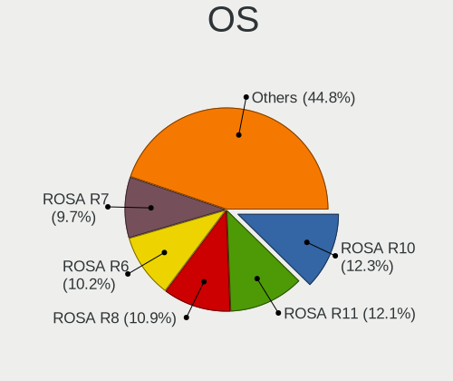
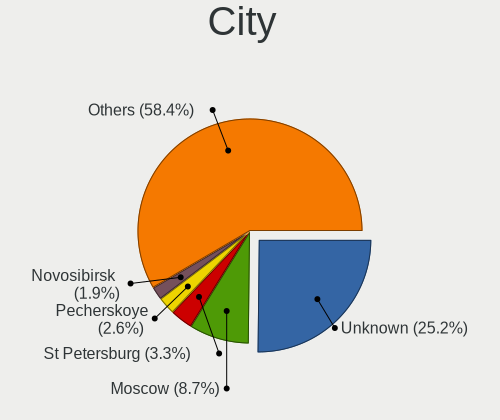
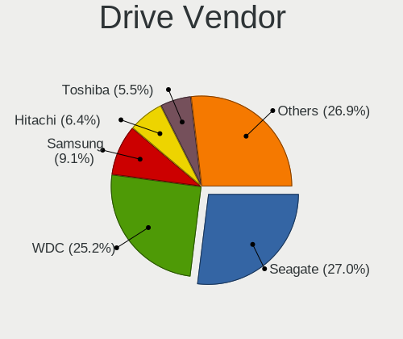
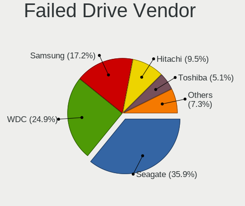
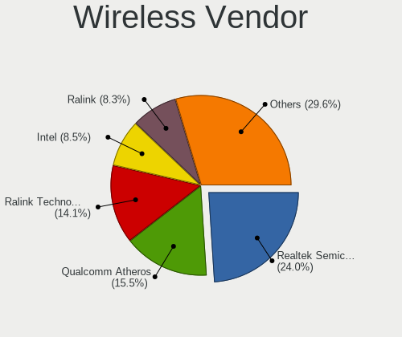
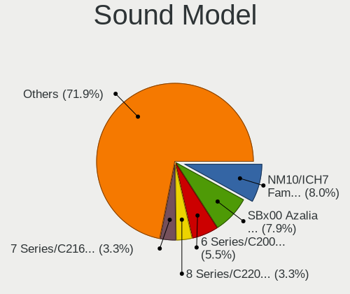
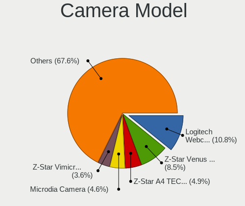

ROSA - Tested Hardware & Statistics (Desktops)
----------------------------------------------

A project to collect tested hardware configurations for ROSA.

Anyone can contribute to this report by the [hw-probe](https://github.com/linuxhw/hw-probe) tool:

    sudo -E hw-probe -all -upload

Please contribute! Especially if your hardware is rare.

Contents
--------

* [ Test Cases ](#test-cases)

* [ System ](#system)
  - [ OS                       ](#os)
  - [ OS Family                ](#os-family)
  - [ Kernel                   ](#kernel)
  - [ Kernel Family            ](#kernel-family)
  - [ Kernel Major Ver.        ](#kernel-major-ver)
  - [ Arch                     ](#arch)
  - [ DE                       ](#de)
  - [ Display Server           ](#display-server)
  - [ Display Manager          ](#display-manager)
  - [ OS Lang                  ](#os-lang)
  - [ Boot Mode                ](#boot-mode)
  - [ Filesystem               ](#filesystem)
  - [ Part. scheme             ](#part-scheme)
  - [ Dual Boot with Linux/BSD ](#dual-boot-with-linuxbsd)
  - [ Dual Boot (Win)          ](#dual-boot-win)

* [ Board ](#board)
  - [ Vendor                   ](#vendor)
  - [ Model                    ](#model)
  - [ Model Family             ](#model-family)
  - [ MFG Year                 ](#mfg-year)
  - [ Form Factor              ](#form-factor)
  - [ Secure Boot              ](#secure-boot)
  - [ Coreboot                 ](#coreboot)
  - [ RAM Size                 ](#ram-size)
  - [ RAM Used                 ](#ram-used)
  - [ Total Drives             ](#total-drives)
  - [ Has CD-ROM               ](#has-cd-rom)
  - [ Has Ethernet             ](#has-ethernet)
  - [ Has WiFi                 ](#has-wifi)
  - [ Has Bluetooth            ](#has-bluetooth)

* [ Location ](#location)
  - [ Country                  ](#country)
  - [ City                     ](#city)

* [ Drives ](#drives)
  - [ Drive Vendor             ](#drive-vendor)
  - [ Drive Model              ](#drive-model)
  - [ HDD Vendor               ](#hdd-vendor)
  - [ SSD Vendor               ](#ssd-vendor)
  - [ Drive Kind               ](#drive-kind)
  - [ Drive Connector          ](#drive-connector)
  - [ Drive Size               ](#drive-size)
  - [ Space Total              ](#space-total)
  - [ Space Used               ](#space-used)
  - [ Malfunc. Drives          ](#malfunc-drives)
  - [ Malfunc. Drive Vendor    ](#malfunc-drive-vendor)
  - [ Malfunc. HDD Vendor      ](#malfunc-hdd-vendor)
  - [ Malfunc. Drive Kind      ](#malfunc-drive-kind)
  - [ Failed Drives            ](#failed-drives)
  - [ Failed Drive Vendor      ](#failed-drive-vendor)
  - [ Drive Status             ](#drive-status)

* [ Storage controller ](#storage-controller)
  - [ Storage Vendor           ](#storage-vendor)
  - [ Storage Model            ](#storage-model)
  - [ Storage Kind             ](#storage-kind)

* [ Processor ](#processor)
  - [ CPU Vendor               ](#cpu-vendor)
  - [ CPU Model                ](#cpu-model)
  - [ CPU Model Family         ](#cpu-model-family)
  - [ CPU Cores                ](#cpu-cores)
  - [ CPU Sockets              ](#cpu-sockets)
  - [ CPU Threads              ](#cpu-threads)
  - [ CPU Op-Modes             ](#cpu-op-modes)
  - [ CPU Microcode            ](#cpu-microcode)
  - [ CPU Microarch            ](#cpu-microarch)

* [ Graphics ](#graphics)
  - [ GPU Vendor               ](#gpu-vendor)
  - [ GPU Model                ](#gpu-model)
  - [ GPU Combo                ](#gpu-combo)
  - [ GPU Driver               ](#gpu-driver)
  - [ GPU Memory               ](#gpu-memory)

* [ Monitor ](#monitor)
  - [ Monitor Vendor           ](#monitor-vendor)
  - [ Monitor Model            ](#monitor-model)
  - [ Monitor Resolution       ](#monitor-resolution)
  - [ Monitor Diagonal         ](#monitor-diagonal)
  - [ Monitor Width            ](#monitor-width)
  - [ Aspect Ratio             ](#aspect-ratio)
  - [ Monitor Area             ](#monitor-area)
  - [ Pixel Density            ](#pixel-density)
  - [ Multiple Monitors        ](#multiple-monitors)

* [ Network ](#network)
  - [ Net Controller Vendor    ](#net-controller-vendor)
  - [ Net Controller Model     ](#net-controller-model)
  - [ Wireless Vendor          ](#wireless-vendor)
  - [ Wireless Model           ](#wireless-model)
  - [ Ethernet Vendor          ](#ethernet-vendor)
  - [ Ethernet Model           ](#ethernet-model)
  - [ Net Controller Kind      ](#net-controller-kind)
  - [ Used Controller          ](#used-controller)
  - [ NICs                     ](#nics)
  - [ IPv6                     ](#ipv6)

* [ Bluetooth ](#bluetooth)
  - [ Bluetooth Vendor         ](#bluetooth-vendor)
  - [ Bluetooth Model          ](#bluetooth-model)

* [ Sound ](#sound)
  - [ Sound Vendor             ](#sound-vendor)
  - [ Sound Model              ](#sound-model)

* [ Memory ](#memory)
  - [ Memory Vendor            ](#memory-vendor)
  - [ Memory Model             ](#memory-model)
  - [ Memory Kind              ](#memory-kind)
  - [ Memory Form Factor       ](#memory-form-factor)
  - [ Memory Size              ](#memory-size)
  - [ Memory Speed             ](#memory-speed)

* [ Printers & scanners ](#printers--scanners)
  - [ Printer Vendor           ](#printer-vendor)
  - [ Printer Model            ](#printer-model)
  - [ Scanner Vendor           ](#scanner-vendor)
  - [ Scanner Model            ](#scanner-model)

* [ Camera ](#camera)
  - [ Camera Vendor            ](#camera-vendor)
  - [ Camera Model             ](#camera-model)

* [ Security ](#security)
  - [ Fingerprint Vendor       ](#fingerprint-vendor)
  - [ Fingerprint Model        ](#fingerprint-model)
  - [ Chipcard Vendor          ](#chipcard-vendor)
  - [ Chipcard Model           ](#chipcard-model)

* [ Unsupported ](#unsupported)
  - [ Unsupported Devices      ](#unsupported-devices)
  - [ Unsupported Device Types ](#unsupported-device-types)

Test Cases
----------

Total: 22384

| Vendor        | Model                       | Probe                                                      | Date         |
|---------------|-----------------------------|------------------------------------------------------------|--------------|
| ASUSTek       | B85M-G                      | [cd9f6ee87d](https://linux-hardware.org/?probe=cd9f6ee87d) | Feb 02, 2024 |
| ASRock        | 970M Pro3                   | [cf54a4b360](https://linux-hardware.org/?probe=cf54a4b360) | Feb 02, 2024 |
| ASUSTek       | PRIME H510M-R               | [4196d911d2](https://linux-hardware.org/?probe=4196d911d2) | Feb 02, 2024 |
| Gigabyte      | A320M-S2H V2-CF             | [f38bbe7c82](https://linux-hardware.org/?probe=f38bbe7c82) | Feb 02, 2024 |
| ASUSTek       | P5K                         | [1414d10ffb](https://linux-hardware.org/?probe=1414d10ffb) | Feb 01, 2024 |
| Gigabyte      | EP43T-UD3L                  | [934c3f974a](https://linux-hardware.org/?probe=934c3f974a) | Feb 01, 2024 |
| ASUSTek       | PRIME B450M-A               | [5befaf642f](https://linux-hardware.org/?probe=5befaf642f) | Feb 01, 2024 |
| Apple         | Mac-F4208DC8 PVT            | [bce380880a](https://linux-hardware.org/?probe=bce380880a) | Feb 01, 2024 |
| ASRock        | G41M-VS3                    | [df1c8c0da3](https://linux-hardware.org/?probe=df1c8c0da3) | Feb 01, 2024 |
| ASUSTek       | A68HM-PLUS                  | [b00734a23e](https://linux-hardware.org/?probe=b00734a23e) | Feb 01, 2024 |
| ASUSTek       | A68HM-PLUS                  | [6361608cec](https://linux-hardware.org/?probe=6361608cec) | Jan 31, 2024 |
| Intel         | SKYBAY                      | [1e706b6589](https://linux-hardware.org/?probe=1e706b6589) | Jan 31, 2024 |
| Intel         | SKYBAY                      | [4420198abc](https://linux-hardware.org/?probe=4420198abc) | Jan 31, 2024 |
| Intel         | SKYBAY                      | [9d6bc7afb3](https://linux-hardware.org/?probe=9d6bc7afb3) | Jan 31, 2024 |
| ASUSTek       | P7H55                       | [21853e5c4a](https://linux-hardware.org/?probe=21853e5c4a) | Jan 30, 2024 |
| Intel         | X99 V1.0                    | [dee15911ba](https://linux-hardware.org/?probe=dee15911ba) | Jan 29, 2024 |
| MSI           | B550M PRO-VDH WIFI          | [d0403669b9](https://linux-hardware.org/?probe=d0403669b9) | Jan 29, 2024 |
| ASRock        | AB350M-HDV R3.0             | [7b68f8ca63](https://linux-hardware.org/?probe=7b68f8ca63) | Jan 29, 2024 |
| ASRock        | AB350M-HDV R3.0             | [5cc2818fe5](https://linux-hardware.org/?probe=5cc2818fe5) | Jan 29, 2024 |
| Intel         | Unknown                     | [24ab2fdfbf](https://linux-hardware.org/?probe=24ab2fdfbf) | Jan 28, 2024 |
| Dell          | 0Y5DDC A00                  | [bad163ed53](https://linux-hardware.org/?probe=bad163ed53) | Jan 28, 2024 |
| ASUSTek       | P5K                         | [9cadd6185d](https://linux-hardware.org/?probe=9cadd6185d) | Jan 27, 2024 |
| ASUSTek       | Maximus VII RANGER          | [23059625c1](https://linux-hardware.org/?probe=23059625c1) | Jan 27, 2024 |
| ECS           | A960M-MV                    | [3b0de09ab6](https://linux-hardware.org/?probe=3b0de09ab6) | Jan 27, 2024 |
| MSI           | MS-B1711                    | [8eec6cdde5](https://linux-hardware.org/?probe=8eec6cdde5) | Jan 27, 2024 |
| Gigabyte      | GA-A55M-S2HP                | [2c061938f7](https://linux-hardware.org/?probe=2c061938f7) | Jan 26, 2024 |
| ASUSTek       | PRIME B450M-A II            | [0554d57e37](https://linux-hardware.org/?probe=0554d57e37) | Jan 26, 2024 |
| Gigabyte      | Z170X-Gaming 3              | [70edc53219](https://linux-hardware.org/?probe=70edc53219) | Jan 26, 2024 |
| MSI           | 785G-E53                    | [81ee1ec28d](https://linux-hardware.org/?probe=81ee1ec28d) | Jan 26, 2024 |
| Intel         | SKYBAY                      | [3d4350c03d](https://linux-hardware.org/?probe=3d4350c03d) | Jan 26, 2024 |
| ASUSTek       | PRIME Z690-P D4             | [61635d9262](https://linux-hardware.org/?probe=61635d9262) | Jan 24, 2024 |
| ASRock        | N68C-GS FX                  | [ed8901f53b](https://linux-hardware.org/?probe=ed8901f53b) | Jan 24, 2024 |
| Huanan        | X99-BD4 V1.34               | [65794c873c](https://linux-hardware.org/?probe=65794c873c) | Jan 23, 2024 |
| Shuttle       | XS35V3                      | [af36ef4d08](https://linux-hardware.org/?probe=af36ef4d08) | Jan 23, 2024 |
| ASRock        | H110M-DGS R3.0              | [8d264d359b](https://linux-hardware.org/?probe=8d264d359b) | Jan 22, 2024 |
| ASUSTek       | E520                        | [948381dfd1](https://linux-hardware.org/?probe=948381dfd1) | Jan 22, 2024 |
| ASUSTek       | P5QL                        | [300924de5a](https://linux-hardware.org/?probe=300924de5a) | Jan 22, 2024 |
| Intel         | X99                         | [f232e1ea07](https://linux-hardware.org/?probe=f232e1ea07) | Jan 21, 2024 |
| ASRock        | A770DE+                     | [280f9c65c0](https://linux-hardware.org/?probe=280f9c65c0) | Jan 21, 2024 |
| Biostar       | Z690GTA                     | [7beb190026](https://linux-hardware.org/?probe=7beb190026) | Jan 21, 2024 |
| ASUSTek       | P5KPL-AM                    | [98dc47d431](https://linux-hardware.org/?probe=98dc47d431) | Jan 21, 2024 |
| Intel         | D525MW AAE93082-401         | [c1c97f080e](https://linux-hardware.org/?probe=c1c97f080e) | Jan 21, 2024 |
| Huanan        | X99 F8D V2.2                | [5a8ba8fd60](https://linux-hardware.org/?probe=5a8ba8fd60) | Jan 21, 2024 |
| ASRock        | B550 Phantom Gaming 4       | [f8f9f25c64](https://linux-hardware.org/?probe=f8f9f25c64) | Jan 21, 2024 |
| Gigabyte      | B450 GAMING X               | [28be98f6c6](https://linux-hardware.org/?probe=28be98f6c6) | Jan 21, 2024 |
| Gigabyte      | B550 AORUS ELITE AX V2      | [ac1d5f3aec](https://linux-hardware.org/?probe=ac1d5f3aec) | Jan 21, 2024 |
| ASRock        | B75 Pro3                    | [498caaba05](https://linux-hardware.org/?probe=498caaba05) | Jan 21, 2024 |
| ASRock        | N68C-GS FX                  | [6c88409266](https://linux-hardware.org/?probe=6c88409266) | Jan 21, 2024 |
| Intel         | X99                         | [93a5879bf4](https://linux-hardware.org/?probe=93a5879bf4) | Jan 21, 2024 |
| ECS           | A960M-MV                    | [7762cce94d](https://linux-hardware.org/?probe=7762cce94d) | Jan 21, 2024 |
| Gigabyte      | B550 AORUS ELITE AX V2      | [0dc11cbadf](https://linux-hardware.org/?probe=0dc11cbadf) | Jan 21, 2024 |
| Dell          | 0Y5DDC A00                  | [a73f786be7](https://linux-hardware.org/?probe=a73f786be7) | Jan 20, 2024 |
| Gigabyte      | H310M S2V                   | [7be62ed879](https://linux-hardware.org/?probe=7be62ed879) | Jan 20, 2024 |
| ASUSTek       | F2A85-V PRO                 | [150d445de6](https://linux-hardware.org/?probe=150d445de6) | Jan 19, 2024 |
| ASUSTek       | F2A85-V PRO                 | [51b2474c14](https://linux-hardware.org/?probe=51b2474c14) | Jan 19, 2024 |
| ASUSTek       | P8H77-V LE                  | [d805f83d93](https://linux-hardware.org/?probe=d805f83d93) | Jan 19, 2024 |
| ASUSTek       | PRIME A320M-E               | [979cbe9fe0](https://linux-hardware.org/?probe=979cbe9fe0) | Jan 19, 2024 |
| Unknown       | Unknown                     | [500e9e8fda](https://linux-hardware.org/?probe=500e9e8fda) | Jan 18, 2024 |
| Unknown       | Unknown                     | [17bd249685](https://linux-hardware.org/?probe=17bd249685) | Jan 18, 2024 |
| MSI           | PRO B760M-A WIFI DDR4       | [a115913fe1](https://linux-hardware.org/?probe=a115913fe1) | Jan 18, 2024 |
| Gigabyte      | GA-870A-UD3                 | [d274a17024](https://linux-hardware.org/?probe=d274a17024) | Jan 17, 2024 |
| ASUSTek       | P5GC-MX/1333                | [9aa4d8799f](https://linux-hardware.org/?probe=9aa4d8799f) | Jan 17, 2024 |
| ASUSTek       | P5GC-MX/1333                | [39f5fe6747](https://linux-hardware.org/?probe=39f5fe6747) | Jan 17, 2024 |
| ASUSTek       | PRIME Z270-P                | [ae035d3e35](https://linux-hardware.org/?probe=ae035d3e35) | Jan 16, 2024 |
| Dell          | 0C2KJT A00                  | [ef30ea4bc9](https://linux-hardware.org/?probe=ef30ea4bc9) | Jan 16, 2024 |
| ASUSTek       | P5GC-MX/1333                | [17555d4d11](https://linux-hardware.org/?probe=17555d4d11) | Jan 15, 2024 |
| Pegatron      | 2A94h                       | [1bb35b61cf](https://linux-hardware.org/?probe=1bb35b61cf) | Jan 15, 2024 |
| Gigabyte      | M720-US3                    | [3b0d0759b6](https://linux-hardware.org/?probe=3b0d0759b6) | Jan 15, 2024 |
| Gigabyte      | A320M-S2H V2-CF             | [f3ba9ee452](https://linux-hardware.org/?probe=f3ba9ee452) | Jan 15, 2024 |
| Intel         | H81                         | [b0fd4c7628](https://linux-hardware.org/?probe=b0fd4c7628) | Jan 15, 2024 |
| Dell          | 0C2KJT A00                  | [72e5220f30](https://linux-hardware.org/?probe=72e5220f30) | Jan 14, 2024 |
| Acer          | Aspire TC-705               | [52f5e7c5ef](https://linux-hardware.org/?probe=52f5e7c5ef) | Jan 14, 2024 |
| Gigabyte      | H61M-DS2                    | [f75904222c](https://linux-hardware.org/?probe=f75904222c) | Jan 13, 2024 |
| ASUSTek       | PRIME B450M-A II            | [8035c49f8f](https://linux-hardware.org/?probe=8035c49f8f) | Jan 13, 2024 |
| ASRock        | H55M-LE                     | [30ce52798e](https://linux-hardware.org/?probe=30ce52798e) | Jan 13, 2024 |
| Huanan        | X79M-PRO V1.2               | [fbcae0c103](https://linux-hardware.org/?probe=fbcae0c103) | Jan 13, 2024 |
| Intel         | H81                         | [86da5a9776](https://linux-hardware.org/?probe=86da5a9776) | Jan 13, 2024 |
| Gigabyte      | B450M DS3H-CF               | [77546f522e](https://linux-hardware.org/?probe=77546f522e) | Jan 13, 2024 |
| MSI           | MS-B0A61                    | [cacdb6e6fe](https://linux-hardware.org/?probe=cacdb6e6fe) | Jan 13, 2024 |
| HP            | 1825                        | [2e88180c54](https://linux-hardware.org/?probe=2e88180c54) | Jan 13, 2024 |
| ASRock        | B760M-HDV/M.2 D4            | [a8d229af9d](https://linux-hardware.org/?probe=a8d229af9d) | Jan 12, 2024 |
| ASUSTek       | PRIME B560-PLUS             | [15e853a1d1](https://linux-hardware.org/?probe=15e853a1d1) | Jan 12, 2024 |
| ASUSTek       | PRIME B560-PLUS             | [3d9b7d2d2b](https://linux-hardware.org/?probe=3d9b7d2d2b) | Jan 12, 2024 |
| Intel         | SKYBAY                      | [a5f2ea79e9](https://linux-hardware.org/?probe=a5f2ea79e9) | Jan 12, 2024 |
| Intel         | DH67CL AAG10212-208         | [9e5c35a6b6](https://linux-hardware.org/?probe=9e5c35a6b6) | Jan 12, 2024 |
| ASUSTek       | CM6330_CM6630_CM6730_CM6... | [11dd31f3c6](https://linux-hardware.org/?probe=11dd31f3c6) | Jan 12, 2024 |
| ASUSTek       | ROG STRIX B650E-E GAMING... | [2e0a03aba1](https://linux-hardware.org/?probe=2e0a03aba1) | Jan 11, 2024 |
| Gigabyte      | H410M H V3                  | [eb21b0dd13](https://linux-hardware.org/?probe=eb21b0dd13) | Jan 11, 2024 |
| ASUSTek       | PRIME A320M-E               | [2be2d8a769](https://linux-hardware.org/?probe=2be2d8a769) | Jan 11, 2024 |
| ASUSTek       | TUF B450M-PLUS GAMING       | [47a7d3fa7c](https://linux-hardware.org/?probe=47a7d3fa7c) | Jan 10, 2024 |
| ASRock        | H110M-DVS R3.0              | [15f0bd78f4](https://linux-hardware.org/?probe=15f0bd78f4) | Jan 10, 2024 |
| Gigabyte      | H81M-S1                     | [e152d77865](https://linux-hardware.org/?probe=e152d77865) | Jan 10, 2024 |
| MAINBRD       | OPS62A-SHA                  | [7090d5973d](https://linux-hardware.org/?probe=7090d5973d) | Jan 10, 2024 |
| MACHINIST     | E5-MR9S V1.0                | [7e938e0f91](https://linux-hardware.org/?probe=7e938e0f91) | Jan 10, 2024 |
| Shenzhen M... | F7BFD                       | [ff12a04779](https://linux-hardware.org/?probe=ff12a04779) | Jan 10, 2024 |
| ASUSTek       | A88XM-A                     | [50b476ac09](https://linux-hardware.org/?probe=50b476ac09) | Jan 09, 2024 |
| HJS           | OPSH110D4                   | [b604539d33](https://linux-hardware.org/?probe=b604539d33) | Jan 09, 2024 |
| ECS           | H61H2-M12                   | [a5b967dfc4](https://linux-hardware.org/?probe=a5b967dfc4) | Jan 09, 2024 |
| Gigabyte      | GA-A55M-S2HP                | [ca456b55a8](https://linux-hardware.org/?probe=ca456b55a8) | Jan 08, 2024 |
| ASUSTek       | M2N-VM HDMI                 | [ea20cecd28](https://linux-hardware.org/?probe=ea20cecd28) | Jan 08, 2024 |
| Gigabyte      | B450 GAMING X               | [4ee36f49f1](https://linux-hardware.org/?probe=4ee36f49f1) | Jan 07, 2024 |
| Unknown       | C51PVGM-M                   | [a652ef8499](https://linux-hardware.org/?probe=a652ef8499) | Jan 07, 2024 |
| Gigabyte      | B450M H                     | [1a3c2a5a40](https://linux-hardware.org/?probe=1a3c2a5a40) | Jan 07, 2024 |
| ASUSTek       | A88X-PLUS/USB               | [7eed61fd57](https://linux-hardware.org/?probe=7eed61fd57) | Jan 07, 2024 |
| ASUSTek       | A88X-PLUS/USB               | [69c24e28a0](https://linux-hardware.org/?probe=69c24e28a0) | Jan 07, 2024 |
| ASUSTek       | P7H55-M                     | [36fc37c5b9](https://linux-hardware.org/?probe=36fc37c5b9) | Jan 06, 2024 |
| ASUSTek       | PRIME H310M-E R2.0          | [62f182c46e](https://linux-hardware.org/?probe=62f182c46e) | Jan 06, 2024 |
| Unknown       | C51PVGM-M                   | [cfe5df72f8](https://linux-hardware.org/?probe=cfe5df72f8) | Jan 06, 2024 |
| MSI           | A520M-A PRO                 | [73e4418e17](https://linux-hardware.org/?probe=73e4418e17) | Jan 05, 2024 |
| TopStar       | V211 C                      | [d056c50760](https://linux-hardware.org/?probe=d056c50760) | Jan 05, 2024 |
| MSI           | H110M PRO-VD                | [bd9f1e7d54](https://linux-hardware.org/?probe=bd9f1e7d54) | Jan 05, 2024 |
| Huanan        | X99-TF GAMING V3.0          | [1d01b72d8c](https://linux-hardware.org/?probe=1d01b72d8c) | Jan 05, 2024 |
| MSI           | H61M-P21                    | [7d4774aa97](https://linux-hardware.org/?probe=7d4774aa97) | Jan 04, 2024 |
| Gigabyte      | B560M DS3H                  | [dbf5b389e1](https://linux-hardware.org/?probe=dbf5b389e1) | Jan 04, 2024 |
| ASUSTek       | P8H61-MX R2.0               | [aeb9554ba6](https://linux-hardware.org/?probe=aeb9554ba6) | Jan 03, 2024 |
| AZW           | MINI S 10                   | [6f5bb65726](https://linux-hardware.org/?probe=6f5bb65726) | Jan 03, 2024 |
| ASUSTek       | P7H55-M SI                  | [55390181a6](https://linux-hardware.org/?probe=55390181a6) | Jan 03, 2024 |
| Gigabyte      | 8PEMT4                      | [d07fa4ad02](https://linux-hardware.org/?probe=d07fa4ad02) | Jan 03, 2024 |
| ASUSTek       | TUF B450M-PLUS GAMING       | [38b88634a4](https://linux-hardware.org/?probe=38b88634a4) | Jan 03, 2024 |
| ASUSTek       | P7H55-M SI                  | [63538d3917](https://linux-hardware.org/?probe=63538d3917) | Jan 02, 2024 |
| ASUSTek       | M5A78L-M LE/USB3            | [6a8af45aab](https://linux-hardware.org/?probe=6a8af45aab) | Jan 02, 2024 |
| ASUSTek       | P5LD2                       | [19abe4bb6a](https://linux-hardware.org/?probe=19abe4bb6a) | Jan 02, 2024 |
| ASUSTek       | P5QL                        | [723455abf9](https://linux-hardware.org/?probe=723455abf9) | Jan 02, 2024 |
| ECS           | GLKD-I2                     | [97247e0a90](https://linux-hardware.org/?probe=97247e0a90) | Jan 02, 2024 |
| Gigabyte      | B560M DS3H                  | [4ff670c80b](https://linux-hardware.org/?probe=4ff670c80b) | Jan 02, 2024 |
| Gigabyte      | B560M DS3H                  | [1529597f3c](https://linux-hardware.org/?probe=1529597f3c) | Jan 02, 2024 |
| ASRock        | J3355M                      | [305d025c0f](https://linux-hardware.org/?probe=305d025c0f) | Jan 01, 2024 |
| ASRock        | H97M Pro4                   | [3955acda3d](https://linux-hardware.org/?probe=3955acda3d) | Dec 31, 2023 |
| Acer          | WMCP78M                     | [e2d232fa11](https://linux-hardware.org/?probe=e2d232fa11) | Dec 31, 2023 |
| Gigabyte      | B450M DS3H-CF               | [c341d04885](https://linux-hardware.org/?probe=c341d04885) | Dec 31, 2023 |
| ASUSTek       | PRIME B360M-K               | [d333516660](https://linux-hardware.org/?probe=d333516660) | Dec 31, 2023 |
| ASUSTek       | M2N-VM HDMI                 | [3429c969a5](https://linux-hardware.org/?probe=3429c969a5) | Dec 30, 2023 |
| ASUSTek       | M2N-VM HDMI                 | [e90dfa13e1](https://linux-hardware.org/?probe=e90dfa13e1) | Dec 30, 2023 |
| MSI           | B450M-A PRO MAX II          | [3698a044ca](https://linux-hardware.org/?probe=3698a044ca) | Dec 30, 2023 |
| ASUSTek       | A88XM-A                     | [175ef5b9a8](https://linux-hardware.org/?probe=175ef5b9a8) | Dec 30, 2023 |
| ASRock        | J4125M                      | [59f93c9ec4](https://linux-hardware.org/?probe=59f93c9ec4) | Dec 30, 2023 |
| HP            | 1494                        | [a7618ec01a](https://linux-hardware.org/?probe=a7618ec01a) | Dec 30, 2023 |
| Lenovo        | Annapurna CRB NOK           | [1e5fb94730](https://linux-hardware.org/?probe=1e5fb94730) | Dec 29, 2023 |
| Gigabyte      | B550 AORUS ELITE V2         | [7b33e176ed](https://linux-hardware.org/?probe=7b33e176ed) | Dec 29, 2023 |
| ASRock        | H97M Pro4                   | [6069654b2c](https://linux-hardware.org/?probe=6069654b2c) | Dec 28, 2023 |
| MSI           | 890FXA-GD70                 | [f97a148a6d](https://linux-hardware.org/?probe=f97a148a6d) | Dec 28, 2023 |
| Gigabyte      | GA-MA69G-S3H                | [25eaed96f5](https://linux-hardware.org/?probe=25eaed96f5) | Dec 28, 2023 |
| Intel         | D410PT AAE76528-404         | [14f9de700a](https://linux-hardware.org/?probe=14f9de700a) | Dec 27, 2023 |
| ASUSTek       | M2NPV-VM                    | [98103e5513](https://linux-hardware.org/?probe=98103e5513) | Dec 27, 2023 |
| ASUSTek       | P8Z68-V LX                  | [1d40495aae](https://linux-hardware.org/?probe=1d40495aae) | Dec 27, 2023 |
| MSI           | MPG B560I GAMING EDGE WI... | [36ca57b5f2](https://linux-hardware.org/?probe=36ca57b5f2) | Dec 26, 2023 |
| HJS           | OPSADLPA07                  | [2a502cf786](https://linux-hardware.org/?probe=2a502cf786) | Dec 26, 2023 |
| ASUSTek       | P5QL                        | [3e67d03984](https://linux-hardware.org/?probe=3e67d03984) | Dec 26, 2023 |
| ASUSTek       | P8H61-M LX3 R2.0            | [81d482c238](https://linux-hardware.org/?probe=81d482c238) | Dec 25, 2023 |
| HP            | 82FE 11                     | [e9d77b121e](https://linux-hardware.org/?probe=e9d77b121e) | Dec 25, 2023 |
| Gigabyte      | GA-870A-UD3                 | [77da0ba60c](https://linux-hardware.org/?probe=77da0ba60c) | Dec 25, 2023 |
| AZW           | T4 PRO                      | [2b34c0a2cc](https://linux-hardware.org/?probe=2b34c0a2cc) | Dec 25, 2023 |
| ASUSTek       | P5LD2                       | [d7be999894](https://linux-hardware.org/?probe=d7be999894) | Dec 25, 2023 |
| Lenovo        | Annapurna CRB NOK           | [2cf0a3c6b7](https://linux-hardware.org/?probe=2cf0a3c6b7) | Dec 25, 2023 |
| ASUSTek       | PRIME A520M-K               | [c37ceeb88e](https://linux-hardware.org/?probe=c37ceeb88e) | Dec 24, 2023 |
| ASUSTek       | P5QL                        | [3f5460760f](https://linux-hardware.org/?probe=3f5460760f) | Dec 24, 2023 |
| ASUSTek       | A88XM-A                     | [34a574fc4f](https://linux-hardware.org/?probe=34a574fc4f) | Dec 24, 2023 |
| MSI           | 770-C45                     | [5aa1ef152a](https://linux-hardware.org/?probe=5aa1ef152a) | Dec 24, 2023 |
| ASUSTek       | P5B-VM SE                   | [7a453f721a](https://linux-hardware.org/?probe=7a453f721a) | Dec 24, 2023 |
| MSI           | 770-C45                     | [b627deabe4](https://linux-hardware.org/?probe=b627deabe4) | Dec 24, 2023 |
| MSI           | H110M PRO-D                 | [7a442e82cf](https://linux-hardware.org/?probe=7a442e82cf) | Dec 23, 2023 |
| ASUSTek       | P5B-VM SE                   | [4640d8f333](https://linux-hardware.org/?probe=4640d8f333) | Dec 23, 2023 |
| MSI           | H110M PRO-D                 | [10257919e4](https://linux-hardware.org/?probe=10257919e4) | Dec 23, 2023 |
| ASUSTek       | P8H61-M LX                  | [29bb247885](https://linux-hardware.org/?probe=29bb247885) | Dec 23, 2023 |
| Gigabyte      | EP45-DS3L                   | [a7ad5fb789](https://linux-hardware.org/?probe=a7ad5fb789) | Dec 23, 2023 |
| MSI           | 890FXA-GD70                 | [1093dc8236](https://linux-hardware.org/?probe=1093dc8236) | Dec 23, 2023 |
| Dell          | 0Y5DDC A00                  | [7ab5ac3907](https://linux-hardware.org/?probe=7ab5ac3907) | Dec 23, 2023 |
| HP            | 1495                        | [475715312b](https://linux-hardware.org/?probe=475715312b) | Dec 22, 2023 |
| ASUSTek       | SABERTOOTH 990FX R3.0       | [a1a6c29257](https://linux-hardware.org/?probe=a1a6c29257) | Dec 22, 2023 |
| ASUSTek       | P7P55D PRO                  | [ce940a8975](https://linux-hardware.org/?probe=ce940a8975) | Dec 22, 2023 |
| Gigabyte      | A320M-S2H-CF                | [7a1be2ed24](https://linux-hardware.org/?probe=7a1be2ed24) | Dec 21, 2023 |
| INTECH PRO    | H510-M2 v5.0                | [9d99caa058](https://linux-hardware.org/?probe=9d99caa058) | Dec 21, 2023 |
| Intel         | SKYBAY                      | [36f317de81](https://linux-hardware.org/?probe=36f317de81) | Dec 21, 2023 |
| ASUSTek       | M2NPV-VM                    | [312d56f544](https://linux-hardware.org/?probe=312d56f544) | Dec 21, 2023 |
| Gigabyte      | A320M-H-CF                  | [4294629777](https://linux-hardware.org/?probe=4294629777) | Dec 21, 2023 |
| MSI           | 770-C45                     | [cf5f865e2a](https://linux-hardware.org/?probe=cf5f865e2a) | Dec 21, 2023 |
| ASUSTek       | TUF Gaming B550M-PLUS       | [70aa06688c](https://linux-hardware.org/?probe=70aa06688c) | Dec 20, 2023 |
| MSI           | 760GM-P23                   | [cec4f5fa78](https://linux-hardware.org/?probe=cec4f5fa78) | Dec 20, 2023 |
| Intel         | SKYBAY                      | [09a66cdc69](https://linux-hardware.org/?probe=09a66cdc69) | Dec 20, 2023 |
| ASUSTek       | P7P55D PRO                  | [15f5598650](https://linux-hardware.org/?probe=15f5598650) | Dec 20, 2023 |
| Gigabyte      | GA-78LMT-S2P                | [0e95772674](https://linux-hardware.org/?probe=0e95772674) | Dec 19, 2023 |
| Gigabyte      | GA-78LMT-S2P                | [f2d2625715](https://linux-hardware.org/?probe=f2d2625715) | Dec 19, 2023 |
| AZW           | MINI S 10                   | [9fd8cc1993](https://linux-hardware.org/?probe=9fd8cc1993) | Dec 19, 2023 |
| MSI           | B360-A PRO                  | [a19733520c](https://linux-hardware.org/?probe=a19733520c) | Dec 19, 2023 |
| ASUSTek       | STRIX X99 GAMING            | [4becb790c2](https://linux-hardware.org/?probe=4becb790c2) | Dec 18, 2023 |
| ASUSTek       | P5LD2                       | [6b2cff0ab3](https://linux-hardware.org/?probe=6b2cff0ab3) | Dec 18, 2023 |
| Gigabyte      | A320M-H-CF                  | [d346ec3767](https://linux-hardware.org/?probe=d346ec3767) | Dec 17, 2023 |
| AZW           | MINI S 10                   | [c3fcd194a9](https://linux-hardware.org/?probe=c3fcd194a9) | Dec 16, 2023 |
| Gigabyte      | H110M-S2H-CF                | [26e619e2e4](https://linux-hardware.org/?probe=26e619e2e4) | Dec 16, 2023 |
| AZW           | MINI S 10                   | [eae1cb11b4](https://linux-hardware.org/?probe=eae1cb11b4) | Dec 16, 2023 |
| AZW           | MINI S 10                   | [8d0d99e3ca](https://linux-hardware.org/?probe=8d0d99e3ca) | Dec 15, 2023 |
| Gigabyte      | 970A-DS3P                   | [35e6b7852f](https://linux-hardware.org/?probe=35e6b7852f) | Dec 14, 2023 |
| Gigabyte      | 970A-DS3P                   | [e3a708296c](https://linux-hardware.org/?probe=e3a708296c) | Dec 14, 2023 |
| MSI           | G41M-P26                    | [fea030b929](https://linux-hardware.org/?probe=fea030b929) | Dec 14, 2023 |
| Gigabyte      | X38-DQ6                     | [67c13b1f2a](https://linux-hardware.org/?probe=67c13b1f2a) | Dec 14, 2023 |
| ASRock        | Z68 Pro3                    | [0f58876ad4](https://linux-hardware.org/?probe=0f58876ad4) | Dec 14, 2023 |
| MSI           | B550M PRO-VDH WIFI          | [7e77c20625](https://linux-hardware.org/?probe=7e77c20625) | Dec 14, 2023 |
| MSI           | B460M PRO-VDH               | [262206ab21](https://linux-hardware.org/?probe=262206ab21) | Dec 14, 2023 |
| ASUSTek       | P8H61-M LX                  | [f40c7514a6](https://linux-hardware.org/?probe=f40c7514a6) | Dec 14, 2023 |
| Gigabyte      | B85M-D3V-A                  | [004355ae40](https://linux-hardware.org/?probe=004355ae40) | Dec 13, 2023 |
| Intel         | DZ68DB AAG27985-105         | [7df70f0023](https://linux-hardware.org/?probe=7df70f0023) | Dec 13, 2023 |
| ASUSTek       | B85-PLUS                    | [0baafe2f04](https://linux-hardware.org/?probe=0baafe2f04) | Dec 13, 2023 |
| Lenovo        | Annapurna CRB NOK           | [2207f3a9a1](https://linux-hardware.org/?probe=2207f3a9a1) | Dec 12, 2023 |
| ASUSTek       | B75M-PLUS                   | [03dcd079c2](https://linux-hardware.org/?probe=03dcd079c2) | Dec 12, 2023 |
| ASRock        | 970M Pro3                   | [885e6000e2](https://linux-hardware.org/?probe=885e6000e2) | Dec 12, 2023 |
| ASUSTek       | P7H55                       | [3642e15edd](https://linux-hardware.org/?probe=3642e15edd) | Dec 11, 2023 |
| ASRock        | N68C-GS FX                  | [a23bf3790b](https://linux-hardware.org/?probe=a23bf3790b) | Dec 10, 2023 |
| BESSTAR Te... | HM90                        | [6d805d9e86](https://linux-hardware.org/?probe=6d805d9e86) | Dec 10, 2023 |
| Unknown       | Unknown                     | [85f36603e0](https://linux-hardware.org/?probe=85f36603e0) | Dec 07, 2023 |
| Biostar       | A68MHE                      | [28d5e46d68](https://linux-hardware.org/?probe=28d5e46d68) | Dec 07, 2023 |
| Biostar       | A68MHE                      | [adab01b31b](https://linux-hardware.org/?probe=adab01b31b) | Dec 07, 2023 |
| Gigabyte      | E350N WIN8                  | [b5f6aa3741](https://linux-hardware.org/?probe=b5f6aa3741) | Dec 07, 2023 |
| ASRock        | AB350M-HDV R3.0             | [d5c946c229](https://linux-hardware.org/?probe=d5c946c229) | Dec 06, 2023 |
| MSI           | H510M-A PRO                 | [6b2fb03fb3](https://linux-hardware.org/?probe=6b2fb03fb3) | Dec 06, 2023 |
| Lenovo        | 0x30F617AA NOK              | [c57e8b797a](https://linux-hardware.org/?probe=c57e8b797a) | Dec 06, 2023 |
| ASUSTek       | P7P55-M                     | [f19bc05960](https://linux-hardware.org/?probe=f19bc05960) | Dec 06, 2023 |
| ASUSTek       | M2NPV-VM                    | [63a226690c](https://linux-hardware.org/?probe=63a226690c) | Dec 06, 2023 |
| Intel         | H81 V2.3                    | [708916ead2](https://linux-hardware.org/?probe=708916ead2) | Dec 05, 2023 |
| MSI           | MS-B1711                    | [8c0247cf89](https://linux-hardware.org/?probe=8c0247cf89) | Dec 05, 2023 |
| Gigabyte      | F2A68HM-DS2                 | [6152f696ba](https://linux-hardware.org/?probe=6152f696ba) | Dec 05, 2023 |
| ASUSTek       | A88XM-A                     | [e91058f8a8](https://linux-hardware.org/?probe=e91058f8a8) | Dec 05, 2023 |
| ASRock        | AD2550B-ITX                 | [6e518f6d21](https://linux-hardware.org/?probe=6e518f6d21) | Dec 05, 2023 |
| Gigabyte      | GA-A55M-DS2                 | [479a8762cb](https://linux-hardware.org/?probe=479a8762cb) | Dec 04, 2023 |
| Gigabyte      | B660 GAMING X DDR4          | [8825d0fec5](https://linux-hardware.org/?probe=8825d0fec5) | Dec 04, 2023 |
| ASUSTek       | P8H61-M LX R2.0             | [61163dcc3a](https://linux-hardware.org/?probe=61163dcc3a) | Dec 04, 2023 |
| ASUSTek       | P5LD2                       | [427dcf0f2e](https://linux-hardware.org/?probe=427dcf0f2e) | Dec 03, 2023 |
| Gigabyte      | Z97-HD3                     | [e2c26c5e1f](https://linux-hardware.org/?probe=e2c26c5e1f) | Dec 03, 2023 |
| ASRock        | N68C-S UCC                  | [d42ebb9252](https://linux-hardware.org/?probe=d42ebb9252) | Dec 03, 2023 |
| ASRock        | N68C-S UCC                  | [13d2b9187f](https://linux-hardware.org/?probe=13d2b9187f) | Dec 03, 2023 |
| Gigabyte      | MZBAYAP-00                  | [7fb4476167](https://linux-hardware.org/?probe=7fb4476167) | Dec 02, 2023 |
| ASUSTek       | A8N-SLI Premium             | [79f209d7a3](https://linux-hardware.org/?probe=79f209d7a3) | Dec 02, 2023 |
| Gigabyte      | B450M DS3H-CF               | [e830e69a5d](https://linux-hardware.org/?probe=e830e69a5d) | Dec 02, 2023 |
| OEM           | X79G                        | [febfd97ad1](https://linux-hardware.org/?probe=febfd97ad1) | Dec 01, 2023 |
| Gigabyte      | A320M-H-CF                  | [4172cccae3](https://linux-hardware.org/?probe=4172cccae3) | Dec 01, 2023 |
| ASUSTek       | H110M-K                     | [aaa13df3bd](https://linux-hardware.org/?probe=aaa13df3bd) | Dec 01, 2023 |
| MSI           | A68HM-P33 V2                | [b1131b7587](https://linux-hardware.org/?probe=b1131b7587) | Dec 01, 2023 |
| Lenovo        | Annapurna CRB NOK           | [9fe0854829](https://linux-hardware.org/?probe=9fe0854829) | Dec 01, 2023 |
| Huanan        | X99 F8D V2.2                | [acc68bea5c](https://linux-hardware.org/?probe=acc68bea5c) | Nov 30, 2023 |
| MSI           | 770-C45                     | [59a879c475](https://linux-hardware.org/?probe=59a879c475) | Nov 30, 2023 |
| ASUSTek       | B85M-G                      | [97b2117c5e](https://linux-hardware.org/?probe=97b2117c5e) | Nov 30, 2023 |
| ECS           | GLKD-I2                     | [05d3dc06a0](https://linux-hardware.org/?probe=05d3dc06a0) | Nov 30, 2023 |
| ASUSTek       | P5KPL-AM                    | [241a9d1cad](https://linux-hardware.org/?probe=241a9d1cad) | Nov 30, 2023 |
| Lenovo        | MAHOBAY NO DPK              | [bada3a056e](https://linux-hardware.org/?probe=bada3a056e) | Nov 30, 2023 |
| ASUSTek       | P5LD2                       | [7cc743250b](https://linux-hardware.org/?probe=7cc743250b) | Nov 30, 2023 |
| Acer          | Aspire XC-1660 V:1.1        | [509ae42a22](https://linux-hardware.org/?probe=509ae42a22) | Nov 29, 2023 |
| Intel         | SKYBAY                      | [5734274ccd](https://linux-hardware.org/?probe=5734274ccd) | Nov 29, 2023 |
| MSI           | MPG X570 GAMING PLUS        | [2d7376da77](https://linux-hardware.org/?probe=2d7376da77) | Nov 29, 2023 |
| Gigabyte      | Z270P-D3-CF                 | [9b31bd67fb](https://linux-hardware.org/?probe=9b31bd67fb) | Nov 29, 2023 |
| Gigabyte      | GA-780T-D3L                 | [b3dee75350](https://linux-hardware.org/?probe=b3dee75350) | Nov 29, 2023 |
| ASRock        | J4125M                      | [9e5951e82e](https://linux-hardware.org/?probe=9e5951e82e) | Nov 29, 2023 |
| ASUSTek       | PRIME B450-PLUS             | [ebd9b385a7](https://linux-hardware.org/?probe=ebd9b385a7) | Nov 28, 2023 |
| MSI           | A520M-A PRO                 | [2d9e2ea88b](https://linux-hardware.org/?probe=2d9e2ea88b) | Nov 28, 2023 |
| ECS           | GLKD-I2                     | [c1f9ed7186](https://linux-hardware.org/?probe=c1f9ed7186) | Nov 27, 2023 |
| Unknown       | Unknown                     | [2cd14cbfbd](https://linux-hardware.org/?probe=2cd14cbfbd) | Nov 27, 2023 |
| Gigabyte      | B550M S2H                   | [7084bb6ef8](https://linux-hardware.org/?probe=7084bb6ef8) | Nov 26, 2023 |
| MSI           | MPG Z790 CARBON WIFI        | [81c2675a1e](https://linux-hardware.org/?probe=81c2675a1e) | Nov 26, 2023 |
| ASUSTek       | A88XM-A                     | [1431a6559b](https://linux-hardware.org/?probe=1431a6559b) | Nov 26, 2023 |
| Dell          | 0Y5DDC A00                  | [db9963f44a](https://linux-hardware.org/?probe=db9963f44a) | Nov 26, 2023 |
| ASRock        | B450 Pro4                   | [1fb358fc57](https://linux-hardware.org/?probe=1fb358fc57) | Nov 25, 2023 |
| ASUSTek       | TUF X299 MARK 2             | [bb8bae6a59](https://linux-hardware.org/?probe=bb8bae6a59) | Nov 24, 2023 |
| ASRock        | B450M Pro4                  | [bbd1246656](https://linux-hardware.org/?probe=bbd1246656) | Nov 23, 2023 |
| ASUSTek       | PRIME H510M-R               | [798ff06944](https://linux-hardware.org/?probe=798ff06944) | Nov 23, 2023 |
| SZMZ          | X99 DUAL Z8                 | [aaa9f78cd9](https://linux-hardware.org/?probe=aaa9f78cd9) | Nov 23, 2023 |
| Unknown       | X79                         | [e66769bf5c](https://linux-hardware.org/?probe=e66769bf5c) | Nov 23, 2023 |
| Gigabyte      | A320M-H-CF                  | [fbce369e50](https://linux-hardware.org/?probe=fbce369e50) | Nov 23, 2023 |
| HP            | 21D0                        | [3e85a284ec](https://linux-hardware.org/?probe=3e85a284ec) | Nov 23, 2023 |
| Huanan        | X99-F8 V2.0                 | [b4f7ce646b](https://linux-hardware.org/?probe=b4f7ce646b) | Nov 22, 2023 |
| ASRock        | B450 Pro4                   | [5b63e87d07](https://linux-hardware.org/?probe=5b63e87d07) | Nov 22, 2023 |
| Biostar       | B550M-SILVER                | [d2502c76d5](https://linux-hardware.org/?probe=d2502c76d5) | Nov 22, 2023 |
| Unknown       | Unknown                     | [f1a988f291](https://linux-hardware.org/?probe=f1a988f291) | Nov 22, 2023 |
| ASUSTek       | PRIME B250M-PLUS            | [aad08ec259](https://linux-hardware.org/?probe=aad08ec259) | Nov 22, 2023 |
| Gigabyte      | A520M S2H                   | [450e29b3a9](https://linux-hardware.org/?probe=450e29b3a9) | Nov 21, 2023 |
| ASUSTek       | H110M-D                     | [c871779bc5](https://linux-hardware.org/?probe=c871779bc5) | Nov 21, 2023 |
| ASUSTek       | P5B-Premium                 | [53c5d42789](https://linux-hardware.org/?probe=53c5d42789) | Nov 21, 2023 |
| Huanan        | X99 F8D V2.2                | [793263f898](https://linux-hardware.org/?probe=793263f898) | Nov 21, 2023 |
| MSI           | H310M PRO-VD                | [aabdcbb08a](https://linux-hardware.org/?probe=aabdcbb08a) | Nov 20, 2023 |
| Gigabyte      | B85M-D3V                    | [5a04938662](https://linux-hardware.org/?probe=5a04938662) | Nov 20, 2023 |
| ASUSTek       | PRIME H310M-E R2.0          | [746b73efa5](https://linux-hardware.org/?probe=746b73efa5) | Nov 20, 2023 |
| Gigabyte      | Z390 GAMING X-CF            | [8c04d88a1a](https://linux-hardware.org/?probe=8c04d88a1a) | Nov 20, 2023 |
| ASUSTek       | PRIME Z690-P D4             | [f12026549d](https://linux-hardware.org/?probe=f12026549d) | Nov 19, 2023 |
| ASRock        | G31M-VS                     | [90703790aa](https://linux-hardware.org/?probe=90703790aa) | Nov 18, 2023 |
| Gigabyte      | B760M DS3H DDR4             | [dd65d07da5](https://linux-hardware.org/?probe=dd65d07da5) | Nov 17, 2023 |
| MSI           | MS-B0A91                    | [1fd5a38fea](https://linux-hardware.org/?probe=1fd5a38fea) | Nov 17, 2023 |
| ASRock        | 760GM-GS3                   | [bc38c966fd](https://linux-hardware.org/?probe=bc38c966fd) | Nov 17, 2023 |
| ASUSTek       | P6X58D-E                    | [79c73471d5](https://linux-hardware.org/?probe=79c73471d5) | Nov 17, 2023 |
| Gigabyte      | B560 HD3                    | [161d0a2dd8](https://linux-hardware.org/?probe=161d0a2dd8) | Nov 17, 2023 |
| Gigabyte      | H410M S2H V2                | [821667100c](https://linux-hardware.org/?probe=821667100c) | Nov 16, 2023 |
| ASUSTek       | M5A78L-M LX                 | [7d69c8e446](https://linux-hardware.org/?probe=7d69c8e446) | Nov 15, 2023 |
| MSI           | 760GM-P23                   | [f6f9371495](https://linux-hardware.org/?probe=f6f9371495) | Nov 14, 2023 |
| Gigabyte      | EP43-DS3L                   | [acdeeb756d](https://linux-hardware.org/?probe=acdeeb756d) | Nov 14, 2023 |
| Gigabyte      | A320M-S2H V2-CF             | [fbaed4a09a](https://linux-hardware.org/?probe=fbaed4a09a) | Nov 14, 2023 |
| Intel         | H610-MIX v1.0               | [fef86e593d](https://linux-hardware.org/?probe=fef86e593d) | Nov 14, 2023 |
| INTECH PRO    | H510-M2 v5.0                | [9eb08d648d](https://linux-hardware.org/?probe=9eb08d648d) | Nov 14, 2023 |
| Intel         | X99 V1.0                    | [9f4eb05a5f](https://linux-hardware.org/?probe=9f4eb05a5f) | Nov 13, 2023 |
| ASUSTek       | P8H61                       | [0a801dd4f0](https://linux-hardware.org/?probe=0a801dd4f0) | Nov 13, 2023 |
| ASUSTek       | P8B75-M LE                  | [9290054f05](https://linux-hardware.org/?probe=9290054f05) | Nov 13, 2023 |
| Gigabyte      | B560M DS3H                  | [9a83b08ba1](https://linux-hardware.org/?probe=9a83b08ba1) | Nov 12, 2023 |
| Gigabyte      | H410M H V2                  | [56a87ac439](https://linux-hardware.org/?probe=56a87ac439) | Nov 12, 2023 |
| ASUSTek       | SABERTOOTH 990FX            | [7b086dcc71](https://linux-hardware.org/?probe=7b086dcc71) | Nov 11, 2023 |
| ASUSTek       | M5A87                       | [40a4f6c6f0](https://linux-hardware.org/?probe=40a4f6c6f0) | Nov 11, 2023 |
| Unknown       | Intel X79                   | [42adc3c9ce](https://linux-hardware.org/?probe=42adc3c9ce) | Nov 11, 2023 |
| ASUSTek       | P8H67                       | [6703e993d2](https://linux-hardware.org/?probe=6703e993d2) | Nov 11, 2023 |
| Gigabyte      | B75M-HD3                    | [57548f89da](https://linux-hardware.org/?probe=57548f89da) | Nov 10, 2023 |
| Intel         | SKYBAY                      | [f5934c1986](https://linux-hardware.org/?probe=f5934c1986) | Nov 10, 2023 |
| ASUSTek       | P5B-Premium                 | [5a031990bf](https://linux-hardware.org/?probe=5a031990bf) | Nov 10, 2023 |
| Intel         | SKYBAY                      | [49d4fabd38](https://linux-hardware.org/?probe=49d4fabd38) | Nov 10, 2023 |
| MSI           | B550M PRO-VDH WIFI          | [b5d7666605](https://linux-hardware.org/?probe=b5d7666605) | Nov 09, 2023 |
| ASUSTek       | M5A97 R2.0                  | [2c6f89c817](https://linux-hardware.org/?probe=2c6f89c817) | Nov 09, 2023 |
| ASUSTek       | ROG STRIX Z490-F GAMING     | [c5f2735e94](https://linux-hardware.org/?probe=c5f2735e94) | Nov 08, 2023 |
| Dell          | 0M860N A00                  | [9cf0cdf157](https://linux-hardware.org/?probe=9cf0cdf157) | Nov 08, 2023 |
| AOpen         | i57QMx-HA R1.01 55ADE10A... | [061ce4d9ac](https://linux-hardware.org/?probe=061ce4d9ac) | Nov 08, 2023 |
| Gigabyte      | B75M-D3V                    | [a5d6a40643](https://linux-hardware.org/?probe=a5d6a40643) | Nov 08, 2023 |
| ASUSTek       | P7H55                       | [62ecde0340](https://linux-hardware.org/?probe=62ecde0340) | Nov 07, 2023 |
| Gigabyte      | D525TUD                     | [19cffdb377](https://linux-hardware.org/?probe=19cffdb377) | Nov 06, 2023 |
| ASRock        | H81M-VG4 R2.0               | [2de5f4ef98](https://linux-hardware.org/?probe=2de5f4ef98) | Nov 05, 2023 |
| Gigabyte      | B450M H                     | [436a3dc68e](https://linux-hardware.org/?probe=436a3dc68e) | Nov 05, 2023 |
| ASUSTek       | P5K PRO                     | [7dd5e78310](https://linux-hardware.org/?probe=7dd5e78310) | Nov 05, 2023 |
| Intel         | DH61DL AAG14066-205         | [be33944c69](https://linux-hardware.org/?probe=be33944c69) | Nov 05, 2023 |
| Gigabyte      | X570 UD                     | [287ceab4df](https://linux-hardware.org/?probe=287ceab4df) | Nov 05, 2023 |
| Gigabyte      | X570 UD                     | [1c9b1632b8](https://linux-hardware.org/?probe=1c9b1632b8) | Nov 05, 2023 |
| Pegatron      | IPMIP-H55-GEN               | [f87bf6e0dd](https://linux-hardware.org/?probe=f87bf6e0dd) | Nov 04, 2023 |
| Intel         | DG33BU AAD79951-407         | [734dafca4e](https://linux-hardware.org/?probe=734dafca4e) | Nov 04, 2023 |
| MSI           | H110M PRO-D                 | [9a7337554c](https://linux-hardware.org/?probe=9a7337554c) | Nov 04, 2023 |
| Pegatron      | E60                         | [42e0c4ad61](https://linux-hardware.org/?probe=42e0c4ad61) | Nov 04, 2023 |
| MSI           | B550M PRO-VDH WIFI          | [cda17ca99b](https://linux-hardware.org/?probe=cda17ca99b) | Nov 04, 2023 |
| ASUSTek       | P8H61-M LX3 R2.0            | [18bafa67dc](https://linux-hardware.org/?probe=18bafa67dc) | Nov 04, 2023 |
| ASUSTek       | P5QD TURBO                  | [4a350b6fdb](https://linux-hardware.org/?probe=4a350b6fdb) | Nov 03, 2023 |
| ASRock        | A770DE+                     | [330e203c8a](https://linux-hardware.org/?probe=330e203c8a) | Nov 03, 2023 |
| Intel         | H610-MIX v1.0               | [eeaea55301](https://linux-hardware.org/?probe=eeaea55301) | Nov 03, 2023 |
| MSI           | 760GM-P21                   | [f3b16a05ae](https://linux-hardware.org/?probe=f3b16a05ae) | Nov 03, 2023 |
| Shenzhen M... | F7BFD                       | [f2b8e311c3](https://linux-hardware.org/?probe=f2b8e311c3) | Nov 02, 2023 |
| ASUSTek       | A88XM-E                     | [b828019cc1](https://linux-hardware.org/?probe=b828019cc1) | Nov 02, 2023 |
| MSI           | 760GM-P21                   | [2d08e07e5d](https://linux-hardware.org/?probe=2d08e07e5d) | Nov 02, 2023 |
| Gigabyte      | 945GCMX-S2                  | [9e43e8bb79](https://linux-hardware.org/?probe=9e43e8bb79) | Nov 01, 2023 |
| ASRock        | N68C-S UCC                  | [cc636af8e3](https://linux-hardware.org/?probe=cc636af8e3) | Nov 01, 2023 |
| ASUSTek       | PRIME B350M-K               | [bc9c6a8334](https://linux-hardware.org/?probe=bc9c6a8334) | Nov 01, 2023 |
| MAINBRD       | OPS62A-SHA                  | [41dc7afbc6](https://linux-hardware.org/?probe=41dc7afbc6) | Nov 01, 2023 |
| ASRock        | B450M-HDV R4.0              | [c962dd6f41](https://linux-hardware.org/?probe=c962dd6f41) | Nov 01, 2023 |
| Unknown       | Unknown                     | [ae244bf378](https://linux-hardware.org/?probe=ae244bf378) | Nov 01, 2023 |
| Gigabyte      | B760 GAMING X               | [a360fd740f](https://linux-hardware.org/?probe=a360fd740f) | Nov 01, 2023 |
| Unknown       | Unknown                     | [e135ca8165](https://linux-hardware.org/?probe=e135ca8165) | Oct 31, 2023 |
| Gigabyte      | EP43T-UD3L                  | [a3a25165b1](https://linux-hardware.org/?probe=a3a25165b1) | Oct 31, 2023 |
| MSI           | MAG X570S TOMAHAWK MAX W... | [b522c4b372](https://linux-hardware.org/?probe=b522c4b372) | Oct 31, 2023 |
| ASRock        | B450M-HDV R4.0              | [54a16261d5](https://linux-hardware.org/?probe=54a16261d5) | Oct 31, 2023 |
| Gigabyte      | Z590 D                      | [d986377165](https://linux-hardware.org/?probe=d986377165) | Oct 31, 2023 |
| MSI           | MPG B550 GAMING PLUS        | [c8b24699a5](https://linux-hardware.org/?probe=c8b24699a5) | Oct 30, 2023 |
| Intel         | H81 V2.3                    | [ad1b4d2589](https://linux-hardware.org/?probe=ad1b4d2589) | Oct 29, 2023 |
| Dell          | 0Y5DDC A00                  | [537823e1ce](https://linux-hardware.org/?probe=537823e1ce) | Oct 29, 2023 |
| ASUSTek       | M5A87                       | [7e4a0870d1](https://linux-hardware.org/?probe=7e4a0870d1) | Oct 29, 2023 |
| Shenzhen M... | F7BFD                       | [28096584b1](https://linux-hardware.org/?probe=28096584b1) | Oct 28, 2023 |
| MSI           | MS-7235                     | [a20f50ce09](https://linux-hardware.org/?probe=a20f50ce09) | Oct 28, 2023 |
| Gigabyte      | EG41MF-US2H                 | [e79e5c88a2](https://linux-hardware.org/?probe=e79e5c88a2) | Oct 28, 2023 |
| Gigabyte      | EG41MF-US2H                 | [54665c8266](https://linux-hardware.org/?probe=54665c8266) | Oct 28, 2023 |
| MSI           | A320M GRENADE               | [723b3a152b](https://linux-hardware.org/?probe=723b3a152b) | Oct 28, 2023 |
| ASRock        | G31M-GS                     | [362c4857dd](https://linux-hardware.org/?probe=362c4857dd) | Oct 26, 2023 |
| Intel         | X99                         | [c23c2dd478](https://linux-hardware.org/?probe=c23c2dd478) | Oct 26, 2023 |
| MSI           | A320M-A PRO                 | [5a0de31e5c](https://linux-hardware.org/?probe=5a0de31e5c) | Oct 26, 2023 |
| Unknown       | Unknown                     | [4631da3dbf](https://linux-hardware.org/?probe=4631da3dbf) | Oct 26, 2023 |
| Intel         | H81                         | [59ac163151](https://linux-hardware.org/?probe=59ac163151) | Oct 26, 2023 |
| Lenovo        | MAHOBAY NO DPK              | [7ed95a4707](https://linux-hardware.org/?probe=7ed95a4707) | Oct 25, 2023 |
| Gigabyte      | A320M-S2H-CF                | [b3e80c2dc5](https://linux-hardware.org/?probe=b3e80c2dc5) | Oct 25, 2023 |
| ASUSTek       | B85M-G                      | [a7463f3745](https://linux-hardware.org/?probe=a7463f3745) | Oct 24, 2023 |
| ASRock        | N68C-GS FX                  | [0c3142b94d](https://linux-hardware.org/?probe=0c3142b94d) | Oct 24, 2023 |
| ASUSTek       | M5A87                       | [273561af88](https://linux-hardware.org/?probe=273561af88) | Oct 24, 2023 |
| ASUSTek       | H81M-PLUS                   | [541d6f63b0](https://linux-hardware.org/?probe=541d6f63b0) | Oct 23, 2023 |
| ASUSTek       | P6X58D-E                    | [6af3baae7b](https://linux-hardware.org/?probe=6af3baae7b) | Oct 23, 2023 |
| MSI           | 770-C45                     | [9b5876d0eb](https://linux-hardware.org/?probe=9b5876d0eb) | Oct 23, 2023 |
| ASRock        | P67 Pro3                    | [93d23ddc07](https://linux-hardware.org/?probe=93d23ddc07) | Oct 23, 2023 |
| Gigabyte      | GA-870A-UD3                 | [e0cffa70b5](https://linux-hardware.org/?probe=e0cffa70b5) | Oct 23, 2023 |
| ASUSTek       | P5KPL-SE                    | [2a58496283](https://linux-hardware.org/?probe=2a58496283) | Oct 22, 2023 |
| Gigabyte      | B360M AORUS Gaming 3-CF     | [7b963d7fff](https://linux-hardware.org/?probe=7b963d7fff) | Oct 21, 2023 |
| Gigabyte      | A320M-S2H-CF                | [53a0ed7609](https://linux-hardware.org/?probe=53a0ed7609) | Oct 21, 2023 |
| ASRock        | D1800B-ITX                  | [c332512757](https://linux-hardware.org/?probe=c332512757) | Oct 21, 2023 |
| ASRock        | P45DE3                      | [2f9bd57442](https://linux-hardware.org/?probe=2f9bd57442) | Oct 21, 2023 |
| ASRock        | H61M                        | [b58eae7b88](https://linux-hardware.org/?probe=b58eae7b88) | Oct 21, 2023 |
| Gigabyte      | Z790 AORUS ELITE AX         | [0748fa3430](https://linux-hardware.org/?probe=0748fa3430) | Oct 21, 2023 |
| MSI           | 760GM-P23                   | [77ee2b1957](https://linux-hardware.org/?probe=77ee2b1957) | Oct 20, 2023 |
| ASRock        | J3455M                      | [9e627ef04c](https://linux-hardware.org/?probe=9e627ef04c) | Oct 20, 2023 |
| MSI           | 770T-C45                    | [bbe901612f](https://linux-hardware.org/?probe=bbe901612f) | Oct 20, 2023 |
| MSI           | 760GM-P23                   | [5936be0473](https://linux-hardware.org/?probe=5936be0473) | Oct 19, 2023 |
| ASRock        | J3455M                      | [a65255a6ec](https://linux-hardware.org/?probe=a65255a6ec) | Oct 19, 2023 |
| Gigabyte      | X58A-UD3R                   | [e5ecd53787](https://linux-hardware.org/?probe=e5ecd53787) | Oct 19, 2023 |
| Yadro         | YadroB560                   | [d231d3b930](https://linux-hardware.org/?probe=d231d3b930) | Oct 19, 2023 |
| MSI           | B360M PRO-VD                | [4d1cd49c1c](https://linux-hardware.org/?probe=4d1cd49c1c) | Oct 18, 2023 |
| Gigabyte      | H310M S2 x.x                | [dd1f79a66a](https://linux-hardware.org/?probe=dd1f79a66a) | Oct 18, 2023 |
| QBIC          | BXT-512-7100U               | [e23f579099](https://linux-hardware.org/?probe=e23f579099) | Oct 17, 2023 |
| Intel         | H81                         | [317de00832](https://linux-hardware.org/?probe=317de00832) | Oct 17, 2023 |
| Gigabyte      | X570 I AORUS PRO WIFI       | [a80532e1a0](https://linux-hardware.org/?probe=a80532e1a0) | Oct 17, 2023 |
| Gigabyte      | B360M DS3H                  | [cf5190078f](https://linux-hardware.org/?probe=cf5190078f) | Oct 17, 2023 |
| Gigabyte      | B360M DS3H                  | [06e6e5db34](https://linux-hardware.org/?probe=06e6e5db34) | Oct 17, 2023 |
| OEM           | X79G                        | [887a2b8f36](https://linux-hardware.org/?probe=887a2b8f36) | Oct 17, 2023 |
| HP            | 2820h                       | [73769961eb](https://linux-hardware.org/?probe=73769961eb) | Oct 16, 2023 |
| Gigabyte      | B450M S2H V2                | [72258458a5](https://linux-hardware.org/?probe=72258458a5) | Oct 16, 2023 |
| MSI           | B360M PRO-VD                | [98deafd70e](https://linux-hardware.org/?probe=98deafd70e) | Oct 15, 2023 |
| MSI           | H110M PRO-D                 | [14ad3343a7](https://linux-hardware.org/?probe=14ad3343a7) | Oct 15, 2023 |
| ASUSTek       | P5K PRO                     | [a4c386b42e](https://linux-hardware.org/?probe=a4c386b42e) | Oct 15, 2023 |
| ASUSTek       | P5K PRO                     | [aa244a1f00](https://linux-hardware.org/?probe=aa244a1f00) | Oct 15, 2023 |
| MSI           | X299 RAIDER                 | [28f37d6590](https://linux-hardware.org/?probe=28f37d6590) | Oct 14, 2023 |
| MSI           | 770-C45                     | [c1e11a6e3d](https://linux-hardware.org/?probe=c1e11a6e3d) | Oct 14, 2023 |
| Gigabyte      | EP43-DS3L                   | [7cc4c9f010](https://linux-hardware.org/?probe=7cc4c9f010) | Oct 14, 2023 |
| MSI           | G31M3-F V2                  | [9a26b22114](https://linux-hardware.org/?probe=9a26b22114) | Oct 14, 2023 |
| Biostar       | H81MHV3 5.0                 | [11b853321a](https://linux-hardware.org/?probe=11b853321a) | Oct 14, 2023 |
| Biostar       | H81MHV3 5.0                 | [9fdaa00358](https://linux-hardware.org/?probe=9fdaa00358) | Oct 13, 2023 |
| Unknown       | Unknown                     | [05b441657d](https://linux-hardware.org/?probe=05b441657d) | Oct 13, 2023 |
| ASRock        | H55M-LE                     | [db9ce33137](https://linux-hardware.org/?probe=db9ce33137) | Oct 13, 2023 |
| Gigabyte      | H55M-USB3                   | [ba758fb431](https://linux-hardware.org/?probe=ba758fb431) | Oct 13, 2023 |
| Gigabyte      | A320M-S2H-CF                | [683a06d3a1](https://linux-hardware.org/?probe=683a06d3a1) | Oct 12, 2023 |
| MSI           | PRO H610M-B DDR4            | [5a954486f1](https://linux-hardware.org/?probe=5a954486f1) | Oct 12, 2023 |
| Intel         | X99 V3.0                    | [10d96ed192](https://linux-hardware.org/?probe=10d96ed192) | Oct 12, 2023 |
| Lenovo        | MAHOBAY NO DPK              | [f39e659abb](https://linux-hardware.org/?probe=f39e659abb) | Oct 12, 2023 |
| MSI           | Z390-A PRO                  | [41ceddf203](https://linux-hardware.org/?probe=41ceddf203) | Oct 12, 2023 |
| Intel         | X99 V3.0                    | [e22c1235d0](https://linux-hardware.org/?probe=e22c1235d0) | Oct 12, 2023 |
| ASUSTek       | STRIX B250F GAMING          | [8d4eefa612](https://linux-hardware.org/?probe=8d4eefa612) | Oct 12, 2023 |
| ASUSTek       | PRIME A320M-K               | [9af9d0ea5e](https://linux-hardware.org/?probe=9af9d0ea5e) | Oct 11, 2023 |
| Medion        | MS-7800                     | [806b81f839](https://linux-hardware.org/?probe=806b81f839) | Oct 11, 2023 |
| Gigabyte      | B550M AORUS PRO-P           | [d9183a2d23](https://linux-hardware.org/?probe=d9183a2d23) | Oct 11, 2023 |
| MSI           | 785GM-E51                   | [6034bcda1d](https://linux-hardware.org/?probe=6034bcda1d) | Oct 10, 2023 |
| Gigabyte      | H55M-USB3                   | [9bf81b8cb2](https://linux-hardware.org/?probe=9bf81b8cb2) | Oct 09, 2023 |
| Gigabyte      | GA-8S655FX-L                | [4c81a7a377](https://linux-hardware.org/?probe=4c81a7a377) | Oct 09, 2023 |
| ASUSTek       | M2A-VM                      | [ac2f8ef69c](https://linux-hardware.org/?probe=ac2f8ef69c) | Oct 09, 2023 |
| ASRock        | N68C-GS FX                  | [2da75b7afa](https://linux-hardware.org/?probe=2da75b7afa) | Oct 09, 2023 |
| MSI           | Z87I                        | [6cd843a979](https://linux-hardware.org/?probe=6cd843a979) | Oct 09, 2023 |
| Gigabyte      | B450M K-CF                  | [4f495e0c37](https://linux-hardware.org/?probe=4f495e0c37) | Oct 09, 2023 |
| Intel         | SKYBAY                      | [a501059141](https://linux-hardware.org/?probe=a501059141) | Oct 09, 2023 |
| ASUSTek       | M2A74-AM SE                 | [05c13f10df](https://linux-hardware.org/?probe=05c13f10df) | Oct 09, 2023 |
| Unknown       | Unknown                     | [27022c7042](https://linux-hardware.org/?probe=27022c7042) | Oct 08, 2023 |
| Pegatron      | 2A94h                       | [4c5ce13f3a](https://linux-hardware.org/?probe=4c5ce13f3a) | Oct 08, 2023 |
| ASRock        | N68C-GS FX                  | [67ebeba633](https://linux-hardware.org/?probe=67ebeba633) | Oct 08, 2023 |
| ASRock        | P4i65G                      | [251a845634](https://linux-hardware.org/?probe=251a845634) | Oct 08, 2023 |
| ASUSTek       | PRIME B450M-K               | [ef1a8f61be](https://linux-hardware.org/?probe=ef1a8f61be) | Oct 08, 2023 |
| Gigabyte      | 970A-DS3P                   | [b8d92e6419](https://linux-hardware.org/?probe=b8d92e6419) | Oct 08, 2023 |
| MSI           | X299 RAIDER                 | [ec7eb75235](https://linux-hardware.org/?probe=ec7eb75235) | Oct 08, 2023 |
| ASUSTek       | M5A78L-M LE                 | [c5387f239d](https://linux-hardware.org/?probe=c5387f239d) | Oct 07, 2023 |
| Gigabyte      | 970A-DS3P                   | [5b05f29471](https://linux-hardware.org/?probe=5b05f29471) | Oct 07, 2023 |
| ASUSTek       | Leonite2                    | [67f5bc1c0a](https://linux-hardware.org/?probe=67f5bc1c0a) | Oct 07, 2023 |
| Gigabyte      | H97-D3H-CF                  | [6f0b19f927](https://linux-hardware.org/?probe=6f0b19f927) | Oct 07, 2023 |
| Gigabyte      | B450M H                     | [0ad7f99071](https://linux-hardware.org/?probe=0ad7f99071) | Oct 07, 2023 |
| Gigabyte      | A320M-S2H-CF                | [75ceec744e](https://linux-hardware.org/?probe=75ceec744e) | Oct 07, 2023 |
| ASUSTek       | P8H77-V LE                  | [0b38be8780](https://linux-hardware.org/?probe=0b38be8780) | Oct 06, 2023 |
| MACHINIST     | E5-V2.82H V1.1              | [2a5bdb0b90](https://linux-hardware.org/?probe=2a5bdb0b90) | Oct 06, 2023 |
| Gigabyte      | A320M-S2H V2-CF             | [63087df172](https://linux-hardware.org/?probe=63087df172) | Oct 06, 2023 |
| ASUSTek       | PRIME X470-PRO              | [37d9a6d75f](https://linux-hardware.org/?probe=37d9a6d75f) | Oct 06, 2023 |
| ASUSTek       | P8H77-V LE                  | [26a7af1326](https://linux-hardware.org/?probe=26a7af1326) | Oct 06, 2023 |
| Intel         | SKYBAY                      | [9f8bbc14f4](https://linux-hardware.org/?probe=9f8bbc14f4) | Oct 05, 2023 |
| Gigabyte      | B550 AORUS ELITE V2         | [c2fcd9d06e](https://linux-hardware.org/?probe=c2fcd9d06e) | Oct 05, 2023 |
| Gigabyte      | GA-870A-UD3                 | [fca602c192](https://linux-hardware.org/?probe=fca602c192) | Oct 05, 2023 |
| ASUSTek       | PRIME B365M-C               | [81ab5fe3f3](https://linux-hardware.org/?probe=81ab5fe3f3) | Oct 04, 2023 |
| MSI           | P43 Neo-F                   | [4b19989894](https://linux-hardware.org/?probe=4b19989894) | Oct 04, 2023 |
| ASUSTek       | PRIME H510M-K               | [9483230f98](https://linux-hardware.org/?probe=9483230f98) | Oct 04, 2023 |
| ASUSTek       | P5K PRO                     | [2d4ce43693](https://linux-hardware.org/?probe=2d4ce43693) | Oct 04, 2023 |
| MSI           | P43 Neo-F                   | [c4e8261756](https://linux-hardware.org/?probe=c4e8261756) | Oct 04, 2023 |
| ASUSTek       | P5K                         | [83eea396c1](https://linux-hardware.org/?probe=83eea396c1) | Oct 03, 2023 |
| HP            | 3031h                       | [a05ac19b87](https://linux-hardware.org/?probe=a05ac19b87) | Oct 03, 2023 |
| ASUSTek       | PRIME H510M-K               | [62e437adf3](https://linux-hardware.org/?probe=62e437adf3) | Oct 03, 2023 |
| MSI           | 760GM-P33                   | [5967be8309](https://linux-hardware.org/?probe=5967be8309) | Oct 03, 2023 |
| ASRock        | H110M-DGS R3.0              | [a8d8ab9d2c](https://linux-hardware.org/?probe=a8d8ab9d2c) | Oct 02, 2023 |
| MSI           | B360M PRO-VD 2019-01-24     | [43062f3c9a](https://linux-hardware.org/?probe=43062f3c9a) | Oct 02, 2023 |
| MSI           | FM2-A55M-E33                | [ed22a192a5](https://linux-hardware.org/?probe=ed22a192a5) | Oct 02, 2023 |
| ASRock        | N68C-GS FX                  | [49d7edb011](https://linux-hardware.org/?probe=49d7edb011) | Oct 02, 2023 |
| ASUSTek       | P5K                         | [e8cf25ae85](https://linux-hardware.org/?probe=e8cf25ae85) | Oct 02, 2023 |
| ASUSTek       | P8H61-M LX2 R2.0            | [e1f02a7f4f](https://linux-hardware.org/?probe=e1f02a7f4f) | Oct 02, 2023 |
| MSI           | Z170A TOMAHAWK              | [6f48b6d79c](https://linux-hardware.org/?probe=6f48b6d79c) | Oct 02, 2023 |
| Unknown       | X79                         | [64628cc08d](https://linux-hardware.org/?probe=64628cc08d) | Oct 01, 2023 |
| Gigabyte      | 970A-D3                     | [9b47949b87](https://linux-hardware.org/?probe=9b47949b87) | Oct 01, 2023 |
| ASUSTek       | PRIME B450-PLUS             | [cd4c3fb654](https://linux-hardware.org/?probe=cd4c3fb654) | Oct 01, 2023 |
| Huanan        | X99 F8D V2.2                | [50101ff8ee](https://linux-hardware.org/?probe=50101ff8ee) | Oct 01, 2023 |
| Gigabyte      | H61M-S2-B3                  | [447e04bd9d](https://linux-hardware.org/?probe=447e04bd9d) | Sep 30, 2023 |
| ECS           | G31T-M7                     | [0749fa9352](https://linux-hardware.org/?probe=0749fa9352) | Sep 30, 2023 |
| MSI           | 890FXA-GD70                 | [f9c2509bc6](https://linux-hardware.org/?probe=f9c2509bc6) | Sep 30, 2023 |
| Gigabyte      | G31M-S2L                    | [4f147c1f3a](https://linux-hardware.org/?probe=4f147c1f3a) | Sep 30, 2023 |
| Gigabyte      | G31M-S2L                    | [391af7c221](https://linux-hardware.org/?probe=391af7c221) | Sep 30, 2023 |
| MSI           | MAG X570S TOMAHAWK MAX W... | [813b0bcb38](https://linux-hardware.org/?probe=813b0bcb38) | Sep 30, 2023 |
| ASUSTek       | TUF B450M-PRO GAMING        | [b34539564f](https://linux-hardware.org/?probe=b34539564f) | Sep 29, 2023 |
| Gigabyte      | H97-D3H-CF                  | [c0c34400ad](https://linux-hardware.org/?probe=c0c34400ad) | Sep 29, 2023 |
| ASRock        | H510M-HVS R2.0              | [f50b0e51d3](https://linux-hardware.org/?probe=f50b0e51d3) | Sep 29, 2023 |
| ASRock        | A520M Pro4                  | [5a7da2e0de](https://linux-hardware.org/?probe=5a7da2e0de) | Sep 28, 2023 |
| ASUSTek       | PRIME X470-PRO              | [1f420db3fd](https://linux-hardware.org/?probe=1f420db3fd) | Sep 28, 2023 |
| Gigabyte      | H410M H V3                  | [3a08b7188c](https://linux-hardware.org/?probe=3a08b7188c) | Sep 28, 2023 |
| ASUSTek       | P8H61-MX R2.0               | [cfc3a037ed](https://linux-hardware.org/?probe=cfc3a037ed) | Sep 27, 2023 |
| Huanan        | X99-BD4 V1.34, NALEX        | [493d23b3f0](https://linux-hardware.org/?probe=493d23b3f0) | Sep 27, 2023 |
| ASUSTek       | P5QD TURBO                  | [9e8a75e698](https://linux-hardware.org/?probe=9e8a75e698) | Sep 27, 2023 |
| ASUSTek       | H110M-K                     | [a067d2e97d](https://linux-hardware.org/?probe=a067d2e97d) | Sep 26, 2023 |
| ASUSTek       | P8B75-M LE                  | [96d214417d](https://linux-hardware.org/?probe=96d214417d) | Sep 26, 2023 |
| ASUSTek       | H110M-K                     | [74a379288b](https://linux-hardware.org/?probe=74a379288b) | Sep 26, 2023 |
| HP            | 3397                        | [5740126c3c](https://linux-hardware.org/?probe=5740126c3c) | Sep 25, 2023 |
| Shenzhen M... | F7BFD                       | [a4891e1691](https://linux-hardware.org/?probe=a4891e1691) | Sep 25, 2023 |
| ASUSTek       | TUF Gaming B550M-PLUS       | [977a189b29](https://linux-hardware.org/?probe=977a189b29) | Sep 25, 2023 |
| MSI           | FM2-A55M-E33                | [40ef9a86ab](https://linux-hardware.org/?probe=40ef9a86ab) | Sep 25, 2023 |
| Gigabyte      | B450 AORUS ELITE V2         | [57a4e724b8](https://linux-hardware.org/?probe=57a4e724b8) | Sep 24, 2023 |
| ASRock        | P4i65G                      | [9f283a95d6](https://linux-hardware.org/?probe=9f283a95d6) | Sep 24, 2023 |
| ASUSTek       | E520                        | [50ea664229](https://linux-hardware.org/?probe=50ea664229) | Sep 24, 2023 |
| ASRock        | B550 Phantom Gaming 4       | [39e26bf376](https://linux-hardware.org/?probe=39e26bf376) | Sep 24, 2023 |
| MSI           | H110M PRO-VD PLUS           | [b8d1509801](https://linux-hardware.org/?probe=b8d1509801) | Sep 24, 2023 |
| Gigabyte      | G31M-ES2L                   | [bbf676f129](https://linux-hardware.org/?probe=bbf676f129) | Sep 24, 2023 |
| Gigabyte      | H61M-D2-B3                  | [90bdd8a3e6](https://linux-hardware.org/?probe=90bdd8a3e6) | Sep 23, 2023 |
| Gigabyte      | H61M-D2-B3                  | [41dba827f2](https://linux-hardware.org/?probe=41dba827f2) | Sep 23, 2023 |
| MSI           | MAG X570S TOMAHAWK MAX W... | [17963d3a87](https://linux-hardware.org/?probe=17963d3a87) | Sep 23, 2023 |
| Gigabyte      | H110-D3-CF                  | [0762df27f4](https://linux-hardware.org/?probe=0762df27f4) | Sep 23, 2023 |
| Gigabyte      | PH67A-D3-B3                 | [e3023f5f8c](https://linux-hardware.org/?probe=e3023f5f8c) | Sep 23, 2023 |
| MSI           | H110M PRO-VD                | [a13e4d4b27](https://linux-hardware.org/?probe=a13e4d4b27) | Sep 22, 2023 |
| Gigabyte      | P43-ES3G                    | [79557b8229](https://linux-hardware.org/?probe=79557b8229) | Sep 22, 2023 |
| Gigabyte      | H87M-HD3                    | [f5fead6eb4](https://linux-hardware.org/?probe=f5fead6eb4) | Sep 22, 2023 |
| ASRock        | A320M-DVS R4.0              | [893ef72c0c](https://linux-hardware.org/?probe=893ef72c0c) | Sep 21, 2023 |
| ASRock        | A520M-ITX/ac                | [35be6167f1](https://linux-hardware.org/?probe=35be6167f1) | Sep 21, 2023 |
| Biostar       | A68MHE                      | [8ab720b66b](https://linux-hardware.org/?probe=8ab720b66b) | Sep 21, 2023 |
| Gigabyte      | GA-E350N-USB3               | [b9a29448e1](https://linux-hardware.org/?probe=b9a29448e1) | Sep 21, 2023 |
| HP            | 2820h                       | [cd402f5dad](https://linux-hardware.org/?probe=cd402f5dad) | Sep 21, 2023 |
| Unknown       | Unknown                     | [339f506aa1](https://linux-hardware.org/?probe=339f506aa1) | Sep 21, 2023 |
| ASUSTek       | E520                        | [f5be06ecdb](https://linux-hardware.org/?probe=f5be06ecdb) | Sep 21, 2023 |
| Shenzhen M... | F7BFD                       | [b898184916](https://linux-hardware.org/?probe=b898184916) | Sep 20, 2023 |
| HP            | 3048h                       | [f140c33d20](https://linux-hardware.org/?probe=f140c33d20) | Sep 20, 2023 |
| ASRock        | N68C-GS FX                  | [7c54afbcbd](https://linux-hardware.org/?probe=7c54afbcbd) | Sep 20, 2023 |
| ASUSTek       | P8H61-M LE                  | [7f04e1eefd](https://linux-hardware.org/?probe=7f04e1eefd) | Sep 19, 2023 |
| ASUSTek       | H81M-K                      | [6735d18449](https://linux-hardware.org/?probe=6735d18449) | Sep 19, 2023 |
| Gigabyte      | B550I AORUS PRO AX          | [2666cd8dbe](https://linux-hardware.org/?probe=2666cd8dbe) | Sep 19, 2023 |
| ASRock        | FM2A78 Pro4+                | [cad8cdf94c](https://linux-hardware.org/?probe=cad8cdf94c) | Sep 19, 2023 |
| Lenovo        | H420                        | [3cb3765e4c](https://linux-hardware.org/?probe=3cb3765e4c) | Sep 17, 2023 |
| Gigabyte      | GA-880GA-UD3H               | [12b833e456](https://linux-hardware.org/?probe=12b833e456) | Sep 16, 2023 |
| ASRock        | G41M-GS3                    | [145d2c27ac](https://linux-hardware.org/?probe=145d2c27ac) | Sep 16, 2023 |
| Unknown       | Unknown                     | [ce7fc75838](https://linux-hardware.org/?probe=ce7fc75838) | Sep 15, 2023 |
| MSI           | A520M-A PRO                 | [d97b8e1ce0](https://linux-hardware.org/?probe=d97b8e1ce0) | Sep 15, 2023 |
| Gigabyte      | H55M-USB3                   | [6cf3ece600](https://linux-hardware.org/?probe=6cf3ece600) | Sep 15, 2023 |
| ASRock        | B450 Pro4                   | [b961eae623](https://linux-hardware.org/?probe=b961eae623) | Sep 14, 2023 |
| ASUSTek       | ROG STRIX B550-F GAMING     | [9d3a7e1014](https://linux-hardware.org/?probe=9d3a7e1014) | Sep 14, 2023 |
| MSI           | PRO H610M-G DDR4            | [33f52069d5](https://linux-hardware.org/?probe=33f52069d5) | Sep 13, 2023 |
| Acer          | Veriton X275                | [6dcd8b863a](https://linux-hardware.org/?probe=6dcd8b863a) | Sep 13, 2023 |
| Lenovo        | BRASWELL NOK                | [621f570151](https://linux-hardware.org/?probe=621f570151) | Sep 13, 2023 |
| ASRock        | E350M1                      | [49c94468cf](https://linux-hardware.org/?probe=49c94468cf) | Sep 13, 2023 |
| MSI           | MPG X570 GAMING PRO CARB... | [279517882b](https://linux-hardware.org/?probe=279517882b) | Sep 13, 2023 |
| Gigabyte      | G1.Assassin                 | [4b60be7fca](https://linux-hardware.org/?probe=4b60be7fca) | Sep 12, 2023 |
| Gigabyte      | A520M AORUS ELITE           | [05ac023ab9](https://linux-hardware.org/?probe=05ac023ab9) | Sep 12, 2023 |
| ASUSTek       | TUF Gaming B550-PLUS        | [d8747ce048](https://linux-hardware.org/?probe=d8747ce048) | Sep 12, 2023 |
| Dell          | 0J190T A01                  | [b14e059cea](https://linux-hardware.org/?probe=b14e059cea) | Sep 12, 2023 |
| MSI           | G31TM-P21                   | [cdeced49b1](https://linux-hardware.org/?probe=cdeced49b1) | Sep 12, 2023 |
| MSI           | 785GT-E63                   | [ac5b6e8a67](https://linux-hardware.org/?probe=ac5b6e8a67) | Sep 12, 2023 |
| Gigabyte      | H77N-WIFI                   | [fe040c7510](https://linux-hardware.org/?probe=fe040c7510) | Sep 12, 2023 |
| ASUSTek       | PRIME H310M-R R2.0          | [d7b21557f8](https://linux-hardware.org/?probe=d7b21557f8) | Sep 12, 2023 |
| Intel         | H81                         | [9844243c1a](https://linux-hardware.org/?probe=9844243c1a) | Sep 11, 2023 |
| Intel         | SKYBAY                      | [63b6f62eae](https://linux-hardware.org/?probe=63b6f62eae) | Sep 11, 2023 |
| ASUSTek       | H110M-A/M.2                 | [e186172ee4](https://linux-hardware.org/?probe=e186172ee4) | Sep 10, 2023 |
| Unknown       | X79A                        | [96d6dc2e5d](https://linux-hardware.org/?probe=96d6dc2e5d) | Sep 10, 2023 |
| ASUSTek       | PRIME H310M-K               | [a17cc2a1d2](https://linux-hardware.org/?probe=a17cc2a1d2) | Sep 10, 2023 |
| Gigabyte      | X570 AORUS ELITE            | [e49a8302ef](https://linux-hardware.org/?probe=e49a8302ef) | Sep 10, 2023 |
| ASUSTek       | H81M-E                      | [4bb36bc968](https://linux-hardware.org/?probe=4bb36bc968) | Sep 09, 2023 |
| ASUSTek       | P8H61-MX                    | [f9568de8f3](https://linux-hardware.org/?probe=f9568de8f3) | Sep 09, 2023 |
| Acer          | Nitro N50-610               | [1c695a40ca](https://linux-hardware.org/?probe=1c695a40ca) | Sep 09, 2023 |
| Acer          | Nitro N50-610               | [b002674315](https://linux-hardware.org/?probe=b002674315) | Sep 09, 2023 |
| ASUSTek       | P8H61-M LE/USB3             | [099e89d09f](https://linux-hardware.org/?probe=099e89d09f) | Sep 08, 2023 |
| Unknown       | Unknown                     | [72447e3c4b](https://linux-hardware.org/?probe=72447e3c4b) | Sep 08, 2023 |
| Gigabyte      | X570 AORUS MASTER           | [2c64750e2e](https://linux-hardware.org/?probe=2c64750e2e) | Sep 08, 2023 |
| ASUSTek       | Pro H610T D4                | [ebced0bee8](https://linux-hardware.org/?probe=ebced0bee8) | Sep 08, 2023 |
| ASRock        | H510M-HDV/M.2               | [63dae39236](https://linux-hardware.org/?probe=63dae39236) | Sep 08, 2023 |
| ASUSTek       | ProArt Z690-CREATOR WIFI    | [881837a1cb](https://linux-hardware.org/?probe=881837a1cb) | Sep 07, 2023 |
| ASRock        | H510M-HDV/M.2               | [3fb594ab96](https://linux-hardware.org/?probe=3fb594ab96) | Sep 07, 2023 |
| Gigabyte      | X670E AORUS MASTER          | [ade0754252](https://linux-hardware.org/?probe=ade0754252) | Sep 07, 2023 |
| Biostar       | A320MH                      | [87ae9fef79](https://linux-hardware.org/?probe=87ae9fef79) | Sep 07, 2023 |
| Acer          | Veriton X2640G V:1.0        | [76b044add6](https://linux-hardware.org/?probe=76b044add6) | Sep 07, 2023 |
| ASUSTek       | P8Z77-V LE PLUS             | [43fa75d035](https://linux-hardware.org/?probe=43fa75d035) | Sep 07, 2023 |
| Biostar       | B550M-SILVER                | [12ad2e157b](https://linux-hardware.org/?probe=12ad2e157b) | Sep 07, 2023 |
| Acer          | Nitro N50-610               | [3a6cb86551](https://linux-hardware.org/?probe=3a6cb86551) | Sep 07, 2023 |
| Acer          | Nitro N50-610               | [6ba5f1b344](https://linux-hardware.org/?probe=6ba5f1b344) | Sep 07, 2023 |
| Gigabyte      | F2A68HM-DS2                 | [ffe10aadbe](https://linux-hardware.org/?probe=ffe10aadbe) | Sep 06, 2023 |
| MSI           | MAG B550 TOMAHAWK           | [1c8b9eed31](https://linux-hardware.org/?probe=1c8b9eed31) | Sep 06, 2023 |
| Biostar       | A68MHE                      | [65bd192bf0](https://linux-hardware.org/?probe=65bd192bf0) | Sep 06, 2023 |
| ECS           | A740GM-M                    | [132b141a7d](https://linux-hardware.org/?probe=132b141a7d) | Sep 05, 2023 |
| Biostar       | A68MHE                      | [65a3d0ff34](https://linux-hardware.org/?probe=65a3d0ff34) | Sep 05, 2023 |
| ASRock        | B450M Pro4-F R2.0           | [3eef4ac5d3](https://linux-hardware.org/?probe=3eef4ac5d3) | Sep 05, 2023 |
| Foxconn       | 2ABF                        | [8928cdbfa8](https://linux-hardware.org/?probe=8928cdbfa8) | Sep 04, 2023 |
| ASUSTek       | Leonite2                    | [543ae5c1f3](https://linux-hardware.org/?probe=543ae5c1f3) | Sep 04, 2023 |
| ASUSTek       | Leonite2                    | [cb59b205d9](https://linux-hardware.org/?probe=cb59b205d9) | Sep 04, 2023 |
| Gigabyte      | P55M-UD4                    | [d04a4aef90](https://linux-hardware.org/?probe=d04a4aef90) | Sep 03, 2023 |
| ASUSTek       | H97M-E                      | [6624329e1c](https://linux-hardware.org/?probe=6624329e1c) | Sep 03, 2023 |
| Gigabyte      | GA-780T-D3L                 | [f0c5bbc0c1](https://linux-hardware.org/?probe=f0c5bbc0c1) | Sep 03, 2023 |
| ASUSTek       | PRIME H410M-R               | [d714ef63c2](https://linux-hardware.org/?probe=d714ef63c2) | Sep 03, 2023 |
| MSI           | 770-C45                     | [002c1856c6](https://linux-hardware.org/?probe=002c1856c6) | Sep 03, 2023 |
| ASUSTek       | P7P55-M                     | [c74782636f](https://linux-hardware.org/?probe=c74782636f) | Sep 02, 2023 |
| ASRock        | B450 Steel Legend           | [29a4025447](https://linux-hardware.org/?probe=29a4025447) | Sep 02, 2023 |
| Foxconn       | 45CS                        | [56c503e42c](https://linux-hardware.org/?probe=56c503e42c) | Sep 02, 2023 |
| ASUSTek       | STRIX Z270H GAMING          | [1e51610ea3](https://linux-hardware.org/?probe=1e51610ea3) | Sep 01, 2023 |
| ASUSTek       | M5A97 R2.0                  | [52911d341d](https://linux-hardware.org/?probe=52911d341d) | Sep 01, 2023 |
| ASRock        | N68-GS4 FX                  | [87f94b4ba7](https://linux-hardware.org/?probe=87f94b4ba7) | Sep 01, 2023 |
| ASUSTek       | Z97-K                       | [6d77cf1b8f](https://linux-hardware.org/?probe=6d77cf1b8f) | Aug 31, 2023 |
| ASUSTek       | P5Q SE2                     | [293c912276](https://linux-hardware.org/?probe=293c912276) | Aug 31, 2023 |
| ASUSTek       | P8H61-M LX3 PLUS R2.0       | [9cb322dda0](https://linux-hardware.org/?probe=9cb322dda0) | Aug 30, 2023 |
| ASRock        | B450 Steel Legend           | [7aa770bf00](https://linux-hardware.org/?probe=7aa770bf00) | Aug 30, 2023 |
| MSI           | A68HM-P33 V2                | [44d09f93c9](https://linux-hardware.org/?probe=44d09f93c9) | Aug 30, 2023 |
| ASUSTek       | PRIME H310M-R R2.0          | [91d3472ba6](https://linux-hardware.org/?probe=91d3472ba6) | Aug 30, 2023 |
| Gigabyte      | 970A-DS3P                   | [3eb3a344ee](https://linux-hardware.org/?probe=3eb3a344ee) | Aug 30, 2023 |
| Foxconn       | 2ABF                        | [26558ed0ce](https://linux-hardware.org/?probe=26558ed0ce) | Aug 30, 2023 |
| Huanan        | X99-QD4 V1.0                | [c5030f8fa1](https://linux-hardware.org/?probe=c5030f8fa1) | Aug 30, 2023 |
| Gigabyte      | G41M-Combo                  | [927a574e71](https://linux-hardware.org/?probe=927a574e71) | Aug 30, 2023 |
| ASUSTek       | PRIME B560-PLUS             | [4acce51a96](https://linux-hardware.org/?probe=4acce51a96) | Aug 29, 2023 |
| ASUSTek       | PRIME B560-PLUS             | [205286a7e8](https://linux-hardware.org/?probe=205286a7e8) | Aug 29, 2023 |
| ASUSTek       | STRIX B250G GAMING          | [16d3d84013](https://linux-hardware.org/?probe=16d3d84013) | Aug 29, 2023 |
| Gigabyte      | H110-D3-CF                  | [e0d36eed9a](https://linux-hardware.org/?probe=e0d36eed9a) | Aug 29, 2023 |
| Gigabyte      | 8IPE1000                    | [50a9455c00](https://linux-hardware.org/?probe=50a9455c00) | Aug 28, 2023 |
| MSI           | 770-C45                     | [6f52d0be24](https://linux-hardware.org/?probe=6f52d0be24) | Aug 28, 2023 |
| Gigabyte      | 8IPE1000                    | [eb4740694a](https://linux-hardware.org/?probe=eb4740694a) | Aug 28, 2023 |
| ASRock        | Z97 Pro4                    | [6c232e36c3](https://linux-hardware.org/?probe=6c232e36c3) | Aug 28, 2023 |
| ASUSTek       | PRIME H510M-K               | [f8906dfb9c](https://linux-hardware.org/?probe=f8906dfb9c) | Aug 28, 2023 |
| ASUSTek       | P5QL/EPU                    | [b2bc9269e5](https://linux-hardware.org/?probe=b2bc9269e5) | Aug 28, 2023 |
| Gigabyte      | AB350M-DS3H V2-CF           | [9d90b80d9a](https://linux-hardware.org/?probe=9d90b80d9a) | Aug 27, 2023 |
| MSI           | A320M-A PRO                 | [14d4e6bf4c](https://linux-hardware.org/?probe=14d4e6bf4c) | Aug 27, 2023 |
| Gigabyte      | AB350M-DS3H V2-CF           | [1f59c17089](https://linux-hardware.org/?probe=1f59c17089) | Aug 27, 2023 |
| MSI           | A320M-A PRO                 | [5ad490f8cb](https://linux-hardware.org/?probe=5ad490f8cb) | Aug 27, 2023 |
| ASRock        | N68PV-GS                    | [d9171bedd5](https://linux-hardware.org/?probe=d9171bedd5) | Aug 27, 2023 |
| Unknown       | Unknown                     | [4d432af6c0](https://linux-hardware.org/?probe=4d432af6c0) | Aug 27, 2023 |
| Gigabyte      | F2A55M-DS2                  | [3efec986ee](https://linux-hardware.org/?probe=3efec986ee) | Aug 27, 2023 |
| Gigabyte      | H61M-S2-B3                  | [c9505b94ed](https://linux-hardware.org/?probe=c9505b94ed) | Aug 26, 2023 |
| ASUSTek       | PRIME H310M-K               | [1f606cb9da](https://linux-hardware.org/?probe=1f606cb9da) | Aug 26, 2023 |
| Gigabyte      | Z87-HD3                     | [3601cce38e](https://linux-hardware.org/?probe=3601cce38e) | Aug 26, 2023 |
| Gigabyte      | GA-880GA-UD3H               | [5d4b85d28b](https://linux-hardware.org/?probe=5d4b85d28b) | Aug 26, 2023 |
| ASUSTek       | PRIME H410M-A               | [1538d66b38](https://linux-hardware.org/?probe=1538d66b38) | Aug 25, 2023 |
| ASUSTek       | P8P67 PRO                   | [8f51778271](https://linux-hardware.org/?probe=8f51778271) | Aug 25, 2023 |
| ASRock        | M3N78D                      | [cbaee686c2](https://linux-hardware.org/?probe=cbaee686c2) | Aug 25, 2023 |
| ASUSTek       | M4N78 SE                    | [aff07fea82](https://linux-hardware.org/?probe=aff07fea82) | Aug 25, 2023 |
| Gigabyte      | H87-HD3                     | [84ef801923](https://linux-hardware.org/?probe=84ef801923) | Aug 24, 2023 |
| Intel         | D2700DC AAG32420-602        | [d3743d52fa](https://linux-hardware.org/?probe=d3743d52fa) | Aug 24, 2023 |
| Gigabyte      | H110-D3-CF                  | [2436229edb](https://linux-hardware.org/?probe=2436229edb) | Aug 24, 2023 |
| Intel         | D2700DC AAG32420-602        | [3381b3de96](https://linux-hardware.org/?probe=3381b3de96) | Aug 24, 2023 |
| ASRock        | M3N78D                      | [86e93b6cec](https://linux-hardware.org/?probe=86e93b6cec) | Aug 23, 2023 |
| ASRock        | P4i945GC                    | [5fd422ae68](https://linux-hardware.org/?probe=5fd422ae68) | Aug 23, 2023 |
| Gigabyte      | F2A55M-DS2                  | [2889ef1f56](https://linux-hardware.org/?probe=2889ef1f56) | Aug 23, 2023 |
| Biostar       | A68MHE                      | [3ff360b5c5](https://linux-hardware.org/?probe=3ff360b5c5) | Aug 23, 2023 |
| Gigabyte      | H61M-S2PV                   | [df34a2b0db](https://linux-hardware.org/?probe=df34a2b0db) | Aug 22, 2023 |
| Foxconn       | 2ABF                        | [82b421a678](https://linux-hardware.org/?probe=82b421a678) | Aug 22, 2023 |
| ASUSTek       | P7P55-M                     | [01ee3a9784](https://linux-hardware.org/?probe=01ee3a9784) | Aug 21, 2023 |
| WeiBu         | H310CX1B V1.0               | [b3ec8e66ae](https://linux-hardware.org/?probe=b3ec8e66ae) | Aug 21, 2023 |
| Gigabyte      | GA-970A-D3                  | [e784b29438](https://linux-hardware.org/?probe=e784b29438) | Aug 20, 2023 |
| Intel         | X99                         | [3f141e2bd1](https://linux-hardware.org/?probe=3f141e2bd1) | Aug 20, 2023 |
| Gigabyte      | B660 DS3H DDR4              | [581265dcb6](https://linux-hardware.org/?probe=581265dcb6) | Aug 20, 2023 |
| Lenovo        | H420                        | [0741adee29](https://linux-hardware.org/?probe=0741adee29) | Aug 20, 2023 |
| Gigabyte      | GA-A55M-S2V                 | [11d699cccd](https://linux-hardware.org/?probe=11d699cccd) | Aug 20, 2023 |
| ASUSTek       | P5KPL-AM SE                 | [d8fd2a6d98](https://linux-hardware.org/?probe=d8fd2a6d98) | Aug 20, 2023 |
| ASUSTek       | P5P41D                      | [4ccbd3e19e](https://linux-hardware.org/?probe=4ccbd3e19e) | Aug 20, 2023 |
| Lenovo        | H420                        | [ef44de6298](https://linux-hardware.org/?probe=ef44de6298) | Aug 20, 2023 |
| Gigabyte      | B250M-DS3H-CF               | [34a23c836c](https://linux-hardware.org/?probe=34a23c836c) | Aug 19, 2023 |
| K-Systems     | Unknown                     | [52ff91dc03](https://linux-hardware.org/?probe=52ff91dc03) | Aug 19, 2023 |
| ASRock        | H510M-HVS R2.0              | [0a2d342da5](https://linux-hardware.org/?probe=0a2d342da5) | Aug 18, 2023 |
| Gigabyte      | X470 AORUS GAMING 5 WIFI... | [2de4fc4556](https://linux-hardware.org/?probe=2de4fc4556) | Aug 18, 2023 |
| ASRock        | H510M-HVS R2.0              | [b83a6ac1b7](https://linux-hardware.org/?probe=b83a6ac1b7) | Aug 18, 2023 |
| ASUSTek       | P8H77-M PRO                 | [98b50f195d](https://linux-hardware.org/?probe=98b50f195d) | Aug 18, 2023 |
| Biostar       | A68MHE                      | [0c88bf33f4](https://linux-hardware.org/?probe=0c88bf33f4) | Aug 18, 2023 |
| Gigabyte      | H61M-S1                     | [dbe8d496ac](https://linux-hardware.org/?probe=dbe8d496ac) | Aug 17, 2023 |
| Gigabyte      | B360M DS3H                  | [31165e8a73](https://linux-hardware.org/?probe=31165e8a73) | Aug 17, 2023 |
| Intel         | H55                         | [9d45836b3b](https://linux-hardware.org/?probe=9d45836b3b) | Aug 17, 2023 |
| ASUSTek       | PRIME B450M-K II            | [7052cd45dc](https://linux-hardware.org/?probe=7052cd45dc) | Aug 15, 2023 |
| Unknown       | Unknown                     | [632e853b38](https://linux-hardware.org/?probe=632e853b38) | Aug 15, 2023 |
| ASUSTek       | P8H61-M LX                  | [e1d0ef3bb8](https://linux-hardware.org/?probe=e1d0ef3bb8) | Aug 15, 2023 |
| ASUSTek       | M5A99X EVO R2.0             | [0d21b420ac](https://linux-hardware.org/?probe=0d21b420ac) | Aug 15, 2023 |
| HP            | 1495                        | [d038a45bbd](https://linux-hardware.org/?probe=d038a45bbd) | Aug 15, 2023 |
| ASRock        | G41C-GS R2.0                | [82d639b155](https://linux-hardware.org/?probe=82d639b155) | Aug 14, 2023 |
| ASUSTek       | P8H61-M LX                  | [63c0e75955](https://linux-hardware.org/?probe=63c0e75955) | Aug 14, 2023 |
| ASUSTek       | B85-PLUS                    | [64c547a12b](https://linux-hardware.org/?probe=64c547a12b) | Aug 13, 2023 |
| ECS           | G41T-M2                     | [b67afe5845](https://linux-hardware.org/?probe=b67afe5845) | Aug 13, 2023 |
| Gigabyte      | Z790 AORUS ELITE AX-W       | [ccaf390b87](https://linux-hardware.org/?probe=ccaf390b87) | Aug 13, 2023 |
| ASUSTek       | TUF B450M-PRO GAMING        | [4775c7e602](https://linux-hardware.org/?probe=4775c7e602) | Aug 13, 2023 |
| Gigabyte      | Z790 AORUS ELITE AX-W       | [aeee4a0b68](https://linux-hardware.org/?probe=aeee4a0b68) | Aug 13, 2023 |
| ASUSTek       | PRIME B365M-K               | [1f86102443](https://linux-hardware.org/?probe=1f86102443) | Aug 12, 2023 |
| Gigabyte      | Z77X-D3H                    | [8599cd2ad3](https://linux-hardware.org/?probe=8599cd2ad3) | Aug 12, 2023 |
| Gigabyte      | Z77X-D3H                    | [f57a3e9f6a](https://linux-hardware.org/?probe=f57a3e9f6a) | Aug 12, 2023 |
| ASUSTek       | M5A97 R2.0                  | [96995d7026](https://linux-hardware.org/?probe=96995d7026) | Aug 12, 2023 |
| Gigabyte      | B560M DS3H V2               | [2805e140b5](https://linux-hardware.org/?probe=2805e140b5) | Aug 11, 2023 |
| Unknown       | Unknown                     | [e32bb1bbb2](https://linux-hardware.org/?probe=e32bb1bbb2) | Aug 11, 2023 |
| Huanan        | X99-F8 V2.0                 | [f028b8f65d](https://linux-hardware.org/?probe=f028b8f65d) | Aug 11, 2023 |
| ASUSTek       | P7P55-M                     | [6f80191c4a](https://linux-hardware.org/?probe=6f80191c4a) | Aug 10, 2023 |
| Lenovo        | H420                        | [d418e9d1d1](https://linux-hardware.org/?probe=d418e9d1d1) | Aug 10, 2023 |
| MSI           | H97 GAMING 3                | [584a47e4ae](https://linux-hardware.org/?probe=584a47e4ae) | Aug 10, 2023 |
| Gateway       | SX2865                      | [f3655d0539](https://linux-hardware.org/?probe=f3655d0539) | Aug 09, 2023 |
| MSI           | H61M-P31                    | [3fa41aaf62](https://linux-hardware.org/?probe=3fa41aaf62) | Aug 08, 2023 |
| MSI           | H97M-G43                    | [f8905cffe2](https://linux-hardware.org/?probe=f8905cffe2) | Aug 08, 2023 |
| Gigabyte      | B75M-D3H                    | [d78e4ab87d](https://linux-hardware.org/?probe=d78e4ab87d) | Aug 08, 2023 |
| MSI           | H97 GAMING 3                | [04962a5072](https://linux-hardware.org/?probe=04962a5072) | Aug 08, 2023 |
| Soyo          | SY-Classic B450M            | [708e9837c5](https://linux-hardware.org/?probe=708e9837c5) | Aug 07, 2023 |
| ASUSTek       | Z170-K                      | [209b568765](https://linux-hardware.org/?probe=209b568765) | Aug 07, 2023 |
| ASUSTek       | PRIME B450M-K II            | [06e86f7f63](https://linux-hardware.org/?probe=06e86f7f63) | Aug 06, 2023 |
| Soyo          | SY-Classic B450M            | [04a850b33b](https://linux-hardware.org/?probe=04a850b33b) | Aug 06, 2023 |
| MSI           | MAG B550M MORTAR            | [87d27d2a99](https://linux-hardware.org/?probe=87d27d2a99) | Aug 04, 2023 |
| ASUSTek       | M5A97 LE R2.0               | [6d37036a76](https://linux-hardware.org/?probe=6d37036a76) | Aug 03, 2023 |
| ASUSTek       | P9X79                       | [381ebee880](https://linux-hardware.org/?probe=381ebee880) | Aug 03, 2023 |
| MSI           | H110M PRO-VD Plus           | [de9bb54769](https://linux-hardware.org/?probe=de9bb54769) | Aug 03, 2023 |
| Gigabyte      | X570 I AORUS PRO WIFI       | [448ad2c06a](https://linux-hardware.org/?probe=448ad2c06a) | Aug 03, 2023 |
| Gigabyte      | H67A-USB3-B3                | [5a368bb70f](https://linux-hardware.org/?probe=5a368bb70f) | Aug 03, 2023 |
| Gigabyte      | B550 AORUS PRO              | [bd5d07f54f](https://linux-hardware.org/?probe=bd5d07f54f) | Aug 02, 2023 |
| ASUSTek       | P5K PRO                     | [b8c2590139](https://linux-hardware.org/?probe=b8c2590139) | Aug 02, 2023 |
| ASUSTek       | P8H77-M PRO                 | [1ea7139d7e](https://linux-hardware.org/?probe=1ea7139d7e) | Aug 02, 2023 |
| Gigabyte      | H67A-USB3-B3                | [23ba156377](https://linux-hardware.org/?probe=23ba156377) | Aug 02, 2023 |
| ASRock        | B450M-HDV                   | [56c71bf2d5](https://linux-hardware.org/?probe=56c71bf2d5) | Aug 01, 2023 |
| MSI           | G41M-P33 Combo              | [ec5e4c2338](https://linux-hardware.org/?probe=ec5e4c2338) | Aug 01, 2023 |
| Gigabyte      | Z490 UD                     | [bdf93fa781](https://linux-hardware.org/?probe=bdf93fa781) | Jul 31, 2023 |
| ASUSTek       | TUF H310-PLUS GAMING        | [a9326ba27e](https://linux-hardware.org/?probe=a9326ba27e) | Jul 31, 2023 |
| Gigabyte      | B75M-D3V                    | [ef86202c7f](https://linux-hardware.org/?probe=ef86202c7f) | Jul 31, 2023 |
| Gigabyte      | Z790 AORUS ELITE AX-W       | [9c5eccdca7](https://linux-hardware.org/?probe=9c5eccdca7) | Jul 29, 2023 |
| Gigabyte      | B660 GAMING X DDR4          | [3ef07a69e6](https://linux-hardware.org/?probe=3ef07a69e6) | Jul 28, 2023 |
| ECS           | G33T_M                      | [cfaf5eaf20](https://linux-hardware.org/?probe=cfaf5eaf20) | Jul 28, 2023 |
| ASUSTek       | A88XM-A                     | [3ef67c1e1c](https://linux-hardware.org/?probe=3ef67c1e1c) | Jul 27, 2023 |
| Gigabyte      | GA-870A-UD3                 | [cc502a8417](https://linux-hardware.org/?probe=cc502a8417) | Jul 27, 2023 |
| HP            | 1495                        | [7db2d77f67](https://linux-hardware.org/?probe=7db2d77f67) | Jul 27, 2023 |
| HP            | 1495                        | [376f9777d4](https://linux-hardware.org/?probe=376f9777d4) | Jul 27, 2023 |
| ECS           | G41T-M7                     | [eb7ea6e3f6](https://linux-hardware.org/?probe=eb7ea6e3f6) | Jul 26, 2023 |
| ASUSTek       | P8H77-V LE                  | [4800f23655](https://linux-hardware.org/?probe=4800f23655) | Jul 26, 2023 |
| Gigabyte      | A320M-H-CF                  | [1852d1455f](https://linux-hardware.org/?probe=1852d1455f) | Jul 25, 2023 |
| Shenzhen M... | F7BAA                       | [761f825569](https://linux-hardware.org/?probe=761f825569) | Jul 25, 2023 |
| ASUSTek       | D500TC                      | [4fa391d922](https://linux-hardware.org/?probe=4fa391d922) | Jul 25, 2023 |
| ASUSTek       | PRIME B250M-K               | [5b6e05fa3b](https://linux-hardware.org/?probe=5b6e05fa3b) | Jul 24, 2023 |
| Gigabyte      | Z77-DS3H                    | [27a5af5007](https://linux-hardware.org/?probe=27a5af5007) | Jul 24, 2023 |
| MSI           | MPG X570S EDGE MAX WIFI     | [f8df0d0706](https://linux-hardware.org/?probe=f8df0d0706) | Jul 24, 2023 |
| ASRock        | N68-GS4 FX                  | [304505406b](https://linux-hardware.org/?probe=304505406b) | Jul 24, 2023 |
| Dell          | 0Y5DDC A00                  | [a0cb68bf97](https://linux-hardware.org/?probe=a0cb68bf97) | Jul 24, 2023 |
| Gigabyte      | GA-MA785GM-US2H             | [3eadaff590](https://linux-hardware.org/?probe=3eadaff590) | Jul 23, 2023 |
| Intel         | X79 V1.x                    | [dda9563d4a](https://linux-hardware.org/?probe=dda9563d4a) | Jul 23, 2023 |
| ASRock        | M3N78D                      | [4ab55414b4](https://linux-hardware.org/?probe=4ab55414b4) | Jul 21, 2023 |
| ASRock        | M3N78D                      | [8175c636e8](https://linux-hardware.org/?probe=8175c636e8) | Jul 21, 2023 |
| Lenovo        | ThinkCentre M81 5049C12     | [a3cb3aa377](https://linux-hardware.org/?probe=a3cb3aa377) | Jul 21, 2023 |
| Gigabyte      | H61M-DS2V                   | [4720d80645](https://linux-hardware.org/?probe=4720d80645) | Jul 20, 2023 |
| Gigabyte      | GA-MA785GM-US2H             | [97c85ab250](https://linux-hardware.org/?probe=97c85ab250) | Jul 20, 2023 |
| ASRock        | A520M-HVS                   | [9dd9b64ff1](https://linux-hardware.org/?probe=9dd9b64ff1) | Jul 19, 2023 |
| Biostar       | H61MHV2                     | [c108eac8f6](https://linux-hardware.org/?probe=c108eac8f6) | Jul 19, 2023 |
| ASRock        | FM2A58M-VG3+ R2.0           | [278c03b690](https://linux-hardware.org/?probe=278c03b690) | Jul 19, 2023 |
| Gigabyte      | Z77-DS3H                    | [0eea552cfa](https://linux-hardware.org/?probe=0eea552cfa) | Jul 18, 2023 |
| Gigabyte      | B85M-D3H                    | [0e8d97083a](https://linux-hardware.org/?probe=0e8d97083a) | Jul 18, 2023 |
| Unknown       | X79A                        | [2ed232ccd6](https://linux-hardware.org/?probe=2ed232ccd6) | Jul 18, 2023 |
| Gigabyte      | H77N-WIFI                   | [6bbfd9fb86](https://linux-hardware.org/?probe=6bbfd9fb86) | Jul 17, 2023 |
| Gigabyte      | H77N-WIFI                   | [3f0741555c](https://linux-hardware.org/?probe=3f0741555c) | Jul 17, 2023 |
| Dell          | 0Y5DDC A00                  | [dd5a0bc45b](https://linux-hardware.org/?probe=dd5a0bc45b) | Jul 17, 2023 |
| MSI           | H61M-P32/W8                 | [e6fab16cf4](https://linux-hardware.org/?probe=e6fab16cf4) | Jul 17, 2023 |
| Gigabyte      | G41M-ES2L                   | [69a2bba4a9](https://linux-hardware.org/?probe=69a2bba4a9) | Jul 16, 2023 |
| ECS           | H61H2-M17                   | [853b239a9a](https://linux-hardware.org/?probe=853b239a9a) | Jul 16, 2023 |
| MSI           | 890FXA-GD70                 | [43f7b3e0e2](https://linux-hardware.org/?probe=43f7b3e0e2) | Jul 16, 2023 |
| MACHINIST     | X99-RS9 V3.0                | [4cb2ff7ed5](https://linux-hardware.org/?probe=4cb2ff7ed5) | Jul 15, 2023 |
| ASUSTek       | P8Z77-V LK                  | [f29be846e3](https://linux-hardware.org/?probe=f29be846e3) | Jul 15, 2023 |
| AZW           | MINI S 10                   | [8f835cc3a7](https://linux-hardware.org/?probe=8f835cc3a7) | Jul 15, 2023 |
| Dell          | 0KWVT8 A03                  | [e07a936bc3](https://linux-hardware.org/?probe=e07a936bc3) | Jul 14, 2023 |
| PC Partner    | A512-H110 HYOSUNG TNS       | [67a987c4e7](https://linux-hardware.org/?probe=67a987c4e7) | Jul 14, 2023 |
| MSI           | B450M PRO-VDH MAX           | [47d9a3330d](https://linux-hardware.org/?probe=47d9a3330d) | Jul 14, 2023 |
| Biostar       | H310MHC2                    | [7952179adb](https://linux-hardware.org/?probe=7952179adb) | Jul 14, 2023 |
| MSI           | G31TM-P21                   | [6456f7b16f](https://linux-hardware.org/?probe=6456f7b16f) | Jul 13, 2023 |
| ASUSTek       | PRIME H510M-R               | [d251995cde](https://linux-hardware.org/?probe=d251995cde) | Jul 13, 2023 |
| Unknown       | Unknown                     | [5dbf56c4bb](https://linux-hardware.org/?probe=5dbf56c4bb) | Jul 13, 2023 |
| Intel         | X79 (INTEL Xeon E5/Corei... | [45a5b265be](https://linux-hardware.org/?probe=45a5b265be) | Jul 13, 2023 |
| ASUSTek       | PRIME B450M-A               | [6321a0ad87](https://linux-hardware.org/?probe=6321a0ad87) | Jul 12, 2023 |
| ASUSTek       | H81M-R                      | [d06f7da2b4](https://linux-hardware.org/?probe=d06f7da2b4) | Jul 12, 2023 |
| Huanan        | X99 F8D V2.2                | [b170940e9c](https://linux-hardware.org/?probe=b170940e9c) | Jul 11, 2023 |
| AZW           | MINI S 10                   | [3517d6f744](https://linux-hardware.org/?probe=3517d6f744) | Jul 11, 2023 |
| Unknown       | X79                         | [95331fcaf5](https://linux-hardware.org/?probe=95331fcaf5) | Jul 11, 2023 |
| ASUSTek       | P5K                         | [c80746e740](https://linux-hardware.org/?probe=c80746e740) | Jul 11, 2023 |
| Biostar       | A780LB                      | [b911227789](https://linux-hardware.org/?probe=b911227789) | Jul 10, 2023 |
| ASUSTek       | PRIME H310M-R R2.0          | [47136e08eb](https://linux-hardware.org/?probe=47136e08eb) | Jul 10, 2023 |
| Unknown       | SKYBAY                      | [c699ea4ec4](https://linux-hardware.org/?probe=c699ea4ec4) | Jul 10, 2023 |
| ASUSTek       | ROG CROSSHAIR X670E HERO    | [7e933bc3ff](https://linux-hardware.org/?probe=7e933bc3ff) | Jul 09, 2023 |
| HP            | 3048h                       | [99232ecd53](https://linux-hardware.org/?probe=99232ecd53) | Jul 09, 2023 |
| Huanan        | X99 F8D V2.2                | [0c834188ca](https://linux-hardware.org/?probe=0c834188ca) | Jul 08, 2023 |
| ASUSTek       | PRIME B365M-K               | [2d7f5009a9](https://linux-hardware.org/?probe=2d7f5009a9) | Jul 08, 2023 |
| ASUSTek       | PRIME B365M-K               | [0b55f3b050](https://linux-hardware.org/?probe=0b55f3b050) | Jul 08, 2023 |
| ASUSTek       | Z97-DELUXE                  | [fbf3c93eec](https://linux-hardware.org/?probe=fbf3c93eec) | Jul 07, 2023 |
| Gigabyte      | B550 AORUS ELITE AX V2      | [df9456692e](https://linux-hardware.org/?probe=df9456692e) | Jul 05, 2023 |
| Acer          | Veriton X2640G V:1.0        | [19359bc748](https://linux-hardware.org/?probe=19359bc748) | Jul 05, 2023 |
| ASUSTek       | P8H61-M LX3 R2.0            | [951a1de3df](https://linux-hardware.org/?probe=951a1de3df) | Jul 05, 2023 |
| Gigabyte      | H110-D3A-CF                 | [8c75792d03](https://linux-hardware.org/?probe=8c75792d03) | Jul 04, 2023 |
| Unknown       | Intel X79                   | [dd5b91674c](https://linux-hardware.org/?probe=dd5b91674c) | Jul 04, 2023 |
| ASRock        | H87 Pro4                    | [23a37febbf](https://linux-hardware.org/?probe=23a37febbf) | Jul 04, 2023 |
| ASRock        | G41C-GS R2.0                | [03f7bb8764](https://linux-hardware.org/?probe=03f7bb8764) | Jul 04, 2023 |
| Gigabyte      | B550M S2H                   | [d2a57633e1](https://linux-hardware.org/?probe=d2a57633e1) | Jul 04, 2023 |
| ASUSTek       | B85M-G                      | [05c3f236ca](https://linux-hardware.org/?probe=05c3f236ca) | Jul 04, 2023 |
| ASUSTek       | A68HM-K                     | [19922b162e](https://linux-hardware.org/?probe=19922b162e) | Jul 03, 2023 |
| ASRock        | H510M-HVS R2.0              | [7ea0a824ca](https://linux-hardware.org/?probe=7ea0a824ca) | Jul 03, 2023 |
| ASUSTek       | PRIME H510M-K               | [8c03022351](https://linux-hardware.org/?probe=8c03022351) | Jul 03, 2023 |
| OEM           | X79G                        | [828b034832](https://linux-hardware.org/?probe=828b034832) | Jul 02, 2023 |
| ASUSTek       | P5G41T-M LX2/GB             | [ba67c9d426](https://linux-hardware.org/?probe=ba67c9d426) | Jul 02, 2023 |
| ASUSTek       | ROG STRIX Z490-G GAMING     | [5b11b41272](https://linux-hardware.org/?probe=5b11b41272) | Jul 02, 2023 |
| MSI           | A68HM-P33 V2                | [4cc48107c9](https://linux-hardware.org/?probe=4cc48107c9) | Jul 01, 2023 |
| MSI           | A68HM-P33 V2                | [3d124a5e1a](https://linux-hardware.org/?probe=3d124a5e1a) | Jul 01, 2023 |
| ASRock        | H55M-LE                     | [cc1f0cad53](https://linux-hardware.org/?probe=cc1f0cad53) | Jul 01, 2023 |
| Gigabyte      | B550 AORUS ELITE V2         | [0eb501cde5](https://linux-hardware.org/?probe=0eb501cde5) | Jun 30, 2023 |
| Gigabyte      | G33M-S2L                    | [99ffcc407b](https://linux-hardware.org/?probe=99ffcc407b) | Jun 30, 2023 |
| Gigabyte      | B365M DS3H                  | [0272953855](https://linux-hardware.org/?probe=0272953855) | Jun 30, 2023 |
| Gigabyte      | B450M S2H                   | [9a9ca045af](https://linux-hardware.org/?probe=9a9ca045af) | Jun 30, 2023 |
| Gigabyte      | H77N-WIFI                   | [a366d05b2b](https://linux-hardware.org/?probe=a366d05b2b) | Jun 30, 2023 |
| Huanan        | X99-F8 GAMING V5.0          | [6a95d2096d](https://linux-hardware.org/?probe=6a95d2096d) | Jun 29, 2023 |
| MSI           | MS-7267 100                 | [3a014aae8a](https://linux-hardware.org/?probe=3a014aae8a) | Jun 29, 2023 |
| ASUSTek       | H81M-C                      | [e12c71fb39](https://linux-hardware.org/?probe=e12c71fb39) | Jun 29, 2023 |
| ASUSTek       | M2A-VM                      | [d25910c419](https://linux-hardware.org/?probe=d25910c419) | Jun 28, 2023 |
| ASUSTek       | PRIME B550-PLUS             | [6a2c4254e7](https://linux-hardware.org/?probe=6a2c4254e7) | Jun 28, 2023 |
| ASUSTek       | PRIME H510M-K               | [b96f0a3b19](https://linux-hardware.org/?probe=b96f0a3b19) | Jun 27, 2023 |
| Gigabyte      | H410M S2 V2                 | [65794907cc](https://linux-hardware.org/?probe=65794907cc) | Jun 27, 2023 |
| ASUSTek       | PRIME H510M-K               | [a0c358b2b3](https://linux-hardware.org/?probe=a0c358b2b3) | Jun 27, 2023 |
| ASUSTek       | P5P41D                      | [cd85f8d99e](https://linux-hardware.org/?probe=cd85f8d99e) | Jun 27, 2023 |
| ASUSTek       | P5P41D                      | [aaf9376be5](https://linux-hardware.org/?probe=aaf9376be5) | Jun 25, 2023 |
| ASUSTek       | PRIME H510M-K               | [3f74c8ae6f](https://linux-hardware.org/?probe=3f74c8ae6f) | Jun 25, 2023 |
| ASUSTek       | ROG Maximus X HERO          | [02db87eec4](https://linux-hardware.org/?probe=02db87eec4) | Jun 25, 2023 |
| Gigabyte      | B760M GAMING X AX DDR4      | [9f48465b75](https://linux-hardware.org/?probe=9f48465b75) | Jun 24, 2023 |
| MSI           | 760GM-P21                   | [a6ab8ab499](https://linux-hardware.org/?probe=a6ab8ab499) | Jun 24, 2023 |
| ASUSTek       | PRIME H510M-K               | [6da517e892](https://linux-hardware.org/?probe=6da517e892) | Jun 23, 2023 |
| Gigabyte      | A320M-S2H V2-CF             | [d4f7477589](https://linux-hardware.org/?probe=d4f7477589) | Jun 23, 2023 |
| ASUSTek       | M5A88-V EVO                 | [3708ae400f](https://linux-hardware.org/?probe=3708ae400f) | Jun 23, 2023 |
| ASUSTek       | M5A88-V EVO                 | [d447bb1029](https://linux-hardware.org/?probe=d447bb1029) | Jun 23, 2023 |
| ASUSTek       | P5VD2-VM                    | [d6e01ed04d](https://linux-hardware.org/?probe=d6e01ed04d) | Jun 23, 2023 |
| ASUSTek       | P5VD2-VM                    | [ec3da2f6be](https://linux-hardware.org/?probe=ec3da2f6be) | Jun 23, 2023 |
| Gigabyte      | G41M-ES2L                   | [d2e49b65bc](https://linux-hardware.org/?probe=d2e49b65bc) | Jun 23, 2023 |
| Gigabyte      | F2A75M-D3H                  | [12fb789329](https://linux-hardware.org/?probe=12fb789329) | Jun 23, 2023 |
| Unknown       | Unknown                     | [cac503031c](https://linux-hardware.org/?probe=cac503031c) | Jun 22, 2023 |
| ASRock        | N68-GS4 FX                  | [c665b54f21](https://linux-hardware.org/?probe=c665b54f21) | Jun 22, 2023 |
| MSI           | B360M PRO-VD 2019-01-24     | [a036f44a4c](https://linux-hardware.org/?probe=a036f44a4c) | Jun 22, 2023 |
| ASUSTek       | PRIME B450M-K               | [fcb112b431](https://linux-hardware.org/?probe=fcb112b431) | Jun 22, 2023 |
| HP            | 3048h                       | [e4353bb3d2](https://linux-hardware.org/?probe=e4353bb3d2) | Jun 22, 2023 |
| MSI           | H510M-A PRO                 | [5d9a09395c](https://linux-hardware.org/?probe=5d9a09395c) | Jun 22, 2023 |
| HP            | ProLiant ML150 G5           | [9106155d17](https://linux-hardware.org/?probe=9106155d17) | Jun 21, 2023 |
| Gigabyte      | B360M DS3H                  | [f4894017da](https://linux-hardware.org/?probe=f4894017da) | Jun 21, 2023 |
| Gigabyte      | B360M DS3H                  | [f92fdecc78](https://linux-hardware.org/?probe=f92fdecc78) | Jun 21, 2023 |
| Huanan        | B660-D4 V1.0                | [b28fa98f7e](https://linux-hardware.org/?probe=b28fa98f7e) | Jun 21, 2023 |
| ASUSTek       | TUF Gaming B550-PRO         | [07f19ac996](https://linux-hardware.org/?probe=07f19ac996) | Jun 20, 2023 |
| ASUSTek       | P8B75-M LE                  | [8e171dc32b](https://linux-hardware.org/?probe=8e171dc32b) | Jun 20, 2023 |
| Gigabyte      | B450M DS3H-CF               | [41eb54fba2](https://linux-hardware.org/?probe=41eb54fba2) | Jun 19, 2023 |
| ASUSTek       | PRIME Z390M-PLUS            | [4be686b049](https://linux-hardware.org/?probe=4be686b049) | Jun 18, 2023 |
| MSI           | B75A-G43                    | [d2399f16bd](https://linux-hardware.org/?probe=d2399f16bd) | Jun 18, 2023 |
| ASUSTek       | M5A78L-M LE/USB3            | [e4eb86f394](https://linux-hardware.org/?probe=e4eb86f394) | Jun 18, 2023 |
| Gigabyte      | B550 GAMING X V2            | [c3b7f0c23e](https://linux-hardware.org/?probe=c3b7f0c23e) | Jun 18, 2023 |
| ASUSTek       | M2A-VM                      | [0d1a4c9975](https://linux-hardware.org/?probe=0d1a4c9975) | Jun 17, 2023 |
| ASUSTek       | TUF Gaming Z590-PLUS WIF... | [2791b66594](https://linux-hardware.org/?probe=2791b66594) | Jun 17, 2023 |
| Lenovo        | H420                        | [c8d4d2fe1b](https://linux-hardware.org/?probe=c8d4d2fe1b) | Jun 17, 2023 |
| ASRock        | N68-GS4 FX                  | [10376b9b47](https://linux-hardware.org/?probe=10376b9b47) | Jun 17, 2023 |
| Gigabyte      | GA-MA770-US3                | [c7460aff4f](https://linux-hardware.org/?probe=c7460aff4f) | Jun 16, 2023 |
| MSI           | X470 GAMING PLUS MAX        | [61e45982dc](https://linux-hardware.org/?probe=61e45982dc) | Jun 16, 2023 |
| NCR           | Estoril                     | [d29339575f](https://linux-hardware.org/?probe=d29339575f) | Jun 16, 2023 |
| ASUSTek       | P5QL-CM                     | [13f819c2d6](https://linux-hardware.org/?probe=13f819c2d6) | Jun 16, 2023 |
| ASUSTek       | H97M-E                      | [f3a2b5f30f](https://linux-hardware.org/?probe=f3a2b5f30f) | Jun 15, 2023 |
| MSI           | H81M-P33                    | [49cfb3fdda](https://linux-hardware.org/?probe=49cfb3fdda) | Jun 15, 2023 |
| Unknown       | Unknown                     | [377af23ae8](https://linux-hardware.org/?probe=377af23ae8) | Jun 15, 2023 |
| MSI           | MPG B560I GAMING EDGE WI... | [a796ed0ed7](https://linux-hardware.org/?probe=a796ed0ed7) | Jun 14, 2023 |
| MAINBRD       | OPS62A-SHA                  | [d7e7c84a43](https://linux-hardware.org/?probe=d7e7c84a43) | Jun 14, 2023 |
| Gigabyte      | B660M GAMING X DDR4         | [493866d0e6](https://linux-hardware.org/?probe=493866d0e6) | Jun 14, 2023 |
| Dell          | 0V8WGR A02                  | [448fd1711d](https://linux-hardware.org/?probe=448fd1711d) | Jun 12, 2023 |
| MSI           | A68HM-P33 V2                | [23097e912c](https://linux-hardware.org/?probe=23097e912c) | Jun 12, 2023 |
| Gigabyte      | G31M-ES2L                   | [887dced95a](https://linux-hardware.org/?probe=887dced95a) | Jun 12, 2023 |
| Acer          | Aspire TC-605               | [d28c61c2a7](https://linux-hardware.org/?probe=d28c61c2a7) | Jun 11, 2023 |
| Gigabyte      | 8I865GVMK-775               | [3d90d76b7b](https://linux-hardware.org/?probe=3d90d76b7b) | Jun 10, 2023 |
| Gigabyte      | H410M H                     | [dfba5357ee](https://linux-hardware.org/?probe=dfba5357ee) | Jun 10, 2023 |
| Gigabyte      | GA-MA770-US3                | [704cc1c02b](https://linux-hardware.org/?probe=704cc1c02b) | Jun 10, 2023 |
| Huanan        | X99 F8D V2.2                | [1eeaac2701](https://linux-hardware.org/?probe=1eeaac2701) | Jun 10, 2023 |
| ASRock        | H610M-ITX/ac                | [80002221f5](https://linux-hardware.org/?probe=80002221f5) | Jun 10, 2023 |
| MSI           | B250M PRO-VH                | [16b496c21d](https://linux-hardware.org/?probe=16b496c21d) | Jun 10, 2023 |
| ASRock        | A320M-DVS R4.0              | [aaf59358b7](https://linux-hardware.org/?probe=aaf59358b7) | Jun 07, 2023 |
| ASUSTek       | PRIME Z690M-PLUS D4         | [468f6fe603](https://linux-hardware.org/?probe=468f6fe603) | Jun 06, 2023 |
| Gigabyte      | H67MA-USB3-B3               | [c2f52c637b](https://linux-hardware.org/?probe=c2f52c637b) | Jun 06, 2023 |
| Unknown       | X79                         | [8c1de0f494](https://linux-hardware.org/?probe=8c1de0f494) | Jun 05, 2023 |
| ASUSTek       | M5A78L-M LX3 PLUS           | [1f07862108](https://linux-hardware.org/?probe=1f07862108) | Jun 05, 2023 |
| ASUSTek       | SABERTOOTH 55i              | [c208cb2024](https://linux-hardware.org/?probe=c208cb2024) | Jun 05, 2023 |
| Gigabyte      | G41MT-S2P                   | [aa5ed8cbc0](https://linux-hardware.org/?probe=aa5ed8cbc0) | Jun 04, 2023 |
| ASRock        | G31M-GS                     | [558dec9114](https://linux-hardware.org/?probe=558dec9114) | Jun 04, 2023 |
| ASRock        | H81M-HDS                    | [248372dd54](https://linux-hardware.org/?probe=248372dd54) | Jun 03, 2023 |
| ASUSTek       | PRIME B450M-A II            | [11e04db670](https://linux-hardware.org/?probe=11e04db670) | Jun 02, 2023 |
| ASUSTek       | B85M-E                      | [ba95473e9c](https://linux-hardware.org/?probe=ba95473e9c) | Jun 02, 2023 |
| Gigabyte      | GA-880GMA-USB3              | [3feb5e9cb5](https://linux-hardware.org/?probe=3feb5e9cb5) | Jun 02, 2023 |
| ASRock        | J3455M                      | [ca1db2cfb9](https://linux-hardware.org/?probe=ca1db2cfb9) | Jun 01, 2023 |
| ASUSTek       | B85M-E                      | [57f47246aa](https://linux-hardware.org/?probe=57f47246aa) | Jun 01, 2023 |
| ASRock        | H81M-HDS                    | [775913e245](https://linux-hardware.org/?probe=775913e245) | Jun 01, 2023 |
| Acer          | WG43M                       | [cdd78e1cac](https://linux-hardware.org/?probe=cdd78e1cac) | May 31, 2023 |
| MSI           | X370 GAMING PLUS            | [ba0b4e2430](https://linux-hardware.org/?probe=ba0b4e2430) | May 31, 2023 |
| ASRock        | FM2A88X-ITX+                | [6a2cd16e95](https://linux-hardware.org/?probe=6a2cd16e95) | May 31, 2023 |
| ASUSTek       | B85M-E                      | [08e31c6634](https://linux-hardware.org/?probe=08e31c6634) | May 31, 2023 |
| ASRock        | A320D4-P1                   | [195945844b](https://linux-hardware.org/?probe=195945844b) | May 31, 2023 |
| ASUSTek       | PRIME A320M-K               | [6bcba3e54d](https://linux-hardware.org/?probe=6bcba3e54d) | May 31, 2023 |
| ASUSTek       | PRIME B450M-A               | [4833d37ec3](https://linux-hardware.org/?probe=4833d37ec3) | May 30, 2023 |
| Biostar       | H610MH                      | [708df29fd6](https://linux-hardware.org/?probe=708df29fd6) | May 30, 2023 |
| ASRock        | B550 Phantom Gaming 4       | [c23ef58095](https://linux-hardware.org/?probe=c23ef58095) | May 30, 2023 |
| ASRock        | B450 Gaming K4              | [2ef322a58d](https://linux-hardware.org/?probe=2ef322a58d) | May 29, 2023 |
| ASUSTek       | B85M-E                      | [eea74e88a5](https://linux-hardware.org/?probe=eea74e88a5) | May 29, 2023 |
| Huanan        | X99 F8D V2.2                | [b4e407cdb0](https://linux-hardware.org/?probe=b4e407cdb0) | May 29, 2023 |
| ASUSTek       | B85M-G                      | [8f51b4170e](https://linux-hardware.org/?probe=8f51b4170e) | May 29, 2023 |
| Gigabyte      | F2A68HM-S1                  | [9b21df1d8e](https://linux-hardware.org/?probe=9b21df1d8e) | May 29, 2023 |
| MSI           | 770-C45                     | [dae0d25fcc](https://linux-hardware.org/?probe=dae0d25fcc) | May 29, 2023 |
| Unknown       | X79                         | [cfda28fe65](https://linux-hardware.org/?probe=cfda28fe65) | May 28, 2023 |
| Gigabyte      | H81M-S1                     | [849ff29f29](https://linux-hardware.org/?probe=849ff29f29) | May 28, 2023 |
| Gigabyte      | H81M-S1                     | [45a2eb8526](https://linux-hardware.org/?probe=45a2eb8526) | May 28, 2023 |
| Gigabyte      | GA-78LMT-USB3               | [ac650845ad](https://linux-hardware.org/?probe=ac650845ad) | May 27, 2023 |
| ASUSTek       | H81M-PLUS                   | [e43931a1af](https://linux-hardware.org/?probe=e43931a1af) | May 27, 2023 |
| Gigabyte      | F2A55M-DS2                  | [f1bfd18361](https://linux-hardware.org/?probe=f1bfd18361) | May 27, 2023 |
| ASRock        | B450 Gaming K4              | [985e20f0ad](https://linux-hardware.org/?probe=985e20f0ad) | May 27, 2023 |
| ASRock        | FM2A68M-DG3+                | [cd4b2a2c6e](https://linux-hardware.org/?probe=cd4b2a2c6e) | May 26, 2023 |
| ASUSTek       | P8H61-M LX3 R2.0            | [4fedff68f1](https://linux-hardware.org/?probe=4fedff68f1) | May 26, 2023 |
| ASUSTek       | M5A78L-M PLUS/USB3          | [fc02e21f13](https://linux-hardware.org/?probe=fc02e21f13) | May 25, 2023 |
| Gigabyte      | E350N WIN8                  | [3d858aac61](https://linux-hardware.org/?probe=3d858aac61) | May 25, 2023 |
| ASUSTek       | PRIME B450M-K               | [4670302b3a](https://linux-hardware.org/?probe=4670302b3a) | May 25, 2023 |
| Gigabyte      | Z68MA-D2H-B3                | [a5f7973a09](https://linux-hardware.org/?probe=a5f7973a09) | May 25, 2023 |
| Gigabyte      | GA-E240N                    | [f538fa3add](https://linux-hardware.org/?probe=f538fa3add) | May 24, 2023 |
| Gigabyte      | GA-770T-USB3                | [60e294f0e6](https://linux-hardware.org/?probe=60e294f0e6) | May 24, 2023 |
| ASUSTek       | P8H61-MX R2.0               | [0854b7f24a](https://linux-hardware.org/?probe=0854b7f24a) | May 24, 2023 |
| Gigabyte      | G41MT-S2P                   | [edfd6dd6d9](https://linux-hardware.org/?probe=edfd6dd6d9) | May 24, 2023 |
| Gigabyte      | G41MT-S2P                   | [43cf78743a](https://linux-hardware.org/?probe=43cf78743a) | May 24, 2023 |
| ASUSTek       | Maximus V GENE              | [64085de9fe](https://linux-hardware.org/?probe=64085de9fe) | May 24, 2023 |
| Acer          | Aspire XC-330               | [5d462a687d](https://linux-hardware.org/?probe=5d462a687d) | May 23, 2023 |
| MSI           | MAG B560M BAZOOKA           | [712c1eecdb](https://linux-hardware.org/?probe=712c1eecdb) | May 23, 2023 |
| ASUSTek       | TUF Gaming Z490-PLUS        | [4d067a1511](https://linux-hardware.org/?probe=4d067a1511) | May 22, 2023 |
| MSI           | 770-C45                     | [98672fa54c](https://linux-hardware.org/?probe=98672fa54c) | May 22, 2023 |
| Gigabyte      | B560 HD3                    | [5dd26df23e](https://linux-hardware.org/?probe=5dd26df23e) | May 22, 2023 |
| ASUSTek       | Z97-C                       | [e308a2d977](https://linux-hardware.org/?probe=e308a2d977) | May 22, 2023 |
| ASRock        | H61M-HVGS                   | [653f6e9a8e](https://linux-hardware.org/?probe=653f6e9a8e) | May 20, 2023 |
| Gigabyte      | 970A-DS3P                   | [c43eef4a3a](https://linux-hardware.org/?probe=c43eef4a3a) | May 20, 2023 |
| Gigabyte      | G31M-S2L                    | [927345991a](https://linux-hardware.org/?probe=927345991a) | May 20, 2023 |
| MSI           | Z170A TOMAHAWK              | [ab569c8de9](https://linux-hardware.org/?probe=ab569c8de9) | May 19, 2023 |
| ASUSTek       | ROG STRIX B360-G GAMING     | [e1901ac344](https://linux-hardware.org/?probe=e1901ac344) | May 19, 2023 |
| ASUSTek       | PRIME B250M-PLUS            | [d5ffcf1bec](https://linux-hardware.org/?probe=d5ffcf1bec) | May 19, 2023 |
| Gigabyte      | GA-970A-D3                  | [52dbfc4c5a](https://linux-hardware.org/?probe=52dbfc4c5a) | May 19, 2023 |
| Gigabyte      | H510M H                     | [e7949de034](https://linux-hardware.org/?probe=e7949de034) | May 19, 2023 |
| ASUSTek       | ROG STRIX B360-G GAMING     | [276b10e762](https://linux-hardware.org/?probe=276b10e762) | May 18, 2023 |
| ASUSTek       | P8H61-M LE R2.0             | [286c28d090](https://linux-hardware.org/?probe=286c28d090) | May 18, 2023 |
| ASUSTek       | P8H67-M LE                  | [a6bcd864f3](https://linux-hardware.org/?probe=a6bcd864f3) | May 18, 2023 |
| MSI           | B450M PRO-VDH MAX           | [6c9d197b74](https://linux-hardware.org/?probe=6c9d197b74) | May 18, 2023 |
| ASUSTek       | Maximus IV Extreme-Z        | [4651c937d1](https://linux-hardware.org/?probe=4651c937d1) | May 18, 2023 |
| OEM           | X79G                        | [08ece3d402](https://linux-hardware.org/?probe=08ece3d402) | May 18, 2023 |
| Dell          | 0Y5DDC A00                  | [86b17fb9ff](https://linux-hardware.org/?probe=86b17fb9ff) | May 17, 2023 |
| Gigabyte      | EP41-UD3L                   | [adc188c60b](https://linux-hardware.org/?probe=adc188c60b) | May 17, 2023 |
| ASUSTek       | PRIME A320M-E               | [6688a22b2b](https://linux-hardware.org/?probe=6688a22b2b) | May 17, 2023 |
| ASUSTek       | Z97M-PLUS                   | [1455e60d54](https://linux-hardware.org/?probe=1455e60d54) | May 17, 2023 |
| HP            | 1589                        | [2eb60ba617](https://linux-hardware.org/?probe=2eb60ba617) | May 17, 2023 |
| Acer          | Veriton N4680G              | [c1fc339cf0](https://linux-hardware.org/?probe=c1fc339cf0) | May 17, 2023 |
| ASUSTek       | TUF Gaming X670E-PLUS WI... | [e814f06497](https://linux-hardware.org/?probe=e814f06497) | May 17, 2023 |
| Gigabyte      | H55M-S2H                    | [e571fb4d7d](https://linux-hardware.org/?probe=e571fb4d7d) | May 17, 2023 |
| Intel         | DG41WV AAE90316-101         | [9bef3b952d](https://linux-hardware.org/?probe=9bef3b952d) | May 16, 2023 |
| Gigabyte      | B450M S2H                   | [03316a0819](https://linux-hardware.org/?probe=03316a0819) | May 16, 2023 |
| ASUSTek       | Z97M-PLUS                   | [930e5f69ed](https://linux-hardware.org/?probe=930e5f69ed) | May 16, 2023 |
| ASUSTek       | A88XM-E                     | [81366d4eb1](https://linux-hardware.org/?probe=81366d4eb1) | May 16, 2023 |
| ASUSTek       | TUF Gaming Z590-PLUS WIF... | [6586d8eaed](https://linux-hardware.org/?probe=6586d8eaed) | May 15, 2023 |
| Acer          | Aspire TC-705               | [781430f6f0](https://linux-hardware.org/?probe=781430f6f0) | May 15, 2023 |
| Gigabyte      | B550 AORUS PRO AC           | [34e7782996](https://linux-hardware.org/?probe=34e7782996) | May 15, 2023 |
| ASRock        | H55M-LE                     | [8da2dc07ec](https://linux-hardware.org/?probe=8da2dc07ec) | May 15, 2023 |
| Gigabyte      | A320M-S2H V2-CF             | [08e2dca3fe](https://linux-hardware.org/?probe=08e2dca3fe) | May 14, 2023 |
| Lenovo        | ThinkCentre M71e 3176RV9    | [1f47569d44](https://linux-hardware.org/?probe=1f47569d44) | May 13, 2023 |
| OEM           | X99-Turbo                   | [31cc62203f](https://linux-hardware.org/?probe=31cc62203f) | May 13, 2023 |
| ECS           | IC55H-A                     | [82ad3504a9](https://linux-hardware.org/?probe=82ad3504a9) | May 13, 2023 |
| ASUSTek       | P5B                         | [ef0459f224](https://linux-hardware.org/?probe=ef0459f224) | May 13, 2023 |
| ASRock        | A320M-HDV R4.0              | [af60056caa](https://linux-hardware.org/?probe=af60056caa) | May 12, 2023 |
| Gigabyte      | B550 AORUS PRO AC           | [2941682016](https://linux-hardware.org/?probe=2941682016) | May 12, 2023 |
| ASUSTek       | PRIME B560M-K               | [5afcbcef75](https://linux-hardware.org/?probe=5afcbcef75) | May 12, 2023 |
| MSI           | 770-C45                     | [a2b983590a](https://linux-hardware.org/?probe=a2b983590a) | May 12, 2023 |
| MSI           | 770-C45                     | [6f2e35faa1](https://linux-hardware.org/?probe=6f2e35faa1) | May 12, 2023 |
| MSI           | H110M PRO-VD PLUS           | [3eebb3f19d](https://linux-hardware.org/?probe=3eebb3f19d) | May 11, 2023 |
| Gigabyte      | H410M H V3                  | [8726271588](https://linux-hardware.org/?probe=8726271588) | May 11, 2023 |
| Gigabyte      | H410M H V3                  | [ac70f06ddc](https://linux-hardware.org/?probe=ac70f06ddc) | May 11, 2023 |
| Gigabyte      | H61M-S1                     | [54b185860a](https://linux-hardware.org/?probe=54b185860a) | May 10, 2023 |
| HP            | 339A                        | [f5a7934b67](https://linux-hardware.org/?probe=f5a7934b67) | May 10, 2023 |
| Gigabyte      | H97M-D3H                    | [9c9461f26c](https://linux-hardware.org/?probe=9c9461f26c) | May 09, 2023 |
| Gigabyte      | 990XA-UD3                   | [d95065a8fa](https://linux-hardware.org/?probe=d95065a8fa) | May 09, 2023 |
| Gigabyte      | H310M S2H x.x               | [7f25dc4e18](https://linux-hardware.org/?probe=7f25dc4e18) | May 09, 2023 |
| Gigabyte      | GA-MA770T-UD3               | [12c2931180](https://linux-hardware.org/?probe=12c2931180) | May 09, 2023 |
| Gigabyte      | GA-MA770T-UD3               | [27ec66031a](https://linux-hardware.org/?probe=27ec66031a) | May 09, 2023 |
| ASRock        | H67DE3/SI                   | [13b1131bef](https://linux-hardware.org/?probe=13b1131bef) | May 08, 2023 |
| MSI           | GF615M-P33                  | [f64f988a79](https://linux-hardware.org/?probe=f64f988a79) | May 08, 2023 |
| ASUSTek       | P8H61-M LX3                 | [9a420c42de](https://linux-hardware.org/?probe=9a420c42de) | May 07, 2023 |
| Gigabyte      | GA-MA770-US3                | [169b0a5bc0](https://linux-hardware.org/?probe=169b0a5bc0) | May 07, 2023 |
| ASUSTek       | PRIME A320M-E               | [a241837604](https://linux-hardware.org/?probe=a241837604) | May 07, 2023 |
| ASUSTek       | P5K                         | [d15b9fb438](https://linux-hardware.org/?probe=d15b9fb438) | May 07, 2023 |
| ASUSTek       | P5K                         | [230147ec2f](https://linux-hardware.org/?probe=230147ec2f) | May 07, 2023 |
| MACHINIST     | E5-RS9 V1.11                | [22b0b37a19](https://linux-hardware.org/?probe=22b0b37a19) | May 07, 2023 |
| ASUSTek       | ROG STRIX X570-E GAMING     | [b9d976ae11](https://linux-hardware.org/?probe=b9d976ae11) | May 07, 2023 |
| Acer          | Aspire XC-330               | [9369acb33c](https://linux-hardware.org/?probe=9369acb33c) | May 07, 2023 |
| ASUSTek       | ROG STRIX B550-I GAMING     | [b979325eea](https://linux-hardware.org/?probe=b979325eea) | May 07, 2023 |
| Gigabyte      | H61M-S2PH                   | [fe207b0df1](https://linux-hardware.org/?probe=fe207b0df1) | May 07, 2023 |
| ASRock        | B365M-HDV                   | [b9482229ca](https://linux-hardware.org/?probe=b9482229ca) | May 06, 2023 |
| Gigabyte      | GA-A55M-S2HP                | [a56cc8ab0e](https://linux-hardware.org/?probe=a56cc8ab0e) | May 05, 2023 |
| MSI           | X570-A PRO                  | [e11b4303d3](https://linux-hardware.org/?probe=e11b4303d3) | May 05, 2023 |
| ASUSTek       | SABERTOOTH 990FX R2.0       | [5d0bae516f](https://linux-hardware.org/?probe=5d0bae516f) | May 05, 2023 |
| Unknown       | Unknown                     | [22d1fbdeee](https://linux-hardware.org/?probe=22d1fbdeee) | May 05, 2023 |
| MSI           | PRO Z690-A                  | [c2956fd204](https://linux-hardware.org/?probe=c2956fd204) | May 05, 2023 |
| ASUSTek       | M4A785D-M PRO               | [904de435c7](https://linux-hardware.org/?probe=904de435c7) | May 05, 2023 |
| Gigabyte      | G41M-Combo                  | [082d8e2007](https://linux-hardware.org/?probe=082d8e2007) | May 05, 2023 |
| Gigabyte      | GA-970A-UD3                 | [f1dec1f586](https://linux-hardware.org/?probe=f1dec1f586) | May 05, 2023 |
| Gigabyte      | B450M S2H                   | [a79a0e564e](https://linux-hardware.org/?probe=a79a0e564e) | May 04, 2023 |
| Gigabyte      | B450M S2H                   | [831fd306fb](https://linux-hardware.org/?probe=831fd306fb) | May 04, 2023 |
| ASRock        | B450 Gaming K4              | [1a811619bf](https://linux-hardware.org/?probe=1a811619bf) | May 04, 2023 |
| ASUSTek       | H110M-K                     | [b6db5398bf](https://linux-hardware.org/?probe=b6db5398bf) | May 04, 2023 |
| Gigabyte      | GA-970A-UD3                 | [d83f1c354f](https://linux-hardware.org/?probe=d83f1c354f) | May 04, 2023 |
| MSI           | MPG Z390 GAMING EDGE AC     | [586e9d4fec](https://linux-hardware.org/?probe=586e9d4fec) | May 04, 2023 |
| ASUSTek       | P9X79 DELUXE                | [9e96459722](https://linux-hardware.org/?probe=9e96459722) | May 03, 2023 |
| ASUSTek       | PRIME B550-PLUS             | [bae8fe38e4](https://linux-hardware.org/?probe=bae8fe38e4) | May 03, 2023 |
| MSI           | G41M-P26                    | [19fe6e1910](https://linux-hardware.org/?probe=19fe6e1910) | May 03, 2023 |
| Gigabyte      | H410M H V3                  | [343f821e8c](https://linux-hardware.org/?probe=343f821e8c) | May 03, 2023 |
| Gigabyte      | H410M H V3                  | [100acf14e5](https://linux-hardware.org/?probe=100acf14e5) | May 03, 2023 |
| ASRock        | H510M-HDV                   | [af60ddf275](https://linux-hardware.org/?probe=af60ddf275) | May 03, 2023 |
| ASUSTek       | M5A97 PRO                   | [fda9b0ae93](https://linux-hardware.org/?probe=fda9b0ae93) | May 03, 2023 |
| ASUSTek       | P9X79 DELUXE                | [22fc7d860a](https://linux-hardware.org/?probe=22fc7d860a) | May 03, 2023 |
| Biostar       | G41-M7                      | [7221b8a2f0](https://linux-hardware.org/?probe=7221b8a2f0) | May 02, 2023 |
| ASRock        | B365M-HDV                   | [35293a227b](https://linux-hardware.org/?probe=35293a227b) | May 02, 2023 |
| ASUSTek       | P8H77-V LE                  | [623ff14300](https://linux-hardware.org/?probe=623ff14300) | May 02, 2023 |
| Gigabyte      | B75M-D2V                    | [5a21b5acb8](https://linux-hardware.org/?probe=5a21b5acb8) | May 02, 2023 |
| Intel         | B75                         | [7db60d4b1e](https://linux-hardware.org/?probe=7db60d4b1e) | May 01, 2023 |
| ASUSTek       | TUF Gaming B550-PLUS        | [651d1b1a22](https://linux-hardware.org/?probe=651d1b1a22) | May 01, 2023 |
| Dell          | 0Y5DDC A00                  | [9a9a57dd2b](https://linux-hardware.org/?probe=9a9a57dd2b) | May 01, 2023 |
| ASUSTek       | TUF Gaming B550-PLUS        | [0bf0b828d4](https://linux-hardware.org/?probe=0bf0b828d4) | Apr 30, 2023 |
| ASRock        | B650M PG Riptide            | [236258bd78](https://linux-hardware.org/?probe=236258bd78) | Apr 30, 2023 |
| ASUSTek       | P5K                         | [ea70f7298c](https://linux-hardware.org/?probe=ea70f7298c) | Apr 30, 2023 |
| ASUSTek       | PRIME A320M-K               | [4587583e6a](https://linux-hardware.org/?probe=4587583e6a) | Apr 30, 2023 |
| MSI           | P67A-C43                    | [68f0d09abd](https://linux-hardware.org/?probe=68f0d09abd) | Apr 30, 2023 |
| Gigabyte      | GA-A55M-S2HP                | [4a478780d6](https://linux-hardware.org/?probe=4a478780d6) | Apr 29, 2023 |
| Biostar       | A780L3C                     | [056ea662e6](https://linux-hardware.org/?probe=056ea662e6) | Apr 29, 2023 |
| ECS           | A740GM-M                    | [9e69523c9f](https://linux-hardware.org/?probe=9e69523c9f) | Apr 28, 2023 |
| ASRock        | Z77 Extreme3                | [b0c7bac447](https://linux-hardware.org/?probe=b0c7bac447) | Apr 28, 2023 |
| Gigabyte      | B550 AORUS MASTER           | [93cf85eecd](https://linux-hardware.org/?probe=93cf85eecd) | Apr 28, 2023 |
| HP            | 0B54h D                     | [49c56c77af](https://linux-hardware.org/?probe=49c56c77af) | Apr 28, 2023 |
| ASRock        | N68-VS3 UCC                 | [e30ee0a621](https://linux-hardware.org/?probe=e30ee0a621) | Apr 27, 2023 |
| ASRock        | H510M-HDV/M.2               | [c11c9964fa](https://linux-hardware.org/?probe=c11c9964fa) | Apr 27, 2023 |

...

See full list of test cases in the file [Test_Cases.md](</Dist/ROSA/Desktop/Test_Cases.md>).

System
------

OS
--

Installed operating systems

| Name               | Desktops | Percent |
|--------------------|----------|---------|
| ROSA R10           | 2140     | 12.95%  |
| ROSA R11           | 2089     | 12.64%  |
| ROSA R8            | 1892     | 11.45%  |
| ROSA R6            | 1778     | 10.76%  |
| ROSA R7            | 1692     | 10.24%  |
| ROSA R8.1          | 1459     | 8.83%   |
| ROSA R9            | 1277     | 7.73%   |
| ROSA R11.1         | 1199     | 7.26%   |
| ROSA 12.2          | 1039     | 6.29%   |
| ROSA 12.4          | 666      | 4.03%   |
| ROSA 12.3          | 507      | 3.07%   |
| ROSA R5            | 244      | 1.48%   |
| ROSA 12.1          | 195      | 1.18%   |
| ROSA 12            | 163      | 0.99%   |
| ROSA R4            | 42       | 0.25%   |
| ROSA R12           | 42       | 0.25%   |
| ROSA R3            | 26       | 0.16%   |
| ROSA 13.0          | 15       | 0.09%   |
| ROSA 2019.05       | 14       | 0.08%   |
| ROSA R9-R11        | 12       | 0.07%   |
| ROSA Chrome 2.0    | 7        | 0.04%   |
| ROSA R2            | 6        | 0.04%   |
| ROSA 2021.1        | 6        | 0.04%   |
| ROSA 2012.0        | 5        | 0.03%   |
| ROSA R4-R8         | 3        | 0.02%   |
| ROSA Nickel 2019.0 | 3        | 0.02%   |
| ROSA DX 1.0        | 2        | 0.01%   |
| ROSA R1            | 1        | 0.01%   |
| ROSA 2019.0        | 1        | 0.01%   |
| ROSA 1.0           | 1        | 0.01%   |

OS Family
---------

OS without a version

| Name | Desktops | Percent |
|------|----------|---------|
| ROSA | 13623    | 100%    |

Kernel
------

Version of the Linux kernel

| Version                             | Desktops | Percent |
|-------------------------------------|----------|---------|
| 4.9.60-nrj-desktop-1rosa-x86_64     | 1048     | 5.86%   |
| 3.14.44-nrj-desktop-2rosa-x86_64    | 950      | 5.31%   |
| 4.9.20-nrj-desktop-1rosa-x86_64     | 938      | 5.24%   |
| 5.10.74-generic-2rosa2021.1-x86_64  | 935      | 5.23%   |
| 4.15.0-desktop-45.1rosa-x86_64      | 918      | 5.13%   |
| 4.1.25-nrj-desktop-1rosa-x86_64     | 862      | 4.82%   |
| 4.1.15-nrj-desktop-1rosa-x86_64     | 745      | 4.16%   |
| 4.1.34-nrj-desktop-2rosa-x86_64     | 500      | 2.8%    |
| 3.14.44-nrj-desktop-2rosa-i586      | 437      | 2.44%   |
| 4.9.124-nrj-desktop-1rosa-x86_64    | 399      | 2.23%   |
| 4.1.38-nrj-desktop-2rosa-x86_64     | 351      | 1.96%   |
| 4.9.9-nrj-desktop-1rosa-x86_64      | 330      | 1.84%   |
| 6.1.20-generic-2rosa2021.1-x86_64   | 327      | 1.83%   |
| 4.1.25-nrj-desktop-1rosa-i586       | 306      | 1.71%   |
| 4.9.155-nrj-desktop-1rosa-x86_64    | 295      | 1.65%   |
| 4.9.76-nrj-desktop-1rosa-x86_64     | 262      | 1.46%   |
| 4.9.60-nrj-desktop-1rosa-i586       | 256      | 1.43%   |
| 4.1.16-nrj-desktop-1rosa-x86_64     | 256      | 1.43%   |
| 4.15.0-desktop-122.124.1rosa-x86_64 | 250      | 1.4%    |
| 4.9.20-nrj-desktop-1rosa-i586       | 235      | 1.31%   |
| 4.15.0-desktop-68.5rosa-x86_64      | 232      | 1.3%    |
| 4.15.0-desktop-45.1rosa-i586        | 221      | 1.24%   |
| 5.4.32-generic-2rosa-x86_64         | 218      | 1.22%   |
| 4.9.41-nrj-desktop-1rosa-x86_64     | 218      | 1.22%   |
| 4.1.15-nrj-desktop-1rosa-i586       | 218      | 1.22%   |
| 5.4.83-generic-2rosa-x86_64         | 202      | 1.13%   |
| 4.1.34-nrj-desktop-2rosa-i586       | 194      | 1.08%   |
| 5.10.118-generic-2rosa2021.1-x86_64 | 186      | 1.04%   |
| 5.15.75-generic-1rosa2021.1-x86_64  | 183      | 1.02%   |
| 4.9.9-nrj-desktop-1rosa-i586        | 178      | 1%      |
| 4.15.0-desktop-94.1rosa-x86_64      | 178      | 1%      |
| 4.15.0-desktop-47.2rosa-x86_64      | 178      | 1%      |
| 5.15.79-generic-1rosa2021.1-x86_64  | 156      | 0.87%   |
| 4.1.38-nrj-desktop-2rosa-i586       | 145      | 0.81%   |
| 4.1.22-nrj-desktop-2rosa-x86_64     | 143      | 0.8%    |
| 3.14.53-nrj-desktop-1rosa-x86_64    | 143      | 0.8%    |
| 6.1.58-generic-1rosa2021.1-x86_64   | 132      | 0.74%   |
| 4.1.33-nrj-desktop-1rosa-x86_64     | 132      | 0.74%   |
| 4.9.95-nrj-desktop-2rosa-x86_64     | 126      | 0.7%    |
| 4.15.0-desktop-60.7rosa-x86_64      | 124      | 0.69%   |

Kernel Family
-------------

Linux kernel without a distro release

| Version  | Desktops | Percent |
|----------|----------|---------|
| 4.15.0   | 2256     | 12.86%  |
| 3.14.44  | 1381     | 7.87%   |
| 4.9.60   | 1297     | 7.39%   |
| 4.9.20   | 1167     | 6.65%   |
| 4.1.25   | 1161     | 6.62%   |
| 4.1.15   | 959      | 5.47%   |
| 5.10.74  | 950      | 5.41%   |
| 4.1.34   | 690      | 3.93%   |
| 4.1.38   | 588      | 3.35%   |
| 4.9.9    | 503      | 2.87%   |
| 4.9.124  | 475      | 2.71%   |
| 4.9.155  | 370      | 2.11%   |
| 6.1.20   | 333      | 1.9%    |
| 4.1.16   | 329      | 1.88%   |
| 4.9.76   | 321      | 1.83%   |
| 5.4.32   | 294      | 1.68%   |
| 4.9.41   | 283      | 1.61%   |
| 5.4.83   | 251      | 1.43%   |
| 5.15.75  | 199      | 1.13%   |
| 4.1.22   | 196      | 1.12%   |
| 3.14.53  | 195      | 1.11%   |
| 4.1.19   | 192      | 1.09%   |
| 5.10.118 | 190      | 1.08%   |
| 4.1.33   | 177      | 1.01%   |
| 4.9.95   | 162      | 0.92%   |
| 5.15.79  | 156      | 0.89%   |
| 4.1.13   | 148      | 0.84%   |
| 6.1.58   | 136      | 0.78%   |
| 4.9.111  | 135      | 0.77%   |
| 5.10.71  | 118      | 0.67%   |
| 4.9.87   | 96       | 0.55%   |
| 3.14.33  | 91       | 0.52%   |
| 3.14.25  | 87       | 0.5%    |
| 6.1.46   | 86       | 0.49%   |
| 6.1.38   | 71       | 0.4%    |
| 5.17.11  | 54       | 0.31%   |
| 4.9.14   | 54       | 0.31%   |
| 5.4.40   | 53       | 0.3%    |
| 3.14.39  | 52       | 0.3%    |
| 5.10.155 | 47       | 0.27%   |

Kernel Major Ver.
-----------------

Linux kernel major version

| Version | Desktops | Percent |
|---------|----------|---------|
| 4.9     | 4225     | 26.72%  |
| 4.1     | 3915     | 24.76%  |
| 4.15    | 2262     | 14.31%  |
| 3.14    | 1766     | 11.17%  |
| 5.10    | 1278     | 8.08%   |
| 5.4     | 630      | 3.98%   |
| 6.1     | 596      | 3.77%   |
| 5.15    | 484      | 3.06%   |
| 4.4     | 67       | 0.42%   |
| 5.17    | 54       | 0.34%   |
| 5.18    | 53       | 0.34%   |
| 4.8     | 38       | 0.24%   |
| 6.0     | 35       | 0.22%   |
| 3.10    | 32       | 0.2%    |
| 5.0     | 26       | 0.16%   |
| 4.7     | 26       | 0.16%   |
| 4.13    | 26       | 0.16%   |
| 4.19    | 23       | 0.15%   |
| 4.16    | 22       | 0.14%   |
| 4.6     | 20       | 0.13%   |
| 4.18    | 20       | 0.13%   |
| 3.18    | 19       | 0.12%   |
| 5.16    | 15       | 0.09%   |
| 5.5     | 13       | 0.08%   |
| 4.14    | 13       | 0.08%   |
| 4.3     | 12       | 0.08%   |
| 4.2     | 12       | 0.08%   |
| 4.17    | 12       | 0.08%   |
| 5.3     | 11       | 0.07%   |
| 4.5     | 11       | 0.07%   |
| 4.0     | 10       | 0.06%   |
| 6.2     | 9        | 0.06%   |
| 5.2     | 8        | 0.05%   |
| 6.3     | 6        | 0.04%   |
| 4.12    | 6        | 0.04%   |
| 4.11    | 6        | 0.04%   |
| 3.0     | 6        | 0.04%   |
| 6.5     | 5        | 0.03%   |
| 5.8     | 5        | 0.03%   |
| 6.7     | 4        | 0.03%   |

Arch
----

OS architecture (x86_64, i586, etc.)

| Name   | Desktops | Percent |
|--------|----------|---------|
| x86_64 | 10931    | 78.4%   |
| i686   | 3009     | 21.58%  |
| e2k    | 2        | 0.01%   |

DE
--

Desktop Environment

| Name       | Desktops | Percent |
|------------|----------|---------|
| KDE4       | 9204     | 62.66%  |
| KDE5       | 3676     | 25.03%  |
| GNOME      | 922      | 6.28%   |
| LXQt       | 448      | 3.05%   |
| MATE       | 182      | 1.24%   |
| XFCE       | 114      | 0.78%   |
| LXDE       | 73       | 0.5%    |
| Unknown    | 62       | 0.42%   |
| i3         | 3        | 0.02%   |
| KDE        | 2        | 0.01%   |
| Cinnamon   | 2        | 0.01%   |
| X-Cinnamon | 1        | 0.01%   |

Display Server
--------------

X11 or Wayland

| Name    | Desktops | Percent |
|---------|----------|---------|
| X11     | 12064    | 86.33%  |
| Wayland | 1895     | 13.56%  |
| Tty     | 8        | 0.06%   |
| Unknown | 7        | 0.05%   |

Display Manager
---------------

SDDM, LightDM, etc.

| Name    | Desktops | Percent |
|---------|----------|---------|
| KDM     | 9307     | 63.73%  |
| SDDM    | 3872     | 26.51%  |
| GDM     | 1267     | 8.68%   |
| LightDM | 76       | 0.52%   |
| TDM     | 51       | 0.35%   |
| Unknown | 22       | 0.15%   |
| XDM     | 8        | 0.05%   |
| LDM     | 1        | 0.01%   |

OS Lang
-------

Language

| Lang        | Desktops | Percent |
|-------------|----------|---------|
| Unknown     | 10638    | 75.3%   |
| ru_RU       | 3107     | 21.99%  |
| en_US       | 93       | 0.66%   |
| de_DE       | 52       | 0.37%   |
| pl_PL       | 39       | 0.28%   |
| pt_BR       | 27       | 0.19%   |
| es_ES       | 27       | 0.19%   |
| fr_FR       | 25       | 0.18%   |
| it_IT       | 19       | 0.13%   |
| ru_UA       | 18       | 0.13%   |
| en_GB       | 16       | 0.11%   |
| pt_PT       | 9        | 0.06%   |
| ro_RO       | 6        | 0.04%   |
| hu_HU       | 4        | 0.03%   |
| es_AR       | 4        | 0.03%   |
| C           | 4        | 0.03%   |
| sk_SK       | 3        | 0.02%   |
| es_MX       | 3        | 0.02%   |
| es_CO       | 3        | 0.02%   |
| cs_CZ       | 3        | 0.02%   |
| tr_TR       | 2        | 0.01%   |
| ru_KZ       | 2        | 0.01%   |
| es_PE       | 2        | 0.01%   |
| el_GR       | 2        | 0.01%   |
| zh_TW       | 1        | 0.01%   |
| sr_RS@latin | 1        | 0.01%   |
| sr_ME       | 1        | 0.01%   |
| ru_BY       | 1        | 0.01%   |
| lt_LT       | 1        | 0.01%   |
| ja_JP       | 1        | 0.01%   |
| id_ID       | 1        | 0.01%   |
| hr_HR       | 1        | 0.01%   |
| fr_BE       | 1        | 0.01%   |
| et_EE       | 1        | 0.01%   |
| es_VE       | 1        | 0.01%   |
| es_UY       | 1        | 0.01%   |
| en_IN       | 1        | 0.01%   |
| en_CA       | 1        | 0.01%   |
| de_CH       | 1        | 0.01%   |
| Default     | 1        | 0.01%   |

Boot Mode
---------

EFI or BIOS

| Mode | Desktops | Percent |
|------|----------|---------|
| BIOS | 11208    | 80.27%  |
| EFI  | 2755     | 19.73%  |

Filesystem
----------

Type of filesystem

| Type     | Desktops | Percent |
|----------|----------|---------|
| Unknown  | 8297     | 57.46%  |
| Ext4     | 5789     | 40.09%  |
| Btrfs    | 254      | 1.76%   |
| Ext3     | 40       | 0.28%   |
| Ext2     | 16       | 0.11%   |
| Xfs      | 14       | 0.1%    |
| F2fs     | 12       | 0.08%   |
| SAMSUNG  | 6        | 0.04%   |
| Overlay  | 4        | 0.03%   |
| Aufs     | 4        | 0.03%   |
| Reiserfs | 2        | 0.01%   |
| Exfat    | 1        | 0.01%   |
| 2G       | 1        | 0.01%   |

Part. scheme
------------

Scheme of partitioning

| Type    | Desktops | Percent |
|---------|----------|---------|
| MBR     | 8793     | 59.97%  |
| GPT     | 3300     | 22.51%  |
| Unknown | 2570     | 17.53%  |

Dual Boot with Linux/BSD
------------------------

Hosting more than one Linux/BSD

| Dual boot | Desktops | Percent |
|-----------|----------|---------|
| No        | 12375    | 87.55%  |
| Yes       | 1759     | 12.45%  |

Dual Boot (Win)
---------------

Hosting Linux and Windows

| Dual boot | Desktops | Percent |
|-----------|----------|---------|
| No        | 10886    | 75.96%  |
| Yes       | 3446     | 24.04%  |

Board
-----

Vendor
------

Motherboard manufacturer

| Name                | Desktops | Percent |
|---------------------|----------|---------|
| ASUSTek Computer    | 4834     | 35.48%  |
| Gigabyte Technology | 3155     | 23.16%  |
| ASRock              | 1501     | 11.02%  |
| MSI                 | 1418     | 10.41%  |
| Intel               | 371      | 2.72%   |
| ECS                 | 300      | 2.2%    |
| Hewlett-Packard     | 287      | 2.11%   |
| Dell                | 219      | 1.61%   |
| Biostar             | 218      | 1.6%    |
| Unknown             | 188      | 1.38%   |
| Foxconn             | 174      | 1.28%   |
| Acer                | 167      | 1.23%   |
| Lenovo              | 142      | 1.04%   |
| Pegatron            | 111      | 0.81%   |
| Huanan              | 45       | 0.33%   |
| Fujitsu             | 38       | 0.28%   |
| Fujitsu Siemens     | 35       | 0.26%   |
| EPoX Computer       | 35       | 0.26%   |
| WinFast             | 33       | 0.24%   |
| Nvidia              | 18       | 0.13%   |
| ABIT                | 18       | 0.13%   |
| Medion              | 17       | 0.12%   |
| Packard Bell        | 15       | 0.11%   |
| Supermicro          | 13       | 0.1%    |
| SiS Technology      | 11       | 0.08%   |
| Shuttle             | 10       | 0.07%   |
| OEM                 | 10       | 0.07%   |
| MACHINIST           | 10       | 0.07%   |
| AMD                 | 10       | 0.07%   |
| JW Technology       | 9        | 0.07%   |
| eMachines           | 9        | 0.07%   |
| AZW                 | 8        | 0.06%   |
| IBM                 | 7        | 0.05%   |
| ZOTAC               | 6        | 0.04%   |
| PCChips             | 6        | 0.04%   |
| Lite-On             | 5        | 0.04%   |
| Gateway             | 5        | 0.04%   |
| EVGA                | 5        | 0.04%   |
| Colorful Technology | 5        | 0.04%   |
| AMI                 | 5        | 0.04%   |

Model
-----

Motherboard model

| Name                       | Desktops | Percent |
|----------------------------|----------|---------|
| ASUS All Series            | 378      | 2.77%   |
| Unknown                    | 204      | 1.5%    |
| ASUS M5A78L-M LX3          | 78       | 0.57%   |
| MSI MS-7817                | 76       | 0.56%   |
| ASUS M5A97 R2.0            | 71       | 0.52%   |
| ASRock G31M-S              | 66       | 0.48%   |
| Gigabyte 970A-DS3P         | 63       | 0.46%   |
| ASRock N68C-S UCC          | 61       | 0.45%   |
| MSI MS-7529                | 59       | 0.43%   |
| Gigabyte G31M-ES2L         | 57       | 0.42%   |
| ASUS P5K                   | 57       | 0.42%   |
| Gigabyte H61M-S1           | 56       | 0.41%   |
| MSI MS-7592                | 55       | 0.4%    |
| ASUS P8H61-M LX3 R2.0      | 51       | 0.37%   |
| ASUS P5KPL-AM              | 50       | 0.37%   |
| ASUS P5B                   | 49       | 0.36%   |
| MSI MS-7788                | 46       | 0.34%   |
| MSI MS-7309                | 46       | 0.34%   |
| ASUS P8Z77-V LX            | 46       | 0.34%   |
| ASUS P5G41T-M LX2/GB       | 46       | 0.34%   |
| ASUS M5A97 LE R2.0         | 46       | 0.34%   |
| ASUS P5KPL-AM IN/ROEM/SI   | 43       | 0.32%   |
| ASRock G41M-VS3            | 42       | 0.31%   |
| MSI MS-7721                | 41       | 0.3%    |
| MSI MS-7693                | 40       | 0.29%   |
| Gigabyte G41M-Combo        | 40       | 0.29%   |
| ASUS SABERTOOTH 990FX R2.0 | 40       | 0.29%   |
| ASUS H110M-R               | 40       | 0.29%   |
| Gigabyte H61M-S2PV         | 39       | 0.29%   |
| MSI MS-7369                | 37       | 0.27%   |
| ASUS P5GC-MX/1333          | 37       | 0.27%   |
| ASUS M5A78L-M/USB3         | 37       | 0.27%   |
| ASUS P5Q SE2               | 36       | 0.26%   |
| MSI MS-7758                | 32       | 0.23%   |
| MSI MS-7680                | 32       | 0.23%   |
| Gigabyte Z77-DS3H          | 32       | 0.23%   |
| ASUS P8H61-M LE            | 32       | 0.23%   |
| ASUS P5G41T-M LX           | 32       | 0.23%   |
| MSI MS-7641                | 31       | 0.23%   |
| ASUS P5KPL-AM SE           | 31       | 0.23%   |

Model Family
------------

Motherboard model prefix

| Name                | Desktops | Percent |
|---------------------|----------|---------|
| ASUS All            | 378      | 2.77%   |
| ASUS PRIME          | 223      | 1.64%   |
| ASUS M5A78L-M       | 208      | 1.53%   |
| Unknown             | 204      | 1.5%    |
| ASUS P8H61-M        | 197      | 1.45%   |
| ASUS P5KPL-AM       | 163      | 1.2%    |
| ASUS M5A97          | 159      | 1.17%   |
| HP Compaq           | 154      | 1.13%   |
| Dell OptiPlex       | 146      | 1.07%   |
| ASUS P5K            | 145      | 1.06%   |
| ASUS P8Z77-V        | 134      | 0.98%   |
| ASUS P5G41T-M       | 120      | 0.88%   |
| Acer Aspire         | 112      | 0.82%   |
| ASUS P5Q            | 108      | 0.79%   |
| MSI MS-7817         | 76       | 0.56%   |
| Lenovo ThinkCentre  | 73       | 0.54%   |
| ASUS SABERTOOTH     | 71       | 0.52%   |
| ASRock G31M-S       | 66       | 0.48%   |
| Gigabyte 970A-DS3P  | 64       | 0.47%   |
| ASRock N68C-S       | 63       | 0.46%   |
| MSI MS-7529         | 59       | 0.43%   |
| Gigabyte G31M-ES2L  | 57       | 0.42%   |
| ASUS P5GC-MX        | 57       | 0.42%   |
| ASUS P5B            | 57       | 0.42%   |
| Gigabyte H61M-S1    | 56       | 0.41%   |
| MSI MS-7592         | 55       | 0.4%    |
| ASUS P8H61-MX       | 51       | 0.37%   |
| ASUS P8H77-V        | 48       | 0.35%   |
| ASUS P8B75-M        | 48       | 0.35%   |
| ASRock 970          | 47       | 0.35%   |
| MSI MS-7788         | 46       | 0.34%   |
| MSI MS-7309         | 46       | 0.34%   |
| ASUS TUF            | 45       | 0.33%   |
| ASUS M2N-MX         | 44       | 0.32%   |
| ASUS M5A78L         | 43       | 0.32%   |
| Gigabyte B450M      | 42       | 0.31%   |
| ASRock G41M-VS3     | 42       | 0.31%   |
| MSI MS-7721         | 41       | 0.3%    |
| MSI MS-7693         | 40       | 0.29%   |
| Gigabyte G41M-Combo | 40       | 0.29%   |

MFG Year
--------

Motherboard manufacture year

| Year    | Desktops | Percent |
|---------|----------|---------|
| 2012    | 1926     | 14.14%  |
| 2009    | 1472     | 10.81%  |
| 2011    | 1384     | 10.16%  |
| 2010    | 1287     | 9.45%   |
| 2008    | 1184     | 8.69%   |
| 2007    | 1155     | 8.48%   |
| 2013    | 1060     | 7.78%   |
| 2006    | 784      | 5.75%   |
| 2014    | 596      | 4.37%   |
| 2018    | 447      | 3.28%   |
| 2015    | 402      | 2.95%   |
| 2016    | 392      | 2.88%   |
| 2005    | 336      | 2.47%   |
| 2017    | 262      | 1.92%   |
| 2019    | 220      | 1.61%   |
| 2020    | 185      | 1.36%   |
| 2021    | 175      | 1.28%   |
| 2004    | 125      | 0.92%   |
| 2003    | 80       | 0.59%   |
| 2022    | 75       | 0.55%   |
| Unknown | 33       | 0.24%   |
| 2023    | 25       | 0.18%   |
| 2002    | 13       | 0.1%    |
| 2001    | 4        | 0.03%   |
| 2000    | 1        | 0.01%   |

Form Factor
-----------

Physical design of the computer

| Name    | Desktops | Percent |
|---------|----------|---------|
| Desktop | 13623    | 100%    |

Secure Boot
-----------

Enabled or disabled

| State    | Desktops | Percent |
|----------|----------|---------|
| Disabled | 13623    | 100%    |

Coreboot
--------

Have coreboot on board

| Used | Desktops | Percent |
|------|----------|---------|
| No   | 13622    | 99.99%  |
| Yes  | 1        | 0.01%   |

RAM Size
--------

Total RAM memory

| Size in GB      | Desktops | Percent |
|-----------------|----------|---------|
| 3.01-4.0        | 4317     | 29.88%  |
| 8.01-16.0       | 3138     | 21.72%  |
| 4.01-8.0        | 1943     | 13.45%  |
| 1.01-2.0        | 1503     | 10.4%   |
| 16.01-24.0      | 1396     | 9.66%   |
| 2.01-3.0        | 1193     | 8.26%   |
| 32.01-64.0      | 353      | 2.44%   |
| 0.51-1.0        | 293      | 2.03%   |
| Unknown         | 153      | 1.06%   |
| 24.01-32.0      | 88       | 0.61%   |
| 64.01-256.0     | 51       | 0.35%   |
| 0.01-0.5        | 18       | 0.12%   |
| More than 256.0 | 2        | 0.01%   |

RAM Used
--------

Used RAM memory

| Used GB    | Desktops | Percent |
|------------|----------|---------|
| 0.51-1.0   | 7014     | 44.28%  |
| 1.01-2.0   | 6242     | 39.41%  |
| 2.01-3.0   | 1254     | 7.92%   |
| 0.01-0.5   | 538      | 3.4%    |
| 3.01-4.0   | 327      | 2.06%   |
| 4.01-8.0   | 251      | 1.58%   |
| Unknown    | 178      | 1.12%   |
| 8.01-16.0  | 29       | 0.18%   |
| 16.01-24.0 | 6        | 0.04%   |

Total Drives
------------

Number of drives on board

| Drives  | Desktops | Percent |
|---------|----------|---------|
| 1       | 7558     | 51.47%  |
| 2       | 4081     | 27.79%  |
| 3       | 1875     | 12.77%  |
| 4       | 669      | 4.56%   |
| 5       | 250      | 1.7%    |
| 0       | 111      | 0.76%   |
| 6       | 92       | 0.63%   |
| 7       | 26       | 0.18%   |
| 8       | 12       | 0.08%   |
| 9       | 5        | 0.03%   |
| Unknown | 4        | 0.03%   |
| 10      | 1        | 0.01%   |

Has CD-ROM
----------

Has CD-ROM on board

| Presented | Desktops | Percent |
|-----------|----------|---------|
| Yes       | 8928     | 63.42%  |
| No        | 5149     | 36.58%  |

Has Ethernet
------------

Has Ethernet on board

| Presented | Desktops | Percent |
|-----------|----------|---------|
| Yes       | 13482    | 98.96%  |
| No        | 142      | 1.04%   |

Has WiFi
--------

Has WiFi module

| Presented | Desktops | Percent |
|-----------|----------|---------|
| No        | 10554    | 75.74%  |
| Yes       | 3381     | 24.26%  |

Has Bluetooth
-------------

Has Bluetooth module

| Presented | Desktops | Percent |
|-----------|----------|---------|
| No        | 12425    | 89.89%  |
| Yes       | 1398     | 10.11%  |

Location
--------

Country
-------

Geographic location (country)

| Country     | Desktops | Percent |
|-------------|----------|---------|
| Russia      | 8051     | 56.19%  |
| Unknown     | 4036     | 28.17%  |
| Ukraine     | 553      | 3.86%   |
| Belarus     | 182      | 1.27%   |
| Germany     | 171      | 1.19%   |
| Poland      | 151      | 1.05%   |
| Kazakhstan  | 131      | 0.91%   |
| France      | 95       | 0.66%   |
| Italy       | 94       | 0.66%   |
| USA         | 92       | 0.64%   |
| Brazil      | 79       | 0.55%   |
| Spain       | 49       | 0.34%   |
| UK          | 42       | 0.29%   |
| Moldova     | 42       | 0.29%   |
| Canada      | 38       | 0.27%   |
| Romania     | 31       | 0.22%   |
| Mexico      | 29       | 0.2%    |
| Austria     | 23       | 0.16%   |
| Serbia      | 21       | 0.15%   |
| Israel      | 21       | 0.15%   |
| Bulgaria    | 20       | 0.14%   |
| Czechia     | 19       | 0.13%   |
| Latvia      | 18       | 0.13%   |
| Estonia     | 18       | 0.13%   |
| Netherlands | 17       | 0.12%   |
| Slovakia    | 16       | 0.11%   |
| Australia   | 15       | 0.1%    |
| Lithuania   | 13       | 0.09%   |
| Argentina   | 13       | 0.09%   |
| Sweden      | 12       | 0.08%   |
| Venezuela   | 11       | 0.08%   |
| Greece      | 11       | 0.08%   |
| Turkey      | 10       | 0.07%   |
| Switzerland | 10       | 0.07%   |
| Kyrgyzstan  | 10       | 0.07%   |
| Hungary     | 10       | 0.07%   |
| Finland     | 10       | 0.07%   |
| Colombia    | 10       | 0.07%   |
| Uzbekistan  | 9        | 0.06%   |
| Portugal    | 9        | 0.06%   |

City
----

Geographic location (city)

| City             | Desktops | Percent |
|------------------|----------|---------|
| Unknown          | 4036     | 26.41%  |
| Moscow           | 1240     | 8.11%   |
| St Petersburg    | 477      | 3.12%   |
| Pecherskoye      | 416      | 2.72%   |
| Novosibirsk      | 292      | 1.91%   |
| Krasnodar        | 223      | 1.46%   |
| Yekaterinburg    | 220      | 1.44%   |
| Samara           | 208      | 1.36%   |
| Rostov-on-Don    | 182      | 1.19%   |
| Nizhniy Novgorod | 180      | 1.18%   |
| Chelyabinsk      | 152      | 0.99%   |
| Perm             | 139      | 0.91%   |
| Voronezh         | 134      | 0.88%   |
| Krasnoyarsk      | 122      | 0.8%    |
| Saratov          | 119      | 0.78%   |
| Omsk             | 107      | 0.7%    |
| Volgograd        | 101      | 0.66%   |
| Stavropol        | 86       | 0.56%   |
| Kazan         | 86       | 0.56%   |
| Barnaul          | 83       | 0.54%   |
| Vladivostok      | 78       | 0.51%   |
| Tyumen           | 78       | 0.51%   |
| Khabarovsk       | 76       | 0.5%    |
| Orenburg         | 69       | 0.45%   |
| Ufa              | 66       | 0.43%   |
| Bryansk          | 65       | 0.43%   |
| Minsk            | 62       | 0.41%   |
| Irkutsk          | 62       | 0.41%   |
| Kemerovo         | 60       | 0.39%   |
| Novokuznetsk     | 59       | 0.39%   |
| Lipetsk          | 59       | 0.39%   |
| Yaroslavl        | 57       | 0.37%   |
| Tula             | 57       | 0.37%   |
| Belgorod         | 56       | 0.37%   |
| Tomsk            | 55       | 0.36%   |
| Ulyanovsk        | 54       | 0.35%   |
| Tolyatti         | 54       | 0.35%   |
| Kyiv             | 51       | 0.33%   |
| Simferopol       | 47       | 0.31%   |
| Izhevsk          | 47       | 0.31%   |

Drives
------

Drive Vendor
------------

Hard drive vendors

| Vendor              | Desktops | Drives | Percent |
|---------------------|----------|--------|---------|
| Seagate             | 6028     | 10079  | 27.66%  |
| WDC                 | 5583     | 9618   | 25.62%  |
| Samsung Electronics | 1996     | 3101   | 9.16%   |
| Hitachi             | 1436     | 2072   | 6.59%   |
| Toshiba             | 1204     | 1807   | 5.52%   |
| Kingston            | 915      | 1322   | 4.2%    |
| Maxtor              | 485      | 624    | 2.23%   |
| A-DATA Technology   | 298      | 447    | 1.37%   |
| OCZ                 | 283      | 377    | 1.3%    |
| SPCC                | 272      | 379    | 1.25%   |
| China               | 250      | 351    | 1.15%   |
| SanDisk             | 235      | 355    | 1.08%   |
| Crucial             | 218      | 331    | 1%      |
| Plextor             | 188      | 299    | 0.86%   |
| Intel               | 186      | 324    | 0.85%   |
| HGST                | 160      | 237    | 0.73%   |
| HUAWEI              | 151      | 180    | 0.69%   |
| Apacer              | 139      | 196    | 0.64%   |
| Smartbuy            | 101      | 140    | 0.46%   |
| Corsair             | 93       | 120    | 0.43%   |
| AMD                 | 93       | 120    | 0.43%   |
| Patriot             | 88       | 115    | 0.4%    |
| GOODRAM             | 85       | 123    | 0.39%   |
| Transcend           | 83       | 116    | 0.38%   |
| KingSpec            | 75       | 93     | 0.34%   |
| Unknown             | 59       | 117    | 0.27%   |
| Fujitsu             | 58       | 72     | 0.27%   |
| Netac               | 53       | 65     | 0.24%   |
| Gigabyte Technology | 46       | 64     | 0.21%   |
| Silicon Motion      | 44       | 57     | 0.2%    |
| KingDian            | 39       | 59     | 0.18%   |
| XPG                 | 36       | 48     | 0.17%   |
| XrayDisk            | 35       | 46     | 0.16%   |
| TF CARD             | 34       | 41     | 0.16%   |
| Kingmax             | 33       | 69     | 0.15%   |
| ZTE                 | 31       | 35     | 0.14%   |
| JMicron Technology  | 28       | 31     | 0.13%   |
| Hewlett-Packard     | 26       | 43     | 0.12%   |
| Unknown             | 25       | 28     | 0.11%   |
| Team                | 24       | 29     | 0.11%   |

Drive Model
-----------

Hard drive models

| Model                            | Desktops | Percent |
|----------------------------------|----------|---------|
| Seagate ST500DM002-1BD142 500GB  | 485      | 1.94%   |
| Seagate ST3500418AS 500GB        | 341      | 1.36%   |
| Toshiba DT01ACA050 500GB         | 292      | 1.17%   |
| Seagate ST1000DM003-1CH162 1TB   | 283      | 1.13%   |
| Toshiba DT01ACA100 1TB           | 244      | 0.97%   |
| Seagate ST3250410AS 250GB        | 194      | 0.77%   |
| WDC WD5000AAKX-001CA0 500GB      | 184      | 0.73%   |
| Seagate ST1000DM010-2EP102 1TB   | 184      | 0.73%   |
| Kingston SV300S37A120G 120GB SSD | 184      | 0.73%   |
| Seagate ST380011A 80GB           | 181      | 0.72%   |
| Seagate ST3160815AS 160GB        | 181      | 0.72%   |
| Toshiba HDWD110 1TB              | 172      | 0.69%   |
| Seagate ST3250310AS 250GB        | 168      | 0.67%   |
| Seagate ST31000528AS 1TB         | 162      | 0.65%   |
| Seagate ST380815AS 80GB          | 161      | 0.64%   |
| WDC WD10EZEX-08WN4A0 1TB         | 157      | 0.63%   |
| Seagate ST31000524AS 1TB         | 157      | 0.63%   |
| Seagate ST1000DM003-1ER162 1TB   | 149      | 0.6%    |
| Kingston SA400S37120G 120GB SSD  | 135      | 0.54%   |
| Hitachi HDS721050CLA362 500GB    | 134      | 0.54%   |
| Seagate ST3500413AS 500GB        | 117      | 0.47%   |
| WDC WD5000AADS-00S9B0 500GB      | 116      | 0.46%   |
| WDC WD5000AAKX-00ERMA0 500GB     | 111      | 0.44%   |
| Seagate ST3320620AS 320GB        | 110      | 0.44%   |
| Seagate ST3320613AS 320GB        | 107      | 0.43%   |
| Samsung HD080HJ 80GB             | 107      | 0.43%   |
| Seagate ST1000DM003-9YN162 1TB   | 105      | 0.42%   |
| Kingston SA400S37240G 240GB SSD  | 102      | 0.41%   |
| Hitachi HDS721010CLA332 1TB      | 102      | 0.41%   |
| Seagate ST3250318AS 250GB        | 100      | 0.4%    |
| Seagate ST2000DM001-1CH164 2TB   | 99       | 0.4%    |
| Hitachi HDS721616PLA380 160GB    | 99       | 0.4%    |
| Seagate ST250DM000-1BD141 250GB  | 98       | 0.39%   |
| WDC WD10EZEX-00BN5A0 1TB         | 97       | 0.39%   |
| Seagate ST340014A 40GB           | 96       | 0.38%   |
| Seagate ST3160811AS 160GB        | 96       | 0.38%   |
| Seagate ST3320418AS 320GB        | 93       | 0.37%   |
| WDC WD10EARS-00Y5B1 1TB          | 90       | 0.36%   |
| Toshiba HDWD105 500GB            | 87       | 0.35%   |
| Samsung HD502HJ 500GB            | 86       | 0.34%   |

HDD Vendor
----------

Hard disk drive vendors

| Vendor              | Desktops | Drives | Percent |
|---------------------|----------|--------|---------|
| Seagate             | 6015     | 10045  | 37.01%  |
| WDC                 | 5407     | 9161   | 33.27%  |
| Hitachi             | 1436     | 2072   | 8.84%   |
| Samsung Electronics | 1378     | 2025   | 8.48%   |
| Toshiba             | 1164     | 1728   | 7.16%   |
| Maxtor              | 481      | 620    | 2.96%   |
| HGST                | 160      | 237    | 0.98%   |
| Fujitsu             | 57       | 71     | 0.35%   |
| JMicron Technology  | 24       | 26     | 0.15%   |
| IBM/Hitachi         | 19       | 24     | 0.12%   |
| Unknown             | 17       | 30     | 0.1%    |
| ExcelStor           | 13       | 20     | 0.08%   |
| Hewlett-Packard     | 11       | 21     | 0.07%   |
| Apple               | 8        | 8      | 0.05%   |
| WD MediaMax         | 7        | 10     | 0.04%   |
| External            | 7        | 9      | 0.04%   |
| TO Exter            | 6        | 7      | 0.04%   |
| Quantum             | 6        | 6      | 0.04%   |
| IBM                 | 5        | 7      | 0.03%   |
| Magnetic Data       | 3        | 3      | 0.02%   |
| ASMT                | 3        | 17     | 0.02%   |
| Intenso             | 2        | 2      | 0.01%   |
| FC-1307             | 2        | 2      | 0.01%   |
| Unknown             | 2        | 2      | 0.01%   |
| USB3.0              | 1        | 1      | 0.01%   |
| USB 3.0             | 1        | 1      | 0.01%   |
| Unknown (CF)        | 1        | 1      | 0.01%   |
| TPH01204000GB       | 1        | 1      | 0.01%   |
| TPH00100500GB       | 1        | 1      | 0.01%   |
| StoreJet            | 1        | 1      | 0.01%   |
| Speeding            | 1        | 1      | 0.01%   |
| Silicon             | 1        | 1      | 0.01%   |
| SAGE                | 1        | 1      | 0.01%   |
| MR2020              | 1        | 1      | 0.01%   |
| MARSHAL             | 1        | 1      | 0.01%   |
| Lexar               | 1        | 1      | 0.01%   |
| LaCie               | 1        | 1      | 0.01%   |
| Inateck             | 1        | 1      | 0.01%   |
| HGST HTS            | 1        | 1      | 0.01%   |
| Ext Hard            | 1        | 1      | 0.01%   |

SSD Vendor
----------

Solid state drive vendors

| Vendor              | Desktops | Drives | Percent |
|---------------------|----------|--------|---------|
| Kingston            | 842      | 1214   | 17.63%  |
| Samsung Electronics | 500      | 824    | 10.47%  |
| OCZ                 | 282      | 376    | 5.9%    |
| WDC                 | 277      | 397    | 5.8%    |
| SPCC                | 259      | 361    | 5.42%   |
| A-DATA Technology   | 250      | 354    | 5.23%   |
| China               | 248      | 349    | 5.19%   |
| SanDisk             | 222      | 340    | 4.65%   |
| Crucial             | 208      | 306    | 4.35%   |
| Plextor             | 179      | 283    | 3.75%   |
| Intel               | 160      | 280    | 3.35%   |
| Apacer              | 124      | 172    | 2.6%    |
| Smartbuy            | 97       | 134    | 2.03%   |
| Corsair             | 91       | 117    | 1.9%    |
| AMD                 | 86       | 105    | 1.8%    |
| GOODRAM             | 81       | 119    | 1.7%    |
| Patriot             | 78       | 105    | 1.63%   |
| Transcend           | 74       | 99     | 1.55%   |
| KingSpec            | 73       | 91     | 1.53%   |
| Toshiba             | 42       | 72     | 0.88%   |
| Netac               | 40       | 48     | 0.84%   |
| KingDian            | 39       | 59     | 0.82%   |
| Gigabyte Technology | 37       | 46     | 0.77%   |
| Kingmax             | 33       | 69     | 0.69%   |
| XrayDisk            | 29       | 40     | 0.61%   |
| Team                | 21       | 25     | 0.44%   |
| Unknown             | 20       | 23     | 0.42%   |
| Intenso             | 17       | 26     | 0.36%   |
| Foxline             | 17       | 25     | 0.36%   |
| OCZ-VERTEX3         | 16       | 26     | 0.33%   |
| KingFast            | 15       | 21     | 0.31%   |
| PNY                 | 14       | 15     | 0.29%   |
| Qumo                | 13       | 19     | 0.27%   |
| Micron Technology   | 13       | 14     | 0.27%   |
| Hewlett-Packard     | 10       | 17     | 0.21%   |
| Zheino              | 8        | 12     | 0.17%   |
| Palit               | 8        | 12     | 0.17%   |
| Londisk             | 8        | 9      | 0.17%   |
| e2e4                | 8        | 13     | 0.17%   |
| Seagate             | 7        | 9      | 0.15%   |

Drive Kind
----------

HDD or SSD

| Kind    | Desktops | Drives | Percent |
|---------|----------|--------|---------|
| HDD     | 12328    | 26171  | 71.23%  |
| SSD     | 4043     | 6960   | 23.36%  |
| NVMe    | 648      | 1002   | 3.74%   |
| Unknown | 273      | 339    | 1.58%   |
| MMC     | 15       | 20     | 0.09%   |

Drive Connector
---------------

SATA, SAS, NVMe, etc.

| Type | Desktops | Drives | Percent |
|------|----------|--------|---------|
| SATA | 13392    | 32844  | 92.21%  |
| NVMe | 647      | 1001   | 4.45%   |
| SAS  | 470      | 627    | 3.24%   |
| MMC  | 15       | 20     | 0.1%    |

Drive Size
----------

Size of hard drive

| Size in TB      | Desktops | Drives | Percent |
|-----------------|----------|--------|---------|
| 0.01-0.5        | 11554    | 23096  | 66.49%  |
| 0.51-1.0        | 4422     | 7718   | 25.45%  |
| 1.01-2.0        | 1001     | 1677   | 5.76%   |
| 2.01-3.0        | 211      | 320    | 1.21%   |
| 3.01-4.0        | 126      | 217    | 0.73%   |
| 4.01-10.0       | 51       | 90     | 0.29%   |
| More than 100.0 | 6        | 7      | 0.03%   |
| 10.01-20.0      | 5        | 6      | 0.03%   |

Space Total
-----------

Amount of disk space available on the file system

| Size in GB     | Desktops | Percent |
|----------------|----------|---------|
| 101-250        | 3961     | 24.79%  |
| 251-500        | 2959     | 18.52%  |
| 1-20           | 2047     | 12.81%  |
| 501-1000       | 1965     | 12.3%   |
| 51-100         | 1964     | 12.29%  |
| 21-50          | 1254     | 7.85%   |
| 1001-2000      | 1085     | 6.79%   |
| 2001-3000      | 324      | 2.03%   |
| More than 3000 | 235      | 1.47%   |
| Unknown        | 182      | 1.14%   |

Space Used
----------

Amount of used disk space

| Used GB        | Desktops | Percent |
|----------------|----------|---------|
| 1-20           | 9723     | 61.44%  |
| 21-50          | 1468     | 9.28%   |
| 101-250        | 1230     | 7.77%   |
| 51-100         | 967      | 6.11%   |
| 251-500        | 959      | 6.06%   |
| 501-1000       | 759      | 4.8%    |
| 1001-2000      | 370      | 2.34%   |
| Unknown        | 182      | 1.15%   |
| 2001-3000      | 88       | 0.56%   |
| More than 3000 | 78       | 0.49%   |

Malfunc. Drives
---------------

Drive models with a malfunction

| Model                             | Desktops | Drives | Percent |
|-----------------------------------|----------|--------|---------|
| Seagate ST500DM002-1BD142 500GB   | 198      | 258    | 2.44%   |
| Seagate ST3500418AS 500GB         | 173      | 238    | 2.13%   |
| Seagate ST3250410AS 250GB         | 123      | 158    | 1.52%   |
| Seagate ST3250310AS 250GB         | 112      | 170    | 1.38%   |
| WDC WD5000AAKX-001CA0 500GB       | 100      | 127    | 1.23%   |
| Seagate ST3320613AS 320GB         | 83       | 116    | 1.02%   |
| Seagate ST31000528AS 1TB          | 80       | 105    | 0.99%   |
| Seagate ST3160815AS 160GB         | 72       | 85     | 0.89%   |
| WDC WD5000AADS-00S9B0 500GB       | 67       | 80     | 0.83%   |
| Seagate ST380011A 80GB            | 66       | 75     | 0.81%   |
| Samsung Electronics HD080HJ 80GB  | 66       | 81     | 0.81%   |
| Seagate ST3160811AS 160GB         | 64       | 90     | 0.79%   |
| Seagate ST1000DM003-1CH162 1TB    | 64       | 93     | 0.79%   |
| Seagate ST31000524AS 1TB          | 61       | 89     | 0.75%   |
| Hitachi HDS721616PLA380 160GB     | 60       | 78     | 0.74%   |
| Seagate ST1000DM003-9YN162 1TB    | 56       | 68     | 0.69%   |
| Seagate ST3250318AS 250GB         | 55       | 75     | 0.68%   |
| Samsung Electronics HD160JJ 160GB | 55       | 85     | 0.68%   |
| Hitachi HDS721050CLA362 500GB     | 55       | 70     | 0.68%   |
| Hitachi HDP725050GLA360 500GB     | 55       | 73     | 0.68%   |
| WDC WD3200AAJS-00L7A0 320GB       | 51       | 60     | 0.63%   |
| WDC WD10EARS-00Y5B1 1TB           | 51       | 85     | 0.63%   |
| Seagate ST380815AS 80GB           | 51       | 64     | 0.63%   |
| Seagate ST3320620AS 320GB         | 50       | 67     | 0.62%   |
| Seagate ST31500341AS 1TB          | 50       | 71     | 0.62%   |
| Hitachi HDS721010CLA332 1TB       | 50       | 62     | 0.62%   |
| Seagate ST3500413AS 500GB         | 46       | 51     | 0.57%   |
| Samsung Electronics HD321KJ 320GB | 46       | 56     | 0.57%   |
| Seagate ST3500320AS 500GB         | 45       | 59     | 0.55%   |
| Seagate ST3320418AS 320GB         | 42       | 53     | 0.52%   |
| Samsung Electronics HD161HJ 160GB | 42       | 52     | 0.52%   |
| Maxtor STM3250310AS 250GB         | 41       | 54     | 0.51%   |
| WDC WD5000AAKX-00ERMA0 500GB      | 40       | 56     | 0.49%   |
| Seagate ST250DM000-1BD141 250GB   | 40       | 57     | 0.49%   |
| WDC WD5000AAKS-00V1A0 500GB       | 38       | 47     | 0.47%   |
| Toshiba DT01ACA050 500GB          | 37       | 54     | 0.46%   |
| WDC WD5000AAKS-00UU3A0 500GB      | 36       | 42     | 0.44%   |
| Toshiba DT01ACA100 1TB            | 35       | 54     | 0.43%   |
| Kingston SV300S37A120G 120GB SSD  | 35       | 40     | 0.43%   |
| Samsung Electronics SP2504C 250GB | 33       | 56     | 0.41%   |

Malfunc. Drive Vendor
---------------------

Vendors of faulty drives

| Vendor              | Desktops | Drives | Percent |
|---------------------|----------|--------|---------|
| Seagate             | 2730     | 3980   | 36.12%  |
| WDC                 | 2170     | 3092   | 28.71%  |
| Samsung Electronics | 761      | 1046   | 10.07%  |
| Hitachi             | 741      | 1017   | 9.8%    |
| Maxtor              | 286      | 355    | 3.78%   |
| Toshiba             | 218      | 293    | 2.88%   |
| Kingston            | 118      | 146    | 1.56%   |
| OCZ                 | 56       | 76     | 0.74%   |
| SPCC                | 49       | 66     | 0.65%   |
| Intel               | 43       | 50     | 0.57%   |
| HGST                | 40       | 50     | 0.53%   |
| A-DATA Technology   | 37       | 52     | 0.49%   |
| SanDisk             | 32       | 41     | 0.42%   |
| Corsair             | 30       | 40     | 0.4%    |
| Fujitsu             | 27       | 35     | 0.36%   |
| Kingmax             | 25       | 54     | 0.33%   |
| IBM/Hitachi         | 16       | 21     | 0.21%   |
| Crucial             | 16       | 30     | 0.21%   |
| AMD                 | 13       | 15     | 0.17%   |
| Plextor             | 12       | 19     | 0.16%   |
| KingSpec            | 11       | 13     | 0.15%   |
| China               | 11       | 15     | 0.15%   |
| Netac               | 9        | 9      | 0.12%   |
| ExcelStor           | 9        | 11     | 0.12%   |
| OCZ-VERTEX3         | 6        | 13     | 0.08%   |
| IBM                 | 5        | 7      | 0.07%   |
| Patriot             | 4        | 4      | 0.05%   |
| Neo                 | 4        | 5      | 0.05%   |
| Hewlett-Packard     | 4        | 5      | 0.05%   |
| Apacer              | 4        | 7      | 0.05%   |
| Unknown             | 4        | 5      | 0.05%   |
| WD MediaMax         | 3        | 5      | 0.04%   |
| Transcend           | 3        | 3      | 0.04%   |
| Smartbuy            | 3        | 4      | 0.04%   |
| Qumo                | 3        | 8      | 0.04%   |
| LITEONIT            | 3        | 3      | 0.04%   |
| Intenso             | 3        | 4      | 0.04%   |
| XrayDisk            | 2        | 3      | 0.03%   |
| XPG                 | 2        | 4      | 0.03%   |
| Silicon Motion      | 2        | 3      | 0.03%   |

Malfunc. HDD Vendor
-------------------

Vendors of faulty HDD drives

| Vendor              | Desktops | Drives | Percent |
|---------------------|----------|--------|---------|
| Seagate             | 2730     | 3980   | 39.16%  |
| WDC                 | 2147     | 3048   | 30.79%  |
| Hitachi             | 741      | 1017   | 10.63%  |
| Samsung Electronics | 738      | 1016   | 10.59%  |
| Maxtor              | 286      | 355    | 4.1%    |
| Toshiba             | 218      | 293    | 3.13%   |
| HGST                | 40       | 50     | 0.57%   |
| Fujitsu             | 27       | 35     | 0.39%   |
| IBM/Hitachi         | 16       | 21     | 0.23%   |
| ExcelStor           | 9        | 11     | 0.13%   |
| IBM                 | 5        | 7      | 0.07%   |
| WD MediaMax         | 3        | 5      | 0.04%   |
| Hewlett-Packard     | 3        | 4      | 0.04%   |
| Quantum             | 2        | 2      | 0.03%   |
| TPH00100500GB       | 1        | 1      | 0.01%   |
| MARSHAL             | 1        | 1      | 0.01%   |
| Magnetic Data       | 1        | 1      | 0.01%   |
| LaCie               | 1        | 1      | 0.01%   |
| ASMT                | 1        | 2      | 0.01%   |
| Apple               | 1        | 1      | 0.01%   |
| Unknown             | 1        | 1      | 0.01%   |

Malfunc. Drive Kind
-------------------

Kinds of faulty drives

| Kind | Desktops | Drives | Percent |
|------|----------|--------|---------|
| HDD  | 6074     | 9852   | 91.27%  |
| SSD  | 558      | 777    | 8.38%   |
| NVMe | 23       | 31     | 0.35%   |

Failed Drives
-------------

Failed drive models

| Model                             | Desktops | Drives | Percent |
|-----------------------------------|----------|--------|---------|
| Seagate ST3500418AS 500GB         | 13       | 14     | 4.83%   |
| Seagate ST31000528AS 1TB          | 12       | 14     | 4.46%   |
| Seagate ST31000524AS 1TB          | 7        | 8      | 2.6%    |
| Hitachi HDS721010DLE630 1TB       | 7        | 9      | 2.6%    |
| Seagate ST3500412AS 500GB         | 6        | 8      | 2.23%   |
| Samsung Electronics HD502HJ 500GB | 5        | 5      | 1.86%   |
| Seagate ST3500410AS 500GB         | 4        | 5      | 1.49%   |
| Seagate ST31000333AS 1TB          | 4        | 4      | 1.49%   |
| Samsung Electronics SP0411N 40GB  | 4        | 5      | 1.49%   |
| Samsung Electronics HD502IJ 500GB | 4        | 4      | 1.49%   |
| Samsung Electronics HD322GJ 320GB | 4        | 5      | 1.49%   |
| HGST HTS545050A7E380 500GB        | 4        | 4      | 1.49%   |
| WDC WD5000AAKS-00V1A0 500GB       | 3        | 4      | 1.12%   |
| WDC WD3200AAJS-00L7A0 320GB       | 3        | 4      | 1.12%   |
| WDC WD15EARS-00MVWB0 1TB          | 3        | 6      | 1.12%   |
| Seagate ST3750528AS 752GB         | 3        | 3      | 1.12%   |
| Seagate ST3320613AS 320GB         | 3        | 4      | 1.12%   |
| Seagate ST32000542AS 2TB          | 3        | 5      | 1.12%   |
| Maxtor 6Y080L0 82GB               | 3        | 3      | 1.12%   |
| Hitachi HDS721050DLE630 500GB     | 3        | 3      | 1.12%   |
| WDC WD7501AALS-00J7B0 752GB       | 2        | 2      | 0.74%   |
| WDC WD2500JS-22NCB1 250GB         | 2        | 3      | 0.74%   |
| Toshiba DT01ACA050 500GB          | 2        | 2      | 0.74%   |
| Seagate STM3500418AS 500GB        | 2        | 2      | 0.74%   |
| Seagate ST9320325AS 320GB         | 2        | 3      | 0.74%   |
| Seagate ST9250315AS 250GB         | 2        | 2      | 0.74%   |
| Seagate ST500DM002-1BD142 500GB   | 2        | 2      | 0.74%   |
| Seagate ST3640323AS 640GB         | 2        | 2      | 0.74%   |
| Seagate ST3250318AS 250GB         | 2        | 6      | 0.74%   |
| Seagate ST3160318AS 160GB         | 2        | 2      | 0.74%   |
| Seagate ST31500341AS 1TB          | 2        | 3      | 0.74%   |
| Samsung Electronics HM321HI 320GB | 2        | 3      | 0.74%   |
| Samsung Electronics HM250HI 250GB | 2        | 2      | 0.74%   |
| Samsung Electronics HD503HI 500GB | 2        | 2      | 0.74%   |
| Samsung Electronics HD252HJ 250GB | 2        | 6      | 0.74%   |
| Samsung Electronics HD251HJ 250GB | 2        | 2      | 0.74%   |
| Samsung Electronics HD204UI 2TB   | 2        | 2      | 0.74%   |
| Samsung Electronics HD105SI 1TB   | 2        | 2      | 0.74%   |
| Hitachi HDT721032SLA380 320GB     | 2        | 2      | 0.74%   |
| Hitachi HDS721025CLA382 250GB     | 2        | 2      | 0.74%   |

Failed Drive Vendor
-------------------

Failed drive vendors

| Vendor              | Desktops | Drives | Percent |
|---------------------|----------|--------|---------|
| Seagate             | 97       | 117    | 36.33%  |
| WDC                 | 66       | 83     | 24.72%  |
| Samsung Electronics | 47       | 55     | 17.6%   |
| Hitachi             | 25       | 28     | 9.36%   |
| Toshiba             | 12       | 12     | 4.49%   |
| Maxtor              | 9        | 9      | 3.37%   |
| HGST                | 8        | 9      | 3%      |
| Hewlett-Packard     | 1        | 1      | 0.37%   |
| Corsair             | 1        | 1      | 0.37%   |
| Apple               | 1        | 1      | 0.37%   |

Drive Status
------------

Number of failed and malfunc. drives

| Status   | Desktops | Drives | Percent |
|----------|----------|--------|---------|
| Works    | 10148    | 22351  | 57.59%  |
| Malfunc  | 6446     | 10660  | 36.58%  |
| Detected | 764      | 1165   | 4.34%   |
| Failed   | 264      | 316    | 1.5%    |

Storage controller
------------------

Storage Vendor
--------------

Storage controller vendors

| Vendor                           | Desktops | Percent |
|----------------------------------|----------|---------|
| Intel                            | 8750     | 52.44%  |
| AMD                              | 3329     | 19.95%  |
| Nvidia                           | 1321     | 7.92%   |
| JMicron Technology               | 1077     | 6.45%   |
| Marvell Technology Group         | 601      | 3.6%    |
| ASMedia Technology               | 381      | 2.28%   |
| VIA Technologies                 | 307      | 1.84%   |
| Samsung Electronics              | 179      | 1.07%   |
| Silicon Motion                   | 104      | 0.62%   |
| Kingston Technology Company      | 89       | 0.53%   |
| Silicon Integrated Systems [SiS] | 71       | 0.43%   |
| Phison Electronics               | 65       | 0.39%   |
| ADATA Technology                 | 58       | 0.35%   |
| Silicon Image                    | 52       | 0.31%   |
| SanDisk                          | 50       | 0.3%    |
| Integrated Technology Express    | 42       | 0.25%   |
| Realtek Semiconductor            | 34       | 0.2%    |
| MAXIO Technology (Hangzhou)      | 23       | 0.14%   |
| Lite-On Technology               | 17       | 0.1%    |
| Micron/Crucial Technology        | 16       | 0.1%    |
| ULi Electronics                  | 15       | 0.09%   |
| Netac Technology                 | 14       | 0.08%   |
| LSI Logic / Symbios Logic        | 14       | 0.08%   |
| Adaptec                          | 10       | 0.06%   |
| SK hynix                         | 9        | 0.05%   |
| Promise Technology               | 7        | 0.04%   |
| OCZ Technology Group             | 7        | 0.04%   |
| Lite-On IT Corp. / Plextor       | 6        | 0.04%   |
| INNOGRIT                         | 6        | 0.04%   |
| Hewlett-Packard                  | 5        | 0.03%   |
| KIOXIA                           | 4        | 0.02%   |
| Toshiba America Info Systems     | 3        | 0.02%   |
| Shenzhen Longsys Electronics     | 3        | 0.02%   |
| ATI Technologies                 | 3        | 0.02%   |
| Union Memory (Shenzhen)          | 2        | 0.01%   |
| Transcend                        | 2        | 0.01%   |
| Seagate Technology               | 2        | 0.01%   |
| MCST                             | 2        | 0.01%   |
| Artop Electronic                 | 2        | 0.01%   |
| TenaFe                           | 1        | 0.01%   |

Storage Model
-------------

Storage controller models

| Model                                                                                   | Desktops | Percent |
|-----------------------------------------------------------------------------------------|----------|---------|
| Intel NM10/ICH7 Family SATA Controller [IDE mode]                                       | 1991     | 8.01%   |
| Intel 82801G (ICH7 Family) IDE Controller                                               | 1529     | 6.15%   |
| AMD SB7x0/SB8x0/SB9x0 IDE Controller                                                    | 1503     | 6.04%   |
| AMD SB7x0/SB8x0/SB9x0 SATA Controller [IDE mode]                                        | 1120     | 4.5%    |
| AMD FCH SATA Controller [AHCI mode]                                                     | 936      | 3.76%   |
| AMD SB7x0/SB8x0/SB9x0 SATA Controller [AHCI mode]                                       | 805      | 3.24%   |
| Intel 8 Series/C220 Series Chipset Family 6-port SATA Controller 1 [AHCI mode]          | 780      | 3.14%   |
| Intel 6 Series/C200 Series Chipset Family Desktop SATA Controller (IDE mode, ports 4-5) | 728      | 2.93%   |
| Intel 6 Series/C200 Series Chipset Family Desktop SATA Controller (IDE mode, ports 0-3) | 726      | 2.92%   |
| Nvidia MCP61 SATA Controller                                                            | 668      | 2.69%   |
| Intel 6 Series/C200 Series Chipset Family 6 port Desktop SATA AHCI Controller           | 666      | 2.68%   |
| Nvidia MCP61 IDE                                                                        | 623      | 2.5%    |
| Intel 7 Series/C210 Series Chipset Family 6-port SATA Controller [AHCI mode]            | 548      | 2.2%    |
| JMicron JMB363 SATA/IDE Controller                                                      | 547      | 2.2%    |
| Intel Q170/Q150/B150/H170/H110/Z170/CM236 Chipset SATA Controller [AHCI Mode]           | 441      | 1.77%   |
| Intel 82801JI (ICH10 Family) 4 port SATA IDE Controller #1                              | 431      | 1.73%   |
| Intel 82801JI (ICH10 Family) 2 port SATA IDE Controller #2                              | 431      | 1.73%   |
| Intel 82801I (ICH9 Family) 2 port SATA Controller [IDE mode]                            | 406      | 1.63%   |
| JMicron JMB368 IDE controller                                                           | 384      | 1.54%   |
| ASMedia ASM1061/ASM1062 Serial ATA Controller                                           | 363      | 1.46%   |
| Intel 5 Series/3400 Series Chipset 4 port SATA IDE Controller                           | 256      | 1.03%   |
| Intel 5 Series/3400 Series Chipset 2 port SATA IDE Controller                           | 252      | 1.01%   |
| Intel 82801IB (ICH9) 2 port SATA Controller [IDE mode]                                  | 240      | 0.96%   |
| Intel 7 Series/C210 Series Chipset Family 4-port SATA Controller [IDE mode]             | 235      | 0.94%   |
| Intel 7 Series/C210 Series Chipset Family 2-port SATA Controller [IDE mode]             | 235      | 0.94%   |
| AMD FCH IDE Controller                                                                  | 235      | 0.94%   |
| AMD 400 Series Chipset SATA Controller                                                  | 234      | 0.94%   |
| Intel 200 Series PCH SATA controller [AHCI mode]                                        | 230      | 0.92%   |
| Intel 82801H (ICH8 Family) 4 port SATA Controller [IDE mode]                            | 182      | 0.73%   |
| AMD FCH SATA Controller [IDE mode]                                                      | 176      | 0.71%   |
| Intel 82801HR/HO/HH (ICH8R/DO/DH) 2 port SATA Controller [IDE mode]                     | 169      | 0.68%   |
| Intel 82801JI (ICH10 Family) SATA AHCI Controller                                       | 167      | 0.67%   |
| Intel 82801IR/IO/IH (ICH9R/DO/DH) 4 port SATA Controller [IDE mode]                     | 166      | 0.67%   |
| Intel 9 Series Chipset Family SATA Controller [AHCI Mode]                               | 165      | 0.66%   |
| Marvell Group 88SE6111/6121 SATA II / PATA Controller                                   | 161      | 0.65%   |
| Intel 82801EB/ER (ICH5/ICH5R) IDE Controller                                            | 154      | 0.62%   |
| Marvell Group 88SE6101/6102 single-port PATA133 interface                               | 151      | 0.61%   |
| Intel 5 Series/3400 Series Chipset 6 port SATA AHCI Controller                          | 143      | 0.57%   |
| VIA VT6415 PATA IDE Host Controller                                                     | 138      | 0.55%   |
| AMD SB600 Non-Raid-5 SATA                                                               | 138      | 0.55%   |

Storage Kind
------------

Kind of storage controller (IDE, SATA, NVMe, SAS, ...)

| Kind | Desktops | Percent |
|------|----------|---------|
| IDE  | 8471     | 49.74%  |
| SATA | 7497     | 44.02%  |
| NVMe | 650      | 3.82%   |
| RAID | 375      | 2.2%    |
| SCSI | 23       | 0.14%   |
| SAS  | 14       | 0.08%   |

Processor
---------

CPU Vendor
----------

Processor vendors

| Vendor   | Desktops | Percent |
|----------|----------|---------|
| Intel    | 9014     | 66.16%  |
| AMD      | 4608     | 33.82%  |
| MBE8C-PC | 1        | 0.01%   |
| E8C-mITX | 1        | 0.01%   |

CPU Model
---------

Processor models

| Model                                       | Desktops | Percent |
|---------------------------------------------|----------|---------|
| Intel Core 2 Duo CPU E8400 @ 3.00GHz        | 245      | 1.77%   |
| Intel Pentium 4 CPU 3.00GHz                 | 200      | 1.45%   |
| AMD Athlon II X2 250 Processor              | 160      | 1.16%   |
| AMD FX-6300 Six-Core Processor              | 148      | 1.07%   |
| Intel Core i3-2120 CPU @ 3.30GHz            | 138      | 1%      |
| Intel Core 2 Duo CPU E7500 @ 2.93GHz        | 136      | 0.99%   |
| Intel Core 2 Quad CPU Q6600 @ 2.40GHz       | 132      | 0.96%   |
| Intel Core i3-2100 CPU @ 3.10GHz            | 122      | 0.88%   |
| Intel Pentium Dual-Core CPU E5300 @ 2.60GHz | 119      | 0.86%   |
| Intel Core i5-3470 CPU @ 3.20GHz            | 116      | 0.84%   |
| Intel Core i5-2400 CPU @ 3.10GHz            | 114      | 0.83%   |
| Intel Core i3-3220 CPU @ 3.30GHz            | 112      | 0.81%   |
| Intel Core 2 Duo CPU E8500 @ 3.16GHz        | 106      | 0.77%   |
| AMD FX-8350 Eight-Core Processor            | 106      | 0.77%   |
| Intel Core 2 Duo CPU E6550 @ 2.33GHz        | 100      | 0.72%   |
| Intel Pentium Dual-Core CPU E5700 @ 3.00GHz | 91       | 0.66%   |
| Intel Pentium Dual-Core CPU E5200 @ 2.50GHz | 85       | 0.62%   |
| AMD Athlon 64 X2 Dual Core Processor 4200+  | 85       | 0.62%   |
| AMD FX-8320 Eight-Core Processor            | 83       | 0.6%    |
| AMD FX-4300 Quad-Core Processor             | 81       | 0.59%   |
| Intel Core 2 Duo CPU E4500 @ 2.20GHz        | 80       | 0.58%   |
| Intel Core i5-4460 CPU @ 3.20GHz            | 79       | 0.57%   |
| AMD Athlon II X2 240 Processor              | 78       | 0.56%   |
| AMD Athlon 64 X2 Dual Core Processor 6000+  | 77       | 0.56%   |
| Intel Core i5-2500 CPU @ 3.30GHz            | 74       | 0.54%   |
| Intel Core i3 CPU 540 @ 3.07GHz             | 74       | 0.54%   |
| Intel Core i7-3770K CPU @ 3.50GHz           | 73       | 0.53%   |
| Intel Core i7-3770 CPU @ 3.40GHz            | 72       | 0.52%   |
| AMD Phenom II X4 955 Processor              | 72       | 0.52%   |
| AMD Athlon 64 X2 Dual Core Processor 5200+  | 72       | 0.52%   |
| Intel Pentium Dual CPU E2200 @ 2.20GHz      | 71       | 0.51%   |
| AMD Phenom II X4 965 Processor              | 68       | 0.49%   |
| AMD Athlon 64 X2 Dual Core Processor 5600+  | 68       | 0.49%   |
| Intel Pentium Dual CPU E2180 @ 2.00GHz      | 67       | 0.49%   |
| Intel Core i3-6100 CPU @ 3.70GHz            | 67       | 0.49%   |
| AMD Athlon 64 X2 Dual Core Processor 3800+  | 67       | 0.49%   |
| AMD Athlon 64 X2 Dual Core Processor 5000+  | 66       | 0.48%   |
| AMD Athlon II X4 640 Processor              | 65       | 0.47%   |
| AMD Athlon II X2 245 Processor              | 65       | 0.47%   |
| AMD Athlon 64 X2 Dual Core Processor 4400+  | 65       | 0.47%   |

CPU Model Family
----------------

Processor model prefix

| Model                   | Desktops | Percent |
|-------------------------|----------|---------|
| Intel Core i5           | 1668     | 12.12%  |
| Intel Core i3           | 1153     | 8.38%   |
| Intel Core 2 Duo        | 1084     | 7.88%   |
| Intel Celeron           | 848      | 6.16%   |
| AMD FX                  | 752      | 5.47%   |
| Intel Pentium           | 705      | 5.12%   |
| Intel Core i7           | 692      | 5.03%   |
| AMD Athlon 64 X2        | 692      | 5.03%   |
| Intel Pentium Dual-Core | 541      | 3.93%   |
| AMD Athlon II X2        | 522      | 3.79%   |
| Intel Core 2 Quad       | 488      | 3.55%   |
| Intel Pentium 4         | 458      | 3.33%   |
| Intel Xeon              | 432      | 3.14%   |
| AMD Phenom II X4        | 326      | 2.37%   |
| AMD Ryzen 5             | 288      | 2.09%   |
| Intel Pentium Dual      | 239      | 1.74%   |
| Intel Core 2            | 239      | 1.74%   |
| AMD Athlon II X4        | 216      | 1.57%   |
| Intel Pentium D         | 173      | 1.26%   |
| Intel Atom              | 166      | 1.21%   |
| AMD Athlon II X3        | 164      | 1.19%   |
| AMD Athlon 64           | 160      | 1.16%   |
| AMD A4                  | 144      | 1.05%   |
| AMD A8                  | 138      | 1%      |
| AMD A10                 | 129      | 0.94%   |
| AMD Phenom              | 117      | 0.85%   |
| AMD Ryzen 7             | 114      | 0.83%   |
| Other                   | 113      | 0.82%   |
| AMD Athlon X4           | 104      | 0.76%   |
| AMD Phenom II X6        | 103      | 0.75%   |
| AMD Ryzen 3             | 101      | 0.73%   |
| AMD Sempron             | 96       | 0.7%    |
| AMD A6                  | 94       | 0.68%   |
| AMD Athlon              | 85       | 0.62%   |
| AMD Phenom II X2        | 61       | 0.44%   |
| Intel Pentium Gold      | 45       | 0.33%   |
| Intel Genuine           | 41       | 0.3%    |
| AMD E                   | 28       | 0.2%    |
| AMD Phenom II X3        | 27       | 0.2%    |
| Intel Celeron D         | 24       | 0.17%   |

CPU Cores
---------

Number of processor cores

| Number  | Desktops | Percent |
|---------|----------|---------|
| 2       | 6294     | 44.52%  |
| 4       | 4022     | 28.45%  |
| Unknown | 1264     | 8.94%   |
| 1       | 1082     | 7.65%   |
| 6       | 671      | 4.75%   |
| 3       | 419      | 2.96%   |
| 8       | 280      | 1.98%   |
| 12      | 46       | 0.33%   |
| 10      | 27       | 0.19%   |
| 16      | 15       | 0.11%   |
| 14      | 5        | 0.04%   |
| 24      | 4        | 0.03%   |
| 18      | 4        | 0.03%   |
| 20      | 3        | 0.02%   |
| 28      | 1        | 0.01%   |
| 5       | 1        | 0.01%   |

CPU Sockets
-----------

Number of sockets

| Number  | Desktops | Percent |
|---------|----------|---------|
| 1       | 13531    | 99.02%  |
| Unknown | 69       | 0.5%    |
| 2       | 64       | 0.47%   |
| 4       | 1        | 0.01%   |

CPU Threads
-----------

Threads per core (Hyper-Threading)

| Number  | Desktops | Percent |
|---------|----------|---------|
| 1       | 8667     | 61.5%   |
| 2       | 4162     | 29.53%  |
| Unknown | 1264     | 8.97%   |

CPU Op-Modes
------------

CPU Operation Modes (32-bit, 64-bit)

| Op mode        | Desktops | Percent |
|----------------|----------|---------|
| 32-bit, 64-bit | 13050    | 95.04%  |
| 32-bit         | 327      | 2.38%   |
| Unknown        | 260      | 1.89%   |
| 64-bit         | 94       | 0.68%   |

CPU Microcode
-------------

Microcode number

| Number     | Desktops | Percent |
|------------|----------|---------|
| 0x1067a    | 1417     | 10.08%  |
| Unknown    | 1222     | 8.69%   |
| 0x206a7    | 1167     | 8.3%    |
| 0x306a9    | 1015     | 7.22%   |
| 0x306c3    | 966      | 6.87%   |
| 0x010000c8 | 723      | 5.14%   |
| 0x6fd      | 434      | 3.09%   |
| 0x10676    | 365      | 2.6%    |
| 0x6fb      | 356      | 2.53%   |
| 0x506e3    | 317      | 2.25%   |
| 0x06001119 | 308      | 2.19%   |
| 0x906e9    | 236      | 1.68%   |
| 0x0600084f | 222      | 1.58%   |
| 0x06000852 | 194      | 1.38%   |
| 0x010000db | 164      | 1.17%   |
| 0x20655    | 153      | 1.09%   |
| 0x106e5    | 150      | 1.07%   |
| 0x6f6      | 146      | 1.04%   |
| 0x906ea    | 144      | 1.02%   |
| 0xf41      | 139      | 0.99%   |
| 0xf49      | 134      | 0.95%   |
| 0x010000b6 | 128      | 0.91%   |
| 0x06003106 | 127      | 0.9%    |
| 0x6f2      | 126      | 0.9%    |
| 0x010000c7 | 117      | 0.83%   |
| 0xf65      | 108      | 0.77%   |
| 0x20652    | 107      | 0.76%   |
| 0x0800820d | 99       | 0.7%    |
| 0x0600063d | 98       | 0.7%    |
| 0x06000822 | 97       | 0.69%   |
| 0x03000027 | 97       | 0.69%   |
| 0x10677    | 94       | 0.67%   |
| 0xa0653    | 86       | 0.61%   |
| 0x106ca    | 82       | 0.58%   |
| 0x08701021 | 80       | 0.57%   |
| 0xf29      | 78       | 0.55%   |
| 0x010000dc | 77       | 0.55%   |
| 0x106a5    | 70       | 0.5%    |
| 0x01000086 | 69       | 0.49%   |
| 0xf43      | 68       | 0.48%   |

CPU Microarch
-------------

Microarchitecture

| Name             | Desktops | Percent |
|------------------|----------|---------|
| Penryn           | 1800     | 13.06%  |
| K10              | 1561     | 11.33%  |
| Core             | 1247     | 9.05%   |
| SandyBridge      | 1236     | 8.97%   |
| IvyBridge        | 1072     | 7.78%   |
| Haswell          | 1045     | 7.58%   |
| K8 Hammer        | 921      | 6.68%   |
| Piledriver       | 864      | 6.27%   |
| NetBurst         | 809      | 5.87%   |
| KabyLake         | 480      | 3.48%   |
| Skylake          | 331      | 2.4%    |
| Westmere         | 289      | 2.1%    |
| Nehalem          | 228      | 1.65%   |
| Unknown          | 225      | 1.63%   |
| Zen              | 202      | 1.47%   |
| Bulldozer        | 196      | 1.42%   |
| Zen+             | 162      | 1.18%   |
| Steamroller      | 145      | 1.05%   |
| Bonnell          | 142      | 1.03%   |
| Zen 2            | 124      | 0.9%    |
| CometLake        | 116      | 0.84%   |
| Silvermont       | 111      | 0.81%   |
| K10 Llano        | 111      | 0.81%   |
| Zen 3            | 87       | 0.63%   |
| Excavator        | 46       | 0.33%   |
| Bobcat           | 38       | 0.28%   |
| Jaguar           | 32       | 0.23%   |
| Alderlake Hybrid | 32       | 0.23%   |
| K6               | 26       | 0.19%   |
| Goldmont plus    | 25       | 0.18%   |
| Icelake          | 20       | 0.15%   |
| Goldmont         | 18       | 0.13%   |
| Broadwell        | 15       | 0.11%   |
| Puma             | 7        | 0.05%   |
| Gracemont        | 4        | 0.03%   |
| Tremont          | 3        | 0.02%   |
| TigerLake        | 3        | 0.02%   |
| P6               | 3        | 0.02%   |
| K8 & K10 hybrid  | 2        | 0.01%   |

Graphics
--------

GPU Vendor
----------

Vendors of graphics cards

| Vendor                           | Desktops | Percent |
|----------------------------------|----------|---------|
| Nvidia                           | 7375     | 51.2%   |
| AMD                              | 3946     | 27.4%   |
| Intel                            | 3028     | 21.02%  |
| VIA Technologies                 | 26       | 0.18%   |
| Matrox Electronics Systems       | 8        | 0.06%   |
| Silicon Integrated Systems [SiS] | 7        | 0.05%   |
| S3 Graphics                      | 6        | 0.04%   |
| ATI Technologies                 | 6        | 0.04%   |
| ASPEED Technology                | 2        | 0.01%   |

GPU Model
---------

Graphics card models

| Model                                                                       | Desktops | Percent |
|-----------------------------------------------------------------------------|----------|---------|
| Intel 2nd Generation Core Processor Family Integrated Graphics Controller   | 445      | 2.92%   |
| Intel Xeon E3-1200 v3/4th Gen Core Processor Integrated Graphics Controller | 392      | 2.57%   |
| Nvidia GT218 [GeForce 210]                                                  | 383      | 2.51%   |
| Intel 4 Series Chipset Integrated Graphics Controller                       | 291      | 1.91%   |
| Intel Xeon E3-1200 v2/3rd Gen Core processor Graphics Controller            | 286      | 1.88%   |
| Nvidia G94 [GeForce 9600 GT]                                                | 252      | 1.65%   |
| Intel 82G33/G31 Express Integrated Graphics Controller                      | 252      | 1.65%   |
| Nvidia GK107 [GeForce GTX 650]                                              | 239      | 1.57%   |
| Nvidia GP107 [GeForce GTX 1050 Ti]                                          | 234      | 1.54%   |
| Nvidia GK208B [GeForce GT 710]                                              | 234      | 1.54%   |
| Nvidia GF108 [GeForce GT 630]                                               | 223      | 1.46%   |
| Nvidia GF116 [GeForce GTX 550 Ti]                                           | 221      | 1.45%   |
| Nvidia GM107 [GeForce GTX 750 Ti]                                           | 203      | 1.33%   |
| Nvidia GF119 [GeForce GT 610]                                               | 203      | 1.33%   |
| Intel 82945G/GZ Integrated Graphics Controller                              | 198      | 1.3%    |
| Nvidia GF108 [GeForce GT 430]                                               | 173      | 1.14%   |
| Nvidia GF108 [GeForce GT 440]                                               | 172      | 1.13%   |
| AMD Ellesmere [Radeon RX 470/480/570/570X/580/580X/590]                     | 172      | 1.13%   |
| Nvidia G92 [GeForce GTS 250]                                                | 168      | 1.1%    |
| Nvidia G96C [GeForce 9500 GT]                                               | 164      | 1.08%   |
| Nvidia G84 [GeForce 8600 GT]                                                | 163      | 1.07%   |
| Nvidia GK106 [GeForce GTX 660]                                              | 160      | 1.05%   |
| Nvidia G92 [GeForce 9800 GT]                                                | 142      | 0.93%   |
| Nvidia GT215 [GeForce GT 240]                                               | 140      | 0.92%   |
| Nvidia GK208B [GeForce GT 730]                                              | 140      | 0.92%   |
| AMD RS780L [Radeon 3000]                                                    | 139      | 0.91%   |
| AMD Cedar [Radeon HD 5000/6000/7350/8350 Series]                            | 138      | 0.91%   |
| Nvidia GK107 [GeForce GT 640]                                               | 124      | 0.81%   |
| Nvidia GK104 [GeForce GTX 760]                                              | 120      | 0.79%   |
| Nvidia GF106 [GeForce GTS 450]                                              | 116      | 0.76%   |
| AMD Turks XT [Radeon HD 6670/7670]                                          | 110      | 0.72%   |
| Nvidia GK106 [GeForce GTX 650 Ti]                                           | 109      | 0.72%   |
| AMD Cape Verde XT [Radeon HD 7770/8760 / R7 250X]                           | 106      | 0.7%    |
| AMD Caicos [Radeon HD 6450/7450/8450 / R5 230 OEM]                          | 105      | 0.69%   |
| Nvidia GP108 [GeForce GT 1030]                                              | 104      | 0.68%   |
| Nvidia GF108 [GeForce GT 730]                                               | 99       | 0.65%   |
| AMD Cape Verde PRO [Radeon HD 7750/8740 / R7 250E]                          | 99       | 0.65%   |
| Nvidia G86 [GeForce 8500 GT]                                                | 98       | 0.64%   |
| Intel 4th Generation Core Processor Family Integrated Graphics Controller   | 97       | 0.64%   |
| Nvidia GT216 [GeForce GT 220]                                               | 95       | 0.62%   |

GPU Combo
---------

Combinations of graphics cards

| Name                          | Desktops | Percent |
|-------------------------------|----------|---------|
| 1 x Nvidia                    | 7179     | 51.24%  |
| 1 x AMD                       | 3464     | 24.73%  |
| 1 x Intel                     | 2646     | 18.89%  |
| 2 x AMD                       | 423      | 3.02%   |
| Intel + Nvidia                | 133      | 0.95%   |
| AMD + Nvidia                  | 39       | 0.28%   |
| Intel + AMD                   | 38       | 0.27%   |
| 2 x Nvidia                    | 30       | 0.21%   |
| 1 x VIA                       | 26       | 0.19%   |
| 1 x SiS                       | 7        | 0.05%   |
| 1 x Matrox                    | 5        | 0.04%   |
| 1 x S3 Graphics               | 4        | 0.03%   |
| 3 x AMD                       | 3        | 0.02%   |
| Nvidia + Matrox               | 3        | 0.02%   |
| 3 x Nvidia                    | 2        | 0.01%   |
| 1 x ASPEED                    | 2        | 0.01%   |
| Other                         | 1        | 0.01%   |
| 2 x AMD + 1 x Nvidia          | 1        | 0.01%   |
| Intel + 2 x AMD               | 1        | 0.01%   |
| Intel + SiS + 1 x S3 Graphics | 1        | 0.01%   |
| Intel + S3 Graphics           | 1        | 0.01%   |
| AMD + 2 x Nvidia              | 1        | 0.01%   |

GPU Driver
----------

Free vs proprietary

| Driver      | Desktops | Percent |
|-------------|----------|---------|
| Free        | 10742    | 73.38%  |
| Proprietary | 2971     | 20.3%   |
| Unknown     | 925      | 6.32%   |

GPU Memory
----------

Total video memory

| Size in GB | Desktops | Percent |
|------------|----------|---------|
| Unknown    | 3536     | 23.9%   |
| 0.01-0.5   | 3440     | 23.25%  |
| 1.01-2.0   | 3293     | 22.25%  |
| 0.51-1.0   | 3098     | 20.94%  |
| 3.01-4.0   | 829      | 5.6%    |
| 7.01-8.0   | 262      | 1.77%   |
| 2.01-3.0   | 149      | 1.01%   |
| 5.01-6.0   | 133      | 0.9%    |
| 8.01-16.0  | 56       | 0.38%   |
| 16.01-24.0 | 1        | 0.01%   |

Monitor
-------

Monitor Vendor
--------------

Monitor vendors

| Vendor               | Desktops | Percent |
|----------------------|----------|---------|
| Samsung Electronics  | 3477     | 25.72%  |
| Goldstar             | 2168     | 16.04%  |
| Acer                 | 1476     | 10.92%  |
| BenQ                 | 1042     | 7.71%   |
| Philips              | 886      | 6.55%   |
| ViewSonic            | 617      | 4.56%   |
| Ancor Communications | 512      | 3.79%   |
| Dell                 | 506      | 3.74%   |
| AOC                  | 480      | 3.55%   |
| Hewlett-Packard      | 385      | 2.85%   |
| NEC Computers        | 293      | 2.17%   |
| Sony                 | 135      | 1%      |
| Iiyama               | 135      | 1%      |
| Plain Tree Systems   | 78       | 0.58%   |
| Lenovo               | 62       | 0.46%   |
| Envision Peripherals | 57       | 0.42%   |
| Fujitsu Siemens      | 52       | 0.38%   |
| ASUSTek Computer     | 51       | 0.38%   |
| Unknown              | 50       | 0.37%   |
| Packard Bell         | 47       | 0.35%   |
| Toshiba              | 44       | 0.33%   |
| HannStar             | 44       | 0.33%   |
| ___                  | 39       | 0.29%   |
| MiTAC                | 38       | 0.28%   |
| Panasonic            | 29       | 0.21%   |
| Belinea              | 29       | 0.21%   |
| MStar                | 25       | 0.18%   |
| VIE                  | 24       | 0.18%   |
| KTC                  | 24       | 0.18%   |
| Hitachi              | 24       | 0.18%   |
| Medion               | 21       | 0.16%   |
| Eizo                 | 21       | 0.16%   |
| JRY                  | 20       | 0.15%   |
| Mi                   | 19       | 0.14%   |
| HKC                  | 17       | 0.13%   |
| Haier                | 17       | 0.13%   |
| eMachines            | 15       | 0.11%   |
| BBK                  | 15       | 0.11%   |
| Sharp                | 14       | 0.1%    |
| MSI                  | 14       | 0.1%    |

Monitor Model
-------------

Monitor models

| Model                                                                  | Desktops | Percent |
|------------------------------------------------------------------------|----------|---------|
| Samsung Electronics SyncMaster SAM01E1 1280x1024 380x300mm 19.1-inch   | 109      | 0.78%   |
| Samsung Electronics SyncMaster SAM011E 1280x1024 338x270mm 17.0-inch   | 101      | 0.72%   |
| Samsung Electronics SyncMaster SAM01B7 1280x1024 338x270mm 17.0-inch   | 94       | 0.67%   |
| Samsung Electronics SyncMaster SAM036E 1280x1024 376x301mm 19.0-inch   | 76       | 0.55%   |
| Acer AL1716A ACRAD46 1280x1024 338x270mm 17.0-inch                     | 72       | 0.52%   |
| Goldstar W1943 GSM4BAD 1360x768 406x229mm 18.4-inch                    | 64       | 0.46%   |
| Goldstar W1942 GSM4B6F 1440x900 408x255mm 18.9-inch                    | 56       | 0.4%    |
| Philips PHL 223V5 PHLC0CF 1920x1080 477x268mm 21.5-inch                | 52       | 0.37%   |
| Samsung Electronics SME1920NR SAM06A4 1280x1024 376x301mm 19.0-inch    | 49       | 0.35%   |
| Goldstar W2243 GSM56FE 1920x1080 477x268mm 21.5-inch                   | 46       | 0.33%   |
| Goldstar FULL HD GSM5B55 1920x1080 480x270mm 21.7-inch                 | 46       | 0.33%   |
| Samsung Electronics SyncMaster SAM02AD 1440x900 410x257mm 19.1-inch    | 44       | 0.32%   |
| Acer AL1916 ACRAD49 1280x1024 376x301mm 19.0-inch                      | 43       | 0.31%   |
| Goldstar L1942 GSM4B85 1280x1024 376x301mm 19.0-inch                   | 42       | 0.3%    |
| Samsung Electronics SyncMaster SAM022B 1280x1024 338x270mm 17.0-inch   | 40       | 0.29%   |
| Goldstar L1918S GSM4B31 1280x1024 376x301mm 19.0-inch                  | 37       | 0.27%   |
| Goldstar L1730S GSM438D 1280x1024 338x270mm 17.0-inch                  | 35       | 0.25%   |
| Samsung Electronics SyncMaster SAM036F 1440x900 428x255mm 19.6-inch    | 34       | 0.24%   |
| Goldstar ULTRAWIDE GSM59F1 2560x1080 673x284mm 28.8-inch               | 34       | 0.24%   |
| Samsung Electronics LCD Monitor SAM0902 1920x1080 1020x570mm 46.0-inch | 33       | 0.24%   |
| Goldstar L192WS GSM4B32 1440x900 410x256mm 19.0-inch                   | 33       | 0.24%   |
| Samsung Electronics C24F390 SAM0D2C 1920x1080 521x293mm 23.5-inch      | 32       | 0.23%   |
| Goldstar W2242 GSM5677 1680x1050 490x320mm 23.0-inch                   | 32       | 0.23%   |
| Goldstar L1952S GSM4AE0 1280x1024 376x301mm 19.0-inch                  | 32       | 0.23%   |
| Plain Tree Systems Monitor PTS06A5 1280x1024 337x270mm 17.0-inch       | 31       | 0.22%   |
| Philips 226V4 PHLC0B1 1920x1080 477x268mm 21.5-inch                    | 31       | 0.22%   |
| Goldstar W2043 GSM4E9D 1600x900 443x249mm 20.0-inch                    | 31       | 0.22%   |
| Goldstar W1934 GSM4B7A 1440x900 410x256mm 19.0-inch                    | 31       | 0.22%   |
| Samsung Electronics SyncMaster SAM01F9 1280x1024 376x301mm 19.0-inch   | 30       | 0.22%   |
| Goldstar L1718S GSM443C 1280x1024 338x270mm 17.0-inch                  | 29       | 0.21%   |
| Dell U2412M DELA07A 1920x1200 518x324mm 24.1-inch                      | 29       | 0.21%   |
| Samsung Electronics SyncMaster SAM011F 1280x1024 376x301mm 19.0-inch   | 28       | 0.2%    |
| Goldstar FULL HD GSM5AB9 1920x1080 480x270mm 21.7-inch                 | 28       | 0.2%    |
| Samsung Electronics S24D300 SAM0B43 1920x1080 531x299mm 24.0-inch      | 27       | 0.19%   |
| Goldstar IPS FULLHD GSM5AB6 1920x1080 480x270mm 21.7-inch              | 27       | 0.19%   |
| Samsung Electronics SyncMaster SAM010B 1280x1024 340x270mm 17.1-inch   | 26       | 0.19%   |
| Samsung Electronics SyncMaster SAM0022 1280x1024 312x234mm 15.4-inch   | 26       | 0.19%   |
| BenQ GL2460 BNQ78CE 1920x1080 531x299mm 24.0-inch                      | 26       | 0.19%   |
| Samsung Electronics SyncMaster SAM0285 1440x900 410x257mm 19.1-inch    | 25       | 0.18%   |
| BenQ G925HDA BNQ7843 1366x768 410x230mm 18.5-inch                      | 25       | 0.18%   |

Monitor Resolution
------------------

Monitor screen resolution

| Resolution         | Desktops | Percent |
|--------------------|----------|---------|
| 1920x1080 (FHD)    | 5443     | 40.78%  |
| 1280x1024 (SXGA)   | 3155     | 23.64%  |
| 1680x1050 (WSXGA+) | 1010     | 7.57%   |
| 1440x900 (WXGA+)   | 844      | 6.32%   |
| 1366x768 (WXGA)    | 642      | 4.81%   |
| 1600x900 (HD+)     | 520      | 3.9%    |
| 3840x2160 (4K)     | 282      | 2.11%   |
| 1360x768           | 266      | 1.99%   |
| 1920x1200 (WUXGA)  | 237      | 1.78%   |
| 1024x768 (XGA)     | 235      | 1.76%   |
| 2560x1440 (QHD)    | 228      | 1.71%   |
| 1600x1200          | 139      | 1.04%   |
| 2560x1080          | 75       | 0.56%   |
| 1920x540           | 57       | 0.43%   |
| 1280x720 (HD)      | 40       | 0.3%    |
| 1152x864           | 36       | 0.27%   |
| 1400x1050          | 31       | 0.23%   |
| 3440x1440          | 26       | 0.19%   |
| 2048x1536          | 14       | 0.1%    |
| 2048x1152          | 12       | 0.09%   |
| 1920x1440          | 12       | 0.09%   |
| 1280x960           | 12       | 0.09%   |
| 2560x1600          | 8        | 0.06%   |
| 2288x1287          | 6        | 0.04%   |
| 1280x768           | 4        | 0.03%   |
| Unknown            | 3        | 0.02%   |
| 4093x4093          | 2        | 0.01%   |
| 832x624            | 1        | 0.01%   |
| 640x480            | 1        | 0.01%   |
| 3840x2560          | 1        | 0.01%   |
| 3840x1200          | 1        | 0.01%   |
| 3840x1080          | 1        | 0.01%   |
| 3360x1080          | 1        | 0.01%   |
| 1792x1344          | 1        | 0.01%   |
| 1280x800 (WXGA)    | 1        | 0.01%   |
| 1024x600           | 1        | 0.01%   |

Monitor Diagonal
----------------

Diagonal size in inches

| Inches  | Desktops | Percent |
|---------|----------|---------|
| 19      | 2246     | 16.49%  |
| 21      | 2198     | 16.13%  |
| 23      | 1747     | 12.82%  |
| 17      | 1555     | 11.41%  |
| 24      | 1071     | 7.86%   |
| 18      | 895      | 6.57%   |
| 20      | 771      | 5.66%   |
| 27      | 677      | 4.97%   |
| 22      | 616      | 4.52%   |
| 15      | 478      | 3.51%   |
| Unknown | 179      | 1.31%   |
| 31      | 166      | 1.22%   |
| 72      | 119      | 0.87%   |
| 40      | 104      | 0.76%   |
| 54      | 99       | 0.73%   |
| 32      | 97       | 0.71%   |
| 34      | 91       | 0.67%   |
| 16      | 68       | 0.5%    |
| 52      | 56       | 0.41%   |
| 25      | 47       | 0.34%   |
| 84      | 46       | 0.34%   |
| 46      | 39       | 0.29%   |
| 48      | 25       | 0.18%   |
| 13      | 24       | 0.18%   |
| 14      | 21       | 0.15%   |
| 43      | 19       | 0.14%   |
| 12      | 19       | 0.14%   |
| 42      | 18       | 0.13%   |
| 28      | 17       | 0.12%   |
| 26      | 17       | 0.12%   |
| 65      | 12       | 0.09%   |
| 33      | 11       | 0.08%   |
| 29      | 11       | 0.08%   |
| 37      | 8        | 0.06%   |
| 39      | 7        | 0.05%   |
| 55      | 6        | 0.04%   |
| 99      | 5        | 0.04%   |
| 60      | 4        | 0.03%   |
| 50      | 4        | 0.03%   |
| 41      | 4        | 0.03%   |

Monitor Width
-------------

Physical width

| Width in mm    | Desktops | Percent |
|----------------|----------|---------|
| 401-500        | 5191     | 38.61%  |
| 501-600        | 3356     | 24.96%  |
| 301-350        | 2036     | 15.14%  |
| 351-400        | 1585     | 11.79%  |
| 1001-1500      | 260      | 1.93%   |
| 601-700        | 239      | 1.78%   |
| 701-800        | 200      | 1.49%   |
| Unknown        | 179      | 1.33%   |
| 1501-2000      | 170      | 1.26%   |
| 801-900        | 111      | 0.83%   |
| 201-300        | 63       | 0.47%   |
| 901-1000       | 49       | 0.36%   |
| More than 2000 | 7        | 0.05%   |

Aspect Ratio
------------

Proportional relationship between the width and the height

| Ratio   | Desktops | Percent |
|---------|----------|---------|
| 16/9    | 7191     | 54.55%  |
| 5/4     | 2975     | 22.57%  |
| 16/10   | 1946     | 14.76%  |
| 4/3     | 715      | 5.42%   |
| 3/2     | 152      | 1.15%   |
| 21/9    | 112      | 0.85%   |
| 6/5     | 49       | 0.37%   |
| Unknown | 30       | 0.23%   |
| 32/9    | 9        | 0.07%   |
| 1.00    | 3        | 0.02%   |
| 2.00    | 1        | 0.01%   |

Monitor Area
------------

Area in inch

| Area in inch | Desktops | Percent |
|----------------|----------|---------|
| 201-250        | 4866     | 36.09%  |
| 151-200        | 3623     | 26.87%  |
| 141-150        | 2193     | 16.26%  |
| 301-350        | 688      | 5.1%    |
| More than 1000 | 390      | 2.89%   |
| 351-500        | 370      | 2.74%   |
| 251-300        | 337      | 2.5%    |
| 101-110        | 273      | 2.02%   |
| 111-120        | 228      | 1.69%   |
| 501-1000       | 212      | 1.57%   |
| Unknown        | 179      | 1.33%   |
| 121-130        | 43       | 0.32%   |
| 131-140        | 34       | 0.25%   |
| 71-80          | 20       | 0.15%   |
| 81-90          | 15       | 0.11%   |
| 91-100         | 11       | 0.08%   |
| 61-70          | 1        | 0.01%   |
| 41-50          | 1        | 0.01%   |

Pixel Density
-------------

Pixels per inch

| Density       | Desktops | Percent |
|---------------|----------|---------|
| 51-100        | 9675     | 74.17%  |
| 101-120       | 2502     | 19.18%  |
| 1-50          | 485      | 3.72%   |
| Unknown       | 179      | 1.37%   |
| 121-160       | 159      | 1.22%   |
| 161-240       | 44       | 0.34%   |
| More than 240 | 1        | 0.01%   |

Multiple Monitors
-----------------

Total monitors connected

| Total | Desktops | Percent |
|-------|----------|---------|
| 1     | 12664    | 91.09%  |
| 2     | 812      | 5.84%   |
| 0     | 402      | 2.89%   |
| 3     | 24       | 0.17%   |

Network
-------

Net Controller Vendor
---------------------

Controller vendors

| Vendor                                 | Desktops | Percent |
|----------------------------------------|----------|---------|
| Realtek Semiconductor                  | 9227     | 51.63%  |
| Qualcomm Atheros                       | 1935     | 10.83%  |
| Intel                                  | 1644     | 9.2%    |
| Nvidia                                 | 1128     | 6.31%   |
| Ralink Technology                      | 519      | 2.9%    |
| Marvell Technology Group               | 355      | 1.99%   |
| Huawei Technologies                    | 344      | 1.92%   |
| Ralink                                 | 312      | 1.75%   |
| VIA Technologies                       | 304      | 1.7%    |
| Broadcom                               | 215      | 1.2%    |
| Qualcomm Atheros Communications        | 201      | 1.12%   |
| D-Link System                          | 201      | 1.12%   |
| TP-Link                                | 168      | 0.94%   |
| D-Link                                 | 158      | 0.88%   |
| Broadcom Limited                       | 139      | 0.78%   |
| ASUSTek Computer                       | 131      | 0.73%   |
| ZTE WCDMA Technologies MSM             | 82       | 0.46%   |
| Sundance Technology Inc / IC Plus      | 67       | 0.37%   |
| MediaTek                               | 58       | 0.32%   |
| Silicon Integrated Systems [SiS]       | 52       | 0.29%   |
| Xiaomi                                 | 47       | 0.26%   |
| Samsung Electronics                    | 46       | 0.26%   |
| NetGear                                | 46       | 0.26%   |
| 3Com                                   | 44       | 0.25%   |
| HTC (High Tech Computer)               | 36       | 0.2%    |
| IMC Networks                           | 22       | 0.12%   |
| Microsoft                              | 21       | 0.12%   |
| Gemtek                                 | 21       | 0.12%   |
| ZyXEL Communications                   | 19       | 0.11%   |
| LSI                                    | 18       | 0.1%    |
| T & A Mobile Phones                    | 17       | 0.1%    |
| Qualcomm                               | 15       | 0.08%   |
| Spreadtrum Communications              | 12       | 0.07%   |
| Mercucys                               | 12       | 0.07%   |
| Sony Ericsson Mobile Communications AB | 11       | 0.06%   |
| JMicron Technology                     | 11       | 0.06%   |
| Edimax Technology                      | 11       | 0.06%   |
| Belkin Components                      | 10       | 0.06%   |
| GCT Semiconductor                      | 9        | 0.05%   |
| ASIX Electronics                       | 9        | 0.05%   |

Net Controller Model
--------------------

Controller models

| Model                                                                  | Desktops | Percent |
|------------------------------------------------------------------------|----------|---------|
| Realtek RTL8111/8168/8211/8411 PCI Express Gigabit Ethernet Controller | 7540     | 39.66%  |
| Realtek RTL-8100/8101L/8139 PCI Fast Ethernet Adapter                  | 658      | 3.46%   |
| Realtek RTL810xE PCI Express Fast Ethernet controller                  | 611      | 3.21%   |
| Nvidia MCP61 Ethernet                                                  | 591      | 3.11%   |
| Ralink MT7601U Wireless Adapter                                        | 269      | 1.41%   |
| Qualcomm Atheros AR8151 v2.0 Gigabit Ethernet                          | 258      | 1.36%   |
| Qualcomm Atheros Attansic L1 Gigabit Ethernet                          | 255      | 1.34%   |
| Qualcomm Atheros AR8121/AR8113/AR8114 Gigabit or Fast Ethernet         | 205      | 1.08%   |
| Intel 82579V Gigabit Network Connection                                | 205      | 1.08%   |
| Realtek RTL8188EUS 802.11n Wireless Network Adapter                    | 198      | 1.04%   |
| VIA VT6105/VT6106S [Rhine-III]                                         | 197      | 1.04%   |
| Huawei Modem/Networkcard                                               | 190      | 1%      |
| Marvell Group 88E8056 PCI-E Gigabit Ethernet Controller                | 167      | 0.88%   |
| Qualcomm Atheros AR9271 802.11n                                        | 158      | 0.83%   |
| Intel Ethernet Connection (2) I219-V                                   | 156      | 0.82%   |
| Qualcomm Atheros AR9485 Wireless Network Adapter                       | 142      | 0.75%   |
| Qualcomm Atheros AR8131 Gigabit Ethernet                               | 140      | 0.74%   |
| Realtek RTL-8110SC/8169SC Gigabit Ethernet                             | 126      | 0.66%   |
| Qualcomm Atheros AR8161 Gigabit Ethernet                               | 125      | 0.66%   |
| Realtek RTL8192CU 802.11n WLAN Adapter                                 | 123      | 0.65%   |
| Ralink RT5370 Wireless Adapter                                         | 115      | 0.6%    |
| Marvell Group 88E8001 Gigabit Ethernet Controller                      | 114      | 0.6%    |
| Nvidia CK804 Ethernet Controller                                       | 112      | 0.59%   |
| Intel I211 Gigabit Network Connection                                  | 110      | 0.58%   |
| Realtek RTL8169 PCI Gigabit Ethernet Controller                        | 109      | 0.57%   |
| Qualcomm Atheros AR9227 Wireless Network Adapter                       | 102      | 0.54%   |
| Intel 82579LM Gigabit Network Connection (Lewisville)                  | 99       | 0.52%   |
| Qualcomm Atheros AR8152 v2.0 Fast Ethernet                             | 98       | 0.52%   |
| Qualcomm Atheros Attansic L2 Fast Ethernet                             | 97       | 0.51%   |
| VIA VT6102/VT6103 [Rhine-II]                                           | 94       | 0.49%   |
| Nvidia MCP77 Ethernet                                                  | 92       | 0.48%   |
| Nvidia MCP55 Ethernet                                                  | 91       | 0.48%   |
| Qualcomm Atheros QCA8171 Gigabit Ethernet                              | 90       | 0.47%   |
| Realtek RTL8125 2.5GbE Controller                                      | 89       | 0.47%   |
| Nvidia MCP51 Ethernet Controller                                       | 86       | 0.45%   |
| Intel Ethernet Connection I217-V                                       | 86       | 0.45%   |
| Intel 82567LM-3 Gigabit Network Connection                             | 80       | 0.42%   |
| Intel 82566DM-2 Gigabit Network Connection                             | 80       | 0.42%   |
| Intel Ethernet Connection (2) I218-V                                   | 77       | 0.41%   |
| Qualcomm Atheros Killer E220x Gigabit Ethernet Controller              | 76       | 0.4%    |

Wireless Vendor
---------------

Wireless vendors

| Vendor                          | Desktops | Percent |
|---------------------------------|----------|---------|
| Realtek Semiconductor           | 839      | 23.4%   |
| Qualcomm Atheros                | 573      | 15.98%  |
| Ralink Technology               | 519      | 14.48%  |
| Ralink                          | 312      | 8.7%    |
| Intel                           | 268      | 7.48%   |
| Qualcomm Atheros Communications | 201      | 5.61%   |
| TP-Link                         | 166      | 4.63%   |
| D-Link                          | 156      | 4.35%   |
| ASUSTek Computer                | 120      | 3.35%   |
| D-Link System                   | 104      | 2.9%    |
| Broadcom                        | 87       | 2.43%   |
| NetGear                         | 45       | 1.26%   |
| IMC Networks                    | 22       | 0.61%   |
| Broadcom Limited                | 21       | 0.59%   |
| Microsoft                       | 20       | 0.56%   |
| MediaTek                        | 19       | 0.53%   |
| ZyXEL Communications            | 15       | 0.42%   |
| Mercucys                        | 12       | 0.33%   |
| Edimax Technology               | 11       | 0.31%   |
| Belkin Components               | 9        | 0.25%   |
| Marvell Technology Group        | 6        | 0.17%   |
| Gemtek                          | 6        | 0.17%   |
| ZyDAS                           | 5        | 0.14%   |
| Linksys                         | 5        | 0.14%   |
| TRENDnet                        | 4        | 0.11%   |
| Sitecom Europe                  | 4        | 0.11%   |
| Accton Technology               | 4        | 0.11%   |
| VIA Technologies                | 3        | 0.08%   |
| Texas Instruments               | 3        | 0.08%   |
| Tenda                           | 3        | 0.08%   |
| Sagem                           | 3        | 0.08%   |
| Micro Star International        | 3        | 0.08%   |
| BUFFALO                         | 3        | 0.08%   |
| AboCom Systems                  | 3        | 0.08%   |
| Xiaomi                          | 2        | 0.06%   |
| Z-Com                           | 1        | 0.03%   |
| Wacom                           | 1        | 0.03%   |
| Sierra Wireless                 | 1        | 0.03%   |
| Philips (or NXP)                | 1        | 0.03%   |
| Guillemot                       | 1        | 0.03%   |

Wireless Model
--------------

Wireless models

| Model                                                                                | Desktops | Percent |
|--------------------------------------------------------------------------------------|----------|---------|
| Ralink MT7601U Wireless Adapter                                                      | 269      | 7.34%   |
| Realtek RTL8188EUS 802.11n Wireless Network Adapter                                  | 198      | 5.4%    |
| Qualcomm Atheros AR9271 802.11n                                                      | 158      | 4.31%   |
| Qualcomm Atheros AR9485 Wireless Network Adapter                                     | 142      | 3.87%   |
| Realtek RTL8192CU 802.11n WLAN Adapter                                               | 123      | 3.35%   |
| Ralink RT5370 Wireless Adapter                                                       | 115      | 3.14%   |
| Qualcomm Atheros AR9227 Wireless Network Adapter                                     | 102      | 2.78%   |
| Ralink RT3060 Wireless 802.11n 1T/1R                                                 | 72       | 1.96%   |
| Ralink RT2870/RT3070 Wireless Adapter                                                | 67       | 1.83%   |
| Realtek RTL8188CE 802.11b/g/n WiFi Adapter                                           | 64       | 1.75%   |
| Qualcomm Atheros AR9285 Wireless Network Adapter (PCI-Express)                       | 64       | 1.75%   |
| Qualcomm Atheros AR5212/5213/2414 Wireless Network Adapter                           | 59       | 1.61%   |
| Ralink RT2561/RT61 rev B 802.11g                                                     | 57       | 1.55%   |
| Qualcomm Atheros AR9287 Wireless Network Adapter (PCI-Express)                       | 54       | 1.47%   |
| Realtek RTL8188CUS 802.11n WLAN Adapter                                              | 53       | 1.45%   |
| Intel Wi-Fi 6 AX200                                                                  | 49       | 1.34%   |
| Realtek 802.11ac NIC                                                                 | 43       | 1.17%   |
| Realtek RTL8188EE Wireless Network Adapter                                           | 42       | 1.15%   |
| TP-Link TL-WN722N v2/v3 [Realtek RTL8188EUS]                                         | 41       | 1.12%   |
| Ralink RT5360 Wireless 802.11n 1T/1R                                                 | 41       | 1.12%   |
| Realtek RTL-8185 IEEE 802.11a/b/g Wireless LAN Controller                            | 38       | 1.04%   |
| Realtek RTL8187 Wireless Adapter                                                     | 37       | 1.01%   |
| D-Link 802.11 n WLAN                                                                 | 36       | 0.98%   |
| Intel Dual Band Wireless-AC 3168NGW [Stone Peak]                                     | 34       | 0.93%   |
| Realtek RTL8192EU 802.11b/g/n WLAN Adapter                                           | 32       | 0.87%   |
| Qualcomm Atheros AR93xx Wireless Network Adapter                                     | 30       | 0.82%   |
| TP-Link TL-WN823N v2/v3 [Realtek RTL8192EU]                                          | 28       | 0.76%   |
| ASUS N10 Nano 802.11n Network Adapter [Realtek RTL8192CU]                            | 28       | 0.76%   |
| Ralink RT5390 Wireless 802.11n 1T/1R PCIe                                            | 27       | 0.74%   |
| Ralink RT3090 Wireless 802.11n 1T/1R PCIe                                            | 26       | 0.71%   |
| Qualcomm Atheros AR2413/AR2414 Wireless Network Adapter [AR5005G(S) 802.11bg]        | 26       | 0.71%   |
| Intel Wireless 7265                                                                  | 26       | 0.71%   |
| D-Link DWA-140 RangeBooster N Adapter(rev.B3) [Ralink RT5372]                        | 26       | 0.71%   |
| ASUS USB-N13 802.11n Network Adapter (rev. B1) [Realtek RTL8192CU]                   | 26       | 0.71%   |
| Realtek RTL8191SU 802.11n WLAN Adapter                                               | 25       | 0.68%   |
| Ralink RT2561/RT61 802.11g PCI                                                       | 25       | 0.68%   |
| Qualcomm Atheros TP-Link TL-WN821N v3 / TL-WN822N v2 802.11n [Atheros AR7010+AR9287] | 24       | 0.65%   |
| Intel Wireless 7260                                                                  | 24       | 0.65%   |
| NetGear WNA1100 Wireless-N 150 [Atheros AR9271]                                      | 22       | 0.6%    |
| Intel Wi-Fi 6E(802.11ax) AX210/AX1675* 2x2 [Typhoon Peak]                            | 22       | 0.6%    |

Ethernet Vendor
---------------

Ethernet vendors

| Vendor                                 | Desktops | Percent |
|----------------------------------------|----------|---------|
| Realtek Semiconductor                  | 8936     | 60.95%  |
| Intel                                  | 1479     | 10.09%  |
| Qualcomm Atheros                       | 1424     | 9.71%   |
| Nvidia                                 | 1128     | 7.69%   |
| Marvell Technology Group               | 350      | 2.39%   |
| VIA Technologies                       | 294      | 2.01%   |
| Broadcom                               | 128      | 0.87%   |
| Broadcom Limited                       | 118      | 0.8%    |
| D-Link System                          | 98       | 0.67%   |
| Huawei Technologies                    | 91       | 0.62%   |
| ZTE WCDMA Technologies MSM             | 76       | 0.52%   |
| Sundance Technology Inc / IC Plus      | 67       | 0.46%   |
| Silicon Integrated Systems [SiS]       | 50       | 0.34%   |
| Xiaomi                                 | 45       | 0.31%   |
| Samsung Electronics                    | 45       | 0.31%   |
| 3Com                                   | 44       | 0.3%    |
| MediaTek                               | 38       | 0.26%   |
| HTC (High Tech Computer)               | 36       | 0.25%   |
| T & A Mobile Phones                    | 16       | 0.11%   |
| Qualcomm                               | 15       | 0.1%    |
| Gemtek                                 | 15       | 0.1%    |
| Spreadtrum Communications              | 12       | 0.08%   |
| Sony Ericsson Mobile Communications AB | 11       | 0.08%   |
| JMicron Technology                     | 11       | 0.08%   |
| ASUSTek Computer                       | 11       | 0.08%   |
| GCT Semiconductor                      | 9        | 0.06%   |
| ASIX Electronics                       | 9        | 0.06%   |
| ULi Electronics                        | 8        | 0.05%   |
| Lenovo                                 | 8        | 0.05%   |
| Vimtron Electronics                    | 7        | 0.05%   |
| Davicom Semiconductor                  | 7        | 0.05%   |
| ADMtek                                 | 7        | 0.05%   |
| OPPO Electronics                       | 6        | 0.04%   |
| ZyXEL Communications                   | 4        | 0.03%   |
| ICS Advent                             | 4        | 0.03%   |
| Motorola PCS                           | 3        | 0.02%   |
| LG Electronics                         | 3        | 0.02%   |
| Aquantia                               | 3        | 0.02%   |
| Android                                | 3        | 0.02%   |
| TP-Link                                | 2        | 0.01%   |

Ethernet Model
--------------

Ethernet models

| Model                                                                      | Desktops | Percent |
|----------------------------------------------------------------------------|----------|---------|
| Realtek RTL8111/8168/8211/8411 PCI Express Gigabit Ethernet Controller     | 7540     | 50.32%  |
| Realtek RTL-8100/8101L/8139 PCI Fast Ethernet Adapter                      | 658      | 4.39%   |
| Realtek RTL810xE PCI Express Fast Ethernet controller                      | 611      | 4.08%   |
| Nvidia MCP61 Ethernet                                                      | 591      | 3.94%   |
| Qualcomm Atheros AR8151 v2.0 Gigabit Ethernet                              | 258      | 1.72%   |
| Qualcomm Atheros Attansic L1 Gigabit Ethernet                              | 255      | 1.7%    |
| Qualcomm Atheros AR8121/AR8113/AR8114 Gigabit or Fast Ethernet             | 205      | 1.37%   |
| Intel 82579V Gigabit Network Connection                                    | 205      | 1.37%   |
| VIA VT6105/VT6106S [Rhine-III]                                             | 197      | 1.31%   |
| Marvell Group 88E8056 PCI-E Gigabit Ethernet Controller                    | 167      | 1.11%   |
| Intel Ethernet Connection (2) I219-V                                       | 156      | 1.04%   |
| Qualcomm Atheros AR8131 Gigabit Ethernet                                   | 140      | 0.93%   |
| Realtek RTL-8110SC/8169SC Gigabit Ethernet                                 | 126      | 0.84%   |
| Qualcomm Atheros AR8161 Gigabit Ethernet                                   | 125      | 0.83%   |
| Marvell Group 88E8001 Gigabit Ethernet Controller                          | 114      | 0.76%   |
| Nvidia CK804 Ethernet Controller                                           | 112      | 0.75%   |
| Intel I211 Gigabit Network Connection                                      | 110      | 0.73%   |
| Realtek RTL8169 PCI Gigabit Ethernet Controller                            | 109      | 0.73%   |
| Intel 82579LM Gigabit Network Connection (Lewisville)                      | 99       | 0.66%   |
| Qualcomm Atheros AR8152 v2.0 Fast Ethernet                                 | 98       | 0.65%   |
| Qualcomm Atheros Attansic L2 Fast Ethernet                                 | 97       | 0.65%   |
| VIA VT6102/VT6103 [Rhine-II]                                               | 94       | 0.63%   |
| Nvidia MCP77 Ethernet                                                      | 92       | 0.61%   |
| Nvidia MCP55 Ethernet                                                      | 91       | 0.61%   |
| Qualcomm Atheros QCA8171 Gigabit Ethernet                                  | 90       | 0.6%    |
| Realtek RTL8125 2.5GbE Controller                                          | 89       | 0.59%   |
| Nvidia MCP51 Ethernet Controller                                           | 86       | 0.57%   |
| Intel Ethernet Connection I217-V                                           | 86       | 0.57%   |
| Intel 82567LM-3 Gigabit Network Connection                                 | 80       | 0.53%   |
| Intel 82566DM-2 Gigabit Network Connection                                 | 80       | 0.53%   |
| Intel Ethernet Connection (2) I218-V                                       | 77       | 0.51%   |
| Qualcomm Atheros Killer E220x Gigabit Ethernet Controller                  | 76       | 0.51%   |
| Marvell Group 88E8053 PCI-E Gigabit Ethernet Controller                    | 65       | 0.43%   |
| ZTE WCDMA MSM USB SCSI CD-ROM                                              | 63       | 0.42%   |
| Sundance Inc / IC Plus IC Plus IP100A Integrated 10/100 Ethernet MAC + PHY | 63       | 0.42%   |
| D-Link System DGE-528T Gigabit Ethernet Adapter                            | 60       | 0.4%    |
| Huawei E353/E3131                                                          | 53       | 0.35%   |
| Intel 82574L Gigabit Network Connection                                    | 49       | 0.33%   |
| Intel Ethernet Connection I217-LM                                          | 44       | 0.29%   |
| Silicon Integrated Systems [SiS] SiS900 PCI Fast Ethernet                  | 42       | 0.28%   |

Net Controller Kind
-------------------

Ethernet, WiFi or modem

| Kind     | Desktops | Percent |
|----------|----------|---------|
| Ethernet | 13473    | 78.32%  |
| WiFi     | 3378     | 19.64%  |
| Modem    | 331      | 1.92%   |
| Unknown  | 20       | 0.12%   |

Used Controller
---------------

Currently used network controller

| Kind     | Desktops | Percent |
|----------|----------|---------|
| Ethernet | 11307    | 83.12%  |
| WiFi     | 2296     | 16.88%  |
| Unknown  | 1        | 0.01%   |

NICs
----

Total network controllers on board

| Total | Desktops | Percent |
|-------|----------|---------|
| 1     | 11034    | 80.19%  |
| 2     | 2431     | 17.67%  |
| 3     | 155      | 1.13%   |
| 0     | 129      | 0.94%   |
| 4     | 8        | 0.06%   |
| 33    | 1        | 0.01%   |
| 6     | 1        | 0.01%   |

IPv6
----

IPv6 vs IPv4

| Used    | Desktops | Percent |
|---------|----------|---------|
| No      | 10093    | 70.54%  |
| Unknown | 4036     | 28.21%  |
| Yes     | 179      | 1.25%   |

Bluetooth
---------

Bluetooth Vendor
----------------

Controller vendors

| Vendor                          | Desktops | Percent |
|---------------------------------|----------|---------|
| Cambridge Silicon Radio         | 635      | 44.19%  |
| Intel                           | 233      | 16.21%  |
| ASUSTek Computer                | 153      | 10.65%  |
| Broadcom                        | 103      | 7.17%   |
| Realtek Semiconductor           | 80       | 5.57%   |
| Qualcomm Atheros Communications | 56       | 3.9%    |
| Integrated System Solution      | 53       | 3.69%   |
| IMC Networks                    | 30       | 2.09%   |
| Lite-On Technology              | 15       | 1.04%   |
| TP-Link                         | 14       | 0.97%   |
| MediaTek                        | 14       | 0.97%   |
| Roper                           | 7        | 0.49%   |
| Ralink                          | 7        | 0.49%   |
| Conwise Technology              | 7        | 0.49%   |
| Apple                           | 7        | 0.49%   |
| Micro Star International        | 4        | 0.28%   |
| Logitech                        | 4        | 0.28%   |
| Foxconn / Hon Hai               | 4        | 0.28%   |
| Belkin Components               | 2        | 0.14%   |
| Actions                         | 2        | 0.14%   |
| Realtek                         | 1        | 0.07%   |
| Ralink Technology               | 1        | 0.07%   |
| Primax Electronics              | 1        | 0.07%   |
| Hewlett-Packard                 | 1        | 0.07%   |
| Dell                            | 1        | 0.07%   |
| D-Link                          | 1        | 0.07%   |
| Accel Semiconductor             | 1        | 0.07%   |

Bluetooth Model
---------------

Controller models

| Model                                                 | Desktops | Percent |
|-------------------------------------------------------|----------|---------|
| Cambridge Silicon Radio Bluetooth Dongle (HCI mode)   | 635      | 44.16%  |
| Intel Bluetooth wireless interface                    | 82       | 5.7%    |
| Realtek Bluetooth Radio                               | 71       | 4.94%   |
| ASUS Broadcom BCM20702A0 Bluetooth                    | 54       | 3.76%   |
| Intel AX200 Bluetooth                                 | 48       | 3.34%   |
| ASUS Bluetooth Adapter                                | 36       | 2.5%    |
| Qualcomm Atheros AR3011 Bluetooth                     | 35       | 2.43%   |
| Intel Wireless-AC 3168 Bluetooth                      | 34       | 2.36%   |
| Integrated System Solution Bluetooth Device           | 33       | 2.29%   |
| Broadcom BCM2045 Bluetooth                            | 23       | 1.6%    |
| ASUS BCM20702A0                                       | 23       | 1.6%    |
| Intel AX210 Bluetooth                                 | 21       | 1.46%   |
| Integrated System Solution KY-BT100 Bluetooth Adapter | 20       | 1.39%   |
| Broadcom BCM20702A0 Bluetooth 4.0                     | 20       | 1.39%   |
| TP-Link UB500 Adapter                                 | 14       | 0.97%   |
| MediaTek Wireless_Device                              | 14       | 0.97%   |
| Intel Wireless-AC 9260 Bluetooth Adapter              | 14       | 0.97%   |
| Lite-On Bluetooth Device                              | 12       | 0.83%   |
| IMC Networks Bluetooth Radio                          | 12       | 0.83%   |
| Intel Centrino Bluetooth Wireless Transceiver         | 11       | 0.76%   |
| ASUS Qualcomm Bluetooth 4.1                           | 11       | 0.76%   |
| ASUS Bluetooth Radio                                  | 10       | 0.7%    |
| ASUS ASUS USB-BT500                                   | 10       | 0.7%    |
| Intel AX201 Bluetooth                                 | 9        | 0.63%   |
| IMC Networks Bluetooth Module                         | 8        | 0.56%   |
| Broadcom BCM92045B3 ROM                               | 8        | 0.56%   |
| Roper Class 1 Bluetooth Dongle                        | 7        | 0.49%   |
| Ralink RT3290 Bluetooth                               | 7        | 0.49%   |
| Intel Bluetooth Device                                | 7        | 0.49%   |
| Intel Bluetooth 9460/9560 Jefferson Peak (JfP)        | 7        | 0.49%   |
| Conwise CW6622                                        | 7        | 0.49%   |
| Broadcom Bluetooth 3.0 Device                         | 7        | 0.49%   |
| Qualcomm Atheros  Bluetooth Device                    | 6        | 0.42%   |
| Broadcom Bluetooth 3.0 Dongle                         | 6        | 0.42%   |
| Broadcom Bluetooth 2.0+eDR dongle                     | 6        | 0.42%   |
| Realtek  Bluetooth 4.2 Adapter                        | 5        | 0.35%   |
| Broadcom BCM920702 Bluetooth 4.0 Zero Touch Dongle    | 5        | 0.35%   |
| Broadcom BCM2210 Bluetooth                            | 5        | 0.35%   |
| Broadcom BCM2035 Bluetooth dongle                     | 5        | 0.35%   |
| Apple Bluetooth Host Controller                       | 5        | 0.35%   |

Sound
-----

Sound Vendor
------------

Sound card vendors

| Vendor                                          | Desktops | Percent |
|-------------------------------------------------|----------|---------|
| Intel                                           | 8482     | 39.3%   |
| Nvidia                                          | 6153     | 28.51%  |
| AMD                                             | 4955     | 22.96%  |
| C-Media Electronics                             | 572      | 2.65%   |
| Creative Labs                                   | 471      | 2.18%   |
| VIA Technologies                                | 189      | 0.88%   |
| Silicon Integrated Systems [SiS]                | 67       | 0.31%   |
| Creative Technology                             | 67       | 0.31%   |
| Logitech                                        | 60       | 0.28%   |
| JMTek                                           | 45       | 0.21%   |
| Texas Instruments                               | 40       | 0.19%   |
| Generalplus Technology                          | 36       | 0.17%   |
| Ensoniq                                         | 25       | 0.12%   |
| Plantronics                                     | 24       | 0.11%   |
| ASUSTek Computer                                | 21       | 0.1%    |
| Pixart Imaging                                  | 19       | 0.09%   |
| Tenx Technology                                 | 17       | 0.08%   |
| Razer USA                                       | 16       | 0.07%   |
| ULi Electronics                                 | 15       | 0.07%   |
| Yamaha                                          | 10       | 0.05%   |
| Kingston Technology                             | 10       | 0.05%   |
| Aureal Semiconductor                            | 10       | 0.05%   |
| A4Tech                                          | 10       | 0.05%   |
| Shenzhen Rapoo Technology                       | 9        | 0.04%   |
| ESS Technology                                  | 9        | 0.04%   |
| Asahi Kasei Microsystems                        | 9        | 0.04%   |
| Micro Star International                        | 8        | 0.04%   |
| ATI Technologies                                | 8        | 0.04%   |
| M-Audio                                         | 7        | 0.03%   |
| Licensed by Sony Computer Entertainment America | 7        | 0.03%   |
| Guillemot                                       | 7        | 0.03%   |
| Yealink Network Technology                      | 6        | 0.03%   |
| XMOS                                            | 6        | 0.03%   |
| Sony                                            | 6        | 0.03%   |
| Philips (or NXP)                                | 6        | 0.03%   |
| Fortemedia                                      | 6        | 0.03%   |
| Zoran Co. Personal Media Division (Nogatech)    | 5        | 0.02%   |
| Samson Technologies                             | 5        | 0.02%   |
| iCreate Technologies                            | 5        | 0.02%   |
| Focusrite-Novation                              | 5        | 0.02%   |

Sound Model
-----------

Sound card models

| Model                                                                      | Desktops | Percent |
|----------------------------------------------------------------------------|----------|---------|
| Intel NM10/ICH7 Family High Definition Audio Controller                    | 1993     | 8.28%   |
| AMD SBx00 Azalia (Intel HDA)                                               | 1959     | 8.13%   |
| Intel 6 Series/C200 Series Chipset Family High Definition Audio Controller | 1350     | 5.61%   |
| Intel 8 Series/C220 Series Chipset High Definition Audio Controller        | 806      | 3.35%   |
| Intel 7 Series/C216 Chipset Family High Definition Audio Controller        | 799      | 3.32%   |
| Nvidia GF108 High Definition Audio Controller                              | 727      | 3.02%   |
| Nvidia MCP61 High Definition Audio                                         | 646      | 2.68%   |
| Nvidia High Definition Audio Controller                                    | 634      | 2.63%   |
| AMD FCH Azalia Controller                                                  | 621      | 2.58%   |
| AMD Oland/Hainan/Cape Verde/Pitcairn HDMI Audio [Radeon HD 7000 Series]    | 604      | 2.51%   |
| Intel 82801JI (ICH10 Family) HD Audio Controller                           | 568      | 2.36%   |
| Intel 82801I (ICH9 Family) HD Audio Controller                             | 493      | 2.05%   |
| Nvidia GK208 HDMI/DP Audio Controller                                      | 437      | 1.81%   |
| Intel 100 Series/C230 Series Chipset Family HD Audio Controller            | 437      | 1.81%   |
| Nvidia GK107 HDMI Audio Controller                                         | 427      | 1.77%   |
| Intel 5 Series/3400 Series Chipset High Definition Audio                   | 385      | 1.6%    |
| Intel Xeon E3-1200 v3/4th Gen Core Processor HD Audio Controller           | 364      | 1.51%   |
| Nvidia GP107GL High Definition Audio Controller                            | 330      | 1.37%   |
| Nvidia GF116 High Definition Audio Controller                              | 316      | 1.31%   |
| Nvidia GM107 High Definition Audio Controller [GeForce 940MX]              | 306      | 1.27%   |
| Nvidia GK106 HDMI Audio Controller                                         | 305      | 1.27%   |
| Nvidia GF119 HDMI Audio Controller                                         | 290      | 1.2%    |
| Nvidia GK104 HDMI Audio Controller                                         | 242      | 1%      |
| Intel 200 Series PCH HD Audio                                              | 241      | 1%      |
| AMD Family 17h (Models 00h-0fh) HD Audio Controller                        | 217      | 0.9%    |
| Intel 82801H (ICH8 Family) HD Audio Controller                             | 202      | 0.84%   |
| AMD Family 17h/19h HD Audio Controller                                     | 196      | 0.81%   |
| AMD Turks HDMI Audio [Radeon HD 6500/6600 / 6700M Series]                  | 195      | 0.81%   |
| C-Media Electronics CMI8738/CMI8768 PCI Audio                              | 194      | 0.81%   |
| AMD Juniper HDMI Audio [Radeon HD 5700 Series]                             | 189      | 0.78%   |
| AMD Ellesmere HDMI Audio [Radeon RX 470/480 / 570/580/590]                 | 185      | 0.77%   |
| AMD RV710/730 HDMI Audio [Radeon HD 4000 series]                           | 179      | 0.74%   |
| Intel 82801EB/ER (ICH5/ICH5R) AC'97 Audio Controller                       | 167      | 0.69%   |
| Intel 9 Series Chipset Family HD Audio Controller                          | 166      | 0.69%   |
| Nvidia GF114 HDMI Audio Controller                                         | 159      | 0.66%   |
| Nvidia GP106 High Definition Audio Controller                              | 158      | 0.66%   |
| C-Media Electronics CMI8788 [Oxygen HD Audio]                              | 156      | 0.65%   |
| AMD Cedar HDMI Audio [Radeon HD 5400/6300/7300 Series]                     | 155      | 0.64%   |
| AMD Starship/Matisse HD Audio Controller                                   | 150      | 0.62%   |
| AMD Baffin HDMI/DP Audio [Radeon RX 550 640SP / RX 560/560X]               | 141      | 0.59%   |

Memory
------

Memory Vendor
-------------

Memory module vendors

| Vendor                       | Desktops | Percent |
|------------------------------|----------|---------|
| Unknown                      | 7059     | 47.92%  |
| Kingston                     | 2439     | 16.56%  |
| Samsung Electronics          | 854      | 5.8%    |
| Crucial                      | 747      | 5.07%   |
| SK hynix                     | 640      | 4.34%   |
| Corsair                      | 575      | 3.9%    |
| Micron Technology            | 243      | 1.65%   |
| AMD                          | 242      | 1.64%   |
| Patriot                      | 239      | 1.62%   |
| Nanya Technology             | 139      | 0.94%   |
| GOODRAM                      | 129      | 0.88%   |
| A-DATA Technology            | 122      | 0.83%   |
| G.Skill                      | 113      | 0.77%   |
| Silicon Power                | 94       | 0.64%   |
| Transcend                    | 89       | 0.6%    |
| Kingmax                      | 85       | 0.58%   |
| Elpida                       | 80       | 0.54%   |
| Apacer                       | 63       | 0.43%   |
| Qumo                         | 60       | 0.41%   |
| GeIL                         | 58       | 0.39%   |
| Unknown                      | 58       | 0.39%   |
| Team                         | 54       | 0.37%   |
| Goldkey                      | 49       | 0.33%   |
| Ramaxel Technology           | 36       | 0.24%   |
| Kllisre                      | 35       | 0.24%   |
| Unifosa                      | 31       | 0.21%   |
| KETECH                       | 30       | 0.2%    |
| Foxline                      | 30       | 0.2%    |
| Qimonda                      | 27       | 0.18%   |
| Atermiter                    | 23       | 0.16%   |
| Ramos Technology             | 18       | 0.12%   |
| TakeMS                       | 15       | 0.1%    |
| Unknown (ABCD)               | 14       | 0.1%    |
| Hexon                        | 11       | 0.07%   |
| OCZ                          | 10       | 0.07%   |
| Exceleram                    | 10       | 0.07%   |
| Patriot Memory (PDP Systems) | 9        | 0.06%   |
| Patriot Memory               | 8        | 0.05%   |
| TwinMOS                      | 7        | 0.05%   |
| PNY                          | 6        | 0.04%   |

Memory Model
------------

Memory module models

| Model                                                 | Desktops | Percent |
|-------------------------------------------------------|----------|---------|
| Unknown RAM Module 2048MB DIMM DDR2 800MT/s           | 487      | 2.81%   |
| Unknown RAM Module 2048MB DIMM SDRAM                  | 471      | 2.72%   |
| Unknown RAM Module 2048MB DIMM 800MT/s                | 443      | 2.56%   |
| Unknown RAM Module 1024MB DIMM SDRAM                  | 416      | 2.4%    |
| Unknown RAM Module 2048MB DIMM 1333MT/s               | 372      | 2.15%   |
| Unknown RAM Module 4096MB DIMM 1333MT/s               | 352      | 2.03%   |
| Unknown RAM Module 1024MB DIMM DDR2 800MT/s           | 325      | 1.88%   |
| Unknown RAM Module 1024MB DIMM 800MT/s                | 250      | 1.44%   |
| Unknown RAM Module 1024MB DIMM DDR2 667MT/s           | 249      | 1.44%   |
| Unknown RAM Module 2048MB DIMM DDR2 667MT/s           | 207      | 1.2%    |
| Unknown RAM Module 1024MB DIMM 667MT/s                | 164      | 0.95%   |
| Unknown RAM Module 4096MB DIMM DDR3 1333MT/s          | 160      | 0.92%   |
| Unknown RAM Module 2048MB DIMM 667MT/s                | 156      | 0.9%    |
| Unknown RAM Module 2048MB DIMM 400MT/s                | 146      | 0.84%   |
| Unknown RAM Module 512MB DIMM SDRAM                   | 145      | 0.84%   |
| Unknown RAM Module 1024MB DIMM                        | 138      | 0.8%    |
| Unknown RAM Module 4096MB DIMM 1600MT/s               | 132      | 0.76%   |
| Kingston RAM KHX1600C9D3/4GX 4GB DIMM DDR3 1600MT/s   | 132      | 0.76%   |
| Unknown RAM Module 2048MB DIMM DDR3 1333MT/s          | 104      | 0.6%    |
| Unknown RAM Module 4096MB DIMM 400MT/s                | 102      | 0.59%   |
| Unknown RAM Module 2048MB DIMM DDR 1333MT/s           | 101      | 0.58%   |
| Unknown RAM Module 1024MB DIMM DDR2                   | 98       | 0.57%   |
| Unknown RAM Module 4096MB DIMM DDR3 1600MT/s          | 95       | 0.55%   |
| Unknown RAM Module 1024MB DIMM DDR2 333MT/s           | 94       | 0.54%   |
| Unknown RAM Module 2048MB DIMM 1066MT/s               | 87       | 0.5%    |
| Unknown RAM Module 2048MB DIMM                        | 82       | 0.47%   |
| Unknown RAM Module 2048MB DIMM DDR2                   | 76       | 0.44%   |
| Unknown RAM Module 512MB DIMM                         | 75       | 0.43%   |
| Unknown RAM Module 2048MB DIMM DDR2 333MT/s           | 75       | 0.43%   |
| Kingston RAM 99U5471-012.A00LF 4GB DIMM DDR3 1600MT/s | 75       | 0.43%   |
| Kingston RAM KHX1600C10D3/8G 8GB DIMM DDR3 1648MT/s   | 72       | 0.42%   |
| Kingston RAM 99U5584-005.A00LF 4GB DIMM DDR3 1600MT/s | 72       | 0.42%   |
| Unknown RAM Module 4096MB DIMM SDRAM                  | 70       | 0.4%    |
| Unknown RAM Module 1024MB DIMM 400MT/s                | 67       | 0.39%   |
| Unknown RAM Module 2048MB DIMM DDR 800MT/s            | 60       | 0.35%   |
| Unknown RAM Module 2048MB DIMM DDR2 400MT/s           | 59       | 0.34%   |
| Unknown RAM Module 512MB DIMM DDR2 667MT/s            | 58       | 0.33%   |
| Kingston RAM 99U5471-020.A00LF 4GB DIMM DDR3 1600MT/s | 58       | 0.33%   |
| Unknown                                               | 58       | 0.33%   |
| Unknown RAM Module 4096MB DIMM 1066MT/s               | 57       | 0.33%   |

Memory Kind
-----------

Memory module kinds

| Kind    | Desktops | Percent |
|---------|----------|---------|
| DDR3    | 4638     | 34.48%  |
| Unknown | 2957     | 21.98%  |
| DDR2    | 2148     | 15.97%  |
| DDR4    | 1614     | 12%     |
| SDRAM   | 1546     | 11.49%  |
| DDR     | 487      | 3.62%   |
| DRAM    | 27       | 0.2%    |
| LPDDR4  | 17       | 0.13%   |
| DDR5    | 17       | 0.13%   |

Memory Form Factor
------------------

Physical design of the memory module

| Name         | Desktops | Percent |
|--------------|----------|---------|
| DIMM         | 12911    | 97.6%   |
| SODIMM       | 308      | 2.33%   |
| FB-DIMM      | 9        | 0.07%   |
| Row Of Chips | 1        | 0.01%   |

Memory Size
-----------

Memory module size

| Size  | Desktops | Percent |
|-------|----------|---------|
| 2048  | 4860     | 31.14%  |
| 4096  | 4375     | 28.03%  |
| 1024  | 2779     | 17.81%  |
| 8192  | 2329     | 14.92%  |
| 512   | 701      | 4.49%   |
| 16384 | 297      | 1.9%    |
| 256   | 165      | 1.06%   |
| 32768 | 88       | 0.56%   |
| 128   | 5        | 0.03%   |
| 32    | 4        | 0.03%   |
| 16    | 3        | 0.02%   |
| 65536 | 1        | 0.01%   |

Memory Speed
------------

Memory module speed

| Speed   | Desktops | Percent |
|---------|----------|---------|
| 1333    | 2559     | 17.58%  |
| 1600    | 2543     | 17.47%  |
| 800     | 1968     | 13.52%  |
| Unknown | 1524     | 10.47%  |
| 667     | 1133     | 7.78%   |
| 2400    | 495      | 3.4%    |
| 400     | 474      | 3.26%   |
| 2133    | 404      | 2.77%   |
| 1867    | 302      | 2.07%   |
| 1066    | 266      | 1.83%   |
| 533     | 251      | 1.72%   |
| 3200    | 244      | 1.68%   |
| 2667    | 243      | 1.67%   |
| 333     | 226      | 1.55%   |
| 1866    | 189      | 1.3%    |
| 1800    | 169      | 1.16%   |
| 3600    | 152      | 1.04%   |
| 3400    | 109      | 0.75%   |
| 266     | 96       | 0.66%   |
| 1067    | 90       | 0.62%   |
| 2933    | 80       | 0.55%   |
| 1334    | 64       | 0.44%   |
| 2666    | 63       | 0.43%   |
| 3000    | 49       | 0.34%   |
| 66      | 49       | 0.34%   |
| 3466    | 46       | 0.32%   |
| 2000    | 44       | 0.3%    |
| 2048    | 40       | 0.27%   |
| 1648    | 39       | 0.27%   |
| 1400    | 38       | 0.26%   |
| 3733    | 36       | 0.25%   |
| 1639    | 35       | 0.24%   |
| 2800    | 33       | 0.23%   |
| 2134    | 31       | 0.21%   |
| 3333    | 30       | 0.21%   |
| 200     | 28       | 0.19%   |
| 49926   | 26       | 0.18%   |
| 3266    | 22       | 0.15%   |
| 3066    | 20       | 0.14%   |
| 2866    | 17       | 0.12%   |

Printers & scanners
-------------------

Printer Vendor
--------------

Printer device vendors

| Vendor                          | Desktops | Percent |
|---------------------------------|----------|---------|
| Hewlett-Packard                 | 431      | 31.05%  |
| Canon                           | 323      | 23.27%  |
| Samsung Electronics             | 237      | 17.07%  |
| Seiko Epson                     | 136      | 9.8%    |
| Brother Industries              | 90       | 6.48%   |
| Xerox                           | 40       | 2.88%   |
| Panasonic (Matsushita)          | 25       | 1.8%    |
| Kyocera                         | 23       | 1.66%   |
| Pantum                          | 21       | 1.51%   |
| Ricoh                           | 13       | 0.94%   |
| Prolific Technology             | 10       | 0.72%   |
| Lexmark International           | 8        | 0.58%   |
| QinHeng Electronics             | 6        | 0.43%   |
| TSC Auto ID Technology          | 4        | 0.29%   |
| WinChipHead                     | 3        | 0.22%   |
| STMicroelectronics              | 2        | 0.14%   |
| Sharp                           | 2        | 0.14%   |
| Custom Engineering SPA          | 2        | 0.14%   |
| cab Produkttechnik GmbH & Co KG | 2        | 0.14%   |
| Yurex                           | 1        | 0.07%   |
| Toshiba TEC                     | 1        | 0.07%   |
| Samsung Info. Systems America   | 1        | 0.07%   |
| NXP Semiconductors              | 1        | 0.07%   |
| NCR                             | 1        | 0.07%   |
| Konica Minolta                  | 1        | 0.07%   |
| KODAK                           | 1        | 0.07%   |
| HIPER                           | 1        | 0.07%   |
| Fuji Xerox                      | 1        | 0.07%   |
| ATEN International              | 1        | 0.07%   |

Printer Model
-------------

Printer device models

| Model                                | Desktops | Percent |
|--------------------------------------|----------|---------|
| HP LaserJet 1020                     | 46       | 3.26%   |
| HP LaserJet 1018                     | 40       | 2.84%   |
| HP LaserJet P1102                    | 37       | 2.62%   |
| Samsung SCX-4200 series              | 33       | 2.34%   |
| Canon LBP2900                        | 33       | 2.34%   |
| Seiko Epson Printer                  | 28       | 1.99%   |
| Seiko Epson USB2.0 Printer           | 22       | 1.56%   |
| HP LaserJet 1010                     | 20       | 1.42%   |
| Canon MF4410                         | 20       | 1.42%   |
| Samsung SCX-3400 Series              | 19       | 1.35%   |
| Samsung SCX-3200 Series              | 19       | 1.35%   |
| HP LaserJet P1005                    | 19       | 1.35%   |
| Canon MF3010                         | 18       | 1.28%   |
| Panasonic (Matsushita) KX-MB1500RU   | 17       | 1.21%   |
| Samsung ML-1640 Series Laser Printer | 15       | 1.06%   |
| Canon MF4010 series                  | 15       | 1.06%   |
| Seiko Epson L210 Series              | 14       | 0.99%   |
| Canon LBP810                         | 13       | 0.92%   |
| Canon LBP3010/LBP3018/LBP3050        | 13       | 0.92%   |
| Samsung ML-2010P Mono Laser Printer  | 12       | 0.85%   |
| Xerox Phaser 3140 and 3155           | 11       | 0.78%   |
| Samsung ML-1210 Printer              | 11       | 0.78%   |
| HP LaserJet 1320                     | 11       | 0.78%   |
| HP LaserJet 1022                     | 11       | 0.78%   |
| HP DeskJet 2130 series               | 11       | 0.78%   |
| HP Deskjet 2050 J510                 | 11       | 0.78%   |
| Canon PIXMA MG2500 Series            | 11       | 0.78%   |
| Canon LaserShot LBP-1120 Printer     | 11       | 0.78%   |
| Canon iP7200 series                  | 11       | 0.78%   |
| Brother DCP-7057 scanner/printer     | 11       | 0.78%   |
| Samsung M2020 Series                 | 10       | 0.71%   |
| Prolific PL2305 Parallel Port        | 10       | 0.71%   |
| HP LaserJet 1000                     | 10       | 0.71%   |
| Canon LBP6000                        | 10       | 0.71%   |
| Brother HL-2030 Laser Printer        | 10       | 0.71%   |
| Samsung SCX-4100 Scanner             | 9        | 0.64%   |
| Samsung M2070 Series                 | 9        | 0.64%   |
| HP LaserJet P1006                    | 9        | 0.64%   |
| HP LaserJet 1200                     | 9        | 0.64%   |
| Canon PIXMA MP230                    | 9        | 0.64%   |

Scanner Vendor
--------------

Scanner device vendors

| Vendor                      | Desktops | Percent |
|-----------------------------|----------|---------|
| Canon                       | 149      | 37.44%  |
| Seiko Epson                 | 93       | 23.37%  |
| Hewlett-Packard             | 69       | 17.34%  |
| Mustek Systems              | 40       | 10.05%  |
| Acer Peripherals (now BenQ) | 16       | 4.02%   |
| Ultima Electronics          | 15       | 3.77%   |
| KYE Systems (Mouse Systems) | 5        | 1.26%   |
| Fujitsu                     | 3        | 0.75%   |
| Plustek                     | 2        | 0.5%    |
| Avision                     | 2        | 0.5%    |
| AGFA-Gevaert NV             | 2        | 0.5%    |
| Microtek International      | 1        | 0.25%   |
| Canon Electronics           | 1        | 0.25%   |

Scanner Model
-------------

Scanner device models

| Model                                                                                 | Desktops | Percent |
|---------------------------------------------------------------------------------------|----------|---------|
| Canon CanoScan LIDE 25                                                                | 27       | 6.77%   |
| HP ScanJet 2400c                                                                      | 22       | 5.51%   |
| Canon CanoScan LiDE 110                                                               | 22       | 5.51%   |
| Canon CanoScan N670U/N676U/LiDE 20                                                    | 17       | 4.26%   |
| Canon CanoScan LiDE 120                                                               | 16       | 4.01%   |
| Seiko Epson GT-F500/GT-F550 [Perfection 2480/2580 PHOTO]                              | 15       | 3.76%   |
| Mustek Systems BearPaw 1200 CU Plus                                                   | 14       | 3.51%   |
| Ultima Artec Ultima 2000 (GT6801 based)/Lifetec LT9385/ScanMagic 1200 UB Plus Scanner | 13       | 3.26%   |
| Seiko Epson GT-F730 [GT-S630/Perfection V33/V330 Photo]                               | 11       | 2.76%   |
| Canon CanoScan LiDE 210                                                               | 11       | 2.76%   |
| Seiko Epson GT-F650 [GT-S600/Perfection V10/V100]                                     | 10       | 2.51%   |
| Canon CanoScan LiDE 60                                                                | 10       | 2.51%   |
| Seiko Epson GT-7400U [Perfection 1270]                                                | 8        | 2.01%   |
| Canon CanoScan LiDE 100                                                               | 8        | 2.01%   |
| Seiko Epson GT-8400UF [Perfection 1670/1670 PHOTO]                                    | 7        | 1.75%   |
| Mustek Systems BearPaw 2400 CU Plus                                                   | 7        | 1.75%   |
| Canon CanoScan LiDE 220                                                               | 7        | 1.75%   |
| Seiko Epson Perfection 660                                                            | 6        | 1.5%    |
| Seiko Epson GT-F670 [Perfection V200 Photo]                                           | 6        | 1.5%    |
| Mustek Systems SNAPSCAN e22                                                           | 6        | 1.5%    |
| Seiko Epson GT-F520/GT-F570 [Perfection 3590 PHOTO]                                   | 5        | 1.25%   |
| Mustek Systems BearPaw 2448 TA Plus                                                   | 5        | 1.25%   |
| Canon CanoScan                                                                        | 5        | 1.25%   |
| Acer Peripherals (now BenQ) Benq 5560                                                 | 5        | 1.25%   |
| Seiko Epson GT-7200U [Perfection 1250/1250 PHOTO]                                     | 4        | 1%      |
| HP ScanJet 3800c                                                                      | 4        | 1%      |
| Canon CanoScan LiDE 50/LiDE 35/LiDE 40                                                | 4        | 1%      |
| Mustek Systems BearPaw 2448 CU Pro                                                    | 3        | 0.75%   |
| HP ScanJet 3970c                                                                      | 3        | 0.75%   |
| HP ScanJet 2200c                                                                      | 3        | 0.75%   |
| HP PSC 1200                                                                           | 3        | 0.75%   |
| Fujitsu ScanSnap SV600                                                                | 3        | 0.75%   |
| Canon CanoScan N1240U/LiDE 30                                                         | 3        | 0.75%   |
| Canon CanoScan LiDE 90                                                                | 3        | 0.75%   |
| Canon CanoScan LiDE 70                                                                | 3        | 0.75%   |
| Acer Peripherals (now BenQ) Benq 5000                                                 | 3        | 0.75%   |
| Seiko Epson GT-X820 [Perfection V600 Photo]                                           | 2        | 0.5%    |
| Seiko Epson GT-X800 [Perfection 4990 PHOTO]                                           | 2        | 0.5%    |
| Seiko Epson GT-X750 [Perfection 4490 Photo]                                           | 2        | 0.5%    |
| Seiko Epson GT-F720 [GT-S620/Perfection V30/V300 Photo]                               | 2        | 0.5%    |

Camera
------

Camera Vendor
-------------

Camera device vendors

| Vendor                          | Desktops | Percent |
|---------------------------------|----------|---------|
| Logitech                        | 1046     | 32.59%  |
| Z-Star Microelectronics         | 605      | 18.85%  |
| Microdia                        | 268      | 8.35%   |
| Microsoft                       | 164      | 5.11%   |
| KYE Systems (Mouse Systems)     | 123      | 3.83%   |
| Cubeternet                      | 102      | 3.18%   |
| Arkmicro Technologies           | 99       | 3.08%   |
| Pixart Imaging                  | 97       | 3.02%   |
| Aveo Technology                 | 96       | 2.99%   |
| GEMBIRD                         | 83       | 2.59%   |
| Chicony Electronics             | 55       | 1.71%   |
| Realtek Semiconductor           | 46       | 1.43%   |
| Samsung Electronics             | 44       | 1.37%   |
| Creative Technology             | 41       | 1.28%   |
| Apple                           | 31       | 0.97%   |
| Alcor Micro                     | 30       | 0.93%   |
| Guillemot                       | 21       | 0.65%   |
| Sunplus Innovation Technology   | 18       | 0.56%   |
| Genesys Logic                   | 18       | 0.56%   |
| Philips (or NXP)                | 17       | 0.53%   |
| Hewlett-Packard                 | 15       | 0.47%   |
| Silicon Motion                  | 14       | 0.44%   |
| Nokia Mobile Phones             | 13       | 0.4%    |
| Generalplus Technology          | 11       | 0.34%   |
| SiGma Micro                     | 10       | 0.31%   |
| IMC Networks                    | 10       | 0.31%   |
| A4Tech                          | 10       | 0.31%   |
| lihappe8                        | 8        | 0.25%   |
| Trust                           | 7        | 0.22%   |
| SunplusIT                       | 6        | 0.19%   |
| Acer                            | 6        | 0.19%   |
| Suyin                           | 5        | 0.16%   |
| Canon                           | 5        | 0.16%   |
| Unknown                         | 4        | 0.12%   |
| Jieli Technology                | 4        | 0.12%   |
| Google                          | 4        | 0.12%   |
| Fitipower Integrated Technology | 4        | 0.12%   |
| Sweex                           | 3        | 0.09%   |
| Sony                            | 3        | 0.09%   |
| SJ-180517-N                     | 3        | 0.09%   |

Camera Model
------------

Camera device models

| Model                                             | Desktops | Percent |
|---------------------------------------------------|----------|---------|
| Logitech Webcam C270                              | 348      | 10.81%  |
| Z-Star Venus USB2.0 Camera                        | 278      | 8.64%   |
| Z-Star A4 TECH USB2.0 PC Camera J                 | 161      | 5%      |
| Microdia Camera                                   | 146      | 4.54%   |
| Z-Star A4 TECH USB2.0 PC Camera E                 | 118      | 3.67%   |
| Arkmicro USB2.0 PC CAMERA                         | 90       | 2.8%    |
| Logitech Webcam C170                              | 89       | 2.77%   |
| Logitech Webcam C310                              | 83       | 2.58%   |
| Logitech Webcam C210                              | 80       | 2.49%   |
| Pixart Imaging GE 1.3 MP MiniCam Pro              | 73       | 2.27%   |
| Logitech HD Webcam C525                           | 66       | 2.05%   |
| Cubeternet GL-UPC822 UVC WebCam                   | 55       | 1.71%   |
| Microsoft LifeCam HD-3000                         | 52       | 1.62%   |
| Logitech Webcam C110                              | 51       | 1.58%   |
| GEMBIRD USB2.0 PC CAMERA                          | 48       | 1.49%   |
| Microdia Sonix USB 2.0 Camera                     | 46       | 1.43%   |
| Samsung Galaxy series, misc. (MTP mode)           | 42       | 1.31%   |
| Logitech HD Webcam C510                           | 35       | 1.09%   |
| GEMBIRD Generic UVC 1.00 camera [AppoTech AX2311] | 34       | 1.06%   |
| Aveo USB2.0 Camera                                | 33       | 1.03%   |
| Aveo Camera                                       | 33       | 1.03%   |
| Microdia USB 2.0 Camera                           | 32       | 0.99%   |
| Logitech HD Pro Webcam C920                       | 31       | 0.96%   |
| Logitech Logitech Webcam C160                     | 30       | 0.93%   |
| Logitech Logitech Webcam C100                     | 29       | 0.9%    |
| Cubeternet USB2.0 Camera                          | 29       | 0.9%    |
| Microsoft LifeCam VX-800                          | 28       | 0.87%   |
| Realtek Full HD webcam                            | 26       | 0.81%   |
| Aveo UVC camera (Bresser microscope)              | 26       | 0.81%   |
| Apple iPhone 5/5C/5S/6/SE/7/8/X/XR                | 23       | 0.71%   |
| Logitech Webcam C250                              | 22       | 0.68%   |
| Alcor Micro USB 2.0 PC Camera                     | 22       | 0.68%   |
| Microsoft LifeCam VX-2000                         | 20       | 0.62%   |
| Logitech HD Webcam C910                           | 20       | 0.62%   |
| Microdia MSI Starcam Racer                        | 19       | 0.59%   |
| Logitech Webcam C120                              | 19       | 0.59%   |
| Logitech HD Webcam C615                           | 19       | 0.59%   |
| Microsoft LifeCam HD-5000                         | 18       | 0.56%   |
| Logitech Webcam C200                              | 18       | 0.56%   |
| Z-Star A4 TECH HD PC Camera                       | 15       | 0.47%   |

Security
--------

Fingerprint Vendor
------------------

Fingerprint sensor vendors

| Vendor                | Desktops | Percent |
|-----------------------|----------|---------|
| STMicroelectronics    | 2        | 33.33%  |
| Microsoft             | 2        | 33.33%  |
| LighTuning Technology | 1        | 16.67%  |
| DigitalPersona        | 1        | 16.67%  |

Fingerprint Model
-----------------

Fingerprint sensor models

| Model                                            | Desktops | Percent |
|--------------------------------------------------|----------|---------|
| STMicroelectronics Fingerprint Reader            | 2        | 33.33%  |
| Microsoft Fingerprint Reader                     | 2        | 33.33%  |
| LighTuning ES603 Swipe Fingerprint Sensor        | 1        | 16.67%  |
| DigitalPersona Fingerprint Scanner, U.are.U 2000 | 1        | 16.67%  |

Chipcard Vendor
---------------

Chipcard module vendors

| Vendor                                  | Desktops | Percent |
|-----------------------------------------|----------|---------|
| Aladdin Knowledge Systems               | 11       | 18.64%  |
| Alcor Micro                             | 10       | 16.95%  |
| Advanced Card Systems                   | 9        | 15.25%  |
| Aktiv                                   | 7        | 11.86%  |
| OmniKey                                 | 5        | 8.47%   |
| Realtek Semiconductor                   | 4        | 6.78%   |
| Athena Smartcard Solutions              | 4        | 6.78%   |
| Castles Technology                      | 2        | 3.39%   |
| Reiner SCT Kartensysteme                | 1        | 1.69%   |
| Gemalto (was Gemplus)                   | 1        | 1.69%   |
| Future Technology Devices International | 1        | 1.69%   |
| Cherry                                  | 1        | 1.69%   |
| BIFIT                                   | 1        | 1.69%   |
| Avtor                                   | 1        | 1.69%   |
| Aladdin R.D.                            | 1        | 1.69%   |

Chipcard Model
--------------

Chipcard module models

| Model                                                                      | Desktops | Percent |
|----------------------------------------------------------------------------|----------|---------|
| Aladdin Knowledge Systems Token JC                                         | 11       | 18.64%  |
| Alcor Micro Watchdata W 1981                                               | 7        | 11.86%  |
| Aktiv Rutoken lite                                                         | 6        | 10.17%  |
| Realtek Semiconductor Smart Card Reader Interface                          | 4        | 6.78%   |
| OmniKey CardMan 1021                                                       | 4        | 6.78%   |
| Athena Smartcard Solutions ASEDrive CCID                                   | 4        | 6.78%   |
| Alcor Micro AU9540 Smartcard Reader                                        | 3        | 5.08%   |
| Advanced Card Systems ACR38 SmartCard Reader                               | 3        | 5.08%   |
| Castles Technology EZCCID Smart Card Reader                                | 2        | 3.39%   |
| Advanced Card Systems Token USB 64K                                        | 2        | 3.39%   |
| Advanced Card Systems ACR3901U                                             | 2        | 3.39%   |
| Reiner SCT Kartensysteme cyberJack RFID basis contactless smartcard reader | 1        | 1.69%   |
| OmniKey CardMan 3021 / 3121                                                | 1        | 1.69%   |
| Gemalto (was Gemplus) GemPC Key SmartCard Reader                           | 1        | 1.69%   |
| Future Technology Devices International Parsec Desktop Reader PR-EH08      | 1        | 1.69%   |
| Cherry SmartCard Reader Keyboard KC 1000 SC                                | 1        | 1.69%   |
| BIFIT iBank2Key                                                            | 1        | 1.69%   |
| Avtor SecureToken                                                          | 1        | 1.69%   |
| Aladdin R.D. JaCarta                                                       | 1        | 1.69%   |
| Aktiv KAZTOKEN                                                             | 1        | 1.69%   |
| Advanced Card Systems ACR39U                                               | 1        | 1.69%   |
| Advanced Card Systems ACR1281 1S Dual Reader                               | 1        | 1.69%   |

Unsupported
-----------

Unsupported Devices
-------------------

Total unsupported devices on board

| Total | Desktops | Percent |
|-------|----------|---------|
| 0     | 12201    | 86.75%  |
| 1     | 1694     | 12.04%  |
| 2     | 151      | 1.07%   |
| 3     | 16       | 0.11%   |
| 9     | 1        | 0.01%   |
| 7     | 1        | 0.01%   |
| 4     | 1        | 0.01%   |

Unsupported Device Types
------------------------

Types of unsupported devices

| Type                     | Desktops | Percent |
|--------------------------|----------|---------|
| Graphics card            | 1189     | 60.14%  |
| Net/wireless             | 214      | 10.82%  |
| Communication controller | 160      | 8.09%   |
| Multimedia controller    | 107      | 5.41%   |
| Camera                   | 65       | 3.29%   |
| Unassigned class         | 59       | 2.98%   |
| Chipcard                 | 52       | 2.63%   |
| Modem                    | 28       | 1.42%   |
| Sound                    | 23       | 1.16%   |
| Dvb card                 | 14       | 0.71%   |
| Net/ethernet             | 13       | 0.66%   |
| Network                  | 12       | 0.61%   |
| Bluetooth                | 10       | 0.51%   |
| Tv card                  | 5        | 0.25%   |
| Storage/raid             | 5        | 0.25%   |
| Storage                  | 5        | 0.25%   |
| Card reader              | 5        | 0.25%   |
| Storage/ata              | 4        | 0.2%    |
| Fingerprint reader       | 4        | 0.2%    |
| Video                    | 2        | 0.1%    |
| Storage/ide              | 1        | 0.05%   |

