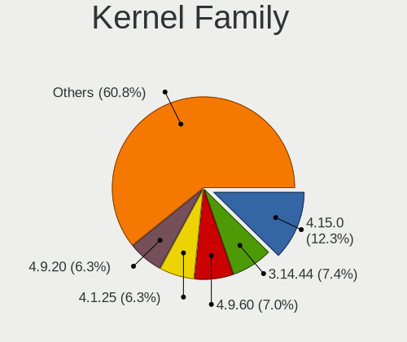
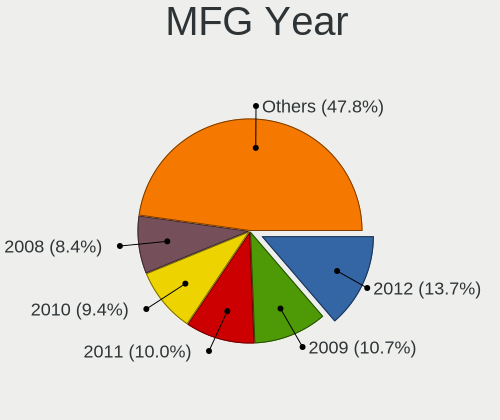
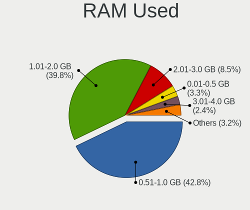
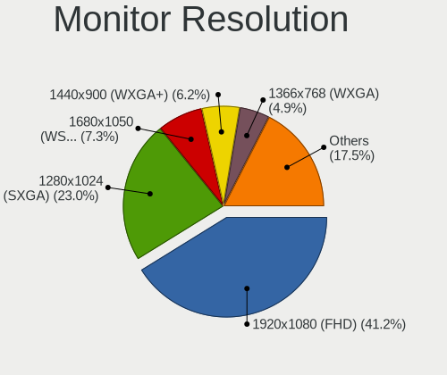
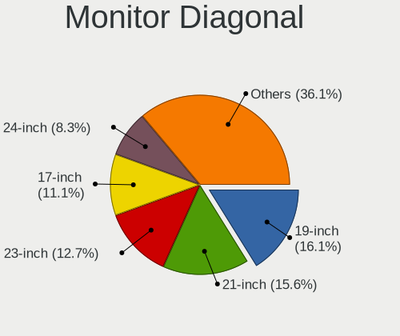
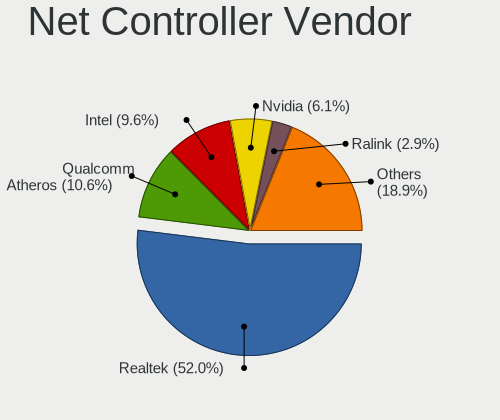
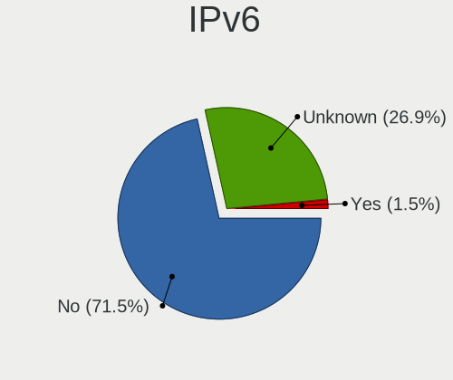

ROSA - Tested Hardware & Statistics (Desktops)
----------------------------------------------

A project to collect tested hardware configurations for ROSA.

Anyone can contribute to this report by the [hw-probe](https://github.com/linuxhw/hw-probe) tool:

    sudo -E hw-probe -all -upload

Please contribute! Especially if your hardware is rare.

Contents
--------

* [ Test Cases ](#test-cases)

* [ System ](#system)
  - [ OS                       ](#os)
  - [ OS Family                ](#os-family)
  - [ Kernel                   ](#kernel)
  - [ Kernel Family            ](#kernel-family)
  - [ Kernel Major Ver.        ](#kernel-major-ver)
  - [ Arch                     ](#arch)
  - [ DE                       ](#de)
  - [ Display Server           ](#display-server)
  - [ Display Manager          ](#display-manager)
  - [ OS Lang                  ](#os-lang)
  - [ Boot Mode                ](#boot-mode)
  - [ Filesystem               ](#filesystem)
  - [ Part. scheme             ](#part-scheme)
  - [ Dual Boot with Linux/BSD ](#dual-boot-with-linuxbsd)
  - [ Dual Boot (Win)          ](#dual-boot-win)

* [ Board ](#board)
  - [ Vendor                   ](#vendor)
  - [ Model                    ](#model)
  - [ Model Family             ](#model-family)
  - [ MFG Year                 ](#mfg-year)
  - [ Form Factor              ](#form-factor)
  - [ Secure Boot              ](#secure-boot)
  - [ Coreboot                 ](#coreboot)
  - [ RAM Size                 ](#ram-size)
  - [ RAM Used                 ](#ram-used)
  - [ Total Drives             ](#total-drives)
  - [ Has CD-ROM               ](#has-cd-rom)
  - [ Has Ethernet             ](#has-ethernet)
  - [ Has WiFi                 ](#has-wifi)
  - [ Has Bluetooth            ](#has-bluetooth)

* [ Location ](#location)
  - [ Country                  ](#country)
  - [ City                     ](#city)

* [ Drives ](#drives)
  - [ Drive Vendor             ](#drive-vendor)
  - [ Drive Model              ](#drive-model)
  - [ HDD Vendor               ](#hdd-vendor)
  - [ SSD Vendor               ](#ssd-vendor)
  - [ Drive Kind               ](#drive-kind)
  - [ Drive Connector          ](#drive-connector)
  - [ Drive Size               ](#drive-size)
  - [ Space Total              ](#space-total)
  - [ Space Used               ](#space-used)
  - [ Malfunc. Drives          ](#malfunc-drives)
  - [ Malfunc. Drive Vendor    ](#malfunc-drive-vendor)
  - [ Malfunc. HDD Vendor      ](#malfunc-hdd-vendor)
  - [ Malfunc. Drive Kind      ](#malfunc-drive-kind)
  - [ Failed Drives            ](#failed-drives)
  - [ Failed Drive Vendor      ](#failed-drive-vendor)
  - [ Drive Status             ](#drive-status)

* [ Storage controller ](#storage-controller)
  - [ Storage Vendor           ](#storage-vendor)
  - [ Storage Model            ](#storage-model)
  - [ Storage Kind             ](#storage-kind)

* [ Processor ](#processor)
  - [ CPU Vendor               ](#cpu-vendor)
  - [ CPU Model                ](#cpu-model)
  - [ CPU Model Family         ](#cpu-model-family)
  - [ CPU Cores                ](#cpu-cores)
  - [ CPU Sockets              ](#cpu-sockets)
  - [ CPU Threads              ](#cpu-threads)
  - [ CPU Op-Modes             ](#cpu-op-modes)
  - [ CPU Microcode            ](#cpu-microcode)
  - [ CPU Microarch            ](#cpu-microarch)

* [ Graphics ](#graphics)
  - [ GPU Vendor               ](#gpu-vendor)
  - [ GPU Model                ](#gpu-model)
  - [ GPU Combo                ](#gpu-combo)
  - [ GPU Driver               ](#gpu-driver)
  - [ GPU Memory               ](#gpu-memory)

* [ Monitor ](#monitor)
  - [ Monitor Vendor           ](#monitor-vendor)
  - [ Monitor Model            ](#monitor-model)
  - [ Monitor Resolution       ](#monitor-resolution)
  - [ Monitor Diagonal         ](#monitor-diagonal)
  - [ Monitor Width            ](#monitor-width)
  - [ Aspect Ratio             ](#aspect-ratio)
  - [ Monitor Area             ](#monitor-area)
  - [ Pixel Density            ](#pixel-density)
  - [ Multiple Monitors        ](#multiple-monitors)

* [ Network ](#network)
  - [ Net Controller Vendor    ](#net-controller-vendor)
  - [ Net Controller Model     ](#net-controller-model)
  - [ Wireless Vendor          ](#wireless-vendor)
  - [ Wireless Model           ](#wireless-model)
  - [ Ethernet Vendor          ](#ethernet-vendor)
  - [ Ethernet Model           ](#ethernet-model)
  - [ Net Controller Kind      ](#net-controller-kind)
  - [ Used Controller          ](#used-controller)
  - [ NICs                     ](#nics)
  - [ IPv6                     ](#ipv6)

* [ Bluetooth ](#bluetooth)
  - [ Bluetooth Vendor         ](#bluetooth-vendor)
  - [ Bluetooth Model          ](#bluetooth-model)

* [ Sound ](#sound)
  - [ Sound Vendor             ](#sound-vendor)
  - [ Sound Model              ](#sound-model)

* [ Memory ](#memory)
  - [ Memory Vendor            ](#memory-vendor)
  - [ Memory Model             ](#memory-model)
  - [ Memory Kind              ](#memory-kind)
  - [ Memory Form Factor       ](#memory-form-factor)
  - [ Memory Size              ](#memory-size)
  - [ Memory Speed             ](#memory-speed)

* [ Printers & scanners ](#printers--scanners)
  - [ Printer Vendor           ](#printer-vendor)
  - [ Printer Model            ](#printer-model)
  - [ Scanner Vendor           ](#scanner-vendor)
  - [ Scanner Model            ](#scanner-model)

* [ Camera ](#camera)
  - [ Camera Vendor            ](#camera-vendor)
  - [ Camera Model             ](#camera-model)

* [ Security ](#security)
  - [ Fingerprint Vendor       ](#fingerprint-vendor)
  - [ Fingerprint Model        ](#fingerprint-model)
  - [ Chipcard Vendor          ](#chipcard-vendor)
  - [ Chipcard Model           ](#chipcard-model)

* [ Unsupported ](#unsupported)
  - [ Unsupported Devices      ](#unsupported-devices)
  - [ Unsupported Device Types ](#unsupported-device-types)

Test Cases
----------

Total: 22803

| Vendor        | Model                       | Probe                                                      | Date         |
|---------------|-----------------------------|------------------------------------------------------------|--------------|
| Lenovo        | Bantry CRB NOK              | [c2a11bca8a](https://linux-hardware.org/?probe=c2a11bca8a) | May 09, 2024 |
| ASRock        | H61M                        | [4db6a46097](https://linux-hardware.org/?probe=4db6a46097) | May 08, 2024 |
| ASRock        | H61M                        | [cf55ba331e](https://linux-hardware.org/?probe=cf55ba331e) | May 08, 2024 |
| ASRock        | B550M Phantom Gaming 4      | [336a5b4e2b](https://linux-hardware.org/?probe=336a5b4e2b) | May 08, 2024 |
| Gigabyte      | H81M-S1                     | [3566b1666c](https://linux-hardware.org/?probe=3566b1666c) | May 08, 2024 |
| ASUSTek       | E520                        | [4e025280e9](https://linux-hardware.org/?probe=4e025280e9) | May 08, 2024 |
| Gigabyte      | B560M H                     | [9d2a9c59a3](https://linux-hardware.org/?probe=9d2a9c59a3) | May 08, 2024 |
| MSI           | B450M-A PRO MAX II          | [cd66ff303c](https://linux-hardware.org/?probe=cd66ff303c) | May 08, 2024 |
| MSI           | PRO B650M-P                 | [2490ea1b56](https://linux-hardware.org/?probe=2490ea1b56) | May 08, 2024 |
| Gigabyte      | H81M-S2H                    | [217f6991ee](https://linux-hardware.org/?probe=217f6991ee) | May 08, 2024 |
| Gigabyte      | B450 GAMING X               | [f7eef71378](https://linux-hardware.org/?probe=f7eef71378) | May 08, 2024 |
| ASRock        | AB350M-HDV R3.0             | [d919c0d099](https://linux-hardware.org/?probe=d919c0d099) | May 07, 2024 |
| Gigabyte      | C1037UN-EU                  | [714735cd6f](https://linux-hardware.org/?probe=714735cd6f) | May 07, 2024 |
| GEEKOM        | A7                          | [87925a210f](https://linux-hardware.org/?probe=87925a210f) | May 07, 2024 |
| Gigabyte      | H610M S2H DDR4              | [4fb0650e99](https://linux-hardware.org/?probe=4fb0650e99) | May 07, 2024 |
| Intel         | B75                         | [18e086bc3d](https://linux-hardware.org/?probe=18e086bc3d) | May 06, 2024 |
| Lenovo        | 36C7 SDK0J40697 WIN 3305... | [867c770e38](https://linux-hardware.org/?probe=867c770e38) | May 06, 2024 |
| Gigabyte      | 8PEMT4                      | [d43ba07bdd](https://linux-hardware.org/?probe=d43ba07bdd) | May 06, 2024 |
| Fujitsu       | D3222-A1 S26361-D3222-A1    | [ec90e9cff9](https://linux-hardware.org/?probe=ec90e9cff9) | May 06, 2024 |
| Gigabyte      | H81M-S2H                    | [0b1a61e802](https://linux-hardware.org/?probe=0b1a61e802) | May 06, 2024 |
| Gigabyte      | B560M DS3H                  | [ead92a9fe5](https://linux-hardware.org/?probe=ead92a9fe5) | May 06, 2024 |
| ASRock        | FM2A68M-DG3+                | [0c960e6942](https://linux-hardware.org/?probe=0c960e6942) | May 05, 2024 |
| Gigabyte      | B560M DS3H                  | [3d88207b4d](https://linux-hardware.org/?probe=3d88207b4d) | May 05, 2024 |
| ASUSTek       | TUF H310M-PLUS GAMING R2... | [2a47a6393b](https://linux-hardware.org/?probe=2a47a6393b) | May 05, 2024 |
| ASUSTek       | TUF Gaming B550M-PLUS WI... | [c785a73424](https://linux-hardware.org/?probe=c785a73424) | May 05, 2024 |
| ASUSTek       | M4A88TD-V EVO/USB3          | [0ded21fa2e](https://linux-hardware.org/?probe=0ded21fa2e) | May 05, 2024 |
| Gigabyte      | B450 GAMING X               | [632943f952](https://linux-hardware.org/?probe=632943f952) | May 05, 2024 |
| MSI           | B650 GAMING PLUS WIFI       | [c1db6719c8](https://linux-hardware.org/?probe=c1db6719c8) | May 04, 2024 |
| ASUSTek       | P8P67                       | [9dcca1359b](https://linux-hardware.org/?probe=9dcca1359b) | May 04, 2024 |
| Gigabyte      | B550 AORUS ELITE V2         | [2f23713428](https://linux-hardware.org/?probe=2f23713428) | May 04, 2024 |
| Gigabyte      | Z77-DS3H                    | [239aa09252](https://linux-hardware.org/?probe=239aa09252) | May 04, 2024 |
| Gigabyte      | H97-D3H-CF                  | [d4b03a1295](https://linux-hardware.org/?probe=d4b03a1295) | May 04, 2024 |
| Dell          | 03NVJ6 A01                  | [d2f91d8ce7](https://linux-hardware.org/?probe=d2f91d8ce7) | May 03, 2024 |
| ASUSTek       | P7H55                       | [25860ff0c1](https://linux-hardware.org/?probe=25860ff0c1) | May 03, 2024 |
| Gigabyte      | B650M GAMING X AX           | [bca236e545](https://linux-hardware.org/?probe=bca236e545) | May 03, 2024 |
| Unknown       | Unknown                     | [1564e76ada](https://linux-hardware.org/?probe=1564e76ada) | May 03, 2024 |
| MSI           | MS-7309                     | [0683637148](https://linux-hardware.org/?probe=0683637148) | May 03, 2024 |
| Gigabyte      | Z690 UD                     | [700cd9b859](https://linux-hardware.org/?probe=700cd9b859) | May 02, 2024 |
| Gigabyte      | B560 HD3                    | [eb083c6668](https://linux-hardware.org/?probe=eb083c6668) | May 02, 2024 |
| ASRock        | Z68 Pro3                    | [2b254bcdbb](https://linux-hardware.org/?probe=2b254bcdbb) | May 02, 2024 |
| HP            | 0AA8h                       | [7b72e86416](https://linux-hardware.org/?probe=7b72e86416) | May 01, 2024 |
| JGINYUE       | X99 TITANIUM D4             | [dc3cd2b7e9](https://linux-hardware.org/?probe=dc3cd2b7e9) | May 01, 2024 |
| ASRock        | H410M-HVS                   | [2a5b383001](https://linux-hardware.org/?probe=2a5b383001) | May 01, 2024 |
| Intel         | DZ77BH-55K AAG39008-401     | [9fae0699d4](https://linux-hardware.org/?probe=9fae0699d4) | May 01, 2024 |
| Acer          | WMCP78M                     | [34b0e08d0c](https://linux-hardware.org/?probe=34b0e08d0c) | May 01, 2024 |
| Unknown       | GB01                        | [cbbb8cc3ea](https://linux-hardware.org/?probe=cbbb8cc3ea) | May 01, 2024 |
| Gigabyte      | P67A-D3-B3                  | [22337aabf0](https://linux-hardware.org/?probe=22337aabf0) | Apr 30, 2024 |
| Gigabyte      | P67A-D3-B3                  | [f3950d30d7](https://linux-hardware.org/?probe=f3950d30d7) | Apr 30, 2024 |
| ASRock        | H510M-HDV                   | [f48ead89ac](https://linux-hardware.org/?probe=f48ead89ac) | Apr 30, 2024 |
| ASUSTek       | M5A97 R2.0                  | [448d785ccb](https://linux-hardware.org/?probe=448d785ccb) | Apr 30, 2024 |
| ASUSTek       | P5KPL-VM                    | [d2d5710920](https://linux-hardware.org/?probe=d2d5710920) | Apr 29, 2024 |
| Gigabyte      | C1037UN-EU                  | [ff9f6ab993](https://linux-hardware.org/?probe=ff9f6ab993) | Apr 29, 2024 |
| Gigabyte      | B550M AORUS ELITE           | [deab538223](https://linux-hardware.org/?probe=deab538223) | Apr 29, 2024 |
| ASRock        | H110M-DGS R3.0              | [e1d811fd8f](https://linux-hardware.org/?probe=e1d811fd8f) | Apr 29, 2024 |
| ASUSTek       | P5B-VM SE                   | [b3631ed021](https://linux-hardware.org/?probe=b3631ed021) | Apr 29, 2024 |
| Dell          | 0J3C2F A00                  | [7c98336737](https://linux-hardware.org/?probe=7c98336737) | Apr 29, 2024 |
| ASRock        | 970 Extreme3                | [41c988e70a](https://linux-hardware.org/?probe=41c988e70a) | Apr 28, 2024 |
| Dell          | 0Y5DDC A00                  | [ebc89ad860](https://linux-hardware.org/?probe=ebc89ad860) | Apr 28, 2024 |
| ASUSTek       | ROG STRIX Z490-A GAMING     | [3f33898064](https://linux-hardware.org/?probe=3f33898064) | Apr 28, 2024 |
| Gigabyte      | B450M GAMING                | [e1d90f7845](https://linux-hardware.org/?probe=e1d90f7845) | Apr 28, 2024 |
| ASUSTek       | TUF Gaming B550-PLUS        | [9668278c22](https://linux-hardware.org/?probe=9668278c22) | Apr 27, 2024 |
| Gigabyte      | B560 HD3                    | [44238d5c6b](https://linux-hardware.org/?probe=44238d5c6b) | Apr 27, 2024 |
| Gigabyte      | P75-D3                      | [5b99a00fb6](https://linux-hardware.org/?probe=5b99a00fb6) | Apr 27, 2024 |
| ASRock        | A520M Pro4                  | [4bc0a01a43](https://linux-hardware.org/?probe=4bc0a01a43) | Apr 27, 2024 |
| ASUSTek       | M5A97 LE R2.0               | [c01df1a8cc](https://linux-hardware.org/?probe=c01df1a8cc) | Apr 27, 2024 |
| MSI           | B560M PRO-VDH               | [e8eecbc1e8](https://linux-hardware.org/?probe=e8eecbc1e8) | Apr 27, 2024 |
| MSI           | A520M-A PRO                 | [b5da5c88d5](https://linux-hardware.org/?probe=b5da5c88d5) | Apr 26, 2024 |
| MSI           | A520M-A PRO                 | [29f83993ee](https://linux-hardware.org/?probe=29f83993ee) | Apr 26, 2024 |
| MSI           | B560M-A PRO                 | [8c03907a7f](https://linux-hardware.org/?probe=8c03907a7f) | Apr 26, 2024 |
| Gigabyte      | H610M H DDR4                | [f539d958f8](https://linux-hardware.org/?probe=f539d958f8) | Apr 25, 2024 |
| ASUSTek       | PRIME B450M-K II            | [5e0533ba7a](https://linux-hardware.org/?probe=5e0533ba7a) | Apr 25, 2024 |
| MB            | A320-SF110                  | [12b1e02450](https://linux-hardware.org/?probe=12b1e02450) | Apr 25, 2024 |
| MSI           | B450M PRO-VDH MAX           | [6af9b206fe](https://linux-hardware.org/?probe=6af9b206fe) | Apr 25, 2024 |
| ASRock        | B450M Pro4                  | [c21217d9a7](https://linux-hardware.org/?probe=c21217d9a7) | Apr 24, 2024 |
| ASUSTek       | M5A78L-M PLUS/USB3          | [2d7981cb51](https://linux-hardware.org/?probe=2d7981cb51) | Apr 24, 2024 |
| ASUSTek       | Z87-K                       | [4e94cfc6a5](https://linux-hardware.org/?probe=4e94cfc6a5) | Apr 23, 2024 |
| ASUSTek       | Z87-K                       | [82b76f44a6](https://linux-hardware.org/?probe=82b76f44a6) | Apr 23, 2024 |
| Biostar       | B250MHC                     | [ce7a852455](https://linux-hardware.org/?probe=ce7a852455) | Apr 23, 2024 |
| EPoX Compu... | nForce3 DDR: 8KDA3I Seri... | [12953efce9](https://linux-hardware.org/?probe=12953efce9) | Apr 22, 2024 |
| Gigabyte      | B560 HD3                    | [79a0bd3c5a](https://linux-hardware.org/?probe=79a0bd3c5a) | Apr 22, 2024 |
| Gigabyte      | A520M H                     | [e2dbe2747f](https://linux-hardware.org/?probe=e2dbe2747f) | Apr 21, 2024 |
| ECS           | H61H2-MV                    | [ae7dbc61ba](https://linux-hardware.org/?probe=ae7dbc61ba) | Apr 21, 2024 |
| MSI           | 760GM-P21                   | [7984d3e4b9](https://linux-hardware.org/?probe=7984d3e4b9) | Apr 21, 2024 |
| ASUSTek       | P5G41T-M LX3                | [4a8c3625a7](https://linux-hardware.org/?probe=4a8c3625a7) | Apr 21, 2024 |
| Gigabyte      | H77N-WIFI                   | [a3913f0b25](https://linux-hardware.org/?probe=a3913f0b25) | Apr 21, 2024 |
| Huanan        | X99-BD4 V1.33               | [b8d6f42912](https://linux-hardware.org/?probe=b8d6f42912) | Apr 21, 2024 |
| HP            | 8433 11                     | [c35af27b38](https://linux-hardware.org/?probe=c35af27b38) | Apr 21, 2024 |
| Gigabyte      | B560M DS3H V2               | [6d72c0e404](https://linux-hardware.org/?probe=6d72c0e404) | Apr 21, 2024 |
| Gigabyte      | B450M S2H                   | [91016c84f6](https://linux-hardware.org/?probe=91016c84f6) | Apr 21, 2024 |
| Intel         | X99                         | [efa0495932](https://linux-hardware.org/?probe=efa0495932) | Apr 20, 2024 |
| ASRock        | N68-VS3 UCC                 | [d273e0a39b](https://linux-hardware.org/?probe=d273e0a39b) | Apr 20, 2024 |
| ASRock        | N68C-GS FX                  | [8c11941906](https://linux-hardware.org/?probe=8c11941906) | Apr 20, 2024 |
| MSI           | B550M PRO-VDH WIFI          | [b02f80cde5](https://linux-hardware.org/?probe=b02f80cde5) | Apr 20, 2024 |
| MSI           | 2A9Ch                       | [9722851624](https://linux-hardware.org/?probe=9722851624) | Apr 19, 2024 |
| ASRock        | H55M-GE                     | [af9410e05d](https://linux-hardware.org/?probe=af9410e05d) | Apr 19, 2024 |
| ASRock        | H81M-HDS R2.0               | [fc15e77fd7](https://linux-hardware.org/?probe=fc15e77fd7) | Apr 19, 2024 |
| Gigabyte      | GA-870A-UD3                 | [5c12a39842](https://linux-hardware.org/?probe=5c12a39842) | Apr 19, 2024 |
| Gigabyte      | GA-970A-UD3                 | [a898b849a3](https://linux-hardware.org/?probe=a898b849a3) | Apr 19, 2024 |
| Gigabyte      | Z68X-UD3H-B3                | [e0caa04752](https://linux-hardware.org/?probe=e0caa04752) | Apr 19, 2024 |
| Gigabyte      | AB350M-DS3H V2-CF           | [7521a177c6](https://linux-hardware.org/?probe=7521a177c6) | Apr 18, 2024 |
| Intel         | SKYBAY                      | [8177e0db3d](https://linux-hardware.org/?probe=8177e0db3d) | Apr 18, 2024 |
| ASRock        | H55M-LE                     | [d1a9eab709](https://linux-hardware.org/?probe=d1a9eab709) | Apr 18, 2024 |
| Gigabyte      | H61M-S2PV                   | [2237c11067](https://linux-hardware.org/?probe=2237c11067) | Apr 18, 2024 |
| MSI           | PRO B650M-P                 | [248ffb4c8d](https://linux-hardware.org/?probe=248ffb4c8d) | Apr 18, 2024 |
| MACHINIST     | X79 (INTEL Xeon E5/Corei... | [4dbd9441f2](https://linux-hardware.org/?probe=4dbd9441f2) | Apr 18, 2024 |
| HP            | 8534 MVB                    | [a72d3ca2aa](https://linux-hardware.org/?probe=a72d3ca2aa) | Apr 17, 2024 |
| WeiBu         | ADL-N Prod                  | [3da2323db4](https://linux-hardware.org/?probe=3da2323db4) | Apr 17, 2024 |
| ASRock        | H110M-DGS R3.0              | [f010a333ff](https://linux-hardware.org/?probe=f010a333ff) | Apr 17, 2024 |
| MSI           | MPG B550 GAMING PLUS        | [3d86cc0385](https://linux-hardware.org/?probe=3d86cc0385) | Apr 17, 2024 |
| ASUSTek       | A88XM-A                     | [9ec8a9c7a5](https://linux-hardware.org/?probe=9ec8a9c7a5) | Apr 16, 2024 |
| Gigabyte      | B360M DS3H                  | [5840160986](https://linux-hardware.org/?probe=5840160986) | Apr 16, 2024 |
| ASUSTek       | M5A97 R2.0                  | [4cbfaca39b](https://linux-hardware.org/?probe=4cbfaca39b) | Apr 16, 2024 |
| Gigabyte      | B360M DS3H                  | [b0cdd5070e](https://linux-hardware.org/?probe=b0cdd5070e) | Apr 16, 2024 |
| ASUSTek       | P5Q-VM DO                   | [97854f0f53](https://linux-hardware.org/?probe=97854f0f53) | Apr 16, 2024 |
| Gigabyte      | Z77-DS3H                    | [c0e482caa4](https://linux-hardware.org/?probe=c0e482caa4) | Apr 16, 2024 |
| ASUSTek       | PRIME B660M-K D4            | [ef00b4e19b](https://linux-hardware.org/?probe=ef00b4e19b) | Apr 15, 2024 |
| ASUSTek       | P7H55-M PRO                 | [ac09a9db06](https://linux-hardware.org/?probe=ac09a9db06) | Apr 15, 2024 |
| Gigabyte      | B85M-D3H                    | [0428aaf36d](https://linux-hardware.org/?probe=0428aaf36d) | Apr 15, 2024 |
| ASRock        | A520M Pro4                  | [9d7e14b058](https://linux-hardware.org/?probe=9d7e14b058) | Apr 14, 2024 |
| Gigabyte      | H77N-WIFI                   | [1dbe5f68f3](https://linux-hardware.org/?probe=1dbe5f68f3) | Apr 14, 2024 |
| ASUSTek       | STRIX B250F GAMING          | [b80ca80da1](https://linux-hardware.org/?probe=b80ca80da1) | Apr 14, 2024 |
| ASUSTek       | H81-PLUS                    | [6dbd2eaff6](https://linux-hardware.org/?probe=6dbd2eaff6) | Apr 14, 2024 |
| MSI           | B250M MORTAR                | [dcacc2485e](https://linux-hardware.org/?probe=dcacc2485e) | Apr 14, 2024 |
| Gigabyte      | Z97M-DS3H                   | [209a4136f3](https://linux-hardware.org/?probe=209a4136f3) | Apr 14, 2024 |
| ECS           | GLKD-I2                     | [77d06e5960](https://linux-hardware.org/?probe=77d06e5960) | Apr 14, 2024 |
| ASUSTek       | TUF Gaming B550M-PLUS       | [bc904a86db](https://linux-hardware.org/?probe=bc904a86db) | Apr 14, 2024 |
| ASUSTek       | P8B75-M                     | [fc9c40684f](https://linux-hardware.org/?probe=fc9c40684f) | Apr 13, 2024 |
| Gigabyte      | H110N-CF                    | [4e8d65ec25](https://linux-hardware.org/?probe=4e8d65ec25) | Apr 13, 2024 |
| Intel         | DH67BL AAG10189-209         | [0d8601b752](https://linux-hardware.org/?probe=0d8601b752) | Apr 13, 2024 |
| MSI           | MAG B660M MORTAR WIFI       | [663c8ae486](https://linux-hardware.org/?probe=663c8ae486) | Apr 13, 2024 |
| ASUSTek       | P7H55-M PRO                 | [ab4d2501d8](https://linux-hardware.org/?probe=ab4d2501d8) | Apr 13, 2024 |
| ASRock        | A520M Pro4                  | [03f2a575e4](https://linux-hardware.org/?probe=03f2a575e4) | Apr 12, 2024 |
| MSI           | H97M-G43                    | [dc55d3b788](https://linux-hardware.org/?probe=dc55d3b788) | Apr 12, 2024 |
| ASRock        | AB350 Pro4                  | [930f540c90](https://linux-hardware.org/?probe=930f540c90) | Apr 12, 2024 |
| ASRock        | H81M-HDS R2.0               | [78e0859e01](https://linux-hardware.org/?probe=78e0859e01) | Apr 12, 2024 |
| ASRock        | B75M-DGS                    | [d12544d0b5](https://linux-hardware.org/?probe=d12544d0b5) | Apr 12, 2024 |
| ASUSTek       | SABERTOOTH 990FX R2.0       | [91919808a7](https://linux-hardware.org/?probe=91919808a7) | Apr 12, 2024 |
| ASUSTek       | ROG STRIX B450-F GAMING     | [6bd36b8a91](https://linux-hardware.org/?probe=6bd36b8a91) | Apr 12, 2024 |
| MSI           | MAG X570 TOMAHAWK WIFI      | [625c9224c1](https://linux-hardware.org/?probe=625c9224c1) | Apr 11, 2024 |
| Gigabyte      | AB350M-D3V-CF               | [c80a1a724e](https://linux-hardware.org/?probe=c80a1a724e) | Apr 11, 2024 |
| ASUSTek       | P8H77-V LE                  | [e338c880cd](https://linux-hardware.org/?probe=e338c880cd) | Apr 11, 2024 |
| Intel         | H61                         | [99ba929566](https://linux-hardware.org/?probe=99ba929566) | Apr 11, 2024 |
| Acer          | WG43M                       | [782ee862c8](https://linux-hardware.org/?probe=782ee862c8) | Apr 11, 2024 |
| Gigabyte      | H610M S2H DDR4              | [e27e00184c](https://linux-hardware.org/?probe=e27e00184c) | Apr 10, 2024 |
| BESHTAU       | H610RU001 V1.0              | [13908cdc03](https://linux-hardware.org/?probe=13908cdc03) | Apr 10, 2024 |
| Gigabyte      | B75M-D2V                    | [73cc8735fc](https://linux-hardware.org/?probe=73cc8735fc) | Apr 10, 2024 |
| HP            | 8719                        | [02086100cf](https://linux-hardware.org/?probe=02086100cf) | Apr 10, 2024 |
| Biostar       | A320MH                      | [39c71c5a15](https://linux-hardware.org/?probe=39c71c5a15) | Apr 10, 2024 |
| Fujitsu       | D3222-A1 S26361-D3222-A1    | [e5f77d4699](https://linux-hardware.org/?probe=e5f77d4699) | Apr 10, 2024 |
| Gigabyte      | A520M S2H                   | [baba89fd01](https://linux-hardware.org/?probe=baba89fd01) | Apr 10, 2024 |
| MSI           | H110M PRO-VD PLUS           | [3536b4b6ae](https://linux-hardware.org/?probe=3536b4b6ae) | Apr 09, 2024 |
| ASRock        | A520M Pro4                  | [917d6e1ea7](https://linux-hardware.org/?probe=917d6e1ea7) | Apr 09, 2024 |
| MSI           | H110M PRO-D                 | [b3ab9e2e4c](https://linux-hardware.org/?probe=b3ab9e2e4c) | Apr 08, 2024 |
| Gigabyte      | 8PEMT4                      | [efaa20f6ef](https://linux-hardware.org/?probe=efaa20f6ef) | Apr 08, 2024 |
| Gigabyte      | AB350M-DS3H V2-CF           | [46f80c95ad](https://linux-hardware.org/?probe=46f80c95ad) | Apr 08, 2024 |
| Packard Be... | EG43M                       | [4fc4ce3736](https://linux-hardware.org/?probe=4fc4ce3736) | Apr 08, 2024 |
| MSI           | B360M PRO-VD 2019-01-24     | [5452671bee](https://linux-hardware.org/?probe=5452671bee) | Apr 08, 2024 |
| ASUSTek       | P5G41T-M LX                 | [67249f5ab0](https://linux-hardware.org/?probe=67249f5ab0) | Apr 08, 2024 |
| ASUSTek       | P8Z68-V LX                  | [4b6af763ef](https://linux-hardware.org/?probe=4b6af763ef) | Apr 08, 2024 |
| MB            | A320-SF110                  | [70937f5b47](https://linux-hardware.org/?probe=70937f5b47) | Apr 08, 2024 |
| MSI           | H510M-A PRO                 | [638e20e26e](https://linux-hardware.org/?probe=638e20e26e) | Apr 08, 2024 |
| ASRock        | J5040-ITX                   | [2fc164e842](https://linux-hardware.org/?probe=2fc164e842) | Apr 08, 2024 |
| ASRock        | J5040-ITX                   | [f99f00b44e](https://linux-hardware.org/?probe=f99f00b44e) | Apr 08, 2024 |
| Huanan        | X99 F8D V2.2                | [9d62ddde46](https://linux-hardware.org/?probe=9d62ddde46) | Apr 08, 2024 |
| Intel         | H61                         | [ee335cb309](https://linux-hardware.org/?probe=ee335cb309) | Apr 08, 2024 |
| Gigabyte      | GA-MA78LM-S2H               | [7d1804790f](https://linux-hardware.org/?probe=7d1804790f) | Apr 07, 2024 |
| ASUSTek       | PRIME B250M-A               | [fa5b0597ea](https://linux-hardware.org/?probe=fa5b0597ea) | Apr 07, 2024 |
| Gigabyte      | GA-M56S-S3                  | [af30b29794](https://linux-hardware.org/?probe=af30b29794) | Apr 07, 2024 |
| ASUSTek       | PRIME H310M-K               | [fb3bb01029](https://linux-hardware.org/?probe=fb3bb01029) | Apr 07, 2024 |
| ASUSTek       | STRIX Z270E GAMING          | [61f6715e80](https://linux-hardware.org/?probe=61f6715e80) | Apr 07, 2024 |
| Packard Be... | FMCP7A-ION                  | [6416d4370c](https://linux-hardware.org/?probe=6416d4370c) | Apr 07, 2024 |
| Gigabyte      | H61M-DS2 DVI                | [b4519443c0](https://linux-hardware.org/?probe=b4519443c0) | Apr 07, 2024 |
| ASUSTek       | B85-PLUS                    | [21ce73299e](https://linux-hardware.org/?probe=21ce73299e) | Apr 07, 2024 |
| Packard Be... | FMCP7A-ION                  | [980f8d3802](https://linux-hardware.org/?probe=980f8d3802) | Apr 07, 2024 |
| Unknown       | Unknown                     | [a2dd90b9c9](https://linux-hardware.org/?probe=a2dd90b9c9) | Apr 07, 2024 |
| ASUSTek       | ROG STRIX B350-F GAMING     | [73ddc52a0f](https://linux-hardware.org/?probe=73ddc52a0f) | Apr 06, 2024 |
| HP            | 8653 A                      | [6df4b26261](https://linux-hardware.org/?probe=6df4b26261) | Apr 06, 2024 |
| MSI           | 770-C45                     | [ba92b1059e](https://linux-hardware.org/?probe=ba92b1059e) | Apr 06, 2024 |
| Gigabyte      | GA-970A-DS3                 | [5eaed7ef4a](https://linux-hardware.org/?probe=5eaed7ef4a) | Apr 06, 2024 |
| ASRock        | H410M-HVS                   | [bff4181453](https://linux-hardware.org/?probe=bff4181453) | Apr 06, 2024 |
| Gigabyte      | H110M-S2-CF                 | [b2e584528d](https://linux-hardware.org/?probe=b2e584528d) | Apr 06, 2024 |
| Intel         | X99H                        | [cc8af5d83d](https://linux-hardware.org/?probe=cc8af5d83d) | Apr 05, 2024 |
| Dell          | 0F373D A00                  | [34e756242b](https://linux-hardware.org/?probe=34e756242b) | Apr 05, 2024 |
| MSI           | H61M-P20                    | [fc8a433734](https://linux-hardware.org/?probe=fc8a433734) | Apr 05, 2024 |
| ASRock        | B550M Steel Legend          | [d09a077cff](https://linux-hardware.org/?probe=d09a077cff) | Apr 05, 2024 |
| MSI           | A320M PRO-VD/S              | [4e485d29ea](https://linux-hardware.org/?probe=4e485d29ea) | Apr 05, 2024 |
| Gigabyte      | Z390 UD                     | [b6071c4a29](https://linux-hardware.org/?probe=b6071c4a29) | Apr 04, 2024 |
| MSI           | X570-A PRO                  | [4f7dddb3d7](https://linux-hardware.org/?probe=4f7dddb3d7) | Apr 04, 2024 |
| ASRock        | H81M-HDS R2.0               | [f7dcd5cd93](https://linux-hardware.org/?probe=f7dcd5cd93) | Apr 04, 2024 |
| ASUSTek       | PRIME B550-PLUS             | [1151f3dcdc](https://linux-hardware.org/?probe=1151f3dcdc) | Apr 04, 2024 |
| Intel         | H61                         | [d442271cf5](https://linux-hardware.org/?probe=d442271cf5) | Apr 04, 2024 |
| ASRock        | N68C-GS FX                  | [9cb5b39fe1](https://linux-hardware.org/?probe=9cb5b39fe1) | Apr 04, 2024 |
| Gigabyte      | Z77-D3H                     | [a3abe9a059](https://linux-hardware.org/?probe=a3abe9a059) | Apr 04, 2024 |
| Gigabyte      | H61M-S2PV                   | [0f125d9a05](https://linux-hardware.org/?probe=0f125d9a05) | Apr 04, 2024 |
| Gigabyte      | H61M-S2PV                   | [5a003d744c](https://linux-hardware.org/?probe=5a003d744c) | Apr 04, 2024 |
| Fujitsu       | D3028-A1 S26361-D3028-A1    | [9473d84dbd](https://linux-hardware.org/?probe=9473d84dbd) | Apr 03, 2024 |
| Gigabyte      | GA-MA770T-UD3               | [c953922cd7](https://linux-hardware.org/?probe=c953922cd7) | Apr 03, 2024 |
| ASUSTek       | P5B-VM SE                   | [9e6d967077](https://linux-hardware.org/?probe=9e6d967077) | Apr 03, 2024 |
| ASRock        | Z97 Extreme4                | [0a83391fdb](https://linux-hardware.org/?probe=0a83391fdb) | Apr 02, 2024 |
| Gigabyte      | B365M DS3H                  | [157cf755c3](https://linux-hardware.org/?probe=157cf755c3) | Apr 02, 2024 |
| Gigabyte      | H55-UD3H                    | [337c3ae004](https://linux-hardware.org/?probe=337c3ae004) | Apr 02, 2024 |
| Gigabyte      | H77N-WIFI                   | [1ed84965ff](https://linux-hardware.org/?probe=1ed84965ff) | Apr 02, 2024 |
| MSI           | B450M-A PRO MAX II          | [c4f17b1b3d](https://linux-hardware.org/?probe=c4f17b1b3d) | Apr 02, 2024 |
| Gigabyte      | B450M DS3H V2               | [f8c3755f9e](https://linux-hardware.org/?probe=f8c3755f9e) | Apr 02, 2024 |
| ASUSTek       | P5B                         | [a652289624](https://linux-hardware.org/?probe=a652289624) | Apr 02, 2024 |
| ASUSTek       | PRIME H310M-E R2.0          | [4a49ac0e01](https://linux-hardware.org/?probe=4a49ac0e01) | Apr 01, 2024 |
| MSI           | MPG Z790 CARBON WIFI        | [131c95d3d7](https://linux-hardware.org/?probe=131c95d3d7) | Apr 01, 2024 |
| Gigabyte      | B250M-D3H-CF                | [1439347b12](https://linux-hardware.org/?probe=1439347b12) | Apr 01, 2024 |
| ASRock        | AB350 Pro4                  | [ea73f70fbe](https://linux-hardware.org/?probe=ea73f70fbe) | Apr 01, 2024 |
| Gigabyte      | Z68P-DS3                    | [a692dcd385](https://linux-hardware.org/?probe=a692dcd385) | Apr 01, 2024 |
| Gigabyte      | EP35C-DS3R                  | [f61c8ec0be](https://linux-hardware.org/?probe=f61c8ec0be) | Mar 31, 2024 |
| Dell          | 03NVJ6 A01                  | [70e6108772](https://linux-hardware.org/?probe=70e6108772) | Mar 31, 2024 |
| ASUSTek       | PRIME X470-PRO              | [fa1161d44a](https://linux-hardware.org/?probe=fa1161d44a) | Mar 31, 2024 |
| ASUSTek       | M4A88TD-V EVO/USB3          | [a718289cf3](https://linux-hardware.org/?probe=a718289cf3) | Mar 31, 2024 |
| Shenzhen M... | F6BFC                       | [bf5a4e1e40](https://linux-hardware.org/?probe=bf5a4e1e40) | Mar 31, 2024 |
| ASUSTek       | PRIME B450M-A               | [f3878488ab](https://linux-hardware.org/?probe=f3878488ab) | Mar 31, 2024 |
| Gigabyte      | H77N-WIFI                   | [6a9364640d](https://linux-hardware.org/?probe=6a9364640d) | Mar 31, 2024 |
| ASUSTek       | B85M-E/BR                   | [cfa7260344](https://linux-hardware.org/?probe=cfa7260344) | Mar 31, 2024 |
| MSI           | MPG X570S CARBON MAX WIF... | [d4aba798d3](https://linux-hardware.org/?probe=d4aba798d3) | Mar 30, 2024 |
| MSI           | A320M PRO-VD/S              | [b996dca6eb](https://linux-hardware.org/?probe=b996dca6eb) | Mar 30, 2024 |
| Gigabyte      | X570 AORUS MASTER           | [70abf33885](https://linux-hardware.org/?probe=70abf33885) | Mar 29, 2024 |
| MSI           | MAG X570S TORPEDO MAX       | [4b37fd0dd4](https://linux-hardware.org/?probe=4b37fd0dd4) | Mar 29, 2024 |
| ASUSTek       | P5K Deluxe                  | [07468c91cd](https://linux-hardware.org/?probe=07468c91cd) | Mar 29, 2024 |
| MSI           | 770-C45                     | [82b653914c](https://linux-hardware.org/?probe=82b653914c) | Mar 29, 2024 |
| Gigabyte      | B550 AORUS ELITE AX V2      | [071b6ed41c](https://linux-hardware.org/?probe=071b6ed41c) | Mar 29, 2024 |
| Gigabyte      | H110M-S2-CF                 | [5d6ded6b47](https://linux-hardware.org/?probe=5d6ded6b47) | Mar 28, 2024 |
| Huanan        | X99-8M-F V1.1               | [298251d6d5](https://linux-hardware.org/?probe=298251d6d5) | Mar 28, 2024 |
| Gigabyte      | P67A-D3-B3                  | [cade2b56ea](https://linux-hardware.org/?probe=cade2b56ea) | Mar 27, 2024 |
| OEM           | H310C Ver:1.00              | [4b6ef4e649](https://linux-hardware.org/?probe=4b6ef4e649) | Mar 27, 2024 |
| ASUSTek       | H61M-K                      | [d414dafec6](https://linux-hardware.org/?probe=d414dafec6) | Mar 27, 2024 |
| ASUSTek       | P5G41T-M LX2/GB             | [0c8eb10bab](https://linux-hardware.org/?probe=0c8eb10bab) | Mar 26, 2024 |
| ASUSTek       | H61M-K                      | [761c06c5d3](https://linux-hardware.org/?probe=761c06c5d3) | Mar 26, 2024 |
| ASUSTek       | TUF Gaming B550-PLUS WIF... | [f929e8260b](https://linux-hardware.org/?probe=f929e8260b) | Mar 25, 2024 |
| ASRock        | H110M-DGS R3.0              | [36da9413fa](https://linux-hardware.org/?probe=36da9413fa) | Mar 25, 2024 |
| Gigabyte      | B450M S2H                   | [0179ab9b9b](https://linux-hardware.org/?probe=0179ab9b9b) | Mar 25, 2024 |
| Biostar       | Hi-Fi A70U3P                | [8234630750](https://linux-hardware.org/?probe=8234630750) | Mar 24, 2024 |
| MSI           | Z77A-GD65                   | [d45d119016](https://linux-hardware.org/?probe=d45d119016) | Mar 24, 2024 |
| ASUSTek       | PRIME H510M-K               | [6bb15775d7](https://linux-hardware.org/?probe=6bb15775d7) | Mar 24, 2024 |
| MSI           | Z77A-GD65                   | [07dc75f390](https://linux-hardware.org/?probe=07dc75f390) | Mar 24, 2024 |
| ASUSTek       | PRIME B450M-A II            | [02bfdecd45](https://linux-hardware.org/?probe=02bfdecd45) | Mar 24, 2024 |
| Gigabyte      | P61-DS3-B3                  | [ca57139521](https://linux-hardware.org/?probe=ca57139521) | Mar 23, 2024 |
| Gigabyte      | P61-DS3-B3                  | [385ec2d0ff](https://linux-hardware.org/?probe=385ec2d0ff) | Mar 23, 2024 |
| Biostar       | Hi-Fi A70U3P                | [88168504fb](https://linux-hardware.org/?probe=88168504fb) | Mar 23, 2024 |
| MSI           | B460M PRO-VDH WIFI          | [f8af3eeb30](https://linux-hardware.org/?probe=f8af3eeb30) | Mar 23, 2024 |
| MSI           | B460M PRO-VDH WIFI          | [99e41413e4](https://linux-hardware.org/?probe=99e41413e4) | Mar 23, 2024 |
| Dell          | 0Y5DDC A00                  | [4ee28a1ed9](https://linux-hardware.org/?probe=4ee28a1ed9) | Mar 23, 2024 |
| ASUSTek       | TUF Gaming B550M-PLUS       | [ae06319bd5](https://linux-hardware.org/?probe=ae06319bd5) | Mar 23, 2024 |
| Intel         | DG33BU AAD79951-407         | [df1bfcb53e](https://linux-hardware.org/?probe=df1bfcb53e) | Mar 23, 2024 |
| Huanan        | X99-BD4 V1.1, NALEX         | [61ca546bc1](https://linux-hardware.org/?probe=61ca546bc1) | Mar 22, 2024 |
| Acer          | WMCP78M                     | [42a75723ca](https://linux-hardware.org/?probe=42a75723ca) | Mar 22, 2024 |
| ASRock        | ALiveXFire-eSATA2           | [4046319313](https://linux-hardware.org/?probe=4046319313) | Mar 21, 2024 |
| ASRock        | H61M/U3S3                   | [b521683a8c](https://linux-hardware.org/?probe=b521683a8c) | Mar 21, 2024 |
| Gigabyte      | B550 AORUS MASTER           | [4505be58ad](https://linux-hardware.org/?probe=4505be58ad) | Mar 21, 2024 |
| Huanan        | X79 V2.47                   | [2409d6bc5e](https://linux-hardware.org/?probe=2409d6bc5e) | Mar 21, 2024 |
| ASUSTek       | TUF B450M-PLUS GAMING       | [e22f5ffbdb](https://linux-hardware.org/?probe=e22f5ffbdb) | Mar 20, 2024 |
| ASUSTek       | PRIME H510M-K               | [a64d5bab29](https://linux-hardware.org/?probe=a64d5bab29) | Mar 20, 2024 |
| Gigabyte      | B550 AORUS PRO V2           | [9d76e364c6](https://linux-hardware.org/?probe=9d76e364c6) | Mar 20, 2024 |
| K-Systems     | Unknown                     | [f1263fcfc7](https://linux-hardware.org/?probe=f1263fcfc7) | Mar 19, 2024 |
| K-Systems     | Unknown                     | [f82ecffa76](https://linux-hardware.org/?probe=f82ecffa76) | Mar 19, 2024 |
| Huanan        | X99 F8D V2.2                | [3a83b658e4](https://linux-hardware.org/?probe=3a83b658e4) | Mar 18, 2024 |
| ASUSTek       | PRIME N100I-D D4            | [0b96b0508e](https://linux-hardware.org/?probe=0b96b0508e) | Mar 18, 2024 |
| Gigabyte      | C1037UN-EU                  | [aa4f7d24b2](https://linux-hardware.org/?probe=aa4f7d24b2) | Mar 18, 2024 |
| ASRock        | B550M-HDV                   | [8adaf6e6b2](https://linux-hardware.org/?probe=8adaf6e6b2) | Mar 17, 2024 |
| ASRock        | H81M-DG4                    | [f41d354a25](https://linux-hardware.org/?probe=f41d354a25) | Mar 17, 2024 |
| Shenzhen M... | F7BFD                       | [d02591fce3](https://linux-hardware.org/?probe=d02591fce3) | Mar 17, 2024 |
| Acer          | Aspire TC-705               | [a349860877](https://linux-hardware.org/?probe=a349860877) | Mar 17, 2024 |
| Huanan        | X99 F8D V2.2                | [47c75c3708](https://linux-hardware.org/?probe=47c75c3708) | Mar 17, 2024 |
| Gigabyte      | GA-970A-DS3                 | [48c680cfa8](https://linux-hardware.org/?probe=48c680cfa8) | Mar 16, 2024 |
| ASRock        | FM2A88X Extreme4+           | [80b564a98a](https://linux-hardware.org/?probe=80b564a98a) | Mar 16, 2024 |
| MSI           | X570-A PRO                  | [54aac0dbe6](https://linux-hardware.org/?probe=54aac0dbe6) | Mar 16, 2024 |
| ASUSTek       | H81M-K                      | [bda4381f89](https://linux-hardware.org/?probe=bda4381f89) | Mar 16, 2024 |
| Dell          | 0J190T A01                  | [33f8e7ee95](https://linux-hardware.org/?probe=33f8e7ee95) | Mar 16, 2024 |
| ASRock        | ALiveXFire-eSATA2           | [7c0a8288c6](https://linux-hardware.org/?probe=7c0a8288c6) | Mar 15, 2024 |
| Gigabyte      | B560M DS3H                  | [79ce86cb80](https://linux-hardware.org/?probe=79ce86cb80) | Mar 15, 2024 |
| ASUSTek       | P5P41D                      | [9b1be78b66](https://linux-hardware.org/?probe=9b1be78b66) | Mar 15, 2024 |
| Gigabyte      | B560M DS3H                  | [5cfc32b71d](https://linux-hardware.org/?probe=5cfc32b71d) | Mar 14, 2024 |
| MSI           | MPG B560I GAMING EDGE WI... | [70775d0689](https://linux-hardware.org/?probe=70775d0689) | Mar 14, 2024 |
| Gigabyte      | B75M-D3V                    | [c80c4006f5](https://linux-hardware.org/?probe=c80c4006f5) | Mar 14, 2024 |
| Gigabyte      | H61M-S1                     | [df6f2e8bed](https://linux-hardware.org/?probe=df6f2e8bed) | Mar 13, 2024 |
| Biostar       | H61MHV3                     | [de68d5069f](https://linux-hardware.org/?probe=de68d5069f) | Mar 13, 2024 |
| MSI           | B550 GAMING GEN3            | [228d1219c6](https://linux-hardware.org/?probe=228d1219c6) | Mar 12, 2024 |
| Acer          | Aspire XC-830               | [56026ee137](https://linux-hardware.org/?probe=56026ee137) | Mar 12, 2024 |
| MSI           | B450M-A PRO MAX             | [755b7b2566](https://linux-hardware.org/?probe=755b7b2566) | Mar 12, 2024 |
| ASUSTek       | M5A97                       | [2778a1c570](https://linux-hardware.org/?probe=2778a1c570) | Mar 11, 2024 |
| MSI           | A520M-A PRO                 | [e5af1132d9](https://linux-hardware.org/?probe=e5af1132d9) | Mar 11, 2024 |
| ASUSTek       | P5KR                        | [13351a6cbd](https://linux-hardware.org/?probe=13351a6cbd) | Mar 10, 2024 |
| MSI           | H81M ECO                    | [c046e6730c](https://linux-hardware.org/?probe=c046e6730c) | Mar 10, 2024 |
| Gigabyte      | H110M-S2PV-CF               | [ee56912aab](https://linux-hardware.org/?probe=ee56912aab) | Mar 10, 2024 |
| ASUSTek       | P5P41D                      | [c4bcfd497b](https://linux-hardware.org/?probe=c4bcfd497b) | Mar 10, 2024 |
| ASUSTek       | PRIME B350-PLUS             | [167473d89e](https://linux-hardware.org/?probe=167473d89e) | Mar 10, 2024 |
| ASUSTek       | TUF Gaming B550-PLUS WIF... | [0ec2344f7a](https://linux-hardware.org/?probe=0ec2344f7a) | Mar 10, 2024 |
| Gigabyte      | A320M-H-CF                  | [cd7cff78d6](https://linux-hardware.org/?probe=cd7cff78d6) | Mar 10, 2024 |
| Gigabyte      | B550 AORUS ELITE V2         | [5552313303](https://linux-hardware.org/?probe=5552313303) | Mar 09, 2024 |
| Gigabyte      | AB350M-DS3H V2-CF           | [3d531c7373](https://linux-hardware.org/?probe=3d531c7373) | Mar 09, 2024 |
| ASUSTek       | STRIX Z270H GAMING          | [7cbe4695cc](https://linux-hardware.org/?probe=7cbe4695cc) | Mar 09, 2024 |
| Gigabyte      | B75M-D3V                    | [425a64f975](https://linux-hardware.org/?probe=425a64f975) | Mar 09, 2024 |
| MSI           | MPG Z790 CARBON WIFI        | [b4bd23b644](https://linux-hardware.org/?probe=b4bd23b644) | Mar 08, 2024 |
| Gigabyte      | B250M-D3H-CF                | [c5dc366c0e](https://linux-hardware.org/?probe=c5dc366c0e) | Mar 08, 2024 |
| MSI           | MPG B560I GAMING EDGE WI... | [c5a6b34264](https://linux-hardware.org/?probe=c5a6b34264) | Mar 07, 2024 |
| Foxconn       | P35A01                      | [65350c4f66](https://linux-hardware.org/?probe=65350c4f66) | Mar 07, 2024 |
| Acer          | EM61SM/EM61PM               | [cb1d370f79](https://linux-hardware.org/?probe=cb1d370f79) | Mar 07, 2024 |
| ASUSTek       | M5A88-V EVO                 | [69bbc282ac](https://linux-hardware.org/?probe=69bbc282ac) | Mar 06, 2024 |
| Biostar       | A68MHE                      | [d7f1ce84dc](https://linux-hardware.org/?probe=d7f1ce84dc) | Mar 06, 2024 |
| Gigabyte      | B75-D3V                     | [3202bffb91](https://linux-hardware.org/?probe=3202bffb91) | Mar 05, 2024 |
| ASRock        | FM2A58M-VG3+ R2.0           | [4db18e803a](https://linux-hardware.org/?probe=4db18e803a) | Mar 05, 2024 |
| MSI           | G41M-P26                    | [11ab0d567e](https://linux-hardware.org/?probe=11ab0d567e) | Mar 05, 2024 |
| Gigabyte      | Z170X-Gaming 3              | [9852232481](https://linux-hardware.org/?probe=9852232481) | Mar 04, 2024 |
| EPoX Compu... | nForce3 DDR: 8KDA3I Seri... | [08b4789de3](https://linux-hardware.org/?probe=08b4789de3) | Mar 04, 2024 |
| Gigabyte      | H61M-DS2 DVI                | [3dcd2f0f9e](https://linux-hardware.org/?probe=3dcd2f0f9e) | Mar 04, 2024 |
| ASUSTek       | PRIME B550M-A               | [a01de15f57](https://linux-hardware.org/?probe=a01de15f57) | Mar 04, 2024 |
| Biostar       | G41-M7                      | [134a309179](https://linux-hardware.org/?probe=134a309179) | Mar 04, 2024 |
| MSI           | X570-A PRO                  | [86fb0ef626](https://linux-hardware.org/?probe=86fb0ef626) | Mar 03, 2024 |
| MSI           | P55-CD53                    | [12af28caac](https://linux-hardware.org/?probe=12af28caac) | Mar 03, 2024 |
| Dell          | 0Y5DDC A00                  | [4a370aa964](https://linux-hardware.org/?probe=4a370aa964) | Mar 03, 2024 |
| Gigabyte      | P55-US3L                    | [f21e22bd07](https://linux-hardware.org/?probe=f21e22bd07) | Mar 02, 2024 |
| ECS           | G41T-M9                     | [880fe214bb](https://linux-hardware.org/?probe=880fe214bb) | Mar 02, 2024 |
| MSI           | Z97-G43 GAMING              | [5400a4a9d3](https://linux-hardware.org/?probe=5400a4a9d3) | Mar 02, 2024 |
| ASUSTek       | M2N-MX                      | [96bb3a6d17](https://linux-hardware.org/?probe=96bb3a6d17) | Mar 02, 2024 |
| ASRock        | N68-GS3 UCC                 | [b2fe7f0d8d](https://linux-hardware.org/?probe=b2fe7f0d8d) | Mar 02, 2024 |
| ASUSTek       | PRIME A320M-E               | [312cf66d8d](https://linux-hardware.org/?probe=312cf66d8d) | Mar 02, 2024 |
| Gigabyte      | H310M S2                    | [ab894b803e](https://linux-hardware.org/?probe=ab894b803e) | Mar 01, 2024 |
| ASUSTek       | P7P55D-E LX                 | [be8795986d](https://linux-hardware.org/?probe=be8795986d) | Mar 01, 2024 |
| MSI           | X570-A PRO                  | [9c20ceba29](https://linux-hardware.org/?probe=9c20ceba29) | Feb 29, 2024 |
| AZW           | SER V1                      | [26dba2c735](https://linux-hardware.org/?probe=26dba2c735) | Feb 28, 2024 |
| MSI           | MS-7850                     | [c1d3f829f5](https://linux-hardware.org/?probe=c1d3f829f5) | Feb 28, 2024 |
| MSI           | MS-7850                     | [f5d6cb5f20](https://linux-hardware.org/?probe=f5d6cb5f20) | Feb 28, 2024 |
| Gigabyte      | Z590 UD AC                  | [d804f09c40](https://linux-hardware.org/?probe=d804f09c40) | Feb 28, 2024 |
| Gigabyte      | H310M H                     | [f2f7a74d55](https://linux-hardware.org/?probe=f2f7a74d55) | Feb 28, 2024 |
| Huanan        | X99-QD4 V1.0                | [0f88a70c7b](https://linux-hardware.org/?probe=0f88a70c7b) | Feb 27, 2024 |
| Huanan        | X99-QD4 V1.0                | [2fd4bd879c](https://linux-hardware.org/?probe=2fd4bd879c) | Feb 27, 2024 |
| Gigabyte      | GA-MA770T-UD3               | [bc9f00f2a0](https://linux-hardware.org/?probe=bc9f00f2a0) | Feb 27, 2024 |
| ASRock        | G41M-VS3                    | [b655c15d4d](https://linux-hardware.org/?probe=b655c15d4d) | Feb 27, 2024 |
| ASUSTek       | PRIME A320M-C R2.0          | [b6b1f11968](https://linux-hardware.org/?probe=b6b1f11968) | Feb 26, 2024 |
| ASRock        | H510M-HDV                   | [8ca5959091](https://linux-hardware.org/?probe=8ca5959091) | Feb 26, 2024 |
| Aquarius      | AQB560M                     | [9d453966da](https://linux-hardware.org/?probe=9d453966da) | Feb 26, 2024 |
| Gigabyte      | Z77X-UD3H                   | [6fc9ab449f](https://linux-hardware.org/?probe=6fc9ab449f) | Feb 26, 2024 |
| Gigabyte      | B760M GAMING X AX DDR4      | [31e269f120](https://linux-hardware.org/?probe=31e269f120) | Feb 25, 2024 |
| Biostar       | A68MHE                      | [5d160d4f95](https://linux-hardware.org/?probe=5d160d4f95) | Feb 25, 2024 |
| Gigabyte      | MZAPLBP-00                  | [6c2eff47ce](https://linux-hardware.org/?probe=6c2eff47ce) | Feb 25, 2024 |
| MSI           | MPG B550 GAMING PLUS        | [9d153b59b6](https://linux-hardware.org/?probe=9d153b59b6) | Feb 25, 2024 |
| ASUSTek       | Z97-A                       | [933b884b19](https://linux-hardware.org/?probe=933b884b19) | Feb 24, 2024 |
| MSI           | X370 GAMING PLUS            | [121e5ad783](https://linux-hardware.org/?probe=121e5ad783) | Feb 24, 2024 |
| ASUSTek       | P5B                         | [a64f675fc1](https://linux-hardware.org/?probe=a64f675fc1) | Feb 24, 2024 |
| ASUSTek       | Z97-A                       | [136c66a00d](https://linux-hardware.org/?probe=136c66a00d) | Feb 24, 2024 |
| ASUSTek       | M5A78L-M LE                 | [5366289da9](https://linux-hardware.org/?probe=5366289da9) | Feb 24, 2024 |
| Gigabyte      | N3150ND3V                   | [704c1879b4](https://linux-hardware.org/?probe=704c1879b4) | Feb 23, 2024 |
| HP            | ProLiant ML350 G5           | [7c561170db](https://linux-hardware.org/?probe=7c561170db) | Feb 23, 2024 |
| MSI           | MAG B550M MORTAR            | [01b17246ec](https://linux-hardware.org/?probe=01b17246ec) | Feb 23, 2024 |
| MSI           | 2A9C                        | [ef6d2b1db7](https://linux-hardware.org/?probe=ef6d2b1db7) | Feb 23, 2024 |
| MSI           | H81M-E33                    | [620633c566](https://linux-hardware.org/?probe=620633c566) | Feb 22, 2024 |
| Gigabyte      | Z270P-D3-CF                 | [68d302d9b6](https://linux-hardware.org/?probe=68d302d9b6) | Feb 22, 2024 |
| MSI           | B450M PRO-VDH MAX           | [2089982e68](https://linux-hardware.org/?probe=2089982e68) | Feb 22, 2024 |
| ASUSTek       | M5A78L-M LE                 | [a6c65a07d0](https://linux-hardware.org/?probe=a6c65a07d0) | Feb 22, 2024 |
| ASUSTek       | PRIME H510M-K               | [2430483bb7](https://linux-hardware.org/?probe=2430483bb7) | Feb 21, 2024 |
| Shenzhen M... | F7BFD                       | [81eec7d1fd](https://linux-hardware.org/?probe=81eec7d1fd) | Feb 20, 2024 |
| Gigabyte      | 8PEMT4                      | [d602f9bae2](https://linux-hardware.org/?probe=d602f9bae2) | Feb 20, 2024 |
| Gigabyte      | C1037UN-EU                  | [fc037a5832](https://linux-hardware.org/?probe=fc037a5832) | Feb 20, 2024 |
| Apple         | Mac-F60DEB81FF30ACF6 Mac... | [3c9c187529](https://linux-hardware.org/?probe=3c9c187529) | Feb 20, 2024 |
| Gigabyte      | H61M-D2-B3                  | [d48438b2f8](https://linux-hardware.org/?probe=d48438b2f8) | Feb 19, 2024 |
| ASRock        | K10N78D                     | [31060d37cf](https://linux-hardware.org/?probe=31060d37cf) | Feb 18, 2024 |
| MSI           | H81M-E33                    | [396774b8f9](https://linux-hardware.org/?probe=396774b8f9) | Feb 18, 2024 |
| ASRock        | P43DE3                      | [5726c99726](https://linux-hardware.org/?probe=5726c99726) | Feb 18, 2024 |
| MACHINIST     | E5-MR9S V1.0                | [13018ea040](https://linux-hardware.org/?probe=13018ea040) | Feb 18, 2024 |
| Gigabyte      | H61M-S2-B3                  | [ddd8a1ca70](https://linux-hardware.org/?probe=ddd8a1ca70) | Feb 18, 2024 |
| AZW           | MINI S 10                   | [7145cdd737](https://linux-hardware.org/?probe=7145cdd737) | Feb 17, 2024 |
| ASUSTek       | H61M-K                      | [66135af4c0](https://linux-hardware.org/?probe=66135af4c0) | Feb 17, 2024 |
| ASUSTek       | H61M-K                      | [aa8d6c7318](https://linux-hardware.org/?probe=aa8d6c7318) | Feb 17, 2024 |
| OEM           | X79G                        | [8f55adbb98](https://linux-hardware.org/?probe=8f55adbb98) | Feb 16, 2024 |
| Biostar       | H61MHV3                     | [622f610d1c](https://linux-hardware.org/?probe=622f610d1c) | Feb 16, 2024 |
| Unknown       | Unknown                     | [f333efff07](https://linux-hardware.org/?probe=f333efff07) | Feb 16, 2024 |
| Dell          | 06X1TJ A00                  | [cf44a80f01](https://linux-hardware.org/?probe=cf44a80f01) | Feb 15, 2024 |
| MSI           | 770-C45                     | [821b89b717](https://linux-hardware.org/?probe=821b89b717) | Feb 14, 2024 |
| Biostar       | X470GTA                     | [a75fa29fe5](https://linux-hardware.org/?probe=a75fa29fe5) | Feb 14, 2024 |
| ASRock        | FM2A58M-VG3+ R2.0           | [86be5407ae](https://linux-hardware.org/?probe=86be5407ae) | Feb 14, 2024 |
| MSI           | 970A SLI Krait Edition      | [4c41e4bcc2](https://linux-hardware.org/?probe=4c41e4bcc2) | Feb 14, 2024 |
| Lenovo        | SHARKBAY NOK                | [fa37beed12](https://linux-hardware.org/?probe=fa37beed12) | Feb 14, 2024 |
| MSI           | H61M-P20                    | [b123f8a489](https://linux-hardware.org/?probe=b123f8a489) | Feb 14, 2024 |
| Intel         | SKYBAY                      | [83abda444f](https://linux-hardware.org/?probe=83abda444f) | Feb 14, 2024 |
| Gigabyte      | C1037UN-EU                  | [865c4a7b61](https://linux-hardware.org/?probe=865c4a7b61) | Feb 14, 2024 |
| Gigabyte      | C1037UN-EU                  | [9fa46dca6c](https://linux-hardware.org/?probe=9fa46dca6c) | Feb 13, 2024 |
| MSI           | H310M PRO-VDH PLUS          | [868ef78d2c](https://linux-hardware.org/?probe=868ef78d2c) | Feb 13, 2024 |
| Gigabyte      | H310M DS2                   | [5acae65173](https://linux-hardware.org/?probe=5acae65173) | Feb 13, 2024 |
| ASRock        | N68C-S UCC                  | [18ba568a75](https://linux-hardware.org/?probe=18ba568a75) | Feb 13, 2024 |
| MB            | A320-SF110                  | [1bff91c327](https://linux-hardware.org/?probe=1bff91c327) | Feb 13, 2024 |
| Gigabyte      | Z68P-DS3                    | [214c81c4de](https://linux-hardware.org/?probe=214c81c4de) | Feb 13, 2024 |
| Gigabyte      | Z370M DS3H-CF               | [38034612df](https://linux-hardware.org/?probe=38034612df) | Feb 12, 2024 |
| JGINYUE       | X99M-PLUS D4 V5.2           | [b4759f5526](https://linux-hardware.org/?probe=b4759f5526) | Feb 12, 2024 |
| Gigabyte      | B660 DS3H DDR4              | [40b8cc7bb5](https://linux-hardware.org/?probe=40b8cc7bb5) | Feb 12, 2024 |
| Gigabyte      | Z68P-DS3                    | [e719fc099d](https://linux-hardware.org/?probe=e719fc099d) | Feb 12, 2024 |
| ASRock        | FM2A88X Extreme4+           | [b30121b1f1](https://linux-hardware.org/?probe=b30121b1f1) | Feb 11, 2024 |
| MSI           | H97M-G43                    | [59635213b8](https://linux-hardware.org/?probe=59635213b8) | Feb 10, 2024 |
| HP            | 843B                        | [0279dedd88](https://linux-hardware.org/?probe=0279dedd88) | Feb 10, 2024 |
| MSI           | B450M-A PRO MAX             | [442b9d3150](https://linux-hardware.org/?probe=442b9d3150) | Feb 10, 2024 |
| ASRock        | A320M-HDV R4.0              | [701ad54cd4](https://linux-hardware.org/?probe=701ad54cd4) | Feb 09, 2024 |
| MSI           | 770-C45                     | [8ff04ff7b8](https://linux-hardware.org/?probe=8ff04ff7b8) | Feb 09, 2024 |
| MSI           | B450M MORTAR MAX            | [a17d251862](https://linux-hardware.org/?probe=a17d251862) | Feb 08, 2024 |
| Manufact      | Pineview-D                  | [4bd96489f5](https://linux-hardware.org/?probe=4bd96489f5) | Feb 08, 2024 |
| Biostar       | H61MHV3                     | [699b8962e3](https://linux-hardware.org/?probe=699b8962e3) | Feb 08, 2024 |
| ASUSTek       | PRIME H510M-K               | [adc5e324f1](https://linux-hardware.org/?probe=adc5e324f1) | Feb 08, 2024 |
| Gigabyte      | Z370M DS3H-CF               | [57957e1516](https://linux-hardware.org/?probe=57957e1516) | Feb 07, 2024 |
| MSI           | B360M PRO-VD 2019-01-24     | [4affd322d1](https://linux-hardware.org/?probe=4affd322d1) | Feb 07, 2024 |
| ASUSTek       | TUF Gaming B450-PLUS II     | [5c48f72aa8](https://linux-hardware.org/?probe=5c48f72aa8) | Feb 07, 2024 |
| Unknown       | Unknown                     | [97cc2cfe31](https://linux-hardware.org/?probe=97cc2cfe31) | Feb 07, 2024 |
| ASUSTek       | PRIME B650-PLUS             | [ee599b6f9d](https://linux-hardware.org/?probe=ee599b6f9d) | Feb 06, 2024 |
| iRU           | LPGR.469559.017             | [2314dfad5d](https://linux-hardware.org/?probe=2314dfad5d) | Feb 06, 2024 |
| ASRock        | N68C-S UCC                  | [9879ddf9c2](https://linux-hardware.org/?probe=9879ddf9c2) | Feb 06, 2024 |
| Intel         | X99 V1.0                    | [7eda9d34ca](https://linux-hardware.org/?probe=7eda9d34ca) | Feb 05, 2024 |
| Shenzhen M... | F7BFD                       | [644587bb1c](https://linux-hardware.org/?probe=644587bb1c) | Feb 05, 2024 |
| ASRock        | N68C-GS FX                  | [714ac272bb](https://linux-hardware.org/?probe=714ac272bb) | Feb 04, 2024 |
| Gigabyte      | B450 AORUS PRO-CF           | [8822403d1f](https://linux-hardware.org/?probe=8822403d1f) | Feb 04, 2024 |
| Biostar       | A68MHE                      | [05630290af](https://linux-hardware.org/?probe=05630290af) | Feb 04, 2024 |
| MSI           | B450M-A PRO MAX             | [89d29c5b12](https://linux-hardware.org/?probe=89d29c5b12) | Feb 04, 2024 |
| Dell          | 0Y5DDC A00                  | [239af3b38b](https://linux-hardware.org/?probe=239af3b38b) | Feb 03, 2024 |
| Shenzhen M... | F7BFD                       | [d548d52454](https://linux-hardware.org/?probe=d548d52454) | Feb 03, 2024 |
| AZW           | MINI S                      | [f10fcad141](https://linux-hardware.org/?probe=f10fcad141) | Feb 03, 2024 |
| Dell          | 0Y5DDC A00                  | [5cebf6ea45](https://linux-hardware.org/?probe=5cebf6ea45) | Feb 03, 2024 |
| MSI           | A520M PRO-VH                | [dd6b3dd9af](https://linux-hardware.org/?probe=dd6b3dd9af) | Feb 03, 2024 |
| Gigabyte      | M55S-S3                     | [ebc6e07ccf](https://linux-hardware.org/?probe=ebc6e07ccf) | Feb 03, 2024 |
| ASUSTek       | PRIME H510M-K               | [75c12b1309](https://linux-hardware.org/?probe=75c12b1309) | Feb 03, 2024 |
| Gigabyte      | A320M-S2H V2-CF             | [88a3ffaf88](https://linux-hardware.org/?probe=88a3ffaf88) | Feb 02, 2024 |
| ASUSTek       | B85M-G                      | [cd9f6ee87d](https://linux-hardware.org/?probe=cd9f6ee87d) | Feb 02, 2024 |
| ASRock        | 970M Pro3                   | [cf54a4b360](https://linux-hardware.org/?probe=cf54a4b360) | Feb 02, 2024 |
| ASUSTek       | PRIME H510M-R               | [4196d911d2](https://linux-hardware.org/?probe=4196d911d2) | Feb 02, 2024 |
| Gigabyte      | A320M-S2H V2-CF             | [f38bbe7c82](https://linux-hardware.org/?probe=f38bbe7c82) | Feb 02, 2024 |
| ASUSTek       | P5K                         | [1414d10ffb](https://linux-hardware.org/?probe=1414d10ffb) | Feb 01, 2024 |
| Gigabyte      | EP43T-UD3L                  | [934c3f974a](https://linux-hardware.org/?probe=934c3f974a) | Feb 01, 2024 |
| ASUSTek       | PRIME B450M-A               | [5befaf642f](https://linux-hardware.org/?probe=5befaf642f) | Feb 01, 2024 |
| Apple         | Mac-F4208DC8 PVT            | [bce380880a](https://linux-hardware.org/?probe=bce380880a) | Feb 01, 2024 |
| ASRock        | G41M-VS3                    | [df1c8c0da3](https://linux-hardware.org/?probe=df1c8c0da3) | Feb 01, 2024 |
| ASUSTek       | A68HM-PLUS                  | [b00734a23e](https://linux-hardware.org/?probe=b00734a23e) | Feb 01, 2024 |
| ASUSTek       | A68HM-PLUS                  | [6361608cec](https://linux-hardware.org/?probe=6361608cec) | Jan 31, 2024 |
| Intel         | SKYBAY                      | [1e706b6589](https://linux-hardware.org/?probe=1e706b6589) | Jan 31, 2024 |
| Intel         | SKYBAY                      | [4420198abc](https://linux-hardware.org/?probe=4420198abc) | Jan 31, 2024 |
| Intel         | SKYBAY                      | [9d6bc7afb3](https://linux-hardware.org/?probe=9d6bc7afb3) | Jan 31, 2024 |
| ASUSTek       | P7H55                       | [21853e5c4a](https://linux-hardware.org/?probe=21853e5c4a) | Jan 30, 2024 |
| Intel         | X99 V1.0                    | [dee15911ba](https://linux-hardware.org/?probe=dee15911ba) | Jan 29, 2024 |
| MSI           | B550M PRO-VDH WIFI          | [d0403669b9](https://linux-hardware.org/?probe=d0403669b9) | Jan 29, 2024 |
| ASRock        | AB350M-HDV R3.0             | [7b68f8ca63](https://linux-hardware.org/?probe=7b68f8ca63) | Jan 29, 2024 |
| ASRock        | AB350M-HDV R3.0             | [5cc2818fe5](https://linux-hardware.org/?probe=5cc2818fe5) | Jan 29, 2024 |
| Intel         | Unknown                     | [24ab2fdfbf](https://linux-hardware.org/?probe=24ab2fdfbf) | Jan 28, 2024 |
| Dell          | 0Y5DDC A00                  | [bad163ed53](https://linux-hardware.org/?probe=bad163ed53) | Jan 28, 2024 |
| ASUSTek       | P5K                         | [9cadd6185d](https://linux-hardware.org/?probe=9cadd6185d) | Jan 27, 2024 |
| ASUSTek       | Maximus VII RANGER          | [23059625c1](https://linux-hardware.org/?probe=23059625c1) | Jan 27, 2024 |
| ECS           | A960M-MV                    | [3b0de09ab6](https://linux-hardware.org/?probe=3b0de09ab6) | Jan 27, 2024 |
| MSI           | MS-B1711                    | [8eec6cdde5](https://linux-hardware.org/?probe=8eec6cdde5) | Jan 27, 2024 |
| Gigabyte      | GA-A55M-S2HP                | [2c061938f7](https://linux-hardware.org/?probe=2c061938f7) | Jan 26, 2024 |
| ASUSTek       | PRIME B450M-A II            | [0554d57e37](https://linux-hardware.org/?probe=0554d57e37) | Jan 26, 2024 |
| Gigabyte      | Z170X-Gaming 3              | [70edc53219](https://linux-hardware.org/?probe=70edc53219) | Jan 26, 2024 |
| MSI           | 785G-E53                    | [81ee1ec28d](https://linux-hardware.org/?probe=81ee1ec28d) | Jan 26, 2024 |
| Intel         | SKYBAY                      | [3d4350c03d](https://linux-hardware.org/?probe=3d4350c03d) | Jan 26, 2024 |
| ASUSTek       | PRIME Z690-P D4             | [61635d9262](https://linux-hardware.org/?probe=61635d9262) | Jan 24, 2024 |
| ASRock        | N68C-GS FX                  | [ed8901f53b](https://linux-hardware.org/?probe=ed8901f53b) | Jan 24, 2024 |
| Huanan        | X99-BD4 V1.34               | [65794c873c](https://linux-hardware.org/?probe=65794c873c) | Jan 23, 2024 |
| Shuttle       | XS35V3                      | [af36ef4d08](https://linux-hardware.org/?probe=af36ef4d08) | Jan 23, 2024 |
| ASRock        | H110M-DGS R3.0              | [8d264d359b](https://linux-hardware.org/?probe=8d264d359b) | Jan 22, 2024 |
| ASUSTek       | E520                        | [948381dfd1](https://linux-hardware.org/?probe=948381dfd1) | Jan 22, 2024 |
| ASUSTek       | P5QL                        | [300924de5a](https://linux-hardware.org/?probe=300924de5a) | Jan 22, 2024 |
| Intel         | X99                         | [f232e1ea07](https://linux-hardware.org/?probe=f232e1ea07) | Jan 21, 2024 |
| ASRock        | A770DE+                     | [280f9c65c0](https://linux-hardware.org/?probe=280f9c65c0) | Jan 21, 2024 |
| Biostar       | Z690GTA                     | [7beb190026](https://linux-hardware.org/?probe=7beb190026) | Jan 21, 2024 |
| ASUSTek       | P5KPL-AM                    | [98dc47d431](https://linux-hardware.org/?probe=98dc47d431) | Jan 21, 2024 |
| Intel         | D525MW AAE93082-401         | [c1c97f080e](https://linux-hardware.org/?probe=c1c97f080e) | Jan 21, 2024 |
| Huanan        | X99 F8D V2.2                | [5a8ba8fd60](https://linux-hardware.org/?probe=5a8ba8fd60) | Jan 21, 2024 |
| ASRock        | B550 Phantom Gaming 4       | [f8f9f25c64](https://linux-hardware.org/?probe=f8f9f25c64) | Jan 21, 2024 |
| Gigabyte      | B450 GAMING X               | [28be98f6c6](https://linux-hardware.org/?probe=28be98f6c6) | Jan 21, 2024 |
| Gigabyte      | B550 AORUS ELITE AX V2      | [ac1d5f3aec](https://linux-hardware.org/?probe=ac1d5f3aec) | Jan 21, 2024 |
| ASRock        | B75 Pro3                    | [498caaba05](https://linux-hardware.org/?probe=498caaba05) | Jan 21, 2024 |
| ASRock        | N68C-GS FX                  | [6c88409266](https://linux-hardware.org/?probe=6c88409266) | Jan 21, 2024 |
| Intel         | X99                         | [93a5879bf4](https://linux-hardware.org/?probe=93a5879bf4) | Jan 21, 2024 |
| ECS           | A960M-MV                    | [7762cce94d](https://linux-hardware.org/?probe=7762cce94d) | Jan 21, 2024 |
| Gigabyte      | B550 AORUS ELITE AX V2      | [0dc11cbadf](https://linux-hardware.org/?probe=0dc11cbadf) | Jan 21, 2024 |
| Dell          | 0Y5DDC A00                  | [a73f786be7](https://linux-hardware.org/?probe=a73f786be7) | Jan 20, 2024 |
| Gigabyte      | H310M S2V                   | [7be62ed879](https://linux-hardware.org/?probe=7be62ed879) | Jan 20, 2024 |
| ASUSTek       | F2A85-V PRO                 | [150d445de6](https://linux-hardware.org/?probe=150d445de6) | Jan 19, 2024 |
| ASUSTek       | F2A85-V PRO                 | [51b2474c14](https://linux-hardware.org/?probe=51b2474c14) | Jan 19, 2024 |
| ASUSTek       | P8H77-V LE                  | [d805f83d93](https://linux-hardware.org/?probe=d805f83d93) | Jan 19, 2024 |
| ASUSTek       | PRIME A320M-E               | [979cbe9fe0](https://linux-hardware.org/?probe=979cbe9fe0) | Jan 19, 2024 |
| Unknown       | Unknown                     | [500e9e8fda](https://linux-hardware.org/?probe=500e9e8fda) | Jan 18, 2024 |
| Unknown       | Unknown                     | [17bd249685](https://linux-hardware.org/?probe=17bd249685) | Jan 18, 2024 |
| MSI           | PRO B760M-A WIFI DDR4       | [a115913fe1](https://linux-hardware.org/?probe=a115913fe1) | Jan 18, 2024 |
| Gigabyte      | GA-870A-UD3                 | [d274a17024](https://linux-hardware.org/?probe=d274a17024) | Jan 17, 2024 |
| ASUSTek       | P5GC-MX/1333                | [9aa4d8799f](https://linux-hardware.org/?probe=9aa4d8799f) | Jan 17, 2024 |
| ASUSTek       | P5GC-MX/1333                | [39f5fe6747](https://linux-hardware.org/?probe=39f5fe6747) | Jan 17, 2024 |
| ASUSTek       | PRIME Z270-P                | [ae035d3e35](https://linux-hardware.org/?probe=ae035d3e35) | Jan 16, 2024 |
| Dell          | 0C2KJT A00                  | [ef30ea4bc9](https://linux-hardware.org/?probe=ef30ea4bc9) | Jan 16, 2024 |
| ASUSTek       | P5GC-MX/1333                | [17555d4d11](https://linux-hardware.org/?probe=17555d4d11) | Jan 15, 2024 |
| Pegatron      | 2A94h                       | [1bb35b61cf](https://linux-hardware.org/?probe=1bb35b61cf) | Jan 15, 2024 |
| Gigabyte      | M720-US3                    | [3b0d0759b6](https://linux-hardware.org/?probe=3b0d0759b6) | Jan 15, 2024 |
| Gigabyte      | A320M-S2H V2-CF             | [f3ba9ee452](https://linux-hardware.org/?probe=f3ba9ee452) | Jan 15, 2024 |
| Intel         | H81                         | [b0fd4c7628](https://linux-hardware.org/?probe=b0fd4c7628) | Jan 15, 2024 |
| Dell          | 0C2KJT A00                  | [72e5220f30](https://linux-hardware.org/?probe=72e5220f30) | Jan 14, 2024 |
| Acer          | Aspire TC-705               | [52f5e7c5ef](https://linux-hardware.org/?probe=52f5e7c5ef) | Jan 14, 2024 |
| Gigabyte      | H61M-DS2                    | [f75904222c](https://linux-hardware.org/?probe=f75904222c) | Jan 13, 2024 |
| ASUSTek       | PRIME B450M-A II            | [8035c49f8f](https://linux-hardware.org/?probe=8035c49f8f) | Jan 13, 2024 |
| ASRock        | H55M-LE                     | [30ce52798e](https://linux-hardware.org/?probe=30ce52798e) | Jan 13, 2024 |
| Huanan        | X79M-PRO V1.2               | [fbcae0c103](https://linux-hardware.org/?probe=fbcae0c103) | Jan 13, 2024 |
| Intel         | H81                         | [86da5a9776](https://linux-hardware.org/?probe=86da5a9776) | Jan 13, 2024 |
| Gigabyte      | B450M DS3H-CF               | [77546f522e](https://linux-hardware.org/?probe=77546f522e) | Jan 13, 2024 |
| MSI           | MS-B0A61                    | [cacdb6e6fe](https://linux-hardware.org/?probe=cacdb6e6fe) | Jan 13, 2024 |
| HP            | 1825                        | [2e88180c54](https://linux-hardware.org/?probe=2e88180c54) | Jan 13, 2024 |
| ASRock        | B760M-HDV/M.2 D4            | [a8d229af9d](https://linux-hardware.org/?probe=a8d229af9d) | Jan 12, 2024 |
| ASUSTek       | PRIME B560-PLUS             | [15e853a1d1](https://linux-hardware.org/?probe=15e853a1d1) | Jan 12, 2024 |
| ASUSTek       | PRIME B560-PLUS             | [3d9b7d2d2b](https://linux-hardware.org/?probe=3d9b7d2d2b) | Jan 12, 2024 |
| Intel         | SKYBAY                      | [a5f2ea79e9](https://linux-hardware.org/?probe=a5f2ea79e9) | Jan 12, 2024 |
| Intel         | DH67CL AAG10212-208         | [9e5c35a6b6](https://linux-hardware.org/?probe=9e5c35a6b6) | Jan 12, 2024 |
| ASUSTek       | CM6330_CM6630_CM6730_CM6... | [11dd31f3c6](https://linux-hardware.org/?probe=11dd31f3c6) | Jan 12, 2024 |
| ASUSTek       | ROG STRIX B650E-E GAMING... | [2e0a03aba1](https://linux-hardware.org/?probe=2e0a03aba1) | Jan 11, 2024 |
| Gigabyte      | H410M H V3                  | [eb21b0dd13](https://linux-hardware.org/?probe=eb21b0dd13) | Jan 11, 2024 |
| ASUSTek       | PRIME A320M-E               | [2be2d8a769](https://linux-hardware.org/?probe=2be2d8a769) | Jan 11, 2024 |
| ASUSTek       | TUF B450M-PLUS GAMING       | [47a7d3fa7c](https://linux-hardware.org/?probe=47a7d3fa7c) | Jan 10, 2024 |
| ASRock        | H110M-DVS R3.0              | [15f0bd78f4](https://linux-hardware.org/?probe=15f0bd78f4) | Jan 10, 2024 |
| Gigabyte      | H81M-S1                     | [e152d77865](https://linux-hardware.org/?probe=e152d77865) | Jan 10, 2024 |
| MAINBRD       | OPS62A-SHA                  | [7090d5973d](https://linux-hardware.org/?probe=7090d5973d) | Jan 10, 2024 |
| MACHINIST     | E5-MR9S V1.0                | [7e938e0f91](https://linux-hardware.org/?probe=7e938e0f91) | Jan 10, 2024 |
| Shenzhen M... | F7BFD                       | [ff12a04779](https://linux-hardware.org/?probe=ff12a04779) | Jan 10, 2024 |
| ASUSTek       | A88XM-A                     | [50b476ac09](https://linux-hardware.org/?probe=50b476ac09) | Jan 09, 2024 |
| HJS           | OPSH110D4                   | [b604539d33](https://linux-hardware.org/?probe=b604539d33) | Jan 09, 2024 |
| ECS           | H61H2-M12                   | [a5b967dfc4](https://linux-hardware.org/?probe=a5b967dfc4) | Jan 09, 2024 |
| Gigabyte      | GA-A55M-S2HP                | [ca456b55a8](https://linux-hardware.org/?probe=ca456b55a8) | Jan 08, 2024 |
| ASUSTek       | M2N-VM HDMI                 | [ea20cecd28](https://linux-hardware.org/?probe=ea20cecd28) | Jan 08, 2024 |
| Gigabyte      | B450 GAMING X               | [4ee36f49f1](https://linux-hardware.org/?probe=4ee36f49f1) | Jan 07, 2024 |
| Unknown       | C51PVGM-M                   | [a652ef8499](https://linux-hardware.org/?probe=a652ef8499) | Jan 07, 2024 |
| Gigabyte      | B450M H                     | [1a3c2a5a40](https://linux-hardware.org/?probe=1a3c2a5a40) | Jan 07, 2024 |
| ASUSTek       | A88X-PLUS/USB               | [7eed61fd57](https://linux-hardware.org/?probe=7eed61fd57) | Jan 07, 2024 |
| ASUSTek       | A88X-PLUS/USB               | [69c24e28a0](https://linux-hardware.org/?probe=69c24e28a0) | Jan 07, 2024 |
| ASUSTek       | P7H55-M                     | [36fc37c5b9](https://linux-hardware.org/?probe=36fc37c5b9) | Jan 06, 2024 |
| ASUSTek       | PRIME H310M-E R2.0          | [62f182c46e](https://linux-hardware.org/?probe=62f182c46e) | Jan 06, 2024 |
| Unknown       | C51PVGM-M                   | [cfe5df72f8](https://linux-hardware.org/?probe=cfe5df72f8) | Jan 06, 2024 |
| MSI           | A520M-A PRO                 | [73e4418e17](https://linux-hardware.org/?probe=73e4418e17) | Jan 05, 2024 |
| TopStar       | V211 C                      | [d056c50760](https://linux-hardware.org/?probe=d056c50760) | Jan 05, 2024 |
| MSI           | H110M PRO-VD                | [bd9f1e7d54](https://linux-hardware.org/?probe=bd9f1e7d54) | Jan 05, 2024 |
| Huanan        | X99-TF GAMING V3.0          | [1d01b72d8c](https://linux-hardware.org/?probe=1d01b72d8c) | Jan 05, 2024 |
| MSI           | H61M-P21                    | [7d4774aa97](https://linux-hardware.org/?probe=7d4774aa97) | Jan 04, 2024 |
| Gigabyte      | B560M DS3H                  | [dbf5b389e1](https://linux-hardware.org/?probe=dbf5b389e1) | Jan 04, 2024 |
| ASUSTek       | P8H61-MX R2.0               | [aeb9554ba6](https://linux-hardware.org/?probe=aeb9554ba6) | Jan 03, 2024 |
| AZW           | MINI S 10                   | [6f5bb65726](https://linux-hardware.org/?probe=6f5bb65726) | Jan 03, 2024 |
| ASUSTek       | P7H55-M SI                  | [55390181a6](https://linux-hardware.org/?probe=55390181a6) | Jan 03, 2024 |
| Gigabyte      | 8PEMT4                      | [d07fa4ad02](https://linux-hardware.org/?probe=d07fa4ad02) | Jan 03, 2024 |
| ASUSTek       | TUF B450M-PLUS GAMING       | [38b88634a4](https://linux-hardware.org/?probe=38b88634a4) | Jan 03, 2024 |
| ASUSTek       | P7H55-M SI                  | [63538d3917](https://linux-hardware.org/?probe=63538d3917) | Jan 02, 2024 |
| ASUSTek       | M5A78L-M LE/USB3            | [6a8af45aab](https://linux-hardware.org/?probe=6a8af45aab) | Jan 02, 2024 |
| ASUSTek       | P5LD2                       | [19abe4bb6a](https://linux-hardware.org/?probe=19abe4bb6a) | Jan 02, 2024 |
| ASUSTek       | P5QL                        | [723455abf9](https://linux-hardware.org/?probe=723455abf9) | Jan 02, 2024 |
| ECS           | GLKD-I2                     | [97247e0a90](https://linux-hardware.org/?probe=97247e0a90) | Jan 02, 2024 |
| Gigabyte      | B560M DS3H                  | [4ff670c80b](https://linux-hardware.org/?probe=4ff670c80b) | Jan 02, 2024 |
| Gigabyte      | B560M DS3H                  | [1529597f3c](https://linux-hardware.org/?probe=1529597f3c) | Jan 02, 2024 |
| ASRock        | J3355M                      | [305d025c0f](https://linux-hardware.org/?probe=305d025c0f) | Jan 01, 2024 |
| ASRock        | H97M Pro4                   | [3955acda3d](https://linux-hardware.org/?probe=3955acda3d) | Dec 31, 2023 |
| Acer          | WMCP78M                     | [e2d232fa11](https://linux-hardware.org/?probe=e2d232fa11) | Dec 31, 2023 |
| Gigabyte      | B450M DS3H-CF               | [c341d04885](https://linux-hardware.org/?probe=c341d04885) | Dec 31, 2023 |
| ASUSTek       | PRIME B360M-K               | [d333516660](https://linux-hardware.org/?probe=d333516660) | Dec 31, 2023 |
| ASUSTek       | M2N-VM HDMI                 | [3429c969a5](https://linux-hardware.org/?probe=3429c969a5) | Dec 30, 2023 |
| ASUSTek       | M2N-VM HDMI                 | [e90dfa13e1](https://linux-hardware.org/?probe=e90dfa13e1) | Dec 30, 2023 |
| MSI           | B450M-A PRO MAX II          | [3698a044ca](https://linux-hardware.org/?probe=3698a044ca) | Dec 30, 2023 |
| ASUSTek       | A88XM-A                     | [175ef5b9a8](https://linux-hardware.org/?probe=175ef5b9a8) | Dec 30, 2023 |
| ASRock        | J4125M                      | [59f93c9ec4](https://linux-hardware.org/?probe=59f93c9ec4) | Dec 30, 2023 |
| HP            | 1494                        | [a7618ec01a](https://linux-hardware.org/?probe=a7618ec01a) | Dec 30, 2023 |
| Lenovo        | Annapurna CRB NOK           | [1e5fb94730](https://linux-hardware.org/?probe=1e5fb94730) | Dec 29, 2023 |
| Gigabyte      | B550 AORUS ELITE V2         | [7b33e176ed](https://linux-hardware.org/?probe=7b33e176ed) | Dec 29, 2023 |
| ASRock        | H97M Pro4                   | [6069654b2c](https://linux-hardware.org/?probe=6069654b2c) | Dec 28, 2023 |
| MSI           | 890FXA-GD70                 | [f97a148a6d](https://linux-hardware.org/?probe=f97a148a6d) | Dec 28, 2023 |
| Gigabyte      | GA-MA69G-S3H                | [25eaed96f5](https://linux-hardware.org/?probe=25eaed96f5) | Dec 28, 2023 |
| Intel         | D410PT AAE76528-404         | [14f9de700a](https://linux-hardware.org/?probe=14f9de700a) | Dec 27, 2023 |
| ASUSTek       | M2NPV-VM                    | [98103e5513](https://linux-hardware.org/?probe=98103e5513) | Dec 27, 2023 |
| ASUSTek       | P8Z68-V LX                  | [1d40495aae](https://linux-hardware.org/?probe=1d40495aae) | Dec 27, 2023 |
| MSI           | MPG B560I GAMING EDGE WI... | [36ca57b5f2](https://linux-hardware.org/?probe=36ca57b5f2) | Dec 26, 2023 |
| HJS           | OPSADLPA07                  | [2a502cf786](https://linux-hardware.org/?probe=2a502cf786) | Dec 26, 2023 |
| ASUSTek       | P5QL                        | [3e67d03984](https://linux-hardware.org/?probe=3e67d03984) | Dec 26, 2023 |
| ASUSTek       | P8H61-M LX3 R2.0            | [81d482c238](https://linux-hardware.org/?probe=81d482c238) | Dec 25, 2023 |
| HP            | 82FE 11                     | [e9d77b121e](https://linux-hardware.org/?probe=e9d77b121e) | Dec 25, 2023 |
| Gigabyte      | GA-870A-UD3                 | [77da0ba60c](https://linux-hardware.org/?probe=77da0ba60c) | Dec 25, 2023 |
| AZW           | T4 PRO                      | [2b34c0a2cc](https://linux-hardware.org/?probe=2b34c0a2cc) | Dec 25, 2023 |
| ASUSTek       | P5LD2                       | [d7be999894](https://linux-hardware.org/?probe=d7be999894) | Dec 25, 2023 |
| Lenovo        | Annapurna CRB NOK           | [2cf0a3c6b7](https://linux-hardware.org/?probe=2cf0a3c6b7) | Dec 25, 2023 |
| ASUSTek       | PRIME A520M-K               | [c37ceeb88e](https://linux-hardware.org/?probe=c37ceeb88e) | Dec 24, 2023 |
| ASUSTek       | P5QL                        | [3f5460760f](https://linux-hardware.org/?probe=3f5460760f) | Dec 24, 2023 |
| ASUSTek       | A88XM-A                     | [34a574fc4f](https://linux-hardware.org/?probe=34a574fc4f) | Dec 24, 2023 |
| MSI           | 770-C45                     | [5aa1ef152a](https://linux-hardware.org/?probe=5aa1ef152a) | Dec 24, 2023 |
| ASUSTek       | P5B-VM SE                   | [7a453f721a](https://linux-hardware.org/?probe=7a453f721a) | Dec 24, 2023 |
| MSI           | 770-C45                     | [b627deabe4](https://linux-hardware.org/?probe=b627deabe4) | Dec 24, 2023 |
| MSI           | H110M PRO-D                 | [7a442e82cf](https://linux-hardware.org/?probe=7a442e82cf) | Dec 23, 2023 |
| ASUSTek       | P5B-VM SE                   | [4640d8f333](https://linux-hardware.org/?probe=4640d8f333) | Dec 23, 2023 |
| MSI           | H110M PRO-D                 | [10257919e4](https://linux-hardware.org/?probe=10257919e4) | Dec 23, 2023 |
| ASUSTek       | P8H61-M LX                  | [29bb247885](https://linux-hardware.org/?probe=29bb247885) | Dec 23, 2023 |
| Gigabyte      | EP45-DS3L                   | [a7ad5fb789](https://linux-hardware.org/?probe=a7ad5fb789) | Dec 23, 2023 |
| MSI           | 890FXA-GD70                 | [1093dc8236](https://linux-hardware.org/?probe=1093dc8236) | Dec 23, 2023 |
| Dell          | 0Y5DDC A00                  | [7ab5ac3907](https://linux-hardware.org/?probe=7ab5ac3907) | Dec 23, 2023 |
| HP            | 1495                        | [475715312b](https://linux-hardware.org/?probe=475715312b) | Dec 22, 2023 |
| ASUSTek       | SABERTOOTH 990FX R3.0       | [a1a6c29257](https://linux-hardware.org/?probe=a1a6c29257) | Dec 22, 2023 |
| ASUSTek       | P7P55D PRO                  | [ce940a8975](https://linux-hardware.org/?probe=ce940a8975) | Dec 22, 2023 |
| Gigabyte      | A320M-S2H-CF                | [7a1be2ed24](https://linux-hardware.org/?probe=7a1be2ed24) | Dec 21, 2023 |
| INTECH PRO    | H510-M2 v5.0                | [9d99caa058](https://linux-hardware.org/?probe=9d99caa058) | Dec 21, 2023 |
| Intel         | SKYBAY                      | [36f317de81](https://linux-hardware.org/?probe=36f317de81) | Dec 21, 2023 |
| ASUSTek       | M2NPV-VM                    | [312d56f544](https://linux-hardware.org/?probe=312d56f544) | Dec 21, 2023 |
| Gigabyte      | A320M-H-CF                  | [4294629777](https://linux-hardware.org/?probe=4294629777) | Dec 21, 2023 |
| MSI           | 770-C45                     | [cf5f865e2a](https://linux-hardware.org/?probe=cf5f865e2a) | Dec 21, 2023 |
| ASUSTek       | TUF Gaming B550M-PLUS       | [70aa06688c](https://linux-hardware.org/?probe=70aa06688c) | Dec 20, 2023 |
| MSI           | 760GM-P23                   | [cec4f5fa78](https://linux-hardware.org/?probe=cec4f5fa78) | Dec 20, 2023 |
| Intel         | SKYBAY                      | [09a66cdc69](https://linux-hardware.org/?probe=09a66cdc69) | Dec 20, 2023 |
| ASUSTek       | P7P55D PRO                  | [15f5598650](https://linux-hardware.org/?probe=15f5598650) | Dec 20, 2023 |
| Gigabyte      | GA-78LMT-S2P                | [0e95772674](https://linux-hardware.org/?probe=0e95772674) | Dec 19, 2023 |
| Gigabyte      | GA-78LMT-S2P                | [f2d2625715](https://linux-hardware.org/?probe=f2d2625715) | Dec 19, 2023 |
| AZW           | MINI S 10                   | [9fd8cc1993](https://linux-hardware.org/?probe=9fd8cc1993) | Dec 19, 2023 |
| MSI           | B360-A PRO                  | [a19733520c](https://linux-hardware.org/?probe=a19733520c) | Dec 19, 2023 |
| ASUSTek       | STRIX X99 GAMING            | [4becb790c2](https://linux-hardware.org/?probe=4becb790c2) | Dec 18, 2023 |
| ASUSTek       | P5LD2                       | [6b2cff0ab3](https://linux-hardware.org/?probe=6b2cff0ab3) | Dec 18, 2023 |
| Gigabyte      | A320M-H-CF                  | [d346ec3767](https://linux-hardware.org/?probe=d346ec3767) | Dec 17, 2023 |
| AZW           | MINI S 10                   | [c3fcd194a9](https://linux-hardware.org/?probe=c3fcd194a9) | Dec 16, 2023 |
| Gigabyte      | H110M-S2H-CF                | [26e619e2e4](https://linux-hardware.org/?probe=26e619e2e4) | Dec 16, 2023 |
| AZW           | MINI S 10                   | [eae1cb11b4](https://linux-hardware.org/?probe=eae1cb11b4) | Dec 16, 2023 |
| AZW           | MINI S 10                   | [8d0d99e3ca](https://linux-hardware.org/?probe=8d0d99e3ca) | Dec 15, 2023 |
| Gigabyte      | 970A-DS3P                   | [35e6b7852f](https://linux-hardware.org/?probe=35e6b7852f) | Dec 14, 2023 |
| Gigabyte      | 970A-DS3P                   | [e3a708296c](https://linux-hardware.org/?probe=e3a708296c) | Dec 14, 2023 |
| MSI           | G41M-P26                    | [fea030b929](https://linux-hardware.org/?probe=fea030b929) | Dec 14, 2023 |
| Gigabyte      | X38-DQ6                     | [67c13b1f2a](https://linux-hardware.org/?probe=67c13b1f2a) | Dec 14, 2023 |
| ASRock        | Z68 Pro3                    | [0f58876ad4](https://linux-hardware.org/?probe=0f58876ad4) | Dec 14, 2023 |
| MSI           | B550M PRO-VDH WIFI          | [7e77c20625](https://linux-hardware.org/?probe=7e77c20625) | Dec 14, 2023 |
| MSI           | B460M PRO-VDH               | [262206ab21](https://linux-hardware.org/?probe=262206ab21) | Dec 14, 2023 |
| ASUSTek       | P8H61-M LX                  | [f40c7514a6](https://linux-hardware.org/?probe=f40c7514a6) | Dec 14, 2023 |
| Gigabyte      | B85M-D3V-A                  | [004355ae40](https://linux-hardware.org/?probe=004355ae40) | Dec 13, 2023 |
| Intel         | DZ68DB AAG27985-105         | [7df70f0023](https://linux-hardware.org/?probe=7df70f0023) | Dec 13, 2023 |
| ASUSTek       | B85-PLUS                    | [0baafe2f04](https://linux-hardware.org/?probe=0baafe2f04) | Dec 13, 2023 |
| Lenovo        | Annapurna CRB NOK           | [2207f3a9a1](https://linux-hardware.org/?probe=2207f3a9a1) | Dec 12, 2023 |
| ASUSTek       | B75M-PLUS                   | [03dcd079c2](https://linux-hardware.org/?probe=03dcd079c2) | Dec 12, 2023 |
| ASRock        | 970M Pro3                   | [885e6000e2](https://linux-hardware.org/?probe=885e6000e2) | Dec 12, 2023 |
| ASUSTek       | P7H55                       | [3642e15edd](https://linux-hardware.org/?probe=3642e15edd) | Dec 11, 2023 |
| ASRock        | N68C-GS FX                  | [a23bf3790b](https://linux-hardware.org/?probe=a23bf3790b) | Dec 10, 2023 |
| BESSTAR Te... | HM90                        | [6d805d9e86](https://linux-hardware.org/?probe=6d805d9e86) | Dec 10, 2023 |
| Unknown       | Unknown                     | [85f36603e0](https://linux-hardware.org/?probe=85f36603e0) | Dec 07, 2023 |
| Biostar       | A68MHE                      | [28d5e46d68](https://linux-hardware.org/?probe=28d5e46d68) | Dec 07, 2023 |
| Biostar       | A68MHE                      | [adab01b31b](https://linux-hardware.org/?probe=adab01b31b) | Dec 07, 2023 |
| Gigabyte      | E350N WIN8                  | [b5f6aa3741](https://linux-hardware.org/?probe=b5f6aa3741) | Dec 07, 2023 |
| ASRock        | AB350M-HDV R3.0             | [d5c946c229](https://linux-hardware.org/?probe=d5c946c229) | Dec 06, 2023 |
| MSI           | H510M-A PRO                 | [6b2fb03fb3](https://linux-hardware.org/?probe=6b2fb03fb3) | Dec 06, 2023 |
| Lenovo        | 0x30F617AA NOK              | [c57e8b797a](https://linux-hardware.org/?probe=c57e8b797a) | Dec 06, 2023 |
| ASUSTek       | P7P55-M                     | [f19bc05960](https://linux-hardware.org/?probe=f19bc05960) | Dec 06, 2023 |
| ASUSTek       | M2NPV-VM                    | [63a226690c](https://linux-hardware.org/?probe=63a226690c) | Dec 06, 2023 |
| Intel         | H81 V2.3                    | [708916ead2](https://linux-hardware.org/?probe=708916ead2) | Dec 05, 2023 |
| MSI           | MS-B1711                    | [8c0247cf89](https://linux-hardware.org/?probe=8c0247cf89) | Dec 05, 2023 |
| Gigabyte      | F2A68HM-DS2                 | [6152f696ba](https://linux-hardware.org/?probe=6152f696ba) | Dec 05, 2023 |
| ASUSTek       | A88XM-A                     | [e91058f8a8](https://linux-hardware.org/?probe=e91058f8a8) | Dec 05, 2023 |
| ASRock        | AD2550B-ITX                 | [6e518f6d21](https://linux-hardware.org/?probe=6e518f6d21) | Dec 05, 2023 |
| Gigabyte      | GA-A55M-DS2                 | [479a8762cb](https://linux-hardware.org/?probe=479a8762cb) | Dec 04, 2023 |
| Gigabyte      | B660 GAMING X DDR4          | [8825d0fec5](https://linux-hardware.org/?probe=8825d0fec5) | Dec 04, 2023 |
| ASUSTek       | P8H61-M LX R2.0             | [61163dcc3a](https://linux-hardware.org/?probe=61163dcc3a) | Dec 04, 2023 |
| ASUSTek       | P5LD2                       | [427dcf0f2e](https://linux-hardware.org/?probe=427dcf0f2e) | Dec 03, 2023 |
| Gigabyte      | Z97-HD3                     | [e2c26c5e1f](https://linux-hardware.org/?probe=e2c26c5e1f) | Dec 03, 2023 |
| ASRock        | N68C-S UCC                  | [d42ebb9252](https://linux-hardware.org/?probe=d42ebb9252) | Dec 03, 2023 |
| ASRock        | N68C-S UCC                  | [13d2b9187f](https://linux-hardware.org/?probe=13d2b9187f) | Dec 03, 2023 |
| Gigabyte      | MZBAYAP-00                  | [7fb4476167](https://linux-hardware.org/?probe=7fb4476167) | Dec 02, 2023 |
| ASUSTek       | A8N-SLI Premium             | [79f209d7a3](https://linux-hardware.org/?probe=79f209d7a3) | Dec 02, 2023 |
| Gigabyte      | B450M DS3H-CF               | [e830e69a5d](https://linux-hardware.org/?probe=e830e69a5d) | Dec 02, 2023 |
| OEM           | X79G                        | [febfd97ad1](https://linux-hardware.org/?probe=febfd97ad1) | Dec 01, 2023 |
| Gigabyte      | A320M-H-CF                  | [4172cccae3](https://linux-hardware.org/?probe=4172cccae3) | Dec 01, 2023 |
| ASUSTek       | H110M-K                     | [aaa13df3bd](https://linux-hardware.org/?probe=aaa13df3bd) | Dec 01, 2023 |
| MSI           | A68HM-P33 V2                | [b1131b7587](https://linux-hardware.org/?probe=b1131b7587) | Dec 01, 2023 |
| Lenovo        | Annapurna CRB NOK           | [9fe0854829](https://linux-hardware.org/?probe=9fe0854829) | Dec 01, 2023 |
| Huanan        | X99 F8D V2.2                | [acc68bea5c](https://linux-hardware.org/?probe=acc68bea5c) | Nov 30, 2023 |
| MSI           | 770-C45                     | [59a879c475](https://linux-hardware.org/?probe=59a879c475) | Nov 30, 2023 |
| ASUSTek       | B85M-G                      | [97b2117c5e](https://linux-hardware.org/?probe=97b2117c5e) | Nov 30, 2023 |
| ECS           | GLKD-I2                     | [05d3dc06a0](https://linux-hardware.org/?probe=05d3dc06a0) | Nov 30, 2023 |
| ASUSTek       | P5KPL-AM                    | [241a9d1cad](https://linux-hardware.org/?probe=241a9d1cad) | Nov 30, 2023 |
| Lenovo        | MAHOBAY NO DPK              | [bada3a056e](https://linux-hardware.org/?probe=bada3a056e) | Nov 30, 2023 |
| ASUSTek       | P5LD2                       | [7cc743250b](https://linux-hardware.org/?probe=7cc743250b) | Nov 30, 2023 |
| Acer          | Aspire XC-1660 V:1.1        | [509ae42a22](https://linux-hardware.org/?probe=509ae42a22) | Nov 29, 2023 |
| Intel         | SKYBAY                      | [5734274ccd](https://linux-hardware.org/?probe=5734274ccd) | Nov 29, 2023 |
| MSI           | MPG X570 GAMING PLUS        | [2d7376da77](https://linux-hardware.org/?probe=2d7376da77) | Nov 29, 2023 |
| Gigabyte      | Z270P-D3-CF                 | [9b31bd67fb](https://linux-hardware.org/?probe=9b31bd67fb) | Nov 29, 2023 |
| Gigabyte      | GA-780T-D3L                 | [b3dee75350](https://linux-hardware.org/?probe=b3dee75350) | Nov 29, 2023 |
| ASRock        | J4125M                      | [9e5951e82e](https://linux-hardware.org/?probe=9e5951e82e) | Nov 29, 2023 |
| ASUSTek       | PRIME B450-PLUS             | [ebd9b385a7](https://linux-hardware.org/?probe=ebd9b385a7) | Nov 28, 2023 |
| MSI           | A520M-A PRO                 | [2d9e2ea88b](https://linux-hardware.org/?probe=2d9e2ea88b) | Nov 28, 2023 |
| ECS           | GLKD-I2                     | [c1f9ed7186](https://linux-hardware.org/?probe=c1f9ed7186) | Nov 27, 2023 |
| Unknown       | Unknown                     | [2cd14cbfbd](https://linux-hardware.org/?probe=2cd14cbfbd) | Nov 27, 2023 |
| Gigabyte      | B550M S2H                   | [7084bb6ef8](https://linux-hardware.org/?probe=7084bb6ef8) | Nov 26, 2023 |
| MSI           | MPG Z790 CARBON WIFI        | [81c2675a1e](https://linux-hardware.org/?probe=81c2675a1e) | Nov 26, 2023 |
| ASUSTek       | A88XM-A                     | [1431a6559b](https://linux-hardware.org/?probe=1431a6559b) | Nov 26, 2023 |
| Dell          | 0Y5DDC A00                  | [db9963f44a](https://linux-hardware.org/?probe=db9963f44a) | Nov 26, 2023 |
| ASRock        | B450 Pro4                   | [1fb358fc57](https://linux-hardware.org/?probe=1fb358fc57) | Nov 25, 2023 |
| ASUSTek       | TUF X299 MARK 2             | [bb8bae6a59](https://linux-hardware.org/?probe=bb8bae6a59) | Nov 24, 2023 |
| ASRock        | B450M Pro4                  | [bbd1246656](https://linux-hardware.org/?probe=bbd1246656) | Nov 23, 2023 |
| ASUSTek       | PRIME H510M-R               | [798ff06944](https://linux-hardware.org/?probe=798ff06944) | Nov 23, 2023 |
| SZMZ          | X99 DUAL Z8                 | [aaa9f78cd9](https://linux-hardware.org/?probe=aaa9f78cd9) | Nov 23, 2023 |
| Unknown       | X79                         | [e66769bf5c](https://linux-hardware.org/?probe=e66769bf5c) | Nov 23, 2023 |
| Gigabyte      | A320M-H-CF                  | [fbce369e50](https://linux-hardware.org/?probe=fbce369e50) | Nov 23, 2023 |
| HP            | 21D0                        | [3e85a284ec](https://linux-hardware.org/?probe=3e85a284ec) | Nov 23, 2023 |
| Huanan        | X99-F8 V2.0                 | [b4f7ce646b](https://linux-hardware.org/?probe=b4f7ce646b) | Nov 22, 2023 |
| ASRock        | B450 Pro4                   | [5b63e87d07](https://linux-hardware.org/?probe=5b63e87d07) | Nov 22, 2023 |
| Biostar       | B550M-SILVER                | [d2502c76d5](https://linux-hardware.org/?probe=d2502c76d5) | Nov 22, 2023 |
| Unknown       | Unknown                     | [f1a988f291](https://linux-hardware.org/?probe=f1a988f291) | Nov 22, 2023 |
| ASUSTek       | PRIME B250M-PLUS            | [aad08ec259](https://linux-hardware.org/?probe=aad08ec259) | Nov 22, 2023 |
| Gigabyte      | A520M S2H                   | [450e29b3a9](https://linux-hardware.org/?probe=450e29b3a9) | Nov 21, 2023 |
| ASUSTek       | H110M-D                     | [c871779bc5](https://linux-hardware.org/?probe=c871779bc5) | Nov 21, 2023 |
| ASUSTek       | P5B-Premium                 | [53c5d42789](https://linux-hardware.org/?probe=53c5d42789) | Nov 21, 2023 |
| Huanan        | X99 F8D V2.2                | [793263f898](https://linux-hardware.org/?probe=793263f898) | Nov 21, 2023 |
| MSI           | H310M PRO-VD                | [aabdcbb08a](https://linux-hardware.org/?probe=aabdcbb08a) | Nov 20, 2023 |
| Gigabyte      | B85M-D3V                    | [5a04938662](https://linux-hardware.org/?probe=5a04938662) | Nov 20, 2023 |
| ASUSTek       | PRIME H310M-E R2.0          | [746b73efa5](https://linux-hardware.org/?probe=746b73efa5) | Nov 20, 2023 |
| Gigabyte      | Z390 GAMING X-CF            | [8c04d88a1a](https://linux-hardware.org/?probe=8c04d88a1a) | Nov 20, 2023 |
| ASUSTek       | PRIME Z690-P D4             | [f12026549d](https://linux-hardware.org/?probe=f12026549d) | Nov 19, 2023 |
| ASRock        | G31M-VS                     | [90703790aa](https://linux-hardware.org/?probe=90703790aa) | Nov 18, 2023 |
| Gigabyte      | B760M DS3H DDR4             | [dd65d07da5](https://linux-hardware.org/?probe=dd65d07da5) | Nov 17, 2023 |
| MSI           | MS-B0A91                    | [1fd5a38fea](https://linux-hardware.org/?probe=1fd5a38fea) | Nov 17, 2023 |
| ASRock        | 760GM-GS3                   | [bc38c966fd](https://linux-hardware.org/?probe=bc38c966fd) | Nov 17, 2023 |
| ASUSTek       | P6X58D-E                    | [79c73471d5](https://linux-hardware.org/?probe=79c73471d5) | Nov 17, 2023 |
| Gigabyte      | B560 HD3                    | [161d0a2dd8](https://linux-hardware.org/?probe=161d0a2dd8) | Nov 17, 2023 |
| Gigabyte      | H410M S2H V2                | [821667100c](https://linux-hardware.org/?probe=821667100c) | Nov 16, 2023 |
| ASUSTek       | M5A78L-M LX                 | [7d69c8e446](https://linux-hardware.org/?probe=7d69c8e446) | Nov 15, 2023 |
| MSI           | 760GM-P23                   | [f6f9371495](https://linux-hardware.org/?probe=f6f9371495) | Nov 14, 2023 |
| Gigabyte      | EP43-DS3L                   | [acdeeb756d](https://linux-hardware.org/?probe=acdeeb756d) | Nov 14, 2023 |
| Gigabyte      | A320M-S2H V2-CF             | [fbaed4a09a](https://linux-hardware.org/?probe=fbaed4a09a) | Nov 14, 2023 |
| Intel         | H610-MIX v1.0               | [fef86e593d](https://linux-hardware.org/?probe=fef86e593d) | Nov 14, 2023 |
| INTECH PRO    | H510-M2 v5.0                | [9eb08d648d](https://linux-hardware.org/?probe=9eb08d648d) | Nov 14, 2023 |
| Intel         | X99 V1.0                    | [9f4eb05a5f](https://linux-hardware.org/?probe=9f4eb05a5f) | Nov 13, 2023 |
| ASUSTek       | P8H61                       | [0a801dd4f0](https://linux-hardware.org/?probe=0a801dd4f0) | Nov 13, 2023 |
| ASUSTek       | P8B75-M LE                  | [9290054f05](https://linux-hardware.org/?probe=9290054f05) | Nov 13, 2023 |
| Gigabyte      | B560M DS3H                  | [9a83b08ba1](https://linux-hardware.org/?probe=9a83b08ba1) | Nov 12, 2023 |
| Gigabyte      | H410M H V2                  | [56a87ac439](https://linux-hardware.org/?probe=56a87ac439) | Nov 12, 2023 |
| ASUSTek       | SABERTOOTH 990FX            | [7b086dcc71](https://linux-hardware.org/?probe=7b086dcc71) | Nov 11, 2023 |
| ASUSTek       | M5A87                       | [40a4f6c6f0](https://linux-hardware.org/?probe=40a4f6c6f0) | Nov 11, 2023 |
| Unknown       | Intel X79                   | [42adc3c9ce](https://linux-hardware.org/?probe=42adc3c9ce) | Nov 11, 2023 |
| ASUSTek       | P8H67                       | [6703e993d2](https://linux-hardware.org/?probe=6703e993d2) | Nov 11, 2023 |
| Gigabyte      | B75M-HD3                    | [57548f89da](https://linux-hardware.org/?probe=57548f89da) | Nov 10, 2023 |
| Intel         | SKYBAY                      | [f5934c1986](https://linux-hardware.org/?probe=f5934c1986) | Nov 10, 2023 |
| ASUSTek       | P5B-Premium                 | [5a031990bf](https://linux-hardware.org/?probe=5a031990bf) | Nov 10, 2023 |
| Intel         | SKYBAY                      | [49d4fabd38](https://linux-hardware.org/?probe=49d4fabd38) | Nov 10, 2023 |
| MSI           | B550M PRO-VDH WIFI          | [b5d7666605](https://linux-hardware.org/?probe=b5d7666605) | Nov 09, 2023 |
| ASUSTek       | M5A97 R2.0                  | [2c6f89c817](https://linux-hardware.org/?probe=2c6f89c817) | Nov 09, 2023 |
| ASUSTek       | ROG STRIX Z490-F GAMING     | [c5f2735e94](https://linux-hardware.org/?probe=c5f2735e94) | Nov 08, 2023 |
| Dell          | 0M860N A00                  | [9cf0cdf157](https://linux-hardware.org/?probe=9cf0cdf157) | Nov 08, 2023 |
| AOpen         | i57QMx-HA R1.01 55ADE10A... | [061ce4d9ac](https://linux-hardware.org/?probe=061ce4d9ac) | Nov 08, 2023 |
| Gigabyte      | B75M-D3V                    | [a5d6a40643](https://linux-hardware.org/?probe=a5d6a40643) | Nov 08, 2023 |
| ASUSTek       | P7H55                       | [62ecde0340](https://linux-hardware.org/?probe=62ecde0340) | Nov 07, 2023 |
| Gigabyte      | D525TUD                     | [19cffdb377](https://linux-hardware.org/?probe=19cffdb377) | Nov 06, 2023 |
| ASRock        | H81M-VG4 R2.0               | [2de5f4ef98](https://linux-hardware.org/?probe=2de5f4ef98) | Nov 05, 2023 |
| Gigabyte      | B450M H                     | [436a3dc68e](https://linux-hardware.org/?probe=436a3dc68e) | Nov 05, 2023 |
| ASUSTek       | P5K PRO                     | [7dd5e78310](https://linux-hardware.org/?probe=7dd5e78310) | Nov 05, 2023 |
| Intel         | DH61DL AAG14066-205         | [be33944c69](https://linux-hardware.org/?probe=be33944c69) | Nov 05, 2023 |
| Gigabyte      | X570 UD                     | [287ceab4df](https://linux-hardware.org/?probe=287ceab4df) | Nov 05, 2023 |
| Gigabyte      | X570 UD                     | [1c9b1632b8](https://linux-hardware.org/?probe=1c9b1632b8) | Nov 05, 2023 |
| Pegatron      | IPMIP-H55-GEN               | [f87bf6e0dd](https://linux-hardware.org/?probe=f87bf6e0dd) | Nov 04, 2023 |
| Intel         | DG33BU AAD79951-407         | [734dafca4e](https://linux-hardware.org/?probe=734dafca4e) | Nov 04, 2023 |
| MSI           | H110M PRO-D                 | [9a7337554c](https://linux-hardware.org/?probe=9a7337554c) | Nov 04, 2023 |
| Pegatron      | E60                         | [42e0c4ad61](https://linux-hardware.org/?probe=42e0c4ad61) | Nov 04, 2023 |
| MSI           | B550M PRO-VDH WIFI          | [cda17ca99b](https://linux-hardware.org/?probe=cda17ca99b) | Nov 04, 2023 |
| ASUSTek       | P8H61-M LX3 R2.0            | [18bafa67dc](https://linux-hardware.org/?probe=18bafa67dc) | Nov 04, 2023 |
| ASUSTek       | P5QD TURBO                  | [4a350b6fdb](https://linux-hardware.org/?probe=4a350b6fdb) | Nov 03, 2023 |
| ASRock        | A770DE+                     | [330e203c8a](https://linux-hardware.org/?probe=330e203c8a) | Nov 03, 2023 |
| Intel         | H610-MIX v1.0               | [eeaea55301](https://linux-hardware.org/?probe=eeaea55301) | Nov 03, 2023 |
| MSI           | 760GM-P21                   | [f3b16a05ae](https://linux-hardware.org/?probe=f3b16a05ae) | Nov 03, 2023 |
| Shenzhen M... | F7BFD                       | [f2b8e311c3](https://linux-hardware.org/?probe=f2b8e311c3) | Nov 02, 2023 |
| ASUSTek       | A88XM-E                     | [b828019cc1](https://linux-hardware.org/?probe=b828019cc1) | Nov 02, 2023 |
| MSI           | 760GM-P21                   | [2d08e07e5d](https://linux-hardware.org/?probe=2d08e07e5d) | Nov 02, 2023 |
| Gigabyte      | 945GCMX-S2                  | [9e43e8bb79](https://linux-hardware.org/?probe=9e43e8bb79) | Nov 01, 2023 |
| ASRock        | N68C-S UCC                  | [cc636af8e3](https://linux-hardware.org/?probe=cc636af8e3) | Nov 01, 2023 |
| ASUSTek       | PRIME B350M-K               | [bc9c6a8334](https://linux-hardware.org/?probe=bc9c6a8334) | Nov 01, 2023 |
| MAINBRD       | OPS62A-SHA                  | [41dc7afbc6](https://linux-hardware.org/?probe=41dc7afbc6) | Nov 01, 2023 |
| ASRock        | B450M-HDV R4.0              | [c962dd6f41](https://linux-hardware.org/?probe=c962dd6f41) | Nov 01, 2023 |
| Unknown       | Unknown                     | [ae244bf378](https://linux-hardware.org/?probe=ae244bf378) | Nov 01, 2023 |
| Gigabyte      | B760 GAMING X               | [a360fd740f](https://linux-hardware.org/?probe=a360fd740f) | Nov 01, 2023 |
| Unknown       | Unknown                     | [e135ca8165](https://linux-hardware.org/?probe=e135ca8165) | Oct 31, 2023 |
| Gigabyte      | EP43T-UD3L                  | [a3a25165b1](https://linux-hardware.org/?probe=a3a25165b1) | Oct 31, 2023 |
| MSI           | MAG X570S TOMAHAWK MAX W... | [b522c4b372](https://linux-hardware.org/?probe=b522c4b372) | Oct 31, 2023 |
| ASRock        | B450M-HDV R4.0              | [54a16261d5](https://linux-hardware.org/?probe=54a16261d5) | Oct 31, 2023 |
| Gigabyte      | Z590 D                      | [d986377165](https://linux-hardware.org/?probe=d986377165) | Oct 31, 2023 |
| MSI           | MPG B550 GAMING PLUS        | [c8b24699a5](https://linux-hardware.org/?probe=c8b24699a5) | Oct 30, 2023 |
| Intel         | H81 V2.3                    | [ad1b4d2589](https://linux-hardware.org/?probe=ad1b4d2589) | Oct 29, 2023 |
| Dell          | 0Y5DDC A00                  | [537823e1ce](https://linux-hardware.org/?probe=537823e1ce) | Oct 29, 2023 |
| ASUSTek       | M5A87                       | [7e4a0870d1](https://linux-hardware.org/?probe=7e4a0870d1) | Oct 29, 2023 |
| Shenzhen M... | F7BFD                       | [28096584b1](https://linux-hardware.org/?probe=28096584b1) | Oct 28, 2023 |
| MSI           | MS-7235                     | [a20f50ce09](https://linux-hardware.org/?probe=a20f50ce09) | Oct 28, 2023 |
| Gigabyte      | EG41MF-US2H                 | [e79e5c88a2](https://linux-hardware.org/?probe=e79e5c88a2) | Oct 28, 2023 |
| Gigabyte      | EG41MF-US2H                 | [54665c8266](https://linux-hardware.org/?probe=54665c8266) | Oct 28, 2023 |
| MSI           | A320M GRENADE               | [723b3a152b](https://linux-hardware.org/?probe=723b3a152b) | Oct 28, 2023 |
| ASRock        | G31M-GS                     | [362c4857dd](https://linux-hardware.org/?probe=362c4857dd) | Oct 26, 2023 |
| Intel         | X99                         | [c23c2dd478](https://linux-hardware.org/?probe=c23c2dd478) | Oct 26, 2023 |
| MSI           | A320M-A PRO                 | [5a0de31e5c](https://linux-hardware.org/?probe=5a0de31e5c) | Oct 26, 2023 |
| Unknown       | Unknown                     | [4631da3dbf](https://linux-hardware.org/?probe=4631da3dbf) | Oct 26, 2023 |
| Intel         | H81                         | [59ac163151](https://linux-hardware.org/?probe=59ac163151) | Oct 26, 2023 |
| Lenovo        | MAHOBAY NO DPK              | [7ed95a4707](https://linux-hardware.org/?probe=7ed95a4707) | Oct 25, 2023 |
| Gigabyte      | A320M-S2H-CF                | [b3e80c2dc5](https://linux-hardware.org/?probe=b3e80c2dc5) | Oct 25, 2023 |
| ASUSTek       | B85M-G                      | [a7463f3745](https://linux-hardware.org/?probe=a7463f3745) | Oct 24, 2023 |
| ASRock        | N68C-GS FX                  | [0c3142b94d](https://linux-hardware.org/?probe=0c3142b94d) | Oct 24, 2023 |
| ASUSTek       | M5A87                       | [273561af88](https://linux-hardware.org/?probe=273561af88) | Oct 24, 2023 |
| ASUSTek       | H81M-PLUS                   | [541d6f63b0](https://linux-hardware.org/?probe=541d6f63b0) | Oct 23, 2023 |
| ASUSTek       | P6X58D-E                    | [6af3baae7b](https://linux-hardware.org/?probe=6af3baae7b) | Oct 23, 2023 |
| MSI           | 770-C45                     | [9b5876d0eb](https://linux-hardware.org/?probe=9b5876d0eb) | Oct 23, 2023 |
| ASRock        | P67 Pro3                    | [93d23ddc07](https://linux-hardware.org/?probe=93d23ddc07) | Oct 23, 2023 |
| Gigabyte      | GA-870A-UD3                 | [e0cffa70b5](https://linux-hardware.org/?probe=e0cffa70b5) | Oct 23, 2023 |
| ASUSTek       | P5KPL-SE                    | [2a58496283](https://linux-hardware.org/?probe=2a58496283) | Oct 22, 2023 |
| Gigabyte      | B360M AORUS Gaming 3-CF     | [7b963d7fff](https://linux-hardware.org/?probe=7b963d7fff) | Oct 21, 2023 |
| Gigabyte      | A320M-S2H-CF                | [53a0ed7609](https://linux-hardware.org/?probe=53a0ed7609) | Oct 21, 2023 |
| ASRock        | D1800B-ITX                  | [c332512757](https://linux-hardware.org/?probe=c332512757) | Oct 21, 2023 |
| ASRock        | P45DE3                      | [2f9bd57442](https://linux-hardware.org/?probe=2f9bd57442) | Oct 21, 2023 |
| ASRock        | H61M                        | [b58eae7b88](https://linux-hardware.org/?probe=b58eae7b88) | Oct 21, 2023 |
| Gigabyte      | Z790 AORUS ELITE AX         | [0748fa3430](https://linux-hardware.org/?probe=0748fa3430) | Oct 21, 2023 |
| MSI           | 760GM-P23                   | [77ee2b1957](https://linux-hardware.org/?probe=77ee2b1957) | Oct 20, 2023 |
| ASRock        | J3455M                      | [9e627ef04c](https://linux-hardware.org/?probe=9e627ef04c) | Oct 20, 2023 |
| MSI           | 770T-C45                    | [bbe901612f](https://linux-hardware.org/?probe=bbe901612f) | Oct 20, 2023 |
| MSI           | 760GM-P23                   | [5936be0473](https://linux-hardware.org/?probe=5936be0473) | Oct 19, 2023 |
| ASRock        | J3455M                      | [a65255a6ec](https://linux-hardware.org/?probe=a65255a6ec) | Oct 19, 2023 |
| Yadro         | YadroB560                   | [d231d3b930](https://linux-hardware.org/?probe=d231d3b930) | Oct 19, 2023 |
| MSI           | B360M PRO-VD                | [4d1cd49c1c](https://linux-hardware.org/?probe=4d1cd49c1c) | Oct 18, 2023 |
| Gigabyte      | H310M S2 x.x                | [dd1f79a66a](https://linux-hardware.org/?probe=dd1f79a66a) | Oct 18, 2023 |
| QBIC          | BXT-512-7100U               | [e23f579099](https://linux-hardware.org/?probe=e23f579099) | Oct 17, 2023 |
| Intel         | H81                         | [317de00832](https://linux-hardware.org/?probe=317de00832) | Oct 17, 2023 |
| Gigabyte      | X570 I AORUS PRO WIFI       | [a80532e1a0](https://linux-hardware.org/?probe=a80532e1a0) | Oct 17, 2023 |
| Gigabyte      | B360M DS3H                  | [cf5190078f](https://linux-hardware.org/?probe=cf5190078f) | Oct 17, 2023 |
| Gigabyte      | B360M DS3H                  | [06e6e5db34](https://linux-hardware.org/?probe=06e6e5db34) | Oct 17, 2023 |
| OEM           | X79G                        | [887a2b8f36](https://linux-hardware.org/?probe=887a2b8f36) | Oct 17, 2023 |
| HP            | 2820h                       | [73769961eb](https://linux-hardware.org/?probe=73769961eb) | Oct 16, 2023 |
| Gigabyte      | B450M S2H V2                | [72258458a5](https://linux-hardware.org/?probe=72258458a5) | Oct 16, 2023 |
| MSI           | B360M PRO-VD                | [98deafd70e](https://linux-hardware.org/?probe=98deafd70e) | Oct 15, 2023 |
| MSI           | H110M PRO-D                 | [14ad3343a7](https://linux-hardware.org/?probe=14ad3343a7) | Oct 15, 2023 |
| ASUSTek       | P5K PRO                     | [a4c386b42e](https://linux-hardware.org/?probe=a4c386b42e) | Oct 15, 2023 |
| ASUSTek       | P5K PRO                     | [aa244a1f00](https://linux-hardware.org/?probe=aa244a1f00) | Oct 15, 2023 |
| MSI           | X299 RAIDER                 | [28f37d6590](https://linux-hardware.org/?probe=28f37d6590) | Oct 14, 2023 |
| MSI           | 770-C45                     | [c1e11a6e3d](https://linux-hardware.org/?probe=c1e11a6e3d) | Oct 14, 2023 |
| Gigabyte      | EP43-DS3L                   | [7cc4c9f010](https://linux-hardware.org/?probe=7cc4c9f010) | Oct 14, 2023 |
| MSI           | G31M3-F V2                  | [9a26b22114](https://linux-hardware.org/?probe=9a26b22114) | Oct 14, 2023 |
| Biostar       | H81MHV3 5.0                 | [11b853321a](https://linux-hardware.org/?probe=11b853321a) | Oct 14, 2023 |
| Biostar       | H81MHV3 5.0                 | [9fdaa00358](https://linux-hardware.org/?probe=9fdaa00358) | Oct 13, 2023 |
| Unknown       | Unknown                     | [05b441657d](https://linux-hardware.org/?probe=05b441657d) | Oct 13, 2023 |
| ASRock        | H55M-LE                     | [db9ce33137](https://linux-hardware.org/?probe=db9ce33137) | Oct 13, 2023 |
| Gigabyte      | H55M-USB3                   | [ba758fb431](https://linux-hardware.org/?probe=ba758fb431) | Oct 13, 2023 |
| Gigabyte      | A320M-S2H-CF                | [683a06d3a1](https://linux-hardware.org/?probe=683a06d3a1) | Oct 12, 2023 |
| MSI           | PRO H610M-B DDR4            | [5a954486f1](https://linux-hardware.org/?probe=5a954486f1) | Oct 12, 2023 |
| Intel         | X99 V3.0                    | [10d96ed192](https://linux-hardware.org/?probe=10d96ed192) | Oct 12, 2023 |
| Lenovo        | MAHOBAY NO DPK              | [f39e659abb](https://linux-hardware.org/?probe=f39e659abb) | Oct 12, 2023 |
| MSI           | Z390-A PRO                  | [41ceddf203](https://linux-hardware.org/?probe=41ceddf203) | Oct 12, 2023 |
| Intel         | X99 V3.0                    | [e22c1235d0](https://linux-hardware.org/?probe=e22c1235d0) | Oct 12, 2023 |
| ASUSTek       | STRIX B250F GAMING          | [8d4eefa612](https://linux-hardware.org/?probe=8d4eefa612) | Oct 12, 2023 |
| ASUSTek       | PRIME A320M-K               | [9af9d0ea5e](https://linux-hardware.org/?probe=9af9d0ea5e) | Oct 11, 2023 |
| Medion        | MS-7800                     | [806b81f839](https://linux-hardware.org/?probe=806b81f839) | Oct 11, 2023 |
| Gigabyte      | B550M AORUS PRO-P           | [d9183a2d23](https://linux-hardware.org/?probe=d9183a2d23) | Oct 11, 2023 |
| MSI           | 785GM-E51                   | [6034bcda1d](https://linux-hardware.org/?probe=6034bcda1d) | Oct 10, 2023 |
| Gigabyte      | H55M-USB3                   | [9bf81b8cb2](https://linux-hardware.org/?probe=9bf81b8cb2) | Oct 09, 2023 |
| Gigabyte      | GA-8S655FX-L                | [4c81a7a377](https://linux-hardware.org/?probe=4c81a7a377) | Oct 09, 2023 |
| ASUSTek       | M2A-VM                      | [ac2f8ef69c](https://linux-hardware.org/?probe=ac2f8ef69c) | Oct 09, 2023 |
| ASRock        | N68C-GS FX                  | [2da75b7afa](https://linux-hardware.org/?probe=2da75b7afa) | Oct 09, 2023 |
| MSI           | Z87I                        | [6cd843a979](https://linux-hardware.org/?probe=6cd843a979) | Oct 09, 2023 |
| Gigabyte      | B450M K-CF                  | [4f495e0c37](https://linux-hardware.org/?probe=4f495e0c37) | Oct 09, 2023 |
| Intel         | SKYBAY                      | [a501059141](https://linux-hardware.org/?probe=a501059141) | Oct 09, 2023 |
| ASUSTek       | M2A74-AM SE                 | [05c13f10df](https://linux-hardware.org/?probe=05c13f10df) | Oct 09, 2023 |
| Unknown       | Unknown                     | [27022c7042](https://linux-hardware.org/?probe=27022c7042) | Oct 08, 2023 |
| Pegatron      | 2A94h                       | [4c5ce13f3a](https://linux-hardware.org/?probe=4c5ce13f3a) | Oct 08, 2023 |
| ASRock        | N68C-GS FX                  | [67ebeba633](https://linux-hardware.org/?probe=67ebeba633) | Oct 08, 2023 |
| ASRock        | P4i65G                      | [251a845634](https://linux-hardware.org/?probe=251a845634) | Oct 08, 2023 |
| ASUSTek       | PRIME B450M-K               | [ef1a8f61be](https://linux-hardware.org/?probe=ef1a8f61be) | Oct 08, 2023 |
| Gigabyte      | 970A-DS3P                   | [b8d92e6419](https://linux-hardware.org/?probe=b8d92e6419) | Oct 08, 2023 |
| MSI           | X299 RAIDER                 | [ec7eb75235](https://linux-hardware.org/?probe=ec7eb75235) | Oct 08, 2023 |
| ASUSTek       | M5A78L-M LE                 | [c5387f239d](https://linux-hardware.org/?probe=c5387f239d) | Oct 07, 2023 |
| Gigabyte      | 970A-DS3P                   | [5b05f29471](https://linux-hardware.org/?probe=5b05f29471) | Oct 07, 2023 |
| ASUSTek       | Leonite2                    | [67f5bc1c0a](https://linux-hardware.org/?probe=67f5bc1c0a) | Oct 07, 2023 |
| Gigabyte      | H97-D3H-CF                  | [6f0b19f927](https://linux-hardware.org/?probe=6f0b19f927) | Oct 07, 2023 |
| Gigabyte      | B450M H                     | [0ad7f99071](https://linux-hardware.org/?probe=0ad7f99071) | Oct 07, 2023 |
| Gigabyte      | A320M-S2H-CF                | [75ceec744e](https://linux-hardware.org/?probe=75ceec744e) | Oct 07, 2023 |
| ASUSTek       | P8H77-V LE                  | [0b38be8780](https://linux-hardware.org/?probe=0b38be8780) | Oct 06, 2023 |
| MACHINIST     | E5-V2.82H V1.1              | [2a5bdb0b90](https://linux-hardware.org/?probe=2a5bdb0b90) | Oct 06, 2023 |
| Gigabyte      | A320M-S2H V2-CF             | [63087df172](https://linux-hardware.org/?probe=63087df172) | Oct 06, 2023 |
| ASUSTek       | PRIME X470-PRO              | [37d9a6d75f](https://linux-hardware.org/?probe=37d9a6d75f) | Oct 06, 2023 |
| ASUSTek       | P8H77-V LE                  | [26a7af1326](https://linux-hardware.org/?probe=26a7af1326) | Oct 06, 2023 |
| Intel         | SKYBAY                      | [9f8bbc14f4](https://linux-hardware.org/?probe=9f8bbc14f4) | Oct 05, 2023 |
| Gigabyte      | B550 AORUS ELITE V2         | [c2fcd9d06e](https://linux-hardware.org/?probe=c2fcd9d06e) | Oct 05, 2023 |
| Gigabyte      | GA-870A-UD3                 | [fca602c192](https://linux-hardware.org/?probe=fca602c192) | Oct 05, 2023 |
| ASUSTek       | PRIME B365M-C               | [81ab5fe3f3](https://linux-hardware.org/?probe=81ab5fe3f3) | Oct 04, 2023 |
| MSI           | P43 Neo-F                   | [4b19989894](https://linux-hardware.org/?probe=4b19989894) | Oct 04, 2023 |
| ASUSTek       | PRIME H510M-K               | [9483230f98](https://linux-hardware.org/?probe=9483230f98) | Oct 04, 2023 |
| ASUSTek       | P5K PRO                     | [2d4ce43693](https://linux-hardware.org/?probe=2d4ce43693) | Oct 04, 2023 |
| MSI           | P43 Neo-F                   | [c4e8261756](https://linux-hardware.org/?probe=c4e8261756) | Oct 04, 2023 |
| ASUSTek       | P5K                         | [83eea396c1](https://linux-hardware.org/?probe=83eea396c1) | Oct 03, 2023 |
| HP            | 3031h                       | [a05ac19b87](https://linux-hardware.org/?probe=a05ac19b87) | Oct 03, 2023 |
| ASUSTek       | PRIME H510M-K               | [62e437adf3](https://linux-hardware.org/?probe=62e437adf3) | Oct 03, 2023 |
| MSI           | 760GM-P33                   | [5967be8309](https://linux-hardware.org/?probe=5967be8309) | Oct 03, 2023 |
| ASRock        | H110M-DGS R3.0              | [a8d8ab9d2c](https://linux-hardware.org/?probe=a8d8ab9d2c) | Oct 02, 2023 |
| MSI           | B360M PRO-VD 2019-01-24     | [43062f3c9a](https://linux-hardware.org/?probe=43062f3c9a) | Oct 02, 2023 |
| MSI           | FM2-A55M-E33                | [ed22a192a5](https://linux-hardware.org/?probe=ed22a192a5) | Oct 02, 2023 |
| ASRock        | N68C-GS FX                  | [49d7edb011](https://linux-hardware.org/?probe=49d7edb011) | Oct 02, 2023 |
| ASUSTek       | P5K                         | [e8cf25ae85](https://linux-hardware.org/?probe=e8cf25ae85) | Oct 02, 2023 |
| ASUSTek       | P8H61-M LX2 R2.0            | [e1f02a7f4f](https://linux-hardware.org/?probe=e1f02a7f4f) | Oct 02, 2023 |
| MSI           | Z170A TOMAHAWK              | [6f48b6d79c](https://linux-hardware.org/?probe=6f48b6d79c) | Oct 02, 2023 |
| Unknown       | X79                         | [64628cc08d](https://linux-hardware.org/?probe=64628cc08d) | Oct 01, 2023 |
| Gigabyte      | 970A-D3                     | [9b47949b87](https://linux-hardware.org/?probe=9b47949b87) | Oct 01, 2023 |
| ASUSTek       | PRIME B450-PLUS             | [cd4c3fb654](https://linux-hardware.org/?probe=cd4c3fb654) | Oct 01, 2023 |
| Huanan        | X99 F8D V2.2                | [50101ff8ee](https://linux-hardware.org/?probe=50101ff8ee) | Oct 01, 2023 |
| Gigabyte      | H61M-S2-B3                  | [447e04bd9d](https://linux-hardware.org/?probe=447e04bd9d) | Sep 30, 2023 |
| ECS           | G31T-M7                     | [0749fa9352](https://linux-hardware.org/?probe=0749fa9352) | Sep 30, 2023 |
| MSI           | 890FXA-GD70                 | [f9c2509bc6](https://linux-hardware.org/?probe=f9c2509bc6) | Sep 30, 2023 |
| Gigabyte      | G31M-S2L                    | [4f147c1f3a](https://linux-hardware.org/?probe=4f147c1f3a) | Sep 30, 2023 |
| Gigabyte      | G31M-S2L                    | [391af7c221](https://linux-hardware.org/?probe=391af7c221) | Sep 30, 2023 |
| MSI           | MAG X570S TOMAHAWK MAX W... | [813b0bcb38](https://linux-hardware.org/?probe=813b0bcb38) | Sep 30, 2023 |
| ASUSTek       | TUF B450M-PRO GAMING        | [b34539564f](https://linux-hardware.org/?probe=b34539564f) | Sep 29, 2023 |
| Gigabyte      | H97-D3H-CF                  | [c0c34400ad](https://linux-hardware.org/?probe=c0c34400ad) | Sep 29, 2023 |
| ASRock        | H510M-HVS R2.0              | [f50b0e51d3](https://linux-hardware.org/?probe=f50b0e51d3) | Sep 29, 2023 |
| ASRock        | A520M Pro4                  | [5a7da2e0de](https://linux-hardware.org/?probe=5a7da2e0de) | Sep 28, 2023 |
| ASUSTek       | PRIME X470-PRO              | [1f420db3fd](https://linux-hardware.org/?probe=1f420db3fd) | Sep 28, 2023 |
| Gigabyte      | H410M H V3                  | [3a08b7188c](https://linux-hardware.org/?probe=3a08b7188c) | Sep 28, 2023 |
| ASUSTek       | P8H61-MX R2.0               | [cfc3a037ed](https://linux-hardware.org/?probe=cfc3a037ed) | Sep 27, 2023 |
| Huanan        | X99-BD4 V1.34, NALEX        | [493d23b3f0](https://linux-hardware.org/?probe=493d23b3f0) | Sep 27, 2023 |
| ASUSTek       | P5QD TURBO                  | [9e8a75e698](https://linux-hardware.org/?probe=9e8a75e698) | Sep 27, 2023 |
| ASUSTek       | H110M-K                     | [a067d2e97d](https://linux-hardware.org/?probe=a067d2e97d) | Sep 26, 2023 |
| ASUSTek       | P8B75-M LE                  | [96d214417d](https://linux-hardware.org/?probe=96d214417d) | Sep 26, 2023 |
| ASUSTek       | H110M-K                     | [74a379288b](https://linux-hardware.org/?probe=74a379288b) | Sep 26, 2023 |
| HP            | 3397                        | [5740126c3c](https://linux-hardware.org/?probe=5740126c3c) | Sep 25, 2023 |
| Shenzhen M... | F7BFD                       | [a4891e1691](https://linux-hardware.org/?probe=a4891e1691) | Sep 25, 2023 |
| ASUSTek       | TUF Gaming B550M-PLUS       | [977a189b29](https://linux-hardware.org/?probe=977a189b29) | Sep 25, 2023 |
| MSI           | FM2-A55M-E33                | [40ef9a86ab](https://linux-hardware.org/?probe=40ef9a86ab) | Sep 25, 2023 |
| Gigabyte      | B450 AORUS ELITE V2         | [57a4e724b8](https://linux-hardware.org/?probe=57a4e724b8) | Sep 24, 2023 |
| ASRock        | P4i65G                      | [9f283a95d6](https://linux-hardware.org/?probe=9f283a95d6) | Sep 24, 2023 |
| ASUSTek       | E520                        | [50ea664229](https://linux-hardware.org/?probe=50ea664229) | Sep 24, 2023 |
| ASRock        | B550 Phantom Gaming 4       | [39e26bf376](https://linux-hardware.org/?probe=39e26bf376) | Sep 24, 2023 |
| MSI           | H110M PRO-VD PLUS           | [b8d1509801](https://linux-hardware.org/?probe=b8d1509801) | Sep 24, 2023 |
| Gigabyte      | G31M-ES2L                   | [bbf676f129](https://linux-hardware.org/?probe=bbf676f129) | Sep 24, 2023 |
| Gigabyte      | H61M-D2-B3                  | [90bdd8a3e6](https://linux-hardware.org/?probe=90bdd8a3e6) | Sep 23, 2023 |
| Gigabyte      | H61M-D2-B3                  | [41dba827f2](https://linux-hardware.org/?probe=41dba827f2) | Sep 23, 2023 |
| MSI           | MAG X570S TOMAHAWK MAX W... | [17963d3a87](https://linux-hardware.org/?probe=17963d3a87) | Sep 23, 2023 |
| Gigabyte      | H110-D3-CF                  | [0762df27f4](https://linux-hardware.org/?probe=0762df27f4) | Sep 23, 2023 |
| Gigabyte      | PH67A-D3-B3                 | [e3023f5f8c](https://linux-hardware.org/?probe=e3023f5f8c) | Sep 23, 2023 |
| MSI           | H110M PRO-VD                | [a13e4d4b27](https://linux-hardware.org/?probe=a13e4d4b27) | Sep 22, 2023 |
| Gigabyte      | P43-ES3G                    | [79557b8229](https://linux-hardware.org/?probe=79557b8229) | Sep 22, 2023 |
| Gigabyte      | H87M-HD3                    | [f5fead6eb4](https://linux-hardware.org/?probe=f5fead6eb4) | Sep 22, 2023 |
| ASRock        | A320M-DVS R4.0              | [893ef72c0c](https://linux-hardware.org/?probe=893ef72c0c) | Sep 21, 2023 |
| ASRock        | A520M-ITX/ac                | [35be6167f1](https://linux-hardware.org/?probe=35be6167f1) | Sep 21, 2023 |
| Biostar       | A68MHE                      | [8ab720b66b](https://linux-hardware.org/?probe=8ab720b66b) | Sep 21, 2023 |
| Gigabyte      | GA-E350N-USB3               | [b9a29448e1](https://linux-hardware.org/?probe=b9a29448e1) | Sep 21, 2023 |
| HP            | 2820h                       | [cd402f5dad](https://linux-hardware.org/?probe=cd402f5dad) | Sep 21, 2023 |
| Unknown       | Unknown                     | [339f506aa1](https://linux-hardware.org/?probe=339f506aa1) | Sep 21, 2023 |
| ASUSTek       | E520                        | [f5be06ecdb](https://linux-hardware.org/?probe=f5be06ecdb) | Sep 21, 2023 |
| Shenzhen M... | F7BFD                       | [b898184916](https://linux-hardware.org/?probe=b898184916) | Sep 20, 2023 |
| HP            | 3048h                       | [f140c33d20](https://linux-hardware.org/?probe=f140c33d20) | Sep 20, 2023 |
| ASRock        | N68C-GS FX                  | [7c54afbcbd](https://linux-hardware.org/?probe=7c54afbcbd) | Sep 20, 2023 |
| ASUSTek       | P8H61-M LE                  | [7f04e1eefd](https://linux-hardware.org/?probe=7f04e1eefd) | Sep 19, 2023 |
| ASUSTek       | H81M-K                      | [6735d18449](https://linux-hardware.org/?probe=6735d18449) | Sep 19, 2023 |
| Gigabyte      | B550I AORUS PRO AX          | [2666cd8dbe](https://linux-hardware.org/?probe=2666cd8dbe) | Sep 19, 2023 |
| ASRock        | FM2A78 Pro4+                | [cad8cdf94c](https://linux-hardware.org/?probe=cad8cdf94c) | Sep 19, 2023 |
| Lenovo        | H420                        | [3cb3765e4c](https://linux-hardware.org/?probe=3cb3765e4c) | Sep 17, 2023 |
| Gigabyte      | GA-880GA-UD3H               | [12b833e456](https://linux-hardware.org/?probe=12b833e456) | Sep 16, 2023 |
| ASRock        | G41M-GS3                    | [145d2c27ac](https://linux-hardware.org/?probe=145d2c27ac) | Sep 16, 2023 |
| Unknown       | Unknown                     | [ce7fc75838](https://linux-hardware.org/?probe=ce7fc75838) | Sep 15, 2023 |
| MSI           | A520M-A PRO                 | [d97b8e1ce0](https://linux-hardware.org/?probe=d97b8e1ce0) | Sep 15, 2023 |
| Gigabyte      | H55M-USB3                   | [6cf3ece600](https://linux-hardware.org/?probe=6cf3ece600) | Sep 15, 2023 |
| ASRock        | B450 Pro4                   | [b961eae623](https://linux-hardware.org/?probe=b961eae623) | Sep 14, 2023 |
| ASUSTek       | ROG STRIX B550-F GAMING     | [9d3a7e1014](https://linux-hardware.org/?probe=9d3a7e1014) | Sep 14, 2023 |
| MSI           | PRO H610M-G DDR4            | [33f52069d5](https://linux-hardware.org/?probe=33f52069d5) | Sep 13, 2023 |
| Acer          | Veriton X275                | [6dcd8b863a](https://linux-hardware.org/?probe=6dcd8b863a) | Sep 13, 2023 |
| Lenovo        | BRASWELL NOK                | [621f570151](https://linux-hardware.org/?probe=621f570151) | Sep 13, 2023 |
| ASRock        | E350M1                      | [49c94468cf](https://linux-hardware.org/?probe=49c94468cf) | Sep 13, 2023 |
| MSI           | MPG X570 GAMING PRO CARB... | [279517882b](https://linux-hardware.org/?probe=279517882b) | Sep 13, 2023 |
| Gigabyte      | G1.Assassin                 | [4b60be7fca](https://linux-hardware.org/?probe=4b60be7fca) | Sep 12, 2023 |
| Gigabyte      | A520M AORUS ELITE           | [05ac023ab9](https://linux-hardware.org/?probe=05ac023ab9) | Sep 12, 2023 |
| ASUSTek       | TUF Gaming B550-PLUS        | [d8747ce048](https://linux-hardware.org/?probe=d8747ce048) | Sep 12, 2023 |
| Dell          | 0J190T A01                  | [b14e059cea](https://linux-hardware.org/?probe=b14e059cea) | Sep 12, 2023 |
| MSI           | G31TM-P21                   | [cdeced49b1](https://linux-hardware.org/?probe=cdeced49b1) | Sep 12, 2023 |
| MSI           | 785GT-E63                   | [ac5b6e8a67](https://linux-hardware.org/?probe=ac5b6e8a67) | Sep 12, 2023 |
| Gigabyte      | H77N-WIFI                   | [fe040c7510](https://linux-hardware.org/?probe=fe040c7510) | Sep 12, 2023 |
| ASUSTek       | PRIME H310M-R R2.0          | [d7b21557f8](https://linux-hardware.org/?probe=d7b21557f8) | Sep 12, 2023 |
| Intel         | H81                         | [9844243c1a](https://linux-hardware.org/?probe=9844243c1a) | Sep 11, 2023 |
| Intel         | SKYBAY                      | [63b6f62eae](https://linux-hardware.org/?probe=63b6f62eae) | Sep 11, 2023 |
| ASUSTek       | H110M-A/M.2                 | [e186172ee4](https://linux-hardware.org/?probe=e186172ee4) | Sep 10, 2023 |
| Unknown       | X79A                        | [96d6dc2e5d](https://linux-hardware.org/?probe=96d6dc2e5d) | Sep 10, 2023 |
| ASUSTek       | PRIME H310M-K               | [a17cc2a1d2](https://linux-hardware.org/?probe=a17cc2a1d2) | Sep 10, 2023 |
| Gigabyte      | X570 AORUS ELITE            | [e49a8302ef](https://linux-hardware.org/?probe=e49a8302ef) | Sep 10, 2023 |
| ASUSTek       | H81M-E                      | [4bb36bc968](https://linux-hardware.org/?probe=4bb36bc968) | Sep 09, 2023 |
| ASUSTek       | P8H61-MX                    | [f9568de8f3](https://linux-hardware.org/?probe=f9568de8f3) | Sep 09, 2023 |
| Acer          | Nitro N50-610               | [1c695a40ca](https://linux-hardware.org/?probe=1c695a40ca) | Sep 09, 2023 |
| Acer          | Nitro N50-610               | [b002674315](https://linux-hardware.org/?probe=b002674315) | Sep 09, 2023 |
| ASUSTek       | P8H61-M LE/USB3             | [099e89d09f](https://linux-hardware.org/?probe=099e89d09f) | Sep 08, 2023 |
| Unknown       | Unknown                     | [72447e3c4b](https://linux-hardware.org/?probe=72447e3c4b) | Sep 08, 2023 |
| Gigabyte      | X570 AORUS MASTER           | [2c64750e2e](https://linux-hardware.org/?probe=2c64750e2e) | Sep 08, 2023 |
| ASUSTek       | Pro H610T D4                | [ebced0bee8](https://linux-hardware.org/?probe=ebced0bee8) | Sep 08, 2023 |
| ASRock        | H510M-HDV/M.2               | [63dae39236](https://linux-hardware.org/?probe=63dae39236) | Sep 08, 2023 |
| ASUSTek       | ProArt Z690-CREATOR WIFI    | [881837a1cb](https://linux-hardware.org/?probe=881837a1cb) | Sep 07, 2023 |
| ASRock        | H510M-HDV/M.2               | [3fb594ab96](https://linux-hardware.org/?probe=3fb594ab96) | Sep 07, 2023 |
| Gigabyte      | X670E AORUS MASTER          | [ade0754252](https://linux-hardware.org/?probe=ade0754252) | Sep 07, 2023 |
| Biostar       | A320MH                      | [87ae9fef79](https://linux-hardware.org/?probe=87ae9fef79) | Sep 07, 2023 |
| Acer          | Veriton X2640G V:1.0        | [76b044add6](https://linux-hardware.org/?probe=76b044add6) | Sep 07, 2023 |
| ASUSTek       | P8Z77-V LE PLUS             | [43fa75d035](https://linux-hardware.org/?probe=43fa75d035) | Sep 07, 2023 |
| Biostar       | B550M-SILVER                | [12ad2e157b](https://linux-hardware.org/?probe=12ad2e157b) | Sep 07, 2023 |
| Acer          | Nitro N50-610               | [3a6cb86551](https://linux-hardware.org/?probe=3a6cb86551) | Sep 07, 2023 |
| Acer          | Nitro N50-610               | [6ba5f1b344](https://linux-hardware.org/?probe=6ba5f1b344) | Sep 07, 2023 |
| Gigabyte      | F2A68HM-DS2                 | [ffe10aadbe](https://linux-hardware.org/?probe=ffe10aadbe) | Sep 06, 2023 |
| MSI           | MAG B550 TOMAHAWK           | [1c8b9eed31](https://linux-hardware.org/?probe=1c8b9eed31) | Sep 06, 2023 |
| Biostar       | A68MHE                      | [65bd192bf0](https://linux-hardware.org/?probe=65bd192bf0) | Sep 06, 2023 |
| ECS           | A740GM-M                    | [132b141a7d](https://linux-hardware.org/?probe=132b141a7d) | Sep 05, 2023 |
| Biostar       | A68MHE                      | [65a3d0ff34](https://linux-hardware.org/?probe=65a3d0ff34) | Sep 05, 2023 |
| ASRock        | B450M Pro4-F R2.0           | [3eef4ac5d3](https://linux-hardware.org/?probe=3eef4ac5d3) | Sep 05, 2023 |
| Foxconn       | 2ABF                        | [8928cdbfa8](https://linux-hardware.org/?probe=8928cdbfa8) | Sep 04, 2023 |
| ASUSTek       | Leonite2                    | [543ae5c1f3](https://linux-hardware.org/?probe=543ae5c1f3) | Sep 04, 2023 |
| ASUSTek       | Leonite2                    | [cb59b205d9](https://linux-hardware.org/?probe=cb59b205d9) | Sep 04, 2023 |
| Gigabyte      | P55M-UD4                    | [d04a4aef90](https://linux-hardware.org/?probe=d04a4aef90) | Sep 03, 2023 |
| ASUSTek       | H97M-E                      | [6624329e1c](https://linux-hardware.org/?probe=6624329e1c) | Sep 03, 2023 |
| Gigabyte      | GA-780T-D3L                 | [f0c5bbc0c1](https://linux-hardware.org/?probe=f0c5bbc0c1) | Sep 03, 2023 |
| ASUSTek       | PRIME H410M-R               | [d714ef63c2](https://linux-hardware.org/?probe=d714ef63c2) | Sep 03, 2023 |
| MSI           | 770-C45                     | [002c1856c6](https://linux-hardware.org/?probe=002c1856c6) | Sep 03, 2023 |
| ASUSTek       | P7P55-M                     | [c74782636f](https://linux-hardware.org/?probe=c74782636f) | Sep 02, 2023 |
| ASRock        | B450 Steel Legend           | [29a4025447](https://linux-hardware.org/?probe=29a4025447) | Sep 02, 2023 |
| Foxconn       | 45CS                        | [56c503e42c](https://linux-hardware.org/?probe=56c503e42c) | Sep 02, 2023 |
| ASUSTek       | STRIX Z270H GAMING          | [1e51610ea3](https://linux-hardware.org/?probe=1e51610ea3) | Sep 01, 2023 |
| ASUSTek       | M5A97 R2.0                  | [52911d341d](https://linux-hardware.org/?probe=52911d341d) | Sep 01, 2023 |
| ASRock        | N68-GS4 FX                  | [87f94b4ba7](https://linux-hardware.org/?probe=87f94b4ba7) | Sep 01, 2023 |
| ASUSTek       | Z97-K                       | [6d77cf1b8f](https://linux-hardware.org/?probe=6d77cf1b8f) | Aug 31, 2023 |

...

See full list of test cases in the file [Test_Cases.md](</Dist/ROSA/Desktop/Test_Cases.md>).

System
------

OS
--

Installed operating systems

| Name               | Desktops | Percent |
|--------------------|----------|---------|
| ROSA R10           | 2140     | 12.71%  |
| ROSA R11           | 2093     | 12.44%  |
| ROSA R8            | 1892     | 11.24%  |
| ROSA R6            | 1778     | 10.56%  |
| ROSA R7            | 1692     | 10.05%  |
| ROSA R8.1          | 1459     | 8.67%   |
| ROSA R9            | 1279     | 7.6%    |
| ROSA R11.1         | 1212     | 7.2%    |
| ROSA 12.2          | 1040     | 6.18%   |
| ROSA 12.4          | 762      | 4.53%   |
| ROSA 12.3          | 511      | 3.04%   |
| ROSA R5            | 244      | 1.45%   |
| ROSA 12.1          | 198      | 1.18%   |
| ROSA 12            | 171      | 1.02%   |
| ROSA 12.5          | 140      | 0.83%   |
| ROSA R4            | 42       | 0.25%   |
| ROSA R12           | 42       | 0.25%   |
| ROSA 13.0          | 27       | 0.16%   |
| ROSA R3            | 26       | 0.15%   |
| ROSA 12.5.1        | 19       | 0.11%   |
| ROSA 2019.05       | 14       | 0.08%   |
| ROSA R9-R11        | 12       | 0.07%   |
| ROSA 2021.1        | 9        | 0.05%   |
| ROSA Chrome 2.0    | 7        | 0.04%   |
| ROSA R2            | 6        | 0.04%   |
| ROSA 2012.0        | 5        | 0.03%   |
| ROSA R4-R8         | 3        | 0.02%   |
| ROSA Nickel 2019.0 | 3        | 0.02%   |
| ROSA DX 1.0        | 2        | 0.01%   |
| ROSA R1            | 1        | 0.01%   |
| ROSA 2019.0        | 1        | 0.01%   |
| ROSA 1.0           | 1        | 0.01%   |

OS Family
---------

OS without a version

| Name | Desktops | Percent |
|------|----------|---------|
| ROSA | 13850    | 100%    |

Kernel
------

Version of the Linux kernel

| Version                             | Desktops | Percent |
|-------------------------------------|----------|---------|
| 4.9.60-nrj-desktop-1rosa-x86_64     | 1037     | 5.7%    |
| 5.10.74-generic-2rosa2021.1-x86_64  | 938      | 5.15%   |
| 3.14.44-nrj-desktop-2rosa-x86_64    | 930      | 5.11%   |
| 4.9.20-nrj-desktop-1rosa-x86_64     | 928      | 5.1%    |
| 4.15.0-desktop-45.1rosa-x86_64      | 921      | 5.06%   |
| 4.1.25-nrj-desktop-1rosa-x86_64     | 860      | 4.72%   |
| 4.1.15-nrj-desktop-1rosa-x86_64     | 732      | 4.02%   |
| 4.1.34-nrj-desktop-2rosa-x86_64     | 502      | 2.76%   |
| 3.14.44-nrj-desktop-2rosa-i586      | 430      | 2.36%   |
| 4.9.124-nrj-desktop-1rosa-x86_64    | 405      | 2.22%   |
| 6.1.20-generic-2rosa2021.1-x86_64   | 364      | 2%      |
| 4.1.38-nrj-desktop-2rosa-x86_64     | 351      | 1.93%   |
| 4.9.9-nrj-desktop-1rosa-x86_64      | 321      | 1.76%   |
| 4.1.25-nrj-desktop-1rosa-i586       | 304      | 1.67%   |
| 4.9.155-nrj-desktop-1rosa-x86_64    | 296      | 1.63%   |
| 4.9.76-nrj-desktop-1rosa-x86_64     | 267      | 1.47%   |
| 4.15.0-desktop-122.124.1rosa-x86_64 | 255      | 1.4%    |
| 4.9.60-nrj-desktop-1rosa-i586       | 253      | 1.39%   |
| 4.1.16-nrj-desktop-1rosa-x86_64     | 249      | 1.37%   |
| 4.9.20-nrj-desktop-1rosa-i586       | 233      | 1.28%   |
| 4.15.0-desktop-68.5rosa-x86_64      | 232      | 1.27%   |
| 4.9.41-nrj-desktop-1rosa-x86_64     | 228      | 1.25%   |
| 4.15.0-desktop-45.1rosa-i586        | 223      | 1.23%   |
| 5.4.32-generic-2rosa-x86_64         | 221      | 1.21%   |
| 4.1.15-nrj-desktop-1rosa-i586       | 214      | 1.18%   |
| 5.4.83-generic-2rosa-x86_64         | 204      | 1.12%   |
| 6.1.58-generic-1rosa2021.1-x86_64   | 200      | 1.1%    |
| 4.1.34-nrj-desktop-2rosa-i586       | 194      | 1.07%   |
| 5.10.118-generic-2rosa2021.1-x86_64 | 187      | 1.03%   |
| 5.15.75-generic-1rosa2021.1-x86_64  | 183      | 1.01%   |
| 4.15.0-desktop-94.1rosa-x86_64      | 178      | 0.98%   |
| 4.15.0-desktop-47.2rosa-x86_64      | 178      | 0.98%   |
| 4.9.9-nrj-desktop-1rosa-i586        | 172      | 0.94%   |
| 5.15.79-generic-1rosa2021.1-x86_64  | 157      | 0.86%   |
| 4.1.38-nrj-desktop-2rosa-i586       | 145      | 0.8%    |
| 4.1.22-nrj-desktop-2rosa-x86_64     | 145      | 0.8%    |
| 3.14.53-nrj-desktop-1rosa-x86_64    | 145      | 0.8%    |
| 4.1.33-nrj-desktop-1rosa-x86_64     | 133      | 0.73%   |
| 4.9.95-nrj-desktop-2rosa-x86_64     | 129      | 0.71%   |
| 4.15.0-desktop-60.7rosa-x86_64      | 124      | 0.68%   |

Kernel Family
-------------

Linux kernel without a distro release

| Version  | Desktops | Percent |
|----------|----------|---------|
| 4.15.0   | 2264     | 12.67%  |
| 3.14.44  | 1357     | 7.6%    |
| 4.9.60   | 1282     | 7.18%   |
| 4.1.25   | 1159     | 6.49%   |
| 4.9.20   | 1156     | 6.47%   |
| 5.10.74  | 953      | 5.34%   |
| 4.1.15   | 942      | 5.27%   |
| 4.1.34   | 692      | 3.87%   |
| 4.1.38   | 590      | 3.3%    |
| 4.9.9    | 489      | 2.74%   |
| 4.9.124  | 481      | 2.69%   |
| 4.9.155  | 372      | 2.08%   |
| 6.1.20   | 371      | 2.08%   |
| 4.9.76   | 327      | 1.83%   |
| 4.1.16   | 323      | 1.81%   |
| 5.4.32   | 299      | 1.67%   |
| 4.9.41   | 296      | 1.66%   |
| 5.4.83   | 254      | 1.42%   |
| 4.1.19   | 208      | 1.16%   |
| 6.1.58   | 204      | 1.14%   |
| 5.15.75  | 200      | 1.12%   |
| 3.14.53  | 199      | 1.11%   |
| 4.1.22   | 196      | 1.1%    |
| 5.10.118 | 191      | 1.07%   |
| 4.1.33   | 177      | 0.99%   |
| 4.9.95   | 168      | 0.94%   |
| 4.1.13   | 158      | 0.88%   |
| 5.15.79  | 157      | 0.88%   |
| 4.9.111  | 138      | 0.77%   |
| 5.10.71  | 119      | 0.67%   |
| 4.9.87   | 98       | 0.55%   |
| 3.14.33  | 88       | 0.49%   |
| 6.1.46   | 86       | 0.48%   |
| 3.14.25  | 83       | 0.46%   |
| 6.6.21   | 79       | 0.44%   |
| 6.1.38   | 71       | 0.4%    |
| 4.9.14   | 56       | 0.31%   |
| 5.17.11  | 55       | 0.31%   |
| 5.4.40   | 53       | 0.3%    |
| 3.14.39  | 52       | 0.29%   |

Kernel Major Ver.
-----------------

Linux kernel major version

| Version | Desktops | Percent |
|---------|----------|---------|
| 4.9     | 4224     | 26.25%  |
| 4.1     | 3919     | 24.36%  |
| 4.15    | 2270     | 14.11%  |
| 3.14    | 1738     | 10.8%   |
| 5.10    | 1291     | 8.02%   |
| 6.1     | 718      | 4.46%   |
| 5.4     | 639      | 3.97%   |
| 5.15    | 492      | 3.06%   |
| 6.6     | 114      | 0.71%   |
| 4.4     | 73       | 0.45%   |
| 5.17    | 55       | 0.34%   |
| 5.18    | 53       | 0.33%   |
| 4.8     | 37       | 0.23%   |
| 6.0     | 35       | 0.22%   |
| 3.10    | 32       | 0.2%    |
| 4.7     | 27       | 0.17%   |
| 5.0     | 26       | 0.16%   |
| 4.16    | 24       | 0.15%   |
| 4.13    | 24       | 0.15%   |
| 4.19    | 23       | 0.14%   |
| 4.6     | 21       | 0.13%   |
| 4.18    | 20       | 0.12%   |
| 3.18    | 20       | 0.12%   |
| 5.16    | 15       | 0.09%   |
| 4.14    | 14       | 0.09%   |
| 4.0     | 14       | 0.09%   |
| 5.5     | 13       | 0.08%   |
| 4.3     | 13       | 0.08%   |
| 4.17    | 13       | 0.08%   |
| 4.5     | 12       | 0.07%   |
| 5.3     | 11       | 0.07%   |
| 4.2     | 11       | 0.07%   |
| 6.2     | 10       | 0.06%   |
| 5.2     | 8        | 0.05%   |
| 6.8     | 7        | 0.04%   |
| 6.4     | 7        | 0.04%   |
| 4.11    | 7        | 0.04%   |
| 6.7     | 6        | 0.04%   |
| 6.5     | 6        | 0.04%   |
| 6.3     | 6        | 0.04%   |

Arch
----

OS architecture (x86_64, i586, etc.)

| Name   | Desktops | Percent |
|--------|----------|---------|
| x86_64 | 11150    | 78.74%  |
| i686   | 3008     | 21.24%  |
| e2k    | 3        | 0.02%   |

DE
--

Desktop Environment

| Name       | Desktops | Percent |
|------------|----------|---------|
| KDE4       | 9216     | 61.69%  |
| KDE5       | 3810     | 25.5%   |
| GNOME      | 994      | 6.65%   |
| LXQt       | 464      | 3.11%   |
| MATE       | 193      | 1.29%   |
| XFCE       | 116      | 0.78%   |
| LXDE       | 72       | 0.48%   |
| Unknown    | 66       | 0.44%   |
| i3         | 3        | 0.02%   |
| KDE        | 2        | 0.01%   |
| Cinnamon   | 2        | 0.01%   |
| X-Cinnamon | 1        | 0.01%   |

Display Server
--------------

X11 or Wayland

| Name    | Desktops | Percent |
|---------|----------|---------|
| X11     | 12131    | 85.29%  |
| Wayland | 2073     | 14.57%  |
| Tty     | 12       | 0.08%   |
| Unknown | 8        | 0.06%   |

Display Manager
---------------

SDDM, LightDM, etc.

| Name    | Desktops | Percent |
|---------|----------|---------|
| KDM     | 9327     | 62.8%   |
| SDDM    | 4010     | 27%     |
| GDM     | 1353     | 9.11%   |
| LightDM | 79       | 0.53%   |
| TDM     | 49       | 0.33%   |
| Unknown | 26       | 0.18%   |
| XDM     | 8        | 0.05%   |
| LDM     | 1        | 0.01%   |

OS Lang
-------

Language

| Lang        | Desktops | Percent |
|-------------|----------|---------|
| Unknown     | 10644    | 74.1%   |
| ru_RU       | 3308     | 23.03%  |
| en_US       | 102      | 0.71%   |
| de_DE       | 54       | 0.38%   |
| pl_PL       | 42       | 0.29%   |
| fr_FR       | 29       | 0.2%    |
| pt_BR       | 28       | 0.19%   |
| es_ES       | 28       | 0.19%   |
| it_IT       | 21       | 0.15%   |
| ru_UA       | 19       | 0.13%   |
| en_GB       | 18       | 0.13%   |
| pt_PT       | 9        | 0.06%   |
| ro_RO       | 6        | 0.04%   |
| hu_HU       | 5        | 0.03%   |
| es_AR       | 4        | 0.03%   |
| C           | 4        | 0.03%   |
| sk_SK       | 3        | 0.02%   |
| es_MX       | 3        | 0.02%   |
| es_CO       | 3        | 0.02%   |
| cs_CZ       | 3        | 0.02%   |
| tr_TR       | 2        | 0.01%   |
| ru_KZ       | 2        | 0.01%   |
| hr_HR       | 2        | 0.01%   |
| es_PE       | 2        | 0.01%   |
| el_GR       | 2        | 0.01%   |
| ar_EG       | 2        | 0.01%   |
| zh_TW       | 1        | 0.01%   |
| sr_RS@latin | 1        | 0.01%   |
| sr_ME       | 1        | 0.01%   |
| ru_BY       | 1        | 0.01%   |
| lt_LT       | 1        | 0.01%   |
| ja_JP       | 1        | 0.01%   |
| id_ID       | 1        | 0.01%   |
| fr_BE       | 1        | 0.01%   |
| fi_FI       | 1        | 0.01%   |
| et_EE       | 1        | 0.01%   |
| es_VE       | 1        | 0.01%   |
| es_UY       | 1        | 0.01%   |
| en_IN       | 1        | 0.01%   |
| en_CA       | 1        | 0.01%   |

Boot Mode
---------

EFI or BIOS

| Mode | Desktops | Percent |
|------|----------|---------|
| BIOS | 11302    | 79.61%  |
| EFI  | 2894     | 20.39%  |

Filesystem
----------

Type of filesystem

| Type     | Desktops | Percent |
|----------|----------|---------|
| Unknown  | 8289     | 56.47%  |
| Ext4     | 6016     | 40.98%  |
| Btrfs    | 268      | 1.83%   |
| Ext3     | 41       | 0.28%   |
| Xfs      | 17       | 0.12%   |
| Ext2     | 16       | 0.11%   |
| F2fs     | 13       | 0.09%   |
| SAMSUNG  | 7        | 0.05%   |
| Overlay  | 4        | 0.03%   |
| Aufs     | 4        | 0.03%   |
| Reiserfs | 2        | 0.01%   |
| Exfat    | 1        | 0.01%   |
| 2G       | 1        | 0.01%   |

Part. scheme
------------

Scheme of partitioning

| Type    | Desktops | Percent |
|---------|----------|---------|
| MBR     | 8870     | 59.57%  |
| GPT     | 3467     | 23.28%  |
| Unknown | 2554     | 17.15%  |

Dual Boot with Linux/BSD
------------------------

Hosting more than one Linux/BSD

| Dual boot | Desktops | Percent |
|-----------|----------|---------|
| No        | 12544    | 87.28%  |
| Yes       | 1828     | 12.72%  |

Dual Boot (Win)
---------------

Hosting Linux and Windows

| Dual boot | Desktops | Percent |
|-----------|----------|---------|
| No        | 10985    | 75.38%  |
| Yes       | 3587     | 24.62%  |

Board
-----

Vendor
------

Motherboard manufacturer

| Name                | Desktops | Percent |
|---------------------|----------|---------|
| ASUSTek Computer    | 4880     | 35.23%  |
| Gigabyte Technology | 3220     | 23.25%  |
| ASRock              | 1520     | 10.97%  |
| MSI                 | 1454     | 10.5%   |
| Intel               | 381      | 2.75%   |
| ECS                 | 303      | 2.19%   |
| Hewlett-Packard     | 293      | 2.12%   |
| Dell                | 224      | 1.62%   |
| Biostar             | 223      | 1.61%   |
| Unknown             | 193      | 1.39%   |
| Foxconn             | 174      | 1.26%   |
| Acer                | 169      | 1.22%   |
| Lenovo              | 145      | 1.05%   |
| Pegatron            | 111      | 0.8%    |
| Huanan              | 49       | 0.35%   |
| Fujitsu             | 40       | 0.29%   |
| Fujitsu Siemens     | 35       | 0.25%   |
| EPoX Computer       | 35       | 0.25%   |
| WinFast             | 33       | 0.24%   |
| Nvidia              | 18       | 0.13%   |
| ABIT                | 18       | 0.13%   |
| Packard Bell        | 17       | 0.12%   |
| Medion              | 17       | 0.12%   |
| Supermicro          | 13       | 0.09%   |
| SiS Technology      | 11       | 0.08%   |
| OEM                 | 11       | 0.08%   |
| MACHINIST           | 11       | 0.08%   |
| Shuttle             | 10       | 0.07%   |
| AZW                 | 10       | 0.07%   |
| AMD                 | 10       | 0.07%   |
| JW Technology       | 9        | 0.06%   |
| eMachines           | 9        | 0.06%   |
| IBM                 | 7        | 0.05%   |
| ZOTAC               | 6        | 0.04%   |
| PCChips             | 6        | 0.04%   |
| JGINYUE             | 6        | 0.04%   |
| Lite-On             | 5        | 0.04%   |
| Gateway             | 5        | 0.04%   |
| EVGA                | 5        | 0.04%   |
| Colorful Technology | 5        | 0.04%   |

Model
-----

Motherboard model

| Name                       | Desktops | Percent |
|----------------------------|----------|---------|
| ASUS All Series            | 382      | 2.76%   |
| Unknown                    | 209      | 1.51%   |
| MSI MS-7817                | 78       | 0.56%   |
| ASUS M5A78L-M LX3          | 78       | 0.56%   |
| ASUS M5A97 R2.0            | 72       | 0.52%   |
| ASRock G31M-S              | 66       | 0.48%   |
| Gigabyte 970A-DS3P         | 63       | 0.45%   |
| ASRock N68C-S UCC          | 63       | 0.45%   |
| MSI MS-7529                | 59       | 0.43%   |
| Gigabyte G31M-ES2L         | 57       | 0.41%   |
| ASUS P5K                   | 57       | 0.41%   |
| MSI MS-7592                | 56       | 0.4%    |
| Gigabyte H61M-S1           | 56       | 0.4%    |
| ASUS P8H61-M LX3 R2.0      | 51       | 0.37%   |
| ASUS P5KPL-AM              | 50       | 0.36%   |
| ASUS P5B                   | 50       | 0.36%   |
| MSI MS-7788                | 48       | 0.35%   |
| ASUS P5G41T-M LX2/GB       | 47       | 0.34%   |
| ASUS M5A97 LE R2.0         | 47       | 0.34%   |
| MSI MS-7309                | 46       | 0.33%   |
| ASUS P8Z77-V LX            | 46       | 0.33%   |
| ASUS P5KPL-AM IN/ROEM/SI   | 43       | 0.31%   |
| ASRock G41M-VS3            | 43       | 0.31%   |
| MSI MS-7721                | 41       | 0.3%    |
| ASUS SABERTOOTH 990FX R2.0 | 41       | 0.3%    |
| MSI MS-7693                | 40       | 0.29%   |
| Gigabyte H61M-S2PV         | 40       | 0.29%   |
| Gigabyte G41M-Combo        | 40       | 0.29%   |
| ASUS H110M-R               | 40       | 0.29%   |
| MSI MS-7369                | 37       | 0.27%   |
| ASUS P5GC-MX/1333          | 37       | 0.27%   |
| ASUS M5A78L-M/USB3         | 37       | 0.27%   |
| ASUS P5Q SE2               | 36       | 0.26%   |
| Gigabyte Z77-DS3H          | 33       | 0.24%   |
| ASUS P5G41T-M LX           | 33       | 0.24%   |
| MSI MS-7758                | 32       | 0.23%   |
| MSI MS-7680                | 32       | 0.23%   |
| MSI MS-7641                | 32       | 0.23%   |
| ASUS P8H61-M LE            | 32       | 0.23%   |
| ASRock H55M-LE             | 32       | 0.23%   |

Model Family
------------

Motherboard model prefix

| Name               | Desktops | Percent |
|--------------------|----------|---------|
| ASUS All           | 382      | 2.76%   |
| ASUS PRIME         | 231      | 1.67%   |
| ASUS M5A78L-M      | 210      | 1.52%   |
| Unknown            | 209      | 1.51%   |
| ASUS P8H61-M       | 197      | 1.42%   |
| ASUS P5KPL-AM      | 163      | 1.18%   |
| ASUS M5A97         | 161      | 1.16%   |
| HP Compaq          | 155      | 1.12%   |
| Dell OptiPlex      | 150      | 1.08%   |
| ASUS P5K           | 146      | 1.05%   |
| ASUS P8Z77-V       | 134      | 0.97%   |
| ASUS P5G41T-M      | 123      | 0.89%   |
| Acer Aspire        | 114      | 0.82%   |
| ASUS P5Q           | 108      | 0.78%   |
| MSI MS-7817        | 78       | 0.56%   |
| Lenovo ThinkCentre | 76       | 0.55%   |
| ASUS SABERTOOTH    | 72       | 0.52%   |
| ASRock G31M-S      | 66       | 0.48%   |
| ASRock N68C-S      | 65       | 0.47%   |
| Gigabyte 970A-DS3P | 64       | 0.46%   |
| MSI MS-7529        | 59       | 0.43%   |
| ASUS P5B           | 58       | 0.42%   |
| Gigabyte G31M-ES2L | 57       | 0.41%   |
| ASUS P5GC-MX       | 57       | 0.41%   |
| MSI MS-7592        | 56       | 0.4%    |
| Gigabyte H61M-S1   | 56       | 0.4%    |
| ASUS TUF           | 51       | 0.37%   |
| ASUS P8H61-MX      | 51       | 0.37%   |
| ASUS P8H77-V       | 49       | 0.35%   |
| ASUS P8B75-M       | 49       | 0.35%   |
| MSI MS-7788        | 48       | 0.35%   |
| ASRock 970         | 48       | 0.35%   |
| MSI MS-7309        | 46       | 0.33%   |
| Gigabyte B450M     | 46       | 0.33%   |
| ASUS M2N-MX        | 45       | 0.32%   |
| ASUS M5A78L        | 43       | 0.31%   |
| ASRock G41M-VS3    | 43       | 0.31%   |
| ASUS ROG           | 42       | 0.3%    |
| MSI MS-7721        | 41       | 0.3%    |
| ASUS P7H55-M       | 41       | 0.3%    |

MFG Year
--------

Motherboard manufacture year

| Year    | Desktops | Percent |
|---------|----------|---------|
| 2012    | 1943     | 14.03%  |
| 2009    | 1497     | 10.81%  |
| 2011    | 1404     | 10.14%  |
| 2010    | 1290     | 9.31%   |
| 2008    | 1185     | 8.56%   |
| 2007    | 1162     | 8.39%   |
| 2013    | 1073     | 7.75%   |
| 2006    | 789      | 5.7%    |
| 2014    | 605      | 4.37%   |
| 2018    | 468      | 3.38%   |
| 2015    | 403      | 2.91%   |
| 2016    | 402      | 2.9%    |
| 2005    | 336      | 2.43%   |
| 2017    | 275      | 1.99%   |
| 2019    | 228      | 1.65%   |
| 2020    | 210      | 1.52%   |
| 2021    | 195      | 1.41%   |
| 2004    | 125      | 0.9%    |
| 2022    | 90       | 0.65%   |
| 2003    | 80       | 0.58%   |
| 2023    | 36       | 0.26%   |
| Unknown | 34       | 0.25%   |
| 2002    | 13       | 0.09%   |
| 2001    | 4        | 0.03%   |
| 2024    | 2        | 0.01%   |
| 2000    | 1        | 0.01%   |

Form Factor
-----------

Physical design of the computer

| Name    | Desktops | Percent |
|---------|----------|---------|
| Desktop | 13850    | 100%    |

Secure Boot
-----------

Enabled or disabled

| State    | Desktops | Percent |
|----------|----------|---------|
| Disabled | 13850    | 100%    |

Coreboot
--------

Have coreboot on board

| Used | Desktops | Percent |
|------|----------|---------|
| No   | 13849    | 99.99%  |
| Yes  | 1        | 0.01%   |

RAM Size
--------

Total RAM memory

| Size in GB      | Desktops | Percent |
|-----------------|----------|---------|
| 3.01-4.0        | 4341     | 29.59%  |
| 8.01-16.0       | 3179     | 21.67%  |
| 4.01-8.0        | 1981     | 13.5%   |
| 1.01-2.0        | 1504     | 10.25%  |
| 16.01-24.0      | 1463     | 9.97%   |
| 2.01-3.0        | 1200     | 8.18%   |
| 32.01-64.0      | 393      | 2.68%   |
| 0.51-1.0        | 290      | 1.98%   |
| Unknown         | 149      | 1.02%   |
| 24.01-32.0      | 92       | 0.63%   |
| 64.01-256.0     | 60       | 0.41%   |
| 0.01-0.5        | 18       | 0.12%   |
| More than 256.0 | 2        | 0.01%   |

RAM Used
--------

Used RAM memory

| Used GB    | Desktops | Percent |
|------------|----------|---------|
| 0.51-1.0   | 7061     | 43.82%  |
| 1.01-2.0   | 6354     | 39.43%  |
| 2.01-3.0   | 1320     | 8.19%   |
| 0.01-0.5   | 539      | 3.35%   |
| 3.01-4.0   | 360      | 2.23%   |
| 4.01-8.0   | 267      | 1.66%   |
| Unknown    | 175      | 1.09%   |
| 8.01-16.0  | 30       | 0.19%   |
| 16.01-24.0 | 7        | 0.04%   |

Total Drives
------------

Number of drives on board

| Drives  | Desktops | Percent |
|---------|----------|---------|
| 1       | 7645     | 51.17%  |
| 2       | 4160     | 27.84%  |
| 3       | 1918     | 12.84%  |
| 4       | 696      | 4.66%   |
| 5       | 263      | 1.76%   |
| 0       | 113      | 0.76%   |
| 6       | 95       | 0.64%   |
| 7       | 26       | 0.17%   |
| 8       | 13       | 0.09%   |
| 9       | 6        | 0.04%   |
| Unknown | 4        | 0.03%   |
| 10      | 1        | 0.01%   |

Has CD-ROM
----------

Has CD-ROM on board

| Presented | Desktops | Percent |
|-----------|----------|---------|
| Yes       | 8995     | 62.84%  |
| No        | 5318     | 37.16%  |

Has Ethernet
------------

Has Ethernet on board

| Presented | Desktops | Percent |
|-----------|----------|---------|
| Yes       | 13708    | 98.97%  |
| No        | 143      | 1.03%   |

Has WiFi
--------

Has WiFi module

| Presented | Desktops | Percent |
|-----------|----------|---------|
| No        | 10704    | 75.54%  |
| Yes       | 3466     | 24.46%  |

Has Bluetooth
-------------

Has Bluetooth module

| Presented | Desktops | Percent |
|-----------|----------|---------|
| No        | 12587    | 89.54%  |
| Yes       | 1471     | 10.46%  |

Location
--------

Country
-------

Geographic location (country)

| Country     | Desktops | Percent |
|-------------|----------|---------|
| Russia      | 8241     | 56.63%  |
| Unknown     | 4031     | 27.7%   |
| Ukraine     | 554      | 3.81%   |
| Belarus     | 184      | 1.26%   |
| Germany     | 175      | 1.2%    |
| Poland      | 154      | 1.06%   |
| Kazakhstan  | 136      | 0.93%   |
| France      | 99       | 0.68%   |
| Italy       | 96       | 0.66%   |
| USA         | 92       | 0.63%   |
| Brazil      | 80       | 0.55%   |
| Spain       | 49       | 0.34%   |
| UK          | 43       | 0.3%    |
| Moldova     | 42       | 0.29%   |
| Canada      | 38       | 0.26%   |
| Romania     | 32       | 0.22%   |
| Mexico      | 29       | 0.2%    |
| Austria     | 24       | 0.16%   |
| Serbia      | 21       | 0.14%   |
| Israel      | 21       | 0.14%   |
| Czechia     | 20       | 0.14%   |
| Bulgaria    | 20       | 0.14%   |
| Latvia      | 19       | 0.13%   |
| Netherlands | 18       | 0.12%   |
| Estonia     | 18       | 0.12%   |
| Slovakia    | 16       | 0.11%   |
| Australia   | 16       | 0.11%   |
| Argentina   | 14       | 0.1%    |
| Lithuania   | 13       | 0.09%   |
| Sweden      | 12       | 0.08%   |
| Finland     | 12       | 0.08%   |
| Venezuela   | 11       | 0.08%   |
| Kyrgyzstan  | 11       | 0.08%   |
| Hungary     | 11       | 0.08%   |
| Greece      | 11       | 0.08%   |
| Turkey      | 10       | 0.07%   |
| Switzerland | 10       | 0.07%   |
| Portugal    | 10       | 0.07%   |
| Colombia    | 10       | 0.07%   |
| Uzbekistan  | 9        | 0.06%   |

City
----

Geographic location (city)

| City             | Desktops | Percent |
|------------------|----------|---------|
| Unknown          | 4031     | 25.94%  |
| Moscow           | 1294     | 8.33%   |
| St Petersburg    | 500      | 3.22%   |
| Pecherskoye      | 412      | 2.65%   |
| Novosibirsk      | 295      | 1.9%    |
| Krasnodar        | 228      | 1.47%   |
| Yekaterinburg    | 225      | 1.45%   |
| Samara           | 209      | 1.35%   |
| Rostov-on-Don    | 185      | 1.19%   |
| Nizhniy Novgorod | 183      | 1.18%   |
| Chelyabinsk      | 157      | 1.01%   |
| Perm             | 142      | 0.91%   |
| Voronezh         | 137      | 0.88%   |
| Krasnoyarsk      | 126      | 0.81%   |
| Saratov          | 122      | 0.79%   |
| Omsk             | 110      | 0.71%   |
| Volgograd        | 102      | 0.66%   |
| Stavropol        | 88       | 0.57%   |
| Kazan         | 86       | 0.55%   |
| Barnaul          | 86       | 0.55%   |
| Vladivostok      | 79       | 0.51%   |
| Tyumen           | 79       | 0.51%   |
| Khabarovsk       | 77       | 0.5%    |
| Ufa              | 69       | 0.44%   |
| Orenburg         | 69       | 0.44%   |
| Bryansk          | 67       | 0.43%   |
| Minsk            | 64       | 0.41%   |
| Irkutsk          | 63       | 0.41%   |
| Lipetsk          | 62       | 0.4%    |
| Yaroslavl        | 61       | 0.39%   |
| Novokuznetsk     | 60       | 0.39%   |
| Tula             | 59       | 0.38%   |
| Kemerovo         | 59       | 0.38%   |
| Tomsk            | 57       | 0.37%   |
| Belgorod         | 57       | 0.37%   |
| Ulyanovsk        | 56       | 0.36%   |
| Tolyatti         | 53       | 0.34%   |
| Kyiv             | 51       | 0.33%   |
| Izhevsk          | 48       | 0.31%   |
| Simferopol       | 47       | 0.3%    |

Drives
------

Drive Vendor
------------

Hard drive vendors

| Vendor              | Desktops | Drives | Percent |
|---------------------|----------|--------|---------|
| Seagate             | 6098     | 10187  | 27.37%  |
| WDC                 | 5669     | 9794   | 25.44%  |
| Samsung Electronics | 2040     | 3177   | 9.16%   |
| Hitachi             | 1456     | 2107   | 6.54%   |
| Toshiba             | 1238     | 1857   | 5.56%   |
| Kingston            | 941      | 1368   | 4.22%   |
| Maxtor              | 486      | 625    | 2.18%   |
| A-DATA Technology   | 319      | 476    | 1.43%   |
| OCZ                 | 286      | 382    | 1.28%   |
| SPCC                | 278      | 388    | 1.25%   |
| China               | 270      | 376    | 1.21%   |
| SanDisk             | 240      | 372    | 1.08%   |
| Crucial             | 233      | 360    | 1.05%   |
| Plextor             | 190      | 304    | 0.85%   |
| Intel               | 188      | 331    | 0.84%   |
| HGST                | 164      | 243    | 0.74%   |
| Apacer              | 153      | 220    | 0.69%   |
| HUAWEI              | 151      | 180    | 0.68%   |
| Smartbuy            | 107      | 147    | 0.48%   |
| AMD                 | 97       | 125    | 0.44%   |
| Corsair             | 95       | 123    | 0.43%   |
| Patriot             | 91       | 118    | 0.41%   |
| KingSpec            | 87       | 108    | 0.39%   |
| Transcend           | 86       | 119    | 0.39%   |
| Goodram             | 86       | 129    | 0.39%   |
| Unknown             | 62       | 122    | 0.28%   |
| Fujitsu             | 59       | 75     | 0.26%   |
| Netac               | 58       | 74     | 0.26%   |
| Gigabyte Technology | 51       | 71     | 0.23%   |
| Silicon Motion      | 46       | 60     | 0.21%   |
| KingDian            | 40       | 60     | 0.18%   |
| XrayDisk            | 36       | 47     | 0.16%   |
| XPG                 | 36       | 50     | 0.16%   |
| TF CARD             | 34       | 41     | 0.15%   |
| Kingmax             | 33       | 69     | 0.15%   |
| Hewlett-Packard     | 33       | 64     | 0.15%   |
| JMicron Technology  | 32       | 35     | 0.14%   |
| ZTE                 | 31       | 35     | 0.14%   |
| Team                | 27       | 33     | 0.12%   |
| Unknown             | 26       | 29     | 0.12%   |

Drive Model
-----------

Hard drive models

| Model                            | Desktops | Percent |
|----------------------------------|----------|---------|
| Seagate ST500DM002-1BD142 500GB  | 496      | 1.94%   |
| Seagate ST3500418AS 500GB        | 343      | 1.34%   |
| Toshiba DT01ACA050 500GB         | 296      | 1.16%   |
| Seagate ST1000DM003-1CH162 1TB   | 287      | 1.12%   |
| Toshiba DT01ACA100 1TB           | 247      | 0.97%   |
| Seagate ST3250410AS 250GB        | 196      | 0.77%   |
| Seagate ST1000DM010-2EP102 1TB   | 192      | 0.75%   |
| WDC WD5000AAKX-001CA0 500GB      | 185      | 0.72%   |
| Seagate ST3160815AS 160GB        | 184      | 0.72%   |
| Kingston SV300S37A120G 120GB SSD | 184      | 0.72%   |
| Toshiba HDWD110 1TB              | 182      | 0.71%   |
| Seagate ST380011A 80GB           | 181      | 0.71%   |
| Seagate ST3250310AS 250GB        | 168      | 0.66%   |
| Seagate ST380815AS 80GB          | 163      | 0.64%   |
| Seagate ST31000528AS 1TB         | 163      | 0.64%   |
| WDC WD10EZEX-08WN4A0 1TB         | 159      | 0.62%   |
| Seagate ST31000524AS 1TB         | 158      | 0.62%   |
| Seagate ST1000DM003-1ER162 1TB   | 152      | 0.59%   |
| Kingston SA400S37120G 120GB SSD  | 138      | 0.54%   |
| Hitachi HDS721050CLA362 500GB    | 136      | 0.53%   |
| Seagate ST3500413AS 500GB        | 118      | 0.46%   |
| WDC WD5000AADS-00S9B0 500GB      | 117      | 0.46%   |
| WDC WD5000AAKX-00ERMA0 500GB     | 111      | 0.43%   |
| Seagate ST3320620AS 320GB        | 110      | 0.43%   |
| Seagate ST3320613AS 320GB        | 109      | 0.43%   |
| Seagate ST1000DM003-9YN162 1TB   | 107      | 0.42%   |
| Samsung HD080HJ 80GB             | 107      | 0.42%   |
| Kingston SA400S37240G 240GB SSD  | 107      | 0.42%   |
| Hitachi HDS721010CLA332 1TB      | 106      | 0.41%   |
| Seagate ST2000DM001-1CH164 2TB   | 101      | 0.39%   |
| Seagate ST3250318AS 250GB        | 100      | 0.39%   |
| Hitachi HDS721616PLA380 160GB    | 99       | 0.39%   |
| WDC WD10EZEX-00BN5A0 1TB         | 98       | 0.38%   |
| Seagate ST250DM000-1BD141 250GB  | 98       | 0.38%   |
| Seagate ST340014A 40GB           | 96       | 0.38%   |
| Seagate ST3160811AS 160GB        | 96       | 0.38%   |
| Seagate ST3320418AS 320GB        | 94       | 0.37%   |
| WDC WD10EARS-00Y5B1 1TB          | 90       | 0.35%   |
| Toshiba HDWD105 500GB            | 89       | 0.35%   |
| Samsung HD502HJ 500GB            | 86       | 0.34%   |

HDD Vendor
----------

Hard disk drive vendors

| Vendor              | Desktops | Drives | Percent |
|---------------------|----------|--------|---------|
| Seagate             | 6083     | 10150  | 36.95%  |
| WDC                 | 5481     | 9307   | 33.29%  |
| Hitachi             | 1456     | 2107   | 8.84%   |
| Samsung Electronics | 1387     | 2036   | 8.42%   |
| Toshiba             | 1196     | 1776   | 7.26%   |
| Maxtor              | 482      | 621    | 2.93%   |
| HGST                | 164      | 243    | 1%      |
| Fujitsu             | 58       | 74     | 0.35%   |
| JMicron Technology  | 28       | 30     | 0.17%   |
| IBM/Hitachi         | 19       | 24     | 0.12%   |
| Unknown             | 18       | 33     | 0.11%   |
| Hewlett-Packard     | 14       | 38     | 0.09%   |
| ExcelStor           | 13       | 20     | 0.08%   |
| Apple               | 8        | 8      | 0.05%   |
| WD MediaMax         | 7        | 10     | 0.04%   |
| TO Exter            | 6        | 7      | 0.04%   |
| QUANTUM             | 6        | 6      | 0.04%   |
| IBM                 | 5        | 7      | 0.03%   |
| Magnetic Data       | 3        | 3      | 0.02%   |
| ASMT                | 3        | 17     | 0.02%   |
| Intenso             | 2        | 2      | 0.01%   |
| FC-1307             | 2        | 2      | 0.01%   |
| ASMedia             | 2        | 8      | 0.01%   |
| Unknown             | 2        | 2      | 0.01%   |
| USB3.0              | 1        | 1      | 0.01%   |
| USB 3.0             | 1        | 1      | 0.01%   |
| Unknown (CF)        | 1        | 1      | 0.01%   |
| TPH01204000GB       | 1        | 1      | 0.01%   |
| TPH00100500GB       | 1        | 1      | 0.01%   |
| Speeding            | 1        | 1      | 0.01%   |
| Silicon             | 1        | 1      | 0.01%   |
| SAGE                | 1        | 1      | 0.01%   |
| MR2020              | 1        | 1      | 0.01%   |
| MARSHAL             | 1        | 1      | 0.01%   |
| Lexar               | 1        | 1      | 0.01%   |
| LaCie               | 1        | 1      | 0.01%   |
| Inateck             | 1        | 1      | 0.01%   |
| HGST HTS            | 1        | 1      | 0.01%   |
| External            | 1        | 1      | 0.01%   |
| Ext Hard            | 1        | 1      | 0.01%   |

SSD Vendor
----------

Solid state drive vendors

| Vendor              | Desktops | Drives | Percent |
|---------------------|----------|--------|---------|
| Kingston            | 862      | 1247   | 17.34%  |
| Samsung Electronics | 515      | 856    | 10.36%  |
| WDC                 | 290      | 418    | 5.83%   |
| OCZ                 | 285      | 381    | 5.73%   |
| China               | 268      | 374    | 5.39%   |
| SPCC                | 264      | 368    | 5.31%   |
| A-DATA Technology   | 263      | 373    | 5.29%   |
| SanDisk             | 226      | 355    | 4.55%   |
| Crucial             | 219      | 325    | 4.41%   |
| Plextor             | 181      | 287    | 3.64%   |
| Intel               | 162      | 282    | 3.26%   |
| Apacer              | 134      | 189    | 2.7%    |
| Smartbuy            | 103      | 141    | 2.07%   |
| Corsair             | 92       | 118    | 1.85%   |
| AMD                 | 90       | 110    | 1.81%   |
| KingSpec            | 85       | 106    | 1.71%   |
| GOODRAM             | 82       | 125    | 1.65%   |
| Patriot             | 80       | 107    | 1.61%   |
| Transcend           | 77       | 102    | 1.55%   |
| Toshiba             | 43       | 73     | 0.87%   |
| Netac               | 41       | 52     | 0.82%   |
| KingDian            | 40       | 60     | 0.8%    |
| Gigabyte Technology | 39       | 50     | 0.78%   |
| Kingmax             | 33       | 69     | 0.66%   |
| XrayDisk            | 30       | 41     | 0.6%    |
| Team                | 23       | 27     | 0.46%   |
| Unknown             | 21       | 24     | 0.42%   |
| Foxline             | 18       | 27     | 0.36%   |
| OCZ-VERTEX3         | 17       | 27     | 0.34%   |
| Intenso             | 17       | 26     | 0.34%   |
| KingFast            | 15       | 23     | 0.3%    |
| Qumo                | 14       | 21     | 0.28%   |
| PNY                 | 14       | 15     | 0.28%   |
| Micron Technology   | 12       | 13     | 0.24%   |
| DEXP                | 12       | 13     | 0.24%   |
| Hewlett-Packard     | 10       | 17     | 0.2%    |
| Seagate             | 9        | 12     | 0.18%   |
| Zheino              | 8        | 12     | 0.16%   |
| Palit               | 8        | 12     | 0.16%   |
| Londisk             | 8        | 9      | 0.16%   |

Drive Kind
----------

HDD or SSD

| Kind    | Desktops | Drives | Percent |
|---------|----------|--------|---------|
| HDD     | 12485    | 26549  | 70.62%  |
| SSD     | 4183     | 7260   | 23.66%  |
| NVMe    | 722      | 1142   | 4.08%   |
| Unknown | 273      | 339    | 1.54%   |
| MMC     | 15       | 20     | 0.08%   |

Drive Connector
---------------

SATA, SAS, NVMe, etc.

| Type | Desktops | Drives | Percent |
|------|----------|--------|---------|
| SATA | 13596    | 33507  | 91.8%   |
| NVMe | 721      | 1141   | 4.87%   |
| SAS  | 478      | 642    | 3.23%   |
| MMC  | 15       | 20     | 0.1%    |

Drive Size
----------

Size of hard drive

| Size in TB      | Desktops | Drives | Percent |
|-----------------|----------|--------|---------|
| 0.01-0.5        | 11722    | 23531  | 66.23%  |
| 0.51-1.0        | 4477     | 7817   | 25.3%   |
| 1.01-2.0        | 1087     | 1791   | 6.14%   |
| 2.01-3.0        | 217      | 327    | 1.23%   |
| 3.01-4.0        | 141      | 240    | 0.8%    |
| 4.01-10.0       | 44       | 90     | 0.25%   |
| More than 100.0 | 6        | 7      | 0.03%   |
| 10.01-20.0      | 5        | 6      | 0.03%   |

Space Total
-----------

Amount of disk space available on the file system

| Size in GB     | Desktops | Percent |
|----------------|----------|---------|
| 101-250        | 4034     | 24.85%  |
| 251-500        | 3008     | 18.53%  |
| 1-20           | 2050     | 12.63%  |
| 501-1000       | 2005     | 12.35%  |
| 51-100         | 1990     | 12.26%  |
| 21-50          | 1263     | 7.78%   |
| 1001-2000      | 1122     | 6.91%   |
| 2001-3000      | 335      | 2.06%   |
| More than 3000 | 248      | 1.53%   |
| Unknown        | 179      | 1.1%    |

Space Used
----------

Amount of used disk space

| Used GB        | Desktops | Percent |
|----------------|----------|---------|
| 1-20           | 9832     | 61.04%  |
| 21-50          | 1514     | 9.4%    |
| 101-250        | 1261     | 7.83%   |
| 51-100         | 1006     | 6.25%   |
| 251-500        | 983      | 6.1%    |
| 501-1000       | 778      | 4.83%   |
| 1001-2000      | 378      | 2.35%   |
| Unknown        | 179      | 1.11%   |
| 2001-3000      | 95       | 0.59%   |
| More than 3000 | 82       | 0.51%   |

Malfunc. Drives
---------------

Drive models with a malfunction

| Model                             | Desktops | Drives | Percent |
|-----------------------------------|----------|--------|---------|
| Seagate ST500DM002-1BD142 500GB   | 203      | 264    | 2.47%   |
| Seagate ST3500418AS 500GB         | 174      | 239    | 2.12%   |
| Seagate ST3250410AS 250GB         | 124      | 159    | 1.51%   |
| Seagate ST3250310AS 250GB         | 112      | 170    | 1.36%   |
| WDC WD5000AAKX-001CA0 500GB       | 100      | 127    | 1.22%   |
| Seagate ST3320613AS 320GB         | 83       | 117    | 1.01%   |
| Seagate ST31000528AS 1TB          | 81       | 106    | 0.99%   |
| Seagate ST3160815AS 160GB         | 73       | 86     | 0.89%   |
| WDC WD5000AADS-00S9B0 500GB       | 67       | 80     | 0.82%   |
| Seagate ST380011A 80GB            | 66       | 75     | 0.8%    |
| Samsung Electronics HD080HJ 80GB  | 66       | 81     | 0.8%    |
| Seagate ST3160811AS 160GB         | 64       | 90     | 0.78%   |
| Seagate ST1000DM003-1CH162 1TB    | 64       | 93     | 0.78%   |
| Seagate ST31000524AS 1TB          | 62       | 90     | 0.75%   |
| Hitachi HDS721616PLA380 160GB     | 60       | 79     | 0.73%   |
| Seagate ST1000DM003-9YN162 1TB    | 58       | 70     | 0.71%   |
| Hitachi HDS721050CLA362 500GB     | 57       | 72     | 0.69%   |
| Seagate ST3250318AS 250GB         | 55       | 75     | 0.67%   |
| Samsung Electronics HD160JJ 160GB | 55       | 85     | 0.67%   |
| Hitachi HDP725050GLA360 500GB     | 55       | 73     | 0.67%   |
| WDC WD3200AAJS-00L7A0 320GB       | 51       | 60     | 0.62%   |
| WDC WD10EARS-00Y5B1 1TB           | 51       | 85     | 0.62%   |
| Seagate ST380815AS 80GB           | 51       | 64     | 0.62%   |
| Hitachi HDS721010CLA332 1TB       | 51       | 63     | 0.62%   |
| Seagate ST3320620AS 320GB         | 50       | 67     | 0.61%   |
| Seagate ST31500341AS 1TB          | 50       | 71     | 0.61%   |
| Seagate ST3500413AS 500GB         | 47       | 52     | 0.57%   |
| Samsung Electronics HD321KJ 320GB | 46       | 56     | 0.56%   |
| Seagate ST3500320AS 500GB         | 45       | 59     | 0.55%   |
| Seagate ST3320418AS 320GB         | 42       | 53     | 0.51%   |
| Samsung Electronics HD161HJ 160GB | 42       | 52     | 0.51%   |
| Maxtor STM3250310AS 250GB         | 41       | 54     | 0.5%    |
| WDC WD5000AAKX-00ERMA0 500GB      | 40       | 57     | 0.49%   |
| Seagate ST250DM000-1BD141 250GB   | 40       | 57     | 0.49%   |
| WDC WD5000AAKS-00V1A0 500GB       | 39       | 48     | 0.47%   |
| Toshiba DT01ACA050 500GB          | 37       | 54     | 0.45%   |
| WDC WD5000AAKS-00UU3A0 500GB      | 36       | 42     | 0.44%   |
| Toshiba DT01ACA100 1TB            | 35       | 55     | 0.43%   |
| Kingston SV300S37A120G 120GB SSD  | 35       | 40     | 0.43%   |
| Samsung Electronics SP2504C 250GB | 34       | 57     | 0.41%   |

Malfunc. Drive Vendor
---------------------

Vendors of faulty drives

| Vendor              | Desktops | Drives | Percent |
|---------------------|----------|--------|---------|
| Seagate             | 2756     | 4015   | 35.99%  |
| WDC                 | 2196     | 3132   | 28.68%  |
| Samsung Electronics | 768      | 1055   | 10.03%  |
| Hitachi             | 753      | 1032   | 9.83%   |
| Maxtor              | 287      | 356    | 3.75%   |
| Toshiba             | 223      | 302    | 2.91%   |
| Kingston            | 122      | 150    | 1.59%   |
| OCZ                 | 56       | 76     | 0.73%   |
| SPCC                | 51       | 69     | 0.67%   |
| Intel               | 44       | 51     | 0.57%   |
| HGST                | 41       | 51     | 0.54%   |
| A-DATA Technology   | 40       | 56     | 0.52%   |
| SanDisk             | 32       | 41     | 0.42%   |
| Corsair             | 30       | 40     | 0.39%   |
| Fujitsu             | 28       | 38     | 0.37%   |
| Kingmax             | 25       | 54     | 0.33%   |
| IBM/Hitachi         | 16       | 21     | 0.21%   |
| Crucial             | 16       | 30     | 0.21%   |
| KingSpec            | 13       | 16     | 0.17%   |
| AMD                 | 13       | 15     | 0.17%   |
| Plextor             | 12       | 20     | 0.16%   |
| China               | 12       | 16     | 0.16%   |
| Netac               | 9        | 9      | 0.12%   |
| ExcelStor           | 9        | 11     | 0.12%   |
| Apacer              | 7        | 11     | 0.09%   |
| OCZ-VERTEX3         | 6        | 13     | 0.08%   |
| Patriot             | 5        | 5      | 0.07%   |
| IBM                 | 5        | 7      | 0.07%   |
| Smartbuy            | 4        | 5      | 0.05%   |
| Neo                 | 4        | 5      | 0.05%   |
| Hewlett-Packard     | 4        | 5      | 0.05%   |
| Unknown             | 4        | 5      | 0.05%   |
| WD MediaMax         | 3        | 5      | 0.04%   |
| Transcend           | 3        | 3      | 0.04%   |
| Qumo                | 3        | 9      | 0.04%   |
| LITEONIT            | 3        | 3      | 0.04%   |
| Intenso             | 3        | 4      | 0.04%   |
| XrayDisk            | 2        | 3      | 0.03%   |
| XPG                 | 2        | 4      | 0.03%   |
| walram              | 2        | 2      | 0.03%   |

Malfunc. HDD Vendor
-------------------

Vendors of faulty HDD drives

| Vendor              | Desktops | Drives | Percent |
|---------------------|----------|--------|---------|
| Seagate             | 2756     | 4015   | 39.09%  |
| WDC                 | 2173     | 3087   | 30.82%  |
| Hitachi             | 753      | 1032   | 10.68%  |
| Samsung Electronics | 744      | 1022   | 10.55%  |
| Maxtor              | 287      | 356    | 4.07%   |
| Toshiba             | 223      | 302    | 3.16%   |
| HGST                | 41       | 51     | 0.58%   |
| Fujitsu             | 28       | 38     | 0.4%    |
| IBM/Hitachi         | 16       | 21     | 0.23%   |
| ExcelStor           | 9        | 11     | 0.13%   |
| IBM                 | 5        | 7      | 0.07%   |
| WD MediaMax         | 3        | 5      | 0.04%   |
| Hewlett-Packard     | 3        | 4      | 0.04%   |
| Quantum             | 2        | 2      | 0.03%   |
| TPH00100500GB       | 1        | 1      | 0.01%   |
| MARSHAL             | 1        | 1      | 0.01%   |
| Magnetic Data       | 1        | 1      | 0.01%   |
| LaCie               | 1        | 1      | 0.01%   |
| ASMT                | 1        | 2      | 0.01%   |
| Apple               | 1        | 1      | 0.01%   |
| Unknown             | 1        | 1      | 0.01%   |

Malfunc. Drive Kind
-------------------

Kinds of faulty drives

| Kind | Desktops | Drives | Percent |
|------|----------|--------|---------|
| HDD  | 6143     | 9961   | 91.07%  |
| SSD  | 576      | 803    | 8.54%   |
| NVMe | 26       | 35     | 0.39%   |

Failed Drives
-------------

Failed drive models

| Model                             | Desktops | Drives | Percent |
|-----------------------------------|----------|--------|---------|
| Seagate ST3500418AS 500GB         | 13       | 14     | 4.78%   |
| Seagate ST31000528AS 1TB          | 12       | 14     | 4.41%   |
| Seagate ST31000524AS 1TB          | 7        | 8      | 2.57%   |
| Hitachi HDS721010DLE630 1TB       | 7        | 9      | 2.57%   |
| Seagate ST3500412AS 500GB         | 6        | 8      | 2.21%   |
| Samsung Electronics HD502HJ 500GB | 5        | 5      | 1.84%   |
| Seagate ST3500410AS 500GB         | 4        | 5      | 1.47%   |
| Seagate ST31000333AS 1TB          | 4        | 4      | 1.47%   |
| Samsung Electronics SP0411N 40GB  | 4        | 5      | 1.47%   |
| Samsung Electronics HD502IJ 500GB | 4        | 4      | 1.47%   |
| Samsung Electronics HD322GJ 320GB | 4        | 5      | 1.47%   |
| HGST HTS545050A7E380 500GB        | 4        | 4      | 1.47%   |
| WDC WD5000AAKS-00V1A0 500GB       | 3        | 4      | 1.1%    |
| WDC WD3200AAJS-00L7A0 320GB       | 3        | 4      | 1.1%    |
| WDC WD15EARS-00MVWB0 1TB          | 3        | 6      | 1.1%    |
| Seagate ST3750528AS 752GB         | 3        | 3      | 1.1%    |
| Seagate ST3320613AS 320GB         | 3        | 4      | 1.1%    |
| Seagate ST32000542AS 2TB          | 3        | 5      | 1.1%    |
| Maxtor 6Y080L0 82GB               | 3        | 3      | 1.1%    |
| Hitachi HDS721050DLE630 500GB     | 3        | 3      | 1.1%    |
| Hitachi HDS721010CLA332 1TB       | 3        | 3      | 1.1%    |
| WDC WD7501AALS-00J7B0 752GB       | 2        | 2      | 0.74%   |
| WDC WD2500JS-22NCB1 250GB         | 2        | 3      | 0.74%   |
| Toshiba MK3265GSX 320GB           | 2        | 2      | 0.74%   |
| Toshiba DT01ACA050 500GB          | 2        | 2      | 0.74%   |
| Seagate STM3500418AS 500GB        | 2        | 2      | 0.74%   |
| Seagate ST9320325AS 320GB         | 2        | 3      | 0.74%   |
| Seagate ST9250315AS 250GB         | 2        | 2      | 0.74%   |
| Seagate ST500DM002-1BD142 500GB   | 2        | 2      | 0.74%   |
| Seagate ST3640323AS 640GB         | 2        | 2      | 0.74%   |
| Seagate ST3250318AS 250GB         | 2        | 6      | 0.74%   |
| Seagate ST3160318AS 160GB         | 2        | 2      | 0.74%   |
| Seagate ST31500341AS 1TB          | 2        | 3      | 0.74%   |
| Samsung Electronics HM321HI 320GB | 2        | 3      | 0.74%   |
| Samsung Electronics HM250HI 250GB | 2        | 2      | 0.74%   |
| Samsung Electronics HD503HI 500GB | 2        | 2      | 0.74%   |
| Samsung Electronics HD252HJ 250GB | 2        | 6      | 0.74%   |
| Samsung Electronics HD251HJ 250GB | 2        | 2      | 0.74%   |
| Samsung Electronics HD204UI 2TB   | 2        | 2      | 0.74%   |
| Samsung Electronics HD105SI 1TB   | 2        | 2      | 0.74%   |

Failed Drive Vendor
-------------------

Failed drive vendors

| Vendor              | Desktops | Drives | Percent |
|---------------------|----------|--------|---------|
| Seagate             | 97       | 117    | 35.93%  |
| WDC                 | 67       | 84     | 24.81%  |
| Samsung Electronics | 47       | 55     | 17.41%  |
| Hitachi             | 26       | 29     | 9.63%   |
| Toshiba             | 13       | 13     | 4.81%   |
| Maxtor              | 9        | 9      | 3.33%   |
| HGST                | 8        | 9      | 2.96%   |
| Hewlett-Packard     | 1        | 1      | 0.37%   |
| Corsair             | 1        | 1      | 0.37%   |
| Apple               | 1        | 1      | 0.37%   |

Drive Status
------------

Number of failed and malfunc. drives

| Status   | Desktops | Drives | Percent |
|----------|----------|--------|---------|
| Works    | 10351    | 22984  | 57.75%  |
| Malfunc  | 6527     | 10799  | 36.42%  |
| Detected | 778      | 1208   | 4.34%   |
| Failed   | 267      | 319    | 1.49%   |

Storage controller
------------------

Storage Vendor
--------------

Storage controller vendors

| Vendor                           | Desktops | Percent |
|----------------------------------|----------|---------|
| Intel                            | 8890     | 52.21%  |
| AMD                              | 3401     | 19.98%  |
| Nvidia                           | 1331     | 7.82%   |
| JMicron Technology               | 1088     | 6.39%   |
| Marvell Technology Group         | 605      | 3.55%   |
| ASMedia Technology               | 391      | 2.3%    |
| VIA Technologies                 | 308      | 1.81%   |
| Samsung Electronics              | 202      | 1.19%   |
| Silicon Motion                   | 110      | 0.65%   |
| Kingston Technology Company      | 97       | 0.57%   |
| Phison Electronics               | 75       | 0.44%   |
| Silicon Integrated Systems [SiS] | 71       | 0.42%   |
| ADATA Technology                 | 69       | 0.41%   |
| SanDisk                          | 56       | 0.33%   |
| Silicon Image                    | 52       | 0.31%   |
| Integrated Technology Express    | 43       | 0.25%   |
| Realtek Semiconductor            | 36       | 0.21%   |
| MAXIO Technology (Hangzhou)      | 30       | 0.18%   |
| Micron/Crucial Technology        | 20       | 0.12%   |
| Netac Technology                 | 17       | 0.1%    |
| Lite-On Technology               | 17       | 0.1%    |
| ULi Electronics                  | 15       | 0.09%   |
| LSI Logic / Symbios Logic        | 14       | 0.08%   |
| SK hynix                         | 10       | 0.06%   |
| Adaptec                          | 10       | 0.06%   |
| OCZ Technology Group             | 8        | 0.05%   |
| Promise Technology               | 7        | 0.04%   |
| INNOGRIT                         | 7        | 0.04%   |
| Lite-On IT Corp. / Plextor       | 6        | 0.04%   |
| KIOXIA                           | 5        | 0.03%   |
| Hewlett-Packard                  | 5        | 0.03%   |
| Shenzhen Longsys Electronics     | 4        | 0.02%   |
| Toshiba America Info Systems     | 3        | 0.02%   |
| MCST                             | 3        | 0.02%   |
| ATI Technologies                 | 3        | 0.02%   |
| Union Memory (Shenzhen)          | 2        | 0.01%   |
| Transcend                        | 2        | 0.01%   |
| Seagate Technology               | 2        | 0.01%   |
| Hosin Global Electronics         | 2        | 0.01%   |
| Biwin Storage Technology         | 2        | 0.01%   |

Storage Model
-------------

Storage controller models

| Model                                                                                   | Desktops | Percent |
|-----------------------------------------------------------------------------------------|----------|---------|
| Intel NM10/ICH7 Family SATA Controller [IDE mode]                                       | 1999     | 7.9%    |
| Intel 82801G (ICH7 Family) IDE Controller                                               | 1536     | 6.07%   |
| AMD SB7x0/SB8x0/SB9x0 IDE Controller                                                    | 1513     | 5.98%   |
| AMD SB7x0/SB8x0/SB9x0 SATA Controller [IDE mode]                                        | 1129     | 4.46%   |
| AMD FCH SATA Controller [AHCI mode]                                                     | 963      | 3.81%   |
| AMD SB7x0/SB8x0/SB9x0 SATA Controller [AHCI mode]                                       | 810      | 3.2%    |
| Intel 8 Series/C220 Series Chipset Family 6-port SATA Controller 1 [AHCI mode]          | 799      | 3.16%   |
| Intel 6 Series/C200 Series Chipset Family Desktop SATA Controller (IDE mode, ports 4-5) | 741      | 2.93%   |
| Intel 6 Series/C200 Series Chipset Family Desktop SATA Controller (IDE mode, ports 0-3) | 739      | 2.92%   |
| Intel 6 Series/C200 Series Chipset Family 6 port Desktop SATA AHCI Controller           | 676      | 2.67%   |
| Nvidia MCP61 SATA Controller                                                            | 674      | 2.66%   |
| Nvidia MCP61 IDE                                                                        | 629      | 2.49%   |
| Intel 7 Series/C210 Series Chipset Family 6-port SATA Controller [AHCI mode]            | 555      | 2.19%   |
| JMicron JMB363 SATA/IDE Controller                                                      | 553      | 2.19%   |
| Intel Q170/Q150/B150/H170/H110/Z170/CM236 Chipset SATA Controller [AHCI Mode]           | 449      | 1.78%   |
| Intel 82801JI (ICH10 Family) 4 port SATA IDE Controller #1                              | 433      | 1.71%   |
| Intel 82801JI (ICH10 Family) 2 port SATA IDE Controller #2                              | 433      | 1.71%   |
| Intel 82801I (ICH9 Family) 2 port SATA Controller [IDE mode]                            | 410      | 1.62%   |
| JMicron JMB368 IDE controller                                                           | 388      | 1.53%   |
| ASMedia ASM1061/ASM1062 Serial ATA Controller                                           | 372      | 1.47%   |
| Intel 5 Series/3400 Series Chipset 4 port SATA IDE Controller                           | 260      | 1.03%   |
| Intel 5 Series/3400 Series Chipset 2 port SATA IDE Controller                           | 256      | 1.01%   |
| AMD 400 Series Chipset SATA Controller                                                  | 249      | 0.98%   |
| Intel 82801IB (ICH9) 2 port SATA Controller [IDE mode]                                  | 240      | 0.95%   |
| Intel 200 Series PCH SATA controller [AHCI mode]                                        | 239      | 0.94%   |
| Intel 7 Series/C210 Series Chipset Family 4-port SATA Controller [IDE mode]             | 238      | 0.94%   |
| Intel 7 Series/C210 Series Chipset Family 2-port SATA Controller [IDE mode]             | 238      | 0.94%   |
| AMD FCH IDE Controller                                                                  | 235      | 0.93%   |
| Intel 82801H (ICH8 Family) 4 port SATA Controller [IDE mode]                            | 184      | 0.73%   |
| AMD FCH SATA Controller [IDE mode]                                                      | 177      | 0.7%    |
| Intel 82801HR/HO/HH (ICH8R/DO/DH) 2 port SATA Controller [IDE mode]                     | 171      | 0.68%   |
| Intel 82801IR/IO/IH (ICH9R/DO/DH) 4 port SATA Controller [IDE mode]                     | 170      | 0.67%   |
| Intel 9 Series Chipset Family SATA Controller [AHCI Mode]                               | 167      | 0.66%   |
| Intel 82801JI (ICH10 Family) SATA AHCI Controller                                       | 166      | 0.66%   |
| Marvell Group 88SE6111/6121 SATA II / PATA Controller                                   | 161      | 0.64%   |
| Intel 82801EB/ER (ICH5/ICH5R) IDE Controller                                            | 154      | 0.61%   |
| Marvell Group 88SE6101/6102 single-port PATA133 interface                               | 152      | 0.6%    |
| Intel 5 Series/3400 Series Chipset 6 port SATA AHCI Controller                          | 149      | 0.59%   |
| Intel SATA Controller [RAID mode]                                                       | 140      | 0.55%   |
| VIA VT6415 PATA IDE Host Controller                                                     | 139      | 0.55%   |

Storage Kind
------------

Kind of storage controller (IDE, SATA, NVMe, SAS, ...)

| Kind | Desktops | Percent |
|------|----------|---------|
| IDE  | 8550     | 49.34%  |
| SATA | 7641     | 44.1%   |
| NVMe | 723      | 4.17%   |
| RAID | 376      | 2.17%   |
| SCSI | 24       | 0.14%   |
| SAS  | 14       | 0.08%   |

Processor
---------

CPU Vendor
----------

Processor vendors

| Vendor      | Desktops | Percent |
|-------------|----------|---------|
| Intel       | 9157     | 66.11%  |
| AMD         | 4691     | 33.87%  |
| MBE8C-PC    | 1        | 0.01%   |
| Elbrus-MCST | 1        | 0.01%   |
| E8C-mITX    | 1        | 0.01%   |

CPU Model
---------

Processor models

| Model                                       | Desktops | Percent |
|---------------------------------------------|----------|---------|
| Intel Core 2 Duo CPU E8400 @ 3.00GHz        | 247      | 1.76%   |
| Intel Pentium 4 CPU 3.00GHz                 | 199      | 1.42%   |
| AMD Athlon II X2 250 Processor              | 160      | 1.14%   |
| AMD FX-6300 Six-Core Processor              | 149      | 1.06%   |
| Intel Core i3-2120 CPU @ 3.30GHz            | 141      | 1%      |
| Intel Core 2 Duo CPU E7500 @ 2.93GHz        | 137      | 0.98%   |
| Intel Core 2 Quad CPU Q6600 @ 2.40GHz       | 132      | 0.94%   |
| Intel Core i3-2100 CPU @ 3.10GHz            | 124      | 0.88%   |
| Intel Pentium Dual-Core CPU E5300 @ 2.60GHz | 120      | 0.85%   |
| Intel Core i5-3470 CPU @ 3.20GHz            | 118      | 0.84%   |
| Intel Core i5-2400 CPU @ 3.10GHz            | 116      | 0.83%   |
| Intel Core i3-3220 CPU @ 3.30GHz            | 113      | 0.8%    |
| Intel Core 2 Duo CPU E8500 @ 3.16GHz        | 108      | 0.77%   |
| AMD FX-8350 Eight-Core Processor            | 108      | 0.77%   |
| Intel Core 2 Duo CPU E6550 @ 2.33GHz        | 101      | 0.72%   |
| Intel Pentium Dual-Core CPU E5700 @ 3.00GHz | 92       | 0.66%   |
| Intel Pentium Dual-Core CPU E5200 @ 2.50GHz | 85       | 0.61%   |
| AMD Athlon 64 X2 Dual Core Processor 4200+  | 85       | 0.61%   |
| AMD FX-8320 Eight-Core Processor            | 84       | 0.6%    |
| AMD FX-4300 Quad-Core Processor             | 81       | 0.58%   |
| Intel Core 2 Duo CPU E4500 @ 2.20GHz        | 80       | 0.57%   |
| Intel Core i5-4460 CPU @ 3.20GHz            | 79       | 0.56%   |
| AMD Athlon II X2 240 Processor              | 78       | 0.56%   |
| AMD Athlon 64 X2 Dual Core Processor 6000+  | 77       | 0.55%   |
| Intel Core i7-3770 CPU @ 3.40GHz            | 76       | 0.54%   |
| Intel Core i7-3770K CPU @ 3.50GHz           | 74       | 0.53%   |
| Intel Core i5-2500 CPU @ 3.30GHz            | 74       | 0.53%   |
| Intel Core i3 CPU 540 @ 3.07GHz             | 74       | 0.53%   |
| AMD Phenom II X4 955 Processor              | 73       | 0.52%   |
| AMD Athlon 64 X2 Dual Core Processor 5200+  | 72       | 0.51%   |
| Intel Pentium Dual CPU E2200 @ 2.20GHz      | 71       | 0.51%   |
| AMD Phenom II X4 965 Processor              | 70       | 0.5%    |
| Intel Pentium Dual CPU E2180 @ 2.00GHz      | 68       | 0.48%   |
| Intel Core i3-6100 CPU @ 3.70GHz            | 68       | 0.48%   |
| AMD Athlon 64 X2 Dual Core Processor 5600+  | 68       | 0.48%   |
| AMD Athlon 64 X2 Dual Core Processor 3800+  | 68       | 0.48%   |
| AMD Athlon II X2 245 Processor              | 67       | 0.48%   |
| AMD Athlon 64 X2 Dual Core Processor 5000+  | 67       | 0.48%   |
| Intel Core 2 Duo CPU E6750 @ 2.66GHz        | 66       | 0.47%   |
| AMD Athlon II X4 640 Processor              | 66       | 0.47%   |

CPU Model Family
----------------

Processor model prefix

| Model                   | Desktops | Percent |
|-------------------------|----------|---------|
| Intel Core i5           | 1699     | 12.14%  |
| Intel Core i3           | 1176     | 8.4%    |
| Intel Core 2 Duo        | 1096     | 7.83%   |
| Intel Celeron           | 857      | 6.12%   |
| AMD FX                  | 761      | 5.44%   |
| Intel Core i7           | 712      | 5.09%   |
| Intel Pentium           | 711      | 5.08%   |
| AMD Athlon 64 X2        | 695      | 4.97%   |
| Intel Pentium Dual-Core | 548      | 3.92%   |
| AMD Athlon II X2        | 525      | 3.75%   |
| Intel Core 2 Quad       | 489      | 3.49%   |
| Intel Pentium 4         | 458      | 3.27%   |
| Intel Xeon              | 447      | 3.19%   |
| AMD Phenom II X4        | 329      | 2.35%   |
| AMD Ryzen 5             | 318      | 2.27%   |
| Intel Pentium Dual      | 240      | 1.72%   |
| Intel Core 2            | 239      | 1.71%   |
| AMD Athlon II X4        | 217      | 1.55%   |
| Intel Pentium D         | 174      | 1.24%   |
| Intel Atom              | 168      | 1.2%    |
| AMD Athlon II X3        | 166      | 1.19%   |
| AMD Athlon 64           | 160      | 1.14%   |
| AMD A4                  | 144      | 1.03%   |
| AMD A8                  | 139      | 0.99%   |
| Other                   | 131      | 0.94%   |
| AMD A10                 | 131      | 0.94%   |
| AMD Ryzen 7             | 127      | 0.91%   |
| AMD Phenom              | 116      | 0.83%   |
| AMD Ryzen 3             | 105      | 0.75%   |
| AMD Athlon X4           | 104      | 0.74%   |
| AMD Phenom II X6        | 103      | 0.74%   |
| AMD Sempron             | 95       | 0.68%   |
| AMD A6                  | 94       | 0.67%   |
| AMD Athlon              | 88       | 0.63%   |
| AMD Phenom II X2        | 64       | 0.46%   |
| Intel Pentium Gold      | 46       | 0.33%   |
| Intel Genuine           | 41       | 0.29%   |
| AMD E                   | 28       | 0.2%    |
| AMD Phenom II X3        | 27       | 0.19%   |
| AMD Ryzen 9             | 25       | 0.18%   |

CPU Cores
---------

Number of processor cores

| Number  | Desktops | Percent |
|---------|----------|---------|
| 2       | 6361     | 44.28%  |
| 4       | 4107     | 28.59%  |
| Unknown | 1252     | 8.72%   |
| 1       | 1085     | 7.55%   |
| 6       | 719      | 5%      |
| 3       | 422      | 2.94%   |
| 8       | 300      | 2.09%   |
| 12      | 51       | 0.36%   |
| 10      | 32       | 0.22%   |
| 16      | 16       | 0.11%   |
| 14      | 7        | 0.05%   |
| 24      | 4        | 0.03%   |
| 18      | 4        | 0.03%   |
| 20      | 3        | 0.02%   |
| 115     | 1        | 0.01%   |
| 28      | 1        | 0.01%   |
| 5       | 1        | 0.01%   |

CPU Sockets
-----------

Number of sockets

| Number  | Desktops | Percent |
|---------|----------|---------|
| 1       | 13764    | 99.1%   |
| 2       | 64       | 0.46%   |
| Unknown | 59       | 0.42%   |
| 4       | 1        | 0.01%   |
| 3       | 1        | 0.01%   |

CPU Threads
-----------

Threads per core (Hyper-Threading)

| Number  | Desktops | Percent |
|---------|----------|---------|
| 1       | 8763     | 61.19%  |
| 2       | 4305     | 30.06%  |
| Unknown | 1252     | 8.74%   |

CPU Op-Modes
------------

CPU Operation Modes (32-bit, 64-bit)

| Op mode        | Desktops | Percent |
|----------------|----------|---------|
| 32-bit, 64-bit | 13277    | 95.13%  |
| 32-bit         | 327      | 2.34%   |
| Unknown        | 261      | 1.87%   |
| 64-bit         | 92       | 0.66%   |

CPU Microcode
-------------

Microcode number

| Number     | Desktops | Percent |
|------------|----------|---------|
| 0x1067a    | 1427     | 9.97%   |
| Unknown    | 1307     | 9.13%   |
| 0x206a7    | 1179     | 8.23%   |
| 0x306a9    | 1028     | 7.18%   |
| 0x306c3    | 976      | 6.82%   |
| 0x010000c8 | 728      | 5.08%   |
| 0x6fd      | 435      | 3.04%   |
| 0x10676    | 365      | 2.55%   |
| 0x6fb      | 359      | 2.51%   |
| 0x506e3    | 322      | 2.25%   |
| 0x06001119 | 309      | 2.16%   |
| 0x906e9    | 237      | 1.66%   |
| 0x0600084f | 222      | 1.55%   |
| 0x06000852 | 194      | 1.36%   |
| 0x010000db | 164      | 1.15%   |
| 0x20655    | 154      | 1.08%   |
| 0x106e5    | 153      | 1.07%   |
| 0x906ea    | 147      | 1.03%   |
| 0x6f6      | 146      | 1.02%   |
| 0xf41      | 139      | 0.97%   |
| 0xf49      | 134      | 0.94%   |
| 0x010000b6 | 131      | 0.91%   |
| 0x06003106 | 129      | 0.9%    |
| 0x6f2      | 126      | 0.88%   |
| 0x010000c7 | 117      | 0.82%   |
| 0xf65      | 108      | 0.75%   |
| 0x20652    | 108      | 0.75%   |
| 0x0800820d | 102      | 0.71%   |
| 0x06000822 | 99       | 0.69%   |
| 0x0600063d | 99       | 0.69%   |
| 0x03000027 | 97       | 0.68%   |
| 0x10677    | 94       | 0.66%   |
| 0xa0653    | 88       | 0.61%   |
| 0x08701021 | 86       | 0.6%    |
| 0x106ca    | 83       | 0.58%   |
| 0xf29      | 78       | 0.54%   |
| 0x010000dc | 77       | 0.54%   |
| 0x01000086 | 70       | 0.49%   |
| 0x106a5    | 69       | 0.48%   |
| 0xf43      | 68       | 0.47%   |

CPU Microarch
-------------

Microarchitecture

| Name             | Desktops | Percent |
|------------------|----------|---------|
| Penryn           | 1818     | 12.98%  |
| K10              | 1573     | 11.23%  |
| SandyBridge      | 1256     | 8.97%   |
| Core             | 1247     | 8.9%    |
| IvyBridge        | 1090     | 7.78%   |
| Haswell          | 1066     | 7.61%   |
| K8 Hammer        | 924      | 6.6%    |
| Piledriver       | 871      | 6.22%   |
| NetBurst         | 810      | 5.78%   |
| KabyLake         | 495      | 3.53%   |
| Skylake          | 338      | 2.41%   |
| Westmere         | 294      | 2.1%    |
| Unknown          | 233      | 1.66%   |
| Nehalem          | 231      | 1.65%   |
| Zen              | 209      | 1.49%   |
| Bulldozer        | 199      | 1.42%   |
| Zen+             | 170      | 1.21%   |
| Steamroller      | 146      | 1.04%   |
| Bonnell          | 144      | 1.03%   |
| Zen 2            | 139      | 0.99%   |
| CometLake        | 122      | 0.87%   |
| Silvermont       | 112      | 0.8%    |
| K10 Llano        | 111      | 0.79%   |
| Zen 3            | 108      | 0.77%   |
| Excavator        | 48       | 0.34%   |
| Alderlake Hybrid | 41       | 0.29%   |
| Bobcat           | 38       | 0.27%   |
| Jaguar           | 32       | 0.23%   |
| Goldmont plus    | 29       | 0.21%   |
| K6               | 26       | 0.19%   |
| Icelake          | 25       | 0.18%   |
| Goldmont         | 19       | 0.14%   |
| Broadwell        | 18       | 0.13%   |
| Puma             | 7        | 0.05%   |
| Gracemont        | 5        | 0.04%   |
| Tremont          | 4        | 0.03%   |
| TigerLake        | 4        | 0.03%   |
| P6               | 3        | 0.02%   |
| K8 & K10 hybrid  | 2        | 0.01%   |

Graphics
--------

GPU Vendor
----------

Vendors of graphics cards

| Vendor                           | Desktops | Percent |
|----------------------------------|----------|---------|
| Nvidia                           | 7482     | 51.09%  |
| AMD                              | 4024     | 27.48%  |
| Intel                            | 3082     | 21.05%  |
| VIA Technologies                 | 26       | 0.18%   |
| Matrox Electronics Systems       | 8        | 0.05%   |
| Silicon Integrated Systems [SiS] | 7        | 0.05%   |
| S3 Graphics                      | 6        | 0.04%   |
| ATI Technologies                 | 6        | 0.04%   |
| ASPEED Technology                | 3        | 0.02%   |

GPU Model
---------

Graphics card models

| Model                                                                       | Desktops | Percent |
|-----------------------------------------------------------------------------|----------|---------|
| Intel 2nd Generation Core Processor Family Integrated Graphics Controller   | 450      | 2.91%   |
| Intel Xeon E3-1200 v3/4th Gen Core Processor Integrated Graphics Controller | 399      | 2.58%   |
| Nvidia GT218 [GeForce 210]                                                  | 384      | 2.48%   |
| Intel 4 Series Chipset Integrated Graphics Controller                       | 299      | 1.93%   |
| Intel Xeon E3-1200 v2/3rd Gen Core processor Graphics Controller            | 289      | 1.87%   |
| Intel 82G33/G31 Express Integrated Graphics Controller                      | 253      | 1.63%   |
| Nvidia G94 [GeForce 9600 GT]                                                | 252      | 1.63%   |
| Nvidia GP107 [GeForce GTX 1050 Ti]                                          | 245      | 1.58%   |
| Nvidia GK208B [GeForce GT 710]                                              | 243      | 1.57%   |
| Nvidia GK107 [GeForce GTX 650]                                              | 241      | 1.56%   |
| Nvidia GF108 [GeForce GT 630]                                               | 225      | 1.45%   |
| Nvidia GF116 [GeForce GTX 550 Ti]                                           | 224      | 1.45%   |
| Nvidia GM107 [GeForce GTX 750 Ti]                                           | 208      | 1.34%   |
| Nvidia GF119 [GeForce GT 610]                                               | 205      | 1.32%   |
| Intel 82945G/GZ Integrated Graphics Controller                              | 198      | 1.28%   |
| AMD Ellesmere [Radeon RX 470/480/570/570X/580/580X/590]                     | 182      | 1.18%   |
| Nvidia GF108 [GeForce GT 440]                                               | 174      | 1.12%   |
| Nvidia GF108 [GeForce GT 430]                                               | 173      | 1.12%   |
| Nvidia G92 [GeForce GTS 250]                                                | 168      | 1.08%   |
| Nvidia G96C [GeForce 9500 GT]                                               | 164      | 1.06%   |
| Nvidia G84 [GeForce 8600 GT]                                                | 164      | 1.06%   |
| Nvidia GK106 [GeForce GTX 660]                                              | 163      | 1.05%   |
| Nvidia G92 [GeForce 9800 GT]                                                | 144      | 0.93%   |
| Nvidia GT215 [GeForce GT 240]                                               | 141      | 0.91%   |
| Nvidia GK208B [GeForce GT 730]                                              | 141      | 0.91%   |
| AMD RS780L [Radeon 3000]                                                    | 140      | 0.9%    |
| AMD Cedar [Radeon HD 5000/6000/7350/8350 Series]                            | 140      | 0.9%    |
| Nvidia GK107 [GeForce GT 640]                                               | 125      | 0.81%   |
| Nvidia GK104 [GeForce GTX 760]                                              | 121      | 0.78%   |
| Nvidia GF106 [GeForce GTS 450]                                              | 116      | 0.75%   |
| Nvidia GK106 [GeForce GTX 650 Ti]                                           | 111      | 0.72%   |
| AMD Turks XT [Radeon HD 6670/7670]                                          | 110      | 0.71%   |
| AMD Caicos [Radeon HD 6450/7450/8450 / R5 230 OEM]                          | 109      | 0.7%    |
| AMD Cape Verde XT [Radeon HD 7770/8760 / R7 250X]                           | 106      | 0.68%   |
| Nvidia GP108 [GeForce GT 1030]                                              | 104      | 0.67%   |
| Nvidia GF108 [GeForce GT 730]                                               | 99       | 0.64%   |
| AMD Cape Verde PRO [Radeon HD 7750/8740 / R7 250E]                          | 99       | 0.64%   |
| Nvidia G86 [GeForce 8500 GT]                                                | 98       | 0.63%   |
| Intel 4th Generation Core Processor Family Integrated Graphics Controller   | 97       | 0.63%   |
| Nvidia GT216 [GeForce GT 220]                                               | 96       | 0.62%   |

GPU Combo
---------

Combinations of graphics cards

| Name                          | Desktops | Percent |
|-------------------------------|----------|---------|
| 1 x Nvidia                    | 7282     | 51.12%  |
| 1 x AMD                       | 3537     | 24.83%  |
| 1 x Intel                     | 2696     | 18.93%  |
| 2 x AMD                       | 425      | 2.98%   |
| Intel + Nvidia                | 136      | 0.95%   |
| AMD + Nvidia                  | 39       | 0.27%   |
| Intel + AMD                   | 38       | 0.27%   |
| 2 x Nvidia                    | 32       | 0.22%   |
| 1 x VIA                       | 26       | 0.18%   |
| 1 x SiS                       | 7        | 0.05%   |
| 1 x Matrox                    | 5        | 0.04%   |
| 1 x S3 Graphics               | 4        | 0.03%   |
| 3 x AMD                       | 3        | 0.02%   |
| Nvidia + Matrox               | 3        | 0.02%   |
| Other                         | 2        | 0.01%   |
| 3 x Nvidia                    | 2        | 0.01%   |
| 1 x ASPEED                    | 2        | 0.01%   |
| 2 x AMD + 1 x Nvidia          | 1        | 0.01%   |
| Intel + 2 x AMD               | 1        | 0.01%   |
| Intel + SiS + 1 x S3 Graphics | 1        | 0.01%   |
| Intel + S3 Graphics           | 1        | 0.01%   |
| AMD + 2 x Nvidia              | 1        | 0.01%   |
| AMD + ASPEED                  | 1        | 0.01%   |

GPU Driver
----------

Free vs proprietary

| Driver      | Desktops | Percent |
|-------------|----------|---------|
| Free        | 10938    | 73.46%  |
| Proprietary | 3012     | 20.23%  |
| Unknown     | 939      | 6.31%   |

GPU Memory
----------

Total video memory

| Size in GB | Desktops | Percent |
|------------|----------|---------|
| Unknown    | 3589     | 23.86%  |
| 0.01-0.5   | 3466     | 23.04%  |
| 1.01-2.0   | 3339     | 22.2%   |
| 0.51-1.0   | 3138     | 20.86%  |
| 3.01-4.0   | 857      | 5.7%    |
| 7.01-8.0   | 292      | 1.94%   |
| 2.01-3.0   | 153      | 1.02%   |
| 5.01-6.0   | 138      | 0.92%   |
| 8.01-16.0  | 68       | 0.45%   |
| 16.01-24.0 | 1        | 0.01%   |

Monitor
-------

Monitor Vendor
--------------

Monitor vendors

| Vendor               | Desktops | Percent |
|----------------------|----------|---------|
| Samsung Electronics  | 3527     | 25.64%  |
| Goldstar             | 2191     | 15.93%  |
| Acer                 | 1497     | 10.88%  |
| BenQ                 | 1055     | 7.67%   |
| Philips              | 909      | 6.61%   |
| ViewSonic            | 624      | 4.54%   |
| Dell                 | 521      | 3.79%   |
| Ancor Communications | 519      | 3.77%   |
| AOC                  | 491      | 3.57%   |
| Hewlett-Packard      | 391      | 2.84%   |
| NEC Computers        | 294      | 2.14%   |
| Sony                 | 139      | 1.01%   |
| Iiyama               | 138      | 1%      |
| Plain Tree Systems   | 78       | 0.57%   |
| Lenovo               | 65       | 0.47%   |
| Envision Peripherals | 59       | 0.43%   |
| ASUSTek Computer     | 58       | 0.42%   |
| Fujitsu Siemens      | 52       | 0.38%   |
| Unknown              | 51       | 0.37%   |
| Packard Bell         | 48       | 0.35%   |
| HannStar             | 45       | 0.33%   |
| Toshiba              | 44       | 0.32%   |
| ___                  | 39       | 0.28%   |
| MiTAC                | 38       | 0.28%   |
| Panasonic            | 29       | 0.21%   |
| Belinea              | 29       | 0.21%   |
| MStar                | 25       | 0.18%   |
| Hitachi              | 25       | 0.18%   |
| VIE                  | 24       | 0.17%   |
| Mi                   | 24       | 0.17%   |
| KTC                  | 24       | 0.17%   |
| JRY                  | 22       | 0.16%   |
| Medion               | 21       | 0.15%   |
| Eizo                 | 21       | 0.15%   |
| Haier                | 19       | 0.14%   |
| MSI                  | 17       | 0.12%   |
| HKC                  | 17       | 0.12%   |
| Sharp                | 15       | 0.11%   |
| eMachines            | 15       | 0.11%   |
| BBK                  | 15       | 0.11%   |

Monitor Model
-------------

Monitor models

| Model                                                                 | Desktops | Percent |
|-----------------------------------------------------------------------|----------|---------|
| Samsung Electronics SyncMaster SAM01E1 1280x1024 376x301mm 19.0-inch  | 112      | 0.79%   |
| Samsung Electronics SyncMaster SAM011E 1280x1024 338x270mm 17.0-inch  | 102      | 0.72%   |
| Samsung Electronics SyncMaster SAM01B7 1280x1024 340x270mm 17.1-inch  | 95       | 0.67%   |
| Samsung Electronics SyncMaster SAM036E 1280x1024 376x301mm 19.0-inch  | 77       | 0.54%   |
| Acer AL1716 ACRAD46 1280x1024 338x270mm 17.0-inch                     | 72       | 0.51%   |
| Goldstar W1943 GSM4BAD 1360x768 406x229mm 18.4-inch                   | 64       | 0.45%   |
| Goldstar W1942 GSM4B6F 1440x900 408x255mm 18.9-inch                   | 57       | 0.4%    |
| Philips PHL 223V5 PHLC0CF 1920x1080 477x268mm 21.5-inch               | 55       | 0.39%   |
| Samsung Electronics SME1920NR SAM06A4 1280x1024 376x301mm 19.0-inch   | 49       | 0.35%   |
| Goldstar W2243 GSM56FE 1920x1080 477x268mm 21.5-inch                  | 46       | 0.32%   |
| Goldstar FULL HD GSM5B55 1920x1080 480x270mm 21.7-inch                | 46       | 0.32%   |
| Samsung Electronics SyncMaster SAM02AD 1440x900 410x257mm 19.1-inch   | 44       | 0.31%   |
| Acer AL1916 ACRAD49 1280x1024 376x301mm 19.0-inch                     | 43       | 0.3%    |
| Goldstar L1942 GSM4B85 1280x1024 376x301mm 19.0-inch                  | 42       | 0.3%    |
| Samsung Electronics SyncMaster SAM022B 1280x1024 338x270mm 17.0-inch  | 40       | 0.28%   |
| Goldstar L1918S GSM4B31 1280x1024 376x301mm 19.0-inch                 | 37       | 0.26%   |
| Goldstar ULTRAWIDE GSM59F1 2560x1080 673x284mm 28.8-inch              | 36       | 0.25%   |
| Samsung Electronics SyncMaster SAM036F 1440x900 428x255mm 19.6-inch   | 35       | 0.25%   |
| Goldstar L1730S GSM438D 1280x1024 338x270mm 17.0-inch                 | 35       | 0.25%   |
| Samsung Electronics LCD Monitor SAM0902 1920x1080 890x500mm 40.2-inch | 33       | 0.23%   |
| Goldstar W2242 GSM5677 1680x1050 474x296mm 22.0-inch                  | 33       | 0.23%   |
| Goldstar L192WS GSM4B32 1440x900 410x256mm 19.0-inch                  | 33       | 0.23%   |
| Samsung Electronics C24F390 SAM0D2C 1920x1080 521x293mm 23.5-inch     | 32       | 0.23%   |
| Philips 226V4 PHLC0B1 1920x1080 477x268mm 21.5-inch                   | 32       | 0.23%   |
| Goldstar L1952S GSM4AE0 1280x1024 376x301mm 19.0-inch                 | 32       | 0.23%   |
| Samsung Electronics SyncMaster SAM01F9 1280x1024 380x300mm 19.1-inch  | 31       | 0.22%   |
| Plain Tree Systems LCD Monitor PTS06A5 1280x1024 337x270mm 17.0-inch  | 31       | 0.22%   |
| Goldstar W2043 GSM4E9D 1600x900 443x249mm 20.0-inch                   | 31       | 0.22%   |
| Goldstar W1934 GSM4B7A 1440x900 410x256mm 19.0-inch                   | 31       | 0.22%   |
| Samsung Electronics S24D300 SAM0B43 1920x1080 531x299mm 24.0-inch     | 29       | 0.2%    |
| Goldstar L1718S GSM443C 1280x1024 338x270mm 17.0-inch                 | 29       | 0.2%    |
| Dell U2412M DELA07A 1920x1200 518x324mm 24.1-inch                     | 29       | 0.2%    |
| Samsung Electronics SyncMaster SAM011F 1280x1024 376x301mm 19.0-inch  | 28       | 0.2%    |
| Goldstar FULL HD GSM5AB9 1920x1080 480x270mm 21.7-inch                | 28       | 0.2%    |
| Goldstar IPS FULLHD GSM5AB6 1920x1080 480x270mm 21.7-inch             | 27       | 0.19%   |
| Acer AL1716 ACR06B4 1280x1024 338x271mm 17.1-inch                     | 27       | 0.19%   |
| Samsung Electronics SyncMaster SAM010B 1280x1024 338x270mm 17.0-inch  | 26       | 0.18%   |
| Samsung Electronics SyncMaster SAM0022 1280x1024 312x234mm 15.4-inch  | 26       | 0.18%   |
| Philips PHL 243V5 PHLC0D1 1920x1080 521x293mm 23.5-inch               | 26       | 0.18%   |
| BenQ GL2460 BNQ78CE 1920x1080 531x299mm 24.0-inch                     | 26       | 0.18%   |

Monitor Resolution
------------------

Monitor screen resolution

| Resolution         | Desktops | Percent |
|--------------------|----------|---------|
| 1920x1080 (FHD)    | 5556     | 40.91%  |
| 1280x1024 (SXGA)   | 3175     | 23.38%  |
| 1680x1050 (WSXGA+) | 1013     | 7.46%   |
| 1440x900 (WXGA+)   | 850      | 6.26%   |
| 1366x768 (WXGA)    | 657      | 4.84%   |
| 1600x900 (HD+)     | 524      | 3.86%   |
| 3840x2160 (4K)     | 306      | 2.25%   |
| 1360x768           | 269      | 1.98%   |
| 1920x1200 (WUXGA)  | 246      | 1.81%   |
| 2560x1440 (QHD)    | 245      | 1.8%    |
| 1024x768 (XGA)     | 239      | 1.76%   |
| 1600x1200          | 140      | 1.03%   |
| 2560x1080          | 80       | 0.59%   |
| 1920x540           | 59       | 0.43%   |
| 1280x720 (HD)      | 40       | 0.29%   |
| 1152x864           | 36       | 0.27%   |
| 3440x1440          | 31       | 0.23%   |
| 1400x1050          | 31       | 0.23%   |
| 2048x1536          | 14       | 0.1%    |
| 2048x1152          | 12       | 0.09%   |
| 1920x1440          | 12       | 0.09%   |
| 1280x960           | 12       | 0.09%   |
| 2560x1600          | 8        | 0.06%   |
| 2288x1287          | 7        | 0.05%   |
| 1280x768           | 4        | 0.03%   |
| Unknown            | 3        | 0.02%   |
| 4093x4093          | 2        | 0.01%   |
| 832x624            | 1        | 0.01%   |
| 640x480            | 1        | 0.01%   |
| 3840x2560          | 1        | 0.01%   |
| 3840x1200          | 1        | 0.01%   |
| 3840x1080          | 1        | 0.01%   |
| 3360x1080          | 1        | 0.01%   |
| 2880x1620          | 1        | 0.01%   |
| 1792x1344          | 1        | 0.01%   |
| 1280x800 (WXGA)    | 1        | 0.01%   |
| 1024x600           | 1        | 0.01%   |

Monitor Diagonal
----------------

Diagonal size in inches

| Inches  | Desktops | Percent |
|---------|----------|---------|
| 19      | 2264     | 16.34%  |
| 21      | 2234     | 16.12%  |
| 23      | 1761     | 12.71%  |
| 17      | 1560     | 11.26%  |
| 24      | 1127     | 8.13%   |
| 18      | 905      | 6.53%   |
| 20      | 776      | 5.6%    |
| 27      | 709      | 5.12%   |
| 22      | 620      | 4.47%   |
| 15      | 482      | 3.48%   |
| Unknown | 186      | 1.34%   |
| 31      | 178      | 1.28%   |
| 72      | 121      | 0.87%   |
| 40      | 107      | 0.77%   |
| 54      | 101      | 0.73%   |
| 34      | 100      | 0.72%   |
| 32      | 99       | 0.71%   |
| 16      | 69       | 0.5%    |
| 52      | 56       | 0.4%    |
| 84      | 48       | 0.35%   |
| 25      | 47       | 0.34%   |
| 46      | 39       | 0.28%   |
| 48      | 25       | 0.18%   |
| 13      | 24       | 0.17%   |
| 14      | 21       | 0.15%   |
| 43      | 19       | 0.14%   |
| 12      | 19       | 0.14%   |
| 42      | 18       | 0.13%   |
| 26      | 18       | 0.13%   |
| 28      | 17       | 0.12%   |
| 65      | 12       | 0.09%   |
| 33      | 12       | 0.09%   |
| 29      | 11       | 0.08%   |
| 37      | 9        | 0.06%   |
| 39      | 7        | 0.05%   |
| 55      | 6        | 0.04%   |
| 99      | 5        | 0.04%   |
| 36      | 5        | 0.04%   |
| 60      | 4        | 0.03%   |
| 50      | 4        | 0.03%   |

Monitor Width
-------------

Physical width

| Width in mm    | Desktops | Percent |
|----------------|----------|---------|
| 401-500        | 5254     | 38.41%  |
| 501-600        | 3454     | 25.25%  |
| 301-350        | 2049     | 14.98%  |
| 351-400        | 1593     | 11.65%  |
| 1001-1500      | 265      | 1.94%   |
| 601-700        | 253      | 1.85%   |
| 701-800        | 214      | 1.56%   |
| Unknown        | 186      | 1.36%   |
| 1501-2000      | 174      | 1.27%   |
| 801-900        | 113      | 0.83%   |
| 201-300        | 63       | 0.46%   |
| 901-1000       | 51       | 0.37%   |
| More than 2000 | 8        | 0.06%   |

Aspect Ratio
------------

Proportional relationship between the width and the height

| Ratio   | Desktops | Percent |
|---------|----------|---------|
| 16/9    | 7357     | 54.88%  |
| 5/4     | 2995     | 22.34%  |
| 16/10   | 1965     | 14.66%  |
| 4/3     | 717      | 5.35%   |
| 3/2     | 153      | 1.14%   |
| 21/9    | 123      | 0.92%   |
| 6/5     | 49       | 0.37%   |
| Unknown | 30       | 0.22%   |
| 32/9    | 11       | 0.08%   |
| 1.00    | 4        | 0.03%   |
| 2.00    | 1        | 0.01%   |

Monitor Area
------------

Area in inch

| Area in inch | Desktops | Percent |
|----------------|----------|---------|
| 201-250        | 4947     | 36.05%  |
| 151-200        | 3651     | 26.61%  |
| 141-150        | 2209     | 16.1%   |
| 301-350        | 721      | 5.25%   |
| More than 1000 | 398      | 2.9%    |
| 351-500        | 394      | 2.87%   |
| 251-300        | 365      | 2.66%   |
| 101-110        | 278      | 2.03%   |
| 111-120        | 228      | 1.66%   |
| 501-1000       | 220      | 1.6%    |
| Unknown        | 186      | 1.36%   |
| 121-130        | 43       | 0.31%   |
| 131-140        | 34       | 0.25%   |
| 71-80          | 20       | 0.15%   |
| 81-90          | 15       | 0.11%   |
| 91-100         | 11       | 0.08%   |
| 61-70          | 1        | 0.01%   |
| 41-50          | 1        | 0.01%   |

Pixel Density
-------------

Pixels per inch

| Density       | Desktops | Percent |
|---------------|----------|---------|
| 51-100        | 9824     | 74.04%  |
| 101-120       | 2555     | 19.26%  |
| 1-50          | 492      | 3.71%   |
| Unknown       | 186      | 1.4%    |
| 121-160       | 163      | 1.23%   |
| 161-240       | 47       | 0.35%   |
| More than 240 | 1        | 0.01%   |

Multiple Monitors
-----------------

Total monitors connected

| Total | Desktops | Percent |
|-------|----------|---------|
| 1     | 12867    | 91%     |
| 2     | 832      | 5.88%   |
| 0     | 416      | 2.94%   |
| 3     | 24       | 0.17%   |

Network
-------

Net Controller Vendor
---------------------

Controller vendors

| Vendor                                 | Desktops | Percent |
|----------------------------------------|----------|---------|
| Realtek Semiconductor                  | 9399     | 51.74%  |
| Qualcomm Atheros                       | 1956     | 10.77%  |
| Intel                                  | 1696     | 9.34%   |
| Nvidia                                 | 1137     | 6.26%   |
| Ralink Technology                      | 525      | 2.89%   |
| Marvell Technology Group               | 357      | 1.97%   |
| Huawei Technologies                    | 345      | 1.9%    |
| Ralink                                 | 313      | 1.72%   |
| VIA Technologies                       | 305      | 1.68%   |
| Broadcom                               | 218      | 1.2%    |
| Qualcomm Atheros Communications        | 201      | 1.11%   |
| D-Link System                          | 201      | 1.11%   |
| TP-Link                                | 176      | 0.97%   |
| D-Link                                 | 158      | 0.87%   |
| Broadcom Limited                       | 140      | 0.77%   |
| ASUSTek Computer                       | 132      | 0.73%   |
| ZTE WCDMA Technologies MSM             | 83       | 0.46%   |
| Sundance Technology Inc / IC Plus      | 67       | 0.37%   |
| MediaTek                               | 64       | 0.35%   |
| Silicon Integrated Systems [SiS]       | 52       | 0.29%   |
| Xiaomi                                 | 47       | 0.26%   |
| NetGear                                | 47       | 0.26%   |
| Samsung Electronics                    | 46       | 0.25%   |
| 3Com                                   | 44       | 0.24%   |
| HTC (High Tech Computer)               | 36       | 0.2%    |
| IMC Networks                           | 22       | 0.12%   |
| Microsoft                              | 21       | 0.12%   |
| Gemtek                                 | 21       | 0.12%   |
| ZyXEL Communications                   | 19       | 0.1%    |
| LSI                                    | 18       | 0.1%    |
| T & A Mobile Phones                    | 17       | 0.09%   |
| Qualcomm                               | 15       | 0.08%   |
| Mercucys                               | 13       | 0.07%   |
| Spreadtrum Communications              | 12       | 0.07%   |
| Sony Ericsson Mobile Communications AB | 11       | 0.06%   |
| JMicron Technology                     | 11       | 0.06%   |
| Edimax Technology                      | 11       | 0.06%   |
| Belkin Components                      | 10       | 0.06%   |
| ASIX Electronics                       | 10       | 0.06%   |
| GCT Semiconductor                      | 9        | 0.05%   |

Net Controller Model
--------------------

Controller models

| Model                                                                  | Desktops | Percent |
|------------------------------------------------------------------------|----------|---------|
| Realtek RTL8111/8168/8211/8411 PCI Express Gigabit Ethernet Controller | 7679     | 39.71%  |
| Realtek RTL-8100/8101L/8139 PCI Fast Ethernet Adapter                  | 659      | 3.41%   |
| Realtek RTL810xE PCI Express Fast Ethernet controller                  | 615      | 3.18%   |
| Nvidia MCP61 Ethernet                                                  | 596      | 3.08%   |
| Ralink MT7601U Wireless Adapter                                        | 275      | 1.42%   |
| Qualcomm Atheros AR8151 v2.0 Gigabit Ethernet                          | 263      | 1.36%   |
| Qualcomm Atheros Attansic L1 Gigabit Ethernet                          | 258      | 1.33%   |
| Intel 82579V Gigabit Network Connection                                | 208      | 1.08%   |
| Qualcomm Atheros AR8121/AR8113/AR8114 Gigabit or Fast Ethernet         | 205      | 1.06%   |
| Realtek RTL8188EUS 802.11n Wireless Network Adapter                    | 201      | 1.04%   |
| VIA VT6105/VT6106S [Rhine-III]                                         | 198      | 1.02%   |
| Huawei Modem/Networkcard                                               | 190      | 0.98%   |
| Marvell Group 88E8056 PCI-E Gigabit Ethernet Controller                | 169      | 0.87%   |
| Intel Ethernet Connection (2) I219-V                                   | 159      | 0.82%   |
| Qualcomm Atheros AR9271 802.11n                                        | 158      | 0.82%   |
| Qualcomm Atheros AR9485 Wireless Network Adapter                       | 143      | 0.74%   |
| Qualcomm Atheros AR8131 Gigabit Ethernet                               | 141      | 0.73%   |
| Realtek RTL-8110SC/8169SC Gigabit Ethernet                             | 127      | 0.66%   |
| Qualcomm Atheros AR8161 Gigabit Ethernet                               | 127      | 0.66%   |
| Realtek RTL8192CU 802.11n WLAN Adapter                                 | 125      | 0.65%   |
| Ralink RT5370 Wireless Adapter                                         | 115      | 0.59%   |
| Intel I211 Gigabit Network Connection                                  | 115      | 0.59%   |
| Marvell Group 88E8001 Gigabit Ethernet Controller                      | 114      | 0.59%   |
| Nvidia CK804 Ethernet Controller                                       | 112      | 0.58%   |
| Realtek RTL8169 PCI Gigabit Ethernet Controller                        | 111      | 0.57%   |
| Realtek RTL8125 2.5GbE Controller                                      | 108      | 0.56%   |
| Qualcomm Atheros AR9227 Wireless Network Adapter                       | 104      | 0.54%   |
| Qualcomm Atheros AR8152 v2.0 Fast Ethernet                             | 99       | 0.51%   |
| Intel 82579LM Gigabit Network Connection (Lewisville)                  | 99       | 0.51%   |
| Qualcomm Atheros Attansic L2 Fast Ethernet                             | 97       | 0.5%    |
| VIA VT6102/VT6103 [Rhine-II]                                           | 94       | 0.49%   |
| Nvidia MCP77 Ethernet                                                  | 93       | 0.48%   |
| Nvidia MCP55 Ethernet                                                  | 92       | 0.48%   |
| Qualcomm Atheros QCA8171 Gigabit Ethernet                              | 90       | 0.47%   |
| Nvidia MCP51 Ethernet Controller                                       | 86       | 0.44%   |
| Intel Ethernet Connection I217-V                                       | 86       | 0.44%   |
| Intel 82567LM-3 Gigabit Network Connection                             | 84       | 0.43%   |
| Intel 82566DM-2 Gigabit Network Connection                             | 81       | 0.42%   |
| Intel Ethernet Connection (2) I218-V                                   | 80       | 0.41%   |
| Qualcomm Atheros Killer E220x Gigabit Ethernet Controller              | 76       | 0.39%   |

Wireless Vendor
---------------

Wireless vendors

| Vendor                          | Desktops | Percent |
|---------------------------------|----------|---------|
| Realtek Semiconductor           | 868      | 23.64%  |
| Qualcomm Atheros                | 581      | 15.83%  |
| Ralink Technology               | 525      | 14.3%   |
| Ralink                          | 313      | 8.53%   |
| Intel                           | 290      | 7.9%    |
| Qualcomm Atheros Communications | 201      | 5.48%   |
| TP-Link                         | 174      | 4.74%   |
| D-Link                          | 156      | 4.25%   |
| ASUSTek Computer                | 121      | 3.3%    |
| D-Link System                   | 104      | 2.83%   |
| Broadcom                        | 90       | 2.45%   |
| NetGear                         | 46       | 1.25%   |
| MediaTek                        | 24       | 0.65%   |
| IMC Networks                    | 22       | 0.6%    |
| Broadcom Limited                | 22       | 0.6%    |
| Microsoft                       | 20       | 0.54%   |
| ZyXEL Communications            | 15       | 0.41%   |
| Mercucys                        | 13       | 0.35%   |
| Edimax Technology               | 11       | 0.3%    |
| Belkin Components               | 9        | 0.25%   |
| Marvell Technology Group        | 6        | 0.16%   |
| Gemtek                          | 6        | 0.16%   |
| ZyDAS                           | 5        | 0.14%   |
| Linksys                         | 5        | 0.14%   |
| TRENDnet                        | 4        | 0.11%   |
| Sitecom Europe                  | 4        | 0.11%   |
| Accton Technology               | 4        | 0.11%   |
| VIA Technologies                | 3        | 0.08%   |
| Texas Instruments               | 3        | 0.08%   |
| Tenda                           | 3        | 0.08%   |
| Sagem                           | 3        | 0.08%   |
| Micro Star International        | 3        | 0.08%   |
| BUFFALO                         | 3        | 0.08%   |
| AboCom Systems                  | 3        | 0.08%   |
| Xiaomi                          | 2        | 0.05%   |
| Z-Com                           | 1        | 0.03%   |
| Wacom                           | 1        | 0.03%   |
| Sierra Wireless                 | 1        | 0.03%   |
| Philips (or NXP)                | 1        | 0.03%   |
| Guillemot                       | 1        | 0.03%   |

Wireless Model
--------------

Wireless models

| Model                                                                                | Desktops | Percent |
|--------------------------------------------------------------------------------------|----------|---------|
| Ralink MT7601U Wireless Adapter                                                      | 275      | 7.33%   |
| Realtek RTL8188EUS 802.11n Wireless Network Adapter                                  | 201      | 5.36%   |
| Qualcomm Atheros AR9271 802.11n                                                      | 158      | 4.21%   |
| Qualcomm Atheros AR9485 Wireless Network Adapter                                     | 143      | 3.81%   |
| Realtek RTL8192CU 802.11n WLAN Adapter                                               | 125      | 3.33%   |
| Ralink RT5370 Wireless Adapter                                                       | 115      | 3.06%   |
| Qualcomm Atheros AR9227 Wireless Network Adapter                                     | 104      | 2.77%   |
| Ralink RT3060 Wireless 802.11n 1T/1R                                                 | 72       | 1.92%   |
| Ralink RT2870/RT3070 Wireless Adapter                                                | 67       | 1.79%   |
| Qualcomm Atheros AR9285 Wireless Network Adapter (PCI-Express)                       | 65       | 1.73%   |
| Realtek RTL8188CE 802.11b/g/n WiFi Adapter                                           | 64       | 1.71%   |
| Qualcomm Atheros AR5212/5213/2414 Wireless Network Adapter                           | 62       | 1.65%   |
| Ralink RT2561/RT61 rev B 802.11g                                                     | 57       | 1.52%   |
| Qualcomm Atheros AR9287 Wireless Network Adapter (PCI-Express)                       | 54       | 1.44%   |
| Realtek RTL8188CUS 802.11n WLAN Adapter                                              | 53       | 1.41%   |
| Intel Wi-Fi 6 AX200                                                                  | 53       | 1.41%   |
| Realtek 802.11ac NIC                                                                 | 48       | 1.28%   |
| TP-Link TL-WN722N v2/v3 [Realtek RTL8188EUS]                                         | 43       | 1.15%   |
| Realtek RTL8188EE Wireless Network Adapter                                           | 43       | 1.15%   |
| Ralink RT5360 Wireless 802.11n 1T/1R                                                 | 41       | 1.09%   |
| Realtek RTL8187 Wireless Adapter                                                     | 38       | 1.01%   |
| Realtek RTL-8185 IEEE 802.11a/b/g Wireless LAN Controller                            | 38       | 1.01%   |
| Intel Dual Band Wireless-AC 3168NGW [Stone Peak]                                     | 36       | 0.96%   |
| D-Link 802.11 n WLAN                                                                 | 36       | 0.96%   |
| Realtek RTL8192EU 802.11b/g/n WLAN Adapter                                           | 35       | 0.93%   |
| Qualcomm Atheros AR93xx Wireless Network Adapter                                     | 30       | 0.8%    |
| TP-Link TL-WN823N v2/v3 [Realtek RTL8192EU]                                          | 29       | 0.77%   |
| Intel Wireless 7265                                                                  | 28       | 0.75%   |
| ASUS N10 Nano 802.11n Network Adapter [Realtek RTL8192CU]                            | 28       | 0.75%   |
| Ralink RT5390 Wireless 802.11n 1T/1R PCIe                                            | 27       | 0.72%   |
| Intel Wireless 7260                                                                  | 27       | 0.72%   |
| Intel Wi-Fi 6E(802.11ax) AX210/AX1675* 2x2 [Typhoon Peak]                            | 27       | 0.72%   |
| Ralink RT3090 Wireless 802.11n 1T/1R PCIe                                            | 26       | 0.69%   |
| Qualcomm Atheros AR2413/AR2414 Wireless Network Adapter [AR5005G(S) 802.11bg]        | 26       | 0.69%   |
| D-Link DWA-140 RangeBooster N Adapter(rev.B3) [Ralink RT5372]                        | 26       | 0.69%   |
| ASUS USB-N13 802.11n Network Adapter (rev. B1) [Realtek RTL8192CU]                   | 26       | 0.69%   |
| Realtek RTL8191SU 802.11n WLAN Adapter                                               | 25       | 0.67%   |
| Ralink RT2561/RT61 802.11g PCI                                                       | 25       | 0.67%   |
| Qualcomm Atheros TP-Link TL-WN821N v3 / TL-WN822N v2 802.11n [Atheros AR7010+AR9287] | 24       | 0.64%   |
| Realtek RTL8821CE 802.11ac PCIe Wireless Network Adapter                             | 23       | 0.61%   |

Ethernet Vendor
---------------

Ethernet vendors

| Vendor                                 | Desktops | Percent |
|----------------------------------------|----------|---------|
| Realtek Semiconductor                  | 9102     | 61.1%   |
| Intel                                  | 1515     | 10.17%  |
| Qualcomm Atheros                       | 1437     | 9.65%   |
| Nvidia                                 | 1137     | 7.63%   |
| Marvell Technology Group               | 352      | 2.36%   |
| VIA Technologies                       | 295      | 1.98%   |
| Broadcom                               | 129      | 0.87%   |
| Broadcom Limited                       | 118      | 0.79%   |
| D-Link System                          | 98       | 0.66%   |
| Huawei Technologies                    | 92       | 0.62%   |
| ZTE WCDMA Technologies MSM             | 77       | 0.52%   |
| Sundance Technology Inc / IC Plus      | 67       | 0.45%   |
| Silicon Integrated Systems [SiS]       | 50       | 0.34%   |
| Xiaomi                                 | 45       | 0.3%    |
| Samsung Electronics                    | 45       | 0.3%    |
| 3Com                                   | 44       | 0.3%    |
| MediaTek                               | 39       | 0.26%   |
| HTC (High Tech Computer)               | 36       | 0.24%   |
| T & A Mobile Phones                    | 16       | 0.11%   |
| Qualcomm                               | 15       | 0.1%    |
| Gemtek                                 | 15       | 0.1%    |
| Spreadtrum Communications              | 12       | 0.08%   |
| Sony Ericsson Mobile Communications AB | 11       | 0.07%   |
| JMicron Technology                     | 11       | 0.07%   |
| ASUSTek Computer                       | 11       | 0.07%   |
| ASIX Electronics                       | 10       | 0.07%   |
| GCT Semiconductor                      | 9        | 0.06%   |
| ULi Electronics                        | 8        | 0.05%   |
| Lenovo                                 | 8        | 0.05%   |
| Vimtron Electronics                    | 7        | 0.05%   |
| OPPO Electronics                       | 7        | 0.05%   |
| Davicom Semiconductor                  | 7        | 0.05%   |
| ADMtek                                 | 7        | 0.05%   |
| ICS Advent                             | 5        | 0.03%   |
| ZyXEL Communications                   | 4        | 0.03%   |
| Motorola PCS                           | 3        | 0.02%   |
| MCST                                   | 3        | 0.02%   |
| LG Electronics                         | 3        | 0.02%   |
| Digitech Systems                       | 3        | 0.02%   |
| Aquantia                               | 3        | 0.02%   |

Ethernet Model
--------------

Ethernet models

| Model                                                                      | Desktops | Percent |
|----------------------------------------------------------------------------|----------|---------|
| Realtek RTL8111/8168/8211/8411 PCI Express Gigabit Ethernet Controller     | 7679     | 50.44%  |
| Realtek RTL-8100/8101L/8139 PCI Fast Ethernet Adapter                      | 659      | 4.33%   |
| Realtek RTL810xE PCI Express Fast Ethernet controller                      | 615      | 4.04%   |
| Nvidia MCP61 Ethernet                                                      | 596      | 3.91%   |
| Qualcomm Atheros AR8151 v2.0 Gigabit Ethernet                              | 263      | 1.73%   |
| Qualcomm Atheros Attansic L1 Gigabit Ethernet                              | 258      | 1.69%   |
| Intel 82579V Gigabit Network Connection                                    | 208      | 1.37%   |
| Qualcomm Atheros AR8121/AR8113/AR8114 Gigabit or Fast Ethernet             | 205      | 1.35%   |
| VIA VT6105/VT6106S [Rhine-III]                                             | 198      | 1.3%    |
| Marvell Group 88E8056 PCI-E Gigabit Ethernet Controller                    | 169      | 1.11%   |
| Intel Ethernet Connection (2) I219-V                                       | 159      | 1.04%   |
| Qualcomm Atheros AR8131 Gigabit Ethernet                                   | 141      | 0.93%   |
| Realtek RTL-8110SC/8169SC Gigabit Ethernet                                 | 127      | 0.83%   |
| Qualcomm Atheros AR8161 Gigabit Ethernet                                   | 127      | 0.83%   |
| Intel I211 Gigabit Network Connection                                      | 115      | 0.76%   |
| Marvell Group 88E8001 Gigabit Ethernet Controller                          | 114      | 0.75%   |
| Nvidia CK804 Ethernet Controller                                           | 112      | 0.74%   |
| Realtek RTL8169 PCI Gigabit Ethernet Controller                            | 111      | 0.73%   |
| Realtek RTL8125 2.5GbE Controller                                          | 108      | 0.71%   |
| Qualcomm Atheros AR8152 v2.0 Fast Ethernet                                 | 99       | 0.65%   |
| Intel 82579LM Gigabit Network Connection (Lewisville)                      | 99       | 0.65%   |
| Qualcomm Atheros Attansic L2 Fast Ethernet                                 | 97       | 0.64%   |
| VIA VT6102/VT6103 [Rhine-II]                                               | 94       | 0.62%   |
| Nvidia MCP77 Ethernet                                                      | 93       | 0.61%   |
| Nvidia MCP55 Ethernet                                                      | 92       | 0.6%    |
| Qualcomm Atheros QCA8171 Gigabit Ethernet                                  | 90       | 0.59%   |
| Nvidia MCP51 Ethernet Controller                                           | 86       | 0.56%   |
| Intel Ethernet Connection I217-V                                           | 86       | 0.56%   |
| Intel 82567LM-3 Gigabit Network Connection                                 | 84       | 0.55%   |
| Intel 82566DM-2 Gigabit Network Connection                                 | 81       | 0.53%   |
| Intel Ethernet Connection (2) I218-V                                       | 80       | 0.53%   |
| Qualcomm Atheros Killer E220x Gigabit Ethernet Controller                  | 76       | 0.5%    |
| Marvell Group 88E8053 PCI-E Gigabit Ethernet Controller                    | 65       | 0.43%   |
| ZTE WCDMA MSM DEMO Mobile Boardband                                        | 64       | 0.42%   |
| Sundance Inc / IC Plus IC Plus IP100A Integrated 10/100 Ethernet MAC + PHY | 63       | 0.41%   |
| D-Link System DGE-528T Gigabit Ethernet Adapter                            | 60       | 0.39%   |
| Huawei E353/E3131                                                          | 53       | 0.35%   |
| Intel 82574L Gigabit Network Connection                                    | 49       | 0.32%   |
| Intel Ethernet Connection I217-LM                                          | 47       | 0.31%   |
| Silicon Integrated Systems [SiS] SiS900 PCI Fast Ethernet                  | 42       | 0.28%   |

Net Controller Kind
-------------------

Ethernet, WiFi or modem

| Kind     | Desktops | Percent |
|----------|----------|---------|
| Ethernet | 13699    | 78.21%  |
| WiFi     | 3463     | 19.77%  |
| Modem    | 333      | 1.9%    |
| Unknown  | 20       | 0.11%   |

Used Controller
---------------

Currently used network controller

| Kind     | Desktops | Percent |
|----------|----------|---------|
| Ethernet | 11484    | 82.96%  |
| WiFi     | 2357     | 17.03%  |
| Unknown  | 1        | 0.01%   |

NICs
----

Total network controllers on board

| Total | Desktops | Percent |
|-------|----------|---------|
| 1     | 11195    | 80.04%  |
| 2     | 2487     | 17.78%  |
| 3     | 161      | 1.15%   |
| 0     | 133      | 0.95%   |
| 4     | 8        | 0.06%   |
| 33    | 1        | 0.01%   |
| 6     | 1        | 0.01%   |

IPv6
----

IPv6 vs IPv4

| Used    | Desktops | Percent |
|---------|----------|---------|
| No      | 10305    | 70.88%  |
| Unknown | 4031     | 27.73%  |
| Yes     | 202      | 1.39%   |

Bluetooth
---------

Bluetooth Vendor
----------------

Controller vendors

| Vendor                          | Desktops | Percent |
|---------------------------------|----------|---------|
| Cambridge Silicon Radio         | 653      | 43.16%  |
| Intel                           | 252      | 16.66%  |
| ASUSTek Computer                | 160      | 10.58%  |
| Realtek Semiconductor           | 97       | 6.41%   |
| Broadcom                        | 97       | 6.41%   |
| Qualcomm Atheros Communications | 57       | 3.77%   |
| Integrated System Solution      | 53       | 3.5%    |
| IMC Networks                    | 34       | 2.25%   |
| TP-Link                         | 18       | 1.19%   |
| MediaTek                        | 16       | 1.06%   |
| Lite-On Technology              | 15       | 0.99%   |
| Apple                           | 9        | 0.59%   |
| SiW                             | 8        | 0.53%   |
| Roper                           | 7        | 0.46%   |
| Ralink                          | 7        | 0.46%   |
| Conwise Technology              | 7        | 0.46%   |
| Micro Star International        | 4        | 0.26%   |
| Logitech                        | 4        | 0.26%   |
| Foxconn / Hon Hai               | 4        | 0.26%   |
| Belkin Components               | 2        | 0.13%   |
| Actions                         | 2        | 0.13%   |
| Realtek                         | 1        | 0.07%   |
| Ralink Technology               | 1        | 0.07%   |
| Primax Electronics              | 1        | 0.07%   |
| Hewlett-Packard                 | 1        | 0.07%   |
| Dell                            | 1        | 0.07%   |
| D-Link                          | 1        | 0.07%   |
| Accel Semiconductor             | 1        | 0.07%   |

Bluetooth Model
---------------

Controller models

| Model                                                 | Desktops | Percent |
|-------------------------------------------------------|----------|---------|
| Cambridge Silicon Radio Bluetooth Dongle (HCI mode)   | 653      | 43.13%  |
| Realtek Bluetooth Radio                               | 81       | 5.35%   |
| Intel Bluetooth wireless interface                    | 78       | 5.15%   |
| ASUS Broadcom BCM20702A0 Bluetooth                    | 56       | 3.7%    |
| Intel AX200 Bluetooth                                 | 52       | 3.43%   |
| ASUS Bluetooth Adapter                                | 37       | 2.44%   |
| Qualcomm Atheros AR3011 Bluetooth                     | 36       | 2.38%   |
| Intel Wireless-AC 3168 Bluetooth                      | 36       | 2.38%   |
| Integrated System Solution Bluetooth Device           | 33       | 2.18%   |
| Intel AX210 Bluetooth                                 | 26       | 1.72%   |
| Broadcom BCM2045 Bluetooth                            | 23       | 1.52%   |
| ASUS BCM20702A0                                       | 23       | 1.52%   |
| Broadcom BCM20702A0 Bluetooth 4.0                     | 21       | 1.39%   |
| Integrated System Solution KY-BT100 Bluetooth Adapter | 20       | 1.32%   |
| TP-Link UB500 Adapter                                 | 18       | 1.19%   |
| MediaTek Wireless_Device                              | 16       | 1.06%   |
| Intel Wireless-AC 9260 Bluetooth Adapter              | 14       | 0.92%   |
| ASUS ASUS USB-BT500                                   | 13       | 0.86%   |
| Lite-On Bluetooth Device                              | 12       | 0.79%   |
| IMC Networks Bluetooth Radio                          | 12       | 0.79%   |
| ASUS Qualcomm Bluetooth 4.1                           | 12       | 0.79%   |
| Intel Centrino Bluetooth Wireless Transceiver         | 11       | 0.73%   |
| ASUS Bluetooth Radio                                  | 10       | 0.66%   |
| Intel Bluetooth Device                                | 9        | 0.59%   |
| Intel AX211 Bluetooth                                 | 9        | 0.59%   |
| Intel AX201 Bluetooth                                 | 9        | 0.59%   |
| SiW SiW                                               | 8        | 0.53%   |
| Realtek  Bluetooth 4.2 Adapter                        | 8        | 0.53%   |
| Intel Bluetooth 9460/9560 Jefferson Peak (JfP)        | 8        | 0.53%   |
| IMC Networks Bluetooth Module                         | 8        | 0.53%   |
| Roper Class 1 Bluetooth Dongle                        | 7        | 0.46%   |
| Ralink RT3290 Bluetooth                               | 7        | 0.46%   |
| Conwise CW6622                                        | 7        | 0.46%   |
| Broadcom Bluetooth 3.0 Device                         | 7        | 0.46%   |
| Apple Bluetooth Host Controller                       | 7        | 0.46%   |
| Qualcomm Atheros  Bluetooth Device                    | 6        | 0.4%    |
| Broadcom Bluetooth 3.0 Dongle                         | 6        | 0.4%    |
| Broadcom Bluetooth 2.0+eDR dongle                     | 6        | 0.4%    |
| IMC Networks Wireless_Device                          | 5        | 0.33%   |
| Broadcom Bluetooth dongle                             | 5        | 0.33%   |

Sound
-----

Sound Vendor
------------

Sound card vendors

| Vendor                                          | Desktops | Percent |
|-------------------------------------------------|----------|---------|
| Intel                                           | 8622     | 39.23%  |
| Nvidia                                          | 6258     | 28.48%  |
| AMD                                             | 5056     | 23.01%  |
| C-Media Electronics                             | 577      | 2.63%   |
| Creative Labs                                   | 480      | 2.18%   |
| VIA Technologies                                | 189      | 0.86%   |
| Creative Technology                             | 70       | 0.32%   |
| Silicon Integrated Systems [SiS]                | 67       | 0.3%    |
| Logitech                                        | 61       | 0.28%   |
| JMTek                                           | 46       | 0.21%   |
| Texas Instruments                               | 41       | 0.19%   |
| Generalplus Technology                          | 38       | 0.17%   |
| Plantronics                                     | 25       | 0.11%   |
| Ensoniq                                         | 25       | 0.11%   |
| ASUSTek Computer                                | 21       | 0.1%    |
| Pixart Imaging                                  | 19       | 0.09%   |
| Tenx Technology                                 | 17       | 0.08%   |
| Razer USA                                       | 17       | 0.08%   |
| ULi Electronics                                 | 15       | 0.07%   |
| Yamaha                                          | 10       | 0.05%   |
| Micro Star International                        | 10       | 0.05%   |
| Kingston Technology                             | 10       | 0.05%   |
| Aureal Semiconductor                            | 10       | 0.05%   |
| A4Tech                                          | 10       | 0.05%   |
| Shenzhen Rapoo Technology                       | 9        | 0.04%   |
| ESS Technology                                  | 9        | 0.04%   |
| Asahi Kasei Microsystems                        | 9        | 0.04%   |
| Zoran Co. Personal Media Division (Nogatech)    | 8        | 0.04%   |
| M-Audio                                         | 8        | 0.04%   |
| ATI Technologies                                | 8        | 0.04%   |
| Licensed by Sony Computer Entertainment America | 7        | 0.03%   |
| Guillemot                                       | 7        | 0.03%   |
| Yealink Network Technology                      | 6        | 0.03%   |
| XMOS                                            | 6        | 0.03%   |
| Sony                                            | 6        | 0.03%   |
| Philips (or NXP)                                | 6        | 0.03%   |
| Fortemedia                                      | 6        | 0.03%   |
| SteelSeries ApS                                 | 5        | 0.02%   |
| Samson Technologies                             | 5        | 0.02%   |
| iCreate Technologies                            | 5        | 0.02%   |

Sound Model
-----------

Sound card models

| Model                                                                      | Desktops | Percent |
|----------------------------------------------------------------------------|----------|---------|
| Intel NM10/ICH7 Family High Definition Audio Controller                    | 2001     | 8.15%   |
| AMD SBx00 Azalia (Intel HDA)                                               | 1973     | 8.04%   |
| Intel 6 Series/C200 Series Chipset Family High Definition Audio Controller | 1373     | 5.59%   |
| Intel 8 Series/C220 Series Chipset High Definition Audio Controller        | 827      | 3.37%   |
| Intel 7 Series/C216 Chipset Family High Definition Audio Controller        | 811      | 3.3%    |
| Nvidia GF108 High Definition Audio Controller                              | 731      | 2.98%   |
| Nvidia MCP61 High Definition Audio                                         | 652      | 2.66%   |
| Nvidia High Definition Audio Controller                                    | 636      | 2.59%   |
| AMD FCH Azalia Controller                                                  | 623      | 2.54%   |
| AMD Oland/Hainan/Cape Verde/Pitcairn HDMI Audio [Radeon HD 7000 Series]    | 610      | 2.49%   |
| Intel 82801JI (ICH10 Family) HD Audio Controller                           | 569      | 2.32%   |
| Intel 82801I (ICH9 Family) HD Audio Controller                             | 497      | 2.02%   |
| Nvidia GK208 HDMI/DP Audio Controller                                      | 448      | 1.83%   |
| Intel 100 Series/C230 Series Chipset Family HD Audio Controller            | 445      | 1.81%   |
| Nvidia GK107 HDMI Audio Controller                                         | 431      | 1.76%   |
| Intel 5 Series/3400 Series Chipset High Definition Audio                   | 393      | 1.6%    |
| Intel Xeon E3-1200 v3/4th Gen Core Processor HD Audio Controller           | 369      | 1.5%    |
| Nvidia GP107GL High Definition Audio Controller                            | 343      | 1.4%    |
| Nvidia GF116 High Definition Audio Controller                              | 320      | 1.3%    |
| Nvidia GM107 High Definition Audio Controller [GeForce 940MX]              | 314      | 1.28%   |
| Nvidia GK106 HDMI Audio Controller                                         | 310      | 1.26%   |
| Nvidia GF119 HDMI Audio Controller                                         | 293      | 1.19%   |
| Intel 200 Series PCH HD Audio                                              | 250      | 1.02%   |
| Nvidia GK104 HDMI Audio Controller                                         | 244      | 0.99%   |
| AMD Family 17h (Models 00h-0fh) HD Audio Controller                        | 223      | 0.91%   |
| AMD Family 17h/19h HD Audio Controller                                     | 218      | 0.89%   |
| Intel 82801H (ICH8 Family) HD Audio Controller                             | 205      | 0.84%   |
| AMD Ellesmere HDMI Audio [Radeon RX 470/480 / 570/580/590]                 | 196      | 0.8%    |
| C-Media Electronics CMI8738/CMI8768 PCI Audio                              | 195      | 0.79%   |
| AMD Turks HDMI Audio [Radeon HD 6500/6600 / 6700M Series]                  | 195      | 0.79%   |
| AMD Juniper HDMI Audio [Radeon HD 5700 Series]                             | 191      | 0.78%   |
| AMD RV710/730 HDMI Audio [Radeon HD 4000 series]                           | 179      | 0.73%   |
| AMD Starship/Matisse HD Audio Controller                                   | 174      | 0.71%   |
| Intel 9 Series Chipset Family HD Audio Controller                          | 169      | 0.69%   |
| Intel 82801EB/ER (ICH5/ICH5R) AC'97 Audio Controller                       | 167      | 0.68%   |
| Nvidia GP106 High Definition Audio Controller                              | 164      | 0.67%   |
| Nvidia GF114 HDMI Audio Controller                                         | 160      | 0.65%   |
| C-Media Electronics CMI8788 [Oxygen HD Audio]                              | 157      | 0.64%   |
| AMD Cedar HDMI Audio [Radeon HD 5400/6300/7300 Series]                     | 156      | 0.64%   |
| AMD Baffin HDMI/DP Audio [Radeon RX 550 640SP / RX 560/560X]               | 148      | 0.6%    |

Memory
------

Memory Vendor
-------------

Memory module vendors

| Vendor                       | Desktops | Percent |
|------------------------------|----------|---------|
| Unknown                      | 7113     | 47.45%  |
| Kingston                     | 2492     | 16.63%  |
| Samsung Electronics          | 870      | 5.8%    |
| Crucial                      | 764      | 5.1%    |
| SK hynix                     | 660      | 4.4%    |
| Corsair                      | 589      | 3.93%   |
| AMD                          | 253      | 1.69%   |
| Micron Technology            | 246      | 1.64%   |
| Patriot                      | 244      | 1.63%   |
| Nanya Technology             | 140      | 0.93%   |
| A-DATA Technology            | 135      | 0.9%    |
| GOODRAM                      | 132      | 0.88%   |
| G.Skill                      | 117      | 0.78%   |
| Silicon Power                | 95       | 0.63%   |
| Transcend                    | 90       | 0.6%    |
| Kingmax                      | 87       | 0.58%   |
| Elpida                       | 82       | 0.55%   |
| Apacer                       | 68       | 0.45%   |
| Unknown                      | 68       | 0.45%   |
| Qumo                         | 60       | 0.4%    |
| GeIL                         | 60       | 0.4%    |
| Team                         | 56       | 0.37%   |
| Goldkey                      | 51       | 0.34%   |
| Ramaxel Technology           | 37       | 0.25%   |
| Kllisre                      | 37       | 0.25%   |
| Unifosa                      | 31       | 0.21%   |
| Foxline                      | 31       | 0.21%   |
| KETECH                       | 30       | 0.2%    |
| Qimonda                      | 27       | 0.18%   |
| Atermiter                    | 25       | 0.17%   |
| Ramos Technology             | 18       | 0.12%   |
| Unknown (ABCD)               | 15       | 0.1%    |
| TakeMS                       | 15       | 0.1%    |
| Hexon                        | 11       | 0.07%   |
| Patriot Memory (PDP Systems) | 10       | 0.07%   |
| OCZ                          | 10       | 0.07%   |
| Exceleram                    | 10       | 0.07%   |
| Patriot Memory               | 9        | 0.06%   |
| Juhor                        | 8        | 0.05%   |
| TwinMOS                      | 7        | 0.05%   |

Memory Model
------------

Memory module models

| Model                                                 | Desktops | Percent |
|-------------------------------------------------------|----------|---------|
| Unknown RAM Module 2048MB DIMM DDR2 800MT/s           | 489      | 2.78%   |
| Unknown RAM Module 2048MB DIMM SDRAM                  | 471      | 2.68%   |
| Unknown RAM Module 2048MB DIMM 800MT/s                | 443      | 2.52%   |
| Unknown RAM Module 1024MB DIMM SDRAM                  | 416      | 2.36%   |
| Unknown RAM Module 2048MB DIMM 1333MT/s               | 372      | 2.11%   |
| Unknown RAM Module 4096MB DIMM 1333MT/s               | 354      | 2.01%   |
| Unknown RAM Module 1024MB DIMM DDR2 800MT/s           | 326      | 1.85%   |
| Unknown RAM Module 1024MB DIMM 800MT/s                | 250      | 1.42%   |
| Unknown RAM Module 1024MB DIMM DDR2 667MT/s           | 249      | 1.41%   |
| Unknown RAM Module 2048MB DIMM DDR2 667MT/s           | 207      | 1.18%   |
| Unknown RAM Module 1024MB DIMM 667MT/s                | 164      | 0.93%   |
| Unknown RAM Module 4096MB DIMM DDR3 1333MT/s          | 160      | 0.91%   |
| Unknown RAM Module 2048MB DIMM 667MT/s                | 157      | 0.89%   |
| Unknown RAM Module 2048MB DIMM 400MT/s                | 146      | 0.83%   |
| Unknown RAM Module 512MB DIMM SDRAM                   | 145      | 0.82%   |
| Unknown RAM Module 1024MB DIMM                        | 138      | 0.78%   |
| Kingston RAM KHX1600C9D3/4GX 4GB DIMM DDR3 1600MT/s   | 134      | 0.76%   |
| Unknown RAM Module 4096MB DIMM 1600MT/s               | 132      | 0.75%   |
| Unknown RAM Module 2048MB DIMM DDR3 1333MT/s          | 104      | 0.59%   |
| Unknown RAM Module 4096MB DIMM 400MT/s                | 102      | 0.58%   |
| Unknown RAM Module 2048MB DIMM DDR 1333MT/s           | 101      | 0.57%   |
| Unknown RAM Module 1024MB DIMM DDR2                   | 98       | 0.56%   |
| Unknown RAM Module 4096MB DIMM DDR3 1600MT/s          | 95       | 0.54%   |
| Unknown RAM Module 1024MB DIMM DDR2 333MT/s           | 94       | 0.53%   |
| Unknown RAM Module 2048MB DIMM 1066MT/s               | 87       | 0.49%   |
| Unknown RAM Module 2048MB DIMM                        | 82       | 0.47%   |
| Unknown RAM Module 2048MB DIMM DDR2                   | 76       | 0.43%   |
| Unknown RAM Module 512MB DIMM                         | 75       | 0.43%   |
| Unknown RAM Module 2048MB DIMM DDR2 333MT/s           | 75       | 0.43%   |
| Kingston RAM 99U5471-012.A00LF 4GB DIMM DDR3 1600MT/s | 75       | 0.43%   |
| Kingston RAM KHX1600C10D3/8G 8GB DIMM DDR3 1648MT/s   | 74       | 0.42%   |
| Kingston RAM 99U5584-005.A00LF 4GB DIMM DDR3 1600MT/s | 73       | 0.41%   |
| Unknown RAM Module 4096MB DIMM SDRAM                  | 70       | 0.4%    |
| Unknown                                               | 68       | 0.39%   |
| Unknown RAM Module 1024MB DIMM 400MT/s                | 67       | 0.38%   |
| SK hynix RAM HMT351U6CFR8C-H9 4GB DIMM DDR3 1333MT/s  | 66       | 0.37%   |
| Unknown RAM Module 2048MB DIMM DDR 800MT/s            | 61       | 0.35%   |
| Kingston RAM 99U5471-020.A00LF 4GB DIMM DDR3 1600MT/s | 60       | 0.34%   |
| Unknown RAM Module 2048MB DIMM DDR2 400MT/s           | 59       | 0.34%   |
| Unknown RAM Module 512MB DIMM DDR2 667MT/s            | 58       | 0.33%   |

Memory Kind
-----------

Memory module kinds

| Kind    | Desktops | Percent |
|---------|----------|---------|
| DDR3    | 4696     | 34.34%  |
| Unknown | 2984     | 21.82%  |
| DDR2    | 2161     | 15.8%   |
| DDR4    | 1718     | 12.56%  |
| SDRAM   | 1555     | 11.37%  |
| DDR     | 490      | 3.58%   |
| DRAM    | 28       | 0.2%    |
| DDR5    | 25       | 0.18%   |
| LPDDR4  | 18       | 0.13%   |

Memory Form Factor
------------------

Physical design of the memory module

| Name         | Desktops | Percent |
|--------------|----------|---------|
| DIMM         | 13116    | 97.52%  |
| SODIMM       | 323      | 2.4%    |
| FB-DIMM      | 9        | 0.07%   |
| Row Of Chips | 1        | 0.01%   |

Memory Size
-----------

Memory module size

| Size  | Desktops | Percent |
|-------|----------|---------|
| 2048  | 4904     | 30.91%  |
| 4096  | 4425     | 27.89%  |
| 1024  | 2790     | 17.59%  |
| 8192  | 2417     | 15.24%  |
| 512   | 702      | 4.43%   |
| 16384 | 352      | 2.22%   |
| 256   | 165      | 1.04%   |
| 32768 | 96       | 0.61%   |
| 128   | 5        | 0.03%   |
| 32    | 4        | 0.03%   |
| 16    | 3        | 0.02%   |
| 65536 | 1        | 0.01%   |

Memory Speed
------------

Memory module speed

| Speed   | Desktops | Percent |
|---------|----------|---------|
| 1333    | 2589     | 17.48%  |
| 1600    | 2583     | 17.44%  |
| 800     | 1980     | 13.37%  |
| Unknown | 1533     | 10.35%  |
| 667     | 1140     | 7.7%    |
| 2400    | 515      | 3.48%   |
| 400     | 478      | 3.23%   |
| 2133    | 410      | 2.77%   |
| 1867    | 306      | 2.07%   |
| 3200    | 272      | 1.84%   |
| 1066    | 268      | 1.81%   |
| 2667    | 259      | 1.75%   |
| 533     | 251      | 1.69%   |
| 333     | 227      | 1.53%   |
| 1866    | 194      | 1.31%   |
| 3600    | 172      | 1.16%   |
| 1800    | 170      | 1.15%   |
| 3400    | 124      | 0.84%   |
| 266     | 96       | 0.65%   |
| 1067    | 91       | 0.61%   |
| 2933    | 76       | 0.51%   |
| 2666    | 71       | 0.48%   |
| 1334    | 64       | 0.43%   |
| 3000    | 52       | 0.35%   |
| 66      | 49       | 0.33%   |
| 3466    | 47       | 0.32%   |
| 2000    | 45       | 0.3%    |
| 2048    | 42       | 0.28%   |
| 3733    | 39       | 0.26%   |
| 1648    | 39       | 0.26%   |
| 1400    | 37       | 0.25%   |
| 1639    | 35       | 0.24%   |
| 2800    | 33       | 0.22%   |
| 3333    | 31       | 0.21%   |
| 2134    | 31       | 0.21%   |
| 200     | 28       | 0.19%   |
| 49926   | 27       | 0.18%   |
| 3266    | 25       | 0.17%   |
| 3066    | 22       | 0.15%   |
| 2866    | 17       | 0.11%   |

Printers & scanners
-------------------

Printer Vendor
--------------

Printer device vendors

| Vendor                          | Desktops | Percent |
|---------------------------------|----------|---------|
| Hewlett-Packard                 | 434      | 30.78%  |
| Canon                           | 326      | 23.12%  |
| Samsung Electronics             | 242      | 17.16%  |
| Seiko Epson                     | 138      | 9.79%   |
| Brother Industries              | 94       | 6.67%   |
| Xerox                           | 41       | 2.91%   |
| Panasonic (Matsushita)          | 25       | 1.77%   |
| Pantum                          | 23       | 1.63%   |
| Kyocera                         | 23       | 1.63%   |
| Ricoh                           | 13       | 0.92%   |
| Prolific Technology             | 10       | 0.71%   |
| Lexmark International           | 8        | 0.57%   |
| QinHeng Electronics             | 6        | 0.43%   |
| TSC Auto ID Technology          | 4        | 0.28%   |
| WinChipHead                     | 3        | 0.21%   |
| Custom Engineering SPA          | 3        | 0.21%   |
| STMicroelectronics              | 2        | 0.14%   |
| Sharp                           | 2        | 0.14%   |
| cab Produkttechnik GmbH & Co KG | 2        | 0.14%   |
| Yurex                           | 1        | 0.07%   |
| Toshiba TEC                     | 1        | 0.07%   |
| Samsung Info. Systems America   | 1        | 0.07%   |
| NXP Semiconductors              | 1        | 0.07%   |
| NCR                             | 1        | 0.07%   |
| Konica Minolta                  | 1        | 0.07%   |
| KODAK                           | 1        | 0.07%   |
| HIPER                           | 1        | 0.07%   |
| Fuji Xerox                      | 1        | 0.07%   |
| Dell                            | 1        | 0.07%   |
| ATEN International              | 1        | 0.07%   |

Printer Model
-------------

Printer device models

| Model                                | Desktops | Percent |
|--------------------------------------|----------|---------|
| HP LaserJet 1020                     | 46       | 3.21%   |
| HP LaserJet 1018                     | 40       | 2.79%   |
| HP LaserJet P1102                    | 37       | 2.58%   |
| Samsung SCX-4200 series              | 34       | 2.37%   |
| Canon LBP2900                        | 33       | 2.3%    |
| Seiko Epson Printer                  | 28       | 1.96%   |
| Seiko Epson USB2.0 Printer           | 22       | 1.54%   |
| HP LaserJet 1010                     | 20       | 1.4%    |
| Canon MF4410                         | 20       | 1.4%    |
| Samsung SCX-3400 Series              | 19       | 1.33%   |
| Samsung SCX-3200 Series              | 19       | 1.33%   |
| HP LaserJet P1005                    | 19       | 1.33%   |
| Canon MF3010                         | 18       | 1.26%   |
| Panasonic (Matsushita) KX-MB1500RU   | 17       | 1.19%   |
| Seiko Epson L210 Series              | 15       | 1.05%   |
| Samsung ML-1640 Series Laser Printer | 15       | 1.05%   |
| Canon MF4010 series                  | 15       | 1.05%   |
| HP LaserJet 1320                     | 13       | 0.91%   |
| Canon LBP810                         | 13       | 0.91%   |
| Canon LBP3010/LBP3018/LBP3050        | 13       | 0.91%   |
| Samsung ML-2010P Mono Laser Printer  | 12       | 0.84%   |
| HP DeskJet 2130 series               | 12       | 0.84%   |
| Canon CAPT USB Device                | 12       | 0.84%   |
| Brother DCP-7057 scanner/printer     | 12       | 0.84%   |
| Xerox Phaser 3140 and 3155           | 11       | 0.77%   |
| Samsung ML-1210 Printer              | 11       | 0.77%   |
| Samsung M2070 Series                 | 11       | 0.77%   |
| Samsung M2020 Series                 | 11       | 0.77%   |
| HP LaserJet 1022                     | 11       | 0.77%   |
| HP Deskjet 2050 J510                 | 11       | 0.77%   |
| Canon PIXMA MG2500 Series            | 11       | 0.77%   |
| Canon LaserShot LBP-1120 Printer     | 11       | 0.77%   |
| Canon iP7200 series                  | 11       | 0.77%   |
| Prolific PL2305 Parallel Port        | 10       | 0.7%    |
| HP LaserJet 1000                     | 10       | 0.7%    |
| Canon LBP6000                        | 10       | 0.7%    |
| Brother HL-2030 Laser Printer        | 10       | 0.7%    |
| Samsung SCX-4100 Scanner             | 9        | 0.63%   |
| HP LaserJet P1006                    | 9        | 0.63%   |
| HP LaserJet 1200                     | 9        | 0.63%   |

Scanner Vendor
--------------

Scanner device vendors

| Vendor                      | Desktops | Percent |
|-----------------------------|----------|---------|
| Canon                       | 153      | 37.78%  |
| Seiko Epson                 | 96       | 23.7%   |
| Hewlett-Packard             | 69       | 17.04%  |
| Mustek Systems              | 40       | 9.88%   |
| Acer Peripherals (now BenQ) | 16       | 3.95%   |
| Ultima Electronics          | 15       | 3.7%    |
| KYE Systems (Mouse Systems) | 5        | 1.23%   |
| Fujitsu                     | 3        | 0.74%   |
| Plustek                     | 2        | 0.49%   |
| Avision                     | 2        | 0.49%   |
| AGFA-Gevaert NV             | 2        | 0.49%   |
| Microtek International      | 1        | 0.25%   |
| Canon Electronics           | 1        | 0.25%   |

Scanner Model
-------------

Scanner device models

| Model                                                                                 | Desktops | Percent |
|---------------------------------------------------------------------------------------|----------|---------|
| Canon CanoScan LIDE 25                                                                | 27       | 6.65%   |
| HP ScanJet 2400c                                                                      | 22       | 5.42%   |
| Canon CanoScan LiDE 110                                                               | 22       | 5.42%   |
| Canon CanoScan N670U/N676U/LiDE 20                                                    | 17       | 4.19%   |
| Canon CanoScan LiDE 120                                                               | 17       | 4.19%   |
| Seiko Epson GT-F500/GT-F550 [Perfection 2480/2580 PHOTO]                              | 15       | 3.69%   |
| Mustek Systems BearPaw 1200 CU Plus                                                   | 14       | 3.45%   |
| Ultima Artec Ultima 2000 (GT6801 based)/Lifetec LT9385/ScanMagic 1200 UB Plus Scanner | 13       | 3.2%    |
| Canon CanoScan LiDE 60                                                                | 12       | 2.96%   |
| Canon CanoScan LiDE 210                                                               | 12       | 2.96%   |
| Seiko Epson GT-F730 [GT-S630/Perfection V33/V330 Photo]                               | 11       | 2.71%   |
| Seiko Epson GT-F650 [GT-S600/Perfection V10/V100]                                     | 11       | 2.71%   |
| Seiko Epson GT-7400U [Perfection 1270]                                                | 8        | 1.97%   |
| Canon CanoScan LiDE 100                                                               | 8        | 1.97%   |
| Seiko Epson GT-8400UF [Perfection 1670/1670 PHOTO]                                    | 7        | 1.72%   |
| Mustek Systems BearPaw 2400 CU Plus                                                   | 7        | 1.72%   |
| Canon CanoScan LiDE 220                                                               | 7        | 1.72%   |
| Seiko Epson Perfection 660                                                            | 6        | 1.48%   |
| Seiko Epson GT-F670 [Perfection V200 Photo]                                           | 6        | 1.48%   |
| Seiko Epson GT-F520/GT-F570 [Perfection 3590 PHOTO]                                   | 6        | 1.48%   |
| Mustek Systems SNAPSCAN e22                                                           | 6        | 1.48%   |
| Mustek Systems BearPaw 2448 TA Plus                                                   | 5        | 1.23%   |
| Canon CanoScan                                                                        | 5        | 1.23%   |
| Acer Peripherals (now BenQ) Benq 5560                                                 | 5        | 1.23%   |
| Seiko Epson GT-7200U [Perfection 1250/1250 PHOTO]                                     | 4        | 0.99%   |
| HP ScanJet 3800c                                                                      | 4        | 0.99%   |
| Canon CanoScan LiDE 50/LiDE 35/LiDE 40                                                | 4        | 0.99%   |
| Mustek Systems BearPaw 2448 CU Pro                                                    | 3        | 0.74%   |
| HP ScanJet 3970c                                                                      | 3        | 0.74%   |
| HP ScanJet 2200c                                                                      | 3        | 0.74%   |
| HP PSC 1200                                                                           | 3        | 0.74%   |
| Fujitsu ScanSnap SV600                                                                | 3        | 0.74%   |
| Canon CanoScan N1240U/LiDE 30                                                         | 3        | 0.74%   |
| Canon CanoScan LiDE 90                                                                | 3        | 0.74%   |
| Canon CanoScan LiDE 70                                                                | 3        | 0.74%   |
| Acer Peripherals (now BenQ) Benq 5000                                                 | 3        | 0.74%   |
| Seiko Epson GT-X820 [Perfection V600 Photo]                                           | 2        | 0.49%   |
| Seiko Epson GT-X800 [Perfection 4990 PHOTO]                                           | 2        | 0.49%   |
| Seiko Epson GT-X750 [Perfection 4490 Photo]                                           | 2        | 0.49%   |
| Seiko Epson GT-F720 [GT-S620/Perfection V30/V300 Photo]                               | 2        | 0.49%   |

Camera
------

Camera Vendor
-------------

Camera device vendors

| Vendor                          | Desktops | Percent |
|---------------------------------|----------|---------|
| Logitech                        | 1061     | 32.66%  |
| Z-Star Microelectronics         | 610      | 18.78%  |
| Microdia                        | 270      | 8.31%   |
| Microsoft                       | 165      | 5.08%   |
| KYE Systems (Mouse Systems)     | 124      | 3.82%   |
| Cubeternet                      | 103      | 3.17%   |
| Arkmicro Technologies           | 99       | 3.05%   |
| Pixart Imaging                  | 97       | 2.99%   |
| Aveo Technology                 | 96       | 2.95%   |
| GEMBIRD                         | 84       | 2.59%   |
| Chicony Electronics             | 57       | 1.75%   |
| Realtek Semiconductor           | 46       | 1.42%   |
| Samsung Electronics             | 45       | 1.39%   |
| Creative Technology             | 42       | 1.29%   |
| Apple                           | 32       | 0.98%   |
| Alcor Micro                     | 31       | 0.95%   |
| Guillemot                       | 21       | 0.65%   |
| Sunplus Innovation Technology   | 20       | 0.62%   |
| Genesys Logic                   | 18       | 0.55%   |
| Philips (or NXP)                | 17       | 0.52%   |
| Hewlett-Packard                 | 15       | 0.46%   |
| Silicon Motion                  | 14       | 0.43%   |
| Nokia Mobile Phones             | 13       | 0.4%    |
| Generalplus Technology          | 12       | 0.37%   |
| A4Tech                          | 11       | 0.34%   |
| SiGma Micro                     | 10       | 0.31%   |
| IMC Networks                    | 10       | 0.31%   |
| lihappe8                        | 8        | 0.25%   |
| Trust                           | 7        | 0.22%   |
| SunplusIT                       | 6        | 0.18%   |
| Sunplus IT                      | 6        | 0.18%   |
| Acer                            | 6        | 0.18%   |
| Suyin                           | 5        | 0.15%   |
| Canon                           | 5        | 0.15%   |
| Unknown                         | 4        | 0.12%   |
| Jieli Technology                | 4        | 0.12%   |
| Google                          | 4        | 0.12%   |
| Fitipower Integrated Technology | 4        | 0.12%   |
| AVerMedia Technologies          | 4        | 0.12%   |
| Sweex                           | 3        | 0.09%   |

Camera Model
------------

Camera device models

| Model                                             | Desktops | Percent |
|---------------------------------------------------|----------|---------|
| Logitech Webcam C270                              | 354      | 10.87%  |
| Z-Star Venus USB2.0 Camera                        | 281      | 8.63%   |
| Z-Star A4 TECH USB2.0 PC Camera J                 | 161      | 4.94%   |
| Microdia Camera                                   | 146      | 4.48%   |
| Z-Star Vimicro USB Camera (Altair)                | 119      | 3.65%   |
| Arkmicro USB2.0 PC CAMERA                         | 90       | 2.76%   |
| Logitech Webcam C170                              | 89       | 2.73%   |
| Logitech Webcam C310                              | 83       | 2.55%   |
| Logitech Webcam C210                              | 81       | 2.49%   |
| Pixart Imaging GE 1.3 MP MiniCam Pro              | 73       | 2.24%   |
| Logitech HD Webcam C525                           | 66       | 2.03%   |
| Cubeternet GL-UPC822 UVC WebCam                   | 55       | 1.69%   |
| Microsoft LifeCam HD-3000                         | 52       | 1.6%    |
| Logitech Webcam C110                              | 52       | 1.6%    |
| GEMBIRD USB2.0 PC CAMERA                          | 49       | 1.5%    |
| Microdia Sonix USB 2.0 Camera                     | 46       | 1.41%   |
| Samsung Galaxy series, misc. (MTP mode)           | 43       | 1.32%   |
| Logitech HD Webcam C510                           | 36       | 1.11%   |
| Logitech Logitech Webcam C160                     | 34       | 1.04%   |
| GEMBIRD Generic UVC 1.00 camera [AppoTech AX2311] | 34       | 1.04%   |
| Cubeternet USB2.0 Camera                          | 34       | 1.04%   |
| Microdia USB 2.0 Camera                           | 33       | 1.01%   |
| Aveo USB2.0 Camera                                | 33       | 1.01%   |
| Aveo Camera                                       | 33       | 1.01%   |
| Logitech HD Pro Webcam C920                       | 31       | 0.95%   |
| Logitech Logitech Webcam C100                     | 29       | 0.89%   |
| Microsoft LifeCam VX-800                          | 28       | 0.86%   |
| Realtek FULL HD 1080P Webcam                      | 26       | 0.8%    |
| Aveo UVC camera (Bresser microscope)              | 26       | 0.8%    |
| Apple iPhone 5/5C/5S/6/SE/7/8/X                   | 24       | 0.74%   |
| Alcor Micro USB 2.0 PC Camera                     | 23       | 0.71%   |
| Logitech Webcam C250                              | 22       | 0.68%   |
| Logitech HD Webcam C910                           | 21       | 0.64%   |
| Microsoft LifeCam VX-2000                         | 20       | 0.61%   |
| Microdia MSI Starcam Racer                        | 19       | 0.58%   |
| Logitech Webcam C120                              | 19       | 0.58%   |
| Logitech HD Webcam C615                           | 19       | 0.58%   |
| Microsoft LifeCam HD-5000                         | 18       | 0.55%   |
| Logitech Webcam C200                              | 18       | 0.55%   |
| Z-Star A4 TECH HD PC Camera                       | 15       | 0.46%   |

Security
--------

Fingerprint Vendor
------------------

Fingerprint sensor vendors

| Vendor                | Desktops | Percent |
|-----------------------|----------|---------|
| STMicroelectronics    | 2        | 33.33%  |
| Microsoft             | 2        | 33.33%  |
| LighTuning Technology | 1        | 16.67%  |
| DigitalPersona        | 1        | 16.67%  |

Fingerprint Model
-----------------

Fingerprint sensor models

| Model                                            | Desktops | Percent |
|--------------------------------------------------|----------|---------|
| STMicroelectronics Fingerprint Reader            | 2        | 33.33%  |
| Microsoft Fingerprint Reader                     | 2        | 33.33%  |
| LighTuning ES603 Swipe Fingerprint Sensor        | 1        | 16.67%  |
| DigitalPersona Fingerprint Scanner, U.are.U 2000 | 1        | 16.67%  |

Chipcard Vendor
---------------

Chipcard module vendors

| Vendor                                  | Desktops | Percent |
|-----------------------------------------|----------|---------|
| Alcor Micro                             | 11       | 17.74%  |
| Aladdin Knowledge Systems               | 11       | 17.74%  |
| Advanced Card Systems                   | 9        | 14.52%  |
| Aktiv                                   | 7        | 11.29%  |
| OmniKey                                 | 5        | 8.06%   |
| Realtek Semiconductor                   | 4        | 6.45%   |
| Athena Smartcard Solutions              | 4        | 6.45%   |
| Castles Technology                      | 2        | 3.23%   |
| Reiner SCT Kartensysteme                | 1        | 1.61%   |
| Gemalto (was Gemplus)                   | 1        | 1.61%   |
| Future Technology Devices International | 1        | 1.61%   |
| Fujitsu Siemens Computers               | 1        | 1.61%   |
| Chicony Electronics                     | 1        | 1.61%   |
| CHERRY                                  | 1        | 1.61%   |
| BIFIT                                   | 1        | 1.61%   |
| Avtor                                   | 1        | 1.61%   |
| Aladdin R.D.                            | 1        | 1.61%   |

Chipcard Model
--------------

Chipcard module models

| Model                                                                      | Desktops | Percent |
|----------------------------------------------------------------------------|----------|---------|
| Aladdin Knowledge Systems Token JC                                         | 11       | 17.74%  |
| Alcor Micro Watchdata W 1981                                               | 7        | 11.29%  |
| Aktiv Rutoken lite                                                         | 6        | 9.68%   |
| Realtek Semiconductor Smart Card Reader Interface                          | 4        | 6.45%   |
| OmniKey CardMan 1021                                                       | 4        | 6.45%   |
| Athena Smartcard Solutions ASEDrive CCID                                   | 4        | 6.45%   |
| Alcor Micro AU9540 Smartcard Reader                                        | 4        | 6.45%   |
| Advanced Card Systems ACR38 SmartCard Reader                               | 3        | 4.84%   |
| Castles Technology EZCCID Smart Card Reader                                | 2        | 3.23%   |
| Advanced Card Systems Token USB 64K                                        | 2        | 3.23%   |
| Advanced Card Systems ACR3901U                                             | 2        | 3.23%   |
| Reiner SCT Kartensysteme cyberJack RFID basis contactless smartcard reader | 1        | 1.61%   |
| OmniKey CardMan 3021 / 3121                                                | 1        | 1.61%   |
| Gemalto (was Gemplus) GemPC Key SmartCard Reader                           | 1        | 1.61%   |
| Future Technology Devices International Parsec Desktop Reader PR-EH08      | 1        | 1.61%   |
| Fujitsu Siemens Computers SmartCard Reader 2A                              | 1        | 1.61%   |
| Chicony Electronics HP Skylab USB Smartcard Keyboard                       | 1        | 1.61%   |
| CHERRY SmartCard Reader Keyboard KC 1000 SC                                | 1        | 1.61%   |
| BIFIT iBank2Key                                                            | 1        | 1.61%   |
| Avtor SecureToken                                                          | 1        | 1.61%   |
| Aladdin R.D. JaCarta                                                       | 1        | 1.61%   |
| Aktiv KAZTOKEN                                                             | 1        | 1.61%   |
| Advanced Card Systems ACR39U                                               | 1        | 1.61%   |
| Advanced Card Systems ACR1281 1S Dual Reader                               | 1        | 1.61%   |

Unsupported
-----------

Unsupported Devices
-------------------

Total unsupported devices on board

| Total | Desktops | Percent |
|-------|----------|---------|
| 0     | 12389    | 86.66%  |
| 1     | 1739     | 12.16%  |
| 2     | 148      | 1.04%   |
| 3     | 17       | 0.12%   |
| 9     | 1        | 0.01%   |
| 7     | 1        | 0.01%   |
| 4     | 1        | 0.01%   |

Unsupported Device Types
------------------------

Types of unsupported devices

| Type                     | Desktops | Percent |
|--------------------------|----------|---------|
| Graphics card            | 1225     | 60.52%  |
| Net/wireless             | 216      | 10.67%  |
| Communication controller | 161      | 7.95%   |
| Multimedia controller    | 108      | 5.34%   |
| Camera                   | 65       | 3.21%   |
| Unassigned class         | 60       | 2.96%   |
| Chipcard                 | 54       | 2.67%   |
| Modem                    | 28       | 1.38%   |
| Sound                    | 24       | 1.19%   |
| Net/ethernet             | 14       | 0.69%   |
| Dvb card                 | 14       | 0.69%   |
| Network                  | 12       | 0.59%   |
| Bluetooth                | 10       | 0.49%   |
| Storage/raid             | 6        | 0.3%    |
| Storage                  | 6        | 0.3%    |
| Tv card                  | 5        | 0.25%   |
| Card reader              | 5        | 0.25%   |
| Storage/ata              | 4        | 0.2%    |
| Fingerprint reader       | 4        | 0.2%    |
| Video                    | 2        | 0.1%    |
| Storage/ide              | 1        | 0.05%   |

