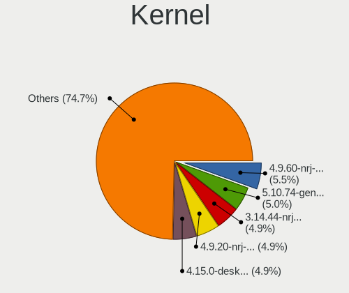
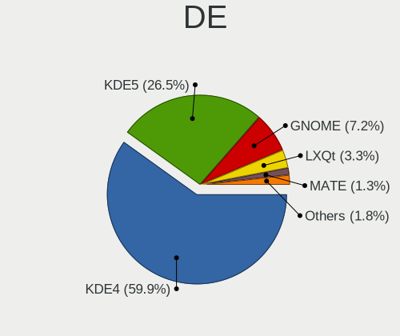
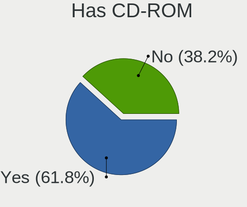
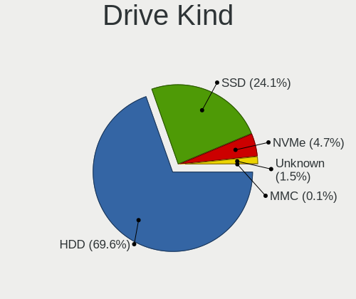
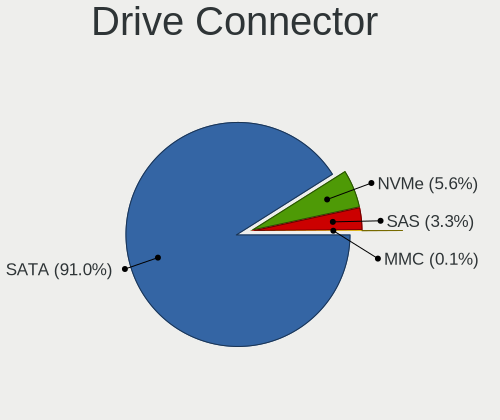
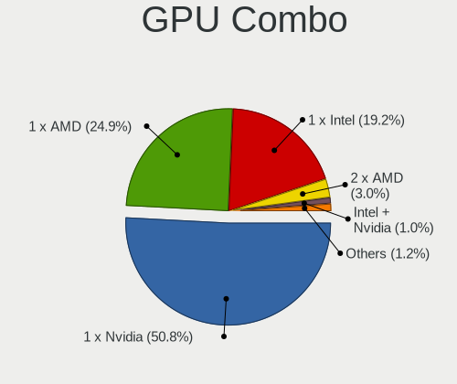
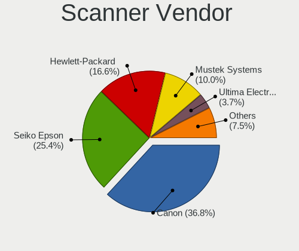

ROSA - Tested Hardware & Statistics (Desktops)
----------------------------------------------

A project to collect tested hardware configurations for ROSA.

Anyone can contribute to this report by the [hw-probe](https://github.com/linuxhw/hw-probe) tool:

    sudo -E hw-probe -all -upload

Please contribute! Especially if your hardware is rare.

Contents
--------

* [ Test Cases ](#test-cases)

* [ System ](#system)
  - [ OS                       ](#os)
  - [ OS Family                ](#os-family)
  - [ Kernel                   ](#kernel)
  - [ Kernel Family            ](#kernel-family)
  - [ Kernel Major Ver.        ](#kernel-major-ver)
  - [ Arch                     ](#arch)
  - [ DE                       ](#de)
  - [ Display Server           ](#display-server)
  - [ Display Manager          ](#display-manager)
  - [ OS Lang                  ](#os-lang)
  - [ Boot Mode                ](#boot-mode)
  - [ Filesystem               ](#filesystem)
  - [ Part. scheme             ](#part-scheme)
  - [ Dual Boot with Linux/BSD ](#dual-boot-with-linuxbsd)
  - [ Dual Boot (Win)          ](#dual-boot-win)

* [ Board ](#board)
  - [ Vendor                   ](#vendor)
  - [ Model                    ](#model)
  - [ Model Family             ](#model-family)
  - [ MFG Year                 ](#mfg-year)
  - [ Form Factor              ](#form-factor)
  - [ Secure Boot              ](#secure-boot)
  - [ Coreboot                 ](#coreboot)
  - [ RAM Size                 ](#ram-size)
  - [ RAM Used                 ](#ram-used)
  - [ Total Drives             ](#total-drives)
  - [ Has CD-ROM               ](#has-cd-rom)
  - [ Has Ethernet             ](#has-ethernet)
  - [ Has WiFi                 ](#has-wifi)
  - [ Has Bluetooth            ](#has-bluetooth)

* [ Location ](#location)
  - [ Country                  ](#country)
  - [ City                     ](#city)

* [ Drives ](#drives)
  - [ Drive Vendor             ](#drive-vendor)
  - [ Drive Model              ](#drive-model)
  - [ HDD Vendor               ](#hdd-vendor)
  - [ SSD Vendor               ](#ssd-vendor)
  - [ Drive Kind               ](#drive-kind)
  - [ Drive Connector          ](#drive-connector)
  - [ Drive Size               ](#drive-size)
  - [ Space Total              ](#space-total)
  - [ Space Used               ](#space-used)
  - [ Malfunc. Drives          ](#malfunc-drives)
  - [ Malfunc. Drive Vendor    ](#malfunc-drive-vendor)
  - [ Malfunc. HDD Vendor      ](#malfunc-hdd-vendor)
  - [ Malfunc. Drive Kind      ](#malfunc-drive-kind)
  - [ Failed Drives            ](#failed-drives)
  - [ Failed Drive Vendor      ](#failed-drive-vendor)
  - [ Drive Status             ](#drive-status)

* [ Storage controller ](#storage-controller)
  - [ Storage Vendor           ](#storage-vendor)
  - [ Storage Model            ](#storage-model)
  - [ Storage Kind             ](#storage-kind)

* [ Processor ](#processor)
  - [ CPU Vendor               ](#cpu-vendor)
  - [ CPU Model                ](#cpu-model)
  - [ CPU Model Family         ](#cpu-model-family)
  - [ CPU Cores                ](#cpu-cores)
  - [ CPU Sockets              ](#cpu-sockets)
  - [ CPU Threads              ](#cpu-threads)
  - [ CPU Op-Modes             ](#cpu-op-modes)
  - [ CPU Microcode            ](#cpu-microcode)
  - [ CPU Microarch            ](#cpu-microarch)

* [ Graphics ](#graphics)
  - [ GPU Vendor               ](#gpu-vendor)
  - [ GPU Model                ](#gpu-model)
  - [ GPU Combo                ](#gpu-combo)
  - [ GPU Driver               ](#gpu-driver)
  - [ GPU Memory               ](#gpu-memory)

* [ Monitor ](#monitor)
  - [ Monitor Vendor           ](#monitor-vendor)
  - [ Monitor Model            ](#monitor-model)
  - [ Monitor Resolution       ](#monitor-resolution)
  - [ Monitor Diagonal         ](#monitor-diagonal)
  - [ Monitor Width            ](#monitor-width)
  - [ Aspect Ratio             ](#aspect-ratio)
  - [ Monitor Area             ](#monitor-area)
  - [ Pixel Density            ](#pixel-density)
  - [ Multiple Monitors        ](#multiple-monitors)

* [ Network ](#network)
  - [ Net Controller Vendor    ](#net-controller-vendor)
  - [ Net Controller Model     ](#net-controller-model)
  - [ Wireless Vendor          ](#wireless-vendor)
  - [ Wireless Model           ](#wireless-model)
  - [ Ethernet Vendor          ](#ethernet-vendor)
  - [ Ethernet Model           ](#ethernet-model)
  - [ Net Controller Kind      ](#net-controller-kind)
  - [ Used Controller          ](#used-controller)
  - [ NICs                     ](#nics)
  - [ IPv6                     ](#ipv6)

* [ Bluetooth ](#bluetooth)
  - [ Bluetooth Vendor         ](#bluetooth-vendor)
  - [ Bluetooth Model          ](#bluetooth-model)

* [ Sound ](#sound)
  - [ Sound Vendor             ](#sound-vendor)
  - [ Sound Model              ](#sound-model)

* [ Memory ](#memory)
  - [ Memory Vendor            ](#memory-vendor)
  - [ Memory Model             ](#memory-model)
  - [ Memory Kind              ](#memory-kind)
  - [ Memory Form Factor       ](#memory-form-factor)
  - [ Memory Size              ](#memory-size)
  - [ Memory Speed             ](#memory-speed)

* [ Printers & scanners ](#printers--scanners)
  - [ Printer Vendor           ](#printer-vendor)
  - [ Printer Model            ](#printer-model)
  - [ Scanner Vendor           ](#scanner-vendor)
  - [ Scanner Model            ](#scanner-model)

* [ Camera ](#camera)
  - [ Camera Vendor            ](#camera-vendor)
  - [ Camera Model             ](#camera-model)

* [ Security ](#security)
  - [ Fingerprint Vendor       ](#fingerprint-vendor)
  - [ Fingerprint Model        ](#fingerprint-model)
  - [ Chipcard Vendor          ](#chipcard-vendor)
  - [ Chipcard Model           ](#chipcard-model)

* [ Unsupported ](#unsupported)
  - [ Unsupported Devices      ](#unsupported-devices)
  - [ Unsupported Device Types ](#unsupported-device-types)

Test Cases
----------

Total: 21921

| Vendor        | Model                       | Probe                                                      | Date         |
|---------------|-----------------------------|------------------------------------------------------------|--------------|
| Gigabyte      | 970A-D3                     | [9b47949b87](https://linux-hardware.org/?probe=9b47949b87) | Oct 01, 2023 |
| ASUSTek       | PRIME B450-PLUS             | [cd4c3fb654](https://linux-hardware.org/?probe=cd4c3fb654) | Oct 01, 2023 |
| Huanan        | X99 F8D V2.2                | [50101ff8ee](https://linux-hardware.org/?probe=50101ff8ee) | Oct 01, 2023 |
| Gigabyte      | H61M-S2-B3                  | [447e04bd9d](https://linux-hardware.org/?probe=447e04bd9d) | Sep 30, 2023 |
| ECS           | G31T-M7                     | [0749fa9352](https://linux-hardware.org/?probe=0749fa9352) | Sep 30, 2023 |
| MSI           | 890FXA-GD70                 | [f9c2509bc6](https://linux-hardware.org/?probe=f9c2509bc6) | Sep 30, 2023 |
| Gigabyte      | G31M-S2L                    | [4f147c1f3a](https://linux-hardware.org/?probe=4f147c1f3a) | Sep 30, 2023 |
| Gigabyte      | G31M-S2L                    | [391af7c221](https://linux-hardware.org/?probe=391af7c221) | Sep 30, 2023 |
| MSI           | MAG X570S TOMAHAWK MAX W... | [813b0bcb38](https://linux-hardware.org/?probe=813b0bcb38) | Sep 30, 2023 |
| ASUSTek       | TUF B450M-PRO GAMING        | [b34539564f](https://linux-hardware.org/?probe=b34539564f) | Sep 29, 2023 |
| Gigabyte      | H97-D3H-CF                  | [c0c34400ad](https://linux-hardware.org/?probe=c0c34400ad) | Sep 29, 2023 |
| ASRock        | H510M-HVS R2.0              | [f50b0e51d3](https://linux-hardware.org/?probe=f50b0e51d3) | Sep 29, 2023 |
| ASRock        | A520M Pro4                  | [5a7da2e0de](https://linux-hardware.org/?probe=5a7da2e0de) | Sep 28, 2023 |
| ASUSTek       | PRIME X470-PRO              | [1f420db3fd](https://linux-hardware.org/?probe=1f420db3fd) | Sep 28, 2023 |
| Gigabyte      | H410M H V3                  | [3a08b7188c](https://linux-hardware.org/?probe=3a08b7188c) | Sep 28, 2023 |
| ASUSTek       | P8H61-MX R2.0               | [cfc3a037ed](https://linux-hardware.org/?probe=cfc3a037ed) | Sep 27, 2023 |
| Huanan        | X99-BD4 V1.34, NALEX        | [493d23b3f0](https://linux-hardware.org/?probe=493d23b3f0) | Sep 27, 2023 |
| ASUSTek       | P5QD TURBO                  | [9e8a75e698](https://linux-hardware.org/?probe=9e8a75e698) | Sep 27, 2023 |
| ASUSTek       | H110M-K                     | [a067d2e97d](https://linux-hardware.org/?probe=a067d2e97d) | Sep 26, 2023 |
| ASUSTek       | P8B75-M LE                  | [96d214417d](https://linux-hardware.org/?probe=96d214417d) | Sep 26, 2023 |
| ASUSTek       | H110M-K                     | [74a379288b](https://linux-hardware.org/?probe=74a379288b) | Sep 26, 2023 |
| HP            | 3397                        | [5740126c3c](https://linux-hardware.org/?probe=5740126c3c) | Sep 25, 2023 |
| Shenzhen M... | F7BFD                       | [a4891e1691](https://linux-hardware.org/?probe=a4891e1691) | Sep 25, 2023 |
| ASUSTek       | TUF Gaming B550M-PLUS       | [977a189b29](https://linux-hardware.org/?probe=977a189b29) | Sep 25, 2023 |
| MSI           | FM2-A55M-E33                | [40ef9a86ab](https://linux-hardware.org/?probe=40ef9a86ab) | Sep 25, 2023 |
| Gigabyte      | B450 AORUS ELITE V2         | [57a4e724b8](https://linux-hardware.org/?probe=57a4e724b8) | Sep 24, 2023 |
| ASRock        | P4i65G                      | [9f283a95d6](https://linux-hardware.org/?probe=9f283a95d6) | Sep 24, 2023 |
| ASUSTek       | E520                        | [50ea664229](https://linux-hardware.org/?probe=50ea664229) | Sep 24, 2023 |
| ASRock        | B550 Phantom Gaming 4       | [39e26bf376](https://linux-hardware.org/?probe=39e26bf376) | Sep 24, 2023 |
| MSI           | H110M PRO-VD PLUS           | [b8d1509801](https://linux-hardware.org/?probe=b8d1509801) | Sep 24, 2023 |
| Gigabyte      | G31M-ES2L                   | [bbf676f129](https://linux-hardware.org/?probe=bbf676f129) | Sep 24, 2023 |
| Gigabyte      | H61M-D2-B3                  | [90bdd8a3e6](https://linux-hardware.org/?probe=90bdd8a3e6) | Sep 23, 2023 |
| Gigabyte      | H61M-D2-B3                  | [41dba827f2](https://linux-hardware.org/?probe=41dba827f2) | Sep 23, 2023 |
| MSI           | MAG X570S TOMAHAWK MAX W... | [17963d3a87](https://linux-hardware.org/?probe=17963d3a87) | Sep 23, 2023 |
| Gigabyte      | H110-D3-CF                  | [0762df27f4](https://linux-hardware.org/?probe=0762df27f4) | Sep 23, 2023 |
| Gigabyte      | PH67A-D3-B3                 | [e3023f5f8c](https://linux-hardware.org/?probe=e3023f5f8c) | Sep 23, 2023 |
| MSI           | H110M PRO-VD                | [a13e4d4b27](https://linux-hardware.org/?probe=a13e4d4b27) | Sep 22, 2023 |
| Gigabyte      | P43-ES3G                    | [79557b8229](https://linux-hardware.org/?probe=79557b8229) | Sep 22, 2023 |
| Gigabyte      | H87M-HD3                    | [f5fead6eb4](https://linux-hardware.org/?probe=f5fead6eb4) | Sep 22, 2023 |
| ASRock        | A320M-DVS R4.0              | [893ef72c0c](https://linux-hardware.org/?probe=893ef72c0c) | Sep 21, 2023 |
| ASRock        | A520M-ITX/ac                | [35be6167f1](https://linux-hardware.org/?probe=35be6167f1) | Sep 21, 2023 |
| Biostar       | A68MHE                      | [8ab720b66b](https://linux-hardware.org/?probe=8ab720b66b) | Sep 21, 2023 |
| Gigabyte      | GA-E350N-USB3               | [b9a29448e1](https://linux-hardware.org/?probe=b9a29448e1) | Sep 21, 2023 |
| HP            | 2820h                       | [cd402f5dad](https://linux-hardware.org/?probe=cd402f5dad) | Sep 21, 2023 |
| Unknown       | Unknown                     | [339f506aa1](https://linux-hardware.org/?probe=339f506aa1) | Sep 21, 2023 |
| ASUSTek       | E520                        | [f5be06ecdb](https://linux-hardware.org/?probe=f5be06ecdb) | Sep 21, 2023 |
| Shenzhen M... | F7BFD                       | [b898184916](https://linux-hardware.org/?probe=b898184916) | Sep 20, 2023 |
| HP            | 3048h                       | [f140c33d20](https://linux-hardware.org/?probe=f140c33d20) | Sep 20, 2023 |
| ASRock        | N68C-GS FX                  | [7c54afbcbd](https://linux-hardware.org/?probe=7c54afbcbd) | Sep 20, 2023 |
| ASUSTek       | P8H61-M LE                  | [7f04e1eefd](https://linux-hardware.org/?probe=7f04e1eefd) | Sep 19, 2023 |
| ASUSTek       | H81M-K                      | [6735d18449](https://linux-hardware.org/?probe=6735d18449) | Sep 19, 2023 |
| Gigabyte      | B550I AORUS PRO AX          | [2666cd8dbe](https://linux-hardware.org/?probe=2666cd8dbe) | Sep 19, 2023 |
| ASRock        | FM2A78 Pro4+                | [cad8cdf94c](https://linux-hardware.org/?probe=cad8cdf94c) | Sep 19, 2023 |
| Lenovo        | H420                        | [3cb3765e4c](https://linux-hardware.org/?probe=3cb3765e4c) | Sep 17, 2023 |
| Gigabyte      | GA-880GA-UD3H               | [12b833e456](https://linux-hardware.org/?probe=12b833e456) | Sep 16, 2023 |
| ASRock        | G41M-GS3                    | [145d2c27ac](https://linux-hardware.org/?probe=145d2c27ac) | Sep 16, 2023 |
| Unknown       | Unknown                     | [ce7fc75838](https://linux-hardware.org/?probe=ce7fc75838) | Sep 15, 2023 |
| MSI           | A520M-A PRO                 | [d97b8e1ce0](https://linux-hardware.org/?probe=d97b8e1ce0) | Sep 15, 2023 |
| Gigabyte      | H55M-USB3                   | [6cf3ece600](https://linux-hardware.org/?probe=6cf3ece600) | Sep 15, 2023 |
| ASRock        | B450 Pro4                   | [b961eae623](https://linux-hardware.org/?probe=b961eae623) | Sep 14, 2023 |
| ASUSTek       | ROG STRIX B550-F GAMING     | [9d3a7e1014](https://linux-hardware.org/?probe=9d3a7e1014) | Sep 14, 2023 |
| MSI           | PRO H610M-G DDR4            | [33f52069d5](https://linux-hardware.org/?probe=33f52069d5) | Sep 13, 2023 |
| Acer          | Veriton X275                | [6dcd8b863a](https://linux-hardware.org/?probe=6dcd8b863a) | Sep 13, 2023 |
| Lenovo        | BRASWELL NOK                | [621f570151](https://linux-hardware.org/?probe=621f570151) | Sep 13, 2023 |
| ASRock        | E350M1                      | [49c94468cf](https://linux-hardware.org/?probe=49c94468cf) | Sep 13, 2023 |
| MSI           | MPG X570 GAMING PRO CARB... | [279517882b](https://linux-hardware.org/?probe=279517882b) | Sep 13, 2023 |
| Gigabyte      | G1.Assassin                 | [4b60be7fca](https://linux-hardware.org/?probe=4b60be7fca) | Sep 12, 2023 |
| Gigabyte      | A520M AORUS ELITE           | [05ac023ab9](https://linux-hardware.org/?probe=05ac023ab9) | Sep 12, 2023 |
| ASUSTek       | TUF Gaming B550-PLUS        | [d8747ce048](https://linux-hardware.org/?probe=d8747ce048) | Sep 12, 2023 |
| Dell          | 0J190T A01                  | [b14e059cea](https://linux-hardware.org/?probe=b14e059cea) | Sep 12, 2023 |
| MSI           | G31TM-P21                   | [cdeced49b1](https://linux-hardware.org/?probe=cdeced49b1) | Sep 12, 2023 |
| MSI           | 785GT-E63                   | [ac5b6e8a67](https://linux-hardware.org/?probe=ac5b6e8a67) | Sep 12, 2023 |
| Gigabyte      | H77N-WIFI                   | [fe040c7510](https://linux-hardware.org/?probe=fe040c7510) | Sep 12, 2023 |
| ASUSTek       | PRIME H310M-R R2.0          | [d7b21557f8](https://linux-hardware.org/?probe=d7b21557f8) | Sep 12, 2023 |
| Intel         | H81                         | [9844243c1a](https://linux-hardware.org/?probe=9844243c1a) | Sep 11, 2023 |
| Intel         | SKYBAY                      | [63b6f62eae](https://linux-hardware.org/?probe=63b6f62eae) | Sep 11, 2023 |
| ASUSTek       | H110M-A/M.2                 | [e186172ee4](https://linux-hardware.org/?probe=e186172ee4) | Sep 10, 2023 |
| Unknown       | X79A                        | [96d6dc2e5d](https://linux-hardware.org/?probe=96d6dc2e5d) | Sep 10, 2023 |
| ASUSTek       | PRIME H310M-K               | [a17cc2a1d2](https://linux-hardware.org/?probe=a17cc2a1d2) | Sep 10, 2023 |
| Gigabyte      | X570 AORUS ELITE            | [e49a8302ef](https://linux-hardware.org/?probe=e49a8302ef) | Sep 10, 2023 |
| ASUSTek       | H81M-E                      | [4bb36bc968](https://linux-hardware.org/?probe=4bb36bc968) | Sep 09, 2023 |
| ASUSTek       | P8H61-MX                    | [f9568de8f3](https://linux-hardware.org/?probe=f9568de8f3) | Sep 09, 2023 |
| Acer          | Nitro N50-610               | [1c695a40ca](https://linux-hardware.org/?probe=1c695a40ca) | Sep 09, 2023 |
| Acer          | Nitro N50-610               | [b002674315](https://linux-hardware.org/?probe=b002674315) | Sep 09, 2023 |
| ASUSTek       | P8H61-M LE/USB3             | [099e89d09f](https://linux-hardware.org/?probe=099e89d09f) | Sep 08, 2023 |
| Unknown       | Unknown                     | [72447e3c4b](https://linux-hardware.org/?probe=72447e3c4b) | Sep 08, 2023 |
| Gigabyte      | X570 AORUS MASTER           | [2c64750e2e](https://linux-hardware.org/?probe=2c64750e2e) | Sep 08, 2023 |
| ASUSTek       | Pro H610T D4                | [ebced0bee8](https://linux-hardware.org/?probe=ebced0bee8) | Sep 08, 2023 |
| ASRock        | H510M-HDV/M.2               | [63dae39236](https://linux-hardware.org/?probe=63dae39236) | Sep 08, 2023 |
| ASUSTek       | ProArt Z690-CREATOR WIFI    | [881837a1cb](https://linux-hardware.org/?probe=881837a1cb) | Sep 07, 2023 |
| ASRock        | H510M-HDV/M.2               | [3fb594ab96](https://linux-hardware.org/?probe=3fb594ab96) | Sep 07, 2023 |
| Gigabyte      | X670E AORUS MASTER          | [ade0754252](https://linux-hardware.org/?probe=ade0754252) | Sep 07, 2023 |
| Biostar       | A320MH                      | [87ae9fef79](https://linux-hardware.org/?probe=87ae9fef79) | Sep 07, 2023 |
| Acer          | Veriton X2640G V:1.0        | [76b044add6](https://linux-hardware.org/?probe=76b044add6) | Sep 07, 2023 |
| ASUSTek       | P8Z77-V LE PLUS             | [43fa75d035](https://linux-hardware.org/?probe=43fa75d035) | Sep 07, 2023 |
| Biostar       | B550M-SILVER                | [12ad2e157b](https://linux-hardware.org/?probe=12ad2e157b) | Sep 07, 2023 |
| Acer          | Nitro N50-610               | [3a6cb86551](https://linux-hardware.org/?probe=3a6cb86551) | Sep 07, 2023 |
| Acer          | Nitro N50-610               | [6ba5f1b344](https://linux-hardware.org/?probe=6ba5f1b344) | Sep 07, 2023 |
| Gigabyte      | F2A68HM-DS2                 | [ffe10aadbe](https://linux-hardware.org/?probe=ffe10aadbe) | Sep 06, 2023 |
| MSI           | MAG B550 TOMAHAWK           | [1c8b9eed31](https://linux-hardware.org/?probe=1c8b9eed31) | Sep 06, 2023 |
| Biostar       | A68MHE                      | [65bd192bf0](https://linux-hardware.org/?probe=65bd192bf0) | Sep 06, 2023 |
| ECS           | A740GM-M                    | [132b141a7d](https://linux-hardware.org/?probe=132b141a7d) | Sep 05, 2023 |
| Biostar       | A68MHE                      | [65a3d0ff34](https://linux-hardware.org/?probe=65a3d0ff34) | Sep 05, 2023 |
| ASRock        | B450M Pro4-F R2.0           | [3eef4ac5d3](https://linux-hardware.org/?probe=3eef4ac5d3) | Sep 05, 2023 |
| Foxconn       | 2ABF                        | [8928cdbfa8](https://linux-hardware.org/?probe=8928cdbfa8) | Sep 04, 2023 |
| ASUSTek       | Leonite2                    | [543ae5c1f3](https://linux-hardware.org/?probe=543ae5c1f3) | Sep 04, 2023 |
| ASUSTek       | Leonite2                    | [cb59b205d9](https://linux-hardware.org/?probe=cb59b205d9) | Sep 04, 2023 |
| Gigabyte      | P55M-UD4                    | [d04a4aef90](https://linux-hardware.org/?probe=d04a4aef90) | Sep 03, 2023 |
| ASUSTek       | H97M-E                      | [6624329e1c](https://linux-hardware.org/?probe=6624329e1c) | Sep 03, 2023 |
| Gigabyte      | GA-780T-D3L                 | [f0c5bbc0c1](https://linux-hardware.org/?probe=f0c5bbc0c1) | Sep 03, 2023 |
| ASUSTek       | PRIME H410M-R               | [d714ef63c2](https://linux-hardware.org/?probe=d714ef63c2) | Sep 03, 2023 |
| MSI           | 770-C45                     | [002c1856c6](https://linux-hardware.org/?probe=002c1856c6) | Sep 03, 2023 |
| ASUSTek       | P7P55-M                     | [c74782636f](https://linux-hardware.org/?probe=c74782636f) | Sep 02, 2023 |
| ASRock        | B450 Steel Legend           | [29a4025447](https://linux-hardware.org/?probe=29a4025447) | Sep 02, 2023 |
| Foxconn       | 45CS                        | [56c503e42c](https://linux-hardware.org/?probe=56c503e42c) | Sep 02, 2023 |
| ASUSTek       | STRIX Z270H GAMING          | [1e51610ea3](https://linux-hardware.org/?probe=1e51610ea3) | Sep 01, 2023 |
| ASUSTek       | M5A97 R2.0                  | [52911d341d](https://linux-hardware.org/?probe=52911d341d) | Sep 01, 2023 |
| ASRock        | N68-GS4 FX                  | [87f94b4ba7](https://linux-hardware.org/?probe=87f94b4ba7) | Sep 01, 2023 |
| ASUSTek       | Z97-K                       | [6d77cf1b8f](https://linux-hardware.org/?probe=6d77cf1b8f) | Aug 31, 2023 |
| ASUSTek       | P5Q SE2                     | [293c912276](https://linux-hardware.org/?probe=293c912276) | Aug 31, 2023 |
| ASUSTek       | P8H61-M LX3 PLUS R2.0       | [9cb322dda0](https://linux-hardware.org/?probe=9cb322dda0) | Aug 30, 2023 |
| ASRock        | B450 Steel Legend           | [7aa770bf00](https://linux-hardware.org/?probe=7aa770bf00) | Aug 30, 2023 |
| MSI           | A68HM-P33 V2                | [44d09f93c9](https://linux-hardware.org/?probe=44d09f93c9) | Aug 30, 2023 |
| ASUSTek       | PRIME H310M-R R2.0          | [91d3472ba6](https://linux-hardware.org/?probe=91d3472ba6) | Aug 30, 2023 |
| Gigabyte      | 970A-DS3P                   | [3eb3a344ee](https://linux-hardware.org/?probe=3eb3a344ee) | Aug 30, 2023 |
| Foxconn       | 2ABF                        | [26558ed0ce](https://linux-hardware.org/?probe=26558ed0ce) | Aug 30, 2023 |
| Huanan        | X99-QD4 V1.0                | [c5030f8fa1](https://linux-hardware.org/?probe=c5030f8fa1) | Aug 30, 2023 |
| Gigabyte      | G41M-Combo                  | [927a574e71](https://linux-hardware.org/?probe=927a574e71) | Aug 30, 2023 |
| ASUSTek       | PRIME B560-PLUS             | [4acce51a96](https://linux-hardware.org/?probe=4acce51a96) | Aug 29, 2023 |
| ASUSTek       | PRIME B560-PLUS             | [205286a7e8](https://linux-hardware.org/?probe=205286a7e8) | Aug 29, 2023 |
| ASUSTek       | STRIX B250G GAMING          | [16d3d84013](https://linux-hardware.org/?probe=16d3d84013) | Aug 29, 2023 |
| Gigabyte      | H110-D3-CF                  | [e0d36eed9a](https://linux-hardware.org/?probe=e0d36eed9a) | Aug 29, 2023 |
| Gigabyte      | 8IPE1000                    | [50a9455c00](https://linux-hardware.org/?probe=50a9455c00) | Aug 28, 2023 |
| MSI           | 770-C45                     | [6f52d0be24](https://linux-hardware.org/?probe=6f52d0be24) | Aug 28, 2023 |
| Gigabyte      | 8IPE1000                    | [eb4740694a](https://linux-hardware.org/?probe=eb4740694a) | Aug 28, 2023 |
| ASRock        | Z97 Pro4                    | [6c232e36c3](https://linux-hardware.org/?probe=6c232e36c3) | Aug 28, 2023 |
| ASUSTek       | PRIME H510M-K               | [f8906dfb9c](https://linux-hardware.org/?probe=f8906dfb9c) | Aug 28, 2023 |
| ASUSTek       | P5QL/EPU                    | [b2bc9269e5](https://linux-hardware.org/?probe=b2bc9269e5) | Aug 28, 2023 |
| Gigabyte      | AB350M-DS3H V2-CF           | [9d90b80d9a](https://linux-hardware.org/?probe=9d90b80d9a) | Aug 27, 2023 |
| MSI           | A320M-A PRO                 | [14d4e6bf4c](https://linux-hardware.org/?probe=14d4e6bf4c) | Aug 27, 2023 |
| Gigabyte      | AB350M-DS3H V2-CF           | [1f59c17089](https://linux-hardware.org/?probe=1f59c17089) | Aug 27, 2023 |
| MSI           | A320M-A PRO                 | [5ad490f8cb](https://linux-hardware.org/?probe=5ad490f8cb) | Aug 27, 2023 |
| ASRock        | N68PV-GS                    | [d9171bedd5](https://linux-hardware.org/?probe=d9171bedd5) | Aug 27, 2023 |
| Unknown       | Unknown                     | [4d432af6c0](https://linux-hardware.org/?probe=4d432af6c0) | Aug 27, 2023 |
| Gigabyte      | F2A55M-DS2                  | [3efec986ee](https://linux-hardware.org/?probe=3efec986ee) | Aug 27, 2023 |
| Gigabyte      | H61M-S2-B3                  | [c9505b94ed](https://linux-hardware.org/?probe=c9505b94ed) | Aug 26, 2023 |
| ASUSTek       | PRIME H310M-K               | [1f606cb9da](https://linux-hardware.org/?probe=1f606cb9da) | Aug 26, 2023 |
| Gigabyte      | Z87-HD3                     | [3601cce38e](https://linux-hardware.org/?probe=3601cce38e) | Aug 26, 2023 |
| Gigabyte      | GA-880GA-UD3H               | [5d4b85d28b](https://linux-hardware.org/?probe=5d4b85d28b) | Aug 26, 2023 |
| ASUSTek       | PRIME H410M-A               | [1538d66b38](https://linux-hardware.org/?probe=1538d66b38) | Aug 25, 2023 |
| ASUSTek       | P8P67 PRO                   | [8f51778271](https://linux-hardware.org/?probe=8f51778271) | Aug 25, 2023 |
| ASRock        | M3N78D                      | [cbaee686c2](https://linux-hardware.org/?probe=cbaee686c2) | Aug 25, 2023 |
| ASUSTek       | M4N78 SE                    | [aff07fea82](https://linux-hardware.org/?probe=aff07fea82) | Aug 25, 2023 |
| Gigabyte      | H87-HD3                     | [84ef801923](https://linux-hardware.org/?probe=84ef801923) | Aug 24, 2023 |
| Intel         | D2700DC AAG32420-602        | [d3743d52fa](https://linux-hardware.org/?probe=d3743d52fa) | Aug 24, 2023 |
| Gigabyte      | H110-D3-CF                  | [2436229edb](https://linux-hardware.org/?probe=2436229edb) | Aug 24, 2023 |
| Intel         | D2700DC AAG32420-602        | [3381b3de96](https://linux-hardware.org/?probe=3381b3de96) | Aug 24, 2023 |
| ASRock        | M3N78D                      | [86e93b6cec](https://linux-hardware.org/?probe=86e93b6cec) | Aug 23, 2023 |
| ASRock        | P4i945GC                    | [5fd422ae68](https://linux-hardware.org/?probe=5fd422ae68) | Aug 23, 2023 |
| Gigabyte      | F2A55M-DS2                  | [2889ef1f56](https://linux-hardware.org/?probe=2889ef1f56) | Aug 23, 2023 |
| Biostar       | A68MHE                      | [3ff360b5c5](https://linux-hardware.org/?probe=3ff360b5c5) | Aug 23, 2023 |
| Gigabyte      | H61M-S2PV                   | [df34a2b0db](https://linux-hardware.org/?probe=df34a2b0db) | Aug 22, 2023 |
| Foxconn       | 2ABF                        | [82b421a678](https://linux-hardware.org/?probe=82b421a678) | Aug 22, 2023 |
| ASUSTek       | P7P55-M                     | [01ee3a9784](https://linux-hardware.org/?probe=01ee3a9784) | Aug 21, 2023 |
| WeiBu         | H310CX1B V1.0               | [b3ec8e66ae](https://linux-hardware.org/?probe=b3ec8e66ae) | Aug 21, 2023 |
| Gigabyte      | GA-970A-D3                  | [e784b29438](https://linux-hardware.org/?probe=e784b29438) | Aug 20, 2023 |
| Intel         | X99                         | [3f141e2bd1](https://linux-hardware.org/?probe=3f141e2bd1) | Aug 20, 2023 |
| Gigabyte      | B660 DS3H DDR4              | [581265dcb6](https://linux-hardware.org/?probe=581265dcb6) | Aug 20, 2023 |
| Lenovo        | H420                        | [0741adee29](https://linux-hardware.org/?probe=0741adee29) | Aug 20, 2023 |
| Gigabyte      | GA-A55M-S2V                 | [11d699cccd](https://linux-hardware.org/?probe=11d699cccd) | Aug 20, 2023 |
| ASUSTek       | P5KPL-AM SE                 | [d8fd2a6d98](https://linux-hardware.org/?probe=d8fd2a6d98) | Aug 20, 2023 |
| ASUSTek       | P5P41D                      | [4ccbd3e19e](https://linux-hardware.org/?probe=4ccbd3e19e) | Aug 20, 2023 |
| Lenovo        | H420                        | [ef44de6298](https://linux-hardware.org/?probe=ef44de6298) | Aug 20, 2023 |
| Gigabyte      | B250M-DS3H-CF               | [34a23c836c](https://linux-hardware.org/?probe=34a23c836c) | Aug 19, 2023 |
| K-Systems     | Unknown                     | [52ff91dc03](https://linux-hardware.org/?probe=52ff91dc03) | Aug 19, 2023 |
| ASRock        | H510M-HVS R2.0              | [0a2d342da5](https://linux-hardware.org/?probe=0a2d342da5) | Aug 18, 2023 |
| Gigabyte      | X470 AORUS GAMING 5 WIFI... | [2de4fc4556](https://linux-hardware.org/?probe=2de4fc4556) | Aug 18, 2023 |
| ASRock        | H510M-HVS R2.0              | [b83a6ac1b7](https://linux-hardware.org/?probe=b83a6ac1b7) | Aug 18, 2023 |
| ASUSTek       | P8H77-M PRO                 | [98b50f195d](https://linux-hardware.org/?probe=98b50f195d) | Aug 18, 2023 |
| Biostar       | A68MHE                      | [0c88bf33f4](https://linux-hardware.org/?probe=0c88bf33f4) | Aug 18, 2023 |
| Gigabyte      | H61M-S1                     | [dbe8d496ac](https://linux-hardware.org/?probe=dbe8d496ac) | Aug 17, 2023 |
| Gigabyte      | B360M DS3H                  | [31165e8a73](https://linux-hardware.org/?probe=31165e8a73) | Aug 17, 2023 |
| Intel         | H55                         | [9d45836b3b](https://linux-hardware.org/?probe=9d45836b3b) | Aug 17, 2023 |
| ASUSTek       | PRIME B450M-K II            | [7052cd45dc](https://linux-hardware.org/?probe=7052cd45dc) | Aug 15, 2023 |
| Unknown       | Unknown                     | [632e853b38](https://linux-hardware.org/?probe=632e853b38) | Aug 15, 2023 |
| ASUSTek       | P8H61-M LX                  | [e1d0ef3bb8](https://linux-hardware.org/?probe=e1d0ef3bb8) | Aug 15, 2023 |
| ASUSTek       | M5A99X EVO R2.0             | [0d21b420ac](https://linux-hardware.org/?probe=0d21b420ac) | Aug 15, 2023 |
| HP            | 1495                        | [d038a45bbd](https://linux-hardware.org/?probe=d038a45bbd) | Aug 15, 2023 |
| ASRock        | G41C-GS R2.0                | [82d639b155](https://linux-hardware.org/?probe=82d639b155) | Aug 14, 2023 |
| ASUSTek       | P8H61-M LX                  | [63c0e75955](https://linux-hardware.org/?probe=63c0e75955) | Aug 14, 2023 |
| ASUSTek       | B85-PLUS                    | [64c547a12b](https://linux-hardware.org/?probe=64c547a12b) | Aug 13, 2023 |
| ECS           | G41T-M2                     | [b67afe5845](https://linux-hardware.org/?probe=b67afe5845) | Aug 13, 2023 |
| Gigabyte      | Z790 AORUS ELITE AX-W       | [ccaf390b87](https://linux-hardware.org/?probe=ccaf390b87) | Aug 13, 2023 |
| ASUSTek       | TUF B450M-PRO GAMING        | [4775c7e602](https://linux-hardware.org/?probe=4775c7e602) | Aug 13, 2023 |
| Gigabyte      | Z790 AORUS ELITE AX-W       | [aeee4a0b68](https://linux-hardware.org/?probe=aeee4a0b68) | Aug 13, 2023 |
| ASUSTek       | PRIME B365M-K               | [1f86102443](https://linux-hardware.org/?probe=1f86102443) | Aug 12, 2023 |
| Gigabyte      | Z77X-D3H                    | [8599cd2ad3](https://linux-hardware.org/?probe=8599cd2ad3) | Aug 12, 2023 |
| Gigabyte      | Z77X-D3H                    | [f57a3e9f6a](https://linux-hardware.org/?probe=f57a3e9f6a) | Aug 12, 2023 |
| ASUSTek       | M5A97 R2.0                  | [96995d7026](https://linux-hardware.org/?probe=96995d7026) | Aug 12, 2023 |
| Gigabyte      | B560M DS3H V2               | [2805e140b5](https://linux-hardware.org/?probe=2805e140b5) | Aug 11, 2023 |
| Unknown       | Unknown                     | [e32bb1bbb2](https://linux-hardware.org/?probe=e32bb1bbb2) | Aug 11, 2023 |
| Huanan        | X99-F8 V2.0                 | [f028b8f65d](https://linux-hardware.org/?probe=f028b8f65d) | Aug 11, 2023 |
| ASUSTek       | P7P55-M                     | [6f80191c4a](https://linux-hardware.org/?probe=6f80191c4a) | Aug 10, 2023 |
| Lenovo        | H420                        | [d418e9d1d1](https://linux-hardware.org/?probe=d418e9d1d1) | Aug 10, 2023 |
| MSI           | H97 GAMING 3                | [584a47e4ae](https://linux-hardware.org/?probe=584a47e4ae) | Aug 10, 2023 |
| Gateway       | SX2865                      | [f3655d0539](https://linux-hardware.org/?probe=f3655d0539) | Aug 09, 2023 |
| MSI           | H61M-P31                    | [3fa41aaf62](https://linux-hardware.org/?probe=3fa41aaf62) | Aug 08, 2023 |
| MSI           | H97M-G43                    | [f8905cffe2](https://linux-hardware.org/?probe=f8905cffe2) | Aug 08, 2023 |
| Gigabyte      | B75M-D3H                    | [d78e4ab87d](https://linux-hardware.org/?probe=d78e4ab87d) | Aug 08, 2023 |
| MSI           | H97 GAMING 3                | [04962a5072](https://linux-hardware.org/?probe=04962a5072) | Aug 08, 2023 |
| Soyo          | SY-Classic B450M            | [708e9837c5](https://linux-hardware.org/?probe=708e9837c5) | Aug 07, 2023 |
| ASUSTek       | Z170-K                      | [209b568765](https://linux-hardware.org/?probe=209b568765) | Aug 07, 2023 |
| ASUSTek       | PRIME B450M-K II            | [06e86f7f63](https://linux-hardware.org/?probe=06e86f7f63) | Aug 06, 2023 |
| Soyo          | SY-Classic B450M            | [04a850b33b](https://linux-hardware.org/?probe=04a850b33b) | Aug 06, 2023 |
| MSI           | MAG B550M MORTAR            | [87d27d2a99](https://linux-hardware.org/?probe=87d27d2a99) | Aug 04, 2023 |
| ASUSTek       | M5A97 LE R2.0               | [6d37036a76](https://linux-hardware.org/?probe=6d37036a76) | Aug 03, 2023 |
| ASUSTek       | P9X79                       | [381ebee880](https://linux-hardware.org/?probe=381ebee880) | Aug 03, 2023 |
| MSI           | H110M PRO-VD Plus           | [de9bb54769](https://linux-hardware.org/?probe=de9bb54769) | Aug 03, 2023 |
| Gigabyte      | X570 I AORUS PRO WIFI       | [448ad2c06a](https://linux-hardware.org/?probe=448ad2c06a) | Aug 03, 2023 |
| Gigabyte      | H67A-USB3-B3                | [5a368bb70f](https://linux-hardware.org/?probe=5a368bb70f) | Aug 03, 2023 |
| Gigabyte      | B550 AORUS PRO              | [bd5d07f54f](https://linux-hardware.org/?probe=bd5d07f54f) | Aug 02, 2023 |
| ASUSTek       | P5K PRO                     | [b8c2590139](https://linux-hardware.org/?probe=b8c2590139) | Aug 02, 2023 |
| ASUSTek       | P8H77-M PRO                 | [1ea7139d7e](https://linux-hardware.org/?probe=1ea7139d7e) | Aug 02, 2023 |
| Gigabyte      | H67A-USB3-B3                | [23ba156377](https://linux-hardware.org/?probe=23ba156377) | Aug 02, 2023 |
| ASRock        | B450M-HDV                   | [56c71bf2d5](https://linux-hardware.org/?probe=56c71bf2d5) | Aug 01, 2023 |
| MSI           | G41M-P33 Combo              | [ec5e4c2338](https://linux-hardware.org/?probe=ec5e4c2338) | Aug 01, 2023 |
| Gigabyte      | Z490 UD                     | [bdf93fa781](https://linux-hardware.org/?probe=bdf93fa781) | Jul 31, 2023 |
| ASUSTek       | TUF H310-PLUS GAMING        | [a9326ba27e](https://linux-hardware.org/?probe=a9326ba27e) | Jul 31, 2023 |
| Gigabyte      | B75M-D3V                    | [ef86202c7f](https://linux-hardware.org/?probe=ef86202c7f) | Jul 31, 2023 |
| Gigabyte      | Z790 AORUS ELITE AX-W       | [9c5eccdca7](https://linux-hardware.org/?probe=9c5eccdca7) | Jul 29, 2023 |
| Gigabyte      | B660 GAMING X DDR4          | [3ef07a69e6](https://linux-hardware.org/?probe=3ef07a69e6) | Jul 28, 2023 |
| ECS           | G33T_M                      | [cfaf5eaf20](https://linux-hardware.org/?probe=cfaf5eaf20) | Jul 28, 2023 |
| ASUSTek       | A88XM-A                     | [3ef67c1e1c](https://linux-hardware.org/?probe=3ef67c1e1c) | Jul 27, 2023 |
| Gigabyte      | GA-870A-UD3                 | [cc502a8417](https://linux-hardware.org/?probe=cc502a8417) | Jul 27, 2023 |
| HP            | 1495                        | [7db2d77f67](https://linux-hardware.org/?probe=7db2d77f67) | Jul 27, 2023 |
| HP            | 1495                        | [376f9777d4](https://linux-hardware.org/?probe=376f9777d4) | Jul 27, 2023 |
| ECS           | G41T-M7                     | [eb7ea6e3f6](https://linux-hardware.org/?probe=eb7ea6e3f6) | Jul 26, 2023 |
| ASUSTek       | P8H77-V LE                  | [4800f23655](https://linux-hardware.org/?probe=4800f23655) | Jul 26, 2023 |
| Gigabyte      | A320M-H-CF                  | [1852d1455f](https://linux-hardware.org/?probe=1852d1455f) | Jul 25, 2023 |
| Shenzhen M... | F7BAA                       | [761f825569](https://linux-hardware.org/?probe=761f825569) | Jul 25, 2023 |
| ASUSTek       | D500TC                      | [4fa391d922](https://linux-hardware.org/?probe=4fa391d922) | Jul 25, 2023 |
| ASUSTek       | PRIME B250M-K               | [5b6e05fa3b](https://linux-hardware.org/?probe=5b6e05fa3b) | Jul 24, 2023 |
| Gigabyte      | Z77-DS3H                    | [27a5af5007](https://linux-hardware.org/?probe=27a5af5007) | Jul 24, 2023 |
| MSI           | MPG X570S EDGE MAX WIFI     | [f8df0d0706](https://linux-hardware.org/?probe=f8df0d0706) | Jul 24, 2023 |
| ASRock        | N68-GS4 FX                  | [304505406b](https://linux-hardware.org/?probe=304505406b) | Jul 24, 2023 |
| Dell          | 0Y5DDC A00                  | [a0cb68bf97](https://linux-hardware.org/?probe=a0cb68bf97) | Jul 24, 2023 |
| Gigabyte      | GA-MA785GM-US2H             | [3eadaff590](https://linux-hardware.org/?probe=3eadaff590) | Jul 23, 2023 |
| Intel         | X79 V1.x                    | [dda9563d4a](https://linux-hardware.org/?probe=dda9563d4a) | Jul 23, 2023 |
| ASRock        | M3N78D                      | [4ab55414b4](https://linux-hardware.org/?probe=4ab55414b4) | Jul 21, 2023 |
| ASRock        | M3N78D                      | [8175c636e8](https://linux-hardware.org/?probe=8175c636e8) | Jul 21, 2023 |
| Lenovo        | ThinkCentre M81 5049C12     | [a3cb3aa377](https://linux-hardware.org/?probe=a3cb3aa377) | Jul 21, 2023 |
| Gigabyte      | H61M-DS2V                   | [4720d80645](https://linux-hardware.org/?probe=4720d80645) | Jul 20, 2023 |
| Gigabyte      | GA-MA785GM-US2H             | [97c85ab250](https://linux-hardware.org/?probe=97c85ab250) | Jul 20, 2023 |
| ASRock        | A520M-HVS                   | [9dd9b64ff1](https://linux-hardware.org/?probe=9dd9b64ff1) | Jul 19, 2023 |
| Biostar       | H61MHV2                     | [c108eac8f6](https://linux-hardware.org/?probe=c108eac8f6) | Jul 19, 2023 |
| ASRock        | FM2A58M-VG3+ R2.0           | [278c03b690](https://linux-hardware.org/?probe=278c03b690) | Jul 19, 2023 |
| Gigabyte      | Z77-DS3H                    | [0eea552cfa](https://linux-hardware.org/?probe=0eea552cfa) | Jul 18, 2023 |
| Gigabyte      | B85M-D3H                    | [0e8d97083a](https://linux-hardware.org/?probe=0e8d97083a) | Jul 18, 2023 |
| Unknown       | X79A                        | [2ed232ccd6](https://linux-hardware.org/?probe=2ed232ccd6) | Jul 18, 2023 |
| Gigabyte      | H77N-WIFI                   | [6bbfd9fb86](https://linux-hardware.org/?probe=6bbfd9fb86) | Jul 17, 2023 |
| Gigabyte      | H77N-WIFI                   | [3f0741555c](https://linux-hardware.org/?probe=3f0741555c) | Jul 17, 2023 |
| Dell          | 0Y5DDC A00                  | [dd5a0bc45b](https://linux-hardware.org/?probe=dd5a0bc45b) | Jul 17, 2023 |
| MSI           | H61M-P32/W8                 | [e6fab16cf4](https://linux-hardware.org/?probe=e6fab16cf4) | Jul 17, 2023 |
| Gigabyte      | G41M-ES2L                   | [69a2bba4a9](https://linux-hardware.org/?probe=69a2bba4a9) | Jul 16, 2023 |
| ECS           | H61H2-M17                   | [853b239a9a](https://linux-hardware.org/?probe=853b239a9a) | Jul 16, 2023 |
| MSI           | 890FXA-GD70                 | [43f7b3e0e2](https://linux-hardware.org/?probe=43f7b3e0e2) | Jul 16, 2023 |
| MACHINIST     | X99-RS9 V3.0                | [4cb2ff7ed5](https://linux-hardware.org/?probe=4cb2ff7ed5) | Jul 15, 2023 |
| ASUSTek       | P8Z77-V LK                  | [f29be846e3](https://linux-hardware.org/?probe=f29be846e3) | Jul 15, 2023 |
| AZW           | MINI S 10                   | [8f835cc3a7](https://linux-hardware.org/?probe=8f835cc3a7) | Jul 15, 2023 |
| Dell          | 0KWVT8 A03                  | [e07a936bc3](https://linux-hardware.org/?probe=e07a936bc3) | Jul 14, 2023 |
| PC Partner    | A512-H110 HYOSUNG TNS       | [67a987c4e7](https://linux-hardware.org/?probe=67a987c4e7) | Jul 14, 2023 |
| MSI           | B450M PRO-VDH MAX           | [47d9a3330d](https://linux-hardware.org/?probe=47d9a3330d) | Jul 14, 2023 |
| Biostar       | H310MHC2                    | [7952179adb](https://linux-hardware.org/?probe=7952179adb) | Jul 14, 2023 |
| MSI           | G31TM-P21                   | [6456f7b16f](https://linux-hardware.org/?probe=6456f7b16f) | Jul 13, 2023 |
| ASUSTek       | PRIME H510M-R               | [d251995cde](https://linux-hardware.org/?probe=d251995cde) | Jul 13, 2023 |
| Unknown       | Unknown                     | [5dbf56c4bb](https://linux-hardware.org/?probe=5dbf56c4bb) | Jul 13, 2023 |
| Intel         | X79 (INTEL Xeon E5/Corei... | [45a5b265be](https://linux-hardware.org/?probe=45a5b265be) | Jul 13, 2023 |
| ASUSTek       | PRIME B450M-A               | [6321a0ad87](https://linux-hardware.org/?probe=6321a0ad87) | Jul 12, 2023 |
| ASUSTek       | H81M-R                      | [d06f7da2b4](https://linux-hardware.org/?probe=d06f7da2b4) | Jul 12, 2023 |
| Huanan        | X99 F8D V2.2                | [b170940e9c](https://linux-hardware.org/?probe=b170940e9c) | Jul 11, 2023 |
| AZW           | MINI S 10                   | [3517d6f744](https://linux-hardware.org/?probe=3517d6f744) | Jul 11, 2023 |
| Unknown       | X79                         | [95331fcaf5](https://linux-hardware.org/?probe=95331fcaf5) | Jul 11, 2023 |
| ASUSTek       | P5K                         | [c80746e740](https://linux-hardware.org/?probe=c80746e740) | Jul 11, 2023 |
| Biostar       | A780LB                      | [b911227789](https://linux-hardware.org/?probe=b911227789) | Jul 10, 2023 |
| ASUSTek       | PRIME H310M-R R2.0          | [47136e08eb](https://linux-hardware.org/?probe=47136e08eb) | Jul 10, 2023 |
| Unknown       | SKYBAY                      | [c699ea4ec4](https://linux-hardware.org/?probe=c699ea4ec4) | Jul 10, 2023 |
| ASUSTek       | ROG CROSSHAIR X670E HERO    | [7e933bc3ff](https://linux-hardware.org/?probe=7e933bc3ff) | Jul 09, 2023 |
| HP            | 3048h                       | [99232ecd53](https://linux-hardware.org/?probe=99232ecd53) | Jul 09, 2023 |
| Huanan        | X99 F8D V2.2                | [0c834188ca](https://linux-hardware.org/?probe=0c834188ca) | Jul 08, 2023 |
| ASUSTek       | PRIME B365M-K               | [2d7f5009a9](https://linux-hardware.org/?probe=2d7f5009a9) | Jul 08, 2023 |
| ASUSTek       | PRIME B365M-K               | [0b55f3b050](https://linux-hardware.org/?probe=0b55f3b050) | Jul 08, 2023 |
| ASUSTek       | Z97-DELUXE                  | [fbf3c93eec](https://linux-hardware.org/?probe=fbf3c93eec) | Jul 07, 2023 |
| Gigabyte      | B550 AORUS ELITE AX V2      | [df9456692e](https://linux-hardware.org/?probe=df9456692e) | Jul 05, 2023 |
| Acer          | Veriton X2640G V:1.0        | [19359bc748](https://linux-hardware.org/?probe=19359bc748) | Jul 05, 2023 |
| ASUSTek       | P8H61-M LX3 R2.0            | [951a1de3df](https://linux-hardware.org/?probe=951a1de3df) | Jul 05, 2023 |
| Gigabyte      | H110-D3A-CF                 | [8c75792d03](https://linux-hardware.org/?probe=8c75792d03) | Jul 04, 2023 |
| Unknown       | Intel X79                   | [dd5b91674c](https://linux-hardware.org/?probe=dd5b91674c) | Jul 04, 2023 |
| ASRock        | H87 Pro4                    | [23a37febbf](https://linux-hardware.org/?probe=23a37febbf) | Jul 04, 2023 |
| ASRock        | G41C-GS R2.0                | [03f7bb8764](https://linux-hardware.org/?probe=03f7bb8764) | Jul 04, 2023 |
| Gigabyte      | B550M S2H                   | [d2a57633e1](https://linux-hardware.org/?probe=d2a57633e1) | Jul 04, 2023 |
| ASUSTek       | B85M-G                      | [05c3f236ca](https://linux-hardware.org/?probe=05c3f236ca) | Jul 04, 2023 |
| ASUSTek       | A68HM-K                     | [19922b162e](https://linux-hardware.org/?probe=19922b162e) | Jul 03, 2023 |
| ASRock        | H510M-HVS R2.0              | [7ea0a824ca](https://linux-hardware.org/?probe=7ea0a824ca) | Jul 03, 2023 |
| ASUSTek       | PRIME H510M-K               | [8c03022351](https://linux-hardware.org/?probe=8c03022351) | Jul 03, 2023 |
| OEM           | X79G                        | [828b034832](https://linux-hardware.org/?probe=828b034832) | Jul 02, 2023 |
| ASUSTek       | P5G41T-M LX2/GB             | [ba67c9d426](https://linux-hardware.org/?probe=ba67c9d426) | Jul 02, 2023 |
| ASUSTek       | ROG STRIX Z490-G GAMING     | [5b11b41272](https://linux-hardware.org/?probe=5b11b41272) | Jul 02, 2023 |
| MSI           | A68HM-P33 V2                | [4cc48107c9](https://linux-hardware.org/?probe=4cc48107c9) | Jul 01, 2023 |
| MSI           | A68HM-P33 V2                | [3d124a5e1a](https://linux-hardware.org/?probe=3d124a5e1a) | Jul 01, 2023 |
| ASRock        | H55M-LE                     | [cc1f0cad53](https://linux-hardware.org/?probe=cc1f0cad53) | Jul 01, 2023 |
| Gigabyte      | B550 AORUS ELITE V2         | [0eb501cde5](https://linux-hardware.org/?probe=0eb501cde5) | Jun 30, 2023 |
| Gigabyte      | G33M-S2L                    | [99ffcc407b](https://linux-hardware.org/?probe=99ffcc407b) | Jun 30, 2023 |
| Gigabyte      | B365M DS3H                  | [0272953855](https://linux-hardware.org/?probe=0272953855) | Jun 30, 2023 |
| Gigabyte      | B450M S2H                   | [9a9ca045af](https://linux-hardware.org/?probe=9a9ca045af) | Jun 30, 2023 |
| Gigabyte      | H77N-WIFI                   | [a366d05b2b](https://linux-hardware.org/?probe=a366d05b2b) | Jun 30, 2023 |
| Huanan        | X99-F8 GAMING V5.0          | [6a95d2096d](https://linux-hardware.org/?probe=6a95d2096d) | Jun 29, 2023 |
| MSI           | MS-7267 100                 | [3a014aae8a](https://linux-hardware.org/?probe=3a014aae8a) | Jun 29, 2023 |
| ASUSTek       | H81M-C                      | [e12c71fb39](https://linux-hardware.org/?probe=e12c71fb39) | Jun 29, 2023 |
| ASUSTek       | M2A-VM                      | [d25910c419](https://linux-hardware.org/?probe=d25910c419) | Jun 28, 2023 |
| ASUSTek       | PRIME B550-PLUS             | [6a2c4254e7](https://linux-hardware.org/?probe=6a2c4254e7) | Jun 28, 2023 |
| ASUSTek       | PRIME H510M-K               | [b96f0a3b19](https://linux-hardware.org/?probe=b96f0a3b19) | Jun 27, 2023 |
| Gigabyte      | H410M S2 V2                 | [65794907cc](https://linux-hardware.org/?probe=65794907cc) | Jun 27, 2023 |
| ASUSTek       | PRIME H510M-K               | [a0c358b2b3](https://linux-hardware.org/?probe=a0c358b2b3) | Jun 27, 2023 |
| ASUSTek       | P5P41D                      | [cd85f8d99e](https://linux-hardware.org/?probe=cd85f8d99e) | Jun 27, 2023 |
| ASUSTek       | P5P41D                      | [aaf9376be5](https://linux-hardware.org/?probe=aaf9376be5) | Jun 25, 2023 |
| ASUSTek       | PRIME H510M-K               | [3f74c8ae6f](https://linux-hardware.org/?probe=3f74c8ae6f) | Jun 25, 2023 |
| ASUSTek       | ROG Maximus X HERO          | [02db87eec4](https://linux-hardware.org/?probe=02db87eec4) | Jun 25, 2023 |
| Gigabyte      | B760M GAMING X AX DDR4      | [9f48465b75](https://linux-hardware.org/?probe=9f48465b75) | Jun 24, 2023 |
| MSI           | 760GM-P21                   | [a6ab8ab499](https://linux-hardware.org/?probe=a6ab8ab499) | Jun 24, 2023 |
| ASUSTek       | PRIME H510M-K               | [6da517e892](https://linux-hardware.org/?probe=6da517e892) | Jun 23, 2023 |
| Gigabyte      | A320M-S2H V2-CF             | [d4f7477589](https://linux-hardware.org/?probe=d4f7477589) | Jun 23, 2023 |
| ASUSTek       | M5A88-V EVO                 | [3708ae400f](https://linux-hardware.org/?probe=3708ae400f) | Jun 23, 2023 |
| ASUSTek       | M5A88-V EVO                 | [d447bb1029](https://linux-hardware.org/?probe=d447bb1029) | Jun 23, 2023 |
| ASUSTek       | P5VD2-VM                    | [d6e01ed04d](https://linux-hardware.org/?probe=d6e01ed04d) | Jun 23, 2023 |
| ASUSTek       | P5VD2-VM                    | [ec3da2f6be](https://linux-hardware.org/?probe=ec3da2f6be) | Jun 23, 2023 |
| Gigabyte      | G41M-ES2L                   | [d2e49b65bc](https://linux-hardware.org/?probe=d2e49b65bc) | Jun 23, 2023 |
| Gigabyte      | F2A75M-D3H                  | [12fb789329](https://linux-hardware.org/?probe=12fb789329) | Jun 23, 2023 |
| Unknown       | Unknown                     | [cac503031c](https://linux-hardware.org/?probe=cac503031c) | Jun 22, 2023 |
| ASRock        | N68-GS4 FX                  | [c665b54f21](https://linux-hardware.org/?probe=c665b54f21) | Jun 22, 2023 |
| MSI           | B360M PRO-VD 2019-01-24     | [a036f44a4c](https://linux-hardware.org/?probe=a036f44a4c) | Jun 22, 2023 |
| ASUSTek       | PRIME B450M-K               | [fcb112b431](https://linux-hardware.org/?probe=fcb112b431) | Jun 22, 2023 |
| HP            | 3048h                       | [e4353bb3d2](https://linux-hardware.org/?probe=e4353bb3d2) | Jun 22, 2023 |
| MSI           | H510M-A PRO                 | [5d9a09395c](https://linux-hardware.org/?probe=5d9a09395c) | Jun 22, 2023 |
| HP            | ProLiant ML150 G5           | [9106155d17](https://linux-hardware.org/?probe=9106155d17) | Jun 21, 2023 |
| Gigabyte      | B360M DS3H                  | [f4894017da](https://linux-hardware.org/?probe=f4894017da) | Jun 21, 2023 |
| Gigabyte      | B360M DS3H                  | [f92fdecc78](https://linux-hardware.org/?probe=f92fdecc78) | Jun 21, 2023 |
| Huanan        | B660-D4 V1.0                | [b28fa98f7e](https://linux-hardware.org/?probe=b28fa98f7e) | Jun 21, 2023 |
| ASUSTek       | TUF Gaming B550-PRO         | [07f19ac996](https://linux-hardware.org/?probe=07f19ac996) | Jun 20, 2023 |
| ASUSTek       | P8B75-M LE                  | [8e171dc32b](https://linux-hardware.org/?probe=8e171dc32b) | Jun 20, 2023 |
| Gigabyte      | B450M DS3H-CF               | [41eb54fba2](https://linux-hardware.org/?probe=41eb54fba2) | Jun 19, 2023 |
| ASUSTek       | PRIME Z390M-PLUS            | [4be686b049](https://linux-hardware.org/?probe=4be686b049) | Jun 18, 2023 |
| MSI           | B75A-G43                    | [d2399f16bd](https://linux-hardware.org/?probe=d2399f16bd) | Jun 18, 2023 |
| ASUSTek       | M5A78L-M LE/USB3            | [e4eb86f394](https://linux-hardware.org/?probe=e4eb86f394) | Jun 18, 2023 |
| Gigabyte      | B550 GAMING X V2            | [c3b7f0c23e](https://linux-hardware.org/?probe=c3b7f0c23e) | Jun 18, 2023 |
| ASUSTek       | M2A-VM                      | [0d1a4c9975](https://linux-hardware.org/?probe=0d1a4c9975) | Jun 17, 2023 |
| ASUSTek       | TUF Gaming Z590-PLUS WIF... | [2791b66594](https://linux-hardware.org/?probe=2791b66594) | Jun 17, 2023 |
| Lenovo        | H420                        | [c8d4d2fe1b](https://linux-hardware.org/?probe=c8d4d2fe1b) | Jun 17, 2023 |
| ASRock        | N68-GS4 FX                  | [10376b9b47](https://linux-hardware.org/?probe=10376b9b47) | Jun 17, 2023 |
| Gigabyte      | GA-MA770-US3                | [c7460aff4f](https://linux-hardware.org/?probe=c7460aff4f) | Jun 16, 2023 |
| MSI           | X470 GAMING PLUS MAX        | [61e45982dc](https://linux-hardware.org/?probe=61e45982dc) | Jun 16, 2023 |
| NCR           | Estoril                     | [d29339575f](https://linux-hardware.org/?probe=d29339575f) | Jun 16, 2023 |
| ASUSTek       | P5QL-CM                     | [13f819c2d6](https://linux-hardware.org/?probe=13f819c2d6) | Jun 16, 2023 |
| ASUSTek       | H97M-E                      | [f3a2b5f30f](https://linux-hardware.org/?probe=f3a2b5f30f) | Jun 15, 2023 |
| MSI           | H81M-P33                    | [49cfb3fdda](https://linux-hardware.org/?probe=49cfb3fdda) | Jun 15, 2023 |
| Unknown       | Unknown                     | [377af23ae8](https://linux-hardware.org/?probe=377af23ae8) | Jun 15, 2023 |
| MSI           | MPG B560I GAMING EDGE WI... | [a796ed0ed7](https://linux-hardware.org/?probe=a796ed0ed7) | Jun 14, 2023 |
| MAINBRD       | OPS62A-SHA                  | [d7e7c84a43](https://linux-hardware.org/?probe=d7e7c84a43) | Jun 14, 2023 |
| Gigabyte      | B660M GAMING X DDR4         | [493866d0e6](https://linux-hardware.org/?probe=493866d0e6) | Jun 14, 2023 |
| Dell          | 0V8WGR A02                  | [448fd1711d](https://linux-hardware.org/?probe=448fd1711d) | Jun 12, 2023 |
| MSI           | A68HM-P33 V2                | [23097e912c](https://linux-hardware.org/?probe=23097e912c) | Jun 12, 2023 |
| Gigabyte      | G31M-ES2L                   | [887dced95a](https://linux-hardware.org/?probe=887dced95a) | Jun 12, 2023 |
| Acer          | Aspire TC-605               | [d28c61c2a7](https://linux-hardware.org/?probe=d28c61c2a7) | Jun 11, 2023 |
| Gigabyte      | 8I865GVMK-775               | [3d90d76b7b](https://linux-hardware.org/?probe=3d90d76b7b) | Jun 10, 2023 |
| Gigabyte      | H410M H                     | [dfba5357ee](https://linux-hardware.org/?probe=dfba5357ee) | Jun 10, 2023 |
| Gigabyte      | GA-MA770-US3                | [704cc1c02b](https://linux-hardware.org/?probe=704cc1c02b) | Jun 10, 2023 |
| Huanan        | X99 F8D V2.2                | [1eeaac2701](https://linux-hardware.org/?probe=1eeaac2701) | Jun 10, 2023 |
| ASRock        | H610M-ITX/ac                | [80002221f5](https://linux-hardware.org/?probe=80002221f5) | Jun 10, 2023 |
| MSI           | B250M PRO-VH                | [16b496c21d](https://linux-hardware.org/?probe=16b496c21d) | Jun 10, 2023 |
| ASRock        | A320M-DVS R4.0              | [aaf59358b7](https://linux-hardware.org/?probe=aaf59358b7) | Jun 07, 2023 |
| ASUSTek       | PRIME Z690M-PLUS D4         | [468f6fe603](https://linux-hardware.org/?probe=468f6fe603) | Jun 06, 2023 |
| Gigabyte      | H67MA-USB3-B3               | [c2f52c637b](https://linux-hardware.org/?probe=c2f52c637b) | Jun 06, 2023 |
| Unknown       | X79                         | [8c1de0f494](https://linux-hardware.org/?probe=8c1de0f494) | Jun 05, 2023 |
| ASUSTek       | M5A78L-M LX3 PLUS           | [1f07862108](https://linux-hardware.org/?probe=1f07862108) | Jun 05, 2023 |
| ASUSTek       | SABERTOOTH 55i              | [c208cb2024](https://linux-hardware.org/?probe=c208cb2024) | Jun 05, 2023 |
| Gigabyte      | G41MT-S2P                   | [aa5ed8cbc0](https://linux-hardware.org/?probe=aa5ed8cbc0) | Jun 04, 2023 |
| ASRock        | G31M-GS                     | [558dec9114](https://linux-hardware.org/?probe=558dec9114) | Jun 04, 2023 |
| ASRock        | H81M-HDS                    | [248372dd54](https://linux-hardware.org/?probe=248372dd54) | Jun 03, 2023 |
| ASUSTek       | PRIME B450M-A II            | [11e04db670](https://linux-hardware.org/?probe=11e04db670) | Jun 02, 2023 |
| ASUSTek       | B85M-E                      | [ba95473e9c](https://linux-hardware.org/?probe=ba95473e9c) | Jun 02, 2023 |
| Gigabyte      | GA-880GMA-USB3              | [3feb5e9cb5](https://linux-hardware.org/?probe=3feb5e9cb5) | Jun 02, 2023 |
| ASRock        | J3455M                      | [ca1db2cfb9](https://linux-hardware.org/?probe=ca1db2cfb9) | Jun 01, 2023 |
| ASUSTek       | B85M-E                      | [57f47246aa](https://linux-hardware.org/?probe=57f47246aa) | Jun 01, 2023 |
| ASRock        | H81M-HDS                    | [775913e245](https://linux-hardware.org/?probe=775913e245) | Jun 01, 2023 |
| Acer          | WG43M                       | [cdd78e1cac](https://linux-hardware.org/?probe=cdd78e1cac) | May 31, 2023 |
| MSI           | X370 GAMING PLUS            | [ba0b4e2430](https://linux-hardware.org/?probe=ba0b4e2430) | May 31, 2023 |
| ASRock        | FM2A88X-ITX+                | [6a2cd16e95](https://linux-hardware.org/?probe=6a2cd16e95) | May 31, 2023 |
| ASUSTek       | B85M-E                      | [08e31c6634](https://linux-hardware.org/?probe=08e31c6634) | May 31, 2023 |
| ASRock        | A320D4-P1                   | [195945844b](https://linux-hardware.org/?probe=195945844b) | May 31, 2023 |
| ASUSTek       | PRIME A320M-K               | [6bcba3e54d](https://linux-hardware.org/?probe=6bcba3e54d) | May 31, 2023 |
| ASUSTek       | PRIME B450M-A               | [4833d37ec3](https://linux-hardware.org/?probe=4833d37ec3) | May 30, 2023 |
| Biostar       | H610MH                      | [708df29fd6](https://linux-hardware.org/?probe=708df29fd6) | May 30, 2023 |
| ASRock        | B550 Phantom Gaming 4       | [c23ef58095](https://linux-hardware.org/?probe=c23ef58095) | May 30, 2023 |
| ASRock        | B450 Gaming K4              | [2ef322a58d](https://linux-hardware.org/?probe=2ef322a58d) | May 29, 2023 |
| ASUSTek       | B85M-E                      | [eea74e88a5](https://linux-hardware.org/?probe=eea74e88a5) | May 29, 2023 |
| Huanan        | X99 F8D V2.2                | [b4e407cdb0](https://linux-hardware.org/?probe=b4e407cdb0) | May 29, 2023 |
| ASUSTek       | B85M-G                      | [8f51b4170e](https://linux-hardware.org/?probe=8f51b4170e) | May 29, 2023 |
| Gigabyte      | F2A68HM-S1                  | [9b21df1d8e](https://linux-hardware.org/?probe=9b21df1d8e) | May 29, 2023 |
| MSI           | 770-C45                     | [dae0d25fcc](https://linux-hardware.org/?probe=dae0d25fcc) | May 29, 2023 |
| Unknown       | X79                         | [cfda28fe65](https://linux-hardware.org/?probe=cfda28fe65) | May 28, 2023 |
| Gigabyte      | H81M-S1                     | [849ff29f29](https://linux-hardware.org/?probe=849ff29f29) | May 28, 2023 |
| Gigabyte      | H81M-S1                     | [45a2eb8526](https://linux-hardware.org/?probe=45a2eb8526) | May 28, 2023 |
| Gigabyte      | GA-78LMT-USB3               | [ac650845ad](https://linux-hardware.org/?probe=ac650845ad) | May 27, 2023 |
| ASUSTek       | H81M-PLUS                   | [e43931a1af](https://linux-hardware.org/?probe=e43931a1af) | May 27, 2023 |
| Gigabyte      | F2A55M-DS2                  | [f1bfd18361](https://linux-hardware.org/?probe=f1bfd18361) | May 27, 2023 |
| ASRock        | B450 Gaming K4              | [985e20f0ad](https://linux-hardware.org/?probe=985e20f0ad) | May 27, 2023 |
| ASRock        | FM2A68M-DG3+                | [cd4b2a2c6e](https://linux-hardware.org/?probe=cd4b2a2c6e) | May 26, 2023 |
| ASUSTek       | P8H61-M LX3 R2.0            | [4fedff68f1](https://linux-hardware.org/?probe=4fedff68f1) | May 26, 2023 |
| ASUSTek       | M5A78L-M PLUS/USB3          | [fc02e21f13](https://linux-hardware.org/?probe=fc02e21f13) | May 25, 2023 |
| Gigabyte      | E350N WIN8                  | [3d858aac61](https://linux-hardware.org/?probe=3d858aac61) | May 25, 2023 |
| ASUSTek       | PRIME B450M-K               | [4670302b3a](https://linux-hardware.org/?probe=4670302b3a) | May 25, 2023 |
| Gigabyte      | Z68MA-D2H-B3                | [a5f7973a09](https://linux-hardware.org/?probe=a5f7973a09) | May 25, 2023 |
| Gigabyte      | GA-E240N                    | [f538fa3add](https://linux-hardware.org/?probe=f538fa3add) | May 24, 2023 |
| Gigabyte      | GA-770T-USB3                | [60e294f0e6](https://linux-hardware.org/?probe=60e294f0e6) | May 24, 2023 |
| ASUSTek       | P8H61-MX R2.0               | [0854b7f24a](https://linux-hardware.org/?probe=0854b7f24a) | May 24, 2023 |
| Gigabyte      | G41MT-S2P                   | [edfd6dd6d9](https://linux-hardware.org/?probe=edfd6dd6d9) | May 24, 2023 |
| Gigabyte      | G41MT-S2P                   | [43cf78743a](https://linux-hardware.org/?probe=43cf78743a) | May 24, 2023 |
| ASUSTek       | Maximus V GENE              | [64085de9fe](https://linux-hardware.org/?probe=64085de9fe) | May 24, 2023 |
| Acer          | Aspire XC-330               | [5d462a687d](https://linux-hardware.org/?probe=5d462a687d) | May 23, 2023 |
| MSI           | MAG B560M BAZOOKA           | [712c1eecdb](https://linux-hardware.org/?probe=712c1eecdb) | May 23, 2023 |
| ASUSTek       | TUF Gaming Z490-PLUS        | [4d067a1511](https://linux-hardware.org/?probe=4d067a1511) | May 22, 2023 |
| MSI           | 770-C45                     | [98672fa54c](https://linux-hardware.org/?probe=98672fa54c) | May 22, 2023 |
| Gigabyte      | B560 HD3                    | [5dd26df23e](https://linux-hardware.org/?probe=5dd26df23e) | May 22, 2023 |
| ASUSTek       | Z97-C                       | [e308a2d977](https://linux-hardware.org/?probe=e308a2d977) | May 22, 2023 |
| ASRock        | H61M-HVGS                   | [653f6e9a8e](https://linux-hardware.org/?probe=653f6e9a8e) | May 20, 2023 |
| Gigabyte      | 970A-DS3P                   | [c43eef4a3a](https://linux-hardware.org/?probe=c43eef4a3a) | May 20, 2023 |
| Gigabyte      | G31M-S2L                    | [927345991a](https://linux-hardware.org/?probe=927345991a) | May 20, 2023 |
| MSI           | Z170A TOMAHAWK              | [ab569c8de9](https://linux-hardware.org/?probe=ab569c8de9) | May 19, 2023 |
| ASUSTek       | ROG STRIX B360-G GAMING     | [e1901ac344](https://linux-hardware.org/?probe=e1901ac344) | May 19, 2023 |
| ASUSTek       | PRIME B250M-PLUS            | [d5ffcf1bec](https://linux-hardware.org/?probe=d5ffcf1bec) | May 19, 2023 |
| Gigabyte      | GA-970A-D3                  | [52dbfc4c5a](https://linux-hardware.org/?probe=52dbfc4c5a) | May 19, 2023 |
| Gigabyte      | H510M H                     | [e7949de034](https://linux-hardware.org/?probe=e7949de034) | May 19, 2023 |
| ASUSTek       | ROG STRIX B360-G GAMING     | [276b10e762](https://linux-hardware.org/?probe=276b10e762) | May 18, 2023 |
| ASUSTek       | P8H61-M LE R2.0             | [286c28d090](https://linux-hardware.org/?probe=286c28d090) | May 18, 2023 |
| ASUSTek       | P8H67-M LE                  | [a6bcd864f3](https://linux-hardware.org/?probe=a6bcd864f3) | May 18, 2023 |
| MSI           | B450M PRO-VDH MAX           | [6c9d197b74](https://linux-hardware.org/?probe=6c9d197b74) | May 18, 2023 |
| ASUSTek       | Maximus IV Extreme-Z        | [4651c937d1](https://linux-hardware.org/?probe=4651c937d1) | May 18, 2023 |
| OEM           | X79G                        | [08ece3d402](https://linux-hardware.org/?probe=08ece3d402) | May 18, 2023 |
| Dell          | 0Y5DDC A00                  | [86b17fb9ff](https://linux-hardware.org/?probe=86b17fb9ff) | May 17, 2023 |
| Gigabyte      | EP41-UD3L                   | [adc188c60b](https://linux-hardware.org/?probe=adc188c60b) | May 17, 2023 |
| ASUSTek       | PRIME A320M-E               | [6688a22b2b](https://linux-hardware.org/?probe=6688a22b2b) | May 17, 2023 |
| ASUSTek       | Z97M-PLUS                   | [1455e60d54](https://linux-hardware.org/?probe=1455e60d54) | May 17, 2023 |
| HP            | 1589                        | [2eb60ba617](https://linux-hardware.org/?probe=2eb60ba617) | May 17, 2023 |
| Acer          | Veriton N4680G              | [c1fc339cf0](https://linux-hardware.org/?probe=c1fc339cf0) | May 17, 2023 |
| ASUSTek       | TUF Gaming X670E-PLUS WI... | [e814f06497](https://linux-hardware.org/?probe=e814f06497) | May 17, 2023 |
| Gigabyte      | H55M-S2H                    | [e571fb4d7d](https://linux-hardware.org/?probe=e571fb4d7d) | May 17, 2023 |
| Intel         | DG41WV AAE90316-101         | [9bef3b952d](https://linux-hardware.org/?probe=9bef3b952d) | May 16, 2023 |
| Gigabyte      | B450M S2H                   | [03316a0819](https://linux-hardware.org/?probe=03316a0819) | May 16, 2023 |
| ASUSTek       | Z97M-PLUS                   | [930e5f69ed](https://linux-hardware.org/?probe=930e5f69ed) | May 16, 2023 |
| ASUSTek       | A88XM-E                     | [81366d4eb1](https://linux-hardware.org/?probe=81366d4eb1) | May 16, 2023 |
| ASUSTek       | TUF Gaming Z590-PLUS WIF... | [6586d8eaed](https://linux-hardware.org/?probe=6586d8eaed) | May 15, 2023 |
| Acer          | Aspire TC-705               | [781430f6f0](https://linux-hardware.org/?probe=781430f6f0) | May 15, 2023 |
| Gigabyte      | B550 AORUS PRO AC           | [34e7782996](https://linux-hardware.org/?probe=34e7782996) | May 15, 2023 |
| ASRock        | H55M-LE                     | [8da2dc07ec](https://linux-hardware.org/?probe=8da2dc07ec) | May 15, 2023 |
| Gigabyte      | A320M-S2H V2-CF             | [08e2dca3fe](https://linux-hardware.org/?probe=08e2dca3fe) | May 14, 2023 |
| Lenovo        | ThinkCentre M71e 3176RV9    | [1f47569d44](https://linux-hardware.org/?probe=1f47569d44) | May 13, 2023 |
| OEM           | X99-Turbo                   | [31cc62203f](https://linux-hardware.org/?probe=31cc62203f) | May 13, 2023 |
| ECS           | IC55H-A                     | [82ad3504a9](https://linux-hardware.org/?probe=82ad3504a9) | May 13, 2023 |
| ASUSTek       | P5B                         | [ef0459f224](https://linux-hardware.org/?probe=ef0459f224) | May 13, 2023 |
| ASRock        | A320M-HDV R4.0              | [af60056caa](https://linux-hardware.org/?probe=af60056caa) | May 12, 2023 |
| Gigabyte      | B550 AORUS PRO AC           | [2941682016](https://linux-hardware.org/?probe=2941682016) | May 12, 2023 |
| ASUSTek       | PRIME B560M-K               | [5afcbcef75](https://linux-hardware.org/?probe=5afcbcef75) | May 12, 2023 |
| MSI           | 770-C45                     | [a2b983590a](https://linux-hardware.org/?probe=a2b983590a) | May 12, 2023 |
| MSI           | 770-C45                     | [6f2e35faa1](https://linux-hardware.org/?probe=6f2e35faa1) | May 12, 2023 |
| MSI           | H110M PRO-VD PLUS           | [3eebb3f19d](https://linux-hardware.org/?probe=3eebb3f19d) | May 11, 2023 |
| Gigabyte      | H410M H V3                  | [8726271588](https://linux-hardware.org/?probe=8726271588) | May 11, 2023 |
| Gigabyte      | H410M H V3                  | [ac70f06ddc](https://linux-hardware.org/?probe=ac70f06ddc) | May 11, 2023 |
| Gigabyte      | H61M-S1                     | [54b185860a](https://linux-hardware.org/?probe=54b185860a) | May 10, 2023 |
| HP            | 339A                        | [f5a7934b67](https://linux-hardware.org/?probe=f5a7934b67) | May 10, 2023 |
| Gigabyte      | H97M-D3H                    | [9c9461f26c](https://linux-hardware.org/?probe=9c9461f26c) | May 09, 2023 |
| Gigabyte      | 990XA-UD3                   | [d95065a8fa](https://linux-hardware.org/?probe=d95065a8fa) | May 09, 2023 |
| Gigabyte      | H310M S2H x.x               | [7f25dc4e18](https://linux-hardware.org/?probe=7f25dc4e18) | May 09, 2023 |
| Gigabyte      | GA-MA770T-UD3               | [12c2931180](https://linux-hardware.org/?probe=12c2931180) | May 09, 2023 |
| Gigabyte      | GA-MA770T-UD3               | [27ec66031a](https://linux-hardware.org/?probe=27ec66031a) | May 09, 2023 |
| ASRock        | H67DE3/SI                   | [13b1131bef](https://linux-hardware.org/?probe=13b1131bef) | May 08, 2023 |
| MSI           | GF615M-P33                  | [f64f988a79](https://linux-hardware.org/?probe=f64f988a79) | May 08, 2023 |
| ASUSTek       | P8H61-M LX3                 | [9a420c42de](https://linux-hardware.org/?probe=9a420c42de) | May 07, 2023 |
| Gigabyte      | GA-MA770-US3                | [169b0a5bc0](https://linux-hardware.org/?probe=169b0a5bc0) | May 07, 2023 |
| ASUSTek       | PRIME A320M-E               | [a241837604](https://linux-hardware.org/?probe=a241837604) | May 07, 2023 |
| ASUSTek       | P5K                         | [d15b9fb438](https://linux-hardware.org/?probe=d15b9fb438) | May 07, 2023 |
| ASUSTek       | P5K                         | [230147ec2f](https://linux-hardware.org/?probe=230147ec2f) | May 07, 2023 |
| MACHINIST     | E5-RS9 V1.11                | [22b0b37a19](https://linux-hardware.org/?probe=22b0b37a19) | May 07, 2023 |
| ASUSTek       | ROG STRIX X570-E GAMING     | [b9d976ae11](https://linux-hardware.org/?probe=b9d976ae11) | May 07, 2023 |
| Acer          | Aspire XC-330               | [9369acb33c](https://linux-hardware.org/?probe=9369acb33c) | May 07, 2023 |
| ASUSTek       | ROG STRIX B550-I GAMING     | [b979325eea](https://linux-hardware.org/?probe=b979325eea) | May 07, 2023 |
| Gigabyte      | H61M-S2PH                   | [fe207b0df1](https://linux-hardware.org/?probe=fe207b0df1) | May 07, 2023 |
| ASRock        | B365M-HDV                   | [b9482229ca](https://linux-hardware.org/?probe=b9482229ca) | May 06, 2023 |
| Gigabyte      | GA-A55M-S2HP                | [a56cc8ab0e](https://linux-hardware.org/?probe=a56cc8ab0e) | May 05, 2023 |
| MSI           | X570-A PRO                  | [e11b4303d3](https://linux-hardware.org/?probe=e11b4303d3) | May 05, 2023 |
| ASUSTek       | SABERTOOTH 990FX R2.0       | [5d0bae516f](https://linux-hardware.org/?probe=5d0bae516f) | May 05, 2023 |
| Unknown       | Unknown                     | [22d1fbdeee](https://linux-hardware.org/?probe=22d1fbdeee) | May 05, 2023 |
| MSI           | PRO Z690-A                  | [c2956fd204](https://linux-hardware.org/?probe=c2956fd204) | May 05, 2023 |
| ASUSTek       | M4A785D-M PRO               | [904de435c7](https://linux-hardware.org/?probe=904de435c7) | May 05, 2023 |
| Gigabyte      | G41M-Combo                  | [082d8e2007](https://linux-hardware.org/?probe=082d8e2007) | May 05, 2023 |
| Gigabyte      | GA-970A-UD3                 | [f1dec1f586](https://linux-hardware.org/?probe=f1dec1f586) | May 05, 2023 |
| Gigabyte      | B450M S2H                   | [a79a0e564e](https://linux-hardware.org/?probe=a79a0e564e) | May 04, 2023 |
| Gigabyte      | B450M S2H                   | [831fd306fb](https://linux-hardware.org/?probe=831fd306fb) | May 04, 2023 |
| ASRock        | B450 Gaming K4              | [1a811619bf](https://linux-hardware.org/?probe=1a811619bf) | May 04, 2023 |
| ASUSTek       | H110M-K                     | [b6db5398bf](https://linux-hardware.org/?probe=b6db5398bf) | May 04, 2023 |
| Gigabyte      | GA-970A-UD3                 | [d83f1c354f](https://linux-hardware.org/?probe=d83f1c354f) | May 04, 2023 |
| MSI           | MPG Z390 GAMING EDGE AC     | [586e9d4fec](https://linux-hardware.org/?probe=586e9d4fec) | May 04, 2023 |
| ASUSTek       | P9X79 DELUXE                | [9e96459722](https://linux-hardware.org/?probe=9e96459722) | May 03, 2023 |
| ASUSTek       | PRIME B550-PLUS             | [bae8fe38e4](https://linux-hardware.org/?probe=bae8fe38e4) | May 03, 2023 |
| MSI           | G41M-P26                    | [19fe6e1910](https://linux-hardware.org/?probe=19fe6e1910) | May 03, 2023 |
| Gigabyte      | H410M H V3                  | [343f821e8c](https://linux-hardware.org/?probe=343f821e8c) | May 03, 2023 |
| Gigabyte      | H410M H V3                  | [100acf14e5](https://linux-hardware.org/?probe=100acf14e5) | May 03, 2023 |
| ASRock        | H510M-HDV                   | [af60ddf275](https://linux-hardware.org/?probe=af60ddf275) | May 03, 2023 |
| ASUSTek       | M5A97 PRO                   | [fda9b0ae93](https://linux-hardware.org/?probe=fda9b0ae93) | May 03, 2023 |
| ASUSTek       | P9X79 DELUXE                | [22fc7d860a](https://linux-hardware.org/?probe=22fc7d860a) | May 03, 2023 |
| Biostar       | G41-M7                      | [7221b8a2f0](https://linux-hardware.org/?probe=7221b8a2f0) | May 02, 2023 |
| ASRock        | B365M-HDV                   | [35293a227b](https://linux-hardware.org/?probe=35293a227b) | May 02, 2023 |
| ASUSTek       | P8H77-V LE                  | [623ff14300](https://linux-hardware.org/?probe=623ff14300) | May 02, 2023 |
| Gigabyte      | B75M-D2V                    | [5a21b5acb8](https://linux-hardware.org/?probe=5a21b5acb8) | May 02, 2023 |
| Intel         | B75                         | [7db60d4b1e](https://linux-hardware.org/?probe=7db60d4b1e) | May 01, 2023 |
| ASUSTek       | TUF Gaming B550-PLUS        | [651d1b1a22](https://linux-hardware.org/?probe=651d1b1a22) | May 01, 2023 |
| Dell          | 0Y5DDC A00                  | [9a9a57dd2b](https://linux-hardware.org/?probe=9a9a57dd2b) | May 01, 2023 |
| ASUSTek       | TUF Gaming B550-PLUS        | [0bf0b828d4](https://linux-hardware.org/?probe=0bf0b828d4) | Apr 30, 2023 |
| ASRock        | B650M PG Riptide            | [236258bd78](https://linux-hardware.org/?probe=236258bd78) | Apr 30, 2023 |
| ASUSTek       | P5K                         | [ea70f7298c](https://linux-hardware.org/?probe=ea70f7298c) | Apr 30, 2023 |
| ASUSTek       | PRIME A320M-K               | [4587583e6a](https://linux-hardware.org/?probe=4587583e6a) | Apr 30, 2023 |
| MSI           | P67A-C43                    | [68f0d09abd](https://linux-hardware.org/?probe=68f0d09abd) | Apr 30, 2023 |
| Gigabyte      | GA-A55M-S2HP                | [4a478780d6](https://linux-hardware.org/?probe=4a478780d6) | Apr 29, 2023 |
| Biostar       | A780L3C                     | [056ea662e6](https://linux-hardware.org/?probe=056ea662e6) | Apr 29, 2023 |
| ECS           | A740GM-M                    | [9e69523c9f](https://linux-hardware.org/?probe=9e69523c9f) | Apr 28, 2023 |
| ASRock        | Z77 Extreme3                | [b0c7bac447](https://linux-hardware.org/?probe=b0c7bac447) | Apr 28, 2023 |
| Gigabyte      | B550 AORUS MASTER           | [93cf85eecd](https://linux-hardware.org/?probe=93cf85eecd) | Apr 28, 2023 |
| HP            | 0B54h D                     | [49c56c77af](https://linux-hardware.org/?probe=49c56c77af) | Apr 28, 2023 |
| ASRock        | N68-VS3 UCC                 | [e30ee0a621](https://linux-hardware.org/?probe=e30ee0a621) | Apr 27, 2023 |
| ASRock        | H510M-HDV/M.2               | [c11c9964fa](https://linux-hardware.org/?probe=c11c9964fa) | Apr 27, 2023 |
| Unknown       | Unknown                     | [59d18b7284](https://linux-hardware.org/?probe=59d18b7284) | Apr 27, 2023 |
| Unknown       | Unknown                     | [8599268159](https://linux-hardware.org/?probe=8599268159) | Apr 27, 2023 |
| ASUSTek       | M4A785D-M PRO               | [ac2a21023c](https://linux-hardware.org/?probe=ac2a21023c) | Apr 27, 2023 |
| Gigabyte      | P75-D3                      | [f9cf28acb8](https://linux-hardware.org/?probe=f9cf28acb8) | Apr 26, 2023 |
| MSI           | A320M PRO-VD/S              | [f147a5df1c](https://linux-hardware.org/?probe=f147a5df1c) | Apr 26, 2023 |
| MSI           | H110M PRO-VD PLUS           | [95bac1f720](https://linux-hardware.org/?probe=95bac1f720) | Apr 26, 2023 |
| Gigabyte      | A320M-H-CF                  | [a1ddcc0d4a](https://linux-hardware.org/?probe=a1ddcc0d4a) | Apr 26, 2023 |
| X79P mothe... | KLLISRE V1.0                | [a7a0059437](https://linux-hardware.org/?probe=a7a0059437) | Apr 26, 2023 |
| Acer          | Extensa M2610 V:1.0         | [4a85453666](https://linux-hardware.org/?probe=4a85453666) | Apr 26, 2023 |
| ASUSTek       | M5A78L-M LX3 PLUS           | [8093a43498](https://linux-hardware.org/?probe=8093a43498) | Apr 25, 2023 |
| ASUSTek       | P5QL/EPU                    | [a84428c233](https://linux-hardware.org/?probe=a84428c233) | Apr 25, 2023 |
| Lenovo        | H420                        | [265f943a61](https://linux-hardware.org/?probe=265f943a61) | Apr 25, 2023 |
| HP            | 2B43                        | [aa5fb69f7e](https://linux-hardware.org/?probe=aa5fb69f7e) | Apr 25, 2023 |
| Gigabyte      | F2A68HM-DS2                 | [b9b8640409](https://linux-hardware.org/?probe=b9b8640409) | Apr 25, 2023 |
| ASRock        | H61M-VG3                    | [3427383977](https://linux-hardware.org/?probe=3427383977) | Apr 24, 2023 |
| Gigabyte      | B365M DS3H                  | [90747b3b70](https://linux-hardware.org/?probe=90747b3b70) | Apr 24, 2023 |
| ASUSTek       | PRIME Z390M-PLUS            | [cac96b2cc9](https://linux-hardware.org/?probe=cac96b2cc9) | Apr 24, 2023 |
| ASUSTek       | PRIME Z390M-PLUS            | [1a7a3be03e](https://linux-hardware.org/?probe=1a7a3be03e) | Apr 23, 2023 |
| ASRock        | A320M-DVS R4.0              | [ba7ae1ec90](https://linux-hardware.org/?probe=ba7ae1ec90) | Apr 23, 2023 |
| Gigabyte      | H61M-HD2                    | [dd548a2be5](https://linux-hardware.org/?probe=dd548a2be5) | Apr 23, 2023 |
| Gigabyte      | G41MT-S2P                   | [9f5177c657](https://linux-hardware.org/?probe=9f5177c657) | Apr 23, 2023 |
| Gigabyte      | G41MT-S2P                   | [e263516539](https://linux-hardware.org/?probe=e263516539) | Apr 23, 2023 |
| Gigabyte      | AB350-Gaming 3-CF           | [2f62c287fc](https://linux-hardware.org/?probe=2f62c287fc) | Apr 22, 2023 |
| ASUSTek       | F1A75-V                     | [ac602a38ec](https://linux-hardware.org/?probe=ac602a38ec) | Apr 22, 2023 |
| ASUSTek       | M4A785D-M PRO               | [09791c0d84](https://linux-hardware.org/?probe=09791c0d84) | Apr 22, 2023 |
| ASUSTek       | M4A785D-M PRO               | [62dfd33592](https://linux-hardware.org/?probe=62dfd33592) | Apr 22, 2023 |
| Gigabyte      | P31-S3G                     | [cec5cd32e8](https://linux-hardware.org/?probe=cec5cd32e8) | Apr 21, 2023 |
| Gigabyte      | AB350-Gaming 3-CF           | [ebd7a2d70a](https://linux-hardware.org/?probe=ebd7a2d70a) | Apr 21, 2023 |
| Gigabyte      | H110-D3-CF                  | [bbf67462c7](https://linux-hardware.org/?probe=bbf67462c7) | Apr 21, 2023 |
| Pegatron      | 2A73h                       | [f4578519ad](https://linux-hardware.org/?probe=f4578519ad) | Apr 21, 2023 |
| ASUSTek       | P8H61-M LX R2.0             | [ebc4b3095d](https://linux-hardware.org/?probe=ebc4b3095d) | Apr 21, 2023 |
| ASRock        | H310M-HDV                   | [ee492f099b](https://linux-hardware.org/?probe=ee492f099b) | Apr 21, 2023 |
| ASUSTek       | M4N68T-M LE                 | [4f1e6c6ce7](https://linux-hardware.org/?probe=4f1e6c6ce7) | Apr 21, 2023 |
| ASRock        | H61M-GE                     | [615c74338c](https://linux-hardware.org/?probe=615c74338c) | Apr 21, 2023 |
| ASUSTek       | ROG STRIX B550-I GAMING     | [d3cfdb3436](https://linux-hardware.org/?probe=d3cfdb3436) | Apr 20, 2023 |
| Aquarius      | AQH410T                     | [ecb27c0ff7](https://linux-hardware.org/?probe=ecb27c0ff7) | Apr 20, 2023 |
| Huanan        | X99 F8D V2.2                | [b8c2462ada](https://linux-hardware.org/?probe=b8c2462ada) | Apr 20, 2023 |
| Gigabyte      | A320M-S2H V2-CF             | [7ac787a4fa](https://linux-hardware.org/?probe=7ac787a4fa) | Apr 20, 2023 |
| Aquarius      | AQH410T                     | [29e8b5bd74](https://linux-hardware.org/?probe=29e8b5bd74) | Apr 20, 2023 |
| Biostar       | H61MHV                      | [7b3d591e47](https://linux-hardware.org/?probe=7b3d591e47) | Apr 20, 2023 |
| Gigabyte      | A320M-H-CF                  | [51afdddffc](https://linux-hardware.org/?probe=51afdddffc) | Apr 20, 2023 |
| EPoX Compu... | nForce3 DDR: 8KDA3I Seri... | [ba684478b5](https://linux-hardware.org/?probe=ba684478b5) | Apr 20, 2023 |
| MACHINIST     | X99-RS9 V3.1                | [492b8bb4d0](https://linux-hardware.org/?probe=492b8bb4d0) | Apr 19, 2023 |
| MSI           | MPG B550 GAMING PLUS        | [ea69ff8c8b](https://linux-hardware.org/?probe=ea69ff8c8b) | Apr 19, 2023 |
| ASRock        | N68-GS4 FX                  | [b01bc53af9](https://linux-hardware.org/?probe=b01bc53af9) | Apr 19, 2023 |
| ASRock        | N68C-GS FX                  | [fc16ea346a](https://linux-hardware.org/?probe=fc16ea346a) | Apr 19, 2023 |
| ASUSTek       | B75M-PLUS                   | [33cd5127f2](https://linux-hardware.org/?probe=33cd5127f2) | Apr 19, 2023 |
| Dell          | 0Y5DDC A00                  | [daff249988](https://linux-hardware.org/?probe=daff249988) | Apr 19, 2023 |
| MSI           | G41M-P33 Combo              | [55ead22ec0](https://linux-hardware.org/?probe=55ead22ec0) | Apr 18, 2023 |
| MSI           | G41M-P33 Combo              | [9fc5380d7a](https://linux-hardware.org/?probe=9fc5380d7a) | Apr 18, 2023 |
| Gigabyte      | H310M S2                    | [02a81434f0](https://linux-hardware.org/?probe=02a81434f0) | Apr 18, 2023 |
| Gigabyte      | 970A-UD3P                   | [38275208cc](https://linux-hardware.org/?probe=38275208cc) | Apr 18, 2023 |
| Gigabyte      | F2A68HM-DS2                 | [d7ebec50bf](https://linux-hardware.org/?probe=d7ebec50bf) | Apr 18, 2023 |
| Biostar       | H81MHV3                     | [384b42f2e6](https://linux-hardware.org/?probe=384b42f2e6) | Apr 16, 2023 |
| ASRock        | B650M PG Riptide            | [e138e763eb](https://linux-hardware.org/?probe=e138e763eb) | Apr 16, 2023 |
| Gigabyte      | A320M-S2H-CF                | [badd20d374](https://linux-hardware.org/?probe=badd20d374) | Apr 16, 2023 |
| Lenovo        | 367D 31900059 STD           | [e3ebbe3950](https://linux-hardware.org/?probe=e3ebbe3950) | Apr 16, 2023 |
| ASUSTek       | P5K-VM                      | [2c8298a0a8](https://linux-hardware.org/?probe=2c8298a0a8) | Apr 16, 2023 |
| Acer          | Aspire TC-705               | [80bfa42512](https://linux-hardware.org/?probe=80bfa42512) | Apr 16, 2023 |
| MSI           | B450M PRO-M2                | [05ae2ac6e6](https://linux-hardware.org/?probe=05ae2ac6e6) | Apr 16, 2023 |
| ASRock        | 970 Pro3 R2.0               | [a70cf56038](https://linux-hardware.org/?probe=a70cf56038) | Apr 15, 2023 |
| ASUSTek       | P8H61-MX                    | [4ad2b2bcdc](https://linux-hardware.org/?probe=4ad2b2bcdc) | Apr 15, 2023 |
| MSI           | MPG B550 GAMING CARBON W... | [4f8d3b46f5](https://linux-hardware.org/?probe=4f8d3b46f5) | Apr 15, 2023 |
| ASUSTek       | P5KPL-AM                    | [f48937493d](https://linux-hardware.org/?probe=f48937493d) | Apr 15, 2023 |
| MSI           | H81M-P33                    | [e0d66aee3a](https://linux-hardware.org/?probe=e0d66aee3a) | Apr 14, 2023 |
| MSI           | B550M PRO-VDH WIFI          | [57e42e5107](https://linux-hardware.org/?probe=57e42e5107) | Apr 14, 2023 |
| MSI           | B550M PRO-VDH WIFI          | [9e1d9ff252](https://linux-hardware.org/?probe=9e1d9ff252) | Apr 14, 2023 |
| Gigabyte      | G31M-S2L                    | [eaccdb6a68](https://linux-hardware.org/?probe=eaccdb6a68) | Apr 14, 2023 |
| Gigabyte      | A320M-H-CF                  | [ae3ba04308](https://linux-hardware.org/?probe=ae3ba04308) | Apr 14, 2023 |
| MSI           | MAG B650 TOMAHAWK WIFI      | [f1f1661f59](https://linux-hardware.org/?probe=f1f1661f59) | Apr 13, 2023 |
| ASUSTek       | P5KPL-AM IN/GB              | [c7c00c395f](https://linux-hardware.org/?probe=c7c00c395f) | Apr 13, 2023 |
| ASUSTek       | PRIME B650-PLUS             | [d05eccd5c7](https://linux-hardware.org/?probe=d05eccd5c7) | Apr 13, 2023 |
| Biostar       | G41D3C                      | [96bf9b40ac](https://linux-hardware.org/?probe=96bf9b40ac) | Apr 13, 2023 |
| ASUSTek       | P8H61-M LE R2.0             | [507f555919](https://linux-hardware.org/?probe=507f555919) | Apr 13, 2023 |
| Foxconn       | 2ABF                        | [35a1f24f18](https://linux-hardware.org/?probe=35a1f24f18) | Apr 13, 2023 |
| Gigabyte      | B550 GAMING X V2            | [67fa6790f3](https://linux-hardware.org/?probe=67fa6790f3) | Apr 13, 2023 |
| MSI           | MPG B550 GAMING PLUS        | [71542ed659](https://linux-hardware.org/?probe=71542ed659) | Apr 13, 2023 |
| Intel         | D945GCCR AAD78647-301       | [fac1992089](https://linux-hardware.org/?probe=fac1992089) | Apr 13, 2023 |
| Gigabyte      | H61M-DS2 DVI                | [fe00316c95](https://linux-hardware.org/?probe=fe00316c95) | Apr 12, 2023 |
| Gigabyte      | M68MT-D3P                   | [695e9c2a36](https://linux-hardware.org/?probe=695e9c2a36) | Apr 12, 2023 |
| HP            | 3048h                       | [c16e3c4fdc](https://linux-hardware.org/?probe=c16e3c4fdc) | Apr 12, 2023 |
| Intel         | B85 V2.2A                   | [1ca186850c](https://linux-hardware.org/?probe=1ca186850c) | Apr 11, 2023 |
| Gigabyte      | GA-78LMT-S2PV               | [a2ddbc2eee](https://linux-hardware.org/?probe=a2ddbc2eee) | Apr 11, 2023 |
| ASUSTek       | Z97-K                       | [8e04d8c50e](https://linux-hardware.org/?probe=8e04d8c50e) | Apr 11, 2023 |
| MSI           | X470 GAMING PRO MAX         | [068934f572](https://linux-hardware.org/?probe=068934f572) | Apr 10, 2023 |
| Gigabyte      | GA-78LMT-S2P                | [6cff2537ae](https://linux-hardware.org/?probe=6cff2537ae) | Apr 10, 2023 |
| Dell          | 0KC9NP A01                  | [fdb331baab](https://linux-hardware.org/?probe=fdb331baab) | Apr 10, 2023 |
| Gigabyte      | H110M-D3H R2-CF             | [4cb2e51f7d](https://linux-hardware.org/?probe=4cb2e51f7d) | Apr 10, 2023 |
| Gigabyte      | A320M-S2H V2-CF             | [d2e041bd92](https://linux-hardware.org/?probe=d2e041bd92) | Apr 10, 2023 |
| Biostar       | B250MHC                     | [4fee7821ab](https://linux-hardware.org/?probe=4fee7821ab) | Apr 09, 2023 |
| ASRock        | FM2A55M-VG3+                | [f7435e4d65](https://linux-hardware.org/?probe=f7435e4d65) | Apr 09, 2023 |
| Fujitsu       | D3162-A1 S26361-D3162-A1    | [eca06b42fa](https://linux-hardware.org/?probe=eca06b42fa) | Apr 09, 2023 |
| ECS           | H67H2-M3                    | [613fd53405](https://linux-hardware.org/?probe=613fd53405) | Apr 09, 2023 |
| ASUSTek       | M4A785TD-V EVO              | [3af0783523](https://linux-hardware.org/?probe=3af0783523) | Apr 09, 2023 |
| ASRock        | FM2A55M-VG3+                | [53ed0bc068](https://linux-hardware.org/?probe=53ed0bc068) | Apr 09, 2023 |
| Intel         | X79M-S                      | [3cec74aa9d](https://linux-hardware.org/?probe=3cec74aa9d) | Apr 09, 2023 |
| MSI           | 2A9C                        | [91d20791c3](https://linux-hardware.org/?probe=91d20791c3) | Apr 09, 2023 |
| HP            | 1495                        | [6a4176bb41](https://linux-hardware.org/?probe=6a4176bb41) | Apr 09, 2023 |
| MSI           | PRO H610M-E DDR4            | [64fbe95b80](https://linux-hardware.org/?probe=64fbe95b80) | Apr 08, 2023 |
| ASRock        | H87 Performance             | [bcf217db06](https://linux-hardware.org/?probe=bcf217db06) | Apr 08, 2023 |
| ASRock        | B550 Extreme4               | [26350ccd3f](https://linux-hardware.org/?probe=26350ccd3f) | Apr 08, 2023 |
| ASUSTek       | VM40B                       | [f371d84955](https://linux-hardware.org/?probe=f371d84955) | Apr 07, 2023 |
| ASRock        | N68PV-GS                    | [bd8595032e](https://linux-hardware.org/?probe=bd8595032e) | Apr 07, 2023 |
| ASRock        | N68-GS4 FX                  | [347c879912](https://linux-hardware.org/?probe=347c879912) | Apr 07, 2023 |
| ASRock        | N68C-GS4 FX                 | [71c25d2dce](https://linux-hardware.org/?probe=71c25d2dce) | Apr 07, 2023 |
| ECS           | GLKD-I2                     | [ee23104ef2](https://linux-hardware.org/?probe=ee23104ef2) | Apr 07, 2023 |
| Gigabyte      | H310M A-CF x.x              | [e37377d08b](https://linux-hardware.org/?probe=e37377d08b) | Apr 07, 2023 |
| ASUSTek       | M4N98TD EVO                 | [a2423b5193](https://linux-hardware.org/?probe=a2423b5193) | Apr 07, 2023 |
| ASUSTek       | B85M-E/BR                   | [66efb7f634](https://linux-hardware.org/?probe=66efb7f634) | Apr 07, 2023 |
| Dell          | 0C2KJT A00                  | [1f006c081e](https://linux-hardware.org/?probe=1f006c081e) | Apr 06, 2023 |
| Gigabyte      | C51-MCP51                   | [64a51d5df8](https://linux-hardware.org/?probe=64a51d5df8) | Apr 05, 2023 |
| Gigabyte      | A320M-S2H-CF                | [495ddacc93](https://linux-hardware.org/?probe=495ddacc93) | Apr 05, 2023 |
| Gigabyte      | X570 AORUS ULTRA            | [8b89901dc6](https://linux-hardware.org/?probe=8b89901dc6) | Apr 05, 2023 |
| ASRock        | H87 Performance             | [34f591b007](https://linux-hardware.org/?probe=34f591b007) | Apr 05, 2023 |
| Dinson        | Unknown                     | [2cb920a0bd](https://linux-hardware.org/?probe=2cb920a0bd) | Apr 05, 2023 |
| Acer          | Veriton X4110G              | [0acd5d08f8](https://linux-hardware.org/?probe=0acd5d08f8) | Apr 05, 2023 |
| Gigabyte      | C51-MCP51                   | [31ee5c7a85](https://linux-hardware.org/?probe=31ee5c7a85) | Apr 05, 2023 |
| ECS           | GLKD-I2                     | [392f907879](https://linux-hardware.org/?probe=392f907879) | Apr 05, 2023 |
| Gigabyte      | H410M H V3                  | [3a3f22e8aa](https://linux-hardware.org/?probe=3a3f22e8aa) | Apr 05, 2023 |
| Gigabyte      | B450 AORUS M                | [ed948ed552](https://linux-hardware.org/?probe=ed948ed552) | Apr 04, 2023 |
| ASUSTek       | Z97-P                       | [24d0950a77](https://linux-hardware.org/?probe=24d0950a77) | Apr 04, 2023 |
| ASUSTek       | P5G41T-M LX2/GB/LPT         | [24ac3864d2](https://linux-hardware.org/?probe=24ac3864d2) | Apr 04, 2023 |
| ASRock        | N68-GS4 FX                  | [96928ca8af](https://linux-hardware.org/?probe=96928ca8af) | Apr 04, 2023 |
| ASUSTek       | M2N4-SLI                    | [870bba0c09](https://linux-hardware.org/?probe=870bba0c09) | Apr 03, 2023 |
| ASRock        | B450 Gaming K4              | [86b0411adf](https://linux-hardware.org/?probe=86b0411adf) | Apr 03, 2023 |
| MSI           | B360M PRO-VD 2019-01-24     | [64fa944dfd](https://linux-hardware.org/?probe=64fa944dfd) | Apr 03, 2023 |
| ASUSTek       | P7H55-USB3                  | [e6ed8a0215](https://linux-hardware.org/?probe=e6ed8a0215) | Apr 03, 2023 |
| Huanan        | X99-BD4 V1.33               | [b11d91c675](https://linux-hardware.org/?probe=b11d91c675) | Apr 02, 2023 |
| ASRock        | H510M-HDV                   | [2cb8a6e1c5](https://linux-hardware.org/?probe=2cb8a6e1c5) | Apr 02, 2023 |
| ASUSTek       | P5KPL-AM                    | [a4e100811d](https://linux-hardware.org/?probe=a4e100811d) | Apr 02, 2023 |
| MSI           | B550M PRO-VDH WIFI          | [2a898637e8](https://linux-hardware.org/?probe=2a898637e8) | Apr 02, 2023 |
| ASUSTek       | P8Z77-M PRO                 | [c2a49fdbe4](https://linux-hardware.org/?probe=c2a49fdbe4) | Apr 02, 2023 |
| MSI           | H81M-P33                    | [cad337e1e8](https://linux-hardware.org/?probe=cad337e1e8) | Apr 02, 2023 |
| Gigabyte      | Z590M                       | [0d5e6857b8](https://linux-hardware.org/?probe=0d5e6857b8) | Apr 02, 2023 |
| ASUSTek       | ROG CROSSHAIR X670E HERO    | [9c34c50ec4](https://linux-hardware.org/?probe=9c34c50ec4) | Apr 02, 2023 |
| HP            | 8906 SMVB                   | [74430f2160](https://linux-hardware.org/?probe=74430f2160) | Apr 01, 2023 |
| Gigabyte      | B550 AORUS ELITE V2         | [978a5e2579](https://linux-hardware.org/?probe=978a5e2579) | Apr 01, 2023 |
| Gigabyte      | G41M-Combo                  | [ac658bcb80](https://linux-hardware.org/?probe=ac658bcb80) | Apr 01, 2023 |
| ASUSTek       | M5A78L LE                   | [af64a32a09](https://linux-hardware.org/?probe=af64a32a09) | Apr 01, 2023 |
| MSI           | H510M-A PRO                 | [a6953d3b96](https://linux-hardware.org/?probe=a6953d3b96) | Apr 01, 2023 |
| Unknown       | X79                         | [d0592836a5](https://linux-hardware.org/?probe=d0592836a5) | Apr 01, 2023 |
| Acer          | WG43M                       | [77cb0bf517](https://linux-hardware.org/?probe=77cb0bf517) | Apr 01, 2023 |
| ASUSTek       | P8B75-V                     | [5ed3be8dbc](https://linux-hardware.org/?probe=5ed3be8dbc) | Mar 31, 2023 |
| ASUSTek       | PRIME Z690M-PLUS D4         | [51c601477f](https://linux-hardware.org/?probe=51c601477f) | Mar 31, 2023 |
| Gigabyte      | Z77X-UD5H                   | [323d8881a5](https://linux-hardware.org/?probe=323d8881a5) | Mar 31, 2023 |
| ASRock        | N68-GS4 FX                  | [573f5db37d](https://linux-hardware.org/?probe=573f5db37d) | Mar 31, 2023 |
| MSI           | H510M-A PRO                 | [49a4903c58](https://linux-hardware.org/?probe=49a4903c58) | Mar 30, 2023 |
| Gigabyte      | GA-A55M-S2V                 | [6bb5f276cd](https://linux-hardware.org/?probe=6bb5f276cd) | Mar 30, 2023 |
| Gigabyte      | H77N-WIFI                   | [fecc161428](https://linux-hardware.org/?probe=fecc161428) | Mar 30, 2023 |
| Huanan        | X99-QD4 V1.0                | [d88393be26](https://linux-hardware.org/?probe=d88393be26) | Mar 30, 2023 |
| Acer          | Aspire TC-605               | [5938e606b6](https://linux-hardware.org/?probe=5938e606b6) | Mar 30, 2023 |
| ASRock        | H110M-DGS R3.0              | [0580e11b2f](https://linux-hardware.org/?probe=0580e11b2f) | Mar 29, 2023 |
| ASRock        | B650M PG Riptide            | [f019265109](https://linux-hardware.org/?probe=f019265109) | Mar 29, 2023 |
| Unknown       | Unknown                     | [e62607df55](https://linux-hardware.org/?probe=e62607df55) | Mar 29, 2023 |
| ASRock        | N68PV-GS                    | [1c473cd5c6](https://linux-hardware.org/?probe=1c473cd5c6) | Mar 29, 2023 |
| Gigabyte      | 945P-S3                     | [8aa985b6fa](https://linux-hardware.org/?probe=8aa985b6fa) | Mar 29, 2023 |
| ASUSTek       | ProArt Z690-CREATOR WIFI    | [55a22382cc](https://linux-hardware.org/?probe=55a22382cc) | Mar 29, 2023 |
| ASRock        | 990FX Extreme3              | [ca172328f1](https://linux-hardware.org/?probe=ca172328f1) | Mar 29, 2023 |
| ASRock        | H81M-HDS R2.0               | [1f333c98e1](https://linux-hardware.org/?probe=1f333c98e1) | Mar 29, 2023 |
| Gigabyte      | H410M H V3                  | [10fd7d1526](https://linux-hardware.org/?probe=10fd7d1526) | Mar 28, 2023 |
| MSI           | X370 GAMING PLUS            | [53543ce276](https://linux-hardware.org/?probe=53543ce276) | Mar 28, 2023 |
| Gigabyte      | 946GMX-S2                   | [41f98f54fd](https://linux-hardware.org/?probe=41f98f54fd) | Mar 28, 2023 |
| ASUSTek       | P8Z77-V LK                  | [b097373c25](https://linux-hardware.org/?probe=b097373c25) | Mar 28, 2023 |
| MSI           | 770-C45                     | [9b23a7e2d0](https://linux-hardware.org/?probe=9b23a7e2d0) | Mar 28, 2023 |
| MSI           | MPG B550 GAMING PLUS        | [23438353bb](https://linux-hardware.org/?probe=23438353bb) | Mar 28, 2023 |
| MSI           | MPG B550 GAMING PLUS        | [c49cc33482](https://linux-hardware.org/?probe=c49cc33482) | Mar 28, 2023 |
| MACHINIST     | E5-MR9A PRO V1.1            | [727f980b20](https://linux-hardware.org/?probe=727f980b20) | Mar 27, 2023 |
| Dell          | 0WMJ54 A01                  | [0b26a988f6](https://linux-hardware.org/?probe=0b26a988f6) | Mar 27, 2023 |
| Intel         | X79v2.72 KD V2.0            | [7b9dfca8cc](https://linux-hardware.org/?probe=7b9dfca8cc) | Mar 27, 2023 |
| Foxconn       | 2AA9                        | [97192fc35b](https://linux-hardware.org/?probe=97192fc35b) | Mar 27, 2023 |
| Unknown       | Unknown                     | [6f77d9be36](https://linux-hardware.org/?probe=6f77d9be36) | Mar 26, 2023 |
| Dell          | 04YP6J A02                  | [797053b2f7](https://linux-hardware.org/?probe=797053b2f7) | Mar 26, 2023 |
| Gigabyte      | Z590 D                      | [095ade7803](https://linux-hardware.org/?probe=095ade7803) | Mar 26, 2023 |
| Gigabyte      | H77-DS3H                    | [36d80a146f](https://linux-hardware.org/?probe=36d80a146f) | Mar 26, 2023 |
| Foxconn       | G41MXE-V                    | [38d87a8061](https://linux-hardware.org/?probe=38d87a8061) | Mar 26, 2023 |
| ASUSTek       | TUF Gaming B550-PLUS        | [bbfe5423c9](https://linux-hardware.org/?probe=bbfe5423c9) | Mar 26, 2023 |
| ASUSTek       | M5A78L/USB3                 | [732b7b7fab](https://linux-hardware.org/?probe=732b7b7fab) | Mar 26, 2023 |
| Gigabyte      | F2A55M-S1                   | [fff8f87d2a](https://linux-hardware.org/?probe=fff8f87d2a) | Mar 25, 2023 |
| MSI           | PRO H610M-E DDR4            | [c33415cb2b](https://linux-hardware.org/?probe=c33415cb2b) | Mar 25, 2023 |
| MSI           | B360M PRO-VD 2019-01-24     | [71fc8dc05c](https://linux-hardware.org/?probe=71fc8dc05c) | Mar 25, 2023 |
| Gigabyte      | B75M-D2V                    | [c98eac375f](https://linux-hardware.org/?probe=c98eac375f) | Mar 25, 2023 |
| Dell          | 01TKCC A01                  | [c250d03840](https://linux-hardware.org/?probe=c250d03840) | Mar 25, 2023 |
| ASUSTek       | P5KPL-AM SE                 | [357a52fe14](https://linux-hardware.org/?probe=357a52fe14) | Mar 25, 2023 |
| Gigabyte      | X470 AORUS ULTRA GAMING-... | [f185ea819d](https://linux-hardware.org/?probe=f185ea819d) | Mar 24, 2023 |
| MACHINIST     | X99-RS9 V3.1                | [c1e2b5e7fb](https://linux-hardware.org/?probe=c1e2b5e7fb) | Mar 24, 2023 |
| ASRock        | 990FX Extreme3              | [c310b97b8d](https://linux-hardware.org/?probe=c310b97b8d) | Mar 24, 2023 |
| Gigabyte      | GA-880GM-USB3               | [e6219dd355](https://linux-hardware.org/?probe=e6219dd355) | Mar 24, 2023 |
| HP            | 8906 SMVB                   | [ae7d4327f5](https://linux-hardware.org/?probe=ae7d4327f5) | Mar 24, 2023 |
| Unknown       | X79M2-Q                     | [f517d6c26d](https://linux-hardware.org/?probe=f517d6c26d) | Mar 23, 2023 |
| ASRock        | H61M-HVGS                   | [8023b22765](https://linux-hardware.org/?probe=8023b22765) | Mar 23, 2023 |
| ASRock        | N68C-GS FX                  | [03da177044](https://linux-hardware.org/?probe=03da177044) | Mar 23, 2023 |
| Gigabyte      | 970-GAMING                  | [f16afa095b](https://linux-hardware.org/?probe=f16afa095b) | Mar 23, 2023 |
| HP            | 3048h                       | [8cee790d83](https://linux-hardware.org/?probe=8cee790d83) | Mar 23, 2023 |
| Gigabyte      | B450M S2H                   | [73d22216c2](https://linux-hardware.org/?probe=73d22216c2) | Mar 23, 2023 |
| MSI           | 760GM-P23                   | [f170457555](https://linux-hardware.org/?probe=f170457555) | Mar 23, 2023 |
| ASUSTek       | H97-PLUS                    | [577716237d](https://linux-hardware.org/?probe=577716237d) | Mar 22, 2023 |
| ASUSTek       | H97-PLUS                    | [32fa1d46e2](https://linux-hardware.org/?probe=32fa1d46e2) | Mar 22, 2023 |
| MACHINIST     | X99-k9 V2.0                 | [24377b0218](https://linux-hardware.org/?probe=24377b0218) | Mar 22, 2023 |
| ASUSTek       | M2N-MX                      | [7eead8bd18](https://linux-hardware.org/?probe=7eead8bd18) | Mar 22, 2023 |
| Gigabyte      | Z390 AORUS PRO-CF           | [7d8950b25b](https://linux-hardware.org/?probe=7d8950b25b) | Mar 21, 2023 |
| Gigabyte      | Z390 AORUS PRO-CF           | [c58012d73d](https://linux-hardware.org/?probe=c58012d73d) | Mar 21, 2023 |
| Gigabyte      | H77N-WIFI                   | [3a70b6918f](https://linux-hardware.org/?probe=3a70b6918f) | Mar 21, 2023 |
| ASRock        | H470M-HDV                   | [52b14963e3](https://linux-hardware.org/?probe=52b14963e3) | Mar 21, 2023 |
| Unknown       | X79M2-Q                     | [11e2caa120](https://linux-hardware.org/?probe=11e2caa120) | Mar 20, 2023 |
| Gigabyte      | B550 AORUS PRO AC           | [e128423a13](https://linux-hardware.org/?probe=e128423a13) | Mar 20, 2023 |
| Gigabyte      | B360M DS3H                  | [4df457f6bb](https://linux-hardware.org/?probe=4df457f6bb) | Mar 20, 2023 |
| ASUSTek       | P5KPL-AM SE                 | [9a5bfcc056](https://linux-hardware.org/?probe=9a5bfcc056) | Mar 20, 2023 |
| ASUSTek       | ROG STRIX B550-I GAMING     | [9b2ff390f6](https://linux-hardware.org/?probe=9b2ff390f6) | Mar 20, 2023 |
| ASRock        | H310CM-DVS                  | [2ef180bad0](https://linux-hardware.org/?probe=2ef180bad0) | Mar 20, 2023 |
| ASUSTek       | PRIME H310M-R R2.0          | [e49b9e39d5](https://linux-hardware.org/?probe=e49b9e39d5) | Mar 20, 2023 |
| ASUSTek       | Z97-K                       | [a48a2fbdd0](https://linux-hardware.org/?probe=a48a2fbdd0) | Mar 19, 2023 |
| MSI           | B360M PRO-VD 2019-01-24     | [cd708d0e58](https://linux-hardware.org/?probe=cd708d0e58) | Mar 19, 2023 |
| Dell          | 01TKCC A01                  | [fd02c2aade](https://linux-hardware.org/?probe=fd02c2aade) | Mar 19, 2023 |
| ASUSTek       | PRIME H270-PLUS             | [4f56864a63](https://linux-hardware.org/?probe=4f56864a63) | Mar 19, 2023 |
| Soyo          | SY-Classic B660M            | [cebe1d8722](https://linux-hardware.org/?probe=cebe1d8722) | Mar 19, 2023 |
| HP            | 0A54h                       | [6ec15582a7](https://linux-hardware.org/?probe=6ec15582a7) | Mar 19, 2023 |
| ASRock        | N68C-GS FX                  | [4d50b47e95](https://linux-hardware.org/?probe=4d50b47e95) | Mar 19, 2023 |
| MB            | A320-SF110                  | [588c8f3fe5](https://linux-hardware.org/?probe=588c8f3fe5) | Mar 19, 2023 |
| ASUSTek       | PRIME H310M-R R2.0          | [99096c6a78](https://linux-hardware.org/?probe=99096c6a78) | Mar 19, 2023 |
| ASUSTek       | TUF Gaming X570-PLUS        | [e0a2f725e3](https://linux-hardware.org/?probe=e0a2f725e3) | Mar 19, 2023 |
| ASUSTek       | TUF Gaming X570-PLUS        | [a77ff93d75](https://linux-hardware.org/?probe=a77ff93d75) | Mar 19, 2023 |
| ASRock        | B550 Steel Legend           | [8c50fc6c24](https://linux-hardware.org/?probe=8c50fc6c24) | Mar 19, 2023 |
| ASRock        | B550 Steel Legend           | [2283637069](https://linux-hardware.org/?probe=2283637069) | Mar 18, 2023 |
| Gigabyte      | H110M-S2V-CF                | [1bedc9be7e](https://linux-hardware.org/?probe=1bedc9be7e) | Mar 18, 2023 |
| Gigabyte      | GA-870A-UD3                 | [caf54bddb9](https://linux-hardware.org/?probe=caf54bddb9) | Mar 18, 2023 |
| ASRock        | B550 Steel Legend           | [d7d537c353](https://linux-hardware.org/?probe=d7d537c353) | Mar 18, 2023 |
| ASRock        | B550 Steel Legend           | [213f4f774f](https://linux-hardware.org/?probe=213f4f774f) | Mar 18, 2023 |
| Gigabyte      | B550 AORUS ELITE AX V2      | [b33066c1b7](https://linux-hardware.org/?probe=b33066c1b7) | Mar 18, 2023 |
| ASRock        | N68C-GS FX                  | [94b8c06fdd](https://linux-hardware.org/?probe=94b8c06fdd) | Mar 18, 2023 |
| Gigabyte      | G41M-Combo                  | [877608b32b](https://linux-hardware.org/?probe=877608b32b) | Mar 18, 2023 |
| Unknown       | X79M2-Q                     | [fe58227748](https://linux-hardware.org/?probe=fe58227748) | Mar 17, 2023 |
| Biostar       | G41-M7                      | [7109205ef0](https://linux-hardware.org/?probe=7109205ef0) | Mar 17, 2023 |
| ASRock        | N68C-GS FX                  | [814c2e63c6](https://linux-hardware.org/?probe=814c2e63c6) | Mar 17, 2023 |
| Biostar       | G41-M7                      | [b1fe372b7d](https://linux-hardware.org/?probe=b1fe372b7d) | Mar 17, 2023 |
| Gigabyte      | H410M H V3                  | [be0d148aa6](https://linux-hardware.org/?probe=be0d148aa6) | Mar 17, 2023 |
| Gigabyte      | H410M H V3                  | [3b591bcb12](https://linux-hardware.org/?probe=3b591bcb12) | Mar 17, 2023 |
| Gigabyte      | H410M H V3                  | [97ef9205b5](https://linux-hardware.org/?probe=97ef9205b5) | Mar 17, 2023 |
| ASUSTek       | PRIME B250M-K               | [244382a7f5](https://linux-hardware.org/?probe=244382a7f5) | Mar 17, 2023 |
| Dell          | 0VRWRC A00                  | [2159ca2389](https://linux-hardware.org/?probe=2159ca2389) | Mar 16, 2023 |
| ASUSTek       | P7H57D-V EVO                | [f93f85e76d](https://linux-hardware.org/?probe=f93f85e76d) | Mar 16, 2023 |
| Gigabyte      | A320M-S2H V2-CF             | [dfe927cc13](https://linux-hardware.org/?probe=dfe927cc13) | Mar 15, 2023 |
| ASRock        | Z77 Extreme3                | [e128413357](https://linux-hardware.org/?probe=e128413357) | Mar 15, 2023 |
| ECS           | K8M890M-M                   | [f38e796f51](https://linux-hardware.org/?probe=f38e796f51) | Mar 15, 2023 |
| Gigabyte      | H55-UD3H                    | [bd69e8e59c](https://linux-hardware.org/?probe=bd69e8e59c) | Mar 15, 2023 |
| ASUSTek       | P5Q SE2                     | [4f76198c2d](https://linux-hardware.org/?probe=4f76198c2d) | Mar 15, 2023 |
| ASRock        | B250M Pro4                  | [98382222cd](https://linux-hardware.org/?probe=98382222cd) | Mar 14, 2023 |
| Gigabyte      | B450M S2H                   | [31a56518c3](https://linux-hardware.org/?probe=31a56518c3) | Mar 14, 2023 |
| Gigabyte      | GA-A55M-S2V                 | [25f7fa6e96](https://linux-hardware.org/?probe=25f7fa6e96) | Mar 14, 2023 |
| ASRock        | H55M Pro                    | [fe7531d450](https://linux-hardware.org/?probe=fe7531d450) | Mar 14, 2023 |
| MSI           | 770-C45                     | [ec1fc57db4](https://linux-hardware.org/?probe=ec1fc57db4) | Mar 14, 2023 |
| ASUSTek       | P5K                         | [2257feac11](https://linux-hardware.org/?probe=2257feac11) | Mar 14, 2023 |
| Gigabyte      | E350N WIN8                  | [fd71263100](https://linux-hardware.org/?probe=fd71263100) | Mar 14, 2023 |
| Gigabyte      | B550 GAMING X V2            | [72f5663d9d](https://linux-hardware.org/?probe=72f5663d9d) | Mar 13, 2023 |
| Intel         | X79                         | [ae742c13ae](https://linux-hardware.org/?probe=ae742c13ae) | Mar 13, 2023 |
| Gigabyte      | X570 GAMING X               | [d4ebb8d458](https://linux-hardware.org/?probe=d4ebb8d458) | Mar 13, 2023 |
| ASUSTek       | H110M-K                     | [d0e82a7ba0](https://linux-hardware.org/?probe=d0e82a7ba0) | Mar 13, 2023 |
| MSI           | H61M-P32/W8                 | [9eefe8ac8e](https://linux-hardware.org/?probe=9eefe8ac8e) | Mar 13, 2023 |
| Foxconn       | nT-330i                     | [e4b99289c7](https://linux-hardware.org/?probe=e4b99289c7) | Mar 13, 2023 |
| ECS           | K8M890M-M                   | [5adfeea7d1](https://linux-hardware.org/?probe=5adfeea7d1) | Mar 12, 2023 |
| MSI           | MPG B550 GAMING PLUS        | [3103d0f0c2](https://linux-hardware.org/?probe=3103d0f0c2) | Mar 12, 2023 |
| Fujitsu       | D2778-D1 S26361-D2778-D1    | [092aec6abe](https://linux-hardware.org/?probe=092aec6abe) | Mar 12, 2023 |
| Gigabyte      | B365M H                     | [1f3f97f186](https://linux-hardware.org/?probe=1f3f97f186) | Mar 12, 2023 |
| MSI           | MPG B550 GAMING PLUS        | [b1df269b3c](https://linux-hardware.org/?probe=b1df269b3c) | Mar 12, 2023 |
| Dell          | 0M859N A00                  | [4de136eea0](https://linux-hardware.org/?probe=4de136eea0) | Mar 11, 2023 |
| Gigabyte      | H55M-USB3                   | [3633c704cc](https://linux-hardware.org/?probe=3633c704cc) | Mar 11, 2023 |
| Gigabyte      | H55M-USB3                   | [c249ea9094](https://linux-hardware.org/?probe=c249ea9094) | Mar 11, 2023 |
| ASUSTek       | SABERTOOTH 990FX            | [70fe849438](https://linux-hardware.org/?probe=70fe849438) | Mar 11, 2023 |
| MSI           | MPG B550 GAMING PLUS        | [c3c00e99aa](https://linux-hardware.org/?probe=c3c00e99aa) | Mar 11, 2023 |
| ASRock        | B550 Steel Legend           | [811704abe4](https://linux-hardware.org/?probe=811704abe4) | Mar 11, 2023 |
| ASUSTek       | P5QL/EPU                    | [ccd888c89f](https://linux-hardware.org/?probe=ccd888c89f) | Mar 10, 2023 |
| ASUSTek       | PRIME H510M-R               | [058f4d66e2](https://linux-hardware.org/?probe=058f4d66e2) | Mar 10, 2023 |
| Gigabyte      | B650 AORUS ELITE AX         | [fb2f4741e9](https://linux-hardware.org/?probe=fb2f4741e9) | Mar 10, 2023 |
| Gigabyte      | B650 AORUS ELITE AX         | [9260aaddc7](https://linux-hardware.org/?probe=9260aaddc7) | Mar 10, 2023 |
| ASUSTek       | Z87-DELUXE                  | [cd975ff510](https://linux-hardware.org/?probe=cd975ff510) | Mar 10, 2023 |
| EPoX Compu... | nForce3 DDR: 8KDA3I Seri... | [271d259059](https://linux-hardware.org/?probe=271d259059) | Mar 08, 2023 |
| EPoX Compu... | nForce3 DDR: 8KDA3I Seri... | [4cb9932b91](https://linux-hardware.org/?probe=4cb9932b91) | Mar 08, 2023 |
| ASRock        | B450 Gaming K4              | [ef22a14cc5](https://linux-hardware.org/?probe=ef22a14cc5) | Mar 08, 2023 |
| Gigabyte      | H170-HD3-CF                 | [5785eede0a](https://linux-hardware.org/?probe=5785eede0a) | Mar 08, 2023 |
| Gigabyte      | 8IPE1000-G                  | [58d94793e2](https://linux-hardware.org/?probe=58d94793e2) | Mar 08, 2023 |
| Gigabyte      | A320M-S2H V2-CF             | [38c0ccd72e](https://linux-hardware.org/?probe=38c0ccd72e) | Mar 08, 2023 |
| Gigabyte      | P35-DS3L                    | [246f8d46b3](https://linux-hardware.org/?probe=246f8d46b3) | Mar 08, 2023 |
| MSI           | B550M PRO-VDH WIFI          | [c4c9827316](https://linux-hardware.org/?probe=c4c9827316) | Mar 08, 2023 |
| ASUSTek       | P5Q-EM                      | [371913da58](https://linux-hardware.org/?probe=371913da58) | Mar 08, 2023 |
| MSI           | A320M-A PRO                 | [ce2373e31a](https://linux-hardware.org/?probe=ce2373e31a) | Mar 07, 2023 |
| MSI           | B450-A PRO MAX              | [55883b5a5d](https://linux-hardware.org/?probe=55883b5a5d) | Mar 07, 2023 |
| Gigabyte      | B550 AORUS PRO AC           | [887c698c7d](https://linux-hardware.org/?probe=887c698c7d) | Mar 07, 2023 |
| Dell          | 0Y5DDC A00                  | [46fa342e07](https://linux-hardware.org/?probe=46fa342e07) | Mar 07, 2023 |
| EPoX Compu... | MCP61S DDR2: AGF6110-M S... | [537087cc72](https://linux-hardware.org/?probe=537087cc72) | Mar 06, 2023 |
| Gigabyte      | B650 AORUS ELITE AX         | [2c8192e064](https://linux-hardware.org/?probe=2c8192e064) | Mar 06, 2023 |
| ASUSTek       | SABERTOOTH Z77              | [f85824345a](https://linux-hardware.org/?probe=f85824345a) | Mar 06, 2023 |
| EPoX Compu... | NF550/570 DDR2: AF550/57... | [de616ef63b](https://linux-hardware.org/?probe=de616ef63b) | Mar 06, 2023 |
| ASRock        | X470 Gaming K4              | [3884dbf23c](https://linux-hardware.org/?probe=3884dbf23c) | Mar 05, 2023 |
| ASRock        | X470 Gaming K4              | [36b6cd2a7e](https://linux-hardware.org/?probe=36b6cd2a7e) | Mar 05, 2023 |
| Shuttle       | XS35V3                      | [1f391b4852](https://linux-hardware.org/?probe=1f391b4852) | Mar 05, 2023 |
| ASUSTek       | PRIME H270-PLUS             | [93b1720fa7](https://linux-hardware.org/?probe=93b1720fa7) | Mar 05, 2023 |
| Biostar       | A320MH                      | [f4701d1a66](https://linux-hardware.org/?probe=f4701d1a66) | Mar 05, 2023 |
| Dell          | 0T1D10 A01                  | [e42a2e580a](https://linux-hardware.org/?probe=e42a2e580a) | Mar 05, 2023 |
| ASUSTek       | STRIX B250F GAMING          | [8555857264](https://linux-hardware.org/?probe=8555857264) | Mar 05, 2023 |
| ASUSTek       | PRIME B550-PLUS             | [b51b70bc1a](https://linux-hardware.org/?probe=b51b70bc1a) | Mar 05, 2023 |
| Gigabyte      | H110M-D3H R2-CF             | [35866f074d](https://linux-hardware.org/?probe=35866f074d) | Mar 04, 2023 |
| ASRock        | B550 Steel Legend           | [eadfad8fc8](https://linux-hardware.org/?probe=eadfad8fc8) | Mar 04, 2023 |
| Huanan        | X99-QD4 V1.0                | [17889079ab](https://linux-hardware.org/?probe=17889079ab) | Mar 04, 2023 |
| ASUSTek       | PRIME B450M-A               | [dd9492dd43](https://linux-hardware.org/?probe=dd9492dd43) | Mar 03, 2023 |
| Dell          | 03NVJ6 A01                  | [0e8d1a9e75](https://linux-hardware.org/?probe=0e8d1a9e75) | Mar 03, 2023 |
| Gigabyte      | B75M-HD3                    | [c76495f7b0](https://linux-hardware.org/?probe=c76495f7b0) | Mar 03, 2023 |
| MSI           | 970A SLI Krait Edition      | [55b187db64](https://linux-hardware.org/?probe=55b187db64) | Mar 03, 2023 |
| MSI           | 970A SLI Krait Edition      | [db674213ce](https://linux-hardware.org/?probe=db674213ce) | Mar 03, 2023 |
| ASUSTek       | PRIME Z370-P II             | [771fd25f9d](https://linux-hardware.org/?probe=771fd25f9d) | Mar 02, 2023 |
| ASUSTek       | PRIME H310M-K               | [8c7ab87113](https://linux-hardware.org/?probe=8c7ab87113) | Mar 02, 2023 |
| Intel         | H61                         | [7bc298c53d](https://linux-hardware.org/?probe=7bc298c53d) | Mar 02, 2023 |
| MSI           | MPG X570 GAMING PLUS        | [ea9a7523dc](https://linux-hardware.org/?probe=ea9a7523dc) | Mar 01, 2023 |
| MSI           | MPG X570 GAMING PLUS        | [0a096e93c1](https://linux-hardware.org/?probe=0a096e93c1) | Mar 01, 2023 |
| Huanan        | X99-F8 NALEX, NALEX         | [ada9b78c86](https://linux-hardware.org/?probe=ada9b78c86) | Mar 01, 2023 |
| Gigabyte      | GA-78LMT-S2 sex             | [ee3aeec484](https://linux-hardware.org/?probe=ee3aeec484) | Mar 01, 2023 |
| Biostar       | A320MH                      | [d1f48d6cab](https://linux-hardware.org/?probe=d1f48d6cab) | Mar 01, 2023 |
| Gigabyte      | H61M-S1                     | [a37a935237](https://linux-hardware.org/?probe=a37a935237) | Mar 01, 2023 |
| HP            | ProLiant ML350 G5           | [073427bc3c](https://linux-hardware.org/?probe=073427bc3c) | Feb 28, 2023 |
| HP            | ProLiant ML350 Gen9         | [bbad31d175](https://linux-hardware.org/?probe=bbad31d175) | Feb 28, 2023 |
| MSI           | MS-7210 100                 | [5cb2d5ea2c](https://linux-hardware.org/?probe=5cb2d5ea2c) | Feb 28, 2023 |
| MSI           | MS-7210 100                 | [a541b48e4d](https://linux-hardware.org/?probe=a541b48e4d) | Feb 28, 2023 |
| MSI           | MPG B560I GAMING EDGE WI... | [882168458c](https://linux-hardware.org/?probe=882168458c) | Feb 27, 2023 |
| Gigabyte      | GA-970A-UD3                 | [e4bb117847](https://linux-hardware.org/?probe=e4bb117847) | Feb 27, 2023 |
| Gigabyte      | GA-970A-UD3                 | [732f6c8c00](https://linux-hardware.org/?probe=732f6c8c00) | Feb 27, 2023 |
| ASUSTek       | P7H55                       | [394ad3d24f](https://linux-hardware.org/?probe=394ad3d24f) | Feb 27, 2023 |
| Gigabyte      | B365M D2V                   | [aa39313621](https://linux-hardware.org/?probe=aa39313621) | Feb 27, 2023 |
| Dell          | 0Y5DDC A00                  | [e3090d9725](https://linux-hardware.org/?probe=e3090d9725) | Feb 27, 2023 |
| Gigabyte      | B550M AORUS PRO             | [ffdac8fa88](https://linux-hardware.org/?probe=ffdac8fa88) | Feb 27, 2023 |
| Gigabyte      | GA-M56S-S3                  | [e8e3f57eef](https://linux-hardware.org/?probe=e8e3f57eef) | Feb 26, 2023 |
| ASUSTek       | Z97-K                       | [77a5832b3f](https://linux-hardware.org/?probe=77a5832b3f) | Feb 26, 2023 |
| Dell          | 0UP453                      | [e45bff8252](https://linux-hardware.org/?probe=e45bff8252) | Feb 26, 2023 |
| MSI           | Z77A-G43                    | [2fe5c30b13](https://linux-hardware.org/?probe=2fe5c30b13) | Feb 26, 2023 |
| MSI           | Z77A-G43                    | [4b96538701](https://linux-hardware.org/?probe=4b96538701) | Feb 26, 2023 |
| ASRock        | 880GM-LE                    | [32366172e4](https://linux-hardware.org/?probe=32366172e4) | Feb 26, 2023 |
| ASRock        | AB350 Pro4                  | [887241ec59](https://linux-hardware.org/?probe=887241ec59) | Feb 26, 2023 |
| Unknown       | Intel X79                   | [0f7920afd6](https://linux-hardware.org/?probe=0f7920afd6) | Feb 26, 2023 |
| Unknown       | Unknown                     | [b4e0540b00](https://linux-hardware.org/?probe=b4e0540b00) | Feb 25, 2023 |
| HP            | 1497                        | [bd24913452](https://linux-hardware.org/?probe=bd24913452) | Feb 24, 2023 |
| HP            | 1497                        | [ebf580cb5d](https://linux-hardware.org/?probe=ebf580cb5d) | Feb 24, 2023 |
| ASUSTek       | P5Q-EM                      | [3fef9c126a](https://linux-hardware.org/?probe=3fef9c126a) | Feb 24, 2023 |
| ASRock        | 760GM-GS3                   | [5440ad3270](https://linux-hardware.org/?probe=5440ad3270) | Feb 24, 2023 |
| ASRock        | N68C-GS FX                  | [6b7b16645d](https://linux-hardware.org/?probe=6b7b16645d) | Feb 24, 2023 |
| Gigabyte      | B660M DS3H DDR4             | [4cddc9362b](https://linux-hardware.org/?probe=4cddc9362b) | Feb 23, 2023 |
| MSI           | B450M GAMING PLUS           | [accb966ada](https://linux-hardware.org/?probe=accb966ada) | Feb 23, 2023 |
| Gigabyte      | GA-970A-D3                  | [8b1222a755](https://linux-hardware.org/?probe=8b1222a755) | Feb 23, 2023 |
| MSI           | G31TM-P21                   | [7d6e4cd766](https://linux-hardware.org/?probe=7d6e4cd766) | Feb 23, 2023 |
| ASUSTek       | PRIME H510M-K               | [3dab1052d4](https://linux-hardware.org/?probe=3dab1052d4) | Feb 22, 2023 |
| Unknown       | NF-CK804                    | [3dd6239815](https://linux-hardware.org/?probe=3dd6239815) | Feb 22, 2023 |
| MSI           | MPG X570 GAMING EDGE WIF... | [feea587fef](https://linux-hardware.org/?probe=feea587fef) | Feb 22, 2023 |
| ASUSTek       | P8H61-M LX3                 | [af3c7b2459](https://linux-hardware.org/?probe=af3c7b2459) | Feb 22, 2023 |
| ASUSTek       | Z97-K                       | [132a805814](https://linux-hardware.org/?probe=132a805814) | Feb 20, 2023 |
| Huanan        | X99 F8D V2.2                | [c9d8617e08](https://linux-hardware.org/?probe=c9d8617e08) | Feb 20, 2023 |
| Intel         | X79M-S                      | [89ac8fc3ce](https://linux-hardware.org/?probe=89ac8fc3ce) | Feb 20, 2023 |
| ASUSTek       | P8H61-M LX3                 | [509f76c7ec](https://linux-hardware.org/?probe=509f76c7ec) | Feb 20, 2023 |
| ASUSTek       | M5A99FX PRO R2.0            | [45e185354c](https://linux-hardware.org/?probe=45e185354c) | Feb 20, 2023 |
| Gigabyte      | 945P-S3                     | [2cdcb107ab](https://linux-hardware.org/?probe=2cdcb107ab) | Feb 20, 2023 |
| Gigabyte      | H61M-S1                     | [82ab7aabe2](https://linux-hardware.org/?probe=82ab7aabe2) | Feb 19, 2023 |
| Gigabyte      | P85-D3                      | [970f04658e](https://linux-hardware.org/?probe=970f04658e) | Feb 19, 2023 |
| Gigabyte      | P85-D3                      | [331f606733](https://linux-hardware.org/?probe=331f606733) | Feb 19, 2023 |
| Dell          | 0Y5DDC A00                  | [87c921a93a](https://linux-hardware.org/?probe=87c921a93a) | Feb 19, 2023 |
| ASUSTek       | SABERTOOTH Z77              | [b8b41b7a6e](https://linux-hardware.org/?probe=b8b41b7a6e) | Feb 19, 2023 |
| Gigabyte      | H410M S2H                   | [bdb8c0094b](https://linux-hardware.org/?probe=bdb8c0094b) | Feb 18, 2023 |
| OEM           | Intel H81                   | [2dc44e8ff2](https://linux-hardware.org/?probe=2dc44e8ff2) | Feb 18, 2023 |
| Acer          | Aspire TC-895 V:1.0         | [cbe7b5e34f](https://linux-hardware.org/?probe=cbe7b5e34f) | Feb 18, 2023 |
| Biostar       | H61MLB                      | [b79584c7c9](https://linux-hardware.org/?probe=b79584c7c9) | Feb 18, 2023 |
| ASRock        | 970 Pro3 R2.0               | [55a53738ee](https://linux-hardware.org/?probe=55a53738ee) | Feb 17, 2023 |
| MSI           | B460M PRO-VDH               | [38f8f579be](https://linux-hardware.org/?probe=38f8f579be) | Feb 17, 2023 |
| HP            | 3031h                       | [f3d2748999](https://linux-hardware.org/?probe=f3d2748999) | Feb 17, 2023 |
| Gigabyte      | B360M DS3H                  | [1ceaa9af7d](https://linux-hardware.org/?probe=1ceaa9af7d) | Feb 17, 2023 |
| ASRock        | 760GM-GS3                   | [88433e4e24](https://linux-hardware.org/?probe=88433e4e24) | Feb 16, 2023 |
| Intel         | DP67BA AAG10219-300         | [8fc0c69640](https://linux-hardware.org/?probe=8fc0c69640) | Feb 16, 2023 |
| MSI           | G41M-P28                    | [85efceb14b](https://linux-hardware.org/?probe=85efceb14b) | Feb 16, 2023 |
| ASRock        | N68C-GS FX                  | [bc0fe319be](https://linux-hardware.org/?probe=bc0fe319be) | Feb 15, 2023 |
| ASRock        | Z77 Pro3                    | [095671c1c9](https://linux-hardware.org/?probe=095671c1c9) | Feb 15, 2023 |
| Dell          | 0Y5DDC A00                  | [261e3ca363](https://linux-hardware.org/?probe=261e3ca363) | Feb 15, 2023 |
| Unknown       | X79A                        | [4cf2d15d70](https://linux-hardware.org/?probe=4cf2d15d70) | Feb 14, 2023 |
| Gigabyte      | Z87-HD3                     | [e856a4629d](https://linux-hardware.org/?probe=e856a4629d) | Feb 14, 2023 |
| ASRock        | AQH410T                     | [9ca03a8dcd](https://linux-hardware.org/?probe=9ca03a8dcd) | Feb 14, 2023 |
| Gigabyte      | GA-990XA-UD3                | [da50295fcc](https://linux-hardware.org/?probe=da50295fcc) | Feb 14, 2023 |
| Gigabyte      | B450M S2H                   | [2120a2f3b5](https://linux-hardware.org/?probe=2120a2f3b5) | Feb 13, 2023 |
| Gigabyte      | B450M DS3H V2               | [6338542845](https://linux-hardware.org/?probe=6338542845) | Feb 13, 2023 |
| Gigabyte      | B450 AORUS ELITE            | [c66b51a84d](https://linux-hardware.org/?probe=c66b51a84d) | Feb 13, 2023 |
| Gigabyte      | H510M S2H V2                | [e3580e73af](https://linux-hardware.org/?probe=e3580e73af) | Feb 13, 2023 |
| Biostar       | A320MH                      | [d51405079c](https://linux-hardware.org/?probe=d51405079c) | Feb 13, 2023 |
| ASUSTek       | M2N-E SLI                   | [8bf6aedf43](https://linux-hardware.org/?probe=8bf6aedf43) | Feb 12, 2023 |
| Huanan        | X99 F8D V2.2                | [7b98ade6b1](https://linux-hardware.org/?probe=7b98ade6b1) | Feb 12, 2023 |
| ASRock        | B450M Pro4                  | [8f60713f8a](https://linux-hardware.org/?probe=8f60713f8a) | Feb 12, 2023 |
| Gigabyte      | B550M DS3H                  | [06dc671402](https://linux-hardware.org/?probe=06dc671402) | Feb 12, 2023 |
| MSI           | MS-7369                     | [f2d9a7a428](https://linux-hardware.org/?probe=f2d9a7a428) | Feb 12, 2023 |
| MSI           | 770-C45                     | [80cd4311f5](https://linux-hardware.org/?probe=80cd4311f5) | Feb 12, 2023 |
| OEM           | Intel H81                   | [89ca7b56ce](https://linux-hardware.org/?probe=89ca7b56ce) | Feb 12, 2023 |
| Unknown       | X79A                        | [d2cdf88906](https://linux-hardware.org/?probe=d2cdf88906) | Feb 12, 2023 |
| Medion        | TJ4105                      | [b9f44d3290](https://linux-hardware.org/?probe=b9f44d3290) | Feb 11, 2023 |
| Gigabyte      | B550 AORUS PRO AC           | [0207d4f5eb](https://linux-hardware.org/?probe=0207d4f5eb) | Feb 11, 2023 |
| MSI           | MAG X570S TOMAHAWK MAX W... | [4a3b0fd844](https://linux-hardware.org/?probe=4a3b0fd844) | Feb 11, 2023 |
| Huanan        | X99 F8D V2.2                | [226310e919](https://linux-hardware.org/?probe=226310e919) | Feb 10, 2023 |
| MSI           | MAG X570S TOMAHAWK MAX W... | [d88dcef939](https://linux-hardware.org/?probe=d88dcef939) | Feb 10, 2023 |
| ASUSTek       | PRIME H510M-K               | [ad01ef1c97](https://linux-hardware.org/?probe=ad01ef1c97) | Feb 10, 2023 |
| EPoX Compu... | nForce4 DDR: 9NPA3I / 9N... | [978c5bad53](https://linux-hardware.org/?probe=978c5bad53) | Feb 10, 2023 |
| ASUSTek       | M4A785TD-M EVO              | [31d8a68d71](https://linux-hardware.org/?probe=31d8a68d71) | Feb 09, 2023 |
| ASUSTek       | ROG STRIX B550-A GAMING     | [2a366ac100](https://linux-hardware.org/?probe=2a366ac100) | Feb 09, 2023 |
| Gigabyte      | H61M-S2PV                   | [6cd301542b](https://linux-hardware.org/?probe=6cd301542b) | Feb 09, 2023 |
| Unknown       | X99H                        | [722aafff41](https://linux-hardware.org/?probe=722aafff41) | Feb 09, 2023 |
| Huanan        | B75 V10.1 376               | [f501974f04](https://linux-hardware.org/?probe=f501974f04) | Feb 09, 2023 |
| Intel         | DG31PR AAD97573-301         | [665f8e7d81](https://linux-hardware.org/?probe=665f8e7d81) | Feb 09, 2023 |
| ASUSTek       | P5Q DELUXE                  | [6c056321fa](https://linux-hardware.org/?probe=6c056321fa) | Feb 08, 2023 |
| ASUSTek       | P7H55-USB3                  | [0c02735e75](https://linux-hardware.org/?probe=0c02735e75) | Feb 08, 2023 |
| ASRock        | A320M-DVS R4.0              | [8fb4060e1f](https://linux-hardware.org/?probe=8fb4060e1f) | Feb 08, 2023 |
| ASRock        | B450M Pro4-F                | [133f0c845d](https://linux-hardware.org/?probe=133f0c845d) | Feb 07, 2023 |
| ASUSTek       | TUF B450M-PRO GAMING        | [d7157a7862](https://linux-hardware.org/?probe=d7157a7862) | Feb 07, 2023 |
| ASUSTek       | P7H55-USB3                  | [8d7cca4218](https://linux-hardware.org/?probe=8d7cca4218) | Feb 07, 2023 |
| Dell          | 0Y5DDC A00                  | [35c52844f5](https://linux-hardware.org/?probe=35c52844f5) | Feb 07, 2023 |
| Gigabyte      | B550 AORUS ELITE V2         | [b6c83b73c5](https://linux-hardware.org/?probe=b6c83b73c5) | Feb 07, 2023 |
| Pegatron      | 2A73h                       | [6745d62f6e](https://linux-hardware.org/?probe=6745d62f6e) | Feb 07, 2023 |
| HP            | 0AA0h                       | [921b7f0d0c](https://linux-hardware.org/?probe=921b7f0d0c) | Feb 07, 2023 |
| Gigabyte      | B450M S2H V2                | [62a01ed1f1](https://linux-hardware.org/?probe=62a01ed1f1) | Feb 07, 2023 |
| ASUSTek       | P8B75-V                     | [04d1d12416](https://linux-hardware.org/?probe=04d1d12416) | Feb 07, 2023 |
| Gigabyte      | B560 HD3                    | [ab4ab47498](https://linux-hardware.org/?probe=ab4ab47498) | Feb 06, 2023 |
| ASUSTek       | P5QL/EPU                    | [32c834326a](https://linux-hardware.org/?probe=32c834326a) | Feb 06, 2023 |
| Acer          | FMCP7A-ION-LE               | [4567c6a09c](https://linux-hardware.org/?probe=4567c6a09c) | Feb 06, 2023 |
| Gigabyte      | B450M DS3H-CF               | [ebe7e665d6](https://linux-hardware.org/?probe=ebe7e665d6) | Feb 05, 2023 |
| ASUSTek       | PRIME Z270-P                | [8884f6f6dd](https://linux-hardware.org/?probe=8884f6f6dd) | Feb 05, 2023 |
| Huanan        | X79 VAA1                    | [62888124bd](https://linux-hardware.org/?probe=62888124bd) | Feb 05, 2023 |
| Acer          | WG43M                       | [e463181f54](https://linux-hardware.org/?probe=e463181f54) | Feb 05, 2023 |
| ASRock        | G41M-VS3                    | [d6cea67f50](https://linux-hardware.org/?probe=d6cea67f50) | Feb 05, 2023 |
| ASUSTek       | M2N                         | [cc5d457ca6](https://linux-hardware.org/?probe=cc5d457ca6) | Feb 05, 2023 |
| ASRock        | A75M-HVS                    | [74c7bde15c](https://linux-hardware.org/?probe=74c7bde15c) | Feb 05, 2023 |
| ASUSTek       | M4A785T-M                   | [5402edfed1](https://linux-hardware.org/?probe=5402edfed1) | Feb 04, 2023 |
| ASUSTek       | ROG STRIX B550-I GAMING     | [4214ad8f29](https://linux-hardware.org/?probe=4214ad8f29) | Feb 04, 2023 |
| JGINYUE       | H97I GAMING V1.0            | [d83687e8ea](https://linux-hardware.org/?probe=d83687e8ea) | Feb 03, 2023 |
| Biostar       | A320MH                      | [61f708d874](https://linux-hardware.org/?probe=61f708d874) | Feb 03, 2023 |
| Gigabyte      | 990XA-UD3                   | [f26da18faa](https://linux-hardware.org/?probe=f26da18faa) | Feb 02, 2023 |
| MSI           | 770-C45                     | [fa06564503](https://linux-hardware.org/?probe=fa06564503) | Feb 02, 2023 |
| MSI           | Z87-GD65 GAMING             | [0021264c10](https://linux-hardware.org/?probe=0021264c10) | Feb 02, 2023 |
| Gigabyte      | X58A-UD3R                   | [e29b47f46f](https://linux-hardware.org/?probe=e29b47f46f) | Feb 02, 2023 |
| Gigabyte      | A320M-S2H-CF                | [3b016839cd](https://linux-hardware.org/?probe=3b016839cd) | Feb 02, 2023 |
| Biostar       | G41-M7                      | [862afd5a70](https://linux-hardware.org/?probe=862afd5a70) | Feb 01, 2023 |
| Gigabyte      | B560 HD3                    | [477504bfc6](https://linux-hardware.org/?probe=477504bfc6) | Feb 01, 2023 |
| ASUSTek       | H110M-R                     | [c790793197](https://linux-hardware.org/?probe=c790793197) | Feb 01, 2023 |
| Unknown       | Unknown                     | [7e53e3c6e8](https://linux-hardware.org/?probe=7e53e3c6e8) | Jan 31, 2023 |
| Gigabyte      | A320M-H-CF                  | [f5379a55ea](https://linux-hardware.org/?probe=f5379a55ea) | Jan 31, 2023 |
| ASUSTek       | H110-PLUS                   | [c20a43e3e5](https://linux-hardware.org/?probe=c20a43e3e5) | Jan 31, 2023 |
| ASRock        | B650M PG Riptide            | [260d257a0c](https://linux-hardware.org/?probe=260d257a0c) | Jan 30, 2023 |
| ASUSTek       | P8H61-MX                    | [4830eacf5e](https://linux-hardware.org/?probe=4830eacf5e) | Jan 30, 2023 |
| ASUSTek       | P8H61-MX                    | [0b59b68d55](https://linux-hardware.org/?probe=0b59b68d55) | Jan 30, 2023 |
| ASUSTek       | M4A89GTD-PRO/USB3           | [10c275723f](https://linux-hardware.org/?probe=10c275723f) | Jan 30, 2023 |
| MSI           | B450M-A PRO MAX             | [a7232f4811](https://linux-hardware.org/?probe=a7232f4811) | Jan 30, 2023 |
| Gigabyte      | B550 GAMING X V2            | [868269808a](https://linux-hardware.org/?probe=868269808a) | Jan 29, 2023 |
| ASRock        | P45DE3                      | [e4c2e737f7](https://linux-hardware.org/?probe=e4c2e737f7) | Jan 29, 2023 |
| ASRock        | Z77M                        | [83a27ed2b5](https://linux-hardware.org/?probe=83a27ed2b5) | Jan 29, 2023 |
| ASRock        | G41M-S3                     | [2196343afa](https://linux-hardware.org/?probe=2196343afa) | Jan 29, 2023 |
| ASUSTek       | P7P55D LE                   | [943a02b7e9](https://linux-hardware.org/?probe=943a02b7e9) | Jan 29, 2023 |
| ASUSTek       | P6T SE                      | [c52b5b3357](https://linux-hardware.org/?probe=c52b5b3357) | Jan 29, 2023 |
| ASRock        | B450 Gaming K4              | [e768563b42](https://linux-hardware.org/?probe=e768563b42) | Jan 29, 2023 |
| MSI           | B450M MORTAR MAX            | [017467452c](https://linux-hardware.org/?probe=017467452c) | Jan 29, 2023 |
| Unknown       | X79                         | [164508bcb4](https://linux-hardware.org/?probe=164508bcb4) | Jan 28, 2023 |
| Gigabyte      | AB350M-DS3H V2-CF           | [8492e549e2](https://linux-hardware.org/?probe=8492e549e2) | Jan 28, 2023 |
| ASUSTek       | ROG STRIX B460-G GAMING     | [836e9a9809](https://linux-hardware.org/?probe=836e9a9809) | Jan 28, 2023 |
| Acer          | Aspire TC-705               | [be48644835](https://linux-hardware.org/?probe=be48644835) | Jan 27, 2023 |
| ASUSTek       | M2N-MX                      | [0920c10a0e](https://linux-hardware.org/?probe=0920c10a0e) | Jan 27, 2023 |
| Gigabyte      | B85M-D3H-A                  | [8289da39ca](https://linux-hardware.org/?probe=8289da39ca) | Jan 27, 2023 |
| Gigabyte      | 970A-DS3P                   | [547e171057](https://linux-hardware.org/?probe=547e171057) | Jan 27, 2023 |
| ASRock        | B450 Gaming K4              | [7ce2ff0443](https://linux-hardware.org/?probe=7ce2ff0443) | Jan 27, 2023 |
| MSI           | 770-C45                     | [3da3ee46c2](https://linux-hardware.org/?probe=3da3ee46c2) | Jan 26, 2023 |

...

See full list of test cases in the file [Test_Cases.md](</Dist/ROSA/Desktop/Test_Cases.md>).

System
------

OS
--

Installed operating systems

| Name               | Desktops | Percent |
|--------------------|----------|---------|
| ROSA R10           | 2140     | 13.18%  |
| ROSA R11           | 2089     | 12.87%  |
| ROSA R8            | 1892     | 11.66%  |
| ROSA R6            | 1778     | 10.95%  |
| ROSA R7            | 1692     | 10.42%  |
| ROSA R8.1          | 1459     | 8.99%   |
| ROSA R9            | 1277     | 7.87%   |
| ROSA R11.1         | 1186     | 7.31%   |
| ROSA 12.2          | 1036     | 6.38%   |
| ROSA 12.3          | 502      | 3.09%   |
| ROSA 12.4          | 431      | 2.66%   |
| ROSA R5            | 244      | 1.5%    |
| ROSA 12.1          | 193      | 1.19%   |
| ROSA 12            | 135      | 0.83%   |
| ROSA R4            | 42       | 0.26%   |
| ROSA R12           | 42       | 0.26%   |
| ROSA R3            | 26       | 0.16%   |
| ROSA 2019.05       | 14       | 0.09%   |
| ROSA R9-R11        | 12       | 0.07%   |
| ROSA 13.0          | 9        | 0.06%   |
| ROSA Chrome 2.0    | 7        | 0.04%   |
| ROSA R2            | 6        | 0.04%   |
| ROSA 2012.0        | 5        | 0.03%   |
| ROSA R4-R8         | 3        | 0.02%   |
| ROSA Nickel 2019.0 | 3        | 0.02%   |
| ROSA 2021.1        | 3        | 0.02%   |
| ROSA DX 1.0        | 2        | 0.01%   |
| ROSA R1            | 1        | 0.01%   |
| ROSA 2019.0        | 1        | 0.01%   |
| ROSA 1.0           | 1        | 0.01%   |

OS Family
---------

OS without a version

| Name | Desktops | Percent |
|------|----------|---------|
| ROSA | 13380    | 100%    |

Kernel
------

Version of the Linux kernel

| Version                             | Desktops | Percent |
|-------------------------------------|----------|---------|
| 4.9.60-nrj-desktop-1rosa-x86_64     | 1048     | 5.97%   |
| 3.14.44-nrj-desktop-2rosa-x86_64    | 950      | 5.41%   |
| 4.9.20-nrj-desktop-1rosa-x86_64     | 938      | 5.35%   |
| 5.10.74-generic-2rosa2021.1-x86_64  | 929      | 5.29%   |
| 4.15.0-desktop-45.1rosa-x86_64      | 918      | 5.23%   |
| 4.1.25-nrj-desktop-1rosa-x86_64     | 862      | 4.91%   |
| 4.1.15-nrj-desktop-1rosa-x86_64     | 745      | 4.25%   |
| 4.1.34-nrj-desktop-2rosa-x86_64     | 500      | 2.85%   |
| 3.14.44-nrj-desktop-2rosa-i586      | 437      | 2.49%   |
| 4.9.124-nrj-desktop-1rosa-x86_64    | 399      | 2.27%   |
| 4.1.38-nrj-desktop-2rosa-x86_64     | 351      | 2%      |
| 4.9.9-nrj-desktop-1rosa-x86_64      | 330      | 1.88%   |
| 4.1.25-nrj-desktop-1rosa-i586       | 306      | 1.74%   |
| 4.9.155-nrj-desktop-1rosa-x86_64    | 293      | 1.67%   |
| 4.9.76-nrj-desktop-1rosa-x86_64     | 262      | 1.49%   |
| 4.9.60-nrj-desktop-1rosa-i586       | 256      | 1.46%   |
| 4.1.16-nrj-desktop-1rosa-x86_64     | 256      | 1.46%   |
| 4.15.0-desktop-122.124.1rosa-x86_64 | 248      | 1.41%   |
| 6.1.20-generic-2rosa2021.1-x86_64   | 246      | 1.4%    |
| 4.9.20-nrj-desktop-1rosa-i586       | 235      | 1.34%   |
| 4.15.0-desktop-68.5rosa-x86_64      | 232      | 1.32%   |
| 4.15.0-desktop-45.1rosa-i586        | 221      | 1.26%   |
| 5.4.32-generic-2rosa-x86_64         | 218      | 1.24%   |
| 4.9.41-nrj-desktop-1rosa-x86_64     | 218      | 1.24%   |
| 4.1.15-nrj-desktop-1rosa-i586       | 218      | 1.24%   |
| 5.4.83-generic-2rosa-x86_64         | 197      | 1.12%   |
| 4.1.34-nrj-desktop-2rosa-i586       | 194      | 1.11%   |
| 5.10.118-generic-2rosa2021.1-x86_64 | 185      | 1.05%   |
| 4.9.9-nrj-desktop-1rosa-i586        | 178      | 1.01%   |
| 4.15.0-desktop-94.1rosa-x86_64      | 178      | 1.01%   |
| 4.15.0-desktop-47.2rosa-x86_64      | 178      | 1.01%   |
| 5.15.75-generic-1rosa2021.1-x86_64  | 177      | 1.01%   |
| 5.15.79-generic-1rosa2021.1-x86_64  | 156      | 0.89%   |
| 4.1.38-nrj-desktop-2rosa-i586       | 145      | 0.83%   |
| 4.1.22-nrj-desktop-2rosa-x86_64     | 143      | 0.82%   |
| 3.14.53-nrj-desktop-1rosa-x86_64    | 143      | 0.82%   |
| 4.1.33-nrj-desktop-1rosa-x86_64     | 132      | 0.75%   |
| 4.9.95-nrj-desktop-2rosa-x86_64     | 126      | 0.72%   |
| 4.15.0-desktop-60.7rosa-x86_64      | 124      | 0.71%   |
| 5.10.71-generic-1rosa2021.1-x86_64  | 118      | 0.67%   |

Kernel Family
-------------

Linux kernel without a distro release

| Version  | Desktops | Percent |
|----------|----------|---------|
| 4.15.0   | 2252     | 13.09%  |
| 3.14.44  | 1381     | 8.03%   |
| 4.9.60   | 1297     | 7.54%   |
| 4.9.20   | 1167     | 6.78%   |
| 4.1.25   | 1161     | 6.75%   |
| 4.1.15   | 959      | 5.57%   |
| 5.10.74  | 944      | 5.49%   |
| 4.1.34   | 690      | 4.01%   |
| 4.1.38   | 588      | 3.42%   |
| 4.9.9    | 503      | 2.92%   |
| 4.9.124  | 475      | 2.76%   |
| 4.9.155  | 368      | 2.14%   |
| 4.1.16   | 329      | 1.91%   |
| 4.9.76   | 321      | 1.87%   |
| 5.4.32   | 293      | 1.7%    |
| 4.9.41   | 283      | 1.64%   |
| 6.1.20   | 252      | 1.46%   |
| 5.4.83   | 246      | 1.43%   |
| 4.1.22   | 196      | 1.14%   |
| 3.14.53  | 195      | 1.13%   |
| 5.15.75  | 193      | 1.12%   |
| 4.1.19   | 192      | 1.12%   |
| 5.10.118 | 189      | 1.1%    |
| 4.1.33   | 177      | 1.03%   |
| 4.9.95   | 162      | 0.94%   |
| 5.15.79  | 156      | 0.91%   |
| 4.1.13   | 148      | 0.86%   |
| 4.9.111  | 135      | 0.78%   |
| 5.10.71  | 118      | 0.69%   |
| 4.9.87   | 96       | 0.56%   |
| 3.14.33  | 91       | 0.53%   |
| 3.14.25  | 87       | 0.51%   |
| 6.1.38   | 69       | 0.4%    |
| 4.9.14   | 54       | 0.31%   |
| 5.4.40   | 53       | 0.31%   |
| 5.17.11  | 53       | 0.31%   |
| 3.14.39  | 52       | 0.3%    |
| 5.10.155 | 47       | 0.27%   |
| 4.9.34   | 45       | 0.26%   |
| 6.1.46   | 41       | 0.24%   |

Kernel Major Ver.
-----------------

Linux kernel major version

| Version | Desktops | Percent |
|---------|----------|---------|
| 4.9     | 4223     | 27.21%  |
| 4.1     | 3915     | 25.23%  |
| 4.15    | 2258     | 14.55%  |
| 3.14    | 1766     | 11.38%  |
| 5.10    | 1264     | 8.14%   |
| 5.4     | 624      | 4.02%   |
| 5.15    | 461      | 2.97%   |
| 6.1     | 368      | 2.37%   |
| 4.4     | 67       | 0.43%   |
| 5.18    | 53       | 0.34%   |
| 5.17    | 53       | 0.34%   |
| 4.8     | 38       | 0.24%   |
| 6.0     | 35       | 0.23%   |
| 3.10    | 32       | 0.21%   |
| 5.0     | 26       | 0.17%   |
| 4.7     | 26       | 0.17%   |
| 4.13    | 26       | 0.17%   |
| 4.19    | 23       | 0.15%   |
| 4.16    | 22       | 0.14%   |
| 4.6     | 20       | 0.13%   |
| 4.18    | 20       | 0.13%   |
| 3.18    | 19       | 0.12%   |
| 5.16    | 15       | 0.1%    |
| 5.5     | 13       | 0.08%   |
| 4.14    | 13       | 0.08%   |
| 4.3     | 12       | 0.08%   |
| 4.2     | 12       | 0.08%   |
| 4.17    | 12       | 0.08%   |
| 5.3     | 11       | 0.07%   |
| 4.5     | 11       | 0.07%   |
| 4.0     | 10       | 0.06%   |
| 6.2     | 9        | 0.06%   |
| 5.2     | 8        | 0.05%   |
| 4.12    | 6        | 0.04%   |
| 4.11    | 6        | 0.04%   |
| 3.0     | 6        | 0.04%   |
| 5.8     | 5        | 0.03%   |
| 6.3     | 4        | 0.03%   |
| 5.9     | 4        | 0.03%   |
| 3.19    | 4        | 0.03%   |

Arch
----

OS architecture (x86_64, i586, etc.)

| Name   | Desktops | Percent |
|--------|----------|---------|
| x86_64 | 10695    | 78.09%  |
| i686   | 2998     | 21.89%  |
| e2k    | 2        | 0.01%   |

DE
--

Desktop Environment

| Name       | Desktops | Percent |
|------------|----------|---------|
| KDE4       | 9195     | 63.8%   |
| KDE5       | 3512     | 24.37%  |
| GNOME      | 856      | 5.94%   |
| LXQt       | 423      | 2.93%   |
| MATE       | 179      | 1.24%   |
| XFCE       | 113      | 0.78%   |
| LXDE       | 73       | 0.51%   |
| Unknown    | 58       | 0.4%    |
| KDE        | 2        | 0.01%   |
| X-Cinnamon | 1        | 0.01%   |
| Cinnamon   | 1        | 0.01%   |

Display Server
--------------

X11 or Wayland

| Name    | Desktops | Percent |
|---------|----------|---------|
| X11     | 11977    | 87.35%  |
| Wayland | 1723     | 12.57%  |
| Tty     | 7        | 0.05%   |
| Unknown | 4        | 0.03%   |

Display Manager
---------------

SDDM, LightDM, etc.

| Name    | Desktops | Percent |
|---------|----------|---------|
| KDM     | 9298     | 64.9%   |
| SDDM    | 3708     | 25.88%  |
| GDM     | 1184     | 8.26%   |
| LightDM | 60       | 0.42%   |
| TDM     | 51       | 0.36%   |
| Unknown | 16       | 0.11%   |
| XDM     | 8        | 0.06%   |
| LDM     | 1        | 0.01%   |

OS Lang
-------

Language

| Lang        | Desktops | Percent |
|-------------|----------|---------|
| Unknown     | 10637    | 76.66%  |
| ru_RU       | 2872     | 20.7%   |
| en_US       | 91       | 0.66%   |
| de_DE       | 49       | 0.35%   |
| pl_PL       | 36       | 0.26%   |
| pt_BR       | 27       | 0.19%   |
| es_ES       | 27       | 0.19%   |
| fr_FR       | 24       | 0.17%   |
| it_IT       | 18       | 0.13%   |
| ru_UA       | 16       | 0.12%   |
| en_GB       | 15       | 0.11%   |
| pt_PT       | 9        | 0.06%   |
| ro_RO       | 6        | 0.04%   |
| hu_HU       | 4        | 0.03%   |
| es_AR       | 4        | 0.03%   |
| C           | 4        | 0.03%   |
| sk_SK       | 3        | 0.02%   |
| es_MX       | 3        | 0.02%   |
| es_CO       | 3        | 0.02%   |
| cs_CZ       | 3        | 0.02%   |
| tr_TR       | 2        | 0.01%   |
| es_PE       | 2        | 0.01%   |
| el_GR       | 2        | 0.01%   |
| sr_RS@latin | 1        | 0.01%   |
| sr_ME       | 1        | 0.01%   |
| ru_KZ       | 1        | 0.01%   |
| ru_BY       | 1        | 0.01%   |
| lt_LT       | 1        | 0.01%   |
| ja_JP       | 1        | 0.01%   |
| fr_BE       | 1        | 0.01%   |
| et_EE       | 1        | 0.01%   |
| es_VE       | 1        | 0.01%   |
| es_UY       | 1        | 0.01%   |
| en_IN       | 1        | 0.01%   |
| en_CA       | 1        | 0.01%   |
| de_CH       | 1        | 0.01%   |
| Default     | 1        | 0.01%   |
| bg_BG       | 1        | 0.01%   |
| be_BY       | 1        | 0.01%   |
| ar_SA       | 1        | 0.01%   |

Boot Mode
---------

EFI or BIOS

| Mode | Desktops | Percent |
|------|----------|---------|
| BIOS | 11091    | 80.89%  |
| EFI  | 2620     | 19.11%  |

Filesystem
----------

Type of filesystem

| Type     | Desktops | Percent |
|----------|----------|---------|
| Unknown  | 8297     | 58.48%  |
| Ext4     | 5579     | 39.32%  |
| Btrfs    | 216      | 1.52%   |
| Ext3     | 40       | 0.28%   |
| Ext2     | 16       | 0.11%   |
| Xfs      | 14       | 0.1%    |
| F2fs     | 10       | 0.07%   |
| SAMSUNG  | 6        | 0.04%   |
| Aufs     | 4        | 0.03%   |
| Reiserfs | 2        | 0.01%   |
| Overlay  | 1        | 0.01%   |
| Exfat    | 1        | 0.01%   |
| 2G       | 1        | 0.01%   |

Part. scheme
------------

Scheme of partitioning

| Type    | Desktops | Percent |
|---------|----------|---------|
| MBR     | 8684     | 60.28%  |
| GPT     | 3155     | 21.9%   |
| Unknown | 2567     | 17.82%  |

Dual Boot with Linux/BSD
------------------------

Hosting more than one Linux/BSD

| Dual boot | Desktops | Percent |
|-----------|----------|---------|
| No        | 12171    | 87.77%  |
| Yes       | 1696     | 12.23%  |

Dual Boot (Win)
---------------

Hosting Linux and Windows

| Dual boot | Desktops | Percent |
|-----------|----------|---------|
| No        | 10747    | 76.4%   |
| Yes       | 3320     | 23.6%   |

Board
-----

Vendor
------

Motherboard manufacturer

| Name                | Desktops | Percent |
|---------------------|----------|---------|
| ASUSTek Computer    | 4770     | 35.65%  |
| Gigabyte Technology | 3103     | 23.19%  |
| ASRock              | 1481     | 11.07%  |
| MSI                 | 1387     | 10.37%  |
| Intel               | 348      | 2.6%    |
| ECS                 | 298      | 2.23%   |
| Hewlett-Packard     | 281      | 2.1%    |
| Dell                | 218      | 1.63%   |
| Biostar             | 216      | 1.61%   |
| Unknown             | 178      | 1.33%   |
| Foxconn             | 174      | 1.3%    |
| Acer                | 165      | 1.23%   |
| Lenovo              | 139      | 1.04%   |
| Pegatron            | 109      | 0.81%   |
| Huanan              | 41       | 0.31%   |
| Fujitsu             | 38       | 0.28%   |
| Fujitsu Siemens     | 35       | 0.26%   |
| EPoX Computer       | 35       | 0.26%   |
| WinFast             | 33       | 0.25%   |
| Nvidia              | 18       | 0.13%   |
| ABIT                | 18       | 0.13%   |
| Medion              | 16       | 0.12%   |
| Packard Bell        | 15       | 0.11%   |
| Supermicro          | 13       | 0.1%    |
| SiS Technology      | 11       | 0.08%   |
| AMD                 | 10       | 0.07%   |
| Shuttle             | 9        | 0.07%   |
| MACHINIST           | 9        | 0.07%   |
| JW Technology       | 9        | 0.07%   |
| eMachines           | 9        | 0.07%   |
| OEM                 | 8        | 0.06%   |
| IBM                 | 7        | 0.05%   |
| ZOTAC               | 6        | 0.04%   |
| PCChips             | 6        | 0.04%   |
| Lite-On             | 5        | 0.04%   |
| Gateway             | 5        | 0.04%   |
| EVGA                | 5        | 0.04%   |
| Colorful Technology | 5        | 0.04%   |
| AZW                 | 5        | 0.04%   |
| AMI                 | 5        | 0.04%   |

Model
-----

Motherboard model

| Name                       | Desktops | Percent |
|----------------------------|----------|---------|
| ASUS All Series            | 372      | 2.78%   |
| Unknown                    | 193      | 1.44%   |
| ASUS M5A78L-M LX3          | 78       | 0.58%   |
| MSI MS-7817                | 76       | 0.57%   |
| ASUS M5A97 R2.0            | 70       | 0.52%   |
| ASRock G31M-S              | 66       | 0.49%   |
| Gigabyte 970A-DS3P         | 63       | 0.47%   |
| ASRock N68C-S UCC          | 60       | 0.45%   |
| MSI MS-7529                | 58       | 0.43%   |
| Gigabyte G31M-ES2L         | 57       | 0.43%   |
| Gigabyte H61M-S1           | 56       | 0.42%   |
| ASUS P5K                   | 56       | 0.42%   |
| MSI MS-7592                | 54       | 0.4%    |
| ASUS P8H61-M LX3 R2.0      | 49       | 0.37%   |
| ASUS P5KPL-AM              | 49       | 0.37%   |
| ASUS P5B                   | 49       | 0.37%   |
| MSI MS-7788                | 46       | 0.34%   |
| MSI MS-7309                | 46       | 0.34%   |
| ASUS P8Z77-V LX            | 46       | 0.34%   |
| ASUS P5G41T-M LX2/GB       | 46       | 0.34%   |
| ASUS M5A97 LE R2.0         | 46       | 0.34%   |
| ASUS P5KPL-AM IN/ROEM/SI   | 43       | 0.32%   |
| MSI MS-7721                | 41       | 0.31%   |
| ASRock G41M-VS3            | 41       | 0.31%   |
| MSI MS-7693                | 40       | 0.3%    |
| Gigabyte G41M-Combo        | 40       | 0.3%    |
| ASUS SABERTOOTH 990FX R2.0 | 40       | 0.3%    |
| ASUS H110M-R               | 40       | 0.3%    |
| Gigabyte H61M-S2PV         | 39       | 0.29%   |
| MSI MS-7369                | 37       | 0.28%   |
| ASUS M5A78L-M/USB3         | 37       | 0.28%   |
| ASUS P5Q SE2               | 36       | 0.27%   |
| ASUS P5GC-MX/1333          | 35       | 0.26%   |
| MSI MS-7758                | 32       | 0.24%   |
| Gigabyte Z77-DS3H          | 32       | 0.24%   |
| ASUS P8H61-M LE            | 32       | 0.24%   |
| ASUS P5G41T-M LX           | 32       | 0.24%   |
| MSI MS-7680                | 31       | 0.23%   |
| ASUS P5KPL-AM SE           | 31       | 0.23%   |
| ASUS M2N                   | 31       | 0.23%   |

Model Family
------------

Motherboard model prefix

| Name                | Desktops | Percent |
|---------------------|----------|---------|
| ASUS All            | 372      | 2.78%   |
| ASUS PRIME          | 215      | 1.61%   |
| ASUS M5A78L-M       | 207      | 1.55%   |
| Unknown             | 193      | 1.44%   |
| ASUS P8H61-M        | 192      | 1.43%   |
| ASUS P5KPL-AM       | 162      | 1.21%   |
| ASUS M5A97          | 158      | 1.18%   |
| HP Compaq           | 150      | 1.12%   |
| Dell OptiPlex       | 145      | 1.08%   |
| ASUS P5K            | 142      | 1.06%   |
| ASUS P8Z77-V        | 134      | 1%      |
| ASUS P5G41T-M       | 120      | 0.9%    |
| Acer Aspire         | 110      | 0.82%   |
| ASUS P5Q            | 108      | 0.81%   |
| MSI MS-7817         | 76       | 0.57%   |
| Lenovo ThinkCentre  | 71       | 0.53%   |
| ASUS SABERTOOTH     | 71       | 0.53%   |
| ASRock G31M-S       | 66       | 0.49%   |
| Gigabyte 970A-DS3P  | 64       | 0.48%   |
| ASRock N68C-S       | 62       | 0.46%   |
| MSI MS-7529         | 58       | 0.43%   |
| Gigabyte G31M-ES2L  | 57       | 0.43%   |
| ASUS P5B            | 57       | 0.43%   |
| Gigabyte H61M-S1    | 56       | 0.42%   |
| ASUS P5GC-MX        | 55       | 0.41%   |
| MSI MS-7592         | 54       | 0.4%    |
| ASUS P8H61-MX       | 50       | 0.37%   |
| ASUS P8B75-M        | 48       | 0.36%   |
| ASUS P8H77-V        | 47       | 0.35%   |
| ASRock 970          | 47       | 0.35%   |
| MSI MS-7788         | 46       | 0.34%   |
| MSI MS-7309         | 46       | 0.34%   |
| ASUS M2N-MX         | 44       | 0.33%   |
| ASUS M5A78L         | 43       | 0.32%   |
| MSI MS-7721         | 41       | 0.31%   |
| ASUS TUF            | 41       | 0.31%   |
| ASRock G41M-VS3     | 41       | 0.31%   |
| MSI MS-7693         | 40       | 0.3%    |
| Gigabyte G41M-Combo | 40       | 0.3%    |
| ASUS P8H67-M        | 40       | 0.3%    |

MFG Year
--------

Motherboard manufacture year

| Year    | Desktops | Percent |
|---------|----------|---------|
| 2012    | 1898     | 14.19%  |
| 2009    | 1453     | 10.86%  |
| 2011    | 1362     | 10.18%  |
| 2010    | 1274     | 9.52%   |
| 2008    | 1175     | 8.78%   |
| 2007    | 1143     | 8.54%   |
| 2013    | 1057     | 7.9%    |
| 2006    | 782      | 5.84%   |
| 2014    | 585      | 4.37%   |
| 2018    | 420      | 3.14%   |
| 2016    | 395      | 2.95%   |
| 2015    | 386      | 2.88%   |
| 2005    | 334      | 2.5%    |
| 2017    | 258      | 1.93%   |
| 2019    | 208      | 1.55%   |
| 2020    | 168      | 1.26%   |
| 2021    | 161      | 1.2%    |
| 2004    | 126      | 0.94%   |
| 2003    | 78       | 0.58%   |
| 2022    | 55       | 0.41%   |
| Unknown | 33       | 0.25%   |
| 2002    | 13       | 0.1%    |
| 2023    | 11       | 0.08%   |
| 2001    | 4        | 0.03%   |
| 2000    | 1        | 0.01%   |

Form Factor
-----------

Physical design of the computer

| Name    | Desktops | Percent |
|---------|----------|---------|
| Desktop | 13380    | 100%    |

Secure Boot
-----------

Enabled or disabled

| State    | Desktops | Percent |
|----------|----------|---------|
| Disabled | 13380    | 100%    |

Coreboot
--------

Have coreboot on board

| Used | Desktops | Percent |
|------|----------|---------|
| No   | 13379    | 99.99%  |
| Yes  | 1        | 0.01%   |

RAM Size
--------

Total RAM memory

| Size in GB      | Desktops | Percent |
|-----------------|----------|---------|
| 3.01-4.0        | 4279     | 30.16%  |
| 8.01-16.0       | 3065     | 21.6%   |
| 4.01-8.0        | 1888     | 13.31%  |
| 1.01-2.0        | 1495     | 10.54%  |
| 16.01-24.0      | 1353     | 9.54%   |
| 2.01-3.0        | 1190     | 8.39%   |
| 32.01-64.0      | 329      | 2.32%   |
| 0.51-1.0        | 291      | 2.05%   |
| Unknown         | 153      | 1.08%   |
| 24.01-32.0      | 86       | 0.61%   |
| 64.01-256.0     | 39       | 0.27%   |
| 0.01-0.5        | 18       | 0.13%   |
| More than 256.0 | 1        | 0.01%   |

RAM Used
--------

Used RAM memory

| Used GB    | Desktops | Percent |
|------------|----------|---------|
| 0.51-1.0   | 6966     | 44.82%  |
| 1.01-2.0   | 6100     | 39.25%  |
| 2.01-3.0   | 1199     | 7.71%   |
| 0.01-0.5   | 531      | 3.42%   |
| 3.01-4.0   | 304      | 1.96%   |
| 4.01-8.0   | 232      | 1.49%   |
| Unknown    | 178      | 1.15%   |
| 8.01-16.0  | 28       | 0.18%   |
| 16.01-24.0 | 5        | 0.03%   |

Total Drives
------------

Number of drives on board

| Drives  | Desktops | Percent |
|---------|----------|---------|
| 1       | 7418     | 51.51%  |
| 2       | 4018     | 27.9%   |
| 3       | 1839     | 12.77%  |
| 4       | 647      | 4.49%   |
| 5       | 241      | 1.67%   |
| 0       | 109      | 0.76%   |
| 6       | 87       | 0.6%    |
| 7       | 21       | 0.15%   |
| 8       | 12       | 0.08%   |
| 9       | 5        | 0.03%   |
| Unknown | 4        | 0.03%   |
| 10      | 1        | 0.01%   |

Has CD-ROM
----------

Has CD-ROM on board

| Presented | Desktops | Percent |
|-----------|----------|---------|
| Yes       | 8886     | 64.25%  |
| No        | 4944     | 35.75%  |

Has Ethernet
------------

Has Ethernet on board

| Presented | Desktops | Percent |
|-----------|----------|---------|
| Yes       | 13240    | 98.95%  |
| No        | 141      | 1.05%   |

Has WiFi
--------

Has WiFi module

| Presented | Desktops | Percent |
|-----------|----------|---------|
| No        | 10395    | 75.98%  |
| Yes       | 3287     | 24.02%  |

Has Bluetooth
-------------

Has Bluetooth module

| Presented | Desktops | Percent |
|-----------|----------|---------|
| No        | 12239    | 90.18%  |
| Yes       | 1332     | 9.82%   |

Location
--------

Country
-------

Geographic location (country)

| Country     | Desktops | Percent |
|-------------|----------|---------|
| Russia      | 7831     | 55.61%  |
| Unknown     | 4036     | 28.66%  |
| Ukraine     | 551      | 3.91%   |
| Belarus     | 178      | 1.26%   |
| Germany     | 168      | 1.19%   |
| Poland      | 147      | 1.04%   |
| Kazakhstan  | 127      | 0.9%    |
| France      | 94       | 0.67%   |
| Italy       | 93       | 0.66%   |
| USA         | 92       | 0.65%   |
| Brazil      | 79       | 0.56%   |
| Spain       | 49       | 0.35%   |
| UK          | 42       | 0.3%    |
| Moldova     | 42       | 0.3%    |
| Canada      | 38       | 0.27%   |
| Romania     | 31       | 0.22%   |
| Mexico      | 29       | 0.21%   |
| Austria     | 23       | 0.16%   |
| Israel      | 21       | 0.15%   |
| Serbia      | 20       | 0.14%   |
| Bulgaria    | 20       | 0.14%   |
| Latvia      | 18       | 0.13%   |
| Czechia     | 18       | 0.13%   |
| Netherlands | 17       | 0.12%   |
| Estonia     | 17       | 0.12%   |
| Slovakia    | 16       | 0.11%   |
| Australia   | 15       | 0.11%   |
| Lithuania   | 13       | 0.09%   |
| Argentina   | 13       | 0.09%   |
| Sweden      | 12       | 0.09%   |
| Venezuela   | 11       | 0.08%   |
| Greece      | 11       | 0.08%   |
| Turkey      | 10       | 0.07%   |
| Switzerland | 10       | 0.07%   |
| Kyrgyzstan  | 10       | 0.07%   |
| Hungary     | 10       | 0.07%   |
| Finland     | 10       | 0.07%   |
| Colombia    | 10       | 0.07%   |
| Uzbekistan  | 9        | 0.06%   |
| Belgium     | 9        | 0.06%   |

City
----

Geographic location (city)

| City             | Desktops | Percent |
|------------------|----------|---------|
| Unknown          | 4036     | 26.9%   |
| Moscow           | 1174     | 7.82%   |
| St Petersburg    | 468      | 3.12%   |
| Pecherskoye      | 416      | 2.77%   |
| Novosibirsk      | 286      | 1.91%   |
| Krasnodar        | 214      | 1.43%   |
| Yekaterinburg    | 208      | 1.39%   |
| Samara           | 205      | 1.37%   |
| Nizhniy Novgorod | 179      | 1.19%   |
| Rostov-on-Don    | 178      | 1.19%   |
| Chelyabinsk      | 145      | 0.97%   |
| Perm             | 137      | 0.91%   |
| Voronezh         | 130      | 0.87%   |
| Krasnoyarsk      | 119      | 0.79%   |
| Saratov          | 118      | 0.79%   |
| Omsk             | 104      | 0.69%   |
| Volgograd        | 95       | 0.63%   |
| Kazan         | 84       | 0.56%   |
| Stavropol        | 82       | 0.55%   |
| Barnaul          | 82       | 0.55%   |
| Vladivostok      | 76       | 0.51%   |
| Tyumen           | 75       | 0.5%    |
| Khabarovsk       | 74       | 0.49%   |
| Orenburg         | 69       | 0.46%   |
| Ufa              | 63       | 0.42%   |
| Bryansk          | 63       | 0.42%   |
| Minsk            | 62       | 0.41%   |
| Irkutsk          | 61       | 0.41%   |
| Kemerovo         | 59       | 0.39%   |
| Lipetsk          | 58       | 0.39%   |
| Novokuznetsk     | 57       | 0.38%   |
| Yaroslavl        | 55       | 0.37%   |
| Tomsk            | 55       | 0.37%   |
| Tula             | 54       | 0.36%   |
| Ulyanovsk        | 53       | 0.35%   |
| Tolyatti         | 52       | 0.35%   |
| Belgorod         | 52       | 0.35%   |
| Kyiv             | 51       | 0.34%   |
| Simferopol       | 47       | 0.31%   |
| Izhevsk          | 47       | 0.31%   |

Drives
------

Drive Vendor
------------

Hard drive vendors

| Vendor              | Desktops | Drives | Percent |
|---------------------|----------|--------|---------|
| Seagate             | 5969     | 9974   | 27.99%  |
| WDC                 | 5498     | 9433   | 25.78%  |
| Samsung Electronics | 1953     | 3037   | 9.16%   |
| Hitachi             | 1420     | 2041   | 6.66%   |
| Toshiba             | 1179     | 1767   | 5.53%   |
| Kingston            | 884      | 1273   | 4.14%   |
| Maxtor              | 481      | 616    | 2.26%   |
| A-DATA Technology   | 281      | 419    | 1.32%   |
| OCZ                 | 278      | 371    | 1.3%    |
| SPCC                | 264      | 368    | 1.24%   |
| China               | 239      | 332    | 1.12%   |
| SanDisk             | 230      | 345    | 1.08%   |
| Crucial             | 206      | 306    | 0.97%   |
| Plextor             | 188      | 296    | 0.88%   |
| Intel               | 184      | 321    | 0.86%   |
| HGST                | 155      | 229    | 0.73%   |
| HUAWEI              | 151      | 180    | 0.71%   |
| Apacer              | 129      | 180    | 0.6%    |
| Smartbuy            | 99       | 134    | 0.46%   |
| Corsair             | 92       | 119    | 0.43%   |
| AMD                 | 88       | 111    | 0.41%   |
| GOODRAM             | 82       | 117    | 0.38%   |
| Transcend           | 81       | 113    | 0.38%   |
| Patriot             | 81       | 104    | 0.38%   |
| KingSpec            | 68       | 84     | 0.32%   |
| Fujitsu             | 55       | 66     | 0.26%   |
| Unknown             | 54       | 96     | 0.25%   |
| Netac               | 46       | 55     | 0.22%   |
| Gigabyte Technology | 45       | 63     | 0.21%   |
| Silicon Motion      | 42       | 54     | 0.2%    |
| KingDian            | 39       | 59     | 0.18%   |
| TF CARD             | 34       | 41     | 0.16%   |
| XPG                 | 32       | 41     | 0.15%   |
| Kingmax             | 32       | 67     | 0.15%   |
| ZTE                 | 31       | 35     | 0.15%   |
| XrayDisk            | 27       | 37     | 0.13%   |
| Hewlett-Packard     | 24       | 40     | 0.11%   |
| Team                | 22       | 27     | 0.1%    |
| JMicron Technology  | 22       | 25     | 0.1%    |
| Unknown             | 22       | 24     | 0.1%    |

Drive Model
-----------

Hard drive models

| Model                            | Desktops | Percent |
|----------------------------------|----------|---------|
| Seagate ST500DM002-1BD142 500GB  | 482      | 1.97%   |
| Seagate ST3500418AS 500GB        | 340      | 1.39%   |
| Toshiba DT01ACA050 500GB         | 286      | 1.17%   |
| Seagate ST1000DM003-1CH162 1TB   | 281      | 1.15%   |
| Toshiba DT01ACA100 1TB           | 242      | 0.99%   |
| Seagate ST3250410AS 250GB        | 193      | 0.79%   |
| Kingston SV300S37A120G 120GB SSD | 183      | 0.75%   |
| WDC WD5000AAKX-001CA0 500GB      | 182      | 0.74%   |
| Seagate ST380011A 80GB           | 180      | 0.73%   |
| Seagate ST3160815AS 160GB        | 180      | 0.73%   |
| Seagate ST1000DM010-2EP102 1TB   | 180      | 0.73%   |
| Toshiba HDWD110 1TB              | 168      | 0.69%   |
| Seagate ST3250310AS 250GB        | 166      | 0.68%   |
| Seagate ST31000528AS 1TB         | 162      | 0.66%   |
| Seagate ST380815AS 80GB          | 157      | 0.64%   |
| Seagate ST31000524AS 1TB         | 155      | 0.63%   |
| WDC WD10EZEX-08WN4A0 1TB         | 154      | 0.63%   |
| Seagate ST1000DM003-1ER162 1TB   | 148      | 0.6%    |
| Hitachi HDS721050CLA362 500GB    | 133      | 0.54%   |
| Kingston SA400S37120G 120GB SSD  | 132      | 0.54%   |
| Seagate ST3500413AS 500GB        | 116      | 0.47%   |
| WDC WD5000AADS-00S9B0 500GB      | 114      | 0.47%   |
| Seagate ST3320620AS 320GB        | 110      | 0.45%   |
| WDC WD5000AAKX-00ERMA0 500GB     | 109      | 0.44%   |
| Seagate ST3320613AS 320GB        | 107      | 0.44%   |
| Seagate ST1000DM003-9YN162 1TB   | 105      | 0.43%   |
| Samsung HD080HJ 80GB             | 105      | 0.43%   |
| Hitachi HDS721010CLA332 1TB      | 102      | 0.42%   |
| Seagate ST3250318AS 250GB        | 99       | 0.4%    |
| Seagate ST2000DM001-1CH164 2TB   | 98       | 0.4%    |
| Hitachi HDS721616PLA380 160GB    | 98       | 0.4%    |
| WDC WD10EZEX-00BN5A0 1TB         | 97       | 0.4%    |
| Seagate ST3160811AS 160GB        | 96       | 0.39%   |
| Seagate ST250DM000-1BD141 250GB  | 96       | 0.39%   |
| Kingston SA400S37240G 240GB SSD  | 96       | 0.39%   |
| Seagate ST340014A 40GB           | 95       | 0.39%   |
| Seagate ST3320418AS 320GB        | 93       | 0.38%   |
| WDC WD10EARS-00Y5B1 1TB          | 90       | 0.37%   |
| Samsung HD502HJ 500GB            | 86       | 0.35%   |
| Toshiba HDWD105 500GB            | 84       | 0.34%   |

HDD Vendor
----------

Hard disk drive vendors

| Vendor              | Desktops | Drives | Percent |
|---------------------|----------|--------|---------|
| Seagate             | 5957     | 9941   | 37.18%  |
| WDC                 | 5330     | 9002   | 33.26%  |
| Hitachi             | 1420     | 2041   | 8.86%   |
| Samsung Electronics | 1367     | 2010   | 8.53%   |
| Toshiba             | 1139     | 1690   | 7.11%   |
| Maxtor              | 478      | 613    | 2.98%   |
| HGST                | 155      | 229    | 0.97%   |
| Fujitsu             | 54       | 65     | 0.34%   |
| IBM/Hitachi         | 19       | 24     | 0.12%   |
| Unknown             | 16       | 24     | 0.1%    |
| ExcelStor           | 12       | 19     | 0.07%   |
| Hewlett-Packard     | 11       | 21     | 0.07%   |
| Apple               | 8        | 8      | 0.05%   |
| WD MediaMax         | 7        | 10     | 0.04%   |
| External            | 7        | 9      | 0.04%   |
| Quantum             | 6        | 6      | 0.04%   |
| IBM                 | 5        | 7      | 0.03%   |
| USB3.0              | 4        | 4      | 0.02%   |
| Magnetic Data       | 3        | 3      | 0.02%   |
| ASMT                | 3        | 16     | 0.02%   |
| Intenso             | 2        | 2      | 0.01%   |
| ASMedia             | 2        | 8      | 0.01%   |
| Unknown             | 2        | 2      | 0.01%   |
| USB 3.0             | 1        | 1      | 0.01%   |
| USB                 | 1        | 1      | 0.01%   |
| TPH01204000GB       | 1        | 1      | 0.01%   |
| TPH00100500GB       | 1        | 1      | 0.01%   |
| Speeding            | 1        | 1      | 0.01%   |
| Silicon             | 1        | 1      | 0.01%   |
| SAGE                | 1        | 1      | 0.01%   |
| MR2020              | 1        | 1      | 0.01%   |
| MARSHAL             | 1        | 1      | 0.01%   |
| Lexar               | 1        | 1      | 0.01%   |
| LaCie               | 1        | 1      | 0.01%   |
| JMicron Technology  | 1        | 1      | 0.01%   |
| HGST HTS            | 1        | 1      | 0.01%   |
| FC-1307             | 1        | 1      | 0.01%   |
| Ext Hard            | 1        | 1      | 0.01%   |
| CLOVER              | 1        | 1      | 0.01%   |
| China               | 1        | 1      | 0.01%   |

SSD Vendor
----------

Solid state drive vendors

| Vendor              | Desktops | Drives | Percent |
|---------------------|----------|--------|---------|
| Kingston            | 822      | 1182   | 17.83%  |
| Samsung Electronics | 484      | 799    | 10.5%   |
| OCZ                 | 277      | 370    | 6.01%   |
| WDC                 | 265      | 376    | 5.75%   |
| SPCC                | 256      | 356    | 5.55%   |
| A-DATA Technology   | 238      | 336    | 5.16%   |
| China               | 237      | 330    | 5.14%   |
| SanDisk             | 219      | 332    | 4.75%   |
| Crucial             | 197      | 289    | 4.27%   |
| Plextor             | 179      | 280    | 3.88%   |
| Intel               | 158      | 278    | 3.43%   |
| Apacer              | 117      | 161    | 2.54%   |
| Smartbuy            | 95       | 129    | 2.06%   |
| Corsair             | 90       | 116    | 1.95%   |
| AMD                 | 81       | 99     | 1.76%   |
| GOODRAM             | 78       | 113    | 1.69%   |
| Transcend           | 73       | 98     | 1.58%   |
| Patriot             | 72       | 95     | 1.56%   |
| KingSpec            | 68       | 84     | 1.48%   |
| Toshiba             | 42       | 70     | 0.91%   |
| KingDian            | 39       | 59     | 0.85%   |
| Gigabyte Technology | 36       | 45     | 0.78%   |
| Netac               | 35       | 41     | 0.76%   |
| Kingmax             | 32       | 67     | 0.69%   |
| XrayDisk            | 22       | 32     | 0.48%   |
| Team                | 20       | 24     | 0.43%   |
| JMicron Technology  | 18       | 20     | 0.39%   |
| Unknown             | 18       | 20     | 0.39%   |
| Intenso             | 17       | 26     | 0.37%   |
| OCZ-VERTEX3         | 16       | 26     | 0.35%   |
| Foxline             | 16       | 24     | 0.35%   |
| Qumo                | 13       | 19     | 0.28%   |
| PNY                 | 13       | 14     | 0.28%   |
| KingFast            | 13       | 19     | 0.28%   |
| Micron Technology   | 11       | 12     | 0.24%   |
| Zheino              | 8        | 12     | 0.17%   |
| Palit               | 8        | 12     | 0.17%   |
| Londisk             | 8        | 8      | 0.17%   |
| Hewlett-Packard     | 8        | 14     | 0.17%   |
| e2e4                | 8        | 13     | 0.17%   |

Drive Kind
----------

HDD or SSD

| Kind    | Desktops | Drives | Percent |
|---------|----------|--------|---------|
| HDD     | 12161    | 25771  | 71.84%  |
| SSD     | 3907     | 6689   | 23.08%  |
| NVMe    | 578      | 879    | 3.41%   |
| Unknown | 269      | 325    | 1.59%   |
| MMC     | 14       | 19     | 0.08%   |

Drive Connector
---------------

SATA, SAS, NVMe, etc.

| Type | Desktops | Drives | Percent |
|------|----------|--------|---------|
| SATA | 13175    | 32190  | 92.63%  |
| NVMe | 577      | 878    | 4.06%   |
| SAS  | 458      | 596    | 3.22%   |
| MMC  | 14       | 19     | 0.1%    |

Drive Size
----------

Size of hard drive

| Size in TB      | Desktops | Drives | Percent |
|-----------------|----------|--------|---------|
| 0.01-0.5        | 11371    | 22658  | 66.61%  |
| 0.51-1.0        | 4339     | 7552   | 25.42%  |
| 1.01-2.0        | 977      | 1629   | 5.72%   |
| 2.01-3.0        | 207      | 320    | 1.21%   |
| 3.01-4.0        | 120      | 206    | 0.7%    |
| 4.01-10.0       | 46       | 82     | 0.27%   |
| More than 100.0 | 6        | 7      | 0.04%   |
| 10.01-20.0      | 5        | 6      | 0.03%   |

Space Total
-----------

Amount of disk space available on the file system

| Size in GB     | Desktops | Percent |
|----------------|----------|---------|
| 101-250        | 3870     | 24.71%  |
| 251-500        | 2888     | 18.44%  |
| 1-20           | 2013     | 12.85%  |
| 51-100         | 1941     | 12.39%  |
| 501-1000       | 1935     | 12.35%  |
| 21-50          | 1247     | 7.96%   |
| 1001-2000      | 1051     | 6.71%   |
| 2001-3000      | 315      | 2.01%   |
| More than 3000 | 222      | 1.42%   |
| Unknown        | 182      | 1.16%   |

Space Used
----------

Amount of used disk space

| Used GB        | Desktops | Percent |
|----------------|----------|---------|
| 1-20           | 9566     | 61.62%  |
| 21-50          | 1424     | 9.17%   |
| 101-250        | 1209     | 7.79%   |
| 51-100         | 944      | 6.08%   |
| 251-500        | 936      | 6.03%   |
| 501-1000       | 742      | 4.78%   |
| 1001-2000      | 360      | 2.32%   |
| Unknown        | 182      | 1.17%   |
| 2001-3000      | 87       | 0.56%   |
| More than 3000 | 74       | 0.48%   |

Malfunc. Drives
---------------

Drive models with a malfunction

| Model                              | Desktops | Drives | Percent |
|------------------------------------|----------|--------|---------|
| Seagate ST500DM002-1BD142 500GB    | 197      | 256    | 2.46%   |
| Seagate ST3500418AS 500GB          | 173      | 238    | 2.16%   |
| Seagate ST3250410AS 250GB          | 122      | 157    | 1.52%   |
| Seagate ST3250310AS 250GB          | 111      | 169    | 1.39%   |
| WDC WD5000AAKX-001CA0 500GB        | 100      | 125    | 1.25%   |
| Seagate ST3320613AS 320GB          | 83       | 115    | 1.04%   |
| Seagate ST31000528AS 1TB           | 80       | 105    | 1%      |
| Seagate ST3160815AS 160GB          | 71       | 84     | 0.89%   |
| WDC WD5000AADS-00S9B0 500GB        | 66       | 79     | 0.82%   |
| Samsung Electronics HD080HJ 80GB   | 66       | 81     | 0.82%   |
| Seagate ST380011A 80GB             | 65       | 74     | 0.81%   |
| Seagate ST3160811AS 160GB          | 64       | 90     | 0.8%    |
| Seagate ST1000DM003-1CH162 1TB     | 64       | 93     | 0.8%    |
| Seagate ST31000524AS 1TB           | 59       | 87     | 0.74%   |
| Hitachi HDS721616PLA380 160GB      | 59       | 77     | 0.74%   |
| Seagate ST1000DM003-9YN162 1TB     | 56       | 68     | 0.7%    |
| Samsung Electronics HD160JJ/ 160GB | 55       | 85     | 0.69%   |
| Hitachi HDP725050GLA360 500GB      | 55       | 73     | 0.69%   |
| Seagate ST3250318AS 250GB          | 54       | 74     | 0.67%   |
| Hitachi HDS721050CLA362 500GB      | 54       | 69     | 0.67%   |
| WDC WD3200AAJS-00L7A0 320GB        | 51       | 60     | 0.64%   |
| WDC WD10EARS-00Y5B1 1TB            | 51       | 83     | 0.64%   |
| Seagate ST3320620AS 320GB          | 50       | 67     | 0.62%   |
| Seagate ST31500341AS 1TB           | 50       | 71     | 0.62%   |
| Hitachi HDS721010CLA332 1TB        | 50       | 62     | 0.62%   |
| Seagate ST380815AS 80GB            | 48       | 61     | 0.6%    |
| Samsung Electronics HD321KJ 320GB  | 46       | 56     | 0.57%   |
| Seagate ST3500413AS 500GB          | 45       | 50     | 0.56%   |
| Seagate ST3500320AS 500GB          | 44       | 58     | 0.55%   |
| Seagate ST3320418AS 320GB          | 42       | 53     | 0.52%   |
| Samsung Electronics HD161HJ 160GB  | 42       | 52     | 0.52%   |
| Seagate ST250DM000-1BD141 250GB    | 40       | 56     | 0.5%    |
| Maxtor STM3250310AS 250GB          | 40       | 53     | 0.5%    |
| WDC WD5000AAKX-00ERMA0 500GB       | 39       | 54     | 0.49%   |
| WDC WD5000AAKS-00V1A0 500GB        | 37       | 46     | 0.46%   |
| WDC WD5000AAKS-00UU3A0 500GB       | 36       | 42     | 0.45%   |
| Toshiba DT01ACA050 500GB           | 36       | 52     | 0.45%   |
| Toshiba DT01ACA100 1TB             | 35       | 53     | 0.44%   |
| Kingston SV300S37A120G 120GB SSD   | 34       | 39     | 0.42%   |
| Samsung Electronics SP2504C 250GB  | 33       | 56     | 0.41%   |

Malfunc. Drive Vendor
---------------------

Vendors of faulty drives

| Vendor              | Desktops | Drives | Percent |
|---------------------|----------|--------|---------|
| Seagate             | 2701     | 3939   | 36.19%  |
| WDC                 | 2146     | 3051   | 28.76%  |
| Samsung Electronics | 759      | 1044   | 10.17%  |
| Hitachi             | 729      | 1002   | 9.77%   |
| Maxtor              | 285      | 352    | 3.82%   |
| Toshiba             | 213      | 286    | 2.85%   |
| Kingston            | 115      | 142    | 1.54%   |
| OCZ                 | 54       | 73     | 0.72%   |
| SPCC                | 49       | 66     | 0.66%   |
| Intel               | 41       | 48     | 0.55%   |
| HGST                | 39       | 49     | 0.52%   |
| A-DATA Technology   | 33       | 48     | 0.44%   |
| SanDisk             | 32       | 41     | 0.43%   |
| Corsair             | 29       | 39     | 0.39%   |
| Kingmax             | 25       | 53     | 0.33%   |
| Fujitsu             | 25       | 30     | 0.33%   |
| IBM/Hitachi         | 16       | 21     | 0.21%   |
| Crucial             | 16       | 30     | 0.21%   |
| AMD                 | 13       | 15     | 0.17%   |
| Plextor             | 12       | 18     | 0.16%   |
| KingSpec            | 11       | 13     | 0.15%   |
| China               | 10       | 13     | 0.13%   |
| Netac               | 8        | 8      | 0.11%   |
| ExcelStor           | 8        | 10     | 0.11%   |
| OCZ-VERTEX3         | 6        | 13     | 0.08%   |
| IBM                 | 5        | 7      | 0.07%   |
| Neo                 | 4        | 4      | 0.05%   |
| Hewlett-Packard     | 4        | 5      | 0.05%   |
| Apacer              | 4        | 7      | 0.05%   |
| Unknown             | 4        | 5      | 0.05%   |
| WD MediaMax         | 3        | 5      | 0.04%   |
| Transcend           | 3        | 3      | 0.04%   |
| Smartbuy            | 3        | 4      | 0.04%   |
| Qumo                | 3        | 8      | 0.04%   |
| Patriot             | 3        | 3      | 0.04%   |
| LITEONIT            | 3        | 3      | 0.04%   |
| Intenso             | 3        | 4      | 0.04%   |
| XrayDisk            | 2        | 3      | 0.03%   |
| XPG                 | 2        | 4      | 0.03%   |
| Silicon Motion      | 2        | 3      | 0.03%   |

Malfunc. HDD Vendor
-------------------

Vendors of faulty HDD drives

| Vendor              | Desktops | Drives | Percent |
|---------------------|----------|--------|---------|
| Seagate             | 2701     | 3939   | 39.16%  |
| WDC                 | 2125     | 3009   | 30.81%  |
| Samsung Electronics | 736      | 1014   | 10.67%  |
| Hitachi             | 729      | 1002   | 10.57%  |
| Maxtor              | 285      | 352    | 4.13%   |
| Toshiba             | 213      | 286    | 3.09%   |
| HGST                | 39       | 49     | 0.57%   |
| Fujitsu             | 25       | 30     | 0.36%   |
| IBM/Hitachi         | 16       | 21     | 0.23%   |
| ExcelStor           | 8        | 10     | 0.12%   |
| IBM                 | 5        | 7      | 0.07%   |
| WD MediaMax         | 3        | 5      | 0.04%   |
| Hewlett-Packard     | 3        | 4      | 0.04%   |
| Quantum             | 2        | 2      | 0.03%   |
| TPH00100500GB       | 1        | 1      | 0.01%   |
| MARSHAL             | 1        | 1      | 0.01%   |
| Magnetic Data       | 1        | 1      | 0.01%   |
| LaCie               | 1        | 1      | 0.01%   |
| ASMT                | 1        | 2      | 0.01%   |
| Apple               | 1        | 1      | 0.01%   |
| Unknown             | 1        | 1      | 0.01%   |

Malfunc. Drive Kind
-------------------

Kinds of faulty drives

| Kind | Desktops | Drives | Percent |
|------|----------|--------|---------|
| HDD  | 6008     | 9738   | 91.45%  |
| SSD  | 540      | 752    | 8.22%   |
| NVMe | 22       | 30     | 0.33%   |

Failed Drives
-------------

Failed drive models

| Model                             | Desktops | Drives | Percent |
|-----------------------------------|----------|--------|---------|
| Seagate ST3500418AS 500GB         | 13       | 14     | 4.89%   |
| Seagate ST31000528AS 1TB          | 12       | 14     | 4.51%   |
| Seagate ST31000524AS 1TB          | 7        | 8      | 2.63%   |
| Hitachi HDS721010DLE630 1TB       | 7        | 9      | 2.63%   |
| Seagate ST3500412AS 500GB         | 6        | 8      | 2.26%   |
| Samsung Electronics HD502HJ 500GB | 5        | 5      | 1.88%   |
| Seagate ST3500410AS 500GB         | 4        | 5      | 1.5%    |
| Seagate ST31000333AS 1TB          | 4        | 4      | 1.5%    |
| Samsung Electronics SP0411N 40GB  | 4        | 5      | 1.5%    |
| Samsung Electronics HD502IJ 500GB | 4        | 4      | 1.5%    |
| Samsung Electronics HD322GJ 320GB | 4        | 5      | 1.5%    |
| HGST HTS545050A7E380 500GB        | 4        | 4      | 1.5%    |
| WDC WD5000AAKS-00V1A0 500GB       | 3        | 4      | 1.13%   |
| WDC WD3200AAJS-00L7A0 320GB       | 3        | 4      | 1.13%   |
| WDC WD15EARS-00MVWB0 1TB          | 3        | 6      | 1.13%   |
| Seagate ST3750528AS 752GB         | 3        | 3      | 1.13%   |
| Seagate ST3320613AS 320GB         | 3        | 4      | 1.13%   |
| Seagate ST32000542AS 2TB          | 3        | 5      | 1.13%   |
| Maxtor 6Y080L0 82GB               | 3        | 3      | 1.13%   |
| Hitachi HDS721050DLE630 500GB     | 3        | 3      | 1.13%   |
| WDC WD7501AALS-00J7B0 752GB       | 2        | 2      | 0.75%   |
| WDC WD2500JS-22NCB1 250GB         | 2        | 3      | 0.75%   |
| Toshiba DT01ACA050 500GB          | 2        | 2      | 0.75%   |
| Seagate STM3500418AS 500GB        | 2        | 2      | 0.75%   |
| Seagate ST9320325AS 320GB         | 2        | 3      | 0.75%   |
| Seagate ST9250315AS 250GB         | 2        | 2      | 0.75%   |
| Seagate ST500DM002-1BD142 500GB   | 2        | 2      | 0.75%   |
| Seagate ST3640323AS 640GB         | 2        | 2      | 0.75%   |
| Seagate ST3250318AS 250GB         | 2        | 6      | 0.75%   |
| Seagate ST3160318AS 160GB         | 2        | 2      | 0.75%   |
| Seagate ST31500341AS 1TB          | 2        | 3      | 0.75%   |
| Samsung Electronics HM321HI 320GB | 2        | 3      | 0.75%   |
| Samsung Electronics HM250HI 250GB | 2        | 2      | 0.75%   |
| Samsung Electronics HD503HI 500GB | 2        | 2      | 0.75%   |
| Samsung Electronics HD252HJ 250GB | 2        | 6      | 0.75%   |
| Samsung Electronics HD251HJ 250GB | 2        | 2      | 0.75%   |
| Samsung Electronics HD204UI 2TB   | 2        | 2      | 0.75%   |
| Samsung Electronics HD105SI 1TB   | 2        | 2      | 0.75%   |
| Hitachi HDT721032SLA380 320GB     | 2        | 2      | 0.75%   |
| Hitachi HDS721025CLA382 250GB     | 2        | 2      | 0.75%   |

Failed Drive Vendor
-------------------

Failed drive vendors

| Vendor              | Desktops | Drives | Percent |
|---------------------|----------|--------|---------|
| Seagate             | 96       | 116    | 36.36%  |
| WDC                 | 66       | 83     | 25%     |
| Samsung Electronics | 46       | 54     | 17.42%  |
| Hitachi             | 25       | 28     | 9.47%   |
| Toshiba             | 12       | 12     | 4.55%   |
| Maxtor              | 9        | 9      | 3.41%   |
| HGST                | 7        | 7      | 2.65%   |
| Hewlett-Packard     | 1        | 1      | 0.38%   |
| Corsair             | 1        | 1      | 0.38%   |
| Apple               | 1        | 1      | 0.38%   |

Drive Status
------------

Number of failed and malfunc. drives

| Status   | Desktops | Drives | Percent |
|----------|----------|--------|---------|
| Works    | 9942     | 21736  | 57.43%  |
| Malfunc  | 6368     | 10520  | 36.79%  |
| Detected | 740      | 1115   | 4.27%   |
| Failed   | 261      | 312    | 1.51%   |

Storage controller
------------------

Storage Vendor
--------------

Storage controller vendors

| Vendor                           | Desktops | Percent |
|----------------------------------|----------|---------|
| Intel                            | 8579     | 52.54%  |
| AMD                              | 3267     | 20.01%  |
| Nvidia                           | 1314     | 8.05%   |
| JMicron Technology               | 1063     | 6.51%   |
| Marvell Technology Group         | 594      | 3.64%   |
| ASMedia Technology               | 375      | 2.3%    |
| VIA Technologies                 | 301      | 1.84%   |
| Samsung Electronics              | 161      | 0.99%   |
| Silicon Motion                   | 97       | 0.59%   |
| Kingston Technology Company      | 74       | 0.45%   |
| Silicon Integrated Systems [SiS] | 71       | 0.43%   |
| Phison Electronics               | 56       | 0.34%   |
| ADATA Technology                 | 52       | 0.32%   |
| Silicon Image                    | 51       | 0.31%   |
| SanDisk                          | 46       | 0.28%   |
| Integrated Technology Express    | 42       | 0.26%   |
| Realtek Semiconductor            | 27       | 0.17%   |
| Lite-On Technology               | 17       | 0.1%    |
| ULi Electronics                  | 15       | 0.09%   |
| MAXIO Technology (Hangzhou)      | 15       | 0.09%   |
| LSI Logic / Symbios Logic        | 14       | 0.09%   |
| Micron/Crucial Technology        | 13       | 0.08%   |
| Netac Technology                 | 11       | 0.07%   |
| Adaptec                          | 10       | 0.06%   |
| SK hynix                         | 8        | 0.05%   |
| Promise Technology               | 7        | 0.04%   |
| OCZ Technology Group             | 7        | 0.04%   |
| Lite-On IT Corp. / Plextor       | 6        | 0.04%   |
| Hewlett-Packard                  | 5        | 0.03%   |
| KIOXIA                           | 4        | 0.02%   |
| INNOGRIT                         | 4        | 0.02%   |
| Toshiba America Info Systems     | 3        | 0.02%   |
| Shenzhen Longsys Electronics     | 3        | 0.02%   |
| ATI Technologies                 | 3        | 0.02%   |
| Union Memory (Shenzhen)          | 2        | 0.01%   |
| Seagate Technology               | 2        | 0.01%   |
| MCST                             | 2        | 0.01%   |
| Artop Electronic                 | 2        | 0.01%   |
| Transcend                        | 1        | 0.01%   |
| TenaFe                           | 1        | 0.01%   |

Storage Model
-------------

Storage controller models

| Model                                                                                   | Desktops | Percent |
|-----------------------------------------------------------------------------------------|----------|---------|
| Intel NM10/ICH7 Family SATA Controller [IDE mode]                                       | 1977     | 8.1%    |
| Intel 82801G (ICH7 Family) IDE Controller                                               | 1520     | 6.22%   |
| AMD SB7x0/SB8x0/SB9x0 IDE Controller                                                    | 1485     | 6.08%   |
| AMD SB7x0/SB8x0/SB9x0 SATA Controller [IDE mode]                                        | 1109     | 4.54%   |
| AMD FCH SATA Controller [AHCI mode]                                                     | 921      | 3.77%   |
| AMD SB7x0/SB8x0/SB9x0 SATA Controller [AHCI mode]                                       | 796      | 3.26%   |
| Intel 8 Series/C220 Series Chipset Family 6-port SATA Controller 1 [AHCI mode]          | 763      | 3.12%   |
| Intel 6 Series/C200 Series Chipset Family Desktop SATA Controller (IDE mode, ports 4-5) | 717      | 2.94%   |
| Intel 6 Series/C200 Series Chipset Family Desktop SATA Controller (IDE mode, ports 0-3) | 715      | 2.93%   |
| Nvidia MCP61 SATA Controller                                                            | 667      | 2.73%   |
| Intel 6 Series/C200 Series Chipset Family 6 port Desktop SATA AHCI Controller           | 656      | 2.69%   |
| Nvidia MCP61 IDE                                                                        | 622      | 2.55%   |
| Intel 7 Series/C210 Series Chipset Family 6-port SATA Controller [AHCI mode]            | 541      | 2.22%   |
| JMicron JMB363 SATA/IDE Controller                                                      | 540      | 2.21%   |
| Intel 82801JI (ICH10 Family) 4 port SATA IDE Controller #1                              | 425      | 1.74%   |
| Intel 82801JI (ICH10 Family) 2 port SATA IDE Controller #2                              | 425      | 1.74%   |
| Intel Q170/Q150/B150/H170/H110/Z170/CM236 Chipset SATA Controller [AHCI Mode]           | 422      | 1.73%   |
| Intel 82801I (ICH9 Family) 2 port SATA Controller [IDE mode]                            | 403      | 1.65%   |
| JMicron JMB368 IDE controller                                                           | 379      | 1.55%   |
| ASMedia ASM1062 Serial ATA Controller                                                   | 358      | 1.47%   |
| Intel 5 Series/3400 Series Chipset 4 port SATA IDE Controller                           | 250      | 1.02%   |
| Intel 5 Series/3400 Series Chipset 2 port SATA IDE Controller                           | 246      | 1.01%   |
| Intel 82801IB (ICH9) 2 port SATA Controller [IDE mode]                                  | 238      | 0.97%   |
| Intel 7 Series/C210 Series Chipset Family 4-port SATA Controller [IDE mode]             | 235      | 0.96%   |
| Intel 7 Series/C210 Series Chipset Family 2-port SATA Controller [IDE mode]             | 235      | 0.96%   |
| AMD FCH IDE Controller                                                                  | 233      | 0.95%   |
| Intel 200 Series PCH SATA controller [AHCI mode]                                        | 224      | 0.92%   |
| AMD 400 Series Chipset SATA Controller                                                  | 219      | 0.9%    |
| Intel 82801H (ICH8 Family) 4 port SATA Controller [IDE mode]                            | 179      | 0.73%   |
| AMD FCH SATA Controller [IDE mode]                                                      | 174      | 0.71%   |
| Intel 82801HR/HO/HH (ICH8R/DO/DH) 2 port SATA Controller [IDE mode]                     | 166      | 0.68%   |
| Intel 82801IR/IO/IH (ICH9R/DO/DH) 4 port SATA Controller [IDE mode]                     | 165      | 0.68%   |
| Intel 82801JI (ICH10 Family) SATA AHCI Controller                                       | 164      | 0.67%   |
| Intel 9 Series Chipset Family SATA Controller [AHCI Mode]                               | 163      | 0.67%   |
| Marvell Group 88SE6111/6121 SATA II / PATA Controller                                   | 161      | 0.66%   |
| Intel 82801EB/ER (ICH5/ICH5R) IDE Controller                                            | 154      | 0.63%   |
| Marvell Group 88SE6101/6102 single-port PATA133 interface                               | 147      | 0.6%    |
| Intel 5 Series/3400 Series Chipset 6 port SATA AHCI Controller                          | 139      | 0.57%   |
| AMD SB600 Non-Raid-5 SATA                                                               | 136      | 0.56%   |
| AMD SB600 IDE                                                                           | 136      | 0.56%   |

Storage Kind
------------

Kind of storage controller (IDE, SATA, NVMe, SAS, ...)

| Kind | Desktops | Percent |
|------|----------|---------|
| IDE  | 8403     | 50.44%  |
| SATA | 7272     | 43.65%  |
| NVMe | 576      | 3.46%   |
| RAID | 371      | 2.23%   |
| SCSI | 23       | 0.14%   |
| SAS  | 14       | 0.08%   |

Processor
---------

CPU Vendor
----------

Processor vendors

| Vendor   | Desktops | Percent |
|----------|----------|---------|
| Intel    | 8842     | 66.08%  |
| AMD      | 4537     | 33.91%  |
| MBE8C-PC | 1        | 0.01%   |
| E8C-mITX | 1        | 0.01%   |

CPU Model
---------

Processor models

| Model                                       | Desktops | Percent |
|---------------------------------------------|----------|---------|
| Intel Core 2 Duo CPU E8400 @ 3.00GHz        | 243      | 1.79%   |
| Intel Pentium 4 CPU 3.00GHz                 | 200      | 1.48%   |
| AMD Athlon II X2 250 Processor              | 154      | 1.14%   |
| AMD FX-6300 Six-Core Processor              | 148      | 1.09%   |
| Intel Core i3-2120 CPU @ 3.30GHz            | 137      | 1.01%   |
| Intel Core 2 Duo CPU E7500 @ 2.93GHz        | 132      | 0.97%   |
| Intel Core 2 Quad CPU Q6600 @ 2.40GHz       | 131      | 0.97%   |
| Intel Core i3-2100 CPU @ 3.10GHz            | 121      | 0.89%   |
| Intel Pentium Dual-Core CPU E5300 @ 2.60GHz | 118      | 0.87%   |
| Intel Core i5-3470 CPU @ 3.20GHz            | 116      | 0.86%   |
| Intel Core i3-3220 CPU @ 3.30GHz            | 112      | 0.83%   |
| Intel Core i5-2400 CPU @ 3.10GHz            | 110      | 0.81%   |
| AMD FX-8350 Eight-Core Processor            | 106      | 0.78%   |
| Intel Core 2 Duo CPU E8500 @ 3.16GHz        | 104      | 0.77%   |
| Intel Core 2 Duo CPU E6550 @ 2.33GHz        | 100      | 0.74%   |
| Intel Pentium Dual-Core CPU E5700 @ 3.00GHz | 91       | 0.67%   |
| AMD Athlon 64 X2 Dual Core Processor 4200+  | 85       | 0.63%   |
| Intel Pentium Dual-Core CPU E5200 @ 2.50GHz | 84       | 0.62%   |
| AMD FX-8320 Eight-Core Processor            | 83       | 0.61%   |
| AMD FX-4300 Quad-Core Processor             | 81       | 0.6%    |
| Intel Core 2 Duo CPU E4500 @ 2.20GHz        | 80       | 0.59%   |
| Intel Core i5-4460 CPU @ 3.20GHz            | 79       | 0.58%   |
| AMD Athlon II X2 240 Processor              | 78       | 0.58%   |
| AMD Athlon 64 X2 Dual Core Processor 6000+  | 77       | 0.57%   |
| Intel Core i5-2500 CPU @ 3.30GHz            | 73       | 0.54%   |
| Intel Core i3 CPU 540 @ 3.07GHz             | 73       | 0.54%   |
| Intel Core i7-3770K CPU @ 3.50GHz           | 72       | 0.53%   |
| Intel Core i7-3770 CPU @ 3.40GHz            | 71       | 0.52%   |
| Intel Pentium Dual CPU E2200 @ 2.20GHz      | 70       | 0.52%   |
| AMD Phenom II X4 955 Processor              | 70       | 0.52%   |
| AMD Athlon 64 X2 Dual Core Processor 5200+  | 70       | 0.52%   |
| AMD Athlon 64 X2 Dual Core Processor 5600+  | 68       | 0.5%    |
| Intel Pentium Dual CPU E2180 @ 2.00GHz      | 67       | 0.49%   |
| AMD Phenom II X4 965 Processor              | 66       | 0.49%   |
| AMD Athlon 64 X2 Dual Core Processor 5000+  | 66       | 0.49%   |
| AMD Athlon 64 X2 Dual Core Processor 3800+  | 66       | 0.49%   |
| Intel Core i3-6100 CPU @ 3.70GHz            | 65       | 0.48%   |
| AMD Athlon II X4 640 Processor              | 65       | 0.48%   |
| Intel Core 2 Duo CPU E6750 @ 2.66GHz        | 64       | 0.47%   |
| AMD Athlon II X2 245 Processor              | 64       | 0.47%   |

CPU Model Family
----------------

Processor model prefix

| Model                   | Desktops | Percent |
|-------------------------|----------|---------|
| Intel Core i5           | 1633     | 12.09%  |
| Intel Core i3           | 1116     | 8.26%   |
| Intel Core 2 Duo        | 1071     | 7.93%   |
| Intel Celeron           | 841      | 6.22%   |
| AMD FX                  | 750      | 5.55%   |
| Intel Pentium           | 699      | 5.17%   |
| AMD Athlon 64 X2        | 687      | 5.08%   |
| Intel Core i7           | 678      | 5.02%   |
| Intel Pentium Dual-Core | 539      | 3.99%   |
| AMD Athlon II X2        | 514      | 3.8%    |
| Intel Core 2 Quad       | 479      | 3.55%   |
| Intel Pentium 4         | 457      | 3.38%   |
| Intel Xeon              | 412      | 3.05%   |
| AMD Phenom II X4        | 321      | 2.38%   |
| AMD Ryzen 5             | 271      | 2.01%   |
| Intel Pentium Dual      | 238      | 1.76%   |
| Intel Core 2            | 237      | 1.75%   |
| AMD Athlon II X4        | 214      | 1.58%   |
| Intel Pentium D         | 173      | 1.28%   |
| AMD Athlon II X3        | 163      | 1.21%   |
| Intel Atom              | 161      | 1.19%   |
| AMD Athlon 64           | 160      | 1.18%   |
| AMD A4                  | 144      | 1.07%   |
| AMD A8                  | 132      | 0.98%   |
| AMD A10                 | 128      | 0.95%   |
| AMD Phenom              | 116      | 0.86%   |
| AMD Ryzen 7             | 107      | 0.79%   |
| AMD Athlon X4           | 104      | 0.77%   |
| AMD Phenom II X6        | 102      | 0.75%   |
| AMD Ryzen 3             | 97       | 0.72%   |
| AMD Sempron             | 96       | 0.71%   |
| Other                   | 94       | 0.7%    |
| AMD A6                  | 92       | 0.68%   |
| AMD Athlon              | 83       | 0.61%   |
| AMD Phenom II X2        | 61       | 0.45%   |
| Intel Pentium Gold      | 43       | 0.32%   |
| Intel Genuine           | 41       | 0.3%    |
| AMD E                   | 28       | 0.21%   |
| AMD Phenom II X3        | 26       | 0.19%   |
| Intel Celeron D         | 23       | 0.17%   |

CPU Cores
---------

Number of processor cores

| Number  | Desktops | Percent |
|---------|----------|---------|
| 2       | 6203     | 44.65%  |
| 4       | 3943     | 28.38%  |
| Unknown | 1264     | 9.1%    |
| 1       | 1077     | 7.75%   |
| 6       | 637      | 4.59%   |
| 3       | 415      | 2.99%   |
| 8       | 265      | 1.91%   |
| 12      | 43       | 0.31%   |
| 10      | 21       | 0.15%   |
| 16      | 12       | 0.09%   |
| 24      | 4        | 0.03%   |
| 20      | 3        | 0.02%   |
| 18      | 2        | 0.01%   |
| 14      | 2        | 0.01%   |
| 5       | 1        | 0.01%   |

CPU Sockets
-----------

Number of sockets

| Number  | Desktops | Percent |
|---------|----------|---------|
| 1       | 13289    | 99.02%  |
| Unknown | 69       | 0.51%   |
| 2       | 62       | 0.46%   |
| 4       | 1        | 0.01%   |

CPU Threads
-----------

Threads per core (Hyper-Threading)

| Number  | Desktops | Percent |
|---------|----------|---------|
| 1       | 8554     | 61.78%  |
| 2       | 4029     | 29.1%   |
| Unknown | 1264     | 9.13%   |

CPU Op-Modes
------------

CPU Operation Modes (32-bit, 64-bit)

| Op mode        | Desktops | Percent |
|----------------|----------|---------|
| 32-bit, 64-bit | 12808    | 94.96%  |
| 32-bit         | 326      | 2.42%   |
| Unknown        | 260      | 1.93%   |
| 64-bit         | 94       | 0.7%    |

CPU Microcode
-------------

Microcode number

| Number     | Desktops | Percent |
|------------|----------|---------|
| 0x1067a    | 1397     | 10.13%  |
| Unknown    | 1199     | 8.69%   |
| 0x206a7    | 1153     | 8.36%   |
| 0x306a9    | 1004     | 7.28%   |
| 0x306c3    | 951      | 6.89%   |
| 0x010000c8 | 711      | 5.15%   |
| 0x6fd      | 432      | 3.13%   |
| 0x10676    | 363      | 2.63%   |
| 0x6fb      | 355      | 2.57%   |
| 0x06001119 | 306      | 2.22%   |
| 0x506e3    | 304      | 2.2%    |
| 0x906e9    | 230      | 1.67%   |
| 0x0600084f | 222      | 1.61%   |
| 0x06000852 | 194      | 1.41%   |
| 0x010000db | 162      | 1.17%   |
| 0x20655    | 148      | 1.07%   |
| 0x106e5    | 148      | 1.07%   |
| 0x6f6      | 143      | 1.04%   |
| 0xf41      | 139      | 1.01%   |
| 0x906ea    | 139      | 1.01%   |
| 0xf49      | 134      | 0.97%   |
| 0x010000b6 | 128      | 0.93%   |
| 0x6f2      | 126      | 0.91%   |
| 0x06003106 | 126      | 0.91%   |
| 0x010000c7 | 117      | 0.85%   |
| 0xf65      | 108      | 0.78%   |
| 0x20652    | 106      | 0.77%   |
| 0x0600063d | 98       | 0.71%   |
| 0x06000822 | 96       | 0.7%    |
| 0x0800820d | 95       | 0.69%   |
| 0x03000027 | 95       | 0.69%   |
| 0x10677    | 94       | 0.68%   |
| 0xa0653    | 79       | 0.57%   |
| 0x106ca    | 79       | 0.57%   |
| 0x08701021 | 79       | 0.57%   |
| 0xf29      | 78       | 0.57%   |
| 0x010000dc | 77       | 0.56%   |
| 0xf43      | 68       | 0.49%   |
| 0x106a5    | 67       | 0.49%   |
| 0x01000086 | 66       | 0.48%   |

CPU Microarch
-------------

Microarchitecture

| Name             | Desktops | Percent |
|------------------|----------|---------|
| Penryn           | 1778     | 13.14%  |
| K10              | 1541     | 11.39%  |
| Core             | 1240     | 9.16%   |
| SandyBridge      | 1221     | 9.02%   |
| IvyBridge        | 1057     | 7.81%   |
| Haswell          | 1025     | 7.57%   |
| K8 Hammer        | 915      | 6.76%   |
| Piledriver       | 860      | 6.35%   |
| NetBurst         | 807      | 5.96%   |
| KabyLake         | 460      | 3.4%    |
| Skylake          | 316      | 2.33%   |
| Westmere         | 283      | 2.09%   |
| Nehalem          | 223      | 1.65%   |
| Unknown          | 221      | 1.63%   |
| Zen              | 199      | 1.47%   |
| Bulldozer        | 195      | 1.44%   |
| Zen+             | 156      | 1.15%   |
| Steamroller      | 144      | 1.06%   |
| Bonnell          | 137      | 1.01%   |
| Zen 2            | 119      | 0.88%   |
| Silvermont       | 109      | 0.81%   |
| K10 Llano        | 109      | 0.81%   |
| CometLake        | 102      | 0.75%   |
| Zen 3            | 70       | 0.52%   |
| Excavator        | 42       | 0.31%   |
| Bobcat           | 38       | 0.28%   |
| Jaguar           | 32       | 0.24%   |
| K6               | 26       | 0.19%   |
| Goldmont plus    | 23       | 0.17%   |
| Alderlake Hybrid | 21       | 0.16%   |
| Icelake          | 19       | 0.14%   |
| Goldmont         | 16       | 0.12%   |
| Broadwell        | 13       | 0.1%    |
| Puma             | 7        | 0.05%   |
| Tremont          | 3        | 0.02%   |
| P6               | 3        | 0.02%   |
| K8 & K10 hybrid  | 2        | 0.01%   |
| TigerLake        | 1        | 0.01%   |
| Gracemont        | 1        | 0.01%   |

Graphics
--------

GPU Vendor
----------

Vendors of graphics cards

| Vendor                           | Desktops | Percent |
|----------------------------------|----------|---------|
| Nvidia                           | 7273     | 51.42%  |
| AMD                              | 3868     | 27.35%  |
| Intel                            | 2949     | 20.85%  |
| VIA Technologies                 | 26       | 0.18%   |
| Matrox Electronics Systems       | 8        | 0.06%   |
| Silicon Integrated Systems [SiS] | 7        | 0.05%   |
| ATI Technologies                 | 6        | 0.04%   |
| S3 Graphics                      | 5        | 0.04%   |
| ASPEED Technology                | 2        | 0.01%   |

GPU Model
---------

Graphics card models

| Model                                                                       | Desktops | Percent |
|-----------------------------------------------------------------------------|----------|---------|
| Intel 2nd Generation Core Processor Family Integrated Graphics Controller   | 441      | 2.95%   |
| Intel Xeon E3-1200 v3/4th Gen Core Processor Integrated Graphics Controller | 387      | 2.59%   |
| Nvidia GT218 [GeForce 210]                                                  | 378      | 2.53%   |
| Intel 4 Series Chipset Integrated Graphics Controller                       | 288      | 1.93%   |
| Intel Xeon E3-1200 v2/3rd Gen Core processor Graphics Controller            | 281      | 1.88%   |
| Nvidia G94 [GeForce 9600 GT]                                                | 252      | 1.68%   |
| Intel 82G33/G31 Express Integrated Graphics Controller                      | 249      | 1.66%   |
| Nvidia GK107 [GeForce GTX 650]                                              | 238      | 1.59%   |
| Nvidia GP107 [GeForce GTX 1050 Ti]                                          | 227      | 1.52%   |
| Nvidia GK208B [GeForce GT 710]                                              | 224      | 1.5%    |
| Nvidia GF108 [GeForce GT 630]                                               | 223      | 1.49%   |
| Nvidia GF116 [GeForce GTX 550 Ti]                                           | 219      | 1.46%   |
| Nvidia GF119 [GeForce GT 610]                                               | 202      | 1.35%   |
| Nvidia GM107 [GeForce GTX 750 Ti]                                           | 200      | 1.34%   |
| Intel 82945G/GZ Integrated Graphics Controller                              | 197      | 1.32%   |
| Nvidia GF108 [GeForce GT 440]                                               | 172      | 1.15%   |
| Nvidia GF108 [GeForce GT 430]                                               | 169      | 1.13%   |
| Nvidia G92 [GeForce GTS 250]                                                | 168      | 1.12%   |
| AMD Ellesmere [Radeon RX 470/480/570/570X/580/580X/590]                     | 167      | 1.12%   |
| Nvidia G96C [GeForce 9500 GT]                                               | 164      | 1.1%    |
| Nvidia G84 [GeForce 8600 GT]                                                | 161      | 1.08%   |
| Nvidia GK106 [GeForce GTX 660]                                              | 159      | 1.06%   |
| Nvidia G92 [GeForce 9800 GT]                                                | 141      | 0.94%   |
| Nvidia GT215 [GeForce GT 240]                                               | 139      | 0.93%   |
| Nvidia GK208B [GeForce GT 730]                                              | 139      | 0.93%   |
| AMD RS780L [Radeon 3000]                                                    | 135      | 0.9%    |
| AMD Cedar [Radeon HD 5000/6000/7350/8350 Series]                            | 135      | 0.9%    |
| Nvidia GK107 [GeForce GT 640]                                               | 122      | 0.82%   |
| Nvidia GK104 [GeForce GTX 760]                                              | 120      | 0.8%    |
| Nvidia GF106 [GeForce GTS 450]                                              | 115      | 0.77%   |
| AMD Turks XT [Radeon HD 6670/7670]                                          | 110      | 0.74%   |
| Nvidia GK106 [GeForce GTX 650 Ti]                                           | 108      | 0.72%   |
| AMD Cape Verde XT [Radeon HD 7770/8760 / R7 250X]                           | 106      | 0.71%   |
| AMD Caicos [Radeon HD 6450/7450/8450 / R5 230 OEM]                          | 104      | 0.7%    |
| Nvidia GP108 [GeForce GT 1030]                                              | 102      | 0.68%   |
| Nvidia GF108 [GeForce GT 730]                                               | 98       | 0.66%   |
| AMD Cape Verde PRO [Radeon HD 7750/8740 / R7 250E]                          | 98       | 0.66%   |
| Nvidia G86 [GeForce 8500 GT]                                                | 97       | 0.65%   |
| Nvidia GT216 [GeForce GT 220]                                               | 95       | 0.64%   |
| Intel 4th Generation Core Processor Family Integrated Graphics Controller   | 94       | 0.63%   |

GPU Combo
---------

Combinations of graphics cards

| Name                          | Desktops | Percent |
|-------------------------------|----------|---------|
| 1 x Nvidia                    | 7083     | 51.49%  |
| 1 x AMD                       | 3390     | 24.64%  |
| 1 x Intel                     | 2575     | 18.72%  |
| 2 x AMD                       | 422      | 3.07%   |
| Intel + Nvidia                | 129      | 0.94%   |
| AMD + Nvidia                  | 37       | 0.27%   |
| Intel + AMD                   | 36       | 0.26%   |
| 2 x Nvidia                    | 29       | 0.21%   |
| 1 x VIA                       | 26       | 0.19%   |
| 1 x SiS                       | 7        | 0.05%   |
| 1 x Matrox                    | 5        | 0.04%   |
| 1 x S3 Graphics               | 4        | 0.03%   |
| 3 x AMD                       | 3        | 0.02%   |
| Nvidia + Matrox               | 3        | 0.02%   |
| 3 x Nvidia                    | 2        | 0.01%   |
| 1 x ASPEED                    | 2        | 0.01%   |
| 2 x AMD + 1 x Nvidia          | 1        | 0.01%   |
| Intel + 2 x AMD               | 1        | 0.01%   |
| Intel + SiS + 1 x S3 Graphics | 1        | 0.01%   |
| AMD + 2 x Nvidia              | 1        | 0.01%   |

GPU Driver
----------

Free vs proprietary

| Driver      | Desktops | Percent |
|-------------|----------|---------|
| Free        | 10537    | 73.27%  |
| Proprietary | 2937     | 20.42%  |
| Unknown     | 907      | 6.31%   |

GPU Memory
----------

Total video memory

| Size in GB | Desktops | Percent |
|------------|----------|---------|
| Unknown    | 3433     | 23.63%  |
| 0.01-0.5   | 3400     | 23.4%   |
| 1.01-2.0   | 3257     | 22.42%  |
| 0.51-1.0   | 3070     | 21.13%  |
| 3.01-4.0   | 807      | 5.55%   |
| 7.01-8.0   | 242      | 1.67%   |
| 2.01-3.0   | 148      | 1.02%   |
| 5.01-6.0   | 125      | 0.86%   |
| 8.01-16.0  | 46       | 0.32%   |
| 16.01-24.0 | 1        | 0.01%   |

Monitor
-------

Monitor Vendor
--------------

Monitor vendors

| Vendor               | Desktops | Percent |
|----------------------|----------|---------|
| Samsung Electronics  | 3432     | 25.84%  |
| Goldstar             | 2146     | 16.16%  |
| Acer                 | 1450     | 10.92%  |
| BenQ                 | 1031     | 7.76%   |
| Philips              | 867      | 6.53%   |
| ViewSonic            | 604      | 4.55%   |
| Ancor Communications | 508      | 3.82%   |
| Dell                 | 493      | 3.71%   |
| AOC                  | 465      | 3.5%    |
| Hewlett-Packard      | 379      | 2.85%   |
| NEC Computers        | 291      | 2.19%   |
| Sony                 | 135      | 1.02%   |
| Iiyama               | 132      | 0.99%   |
| Plain Tree Systems   | 78       | 0.59%   |
| Lenovo               | 62       | 0.47%   |
| Envision Peripherals | 57       | 0.43%   |
| Fujitsu Siemens      | 52       | 0.39%   |
| Unknown              | 50       | 0.38%   |
| Packard Bell         | 46       | 0.35%   |
| ASUSTek Computer     | 46       | 0.35%   |
| Toshiba              | 44       | 0.33%   |
| HannStar             | 44       | 0.33%   |
| ___                  | 38       | 0.29%   |
| MiTAC                | 37       | 0.28%   |
| Belinea              | 28       | 0.21%   |
| Panasonic            | 27       | 0.2%    |
| MStar                | 24       | 0.18%   |
| KTC                  | 24       | 0.18%   |
| VIE                  | 23       | 0.17%   |
| Hitachi              | 23       | 0.17%   |
| Medion               | 21       | 0.16%   |
| Eizo                 | 21       | 0.16%   |
| JRY                  | 20       | 0.15%   |
| HKC                  | 17       | 0.13%   |
| Haier                | 17       | 0.13%   |
| eMachines            | 15       | 0.11%   |
| Sharp                | 14       | 0.11%   |
| BBK                  | 14       | 0.11%   |
| MSI                  | 13       | 0.1%    |
| Mi                   | 13       | 0.1%    |

Monitor Model
-------------

Monitor models

| Model                                                                 | Desktops | Percent |
|-----------------------------------------------------------------------|----------|---------|
| Samsung Electronics SyncMaster SAM01E1 1280x1024 380x300mm 19.1-inch  | 107      | 0.78%   |
| Samsung Electronics SyncMaster SAM011E 1280x1024 338x270mm 17.0-inch  | 99       | 0.72%   |
| Samsung Electronics SyncMaster SAM01B7 1280x1024 338x270mm 17.0-inch  | 92       | 0.67%   |
| Samsung Electronics SyncMaster SAM036E 1280x1024 376x301mm 19.0-inch  | 75       | 0.55%   |
| Acer AL1716 ACRAD46 1280x1024 338x270mm 17.0-inch                     | 72       | 0.53%   |
| Goldstar W1943 GSM4BAD 1360x768 406x229mm 18.4-inch                   | 64       | 0.47%   |
| Goldstar W1942 GSM4B6F 1440x900 408x255mm 18.9-inch                   | 56       | 0.41%   |
| Philips PHL 223V5 PHLC0CF 1920x1080 477x268mm 21.5-inch               | 50       | 0.37%   |
| Samsung Electronics SME1920NR SAM06A4 1280x1024 376x301mm 19.0-inch   | 48       | 0.35%   |
| Goldstar FULL HD GSM5B55 1920x1080 480x270mm 21.7-inch                | 46       | 0.34%   |
| Goldstar W2243 GSM56FE 1920x1080 480x270mm 21.7-inch                  | 45       | 0.33%   |
| Samsung Electronics SyncMaster SAM02AD 1440x900 410x257mm 19.1-inch   | 44       | 0.32%   |
| Acer AL1916 ACRAD49 1280x1024 376x301mm 19.0-inch                     | 43       | 0.31%   |
| Goldstar L1942 GSM4B85 1280x1024 376x301mm 19.0-inch                  | 41       | 0.3%    |
| Samsung Electronics SyncMaster SAM022B 1280x1024 338x270mm 17.0-inch  | 40       | 0.29%   |
| Goldstar L1918S GSM4B31 1280x1024 376x301mm 19.0-inch                 | 37       | 0.27%   |
| Goldstar ULTRAWIDE GSM59F1 2560x1080 673x284mm 28.8-inch              | 34       | 0.25%   |
| Samsung Electronics SyncMaster SAM036F 1440x900 428x255mm 19.6-inch   | 33       | 0.24%   |
| Samsung Electronics LCD Monitor SAM0902 1920x1080 700x390mm 31.5-inch | 33       | 0.24%   |
| Goldstar L192WS GSM4B32 1440x900 410x260mm 19.1-inch                  | 33       | 0.24%   |
| Goldstar W2242 GSM5677 1680x1050 474x296mm 22.0-inch                  | 32       | 0.23%   |
| Goldstar L1730S GSM438D 1280x1024 338x270mm 17.0-inch                 | 32       | 0.23%   |
| Plain Tree Systems Monitor PTS06A5 1280x1024 337x270mm 17.0-inch      | 31       | 0.23%   |
| Philips 226V4 PHLC0B1 1920x1080 477x268mm 21.5-inch                   | 31       | 0.23%   |
| Goldstar W2043 GSM4E9D 1600x900 443x249mm 20.0-inch                   | 31       | 0.23%   |
| Goldstar W1934 GSM4B7A 1440x900 410x256mm 19.0-inch                   | 31       | 0.23%   |
| Goldstar L1952S GSM4AE0 1280x1024 376x301mm 19.0-inch                 | 31       | 0.23%   |
| Samsung Electronics C24F390 SAM0D2C 1920x1080 521x293mm 23.5-inch     | 30       | 0.22%   |
| Goldstar L1718S GSM443C 1280x1024 338x270mm 17.0-inch                 | 29       | 0.21%   |
| Dell U2412M DELA07A 1920x1200 518x324mm 24.1-inch                     | 29       | 0.21%   |
| Samsung Electronics SyncMaster SAM01F9 1280x1024 376x301mm 19.0-inch  | 28       | 0.2%    |
| Samsung Electronics SyncMaster SAM011F 1280x1024 376x301mm 19.0-inch  | 28       | 0.2%    |
| Goldstar FULL HD GSM5AB9 1920x1080 480x270mm 21.7-inch                | 28       | 0.2%    |
| Samsung Electronics S24D300 SAM0B43 1920x1080 531x299mm 24.0-inch     | 27       | 0.2%    |
| Goldstar IPS FULLHD GSM5AB6 1920x1080 480x270mm 21.7-inch             | 27       | 0.2%    |
| Samsung Electronics SyncMaster SAM010B 1280x1024 338x270mm 17.0-inch  | 26       | 0.19%   |
| Samsung Electronics SyncMaster SAM0022 1280x1024 312x234mm 15.4-inch  | 26       | 0.19%   |
| BenQ GL2460 BNQ78CE 1920x1080 531x299mm 24.0-inch                     | 26       | 0.19%   |
| Samsung Electronics SyncMaster SAM0285 1440x900 410x257mm 19.1-inch   | 25       | 0.18%   |
| Ancor Communications ASUS VW193D ACI19D5 1440x900 408x255mm 18.9-inch | 25       | 0.18%   |

Monitor Resolution
------------------

Monitor screen resolution

| Resolution         | Desktops | Percent |
|--------------------|----------|---------|
| 1920x1080 (FHD)    | 5337     | 40.67%  |
| 1280x1024 (SXGA)   | 3119     | 23.77%  |
| 1680x1050 (WSXGA+) | 1001     | 7.63%   |
| 1440x900 (WXGA+)   | 840      | 6.4%    |
| 1366x768 (WXGA)    | 631      | 4.81%   |
| 1600x900 (HD+)     | 516      | 3.93%   |
| 1360x768           | 265      | 2.02%   |
| 3840x2160 (4K)     | 250      | 1.91%   |
| 1920x1200 (WUXGA)  | 234      | 1.78%   |
| 1024x768 (XGA)     | 233      | 1.78%   |
| 2560x1440 (QHD)    | 219      | 1.67%   |
| 1600x1200          | 139      | 1.06%   |
| 2560x1080          | 73       | 0.56%   |
| 1920x540           | 55       | 0.42%   |
| 1280x720 (HD)      | 39       | 0.3%    |
| 1152x864           | 36       | 0.27%   |
| 1400x1050          | 31       | 0.24%   |
| 3440x1440          | 23       | 0.18%   |
| 2048x1536          | 14       | 0.11%   |
| 2048x1152          | 12       | 0.09%   |
| 1920x1440          | 12       | 0.09%   |
| 1280x960           | 12       | 0.09%   |
| 2560x1600          | 8        | 0.06%   |
| 2288x1287          | 6        | 0.05%   |
| 1280x768           | 4        | 0.03%   |
| Unknown            | 3        | 0.02%   |
| 4093x4093          | 2        | 0.02%   |
| 832x624            | 1        | 0.01%   |
| 640x480            | 1        | 0.01%   |
| 3840x2560          | 1        | 0.01%   |
| 3840x1200          | 1        | 0.01%   |
| 3840x1080          | 1        | 0.01%   |
| 3360x1080          | 1        | 0.01%   |
| 1792x1344          | 1        | 0.01%   |
| 1280x800 (WXGA)    | 1        | 0.01%   |
| 1024x600           | 1        | 0.01%   |

Monitor Diagonal
----------------

Diagonal size in inches

| Inches  | Desktops | Percent |
|---------|----------|---------|
| 19      | 2221     | 16.59%  |
| 21      | 2157     | 16.11%  |
| 23      | 1724     | 12.88%  |
| 17      | 1537     | 11.48%  |
| 24      | 1044     | 7.8%    |
| 18      | 888      | 6.63%   |
| 20      | 765      | 5.71%   |
| 27      | 649      | 4.85%   |
| 22      | 608      | 4.54%   |
| 15      | 473      | 3.53%   |
| Unknown | 175      | 1.31%   |
| 31      | 156      | 1.17%   |
| 72      | 119      | 0.89%   |
| 54      | 98       | 0.73%   |
| 40      | 92       | 0.69%   |
| 32      | 92       | 0.69%   |
| 34      | 86       | 0.64%   |
| 16      | 67       | 0.5%    |
| 52      | 55       | 0.41%   |
| 25      | 46       | 0.34%   |
| 84      | 42       | 0.31%   |
| 46      | 38       | 0.28%   |
| 48      | 25       | 0.19%   |
| 13      | 24       | 0.18%   |
| 14      | 20       | 0.15%   |
| 43      | 19       | 0.14%   |
| 12      | 19       | 0.14%   |
| 42      | 18       | 0.13%   |
| 28      | 17       | 0.13%   |
| 26      | 17       | 0.13%   |
| 65      | 12       | 0.09%   |
| 33      | 11       | 0.08%   |
| 29      | 11       | 0.08%   |
| 37      | 8        | 0.06%   |
| 55      | 6        | 0.04%   |
| 39      | 6        | 0.04%   |
| 99      | 5        | 0.04%   |
| 60      | 4        | 0.03%   |
| 50      | 4        | 0.03%   |
| 41      | 4        | 0.03%   |

Monitor Width
-------------

Physical width

| Width in mm    | Desktops | Percent |
|----------------|----------|---------|
| 401-500        | 5122     | 38.76%  |
| 501-600        | 3281     | 24.83%  |
| 301-350        | 2014     | 15.24%  |
| 351-400        | 1566     | 11.85%  |
| 1001-1500      | 256      | 1.94%   |
| 601-700        | 228      | 1.73%   |
| 701-800        | 190      | 1.44%   |
| Unknown        | 175      | 1.32%   |
| 1501-2000      | 165      | 1.25%   |
| 801-900        | 108      | 0.82%   |
| 201-300        | 62       | 0.47%   |
| 901-1000       | 39       | 0.3%    |
| More than 2000 | 7        | 0.05%   |

Aspect Ratio
------------

Proportional relationship between the width and the height

| Ratio   | Desktops | Percent |
|---------|----------|---------|
| 16/9    | 7044     | 54.35%  |
| 5/4     | 2938     | 22.67%  |
| 16/10   | 1928     | 14.88%  |
| 4/3     | 711      | 5.49%   |
| 3/2     | 152      | 1.17%   |
| 21/9    | 97       | 0.75%   |
| 6/5     | 49       | 0.38%   |
| Unknown | 29       | 0.22%   |
| 32/9    | 8        | 0.06%   |
| 1.00    | 3        | 0.02%   |
| 2.00    | 1        | 0.01%   |

Monitor Area
------------

Area in inch

| Area in inch | Desktops | Percent |
|----------------|----------|---------|
| 201-250        | 4773     | 36.02%  |
| 151-200        | 3597     | 27.15%  |
| 141-150        | 2167     | 16.35%  |
| 301-350        | 660      | 4.98%   |
| More than 1000 | 383      | 2.89%   |
| 351-500        | 350      | 2.64%   |
| 251-300        | 329      | 2.48%   |
| 101-110        | 267      | 2.02%   |
| 111-120        | 227      | 1.71%   |
| 501-1000       | 197      | 1.49%   |
| Unknown        | 175      | 1.32%   |
| 121-130        | 43       | 0.32%   |
| 131-140        | 34       | 0.26%   |
| 71-80          | 20       | 0.15%   |
| 81-90          | 15       | 0.11%   |
| 91-100         | 11       | 0.08%   |
| 61-70          | 1        | 0.01%   |
| 41-50          | 1        | 0.01%   |

Pixel Density
-------------

Pixels per inch

| Density       | Desktops | Percent |
|---------------|----------|---------|
| 51-100        | 9525     | 74.29%  |
| 101-120       | 2443     | 19.05%  |
| 1-50          | 482      | 3.76%   |
| Unknown       | 175      | 1.36%   |
| 121-160       | 154      | 1.2%    |
| 161-240       | 42       | 0.33%   |
| More than 240 | 1        | 0.01%   |

Multiple Monitors
-----------------

Total monitors connected

| Total | Desktops | Percent |
|-------|----------|---------|
| 1     | 12450    | 91.2%   |
| 2     | 795      | 5.82%   |
| 0     | 383      | 2.81%   |
| 3     | 24       | 0.18%   |

Network
-------

Net Controller Vendor
---------------------

Controller vendors

| Vendor                                 | Desktops | Percent |
|----------------------------------------|----------|---------|
| Realtek Semiconductor                  | 9036     | 51.53%  |
| Qualcomm Atheros                       | 1920     | 10.95%  |
| Intel                                  | 1578     | 9%      |
| Nvidia                                 | 1122     | 6.4%    |
| Ralink Technology                      | 500      | 2.85%   |
| Marvell Technology Group               | 349      | 1.99%   |
| Huawei Technologies                    | 341      | 1.94%   |
| Ralink                                 | 307      | 1.75%   |
| VIA Technologies                       | 303      | 1.73%   |
| Broadcom                               | 215      | 1.23%   |
| Qualcomm Atheros Communications        | 201      | 1.15%   |
| D-Link System                          | 200      | 1.14%   |
| TP-Link                                | 163      | 0.93%   |
| D-Link                                 | 158      | 0.9%    |
| Broadcom Limited                       | 139      | 0.79%   |
| ASUSTek Computer                       | 129      | 0.74%   |
| ZTE WCDMA Technologies MSM             | 82       | 0.47%   |
| Sundance Technology Inc / IC Plus      | 66       | 0.38%   |
| MediaTek                               | 53       | 0.3%    |
| Silicon Integrated Systems [SiS]       | 52       | 0.3%    |
| Xiaomi                                 | 46       | 0.26%   |
| Samsung Electronics                    | 46       | 0.26%   |
| NetGear                                | 46       | 0.26%   |
| 3Com                                   | 44       | 0.25%   |
| HTC (High Tech Computer)               | 36       | 0.21%   |
| IMC Networks                           | 22       | 0.13%   |
| Microsoft                              | 21       | 0.12%   |
| Gemtek                                 | 21       | 0.12%   |
| ZyXEL Communications                   | 19       | 0.11%   |
| LSI                                    | 18       | 0.1%    |
| T & A Mobile Phones                    | 16       | 0.09%   |
| Spreadtrum Communications              | 12       | 0.07%   |
| Qualcomm                               | 12       | 0.07%   |
| Mercucys                               | 12       | 0.07%   |
| Sony Ericsson Mobile Communications AB | 11       | 0.06%   |
| Edimax Technology                      | 11       | 0.06%   |
| JMicron Technology                     | 10       | 0.06%   |
| Belkin Components                      | 10       | 0.06%   |
| GCT Semiconductor                      | 9        | 0.05%   |
| ASIX Electronics                       | 9        | 0.05%   |

Net Controller Model
--------------------

Controller models

| Model                                                             | Desktops | Percent |
|-------------------------------------------------------------------|----------|---------|
| Realtek RTL8111/8168/8411 PCI Express Gigabit Ethernet Controller | 7392     | 39.67%  |
| Realtek RTL-8100/8101L/8139 PCI Fast Ethernet Adapter             | 655      | 3.51%   |
| Realtek RTL810xE PCI Express Fast Ethernet controller             | 603      | 3.24%   |
| Nvidia MCP61 Ethernet                                             | 590      | 3.17%   |
| Qualcomm Atheros AR8151 v2.0 Gigabit Ethernet                     | 258      | 1.38%   |
| Ralink MT7601U Wireless Adapter                                   | 257      | 1.38%   |
| Qualcomm Atheros Attansic L1 Gigabit Ethernet                     | 253      | 1.36%   |
| Qualcomm Atheros AR8121/AR8113/AR8114 Gigabit or Fast Ethernet    | 205      | 1.1%    |
| Intel 82579V Gigabit Network Connection                           | 204      | 1.09%   |
| VIA VT6105/VT6106S [Rhine-III]                                    | 196      | 1.05%   |
| Realtek RTL8188EUS 802.11n Wireless Network Adapter               | 196      | 1.05%   |
| Huawei Modem/Networkcard                                          | 190      | 1.02%   |
| Marvell Group 88E8056 PCI-E Gigabit Ethernet Controller           | 163      | 0.87%   |
| Qualcomm Atheros AR9271 802.11n                                   | 158      | 0.85%   |
| Intel Ethernet Connection (2) I219-V                              | 152      | 0.82%   |
| Qualcomm Atheros AR9485 Wireless Network Adapter                  | 140      | 0.75%   |
| Qualcomm Atheros AR8131 Gigabit Ethernet                          | 139      | 0.75%   |
| Qualcomm Atheros AR8161 Gigabit Ethernet                          | 125      | 0.67%   |
| Realtek RTL-8110SC/8169SC Gigabit Ethernet                        | 123      | 0.66%   |
| Realtek RTL8192CU 802.11n WLAN Adapter                            | 122      | 0.65%   |
| Marvell Group 88E8001 Gigabit Ethernet Controller                 | 112      | 0.6%    |
| Nvidia CK804 Ethernet Controller                                  | 111      | 0.6%    |
| Ralink RT5370 Wireless Adapter                                    | 110      | 0.59%   |
| Intel I211 Gigabit Network Connection                             | 109      | 0.58%   |
| Realtek RTL8169 PCI Gigabit Ethernet Controller                   | 108      | 0.58%   |
| Qualcomm Atheros AR9227 Wireless Network Adapter                  | 102      | 0.55%   |
| Intel 82579LM Gigabit Network Connection (Lewisville)             | 96       | 0.52%   |
| Qualcomm Atheros Attansic L2 Fast Ethernet                        | 95       | 0.51%   |
| Qualcomm Atheros AR8152 v2.0 Fast Ethernet                        | 95       | 0.51%   |
| VIA VT6102/VT6103 [Rhine-II]                                      | 94       | 0.5%    |
| Nvidia MCP77 Ethernet                                             | 91       | 0.49%   |
| Nvidia MCP55 Ethernet                                             | 91       | 0.49%   |
| Qualcomm Atheros QCA8171 Gigabit Ethernet                         | 90       | 0.48%   |
| Intel Ethernet Connection I217-V                                  | 86       | 0.46%   |
| Nvidia MCP51 Ethernet Controller                                  | 85       | 0.46%   |
| Intel 82566DM-2 Gigabit Network Connection                        | 79       | 0.42%   |
| Intel 82567LM-3 Gigabit Network Connection                        | 78       | 0.42%   |
| Realtek RTL8125 2.5GbE Controller                                 | 75       | 0.4%    |
| Qualcomm Atheros Killer E220x Gigabit Ethernet Controller         | 75       | 0.4%    |
| Intel Ethernet Connection (2) I218-V                              | 75       | 0.4%    |

Wireless Vendor
---------------

Wireless vendors

| Vendor                          | Desktops | Percent |
|---------------------------------|----------|---------|
| Realtek Semiconductor           | 813      | 23.29%  |
| Qualcomm Atheros                | 568      | 16.27%  |
| Ralink Technology               | 500      | 14.32%  |
| Ralink                          | 307      | 8.79%   |
| Intel                           | 241      | 6.9%    |
| Qualcomm Atheros Communications | 201      | 5.76%   |
| TP-Link                         | 161      | 4.61%   |
| D-Link                          | 156      | 4.47%   |
| ASUSTek Computer                | 119      | 3.41%   |
| D-Link System                   | 103      | 2.95%   |
| Broadcom                        | 87       | 2.49%   |
| NetGear                         | 45       | 1.29%   |
| IMC Networks                    | 22       | 0.63%   |
| Broadcom Limited                | 21       | 0.6%    |
| Microsoft                       | 20       | 0.57%   |
| ZyXEL Communications            | 15       | 0.43%   |
| MediaTek                        | 14       | 0.4%    |
| Mercucys                        | 12       | 0.34%   |
| Edimax Technology               | 11       | 0.32%   |
| Belkin Components               | 9        | 0.26%   |
| Marvell Technology Group        | 6        | 0.17%   |
| Gemtek                          | 6        | 0.17%   |
| ZyDAS                           | 5        | 0.14%   |
| Linksys                         | 5        | 0.14%   |
| TRENDnet                        | 4        | 0.11%   |
| Sitecom Europe                  | 4        | 0.11%   |
| Accton Technology               | 4        | 0.11%   |
| VIA Technologies                | 3        | 0.09%   |
| Texas Instruments               | 3        | 0.09%   |
| Tenda                           | 3        | 0.09%   |
| Sagem                           | 3        | 0.09%   |
| Micro Star International        | 3        | 0.09%   |
| BUFFALO                         | 3        | 0.09%   |
| AboCom Systems                  | 3        | 0.09%   |
| Xiaomi                          | 2        | 0.06%   |
| Z-Com                           | 1        | 0.03%   |
| Wacom                           | 1        | 0.03%   |
| Sierra Wireless                 | 1        | 0.03%   |
| Philips (or NXP)                | 1        | 0.03%   |
| Guillemot                       | 1        | 0.03%   |

Wireless Model
--------------

Wireless models

| Model                                                                                | Desktops | Percent |
|--------------------------------------------------------------------------------------|----------|---------|
| Ralink MT7601U Wireless Adapter                                                      | 257      | 7.19%   |
| Realtek RTL8188EUS 802.11n Wireless Network Adapter                                  | 196      | 5.49%   |
| Qualcomm Atheros AR9271 802.11n                                                      | 158      | 4.42%   |
| Qualcomm Atheros AR9485 Wireless Network Adapter                                     | 140      | 3.92%   |
| Realtek RTL8192CU 802.11n WLAN Adapter                                               | 122      | 3.42%   |
| Ralink RT5370 Wireless Adapter                                                       | 110      | 3.08%   |
| Qualcomm Atheros AR9227 Wireless Network Adapter                                     | 102      | 2.86%   |
| Ralink RT3060 Wireless 802.11n 1T/1R                                                 | 69       | 1.93%   |
| Ralink RT2870/RT3070 Wireless Adapter                                                | 66       | 1.85%   |
| Qualcomm Atheros AR9285 Wireless Network Adapter (PCI-Express)                       | 63       | 1.76%   |
| Realtek RTL8188CE 802.11b/g/n WiFi Adapter                                           | 62       | 1.74%   |
| Qualcomm Atheros AR5212/5213/2414 Wireless Network Adapter                           | 59       | 1.65%   |
| Ralink RT2561/RT61 rev B 802.11g                                                     | 57       | 1.6%    |
| Qualcomm Atheros AR9287 Wireless Network Adapter (PCI-Express)                       | 54       | 1.51%   |
| Realtek RTL8188CUS 802.11n WLAN Adapter                                              | 52       | 1.46%   |
| Intel Wi-Fi 6 AX200                                                                  | 46       | 1.29%   |
| Realtek RTL8188EE Wireless Network Adapter                                           | 42       | 1.18%   |
| Ralink RT5360 Wireless 802.11n 1T/1R                                                 | 40       | 1.12%   |
| TP-Link TL-WN722N v2/v3 [Realtek RTL8188EUS]                                         | 39       | 1.09%   |
| Realtek RTL-8185 IEEE 802.11a/b/g Wireless LAN Controller                            | 38       | 1.06%   |
| Realtek RTL8187 Wireless Adapter                                                     | 37       | 1.04%   |
| Realtek 802.11ac NIC                                                                 | 37       | 1.04%   |
| D-Link 802.11 n WLAN                                                                 | 36       | 1.01%   |
| Intel Dual Band Wireless-AC 3168NGW [Stone Peak]                                     | 32       | 0.9%    |
| Realtek RTL8192EU 802.11b/g/n WLAN Adapter                                           | 31       | 0.87%   |
| Qualcomm Atheros AR93xx Wireless Network Adapter                                     | 30       | 0.84%   |
| TP-Link TL-WN823N v2/v3 [Realtek RTL8192EU]                                          | 28       | 0.78%   |
| Ralink RT5390 Wireless 802.11n 1T/1R PCIe                                            | 27       | 0.76%   |
| ASUS N10 Nano 802.11n Network Adapter [Realtek RTL8192CU]                            | 27       | 0.76%   |
| Ralink RT3090 Wireless 802.11n 1T/1R PCIe                                            | 26       | 0.73%   |
| D-Link DWA-140 RangeBooster N Adapter(rev.B3) [Ralink RT5372]                        | 26       | 0.73%   |
| ASUS USB-N13 802.11n Network Adapter (rev. B1) [Realtek RTL8192CU]                   | 26       | 0.73%   |
| Realtek RTL8191SU 802.11n WLAN Adapter                                               | 25       | 0.7%    |
| Ralink RT2561/RT61 802.11g PCI                                                       | 25       | 0.7%    |
| Qualcomm Atheros AR2413/AR2414 Wireless Network Adapter [AR5005G(S) 802.11bg]        | 25       | 0.7%    |
| Qualcomm Atheros TP-Link TL-WN821N v3 / TL-WN822N v2 802.11n [Atheros AR7010+AR9287] | 24       | 0.67%   |
| NetGear WNA1100 Wireless-N 150 [Atheros AR9271]                                      | 22       | 0.62%   |
| Intel Wireless 7260                                                                  | 22       | 0.62%   |
| Realtek RTL8192EE PCIe Wireless Network Adapter                                      | 21       | 0.59%   |
| Qualcomm Atheros AR9462 Wireless Network Adapter                                     | 21       | 0.59%   |

Ethernet Vendor
---------------

Ethernet vendors

| Vendor                                 | Desktops | Percent |
|----------------------------------------|----------|---------|
| Realtek Semiconductor                  | 8749     | 60.79%  |
| Intel                                  | 1434     | 9.96%   |
| Qualcomm Atheros                       | 1414     | 9.82%   |
| Nvidia                                 | 1122     | 7.8%    |
| Marvell Technology Group               | 344      | 2.39%   |
| VIA Technologies                       | 293      | 2.04%   |
| Broadcom                               | 128      | 0.89%   |
| Broadcom Limited                       | 118      | 0.82%   |
| D-Link System                          | 98       | 0.68%   |
| Huawei Technologies                    | 88       | 0.61%   |
| ZTE WCDMA Technologies MSM             | 76       | 0.53%   |
| Sundance Technology Inc / IC Plus      | 66       | 0.46%   |
| Silicon Integrated Systems [SiS]       | 50       | 0.35%   |
| Samsung Electronics                    | 45       | 0.31%   |
| Xiaomi                                 | 44       | 0.31%   |
| 3Com                                   | 44       | 0.31%   |
| MediaTek                               | 38       | 0.26%   |
| HTC (High Tech Computer)               | 36       | 0.25%   |
| T & A Mobile Phones                    | 16       | 0.11%   |
| Gemtek                                 | 15       | 0.1%    |
| Spreadtrum Communications              | 12       | 0.08%   |
| Qualcomm                               | 12       | 0.08%   |
| Sony Ericsson Mobile Communications AB | 11       | 0.08%   |
| JMicron Technology                     | 10       | 0.07%   |
| ASUSTek Computer                       | 10       | 0.07%   |
| GCT Semiconductor                      | 9        | 0.06%   |
| ASIX Electronics                       | 9        | 0.06%   |
| ULi Electronics                        | 8        | 0.06%   |
| Lenovo                                 | 8        | 0.06%   |
| Vimtron Electronics                    | 7        | 0.05%   |
| Davicom Semiconductor                  | 7        | 0.05%   |
| ADMtek                                 | 7        | 0.05%   |
| OPPO Electronics                       | 5        | 0.03%   |
| ZyXEL Communications                   | 4        | 0.03%   |
| ICS Advent                             | 4        | 0.03%   |
| Motorola PCS                           | 3        | 0.02%   |
| LG Electronics                         | 3        | 0.02%   |
| Aquantia                               | 3        | 0.02%   |
| Android                                | 3        | 0.02%   |
| TP-Link                                | 2        | 0.01%   |

Ethernet Model
--------------

Ethernet models

| Model                                                                      | Desktops | Percent |
|----------------------------------------------------------------------------|----------|---------|
| Realtek RTL8111/8168/8411 PCI Express Gigabit Ethernet Controller          | 7392     | 50.27%  |
| Realtek RTL-8100/8101L/8139 PCI Fast Ethernet Adapter                      | 655      | 4.45%   |
| Realtek RTL810xE PCI Express Fast Ethernet controller                      | 603      | 4.1%    |
| Nvidia MCP61 Ethernet                                                      | 590      | 4.01%   |
| Qualcomm Atheros AR8151 v2.0 Gigabit Ethernet                              | 258      | 1.75%   |
| Qualcomm Atheros Attansic L1 Gigabit Ethernet                              | 253      | 1.72%   |
| Qualcomm Atheros AR8121/AR8113/AR8114 Gigabit or Fast Ethernet             | 205      | 1.39%   |
| Intel 82579V Gigabit Network Connection                                    | 204      | 1.39%   |
| VIA VT6105/VT6106S [Rhine-III]                                             | 196      | 1.33%   |
| Marvell Group 88E8056 PCI-E Gigabit Ethernet Controller                    | 163      | 1.11%   |
| Intel Ethernet Connection (2) I219-V                                       | 152      | 1.03%   |
| Qualcomm Atheros AR8131 Gigabit Ethernet                                   | 139      | 0.95%   |
| Qualcomm Atheros AR8161 Gigabit Ethernet                                   | 125      | 0.85%   |
| Realtek RTL-8110SC/8169SC Gigabit Ethernet                                 | 123      | 0.84%   |
| Marvell Group 88E8001 Gigabit Ethernet Controller                          | 112      | 0.76%   |
| Nvidia CK804 Ethernet Controller                                           | 111      | 0.75%   |
| Intel I211 Gigabit Network Connection                                      | 109      | 0.74%   |
| Realtek RTL8169 PCI Gigabit Ethernet Controller                            | 108      | 0.73%   |
| Intel 82579LM Gigabit Network Connection (Lewisville)                      | 96       | 0.65%   |
| Qualcomm Atheros Attansic L2 Fast Ethernet                                 | 95       | 0.65%   |
| Qualcomm Atheros AR8152 v2.0 Fast Ethernet                                 | 95       | 0.65%   |
| VIA VT6102/VT6103 [Rhine-II]                                               | 94       | 0.64%   |
| Nvidia MCP77 Ethernet                                                      | 91       | 0.62%   |
| Nvidia MCP55 Ethernet                                                      | 91       | 0.62%   |
| Qualcomm Atheros QCA8171 Gigabit Ethernet                                  | 90       | 0.61%   |
| Intel Ethernet Connection I217-V                                           | 86       | 0.58%   |
| Nvidia MCP51 Ethernet Controller                                           | 85       | 0.58%   |
| Intel 82566DM-2 Gigabit Network Connection                                 | 79       | 0.54%   |
| Intel 82567LM-3 Gigabit Network Connection                                 | 78       | 0.53%   |
| Realtek RTL8125 2.5GbE Controller                                          | 75       | 0.51%   |
| Qualcomm Atheros Killer E220x Gigabit Ethernet Controller                  | 75       | 0.51%   |
| Intel Ethernet Connection (2) I218-V                                       | 75       | 0.51%   |
| Marvell Group 88E8053 PCI-E Gigabit Ethernet Controller                    | 64       | 0.44%   |
| ZTE WCDMA MSM SCSI CD-ROM 2.31                                             | 63       | 0.43%   |
| Sundance Inc / IC Plus IC Plus IP100A Integrated 10/100 Ethernet MAC + PHY | 63       | 0.43%   |
| D-Link System DGE-528T Gigabit Ethernet Adapter                            | 60       | 0.41%   |
| Huawei E353/E3131                                                          | 52       | 0.35%   |
| Intel 82574L Gigabit Network Connection                                    | 49       | 0.33%   |
| Silicon Integrated Systems [SiS] SiS900 PCI Fast Ethernet                  | 42       | 0.29%   |
| Intel Ethernet Connection I217-LM                                          | 42       | 0.29%   |

Net Controller Kind
-------------------

Ethernet, WiFi or modem

| Kind     | Desktops | Percent |
|----------|----------|---------|
| Ethernet | 13231    | 78.44%  |
| WiFi     | 3286     | 19.48%  |
| Modem    | 330      | 1.96%   |
| Unknown  | 20       | 0.12%   |

Used Controller
---------------

Currently used network controller

| Kind     | Desktops | Percent |
|----------|----------|---------|
| Ethernet | 11115    | 83.22%  |
| WiFi     | 2240     | 16.77%  |
| Unknown  | 1        | 0.01%   |

NICs
----

Total network controllers on board

| Total | Desktops | Percent |
|-------|----------|---------|
| 1     | 10850    | 80.29%  |
| 2     | 2372     | 17.55%  |
| 3     | 152      | 1.12%   |
| 0     | 129      | 0.95%   |
| 4     | 8        | 0.06%   |
| 33    | 1        | 0.01%   |
| 6     | 1        | 0.01%   |

IPv6
----

IPv6 vs IPv4

| Used    | Desktops | Percent |
|---------|----------|---------|
| No      | 9862     | 70.15%  |
| Unknown | 4036     | 28.71%  |
| Yes     | 161      | 1.15%   |

Bluetooth
---------

Bluetooth Vendor
----------------

Controller vendors

| Vendor                          | Desktops | Percent |
|---------------------------------|----------|---------|
| Cambridge Silicon Radio         | 621      | 45.39%  |
| Intel                           | 208      | 15.2%   |
| ASUSTek Computer                | 151      | 11.04%  |
| Broadcom                        | 90       | 6.58%   |
| Realtek Semiconductor           | 70       | 5.12%   |
| Qualcomm Atheros Communications | 56       | 4.09%   |
| Integrated System Solution      | 53       | 3.87%   |
| IMC Networks                    | 28       | 2.05%   |
| Lite-On Technology              | 14       | 1.02%   |
| MediaTek                        | 10       | 0.73%   |
| TP-Link                         | 9        | 0.66%   |
| ISSC                            | 8        | 0.58%   |
| Roper                           | 7        | 0.51%   |
| Ralink                          | 7        | 0.51%   |
| Conwise Technology              | 7        | 0.51%   |
| Apple                           | 7        | 0.51%   |
| Micro Star International        | 4        | 0.29%   |
| Logitech                        | 4        | 0.29%   |
| Foxconn / Hon Hai               | 3        | 0.22%   |
| Belkin Components               | 2        | 0.15%   |
| Actions                         | 2        | 0.15%   |
| Realtek                         | 1        | 0.07%   |
| Ralink Technology               | 1        | 0.07%   |
| Primax Electronics              | 1        | 0.07%   |
| Hewlett-Packard                 | 1        | 0.07%   |
| Dell                            | 1        | 0.07%   |
| D-Link                          | 1        | 0.07%   |
| Accel Semiconductor             | 1        | 0.07%   |

Bluetooth Model
---------------

Controller models

| Model                                                 | Desktops | Percent |
|-------------------------------------------------------|----------|---------|
| Cambridge Silicon Radio Bluetooth Dongle (HCI mode)   | 621      | 45.36%  |
| Intel Bluetooth wireless interface                    | 70       | 5.11%   |
| Realtek Bluetooth Radio                               | 62       | 4.53%   |
| ASUS Broadcom BCM20702A0 Bluetooth                    | 53       | 3.87%   |
| Intel AX200 Bluetooth                                 | 45       | 3.29%   |
| ASUS Bluetooth Adapter                                | 36       | 2.63%   |
| Qualcomm Atheros AR3011 Bluetooth                     | 35       | 2.56%   |
| Integrated System Solution Bluetooth Device           | 33       | 2.41%   |
| Intel Wireless-AC 3168 Bluetooth                      | 32       | 2.34%   |
| ASUS BCM20702A0                                       | 23       | 1.68%   |
| Broadcom BCM2045 Bluetooth                            | 22       | 1.61%   |
| Intel AX210 Bluetooth                                 | 20       | 1.46%   |
| Integrated System Solution KY-BT100 Bluetooth Adapter | 20       | 1.46%   |
| Broadcom BCM20702A0 Bluetooth 4.0                     | 20       | 1.46%   |
| Intel Wireless-AC 9260 Bluetooth Adapter              | 14       | 1.02%   |
| Lite-On Bluetooth Device                              | 12       | 0.88%   |
| Intel Centrino Bluetooth Wireless Transceiver         | 11       | 0.8%    |
| ASUS Qualcomm Bluetooth 4.1                           | 11       | 0.8%    |
| MediaTek Wireless_Device                              | 10       | 0.73%   |
| IMC Networks Bluetooth Radio                          | 10       | 0.73%   |
| ASUS Bluetooth Radio                                  | 10       | 0.73%   |
| TP-Link UB5A Adapter                                  | 9        | 0.66%   |
| ASUS ASUS USB-BT500                                   | 9        | 0.66%   |
| ISSC Bluetooth Device                                 | 8        | 0.58%   |
| Intel AX201 Bluetooth                                 | 8        | 0.58%   |
| IMC Networks Bluetooth Module                         | 8        | 0.58%   |
| Roper Class 1 Bluetooth Dongle                        | 7        | 0.51%   |
| Ralink RT3290 Bluetooth                               | 7        | 0.51%   |
| Conwise CW6622                                        | 7        | 0.51%   |
| Broadcom Bluetooth 3.0 Device                         | 7        | 0.51%   |
| Qualcomm Atheros  Bluetooth Device                    | 6        | 0.44%   |
| Intel Bluetooth 9460/9560 Jefferson Peak (JfP)        | 6        | 0.44%   |
| Broadcom Bluetooth 3.0 Dongle                         | 6        | 0.44%   |
| Broadcom Bluetooth 2.0+eDR dongle                     | 6        | 0.44%   |
| Realtek  Bluetooth 4.2 Adapter                        | 5        | 0.37%   |
| Broadcom BCM2210 Bluetooth                            | 5        | 0.37%   |
| Broadcom BCM2035 Bluetooth dongle                     | 5        | 0.37%   |
| Apple Bluetooth Host Controller                       | 5        | 0.37%   |
| Qualcomm Atheros Bluetooth USB Host Controller        | 4        | 0.29%   |
| Qualcomm Atheros Bluetooth (AR3011)                   | 4        | 0.29%   |

Sound
-----

Sound Vendor
------------

Sound card vendors

| Vendor                                          | Desktops | Percent |
|-------------------------------------------------|----------|---------|
| Intel                                           | 8312     | 39.24%  |
| Nvidia                                          | 6057     | 28.59%  |
| AMD                                             | 4865     | 22.97%  |
| C-Media Electronics                             | 563      | 2.66%   |
| Creative Labs                                   | 465      | 2.2%    |
| VIA Technologies                                | 189      | 0.89%   |
| Silicon Integrated Systems [SiS]                | 67       | 0.32%   |
| Creative Technology                             | 66       | 0.31%   |
| Logitech                                        | 60       | 0.28%   |
| JMTek                                           | 42       | 0.2%    |
| Texas Instruments                               | 38       | 0.18%   |
| Generalplus Technology                          | 32       | 0.15%   |
| Ensoniq                                         | 24       | 0.11%   |
| Plantronics                                     | 23       | 0.11%   |
| Pixart Imaging                                  | 18       | 0.08%   |
| ASUSTek Computer                                | 18       | 0.08%   |
| Tenx Technology                                 | 17       | 0.08%   |
| ULi Electronics                                 | 15       | 0.07%   |
| Razer USA                                       | 15       | 0.07%   |
| Kingston Technology                             | 10       | 0.05%   |
| Aureal Semiconductor                            | 10       | 0.05%   |
| Yamaha                                          | 9        | 0.04%   |
| Shenzhen Rapoo Technology                       | 9        | 0.04%   |
| ESS Technology                                  | 9        | 0.04%   |
| Asahi Kasei Microsystems                        | 9        | 0.04%   |
| A4Tech                                          | 9        | 0.04%   |
| ATI Technologies                                | 8        | 0.04%   |
| Micro Star International                        | 7        | 0.03%   |
| M-Audio                                         | 7        | 0.03%   |
| Guillemot                                       | 7        | 0.03%   |
| XMOS                                            | 6        | 0.03%   |
| Sony                                            | 6        | 0.03%   |
| Philips (or NXP)                                | 6        | 0.03%   |
| Licensed by Sony Computer Entertainment America | 6        | 0.03%   |
| Fortemedia                                      | 6        | 0.03%   |
| Yealink Network Technology                      | 5        | 0.02%   |
| Samson Technologies                             | 5        | 0.02%   |
| iCreate Technologies                            | 5        | 0.02%   |
| Focusrite-Novation                              | 5        | 0.02%   |
| EGO SYStems                                     | 5        | 0.02%   |

Sound Model
-----------

Sound card models

| Model                                                                             | Desktops | Percent |
|-----------------------------------------------------------------------------------|----------|---------|
| Intel NM10/ICH7 Family High Definition Audio Controller                           | 1977     | 8.37%   |
| AMD SBx00 Azalia (Intel HDA)                                                      | 1937     | 8.2%    |
| Intel 6 Series/C200 Series Chipset Family High Definition Audio Controller        | 1329     | 5.62%   |
| Intel 7 Series/C216 Chipset Family High Definition Audio Controller               | 792      | 3.35%   |
| Intel 8 Series/C220 Series Chipset High Definition Audio Controller               | 789      | 3.34%   |
| Nvidia GF108 High Definition Audio Controller                                     | 722      | 3.06%   |
| Nvidia MCP61 High Definition Audio                                                | 646      | 2.73%   |
| Nvidia High Definition Audio Controller                                           | 627      | 2.65%   |
| AMD FCH Azalia Controller                                                         | 614      | 2.6%    |
| AMD Oland/Hainan/Cape Verde/Pitcairn HDMI Audio [Radeon HD 7000 Series]           | 600      | 2.54%   |
| Intel 82801JI (ICH10 Family) HD Audio Controller                                  | 559      | 2.37%   |
| Intel 82801I (ICH9 Family) HD Audio Controller                                    | 487      | 2.06%   |
| Nvidia GK208 HDMI/DP Audio Controller                                             | 426      | 1.8%    |
| Nvidia GK107 HDMI Audio Controller                                                | 423      | 1.79%   |
| Intel 100 Series/C230 Series Chipset Family HD Audio Controller                   | 418      | 1.77%   |
| Intel 5 Series/3400 Series Chipset High Definition Audio                          | 378      | 1.6%    |
| Intel Xeon E3-1200 v3/4th Gen Core Processor HD Audio Controller                  | 358      | 1.52%   |
| Nvidia GP107GL High Definition Audio Controller                                   | 322      | 1.36%   |
| Nvidia GF116 High Definition Audio Controller                                     | 310      | 1.31%   |
| Nvidia GM107 High Definition Audio Controller [GeForce 940MX]                     | 302      | 1.28%   |
| Nvidia GK106 HDMI Audio Controller                                                | 301      | 1.27%   |
| Nvidia GF119 HDMI Audio Controller                                                | 289      | 1.22%   |
| Nvidia GK104 HDMI Audio Controller                                                | 240      | 1.02%   |
| Intel 200 Series PCH HD Audio                                                     | 234      | 0.99%   |
| AMD Family 17h (Models 00h-0fh) HD Audio Controller                               | 212      | 0.9%    |
| Intel 82801H (ICH8 Family) HD Audio Controller                                    | 199      | 0.84%   |
| AMD Turks HDMI Audio [Radeon HD 6500/6600 / 6700M Series]                         | 195      | 0.83%   |
| C-Media Electronics CMI8738/CMI8768 PCI Audio                                     | 194      | 0.82%   |
| AMD Juniper HDMI Audio [Radeon HD 5700 Series]                                    | 189      | 0.8%    |
| AMD Family 17h/19h HD Audio Controller                                            | 180      | 0.76%   |
| AMD RV710/730 HDMI Audio [Radeon HD 4000 series]                                  | 177      | 0.75%   |
| AMD Ellesmere HDMI Audio [Radeon RX 470/480 / 570/580/590]                        | 177      | 0.75%   |
| Intel 82801EB/ER (ICH5/ICH5R) AC'97 Audio Controller                              | 167      | 0.71%   |
| Intel 9 Series Chipset Family HD Audio Controller                                 | 164      | 0.69%   |
| Nvidia GF114 HDMI Audio Controller                                                | 157      | 0.66%   |
| Nvidia GP106 High Definition Audio Controller                                     | 154      | 0.65%   |
| C-Media Electronics CMI8788 [Oxygen HD Audio]                                     | 154      | 0.65%   |
| AMD Cedar HDMI Audio [Radeon HD 5400/6300/7300 Series]                            | 152      | 0.64%   |
| AMD Starship/Matisse HD Audio Controller                                          | 139      | 0.59%   |
| AMD Caicos HDMI Audio [Radeon HD 6450 / 7450/8450/8490 OEM / R5 230/235/235X OEM] | 139      | 0.59%   |

Memory
------

Memory Vendor
-------------

Memory module vendors

| Vendor                       | Desktops | Percent |
|------------------------------|----------|---------|
| Unknown                      | 6989     | 48.34%  |
| Kingston                     | 2383     | 16.48%  |
| Samsung Electronics          | 836      | 5.78%   |
| Crucial                      | 732      | 5.06%   |
| SK hynix                     | 627      | 4.34%   |
| Corsair                      | 570      | 3.94%   |
| Micron Technology            | 236      | 1.63%   |
| AMD                          | 232      | 1.6%    |
| Patriot                      | 228      | 1.58%   |
| Nanya Technology             | 136      | 0.94%   |
| GOODRAM                      | 126      | 0.87%   |
| A-DATA Technology            | 118      | 0.82%   |
| G.Skill                      | 108      | 0.75%   |
| Silicon Power                | 94       | 0.65%   |
| Transcend                    | 86       | 0.59%   |
| Kingmax                      | 83       | 0.57%   |
| Elpida                       | 80       | 0.55%   |
| Qumo                         | 60       | 0.42%   |
| Apacer                       | 57       | 0.39%   |
| GeIL                         | 56       | 0.39%   |
| Team                         | 53       | 0.37%   |
| Goldkey                      | 48       | 0.33%   |
| Unknown                      | 43       | 0.3%    |
| Ramaxel Technology           | 36       | 0.25%   |
| Kllisre                      | 35       | 0.24%   |
| Unifosa                      | 31       | 0.21%   |
| KETECH                       | 30       | 0.21%   |
| Foxline                      | 29       | 0.2%    |
| Qimonda                      | 26       | 0.18%   |
| Atermiter                    | 20       | 0.14%   |
| Ramos Technology             | 18       | 0.12%   |
| TakeMS                       | 15       | 0.1%    |
| Unknown (ABCD)               | 13       | 0.09%   |
| OCZ                          | 10       | 0.07%   |
| Hexon                        | 10       | 0.07%   |
| Exceleram                    | 10       | 0.07%   |
| TwinMOS                      | 7        | 0.05%   |
| Patriot Memory (PDP Systems) | 7        | 0.05%   |
| PNY                          | 6        | 0.04%   |
| Patriot Memory               | 6        | 0.04%   |

Memory Model
------------

Memory module models

| Model                                                    | Desktops | Percent |
|----------------------------------------------------------|----------|---------|
| Unknown RAM Module 2048MB DIMM DDR2 800MT/s              | 487      | 2.87%   |
| Unknown RAM Module 2048MB DIMM SDRAM                     | 469      | 2.76%   |
| Unknown RAM Module 2048MB DIMM 800MT/s                   | 442      | 2.6%    |
| Unknown RAM Module 1024MB DIMM SDRAM                     | 415      | 2.44%   |
| Unknown RAM Module 2048MB DIMM 1333MT/s                  | 372      | 2.19%   |
| Unknown RAM Module 4096MB DIMM 1333MT/s                  | 352      | 2.07%   |
| Unknown RAM Module 1024MB DIMM DDR2 800MT/s              | 324      | 1.91%   |
| Unknown RAM Module 1024MB DIMM 800MT/s                   | 250      | 1.47%   |
| Unknown RAM Module 1024MB DIMM DDR2 667MT/s              | 248      | 1.46%   |
| Unknown RAM Module 2048MB DIMM DDR2 667MT/s              | 206      | 1.21%   |
| Unknown RAM Module 1024MB DIMM 667MT/s                   | 164      | 0.96%   |
| Unknown RAM Module 4096MB DIMM DDR3 1333MT/s             | 160      | 0.94%   |
| Unknown RAM Module 2048MB DIMM 667MT/s                   | 156      | 0.92%   |
| Unknown RAM Module 2048MB DIMM 400MT/s                   | 146      | 0.86%   |
| Unknown RAM Module 512MB DIMM SDRAM                      | 144      | 0.85%   |
| Unknown RAM Module 1024MB DIMM                           | 138      | 0.81%   |
| Unknown RAM Module 4096MB DIMM 1600MT/s                  | 132      | 0.78%   |
| Kingston RAM KHX1600C9D3/4GX 4GB DIMM DDR3 1600MT/s      | 131      | 0.77%   |
| Unknown RAM Module 2048MB DIMM DDR3 1333MT/s             | 104      | 0.61%   |
| Unknown RAM Module 4096MB DIMM 400MT/s                   | 102      | 0.6%    |
| Unknown RAM Module 2048MB DIMM DDR 1333MT/s              | 101      | 0.59%   |
| Unknown RAM Module 1024MB DIMM DDR2                      | 98       | 0.58%   |
| Unknown RAM Module 4096MB DIMM DDR3 1600MT/s             | 95       | 0.56%   |
| Unknown RAM Module 1024MB DIMM DDR2 333MT/s              | 94       | 0.55%   |
| Unknown RAM Module 2048MB DIMM 1066MT/s                  | 87       | 0.51%   |
| Unknown RAM Module 2048MB DIMM                           | 82       | 0.48%   |
| Unknown RAM Module 2048MB DIMM DDR2                      | 76       | 0.45%   |
| Unknown RAM Module 512MB DIMM                            | 75       | 0.44%   |
| Unknown RAM Module 2048MB DIMM DDR2 333MT/s              | 75       | 0.44%   |
| Kingston RAM 99U5471-012.A00LF 4GB DIMM 1600MT/s         | 74       | 0.44%   |
| Kingston RAM 99U5584-005.A00LF 4GB DIMM DDR3 1600MT/s    | 71       | 0.42%   |
| Kingston RAM KHX1600C10D3/8G 8GB DIMM DDR3 1648MT/s      | 70       | 0.41%   |
| Unknown RAM Module 4096MB DIMM SDRAM                     | 69       | 0.41%   |
| Unknown RAM Module 1024MB DIMM 400MT/s                   | 67       | 0.39%   |
| Unknown RAM Module 2048MB DIMM DDR 800MT/s               | 60       | 0.35%   |
| Unknown RAM Module 2048MB DIMM DDR2 400MT/s              | 58       | 0.34%   |
| Unknown RAM Module 512MB DIMM DDR2 667MT/s               | 57       | 0.34%   |
| Unknown RAM Module 4096MB DIMM 1066MT/s                  | 57       | 0.34%   |
| Kingston RAM 99U5471-020.A00LF 4096MB DIMM DDR3 1600MT/s | 57       | 0.34%   |
| Unknown RAM Module 4096MB DIMM 667MT/s                   | 56       | 0.33%   |

Memory Kind
-----------

Memory module kinds

| Kind    | Desktops | Percent |
|---------|----------|---------|
| DDR3    | 4578     | 34.63%  |
| Unknown | 2933     | 22.19%  |
| DDR2    | 2123     | 16.06%  |
| SDRAM   | 1532     | 11.59%  |
| DDR4    | 1516     | 11.47%  |
| DDR     | 483      | 3.65%   |
| DRAM    | 26       | 0.2%    |
| LPDDR4  | 16       | 0.12%   |
| DDR5    | 12       | 0.09%   |

Memory Form Factor
------------------

Physical design of the memory module

| Name         | Desktops | Percent |
|--------------|----------|---------|
| DIMM         | 12711    | 97.77%  |
| SODIMM       | 281      | 2.16%   |
| FB-DIMM      | 8        | 0.06%   |
| Row Of Chips | 1        | 0.01%   |

Memory Size
-----------

Memory module size

| Size  | Desktops | Percent |
|-------|----------|---------|
| 2048  | 4803     | 31.33%  |
| 4096  | 4305     | 28.08%  |
| 1024  | 2762     | 18.02%  |
| 8192  | 2255     | 14.71%  |
| 512   | 696      | 4.54%   |
| 16384 | 261      | 1.7%    |
| 256   | 165      | 1.08%   |
| 32768 | 70       | 0.46%   |
| 128   | 5        | 0.03%   |
| 32    | 4        | 0.03%   |
| 16    | 3        | 0.02%   |
| 65536 | 1        | 0.01%   |

Memory Speed
------------

Memory module speed

| Speed   | Desktops | Percent |
|---------|----------|---------|
| 1333    | 2529     | 17.68%  |
| 1600    | 2512     | 17.57%  |
| 800     | 1948     | 13.62%  |
| Unknown | 1515     | 10.59%  |
| 667     | 1125     | 7.87%   |
| 2400    | 493      | 3.45%   |
| 400     | 468      | 3.27%   |
| 2133    | 395      | 2.76%   |
| 1867    | 294      | 2.06%   |
| 1066    | 261      | 1.83%   |
| 533     | 249      | 1.74%   |
| 2667    | 230      | 1.61%   |
| 333     | 222      | 1.55%   |
| 3200    | 211      | 1.48%   |
| 1866    | 182      | 1.27%   |
| 1800    | 168      | 1.17%   |
| 3600    | 150      | 1.05%   |
| 3400    | 101      | 0.71%   |
| 266     | 96       | 0.67%   |
| 1067    | 90       | 0.63%   |
| 2933    | 76       | 0.53%   |
| 1334    | 64       | 0.45%   |
| 2666    | 51       | 0.36%   |
| 3000    | 49       | 0.34%   |
| 66      | 49       | 0.34%   |
| 3466    | 44       | 0.31%   |
| 2000    | 44       | 0.31%   |
| 2048    | 39       | 0.27%   |
| 2800    | 38       | 0.27%   |
| 1648    | 38       | 0.27%   |
| 1400    | 36       | 0.25%   |
| 1639    | 35       | 0.24%   |
| 3266    | 34       | 0.24%   |
| 2134    | 31       | 0.22%   |
| 3333    | 30       | 0.21%   |
| 200     | 28       | 0.2%    |
| 49926   | 26       | 0.18%   |
| 2866    | 16       | 0.11%   |
| 1632    | 16       | 0.11%   |
| 3334    | 15       | 0.1%    |

Printers & scanners
-------------------

Printer Vendor
--------------

Printer device vendors

| Vendor                          | Desktops | Percent |
|---------------------------------|----------|---------|
| Hewlett-Packard                 | 427      | 31.12%  |
| Canon                           | 317      | 23.1%   |
| Samsung Electronics             | 235      | 17.13%  |
| Seiko Epson                     | 135      | 9.84%   |
| Brother Industries              | 88       | 6.41%   |
| Xerox                           | 40       | 2.92%   |
| Panasonic (Matsushita)          | 25       | 1.82%   |
| Kyocera                         | 23       | 1.68%   |
| Pantum                          | 20       | 1.46%   |
| Ricoh                           | 13       | 0.95%   |
| Prolific Technology             | 10       | 0.73%   |
| Lexmark International           | 8        | 0.58%   |
| QinHeng Electronics             | 6        | 0.44%   |
| TSC Auto ID Technology          | 4        | 0.29%   |
| WinChipHead                     | 3        | 0.22%   |
| STMicroelectronics              | 2        | 0.15%   |
| Sharp                           | 2        | 0.15%   |
| Custom Engineering SPA          | 2        | 0.15%   |
| cab Produkttechnik GmbH & Co KG | 2        | 0.15%   |
| Yurex                           | 1        | 0.07%   |
| Toshiba TEC                     | 1        | 0.07%   |
| Samsung Info. Systems America   | 1        | 0.07%   |
| NXP Semiconductors              | 1        | 0.07%   |
| NCR                             | 1        | 0.07%   |
| Konica Minolta                  | 1        | 0.07%   |
| KODAK                           | 1        | 0.07%   |
| HIPER                           | 1        | 0.07%   |
| Fuji Xerox                      | 1        | 0.07%   |
| ATEN International              | 1        | 0.07%   |

Printer Model
-------------

Printer device models

| Model                                 | Desktops | Percent |
|---------------------------------------|----------|---------|
| HP LaserJet 1020                      | 46       | 3.3%    |
| HP LaserJet 1018                      | 39       | 2.8%    |
| HP LaserJet P1102                     | 36       | 2.58%   |
| Samsung SCX-4200 series               | 33       | 2.37%   |
| Canon LBP2900                         | 33       | 2.37%   |
| Seiko Epson Printer                   | 28       | 2.01%   |
| Seiko Epson USB2.0 Printer (Hi-speed) | 22       | 1.58%   |
| HP LaserJet 1010                      | 20       | 1.43%   |
| Canon MF4410                          | 20       | 1.43%   |
| Samsung SCX-3400 Series               | 19       | 1.36%   |
| Samsung SCX-3200 Series               | 19       | 1.36%   |
| HP LaserJet P1005                     | 19       | 1.36%   |
| Canon MF3010                          | 18       | 1.29%   |
| Panasonic (Matsushita) KX-MB1500RU    | 17       | 1.22%   |
| Samsung ML-1640 Series Laser Printer  | 15       | 1.08%   |
| Seiko Epson L210 Series               | 14       | 1%      |
| Canon MF4010 series                   | 14       | 1%      |
| Canon LBP810                          | 13       | 0.93%   |
| Canon LBP3010/LBP3018/LBP3050         | 12       | 0.86%   |
| Xerox Phaser 3140 and 3155            | 11       | 0.79%   |
| Samsung ML-2010P Mono Laser Printer   | 11       | 0.79%   |
| Samsung ML-1210 Printer               | 11       | 0.79%   |
| HP LaserJet 1320                      | 11       | 0.79%   |
| HP LaserJet 1022                      | 11       | 0.79%   |
| HP DeskJet 2130 series                | 11       | 0.79%   |
| HP Deskjet 2050 J510                  | 11       | 0.79%   |
| Canon LaserShot LBP-1120 Printer      | 11       | 0.79%   |
| Canon iP7200 series                   | 11       | 0.79%   |
| Brother DCP-7057 scanner/printer      | 11       | 0.79%   |
| Prolific PL2305 Parallel Port         | 10       | 0.72%   |
| HP LaserJet 1000                      | 10       | 0.72%   |
| Canon PIXMA MG2500 Series             | 10       | 0.72%   |
| Canon LBP6000                         | 10       | 0.72%   |
| Brother HL-2030 Laser Printer         | 10       | 0.72%   |
| Samsung SCX-4100 Scanner              | 9        | 0.65%   |
| Samsung M2070 Series                  | 9        | 0.65%   |
| Samsung M2020 Series                  | 9        | 0.65%   |
| HP LaserJet P1006                     | 9        | 0.65%   |
| HP LaserJet 1200                      | 9        | 0.65%   |
| Canon PIXMA MP230                     | 9        | 0.65%   |

Scanner Vendor
--------------

Scanner device vendors

| Vendor                      | Desktops | Percent |
|-----------------------------|----------|---------|
| Canon                       | 149      | 37.72%  |
| Seiko Epson                 | 93       | 23.54%  |
| Hewlett-Packard             | 68       | 17.22%  |
| Mustek Systems              | 39       | 9.87%   |
| Acer Peripherals (now BenQ) | 16       | 4.05%   |
| Ultima Electronics          | 15       | 3.8%    |
| KYE Systems (Mouse Systems) | 5        | 1.27%   |
| Fujitsu                     | 3        | 0.76%   |
| Avision                     | 2        | 0.51%   |
| AGFA-Gevaert NV             | 2        | 0.51%   |
| Plustek                     | 1        | 0.25%   |
| Microtek International      | 1        | 0.25%   |
| Canon Electronics           | 1        | 0.25%   |

Scanner Model
-------------

Scanner device models

| Model                                                                                 | Desktops | Percent |
|---------------------------------------------------------------------------------------|----------|---------|
| Canon CanoScan LIDE 25                                                                | 27       | 6.82%   |
| HP ScanJet 2400c                                                                      | 22       | 5.56%   |
| Canon CanoScan LiDE 110                                                               | 22       | 5.56%   |
| Canon CanoScan N670U/N676U/LiDE 20                                                    | 17       | 4.29%   |
| Canon CanoScan LiDE 120                                                               | 16       | 4.04%   |
| Seiko Epson GT-F500/GT-F550 [Perfection 2480/2580 PHOTO]                              | 15       | 3.79%   |
| Mustek Systems BearPaw 1200 CU Plus                                                   | 14       | 3.54%   |
| Ultima Artec Ultima 2000 (GT6801 based)/Lifetec LT9385/ScanMagic 1200 UB Plus Scanner | 13       | 3.28%   |
| Seiko Epson GT-F730 [GT-S630/Perfection V33/V330 Photo]                               | 11       | 2.78%   |
| Canon CanoScan LiDE 210                                                               | 11       | 2.78%   |
| Seiko Epson GT-F650 [GT-S600/Perfection V10/V100]                                     | 10       | 2.53%   |
| Canon CanoScan LiDE 60                                                                | 10       | 2.53%   |
| Seiko Epson GT-7400U [Perfection 1270]                                                | 8        | 2.02%   |
| Canon CanoScan LiDE 100                                                               | 8        | 2.02%   |
| Seiko Epson GT-8400UF [Perfection 1670/1670 PHOTO]                                    | 7        | 1.77%   |
| Mustek Systems BearPaw 2400 CU Plus                                                   | 7        | 1.77%   |
| Canon CanoScan LiDE 220                                                               | 7        | 1.77%   |
| Seiko Epson Perfection 660                                                            | 6        | 1.52%   |
| Seiko Epson GT-F670 [Perfection V200 Photo]                                           | 6        | 1.52%   |
| Seiko Epson GT-F520/GT-F570 [Perfection 3590 PHOTO]                                   | 5        | 1.26%   |
| Mustek Systems SNAPSCAN e22                                                           | 5        | 1.26%   |
| Mustek Systems BearPaw 2448 TA Plus                                                   | 5        | 1.26%   |
| Canon CanoScan                                                                        | 5        | 1.26%   |
| Acer Peripherals (now BenQ) Benq 5560                                                 | 5        | 1.26%   |
| Seiko Epson GT-7200U [Perfection 1250/1250 PHOTO]                                     | 4        | 1.01%   |
| HP ScanJet 3800c                                                                      | 4        | 1.01%   |
| Canon CanoScan LiDE 50/LiDE 35/LiDE 40                                                | 4        | 1.01%   |
| Mustek Systems BearPaw 2448 CU Pro                                                    | 3        | 0.76%   |
| HP ScanJet 3970c                                                                      | 3        | 0.76%   |
| HP ScanJet 2200c                                                                      | 3        | 0.76%   |
| HP PSC 1200                                                                           | 3        | 0.76%   |
| Fujitsu ScanSnap SV600                                                                | 3        | 0.76%   |
| Canon CanoScan N1240U/LiDE 30                                                         | 3        | 0.76%   |
| Canon CanoScan LiDE 90                                                                | 3        | 0.76%   |
| Canon CanoScan LiDE 70                                                                | 3        | 0.76%   |
| Acer Peripherals (now BenQ) Benq 5000                                                 | 3        | 0.76%   |
| Seiko Epson GT-X820 [Perfection V600 Photo]                                           | 2        | 0.51%   |
| Seiko Epson GT-X800 [Perfection 4990 PHOTO]                                           | 2        | 0.51%   |
| Seiko Epson GT-X750 [Perfection 4490 Photo]                                           | 2        | 0.51%   |
| Seiko Epson GT-F720 [GT-S620/Perfection V30/V300 Photo]                               | 2        | 0.51%   |

Camera
------

Camera Vendor
-------------

Camera device vendors

| Vendor                          | Desktops | Percent |
|---------------------------------|----------|---------|
| Logitech                        | 1029     | 32.51%  |
| Z-Star Microelectronics         | 599      | 18.93%  |
| Microdia                        | 266      | 8.4%    |
| Microsoft                       | 164      | 5.18%   |
| KYE Systems (Mouse Systems)     | 118      | 3.73%   |
| Cubeternet                      | 102      | 3.22%   |
| Pixart Imaging                  | 96       | 3.03%   |
| Aveo Technology                 | 96       | 3.03%   |
| Arkmicro Technologies           | 96       | 3.03%   |
| GEMBIRD                         | 82       | 2.59%   |
| Chicony Electronics             | 54       | 1.71%   |
| Realtek Semiconductor           | 46       | 1.45%   |
| Samsung Electronics             | 43       | 1.36%   |
| Creative Technology             | 40       | 1.26%   |
| Apple                           | 30       | 0.95%   |
| Alcor Micro                     | 30       | 0.95%   |
| Guillemot                       | 21       | 0.66%   |
| Genesys Logic                   | 18       | 0.57%   |
| Philips (or NXP)                | 17       | 0.54%   |
| Sunplus Innovation Technology   | 16       | 0.51%   |
| Hewlett-Packard                 | 15       | 0.47%   |
| Silicon Motion                  | 14       | 0.44%   |
| Nokia Mobile Phones             | 13       | 0.41%   |
| Generalplus Technology          | 11       | 0.35%   |
| SiGma Micro                     | 10       | 0.32%   |
| IMC Networks                    | 10       | 0.32%   |
| A4Tech                          | 10       | 0.32%   |
| Trust                           | 7        | 0.22%   |
| SunplusIT                       | 7        | 0.22%   |
| lihappe8                        | 6        | 0.19%   |
| Suyin                           | 5        | 0.16%   |
| Canon                           | 5        | 0.16%   |
| Unknown                         | 4        | 0.13%   |
| KYE Systems                     | 4        | 0.13%   |
| Google                          | 4        | 0.13%   |
| Fitipower Integrated Technology | 4        | 0.13%   |
| Bison Electronics               | 4        | 0.13%   |
| Sweex                           | 3        | 0.09%   |
| Sony                            | 3        | 0.09%   |
| Panasonic (Matsushita)          | 3        | 0.09%   |

Camera Model
------------

Camera device models

| Model                                             | Desktops | Percent |
|---------------------------------------------------|----------|---------|
| Logitech Webcam C270                              | 343      | 10.82%  |
| Z-Star Venus USB2.0 Camera                        | 274      | 8.64%   |
| Z-Star A4 TECH USB2.0 PC Camera J                 | 160      | 5.05%   |
| Microdia Camera                                   | 145      | 4.57%   |
| Z-Star A4 tech USB2.0 Camera                      | 117      | 3.69%   |
| Logitech Webcam C170                              | 89       | 2.81%   |
| Arkmicro USB2.0 PC CAMERA                         | 87       | 2.74%   |
| Logitech Webcam C310                              | 81       | 2.55%   |
| Logitech Webcam C210                              | 80       | 2.52%   |
| Pixart Imaging GE 1.3 MP MiniCam Pro              | 72       | 2.27%   |
| Logitech HD Webcam C525                           | 65       | 2.05%   |
| Cubeternet GL-UPC822 UVC WebCam                   | 55       | 1.73%   |
| Microsoft LifeCam HD-3000                         | 52       | 1.64%   |
| Logitech Webcam C110                              | 50       | 1.58%   |
| GEMBIRD USB2.0 PC CAMERA                          | 47       | 1.48%   |
| Microdia Sonix USB 2.0 Camera                     | 45       | 1.42%   |
| Samsung Galaxy series, misc. (MTP mode)           | 41       | 1.29%   |
| Logitech HD Webcam C510                           | 34       | 1.07%   |
| GEMBIRD Generic UVC 1.00 camera [AppoTech AX2311] | 34       | 1.07%   |
| Aveo USB2.0 Camera                                | 33       | 1.04%   |
| Aveo Camera                                       | 33       | 1.04%   |
| Microdia USB 2.0 Camera                           | 31       | 0.98%   |
| Logitech HD Pro Webcam C920                       | 31       | 0.98%   |
| Cubeternet USB2.0 Camera                          | 29       | 0.91%   |
| Microsoft LifeCam VX-800                          | 28       | 0.88%   |
| Logitech Logitech Webcam C100                     | 28       | 0.88%   |
| Logitech Logitech Webcam C160                     | 27       | 0.85%   |
| Realtek Full HD webcam                            | 26       | 0.82%   |
| Aveo UVC camera (Bresser microscope)              | 26       | 0.82%   |
| Apple iPhone 5/5C/5S/6/SE/7/8/X/XR                | 23       | 0.73%   |
| Logitech Webcam C250                              | 22       | 0.69%   |
| Alcor Micro USB 2.0 PC Camera                     | 22       | 0.69%   |
| Microsoft LifeCam VX-2000                         | 20       | 0.63%   |
| Logitech HD Webcam C910                           | 20       | 0.63%   |
| Microdia MSI Starcam Racer                        | 19       | 0.6%    |
| Logitech Webcam C120                              | 19       | 0.6%    |
| Logitech HD Webcam C615                           | 19       | 0.6%    |
| Microsoft LifeCam HD-5000                         | 18       | 0.57%   |
| Logitech Webcam C200                              | 18       | 0.57%   |
| Z-Star Full HD 1080P PC Camera                    | 15       | 0.47%   |

Security
--------

Fingerprint Vendor
------------------

Fingerprint sensor vendors

| Vendor                | Desktops | Percent |
|-----------------------|----------|---------|
| STMicroelectronics    | 2        | 33.33%  |
| Microsoft             | 2        | 33.33%  |
| LighTuning Technology | 1        | 16.67%  |
| DigitalPersona        | 1        | 16.67%  |

Fingerprint Model
-----------------

Fingerprint sensor models

| Model                                            | Desktops | Percent |
|--------------------------------------------------|----------|---------|
| STMicroelectronics Fingerprint Reader            | 2        | 33.33%  |
| Microsoft Fingerprint Reader                     | 2        | 33.33%  |
| LighTuning ES603 Swipe Fingerprint Sensor        | 1        | 16.67%  |
| DigitalPersona Fingerprint Scanner, U.are.U 2000 | 1        | 16.67%  |

Chipcard Vendor
---------------

Chipcard module vendors

| Vendor                                  | Desktops | Percent |
|-----------------------------------------|----------|---------|
| Aladdin Knowledge Systems               | 11       | 18.64%  |
| Alcor Micro                             | 10       | 16.95%  |
| Advanced Card Systems                   | 9        | 15.25%  |
| Aktiv                                   | 7        | 11.86%  |
| OmniKey                                 | 5        | 8.47%   |
| Realtek Semiconductor                   | 4        | 6.78%   |
| Athena Smartcard Solutions              | 4        | 6.78%   |
| Castles Technology                      | 2        | 3.39%   |
| Reiner SCT Kartensysteme                | 1        | 1.69%   |
| Gemalto (was Gemplus)                   | 1        | 1.69%   |
| Future Technology Devices International | 1        | 1.69%   |
| Cherry                                  | 1        | 1.69%   |
| BIFIT                                   | 1        | 1.69%   |
| Avtor                                   | 1        | 1.69%   |
| Aladdin R.D.                            | 1        | 1.69%   |

Chipcard Model
--------------

Chipcard module models

| Model                                                                      | Desktops | Percent |
|----------------------------------------------------------------------------|----------|---------|
| Aladdin Knowledge Systems Token JC                                         | 11       | 18.64%  |
| Alcor Micro Watchdata W 1981                                               | 7        | 11.86%  |
| Aktiv Rutoken lite                                                         | 6        | 10.17%  |
| Realtek Semiconductor Smart Card Reader Interface                          | 4        | 6.78%   |
| OmniKey CardMan 1021                                                       | 4        | 6.78%   |
| Athena Smartcard Solutions ASEDrive CCID                                   | 4        | 6.78%   |
| Alcor Micro AU9540 Smartcard Reader                                        | 3        | 5.08%   |
| Advanced Card Systems ACR38 SmartCard Reader                               | 3        | 5.08%   |
| Castles Technology EZCCID Smart Card Reader                                | 2        | 3.39%   |
| Advanced Card Systems Token USB 64K                                        | 2        | 3.39%   |
| Advanced Card Systems ACR3901U                                             | 2        | 3.39%   |
| Reiner SCT Kartensysteme cyberJack RFID basis contactless smartcard reader | 1        | 1.69%   |
| OmniKey CardMan 3021 / 3121                                                | 1        | 1.69%   |
| Gemalto (was Gemplus) GemPC Key SmartCard Reader                           | 1        | 1.69%   |
| Future Technology Devices International Parsec Desktop Reader PR-EH08      | 1        | 1.69%   |
| Cherry SmartCard Reader Keyboard KC 1000 SC                                | 1        | 1.69%   |
| BIFIT iBank2Key                                                            | 1        | 1.69%   |
| Avtor SecureToken                                                          | 1        | 1.69%   |
| Aladdin R.D. JaCarta                                                       | 1        | 1.69%   |
| Aktiv KAZTOKEN                                                             | 1        | 1.69%   |
| Advanced Card Systems ACR39U                                               | 1        | 1.69%   |
| Advanced Card Systems ACR1281 1S Dual Reader                               | 1        | 1.69%   |

Unsupported
-----------

Unsupported Devices
-------------------

Total unsupported devices on board

| Total | Desktops | Percent |
|-------|----------|---------|
| 0     | 11979    | 86.73%  |
| 1     | 1671     | 12.1%   |
| 2     | 141      | 1.02%   |
| 3     | 18       | 0.13%   |
| 9     | 1        | 0.01%   |
| 7     | 1        | 0.01%   |
| 4     | 1        | 0.01%   |

Unsupported Device Types
------------------------

Types of unsupported devices

| Type                     | Desktops | Percent |
|--------------------------|----------|---------|
| Graphics card            | 1165     | 59.99%  |
| Net/wireless             | 212      | 10.92%  |
| Communication controller | 158      | 8.14%   |
| Multimedia controller    | 106      | 5.46%   |
| Camera                   | 65       | 3.35%   |
| Unassigned class         | 56       | 2.88%   |
| Chipcard                 | 52       | 2.68%   |
| Modem                    | 28       | 1.44%   |
| Sound                    | 23       | 1.18%   |
| Dvb card                 | 13       | 0.67%   |
| Network                  | 12       | 0.62%   |
| Net/ethernet             | 12       | 0.62%   |
| Bluetooth                | 10       | 0.51%   |
| Tv card                  | 5        | 0.26%   |
| Storage                  | 5        | 0.26%   |
| Card reader              | 5        | 0.26%   |
| Storage/raid             | 4        | 0.21%   |
| Storage/ata              | 4        | 0.21%   |
| Fingerprint reader       | 4        | 0.21%   |
| Video                    | 2        | 0.1%    |
| Storage/ide              | 1        | 0.05%   |

