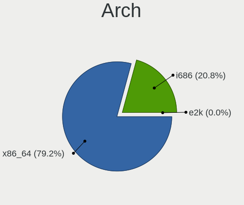
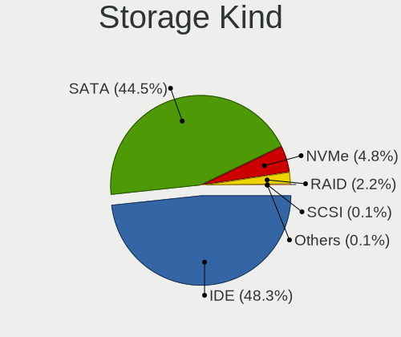
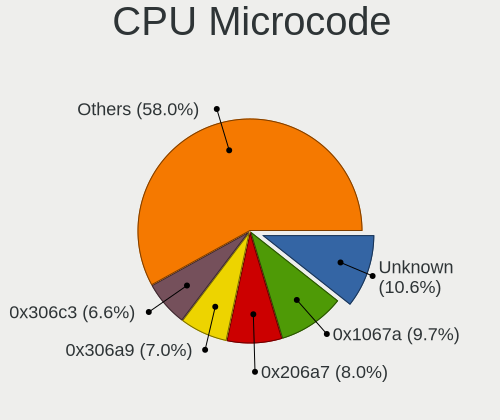
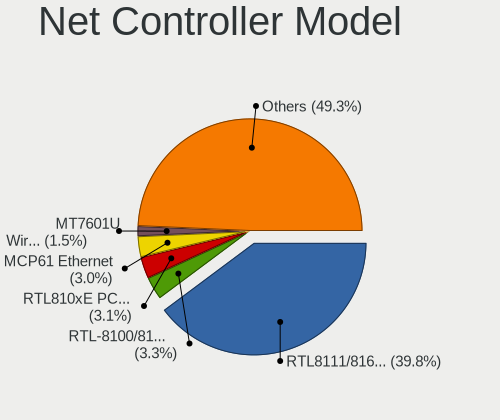
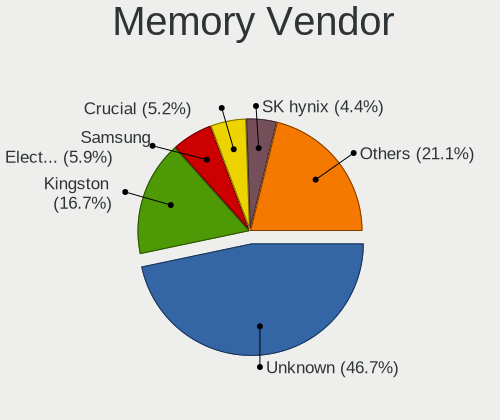

ROSA - Tested Hardware & Statistics (Desktops)
----------------------------------------------

A project to collect tested hardware configurations for ROSA.

Anyone can contribute to this report by the [hw-probe](https://github.com/linuxhw/hw-probe) tool:

    sudo -E hw-probe -all -upload

Please contribute! Especially if your hardware is rare.

Contents
--------

* [ Test Cases ](#test-cases)

* [ System ](#system)
  - [ OS                       ](#os)
  - [ OS Family                ](#os-family)
  - [ Kernel                   ](#kernel)
  - [ Kernel Family            ](#kernel-family)
  - [ Kernel Major Ver.        ](#kernel-major-ver)
  - [ Arch                     ](#arch)
  - [ DE                       ](#de)
  - [ Display Server           ](#display-server)
  - [ Display Manager          ](#display-manager)
  - [ OS Lang                  ](#os-lang)
  - [ Boot Mode                ](#boot-mode)
  - [ Filesystem               ](#filesystem)
  - [ Part. scheme             ](#part-scheme)
  - [ Dual Boot with Linux/BSD ](#dual-boot-with-linuxbsd)
  - [ Dual Boot (Win)          ](#dual-boot-win)

* [ Board ](#board)
  - [ Vendor                   ](#vendor)
  - [ Model                    ](#model)
  - [ Model Family             ](#model-family)
  - [ MFG Year                 ](#mfg-year)
  - [ Form Factor              ](#form-factor)
  - [ Secure Boot              ](#secure-boot)
  - [ Coreboot                 ](#coreboot)
  - [ RAM Size                 ](#ram-size)
  - [ RAM Used                 ](#ram-used)
  - [ Total Drives             ](#total-drives)
  - [ Has CD-ROM               ](#has-cd-rom)
  - [ Has Ethernet             ](#has-ethernet)
  - [ Has WiFi                 ](#has-wifi)
  - [ Has Bluetooth            ](#has-bluetooth)

* [ Location ](#location)
  - [ Country                  ](#country)
  - [ City                     ](#city)

* [ Drives ](#drives)
  - [ Drive Vendor             ](#drive-vendor)
  - [ Drive Model              ](#drive-model)
  - [ HDD Vendor               ](#hdd-vendor)
  - [ SSD Vendor               ](#ssd-vendor)
  - [ Drive Kind               ](#drive-kind)
  - [ Drive Connector          ](#drive-connector)
  - [ Drive Size               ](#drive-size)
  - [ Space Total              ](#space-total)
  - [ Space Used               ](#space-used)
  - [ Malfunc. Drives          ](#malfunc-drives)
  - [ Malfunc. Drive Vendor    ](#malfunc-drive-vendor)
  - [ Malfunc. HDD Vendor      ](#malfunc-hdd-vendor)
  - [ Malfunc. Drive Kind      ](#malfunc-drive-kind)
  - [ Failed Drives            ](#failed-drives)
  - [ Failed Drive Vendor      ](#failed-drive-vendor)
  - [ Drive Status             ](#drive-status)

* [ Storage controller ](#storage-controller)
  - [ Storage Vendor           ](#storage-vendor)
  - [ Storage Model            ](#storage-model)
  - [ Storage Kind             ](#storage-kind)

* [ Processor ](#processor)
  - [ CPU Vendor               ](#cpu-vendor)
  - [ CPU Model                ](#cpu-model)
  - [ CPU Model Family         ](#cpu-model-family)
  - [ CPU Cores                ](#cpu-cores)
  - [ CPU Sockets              ](#cpu-sockets)
  - [ CPU Threads              ](#cpu-threads)
  - [ CPU Op-Modes             ](#cpu-op-modes)
  - [ CPU Microcode            ](#cpu-microcode)
  - [ CPU Microarch            ](#cpu-microarch)

* [ Graphics ](#graphics)
  - [ GPU Vendor               ](#gpu-vendor)
  - [ GPU Model                ](#gpu-model)
  - [ GPU Combo                ](#gpu-combo)
  - [ GPU Driver               ](#gpu-driver)
  - [ GPU Memory               ](#gpu-memory)

* [ Monitor ](#monitor)
  - [ Monitor Vendor           ](#monitor-vendor)
  - [ Monitor Model            ](#monitor-model)
  - [ Monitor Resolution       ](#monitor-resolution)
  - [ Monitor Diagonal         ](#monitor-diagonal)
  - [ Monitor Width            ](#monitor-width)
  - [ Aspect Ratio             ](#aspect-ratio)
  - [ Monitor Area             ](#monitor-area)
  - [ Pixel Density            ](#pixel-density)
  - [ Multiple Monitors        ](#multiple-monitors)

* [ Network ](#network)
  - [ Net Controller Vendor    ](#net-controller-vendor)
  - [ Net Controller Model     ](#net-controller-model)
  - [ Wireless Vendor          ](#wireless-vendor)
  - [ Wireless Model           ](#wireless-model)
  - [ Ethernet Vendor          ](#ethernet-vendor)
  - [ Ethernet Model           ](#ethernet-model)
  - [ Net Controller Kind      ](#net-controller-kind)
  - [ Used Controller          ](#used-controller)
  - [ NICs                     ](#nics)
  - [ IPv6                     ](#ipv6)

* [ Bluetooth ](#bluetooth)
  - [ Bluetooth Vendor         ](#bluetooth-vendor)
  - [ Bluetooth Model          ](#bluetooth-model)

* [ Sound ](#sound)
  - [ Sound Vendor             ](#sound-vendor)
  - [ Sound Model              ](#sound-model)

* [ Memory ](#memory)
  - [ Memory Vendor            ](#memory-vendor)
  - [ Memory Model             ](#memory-model)
  - [ Memory Kind              ](#memory-kind)
  - [ Memory Form Factor       ](#memory-form-factor)
  - [ Memory Size              ](#memory-size)
  - [ Memory Speed             ](#memory-speed)

* [ Printers & scanners ](#printers--scanners)
  - [ Printer Vendor           ](#printer-vendor)
  - [ Printer Model            ](#printer-model)
  - [ Scanner Vendor           ](#scanner-vendor)
  - [ Scanner Model            ](#scanner-model)

* [ Camera ](#camera)
  - [ Camera Vendor            ](#camera-vendor)
  - [ Camera Model             ](#camera-model)

* [ Security ](#security)
  - [ Fingerprint Vendor       ](#fingerprint-vendor)
  - [ Fingerprint Model        ](#fingerprint-model)
  - [ Chipcard Vendor          ](#chipcard-vendor)
  - [ Chipcard Model           ](#chipcard-model)

* [ Unsupported ](#unsupported)
  - [ Unsupported Devices      ](#unsupported-devices)
  - [ Unsupported Device Types ](#unsupported-device-types)

Test Cases
----------

Total: 23579

| Vendor        | Model                       | Probe                                                      | Date         |
|---------------|-----------------------------|------------------------------------------------------------|--------------|
| ASUSTek       | PRIME B450-PLUS             | [4233786e9f](https://linux-hardware.org/?probe=4233786e9f) | Jan 06, 2025 |
| ASRock        | 960GM-VGS3 FX               | [e4da7ca430](https://linux-hardware.org/?probe=e4da7ca430) | Jan 05, 2025 |
| Gigabyte      | B450 AORUS M                | [65b4884505](https://linux-hardware.org/?probe=65b4884505) | Jan 04, 2025 |
| Intel         | D510MO AAE76523-401         | [70f66209d4](https://linux-hardware.org/?probe=70f66209d4) | Jan 04, 2025 |
| AZW           | MINI S                      | [0f7bb17346](https://linux-hardware.org/?probe=0f7bb17346) | Jan 04, 2025 |
| MSI           | 970A-G43                    | [4da1f27374](https://linux-hardware.org/?probe=4da1f27374) | Jan 03, 2025 |
| Gigabyte      | B450 GAMING X               | [faa23f32b2](https://linux-hardware.org/?probe=faa23f32b2) | Jan 03, 2025 |
| Acer          | WMCP78M                     | [194dd31946](https://linux-hardware.org/?probe=194dd31946) | Jan 03, 2025 |
| Huanan        | X99-QD4 V1.0                | [6f4fe3e17b](https://linux-hardware.org/?probe=6f4fe3e17b) | Jan 02, 2025 |
| ASUSTek       | P5B-E Plus                  | [1026f82971](https://linux-hardware.org/?probe=1026f82971) | Jan 02, 2025 |
| Huanan        | X99-F8 GAMING V5.0          | [b1dbf7b873](https://linux-hardware.org/?probe=b1dbf7b873) | Dec 31, 2024 |
| Gigabyte      | B450M S2H                   | [27c0c9eacb](https://linux-hardware.org/?probe=27c0c9eacb) | Dec 31, 2024 |
| Lenovo        | MAHOBAY NOK                 | [00c630c63a](https://linux-hardware.org/?probe=00c630c63a) | Dec 30, 2024 |
| MSI           | A68HM-E33                   | [8054416839](https://linux-hardware.org/?probe=8054416839) | Dec 30, 2024 |
| MSI           | A320M-A PRO MAX             | [97b1ee7487](https://linux-hardware.org/?probe=97b1ee7487) | Dec 29, 2024 |
| ASUSTek       | TUF Gaming B450M-PRO II     | [8012f9a21d](https://linux-hardware.org/?probe=8012f9a21d) | Dec 28, 2024 |
| Lenovo        | MAHOBAY NOK                 | [9fd12e619e](https://linux-hardware.org/?probe=9fd12e619e) | Dec 28, 2024 |
| ASUSTek       | PRIME B760-PLUS D4          | [aea60b12c3](https://linux-hardware.org/?probe=aea60b12c3) | Dec 27, 2024 |
| ASRock        | H510M-HDV                   | [3b9f735c39](https://linux-hardware.org/?probe=3b9f735c39) | Dec 26, 2024 |
| ASRock        | G31M-GS                     | [655a9a77aa](https://linux-hardware.org/?probe=655a9a77aa) | Dec 26, 2024 |
| Biostar       | A780LB                      | [50a42b0b06](https://linux-hardware.org/?probe=50a42b0b06) | Dec 25, 2024 |
| MSI           | G41TM-E43                   | [0d099148c3](https://linux-hardware.org/?probe=0d099148c3) | Dec 25, 2024 |
| Huanan        | B75 G376-V6.0               | [fcecd9dab0](https://linux-hardware.org/?probe=fcecd9dab0) | Dec 25, 2024 |
| ASUSTek       | P8Z77-V LE PLUS             | [6d145d17f1](https://linux-hardware.org/?probe=6d145d17f1) | Dec 25, 2024 |
| Gigabyte      | B360M DS3H                  | [d606dfb509](https://linux-hardware.org/?probe=d606dfb509) | Dec 24, 2024 |
| Gigabyte      | GA-MA770-DS3                | [d3c2067fd5](https://linux-hardware.org/?probe=d3c2067fd5) | Dec 24, 2024 |
| ASUSTek       | PRIME A320M-K               | [cc7b12fc35](https://linux-hardware.org/?probe=cc7b12fc35) | Dec 24, 2024 |
| ASUSTek       | M3A78-CM                    | [2d4194f76b](https://linux-hardware.org/?probe=2d4194f76b) | Dec 23, 2024 |
| Gigabyte      | 970A-DS3P                   | [82a3f44796](https://linux-hardware.org/?probe=82a3f44796) | Dec 23, 2024 |
| Gigabyte      | H410M H V3                  | [38db6d3960](https://linux-hardware.org/?probe=38db6d3960) | Dec 23, 2024 |
| ASRock        | A320D4-P1                   | [9fd8b4c5ab](https://linux-hardware.org/?probe=9fd8b4c5ab) | Dec 23, 2024 |
| ASUSTek       | PRIME H270-PLUS             | [1ca103ad2a](https://linux-hardware.org/?probe=1ca103ad2a) | Dec 23, 2024 |
| ASUSTek       | B85M-K                      | [0978d9437e](https://linux-hardware.org/?probe=0978d9437e) | Dec 22, 2024 |
| Gigabyte      | B650M AORUS ELITE           | [35a7c56bfe](https://linux-hardware.org/?probe=35a7c56bfe) | Dec 21, 2024 |
| ASUSTek       | P5G41T-M LX2/GB             | [3ba1da1476](https://linux-hardware.org/?probe=3ba1da1476) | Dec 20, 2024 |
| ASUSTek       | STRIX Z270H GAMING          | [b38a7837c5](https://linux-hardware.org/?probe=b38a7837c5) | Dec 20, 2024 |
| MSI           | Z77A-GD65                   | [b928d00615](https://linux-hardware.org/?probe=b928d00615) | Dec 19, 2024 |
| Biostar       | N68S3B                      | [9b0517b1c6](https://linux-hardware.org/?probe=9b0517b1c6) | Dec 18, 2024 |
| MSI           | G31TM-P21                   | [f8e605fd2a](https://linux-hardware.org/?probe=f8e605fd2a) | Dec 18, 2024 |
| Biostar       | Hi-Fi H77S                  | [920915dc5e](https://linux-hardware.org/?probe=920915dc5e) | Dec 18, 2024 |
| ASRock        | H510M-HDV                   | [5b34b8b9bd](https://linux-hardware.org/?probe=5b34b8b9bd) | Dec 18, 2024 |
| Gigabyte      | H310M S2H                   | [2fe012a888](https://linux-hardware.org/?probe=2fe012a888) | Dec 18, 2024 |
| ASUSTek       | M5A78L-M LX3                | [5b0695c446](https://linux-hardware.org/?probe=5b0695c446) | Dec 18, 2024 |
| Unknown       | Unknown                     | [ca877e7bea](https://linux-hardware.org/?probe=ca877e7bea) | Dec 17, 2024 |
| MSI           | B760M BOMBER                | [0b6ed644f3](https://linux-hardware.org/?probe=0b6ed644f3) | Dec 17, 2024 |
| Gigabyte      | H61M-DS2                    | [ed02a12fef](https://linux-hardware.org/?probe=ed02a12fef) | Dec 17, 2024 |
| MSI           | B760M BOMBER                | [c181449dfb](https://linux-hardware.org/?probe=c181449dfb) | Dec 17, 2024 |
| Gigabyte      | H610M H DDR4                | [6f57b82832](https://linux-hardware.org/?probe=6f57b82832) | Dec 16, 2024 |
| ASRock        | B75 Pro3                    | [f470c0e8ba](https://linux-hardware.org/?probe=f470c0e8ba) | Dec 16, 2024 |
| ASUSTek       | PRIME H510M-K R2.0          | [6c43b12a79](https://linux-hardware.org/?probe=6c43b12a79) | Dec 16, 2024 |
| ASUSTek       | M4A785D-M PRO               | [ce740f709b](https://linux-hardware.org/?probe=ce740f709b) | Dec 15, 2024 |
| Lenovo        | Tiger Hill                  | [82f654c54b](https://linux-hardware.org/?probe=82f654c54b) | Dec 14, 2024 |
| Intel         | X99                         | [fca6609fa5](https://linux-hardware.org/?probe=fca6609fa5) | Dec 14, 2024 |
| Gigabyte      | 8PEMT4                      | [0d17183be5](https://linux-hardware.org/?probe=0d17183be5) | Dec 14, 2024 |
| ASUSTek       | P8Z77-V LE PLUS             | [d410612c72](https://linux-hardware.org/?probe=d410612c72) | Dec 14, 2024 |
| Acer          | FIH57                       | [0e1335494a](https://linux-hardware.org/?probe=0e1335494a) | Dec 14, 2024 |
| Gigabyte      | AB350M-DS3H-CF              | [2c834ce7a7](https://linux-hardware.org/?probe=2c834ce7a7) | Dec 13, 2024 |
| OEM           | X79G                        | [54ea7ee329](https://linux-hardware.org/?probe=54ea7ee329) | Dec 13, 2024 |
| ASUSTek       | H87M-E                      | [b2f1a524d5](https://linux-hardware.org/?probe=b2f1a524d5) | Dec 11, 2024 |
| ASRock        | H310CM-HDV                  | [6415ed92bc](https://linux-hardware.org/?probe=6415ed92bc) | Dec 11, 2024 |
| Gigabyte      | H77N-WIFI                   | [b1ff81f4b0](https://linux-hardware.org/?probe=b1ff81f4b0) | Dec 11, 2024 |
| ASRock        | H310CM-HDV                  | [af2d33d4ec](https://linux-hardware.org/?probe=af2d33d4ec) | Dec 10, 2024 |
| Gigabyte      | H470 HD3                    | [d6ad9179a1](https://linux-hardware.org/?probe=d6ad9179a1) | Dec 10, 2024 |
| Gigabyte      | H77N-WIFI                   | [e0e8469dce](https://linux-hardware.org/?probe=e0e8469dce) | Dec 09, 2024 |
| Gigabyte      | B75-D3V                     | [01d3d78d8c](https://linux-hardware.org/?probe=01d3d78d8c) | Dec 09, 2024 |
| Unknown       | Unknown                     | [3ca90936ec](https://linux-hardware.org/?probe=3ca90936ec) | Dec 08, 2024 |
| ASUSTek       | TUF Gaming B450M-PRO II     | [1c11421588](https://linux-hardware.org/?probe=1c11421588) | Dec 08, 2024 |
| Intel         | DP35DP AAD81073-206         | [495382b328](https://linux-hardware.org/?probe=495382b328) | Dec 08, 2024 |
| ASRock        | G31M-GS                     | [94e1ac3253](https://linux-hardware.org/?probe=94e1ac3253) | Dec 08, 2024 |
| MACHINIST     | X99-RS9 V3.1                | [fe7be85a71](https://linux-hardware.org/?probe=fe7be85a71) | Dec 08, 2024 |
| ASUSTek       | M2N-X Plus                  | [ee0520cc79](https://linux-hardware.org/?probe=ee0520cc79) | Dec 07, 2024 |
| Gigabyte      | 970A-UD3P                   | [80b281101e](https://linux-hardware.org/?probe=80b281101e) | Dec 07, 2024 |
| Gigabyte      | GA-MA770T-UD3               | [0645b251b4](https://linux-hardware.org/?probe=0645b251b4) | Dec 07, 2024 |
| Lenovo        | Bantry CRB SDK0J40697 WI... | [8b5005227c](https://linux-hardware.org/?probe=8b5005227c) | Dec 07, 2024 |
| Lenovo        | 3111 NOK                    | [be49e79017](https://linux-hardware.org/?probe=be49e79017) | Dec 07, 2024 |
| Foxconn       | G43M01                      | [05764150cd](https://linux-hardware.org/?probe=05764150cd) | Dec 07, 2024 |
| Gigabyte      | 970A-UD3P                   | [5bc1e6a705](https://linux-hardware.org/?probe=5bc1e6a705) | Dec 06, 2024 |
| Intel         | X99                         | [1a747b74f7](https://linux-hardware.org/?probe=1a747b74f7) | Dec 06, 2024 |
| MSI           | A320M-A PRO MAX             | [c578d9f1c3](https://linux-hardware.org/?probe=c578d9f1c3) | Dec 06, 2024 |
| ASUSTek       | M4A78-VM                    | [6b8d8c80f7](https://linux-hardware.org/?probe=6b8d8c80f7) | Dec 06, 2024 |
| ASUSTek       | M5A78L LE                   | [a38ce39707](https://linux-hardware.org/?probe=a38ce39707) | Dec 06, 2024 |
| ASRock        | Z270M Extreme4              | [1759ae4e5c](https://linux-hardware.org/?probe=1759ae4e5c) | Dec 05, 2024 |
| Fujitsu       | D3062-A1 S26361-D3062-A1    | [fcb75ca2c4](https://linux-hardware.org/?probe=fcb75ca2c4) | Dec 05, 2024 |
| MSI           | B350M PRO-VDH               | [c287832149](https://linux-hardware.org/?probe=c287832149) | Dec 04, 2024 |
| Intel         | DQ67SW AAG12527-310         | [acb85c645e](https://linux-hardware.org/?probe=acb85c645e) | Dec 04, 2024 |
| Gigabyte      | B75M-HD3                    | [8e3012cc10](https://linux-hardware.org/?probe=8e3012cc10) | Dec 04, 2024 |
| Aquarius      | AQH310CM                    | [48fdb906d0](https://linux-hardware.org/?probe=48fdb906d0) | Dec 04, 2024 |
| Gigabyte      | H410M H V3                  | [5ed6ba9b9c](https://linux-hardware.org/?probe=5ed6ba9b9c) | Dec 04, 2024 |
| Gigabyte      | GA-MA770T-UD3               | [01e4659eed](https://linux-hardware.org/?probe=01e4659eed) | Dec 03, 2024 |
| Intel         | B75                         | [a8fc962dbe](https://linux-hardware.org/?probe=a8fc962dbe) | Dec 01, 2024 |
| Acer          | Veriton N4660G              | [2c0d5d89b6](https://linux-hardware.org/?probe=2c0d5d89b6) | Dec 01, 2024 |
| Gigabyte      | AB350M-DS3H V2-CF           | [08860bb0e8](https://linux-hardware.org/?probe=08860bb0e8) | Dec 01, 2024 |
| ASUSTek       | TUF Gaming B550M-PLUS WI... | [b3a7fc5d30](https://linux-hardware.org/?probe=b3a7fc5d30) | Nov 30, 2024 |
| Gigabyte      | A520M H                     | [e31c869571](https://linux-hardware.org/?probe=e31c869571) | Nov 30, 2024 |
| Intel         | H61M-DS2                    | [dd01835023](https://linux-hardware.org/?probe=dd01835023) | Nov 30, 2024 |
| Gigabyte      | B450M S2H                   | [13478eefd3](https://linux-hardware.org/?probe=13478eefd3) | Nov 30, 2024 |
| Intel         | DG41RQ AAE54511-205         | [2e5bbbe981](https://linux-hardware.org/?probe=2e5bbbe981) | Nov 29, 2024 |
| Intel         | DG41RQ AAE54511-205         | [72ff611394](https://linux-hardware.org/?probe=72ff611394) | Nov 29, 2024 |
| ASRock        | H510M-HDV R2.0              | [947d8af601](https://linux-hardware.org/?probe=947d8af601) | Nov 29, 2024 |
| INTECH PRO    | H510-M2 v5.0                | [63013e9984](https://linux-hardware.org/?probe=63013e9984) | Nov 29, 2024 |
| MSI           | A68HM-E33 V2                | [ce52274660](https://linux-hardware.org/?probe=ce52274660) | Nov 29, 2024 |
| ASUSTek       | H110M-K                     | [c7e128e7ec](https://linux-hardware.org/?probe=c7e128e7ec) | Nov 28, 2024 |
| ASUSTek       | M5A78L-M LX3                | [0acc2613ad](https://linux-hardware.org/?probe=0acc2613ad) | Nov 28, 2024 |
| Intel         | SKYBAY                      | [063640fbc9](https://linux-hardware.org/?probe=063640fbc9) | Nov 27, 2024 |
| ASUSTek       | H110M-K                     | [e5b975c393](https://linux-hardware.org/?probe=e5b975c393) | Nov 27, 2024 |
| Gigabyte      | H55M-USB3                   | [9edb44801f](https://linux-hardware.org/?probe=9edb44801f) | Nov 27, 2024 |
| HP            | 18E4                        | [839d381895](https://linux-hardware.org/?probe=839d381895) | Nov 26, 2024 |
| Intel         | SKYBAY                      | [06db9f0788](https://linux-hardware.org/?probe=06db9f0788) | Nov 26, 2024 |
| OEM           | X79G                        | [a95d8577a5](https://linux-hardware.org/?probe=a95d8577a5) | Nov 26, 2024 |
| MSI           | PRO H610M-E DDR4            | [e429c117e8](https://linux-hardware.org/?probe=e429c117e8) | Nov 26, 2024 |
| Gigabyte      | GA-MA790X-UD3P              | [b8e87faae4](https://linux-hardware.org/?probe=b8e87faae4) | Nov 25, 2024 |
| Gigabyte      | GA-78LMT-USB3 R2 sex        | [472dab88cd](https://linux-hardware.org/?probe=472dab88cd) | Nov 25, 2024 |
| Gigabyte      | H410M H V3                  | [adf7334713](https://linux-hardware.org/?probe=adf7334713) | Nov 25, 2024 |
| Acer          | Aspire TC-895 V:1.0         | [2db4d4ac5e](https://linux-hardware.org/?probe=2db4d4ac5e) | Nov 25, 2024 |
| Gigabyte      | GA-MA785GT-UD3H             | [351d6d8f7e](https://linux-hardware.org/?probe=351d6d8f7e) | Nov 24, 2024 |
| ASUSTek       | A88XM-A                     | [80653601c3](https://linux-hardware.org/?probe=80653601c3) | Nov 24, 2024 |
| MSI           | PRO H610M-E DDR4            | [a1fb499d45](https://linux-hardware.org/?probe=a1fb499d45) | Nov 24, 2024 |
| Gigabyte      | 970A-UD3P                   | [0d7994849a](https://linux-hardware.org/?probe=0d7994849a) | Nov 24, 2024 |
| ASRock        | H55M-LE                     | [d6661a1b7e](https://linux-hardware.org/?probe=d6661a1b7e) | Nov 24, 2024 |
| ASUSTek       | H81M-K                      | [78abfebb85](https://linux-hardware.org/?probe=78abfebb85) | Nov 23, 2024 |
| Biostar       | Hi-Fi A70U3P                | [4a275d3651](https://linux-hardware.org/?probe=4a275d3651) | Nov 23, 2024 |
| Biostar       | Hi-Fi A70U3P                | [05ea90a550](https://linux-hardware.org/?probe=05ea90a550) | Nov 23, 2024 |
| MSI           | MAG B550 TOMAHAWK MAX WI... | [7da7291a21](https://linux-hardware.org/?probe=7da7291a21) | Nov 22, 2024 |
| MSI           | B450M PRO-VDH MAX           | [2daa1c603a](https://linux-hardware.org/?probe=2daa1c603a) | Nov 22, 2024 |
| MSI           | B360M PRO-VD 2019-01-24     | [2b2fa38f7b](https://linux-hardware.org/?probe=2b2fa38f7b) | Nov 22, 2024 |
| Pegatron      | IPPPV-D3G                   | [a36f9a6cde](https://linux-hardware.org/?probe=a36f9a6cde) | Nov 21, 2024 |
| MSI           | MAG B550 TOMAHAWK MAX WI... | [b3c2dde2d2](https://linux-hardware.org/?probe=b3c2dde2d2) | Nov 21, 2024 |
| ASUSTek       | ROG STRIX B650E-E GAMING... | [0816566a8c](https://linux-hardware.org/?probe=0816566a8c) | Nov 20, 2024 |
| ASRock        | B550 Pro4                   | [7cd54fba60](https://linux-hardware.org/?probe=7cd54fba60) | Nov 20, 2024 |
| ASRock        | B550 Pro4                   | [af8b3db309](https://linux-hardware.org/?probe=af8b3db309) | Nov 20, 2024 |
| Unknown       | Intel X79                   | [b2b00e0a3d](https://linux-hardware.org/?probe=b2b00e0a3d) | Nov 19, 2024 |
| Intel         | X99H                        | [b11643d70a](https://linux-hardware.org/?probe=b11643d70a) | Nov 19, 2024 |
| MAINBRD       | OPS72A-SHA                  | [e504d80c3f](https://linux-hardware.org/?probe=e504d80c3f) | Nov 19, 2024 |
| ASRock        | ALiveXFire-eSATA2           | [22476669aa](https://linux-hardware.org/?probe=22476669aa) | Nov 19, 2024 |
| ASUSTek       | PRIME B360M-K               | [4f46a03b8f](https://linux-hardware.org/?probe=4f46a03b8f) | Nov 18, 2024 |
| ASUSTek       | P8B75-M LE                  | [9843d05d79](https://linux-hardware.org/?probe=9843d05d79) | Nov 18, 2024 |
| ASUSTek       | M5A97 R2.0                  | [29fe62e310](https://linux-hardware.org/?probe=29fe62e310) | Nov 18, 2024 |
| ASUSTek       | Z97-PRO                     | [a10a6eb890](https://linux-hardware.org/?probe=a10a6eb890) | Nov 18, 2024 |
| ASUSTek       | P7P55D-E LX                 | [efc0963dc9](https://linux-hardware.org/?probe=efc0963dc9) | Nov 17, 2024 |
| MSI           | PRO H610M-E DDR4            | [71bc94afe4](https://linux-hardware.org/?probe=71bc94afe4) | Nov 17, 2024 |
| ASUSTek       | A88XM-PLUS                  | [089f454020](https://linux-hardware.org/?probe=089f454020) | Nov 16, 2024 |
| Gigabyte      | B75M-D3V                    | [9497c69481](https://linux-hardware.org/?probe=9497c69481) | Nov 16, 2024 |
| ASUSTek       | PRIME X470-PRO              | [747ee0e632](https://linux-hardware.org/?probe=747ee0e632) | Nov 16, 2024 |
| ASRock        | J3455B-ITX                  | [d6f7c12b21](https://linux-hardware.org/?probe=d6f7c12b21) | Nov 15, 2024 |
| MSI           | MAG X570S TOMAHAWK MAX W... | [fb4fe07675](https://linux-hardware.org/?probe=fb4fe07675) | Nov 15, 2024 |
| ECS           | H81H3-M7                    | [58029deefd](https://linux-hardware.org/?probe=58029deefd) | Nov 14, 2024 |
| ASRock        | AB350 Pro4                  | [1785564eb0](https://linux-hardware.org/?probe=1785564eb0) | Nov 14, 2024 |
| Acer          | Veriton M4610G              | [a0fbf72095](https://linux-hardware.org/?probe=a0fbf72095) | Nov 14, 2024 |
| ASRock        | B550M-HDV                   | [91cb099862](https://linux-hardware.org/?probe=91cb099862) | Nov 14, 2024 |
| Gigabyte      | H510M S2H                   | [4592fba95e](https://linux-hardware.org/?probe=4592fba95e) | Nov 14, 2024 |
| ECS           | H81H3-M7                    | [d17f318daf](https://linux-hardware.org/?probe=d17f318daf) | Nov 13, 2024 |
| Intel         | JSL MRD                     | [156614a3d2](https://linux-hardware.org/?probe=156614a3d2) | Nov 13, 2024 |
| MSI           | PRO H610M-E DDR4            | [76febb5b12](https://linux-hardware.org/?probe=76febb5b12) | Nov 13, 2024 |
| HP            | 8184 X4                     | [700869774e](https://linux-hardware.org/?probe=700869774e) | Nov 13, 2024 |
| Intel         | B75 V1.6A                   | [519c1654d2](https://linux-hardware.org/?probe=519c1654d2) | Nov 13, 2024 |
| MSI           | B760M BOMBER WIFI           | [653d59d9ec](https://linux-hardware.org/?probe=653d59d9ec) | Nov 12, 2024 |
| MSI           | B760M BOMBER WIFI           | [308420348f](https://linux-hardware.org/?probe=308420348f) | Nov 12, 2024 |
| Unknown       | Unknown                     | [9d805536a6](https://linux-hardware.org/?probe=9d805536a6) | Nov 12, 2024 |
| MSI           | PRO B660M-E DDR4            | [9da6d685c2](https://linux-hardware.org/?probe=9da6d685c2) | Nov 12, 2024 |
| ASRock        | D1800B-ITX                  | [402fd3b060](https://linux-hardware.org/?probe=402fd3b060) | Nov 10, 2024 |
| ASUSTek       | P5G41T-M LX                 | [0120fa81dd](https://linux-hardware.org/?probe=0120fa81dd) | Nov 10, 2024 |
| ASRock        | A320M-HDV R4.0              | [9b07ca2601](https://linux-hardware.org/?probe=9b07ca2601) | Nov 10, 2024 |
| ASUSTek       | M5A99X EVO                  | [cd6375dd12](https://linux-hardware.org/?probe=cd6375dd12) | Nov 10, 2024 |
| ASUSTek       | P5KC                        | [f89ad17e82](https://linux-hardware.org/?probe=f89ad17e82) | Nov 10, 2024 |
| ASUSTek       | ROG STRIX B550-F GAMING     | [ce729ae5b6](https://linux-hardware.org/?probe=ce729ae5b6) | Nov 09, 2024 |
| ASUSTek       | ROG STRIX B650E-F GAMING... | [5a370e8829](https://linux-hardware.org/?probe=5a370e8829) | Nov 09, 2024 |
| ASUSTek       | P5Q SE                      | [9a55b96173](https://linux-hardware.org/?probe=9a55b96173) | Nov 09, 2024 |
| ASUSTek       | H61M-K                      | [479dbe74b1](https://linux-hardware.org/?probe=479dbe74b1) | Nov 08, 2024 |
| ASRock        | H510M-HDV R2.0              | [b07723cee5](https://linux-hardware.org/?probe=b07723cee5) | Nov 07, 2024 |
| MSI           | B360M PRO-VD 2019-01-24     | [edd073d81a](https://linux-hardware.org/?probe=edd073d81a) | Nov 07, 2024 |
| ASUSTek       | PRIME B450M-K               | [289f527cde](https://linux-hardware.org/?probe=289f527cde) | Nov 07, 2024 |
| MSI           | Z77A-GD65                   | [e2b5959d46](https://linux-hardware.org/?probe=e2b5959d46) | Nov 07, 2024 |
| MSI           | Z77A-GD65                   | [4581494303](https://linux-hardware.org/?probe=4581494303) | Nov 06, 2024 |
| ASUSTek       | H110M-K                     | [2feced0fea](https://linux-hardware.org/?probe=2feced0fea) | Nov 06, 2024 |
| ASRock        | B365M-HDV                   | [cf11d9dbfc](https://linux-hardware.org/?probe=cf11d9dbfc) | Nov 05, 2024 |
| ASRock        | J3455B-ITX                  | [4247fee992](https://linux-hardware.org/?probe=4247fee992) | Nov 04, 2024 |
| Acer          | Aspire XC-330               | [a4b3ad723c](https://linux-hardware.org/?probe=a4b3ad723c) | Nov 04, 2024 |
| Acer          | Veriton S2611G v1.0         | [d381182b97](https://linux-hardware.org/?probe=d381182b97) | Nov 04, 2024 |
| Gigabyte      | P85-D3                      | [99621729a8](https://linux-hardware.org/?probe=99621729a8) | Nov 04, 2024 |
| MSI           | A520M PRO-VH                | [60c1f743a0](https://linux-hardware.org/?probe=60c1f743a0) | Nov 02, 2024 |
| Fujitsu       | D3162-A1 S26361-D3162-A1    | [20b70c9d30](https://linux-hardware.org/?probe=20b70c9d30) | Nov 02, 2024 |
| Lenovo        | SHARKBAY 0B98401 PRO        | [68a4038e60](https://linux-hardware.org/?probe=68a4038e60) | Nov 01, 2024 |
| ASUSTek       | M5A97 LE R2.0               | [e3a1dc6823](https://linux-hardware.org/?probe=e3a1dc6823) | Nov 01, 2024 |
| ASUSTek       | P4P800-VM                   | [efd9b7cc32](https://linux-hardware.org/?probe=efd9b7cc32) | Nov 01, 2024 |
| Gigabyte      | X570S AORUS ELITE AX        | [d4ba6209d2](https://linux-hardware.org/?probe=d4ba6209d2) | Nov 01, 2024 |
| MSI           | MS-7210 100                 | [f0008e9932](https://linux-hardware.org/?probe=f0008e9932) | Nov 01, 2024 |
| Intel         | STRIX X99 GAMING II         | [9a78cb45fa](https://linux-hardware.org/?probe=9a78cb45fa) | Nov 01, 2024 |
| Gigabyte      | H410M H V3                  | [236dc53d9f](https://linux-hardware.org/?probe=236dc53d9f) | Nov 01, 2024 |
| Biostar       | H410MH                      | [bc65308166](https://linux-hardware.org/?probe=bc65308166) | Oct 31, 2024 |
| ASUSTek       | Z97-PRO                     | [10ba885229](https://linux-hardware.org/?probe=10ba885229) | Oct 29, 2024 |
| Intel         | E5-A99 V1.0                 | [dde18fbb28](https://linux-hardware.org/?probe=dde18fbb28) | Oct 29, 2024 |
| HP            | 8B3C A                      | [ca1220b4d7](https://linux-hardware.org/?probe=ca1220b4d7) | Oct 28, 2024 |
| ASRock        | N68C-GS FX                  | [2465088bf3](https://linux-hardware.org/?probe=2465088bf3) | Oct 28, 2024 |
| ASRock        | H510M-HDV R2.0              | [9e3d14b8ec](https://linux-hardware.org/?probe=9e3d14b8ec) | Oct 28, 2024 |
| Gigabyte      | H61M-DS2                    | [b389d0c635](https://linux-hardware.org/?probe=b389d0c635) | Oct 27, 2024 |
| MSI           | B150 PC MATE                | [93034e1644](https://linux-hardware.org/?probe=93034e1644) | Oct 26, 2024 |
| Gigabyte      | G31M-S2L                    | [2f5b4354b5](https://linux-hardware.org/?probe=2f5b4354b5) | Oct 26, 2024 |
| Gigabyte      | 8PEMT4                      | [98b613d764](https://linux-hardware.org/?probe=98b613d764) | Oct 26, 2024 |
| MSI           | MAG B550 TOMAHAWK           | [df98d752dd](https://linux-hardware.org/?probe=df98d752dd) | Oct 26, 2024 |
| ASRock        | P67 Pro                     | [18ccf68e14](https://linux-hardware.org/?probe=18ccf68e14) | Oct 26, 2024 |
| Intel         | X99                         | [607bd3a20b](https://linux-hardware.org/?probe=607bd3a20b) | Oct 25, 2024 |
| ASUSTek       | M5A78L-M LX3                | [732f68bcdb](https://linux-hardware.org/?probe=732f68bcdb) | Oct 25, 2024 |
| ASUSTek       | P7P55D PRO                  | [d85165218e](https://linux-hardware.org/?probe=d85165218e) | Oct 24, 2024 |
| Intel         | E5-A99 V1.0                 | [70d9570cde](https://linux-hardware.org/?probe=70d9570cde) | Oct 24, 2024 |
| Gigabyte      | MZBAYAB-00                  | [bcf2f99772](https://linux-hardware.org/?probe=bcf2f99772) | Oct 24, 2024 |
| Gigabyte      | H61N-USB3                   | [70a705b7cd](https://linux-hardware.org/?probe=70a705b7cd) | Oct 24, 2024 |
| ECS           | G41T-M2                     | [30d3e2b4ff](https://linux-hardware.org/?probe=30d3e2b4ff) | Oct 23, 2024 |
| ASUSTek       | PRIME X470-PRO              | [367e496bd2](https://linux-hardware.org/?probe=367e496bd2) | Oct 23, 2024 |
| Unknown       | Unknown                     | [889d99381a](https://linux-hardware.org/?probe=889d99381a) | Oct 23, 2024 |
| MACHINIST     | X79 S7                      | [4f757539eb](https://linux-hardware.org/?probe=4f757539eb) | Oct 23, 2024 |
| ASUSTek       | P5G41T-M LX2/GB             | [e7f82fd427](https://linux-hardware.org/?probe=e7f82fd427) | Oct 22, 2024 |
| ASUSTek       | Z87-K                       | [3f0f3b4113](https://linux-hardware.org/?probe=3f0f3b4113) | Oct 22, 2024 |
| ASRock        | N68C-GS FX                  | [bb15af1438](https://linux-hardware.org/?probe=bb15af1438) | Oct 22, 2024 |
| Dell          | 07WP95 A01                  | [d663d878bc](https://linux-hardware.org/?probe=d663d878bc) | Oct 21, 2024 |
| Lenovo        | H420                        | [e293d23e57](https://linux-hardware.org/?probe=e293d23e57) | Oct 21, 2024 |
| Gigabyte      | H77N-WIFI                   | [dade84dc29](https://linux-hardware.org/?probe=dade84dc29) | Oct 21, 2024 |
| Gigabyte      | GA-A75M-UD2H                | [198fa42a00](https://linux-hardware.org/?probe=198fa42a00) | Oct 21, 2024 |
| ASUSTek       | P5K PRO                     | [25212e9ebd](https://linux-hardware.org/?probe=25212e9ebd) | Oct 20, 2024 |
| ASUSTek       | PRIME B450M-A II            | [d48e67ef98](https://linux-hardware.org/?probe=d48e67ef98) | Oct 20, 2024 |
| Lenovo        | Bantry CRB NOK              | [bc080f7861](https://linux-hardware.org/?probe=bc080f7861) | Oct 20, 2024 |
| ASUSTek       | P7Q57-M DO                  | [f22bf6ab4c](https://linux-hardware.org/?probe=f22bf6ab4c) | Oct 19, 2024 |
| Foxconn       | 2AA9                        | [c978588023](https://linux-hardware.org/?probe=c978588023) | Oct 18, 2024 |
| MSI           | MPG B550 GAMING PLUS        | [38f2255ffb](https://linux-hardware.org/?probe=38f2255ffb) | Oct 18, 2024 |
| Gigabyte      | 945GCM-S2L                  | [c5a425f78f](https://linux-hardware.org/?probe=c5a425f78f) | Oct 18, 2024 |
| Gigabyte      | 945GCM-S2L                  | [ff900837b9](https://linux-hardware.org/?probe=ff900837b9) | Oct 18, 2024 |
| ASUSTek       | P5KPL-AM IN/ROEM/SI         | [329c63f2f5](https://linux-hardware.org/?probe=329c63f2f5) | Oct 18, 2024 |
| ASUSTek       | P5KPL-AM IN/ROEM/SI         | [5db2421d97](https://linux-hardware.org/?probe=5db2421d97) | Oct 18, 2024 |
| ASUSTek       | PRIME Z790-P                | [d92a8e7d89](https://linux-hardware.org/?probe=d92a8e7d89) | Oct 18, 2024 |
| MSI           | PRO B660M-P DDR4            | [7f1c983e8d](https://linux-hardware.org/?probe=7f1c983e8d) | Oct 18, 2024 |
| ASUSTek       | Z170 PRO GAMING             | [a5709cc637](https://linux-hardware.org/?probe=a5709cc637) | Oct 18, 2024 |
| ASUSTek       | P5Q                         | [1ad174b306](https://linux-hardware.org/?probe=1ad174b306) | Oct 17, 2024 |
| ASUSTek       | M4A785TD-M EVO              | [39469c8f6e](https://linux-hardware.org/?probe=39469c8f6e) | Oct 17, 2024 |
| ASUSTek       | P5K                         | [56eb64e12e](https://linux-hardware.org/?probe=56eb64e12e) | Oct 17, 2024 |
| Lenovo        | H420                        | [23ce69d637](https://linux-hardware.org/?probe=23ce69d637) | Oct 16, 2024 |
| Foxconn       | G33M03                      | [ee2e6b6c74](https://linux-hardware.org/?probe=ee2e6b6c74) | Oct 16, 2024 |
| ASUSTek       | P5QPL-AM                    | [c318a321d9](https://linux-hardware.org/?probe=c318a321d9) | Oct 16, 2024 |
| ASRock        | B450 Gaming K4              | [dbd72f6f7d](https://linux-hardware.org/?probe=dbd72f6f7d) | Oct 15, 2024 |
| MSI           | MAG B550 TOMAHAWK           | [8c7b150516](https://linux-hardware.org/?probe=8c7b150516) | Oct 14, 2024 |
| Huanan        | X99 F8D V2.2                | [f2b8f30b23](https://linux-hardware.org/?probe=f2b8f30b23) | Oct 14, 2024 |
| ASUSTek       | TUF Gaming X570-PLUS        | [3fc892bab8](https://linux-hardware.org/?probe=3fc892bab8) | Oct 14, 2024 |
| Gigabyte      | B250M-D3H-CF                | [0f368d8a79](https://linux-hardware.org/?probe=0f368d8a79) | Oct 14, 2024 |
| ASUSTek       | P7H55-M LX                  | [4f331593c4](https://linux-hardware.org/?probe=4f331593c4) | Oct 14, 2024 |
| Huanan        | X99 F8D V2.2                | [c537d14cf8](https://linux-hardware.org/?probe=c537d14cf8) | Oct 14, 2024 |
| MSI           | MAG Z690 TOMAHAWK WIFI      | [a5a01f0c1d](https://linux-hardware.org/?probe=a5a01f0c1d) | Oct 14, 2024 |
| ASUSTek       | H110M-R                     | [9516d0e6b1](https://linux-hardware.org/?probe=9516d0e6b1) | Oct 14, 2024 |
| MSI           | MPG B550 GAMING PLUS        | [c41946b549](https://linux-hardware.org/?probe=c41946b549) | Oct 13, 2024 |
| ASUSTek       | PRIME H410M-E               | [4e5f665d8f](https://linux-hardware.org/?probe=4e5f665d8f) | Oct 13, 2024 |
| ASUSTek       | PRIME Z270-K                | [1ce10f21fa](https://linux-hardware.org/?probe=1ce10f21fa) | Oct 13, 2024 |
| MSI           | MPG B550 GAMING PLUS        | [13ed7109ab](https://linux-hardware.org/?probe=13ed7109ab) | Oct 13, 2024 |
| ASUSTek       | P5G41T-M LX2/GB             | [de9a27fe03](https://linux-hardware.org/?probe=de9a27fe03) | Oct 13, 2024 |
| ASUSTek       | P8H61-M LE                  | [47c431b170](https://linux-hardware.org/?probe=47c431b170) | Oct 13, 2024 |
| Gigabyte      | B450M H                     | [38131eb758](https://linux-hardware.org/?probe=38131eb758) | Oct 13, 2024 |
| Gigabyte      | 970A-DS3P                   | [128e6b0d77](https://linux-hardware.org/?probe=128e6b0d77) | Oct 13, 2024 |
| ASUSTek       | PRIME H310M-K               | [1262ec1491](https://linux-hardware.org/?probe=1262ec1491) | Oct 13, 2024 |
| Gigabyte      | 970A-DS3P                   | [abe642abc6](https://linux-hardware.org/?probe=abe642abc6) | Oct 13, 2024 |
| Gigabyte      | G41M-Combo                  | [d556ea018c](https://linux-hardware.org/?probe=d556ea018c) | Oct 12, 2024 |
| ASRock        | A520M Pro4                  | [39565d5f66](https://linux-hardware.org/?probe=39565d5f66) | Oct 12, 2024 |
| Gigabyte      | B450M H                     | [ff4f1bc13d](https://linux-hardware.org/?probe=ff4f1bc13d) | Oct 12, 2024 |
| Gigabyte      | B450 AORUS ELITE V2         | [ec8157db29](https://linux-hardware.org/?probe=ec8157db29) | Oct 12, 2024 |
| ASUSTek       | P5QL/EPU                    | [74442cfb6e](https://linux-hardware.org/?probe=74442cfb6e) | Oct 11, 2024 |
| ASUSTek       | PRIME A320M-K               | [63c83d3500](https://linux-hardware.org/?probe=63c83d3500) | Oct 11, 2024 |
| ASRock        | G31M-S                      | [f93f01b150](https://linux-hardware.org/?probe=f93f01b150) | Oct 11, 2024 |
| Gigabyte      | GA-780T-D3L                 | [842feba0ee](https://linux-hardware.org/?probe=842feba0ee) | Oct 10, 2024 |
| MSI           | X470 GAMING PLUS MAX        | [4c0a4510fc](https://linux-hardware.org/?probe=4c0a4510fc) | Oct 10, 2024 |
| ASUSTek       | M4A785TD-M EVO              | [f2ee2c3936](https://linux-hardware.org/?probe=f2ee2c3936) | Oct 10, 2024 |
| Intel         | SKYBAY                      | [6b0ddacc5d](https://linux-hardware.org/?probe=6b0ddacc5d) | Oct 10, 2024 |
| Gigabyte      | B450M DS3H-CF               | [63db295d2e](https://linux-hardware.org/?probe=63db295d2e) | Oct 09, 2024 |
| ASRock        | B650M-H/M.2+                | [55cc97e29f](https://linux-hardware.org/?probe=55cc97e29f) | Oct 09, 2024 |
| Dell          | 0Y5DDC A00                  | [9e2406500b](https://linux-hardware.org/?probe=9e2406500b) | Oct 09, 2024 |
| Gigabyte      | P61-DS3-B3                  | [0719bae372](https://linux-hardware.org/?probe=0719bae372) | Oct 09, 2024 |
| MSI           | 770-C45                     | [136a8eeb00](https://linux-hardware.org/?probe=136a8eeb00) | Oct 09, 2024 |
| ASUSTek       | PRIME Z790-P                | [eb71d9b887](https://linux-hardware.org/?probe=eb71d9b887) | Oct 09, 2024 |
| Gigabyte      | H81M-DS2                    | [93b1a991ad](https://linux-hardware.org/?probe=93b1a991ad) | Oct 08, 2024 |
| Intel         | SKYBAY                      | [a5e4539d2a](https://linux-hardware.org/?probe=a5e4539d2a) | Oct 08, 2024 |
| Biostar       | N68S3                       | [1763cb7b1a](https://linux-hardware.org/?probe=1763cb7b1a) | Oct 07, 2024 |
| Gigabyte      | H61M-D2-B3                  | [38a70753bb](https://linux-hardware.org/?probe=38a70753bb) | Oct 07, 2024 |
| ASUSTek       | A88XM-PLUS                  | [403f851561](https://linux-hardware.org/?probe=403f851561) | Oct 07, 2024 |
| ASUSTek       | M5A99X EVO                  | [7a8a1a6470](https://linux-hardware.org/?probe=7a8a1a6470) | Oct 07, 2024 |
| Gigabyte      | H510M S2H V3                | [26015b3c5d](https://linux-hardware.org/?probe=26015b3c5d) | Oct 06, 2024 |
| Gigabyte      | H510M S2H V3                | [1160b119cc](https://linux-hardware.org/?probe=1160b119cc) | Oct 06, 2024 |
| Gigabyte      | B550M DS3H                  | [8630d9455c](https://linux-hardware.org/?probe=8630d9455c) | Oct 06, 2024 |
| MSI           | A320M PRO-M2 V2             | [d7e5adaf38](https://linux-hardware.org/?probe=d7e5adaf38) | Oct 06, 2024 |
| Shenzhen C... | AK1PLUS                     | [9e08e7a714](https://linux-hardware.org/?probe=9e08e7a714) | Oct 06, 2024 |
| Gigabyte      | PH67A-D3-B3                 | [8028e13215](https://linux-hardware.org/?probe=8028e13215) | Oct 06, 2024 |
| ASUSTek       | P5Q                         | [b684528be4](https://linux-hardware.org/?probe=b684528be4) | Oct 05, 2024 |
| Intel         | X99                         | [024e45c366](https://linux-hardware.org/?probe=024e45c366) | Oct 05, 2024 |
| ASUSTek       | PRIME H310M-E R2.0          | [af162eaf18](https://linux-hardware.org/?probe=af162eaf18) | Oct 05, 2024 |
| ASUSTek       | TUF H310-PLUS GAMING        | [4dba56f120](https://linux-hardware.org/?probe=4dba56f120) | Oct 05, 2024 |
| Gigabyte      | H470 HD3                    | [71a35019a1](https://linux-hardware.org/?probe=71a35019a1) | Oct 05, 2024 |
| ASUSTek       | P8Z77-M PRO                 | [90e0d5c265](https://linux-hardware.org/?probe=90e0d5c265) | Oct 05, 2024 |
| ASRock        | H55M                        | [bde61215cc](https://linux-hardware.org/?probe=bde61215cc) | Oct 05, 2024 |
| Gigabyte      | 970A-UD3P                   | [ca8820f14c](https://linux-hardware.org/?probe=ca8820f14c) | Oct 05, 2024 |
| Intel         | X99                         | [6c948199eb](https://linux-hardware.org/?probe=6c948199eb) | Oct 05, 2024 |
| Unknown       | 865PE-ICH5                  | [e5be96fdcb](https://linux-hardware.org/?probe=e5be96fdcb) | Oct 04, 2024 |
| Machinist     | X99-D8 MAX V2.0             | [9a5b86e8a1](https://linux-hardware.org/?probe=9a5b86e8a1) | Oct 04, 2024 |
| Gigabyte      | H55M-S2H                    | [7836fb9735](https://linux-hardware.org/?probe=7836fb9735) | Oct 04, 2024 |
| Gigabyte      | H55M-S2H                    | [d9a9b54757](https://linux-hardware.org/?probe=d9a9b54757) | Oct 04, 2024 |
| Gigabyte      | H110M-S2H-CF                | [2b44169001](https://linux-hardware.org/?probe=2b44169001) | Oct 04, 2024 |
| Biostar       | H81MHV3                     | [aff9793e29](https://linux-hardware.org/?probe=aff9793e29) | Oct 04, 2024 |
| Unknown       | Unknown                     | [68755125f3](https://linux-hardware.org/?probe=68755125f3) | Oct 03, 2024 |
| Gigabyte      | H110M-S2H-CF                | [4f6ca20563](https://linux-hardware.org/?probe=4f6ca20563) | Oct 03, 2024 |
| Pegatron      | IPPCR-SS                    | [e3cd42cada](https://linux-hardware.org/?probe=e3cd42cada) | Oct 03, 2024 |
| ASRock        | B550 Phantom Gaming 4       | [f50ad49fcc](https://linux-hardware.org/?probe=f50ad49fcc) | Oct 03, 2024 |
| Dell          | 0HX555                      | [3de617dca3](https://linux-hardware.org/?probe=3de617dca3) | Oct 02, 2024 |
| HP            | 8B3C A                      | [59ea5dfc93](https://linux-hardware.org/?probe=59ea5dfc93) | Oct 02, 2024 |
| eMachines     | ET1350                      | [7620a88ca7](https://linux-hardware.org/?probe=7620a88ca7) | Oct 02, 2024 |
| ASUSTek       | SABERTOOTH 990FX R2.0       | [f00cf36078](https://linux-hardware.org/?probe=f00cf36078) | Oct 02, 2024 |
| Biostar       | A68MHE                      | [247bb9b4e1](https://linux-hardware.org/?probe=247bb9b4e1) | Oct 02, 2024 |
| ASUSTek       | M4A785TD-M EVO              | [2e4383d46d](https://linux-hardware.org/?probe=2e4383d46d) | Oct 02, 2024 |
| Dell          | 0V4W66 A00                  | [7f9fd4c1c2](https://linux-hardware.org/?probe=7f9fd4c1c2) | Oct 01, 2024 |
| ASUSTek       | P8Z77-V LX2                 | [51cf9b603f](https://linux-hardware.org/?probe=51cf9b603f) | Oct 01, 2024 |
| Gigabyte      | 8PEMT4                      | [3489bc7323](https://linux-hardware.org/?probe=3489bc7323) | Oct 01, 2024 |
| Itautec       | ST 4271 ST-4271 Padrao 0... | [02cd363df4](https://linux-hardware.org/?probe=02cd363df4) | Oct 01, 2024 |
| ASUSTek       | P8H61-M LX                  | [b4e101625b](https://linux-hardware.org/?probe=b4e101625b) | Sep 30, 2024 |
| Biostar       | A68MHE                      | [89d56ae37c](https://linux-hardware.org/?probe=89d56ae37c) | Sep 30, 2024 |
| ASUSTek       | B85M-G                      | [589fc59a83](https://linux-hardware.org/?probe=589fc59a83) | Sep 30, 2024 |
| Dell          | 0D6H9T A01                  | [75d605d308](https://linux-hardware.org/?probe=75d605d308) | Sep 30, 2024 |
| Gigabyte      | H81M-S2H                    | [8625bedef9](https://linux-hardware.org/?probe=8625bedef9) | Sep 30, 2024 |
| MSI           | Z77A-GD65                   | [c6a943cb51](https://linux-hardware.org/?probe=c6a943cb51) | Sep 29, 2024 |
| AZW           | EQ                          | [c7f8d51a00](https://linux-hardware.org/?probe=c7f8d51a00) | Sep 29, 2024 |
| Dell          | 0Y5DDC A00                  | [00cbefad3f](https://linux-hardware.org/?probe=00cbefad3f) | Sep 28, 2024 |
| ASUSTek       | P8H61-M LE/USB3             | [d54528d520](https://linux-hardware.org/?probe=d54528d520) | Sep 28, 2024 |
| Gigabyte      | GA-A55M-S2V                 | [bcc33ab691](https://linux-hardware.org/?probe=bcc33ab691) | Sep 28, 2024 |
| Dell          | 0HX555                      | [0513f8ec44](https://linux-hardware.org/?probe=0513f8ec44) | Sep 28, 2024 |
| MSI           | Z97 GAMING 5                | [553e7afab8](https://linux-hardware.org/?probe=553e7afab8) | Sep 27, 2024 |
| Gigabyte      | H61M-S1                     | [eb58e769af](https://linux-hardware.org/?probe=eb58e769af) | Sep 27, 2024 |
| Gigabyte      | H61M-D2-B3                  | [103106cfc2](https://linux-hardware.org/?probe=103106cfc2) | Sep 27, 2024 |
| Gigabyte      | P35-DS3L                    | [f514b39998](https://linux-hardware.org/?probe=f514b39998) | Sep 25, 2024 |
| Gigabyte      | A520M DS3H V2               | [5d70dd443f](https://linux-hardware.org/?probe=5d70dd443f) | Sep 25, 2024 |
| Intel         | SKYBAY                      | [6a9daa0f8c](https://linux-hardware.org/?probe=6a9daa0f8c) | Sep 25, 2024 |
| Intel         | SKYBAY                      | [2432bd6ce9](https://linux-hardware.org/?probe=2432bd6ce9) | Sep 25, 2024 |
| ASUSTek       | PRIME A320M-K               | [4ce1438bb6](https://linux-hardware.org/?probe=4ce1438bb6) | Sep 24, 2024 |
| ASUSTek       | P7H55                       | [c473e4980f](https://linux-hardware.org/?probe=c473e4980f) | Sep 24, 2024 |
| Intel         | X79 V2.82A                  | [f599feaaac](https://linux-hardware.org/?probe=f599feaaac) | Sep 24, 2024 |
| BESHTAU       | H610RU001 V1.0              | [20e32cddef](https://linux-hardware.org/?probe=20e32cddef) | Sep 24, 2024 |
| ASUSTek       | P8H61-M LX3 R2.0            | [3cb35029ac](https://linux-hardware.org/?probe=3cb35029ac) | Sep 24, 2024 |
| ASUSTek       | P6TD DELUXE                 | [ea7379d7b8](https://linux-hardware.org/?probe=ea7379d7b8) | Sep 24, 2024 |
| MSI           | MAG X570 TOMAHAWK WIFI      | [0f84c80973](https://linux-hardware.org/?probe=0f84c80973) | Sep 23, 2024 |
| Gigabyte      | Z68AP-D3                    | [246f839f55](https://linux-hardware.org/?probe=246f839f55) | Sep 23, 2024 |
| Gigabyte      | A320M-H-CF                  | [6e739c85e0](https://linux-hardware.org/?probe=6e739c85e0) | Sep 23, 2024 |
| ASRock        | B760M PG Lightning          | [5ae751375f](https://linux-hardware.org/?probe=5ae751375f) | Sep 22, 2024 |
| ASUSTek       | ROG STRIX B650E-E GAMING... | [e10574d19b](https://linux-hardware.org/?probe=e10574d19b) | Sep 22, 2024 |
| ASUSTek       | P8H61-M LX3 R2.0            | [1966702f2f](https://linux-hardware.org/?probe=1966702f2f) | Sep 22, 2024 |
| Gigabyte      | H61M-S2PV                   | [d9a3ad4a6e](https://linux-hardware.org/?probe=d9a3ad4a6e) | Sep 21, 2024 |
| Gigabyte      | 945GCMX-S2                  | [6df67706c1](https://linux-hardware.org/?probe=6df67706c1) | Sep 21, 2024 |
| Gigabyte      | GA-A55M-DS2                 | [f2f522b55b](https://linux-hardware.org/?probe=f2f522b55b) | Sep 20, 2024 |
| ASRock        | P4i65G                      | [4b8718c271](https://linux-hardware.org/?probe=4b8718c271) | Sep 20, 2024 |
| Lenovo        | NO DPK                      | [48c251435f](https://linux-hardware.org/?probe=48c251435f) | Sep 20, 2024 |
| MiTAC         | PH11SI_mPCIE_HDin AAPH11... | [a1817438e7](https://linux-hardware.org/?probe=a1817438e7) | Sep 20, 2024 |
| Gigabyte      | Z590 VISION G               | [e8e7230a25](https://linux-hardware.org/?probe=e8e7230a25) | Sep 20, 2024 |
| Gigabyte      | Z490M                       | [f58771ba9f](https://linux-hardware.org/?probe=f58771ba9f) | Sep 20, 2024 |
| ASUSTek       | P8H61-M LE/USB3             | [40b6d846fa](https://linux-hardware.org/?probe=40b6d846fa) | Sep 19, 2024 |
| MSI           | Z87I GAMING AC              | [6abae0d363](https://linux-hardware.org/?probe=6abae0d363) | Sep 19, 2024 |
| Acer          | FX58M                       | [4927423b37](https://linux-hardware.org/?probe=4927423b37) | Sep 19, 2024 |
| Gigabyte      | X48-DS5                     | [331284f7e5](https://linux-hardware.org/?probe=331284f7e5) | Sep 19, 2024 |
| Gigabyte      | 8PEMT4                      | [4da528d948](https://linux-hardware.org/?probe=4da528d948) | Sep 18, 2024 |
| ASRock        | N68C-GS FX                  | [60aa912da7](https://linux-hardware.org/?probe=60aa912da7) | Sep 18, 2024 |
| MSI           | 970A-G43                    | [9b0cbfd3ba](https://linux-hardware.org/?probe=9b0cbfd3ba) | Sep 17, 2024 |
| MSI           | 970A-G43                    | [01d399050d](https://linux-hardware.org/?probe=01d399050d) | Sep 17, 2024 |
| Gigabyte      | GA-78LMT-S2                 | [67fc8cd128](https://linux-hardware.org/?probe=67fc8cd128) | Sep 17, 2024 |
| Gigabyte      | H170-HD3-CF                 | [ac8da357aa](https://linux-hardware.org/?probe=ac8da357aa) | Sep 17, 2024 |
| Gigabyte      | H170-HD3-CF                 | [9f031d26a8](https://linux-hardware.org/?probe=9f031d26a8) | Sep 17, 2024 |
| MSI           | A320M PRO-VD/S              | [45b9067808](https://linux-hardware.org/?probe=45b9067808) | Sep 17, 2024 |
| Gigabyte      | H510M S2H                   | [1d54f6e730](https://linux-hardware.org/?probe=1d54f6e730) | Sep 17, 2024 |
| Gigabyte      | P31-ES3G                    | [cd5e737520](https://linux-hardware.org/?probe=cd5e737520) | Sep 16, 2024 |
| MAINBRD       | OPS72A-SHA                  | [de56df58e1](https://linux-hardware.org/?probe=de56df58e1) | Sep 16, 2024 |
| ASRock        | B760M Pro RS/D4             | [f2695e2361](https://linux-hardware.org/?probe=f2695e2361) | Sep 16, 2024 |
| ASRock        | B760M Pro RS/D4             | [55db0155e5](https://linux-hardware.org/?probe=55db0155e5) | Sep 16, 2024 |
| ASRock        | B760M Pro RS/D4             | [a49e2150c4](https://linux-hardware.org/?probe=a49e2150c4) | Sep 16, 2024 |
| ASRock        | B760M Pro RS/D4             | [edd867a72d](https://linux-hardware.org/?probe=edd867a72d) | Sep 16, 2024 |
| ASRock        | B760M Pro RS/D4             | [0cfe20df3e](https://linux-hardware.org/?probe=0cfe20df3e) | Sep 16, 2024 |
| ASRock        | B760M Pro RS/D4             | [960702ea5f](https://linux-hardware.org/?probe=960702ea5f) | Sep 16, 2024 |
| iRU           | LPGR.469559.017             | [b4250f0964](https://linux-hardware.org/?probe=b4250f0964) | Sep 16, 2024 |
| ASUSTek       | SABERTOOTH Z77              | [b31586905a](https://linux-hardware.org/?probe=b31586905a) | Sep 15, 2024 |
| Gigabyte      | Z68X-UD3H-B3                | [eaf3fc9b61](https://linux-hardware.org/?probe=eaf3fc9b61) | Sep 14, 2024 |
| Acer          | Veriton M4640G              | [dd74f21ba9](https://linux-hardware.org/?probe=dd74f21ba9) | Sep 14, 2024 |
| ASRock        | B450M-HDV                   | [32548e2ba1](https://linux-hardware.org/?probe=32548e2ba1) | Sep 14, 2024 |
| ASRock        | B650M-H/M.2+                | [2d0746dac2](https://linux-hardware.org/?probe=2d0746dac2) | Sep 14, 2024 |
| ASUSTek       | PRIME Z270-K                | [4c250c98d0](https://linux-hardware.org/?probe=4c250c98d0) | Sep 14, 2024 |
| ASUSTek       | P8Q77-M                     | [0d5accb346](https://linux-hardware.org/?probe=0d5accb346) | Sep 14, 2024 |
| Gigabyte      | 970A-UD3P                   | [1e8c223ea8](https://linux-hardware.org/?probe=1e8c223ea8) | Sep 13, 2024 |
| ASUSTek       | P5Q SE PLUS                 | [630945bcd0](https://linux-hardware.org/?probe=630945bcd0) | Sep 13, 2024 |
| Acer          | Aspire TC-705               | [a88c422673](https://linux-hardware.org/?probe=a88c422673) | Sep 13, 2024 |
| Intel         | X99                         | [4c01ae2413](https://linux-hardware.org/?probe=4c01ae2413) | Sep 13, 2024 |
| ASUSTek       | P8H67-M PRO                 | [e9786cb167](https://linux-hardware.org/?probe=e9786cb167) | Sep 13, 2024 |
| MSI           | B450M MORTAR MAX            | [bb918f244c](https://linux-hardware.org/?probe=bb918f244c) | Sep 13, 2024 |
| Gigabyte      | 970A-UD3P                   | [9c587a6b4b](https://linux-hardware.org/?probe=9c587a6b4b) | Sep 12, 2024 |
| ASUSTek       | ROG STRIX B650E-F GAMING... | [1b8754b04c](https://linux-hardware.org/?probe=1b8754b04c) | Sep 12, 2024 |
| ASRock        | B450M-HDV R4.0              | [4f50406774](https://linux-hardware.org/?probe=4f50406774) | Sep 12, 2024 |
| MSI           | X570-A PRO                  | [5a87525fbd](https://linux-hardware.org/?probe=5a87525fbd) | Sep 12, 2024 |
| ASRock        | 970 Pro3 R2.0               | [414cce51f0](https://linux-hardware.org/?probe=414cce51f0) | Sep 12, 2024 |
| Gigabyte      | H110M-S2V-CF                | [cf9b0a64ff](https://linux-hardware.org/?probe=cf9b0a64ff) | Sep 12, 2024 |
| Gigabyte      | B660 GAMING X DDR4          | [c79afc188d](https://linux-hardware.org/?probe=c79afc188d) | Sep 11, 2024 |
| Gigabyte      | 970A-DS3P                   | [4026e18342](https://linux-hardware.org/?probe=4026e18342) | Sep 11, 2024 |
| Dell          | 0XHGV1 A01                  | [b8ac8f9ffc](https://linux-hardware.org/?probe=b8ac8f9ffc) | Sep 11, 2024 |
| Foxconn       | H55MXV-LE                   | [896739d1f1](https://linux-hardware.org/?probe=896739d1f1) | Sep 11, 2024 |
| ASRock        | B550M Pro4                  | [1b9b6f6650](https://linux-hardware.org/?probe=1b9b6f6650) | Sep 11, 2024 |
| Gigabyte      | B650 GAMING X AX            | [c5eb3e1ba6](https://linux-hardware.org/?probe=c5eb3e1ba6) | Sep 11, 2024 |
| MSI           | Z97-G43 GAMING              | [6d80d0a15f](https://linux-hardware.org/?probe=6d80d0a15f) | Sep 11, 2024 |
| MSI           | PRO B650M-P                 | [54b0cf29c7](https://linux-hardware.org/?probe=54b0cf29c7) | Sep 11, 2024 |
| ASRock        | AB350M Pro4                 | [008f24f663](https://linux-hardware.org/?probe=008f24f663) | Sep 11, 2024 |
| ASRock        | AB350M Pro4                 | [37ef8fea58](https://linux-hardware.org/?probe=37ef8fea58) | Sep 11, 2024 |
| ASUSTek       | P8Z77-V LX2                 | [4f332df976](https://linux-hardware.org/?probe=4f332df976) | Sep 10, 2024 |
| ASRock        | A320M-HDV R4.0              | [8a76355708](https://linux-hardware.org/?probe=8a76355708) | Sep 10, 2024 |
| MSI           | A520M-A PRO                 | [b21564eddf](https://linux-hardware.org/?probe=b21564eddf) | Sep 10, 2024 |
| ASUSTek       | P5G41T-M LX2/GB             | [96a3d94685](https://linux-hardware.org/?probe=96a3d94685) | Sep 09, 2024 |
| ASRock        | B760M Pro RS/D4             | [43d326e337](https://linux-hardware.org/?probe=43d326e337) | Sep 09, 2024 |
| MSI           | MPG B560I GAMING EDGE WI... | [ce5072b6a9](https://linux-hardware.org/?probe=ce5072b6a9) | Sep 09, 2024 |
| MSI           | A520M-A PRO                 | [bc07a3067b](https://linux-hardware.org/?probe=bc07a3067b) | Sep 09, 2024 |
| Huanan        | X99 F8D V2.2                | [232107db67](https://linux-hardware.org/?probe=232107db67) | Sep 08, 2024 |
| ASUSTek       | Z97-K/USB                   | [f819af2272](https://linux-hardware.org/?probe=f819af2272) | Sep 08, 2024 |
| ASUSTek       | P8H61-M LX3 R2.0            | [0a1c0c9aa2](https://linux-hardware.org/?probe=0a1c0c9aa2) | Sep 08, 2024 |
| ASUSTek       | P8Q77-M                     | [aa4513dd2f](https://linux-hardware.org/?probe=aa4513dd2f) | Sep 08, 2024 |
| Nvidia        | MCP79                       | [63778ac6e1](https://linux-hardware.org/?probe=63778ac6e1) | Sep 08, 2024 |
| ASUSTek       | Maximus V FORMULA           | [afdfe72541](https://linux-hardware.org/?probe=afdfe72541) | Sep 08, 2024 |
| Acer          | FIH57                       | [9d21d90f00](https://linux-hardware.org/?probe=9d21d90f00) | Sep 08, 2024 |
| Acer          | FIH57                       | [906f903a04](https://linux-hardware.org/?probe=906f903a04) | Sep 08, 2024 |
| ASUSTek       | PRIME A320M-K               | [94f3061483](https://linux-hardware.org/?probe=94f3061483) | Sep 07, 2024 |
| ASUSTek       | PRIME A320I-K               | [bb57103d6c](https://linux-hardware.org/?probe=bb57103d6c) | Sep 07, 2024 |
| ASUSTek       | STRIX B250F GAMING          | [99aad6f00f](https://linux-hardware.org/?probe=99aad6f00f) | Sep 07, 2024 |
| ASRock        | 970 Pro3 R2.0               | [3d9822f68f](https://linux-hardware.org/?probe=3d9822f68f) | Sep 06, 2024 |
| ASRock        | P43Twins1600                | [26954bb858](https://linux-hardware.org/?probe=26954bb858) | Sep 06, 2024 |
| ASRock        | 970 Pro3 R2.0               | [06bcd2a1a6](https://linux-hardware.org/?probe=06bcd2a1a6) | Sep 06, 2024 |
| ASUSTek       | PRIME H310M-E R2.0          | [d61cc32673](https://linux-hardware.org/?probe=d61cc32673) | Sep 05, 2024 |
| ASUSTek       | P5QL/EPU                    | [0c84f9eec0](https://linux-hardware.org/?probe=0c84f9eec0) | Sep 05, 2024 |
| MSI           | B560M BOMBER                | [27f5955e6a](https://linux-hardware.org/?probe=27f5955e6a) | Sep 05, 2024 |
| Gigabyte      | E3000N                      | [12e20b1e7b](https://linux-hardware.org/?probe=12e20b1e7b) | Sep 05, 2024 |
| MSI           | Z490-A PRO                  | [ea2a0d680a](https://linux-hardware.org/?probe=ea2a0d680a) | Sep 05, 2024 |
| MSI           | Z490-A PRO                  | [67191a1212](https://linux-hardware.org/?probe=67191a1212) | Sep 04, 2024 |
| Unknown       | Unknown                     | [b174d99f62](https://linux-hardware.org/?probe=b174d99f62) | Sep 04, 2024 |
| Lenovo        | Annapurna CRB NOK           | [ab98d07643](https://linux-hardware.org/?probe=ab98d07643) | Sep 03, 2024 |
| ASUSTek       | P5Q                         | [b6ad01da23](https://linux-hardware.org/?probe=b6ad01da23) | Sep 03, 2024 |
| Gigabyte      | B660 GAMING X DDR4          | [a397255a91](https://linux-hardware.org/?probe=a397255a91) | Sep 03, 2024 |
| Gigabyte      | B660 GAMING X DDR4          | [1bc5545626](https://linux-hardware.org/?probe=1bc5545626) | Sep 03, 2024 |
| ASUSTek       | H61M-F                      | [3625bd9b41](https://linux-hardware.org/?probe=3625bd9b41) | Sep 02, 2024 |
| ASRock        | B660M-HDV                   | [6f707cc76d](https://linux-hardware.org/?probe=6f707cc76d) | Sep 02, 2024 |
| HJS           | OPSH110D4                   | [cfb49fa314](https://linux-hardware.org/?probe=cfb49fa314) | Sep 02, 2024 |
| ASRock        | Q1900M                      | [dba245cf06](https://linux-hardware.org/?probe=dba245cf06) | Sep 02, 2024 |
| ASUSTek       | P8H61-M LX2 R2.0            | [13903d8509](https://linux-hardware.org/?probe=13903d8509) | Sep 01, 2024 |
| Gigabyte      | B450M S2H                   | [62aca49212](https://linux-hardware.org/?probe=62aca49212) | Sep 01, 2024 |
| ASRock        | B550M-HDV                   | [4b92cc3c63](https://linux-hardware.org/?probe=4b92cc3c63) | Sep 01, 2024 |
| ASUSTek       | P5QC                        | [3d12ded1d9](https://linux-hardware.org/?probe=3d12ded1d9) | Sep 01, 2024 |
| Dell          | 0HN7XN A00                  | [35b87846b9](https://linux-hardware.org/?probe=35b87846b9) | Sep 01, 2024 |
| MSI           | MAG B560M MORTAR WIFI       | [8937712ad3](https://linux-hardware.org/?probe=8937712ad3) | Sep 01, 2024 |
| ASUSTek       | ROG STRIX B650E-F GAMING... | [e16ddfe2d3](https://linux-hardware.org/?probe=e16ddfe2d3) | Sep 01, 2024 |
| MSI           | B150M MORTAR                | [a425964f40](https://linux-hardware.org/?probe=a425964f40) | Sep 01, 2024 |
| MSI           | B550-A PRO                  | [92dbdd19e8](https://linux-hardware.org/?probe=92dbdd19e8) | Aug 31, 2024 |
| ASUSTek       | M5A78L-M/USB3               | [05cc58d3ef](https://linux-hardware.org/?probe=05cc58d3ef) | Aug 31, 2024 |
| Gigabyte      | 8I945P-G-RH                 | [e490f49513](https://linux-hardware.org/?probe=e490f49513) | Aug 30, 2024 |
| Gigabyte      | 8I945P-G-RH                 | [22866cdc46](https://linux-hardware.org/?probe=22866cdc46) | Aug 30, 2024 |
| MSI           | B350M GAMING PRO            | [f20a2b9e41](https://linux-hardware.org/?probe=f20a2b9e41) | Aug 29, 2024 |
| MSI           | B760M BOMBER WIFI           | [af9817b83c](https://linux-hardware.org/?probe=af9817b83c) | Aug 29, 2024 |
| wpc           | zrd616                      | [3195c67119](https://linux-hardware.org/?probe=3195c67119) | Aug 28, 2024 |
| Gigabyte      | A520 AORUS ELITE            | [29be3e0f99](https://linux-hardware.org/?probe=29be3e0f99) | Aug 28, 2024 |
| Intel         | X99                         | [94f83e713e](https://linux-hardware.org/?probe=94f83e713e) | Aug 28, 2024 |
| Intel         | X99                         | [d4f1ee030f](https://linux-hardware.org/?probe=d4f1ee030f) | Aug 28, 2024 |
| ASUSTek       | M5A78L-M LX                 | [774adc25e7](https://linux-hardware.org/?probe=774adc25e7) | Aug 28, 2024 |
| Gigabyte      | A520 AORUS ELITE            | [2a8e1f338b](https://linux-hardware.org/?probe=2a8e1f338b) | Aug 28, 2024 |
| HP            | 8062                        | [09394196f5](https://linux-hardware.org/?probe=09394196f5) | Aug 28, 2024 |
| ASRock        | H510M-HDV                   | [6a0d9dc8c5](https://linux-hardware.org/?probe=6a0d9dc8c5) | Aug 28, 2024 |
| MAINBRD       | OPS72A-SHA                  | [8a7b63a270](https://linux-hardware.org/?probe=8a7b63a270) | Aug 28, 2024 |
| Gigabyte      | AB350M-DS3H V2-CF           | [ef914f71db](https://linux-hardware.org/?probe=ef914f71db) | Aug 27, 2024 |
| Intel         | D946GZIS AAD66165-402       | [c52976cf2a](https://linux-hardware.org/?probe=c52976cf2a) | Aug 26, 2024 |
| Gigabyte      | H510M H                     | [c7a3e2a1c8](https://linux-hardware.org/?probe=c7a3e2a1c8) | Aug 26, 2024 |
| Gigabyte      | H61M-DS2                    | [82fbd4f609](https://linux-hardware.org/?probe=82fbd4f609) | Aug 26, 2024 |
| Gigabyte      | H87-HD3                     | [b7d087952f](https://linux-hardware.org/?probe=b7d087952f) | Aug 24, 2024 |
| Gigabyte      | B250M-D3H-CF                | [9623e6fab7](https://linux-hardware.org/?probe=9623e6fab7) | Aug 24, 2024 |
| Unknown       | YV16                        | [4a2a6e7bb9](https://linux-hardware.org/?probe=4a2a6e7bb9) | Aug 24, 2024 |
| Gigabyte      | B450M S2H                   | [ce18a442ca](https://linux-hardware.org/?probe=ce18a442ca) | Aug 23, 2024 |
| ASUSTek       | Z87-C                       | [8950e85ffb](https://linux-hardware.org/?probe=8950e85ffb) | Aug 23, 2024 |
| Aquarius      | AQH310CM                    | [623aa9c5a2](https://linux-hardware.org/?probe=623aa9c5a2) | Aug 23, 2024 |
| ASUSTek       | P6X58-E-WS                  | [bd503c7122](https://linux-hardware.org/?probe=bd503c7122) | Aug 23, 2024 |
| Unknown       | Unknown                     | [0b45be17ad](https://linux-hardware.org/?probe=0b45be17ad) | Aug 23, 2024 |
| ASUSTek       | P8Z77-V LE PLUS             | [0312449841](https://linux-hardware.org/?probe=0312449841) | Aug 23, 2024 |
| Intel         | SKYBAY                      | [d51afb581b](https://linux-hardware.org/?probe=d51afb581b) | Aug 23, 2024 |
| ASRock        | M3A790GMH/128M              | [943ee5b86c](https://linux-hardware.org/?probe=943ee5b86c) | Aug 23, 2024 |
| ASRock        | M3A790GMH/128M              | [ab2bd799b0](https://linux-hardware.org/?probe=ab2bd799b0) | Aug 22, 2024 |
| Gigabyte      | H310M H                     | [1e974d11ce](https://linux-hardware.org/?probe=1e974d11ce) | Aug 22, 2024 |
| Gigabyte      | H110-D3A-CF                 | [7e5e7abc19](https://linux-hardware.org/?probe=7e5e7abc19) | Aug 22, 2024 |
| Gigabyte      | H310M H                     | [1931016634](https://linux-hardware.org/?probe=1931016634) | Aug 22, 2024 |
| ASUSTek       | B75M-A                      | [9a8685a707](https://linux-hardware.org/?probe=9a8685a707) | Aug 21, 2024 |
| ASUSTek       | TUF Gaming X570-PLUS        | [69acdcb6dd](https://linux-hardware.org/?probe=69acdcb6dd) | Aug 21, 2024 |
| Gigabyte      | B250M-D3H-CF                | [3be440b8de](https://linux-hardware.org/?probe=3be440b8de) | Aug 21, 2024 |
| Dell          | 0D6H9T A01                  | [4ad8904af6](https://linux-hardware.org/?probe=4ad8904af6) | Aug 20, 2024 |
| ASRock        | N68-S3 UCC                  | [3ab7a3df62](https://linux-hardware.org/?probe=3ab7a3df62) | Aug 20, 2024 |
| iRU           | AraT                        | [02618567a8](https://linux-hardware.org/?probe=02618567a8) | Aug 20, 2024 |
| ASRock        | A320D4-P1                   | [1d472ec4e9](https://linux-hardware.org/?probe=1d472ec4e9) | Aug 20, 2024 |
| ASUSTek       | P8H61-M LX2 R2.0            | [dc4b96e002](https://linux-hardware.org/?probe=dc4b96e002) | Aug 19, 2024 |
| MSI           | G41M-P33 Combo              | [7c88f25e14](https://linux-hardware.org/?probe=7c88f25e14) | Aug 18, 2024 |
| WeiBu         | ADL-N Prod                  | [d7311936ef](https://linux-hardware.org/?probe=d7311936ef) | Aug 18, 2024 |
| ASRock        | H81M-DGS R2.0               | [1cb0bfe3ea](https://linux-hardware.org/?probe=1cb0bfe3ea) | Aug 18, 2024 |
| ASUSTek       | P7P55D PRO                  | [399f75b845](https://linux-hardware.org/?probe=399f75b845) | Aug 18, 2024 |
| ASUSTek       | SABERTOOTH 990FX R2.0       | [ae6954169b](https://linux-hardware.org/?probe=ae6954169b) | Aug 16, 2024 |
| ASUSTek       | P8B75-V                     | [0eefe6127a](https://linux-hardware.org/?probe=0eefe6127a) | Aug 16, 2024 |
| ASUSTek       | M4A785TD-M EVO              | [7e504e4dd6](https://linux-hardware.org/?probe=7e504e4dd6) | Aug 15, 2024 |
| ASUSTek       | PRIME H510M-A               | [d8284234a5](https://linux-hardware.org/?probe=d8284234a5) | Aug 15, 2024 |
| ASUSTek       | PRIME H510M-K R2.0          | [abb1545918](https://linux-hardware.org/?probe=abb1545918) | Aug 15, 2024 |
| HP            | 8062                        | [bb45dea4a8](https://linux-hardware.org/?probe=bb45dea4a8) | Aug 15, 2024 |
| Biostar       | A68MHE                      | [bb487e775d](https://linux-hardware.org/?probe=bb487e775d) | Aug 15, 2024 |
| Acer          | Veriton S2660G              | [ecd43a4d2e](https://linux-hardware.org/?probe=ecd43a4d2e) | Aug 14, 2024 |
| Gigabyte      | 8PEMT4                      | [ca8c80e4f3](https://linux-hardware.org/?probe=ca8c80e4f3) | Aug 14, 2024 |
| Intel         | D2500HN AAG34776-404        | [d785763a6d](https://linux-hardware.org/?probe=d785763a6d) | Aug 13, 2024 |
| ASRock        | H510M-HDV                   | [541a3a59a6](https://linux-hardware.org/?probe=541a3a59a6) | Aug 13, 2024 |
| MB            | A320-SF110                  | [376eacfc90](https://linux-hardware.org/?probe=376eacfc90) | Aug 13, 2024 |
| Unknown       | Unknown                     | [912389ef25](https://linux-hardware.org/?probe=912389ef25) | Aug 13, 2024 |
| Lenovo        | ThinkCentre M57p 6088W4E    | [809988d719](https://linux-hardware.org/?probe=809988d719) | Aug 12, 2024 |
| HP            | 8594                        | [af9c1a4e84](https://linux-hardware.org/?probe=af9c1a4e84) | Aug 12, 2024 |
| Intel         | D2500HN AAG34776-404        | [89214dc3d7](https://linux-hardware.org/?probe=89214dc3d7) | Aug 12, 2024 |
| ASUSTek       | M5A78L-M LX                 | [2c11b1b790](https://linux-hardware.org/?probe=2c11b1b790) | Aug 12, 2024 |
| Gigabyte      | B450M H                     | [a63836ed0e](https://linux-hardware.org/?probe=a63836ed0e) | Aug 12, 2024 |
| Gigabyte      | B550M DS3H                  | [091f4d51ac](https://linux-hardware.org/?probe=091f4d51ac) | Aug 11, 2024 |
| Gigabyte      | Z390 AORUS ELITE-CF         | [3d64ebe168](https://linux-hardware.org/?probe=3d64ebe168) | Aug 11, 2024 |
| Gigabyte      | B550M DS3H                  | [1cc6ffe914](https://linux-hardware.org/?probe=1cc6ffe914) | Aug 11, 2024 |
| Gigabyte      | Z390 AORUS ELITE-CF         | [81081a5719](https://linux-hardware.org/?probe=81081a5719) | Aug 11, 2024 |
| ASUSTek       | TUF Gaming B450-PLUS II     | [40246c509a](https://linux-hardware.org/?probe=40246c509a) | Aug 11, 2024 |
| ASUSTek       | E2KM1I-DELUXE               | [448a21015c](https://linux-hardware.org/?probe=448a21015c) | Aug 11, 2024 |
| ASUSTek       | M5A99FX PRO R2.0            | [5122b0dc96](https://linux-hardware.org/?probe=5122b0dc96) | Aug 10, 2024 |
| Gigabyte      | B660 GAMING X DDR4          | [bb8bab983f](https://linux-hardware.org/?probe=bb8bab983f) | Aug 10, 2024 |
| ASUSTek       | M5A78L-M LE/USB3            | [9b59b039c6](https://linux-hardware.org/?probe=9b59b039c6) | Aug 10, 2024 |
| ASRock        | N68C-GS FX                  | [1b90a4fd6f](https://linux-hardware.org/?probe=1b90a4fd6f) | Aug 08, 2024 |
| MSI           | MAG X570S TOMAHAWK MAX W... | [c8e1c25b92](https://linux-hardware.org/?probe=c8e1c25b92) | Aug 07, 2024 |
| ASUSTek       | P5G41T-M LX2/GB             | [f2f3e3983b](https://linux-hardware.org/?probe=f2f3e3983b) | Aug 07, 2024 |
| MSI           | A520M-A PRO                 | [5687a55ecc](https://linux-hardware.org/?probe=5687a55ecc) | Aug 07, 2024 |
| ASRock        | P43Twins1600                | [01b738fd72](https://linux-hardware.org/?probe=01b738fd72) | Aug 06, 2024 |
| AZW           | MINI S                      | [90b8746f3f](https://linux-hardware.org/?probe=90b8746f3f) | Aug 05, 2024 |
| ASUSTek       | PRIME A320M-K               | [c81b3df757](https://linux-hardware.org/?probe=c81b3df757) | Aug 05, 2024 |
| ASUSTek       | PRIME H510M-K               | [056444c4a1](https://linux-hardware.org/?probe=056444c4a1) | Aug 04, 2024 |
| Gigabyte      | P75-D3                      | [2e17fd1127](https://linux-hardware.org/?probe=2e17fd1127) | Aug 04, 2024 |
| Gigabyte      | B250M-D3H-CF                | [71b2897986](https://linux-hardware.org/?probe=71b2897986) | Aug 04, 2024 |
| Gigabyte      | B560M DS3H                  | [751d40dc26](https://linux-hardware.org/?probe=751d40dc26) | Aug 04, 2024 |
| Intel         | X58                         | [f421e74a4b](https://linux-hardware.org/?probe=f421e74a4b) | Aug 03, 2024 |
| Machinist     | X99-D8 MAX V2.0             | [e0cf384ccf](https://linux-hardware.org/?probe=e0cf384ccf) | Aug 03, 2024 |
| Gigabyte      | GA-970A-D3                  | [5e5179a6e2](https://linux-hardware.org/?probe=5e5179a6e2) | Aug 03, 2024 |
| Gigabyte      | B550 AORUS ELITE AX V2      | [3c3dd4c689](https://linux-hardware.org/?probe=3c3dd4c689) | Aug 02, 2024 |
| ASRock        | N68-S3 UCC                  | [522347ba64](https://linux-hardware.org/?probe=522347ba64) | Aug 02, 2024 |
| ASRock        | N68-S3 UCC                  | [2368241bdd](https://linux-hardware.org/?probe=2368241bdd) | Aug 02, 2024 |
| Gigabyte      | Z68AP-D3                    | [db36ffa43f](https://linux-hardware.org/?probe=db36ffa43f) | Aug 02, 2024 |
| Gigabyte      | Z68AP-D3                    | [1aad57d62b](https://linux-hardware.org/?probe=1aad57d62b) | Aug 02, 2024 |
| ASUSTek       | P5QPL-AM                    | [6133928f2b](https://linux-hardware.org/?probe=6133928f2b) | Aug 01, 2024 |
| Gigabyte      | GA-970A-D3                  | [1596d2c588](https://linux-hardware.org/?probe=1596d2c588) | Aug 01, 2024 |
| Intel         | X58                         | [30e09726ec](https://linux-hardware.org/?probe=30e09726ec) | Jul 31, 2024 |
| Dell          | 0V8WGR A02                  | [3799a88355](https://linux-hardware.org/?probe=3799a88355) | Jul 31, 2024 |
| Gigabyte      | H470 HD3                    | [d13eb4fc38](https://linux-hardware.org/?probe=d13eb4fc38) | Jul 31, 2024 |
| Gigabyte      | H470 HD3                    | [3beff9252c](https://linux-hardware.org/?probe=3beff9252c) | Jul 31, 2024 |
| Gigabyte      | EP43T-USB3                  | [6103043732](https://linux-hardware.org/?probe=6103043732) | Jul 30, 2024 |
| Gigabyte      | G31M-S2L                    | [7c9a7454df](https://linux-hardware.org/?probe=7c9a7454df) | Jul 29, 2024 |
| ASRock        | P55 Pro/USB3                | [ef054e7c8c](https://linux-hardware.org/?probe=ef054e7c8c) | Jul 28, 2024 |
| ASRock        | B550 Pro4                   | [eed80d0ac8](https://linux-hardware.org/?probe=eed80d0ac8) | Jul 28, 2024 |
| ASUSTek       | A88XM-A                     | [b590cce47b](https://linux-hardware.org/?probe=b590cce47b) | Jul 28, 2024 |
| ASRock        | B550 Pro4                   | [5bc61b0b0d](https://linux-hardware.org/?probe=5bc61b0b0d) | Jul 28, 2024 |
| Gigabyte      | B250M-D3H-CF                | [8769fc73a2](https://linux-hardware.org/?probe=8769fc73a2) | Jul 27, 2024 |
| ASUSTek       | H81M-K                      | [c972a50979](https://linux-hardware.org/?probe=c972a50979) | Jul 26, 2024 |
| Dell          | 0D6H9T A01                  | [decda2f2c6](https://linux-hardware.org/?probe=decda2f2c6) | Jul 26, 2024 |
| ASUSTek       | PRIME H410M-R               | [d16a09f4b0](https://linux-hardware.org/?probe=d16a09f4b0) | Jul 25, 2024 |
| ASUSTek       | M4N68T-M                    | [25e3c9bbc4](https://linux-hardware.org/?probe=25e3c9bbc4) | Jul 24, 2024 |
| Machinist     | X99-D8 MAX V2.0             | [b89cd07da3](https://linux-hardware.org/?probe=b89cd07da3) | Jul 24, 2024 |
| Gigabyte      | X570 AORUS MASTER           | [347d992709](https://linux-hardware.org/?probe=347d992709) | Jul 23, 2024 |
| DS            | ADL-P                       | [187175cfcb](https://linux-hardware.org/?probe=187175cfcb) | Jul 22, 2024 |
| ASRock        | N68C-GS FX                  | [a94d8209b9](https://linux-hardware.org/?probe=a94d8209b9) | Jul 22, 2024 |
| Gigabyte      | EP43T-USB3                  | [18effc29ec](https://linux-hardware.org/?probe=18effc29ec) | Jul 20, 2024 |
| MSI           | Z490-A PRO                  | [a3bc982faf](https://linux-hardware.org/?probe=a3bc982faf) | Jul 20, 2024 |
| Gigabyte      | B250M-D3H-CF                | [2d6613a8a6](https://linux-hardware.org/?probe=2d6613a8a6) | Jul 20, 2024 |
| Gigabyte      | H77-DS3H                    | [23b0de0d38](https://linux-hardware.org/?probe=23b0de0d38) | Jul 20, 2024 |
| Gigabyte      | B450M S2H                   | [89a0de7c6f](https://linux-hardware.org/?probe=89a0de7c6f) | Jul 19, 2024 |
| Gigabyte      | B450M S2H                   | [7cb19eb4f9](https://linux-hardware.org/?probe=7cb19eb4f9) | Jul 19, 2024 |
| Gigabyte      | 970A-UD3P                   | [62db91e2ca](https://linux-hardware.org/?probe=62db91e2ca) | Jul 19, 2024 |
| Intel         | DH55TC AAE70932-301         | [f78113b341](https://linux-hardware.org/?probe=f78113b341) | Jul 19, 2024 |
| Intel         | B75 V1.6B                   | [0cdaedf4eb](https://linux-hardware.org/?probe=0cdaedf4eb) | Jul 19, 2024 |
| Gigabyte      | G31M-S2L                    | [607c3b5b38](https://linux-hardware.org/?probe=607c3b5b38) | Jul 18, 2024 |
| MSI           | G41M-P33 Combo              | [982a2539cb](https://linux-hardware.org/?probe=982a2539cb) | Jul 17, 2024 |
| ASUSTek       | PRIME B450M-K               | [071c0e61b9](https://linux-hardware.org/?probe=071c0e61b9) | Jul 16, 2024 |
| Gigabyte      | B365M DS3H                  | [00f5b583ab](https://linux-hardware.org/?probe=00f5b583ab) | Jul 16, 2024 |
| MB            | A320-SF110                  | [884a7e4f8c](https://linux-hardware.org/?probe=884a7e4f8c) | Jul 16, 2024 |
| Gigabyte      | H610M H DDR4                | [3bb43f2a1a](https://linux-hardware.org/?probe=3bb43f2a1a) | Jul 16, 2024 |
| MSI           | MPG B560I GAMING EDGE WI... | [26a5abb509](https://linux-hardware.org/?probe=26a5abb509) | Jul 15, 2024 |
| MSI           | B760M BOMBER WIFI           | [410d5c31db](https://linux-hardware.org/?probe=410d5c31db) | Jul 15, 2024 |
| MSI           | MPG B560I GAMING EDGE WI... | [421085d1f5](https://linux-hardware.org/?probe=421085d1f5) | Jul 15, 2024 |
| ASUSTek       | P5B-Premium                 | [3479ecf205](https://linux-hardware.org/?probe=3479ecf205) | Jul 15, 2024 |
| ASRock        | P43Twins1600                | [1b36d97c44](https://linux-hardware.org/?probe=1b36d97c44) | Jul 14, 2024 |
| ASUSTek       | TUF Gaming B550-PLUS WIF... | [c0f734b977](https://linux-hardware.org/?probe=c0f734b977) | Jul 13, 2024 |
| Gigabyte      | B450 AORUS ELITE V2         | [ac813d0c0a](https://linux-hardware.org/?probe=ac813d0c0a) | Jul 13, 2024 |
| AZW           | MINI S 10                   | [805d02bade](https://linux-hardware.org/?probe=805d02bade) | Jul 13, 2024 |
| MSI           | 890FXA-GD70                 | [b8b9ad7927](https://linux-hardware.org/?probe=b8b9ad7927) | Jul 12, 2024 |
| MSI           | G31TM-P21                   | [1e7795b3b4](https://linux-hardware.org/?probe=1e7795b3b4) | Jul 11, 2024 |
| ASUSTek       | P5GC-MX/GBL                 | [2e2112281f](https://linux-hardware.org/?probe=2e2112281f) | Jul 11, 2024 |
| MACHINIST     | X99-MR9D PLUS V2.1          | [27bb93cd34](https://linux-hardware.org/?probe=27bb93cd34) | Jul 10, 2024 |
| Kllisre       | B75M-S V1.2                 | [fae9fc1cd1](https://linux-hardware.org/?probe=fae9fc1cd1) | Jul 10, 2024 |
| Intel         | DH55TC AAE70932-301         | [023e81ce64](https://linux-hardware.org/?probe=023e81ce64) | Jul 10, 2024 |
| Gigabyte      | B560M DS3H                  | [f0f1732f45](https://linux-hardware.org/?probe=f0f1732f45) | Jul 10, 2024 |
| MSI           | MS-7507                     | [aa3d0a38c5](https://linux-hardware.org/?probe=aa3d0a38c5) | Jul 07, 2024 |
| Intel         | X99-P4 V5.1                 | [43f66cb05c](https://linux-hardware.org/?probe=43f66cb05c) | Jul 07, 2024 |
| MSI           | MS-B0A41                    | [f2bdab5f9a](https://linux-hardware.org/?probe=f2bdab5f9a) | Jul 06, 2024 |
| MSI           | MS-B0A41                    | [29c0ea0110](https://linux-hardware.org/?probe=29c0ea0110) | Jul 06, 2024 |
| MSI           | A320M-A PRO MAX             | [d25264e970](https://linux-hardware.org/?probe=d25264e970) | Jul 05, 2024 |
| ASUSTek       | B85M-G                      | [86333edd9d](https://linux-hardware.org/?probe=86333edd9d) | Jul 05, 2024 |
| Gigabyte      | 8PEMT4                      | [a141e37c6d](https://linux-hardware.org/?probe=a141e37c6d) | Jul 05, 2024 |
| ASRock        | N68-S3 UCC                  | [e22c2104c9](https://linux-hardware.org/?probe=e22c2104c9) | Jul 05, 2024 |
| Unknown       | Unknown                     | [44365b1277](https://linux-hardware.org/?probe=44365b1277) | Jul 04, 2024 |
| MSI           | 760GM-P34                   | [0e50c86977](https://linux-hardware.org/?probe=0e50c86977) | Jul 04, 2024 |
| Gigabyte      | Z68AP-D3                    | [71f06c7e56](https://linux-hardware.org/?probe=71f06c7e56) | Jul 04, 2024 |
| MSI           | H81M-P32                    | [233d86154d](https://linux-hardware.org/?probe=233d86154d) | Jul 04, 2024 |
| ASUSTek       | TUF Gaming B450-PLUS II     | [b6d178944d](https://linux-hardware.org/?probe=b6d178944d) | Jul 03, 2024 |
| AZW           | EQ                          | [39f21f5dad](https://linux-hardware.org/?probe=39f21f5dad) | Jul 03, 2024 |
| Gigabyte      | GA-M56S-S3                  | [6297624518](https://linux-hardware.org/?probe=6297624518) | Jul 03, 2024 |
| Gigabyte      | GA-M56S-S3                  | [48c46463d5](https://linux-hardware.org/?probe=48c46463d5) | Jul 03, 2024 |
| HP            | 198E                        | [b059a3ca7a](https://linux-hardware.org/?probe=b059a3ca7a) | Jul 03, 2024 |
| ASUSTek       | TUF Gaming B550M-PLUS       | [1927a44566](https://linux-hardware.org/?probe=1927a44566) | Jul 03, 2024 |
| ASUSTek       | P5QPL-AM                    | [cc995ad08a](https://linux-hardware.org/?probe=cc995ad08a) | Jul 02, 2024 |
| ASRock        | 960GM-VGS3 FX               | [fd08436577](https://linux-hardware.org/?probe=fd08436577) | Jul 02, 2024 |
| Gigabyte      | P55-UD3                     | [e4796bcbfc](https://linux-hardware.org/?probe=e4796bcbfc) | Jul 02, 2024 |
| Foxconn       | 2ABF                        | [070be9087d](https://linux-hardware.org/?probe=070be9087d) | Jul 02, 2024 |
| MSI           | H110M PRO-VD PLUS           | [3addfc4cd3](https://linux-hardware.org/?probe=3addfc4cd3) | Jul 01, 2024 |
| Dell          | 0T568R A00                  | [08972a3163](https://linux-hardware.org/?probe=08972a3163) | Jul 01, 2024 |
| MSI           | C236A WORKSTATION           | [dc171e0a6e](https://linux-hardware.org/?probe=dc171e0a6e) | Jul 01, 2024 |
| Gigabyte      | B250M-D3H-CF                | [35eac59850](https://linux-hardware.org/?probe=35eac59850) | Jun 29, 2024 |
| MSI           | H110M PRO-VD                | [7b67afb663](https://linux-hardware.org/?probe=7b67afb663) | Jun 28, 2024 |
| Gigabyte      | G41M-Combo                  | [f934926a05](https://linux-hardware.org/?probe=f934926a05) | Jun 28, 2024 |
| ASUSTek       | TUF Gaming B550-PLUS WIF... | [453ff21bcd](https://linux-hardware.org/?probe=453ff21bcd) | Jun 27, 2024 |
| Gigabyte      | F2A68HM-S1                  | [1b2bc6864e](https://linux-hardware.org/?probe=1b2bc6864e) | Jun 27, 2024 |
| Biostar       | H410MH                      | [2473fcfb7c](https://linux-hardware.org/?probe=2473fcfb7c) | Jun 26, 2024 |
| ASUSTek       | H81M-K                      | [c32931ee8b](https://linux-hardware.org/?probe=c32931ee8b) | Jun 25, 2024 |
| Unknown       | Unknown                     | [1438021ecc](https://linux-hardware.org/?probe=1438021ecc) | Jun 25, 2024 |
| Dell          | 0T568R A00                  | [efea16e16f](https://linux-hardware.org/?probe=efea16e16f) | Jun 25, 2024 |
| ASRock        | N68-S3 UCC                  | [b18a514479](https://linux-hardware.org/?probe=b18a514479) | Jun 25, 2024 |
| MSI           | B550-A PRO                  | [9b3ded9720](https://linux-hardware.org/?probe=9b3ded9720) | Jun 25, 2024 |
| MSI           | B550-A PRO                  | [e9e758ab17](https://linux-hardware.org/?probe=e9e758ab17) | Jun 25, 2024 |
| ASUSTek       | PRIME B350-PLUS             | [2a15d20aa4](https://linux-hardware.org/?probe=2a15d20aa4) | Jun 24, 2024 |
| Gigabyte      | H77N-WIFI                   | [8fa261fe63](https://linux-hardware.org/?probe=8fa261fe63) | Jun 24, 2024 |
| Lenovo        | 36C7 SDK0J40697 WIN 3305... | [23cb7bed5a](https://linux-hardware.org/?probe=23cb7bed5a) | Jun 24, 2024 |
| ASUSTek       | P5G41T-M LX2/GB             | [3ab93b8137](https://linux-hardware.org/?probe=3ab93b8137) | Jun 23, 2024 |
| MSI           | 970A-G43                    | [b2c671fa12](https://linux-hardware.org/?probe=b2c671fa12) | Jun 23, 2024 |
| MSI           | B450M MORTAR MAX            | [69db3f6a73](https://linux-hardware.org/?probe=69db3f6a73) | Jun 22, 2024 |
| MSI           | B360M PRO-VD                | [d080e3118c](https://linux-hardware.org/?probe=d080e3118c) | Jun 22, 2024 |
| Gigabyte      | GA-970A-D3                  | [b1fa8fe1ac](https://linux-hardware.org/?probe=b1fa8fe1ac) | Jun 21, 2024 |
| ASUSTek       | PRIME B550M-K               | [9741c8a2a3](https://linux-hardware.org/?probe=9741c8a2a3) | Jun 20, 2024 |
| ASRock        | A320M-HDV R3.0              | [5e6f887ebe](https://linux-hardware.org/?probe=5e6f887ebe) | Jun 20, 2024 |
| MSI           | B450M PRO-VDH MAX           | [c3e790c0c8](https://linux-hardware.org/?probe=c3e790c0c8) | Jun 20, 2024 |
| Pegatron      | 1.03                        | [ac1bb227c4](https://linux-hardware.org/?probe=ac1bb227c4) | Jun 20, 2024 |
| Intel         | X99H                        | [01862ede11](https://linux-hardware.org/?probe=01862ede11) | Jun 19, 2024 |
| ASUSTek       | ROG STRIX B550-I GAMING     | [7b55c456c8](https://linux-hardware.org/?probe=7b55c456c8) | Jun 19, 2024 |
| Gigabyte      | B450M H                     | [2d417e9b18](https://linux-hardware.org/?probe=2d417e9b18) | Jun 19, 2024 |
| MSI           | MPG B560I GAMING EDGE WI... | [661c2ab502](https://linux-hardware.org/?probe=661c2ab502) | Jun 19, 2024 |
| ASUSTek       | Maximus V FORMULA           | [47efb48881](https://linux-hardware.org/?probe=47efb48881) | Jun 19, 2024 |
| Foxconn       | 2ABF                        | [b3ade43a7e](https://linux-hardware.org/?probe=b3ade43a7e) | Jun 19, 2024 |
| MSI           | B550M PRO-VDH WIFI          | [5531a16c4b](https://linux-hardware.org/?probe=5531a16c4b) | Jun 18, 2024 |
| MSI           | B760 GAMING PLUS WIFI       | [d8dbcd312c](https://linux-hardware.org/?probe=d8dbcd312c) | Jun 18, 2024 |
| Gigabyte      | Z390 UD                     | [f8c3f1ef91](https://linux-hardware.org/?probe=f8c3f1ef91) | Jun 18, 2024 |
| Gigabyte      | B660M DS3H DDR4             | [87d27b3d91](https://linux-hardware.org/?probe=87d27b3d91) | Jun 18, 2024 |
| ASUSTek       | Maximus V FORMULA           | [0dc46b788d](https://linux-hardware.org/?probe=0dc46b788d) | Jun 17, 2024 |
| Gigabyte      | B660M DS3H DDR4             | [33015ff5b1](https://linux-hardware.org/?probe=33015ff5b1) | Jun 17, 2024 |
| Gigabyte      | GA-880GM-UD2H               | [c785e4d5a8](https://linux-hardware.org/?probe=c785e4d5a8) | Jun 17, 2024 |
| ASUSTek       | H110M-R                     | [9cf464def0](https://linux-hardware.org/?probe=9cf464def0) | Jun 17, 2024 |
| MSI           | 970A-G43                    | [24c18987f4](https://linux-hardware.org/?probe=24c18987f4) | Jun 15, 2024 |
| MSI           | B350M BAZOOKA               | [63dec1a301](https://linux-hardware.org/?probe=63dec1a301) | Jun 14, 2024 |
| MSI           | B350M BAZOOKA               | [7ae50b448a](https://linux-hardware.org/?probe=7ae50b448a) | Jun 14, 2024 |
| ASUSTek       | B85M-G                      | [f759b42a2e](https://linux-hardware.org/?probe=f759b42a2e) | Jun 14, 2024 |
| Gigabyte      | H410M H V3                  | [fdbda6a786](https://linux-hardware.org/?probe=fdbda6a786) | Jun 14, 2024 |
| MSI           | A320M-A PRO MAX             | [37f5178f94](https://linux-hardware.org/?probe=37f5178f94) | Jun 13, 2024 |
| Lenovo        | H420                        | [d999063ca4](https://linux-hardware.org/?probe=d999063ca4) | Jun 13, 2024 |
| Gigabyte      | GA-780T-D3L                 | [517bc79019](https://linux-hardware.org/?probe=517bc79019) | Jun 13, 2024 |
| ASUSTek       | PRIME H310M-K               | [81ac952233](https://linux-hardware.org/?probe=81ac952233) | Jun 12, 2024 |
| Gigabyte      | A320M-H-CF                  | [9bfbe16968](https://linux-hardware.org/?probe=9bfbe16968) | Jun 11, 2024 |
| MACHINST      | X99-K9 V5.1                 | [2b0e37b008](https://linux-hardware.org/?probe=2b0e37b008) | Jun 11, 2024 |
| Intel         | X99-P4 V5.1                 | [3cf1e35a0c](https://linux-hardware.org/?probe=3cf1e35a0c) | Jun 10, 2024 |
| Gigabyte      | Z68AP-D3                    | [b30acedae0](https://linux-hardware.org/?probe=b30acedae0) | Jun 10, 2024 |
| Intel         | D510MO AAE76523-403         | [e6bd5ec316](https://linux-hardware.org/?probe=e6bd5ec316) | Jun 10, 2024 |
| Gigabyte      | H270-Gaming 3               | [e1908ce045](https://linux-hardware.org/?probe=e1908ce045) | Jun 09, 2024 |
| ASUSTek       | P8H61-M LX                  | [3880a03854](https://linux-hardware.org/?probe=3880a03854) | Jun 09, 2024 |
| ASRock        | 960GM-VGS3 FX               | [9b48a5973d](https://linux-hardware.org/?probe=9b48a5973d) | Jun 09, 2024 |
| Dell          | 0Y5DDC A00                  | [2d66b33b68](https://linux-hardware.org/?probe=2d66b33b68) | Jun 08, 2024 |
| Gigabyte      | B660 GAMING X DDR4          | [bd77b5fbca](https://linux-hardware.org/?probe=bd77b5fbca) | Jun 08, 2024 |
| MSI           | 760GM-P34                   | [29e3febadc](https://linux-hardware.org/?probe=29e3febadc) | Jun 07, 2024 |
| Huanan        | X99-TF GAMING V3.0          | [338e961ed9](https://linux-hardware.org/?probe=338e961ed9) | Jun 07, 2024 |
| Gigabyte      | EP41-UD3L                   | [cfccc7f3ba](https://linux-hardware.org/?probe=cfccc7f3ba) | Jun 07, 2024 |
| ASUSTek       | PRIME H410M-R               | [e63692d53f](https://linux-hardware.org/?probe=e63692d53f) | Jun 07, 2024 |
| Gigabyte      | B360M DS3H                  | [ae915249f3](https://linux-hardware.org/?probe=ae915249f3) | Jun 07, 2024 |
| Acer          | Aspire TC-605               | [e79f7daca6](https://linux-hardware.org/?probe=e79f7daca6) | Jun 07, 2024 |
| Gigabyte      | H510M H V2                  | [477c01fcb3](https://linux-hardware.org/?probe=477c01fcb3) | Jun 07, 2024 |
| Gigabyte      | 965GM-S2                    | [37eb89c775](https://linux-hardware.org/?probe=37eb89c775) | Jun 06, 2024 |
| ASUSTek       | A88XM-A                     | [c088f54177](https://linux-hardware.org/?probe=c088f54177) | Jun 06, 2024 |
| Biostar       | B250MHC                     | [cf5577543f](https://linux-hardware.org/?probe=cf5577543f) | Jun 06, 2024 |
| ASUSTek       | A88XM-A                     | [a67cfe7cc5](https://linux-hardware.org/?probe=a67cfe7cc5) | Jun 05, 2024 |
| Gigabyte      | H97M-D3H                    | [81620a0d8c](https://linux-hardware.org/?probe=81620a0d8c) | Jun 04, 2024 |
| ASUSTek       | PRIME B450M-K               | [4640819e57](https://linux-hardware.org/?probe=4640819e57) | Jun 04, 2024 |
| ASUSTek       | A55BM-K                     | [ae9f5b95bf](https://linux-hardware.org/?probe=ae9f5b95bf) | Jun 04, 2024 |
| ASUSTek       | PRIME B250-PLUS             | [6d5910ee78](https://linux-hardware.org/?probe=6d5910ee78) | Jun 04, 2024 |
| Dell          | 0D8M0M A00                  | [5ea76637ef](https://linux-hardware.org/?probe=5ea76637ef) | Jun 04, 2024 |
| Gigabyte      | B85M-HD3                    | [31ed95b786](https://linux-hardware.org/?probe=31ed95b786) | Jun 03, 2024 |
| MSI           | MPG B550 GAMING PLUS        | [d5b50f1383](https://linux-hardware.org/?probe=d5b50f1383) | Jun 03, 2024 |
| ASRock        | ALiveXFire-eSATA2           | [7751059947](https://linux-hardware.org/?probe=7751059947) | Jun 03, 2024 |
| Gigabyte      | B550 AORUS PRO AC           | [c4b4399d9f](https://linux-hardware.org/?probe=c4b4399d9f) | Jun 02, 2024 |
| Gigabyte      | EX58-UD5                    | [b805fc22f7](https://linux-hardware.org/?probe=b805fc22f7) | Jun 02, 2024 |
| ASUSTek       | M5A78L-M/USB3               | [6e7b8ab514](https://linux-hardware.org/?probe=6e7b8ab514) | Jun 02, 2024 |
| MSI           | G41M-P26                    | [4d8eb9e7c2](https://linux-hardware.org/?probe=4d8eb9e7c2) | Jun 02, 2024 |
| ASUSTek       | M2N-E                       | [291f148ef6](https://linux-hardware.org/?probe=291f148ef6) | Jun 01, 2024 |
| ASRock        | H61M                        | [eef22ef5dd](https://linux-hardware.org/?probe=eef22ef5dd) | Jun 01, 2024 |
| ASRock        | H61M                        | [628fa58f99](https://linux-hardware.org/?probe=628fa58f99) | Jun 01, 2024 |
| AMD           | A88DA                       | [80f522a85b](https://linux-hardware.org/?probe=80f522a85b) | Jun 01, 2024 |
| Intel         | X99                         | [fe68cbcd71](https://linux-hardware.org/?probe=fe68cbcd71) | May 31, 2024 |
| ASRock        | A320M-HDV R3.0              | [bc4f376ef0](https://linux-hardware.org/?probe=bc4f376ef0) | May 31, 2024 |
| ASUSTek       | PRIME A520M-A               | [7f4f6359fb](https://linux-hardware.org/?probe=7f4f6359fb) | May 31, 2024 |
| ASRock        | D1800B-ITX                  | [49f88a629a](https://linux-hardware.org/?probe=49f88a629a) | May 31, 2024 |
| ASUSTek       | ET2012E                     | [a30efaeadf](https://linux-hardware.org/?probe=a30efaeadf) | May 30, 2024 |
| Fujitsu       | D3402-B2 S26361-D3402-B2    | [590e1625c4](https://linux-hardware.org/?probe=590e1625c4) | May 30, 2024 |
| Gigabyte      | 8PEMT4                      | [f091c1b3d1](https://linux-hardware.org/?probe=f091c1b3d1) | May 30, 2024 |
| ASUSTek       | P5GZ-MX                     | [5ecb883df0](https://linux-hardware.org/?probe=5ecb883df0) | May 29, 2024 |
| Gigabyte      | EX58-UD5                    | [71b498248e](https://linux-hardware.org/?probe=71b498248e) | May 29, 2024 |
| ASUSTek       | P5K Premium                 | [cffa6a62f8](https://linux-hardware.org/?probe=cffa6a62f8) | May 28, 2024 |
| ASUSTek       | P5Q SE/R                    | [cf2c7dc11c](https://linux-hardware.org/?probe=cf2c7dc11c) | May 28, 2024 |
| Gigabyte      | B75-D3V                     | [cd299d8bd3](https://linux-hardware.org/?probe=cd299d8bd3) | May 28, 2024 |
| Gigabyte      | P35-DS3L                    | [73e91cc89c](https://linux-hardware.org/?probe=73e91cc89c) | May 27, 2024 |
| ASUSTek       | ROG STRIX B550-A GAMING     | [c35dbb7783](https://linux-hardware.org/?probe=c35dbb7783) | May 27, 2024 |
| ASUSTek       | M5A78L-M LE                 | [ac4ef96af0](https://linux-hardware.org/?probe=ac4ef96af0) | May 27, 2024 |
| ASUSTek       | H110M-K                     | [a3c538dfba](https://linux-hardware.org/?probe=a3c538dfba) | May 27, 2024 |
| Gigabyte      | B550M S2H                   | [8fb9a3c8bb](https://linux-hardware.org/?probe=8fb9a3c8bb) | May 27, 2024 |
| Gigabyte      | A320M-H-CF                  | [589d2686f1](https://linux-hardware.org/?probe=589d2686f1) | May 27, 2024 |
| ASUSTek       | P5G41T-M LX2/GB             | [9c96ff09fd](https://linux-hardware.org/?probe=9c96ff09fd) | May 26, 2024 |
| ASUSTek       | H97-PLUS                    | [e191e07493](https://linux-hardware.org/?probe=e191e07493) | May 26, 2024 |
| ASRock        | A520M Pro4                  | [84ba0c3f89](https://linux-hardware.org/?probe=84ba0c3f89) | May 26, 2024 |
| Gigabyte      | A320M-S2H V2-CF             | [e9eadb362b](https://linux-hardware.org/?probe=e9eadb362b) | May 25, 2024 |
| MSI           | H87I                        | [d630a3117c](https://linux-hardware.org/?probe=d630a3117c) | May 24, 2024 |
| MSI           | H87I                        | [7972d035de](https://linux-hardware.org/?probe=7972d035de) | May 24, 2024 |
| Gigabyte      | G41M-ES2L                   | [78da5dcc82](https://linux-hardware.org/?probe=78da5dcc82) | May 24, 2024 |
| AZW           | Gemini T34                  | [74daafb8ff](https://linux-hardware.org/?probe=74daafb8ff) | May 24, 2024 |
| MSI           | B760M BOMBER WIFI           | [0011bee16e](https://linux-hardware.org/?probe=0011bee16e) | May 24, 2024 |
| ASUSTek       | M4A88TD-V EVO/USB3          | [e24aa03ba9](https://linux-hardware.org/?probe=e24aa03ba9) | May 23, 2024 |
| Gigabyte      | Z77-DS3H                    | [a36dfede38](https://linux-hardware.org/?probe=a36dfede38) | May 23, 2024 |
| ASRock        | H410M-HVS                   | [a2e93477aa](https://linux-hardware.org/?probe=a2e93477aa) | May 23, 2024 |
| Huanan        | X99-QD4 V1.0                | [96faebdb45](https://linux-hardware.org/?probe=96faebdb45) | May 22, 2024 |
| ASUSTek       | M4A88TD-V EVO/USB3          | [6a9f89e423](https://linux-hardware.org/?probe=6a9f89e423) | May 22, 2024 |
| ASUSTek       | Z97-K                       | [385a228b82](https://linux-hardware.org/?probe=385a228b82) | May 22, 2024 |
| ASUSTek       | Z97-K                       | [6324058c28](https://linux-hardware.org/?probe=6324058c28) | May 22, 2024 |
| ASUSTek       | P8B75-M LE                  | [38422d9947](https://linux-hardware.org/?probe=38422d9947) | May 21, 2024 |
| ASUSTek       | P8B75-M LE                  | [191dd0645d](https://linux-hardware.org/?probe=191dd0645d) | May 21, 2024 |
| ASUSTek       | PRIME H610M-R D4            | [71beb98738](https://linux-hardware.org/?probe=71beb98738) | May 21, 2024 |
| MSI           | 970A SLI Krait Edition      | [41237f26eb](https://linux-hardware.org/?probe=41237f26eb) | May 21, 2024 |
| Gigabyte      | B450M GAMING                | [09dec8a4bf](https://linux-hardware.org/?probe=09dec8a4bf) | May 21, 2024 |
| Dell          | 0R6PCT A01                  | [bdca7ab591](https://linux-hardware.org/?probe=bdca7ab591) | May 21, 2024 |
| ASRock        | A320M-HDV R4.0              | [822edfd47a](https://linux-hardware.org/?probe=822edfd47a) | May 21, 2024 |
| ASUSTek       | TUF B450-PRO GAMING         | [a54de99a2a](https://linux-hardware.org/?probe=a54de99a2a) | May 21, 2024 |
| ASUSTek       | TUF Gaming B550-PLUS WIF... | [e68fbee7a3](https://linux-hardware.org/?probe=e68fbee7a3) | May 20, 2024 |
| MSI           | MPG B550 GAMING PLUS        | [e65af1909a](https://linux-hardware.org/?probe=e65af1909a) | May 20, 2024 |
| ASRock        | ALiveXFire-eSATA2           | [b6c6b39def](https://linux-hardware.org/?probe=b6c6b39def) | May 20, 2024 |
| ECS           | H81H3-M7                    | [f571ad0f62](https://linux-hardware.org/?probe=f571ad0f62) | May 20, 2024 |
| Dell          | 0Y5DDC A00                  | [13fbf82807](https://linux-hardware.org/?probe=13fbf82807) | May 19, 2024 |
| MSI           | 880GMA-E35                  | [8810b111ab](https://linux-hardware.org/?probe=8810b111ab) | May 19, 2024 |
| ASUSTek       | P8H61-I                     | [6cf0f3a327](https://linux-hardware.org/?probe=6cf0f3a327) | May 19, 2024 |
| Gigabyte      | F2A88X-D3HP                 | [e7984eb240](https://linux-hardware.org/?probe=e7984eb240) | May 19, 2024 |
| Gigabyte      | Z77-DS3H                    | [b044004def](https://linux-hardware.org/?probe=b044004def) | May 18, 2024 |
| ASRock        | A520M Pro4                  | [91c5ec133e](https://linux-hardware.org/?probe=91c5ec133e) | May 18, 2024 |
| Gigabyte      | B250M-D2V-CF                | [9a9d18c845](https://linux-hardware.org/?probe=9a9d18c845) | May 18, 2024 |
| Gigabyte      | B450M S2H                   | [578ddc4b3d](https://linux-hardware.org/?probe=578ddc4b3d) | May 17, 2024 |
| ASUSTek       | H81M-R                      | [50e3b6c125](https://linux-hardware.org/?probe=50e3b6c125) | May 16, 2024 |
| HP            | ProLiant MicroServer        | [b281402ccb](https://linux-hardware.org/?probe=b281402ccb) | May 15, 2024 |
| Gigabyte      | B660 GAMING X DDR4          | [945e839dd1](https://linux-hardware.org/?probe=945e839dd1) | May 15, 2024 |
| Intel         | SKYBAY                      | [753cc182d0](https://linux-hardware.org/?probe=753cc182d0) | May 15, 2024 |
| MSI           | MAG Z790 TOMAHAWK MAX WI... | [1a3420f697](https://linux-hardware.org/?probe=1a3420f697) | May 15, 2024 |
| MSI           | MPG B560I GAMING EDGE WI... | [3bca2cc117](https://linux-hardware.org/?probe=3bca2cc117) | May 15, 2024 |
| Intel         | B75                         | [6d2baec1e6](https://linux-hardware.org/?probe=6d2baec1e6) | May 14, 2024 |
| Gigabyte      | 945GCMX-S2                  | [3781d1da55](https://linux-hardware.org/?probe=3781d1da55) | May 14, 2024 |
| ASRock        | N68C-GS FX                  | [c07b98cb33](https://linux-hardware.org/?probe=c07b98cb33) | May 14, 2024 |
| Gigabyte      | GA-A75M-D2H                 | [51da0c7ad0](https://linux-hardware.org/?probe=51da0c7ad0) | May 14, 2024 |
| Gigabyte      | A320M-S2H V2-CF             | [e041627991](https://linux-hardware.org/?probe=e041627991) | May 14, 2024 |
| Gigabyte      | GA-MA770-US3                | [b1fc8c6d40](https://linux-hardware.org/?probe=b1fc8c6d40) | May 14, 2024 |
| ASRock        | N68C-GS FX                  | [fba0f5f116](https://linux-hardware.org/?probe=fba0f5f116) | May 14, 2024 |
| ASRock        | B450M-HDV                   | [851878362b](https://linux-hardware.org/?probe=851878362b) | May 13, 2024 |
| ICL           | H410SB                      | [d342169acf](https://linux-hardware.org/?probe=d342169acf) | May 13, 2024 |
| Intel         | DH55TC AAE70932-303         | [077fb018e0](https://linux-hardware.org/?probe=077fb018e0) | May 13, 2024 |
| Gigabyte      | H61M-S2PV                   | [5ac2e95cdc](https://linux-hardware.org/?probe=5ac2e95cdc) | May 13, 2024 |
| ASUSTek       | TUF Gaming B550M-PLUS WI... | [563af24fce](https://linux-hardware.org/?probe=563af24fce) | May 12, 2024 |
| MSI           | 970A SLI Krait Edition      | [5fee5d5416](https://linux-hardware.org/?probe=5fee5d5416) | May 11, 2024 |
| MSI           | H410M PRO-VH                | [66f7dc42b2](https://linux-hardware.org/?probe=66f7dc42b2) | May 10, 2024 |
| HP            | 3031h                       | [96b43a97e9](https://linux-hardware.org/?probe=96b43a97e9) | May 10, 2024 |
| Huanan        | X99-TF GAMING V3.0          | [28e7b5170e](https://linux-hardware.org/?probe=28e7b5170e) | May 10, 2024 |
| ASUSTek       | P8H77-V                     | [2503630cec](https://linux-hardware.org/?probe=2503630cec) | May 10, 2024 |
| ASUSTek       | M2N-E SLI                   | [f48dba7049](https://linux-hardware.org/?probe=f48dba7049) | May 10, 2024 |
| Foxconn       | AT-5000 series FAB          | [4b480ad957](https://linux-hardware.org/?probe=4b480ad957) | May 10, 2024 |
| ASRock        | Z270 Gaming K4              | [aa8d06802b](https://linux-hardware.org/?probe=aa8d06802b) | May 09, 2024 |
| Lenovo        | Bantry CRB NOK              | [c2a11bca8a](https://linux-hardware.org/?probe=c2a11bca8a) | May 09, 2024 |
| ASRock        | H61M                        | [4db6a46097](https://linux-hardware.org/?probe=4db6a46097) | May 08, 2024 |
| ASRock        | H61M                        | [cf55ba331e](https://linux-hardware.org/?probe=cf55ba331e) | May 08, 2024 |
| ASRock        | B550M Phantom Gaming 4      | [336a5b4e2b](https://linux-hardware.org/?probe=336a5b4e2b) | May 08, 2024 |
| Gigabyte      | H81M-S1                     | [3566b1666c](https://linux-hardware.org/?probe=3566b1666c) | May 08, 2024 |
| ASUSTek       | E520                        | [4e025280e9](https://linux-hardware.org/?probe=4e025280e9) | May 08, 2024 |
| Gigabyte      | B560M H                     | [9d2a9c59a3](https://linux-hardware.org/?probe=9d2a9c59a3) | May 08, 2024 |
| MSI           | B450M-A PRO MAX II          | [cd66ff303c](https://linux-hardware.org/?probe=cd66ff303c) | May 08, 2024 |
| MSI           | PRO B650M-P                 | [2490ea1b56](https://linux-hardware.org/?probe=2490ea1b56) | May 08, 2024 |
| Gigabyte      | H81M-S2H                    | [217f6991ee](https://linux-hardware.org/?probe=217f6991ee) | May 08, 2024 |
| Gigabyte      | B450 GAMING X               | [f7eef71378](https://linux-hardware.org/?probe=f7eef71378) | May 08, 2024 |
| ASRock        | AB350M-HDV R3.0             | [d919c0d099](https://linux-hardware.org/?probe=d919c0d099) | May 07, 2024 |
| Gigabyte      | C1037UN-EU                  | [714735cd6f](https://linux-hardware.org/?probe=714735cd6f) | May 07, 2024 |
| GEEKOM        | A7                          | [87925a210f](https://linux-hardware.org/?probe=87925a210f) | May 07, 2024 |
| Gigabyte      | H610M S2H DDR4              | [4fb0650e99](https://linux-hardware.org/?probe=4fb0650e99) | May 07, 2024 |
| Intel         | B75                         | [18e086bc3d](https://linux-hardware.org/?probe=18e086bc3d) | May 06, 2024 |
| Lenovo        | 36C7 SDK0J40697 WIN 3305... | [867c770e38](https://linux-hardware.org/?probe=867c770e38) | May 06, 2024 |
| Gigabyte      | 8PEMT4                      | [d43ba07bdd](https://linux-hardware.org/?probe=d43ba07bdd) | May 06, 2024 |
| Fujitsu       | D3222-A1 S26361-D3222-A1    | [ec90e9cff9](https://linux-hardware.org/?probe=ec90e9cff9) | May 06, 2024 |
| Gigabyte      | H81M-S2H                    | [0b1a61e802](https://linux-hardware.org/?probe=0b1a61e802) | May 06, 2024 |
| Gigabyte      | B560M DS3H                  | [ead92a9fe5](https://linux-hardware.org/?probe=ead92a9fe5) | May 06, 2024 |
| ASRock        | FM2A68M-DG3+                | [0c960e6942](https://linux-hardware.org/?probe=0c960e6942) | May 05, 2024 |
| Gigabyte      | B560M DS3H                  | [3d88207b4d](https://linux-hardware.org/?probe=3d88207b4d) | May 05, 2024 |
| ASUSTek       | TUF H310M-PLUS GAMING R2... | [2a47a6393b](https://linux-hardware.org/?probe=2a47a6393b) | May 05, 2024 |
| ASUSTek       | TUF Gaming B550M-PLUS WI... | [c785a73424](https://linux-hardware.org/?probe=c785a73424) | May 05, 2024 |
| ASUSTek       | M4A88TD-V EVO/USB3          | [0ded21fa2e](https://linux-hardware.org/?probe=0ded21fa2e) | May 05, 2024 |
| Gigabyte      | B450 GAMING X               | [632943f952](https://linux-hardware.org/?probe=632943f952) | May 05, 2024 |
| MSI           | B650 GAMING PLUS WIFI       | [c1db6719c8](https://linux-hardware.org/?probe=c1db6719c8) | May 04, 2024 |
| ASUSTek       | P8P67                       | [9dcca1359b](https://linux-hardware.org/?probe=9dcca1359b) | May 04, 2024 |
| Gigabyte      | B550 AORUS ELITE V2         | [2f23713428](https://linux-hardware.org/?probe=2f23713428) | May 04, 2024 |
| Gigabyte      | Z77-DS3H                    | [239aa09252](https://linux-hardware.org/?probe=239aa09252) | May 04, 2024 |
| Gigabyte      | H97-D3H-CF                  | [d4b03a1295](https://linux-hardware.org/?probe=d4b03a1295) | May 04, 2024 |
| Dell          | 03NVJ6 A01                  | [d2f91d8ce7](https://linux-hardware.org/?probe=d2f91d8ce7) | May 03, 2024 |
| ASUSTek       | P7H55                       | [25860ff0c1](https://linux-hardware.org/?probe=25860ff0c1) | May 03, 2024 |
| Gigabyte      | B650M GAMING X AX           | [bca236e545](https://linux-hardware.org/?probe=bca236e545) | May 03, 2024 |
| Unknown       | Unknown                     | [1564e76ada](https://linux-hardware.org/?probe=1564e76ada) | May 03, 2024 |
| MSI           | MS-7309                     | [0683637148](https://linux-hardware.org/?probe=0683637148) | May 03, 2024 |
| Gigabyte      | Z690 UD                     | [700cd9b859](https://linux-hardware.org/?probe=700cd9b859) | May 02, 2024 |
| Gigabyte      | B560 HD3                    | [eb083c6668](https://linux-hardware.org/?probe=eb083c6668) | May 02, 2024 |
| ASRock        | Z68 Pro3                    | [2b254bcdbb](https://linux-hardware.org/?probe=2b254bcdbb) | May 02, 2024 |
| HP            | 0AA8h                       | [7b72e86416](https://linux-hardware.org/?probe=7b72e86416) | May 01, 2024 |
| JGINYUE       | X99 TITANIUM D4             | [dc3cd2b7e9](https://linux-hardware.org/?probe=dc3cd2b7e9) | May 01, 2024 |
| ASRock        | H410M-HVS                   | [2a5b383001](https://linux-hardware.org/?probe=2a5b383001) | May 01, 2024 |
| Intel         | DZ77BH-55K AAG39008-401     | [9fae0699d4](https://linux-hardware.org/?probe=9fae0699d4) | May 01, 2024 |
| Acer          | WMCP78M                     | [34b0e08d0c](https://linux-hardware.org/?probe=34b0e08d0c) | May 01, 2024 |
| Unknown       | GB01                        | [cbbb8cc3ea](https://linux-hardware.org/?probe=cbbb8cc3ea) | May 01, 2024 |
| Gigabyte      | P67A-D3-B3                  | [22337aabf0](https://linux-hardware.org/?probe=22337aabf0) | Apr 30, 2024 |
| Gigabyte      | P67A-D3-B3                  | [f3950d30d7](https://linux-hardware.org/?probe=f3950d30d7) | Apr 30, 2024 |
| ASRock        | H510M-HDV                   | [f48ead89ac](https://linux-hardware.org/?probe=f48ead89ac) | Apr 30, 2024 |
| ASUSTek       | M5A97 R2.0                  | [448d785ccb](https://linux-hardware.org/?probe=448d785ccb) | Apr 30, 2024 |
| ASUSTek       | P5KPL-VM                    | [d2d5710920](https://linux-hardware.org/?probe=d2d5710920) | Apr 29, 2024 |
| Gigabyte      | C1037UN-EU                  | [ff9f6ab993](https://linux-hardware.org/?probe=ff9f6ab993) | Apr 29, 2024 |
| Gigabyte      | B550M AORUS ELITE           | [deab538223](https://linux-hardware.org/?probe=deab538223) | Apr 29, 2024 |
| ASRock        | H110M-DGS R3.0              | [e1d811fd8f](https://linux-hardware.org/?probe=e1d811fd8f) | Apr 29, 2024 |
| ASUSTek       | P5B-VM SE                   | [b3631ed021](https://linux-hardware.org/?probe=b3631ed021) | Apr 29, 2024 |
| Dell          | 0J3C2F A00                  | [7c98336737](https://linux-hardware.org/?probe=7c98336737) | Apr 29, 2024 |
| ASRock        | 970 Extreme3                | [41c988e70a](https://linux-hardware.org/?probe=41c988e70a) | Apr 28, 2024 |
| Dell          | 0Y5DDC A00                  | [ebc89ad860](https://linux-hardware.org/?probe=ebc89ad860) | Apr 28, 2024 |
| ASUSTek       | ROG STRIX Z490-A GAMING     | [3f33898064](https://linux-hardware.org/?probe=3f33898064) | Apr 28, 2024 |
| Gigabyte      | B450M GAMING                | [e1d90f7845](https://linux-hardware.org/?probe=e1d90f7845) | Apr 28, 2024 |
| ASUSTek       | TUF Gaming B550-PLUS        | [9668278c22](https://linux-hardware.org/?probe=9668278c22) | Apr 27, 2024 |
| Gigabyte      | B560 HD3                    | [44238d5c6b](https://linux-hardware.org/?probe=44238d5c6b) | Apr 27, 2024 |
| Gigabyte      | P75-D3                      | [5b99a00fb6](https://linux-hardware.org/?probe=5b99a00fb6) | Apr 27, 2024 |
| ASRock        | A520M Pro4                  | [4bc0a01a43](https://linux-hardware.org/?probe=4bc0a01a43) | Apr 27, 2024 |
| ASUSTek       | M5A97 LE R2.0               | [c01df1a8cc](https://linux-hardware.org/?probe=c01df1a8cc) | Apr 27, 2024 |
| MSI           | B560M PRO-VDH               | [e8eecbc1e8](https://linux-hardware.org/?probe=e8eecbc1e8) | Apr 27, 2024 |
| MSI           | A520M-A PRO                 | [b5da5c88d5](https://linux-hardware.org/?probe=b5da5c88d5) | Apr 26, 2024 |
| MSI           | A520M-A PRO                 | [29f83993ee](https://linux-hardware.org/?probe=29f83993ee) | Apr 26, 2024 |
| MSI           | B560M-A PRO                 | [8c03907a7f](https://linux-hardware.org/?probe=8c03907a7f) | Apr 26, 2024 |
| Gigabyte      | H610M H DDR4                | [f539d958f8](https://linux-hardware.org/?probe=f539d958f8) | Apr 25, 2024 |
| ASUSTek       | PRIME B450M-K II            | [5e0533ba7a](https://linux-hardware.org/?probe=5e0533ba7a) | Apr 25, 2024 |
| MB            | A320-SF110                  | [12b1e02450](https://linux-hardware.org/?probe=12b1e02450) | Apr 25, 2024 |
| MSI           | B450M PRO-VDH MAX           | [6af9b206fe](https://linux-hardware.org/?probe=6af9b206fe) | Apr 25, 2024 |
| ASRock        | B450M Pro4                  | [c21217d9a7](https://linux-hardware.org/?probe=c21217d9a7) | Apr 24, 2024 |
| ASUSTek       | M5A78L-M PLUS/USB3          | [2d7981cb51](https://linux-hardware.org/?probe=2d7981cb51) | Apr 24, 2024 |
| ASUSTek       | Z87-K                       | [4e94cfc6a5](https://linux-hardware.org/?probe=4e94cfc6a5) | Apr 23, 2024 |
| ASUSTek       | Z87-K                       | [82b76f44a6](https://linux-hardware.org/?probe=82b76f44a6) | Apr 23, 2024 |
| Biostar       | B250MHC                     | [ce7a852455](https://linux-hardware.org/?probe=ce7a852455) | Apr 23, 2024 |
| EPoX Compu... | nForce3 DDR: 8KDA3I Seri... | [12953efce9](https://linux-hardware.org/?probe=12953efce9) | Apr 22, 2024 |
| Gigabyte      | B560 HD3                    | [79a0bd3c5a](https://linux-hardware.org/?probe=79a0bd3c5a) | Apr 22, 2024 |
| Gigabyte      | A520M H                     | [e2dbe2747f](https://linux-hardware.org/?probe=e2dbe2747f) | Apr 21, 2024 |
| ECS           | H61H2-MV                    | [ae7dbc61ba](https://linux-hardware.org/?probe=ae7dbc61ba) | Apr 21, 2024 |
| MSI           | 760GM-P21                   | [7984d3e4b9](https://linux-hardware.org/?probe=7984d3e4b9) | Apr 21, 2024 |
| ASUSTek       | P5G41T-M LX3                | [4a8c3625a7](https://linux-hardware.org/?probe=4a8c3625a7) | Apr 21, 2024 |
| Gigabyte      | H77N-WIFI                   | [a3913f0b25](https://linux-hardware.org/?probe=a3913f0b25) | Apr 21, 2024 |
| Huanan        | X99-BD4 V1.33               | [b8d6f42912](https://linux-hardware.org/?probe=b8d6f42912) | Apr 21, 2024 |
| HP            | 8433 11                     | [c35af27b38](https://linux-hardware.org/?probe=c35af27b38) | Apr 21, 2024 |
| Gigabyte      | B560M DS3H V2               | [6d72c0e404](https://linux-hardware.org/?probe=6d72c0e404) | Apr 21, 2024 |
| Gigabyte      | B450M S2H                   | [91016c84f6](https://linux-hardware.org/?probe=91016c84f6) | Apr 21, 2024 |
| Intel         | X99                         | [efa0495932](https://linux-hardware.org/?probe=efa0495932) | Apr 20, 2024 |
| ASRock        | N68-VS3 UCC                 | [d273e0a39b](https://linux-hardware.org/?probe=d273e0a39b) | Apr 20, 2024 |
| ASRock        | N68C-GS FX                  | [8c11941906](https://linux-hardware.org/?probe=8c11941906) | Apr 20, 2024 |
| MSI           | B550M PRO-VDH WIFI          | [b02f80cde5](https://linux-hardware.org/?probe=b02f80cde5) | Apr 20, 2024 |
| MSI           | 2A9Ch                       | [9722851624](https://linux-hardware.org/?probe=9722851624) | Apr 19, 2024 |
| ASRock        | H55M-GE                     | [af9410e05d](https://linux-hardware.org/?probe=af9410e05d) | Apr 19, 2024 |
| ASRock        | H81M-HDS R2.0               | [fc15e77fd7](https://linux-hardware.org/?probe=fc15e77fd7) | Apr 19, 2024 |
| Gigabyte      | GA-870A-UD3                 | [5c12a39842](https://linux-hardware.org/?probe=5c12a39842) | Apr 19, 2024 |
| Gigabyte      | GA-970A-UD3                 | [a898b849a3](https://linux-hardware.org/?probe=a898b849a3) | Apr 19, 2024 |
| Gigabyte      | Z68X-UD3H-B3                | [e0caa04752](https://linux-hardware.org/?probe=e0caa04752) | Apr 19, 2024 |
| Gigabyte      | AB350M-DS3H V2-CF           | [7521a177c6](https://linux-hardware.org/?probe=7521a177c6) | Apr 18, 2024 |
| Intel         | SKYBAY                      | [8177e0db3d](https://linux-hardware.org/?probe=8177e0db3d) | Apr 18, 2024 |
| ASRock        | H55M-LE                     | [d1a9eab709](https://linux-hardware.org/?probe=d1a9eab709) | Apr 18, 2024 |
| Gigabyte      | H61M-S2PV                   | [2237c11067](https://linux-hardware.org/?probe=2237c11067) | Apr 18, 2024 |
| MSI           | PRO B650M-P                 | [248ffb4c8d](https://linux-hardware.org/?probe=248ffb4c8d) | Apr 18, 2024 |
| MACHINIST     | X79 (INTEL Xeon E5/Corei... | [4dbd9441f2](https://linux-hardware.org/?probe=4dbd9441f2) | Apr 18, 2024 |
| HP            | 8534 MVB                    | [a72d3ca2aa](https://linux-hardware.org/?probe=a72d3ca2aa) | Apr 17, 2024 |
| WeiBu         | ADL-N Prod                  | [3da2323db4](https://linux-hardware.org/?probe=3da2323db4) | Apr 17, 2024 |
| ASRock        | H110M-DGS R3.0              | [f010a333ff](https://linux-hardware.org/?probe=f010a333ff) | Apr 17, 2024 |
| MSI           | MPG B550 GAMING PLUS        | [3d86cc0385](https://linux-hardware.org/?probe=3d86cc0385) | Apr 17, 2024 |
| ASUSTek       | A88XM-A                     | [9ec8a9c7a5](https://linux-hardware.org/?probe=9ec8a9c7a5) | Apr 16, 2024 |
| Gigabyte      | B360M DS3H                  | [5840160986](https://linux-hardware.org/?probe=5840160986) | Apr 16, 2024 |
| ASUSTek       | M5A97 R2.0                  | [4cbfaca39b](https://linux-hardware.org/?probe=4cbfaca39b) | Apr 16, 2024 |
| Gigabyte      | B360M DS3H                  | [b0cdd5070e](https://linux-hardware.org/?probe=b0cdd5070e) | Apr 16, 2024 |
| ASUSTek       | P5Q-VM DO                   | [97854f0f53](https://linux-hardware.org/?probe=97854f0f53) | Apr 16, 2024 |
| Gigabyte      | Z77-DS3H                    | [c0e482caa4](https://linux-hardware.org/?probe=c0e482caa4) | Apr 16, 2024 |
| ASUSTek       | PRIME B660M-K D4            | [ef00b4e19b](https://linux-hardware.org/?probe=ef00b4e19b) | Apr 15, 2024 |
| ASUSTek       | P7H55-M PRO                 | [ac09a9db06](https://linux-hardware.org/?probe=ac09a9db06) | Apr 15, 2024 |
| Gigabyte      | B85M-D3H                    | [0428aaf36d](https://linux-hardware.org/?probe=0428aaf36d) | Apr 15, 2024 |
| ASRock        | A520M Pro4                  | [9d7e14b058](https://linux-hardware.org/?probe=9d7e14b058) | Apr 14, 2024 |
| Gigabyte      | H77N-WIFI                   | [1dbe5f68f3](https://linux-hardware.org/?probe=1dbe5f68f3) | Apr 14, 2024 |
| ASUSTek       | STRIX B250F GAMING          | [b80ca80da1](https://linux-hardware.org/?probe=b80ca80da1) | Apr 14, 2024 |
| ASUSTek       | H81-PLUS                    | [6dbd2eaff6](https://linux-hardware.org/?probe=6dbd2eaff6) | Apr 14, 2024 |
| MSI           | B250M MORTAR                | [dcacc2485e](https://linux-hardware.org/?probe=dcacc2485e) | Apr 14, 2024 |
| Gigabyte      | Z97M-DS3H                   | [209a4136f3](https://linux-hardware.org/?probe=209a4136f3) | Apr 14, 2024 |
| ECS           | GLKD-I2                     | [77d06e5960](https://linux-hardware.org/?probe=77d06e5960) | Apr 14, 2024 |
| ASUSTek       | TUF Gaming B550M-PLUS       | [bc904a86db](https://linux-hardware.org/?probe=bc904a86db) | Apr 14, 2024 |
| ASUSTek       | P8B75-M                     | [fc9c40684f](https://linux-hardware.org/?probe=fc9c40684f) | Apr 13, 2024 |
| Gigabyte      | H110N-CF                    | [4e8d65ec25](https://linux-hardware.org/?probe=4e8d65ec25) | Apr 13, 2024 |
| Intel         | DH67BL AAG10189-209         | [0d8601b752](https://linux-hardware.org/?probe=0d8601b752) | Apr 13, 2024 |
| MSI           | MAG B660M MORTAR WIFI       | [663c8ae486](https://linux-hardware.org/?probe=663c8ae486) | Apr 13, 2024 |
| ASUSTek       | P7H55-M PRO                 | [ab4d2501d8](https://linux-hardware.org/?probe=ab4d2501d8) | Apr 13, 2024 |
| ASRock        | A520M Pro4                  | [03f2a575e4](https://linux-hardware.org/?probe=03f2a575e4) | Apr 12, 2024 |
| MSI           | H97M-G43                    | [dc55d3b788](https://linux-hardware.org/?probe=dc55d3b788) | Apr 12, 2024 |
| ASRock        | AB350 Pro4                  | [930f540c90](https://linux-hardware.org/?probe=930f540c90) | Apr 12, 2024 |
| ASRock        | H81M-HDS R2.0               | [78e0859e01](https://linux-hardware.org/?probe=78e0859e01) | Apr 12, 2024 |
| ASRock        | B75M-DGS                    | [d12544d0b5](https://linux-hardware.org/?probe=d12544d0b5) | Apr 12, 2024 |
| ASUSTek       | SABERTOOTH 990FX R2.0       | [91919808a7](https://linux-hardware.org/?probe=91919808a7) | Apr 12, 2024 |
| ASUSTek       | ROG STRIX B450-F GAMING     | [6bd36b8a91](https://linux-hardware.org/?probe=6bd36b8a91) | Apr 12, 2024 |
| MSI           | MAG X570 TOMAHAWK WIFI      | [625c9224c1](https://linux-hardware.org/?probe=625c9224c1) | Apr 11, 2024 |
| Gigabyte      | AB350M-D3V-CF               | [c80a1a724e](https://linux-hardware.org/?probe=c80a1a724e) | Apr 11, 2024 |
| ASUSTek       | P8H77-V LE                  | [e338c880cd](https://linux-hardware.org/?probe=e338c880cd) | Apr 11, 2024 |
| Intel         | H61                         | [99ba929566](https://linux-hardware.org/?probe=99ba929566) | Apr 11, 2024 |
| Acer          | WG43M                       | [782ee862c8](https://linux-hardware.org/?probe=782ee862c8) | Apr 11, 2024 |
| Gigabyte      | H610M S2H DDR4              | [e27e00184c](https://linux-hardware.org/?probe=e27e00184c) | Apr 10, 2024 |
| BESHTAU       | H610RU001 V1.0              | [13908cdc03](https://linux-hardware.org/?probe=13908cdc03) | Apr 10, 2024 |
| Gigabyte      | B75M-D2V                    | [73cc8735fc](https://linux-hardware.org/?probe=73cc8735fc) | Apr 10, 2024 |
| HP            | 8719                        | [02086100cf](https://linux-hardware.org/?probe=02086100cf) | Apr 10, 2024 |
| Biostar       | A320MH                      | [39c71c5a15](https://linux-hardware.org/?probe=39c71c5a15) | Apr 10, 2024 |
| Fujitsu       | D3222-A1 S26361-D3222-A1    | [e5f77d4699](https://linux-hardware.org/?probe=e5f77d4699) | Apr 10, 2024 |
| Gigabyte      | A520M S2H                   | [baba89fd01](https://linux-hardware.org/?probe=baba89fd01) | Apr 10, 2024 |
| MSI           | H110M PRO-VD PLUS           | [3536b4b6ae](https://linux-hardware.org/?probe=3536b4b6ae) | Apr 09, 2024 |
| ASRock        | A520M Pro4                  | [917d6e1ea7](https://linux-hardware.org/?probe=917d6e1ea7) | Apr 09, 2024 |
| MSI           | H110M PRO-D                 | [b3ab9e2e4c](https://linux-hardware.org/?probe=b3ab9e2e4c) | Apr 08, 2024 |
| Gigabyte      | 8PEMT4                      | [efaa20f6ef](https://linux-hardware.org/?probe=efaa20f6ef) | Apr 08, 2024 |
| Gigabyte      | AB350M-DS3H V2-CF           | [46f80c95ad](https://linux-hardware.org/?probe=46f80c95ad) | Apr 08, 2024 |
| Packard Be... | EG43M                       | [4fc4ce3736](https://linux-hardware.org/?probe=4fc4ce3736) | Apr 08, 2024 |
| MSI           | B360M PRO-VD 2019-01-24     | [5452671bee](https://linux-hardware.org/?probe=5452671bee) | Apr 08, 2024 |
| ASUSTek       | P5G41T-M LX                 | [67249f5ab0](https://linux-hardware.org/?probe=67249f5ab0) | Apr 08, 2024 |
| ASUSTek       | P8Z68-V LX                  | [4b6af763ef](https://linux-hardware.org/?probe=4b6af763ef) | Apr 08, 2024 |
| MB            | A320-SF110                  | [70937f5b47](https://linux-hardware.org/?probe=70937f5b47) | Apr 08, 2024 |
| MSI           | H510M-A PRO                 | [638e20e26e](https://linux-hardware.org/?probe=638e20e26e) | Apr 08, 2024 |
| ASRock        | J5040-ITX                   | [2fc164e842](https://linux-hardware.org/?probe=2fc164e842) | Apr 08, 2024 |
| ASRock        | J5040-ITX                   | [f99f00b44e](https://linux-hardware.org/?probe=f99f00b44e) | Apr 08, 2024 |
| Huanan        | X99 F8D V2.2                | [9d62ddde46](https://linux-hardware.org/?probe=9d62ddde46) | Apr 08, 2024 |
| Intel         | H61                         | [ee335cb309](https://linux-hardware.org/?probe=ee335cb309) | Apr 08, 2024 |
| Gigabyte      | GA-MA78LM-S2H               | [7d1804790f](https://linux-hardware.org/?probe=7d1804790f) | Apr 07, 2024 |
| ASUSTek       | PRIME B250M-A               | [fa5b0597ea](https://linux-hardware.org/?probe=fa5b0597ea) | Apr 07, 2024 |
| Gigabyte      | GA-M56S-S3                  | [af30b29794](https://linux-hardware.org/?probe=af30b29794) | Apr 07, 2024 |
| ASUSTek       | PRIME H310M-K               | [fb3bb01029](https://linux-hardware.org/?probe=fb3bb01029) | Apr 07, 2024 |
| ASUSTek       | STRIX Z270E GAMING          | [61f6715e80](https://linux-hardware.org/?probe=61f6715e80) | Apr 07, 2024 |
| Packard Be... | FMCP7A-ION                  | [6416d4370c](https://linux-hardware.org/?probe=6416d4370c) | Apr 07, 2024 |
| Gigabyte      | H61M-DS2 DVI                | [b4519443c0](https://linux-hardware.org/?probe=b4519443c0) | Apr 07, 2024 |
| ASUSTek       | B85-PLUS                    | [21ce73299e](https://linux-hardware.org/?probe=21ce73299e) | Apr 07, 2024 |
| Packard Be... | FMCP7A-ION                  | [980f8d3802](https://linux-hardware.org/?probe=980f8d3802) | Apr 07, 2024 |
| Unknown       | Unknown                     | [a2dd90b9c9](https://linux-hardware.org/?probe=a2dd90b9c9) | Apr 07, 2024 |
| ASUSTek       | ROG STRIX B350-F GAMING     | [73ddc52a0f](https://linux-hardware.org/?probe=73ddc52a0f) | Apr 06, 2024 |
| HP            | 8653 A                      | [6df4b26261](https://linux-hardware.org/?probe=6df4b26261) | Apr 06, 2024 |
| MSI           | 770-C45                     | [ba92b1059e](https://linux-hardware.org/?probe=ba92b1059e) | Apr 06, 2024 |
| Gigabyte      | GA-970A-DS3                 | [5eaed7ef4a](https://linux-hardware.org/?probe=5eaed7ef4a) | Apr 06, 2024 |
| ASRock        | H410M-HVS                   | [bff4181453](https://linux-hardware.org/?probe=bff4181453) | Apr 06, 2024 |
| Gigabyte      | H110M-S2-CF                 | [b2e584528d](https://linux-hardware.org/?probe=b2e584528d) | Apr 06, 2024 |
| Intel         | X99H                        | [cc8af5d83d](https://linux-hardware.org/?probe=cc8af5d83d) | Apr 05, 2024 |
| Dell          | 0F373D A00                  | [34e756242b](https://linux-hardware.org/?probe=34e756242b) | Apr 05, 2024 |
| MSI           | H61M-P20                    | [fc8a433734](https://linux-hardware.org/?probe=fc8a433734) | Apr 05, 2024 |
| ASRock        | B550M Steel Legend          | [d09a077cff](https://linux-hardware.org/?probe=d09a077cff) | Apr 05, 2024 |
| MSI           | A320M PRO-VD/S              | [4e485d29ea](https://linux-hardware.org/?probe=4e485d29ea) | Apr 05, 2024 |
| Gigabyte      | Z390 UD                     | [b6071c4a29](https://linux-hardware.org/?probe=b6071c4a29) | Apr 04, 2024 |
| MSI           | X570-A PRO                  | [4f7dddb3d7](https://linux-hardware.org/?probe=4f7dddb3d7) | Apr 04, 2024 |
| ASRock        | H81M-HDS R2.0               | [f7dcd5cd93](https://linux-hardware.org/?probe=f7dcd5cd93) | Apr 04, 2024 |
| ASUSTek       | PRIME B550-PLUS             | [1151f3dcdc](https://linux-hardware.org/?probe=1151f3dcdc) | Apr 04, 2024 |
| Intel         | H61                         | [d442271cf5](https://linux-hardware.org/?probe=d442271cf5) | Apr 04, 2024 |
| ASRock        | N68C-GS FX                  | [9cb5b39fe1](https://linux-hardware.org/?probe=9cb5b39fe1) | Apr 04, 2024 |
| Gigabyte      | Z77-D3H                     | [a3abe9a059](https://linux-hardware.org/?probe=a3abe9a059) | Apr 04, 2024 |
| Gigabyte      | H61M-S2PV                   | [0f125d9a05](https://linux-hardware.org/?probe=0f125d9a05) | Apr 04, 2024 |
| Gigabyte      | H61M-S2PV                   | [5a003d744c](https://linux-hardware.org/?probe=5a003d744c) | Apr 04, 2024 |
| Fujitsu       | D3028-A1 S26361-D3028-A1    | [9473d84dbd](https://linux-hardware.org/?probe=9473d84dbd) | Apr 03, 2024 |
| Gigabyte      | GA-MA770T-UD3               | [c953922cd7](https://linux-hardware.org/?probe=c953922cd7) | Apr 03, 2024 |
| ASUSTek       | P5B-VM SE                   | [9e6d967077](https://linux-hardware.org/?probe=9e6d967077) | Apr 03, 2024 |
| ASRock        | Z97 Extreme4                | [0a83391fdb](https://linux-hardware.org/?probe=0a83391fdb) | Apr 02, 2024 |
| Gigabyte      | B365M DS3H                  | [157cf755c3](https://linux-hardware.org/?probe=157cf755c3) | Apr 02, 2024 |
| Gigabyte      | H55-UD3H                    | [337c3ae004](https://linux-hardware.org/?probe=337c3ae004) | Apr 02, 2024 |
| Gigabyte      | H77N-WIFI                   | [1ed84965ff](https://linux-hardware.org/?probe=1ed84965ff) | Apr 02, 2024 |
| MSI           | B450M-A PRO MAX II          | [c4f17b1b3d](https://linux-hardware.org/?probe=c4f17b1b3d) | Apr 02, 2024 |
| Gigabyte      | B450M DS3H V2               | [f8c3755f9e](https://linux-hardware.org/?probe=f8c3755f9e) | Apr 02, 2024 |
| ASUSTek       | P5B                         | [a652289624](https://linux-hardware.org/?probe=a652289624) | Apr 02, 2024 |
| ASUSTek       | PRIME H310M-E R2.0          | [4a49ac0e01](https://linux-hardware.org/?probe=4a49ac0e01) | Apr 01, 2024 |
| MSI           | MPG Z790 CARBON WIFI        | [131c95d3d7](https://linux-hardware.org/?probe=131c95d3d7) | Apr 01, 2024 |
| Gigabyte      | B250M-D3H-CF                | [1439347b12](https://linux-hardware.org/?probe=1439347b12) | Apr 01, 2024 |
| ASRock        | AB350 Pro4                  | [ea73f70fbe](https://linux-hardware.org/?probe=ea73f70fbe) | Apr 01, 2024 |
| Gigabyte      | Z68P-DS3                    | [a692dcd385](https://linux-hardware.org/?probe=a692dcd385) | Apr 01, 2024 |
| Gigabyte      | EP35C-DS3R                  | [f61c8ec0be](https://linux-hardware.org/?probe=f61c8ec0be) | Mar 31, 2024 |
| Dell          | 03NVJ6 A01                  | [70e6108772](https://linux-hardware.org/?probe=70e6108772) | Mar 31, 2024 |
| ASUSTek       | PRIME X470-PRO              | [fa1161d44a](https://linux-hardware.org/?probe=fa1161d44a) | Mar 31, 2024 |
| ASUSTek       | M4A88TD-V EVO/USB3          | [a718289cf3](https://linux-hardware.org/?probe=a718289cf3) | Mar 31, 2024 |
| Shenzhen M... | F6BFC                       | [bf5a4e1e40](https://linux-hardware.org/?probe=bf5a4e1e40) | Mar 31, 2024 |
| ASUSTek       | PRIME B450M-A               | [f3878488ab](https://linux-hardware.org/?probe=f3878488ab) | Mar 31, 2024 |
| Gigabyte      | H77N-WIFI                   | [6a9364640d](https://linux-hardware.org/?probe=6a9364640d) | Mar 31, 2024 |
| ASUSTek       | B85M-E/BR                   | [cfa7260344](https://linux-hardware.org/?probe=cfa7260344) | Mar 31, 2024 |
| MSI           | MPG X570S CARBON MAX WIF... | [d4aba798d3](https://linux-hardware.org/?probe=d4aba798d3) | Mar 30, 2024 |
| MSI           | A320M PRO-VD/S              | [b996dca6eb](https://linux-hardware.org/?probe=b996dca6eb) | Mar 30, 2024 |
| Gigabyte      | X570 AORUS MASTER           | [70abf33885](https://linux-hardware.org/?probe=70abf33885) | Mar 29, 2024 |
| MSI           | MAG X570S TORPEDO MAX       | [4b37fd0dd4](https://linux-hardware.org/?probe=4b37fd0dd4) | Mar 29, 2024 |
| ASUSTek       | P5K Deluxe                  | [07468c91cd](https://linux-hardware.org/?probe=07468c91cd) | Mar 29, 2024 |

...

See full list of test cases in the file [Test_Cases.md](</Dist/ROSA/Desktop/Test_Cases.md>).

System
------

OS
--

Installed operating systems

| Name               | Desktops | Percent |
|--------------------|----------|---------|
| ROSA R10           | 2143     | 12.32%  |
| ROSA R11           | 2100     | 12.07%  |
| ROSA R8            | 1892     | 10.88%  |
| ROSA R6            | 1778     | 10.22%  |
| ROSA R7            | 1692     | 9.73%   |
| ROSA R8.1          | 1461     | 8.4%    |
| ROSA R9            | 1279     | 7.35%   |
| ROSA R11.1         | 1228     | 7.06%   |
| ROSA 12.2          | 1042     | 5.99%   |
| ROSA 12.4          | 778      | 4.47%   |
| ROSA 12.3          | 517      | 2.97%   |
| ROSA 12.5.1        | 448      | 2.58%   |
| ROSA R5            | 244      | 1.4%    |
| ROSA 12            | 211      | 1.21%   |
| ROSA 12.1          | 202      | 1.16%   |
| ROSA 12.5          | 163      | 0.94%   |
| ROSA R4            | 42       | 0.24%   |
| ROSA R12           | 42       | 0.24%   |
| ROSA 13.0          | 40       | 0.23%   |
| ROSA R3            | 26       | 0.15%   |
| ROSA 2019.05       | 14       | 0.08%   |
| ROSA R9-R11        | 12       | 0.07%   |
| ROSA 2021.1        | 9        | 0.05%   |
| ROSA Chrome 2.0    | 7        | 0.04%   |
| ROSA R2            | 6        | 0.03%   |
| ROSA 2012.0        | 5        | 0.03%   |
| ROSA 12.6          | 5        | 0.03%   |
| ROSA R4-R8         | 3        | 0.02%   |
| ROSA Nickel 2019.0 | 3        | 0.02%   |
| ROSA DX 1.0        | 2        | 0.01%   |
| ROSA R1            | 1        | 0.01%   |
| ROSA 2019.0        | 1        | 0.01%   |
| ROSA 1.0           | 1        | 0.01%   |

OS Family
---------

OS without a version

| Name | Desktops | Percent |
|------|----------|---------|
| ROSA | 14270    | 100%    |

Kernel
------

Version of the Linux kernel

| Version                             | Desktops | Percent |
|-------------------------------------|----------|---------|
| 4.9.60-nrj-desktop-1rosa-x86_64     | 1037     | 5.51%   |
| 5.10.74-generic-2rosa2021.1-x86_64  | 945      | 5.03%   |
| 3.14.44-nrj-desktop-2rosa-x86_64    | 930      | 4.95%   |
| 4.9.20-nrj-desktop-1rosa-x86_64     | 928      | 4.93%   |
| 4.15.0-desktop-45.1rosa-x86_64      | 927      | 4.93%   |
| 4.1.25-nrj-desktop-1rosa-x86_64     | 860      | 4.57%   |
| 4.1.15-nrj-desktop-1rosa-x86_64     | 732      | 3.89%   |
| 4.1.34-nrj-desktop-2rosa-x86_64     | 502      | 2.67%   |
| 3.14.44-nrj-desktop-2rosa-i586      | 430      | 2.29%   |
| 4.9.124-nrj-desktop-1rosa-x86_64    | 405      | 2.15%   |
| 6.1.20-generic-2rosa2021.1-x86_64   | 374      | 1.99%   |
| 4.1.38-nrj-desktop-2rosa-x86_64     | 351      | 1.87%   |
| 4.9.9-nrj-desktop-1rosa-x86_64      | 321      | 1.71%   |
| 4.1.25-nrj-desktop-1rosa-i586       | 305      | 1.62%   |
| 4.9.155-nrj-desktop-1rosa-x86_64    | 297      | 1.58%   |
| 4.9.76-nrj-desktop-1rosa-x86_64     | 267      | 1.42%   |
| 6.6.27-generic-3rosa2021.1-x86_64   | 258      | 1.37%   |
| 4.9.60-nrj-desktop-1rosa-i586       | 256      | 1.36%   |
| 4.15.0-desktop-122.124.1rosa-x86_64 | 256      | 1.36%   |
| 4.1.16-nrj-desktop-1rosa-x86_64     | 249      | 1.32%   |
| 4.9.20-nrj-desktop-1rosa-i586       | 233      | 1.24%   |
| 4.15.0-desktop-68.5rosa-x86_64      | 232      | 1.23%   |
| 4.9.41-nrj-desktop-1rosa-x86_64     | 228      | 1.21%   |
| 4.15.0-desktop-45.1rosa-i586        | 225      | 1.2%    |
| 5.4.32-generic-2rosa-x86_64         | 224      | 1.19%   |
| 4.1.15-nrj-desktop-1rosa-i586       | 214      | 1.14%   |
| 5.4.83-generic-2rosa-x86_64         | 210      | 1.12%   |
| 6.1.58-generic-1rosa2021.1-x86_64   | 205      | 1.09%   |
| 4.1.34-nrj-desktop-2rosa-i586       | 194      | 1.03%   |
| 5.15.75-generic-1rosa2021.1-x86_64  | 188      | 1%      |
| 5.10.118-generic-2rosa2021.1-x86_64 | 188      | 1%      |
| 4.15.0-desktop-94.1rosa-x86_64      | 178      | 0.95%   |
| 4.15.0-desktop-47.2rosa-x86_64      | 178      | 0.95%   |
| 4.9.9-nrj-desktop-1rosa-i586        | 173      | 0.92%   |
| 5.15.79-generic-1rosa2021.1-x86_64  | 157      | 0.83%   |
| 6.6.47-generic-1rosa2021.1-x86_64   | 153      | 0.81%   |
| 4.1.38-nrj-desktop-2rosa-i586       | 145      | 0.77%   |
| 4.1.22-nrj-desktop-2rosa-x86_64     | 145      | 0.77%   |
| 3.14.53-nrj-desktop-1rosa-x86_64    | 145      | 0.77%   |
| 4.1.33-nrj-desktop-1rosa-x86_64     | 133      | 0.71%   |

Kernel Family
-------------

Linux kernel without a distro release

| Version  | Desktops | Percent |
|----------|----------|---------|
| 4.15.0   | 2275     | 12.32%  |
| 3.14.44  | 1357     | 7.35%   |
| 4.9.60   | 1285     | 6.96%   |
| 4.1.25   | 1160     | 6.28%   |
| 4.9.20   | 1156     | 6.26%   |
| 5.10.74  | 961      | 5.21%   |
| 4.1.15   | 942      | 5.1%    |
| 4.1.34   | 692      | 3.75%   |
| 4.1.38   | 590      | 3.2%    |
| 4.9.9    | 490      | 2.65%   |
| 4.9.124  | 481      | 2.61%   |
| 6.1.20   | 381      | 2.06%   |
| 4.9.155  | 374      | 2.03%   |
| 4.9.76   | 327      | 1.77%   |
| 4.1.16   | 323      | 1.75%   |
| 5.4.32   | 302      | 1.64%   |
| 4.9.41   | 296      | 1.6%    |
| 6.6.27   | 269      | 1.46%   |
| 5.4.83   | 260      | 1.41%   |
| 6.1.58   | 209      | 1.13%   |
| 4.1.19   | 208      | 1.13%   |
| 5.15.75  | 205      | 1.11%   |
| 3.14.53  | 199      | 1.08%   |
| 4.1.22   | 196      | 1.06%   |
| 5.10.118 | 192      | 1.04%   |
| 4.1.33   | 177      | 0.96%   |
| 4.9.95   | 168      | 0.91%   |
| 4.1.13   | 158      | 0.86%   |
| 6.6.47   | 157      | 0.85%   |
| 5.15.79  | 157      | 0.85%   |
| 4.9.111  | 138      | 0.75%   |
| 5.10.71  | 120      | 0.65%   |
| 6.6.21   | 99       | 0.54%   |
| 4.9.87   | 98       | 0.53%   |
| 3.14.33  | 88       | 0.48%   |
| 6.1.46   | 86       | 0.47%   |
| 3.14.25  | 83       | 0.45%   |
| 6.1.38   | 72       | 0.39%   |
| 5.17.11  | 59       | 0.32%   |
| 4.9.14   | 56       | 0.3%    |

Kernel Major Ver.
-----------------

Linux kernel major version

| Version | Desktops | Percent |
|---------|----------|---------|
| 4.9     | 4230     | 25.45%  |
| 4.1     | 3919     | 23.58%  |
| 4.15    | 2281     | 13.72%  |
| 3.14    | 1738     | 10.46%  |
| 5.10    | 1311     | 7.89%   |
| 6.1     | 770      | 4.63%   |
| 5.4     | 648      | 3.9%    |
| 5.15    | 512      | 3.08%   |
| 6.6     | 497      | 2.99%   |
| 4.4     | 73       | 0.44%   |
| 5.17    | 59       | 0.35%   |
| 5.18    | 53       | 0.32%   |
| 4.8     | 37       | 0.22%   |
| 6.0     | 35       | 0.21%   |
| 3.10    | 32       | 0.19%   |
| 4.7     | 27       | 0.16%   |
| 5.0     | 26       | 0.16%   |
| 4.16    | 24       | 0.14%   |
| 4.13    | 24       | 0.14%   |
| 4.19    | 23       | 0.14%   |
| 4.6     | 21       | 0.13%   |
| 4.18    | 20       | 0.12%   |
| 3.18    | 20       | 0.12%   |
| 5.16    | 16       | 0.1%    |
| 4.14    | 14       | 0.08%   |
| 4.0     | 14       | 0.08%   |
| 5.5     | 13       | 0.08%   |
| 4.3     | 13       | 0.08%   |
| 4.17    | 13       | 0.08%   |
| 4.5     | 12       | 0.07%   |
| 5.3     | 11       | 0.07%   |
| 4.2     | 11       | 0.07%   |
| 6.2     | 10       | 0.06%   |
| 6.8     | 8        | 0.05%   |
| 5.2     | 8        | 0.05%   |
| 6.4     | 7        | 0.04%   |
| 6.10    | 7        | 0.04%   |
| 4.11    | 7        | 0.04%   |
| 6.7     | 6        | 0.04%   |
| 6.5     | 6        | 0.04%   |

Arch
----

OS architecture (x86_64, i586, etc.)

| Name   | Desktops | Percent |
|--------|----------|---------|
| x86_64 | 11558    | 79.21%  |
| i686   | 3030     | 20.77%  |
| e2k    | 3        | 0.02%   |

DE
--

Desktop Environment

| Name       | Desktops | Percent |
|------------|----------|---------|
| KDE4       | 9233     | 59.92%  |
| KDE5       | 4089     | 26.54%  |
| GNOME      | 1109     | 7.2%    |
| LXQt       | 511      | 3.32%   |
| MATE       | 195      | 1.27%   |
| XFCE       | 121      | 0.79%   |
| LXDE       | 72       | 0.47%   |
| Unknown    | 70       | 0.45%   |
| i3         | 3        | 0.02%   |
| KDE        | 2        | 0.01%   |
| Cinnamon   | 2        | 0.01%   |
| X-Cinnamon | 1        | 0.01%   |
| Budgie     | 1        | 0.01%   |

Display Server
--------------

X11 or Wayland

| Name    | Desktops | Percent |
|---------|----------|---------|
| X11     | 12253    | 83.42%  |
| Wayland | 2414     | 16.44%  |
| Tty     | 12       | 0.08%   |
| Unknown | 9        | 0.06%   |

Display Manager
---------------

SDDM, LightDM, etc.

| Name    | Desktops | Percent |
|---------|----------|---------|
| KDM     | 9344     | 61%     |
| SDDM    | 4288     | 28%     |
| GDM     | 1504     | 9.82%   |
| LightDM | 96       | 0.63%   |
| TDM     | 49       | 0.32%   |
| Unknown | 27       | 0.18%   |
| XDM     | 8        | 0.05%   |
| LDM     | 1        | 0.01%   |

OS Lang
-------

Language

| Lang        | Desktops | Percent |
|-------------|----------|---------|
| Unknown     | 10656    | 71.94%  |
| ru_RU       | 3707     | 25.03%  |
| en_US       | 112      | 0.76%   |
| de_DE       | 60       | 0.41%   |
| pl_PL       | 42       | 0.28%   |
| pt_BR       | 32       | 0.22%   |
| es_ES       | 31       | 0.21%   |
| fr_FR       | 30       | 0.2%    |
| it_IT       | 23       | 0.16%   |
| ru_UA       | 21       | 0.14%   |
| en_GB       | 18       | 0.12%   |
| pt_PT       | 10       | 0.07%   |
| ro_RO       | 7        | 0.05%   |
| hu_HU       | 5        | 0.03%   |
| es_AR       | 5        | 0.03%   |
| C           | 5        | 0.03%   |
| sk_SK       | 4        | 0.03%   |
| tr_TR       | 3        | 0.02%   |
| es_MX       | 3        | 0.02%   |
| es_CO       | 3        | 0.02%   |
| cs_CZ       | 3        | 0.02%   |
| ru_KZ       | 2        | 0.01%   |
| hr_HR       | 2        | 0.01%   |
| es_VE       | 2        | 0.01%   |
| es_PE       | 2        | 0.01%   |
| el_GR       | 2        | 0.01%   |
| ar_EG       | 2        | 0.01%   |
| zh_TW       | 1        | 0.01%   |
| sr_RS@latin | 1        | 0.01%   |
| sr_ME       | 1        | 0.01%   |
| ru_BY       | 1        | 0.01%   |
| nb_NO       | 1        | 0.01%   |
| lt_LT       | 1        | 0.01%   |
| ja_JP       | 1        | 0.01%   |
| id_ID       | 1        | 0.01%   |
| fr_BE       | 1        | 0.01%   |
| fi_FI       | 1        | 0.01%   |
| et_EE       | 1        | 0.01%   |
| es_UY       | 1        | 0.01%   |
| en_IN       | 1        | 0.01%   |

Boot Mode
---------

EFI or BIOS

| Mode | Desktops | Percent |
|------|----------|---------|
| BIOS | 11502    | 78.57%  |
| EFI  | 3138     | 21.43%  |

Filesystem
----------

Type of filesystem

| Type     | Desktops | Percent |
|----------|----------|---------|
| Unknown  | 8289     | 54.82%  |
| Ext4     | 6407     | 42.37%  |
| Btrfs    | 314      | 2.08%   |
| Ext3     | 42       | 0.28%   |
| Xfs      | 18       | 0.12%   |
| Ext2     | 16       | 0.11%   |
| F2fs     | 15       | 0.1%    |
| SAMSUNG  | 7        | 0.05%   |
| Overlay  | 4        | 0.03%   |
| Aufs     | 4        | 0.03%   |
| Reiserfs | 2        | 0.01%   |
| Exfat    | 1        | 0.01%   |
| 2G       | 1        | 0.01%   |

Part. scheme
------------

Scheme of partitioning

| Type    | Desktops | Percent |
|---------|----------|---------|
| MBR     | 9042     | 58.95%  |
| GPT     | 3740     | 24.38%  |
| Unknown | 2557     | 16.67%  |

Dual Boot with Linux/BSD
------------------------

Hosting more than one Linux/BSD

| Dual boot | Desktops | Percent |
|-----------|----------|---------|
| No        | 12878    | 86.85%  |
| Yes       | 1950     | 13.15%  |

Dual Boot (Win)
---------------

Hosting Linux and Windows

| Dual boot | Desktops | Percent |
|-----------|----------|---------|
| No        | 11202    | 74.57%  |
| Yes       | 3821     | 25.43%  |

Board
-----

Vendor
------

Motherboard manufacturer

| Name                | Desktops | Percent |
|---------------------|----------|---------|
| ASUSTek Computer    | 4978     | 34.88%  |
| Gigabyte Technology | 3317     | 23.24%  |
| ASRock              | 1559     | 10.93%  |
| MSI                 | 1511     | 10.59%  |
| Intel               | 414      | 2.9%    |
| ECS                 | 305      | 2.14%   |
| Hewlett-Packard     | 301      | 2.11%   |
| Dell                | 232      | 1.63%   |
| Biostar             | 228      | 1.6%    |
| Unknown             | 204      | 1.43%   |
| Foxconn             | 180      | 1.26%   |
| Acer                | 178      | 1.25%   |
| Lenovo              | 152      | 1.07%   |
| Pegatron            | 114      | 0.8%    |
| Huanan              | 53       | 0.37%   |
| Fujitsu             | 42       | 0.29%   |
| Fujitsu Siemens     | 35       | 0.25%   |
| EPoX Computer       | 35       | 0.25%   |
| WinFast             | 33       | 0.23%   |
| Nvidia              | 19       | 0.13%   |
| ABIT                | 18       | 0.13%   |
| Packard Bell        | 17       | 0.12%   |
| Medion              | 17       | 0.12%   |
| MACHINIST           | 15       | 0.11%   |
| AZW                 | 15       | 0.11%   |
| Supermicro          | 13       | 0.09%   |
| OEM                 | 13       | 0.09%   |
| SiS Technology      | 11       | 0.08%   |
| AMD                 | 11       | 0.08%   |
| Shuttle             | 10       | 0.07%   |
| eMachines           | 10       | 0.07%   |
| JW Technology       | 9        | 0.06%   |
| IBM                 | 7        | 0.05%   |
| Aquarius            | 7        | 0.05%   |
| ZOTAC               | 6        | 0.04%   |
| PCChips             | 6        | 0.04%   |
| MAINBRD             | 6        | 0.04%   |
| JGINYUE             | 6        | 0.04%   |
| Lite-On             | 5        | 0.04%   |
| Kllisre             | 5        | 0.04%   |

Model
-----

Motherboard model

| Name                       | Desktops | Percent |
|----------------------------|----------|---------|
| ASUS All Series            | 388      | 2.72%   |
| Unknown                    | 220      | 1.54%   |
| ASUS M5A78L-M LX3          | 80       | 0.56%   |
| MSI MS-7817                | 78       | 0.55%   |
| ASUS M5A97 R2.0            | 73       | 0.51%   |
| Gigabyte 970A-DS3P         | 66       | 0.46%   |
| ASRock G31M-S              | 66       | 0.46%   |
| ASRock N68C-S UCC          | 63       | 0.44%   |
| MSI MS-7529                | 61       | 0.43%   |
| MSI MS-7592                | 58       | 0.41%   |
| ASUS P5K                   | 58       | 0.41%   |
| Gigabyte H61M-S1           | 57       | 0.4%    |
| Gigabyte G31M-ES2L         | 57       | 0.4%    |
| ASUS P8H61-M LX3 R2.0      | 54       | 0.38%   |
| ASUS P5KPL-AM              | 50       | 0.35%   |
| ASUS P5B                   | 50       | 0.35%   |
| MSI MS-7788                | 48       | 0.34%   |
| ASUS P5G41T-M LX2/GB       | 48       | 0.34%   |
| ASUS M5A97 LE R2.0         | 48       | 0.34%   |
| MSI MS-7309                | 46       | 0.32%   |
| ASUS P8Z77-V LX            | 46       | 0.32%   |
| ASUS P5KPL-AM IN/ROEM/SI   | 44       | 0.31%   |
| MSI MS-7721                | 43       | 0.3%    |
| MSI MS-7693                | 43       | 0.3%    |
| ASUS SABERTOOTH 990FX R2.0 | 43       | 0.3%    |
| ASRock G41M-VS3            | 43       | 0.3%    |
| Gigabyte H61M-S2PV         | 42       | 0.29%   |
| ASUS H110M-R               | 42       | 0.29%   |
| Gigabyte G41M-Combo        | 40       | 0.28%   |
| MSI MS-7369                | 37       | 0.26%   |
| ASUS P5GC-MX/1333          | 37       | 0.26%   |
| ASUS M5A78L-M/USB3         | 37       | 0.26%   |
| ASUS P5Q SE2               | 36       | 0.25%   |
| Gigabyte Z77-DS3H          | 34       | 0.24%   |
| MSI MS-7641                | 33       | 0.23%   |
| ASUS P5G41T-M LX           | 33       | 0.23%   |
| MSI MS-7758                | 32       | 0.22%   |
| MSI MS-7680                | 32       | 0.22%   |
| ASUS P8H61-M LE            | 32       | 0.22%   |
| ASRock H55M-LE             | 32       | 0.22%   |

Model Family
------------

Motherboard model prefix

| Name               | Desktops | Percent |
|--------------------|----------|---------|
| ASUS All           | 388      | 2.72%   |
| ASUS PRIME         | 253      | 1.77%   |
| Unknown            | 220      | 1.54%   |
| ASUS M5A78L-M      | 214      | 1.5%    |
| ASUS P8H61-M       | 203      | 1.42%   |
| ASUS P5KPL-AM      | 164      | 1.15%   |
| ASUS M5A97         | 163      | 1.14%   |
| HP Compaq          | 156      | 1.09%   |
| Dell OptiPlex      | 155      | 1.09%   |
| ASUS P5K           | 149      | 1.04%   |
| ASUS P8Z77-V       | 137      | 0.96%   |
| ASUS P5G41T-M      | 124      | 0.87%   |
| Acer Aspire        | 118      | 0.83%   |
| ASUS P5Q           | 113      | 0.79%   |
| Lenovo ThinkCentre | 81       | 0.57%   |
| MSI MS-7817        | 78       | 0.55%   |
| ASUS SABERTOOTH    | 74       | 0.52%   |
| Gigabyte 970A-DS3P | 67       | 0.47%   |
| ASRock G31M-S      | 66       | 0.46%   |
| ASRock N68C-S      | 65       | 0.46%   |
| MSI MS-7529        | 61       | 0.43%   |
| MSI MS-7592        | 58       | 0.41%   |
| ASUS P5GC-MX       | 58       | 0.41%   |
| ASUS P5B           | 58       | 0.41%   |
| Gigabyte H61M-S1   | 57       | 0.4%    |
| Gigabyte G31M-ES2L | 57       | 0.4%    |
| ASUS TUF           | 55       | 0.39%   |
| Gigabyte B450M     | 52       | 0.36%   |
| ASUS P8H61-MX      | 51       | 0.36%   |
| ASUS P8H77-V       | 50       | 0.35%   |
| ASUS P8B75-M       | 50       | 0.35%   |
| ASRock 970         | 49       | 0.34%   |
| MSI MS-7788        | 48       | 0.34%   |
| MSI MS-7309        | 46       | 0.32%   |
| ASUS ROG           | 45       | 0.32%   |
| ASUS M2N-MX        | 45       | 0.32%   |
| ASUS M5A78L        | 44       | 0.31%   |
| MSI MS-7721        | 43       | 0.3%    |
| MSI MS-7693        | 43       | 0.3%    |
| ASRock G41M-VS3    | 43       | 0.3%    |

MFG Year
--------

Motherboard manufacture year

| Year    | Desktops | Percent |
|---------|----------|---------|
| 2012    | 1956     | 13.71%  |
| 2009    | 1522     | 10.67%  |
| 2011    | 1433     | 10.04%  |
| 2010    | 1344     | 9.42%   |
| 2008    | 1195     | 8.37%   |
| 2007    | 1184     | 8.3%    |
| 2013    | 1096     | 7.68%   |
| 2006    | 801      | 5.61%   |
| 2014    | 621      | 4.35%   |
| 2018    | 491      | 3.44%   |
| 2016    | 423      | 2.96%   |
| 2015    | 408      | 2.86%   |
| 2005    | 338      | 2.37%   |
| 2017    | 293      | 2.05%   |
| 2019    | 248      | 1.74%   |
| 2020    | 242      | 1.7%    |
| 2021    | 219      | 1.53%   |
| 2004    | 124      | 0.87%   |
| 2022    | 123      | 0.86%   |
| 2003    | 81       | 0.57%   |
| 2023    | 65       | 0.46%   |
| Unknown | 34       | 0.24%   |
| 2002    | 13       | 0.09%   |
| 2024    | 11       | 0.08%   |
| 2001    | 4        | 0.03%   |
| 2000    | 1        | 0.01%   |

Form Factor
-----------

Physical design of the computer

| Name    | Desktops | Percent |
|---------|----------|---------|
| Desktop | 14270    | 100%    |

Secure Boot
-----------

Enabled or disabled

| State    | Desktops | Percent |
|----------|----------|---------|
| Disabled | 14270    | 100%    |

Coreboot
--------

Have coreboot on board

| Used | Desktops | Percent |
|------|----------|---------|
| No   | 14269    | 99.99%  |
| Yes  | 1        | 0.01%   |

RAM Size
--------

Total RAM memory

| Size in GB      | Desktops | Percent |
|-----------------|----------|---------|
| 3.01-4.0        | 4414     | 29.18%  |
| 8.01-16.0       | 3270     | 21.62%  |
| 4.01-8.0        | 2049     | 13.54%  |
| 16.01-24.0      | 1589     | 10.5%   |
| 1.01-2.0        | 1518     | 10.03%  |
| 2.01-3.0        | 1208     | 7.99%   |
| 32.01-64.0      | 439      | 2.9%    |
| 0.51-1.0        | 291      | 1.92%   |
| Unknown         | 149      | 0.98%   |
| 24.01-32.0      | 104      | 0.69%   |
| 64.01-256.0     | 77       | 0.51%   |
| 0.01-0.5        | 18       | 0.12%   |
| More than 256.0 | 2        | 0.01%   |

RAM Used
--------

Used RAM memory

| Used GB    | Desktops | Percent |
|------------|----------|---------|
| 0.51-1.0   | 7121     | 42.84%  |
| 1.01-2.0   | 6615     | 39.8%   |
| 2.01-3.0   | 1415     | 8.51%   |
| 0.01-0.5   | 543      | 3.27%   |
| 3.01-4.0   | 401      | 2.41%   |
| 4.01-8.0   | 306      | 1.84%   |
| Unknown    | 175      | 1.05%   |
| 8.01-16.0  | 38       | 0.23%   |
| 16.01-24.0 | 7        | 0.04%   |

Total Drives
------------

Number of drives on board

| Drives  | Desktops | Percent |
|---------|----------|---------|
| 1       | 7843     | 50.9%   |
| 2       | 4277     | 27.76%  |
| 3       | 2005     | 13.01%  |
| 4       | 731      | 4.74%   |
| 5       | 282      | 1.83%   |
| 0       | 115      | 0.75%   |
| 6       | 102      | 0.66%   |
| 7       | 28       | 0.18%   |
| 8       | 14       | 0.09%   |
| 9       | 7        | 0.05%   |
| Unknown | 4        | 0.03%   |
| 10      | 1        | 0.01%   |

Has CD-ROM
----------

Has CD-ROM on board

| Presented | Desktops | Percent |
|-----------|----------|---------|
| Yes       | 9118     | 61.8%   |
| No        | 5637     | 38.2%   |

Has Ethernet
------------

Has Ethernet on board

| Presented | Desktops | Percent |
|-----------|----------|---------|
| Yes       | 14122    | 98.96%  |
| No        | 149      | 1.04%   |

Has WiFi
--------

Has WiFi module

| Presented | Desktops | Percent |
|-----------|----------|---------|
| No        | 10978    | 75.17%  |
| Yes       | 3627     | 24.83%  |

Has Bluetooth
-------------

Has Bluetooth module

| Presented | Desktops | Percent |
|-----------|----------|---------|
| No        | 12906    | 88.99%  |
| Yes       | 1597     | 11.01%  |

Location
--------

Country
-------

Geographic location (country)

| Country     | Desktops | Percent |
|-------------|----------|---------|
| Russia      | 8613     | 57.49%  |
| Unknown     | 4031     | 26.91%  |
| Ukraine     | 566      | 3.78%   |
| Belarus     | 192      | 1.28%   |
| Germany     | 181      | 1.21%   |
| Poland      | 154      | 1.03%   |
| Kazakhstan  | 140      | 0.93%   |
| France      | 99       | 0.66%   |
| Italy       | 98       | 0.65%   |
| USA         | 92       | 0.61%   |
| Brazil      | 84       | 0.56%   |
| Spain       | 51       | 0.34%   |
| UK          | 43       | 0.29%   |
| Moldova     | 42       | 0.28%   |
| Canada      | 39       | 0.26%   |
| Romania     | 32       | 0.21%   |
| Mexico      | 30       | 0.2%    |
| Austria     | 24       | 0.16%   |
| Israel      | 22       | 0.15%   |
| Serbia      | 21       | 0.14%   |
| Czechia     | 20       | 0.13%   |
| Bulgaria    | 20       | 0.13%   |
| Latvia      | 19       | 0.13%   |
| Netherlands | 18       | 0.12%   |
| Estonia     | 18       | 0.12%   |
| Slovakia    | 17       | 0.11%   |
| Australia   | 16       | 0.11%   |
| Argentina   | 15       | 0.1%    |
| Lithuania   | 13       | 0.09%   |
| Hungary     | 13       | 0.09%   |
| Venezuela   | 12       | 0.08%   |
| Turkey      | 12       | 0.08%   |
| Sweden      | 12       | 0.08%   |
| Finland     | 12       | 0.08%   |
| Portugal    | 11       | 0.07%   |
| Kyrgyzstan  | 11       | 0.07%   |
| Greece      | 11       | 0.07%   |
| Switzerland | 10       | 0.07%   |
| Colombia    | 10       | 0.07%   |
| Uzbekistan  | 9        | 0.06%   |

City
----

Geographic location (city)

| City             | Desktops | Percent |
|------------------|----------|---------|
| Unknown          | 4031     | 25.17%  |
| Moscow           | 1389     | 8.67%   |
| St Petersburg    | 522      | 3.26%   |
| Pecherskoye      | 412      | 2.57%   |
| Novosibirsk      | 302      | 1.89%   |
| Krasnodar        | 245      | 1.53%   |
| Yekaterinburg    | 239      | 1.49%   |
| Samara           | 211      | 1.32%   |
| Rostov-on-Don    | 199      | 1.24%   |
| Nizhniy Novgorod | 192      | 1.2%    |
| Chelyabinsk      | 169      | 1.06%   |
| Perm             | 145      | 0.91%   |
| Voronezh         | 141      | 0.88%   |
| Krasnoyarsk      | 134      | 0.84%   |
| Saratov          | 125      | 0.78%   |
| Omsk             | 111      | 0.69%   |
| Volgograd        | 102      | 0.64%   |
| Barnaul          | 93       | 0.58%   |
| Kazan         | 90       | 0.56%   |
| Stavropol        | 89       | 0.56%   |
| Tyumen           | 83       | 0.52%   |
| Vladivostok      | 80       | 0.5%    |
| Khabarovsk       | 80       | 0.5%    |
| Ufa              | 74       | 0.46%   |
| Orenburg         | 71       | 0.44%   |
| Irkutsk          | 71       | 0.44%   |
| Bryansk          | 68       | 0.42%   |
| Lipetsk          | 66       | 0.41%   |
| Minsk            | 65       | 0.41%   |
| Yaroslavl        | 63       | 0.39%   |
| Tula             | 61       | 0.38%   |
| Ulyanovsk        | 60       | 0.37%   |
| Novokuznetsk     | 60       | 0.37%   |
| Kemerovo         | 60       | 0.37%   |
| Tomsk            | 59       | 0.37%   |
| Belgorod         | 58       | 0.36%   |
| Tolyatti         | 55       | 0.34%   |
| Ryazan           | 51       | 0.32%   |
| Kyiv             | 51       | 0.32%   |
| Kaliningrad      | 49       | 0.31%   |

Drives
------

Drive Vendor
------------

Hard drive vendors

| Vendor              | Desktops | Drives | Percent |
|---------------------|----------|--------|---------|
| Seagate             | 6227     | 10425  | 26.95%  |
| WDC                 | 5811     | 10101  | 25.15%  |
| Samsung Electronics | 2097     | 3277   | 9.08%   |
| Hitachi             | 1479     | 2153   | 6.4%    |
| Toshiba             | 1281     | 1939   | 5.54%   |
| Kingston            | 997      | 1470   | 4.32%   |
| Maxtor              | 491      | 632    | 2.13%   |
| A-DATA Technology   | 358      | 519    | 1.55%   |
| SPCC                | 293      | 408    | 1.27%   |
| China               | 292      | 406    | 1.26%   |
| OCZ                 | 288      | 385    | 1.25%   |
| SanDisk             | 253      | 398    | 1.1%    |
| Crucial             | 241      | 373    | 1.04%   |
| Plextor             | 194      | 312    | 0.84%   |
| Intel               | 194      | 342    | 0.84%   |
| Apacer              | 182      | 257    | 0.79%   |
| HGST                | 172      | 261    | 0.74%   |
| HUAWEI              | 152      | 181    | 0.66%   |
| Smartbuy            | 110      | 151    | 0.48%   |
| AMD                 | 106      | 138    | 0.46%   |
| Patriot             | 103      | 132    | 0.45%   |
| KingSpec            | 100      | 129    | 0.43%   |
| Corsair             | 96       | 125    | 0.42%   |
| GOODRAM             | 91       | 136    | 0.39%   |
| Transcend           | 89       | 125    | 0.39%   |
| Netac               | 71       | 94     | 0.31%   |
| Unknown             | 67       | 133    | 0.29%   |
| Fujitsu             | 61       | 82     | 0.26%   |
| Gigabyte Technology | 60       | 85     | 0.26%   |
| Silicon Motion      | 50       | 67     | 0.22%   |
| XPG                 | 46       | 67     | 0.2%    |
| KingDian            | 40       | 64     | 0.17%   |
| XrayDisk            | 39       | 53     | 0.17%   |
| Unknown             | 38       | 42     | 0.16%   |
| JMicron Technology  | 35       | 38     | 0.15%   |
| Hewlett-Packard     | 35       | 73     | 0.15%   |
| TF CARD             | 34       | 41     | 0.15%   |
| Kingmax             | 33       | 69     | 0.14%   |
| ZTE                 | 31       | 35     | 0.13%   |
| Team                | 30       | 38     | 0.13%   |

Drive Model
-----------

Hard drive models

| Model                            | Desktops | Percent |
|----------------------------------|----------|---------|
| Seagate ST500DM002-1BD142 500GB  | 512      | 1.93%   |
| Seagate ST3500418AS 500GB        | 345      | 1.3%    |
| Toshiba DT01ACA050 500GB         | 305      | 1.15%   |
| Seagate ST1000DM003-1CH162 1TB   | 291      | 1.1%    |
| Toshiba DT01ACA100 1TB           | 252      | 0.95%   |
| Seagate ST1000DM010-2EP102 1TB   | 207      | 0.78%   |
| Seagate ST3250410AS 250GB        | 200      | 0.75%   |
| WDC WD5000AAKX-001CA0 500GB      | 191      | 0.72%   |
| Toshiba HDWD110 1TB              | 190      | 0.72%   |
| Seagate ST3160815AS 160GB        | 187      | 0.71%   |
| Kingston SV300S37A120G 120GB SSD | 185      | 0.7%    |
| Seagate ST380011A 80GB           | 183      | 0.69%   |
| Seagate ST3250310AS 250GB        | 171      | 0.64%   |
| Seagate ST380815AS 80GB          | 166      | 0.63%   |
| WDC WD10EZEX-08WN4A0 1TB         | 165      | 0.62%   |
| Seagate ST31000528AS 1TB         | 165      | 0.62%   |
| Seagate ST31000524AS 1TB         | 159      | 0.6%    |
| Seagate ST1000DM003-1ER162 1TB   | 153      | 0.58%   |
| Kingston SA400S37120G 120GB SSD  | 145      | 0.55%   |
| Hitachi HDS721050CLA362 500GB    | 138      | 0.52%   |
| Kingston SA400S37240G 240GB SSD  | 120      | 0.45%   |
| WDC WD5000AADS-00S9B0 500GB      | 119      | 0.45%   |
| Seagate ST3500413AS 500GB        | 118      | 0.44%   |
| WDC WD5000AAKX-00ERMA0 500GB     | 113      | 0.43%   |
| Seagate ST3320620AS 320GB        | 111      | 0.42%   |
| Seagate ST3320613AS 320GB        | 110      | 0.41%   |
| Seagate ST1000DM003-9YN162 1TB   | 109      | 0.41%   |
| Samsung HD080HJ/ 80GB            | 108      | 0.41%   |
| Hitachi HDS721010CLA332 1TB      | 108      | 0.41%   |
| Seagate ST2000DM001-1CH164 2TB   | 104      | 0.39%   |
| Seagate ST3250318AS 250GB        | 102      | 0.38%   |
| Hitachi HDS721616PLA380 160GB    | 102      | 0.38%   |
| Seagate ST250DM000-1BD141 250GB  | 101      | 0.38%   |
| WDC WD10EZEX-00BN5A0 1TB         | 100      | 0.38%   |
| Seagate ST340014A 40GB           | 96       | 0.36%   |
| Seagate ST3160811AS 160GB        | 96       | 0.36%   |
| Seagate ST3320418AS 320GB        | 95       | 0.36%   |
| WDC WD10EARS-00Y5B1 1TB          | 92       | 0.35%   |
| Toshiba HDWD105 500GB            | 92       | 0.35%   |
| Samsung HD502HJ 500GB            | 88       | 0.33%   |

HDD Vendor
----------

Hard disk drive vendors

| Vendor              | Desktops | Drives | Percent |
|---------------------|----------|--------|---------|
| Seagate             | 6211     | 10385  | 36.89%  |
| WDC                 | 5610     | 9571   | 33.32%  |
| Hitachi             | 1479     | 2153   | 8.79%   |
| Samsung Electronics | 1401     | 2056   | 8.32%   |
| Toshiba             | 1238     | 1857   | 7.35%   |
| Maxtor              | 487      | 628    | 2.89%   |
| HGST                | 172      | 261    | 1.02%   |
| Fujitsu             | 60       | 81     | 0.36%   |
| JMicron Technology  | 30       | 32     | 0.18%   |
| IBM/Hitachi         | 19       | 24     | 0.11%   |
| Unknown             | 17       | 35     | 0.1%    |
| Hewlett-Packard     | 14       | 38     | 0.08%   |
| ExcelStor           | 13       | 20     | 0.08%   |
| ASMT                | 9        | 24     | 0.05%   |
| Apple               | 8        | 8      | 0.05%   |
| WD MediaMax         | 7        | 10     | 0.04%   |
| External            | 7        | 9      | 0.04%   |
| TO Exter            | 6        | 7      | 0.04%   |
| Quantum             | 6        | 6      | 0.04%   |
| IBM                 | 5        | 7      | 0.03%   |
| USB                 | 4        | 4      | 0.02%   |
| Magnetic Data       | 3        | 3      | 0.02%   |
| ASMedia             | 3        | 9      | 0.02%   |
| Unknown             | 3        | 3      | 0.02%   |
| Intenso             | 2        | 2      | 0.01%   |
| HGST HTS            | 2        | 2      | 0.01%   |
| FC-1307             | 2        | 2      | 0.01%   |
| USB3.0              | 1        | 1      | 0.01%   |
| USB 3.0             | 1        | 1      | 0.01%   |
| Unknown (CF)        | 1        | 1      | 0.01%   |
| TPH01204000GB       | 1        | 1      | 0.01%   |
| TPH00100500GB       | 1        | 1      | 0.01%   |
| Speeding            | 1        | 1      | 0.01%   |
| Silicon             | 1        | 1      | 0.01%   |
| SAGE                | 1        | 1      | 0.01%   |
| MR2020              | 1        | 1      | 0.01%   |
| MARSHAL             | 1        | 1      | 0.01%   |
| Lexar               | 1        | 1      | 0.01%   |
| LaCie               | 1        | 1      | 0.01%   |
| Inateck             | 1        | 1      | 0.01%   |

SSD Vendor
----------

Solid state drive vendors

| Vendor              | Desktops | Drives | Percent |
|---------------------|----------|--------|---------|
| Kingston            | 904      | 1322   | 17.11%  |
| Samsung Electronics | 535      | 894    | 10.13%  |
| WDC                 | 310      | 448    | 5.87%   |
| China               | 290      | 404    | 5.49%   |
| OCZ                 | 287      | 384    | 5.43%   |
| A-DATA Technology   | 284      | 396    | 5.38%   |
| SPCC                | 277      | 386    | 5.24%   |
| SanDisk             | 234      | 372    | 4.43%   |
| Crucial             | 226      | 337    | 4.28%   |
| Plextor             | 185      | 294    | 3.5%    |
| Intel               | 166      | 287    | 3.14%   |
| Apacer              | 158      | 218    | 2.99%   |
| Smartbuy            | 105      | 144    | 1.99%   |
| AMD                 | 99       | 121    | 1.87%   |
| KingSpec            | 98       | 127    | 1.86%   |
| Corsair             | 93       | 120    | 1.76%   |
| Patriot             | 87       | 115    | 1.65%   |
| GOODRAM             | 87       | 132    | 1.65%   |
| Transcend           | 79       | 106    | 1.5%    |
| Netac               | 51       | 65     | 0.97%   |
| Gigabyte Technology | 47       | 63     | 0.89%   |
| Toshiba             | 43       | 73     | 0.81%   |
| KingDian            | 40       | 64     | 0.76%   |
| Kingmax             | 33       | 69     | 0.62%   |
| XrayDisk            | 32       | 45     | 0.61%   |
| Unknown             | 32       | 36     | 0.61%   |
| Team                | 25       | 31     | 0.47%   |
| Foxline             | 18       | 27     | 0.34%   |
| OCZ-VERTEX3         | 17       | 27     | 0.32%   |
| Intenso             | 17       | 26     | 0.32%   |
| Qumo                | 16       | 23     | 0.3%    |
| PNY                 | 16       | 17     | 0.3%    |
| KingFast            | 16       | 24     | 0.3%    |
| DEXP                | 16       | 18     | 0.3%    |
| Micron Technology   | 14       | 17     | 0.27%   |
| Hewlett-Packard     | 11       | 19     | 0.21%   |
| AGI                 | 11       | 13     | 0.21%   |
| Seagate             | 10       | 14     | 0.19%   |
| Digma               | 10       | 12     | 0.19%   |
| Londisk             | 9        | 10     | 0.17%   |

Drive Kind
----------

HDD or SSD

| Kind    | Desktops | Drives | Percent |
|---------|----------|--------|---------|
| HDD     | 12762    | 27254  | 69.6%   |
| SSD     | 4419     | 7721   | 24.1%   |
| NVMe    | 857      | 1384   | 4.67%   |
| Unknown | 281      | 348    | 1.53%   |
| MMC     | 16       | 21     | 0.09%   |

Drive Connector
---------------

SATA, SAS, NVMe, etc.

| Type | Desktops | Drives | Percent |
|------|----------|--------|---------|
| SATA | 13961    | 34651  | 91.03%  |
| NVMe | 855      | 1381   | 5.58%   |
| SAS  | 504      | 675    | 3.29%   |
| MMC  | 16       | 21     | 0.1%    |

Drive Size
----------

Size of hard drive

| Size in TB      | Desktops | Drives | Percent |
|-----------------|----------|--------|---------|
| 0.01-0.5        | 12036    | 24267  | 66.14%  |
| 0.51-1.0        | 4640     | 8201   | 25.5%   |
| 1.01-2.0        | 1091     | 1810   | 6%      |
| 2.01-3.0        | 223      | 338    | 1.23%   |
| 3.01-4.0        | 140      | 244    | 0.77%   |
| 4.01-10.0       | 57       | 104    | 0.31%   |
| 10.01-20.0      | 9        | 10     | 0.05%   |
| More than 100.0 | 1        | 1      | 0.01%   |

Space Total
-----------

Amount of disk space available on the file system

| Size in GB     | Desktops | Percent |
|----------------|----------|---------|
| 101-250        | 4177     | 24.96%  |
| 251-500        | 3120     | 18.64%  |
| 1-20           | 2094     | 12.51%  |
| 501-1000       | 2066     | 12.34%  |
| 51-100         | 2021     | 12.08%  |
| 21-50          | 1277     | 7.63%   |
| 1001-2000      | 1179     | 7.04%   |
| 2001-3000      | 353      | 2.11%   |
| More than 3000 | 271      | 1.62%   |
| Unknown        | 179      | 1.07%   |

Space Used
----------

Amount of used disk space

| Used GB        | Desktops | Percent |
|----------------|----------|---------|
| 1-20           | 10071    | 60.57%  |
| 21-50          | 1594     | 9.59%   |
| 101-250        | 1300     | 7.82%   |
| 51-100         | 1058     | 6.36%   |
| 251-500        | 1021     | 6.14%   |
| 501-1000       | 815      | 4.9%    |
| 1001-2000      | 393      | 2.36%   |
| Unknown        | 179      | 1.08%   |
| 2001-3000      | 106      | 0.64%   |
| More than 3000 | 89       | 0.54%   |

Malfunc. Drives
---------------

Drive models with a malfunction

| Model                             | Desktops | Drives | Percent |
|-----------------------------------|----------|--------|---------|
| Seagate ST500DM002-1BD142 500GB   | 213      | 279    | 2.53%   |
| Seagate ST3500418AS 500GB         | 176      | 243    | 2.09%   |
| Seagate ST3250410AS 250GB         | 128      | 163    | 1.52%   |
| Seagate ST3250310AS 250GB         | 114      | 173    | 1.35%   |
| WDC WD5000AAKX-001CA0 500GB       | 102      | 129    | 1.21%   |
| Seagate ST3320613AS 320GB         | 84       | 118    | 1%      |
| Seagate ST31000528AS 1TB          | 83       | 109    | 0.98%   |
| Seagate ST3160815AS 160GB         | 74       | 87     | 0.88%   |
| WDC WD5000AADS-00S9B0 500GB       | 69       | 82     | 0.82%   |
| Samsung Electronics HD080HJ/ 80GB | 67       | 82     | 0.79%   |
| Seagate ST380011A 80GB            | 66       | 75     | 0.78%   |
| Seagate ST1000DM003-1CH162 1TB    | 65       | 94     | 0.77%   |
| Seagate ST3160811AS 160GB         | 64       | 90     | 0.76%   |
| Seagate ST31000524AS 1TB          | 62       | 90     | 0.74%   |
| Hitachi HDS721616PLA380 160GB     | 62       | 81     | 0.74%   |
| Seagate ST1000DM003-9YN162 1TB    | 60       | 72     | 0.71%   |
| Hitachi HDS721050CLA362 500GB     | 57       | 72     | 0.68%   |
| Seagate ST3250318AS 250GB         | 56       | 76     | 0.66%   |
| Hitachi HDP725050GLA360 500GB     | 56       | 74     | 0.66%   |
| Samsung Electronics HD160JJ 160GB | 55       | 85     | 0.65%   |
| WDC WD3200AAJS-00L7A0 320GB       | 53       | 65     | 0.63%   |
| Seagate ST380815AS 80GB           | 53       | 66     | 0.63%   |
| WDC WD10EARS-00Y5B1 1TB           | 52       | 89     | 0.62%   |
| Hitachi HDS721010CLA332 1TB       | 52       | 64     | 0.62%   |
| Seagate ST3320620AS 320GB         | 50       | 67     | 0.59%   |
| Seagate ST31500341AS 1TB          | 50       | 71     | 0.59%   |
| Seagate ST3500413AS 500GB         | 47       | 52     | 0.56%   |
| Seagate ST3500320AS 500GB         | 46       | 60     | 0.55%   |
| Samsung Electronics HD321KJ 320GB | 46       | 56     | 0.55%   |
| Samsung Electronics HD161HJ 160GB | 43       | 53     | 0.51%   |
| WDC WD5000AAKX-00ERMA0 500GB      | 42       | 61     | 0.5%    |
| WDC WD5000AAKS-00V1A0 500GB       | 42       | 51     | 0.5%    |
| Seagate ST3320418AS 320GB         | 42       | 57     | 0.5%    |
| Maxtor STM3250310AS 250GB         | 42       | 55     | 0.5%    |
| Seagate ST250DM000-1BD141 250GB   | 41       | 58     | 0.49%   |
| Toshiba DT01ACA050 500GB          | 40       | 57     | 0.47%   |
| WDC WD5000AAKS-00UU3A0 500GB      | 38       | 44     | 0.45%   |
| Toshiba DT01ACA100 1TB            | 37       | 60     | 0.44%   |
| Samsung Electronics SP2504C 250GB | 36       | 59     | 0.43%   |
| Kingston SV300S37A120G 120GB SSD  | 35       | 40     | 0.42%   |

Malfunc. Drive Vendor
---------------------

Vendors of faulty drives

| Vendor              | Desktops | Drives | Percent |
|---------------------|----------|--------|---------|
| Seagate             | 2812     | 4102   | 35.76%  |
| WDC                 | 2261     | 3233   | 28.75%  |
| Samsung Electronics | 777      | 1068   | 9.88%   |
| Hitachi             | 767      | 1052   | 9.75%   |
| Maxtor              | 291      | 362    | 3.7%    |
| Toshiba             | 235      | 324    | 2.99%   |
| Kingston            | 130      | 159    | 1.65%   |
| OCZ                 | 56       | 77     | 0.71%   |
| SPCC                | 53       | 71     | 0.67%   |
| Intel               | 45       | 52     | 0.57%   |
| HGST                | 44       | 55     | 0.56%   |
| A-DATA Technology   | 42       | 58     | 0.53%   |
| SanDisk             | 33       | 43     | 0.42%   |
| Corsair             | 31       | 41     | 0.39%   |
| Fujitsu             | 28       | 43     | 0.36%   |
| Kingmax             | 25       | 54     | 0.32%   |
| AMD                 | 17       | 19     | 0.22%   |
| IBM/Hitachi         | 16       | 21     | 0.2%    |
| Crucial             | 16       | 30     | 0.2%    |
| Plextor             | 13       | 23     | 0.17%   |
| KingSpec            | 13       | 18     | 0.17%   |
| China               | 13       | 17     | 0.17%   |
| Netac               | 12       | 13     | 0.15%   |
| ExcelStor           | 9        | 11     | 0.11%   |
| Apacer              | 9        | 13     | 0.11%   |
| Patriot             | 6        | 6      | 0.08%   |
| OCZ-VERTEX3         | 6        | 13     | 0.08%   |
| IBM                 | 5        | 7      | 0.06%   |
| Unknown             | 5        | 6      | 0.06%   |
| Transcend           | 4        | 4      | 0.05%   |
| Smartbuy            | 4        | 5      | 0.05%   |
| Neo                 | 4        | 6      | 0.05%   |
| Hewlett-Packard     | 4        | 5      | 0.05%   |
| XPG                 | 3        | 6      | 0.04%   |
| WD MediaMax         | 3        | 5      | 0.04%   |
| Qumo                | 3        | 9      | 0.04%   |
| LITEONIT            | 3        | 3      | 0.04%   |
| Intenso             | 3        | 4      | 0.04%   |
| Espada              | 3        | 4      | 0.04%   |
| XrayDisk            | 2        | 3      | 0.03%   |

Malfunc. HDD Vendor
-------------------

Vendors of faulty HDD drives

| Vendor              | Desktops | Drives | Percent |
|---------------------|----------|--------|---------|
| Seagate             | 2812     | 4102   | 39%     |
| WDC                 | 2234     | 3182   | 30.98%  |
| Hitachi             | 767      | 1052   | 10.64%  |
| Samsung Electronics | 752      | 1031   | 10.43%  |
| Maxtor              | 291      | 362    | 4.04%   |
| Toshiba             | 235      | 324    | 3.26%   |
| HGST                | 44       | 55     | 0.61%   |
| Fujitsu             | 28       | 43     | 0.39%   |
| IBM/Hitachi         | 16       | 21     | 0.22%   |
| ExcelStor           | 9        | 11     | 0.12%   |
| IBM                 | 5        | 7      | 0.07%   |
| WD MediaMax         | 3        | 5      | 0.04%   |
| Hewlett-Packard     | 3        | 4      | 0.04%   |
| Quantum             | 2        | 2      | 0.03%   |
| ASMT                | 2        | 3      | 0.03%   |
| Unknown             | 2        | 2      | 0.03%   |
| TPH00100500GB       | 1        | 1      | 0.01%   |
| MARSHAL             | 1        | 1      | 0.01%   |
| Magnetic Data       | 1        | 1      | 0.01%   |
| LaCie               | 1        | 1      | 0.01%   |
| ASMedia             | 1        | 1      | 0.01%   |
| Apple               | 1        | 1      | 0.01%   |

Malfunc. Drive Kind
-------------------

Kinds of faulty drives

| Kind    | Desktops | Drives | Percent |
|---------|----------|--------|---------|
| HDD     | 6281     | 10212  | 90.67%  |
| SSD     | 610      | 848    | 8.81%   |
| NVMe    | 35       | 50     | 0.51%   |
| Unknown | 1        | 1      | 0.01%   |

Failed Drives
-------------

Failed drive models

| Model                             | Desktops | Drives | Percent |
|-----------------------------------|----------|--------|---------|
| Seagate ST3500418AS 500GB         | 13       | 14     | 4.73%   |
| Seagate ST31000528AS 1TB          | 12       | 14     | 4.36%   |
| Seagate ST31000524AS 1TB          | 7        | 8      | 2.55%   |
| Hitachi HDS721010DLE630 1TB       | 7        | 9      | 2.55%   |
| Seagate ST3500412AS 500GB         | 6        | 8      | 2.18%   |
| Samsung Electronics HD502HJ 500GB | 5        | 5      | 1.82%   |
| Seagate ST3500410AS 500GB         | 4        | 5      | 1.45%   |
| Seagate ST31000333AS 1TB          | 4        | 4      | 1.45%   |
| Samsung Electronics SP0411N 40GB  | 4        | 5      | 1.45%   |
| Samsung Electronics HD502IJ 500GB | 4        | 4      | 1.45%   |
| Samsung Electronics HD322GJ 320GB | 4        | 5      | 1.45%   |
| HGST HTS545050A7E380 500GB        | 4        | 4      | 1.45%   |
| WDC WD5000AAKS-00V1A0 500GB       | 3        | 4      | 1.09%   |
| WDC WD3200AAJS-00L7A0 320GB       | 3        | 4      | 1.09%   |
| WDC WD15EARS-00MVWB0 1TB          | 3        | 6      | 1.09%   |
| Seagate ST9250315AS 250GB         | 3        | 3      | 1.09%   |
| Seagate ST3750528AS 752GB         | 3        | 3      | 1.09%   |
| Seagate ST3320613AS 320GB         | 3        | 4      | 1.09%   |
| Seagate ST32000542AS 2TB          | 3        | 5      | 1.09%   |
| Maxtor 6Y080L0 82GB               | 3        | 3      | 1.09%   |
| Hitachi HDS721050DLE630 500GB     | 3        | 3      | 1.09%   |
| Hitachi HDS721010CLA332 1TB       | 3        | 3      | 1.09%   |
| WDC WD7501AALS-00J7B0 752GB       | 2        | 2      | 0.73%   |
| WDC WD2500JS-22NCB1 250GB         | 2        | 3      | 0.73%   |
| Toshiba MK3265GSX 320GB           | 2        | 2      | 0.73%   |
| Toshiba DT01ACA050 500GB          | 2        | 2      | 0.73%   |
| Seagate STM3500418AS 500GB        | 2        | 2      | 0.73%   |
| Seagate ST9320325AS 320GB         | 2        | 3      | 0.73%   |
| Seagate ST500DM002-1BD142 500GB   | 2        | 2      | 0.73%   |
| Seagate ST3640323AS 640GB         | 2        | 2      | 0.73%   |
| Seagate ST3250318AS 250GB         | 2        | 6      | 0.73%   |
| Seagate ST3160318AS 160GB         | 2        | 2      | 0.73%   |
| Seagate ST31500341AS 1TB          | 2        | 3      | 0.73%   |
| Samsung Electronics HM321HI 320GB | 2        | 3      | 0.73%   |
| Samsung Electronics HM250HI 250GB | 2        | 2      | 0.73%   |
| Samsung Electronics HD503HI 500GB | 2        | 2      | 0.73%   |
| Samsung Electronics HD252HJ 250GB | 2        | 6      | 0.73%   |
| Samsung Electronics HD251HJ 250GB | 2        | 2      | 0.73%   |
| Samsung Electronics HD204UI 2TB   | 2        | 2      | 0.73%   |
| Samsung Electronics HD105SI 1TB   | 2        | 2      | 0.73%   |

Failed Drive Vendor
-------------------

Failed drive vendors

| Vendor              | Desktops | Drives | Percent |
|---------------------|----------|--------|---------|
| Seagate             | 98       | 118    | 35.9%   |
| WDC                 | 68       | 85     | 24.91%  |
| Samsung Electronics | 47       | 56     | 17.22%  |
| Hitachi             | 26       | 29     | 9.52%   |
| Toshiba             | 14       | 14     | 5.13%   |
| Maxtor              | 9        | 9      | 3.3%    |
| HGST                | 8        | 9      | 2.93%   |
| Hewlett-Packard     | 1        | 1      | 0.37%   |
| Corsair             | 1        | 1      | 0.37%   |
| Apple               | 1        | 1      | 0.37%   |

Drive Status
------------

Number of failed and malfunc. drives

| Status   | Desktops | Drives | Percent |
|----------|----------|--------|---------|
| Works    | 10704    | 24025  | 57.9%   |
| Malfunc  | 6690     | 11111  | 36.19%  |
| Detected | 824      | 1269   | 4.46%   |
| Failed   | 270      | 323    | 1.46%   |

Storage controller
------------------

Storage Vendor
--------------

Storage controller vendors

| Vendor                           | Desktops | Percent |
|----------------------------------|----------|---------|
| Intel                            | 9169     | 52.04%  |
| AMD                              | 3526     | 20.01%  |
| Nvidia                           | 1338     | 7.59%   |
| JMicron Technology               | 1106     | 6.28%   |
| Marvell Technology Group         | 614      | 3.48%   |
| ASMedia Technology               | 401      | 2.28%   |
| VIA Technologies                 | 310      | 1.76%   |
| Samsung Electronics              | 228      | 1.29%   |
| Silicon Motion                   | 122      | 0.69%   |
| Kingston Technology Company      | 113      | 0.64%   |
| ADATA Technology                 | 95       | 0.54%   |
| Phison Electronics               | 87       | 0.49%   |
| Silicon Integrated Systems [SiS] | 71       | 0.4%    |
| SanDisk                          | 64       | 0.36%   |
| Silicon Image                    | 53       | 0.3%    |
| MAXIO Technology (Hangzhou)      | 48       | 0.27%   |
| Integrated Technology Express    | 43       | 0.24%   |
| Realtek Semiconductor            | 41       | 0.23%   |
| Micron/Crucial Technology        | 21       | 0.12%   |
| Netac Technology                 | 20       | 0.11%   |
| Lite-On Technology               | 18       | 0.1%    |
| ULi Electronics                  | 15       | 0.09%   |
| LSI Logic / Symbios Logic        | 14       | 0.08%   |
| SK hynix                         | 12       | 0.07%   |
| Adaptec                          | 10       | 0.06%   |
| Shenzhen Longsys Electronics     | 9        | 0.05%   |
| OCZ Technology Group             | 8        | 0.05%   |
| INNOGRIT                         | 8        | 0.05%   |
| Promise Technology               | 7        | 0.04%   |
| KIOXIA                           | 7        | 0.04%   |
| Lite-On IT Corp. / Plextor       | 6        | 0.03%   |
| Hewlett-Packard                  | 5        | 0.03%   |
| Hosin Global Electronics         | 4        | 0.02%   |
| Toshiba America Info Systems     | 3        | 0.02%   |
| MCST                             | 3        | 0.02%   |
| ATI Technologies                 | 3        | 0.02%   |
| Union Memory (Shenzhen)          | 2        | 0.01%   |
| Transcend                        | 2        | 0.01%   |
| Seagate Technology               | 2        | 0.01%   |
| Micron Technology                | 2        | 0.01%   |

Storage Model
-------------

Storage controller models

| Model                                                                                   | Desktops | Percent |
|-----------------------------------------------------------------------------------------|----------|---------|
| Intel NM10/ICH7 Family SATA Controller [IDE mode]                                       | 2026     | 7.77%   |
| Intel 82801G (ICH7 Family) IDE Controller                                               | 1554     | 5.96%   |
| AMD SB7x0/SB8x0/SB9x0 IDE Controller                                                    | 1541     | 5.91%   |
| AMD SB7x0/SB8x0/SB9x0 SATA Controller [IDE mode]                                        | 1146     | 4.4%    |
| AMD FCH SATA Controller [AHCI mode]                                                     | 1013     | 3.89%   |
| AMD SB7x0/SB8x0/SB9x0 SATA Controller [AHCI mode]                                       | 832      | 3.19%   |
| Intel 8 Series/C220 Series Chipset Family 6-port SATA Controller 1 [AHCI mode]          | 817      | 3.14%   |
| Intel 6 Series/C200 Series Chipset Family Desktop SATA Controller (IDE mode, ports 4-5) | 753      | 2.89%   |
| Intel 6 Series/C200 Series Chipset Family Desktop SATA Controller (IDE mode, ports 0-3) | 751      | 2.88%   |
| Intel 6 Series/C200 Series Chipset Family 6 port Desktop SATA AHCI Controller           | 694      | 2.66%   |
| Nvidia MCP61 SATA Controller                                                            | 679      | 2.61%   |
| Nvidia MCP61 IDE                                                                        | 634      | 2.43%   |
| Intel 7 Series/C210 Series Chipset Family 6-port SATA Controller [AHCI mode]            | 573      | 2.2%    |
| JMicron JMB363 SATA/IDE Controller                                                      | 561      | 2.15%   |
| Intel Q170/Q150/B150/H170/H110/Z170/CM236 Chipset SATA Controller [AHCI Mode]           | 473      | 1.82%   |
| Intel 82801JI (ICH10 Family) 4 port SATA IDE Controller #1                              | 441      | 1.69%   |
| Intel 82801JI (ICH10 Family) 2 port SATA IDE Controller #2                              | 441      | 1.69%   |
| Intel 82801I (ICH9 Family) 2 port SATA Controller [IDE mode]                            | 416      | 1.6%    |
| JMicron JMB368 IDE controller                                                           | 397      | 1.52%   |
| ASMedia ASM1061/ASM1062 Serial ATA Controller                                           | 382      | 1.47%   |
| AMD 400 Series Chipset SATA Controller                                                  | 272      | 1.04%   |
| Intel 5 Series/3400 Series Chipset 4 port SATA IDE Controller                           | 269      | 1.03%   |
| Intel 5 Series/3400 Series Chipset 2 port SATA IDE Controller                           | 265      | 1.02%   |
| Intel 200 Series PCH SATA controller [AHCI mode]                                        | 252      | 0.97%   |
| Intel 7 Series/C210 Series Chipset Family 4-port SATA Controller [IDE mode]             | 246      | 0.94%   |
| Intel 7 Series/C210 Series Chipset Family 2-port SATA Controller [IDE mode]             | 246      | 0.94%   |
| Intel 82801IB (ICH9) 2 port SATA Controller [IDE mode]                                  | 244      | 0.94%   |
| AMD FCH IDE Controller                                                                  | 237      | 0.91%   |
| Intel 82801H (ICH8 Family) 4 port SATA Controller [IDE mode]                            | 185      | 0.71%   |
| AMD FCH SATA Controller [IDE mode]                                                      | 181      | 0.69%   |
| Intel 82801IR/IO/IH (ICH9R/DO/DH) 4 port SATA Controller [IDE mode]                     | 172      | 0.66%   |
| Intel 82801HR/HO/HH (ICH8R/DO/DH) 2 port SATA Controller [IDE mode]                     | 172      | 0.66%   |
| Intel 82801JI (ICH10 Family) SATA AHCI Controller                                       | 171      | 0.66%   |
| Intel 9 Series Chipset Family SATA Controller [AHCI Mode]                               | 170      | 0.65%   |
| Marvell Group 88SE6111/6121 SATA II / PATA Controller                                   | 165      | 0.63%   |
| Marvell Group 88SE6101/6102 single-port PATA133 interface                               | 155      | 0.59%   |
| Intel 82801EB/ER (ICH5/ICH5R) IDE Controller                                            | 154      | 0.59%   |
| Intel 5 Series/3400 Series Chipset 6 port SATA AHCI Controller                          | 152      | 0.58%   |
| Intel SATA Controller [RAID mode]                                                       | 145      | 0.56%   |
| VIA VT6415 PATA IDE Host Controller                                                     | 141      | 0.54%   |

Storage Kind
------------

Kind of storage controller (IDE, SATA, NVMe, SAS, ...)

| Kind | Desktops | Percent |
|------|----------|---------|
| IDE  | 8668     | 48.32%  |
| SATA | 7990     | 44.54%  |
| NVMe | 856      | 4.77%   |
| RAID | 387      | 2.16%   |
| SCSI | 24       | 0.13%   |
| SAS  | 14       | 0.08%   |

Processor
---------

CPU Vendor
----------

Processor vendors

| Vendor      | Desktops | Percent |
|-------------|----------|---------|
| Intel       | 9443     | 66.16%  |
| AMD         | 4825     | 33.81%  |
| MBE8C-PC    | 1        | 0.01%   |
| Elbrus-MCST | 1        | 0.01%   |
| E8C-mITX    | 1        | 0.01%   |
| Unknown     | 1        | 0.01%   |

CPU Model
---------

Processor models

| Model                                       | Desktops | Percent |
|---------------------------------------------|----------|---------|
| Intel Core 2 Duo CPU E8400 @ 3.00GHz        | 251      | 1.73%   |
| Intel Pentium 4 CPU 3.00GHz                 | 199      | 1.37%   |
| AMD Athlon II X2 250 Processor              | 164      | 1.13%   |
| AMD FX-6300 Six-Core Processor              | 152      | 1.05%   |
| Intel Core i3-2120 CPU @ 3.30GHz            | 142      | 0.98%   |
| Intel Core 2 Duo CPU E7500 @ 2.93GHz        | 140      | 0.97%   |
| Intel Core 2 Quad CPU Q6600 @ 2.40GHz       | 134      | 0.93%   |
| Intel Core i3-2100 CPU @ 3.10GHz            | 126      | 0.87%   |
| Intel Pentium Dual-Core CPU E5300 @ 2.60GHz | 124      | 0.86%   |
| Intel Core i5-3470 CPU @ 3.20GHz            | 122      | 0.84%   |
| Intel Core i5-2400 CPU @ 3.10GHz            | 122      | 0.84%   |
| Intel Core i3-3220 CPU @ 3.30GHz            | 115      | 0.79%   |
| AMD FX-8350 Eight-Core Processor            | 113      | 0.78%   |
| Intel Core 2 Duo CPU E8500 @ 3.16GHz        | 109      | 0.75%   |
| Intel Core 2 Duo CPU E6550 @ 2.33GHz        | 101      | 0.7%    |
| Intel Pentium Dual-Core CPU E5700 @ 3.00GHz | 92       | 0.64%   |
| AMD Athlon 64 X2 Dual Core Processor 4200+  | 87       | 0.6%    |
| Intel Pentium Dual-Core CPU E5200 @ 2.50GHz | 86       | 0.59%   |
| AMD FX-8320 Eight-Core Processor            | 85       | 0.59%   |
| AMD FX-4300 Quad-Core Processor             | 83       | 0.57%   |
| Intel Core 2 Duo CPU E4500 @ 2.20GHz        | 82       | 0.57%   |
| Intel Core i7-3770 CPU @ 3.40GHz            | 80       | 0.55%   |
| Intel Core i5-4460 CPU @ 3.20GHz            | 79       | 0.55%   |
| AMD Athlon II X2 240 Processor              | 78       | 0.54%   |
| Intel Core i7-3770K CPU @ 3.50GHz           | 77       | 0.53%   |
| Intel Core i3 CPU 540 @ 3.07GHz             | 77       | 0.53%   |
| AMD Athlon 64 X2 Dual Core Processor 6000+  | 77       | 0.53%   |
| Intel Core i5-2500 CPU @ 3.30GHz            | 74       | 0.51%   |
| AMD Phenom II X4 955 Processor              | 74       | 0.51%   |
| AMD Athlon 64 X2 Dual Core Processor 5200+  | 73       | 0.5%    |
| Intel Pentium Dual CPU E2200 @ 2.20GHz      | 71       | 0.49%   |
| Intel Core i3-6100 CPU @ 3.70GHz            | 71       | 0.49%   |
| AMD Phenom II X4 965 Processor              | 70       | 0.48%   |
| AMD Athlon 64 X2 Dual Core Processor 5600+  | 70       | 0.48%   |
| Intel Pentium Dual CPU E2180 @ 2.00GHz      | 69       | 0.48%   |
| Intel Core 2 Duo CPU E6750 @ 2.66GHz        | 69       | 0.48%   |
| AMD Athlon 64 X2 Dual Core Processor 3800+  | 68       | 0.47%   |
| Intel Core i7-2600K CPU @ 3.40GHz           | 67       | 0.46%   |
| AMD Athlon II X4 640 Processor              | 67       | 0.46%   |
| AMD Athlon II X2 245 Processor              | 67       | 0.46%   |

CPU Model Family
----------------

Processor model prefix

| Model                   | Desktops | Percent |
|-------------------------|----------|---------|
| Intel Core i5           | 1758     | 12.19%  |
| Intel Core i3           | 1223     | 8.48%   |
| Intel Core 2 Duo        | 1113     | 7.72%   |
| Intel Celeron           | 872      | 6.05%   |
| AMD FX                  | 783      | 5.43%   |
| Intel Core i7           | 742      | 5.15%   |
| Intel Pentium           | 721      | 5%      |
| AMD Athlon 64 X2        | 699      | 4.85%   |
| Intel Pentium Dual-Core | 555      | 3.85%   |
| AMD Athlon II X2        | 531      | 3.68%   |
| Intel Core 2 Quad       | 500      | 3.47%   |
| Intel Xeon              | 481      | 3.34%   |
| Intel Pentium 4         | 458      | 3.18%   |
| AMD Ryzen 5             | 363      | 2.52%   |
| AMD Phenom II X4        | 331      | 2.3%    |
| Intel Core 2            | 243      | 1.69%   |
| Intel Pentium Dual      | 241      | 1.67%   |
| AMD Athlon II X4        | 221      | 1.53%   |
| Intel Pentium D         | 177      | 1.23%   |
| Intel Atom              | 176      | 1.22%   |
| Other                   | 171      | 1.19%   |
| AMD Athlon II X3        | 167      | 1.16%   |
| AMD Athlon 64           | 160      | 1.11%   |
| AMD A4                  | 145      | 1.01%   |
| AMD A8                  | 142      | 0.98%   |
| AMD Ryzen 7             | 140      | 0.97%   |
| AMD A10                 | 132      | 0.92%   |
| AMD Phenom              | 117      | 0.81%   |
| AMD Ryzen 3             | 113      | 0.78%   |
| AMD Athlon X4           | 106      | 0.74%   |
| AMD Phenom II X6        | 104      | 0.72%   |
| AMD A6                  | 98       | 0.68%   |
| AMD Sempron             | 96       | 0.67%   |
| AMD Athlon              | 91       | 0.63%   |
| AMD Phenom II X2        | 65       | 0.45%   |
| Intel Pentium Gold      | 49       | 0.34%   |
| Intel Genuine           | 41       | 0.28%   |
| AMD Ryzen 9             | 32       | 0.22%   |
| AMD E                   | 29       | 0.2%    |
| AMD Phenom II X3        | 27       | 0.19%   |

CPU Cores
---------

Number of processor cores

| Number  | Desktops | Percent |
|---------|----------|---------|
| 2       | 6487     | 43.84%  |
| 4       | 4258     | 28.78%  |
| Unknown | 1252     | 8.46%   |
| 1       | 1090     | 7.37%   |
| 6       | 796      | 5.38%   |
| 3       | 430      | 2.91%   |
| 8       | 325      | 2.2%    |
| 12      | 68       | 0.46%   |
| 10      | 38       | 0.26%   |
| 16      | 22       | 0.15%   |
| 14      | 12       | 0.08%   |
| 24      | 5        | 0.03%   |
| 18      | 5        | 0.03%   |
| 20      | 4        | 0.03%   |
| 115     | 1        | 0.01%   |
| 50      | 1        | 0.01%   |
| 36      | 1        | 0.01%   |
| 28      | 1        | 0.01%   |
| 5       | 1        | 0.01%   |

CPU Sockets
-----------

Number of sockets

| Number  | Desktops | Percent |
|---------|----------|---------|
| 1       | 14181    | 99.11%  |
| 2       | 67       | 0.47%   |
| Unknown | 59       | 0.41%   |
| 4       | 1        | 0.01%   |
| 3       | 1        | 0.01%   |

CPU Threads
-----------

Threads per core (Hyper-Threading)

| Number  | Desktops | Percent |
|---------|----------|---------|
| 1       | 8929     | 60.54%  |
| 2       | 4567     | 30.97%  |
| Unknown | 1252     | 8.49%   |

CPU Op-Modes
------------

CPU Operation Modes (32-bit, 64-bit)

| Op mode        | Desktops | Percent |
|----------------|----------|---------|
| 32-bit, 64-bit | 13696    | 95.26%  |
| 32-bit         | 328      | 2.28%   |
| Unknown        | 261      | 1.82%   |
| 64-bit         | 92       | 0.64%   |

CPU Microcode
-------------

Microcode number

| Number     | Desktops | Percent |
|------------|----------|---------|
| Unknown    | 1576     | 10.65%  |
| 0x1067a    | 1439     | 9.72%   |
| 0x206a7    | 1183     | 7.99%   |
| 0x306a9    | 1032     | 6.97%   |
| 0x306c3    | 983      | 6.64%   |
| 0x010000c8 | 735      | 4.97%   |
| 0x6fd      | 438      | 2.96%   |
| 0x10676    | 366      | 2.47%   |
| 0x6fb      | 361      | 2.44%   |
| 0x506e3    | 331      | 2.24%   |
| 0x06001119 | 312      | 2.11%   |
| 0x906e9    | 241      | 1.63%   |
| 0x0600084f | 223      | 1.51%   |
| 0x06000852 | 195      | 1.32%   |
| 0x010000db | 164      | 1.11%   |
| 0x20655    | 155      | 1.05%   |
| 0x106e5    | 153      | 1.03%   |
| 0x906ea    | 150      | 1.01%   |
| 0x6f6      | 148      | 1%      |
| 0xf41      | 140      | 0.95%   |
| 0x06003106 | 135      | 0.91%   |
| 0xf49      | 134      | 0.91%   |
| 0x010000b6 | 134      | 0.91%   |
| 0x6f2      | 126      | 0.85%   |
| 0x010000c7 | 118      | 0.8%    |
| 0x20652    | 111      | 0.75%   |
| 0x06000822 | 110      | 0.74%   |
| 0x0800820d | 109      | 0.74%   |
| 0xf65      | 108      | 0.73%   |
| 0x0600063d | 99       | 0.67%   |
| 0x03000027 | 97       | 0.66%   |
| 0x10677    | 94       | 0.64%   |
| 0x08701021 | 91       | 0.61%   |
| 0xa0653    | 88       | 0.59%   |
| 0x106ca    | 85       | 0.57%   |
| 0xf29      | 78       | 0.53%   |
| 0x010000dc | 77       | 0.52%   |
| 0x01000086 | 72       | 0.49%   |
| 0x106a5    | 69       | 0.47%   |
| 0x306f2    | 68       | 0.46%   |

CPU Microarch
-------------

Microarchitecture

| Name             | Desktops | Percent |
|------------------|----------|---------|
| Penryn           | 1849     | 12.81%  |
| K10              | 1591     | 11.02%  |
| SandyBridge      | 1281     | 8.87%   |
| Core             | 1260     | 8.73%   |
| IvyBridge        | 1123     | 7.78%   |
| Haswell          | 1094     | 7.58%   |
| K8 Hammer        | 928      | 6.43%   |
| Piledriver       | 891      | 6.17%   |
| NetBurst         | 813      | 5.63%   |
| KabyLake         | 526      | 3.64%   |
| Skylake          | 356      | 2.47%   |
| Westmere         | 306      | 2.12%   |
| Unknown          | 239      | 1.66%   |
| Nehalem          | 236      | 1.63%   |
| Zen              | 222      | 1.54%   |
| Bulldozer        | 204      | 1.41%   |
| Zen+             | 183      | 1.27%   |
| Zen 2            | 154      | 1.07%   |
| Steamroller      | 152      | 1.05%   |
| Bonnell          | 151      | 1.05%   |
| CometLake        | 147      | 1.02%   |
| Zen 3            | 141      | 0.98%   |
| Silvermont       | 116      | 0.8%    |
| K10 Llano        | 113      | 0.78%   |
| Alderlake Hybrid | 75       | 0.52%   |
| Excavator        | 51       | 0.35%   |
| Bobcat           | 40       | 0.28%   |
| Jaguar           | 33       | 0.23%   |
| Goldmont plus    | 29       | 0.2%    |
| Icelake          | 28       | 0.19%   |
| K6               | 26       | 0.18%   |
| Broadwell        | 25       | 0.17%   |
| Goldmont         | 21       | 0.15%   |
| Gracemont        | 9        | 0.06%   |
| Puma             | 7        | 0.05%   |
| Tremont          | 6        | 0.04%   |
| TigerLake        | 4        | 0.03%   |
| P6               | 3        | 0.02%   |
| K8 & K10 hybrid  | 2        | 0.01%   |

Graphics
--------

GPU Vendor
----------

Vendors of graphics cards

| Vendor                           | Desktops | Percent |
|----------------------------------|----------|---------|
| Nvidia                           | 7673     | 50.83%  |
| AMD                              | 4149     | 27.49%  |
| Intel                            | 3215     | 21.3%   |
| VIA Technologies                 | 26       | 0.17%   |
| Matrox Electronics Systems       | 8        | 0.05%   |
| Silicon Integrated Systems [SiS] | 7        | 0.05%   |
| ATI Technologies                 | 7        | 0.05%   |
| S3 Graphics                      | 6        | 0.04%   |
| ASPEED Technology                | 3        | 0.02%   |

GPU Model
---------

Graphics card models

| Model                                                                       | Desktops | Percent |
|-----------------------------------------------------------------------------|----------|---------|
| Intel 2nd Generation Core Processor Family Integrated Graphics Controller   | 461      | 2.89%   |
| Intel Xeon E3-1200 v3/4th Gen Core Processor Integrated Graphics Controller | 407      | 2.55%   |
| Nvidia GT218 [GeForce 210]                                                  | 390      | 2.44%   |
| Intel 4 Series Chipset Integrated Graphics Controller                       | 304      | 1.9%    |
| Intel Xeon E3-1200 v2/3rd Gen Core processor Graphics Controller            | 300      | 1.88%   |
| Nvidia GP107 [GeForce GTX 1050 Ti]                                          | 258      | 1.62%   |
| Nvidia G94 [GeForce 9600 GT]                                                | 257      | 1.61%   |
| Intel 82G33/G31 Express Integrated Graphics Controller                      | 255      | 1.6%    |
| Nvidia GK208B [GeForce GT 710]                                              | 248      | 1.55%   |
| Nvidia GK107 [GeForce GTX 650]                                              | 247      | 1.55%   |
| Nvidia GF116 [GeForce GTX 550 Ti]                                           | 228      | 1.43%   |
| Nvidia GF108 [GeForce GT 630]                                               | 226      | 1.42%   |
| Nvidia GM107 [GeForce GTX 750 Ti]                                           | 213      | 1.33%   |
| Nvidia GF119 [GeForce GT 610]                                               | 211      | 1.32%   |
| Intel 82945G/GZ Integrated Graphics Controller                              | 202      | 1.27%   |
| AMD Ellesmere [Radeon RX 470/480/570/570X/580/580X/590]                     | 199      | 1.25%   |
| Nvidia GF108 [GeForce GT 440]                                               | 175      | 1.1%    |
| Nvidia GF108 [GeForce GT 430]                                               | 173      | 1.08%   |
| Nvidia G92 [GeForce GTS 250]                                                | 170      | 1.06%   |
| Nvidia G84 [GeForce 8600 GT]                                                | 169      | 1.06%   |
| Nvidia GK106 [GeForce GTX 660]                                              | 165      | 1.03%   |
| Nvidia G96C [GeForce 9500 GT]                                               | 165      | 1.03%   |
| Nvidia G92 [GeForce 9800 GT]                                                | 146      | 0.91%   |
| Nvidia GT215 [GeForce GT 240]                                               | 145      | 0.91%   |
| Nvidia GK208B [GeForce GT 730]                                              | 145      | 0.91%   |
| AMD RS780L [Radeon 3000]                                                    | 143      | 0.9%    |
| AMD Cedar [Radeon HD 5000/6000/7350/8350 Series]                            | 140      | 0.88%   |
| Nvidia GK107 [GeForce GT 640]                                               | 127      | 0.8%    |
| Nvidia GK104 [GeForce GTX 760]                                              | 123      | 0.77%   |
| Nvidia GF106 [GeForce GTS 450]                                              | 116      | 0.73%   |
| Nvidia GK106 [GeForce GTX 650 Ti]                                           | 111      | 0.7%    |
| AMD Turks XT [Radeon HD 6670/7670]                                          | 110      | 0.69%   |
| AMD Caicos [Radeon HD 6450/7450/8450 / R5 230 OEM]                          | 110      | 0.69%   |
| Nvidia GP108 [GeForce GT 1030]                                              | 109      | 0.68%   |
| Nvidia GF108 [GeForce GT 730]                                               | 108      | 0.68%   |
| AMD Cape Verde XT [Radeon HD 7770/8760 / R7 250X]                           | 108      | 0.68%   |
| Intel HD Graphics 530                                                       | 106      | 0.66%   |
| Intel HD Graphics 630                                                       | 100      | 0.63%   |
| Intel 4th Generation Core Processor Family Integrated Graphics Controller   | 100      | 0.63%   |
| AMD Cape Verde PRO [Radeon HD 7750/8740 / R7 250E]                          | 100      | 0.63%   |

GPU Combo
---------

Combinations of graphics cards

| Name                          | Desktops | Percent |
|-------------------------------|----------|---------|
| 1 x Nvidia                    | 7463     | 50.83%  |
| 1 x AMD                       | 3649     | 24.85%  |
| 1 x Intel                     | 2818     | 19.19%  |
| 2 x AMD                       | 436      | 2.97%   |
| Intel + Nvidia                | 141      | 0.96%   |
| AMD + Nvidia                  | 45       | 0.31%   |
| Intel + AMD                   | 38       | 0.26%   |
| 2 x Nvidia                    | 32       | 0.22%   |
| 1 x VIA                       | 26       | 0.18%   |
| 1 x SiS                       | 7        | 0.05%   |
| 1 x Matrox                    | 5        | 0.03%   |
| 1 x S3 Graphics               | 4        | 0.03%   |
| 3 x AMD                       | 3        | 0.02%   |
| Nvidia + Matrox               | 3        | 0.02%   |
| Other                         | 2        | 0.01%   |
| 3 x Nvidia                    | 2        | 0.01%   |
| 1 x ASPEED                    | 2        | 0.01%   |
| 2 x AMD + 1 x Nvidia          | 1        | 0.01%   |
| Intel + 2 x AMD               | 1        | 0.01%   |
| Intel + SiS + 1 x S3 Graphics | 1        | 0.01%   |
| Intel + S3 Graphics           | 1        | 0.01%   |
| AMD + 2 x Nvidia              | 1        | 0.01%   |
| AMD + ASPEED                  | 1        | 0.01%   |

GPU Driver
----------

Free vs proprietary

| Driver      | Desktops | Percent |
|-------------|----------|---------|
| Free        | 11319    | 73.8%   |
| Proprietary | 3060     | 19.95%  |
| Unknown     | 959      | 6.25%   |

GPU Memory
----------

Total video memory

| Size in GB | Desktops | Percent |
|------------|----------|---------|
| Unknown    | 3760     | 24.25%  |
| 0.01-0.5   | 3521     | 22.71%  |
| 1.01-2.0   | 3410     | 21.99%  |
| 0.51-1.0   | 3185     | 20.54%  |
| 3.01-4.0   | 905      | 5.84%   |
| 7.01-8.0   | 325      | 2.1%    |
| 2.01-3.0   | 157      | 1.01%   |
| 5.01-6.0   | 152      | 0.98%   |
| 8.01-16.0  | 87       | 0.56%   |
| 16.01-24.0 | 3        | 0.02%   |

Monitor
-------

Monitor Vendor
--------------

Monitor vendors

| Vendor               | Desktops | Percent |
|----------------------|----------|---------|
| Samsung Electronics  | 3614     | 25.41%  |
| Goldstar             | 2231     | 15.69%  |
| Acer                 | 1536     | 10.8%   |
| BenQ                 | 1088     | 7.65%   |
| Philips              | 946      | 6.65%   |
| ViewSonic            | 635      | 4.47%   |
| Ancor Communications | 535      | 3.76%   |
| Dell                 | 528      | 3.71%   |
| AOC                  | 526      | 3.7%    |
| Hewlett-Packard      | 408      | 2.87%   |
| NEC Computers        | 301      | 2.12%   |
| Sony                 | 142      | 1%      |
| Iiyama               | 142      | 1%      |
| Plain Tree Systems   | 80       | 0.56%   |
| Lenovo               | 67       | 0.47%   |
| ASUSTek Computer     | 64       | 0.45%   |
| Envision Peripherals | 61       | 0.43%   |
| Unknown              | 56       | 0.39%   |
| Fujitsu Siemens      | 54       | 0.38%   |
| Packard Bell         | 49       | 0.34%   |
| HannStar             | 47       | 0.33%   |
| Toshiba              | 46       | 0.32%   |
| ___                  | 40       | 0.28%   |
| MiTAC                | 38       | 0.27%   |
| Mi                   | 30       | 0.21%   |
| Belinea              | 30       | 0.21%   |
| Panasonic            | 29       | 0.2%    |
| MStar                | 28       | 0.2%    |
| MSI                  | 28       | 0.2%    |
| Hitachi              | 27       | 0.19%   |
| VIE                  | 25       | 0.18%   |
| KTC                  | 24       | 0.17%   |
| JRY                  | 24       | 0.17%   |
| Medion               | 22       | 0.15%   |
| Eizo                 | 21       | 0.15%   |
| Haier                | 19       | 0.13%   |
| HKC                  | 18       | 0.13%   |
| HHT                  | 18       | 0.13%   |
| SAC                  | 17       | 0.12%   |
| Sharp                | 16       | 0.11%   |

Monitor Model
-------------

Monitor models

| Model                                                                 | Desktops | Percent |
|-----------------------------------------------------------------------|----------|---------|
| Samsung Electronics SyncMaster SAM01E1 1280x1024 376x301mm 19.0-inch  | 113      | 0.77%   |
| Samsung Electronics SyncMaster SAM011E 1280x1024 338x270mm 17.0-inch  | 104      | 0.71%   |
| Samsung Electronics SyncMaster SAM01B7 1280x1024 338x270mm 17.0-inch  | 97       | 0.66%   |
| Samsung Electronics SyncMaster SAM036E 1280x1024 376x301mm 19.0-inch  | 77       | 0.53%   |
| Acer AL1716A ACRAD46 1280x1024 338x270mm 17.0-inch                    | 73       | 0.5%    |
| Goldstar W1943 GSM4BAD 1360x768 406x229mm 18.4-inch                   | 64       | 0.44%   |
| Philips PHL 223V5 PHLC0CF 1920x1080 480x270mm 21.7-inch               | 59       | 0.4%    |
| Goldstar W1942 GSM4B6F 1440x900 408x255mm 18.9-inch                   | 58       | 0.4%    |
| Samsung Electronics SME1920NR SAM06A4 1280x1024 376x301mm 19.0-inch   | 50       | 0.34%   |
| Samsung Electronics SyncMaster SAM02AD 1440x900 410x257mm 19.1-inch   | 48       | 0.33%   |
| Goldstar W2243 GSM56FE 1920x1080 477x268mm 21.5-inch                  | 47       | 0.32%   |
| Goldstar FULL HD GSM5B55 1920x1080 480x270mm 21.7-inch                | 47       | 0.32%   |
| Acer AL1916 ACRAD49 1280x1024 376x301mm 19.0-inch                     | 44       | 0.3%    |
| Goldstar L1942 GSM4B85 1280x1024 376x301mm 19.0-inch                  | 43       | 0.29%   |
| Samsung Electronics SyncMaster SAM022B 1280x1024 338x270mm 17.0-inch  | 41       | 0.28%   |
| Goldstar ULTRAWIDE GSM59F1 2560x1080 677x290mm 29.0-inch              | 38       | 0.26%   |
| Goldstar L1918S GSM4B31 1280x1024 376x301mm 19.0-inch                 | 37       | 0.25%   |
| Samsung Electronics SyncMaster SAM036F 1440x900 428x255mm 19.6-inch   | 36       | 0.25%   |
| Goldstar L1730S GSM438D 1280x1024 338x270mm 17.0-inch                 | 36       | 0.25%   |
| Samsung Electronics LCD Monitor SAM0902 1920x1080 700x390mm 31.5-inch | 35       | 0.24%   |
| Samsung Electronics C24F390 SAM0D2C 1920x1080 521x293mm 23.5-inch     | 34       | 0.23%   |
| Goldstar L192WS GSM4B32 1440x900 410x256mm 19.0-inch                  | 34       | 0.23%   |
| Philips 226V4 PHLC0B1 1920x1080 477x268mm 21.5-inch                   | 33       | 0.23%   |
| Goldstar W2242 GSM5677 1680x1050 474x296mm 22.0-inch                  | 33       | 0.23%   |
| Samsung Electronics SyncMaster SAM01F9 1280x1024 376x301mm 19.0-inch  | 32       | 0.22%   |
| Plain Tree Systems Monitor PTS06A5 1280x1024 337x270mm 17.0-inch      | 32       | 0.22%   |
| Goldstar L1952S GSM4AE0 1280x1024 376x301mm 19.0-inch                 | 32       | 0.22%   |
| Goldstar W2043 GSM4E9D 1600x900 443x249mm 20.0-inch                   | 31       | 0.21%   |
| Goldstar W1934 GSM4B7A 1440x900 410x256mm 19.0-inch                   | 31       | 0.21%   |
| Philips PHL 243V5 PHLC0D1 1920x1080 521x293mm 23.5-inch               | 30       | 0.2%    |
| Goldstar IPS FULLHD GSM5AB6 1920x1080 480x270mm 21.7-inch             | 30       | 0.2%    |
| Samsung Electronics SyncMaster SAM011F 1280x1024 376x301mm 19.0-inch  | 29       | 0.2%    |
| Samsung Electronics S24D300 SAM0B43 1920x1080 531x299mm 24.0-inch     | 29       | 0.2%    |
| Philips PHL 243V7 PHLC155 1920x1080 527x296mm 23.8-inch               | 29       | 0.2%    |
| Goldstar L1718S GSM443C 1280x1024 338x270mm 17.0-inch                 | 29       | 0.2%    |
| Dell U2412M DELA07A 1920x1200 518x324mm 24.1-inch                     | 29       | 0.2%    |
| Goldstar FULL HD GSM5AB9 1920x1080 480x270mm 21.7-inch                | 28       | 0.19%   |
| BenQ G925HDA BNQ7843 1366x768 410x230mm 18.5-inch                     | 28       | 0.19%   |
| Samsung Electronics SyncMaster SAM010B 1280x1024 338x270mm 17.0-inch  | 27       | 0.18%   |
| AOC 2270W AOC2270 1920x1080 477x268mm 21.5-inch                       | 27       | 0.18%   |

Monitor Resolution
------------------

Monitor screen resolution

| Resolution         | Desktops | Percent |
|--------------------|----------|---------|
| 1920x1080 (FHD)    | 5775     | 41.17%  |
| 1280x1024 (SXGA)   | 3225     | 22.99%  |
| 1680x1050 (WSXGA+) | 1026     | 7.31%   |
| 1440x900 (WXGA+)   | 863      | 6.15%   |
| 1366x768 (WXGA)    | 681      | 4.86%   |
| 1600x900 (HD+)     | 531      | 3.79%   |
| 3840x2160 (4K)     | 354      | 2.52%   |
| 2560x1440 (QHD)    | 286      | 2.04%   |
| 1360x768           | 271      | 1.93%   |
| 1920x1200 (WUXGA)  | 252      | 1.8%    |
| 1024x768 (XGA)     | 240      | 1.71%   |
| 1600x1200          | 142      | 1.01%   |
| 2560x1080          | 84       | 0.6%    |
| 1920x540           | 60       | 0.43%   |
| 1280x720 (HD)      | 40       | 0.29%   |
| 1152x864           | 36       | 0.26%   |
| 1400x1050          | 33       | 0.24%   |
| 3440x1440          | 32       | 0.23%   |
| 1280x960           | 16       | 0.11%   |
| 2048x1536          | 14       | 0.1%    |
| 2048x1152          | 12       | 0.09%   |
| 1920x1440          | 12       | 0.09%   |
| 2288x1287          | 11       | 0.08%   |
| 2560x1600          | 8        | 0.06%   |
| 1280x768           | 4        | 0.03%   |
| Unknown            | 4        | 0.03%   |
| 4093x4093          | 2        | 0.01%   |
| 832x624            | 1        | 0.01%   |
| 640x480            | 1        | 0.01%   |
| 3840x2560          | 1        | 0.01%   |
| 3840x1200          | 1        | 0.01%   |
| 3840x1080          | 1        | 0.01%   |
| 3360x1080          | 1        | 0.01%   |
| 3200x1080          | 1        | 0.01%   |
| 2880x1620          | 1        | 0.01%   |
| 2288x1430          | 1        | 0.01%   |
| 1792x1344          | 1        | 0.01%   |
| 1280x800 (WXGA)    | 1        | 0.01%   |
| 1024x600           | 1        | 0.01%   |

Monitor Diagonal
----------------

Diagonal size in inches

| Inches  | Desktops | Percent |
|---------|----------|---------|
| 19      | 2311     | 16.14%  |
| 21      | 2233     | 15.59%  |
| 23      | 1825     | 12.74%  |
| 17      | 1586     | 11.07%  |
| 24      | 1193     | 8.33%   |
| 18      | 926      | 6.47%   |
| 20      | 787      | 5.5%    |
| 27      | 785      | 5.48%   |
| 22      | 632      | 4.41%   |
| 15      | 485      | 3.39%   |
| 31      | 244      | 1.7%    |
| Unknown | 188      | 1.31%   |
| 72      | 125      | 0.87%   |
| 40      | 108      | 0.75%   |
| 34      | 108      | 0.75%   |
| 54      | 107      | 0.75%   |
| 32      | 106      | 0.74%   |
| 16      | 71       | 0.5%    |
| 52      | 61       | 0.43%   |
| 84      | 51       | 0.36%   |
| 46      | 50       | 0.35%   |
| 25      | 49       | 0.34%   |
| 48      | 26       | 0.18%   |
| 13      | 25       | 0.17%   |
| 43      | 21       | 0.15%   |
| 14      | 21       | 0.15%   |
| 12      | 19       | 0.13%   |
| 42      | 18       | 0.13%   |
| 28      | 18       | 0.13%   |
| 26      | 18       | 0.13%   |
| 65      | 15       | 0.1%    |
| 33      | 12       | 0.08%   |
| 29      | 12       | 0.08%   |
| 37      | 10       | 0.07%   |
| 142     | 7        | 0.05%   |
| 55      | 7        | 0.05%   |
| 49      | 7        | 0.05%   |
| 39      | 7        | 0.05%   |
| 99      | 5        | 0.03%   |
| 47      | 5        | 0.03%   |

Monitor Width
-------------

Physical width

| Width in mm    | Desktops | Percent |
|----------------|----------|---------|
| 401-500        | 5318     | 37.65%  |
| 501-600        | 3645     | 25.81%  |
| 301-350        | 2079     | 14.72%  |
| 351-400        | 1619     | 11.46%  |
| 601-700        | 324      | 2.29%   |
| 1001-1500      | 297      | 2.1%    |
| 701-800        | 226      | 1.6%    |
| Unknown        | 188      | 1.33%   |
| 1501-2000      | 185      | 1.31%   |
| 801-900        | 109      | 0.77%   |
| 201-300        | 64       | 0.45%   |
| 901-1000       | 59       | 0.42%   |
| More than 2000 | 12       | 0.08%   |

Aspect Ratio
------------

Proportional relationship between the width and the height

| Ratio   | Desktops | Percent |
|---------|----------|---------|
| 16/9    | 7647     | 55.32%  |
| 5/4     | 3046     | 22.03%  |
| 16/10   | 2008     | 14.53%  |
| 4/3     | 723      | 5.23%   |
| 3/2     | 158      | 1.14%   |
| 21/9    | 137      | 0.99%   |
| 6/5     | 50       | 0.36%   |
| Unknown | 31       | 0.22%   |
| 32/9    | 15       | 0.11%   |
| 1.00    | 8        | 0.06%   |
| 2.00    | 1        | 0.01%   |

Monitor Area
------------

Area in inch

| Area in inch | Desktops | Percent |
|----------------|----------|---------|
| 201-250        | 5055     | 35.64%  |
| 151-200        | 3719     | 26.22%  |
| 141-150        | 2252     | 15.88%  |
| 301-350        | 798      | 5.63%   |
| 351-500        | 476      | 3.36%   |
| More than 1000 | 430      | 3.03%   |
| 251-300        | 390      | 2.75%   |
| 101-110        | 279      | 1.97%   |
| 501-1000       | 238      | 1.68%   |
| 111-120        | 230      | 1.62%   |
| Unknown        | 188      | 1.33%   |
| 121-130        | 44       | 0.31%   |
| 131-140        | 35       | 0.25%   |
| 71-80          | 20       | 0.14%   |
| 81-90          | 16       | 0.11%   |
| 91-100         | 11       | 0.08%   |
| 61-70          | 1        | 0.01%   |
| 41-50          | 1        | 0.01%   |

Pixel Density
-------------

Pixels per inch

| Density       | Desktops | Percent |
|---------------|----------|---------|
| 51-100        | 10177    | 74.31%  |
| 101-120       | 2575     | 18.8%   |
| 1-50          | 528      | 3.86%   |
| Unknown       | 188      | 1.37%   |
| 121-160       | 174      | 1.27%   |
| 161-240       | 52       | 0.38%   |
| More than 240 | 1        | 0.01%   |

Multiple Monitors
-----------------

Total monitors connected

| Total | Desktops | Percent |
|-------|----------|---------|
| 1     | 13239    | 90.78%  |
| 2     | 882      | 6.05%   |
| 0     | 435      | 2.98%   |
| 3     | 27       | 0.19%   |
| 4     | 1        | 0.01%   |

Network
-------

Net Controller Vendor
---------------------

Controller vendors

| Vendor                                 | Desktops | Percent |
|----------------------------------------|----------|---------|
| Realtek Semiconductor                  | 9735     | 51.96%  |
| Qualcomm Atheros                       | 1984     | 10.59%  |
| Intel                                  | 1792     | 9.56%   |
| Nvidia                                 | 1143     | 6.1%    |
| Ralink Technology                      | 542      | 2.89%   |
| Marvell Technology Group               | 362      | 1.93%   |
| Huawei Technologies                    | 351      | 1.87%   |
| Ralink                                 | 319      | 1.7%    |
| VIA Technologies                       | 310      | 1.65%   |
| Broadcom                               | 225      | 1.2%    |
| Qualcomm Atheros Communications        | 204      | 1.09%   |
| D-Link System                          | 204      | 1.09%   |
| TP-Link                                | 191      | 1.02%   |
| D-Link                                 | 160      | 0.85%   |
| Broadcom Limited                       | 141      | 0.75%   |
| ASUSTek Computer                       | 137      | 0.73%   |
| ZTE WCDMA Technologies MSM             | 85       | 0.45%   |
| MediaTek                               | 71       | 0.38%   |
| Sundance Technology Inc / IC Plus      | 68       | 0.36%   |
| Silicon Integrated Systems [SiS]       | 52       | 0.28%   |
| Xiaomi                                 | 49       | 0.26%   |
| NetGear                                | 49       | 0.26%   |
| Samsung Electronics                    | 46       | 0.25%   |
| 3Com                                   | 44       | 0.23%   |
| HTC (High Tech Computer)               | 36       | 0.19%   |
| IMC Networks                           | 24       | 0.13%   |
| Microsoft                              | 21       | 0.11%   |
| Gemtek                                 | 21       | 0.11%   |
| ZyXEL Communications                   | 19       | 0.1%    |
| LSI                                    | 18       | 0.1%    |
| T & A Mobile Phones                    | 17       | 0.09%   |
| Qualcomm                               | 15       | 0.08%   |
| ASIX Electronics                       | 15       | 0.08%   |
| Mercucys                               | 14       | 0.07%   |
| Spreadtrum Communications              | 12       | 0.06%   |
| Sony Ericsson Mobile Communications AB | 12       | 0.06%   |
| JMicron Technology                     | 11       | 0.06%   |
| Edimax Technology                      | 11       | 0.06%   |
| Belkin Components                      | 10       | 0.05%   |
| GCT Semiconductor                      | 9        | 0.05%   |

Net Controller Model
--------------------

Controller models

| Model                                                                  | Desktops | Percent |
|------------------------------------------------------------------------|----------|---------|
| Realtek RTL8111/8168/8211/8411 PCI Express Gigabit Ethernet Controller | 7953     | 39.8%   |
| Realtek RTL-8100/8101L/8139 PCI Fast Ethernet Adapter                  | 663      | 3.32%   |
| Realtek RTL810xE PCI Express Fast Ethernet controller                  | 625      | 3.13%   |
| Nvidia MCP61 Ethernet                                                  | 600      | 3%      |
| Ralink MT7601U Wireless Adapter                                        | 290      | 1.45%   |
| Qualcomm Atheros AR8151 v2.0 Gigabit Ethernet                          | 265      | 1.33%   |
| Qualcomm Atheros Attansic L1 Gigabit Ethernet                          | 260      | 1.3%    |
| Qualcomm Atheros AR8121/AR8113/AR8114 Gigabit or Fast Ethernet         | 213      | 1.07%   |
| Intel 82579V Gigabit Network Connection                                | 211      | 1.06%   |
| Realtek RTL8188EUS 802.11n Wireless Network Adapter                    | 209      | 1.05%   |
| VIA VT6105/VT6106S [Rhine-III]                                         | 203      | 1.02%   |
| Huawei Modem/Networkcard                                               | 191      | 0.96%   |
| Marvell Group 88E8056 PCI-E Gigabit Ethernet Controller                | 173      | 0.87%   |
| Intel Ethernet Connection (2) I219-V                                   | 169      | 0.85%   |
| Qualcomm Atheros AR9271 802.11n                                        | 161      | 0.81%   |
| Qualcomm Atheros AR9485 Wireless Network Adapter                       | 147      | 0.74%   |
| Qualcomm Atheros AR8131 Gigabit Ethernet                               | 141      | 0.71%   |
| Realtek RTL8125 2.5GbE Controller                                      | 138      | 0.69%   |
| Qualcomm Atheros AR8161 Gigabit Ethernet                               | 131      | 0.66%   |
| Realtek RTL-8110SC/8169SC Gigabit Ethernet                             | 130      | 0.65%   |
| Realtek RTL8192CU 802.11n WLAN Adapter                                 | 127      | 0.64%   |
| Intel I211 Gigabit Network Connection                                  | 117      | 0.59%   |
| Ralink RT5370 Wireless Adapter                                         | 116      | 0.58%   |
| Marvell Group 88E8001 Gigabit Ethernet Controller                      | 116      | 0.58%   |
| Nvidia CK804 Ethernet Controller                                       | 112      | 0.56%   |
| Realtek RTL8169 PCI Gigabit Ethernet Controller                        | 111      | 0.56%   |
| Qualcomm Atheros AR9227 Wireless Network Adapter                       | 106      | 0.53%   |
| Intel 82579LM Gigabit Network Connection (Lewisville)                  | 105      | 0.53%   |
| Qualcomm Atheros AR8152 v2.0 Fast Ethernet                             | 99       | 0.5%    |
| Qualcomm Atheros Attansic L2 Fast Ethernet                             | 97       | 0.49%   |
| VIA VT6102/VT6103 [Rhine-II]                                           | 94       | 0.47%   |
| Nvidia MCP77 Ethernet                                                  | 93       | 0.47%   |
| Nvidia MCP55 Ethernet                                                  | 92       | 0.46%   |
| Qualcomm Atheros QCA8171 Gigabit Ethernet                              | 91       | 0.46%   |
| Nvidia MCP51 Ethernet Controller                                       | 86       | 0.43%   |
| Intel Ethernet Connection I217-V                                       | 86       | 0.43%   |
| Intel 82567LM-3 Gigabit Network Connection                             | 86       | 0.43%   |
| Intel 82566DM-2 Gigabit Network Connection                             | 83       | 0.42%   |
| Intel Ethernet Connection (2) I218-V                                   | 80       | 0.4%    |
| Qualcomm Atheros Killer E220x Gigabit Ethernet Controller              | 76       | 0.38%   |

Wireless Vendor
---------------

Wireless vendors

| Vendor                          | Desktops | Percent |
|---------------------------------|----------|---------|
| Realtek Semiconductor           | 920      | 23.98%  |
| Qualcomm Atheros                | 594      | 15.48%  |
| Ralink Technology               | 542      | 14.13%  |
| Intel                           | 326      | 8.5%    |
| Ralink                          | 319      | 8.32%   |
| Qualcomm Atheros Communications | 204      | 5.32%   |
| TP-Link                         | 189      | 4.93%   |
| D-Link                          | 158      | 4.12%   |
| ASUSTek Computer                | 126      | 3.28%   |
| D-Link System                   | 105      | 2.74%   |
| Broadcom                        | 93       | 2.42%   |
| NetGear                         | 48       | 1.25%   |
| MediaTek                        | 28       | 0.73%   |
| IMC Networks                    | 24       | 0.63%   |
| Broadcom Limited                | 22       | 0.57%   |
| Microsoft                       | 20       | 0.52%   |
| ZyXEL Communications            | 15       | 0.39%   |
| Mercucys                        | 14       | 0.36%   |
| Edimax Technology               | 11       | 0.29%   |
| Belkin Components               | 9        | 0.23%   |
| Marvell Technology Group        | 6        | 0.16%   |
| Gemtek                          | 6        | 0.16%   |
| ZyDAS                           | 5        | 0.13%   |
| Linksys                         | 5        | 0.13%   |
| Accton Technology               | 5        | 0.13%   |
| TRENDnet                        | 4        | 0.1%    |
| Sitecom Europe                  | 4        | 0.1%    |
| VIA Technologies                | 3        | 0.08%   |
| Texas Instruments               | 3        | 0.08%   |
| Tenda                           | 3        | 0.08%   |
| Sagem                           | 3        | 0.08%   |
| Micro Star International        | 3        | 0.08%   |
| BUFFALO                         | 3        | 0.08%   |
| AboCom Systems                  | 3        | 0.08%   |
| Xiaomi                          | 2        | 0.05%   |
| ZTopInc                         | 1        | 0.03%   |
| Z-Com                           | 1        | 0.03%   |
| Wacom                           | 1        | 0.03%   |
| Sierra Wireless                 | 1        | 0.03%   |
| Qualcomm Technologies           | 1        | 0.03%   |

Wireless Model
--------------

Wireless models

| Model                                                                                | Desktops | Percent |
|--------------------------------------------------------------------------------------|----------|---------|
| Ralink MT7601U Wireless Adapter                                                      | 290      | 7.4%    |
| Realtek RTL8188EUS 802.11n Wireless Network Adapter                                  | 209      | 5.33%   |
| Qualcomm Atheros AR9271 802.11n                                                      | 161      | 4.11%   |
| Qualcomm Atheros AR9485 Wireless Network Adapter                                     | 147      | 3.75%   |
| Realtek RTL8192CU 802.11n WLAN Adapter                                               | 127      | 3.24%   |
| Ralink RT5370 Wireless Adapter                                                       | 116      | 2.96%   |
| Qualcomm Atheros AR9227 Wireless Network Adapter                                     | 106      | 2.7%    |
| Ralink RT3060 Wireless 802.11n 1T/1R                                                 | 72       | 1.84%   |
| Ralink RT2870/RT3070 Wireless Adapter                                                | 67       | 1.71%   |
| Realtek RTL8188CE 802.11b/g/n WiFi Adapter                                           | 66       | 1.68%   |
| Qualcomm Atheros AR9285 Wireless Network Adapter (PCI-Express)                       | 65       | 1.66%   |
| Qualcomm Atheros AR5212/5213/2414 Wireless Network Adapter                           | 65       | 1.66%   |
| Ralink RT2561/RT61 rev B 802.11g                                                     | 57       | 1.45%   |
| Intel Wi-Fi 6 AX200                                                                  | 57       | 1.45%   |
| Realtek RTL8188CUS 802.11n WLAN Adapter                                              | 56       | 1.43%   |
| Qualcomm Atheros AR9287 Wireless Network Adapter (PCI-Express)                       | 55       | 1.4%    |
| Realtek 802.11ac NIC                                                                 | 54       | 1.38%   |
| Realtek RTL8188EE Wireless Network Adapter                                           | 45       | 1.15%   |
| TP-Link TL-WN722N v2/v3 [Realtek RTL8188EUS]                                         | 44       | 1.12%   |
| Ralink RT5360 Wireless 802.11n 1T/1R                                                 | 44       | 1.12%   |
| Realtek RTL8187 Wireless Adapter                                                     | 40       | 1.02%   |
| Realtek RTL8192EU 802.11b/g/n WLAN Adapter                                           | 39       | 1%      |
| Realtek RTL-8185 IEEE 802.11a/b/g Wireless LAN Controller                            | 39       | 1%      |
| Intel Wi-Fi 6E(802.11ax) AX210/AX1675* 2x2 [Typhoon Peak]                            | 37       | 0.94%   |
| D-Link 802.11 n WLAN                                                                 | 37       | 0.94%   |
| Intel Dual Band Wireless-AC 3168NGW [Stone Peak]                                     | 36       | 0.92%   |
| Intel Wireless 7265                                                                  | 31       | 0.79%   |
| Intel Wireless 7260                                                                  | 31       | 0.79%   |
| Qualcomm Atheros AR93xx Wireless Network Adapter                                     | 30       | 0.77%   |
| TP-Link TL-WN823N v2/v3 [Realtek RTL8192EU]                                          | 29       | 0.74%   |
| Ralink RT5390 Wireless 802.11n 1T/1R PCIe                                            | 28       | 0.71%   |
| ASUS USB-N13 802.11n Network Adapter (rev. B1) [Realtek RTL8192CU]                   | 28       | 0.71%   |
| ASUS N10 Nano 802.11n Network Adapter [Realtek RTL8192CU]                            | 28       | 0.71%   |
| D-Link DWA-140 RangeBooster N Adapter(rev.B3) [Ralink RT5372]                        | 27       | 0.69%   |
| Ralink RT3090 Wireless 802.11n 1T/1R PCIe                                            | 26       | 0.66%   |
| Ralink RT2561/RT61 802.11g PCI                                                       | 26       | 0.66%   |
| Qualcomm Atheros AR2413/AR2414 Wireless Network Adapter [AR5005G(S) 802.11bg]        | 26       | 0.66%   |
| Realtek RTL8821CE 802.11ac PCIe Wireless Network Adapter                             | 25       | 0.64%   |
| Realtek RTL8191SU 802.11n WLAN Adapter                                               | 25       | 0.64%   |
| Qualcomm Atheros TP-Link TL-WN821N v3 / TL-WN822N v2 802.11n [Atheros AR7010+AR9287] | 24       | 0.61%   |

Ethernet Vendor
---------------

Ethernet vendors

| Vendor                                 | Desktops | Percent |
|----------------------------------------|----------|---------|
| Realtek Semiconductor                  | 9427     | 61.69%  |
| Intel                                  | 1581     | 10.35%  |
| Qualcomm Atheros                       | 1455     | 9.52%   |
| Nvidia                                 | 1143     | 7.48%   |
| Marvell Technology Group               | 357      | 2.34%   |
| VIA Technologies                       | 300      | 1.96%   |
| Broadcom                               | 133      | 0.87%   |
| Broadcom Limited                       | 119      | 0.78%   |
| D-Link System                          | 100      | 0.65%   |
| Huawei Technologies                    | 97       | 0.63%   |
| Sundance Technology Inc / IC Plus      | 68       | 0.44%   |
| Silicon Integrated Systems [SiS]       | 50       | 0.33%   |
| Xiaomi                                 | 47       | 0.31%   |
| 3Com                                   | 44       | 0.29%   |
| MediaTek                               | 42       | 0.27%   |
| Samsung Electronics                    | 39       | 0.26%   |
| HTC (High Tech Computer)               | 36       | 0.24%   |
| T & A Mobile Phones                    | 16       | 0.1%    |
| Qualcomm                               | 15       | 0.1%    |
| Gemtek                                 | 15       | 0.1%    |
| ASIX Electronics                       | 15       | 0.1%    |
| ZTE WCDMA Technologies MSM             | 14       | 0.09%   |
| Spreadtrum Communications              | 12       | 0.08%   |
| Sony Ericsson Mobile Communications AB | 12       | 0.08%   |
| JMicron Technology                     | 11       | 0.07%   |
| ASUSTek Computer                       | 11       | 0.07%   |
| GCT Semiconductor                      | 9        | 0.06%   |
| ULi Electronics                        | 8        | 0.05%   |
| OPPO Electronics                       | 8        | 0.05%   |
| Lenovo                                 | 8        | 0.05%   |
| Vimtron Electronics                    | 7        | 0.05%   |
| Davicom Semiconductor                  | 7        | 0.05%   |
| ADMtek                                 | 7        | 0.05%   |
| ICS Advent                             | 5        | 0.03%   |
| ZyXEL Communications                   | 4        | 0.03%   |
| Motorola PCS                           | 4        | 0.03%   |
| MCST                                   | 3        | 0.02%   |
| LG Electronics                         | 3        | 0.02%   |
| Digitech Systems                       | 3        | 0.02%   |
| Aquantia                               | 3        | 0.02%   |

Ethernet Model
--------------

Ethernet models

| Model                                                                      | Desktops | Percent |
|----------------------------------------------------------------------------|----------|---------|
| Realtek RTL8111/8168/8211/8411 PCI Express Gigabit Ethernet Controller     | 7953     | 50.89%  |
| Realtek RTL-8100/8101L/8139 PCI Fast Ethernet Adapter                      | 663      | 4.24%   |
| Realtek RTL810xE PCI Express Fast Ethernet controller                      | 625      | 4%      |
| Nvidia MCP61 Ethernet                                                      | 600      | 3.84%   |
| Qualcomm Atheros AR8151 v2.0 Gigabit Ethernet                              | 265      | 1.7%    |
| Qualcomm Atheros Attansic L1 Gigabit Ethernet                              | 260      | 1.66%   |
| Qualcomm Atheros AR8121/AR8113/AR8114 Gigabit or Fast Ethernet             | 213      | 1.36%   |
| Intel 82579V Gigabit Network Connection                                    | 211      | 1.35%   |
| VIA VT6105/VT6106S [Rhine-III]                                             | 203      | 1.3%    |
| Marvell Group 88E8056 PCI-E Gigabit Ethernet Controller                    | 173      | 1.11%   |
| Intel Ethernet Connection (2) I219-V                                       | 169      | 1.08%   |
| Qualcomm Atheros AR8131 Gigabit Ethernet                                   | 141      | 0.9%    |
| Realtek RTL8125 2.5GbE Controller                                          | 138      | 0.88%   |
| Qualcomm Atheros AR8161 Gigabit Ethernet                                   | 131      | 0.84%   |
| Realtek RTL-8110SC/8169SC Gigabit Ethernet                                 | 130      | 0.83%   |
| Intel I211 Gigabit Network Connection                                      | 117      | 0.75%   |
| Marvell Group 88E8001 Gigabit Ethernet Controller                          | 116      | 0.74%   |
| Nvidia CK804 Ethernet Controller                                           | 112      | 0.72%   |
| Realtek RTL8169 PCI Gigabit Ethernet Controller                            | 111      | 0.71%   |
| Intel 82579LM Gigabit Network Connection (Lewisville)                      | 105      | 0.67%   |
| Qualcomm Atheros AR8152 v2.0 Fast Ethernet                                 | 99       | 0.63%   |
| Qualcomm Atheros Attansic L2 Fast Ethernet                                 | 97       | 0.62%   |
| VIA VT6102/VT6103 [Rhine-II]                                               | 94       | 0.6%    |
| Nvidia MCP77 Ethernet                                                      | 93       | 0.6%    |
| Nvidia MCP55 Ethernet                                                      | 92       | 0.59%   |
| Qualcomm Atheros QCA8171 Gigabit Ethernet                                  | 91       | 0.58%   |
| Nvidia MCP51 Ethernet Controller                                           | 86       | 0.55%   |
| Intel Ethernet Connection I217-V                                           | 86       | 0.55%   |
| Intel 82567LM-3 Gigabit Network Connection                                 | 86       | 0.55%   |
| Intel 82566DM-2 Gigabit Network Connection                                 | 83       | 0.53%   |
| Intel Ethernet Connection (2) I218-V                                       | 80       | 0.51%   |
| Qualcomm Atheros Killer E220x Gigabit Ethernet Controller                  | 76       | 0.49%   |
| Sundance Inc / IC Plus IC Plus IP100A Integrated 10/100 Ethernet MAC + PHY | 64       | 0.41%   |
| Marvell Group 88E8053 PCI-E Gigabit Ethernet Controller                    | 64       | 0.41%   |
| D-Link System DGE-528T Gigabit Ethernet Adapter                            | 62       | 0.4%    |
| Huawei E353/E3131                                                          | 57       | 0.36%   |
| Intel 82574L Gigabit Network Connection                                    | 53       | 0.34%   |
| Intel Ethernet Connection I217-LM                                          | 49       | 0.31%   |
| Intel Ethernet Controller I225-V                                           | 47       | 0.3%    |
| Silicon Integrated Systems [SiS] SiS900 PCI Fast Ethernet                  | 42       | 0.27%   |

Net Controller Kind
-------------------

Ethernet, WiFi or modem

| Kind     | Desktops | Percent |
|----------|----------|---------|
| Ethernet | 14113    | 77.71%  |
| WiFi     | 3624     | 19.96%  |
| Modem    | 404      | 2.22%   |
| Unknown  | 19       | 0.1%    |

Used Controller
---------------

Currently used network controller

| Kind     | Desktops | Percent |
|----------|----------|---------|
| Ethernet | 11782    | 82.47%  |
| WiFi     | 2462     | 17.23%  |
| Modem    | 41       | 0.29%   |
| Unknown  | 1        | 0.01%   |

NICs
----

Total network controllers on board

| Total | Desktops | Percent |
|-------|----------|---------|
| 1     | 11508    | 79.86%  |
| 2     | 2586     | 17.94%  |
| 3     | 170      | 1.18%   |
| 0     | 137      | 0.95%   |
| 4     | 8        | 0.06%   |
| 33    | 1        | 0.01%   |
| 6     | 1        | 0.01%   |

IPv6
----

IPv6 vs IPv4

| Used    | Desktops | Percent |
|---------|----------|---------|
| No      | 10709    | 71.55%  |
| Unknown | 4031     | 26.93%  |
| Yes     | 228      | 1.52%   |

Bluetooth
---------

Bluetooth Vendor
----------------

Controller vendors

| Vendor                          | Desktops | Percent |
|---------------------------------|----------|---------|
| Cambridge Silicon Radio         | 691      | 42.01%  |
| Intel                           | 288      | 17.51%  |
| ASUSTek Computer                | 164      | 9.97%   |
| Realtek Semiconductor           | 120      | 7.29%   |
| Broadcom                        | 101      | 6.14%   |
| Qualcomm Atheros Communications | 59       | 3.59%   |
| Integrated System Solution      | 53       | 3.22%   |
| IMC Networks                    | 39       | 2.37%   |
| TP-Link                         | 22       | 1.34%   |
| MediaTek                        | 19       | 1.16%   |
| Lite-On Technology              | 15       | 0.91%   |
| Apple                           | 10       | 0.61%   |
| SiW                             | 8        | 0.49%   |
| Conwise Technology              | 8        | 0.49%   |
| Actions                         | 8        | 0.49%   |
| Roper                           | 7        | 0.43%   |
| Ralink                          | 7        | 0.43%   |
| Foxconn / Hon Hai               | 6        | 0.36%   |
| Micro Star International        | 4        | 0.24%   |
| Logitech                        | 4        | 0.24%   |
| Unknown                         | 3        | 0.18%   |
| Belkin Components               | 2        | 0.12%   |
| Realtek                         | 1        | 0.06%   |
| Ralink Technology               | 1        | 0.06%   |
| Primax Electronics              | 1        | 0.06%   |
| Hewlett-Packard                 | 1        | 0.06%   |
| Dell                            | 1        | 0.06%   |
| D-Link                          | 1        | 0.06%   |
| Accel Semiconductor             | 1        | 0.06%   |

Bluetooth Model
---------------

Controller models

| Model                                                 | Desktops | Percent |
|-------------------------------------------------------|----------|---------|
| Cambridge Silicon Radio Bluetooth Dongle (HCI mode)   | 691      | 41.98%  |
| Realtek Bluetooth Radio                               | 99       | 6.01%   |
| Intel Bluetooth wireless interface                    | 97       | 5.89%   |
| ASUS Broadcom BCM20702A0 Bluetooth                    | 57       | 3.46%   |
| Intel AX200 Bluetooth                                 | 56       | 3.4%    |
| Qualcomm Atheros AR3011 Bluetooth                     | 38       | 2.31%   |
| ASUS Bluetooth Adapter                                | 37       | 2.25%   |
| Intel Wireless-AC 3168 Bluetooth                      | 36       | 2.19%   |
| Intel AX210 Bluetooth                                 | 35       | 2.13%   |
| Integrated System Solution Bluetooth Device           | 33       | 2%      |
| ASUS BCM20702A0                                       | 24       | 1.46%   |
| Broadcom BCM2045 Bluetooth                            | 23       | 1.4%    |
| TP-Link TP-Link Bluetooth USB Adapter                 | 22       | 1.34%   |
| Broadcom BCM20702A0 Bluetooth 4.0                     | 21       | 1.28%   |
| Integrated System Solution KY-BT100 Bluetooth Adapter | 20       | 1.22%   |
| MediaTek Wireless_Device                              | 19       | 1.15%   |
| IMC Networks Bluetooth Radio                          | 15       | 0.91%   |
| Intel Wireless-AC 9260 Bluetooth Adapter              | 14       | 0.85%   |
| Intel AX201 Bluetooth                                 | 14       | 0.85%   |
| ASUS ASUS USB-BT500                                   | 14       | 0.85%   |
| Intel Centrino Bluetooth Wireless Transceiver         | 13       | 0.79%   |
| Intel AX211 Bluetooth                                 | 13       | 0.79%   |
| Lite-On Bluetooth Device                              | 12       | 0.73%   |
| ASUS Qualcomm Bluetooth 4.1                           | 12       | 0.73%   |
| Intel Bluetooth 9460/9560 Jefferson Peak (JfP)        | 10       | 0.61%   |
| ASUS Bluetooth Radio                                  | 10       | 0.61%   |
| Realtek Bluetooth 5.3 Radio                           | 9        | 0.55%   |
| SiW SiW                                               | 8        | 0.49%   |
| Realtek  Bluetooth 4.2 Adapter                        | 8        | 0.49%   |
| IMC Networks Bluetooth Module                         | 8        | 0.49%   |
| Conwise CW6622                                        | 8        | 0.49%   |
| Apple Bluetooth Host Controller                       | 8        | 0.49%   |
| Actions general adapter                               | 8        | 0.49%   |
| Roper Class 1 Bluetooth Dongle                        | 7        | 0.43%   |
| Ralink RT3290 Bluetooth                               | 7        | 0.43%   |
| IMC Networks Wireless_Device                          | 7        | 0.43%   |
| Broadcom Bluetooth 3.0 Dongle                         | 7        | 0.43%   |
| Broadcom Bluetooth 3.0 Device                         | 7        | 0.43%   |
| Qualcomm Atheros  Bluetooth Device                    | 6        | 0.36%   |
| Broadcom Bluetooth 2.0+eDR dongle                     | 6        | 0.36%   |

Sound
-----

Sound Vendor
------------

Sound card vendors

| Vendor                                          | Desktops | Percent |
|-------------------------------------------------|----------|---------|
| Intel                                           | 8901     | 39.23%  |
| Nvidia                                          | 6424     | 28.31%  |
| AMD                                             | 5227     | 23.04%  |
| C-Media Electronics                             | 601      | 2.65%   |
| Creative Labs                                   | 493      | 2.17%   |
| VIA Technologies                                | 192      | 0.85%   |
| Creative Technology                             | 71       | 0.31%   |
| Silicon Integrated Systems [SiS]                | 67       | 0.3%    |
| Logitech                                        | 64       | 0.28%   |
| JMTek                                           | 48       | 0.21%   |
| Texas Instruments                               | 45       | 0.2%    |
| Generalplus Technology                          | 44       | 0.19%   |
| Plantronics                                     | 25       | 0.11%   |
| Ensoniq                                         | 25       | 0.11%   |
| ASUSTek Computer                                | 25       | 0.11%   |
| Razer USA                                       | 19       | 0.08%   |
| Pixart Imaging                                  | 19       | 0.08%   |
| Tenx Technology                                 | 17       | 0.07%   |
| ULi Electronics                                 | 15       | 0.07%   |
| Micro Star International                        | 14       | 0.06%   |
| Zoran Co. Personal Media Division (Nogatech)    | 13       | 0.06%   |
| Yamaha                                          | 10       | 0.04%   |
| Kingston Technology                             | 10       | 0.04%   |
| Aureal Semiconductor                            | 10       | 0.04%   |
| A4Tech                                          | 10       | 0.04%   |
| Shenzhen Rapoo Technology                       | 9        | 0.04%   |
| M-Audio                                         | 9        | 0.04%   |
| ESS Technology                                  | 9        | 0.04%   |
| ATI Technologies                                | 9        | 0.04%   |
| Asahi Kasei Microsystems                        | 9        | 0.04%   |
| Licensed by Sony Computer Entertainment America | 8        | 0.04%   |
| XMOS                                            | 7        | 0.03%   |
| Sony                                            | 7        | 0.03%   |
| Guillemot                                       | 7        | 0.03%   |
| Yealink Network Technology                      | 6        | 0.03%   |
| Philips (or NXP)                                | 6        | 0.03%   |
| Fortemedia                                      | 6        | 0.03%   |
| Focusrite-Novation                              | 6        | 0.03%   |
| EGO SYStems                                     | 6        | 0.03%   |
| Corsair                                         | 6        | 0.03%   |

Sound Model
-----------

Sound card models

| Model                                                                      | Desktops | Percent |
|----------------------------------------------------------------------------|----------|---------|
| Intel NM10/ICH7 Family High Definition Audio Controller                    | 2030     | 8%      |
| AMD SBx00 Azalia (Intel HDA)                                               | 2010     | 7.92%   |
| Intel 6 Series/C200 Series Chipset Family High Definition Audio Controller | 1402     | 5.53%   |
| Intel 8 Series/C220 Series Chipset High Definition Audio Controller        | 849      | 3.35%   |
| Intel 7 Series/C216 Chipset Family High Definition Audio Controller        | 835      | 3.29%   |
| Nvidia GF108 High Definition Audio Controller                              | 743      | 2.93%   |
| Nvidia MCP61 High Definition Audio                                         | 657      | 2.59%   |
| Nvidia High Definition Audio Controller                                    | 648      | 2.55%   |
| AMD FCH Azalia Controller                                                  | 636      | 2.51%   |
| AMD Oland/Hainan/Cape Verde/Pitcairn HDMI Audio [Radeon HD 7000 Series]    | 621      | 2.45%   |
| Intel 82801JI (ICH10 Family) HD Audio Controller                           | 583      | 2.3%    |
| Intel 82801I (ICH9 Family) HD Audio Controller                             | 506      | 1.99%   |
| Intel 100 Series/C230 Series Chipset Family HD Audio Controller            | 469      | 1.85%   |
| Nvidia GK208 HDMI/DP Audio Controller                                      | 458      | 1.81%   |
| Nvidia GK107 HDMI Audio Controller                                         | 441      | 1.74%   |
| Intel 5 Series/3400 Series Chipset High Definition Audio                   | 406      | 1.6%    |
| Intel Xeon E3-1200 v3/4th Gen Core Processor HD Audio Controller           | 378      | 1.49%   |
| Nvidia GP107GL High Definition Audio Controller                            | 361      | 1.42%   |
| Nvidia GF116 High Definition Audio Controller                              | 326      | 1.28%   |
| Nvidia GM107 High Definition Audio Controller [GeForce 940MX]              | 321      | 1.27%   |
| Nvidia GK106 HDMI Audio Controller                                         | 313      | 1.23%   |
| Nvidia GF119 HDMI Audio Controller                                         | 301      | 1.19%   |
| Intel 200 Series PCH HD Audio                                              | 263      | 1.04%   |
| AMD Family 17h/19h/1ah HD Audio Controller                                 | 252      | 0.99%   |
| Nvidia GK104 HDMI Audio Controller                                         | 251      | 0.99%   |
| AMD Family 17h (Models 00h-0fh) HD Audio Controller                        | 235      | 0.93%   |
| AMD Ellesmere HDMI Audio [Radeon RX 470/480 / 570/580/590]                 | 222      | 0.87%   |
| Intel 82801H (ICH8 Family) HD Audio Controller                             | 206      | 0.81%   |
| AMD Starship/Matisse HD Audio Controller                                   | 200      | 0.79%   |
| C-Media Electronics CMI8738/CMI8768 PCI Audio                              | 196      | 0.77%   |
| AMD Turks HDMI Audio [Radeon HD 6500/6600 / 6700M Series]                  | 196      | 0.77%   |
| AMD Juniper HDMI Audio [Radeon HD 5700 Series]                             | 193      | 0.76%   |
| AMD RV710/730 HDMI Audio [Radeon HD 4000 series]                           | 179      | 0.71%   |
| Nvidia GP106 High Definition Audio Controller                              | 173      | 0.68%   |
| Intel 9 Series Chipset Family HD Audio Controller                          | 172      | 0.68%   |
| Intel 82801EB/ER (ICH5/ICH5R) AC'97 Audio Controller                       | 168      | 0.66%   |
| Nvidia GF114 HDMI Audio Controller                                         | 161      | 0.63%   |
| AMD Baffin HDMI/DP Audio [Radeon RX 550 640SP / RX 560/560X]               | 159      | 0.63%   |
| C-Media Electronics CMI8788 [Oxygen HD Audio]                              | 157      | 0.62%   |
| AMD Cedar HDMI Audio [Radeon HD 5400/6300/7300 Series]                     | 156      | 0.61%   |

Memory
------

Memory Vendor
-------------

Memory module vendors

| Vendor                       | Desktops | Percent |
|------------------------------|----------|---------|
| Unknown                      | 7215     | 46.7%   |
| Kingston                     | 2578     | 16.69%  |
| Samsung Electronics          | 911      | 5.9%    |
| Crucial                      | 800      | 5.18%   |
| SK hynix                     | 680      | 4.4%    |
| Corsair                      | 604      | 3.91%   |
| AMD                          | 272      | 1.76%   |
| Patriot                      | 256      | 1.66%   |
| Micron Technology            | 255      | 1.65%   |
| A-DATA Technology            | 154      | 1%      |
| Nanya Technology             | 144      | 0.93%   |
| Goodram                      | 136      | 0.88%   |
| G.Skill                      | 134      | 0.87%   |
| Silicon Power                | 95       | 0.61%   |
| Transcend                    | 90       | 0.58%   |
| Kingmax                      | 89       | 0.58%   |
| Elpida                       | 83       | 0.54%   |
| Unknown                      | 83       | 0.54%   |
| Apacer                       | 75       | 0.49%   |
| Qumo                         | 61       | 0.39%   |
| GeIL                         | 61       | 0.39%   |
| Team                         | 59       | 0.38%   |
| Goldkey                      | 52       | 0.34%   |
| Kllisre                      | 42       | 0.27%   |
| Ramaxel Technology           | 39       | 0.25%   |
| Foxline                      | 37       | 0.24%   |
| Unifosa                      | 31       | 0.2%    |
| Atermiter                    | 31       | 0.2%    |
| KETECH                       | 30       | 0.19%   |
| Qimonda                      | 27       | 0.17%   |
| Ramos Technology             | 19       | 0.12%   |
| Unknown (ABCD)               | 16       | 0.1%    |
| TakeMS                       | 15       | 0.1%    |
| Patriot Memory (PDP Systems) | 13       | 0.08%   |
| Patriot Memory               | 11       | 0.07%   |
| Hexon                        | 11       | 0.07%   |
| OCZ                          | 10       | 0.06%   |
| Exceleram                    | 10       | 0.06%   |
| Juhor                        | 8        | 0.05%   |
| TwinMOS                      | 7        | 0.05%   |

Memory Model
------------

Memory module models

| Model                                                 | Desktops | Percent |
|-------------------------------------------------------|----------|---------|
| Unknown RAM Module 2048MB DIMM DDR2 800MT/s           | 489      | 2.7%    |
| Unknown RAM Module 2048MB DIMM SDRAM                  | 472      | 2.6%    |
| Unknown RAM Module 2048MB DIMM 800MT/s                | 443      | 2.44%   |
| Unknown RAM Module 1024MB DIMM SDRAM                  | 416      | 2.29%   |
| Unknown RAM Module 2048MB DIMM 1333MT/s               | 372      | 2.05%   |
| Unknown RAM Module 4096MB DIMM 1333MT/s               | 356      | 1.96%   |
| Unknown RAM Module 1024MB DIMM DDR2 800MT/s           | 326      | 1.8%    |
| Unknown RAM Module 1024MB DIMM 800MT/s                | 251      | 1.38%   |
| Unknown RAM Module 1024MB DIMM DDR2 667MT/s           | 248      | 1.37%   |
| Unknown RAM Module 2048MB DIMM DDR2 667MT/s           | 207      | 1.14%   |
| Unknown RAM Module 1024MB DIMM 667MT/s                | 164      | 0.9%    |
| Unknown RAM Module 4096MB DIMM DDR3 1333MT/s          | 160      | 0.88%   |
| Unknown RAM Module 2048MB DIMM 667MT/s                | 157      | 0.87%   |
| Unknown RAM Module 2048MB DIMM 400MT/s                | 146      | 0.8%    |
| Unknown RAM Module 512MB DIMM SDRAM                   | 145      | 0.8%    |
| Unknown RAM Module 1024MB DIMM                        | 138      | 0.76%   |
| Kingston RAM KHX1600C9D3/4GX 4GB DIMM DDR3 1800MT/s   | 135      | 0.74%   |
| Unknown RAM Module 4096MB DIMM 1600MT/s               | 134      | 0.74%   |
| Unknown RAM Module 2048MB DIMM DDR3 1333MT/s          | 104      | 0.57%   |
| Unknown RAM Module 4096MB DIMM 400MT/s                | 102      | 0.56%   |
| Unknown RAM Module 2048MB DIMM DDR 1333MT/s           | 101      | 0.56%   |
| Unknown RAM Module 1024MB DIMM DDR2                   | 98       | 0.54%   |
| Unknown RAM Module 4096MB DIMM DDR3 1600MT/s          | 95       | 0.52%   |
| Unknown RAM Module 1024MB DIMM DDR2 333MT/s           | 94       | 0.52%   |
| Unknown RAM Module 2048MB DIMM 1066MT/s               | 87       | 0.48%   |
| Unknown                                               | 83       | 0.46%   |
| Unknown RAM Module 2048MB DIMM                        | 82       | 0.45%   |
| Unknown RAM Module 2048MB DIMM DDR2                   | 76       | 0.42%   |
| Kingston RAM 99U5471-012.A00LF 4GB DIMM DDR3 1333MT/s | 76       | 0.42%   |
| Unknown RAM Module 512MB DIMM                         | 75       | 0.41%   |
| Unknown RAM Module 2048MB DIMM DDR2 333MT/s           | 75       | 0.41%   |
| Kingston RAM KHX1600C10D3/8G 8GB DIMM DDR3 1600MT/s   | 75       | 0.41%   |
| Kingston RAM 99U5584-005.A00LF 4GB DIMM DDR3 1600MT/s | 75       | 0.41%   |
| Unknown RAM Module 4096MB DIMM SDRAM                  | 70       | 0.39%   |
| Unknown RAM Module 1024MB DIMM 400MT/s                | 67       | 0.37%   |
| Unknown RAM Module 2GB DIMM DDR2 800MT/s              | 64       | 0.35%   |
| Unknown RAM Module 2048MB DIMM DDR 800MT/s            | 61       | 0.34%   |
| Kingston RAM 99U5471-020.A00LF 4GB DIMM DDR3 1600MT/s | 61       | 0.34%   |
| Unknown RAM Module 512MB DIMM DDR2 667MT/s            | 59       | 0.33%   |
| Unknown RAM Module 2048MB DIMM DDR2 400MT/s           | 59       | 0.33%   |

Memory Kind
-----------

Memory module kinds

| Kind    | Desktops | Percent |
|---------|----------|---------|
| DDR3    | 4811     | 34.15%  |
| Unknown | 3029     | 21.5%   |
| DDR2    | 2181     | 15.48%  |
| DDR4    | 1905     | 13.52%  |
| SDRAM   | 1574     | 11.17%  |
| DDR     | 498      | 3.54%   |
| DDR5    | 41       | 0.29%   |
| DRAM    | 29       | 0.21%   |
| LPDDR4  | 19       | 0.13%   |

Memory Form Factor
------------------

Physical design of the memory module

| Name         | Desktops | Percent |
|--------------|----------|---------|
| DIMM         | 13495    | 97.37%  |
| SODIMM       | 354      | 2.55%   |
| FB-DIMM      | 9        | 0.06%   |
| Row Of Chips | 1        | 0.01%   |

Memory Size
-----------

Memory module size

| Size  | Desktops | Percent |
|-------|----------|---------|
| 2048  | 4974     | 30.45%  |
| 4096  | 4531     | 27.74%  |
| 1024  | 2812     | 17.22%  |
| 8192  | 2602     | 15.93%  |
| 512   | 705      | 4.32%   |
| 16384 | 416      | 2.55%   |
| 256   | 165      | 1.01%   |
| 32768 | 115      | 0.7%    |
| 128   | 5        | 0.03%   |
| 32    | 4        | 0.02%   |
| 16    | 3        | 0.02%   |
| 65536 | 1        | 0.01%   |
| 49152 | 1        | 0.01%   |

Memory Speed
------------

Memory module speed

| Speed   | Desktops | Percent |
|---------|----------|---------|
| 1600    | 2673     | 17.48%  |
| 1333    | 2620     | 17.13%  |
| 800     | 2001     | 13.08%  |
| Unknown | 1547     | 10.12%  |
| 667     | 1155     | 7.55%   |
| 2400    | 548      | 3.58%   |
| 400     | 480      | 3.14%   |
| 2133    | 413      | 2.7%    |
| 3200    | 338      | 2.21%   |
| 1867    | 316      | 2.07%   |
| 2667    | 285      | 1.86%   |
| 1066    | 276      | 1.8%    |
| 533     | 252      | 1.65%   |
| 333     | 228      | 1.49%   |
| 1866    | 205      | 1.34%   |
| 3600    | 192      | 1.26%   |
| 1800    | 173      | 1.13%   |
| 3400    | 132      | 0.86%   |
| 266     | 96       | 0.63%   |
| 1067    | 94       | 0.61%   |
| 2666    | 80       | 0.52%   |
| 3000    | 77       | 0.5%    |
| 2933    | 74       | 0.48%   |
| 1334    | 65       | 0.43%   |
| 3466    | 52       | 0.34%   |
| 66      | 50       | 0.33%   |
| 2000    | 46       | 0.3%    |
| 1639    | 45       | 0.29%   |
| 3733    | 44       | 0.29%   |
| 2048    | 42       | 0.27%   |
| 1648    | 40       | 0.26%   |
| 2800    | 38       | 0.25%   |
| 1400    | 37       | 0.24%   |
| 3333    | 32       | 0.21%   |
| 2134    | 32       | 0.21%   |
| 3266    | 29       | 0.19%   |
| 200     | 29       | 0.19%   |
| 49926   | 27       | 0.18%   |
| 3800    | 26       | 0.17%   |
| 4000    | 22       | 0.14%   |

Printers & scanners
-------------------

Printer Vendor
--------------

Printer device vendors

| Vendor                          | Desktops | Percent |
|---------------------------------|----------|---------|
| Hewlett-Packard                 | 445      | 30.71%  |
| Canon                           | 333      | 22.98%  |
| Samsung Electronics             | 246      | 16.98%  |
| Seiko Epson                     | 141      | 9.73%   |
| Brother Industries              | 95       | 6.56%   |
| Xerox                           | 43       | 2.97%   |
| Pantum                          | 28       | 1.93%   |
| Panasonic (Matsushita)          | 26       | 1.79%   |
| Kyocera                         | 23       | 1.59%   |
| Ricoh                           | 14       | 0.97%   |
| Prolific Technology             | 10       | 0.69%   |
| Lexmark International           | 9        | 0.62%   |
| QinHeng Electronics             | 6        | 0.41%   |
| TSC Auto ID Technology          | 4        | 0.28%   |
| WinChipHead                     | 3        | 0.21%   |
| Custom Engineering SPA          | 3        | 0.21%   |
| STMicroelectronics              | 2        | 0.14%   |
| Sharp                           | 2        | 0.14%   |
| HIPER                           | 2        | 0.14%   |
| cab Produkttechnik GmbH & Co KG | 2        | 0.14%   |
| Zebra                           | 1        | 0.07%   |
| Yurex                           | 1        | 0.07%   |
| Xiaomi                          | 1        | 0.07%   |
| Toshiba TEC                     | 1        | 0.07%   |
| Samsung Info. Systems America   | 1        | 0.07%   |
| NXP Semiconductors              | 1        | 0.07%   |
| NCR                             | 1        | 0.07%   |
| Konica Minolta                  | 1        | 0.07%   |
| KODAK                           | 1        | 0.07%   |
| Fuji Xerox                      | 1        | 0.07%   |
| Dell                            | 1        | 0.07%   |
| ATEN International              | 1        | 0.07%   |

Printer Model
-------------

Printer device models

| Model                                | Desktops | Percent |
|--------------------------------------|----------|---------|
| HP LaserJet 1020                     | 46       | 3.13%   |
| HP LaserJet 1018                     | 40       | 2.72%   |
| HP LaserJet P1102                    | 38       | 2.58%   |
| Samsung SCX-4200 series              | 35       | 2.38%   |
| Canon LBP2900                        | 35       | 2.38%   |
| Seiko Epson Printer                  | 29       | 1.97%   |
| Seiko Epson USB2.0 Printer           | 22       | 1.5%    |
| HP LaserJet 1010                     | 20       | 1.36%   |
| Canon MF4410                         | 20       | 1.36%   |
| Samsung SCX-3400 Series              | 19       | 1.29%   |
| Samsung SCX-3200 Series              | 19       | 1.29%   |
| HP LaserJet P1005                    | 19       | 1.29%   |
| Canon MF4010 series                  | 18       | 1.22%   |
| Canon MF3010                         | 18       | 1.22%   |
| Panasonic (Matsushita) KX-MB1500RU   | 17       | 1.16%   |
| Seiko Epson L210 Series              | 15       | 1.02%   |
| Samsung ML-1640 Series Laser Printer | 15       | 1.02%   |
| HP LaserJet 1320                     | 13       | 0.88%   |
| HP DeskJet 2130 series               | 13       | 0.88%   |
| Canon LBP810                         | 13       | 0.88%   |
| Canon LBP3010/LBP3018/LBP3050        | 13       | 0.88%   |
| Samsung ML-2010P Mono Laser Printer  | 12       | 0.82%   |
| Samsung M2020 Series                 | 12       | 0.82%   |
| Canon iP7200 series                  | 12       | 0.82%   |
| Canon CAPT USB Device                | 12       | 0.82%   |
| Brother DCP-7057 scanner/printer     | 12       | 0.82%   |
| Xerox Phaser 3140 and 3155           | 11       | 0.75%   |
| Samsung ML-1210 Printer              | 11       | 0.75%   |
| Samsung M2070 Series                 | 11       | 0.75%   |
| HP LaserJet 1022                     | 11       | 0.75%   |
| HP Deskjet 2050 J510                 | 11       | 0.75%   |
| Canon PIXMA MG2500 Series            | 11       | 0.75%   |
| Canon LaserShot LBP-1120 Printer     | 11       | 0.75%   |
| Prolific PL2305 Parallel Port        | 10       | 0.68%   |
| HP LaserJet 1200                     | 10       | 0.68%   |
| HP LaserJet 1000                     | 10       | 0.68%   |
| Canon LBP6000                        | 10       | 0.68%   |
| Brother HL-2030 Laser Printer        | 10       | 0.68%   |
| Samsung SCX-4100 Scanner             | 9        | 0.61%   |
| Pantum P2200 series                  | 9        | 0.61%   |

Scanner Vendor
--------------

Scanner device vendors

| Vendor                      | Desktops | Percent |
|-----------------------------|----------|---------|
| Canon                       | 158      | 36.83%  |
| Seiko Epson                 | 109      | 25.41%  |
| Hewlett-Packard             | 71       | 16.55%  |
| Mustek Systems              | 43       | 10.02%  |
| Ultima Electronics          | 16       | 3.73%   |
| Acer Peripherals (now BenQ) | 16       | 3.73%   |
| KYE Systems (Mouse Systems) | 5        | 1.17%   |
| Fujitsu                     | 3        | 0.7%    |
| Plustek                     | 2        | 0.47%   |
| Avision                     | 2        | 0.47%   |
| AGFA-Gevaert NV             | 2        | 0.47%   |
| Microtek International      | 1        | 0.23%   |
| Canon Electronics           | 1        | 0.23%   |

Scanner Model
-------------

Scanner device models

| Model                                                                                 | Desktops | Percent |
|---------------------------------------------------------------------------------------|----------|---------|
| Canon CanoScan LIDE 25                                                                | 29       | 6.74%   |
| HP ScanJet 2400c                                                                      | 22       | 5.12%   |
| Canon CanoScan LiDE 110                                                               | 22       | 5.12%   |
| Canon CanoScan N670U/N676U/LiDE 20                                                    | 18       | 4.19%   |
| Canon CanoScan LiDE 120                                                               | 17       | 3.95%   |
| Seiko Epson GT-F500/GT-F550 [Perfection 2480/2580 PHOTO]                              | 15       | 3.49%   |
| Ultima Artec Ultima 2000 (GT6801 based)/Lifetec LT9385/ScanMagic 1200 UB Plus Scanner | 14       | 3.26%   |
| Mustek Systems BearPaw 1200 CU Plus                                                   | 14       | 3.26%   |
| Canon CanoScan LiDE 210                                                               | 13       | 3.02%   |
| Seiko Epson GT-F650 [GT-S600/Perfection V10/V100]                                     | 12       | 2.79%   |
| Canon CanoScan LiDE 60                                                                | 12       | 2.79%   |
| Seiko Epson GT-F730 [GT-S630/Perfection V33/V330 Photo]                               | 11       | 2.56%   |
| Seiko Epson GT-7400U [Perfection 1270]                                                | 10       | 2.33%   |
| Seiko Epson Perfection V37/V370                                                       | 9        | 2.09%   |
| Canon CanoScan LiDE 100                                                               | 8        | 1.86%   |
| Seiko Epson GT-F520/GT-F570 [Perfection 3590 PHOTO]                                   | 7        | 1.63%   |
| Seiko Epson GT-8400UF [Perfection 1670/1670 PHOTO]                                    | 7        | 1.63%   |
| Mustek Systems BearPaw 2400 CU Plus                                                   | 7        | 1.63%   |
| Canon CanoScan LiDE 220                                                               | 7        | 1.63%   |
| Seiko Epson Perfection 660                                                            | 6        | 1.4%    |
| Seiko Epson GT-F670 [Perfection V200 Photo]                                           | 6        | 1.4%    |
| Mustek Systems SNAPSCAN e22                                                           | 6        | 1.4%    |
| Mustek Systems BearPaw 2448 TA Plus                                                   | 5        | 1.16%   |
| Canon CanoScan                                                                        | 5        | 1.16%   |
| Acer Peripherals (now BenQ) Benq 5560                                                 | 5        | 1.16%   |
| Seiko Epson GT-7200U [Perfection 1250/1250 PHOTO]                                     | 4        | 0.93%   |
| HP ScanJet 3800c                                                                      | 4        | 0.93%   |
| Canon CanoScan LiDE 50/LiDE 35/LiDE 40                                                | 4        | 0.93%   |
| Mustek Systems BearPaw 2448 CU Pro                                                    | 3        | 0.7%    |
| HP ScanJet 3970c                                                                      | 3        | 0.7%    |
| HP Scanjet 300                                                                        | 3        | 0.7%    |
| HP ScanJet 2200c                                                                      | 3        | 0.7%    |
| HP PSC 1200                                                                           | 3        | 0.7%    |
| Fujitsu ScanSnap SV600                                                                | 3        | 0.7%    |
| Canon CanoScan N1240U/LiDE 30                                                         | 3        | 0.7%    |
| Canon CanoScan LiDE 90                                                                | 3        | 0.7%    |
| Canon CanoScan LiDE 70                                                                | 3        | 0.7%    |
| Acer Peripherals (now BenQ) Benq 5000                                                 | 3        | 0.7%    |
| Seiko Epson GT-X820 [Perfection V600 Photo]                                           | 2        | 0.47%   |
| Seiko Epson GT-X800 [Perfection 4990 PHOTO]                                           | 2        | 0.47%   |

Camera
------

Camera Vendor
-------------

Camera device vendors

| Vendor                          | Desktops | Percent |
|---------------------------------|----------|---------|
| Logitech                        | 1081     | 32.52%  |
| Z-Star Microelectronics         | 617      | 18.56%  |
| Microdia                        | 281      | 8.45%   |
| Microsoft                       | 168      | 5.05%   |
| KYE Systems (Mouse Systems)     | 124      | 3.73%   |
| Cubeternet                      | 103      | 3.1%    |
| Arkmicro Technologies           | 99       | 2.98%   |
| Pixart Imaging                  | 98       | 2.95%   |
| Aveo Technology                 | 96       | 2.89%   |
| GEMBIRD                         | 84       | 2.53%   |
| Chicony Electronics             | 58       | 1.74%   |
| Realtek Semiconductor           | 50       | 1.5%    |
| Samsung Electronics             | 46       | 1.38%   |
| Creative Technology             | 42       | 1.26%   |
| Apple                           | 33       | 0.99%   |
| Alcor Micro                     | 33       | 0.99%   |
| Sunplus Innovation Technology   | 23       | 0.69%   |
| Guillemot                       | 21       | 0.63%   |
| Genesys Logic                   | 20       | 0.6%    |
| Philips (or NXP)                | 17       | 0.51%   |
| Hewlett-Packard                 | 15       | 0.45%   |
| A4Tech                          | 15       | 0.45%   |
| Silicon Motion                  | 14       | 0.42%   |
| Nokia Mobile Phones             | 13       | 0.39%   |
| Generalplus Technology          | 13       | 0.39%   |
| SunplusIT                       | 10       | 0.3%    |
| SiGma Micro                     | 10       | 0.3%    |
| IMC Networks                    | 10       | 0.3%    |
| Trust                           | 8        | 0.24%   |
| lihappe8                        | 8        | 0.24%   |
| Jieli Technology                | 6        | 0.18%   |
| Bison Electronics               | 6        | 0.18%   |
| Suyin                           | 5        | 0.15%   |
| Canon                           | 5        | 0.15%   |
| Unknown                         | 4        | 0.12%   |
| Google                          | 4        | 0.12%   |
| Fitipower Integrated Technology | 4        | 0.12%   |
| AVerMedia Technologies          | 4        | 0.12%   |
| Sweex                           | 3        | 0.09%   |
| Sunplus IT                      | 3        | 0.09%   |

Camera Model
------------

Camera device models

| Model                                             | Desktops | Percent |
|---------------------------------------------------|----------|---------|
| Logitech Webcam C270                              | 361      | 10.83%  |
| Z-Star Venus USB2.0 Camera                        | 284      | 8.52%   |
| Z-Star A4 TECH USB2.0 PC Camera J                 | 162      | 4.86%   |
| Microdia Camera                                   | 152      | 4.56%   |
| Z-Star Vimicro USB Camera (Altair)                | 119      | 3.57%   |
| Logitech Webcam C170                              | 91       | 2.73%   |
| Arkmicro USB2.0 PC CAMERA                         | 90       | 2.7%    |
| Logitech Webcam C310                              | 84       | 2.52%   |
| Logitech Webcam C210                              | 82       | 2.46%   |
| Pixart Imaging GE 1.3 MP MiniCam Pro              | 74       | 2.22%   |
| Logitech HD Webcam C525                           | 67       | 2.01%   |
| Cubeternet GL-UPC822 UVC WebCam                   | 55       | 1.65%   |
| Microsoft LifeCam HD-3000                         | 53       | 1.59%   |
| Logitech Webcam C110                              | 52       | 1.56%   |
| GEMBIRD USB2.0 PC CAMERA                          | 49       | 1.47%   |
| Microdia Sonix USB 2.0 Camera                     | 46       | 1.38%   |
| Samsung Galaxy series, misc. (MTP mode)           | 44       | 1.32%   |
| Logitech HD Webcam C510                           | 36       | 1.08%   |
| Aveo USB2.0 Camera                                | 36       | 1.08%   |
| Logitech Logitech Webcam C160                     | 35       | 1.05%   |
| Microdia USB 2.0 Camera                           | 34       | 1.02%   |
| GEMBIRD Generic UVC 1.00 camera [AppoTech AX2311] | 34       | 1.02%   |
| Logitech HD Pro Webcam C920                       | 33       | 0.99%   |
| Aveo Camera                                       | 33       | 0.99%   |
| Logitech Logitech Webcam C100                     | 30       | 0.9%    |
| Cubeternet USB2.0 Camera                          | 30       | 0.9%    |
| Realtek FULL HD 1080P Webcam                      | 29       | 0.87%   |
| Microsoft LifeCam VX-800                          | 28       | 0.84%   |
| Aveo UVC camera (Bresser microscope)              | 26       | 0.78%   |
| Apple iPhone 5/5C/5S/6/SE/7/8/X/XR                | 25       | 0.75%   |
| Alcor Micro USB 2.0 PC Camera                     | 25       | 0.75%   |
| Logitech Webcam C250                              | 22       | 0.66%   |
| Logitech HD Webcam C910                           | 21       | 0.63%   |
| Microsoft LifeCam VX-2000                         | 20       | 0.6%    |
| Microdia MSI Starcam Racer                        | 19       | 0.57%   |
| Logitech Webcam C120                              | 19       | 0.57%   |
| Logitech HD Webcam C615                           | 19       | 0.57%   |
| Microsoft LifeCam HD-5000                         | 18       | 0.54%   |
| Logitech Webcam C200                              | 18       | 0.54%   |
| Z-Star A4 TECH HD PC Camera                       | 17       | 0.51%   |

Security
--------

Fingerprint Vendor
------------------

Fingerprint sensor vendors

| Vendor                | Desktops | Percent |
|-----------------------|----------|---------|
| STMicroelectronics    | 2        | 33.33%  |
| Microsoft             | 2        | 33.33%  |
| LighTuning Technology | 1        | 16.67%  |
| DigitalPersona        | 1        | 16.67%  |

Fingerprint Model
-----------------

Fingerprint sensor models

| Model                                            | Desktops | Percent |
|--------------------------------------------------|----------|---------|
| STMicroelectronics Fingerprint Reader            | 2        | 33.33%  |
| Microsoft Fingerprint Reader                     | 2        | 33.33%  |
| LighTuning ES603 Swipe Fingerprint Sensor        | 1        | 16.67%  |
| DigitalPersona Fingerprint Scanner, U.are.U 2000 | 1        | 16.67%  |

Chipcard Vendor
---------------

Chipcard module vendors

| Vendor                                  | Desktops | Percent |
|-----------------------------------------|----------|---------|
| Alcor Micro                             | 11       | 16.67%  |
| Aladdin Knowledge Systems               | 11       | 16.67%  |
| Aktiv                                   | 9        | 13.64%  |
| Advanced Card Systems                   | 9        | 13.64%  |
| OmniKey                                 | 5        | 7.58%   |
| Realtek Semiconductor                   | 4        | 6.06%   |
| Athena Smartcard Solutions              | 4        | 6.06%   |
| Castles Technology                      | 2        | 3.03%   |
| Avtor                                   | 2        | 3.03%   |
| Reiner SCT Kartensysteme                | 1        | 1.52%   |
| Gemalto (was Gemplus)                   | 1        | 1.52%   |
| Future Technology Devices International | 1        | 1.52%   |
| Fujitsu Siemens Computers               | 1        | 1.52%   |
| Feitian Technologies                    | 1        | 1.52%   |
| Chicony Electronics                     | 1        | 1.52%   |
| CHERRY                                  | 1        | 1.52%   |
| BIFIT                                   | 1        | 1.52%   |
| Aladdin R.D.                            | 1        | 1.52%   |

Chipcard Model
--------------

Chipcard module models

| Model                                                                      | Desktops | Percent |
|----------------------------------------------------------------------------|----------|---------|
| Aladdin Knowledge Systems Token JC                                         | 11       | 16.67%  |
| Alcor Micro Watchdata W 1981                                               | 7        | 10.61%  |
| Aktiv Rutoken lite                                                         | 7        | 10.61%  |
| Realtek Semiconductor Smart Card Reader Interface                          | 4        | 6.06%   |
| OmniKey CardMan 1021                                                       | 4        | 6.06%   |
| Athena Smartcard Solutions ASEDrive V3C                                    | 4        | 6.06%   |
| Alcor Micro AU9540 Smartcard Reader                                        | 4        | 6.06%   |
| Advanced Card Systems ACR38 SmartCard Reader                               | 3        | 4.55%   |
| Castles Technology EZCCID Smart Card Reader                                | 2        | 3.03%   |
| Avtor SecureToken                                                          | 2        | 3.03%   |
| Advanced Card Systems Token USB 64K                                        | 2        | 3.03%   |
| Advanced Card Systems ACR3901U                                             | 2        | 3.03%   |
| Reiner SCT Kartensysteme cyberJack RFID basis contactless smartcard reader | 1        | 1.52%   |
| OmniKey CardMan 3021 / 3121                                                | 1        | 1.52%   |
| Gemalto (was Gemplus) GemPC Key SmartCard Reader                           | 1        | 1.52%   |
| Future Technology Devices International Parsec Desktop Reader PR-EH08      | 1        | 1.52%   |
| Fujitsu Siemens Computers SmartCard Reader 2A                              | 1        | 1.52%   |
| Feitian Technologies SCR301                                                | 1        | 1.52%   |
| Chicony Electronics HP Skylab USB Smartcard Keyboard                       | 1        | 1.52%   |
| CHERRY SmartCard Reader Keyboard KC 1000 SC                                | 1        | 1.52%   |
| BIFIT iBank2Key                                                            | 1        | 1.52%   |
| Aladdin R.D. JaCarta                                                       | 1        | 1.52%   |
| Aktiv Reader                                                               | 1        | 1.52%   |
| Aktiv KAZTOKEN                                                             | 1        | 1.52%   |
| Advanced Card Systems ACR39U                                               | 1        | 1.52%   |
| Advanced Card Systems ACR1281 1S Dual Reader                               | 1        | 1.52%   |

Unsupported
-----------

Unsupported Devices
-------------------

Total unsupported devices on board

| Total | Desktops | Percent |
|-------|----------|---------|
| 0     | 12740    | 86.48%  |
| 1     | 1815     | 12.32%  |
| 2     | 157      | 1.07%   |
| 3     | 17       | 0.12%   |
| 9     | 1        | 0.01%   |
| 7     | 1        | 0.01%   |
| 4     | 1        | 0.01%   |

Unsupported Device Types
------------------------

Types of unsupported devices

| Type                     | Desktops | Percent |
|--------------------------|----------|---------|
| Graphics card            | 1288     | 60.93%  |
| Net/wireless             | 221      | 10.45%  |
| Communication controller | 164      | 7.76%   |
| Multimedia controller    | 110      | 5.2%    |
| Unassigned class         | 69       | 3.26%   |
| Camera                   | 67       | 3.17%   |
| Chipcard                 | 55       | 2.6%    |
| Modem                    | 28       | 1.32%   |
| Sound                    | 26       | 1.23%   |
| Net/ethernet             | 16       | 0.76%   |
| Dvb card                 | 14       | 0.66%   |
| Network                  | 11       | 0.52%   |
| Bluetooth                | 11       | 0.52%   |
| Tv card                  | 6        | 0.28%   |
| Storage/raid             | 6        | 0.28%   |
| Storage                  | 6        | 0.28%   |
| Card reader              | 5        | 0.24%   |
| Storage/ata              | 4        | 0.19%   |
| Fingerprint reader       | 4        | 0.19%   |
| Video                    | 2        | 0.09%   |
| Storage/ide              | 1        | 0.05%   |

