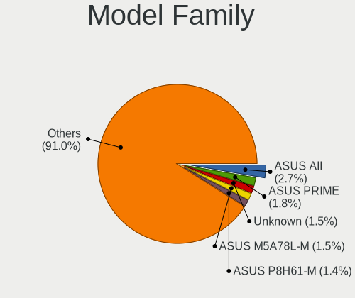
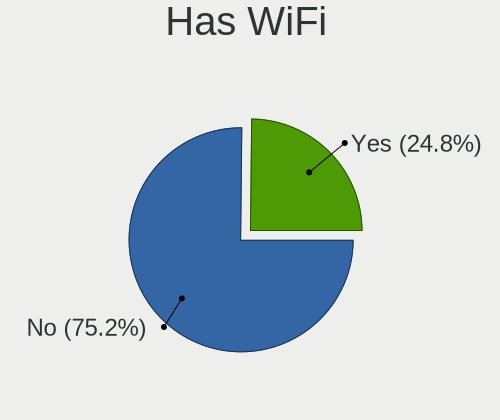
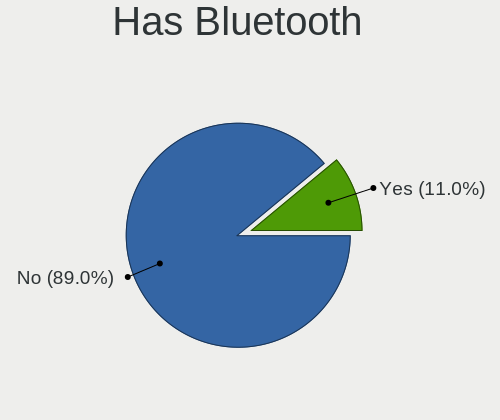
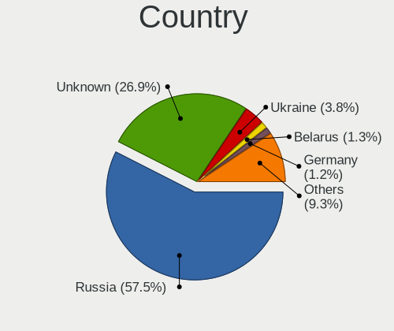
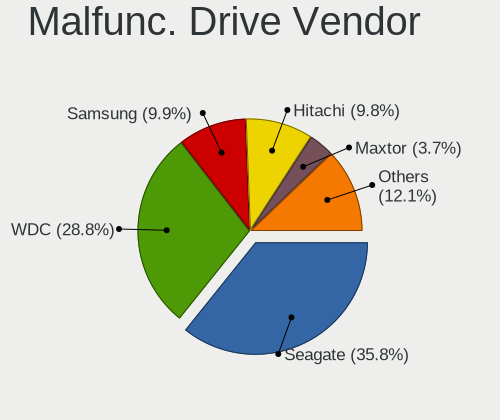
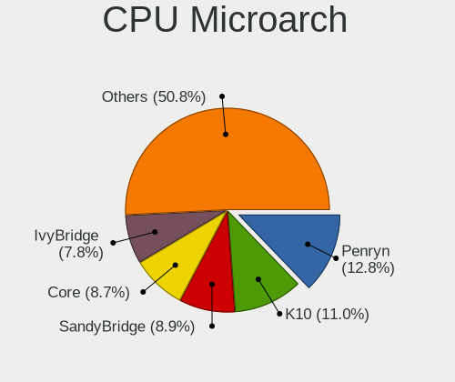
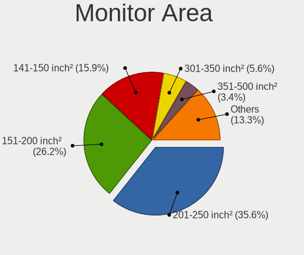

ROSA - Tested Hardware & Statistics (Desktops)
----------------------------------------------

A project to collect tested hardware configurations for ROSA.

Anyone can contribute to this report by the [hw-probe](https://github.com/linuxhw/hw-probe) tool:

    sudo -E hw-probe -all -upload

Please contribute! Especially if your hardware is rare.

Contents
--------

* [ Test Cases ](#test-cases)

* [ System ](#system)
  - [ OS                       ](#os)
  - [ OS Family                ](#os-family)
  - [ Kernel                   ](#kernel)
  - [ Kernel Family            ](#kernel-family)
  - [ Kernel Major Ver.        ](#kernel-major-ver)
  - [ Arch                     ](#arch)
  - [ DE                       ](#de)
  - [ Display Server           ](#display-server)
  - [ Display Manager          ](#display-manager)
  - [ OS Lang                  ](#os-lang)
  - [ Boot Mode                ](#boot-mode)
  - [ Filesystem               ](#filesystem)
  - [ Part. scheme             ](#part-scheme)
  - [ Dual Boot with Linux/BSD ](#dual-boot-with-linuxbsd)
  - [ Dual Boot (Win)          ](#dual-boot-win)

* [ Board ](#board)
  - [ Vendor                   ](#vendor)
  - [ Model                    ](#model)
  - [ Model Family             ](#model-family)
  - [ MFG Year                 ](#mfg-year)
  - [ Form Factor              ](#form-factor)
  - [ Secure Boot              ](#secure-boot)
  - [ Coreboot                 ](#coreboot)
  - [ RAM Size                 ](#ram-size)
  - [ RAM Used                 ](#ram-used)
  - [ Total Drives             ](#total-drives)
  - [ Has CD-ROM               ](#has-cd-rom)
  - [ Has Ethernet             ](#has-ethernet)
  - [ Has WiFi                 ](#has-wifi)
  - [ Has Bluetooth            ](#has-bluetooth)

* [ Location ](#location)
  - [ Country                  ](#country)
  - [ City                     ](#city)

* [ Drives ](#drives)
  - [ Drive Vendor             ](#drive-vendor)
  - [ Drive Model              ](#drive-model)
  - [ HDD Vendor               ](#hdd-vendor)
  - [ SSD Vendor               ](#ssd-vendor)
  - [ Drive Kind               ](#drive-kind)
  - [ Drive Connector          ](#drive-connector)
  - [ Drive Size               ](#drive-size)
  - [ Space Total              ](#space-total)
  - [ Space Used               ](#space-used)
  - [ Malfunc. Drives          ](#malfunc-drives)
  - [ Malfunc. Drive Vendor    ](#malfunc-drive-vendor)
  - [ Malfunc. HDD Vendor      ](#malfunc-hdd-vendor)
  - [ Malfunc. Drive Kind      ](#malfunc-drive-kind)
  - [ Failed Drives            ](#failed-drives)
  - [ Failed Drive Vendor      ](#failed-drive-vendor)
  - [ Drive Status             ](#drive-status)

* [ Storage controller ](#storage-controller)
  - [ Storage Vendor           ](#storage-vendor)
  - [ Storage Model            ](#storage-model)
  - [ Storage Kind             ](#storage-kind)

* [ Processor ](#processor)
  - [ CPU Vendor               ](#cpu-vendor)
  - [ CPU Model                ](#cpu-model)
  - [ CPU Model Family         ](#cpu-model-family)
  - [ CPU Cores                ](#cpu-cores)
  - [ CPU Sockets              ](#cpu-sockets)
  - [ CPU Threads              ](#cpu-threads)
  - [ CPU Op-Modes             ](#cpu-op-modes)
  - [ CPU Microcode            ](#cpu-microcode)
  - [ CPU Microarch            ](#cpu-microarch)

* [ Graphics ](#graphics)
  - [ GPU Vendor               ](#gpu-vendor)
  - [ GPU Model                ](#gpu-model)
  - [ GPU Combo                ](#gpu-combo)
  - [ GPU Driver               ](#gpu-driver)
  - [ GPU Memory               ](#gpu-memory)

* [ Monitor ](#monitor)
  - [ Monitor Vendor           ](#monitor-vendor)
  - [ Monitor Model            ](#monitor-model)
  - [ Monitor Resolution       ](#monitor-resolution)
  - [ Monitor Diagonal         ](#monitor-diagonal)
  - [ Monitor Width            ](#monitor-width)
  - [ Aspect Ratio             ](#aspect-ratio)
  - [ Monitor Area             ](#monitor-area)
  - [ Pixel Density            ](#pixel-density)
  - [ Multiple Monitors        ](#multiple-monitors)

* [ Network ](#network)
  - [ Net Controller Vendor    ](#net-controller-vendor)
  - [ Net Controller Model     ](#net-controller-model)
  - [ Wireless Vendor          ](#wireless-vendor)
  - [ Wireless Model           ](#wireless-model)
  - [ Ethernet Vendor          ](#ethernet-vendor)
  - [ Ethernet Model           ](#ethernet-model)
  - [ Net Controller Kind      ](#net-controller-kind)
  - [ Used Controller          ](#used-controller)
  - [ NICs                     ](#nics)
  - [ IPv6                     ](#ipv6)

* [ Bluetooth ](#bluetooth)
  - [ Bluetooth Vendor         ](#bluetooth-vendor)
  - [ Bluetooth Model          ](#bluetooth-model)

* [ Sound ](#sound)
  - [ Sound Vendor             ](#sound-vendor)
  - [ Sound Model              ](#sound-model)

* [ Memory ](#memory)
  - [ Memory Vendor            ](#memory-vendor)
  - [ Memory Model             ](#memory-model)
  - [ Memory Kind              ](#memory-kind)
  - [ Memory Form Factor       ](#memory-form-factor)
  - [ Memory Size              ](#memory-size)
  - [ Memory Speed             ](#memory-speed)

* [ Printers & scanners ](#printers--scanners)
  - [ Printer Vendor           ](#printer-vendor)
  - [ Printer Model            ](#printer-model)
  - [ Scanner Vendor           ](#scanner-vendor)
  - [ Scanner Model            ](#scanner-model)

* [ Camera ](#camera)
  - [ Camera Vendor            ](#camera-vendor)
  - [ Camera Model             ](#camera-model)

* [ Security ](#security)
  - [ Fingerprint Vendor       ](#fingerprint-vendor)
  - [ Fingerprint Model        ](#fingerprint-model)
  - [ Chipcard Vendor          ](#chipcard-vendor)
  - [ Chipcard Model           ](#chipcard-model)

* [ Unsupported ](#unsupported)
  - [ Unsupported Devices      ](#unsupported-devices)
  - [ Unsupported Device Types ](#unsupported-device-types)

Test Cases
----------

Total: 20428

| Vendor        | Model                       | Probe                                                      | Date         |
|---------------|-----------------------------|------------------------------------------------------------|--------------|
| MSI           | MS-7392                     | [d453f89064](https://linux-hardware.org/?probe=d453f89064) | Nov 02, 2022 |
| Gigabyte      | H77N-WIFI                   | [d8b066edcd](https://linux-hardware.org/?probe=d8b066edcd) | Nov 02, 2022 |
| Lenovo        | H420                        | [3e3f04d875](https://linux-hardware.org/?probe=3e3f04d875) | Nov 02, 2022 |
| Gigabyte      | EP45-DS4                    | [fa96a26c5a](https://linux-hardware.org/?probe=fa96a26c5a) | Nov 02, 2022 |
| ECS           | H61H2-M2                    | [b70c0aa20d](https://linux-hardware.org/?probe=b70c0aa20d) | Nov 01, 2022 |
| Gigabyte      | EP45-DS4                    | [2eb78b1c3d](https://linux-hardware.org/?probe=2eb78b1c3d) | Nov 01, 2022 |
| ASUSTek       | PRIME H310M-K               | [9efd2724b2](https://linux-hardware.org/?probe=9efd2724b2) | Nov 01, 2022 |
| ASRock        | B365M-HDV                   | [29a6bce4c0](https://linux-hardware.org/?probe=29a6bce4c0) | Nov 01, 2022 |
| ASUSTek       | H81M-C                      | [76052b7756](https://linux-hardware.org/?probe=76052b7756) | Nov 01, 2022 |
| MSI           | H61M-P32/W8                 | [14df9c3c14](https://linux-hardware.org/?probe=14df9c3c14) | Nov 01, 2022 |
| ASRock        | N68C-GS FX                  | [f7a9c5f382](https://linux-hardware.org/?probe=f7a9c5f382) | Nov 01, 2022 |
| MSI           | H81M-P33                    | [29e4a4ec52](https://linux-hardware.org/?probe=29e4a4ec52) | Oct 31, 2022 |
| ASUSTek       | PRIME Z690M-PLUS D4         | [96d61ed3e1](https://linux-hardware.org/?probe=96d61ed3e1) | Oct 31, 2022 |
| MSI           | B450-A PRO MAX              | [8e480ded02](https://linux-hardware.org/?probe=8e480ded02) | Oct 31, 2022 |
| Gigabyte      | X99-SLI-CF                  | [d6bc77d638](https://linux-hardware.org/?probe=d6bc77d638) | Oct 31, 2022 |
| ASUSTek       | H81M-C                      | [2fdcf19b6d](https://linux-hardware.org/?probe=2fdcf19b6d) | Oct 31, 2022 |
| Foxconn       | RS690M2MA 0A                | [29605bcad9](https://linux-hardware.org/?probe=29605bcad9) | Oct 31, 2022 |
| Gigabyte      | B660M GAMING X AX           | [d48fe55211](https://linux-hardware.org/?probe=d48fe55211) | Oct 31, 2022 |
| ASRock        | H470M-HDV                   | [a4e522270c](https://linux-hardware.org/?probe=a4e522270c) | Oct 31, 2022 |
| Biostar       | H310MHC2                    | [5ad5ba772f](https://linux-hardware.org/?probe=5ad5ba772f) | Oct 31, 2022 |
| ASRock        | B550 Phantom Gaming 4       | [5e87d391a3](https://linux-hardware.org/?probe=5e87d391a3) | Oct 31, 2022 |
| Intel         | D946GZAB AAD66610-300       | [33c41323a3](https://linux-hardware.org/?probe=33c41323a3) | Oct 31, 2022 |
| ASUSTek       | M5A78L/USB3                 | [b5098e9fe5](https://linux-hardware.org/?probe=b5098e9fe5) | Oct 31, 2022 |
| ASRock        | N68C-GS FX                  | [e24bf2e31f](https://linux-hardware.org/?probe=e24bf2e31f) | Oct 31, 2022 |
| Gigabyte      | H77N-WIFI                   | [d4340d8d66](https://linux-hardware.org/?probe=d4340d8d66) | Oct 31, 2022 |
| ASUSTek       | Leonite2                    | [955ce84cf2](https://linux-hardware.org/?probe=955ce84cf2) | Oct 30, 2022 |
| ASRock        | N68C-GS FX                  | [bf96e5a0a1](https://linux-hardware.org/?probe=bf96e5a0a1) | Oct 30, 2022 |
| ASRock        | H410M-HVS                   | [2d540e06b9](https://linux-hardware.org/?probe=2d540e06b9) | Oct 30, 2022 |
| ASUSTek       | PRIME A320M-K               | [6bbea41ce5](https://linux-hardware.org/?probe=6bbea41ce5) | Oct 30, 2022 |
| ASUSTek       | SABERTOOTH 990FX R2.0       | [b132f4c4e9](https://linux-hardware.org/?probe=b132f4c4e9) | Oct 30, 2022 |
| ASUSTek       | SABERTOOTH 990FX R2.0       | [7e1df59daa](https://linux-hardware.org/?probe=7e1df59daa) | Oct 30, 2022 |
| Gigabyte      | G41M-Combo                  | [180622c3be](https://linux-hardware.org/?probe=180622c3be) | Oct 30, 2022 |
| ASUSTek       | ROG STRIX B365-G GAMING     | [7f78f3451e](https://linux-hardware.org/?probe=7f78f3451e) | Oct 29, 2022 |
| Gigabyte      | B450M DS3H-CF               | [47b5907eec](https://linux-hardware.org/?probe=47b5907eec) | Oct 29, 2022 |
| ASUSTek       | P5Q SE2                     | [7d576ac245](https://linux-hardware.org/?probe=7d576ac245) | Oct 29, 2022 |
| MSI           | B450M MORTAR MAX            | [d8321f617e](https://linux-hardware.org/?probe=d8321f617e) | Oct 29, 2022 |
| MSI           | B450M MORTAR MAX            | [7f67023fa9](https://linux-hardware.org/?probe=7f67023fa9) | Oct 29, 2022 |
| Gigabyte      | GA-790XTA-UD4               | [a750edc641](https://linux-hardware.org/?probe=a750edc641) | Oct 29, 2022 |
| ASRock        | H410M-HVS                   | [9371d71f6d](https://linux-hardware.org/?probe=9371d71f6d) | Oct 29, 2022 |
| Foxconn       | 2ACA                        | [69544f77d0](https://linux-hardware.org/?probe=69544f77d0) | Oct 29, 2022 |
| Gigabyte      | H110M-M2-CF                 | [34c4f594c4](https://linux-hardware.org/?probe=34c4f594c4) | Oct 29, 2022 |
| Dell          | 0Y5DDC A00                  | [e3421b1908](https://linux-hardware.org/?probe=e3421b1908) | Oct 29, 2022 |
| ASRock        | N68-GS4 FX                  | [04334f2930](https://linux-hardware.org/?probe=04334f2930) | Oct 29, 2022 |
| Gigabyte      | B550 GAMING X V2            | [7b3b808198](https://linux-hardware.org/?probe=7b3b808198) | Oct 29, 2022 |
| Gigabyte      | B550 GAMING X V2            | [5405caf9dc](https://linux-hardware.org/?probe=5405caf9dc) | Oct 28, 2022 |
| MSI           | MAG B560 TOMAHAWK WIFI      | [429fd34d64](https://linux-hardware.org/?probe=429fd34d64) | Oct 28, 2022 |
| ASUSTek       | H81M-C                      | [c96189c44c](https://linux-hardware.org/?probe=c96189c44c) | Oct 28, 2022 |
| Gigabyte      | PH67-UD3-B3                 | [c66fb514ab](https://linux-hardware.org/?probe=c66fb514ab) | Oct 28, 2022 |
| Gigabyte      | A320M-S2H-CF                | [594b16e254](https://linux-hardware.org/?probe=594b16e254) | Oct 28, 2022 |
| Gigabyte      | F2A88X-D3H                  | [dc1e16bba1](https://linux-hardware.org/?probe=dc1e16bba1) | Oct 27, 2022 |
| ASUSTek       | M5A97 PRO                   | [de99c600e5](https://linux-hardware.org/?probe=de99c600e5) | Oct 27, 2022 |
| Gigabyte      | H110M-S2V-CF                | [1d4dfc3e06](https://linux-hardware.org/?probe=1d4dfc3e06) | Oct 27, 2022 |
| Fujitsu       | D2990-A2 S26361-D2990-A2    | [6de2b1229f](https://linux-hardware.org/?probe=6de2b1229f) | Oct 27, 2022 |
| MSI           | H81M-P33                    | [e4f38c5519](https://linux-hardware.org/?probe=e4f38c5519) | Oct 26, 2022 |
| HP            | 8717                        | [c2fcc7119a](https://linux-hardware.org/?probe=c2fcc7119a) | Oct 26, 2022 |
| ASRock        | 970 Pro3 R2.0               | [c2b4882963](https://linux-hardware.org/?probe=c2b4882963) | Oct 26, 2022 |
| MiTAC         | E220 E220AQ-601             | [1ee0c036f8](https://linux-hardware.org/?probe=1ee0c036f8) | Oct 26, 2022 |
| Gigabyte      | AB350M-Gaming 3-CF          | [926be6d85b](https://linux-hardware.org/?probe=926be6d85b) | Oct 25, 2022 |
| Gigabyte      | AB350M-Gaming 3-CF          | [94a393835b](https://linux-hardware.org/?probe=94a393835b) | Oct 25, 2022 |
| MSI           | B450M-A PRO MAX             | [9f404fe6b4](https://linux-hardware.org/?probe=9f404fe6b4) | Oct 25, 2022 |
| Dell          | 0Y5DDC A00                  | [bc39e0cfd6](https://linux-hardware.org/?probe=bc39e0cfd6) | Oct 25, 2022 |
| ASUSTek       | PRIME B550-PLUS             | [b8b23daad5](https://linux-hardware.org/?probe=b8b23daad5) | Oct 25, 2022 |
| Gigabyte      | H410M H V3                  | [b4c5ed92b7](https://linux-hardware.org/?probe=b4c5ed92b7) | Oct 24, 2022 |
| MSI           | B450M GAMING PLUS           | [e3041ae2eb](https://linux-hardware.org/?probe=e3041ae2eb) | Oct 24, 2022 |
| Gigabyte      | B450 AORUS M                | [08c2a2abf9](https://linux-hardware.org/?probe=08c2a2abf9) | Oct 24, 2022 |
| Gigabyte      | X58A-UD7                    | [8b0cff9259](https://linux-hardware.org/?probe=8b0cff9259) | Oct 24, 2022 |
| ASUSTek       | P8H77-V                     | [fdb1bce84a](https://linux-hardware.org/?probe=fdb1bce84a) | Oct 24, 2022 |
| ECS           | H310CH5-M2                  | [e9d2a5becb](https://linux-hardware.org/?probe=e9d2a5becb) | Oct 24, 2022 |
| Gigabyte      | B450M DS3H V2               | [a159a5720e](https://linux-hardware.org/?probe=a159a5720e) | Oct 23, 2022 |
| ASUSTek       | M4A77T/USB3                 | [2df43ccc5d](https://linux-hardware.org/?probe=2df43ccc5d) | Oct 22, 2022 |
| ASUSTek       | M32CD_A_F_K20CD_K31CD       | [6105b0d3a9](https://linux-hardware.org/?probe=6105b0d3a9) | Oct 22, 2022 |
| Unknown       | NF-CK804                    | [4df3f7c7e6](https://linux-hardware.org/?probe=4df3f7c7e6) | Oct 22, 2022 |
| MSI           | A320M GRENADE               | [30bcc61268](https://linux-hardware.org/?probe=30bcc61268) | Oct 21, 2022 |
| Gigabyte      | H81M-S1                     | [8168ea4028](https://linux-hardware.org/?probe=8168ea4028) | Oct 21, 2022 |
| Dell          | 0GM819                      | [e2ebe8bae1](https://linux-hardware.org/?probe=e2ebe8bae1) | Oct 21, 2022 |
| ASRock        | N68-S                       | [3cfa7cd9f8](https://linux-hardware.org/?probe=3cfa7cd9f8) | Oct 21, 2022 |
| Gigabyte      | H310M H x.x                 | [a0a8fc6cb0](https://linux-hardware.org/?probe=a0a8fc6cb0) | Oct 21, 2022 |
| MSI           | A320M GRENADE               | [73112f41f7](https://linux-hardware.org/?probe=73112f41f7) | Oct 21, 2022 |
| ASUSTek       | B85-PLUS                    | [a057e410d0](https://linux-hardware.org/?probe=a057e410d0) | Oct 21, 2022 |
| ASUSTek       | B85-PLUS                    | [72c61d8c50](https://linux-hardware.org/?probe=72c61d8c50) | Oct 21, 2022 |
| ASRock        | H81M-HDS R2.0               | [6161a12f13](https://linux-hardware.org/?probe=6161a12f13) | Oct 20, 2022 |
| ASUSTek       | P5Q SE                      | [c223e518c9](https://linux-hardware.org/?probe=c223e518c9) | Oct 20, 2022 |
| ASUSTek       | PRIME B360M-A               | [444b923209](https://linux-hardware.org/?probe=444b923209) | Oct 20, 2022 |
| Gigabyte      | EP41-UD3L                   | [d82763649b](https://linux-hardware.org/?probe=d82763649b) | Oct 20, 2022 |
| Gigabyte      | H77N-WIFI                   | [fffc0ab985](https://linux-hardware.org/?probe=fffc0ab985) | Oct 20, 2022 |
| ASRock        | H81M-HDS R2.0               | [b27f916880](https://linux-hardware.org/?probe=b27f916880) | Oct 19, 2022 |
| Acer          | FMCP7A-ION                  | [e7646c8fe4](https://linux-hardware.org/?probe=e7646c8fe4) | Oct 19, 2022 |
| Gigabyte      | EP41-UD3L                   | [31867fb669](https://linux-hardware.org/?probe=31867fb669) | Oct 19, 2022 |
| ECS           | H61H2-M12                   | [7c4ae7b4ab](https://linux-hardware.org/?probe=7c4ae7b4ab) | Oct 19, 2022 |
| ASUSTek       | Leonite2                    | [717cc412e5](https://linux-hardware.org/?probe=717cc412e5) | Oct 19, 2022 |
| MSI           | PRO H410M-B                 | [549eeb915c](https://linux-hardware.org/?probe=549eeb915c) | Oct 19, 2022 |
| ASUSTek       | H81M-K                      | [a4a1d563b5](https://linux-hardware.org/?probe=a4a1d563b5) | Oct 19, 2022 |
| ASRock        | H61M-GE                     | [6149e0c478](https://linux-hardware.org/?probe=6149e0c478) | Oct 18, 2022 |
| Intel         | X99                         | [4217ddeb6b](https://linux-hardware.org/?probe=4217ddeb6b) | Oct 18, 2022 |
| MSI           | Z490-A PRO                  | [db93de2ab4](https://linux-hardware.org/?probe=db93de2ab4) | Oct 18, 2022 |
| Gigabyte      | B450M DS3H-CF               | [3b1ce3ab08](https://linux-hardware.org/?probe=3b1ce3ab08) | Oct 18, 2022 |
| MSI           | B360M GAMING PLUS           | [df2e89c571](https://linux-hardware.org/?probe=df2e89c571) | Oct 18, 2022 |
| Gigabyte      | H77N-WIFI                   | [1e8b0c8279](https://linux-hardware.org/?probe=1e8b0c8279) | Oct 18, 2022 |
| Biostar       | A320MD PRO                  | [0497b12091](https://linux-hardware.org/?probe=0497b12091) | Oct 18, 2022 |
| ASRock        | H310CM-HDV/M.2              | [f2112b8b74](https://linux-hardware.org/?probe=f2112b8b74) | Oct 18, 2022 |
| ASUSTek       | ROG STRIX B550-I GAMING     | [5335a66143](https://linux-hardware.org/?probe=5335a66143) | Oct 17, 2022 |
| ASRock        | H61M-GE                     | [873932f557](https://linux-hardware.org/?probe=873932f557) | Oct 17, 2022 |
| ASUSTek       | M5A97 R2.0                  | [b85a76dd7f](https://linux-hardware.org/?probe=b85a76dd7f) | Oct 17, 2022 |
| Biostar       | H61MLV                      | [c2fb8ebaac](https://linux-hardware.org/?probe=c2fb8ebaac) | Oct 17, 2022 |
| Dell          | 0HY553                      | [08f05b94e6](https://linux-hardware.org/?probe=08f05b94e6) | Oct 17, 2022 |
| HP            | 81B3                        | [e303e50785](https://linux-hardware.org/?probe=e303e50785) | Oct 16, 2022 |
| Fujitsu       | D3413-A1 S26361-D3413-A1    | [62cacee577](https://linux-hardware.org/?probe=62cacee577) | Oct 16, 2022 |
| Gigabyte      | B75M-D2V                    | [20ac585859](https://linux-hardware.org/?probe=20ac585859) | Oct 16, 2022 |
| ASUSTek       | P8H61-M LE                  | [cf76898812](https://linux-hardware.org/?probe=cf76898812) | Oct 16, 2022 |
| ECS           | G41T-M7                     | [3abe70653e](https://linux-hardware.org/?probe=3abe70653e) | Oct 16, 2022 |
| Gigabyte      | GA-770TA-UD3                | [82f436a99c](https://linux-hardware.org/?probe=82f436a99c) | Oct 16, 2022 |
| Gigabyte      | X470 AORUS ULTRA GAMING-... | [59a0225889](https://linux-hardware.org/?probe=59a0225889) | Oct 16, 2022 |
| ASRock        | A55 Pro3                    | [0b3e7a1cd2](https://linux-hardware.org/?probe=0b3e7a1cd2) | Oct 16, 2022 |
| ASUSTek       | PRIME B450M-K               | [288b9fadfe](https://linux-hardware.org/?probe=288b9fadfe) | Oct 15, 2022 |
| Gigabyte      | B250M-D3H-CF                | [c351e0fae6](https://linux-hardware.org/?probe=c351e0fae6) | Oct 15, 2022 |
| ASUSTek       | P7H55-M/USB3                | [8a98e44bee](https://linux-hardware.org/?probe=8a98e44bee) | Oct 15, 2022 |
| ASRock        | B460 Steel Legend           | [ca98840e23](https://linux-hardware.org/?probe=ca98840e23) | Oct 14, 2022 |
| MSI           | B85M-P33                    | [83d476e3d7](https://linux-hardware.org/?probe=83d476e3d7) | Oct 14, 2022 |
| Gigabyte      | H77N-WIFI                   | [d1f08d0589](https://linux-hardware.org/?probe=d1f08d0589) | Oct 14, 2022 |
| ASUSTek       | P8H77-V                     | [9c98c411c5](https://linux-hardware.org/?probe=9c98c411c5) | Oct 14, 2022 |
| ASUSTek       | ROG STRIX B550-I GAMING     | [da04425205](https://linux-hardware.org/?probe=da04425205) | Oct 14, 2022 |
| ASRock        | G41M-VS3                    | [7fa0f82664](https://linux-hardware.org/?probe=7fa0f82664) | Oct 13, 2022 |
| Gigabyte      | H77N-WIFI                   | [6597eea759](https://linux-hardware.org/?probe=6597eea759) | Oct 13, 2022 |
| Founder       | H61H2-AM V1.1               | [4d558904f5](https://linux-hardware.org/?probe=4d558904f5) | Oct 13, 2022 |
| Lenovo        | ThinkCentre M71z 1782RP4    | [bee14a3740](https://linux-hardware.org/?probe=bee14a3740) | Oct 13, 2022 |
| ASUSTek       | P8B75-M                     | [98ea718793](https://linux-hardware.org/?probe=98ea718793) | Oct 12, 2022 |
| ASUSTek       | P8H61-M LX3                 | [be3020e232](https://linux-hardware.org/?probe=be3020e232) | Oct 12, 2022 |
| ASUSTek       | PRIME B560M-A               | [15cc45253b](https://linux-hardware.org/?probe=15cc45253b) | Oct 11, 2022 |
| ASRock        | D1800B-ITX                  | [a44ef4b82f](https://linux-hardware.org/?probe=a44ef4b82f) | Oct 11, 2022 |
| Gigabyte      | GA-78LMT-S2P                | [8ec5da3fb1](https://linux-hardware.org/?probe=8ec5da3fb1) | Oct 10, 2022 |
| ASRock        | D1800B-ITX                  | [7b33424235](https://linux-hardware.org/?probe=7b33424235) | Oct 10, 2022 |
| Fujitsu       | D3062-A1 S26361-D3062-A1    | [899c4a1231](https://linux-hardware.org/?probe=899c4a1231) | Oct 10, 2022 |
| MSI           | MS-7430 0A                  | [ac3040f9c3](https://linux-hardware.org/?probe=ac3040f9c3) | Oct 10, 2022 |
| ASUSTek       | H61M-K                      | [f6d2b67f4a](https://linux-hardware.org/?probe=f6d2b67f4a) | Oct 10, 2022 |
| MSI           | B450M-A PRO MAX             | [cac41cb816](https://linux-hardware.org/?probe=cac41cb816) | Oct 10, 2022 |
| Gigabyte      | GA-78LMT-S2P                | [b4dd4f4043](https://linux-hardware.org/?probe=b4dd4f4043) | Oct 09, 2022 |
| ASUSTek       | M4A78T-E                    | [0d574bf35b](https://linux-hardware.org/?probe=0d574bf35b) | Oct 09, 2022 |
| Gigabyte      | B560M AORUS ELITE           | [81e6a3e257](https://linux-hardware.org/?probe=81e6a3e257) | Oct 09, 2022 |
| ASUSTek       | P5QL PRO                    | [93af7ecaf6](https://linux-hardware.org/?probe=93af7ecaf6) | Oct 09, 2022 |
| Gigabyte      | B550M DS3H                  | [1f344c3f2f](https://linux-hardware.org/?probe=1f344c3f2f) | Oct 09, 2022 |
| Pegatron      | 2A73h                       | [a5b4cd2cda](https://linux-hardware.org/?probe=a5b4cd2cda) | Oct 09, 2022 |
| Huanan        | H97-ZD3 V2.0                | [c6106f322e](https://linux-hardware.org/?probe=c6106f322e) | Oct 09, 2022 |
| ECS           | BSWI-D2                     | [97c824abf6](https://linux-hardware.org/?probe=97c824abf6) | Oct 09, 2022 |
| ASUSTek       | P8H61-M LX2 R2.0            | [0f690e6e12](https://linux-hardware.org/?probe=0f690e6e12) | Oct 08, 2022 |
| ECS           | BSWI-D2                     | [d717be733f](https://linux-hardware.org/?probe=d717be733f) | Oct 08, 2022 |
| Gigabyte      | H81M-H                      | [7f78dda318](https://linux-hardware.org/?probe=7f78dda318) | Oct 07, 2022 |
| Colorful T... | B85M-G PRO V21              | [b41a5ff649](https://linux-hardware.org/?probe=b41a5ff649) | Oct 07, 2022 |
| HP            | 0A60h                       | [8d9a2bf124](https://linux-hardware.org/?probe=8d9a2bf124) | Oct 07, 2022 |
| Gigabyte      | P35-S3                      | [bfd38fc1aa](https://linux-hardware.org/?probe=bfd38fc1aa) | Oct 07, 2022 |
| Gigabyte      | P35-S3                      | [45acd19412](https://linux-hardware.org/?probe=45acd19412) | Oct 07, 2022 |
| eMachines     | ER1401                      | [ee4504d60f](https://linux-hardware.org/?probe=ee4504d60f) | Oct 07, 2022 |
| Fujitsu       | D3161-A1 S26361-D3161-A1    | [ec9fd4936c](https://linux-hardware.org/?probe=ec9fd4936c) | Oct 07, 2022 |
| Kllisre       | X79 V1.2                    | [30966c572c](https://linux-hardware.org/?probe=30966c572c) | Oct 06, 2022 |
| Gigabyte      | H410M S2 V2                 | [ab20fa33ac](https://linux-hardware.org/?probe=ab20fa33ac) | Oct 06, 2022 |
| ASUSTek       | PRIME H510M-R               | [1b770a47f7](https://linux-hardware.org/?probe=1b770a47f7) | Oct 06, 2022 |
| Biostar       | TF570 SLI A2+               | [f7cacc2b3d](https://linux-hardware.org/?probe=f7cacc2b3d) | Oct 06, 2022 |
| Gigabyte      | H110M-S2V-CF                | [a2dd3b08ba](https://linux-hardware.org/?probe=a2dd3b08ba) | Oct 06, 2022 |
| Unknown       | X79                         | [be112e773d](https://linux-hardware.org/?probe=be112e773d) | Oct 06, 2022 |
| ASUSTek       | PRIME B550-PLUS             | [ebe4e45d60](https://linux-hardware.org/?probe=ebe4e45d60) | Oct 05, 2022 |
| Gigabyte      | GA-78LMT-S2P                | [f92b06fc20](https://linux-hardware.org/?probe=f92b06fc20) | Oct 05, 2022 |
| ASUSTek       | P8H77-V                     | [0b3b1d97f8](https://linux-hardware.org/?probe=0b3b1d97f8) | Oct 05, 2022 |
| Gigabyte      | B450M S2H                   | [9d214ef1da](https://linux-hardware.org/?probe=9d214ef1da) | Oct 05, 2022 |
| Gigabyte      | B450 AORUS ELITE            | [7bf87b89f8](https://linux-hardware.org/?probe=7bf87b89f8) | Oct 05, 2022 |
| Gigabyte      | H110M-S2V-CF                | [20673d8f1e](https://linux-hardware.org/?probe=20673d8f1e) | Oct 05, 2022 |
| MSI           | PRO H410M-B                 | [e85d76f196](https://linux-hardware.org/?probe=e85d76f196) | Oct 05, 2022 |
| ASRock        | D1800M                      | [f8f6e6c8f2](https://linux-hardware.org/?probe=f8f6e6c8f2) | Oct 05, 2022 |
| MSI           | B350 TOMAHAWK ARCTIC        | [afcf9c151f](https://linux-hardware.org/?probe=afcf9c151f) | Oct 05, 2022 |
| ASUSTek       | H110M-R                     | [4a6d780641](https://linux-hardware.org/?probe=4a6d780641) | Oct 05, 2022 |
| Gigabyte      | AX370-Gaming K3             | [5ae0d33f23](https://linux-hardware.org/?probe=5ae0d33f23) | Oct 05, 2022 |
| ASUSTek       | Maximus IX CODE             | [da694ad588](https://linux-hardware.org/?probe=da694ad588) | Oct 04, 2022 |
| OEM           | Unknown                     | [ab6e21774c](https://linux-hardware.org/?probe=ab6e21774c) | Oct 04, 2022 |
| ASUSTek       | P6T WS PRO                  | [fb442877c5](https://linux-hardware.org/?probe=fb442877c5) | Oct 04, 2022 |
| Sapphire      | IPC-E350M1                  | [e9a9db8e30](https://linux-hardware.org/?probe=e9a9db8e30) | Oct 04, 2022 |
| Gigabyte      | A320M-S2H-CF                | [c8e379037f](https://linux-hardware.org/?probe=c8e379037f) | Oct 03, 2022 |
| ASUSTek       | H110M-R                     | [ad1e756112](https://linux-hardware.org/?probe=ad1e756112) | Oct 03, 2022 |
| ASUSTek       | A68HM-K                     | [80f73c9aa8](https://linux-hardware.org/?probe=80f73c9aa8) | Oct 03, 2022 |
| ASUSTek       | Leonite2                    | [45ac930d40](https://linux-hardware.org/?probe=45ac930d40) | Oct 03, 2022 |
| Gigabyte      | Z97-HD3                     | [eccf4c45f5](https://linux-hardware.org/?probe=eccf4c45f5) | Oct 03, 2022 |
| ASUSTek       | ROG STRIX B550-I GAMING     | [13f60e066f](https://linux-hardware.org/?probe=13f60e066f) | Oct 03, 2022 |
| ASUSTek       | ROG STRIX B550-I GAMING     | [e3eb4cd95f](https://linux-hardware.org/?probe=e3eb4cd95f) | Oct 02, 2022 |
| Gigabyte      | P67X-UD3-B3                 | [a63ce26ce2](https://linux-hardware.org/?probe=a63ce26ce2) | Oct 02, 2022 |
| Gigabyte      | EP41-UD3L                   | [30464f2c62](https://linux-hardware.org/?probe=30464f2c62) | Oct 02, 2022 |
| Gigabyte      | B460M DS3H                  | [1f51daf0c8](https://linux-hardware.org/?probe=1f51daf0c8) | Oct 02, 2022 |
| Gigabyte      | B450 AORUS ELITE            | [77a9b37139](https://linux-hardware.org/?probe=77a9b37139) | Oct 02, 2022 |
| Gigabyte      | B450M DS3H-CF               | [00b0117f9a](https://linux-hardware.org/?probe=00b0117f9a) | Oct 02, 2022 |
| MSI           | H61M-P21                    | [f2f4c990bb](https://linux-hardware.org/?probe=f2f4c990bb) | Oct 02, 2022 |
| Gigabyte      | Z97-HD3                     | [0085eb8249](https://linux-hardware.org/?probe=0085eb8249) | Oct 02, 2022 |
| Gigabyte      | X470 AORUS ULTRA GAMING-... | [ade6e8d765](https://linux-hardware.org/?probe=ade6e8d765) | Oct 02, 2022 |
| Huanan        | H97-ZD3 V2.0                | [283a2e4ee5](https://linux-hardware.org/?probe=283a2e4ee5) | Oct 02, 2022 |
| MSI           | B450M-A PRO MAX             | [649f4ec8c6](https://linux-hardware.org/?probe=649f4ec8c6) | Oct 01, 2022 |
| ASUSTek       | H81-PLUS                    | [e251d6b8f7](https://linux-hardware.org/?probe=e251d6b8f7) | Sep 30, 2022 |
| Gigabyte      | Z390 AORUS ULTRA-CF         | [8d8e54ed69](https://linux-hardware.org/?probe=8d8e54ed69) | Sep 30, 2022 |
| ASUSTek       | Maximus V GENE              | [7998f02578](https://linux-hardware.org/?probe=7998f02578) | Sep 29, 2022 |
| ASUSTek       | B85M-G                      | [a9983b2858](https://linux-hardware.org/?probe=a9983b2858) | Sep 29, 2022 |
| ASUSTek       | H81M-D                      | [a1580941c3](https://linux-hardware.org/?probe=a1580941c3) | Sep 29, 2022 |
| Biostar       | IH61MF-Q5                   | [7a63314188](https://linux-hardware.org/?probe=7a63314188) | Sep 29, 2022 |
| ASUSTek       | M4A785T-M                   | [03277d55bc](https://linux-hardware.org/?probe=03277d55bc) | Sep 28, 2022 |
| MSI           | G41M-P26                    | [45f0101515](https://linux-hardware.org/?probe=45f0101515) | Sep 28, 2022 |
| Gigabyte      | B560M H                     | [80e3cd655a](https://linux-hardware.org/?probe=80e3cd655a) | Sep 28, 2022 |
| Gigabyte      | B560M H                     | [0192951511](https://linux-hardware.org/?probe=0192951511) | Sep 28, 2022 |
| ASUSTek       | P8H61-MX R2.0               | [3def6cd1c2](https://linux-hardware.org/?probe=3def6cd1c2) | Sep 28, 2022 |
| ASUSTek       | H87-PLUS                    | [ccb24cd91e](https://linux-hardware.org/?probe=ccb24cd91e) | Sep 28, 2022 |
| ASUSTek       | P8H61-M LE                  | [0d9fdddd8a](https://linux-hardware.org/?probe=0d9fdddd8a) | Sep 27, 2022 |
| Gigabyte      | B360M HD3                   | [1107ba42b7](https://linux-hardware.org/?probe=1107ba42b7) | Sep 27, 2022 |
| Dell          | 0Y5DDC A00                  | [a135b97045](https://linux-hardware.org/?probe=a135b97045) | Sep 27, 2022 |
| Unknown       | Unknown                     | [128a8b6e2f](https://linux-hardware.org/?probe=128a8b6e2f) | Sep 27, 2022 |
| Gigabyte      | B450M S2H                   | [b5cc268970](https://linux-hardware.org/?probe=b5cc268970) | Sep 27, 2022 |
| ASUSTek       | Maximus V GENE              | [fc7a783877](https://linux-hardware.org/?probe=fc7a783877) | Sep 26, 2022 |
| ASUSTek       | P8H61-M LX2 R2.0            | [e9bc8b1f10](https://linux-hardware.org/?probe=e9bc8b1f10) | Sep 26, 2022 |
| Huanan        | X99-F8                      | [24c118fb0c](https://linux-hardware.org/?probe=24c118fb0c) | Sep 26, 2022 |
| Huanan        | X99 F8D V2.2                | [7663168534](https://linux-hardware.org/?probe=7663168534) | Sep 26, 2022 |
| ASUSTek       | H81M-K                      | [c449af2ab6](https://linux-hardware.org/?probe=c449af2ab6) | Sep 26, 2022 |
| Unknown       | Unknown                     | [4cff54bad3](https://linux-hardware.org/?probe=4cff54bad3) | Sep 26, 2022 |
| Gigabyte      | H81M-DS2                    | [c8f6c9dd27](https://linux-hardware.org/?probe=c8f6c9dd27) | Sep 26, 2022 |
| Unknown       | Unknown                     | [681b9501bf](https://linux-hardware.org/?probe=681b9501bf) | Sep 26, 2022 |
| MSI           | 870-C45                     | [b110878f50](https://linux-hardware.org/?probe=b110878f50) | Sep 26, 2022 |
| ASUSTek       | PRIME B350-PLUS             | [a9c5aeb1f0](https://linux-hardware.org/?probe=a9c5aeb1f0) | Sep 25, 2022 |
| Gigabyte      | B550M DS3H                  | [4c7d9584fc](https://linux-hardware.org/?probe=4c7d9584fc) | Sep 25, 2022 |
| Gigabyte      | Z590 GAMING X               | [1adef3d977](https://linux-hardware.org/?probe=1adef3d977) | Sep 25, 2022 |
| MSI           | MS-7253                     | [d697f7b879](https://linux-hardware.org/?probe=d697f7b879) | Sep 25, 2022 |
| ASUSTek       | ROG STRIX B550-I GAMING     | [0546e47f90](https://linux-hardware.org/?probe=0546e47f90) | Sep 25, 2022 |
| ASUSTek       | P8Z77-V LE PLUS             | [d58256a0f6](https://linux-hardware.org/?probe=d58256a0f6) | Sep 24, 2022 |
| Huanan        | X99 F8D V2.2                | [6316c089eb](https://linux-hardware.org/?probe=6316c089eb) | Sep 24, 2022 |
| ASRock        | H470M-HDV                   | [dc08f98ca5](https://linux-hardware.org/?probe=dc08f98ca5) | Sep 24, 2022 |
| ASRock        | G41M-VS3                    | [21cfcdcbdd](https://linux-hardware.org/?probe=21cfcdcbdd) | Sep 23, 2022 |
| Gigabyte      | EP45-DS3                    | [7b827acac4](https://linux-hardware.org/?probe=7b827acac4) | Sep 23, 2022 |
| Lenovo        | ThinkCentre M58 8910A8U     | [e9028d165d](https://linux-hardware.org/?probe=e9028d165d) | Sep 22, 2022 |
| Lenovo        | ThinkCentre M58 8910A8U     | [03a3a22c54](https://linux-hardware.org/?probe=03a3a22c54) | Sep 22, 2022 |
| ASUSTek       | H110M-R                     | [0d2eec569a](https://linux-hardware.org/?probe=0d2eec569a) | Sep 22, 2022 |
| Intel         | X99                         | [d751fcb309](https://linux-hardware.org/?probe=d751fcb309) | Sep 22, 2022 |
| Gigabyte      | Z370P D3-CF                 | [5513e351d9](https://linux-hardware.org/?probe=5513e351d9) | Sep 22, 2022 |
| ASUSTek       | ET2230I                     | [074ecf956a](https://linux-hardware.org/?probe=074ecf956a) | Sep 22, 2022 |
| Gigabyte      | H61M-S2PV                   | [65dc86f8d2](https://linux-hardware.org/?probe=65dc86f8d2) | Sep 21, 2022 |
| Gigabyte      | H61M-S2PV                   | [b905e8df57](https://linux-hardware.org/?probe=b905e8df57) | Sep 21, 2022 |
| ASUSTek       | PRIME B350-PLUS             | [c03d31a1c5](https://linux-hardware.org/?probe=c03d31a1c5) | Sep 21, 2022 |
| Gigabyte      | P85-D3                      | [d0b65afb41](https://linux-hardware.org/?probe=d0b65afb41) | Sep 20, 2022 |
| ASRock        | H55M-LE                     | [d361539e5a](https://linux-hardware.org/?probe=d361539e5a) | Sep 20, 2022 |
| ASUSTek       | P8H61-M LX3 R2.0            | [5b22a32f45](https://linux-hardware.org/?probe=5b22a32f45) | Sep 20, 2022 |
| Gigabyte      | P85-D3                      | [97849eb715](https://linux-hardware.org/?probe=97849eb715) | Sep 20, 2022 |
| ASUSTek       | TUF Gaming Z590-PLUS WIF... | [8886c62f6c](https://linux-hardware.org/?probe=8886c62f6c) | Sep 20, 2022 |
| ECS           | A55F-M3                     | [4961be8414](https://linux-hardware.org/?probe=4961be8414) | Sep 20, 2022 |
| Colorful T... | C.A68M-K PLUS V16           | [805edc36d5](https://linux-hardware.org/?probe=805edc36d5) | Sep 20, 2022 |
| MSI           | H67MS-E23                   | [5093a2b5b8](https://linux-hardware.org/?probe=5093a2b5b8) | Sep 20, 2022 |
| Biostar       | G41D3C                      | [ad549ccee8](https://linux-hardware.org/?probe=ad549ccee8) | Sep 19, 2022 |
| MSI           | H67MS-E23                   | [2f819d4ed2](https://linux-hardware.org/?probe=2f819d4ed2) | Sep 19, 2022 |
| ASUSTek       | PRIME B250M-A               | [082bdbb3a9](https://linux-hardware.org/?probe=082bdbb3a9) | Sep 18, 2022 |
| ASUSTek       | A68HM-K                     | [eaccfe0b67](https://linux-hardware.org/?probe=eaccfe0b67) | Sep 18, 2022 |
| Huanan        | H97-ZD3 V2.0                | [e54a1ee16e](https://linux-hardware.org/?probe=e54a1ee16e) | Sep 18, 2022 |
| ASUSTek       | ROG STRIX B550-I GAMING     | [3b06edf9e6](https://linux-hardware.org/?probe=3b06edf9e6) | Sep 18, 2022 |
| ASUSTek       | M3A78-VM                    | [1a85e8ddb9](https://linux-hardware.org/?probe=1a85e8ddb9) | Sep 17, 2022 |
| Gigabyte      | A520M H                     | [d75913fe94](https://linux-hardware.org/?probe=d75913fe94) | Sep 17, 2022 |
| Gigabyte      | 945GCMX-S2                  | [fda56f277f](https://linux-hardware.org/?probe=fda56f277f) | Sep 17, 2022 |
| Biostar       | G41D3C                      | [a5db82aa23](https://linux-hardware.org/?probe=a5db82aa23) | Sep 17, 2022 |
| Biostar       | G41D3C                      | [4fa3ad9c51](https://linux-hardware.org/?probe=4fa3ad9c51) | Sep 17, 2022 |
| Gigabyte      | M61PME-S2P                  | [128b564017](https://linux-hardware.org/?probe=128b564017) | Sep 16, 2022 |
| Lenovo        | MAHOBAY Win8 Pro DPK TPG    | [bf7824cf20](https://linux-hardware.org/?probe=bf7824cf20) | Sep 16, 2022 |
| Gigabyte      | H77N-WIFI                   | [4c524e3336](https://linux-hardware.org/?probe=4c524e3336) | Sep 16, 2022 |
| MACHINIST     | B75 PRO V1.0                | [ef89bf1d8c](https://linux-hardware.org/?probe=ef89bf1d8c) | Sep 16, 2022 |
| ASUSTek       | B75M-A                      | [2680627549](https://linux-hardware.org/?probe=2680627549) | Sep 16, 2022 |
| Gigabyte      | H110M-S2-CF                 | [43a9184afe](https://linux-hardware.org/?probe=43a9184afe) | Sep 16, 2022 |
| ASRock        | P43DE3                      | [c1c1a13db0](https://linux-hardware.org/?probe=c1c1a13db0) | Sep 16, 2022 |
| Gigabyte      | Z490 UD                     | [66c96720a1](https://linux-hardware.org/?probe=66c96720a1) | Sep 16, 2022 |
| Gigabyte      | G41M-Combo                  | [a4b02d9021](https://linux-hardware.org/?probe=a4b02d9021) | Sep 16, 2022 |
| ASRock        | H61M-VS                     | [6aef75c837](https://linux-hardware.org/?probe=6aef75c837) | Sep 15, 2022 |
| Intel         | D33217GKE G76540-204        | [cb5eb5c2c6](https://linux-hardware.org/?probe=cb5eb5c2c6) | Sep 15, 2022 |
| ASUSTek       | P8H61-M LE                  | [d8ecff6375](https://linux-hardware.org/?probe=d8ecff6375) | Sep 15, 2022 |
| ASUSTek       | P8H61-M LX3                 | [b1e2832974](https://linux-hardware.org/?probe=b1e2832974) | Sep 15, 2022 |
| Huanan        | X99-F8D V2.4                | [6f3638ecc6](https://linux-hardware.org/?probe=6f3638ecc6) | Sep 15, 2022 |
| Foxconn       | G41MD                       | [9b301e1ebe](https://linux-hardware.org/?probe=9b301e1ebe) | Sep 15, 2022 |
| Gigabyte      | X79-UD3                     | [e343c2470f](https://linux-hardware.org/?probe=e343c2470f) | Sep 14, 2022 |
| Gigabyte      | Z77M-D3H                    | [d4b7cae48f](https://linux-hardware.org/?probe=d4b7cae48f) | Sep 14, 2022 |
| Huanan        | X99-F8D V2.4                | [c364778ad7](https://linux-hardware.org/?probe=c364778ad7) | Sep 14, 2022 |
| Gigabyte      | MZBSWMP-00                  | [92d4357c28](https://linux-hardware.org/?probe=92d4357c28) | Sep 14, 2022 |
| ASRock        | N68-S3 UCC                  | [5f3b320503](https://linux-hardware.org/?probe=5f3b320503) | Sep 14, 2022 |
| ASUSTek       | Maximus IV Extreme-Z        | [1c7a238f26](https://linux-hardware.org/?probe=1c7a238f26) | Sep 13, 2022 |
| Gigabyte      | A320M-H-CF                  | [591cf6246a](https://linux-hardware.org/?probe=591cf6246a) | Sep 13, 2022 |
| ASUSTek       | PRIME H310M-E R2.0          | [377d466877](https://linux-hardware.org/?probe=377d466877) | Sep 13, 2022 |
| MSI           | 870-G45                     | [0245395372](https://linux-hardware.org/?probe=0245395372) | Sep 13, 2022 |
| ASUSTek       | B85M-G                      | [74a9860a2e](https://linux-hardware.org/?probe=74a9860a2e) | Sep 13, 2022 |
| ASUSTek       | TUF Gaming B660M-PLUS WI... | [2adaf06b86](https://linux-hardware.org/?probe=2adaf06b86) | Sep 13, 2022 |
| Gigabyte      | Z77M-D3H                    | [5f8b8dc32d](https://linux-hardware.org/?probe=5f8b8dc32d) | Sep 13, 2022 |
| Gigabyte      | H110M-D3H R2-CF             | [87971a36df](https://linux-hardware.org/?probe=87971a36df) | Sep 13, 2022 |
| ASRock        | N68-GS4 FX                  | [85daab087c](https://linux-hardware.org/?probe=85daab087c) | Sep 13, 2022 |
| Huanan        | X99 F8D V2.2                | [ea2b1239e5](https://linux-hardware.org/?probe=ea2b1239e5) | Sep 12, 2022 |
| Gigabyte      | F2A55M-S1                   | [a5ce933202](https://linux-hardware.org/?probe=a5ce933202) | Sep 12, 2022 |
| Huanan        | X99 F8D V2.2                | [a463708cda](https://linux-hardware.org/?probe=a463708cda) | Sep 12, 2022 |
| ASUSTek       | TUF Gaming Z590-PLUS WIF... | [1930cd2551](https://linux-hardware.org/?probe=1930cd2551) | Sep 12, 2022 |
| ASUSTek       | TUF Gaming Z590-PLUS WIF... | [9062abaf37](https://linux-hardware.org/?probe=9062abaf37) | Sep 12, 2022 |
| ASUSTek       | PRIME H510M-K               | [19b674cc6d](https://linux-hardware.org/?probe=19b674cc6d) | Sep 12, 2022 |
| ASRock        | H110M-DGS R3.0              | [451dab91c7](https://linux-hardware.org/?probe=451dab91c7) | Sep 11, 2022 |
| Biostar       | G41D3C                      | [d7c3e18f9a](https://linux-hardware.org/?probe=d7c3e18f9a) | Sep 11, 2022 |
| Gigabyte      | Z490 UD                     | [d7cbff0646](https://linux-hardware.org/?probe=d7cbff0646) | Sep 11, 2022 |
| Intel         | D2500HN AAG81480-500        | [e78623b2a0](https://linux-hardware.org/?probe=e78623b2a0) | Sep 11, 2022 |
| ASRock        | 880GM-LE                    | [87e17aae81](https://linux-hardware.org/?probe=87e17aae81) | Sep 11, 2022 |
| MSI           | B450M PRO-VDH MAX           | [2944280488](https://linux-hardware.org/?probe=2944280488) | Sep 11, 2022 |
| ASRock        | G41M-VS3                    | [ea9ac42e6d](https://linux-hardware.org/?probe=ea9ac42e6d) | Sep 10, 2022 |
| ASUSTek       | H87-PLUS                    | [76dd595c93](https://linux-hardware.org/?probe=76dd595c93) | Sep 10, 2022 |
| ASRock        | A320M-HDV R4.0              | [cbb786796b](https://linux-hardware.org/?probe=cbb786796b) | Sep 10, 2022 |
| Gigabyte      | A320M-H-CF                  | [9fe50985ad](https://linux-hardware.org/?probe=9fe50985ad) | Sep 10, 2022 |
| ASUSTek       | SABERTOOTH X58              | [ce9d09e18a](https://linux-hardware.org/?probe=ce9d09e18a) | Sep 10, 2022 |
| ASRock        | H510M-HVS                   | [0874eaca4c](https://linux-hardware.org/?probe=0874eaca4c) | Sep 09, 2022 |
| ASUSTek       | PRIME H310M-E R2.0          | [8f8a2cc0cb](https://linux-hardware.org/?probe=8f8a2cc0cb) | Sep 09, 2022 |
| ASUSTek       | PRIME A320M-K               | [cb47ce6e71](https://linux-hardware.org/?probe=cb47ce6e71) | Sep 09, 2022 |
| HP            | 1494                        | [5f0a73b28f](https://linux-hardware.org/?probe=5f0a73b28f) | Sep 09, 2022 |
| ASRock        | X370 Professional Gaming    | [a4bbe3346b](https://linux-hardware.org/?probe=a4bbe3346b) | Sep 08, 2022 |
| ASRock        | X370 Professional Gaming    | [129011f0c7](https://linux-hardware.org/?probe=129011f0c7) | Sep 08, 2022 |
| ASUSTek       | TUF Gaming B450M-PRO S      | [97374173e6](https://linux-hardware.org/?probe=97374173e6) | Sep 08, 2022 |
| MSI           | H61M-P23                    | [457a0bd32f](https://linux-hardware.org/?probe=457a0bd32f) | Sep 08, 2022 |
| ASUSTek       | M5A78L-M LX3                | [82ea2a555b](https://linux-hardware.org/?probe=82ea2a555b) | Sep 08, 2022 |
| HP            | 1497                        | [3cf8f5d97a](https://linux-hardware.org/?probe=3cf8f5d97a) | Sep 07, 2022 |
| Gigabyte      | H55M-S2                     | [4aaaeb3cc4](https://linux-hardware.org/?probe=4aaaeb3cc4) | Sep 07, 2022 |
| Gigabyte      | P43T-ES3G                   | [9b62da0565](https://linux-hardware.org/?probe=9b62da0565) | Sep 07, 2022 |
| ASUSTek       | P8B75-V                     | [6848ab681b](https://linux-hardware.org/?probe=6848ab681b) | Sep 07, 2022 |
| ASUSTek       | P8B75-V                     | [cb3f77526b](https://linux-hardware.org/?probe=cb3f77526b) | Sep 06, 2022 |
| ASRock        | H110M-DVS R2.0              | [a47d0d40bf](https://linux-hardware.org/?probe=a47d0d40bf) | Sep 06, 2022 |
| ASUSTek       | PRIME B350-PLUS             | [b86276ae55](https://linux-hardware.org/?probe=b86276ae55) | Sep 06, 2022 |
| Gigabyte      | 990XA-UD3                   | [307df0d230](https://linux-hardware.org/?probe=307df0d230) | Sep 05, 2022 |
| Gigabyte      | X79-UD3                     | [a3ebfb427d](https://linux-hardware.org/?probe=a3ebfb427d) | Sep 05, 2022 |
| Gigabyte      | MSQ87TN-00                  | [af31e1b75a](https://linux-hardware.org/?probe=af31e1b75a) | Sep 04, 2022 |
| Lenovo        | 3178 NOK                    | [9752c3bf3a](https://linux-hardware.org/?probe=9752c3bf3a) | Sep 04, 2022 |
| JGINYUE       | X99 TITANIUM D4             | [12ac2b2e8b](https://linux-hardware.org/?probe=12ac2b2e8b) | Sep 04, 2022 |
| Gigabyte      | F2A68HM-DS2                 | [b5c65ceb22](https://linux-hardware.org/?probe=b5c65ceb22) | Sep 03, 2022 |
| ASUSTek       | P8Z77-M                     | [fc29a8d6f0](https://linux-hardware.org/?probe=fc29a8d6f0) | Sep 03, 2022 |
| MSI           | B450M BAZOOKA V2            | [6cb8a5dda5](https://linux-hardware.org/?probe=6cb8a5dda5) | Sep 03, 2022 |
| Lenovo        | 3140 NOK                    | [15c11bff97](https://linux-hardware.org/?probe=15c11bff97) | Sep 03, 2022 |
| MACHINIST     | B75 PRO V1.0                | [0f6c8f7249](https://linux-hardware.org/?probe=0f6c8f7249) | Sep 03, 2022 |
| ASRock        | G31M-S                      | [1adc4fd6b0](https://linux-hardware.org/?probe=1adc4fd6b0) | Sep 03, 2022 |
| ASUSTek       | A55BM-E                     | [69de391136](https://linux-hardware.org/?probe=69de391136) | Sep 03, 2022 |
| Gigabyte      | H81M-S1                     | [03a13ca37c](https://linux-hardware.org/?probe=03a13ca37c) | Sep 03, 2022 |
| Gigabyte      | B85-HD3                     | [3fdc9bf72e](https://linux-hardware.org/?probe=3fdc9bf72e) | Sep 03, 2022 |
| Lenovo        | H420                        | [becb9210d9](https://linux-hardware.org/?probe=becb9210d9) | Sep 03, 2022 |
| Pegatron      | 2A73h                       | [42b260ec6b](https://linux-hardware.org/?probe=42b260ec6b) | Sep 03, 2022 |
| ASRock        | A320M-DVS R4.0              | [599f5e06cb](https://linux-hardware.org/?probe=599f5e06cb) | Sep 02, 2022 |
| Gigabyte      | F2A88XN-WIFI                | [6ae1e9ad80](https://linux-hardware.org/?probe=6ae1e9ad80) | Sep 02, 2022 |
| Dell          | 0RY007                      | [29ee3bdaac](https://linux-hardware.org/?probe=29ee3bdaac) | Sep 02, 2022 |
| ASRock        | N68-GS4 FX                  | [f222b860da](https://linux-hardware.org/?probe=f222b860da) | Sep 02, 2022 |
| ASRock        | 990FX Extreme3              | [1e75cefa31](https://linux-hardware.org/?probe=1e75cefa31) | Sep 01, 2022 |
| ASUSTek       | P8Z77-V LE PLUS             | [0f7d76d65c](https://linux-hardware.org/?probe=0f7d76d65c) | Sep 01, 2022 |
| Gigabyte      | P55-US3L                    | [93e1829d36](https://linux-hardware.org/?probe=93e1829d36) | Sep 01, 2022 |
| Gigabyte      | GA-E6010N                   | [8daf2205a5](https://linux-hardware.org/?probe=8daf2205a5) | Sep 01, 2022 |
| ASUSTek       | PRIME B350M-K               | [ae0450c52a](https://linux-hardware.org/?probe=ae0450c52a) | Sep 01, 2022 |
| ASUSTek       | PRIME H310M-R R2.0          | [c1ba9218de](https://linux-hardware.org/?probe=c1ba9218de) | Sep 01, 2022 |
| Gigabyte      | 970A-DS3P                   | [1bc16dc2be](https://linux-hardware.org/?probe=1bc16dc2be) | Sep 01, 2022 |
| ASRock        | A320M-DVS R4.0              | [c3ca58ba40](https://linux-hardware.org/?probe=c3ca58ba40) | Sep 01, 2022 |
| ASUSTek       | P8H61-MX                    | [52e7588080](https://linux-hardware.org/?probe=52e7588080) | Aug 31, 2022 |
| Intel         | X99                         | [8f4cdd5290](https://linux-hardware.org/?probe=8f4cdd5290) | Aug 31, 2022 |
| Gigabyte      | H55M-UD2H                   | [1a72b89675](https://linux-hardware.org/?probe=1a72b89675) | Aug 31, 2022 |
| Gigabyte      | B75M-D3H                    | [0146e0f5c8](https://linux-hardware.org/?probe=0146e0f5c8) | Aug 31, 2022 |
| ASUSTek       | M2A-VM HDMI                 | [9d9462f5a9](https://linux-hardware.org/?probe=9d9462f5a9) | Aug 31, 2022 |
| ASUSTek       | TUF Gaming X570-PLUS        | [858b04d480](https://linux-hardware.org/?probe=858b04d480) | Aug 30, 2022 |
| ASRock        | B550M-HDV                   | [61f310f2a2](https://linux-hardware.org/?probe=61f310f2a2) | Aug 30, 2022 |
| Gigabyte      | B550M S2H                   | [73a8574652](https://linux-hardware.org/?probe=73a8574652) | Aug 30, 2022 |
| ASUSTek       | P5G41-M LX                  | [ecf64e8d47](https://linux-hardware.org/?probe=ecf64e8d47) | Aug 30, 2022 |
| ASUSTek       | P5G41-M LX                  | [b7e2198026](https://linux-hardware.org/?probe=b7e2198026) | Aug 30, 2022 |
| ASUSTek       | PRIME H310M-R R2.0          | [9d3e935355](https://linux-hardware.org/?probe=9d3e935355) | Aug 30, 2022 |
| Unknown       | Unknown                     | [3f51be2653](https://linux-hardware.org/?probe=3f51be2653) | Aug 30, 2022 |
| Intel         | D525MWV AAE93081-401        | [985d906899](https://linux-hardware.org/?probe=985d906899) | Aug 29, 2022 |
| Gigabyte      | B450 AORUS ELITE            | [a37d7cae28](https://linux-hardware.org/?probe=a37d7cae28) | Aug 29, 2022 |
| Gigabyte      | B550M S2H                   | [ac1d1ffdba](https://linux-hardware.org/?probe=ac1d1ffdba) | Aug 29, 2022 |
| Gigabyte      | F2A88XM-D3H                 | [3b245a809d](https://linux-hardware.org/?probe=3b245a809d) | Aug 28, 2022 |
| Gigabyte      | F2A88XM-D3H                 | [dcb225651d](https://linux-hardware.org/?probe=dcb225651d) | Aug 28, 2022 |
| MSI           | B560M-A PRO                 | [a550031b1d](https://linux-hardware.org/?probe=a550031b1d) | Aug 28, 2022 |
| Gigabyte      | Z170-HD3P-CF                | [3ca98fc058](https://linux-hardware.org/?probe=3ca98fc058) | Aug 28, 2022 |
| ASRock        | 990FX Extreme3              | [ec517dabad](https://linux-hardware.org/?probe=ec517dabad) | Aug 28, 2022 |
| ASUSTek       | P7P55D                      | [4476755d78](https://linux-hardware.org/?probe=4476755d78) | Aug 28, 2022 |
| KupiDesheg... | Intel X79 lga 2011          | [92f097526f](https://linux-hardware.org/?probe=92f097526f) | Aug 28, 2022 |
| Dell          | 0RY007                      | [8ff65ac056](https://linux-hardware.org/?probe=8ff65ac056) | Aug 27, 2022 |
| ASUSTek       | PRIME A320M-A               | [517c813c17](https://linux-hardware.org/?probe=517c813c17) | Aug 27, 2022 |
| Gigabyte      | GA-E6010N                   | [5a180519a2](https://linux-hardware.org/?probe=5a180519a2) | Aug 27, 2022 |
| Gigabyte      | H77N-WIFI                   | [458442867e](https://linux-hardware.org/?probe=458442867e) | Aug 27, 2022 |
| ASUSTek       | F1A75-M-PRO R2.0            | [e7e057dd6d](https://linux-hardware.org/?probe=e7e057dd6d) | Aug 27, 2022 |
| ASUSTek       | M5A97 EVO R2.0              | [0d6eddc581](https://linux-hardware.org/?probe=0d6eddc581) | Aug 27, 2022 |
| ASUSTek       | M5A78L-M PLUS/USB3          | [d745245f37](https://linux-hardware.org/?probe=d745245f37) | Aug 27, 2022 |
| Intel         | X99                         | [4acddafcc3](https://linux-hardware.org/?probe=4acddafcc3) | Aug 26, 2022 |
| ASUSTek       | P5KPL-AM IN/ROEM/SI         | [8ca59c4893](https://linux-hardware.org/?probe=8ca59c4893) | Aug 26, 2022 |
| Gigabyte      | B450 AORUS ELITE            | [bb51a9a03b](https://linux-hardware.org/?probe=bb51a9a03b) | Aug 26, 2022 |
| Gigabyte      | Z170X-Gaming 3              | [d1ca2bc878](https://linux-hardware.org/?probe=d1ca2bc878) | Aug 25, 2022 |
| Dell          | 0RY007                      | [8dece84856](https://linux-hardware.org/?probe=8dece84856) | Aug 25, 2022 |
| Gigabyte      | Z170X-Gaming 3              | [8cb82a76c6](https://linux-hardware.org/?probe=8cb82a76c6) | Aug 25, 2022 |
| ASUSTek       | Z170-A                      | [d3c0ea0334](https://linux-hardware.org/?probe=d3c0ea0334) | Aug 23, 2022 |
| ASUSTek       | Z170-A                      | [257425efde](https://linux-hardware.org/?probe=257425efde) | Aug 23, 2022 |
| ASUSTek       | P8B75-M LX PLUS             | [9f66ff50d5](https://linux-hardware.org/?probe=9f66ff50d5) | Aug 23, 2022 |
| MSI           | Z390-A PRO                  | [f48d5a0a1c](https://linux-hardware.org/?probe=f48d5a0a1c) | Aug 23, 2022 |
| Dell          | 0T1D10 A01                  | [c67ce079c7](https://linux-hardware.org/?probe=c67ce079c7) | Aug 23, 2022 |
| ASUSTek       | TUF X470-PLUS GAMING        | [ef940d86f4](https://linux-hardware.org/?probe=ef940d86f4) | Aug 23, 2022 |
| Gigabyte      | Z170-HD3P-CF                | [5a6911f8d2](https://linux-hardware.org/?probe=5a6911f8d2) | Aug 23, 2022 |
| Soyo          | SY-Classic B660M            | [7a2731c6bb](https://linux-hardware.org/?probe=7a2731c6bb) | Aug 23, 2022 |
| Soyo          | SY-Classic B660M            | [dcb41473bd](https://linux-hardware.org/?probe=dcb41473bd) | Aug 23, 2022 |
| ASUSTek       | P5QPL-AM                    | [1fdb1ad301](https://linux-hardware.org/?probe=1fdb1ad301) | Aug 23, 2022 |
| ASRock        | N68-GS4 FX                  | [026abd6a11](https://linux-hardware.org/?probe=026abd6a11) | Aug 23, 2022 |
| Gigabyte      | A320M-H-CF                  | [70d138aa2e](https://linux-hardware.org/?probe=70d138aa2e) | Aug 23, 2022 |
| Gigabyte      | F2A88XM-DS2                 | [6c91036286](https://linux-hardware.org/?probe=6c91036286) | Aug 22, 2022 |
| ASUSTek       | P9X79                       | [e279591136](https://linux-hardware.org/?probe=e279591136) | Aug 22, 2022 |
| ASUSTek       | PRIME H310M-E R2.0          | [37af41aa76](https://linux-hardware.org/?probe=37af41aa76) | Aug 22, 2022 |
| Gigabyte      | 970A-DS3                    | [ae71518dcf](https://linux-hardware.org/?probe=ae71518dcf) | Aug 22, 2022 |
| MSI           | MAG B550M MORTAR            | [441eb14634](https://linux-hardware.org/?probe=441eb14634) | Aug 21, 2022 |
| Huanan        | X99 F8D V2.2                | [d12525038d](https://linux-hardware.org/?probe=d12525038d) | Aug 21, 2022 |
| HP            | 304Bh                       | [1e3d59e493](https://linux-hardware.org/?probe=1e3d59e493) | Aug 21, 2022 |
| Gigabyte      | G41MT-S2P                   | [6d96e92f0d](https://linux-hardware.org/?probe=6d96e92f0d) | Aug 21, 2022 |
| Foxconn       | G31MX Series                | [a68130c719](https://linux-hardware.org/?probe=a68130c719) | Aug 21, 2022 |
| ASUSTek       | PRIME H510M-K               | [d52c203fc9](https://linux-hardware.org/?probe=d52c203fc9) | Aug 21, 2022 |
| ECS           | B75H2-M3                    | [c42410be8b](https://linux-hardware.org/?probe=c42410be8b) | Aug 21, 2022 |
| ASUSTek       | VM45                        | [7d7b99c7f4](https://linux-hardware.org/?probe=7d7b99c7f4) | Aug 21, 2022 |
| ASUSTek       | A88XM-A                     | [f8900d8840](https://linux-hardware.org/?probe=f8900d8840) | Aug 20, 2022 |
| Gigabyte      | H61M-S1                     | [a558a229d2](https://linux-hardware.org/?probe=a558a229d2) | Aug 20, 2022 |
| MSI           | MPG X570 GAMING PRO CARB... | [8b871bcdc8](https://linux-hardware.org/?probe=8b871bcdc8) | Aug 20, 2022 |
| Gigabyte      | Z170-D3H-CF                 | [8b3ca4e7d1](https://linux-hardware.org/?probe=8b3ca4e7d1) | Aug 19, 2022 |
| MSI           | Z390-A PRO                  | [4bb68951b6](https://linux-hardware.org/?probe=4bb68951b6) | Aug 19, 2022 |
| Dell          | 0TVR1F A01                  | [1b8906bb20](https://linux-hardware.org/?probe=1b8906bb20) | Aug 19, 2022 |
| Gigabyte      | Z590 UD AC                  | [2709dfd2c3](https://linux-hardware.org/?probe=2709dfd2c3) | Aug 19, 2022 |
| Gigabyte      | Q87M-D2H                    | [8c56960243](https://linux-hardware.org/?probe=8c56960243) | Aug 19, 2022 |
| ASUSTek       | PRIME B460M-K               | [f5f3761418](https://linux-hardware.org/?probe=f5f3761418) | Aug 19, 2022 |
| ASUSTek       | M4A77TD PRO                 | [a93d70f67b](https://linux-hardware.org/?probe=a93d70f67b) | Aug 19, 2022 |
| Gigabyte      | H310M H x.x                 | [67f253af6e](https://linux-hardware.org/?probe=67f253af6e) | Aug 18, 2022 |
| ASUSTek       | SABERTOOTH 990FX R2.0       | [334844dd8c](https://linux-hardware.org/?probe=334844dd8c) | Aug 18, 2022 |
| Gigabyte      | F2A88XM-D3H                 | [3d5404aaff](https://linux-hardware.org/?probe=3d5404aaff) | Aug 18, 2022 |
| ASRock        | 960GM-GS3 FX                | [ea73b0ba84](https://linux-hardware.org/?probe=ea73b0ba84) | Aug 17, 2022 |
| Acer          | Aspire TC-705               | [22d9229d27](https://linux-hardware.org/?probe=22d9229d27) | Aug 17, 2022 |
| ASUSTek       | STRIX X99 GAMING            | [49872997f2](https://linux-hardware.org/?probe=49872997f2) | Aug 17, 2022 |
| ASRock        | FM2A75M-DGS R2.0            | [f6ff5fc2bf](https://linux-hardware.org/?probe=f6ff5fc2bf) | Aug 17, 2022 |
| MSI           | 870-G45                     | [37a9139281](https://linux-hardware.org/?probe=37a9139281) | Aug 16, 2022 |
| Gigabyte      | 990XA-UD3                   | [6c1d243576](https://linux-hardware.org/?probe=6c1d243576) | Aug 16, 2022 |
| MSI           | Z170-A PRO                  | [c4a4ad3997](https://linux-hardware.org/?probe=c4a4ad3997) | Aug 16, 2022 |
| ASRock        | 970 Pro3 R2.0               | [ca6f08767b](https://linux-hardware.org/?probe=ca6f08767b) | Aug 16, 2022 |
| Gigabyte      | 965P-S3                     | [46a181ec76](https://linux-hardware.org/?probe=46a181ec76) | Aug 15, 2022 |
| ASUSTek       | M3A76-CM                    | [710f116ee9](https://linux-hardware.org/?probe=710f116ee9) | Aug 15, 2022 |
| MSI           | B450 TOMAHAWK MAX II        | [0b0efd02ad](https://linux-hardware.org/?probe=0b0efd02ad) | Aug 15, 2022 |
| ASUSTek       | Basswood                    | [26e4efad3f](https://linux-hardware.org/?probe=26e4efad3f) | Aug 14, 2022 |
| ASUSTek       | STRIX X99 GAMING            | [b326bf9edc](https://linux-hardware.org/?probe=b326bf9edc) | Aug 14, 2022 |
| ASUSTek       | PRIME B250-PLUS             | [6dab67810d](https://linux-hardware.org/?probe=6dab67810d) | Aug 14, 2022 |
| Gigabyte      | H87-D3H-CF                  | [a37d2f3c90](https://linux-hardware.org/?probe=a37d2f3c90) | Aug 13, 2022 |
| ASRock        | H110M-DGS R3.0              | [5ae618501c](https://linux-hardware.org/?probe=5ae618501c) | Aug 13, 2022 |
| MSI           | B450M GAMING PLUS           | [ac47b6f330](https://linux-hardware.org/?probe=ac47b6f330) | Aug 13, 2022 |
| ASUSTek       | SABERTOOTH 990FX R2.0       | [c00d2d23cb](https://linux-hardware.org/?probe=c00d2d23cb) | Aug 13, 2022 |
| Gigabyte      | X470 AORUS ULTRA GAMING-... | [f542f6836c](https://linux-hardware.org/?probe=f542f6836c) | Aug 13, 2022 |
| ASRock        | J5040-ITX                   | [acb79396fd](https://linux-hardware.org/?probe=acb79396fd) | Aug 13, 2022 |
| ASRock        | H61M-HVS                    | [12ad08259b](https://linux-hardware.org/?probe=12ad08259b) | Aug 12, 2022 |
| ASUSTek       | P8Z77-V LK                  | [913f2b20a8](https://linux-hardware.org/?probe=913f2b20a8) | Aug 12, 2022 |
| ASUSTek       | H81-PLUS                    | [fd9673005a](https://linux-hardware.org/?probe=fd9673005a) | Aug 10, 2022 |
| Gigabyte      | H55M-USB3                   | [505a83fd9d](https://linux-hardware.org/?probe=505a83fd9d) | Aug 10, 2022 |
| ASUSTek       | M5A97 R2.0                  | [4b083cc768](https://linux-hardware.org/?probe=4b083cc768) | Aug 10, 2022 |
| win elemen... | M1K A00                     | [b8fbdf223f](https://linux-hardware.org/?probe=b8fbdf223f) | Aug 10, 2022 |
| ASUSTek       | H81M-K                      | [79d09da66f](https://linux-hardware.org/?probe=79d09da66f) | Aug 10, 2022 |
| win elemen... | M1K A00                     | [06eeaf2405](https://linux-hardware.org/?probe=06eeaf2405) | Aug 10, 2022 |
| ASUSTek       | M5A78L LE                   | [e4cf778f69](https://linux-hardware.org/?probe=e4cf778f69) | Aug 09, 2022 |
| Dell          | 0Y5DDC A00                  | [d9058af5e6](https://linux-hardware.org/?probe=d9058af5e6) | Aug 09, 2022 |
| MSI           | B250M PRO-VD                | [1cc3a005fc](https://linux-hardware.org/?probe=1cc3a005fc) | Aug 09, 2022 |
| Gigabyte      | H110M-S2V-CF                | [df0b3c4e19](https://linux-hardware.org/?probe=df0b3c4e19) | Aug 08, 2022 |
| Gigabyte      | B450 GAMING X               | [cb35907248](https://linux-hardware.org/?probe=cb35907248) | Aug 08, 2022 |
| Intel         | X99                         | [7004914e87](https://linux-hardware.org/?probe=7004914e87) | Aug 08, 2022 |
| MSI           | B85-G43                     | [d35fcb0c87](https://linux-hardware.org/?probe=d35fcb0c87) | Aug 08, 2022 |
| Pegatron      | IPX41-D3                    | [2b76b11954](https://linux-hardware.org/?probe=2b76b11954) | Aug 08, 2022 |
| Gigabyte      | X58-USB3                    | [c4b360063d](https://linux-hardware.org/?probe=c4b360063d) | Aug 08, 2022 |
| ASUSTek       | B85M-G                      | [82c2bcc60f](https://linux-hardware.org/?probe=82c2bcc60f) | Aug 07, 2022 |
| ASRock        | 960GM-VGS3 FX               | [c5c5963283](https://linux-hardware.org/?probe=c5c5963283) | Aug 07, 2022 |
| ASUSTek       | H110M-R                     | [5c19c69b07](https://linux-hardware.org/?probe=5c19c69b07) | Aug 07, 2022 |
| ASUSTek       | ROG STRIX X570-F GAMING     | [02fcf42041](https://linux-hardware.org/?probe=02fcf42041) | Aug 07, 2022 |
| ASUSTek       | PRIME Z370-P                | [6c9131c742](https://linux-hardware.org/?probe=6c9131c742) | Aug 07, 2022 |
| ASUSTek       | Z170-P                      | [8ed3ede567](https://linux-hardware.org/?probe=8ed3ede567) | Aug 06, 2022 |
| ASRock        | N68C-GS UCC                 | [c426402288](https://linux-hardware.org/?probe=c426402288) | Aug 06, 2022 |
| PCWare        | IPX3060E                    | [3fc0886f3b](https://linux-hardware.org/?probe=3fc0886f3b) | Aug 06, 2022 |
| ASRock        | 970 Pro3 R2.0               | [3bdcd4ebd0](https://linux-hardware.org/?probe=3bdcd4ebd0) | Aug 06, 2022 |
| Gigabyte      | H110M-M2-CF                 | [23e85738fb](https://linux-hardware.org/?probe=23e85738fb) | Aug 06, 2022 |
| ASUSTek       | P8Z77-V LX                  | [62ec3bce07](https://linux-hardware.org/?probe=62ec3bce07) | Aug 05, 2022 |
| ASUSTek       | P5GC-MX/1333                | [4de0aa7ccf](https://linux-hardware.org/?probe=4de0aa7ccf) | Aug 05, 2022 |
| Gigabyte      | P35-DS3L                    | [8479ed8742](https://linux-hardware.org/?probe=8479ed8742) | Aug 05, 2022 |
| PCWare        | IPX3060E                    | [d5045f1364](https://linux-hardware.org/?probe=d5045f1364) | Aug 04, 2022 |
| Foxconn       | nT-330i                     | [64504a98ed](https://linux-hardware.org/?probe=64504a98ed) | Aug 04, 2022 |
| ASUSTek       | P8H61-MX R2.0               | [37bbf9a538](https://linux-hardware.org/?probe=37bbf9a538) | Aug 04, 2022 |
| Biostar       | TB85                        | [8d00176a54](https://linux-hardware.org/?probe=8d00176a54) | Aug 03, 2022 |
| Gigabyte      | 970A-DS3P                   | [7f6ef3b14a](https://linux-hardware.org/?probe=7f6ef3b14a) | Aug 03, 2022 |
| Dell          | 0RY007                      | [2ae37df942](https://linux-hardware.org/?probe=2ae37df942) | Aug 03, 2022 |
| Koloe         | X58                         | [19c2318b39](https://linux-hardware.org/?probe=19c2318b39) | Aug 03, 2022 |
| Koloe         | X58                         | [a98013f216](https://linux-hardware.org/?probe=a98013f216) | Aug 03, 2022 |
| Huanan        | X79 PLUS V6.11              | [a4109a7ce6](https://linux-hardware.org/?probe=a4109a7ce6) | Aug 03, 2022 |
| ASUSTek       | A88XM-A                     | [633c971916](https://linux-hardware.org/?probe=633c971916) | Aug 02, 2022 |
| ASUSTek       | P8H61-M LX2                 | [e1918e04fc](https://linux-hardware.org/?probe=e1918e04fc) | Aug 02, 2022 |
| ASUSTek       | TUF B450M-PRO GAMING        | [afdfe95192](https://linux-hardware.org/?probe=afdfe95192) | Aug 01, 2022 |
| ASRock        | G41M-VS3                    | [db7419f5a9](https://linux-hardware.org/?probe=db7419f5a9) | Aug 01, 2022 |
| Gigabyte      | H110M-S2V-CF                | [c82958696b](https://linux-hardware.org/?probe=c82958696b) | Aug 01, 2022 |
| Gigabyte      | Z370M D3H-CF                | [73f940e59b](https://linux-hardware.org/?probe=73f940e59b) | Jul 31, 2022 |
| ASRock        | B450M Pro4                  | [33185c0a98](https://linux-hardware.org/?probe=33185c0a98) | Jul 31, 2022 |
| ASUSTek       | P8B75-M LE                  | [2433e8dc49](https://linux-hardware.org/?probe=2433e8dc49) | Jul 31, 2022 |
| MSI           | A68HM-P33 V2                | [35aafbb9db](https://linux-hardware.org/?probe=35aafbb9db) | Jul 31, 2022 |
| Gigabyte      | H61MS                       | [45fe0a0e86](https://linux-hardware.org/?probe=45fe0a0e86) | Jul 31, 2022 |
| ASRock        | J5040-ITX                   | [4a45cd058d](https://linux-hardware.org/?probe=4a45cd058d) | Jul 31, 2022 |
| ASUSTek       | P8B75-M LE                  | [d24e7e66b7](https://linux-hardware.org/?probe=d24e7e66b7) | Jul 31, 2022 |
| Gigabyte      | B450M DS3H-CF               | [addad8d630](https://linux-hardware.org/?probe=addad8d630) | Jul 31, 2022 |
| Gigabyte      | X570 GAMING X               | [b9feec66d2](https://linux-hardware.org/?probe=b9feec66d2) | Jul 31, 2022 |
| Gigabyte      | H110M-S2V-CF                | [492fb06d3e](https://linux-hardware.org/?probe=492fb06d3e) | Jul 31, 2022 |
| ASUSTek       | P8H61-M LE/USB3             | [baa47b4cd4](https://linux-hardware.org/?probe=baa47b4cd4) | Jul 30, 2022 |
| ASUSTek       | B85M-G                      | [ef873d3e58](https://linux-hardware.org/?probe=ef873d3e58) | Jul 30, 2022 |
| ECS           | GF8100VM-M5                 | [ddefa755d1](https://linux-hardware.org/?probe=ddefa755d1) | Jul 30, 2022 |
| Gigabyte      | H55M-UD2H                   | [82b5528a51](https://linux-hardware.org/?probe=82b5528a51) | Jul 30, 2022 |
| ASUSTek       | ROG STRIX Z690-F GAMING ... | [9ff7c179fc](https://linux-hardware.org/?probe=9ff7c179fc) | Jul 30, 2022 |
| Acer          | Predator G3100              | [f730533a75](https://linux-hardware.org/?probe=f730533a75) | Jul 30, 2022 |
| MSI           | MPG X570S CARBON MAX WIF... | [bace89cd10](https://linux-hardware.org/?probe=bace89cd10) | Jul 30, 2022 |
| Gigabyte      | Z170X-Gaming 3              | [d01440215a](https://linux-hardware.org/?probe=d01440215a) | Jul 29, 2022 |
| ASRock        | B450M Steel Legend          | [7cb85f4322](https://linux-hardware.org/?probe=7cb85f4322) | Jul 29, 2022 |
| ASUSTek       | P5QL PRO                    | [d105090c63](https://linux-hardware.org/?probe=d105090c63) | Jul 29, 2022 |
| Gigabyte      | A320M-H-CF                  | [4abf7b2771](https://linux-hardware.org/?probe=4abf7b2771) | Jul 29, 2022 |
| ASUSTek       | M2N-E                       | [79286bb1fe](https://linux-hardware.org/?probe=79286bb1fe) | Jul 28, 2022 |
| MSI           | H110M PRO-D                 | [9d4c1e01db](https://linux-hardware.org/?probe=9d4c1e01db) | Jul 28, 2022 |
| ASUSTek       | PRIME B250M-K               | [311e74ba31](https://linux-hardware.org/?probe=311e74ba31) | Jul 28, 2022 |
| Gigabyte      | H77M-D3H                    | [8e2b057fa6](https://linux-hardware.org/?probe=8e2b057fa6) | Jul 28, 2022 |
| ASUSTek       | P5KPL-AM                    | [4a59fcf1b0](https://linux-hardware.org/?probe=4a59fcf1b0) | Jul 27, 2022 |
| Gigabyte      | X470 AORUS ULTRA GAMING-... | [b69c800641](https://linux-hardware.org/?probe=b69c800641) | Jul 27, 2022 |
| Unknown       | Unknown                     | [89398a36b1](https://linux-hardware.org/?probe=89398a36b1) | Jul 27, 2022 |
| MSI           | H97M-G43                    | [e220da0122](https://linux-hardware.org/?probe=e220da0122) | Jul 27, 2022 |
| ASUSTek       | TUF Gaming B550M-PLUS WI... | [bc6041d3f7](https://linux-hardware.org/?probe=bc6041d3f7) | Jul 26, 2022 |
| ASUSTek       | P8H61-M PRO                 | [ffb7529fba](https://linux-hardware.org/?probe=ffb7529fba) | Jul 26, 2022 |
| Gigabyte      | A320M-S2H V2-CF             | [62975df2af](https://linux-hardware.org/?probe=62975df2af) | Jul 26, 2022 |
| ASRock        | G41M-VS3                    | [583b5285ac](https://linux-hardware.org/?probe=583b5285ac) | Jul 26, 2022 |
| Gigabyte      | X570 AORUS ELITE            | [76199852e8](https://linux-hardware.org/?probe=76199852e8) | Jul 26, 2022 |
| ASUSTek       | H110M-A D3                  | [fba82ed085](https://linux-hardware.org/?probe=fba82ed085) | Jul 26, 2022 |
| ASUSTek       | P5P43TD                     | [638bc6215a](https://linux-hardware.org/?probe=638bc6215a) | Jul 26, 2022 |
| MB            | A320-SF110                  | [936406dfb2](https://linux-hardware.org/?probe=936406dfb2) | Jul 26, 2022 |
| ASRock        | AQB560M                     | [2cf4291e7c](https://linux-hardware.org/?probe=2cf4291e7c) | Jul 25, 2022 |
| ASRock        | 970M Pro3                   | [940bce56b9](https://linux-hardware.org/?probe=940bce56b9) | Jul 25, 2022 |
| Gigabyte      | AB350M-DS3H V2-CF           | [4a573758de](https://linux-hardware.org/?probe=4a573758de) | Jul 25, 2022 |
| Gigabyte      | GA-78LMT-S2 R2              | [29c648d305](https://linux-hardware.org/?probe=29c648d305) | Jul 25, 2022 |
| MSI           | B450 TOMAHAWK MAX           | [bd776e5a09](https://linux-hardware.org/?probe=bd776e5a09) | Jul 25, 2022 |
| MSI           | MPG B460I GAMING EDGE WI... | [3baa91e586](https://linux-hardware.org/?probe=3baa91e586) | Jul 25, 2022 |
| Biostar       | TB85                        | [6f1bbe8f3a](https://linux-hardware.org/?probe=6f1bbe8f3a) | Jul 24, 2022 |
| ASUSTek       | P5KPL-AM                    | [3428dd60cf](https://linux-hardware.org/?probe=3428dd60cf) | Jul 24, 2022 |
| ASUSTek       | H110M-R                     | [ec3bb5d501](https://linux-hardware.org/?probe=ec3bb5d501) | Jul 24, 2022 |
| ASUSTek       | PRIME Z490-P                | [373007ed4b](https://linux-hardware.org/?probe=373007ed4b) | Jul 24, 2022 |
| Gigabyte      | GA-78LMT-S2P                | [49edf80315](https://linux-hardware.org/?probe=49edf80315) | Jul 24, 2022 |
| MSI           | H61I-E35 V2/W8              | [2fe8a156ac](https://linux-hardware.org/?probe=2fe8a156ac) | Jul 24, 2022 |
| Gigabyte      | X470 AORUS ULTRA GAMING-... | [278cc97533](https://linux-hardware.org/?probe=278cc97533) | Jul 24, 2022 |
| Gigabyte      | A320M-S2H-CF                | [ac9e055be0](https://linux-hardware.org/?probe=ac9e055be0) | Jul 24, 2022 |
| ASUSTek       | SABERTOOTH Z77              | [a09d9de883](https://linux-hardware.org/?probe=a09d9de883) | Jul 23, 2022 |
| Gigabyte      | G31M-ES2L                   | [2ce8318d14](https://linux-hardware.org/?probe=2ce8318d14) | Jul 23, 2022 |
| ASUSTek       | P8P67 PRO                   | [99558bf48f](https://linux-hardware.org/?probe=99558bf48f) | Jul 23, 2022 |
| ASUSTek       | P8P67 PRO                   | [cc41561533](https://linux-hardware.org/?probe=cc41561533) | Jul 23, 2022 |
| ASUSTek       | PRIME A320M-K               | [e334207c19](https://linux-hardware.org/?probe=e334207c19) | Jul 23, 2022 |
| MSI           | B250M PRO-VD                | [386ad212fa](https://linux-hardware.org/?probe=386ad212fa) | Jul 23, 2022 |
| Gigabyte      | H61MS                       | [0f5ed14a04](https://linux-hardware.org/?probe=0f5ed14a04) | Jul 23, 2022 |
| ASUSTek       | Z97-A                       | [3fe5c6dded](https://linux-hardware.org/?probe=3fe5c6dded) | Jul 23, 2022 |
| ASUSTek       | PRIME B550-PLUS             | [4277e38f9c](https://linux-hardware.org/?probe=4277e38f9c) | Jul 23, 2022 |
| ASUSTek       | M4A88TD-V EVO/USB3          | [50fb96b70d](https://linux-hardware.org/?probe=50fb96b70d) | Jul 23, 2022 |
| Intel         | X79 (INTEL Xeon E5/Corei... | [94a1c47910](https://linux-hardware.org/?probe=94a1c47910) | Jul 23, 2022 |
| Huanan        | X99-BD4 V1.1, NALEX         | [321c8cd47c](https://linux-hardware.org/?probe=321c8cd47c) | Jul 23, 2022 |
| Biostar       | J1800NH3                    | [68dcd9c23c](https://linux-hardware.org/?probe=68dcd9c23c) | Jul 23, 2022 |
| Biostar       | J1800NH3                    | [18aed7d90f](https://linux-hardware.org/?probe=18aed7d90f) | Jul 22, 2022 |
| ASRock        | A320M-DVS R4.0              | [55d3f800e3](https://linux-hardware.org/?probe=55d3f800e3) | Jul 22, 2022 |
| ASUSTek       | PRIME B550-PLUS             | [6bcdafc2d6](https://linux-hardware.org/?probe=6bcdafc2d6) | Jul 22, 2022 |
| ASUSTek       | M4A77TD                     | [80a1ec4ca0](https://linux-hardware.org/?probe=80a1ec4ca0) | Jul 22, 2022 |
| ECS           | H110M4-C2H                  | [17dee7ab46](https://linux-hardware.org/?probe=17dee7ab46) | Jul 22, 2022 |
| Gigabyte      | H170-Gaming 3               | [237d2d1e66](https://linux-hardware.org/?probe=237d2d1e66) | Jul 22, 2022 |
| ASUSTek       | P8Z77-V                     | [9643e881e0](https://linux-hardware.org/?probe=9643e881e0) | Jul 22, 2022 |
| Gigabyte      | GA-870A-UD3                 | [4f3b1e063a](https://linux-hardware.org/?probe=4f3b1e063a) | Jul 22, 2022 |
| Gigabyte      | H61M-S2PH                   | [88ba417ebb](https://linux-hardware.org/?probe=88ba417ebb) | Jul 21, 2022 |
| ASUSTek       | H110M-A/M.2                 | [97f5b09dd2](https://linux-hardware.org/?probe=97f5b09dd2) | Jul 21, 2022 |
| ASUSTek       | M5A97 R2.0                  | [0401a46931](https://linux-hardware.org/?probe=0401a46931) | Jul 21, 2022 |
| MSI           | Z270-A PRO                  | [d76061a5b9](https://linux-hardware.org/?probe=d76061a5b9) | Jul 20, 2022 |
| ASUSTek       | Z97-A                       | [c7ad7491bc](https://linux-hardware.org/?probe=c7ad7491bc) | Jul 20, 2022 |
| ASUSTek       | H81M-D                      | [fdc23ee163](https://linux-hardware.org/?probe=fdc23ee163) | Jul 20, 2022 |
| ASUSTek       | H97-PLUS                    | [e19704214a](https://linux-hardware.org/?probe=e19704214a) | Jul 20, 2022 |
| Gigabyte      | B550M AORUS ELITE           | [053851058e](https://linux-hardware.org/?probe=053851058e) | Jul 20, 2022 |
| Supermicro    | C7Q67 V1.01                 | [9f8446c364](https://linux-hardware.org/?probe=9f8446c364) | Jul 19, 2022 |
| ASUSTek       | PRIME Z370-P II             | [7006cb0938](https://linux-hardware.org/?probe=7006cb0938) | Jul 19, 2022 |
| ASRock        | H510M-HDV R2.0              | [96716b3d26](https://linux-hardware.org/?probe=96716b3d26) | Jul 19, 2022 |
| Gigabyte      | B450M H                     | [1fccd3aedc](https://linux-hardware.org/?probe=1fccd3aedc) | Jul 19, 2022 |
| Biostar       | N61PC-M2S                   | [fcf3368031](https://linux-hardware.org/?probe=fcf3368031) | Jul 18, 2022 |
| ASRock        | H61M                        | [6a10cdfa42](https://linux-hardware.org/?probe=6a10cdfa42) | Jul 18, 2022 |
| Gigabyte      | AX370-Gaming K3             | [753e334d99](https://linux-hardware.org/?probe=753e334d99) | Jul 18, 2022 |
| ASUSTek       | P8H77-V LE                  | [6fce019adb](https://linux-hardware.org/?probe=6fce019adb) | Jul 18, 2022 |
| ASUSTek       | H81M-C                      | [a647799d18](https://linux-hardware.org/?probe=a647799d18) | Jul 18, 2022 |
| ASUSTek       | M5A78L-M LX V2              | [4dd271969d](https://linux-hardware.org/?probe=4dd271969d) | Jul 18, 2022 |
| Gigabyte      | B550M AORUS PRO-P           | [f75e0f6ba1](https://linux-hardware.org/?probe=f75e0f6ba1) | Jul 18, 2022 |
| ASUSTek       | Leonite2                    | [9097aa6d1c](https://linux-hardware.org/?probe=9097aa6d1c) | Jul 18, 2022 |
| Intel         | X99                         | [211d5f94be](https://linux-hardware.org/?probe=211d5f94be) | Jul 18, 2022 |
| ASRock        | G31M-GS                     | [67b94e9781](https://linux-hardware.org/?probe=67b94e9781) | Jul 18, 2022 |
| Dell          | 0Y5DDC A00                  | [a251d3536a](https://linux-hardware.org/?probe=a251d3536a) | Jul 17, 2022 |
| Intel         | DG31PR AAD97573-301         | [0ac01b7529](https://linux-hardware.org/?probe=0ac01b7529) | Jul 17, 2022 |
| ASUSTek       | PRIME B550-PLUS             | [ec0b4cc4e3](https://linux-hardware.org/?probe=ec0b4cc4e3) | Jul 17, 2022 |
| Gigabyte      | B85-HD3                     | [97f8c4636f](https://linux-hardware.org/?probe=97f8c4636f) | Jul 16, 2022 |
| MSI           | Z370 TOMAHAWK               | [0d8471735a](https://linux-hardware.org/?probe=0d8471735a) | Jul 16, 2022 |
| Gigabyte      | B450M GAMING                | [ecdd88304f](https://linux-hardware.org/?probe=ecdd88304f) | Jul 16, 2022 |
| ASUSTek       | M5A78L-M LX3                | [20ca5341d9](https://linux-hardware.org/?probe=20ca5341d9) | Jul 16, 2022 |
| Gigabyte      | G31M-ES2L                   | [3e417753cb](https://linux-hardware.org/?probe=3e417753cb) | Jul 16, 2022 |
| ASUSTek       | M5A78L-M LX V2              | [6a76cd2ddb](https://linux-hardware.org/?probe=6a76cd2ddb) | Jul 16, 2022 |
| Gigabyte      | G31M-ES2L                   | [24b5ba412b](https://linux-hardware.org/?probe=24b5ba412b) | Jul 16, 2022 |
| Pegatron      | IPPPV-D3G                   | [979b4ac5cb](https://linux-hardware.org/?probe=979b4ac5cb) | Jul 15, 2022 |
| Gigabyte      | F2A68HM-DS2                 | [76f19b26c3](https://linux-hardware.org/?probe=76f19b26c3) | Jul 15, 2022 |
| Gigabyte      | B660M GAMING X AX           | [9c3731dc13](https://linux-hardware.org/?probe=9c3731dc13) | Jul 15, 2022 |
| Gigabyte      | B660M GAMING X AX           | [8649d7a30c](https://linux-hardware.org/?probe=8649d7a30c) | Jul 15, 2022 |
| ASUSTek       | M5A78L-M LX3                | [cc88f91e8d](https://linux-hardware.org/?probe=cc88f91e8d) | Jul 15, 2022 |
| Dell          | 0HX555                      | [8e7e5d3902](https://linux-hardware.org/?probe=8e7e5d3902) | Jul 15, 2022 |
| ASRock        | N68-VS3 UCC                 | [37e5cc640d](https://linux-hardware.org/?probe=37e5cc640d) | Jul 14, 2022 |
| Gigabyte      | H55M-USB3                   | [b0deeb66d6](https://linux-hardware.org/?probe=b0deeb66d6) | Jul 14, 2022 |
| Gigabyte      | H55M-USB3                   | [dc4170aeed](https://linux-hardware.org/?probe=dc4170aeed) | Jul 14, 2022 |
| ASRock        | A320M-DVS R4.0              | [14395a121e](https://linux-hardware.org/?probe=14395a121e) | Jul 14, 2022 |
| ASUSTek       | P8H61-M LX3 R2.0            | [2e7dfda4f6](https://linux-hardware.org/?probe=2e7dfda4f6) | Jul 13, 2022 |
| ASUSTek       | M3N78-VM                    | [cc00e74a6d](https://linux-hardware.org/?probe=cc00e74a6d) | Jul 13, 2022 |
| ASUSTek       | M3N78-VM                    | [e78fb477b9](https://linux-hardware.org/?probe=e78fb477b9) | Jul 13, 2022 |
| ASUSTek       | H110M-R                     | [5af2c9a59e](https://linux-hardware.org/?probe=5af2c9a59e) | Jul 13, 2022 |
| ASUSTek       | PRIME A320M-K               | [65cc11dd3e](https://linux-hardware.org/?probe=65cc11dd3e) | Jul 13, 2022 |
| Quanta        | 2ABB 101                    | [3d241d58b9](https://linux-hardware.org/?probe=3d241d58b9) | Jul 13, 2022 |
| Gigabyte      | B550M S2H                   | [983c7f423d](https://linux-hardware.org/?probe=983c7f423d) | Jul 13, 2022 |
| Huanan        | X99 F8D V2.2                | [775fef826e](https://linux-hardware.org/?probe=775fef826e) | Jul 13, 2022 |
| Gigabyte      | H370M DS3H-CF               | [1ff67f7042](https://linux-hardware.org/?probe=1ff67f7042) | Jul 13, 2022 |
| ASUSTek       | P8H61-M LX3 R2.0            | [a8ac58a241](https://linux-hardware.org/?probe=a8ac58a241) | Jul 13, 2022 |
| ASUSTek       | PRIME X470-PRO              | [41274c8964](https://linux-hardware.org/?probe=41274c8964) | Jul 12, 2022 |
| Gigabyte      | B560M H                     | [9a929d58ed](https://linux-hardware.org/?probe=9a929d58ed) | Jul 12, 2022 |
| Unknown       | X79                         | [023bd2382f](https://linux-hardware.org/?probe=023bd2382f) | Jul 12, 2022 |
| Gigabyte      | H61M-S1                     | [12c6a843df](https://linux-hardware.org/?probe=12c6a843df) | Jul 12, 2022 |
| MSI           | 870-G45                     | [59f1589337](https://linux-hardware.org/?probe=59f1589337) | Jul 12, 2022 |
| ASUSTek       | P5P43TD PRO                 | [b29e109f61](https://linux-hardware.org/?probe=b29e109f61) | Jul 11, 2022 |
| ASRock        | B550M-HDV                   | [3f20ad2267](https://linux-hardware.org/?probe=3f20ad2267) | Jul 11, 2022 |
| ASUSTek       | P8Q77-M                     | [8ae6499adf](https://linux-hardware.org/?probe=8ae6499adf) | Jul 11, 2022 |
| Gigabyte      | P31-ES3G                    | [f66b3a5de5](https://linux-hardware.org/?probe=f66b3a5de5) | Jul 11, 2022 |
| ASUSTek       | PRIME B360M-A               | [692ed35cd1](https://linux-hardware.org/?probe=692ed35cd1) | Jul 11, 2022 |
| ECS           | GF8100VM-M5                 | [428124c0e7](https://linux-hardware.org/?probe=428124c0e7) | Jul 11, 2022 |
| ASRock        | B450 Steel Legend           | [1ba8cb2781](https://linux-hardware.org/?probe=1ba8cb2781) | Jul 11, 2022 |
| Gigabyte      | 946GMX-S2                   | [2b071ab326](https://linux-hardware.org/?probe=2b071ab326) | Jul 10, 2022 |
| ASUSTek       | P5G41T-M LX                 | [c813a37eae](https://linux-hardware.org/?probe=c813a37eae) | Jul 10, 2022 |
| ASUSTek       | ROG Maximus XI CODE         | [4c5776af5a](https://linux-hardware.org/?probe=4c5776af5a) | Jul 10, 2022 |
| ASUSTek       | M2A-MX                      | [0f3fa9a51b](https://linux-hardware.org/?probe=0f3fa9a51b) | Jul 10, 2022 |
| ASUSTek       | PRIME B450M-K               | [8caa3e9871](https://linux-hardware.org/?probe=8caa3e9871) | Jul 10, 2022 |
| Gigabyte      | Z77-D3H                     | [14e18ec6af](https://linux-hardware.org/?probe=14e18ec6af) | Jul 10, 2022 |
| ASRock        | G41M-VS2                    | [6eacb3b109](https://linux-hardware.org/?probe=6eacb3b109) | Jul 10, 2022 |
| Intel         | D33217GKE G76540-203        | [57d950e617](https://linux-hardware.org/?probe=57d950e617) | Jul 10, 2022 |
| ASRock        | B550M-HDV                   | [b7adccb849](https://linux-hardware.org/?probe=b7adccb849) | Jul 09, 2022 |
| MSI           | B450-A PRO MAX              | [86165b2c7a](https://linux-hardware.org/?probe=86165b2c7a) | Jul 09, 2022 |
| ASRock        | FM2A88M Pro3+               | [58dad8074b](https://linux-hardware.org/?probe=58dad8074b) | Jul 09, 2022 |
| ASUSTek       | PRIME H270-PRO              | [05d4c3d3bb](https://linux-hardware.org/?probe=05d4c3d3bb) | Jul 09, 2022 |
| ASUSTek       | PRIME Z370-P II             | [0119a0878a](https://linux-hardware.org/?probe=0119a0878a) | Jul 08, 2022 |
| ASUSTek       | M5A78L-M LX3                | [b6d0798e99](https://linux-hardware.org/?probe=b6d0798e99) | Jul 08, 2022 |
| ASUSTek       | P5Q SE2                     | [0921d27377](https://linux-hardware.org/?probe=0921d27377) | Jul 08, 2022 |
| ASRock        | 960GM-GS3 FX                | [f2a2bd39fe](https://linux-hardware.org/?probe=f2a2bd39fe) | Jul 08, 2022 |
| MSI           | MAG B460 TOMAHAWK           | [61c557efad](https://linux-hardware.org/?probe=61c557efad) | Jul 07, 2022 |
| MSI           | MAG B460 TOMAHAWK           | [6b4fa112f7](https://linux-hardware.org/?probe=6b4fa112f7) | Jul 07, 2022 |
| ASRock        | Z590 Phantom Gaming 4       | [25a3de7484](https://linux-hardware.org/?probe=25a3de7484) | Jul 07, 2022 |
| MSI           | B75MA-E33                   | [b98db7e4b2](https://linux-hardware.org/?probe=b98db7e4b2) | Jul 07, 2022 |
| Gigabyte      | B85M-HD3                    | [6726ab1368](https://linux-hardware.org/?probe=6726ab1368) | Jul 07, 2022 |
| Gigabyte      | H61M-DS2                    | [429afcad43](https://linux-hardware.org/?probe=429afcad43) | Jul 07, 2022 |
| MSI           | H410M-A PRO                 | [90656c66bf](https://linux-hardware.org/?probe=90656c66bf) | Jul 07, 2022 |
| Biostar       | A58MD                       | [03b59fe9ff](https://linux-hardware.org/?probe=03b59fe9ff) | Jul 07, 2022 |
| ASRock        | 960GM-GS3 FX                | [55c73d32ea](https://linux-hardware.org/?probe=55c73d32ea) | Jul 07, 2022 |
| Gigabyte      | B365M DS3H                  | [ef4a747ba3](https://linux-hardware.org/?probe=ef4a747ba3) | Jul 07, 2022 |
| Gigabyte      | H61M-S1                     | [9648c0aba6](https://linux-hardware.org/?probe=9648c0aba6) | Jul 07, 2022 |
| Gigabyte      | GA-MA790XT-UD4P             | [6a41cd85d1](https://linux-hardware.org/?probe=6a41cd85d1) | Jul 07, 2022 |
| Gigabyte      | AB350M-DS3H V2-CF           | [dc2bfcfb73](https://linux-hardware.org/?probe=dc2bfcfb73) | Jul 06, 2022 |
| ASRock        | K10N78D                     | [86b8ddf9fc](https://linux-hardware.org/?probe=86b8ddf9fc) | Jul 06, 2022 |
| ASUSTek       | ROG Maximus XI CODE         | [748907aeb9](https://linux-hardware.org/?probe=748907aeb9) | Jul 06, 2022 |
| ASUSTek       | PRIME Z270-A                | [66599eb01c](https://linux-hardware.org/?probe=66599eb01c) | Jul 06, 2022 |
| ASUSTek       | PRIME B450M-K               | [2ef60dfefe](https://linux-hardware.org/?probe=2ef60dfefe) | Jul 06, 2022 |
| ASUSTek       | M4A785T-M                   | [c45fe99d74](https://linux-hardware.org/?probe=c45fe99d74) | Jul 06, 2022 |
| ASUSTek       | P5QL-CM                     | [0402b4f4c9](https://linux-hardware.org/?probe=0402b4f4c9) | Jul 06, 2022 |
| Intel         | HM87                        | [f86bb0ddd0](https://linux-hardware.org/?probe=f86bb0ddd0) | Jul 06, 2022 |
| Biostar       | A320MH                      | [1f7673bcc5](https://linux-hardware.org/?probe=1f7673bcc5) | Jul 06, 2022 |
| Gigabyte      | Z68AP-D3                    | [26cbd669e4](https://linux-hardware.org/?probe=26cbd669e4) | Jul 05, 2022 |
| Gigabyte      | Z390 UD                     | [90f1c1255e](https://linux-hardware.org/?probe=90f1c1255e) | Jul 05, 2022 |
| ASUSTek       | SABERTOOTH 990FX R3.0       | [18145a20be](https://linux-hardware.org/?probe=18145a20be) | Jul 05, 2022 |
| ASUSTek       | M5A97 R2.0                  | [11107017de](https://linux-hardware.org/?probe=11107017de) | Jul 04, 2022 |
| Gigabyte      | EP41-UD3L                   | [11c91773f2](https://linux-hardware.org/?probe=11c91773f2) | Jul 04, 2022 |
| ASRock        | B250M Pro4                  | [15a6e579fe](https://linux-hardware.org/?probe=15a6e579fe) | Jul 04, 2022 |
| ECS           | H61H2-M12                   | [e450395aeb](https://linux-hardware.org/?probe=e450395aeb) | Jul 04, 2022 |
| Intel         | X79M-S                      | [06f54dbe3b](https://linux-hardware.org/?probe=06f54dbe3b) | Jul 04, 2022 |
| Acer          | RS780HVF                    | [8bae7e5a7e](https://linux-hardware.org/?probe=8bae7e5a7e) | Jul 03, 2022 |
| Gigabyte      | X38-DS5                     | [3e0cd40392](https://linux-hardware.org/?probe=3e0cd40392) | Jul 03, 2022 |
| MSI           | B450 TOMAHAWK MAX           | [81c0f5f40c](https://linux-hardware.org/?probe=81c0f5f40c) | Jul 03, 2022 |
| ASRock        | B75M-DGS                    | [3675718365](https://linux-hardware.org/?probe=3675718365) | Jul 03, 2022 |
| ASUSTek       | H87-PLUS                    | [0a169988e9](https://linux-hardware.org/?probe=0a169988e9) | Jul 03, 2022 |
| ASRock        | A320M-HDV R4.0              | [d04c4404a6](https://linux-hardware.org/?probe=d04c4404a6) | Jul 03, 2022 |
| ECS           | H61H2-M12                   | [33b81dcd60](https://linux-hardware.org/?probe=33b81dcd60) | Jul 03, 2022 |
| ASUSTek       | M5A78L-M LX3                | [2ed81eecda](https://linux-hardware.org/?probe=2ed81eecda) | Jul 03, 2022 |
| ASUSTek       | X99-E WS/USB                | [9027c6428d](https://linux-hardware.org/?probe=9027c6428d) | Jul 03, 2022 |
| ASUSTek       | M4A78 PRO                   | [d76404df8d](https://linux-hardware.org/?probe=d76404df8d) | Jul 02, 2022 |
| ASUSTek       | P8H77-V LE                  | [25d916f403](https://linux-hardware.org/?probe=25d916f403) | Jul 02, 2022 |
| American M... | E5 Ver:3.2S                 | [b32bdd8a5e](https://linux-hardware.org/?probe=b32bdd8a5e) | Jul 02, 2022 |
| Pegatron      | NARRA3                      | [08eda77022](https://linux-hardware.org/?probe=08eda77022) | Jul 02, 2022 |
| Huanan        | X99-F8 GAMING V2.0          | [b6b37e157c](https://linux-hardware.org/?probe=b6b37e157c) | Jul 02, 2022 |
| ASUSTek       | H81M-C                      | [4c166046a9](https://linux-hardware.org/?probe=4c166046a9) | Jul 02, 2022 |
| ASRock        | H61M-HVGS                   | [2b31833bfe](https://linux-hardware.org/?probe=2b31833bfe) | Jul 02, 2022 |
| Gigabyte      | F2A68HM-HD2                 | [b9bb349f68](https://linux-hardware.org/?probe=b9bb349f68) | Jul 02, 2022 |
| ASUSTek       | PRIME X470-PRO              | [cac54bd273](https://linux-hardware.org/?probe=cac54bd273) | Jul 02, 2022 |
| Acer          | RS780HVF                    | [6c76b26692](https://linux-hardware.org/?probe=6c76b26692) | Jul 02, 2022 |
| Dell          | 0U649C                      | [3d43c77453](https://linux-hardware.org/?probe=3d43c77453) | Jul 02, 2022 |
| Gigabyte      | X470 AORUS GAMING 7 WIFI... | [47f8ea8d1d](https://linux-hardware.org/?probe=47f8ea8d1d) | Jul 01, 2022 |
| Intel         | X99 V3.0                    | [278a8cf70a](https://linux-hardware.org/?probe=278a8cf70a) | Jul 01, 2022 |
| Gigabyte      | B450 GAMING X               | [b381e9b1fe](https://linux-hardware.org/?probe=b381e9b1fe) | Jul 01, 2022 |
| Intel         | X99 V3.0                    | [c697bf23dd](https://linux-hardware.org/?probe=c697bf23dd) | Jul 01, 2022 |
| ASUSTek       | P5G41T-M LX2/GB             | [faf850bb00](https://linux-hardware.org/?probe=faf850bb00) | Jul 01, 2022 |
| ASUSTek       | STRIX Z270H GAMING          | [48ff25c4d2](https://linux-hardware.org/?probe=48ff25c4d2) | Jul 01, 2022 |
| Gigabyte      | AB350-Gaming-CF             | [6b1b522b7e](https://linux-hardware.org/?probe=6b1b522b7e) | Jul 01, 2022 |
| Gigabyte      | B550M DS3H                  | [36ea7e26d0](https://linux-hardware.org/?probe=36ea7e26d0) | Jul 01, 2022 |
| ASRock        | H270 Pro4                   | [729a9705aa](https://linux-hardware.org/?probe=729a9705aa) | Jul 01, 2022 |
| Intel         | MAHOBAY                     | [7df5adcb79](https://linux-hardware.org/?probe=7df5adcb79) | Jul 01, 2022 |
| Gigabyte      | GA-MA770T-UD3P              | [50ef3e22eb](https://linux-hardware.org/?probe=50ef3e22eb) | Jul 01, 2022 |
| Gigabyte      | A320M-S2H V2-CF             | [a045d05273](https://linux-hardware.org/?probe=a045d05273) | Jul 01, 2022 |
| Gigabyte      | H110M-S2-CF                 | [8146084972](https://linux-hardware.org/?probe=8146084972) | Jul 01, 2022 |
| Gigabyte      | X58-USB3                    | [d8289501d0](https://linux-hardware.org/?probe=d8289501d0) | Jul 01, 2022 |
| ASRock        | Z97 Anniversary             | [1e650b504d](https://linux-hardware.org/?probe=1e650b504d) | Jul 01, 2022 |
| ASRock        | P67 Pro3 SE                 | [4243c2b021](https://linux-hardware.org/?probe=4243c2b021) | Jun 30, 2022 |
| ASUSTek       | PRIME Z590-A                | [c119afc3de](https://linux-hardware.org/?probe=c119afc3de) | Jun 30, 2022 |
| ASUSTek       | M5A78L-M LX3                | [9b58b7a4a5](https://linux-hardware.org/?probe=9b58b7a4a5) | Jun 30, 2022 |
| ASUSTek       | M3A78                       | [e478c0f488](https://linux-hardware.org/?probe=e478c0f488) | Jun 30, 2022 |
| ASRock        | H270 Pro4                   | [c45e976ae1](https://linux-hardware.org/?probe=c45e976ae1) | Jun 30, 2022 |
| ASRock        | ALiveXFire-eSATA2           | [f8d5c0bcd3](https://linux-hardware.org/?probe=f8d5c0bcd3) | Jun 30, 2022 |
| Gigabyte      | H110M-S2V-CF                | [a12936e2d1](https://linux-hardware.org/?probe=a12936e2d1) | Jun 29, 2022 |
| ASUSTek       | P8H61-M LX3 PLUS R2.0       | [fcd0308b18](https://linux-hardware.org/?probe=fcd0308b18) | Jun 29, 2022 |
| Gigabyte      | GA-880GMA-USB3              | [4f8c462b4b](https://linux-hardware.org/?probe=4f8c462b4b) | Jun 29, 2022 |
| ASUSTek       | P5LD2-SE                    | [883ce9ac34](https://linux-hardware.org/?probe=883ce9ac34) | Jun 29, 2022 |
| Gigabyte      | H110M-S2V-CF                | [92a81791a4](https://linux-hardware.org/?probe=92a81791a4) | Jun 29, 2022 |
| Acer          | Aspire M3910                | [ad06b5a93e](https://linux-hardware.org/?probe=ad06b5a93e) | Jun 28, 2022 |
| ASUSTek       | P5KPL-AM SE                 | [3ee15448fc](https://linux-hardware.org/?probe=3ee15448fc) | Jun 28, 2022 |
| ASUSTek       | M4A785T-M                   | [aa1cb0ee66](https://linux-hardware.org/?probe=aa1cb0ee66) | Jun 28, 2022 |
| ASUSTek       | M5A78L-M LX3                | [0ea9a6be3a](https://linux-hardware.org/?probe=0ea9a6be3a) | Jun 28, 2022 |
| Dell          | 0KWVT8 A03                  | [36ff1ef4b8](https://linux-hardware.org/?probe=36ff1ef4b8) | Jun 28, 2022 |
| Unknown       | Intel X79                   | [926d1b6b4e](https://linux-hardware.org/?probe=926d1b6b4e) | Jun 28, 2022 |
| ASUSTek       | M3A78-VM                    | [7f5cd79da9](https://linux-hardware.org/?probe=7f5cd79da9) | Jun 28, 2022 |
| Huanan        | X99 F8D V2.2                | [e6a457b28f](https://linux-hardware.org/?probe=e6a457b28f) | Jun 28, 2022 |
| Gigabyte      | H55M-USB3                   | [3dbf4d1f1b](https://linux-hardware.org/?probe=3dbf4d1f1b) | Jun 28, 2022 |
| Gigabyte      | F2A88XM-D3H                 | [0ea209fffe](https://linux-hardware.org/?probe=0ea209fffe) | Jun 28, 2022 |
| Gigabyte      | H410M H V3                  | [aa87f3d3d5](https://linux-hardware.org/?probe=aa87f3d3d5) | Jun 28, 2022 |
| Unknown       | Intel X79                   | [62c601ed0c](https://linux-hardware.org/?probe=62c601ed0c) | Jun 27, 2022 |
| ASUSTek       | M3A78-VM                    | [ac7220ad8a](https://linux-hardware.org/?probe=ac7220ad8a) | Jun 27, 2022 |
| ASUSTek       | TUF B450M-PLUS GAMING       | [b882a17100](https://linux-hardware.org/?probe=b882a17100) | Jun 27, 2022 |
| Gigabyte      | B550 GAMING X V2            | [cdb4149eba](https://linux-hardware.org/?probe=cdb4149eba) | Jun 27, 2022 |
| MSI           | MPG Z490 GAMING PLUS        | [6273ae596d](https://linux-hardware.org/?probe=6273ae596d) | Jun 27, 2022 |
| Gigabyte      | A320M-S2H-CF                | [29f3baba59](https://linux-hardware.org/?probe=29f3baba59) | Jun 27, 2022 |
| Gigabyte      | H97-HD3                     | [139fcd002b](https://linux-hardware.org/?probe=139fcd002b) | Jun 26, 2022 |
| Intel         | X99 V102                    | [558af313dc](https://linux-hardware.org/?probe=558af313dc) | Jun 26, 2022 |
| Intel         | X79M-S                      | [63e6dc6bdf](https://linux-hardware.org/?probe=63e6dc6bdf) | Jun 26, 2022 |
| Gigabyte      | G41M-Combo                  | [fa52090141](https://linux-hardware.org/?probe=fa52090141) | Jun 26, 2022 |
| MSI           | H81M-E33                    | [d79b11186c](https://linux-hardware.org/?probe=d79b11186c) | Jun 26, 2022 |
| ASUSTek       | P8P67 LE                    | [7b29a5b83e](https://linux-hardware.org/?probe=7b29a5b83e) | Jun 26, 2022 |
| ASRock        | 960GM-GS3 FX                | [9b4fb7cef1](https://linux-hardware.org/?probe=9b4fb7cef1) | Jun 26, 2022 |
| ASUSTek       | P7H55-M PRO                 | [5708a69dc1](https://linux-hardware.org/?probe=5708a69dc1) | Jun 26, 2022 |
| Acer          | TDPS05                      | [8b52d664dc](https://linux-hardware.org/?probe=8b52d664dc) | Jun 26, 2022 |
| ASRock        | X300TM-ITX                  | [f66ec5082b](https://linux-hardware.org/?probe=f66ec5082b) | Jun 25, 2022 |
| ASUSTek       | M5A97 R2.0                  | [1748712ed7](https://linux-hardware.org/?probe=1748712ed7) | Jun 25, 2022 |
| MSI           | H110M GAMING                | [457fcb5bc2](https://linux-hardware.org/?probe=457fcb5bc2) | Jun 25, 2022 |
| ASRock        | 960GM-GS3 FX                | [8aa941a2f2](https://linux-hardware.org/?probe=8aa941a2f2) | Jun 25, 2022 |
| ASUSTek       | P7H55-M                     | [86bf06f080](https://linux-hardware.org/?probe=86bf06f080) | Jun 25, 2022 |
| MSI           | B450M BAZOOKA V2            | [3e6272b0d3](https://linux-hardware.org/?probe=3e6272b0d3) | Jun 25, 2022 |
| HP            | 87D6 SMVB                   | [2a0ab0d9c7](https://linux-hardware.org/?probe=2a0ab0d9c7) | Jun 25, 2022 |
| MSI           | A68HM-P33 V2                | [a30e2e5ef8](https://linux-hardware.org/?probe=a30e2e5ef8) | Jun 25, 2022 |
| MSI           | B450M BAZOOKA V2            | [c9cd26e7d8](https://linux-hardware.org/?probe=c9cd26e7d8) | Jun 25, 2022 |
| ASUSTek       | H110M-R                     | [b40661fa72](https://linux-hardware.org/?probe=b40661fa72) | Jun 25, 2022 |
| MSI           | PH67S-C43                   | [5b02982c0d](https://linux-hardware.org/?probe=5b02982c0d) | Jun 25, 2022 |
| Gigabyte      | X470 AORUS ULTRA GAMING-... | [5a6c3b93e5](https://linux-hardware.org/?probe=5a6c3b93e5) | Jun 25, 2022 |
| ASRock        | G41M-S                      | [5dffa4e729](https://linux-hardware.org/?probe=5dffa4e729) | Jun 25, 2022 |
| HP            | 87D6 SMVB                   | [7920a7f8c3](https://linux-hardware.org/?probe=7920a7f8c3) | Jun 25, 2022 |
| ASUSTek       | TUF B450M-PRO GAMING        | [9070302331](https://linux-hardware.org/?probe=9070302331) | Jun 24, 2022 |
| ASUSTek       | Maximus VIII GENE           | [af189c58fe](https://linux-hardware.org/?probe=af189c58fe) | Jun 24, 2022 |
| Gigabyte      | Z590 GAMING X               | [be3aa4b61a](https://linux-hardware.org/?probe=be3aa4b61a) | Jun 24, 2022 |
| ASRock        | B560 Steel Legend           | [3813dc8fc9](https://linux-hardware.org/?probe=3813dc8fc9) | Jun 24, 2022 |
| Gigabyte      | 946GMX-S2                   | [e0f9811057](https://linux-hardware.org/?probe=e0f9811057) | Jun 24, 2022 |
| MSI           | Z77A-G45                    | [0209024ac5](https://linux-hardware.org/?probe=0209024ac5) | Jun 24, 2022 |
| ASRock        | H310CM-HDV                  | [4a4dfe4bcc](https://linux-hardware.org/?probe=4a4dfe4bcc) | Jun 24, 2022 |
| Gigabyte      | H410M S2H V3                | [4546010140](https://linux-hardware.org/?probe=4546010140) | Jun 24, 2022 |
| Gigabyte      | 946GMX-S2                   | [0477f0b546](https://linux-hardware.org/?probe=0477f0b546) | Jun 24, 2022 |
| MSI           | B450M PRO-VDH               | [99f9ec9bce](https://linux-hardware.org/?probe=99f9ec9bce) | Jun 23, 2022 |
| MSI           | Z270-A PRO                  | [12ec14ff5d](https://linux-hardware.org/?probe=12ec14ff5d) | Jun 23, 2022 |
| ASUSTek       | P8H61-M LX3 R2.0            | [f586dd4875](https://linux-hardware.org/?probe=f586dd4875) | Jun 23, 2022 |
| Yadro         | YadroB560                   | [efadaa270a](https://linux-hardware.org/?probe=efadaa270a) | Jun 23, 2022 |
| ASUSTek       | PRIME A320M-K               | [04ef9c01b3](https://linux-hardware.org/?probe=04ef9c01b3) | Jun 23, 2022 |
| Gigabyte      | H410M S2H V3                | [90636e552f](https://linux-hardware.org/?probe=90636e552f) | Jun 23, 2022 |
| ASUSTek       | M5A97 R2.0                  | [ff4273d578](https://linux-hardware.org/?probe=ff4273d578) | Jun 23, 2022 |
| Dell          | 0Y5DDC A00                  | [52102c6b9f](https://linux-hardware.org/?probe=52102c6b9f) | Jun 23, 2022 |
| Acer          | Aspire XC-885 V:1.1         | [340110a4d2](https://linux-hardware.org/?probe=340110a4d2) | Jun 23, 2022 |
| Gigabyte      | GA-870A-UD3                 | [32c7077904](https://linux-hardware.org/?probe=32c7077904) | Jun 22, 2022 |
| Gigabyte      | GA-78LMT-S2P                | [831bf3c892](https://linux-hardware.org/?probe=831bf3c892) | Jun 22, 2022 |
| Kraftway      | KWH310-TI                   | [f44bb09a90](https://linux-hardware.org/?probe=f44bb09a90) | Jun 22, 2022 |
| Gigabyte      | H110M-S2V-CF                | [535c0e756b](https://linux-hardware.org/?probe=535c0e756b) | Jun 22, 2022 |
| Intel         | X79M-S                      | [fbfc5ee5eb](https://linux-hardware.org/?probe=fbfc5ee5eb) | Jun 22, 2022 |
| Gigabyte      | P35-S3G                     | [2b40eb9a40](https://linux-hardware.org/?probe=2b40eb9a40) | Jun 21, 2022 |
| Gigabyte      | B550M AORUS ELITE           | [20cd8be0b7](https://linux-hardware.org/?probe=20cd8be0b7) | Jun 21, 2022 |
| Gigabyte      | F2A88XM-HD3                 | [6e34269277](https://linux-hardware.org/?probe=6e34269277) | Jun 21, 2022 |
| Lenovo        | 3141 SDK0J40679 WIN 3273... | [7ebf46f8dc](https://linux-hardware.org/?probe=7ebf46f8dc) | Jun 21, 2022 |
| Gigabyte      | Z77-D3H                     | [544005b983](https://linux-hardware.org/?probe=544005b983) | Jun 21, 2022 |
| ASRock        | G31M-S                      | [315b922402](https://linux-hardware.org/?probe=315b922402) | Jun 20, 2022 |
| ASUSTek       | P5G41T-M LX2/GB             | [d10101ec7b](https://linux-hardware.org/?probe=d10101ec7b) | Jun 20, 2022 |
| ASRock        | K10N750SLI-110dB            | [dbadca367d](https://linux-hardware.org/?probe=dbadca367d) | Jun 20, 2022 |
| Gigabyte      | P31-S3G                     | [00823b7eda](https://linux-hardware.org/?probe=00823b7eda) | Jun 20, 2022 |
| ASUSTek       | P5G41T-M LX2/GB             | [a62f39293b](https://linux-hardware.org/?probe=a62f39293b) | Jun 20, 2022 |
| Huanan        | H97-ZD3 V2.0                | [11b099b1f5](https://linux-hardware.org/?probe=11b099b1f5) | Jun 20, 2022 |
| ASRock        | N68C-S UCC                  | [cc4d2fff62](https://linux-hardware.org/?probe=cc4d2fff62) | Jun 19, 2022 |
| MSI           | 760GM-P23                   | [52f937a3b7](https://linux-hardware.org/?probe=52f937a3b7) | Jun 19, 2022 |
| Gigabyte      | GA-MA770-UD3                | [ff4a97aa9c](https://linux-hardware.org/?probe=ff4a97aa9c) | Jun 18, 2022 |
| ECS           | G31T-M7                     | [eabde27eeb](https://linux-hardware.org/?probe=eabde27eeb) | Jun 18, 2022 |
| Gigabyte      | B450 GAMING X               | [780990a9b4](https://linux-hardware.org/?probe=780990a9b4) | Jun 18, 2022 |
| Gigabyte      | G41MT-S2PT                  | [4f6d7afd3f](https://linux-hardware.org/?probe=4f6d7afd3f) | Jun 18, 2022 |
| MSI           | Z390-A PRO                  | [71ce08eac1](https://linux-hardware.org/?probe=71ce08eac1) | Jun 17, 2022 |
| Gigabyte      | B450 AORUS PRO-CF           | [7449ef9056](https://linux-hardware.org/?probe=7449ef9056) | Jun 17, 2022 |
| Huanan        | X99 F8D V2.2                | [810a24a7bb](https://linux-hardware.org/?probe=810a24a7bb) | Jun 17, 2022 |
| Unknown       | X79                         | [e8f620c43b](https://linux-hardware.org/?probe=e8f620c43b) | Jun 17, 2022 |
| ASUSTek       | P5KPL-AM IN/ROEM/SI         | [5370a90d33](https://linux-hardware.org/?probe=5370a90d33) | Jun 17, 2022 |
| Gigabyte      | B450 AORUS PRO-CF           | [defce7d898](https://linux-hardware.org/?probe=defce7d898) | Jun 16, 2022 |
| ASUSTek       | P8H61-M LX3 R2.0            | [90f6e1ea11](https://linux-hardware.org/?probe=90f6e1ea11) | Jun 16, 2022 |
| MSI           | Z270-A PRO                  | [0d78267c59](https://linux-hardware.org/?probe=0d78267c59) | Jun 16, 2022 |
| MSI           | H81M-E33                    | [0d2ace0dde](https://linux-hardware.org/?probe=0d2ace0dde) | Jun 16, 2022 |
| MSI           | H81M-E33                    | [52dbd6f482](https://linux-hardware.org/?probe=52dbd6f482) | Jun 16, 2022 |
| MSI           | X570-A PRO                  | [721350acb3](https://linux-hardware.org/?probe=721350acb3) | Jun 16, 2022 |
| ASRock        | B450M Pro4                  | [aaca81f8aa](https://linux-hardware.org/?probe=aaca81f8aa) | Jun 15, 2022 |
| Gigabyte      | B365M DS3H                  | [dffc8d229a](https://linux-hardware.org/?probe=dffc8d229a) | Jun 15, 2022 |
| ASRock        | B460 Phantom Gaming 4       | [3c8af14670](https://linux-hardware.org/?probe=3c8af14670) | Jun 15, 2022 |
| ASUSTek       | PRIME B550M-A               | [82bc90d0ff](https://linux-hardware.org/?probe=82bc90d0ff) | Jun 14, 2022 |
| Dell          | 02YYK5 A01                  | [bd3336efcb](https://linux-hardware.org/?probe=bd3336efcb) | Jun 14, 2022 |
| ASUSTek       | PRIME X470-PRO              | [1ca18bd07c](https://linux-hardware.org/?probe=1ca18bd07c) | Jun 14, 2022 |
| Gigabyte      | H77-DS3H                    | [ab224c8bd2](https://linux-hardware.org/?probe=ab224c8bd2) | Jun 13, 2022 |
| HP            | 87D6 SMVB                   | [2cce781654](https://linux-hardware.org/?probe=2cce781654) | Jun 13, 2022 |
| HP            | 87D6 SMVB                   | [b9d9581f23](https://linux-hardware.org/?probe=b9d9581f23) | Jun 13, 2022 |
| ASUSTek       | P5GC-MX                     | [42602061fe](https://linux-hardware.org/?probe=42602061fe) | Jun 13, 2022 |
| ASRock        | H110M-HDV R3.0              | [6b7dd54165](https://linux-hardware.org/?probe=6b7dd54165) | Jun 13, 2022 |
| MSI           | Z77A-G45                    | [a9e8adf221](https://linux-hardware.org/?probe=a9e8adf221) | Jun 13, 2022 |
| Biostar       | A320MH                      | [5559fb859c](https://linux-hardware.org/?probe=5559fb859c) | Jun 13, 2022 |
| ASRock        | A520M Pro4                  | [bc4694c0ff](https://linux-hardware.org/?probe=bc4694c0ff) | Jun 13, 2022 |
| ASRock        | 970 Pro3 R2.0               | [3f14fb0ee8](https://linux-hardware.org/?probe=3f14fb0ee8) | Jun 12, 2022 |
| Intel         | X99 V1.0                    | [09570959b3](https://linux-hardware.org/?probe=09570959b3) | Jun 12, 2022 |
| MSI           | B450-A PRO MAX              | [71aeea3747](https://linux-hardware.org/?probe=71aeea3747) | Jun 12, 2022 |
| ASUSTek       | M5A99X EVO R2.0             | [0ad8a12713](https://linux-hardware.org/?probe=0ad8a12713) | Jun 12, 2022 |
| Huanan        | X99 F8D V2.2                | [971d811ae2](https://linux-hardware.org/?probe=971d811ae2) | Jun 12, 2022 |
| Gigabyte      | B450M DS3H V2               | [5690c0a01b](https://linux-hardware.org/?probe=5690c0a01b) | Jun 12, 2022 |
| Gigabyte      | H110M-S2V-CF                | [3e33aeeff6](https://linux-hardware.org/?probe=3e33aeeff6) | Jun 11, 2022 |
| Unknown       | Intel X79                   | [e59708e6d6](https://linux-hardware.org/?probe=e59708e6d6) | Jun 11, 2022 |
| Unknown       | X79                         | [684b5a9d22](https://linux-hardware.org/?probe=684b5a9d22) | Jun 11, 2022 |
| ASRock        | P43ME                       | [d14ef5c703](https://linux-hardware.org/?probe=d14ef5c703) | Jun 11, 2022 |
| Unknown       | Unknown                     | [f8072bfd45](https://linux-hardware.org/?probe=f8072bfd45) | Jun 11, 2022 |
| ASUSTek       | H87-PLUS                    | [078c8bf9c7](https://linux-hardware.org/?probe=078c8bf9c7) | Jun 11, 2022 |
| ASRock        | ALiveXFire-eSATA2           | [ea869ce702](https://linux-hardware.org/?probe=ea869ce702) | Jun 10, 2022 |
| ASUSTek       | PRIME A320M-K               | [9fd04054b2](https://linux-hardware.org/?probe=9fd04054b2) | Jun 10, 2022 |
| ASUSTek       | PRIME B450M-A               | [a70d89a8b9](https://linux-hardware.org/?probe=a70d89a8b9) | Jun 10, 2022 |
| ASRock        | ALiveXFire-eSATA2           | [5c7d129205](https://linux-hardware.org/?probe=5c7d129205) | Jun 10, 2022 |
| Gigabyte      | 965P-S3                     | [d65ac78f7e](https://linux-hardware.org/?probe=d65ac78f7e) | Jun 09, 2022 |
| ASUSTek       | H61M-K                      | [f6cd37577f](https://linux-hardware.org/?probe=f6cd37577f) | Jun 09, 2022 |
| ASRock        | H310CM-HDV                  | [f67072c62a](https://linux-hardware.org/?probe=f67072c62a) | Jun 09, 2022 |
| Gigabyte      | GA-MA78G-DS3H               | [80614713b9](https://linux-hardware.org/?probe=80614713b9) | Jun 08, 2022 |
| Gigabyte      | H55M-S2H                    | [ee621d7569](https://linux-hardware.org/?probe=ee621d7569) | Jun 08, 2022 |
| MSI           | Z77A-G45                    | [280a410a24](https://linux-hardware.org/?probe=280a410a24) | Jun 08, 2022 |
| ASUSTek       | TUF B450M-PRO GAMING        | [e61e60d1e5](https://linux-hardware.org/?probe=e61e60d1e5) | Jun 08, 2022 |
| Gigabyte      | P55-UD3R                    | [83d6bee9d2](https://linux-hardware.org/?probe=83d6bee9d2) | Jun 08, 2022 |
| JGINYUE       | B85I PLUS V2.1              | [209b270579](https://linux-hardware.org/?probe=209b270579) | Jun 07, 2022 |
| Unknown       | Intel X79                   | [21cbd8251a](https://linux-hardware.org/?probe=21cbd8251a) | Jun 07, 2022 |
| Gigabyte      | Z170X-Gaming 3              | [f89849cd70](https://linux-hardware.org/?probe=f89849cd70) | Jun 07, 2022 |
| MSI           | MPG X570 GAMING PRO CARB... | [7d11ebf752](https://linux-hardware.org/?probe=7d11ebf752) | Jun 06, 2022 |
| Gigabyte      | M68M-S2P                    | [9578cbf860](https://linux-hardware.org/?probe=9578cbf860) | Jun 06, 2022 |
| Gigabyte      | M61PME-S2P                  | [670e13360c](https://linux-hardware.org/?probe=670e13360c) | Jun 06, 2022 |
| Gigabyte      | M61PME-S2P                  | [df74ef3654](https://linux-hardware.org/?probe=df74ef3654) | Jun 06, 2022 |
| Gigabyte      | H110M-M2-CF                 | [c65eb1f673](https://linux-hardware.org/?probe=c65eb1f673) | Jun 05, 2022 |
| ASRock        | Z77 Extreme4                | [589c6c05f0](https://linux-hardware.org/?probe=589c6c05f0) | Jun 05, 2022 |
| ASRock        | B450 Gaming K4              | [cfc53ced7b](https://linux-hardware.org/?probe=cfc53ced7b) | Jun 05, 2022 |
| ASRock        | B450 Gaming K4              | [3dbea7fee1](https://linux-hardware.org/?probe=3dbea7fee1) | Jun 05, 2022 |
| ASUSTek       | P5B                         | [9a41359a26](https://linux-hardware.org/?probe=9a41359a26) | Jun 05, 2022 |
| ASUSTek       | M5A99X EVO R2.0             | [11c13be5ab](https://linux-hardware.org/?probe=11c13be5ab) | Jun 04, 2022 |
| ASUSTek       | P5QC                        | [23554c353a](https://linux-hardware.org/?probe=23554c353a) | Jun 04, 2022 |
| ASRock        | N68C-S UCC                  | [44419ee16a](https://linux-hardware.org/?probe=44419ee16a) | Jun 04, 2022 |
| ASUSTek       | P5KR                        | [793310120c](https://linux-hardware.org/?probe=793310120c) | Jun 04, 2022 |
| ASUSTek       | ROG STRIX B550-A GAMING     | [0a3e4e91a0](https://linux-hardware.org/?probe=0a3e4e91a0) | Jun 04, 2022 |
| Gigabyte      | Z77-D3H                     | [1568169ef4](https://linux-hardware.org/?probe=1568169ef4) | Jun 04, 2022 |
| ECS           | H61H2-MV                    | [917bca9152](https://linux-hardware.org/?probe=917bca9152) | Jun 04, 2022 |
| ASUSTek       | ROG STRIX Z590-F GAMING ... | [49c5364599](https://linux-hardware.org/?probe=49c5364599) | Jun 04, 2022 |
| Biostar       | X470GTA                     | [e3a1995eb2](https://linux-hardware.org/?probe=e3a1995eb2) | Jun 04, 2022 |
| Huanan        | X99-F8 Gaming 2021, NALE... | [3f5769ccf9](https://linux-hardware.org/?probe=3f5769ccf9) | Jun 04, 2022 |
| Gigabyte      | Z77X-UD5H                   | [43a0009cad](https://linux-hardware.org/?probe=43a0009cad) | Jun 03, 2022 |
| Foxconn       | H77M/H77M-S                 | [eb5f9f873a](https://linux-hardware.org/?probe=eb5f9f873a) | Jun 03, 2022 |
| ASRock        | P43DE3                      | [385af31593](https://linux-hardware.org/?probe=385af31593) | Jun 03, 2022 |
| ASUSTek       | M2N-MX                      | [8d81b428d3](https://linux-hardware.org/?probe=8d81b428d3) | Jun 03, 2022 |
| ASRock        | B450M Pro4-F                | [1ae763c246](https://linux-hardware.org/?probe=1ae763c246) | Jun 03, 2022 |
| Gigabyte      | X470 AORUS ULTRA GAMING-... | [c14c89cd69](https://linux-hardware.org/?probe=c14c89cd69) | Jun 03, 2022 |
| ASUSTek       | F2A55-M LK                  | [b4570d9df1](https://linux-hardware.org/?probe=b4570d9df1) | Jun 02, 2022 |
| ASUSTek       | STRIX B250F GAMING          | [7cb777a285](https://linux-hardware.org/?probe=7cb777a285) | Jun 02, 2022 |
| Gigabyte      | X99-Gaming 5                | [40238d42f6](https://linux-hardware.org/?probe=40238d42f6) | Jun 02, 2022 |
| MSI           | G31TM-P35                   | [eab7818a4f](https://linux-hardware.org/?probe=eab7818a4f) | Jun 02, 2022 |
| MSI           | Z390-A PRO                  | [1818f6fb72](https://linux-hardware.org/?probe=1818f6fb72) | Jun 02, 2022 |
| Gigabyte      | 965P-S3                     | [4cb61e4d85](https://linux-hardware.org/?probe=4cb61e4d85) | Jun 01, 2022 |
| MSI           | B75MA-E33                   | [7deedcc941](https://linux-hardware.org/?probe=7deedcc941) | Jun 01, 2022 |
| ASUSTek       | P7H55-M/USB3                | [d54cb7b6a7](https://linux-hardware.org/?probe=d54cb7b6a7) | Jun 01, 2022 |
| Gigabyte      | B250M-D3H-CF                | [3c61171710](https://linux-hardware.org/?probe=3c61171710) | Jun 01, 2022 |
| Gigabyte      | X58A-UD3R                   | [4436cf8db6](https://linux-hardware.org/?probe=4436cf8db6) | Jun 01, 2022 |
| ASUSTek       | PRIME Z370-P II             | [3729d094dc](https://linux-hardware.org/?probe=3729d094dc) | Jun 01, 2022 |
| Huanan        | X99-F8 NALEX                | [5c3c77a5a0](https://linux-hardware.org/?probe=5c3c77a5a0) | May 31, 2022 |
| ASUSTek       | H110M-A/M.2                 | [990cfd2d12](https://linux-hardware.org/?probe=990cfd2d12) | May 31, 2022 |
| Gigabyte      | P31-S3L                     | [329c96c5af](https://linux-hardware.org/?probe=329c96c5af) | May 31, 2022 |
| ASUSTek       | P8Z68-V GEN3                | [139f0688be](https://linux-hardware.org/?probe=139f0688be) | May 31, 2022 |
| Intel         | MAHOBAY                     | [2d6ef8ef23](https://linux-hardware.org/?probe=2d6ef8ef23) | May 31, 2022 |
| ASUSTek       | B85M-G                      | [451572720e](https://linux-hardware.org/?probe=451572720e) | May 31, 2022 |
| ASUSTek       | P5L-VM 1394                 | [5f44d47258](https://linux-hardware.org/?probe=5f44d47258) | May 31, 2022 |
| ASUSTek       | P8Z77-V LX                  | [0368b3543a](https://linux-hardware.org/?probe=0368b3543a) | May 31, 2022 |
| Gigabyte      | H77-DS3H                    | [d593c93e62](https://linux-hardware.org/?probe=d593c93e62) | May 30, 2022 |
| Gigabyte      | EP45C-DS3R                  | [dc6dbe40d9](https://linux-hardware.org/?probe=dc6dbe40d9) | May 30, 2022 |
| Huanan        | X99-F8 NALEX                | [d6de670b16](https://linux-hardware.org/?probe=d6de670b16) | May 30, 2022 |
| Dell          | 0Y5DDC A00                  | [1a67c11533](https://linux-hardware.org/?probe=1a67c11533) | May 30, 2022 |
| ASUSTek       | F1A75-M-PRO R2.0            | [070e59ce1e](https://linux-hardware.org/?probe=070e59ce1e) | May 30, 2022 |
| Intel         | MAHOBAY                     | [90c386e917](https://linux-hardware.org/?probe=90c386e917) | May 30, 2022 |
| ASUSTek       | VM40B                       | [7ca55e50b4](https://linux-hardware.org/?probe=7ca55e50b4) | May 30, 2022 |
| Intel         | DH55TC AAE70932-204         | [774da6cf18](https://linux-hardware.org/?probe=774da6cf18) | May 30, 2022 |
| ASUSTek       | ROG STRIX Z590-F GAMING ... | [f1ed3c6a46](https://linux-hardware.org/?probe=f1ed3c6a46) | May 30, 2022 |
| Lenovo        | 3129 SDK0J40679 WIN 3273... | [0314182c7f](https://linux-hardware.org/?probe=0314182c7f) | May 29, 2022 |
| Gigabyte      | G31M-S2C                    | [458bf7fd6d](https://linux-hardware.org/?probe=458bf7fd6d) | May 29, 2022 |
| ASUSTek       | PRIME A320M-R               | [70e20c1143](https://linux-hardware.org/?probe=70e20c1143) | May 29, 2022 |
| Gigabyte      | B250-HD3-CF                 | [75d42068ac](https://linux-hardware.org/?probe=75d42068ac) | May 29, 2022 |
| Gigabyte      | B250-HD3-CF                 | [f4a35d313c](https://linux-hardware.org/?probe=f4a35d313c) | May 29, 2022 |
| ASUSTek       | ROG STRIX Z590-F GAMING ... | [bcc7398945](https://linux-hardware.org/?probe=bcc7398945) | May 29, 2022 |
| ASUSTek       | P5KPL-AM IN/ROEM/SI         | [4647f374ee](https://linux-hardware.org/?probe=4647f374ee) | May 28, 2022 |
| ASUSTek       | TUF B450M-PRO GAMING        | [7e68528d56](https://linux-hardware.org/?probe=7e68528d56) | May 28, 2022 |
| Gigabyte      | 965P-S3                     | [2058a25c1e](https://linux-hardware.org/?probe=2058a25c1e) | May 28, 2022 |
| Intel         | X79 V2.72B                  | [15d19c724b](https://linux-hardware.org/?probe=15d19c724b) | May 28, 2022 |
| Gigabyte      | AB350M-DS3H V2-CF           | [c7eceb86c2](https://linux-hardware.org/?probe=c7eceb86c2) | May 28, 2022 |
| ASRock        | H87 Pro4                    | [c2bbd20120](https://linux-hardware.org/?probe=c2bbd20120) | May 28, 2022 |
| MACHINIST     | X99-K9 V2.0                 | [6c8e83728c](https://linux-hardware.org/?probe=6c8e83728c) | May 28, 2022 |
| MACHINIST     | X99-K9 V2.0                 | [11bdd69dc0](https://linux-hardware.org/?probe=11bdd69dc0) | May 28, 2022 |
| ASUSTek       | P8H61                       | [45ec66aa68](https://linux-hardware.org/?probe=45ec66aa68) | May 28, 2022 |
| Intel         | X79 V2.72B                  | [a1a4ad8594](https://linux-hardware.org/?probe=a1a4ad8594) | May 28, 2022 |
| MSI           | B450-A PRO                  | [a634794de3](https://linux-hardware.org/?probe=a634794de3) | May 28, 2022 |
| ASRock        | H110M-HDV R3.0              | [2540080e55](https://linux-hardware.org/?probe=2540080e55) | May 28, 2022 |
| Gigabyte      | GA-870A-USB3                | [f61c44c7b4](https://linux-hardware.org/?probe=f61c44c7b4) | May 28, 2022 |
| Gigabyte      | X570 GAMING X               | [2dba625d78](https://linux-hardware.org/?probe=2dba625d78) | May 28, 2022 |
| Acer          | Veriton X2665G              | [b07be0c2aa](https://linux-hardware.org/?probe=b07be0c2aa) | May 27, 2022 |
| ASUSTek       | PRIME A320M-R               | [93de227774](https://linux-hardware.org/?probe=93de227774) | May 27, 2022 |
| Dell          | 0Y5DDC A00                  | [e5dd5ddffe](https://linux-hardware.org/?probe=e5dd5ddffe) | May 27, 2022 |
| MSI           | MPG X570 GAMING PRO CARB... | [2cca2a7979](https://linux-hardware.org/?probe=2cca2a7979) | May 27, 2022 |
| HP            | 0B54h D                     | [d36988a09b](https://linux-hardware.org/?probe=d36988a09b) | May 26, 2022 |
| ASRock        | B85M Pro3                   | [661f30003c](https://linux-hardware.org/?probe=661f30003c) | May 26, 2022 |
| Intel         | DH55TC AAE70932-204         | [63c6e6a359](https://linux-hardware.org/?probe=63c6e6a359) | May 26, 2022 |
| ASUSTek       | H87-PLUS                    | [b3abdcf25f](https://linux-hardware.org/?probe=b3abdcf25f) | May 26, 2022 |
| Gigabyte      | P61A-D3                     | [2ec61142d0](https://linux-hardware.org/?probe=2ec61142d0) | May 26, 2022 |
| ASUSTek       | P8H77-M                     | [a34b43d64c](https://linux-hardware.org/?probe=a34b43d64c) | May 25, 2022 |
| Gigabyte      | P75-D3                      | [becf8cce19](https://linux-hardware.org/?probe=becf8cce19) | May 25, 2022 |
| Acer          | Aspire TC-705               | [57bd3c5501](https://linux-hardware.org/?probe=57bd3c5501) | May 24, 2022 |
| ASUSTek       | ROG STRIX B550-I GAMING     | [f680d813d7](https://linux-hardware.org/?probe=f680d813d7) | May 24, 2022 |
| ASRock        | N68-S3 UCC                  | [068b759d6e](https://linux-hardware.org/?probe=068b759d6e) | May 24, 2022 |
| HP            | 0B54h D                     | [9dc982847a](https://linux-hardware.org/?probe=9dc982847a) | May 24, 2022 |
| Gigabyte      | A320M-H-CF                  | [13c83f5c47](https://linux-hardware.org/?probe=13c83f5c47) | May 23, 2022 |
| Gigabyte      | B450M DS3H-CF               | [6d2738eb29](https://linux-hardware.org/?probe=6d2738eb29) | May 23, 2022 |
| ASUSTek       | C60M1-I                     | [169d96b73b](https://linux-hardware.org/?probe=169d96b73b) | May 23, 2022 |
| ASUSTek       | Z87-A                       | [861da6e999](https://linux-hardware.org/?probe=861da6e999) | May 23, 2022 |
| Gigabyte      | H55M-USB3                   | [08e7d1f0d2](https://linux-hardware.org/?probe=08e7d1f0d2) | May 22, 2022 |
| ASUSTek       | M4A88TD-V EVO/USB3          | [ed2bf9256c](https://linux-hardware.org/?probe=ed2bf9256c) | May 22, 2022 |
| Intel         | X79                         | [904bf5297c](https://linux-hardware.org/?probe=904bf5297c) | May 22, 2022 |
| Unknown       | Intel X79                   | [52d19fdb12](https://linux-hardware.org/?probe=52d19fdb12) | May 22, 2022 |
| ASRock        | B550M-HDV                   | [b64b85418b](https://linux-hardware.org/?probe=b64b85418b) | May 22, 2022 |
| Gigabyte      | GA-MA770-UD3                | [58dcd147b7](https://linux-hardware.org/?probe=58dcd147b7) | May 22, 2022 |
| Gigabyte      | GA-MA770-UD3                | [aeb22efb30](https://linux-hardware.org/?probe=aeb22efb30) | May 22, 2022 |
| Gigabyte      | B365M DS3H                  | [092f8be315](https://linux-hardware.org/?probe=092f8be315) | May 22, 2022 |
| ASUSTek       | P5KPL-AM IN/ROEM/SI         | [a94464dc7e](https://linux-hardware.org/?probe=a94464dc7e) | May 21, 2022 |
| Gigabyte      | B560M H                     | [193e7d05a0](https://linux-hardware.org/?probe=193e7d05a0) | May 20, 2022 |
| ASRock        | A320M-HDV R4.0              | [71797f9336](https://linux-hardware.org/?probe=71797f9336) | May 20, 2022 |
| ASUSTek       | H110M-K                     | [25cf1b1ec9](https://linux-hardware.org/?probe=25cf1b1ec9) | May 20, 2022 |
| Gigabyte      | GA-MA770-UD3                | [afce6e6cee](https://linux-hardware.org/?probe=afce6e6cee) | May 20, 2022 |
| ASUSTek       | P8H67-M PRO                 | [da744c49fd](https://linux-hardware.org/?probe=da744c49fd) | May 20, 2022 |
| ASUSTek       | M5A97 LE R2.0               | [696932f291](https://linux-hardware.org/?probe=696932f291) | May 20, 2022 |
| ASUSTek       | M5A97 LE R2.0               | [be0659ce93](https://linux-hardware.org/?probe=be0659ce93) | May 20, 2022 |
| Gigabyte      | GA-78LMT-S2P                | [73fdd642c6](https://linux-hardware.org/?probe=73fdd642c6) | May 19, 2022 |
| ASUSTek       | P6T WS PRO                  | [1064f07721](https://linux-hardware.org/?probe=1064f07721) | May 19, 2022 |
| ASUSTek       | ROG STRIX X570-E GAMING     | [63acfbdc55](https://linux-hardware.org/?probe=63acfbdc55) | May 18, 2022 |
| Gigabyte      | B365 HD3                    | [82bd3dbfe9](https://linux-hardware.org/?probe=82bd3dbfe9) | May 18, 2022 |
| Gigabyte      | H55-UD3H                    | [e766ad4581](https://linux-hardware.org/?probe=e766ad4581) | May 18, 2022 |
| ASUSTek       | P5E                         | [4038be4f49](https://linux-hardware.org/?probe=4038be4f49) | May 18, 2022 |
| Gigabyte      | AB350M-DS3H-CF              | [cc38925ca1](https://linux-hardware.org/?probe=cc38925ca1) | May 18, 2022 |
| Gigabyte      | E350N WIN8                  | [31923a075f](https://linux-hardware.org/?probe=31923a075f) | May 18, 2022 |
| Gigabyte      | P61A-D3                     | [dd4b8bf4e7](https://linux-hardware.org/?probe=dd4b8bf4e7) | May 18, 2022 |
| Gigabyte      | H61M-DS2                    | [01dc038814](https://linux-hardware.org/?probe=01dc038814) | May 18, 2022 |
| ASRock        | N68-S3 UCC                  | [5f2fb2e8bd](https://linux-hardware.org/?probe=5f2fb2e8bd) | May 17, 2022 |
| ASUSTek       | Z97M-PLUS                   | [a54f021132](https://linux-hardware.org/?probe=a54f021132) | May 17, 2022 |
| ASUSTek       | Z97M-PLUS                   | [5feb18b37b](https://linux-hardware.org/?probe=5feb18b37b) | May 17, 2022 |
| EPoX Compu... | nForce3 DDR: 8KDA3I Seri... | [4b38991c7a](https://linux-hardware.org/?probe=4b38991c7a) | May 17, 2022 |
| Foxconn       | 945 7MD Series              | [523af6afbd](https://linux-hardware.org/?probe=523af6afbd) | May 17, 2022 |
| MSI           | H310M PRO-VDH PLUS          | [7fe3dc4301](https://linux-hardware.org/?probe=7fe3dc4301) | May 17, 2022 |
| ASUSTek       | A68HM-K                     | [a3b4c84c89](https://linux-hardware.org/?probe=a3b4c84c89) | May 17, 2022 |
| ASUSTek       | P5L-VM 1394                 | [1589892eec](https://linux-hardware.org/?probe=1589892eec) | May 17, 2022 |
| ASUSTek       | A68HM-K                     | [a38bac0479](https://linux-hardware.org/?probe=a38bac0479) | May 17, 2022 |
| Gigabyte      | H67N-USB3-B3                | [8feeed71b7](https://linux-hardware.org/?probe=8feeed71b7) | May 17, 2022 |
| ASUSTek       | P5L-VM 1394                 | [aee504bd13](https://linux-hardware.org/?probe=aee504bd13) | May 17, 2022 |
| Gigabyte      | P61A-D3                     | [d495e3aa63](https://linux-hardware.org/?probe=d495e3aa63) | May 17, 2022 |
| Acer          | Aspire TC-705               | [b0873a64d2](https://linux-hardware.org/?probe=b0873a64d2) | May 16, 2022 |
| Gigabyte      | H81M-S2V                    | [9646d7027f](https://linux-hardware.org/?probe=9646d7027f) | May 16, 2022 |
| Gigabyte      | Z97-HD3                     | [2c91bb6c51](https://linux-hardware.org/?probe=2c91bb6c51) | May 16, 2022 |
| Foxconn       | A9DA                        | [ab3ac79470](https://linux-hardware.org/?probe=ab3ac79470) | May 16, 2022 |
| Gigabyte      | B450M S2H                   | [44da55727f](https://linux-hardware.org/?probe=44da55727f) | May 16, 2022 |
| Foxconn       | A9DA                        | [e950ffe8d9](https://linux-hardware.org/?probe=e950ffe8d9) | May 16, 2022 |
| ASUSTek       | P8H61-MX R2.0               | [45da577bc5](https://linux-hardware.org/?probe=45da577bc5) | May 15, 2022 |
| ECS           | BSWI-D2                     | [f5ad79fb60](https://linux-hardware.org/?probe=f5ad79fb60) | May 15, 2022 |
| MSI           | B450-A PRO                  | [e5121153f7](https://linux-hardware.org/?probe=e5121153f7) | May 15, 2022 |
| ASUSTek       | M5A97 PRO                   | [18cf20e9a2](https://linux-hardware.org/?probe=18cf20e9a2) | May 15, 2022 |
| ASUSTek       | M5A97 PRO                   | [15d32c7578](https://linux-hardware.org/?probe=15d32c7578) | May 15, 2022 |
| Gigabyte      | Z370M D3H-CF                | [eab1bcc17e](https://linux-hardware.org/?probe=eab1bcc17e) | May 15, 2022 |
| ASUSTek       | PRIME Z370-P                | [5fb1304e59](https://linux-hardware.org/?probe=5fb1304e59) | May 14, 2022 |
| Gigabyte      | F2A55M-S1                   | [ecacfd48de](https://linux-hardware.org/?probe=ecacfd48de) | May 14, 2022 |
| Gigabyte      | P61A-D3                     | [5abe5033c6](https://linux-hardware.org/?probe=5abe5033c6) | May 14, 2022 |
| ASRock        | G41M-VS2                    | [9cf93ac497](https://linux-hardware.org/?probe=9cf93ac497) | May 14, 2022 |
| ASRock        | B75M-DGS R2.0               | [1d61892cb0](https://linux-hardware.org/?probe=1d61892cb0) | May 14, 2022 |
| MSI           | B350M PRO-VDH               | [a8033573ef](https://linux-hardware.org/?probe=a8033573ef) | May 14, 2022 |
| Dell          | 02YYK5 A01                  | [a068dc57c8](https://linux-hardware.org/?probe=a068dc57c8) | May 13, 2022 |
| Gigabyte      | AB350-Gaming-CF             | [30085d6f41](https://linux-hardware.org/?probe=30085d6f41) | May 13, 2022 |
| Gigabyte      | X470 AORUS GAMING 7 WIFI... | [531749d46b](https://linux-hardware.org/?probe=531749d46b) | May 12, 2022 |
| Gigabyte      | F2A68HM-S1                  | [5674fc5620](https://linux-hardware.org/?probe=5674fc5620) | May 12, 2022 |
| ASUSTek       | H110-PLUS                   | [56b6d0f154](https://linux-hardware.org/?probe=56b6d0f154) | May 12, 2022 |
| ASRock        | H310CM-HDV                  | [319f70da4e](https://linux-hardware.org/?probe=319f70da4e) | May 12, 2022 |
| ASUSTek       | H110-PLUS                   | [cf7ae5c07b](https://linux-hardware.org/?probe=cf7ae5c07b) | May 12, 2022 |
| Gigabyte      | B550M S2H                   | [41c7fd7bcc](https://linux-hardware.org/?probe=41c7fd7bcc) | May 12, 2022 |
| ASUSTek       | PRIME B250M-PLUS            | [a4f4e7c199](https://linux-hardware.org/?probe=a4f4e7c199) | May 12, 2022 |
| ASUSTek       | H110M-R                     | [e4107f3e84](https://linux-hardware.org/?probe=e4107f3e84) | May 12, 2022 |
| MSI           | B450 TOMAHAWK               | [d14b68d592](https://linux-hardware.org/?probe=d14b68d592) | May 11, 2022 |
| ASRock        | B450 Gaming K4              | [a6873c7d7b](https://linux-hardware.org/?probe=a6873c7d7b) | May 11, 2022 |
| ASUSTek       | B75M-A                      | [70ef1387b3](https://linux-hardware.org/?probe=70ef1387b3) | May 11, 2022 |
| Fujitsu       | D3041-A1 S26361-D3041-A1    | [bc84347b65](https://linux-hardware.org/?probe=bc84347b65) | May 11, 2022 |

...

See full list of test cases in the file [Test_Cases.md](</Dist/ROSA/Desktop/Test_Cases.md>).

System
------

OS
--

Installed operating systems

| Name               | Desktops | Percent |
|--------------------|----------|---------|
| ROSA R10           | 2140     | 14.12%  |
| ROSA R11           | 2083     | 13.74%  |
| ROSA R8            | 1892     | 12.48%  |
| ROSA R6            | 1778     | 11.73%  |
| ROSA R7            | 1692     | 11.16%  |
| ROSA R8.1          | 1459     | 9.63%   |
| ROSA R9            | 1277     | 8.43%   |
| ROSA R11.1         | 1137     | 7.5%    |
| ROSA 12.2          | 1000     | 6.6%    |
| ROSA R5            | 244      | 1.61%   |
| ROSA 12.1          | 173      | 1.14%   |
| ROSA 12            | 114      | 0.75%   |
| ROSA R4            | 42       | 0.28%   |
| ROSA R12           | 42       | 0.28%   |
| ROSA R3            | 26       | 0.17%   |
| ROSA 2019.05       | 13       | 0.09%   |
| ROSA R9-R11        | 11       | 0.07%   |
| ROSA Chrome 2.0    | 7        | 0.05%   |
| ROSA R2            | 6        | 0.04%   |
| ROSA 12.3          | 6        | 0.04%   |
| ROSA 2012.0        | 5        | 0.03%   |
| ROSA R4-R8         | 3        | 0.02%   |
| ROSA Nickel 2019.0 | 3        | 0.02%   |
| ROSA DX 1.0        | 2        | 0.01%   |
| ROSA R1            | 1        | 0.01%   |
| ROSA 2019.0        | 1        | 0.01%   |

OS Family
---------

OS without a version

| Name | Desktops | Percent |
|------|----------|---------|
| ROSA | 12614    | 100%    |

Kernel
------

Version of the Linux kernel

| Version                             | Desktops | Percent |
|-------------------------------------|----------|---------|
| 4.9.60-nrj-desktop-1rosa-x86_64     | 1048     | 6.39%   |
| 3.14.44-nrj-desktop-2rosa-x86_64    | 950      | 5.79%   |
| 4.9.20-nrj-desktop-1rosa-x86_64     | 938      | 5.72%   |
| 4.15.0-desktop-45.1rosa-x86_64      | 914      | 5.57%   |
| 5.10.74-generic-2rosa2021.1-x86_64  | 878      | 5.35%   |
| 4.1.25-nrj-desktop-1rosa-x86_64     | 862      | 5.26%   |
| 4.1.15-nrj-desktop-1rosa-x86_64     | 745      | 4.54%   |
| 4.1.34-nrj-desktop-2rosa-x86_64     | 500      | 3.05%   |
| 3.14.44-nrj-desktop-2rosa-i586      | 437      | 2.66%   |
| 4.9.124-nrj-desktop-1rosa-x86_64    | 399      | 2.43%   |
| 4.1.38-nrj-desktop-2rosa-x86_64     | 351      | 2.14%   |
| 4.9.9-nrj-desktop-1rosa-x86_64      | 330      | 2.01%   |
| 4.1.25-nrj-desktop-1rosa-i586       | 306      | 1.87%   |
| 4.9.155-nrj-desktop-1rosa-x86_64    | 287      | 1.75%   |
| 4.9.76-nrj-desktop-1rosa-x86_64     | 262      | 1.6%    |
| 4.9.60-nrj-desktop-1rosa-i586       | 256      | 1.56%   |
| 4.1.16-nrj-desktop-1rosa-x86_64     | 256      | 1.56%   |
| 4.9.20-nrj-desktop-1rosa-i586       | 235      | 1.43%   |
| 4.15.0-desktop-122.124.1rosa-x86_64 | 233      | 1.42%   |
| 4.15.0-desktop-68.5rosa-x86_64      | 232      | 1.41%   |
| 4.9.41-nrj-desktop-1rosa-x86_64     | 218      | 1.33%   |
| 4.15.0-desktop-45.1rosa-i586        | 218      | 1.33%   |
| 4.1.15-nrj-desktop-1rosa-i586       | 218      | 1.33%   |
| 5.4.32-generic-2rosa-x86_64         | 212      | 1.29%   |
| 4.1.34-nrj-desktop-2rosa-i586       | 194      | 1.18%   |
| 5.4.83-generic-2rosa-x86_64         | 191      | 1.16%   |
| 4.9.9-nrj-desktop-1rosa-i586        | 178      | 1.09%   |
| 4.15.0-desktop-94.1rosa-x86_64      | 178      | 1.09%   |
| 4.15.0-desktop-47.2rosa-x86_64      | 178      | 1.09%   |
| 5.10.118-generic-2rosa2021.1-x86_64 | 176      | 1.07%   |
| 4.1.38-nrj-desktop-2rosa-i586       | 145      | 0.88%   |
| 4.1.22-nrj-desktop-2rosa-x86_64     | 143      | 0.87%   |
| 3.14.53-nrj-desktop-1rosa-x86_64    | 143      | 0.87%   |
| 4.1.33-nrj-desktop-1rosa-x86_64     | 132      | 0.8%    |
| 4.9.95-nrj-desktop-2rosa-x86_64     | 126      | 0.77%   |
| 4.15.0-desktop-60.7rosa-x86_64      | 124      | 0.76%   |
| 5.10.71-generic-1rosa2021.1-x86_64  | 111      | 0.68%   |
| 4.9.111-nrj-desktop-2rosa-x86_64    | 111      | 0.68%   |
| 4.1.13-nrj-desktop-1rosa-x86_64     | 103      | 0.63%   |
| 3.14.33-nrj-desktop-1rosa           | 90       | 0.55%   |

Kernel Family
-------------

Linux kernel without a distro release

| Version  | Desktops | Percent |
|----------|----------|---------|
| 4.15.0   | 2226     | 13.86%  |
| 3.14.44  | 1381     | 8.6%    |
| 4.9.60   | 1297     | 8.07%   |
| 4.9.20   | 1167     | 7.26%   |
| 4.1.25   | 1161     | 7.23%   |
| 4.1.15   | 959      | 5.97%   |
| 5.10.74  | 892      | 5.55%   |
| 4.1.34   | 690      | 4.3%    |
| 4.1.38   | 588      | 3.66%   |
| 4.9.9    | 503      | 3.13%   |
| 4.9.124  | 475      | 2.96%   |
| 4.9.155  | 360      | 2.24%   |
| 4.1.16   | 329      | 2.05%   |
| 4.9.76   | 321      | 2%      |
| 5.4.32   | 285      | 1.77%   |
| 4.9.41   | 283      | 1.76%   |
| 5.4.83   | 234      | 1.46%   |
| 4.1.22   | 196      | 1.22%   |
| 3.14.53  | 195      | 1.21%   |
| 4.1.19   | 192      | 1.2%    |
| 5.10.118 | 179      | 1.11%   |
| 4.1.33   | 177      | 1.1%    |
| 4.9.95   | 162      | 1.01%   |
| 4.1.13   | 148      | 0.92%   |
| 4.9.111  | 135      | 0.84%   |
| 5.10.71  | 111      | 0.69%   |
| 4.9.87   | 96       | 0.6%    |
| 3.14.33  | 91       | 0.57%   |
| 3.14.25  | 87       | 0.54%   |
| 4.9.14   | 54       | 0.34%   |
| 5.4.40   | 53       | 0.33%   |
| 3.14.39  | 52       | 0.32%   |
| 4.9.34   | 45       | 0.28%   |
| 5.15.43  | 32       | 0.2%    |
| 5.17.11  | 28       | 0.17%   |
| 5.15.32  | 28       | 0.17%   |
| 3.14.22  | 27       | 0.17%   |
| 5.0.0    | 24       | 0.15%   |
| 4.4.1    | 19       | 0.12%   |
| 4.4.16   | 18       | 0.11%   |

Kernel Major Ver.
-----------------

Linux kernel major version

| Version | Desktops | Percent |
|---------|----------|---------|
| 4.9     | 4219     | 29.08%  |
| 4.1     | 3915     | 26.99%  |
| 4.15    | 2232     | 15.39%  |
| 3.14    | 1766     | 12.17%  |
| 5.10    | 1144     | 7.89%   |
| 5.4     | 602      | 4.15%   |
| 5.15    | 68       | 0.47%   |
| 4.4     | 67       | 0.46%   |
| 5.18    | 48       | 0.33%   |
| 4.8     | 38       | 0.26%   |
| 3.10    | 32       | 0.22%   |
| 5.17    | 28       | 0.19%   |
| 4.7     | 26       | 0.18%   |
| 4.13    | 26       | 0.18%   |
| 5.0     | 25       | 0.17%   |
| 4.19    | 23       | 0.16%   |
| 4.16    | 22       | 0.15%   |
| 4.6     | 20       | 0.14%   |
| 4.18    | 20       | 0.14%   |
| 3.18    | 19       | 0.13%   |
| 5.16    | 14       | 0.1%    |
| 4.14    | 13       | 0.09%   |
| 5.5     | 12       | 0.08%   |
| 4.3     | 12       | 0.08%   |
| 4.2     | 12       | 0.08%   |
| 4.17    | 12       | 0.08%   |
| 5.3     | 11       | 0.08%   |
| 4.5     | 11       | 0.08%   |
| 4.0     | 10       | 0.07%   |
| 5.2     | 8        | 0.06%   |
| 4.12    | 6        | 0.04%   |
| 4.11    | 6        | 0.04%   |
| 3.0     | 6        | 0.04%   |
| 5.8     | 5        | 0.03%   |
| 6.0     | 4        | 0.03%   |
| 5.9     | 4        | 0.03%   |
| 3.19    | 4        | 0.03%   |
| 5.6     | 3        | 0.02%   |
| 5.19    | 2        | 0.01%   |
| 5.11    | 2        | 0.01%   |

Arch
----

OS architecture (x86_64, i586, etc.)

| Name   | Desktops | Percent |
|--------|----------|---------|
| x86_64 | 9963     | 77.11%  |
| i686   | 2957     | 22.89%  |
| e2k    | 1        | 0.01%   |

DE
--

Desktop Environment

| Name       | Desktops | Percent |
|------------|----------|---------|
| KDE4       | 9163     | 67.66%  |
| KDE5       | 3024     | 22.33%  |
| GNOME      | 594      | 4.39%   |
| LXQt       | 349      | 2.58%   |
| MATE       | 175      | 1.29%   |
| XFCE       | 109      | 0.8%    |
| LXDE       | 73       | 0.54%   |
| Unknown    | 52       | 0.38%   |
| KDE        | 2        | 0.01%   |
| X-Cinnamon | 1        | 0.01%   |
| Cinnamon   | 1        | 0.01%   |

Display Server
--------------

X11 or Wayland

| Name    | Desktops | Percent |
|---------|----------|---------|
| X11     | 11773    | 91.67%  |
| Wayland | 1064     | 8.28%   |
| Tty     | 4        | 0.03%   |
| Unknown | 2        | 0.02%   |

Display Manager
---------------

SDDM, LightDM, etc.

| Name    | Desktops | Percent |
|---------|----------|---------|
| KDM     | 9266     | 68.84%  |
| SDDM    | 3225     | 23.96%  |
| GDM     | 874      | 6.49%   |
| TDM     | 51       | 0.38%   |
| LightDM | 32       | 0.24%   |
| XDM     | 8        | 0.06%   |
| Unknown | 4        | 0.03%   |
| LDM     | 1        | 0.01%   |

OS Lang
-------

Language

| Lang        | Desktops | Percent |
|-------------|----------|---------|
| Unknown     | 10631    | 81.38%  |
| ru_RU       | 2154     | 16.49%  |
| en_US       | 63       | 0.48%   |
| de_DE       | 38       | 0.29%   |
| pl_PL       | 35       | 0.27%   |
| pt_BR       | 21       | 0.16%   |
| fr_FR       | 20       | 0.15%   |
| es_ES       | 20       | 0.15%   |
| ru_UA       | 15       | 0.11%   |
| it_IT       | 14       | 0.11%   |
| en_GB       | 12       | 0.09%   |
| ro_RO       | 4        | 0.03%   |
| es_AR       | 4        | 0.03%   |
| pt_PT       | 3        | 0.02%   |
| es_CO       | 3        | 0.02%   |
| cs_CZ       | 3        | 0.02%   |
| C           | 3        | 0.02%   |
| sk_SK       | 2        | 0.02%   |
| hu_HU       | 2        | 0.02%   |
| es_MX       | 2        | 0.02%   |
| sr_RS@latin | 1        | 0.01%   |
| ru_KZ       | 1        | 0.01%   |
| ru_BY       | 1        | 0.01%   |
| lt_LT       | 1        | 0.01%   |
| ja_JP       | 1        | 0.01%   |
| es_VE       | 1        | 0.01%   |
| es_UY       | 1        | 0.01%   |
| es_PE       | 1        | 0.01%   |
| en_IN       | 1        | 0.01%   |
| el_GR       | 1        | 0.01%   |
| de_CH       | 1        | 0.01%   |
| Default     | 1        | 0.01%   |
| bg_BG       | 1        | 0.01%   |
| be_BY       | 1        | 0.01%   |

Boot Mode
---------

EFI or BIOS

| Mode | Desktops | Percent |
|------|----------|---------|
| BIOS | 10706    | 82.88%  |
| EFI  | 2212     | 17.12%  |

Filesystem
----------

Type of filesystem

| Type     | Desktops | Percent |
|----------|----------|---------|
| Unknown  | 8297     | 62.01%  |
| Ext4     | 4832     | 36.11%  |
| Btrfs    | 166      | 1.24%   |
| Ext3     | 39       | 0.29%   |
| Ext2     | 15       | 0.11%   |
| Xfs      | 12       | 0.09%   |
| SAMSUNG  | 6        | 0.04%   |
| F2fs     | 5        | 0.04%   |
| Aufs     | 3        | 0.02%   |
| Reiserfs | 2        | 0.01%   |
| Overlay  | 1        | 0.01%   |
| Exfat    | 1        | 0.01%   |
| 2G       | 1        | 0.01%   |

Part. scheme
------------

Scheme of partitioning

| Type    | Desktops | Percent |
|---------|----------|---------|
| MBR     | 8393     | 61.75%  |
| GPT     | 2640     | 19.42%  |
| Unknown | 2560     | 18.83%  |

Dual Boot with Linux/BSD
------------------------

Hosting more than one Linux/BSD

| Dual boot | Desktops | Percent |
|-----------|----------|---------|
| No        | 11602    | 89.03%  |
| Yes       | 1430     | 10.97%  |

Dual Boot (Win)
---------------

Hosting Linux and Windows

| Dual boot | Desktops | Percent |
|-----------|----------|---------|
| No        | 10370    | 78.37%  |
| Yes       | 2862     | 21.63%  |

Board
-----

Vendor
------

Motherboard manufacturer

| Name                | Desktops | Percent |
|---------------------|----------|---------|
| ASUSTek Computer    | 4556     | 36.12%  |
| Gigabyte Technology | 2908     | 23.05%  |
| ASRock              | 1406     | 11.15%  |
| MSI                 | 1308     | 10.37%  |
| Intel               | 322      | 2.55%   |
| ECS                 | 284      | 2.25%   |
| Hewlett-Packard     | 255      | 2.02%   |
| Dell                | 205      | 1.63%   |
| Biostar             | 199      | 1.58%   |
| Foxconn             | 167      | 1.32%   |
| Unknown             | 156      | 1.24%   |
| Acer                | 151      | 1.2%    |
| Lenovo              | 132      | 1.05%   |
| Pegatron            | 107      | 0.85%   |
| Fujitsu Siemens     | 35       | 0.28%   |
| Fujitsu             | 35       | 0.28%   |
| WinFast             | 33       | 0.26%   |
| EPoX Computer       | 32       | 0.25%   |
| Huanan              | 27       | 0.21%   |
| Nvidia              | 18       | 0.14%   |
| ABIT                | 18       | 0.14%   |
| Packard Bell        | 15       | 0.12%   |
| Medion              | 15       | 0.12%   |
| Supermicro          | 13       | 0.1%    |
| SiS Technology      | 11       | 0.09%   |
| AMD                 | 10       | 0.08%   |
| JW Technology       | 9        | 0.07%   |
| Shuttle             | 8        | 0.06%   |
| eMachines           | 8        | 0.06%   |
| IBM                 | 7        | 0.06%   |
| ZOTAC               | 6        | 0.05%   |
| PCChips             | 6        | 0.05%   |
| Lite-On             | 5        | 0.04%   |
| EVGA                | 5        | 0.04%   |
| Colorful Technology | 5        | 0.04%   |
| AMI                 | 5        | 0.04%   |
| VIA Technologies    | 4        | 0.03%   |
| Positivo            | 4        | 0.03%   |
| OEM                 | 4        | 0.03%   |
| NEC Computers       | 4        | 0.03%   |

Model
-----

Motherboard model

| Name                       | Desktops | Percent |
|----------------------------|----------|---------|
| ASUS All Series            | 354      | 2.81%   |
| Unknown                    | 170      | 1.35%   |
| ASUS M5A78L-M LX3          | 77       | 0.61%   |
| MSI MS-7817                | 74       | 0.59%   |
| ASUS M5A97 R2.0            | 67       | 0.53%   |
| ASRock G31M-S              | 66       | 0.52%   |
| Gigabyte 970A-DS3P         | 61       | 0.48%   |
| ASRock N68C-S UCC          | 59       | 0.47%   |
| MSI MS-7529                | 56       | 0.44%   |
| Gigabyte G31M-ES2L         | 55       | 0.44%   |
| Gigabyte H61M-S1           | 54       | 0.43%   |
| MSI MS-7592                | 53       | 0.42%   |
| ASUS P5K                   | 51       | 0.4%    |
| ASUS P5B                   | 48       | 0.38%   |
| ASUS P8H61-M LX3 R2.0      | 47       | 0.37%   |
| ASUS P5KPL-AM              | 47       | 0.37%   |
| ASUS P8Z77-V LX            | 46       | 0.36%   |
| ASUS P5G41T-M LX2/GB       | 45       | 0.36%   |
| ASUS M5A97 LE R2.0         | 45       | 0.36%   |
| MSI MS-7788                | 44       | 0.35%   |
| MSI MS-7309                | 44       | 0.35%   |
| ASUS P5KPL-AM IN/ROEM/SI   | 42       | 0.33%   |
| ASRock G41M-VS3            | 41       | 0.33%   |
| MSI MS-7721                | 40       | 0.32%   |
| MSI MS-7693                | 40       | 0.32%   |
| Gigabyte G41M-Combo        | 39       | 0.31%   |
| ASUS SABERTOOTH 990FX R2.0 | 39       | 0.31%   |
| ASUS H110M-R               | 39       | 0.31%   |
| Gigabyte H61M-S2PV         | 37       | 0.29%   |
| ASUS M5A78L-M/USB3         | 37       | 0.29%   |
| MSI MS-7369                | 36       | 0.29%   |
| ASUS P5Q SE2               | 35       | 0.28%   |
| ASUS P5GC-MX/1333          | 35       | 0.28%   |
| ASUS P8H61-M LE            | 32       | 0.25%   |
| ASUS P5G41T-M LX           | 32       | 0.25%   |
| MSI MS-7758                | 31       | 0.25%   |
| Gigabyte Z77-DS3H          | 31       | 0.25%   |
| ASUS M2N                   | 31       | 0.25%   |
| ASUS A68HM-K               | 31       | 0.25%   |
| MSI MS-7680                | 30       | 0.24%   |

Model Family
------------

Motherboard model prefix

| Name                | Desktops | Percent |
|---------------------|----------|---------|
| ASUS All            | 354      | 2.81%   |
| ASUS M5A78L-M       | 203      | 1.61%   |
| ASUS P8H61-M        | 183      | 1.45%   |
| ASUS PRIME          | 174      | 1.38%   |
| Unknown             | 170      | 1.35%   |
| ASUS P5KPL-AM       | 154      | 1.22%   |
| ASUS M5A97          | 153      | 1.21%   |
| HP Compaq           | 139      | 1.1%    |
| Dell OptiPlex       | 136      | 1.08%   |
| ASUS P5K            | 136      | 1.08%   |
| ASUS P8Z77-V        | 129      | 1.02%   |
| ASUS P5G41T-M       | 118      | 0.94%   |
| ASUS P5Q            | 106      | 0.84%   |
| Acer Aspire         | 104      | 0.82%   |
| MSI MS-7817         | 74       | 0.59%   |
| ASUS SABERTOOTH     | 66       | 0.52%   |
| ASRock G31M-S       | 66       | 0.52%   |
| Lenovo ThinkCentre  | 65       | 0.52%   |
| Gigabyte 970A-DS3P  | 62       | 0.49%   |
| ASRock N68C-S       | 61       | 0.48%   |
| MSI MS-7529         | 56       | 0.44%   |
| ASUS P5B            | 56       | 0.44%   |
| Gigabyte G31M-ES2L  | 55       | 0.44%   |
| ASUS P5GC-MX        | 55       | 0.44%   |
| Gigabyte H61M-S1    | 54       | 0.43%   |
| MSI MS-7592         | 53       | 0.42%   |
| ASUS P8B75-M        | 47       | 0.37%   |
| ASRock 970          | 47       | 0.37%   |
| MSI MS-7788         | 44       | 0.35%   |
| MSI MS-7309         | 44       | 0.35%   |
| ASUS P8H77-V        | 43       | 0.34%   |
| ASUS P8H61-MX       | 43       | 0.34%   |
| ASUS M2N-MX         | 43       | 0.34%   |
| ASUS M5A78L         | 41       | 0.33%   |
| ASRock G41M-VS3     | 41       | 0.33%   |
| MSI MS-7721         | 40       | 0.32%   |
| MSI MS-7693         | 40       | 0.32%   |
| Gigabyte G41M-Combo | 39       | 0.31%   |
| ASUS P8H67-M        | 39       | 0.31%   |
| ASUS H110M-R        | 39       | 0.31%   |

MFG Year
--------

Motherboard manufacture year

| Year    | Desktops | Percent |
|---------|----------|---------|
| 2012    | 1827     | 14.48%  |
| 2009    | 1381     | 10.95%  |
| 2011    | 1283     | 10.17%  |
| 2010    | 1241     | 9.84%   |
| 2008    | 1149     | 9.11%   |
| 2007    | 1127     | 8.93%   |
| 2013    | 1019     | 8.08%   |
| 2006    | 761      | 6.03%   |
| 2014    | 542      | 4.3%    |
| 2016    | 392      | 3.11%   |
| 2018    | 356      | 2.82%   |
| 2015    | 345      | 2.74%   |
| 2005    | 329      | 2.61%   |
| 2017    | 247      | 1.96%   |
| 2019    | 166      | 1.32%   |
| 2004    | 125      | 0.99%   |
| 2020    | 98       | 0.78%   |
| 2021    | 90       | 0.71%   |
| 2003    | 75       | 0.59%   |
| Unknown | 32       | 0.25%   |
| 2002    | 13       | 0.1%    |
| 2022    | 11       | 0.09%   |
| 2001    | 4        | 0.03%   |
| 2000    | 1        | 0.01%   |

Form Factor
-----------

Physical design of the computer

| Name    | Desktops | Percent |
|---------|----------|---------|
| Desktop | 12614    | 100%    |

Secure Boot
-----------

Enabled or disabled

| State    | Desktops | Percent |
|----------|----------|---------|
| Disabled | 12614    | 100%    |

Coreboot
--------

Have coreboot on board

| Used | Desktops | Percent |
|------|----------|---------|
| No   | 12613    | 99.99%  |
| Yes  | 1        | 0.01%   |

RAM Size
--------

Total RAM memory

| Size in GB  | Desktops | Percent |
|-------------|----------|---------|
| 3.01-4.0    | 4157     | 31.09%  |
| 8.01-16.0   | 2891     | 21.62%  |
| 4.01-8.0    | 1758     | 13.15%  |
| 1.01-2.0    | 1462     | 10.93%  |
| 2.01-3.0    | 1171     | 8.76%   |
| 16.01-24.0  | 1153     | 8.62%   |
| 0.51-1.0    | 288      | 2.15%   |
| 32.01-64.0  | 230      | 1.72%   |
| Unknown     | 153      | 1.14%   |
| 24.01-32.0  | 65       | 0.49%   |
| 64.01-256.0 | 27       | 0.2%    |
| 0.01-0.5    | 18       | 0.13%   |

RAM Used
--------

Used RAM memory

| Used GB    | Desktops | Percent |
|------------|----------|---------|
| 0.51-1.0   | 6801     | 46.61%  |
| 1.01-2.0   | 5638     | 38.64%  |
| 2.01-3.0   | 999      | 6.85%   |
| 0.01-0.5   | 524      | 3.59%   |
| 3.01-4.0   | 246      | 1.69%   |
| 4.01-8.0   | 183      | 1.25%   |
| Unknown    | 178      | 1.22%   |
| 8.01-16.0  | 19       | 0.13%   |
| 16.01-24.0 | 3        | 0.02%   |

Total Drives
------------

Number of drives on board

| Drives  | Desktops | Percent |
|---------|----------|---------|
| 1       | 7087     | 52.35%  |
| 2       | 3756     | 27.74%  |
| 3       | 1698     | 12.54%  |
| 4       | 572      | 4.22%   |
| 5       | 210      | 1.55%   |
| 0       | 106      | 0.78%   |
| 6       | 75       | 0.55%   |
| 7       | 17       | 0.13%   |
| 8       | 10       | 0.07%   |
| 9       | 4        | 0.03%   |
| Unknown | 4        | 0.03%   |

Has CD-ROM
----------

Has CD-ROM on board

| Presented | Desktops | Percent |
|-----------|----------|---------|
| Yes       | 8631     | 66.21%  |
| No        | 4405     | 33.79%  |

Has Ethernet
------------

Has Ethernet on board

| Presented | Desktops | Percent |
|-----------|----------|---------|
| Yes       | 12481    | 98.94%  |
| No        | 134      | 1.06%   |

Has WiFi
--------

Has WiFi module

| Presented | Desktops | Percent |
|-----------|----------|---------|
| No        | 9870     | 76.59%  |
| Yes       | 3016     | 23.41%  |

Has Bluetooth
-------------

Has Bluetooth module

| Presented | Desktops | Percent |
|-----------|----------|---------|
| No        | 11647    | 91.12%  |
| Yes       | 1135     | 8.88%   |

Location
--------

Country
-------

Geographic location (country)

| Country      | Desktops | Percent |
|--------------|----------|---------|
| Russia       | 7174     | 53.9%   |
| Unknown      | 4036     | 30.32%  |
| Ukraine      | 533      | 4%      |
| Belarus      | 165      | 1.24%   |
| Germany      | 154      | 1.16%   |
| Poland       | 146      | 1.1%    |
| Kazakhstan   | 121      | 0.91%   |
| France       | 91       | 0.68%   |
| Italy        | 90       | 0.68%   |
| USA          | 84       | 0.63%   |
| Brazil       | 69       | 0.52%   |
| Spain        | 47       | 0.35%   |
| Moldova      | 40       | 0.3%    |
| UK           | 39       | 0.29%   |
| Canada       | 37       | 0.28%   |
| Romania      | 30       | 0.23%   |
| Mexico       | 27       | 0.2%    |
| Austria      | 23       | 0.17%   |
| Israel       | 20       | 0.15%   |
| Bulgaria     | 20       | 0.15%   |
| Serbia       | 18       | 0.14%   |
| Latvia       | 18       | 0.14%   |
| Netherlands  | 17       | 0.13%   |
| Czechia      | 17       | 0.13%   |
| Estonia      | 16       | 0.12%   |
| Slovakia     | 15       | 0.11%   |
| Australia    | 14       | 0.11%   |
| Lithuania    | 13       | 0.1%    |
| Argentina    | 13       | 0.1%    |
| Sweden       | 12       | 0.09%   |
| Venezuela    | 10       | 0.08%   |
| Switzerland  | 10       | 0.08%   |
| Kyrgyzstan   | 10       | 0.08%   |
| Greece       | 10       | 0.08%   |
| Finland      | 10       | 0.08%   |
| Uzbekistan   | 9        | 0.07%   |
| Colombia     | 9        | 0.07%   |
| Turkey       | 8        | 0.06%   |
| Japan        | 8        | 0.06%   |
| South Africa | 7        | 0.05%   |

City
----

Geographic location (city)

| City             | Desktops | Percent |
|------------------|----------|---------|
| Unknown          | 4036     | 28.58%  |
| Moscow           | 1034     | 7.32%   |
| St Petersburg    | 418      | 2.96%   |
| Pecherskoye      | 416      | 2.95%   |
| Novosibirsk      | 263      | 1.86%   |
| Krasnodar        | 190      | 1.35%   |
| Yekaterinburg    | 188      | 1.33%   |
| Samara           | 183      | 1.3%    |
| Nizhniy Novgorod | 172      | 1.22%   |
| Rostov-on-Don    | 162      | 1.15%   |
| Chelyabinsk      | 133      | 0.94%   |
| Perm             | 130      | 0.92%   |
| Voronezh         | 115      | 0.81%   |
| Saratov          | 110      | 0.78%   |
| Krasnoyarsk      | 109      | 0.77%   |
| Omsk             | 96       | 0.68%   |
| Volgograd        | 83       | 0.59%   |
| Kazan         | 77       | 0.55%   |
| Barnaul          | 75       | 0.53%   |
| Stavropol        | 73       | 0.52%   |
| Tyumen           | 71       | 0.5%    |
| Vladivostok      | 69       | 0.49%   |
| Khabarovsk       | 66       | 0.47%   |
| Orenburg         | 62       | 0.44%   |
| Minsk            | 57       | 0.4%    |
| Kemerovo         | 56       | 0.4%    |
| Bryansk          | 56       | 0.4%    |
| Ufa              | 55       | 0.39%   |
| Lipetsk          | 54       | 0.38%   |
| Irkutsk          | 54       | 0.38%   |
| Yaroslavl        | 53       | 0.38%   |
| Tula             | 53       | 0.38%   |
| Novokuznetsk     | 53       | 0.38%   |
| Tomsk            | 50       | 0.35%   |
| Belgorod         | 50       | 0.35%   |
| Kyiv             | 49       | 0.35%   |
| Ulyanovsk        | 48       | 0.34%   |
| Astrakhan        | 47       | 0.33%   |
| Izhevsk          | 45       | 0.32%   |
| Tolyatti         | 44       | 0.31%   |

Drives
------

Drive Vendor
------------

Hard drive vendors

| Vendor              | Desktops | Drives  | Percent |
|---------------------|----------|---------|---------|
| Seagate             | 5717     | 9487    | 28.91%  |
| WDC                 | 5193     | 8806    | 26.26%  |
| Samsung Electronics | 1830     | 2804    | 9.25%   |
| Hitachi             | 1361     | 1930    | 6.88%   |
| Toshiba             | 1093     | 1631    | 5.53%   |
| Kingston            | 768      | 1097    | 3.88%   |
| Maxtor              | 465      | 599     | 2.35%   |
| OCZ                 | 264      | 352     | 1.33%   |
| SPCC                | 243      | 336     | 1.23%   |
| A-DATA Technology   | 230      | 339     | 1.16%   |
| SanDisk             | 207      | 301     | 1.05%   |
| China               | 193      | 264     | 0.98%   |
| Plextor             | 180      | 280     | 0.91%   |
| Intel               | 172      | 288     | 0.87%   |
| Crucial             | 168      | 254     | 0.85%   |
| HUAWEI              | 150      | 179     | 0.76%   |
| HGST                | 146      | 207     | 0.74%   |
| Apacer              | 90       | 129     | 0.46%   |
| Corsair             | 88       | 113     | 0.44%   |
| Smartbuy            | 87       | 116     | 0.44%   |
| Transcend           | 76       | 104     | 0.38%   |
| GOODRAM             | 75       | 105     | 0.38%   |
| AMD                 | 65       | 76      | 0.33%   |
| Patriot             | 62       | 80      | 0.31%   |
| Fujitsu             | 52       | 60      | 0.26%   |
| KingSpec            | 49       | 59      | 0.25%   |
| Unknown             | 41       | 73      | 0.21%   |
| KingDian            | 35       | 53      | 0.18%   |
| TF CARD             | 34       | 41      | 0.17%   |
| Gigabyte Technology | 33       | 40      | 0.17%   |
| Kingmax             | 32       | 63      | 0.16%   |
| ZTE                 | 31       | 35      | 0.16%   |
| Silicon Motion      | 29       | 34      | 0.15%   |
| XPG                 | 22       | 26      | 0.11%   |
| Netac               | 21       | 24      | 0.11%   |
| JMicron Technology  | 19       | 22      | 0.1%    |
| IBM/Hitachi         | 19       | 24      | 0.1%    |
| Team                | 18       | 22      | 0.09%   |
| Mass                | 18       | Unknown | 0.09%   |
| OCZ-VERTEX3         | 15       | 24      | 0.08%   |

Drive Model
-----------

Hard drive models

| Model                            | Desktops | Percent |
|----------------------------------|----------|---------|
| Seagate ST500DM002-1BD142 500GB  | 463      | 2.04%   |
| Seagate ST3500418AS 500GB        | 331      | 1.46%   |
| Toshiba DT01ACA050 500GB         | 274      | 1.21%   |
| Seagate ST1000DM003-1CH162 1TB   | 266      | 1.17%   |
| Toshiba DT01ACA100 1TB           | 229      | 1.01%   |
| Seagate ST3250410AS 250GB        | 186      | 0.82%   |
| Seagate ST380011A 80GB           | 180      | 0.79%   |
| Kingston SV300S37A120G 120GB SSD | 178      | 0.78%   |
| WDC WD5000AAKX-001CA0 500GB      | 177      | 0.78%   |
| Seagate ST3160815AS 160GB        | 174      | 0.77%   |
| Seagate ST3250310AS 250GB        | 159      | 0.7%    |
| Seagate ST31000528AS 1TB         | 157      | 0.69%   |
| Seagate ST1000DM010-2EP102 1TB   | 157      | 0.69%   |
| Seagate ST31000524AS 1TB         | 152      | 0.67%   |
| Toshiba HDWD110 1TB              | 151      | 0.66%   |
| Seagate ST380815AS 80GB          | 151      | 0.66%   |
| Seagate ST1000DM003-1ER162 1TB   | 138      | 0.61%   |
| WDC WD10EZEX-08WN4A0 1TB         | 133      | 0.59%   |
| Hitachi HDS721050CLA362 500GB    | 128      | 0.56%   |
| Seagate ST3500413AS 500GB        | 113      | 0.5%    |
| WDC WD5000AADS-00S9B0 500GB      | 112      | 0.49%   |
| Kingston SA400S37120G 120GB SSD  | 109      | 0.48%   |
| Seagate ST3320620AS 320GB        | 107      | 0.47%   |
| Samsung HD080HJ 80GB             | 104      | 0.46%   |
| WDC WD5000AAKX-00ERMA0 500GB     | 101      | 0.44%   |
| Hitachi HDS721010CLA332 1TB      | 101      | 0.44%   |
| Seagate ST3320613AS 320GB        | 100      | 0.44%   |
| Seagate ST1000DM003-9YN162 1TB   | 100      | 0.44%   |
| Seagate ST2000DM001-1CH164 2TB   | 97       | 0.43%   |
| WDC WD10EZEX-00BN5A0 1TB         | 96       | 0.42%   |
| Seagate ST3250318AS 250GB        | 96       | 0.42%   |
| Seagate ST3160811AS 160GB        | 95       | 0.42%   |
| Seagate ST340014A 40GB           | 94       | 0.41%   |
| Hitachi HDS721616PLA380 160GB    | 94       | 0.41%   |
| Seagate ST250DM000-1BD141 250GB  | 93       | 0.41%   |
| WDC WD10EARS-00Y5B1 1TB          | 88       | 0.39%   |
| Seagate ST3320418AS 320GB        | 86       | 0.38%   |
| Samsung HD502HJ 500GB            | 85       | 0.37%   |
| HUAWEI SD Storage 8GB            | 81       | 0.36%   |
| Samsung HD103SJ 1TB              | 78       | 0.34%   |

HDD Vendor
----------

Hard disk drive vendors

| Vendor              | Desktops | Drives | Percent |
|---------------------|----------|--------|---------|
| Seagate             | 5706     | 9464   | 37.33%  |
| WDC                 | 5054     | 8465   | 33.06%  |
| Hitachi             | 1361     | 1930   | 8.9%    |
| Samsung Electronics | 1338     | 1969   | 8.75%   |
| Toshiba             | 1057     | 1560   | 6.91%   |
| Maxtor              | 463      | 597    | 3.03%   |
| HGST                | 146      | 207    | 0.96%   |
| Fujitsu             | 51       | 59     | 0.33%   |
| IBM/Hitachi         | 19       | 24     | 0.12%   |
| Unknown             | 12       | 17     | 0.08%   |
| ExcelStor           | 12       | 19     | 0.08%   |
| Hewlett-Packard     | 10       | 13     | 0.07%   |
| Apple               | 8        | 8      | 0.05%   |
| WD MediaMax         | 7        | 10     | 0.05%   |
| Quantum             | 5        | 5      | 0.03%   |
| IBM                 | 5        | 7      | 0.03%   |
| USB3.0              | 4        | 4      | 0.03%   |
| Magnetic Data       | 3        | 3      | 0.02%   |
| ASMT                | 3        | 12     | 0.02%   |
| ASMedia             | 2        | 8      | 0.01%   |
| USB 3.0             | 1        | 1      | 0.01%   |
| USB                 | 1        | 1      | 0.01%   |
| TPH01204000GB       | 1        | 1      | 0.01%   |
| TPH00100500GB       | 1        | 1      | 0.01%   |
| Speeding            | 1        | 1      | 0.01%   |
| Silicon             | 1        | 1      | 0.01%   |
| SATAFIRM            | 1        | 1      | 0.01%   |
| SAGE                | 1        | 1      | 0.01%   |
| PHD 3.0             | 1        | 1      | 0.01%   |
| MR2020              | 1        | 1      | 0.01%   |
| Lexar               | 1        | 1      | 0.01%   |
| Intenso             | 1        | 1      | 0.01%   |
| Inateck             | 1        | 1      | 0.01%   |
| HGST HTS            | 1        | 1      | 0.01%   |
| FC-1307             | 1        | 1      | 0.01%   |
| External            | 1        | 1      | 0.01%   |
| Ext Hard            | 1        | 1      | 0.01%   |
| CLOVER              | 1        | 1      | 0.01%   |
| China               | 1        | 1      | 0.01%   |
| Unknown             | 1        | 1      | 0.01%   |

SSD Vendor
----------

Solid state drive vendors

| Vendor              | Desktops | Drives | Percent |
|---------------------|----------|--------|---------|
| Kingston            | 731      | 1045   | 18.44%  |
| Samsung Electronics | 424      | 690    | 10.69%  |
| OCZ                 | 263      | 351    | 6.63%   |
| SPCC                | 238      | 329    | 6%      |
| WDC                 | 222      | 307    | 5.6%    |
| SanDisk             | 203      | 297    | 5.12%   |
| A-DATA Technology   | 199      | 278    | 5.02%   |
| China               | 192      | 263    | 4.84%   |
| Plextor             | 171      | 265    | 4.31%   |
| Crucial             | 162      | 242    | 4.09%   |
| Intel               | 152      | 258    | 3.83%   |
| Corsair             | 87       | 112    | 2.19%   |
| Apacer              | 87       | 124    | 2.19%   |
| Smartbuy            | 84       | 112    | 2.12%   |
| GOODRAM             | 72       | 102    | 1.82%   |
| Transcend           | 71       | 96     | 1.79%   |
| AMD                 | 59       | 69     | 1.49%   |
| Patriot             | 57       | 75     | 1.44%   |
| KingSpec            | 49       | 59     | 1.24%   |
| Toshiba             | 39       | 66     | 0.98%   |
| KingDian            | 35       | 53     | 0.88%   |
| Kingmax             | 32       | 63     | 0.81%   |
| Gigabyte Technology | 27       | 31     | 0.68%   |
| Team                | 16       | 19     | 0.4%    |
| Netac               | 16       | 18     | 0.4%    |
| OCZ-VERTEX3         | 15       | 24     | 0.38%   |
| Foxline             | 15       | 18     | 0.38%   |
| Intenso             | 13       | 17     | 0.33%   |
| KingFast            | 12       | 17     | 0.3%    |
| XrayDisk            | 11       | 17     | 0.28%   |
| PNY                 | 11       | 12     | 0.28%   |
| Qumo                | 9        | 12     | 0.23%   |
| Micron Technology   | 9        | 10     | 0.23%   |
| Zheino              | 8        | 10     | 0.2%    |
| Unknown             | 8        | 8      | 0.2%    |
| Palit               | 7        | 10     | 0.18%   |
| OCZ-VERTEX          | 7        | 11     | 0.18%   |
| Londisk             | 7        | 7      | 0.18%   |
| e2e4                | 7        | 11     | 0.18%   |
| TO Exter            | 5        | 6      | 0.13%   |

Drive Kind
----------

HDD or SSD

| Kind    | Desktops | Drives | Percent |
|---------|----------|--------|---------|
| HDD     | 11595    | 24401  | 73.91%  |
| SSD     | 3430     | 5711   | 21.87%  |
| NVMe    | 389      | 552    | 2.48%   |
| Unknown | 261      | 315    | 1.66%   |
| MMC     | 12       | 17     | 0.08%   |

Drive Connector
---------------

SATA, SAS, NVMe, etc.

| Type | Desktops | Drives | Percent |
|------|----------|--------|---------|
| SATA | 12455    | 29902  | 93.87%  |
| SAS  | 429      | 549    | 3.23%   |
| NVMe | 372      | 528    | 2.8%    |
| MMC  | 12       | 17     | 0.09%   |

Drive Size
----------

Size of hard drive

| Size in TB      | Desktops | Drives | Percent |
|-----------------|----------|--------|---------|
| 0.01-0.5        | 10725    | 21084  | 66.92%  |
| 0.51-1.0        | 4033     | 6961   | 25.16%  |
| 1.01-2.0        | 938      | 1541   | 5.85%   |
| 2.01-3.0        | 186      | 284    | 1.16%   |
| 3.01-4.0        | 103      | 174    | 0.64%   |
| 4.01-10.0       | 37       | 62     | 0.23%   |
| 10.01-20.0      | 4        | 5      | 0.02%   |
| More than 100.0 | 1        | 1      | 0.01%   |

Space Total
-----------

Amount of disk space available on the file system

| Size in GB     | Desktops | Percent |
|----------------|----------|---------|
| 101-250        | 3580     | 24.3%   |
| 251-500        | 2724     | 18.49%  |
| 1-20           | 1930     | 13.1%   |
| 51-100         | 1867     | 12.67%  |
| 501-1000       | 1814     | 12.31%  |
| 21-50          | 1210     | 8.21%   |
| 1001-2000      | 967      | 6.56%   |
| 2001-3000      | 273      | 1.85%   |
| More than 3000 | 186      | 1.26%   |
| Unknown        | 181      | 1.23%   |

Space Used
----------

Amount of used disk space

| Used GB        | Desktops | Percent |
|----------------|----------|---------|
| 1-20           | 9068     | 62.25%  |
| 21-50          | 1314     | 9.02%   |
| 101-250        | 1118     | 7.67%   |
| 251-500        | 887      | 6.09%   |
| 51-100         | 864      | 5.93%   |
| 501-1000       | 684      | 4.7%    |
| 1001-2000      | 314      | 2.16%   |
| Unknown        | 181      | 1.24%   |
| 2001-3000      | 74       | 0.51%   |
| More than 3000 | 64       | 0.44%   |

Malfunc. Drives
---------------

Drive models with a malfunction

| Model                             | Desktops | Drives | Percent |
|-----------------------------------|----------|--------|---------|
| Seagate ST500DM002-1BD142 500GB   | 185      | 243    | 2.43%   |
| Seagate ST3500418AS 500GB         | 166      | 227    | 2.18%   |
| Seagate ST3250410AS 250GB         | 117      | 150    | 1.54%   |
| Seagate ST3250310AS 250GB         | 105      | 158    | 1.38%   |
| WDC WD5000AAKX-001CA0 500GB       | 95       | 119    | 1.25%   |
| Seagate ST3320613AS 320GB         | 78       | 107    | 1.03%   |
| Seagate ST31000528AS 1TB          | 78       | 103    | 1.03%   |
| Seagate ST3160815AS 160GB         | 69       | 82     | 0.91%   |
| WDC WD5000AADS-00S9B0 500GB       | 65       | 78     | 0.85%   |
| Seagate ST380011A 80GB            | 65       | 74     | 0.85%   |
| Samsung Electronics HD080HJ 80GB  | 65       | 80     | 0.85%   |
| Seagate ST3160811AS 160GB         | 64       | 90     | 0.84%   |
| Seagate ST31000524AS 1TB          | 57       | 84     | 0.75%   |
| Seagate ST1000DM003-1CH162 1TB    | 57       | 84     | 0.75%   |
| Hitachi HDS721616PLA380 160GB     | 56       | 73     | 0.74%   |
| Samsung Electronics HD160JJ 160GB | 55       | 85     | 0.72%   |
| Seagate ST1000DM003-9YN162 1TB    | 52       | 63     | 0.68%   |
| Hitachi HDS721050CLA362 500GB     | 52       | 66     | 0.68%   |
| Seagate ST3250318AS 250GB         | 51       | 68     | 0.67%   |
| Hitachi HDP725050GLA360 500GB     | 51       | 69     | 0.67%   |
| WDC WD3200AAJS-00L7A0 320GB       | 50       | 59     | 0.66%   |
| Seagate ST31500341AS 1TB          | 50       | 71     | 0.66%   |
| WDC WD10EARS-00Y5B1 1TB           | 49       | 81     | 0.64%   |
| Hitachi HDS721010CLA332 1TB       | 49       | 61     | 0.64%   |
| Seagate ST380815AS 80GB           | 48       | 61     | 0.63%   |
| Seagate ST3320620AS 320GB         | 48       | 64     | 0.63%   |
| Samsung Electronics HD321KJ 320GB | 45       | 54     | 0.59%   |
| Seagate ST3500320AS 500GB         | 44       | 58     | 0.58%   |
| Seagate ST3500413AS 500GB         | 42       | 46     | 0.55%   |
| Samsung Electronics HD161HJ 160GB | 41       | 51     | 0.54%   |
| Seagate ST250DM000-1BD141 250GB   | 39       | 53     | 0.51%   |
| Maxtor STM3250310AS 250GB         | 39       | 52     | 0.51%   |
| Seagate ST3320418AS 320GB         | 38       | 48     | 0.5%    |
| WDC WD5000AAKX-00ERMA0 500GB      | 37       | 52     | 0.49%   |
| WDC WD5000AAKS-00V1A0 500GB       | 35       | 43     | 0.46%   |
| WDC WD5000AAKS-00UU3A0 500GB      | 35       | 41     | 0.46%   |
| Toshiba DT01ACA050 500GB          | 34       | 49     | 0.45%   |
| Samsung Electronics SP2504C 250GB | 33       | 56     | 0.43%   |
| Samsung Electronics SP0802N 80GB  | 33       | 39     | 0.43%   |
| Kingston SV300S37A120G 120GB SSD  | 33       | 38     | 0.43%   |

Malfunc. Drive Vendor
---------------------

Vendors of faulty drives

| Vendor              | Desktops | Drives | Percent |
|---------------------|----------|--------|---------|
| Seagate             | 2591     | 3770   | 36.58%  |
| WDC                 | 2040     | 2896   | 28.8%   |
| Samsung Electronics | 736      | 1012   | 10.39%  |
| Hitachi             | 693      | 946    | 9.78%   |
| Maxtor              | 277      | 343    | 3.91%   |
| Toshiba             | 188      | 251    | 2.65%   |
| Kingston            | 105      | 132    | 1.48%   |
| SPCC                | 49       | 66     | 0.69%   |
| OCZ                 | 48       | 65     | 0.68%   |
| Intel               | 38       | 43     | 0.54%   |
| HGST                | 35       | 42     | 0.49%   |
| SanDisk             | 30       | 39     | 0.42%   |
| A-DATA Technology   | 30       | 43     | 0.42%   |
| Corsair             | 29       | 39     | 0.41%   |
| Kingmax             | 25       | 49     | 0.35%   |
| Fujitsu             | 24       | 28     | 0.34%   |
| IBM/Hitachi         | 16       | 21     | 0.23%   |
| Crucial             | 16       | 30     | 0.23%   |
| Plextor             | 10       | 14     | 0.14%   |
| KingSpec            | 9        | 9      | 0.13%   |
| ExcelStor           | 8        | 10     | 0.11%   |
| China               | 8        | 11     | 0.11%   |
| AMD                 | 7        | 9      | 0.1%    |
| OCZ-VERTEX3         | 5        | 11     | 0.07%   |
| IBM                 | 5        | 7      | 0.07%   |
| WD MediaMax         | 3        | 5      | 0.04%   |
| Transcend           | 3        | 3      | 0.04%   |
| Smartbuy            | 3        | 3      | 0.04%   |
| Qumo                | 3        | 5      | 0.04%   |
| Patriot             | 3        | 3      | 0.04%   |
| Netac               | 3        | 3      | 0.04%   |
| LITEONIT            | 3        | 3      | 0.04%   |
| Intenso             | 3        | 4      | 0.04%   |
| Hewlett-Packard     | 3        | 4      | 0.04%   |
| Silicon Motion      | 2        | 3      | 0.03%   |
| Quantum             | 2        | 2      | 0.03%   |
| Mushkin             | 2        | 2      | 0.03%   |
| XPG                 | 1        | 1      | 0.01%   |
| walram              | 1        | 1      | 0.01%   |
| Verbatim            | 1        | 1      | 0.01%   |

Malfunc. HDD Vendor
-------------------

Vendors of faulty HDD drives

| Vendor              | Desktops | Drives | Percent |
|---------------------|----------|--------|---------|
| Seagate             | 2591     | 3770   | 39.3%   |
| WDC                 | 2025     | 2863   | 30.71%  |
| Samsung Electronics | 719      | 992    | 10.91%  |
| Hitachi             | 693      | 946    | 10.51%  |
| Maxtor              | 277      | 343    | 4.2%    |
| Toshiba             | 188      | 251    | 2.85%   |
| HGST                | 35       | 42     | 0.53%   |
| Fujitsu             | 24       | 28     | 0.36%   |
| IBM/Hitachi         | 16       | 21     | 0.24%   |
| ExcelStor           | 8        | 10     | 0.12%   |
| IBM                 | 5        | 7      | 0.08%   |
| WD MediaMax         | 3        | 5      | 0.05%   |
| Hewlett-Packard     | 3        | 4      | 0.05%   |
| Quantum             | 2        | 2      | 0.03%   |
| TPH00100500GB       | 1        | 1      | 0.02%   |
| Magnetic Data       | 1        | 1      | 0.02%   |
| ASMT                | 1        | 2      | 0.02%   |
| Apple               | 1        | 1      | 0.02%   |

Malfunc. Drive Kind
-------------------

Kinds of faulty drives

| Kind | Desktops | Drives | Percent |
|------|----------|--------|---------|
| HDD  | 5746     | 9289   | 92.19%  |
| SSD  | 476      | 663    | 7.64%   |
| NVMe | 11       | 14     | 0.18%   |

Failed Drives
-------------

Failed drive models

| Model                             | Desktops | Drives | Percent |
|-----------------------------------|----------|--------|---------|
| Seagate ST3500418AS 500GB         | 13       | 14     | 5.1%    |
| Seagate ST31000528AS 1TB          | 12       | 14     | 4.71%   |
| Seagate ST31000524AS 1TB          | 7        | 8      | 2.75%   |
| Seagate ST3500412AS 500GB         | 6        | 8      | 2.35%   |
| Hitachi HDS721010DLE630 1TB       | 6        | 8      | 2.35%   |
| Samsung Electronics HD502HJ 500GB | 5        | 5      | 1.96%   |
| Seagate ST3500410AS 500GB         | 4        | 5      | 1.57%   |
| Seagate ST31000333AS 1TB          | 4        | 4      | 1.57%   |
| Samsung Electronics SP0411N 40GB  | 4        | 5      | 1.57%   |
| Samsung Electronics HD502IJ 500GB | 4        | 4      | 1.57%   |
| Samsung Electronics HD322GJ 320GB | 4        | 5      | 1.57%   |
| WDC WD5000AAKS-00V1A0 500GB       | 3        | 4      | 1.18%   |
| WDC WD3200AAJS-00L7A0 320GB       | 3        | 4      | 1.18%   |
| WDC WD15EARS-00MVWB0 1TB          | 3        | 6      | 1.18%   |
| Seagate ST3750528AS 752GB         | 3        | 3      | 1.18%   |
| Seagate ST32000542AS 2TB          | 3        | 5      | 1.18%   |
| Maxtor 6Y080L0 81GB               | 3        | 3      | 1.18%   |
| HGST HTS545050A7E380 500GB        | 3        | 3      | 1.18%   |
| WDC WD2500JS-22NCB1 250GB         | 2        | 3      | 0.78%   |
| Toshiba DT01ACA050 500GB          | 2        | 2      | 0.78%   |
| Seagate STM3500418AS 500GB        | 2        | 2      | 0.78%   |
| Seagate ST9320325AS 320GB         | 2        | 3      | 0.78%   |
| Seagate ST9250315AS 250GB         | 2        | 2      | 0.78%   |
| Seagate ST500DM002-1BD142 500GB   | 2        | 2      | 0.78%   |
| Seagate ST3640323AS 640GB         | 2        | 2      | 0.78%   |
| Seagate ST3320613AS 320GB         | 2        | 3      | 0.78%   |
| Seagate ST3250318AS 250GB         | 2        | 6      | 0.78%   |
| Seagate ST3160318AS 160GB         | 2        | 2      | 0.78%   |
| Seagate ST31500341AS 1TB          | 2        | 3      | 0.78%   |
| Samsung Electronics HM321HI 320GB | 2        | 3      | 0.78%   |
| Samsung Electronics HM250HI 250GB | 2        | 2      | 0.78%   |
| Samsung Electronics HD252HJ 250GB | 2        | 6      | 0.78%   |
| Samsung Electronics HD251HJ 249GB | 2        | 2      | 0.78%   |
| Samsung Electronics HD204UI 2TB   | 2        | 2      | 0.78%   |
| Samsung Electronics HD105SI 1TB   | 2        | 2      | 0.78%   |
| Hitachi HDT721032SLA380 320GB     | 2        | 2      | 0.78%   |
| Hitachi HDS721050DLE630 500GB     | 2        | 2      | 0.78%   |
| Hitachi HDS721025CLA382 250GB     | 2        | 2      | 0.78%   |
| Hitachi HDS721010CLA332 1TB       | 2        | 2      | 0.78%   |
| HGST HTS545050A7E680 500GB        | 2        | 2      | 0.78%   |

Failed Drive Vendor
-------------------

Failed drive vendors

| Vendor              | Desktops | Drives | Percent |
|---------------------|----------|--------|---------|
| Seagate             | 94       | 114    | 37.01%  |
| WDC                 | 64       | 79     | 25.2%   |
| Samsung Electronics | 45       | 53     | 17.72%  |
| Hitachi             | 23       | 26     | 9.06%   |
| Toshiba             | 10       | 10     | 3.94%   |
| Maxtor              | 9        | 9      | 3.54%   |
| HGST                | 6        | 6      | 2.36%   |
| Hewlett-Packard     | 1        | 1      | 0.39%   |
| Corsair             | 1        | 1      | 0.39%   |
| Apple               | 1        | 1      | 0.39%   |

Drive Status
------------

Number of failed and malfunc. drives

| Status   | Desktops | Drives | Percent |
|----------|----------|--------|---------|
| Works    | 9287     | 19688  | 57.03%  |
| Malfunc  | 6054     | 9966   | 37.18%  |
| Detected | 693      | 1042   | 4.26%   |
| Failed   | 251      | 300    | 1.54%   |

Storage controller
------------------

Storage Vendor
--------------

Storage controller vendors

| Vendor                           | Desktops | Percent |
|----------------------------------|----------|---------|
| Intel                            | 8079     | 52.96%  |
| AMD                              | 3035     | 19.89%  |
| Nvidia                           | 1281     | 8.4%    |
| JMicron Technology               | 1030     | 6.75%   |
| Marvell Technology Group         | 578      | 3.79%   |
| ASMedia Technology               | 351      | 2.3%    |
| VIA Technologies                 | 291      | 1.91%   |
| Samsung Electronics              | 111      | 0.73%   |
| Silicon Integrated Systems [SiS] | 71       | 0.47%   |
| Silicon Motion                   | 66       | 0.43%   |
| Silicon Image                    | 50       | 0.33%   |
| Kingston Technology Company      | 43       | 0.28%   |
| Integrated Technology Express    | 42       | 0.28%   |
| ADATA Technology                 | 34       | 0.22%   |
| Phison Electronics               | 32       | 0.21%   |
| SanDisk                          | 27       | 0.18%   |
| Realtek Semiconductor            | 22       | 0.14%   |
| Lite-On Technology               | 17       | 0.11%   |
| ULi Electronics                  | 15       | 0.1%    |
| LSI Logic / Symbios Logic        | 13       | 0.09%   |
| Micron/Crucial Technology        | 9        | 0.06%   |
| Adaptec                          | 9        | 0.06%   |
| SK hynix                         | 7        | 0.05%   |
| Promise Technology               | 7        | 0.05%   |
| OCZ Technology Group             | 7        | 0.05%   |
| Lite-On IT Corp. / Plextor       | 6        | 0.04%   |
| KIOXIA                           | 3        | 0.02%   |
| Hewlett-Packard                  | 3        | 0.02%   |
| ATI Technologies                 | 3        | 0.02%   |
| Union Memory (Shenzhen)          | 2        | 0.01%   |
| Seagate Technology               | 2        | 0.01%   |
| Netac Technology                 | 2        | 0.01%   |
| Artop Electronic                 | 2        | 0.01%   |
| Transcend                        | 1        | 0.01%   |
| Tekram Technology                | 1        | 0.01%   |
| Shenzhen Longsys Electronics     | 1        | 0.01%   |
| MCST                             | 1        | 0.01%   |
| MAXIO Technology (Hangzhou)      | 1        | 0.01%   |
| Broadcom / LSI                   | 1        | 0.01%   |

Storage Model
-------------

Storage controller models

| Model                                                                                   | Desktops | Percent |
|-----------------------------------------------------------------------------------------|----------|---------|
| Intel NM10/ICH7 Family SATA Controller [IDE mode]                                       | 1929     | 8.37%   |
| Intel 82801G (ICH7 Family) IDE Controller                                               | 1484     | 6.44%   |
| AMD SB7x0/SB8x0/SB9x0 IDE Controller                                                    | 1435     | 6.22%   |
| AMD SB7x0/SB8x0/SB9x0 SATA Controller [IDE mode]                                        | 1076     | 4.67%   |
| AMD FCH SATA Controller [AHCI mode]                                                     | 821      | 3.56%   |
| AMD SB7x0/SB8x0/SB9x0 SATA Controller [AHCI mode]                                       | 758      | 3.29%   |
| Intel 8 Series/C220 Series Chipset Family 6-port SATA Controller 1 [AHCI mode]          | 711      | 3.08%   |
| Intel 6 Series/C200 Series Chipset Family Desktop SATA Controller (IDE mode, ports 4-5) | 687      | 2.98%   |
| Intel 6 Series/C200 Series Chipset Family Desktop SATA Controller (IDE mode, ports 0-3) | 685      | 2.97%   |
| Nvidia MCP61 SATA Controller                                                            | 652      | 2.83%   |
| Intel 6 Series/C200 Series Chipset Family 6 port Desktop SATA AHCI Controller           | 619      | 2.69%   |
| Nvidia MCP61 IDE                                                                        | 608      | 2.64%   |
| JMicron JMB363 SATA/IDE Controller                                                      | 524      | 2.27%   |
| Intel 7 Series/C210 Series Chipset Family 6-port SATA Controller [AHCI mode]            | 514      | 2.23%   |
| Intel 82801JI (ICH10 Family) 4 port SATA IDE Controller #1                              | 413      | 1.79%   |
| Intel 82801JI (ICH10 Family) 2 port SATA IDE Controller #2                              | 412      | 1.79%   |
| Intel Q170/Q150/B150/H170/H110/Z170/CM236 Chipset SATA Controller [AHCI Mode]           | 390      | 1.69%   |
| Intel 82801I (ICH9 Family) 2 port SATA Controller [IDE mode]                            | 388      | 1.68%   |
| JMicron JMB368 IDE controller                                                           | 368      | 1.6%    |
| ASMedia ASM1062 Serial ATA Controller                                                   | 335      | 1.45%   |
| Intel 5 Series/3400 Series Chipset 4 port SATA IDE Controller                           | 240      | 1.04%   |
| Intel 5 Series/3400 Series Chipset 2 port SATA IDE Controller                           | 237      | 1.03%   |
| AMD FCH IDE Controller                                                                  | 227      | 0.98%   |
| Intel 82801IB (ICH9) 2 port SATA Controller [IDE mode]                                  | 225      | 0.98%   |
| Intel 7 Series/C210 Series Chipset Family 4-port SATA Controller [IDE mode]             | 224      | 0.97%   |
| Intel 7 Series/C210 Series Chipset Family 2-port SATA Controller [IDE mode]             | 224      | 0.97%   |
| Intel 200 Series PCH SATA controller [AHCI mode]                                        | 196      | 0.85%   |
| Intel 82801H (ICH8 Family) 4 port SATA Controller [IDE mode]                            | 177      | 0.77%   |
| AMD 400 Series Chipset SATA Controller                                                  | 171      | 0.74%   |
| AMD FCH SATA Controller [IDE mode]                                                      | 170      | 0.74%   |
| Intel 82801HR/HO/HH (ICH8R/DO/DH) 2 port SATA Controller [IDE mode]                     | 165      | 0.72%   |
| Intel 82801IR/IO/IH (ICH9R/DO/DH) 4 port SATA Controller [IDE mode]                     | 163      | 0.71%   |
| Marvell Group 88SE6111/6121 SATA II / PATA Controller                                   | 156      | 0.68%   |
| Intel 82801JI (ICH10 Family) SATA AHCI Controller                                       | 155      | 0.67%   |
| Intel 82801EB/ER (ICH5/ICH5R) IDE Controller                                            | 151      | 0.65%   |
| Marvell Group 88SE6101/6102 single-port PATA133 interface                               | 143      | 0.62%   |
| Intel 9 Series Chipset Family SATA Controller [AHCI Mode]                               | 143      | 0.62%   |
| Intel 5 Series/3400 Series Chipset 6 port SATA AHCI Controller                          | 133      | 0.58%   |
| AMD SB600 Non-Raid-5 SATA                                                               | 133      | 0.58%   |
| AMD SB600 IDE                                                                           | 133      | 0.58%   |

Storage Kind
------------

Kind of storage controller (IDE, SATA, NVMe, SAS, ...)

| Kind | Desktops | Percent |
|------|----------|---------|
| IDE  | 8158     | 52.09%  |
| SATA | 6691     | 42.73%  |
| RAID | 403      | 2.57%   |
| NVMe | 376      | 2.4%    |
| SCSI | 21       | 0.13%   |
| SAS  | 11       | 0.07%   |

Processor
---------

CPU Vendor
----------

Processor vendors

| Vendor   | Desktops | Percent |
|----------|----------|---------|
| Intel    | 8341     | 66.12%  |
| AMD      | 4273     | 33.87%  |
| MBE8C-PC | 1        | 0.01%   |

CPU Model
---------

Processor models

| Model                                       | Desktops | Percent |
|---------------------------------------------|----------|---------|
| Intel Core 2 Duo CPU E8400 @ 3.00GHz        | 238      | 1.86%   |
| Intel Pentium 4 CPU 3.00GHz                 | 199      | 1.56%   |
| AMD Athlon II X2 250 Processor              | 148      | 1.16%   |
| AMD FX-6300 Six-Core Processor              | 140      | 1.1%    |
| Intel Core 2 Duo CPU E7500 @ 2.93GHz        | 131      | 1.03%   |
| Intel Core i3-2120 CPU @ 3.30GHz            | 127      | 0.99%   |
| Intel Core 2 Quad CPU Q6600 @ 2.40GHz       | 125      | 0.98%   |
| Intel Core i3-2100 CPU @ 3.10GHz            | 117      | 0.92%   |
| Intel Pentium Dual-Core CPU E5300 @ 2.60GHz | 115      | 0.9%    |
| Intel Core i5-3470 CPU @ 3.20GHz            | 112      | 0.88%   |
| AMD FX-8350 Eight-Core Processor            | 105      | 0.82%   |
| Intel Core i3-3220 CPU @ 3.30GHz            | 104      | 0.81%   |
| Intel Core i5-2400 CPU @ 3.10GHz            | 103      | 0.81%   |
| Intel Core 2 Duo CPU E8500 @ 3.16GHz        | 101      | 0.79%   |
| Intel Core 2 Duo CPU E6550 @ 2.33GHz        | 97       | 0.76%   |
| Intel Pentium Dual-Core CPU E5700 @ 3.00GHz | 88       | 0.69%   |
| AMD Athlon 64 X2 Dual Core Processor 4200+  | 85       | 0.67%   |
| Intel Pentium Dual-Core CPU E5200 @ 2.50GHz | 83       | 0.65%   |
| AMD FX-8320 Eight-Core Processor            | 80       | 0.63%   |
| AMD FX-4300 Quad-Core Processor             | 78       | 0.61%   |
| Intel Core 2 Duo CPU E4500 @ 2.20GHz        | 76       | 0.59%   |
| AMD Athlon 64 X2 Dual Core Processor 6000+  | 76       | 0.59%   |
| Intel Core i5-4460 CPU @ 3.20GHz            | 75       | 0.59%   |
| AMD Athlon II X2 240 Processor              | 75       | 0.59%   |
| Intel Core i7-3770K CPU @ 3.50GHz           | 71       | 0.56%   |
| Intel Core i3 CPU 540 @ 3.07GHz             | 71       | 0.56%   |
| Intel Core i5-2500 CPU @ 3.30GHz            | 70       | 0.55%   |
| Intel Core i7-3770 CPU @ 3.40GHz            | 69       | 0.54%   |
| Intel Pentium Dual CPU E2200 @ 2.20GHz      | 68       | 0.53%   |
| AMD Phenom II X4 955 Processor              | 68       | 0.53%   |
| AMD Athlon 64 X2 Dual Core Processor 5200+  | 68       | 0.53%   |
| Intel Pentium Dual CPU E2180 @ 2.00GHz      | 66       | 0.52%   |
| AMD Athlon 64 X2 Dual Core Processor 5600+  | 66       | 0.52%   |
| AMD Athlon II X4 640 Processor              | 65       | 0.51%   |
| AMD Athlon 64 X2 Dual Core Processor 3800+  | 65       | 0.51%   |
| AMD Athlon II X2 245 Processor              | 63       | 0.49%   |
| AMD Athlon 64 X2 Dual Core Processor 4400+  | 63       | 0.49%   |
| Intel Core i3-6100 CPU @ 3.70GHz            | 62       | 0.49%   |
| Intel Core 2 Duo CPU E6750 @ 2.66GHz        | 62       | 0.49%   |
| AMD Phenom II X4 965 Processor              | 62       | 0.49%   |

CPU Model Family
----------------

Processor model prefix

| Model                   | Desktops | Percent |
|-------------------------|----------|---------|
| Intel Core i5           | 1506     | 11.82%  |
| Intel Core 2 Duo        | 1047     | 8.22%   |
| Intel Core i3           | 1025     | 8.05%   |
| Intel Celeron           | 807      | 6.34%   |
| AMD FX                  | 722      | 5.67%   |
| AMD Athlon 64 X2        | 675      | 5.3%    |
| Intel Pentium           | 673      | 5.28%   |
| Intel Core i7           | 639      | 5.02%   |
| Intel Pentium Dual-Core | 523      | 4.11%   |
| AMD Athlon II X2        | 497      | 3.9%    |
| Intel Core 2 Quad       | 461      | 3.62%   |
| Intel Pentium 4         | 454      | 3.56%   |
| Intel Xeon              | 350      | 2.75%   |
| AMD Phenom II X4        | 310      | 2.43%   |
| Intel Pentium Dual      | 234      | 1.84%   |
| Intel Core 2            | 231      | 1.81%   |
| AMD Athlon II X4        | 211      | 1.66%   |
| AMD Ryzen 5             | 199      | 1.56%   |
| Intel Pentium D         | 170      | 1.33%   |
| AMD Athlon II X3        | 161      | 1.26%   |
| AMD Athlon 64           | 157      | 1.23%   |
| Intel Atom              | 150      | 1.18%   |
| AMD A4                  | 138      | 1.08%   |
| AMD A8                  | 124      | 0.97%   |
| AMD A10                 | 122      | 0.96%   |
| AMD Phenom              | 112      | 0.88%   |
| AMD Athlon X4           | 101      | 0.79%   |
| AMD Sempron             | 94       | 0.74%   |
| AMD Phenom II X6        | 94       | 0.74%   |
| AMD A6                  | 92       | 0.72%   |
| AMD Ryzen 3             | 84       | 0.66%   |
| AMD Athlon              | 79       | 0.62%   |
| AMD Ryzen 7             | 72       | 0.57%   |
| Other                   | 59       | 0.46%   |
| AMD Phenom II X2        | 59       | 0.46%   |
| Intel Pentium Gold      | 39       | 0.31%   |
| Intel Genuine           | 38       | 0.3%    |
| AMD Phenom II X3        | 24       | 0.19%   |
| AMD E                   | 24       | 0.19%   |
| Intel Celeron D         | 23       | 0.18%   |

CPU Cores
---------

Number of processor cores

| Number  | Desktops | Percent |
|---------|----------|---------|
| 2       | 5964     | 45.48%  |
| 4       | 3679     | 28.06%  |
| Unknown | 1264     | 9.64%   |
| 1       | 1051     | 8.01%   |
| 6       | 497      | 3.79%   |
| 3       | 396      | 3.02%   |
| 8       | 212      | 1.62%   |
| 12      | 29       | 0.22%   |
| 10      | 10       | 0.08%   |
| 16      | 7        | 0.05%   |
| 24      | 2        | 0.02%   |
| 20      | 1        | 0.01%   |
| 5       | 1        | 0.01%   |

CPU Sockets
-----------

Number of sockets

| Number  | Desktops | Percent |
|---------|----------|---------|
| 1       | 12528    | 99%     |
| Unknown | 69       | 0.55%   |
| 2       | 56       | 0.44%   |
| 4       | 1        | 0.01%   |

CPU Threads
-----------

Threads per core (Hyper-Threading)

| Number  | Desktops | Percent |
|---------|----------|---------|
| 1       | 8198     | 62.7%   |
| 2       | 3614     | 27.64%  |
| Unknown | 1264     | 9.67%   |

CPU Op-Modes
------------

CPU Operation Modes (32-bit, 64-bit)

| Op mode        | Desktops | Percent |
|----------------|----------|---------|
| 32-bit, 64-bit | 12047    | 94.69%  |
| 32-bit         | 322      | 2.53%   |
| Unknown        | 259      | 2.04%   |
| 64-bit         | 94       | 0.74%   |

CPU Microcode
-------------

Microcode number

| Number     | Desktops | Percent |
|------------|----------|---------|
| 0x1067a    | 1353     | 10.42%  |
| Unknown    | 1152     | 8.87%   |
| 0x206a7    | 1106     | 8.52%   |
| 0x306a9    | 948      | 7.3%    |
| 0x306c3    | 888      | 6.84%   |
| 0x010000c8 | 698      | 5.38%   |
| 0x6fd      | 422      | 3.25%   |
| 0x10676    | 353      | 2.72%   |
| 0x6fb      | 342      | 2.63%   |
| 0x06001119 | 296      | 2.28%   |
| 0x506e3    | 288      | 2.22%   |
| 0x0600084f | 222      | 1.71%   |
| 0x906e9    | 207      | 1.59%   |
| 0x06000852 | 193      | 1.49%   |
| 0x010000db | 161      | 1.24%   |
| 0x106e5    | 142      | 1.09%   |
| 0x6f6      | 141      | 1.09%   |
| 0x20655    | 141      | 1.09%   |
| 0xf41      | 138      | 1.06%   |
| 0xf49      | 133      | 1.02%   |
| 0x906ea    | 123      | 0.95%   |
| 0x6f2      | 122      | 0.94%   |
| 0x06003106 | 119      | 0.92%   |
| 0x010000b6 | 119      | 0.92%   |
| 0x010000c7 | 116      | 0.89%   |
| 0xf65      | 108      | 0.83%   |
| 0x20652    | 102      | 0.79%   |
| 0x0600063d | 97       | 0.75%   |
| 0x03000027 | 93       | 0.72%   |
| 0x10677    | 92       | 0.71%   |
| 0x06000822 | 80       | 0.62%   |
| 0x106ca    | 77       | 0.59%   |
| 0xf29      | 75       | 0.58%   |
| 0x010000dc | 75       | 0.58%   |
| 0x0800820d | 73       | 0.56%   |
| 0xf43      | 68       | 0.52%   |
| 0x106a5    | 65       | 0.5%    |
| 0x01000086 | 62       | 0.48%   |
| 0x01000095 | 61       | 0.47%   |
| 0x10661    | 59       | 0.45%   |

CPU Microarch
-------------

Microarchitecture

| Name             | Desktops | Percent |
|------------------|----------|---------|
| Penryn           | 1723     | 13.51%  |
| K10              | 1493     | 11.7%   |
| Core             | 1209     | 9.48%   |
| SandyBridge      | 1163     | 9.12%   |
| IvyBridge        | 995      | 7.8%    |
| Haswell          | 943      | 7.39%   |
| K8 Hammer        | 897      | 7.03%   |
| Piledriver       | 827      | 6.48%   |
| NetBurst         | 799      | 6.26%   |
| KabyLake         | 401      | 3.14%   |
| Skylake          | 297      | 2.33%   |
| Westmere         | 269      | 2.11%   |
| Nehalem          | 215      | 1.69%   |
| Unknown          | 209      | 1.64%   |
| Bulldozer        | 189      | 1.48%   |
| Zen              | 179      | 1.4%    |
| Steamroller      | 136      | 1.07%   |
| Bonnell          | 126      | 0.99%   |
| Zen+             | 125      | 0.98%   |
| Silvermont       | 108      | 0.85%   |
| K10 Llano        | 105      | 0.82%   |
| Zen 2            | 76       | 0.6%    |
| CometLake        | 53       | 0.42%   |
| Excavator        | 39       | 0.31%   |
| Bobcat           | 34       | 0.27%   |
| Jaguar           | 32       | 0.25%   |
| Zen 3            | 28       | 0.22%   |
| K6               | 26       | 0.2%    |
| Goldmont         | 15       | 0.12%   |
| Goldmont plus    | 14       | 0.11%   |
| Broadwell        | 11       | 0.09%   |
| Puma             | 7        | 0.05%   |
| Icelake          | 6        | 0.05%   |
| P6               | 3        | 0.02%   |
| K8 & K10 hybrid  | 2        | 0.02%   |
| Alderlake Hybrid | 2        | 0.02%   |

Graphics
--------

GPU Vendor
----------

Vendors of graphics cards

| Vendor                           | Desktops | Percent |
|----------------------------------|----------|---------|
| Nvidia                           | 6883     | 51.73%  |
| AMD                              | 3614     | 27.16%  |
| Intel                            | 2757     | 20.72%  |
| VIA Technologies                 | 25       | 0.19%   |
| Silicon Integrated Systems [SiS] | 7        | 0.05%   |
| Matrox Electronics Systems       | 6        | 0.05%   |
| ATI Technologies                 | 6        | 0.05%   |
| S3 Graphics                      | 5        | 0.04%   |
| ASPEED Technology                | 2        | 0.02%   |

GPU Model
---------

Graphics card models

| Model                                                                       | Desktops | Percent |
|-----------------------------------------------------------------------------|----------|---------|
| Intel 2nd Generation Core Processor Family Integrated Graphics Controller   | 423      | 3.01%   |
| Nvidia GT218 [GeForce 210]                                                  | 368      | 2.62%   |
| Intel Xeon E3-1200 v3/4th Gen Core Processor Integrated Graphics Controller | 365      | 2.59%   |
| Intel 4 Series Chipset Integrated Graphics Controller                       | 274      | 1.95%   |
| Intel Xeon E3-1200 v2/3rd Gen Core processor Graphics Controller            | 257      | 1.83%   |
| Nvidia G94 [GeForce 9600 GT]                                                | 246      | 1.75%   |
| Intel 82G33/G31 Express Integrated Graphics Controller                      | 239      | 1.7%    |
| Nvidia GK107 [GeForce GTX 650]                                              | 230      | 1.63%   |
| Nvidia GF108 [GeForce GT 630]                                               | 216      | 1.54%   |
| Nvidia GF116 [GeForce GTX 550 Ti]                                           | 212      | 1.51%   |
| Nvidia GK208B [GeForce GT 710]                                              | 209      | 1.49%   |
| Nvidia GP107 [GeForce GTX 1050 Ti]                                          | 197      | 1.4%    |
| Nvidia GF119 [GeForce GT 610]                                               | 193      | 1.37%   |
| Intel 82945G/GZ Integrated Graphics Controller                              | 192      | 1.36%   |
| Nvidia GM107 [GeForce GTX 750 Ti]                                           | 190      | 1.35%   |
| Nvidia GF108 [GeForce GT 440]                                               | 168      | 1.19%   |
| Nvidia G92 [GeForce GTS 250]                                                | 166      | 1.18%   |
| Nvidia GF108 [GeForce GT 430]                                               | 164      | 1.17%   |
| Nvidia G84 [GeForce 8600 GT]                                                | 159      | 1.13%   |
| Nvidia G96C [GeForce 9500 GT]                                               | 157      | 1.12%   |
| Nvidia GK106 [GeForce GTX 660]                                              | 151      | 1.07%   |
| Nvidia G92 [GeForce 9800 GT]                                                | 141      | 1%      |
| Nvidia GT215 [GeForce GT 240]                                               | 131      | 0.93%   |
| Nvidia GK208B [GeForce GT 730]                                              | 131      | 0.93%   |
| AMD RS780L [Radeon 3000]                                                    | 129      | 0.92%   |
| AMD Cedar [Radeon HD 5000/6000/7350/8350 Series]                            | 127      | 0.9%    |
| AMD Ellesmere [Radeon RX 470/480/570/570X/580/580X/590]                     | 126      | 0.9%    |
| Nvidia GK107 [GeForce GT 640]                                               | 120      | 0.85%   |
| Nvidia GK104 [GeForce GTX 760]                                              | 117      | 0.83%   |
| Nvidia GF106 [GeForce GTS 450]                                              | 113      | 0.8%    |
| AMD Turks XT [Radeon HD 6670/7670]                                          | 106      | 0.75%   |
| Nvidia GK106 [GeForce GTX 650 Ti]                                           | 103      | 0.73%   |
| AMD Cape Verde XT [Radeon HD 7770/8760 / R7 250X]                           | 103      | 0.73%   |
| AMD Caicos [Radeon HD 6450/7450/8450 / R5 230 OEM]                          | 103      | 0.73%   |
| AMD Cape Verde PRO [Radeon HD 7750/8740 / R7 250E]                          | 98       | 0.7%    |
| Nvidia G86 [GeForce 8500 GT]                                                | 96       | 0.68%   |
| Nvidia GF108 [GeForce GT 730]                                               | 92       | 0.65%   |
| Nvidia GT216 [GeForce GT 220]                                               | 91       | 0.65%   |
| Intel 4th Generation Core Processor Family Integrated Graphics Controller   | 89       | 0.63%   |
| AMD Pitcairn PRO [Radeon HD 7850 / R7 265 / R9 270 1024SP]                  | 86       | 0.61%   |

GPU Combo
---------

Combinations of graphics cards

| Name                          | Desktops | Percent |
|-------------------------------|----------|---------|
| 1 x Nvidia                    | 6711     | 51.81%  |
| 1 x AMD                       | 3156     | 24.36%  |
| 1 x Intel                     | 2415     | 18.64%  |
| 2 x AMD                       | 413      | 3.19%   |
| Intel + Nvidia                | 120      | 0.93%   |
| Intel + AMD                   | 31       | 0.24%   |
| 2 x Nvidia                    | 28       | 0.22%   |
| AMD + Nvidia                  | 28       | 0.22%   |
| 1 x VIA                       | 25       | 0.19%   |
| 1 x SiS                       | 7        | 0.05%   |
| 1 x S3 Graphics               | 4        | 0.03%   |
| 1 x Matrox                    | 4        | 0.03%   |
| 3 x AMD                       | 3        | 0.02%   |
| 3 x Nvidia                    | 2        | 0.02%   |
| Nvidia + Matrox               | 2        | 0.02%   |
| 1 x ASPEED                    | 2        | 0.02%   |
| 2 x AMD + 1 x Nvidia          | 1        | 0.01%   |
| Intel + SiS + 1 x S3 Graphics | 1        | 0.01%   |
| AMD + 2 x Nvidia              | 1        | 0.01%   |

GPU Driver
----------

Free vs proprietary

| Driver      | Desktops | Percent |
|-------------|----------|---------|
| Free        | 9868     | 72.78%  |
| Proprietary | 2807     | 20.7%   |
| Unknown     | 884      | 6.52%   |

GPU Memory
----------

Total video memory

| Size in GB | Desktops | Percent |
|------------|----------|---------|
| 0.01-0.5   | 3294     | 24.12%  |
| Unknown    | 3152     | 23.08%  |
| 1.01-2.0   | 3116     | 22.81%  |
| 0.51-1.0   | 2964     | 21.7%   |
| 3.01-4.0   | 716      | 5.24%   |
| 7.01-8.0   | 167      | 1.22%   |
| 2.01-3.0   | 139      | 1.02%   |
| 5.01-6.0   | 94       | 0.69%   |
| 8.01-16.0  | 16       | 0.12%   |

Monitor
-------

Monitor Vendor
--------------

Monitor vendors

| Vendor               | Desktops | Percent |
|----------------------|----------|---------|
| Samsung Electronics  | 3276     | 26.17%  |
| Goldstar             | 2058     | 16.44%  |
| Acer                 | 1369     | 10.94%  |
| BenQ                 | 977      | 7.8%    |
| Philips              | 802      | 6.41%   |
| ViewSonic            | 573      | 4.58%   |
| Ancor Communications | 482      | 3.85%   |
| Dell                 | 464      | 3.71%   |
| AOC                  | 425      | 3.39%   |
| Hewlett-Packard      | 347      | 2.77%   |
| NEC Computers        | 285      | 2.28%   |
| Sony                 | 129      | 1.03%   |
| Iiyama               | 123      | 0.98%   |
| Plain Tree Systems   | 77       | 0.62%   |
| Lenovo               | 59       | 0.47%   |
| Envision Peripherals | 57       | 0.46%   |
| Fujitsu Siemens      | 48       | 0.38%   |
| Packard Bell         | 45       | 0.36%   |
| HannStar             | 44       | 0.35%   |
| Unknown              | 43       | 0.34%   |
| Toshiba              | 42       | 0.34%   |
| ___                  | 35       | 0.28%   |
| MiTAC                | 35       | 0.28%   |
| ASUSTek Computer     | 29       | 0.23%   |
| Panasonic            | 27       | 0.22%   |
| Belinea              | 27       | 0.22%   |
| Hitachi              | 23       | 0.18%   |
| Medion               | 21       | 0.17%   |
| KTC                  | 20       | 0.16%   |
| VIE                  | 19       | 0.15%   |
| Eizo                 | 18       | 0.14%   |
| JRY                  | 17       | 0.14%   |
| HKC                  | 17       | 0.14%   |
| MStar                | 16       | 0.13%   |
| Haier                | 15       | 0.12%   |
| eMachines            | 15       | 0.12%   |
| BBK                  | 14       | 0.11%   |
| Sharp                | 13       | 0.1%    |
| CVT                  | 12       | 0.1%    |
| RoverScan            | 11       | 0.09%   |

Monitor Model
-------------

Monitor models

| Model                                                                  | Desktops | Percent |
|------------------------------------------------------------------------|----------|---------|
| Samsung Electronics SyncMaster SAM01E1 1280x1024 376x301mm 19.0-inch   | 106      | 0.82%   |
| Samsung Electronics SyncMaster SAM011E 1280x1024 338x270mm 17.0-inch   | 97       | 0.75%   |
| Samsung Electronics SyncMaster SAM01B7 1280x1024 340x270mm 17.1-inch   | 89       | 0.69%   |
| Samsung Electronics SyncMaster SAM036E 1280x1024 380x300mm 19.1-inch   | 73       | 0.57%   |
| Acer AL1716 ACRAD46 1280x1024 338x270mm 17.0-inch                      | 67       | 0.52%   |
| Goldstar W1943 GSM4BAD 1360x768 406x229mm 18.4-inch                    | 64       | 0.5%    |
| Goldstar W1942 GSM4B6F 1440x900 408x255mm 18.9-inch                    | 53       | 0.41%   |
| Philips PHL 223V5 PHLC0CF 1920x1080 477x268mm 21.5-inch                | 48       | 0.37%   |
| Samsung Electronics SME1920NR SAM06A4 1280x1024 376x301mm 19.0-inch    | 47       | 0.36%   |
| Goldstar W2243 GSM56FE 1920x1080 477x268mm 21.5-inch                   | 44       | 0.34%   |
| Samsung Electronics SyncMaster SAM02AD 1440x900 410x257mm 19.1-inch    | 43       | 0.33%   |
| Acer AL1916 ACRAD49 1280x1024 376x301mm 19.0-inch                      | 42       | 0.33%   |
| Samsung Electronics SyncMaster SAM022B 1280x1024 340x270mm 17.1-inch   | 40       | 0.31%   |
| Goldstar L1942 GSM4B85 1280x1024 376x301mm 19.0-inch                   | 40       | 0.31%   |
| Goldstar L1918S GSM4B31 1280x1024 376x301mm 19.0-inch                  | 37       | 0.29%   |
| Goldstar FULL HD GSM5B55 1920x1080 480x270mm 21.7-inch                 | 35       | 0.27%   |
| Samsung Electronics LCD Monitor SAM0902 1920x1080 1020x570mm 46.0-inch | 33       | 0.26%   |
| Goldstar W2242 GSM5677 1680x1050 474x296mm 22.0-inch                   | 32       | 0.25%   |
| Goldstar ULTRAWIDE GSM59F1 2560x1080 798x334mm 34.1-inch               | 32       | 0.25%   |
| Goldstar L192WS GSM4B32 1440x900 410x256mm 19.0-inch                   | 32       | 0.25%   |
| Samsung Electronics SyncMaster SAM036F 1440x900 428x255mm 19.6-inch    | 31       | 0.24%   |
| Plain Tree Systems Monitor PTS06A5 1280x1024 337x270mm 17.0-inch       | 31       | 0.24%   |
| Goldstar W2043 GSM4E9D 1600x900 443x249mm 20.0-inch                    | 31       | 0.24%   |
| Goldstar W1934 GSM4B7A 1440x900 410x260mm 19.1-inch                    | 31       | 0.24%   |
| Goldstar L1730S GSM438D 1280x1024 338x270mm 17.0-inch                  | 31       | 0.24%   |
| Philips 226V4 PHLC0B1 1920x1080 477x268mm 21.5-inch                    | 30       | 0.23%   |
| Goldstar L1952S GSM4AE0 1280x1024 376x301mm 19.0-inch                  | 30       | 0.23%   |
| Goldstar L1718S GSM443C 1280x1024 338x270mm 17.0-inch                  | 29       | 0.22%   |
| Dell U2412M DELA07A 1920x1200 518x324mm 24.1-inch                      | 28       | 0.22%   |
| Samsung Electronics SyncMaster SAM01F9 1280x1024 376x301mm 19.0-inch   | 27       | 0.21%   |
| Samsung Electronics SyncMaster SAM011F 1280x1024 376x301mm 19.0-inch   | 26       | 0.2%    |
| Samsung Electronics S24D300 SAM0B43 1920x1080 531x299mm 24.0-inch      | 26       | 0.2%    |
| Goldstar FULL HD GSM5AB9 1920x1080 480x270mm 21.7-inch                 | 26       | 0.2%    |
| Samsung Electronics SyncMaster SAM0285 1440x900 410x257mm 19.1-inch    | 25       | 0.19%   |
| Samsung Electronics SyncMaster SAM0022 1280x1024 312x234mm 15.4-inch   | 25       | 0.19%   |
| Samsung Electronics SyncMaster SAM010B 1280x1024 340x270mm 17.1-inch   | 24       | 0.19%   |
| Samsung Electronics C24F390 SAM0D2C 1920x1080 520x290mm 23.4-inch      | 24       | 0.19%   |
| Philips 196VL PHLC07F 1366x768 409x230mm 18.5-inch                     | 24       | 0.19%   |
| BenQ GL2460 BNQ78CE 1920x1080 531x299mm 24.0-inch                      | 24       | 0.19%   |
| BenQ G925HDA BNQ7843 1366x768 410x230mm 18.5-inch                      | 24       | 0.19%   |

Monitor Resolution
------------------

Monitor screen resolution

| Resolution         | Desktops | Percent |
|--------------------|----------|---------|
| 1920x1080 (FHD)    | 4954     | 40%     |
| 1280x1024 (SXGA)   | 3043     | 24.57%  |
| 1680x1050 (WSXGA+) | 967      | 7.81%   |
| 1440x900 (WXGA+)   | 813      | 6.56%   |
| 1366x768 (WXGA)    | 604      | 4.88%   |
| 1600x900 (HD+)     | 496      | 4.01%   |
| 1360x768           | 256      | 2.07%   |
| 1920x1200 (WUXGA)  | 228      | 1.84%   |
| 1024x768 (XGA)     | 225      | 1.82%   |
| 3840x2160 (4K)     | 192      | 1.55%   |
| 2560x1440 (QHD)    | 160      | 1.29%   |
| 1600x1200          | 138      | 1.11%   |
| 2560x1080          | 66       | 0.53%   |
| 1920x540           | 51       | 0.41%   |
| 1280x720 (HD)      | 39       | 0.31%   |
| 1152x864           | 35       | 0.28%   |
| 1400x1050          | 28       | 0.23%   |
| 3440x1440          | 16       | 0.13%   |
| 2048x1536          | 14       | 0.11%   |
| 2048x1152          | 12       | 0.1%    |
| 1920x1440          | 12       | 0.1%    |
| 1280x960           | 12       | 0.1%    |
| 2560x1600          | 6        | 0.05%   |
| 2288x1287          | 5        | 0.04%   |
| 1280x768           | 4        | 0.03%   |
| 832x624            | 1        | 0.01%   |
| 640x480            | 1        | 0.01%   |
| 3840x2560          | 1        | 0.01%   |
| 3840x1200          | 1        | 0.01%   |
| 1792x1344          | 1        | 0.01%   |
| 1280x800 (WXGA)    | 1        | 0.01%   |
| 1024x600           | 1        | 0.01%   |
| Unknown            | 1        | 0.01%   |

Monitor Diagonal
----------------

Diagonal size in inches

| Inches  | Desktops | Percent |
|---------|----------|---------|
| 19      | 2148     | 17.03%  |
| 21      | 2022     | 16.03%  |
| 23      | 1607     | 12.74%  |
| 17      | 1510     | 11.97%  |
| 24      | 940      | 7.45%   |
| 18      | 853      | 6.76%   |
| 20      | 739      | 5.86%   |
| 22      | 591      | 4.68%   |
| 27      | 583      | 4.62%   |
| 15      | 457      | 3.62%   |
| Unknown | 154      | 1.22%   |
| 31      | 133      | 1.05%   |
| 72      | 110      | 0.87%   |
| 54      | 95       | 0.75%   |
| 32      | 80       | 0.63%   |
| 34      | 74       | 0.59%   |
| 40      | 67       | 0.53%   |
| 16      | 63       | 0.5%    |
| 52      | 47       | 0.37%   |
| 25      | 45       | 0.36%   |
| 46      | 38       | 0.3%    |
| 84      | 37       | 0.29%   |
| 48      | 25       | 0.2%    |
| 13      | 24       | 0.19%   |
| 14      | 19       | 0.15%   |
| 12      | 18       | 0.14%   |
| 43      | 16       | 0.13%   |
| 26      | 16       | 0.13%   |
| 42      | 14       | 0.11%   |
| 28      | 14       | 0.11%   |
| 33      | 9        | 0.07%   |
| 37      | 8        | 0.06%   |
| 29      | 8        | 0.06%   |
| 65      | 7        | 0.06%   |
| 39      | 6        | 0.05%   |
| 55      | 5        | 0.04%   |
| 99      | 4        | 0.03%   |
| 60      | 4        | 0.03%   |
| 50      | 4        | 0.03%   |
| 47      | 4        | 0.03%   |

Monitor Width
-------------

Physical width

| Width in mm    | Desktops | Percent |
|----------------|----------|---------|
| 401-500        | 4883     | 39.21%  |
| 501-600        | 3013     | 24.19%  |
| 301-350        | 1967     | 15.79%  |
| 351-400        | 1520     | 12.2%   |
| 1001-1500      | 235      | 1.89%   |
| 601-700        | 190      | 1.53%   |
| 701-800        | 163      | 1.31%   |
| Unknown        | 154      | 1.24%   |
| 1501-2000      | 150      | 1.2%    |
| 801-900        | 84       | 0.67%   |
| 201-300        | 60       | 0.48%   |
| 901-1000       | 31       | 0.25%   |
| More than 2000 | 5        | 0.04%   |

Aspect Ratio
------------

Proportional relationship between the width and the height

| Ratio   | Desktops | Percent |
|---------|----------|---------|
| 16/9    | 6523     | 53.28%  |
| 5/4     | 2864     | 23.39%  |
| 16/10   | 1866     | 15.24%  |
| 4/3     | 686      | 5.6%    |
| 3/2     | 148      | 1.21%   |
| 21/9    | 82       | 0.67%   |
| 6/5     | 48       | 0.39%   |
| Unknown | 16       | 0.13%   |
| 32/9    | 7        | 0.06%   |
| 1.00    | 2        | 0.02%   |
| 2.00    | 1        | 0.01%   |

Monitor Area
------------

Area in inch

| Area in inch | Desktops | Percent |
|----------------|----------|---------|
| 201-250        | 4431     | 35.46%  |
| 151-200        | 3492     | 27.94%  |
| 141-150        | 2112     | 16.9%   |
| 301-350        | 590      | 4.72%   |
| More than 1000 | 346      | 2.77%   |
| 251-300        | 309      | 2.47%   |
| 351-500        | 298      | 2.38%   |
| 101-110        | 254      | 2.03%   |
| 111-120        | 222      | 1.78%   |
| 501-1000       | 165      | 1.32%   |
| Unknown        | 154      | 1.23%   |
| 121-130        | 42       | 0.34%   |
| 131-140        | 34       | 0.27%   |
| 71-80          | 19       | 0.15%   |
| 81-90          | 15       | 0.12%   |
| 91-100         | 11       | 0.09%   |
| 61-70          | 1        | 0.01%   |
| 41-50          | 1        | 0.01%   |

Pixel Density
-------------

Pixels per inch

| Density       | Desktops | Percent |
|---------------|----------|---------|
| 51-100        | 9035     | 74.69%  |
| 101-120       | 2276     | 18.81%  |
| 1-50          | 453      | 3.74%   |
| Unknown       | 154      | 1.27%   |
| 121-160       | 137      | 1.13%   |
| 161-240       | 41       | 0.34%   |
| More than 240 | 1        | 0.01%   |

Multiple Monitors
-----------------

Total monitors connected

| Total | Desktops | Percent |
|-------|----------|---------|
| 1     | 11770    | 91.53%  |
| 2     | 730      | 5.68%   |
| 0     | 336      | 2.61%   |
| 3     | 23       | 0.18%   |

Network
-------

Net Controller Vendor
---------------------

Controller vendors

| Vendor                                 | Desktops | Percent |
|----------------------------------------|----------|---------|
| Realtek Semiconductor                  | 8459     | 51.2%   |
| Qualcomm Atheros                       | 1852     | 11.21%  |
| Intel                                  | 1413     | 8.55%   |
| Nvidia                                 | 1096     | 6.63%   |
| Ralink Technology                      | 465      | 2.81%   |
| Marvell Technology Group               | 344      | 2.08%   |
| Huawei Technologies                    | 334      | 2.02%   |
| Ralink                                 | 299      | 1.81%   |
| VIA Technologies                       | 298      | 1.8%    |
| Broadcom                               | 207      | 1.25%   |
| Qualcomm Atheros Communications        | 198      | 1.2%    |
| D-Link System                          | 195      | 1.18%   |
| D-Link                                 | 154      | 0.93%   |
| Broadcom Limited                       | 132      | 0.8%    |
| TP-Link                                | 127      | 0.77%   |
| ASUSTek Computer                       | 125      | 0.76%   |
| ZTE WCDMA Technologies MSM             | 81       | 0.49%   |
| Sundance Technology Inc / IC Plus      | 66       | 0.4%    |
| Silicon Integrated Systems [SiS]       | 52       | 0.31%   |
| Samsung Electronics                    | 44       | 0.27%   |
| NetGear                                | 44       | 0.27%   |
| 3Com                                   | 43       | 0.26%   |
| Xiaomi                                 | 41       | 0.25%   |
| MediaTek                               | 40       | 0.24%   |
| HTC (High Tech Computer)               | 36       | 0.22%   |
| IMC Networks                           | 21       | 0.13%   |
| Gemtek                                 | 21       | 0.13%   |
| Microsoft                              | 20       | 0.12%   |
| ZyXEL Communications                   | 19       | 0.11%   |
| LSI                                    | 18       | 0.11%   |
| T & A Mobile Phones                    | 15       | 0.09%   |
| Spreadtrum Communications              | 12       | 0.07%   |
| Sony Ericsson Mobile Communications AB | 11       | 0.07%   |
| Qualcomm                               | 10       | 0.06%   |
| Edimax Technology                      | 10       | 0.06%   |
| Belkin Components                      | 10       | 0.06%   |
| JMicron Technology                     | 9        | 0.05%   |
| GCT Semiconductor                      | 9        | 0.05%   |
| ULi Electronics                        | 8        | 0.05%   |
| Lenovo                                 | 8        | 0.05%   |

Net Controller Model
--------------------

Controller models

| Model                                                             | Desktops | Percent |
|-------------------------------------------------------------------|----------|---------|
| Realtek RTL8111/8168/8411 PCI Express Gigabit Ethernet Controller | 6917     | 39.49%  |
| Realtek RTL-8100/8101L/8139 PCI Fast Ethernet Adapter             | 644      | 3.68%   |
| Nvidia MCP61 Ethernet                                             | 578      | 3.3%    |
| Realtek RTL810xE PCI Express Fast Ethernet controller             | 577      | 3.29%   |
| Qualcomm Atheros AR8151 v2.0 Gigabit Ethernet                     | 249      | 1.42%   |
| Qualcomm Atheros Attansic L1 Gigabit Ethernet                     | 244      | 1.39%   |
| Ralink MT7601U Wireless Adapter                                   | 228      | 1.3%    |
| Qualcomm Atheros AR8121/AR8113/AR8114 Gigabit or Fast Ethernet    | 199      | 1.14%   |
| Intel 82579V Gigabit Network Connection                           | 198      | 1.13%   |
| VIA VT6105/VT6106S [Rhine-III]                                    | 192      | 1.1%    |
| Huawei Modem/Networkcard                                          | 189      | 1.08%   |
| Realtek RTL8188EUS 802.11n Wireless Network Adapter               | 185      | 1.06%   |
| Marvell Group 88E8056 PCI-E Gigabit Ethernet Controller           | 160      | 0.91%   |
| Qualcomm Atheros AR9271 802.11n                                   | 156      | 0.89%   |
| Intel Ethernet Connection (2) I219-V                              | 142      | 0.81%   |
| Qualcomm Atheros AR8131 Gigabit Ethernet                          | 136      | 0.78%   |
| Qualcomm Atheros AR9485 Wireless Network Adapter                  | 135      | 0.77%   |
| Qualcomm Atheros AR8161 Gigabit Ethernet                          | 123      | 0.7%    |
| Realtek RTL-8110SC/8169SC Gigabit Ethernet                        | 119      | 0.68%   |
| Realtek RTL8192CU 802.11n WLAN Adapter                            | 116      | 0.66%   |
| Marvell Group 88E8001 Gigabit Ethernet Controller                 | 111      | 0.63%   |
| Ralink RT5370 Wireless Adapter                                    | 108      | 0.62%   |
| Nvidia CK804 Ethernet Controller                                  | 106      | 0.61%   |
| Realtek RTL8169 PCI Gigabit Ethernet Controller                   | 103      | 0.59%   |
| Qualcomm Atheros AR9227 Wireless Network Adapter                  | 98       | 0.56%   |
| Intel I211 Gigabit Network Connection                             | 96       | 0.55%   |
| VIA VT6102/VT6103 [Rhine-II]                                      | 93       | 0.53%   |
| Qualcomm Atheros Attansic L2 Fast Ethernet                        | 93       | 0.53%   |
| Qualcomm Atheros AR8152 v2.0 Fast Ethernet                        | 90       | 0.51%   |
| Nvidia MCP55 Ethernet                                             | 90       | 0.51%   |
| Qualcomm Atheros QCA8171 Gigabit Ethernet                         | 86       | 0.49%   |
| Nvidia MCP77 Ethernet                                             | 86       | 0.49%   |
| Nvidia MCP51 Ethernet Controller                                  | 84       | 0.48%   |
| Intel 82579LM Gigabit Network Connection (Lewisville)             | 84       | 0.48%   |
| Intel Ethernet Connection I217-V                                  | 81       | 0.46%   |
| Intel 82566DM-2 Gigabit Network Connection                        | 77       | 0.44%   |
| Intel 82567LM-3 Gigabit Network Connection                        | 76       | 0.43%   |
| Qualcomm Atheros Killer E220x Gigabit Ethernet Controller         | 72       | 0.41%   |
| Intel Ethernet Connection (2) I218-V                              | 70       | 0.4%    |
| Ralink RT3060 Wireless 802.11n 1T/1R                              | 68       | 0.39%   |

Wireless Vendor
---------------

Wireless vendors

| Vendor                          | Desktops | Percent |
|---------------------------------|----------|---------|
| Realtek Semiconductor           | 728      | 22.74%  |
| Qualcomm Atheros                | 547      | 17.09%  |
| Ralink Technology               | 465      | 14.53%  |
| Ralink                          | 299      | 9.34%   |
| Qualcomm Atheros Communications | 198      | 6.19%   |
| Intel                           | 172      | 5.37%   |
| D-Link                          | 152      | 4.75%   |
| TP-Link                         | 126      | 3.94%   |
| ASUSTek Computer                | 115      | 3.59%   |
| D-Link System                   | 102      | 3.19%   |
| Broadcom                        | 85       | 2.66%   |
| NetGear                         | 43       | 1.34%   |
| IMC Networks                    | 21       | 0.66%   |
| Microsoft                       | 19       | 0.59%   |
| Broadcom Limited                | 19       | 0.59%   |
| ZyXEL Communications            | 15       | 0.47%   |
| Edimax Technology               | 10       | 0.31%   |
| Belkin Components               | 9        | 0.28%   |
| Mercucys                        | 7        | 0.22%   |
| Marvell Technology Group        | 6        | 0.19%   |
| Gemtek                          | 6        | 0.19%   |
| ZyDAS                           | 5        | 0.16%   |
| Linksys                         | 5        | 0.16%   |
| TRENDnet                        | 4        | 0.12%   |
| Sitecom Europe                  | 4        | 0.12%   |
| MediaTek                        | 4        | 0.12%   |
| VIA Technologies                | 3        | 0.09%   |
| Texas Instruments               | 3        | 0.09%   |
| Tenda                           | 3        | 0.09%   |
| Sagem                           | 3        | 0.09%   |
| Micro Star International        | 3        | 0.09%   |
| BUFFALO                         | 3        | 0.09%   |
| Accton Technology               | 3        | 0.09%   |
| AboCom Systems                  | 3        | 0.09%   |
| Xiaomi                          | 2        | 0.06%   |
| Z-Com                           | 1        | 0.03%   |
| Wacom                           | 1        | 0.03%   |
| Sierra Wireless                 | 1        | 0.03%   |
| Philips (or NXP)                | 1        | 0.03%   |
| Guillemot                       | 1        | 0.03%   |

Wireless Model
--------------

Wireless models

| Model                                                                                | Desktops | Percent |
|--------------------------------------------------------------------------------------|----------|---------|
| Ralink MT7601U Wireless Adapter                                                      | 228      | 6.95%   |
| Realtek RTL8188EUS 802.11n Wireless Network Adapter                                  | 185      | 5.64%   |
| Qualcomm Atheros AR9271 802.11n                                                      | 156      | 4.76%   |
| Qualcomm Atheros AR9485 Wireless Network Adapter                                     | 135      | 4.12%   |
| Realtek RTL8192CU 802.11n WLAN Adapter                                               | 116      | 3.54%   |
| Ralink RT5370 Wireless Adapter                                                       | 108      | 3.29%   |
| Qualcomm Atheros AR9227 Wireless Network Adapter                                     | 98       | 2.99%   |
| Ralink RT3060 Wireless 802.11n 1T/1R                                                 | 68       | 2.07%   |
| Ralink RT2870/RT3070 Wireless Adapter                                                | 63       | 1.92%   |
| Realtek RTL8188CE 802.11b/g/n WiFi Adapter                                           | 60       | 1.83%   |
| Qualcomm Atheros AR9285 Wireless Network Adapter (PCI-Express)                       | 60       | 1.83%   |
| Ralink RT2561/RT61 rev B 802.11g                                                     | 55       | 1.68%   |
| Qualcomm Atheros AR5212/5213/2414 Wireless Network Adapter                           | 55       | 1.68%   |
| Realtek RTL8188CUS 802.11n WLAN Adapter                                              | 51       | 1.56%   |
| Qualcomm Atheros AR9287 Wireless Network Adapter (PCI-Express)                       | 51       | 1.56%   |
| Realtek RTL8188EE Wireless Network Adapter                                           | 37       | 1.13%   |
| Realtek RTL-8185 IEEE 802.11a/b/g Wireless LAN Controller                            | 37       | 1.13%   |
| Ralink RT5360 Wireless 802.11n 1T/1R                                                 | 37       | 1.13%   |
| D-Link 802.11 n WLAN                                                                 | 36       | 1.1%    |
| TP-Link TL-WN722N v2/v3 [Realtek RTL8188EUS]                                         | 35       | 1.07%   |
| Realtek RTL8187 Wireless Adapter                                                     | 35       | 1.07%   |
| Qualcomm Atheros AR93xx Wireless Network Adapter                                     | 30       | 0.91%   |
| Realtek RTL8192EU 802.11b/g/n WLAN Adapter                                           | 26       | 0.79%   |
| Ralink RT5390 Wireless 802.11n 1T/1R PCIe                                            | 26       | 0.79%   |
| Intel Wi-Fi 6 AX200                                                                  | 26       | 0.79%   |
| ASUS N10 Nano 802.11n Network Adapter [Realtek RTL8192CU]                            | 26       | 0.79%   |
| Realtek RTL8191SU 802.11n WLAN Adapter                                               | 25       | 0.76%   |
| Ralink RT3090 Wireless 802.11n 1T/1R PCIe                                            | 25       | 0.76%   |
| Ralink RT2561/RT61 802.11g PCI                                                       | 25       | 0.76%   |
| Qualcomm Atheros AR2413/AR2414 Wireless Network Adapter [AR5005G(S) 802.11bg]        | 25       | 0.76%   |
| D-Link DWA-140 RangeBooster N Adapter(rev.B3) [Ralink RT5372]                        | 25       | 0.76%   |
| ASUS USB-N13 802.11n Network Adapter (rev. B1) [Realtek RTL8192CU]                   | 25       | 0.76%   |
| TP-Link TL-WN823N v2/v3 [Realtek RTL8192EU]                                          | 24       | 0.73%   |
| Qualcomm Atheros TP-Link TL-WN821N v3 / TL-WN822N v2 802.11n [Atheros AR7010+AR9287] | 23       | 0.7%    |
| Realtek 802.11ac NIC                                                                 | 21       | 0.64%   |
| Qualcomm Atheros AR9462 Wireless Network Adapter                                     | 21       | 0.64%   |
| NetGear WNA1100 Wireless-N 150 [Atheros AR9271]                                      | 21       | 0.64%   |
| Intel Wireless 7260                                                                  | 21       | 0.64%   |
| Intel Dual Band Wireless-AC 3168NGW [Stone Peak]                                     | 21       | 0.64%   |
| Qualcomm Atheros AR242x / AR542x Wireless Network Adapter (PCI-Express)              | 20       | 0.61%   |

Ethernet Vendor
---------------

Ethernet vendors

| Vendor                                 | Desktops | Percent |
|----------------------------------------|----------|---------|
| Realtek Semiconductor                  | 8194     | 60.31%  |
| Qualcomm Atheros                       | 1366     | 10.05%  |
| Intel                                  | 1314     | 9.67%   |
| Nvidia                                 | 1096     | 8.07%   |
| Marvell Technology Group               | 339      | 2.5%    |
| VIA Technologies                       | 288      | 2.12%   |
| Broadcom                               | 122      | 0.9%    |
| Broadcom Limited                       | 113      | 0.83%   |
| D-Link System                          | 94       | 0.69%   |
| Huawei Technologies                    | 82       | 0.6%    |
| ZTE WCDMA Technologies MSM             | 75       | 0.55%   |
| Sundance Technology Inc / IC Plus      | 66       | 0.49%   |
| Silicon Integrated Systems [SiS]       | 50       | 0.37%   |
| Samsung Electronics                    | 43       | 0.32%   |
| 3Com                                   | 43       | 0.32%   |
| Xiaomi                                 | 39       | 0.29%   |
| MediaTek                               | 35       | 0.26%   |
| HTC (High Tech Computer)               | 34       | 0.25%   |
| T & A Mobile Phones                    | 15       | 0.11%   |
| Gemtek                                 | 15       | 0.11%   |
| Spreadtrum Communications              | 12       | 0.09%   |
| Sony Ericsson Mobile Communications AB | 11       | 0.08%   |
| Qualcomm                               | 10       | 0.07%   |
| ASUSTek Computer                       | 10       | 0.07%   |
| JMicron Technology                     | 9        | 0.07%   |
| GCT Semiconductor                      | 9        | 0.07%   |
| ULi Electronics                        | 8        | 0.06%   |
| Lenovo                                 | 8        | 0.06%   |
| Davicom Semiconductor                  | 7        | 0.05%   |
| ASIX Electronics                       | 7        | 0.05%   |
| ADMtek                                 | 7        | 0.05%   |
| Vimtron Electronics                    | 6        | 0.04%   |
| ZyXEL Communications                   | 4        | 0.03%   |
| OPPO Electronics                       | 4        | 0.03%   |
| ICS Advent                             | 4        | 0.03%   |
| Motorola PCS                           | 3        | 0.02%   |
| LG Electronics                         | 3        | 0.02%   |
| Android                                | 3        | 0.02%   |
| TOMTOM                                 | 2        | 0.01%   |
| SysKonnect                             | 2        | 0.01%   |

Ethernet Model
--------------

Ethernet models

| Model                                                                      | Desktops | Percent |
|----------------------------------------------------------------------------|----------|---------|
| Realtek RTL8111/8168/8411 PCI Express Gigabit Ethernet Controller          | 6917     | 49.83%  |
| Realtek RTL-8100/8101L/8139 PCI Fast Ethernet Adapter                      | 644      | 4.64%   |
| Nvidia MCP61 Ethernet                                                      | 578      | 4.16%   |
| Realtek RTL810xE PCI Express Fast Ethernet controller                      | 577      | 4.16%   |
| Qualcomm Atheros AR8151 v2.0 Gigabit Ethernet                              | 249      | 1.79%   |
| Qualcomm Atheros Attansic L1 Gigabit Ethernet                              | 244      | 1.76%   |
| Qualcomm Atheros AR8121/AR8113/AR8114 Gigabit or Fast Ethernet             | 199      | 1.43%   |
| Intel 82579V Gigabit Network Connection                                    | 198      | 1.43%   |
| VIA VT6105/VT6106S [Rhine-III]                                             | 192      | 1.38%   |
| Marvell Group 88E8056 PCI-E Gigabit Ethernet Controller                    | 160      | 1.15%   |
| Intel Ethernet Connection (2) I219-V                                       | 142      | 1.02%   |
| Qualcomm Atheros AR8131 Gigabit Ethernet                                   | 136      | 0.98%   |
| Qualcomm Atheros AR8161 Gigabit Ethernet                                   | 123      | 0.89%   |
| Realtek RTL-8110SC/8169SC Gigabit Ethernet                                 | 119      | 0.86%   |
| Marvell Group 88E8001 Gigabit Ethernet Controller                          | 111      | 0.8%    |
| Nvidia CK804 Ethernet Controller                                           | 106      | 0.76%   |
| Realtek RTL8169 PCI Gigabit Ethernet Controller                            | 103      | 0.74%   |
| Intel I211 Gigabit Network Connection                                      | 96       | 0.69%   |
| VIA VT6102/VT6103 [Rhine-II]                                               | 93       | 0.67%   |
| Qualcomm Atheros Attansic L2 Fast Ethernet                                 | 93       | 0.67%   |
| Qualcomm Atheros AR8152 v2.0 Fast Ethernet                                 | 90       | 0.65%   |
| Nvidia MCP55 Ethernet                                                      | 90       | 0.65%   |
| Qualcomm Atheros QCA8171 Gigabit Ethernet                                  | 86       | 0.62%   |
| Nvidia MCP77 Ethernet                                                      | 86       | 0.62%   |
| Nvidia MCP51 Ethernet Controller                                           | 84       | 0.61%   |
| Intel 82579LM Gigabit Network Connection (Lewisville)                      | 84       | 0.61%   |
| Intel Ethernet Connection I217-V                                           | 81       | 0.58%   |
| Intel 82566DM-2 Gigabit Network Connection                                 | 77       | 0.55%   |
| Intel 82567LM-3 Gigabit Network Connection                                 | 76       | 0.55%   |
| Qualcomm Atheros Killer E220x Gigabit Ethernet Controller                  | 72       | 0.52%   |
| Intel Ethernet Connection (2) I218-V                                       | 70       | 0.5%    |
| ZTE WCDMA MSM ZTE MSM                                                      | 63       | 0.45%   |
| Sundance Inc / IC Plus IC Plus IP100A Integrated 10/100 Ethernet MAC + PHY | 63       | 0.45%   |
| Marvell Group 88E8053 PCI-E Gigabit Ethernet Controller                    | 62       | 0.45%   |
| D-Link System DGE-528T Gigabit Ethernet Adapter                            | 57       | 0.41%   |
| Huawei E353/E3131                                                          | 49       | 0.35%   |
| Intel 82574L Gigabit Network Connection                                    | 44       | 0.32%   |
| Silicon Integrated Systems [SiS] SiS900 PCI Fast Ethernet                  | 42       | 0.3%    |
| Nvidia MCP67 Ethernet                                                      | 40       | 0.29%   |
| Intel Ethernet Connection I217-LM                                          | 39       | 0.28%   |

Net Controller Kind
-------------------

Ethernet, WiFi or modem

| Kind     | Desktops | Percent |
|----------|----------|---------|
| Ethernet | 12472    | 78.78%  |
| WiFi     | 3015     | 19.04%  |
| Modem    | 326      | 2.06%   |
| Unknown  | 19       | 0.12%   |

Used Controller
---------------

Currently used network controller

| Kind     | Desktops | Percent |
|----------|----------|---------|
| Ethernet | 10495    | 83.55%  |
| WiFi     | 2063     | 16.42%  |
| Modem    | 2        | 0.02%   |
| Unknown  | 1        | 0.01%   |

NICs
----

Total network controllers on board

| Total | Desktops | Percent |
|-------|----------|---------|
| 1     | 10260    | 80.55%  |
| 2     | 2208     | 17.33%  |
| 3     | 140      | 1.1%    |
| 0     | 121      | 0.95%   |
| 4     | 7        | 0.05%   |
| 33    | 1        | 0.01%   |
| 6     | 1        | 0.01%   |

IPv6
----

IPv6 vs IPv4

| Used    | Desktops | Percent |
|---------|----------|---------|
| No      | 9138     | 68.82%  |
| Unknown | 4036     | 30.4%   |
| Yes     | 104      | 0.78%   |

Bluetooth
---------

Bluetooth Vendor
----------------

Controller vendors

| Vendor                          | Desktops | Percent |
|---------------------------------|----------|---------|
| Cambridge Silicon Radio         | 554      | 47.43%  |
| Intel                           | 143      | 12.24%  |
| ASUSTek Computer                | 140      | 11.99%  |
| Broadcom                        | 94       | 8.05%   |
| Qualcomm Atheros Communications | 53       | 4.54%   |
| Integrated System Solution      | 53       | 4.54%   |
| Realtek Semiconductor           | 43       | 3.68%   |
| IMC Networks                    | 26       | 2.23%   |
| Lite-On Technology              | 14       | 1.2%    |
| Roper                           | 7        | 0.6%    |
| Ralink                          | 7        | 0.6%    |
| Conwise Technology              | 5        | 0.43%   |
| Apple                           | 5        | 0.43%   |
| Micro Star International        | 4        | 0.34%   |
| Logitech                        | 4        | 0.34%   |
| TP-Link                         | 3        | 0.26%   |
| Foxconn / Hon Hai               | 3        | 0.26%   |
| Belkin Components               | 2        | 0.17%   |
| Unknown                         | 1        | 0.09%   |
| Realtek                         | 1        | 0.09%   |
| Ralink Technology               | 1        | 0.09%   |
| Primax Electronics              | 1        | 0.09%   |
| MediaTek                        | 1        | 0.09%   |
| Hewlett-Packard                 | 1        | 0.09%   |
| Dell                            | 1        | 0.09%   |
| D-Link                          | 1        | 0.09%   |

Bluetooth Model
---------------

Controller models

| Model                                                 | Desktops | Percent |
|-------------------------------------------------------|----------|---------|
| Cambridge Silicon Radio Bluetooth Dongle (HCI mode)   | 554      | 47.39%  |
| Intel Bluetooth wireless interface                    | 60       | 5.13%   |
| ASUS Broadcom BCM20702A0 Bluetooth                    | 46       | 3.93%   |
| Realtek Bluetooth Radio                               | 36       | 3.08%   |
| ASUS Bluetooth Adapter                                | 36       | 3.08%   |
| Qualcomm Atheros AR3011 Bluetooth                     | 33       | 2.82%   |
| Integrated System Solution Bluetooth Device           | 33       | 2.82%   |
| Intel AX200 Bluetooth                                 | 26       | 2.22%   |
| ASUS BCM20702A0                                       | 22       | 1.88%   |
| Intel Wireless-AC 3168 Bluetooth                      | 21       | 1.8%    |
| Broadcom BCM2045 Bluetooth                            | 21       | 1.8%    |
| Integrated System Solution KY-BT100 Bluetooth Adapter | 20       | 1.71%   |
| Broadcom BCM20702A0 Bluetooth 4.0                     | 18       | 1.54%   |
| Lite-On Bluetooth Device                              | 12       | 1.03%   |
| ASUS Qualcomm Bluetooth 4.1                           | 11       | 0.94%   |
| Intel Centrino Bluetooth Wireless Transceiver         | 10       | 0.86%   |
| ASUS Bluetooth Radio                                  | 10       | 0.86%   |
| Intel Wireless-AC 9260 Bluetooth Adapter              | 9        | 0.77%   |
| Intel AX210 Bluetooth                                 | 9        | 0.77%   |
| IMC Networks Bluetooth Radio                          | 9        | 0.77%   |
| IMC Networks Bluetooth Module                         | 8        | 0.68%   |
| Broadcom BCM92045B3 ROM                               | 8        | 0.68%   |
| Roper Class 1 Bluetooth Dongle                        | 7        | 0.6%    |
| Ralink RT3290 Bluetooth                               | 7        | 0.6%    |
| Broadcom Bluetooth 3.0 Device                         | 7        | 0.6%    |
| Qualcomm Atheros  Bluetooth Device                    | 6        | 0.51%   |
| Broadcom Bluetooth 3.0 Dongle                         | 6        | 0.51%   |
| Broadcom Bluetooth 2.0+eDR dongle                     | 6        | 0.51%   |
| ASUS ASUS USB-BT500                                   | 6        | 0.51%   |
| Conwise CW6622                                        | 5        | 0.43%   |
| Broadcom BCM2210 Bluetooth                            | 5        | 0.43%   |
| Realtek  Bluetooth 4.2 Adapter                        | 4        | 0.34%   |
| Qualcomm Atheros Bluetooth (AR3011)                   | 4        | 0.34%   |
| Micro Star International Bluetooth Device             | 4        | 0.34%   |
| Logitech BT Mini-Receiver (HCI mode)                  | 4        | 0.34%   |
| Intel Bluetooth 9460/9560 Jefferson Peak (JfP)        | 4        | 0.34%   |
| IMC Networks BCM20702A0                               | 4        | 0.34%   |
| Broadcom Bluetooth dongle                             | 4        | 0.34%   |
| Broadcom BCM2035 Bluetooth dongle                     | 4        | 0.34%   |
| Apple Bluetooth USB Host Controller                   | 4        | 0.34%   |

Sound
-----

Sound Vendor
------------

Sound card vendors

| Vendor                                          | Desktops | Percent |
|-------------------------------------------------|----------|---------|
| Intel                                           | 7830     | 39.41%  |
| Nvidia                                          | 5688     | 28.63%  |
| AMD                                             | 4535     | 22.83%  |
| C-Media Electronics                             | 528      | 2.66%   |
| Creative Labs                                   | 441      | 2.22%   |
| VIA Technologies                                | 186      | 0.94%   |
| Silicon Integrated Systems [SiS]                | 67       | 0.34%   |
| Creative Technology                             | 61       | 0.31%   |
| Logitech                                        | 53       | 0.27%   |
| JMTek                                           | 36       | 0.18%   |
| Texas Instruments                               | 34       | 0.17%   |
| Ensoniq                                         | 23       | 0.12%   |
| Plantronics                                     | 21       | 0.11%   |
| Generalplus Technology                          | 20       | 0.1%    |
| Pixart Imaging                                  | 18       | 0.09%   |
| Tenx Technology                                 | 17       | 0.09%   |
| ASUSTek Computer                                | 16       | 0.08%   |
| ULi Electronics                                 | 15       | 0.08%   |
| Razer USA                                       | 13       | 0.07%   |
| Aureal Semiconductor                            | 10       | 0.05%   |
| Shenzhen Rapoo Technology                       | 9        | 0.05%   |
| Kingston Technology                             | 9        | 0.05%   |
| ESS Technology                                  | 9        | 0.05%   |
| Asahi Kasei Microsystems                        | 9        | 0.05%   |
| Yamaha                                          | 8        | 0.04%   |
| ATI Technologies                                | 8        | 0.04%   |
| A4Tech                                          | 8        | 0.04%   |
| Guillemot                                       | 7        | 0.04%   |
| Philips (or NXP)                                | 6        | 0.03%   |
| M-Audio                                         | 6        | 0.03%   |
| Licensed by Sony Computer Entertainment America | 6        | 0.03%   |
| Fortemedia                                      | 6        | 0.03%   |
| Yealink Network Technology                      | 5        | 0.03%   |
| Sony                                            | 5        | 0.03%   |
| iCreate Technologies                            | 5        | 0.03%   |
| Focusrite-Novation                              | 5        | 0.03%   |
| EGO SYStems                                     | 5        | 0.03%   |
| Dell                                            | 5        | 0.03%   |
| Corsair                                         | 5        | 0.03%   |
| Conexant Systems                                | 5        | 0.03%   |

Sound Model
-----------

Sound card models

| Model                                                                             | Desktops | Percent |
|-----------------------------------------------------------------------------------|----------|---------|
| Intel NM10/ICH7 Family High Definition Audio Controller                           | 1923     | 8.7%    |
| AMD SBx00 Azalia (Intel HDA)                                                      | 1869     | 8.46%   |
| Intel 6 Series/C200 Series Chipset Family High Definition Audio Controller        | 1262     | 5.71%   |
| Intel 7 Series/C216 Chipset Family High Definition Audio Controller               | 752      | 3.4%    |
| Intel 8 Series/C220 Series Chipset High Definition Audio Controller               | 736      | 3.33%   |
| Nvidia GF108 High Definition Audio Controller                                     | 700      | 3.17%   |
| Nvidia MCP61 High Definition Audio                                                | 632      | 2.86%   |
| Nvidia High Definition Audio Controller                                           | 604      | 2.73%   |
| AMD FCH Azalia Controller                                                         | 595      | 2.69%   |
| AMD Oland/Hainan/Cape Verde/Pitcairn HDMI Audio [Radeon HD 7000 Series]           | 579      | 2.62%   |
| Intel 82801JI (ICH10 Family) HD Audio Controller                                  | 538      | 2.43%   |
| Intel 82801I (ICH9 Family) HD Audio Controller                                    | 470      | 2.13%   |
| Nvidia GK107 HDMI Audio Controller                                                | 412      | 1.86%   |
| Nvidia GK208 HDMI/DP Audio Controller                                             | 401      | 1.81%   |
| Intel 100 Series/C230 Series Chipset Family HD Audio Controller                   | 387      | 1.75%   |
| Intel 5 Series/3400 Series Chipset High Definition Audio                          | 362      | 1.64%   |
| Intel Xeon E3-1200 v3/4th Gen Core Processor HD Audio Controller                  | 333      | 1.51%   |
| Nvidia GF116 High Definition Audio Controller                                     | 299      | 1.35%   |
| Nvidia GK106 HDMI Audio Controller                                                | 288      | 1.3%    |
| Nvidia GM107 High Definition Audio Controller [GeForce 940MX]                     | 285      | 1.29%   |
| Nvidia GP107GL High Definition Audio Controller                                   | 282      | 1.28%   |
| Nvidia GF119 HDMI Audio Controller                                                | 275      | 1.24%   |
| Nvidia GK104 HDMI Audio Controller                                                | 232      | 1.05%   |
| Intel 200 Series PCH HD Audio                                                     | 205      | 0.93%   |
| Intel 82801H (ICH8 Family) HD Audio Controller                                    | 198      | 0.9%    |
| C-Media Electronics CMI8738/CMI8768 PCI Audio                                     | 192      | 0.87%   |
| AMD Turks HDMI Audio [Radeon HD 6500/6600 / 6700M Series]                         | 190      | 0.86%   |
| AMD Family 17h (Models 00h-0fh) HD Audio Controller                               | 185      | 0.84%   |
| AMD Juniper HDMI Audio [Radeon HD 5700 Series]                                    | 184      | 0.83%   |
| AMD RV710/730 HDMI Audio [Radeon HD 4000 series]                                  | 166      | 0.75%   |
| Intel 82801EB/ER (ICH5/ICH5R) AC'97 Audio Controller                              | 163      | 0.74%   |
| Nvidia GF114 HDMI Audio Controller                                                | 154      | 0.7%    |
| Intel 9 Series Chipset Family HD Audio Controller                                 | 145      | 0.66%   |
| C-Media Electronics CMI8788 [Oxygen HD Audio]                                     | 145      | 0.66%   |
| AMD Cedar HDMI Audio [Radeon HD 5400/6300/7300 Series]                            | 144      | 0.65%   |
| AMD Caicos HDMI Audio [Radeon HD 6450 / 7450/8450/8490 OEM / R5 230/235/235X OEM] | 138      | 0.62%   |
| Nvidia GP106 High Definition Audio Controller                                     | 136      | 0.62%   |
| AMD Family 17h/19h HD Audio Controller                                            | 135      | 0.61%   |
| AMD Ellesmere HDMI Audio [Radeon RX 470/480 / 570/580/590]                        | 130      | 0.59%   |
| Nvidia GF106 High Definition Audio Controller                                     | 126      | 0.57%   |

Memory
------

Memory Vendor
-------------

Memory module vendors

| Vendor              | Desktops | Percent |
|---------------------|----------|---------|
| Unknown             | 6773     | 49.89%  |
| Kingston            | 2203     | 16.23%  |
| Samsung Electronics | 768      | 5.66%   |
| Crucial             | 682      | 5.02%   |
| SK hynix            | 587      | 4.32%   |
| Corsair             | 540      | 3.98%   |
| Micron Technology   | 214      | 1.58%   |
| Patriot             | 195      | 1.44%   |
| AMD                 | 187      | 1.38%   |
| Nanya Technology    | 125      | 0.92%   |
| Goodram             | 117      | 0.86%   |
| Silicon Power       | 92       | 0.68%   |
| A-DATA Technology   | 90       | 0.66%   |
| G.Skill             | 89       | 0.66%   |
| Transcend           | 86       | 0.63%   |
| Kingmax             | 79       | 0.58%   |
| Elpida              | 76       | 0.56%   |
| Qumo                | 59       | 0.43%   |
| GeIL                | 53       | 0.39%   |
| Team                | 51       | 0.38%   |
| Apacer              | 48       | 0.35%   |
| Goldkey             | 44       | 0.32%   |
| Ramaxel Technology  | 35       | 0.26%   |
| Kllisre             | 33       | 0.24%   |
| KETECH              | 29       | 0.21%   |
| Unifosa             | 28       | 0.21%   |
| Qimonda             | 23       | 0.17%   |
| Foxline             | 23       | 0.17%   |
| Unknown             | 23       | 0.17%   |
| TakeMS              | 14       | 0.1%    |
| Ramos Technology    | 14       | 0.1%    |
| Atermiter           | 12       | 0.09%   |
| Hexon               | 10       | 0.07%   |
| Exceleram           | 10       | 0.07%   |
| OCZ                 | 9        | 0.07%   |
| TwinMOS             | 7        | 0.05%   |
| Unknown (ABCD)      | 6        | 0.04%   |
| PNY                 | 6        | 0.04%   |
| ASint Technology    | 6        | 0.04%   |
| Aeneon              | 6        | 0.04%   |

Memory Model
------------

Memory module models

| Model                                                    | Desktops | Percent |
|----------------------------------------------------------|----------|---------|
| Unknown RAM Module 2048MB DIMM DDR2 800MT/s              | 485      | 3.04%   |
| Unknown RAM Module 2048MB DIMM SDRAM                     | 468      | 2.93%   |
| Unknown RAM Module 2048MB DIMM 800MT/s                   | 441      | 2.76%   |
| Unknown RAM Module 1024MB DIMM SDRAM                     | 413      | 2.58%   |
| Unknown RAM Module 2048MB DIMM 1333MT/s                  | 370      | 2.32%   |
| Unknown RAM Module 4096MB DIMM 1333MT/s                  | 350      | 2.19%   |
| Unknown RAM Module 1024MB DIMM DDR2 800MT/s              | 321      | 2.01%   |
| Unknown RAM Module 1024MB DIMM 800MT/s                   | 250      | 1.56%   |
| Unknown RAM Module 1024MB DIMM DDR2 667MT/s              | 248      | 1.55%   |
| Unknown RAM Module 2048MB DIMM DDR2 667MT/s              | 206      | 1.29%   |
| Unknown RAM Module 1024MB DIMM 667MT/s                   | 164      | 1.03%   |
| Unknown RAM Module 4096MB DIMM DDR3 1333MT/s             | 160      | 1%      |
| Unknown RAM Module 2048MB DIMM 667MT/s                   | 156      | 0.98%   |
| Unknown RAM Module 2048MB DIMM 400MT/s                   | 146      | 0.91%   |
| Unknown RAM Module 512MB DIMM SDRAM                      | 141      | 0.88%   |
| Unknown RAM Module 1024MB DIMM                           | 138      | 0.86%   |
| Unknown RAM Module 4096MB DIMM 1600MT/s                  | 131      | 0.82%   |
| Kingston RAM KHX1600C9D3/4GX 4GB DIMM DDR3 2400MT/s      | 121      | 0.76%   |
| Unknown RAM Module 2048MB DIMM DDR3 1333MT/s             | 104      | 0.65%   |
| Unknown RAM Module 4096MB DIMM 400MT/s                   | 101      | 0.63%   |
| Unknown RAM Module 2048MB DIMM DDR 1333MT/s              | 100      | 0.63%   |
| Unknown RAM Module 1024MB DIMM DDR2                      | 98       | 0.61%   |
| Unknown RAM Module 4096MB DIMM DDR3 1600MT/s             | 95       | 0.59%   |
| Unknown RAM Module 1024MB DIMM DDR2 333MT/s              | 94       | 0.59%   |
| Unknown RAM Module 2048MB DIMM 1066MT/s                  | 87       | 0.54%   |
| Unknown RAM Module 2048MB DIMM                           | 82       | 0.51%   |
| Unknown RAM Module 2048MB DIMM DDR2 333MT/s              | 75       | 0.47%   |
| Unknown RAM Module 2048MB DIMM DDR2                      | 75       | 0.47%   |
| Unknown RAM Module 512MB DIMM                            | 73       | 0.46%   |
| Kingston RAM 99U5471-012.A00LF 4GB DIMM DDR3 1600MT/s    | 71       | 0.44%   |
| Unknown RAM Module 4096MB DIMM SDRAM                     | 68       | 0.43%   |
| Unknown RAM Module 1024MB DIMM 400MT/s                   | 67       | 0.42%   |
| Kingston RAM KHX1600C10D3/8G 8GB DIMM DDR3 1600MT/s      | 66       | 0.41%   |
| Unknown RAM Module 2048MB DIMM DDR 800MT/s               | 60       | 0.38%   |
| Kingston RAM 99U5584-005.A00LF 4096MB DIMM DDR3 1600MT/s | 60       | 0.38%   |
| Unknown RAM Module 512MB DIMM DDR2 667MT/s               | 57       | 0.36%   |
| Unknown RAM Module 2048MB DIMM DDR2 400MT/s              | 57       | 0.36%   |
| Kingston RAM 99U5471-020.A00LF 4GB DIMM DDR3 1600MT/s    | 57       | 0.36%   |
| Unknown RAM Module 4096MB DIMM 1066MT/s                  | 56       | 0.35%   |
| Unknown RAM Module 4096MB DIMM 667MT/s                   | 55       | 0.34%   |

Memory Kind
-----------

Memory module kinds

| Kind    | Desktops | Percent |
|---------|----------|---------|
| DDR3    | 4360     | 35.03%  |
| Unknown | 2850     | 22.9%   |
| DDR2    | 2065     | 16.59%  |
| SDRAM   | 1467     | 11.79%  |
| DDR4    | 1207     | 9.7%    |
| DDR     | 468      | 3.76%   |
| DRAM    | 21       | 0.17%   |
| LPDDR4  | 8        | 0.06%   |
| DDR5    | 1        | 0.01%   |

Memory Form Factor
------------------

Physical design of the memory module

| Name    | Desktops | Percent |
|---------|----------|---------|
| DIMM    | 11994    | 97.93%  |
| SODIMM  | 246      | 2.01%   |
| FB-DIMM | 7        | 0.06%   |

Memory Size
-----------

Memory module size

| Size  | Desktops | Percent |
|-------|----------|---------|
| 2048  | 4657     | 32.22%  |
| 4096  | 4110     | 28.44%  |
| 1024  | 2720     | 18.82%  |
| 8192  | 1908     | 13.2%   |
| 512   | 686      | 4.75%   |
| 16384 | 165      | 1.14%   |
| 256   | 162      | 1.12%   |
| 32768 | 34       | 0.24%   |
| 128   | 5        | 0.03%   |
| 32    | 4        | 0.03%   |
| 16    | 3        | 0.02%   |

Memory Speed
------------

Memory module speed

| Speed   | Desktops | Percent |
|---------|----------|---------|
| 1600    | 2426     | 18.12%  |
| 1333    | 2420     | 18.08%  |
| 800     | 1885     | 14.08%  |
| Unknown | 1487     | 11.11%  |
| 667     | 1112     | 8.31%   |
| 400     | 454      | 3.39%   |
| 2400    | 453      | 3.38%   |
| 2133    | 377      | 2.82%   |
| 1867    | 281      | 2.1%    |
| 1066    | 250      | 1.87%   |
| 533     | 242      | 1.81%   |
| 333     | 217      | 1.62%   |
| 2667    | 169      | 1.26%   |
| 3200    | 159      | 1.19%   |
| 1866    | 150      | 1.12%   |
| 1800    | 103      | 0.77%   |
| 266     | 95       | 0.71%   |
| 1067    | 89       | 0.66%   |
| 3400    | 80       | 0.6%    |
| 3600    | 77       | 0.58%   |
| 1334    | 62       | 0.46%   |
| 2933    | 60       | 0.45%   |
| 66      | 49       | 0.37%   |
| 3000    | 45       | 0.34%   |
| 2666    | 43       | 0.32%   |
| 3466    | 42       | 0.31%   |
| 2000    | 41       | 0.31%   |
| 2048    | 36       | 0.27%   |
| 2134    | 35       | 0.26%   |
| 1639    | 35       | 0.26%   |
| 1400    | 35       | 0.26%   |
| 2800    | 30       | 0.22%   |
| 200     | 27       | 0.2%    |
| 49926   | 25       | 0.19%   |
| 2866    | 23       | 0.17%   |
| 3066    | 18       | 0.13%   |
| 1648    | 15       | 0.11%   |
| 2187    | 14       | 0.1%    |
| 2733    | 12       | 0.09%   |
| 3334    | 11       | 0.08%   |

Printers & scanners
-------------------

Printer Vendor
--------------

Printer device vendors

| Vendor                          | Desktops | Percent |
|---------------------------------|----------|---------|
| Hewlett-Packard                 | 406      | 30.97%  |
| Canon                           | 306      | 23.34%  |
| Samsung Electronics             | 230      | 17.54%  |
| Seiko Epson                     | 129      | 9.84%   |
| Brother Industries              | 83       | 6.33%   |
| Xerox                           | 37       | 2.82%   |
| Panasonic (Matsushita)          | 25       | 1.91%   |
| Kyocera                         | 21       | 1.6%    |
| Pantum                          | 16       | 1.22%   |
| Ricoh                           | 13       | 0.99%   |
| Prolific Technology             | 10       | 0.76%   |
| Lexmark International           | 8        | 0.61%   |
| QinHeng Electronics             | 6        | 0.46%   |
| TSC Auto ID Technology          | 4        | 0.31%   |
| WinChipHead                     | 3        | 0.23%   |
| Sharp                           | 2        | 0.15%   |
| cab Produkttechnik GmbH & Co KG | 2        | 0.15%   |
| Yurex                           | 1        | 0.08%   |
| Toshiba TEC                     | 1        | 0.08%   |
| STMicroelectronics              | 1        | 0.08%   |
| Samsung Info. Systems America   | 1        | 0.08%   |
| NXP Semiconductors              | 1        | 0.08%   |
| Konica Minolta                  | 1        | 0.08%   |
| KODAK                           | 1        | 0.08%   |
| Fuji Xerox                      | 1        | 0.08%   |
| Custom Engineering SPA          | 1        | 0.08%   |
| ATEN International              | 1        | 0.08%   |

Printer Model
-------------

Printer device models

| Model                                         | Desktops | Percent |
|-----------------------------------------------|----------|---------|
| HP LaserJet 1020                              | 46       | 3.45%   |
| HP LaserJet 1018                              | 35       | 2.63%   |
| HP LaserJet P1102                             | 34       | 2.55%   |
| Samsung SCX-4200 series                       | 33       | 2.48%   |
| Canon LBP2900                                 | 33       | 2.48%   |
| Seiko Epson Printer                           | 28       | 2.1%    |
| Seiko Epson USB2.0 Printer (Hi-speed)         | 22       | 1.65%   |
| Samsung SCX-3400 Series                       | 19       | 1.43%   |
| HP LaserJet 1010                              | 19       | 1.43%   |
| Canon MF4410                                  | 19       | 1.43%   |
| Samsung SCX-3200 Series                       | 18       | 1.35%   |
| HP LaserJet P1005                             | 18       | 1.35%   |
| Canon MF3010                                  | 18       | 1.35%   |
| Panasonic (Matsushita) KX-MB1520G             | 17       | 1.28%   |
| Samsung ML-1640 Series Laser Printer          | 15       | 1.13%   |
| Seiko Epson L210 Series                       | 12       | 0.9%    |
| Canon MF4010 series                           | 12       | 0.9%    |
| Canon LBP810                                  | 12       | 0.9%    |
| Canon LBP3010/LBP3018/LBP3050                 | 12       | 0.9%    |
| Samsung ML-2010P Mono Laser Printer           | 11       | 0.83%   |
| Samsung ML-1210 Printer                       | 11       | 0.83%   |
| HP Deskjet 2050 J510                          | 11       | 0.83%   |
| Canon LaserShot LBP-1120 Printer              | 11       | 0.83%   |
| Canon iP7200 series                           | 11       | 0.83%   |
| Xerox Phaser 3140 and 3155                    | 10       | 0.75%   |
| Prolific PL2305 Parallel Port                 | 10       | 0.75%   |
| HP LaserJet 1320                              | 10       | 0.75%   |
| HP LaserJet 1022                              | 10       | 0.75%   |
| HP LaserJet 1000                              | 10       | 0.75%   |
| HP DeskJet 2130 series                        | 10       | 0.75%   |
| Brother HL-2030 Laser Printer                 | 10       | 0.75%   |
| Brother DCP-7057 scanner/printer              | 10       | 0.75%   |
| Samsung SCX-4100 Scanner                      | 9        | 0.68%   |
| HP LaserJet 1200                              | 9        | 0.68%   |
| Canon PIXMA MP230                             | 9        | 0.68%   |
| Canon PIXMA MG2500 Series                     | 9        | 0.68%   |
| Canon MG2400 series                           | 9        | 0.68%   |
| Canon LBP6000                                 | 9        | 0.68%   |
| Seiko Epson ME 340 Series/Stylus NX130 Series | 8        | 0.6%    |
| Samsung M2070 Series                          | 8        | 0.6%    |

Scanner Vendor
--------------

Scanner device vendors

| Vendor                      | Desktops | Percent |
|-----------------------------|----------|---------|
| Canon                       | 146      | 37.63%  |
| Seiko Epson                 | 91       | 23.45%  |
| Hewlett-Packard             | 67       | 17.27%  |
| Mustek Systems              | 39       | 10.05%  |
| Ultima Electronics          | 15       | 3.87%   |
| Acer Peripherals (now BenQ) | 15       | 3.87%   |
| KYE Systems (Mouse Systems) | 5        | 1.29%   |
| Fujitsu                     | 3        | 0.77%   |
| Avision                     | 2        | 0.52%   |
| AGFA-Gevaert NV             | 2        | 0.52%   |
| Plustek                     | 1        | 0.26%   |
| Microtek International      | 1        | 0.26%   |
| Canon Electronics           | 1        | 0.26%   |

Scanner Model
-------------

Scanner device models

| Model                                                                                 | Desktops | Percent |
|---------------------------------------------------------------------------------------|----------|---------|
| Canon CanoScan LIDE 25                                                                | 27       | 6.94%   |
| HP ScanJet 2400c                                                                      | 21       | 5.4%    |
| Canon CanoScan LiDE 110                                                               | 21       | 5.4%    |
| Canon CanoScan N670U/N676U/LiDE 20                                                    | 17       | 4.37%   |
| Canon CanoScan LiDE 120                                                               | 16       | 4.11%   |
| Seiko Epson GT-F500/GT-F550 [Perfection 2480/2580 PHOTO]                              | 14       | 3.6%    |
| Mustek Systems BearPaw 1200 CU Plus                                                   | 14       | 3.6%    |
| Ultima Artec Ultima 2000 (GT6801 based)/Lifetec LT9385/ScanMagic 1200 UB Plus Scanner | 13       | 3.34%   |
| Seiko Epson GT-F730 [GT-S630/Perfection V33/V330 Photo]                               | 11       | 2.83%   |
| Canon CanoScan LiDE 60                                                                | 10       | 2.57%   |
| Canon CanoScan LiDE 210                                                               | 10       | 2.57%   |
| Seiko Epson GT-F650 [GT-S600/Perfection V10/V100]                                     | 9        | 2.31%   |
| Seiko Epson GT-7400U [Perfection 1270]                                                | 8        | 2.06%   |
| Canon CanoScan LiDE 100                                                               | 8        | 2.06%   |
| Seiko Epson GT-8400UF [Perfection 1670/1670 PHOTO]                                    | 7        | 1.8%    |
| Mustek Systems BearPaw 2400 CU Plus                                                   | 7        | 1.8%    |
| Canon CanoScan LiDE 220                                                               | 7        | 1.8%    |
| Seiko Epson Perfection 660                                                            | 6        | 1.54%   |
| Seiko Epson GT-F670 [Perfection V200 Photo]                                           | 6        | 1.54%   |
| Seiko Epson GT-F520/GT-F570 [Perfection 3590 PHOTO]                                   | 5        | 1.29%   |
| Mustek Systems SNAPSCAN e22                                                           | 5        | 1.29%   |
| Mustek Systems BearPaw 2448 TA Plus                                                   | 5        | 1.29%   |
| Canon CanoScan                                                                        | 5        | 1.29%   |
| Seiko Epson GT-7200U [Perfection 1250/1250 PHOTO]                                     | 4        | 1.03%   |
| HP ScanJet 3800c                                                                      | 4        | 1.03%   |
| Canon CanoScan LiDE 50/LiDE 35/LiDE 40                                                | 4        | 1.03%   |
| Acer Peripherals (now BenQ) Benq 5560                                                 | 4        | 1.03%   |
| Mustek Systems BearPaw 2448 CU Pro                                                    | 3        | 0.77%   |
| HP ScanJet 3970c                                                                      | 3        | 0.77%   |
| HP ScanJet 2200c                                                                      | 3        | 0.77%   |
| HP PSC 1200                                                                           | 3        | 0.77%   |
| Fujitsu ScanSnap SV600                                                                | 3        | 0.77%   |
| Canon CanoScan N1240U/LiDE 30                                                         | 3        | 0.77%   |
| Canon CanoScan LiDE 90                                                                | 3        | 0.77%   |
| Canon CanoScan LiDE 70                                                                | 3        | 0.77%   |
| Acer Peripherals (now BenQ) Benq 5000                                                 | 3        | 0.77%   |
| Seiko Epson GT-X820 [Perfection V600 Photo]                                           | 2        | 0.51%   |
| Seiko Epson GT-X800 [Perfection 4990 PHOTO]                                           | 2        | 0.51%   |
| Seiko Epson GT-X750 [Perfection 4490 Photo]                                           | 2        | 0.51%   |
| Seiko Epson GT-F720 [GT-S620/Perfection V30/V300 Photo]                               | 2        | 0.51%   |

Camera
------

Camera Vendor
-------------

Camera device vendors

| Vendor                          | Desktops | Percent |
|---------------------------------|----------|---------|
| Logitech                        | 987      | 32.64%  |
| Z-Star Microelectronics         | 583      | 19.28%  |
| Microdia                        | 256      | 8.47%   |
| Microsoft                       | 154      | 5.09%   |
| KYE Systems (Mouse Systems)     | 119      | 3.94%   |
| Cubeternet                      | 96       | 3.17%   |
| Pixart Imaging                  | 95       | 3.14%   |
| Arkmicro Technologies           | 95       | 3.14%   |
| Aveo Technology                 | 94       | 3.11%   |
| GEMBIRD                         | 76       | 2.51%   |
| Chicony Electronics             | 51       | 1.69%   |
| Realtek Semiconductor           | 44       | 1.46%   |
| Samsung Electronics             | 38       | 1.26%   |
| Creative Technology             | 37       | 1.22%   |
| Alcor Micro                     | 29       | 0.96%   |
| Apple                           | 28       | 0.93%   |
| Guillemot                       | 20       | 0.66%   |
| Genesys Logic                   | 18       | 0.6%    |
| Philips (or NXP)                | 17       | 0.56%   |
| Hewlett-Packard                 | 15       | 0.5%    |
| Silicon Motion                  | 13       | 0.43%   |
| Nokia Mobile Phones             | 13       | 0.43%   |
| Sunplus Innovation Technology   | 10       | 0.33%   |
| SiGma Micro                     | 10       | 0.33%   |
| IMC Networks                    | 10       | 0.33%   |
| Generalplus Technology          | 8        | 0.26%   |
| A4Tech                          | 7        | 0.23%   |
| Trust                           | 6        | 0.2%    |
| Acer                            | 6        | 0.2%    |
| Suyin                           | 5        | 0.17%   |
| Canon                           | 5        | 0.17%   |
| Unknown                         | 4        | 0.13%   |
| lihappe8                        | 4        | 0.13%   |
| Google                          | 4        | 0.13%   |
| Fitipower Integrated Technology | 4        | 0.13%   |
| Sweex                           | 3        | 0.1%    |
| Sony                            | 3        | 0.1%    |
| Panasonic (Matsushita)          | 3        | 0.1%    |
| Fushicai                        | 3        | 0.1%    |
| Fujitsu                         | 3        | 0.1%    |

Camera Model
------------

Camera device models

| Model                                             | Desktops | Percent |
|---------------------------------------------------|----------|---------|
| Logitech Webcam C270                              | 326      | 10.76%  |
| Z-Star Venus USB2.0 Camera                        | 267      | 8.81%   |
| Z-Star A4 TECH USB2.0 PC Camera J                 | 155      | 5.12%   |
| Microdia Camera                                   | 137      | 4.52%   |
| Z-Star USB2.0 Camera                              | 114      | 3.76%   |
| Logitech Webcam C170                              | 86       | 2.84%   |
| Arkmicro USB2.0 PC CAMERA                         | 86       | 2.84%   |
| Logitech Webcam C310                              | 79       | 2.61%   |
| Logitech Webcam C210                              | 79       | 2.61%   |
| Pixart Imaging GE 1.3 MP MiniCam Pro              | 72       | 2.38%   |
| Logitech HD Webcam C525                           | 62       | 2.05%   |
| Cubeternet GL-UPC822 UVC WebCam                   | 51       | 1.68%   |
| Microsoft LifeCam HD-3000                         | 48       | 1.58%   |
| Logitech Webcam C110                              | 48       | 1.58%   |
| Microdia Sonix USB 2.0 Camera                     | 44       | 1.45%   |
| GEMBIRD USB2.0 PC CAMERA                          | 42       | 1.39%   |
| Samsung Galaxy series, misc. (MTP mode)           | 36       | 1.19%   |
| Logitech HD Webcam C510                           | 33       | 1.09%   |
| GEMBIRD Generic UVC 1.00 camera [AppoTech AX2311] | 33       | 1.09%   |
| Aveo USB2.0 Camera                                | 33       | 1.09%   |
| Microdia USB 2.0 Camera                           | 31       | 1.02%   |
| Aveo Camera                                       | 31       | 1.02%   |
| Logitech HD Pro Webcam C920                       | 29       | 0.96%   |
| Microsoft LifeCam VX-800                          | 28       | 0.92%   |
| Logitech Logitech Webcam C100                     | 28       | 0.92%   |
| Cubeternet USB2.0 Camera                          | 28       | 0.92%   |
| Logitech Logitech Webcam C160                     | 27       | 0.89%   |
| Aveo UVC camera (Bresser microscope)              | 26       | 0.86%   |
| Realtek FULL HD 1080P Webcam                      | 25       | 0.83%   |
| Logitech Webcam C250                              | 22       | 0.73%   |
| Apple iPhone 5/5C/5S/6/SE                         | 21       | 0.69%   |
| Microsoft LifeCam VX-2000                         | 19       | 0.63%   |
| Microdia MSI Starcam Racer                        | 19       | 0.63%   |
| Logitech Webcam C120                              | 19       | 0.63%   |
| Logitech Webcam C200                              | 18       | 0.59%   |
| Logitech HD Webcam C910                           | 18       | 0.59%   |
| Microsoft LifeCam HD-5000                         | 17       | 0.56%   |
| Logitech HD Webcam C615                           | 17       | 0.56%   |
| Genesys Logic Camera                              | 15       | 0.5%    |
| Z-Star Full HD 1080P PC Camera                    | 14       | 0.46%   |

Security
--------

Fingerprint Vendor
------------------

Fingerprint sensor vendors

| Vendor                | Desktops | Percent |
|-----------------------|----------|---------|
| STMicroelectronics    | 2        | 33.33%  |
| Microsoft             | 2        | 33.33%  |
| LighTuning Technology | 1        | 16.67%  |
| DigitalPersona        | 1        | 16.67%  |

Fingerprint Model
-----------------

Fingerprint sensor models

| Model                                            | Desktops | Percent |
|--------------------------------------------------|----------|---------|
| STMicroelectronics Fingerprint Reader            | 2        | 33.33%  |
| Microsoft Fingerprint Reader                     | 2        | 33.33%  |
| LighTuning EgisTec_ES603                         | 1        | 16.67%  |
| DigitalPersona Fingerprint Scanner, U.are.U 2000 | 1        | 16.67%  |

Chipcard Vendor
---------------

Chipcard module vendors

| Vendor                                  | Desktops | Percent |
|-----------------------------------------|----------|---------|
| Aladdin Knowledge Systems               | 11       | 18.97%  |
| Alcor Micro                             | 10       | 17.24%  |
| Advanced Card Systems                   | 9        | 15.52%  |
| Aktiv                                   | 6        | 10.34%  |
| OmniKey                                 | 5        | 8.62%   |
| Realtek Semiconductor                   | 4        | 6.9%    |
| Athena Smartcard Solutions              | 4        | 6.9%    |
| Castles Technology                      | 2        | 3.45%   |
| Reiner SCT Kartensysteme                | 1        | 1.72%   |
| Gemalto (was Gemplus)                   | 1        | 1.72%   |
| Future Technology Devices International | 1        | 1.72%   |
| Cherry                                  | 1        | 1.72%   |
| BIFIT                                   | 1        | 1.72%   |
| Avtor                                   | 1        | 1.72%   |
| Aladdin R.D.                            | 1        | 1.72%   |

Chipcard Model
--------------

Chipcard module models

| Model                                                                      | Desktops | Percent |
|----------------------------------------------------------------------------|----------|---------|
| Aladdin Knowledge Systems Token JC                                         | 11       | 18.97%  |
| Alcor Micro Watchdata W 1981                                               | 7        | 12.07%  |
| Aktiv Rutoken lite                                                         | 5        | 8.62%   |
| Realtek Semiconductor Smart Card Reader Interface                          | 4        | 6.9%    |
| OmniKey CardMan 1021                                                       | 4        | 6.9%    |
| Athena Smartcard Solutions ASEDrive CCID                                   | 4        | 6.9%    |
| Alcor Micro AU9540 Smartcard Reader                                        | 3        | 5.17%   |
| Advanced Card Systems ACR38 SmartCard Reader                               | 3        | 5.17%   |
| Castles Technology EZCCID Smart Card Reader                                | 2        | 3.45%   |
| Advanced Card Systems Token USB 64K                                        | 2        | 3.45%   |
| Advanced Card Systems ACR3901U                                             | 2        | 3.45%   |
| Reiner SCT Kartensysteme cyberJack RFID basis contactless smartcard reader | 1        | 1.72%   |
| OmniKey CardMan 3021 / 3121                                                | 1        | 1.72%   |
| Gemalto (was Gemplus) GemPC Key SmartCard Reader                           | 1        | 1.72%   |
| Future Technology Devices International Parsec Desktop Reader PR-EH08      | 1        | 1.72%   |
| Cherry SmartCard Reader Keyboard KC 1000 SC                                | 1        | 1.72%   |
| BIFIT iBank2Key                                                            | 1        | 1.72%   |
| Avtor SecureToken                                                          | 1        | 1.72%   |
| Aladdin R.D. JaCarta                                                       | 1        | 1.72%   |
| Aktiv KAZTOKEN                                                             | 1        | 1.72%   |
| Advanced Card Systems ACR39U                                               | 1        | 1.72%   |
| Advanced Card Systems ACR1281 1S Dual Reader                               | 1        | 1.72%   |

Unsupported
-----------

Unsupported Devices
-------------------

Total unsupported devices on board

| Total | Desktops | Percent |
|-------|----------|---------|
| 0     | 11304    | 86.79%  |
| 1     | 1571     | 12.06%  |
| 2     | 130      | 1%      |
| 3     | 17       | 0.13%   |
| 9     | 1        | 0.01%   |
| 7     | 1        | 0.01%   |
| 4     | 1        | 0.01%   |

Unsupported Device Types
------------------------

Types of unsupported devices

| Type                     | Desktops | Percent |
|--------------------------|----------|---------|
| Graphics card            | 1081     | 59.27%  |
| Net/wireless             | 200      | 10.96%  |
| Communication controller | 155      | 8.5%    |
| Multimedia controller    | 106      | 5.81%   |
| Camera                   | 61       | 3.34%   |
| Chipcard                 | 51       | 2.8%    |
| Unassigned class         | 47       | 2.58%   |
| Modem                    | 28       | 1.54%   |
| Sound                    | 23       | 1.26%   |
| Network                  | 12       | 0.66%   |
| Dvb card                 | 12       | 0.66%   |
| Bluetooth                | 10       | 0.55%   |
| Net/ethernet             | 9        | 0.49%   |
| Tv card                  | 5        | 0.27%   |
| Card reader              | 5        | 0.27%   |
| Storage/raid             | 4        | 0.22%   |
| Storage/ata              | 4        | 0.22%   |
| Storage                  | 4        | 0.22%   |
| Fingerprint reader       | 4        | 0.22%   |
| Video                    | 2        | 0.11%   |
| Storage/ide              | 1        | 0.05%   |

