ROSA - Tested Hardware & Statistics (Notebooks)
-----------------------------------------------

A project to collect tested hardware configurations for ROSA.

Anyone can contribute to this report by the [hw-probe](https://github.com/linuxhw/hw-probe) tool:

    sudo -E hw-probe -all -upload

Please contribute! Especially if your hardware is rare.

Contents
--------

* [ Test Cases ](#test-cases)

* [ System ](#system)
  - [ OS                       ](#os)
  - [ OS Family                ](#os-family)
  - [ Kernel                   ](#kernel)
  - [ Kernel Family            ](#kernel-family)
  - [ Kernel Major Ver.        ](#kernel-major-ver)
  - [ Arch                     ](#arch)
  - [ DE                       ](#de)
  - [ Display Server           ](#display-server)
  - [ Display Manager          ](#display-manager)
  - [ OS Lang                  ](#os-lang)
  - [ Boot Mode                ](#boot-mode)
  - [ Filesystem               ](#filesystem)
  - [ Part. scheme             ](#part-scheme)
  - [ Dual Boot with Linux/BSD ](#dual-boot-with-linuxbsd)
  - [ Dual Boot (Win)          ](#dual-boot-win)

* [ Board ](#board)
  - [ Vendor                   ](#vendor)
  - [ Model                    ](#model)
  - [ Model Family             ](#model-family)
  - [ MFG Year                 ](#mfg-year)
  - [ Form Factor              ](#form-factor)
  - [ Secure Boot              ](#secure-boot)
  - [ Coreboot                 ](#coreboot)
  - [ RAM Size                 ](#ram-size)
  - [ RAM Used                 ](#ram-used)
  - [ Total Drives             ](#total-drives)
  - [ Has CD-ROM               ](#has-cd-rom)
  - [ Has Ethernet             ](#has-ethernet)
  - [ Has WiFi                 ](#has-wifi)
  - [ Has Bluetooth            ](#has-bluetooth)

* [ Location ](#location)
  - [ Country                  ](#country)
  - [ City                     ](#city)

* [ Drives ](#drives)
  - [ Drive Vendor             ](#drive-vendor)
  - [ Drive Model              ](#drive-model)
  - [ HDD Vendor               ](#hdd-vendor)
  - [ SSD Vendor               ](#ssd-vendor)
  - [ Drive Kind               ](#drive-kind)
  - [ Drive Connector          ](#drive-connector)
  - [ Drive Size               ](#drive-size)
  - [ Space Total              ](#space-total)
  - [ Space Used               ](#space-used)
  - [ Malfunc. Drives          ](#malfunc-drives)
  - [ Malfunc. Drive Vendor    ](#malfunc-drive-vendor)
  - [ Malfunc. HDD Vendor      ](#malfunc-hdd-vendor)
  - [ Malfunc. Drive Kind      ](#malfunc-drive-kind)
  - [ Failed Drives            ](#failed-drives)
  - [ Failed Drive Vendor      ](#failed-drive-vendor)
  - [ Drive Status             ](#drive-status)

* [ Storage controller ](#storage-controller)
  - [ Storage Vendor           ](#storage-vendor)
  - [ Storage Model            ](#storage-model)
  - [ Storage Kind             ](#storage-kind)

* [ Processor ](#processor)
  - [ CPU Vendor               ](#cpu-vendor)
  - [ CPU Model                ](#cpu-model)
  - [ CPU Model Family         ](#cpu-model-family)
  - [ CPU Cores                ](#cpu-cores)
  - [ CPU Sockets              ](#cpu-sockets)
  - [ CPU Threads              ](#cpu-threads)
  - [ CPU Op-Modes             ](#cpu-op-modes)
  - [ CPU Microcode            ](#cpu-microcode)
  - [ CPU Microarch            ](#cpu-microarch)

* [ Graphics ](#graphics)
  - [ GPU Vendor               ](#gpu-vendor)
  - [ GPU Model                ](#gpu-model)
  - [ GPU Combo                ](#gpu-combo)
  - [ GPU Driver               ](#gpu-driver)
  - [ GPU Memory               ](#gpu-memory)

* [ Monitor ](#monitor)
  - [ Monitor Vendor           ](#monitor-vendor)
  - [ Monitor Model            ](#monitor-model)
  - [ Monitor Resolution       ](#monitor-resolution)
  - [ Monitor Diagonal         ](#monitor-diagonal)
  - [ Monitor Width            ](#monitor-width)
  - [ Aspect Ratio             ](#aspect-ratio)
  - [ Monitor Area             ](#monitor-area)
  - [ Pixel Density            ](#pixel-density)
  - [ Multiple Monitors        ](#multiple-monitors)

* [ Network ](#network)
  - [ Net Controller Vendor    ](#net-controller-vendor)
  - [ Net Controller Model     ](#net-controller-model)
  - [ Wireless Vendor          ](#wireless-vendor)
  - [ Wireless Model           ](#wireless-model)
  - [ Ethernet Vendor          ](#ethernet-vendor)
  - [ Ethernet Model           ](#ethernet-model)
  - [ Net Controller Kind      ](#net-controller-kind)
  - [ Used Controller          ](#used-controller)
  - [ NICs                     ](#nics)
  - [ IPv6                     ](#ipv6)

* [ Bluetooth ](#bluetooth)
  - [ Bluetooth Vendor         ](#bluetooth-vendor)
  - [ Bluetooth Model          ](#bluetooth-model)

* [ Sound ](#sound)
  - [ Sound Vendor             ](#sound-vendor)
  - [ Sound Model              ](#sound-model)

* [ Memory ](#memory)
  - [ Memory Vendor            ](#memory-vendor)
  - [ Memory Model             ](#memory-model)
  - [ Memory Kind              ](#memory-kind)
  - [ Memory Form Factor       ](#memory-form-factor)
  - [ Memory Size              ](#memory-size)
  - [ Memory Speed             ](#memory-speed)

* [ Printers & scanners ](#printers--scanners)
  - [ Printer Vendor           ](#printer-vendor)
  - [ Printer Model            ](#printer-model)
  - [ Scanner Vendor           ](#scanner-vendor)
  - [ Scanner Model            ](#scanner-model)

* [ Camera ](#camera)
  - [ Camera Vendor            ](#camera-vendor)
  - [ Camera Model             ](#camera-model)

* [ Security ](#security)
  - [ Fingerprint Vendor       ](#fingerprint-vendor)
  - [ Fingerprint Model        ](#fingerprint-model)
  - [ Chipcard Vendor          ](#chipcard-vendor)
  - [ Chipcard Model           ](#chipcard-model)

* [ Unsupported ](#unsupported)
  - [ Unsupported Devices      ](#unsupported-devices)
  - [ Unsupported Device Types ](#unsupported-device-types)

Test Cases
----------

Total: 23350

| Vendor        | Model                       | Probe                                                      | Date         |
|---------------|-----------------------------|------------------------------------------------------------|--------------|
| TECNO Mobi... | MEGABOOK K16SDA             | [7c753ecd02](https://linux-hardware.org/?probe=7c753ecd02) | Jan 03, 2026 |
| Acer          | TravelMate P253             | [7437655096](https://linux-hardware.org/?probe=7437655096) | Jan 03, 2026 |
| Lenovo        | IdeaPad 3 15ITL6 82H8       | [f87b5913e7](https://linux-hardware.org/?probe=f87b5913e7) | Jan 03, 2026 |
| HP            | Laptop 15-bs0xx             | [2650d734a4](https://linux-hardware.org/?probe=2650d734a4) | Jan 02, 2026 |
| Lenovo        | G50-30 80G0                 | [1f6c184581](https://linux-hardware.org/?probe=1f6c184581) | Jan 01, 2026 |
| Lenovo        | G550 20023                  | [9eacc3bfa0](https://linux-hardware.org/?probe=9eacc3bfa0) | Dec 31, 2025 |
| Lenovo        | G550 20023                  | [906ce38118](https://linux-hardware.org/?probe=906ce38118) | Dec 31, 2025 |
| ASUSTek       | Vivobook Go E1504FA_E150... | [f95b289f04](https://linux-hardware.org/?probe=f95b289f04) | Dec 31, 2025 |
| Samsung       | 350V5C/351V5C/3540VC/344... | [5ba56ec2ff](https://linux-hardware.org/?probe=5ba56ec2ff) | Dec 31, 2025 |
| Acer          | Aspire 4720Z                | [603ea7c32a](https://linux-hardware.org/?probe=603ea7c32a) | Dec 31, 2025 |
| Apple         | MacBook3,1                  | [3e9b7ef512](https://linux-hardware.org/?probe=3e9b7ef512) | Dec 31, 2025 |
| Positivo      | Q4128C-S                    | [1eac53a163](https://linux-hardware.org/?probe=1eac53a163) | Dec 31, 2025 |
| ASUSTek       | VivoBook_ASUSLaptop M140... | [0f90cf58f4](https://linux-hardware.org/?probe=0f90cf58f4) | Dec 31, 2025 |
| Samsung       | 300E4A/300E5A/300E7A        | [6bd6a568ae](https://linux-hardware.org/?probe=6bd6a568ae) | Dec 30, 2025 |
| ASUSTek       | Vivobook Go E1504FA_E150... | [c4a5206eb2](https://linux-hardware.org/?probe=c4a5206eb2) | Dec 29, 2025 |
| Acer          | Aspire ES1-411              | [6d55dc4b0b](https://linux-hardware.org/?probe=6d55dc4b0b) | Dec 29, 2025 |
| ANCOMP        | Learnmate A15-501           | [2be4994dff](https://linux-hardware.org/?probe=2be4994dff) | Dec 28, 2025 |
| Echips Imp... | Echips Hot [XPS15U57]       | [95a05e64c5](https://linux-hardware.org/?probe=95a05e64c5) | Dec 28, 2025 |
| Samsung       | 300E4A/300E5A/300E7A/343... | [31924a6983](https://linux-hardware.org/?probe=31924a6983) | Dec 28, 2025 |
| MSI           | U270 series                 | [0c56417614](https://linux-hardware.org/?probe=0c56417614) | Dec 28, 2025 |
| HP            | Pavilion g7                 | [57da019672](https://linux-hardware.org/?probe=57da019672) | Dec 28, 2025 |
| MSI           | CX61 0NC/CX61 0ND/CX61 0... | [7590e01f43](https://linux-hardware.org/?probe=7590e01f43) | Dec 27, 2025 |
| Lenovo        | G780 20138                  | [8fa5079f52](https://linux-hardware.org/?probe=8fa5079f52) | Dec 27, 2025 |
| Lenovo        | G780 20138                  | [8cfe656814](https://linux-hardware.org/?probe=8cfe656814) | Dec 27, 2025 |
| ASUSTek       | Vivobook Go E1504GA_E150... | [f573016b6b](https://linux-hardware.org/?probe=f573016b6b) | Dec 27, 2025 |
| HP            | 15                          | [ecbc6e5096](https://linux-hardware.org/?probe=ecbc6e5096) | Dec 26, 2025 |
| ICL Techno    | F160i                       | [bac9008660](https://linux-hardware.org/?probe=bac9008660) | Dec 26, 2025 |
| Acer          | Extensa 2511G               | [a06e90429a](https://linux-hardware.org/?probe=a06e90429a) | Dec 26, 2025 |
| Dell          | Latitude E7440              | [81c6ca33bb](https://linux-hardware.org/?probe=81c6ca33bb) | Dec 25, 2025 |
| Dell          | Latitude E7440              | [b0555f89da](https://linux-hardware.org/?probe=b0555f89da) | Dec 25, 2025 |
| Acer          | Aspire A315-24P             | [b741e91f27](https://linux-hardware.org/?probe=b741e91f27) | Dec 25, 2025 |
| HP            | Stream Laptop 14-ax0XX      | [5fbce87398](https://linux-hardware.org/?probe=5fbce87398) | Dec 25, 2025 |
| ASUSTek       | VivoBook_ASUSLaptop X350... | [50c46978b4](https://linux-hardware.org/?probe=50c46978b4) | Dec 24, 2025 |
| Aquarius      | CMP NS685U_4                | [be5b574e32](https://linux-hardware.org/?probe=be5b574e32) | Dec 24, 2025 |
| ASUSTek       | VivoBook_ASUSLaptop M370... | [f76a7c18e7](https://linux-hardware.org/?probe=f76a7c18e7) | Dec 24, 2025 |
| KVADRA        | NAU LE14U                   | [40f1d6da79](https://linux-hardware.org/?probe=40f1d6da79) | Dec 24, 2025 |
| Samsung       | R55S                        | [fc6cd115ef](https://linux-hardware.org/?probe=fc6cd115ef) | Dec 23, 2025 |
| Dell          | Latitude E6440              | [a3ade03557](https://linux-hardware.org/?probe=a3ade03557) | Dec 23, 2025 |
| Lenovo        | K14 Gen 1 21CSS16E00        | [8a21735d0b](https://linux-hardware.org/?probe=8a21735d0b) | Dec 23, 2025 |
| ASUSTek       | ASUS Vivobook S 14 S3407... | [e617968f10](https://linux-hardware.org/?probe=e617968f10) | Dec 23, 2025 |
| ASUSTek       | K52JU                       | [c8d6430be3](https://linux-hardware.org/?probe=c8d6430be3) | Dec 22, 2025 |
| LTD Delovo... | EVE 15 P417                 | [30044582c8](https://linux-hardware.org/?probe=30044582c8) | Dec 21, 2025 |
| MSI           | CX61 0NC/CX61 0ND/CX61 0... | [9ef3889e8a](https://linux-hardware.org/?probe=9ef3889e8a) | Dec 21, 2025 |
| ASUSTek       | ROG Strix SCAR 18 G835LW... | [3067f36821](https://linux-hardware.org/?probe=3067f36821) | Dec 21, 2025 |
| HP            | Notebook                    | [123804d767](https://linux-hardware.org/?probe=123804d767) | Dec 21, 2025 |
| Sony          | SVE14A2V1RWI                | [f91b104aae](https://linux-hardware.org/?probe=f91b104aae) | Dec 20, 2025 |
| ASUSTek       | UX32VD                      | [a4baf3a4b3](https://linux-hardware.org/?probe=a4baf3a4b3) | Dec 20, 2025 |
| HP            | Compaq nc4200 (PY302AA#A... | [1c1a20dd48](https://linux-hardware.org/?probe=1c1a20dd48) | Dec 20, 2025 |
| ASUSTek       | VivoBook_ASUSLaptop X150... | [79f7ba8742](https://linux-hardware.org/?probe=79f7ba8742) | Dec 19, 2025 |
| LTD Delovo... | EVE 15 P417                 | [c4b8386fbd](https://linux-hardware.org/?probe=c4b8386fbd) | Dec 19, 2025 |
| Toshiba       | Satellite C650              | [0adf64316a](https://linux-hardware.org/?probe=0adf64316a) | Dec 19, 2025 |
| Dell          | Latitude 7350               | [e3705bb612](https://linux-hardware.org/?probe=e3705bb612) | Dec 18, 2025 |
| Acer          | Predator PHN16-71           | [d4d0ca3f4c](https://linux-hardware.org/?probe=d4d0ca3f4c) | Dec 18, 2025 |
| Lenovo        | V14 G2 ALC 82KC             | [4f7e7701f9](https://linux-hardware.org/?probe=4f7e7701f9) | Dec 18, 2025 |
| ASUSTek       | VivoBook 15_ASUS Laptop ... | [9b1f13f884](https://linux-hardware.org/?probe=9b1f13f884) | Dec 17, 2025 |
| KVADRA        | NAU LE14U                   | [c11922f617](https://linux-hardware.org/?probe=c11922f617) | Dec 17, 2025 |
| Lenovo        | Y70-70 Touch 80DU           | [0a09569c9a](https://linux-hardware.org/?probe=0a09569c9a) | Dec 17, 2025 |
| Samsung       | R55S                        | [07fe452be0](https://linux-hardware.org/?probe=07fe452be0) | Dec 16, 2025 |
| Aquarius      | CMP NS685U_4                | [3a876c4cc0](https://linux-hardware.org/?probe=3a876c4cc0) | Dec 16, 2025 |
| Lenovo        | K14 Gen 1 21CSS16E00        | [a3c2eebb60](https://linux-hardware.org/?probe=a3c2eebb60) | Dec 16, 2025 |
| Lenovo        | IdeaPad 3 15IIL05 81WE      | [1f71b59fad](https://linux-hardware.org/?probe=1f71b59fad) | Dec 15, 2025 |
| Lenovo        | G570 20079                  | [34b93938fb](https://linux-hardware.org/?probe=34b93938fb) | Dec 15, 2025 |
| Lenovo        | G570 20079                  | [8d1c054bcd](https://linux-hardware.org/?probe=8d1c054bcd) | Dec 15, 2025 |
| Acer          | Extensa 5635ZG              | [4da9cdb0d4](https://linux-hardware.org/?probe=4da9cdb0d4) | Dec 15, 2025 |
| Lenovo        | IdeaPad 3 17ALC6 82KV       | [de8f48fcec](https://linux-hardware.org/?probe=de8f48fcec) | Dec 15, 2025 |
| Lenovo        | G570 20079                  | [d4e55a3f51](https://linux-hardware.org/?probe=d4e55a3f51) | Dec 14, 2025 |
| HP            | Unknown                     | [234707220d](https://linux-hardware.org/?probe=234707220d) | Dec 13, 2025 |
| HP            | ENVY Sleekbook 4            | [5d84036167](https://linux-hardware.org/?probe=5d84036167) | Dec 13, 2025 |
| Samsung       | R580/R590                   | [6fd58e5785](https://linux-hardware.org/?probe=6fd58e5785) | Dec 13, 2025 |
| DEXP          | Atlas M15-I3W302            | [cab1f65dba](https://linux-hardware.org/?probe=cab1f65dba) | Dec 13, 2025 |
| Samsung       | 350V5C/351V5C/3540VC/344... | [20b7aac7a8](https://linux-hardware.org/?probe=20b7aac7a8) | Dec 13, 2025 |
| Maibenben     | X-Treme Typhoon Series      | [431375d97c](https://linux-hardware.org/?probe=431375d97c) | Dec 13, 2025 |
| Acer          | Aspire A315-21              | [26c12c9dc1](https://linux-hardware.org/?probe=26c12c9dc1) | Dec 12, 2025 |
| HP            | ENVY Sleekbook 4            | [50c6357045](https://linux-hardware.org/?probe=50c6357045) | Dec 12, 2025 |
| MSI           | Alpha 15 B5EEK              | [60ae24706e](https://linux-hardware.org/?probe=60ae24706e) | Dec 12, 2025 |
| KVADRA        | NAU LE14U                   | [0228f27922](https://linux-hardware.org/?probe=0228f27922) | Dec 12, 2025 |
| Chuwi         | MiniBook X                  | [5c039493f2](https://linux-hardware.org/?probe=5c039493f2) | Dec 12, 2025 |
| Apple         | MacBookPro12,1              | [5f97a03201](https://linux-hardware.org/?probe=5f97a03201) | Dec 11, 2025 |
| Apple         | MacBookPro12,1              | [5a6f8552d9](https://linux-hardware.org/?probe=5a6f8552d9) | Dec 11, 2025 |
| HP            | EliteBook 840 G5            | [0f8fc86a45](https://linux-hardware.org/?probe=0f8fc86a45) | Dec 11, 2025 |
| ASUSTek       | ASUS Vivobook S 16 S3607... | [c662d2a28f](https://linux-hardware.org/?probe=c662d2a28f) | Dec 11, 2025 |
| Lenovo        | K14 Gen 1 21CSS16E00        | [a2830302b9](https://linux-hardware.org/?probe=a2830302b9) | Dec 10, 2025 |
| Apple         | MacBook3,1                  | [83a0f9f476](https://linux-hardware.org/?probe=83a0f9f476) | Dec 10, 2025 |
| Dell          | Inspiron 3793               | [5cd72b4c9e](https://linux-hardware.org/?probe=5cd72b4c9e) | Dec 08, 2025 |
| Lenovo        | B590 20206                  | [b32d9d3915](https://linux-hardware.org/?probe=b32d9d3915) | Dec 08, 2025 |
| Lenovo        | ThinkPad E14 Gen 4 21E4S... | [eb43635a59](https://linux-hardware.org/?probe=eb43635a59) | Dec 08, 2025 |
| Lenovo        | V15 G2 IJL 82QY             | [394f2b5df0](https://linux-hardware.org/?probe=394f2b5df0) | Dec 07, 2025 |
| iRU           | 14ALH                       | [fa4cb84b2b](https://linux-hardware.org/?probe=fa4cb84b2b) | Dec 07, 2025 |
| Dell          | Inspiron 5565               | [3522288144](https://linux-hardware.org/?probe=3522288144) | Dec 07, 2025 |
| Acer          | Aspire 1410                 | [fc96b8b1cc](https://linux-hardware.org/?probe=fc96b8b1cc) | Dec 07, 2025 |
| Lenovo        | IdeaPad 5 14ARE05 81YM      | [1beff3cc2c](https://linux-hardware.org/?probe=1beff3cc2c) | Dec 06, 2025 |
| ICL Techno    | F150a                       | [25de542577](https://linux-hardware.org/?probe=25de542577) | Dec 06, 2025 |
| ASUSTek       | X550VB                      | [852f46d89d](https://linux-hardware.org/?probe=852f46d89d) | Dec 06, 2025 |
| HIPER         | SLIM                        | [cffa8dd1d7](https://linux-hardware.org/?probe=cffa8dd1d7) | Dec 06, 2025 |
| ICL Techno    | F160a                       | [cdd9f278a9](https://linux-hardware.org/?probe=cdd9f278a9) | Dec 06, 2025 |
| Packard Be... | EasyNote TX86               | [c89b3aa367](https://linux-hardware.org/?probe=c89b3aa367) | Dec 05, 2025 |
| Notebook      | WA50SRQ                     | [7e4b859077](https://linux-hardware.org/?probe=7e4b859077) | Dec 05, 2025 |
| Samsung       | 355V4C/356V4C/3445VC/354... | [41fc59c967](https://linux-hardware.org/?probe=41fc59c967) | Dec 05, 2025 |
| HP            | 250 G7 Notebook PC          | [19ae04c8ce](https://linux-hardware.org/?probe=19ae04c8ce) | Dec 05, 2025 |
| Sony          | SVE14A2V1RWI                | [bd2ae25cd7](https://linux-hardware.org/?probe=bd2ae25cd7) | Dec 05, 2025 |
| ASUSTek       | X540YA                      | [3a65759d63](https://linux-hardware.org/?probe=3a65759d63) | Dec 05, 2025 |
| Lenovo        | ThinkPad E14 Gen 4 21E4S... | [37e77b8a17](https://linux-hardware.org/?probe=37e77b8a17) | Dec 04, 2025 |
| Clevo         | NL41MU2                     | [1dd10fc777](https://linux-hardware.org/?probe=1dd10fc777) | Dec 04, 2025 |
| Lenovo        | V560                        | [be64e9bc2b](https://linux-hardware.org/?probe=be64e9bc2b) | Dec 04, 2025 |
| Lenovo        | IdeaPad S12 20021,2959      | [f352d7205f](https://linux-hardware.org/?probe=f352d7205f) | Dec 04, 2025 |
| Lenovo        | ThinkPad T480s 20L8S3P80... | [121d47e6e7](https://linux-hardware.org/?probe=121d47e6e7) | Dec 04, 2025 |
| KVADRA        | NAU LE14U                   | [228e5ac284](https://linux-hardware.org/?probe=228e5ac284) | Dec 03, 2025 |
| Unknown       | Unknown                     | [d4bd467ea1](https://linux-hardware.org/?probe=d4bd467ea1) | Dec 03, 2025 |
| Samsung       | 305V4A/305V5A               | [35697a0961](https://linux-hardware.org/?probe=35697a0961) | Dec 03, 2025 |
| Lenovo        | ThinkPad E14 Gen 4 21E4S... | [9ea4976efd](https://linux-hardware.org/?probe=9ea4976efd) | Dec 03, 2025 |
| Lenovo        | ThinkPad E14 Gen 4 21E4S... | [9a73a84bdc](https://linux-hardware.org/?probe=9a73a84bdc) | Dec 03, 2025 |
| Lenovo        | ThinkPad E14 Gen 4 21E4S... | [bb01dd2498](https://linux-hardware.org/?probe=bb01dd2498) | Dec 03, 2025 |
| HUAWEI        | HKD-WXX                     | [a3eef22c47](https://linux-hardware.org/?probe=a3eef22c47) | Dec 02, 2025 |
| ASUSTek       | VivoBook 15_ASUS Laptop ... | [86c63c93c8](https://linux-hardware.org/?probe=86c63c93c8) | Dec 02, 2025 |
| Dell          | Latitude E6440              | [7c7b012a7f](https://linux-hardware.org/?probe=7c7b012a7f) | Dec 02, 2025 |
| Lenovo        | B590 20206                  | [a1855c6b69](https://linux-hardware.org/?probe=a1855c6b69) | Dec 02, 2025 |
| HP            | Notebook                    | [577a760655](https://linux-hardware.org/?probe=577a760655) | Dec 02, 2025 |
| KVADRA        | NAU LE14U                   | [20ea077243](https://linux-hardware.org/?probe=20ea077243) | Dec 02, 2025 |
| Toshiba       | IS 1442                     | [8de11c824b](https://linux-hardware.org/?probe=8de11c824b) | Dec 01, 2025 |
| Lenovo        | Legion Y7000P IRX9 83DG     | [d3b96ccb91](https://linux-hardware.org/?probe=d3b96ccb91) | Dec 01, 2025 |
| ASUSTek       | X502CA                      | [8e9284261d](https://linux-hardware.org/?probe=8e9284261d) | Dec 01, 2025 |
| ASUSTek       | X502CA                      | [4e9902746e](https://linux-hardware.org/?probe=4e9902746e) | Dec 01, 2025 |
| Clevo         | NL41MU2                     | [8d3485ce1a](https://linux-hardware.org/?probe=8d3485ce1a) | Dec 01, 2025 |
| Lenovo        | IdeaPad 3 15ITL05 81X8      | [7e09d770da](https://linux-hardware.org/?probe=7e09d770da) | Dec 01, 2025 |
| MACHENIKE     | L17                         | [aa2858ace7](https://linux-hardware.org/?probe=aa2858ace7) | Nov 30, 2025 |
| HP            | ProBook 430 G2              | [3a49463cd0](https://linux-hardware.org/?probe=3a49463cd0) | Nov 30, 2025 |
| HP            | Laptop 15-bw0xx             | [2f242fdc0b](https://linux-hardware.org/?probe=2f242fdc0b) | Nov 30, 2025 |
| Lenovo        | G780 20138                  | [52df720185](https://linux-hardware.org/?probe=52df720185) | Nov 30, 2025 |
| Lenovo        | ThinkPad R61/R61i 7733AY... | [1f5342f0d2](https://linux-hardware.org/?probe=1f5342f0d2) | Nov 29, 2025 |
| HONOR         | NBR-WAX9                    | [a42f67d06f](https://linux-hardware.org/?probe=a42f67d06f) | Nov 29, 2025 |
| HP            | Laptop 17-by4xxx            | [7f855ad3d1](https://linux-hardware.org/?probe=7f855ad3d1) | Nov 29, 2025 |
| Acer          | Aspire E5-573G              | [730c73c687](https://linux-hardware.org/?probe=730c73c687) | Nov 29, 2025 |
| Samsung       | 340XAA/350XAA/550XAA        | [380a78a34e](https://linux-hardware.org/?probe=380a78a34e) | Nov 29, 2025 |
| Acer          | Aspire A315-32              | [df7efde796](https://linux-hardware.org/?probe=df7efde796) | Nov 29, 2025 |
| Lenovo        | Legion 5 15ARH05 82B5       | [25cd282017](https://linux-hardware.org/?probe=25cd282017) | Nov 29, 2025 |
| Acer          | Aspire ES1-520              | [594363d37f](https://linux-hardware.org/?probe=594363d37f) | Nov 29, 2025 |
| Lenovo        | ThinkPad E550 20DF0054IX    | [063a57bb7f](https://linux-hardware.org/?probe=063a57bb7f) | Nov 28, 2025 |
| Apple         | MacBookAir7,2               | [febe23b978](https://linux-hardware.org/?probe=febe23b978) | Nov 28, 2025 |
| Lenovo        | G50-45 80E3                 | [c361dde8b7](https://linux-hardware.org/?probe=c361dde8b7) | Nov 28, 2025 |
| MSI           | Katana 17 B12VFK            | [bd57d9c660](https://linux-hardware.org/?probe=bd57d9c660) | Nov 28, 2025 |
| ASUSTek       | VivoBook_ASUSLaptop M350... | [febb2ceca8](https://linux-hardware.org/?probe=febb2ceca8) | Nov 28, 2025 |
| Dell          | Inspiron 15-3567            | [90955a934b](https://linux-hardware.org/?probe=90955a934b) | Nov 27, 2025 |
| ASUSTek       | VivoBook_ASUSLaptop X513... | [d235da21cc](https://linux-hardware.org/?probe=d235da21cc) | Nov 27, 2025 |
| Lenovo        | ThinkBook 16 G4+ IAP 21C... | [e8a6db70e4](https://linux-hardware.org/?probe=e8a6db70e4) | Nov 27, 2025 |
| Sony          | VPCF11M1R                   | [50afd26693](https://linux-hardware.org/?probe=50afd26693) | Nov 27, 2025 |
| Apple         | MacBook3,1                  | [a3c1dc8347](https://linux-hardware.org/?probe=a3c1dc8347) | Nov 27, 2025 |
| Irbis         | NB143                       | [6002321310](https://linux-hardware.org/?probe=6002321310) | Nov 27, 2025 |
| ASUSTek       | X751LJ                      | [d83b3cc580](https://linux-hardware.org/?probe=d83b3cc580) | Nov 27, 2025 |
| ASUSTek       | ASUS TUF Gaming F17 FX70... | [4a5c34a8fd](https://linux-hardware.org/?probe=4a5c34a8fd) | Nov 27, 2025 |
| Dell          | Inspiron 15-3573            | [e6776b50ac](https://linux-hardware.org/?probe=e6776b50ac) | Nov 27, 2025 |
| HP            | Pavilion dv6                | [f16d2d16be](https://linux-hardware.org/?probe=f16d2d16be) | Nov 26, 2025 |
| Sony          | SVF1521D1RW                 | [5437323d4c](https://linux-hardware.org/?probe=5437323d4c) | Nov 26, 2025 |
| ASUSTek       | VivoBook_ASUSLaptop K360... | [c356933cf8](https://linux-hardware.org/?probe=c356933cf8) | Nov 26, 2025 |
| Apple         | MacBookPro7,1               | [3290efbdf7](https://linux-hardware.org/?probe=3290efbdf7) | Nov 26, 2025 |
| HONOR         | FRI-HXX                     | [9647656c65](https://linux-hardware.org/?probe=9647656c65) | Nov 26, 2025 |
| ASUSTek       | K53SC                       | [9ff8f91c2e](https://linux-hardware.org/?probe=9ff8f91c2e) | Nov 25, 2025 |
| Positivo      | C4128A-14                   | [8265853882](https://linux-hardware.org/?probe=8265853882) | Nov 25, 2025 |
| HP            | EliteBook 820 G2            | [eff013f720](https://linux-hardware.org/?probe=eff013f720) | Nov 25, 2025 |
| Unknown       | Unknown                     | [4b0449aa6e](https://linux-hardware.org/?probe=4b0449aa6e) | Nov 25, 2025 |
| Samsung       | 350V5C/351V5C/3540VC/344... | [ae6267812f](https://linux-hardware.org/?probe=ae6267812f) | Nov 25, 2025 |
| Dell          | Inspiron 3793               | [ff121e5ccd](https://linux-hardware.org/?probe=ff121e5ccd) | Nov 24, 2025 |
| ASUSTek       | Vivobook Go E1504FA_E150... | [658e6e3fb3](https://linux-hardware.org/?probe=658e6e3fb3) | Nov 24, 2025 |
| HUAWEI        | HKFG-XX                     | [fea6427cc1](https://linux-hardware.org/?probe=fea6427cc1) | Nov 24, 2025 |
| Dell          | Inspiron 3793               | [ae79b3056b](https://linux-hardware.org/?probe=ae79b3056b) | Nov 23, 2025 |
| Apple         | MacBookPro9,1               | [2e2cf4d6a3](https://linux-hardware.org/?probe=2e2cf4d6a3) | Nov 23, 2025 |
| Lenovo        | G505 20240                  | [387c644758](https://linux-hardware.org/?probe=387c644758) | Nov 23, 2025 |
| Acer          | Aspire A315-24P             | [f71ed5d413](https://linux-hardware.org/?probe=f71ed5d413) | Nov 23, 2025 |
| Dell          | Latitude D630               | [adeea110c5](https://linux-hardware.org/?probe=adeea110c5) | Nov 23, 2025 |
| Lenovo        | Legion 5 15ARH05 82B5       | [dbfecee032](https://linux-hardware.org/?probe=dbfecee032) | Nov 22, 2025 |
| HP            | Laptop 17-cp3xxx            | [5c71d47f4a](https://linux-hardware.org/?probe=5c71d47f4a) | Nov 22, 2025 |
| Lenovo        | G50-45 80E3                 | [e843eec589](https://linux-hardware.org/?probe=e843eec589) | Nov 22, 2025 |
| Maibenben     | Medio Series                | [32bd227210](https://linux-hardware.org/?probe=32bd227210) | Nov 21, 2025 |
| Eluktronic... | Prometheus XVII             | [d3e470d730](https://linux-hardware.org/?probe=d3e470d730) | Nov 21, 2025 |
| Lenovo        | IdeaPad S340-14API 81NB     | [f56124d2ff](https://linux-hardware.org/?probe=f56124d2ff) | Nov 21, 2025 |
| Sony          | VGN-NW2MRE_S                | [401184e312](https://linux-hardware.org/?probe=401184e312) | Nov 20, 2025 |
| Eluktronic... | Prometheus XVII             | [e77c099645](https://linux-hardware.org/?probe=e77c099645) | Nov 20, 2025 |
| Chuwi         | MiniBook X                  | [0e90ed28c5](https://linux-hardware.org/?probe=0e90ed28c5) | Nov 20, 2025 |
| ASUSTek       | VivoBook 15_ASUS Laptop ... | [a38f38ab38](https://linux-hardware.org/?probe=a38f38ab38) | Nov 20, 2025 |
| ASUSTek       | VivoBook 15_ASUS Laptop ... | [2aa43111c0](https://linux-hardware.org/?probe=2aa43111c0) | Nov 20, 2025 |
| Lenovo        | G570 20079                  | [282067a7a1](https://linux-hardware.org/?probe=282067a7a1) | Nov 19, 2025 |
| Acer          | Aspire E5-573               | [3ad0a07fbf](https://linux-hardware.org/?probe=3ad0a07fbf) | Nov 19, 2025 |
| Apple         | MacBookAir7,2               | [5f842b9ad6](https://linux-hardware.org/?probe=5f842b9ad6) | Nov 18, 2025 |
| Samsung       | 350V5C/351V5C/3540VC/344... | [355cd9e7b4](https://linux-hardware.org/?probe=355cd9e7b4) | Nov 18, 2025 |
| HP            | Pavilion g6                 | [e0dcaaa03b](https://linux-hardware.org/?probe=e0dcaaa03b) | Nov 17, 2025 |
| ICL           | S1523 G1R                   | [75838504f7](https://linux-hardware.org/?probe=75838504f7) | Nov 17, 2025 |
| ICL           | S1523 G1R                   | [a9b47c884d](https://linux-hardware.org/?probe=a9b47c884d) | Nov 17, 2025 |
| Clevo         | NL41MU2                     | [f07fa16720](https://linux-hardware.org/?probe=f07fa16720) | Nov 17, 2025 |
| ASUSTek       | X550VB                      | [6a68fb57ad](https://linux-hardware.org/?probe=6a68fb57ad) | Nov 16, 2025 |
| Pegatron      | A35                         | [f654f3aacb](https://linux-hardware.org/?probe=f654f3aacb) | Nov 15, 2025 |
| Lenovo        | ThinkPad X1 Carbon 2nd 2... | [1b27cc3839](https://linux-hardware.org/?probe=1b27cc3839) | Nov 15, 2025 |
| Acer          | Aspire A517-51G             | [2f0e395a38](https://linux-hardware.org/?probe=2f0e395a38) | Nov 14, 2025 |
| Samsung       | R55S                        | [c704feaef1](https://linux-hardware.org/?probe=c704feaef1) | Nov 13, 2025 |
| Acer          | TravelMate P243             | [0d575a0415](https://linux-hardware.org/?probe=0d575a0415) | Nov 13, 2025 |
| Lenovo        | G575 20081                  | [628e54aa5e](https://linux-hardware.org/?probe=628e54aa5e) | Nov 12, 2025 |
| HP            | Pavilion dv6                | [700910c8ae](https://linux-hardware.org/?probe=700910c8ae) | Nov 12, 2025 |
| HP            | ProBook 640 G3              | [f1a026c762](https://linux-hardware.org/?probe=f1a026c762) | Nov 12, 2025 |
| HP            | Pavilion dv6                | [6f3ede3ea4](https://linux-hardware.org/?probe=6f3ede3ea4) | Nov 12, 2025 |
| ASUSTek       | X541SA                      | [7ea8b23f2d](https://linux-hardware.org/?probe=7ea8b23f2d) | Nov 12, 2025 |
| Samsung       | R55S                        | [053366ef76](https://linux-hardware.org/?probe=053366ef76) | Nov 11, 2025 |
| Chuwi         | MiniBook X                  | [61b198cde8](https://linux-hardware.org/?probe=61b198cde8) | Nov 10, 2025 |
| iRU           | 15ALG                       | [a7dfec7ef6](https://linux-hardware.org/?probe=a7dfec7ef6) | Nov 10, 2025 |
| HP            | Pavilion g6                 | [5d57cc2fb3](https://linux-hardware.org/?probe=5d57cc2fb3) | Nov 10, 2025 |
| HP            | ProBook 4540s               | [b7fc6735ba](https://linux-hardware.org/?probe=b7fc6735ba) | Nov 09, 2025 |
| Haier         | A1410ED                     | [706ee2b6a1](https://linux-hardware.org/?probe=706ee2b6a1) | Nov 09, 2025 |
| Toshiba       | Satellite C660              | [ab473b164e](https://linux-hardware.org/?probe=ab473b164e) | Nov 09, 2025 |
| Lenovo        | G580 20150                  | [db8b630d86](https://linux-hardware.org/?probe=db8b630d86) | Nov 09, 2025 |
| ASUSTek       | ASUS TUF Gaming F17 FX70... | [c07d72d007](https://linux-hardware.org/?probe=c07d72d007) | Nov 08, 2025 |
| ASUSTek       | K54C                        | [6dd0329ea7](https://linux-hardware.org/?probe=6dd0329ea7) | Nov 08, 2025 |
| Lenovo        | IdeaPad 5 14ABA7 82SE       | [2d2a5731a2](https://linux-hardware.org/?probe=2d2a5731a2) | Nov 07, 2025 |
| MSI           | GF63 Thin 11UC              | [4f72f050bb](https://linux-hardware.org/?probe=4f72f050bb) | Nov 07, 2025 |
| ASUSTek       | M51SE                       | [73e29fed88](https://linux-hardware.org/?probe=73e29fed88) | Nov 06, 2025 |
| HP            | Elite x2 1012 G1            | [f0ea810e4e](https://linux-hardware.org/?probe=f0ea810e4e) | Nov 06, 2025 |
| Clevo         | NL41MU2                     | [a1b7ae430e](https://linux-hardware.org/?probe=a1b7ae430e) | Nov 05, 2025 |
| Acer          | Aspire A315-21G             | [399b5e11dc](https://linux-hardware.org/?probe=399b5e11dc) | Nov 05, 2025 |
| Acer          | Aspire A315-21G             | [4ff9897a42](https://linux-hardware.org/?probe=4ff9897a42) | Nov 05, 2025 |
| Chuwi         | GemiBook Plus               | [6dca48c139](https://linux-hardware.org/?probe=6dca48c139) | Nov 04, 2025 |
| Dell          | Inspiron 3781               | [0cb39c66c6](https://linux-hardware.org/?probe=0cb39c66c6) | Nov 04, 2025 |
| Dell          | Inspiron 3781               | [a95951d135](https://linux-hardware.org/?probe=a95951d135) | Nov 04, 2025 |
| ASUSTek       | K93SV                       | [40d3ee8c62](https://linux-hardware.org/?probe=40d3ee8c62) | Nov 04, 2025 |
| Acer          | Extensa 215-31              | [3246c8edad](https://linux-hardware.org/?probe=3246c8edad) | Nov 03, 2025 |
| Dell          | Inspiron 3781               | [573098bfef](https://linux-hardware.org/?probe=573098bfef) | Nov 03, 2025 |
| Chuwi         | MiniBook X                  | [b65126c24e](https://linux-hardware.org/?probe=b65126c24e) | Nov 02, 2025 |
| HP            | Pavilion g6                 | [6062664e02](https://linux-hardware.org/?probe=6062664e02) | Nov 02, 2025 |
| HP            | Laptop 15-bs0xx             | [f49001d46a](https://linux-hardware.org/?probe=f49001d46a) | Nov 02, 2025 |
| Samsung       | R55S                        | [2d46b73b12](https://linux-hardware.org/?probe=2d46b73b12) | Nov 02, 2025 |
| MSI           | Alpha 15 B5EEK              | [194760637e](https://linux-hardware.org/?probe=194760637e) | Nov 01, 2025 |
| Lenovo        | B570e HuronRiver Platfor... | [ae6b5fec21](https://linux-hardware.org/?probe=ae6b5fec21) | Nov 01, 2025 |
| Samsung       | N150P                       | [7646cd91af](https://linux-hardware.org/?probe=7646cd91af) | Nov 01, 2025 |
| MSI           | Katana 17 B12UCR            | [6eadcfaaab](https://linux-hardware.org/?probe=6eadcfaaab) | Oct 31, 2025 |
| Unknown       | Unknown                     | [2510e9c66b](https://linux-hardware.org/?probe=2510e9c66b) | Oct 31, 2025 |
| Sony          | VPCEH3F1R                   | [3041a6a565](https://linux-hardware.org/?probe=3041a6a565) | Oct 30, 2025 |
| Lenovo        | K14 Gen 1 21CSS16E00        | [3ab344bc9c](https://linux-hardware.org/?probe=3ab344bc9c) | Oct 30, 2025 |
| HP            | ProBook 440 G4              | [1de777391e](https://linux-hardware.org/?probe=1de777391e) | Oct 30, 2025 |
| KVADRA        | NAU LE14U                   | [ff27b5eea9](https://linux-hardware.org/?probe=ff27b5eea9) | Oct 30, 2025 |
| Maibenben     | X-Treme Typhoon Series      | [4f03703462](https://linux-hardware.org/?probe=4f03703462) | Oct 29, 2025 |
| HP            | 250 G6 Notebook PC          | [42fcdd367a](https://linux-hardware.org/?probe=42fcdd367a) | Oct 29, 2025 |
| Lenovo        | V570c HuronRiver Platfor... | [833ce2d3cd](https://linux-hardware.org/?probe=833ce2d3cd) | Oct 28, 2025 |
| Lenovo        | IdeaPad Z585                | [00e9c85184](https://linux-hardware.org/?probe=00e9c85184) | Oct 28, 2025 |
| HUAWEI        | BOHB-WAX9                   | [089395d2bd](https://linux-hardware.org/?probe=089395d2bd) | Oct 28, 2025 |
| Lenovo        | IdeaPad Z585                | [bcff270245](https://linux-hardware.org/?probe=bcff270245) | Oct 28, 2025 |
| DIGMA Pro     | Fortis M DN15R5-ADXW07      | [b9f9fb8ef0](https://linux-hardware.org/?probe=b9f9fb8ef0) | Oct 27, 2025 |
| Packard Be... | DOT S                       | [e2c36738ff](https://linux-hardware.org/?probe=e2c36738ff) | Oct 27, 2025 |
| Eluktronic... | Prometheus XVII             | [4d69a3c301](https://linux-hardware.org/?probe=4d69a3c301) | Oct 27, 2025 |
| Acer          | Aspire 5742G                | [b86c99622d](https://linux-hardware.org/?probe=b86c99622d) | Oct 26, 2025 |
| HP            | EliteBook 8470p             | [fcad6c3450](https://linux-hardware.org/?probe=fcad6c3450) | Oct 25, 2025 |
| Acer          | Aspire 7720Z                | [6d4974c988](https://linux-hardware.org/?probe=6d4974c988) | Oct 24, 2025 |
| Unknown       | Unknown                     | [f3a9f93434](https://linux-hardware.org/?probe=f3a9f93434) | Oct 23, 2025 |
| Clevo         | NL41MU2                     | [58fce3e321](https://linux-hardware.org/?probe=58fce3e321) | Oct 23, 2025 |
| Communicat... | TA-04                       | [331b591dc1](https://linux-hardware.org/?probe=331b591dc1) | Oct 23, 2025 |
| KVADRA        | NAU LE14U                   | [d82ac14d80](https://linux-hardware.org/?probe=d82ac14d80) | Oct 23, 2025 |
| Digma Pro     | Pro Pactos DN16P3-8CXW01    | [1bc52f736a](https://linux-hardware.org/?probe=1bc52f736a) | Oct 22, 2025 |
| Acer          | Aspire 5755G                | [0fef98617a](https://linux-hardware.org/?probe=0fef98617a) | Oct 22, 2025 |
| Timi          | Redmi Book Pro 15 2022      | [63c07179b7](https://linux-hardware.org/?probe=63c07179b7) | Oct 22, 2025 |
| Timi          | Redmi Book Pro 15 2022      | [e33b807906](https://linux-hardware.org/?probe=e33b807906) | Oct 22, 2025 |
| ASUSTek       | M51Sr                       | [5eb2366e56](https://linux-hardware.org/?probe=5eb2366e56) | Oct 21, 2025 |
| Lenovo        | IdeaPad Gaming 3 15IMH05... | [8a4e398823](https://linux-hardware.org/?probe=8a4e398823) | Oct 21, 2025 |
| Lenovo        | IdeaPad Gaming 3 15IMH05... | [8c0905c518](https://linux-hardware.org/?probe=8c0905c518) | Oct 21, 2025 |
| Acer          | Aspire V3-571               | [d9c2545afc](https://linux-hardware.org/?probe=d9c2545afc) | Oct 21, 2025 |
| Acer          | Aspire V3-571               | [aafce83c77](https://linux-hardware.org/?probe=aafce83c77) | Oct 21, 2025 |
| DEPO Compu... | DPC156                      | [140649646e](https://linux-hardware.org/?probe=140649646e) | Oct 21, 2025 |
| HUAWEI        | NBM-WXX9                    | [d50db4ffde](https://linux-hardware.org/?probe=d50db4ffde) | Oct 21, 2025 |
| HP            | EliteBook 8470p             | [d88cafa7a7](https://linux-hardware.org/?probe=d88cafa7a7) | Oct 18, 2025 |
| Dell          | Inspiron 13-7378            | [88fd329366](https://linux-hardware.org/?probe=88fd329366) | Oct 18, 2025 |
| Samsung       | 350V5C/351V5C/3540VC/344... | [cc4c4b3691](https://linux-hardware.org/?probe=cc4c4b3691) | Oct 18, 2025 |
| HP            | Pavilion g6                 | [0ec1b1476f](https://linux-hardware.org/?probe=0ec1b1476f) | Oct 17, 2025 |
| Samsung       | R55S                        | [eb294069e5](https://linux-hardware.org/?probe=eb294069e5) | Oct 17, 2025 |
| HP            | Pavilion Laptop 14-ec1xx... | [6a3a0a64b6](https://linux-hardware.org/?probe=6a3a0a64b6) | Oct 16, 2025 |
| Lenovo        | IdeaPad Gaming 3 16ARH7 ... | [d7f52b8da0](https://linux-hardware.org/?probe=d7f52b8da0) | Oct 16, 2025 |
| Dell          | Latitude E5510              | [cd32bf3200](https://linux-hardware.org/?probe=cd32bf3200) | Oct 16, 2025 |
| Unknown       | Unknown                     | [74ba89ad9b](https://linux-hardware.org/?probe=74ba89ad9b) | Oct 16, 2025 |
| HP            | ProBook 440 G5              | [0a3fd32e42](https://linux-hardware.org/?probe=0a3fd32e42) | Oct 15, 2025 |
| Dell          | Inspiron 3781               | [beb143cf1d](https://linux-hardware.org/?probe=beb143cf1d) | Oct 14, 2025 |
| DIGMA Pro     | Fortis M DN15R5-ADXW07      | [a7f9f636bb](https://linux-hardware.org/?probe=a7f9f636bb) | Oct 13, 2025 |
| Lenovo        | ThinkBook 14 G8 IAL 21SJ    | [1a0fb173f0](https://linux-hardware.org/?probe=1a0fb173f0) | Oct 13, 2025 |
| Clevo         | NL41MU2                     | [70c261e58f](https://linux-hardware.org/?probe=70c261e58f) | Oct 13, 2025 |
| HP            | 255 G8 Notebook PC          | [d06861a5ea](https://linux-hardware.org/?probe=d06861a5ea) | Oct 13, 2025 |
| Sony          | VPCEB3Z1R                   | [95e5de3604](https://linux-hardware.org/?probe=95e5de3604) | Oct 13, 2025 |
| Lenovo        | ThinkBook 14 G8 IAL 21SJ    | [5f38e0e5e9](https://linux-hardware.org/?probe=5f38e0e5e9) | Oct 13, 2025 |
| HP            | Pavilion g6                 | [0f481183c1](https://linux-hardware.org/?probe=0f481183c1) | Oct 13, 2025 |
| Lenovo        | B590 627435G                | [439b1c0ebc](https://linux-hardware.org/?probe=439b1c0ebc) | Oct 12, 2025 |
| Acer          | Aspire 1410                 | [22b2f25db6](https://linux-hardware.org/?probe=22b2f25db6) | Oct 12, 2025 |
| Unknown       | Unknown                     | [37e12fcfd7](https://linux-hardware.org/?probe=37e12fcfd7) | Oct 12, 2025 |
| Dell          | Inspiron 5565               | [ddb77b5113](https://linux-hardware.org/?probe=ddb77b5113) | Oct 11, 2025 |
| Acer          | TravelMate P214-52          | [b6a80d2ac0](https://linux-hardware.org/?probe=b6a80d2ac0) | Oct 11, 2025 |
| KUANLITU      | S series                    | [acb0a84ac8](https://linux-hardware.org/?probe=acb0a84ac8) | Oct 11, 2025 |
| Lenovo        | IdeaPad 300-15ISK 80Q7      | [662b56f4cc](https://linux-hardware.org/?probe=662b56f4cc) | Oct 11, 2025 |
| Dell          | Inspiron N5110              | [92743c904a](https://linux-hardware.org/?probe=92743c904a) | Oct 10, 2025 |
| ASUSTek       | ASUS TUF Gaming A17 FA70... | [1d420161b2](https://linux-hardware.org/?probe=1d420161b2) | Oct 10, 2025 |
| MSI           | GL62M 7RDX                  | [d825b634e8](https://linux-hardware.org/?probe=d825b634e8) | Oct 08, 2025 |
| Chuwi         | MiniBook X                  | [651b7b9d87](https://linux-hardware.org/?probe=651b7b9d87) | Oct 08, 2025 |
| Dell          | Pro 14 Plus PB14250         | [d548c4ec11](https://linux-hardware.org/?probe=d548c4ec11) | Oct 07, 2025 |
| Dell          | Pro 14 Plus PB14250         | [d036bf9e49](https://linux-hardware.org/?probe=d036bf9e49) | Oct 07, 2025 |
| Samsung       | R780                        | [3c1ccb8707](https://linux-hardware.org/?probe=3c1ccb8707) | Oct 07, 2025 |
| Acer          | Acadia V1.42                | [977c4f815f](https://linux-hardware.org/?probe=977c4f815f) | Oct 07, 2025 |
| Lenovo        | V15 G4 AMN 82YU             | [c1e101f64f](https://linux-hardware.org/?probe=c1e101f64f) | Oct 07, 2025 |
| Clevo         | NL41MU2                     | [cd9397003b](https://linux-hardware.org/?probe=cd9397003b) | Oct 07, 2025 |
| Google        | Helios                      | [db5c794e53](https://linux-hardware.org/?probe=db5c794e53) | Oct 07, 2025 |
| Lenovo        | IdeaPad Slim 3 16ABR8 82... | [59a53481bb](https://linux-hardware.org/?probe=59a53481bb) | Oct 06, 2025 |
| HP            | Pavilion dm1                | [c84162750f](https://linux-hardware.org/?probe=c84162750f) | Oct 06, 2025 |
| HP            | Pavilion dm1                | [ba3e98daf1](https://linux-hardware.org/?probe=ba3e98daf1) | Oct 06, 2025 |
| Acer          | Aspire SW3-013              | [790defceb8](https://linux-hardware.org/?probe=790defceb8) | Oct 06, 2025 |
| HP            | Pavilion g6                 | [240b190948](https://linux-hardware.org/?probe=240b190948) | Oct 05, 2025 |
| Samsung       | RF510/RF410/RF710           | [4890859362](https://linux-hardware.org/?probe=4890859362) | Oct 04, 2025 |
| Samsung       | 350V5C/351V5C/3540VC/344... | [7bc0b0d64c](https://linux-hardware.org/?probe=7bc0b0d64c) | Oct 04, 2025 |
| XIAOMI        | Redmi Book Pro 16 2024      | [ec4242351e](https://linux-hardware.org/?probe=ec4242351e) | Oct 03, 2025 |
| ASUSTek       | X55A                        | [fce1124dee](https://linux-hardware.org/?probe=fce1124dee) | Oct 03, 2025 |
| HP            | EliteBook 8470p             | [0f554efbb5](https://linux-hardware.org/?probe=0f554efbb5) | Oct 02, 2025 |
| HP            | EliteBook 840 G4            | [9112c312e1](https://linux-hardware.org/?probe=9112c312e1) | Oct 01, 2025 |
| HP            | Laptop 15-bw0xx             | [b11a4c15a9](https://linux-hardware.org/?probe=b11a4c15a9) | Oct 01, 2025 |
| Clevo         | NL41MU2                     | [9a73ee8c6b](https://linux-hardware.org/?probe=9a73ee8c6b) | Oct 01, 2025 |
| Lenovo        | ThinkPad L520 5017BK4       | [aceb05e77e](https://linux-hardware.org/?probe=aceb05e77e) | Oct 01, 2025 |
| Apple         | MacBook7,1                  | [d5214a0b71](https://linux-hardware.org/?probe=d5214a0b71) | Oct 01, 2025 |
| Apple         | MacBook7,1                  | [ace63366e2](https://linux-hardware.org/?probe=ace63366e2) | Oct 01, 2025 |
| Apple         | MacBookPro8,1               | [74da896ec9](https://linux-hardware.org/?probe=74da896ec9) | Oct 01, 2025 |
| KVADRA        | U15W                        | [7530d47234](https://linux-hardware.org/?probe=7530d47234) | Oct 01, 2025 |
| KVADRA        | NAU LE14U                   | [fbdc9c3689](https://linux-hardware.org/?probe=fbdc9c3689) | Oct 01, 2025 |
| Clevo         | NL41MU2                     | [0873e2a9fc](https://linux-hardware.org/?probe=0873e2a9fc) | Oct 01, 2025 |
| Graviton      | N17i-T                      | [fc4add0c15](https://linux-hardware.org/?probe=fc4add0c15) | Oct 01, 2025 |
| ICL           | S1523 G1R                   | [c2c180a4e3](https://linux-hardware.org/?probe=c2c180a4e3) | Oct 01, 2025 |
| ICL           | NJ50_70CU                   | [aa80a936b2](https://linux-hardware.org/?probe=aa80a936b2) | Oct 01, 2025 |
| Notebook      | Si155                       | [0f03ffe904](https://linux-hardware.org/?probe=0f03ffe904) | Oct 01, 2025 |
| KVADRA        | NAU LE15T                   | [0ad0233a50](https://linux-hardware.org/?probe=0ad0233a50) | Oct 01, 2025 |
| Lenovo        | ThinkPad L520 5017BK4       | [2d12b57a69](https://linux-hardware.org/?probe=2d12b57a69) | Oct 01, 2025 |
| HP            | ProBook 440 G5              | [f925a30081](https://linux-hardware.org/?probe=f925a30081) | Oct 01, 2025 |
| Lenovo        | IdeaPad 1 15IAU7 82QD       | [db349c4045](https://linux-hardware.org/?probe=db349c4045) | Sep 30, 2025 |
| Lenovo        | IdeaPad 1 15IAU7 82QD       | [4bfd25aeef](https://linux-hardware.org/?probe=4bfd25aeef) | Sep 30, 2025 |
| Lenovo        | ThinkPad E14 Gen 4 21E4S... | [f46824018a](https://linux-hardware.org/?probe=f46824018a) | Sep 30, 2025 |
| Graviton      | N17i-T                      | [a2244ba436](https://linux-hardware.org/?probe=a2244ba436) | Sep 30, 2025 |
| Graviton      | N17i-T                      | [b4ccf9b1e2](https://linux-hardware.org/?probe=b4ccf9b1e2) | Sep 30, 2025 |
| ASUSTek       | X541SA                      | [3ae57e264a](https://linux-hardware.org/?probe=3ae57e264a) | Sep 30, 2025 |
| Maibenben     | MaiBook M                   | [e30038ee97](https://linux-hardware.org/?probe=e30038ee97) | Sep 29, 2025 |
| ASUSTek       | K53SV                       | [cbd3b954e9](https://linux-hardware.org/?probe=cbd3b954e9) | Sep 29, 2025 |
| Acer          | Extensa 7630EZ              | [8c7f4b8182](https://linux-hardware.org/?probe=8c7f4b8182) | Sep 29, 2025 |
| Acer          | Aspire A315-23              | [aa7bba5c23](https://linux-hardware.org/?probe=aa7bba5c23) | Sep 28, 2025 |
| HUAWEI        | HKFG-XX                     | [42002341fe](https://linux-hardware.org/?probe=42002341fe) | Sep 27, 2025 |
| LTD Delovo... | EVE 15 P417                 | [71841f222e](https://linux-hardware.org/?probe=71841f222e) | Sep 27, 2025 |
| Sony          | VGN-NR31ER_S                | [66e4938a99](https://linux-hardware.org/?probe=66e4938a99) | Sep 27, 2025 |
| Chuwi         | MiniBook X                  | [ddfae46563](https://linux-hardware.org/?probe=ddfae46563) | Sep 26, 2025 |
| HP            | Pavilion g6                 | [e498881c8e](https://linux-hardware.org/?probe=e498881c8e) | Sep 26, 2025 |
| Lenovo        | ThinkPad P50 20EQS4XN00     | [9be47d2873](https://linux-hardware.org/?probe=9be47d2873) | Sep 26, 2025 |
| Gigabyte      | G6X9MG                      | [19af0f5565](https://linux-hardware.org/?probe=19af0f5565) | Sep 25, 2025 |
| Samsung       | 350V5C/351V5C/3540VC/344... | [859a0a4f52](https://linux-hardware.org/?probe=859a0a4f52) | Sep 25, 2025 |
| Acer          | Aspire E5-551G              | [e82589ccb5](https://linux-hardware.org/?probe=e82589ccb5) | Sep 24, 2025 |
| HP            | Victus by Laptop 16-e0xx... | [679f32c355](https://linux-hardware.org/?probe=679f32c355) | Sep 24, 2025 |
| HUAWEI        | CREFG-XX                    | [4b97f10069](https://linux-hardware.org/?probe=4b97f10069) | Sep 24, 2025 |
| Lenovo        | K14 Gen 1 21CSS16E00        | [4e842bf3a2](https://linux-hardware.org/?probe=4e842bf3a2) | Sep 24, 2025 |
| MSI           | GE70 2OC\2OD\2OE            | [884c28ecbc](https://linux-hardware.org/?probe=884c28ecbc) | Sep 23, 2025 |
| HP            | Pavilion g6                 | [0b1e053c51](https://linux-hardware.org/?probe=0b1e053c51) | Sep 23, 2025 |
| ICL Techno    | F160i                       | [9c5eeb4ec3](https://linux-hardware.org/?probe=9c5eeb4ec3) | Sep 23, 2025 |
| HUAWEI        | BOHK-WAX9X                  | [a02a426485](https://linux-hardware.org/?probe=a02a426485) | Sep 22, 2025 |
| Lenovo        | B590 20208                  | [711f8c621a](https://linux-hardware.org/?probe=711f8c621a) | Sep 22, 2025 |
| Lenovo        | ThinkPad T440 20B7A15YRT    | [7ed3cdd151](https://linux-hardware.org/?probe=7ed3cdd151) | Sep 22, 2025 |
| ASUSTek       | X550VC                      | [db3636921f](https://linux-hardware.org/?probe=db3636921f) | Sep 22, 2025 |
| Dell          | Inspiron N5010              | [6156819dba](https://linux-hardware.org/?probe=6156819dba) | Sep 22, 2025 |
| HP            | Pavilion g6                 | [12856100f7](https://linux-hardware.org/?probe=12856100f7) | Sep 22, 2025 |
| Timi          | Redmi Book Pro 15 2022      | [d725cae8eb](https://linux-hardware.org/?probe=d725cae8eb) | Sep 21, 2025 |
| Dell          | Inspiron N5110              | [b5b975f533](https://linux-hardware.org/?probe=b5b975f533) | Sep 21, 2025 |
| KVADRA        | NAU LE14U                   | [dd0dabe0cf](https://linux-hardware.org/?probe=dd0dabe0cf) | Sep 21, 2025 |
| HP            | EliteBook 2560p             | [a819ebc55b](https://linux-hardware.org/?probe=a819ebc55b) | Sep 19, 2025 |
| KVADRA        | NAU LE14U                   | [cfff3c4532](https://linux-hardware.org/?probe=cfff3c4532) | Sep 17, 2025 |
| HP            | Pavilion g6                 | [f046c215cb](https://linux-hardware.org/?probe=f046c215cb) | Sep 17, 2025 |
| HONOR         | BRI-XX                      | [4071ebf052](https://linux-hardware.org/?probe=4071ebf052) | Sep 16, 2025 |
| Dell          | XPS 15 9550                 | [c00d7d062d](https://linux-hardware.org/?probe=c00d7d062d) | Sep 16, 2025 |
| Lenovo        | ThinkPad X220 4291B66       | [64a74af838](https://linux-hardware.org/?probe=64a74af838) | Sep 16, 2025 |
| HP            | Laptop 15-dw1xxx            | [ebc6c93ad0](https://linux-hardware.org/?probe=ebc6c93ad0) | Sep 15, 2025 |
| KVADRA        | NAU LE14U                   | [6084aceb16](https://linux-hardware.org/?probe=6084aceb16) | Sep 15, 2025 |
| Irbis         | NB291                       | [f6a58307d6](https://linux-hardware.org/?probe=f6a58307d6) | Sep 14, 2025 |
| Fujitsu       | LIFEBOOK A3511              | [445c121a74](https://linux-hardware.org/?probe=445c121a74) | Sep 14, 2025 |
| ASUSTek       | X453MA                      | [7de2e0cc87](https://linux-hardware.org/?probe=7de2e0cc87) | Sep 14, 2025 |
| Infinix       | ZERO BOOK ULTRA             | [20cae5f92e](https://linux-hardware.org/?probe=20cae5f92e) | Sep 13, 2025 |
| Lenovo        | K14 Gen 1 21CSS16E00        | [98de2d48d8](https://linux-hardware.org/?probe=98de2d48d8) | Sep 13, 2025 |
| KVADRA        | NAU LE14U                   | [54c934e783](https://linux-hardware.org/?probe=54c934e783) | Sep 13, 2025 |
| Dell          | Inspiron 15 7000 Gaming     | [966dae330d](https://linux-hardware.org/?probe=966dae330d) | Sep 12, 2025 |
| Toshiba       | Satellite C650              | [db1e84a3a0](https://linux-hardware.org/?probe=db1e84a3a0) | Sep 12, 2025 |
| ASUSTek       | K53SD                       | [14f35381d9](https://linux-hardware.org/?probe=14f35381d9) | Sep 12, 2025 |
| Dell          | Inspiron 15 7000 Gaming     | [756e59ddda](https://linux-hardware.org/?probe=756e59ddda) | Sep 11, 2025 |
| Durabook      | S15                         | [e575c5e799](https://linux-hardware.org/?probe=e575c5e799) | Sep 10, 2025 |
| Lenovo        | K14 Gen 1 21CSS16E00        | [b1c88e0e91](https://linux-hardware.org/?probe=b1c88e0e91) | Sep 10, 2025 |
| ICL Techno    | F160a                       | [c16a714f8b](https://linux-hardware.org/?probe=c16a714f8b) | Sep 10, 2025 |
| KVADRA        | NAU LE14U                   | [2548605f64](https://linux-hardware.org/?probe=2548605f64) | Sep 10, 2025 |
| Samsung       | RV413/RV513                 | [3cf3fd9b5a](https://linux-hardware.org/?probe=3cf3fd9b5a) | Sep 10, 2025 |
| Acer          | Aspire E1-522               | [1fb89e88c2](https://linux-hardware.org/?probe=1fb89e88c2) | Sep 09, 2025 |
| Lenovo        | B70-80 80MR                 | [77445f0305](https://linux-hardware.org/?probe=77445f0305) | Sep 09, 2025 |
| eMachines     | eME732ZG                    | [a21a7f6d54](https://linux-hardware.org/?probe=a21a7f6d54) | Sep 09, 2025 |
| HP            | Pavilion dv6                | [41f62b8b1f](https://linux-hardware.org/?probe=41f62b8b1f) | Sep 08, 2025 |
| ASUSTek       | TUF Gaming FX505DT_FX505... | [0c5361d2cc](https://linux-hardware.org/?probe=0c5361d2cc) | Sep 08, 2025 |
| Dell          | Latitude 2100               | [c7b7d6dc1d](https://linux-hardware.org/?probe=c7b7d6dc1d) | Sep 07, 2025 |
| HONOR         | NBR-WAX9                    | [81c18f1aa1](https://linux-hardware.org/?probe=81c18f1aa1) | Sep 07, 2025 |
| Irbis         | NB291                       | [bc5b3e88f2](https://linux-hardware.org/?probe=bc5b3e88f2) | Sep 07, 2025 |
| ASUSTek       | X541NA                      | [fe158bd42b](https://linux-hardware.org/?probe=fe158bd42b) | Sep 06, 2025 |
| ICL Techno    | F160i                       | [40258feea5](https://linux-hardware.org/?probe=40258feea5) | Sep 06, 2025 |
| Fujitsu Si... | LIFEBOOK S6410              | [38526903da](https://linux-hardware.org/?probe=38526903da) | Sep 06, 2025 |
| Lenovo        | G70-80 80FF                 | [ca406896dc](https://linux-hardware.org/?probe=ca406896dc) | Sep 05, 2025 |
| Acer          | Aspire E1-522               | [abb0dcb8ed](https://linux-hardware.org/?probe=abb0dcb8ed) | Sep 05, 2025 |
| ASUSTek       | ROG Strix SCAR 18 G835LW... | [df6384f8f7](https://linux-hardware.org/?probe=df6384f8f7) | Sep 05, 2025 |
| Lenovo        | ThinkPad X220 4291B66       | [e425ecb8e7](https://linux-hardware.org/?probe=e425ecb8e7) | Sep 05, 2025 |
| Acer          | AOA110                      | [b73837781e](https://linux-hardware.org/?probe=b73837781e) | Sep 04, 2025 |
| ICL           | S1523 G1R                   | [ce68b895c7](https://linux-hardware.org/?probe=ce68b895c7) | Sep 04, 2025 |
| Digma         | Pro Fortis M DN15P5-8DXW... | [d3d831a047](https://linux-hardware.org/?probe=d3d831a047) | Sep 04, 2025 |
| Digma         | Pro Fortis M DN15P5-8DXW... | [78b565c1b1](https://linux-hardware.org/?probe=78b565c1b1) | Sep 04, 2025 |
| HP            | Victus by Gaming Laptop ... | [dc4fc671c6](https://linux-hardware.org/?probe=dc4fc671c6) | Sep 03, 2025 |
| Lenovo        | ThinkPad T60 200757U        | [9f86bc2772](https://linux-hardware.org/?probe=9f86bc2772) | Sep 03, 2025 |
| Notebook      | NJ50_70CU                   | [903cfc59a0](https://linux-hardware.org/?probe=903cfc59a0) | Sep 03, 2025 |
| Dell          | Latitude E5470              | [bc863e4822](https://linux-hardware.org/?probe=bc863e4822) | Sep 02, 2025 |
| Notebook      | WA50SRQ                     | [ad74ad526b](https://linux-hardware.org/?probe=ad74ad526b) | Sep 02, 2025 |
| ASUSTek       | VivoBook_ASUSLaptop M350... | [0c829297cf](https://linux-hardware.org/?probe=0c829297cf) | Sep 02, 2025 |
| Acer          | Aspire 5738                 | [95bf860bc4](https://linux-hardware.org/?probe=95bf860bc4) | Sep 02, 2025 |
| eMachines     | Rhine V1.45                 | [7358641170](https://linux-hardware.org/?probe=7358641170) | Sep 01, 2025 |
| Lenovo        | ThinkPad E14 Gen 4 21E4S... | [5aa7054d72](https://linux-hardware.org/?probe=5aa7054d72) | Sep 01, 2025 |
| Lenovo        | IdeaPad 1 15AMN7 82VG       | [a050af7816](https://linux-hardware.org/?probe=a050af7816) | Aug 31, 2025 |
| HP            | ProBook 430 G5              | [8fee95dc3f](https://linux-hardware.org/?probe=8fee95dc3f) | Aug 31, 2025 |
| Irbis         | NB291                       | [a46a9f2252](https://linux-hardware.org/?probe=a46a9f2252) | Aug 30, 2025 |
| Acer          | Aspire E5-573G              | [6f351e1256](https://linux-hardware.org/?probe=6f351e1256) | Aug 29, 2025 |
| Sony          | VPCCA2S1R                   | [5afedab933](https://linux-hardware.org/?probe=5afedab933) | Aug 29, 2025 |
| Chuwi         | MiniBook X                  | [e287ca55da](https://linux-hardware.org/?probe=e287ca55da) | Aug 28, 2025 |
| Notebook      | WA50SRQ                     | [7971a26441](https://linux-hardware.org/?probe=7971a26441) | Aug 28, 2025 |
| ASUSTek       | VivoBook_ASUSLaptop M370... | [9797c14451](https://linux-hardware.org/?probe=9797c14451) | Aug 28, 2025 |
| Acer          | Aspire A315-23              | [a253f9b5bf](https://linux-hardware.org/?probe=a253f9b5bf) | Aug 27, 2025 |
| Lenovo        | IdeaPad Z500 20202          | [6398a6db41](https://linux-hardware.org/?probe=6398a6db41) | Aug 27, 2025 |
| Dell          | Inspiron 3558               | [b33adce7dd](https://linux-hardware.org/?probe=b33adce7dd) | Aug 27, 2025 |
| Rikor         | MSK 401.1                   | [7f5492d5f4](https://linux-hardware.org/?probe=7f5492d5f4) | Aug 27, 2025 |
| Packard Be... | EasyNote TM98               | [e9508db22f](https://linux-hardware.org/?probe=e9508db22f) | Aug 27, 2025 |
| ASUSTek       | X751MD                      | [32b1019bfb](https://linux-hardware.org/?probe=32b1019bfb) | Aug 27, 2025 |
| HUAWEI        | BOM-WXX9                    | [14d590097e](https://linux-hardware.org/?probe=14d590097e) | Aug 26, 2025 |
| KUANLITU      | S series                    | [c0149d6786](https://linux-hardware.org/?probe=c0149d6786) | Aug 25, 2025 |
| HP            | EliteBook 2540p             | [714af7ab27](https://linux-hardware.org/?probe=714af7ab27) | Aug 25, 2025 |
| Lenovo        | B70-80 80MR                 | [ec27a19507](https://linux-hardware.org/?probe=ec27a19507) | Aug 24, 2025 |
| HONOR         | BMH-WDX9                    | [43c2436c09](https://linux-hardware.org/?probe=43c2436c09) | Aug 24, 2025 |
| Dell          | Inspiron 15-3573            | [85e41c548b](https://linux-hardware.org/?probe=85e41c548b) | Aug 23, 2025 |
| ASUSTek       | Vivobook Go E1504FA_E150... | [0e212293db](https://linux-hardware.org/?probe=0e212293db) | Aug 23, 2025 |
| DEXP          | C15-ICW300                  | [f34ce7c753](https://linux-hardware.org/?probe=f34ce7c753) | Aug 22, 2025 |
| Lenovo        | ThinkPad X220 4291B66       | [ebc856cc52](https://linux-hardware.org/?probe=ebc856cc52) | Aug 22, 2025 |
| Lenovo        | IdeaPad 1 15IAU7 82QD       | [538bf416d8](https://linux-hardware.org/?probe=538bf416d8) | Aug 22, 2025 |
| Acer          | Aspire 5750ZG               | [d8a91175b3](https://linux-hardware.org/?probe=d8a91175b3) | Aug 21, 2025 |
| Toshiba       | Satellite C850-C3K          | [501d9e6b43](https://linux-hardware.org/?probe=501d9e6b43) | Aug 21, 2025 |
| Lenovo        | ThinkBook 16 G6 IRL 21KH    | [9c6946612b](https://linux-hardware.org/?probe=9c6946612b) | Aug 20, 2025 |
| Packard Be... | EasyNote ENLG81BA           | [f649e2ed91](https://linux-hardware.org/?probe=f649e2ed91) | Aug 20, 2025 |
| Lenovo        | ThinkPad T60 200757U        | [8b50dcd8eb](https://linux-hardware.org/?probe=8b50dcd8eb) | Aug 18, 2025 |
| Dell          | Inspiron N5110              | [fa4677fd1f](https://linux-hardware.org/?probe=fa4677fd1f) | Aug 18, 2025 |
| eMachines     | eM350                       | [27f7ddb4c1](https://linux-hardware.org/?probe=27f7ddb4c1) | Aug 18, 2025 |
| ICL Techno    | F150a                       | [0f56194a0d](https://linux-hardware.org/?probe=0f56194a0d) | Aug 18, 2025 |
| Lenovo        | IdeaPad S10-2 20027         | [f77d044722](https://linux-hardware.org/?probe=f77d044722) | Aug 15, 2025 |
| Chuwi         | MiniBook X                  | [f695c9bee9](https://linux-hardware.org/?probe=f695c9bee9) | Aug 15, 2025 |
| Lenovo        | IdeaPad S145-15IWL 81MV     | [7b335a09b4](https://linux-hardware.org/?probe=7b335a09b4) | Aug 15, 2025 |
| Lenovo        | ThinkPad X250 20CLS8PJ00    | [26200460bc](https://linux-hardware.org/?probe=26200460bc) | Aug 15, 2025 |
| Lenovo        | 20150                       | [8f3474c398](https://linux-hardware.org/?probe=8f3474c398) | Aug 15, 2025 |
| ASUSTek       | X751MD                      | [8109faa5c1](https://linux-hardware.org/?probe=8109faa5c1) | Aug 14, 2025 |
| Dell          | Inspiron N5110              | [0c1a8f0fba](https://linux-hardware.org/?probe=0c1a8f0fba) | Aug 14, 2025 |
| Acer          | Aspire V5-571G              | [eb91ee796e](https://linux-hardware.org/?probe=eb91ee796e) | Aug 14, 2025 |
| Acer          | Aspire V3-571G              | [0c6d59f3f4](https://linux-hardware.org/?probe=0c6d59f3f4) | Aug 14, 2025 |
| Samsung       | R530/R730/P530              | [2fde679984](https://linux-hardware.org/?probe=2fde679984) | Aug 13, 2025 |
| Dell          | Inspiron 5565               | [dccf2024b3](https://linux-hardware.org/?probe=dccf2024b3) | Aug 13, 2025 |
| ICL           | RAYbook Bi1014              | [eed2c20b9a](https://linux-hardware.org/?probe=eed2c20b9a) | Aug 13, 2025 |
| Acer          | Aspire 5750G                | [46e2be3146](https://linux-hardware.org/?probe=46e2be3146) | Aug 13, 2025 |
| ASUSTek       | X540NA                      | [a13048b57a](https://linux-hardware.org/?probe=a13048b57a) | Aug 12, 2025 |
| Clevo         | NL41MU2                     | [7080dfd953](https://linux-hardware.org/?probe=7080dfd953) | Aug 12, 2025 |
| Packard Be... | EasyNote TE69KB             | [0991a50f9b](https://linux-hardware.org/?probe=0991a50f9b) | Aug 12, 2025 |
| HP            | Pavilion Gaming Laptop 1... | [3aa4a08f51](https://linux-hardware.org/?probe=3aa4a08f51) | Aug 10, 2025 |
| Acer          | AOHAPPY2                    | [262d7528a8](https://linux-hardware.org/?probe=262d7528a8) | Aug 10, 2025 |
| Packard Be... | EasyNote TE69HW             | [cc236c6dbc](https://linux-hardware.org/?probe=cc236c6dbc) | Aug 10, 2025 |
| HP            | Laptop 15-bw0xx             | [4aa95c5b19](https://linux-hardware.org/?probe=4aa95c5b19) | Aug 09, 2025 |
| HP            | Notebook                    | [0059e1f746](https://linux-hardware.org/?probe=0059e1f746) | Aug 09, 2025 |
| ASUSTek       | N61Vg                       | [df9760ddc3](https://linux-hardware.org/?probe=df9760ddc3) | Aug 08, 2025 |
| HP            | 255 G8 Notebook PC          | [defe4d612d](https://linux-hardware.org/?probe=defe4d612d) | Aug 08, 2025 |
| ASUSTek       | X200MA                      | [9d3fd7cbba](https://linux-hardware.org/?probe=9d3fd7cbba) | Aug 08, 2025 |
| Toshiba       | Satellite C650              | [b606c82e30](https://linux-hardware.org/?probe=b606c82e30) | Aug 07, 2025 |
| Toshiba       | Satellite C650              | [a215538187](https://linux-hardware.org/?probe=a215538187) | Aug 07, 2025 |
| Acer          | Aspire A315-42              | [dd2837cc07](https://linux-hardware.org/?probe=dd2837cc07) | Aug 07, 2025 |
| Lenovo        | G780 20138                  | [bccc1b76d5](https://linux-hardware.org/?probe=bccc1b76d5) | Aug 06, 2025 |
| Dell          | Inspiron 5565               | [baa1f8a7fb](https://linux-hardware.org/?probe=baa1f8a7fb) | Aug 06, 2025 |
| Dell          | 500                         | [635ca270b0](https://linux-hardware.org/?probe=635ca270b0) | Aug 06, 2025 |
| Acer          | AO722                       | [c2c33e9840](https://linux-hardware.org/?probe=c2c33e9840) | Aug 05, 2025 |
| Dell          | Inspiron 5565               | [c6567db0d1](https://linux-hardware.org/?probe=c6567db0d1) | Aug 04, 2025 |
| Toshiba       | Satellite C660              | [018c620eaf](https://linux-hardware.org/?probe=018c620eaf) | Aug 04, 2025 |
| Apple         | MacBookPro6,2               | [0f9a486bb1](https://linux-hardware.org/?probe=0f9a486bb1) | Aug 03, 2025 |
| ASUSTek       | X540NA                      | [a865aa6c24](https://linux-hardware.org/?probe=a865aa6c24) | Aug 03, 2025 |
| Acer          | Aspire A315-23              | [b6678c41e9](https://linux-hardware.org/?probe=b6678c41e9) | Aug 02, 2025 |
| Acer          | Aspire ES1-731              | [1aa9ebce99](https://linux-hardware.org/?probe=1aa9ebce99) | Aug 02, 2025 |
| Acer          | Nitro AN515-42              | [351e195afe](https://linux-hardware.org/?probe=351e195afe) | Aug 02, 2025 |
| Samsung       | N150/N210/N220              | [41daa3754b](https://linux-hardware.org/?probe=41daa3754b) | Aug 02, 2025 |
| Lenovo        | IdeaPad Z580                | [62d936b084](https://linux-hardware.org/?probe=62d936b084) | Aug 02, 2025 |
| ASUSTek       | E402MA                      | [4465a87cbf](https://linux-hardware.org/?probe=4465a87cbf) | Aug 01, 2025 |
| Unknown       | Unknown                     | [335d3e0ce6](https://linux-hardware.org/?probe=335d3e0ce6) | Jul 31, 2025 |
| HP            | Presario CQ56               | [b67985629e](https://linux-hardware.org/?probe=b67985629e) | Jul 29, 2025 |
| ASUSTek       | X551MA                      | [32e4b5b4a7](https://linux-hardware.org/?probe=32e4b5b4a7) | Jul 29, 2025 |
| MSI           | Summit A16 AI+ A3HMTG       | [275c4eaa0f](https://linux-hardware.org/?probe=275c4eaa0f) | Jul 29, 2025 |
| Samsung       | 350V5C/351V5C/3540VC/344... | [78d7194ad1](https://linux-hardware.org/?probe=78d7194ad1) | Jul 29, 2025 |
| Gigabyte      | Unknown                     | [81c2ae8c8e](https://linux-hardware.org/?probe=81c2ae8c8e) | Jul 29, 2025 |
| MSI           | CR61 3M                     | [223760455b](https://linux-hardware.org/?probe=223760455b) | Jul 29, 2025 |
| Samsung       | R55S                        | [b830e16ac7](https://linux-hardware.org/?probe=b830e16ac7) | Jul 28, 2025 |
| HP            | OMEN by Laptop              | [39bb2adc21](https://linux-hardware.org/?probe=39bb2adc21) | Jul 28, 2025 |
| ASUSTek       | X75A1                       | [32ae902d50](https://linux-hardware.org/?probe=32ae902d50) | Jul 28, 2025 |
| Clevo         | NL41MU2                     | [9035f627a3](https://linux-hardware.org/?probe=9035f627a3) | Jul 28, 2025 |
| Notebook      | Si155                       | [ac5c641b6e](https://linux-hardware.org/?probe=ac5c641b6e) | Jul 28, 2025 |
| Apple         | MacBookPro8,1               | [453ae80980](https://linux-hardware.org/?probe=453ae80980) | Jul 28, 2025 |
| Lenovo        | ThinkPad L520 5017BK4       | [196db4f926](https://linux-hardware.org/?probe=196db4f926) | Jul 28, 2025 |
| HP            | ProBook 440 G5              | [fb1da57bab](https://linux-hardware.org/?probe=fb1da57bab) | Jul 28, 2025 |
| Maibenben     | MaiBook P series            | [fe08bc5fbe](https://linux-hardware.org/?probe=fe08bc5fbe) | Jul 28, 2025 |
| Acer          | Aspire 5742G                | [78a281a0f9](https://linux-hardware.org/?probe=78a281a0f9) | Jul 28, 2025 |
| HP            | Notebook                    | [44e05731df](https://linux-hardware.org/?probe=44e05731df) | Jul 27, 2025 |
| NEC Comput... | PC-VK26MBZCF                | [868b44f1c5](https://linux-hardware.org/?probe=868b44f1c5) | Jul 27, 2025 |
| Aquarius      | NE355                       | [7302b3f021](https://linux-hardware.org/?probe=7302b3f021) | Jul 24, 2025 |
| Dell          | Inspiron 15-3573            | [f793494656](https://linux-hardware.org/?probe=f793494656) | Jul 23, 2025 |
| Lenovo        | IdeaPad 330-14IGM 81D0      | [eec97be52e](https://linux-hardware.org/?probe=eec97be52e) | Jul 23, 2025 |
| Acer          | AO531h                      | [ba83f9a738](https://linux-hardware.org/?probe=ba83f9a738) | Jul 23, 2025 |
| ASUSTek       | Vivobook Go E1504FA_E150... | [968bf32173](https://linux-hardware.org/?probe=968bf32173) | Jul 22, 2025 |
| Samsung       | 350V5C/351V5C/3540VC/344... | [22512367cb](https://linux-hardware.org/?probe=22512367cb) | Jul 21, 2025 |
| Acer          | Aspire A315-24P             | [bb04ffaad3](https://linux-hardware.org/?probe=bb04ffaad3) | Jul 21, 2025 |
| Dell          | Inspiron 15-3573            | [bf0a03201c](https://linux-hardware.org/?probe=bf0a03201c) | Jul 21, 2025 |
| Lunnen        | LL6FA                       | [6af1ee8732](https://linux-hardware.org/?probe=6af1ee8732) | Jul 21, 2025 |
| Lenovo        | IdeaPad S145-15IWL 81MV     | [f505968d85](https://linux-hardware.org/?probe=f505968d85) | Jul 20, 2025 |
| Lenovo        | Legion 5 15ARH05 82B5       | [48b4f660fe](https://linux-hardware.org/?probe=48b4f660fe) | Jul 19, 2025 |
| Acer          | AO531h                      | [1d7b2fc6c4](https://linux-hardware.org/?probe=1d7b2fc6c4) | Jul 19, 2025 |
| Lenovo        | IdeaPad S110 20126          | [74c67a3631](https://linux-hardware.org/?probe=74c67a3631) | Jul 18, 2025 |
| Dell          | Inspiron 1018               | [a75cdaf4fb](https://linux-hardware.org/?probe=a75cdaf4fb) | Jul 17, 2025 |
| ASUSTek       | K73E                        | [f5edee03c4](https://linux-hardware.org/?probe=f5edee03c4) | Jul 17, 2025 |
| Lenovo        | G780 20138                  | [cbdbae18dc](https://linux-hardware.org/?probe=cbdbae18dc) | Jul 17, 2025 |
| HP            | Laptop 15-bw0xx             | [41a957e00b](https://linux-hardware.org/?probe=41a957e00b) | Jul 16, 2025 |
| Samsung       | RV413/RV513/E3413           | [eb3caf0c02](https://linux-hardware.org/?probe=eb3caf0c02) | Jul 16, 2025 |
| Samsung       | SR70S/SR71S                 | [28bc1fbc65](https://linux-hardware.org/?probe=28bc1fbc65) | Jul 16, 2025 |
| Lenovo        | ThinkPad E490 20N80017RT    | [9d006dc89a](https://linux-hardware.org/?probe=9d006dc89a) | Jul 15, 2025 |
| INFERIT       | Compact                     | [6d9e3425c7](https://linux-hardware.org/?probe=6d9e3425c7) | Jul 15, 2025 |
| INFERIT       | Compact                     | [68cf2d4dc9](https://linux-hardware.org/?probe=68cf2d4dc9) | Jul 15, 2025 |
| HP            | OMEN by Laptop              | [f3e4eeed37](https://linux-hardware.org/?probe=f3e4eeed37) | Jul 14, 2025 |
| Sony          | VPCEJ2M1R                   | [b8179ad2a0](https://linux-hardware.org/?probe=b8179ad2a0) | Jul 14, 2025 |
| XIAOMI        | Redmi Book Pro 14 2024      | [fe018d74fe](https://linux-hardware.org/?probe=fe018d74fe) | Jul 14, 2025 |
| MSI           | Summit E13FlipEvo A12MT     | [a56034e62e](https://linux-hardware.org/?probe=a56034e62e) | Jul 14, 2025 |
| INFERIT       | Mercury                     | [da5a6284f0](https://linux-hardware.org/?probe=da5a6284f0) | Jul 14, 2025 |
| Samsung       | 350V5C/351V5C/3540VC/344... | [43edc8dba5](https://linux-hardware.org/?probe=43edc8dba5) | Jul 14, 2025 |
| INFERIT       | Mercury                     | [5ff7b8b612](https://linux-hardware.org/?probe=5ff7b8b612) | Jul 14, 2025 |
| MSI           | Katana GF76 11SC            | [a51695bdb1](https://linux-hardware.org/?probe=a51695bdb1) | Jul 14, 2025 |
| HUAWEI        | HKFG-XX                     | [9633adcc79](https://linux-hardware.org/?probe=9633adcc79) | Jul 13, 2025 |
| MACHENIKE     | F117-7P                     | [96a61b7e7c](https://linux-hardware.org/?probe=96a61b7e7c) | Jul 13, 2025 |
| Chuwi         | HeroBook Plus               | [7d492846b7](https://linux-hardware.org/?probe=7d492846b7) | Jul 13, 2025 |
| Unknown       | X133                        | [b2befaa04c](https://linux-hardware.org/?probe=b2befaa04c) | Jul 13, 2025 |
| Toshiba       | Satellite C650              | [f3d34a6692](https://linux-hardware.org/?probe=f3d34a6692) | Jul 13, 2025 |
| ASUSTek       | VivoBook 15_ASUS Laptop ... | [520ee8029e](https://linux-hardware.org/?probe=520ee8029e) | Jul 12, 2025 |
| Maibenben     | MaiBook M                   | [bcdd793436](https://linux-hardware.org/?probe=bcdd793436) | Jul 12, 2025 |
| HUAWEI        | HKFG-XX                     | [eb3145ad07](https://linux-hardware.org/?probe=eb3145ad07) | Jul 11, 2025 |
| Lenovo        | IdeaPad Z470                | [ae72bce060](https://linux-hardware.org/?probe=ae72bce060) | Jul 11, 2025 |
| ASUSTek       | F5Z                         | [bdb3062255](https://linux-hardware.org/?probe=bdb3062255) | Jul 11, 2025 |
| Clevo         | NL41MU2                     | [20152a6480](https://linux-hardware.org/?probe=20152a6480) | Jul 11, 2025 |
| HP            | Mini 210-1100               | [213d34dcdf](https://linux-hardware.org/?probe=213d34dcdf) | Jul 10, 2025 |
| Acer          | Swift SF314-43              | [f47c620f1c](https://linux-hardware.org/?probe=f47c620f1c) | Jul 09, 2025 |
| Lenovo        | K14 Gen 1 21CSS16E00        | [6ddf10aa03](https://linux-hardware.org/?probe=6ddf10aa03) | Jul 09, 2025 |
| HP            | Victus by Laptop 16-d0xx... | [89fff2edef](https://linux-hardware.org/?probe=89fff2edef) | Jul 09, 2025 |
| Lenovo        | B560                        | [7dab6cf30a](https://linux-hardware.org/?probe=7dab6cf30a) | Jul 08, 2025 |
| ASUSTek       | X507UA                      | [2547e18538](https://linux-hardware.org/?probe=2547e18538) | Jul 08, 2025 |
| Apple         | MacBookPro6,2               | [122f22f4a9](https://linux-hardware.org/?probe=122f22f4a9) | Jul 06, 2025 |
| Lenovo        | IdeaPad 700-15ISK 80RU      | [b1dd22785d](https://linux-hardware.org/?probe=b1dd22785d) | Jul 05, 2025 |
| TECNO Mobi... | MEGABOOK T15AA              | [d6ff252d1b](https://linux-hardware.org/?probe=d6ff252d1b) | Jul 04, 2025 |
| ASUSTek       | X55A                        | [7c68748e31](https://linux-hardware.org/?probe=7c68748e31) | Jul 04, 2025 |
| Positivo B... | VJFE52F11X-BB1511H          | [b67ba46968](https://linux-hardware.org/?probe=b67ba46968) | Jul 04, 2025 |
| TECNO Mobi... | MEGABOOK T15AA              | [ea4be767e1](https://linux-hardware.org/?probe=ea4be767e1) | Jul 04, 2025 |
| Dell          | Latitude E6430              | [937ad2432c](https://linux-hardware.org/?probe=937ad2432c) | Jul 04, 2025 |
| Lenovo        | ThinkPad E14 Gen 4 21E4S... | [23b81e0b8e](https://linux-hardware.org/?probe=23b81e0b8e) | Jul 04, 2025 |
| KVADRA        | NAU LE14U                   | [60ae745107](https://linux-hardware.org/?probe=60ae745107) | Jul 04, 2025 |
| Samsung       | 350V5C/351V5C/3540VC/344... | [dddb8d90a5](https://linux-hardware.org/?probe=dddb8d90a5) | Jul 04, 2025 |
| TECNO Mobi... | MEGABOOK K16SDA             | [c2eb34c2fd](https://linux-hardware.org/?probe=c2eb34c2fd) | Jul 04, 2025 |
| KVADRA        | NAU LE14U                   | [ef70d9f93a](https://linux-hardware.org/?probe=ef70d9f93a) | Jul 03, 2025 |
| Notebook      | W51PU                       | [789bfb2af3](https://linux-hardware.org/?probe=789bfb2af3) | Jul 03, 2025 |
| Unknown       | Unknown                     | [5eeb342b2f](https://linux-hardware.org/?probe=5eeb342b2f) | Jul 03, 2025 |
| HP            | ProBook 445 G7              | [815d9e7f9a](https://linux-hardware.org/?probe=815d9e7f9a) | Jul 03, 2025 |
| INFERIT       | Compact                     | [b3feef9ce8](https://linux-hardware.org/?probe=b3feef9ce8) | Jul 02, 2025 |
| ASUSTek       | 1225B                       | [04da933198](https://linux-hardware.org/?probe=04da933198) | Jul 01, 2025 |
| Apple         | MacBookPro6,2               | [5ea3c5ee81](https://linux-hardware.org/?probe=5ea3c5ee81) | Jul 01, 2025 |
| Sony          | SVE1512H1RW                 | [dcedaa0bf0](https://linux-hardware.org/?probe=dcedaa0bf0) | Jun 30, 2025 |
| Notebook      | W51PU                       | [596a5288e8](https://linux-hardware.org/?probe=596a5288e8) | Jun 30, 2025 |
| Lenovo        | IdeaPad S10-2 20027         | [fd3e7b4ae2](https://linux-hardware.org/?probe=fd3e7b4ae2) | Jun 30, 2025 |
| ASUSTek       | X751MD                      | [4725b232fe](https://linux-hardware.org/?probe=4725b232fe) | Jun 30, 2025 |
| ASUSTek       | VivoBook_ASUSLaptop M360... | [435e6e73be](https://linux-hardware.org/?probe=435e6e73be) | Jun 30, 2025 |
| THUNDEROBO... | 911 Plus                    | [af241d37c9](https://linux-hardware.org/?probe=af241d37c9) | Jun 29, 2025 |
| ASUSTek       | X540LJ                      | [a387e9526d](https://linux-hardware.org/?probe=a387e9526d) | Jun 29, 2025 |
| Graviton      | N15i-K2                     | [4685b35cbf](https://linux-hardware.org/?probe=4685b35cbf) | Jun 29, 2025 |
| Lenovo        | IdeaPad Z580                | [1d70a236d8](https://linux-hardware.org/?probe=1d70a236d8) | Jun 28, 2025 |
| ASUSTek       | N56DY                       | [e3bf51fac9](https://linux-hardware.org/?probe=e3bf51fac9) | Jun 28, 2025 |
| Lenovo        | IdeaPad Slim 5 16AHP9 83... | [dec11cd6b0](https://linux-hardware.org/?probe=dec11cd6b0) | Jun 25, 2025 |
| ASUSTek       | X542UQ                      | [0a5f515c70](https://linux-hardware.org/?probe=0a5f515c70) | Jun 25, 2025 |
| KVADRA        | NAU LE14U                   | [fee3235418](https://linux-hardware.org/?probe=fee3235418) | Jun 25, 2025 |
| ASUSTek       | VivoBook_ASUSLaptop E410... | [bcb670d926](https://linux-hardware.org/?probe=bcb670d926) | Jun 25, 2025 |
| HUAWEI        | BOD-WXX9                    | [ffc8cc8fd4](https://linux-hardware.org/?probe=ffc8cc8fd4) | Jun 25, 2025 |
| MSI           | Katana 17 B12UCR            | [ca5729ab92](https://linux-hardware.org/?probe=ca5729ab92) | Jun 25, 2025 |
| Acer          | AO521                       | [a2c08add7b](https://linux-hardware.org/?probe=a2c08add7b) | Jun 24, 2025 |
| MSI           | Katana 17 B12UCR            | [42717fc51e](https://linux-hardware.org/?probe=42717fc51e) | Jun 24, 2025 |
| Lenovo        | IdeaPad S145-15IWL 81MV     | [c2f96b531c](https://linux-hardware.org/?probe=c2f96b531c) | Jun 23, 2025 |
| Lenovo        | IdeaPad 320-15ISK 80XH      | [2c032805c9](https://linux-hardware.org/?probe=2c032805c9) | Jun 23, 2025 |
| ASUSTek       | U24E                        | [1921559dda](https://linux-hardware.org/?probe=1921559dda) | Jun 23, 2025 |
| ASUSTek       | ROG Zephyrus M16 GU603HE... | [4429690c8b](https://linux-hardware.org/?probe=4429690c8b) | Jun 23, 2025 |
| Acer          | Aspire A317-52              | [6525ebc04a](https://linux-hardware.org/?probe=6525ebc04a) | Jun 23, 2025 |
| Lenovo        | ThinkPad T410 25373R0       | [ad3c3d0f88](https://linux-hardware.org/?probe=ad3c3d0f88) | Jun 23, 2025 |
| Unknown       | Unknown                     | [8bcd1e0ebb](https://linux-hardware.org/?probe=8bcd1e0ebb) | Jun 21, 2025 |
| Samsung       | QX310/QX410/QX510/SF310/... | [4d24c68fca](https://linux-hardware.org/?probe=4d24c68fca) | Jun 20, 2025 |
| Acer          | Aspire 5100                 | [ac8044ae83](https://linux-hardware.org/?probe=ac8044ae83) | Jun 20, 2025 |
| HP            | ProBook 450 G4              | [9d68722650](https://linux-hardware.org/?probe=9d68722650) | Jun 20, 2025 |
| ASUSTek       | F7Z                         | [f2631f1e06](https://linux-hardware.org/?probe=f2631f1e06) | Jun 20, 2025 |
| HP            | 255 15.6 inch G9 Noteboo... | [7d6309811a](https://linux-hardware.org/?probe=7d6309811a) | Jun 19, 2025 |
| Lenovo        | IdeaPadFlex 15 20309        | [46ccc61e12](https://linux-hardware.org/?probe=46ccc61e12) | Jun 19, 2025 |
| Notebook R... | RBT1717                     | [ae3858ebb7](https://linux-hardware.org/?probe=ae3858ebb7) | Jun 19, 2025 |
| Chuwi         | MiniBook X                  | [acdf8c3ea9](https://linux-hardware.org/?probe=acdf8c3ea9) | Jun 18, 2025 |
| Chuwi         | HeroBook Plus               | [bd6127a3d3](https://linux-hardware.org/?probe=bd6127a3d3) | Jun 18, 2025 |
| 3Logic Gro... | Graviton N15i-K2            | [ccf9f7a0fe](https://linux-hardware.org/?probe=ccf9f7a0fe) | Jun 18, 2025 |
| Notebook R... | RBT1717                     | [ffed09112f](https://linux-hardware.org/?probe=ffed09112f) | Jun 17, 2025 |
| HP            | ProBook 440 G7              | [f189bbc753](https://linux-hardware.org/?probe=f189bbc753) | Jun 17, 2025 |
| HP            | Laptop 15-bw0xx             | [4587faf19d](https://linux-hardware.org/?probe=4587faf19d) | Jun 16, 2025 |
| ASUSTek       | X550VC                      | [0fee8b48e7](https://linux-hardware.org/?probe=0fee8b48e7) | Jun 16, 2025 |
| iRU           | 17TLI                       | [6da4aad21a](https://linux-hardware.org/?probe=6da4aad21a) | Jun 16, 2025 |
| Lenovo        | ThinkPad E14 Gen 4 21E4S... | [6f0a15bb25](https://linux-hardware.org/?probe=6f0a15bb25) | Jun 16, 2025 |
| Clevo         | W240EL/W250ELQ/W270ELQ      | [0699380cb6](https://linux-hardware.org/?probe=0699380cb6) | Jun 15, 2025 |
| Acer          | Aspire 5732Z                | [66cfde837a](https://linux-hardware.org/?probe=66cfde837a) | Jun 15, 2025 |
| MSI           | GE620/GE620DX/FX620DX/FX... | [58ed33f7ce](https://linux-hardware.org/?probe=58ed33f7ce) | Jun 15, 2025 |
| Toshiba       | Satellite A300              | [3c94a62d1e](https://linux-hardware.org/?probe=3c94a62d1e) | Jun 14, 2025 |
| ASUSTek       | U31SD                       | [338c18b05a](https://linux-hardware.org/?probe=338c18b05a) | Jun 14, 2025 |
| ASUSTek       | K40IN                       | [a972f199d1](https://linux-hardware.org/?probe=a972f199d1) | Jun 13, 2025 |
| Clevo         | NL41MU2                     | [32f6349446](https://linux-hardware.org/?probe=32f6349446) | Jun 13, 2025 |
| ASUSTek       | X541UAK                     | [12ddcf7399](https://linux-hardware.org/?probe=12ddcf7399) | Jun 13, 2025 |
| Infomash      | RoverBook                   | [4cb956aa1a](https://linux-hardware.org/?probe=4cb956aa1a) | Jun 13, 2025 |
| eMachines     | Rhine V1.45                 | [64ecf2a554](https://linux-hardware.org/?probe=64ecf2a554) | Jun 13, 2025 |
| ASUSTek       | VivoBook_ASUSLaptop E510... | [99b401e450](https://linux-hardware.org/?probe=99b401e450) | Jun 12, 2025 |
| MSI           | GP72M 7RDX                  | [8968968648](https://linux-hardware.org/?probe=8968968648) | Jun 12, 2025 |
| Samsung       | R517/R717                   | [267def0a46](https://linux-hardware.org/?probe=267def0a46) | Jun 11, 2025 |
| Lenovo        | ThinkBook 14 G4 IAP 21DH    | [fd765c3e78](https://linux-hardware.org/?probe=fd765c3e78) | Jun 11, 2025 |
| ASUSTek       | ASUS TUF Gaming F17 FX70... | [32d8721c76](https://linux-hardware.org/?probe=32d8721c76) | Jun 11, 2025 |
| ASUSTek       | G74Sx                       | [1140892d19](https://linux-hardware.org/?probe=1140892d19) | Jun 10, 2025 |
| Lenovo        | ThinkPad T420 4236W63       | [cc8c71ebeb](https://linux-hardware.org/?probe=cc8c71ebeb) | Jun 09, 2025 |
| HASEE Comp... | W65KJ1_KK1                  | [dde7b413dd](https://linux-hardware.org/?probe=dde7b413dd) | Jun 09, 2025 |
| ASUSTek       | 1002HA                      | [e9d934d232](https://linux-hardware.org/?probe=e9d934d232) | Jun 09, 2025 |
| Acer          | Aspire one                  | [7aed9460a6](https://linux-hardware.org/?probe=7aed9460a6) | Jun 09, 2025 |
| ICL           | S1523 G1R                   | [29db70c199](https://linux-hardware.org/?probe=29db70c199) | Jun 09, 2025 |
| Acer          | TravelMate 2490             | [312e608c7f](https://linux-hardware.org/?probe=312e608c7f) | Jun 08, 2025 |
| ASUSTek       | K52JB                       | [97a6f17f47](https://linux-hardware.org/?probe=97a6f17f47) | Jun 08, 2025 |
| ASUSTek       | G751JT                      | [e3ea3a601e](https://linux-hardware.org/?probe=e3ea3a601e) | Jun 08, 2025 |
| ASUSTek       | G751JT                      | [62065c48d2](https://linux-hardware.org/?probe=62065c48d2) | Jun 08, 2025 |
| Lenovo        | IdeaPad Slim 3 16IAH8 83... | [19e2f91154](https://linux-hardware.org/?probe=19e2f91154) | Jun 07, 2025 |
| iRU           | 17TLI                       | [302c3a1632](https://linux-hardware.org/?probe=302c3a1632) | Jun 07, 2025 |
| Samsung       | 355V4C/355V4X/355V5C/355... | [e5b2fcf337](https://linux-hardware.org/?probe=e5b2fcf337) | Jun 07, 2025 |
| Dell          | Latitude E6320              | [3d47a28195](https://linux-hardware.org/?probe=3d47a28195) | Jun 07, 2025 |
| Toshiba       | Satellite P300              | [1405552a47](https://linux-hardware.org/?probe=1405552a47) | Jun 06, 2025 |
| KVADRA        | NAU LE14U                   | [e7b25623a9](https://linux-hardware.org/?probe=e7b25623a9) | Jun 05, 2025 |
| HP            | 255 15.6 inch G9 Noteboo... | [9a5d701e5a](https://linux-hardware.org/?probe=9a5d701e5a) | Jun 05, 2025 |
| Lenovo        | ThinkBook 15 G2 ITL 20VE    | [7881825f1c](https://linux-hardware.org/?probe=7881825f1c) | Jun 05, 2025 |
| HP            | Pavilion dv6                | [891af6a2ea](https://linux-hardware.org/?probe=891af6a2ea) | Jun 05, 2025 |
| Lenovo        | K14 Gen 1 21CSS16E00        | [f187340d8a](https://linux-hardware.org/?probe=f187340d8a) | Jun 05, 2025 |
| Lenovo        | IdeaPad 330-15IKB 81FE      | [b6d59cdfc1](https://linux-hardware.org/?probe=b6d59cdfc1) | Jun 04, 2025 |
| HP            | Pavilion Laptop 15-cs3xx... | [726593d0ef](https://linux-hardware.org/?probe=726593d0ef) | Jun 04, 2025 |
| Lenovo        | Legion Y7000P IRX9 83DG     | [fae01c3503](https://linux-hardware.org/?probe=fae01c3503) | Jun 04, 2025 |
| KVADRA        | NAU LE14U                   | [57d18b4c75](https://linux-hardware.org/?probe=57d18b4c75) | Jun 04, 2025 |
| Lenovo        | K14 Gen 1 21CSS16E00        | [af57b75066](https://linux-hardware.org/?probe=af57b75066) | Jun 04, 2025 |
| Apple         | MacBookPro11,1              | [daae1944a1](https://linux-hardware.org/?probe=daae1944a1) | Jun 04, 2025 |
| Lenovo        | B50-30 20382                | [1fd0bc77d2](https://linux-hardware.org/?probe=1fd0bc77d2) | Jun 03, 2025 |
| Timi          | Redmi Book Pro 15 2022      | [c9abeab4e2](https://linux-hardware.org/?probe=c9abeab4e2) | Jun 03, 2025 |
| HP            | Mini 210-1100               | [c5580c089e](https://linux-hardware.org/?probe=c5580c089e) | Jun 03, 2025 |
| HUAWEI        | MCLF-XX                     | [932ddc49e1](https://linux-hardware.org/?probe=932ddc49e1) | Jun 03, 2025 |
| KVADRA        | NAU LE14U                   | [6ac07476d9](https://linux-hardware.org/?probe=6ac07476d9) | Jun 03, 2025 |
| Lenovo        | ThinkPad E14 Gen 4 21E4S... | [c958932e9e](https://linux-hardware.org/?probe=c958932e9e) | Jun 03, 2025 |
| Dell          | Latitude 120L               | [536e854c05](https://linux-hardware.org/?probe=536e854c05) | Jun 02, 2025 |
| KVADRA        | NAU LE14U                   | [d84f83cca5](https://linux-hardware.org/?probe=d84f83cca5) | Jun 02, 2025 |
| ASUSTek       | ASUS TUF Gaming F17 FX70... | [98f0ee8331](https://linux-hardware.org/?probe=98f0ee8331) | Jun 01, 2025 |
| Dell          | Inspiron 5379               | [d17c7e9bea](https://linux-hardware.org/?probe=d17c7e9bea) | Jun 01, 2025 |
| Lenovo        | V580c 20160                 | [662a312658](https://linux-hardware.org/?probe=662a312658) | May 31, 2025 |
| Lenovo        | IdeaPad Z580                | [1f0e5ac0ed](https://linux-hardware.org/?probe=1f0e5ac0ed) | May 31, 2025 |
| Chuwi         | HeroBook Plus               | [4d7d7e42a4](https://linux-hardware.org/?probe=4d7d7e42a4) | May 31, 2025 |
| Chuwi         | HeroBook Plus               | [82305d1053](https://linux-hardware.org/?probe=82305d1053) | May 31, 2025 |
| Samsung       | 350V5C/351V5C/3540VC/344... | [3a590eb370](https://linux-hardware.org/?probe=3a590eb370) | May 31, 2025 |
| Lenovo        | IdeaPad Z580                | [1e22b84928](https://linux-hardware.org/?probe=1e22b84928) | May 30, 2025 |
| Sony          | VGN-SZ7RXN_C                | [8c0870979a](https://linux-hardware.org/?probe=8c0870979a) | May 30, 2025 |
| HP            | Pavilion dv6                | [7795542287](https://linux-hardware.org/?probe=7795542287) | May 30, 2025 |
| Lenovo        | ThinkPad X270 W10DG 20K5... | [ea969eb068](https://linux-hardware.org/?probe=ea969eb068) | May 30, 2025 |
| Lenovo        | ThinkPad X270 W10DG 20K5... | [ecb76b31b0](https://linux-hardware.org/?probe=ecb76b31b0) | May 30, 2025 |
| Dell          | Inspiron N5010              | [0758f4b007](https://linux-hardware.org/?probe=0758f4b007) | May 30, 2025 |
| Dell          | Inspiron N5040              | [afec6b5ad0](https://linux-hardware.org/?probe=afec6b5ad0) | May 29, 2025 |
| ASUSTek       | ASUS TUF Gaming F15 FX50... | [bcc20b7183](https://linux-hardware.org/?probe=bcc20b7183) | May 29, 2025 |
| Lenovo        | K14 Gen 1 21CSS16E00        | [45d17ea9fb](https://linux-hardware.org/?probe=45d17ea9fb) | May 29, 2025 |
| ASUSTek       | Zenbook 15 UM3504DA_UM35... | [bbd44be2ff](https://linux-hardware.org/?probe=bbd44be2ff) | May 29, 2025 |
| Lenovo        | K14 Gen 1 21CSS16E00        | [70de586dfb](https://linux-hardware.org/?probe=70de586dfb) | May 29, 2025 |
| Acer          | Aspire E5-551G              | [e536c604ce](https://linux-hardware.org/?probe=e536c604ce) | May 28, 2025 |
| DEPO Compu... | DPC156                      | [7307eb2089](https://linux-hardware.org/?probe=7307eb2089) | May 28, 2025 |
| Lenovo        | IdeaPad S145-15API 81UT     | [d92ed419c6](https://linux-hardware.org/?probe=d92ed419c6) | May 28, 2025 |
| Acer          | AO521                       | [59c04473f6](https://linux-hardware.org/?probe=59c04473f6) | May 27, 2025 |
| KVADRA        | NAU LE14U                   | [f69fafb8cd](https://linux-hardware.org/?probe=f69fafb8cd) | May 27, 2025 |
| Toshiba       | Satellite C660              | [cb8aa6247d](https://linux-hardware.org/?probe=cb8aa6247d) | May 27, 2025 |
| HP            | Laptop 15-ra0xx             | [0e50eec2ae](https://linux-hardware.org/?probe=0e50eec2ae) | May 27, 2025 |
| Lenovo        | K14 Gen 1 21CSS16E00        | [711496f1d4](https://linux-hardware.org/?probe=711496f1d4) | May 27, 2025 |
| Lenovo        | K14 Gen 1 21CSS16E00        | [ed59318107](https://linux-hardware.org/?probe=ed59318107) | May 27, 2025 |
| Dell          | Precision 5530              | [44a6c5fc7b](https://linux-hardware.org/?probe=44a6c5fc7b) | May 27, 2025 |
| Lenovo        | K14 Gen 1 21CSS16E00        | [2fd05d6485](https://linux-hardware.org/?probe=2fd05d6485) | May 26, 2025 |
| Acer          | Aspire 5820TG               | [f19c2a5b5e](https://linux-hardware.org/?probe=f19c2a5b5e) | May 26, 2025 |
| HP            | EliteBook 8470p             | [d8f05e4279](https://linux-hardware.org/?probe=d8f05e4279) | May 25, 2025 |
| ASUSTek       | X555LJ                      | [200df8328d](https://linux-hardware.org/?probe=200df8328d) | May 25, 2025 |
| HP            | Unknown                     | [dd7a21dc6a](https://linux-hardware.org/?probe=dd7a21dc6a) | May 24, 2025 |
| ASUSTek       | K54LY                       | [2d4f5c1d1f](https://linux-hardware.org/?probe=2d4f5c1d1f) | May 22, 2025 |
| Lenovo        | ThinkPad E14 20RA001XRT     | [1456636533](https://linux-hardware.org/?probe=1456636533) | May 22, 2025 |
| Samsung       | 350V5C/351V5C/3540VC/344... | [ea6af59857](https://linux-hardware.org/?probe=ea6af59857) | May 22, 2025 |
| KVADRA        | NAU LE14U                   | [5f62b4e2fb](https://linux-hardware.org/?probe=5f62b4e2fb) | May 22, 2025 |
| Clevo         | NL41MU2                     | [eaf172105e](https://linux-hardware.org/?probe=eaf172105e) | May 22, 2025 |
| Dell          | Inspiron N5110              | [da92758a9f](https://linux-hardware.org/?probe=da92758a9f) | May 21, 2025 |
| MSI           | Katana 17 B12UCR            | [f7eaf15e75](https://linux-hardware.org/?probe=f7eaf15e75) | May 21, 2025 |
| Lenovo        | ThinkBook 15 G3 ACL 21A4    | [e5e0d67a2a](https://linux-hardware.org/?probe=e5e0d67a2a) | May 19, 2025 |
| Apple         | MacBookPro9,1               | [1bc64bed99](https://linux-hardware.org/?probe=1bc64bed99) | May 18, 2025 |
| Acer          | TravelMate B118-M           | [fd17affeac](https://linux-hardware.org/?probe=fd17affeac) | May 18, 2025 |
| Samsung       | 700T1C                      | [314b6afd01](https://linux-hardware.org/?probe=314b6afd01) | May 18, 2025 |
| Apple         | MacBookPro9,1               | [53ba60ee1f](https://linux-hardware.org/?probe=53ba60ee1f) | May 17, 2025 |
| Acer          | Aspire 5742G                | [9bbe95304a](https://linux-hardware.org/?probe=9bbe95304a) | May 17, 2025 |
| Fujitsu       | LIFEBOOK T904               | [3a65c50b36](https://linux-hardware.org/?probe=3a65c50b36) | May 16, 2025 |
| Lenovo        | ThinkPad T430 2349UDD       | [e18e492328](https://linux-hardware.org/?probe=e18e492328) | May 16, 2025 |
| ASUSTek       | GL753VD                     | [9814813c02](https://linux-hardware.org/?probe=9814813c02) | May 16, 2025 |
| Unknown       | X133                        | [8997a232e4](https://linux-hardware.org/?probe=8997a232e4) | May 16, 2025 |
| Acer          | Aspire A315-44P             | [a8a5f65950](https://linux-hardware.org/?probe=a8a5f65950) | May 16, 2025 |
| ASUSTek       | K40C                        | [027ae8e76c](https://linux-hardware.org/?probe=027ae8e76c) | May 15, 2025 |
| ASUSTek       | VivoBook_ASUSLaptop M350... | [fb052d5acf](https://linux-hardware.org/?probe=fb052d5acf) | May 15, 2025 |
| Lenovo        | K14 Gen 1 21CSS16E00        | [182a30121b](https://linux-hardware.org/?probe=182a30121b) | May 15, 2025 |
| Unknown       | Unknown                     | [39c90e5592](https://linux-hardware.org/?probe=39c90e5592) | May 15, 2025 |
| Lenovo        | V560 20078,3749             | [683fec0357](https://linux-hardware.org/?probe=683fec0357) | May 14, 2025 |
| HUAWEI        | NBLK-WAX9X                  | [0288607c09](https://linux-hardware.org/?probe=0288607c09) | May 14, 2025 |
| Lenovo        | IdeaPad S145-15IWL 81MV     | [a6d729f135](https://linux-hardware.org/?probe=a6d729f135) | May 14, 2025 |
| Unknown       | Unknown                     | [71d25628cd](https://linux-hardware.org/?probe=71d25628cd) | May 14, 2025 |
| Acer          | Aspire A515-56G             | [8376d8baff](https://linux-hardware.org/?probe=8376d8baff) | May 13, 2025 |
| ASUSTek       | ROG Zephyrus M16 GU603HE... | [61131aab10](https://linux-hardware.org/?probe=61131aab10) | May 13, 2025 |
| ASUSTek       | ROG Strix G18 G814JVR_G8... | [cf29f67719](https://linux-hardware.org/?probe=cf29f67719) | May 13, 2025 |
| MSI           | Katana 17 B12UCR            | [46ed8bd0d5](https://linux-hardware.org/?probe=46ed8bd0d5) | May 13, 2025 |
| ASUSTek       | ROG Strix G18 G814JVR_G8... | [859c58d982](https://linux-hardware.org/?probe=859c58d982) | May 12, 2025 |
| mtech         | MTL1578                     | [f902cd6a5c](https://linux-hardware.org/?probe=f902cd6a5c) | May 12, 2025 |
| HONOR         | BMH-WDX9                    | [9db95708af](https://linux-hardware.org/?probe=9db95708af) | May 12, 2025 |
| HP            | Mini 110-3800               | [2db43e4562](https://linux-hardware.org/?probe=2db43e4562) | May 11, 2025 |
| HONOR         | BRI-XX                      | [4f217d02a9](https://linux-hardware.org/?probe=4f217d02a9) | May 11, 2025 |
| Acer          | Aspire 1640Z                | [b09bc67c02](https://linux-hardware.org/?probe=b09bc67c02) | May 11, 2025 |
| Acer          | Aspire 1640Z                | [d42b48ae56](https://linux-hardware.org/?probe=d42b48ae56) | May 11, 2025 |
| Acer          | Aspire A515-56G             | [e6579208d9](https://linux-hardware.org/?probe=e6579208d9) | May 10, 2025 |
| Acer          | Aspire E5-511               | [5a9652c87f](https://linux-hardware.org/?probe=5a9652c87f) | May 10, 2025 |
| ASUSTek       | P53E                        | [de85cc26b4](https://linux-hardware.org/?probe=de85cc26b4) | May 09, 2025 |
| ASUSTek       | VivoBook_ASUSLaptop X350... | [05bb97490e](https://linux-hardware.org/?probe=05bb97490e) | May 09, 2025 |
| HP            | EliteBook 850 G7 Noteboo... | [9f983b5b61](https://linux-hardware.org/?probe=9f983b5b61) | May 09, 2025 |
| Lenovo        | ThinkPad T60 1952W2Q        | [20d879638c](https://linux-hardware.org/?probe=20d879638c) | May 08, 2025 |
| Lenovo        | ThinkPad T60 1952W2Q        | [82643555f0](https://linux-hardware.org/?probe=82643555f0) | May 08, 2025 |
| HP            | Pavilion Gaming Laptop 1... | [bd07eb481d](https://linux-hardware.org/?probe=bd07eb481d) | May 08, 2025 |
| HIPER         | SLIM                        | [f4cbfa9a7d](https://linux-hardware.org/?probe=f4cbfa9a7d) | May 07, 2025 |
| ASUSTek       | ROG Strix G834JY_G834JY     | [a7aa29b134](https://linux-hardware.org/?probe=a7aa29b134) | May 07, 2025 |
| Timi          | Mi NoteBook Ultra           | [6957bc874f](https://linux-hardware.org/?probe=6957bc874f) | May 06, 2025 |
| HP            | Stream Notebook PC 13       | [362474acd1](https://linux-hardware.org/?probe=362474acd1) | May 06, 2025 |
| Lenovo        | G580                        | [4a929ad3a1](https://linux-hardware.org/?probe=4a929ad3a1) | May 06, 2025 |
| Acer          | Aspire E5-511               | [f335e81eaa](https://linux-hardware.org/?probe=f335e81eaa) | May 06, 2025 |
| Lenovo        | G580 20157                  | [fd7d2bf18c](https://linux-hardware.org/?probe=fd7d2bf18c) | May 06, 2025 |
| Lenovo        | ThinkPad P17 Gen 2i 20YU... | [662d929045](https://linux-hardware.org/?probe=662d929045) | May 05, 2025 |
| Chuwi         | MiniBook X                  | [f587b3eb81](https://linux-hardware.org/?probe=f587b3eb81) | May 05, 2025 |
| ASUSTek       | TP300LD                     | [34217893ed](https://linux-hardware.org/?probe=34217893ed) | May 04, 2025 |
| ASUSTek       | X553MA                      | [e298ef3351](https://linux-hardware.org/?probe=e298ef3351) | May 04, 2025 |
| ASUSTek       | Vivobook Go E1504GA_E150... | [785daacb3f](https://linux-hardware.org/?probe=785daacb3f) | May 03, 2025 |
| HP            | Pavilion Gaming Laptop 1... | [5e1a657572](https://linux-hardware.org/?probe=5e1a657572) | May 03, 2025 |
| HP            | ProBook 4525s               | [a7041a9bc8](https://linux-hardware.org/?probe=a7041a9bc8) | May 02, 2025 |
| Maibenben     | Perfectum Series            | [18395791d5](https://linux-hardware.org/?probe=18395791d5) | May 02, 2025 |
| ASUSTek       | F50GX                       | [655d85c574](https://linux-hardware.org/?probe=655d85c574) | May 02, 2025 |
| Lenovo        | IdeaPad 100-15IBD 80QQ      | [925545650e](https://linux-hardware.org/?probe=925545650e) | May 02, 2025 |
| HP            | Presario CQ57               | [7222346fd8](https://linux-hardware.org/?probe=7222346fd8) | May 02, 2025 |
| HUAWEI        | NBD-WXX9                    | [fc868a7a2d](https://linux-hardware.org/?probe=fc868a7a2d) | May 01, 2025 |
| Infinix       | INBOOK X3                   | [1dda09fb44](https://linux-hardware.org/?probe=1dda09fb44) | May 01, 2025 |
| HP            | Pavilion g6                 | [d3962c0175](https://linux-hardware.org/?probe=d3962c0175) | May 01, 2025 |
| ASUSTek       | 1001PX                      | [6b2c25cce0](https://linux-hardware.org/?probe=6b2c25cce0) | Apr 30, 2025 |
| MSI           | Crosshair 17 HX D14VGKG     | [966bb902a1](https://linux-hardware.org/?probe=966bb902a1) | Apr 30, 2025 |
| Sony          | VPCEH2M1R                   | [e2da706f1d](https://linux-hardware.org/?probe=e2da706f1d) | Apr 30, 2025 |
| XIAOMI        | Redmi Book 14 2024          | [01989daee9](https://linux-hardware.org/?probe=01989daee9) | Apr 29, 2025 |
| KVADRA        | NAU LE14U                   | [ac4076c373](https://linux-hardware.org/?probe=ac4076c373) | Apr 29, 2025 |
| KVADRA        | NAU LE14U                   | [a1d590496b](https://linux-hardware.org/?probe=a1d590496b) | Apr 29, 2025 |
| Toshiba       | Satellite A300              | [44d097e462](https://linux-hardware.org/?probe=44d097e462) | Apr 29, 2025 |
| Lenovo        | G460 0677                   | [bd0c3c443b](https://linux-hardware.org/?probe=bd0c3c443b) | Apr 29, 2025 |
| Acer          | Aspire A315-23              | [540d83e62d](https://linux-hardware.org/?probe=540d83e62d) | Apr 28, 2025 |
| Apple         | MacBook7,1                  | [4a80dd44fc](https://linux-hardware.org/?probe=4a80dd44fc) | Apr 28, 2025 |
| Lenovo        | V15 G3 IAP 82TT             | [6d37760888](https://linux-hardware.org/?probe=6d37760888) | Apr 27, 2025 |
| Lenovo        | G50-30 80G0                 | [7e79146d61](https://linux-hardware.org/?probe=7e79146d61) | Apr 27, 2025 |
| Sony          | VPCEB3B4R                   | [c8cba29be5](https://linux-hardware.org/?probe=c8cba29be5) | Apr 27, 2025 |
| Acer          | Acadia V1.34                | [f5afc59762](https://linux-hardware.org/?probe=f5afc59762) | Apr 27, 2025 |
| Dell          | Latitude 7350               | [ee6ee902ce](https://linux-hardware.org/?probe=ee6ee902ce) | Apr 26, 2025 |
| ASUSTek       | ROG Strix G614JI_G614JI     | [337df8606e](https://linux-hardware.org/?probe=337df8606e) | Apr 25, 2025 |
| HP            | 255 G8 Notebook PC          | [d8a2a784a2](https://linux-hardware.org/?probe=d8a2a784a2) | Apr 25, 2025 |
| Acer          | Aspire 5742G                | [b43b0d7ce6](https://linux-hardware.org/?probe=b43b0d7ce6) | Apr 25, 2025 |
| Acer          | Aspire 5742G                | [807362e650](https://linux-hardware.org/?probe=807362e650) | Apr 25, 2025 |
| MSI           | GP60 2OD                    | [29cd90f1de](https://linux-hardware.org/?probe=29cd90f1de) | Apr 24, 2025 |
| Dell          | Latitude 7350               | [8041e24d13](https://linux-hardware.org/?probe=8041e24d13) | Apr 24, 2025 |
| Unknown       | Unknown                     | [73471ffe99](https://linux-hardware.org/?probe=73471ffe99) | Apr 23, 2025 |
| Unknown       | Unknown                     | [26fb74725e](https://linux-hardware.org/?probe=26fb74725e) | Apr 23, 2025 |
| MSI           | Katana 17 B12UCR            | [4105ba8f49](https://linux-hardware.org/?probe=4105ba8f49) | Apr 23, 2025 |
| HP            | Laptop 14s-dq3xxx           | [fabd8965ae](https://linux-hardware.org/?probe=fabd8965ae) | Apr 22, 2025 |
| Dell          | Inspiron 5720               | [6b2433bfa8](https://linux-hardware.org/?probe=6b2433bfa8) | Apr 22, 2025 |
| Chuwi         | HeroBook Plus               | [6bd2b95ed5](https://linux-hardware.org/?probe=6bd2b95ed5) | Apr 22, 2025 |
| Lenovo        | B570e HuronRiver Platfor... | [1471d8665c](https://linux-hardware.org/?probe=1471d8665c) | Apr 21, 2025 |
| HP            | Pavilion dv6                | [72b274f26a](https://linux-hardware.org/?probe=72b274f26a) | Apr 21, 2025 |
| Dell          | Precision M6800             | [9339130795](https://linux-hardware.org/?probe=9339130795) | Apr 20, 2025 |
| Lenovo        | ThinkPad T480 20L6S57T00    | [34d2c29348](https://linux-hardware.org/?probe=34d2c29348) | Apr 19, 2025 |
| HP            | Laptop 14s-fq0xxx           | [bc494458a7](https://linux-hardware.org/?probe=bc494458a7) | Apr 19, 2025 |
| ASUSTek       | VivoBook_ASUSLaptop M160... | [02541aab5b](https://linux-hardware.org/?probe=02541aab5b) | Apr 18, 2025 |
| ASUSTek       | K73SV                       | [1a5ea09b63](https://linux-hardware.org/?probe=1a5ea09b63) | Apr 18, 2025 |
| Lenovo        | ThinkPad T430 2349KYA       | [f5a9e045d0](https://linux-hardware.org/?probe=f5a9e045d0) | Apr 18, 2025 |
| Sony          | VGN-CR41ZR_R                | [afc5dc355a](https://linux-hardware.org/?probe=afc5dc355a) | Apr 18, 2025 |
| Lenovo        | IdeaPad 110-15IBR 80T7      | [098a61ca10](https://linux-hardware.org/?probe=098a61ca10) | Apr 18, 2025 |
| ASUSTek       | VivoBook_ASUSLaptop X150... | [3fcc43d8cd](https://linux-hardware.org/?probe=3fcc43d8cd) | Apr 17, 2025 |
| eMachines     | Rhine V1.45                 | [e19868c431](https://linux-hardware.org/?probe=e19868c431) | Apr 17, 2025 |
| Acer          | Extensa 2510G               | [3732410c8d](https://linux-hardware.org/?probe=3732410c8d) | Apr 17, 2025 |
| Lenovo        | ThinkPad L520 50171A2       | [9984836776](https://linux-hardware.org/?probe=9984836776) | Apr 17, 2025 |
| GPU Compan... | GWNR51416                   | [b028432671](https://linux-hardware.org/?probe=b028432671) | Apr 16, 2025 |
| Samsung       | QX310/QX410/QX510/SF310/... | [515a6390f9](https://linux-hardware.org/?probe=515a6390f9) | Apr 16, 2025 |
| Acer          | Aspire VN7-571G             | [67e30359ce](https://linux-hardware.org/?probe=67e30359ce) | Apr 16, 2025 |
| Packard Be... | EasyNote ENLG81BA           | [2650fbb307](https://linux-hardware.org/?probe=2650fbb307) | Apr 15, 2025 |
| Acer          | Aspire A15-41M              | [cd6185b682](https://linux-hardware.org/?probe=cd6185b682) | Apr 15, 2025 |
| DERE          | X16                         | [07082d3edf](https://linux-hardware.org/?probe=07082d3edf) | Apr 15, 2025 |
| DEXP          | Atlas M15-A5W305            | [3f8e63060f](https://linux-hardware.org/?probe=3f8e63060f) | Apr 15, 2025 |
| Acer          | Aspire A15-41M              | [45a306d6d6](https://linux-hardware.org/?probe=45a306d6d6) | Apr 15, 2025 |
| ASUSTek       | VivoBook_ASUSLaptop M350... | [18a7e62e5e](https://linux-hardware.org/?probe=18a7e62e5e) | Apr 15, 2025 |
| Apple         | MacBookPro8,2               | [57b156b047](https://linux-hardware.org/?probe=57b156b047) | Apr 14, 2025 |
| HP            | 255 G8 Notebook PC          | [b4885a41f8](https://linux-hardware.org/?probe=b4885a41f8) | Apr 14, 2025 |
| Lenovo        | ThinkPad E14 Gen 4 21E4S... | [1403a0aad7](https://linux-hardware.org/?probe=1403a0aad7) | Apr 14, 2025 |
| Lenovo        | ThinkPad E14 Gen 4 21E4S... | [ec2f68aa3a](https://linux-hardware.org/?probe=ec2f68aa3a) | Apr 14, 2025 |
| Lenovo        | ThinkPad E14 Gen 4 21E4S... | [dce7c80130](https://linux-hardware.org/?probe=dce7c80130) | Apr 14, 2025 |
| KVADRA        | NAU LE14U                   | [d982473214](https://linux-hardware.org/?probe=d982473214) | Apr 14, 2025 |
| iRU           | 17TLI                       | [c0d1e9964e](https://linux-hardware.org/?probe=c0d1e9964e) | Apr 14, 2025 |
| eMachines     | eME732ZG                    | [1cbea7dd01](https://linux-hardware.org/?probe=1cbea7dd01) | Apr 13, 2025 |
| Chuwi         | HeroBook Plus               | [0669799ad9](https://linux-hardware.org/?probe=0669799ad9) | Apr 13, 2025 |
| Lenovo        | ThinkPad Edge E330 33541... | [cb845c9233](https://linux-hardware.org/?probe=cb845c9233) | Apr 13, 2025 |
| Acer          | Aspire 5742G                | [e508dc4a06](https://linux-hardware.org/?probe=e508dc4a06) | Apr 13, 2025 |
| KVADRA        | NAU LE14U                   | [cb17efbf8b](https://linux-hardware.org/?probe=cb17efbf8b) | Apr 13, 2025 |
| ASUSTek       | F50GX                       | [81ae04b019](https://linux-hardware.org/?probe=81ae04b019) | Apr 13, 2025 |
| HP            | ProBook 430 G2              | [9c5c567173](https://linux-hardware.org/?probe=9c5c567173) | Apr 13, 2025 |
| HP            | 255 G8 Notebook PC          | [2235bb0292](https://linux-hardware.org/?probe=2235bb0292) | Apr 12, 2025 |
| HP            | Pavilion dv6                | [bd7ca8a0e7](https://linux-hardware.org/?probe=bd7ca8a0e7) | Apr 12, 2025 |
| Lenovo        | G500 20236                  | [2373e82c21](https://linux-hardware.org/?probe=2373e82c21) | Apr 12, 2025 |
| ASUSTek       | X75A1                       | [7069383fd6](https://linux-hardware.org/?probe=7069383fd6) | Apr 12, 2025 |
| Lenovo        | IdeaPad Gaming 3 15IMH05... | [5373300e6a](https://linux-hardware.org/?probe=5373300e6a) | Apr 11, 2025 |
| ICL Techno    | F160a                       | [3a4fec4386](https://linux-hardware.org/?probe=3a4fec4386) | Apr 11, 2025 |
| Lenovo        | G500 20236                  | [eca964fe39](https://linux-hardware.org/?probe=eca964fe39) | Apr 11, 2025 |
| Toshiba       | Satellite L30               | [cdc362db5f](https://linux-hardware.org/?probe=cdc362db5f) | Apr 11, 2025 |
| MSI           | Katana 17 B12UDXK           | [b0445614b9](https://linux-hardware.org/?probe=b0445614b9) | Apr 11, 2025 |
| ICL Techno    | F160a                       | [8558915a5b](https://linux-hardware.org/?probe=8558915a5b) | Apr 11, 2025 |
| HP            | Laptop 15-bw0xx             | [7bf8c02f5e](https://linux-hardware.org/?probe=7bf8c02f5e) | Apr 11, 2025 |
| Clevo         | NL41MU2                     | [e8eb046b1c](https://linux-hardware.org/?probe=e8eb046b1c) | Apr 11, 2025 |
| Acer          | Aspire A315-58              | [41374782b4](https://linux-hardware.org/?probe=41374782b4) | Apr 11, 2025 |
| ASUSTek       | N56VZ                       | [027f57495f](https://linux-hardware.org/?probe=027f57495f) | Apr 10, 2025 |
| HP            | Pavilion dv6                | [a544c67e79](https://linux-hardware.org/?probe=a544c67e79) | Apr 10, 2025 |
| ASUSTek       | F80L                        | [a9a67748cf](https://linux-hardware.org/?probe=a9a67748cf) | Apr 10, 2025 |
| ASUSTek       | VivoBook_ASUSLaptop X570... | [e03cc2a0b3](https://linux-hardware.org/?probe=e03cc2a0b3) | Apr 10, 2025 |
| Clevo         | NL41MU2                     | [0cf767f887](https://linux-hardware.org/?probe=0cf767f887) | Apr 10, 2025 |
| HP            | G62                         | [c11f8c0bc9](https://linux-hardware.org/?probe=c11f8c0bc9) | Apr 10, 2025 |
| HP            | ProBook 445 G7              | [29f1f1e3f9](https://linux-hardware.org/?probe=29f1f1e3f9) | Apr 09, 2025 |
| ASUSTek       | K40IN                       | [fde6e57464](https://linux-hardware.org/?probe=fde6e57464) | Apr 09, 2025 |
| ASUSTek       | K40IN                       | [4bd225b9af](https://linux-hardware.org/?probe=4bd225b9af) | Apr 09, 2025 |
| Acer          | Aspire 6920                 | [968a6ffce2](https://linux-hardware.org/?probe=968a6ffce2) | Apr 09, 2025 |
| Samsung       | 350V5C/351V5C/3540VC/344... | [18d46192f0](https://linux-hardware.org/?probe=18d46192f0) | Apr 09, 2025 |
| HASEE Comp... | NHx0DB,DE                   | [d3b2ca11f4](https://linux-hardware.org/?probe=d3b2ca11f4) | Apr 09, 2025 |
| Clevo         | W240EU/W250EUQ/W270EUQ      | [228f9b0b6d](https://linux-hardware.org/?probe=228f9b0b6d) | Apr 08, 2025 |
| Clevo         | W240EU/W250EUQ/W270EUQ      | [576c758dbd](https://linux-hardware.org/?probe=576c758dbd) | Apr 08, 2025 |
| MSI           | GF75 Thin 9SC               | [6be8cdde28](https://linux-hardware.org/?probe=6be8cdde28) | Apr 08, 2025 |
| Lenovo        | B50-45 20388                | [d91159746e](https://linux-hardware.org/?probe=d91159746e) | Apr 08, 2025 |
| Timi          | RedmiBook 15                | [f25f47ca88](https://linux-hardware.org/?probe=f25f47ca88) | Apr 07, 2025 |
| Lenovo        | B570e HuronRiver Platfor... | [b377e7fbab](https://linux-hardware.org/?probe=b377e7fbab) | Apr 06, 2025 |
| HP            | Compaq Mini 311-1100        | [cfd020d171](https://linux-hardware.org/?probe=cfd020d171) | Apr 06, 2025 |
| TECNO Mobi... | MEGABOOK K16SDA             | [4da9a3a2ad](https://linux-hardware.org/?probe=4da9a3a2ad) | Apr 06, 2025 |
| TECNO Mobi... | MEGABOOK K16SDA             | [e4cbd529ea](https://linux-hardware.org/?probe=e4cbd529ea) | Apr 06, 2025 |
| ASUSTek       | TUF Gaming FX505DT_FX505... | [1498c164c5](https://linux-hardware.org/?probe=1498c164c5) | Apr 06, 2025 |
| HASEE Comp... | NHx0DB,DE                   | [7a16333373](https://linux-hardware.org/?probe=7a16333373) | Apr 05, 2025 |
| Lenovo        | ThinkBook 16 G6 IRL 21KH    | [8b1de3ad37](https://linux-hardware.org/?probe=8b1de3ad37) | Apr 05, 2025 |
| ASUSTek       | X550VB                      | [680c97cd77](https://linux-hardware.org/?probe=680c97cd77) | Apr 05, 2025 |
| ASUSTek       | X101H                       | [39387be680](https://linux-hardware.org/?probe=39387be680) | Apr 04, 2025 |
| MSI           | GS66 Stealth 10SE           | [c8221bb8b0](https://linux-hardware.org/?probe=c8221bb8b0) | Apr 04, 2025 |
| ASUSTek       | K72DY                       | [622112f11e](https://linux-hardware.org/?probe=622112f11e) | Apr 04, 2025 |
| HP            | Laptop                      | [3dab686ff9](https://linux-hardware.org/?probe=3dab686ff9) | Apr 04, 2025 |
| HUAWEI        | MCLF-XX                     | [c772152a2a](https://linux-hardware.org/?probe=c772152a2a) | Apr 04, 2025 |
| Apple         | MacBookPro8,2               | [1623f0e84e](https://linux-hardware.org/?probe=1623f0e84e) | Apr 04, 2025 |
| HP            | ProBook 6550b               | [0c08b3c2f7](https://linux-hardware.org/?probe=0c08b3c2f7) | Apr 03, 2025 |
| HP            | ProBook 6550b               | [1cf614e73e](https://linux-hardware.org/?probe=1cf614e73e) | Apr 03, 2025 |
| KVADRA        | NAU LE14U                   | [bd19cdf0e3](https://linux-hardware.org/?probe=bd19cdf0e3) | Apr 03, 2025 |
| XIAOMI        | Redmi Book Pro 14 2024      | [78f235780f](https://linux-hardware.org/?probe=78f235780f) | Apr 02, 2025 |
| Dell          | Inspiron 5565               | [ad6a8cedb7](https://linux-hardware.org/?probe=ad6a8cedb7) | Apr 02, 2025 |
| HP            | ProBook 450 G0              | [b2491e56c5](https://linux-hardware.org/?probe=b2491e56c5) | Apr 01, 2025 |
| ASUSTek       | ASUSLaptop_Q530VJ           | [e8b0df84c7](https://linux-hardware.org/?probe=e8b0df84c7) | Mar 31, 2025 |
| Dell          | Inspiron 5565               | [da84e606c1](https://linux-hardware.org/?probe=da84e606c1) | Mar 31, 2025 |
| Dell          | Inspiron 3520               | [7938348f63](https://linux-hardware.org/?probe=7938348f63) | Mar 31, 2025 |
| Apple         | MacBookAir7,2               | [1fc020e8b3](https://linux-hardware.org/?probe=1fc020e8b3) | Mar 30, 2025 |
| ASUSTek       | K52Je                       | [bd51602f8e](https://linux-hardware.org/?probe=bd51602f8e) | Mar 30, 2025 |
| Samsung       | 355V4C/356V4C/3445VC/354... | [63b52ab316](https://linux-hardware.org/?probe=63b52ab316) | Mar 30, 2025 |
| Lenovo        | ThinkPad T480 20L6S57T00    | [e65684e5a9](https://linux-hardware.org/?probe=e65684e5a9) | Mar 30, 2025 |
| Samsung       | 350V5C/351V5C/3540VC/344... | [f59b12b71e](https://linux-hardware.org/?probe=f59b12b71e) | Mar 29, 2025 |
| iRU           | 17TLI                       | [d00c890009](https://linux-hardware.org/?probe=d00c890009) | Mar 29, 2025 |
| Samsung       | 355V4C/356V4C/3445VC/354... | [0a22ae7ed1](https://linux-hardware.org/?probe=0a22ae7ed1) | Mar 28, 2025 |
| Lenovo        | ThinkPad E14 Gen 4 21E4S... | [7b53af89e3](https://linux-hardware.org/?probe=7b53af89e3) | Mar 28, 2025 |
| Lenovo        | V330-15IKB 81AX             | [0a41b12f4d](https://linux-hardware.org/?probe=0a41b12f4d) | Mar 28, 2025 |
| Lenovo        | V330-15IKB 81AX             | [f1f29eacb1](https://linux-hardware.org/?probe=f1f29eacb1) | Mar 28, 2025 |
| Dell          | Inspiron 3781               | [23abc68502](https://linux-hardware.org/?probe=23abc68502) | Mar 28, 2025 |
| Samsung       | 300E4A/300E5A/300E7A/343... | [cf50148a66](https://linux-hardware.org/?probe=cf50148a66) | Mar 28, 2025 |
| ASUSTek       | X55A                        | [fe562cf16a](https://linux-hardware.org/?probe=fe562cf16a) | Mar 27, 2025 |
| KVADRA        | NAU LE14U                   | [d954271992](https://linux-hardware.org/?probe=d954271992) | Mar 27, 2025 |
| Medion        | E16401                      | [3bee76c239](https://linux-hardware.org/?probe=3bee76c239) | Mar 27, 2025 |
| HP            | OMEN by Gaming Laptop 16... | [323d45aa03](https://linux-hardware.org/?probe=323d45aa03) | Mar 26, 2025 |
| Lenovo        | 3000 G770 PIWG1             | [4ecabf9053](https://linux-hardware.org/?probe=4ecabf9053) | Mar 26, 2025 |
| Aquarius      | NS934                       | [537e4b9570](https://linux-hardware.org/?probe=537e4b9570) | Mar 26, 2025 |
| HONOR         | BMH-WDX9                    | [a83735e380](https://linux-hardware.org/?probe=a83735e380) | Mar 25, 2025 |
| KVADRA        | NAU LE14U                   | [44ddf7f5b3](https://linux-hardware.org/?probe=44ddf7f5b3) | Mar 25, 2025 |
| Acer          | Aspire ES1-522              | [da2a741939](https://linux-hardware.org/?probe=da2a741939) | Mar 25, 2025 |
| eMachines     | Rhine V1.45                 | [956f1c6821](https://linux-hardware.org/?probe=956f1c6821) | Mar 25, 2025 |
| Samsung       | 350V5C/350V5X/350V4C/350... | [7cc66a1420](https://linux-hardware.org/?probe=7cc66a1420) | Mar 24, 2025 |
| Unknown       | X133                        | [d84e11cc29](https://linux-hardware.org/?probe=d84e11cc29) | Mar 24, 2025 |
| ASUSTek       | 1005PXD                     | [bd18ebc4c3](https://linux-hardware.org/?probe=bd18ebc4c3) | Mar 24, 2025 |
| KVADRA        | NAU LE14U                   | [980ab3972e](https://linux-hardware.org/?probe=980ab3972e) | Mar 24, 2025 |
| KVADRA        | NAU LE14U                   | [f3f6f8e516](https://linux-hardware.org/?probe=f3f6f8e516) | Mar 24, 2025 |
| ASUSTek       | N750JK                      | [3fd1ac91cc](https://linux-hardware.org/?probe=3fd1ac91cc) | Mar 24, 2025 |
| Acer          | Aspire A317-52              | [44d06510c7](https://linux-hardware.org/?probe=44d06510c7) | Mar 23, 2025 |
| Lenovo        | IdeaPad S145-15API 81UT     | [222175f668](https://linux-hardware.org/?probe=222175f668) | Mar 23, 2025 |
| Lenovo        | 3000 G770 PIWG1             | [733ce2fa52](https://linux-hardware.org/?probe=733ce2fa52) | Mar 23, 2025 |
| iRU           | 17TLI                       | [2ae5ef270f](https://linux-hardware.org/?probe=2ae5ef270f) | Mar 22, 2025 |
| ASUSTek       | N750JK                      | [f8b6d96b8f](https://linux-hardware.org/?probe=f8b6d96b8f) | Mar 21, 2025 |
| Sony          | SVF1521L1RB                 | [e548def061](https://linux-hardware.org/?probe=e548def061) | Mar 21, 2025 |
| Clevo         | NL41MU2                     | [44c7ea1f70](https://linux-hardware.org/?probe=44c7ea1f70) | Mar 21, 2025 |
| KVADRA        | NAU LE14U                   | [e56f2f1c0c](https://linux-hardware.org/?probe=e56f2f1c0c) | Mar 21, 2025 |
| Lenovo        | B590 20206                  | [35acb2201c](https://linux-hardware.org/?probe=35acb2201c) | Mar 20, 2025 |
| HP            | OMEN by Gaming Laptop 16... | [e53f718dc8](https://linux-hardware.org/?probe=e53f718dc8) | Mar 20, 2025 |
| HP            | ProBook 440 G4              | [65eea6c398](https://linux-hardware.org/?probe=65eea6c398) | Mar 20, 2025 |
| Unknown       | Unknown                     | [be41d0e94c](https://linux-hardware.org/?probe=be41d0e94c) | Mar 20, 2025 |
| HP            | ProBook 440 G4              | [c693f6f77e](https://linux-hardware.org/?probe=c693f6f77e) | Mar 20, 2025 |
| HUAWEI        | MCLF-XX                     | [fd13c2ba43](https://linux-hardware.org/?probe=fd13c2ba43) | Mar 20, 2025 |
| HP            | Stream Laptop 14-ax0XX      | [c83c6830ae](https://linux-hardware.org/?probe=c83c6830ae) | Mar 19, 2025 |
| Clevo         | NL41MU2                     | [e391498b3b](https://linux-hardware.org/?probe=e391498b3b) | Mar 19, 2025 |
| Aquarius      | Pro, Std, Elt Series        | [963dd47c09](https://linux-hardware.org/?probe=963dd47c09) | Mar 19, 2025 |
| Clevo         | NL41MU2                     | [d2e0ff642f](https://linux-hardware.org/?probe=d2e0ff642f) | Mar 19, 2025 |
| Clevo         | NL41MU2                     | [2f70178d5c](https://linux-hardware.org/?probe=2f70178d5c) | Mar 19, 2025 |
| Clevo         | NL41MU2                     | [a77e47d7dc](https://linux-hardware.org/?probe=a77e47d7dc) | Mar 19, 2025 |
| Clevo         | NL41MU2                     | [f76d4f559e](https://linux-hardware.org/?probe=f76d4f559e) | Mar 19, 2025 |
| ASUSTek       | K73TK                       | [d489df590f](https://linux-hardware.org/?probe=d489df590f) | Mar 19, 2025 |
| HP            | 250 G4                      | [2672ab33bb](https://linux-hardware.org/?probe=2672ab33bb) | Mar 19, 2025 |
| Clevo         | NL41MU2                     | [a395947340](https://linux-hardware.org/?probe=a395947340) | Mar 19, 2025 |
| Clevo         | NL41MU2                     | [b90ee05d42](https://linux-hardware.org/?probe=b90ee05d42) | Mar 19, 2025 |
| KVADRA        | NAU LE14U                   | [ad1b9043bc](https://linux-hardware.org/?probe=ad1b9043bc) | Mar 19, 2025 |
| KVADRA        | NAU LE14U                   | [f11a53ea5f](https://linux-hardware.org/?probe=f11a53ea5f) | Mar 19, 2025 |
| Apple         | MacBookAir6,2               | [af18698119](https://linux-hardware.org/?probe=af18698119) | Mar 19, 2025 |
| HUAWEI        | BOM-WXX9                    | [6745eeba09](https://linux-hardware.org/?probe=6745eeba09) | Mar 18, 2025 |
| Lenovo        | K14 Gen 1 21CSS16E00        | [e351a60d6a](https://linux-hardware.org/?probe=e351a60d6a) | Mar 17, 2025 |
| Aquarius      | CMP NS685U_4                | [1e2821b0ce](https://linux-hardware.org/?probe=1e2821b0ce) | Mar 17, 2025 |
| HP            | Laptop 15-da3xxx            | [532175cfd4](https://linux-hardware.org/?probe=532175cfd4) | Mar 17, 2025 |
| Dell          | Inspiron 5520               | [b3196ccf2e](https://linux-hardware.org/?probe=b3196ccf2e) | Mar 17, 2025 |
| Lenovo        | B560                        | [cec4fcf65f](https://linux-hardware.org/?probe=cec4fcf65f) | Mar 16, 2025 |
| Lenovo        | B560                        | [861f374deb](https://linux-hardware.org/?probe=861f374deb) | Mar 16, 2025 |
| HP            | Pavilion G6                 | [7fec78e6e0](https://linux-hardware.org/?probe=7fec78e6e0) | Mar 16, 2025 |
| Aquarius      | NS483                       | [9ac34abadd](https://linux-hardware.org/?probe=9ac34abadd) | Mar 16, 2025 |
| ASUSTek       | X101CH                      | [adac5a838a](https://linux-hardware.org/?probe=adac5a838a) | Mar 16, 2025 |
| eMachines     | Rhine V1.45                 | [8c65d528d6](https://linux-hardware.org/?probe=8c65d528d6) | Mar 15, 2025 |
| Lenovo        | IdeaPad 330-15ARR 81D2      | [1f23e589ab](https://linux-hardware.org/?probe=1f23e589ab) | Mar 15, 2025 |
| Unknown       | Unknown                     | [f277d72206](https://linux-hardware.org/?probe=f277d72206) | Mar 15, 2025 |
| Unknown       | Unknown                     | [d3cc9566be](https://linux-hardware.org/?probe=d3cc9566be) | Mar 15, 2025 |
| HP            | InsydeH2O EFI BIOS          | [412bcbf67d](https://linux-hardware.org/?probe=412bcbf67d) | Mar 15, 2025 |
| Acer          | Aspire 5738                 | [621ec36ae4](https://linux-hardware.org/?probe=621ec36ae4) | Mar 15, 2025 |
| Samsung       | 350V5C/351V5C/3540VC/344... | [5102e5e23c](https://linux-hardware.org/?probe=5102e5e23c) | Mar 15, 2025 |
| Apple         | MacBookPro12,1              | [7365fabcc5](https://linux-hardware.org/?probe=7365fabcc5) | Mar 14, 2025 |
| Maibenben     | MaiBook X series            | [5ff632498d](https://linux-hardware.org/?probe=5ff632498d) | Mar 14, 2025 |
| Lenovo        | ThinkPad Edge 0328RZ4       | [b93b2a8f58](https://linux-hardware.org/?probe=b93b2a8f58) | Mar 14, 2025 |
| Lenovo        | ThinkPad P16s Gen 1 21CK... | [8949a86b3f](https://linux-hardware.org/?probe=8949a86b3f) | Mar 14, 2025 |
| Acer          | Swift SFG16-72              | [e970c4db2e](https://linux-hardware.org/?probe=e970c4db2e) | Mar 14, 2025 |
| Apple         | MacBookPro12,1              | [9024dae4cc](https://linux-hardware.org/?probe=9024dae4cc) | Mar 14, 2025 |
| Lunnen        | LLL5DAW                     | [711fac4c89](https://linux-hardware.org/?probe=711fac4c89) | Mar 13, 2025 |
| Fujitsu Si... | AMILO PRO V3515             | [a39e93fff7](https://linux-hardware.org/?probe=a39e93fff7) | Mar 13, 2025 |
| Lenovo        | B70-80 80MR                 | [876d029cd4](https://linux-hardware.org/?probe=876d029cd4) | Mar 13, 2025 |
| ICL           | L140PU                      | [da444b4117](https://linux-hardware.org/?probe=da444b4117) | Mar 12, 2025 |
| XIAOMI        | Redmi Book Pro 14 2024      | [56fc12db10](https://linux-hardware.org/?probe=56fc12db10) | Mar 12, 2025 |
| ASUSTek       | UX330UA                     | [78e33c1151](https://linux-hardware.org/?probe=78e33c1151) | Mar 12, 2025 |
| ASUSTek       | UX330UA                     | [5ee04faee7](https://linux-hardware.org/?probe=5ee04faee7) | Mar 12, 2025 |
| KVADRA        | NAU LE14U                   | [f0e8682ce0](https://linux-hardware.org/?probe=f0e8682ce0) | Mar 12, 2025 |
| MSI           | Katana GF66 11UE            | [1c9ce21e45](https://linux-hardware.org/?probe=1c9ce21e45) | Mar 11, 2025 |
| ASUSTek       | TUF Gaming FX505DT_FX505... | [a16c71904c](https://linux-hardware.org/?probe=a16c71904c) | Mar 11, 2025 |
| Positron      | RuggedBookT14               | [88d0afa05b](https://linux-hardware.org/?probe=88d0afa05b) | Mar 11, 2025 |
| HP            | G62                         | [f046f0d6af](https://linux-hardware.org/?probe=f046f0d6af) | Mar 11, 2025 |
| HP            | Pavilion dv6                | [1944b3648b](https://linux-hardware.org/?probe=1944b3648b) | Mar 10, 2025 |
| HP            | Pavilion dv6                | [07708ff568](https://linux-hardware.org/?probe=07708ff568) | Mar 10, 2025 |
| KVADRA        | NAU LE14U                   | [eea9623db6](https://linux-hardware.org/?probe=eea9623db6) | Mar 10, 2025 |
| Lenovo        | IdeaPad S340-14API 81NB     | [8e1209ddf3](https://linux-hardware.org/?probe=8e1209ddf3) | Mar 10, 2025 |
| Unknown       | Unknown                     | [e06e1f97f4](https://linux-hardware.org/?probe=e06e1f97f4) | Mar 10, 2025 |
| ASUSTek       | X555LJ                      | [151174bd94](https://linux-hardware.org/?probe=151174bd94) | Mar 09, 2025 |
| Acer          | AO531h                      | [18ef015aff](https://linux-hardware.org/?probe=18ef015aff) | Mar 08, 2025 |
| Samsung       | NC210/NC110                 | [d3efd1dcfc](https://linux-hardware.org/?probe=d3efd1dcfc) | Mar 07, 2025 |
| Lenovo        | G510 20238                  | [7102c7c229](https://linux-hardware.org/?probe=7102c7c229) | Mar 07, 2025 |
| Lenovo        | ThinkPad X60 2510AE9        | [56f9e3d5e1](https://linux-hardware.org/?probe=56f9e3d5e1) | Mar 07, 2025 |
| ASUSTek       | 1215B                       | [9ef0b69eac](https://linux-hardware.org/?probe=9ef0b69eac) | Mar 06, 2025 |
| eMachines     | eME732ZG                    | [2ca6f73bfa](https://linux-hardware.org/?probe=2ca6f73bfa) | Mar 06, 2025 |
| Acer          | Aspire 7739G                | [14b2144da1](https://linux-hardware.org/?probe=14b2144da1) | Mar 05, 2025 |
| HUAWEI        | FLMH-XX                     | [5d20985b4b](https://linux-hardware.org/?probe=5d20985b4b) | Mar 05, 2025 |
| Acer          | TravelMate B118-M           | [b9f0a627b3](https://linux-hardware.org/?probe=b9f0a627b3) | Mar 04, 2025 |
| ASUSTek       | VivoBook_ASUSLaptop M160... | [4ea3ebf8b7](https://linux-hardware.org/?probe=4ea3ebf8b7) | Mar 04, 2025 |
| Toshiba       | Satellite L300              | [3dd5845d95](https://linux-hardware.org/?probe=3dd5845d95) | Mar 04, 2025 |
| Clevo         | NL41MU2                     | [0a6cce13d0](https://linux-hardware.org/?probe=0a6cce13d0) | Mar 04, 2025 |
| Clevo         | NL41MU2                     | [2976399069](https://linux-hardware.org/?probe=2976399069) | Mar 04, 2025 |
| ASUSTek       | GL552VW                     | [02483802b0](https://linux-hardware.org/?probe=02483802b0) | Mar 04, 2025 |
| ASUSTek       | X555LJ                      | [0dde9692d5](https://linux-hardware.org/?probe=0dde9692d5) | Mar 04, 2025 |
| Digma         | EVE 14 P416 ES4062EW        | [4cb674d565](https://linux-hardware.org/?probe=4cb674d565) | Mar 03, 2025 |
| ANCOMP        | Learnmate A15-501           | [90af56d913](https://linux-hardware.org/?probe=90af56d913) | Mar 03, 2025 |
| Positron      | RuggedBookT14               | [0fde2f2cba](https://linux-hardware.org/?probe=0fde2f2cba) | Mar 03, 2025 |
| ASUSTek       | G551JM                      | [e7a6148567](https://linux-hardware.org/?probe=e7a6148567) | Mar 02, 2025 |
| Samsung       | 350V5C/351V5C/3540VC/344... | [ea80d1dfce](https://linux-hardware.org/?probe=ea80d1dfce) | Mar 02, 2025 |
| Lenovo        | G560 20042                  | [7b1a4575da](https://linux-hardware.org/?probe=7b1a4575da) | Mar 02, 2025 |
| Samsung       | 300V3A/300V4A/300V5A/200... | [9644fd5c01](https://linux-hardware.org/?probe=9644fd5c01) | Mar 01, 2025 |
| ASUSTek       | ASUSLaptop_Q530VJ           | [03403e3232](https://linux-hardware.org/?probe=03403e3232) | Mar 01, 2025 |
| HP            | Pavilion m6                 | [fc260117fb](https://linux-hardware.org/?probe=fc260117fb) | Feb 28, 2025 |
| Lenovo        | ThinkPad L520 5017AD1       | [8820444edf](https://linux-hardware.org/?probe=8820444edf) | Feb 28, 2025 |
| Lenovo        | V580c 20160                 | [e28d6659da](https://linux-hardware.org/?probe=e28d6659da) | Feb 27, 2025 |
| LTD Delovo... | 15TLG                       | [33d5d5da06](https://linux-hardware.org/?probe=33d5d5da06) | Feb 27, 2025 |
| HP            | ZBook 17 G5                 | [05a1f2f9f8](https://linux-hardware.org/?probe=05a1f2f9f8) | Feb 27, 2025 |
| KVADRA        | NAU LE14U                   | [23d0b517f5](https://linux-hardware.org/?probe=23d0b517f5) | Feb 26, 2025 |
| KVADRA        | NAU LE14U                   | [e8dc68797f](https://linux-hardware.org/?probe=e8dc68797f) | Feb 26, 2025 |
| KVADRA        | NAU LE14U                   | [bea09d9fff](https://linux-hardware.org/?probe=bea09d9fff) | Feb 26, 2025 |
| KVADRA        | NAU LE14U                   | [97ae2d7187](https://linux-hardware.org/?probe=97ae2d7187) | Feb 26, 2025 |

...

See full list of test cases in the file [Test_Cases.md](</Dist/ROSA/Notebook/Test_Cases.md>).

System
------

OS
--

Installed operating systems

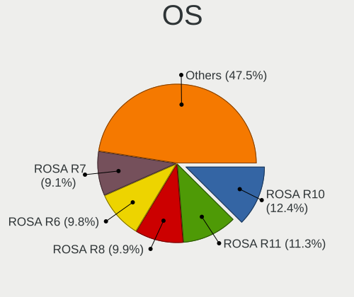

| Name         | Notebooks | Percent |
|--------------|-----------|---------|
| ROSA R10     | 2146      | 12.44%  |
| ROSA R11     | 1950      | 11.3%   |
| ROSA R8      | 1704      | 9.87%   |
| ROSA R6      | 1686      | 9.77%   |
| ROSA R7      | 1566      | 9.08%   |
| ROSA R8.1    | 1352      | 7.83%   |
| ROSA R9      | 1220      | 7.07%   |
| ROSA R11.1   | 1163      | 6.74%   |
| ROSA 12.2    | 933       | 5.41%   |
| ROSA 12.4    | 786       | 4.55%   |
| ROSA 12.5.1  | 708       | 4.1%    |
| ROSA 12.3    | 445       | 2.58%   |
| ROSA 13.0    | 332       | 1.92%   |
| ROSA 12      | 324       | 1.88%   |
| ROSA R5      | 321       | 1.86%   |
| ROSA 12.1    | 169       | 0.98%   |
| ROSA 12.5    | 156       | 0.9%    |
| ROSA 13.1    | 81        | 0.47%   |
| ROSA R4      | 78        | 0.45%   |
| ROSA R3      | 56        | 0.32%   |
| ROSA R12     | 24        | 0.14%   |
| ROSA 12.6    | 15        | 0.09%   |
| ROSA R2      | 10        | 0.06%   |
| ROSA 2012.0  | 6         | 0.03%   |
| ROSA 12f.1   | 5         | 0.03%   |
| ROSA 2019.05 | 4         | 0.02%   |
| ROSA R9-R11  | 3         | 0.02%   |
| ROSA 2021.1  | 3         | 0.02%   |
| ROSA 13      | 3         | 0.02%   |
| ROSA 12.7    | 3         | 0.02%   |
| ROSA DX 1.0  | 2         | 0.01%   |
| ROSA R4-R8   | 1         | 0.01%   |
| ROSA 2019.0  | 1         | 0.01%   |

OS Family
---------

OS without a version

| Name | Notebooks | Percent |
|------|-----------|---------|
| ROSA | 14232     | 100%    |

Kernel
------

Version of the Linux kernel

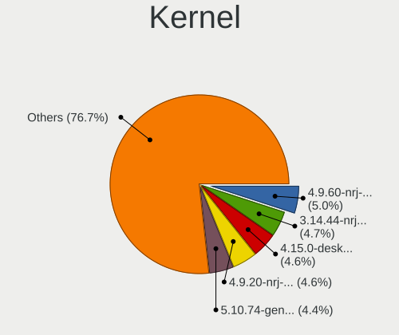

| Version                             | Notebooks | Percent |
|-------------------------------------|-----------|---------|
| 4.9.60-nrj-desktop-1rosa-x86_64     | 934       | 5%      |
| 3.14.44-nrj-desktop-2rosa-x86_64    | 872       | 4.67%   |
| 4.15.0-desktop-45.1rosa-x86_64      | 853       | 4.57%   |
| 4.9.20-nrj-desktop-1rosa-x86_64     | 852       | 4.56%   |
| 5.10.74-generic-2rosa2021.1-x86_64  | 830       | 4.45%   |
| 4.1.25-nrj-desktop-1rosa-x86_64     | 717       | 3.84%   |
| 4.1.15-nrj-desktop-1rosa-x86_64     | 605       | 3.24%   |
| 4.1.34-nrj-desktop-2rosa-x86_64     | 464       | 2.49%   |
| 3.14.44-nrj-desktop-2rosa-i586      | 384       | 2.06%   |
| 6.1.20-generic-2rosa2021.1-x86_64   | 382       | 2.05%   |
| 4.9.124-nrj-desktop-1rosa-x86_64    | 380       | 2.04%   |
| 6.6.27-generic-3rosa2021.1-x86_64   | 364       | 1.95%   |
| 4.9.9-nrj-desktop-1rosa-x86_64      | 345       | 1.85%   |
| 4.1.38-nrj-desktop-2rosa-x86_64     | 285       | 1.53%   |
| 4.9.60-nrj-desktop-1rosa-i586       | 283       | 1.52%   |
| 4.1.25-nrj-desktop-1rosa-i586       | 268       | 1.44%   |
| 6.6.47-generic-1rosa2021.1-x86_64   | 260       | 1.39%   |
| 4.9.20-nrj-desktop-1rosa-i586       | 249       | 1.33%   |
| 4.9.76-nrj-desktop-1rosa-x86_64     | 233       | 1.25%   |
| 4.15.0-desktop-45.1rosa-i586        | 233       | 1.25%   |
| 4.9.41-nrj-desktop-1rosa-x86_64     | 225       | 1.21%   |
| 4.1.15-nrj-desktop-1rosa-i586       | 224       | 1.2%    |
| 4.9.155-nrj-desktop-1rosa-x86_64    | 223       | 1.19%   |
| 5.4.32-generic-2rosa-x86_64         | 220       | 1.18%   |
| 6.1.58-generic-1rosa2021.1-x86_64   | 219       | 1.17%   |
| 4.15.0-desktop-68.5rosa-x86_64      | 217       | 1.16%   |
| 5.4.83-generic-2rosa-x86_64         | 203       | 1.09%   |
| 4.1.16-nrj-desktop-1rosa-x86_64     | 203       | 1.09%   |
| 4.15.0-desktop-122.124.1rosa-x86_64 | 195       | 1.04%   |
| 4.1.34-nrj-desktop-2rosa-i586       | 180       | 0.96%   |
| 5.10.118-generic-2rosa2021.1-x86_64 | 171       | 0.92%   |
| 5.15.75-generic-1rosa2021.1-x86_64  | 163       | 0.87%   |
| 4.15.0-desktop-47.2rosa-x86_64      | 159       | 0.85%   |
| 4.9.95-nrj-desktop-2rosa-x86_64     | 146       | 0.78%   |
| 4.15.0-desktop-94.1rosa-x86_64      | 146       | 0.78%   |
| 3.14.53-nrj-desktop-1rosa-x86_64    | 132       | 0.71%   |
| 4.1.38-nrj-desktop-2rosa-i586       | 129       | 0.69%   |
| 3.14.25-nrj-desktop-1rosa           | 128       | 0.69%   |
| 4.9.9-nrj-desktop-1rosa-i586        | 125       | 0.67%   |
| 4.1.22-nrj-desktop-2rosa-x86_64     | 121       | 0.65%   |

Kernel Family
-------------

Linux kernel without a distro release

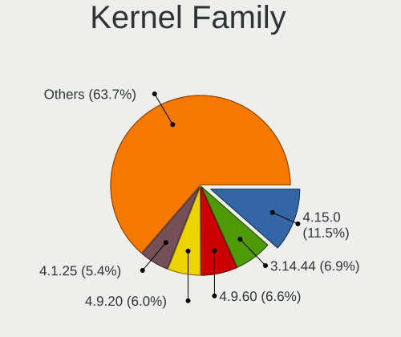

| Version  | Notebooks | Percent |
|----------|-----------|---------|
| 4.15.0   | 2107      | 11.48%  |
| 3.14.44  | 1260      | 6.86%   |
| 4.9.60   | 1216      | 6.62%   |
| 4.9.20   | 1105      | 6.02%   |
| 4.1.25   | 984       | 5.36%   |
| 5.10.74  | 871       | 4.74%   |
| 4.1.15   | 832       | 4.53%   |
| 4.1.34   | 647       | 3.52%   |
| 4.1.38   | 508       | 2.77%   |
| 4.9.124  | 496       | 2.7%    |
| 4.9.9    | 470       | 2.56%   |
| 6.1.20   | 386       | 2.1%    |
| 6.6.27   | 372       | 2.03%   |
| 5.4.32   | 318       | 1.73%   |
| 4.9.155  | 316       | 1.72%   |
| 4.9.76   | 306       | 1.67%   |
| 4.9.41   | 302       | 1.64%   |
| 4.1.16   | 295       | 1.61%   |
| 5.4.83   | 279       | 1.52%   |
| 6.6.47   | 261       | 1.42%   |
| 6.1.58   | 227       | 1.24%   |
| 4.1.19   | 201       | 1.09%   |
| 5.15.75  | 200       | 1.09%   |
| 3.14.53  | 197       | 1.07%   |
| 4.9.95   | 179       | 0.97%   |
| 4.1.22   | 178       | 0.97%   |
| 5.10.118 | 176       | 0.96%   |
| 4.1.33   | 163       | 0.89%   |
| 4.1.13   | 158       | 0.86%   |
| 6.12.47  | 152       | 0.83%   |
| 3.14.25  | 131       | 0.71%   |
| 5.15.79  | 120       | 0.65%   |
| 4.9.111  | 109       | 0.59%   |
| 3.14.33  | 104       | 0.57%   |
| 6.6.21   | 103       | 0.56%   |
| 5.15.127 | 100       | 0.54%   |
| 6.1.38   | 94        | 0.51%   |
| 6.12.34  | 89        | 0.48%   |
| 6.6.78   | 83        | 0.45%   |
| 4.9.87   | 82        | 0.45%   |

Kernel Major Ver.
-----------------

Linux kernel major version

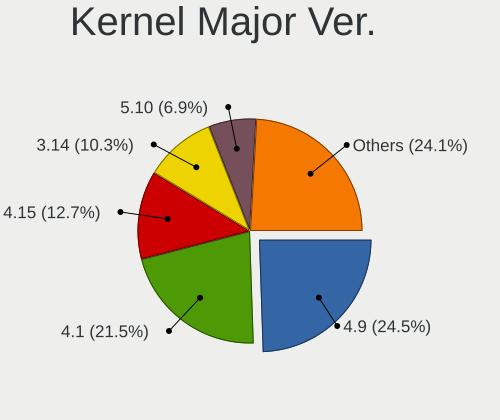

| Version | Notebooks | Percent |
|---------|-----------|---------|
| 4.9     | 4064      | 24.47%  |
| 4.1     | 3570      | 21.5%   |
| 4.15    | 2115      | 12.73%  |
| 3.14    | 1716      | 10.33%  |
| 5.10    | 1139      | 6.86%   |
| 6.6     | 826       | 4.97%   |
| 6.1     | 826       | 4.97%   |
| 5.4     | 666       | 4.01%   |
| 5.15    | 557       | 3.35%   |
| 6.12    | 415       | 2.5%    |
| 4.4     | 73        | 0.44%   |
| 3.10    | 65        | 0.39%   |
| 4.13    | 64        | 0.39%   |
| 5.17    | 46        | 0.28%   |
| 4.0     | 41        | 0.25%   |
| 4.8     | 38        | 0.23%   |
| 5.0     | 30        | 0.18%   |
| 4.6     | 30        | 0.18%   |
| 5.18    | 23        | 0.14%   |
| 3.18    | 22        | 0.13%   |
| 4.16    | 21        | 0.13%   |
| 6.0     | 20        | 0.12%   |
| 4.7     | 20        | 0.12%   |
| 4.14    | 19        | 0.11%   |
| 4.19    | 18        | 0.11%   |
| 4.18    | 18        | 0.11%   |
| 4.3     | 15        | 0.09%   |
| 4.2     | 12        | 0.07%   |
| 4.5     | 10        | 0.06%   |
| 4.11    | 10        | 0.06%   |
| 5.16    | 9         | 0.05%   |
| 4.17    | 9         | 0.05%   |
| 4.10    | 9         | 0.05%   |
| 3.17    | 8         | 0.05%   |
| 3.0     | 7         | 0.04%   |
| 6.8     | 6         | 0.04%   |
| 6.4     | 6         | 0.04%   |
| 6.11    | 6         | 0.04%   |
| 6.10    | 6         | 0.04%   |
| 4.12    | 6         | 0.04%   |

Arch
----

OS architecture (x86_64, i586, etc.)

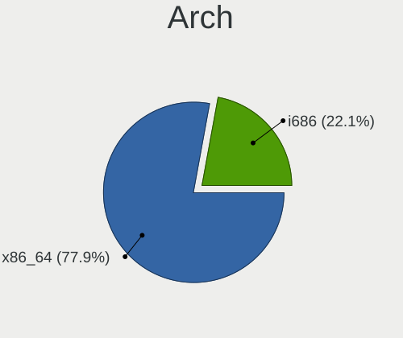

| Name   | Notebooks | Percent |
|--------|-----------|---------|
| x86_64 | 11320     | 77.88%  |
| i686   | 3216      | 22.12%  |

DE
--

Desktop Environment

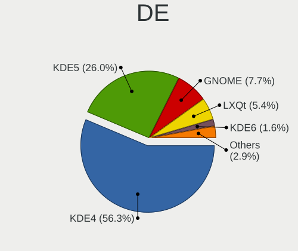

| Name     | Notebooks | Percent |
|----------|-----------|---------|
| KDE4     | 8693      | 56.33%  |
| KDE5     | 4020      | 26.05%  |
| GNOME    | 1192      | 7.72%   |
| LXQt     | 828       | 5.37%   |
| KDE6     | 251       | 1.63%   |
| MATE     | 180       | 1.17%   |
| XFCE     | 121       | 0.78%   |
| LXDE     | 92        | 0.6%    |
| Unknown  | 45        | 0.29%   |
| i3       | 5         | 0.03%   |
| Budgie   | 3         | 0.02%   |
| KDE      | 1         | 0.01%   |
| Cinnamon | 1         | 0.01%   |

Display Server
--------------

X11 or Wayland

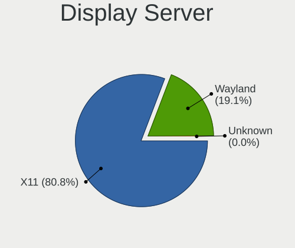

| Name    | Notebooks | Percent |
|---------|-----------|---------|
| X11     | 11794     | 80.8%   |
| Wayland | 2789      | 19.11%  |
| Tty     | 12        | 0.08%   |
| Unknown | 1         | 0.01%   |

Display Manager
---------------

SDDM, LightDM, etc.

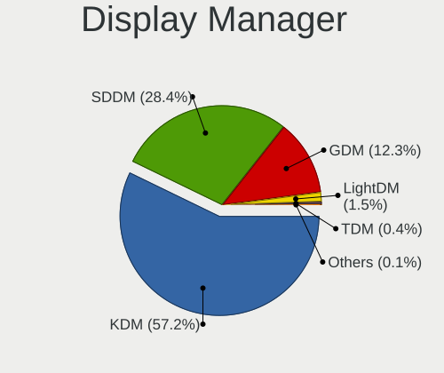

| Name    | Notebooks | Percent |
|---------|-----------|---------|
| KDM     | 8759      | 57.2%   |
| SDDM    | 4354      | 28.43%  |
| GDM     | 1879      | 12.27%  |
| LightDM | 235       | 1.53%   |
| TDM     | 65        | 0.42%   |
| Unknown | 12        | 0.08%   |
| XDM     | 10        | 0.07%   |

OS Lang
-------

Language

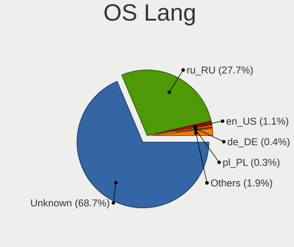

| Lang    | Notebooks | Percent |
|---------|-----------|---------|
| Unknown | 10134     | 68.66%  |
| ru_RU   | 4089      | 27.7%   |
| en_US   | 158       | 1.07%   |
| de_DE   | 53        | 0.36%   |
| pl_PL   | 48        | 0.33%   |
| it_IT   | 43        | 0.29%   |
| es_ES   | 38        | 0.26%   |
| pt_BR   | 31        | 0.21%   |
| fr_FR   | 30        | 0.2%    |
| en_GB   | 28        | 0.19%   |
| C       | 11        | 0.07%   |
| sk_SK   | 8         | 0.05%   |
| ru_UA   | 8         | 0.05%   |
| es_PE   | 7         | 0.05%   |
| es_MX   | 5         | 0.03%   |
| es_CO   | 5         | 0.03%   |
| ro_RO   | 4         | 0.03%   |
| hu_HU   | 4         | 0.03%   |
| tr_TR   | 3         | 0.02%   |
| pt_PT   | 3         | 0.02%   |
| es_VE   | 3         | 0.02%   |
| es_CL   | 3         | 0.02%   |
| cs_CZ   | 3         | 0.02%   |
| bg_BG   | 3         | 0.02%   |
| sv_SE   | 2         | 0.01%   |
| sr_RS   | 2         | 0.01%   |
| ru_BY   | 2         | 0.01%   |
| nl_NL   | 2         | 0.01%   |
| nb_NO   | 2         | 0.01%   |
| lv_LV   | 2         | 0.01%   |
| fr_BE   | 2         | 0.01%   |
| en_IN   | 2         | 0.01%   |
| de_AT   | 2         | 0.01%   |
| da_DK   | 2         | 0.01%   |
| zh_TW   | 1         | 0.01%   |
| zh_CN   | 1         | 0.01%   |
| vi_VN   | 1         | 0.01%   |
| tt_RU   | 1         | 0.01%   |
| lt_LT   | 1         | 0.01%   |
| id_ID   | 1         | 0.01%   |

Boot Mode
---------

EFI or BIOS

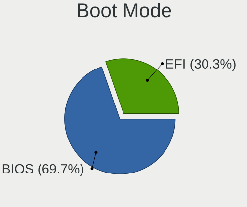

| Mode | Notebooks | Percent |
|------|-----------|---------|
| BIOS | 10133     | 69.7%   |
| EFI  | 4405      | 30.3%   |

Filesystem
----------

Type of filesystem

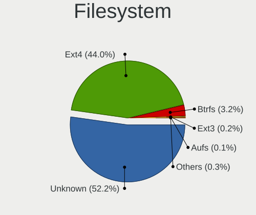

| Type     | Notebooks | Percent |
|----------|-----------|---------|
| Unknown  | 7876      | 52.23%  |
| Ext4     | 6635      | 44%     |
| Btrfs    | 478       | 3.17%   |
| Ext3     | 32        | 0.21%   |
| Aufs     | 14        | 0.09%   |
| Xfs      | 13        | 0.09%   |
| Overlay  | 12        | 0.08%   |
| Ext2     | 9         | 0.06%   |
| F2fs     | 4         | 0.03%   |
| Reiserfs | 2         | 0.01%   |
| XXXXX    | 1         | 0.01%   |
| Jfs      | 1         | 0.01%   |
| 20G      | 1         | 0.01%   |
| 12G      | 1         | 0.01%   |

Part. scheme
------------

Scheme of partitioning

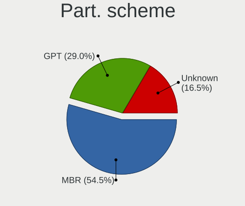

| Type    | Notebooks | Percent |
|---------|-----------|---------|
| MBR     | 8295      | 54.46%  |
| GPT     | 4418      | 29.01%  |
| Unknown | 2518      | 16.53%  |

Dual Boot with Linux/BSD
------------------------

Hosting more than one Linux/BSD

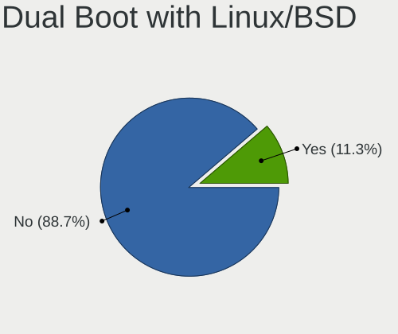

| Dual boot | Notebooks | Percent |
|-----------|-----------|---------|
| No        | 13041     | 88.74%  |
| Yes       | 1654      | 11.26%  |

Dual Boot (Win)
---------------

Hosting Linux and Windows

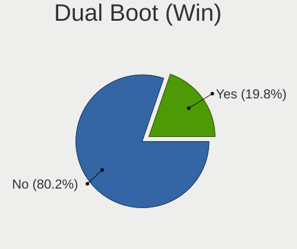

| Dual boot | Notebooks | Percent |
|-----------|-----------|---------|
| No        | 11915     | 80.25%  |
| Yes       | 2933      | 19.75%  |

Board
-----

Vendor
------

Motherboard manufacturer

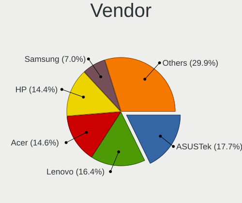

| Name                | Notebooks | Percent |
|---------------------|-----------|---------|
| ASUSTek Computer    | 2526      | 17.75%  |
| Lenovo              | 2329      | 16.36%  |
| Acer                | 2073      | 14.57%  |
| Hewlett-Packard     | 2054      | 14.43%  |
| Samsung Electronics | 1001      | 7.03%   |
| Dell                | 965       | 6.78%   |
| Toshiba             | 526       | 3.7%    |
| Sony                | 356       | 2.5%    |
| MSI                 | 279       | 1.96%   |
| Packard Bell        | 258       | 1.81%   |
| eMachines           | 188       | 1.32%   |
| Clevo               | 161       | 1.13%   |
| Notebook            | 117       | 0.82%   |
| Apple               | 110       | 0.77%   |
| Unknown             | 99        | 0.7%    |
| Fujitsu Siemens     | 90        | 0.63%   |
| Pegatron            | 76        | 0.53%   |
| HUAWEI              | 63        | 0.44%   |
| Fujitsu             | 60        | 0.42%   |
| Intel               | 52        | 0.37%   |
| DNS                 | 50        | 0.35%   |
| Quanta              | 37        | 0.26%   |
| KVADRA              | 37        | 0.26%   |
| DEXP                | 36        | 0.25%   |
| Aquarius            | 33        | 0.23%   |
| Maibenben           | 31        | 0.22%   |
| Irbis               | 28        | 0.2%    |
| Digma               | 24        | 0.17%   |
| Medion              | 23        | 0.16%   |
| HONOR               | 21        | 0.15%   |
| Timi                | 20        | 0.14%   |
| Prestigio           | 17        | 0.12%   |
| Insyde              | 17        | 0.12%   |
| Infomash            | 17        | 0.12%   |
| Chuwi               | 17        | 0.12%   |
| LG Electronics      | 15        | 0.11%   |
| Compal              | 15        | 0.11%   |
| Alienware           | 15        | 0.11%   |
| ICL                 | 14        | 0.1%    |
| IBM                 | 14        | 0.1%    |

Model
-----

Motherboard model

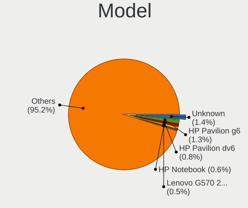

| Name                                       | Notebooks | Percent |
|--------------------------------------------|-----------|---------|
| Unknown                                    | 205       | 1.44%   |
| HP Pavilion g6                             | 190       | 1.34%   |
| HP Pavilion dv6                            | 119       | 0.84%   |
| HP Notebook                                | 92        | 0.65%   |
| Lenovo G570 20079                          | 73        | 0.51%   |
| Acer Aspire V3-571G                        | 72        | 0.51%   |
| Lenovo B590 20206                          | 61        | 0.43%   |
| Lenovo G50-30 80G0                         | 58        | 0.41%   |
| Clevo NL41MU2                              | 57        | 0.4%    |
| Packard Bell EasyNote TE11HC               | 55        | 0.39%   |
| HP Pavilion dv7                            | 54        | 0.38%   |
| Lenovo G500 20236                          | 53        | 0.37%   |
| HP Pavilion g7                             | 53        | 0.37%   |
| HP Pavilion 15                             | 52        | 0.37%   |
| Dell Inspiron N5110                        | 51        | 0.36%   |
| Lenovo G50-45 80E3                         | 47        | 0.33%   |
| Acer Aspire 5742G                          | 47        | 0.33%   |
| Toshiba Satellite C660                     | 46        | 0.32%   |
| Acer Aspire 5750G                          | 46        | 0.32%   |
| HP Laptop 15-bw0xx                         | 43        | 0.3%    |
| ASUS K50IJ                                 | 42        | 0.3%    |
| Lenovo B570e HuronRiver Platform           | 41        | 0.29%   |
| Lenovo G580 20157                          | 40        | 0.28%   |
| Lenovo B590 20208                          | 40        | 0.28%   |
| HP G62                                     | 40        | 0.28%   |
| Samsung 300V3A/300V4A/300V5A/200A4B/200A5B | 39        | 0.27%   |
| Lenovo G580 20150                          | 39        | 0.27%   |
| ASUS X101CH                                | 38        | 0.27%   |
| ASUS K53U                                  | 37        | 0.26%   |
| Samsung 355V4C/356V4C/3445VC/3545VC        | 36        | 0.25%   |
| HP 15                                      | 36        | 0.25%   |
| Dell Inspiron 3521                         | 36        | 0.25%   |
| Samsung 300E4A/300E5A/300E7A/3430EA/3530EA | 35        | 0.25%   |
| KVADRA NAU LE14U                           | 35        | 0.25%   |
| Dell Inspiron 3542                         | 35        | 0.25%   |
| Acer Aspire E1-571G                        | 35        | 0.25%   |
| Toshiba Satellite A200                     | 34        | 0.24%   |
| Lenovo G560 20042                          | 34        | 0.24%   |
| ASUS X550CC                                | 34        | 0.24%   |
| Lenovo G505 20240                          | 31        | 0.22%   |

Model Family
------------

Motherboard model prefix

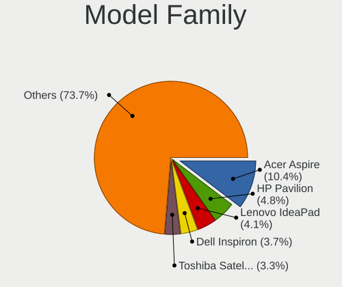

| Name                  | Notebooks | Percent |
|-----------------------|-----------|---------|
| Acer Aspire           | 1477      | 10.38%  |
| HP Pavilion           | 684       | 4.81%   |
| Lenovo IdeaPad        | 586       | 4.12%   |
| Dell Inspiron         | 524       | 3.68%   |
| Toshiba Satellite     | 476       | 3.34%   |
| Lenovo ThinkPad       | 440       | 3.09%   |
| HP ProBook            | 245       | 1.72%   |
| Dell Latitude         | 228       | 1.6%    |
| Packard Bell EasyNote | 218       | 1.53%   |
| HP Compaq             | 212       | 1.49%   |
| Unknown               | 205       | 1.44%   |
| Acer Extensa          | 186       | 1.31%   |
| HP Laptop             | 160       | 1.12%   |
| ASUS VivoBook         | 131       | 0.92%   |
| HP EliteBook          | 116       | 0.82%   |
| Lenovo G580           | 107       | 0.75%   |
| Lenovo B590           | 106       | 0.74%   |
| Dell Vostro           | 105       | 0.74%   |
| Acer TravelMate       | 101       | 0.71%   |
| HP Notebook           | 92        | 0.65%   |
| Lenovo G570           | 74        | 0.52%   |
| Samsung 355V4C        | 62        | 0.44%   |
| Lenovo G50-30         | 58        | 0.41%   |
| Clevo NL41MU2         | 57        | 0.4%    |
| HP Presario           | 55        | 0.39%   |
| HP ENVY               | 55        | 0.39%   |
| Fujitsu LIFEBOOK      | 54        | 0.38%   |
| Lenovo G500           | 53        | 0.37%   |
| HP Mini               | 53        | 0.37%   |
| Samsung 300V3A        | 51        | 0.36%   |
| HP 250                | 50        | 0.35%   |
| Fujitsu Siemens AMILO | 50        | 0.35%   |
| Lenovo G50-45         | 49        | 0.34%   |
| Notebook W65          | 48        | 0.34%   |
| Samsung 300E4A        | 43        | 0.3%    |
| ASUS K50IJ            | 42        | 0.3%    |
| Lenovo B570e          | 41        | 0.29%   |
| HP G62                | 40        | 0.28%   |
| HP 255                | 39        | 0.27%   |
| ASUS X101CH           | 38        | 0.27%   |

MFG Year
--------

Motherboard manufacture year

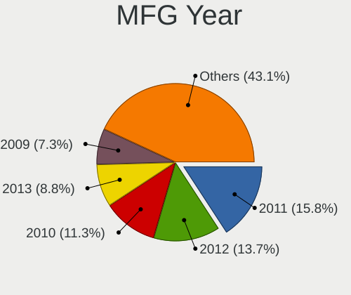

| Year    | Notebooks | Percent |
|---------|-----------|---------|
| 2011    | 2248      | 15.8%   |
| 2012    | 1950      | 13.7%   |
| 2010    | 1604      | 11.27%  |
| 2013    | 1250      | 8.78%   |
| 2009    | 1046      | 7.35%   |
| 2008    | 1022      | 7.18%   |
| 2007    | 832       | 5.85%   |
| 2014    | 818       | 5.75%   |
| 2015    | 622       | 4.37%   |
| 2016    | 410       | 2.88%   |
| 2006    | 405       | 2.85%   |
| 2017    | 379       | 2.66%   |
| 2018    | 304       | 2.14%   |
| 2021    | 260       | 1.83%   |
| 2019    | 244       | 1.71%   |
| 2022    | 228       | 1.6%    |
| 2020    | 227       | 1.59%   |
| 2023    | 164       | 1.15%   |
| 2005    | 100       | 0.7%    |
| 2024    | 58        | 0.41%   |
| 2004    | 25        | 0.18%   |
| 2025    | 16        | 0.11%   |
| Unknown | 14        | 0.1%    |
| 2003    | 4         | 0.03%   |
| 2002    | 1         | 0.01%   |
| 2001    | 1         | 0.01%   |

Form Factor
-----------

Physical design of the computer

| Name     | Notebooks | Percent |
|----------|-----------|---------|
| Notebook | 14232     | 100%    |

Secure Boot
-----------

Enabled or disabled

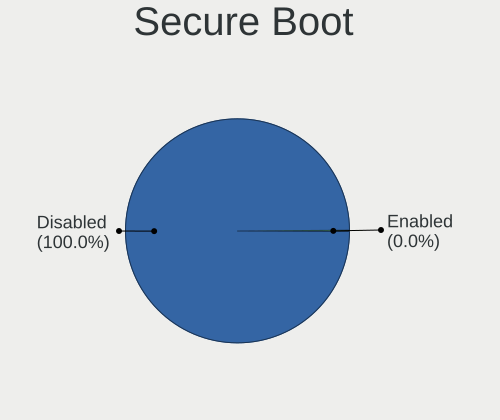

| State    | Notebooks | Percent |
|----------|-----------|---------|
| Disabled | 14229     | 99.95%  |
| Enabled  | 7         | 0.05%   |

Coreboot
--------

Have coreboot on board

| Used | Notebooks | Percent |
|------|-----------|---------|
| No   | 14223     | 99.94%  |
| Yes  | 9         | 0.06%   |

RAM Size
--------

Total RAM memory

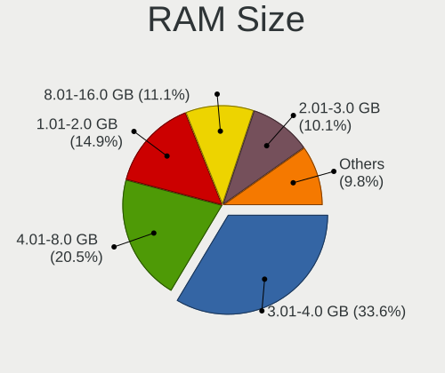

| Size in GB  | Notebooks | Percent |
|-------------|-----------|---------|
| 3.01-4.0    | 5010      | 33.57%  |
| 4.01-8.0    | 3067      | 20.55%  |
| 1.01-2.0    | 2218      | 14.86%  |
| 8.01-16.0   | 1660      | 11.12%  |
| 2.01-3.0    | 1511      | 10.12%  |
| 16.01-24.0  | 603       | 4.04%   |
| 0.51-1.0    | 483       | 3.24%   |
| Unknown     | 221       | 1.48%   |
| 32.01-64.0  | 99        | 0.66%   |
| 24.01-32.0  | 29        | 0.19%   |
| 0.01-0.5    | 20        | 0.13%   |
| 64.01-256.0 | 4         | 0.03%   |

RAM Used
--------

Used RAM memory

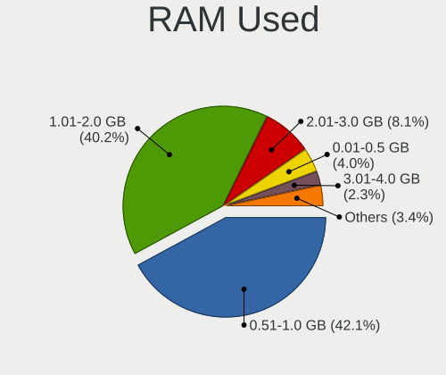

| Used GB    | Notebooks | Percent |
|------------|-----------|---------|
| 0.51-1.0   | 6932      | 42.09%  |
| 1.01-2.0   | 6620      | 40.2%   |
| 2.01-3.0   | 1327      | 8.06%   |
| 0.01-0.5   | 651       | 3.95%   |
| 3.01-4.0   | 375       | 2.28%   |
| Unknown    | 259       | 1.57%   |
| 4.01-8.0   | 253       | 1.54%   |
| 8.01-16.0  | 47        | 0.29%   |
| 16.01-24.0 | 3         | 0.02%   |
| 24.01-32.0 | 1         | 0.01%   |

Total Drives
------------

Number of drives on board

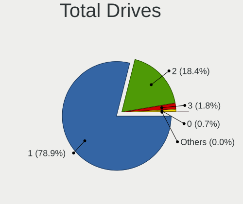

| Drives  | Notebooks | Percent |
|---------|-----------|---------|
| 1       | 11666     | 78.91%  |
| 2       | 2722      | 18.41%  |
| 3       | 268       | 1.81%   |
| 0       | 105       | 0.71%   |
| 4       | 17        | 0.11%   |
| 5       | 5         | 0.03%   |
| Unknown | 1         | 0.01%   |

Has CD-ROM
----------

Has CD-ROM on board

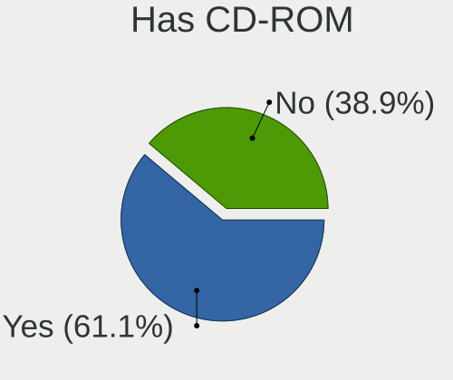

| Presented | Notebooks | Percent |
|-----------|-----------|---------|
| Yes       | 8848      | 61.14%  |
| No        | 5624      | 38.86%  |

Has Ethernet
------------

Has Ethernet on board

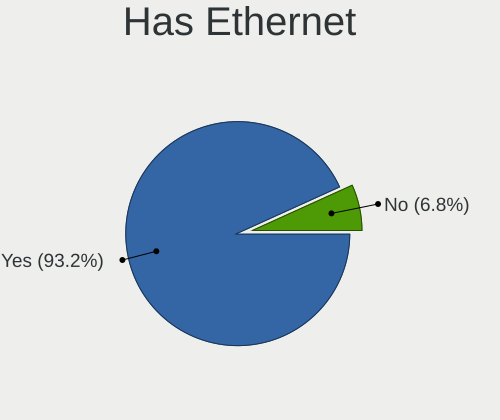

| Presented | Notebooks | Percent |
|-----------|-----------|---------|
| Yes       | 13287     | 93.22%  |
| No        | 966       | 6.78%   |

Has WiFi
--------

Has WiFi module

| Presented | Notebooks | Percent |
|-----------|-----------|---------|
| Yes       | 13923     | 97.66%  |
| No        | 334       | 2.34%   |

Has Bluetooth
-------------

Has Bluetooth module

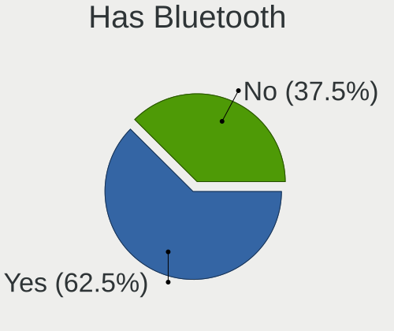

| Presented | Notebooks | Percent |
|-----------|-----------|---------|
| Yes       | 9077      | 62.46%  |
| No        | 5455      | 37.54%  |

Location
--------

Country
-------

Geographic location (country)

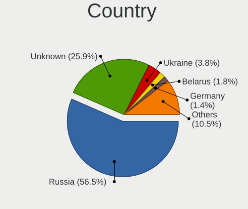

| Country     | Notebooks | Percent |
|-------------|-----------|---------|
| Russia      | 8447      | 56.52%  |
| Unknown     | 3872      | 25.91%  |
| Ukraine     | 574       | 3.84%   |
| Belarus     | 267       | 1.79%   |
| Germany     | 209       | 1.4%    |
| Poland      | 198       | 1.32%   |
| Kazakhstan  | 126       | 0.84%   |
| Italy       | 113       | 0.76%   |
| USA         | 108       | 0.72%   |
| France      | 93        | 0.62%   |
| Brazil      | 70        | 0.47%   |
| Spain       | 65        | 0.43%   |
| Canada      | 39        | 0.26%   |
| UK          | 38        | 0.25%   |
| Latvia      | 38        | 0.25%   |
| Bulgaria    | 37        | 0.25%   |
| Romania     | 36        | 0.24%   |
| Moldova     | 32        | 0.21%   |
| Serbia      | 24        | 0.16%   |
| Slovakia    | 23        | 0.15%   |
| Turkey      | 22        | 0.15%   |
| Czechia     | 22        | 0.15%   |
| Belgium     | 21        | 0.14%   |
| Mexico      | 19        | 0.13%   |
| Lithuania   | 19        | 0.13%   |
| Uzbekistan  | 18        | 0.12%   |
| Israel      | 18        | 0.12%   |
| India       | 18        | 0.12%   |
| Hungary     | 18        | 0.12%   |
| Colombia    | 18        | 0.12%   |
| Finland     | 16        | 0.11%   |
| Chile       | 16        | 0.11%   |
| Switzerland | 15        | 0.1%    |
| Estonia     | 15        | 0.1%    |
| Indonesia   | 14        | 0.09%   |
| Austria     | 14        | 0.09%   |
| Portugal    | 13        | 0.09%   |
| Peru        | 13        | 0.09%   |
| Netherlands | 13        | 0.09%   |
| Greece      | 13        | 0.09%   |

City
----

Geographic location (city)

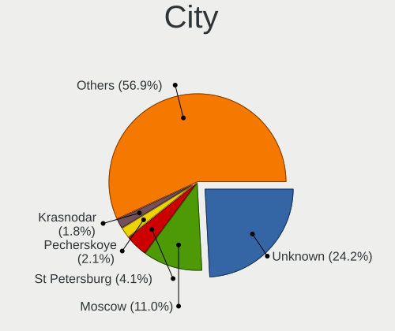

| City             | Notebooks | Percent |
|------------------|-----------|---------|
| Unknown          | 3874      | 24.15%  |
| Moscow           | 1759      | 10.97%  |
| St Petersburg    | 660       | 4.11%   |
| Pecherskoye      | 329       | 2.05%   |
| Krasnodar        | 292       | 1.82%   |
| Novosibirsk      | 277       | 1.73%   |
| Yekaterinburg    | 248       | 1.55%   |
| Nizhniy Novgorod | 185       | 1.15%   |
| Samara           | 172       | 1.07%   |
| Chelyabinsk      | 161       | 1%      |
| Voronezh         | 154       | 0.96%   |
| Perm             | 144       | 0.9%    |
| Rostov-on-Don    | 143       | 0.89%   |
| Krasnoyarsk      | 120       | 0.75%   |
| Saratov          | 111       | 0.69%   |
| Minsk            | 102       | 0.64%   |
| Kazan’         | 93        | 0.58%   |
| Khabarovsk       | 90        | 0.56%   |
| Omsk             | 87        | 0.54%   |
| Ufa              | 85        | 0.53%   |
| Volgograd        | 79        | 0.49%   |
| Barnaul          | 76        | 0.47%   |
| Tyumen           | 74        | 0.46%   |
| Irkutsk          | 72        | 0.45%   |
| Yaroslavl        | 69        | 0.43%   |
| Kaliningrad      | 69        | 0.43%   |
| Kyiv             | 66        | 0.41%   |
| Kirov            | 65        | 0.41%   |
| Surgut           | 63        | 0.39%   |
| Stavropol        | 63        | 0.39%   |
| Kemerovo         | 62        | 0.39%   |
| Simferopol       | 61        | 0.38%   |
| Tula             | 60        | 0.37%   |
| Vladivostok      | 56        | 0.35%   |
| Belgorod         | 53        | 0.33%   |
| Novokuznetsk     | 51        | 0.32%   |
| Tver             | 49        | 0.31%   |
| Sevastopol       | 49        | 0.31%   |
| Penza            | 49        | 0.31%   |
| Bryansk          | 49        | 0.31%   |

Drives
------

Drive Vendor
------------

Hard drive vendors

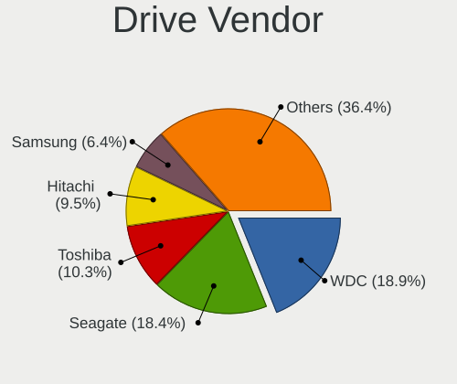

| Vendor              | Notebooks | Drives | Percent |
|---------------------|-----------|--------|---------|
| WDC                 | 3289      | 4638   | 18.9%   |
| Seagate             | 3206      | 4417   | 18.42%  |
| Toshiba             | 1801      | 2442   | 10.35%  |
| Hitachi             | 1649      | 2253   | 9.48%   |
| Samsung Electronics | 1117      | 1579   | 6.42%   |
| Unknown             | 795       | 1012   | 4.57%   |
| HGST                | 777       | 1170   | 4.46%   |
| Kingston            | 686       | 904    | 3.94%   |
| SanDisk             | 390       | 528    | 2.24%   |
| Fujitsu             | 276       | 342    | 1.59%   |
| China               | 241       | 311    | 1.38%   |
| A-DATA Technology   | 238       | 321    | 1.37%   |
| Intel               | 197       | 263    | 1.13%   |
| SK hynix            | 172       | 259    | 0.99%   |
| Crucial             | 153       | 194    | 0.88%   |
| SPCC                | 137       | 234    | 0.79%   |
| HUAWEI              | 134       | 154    | 0.77%   |
| Micron Technology   | 111       | 152    | 0.64%   |
| OCZ                 | 107       | 147    | 0.61%   |
| Smartbuy            | 95        | 120    | 0.55%   |
| KingSpec            | 95        | 141    | 0.55%   |
| Apacer              | 87        | 113    | 0.5%    |
| Plextor             | 85        | 115    | 0.49%   |
| Transcend           | 83        | 118    | 0.48%   |
| AMD                 | 73        | 90     | 0.42%   |
| BIWIN               | 69        | 77     | 0.4%    |
| Patriot             | 68        | 92     | 0.39%   |
| GOODRAM             | 57        | 67     | 0.33%   |
| Netac               | 51        | 60     | 0.29%   |
| KIOXIA              | 51        | 62     | 0.29%   |
| Corsair             | 46        | 65     | 0.26%   |
| Unknown             | 41        | 45     | 0.24%   |
| Apple               | 40        | 49     | 0.23%   |
| TF CARD             | 37        | 52     | 0.21%   |
| Silicon Motion      | 36        | 48     | 0.21%   |
| LITEONIT            | 32        | 52     | 0.18%   |
| KingDian            | 29        | 41     | 0.17%   |
| JMicron Technology  | 29        | 29     | 0.17%   |
| Phison              | 28        | 38     | 0.16%   |
| Gigabyte Technology | 27        | 33     | 0.16%   |

Drive Model
-----------

Hard drive models

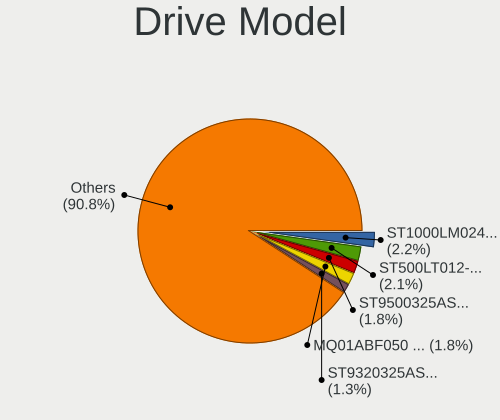

| Model                               | Notebooks | Percent |
|-------------------------------------|-----------|---------|
| Seagate ST1000LM024 HN-M101MBB 1TB  | 391       | 2.2%    |
| Seagate ST500LT012-1DG142 500GB     | 372       | 2.1%    |
| Seagate ST9500325AS 500GB           | 325       | 1.83%   |
| Toshiba MQ01ABF050 500GB            | 311       | 1.75%   |
| Seagate ST9320325AS 320GB           | 232       | 1.31%   |
| Unknown xD/SD/M.S.                  | 200       | 1.13%   |
| HGST HTS545050A7E680 500GB          | 199       | 1.12%   |
| Hitachi HTS543232A7A384 320GB       | 177       | 1%      |
| Seagate ST500LT012-9WS142 500GB     | 174       | 0.98%   |
| Seagate ST9250315AS 250GB           | 161       | 0.91%   |
| Toshiba MQ01ABD100 1TB              | 159       | 0.9%    |
| Seagate ST500LM012 HN-M500MBB 500GB | 143       | 0.81%   |
| WDC WD5000LPVX-22V0TT0 500GB        | 138       | 0.78%   |
| Seagate ST320LT020-9YG142 320GB     | 138       | 0.78%   |
| Hitachi HTS547550A9E384 500GB       | 131       | 0.74%   |
| HGST HTS545050A7E380 500GB          | 126       | 0.71%   |
| WDC WD3200BPVT-22JJ5T0 320GB        | 120       | 0.68%   |
| HGST HTS541010A9E680 1TB            | 120       | 0.68%   |
| Hitachi HTS545025B9A300 250GB       | 117       | 0.66%   |
| Seagate ST1000LM035-1RK172 1TB      | 109       | 0.61%   |
| Kingston SV300S37A120G 120GB SSD    | 109       | 0.61%   |
| Hitachi HTS547575A9E384 752GB       | 107       | 0.6%    |
| Toshiba MQ01ABD050 500GB            | 98        | 0.55%   |
| WDC WD10JPVX-22JC3T0 1TB            | 96        | 0.54%   |
| Hitachi HTS545032B9A300 320GB       | 96        | 0.54%   |
| Hitachi HTS545050A7E380 500GB       | 95        | 0.54%   |
| HGST HTS721010A9E630 1TB            | 95        | 0.54%   |
| Hitachi HTS545050B9A300 500GB       | 86        | 0.48%   |
| Kingston SA400S37240G 240GB SSD     | 85        | 0.48%   |
| HGST HTS725050A7E630 500GB          | 83        | 0.47%   |
| WDC WD1600BEVT-22ZCT0 160GB         | 80        | 0.45%   |
| Seagate ST750LM022 HN-M750MBB 752GB | 80        | 0.45%   |
| Kingston SA400S37120G 120GB SSD     | 80        | 0.45%   |
| Toshiba MQ01ABD075 752GB            | 79        | 0.45%   |
| Samsung HM321HI 320GB               | 75        | 0.42%   |
| Toshiba MQ01ABD032 320GB            | 73        | 0.41%   |
| WDC WD3200BEVT-22ZCT0 320GB         | 70        | 0.39%   |
| HUAWEI TF CARD Storage 2GB          | 70        | 0.39%   |
| Samsung HM250HI 250GB               | 69        | 0.39%   |
| WDC WD5000LPCX-24VHAT0 500GB        | 63        | 0.35%   |

HDD Vendor
----------

Hard disk drive vendors

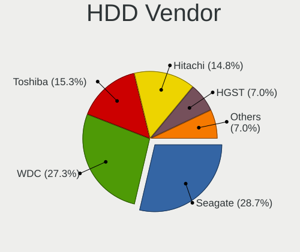

| Vendor              | Notebooks | Drives | Percent |
|---------------------|-----------|--------|---------|
| Seagate             | 3190      | 4388   | 28.66%  |
| WDC                 | 3035      | 4260   | 27.27%  |
| Toshiba             | 1699      | 2304   | 15.27%  |
| Hitachi             | 1648      | 2252   | 14.81%  |
| HGST                | 777       | 1170   | 6.98%   |
| Samsung Electronics | 404       | 512    | 3.63%   |
| Fujitsu             | 275       | 340    | 2.47%   |
| Unknown             | 19        | 24     | 0.17%   |
| JMicron Technology  | 19        | 21     | 0.17%   |
| IBM/Hitachi         | 12        | 12     | 0.11%   |
| TO Exter            | 11        | 14     | 0.1%    |
| External            | 10        | 10     | 0.09%   |
| Apple               | 6         | 6      | 0.05%   |
| USB3.0              | 3         | 3      | 0.03%   |
| HGST HTS            | 3         | 3      | 0.03%   |
| ASMT                | 3         | 3      | 0.03%   |
| ASMedia             | 2         | 3      | 0.02%   |
| ZALMAN              | 1         | 1      | 0.01%   |
| WD MediaMax         | 1         | 2      | 0.01%   |
| USB                 | 1         | 1      | 0.01%   |
| StoreJet            | 1         | 2      | 0.01%   |
| SILICONMOTION       | 1         | 1      | 0.01%   |
| SAGE                | 1         | 1      | 0.01%   |
| OEM                 | 1         | 2      | 0.01%   |
| NVME USB            | 1         | 1      | 0.01%   |
| Maxtor              | 1         | 1      | 0.01%   |
| MARSHAL             | 1         | 2      | 0.01%   |
| Intenso             | 1         | 1      | 0.01%   |
| IBM                 | 1         | 2      | 0.01%   |
| CLOVER              | 1         | 1      | 0.01%   |
| Unknown             | 1         | 1      | 0.01%   |

SSD Vendor
----------

Solid state drive vendors

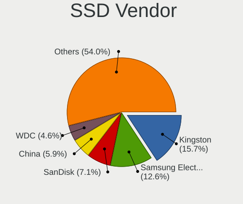

| Vendor              | Notebooks | Drives | Percent |
|---------------------|-----------|--------|---------|
| Kingston            | 635       | 831    | 15.74%  |
| Samsung Electronics | 508       | 730    | 12.59%  |
| SanDisk             | 287       | 397    | 7.11%   |
| China               | 239       | 309    | 5.92%   |
| WDC                 | 187       | 231    | 4.64%   |
| A-DATA Technology   | 178       | 240    | 4.41%   |
| Crucial             | 148       | 180    | 3.67%   |
| SPCC                | 135       | 231    | 3.35%   |
| Intel               | 121       | 153    | 3%      |
| OCZ                 | 107       | 147    | 2.65%   |
| KingSpec            | 92        | 136    | 2.28%   |
| Smartbuy            | 91        | 116    | 2.26%   |
| Plextor             | 84        | 114    | 2.08%   |
| Transcend           | 82        | 114    | 2.03%   |
| Toshiba             | 81        | 105    | 2.01%   |
| Apacer              | 78        | 102    | 1.93%   |
| AMD                 | 68        | 84     | 1.69%   |
| Patriot             | 67        | 91     | 1.66%   |
| GOODRAM             | 57        | 67     | 1.41%   |
| SK hynix            | 53        | 77     | 1.31%   |
| Corsair             | 46        | 65     | 1.14%   |
| Netac               | 44        | 52     | 1.09%   |
| Micron Technology   | 35        | 46     | 0.87%   |
| LITEONIT            | 32        | 52     | 0.79%   |
| Apple               | 31        | 38     | 0.77%   |
| KingDian            | 28        | 40     | 0.69%   |
| LITEON              | 23        | 30     | 0.57%   |
| DEXP                | 22        | 22     | 0.55%   |
| Unknown             | 21        | 24     | 0.52%   |
| Team                | 19        | 25     | 0.47%   |
| KingFast            | 16        | 20     | 0.4%    |
| Gigabyte Technology | 16        | 20     | 0.4%    |
| XrayDisk            | 15        | 31     | 0.37%   |
| Kingmax             | 15        | 32     | 0.37%   |
| Digma               | 14        | 16     | 0.35%   |
| Qumo                | 12        | 14     | 0.3%    |
| PNY                 | 12        | 17     | 0.3%    |
| Hewlett-Packard     | 12        | 13     | 0.3%    |
| Zheino              | 10        | 13     | 0.25%   |
| Londisk             | 9         | 11     | 0.22%   |

Drive Kind
----------

HDD or SSD

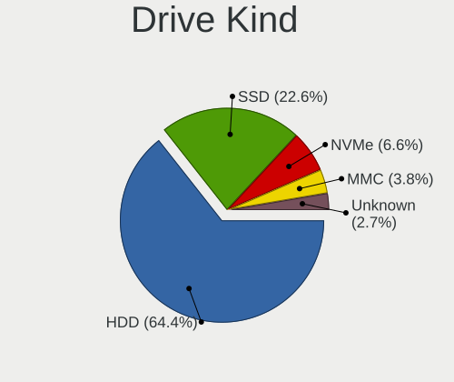

| Kind    | Notebooks | Drives | Percent |
|---------|-----------|--------|---------|
| HDD     | 10697     | 15344  | 64.37%  |
| SSD     | 3750      | 5465   | 22.57%  |
| NVMe    | 1094      | 1685   | 6.58%   |
| MMC     | 632       | 841    | 3.8%    |
| Unknown | 444       | 519    | 2.67%   |

Drive Connector
---------------

SATA, SAS, NVMe, etc.

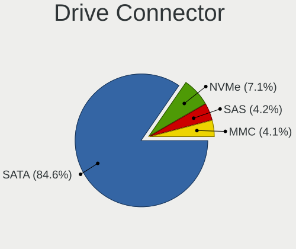

| Type | Notebooks | Drives | Percent |
|------|-----------|--------|---------|
| SATA | 13046     | 20550  | 84.62%  |
| NVMe | 1091      | 1673   | 7.08%   |
| SAS  | 649       | 790    | 4.21%   |
| MMC  | 632       | 841    | 4.1%    |

Drive Size
----------

Size of hard drive

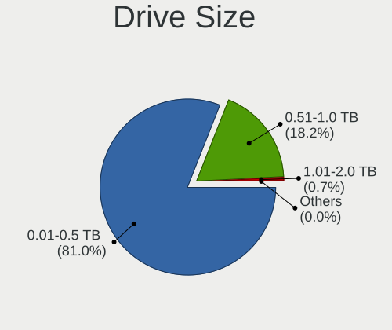

| Size in TB | Notebooks | Drives | Percent |
|------------|-----------|--------|---------|
| 0.01-0.5   | 11241     | 16751  | 81%     |
| 0.51-1.0   | 2522      | 3891   | 18.17%  |
| 1.01-2.0   | 101       | 142    | 0.73%   |
| 3.01-4.0   | 10        | 19     | 0.07%   |
| 2.01-3.0   | 2         | 2      | 0.01%   |
| 4.01-10.0  | 2         | 4      | 0.01%   |

Space Total
-----------

Amount of disk space available on the file system

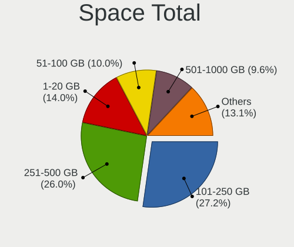

| Size in GB     | Notebooks | Percent |
|----------------|-----------|---------|
| 101-250        | 4409      | 27.24%  |
| 251-500        | 4214      | 26.03%  |
| 1-20           | 2271      | 14.03%  |
| 51-100         | 1618      | 10%     |
| 501-1000       | 1561      | 9.64%   |
| 21-50          | 1424      | 8.8%    |
| 1001-2000      | 343       | 2.12%   |
| Unknown        | 269       | 1.66%   |
| 2001-3000      | 50        | 0.31%   |
| More than 3000 | 27        | 0.17%   |

Space Used
----------

Amount of used disk space

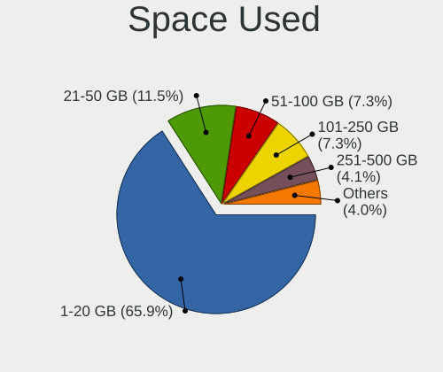

| Used GB        | Notebooks | Percent |
|----------------|-----------|---------|
| 1-20           | 10772     | 65.91%  |
| 21-50          | 1874      | 11.47%  |
| 51-100         | 1191      | 7.29%   |
| 101-250        | 1189      | 7.27%   |
| 251-500        | 665       | 4.07%   |
| 501-1000       | 296       | 1.81%   |
| Unknown        | 269       | 1.65%   |
| 1001-2000      | 64        | 0.39%   |
| 2001-3000      | 13        | 0.08%   |
| More than 3000 | 11        | 0.07%   |

Malfunc. Drives
---------------

Drive models with a malfunction

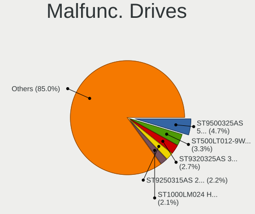

| Model                               | Notebooks | Drives | Percent |
|-------------------------------------|-----------|--------|---------|
| Seagate ST9500325AS 500GB           | 236       | 328    | 4.68%   |
| Seagate ST500LT012-9WS142 500GB     | 169       | 214    | 3.35%   |
| Seagate ST9320325AS 320GB           | 137       | 173    | 2.71%   |
| Seagate ST9250315AS 250GB           | 110       | 149    | 2.18%   |
| Seagate ST1000LM024 HN-M101MBB 1TB  | 106       | 129    | 2.1%    |
| Seagate ST500LT012-1DG142 500GB     | 99        | 121    | 1.96%   |
| HGST HTS545050A7E680 500GB          | 95        | 128    | 1.88%   |
| Seagate ST320LT020-9YG142 320GB     | 88        | 126    | 1.74%   |
| Hitachi HTS543232A7A384 320GB       | 77        | 96     | 1.53%   |
| HGST HTS545050A7E380 500GB          | 67        | 110    | 1.33%   |
| Hitachi HTS545025B9A300 250GB       | 63        | 79     | 1.25%   |
| Seagate ST320LT012-9WS14C 320GB     | 57        | 81     | 1.13%   |
| Hitachi HTS541612J9SA00 120GB       | 54        | 68     | 1.07%   |
| Hitachi HTS547575A9E384 752GB       | 53        | 73     | 1.05%   |
| Toshiba MQ01ABD050 500GB            | 52        | 68     | 1.03%   |
| Hitachi HTS547550A9E384 500GB       | 52        | 73     | 1.03%   |
| Toshiba MQ01ABF050 500GB            | 51        | 63     | 1.01%   |
| Hitachi HTS545050B9A300 500GB       | 49        | 67     | 0.97%   |
| Hitachi HTS545050A7E380 500GB       | 47        | 60     | 0.93%   |
| Seagate ST9500420AS 500GB           | 45        | 63     | 0.89%   |
| Hitachi HTS545032B9A300 320GB       | 45        | 54     | 0.89%   |
| Samsung Electronics HM160HI 160GB   | 44        | 56     | 0.87%   |
| Hitachi HTS541680J9SA00 80GB        | 41        | 53     | 0.81%   |
| Toshiba MK3265GSX 320GB             | 38        | 51     | 0.75%   |
| Hitachi HTS542512K9SA00 120GB       | 37        | 49     | 0.73%   |
| HGST HTS541010A9E680 1TB            | 37        | 64     | 0.73%   |
| Seagate ST500LM012 HN-M500MBB 500GB | 35        | 45     | 0.69%   |
| Seagate ST9160821AS 160GB           | 34        | 42     | 0.67%   |
| Hitachi HTS542516K9SA00 160GB       | 29        | 51     | 0.57%   |
| Toshiba MQ01ABD100 1TB              | 28        | 45     | 0.55%   |
| WDC WD3200BPVT-22JJ5T0 320GB        | 26        | 32     | 0.52%   |
| Hitachi HTS543216L9A300 160GB       | 26        | 27     | 0.52%   |
| Hitachi HTS542525K9SA00 250GB       | 26        | 35     | 0.52%   |
| WDC WD3200BPVT-22ZEST0 320GB        | 24        | 29     | 0.48%   |
| WDC WD2500BEVT-22A23T0 250GB        | 24        | 31     | 0.48%   |
| Seagate ST9250827AS 250GB           | 24        | 29     | 0.48%   |
| Seagate ST9160310AS 160GB           | 24        | 29     | 0.48%   |
| Samsung Electronics HM321HI 320GB   | 24        | 33     | 0.48%   |
| Toshiba MK3259GSXP 320GB            | 23        | 39     | 0.46%   |
| Toshiba MK2555GSX 250GB             | 23        | 26     | 0.46%   |

Malfunc. Drive Vendor
---------------------

Vendors of faulty drives

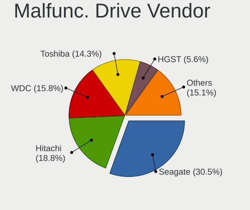

| Vendor              | Notebooks | Drives | Percent |
|---------------------|-----------|--------|---------|
| Seagate             | 1532      | 2013   | 30.54%  |
| Hitachi             | 941       | 1235   | 18.76%  |
| WDC                 | 794       | 1053   | 15.83%  |
| Toshiba             | 715       | 945    | 14.25%  |
| HGST                | 279       | 410    | 5.56%   |
| Samsung Electronics | 206       | 255    | 4.11%   |
| Fujitsu             | 117       | 149    | 2.33%   |
| Kingston            | 80        | 101    | 1.59%   |
| SanDisk             | 48        | 57     | 0.96%   |
| China               | 30        | 40     | 0.6%    |
| Intel               | 27        | 36     | 0.54%   |
| SPCC                | 22        | 23     | 0.44%   |
| OCZ                 | 21        | 32     | 0.42%   |
| A-DATA Technology   | 19        | 28     | 0.38%   |
| SK hynix            | 17        | 24     | 0.34%   |
| Crucial             | 15        | 18     | 0.3%    |
| KingSpec            | 14        | 23     | 0.28%   |
| Corsair             | 12        | 12     | 0.24%   |
| IBM/Hitachi         | 11        | 11     | 0.22%   |
| Plextor             | 9         | 10     | 0.18%   |
| LITEONIT            | 9         | 14     | 0.18%   |
| Kingmax             | 7         | 8      | 0.14%   |
| AMD                 | 7         | 9      | 0.14%   |
| Transcend           | 6         | 8      | 0.12%   |
| Micron Technology   | 6         | 11     | 0.12%   |
| Patriot             | 5         | 5      | 0.1%    |
| Netac               | 5         | 7      | 0.1%    |
| SSSTC               | 3         | 4      | 0.06%   |
| Mushkin             | 3         | 3      | 0.06%   |
| KingDian            | 3         | 4      | 0.06%   |
| Apple               | 3         | 3      | 0.06%   |
| Unknown             | 3         | 4      | 0.06%   |
| Team                | 2         | 3      | 0.04%   |
| Smartbuy            | 2         | 2      | 0.04%   |
| Qumo                | 2         | 2      | 0.04%   |
| PNY                 | 2         | 5      | 0.04%   |
| OCZ-VERTEX3         | 2         | 3      | 0.04%   |
| Neo                 | 2         | 7      | 0.04%   |
| LITEON              | 2         | 2      | 0.04%   |
| KingFast            | 2         | 2      | 0.04%   |

Malfunc. HDD Vendor
-------------------

Vendors of faulty HDD drives

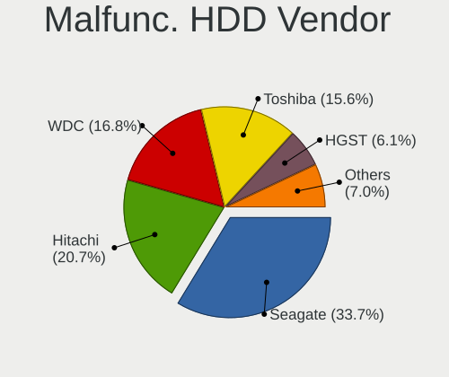

| Vendor              | Notebooks | Drives | Percent |
|---------------------|-----------|--------|---------|
| Seagate             | 1532      | 2013   | 33.71%  |
| Hitachi             | 941       | 1235   | 20.71%  |
| WDC                 | 765       | 1020   | 16.84%  |
| Toshiba             | 708       | 938    | 15.58%  |
| HGST                | 279       | 410    | 6.14%   |
| Samsung Electronics | 187       | 234    | 4.12%   |
| Fujitsu             | 117       | 149    | 2.57%   |
| IBM/Hitachi         | 11        | 11     | 0.24%   |
| MARSHAL             | 1         | 2      | 0.02%   |
| HGST HTS            | 1         | 1      | 0.02%   |
| External            | 1         | 1      | 0.02%   |
| Apple               | 1         | 1      | 0.02%   |

Malfunc. Drive Kind
-------------------

Kinds of faulty drives

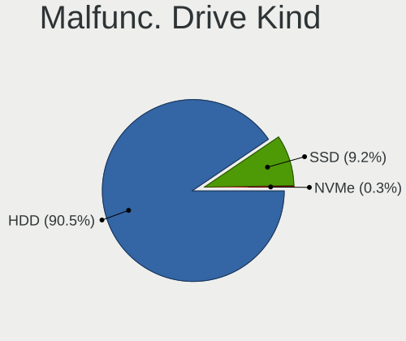

| Kind | Notebooks | Drives | Percent |
|------|-----------|--------|---------|
| HDD  | 4476      | 6015   | 90.53%  |
| SSD  | 454       | 587    | 9.18%   |
| NVMe | 14        | 16     | 0.28%   |

Failed Drives
-------------

Failed drive models

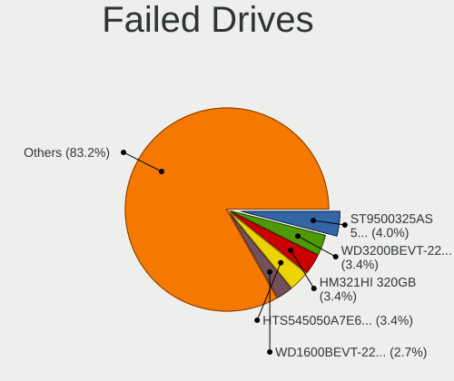

| Model                              | Notebooks | Drives | Percent |
|------------------------------------|-----------|--------|---------|
| Seagate ST9500325AS 500GB          | 6         | 8      | 4.03%   |
| WDC WD3200BEVT-22ZCT0 320GB        | 5         | 6      | 3.36%   |
| Samsung Electronics HM321HI 320GB  | 5         | 6      | 3.36%   |
| HGST HTS545050A7E680 500GB         | 5         | 5      | 3.36%   |
| WDC WD1600BEVT-22ZCT0 160GB        | 4         | 5      | 2.68%   |
| Seagate ST500LT012-1DG142 500GB    | 4         | 4      | 2.68%   |
| Seagate ST1000LM024 HN-M101MBB 1TB | 4         | 4      | 2.68%   |
| Samsung Electronics HM160HI 160GB  | 4         | 4      | 2.68%   |
| WDC WD3200BPVT-22JJ5T0 320GB       | 3         | 3      | 2.01%   |
| Toshiba MQ01ABD050 500GB           | 3         | 3      | 2.01%   |
| Toshiba MK6465GSX 640GB            | 3         | 5      | 2.01%   |
| Toshiba MK3265GSX 320GB            | 3         | 3      | 2.01%   |
| Seagate ST9320325AS 320GB          | 3         | 3      | 2.01%   |
| Hitachi HTS547550A9E384 500GB      | 3         | 3      | 2.01%   |
| HGST HTS721010A9E630 1TB           | 3         | 4      | 2.01%   |
| WDC WD1600BEVS-22RST0 160GB        | 2         | 2      | 1.34%   |
| Toshiba MK3259GSXP 320GB           | 2         | 2      | 1.34%   |
| Toshiba MK2565GSX 250GB            | 2         | 2      | 1.34%   |
| Seagate ST9250315AS 250GB          | 2         | 2      | 1.34%   |
| Seagate ST320LT020-9YG142 320GB    | 2         | 2      | 1.34%   |
| Hitachi HTS547575A9E384 752GB      | 2         | 2      | 1.34%   |
| Hitachi HTS545050A7E380 500GB      | 2         | 2      | 1.34%   |
| Hitachi HTS543232A7A384 320GB      | 2         | 2      | 1.34%   |
| Hitachi HTS543225A7A384 250GB      | 2         | 3      | 1.34%   |
| HGST HTS541010A9E680 1TB           | 2         | 2      | 1.34%   |
| WDC WD800BEVS-75RST0 80GB          | 1         | 2      | 0.67%   |
| WDC WD800BEVS-22RST0 80GB          | 1         | 1      | 0.67%   |
| WDC WD7500BPVT-22HXZT3 752GB       | 1         | 1      | 0.67%   |
| WDC WD7500BPVT-22HXZT1 752GB       | 1         | 1      | 0.67%   |
| WDC WD5000LPCX-24VHAT0 500GB       | 1         | 1      | 0.67%   |
| WDC WD5000BPVT-80HXZT3 500GB       | 1         | 1      | 0.67%   |
| WDC WD5000BPVT-80HXZT1 500GB       | 1         | 1      | 0.67%   |
| WDC WD5000BPVT-24HXZT3 500GB       | 1         | 1      | 0.67%   |
| WDC WD5000BPVT-00HXZT1 500GB       | 1         | 1      | 0.67%   |
| WDC WD5000BEVT-35ZAT0 500GB        | 1         | 1      | 0.67%   |
| WDC WD5000BEVT-26A0RT0 500GB       | 1         | 1      | 0.67%   |
| WDC WD5000BEVT-22A0RT0 500GB       | 1         | 1      | 0.67%   |
| WDC WD3200BPVT-80ZEST0 320GB       | 1         | 1      | 0.67%   |
| WDC WD3200BPVT-24JJ5T0 320GB       | 1         | 1      | 0.67%   |
| WDC WD3200BEVT-24A23T0 320GB       | 1         | 1      | 0.67%   |

Failed Drive Vendor
-------------------

Failed drive vendors

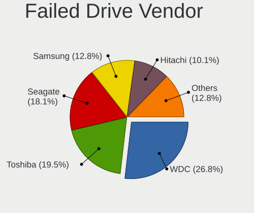

| Vendor              | Notebooks | Drives | Percent |
|---------------------|-----------|--------|---------|
| WDC                 | 40        | 43     | 26.85%  |
| Toshiba             | 29        | 35     | 19.46%  |
| Seagate             | 27        | 31     | 18.12%  |
| Samsung Electronics | 19        | 20     | 12.75%  |
| Hitachi             | 15        | 16     | 10.07%  |
| HGST                | 12        | 14     | 8.05%   |
| Fujitsu             | 2         | 2      | 1.34%   |
| SK hynix            | 1         | 1      | 0.67%   |
| SanDisk             | 1         | 2      | 0.67%   |
| Maxtor              | 1         | 1      | 0.67%   |
| DEXP                | 1         | 1      | 0.67%   |
| Apple               | 1         | 2      | 0.67%   |

Drive Status
------------

Number of failed and malfunc. drives

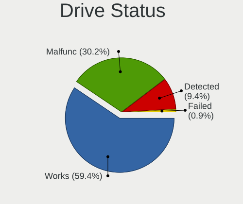

| Status   | Notebooks | Drives | Percent |
|----------|-----------|--------|---------|
| Works    | 9621      | 14943  | 59.45%  |
| Malfunc  | 4886      | 6618   | 30.19%  |
| Detected | 1528      | 2125   | 9.44%   |
| Failed   | 149       | 168    | 0.92%   |

Storage controller
------------------

Storage Vendor
--------------

Storage controller vendors

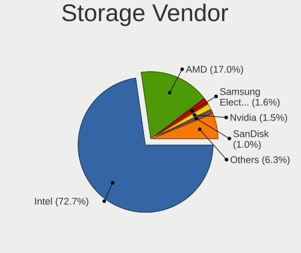

| Vendor                                  | Notebooks | Percent |
|-----------------------------------------|-----------|---------|
| Intel                                   | 10806     | 72.72%  |
| AMD                                     | 2521      | 16.97%  |
| Samsung Electronics                     | 235       | 1.58%   |
| Nvidia                                  | 216       | 1.45%   |
| SanDisk                                 | 152       | 1.02%   |
| Silicon Integrated Systems [SiS]        | 123       | 0.83%   |
| SK hynix                                | 99        | 0.67%   |
| Micron Technology                       | 76        | 0.51%   |
| Phison Electronics                      | 65        | 0.44%   |
| Kingston Technology Company             | 60        | 0.4%    |
| ADATA Technology                        | 59        | 0.4%    |
| INNOGRIT                                | 58        | 0.39%   |
| Silicon Motion                          | 57        | 0.38%   |
| KIOXIA                                  | 53        | 0.36%   |
| JMicron Technology                      | 48        | 0.32%   |
| MAXIO Technology (Hangzhou)             | 31        | 0.21%   |
| VIA Technologies                        | 27        | 0.18%   |
| Realtek Semiconductor                   | 24        | 0.16%   |
| Shenzhen Longsys Electronics            | 23        | 0.15%   |
| Union Memory (Shenzhen)                 | 17        | 0.11%   |
| Solid State Storage Technology          | 17        | 0.11%   |
| Toshiba America Info Systems            | 16        | 0.11%   |
| Shenzhen Shichuangyi Electronics        | 15        | 0.1%    |
| Yangtze Memory Technologies             | 8         | 0.05%   |
| Unknown                                 | 8         | 0.05%   |
| Netac Technology                        | 6         | 0.04%   |
| Micron/Crucial Technology               | 5         | 0.03%   |
| Hosin Global Electronics                | 5         | 0.03%   |
| Silicon Image                           | 4         | 0.03%   |
| Marvell Technology Group                | 4         | 0.03%   |
| Shenzhen Unionmemory Information System | 3         | 0.02%   |
| Biwin Storage Technology                | 3         | 0.02%   |
| Apple                                   | 3         | 0.02%   |
| ULi Electronics                         | 2         | 0.01%   |
| Lenovo                                  | 2         | 0.01%   |
| Zhaoxin                                 | 1         | 0.01%   |
| YEESTOR Microelectronics                | 1         | 0.01%   |
| Transcend                               | 1         | 0.01%   |
| Solidigm                                | 1         | 0.01%   |
| Seagate Technology                      | 1         | 0.01%   |

Storage Model
-------------

Storage controller models

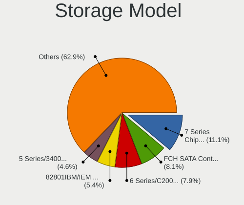

| Model                                                                                  | Notebooks | Percent |
|----------------------------------------------------------------------------------------|-----------|---------|
| Intel 7 Series Chipset Family 6-port SATA Controller [AHCI mode]                       | 1879      | 11.08%  |
| AMD FCH SATA Controller [AHCI mode]                                                    | 1368      | 8.07%   |
| Intel 6 Series/C200 Series Chipset Family 6 port Mobile SATA AHCI Controller           | 1345      | 7.93%   |
| Intel 82801IBM/IEM (ICH9M/ICH9M-E) 4 port SATA Controller [AHCI mode]                  | 916       | 5.4%    |
| Intel 5 Series/3400 Series Chipset 4 port SATA AHCI Controller                         | 788       | 4.65%   |
| AMD SB7x0/SB8x0/SB9x0 SATA Controller [AHCI mode]                                      | 740       | 4.37%   |
| Intel 82801HM/HEM (ICH8M/ICH8M-E) IDE Controller                                       | 672       | 3.96%   |
| Intel NM10/ICH7 Family SATA Controller [AHCI mode]                                     | 645       | 3.8%    |
| Intel 82801HM/HEM (ICH8M/ICH8M-E) SATA Controller [AHCI mode]                          | 538       | 3.17%   |
| Intel 8 Series SATA Controller 1 [AHCI mode]                                           | 471       | 2.78%   |
| Intel Sunrise Point-LP SATA Controller [AHCI mode]                                     | 424       | 2.5%    |
| Intel Atom Processor E3800 Series SATA AHCI Controller                                 | 362       | 2.14%   |
| Intel 82801GBM/GHM (ICH7-M Family) SATA Controller [IDE mode]                          | 346       | 2.04%   |
| Intel 8 Series/C220 Series Chipset Family 6-port SATA Controller 1 [AHCI mode]         | 337       | 1.99%   |
| Intel 82801 Mobile SATA Controller [RAID mode]                                         | 271       | 1.6%    |
| Intel Atom/Celeron/Pentium Processor x5-E8000/J3xxx/N3xxx Series SATA Controller       | 239       | 1.41%   |
| Intel Wildcat Point-LP SATA Controller [AHCI Mode]                                     | 229       | 1.35%   |
| Intel 82801G (ICH7 Family) IDE Controller                                              | 219       | 1.29%   |
| Intel 82801HM/HEM (ICH8M/ICH8M-E) SATA Controller [IDE mode]                           | 209       | 1.23%   |
| AMD SB600 Non-Raid-5 SATA                                                              | 199       | 1.17%   |
| AMD SB600 IDE                                                                          | 196       | 1.16%   |
| Intel 5 Series/3400 Series Chipset 6 port SATA AHCI Controller                         | 190       | 1.12%   |
| AMD SB7x0/SB8x0/SB9x0 IDE Controller                                                   | 185       | 1.09%   |
| Intel 82801GBM/GHM (ICH7-M Family) SATA Controller [AHCI mode]                         | 175       | 1.03%   |
| Intel Tiger Lake-LP SATA Controller                                                    | 138       | 0.81%   |
| Intel 7 Series Chipset Family 4-port SATA Controller [IDE mode]                        | 128       | 0.76%   |
| Intel 7 Series Chipset Family 2-port SATA Controller [IDE mode]                        | 127       | 0.75%   |
| Intel Celeron/Pentium Silver Processor SATA Controller                                 | 120       | 0.71%   |
| Silicon Integrated Systems [SiS] SATA Controller / IDE mode                            | 116       | 0.68%   |
| Intel 82801IBM/IEM (ICH9M/ICH9M-E) 2 port SATA Controller [IDE mode]                   | 116       | 0.68%   |
| Silicon Integrated Systems [SiS] 5513 IDE Controller                                   | 104       | 0.61%   |
| Intel NM10/ICH7 Family SATA Controller [IDE mode]                                      | 87        | 0.51%   |
| Intel Celeron N3350/Pentium N4200/Atom E3900 Series SATA AHCI Controller               | 86        | 0.51%   |
| AMD SB7x0/SB8x0/SB9x0 SATA Controller [IDE mode]                                       | 86        | 0.51%   |
| Nvidia MCP79 AHCI Controller                                                           | 84        | 0.5%    |
| AMD IXP SB4x0 IDE Controller                                                           | 84        | 0.5%    |
| AMD FCH IDE Controller                                                                 | 83        | 0.49%   |
| Samsung NVMe SSD Controller 980 (DRAM-less)                                            | 82        | 0.48%   |
| Intel 82801FB/FBM/FR/FW/FRW (ICH6 Family) IDE Controller                               | 78        | 0.46%   |
| Intel 6 Series/C200 Series Chipset Family Mobile SATA Controller (IDE mode, ports 4-5) | 75        | 0.44%   |

Storage Kind
------------

Kind of storage controller (IDE, SATA, NVMe, SAS, ...)

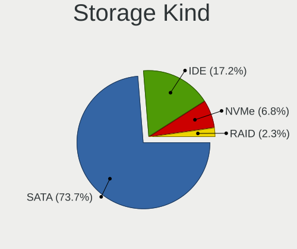

| Kind | Notebooks | Percent |
|------|-----------|---------|
| SATA | 11854     | 73.71%  |
| IDE  | 2772      | 17.24%  |
| NVMe | 1093      | 6.8%    |
| RAID | 362       | 2.25%   |

Processor
---------

CPU Vendor
----------

Processor vendors

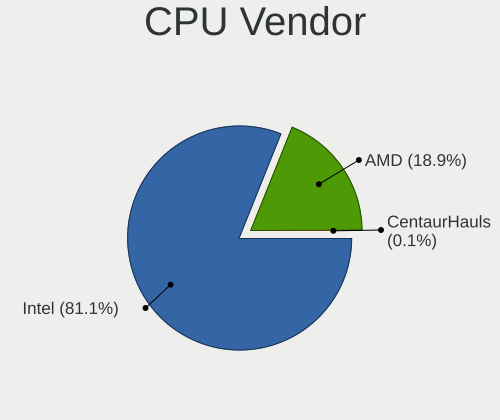

| Vendor       | Notebooks | Percent |
|--------------|-----------|---------|
| Intel        | 11539     | 81.07%  |
| AMD          | 2685      | 18.86%  |
| CentaurHauls | 9         | 0.06%   |

CPU Model
---------

Processor models

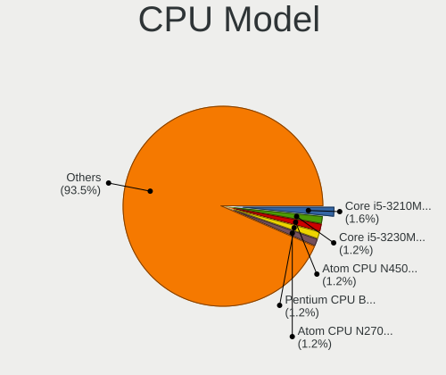

| Model                                       | Notebooks | Percent |
|---------------------------------------------|-----------|---------|
| Intel Core i5-3210M CPU @ 2.50GHz           | 225       | 1.57%   |
| Intel Core i5-3230M CPU @ 2.60GHz           | 178       | 1.25%   |
| Intel Atom CPU N450 @ 1.66GHz               | 178       | 1.25%   |
| Intel Pentium CPU B960 @ 2.20GHz            | 176       | 1.23%   |
| Intel Atom CPU N270 @ 1.60GHz               | 171       | 1.2%    |
| Intel Core i3-2350M CPU @ 2.30GHz           | 165       | 1.15%   |
| Intel Core i5-2450M CPU @ 2.50GHz           | 163       | 1.14%   |
| Intel Core i5-2410M CPU @ 2.30GHz           | 162       | 1.13%   |
| Intel Celeron CPU N2840 @ 2.16GHz           | 150       | 1.05%   |
| AMD E-450 APU with Radeon HD Graphics       | 148       | 1.04%   |
| Intel Core i3-2310M CPU @ 2.10GHz           | 142       | 0.99%   |
| Intel Core i3-3110M CPU @ 2.40GHz           | 140       | 0.98%   |
| Intel Core i3 CPU M 370 @ 2.40GHz           | 139       | 0.97%   |
| Intel Atom CPU N2600 @ 1.60GHz              | 139       | 0.97%   |
| Intel Core i5-2430M CPU @ 2.40GHz           | 138       | 0.97%   |
| Intel Core i3 CPU M 380 @ 2.53GHz           | 137       | 0.96%   |
| Intel Atom CPU N455 @ 1.66GHz               | 129       | 0.9%    |
| Intel Pentium CPU 2020M @ 2.40GHz           | 116       | 0.81%   |
| Intel Core i5-4210U CPU @ 1.70GHz           | 113       | 0.79%   |
| Intel 11th Gen Core i5-1135G7 @ 2.40GHz     | 112       | 0.78%   |
| Intel Atom CPU N570 @ 1.66GHz               | 109       | 0.76%   |
| Intel Pentium Dual-Core CPU T4500 @ 2.30GHz | 102       | 0.71%   |
| Intel Core i3-2330M CPU @ 2.20GHz           | 95        | 0.66%   |
| AMD A10-4600M APU with Radeon HD Graphics   | 93        | 0.65%   |
| Intel Pentium Dual-Core CPU T4300 @ 2.10GHz | 91        | 0.64%   |
| Intel Core i3 CPU M 350 @ 2.27GHz           | 89        | 0.62%   |
| Intel Core i7-3630QM CPU @ 2.40GHz          | 86        | 0.6%    |
| Intel Core i7-2670QM CPU @ 2.20GHz          | 85        | 0.59%   |
| Intel Pentium CPU P6200 @ 2.13GHz           | 84        | 0.59%   |
| Intel Core i3-3217U CPU @ 1.80GHz           | 83        | 0.58%   |
| Intel Core i3-5005U CPU @ 2.00GHz           | 82        | 0.57%   |
| Intel Pentium Dual-Core CPU T4400 @ 2.20GHz | 81        | 0.57%   |
| Intel Core i3-3120M CPU @ 2.50GHz           | 81        | 0.57%   |
| Intel Celeron CPU N3060 @ 1.60GHz           | 80        | 0.56%   |
| Intel Core i5-7200U CPU @ 2.50GHz           | 78        | 0.55%   |
| Intel Core i5-2520M CPU @ 2.50GHz           | 78        | 0.55%   |
| Intel Core i5-3337U CPU @ 1.80GHz           | 76        | 0.53%   |
| Intel Core i5 CPU M 460 @ 2.53GHz           | 76        | 0.53%   |
| Intel Celeron CPU N3050 @ 1.60GHz           | 76        | 0.53%   |
| Intel Pentium Dual-Core CPU T4200 @ 2.00GHz | 73        | 0.51%   |

CPU Model Family
----------------

Processor model prefix

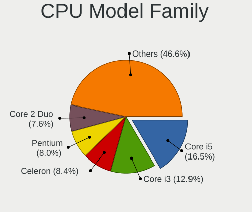

| Model                          | Notebooks | Percent |
|--------------------------------|-----------|---------|
| Intel Core i5                  | 2360      | 16.53%  |
| Intel Core i3                  | 1837      | 12.87%  |
| Intel Celeron                  | 1204      | 8.43%   |
| Intel Pentium                  | 1139      | 7.98%   |
| Intel Core 2 Duo               | 1079      | 7.56%   |
| Intel Atom                     | 1069      | 7.49%   |
| Intel Core i7                  | 1005      | 7.04%   |
| Other                          | 427       | 2.99%   |
| Intel Pentium Dual-Core        | 346       | 2.42%   |
| AMD A6                         | 285       | 2%      |
| AMD E                          | 260       | 1.82%   |
| Intel Genuine                  | 210       | 1.47%   |
| AMD A4                         | 209       | 1.46%   |
| AMD A8                         | 205       | 1.44%   |
| Intel Core 2                   | 187       | 1.31%   |
| AMD Ryzen 5                    | 186       | 1.3%    |
| Intel Pentium Dual             | 185       | 1.3%    |
| AMD E1                         | 178       | 1.25%   |
| AMD A10                        | 172       | 1.2%    |
| Intel Celeron M                | 146       | 1.02%   |
| Intel Celeron Dual-Core        | 127       | 0.89%   |
| AMD Turion 64 X2 Mobile        | 124       | 0.87%   |
| AMD E2                         | 107       | 0.75%   |
| AMD Phenom II                  | 106       | 0.74%   |
| Intel Pentium M                | 105       | 0.74%   |
| AMD Ryzen 7                    | 99        | 0.69%   |
| AMD Athlon II                  | 95        | 0.67%   |
| AMD Ryzen 3                    | 63        | 0.44%   |
| AMD C-60                       | 62        | 0.43%   |
| AMD Athlon X2                  | 55        | 0.39%   |
| Intel Core Duo                 | 52        | 0.36%   |
| Intel Pentium Silver           | 43        | 0.3%    |
| AMD Athlon 64 X2               | 43        | 0.3%    |
| AMD Athlon                     | 40        | 0.28%   |
| AMD C-50                       | 38        | 0.27%   |
| AMD Turion X2 Dual-Core Mobile | 37        | 0.26%   |
| Intel Celeron D                | 32        | 0.22%   |
| AMD Turion II Dual-Core        | 29        | 0.2%    |
| AMD Turion II                  | 29        | 0.2%    |
| AMD Athlon II Dual-Core        | 28        | 0.2%    |

CPU Cores
---------

Number of processor cores

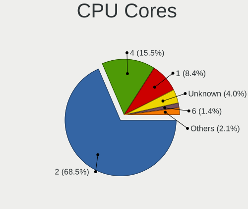

| Number  | Notebooks | Percent |
|---------|-----------|---------|
| 2       | 9872      | 68.55%  |
| 4       | 2239      | 15.55%  |
| 1       | 1216      | 8.44%   |
| Unknown | 578       | 4.01%   |
| 6       | 197       | 1.37%   |
| 8       | 134       | 0.93%   |
| 10      | 75        | 0.52%   |
| 3       | 39        | 0.27%   |
| 14      | 19        | 0.13%   |
| 12      | 17        | 0.12%   |
| 16      | 7         | 0.05%   |
| 24      | 6         | 0.04%   |
| 192     | 2         | 0.01%   |
| 20      | 1         | 0.01%   |

CPU Sockets
-----------

Number of sockets

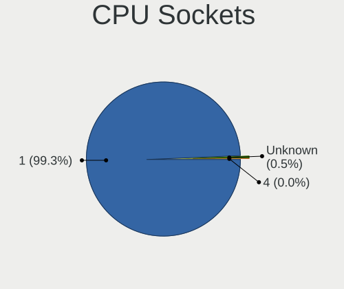

| Number  | Notebooks | Percent |
|---------|-----------|---------|
| 1       | 14169     | 99.34%  |
| Unknown | 74        | 0.52%   |
| 2       | 14        | 0.1%    |
| 4       | 6         | 0.04%   |

CPU Threads
-----------

Threads per core (Hyper-Threading)

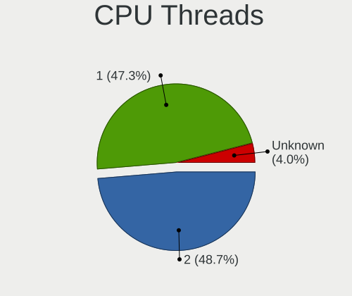

| Number  | Notebooks | Percent |
|---------|-----------|---------|
| 2       | 7028      | 48.68%  |
| 1       | 6832      | 47.32%  |
| Unknown | 578       | 4%      |

CPU Op-Modes
------------

CPU Operation Modes (32-bit, 64-bit)

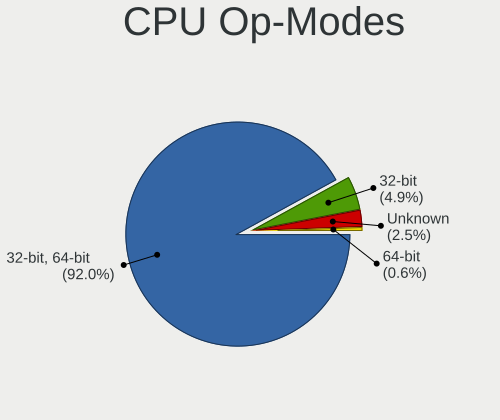

| Op mode        | Notebooks | Percent |
|----------------|-----------|---------|
| 32-bit, 64-bit | 13232     | 92.02%  |
| 32-bit         | 709       | 4.93%   |
| Unknown        | 357       | 2.48%   |
| 64-bit         | 82        | 0.57%   |

CPU Microcode
-------------

Microcode number

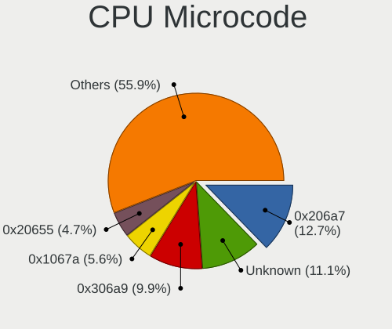

| Number     | Notebooks | Percent |
|------------|-----------|---------|
| 0x206a7    | 1866      | 12.74%  |
| Unknown    | 1627      | 11.11%  |
| 0x306a9    | 1447      | 9.88%   |
| 0x1067a    | 823       | 5.62%   |
| 0x20655    | 691       | 4.72%   |
| 0x6fd      | 599       | 4.09%   |
| 0x106ca    | 490       | 3.35%   |
| 0x40651    | 453       | 3.09%   |
| 0x30678    | 385       | 2.63%   |
| 0x306c3    | 344       | 2.35%   |
| 0x10676    | 266       | 1.82%   |
| 0x20652    | 240       | 1.64%   |
| 0x05000119 | 224       | 1.53%   |
| 0x106c2    | 222       | 1.52%   |
| 0x010000c8 | 219       | 1.5%    |
| 0x306d4    | 215       | 1.47%   |
| 0x30661    | 214       | 1.46%   |
| 0x06001119 | 214       | 1.46%   |
| 0x406e3    | 184       | 1.26%   |
| 0x10661    | 175       | 1.19%   |
| 0x03000027 | 175       | 1.19%   |
| 0x07030105 | 173       | 1.18%   |
| 0x6f6      | 153       | 1.04%   |
| 0x406c4    | 150       | 1.02%   |
| 0x6e8      | 144       | 0.98%   |
| 0x406c3    | 141       | 0.96%   |
| 0x6d8      | 130       | 0.89%   |
| 0x806e9    | 123       | 0.84%   |
| 0x806ea    | 113       | 0.77%   |
| 0x806c1    | 111       | 0.76%   |
| 0x6ec      | 107       | 0.73%   |
| 0x0700010f | 87        | 0.59%   |
| 0x6fb      | 86        | 0.59%   |
| 0x05000101 | 86        | 0.59%   |
| 0x06006705 | 78        | 0.53%   |
| 0x906ea    | 76        | 0.52%   |
| 0x806ec    | 73        | 0.5%    |
| 0x506c9    | 71        | 0.48%   |
| 0x02000032 | 65        | 0.44%   |
| 0x05000029 | 63        | 0.43%   |

CPU Microarch
-------------

Microarchitecture

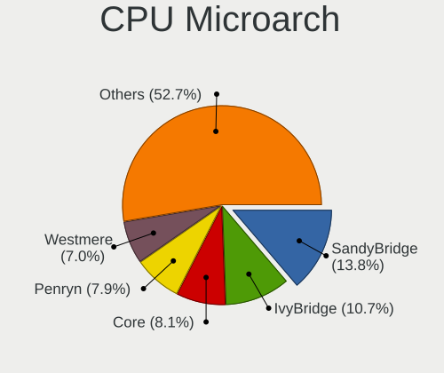

| Name              | Notebooks | Percent |
|-------------------|-----------|---------|
| SandyBridge       | 1965      | 13.76%  |
| IvyBridge         | 1522      | 10.66%  |
| Core              | 1152      | 8.07%   |
| Penryn            | 1125      | 7.88%   |
| Westmere          | 998       | 6.99%   |
| Bonnell           | 895       | 6.27%   |
| Haswell           | 852       | 5.97%   |
| Silvermont        | 764       | 5.35%   |
| KabyLake          | 552       | 3.87%   |
| Bobcat            | 449       | 3.14%   |
| P6                | 371       | 2.6%    |
| K10               | 344       | 2.41%   |
| Piledriver        | 296       | 2.07%   |
| Unknown           | 285       | 2%      |
| Broadwell         | 250       | 1.75%   |
| Skylake           | 247       | 1.73%   |
| K8 Hammer         | 247       | 1.73%   |
| K10 Llano         | 232       | 1.62%   |
| Puma              | 225       | 1.58%   |
| TigerLake         | 209       | 1.46%   |
| Excavator         | 168       | 1.18%   |
| Jaguar            | 156       | 1.09%   |
| Alderlake Hybrid  | 149       | 1.04%   |
| K8 & K10 hybrid   | 125       | 0.88%   |
| Goldmont plus     | 121       | 0.85%   |
| Zen+              | 106       | 0.74%   |
| Goldmont          | 86        | 0.6%    |
| Zen 3             | 80        | 0.56%   |
| Zen 2             | 67        | 0.47%   |
| Icelake           | 62        | 0.43%   |
| Nehalem           | 47        | 0.33%   |
| CometLake         | 34        | 0.24%   |
| Zen               | 29        | 0.2%    |
| Tremont           | 23        | 0.16%   |
| Steamroller       | 16        | 0.11%   |
| NetBurst          | 12        | 0.08%   |
| Gracemont         | 10        | 0.07%   |
| Meteorlake Hybrid | 9         | 0.06%   |
| Lunarlake Hybrid  | 2         | 0.01%   |

Graphics
--------

GPU Vendor
----------

Vendors of graphics cards

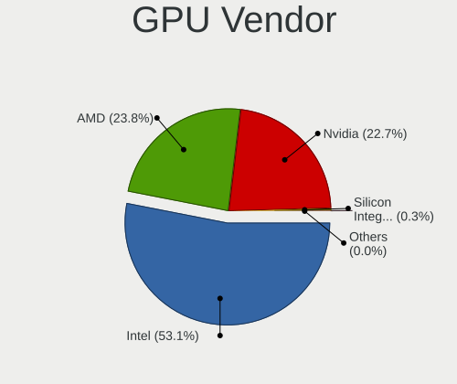

| Vendor                           | Notebooks | Percent |
|----------------------------------|-----------|---------|
| Intel                            | 9466      | 53.07%  |
| AMD                              | 4249      | 23.82%  |
| Nvidia                           | 4042      | 22.66%  |
| Silicon Integrated Systems [SiS] | 56        | 0.31%   |
| VIA Technologies                 | 21        | 0.12%   |
| Zhaoxin                          | 1         | 0.01%   |
| Trident Microsystems             | 1         | 0.01%   |
| ATI Technologies                 | 1         | 0.01%   |

GPU Model
---------

Graphics card models

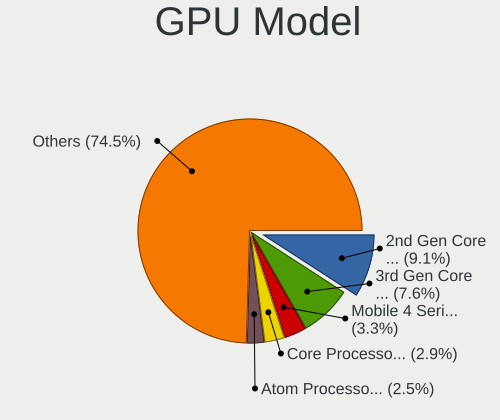

| Model                                                                                    | Notebooks | Percent |
|------------------------------------------------------------------------------------------|-----------|---------|
| Intel 2nd Generation Core Processor Family Integrated Graphics Controller                | 1775      | 9.15%   |
| Intel 3rd Gen Core processor Graphics Controller                                         | 1475      | 7.6%    |
| Intel Mobile 4 Series Chipset Integrated Graphics Controller                             | 631       | 3.25%   |
| Intel Core Processor Integrated Graphics Controller                                      | 569       | 2.93%   |
| Intel Atom Processor D4xx/D5xx/N4xx/N5xx Integrated Graphics Controller                  | 490       | 2.53%   |
| Intel Haswell-ULT Integrated Graphics Controller                                         | 480       | 2.47%   |
| Nvidia GF117M [GeForce 610M/710M/810M/820M / GT 620M/625M/630M/720M]                     | 462       | 2.38%   |
| Intel Atom Processor Z36xxx/Z37xxx Series Graphics & Display                             | 454       | 2.34%   |
| Intel Mobile 945GM/GMS/GME, 943/940GML Express Integrated Graphics Controller            | 417       | 2.15%   |
| Intel Mobile GM965/GL960 Integrated Graphics Controller (secondary)                      | 412       | 2.12%   |
| Intel Mobile GM965/GL960 Integrated Graphics Controller (primary)                        | 412       | 2.12%   |
| Intel 4th Gen Core Processor Integrated Graphics Controller                              | 343       | 1.77%   |
| Intel Atom/Celeron/Pentium Processor x5-E8000/J3xxx/N3xxx Integrated Graphics Controller | 310       | 1.6%    |
| AMD Seymour [Radeon HD 6400M/7400M Series]                                               | 301       | 1.55%   |
| AMD Thames [Radeon HD 7500M/7600M Series]                                                | 253       | 1.3%    |
| AMD Park [Mobility Radeon HD 5430/5450/5470]                                             | 245       | 1.26%   |
| Intel Mobile 945GM/GMS, 943/940GML Express Integrated Graphics Controller                | 237       | 1.22%   |
| Intel Atom Processor D2xxx/N2xxx Integrated Graphics Controller                          | 214       | 1.1%    |
| Intel Broadwell-U GT2 [HD Graphics 5500]                                                 | 200       | 1.03%   |
| Nvidia GF108M [GeForce GT 540M]                                                          | 195       | 1%      |
| AMD RS880M [Mobility Radeon HD 4225/4250]                                                | 187       | 0.96%   |
| Intel Mobile 945GSE Express Integrated Graphics Controller                               | 180       | 0.93%   |
| Nvidia GF108M [GeForce GT 620M/630M/635M/640M LE]                                        | 176       | 0.91%   |
| Intel Skylake-U GT2 [HD Graphics 520]                                                    | 170       | 0.88%   |
| AMD Sun XT [Radeon HD 8670A/8670M/8690M / R5 M330 / M430 / Radeon 520 Mobile]            | 160       | 0.82%   |
| Intel TigerLake-LP GT2 [Iris Xe Graphics]                                                | 155       | 0.8%    |
| AMD RV710/M92 [Mobility Radeon HD 4530/4570/5145/530v/540v/545v]                         | 152       | 0.78%   |
| Intel Kaby Lake-U GT2 [HD Graphics 620]                                                  | 147       | 0.76%   |
| AMD Stoney [Radeon R2/R3/R4/R5 Graphics]                                                 | 139       | 0.72%   |
| AMD Wrestler [Radeon HD 6320]                                                            | 133       | 0.69%   |
| Nvidia GT218M [GeForce 310M]                                                             | 129       | 0.66%   |
| Nvidia GM108M [GeForce 840M]                                                             | 128       | 0.66%   |
| AMD Whistler [Radeon HD 6630M/6650M/6750M/7670M/7690M]                                   | 125       | 0.64%   |
| AMD Mullins [Radeon R4/R5 Graphics]                                                      | 121       | 0.62%   |
| AMD Madison [Mobility Radeon HD 5650/5750 / 6530M/6550M]                                 | 117       | 0.6%    |
| Nvidia GF119M [GeForce 610M]                                                             | 114       | 0.59%   |
| AMD RV620/M82 [Mobility Radeon HD 3450/3470]                                             | 113       | 0.58%   |
| AMD Picasso/Raven 2 [Radeon Vega Series / Radeon Vega Mobile Series]                     | 111       | 0.57%   |
| AMD Wrestler [Radeon HD 6310]                                                            | 106       | 0.55%   |
| Nvidia GF119M [GeForce GT 520MX]                                                         | 105       | 0.54%   |

GPU Combo
---------

Combinations of graphics cards

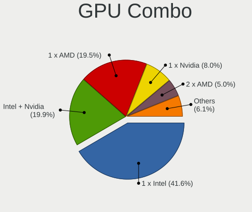

| Name                     | Notebooks | Percent |
|--------------------------|-----------|---------|
| 1 x Intel                | 5942      | 41.6%   |
| Intel + Nvidia           | 2839      | 19.88%  |
| 1 x AMD                  | 2785      | 19.5%   |
| 1 x Nvidia               | 1136      | 7.95%   |
| 2 x AMD                  | 716       | 5.01%   |
| Intel + AMD              | 689       | 4.82%   |
| AMD + Nvidia             | 69        | 0.48%   |
| 1 x SiS                  | 56        | 0.39%   |
| 1 x VIA                  | 21        | 0.15%   |
| Other                    | 12        | 0.08%   |
| 2 x Intel                | 12        | 0.08%   |
| 2 x Nvidia               | 4         | 0.03%   |
| 1 x Zhaoxin              | 1         | 0.01%   |
| 1 x Trident Microsystems | 1         | 0.01%   |
| Intel + 2 x Nvidia       | 1         | 0.01%   |

GPU Driver
----------

Free vs proprietary

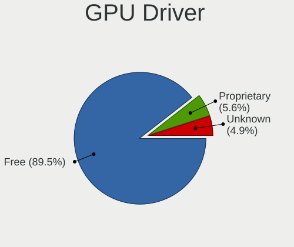

| Driver      | Notebooks | Percent |
|-------------|-----------|---------|
| Free        | 13138     | 89.45%  |
| Proprietary | 824       | 5.61%   |
| Unknown     | 725       | 4.94%   |

GPU Memory
----------

Total video memory

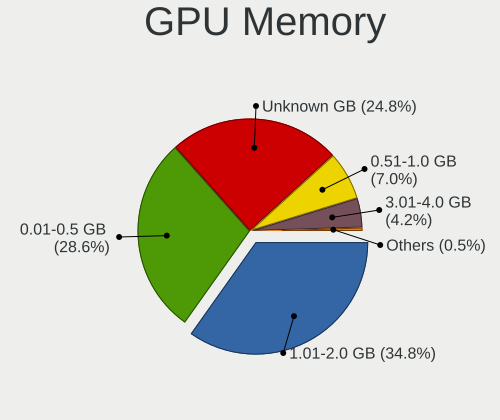

| Size in GB | Notebooks | Percent |
|------------|-----------|---------|
| 1.01-2.0   | 5203      | 34.83%  |
| 0.01-0.5   | 4270      | 28.58%  |
| Unknown    | 3711      | 24.84%  |
| 0.51-1.0   | 1049      | 7.02%   |
| 3.01-4.0   | 633       | 4.24%   |
| 5.01-6.0   | 33        | 0.22%   |
| 7.01-8.0   | 19        | 0.13%   |
| 2.01-3.0   | 18        | 0.12%   |
| 8.01-16.0  | 4         | 0.03%   |

Monitor
-------

Monitor Vendor
--------------

Monitor vendors

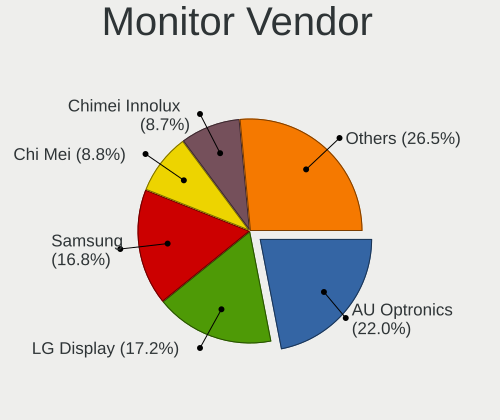

| Vendor                  | Notebooks | Percent |
|-------------------------|-----------|---------|
| AU Optronics            | 3151      | 21.95%  |
| LG Display              | 2472      | 17.22%  |
| Samsung Electronics     | 2415      | 16.82%  |
| Chi Mei Optoelectronics | 1265      | 8.81%   |
| Chimei Innolux          | 1250      | 8.71%   |
| BOE                     | 1053      | 7.34%   |
| LG Philips              | 456       | 3.18%   |
| Lenovo                  | 310       | 2.16%   |
| HannStar                | 294       | 2.05%   |
| CPT                     | 199       | 1.39%   |
| InfoVision              | 138       | 0.96%   |
| Apple                   | 128       | 0.89%   |
| Goldstar                | 112       | 0.78%   |
| Sony                    | 77        | 0.54%   |
| Dell                    | 77        | 0.54%   |
| PANDA                   | 70        | 0.49%   |
| Acer                    | 68        | 0.47%   |
| BenQ                    | 66        | 0.46%   |
| Sharp                   | 59        | 0.41%   |
| Philips                 | 57        | 0.4%    |
| InnoLux Display         | 57        | 0.4%    |
| Quanta Display          | 52        | 0.36%   |
| Hewlett-Packard         | 52        | 0.36%   |
| Toshiba                 | 37        | 0.26%   |
| Ancor Communications    | 33        | 0.23%   |
| ViewSonic               | 31        | 0.22%   |
| AOC                     | 31        | 0.22%   |
| HKC                     | 25        | 0.17%   |
| NEC Computers           | 20        | 0.14%   |
| CSO                     | 17        | 0.12%   |
| Nvidia                  | 16        | 0.11%   |
| Iiyama                  | 15        | 0.1%    |
| Panasonic               | 14        | 0.1%    |
| CSOT                    | 13        | 0.09%   |
| TMX                     | 12        | 0.08%   |
| MSI                     | 9         | 0.06%   |
| IBM                     | 9         | 0.06%   |
| Unknown                 | 8         | 0.06%   |
| ___                     | 7         | 0.05%   |
| SLD                     | 7         | 0.05%   |

Monitor Model
-------------

Monitor models

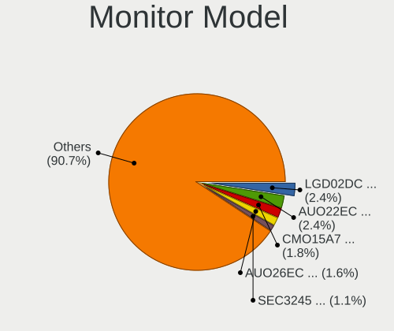

| Model                                                                     | Notebooks | Percent |
|---------------------------------------------------------------------------|-----------|---------|
| LG Display LCD Monitor LGD02DC 1366x768 344x194mm 15.5-inch               | 350       | 2.42%   |
| AU Optronics LCD Monitor AUO22EC 1366x768 344x193mm 15.5-inch             | 341       | 2.36%   |
| Chi Mei Optoelectronics LCD Monitor CMO15A7 1366x768 344x193mm 15.5-inch  | 261       | 1.81%   |
| AU Optronics LCD Monitor AUO26EC 1366x768 344x193mm 15.5-inch             | 228       | 1.58%   |
| Samsung Electronics LCD Monitor SEC3245 1366x768 340x190mm 15.3-inch      | 165       | 1.14%   |
| LG Display LCD Monitor LGD033A 1366x768 344x194mm 15.5-inch               | 154       | 1.07%   |
| Samsung Electronics LCD Monitor SEC5441 1280x800 331x207mm 15.4-inch      | 137       | 0.95%   |
| AU Optronics LCD Monitor AUO21EC 1366x768 344x193mm 15.5-inch             | 132       | 0.91%   |
| HannStar LCD Monitor HSD03E9 1024x600 220x129mm 10.0-inch                 | 127       | 0.88%   |
| AU Optronics LCD Monitor AUO8174 1280x800 331x207mm 15.4-inch             | 114       | 0.79%   |
| Samsung Electronics LCD Monitor SEC324A 1366x768 344x194mm 15.5-inch      | 111       | 0.77%   |
| AU Optronics LCD Monitor AUO20EC 1366x768 344x193mm 15.5-inch             | 111       | 0.77%   |
| AU Optronics LCD Monitor AUO61D2 1024x600 222x125mm 10.0-inch             | 107       | 0.74%   |
| Chi Mei Optoelectronics LCD Monitor CMO1592 1366x768 344x193mm 15.5-inch  | 103       | 0.71%   |
| Lenovo LCD Monitor LEN40B0 1366x768 344x194mm 15.5-inch                   | 101       | 0.7%    |
| LG Display LCD Monitor LGD038E 1366x768 344x194mm 15.5-inch               | 95        | 0.66%   |
| AU Optronics LCD Monitor AUO38ED 1920x1080 344x193mm 15.5-inch            | 89        | 0.62%   |
| Chimei Innolux LCD Monitor CMN15DB 1366x768 344x193mm 15.5-inch           | 82        | 0.57%   |
| AU Optronics LCD Monitor AUO45EC 1366x768 344x193mm 15.5-inch             | 82        | 0.57%   |
| Chi Mei Optoelectronics LCD Monitor CMO15A3 1366x768 344x193mm 15.5-inch  | 81        | 0.56%   |
| LG Display LCD Monitor LGD02F2 1366x768 344x194mm 15.5-inch               | 72        | 0.5%    |
| LG Display LCD Monitor LGD039F 1366x768 345x194mm 15.6-inch               | 68        | 0.47%   |
| Chimei Innolux LCD Monitor CMN1728 1600x900 382x215mm 17.3-inch           | 67        | 0.46%   |
| BOE LCD Monitor BOE06A5 1366x768 344x194mm 15.5-inch                      | 66        | 0.46%   |
| AU Optronics LCD Monitor AUO139E 1600x900 382x214mm 17.2-inch             | 66        | 0.46%   |
| InfoVision LCD Monitor IVO03F4 1920x1080 309x173mm 13.9-inch              | 65        | 0.45%   |
| AU Optronics LCD Monitor AUO46EC 1366x768 344x193mm 15.5-inch             | 64        | 0.44%   |
| Chi Mei Optoelectronics LCD Monitor CMO1720 1920x1080 382x215mm 17.3-inch | 63        | 0.44%   |
| LG Display LP156WH2-TLAA LGD0230 1366x768 344x194mm 15.5-inch             | 62        | 0.43%   |
| HannStar HSD121PHW1 HSD04B6 1366x768 270x150mm 12.2-inch                  | 62        | 0.43%   |
| Chimei Innolux LCD Monitor CMN15C9 1366x768 344x193mm 15.5-inch           | 62        | 0.43%   |
| LG Display LCD Monitor LGD02AC 1366x768 344x194mm 15.5-inch               | 61        | 0.42%   |
| Samsung Electronics LCD Monitor SEC3945 1280x800 331x207mm 15.4-inch      | 60        | 0.41%   |
| AU Optronics LCD Monitor AUO2174 1280x800 331x207mm 15.4-inch             | 60        | 0.41%   |
| LG Display LCD Monitor LGD0250 1366x768 345x194mm 15.6-inch               | 59        | 0.41%   |
| Samsung Electronics LCD Monitor SEC4252 1366x768 344x194mm 15.5-inch      | 58        | 0.4%    |
| Samsung Electronics LCD Monitor SEC544B 1600x900 382x214mm 17.2-inch      | 55        | 0.38%   |
| Chi Mei Optoelectronics LCD Monitor CMO15A2 1366x768 344x193mm 15.5-inch  | 55        | 0.38%   |
| LG Display LCD Monitor LGD01E8 1366x768 344x194mm 15.5-inch               | 54        | 0.37%   |
| Chimei Innolux LCD Monitor CMN15BE 1366x768 344x193mm 15.5-inch           | 54        | 0.37%   |

Monitor Resolution
------------------

Monitor screen resolution

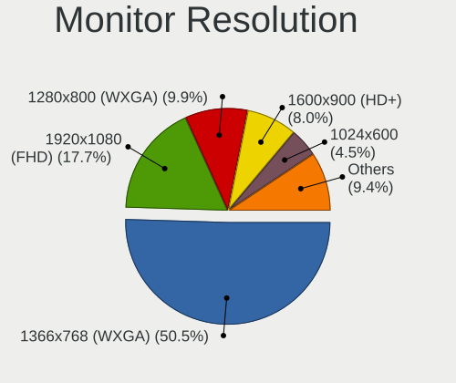

| Resolution         | Notebooks | Percent |
|--------------------|-----------|---------|
| 1366x768 (WXGA)    | 7158      | 50.48%  |
| 1920x1080 (FHD)    | 2514      | 17.73%  |
| 1280x800 (WXGA)    | 1405      | 9.91%   |
| 1600x900 (HD+)     | 1137      | 8.02%   |
| 1024x600           | 641       | 4.52%   |
| 1440x900 (WXGA+)   | 318       | 2.24%   |
| 1920x1200 (WUXGA)  | 191       | 1.35%   |
| 1280x1024 (SXGA)   | 156       | 1.1%    |
| 3840x2160 (4K)     | 118       | 0.83%   |
| 1680x1050 (WSXGA+) | 117       | 0.83%   |
| 2560x1440 (QHD)    | 76        | 0.54%   |
| 1024x768 (XGA)     | 69        | 0.49%   |
| 2560x1600          | 63        | 0.44%   |
| 1360x768           | 25        | 0.18%   |
| 1680x945           | 22        | 0.16%   |
| 1280x720 (HD)      | 22        | 0.16%   |
| 1400x1050          | 20        | 0.14%   |
| 2288x1287          | 19        | 0.13%   |
| 1600x1200          | 13        | 0.09%   |
| 1920x540           | 12        | 0.08%   |
| 2880x1800          | 11        | 0.08%   |
| 2160x1440          | 11        | 0.08%   |
| 1024x576           | 8         | 0.06%   |
| 2520x1680          | 5         | 0.04%   |
| 1280x768           | 5         | 0.04%   |
| 3200x1800 (QHD+)   | 4         | 0.03%   |
| 3840x1600          | 3         | 0.02%   |
| 3200x2000          | 3         | 0.02%   |
| 3000x2000          | 3         | 0.02%   |
| 2560x1080          | 3         | 0.02%   |
| 2240x1400          | 3         | 0.02%   |
| 1152x864           | 3         | 0.02%   |
| 3440x1440          | 2         | 0.01%   |
| 2880x1920          | 2         | 0.01%   |
| 2880x1620          | 2         | 0.01%   |
| 2736x1824          | 2         | 0.01%   |
| 2048x1536          | 2         | 0.01%   |
| 2048x1152          | 2         | 0.01%   |
| Unknown            | 2         | 0.01%   |
| 4093x4093          | 1         | 0.01%   |

Monitor Diagonal
----------------

Diagonal size in inches

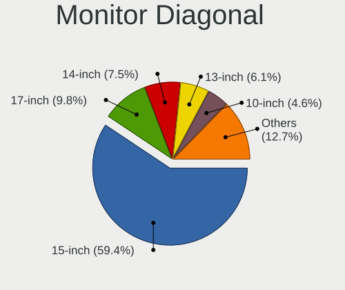

| Inches  | Notebooks | Percent |
|---------|-----------|---------|
| 15      | 8515      | 59.36%  |
| 17      | 1408      | 9.82%   |
| 14      | 1073      | 7.48%   |
| 13      | 878       | 6.12%   |
| 10      | 655       | 4.57%   |
| 11      | 351       | 2.45%   |
| 12      | 275       | 1.92%   |
| 23      | 134       | 0.93%   |
| 18      | 131       | 0.91%   |
| 21      | 130       | 0.91%   |
| 16      | 118       | 0.82%   |
| 27      | 117       | 0.82%   |
| 24      | 111       | 0.77%   |
| 19      | 92        | 0.64%   |
| 31      | 44        | 0.31%   |
| Unknown | 43        | 0.3%    |
| 20      | 39        | 0.27%   |
| 8       | 38        | 0.26%   |
| 22      | 28        | 0.2%    |
| 72      | 18        | 0.13%   |
| 54      | 16        | 0.11%   |
| 40      | 15        | 0.1%    |
| 32      | 13        | 0.09%   |
| 52      | 12        | 0.08%   |
| 84      | 10        | 0.07%   |
| 46      | 8         | 0.06%   |
| 25      | 8         | 0.06%   |
| 34      | 7         | 0.05%   |
| 37      | 6         | 0.04%   |
| 48      | 5         | 0.03%   |
| 42      | 5         | 0.03%   |
| 26      | 5         | 0.03%   |
| 9       | 5         | 0.03%   |
| 55      | 4         | 0.03%   |
| 28      | 4         | 0.03%   |
| 142     | 3         | 0.02%   |
| 86      | 3         | 0.02%   |
| 29      | 3         | 0.02%   |
| 57      | 2         | 0.01%   |
| 50      | 2         | 0.01%   |

Monitor Width
-------------

Physical width

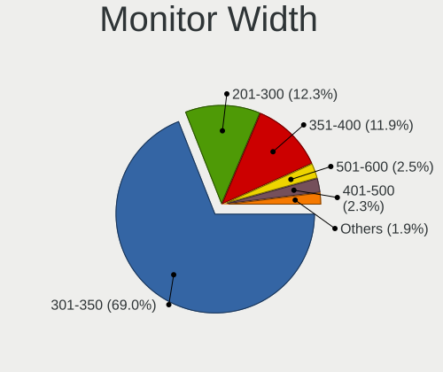

| Width in mm    | Notebooks | Percent |
|----------------|-----------|---------|
| 301-350        | 9849      | 69.04%  |
| 201-300        | 1757      | 12.32%  |
| 351-400        | 1693      | 11.87%  |
| 501-600        | 354       | 2.48%   |
| 401-500        | 335       | 2.35%   |
| 601-700        | 55        | 0.39%   |
| 1001-1500      | 55        | 0.39%   |
| Unknown        | 43        | 0.3%    |
| 101-200        | 40        | 0.28%   |
| 1501-2000      | 30        | 0.21%   |
| 701-800        | 22        | 0.15%   |
| 801-900        | 21        | 0.15%   |
| 901-1000       | 8         | 0.06%   |
| More than 2000 | 4         | 0.03%   |

Aspect Ratio
------------

Proportional relationship between the width and the height

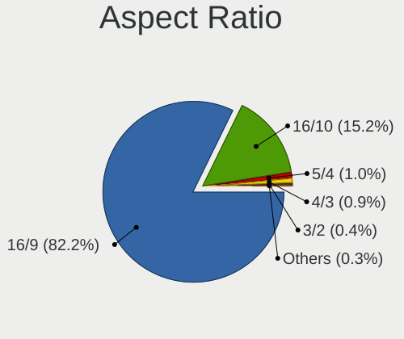

| Ratio   | Notebooks | Percent |
|---------|-----------|---------|
| 16/9    | 11362     | 82.24%  |
| 16/10   | 2105      | 15.24%  |
| 5/4     | 141       | 1.02%   |
| 4/3     | 124       | 0.9%    |
| 3/2     | 49        | 0.35%   |
| 21/9    | 9         | 0.07%   |
| 6/5     | 7         | 0.05%   |
| Unknown | 7         | 0.05%   |
| 32/9    | 4         | 0.03%   |
| 1.00    | 3         | 0.02%   |
| 0.56    | 3         | 0.02%   |
| 2.21    | 1         | 0.01%   |
| 1.96    | 1         | 0.01%   |

Monitor Area
------------

Area in inch²

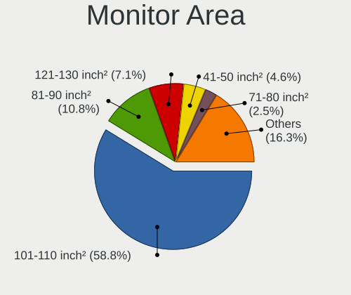

| Area in inch² | Notebooks | Percent |
|----------------|-----------|---------|
| 101-110        | 8432      | 58.76%  |
| 81-90          | 1549      | 10.79%  |
| 121-130        | 1022      | 7.12%   |
| 41-50          | 658       | 4.59%   |
| 71-80          | 354       | 2.47%   |
| 51-60          | 351       | 2.45%   |
| 131-140        | 346       | 2.41%   |
| 201-250        | 339       | 2.36%   |
| 61-70          | 269       | 1.87%   |
| 141-150        | 192       | 1.34%   |
| 151-200        | 174       | 1.21%   |
| 91-100         | 148       | 1.03%   |
| 301-350        | 118       | 0.82%   |
| 111-120        | 88        | 0.61%   |
| More than 1000 | 79        | 0.55%   |
| 351-500        | 71        | 0.49%   |
| Unknown        | 43        | 0.3%    |
| 1-40           | 40        | 0.28%   |
| 501-1000       | 40        | 0.28%   |
| 251-300        | 38        | 0.26%   |

Pixel Density
-------------

Pixels per inch

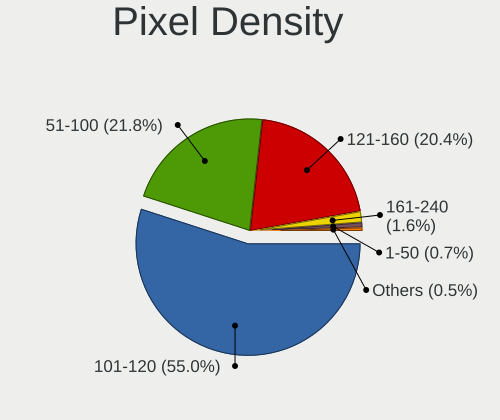

| Density       | Notebooks | Percent |
|---------------|-----------|---------|
| 101-120       | 7807      | 54.99%  |
| 51-100        | 3092      | 21.78%  |
| 121-160       | 2897      | 20.41%  |
| 161-240       | 226       | 1.59%   |
| 1-50          | 102       | 0.72%   |
| Unknown       | 43        | 0.3%    |
| More than 240 | 30        | 0.21%   |

Multiple Monitors
-----------------

Total monitors connected

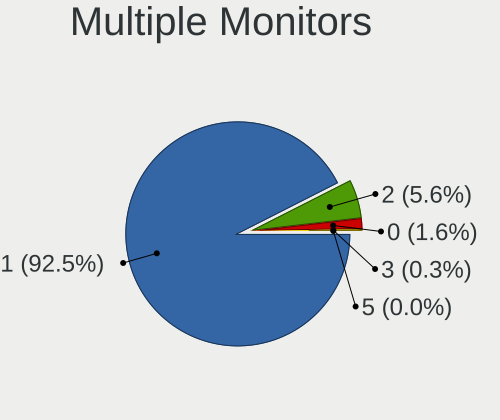

| Total | Notebooks | Percent |
|-------|-----------|---------|
| 1     | 13412     | 92.52%  |
| 2     | 818       | 5.64%   |
| 0     | 226       | 1.56%   |
| 3     | 39        | 0.27%   |
| 5     | 1         | 0.01%   |

Network
-------

Net Controller Vendor
---------------------

Controller vendors

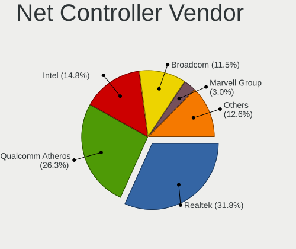

| Vendor                                 | Notebooks | Percent |
|----------------------------------------|-----------|---------|
| Realtek Semiconductor                  | 7920      | 31.76%  |
| Qualcomm Atheros                       | 6566      | 26.33%  |
| Intel                                  | 3686      | 14.78%  |
| Broadcom                               | 2863      | 11.48%  |
| Marvell Technology Group               | 752       | 3.02%   |
| Broadcom Limited                       | 750       | 3.01%   |
| Ralink                                 | 535       | 2.15%   |
| Huawei Technologies                    | 319       | 1.28%   |
| JMicron Technology                     | 175       | 0.7%    |
| Attansic Technology                    | 162       | 0.65%   |
| MediaTek                               | 159       | 0.64%   |
| Nvidia                                 | 128       | 0.51%   |
| Ralink Technology                      | 115       | 0.46%   |
| Silicon Integrated Systems [SiS]       | 83        | 0.33%   |
| ZTE WCDMA Technologies MSM             | 60        | 0.24%   |
| TP-Link                                | 44        | 0.18%   |
| Samsung Electronics                    | 43        | 0.17%   |
| Xiaomi                                 | 41        | 0.16%   |
| Ericsson Business Mobile Networks      | 39        | 0.16%   |
| Qualcomm Atheros Communications        | 38        | 0.15%   |
| ASUSTek Computer                       | 34        | 0.14%   |
| D-Link                                 | 33        | 0.13%   |
| Qualcomm                               | 32        | 0.13%   |
| Hewlett-Packard                        | 28        | 0.11%   |
| Gemtek                                 | 27        | 0.11%   |
| ASIX Electronics                       | 23        | 0.09%   |
| HTC (High Tech Computer)               | 21        | 0.08%   |
| VIA Technologies                       | 18        | 0.07%   |
| Dell                                   | 18        | 0.07%   |
| AMD                                    | 15        | 0.06%   |
| Vimtron Electronics                    | 12        | 0.05%   |
| Sierra Wireless                        | 11        | 0.04%   |
| D-Link System                          | 11        | 0.04%   |
| Altair Semiconductor                   | 11        | 0.04%   |
| Nokia Mobile Phones                    | 9         | 0.04%   |
| T & A Mobile Phones                    | 8         | 0.03%   |
| Sony Ericsson Mobile Communications AB | 8         | 0.03%   |
| Lenovo                                 | 8         | 0.03%   |
| OPPO Electronics                       | 7         | 0.03%   |
| GCT Semiconductor                      | 7         | 0.03%   |

Net Controller Model
--------------------

Controller models

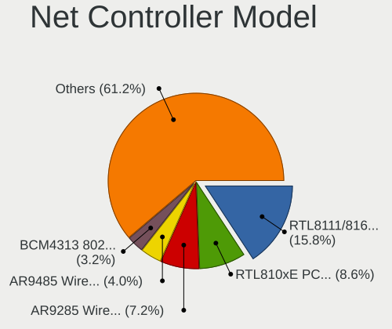

| Model                                                                   | Notebooks | Percent |
|-------------------------------------------------------------------------|-----------|---------|
| Realtek RTL8111/8168/8211/8411 PCI Express Gigabit Ethernet Controller  | 4537      | 15.76%  |
| Realtek RTL810xE PCI Express Fast Ethernet controller                   | 2484      | 8.63%   |
| Qualcomm Atheros AR9285 Wireless Network Adapter (PCI-Express)          | 2075      | 7.21%   |
| Qualcomm Atheros AR9485 Wireless Network Adapter                        | 1147      | 3.99%   |
| Broadcom BCM4313 802.11bgn Wireless Network Adapter                     | 920       | 3.2%    |
| Qualcomm Atheros QCA9565 / AR9565 Wireless Network Adapter              | 802       | 2.79%   |
| Qualcomm Atheros AR242x / AR542x Wireless Network Adapter (PCI-Express) | 612       | 2.13%   |
| Realtek RTL8723BE PCIe Wireless Network Adapter                         | 514       | 1.79%   |
| Intel PRO/Wireless 3945ABG [Golan] Network Connection                   | 505       | 1.75%   |
| Broadcom BCM43142 802.11b/g/n                                           | 425       | 1.48%   |
| Qualcomm Atheros AR8151 v2.0 Gigabit Ethernet                           | 366       | 1.27%   |
| Broadcom NetLink BCM57785 Gigabit Ethernet PCIe                         | 336       | 1.17%   |
| Qualcomm Atheros QCA9377 802.11ac Wireless Network Adapter              | 321       | 1.12%   |
| Marvell Group 88E8040 PCI-E Fast Ethernet Controller                    | 279       | 0.97%   |
| Ralink RT3290 Wireless 802.11n 1T/1R PCIe                               | 277       | 0.96%   |
| Qualcomm Atheros AR8132 Fast Ethernet                                   | 272       | 0.95%   |
| Qualcomm Atheros AR9462 Wireless Network Adapter                        | 263       | 0.91%   |
| Realtek RTL-8100/8101L/8139 PCI Fast Ethernet Adapter                   | 231       | 0.8%    |
| Intel WiFi Link 5100                                                    | 231       | 0.8%    |
| Broadcom BCM4312 802.11b/g LP-PHY                                       | 226       | 0.79%   |
| Realtek RTL8821CE 802.11ac PCIe Wireless Network Adapter                | 214       | 0.74%   |
| Qualcomm Atheros AR8152 v2.0 Fast Ethernet                              | 213       | 0.74%   |
| Qualcomm Atheros AR8131 Gigabit Ethernet                                | 213       | 0.74%   |
| Realtek RTL8188CE 802.11b/g/n WiFi Adapter                              | 205       | 0.71%   |
| Intel 82579LM Gigabit Network Connection (Lewisville)                   | 195       | 0.68%   |
| Qualcomm Atheros QCA8172 Fast Ethernet                                  | 186       | 0.65%   |
| Qualcomm Atheros AR8161 Gigabit Ethernet                                | 181       | 0.63%   |
| Realtek RTL8723AE PCIe Wireless Network Adapter                         | 180       | 0.63%   |
| Intel PRO/Wireless 4965 AG or AGN [Kedron] Network Connection           | 172       | 0.6%    |
| Intel Centrino Wireless-N 130                                           | 171       | 0.59%   |
| Qualcomm Atheros AR8162 Fast Ethernet                                   | 170       | 0.59%   |
| Huawei Modem/Networkcard                                                | 169       | 0.59%   |
| Attansic AR8152 v2.0 Fast Ethernet                                      | 162       | 0.56%   |
| Intel Wireless 7260                                                     | 161       | 0.56%   |
| Broadcom NetLink BCM57780 Gigabit Ethernet PCIe                         | 160       | 0.56%   |
| Intel Wireless 7265                                                     | 155       | 0.54%   |
| Marvell Group 88E8055 PCI-E Gigabit Ethernet Controller                 | 152       | 0.53%   |
| Intel Centrino Advanced-N 6205 [Taylor Peak]                            | 152       | 0.53%   |
| Intel Wi-Fi 6 AX201                                                     | 150       | 0.52%   |
| Qualcomm Atheros AR9287 Wireless Network Adapter (PCI-Express)          | 149       | 0.52%   |

Wireless Vendor
---------------

Wireless vendors

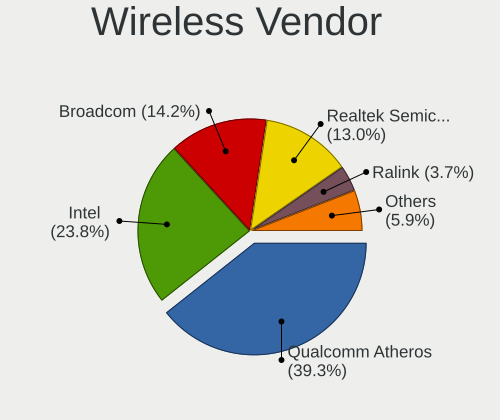

| Vendor                                | Notebooks | Percent |
|---------------------------------------|-----------|---------|
| Qualcomm Atheros                      | 5641      | 39.34%  |
| Intel                                 | 3418      | 23.84%  |
| Broadcom                              | 2036      | 14.2%   |
| Realtek Semiconductor                 | 1860      | 12.97%  |
| Ralink                                | 535       | 3.73%   |
| Broadcom Limited                      | 387       | 2.7%    |
| MediaTek                              | 118       | 0.82%   |
| Ralink Technology                     | 115       | 0.8%    |
| Qualcomm Atheros Communications       | 38        | 0.27%   |
| TP-Link                               | 36        | 0.25%   |
| ASUSTek Computer                      | 30        | 0.21%   |
| D-Link                                | 28        | 0.2%    |
| Qualcomm                              | 15        | 0.1%    |
| Sierra Wireless                       | 11        | 0.08%   |
| D-Link System                         | 11        | 0.08%   |
| Dell                                  | 10        | 0.07%   |
| Hewlett-Packard                       | 6         | 0.04%   |
| Mercucys                              | 5         | 0.03%   |
| Linksys                               | 4         | 0.03%   |
| Edimax Technology                     | 4         | 0.03%   |
| Micro Star International              | 3         | 0.02%   |
| Fujitsu Siemens Computers             | 3         | 0.02%   |
| Fibocom                               | 3         | 0.02%   |
| Belkin Components                     | 3         | 0.02%   |
| ZyDAS                                 | 2         | 0.01%   |
| Xiaomi                                | 2         | 0.01%   |
| Tenda                                 | 2         | 0.01%   |
| Sagem                                 | 2         | 0.01%   |
| Qcom                                  | 2         | 0.01%   |
| Wacom                                 | 1         | 0.01%   |
| Sitecom Europe                        | 1         | 0.01%   |
| Silicon Integrated Systems [SiS]      | 1         | 0.01%   |
| NetGear                               | 1         | 0.01%   |
| Marvell Technology Group              | 1         | 0.01%   |
| Ericsson Business Mobile Networks     | 1         | 0.01%   |
| ASUSTek Computer (wrong ID)           | 1         | 0.01%   |
| 802.11g Adapter [Linksys WUSB54GC v3] | 1         | 0.01%   |

Wireless Model
--------------

Wireless models

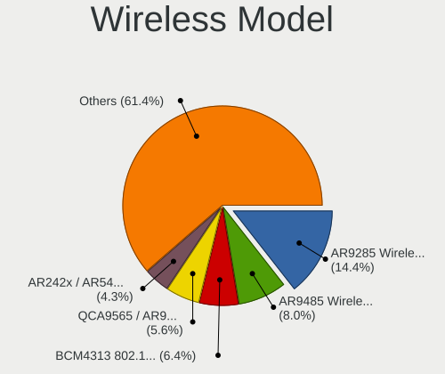

| Model                                                                   | Notebooks | Percent |
|-------------------------------------------------------------------------|-----------|---------|
| Qualcomm Atheros AR9285 Wireless Network Adapter (PCI-Express)          | 2075      | 14.42%  |
| Qualcomm Atheros AR9485 Wireless Network Adapter                        | 1147      | 7.97%   |
| Broadcom BCM4313 802.11bgn Wireless Network Adapter                     | 920       | 6.39%   |
| Qualcomm Atheros QCA9565 / AR9565 Wireless Network Adapter              | 802       | 5.57%   |
| Qualcomm Atheros AR242x / AR542x Wireless Network Adapter (PCI-Express) | 612       | 4.25%   |
| Realtek RTL8723BE PCIe Wireless Network Adapter                         | 514       | 3.57%   |
| Intel PRO/Wireless 3945ABG [Golan] Network Connection                   | 505       | 3.51%   |
| Broadcom BCM43142 802.11b/g/n                                           | 425       | 2.95%   |
| Qualcomm Atheros QCA9377 802.11ac Wireless Network Adapter              | 321       | 2.23%   |
| Ralink RT3290 Wireless 802.11n 1T/1R PCIe                               | 277       | 1.93%   |
| Qualcomm Atheros AR9462 Wireless Network Adapter                        | 263       | 1.83%   |
| Intel WiFi Link 5100                                                    | 231       | 1.61%   |
| Broadcom BCM4312 802.11b/g LP-PHY                                       | 226       | 1.57%   |
| Realtek RTL8821CE 802.11ac PCIe Wireless Network Adapter                | 214       | 1.49%   |
| Realtek RTL8188CE 802.11b/g/n WiFi Adapter                              | 205       | 1.42%   |
| Realtek RTL8723AE PCIe Wireless Network Adapter                         | 180       | 1.25%   |
| Intel PRO/Wireless 4965 AG or AGN [Kedron] Network Connection           | 172       | 1.2%    |
| Intel Centrino Wireless-N 130                                           | 171       | 1.19%   |
| Intel Wireless 7260                                                     | 161       | 1.12%   |
| Intel Wireless 7265                                                     | 155       | 1.08%   |
| Intel Centrino Advanced-N 6205 [Taylor Peak]                            | 152       | 1.06%   |
| Intel Wi-Fi 6 AX201                                                     | 150       | 1.04%   |
| Qualcomm Atheros AR9287 Wireless Network Adapter (PCI-Express)          | 149       | 1.04%   |
| Ralink RT3090 Wireless 802.11n 1T/1R PCIe                               | 148       | 1.03%   |
| Broadcom Limited BCM4312 802.11b/g LP-PHY                               | 148       | 1.03%   |
| Broadcom BCM4311 802.11b/g WLAN                                         | 145       | 1.01%   |
| Intel Centrino Wireless-N 2230                                          | 126       | 0.88%   |
| Qualcomm Atheros AR928X Wireless Network Adapter (PCI-Express)          | 120       | 0.83%   |
| Intel WiMAX/WiFi Link 5150                                              | 110       | 0.76%   |
| Realtek RTL8723DE Wireless Network Adapter                              | 105       | 0.73%   |
| Realtek RTL8822CE 802.11ac PCIe Wireless Network Adapter                | 102       | 0.71%   |
| Intel Centrino Wireless-N 100                                           | 102       | 0.71%   |
| Broadcom Limited BCM4313 802.11bgn Wireless Network Adapter             | 98        | 0.68%   |
| Intel Wireless 3165                                                     | 82        | 0.57%   |
| Realtek RTL8188EE Wireless Network Adapter                              | 78        | 0.54%   |
| Intel Centrino Wireless-N 1000 [Condor Peak]                            | 78        | 0.54%   |
| Intel Centrino Advanced-N 6200                                          | 78        | 0.54%   |
| Intel Wireless 8265 / 8275                                              | 77        | 0.54%   |
| Intel Centrino Advanced-N 6235                                          | 77        | 0.54%   |
| Intel Dual Band Wireless-AC 3168NGW [Stone Peak]                        | 76        | 0.53%   |

Ethernet Vendor
---------------

Ethernet vendors

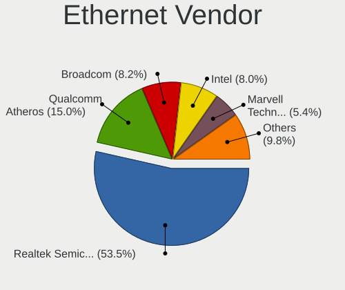

| Vendor                                 | Notebooks | Percent |
|----------------------------------------|-----------|---------|
| Realtek Semiconductor                  | 7387      | 53.52%  |
| Qualcomm Atheros                       | 2077      | 15.05%  |
| Broadcom                               | 1132      | 8.2%    |
| Intel                                  | 1101      | 7.98%   |
| Marvell Technology Group               | 751       | 5.44%   |
| Broadcom Limited                       | 382       | 2.77%   |
| JMicron Technology                     | 175       | 1.27%   |
| Attansic Technology                    | 162       | 1.17%   |
| Nvidia                                 | 127       | 0.92%   |
| Silicon Integrated Systems [SiS]       | 82        | 0.59%   |
| Huawei Technologies                    | 70        | 0.51%   |
| Xiaomi                                 | 39        | 0.28%   |
| MediaTek                               | 39        | 0.28%   |
| Samsung Electronics                    | 38        | 0.28%   |
| Gemtek                                 | 27        | 0.2%    |
| ASIX Electronics                       | 23        | 0.17%   |
| HTC (High Tech Computer)               | 21        | 0.15%   |
| VIA Technologies                       | 17        | 0.12%   |
| Qualcomm                               | 17        | 0.12%   |
| Vimtron Electronics                    | 12        | 0.09%   |
| Altair Semiconductor                   | 11        | 0.08%   |
| ZTE WCDMA Technologies MSM             | 8         | 0.06%   |
| TP-Link                                | 8         | 0.06%   |
| OPPO Electronics                       | 7         | 0.05%   |
| GCT Semiconductor                      | 7         | 0.05%   |
| T & A Mobile Phones                    | 6         | 0.04%   |
| Sony Ericsson Mobile Communications AB | 6         | 0.04%   |
| Lenovo                                 | 6         | 0.04%   |
| Spreadtrum Communications              | 5         | 0.04%   |
| Motorola PCS                           | 5         | 0.04%   |
| ICS Advent                             | 5         | 0.04%   |
| DisplayLink                            | 5         | 0.04%   |
| D-Link                                 | 5         | 0.04%   |
| ASUSTek Computer                       | 5         | 0.04%   |
| Hewlett-Packard                        | 4         | 0.03%   |
| LSI                                    | 3         | 0.02%   |
| LG Electronics                         | 3         | 0.02%   |
| HMD Global                             | 3         | 0.02%   |
| Research In Motion                     | 2         | 0.01%   |
| Apple                                  | 2         | 0.01%   |

Ethernet Model
--------------

Ethernet models

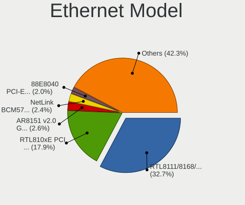

| Model                                                                          | Notebooks | Percent |
|--------------------------------------------------------------------------------|-----------|---------|
| Realtek RTL8111/8168/8211/8411 PCI Express Gigabit Ethernet Controller         | 4537      | 32.74%  |
| Realtek RTL810xE PCI Express Fast Ethernet controller                          | 2484      | 17.93%  |
| Qualcomm Atheros AR8151 v2.0 Gigabit Ethernet                                  | 366       | 2.64%   |
| Broadcom NetLink BCM57785 Gigabit Ethernet PCIe                                | 336       | 2.42%   |
| Marvell Group 88E8040 PCI-E Fast Ethernet Controller                           | 279       | 2.01%   |
| Qualcomm Atheros AR8132 Fast Ethernet                                          | 272       | 1.96%   |
| Realtek RTL-8100/8101L/8139 PCI Fast Ethernet Adapter                          | 231       | 1.67%   |
| Qualcomm Atheros AR8152 v2.0 Fast Ethernet                                     | 213       | 1.54%   |
| Qualcomm Atheros AR8131 Gigabit Ethernet                                       | 213       | 1.54%   |
| Intel 82579LM Gigabit Network Connection (Lewisville)                          | 195       | 1.41%   |
| Qualcomm Atheros QCA8172 Fast Ethernet                                         | 186       | 1.34%   |
| Qualcomm Atheros AR8161 Gigabit Ethernet                                       | 181       | 1.31%   |
| Qualcomm Atheros AR8162 Fast Ethernet                                          | 170       | 1.23%   |
| Attansic AR8152 v2.0 Fast Ethernet                                             | 162       | 1.17%   |
| Broadcom NetLink BCM57780 Gigabit Ethernet PCIe                                | 160       | 1.15%   |
| Marvell Group 88E8055 PCI-E Gigabit Ethernet Controller                        | 152       | 1.1%    |
| JMicron JMC250 PCI Express Gigabit Ethernet Controller                         | 143       | 1.03%   |
| Broadcom NetLink BCM5787M Gigabit Ethernet PCI Express                         | 141       | 1.02%   |
| Intel WiMAX Connection 2400m                                                   | 133       | 0.96%   |
| Qualcomm Atheros AR8121/AR8113/AR8114 Gigabit or Fast Ethernet                 | 125       | 0.9%    |
| Broadcom Limited NetLink BCM57780 Gigabit Ethernet PCIe                        | 121       | 0.87%   |
| Broadcom BCM4401-B0 100Base-TX                                                 | 120       | 0.87%   |
| Intel 82577LM Gigabit Network Connection                                       | 103       | 0.74%   |
| Broadcom NetLink BCM5906M Fast Ethernet PCI Express                            | 91        | 0.66%   |
| Qualcomm Atheros AR8152 v1.1 Fast Ethernet                                     | 85        | 0.61%   |
| Marvell Group Yukon Optima 88E8059 [PCIe Gigabit Ethernet Controller with AVB] | 79        | 0.57%   |
| Silicon Integrated Systems [SiS] 191 Gigabit Ethernet Adapter                  | 78        | 0.56%   |
| Qualcomm Atheros QCA8171 Gigabit Ethernet                                      | 78        | 0.56%   |
| Intel Alder Lake-P PCH CNVi WiFi                                               | 78        | 0.56%   |
| Intel 82567LM Gigabit Network Connection                                       | 78        | 0.56%   |
| Realtek RTL8153 Gigabit Ethernet Adapter                                       | 70        | 0.51%   |
| Intel Ethernet Connection (13) I219-V                                          | 66        | 0.48%   |
| Broadcom NetLink BCM5784M Gigabit Ethernet PCIe                                | 65        | 0.47%   |
| Qualcomm Atheros AR8151 v1.0 Gigabit Ethernet                                  | 64        | 0.46%   |
| Intel 82566MM Gigabit Network Connection                                       | 52        | 0.38%   |
| Broadcom NetXtreme BCM57786 Gigabit Ethernet PCIe                              | 52        | 0.38%   |
| Broadcom NetXtreme BCM5764M Gigabit Ethernet PCIe                              | 52        | 0.38%   |
| Broadcom Limited NetLink BCM5787M Gigabit Ethernet PCI Express                 | 52        | 0.38%   |
| Qualcomm Atheros Killer E220x Gigabit Ethernet Controller                      | 51        | 0.37%   |
| Broadcom Limited BCM4401-B0 100Base-TX                                         | 50        | 0.36%   |

Net Controller Kind
-------------------

Ethernet, WiFi or modem

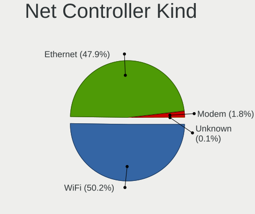

| Kind     | Notebooks | Percent |
|----------|-----------|---------|
| WiFi     | 13923     | 50.23%  |
| Ethernet | 13277     | 47.9%   |
| Modem    | 502       | 1.81%   |
| Unknown  | 14        | 0.05%   |

Used Controller
---------------

Currently used network controller

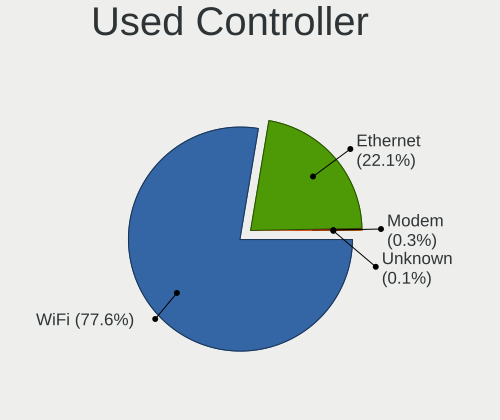

| Kind     | Notebooks | Percent |
|----------|-----------|---------|
| WiFi     | 11581     | 77.63%  |
| Ethernet | 3292      | 22.07%  |
| Modem    | 38        | 0.25%   |
| Unknown  | 8         | 0.05%   |

NICs
----

Total network controllers on board

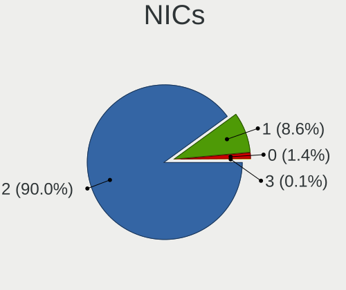

| Total | Notebooks | Percent |
|-------|-----------|---------|
| 2     | 12840     | 89.99%  |
| 1     | 1223      | 8.57%   |
| 0     | 193       | 1.35%   |
| 3     | 13        | 0.09%   |

IPv6
----

IPv6 vs IPv4

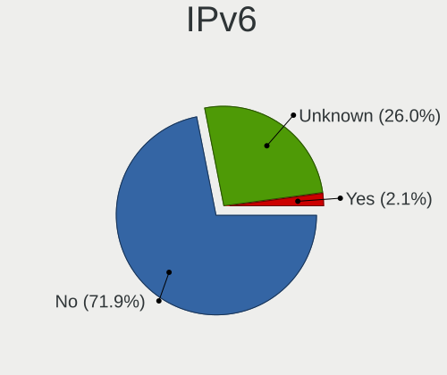

| Used    | Notebooks | Percent |
|---------|-----------|---------|
| No      | 10729     | 71.92%  |
| Unknown | 3872      | 25.95%  |
| Yes     | 318       | 2.13%   |

Bluetooth
---------

Bluetooth Vendor
----------------

Controller vendors

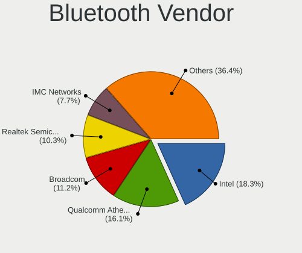

| Vendor                          | Notebooks | Percent |
|---------------------------------|-----------|---------|
| Intel                           | 1675      | 18.28%  |
| Qualcomm Atheros Communications | 1471      | 16.05%  |
| Broadcom                        | 1028      | 11.22%  |
| Realtek Semiconductor           | 947       | 10.33%  |
| IMC Networks                    | 704       | 7.68%   |
| Foxconn / Hon Hai               | 650       | 7.09%   |
| Lite-On Technology              | 637       | 6.95%   |
| ASUSTek Computer                | 291       | 3.18%   |
| Ralink                          | 277       | 3.02%   |
| Hewlett-Packard                 | 251       | 2.74%   |
| Toshiba                         | 248       | 2.71%   |
| Dell                            | 205       | 2.24%   |
| Foxconn International           | 196       | 2.14%   |
| Cambridge Silicon Radio         | 168       | 1.83%   |
| Apple                           | 105       | 1.15%   |
| Alps Electric                   | 83        | 0.91%   |
| Ralink Technology               | 63        | 0.69%   |
| Realtek                         | 31        | 0.34%   |
| MediaTek                        | 27        | 0.29%   |
| Chicony Electronics             | 23        | 0.25%   |
| Taiyo Yuden                     | 18        | 0.2%    |
| Micro Star International        | 13        | 0.14%   |
| Askey Computer                  | 13        | 0.14%   |
| USI                             | 6         | 0.07%   |
| TP-Link                         | 5         | 0.05%   |
| Qcom                            | 5         | 0.05%   |
| Syntek                          | 4         | 0.04%   |
| Opticis                         | 4         | 0.04%   |
| Integrated System Solution      | 4         | 0.04%   |
| Samsung Electronics             | 3         | 0.03%   |
| SiW                             | 2         | 0.02%   |
| Fujitsu                         | 2         | 0.02%   |
| Smart Modular Technologies      | 1         | 0.01%   |
| Qualcomm Atheros                | 1         | 0.01%   |
| LG Electronics                  | 1         | 0.01%   |
| Belkin Components               | 1         | 0.01%   |
| Actiontec Electronics           | 1         | 0.01%   |
| AboCom Systems                  | 1         | 0.01%   |

Bluetooth Model
---------------

Controller models

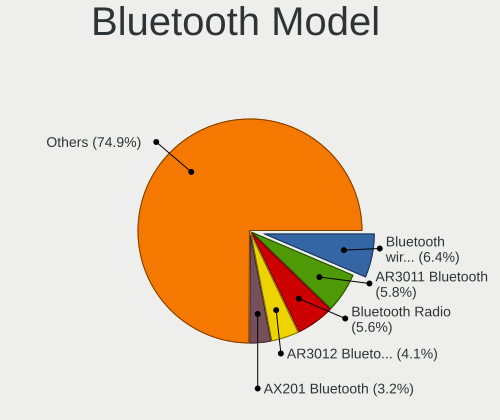

| Model                                                                               | Notebooks | Percent |
|-------------------------------------------------------------------------------------|-----------|---------|
| Intel Bluetooth wireless interface                                                  | 587       | 6.4%    |
| Qualcomm Atheros AR3011 Bluetooth                                                   | 536       | 5.84%   |
| Realtek Bluetooth Radio                                                             | 516       | 5.63%   |
| Qualcomm Atheros AR3012 Bluetooth 4.0                                               | 374       | 4.08%   |
| Intel AX201 Bluetooth                                                               | 289       | 3.15%   |
| Ralink RT3290 Bluetooth                                                             | 277       | 3.02%   |
| Qualcomm Atheros  Bluetooth Device                                                  | 270       | 2.94%   |
| Foxconn / Hon Hai Bluetooth Device                                                  | 225       | 2.45%   |
| Intel Centrino Advanced-N 6230 Bluetooth adapter                                    | 222       | 2.42%   |
| Lite-On Atheros AR3012 Bluetooth                                                    | 215       | 2.34%   |
| Intel Centrino Bluetooth Wireless Transceiver                                       | 206       | 2.25%   |
| IMC Networks Atheros AR3012 Bluetooth 4.0 Adapter                                   | 199       | 2.17%   |
| Foxconn International BCM43142A0 Bluetooth module                                   | 193       | 2.1%    |
| Broadcom BCM2070 Bluetooth Device                                                   | 178       | 1.94%   |
| Cambridge Silicon Radio Bluetooth Dongle (HCI mode)                                 | 168       | 1.83%   |
| IMC Networks Bluetooth Device                                                       | 159       | 1.73%   |
| Broadcom BCM2070 Bluetooth 2.1 + EDR                                                | 158       | 1.72%   |
| Intel Bluetooth 9460/9560 Jefferson Peak (JfP)                                      | 157       | 1.71%   |
| Realtek  Bluetooth 4.2 Adapter                                                      | 152       | 1.66%   |
| Realtek RTL8723B Bluetooth                                                          | 143       | 1.56%   |
| Lite-On Bluetooth Device                                                            | 139       | 1.52%   |
| Broadcom BCM2045 Bluetooth                                                          | 135       | 1.47%   |
| HP Bluetooth 2.0 Interface [Broadcom BCM2045]                                       | 123       | 1.34%   |
| HP Broadcom 2070 Bluetooth Combo                                                    | 117       | 1.28%   |
| Qualcomm Atheros Bluetooth                                                          | 112       | 1.22%   |
| IMC Networks Bluetooth Radio                                                        | 112       | 1.22%   |
| ASUS BT-183 Bluetooth 2.0+EDR adapter                                               | 105       | 1.14%   |
| Lite-On Qualcomm Atheros QCA9377 Bluetooth                                          | 102       | 1.11%   |
| Broadcom BCM2045B (BDC-2.1)                                                         | 102       | 1.11%   |
| Toshiba Integrated Bluetooth HCI                                                    | 98        | 1.07%   |
| Foxconn / Hon Hai Broadcom Bluetooth 2.1 Device                                     | 90        | 0.98%   |
| Broadcom HP Portable Valentine                                                      | 89        | 0.97%   |
| ASUS BT-270 Bluetooth Adapter                                                       | 86        | 0.94%   |
| Lite-On Broadcom BCM43142A0 Bluetooth Device                                        | 82        | 0.89%   |
| ASUS BT-253 Bluetooth Adapter                                                       | 79        | 0.86%   |
| Qualcomm Atheros AR9462 Bluetooth                                                   | 77        | 0.84%   |
| Foxconn / Hon Hai Bluetooth USB Host Controller                                     | 74        | 0.81%   |
| Intel Wireless-AC 3168 Bluetooth                                                    | 72        | 0.79%   |
| Foxconn / Hon Hai Foxconn T77H114 BCM2070 [Single-Chip Bluetooth 2.1 + EDR Adapter] | 70        | 0.76%   |
| Realtek RTL8723A Bluetooth                                                          | 68        | 0.74%   |

Sound
-----

Sound Vendor
------------

Sound card vendors

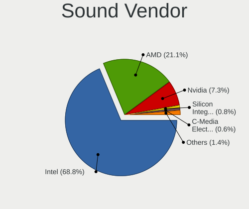

| Vendor                                       | Notebooks | Percent |
|----------------------------------------------|-----------|---------|
| Intel                                        | 11018     | 68.76%  |
| AMD                                          | 3386      | 21.13%  |
| Nvidia                                       | 1168      | 7.29%   |
| Silicon Integrated Systems [SiS]             | 123       | 0.77%   |
| C-Media Electronics                          | 103       | 0.64%   |
| VIA Technologies                             | 24        | 0.15%   |
| Creative Technology                          | 22        | 0.14%   |
| Logitech                                     | 21        | 0.13%   |
| Lenovo                                       | 18        | 0.11%   |
| Generalplus Technology                       | 15        | 0.09%   |
| Texas Instruments                            | 10        | 0.06%   |
| JMTek                                        | 7         | 0.04%   |
| Plantronics                                  | 6         | 0.04%   |
| Zoran Co. Personal Media Division (Nogatech) | 5         | 0.03%   |
| GYROCOM C&C                                  | 5         | 0.03%   |
| ASUSTek Computer                             | 5         | 0.03%   |
| M-Audio                                      | 4         | 0.02%   |
| Jieli Technology                             | 4         | 0.02%   |
| iCreate Technologies                         | 4         | 0.02%   |
| Thesycon Systemsoftware & Consulting         | 3         | 0.02%   |
| Roland                                       | 3         | 0.02%   |
| GN Netcom                                    | 3         | 0.02%   |
| Focusrite-Novation                           | 3         | 0.02%   |
| Yealink Network Technology                   | 2         | 0.01%   |
| Yamaha                                       | 2         | 0.01%   |
| XMOS                                         | 2         | 0.01%   |
| Walmart                                      | 2         | 0.01%   |
| ULi Electronics                              | 2         | 0.01%   |
| Trust                                        | 2         | 0.01%   |
| TEAC                                         | 2         | 0.01%   |
| Samson Technologies                          | 2         | 0.01%   |
| Nordic Semiconductor ASA                     | 2         | 0.01%   |
| Hewlett-Packard                              | 2         | 0.01%   |
| EGO SYStems                                  | 2         | 0.01%   |
| DigiTech                                     | 2         | 0.01%   |
| Cambridge Silicon Radio                      | 2         | 0.01%   |
| BEHRINGER International                      | 2         | 0.01%   |
| A4Tech                                       | 2         | 0.01%   |
| Unknown                                      | 2         | 0.01%   |
| Zhaoxin                                      | 1         | 0.01%   |

Sound Model
-----------

Sound card models

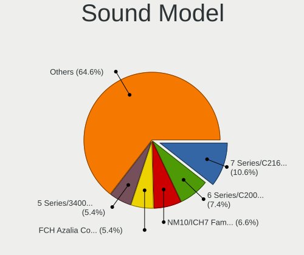

| Model                                                                                             | Notebooks | Percent |
|---------------------------------------------------------------------------------------------------|-----------|---------|
| Intel 7 Series/C216 Chipset Family High Definition Audio Controller                               | 2054      | 10.6%   |
| Intel 6 Series/C200 Series Chipset Family High Definition Audio Controller                        | 1428      | 7.37%   |
| Intel NM10/ICH7 Family High Definition Audio Controller                                           | 1285      | 6.63%   |
| AMD FCH Azalia Controller                                                                         | 1054      | 5.44%   |
| Intel 5 Series/3400 Series Chipset High Definition Audio                                          | 1044      | 5.39%   |
| Intel 82801I (ICH9 Family) HD Audio Controller                                                    | 1040      | 5.37%   |
| AMD SBx00 Azalia (Intel HDA)                                                                      | 1020      | 5.27%   |
| Intel 82801H (ICH8 Family) HD Audio Controller                                                    | 744       | 3.84%   |
| Intel Sunrise Point-LP HD Audio                                                                   | 485       | 2.5%    |
| Intel 8 Series HD Audio Controller                                                                | 485       | 2.5%    |
| Intel Haswell-ULT HD Audio Controller                                                             | 484       | 2.5%    |
| AMD Kabini HDMI/DP Audio                                                                          | 424       | 2.19%   |
| Intel Atom Processor Z36xxx/Z37xxx Series High Definition Audio Controller                        | 383       | 1.98%   |
| AMD Wrestler HDMI Audio                                                                           | 373       | 1.93%   |
| AMD Ryzen HD Audio Controller                                                                     | 370       | 1.91%   |
| Intel 8 Series/C220 Series Chipset High Definition Audio Controller                               | 367       | 1.89%   |
| Intel Xeon E3-1200 v3/4th Gen Core Processor HD Audio Controller                                  | 351       | 1.81%   |
| AMD Trinity HDMI Audio Controller                                                                 | 299       | 1.54%   |
| Intel Atom/Celeron/Pentium Processor x5-E8000/J3xxx/N3xxx Series High Definition Audio Controller | 258       | 1.33%   |
| AMD Cedar HDMI Audio [Radeon HD 5400/6300/7300 Series]                                            | 256       | 1.32%   |
| Intel Broadwell-U Audio Controller                                                                | 250       | 1.29%   |
| Intel Wildcat Point-LP High Definition Audio Controller                                           | 248       | 1.28%   |
| Nvidia GF108 High Definition Audio Controller                                                     | 240       | 1.24%   |
| AMD BeaverCreek HDMI Audio [Radeon HD 6500D and 6400G-6600G series]                               | 232       | 1.2%    |
| Intel Tiger Lake-LP Smart Sound Technology Audio Controller                                       | 209       | 1.08%   |
| AMD RV710/730 HDMI Audio [Radeon HD 4000 series]                                                  | 195       | 1.01%   |
| Nvidia High Definition Audio Controller                                                           | 185       | 0.96%   |
| AMD Renoir/Cezanne HDMI/DP Audio Controller                                                       | 181       | 0.93%   |
| AMD Family 15h (Models 60h-6fh) Audio Controller                                                  | 170       | 0.88%   |
| AMD High Definition Audio Controller                                                              | 139       | 0.72%   |
| AMD RS880 HDMI Audio [Radeon HD 4200 Series]                                                      | 136       | 0.7%    |
| AMD Redwood HDMI Audio [Radeon HD 5000 Series]                                                    | 133       | 0.69%   |
| Intel Alder Lake PCH-P High Definition Audio Controller                                           | 126       | 0.65%   |
| AMD Raven/Raven2/Fenghuang HDMI/DP Audio Controller                                               | 125       | 0.65%   |
| Intel Celeron/Pentium Silver Processor High Definition Audio                                      | 120       | 0.62%   |
| Silicon Integrated Systems [SiS] Azalia Audio Controller                                          | 118       | 0.61%   |
| Nvidia GT216 HDMI Audio Controller                                                                | 115       | 0.59%   |
| Nvidia MCP79 High Definition Audio                                                                | 104       | 0.54%   |
| Intel Cannon Lake PCH cAVS                                                                        | 94        | 0.49%   |
| Intel Celeron N3350/Pentium N4200/Atom E3900 Series Audio Cluster                                 | 86        | 0.44%   |

Memory
------

Memory Vendor
-------------

Memory module vendors

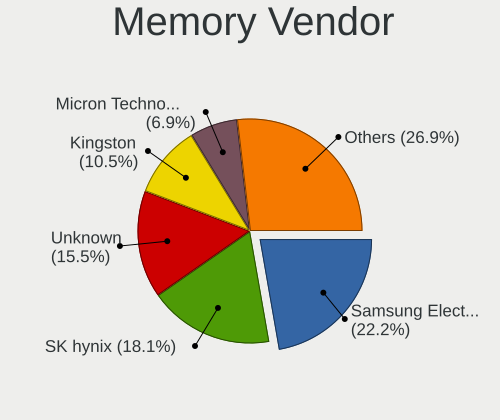

| Vendor                | Notebooks | Percent |
|-----------------------|-----------|---------|
| Samsung Electronics   | 3665      | 22.25%  |
| SK hynix              | 2974      | 18.05%  |
| Unknown               | 2551      | 15.49%  |
| Kingston              | 1726      | 10.48%  |
| Micron Technology     | 1133      | 6.88%   |
| Elpida                | 782       | 4.75%   |
| Nanya Technology      | 643       | 3.9%    |
| Ramaxel Technology    | 539       | 3.27%   |
| A-DATA Technology     | 448       | 2.72%   |
| Crucial               | 276       | 1.68%   |
| ASint Technology      | 188       | 1.14%   |
| AMD                   | 135       | 0.82%   |
| 48spaces              | 134       | 0.81%   |
| Goldkey               | 111       | 0.67%   |
| Corsair               | 107       | 0.65%   |
| Patriot               | 88        | 0.53%   |
| Unknown               | 87        | 0.53%   |
| SHARETRONIC           | 81        | 0.49%   |
| Unknown (ABCD)        | 69        | 0.42%   |
| Qimonda               | 57        | 0.35%   |
| Transcend             | 55        | 0.33%   |
| ACPI Digital          | 53        | 0.32%   |
| GOODRAM               | 43        | 0.26%   |
| Apacer                | 40        | 0.24%   |
| Foxline               | 36        | 0.22%   |
| Unifosa               | 30        | 0.18%   |
| Toshiba               | 28        | 0.17%   |
| Kllisre               | 28        | 0.17%   |
| Smart                 | 23        | 0.14%   |
| Silicon Power         | 20        | 0.12%   |
| Team                  | 19        | 0.12%   |
| Qumo                  | 19        | 0.12%   |
| Kingmax               | 19        | 0.12%   |
| Kingmax Semiconductor | 14        | 0.08%   |
| ChangXin Memory       | 14        | 0.08%   |
| Unknown (0x0BEC)      | 13        | 0.08%   |
| Wodposit              | 9         | 0.05%   |
| G.Skill               | 9         | 0.05%   |
| Unknown (0x7FFF)      | 8         | 0.05%   |
| GeIL                  | 8         | 0.05%   |

Memory Model
------------

Memory module models

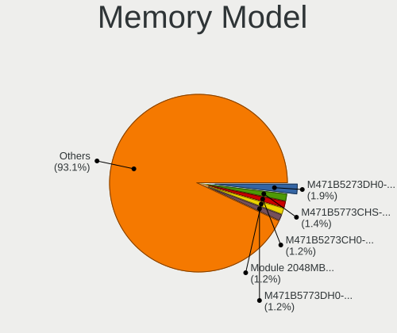

| Model                                                                     | Notebooks | Percent |
|---------------------------------------------------------------------------|-----------|---------|
| Samsung RAM M471B5273DH0-CH9 4GB SODIMM DDR3 1600MT/s                     | 343       | 1.9%    |
| Samsung RAM M471B5773CHS-CH9 2GB SODIMM DDR3 4199MT/s                     | 247       | 1.37%   |
| Samsung RAM M471B5273CH0-CH9 4GB SODIMM DDR3 1334MT/s                     | 224       | 1.24%   |
| Unknown RAM Module 2048MB SODIMM DDR2 667MT/s                             | 222       | 1.23%   |
| Samsung RAM M471B5773DH0-CH9 2GB SODIMM DDR3 1600MT/s                     | 219       | 1.21%   |
| Unknown RAM Module 2048MB SODIMM DDR2                                     | 203       | 1.12%   |
| Samsung RAM M471B5173DB0-YK0 4GB SODIMM DDR3 1600MT/s                     | 203       | 1.12%   |
| Samsung RAM M471B5273DH0-CK0 4GB SODIMM DDR3 2400MT/s                     | 202       | 1.12%   |
| SK hynix RAM HMT351S6CFR8C-PB 4GB SODIMM DDR3 1600MT/s                    | 200       | 1.11%   |
| Unknown RAM Module 1024MB SODIMM DDR2                                     | 180       | 1%      |
| Samsung RAM M471B5173QH0-YK0 4GB SODIMM DDR3 1600MT/s                     | 169       | 0.94%   |
| SK hynix RAM HMT451S6BFR8A-PB 4GB SODIMM DDR3 1600MT/s                    | 163       | 0.9%    |
| Unknown RAM Module 1024MB SODIMM DDR2 667MT/s                             | 156       | 0.86%   |
| Samsung RAM M471B5173EB0-YK0 4GB SODIMM DDR3 1600MT/s                     | 144       | 0.8%    |
| Elpida RAM EBJ41UF8BCS0-DJ-F 4GB SODIMM DDR3 1334MT/s                     | 142       | 0.79%   |
| SK hynix RAM HMT325S6CFR8C-PB 2GB SODIMM DDR3 1600MT/s                    | 138       | 0.76%   |
| Samsung RAM M471B5673FH0-CH9 2048MB SODIMM DDR3 1600MT/s                  | 134       | 0.74%   |
| 48spaces RAM 012345678901234567890123456789012345 2GB SODIMM DDR2 667MT/s | 129       | 0.71%   |
| SK hynix RAM HMT451S6AFR8A-PB 4GB SODIMM DDR3 1600MT/s                    | 125       | 0.69%   |
| Unknown RAM Module 4096MB SODIMM DDR3                                     | 114       | 0.63%   |
| Nanya RAM NT2GC64B88B0NS-CG 2048MB SODIMM DDR3 1334MT/s                   | 113       | 0.63%   |
| A-DATA RAM AD73I1C1674EV 4GB SODIMM DDR3 1334MT/s                         | 113       | 0.63%   |
| Samsung RAM M471B5673FH0-CF8 2048MB SODIMM DDR3 1067MT/s                  | 111       | 0.61%   |
| Samsung RAM M471B5773DH0-CK0 2GB SODIMM DDR3 1600MT/s                     | 110       | 0.61%   |
| Unknown RAM Module 1024MB SODIMM DDR                                      | 96        | 0.53%   |
| Unknown RAM Module 2048MB SODIMM SDRAM                                    | 95        | 0.53%   |
| Nanya RAM NT4GC64B8HB0NS-CG 4GB SODIMM DDR3 1334MT/s                      | 93        | 0.51%   |
| Unknown RAM Module 1024MB SODIMM DRAM                                     | 92        | 0.51%   |
| Elpida RAM EBJ40UG8BBU0-GN-F 4GB SODIMM DDR3 1600MT/s                     | 92        | 0.51%   |
| Samsung RAM M471A5244CB0-CTD 4GB SODIMM DDR4 3266MT/s                     | 90        | 0.5%    |
| Elpida RAM EBJ21UE8BFU0-DJ-F 2GB SODIMM DDR3 1334MT/s                     | 89        | 0.49%   |
| Unknown                                                                   | 87        | 0.48%   |
| SK hynix RAM HMT351S6EFR8A-PB 4GB SODIMM DDR3 1600MT/s                    | 86        | 0.48%   |
| SK hynix RAM HMT351S6BFR8C-H9 4GB SODIMM DDR3 1333MT/s                    | 86        | 0.48%   |
| SK hynix RAM HMT325S6BFR8C-H9 2GB SODIMM DDR3 1600MT/s                    | 85        | 0.47%   |
| Unknown RAM Module 2048MB SODIMM DDR2 800MT/s                             | 84        | 0.46%   |
| Unknown RAM Module 2GB SODIMM DDR2 667MT/s                                | 82        | 0.45%   |
| Unknown RAM Module 1024MB SODIMM SDRAM                                    | 82        | 0.45%   |
| SK hynix RAM HMT451S6MFR8C-PB 4GB SODIMM DDR3 1600MT/s                    | 82        | 0.45%   |
| SK hynix RAM HMT425S6AFR6A-PB 2GB SODIMM DDR3 3200MT/s                    | 80        | 0.44%   |

Memory Kind
-----------

Memory module kinds

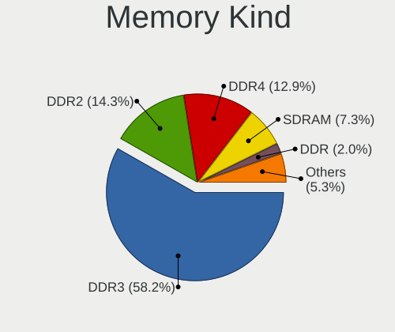

| Kind    | Notebooks | Percent |
|---------|-----------|---------|
| DDR3    | 8190      | 58.23%  |
| DDR2    | 2009      | 14.28%  |
| DDR4    | 1820      | 12.94%  |
| SDRAM   | 1023      | 7.27%   |
| DDR     | 275       | 1.96%   |
| Unknown | 217       | 1.54%   |
| LPDDR4  | 208       | 1.48%   |
| DRAM    | 185       | 1.32%   |
| LPDDR5  | 58        | 0.41%   |
| DDR5    | 47        | 0.33%   |
| LPDDR3  | 32        | 0.23%   |
| SRAM    | 1         | 0.01%   |
| RAM     | 1         | 0.01%   |

Memory Form Factor
------------------

Physical design of the memory module

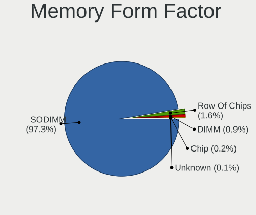

| Name         | Notebooks | Percent |
|--------------|-----------|---------|
| SODIMM       | 13076     | 97.27%  |
| Row Of Chips | 213       | 1.58%   |
| DIMM         | 117       | 0.87%   |
| Chip         | 27        | 0.2%    |
| Unknown      | 10        | 0.07%   |

Memory Size
-----------

Memory module size

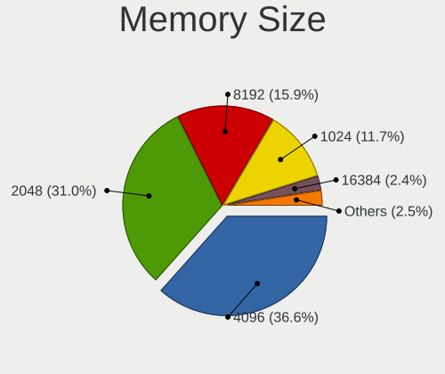

| Size    | Notebooks | Percent |
|---------|-----------|---------|
| 4096    | 5966      | 36.6%   |
| 2048    | 5054      | 31%     |
| 8192    | 2589      | 15.88%  |
| 1024    | 1903      | 11.67%  |
| 16384   | 385       | 2.36%   |
| 512     | 280       | 1.72%   |
| 32768   | 72        | 0.44%   |
| 256     | 33        | 0.2%    |
| Unknown | 11        | 0.07%   |
| 3072    | 5         | 0.03%   |
| 1536    | 2         | 0.01%   |
| 12288   | 1         | 0.01%   |
| 128     | 1         | 0.01%   |

Memory Speed
------------

Memory module speed

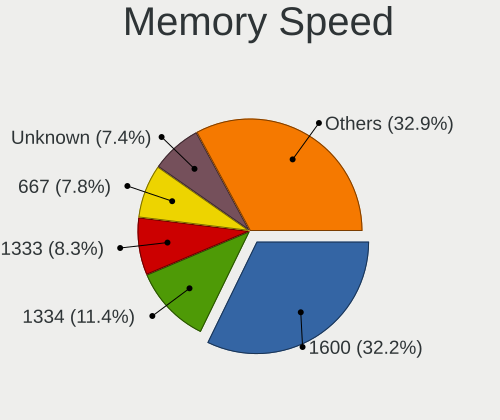

| Speed   | Notebooks | Percent |
|---------|-----------|---------|
| 1600    | 5019      | 32.23%  |
| 1334    | 1776      | 11.4%   |
| 1333    | 1293      | 8.3%    |
| 667     | 1211      | 7.78%   |
| Unknown | 1150      | 7.38%   |
| 3200    | 807       | 5.18%   |
| 2667    | 701       | 4.5%    |
| 2400    | 567       | 3.64%   |
| 4199    | 555       | 3.56%   |
| 1067    | 472       | 3.03%   |
| 800     | 419       | 2.69%   |
| 533     | 293       | 1.88%   |
| 2048    | 228       | 1.46%   |
| 2133    | 152       | 0.98%   |
| 1066    | 144       | 0.92%   |
| 975     | 139       | 0.89%   |
| 333     | 92        | 0.59%   |
| 3266    | 90        | 0.58%   |
| 1867    | 65        | 0.42%   |
| 1639    | 58        | 0.37%   |
| 400     | 53        | 0.34%   |
| 4267    | 40        | 0.26%   |
| 6400    | 39        | 0.25%   |
| 8400    | 33        | 0.21%   |
| 5600    | 27        | 0.17%   |
| 4800    | 22        | 0.14%   |
| 1866    | 20        | 0.13%   |
| 3733    | 19        | 0.12%   |
| 266     | 14        | 0.09%   |
| 7500    | 10        | 0.06%   |
| 2933    | 10        | 0.06%   |
| 4266    | 8         | 0.05%   |
| 1776    | 6         | 0.04%   |
| 8533    | 5         | 0.03%   |
| 65535   | 4         | 0.03%   |
| 200     | 4         | 0.03%   |
| 1       | 4         | 0.03%   |
| 166     | 3         | 0.02%   |
| 100     | 3         | 0.02%   |
| 6000    | 2         | 0.01%   |

Printers & scanners
-------------------

Printer Vendor
--------------

Printer device vendors

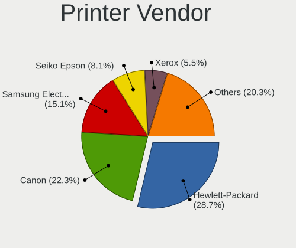

| Vendor                 | Notebooks | Percent |
|------------------------|-----------|---------|
| Hewlett-Packard        | 99        | 28.7%   |
| Canon                  | 77        | 22.32%  |
| Samsung Electronics    | 52        | 15.07%  |
| Seiko Epson            | 28        | 8.12%   |
| Xerox                  | 19        | 5.51%   |
| Brother Industries     | 19        | 5.51%   |
| Pantum                 | 15        | 4.35%   |
| Panasonic (Matsushita) | 14        | 4.06%   |
| Ricoh                  | 4         | 1.16%   |
| Kyocera                | 4         | 1.16%   |
| Prolific Technology    | 3         | 0.87%   |
| Lexmark International  | 2         | 0.58%   |
| Xiaomi                 | 1         | 0.29%   |
| QinHeng Electronics    | 1         | 0.29%   |
| Oki Data               | 1         | 0.29%   |
| MiiiW                  | 1         | 0.29%   |
| Katusha"               | 1         | 0.29%   |
| Index Braille AB       | 1         | 0.29%   |
| iDPRT                  | 1         | 0.29%   |
| Dell                   | 1         | 0.29%   |
| Apple                  | 1         | 0.29%   |

Printer Model
-------------

Printer device models

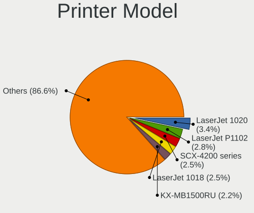

| Model                                                        | Notebooks | Percent |
|--------------------------------------------------------------|-----------|---------|
| HP LaserJet 1020                                             | 12        | 3.35%   |
| HP LaserJet P1102                                            | 10        | 2.79%   |
| Samsung SCX-4200 series                                      | 9         | 2.51%   |
| HP LaserJet 1018                                             | 9         | 2.51%   |
| Panasonic (Matsushita) KX-MB1500RU                           | 8         | 2.23%   |
| Xerox B210                                                   | 6         | 1.68%   |
| Samsung SCX-3400 Series                                      | 6         | 1.68%   |
| Panasonic (Matsushita) KX-MB2030 Multifunction Laser Printer | 6         | 1.68%   |
| Canon LBP2900                                                | 6         | 1.68%   |
| Canon CAPT USB Device                                        | 6         | 1.68%   |
| Samsung SCX-3200 Series                                      | 5         | 1.4%    |
| Canon MF4410                                                 | 5         | 1.4%    |
| Canon LBP6000                                                | 5         | 1.4%    |
| Brother HL-1110 series                                       | 5         | 1.4%    |
| Xerox Phaser 3320                                            | 4         | 1.12%   |
| Seiko Epson Printer                                          | 4         | 1.12%   |
| Seiko Epson L210 Series                                      | 4         | 1.12%   |
| Samsung ML-1210 Printer                                      | 4         | 1.12%   |
| HP LaserJet Professional P1102w                              | 4         | 1.12%   |
| HP LaserJet P1005                                            | 4         | 1.12%   |
| HP LaserJet 1010                                             | 4         | 1.12%   |
| Canon PIXMA MG2500 Series                                    | 4         | 1.12%   |
| Canon MF3010                                                 | 4         | 1.12%   |
| Canon LBP7010C/7018C                                         | 4         | 1.12%   |
| Canon LBP3010/LBP3018/LBP3050                                | 4         | 1.12%   |
| Canon iP2700 series                                          | 4         | 1.12%   |
| Xerox Phaser 3010                                            | 3         | 0.84%   |
| Samsung M332x 382x 402x Series                               | 3         | 0.84%   |
| Samsung M2070 Series                                         | 3         | 0.84%   |
| Prolific PL2305 Parallel Port                                | 3         | 0.84%   |
| HP LaserJet Professional P 1102w                             | 3         | 0.84%   |
| HP LaserJet 1200                                             | 3         | 0.84%   |
| HP Deskjet 2050 J510                                         | 3         | 0.84%   |
| Canon PIXMA MP280                                            | 3         | 0.84%   |
| Canon MG2400 series                                          | 3         | 0.84%   |
| Canon LaserShot LBP-1120 Printer                             | 3         | 0.84%   |
| Canon G1000 series                                           | 3         | 0.84%   |
| Brother HL-2030 Laser Printer                                | 3         | 0.84%   |
| Brother DCP-1510                                             | 3         | 0.84%   |
| Xerox Phaser 6000B                                           | 2         | 0.56%   |

Scanner Vendor
--------------

Scanner device vendors

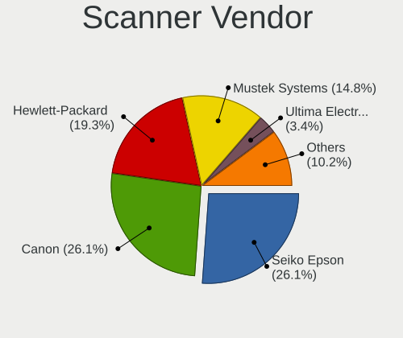

| Vendor                      | Notebooks | Percent |
|-----------------------------|-----------|---------|
| Seiko Epson                 | 23        | 26.14%  |
| Canon                       | 23        | 26.14%  |
| Hewlett-Packard             | 17        | 19.32%  |
| Mustek Systems              | 13        | 14.77%  |
| Ultima Electronics          | 3         | 3.41%   |
| Acer Peripherals (now BenQ) | 3         | 3.41%   |
| KYE Systems (Mouse Systems) | 2         | 2.27%   |
| Visioneer                   | 1         | 1.14%   |
| Papillon Systems            | 1         | 1.14%   |
| Microtek International      | 1         | 1.14%   |
| Fujitsu                     | 1         | 1.14%   |

Scanner Model
-------------

Scanner device models

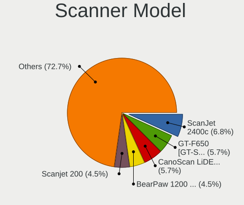

| Model                                                                                 | Notebooks | Percent |
|---------------------------------------------------------------------------------------|-----------|---------|
| HP ScanJet 2400c                                                                      | 6         | 6.82%   |
| Seiko Epson GT-F650 [GT-S600/Perfection V10/V100]                                     | 5         | 5.68%   |
| Canon CanoScan LiDE 110                                                               | 5         | 5.68%   |
| Mustek Systems BearPaw 1200 CU Plus                                                   | 4         | 4.55%   |
| HP Scanjet 200                                                                        | 4         | 4.55%   |
| Canon CanoScan N670U/N676U/LiDE 20                                                    | 4         | 4.55%   |
| Canon CanoScan LIDE 25                                                                | 4         | 4.55%   |
| Ultima Artec Ultima 2000 (GT6801 based)/Lifetec LT9385/ScanMagic 1200 UB Plus Scanner | 3         | 3.41%   |
| Seiko Epson GT-F730 [GT-S630/Perfection V33/V330 Photo]                               | 3         | 3.41%   |
| Seiko Epson GT-F520/GT-F570 [Perfection 3590 PHOTO]                                   | 3         | 3.41%   |
| Seiko Epson GT-F500/GT-F550 [Perfection 2480/2580 PHOTO]                              | 3         | 3.41%   |
| Mustek Systems SNAPSCAN e22                                                           | 3         | 3.41%   |
| HP ScanJet 3770                                                                       | 3         | 3.41%   |
| Mustek Systems BearPaw 1200 TA/CS                                                     | 2         | 2.27%   |
| HP ScanJet 3400cse                                                                    | 2         | 2.27%   |
| Canon CanoScan LiDE 220                                                               | 2         | 2.27%   |
| Canon CanoScan LiDE 120                                                               | 2         | 2.27%   |
| Acer Peripherals (now BenQ) Benq 5150/5250                                            | 2         | 2.27%   |
| Visioneer DM 152                                                                      | 1         | 1.14%   |
| Seiko Epson GT-X800 [Perfection 4990 PHOTO]                                           | 1         | 1.14%   |
| Seiko Epson GT-F670 [Perfection V200 Photo]                                           | 1         | 1.14%   |
| Seiko Epson GT-F600 [Perfection 4180]                                                 | 1         | 1.14%   |
| Seiko Epson GT-9700F [Perfection 2450 PHOTO]                                          | 1         | 1.14%   |
| Seiko Epson GT-8400UF [Perfection 1670/1670 PHOTO]                                    | 1         | 1.14%   |
| Seiko Epson GT-7400U [Perfection 1270]                                                | 1         | 1.14%   |
| Seiko Epson GT-7300U [Perfection 1260/1260 PHOTO]                                     | 1         | 1.14%   |
| Seiko Epson ES-7000H [GT-15000]                                                       | 1         | 1.14%   |
| Seiko Epson CC-570L [Stylus CX3100/CX3200]                                            | 1         | 1.14%   |
| Papillon Systems Scanner DS45USB                                                      | 1         | 1.14%   |
| Mustek Systems BearPaw 2448 TA Pro                                                    | 1         | 1.14%   |
| Mustek Systems BearPaw 2448 CU Pro                                                    | 1         | 1.14%   |
| Mustek Systems BearPaw 2400 TA Plus                                                   | 1         | 1.14%   |
| Mustek Systems BearPaw 2400 CU Plus                                                   | 1         | 1.14%   |
| Microtek International USB1200 Scanner                                                | 1         | 1.14%   |
| KYE Systems (Mouse Systems) ColorPage-Vivid4                                          | 1         | 1.14%   |
| KYE Systems (Mouse Systems) ColorPage-Vivid 1200 XE                                   | 1         | 1.14%   |
| HP ScanJet G4010                                                                      | 1         | 1.14%   |
| HP ScanJet 3500c                                                                      | 1         | 1.14%   |
| Fujitsu fi-4120c Scanner                                                              | 1         | 1.14%   |
| Canon CanoScan LiDE 70                                                                | 1         | 1.14%   |

Camera
------

Camera Vendor
-------------

Camera device vendors

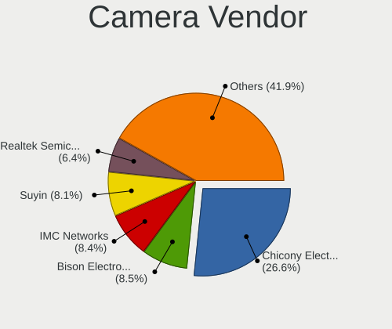

| Vendor                                 | Notebooks | Percent |
|----------------------------------------|-----------|---------|
| Chicony Electronics                    | 3248      | 26.62%  |
| Bison Electronics                      | 1039      | 8.51%   |
| IMC Networks                           | 1022      | 8.38%   |
| Suyin                                  | 994       | 8.15%   |
| Realtek Semiconductor                  | 785       | 6.43%   |
| Sunplus Innovation Technology          | 721       | 5.91%   |
| Microdia                               | 627       | 5.14%   |
| Silicon Motion                         | 626       | 5.13%   |
| Cheng Uei Precision Industry (Foxlink) | 367       | 3.01%   |
| Alcor Micro                            | 353       | 2.89%   |
| Syntek                                 | 350       | 2.87%   |
| Quanta                                 | 274       | 2.25%   |
| Z-Star Microelectronics                | 237       | 1.94%   |
| ALi                                    | 174       | 1.43%   |
| Ricoh                                  | 166       | 1.36%   |
| Acer                                   | 160       | 1.31%   |
| DigiTech                               | 133       | 1.09%   |
| Apple                                  | 116       | 0.95%   |
| Lite-On Technology                     | 92        | 0.75%   |
| Logitech                               | 73        | 0.6%    |
| Lenovo                                 | 72        | 0.59%   |
| Primax Electronics                     | 56        | 0.46%   |
| Importek                               | 56        | 0.46%   |
| Luxvisions Innotech Limited            | 51        | 0.42%   |
| Samsung Electronics                    | 42        | 0.34%   |
| Sonix Technology                       | 41        | 0.34%   |
| OmniVision Technologies                | 25        | 0.2%    |
| Sunplus Technology                     | 23        | 0.19%   |
| Unknown                                | 21        | 0.17%   |
| SunplusIT                              | 19        | 0.16%   |
| Image Processor                        | 17        | 0.14%   |
| Genesys Logic                          | 15        | 0.12%   |
| icSpring                               | 14        | 0.11%   |
| Y Media                                | 12        | 0.1%    |
| ShineTech                              | 11        | 0.09%   |
| GEMBIRD                                | 11        | 0.09%   |
| USB Camera CS                          | 9         | 0.07%   |
| Pixart Imaging                         | 9         | 0.07%   |
| Foxconn / Hon Hai                      | 8         | 0.07%   |
| Shine-optics                           | 7         | 0.06%   |

Camera Model
------------

Camera device models

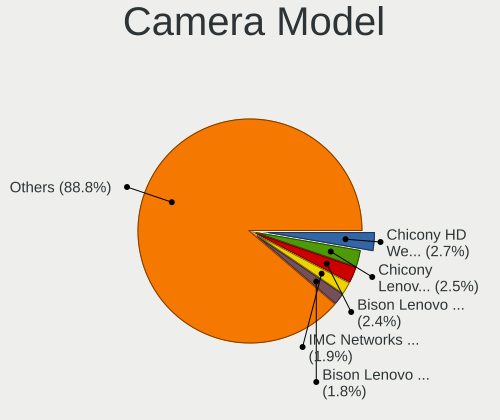

| Model                                                       | Notebooks | Percent |
|-------------------------------------------------------------|-----------|---------|
| Chicony HD Webcam                                           | 333       | 2.73%   |
| Chicony Lenovo EasyCamera                                   | 304       | 2.49%   |
| Bison Lenovo Integrated Webcam                              | 293       | 2.4%    |
| IMC Networks UVC VGA Webcam                                 | 229       | 1.87%   |
| Bison Lenovo EasyCamera                                     | 214       | 1.75%   |
| Sunplus HD WebCam                                           | 209       | 1.71%   |
| Chicony USB 2.0 Camera                                      | 173       | 1.42%   |
| Chicony USB2.0 HD UVC WebCam                                | 170       | 1.39%   |
| Chicony Integrated Camera                                   | 158       | 1.29%   |
| Suyin Acer/HP Integrated Webcam [CN0314]                    | 129       | 1.06%   |
| Chicony 2.0M UVC Webcam / CNF7129                           | 127       | 1.04%   |
| Realtek Lenovo EasyCamera                                   | 126       | 1.03%   |
| Silicon Motion WebCam SC-0311139N                           | 125       | 1.02%   |
| Alcor Micro Asus Integrated Webcam                          | 123       | 1.01%   |
| ALi Gateway Webcam                                          | 117       | 0.96%   |
| Syntek Lenovo EasyCamera                                    | 116       | 0.95%   |
| Realtek USB Camera                                          | 114       | 0.93%   |
| IMC Networks Integrated Webcam                              | 114       | 0.93%   |
| Chicony USB2.0 VGA UVC WebCam                               | 112       | 0.92%   |
| DigiTech USB 2.0 PC Camera                                  | 111       | 0.91%   |
| IMC Networks USB2.0 VGA UVC WebCam                          | 106       | 0.87%   |
| Sunplus Asus Webcam                                         | 101       | 0.83%   |
| Chicony VGA WebCam                                          | 98        | 0.8%    |
| Chicony HP Truevision HD                                    | 98        | 0.8%    |
| Suyin 1.3M HD WebCam                                        | 97        | 0.79%   |
| Bison BisonCam, NB Pro                                      | 93        | 0.76%   |
| Chicony HP Webcam                                           | 92        | 0.75%   |
| Chicony USB2.0 0.3M UVC WebCam                              | 91        | 0.74%   |
| Suyin Acer CrystalEye Webcam                                | 85        | 0.7%    |
| IMC Networks USB2.0 UVC HD Webcam                           | 84        | 0.69%   |
| Chicony WebCam                                              | 84        | 0.69%   |
| Silicon Motion WebCam SCB-1100N                             | 83        | 0.68%   |
| Chicony 1.3M Webcam                                         | 82        | 0.67%   |
| IMC Networks USB 2.0 UVC VGA WebCam                         | 81        | 0.66%   |
| Microdia Sonix USB 2.0 Camera                               | 79        | 0.65%   |
| Acer BisonCam, NB Pro                                       | 78        | 0.64%   |
| Silicon Motion WebCam SCB-0355N                             | 77        | 0.63%   |
| Suyin 1.3M WebCam (notebook emachines E730, Acer sub-brand) | 76        | 0.62%   |
| IMC Networks USB2.0 HD UVC WebCam                           | 75        | 0.61%   |
| Chicony CNF9055 Toshiba Webcam                              | 75        | 0.61%   |

Security
--------

Fingerprint Vendor
------------------

Fingerprint sensor vendors

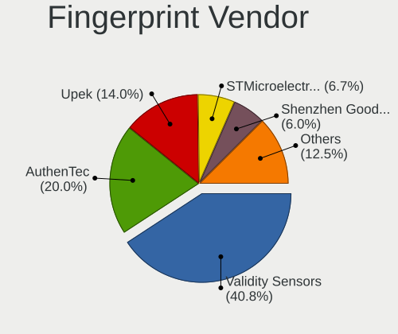

| Vendor                             | Notebooks | Percent |
|------------------------------------|-----------|---------|
| Validity Sensors                   | 490       | 40.77%  |
| AuthenTec                          | 241       | 20.05%  |
| Upek                               | 168       | 13.98%  |
| STMicroelectronics                 | 81        | 6.74%   |
| Shenzhen Goodix Technology         | 72        | 5.99%   |
| LighTuning Technology              | 69        | 5.74%   |
| Synaptics                          | 26        | 2.16%   |
| Elan Microelectronics              | 25        | 2.08%   |
| HOLTEK                             | 12        | 1%      |
| Focal-systems.Corp                 | 10        | 0.83%   |
| Realtek USB2.0 Finger Print Bridge | 4         | 0.33%   |
| GDMicroelectronics                 | 4         | 0.33%   |

Fingerprint Model
-----------------

Fingerprint sensor models

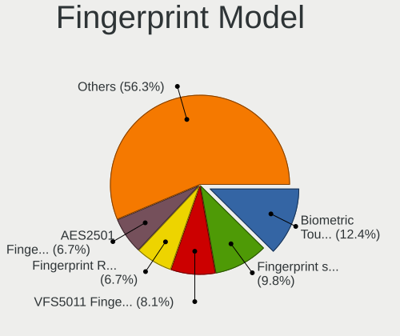

| Model                                                                      | Notebooks | Percent |
|----------------------------------------------------------------------------|-----------|---------|
| Upek Biometric Touchchip/Touchstrip Fingerprint Sensor                     | 149       | 12.4%   |
| Validity Sensors Fingerprint scanner                                       | 118       | 9.82%   |
| Validity Sensors VFS5011 Fingerprint Reader                                | 97        | 8.07%   |
| STMicroelectronics Fingerprint Reader                                      | 81        | 6.74%   |
| AuthenTec AES2501 Fingerprint Sensor                                       | 80        | 6.66%   |
| AuthenTec AES1600                                                          | 69        | 5.74%   |
| Shenzhen Goodix  Fingerprint Device                                        | 68        | 5.66%   |
| Validity Sensors VFS495 Fingerprint Reader                                 | 57        | 4.74%   |
| AuthenTec AES2810                                                          | 56        | 4.66%   |
| Validity Sensors VFS451 Fingerprint Reader                                 | 45        | 3.74%   |
| LighTuning Fingerprint Reader                                              | 45        | 3.74%   |
| Validity Sensors VFS491                                                    | 36        | 3%      |
| Validity Sensors VFS301 Fingerprint Reader                                 | 34        | 2.83%   |
| Validity Sensors VFS471 Fingerprint Reader                                 | 29        | 2.41%   |
| Validity Sensors VFS101 Fingerprint Reader                                 | 28        | 2.33%   |
| AuthenTec AES1660 Fingerprint Sensor                                       | 21        | 1.75%   |
| Upek TCS5B Fingerprint sensor                                              | 19        | 1.58%   |
| Elan ELAN:Fingerprint                                                      | 19        | 1.58%   |
| LighTuning ES603 Swipe Fingerprint Sensor                                  | 18        | 1.5%    |
| Validity Sensors VFS 5011 fingerprint sensor                               | 13        | 1.08%   |
| Validity Sensors Swipe Fingerprint Sensor                                  | 13        | 1.08%   |
| HOLTEK FocalTech Fingerprint Device                                        | 12        | 1%      |
| Focal-systems.Corp FT9201Fingerprint.                                      | 10        | 0.83%   |
| AuthenTec Fingerprint Sensor                                               | 7         | 0.58%   |
| AuthenTec AES2550 Fingerprint Sensor                                       | 7         | 0.58%   |
| Validity Sensors VFS Fingerprint sensor                                    | 6         | 0.5%    |
| Synaptics Metallica MIS Touch Fingerprint Reader                           | 6         | 0.5%    |
| LighTuning EgisTec Touch Fingerprint Sensor                                | 6         | 0.5%    |
| Synaptics  WBDI                                                            | 5         | 0.42%   |
| Synaptics Prometheus MIS Touch Fingerprint Reader                          | 5         | 0.42%   |
| Elan ELAN:ARM-M4                                                           | 5         | 0.42%   |
| Validity Sensors VFS300 Fingerprint Reader                                 | 4         | 0.33%   |
| Validity Sensors Synaptics WBDI                                            | 4         | 0.33%   |
| Shenzhen Goodix Fingerprint Reader                                         | 4         | 0.33%   |
| Realtek USB2.0 Finger Print Bridge FocalTech Fingerprint Device            | 4         | 0.33%   |
| GDMicroelectronics Touch Fingerprint Sensor                                | 4         | 0.33%   |
| Validity Sensors Synaptics VFS7552 Touch Fingerprint Sensor with PurePrint | 3         | 0.25%   |
| Synaptics Fingerprint reader [HP G6]                                       | 3         | 0.25%   |
| Validity Sensors VFS7500 Touch Fingerprint Sensor                          | 2         | 0.17%   |
| Synaptics  FS7604 Touch Fingerprint Sensor with PurePrint                  | 2         | 0.17%   |

Chipcard Vendor
---------------

Chipcard module vendors

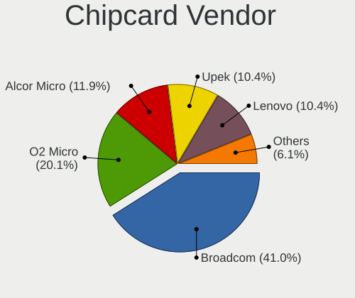

| Vendor                    | Notebooks | Percent |
|---------------------------|-----------|---------|
| Broadcom                  | 114       | 41.01%  |
| O2 Micro                  | 56        | 20.14%  |
| Alcor Micro               | 33        | 11.87%  |
| Upek                      | 29        | 10.43%  |
| Lenovo                    | 29        | 10.43%  |
| Gemalto (was Gemplus)     | 4         | 1.44%   |
| OmniKey                   | 3         | 1.08%   |
| Aladdin Knowledge Systems | 3         | 1.08%   |
| Aktiv                     | 3         | 1.08%   |
| Aladdin R.D.              | 2         | 0.72%   |
| Realtek Semiconductor     | 1         | 0.36%   |
| In Focus Systems          | 1         | 0.36%   |

Chipcard Model
--------------

Chipcard module models

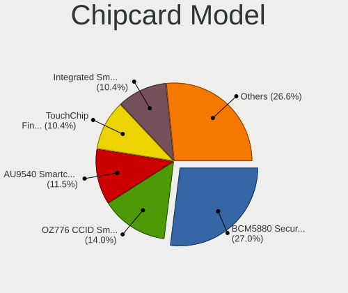

| Model                                                                        | Notebooks | Percent |
|------------------------------------------------------------------------------|-----------|---------|
| Broadcom BCM5880 Secure Applications Processor                               | 75        | 26.98%  |
| O2 Micro OZ776 CCID Smartcard Reader                                         | 39        | 14.03%  |
| Alcor Micro AU9540 Smartcard Reader                                          | 32        | 11.51%  |
| Upek TouchChip Fingerprint Coprocessor (WBF advanced mode)                   | 29        | 10.43%  |
| Lenovo Integrated Smart Card Reader                                          | 29        | 10.43%  |
| Broadcom BCM5880 Secure Applications Processor with fingerprint swipe sensor | 27        | 9.71%   |
| O2 Micro Oz776 SmartCard Reader                                              | 17        | 6.12%   |
| Broadcom 5880                                                                | 9         | 3.24%   |
| Gemalto (was Gemplus) Compact Smart Card Reader Writer                       | 3         | 1.08%   |
| Aladdin Knowledge Systems Token JC                                           | 3         | 1.08%   |
| Aktiv Rutoken lite                                                           | 3         | 1.08%   |
| OmniKey CardMan 1021                                                         | 2         | 0.72%   |
| Broadcom 58200                                                               | 2         | 0.72%   |
| Aladdin R.D. JaCarta                                                         | 2         | 0.72%   |
| Realtek Semiconductor Smart Card Reader Interface                            | 1         | 0.36%   |
| OmniKey CardMan 4321                                                         | 1         | 0.36%   |
| In Focus Systems EMV Smartcard Reader                                        | 1         | 0.36%   |
| Gemalto (was Gemplus) GemPC Key SmartCard Reader                             | 1         | 0.36%   |
| Broadcom BCM58200 ControlVault 3 (FingerPrint sensor + Contacted SmartCard)  | 1         | 0.36%   |
| Alcor Micro Watchdata W 1981                                                 | 1         | 0.36%   |

Unsupported
-----------

Unsupported Devices
-------------------

Total unsupported devices on board

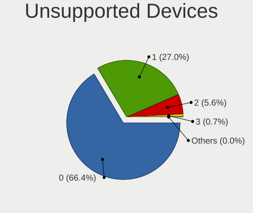

| Total | Notebooks | Percent |
|-------|-----------|---------|
| 0     | 9913      | 66.44%  |
| 1     | 4032      | 27.02%  |
| 2     | 841       | 5.64%   |
| 3     | 109       | 0.73%   |
| 4     | 23        | 0.15%   |
| 8     | 1         | 0.01%   |
| 5     | 1         | 0.01%   |

Unsupported Device Types
------------------------

Types of unsupported devices

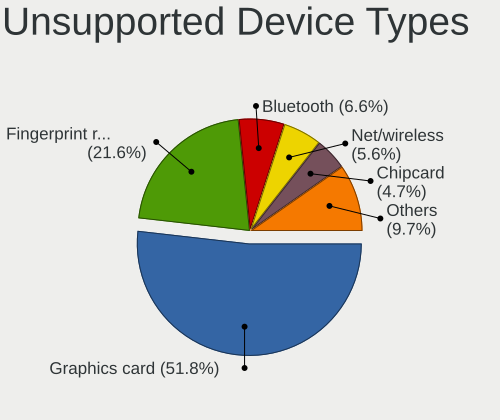

| Type                     | Notebooks | Percent |
|--------------------------|-----------|---------|
| Graphics card            | 2886      | 51.8%   |
| Fingerprint reader       | 1202      | 21.58%  |
| Bluetooth                | 367       | 6.59%   |
| Net/wireless             | 313       | 5.62%   |
| Chipcard                 | 261       | 4.68%   |
| Storage                  | 128       | 2.3%    |
| Flash memory             | 107       | 1.92%   |
| Multimedia controller    | 101       | 1.81%   |
| Camera                   | 77        | 1.38%   |
| Communication controller | 71        | 1.27%   |
| Card reader              | 20        | 0.36%   |
| Sound                    | 12        | 0.22%   |
| Net/ethernet             | 9         | 0.16%   |
| Dvb card                 | 5         | 0.09%   |
| Tv card                  | 4         | 0.07%   |
| Video                    | 3         | 0.05%   |
| Network                  | 2         | 0.04%   |
| Modem                    | 2         | 0.04%   |
| Wireless                 | 1         | 0.02%   |

