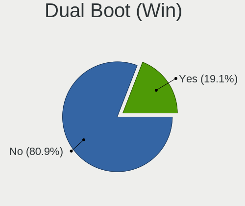
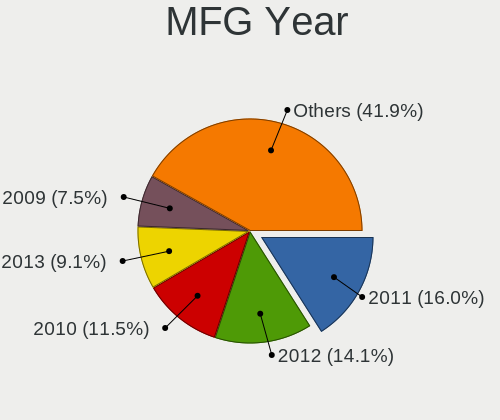
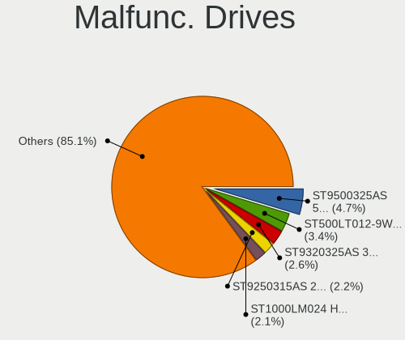
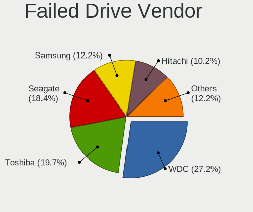
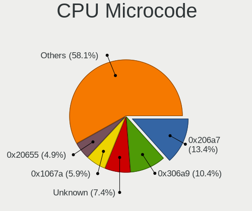
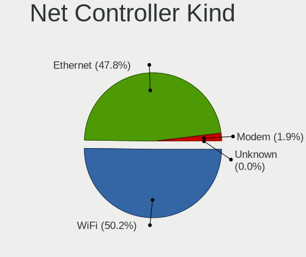
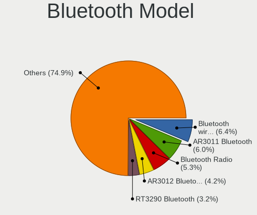
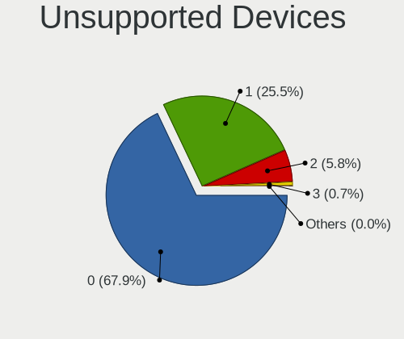

ROSA - Tested Hardware & Statistics (Notebooks)
-----------------------------------------------

A project to collect tested hardware configurations for ROSA.

Anyone can contribute to this report by the [hw-probe](https://github.com/linuxhw/hw-probe) tool:

    sudo -E hw-probe -all -upload

Please contribute! Especially if your hardware is rare.

Contents
--------

* [ Test Cases ](#test-cases)

* [ System ](#system)
  - [ OS                       ](#os)
  - [ OS Family                ](#os-family)
  - [ Kernel                   ](#kernel)
  - [ Kernel Family            ](#kernel-family)
  - [ Kernel Major Ver.        ](#kernel-major-ver)
  - [ Arch                     ](#arch)
  - [ DE                       ](#de)
  - [ Display Server           ](#display-server)
  - [ Display Manager          ](#display-manager)
  - [ OS Lang                  ](#os-lang)
  - [ Boot Mode                ](#boot-mode)
  - [ Filesystem               ](#filesystem)
  - [ Part. scheme             ](#part-scheme)
  - [ Dual Boot with Linux/BSD ](#dual-boot-with-linuxbsd)
  - [ Dual Boot (Win)          ](#dual-boot-win)

* [ Board ](#board)
  - [ Vendor                   ](#vendor)
  - [ Model                    ](#model)
  - [ Model Family             ](#model-family)
  - [ MFG Year                 ](#mfg-year)
  - [ Form Factor              ](#form-factor)
  - [ Secure Boot              ](#secure-boot)
  - [ Coreboot                 ](#coreboot)
  - [ RAM Size                 ](#ram-size)
  - [ RAM Used                 ](#ram-used)
  - [ Total Drives             ](#total-drives)
  - [ Has CD-ROM               ](#has-cd-rom)
  - [ Has Ethernet             ](#has-ethernet)
  - [ Has WiFi                 ](#has-wifi)
  - [ Has Bluetooth            ](#has-bluetooth)

* [ Location ](#location)
  - [ Country                  ](#country)
  - [ City                     ](#city)

* [ Drives ](#drives)
  - [ Drive Vendor             ](#drive-vendor)
  - [ Drive Model              ](#drive-model)
  - [ HDD Vendor               ](#hdd-vendor)
  - [ SSD Vendor               ](#ssd-vendor)
  - [ Drive Kind               ](#drive-kind)
  - [ Drive Connector          ](#drive-connector)
  - [ Drive Size               ](#drive-size)
  - [ Space Total              ](#space-total)
  - [ Space Used               ](#space-used)
  - [ Malfunc. Drives          ](#malfunc-drives)
  - [ Malfunc. Drive Vendor    ](#malfunc-drive-vendor)
  - [ Malfunc. HDD Vendor      ](#malfunc-hdd-vendor)
  - [ Malfunc. Drive Kind      ](#malfunc-drive-kind)
  - [ Failed Drives            ](#failed-drives)
  - [ Failed Drive Vendor      ](#failed-drive-vendor)
  - [ Drive Status             ](#drive-status)

* [ Storage controller ](#storage-controller)
  - [ Storage Vendor           ](#storage-vendor)
  - [ Storage Model            ](#storage-model)
  - [ Storage Kind             ](#storage-kind)

* [ Processor ](#processor)
  - [ CPU Vendor               ](#cpu-vendor)
  - [ CPU Model                ](#cpu-model)
  - [ CPU Model Family         ](#cpu-model-family)
  - [ CPU Cores                ](#cpu-cores)
  - [ CPU Sockets              ](#cpu-sockets)
  - [ CPU Threads              ](#cpu-threads)
  - [ CPU Op-Modes             ](#cpu-op-modes)
  - [ CPU Microcode            ](#cpu-microcode)
  - [ CPU Microarch            ](#cpu-microarch)

* [ Graphics ](#graphics)
  - [ GPU Vendor               ](#gpu-vendor)
  - [ GPU Model                ](#gpu-model)
  - [ GPU Combo                ](#gpu-combo)
  - [ GPU Driver               ](#gpu-driver)
  - [ GPU Memory               ](#gpu-memory)

* [ Monitor ](#monitor)
  - [ Monitor Vendor           ](#monitor-vendor)
  - [ Monitor Model            ](#monitor-model)
  - [ Monitor Resolution       ](#monitor-resolution)
  - [ Monitor Diagonal         ](#monitor-diagonal)
  - [ Monitor Width            ](#monitor-width)
  - [ Aspect Ratio             ](#aspect-ratio)
  - [ Monitor Area             ](#monitor-area)
  - [ Pixel Density            ](#pixel-density)
  - [ Multiple Monitors        ](#multiple-monitors)

* [ Network ](#network)
  - [ Net Controller Vendor    ](#net-controller-vendor)
  - [ Net Controller Model     ](#net-controller-model)
  - [ Wireless Vendor          ](#wireless-vendor)
  - [ Wireless Model           ](#wireless-model)
  - [ Ethernet Vendor          ](#ethernet-vendor)
  - [ Ethernet Model           ](#ethernet-model)
  - [ Net Controller Kind      ](#net-controller-kind)
  - [ Used Controller          ](#used-controller)
  - [ NICs                     ](#nics)
  - [ IPv6                     ](#ipv6)

* [ Bluetooth ](#bluetooth)
  - [ Bluetooth Vendor         ](#bluetooth-vendor)
  - [ Bluetooth Model          ](#bluetooth-model)

* [ Sound ](#sound)
  - [ Sound Vendor             ](#sound-vendor)
  - [ Sound Model              ](#sound-model)

* [ Memory ](#memory)
  - [ Memory Vendor            ](#memory-vendor)
  - [ Memory Model             ](#memory-model)
  - [ Memory Kind              ](#memory-kind)
  - [ Memory Form Factor       ](#memory-form-factor)
  - [ Memory Size              ](#memory-size)
  - [ Memory Speed             ](#memory-speed)

* [ Printers & scanners ](#printers--scanners)
  - [ Printer Vendor           ](#printer-vendor)
  - [ Printer Model            ](#printer-model)
  - [ Scanner Vendor           ](#scanner-vendor)
  - [ Scanner Model            ](#scanner-model)

* [ Camera ](#camera)
  - [ Camera Vendor            ](#camera-vendor)
  - [ Camera Model             ](#camera-model)

* [ Security ](#security)
  - [ Fingerprint Vendor       ](#fingerprint-vendor)
  - [ Fingerprint Model        ](#fingerprint-model)
  - [ Chipcard Vendor          ](#chipcard-vendor)
  - [ Chipcard Model           ](#chipcard-model)

* [ Unsupported ](#unsupported)
  - [ Unsupported Devices      ](#unsupported-devices)
  - [ Unsupported Device Types ](#unsupported-device-types)

Test Cases
----------

Total: 22209

| Vendor        | Model                       | Probe                                                      | Date         |
|---------------|-----------------------------|------------------------------------------------------------|--------------|
| eMachines     | E625                        | [e4674eed04](https://linux-hardware.org/?probe=e4674eed04) | Jan 06, 2025 |
| Samsung       | RV409/RV509/RV709           | [0c7619aac5](https://linux-hardware.org/?probe=0c7619aac5) | Jan 06, 2025 |
| Lenovo        | Legion 5 15ARH05 82B5       | [572f922d7c](https://linux-hardware.org/?probe=572f922d7c) | Jan 06, 2025 |
| Lenovo        | ThinkPad X220 4290RV1       | [8873dfc3ac](https://linux-hardware.org/?probe=8873dfc3ac) | Jan 05, 2025 |
| Lenovo        | IdeaPad Z570 HuronRiver ... | [e12dddcd7f](https://linux-hardware.org/?probe=e12dddcd7f) | Jan 05, 2025 |
| Unknown       | Unknown                     | [d526621027](https://linux-hardware.org/?probe=d526621027) | Jan 05, 2025 |
| ASUSTek       | K53TA                       | [26c9d957fc](https://linux-hardware.org/?probe=26c9d957fc) | Jan 04, 2025 |
| ASUSTek       | VivoBook_ASUSLaptop X509... | [08c2c8d3a6](https://linux-hardware.org/?probe=08c2c8d3a6) | Jan 03, 2025 |
| Toshiba       | NB100                       | [df34e9793f](https://linux-hardware.org/?probe=df34e9793f) | Jan 02, 2025 |
| MSI           | Katana 17 B12VFK            | [5bffc2a657](https://linux-hardware.org/?probe=5bffc2a657) | Jan 02, 2025 |
| Lenovo        | ThinkBook 16 G6 IRL 21KH    | [77722af02e](https://linux-hardware.org/?probe=77722af02e) | Jan 02, 2025 |
| HP            | 255 G8 Notebook PC          | [c48045073f](https://linux-hardware.org/?probe=c48045073f) | Jan 02, 2025 |
| Acer          | Aspire E5-571G              | [a4cd37383e](https://linux-hardware.org/?probe=a4cd37383e) | Jan 02, 2025 |
| HUAWEI        | BOD-WXX9                    | [305f6e1f4d](https://linux-hardware.org/?probe=305f6e1f4d) | Jan 02, 2025 |
| HUAWEI        | BOD-WXX9                    | [a65202783f](https://linux-hardware.org/?probe=a65202783f) | Jan 02, 2025 |
| Lenovo        | IdeaPad 100-15IBY 80MJ      | [eaa8dd18d4](https://linux-hardware.org/?probe=eaa8dd18d4) | Jan 02, 2025 |
| Acer          | Aspire 3610                 | [eff3c1a864](https://linux-hardware.org/?probe=eff3c1a864) | Jan 01, 2025 |
| HUAWEI        | BOD-WXX9                    | [e28bd300ec](https://linux-hardware.org/?probe=e28bd300ec) | Jan 01, 2025 |
| Lenovo        | V15 G2 IJL 82QY             | [cd9b055146](https://linux-hardware.org/?probe=cd9b055146) | Dec 31, 2024 |
| DNS           | W510LU                      | [24e7ee2939](https://linux-hardware.org/?probe=24e7ee2939) | Dec 31, 2024 |
| Acer          | Acadia V1.34                | [10f43a8f8c](https://linux-hardware.org/?probe=10f43a8f8c) | Dec 31, 2024 |
| Fujitsu Si... | LIFEBOOK S7020              | [7d29f5fd35](https://linux-hardware.org/?probe=7d29f5fd35) | Dec 30, 2024 |
| eMachines     | eM355                       | [cd8623ca62](https://linux-hardware.org/?probe=cd8623ca62) | Dec 30, 2024 |
| HP            | Stream Notebook PC 13       | [ea9dccd4a8](https://linux-hardware.org/?probe=ea9dccd4a8) | Dec 30, 2024 |
| Fujitsu Si... | LIFEBOOK S7020              | [127407fc25](https://linux-hardware.org/?probe=127407fc25) | Dec 30, 2024 |
| Acer          | Aspire 5742G                | [79525e56eb](https://linux-hardware.org/?probe=79525e56eb) | Dec 30, 2024 |
| Acer          | Aspire E1-531G              | [222752a541](https://linux-hardware.org/?probe=222752a541) | Dec 29, 2024 |
| Fujitsu Si... | AMILO Pro Edition V3405     | [d4622b1451](https://linux-hardware.org/?probe=d4622b1451) | Dec 29, 2024 |
| Lenovo        | S20-30 20421                | [7e1a5a670a](https://linux-hardware.org/?probe=7e1a5a670a) | Dec 29, 2024 |
| Lenovo        | G500 20236                  | [44c24fa0ee](https://linux-hardware.org/?probe=44c24fa0ee) | Dec 28, 2024 |
| Acer          | Unknown                     | [fa5b28121c](https://linux-hardware.org/?probe=fa5b28121c) | Dec 28, 2024 |
| Dell          | Vostro 1014                 | [89dcde03d0](https://linux-hardware.org/?probe=89dcde03d0) | Dec 28, 2024 |
| HP            | Stream Notebook PC 13       | [b31f0109e7](https://linux-hardware.org/?probe=b31f0109e7) | Dec 27, 2024 |
| Acer          | Aspire 5349                 | [4538d32a3d](https://linux-hardware.org/?probe=4538d32a3d) | Dec 26, 2024 |
| MSI           | GL62M 7RDX                  | [83b16ab268](https://linux-hardware.org/?probe=83b16ab268) | Dec 26, 2024 |
| HP            | EtiteBook 840 G5            | [5ed7fbc42d](https://linux-hardware.org/?probe=5ed7fbc42d) | Dec 25, 2024 |
| TECNO Mobi... | MEGABOOK K16SDA             | [99d3b277a9](https://linux-hardware.org/?probe=99d3b277a9) | Dec 25, 2024 |
| ASUSTek       | Vivobook Go E1504FA_E150... | [421416a69e](https://linux-hardware.org/?probe=421416a69e) | Dec 25, 2024 |
| Acer          | Aspire A317-52              | [3d85a6b6d7](https://linux-hardware.org/?probe=3d85a6b6d7) | Dec 25, 2024 |
| Lenovo        | ThinkPad X250 20CM003CRT    | [8131530228](https://linux-hardware.org/?probe=8131530228) | Dec 24, 2024 |
| Toshiba       | NB100                       | [1041e6c170](https://linux-hardware.org/?probe=1041e6c170) | Dec 24, 2024 |
| Dell          | Vostro 1014                 | [3a0229ef1c](https://linux-hardware.org/?probe=3a0229ef1c) | Dec 23, 2024 |
| ASUSTek       | ASUSLaptop_Q530VJ           | [701d015fd1](https://linux-hardware.org/?probe=701d015fd1) | Dec 22, 2024 |
| Acer          | AO531h                      | [ae863646cd](https://linux-hardware.org/?probe=ae863646cd) | Dec 22, 2024 |
| Lenovo        | ThinkPad P17 Gen 1 20SN0... | [472acf3ec6](https://linux-hardware.org/?probe=472acf3ec6) | Dec 21, 2024 |
| Lenovo        | ThinkPad P17 Gen 1 20SN0... | [71553abdd8](https://linux-hardware.org/?probe=71553abdd8) | Dec 21, 2024 |
| ASUSTek       | VivoBook_ASUSLaptop M650... | [5d90b386a8](https://linux-hardware.org/?probe=5d90b386a8) | Dec 21, 2024 |
| ASUSTek       | X555QA                      | [44b32a3f7b](https://linux-hardware.org/?probe=44b32a3f7b) | Dec 21, 2024 |
| LTD Delovo... | 15CLG2                      | [39a5c39de0](https://linux-hardware.org/?probe=39a5c39de0) | Dec 20, 2024 |
| Chuwi         | MiniBook X                  | [3d7be23d49](https://linux-hardware.org/?probe=3d7be23d49) | Dec 19, 2024 |
| Digma         | EVE 15 P418 NCN154BXW01     | [1f788db073](https://linux-hardware.org/?probe=1f788db073) | Dec 19, 2024 |
| HP            | EliteBook 840 G8 Noteboo... | [9f0fc66e58](https://linux-hardware.org/?probe=9f0fc66e58) | Dec 19, 2024 |
| Acer          | Aspire A315-53              | [f25c3e31af](https://linux-hardware.org/?probe=f25c3e31af) | Dec 19, 2024 |
| KVADRA        | NAU LE14U                   | [bca4537cc8](https://linux-hardware.org/?probe=bca4537cc8) | Dec 19, 2024 |
| HUAWEI        | NBD-WXX9                    | [0d321b083c](https://linux-hardware.org/?probe=0d321b083c) | Dec 19, 2024 |
| Clevo         | W240EL/W250ELQ/W270ELQ      | [ff394d758b](https://linux-hardware.org/?probe=ff394d758b) | Dec 18, 2024 |
| LTD Delovo... | 15TLI                       | [b0481ea420](https://linux-hardware.org/?probe=b0481ea420) | Dec 18, 2024 |
| Acer          | Extensa 215-23              | [9ed4841427](https://linux-hardware.org/?probe=9ed4841427) | Dec 18, 2024 |
| HP            | ProBook 4540s               | [4f31cb1609](https://linux-hardware.org/?probe=4f31cb1609) | Dec 18, 2024 |
| HP            | Laptop 15-dw3xxx            | [0fb8125031](https://linux-hardware.org/?probe=0fb8125031) | Dec 18, 2024 |
| Lenovo        | G500 20236                  | [e99102e968](https://linux-hardware.org/?probe=e99102e968) | Dec 17, 2024 |
| Positivo      | C464F                       | [6ba50c5c35](https://linux-hardware.org/?probe=6ba50c5c35) | Dec 17, 2024 |
| HUAWEI        | NBM-WXX9                    | [bc96f08cc4](https://linux-hardware.org/?probe=bc96f08cc4) | Dec 16, 2024 |
| ASUSTek       | 1225B                       | [282c903413](https://linux-hardware.org/?probe=282c903413) | Dec 16, 2024 |
| ASUSTek       | X401A1                      | [c8daab5ddd](https://linux-hardware.org/?probe=c8daab5ddd) | Dec 16, 2024 |
| ASUSTek       | X401A1                      | [68dca00960](https://linux-hardware.org/?probe=68dca00960) | Dec 16, 2024 |
| Samsung       | 305V4A/305V5A               | [579117e933](https://linux-hardware.org/?probe=579117e933) | Dec 16, 2024 |
| Acer          | Nitro AN517-51              | [cfc1632018](https://linux-hardware.org/?probe=cfc1632018) | Dec 15, 2024 |
| HP            | Presario V3700              | [d66d7edcc9](https://linux-hardware.org/?probe=d66d7edcc9) | Dec 15, 2024 |
| Dell          | Inspiron N5040              | [505ab582ed](https://linux-hardware.org/?probe=505ab582ed) | Dec 15, 2024 |
| Dell          | Inspiron N5040              | [1095593128](https://linux-hardware.org/?probe=1095593128) | Dec 14, 2024 |
| Toshiba       | NB100                       | [976e6530d5](https://linux-hardware.org/?probe=976e6530d5) | Dec 14, 2024 |
| ASUSTek       | K52F                        | [d91478f3d5](https://linux-hardware.org/?probe=d91478f3d5) | Dec 14, 2024 |
| Maibenben     | Perfectum Series            | [560f2b3cf0](https://linux-hardware.org/?probe=560f2b3cf0) | Dec 14, 2024 |
| Acer          | Aspire VN7-571G             | [244938cec7](https://linux-hardware.org/?probe=244938cec7) | Dec 14, 2024 |
| HP            | Pavilion dv7                | [72e503e392](https://linux-hardware.org/?probe=72e503e392) | Dec 14, 2024 |
| Acer          | Predator PH317-52           | [dbfb480a1a](https://linux-hardware.org/?probe=dbfb480a1a) | Dec 13, 2024 |
| Aquarius      | NS685U R11                  | [8a02adbd30](https://linux-hardware.org/?probe=8a02adbd30) | Dec 13, 2024 |
| Haier         | A1400EM                     | [6a70bab189](https://linux-hardware.org/?probe=6a70bab189) | Dec 12, 2024 |
| Notebook      | W250EGQ / W270EGQ           | [0f794c4db7](https://linux-hardware.org/?probe=0f794c4db7) | Dec 12, 2024 |
| HUAWEI        | NBM-WXX9                    | [06ed8ceba0](https://linux-hardware.org/?probe=06ed8ceba0) | Dec 12, 2024 |
| Haier         | A1400EM                     | [ec694f3d2b](https://linux-hardware.org/?probe=ec694f3d2b) | Dec 12, 2024 |
| Acer          | Aspire E5-573               | [202745daec](https://linux-hardware.org/?probe=202745daec) | Dec 11, 2024 |
| MSI           | VR610                       | [2cb0f5cee5](https://linux-hardware.org/?probe=2cb0f5cee5) | Dec 11, 2024 |
| Aquarius      | CMP NS685U_4                | [1625c80cdc](https://linux-hardware.org/?probe=1625c80cdc) | Dec 11, 2024 |
| HP            | EliteBook 840 G4            | [43588f84f7](https://linux-hardware.org/?probe=43588f84f7) | Dec 11, 2024 |
| Timi          | Redmi Book Pro 15 2022      | [6f1d744bdf](https://linux-hardware.org/?probe=6f1d744bdf) | Dec 11, 2024 |
| HP            | ProBook 440 G4              | [cc572d1c5d](https://linux-hardware.org/?probe=cc572d1c5d) | Dec 11, 2024 |
| HONOR         | FRI-HXX                     | [c1ace97f1b](https://linux-hardware.org/?probe=c1ace97f1b) | Dec 10, 2024 |
| Acer          | Aspire 5720                 | [7673fe735d](https://linux-hardware.org/?probe=7673fe735d) | Dec 10, 2024 |
| HP            | Laptop 15s-eq1xxx           | [a07076b780](https://linux-hardware.org/?probe=a07076b780) | Dec 10, 2024 |
| Acer          | Aspire E1-570G              | [4789e987c9](https://linux-hardware.org/?probe=4789e987c9) | Dec 10, 2024 |
| Acer          | Nitro AN517-51              | [bcd4ba760b](https://linux-hardware.org/?probe=bcd4ba760b) | Dec 09, 2024 |
| Samsung       | R530/R730                   | [76e645e1f5](https://linux-hardware.org/?probe=76e645e1f5) | Dec 08, 2024 |
| HP            | ProBook 440 G5              | [af0c5e2ba8](https://linux-hardware.org/?probe=af0c5e2ba8) | Dec 08, 2024 |
| HP            | ProBook 440 G5              | [bd256920c1](https://linux-hardware.org/?probe=bd256920c1) | Dec 08, 2024 |
| Toshiba       | Satellite U300              | [44bfb599a1](https://linux-hardware.org/?probe=44bfb599a1) | Dec 07, 2024 |
| ASUSTek       | X751MD                      | [5d526a41a5](https://linux-hardware.org/?probe=5d526a41a5) | Dec 07, 2024 |
| Lenovo        | G500 20236                  | [c5df9aa471](https://linux-hardware.org/?probe=c5df9aa471) | Dec 07, 2024 |
| Haier         | A1400SD                     | [6c163e8082](https://linux-hardware.org/?probe=6c163e8082) | Dec 07, 2024 |
| Lenovo        | IdeaPad Z500 20202          | [263eac9279](https://linux-hardware.org/?probe=263eac9279) | Dec 07, 2024 |
| Notebook      | W250EGQ / W270EGQ           | [34572ad8d6](https://linux-hardware.org/?probe=34572ad8d6) | Dec 07, 2024 |
| Samsung       | R510/P510                   | [5f6596d687](https://linux-hardware.org/?probe=5f6596d687) | Dec 07, 2024 |
| HP            | Pavilion 17                 | [755fd13cd8](https://linux-hardware.org/?probe=755fd13cd8) | Dec 06, 2024 |
| HP            | Pavilion dv6500             | [b5885a14db](https://linux-hardware.org/?probe=b5885a14db) | Dec 06, 2024 |
| ASUSTek       | K52F                        | [80a163229c](https://linux-hardware.org/?probe=80a163229c) | Dec 05, 2024 |
| Acer          | Nitro AN515-52              | [9fd3688418](https://linux-hardware.org/?probe=9fd3688418) | Dec 04, 2024 |
| Acer          | Nitro AN515-52              | [35f03ceef6](https://linux-hardware.org/?probe=35f03ceef6) | Dec 04, 2024 |
| Lenovo        | G580 20157                  | [d5c6a524fe](https://linux-hardware.org/?probe=d5c6a524fe) | Dec 04, 2024 |
| Dell          | Inspiron 3521               | [6f38eaee0a](https://linux-hardware.org/?probe=6f38eaee0a) | Dec 04, 2024 |
| iRU           | 17TLI                       | [5cde8d1248](https://linux-hardware.org/?probe=5cde8d1248) | Dec 04, 2024 |
| Dell          | Inspiron 3521               | [6bdcd2c2fc](https://linux-hardware.org/?probe=6bdcd2c2fc) | Dec 04, 2024 |
| ASUSTek       | VivoBook_ASUSLaptop X409... | [42a684379c](https://linux-hardware.org/?probe=42a684379c) | Dec 04, 2024 |
| Acer          | Extensa 215-23              | [63d7bb319f](https://linux-hardware.org/?probe=63d7bb319f) | Dec 04, 2024 |
| Lenovo        | G700 20251                  | [beacb57450](https://linux-hardware.org/?probe=beacb57450) | Dec 04, 2024 |
| Dell          | Latitude 5421               | [7b0e864d00](https://linux-hardware.org/?probe=7b0e864d00) | Dec 03, 2024 |
| Acer          | Aspire 5750G                | [1fb7124f16](https://linux-hardware.org/?probe=1fb7124f16) | Dec 03, 2024 |
| HP            | EliteBook 840 G4            | [c7eb4e7297](https://linux-hardware.org/?probe=c7eb4e7297) | Dec 03, 2024 |
| MSI           | Katana 17 B13UCX            | [8a44e2bbba](https://linux-hardware.org/?probe=8a44e2bbba) | Dec 02, 2024 |
| MSI           | Katana GF66 11UE            | [7c65d6d109](https://linux-hardware.org/?probe=7c65d6d109) | Dec 02, 2024 |
| Lenovo        | K14 Gen 1 21CSS16E00        | [7b6b2e8b6c](https://linux-hardware.org/?probe=7b6b2e8b6c) | Dec 02, 2024 |
| ASUSTek       | K53Z                        | [a562977b03](https://linux-hardware.org/?probe=a562977b03) | Dec 01, 2024 |
| ASUSTek       | X55A                        | [991edf32b4](https://linux-hardware.org/?probe=991edf32b4) | Dec 01, 2024 |
| Dell          | Inspiron 15-3552            | [efc49c880e](https://linux-hardware.org/?probe=efc49c880e) | Dec 01, 2024 |
| ASUSTek       | N56VV                       | [16936315ba](https://linux-hardware.org/?probe=16936315ba) | Dec 01, 2024 |
| Clevo         | W24/250CU                   | [e4e103fbcb](https://linux-hardware.org/?probe=e4e103fbcb) | Dec 01, 2024 |
| Lenovo        | B590 20208                  | [9d055886e1](https://linux-hardware.org/?probe=9d055886e1) | Dec 01, 2024 |
| HP            | EliteBook 8470p             | [4f59dc1883](https://linux-hardware.org/?probe=4f59dc1883) | Nov 30, 2024 |
| Timi          | Redmi Book Pro 15 2022      | [b9a54cec6e](https://linux-hardware.org/?probe=b9a54cec6e) | Nov 30, 2024 |
| Acer          | AOD270                      | [99379deccc](https://linux-hardware.org/?probe=99379deccc) | Nov 30, 2024 |
| Samsung       | R518                        | [e72c627236](https://linux-hardware.org/?probe=e72c627236) | Nov 30, 2024 |
| Lenovo        | IdeaPad 110-15ACL 80TJ      | [0bd82aa6e6](https://linux-hardware.org/?probe=0bd82aa6e6) | Nov 30, 2024 |
| Lenovo        | 3000 G770 PIWG1             | [85efb0763d](https://linux-hardware.org/?probe=85efb0763d) | Nov 29, 2024 |
| ASUSTek       | K50IJ                       | [707b1552b4](https://linux-hardware.org/?probe=707b1552b4) | Nov 29, 2024 |
| Lenovo        | ThinkPad E14 Gen 4 21E4S... | [de1eb3e60f](https://linux-hardware.org/?probe=de1eb3e60f) | Nov 29, 2024 |
| Lenovo        | B50-10 80QR                 | [e594c20739](https://linux-hardware.org/?probe=e594c20739) | Nov 29, 2024 |
| HP            | 250 G8 Notebook PC          | [0709f67f61](https://linux-hardware.org/?probe=0709f67f61) | Nov 29, 2024 |
| Dell          | Inspiron 5520               | [08941d1cfb](https://linux-hardware.org/?probe=08941d1cfb) | Nov 29, 2024 |
| HP            | 250 G8 Notebook PC          | [3943e4d18a](https://linux-hardware.org/?probe=3943e4d18a) | Nov 29, 2024 |
| HIPER         | SLIM                        | [e66244cce7](https://linux-hardware.org/?probe=e66244cce7) | Nov 28, 2024 |
| HP            | Pavilion dv7                | [64426589ec](https://linux-hardware.org/?probe=64426589ec) | Nov 28, 2024 |
| Acer          | AO531h                      | [31f919c235](https://linux-hardware.org/?probe=31f919c235) | Nov 28, 2024 |
| HUAWEI        | NBLL-WXX9                   | [591fe94a4e](https://linux-hardware.org/?probe=591fe94a4e) | Nov 28, 2024 |
| ASUSTek       | N56DY                       | [7476c72b70](https://linux-hardware.org/?probe=7476c72b70) | Nov 27, 2024 |
| Acer          | Aspire E5-571G              | [798f487b15](https://linux-hardware.org/?probe=798f487b15) | Nov 27, 2024 |
| Acer          | Aspire A315-24P             | [8903ffb3fa](https://linux-hardware.org/?probe=8903ffb3fa) | Nov 27, 2024 |
| Echips Imp... | NX140A-S                    | [b06fe2686e](https://linux-hardware.org/?probe=b06fe2686e) | Nov 27, 2024 |
| Acer          | Aspire A315-24P             | [451a22cd9c](https://linux-hardware.org/?probe=451a22cd9c) | Nov 27, 2024 |
| ASUSTek       | K50IJ                       | [7122caeb44](https://linux-hardware.org/?probe=7122caeb44) | Nov 27, 2024 |
| Lenovo        | G500 20236                  | [f1b004483c](https://linux-hardware.org/?probe=f1b004483c) | Nov 26, 2024 |
| LTD Delovo... | 15Y                         | [7764295981](https://linux-hardware.org/?probe=7764295981) | Nov 26, 2024 |
| Dell          | Inspiron 3521               | [07eabca4a3](https://linux-hardware.org/?probe=07eabca4a3) | Nov 26, 2024 |
| ASUSTek       | VivoBook_ASUSLaptop X409... | [befa325038](https://linux-hardware.org/?probe=befa325038) | Nov 26, 2024 |
| ASUSTek       | TUF Gaming FX505GE          | [738098b090](https://linux-hardware.org/?probe=738098b090) | Nov 26, 2024 |
| Acer          | Extensa 215-23              | [6a678ffd29](https://linux-hardware.org/?probe=6a678ffd29) | Nov 26, 2024 |
| Acer          | Extensa 215-23              | [4a667997c4](https://linux-hardware.org/?probe=4a667997c4) | Nov 26, 2024 |
| ASUSTek       | ASUS TUF Gaming A15 FA50... | [ca20ac12d1](https://linux-hardware.org/?probe=ca20ac12d1) | Nov 26, 2024 |
| Chuwi         | MiniBook X                  | [7e04b3761f](https://linux-hardware.org/?probe=7e04b3761f) | Nov 25, 2024 |
| Samsung       | R528/R728                   | [2124c15032](https://linux-hardware.org/?probe=2124c15032) | Nov 25, 2024 |
| ARDOR GAMI... | V15x_V17xRNx                | [274ac9f483](https://linux-hardware.org/?probe=274ac9f483) | Nov 25, 2024 |
| ASUSTek       | N61Vg                       | [b89a288757](https://linux-hardware.org/?probe=b89a288757) | Nov 24, 2024 |
| ASUSTek       | X550EP                      | [9dca4e280c](https://linux-hardware.org/?probe=9dca4e280c) | Nov 24, 2024 |
| ASUSTek       | X550VB                      | [df0a5d71b3](https://linux-hardware.org/?probe=df0a5d71b3) | Nov 24, 2024 |
| Apple         | MacBook7,1                  | [58ba694f65](https://linux-hardware.org/?probe=58ba694f65) | Nov 23, 2024 |
| Lenovo        | IdeaPad S400 20195          | [fd711a4501](https://linux-hardware.org/?probe=fd711a4501) | Nov 23, 2024 |
| Dell          | Inspiron 3721               | [49752c3003](https://linux-hardware.org/?probe=49752c3003) | Nov 23, 2024 |
| ASUSTek       | E502SA                      | [f47f531c1d](https://linux-hardware.org/?probe=f47f531c1d) | Nov 23, 2024 |
| eMachines     | E525                        | [73978a2a81](https://linux-hardware.org/?probe=73978a2a81) | Nov 22, 2024 |
| Graviton      | N17i-T                      | [2ffcc5a831](https://linux-hardware.org/?probe=2ffcc5a831) | Nov 22, 2024 |
| LTD Delovo... | 15CLG2                      | [e0e1247871](https://linux-hardware.org/?probe=e0e1247871) | Nov 22, 2024 |
| Chuwi         | MiniBook X                  | [519e83ec7f](https://linux-hardware.org/?probe=519e83ec7f) | Nov 22, 2024 |
| ASUSTek       | T200TAC                     | [7956252db7](https://linux-hardware.org/?probe=7956252db7) | Nov 22, 2024 |
| Lenovo        | IdeaPad Slim 3 16IAH8 83... | [cd715e15f9](https://linux-hardware.org/?probe=cd715e15f9) | Nov 22, 2024 |
| Lenovo        | V15-IGL 82C3                | [152346f838](https://linux-hardware.org/?probe=152346f838) | Nov 22, 2024 |
| HP            | Laptop 15s-fq2xxx           | [106d224431](https://linux-hardware.org/?probe=106d224431) | Nov 21, 2024 |
| ASUSTek       | X541SA                      | [7e938516bd](https://linux-hardware.org/?probe=7e938516bd) | Nov 21, 2024 |
| Lenovo        | ThinkBook 15 G3 ACL 21A4    | [f62f0c9233](https://linux-hardware.org/?probe=f62f0c9233) | Nov 21, 2024 |
| Graviton      | N17i-T                      | [a84d0abae6](https://linux-hardware.org/?probe=a84d0abae6) | Nov 21, 2024 |
| Lenovo        | IdeaPad S340-14API 81NB     | [fe0101038e](https://linux-hardware.org/?probe=fe0101038e) | Nov 21, 2024 |
| Dell          | Inspiron N5110              | [5b6ce07363](https://linux-hardware.org/?probe=5b6ce07363) | Nov 20, 2024 |
| Acer          | AO521                       | [78dc6670e6](https://linux-hardware.org/?probe=78dc6670e6) | Nov 20, 2024 |
| Lenovo        | ThinkPad L430 24662N5       | [3f365656fe](https://linux-hardware.org/?probe=3f365656fe) | Nov 20, 2024 |
| Samsung       | 350V5C/351V5C/3540VC/344... | [a92c419547](https://linux-hardware.org/?probe=a92c419547) | Nov 20, 2024 |
| Dell          | Inspiron 3521               | [8ca685357f](https://linux-hardware.org/?probe=8ca685357f) | Nov 20, 2024 |
| ASUSTek       | VivoBook_ASUSLaptop X409... | [b1c0dfd069](https://linux-hardware.org/?probe=b1c0dfd069) | Nov 20, 2024 |
| Acer          | Extensa 215-23              | [48a24854ff](https://linux-hardware.org/?probe=48a24854ff) | Nov 20, 2024 |
| Acer          | AO531h                      | [9a19727fc7](https://linux-hardware.org/?probe=9a19727fc7) | Nov 20, 2024 |
| Dell          | Inspiron 3781               | [12afe0b84d](https://linux-hardware.org/?probe=12afe0b84d) | Nov 20, 2024 |
| Acer          | TravelMate P253             | [ccb266e3dc](https://linux-hardware.org/?probe=ccb266e3dc) | Nov 19, 2024 |
| ASUSTek       | VivoBook_ASUSLaptop M370... | [2d554f87d0](https://linux-hardware.org/?probe=2d554f87d0) | Nov 19, 2024 |
| ASUSTek       | G551JM                      | [9a3ec47e80](https://linux-hardware.org/?probe=9a3ec47e80) | Nov 18, 2024 |
| Lenovo        | G700 20251                  | [334bde37bf](https://linux-hardware.org/?probe=334bde37bf) | Nov 17, 2024 |
| HP            | ProBook 440 G4              | [d025358c3c](https://linux-hardware.org/?probe=d025358c3c) | Nov 17, 2024 |
| MSI           | VR610                       | [8aacbdbd5b](https://linux-hardware.org/?probe=8aacbdbd5b) | Nov 17, 2024 |
| Lenovo        | G500 20236                  | [7dcaf25e66](https://linux-hardware.org/?probe=7dcaf25e66) | Nov 17, 2024 |
| Apple         | MacBook7,1                  | [0bed6b06a7](https://linux-hardware.org/?probe=0bed6b06a7) | Nov 17, 2024 |
| HP            | Compaq 15                   | [6c4420c44c](https://linux-hardware.org/?probe=6c4420c44c) | Nov 16, 2024 |
| HP            | Pavilion dv6                | [a2e1659988](https://linux-hardware.org/?probe=a2e1659988) | Nov 16, 2024 |
| Acer          | Aspire ES1-111              | [875da983e7](https://linux-hardware.org/?probe=875da983e7) | Nov 16, 2024 |
| MSI           | GE70 2OC\2OD\2OE            | [c97af8048e](https://linux-hardware.org/?probe=c97af8048e) | Nov 16, 2024 |
| Lenovo        | B590 20208                  | [e910b01809](https://linux-hardware.org/?probe=e910b01809) | Nov 16, 2024 |
| Lenovo        | ThinkPad L420 7854RP1       | [8465986e87](https://linux-hardware.org/?probe=8465986e87) | Nov 15, 2024 |
| HP            | ProBook 440 G5              | [14d900eecc](https://linux-hardware.org/?probe=14d900eecc) | Nov 15, 2024 |
| HP            | Laptop 15s-eq1xxx           | [220e4c1b48](https://linux-hardware.org/?probe=220e4c1b48) | Nov 15, 2024 |
| ASUSTek       | X550WA                      | [efafa3fd50](https://linux-hardware.org/?probe=efafa3fd50) | Nov 14, 2024 |
| Lenovo        | K14 Gen 1 21CSS16E00        | [ed31cd2641](https://linux-hardware.org/?probe=ed31cd2641) | Nov 14, 2024 |
| Lenovo        | ThinkPad E14 Gen 4 21E4S... | [6ebe0c5bf2](https://linux-hardware.org/?probe=6ebe0c5bf2) | Nov 14, 2024 |
| XIAOMI        | Redmi Book 14 2024          | [2d40f1d4b0](https://linux-hardware.org/?probe=2d40f1d4b0) | Nov 14, 2024 |
| Apple         | MacBookPro8,1               | [c1d5fd5253](https://linux-hardware.org/?probe=c1d5fd5253) | Nov 14, 2024 |
| HP            | Pavilion dv7                | [58d4fcba02](https://linux-hardware.org/?probe=58d4fcba02) | Nov 13, 2024 |
| ASUSTek       | N71Jv                       | [a90dba3fbf](https://linux-hardware.org/?probe=a90dba3fbf) | Nov 13, 2024 |
| iRU           | 17TLI                       | [f8d132685d](https://linux-hardware.org/?probe=f8d132685d) | Nov 13, 2024 |
| ASUSTek       | Vivobook Go E1504FA_E150... | [9444901be4](https://linux-hardware.org/?probe=9444901be4) | Nov 12, 2024 |
| HP            | Laptop 15-dw1xxx            | [427df269c1](https://linux-hardware.org/?probe=427df269c1) | Nov 12, 2024 |
| Toshiba       | PORTEGE Z930                | [722e3a5231](https://linux-hardware.org/?probe=722e3a5231) | Nov 12, 2024 |
| MSI           | GE70 2OC\2OD\2OE            | [6456234145](https://linux-hardware.org/?probe=6456234145) | Nov 12, 2024 |
| Samsung       | 300V3A/300V4A/300V5A/200... | [bbcd8bf4b7](https://linux-hardware.org/?probe=bbcd8bf4b7) | Nov 12, 2024 |
| Toshiba       | Satellite L40               | [a14f6c91f1](https://linux-hardware.org/?probe=a14f6c91f1) | Nov 11, 2024 |
| Apple         | MacBookPro8,1               | [522e797c1a](https://linux-hardware.org/?probe=522e797c1a) | Nov 11, 2024 |
| Apple         | MacBookPro8,1               | [ffb117f7dc](https://linux-hardware.org/?probe=ffb117f7dc) | Nov 11, 2024 |
| Intel         | powered classmate PC        | [1fe6d231a4](https://linux-hardware.org/?probe=1fe6d231a4) | Nov 11, 2024 |
| Lenovo        | G560 0679                   | [c1388a004e](https://linux-hardware.org/?probe=c1388a004e) | Nov 11, 2024 |
| HP            | G62                         | [081a3816d4](https://linux-hardware.org/?probe=081a3816d4) | Nov 10, 2024 |
| ASUSTek       | VivoBook 15_ASUS Laptop ... | [7bf2ac5d2f](https://linux-hardware.org/?probe=7bf2ac5d2f) | Nov 10, 2024 |
| HP            | ProBook 440 G4              | [c6a40528cd](https://linux-hardware.org/?probe=c6a40528cd) | Nov 10, 2024 |
| Lenovo        | G570 20079                  | [b50404b8c8](https://linux-hardware.org/?probe=b50404b8c8) | Nov 10, 2024 |
| Acer          | Aspire S7-191               | [b921a3f56e](https://linux-hardware.org/?probe=b921a3f56e) | Nov 10, 2024 |
| Lenovo        | IdeaPad Z585 20152          | [03dcbb7629](https://linux-hardware.org/?probe=03dcbb7629) | Nov 10, 2024 |
| ASUSTek       | ASUS TUF Gaming F17 FX70... | [445fea2504](https://linux-hardware.org/?probe=445fea2504) | Nov 09, 2024 |
| Samsung       | N100SP                      | [b00ed819df](https://linux-hardware.org/?probe=b00ed819df) | Nov 09, 2024 |
| Samsung       | NC110P/NC108P/NC111P        | [5c2fcfc55d](https://linux-hardware.org/?probe=5c2fcfc55d) | Nov 09, 2024 |
| Chuwi         | MiniBook X                  | [83c15d85ae](https://linux-hardware.org/?probe=83c15d85ae) | Nov 09, 2024 |
| Acer          | Aspire 5720                 | [27343f13db](https://linux-hardware.org/?probe=27343f13db) | Nov 08, 2024 |
| HP            | Pavilion dv6                | [6f20ecab9a](https://linux-hardware.org/?probe=6f20ecab9a) | Nov 08, 2024 |
| Sony          | VPCEB27FX                   | [3364074da7](https://linux-hardware.org/?probe=3364074da7) | Nov 08, 2024 |
| ASUSTek       | K56CB                       | [3a55093d8e](https://linux-hardware.org/?probe=3a55093d8e) | Nov 08, 2024 |
| ICL           | Si1512                      | [01c017b937](https://linux-hardware.org/?probe=01c017b937) | Nov 08, 2024 |
| Toshiba       | Satellite L40               | [7befebd04b](https://linux-hardware.org/?probe=7befebd04b) | Nov 07, 2024 |
| Acer          | Swift SF114-34              | [691b0eb5d2](https://linux-hardware.org/?probe=691b0eb5d2) | Nov 07, 2024 |
| HP            | ProBook 6470b               | [b3f4b377d6](https://linux-hardware.org/?probe=b3f4b377d6) | Nov 07, 2024 |
| Lenovo        | V330-15IKB 81AX             | [b5076a4865](https://linux-hardware.org/?probe=b5076a4865) | Nov 07, 2024 |
| HP            | Laptop 15-bw0xx             | [c385cec7ca](https://linux-hardware.org/?probe=c385cec7ca) | Nov 06, 2024 |
| Lenovo        | B590 20208                  | [8e1785618e](https://linux-hardware.org/?probe=8e1785618e) | Nov 05, 2024 |
| Samsung       | NC10/N110                   | [655da49a9d](https://linux-hardware.org/?probe=655da49a9d) | Nov 04, 2024 |
| Lenovo        | IdeaPad Z500 20202          | [e49703ab8b](https://linux-hardware.org/?probe=e49703ab8b) | Nov 04, 2024 |
| Acer          | Extensa 4220                | [2ae17abd07](https://linux-hardware.org/?probe=2ae17abd07) | Nov 03, 2024 |
| ASUSTek       | Vivobook Go E1504GA_E150... | [c317696eb7](https://linux-hardware.org/?probe=c317696eb7) | Nov 03, 2024 |
| Acer          | Aspire A515-57              | [9eb047fb07](https://linux-hardware.org/?probe=9eb047fb07) | Nov 03, 2024 |
| Samsung       | RV413/RV513                 | [2923b6071e](https://linux-hardware.org/?probe=2923b6071e) | Nov 03, 2024 |
| HP            | Laptop 14-ck0xxx            | [bce9c976b7](https://linux-hardware.org/?probe=bce9c976b7) | Nov 03, 2024 |
| Toshiba       | Satellite L300              | [f34ec9394e](https://linux-hardware.org/?probe=f34ec9394e) | Nov 03, 2024 |
| Dell          | Inspiron 3531               | [3575d1ecc0](https://linux-hardware.org/?probe=3575d1ecc0) | Nov 02, 2024 |
| ASUSTek       | A8SR                        | [98ed7ffb30](https://linux-hardware.org/?probe=98ed7ffb30) | Nov 02, 2024 |
| Acer          | Aspire 5733Z                | [34ba67f687](https://linux-hardware.org/?probe=34ba67f687) | Nov 02, 2024 |
| ASUSTek       | K52JB                       | [c2440d6c62](https://linux-hardware.org/?probe=c2440d6c62) | Nov 01, 2024 |
| Lenovo        | Z50-70 20354                | [425a33aa88](https://linux-hardware.org/?probe=425a33aa88) | Nov 01, 2024 |
| HP            | ProBook 440 G5              | [7fa29e998a](https://linux-hardware.org/?probe=7fa29e998a) | Nov 01, 2024 |
| Lenovo        | Z50-70 20354                | [631a035428](https://linux-hardware.org/?probe=631a035428) | Nov 01, 2024 |
| HP            | ProBook 440 G5              | [f334a6b35e](https://linux-hardware.org/?probe=f334a6b35e) | Nov 01, 2024 |
| HUAWEI        | BoDE-WXX9                   | [6218e46769](https://linux-hardware.org/?probe=6218e46769) | Nov 01, 2024 |
| HP            | ProBook 440 G5              | [4bdc233688](https://linux-hardware.org/?probe=4bdc233688) | Nov 01, 2024 |
| HIPER         | DZEN                        | [a6b9e2f49c](https://linux-hardware.org/?probe=a6b9e2f49c) | Nov 01, 2024 |
| Acer          | Swift SF314-43              | [4410341287](https://linux-hardware.org/?probe=4410341287) | Nov 01, 2024 |
| Lenovo        | K14 Gen 1 21CSS16E00        | [38ff3c6d59](https://linux-hardware.org/?probe=38ff3c6d59) | Nov 01, 2024 |
| Lenovo        | K14 Gen 1 21CSS16E00        | [1bba6766b9](https://linux-hardware.org/?probe=1bba6766b9) | Nov 01, 2024 |
| Pegatron      | A35                         | [032745e6ab](https://linux-hardware.org/?probe=032745e6ab) | Oct 31, 2024 |
| Acer          | Aspire 5750G                | [1da69a4e80](https://linux-hardware.org/?probe=1da69a4e80) | Oct 31, 2024 |
| Lenovo        | IdeaPad 330-15AST 81D6      | [ad5c6e23f9](https://linux-hardware.org/?probe=ad5c6e23f9) | Oct 30, 2024 |
| HP            | ProBook 440 G5              | [ddc2a7daec](https://linux-hardware.org/?probe=ddc2a7daec) | Oct 30, 2024 |
| HP            | ProBook 440 G5              | [791c751a1b](https://linux-hardware.org/?probe=791c751a1b) | Oct 30, 2024 |
| Lenovo        | Unknown                     | [0ec203fdb6](https://linux-hardware.org/?probe=0ec203fdb6) | Oct 29, 2024 |
| MSI           | ER710                       | [d2517220fb](https://linux-hardware.org/?probe=d2517220fb) | Oct 29, 2024 |
| ASUSTek       | N61Vg                       | [2ef180eb05](https://linux-hardware.org/?probe=2ef180eb05) | Oct 29, 2024 |
| ASUSTek       | U31SD                       | [fe2a70f7fa](https://linux-hardware.org/?probe=fe2a70f7fa) | Oct 29, 2024 |
| Acer          | Aspire 5720                 | [7209be3671](https://linux-hardware.org/?probe=7209be3671) | Oct 28, 2024 |
| HP            | Pavilion g6                 | [3033d9b319](https://linux-hardware.org/?probe=3033d9b319) | Oct 28, 2024 |
| Samsung       | R40P/R41P                   | [7055d764e4](https://linux-hardware.org/?probe=7055d764e4) | Oct 28, 2024 |
| Pegatron      | H36QR                       | [8a9cbc30bc](https://linux-hardware.org/?probe=8a9cbc30bc) | Oct 28, 2024 |
| Pegatron      | A35                         | [b70bae39a9](https://linux-hardware.org/?probe=b70bae39a9) | Oct 28, 2024 |
| ASUSTek       | VivoBook_ASUSLaptop X512... | [18d4c0aae7](https://linux-hardware.org/?probe=18d4c0aae7) | Oct 28, 2024 |
| Samsung       | RV415/RV515/E3415           | [b33f890f2e](https://linux-hardware.org/?probe=b33f890f2e) | Oct 27, 2024 |
| Samsung       | RV415/RV515/E3415           | [6ad2071f2e](https://linux-hardware.org/?probe=6ad2071f2e) | Oct 27, 2024 |
| ARDOR GAMI... | V15x_V17xRNx                | [c932534c87](https://linux-hardware.org/?probe=c932534c87) | Oct 26, 2024 |
| ARDOR GAMI... | V15x_V17xRNx                | [3dfb324d8b](https://linux-hardware.org/?probe=3dfb324d8b) | Oct 26, 2024 |
| Lenovo        | IdeaPad S145-15IIL 81W8     | [4e7338f295](https://linux-hardware.org/?probe=4e7338f295) | Oct 26, 2024 |
| ASUSTek       | X555LJ                      | [08cc19db8a](https://linux-hardware.org/?probe=08cc19db8a) | Oct 26, 2024 |
| Toshiba       | Satellite L300              | [af78ead69d](https://linux-hardware.org/?probe=af78ead69d) | Oct 26, 2024 |
| HP            | Laptop 15-db0xxx            | [fe596bfb55](https://linux-hardware.org/?probe=fe596bfb55) | Oct 26, 2024 |
| Lenovo        | IdeaPad S145-15IIL 81W8     | [ea77dff7a6](https://linux-hardware.org/?probe=ea77dff7a6) | Oct 26, 2024 |
| Lenovo        | ThinkPad T450 20BUS4GW0R    | [13c6d4def6](https://linux-hardware.org/?probe=13c6d4def6) | Oct 26, 2024 |
| Lenovo        | G580 20157                  | [71f3adcb0b](https://linux-hardware.org/?probe=71f3adcb0b) | Oct 26, 2024 |
| Dell          | Inspiron 3521               | [8a2dda78d4](https://linux-hardware.org/?probe=8a2dda78d4) | Oct 26, 2024 |
| ASUSTek       | VivoBook_ASUSLaptop X409... | [7dfe2a084e](https://linux-hardware.org/?probe=7dfe2a084e) | Oct 26, 2024 |
| Acer          | Extensa 215-23              | [4aec4596a3](https://linux-hardware.org/?probe=4aec4596a3) | Oct 26, 2024 |
| Sony          | VPCS13X9R                   | [912a079903](https://linux-hardware.org/?probe=912a079903) | Oct 25, 2024 |
| HP            | ProBook 4540s               | [50cb7fddd1](https://linux-hardware.org/?probe=50cb7fddd1) | Oct 25, 2024 |
| ASUSTek       | U31SD                       | [2c5c09f1df](https://linux-hardware.org/?probe=2c5c09f1df) | Oct 25, 2024 |
| ASUSTek       | VivoBook_ASUSLaptop X509... | [03b895e26c](https://linux-hardware.org/?probe=03b895e26c) | Oct 25, 2024 |
| Acer          | AO531h                      | [2268b9363d](https://linux-hardware.org/?probe=2268b9363d) | Oct 25, 2024 |
| Dell          | Inspiron 5770               | [96406bae25](https://linux-hardware.org/?probe=96406bae25) | Oct 25, 2024 |
| Dell          | Inspiron 3737               | [68ed692d9c](https://linux-hardware.org/?probe=68ed692d9c) | Oct 24, 2024 |
| Digma         | Pro Fortis M DN15P7-ADXW... | [5d9c288d19](https://linux-hardware.org/?probe=5d9c288d19) | Oct 24, 2024 |
| HP            | EliteBook 840 G4            | [cc2be81549](https://linux-hardware.org/?probe=cc2be81549) | Oct 24, 2024 |
| Clevo         | W210CUQ                     | [d8eaef9cd0](https://linux-hardware.org/?probe=d8eaef9cd0) | Oct 23, 2024 |
| Samsung       | RV415/RV515/E3415           | [ae80866e25](https://linux-hardware.org/?probe=ae80866e25) | Oct 23, 2024 |
| XIAOMI        | Redmi Book Pro 14 2024      | [86e977e971](https://linux-hardware.org/?probe=86e977e971) | Oct 23, 2024 |
| HUAWEI        | BoDE-WXX9                   | [ee1fd27b1a](https://linux-hardware.org/?probe=ee1fd27b1a) | Oct 23, 2024 |
| Clevo         | NL41MU2                     | [996eb1f43d](https://linux-hardware.org/?probe=996eb1f43d) | Oct 23, 2024 |
| Lenovo        | ThinkPad T60 1951PRG        | [089028ad63](https://linux-hardware.org/?probe=089028ad63) | Oct 23, 2024 |
| Lenovo        | Z50-70 20354                | [fccb90345c](https://linux-hardware.org/?probe=fccb90345c) | Oct 22, 2024 |
| Chuwi         | GemiBook Plus               | [e51d757c37](https://linux-hardware.org/?probe=e51d757c37) | Oct 22, 2024 |
| Acer          | Aspire V5-551G              | [9193076b94](https://linux-hardware.org/?probe=9193076b94) | Oct 22, 2024 |
| Acer          | Aspire V5-551G              | [6f186ef3f1](https://linux-hardware.org/?probe=6f186ef3f1) | Oct 22, 2024 |
| Lenovo        | IdeaPad 1 15ALC7 82R4       | [9efea096e9](https://linux-hardware.org/?probe=9efea096e9) | Oct 22, 2024 |
| HUAWEI        | BoDE-WXX9                   | [2f61452b4f](https://linux-hardware.org/?probe=2f61452b4f) | Oct 22, 2024 |
| ASUSTek       | VivoBook 15_ASUS Laptop ... | [de68c286d0](https://linux-hardware.org/?probe=de68c286d0) | Oct 22, 2024 |
| Unknown       | Unknown                     | [47807bb6e3](https://linux-hardware.org/?probe=47807bb6e3) | Oct 22, 2024 |
| Acer          | Aspire A315-24P             | [be1f146ffb](https://linux-hardware.org/?probe=be1f146ffb) | Oct 22, 2024 |
| Acer          | Aspire V5-571G              | [2beefb3247](https://linux-hardware.org/?probe=2beefb3247) | Oct 21, 2024 |
| Dell          | Inspiron 1525               | [78617e1398](https://linux-hardware.org/?probe=78617e1398) | Oct 21, 2024 |
| Lenovo        | ThinkBook 16 G4+ ARA 21D... | [5f025e9bcb](https://linux-hardware.org/?probe=5f025e9bcb) | Oct 21, 2024 |
| HP            | Laptop 15-db0xxx            | [9cd14c1c33](https://linux-hardware.org/?probe=9cd14c1c33) | Oct 21, 2024 |
| Acer          | Aspire 5733Z                | [b70a7e4fea](https://linux-hardware.org/?probe=b70a7e4fea) | Oct 20, 2024 |
| ASUSTek       | ASUS TUF Gaming A15 FA50... | [8caf6adea5](https://linux-hardware.org/?probe=8caf6adea5) | Oct 20, 2024 |
| ASUSTek       | ASUS TUF Gaming A15 FA50... | [c5e97b1a91](https://linux-hardware.org/?probe=c5e97b1a91) | Oct 20, 2024 |
| ASUSTek       | K53TK                       | [f76cb65482](https://linux-hardware.org/?probe=f76cb65482) | Oct 20, 2024 |
| ASUSTek       | K53TA                       | [654c4f1c4d](https://linux-hardware.org/?probe=654c4f1c4d) | Oct 20, 2024 |
| Chuwi         | HeroBook Pro                | [39c9b6b4e3](https://linux-hardware.org/?probe=39c9b6b4e3) | Oct 20, 2024 |
| Dell          | Inspiron 15-3552            | [b63a61d4a3](https://linux-hardware.org/?probe=b63a61d4a3) | Oct 20, 2024 |
| HP            | 255 G8 Notebook PC          | [7df1e94d26](https://linux-hardware.org/?probe=7df1e94d26) | Oct 20, 2024 |
| Acer          | Aspire ES1-332              | [b9ee094d7e](https://linux-hardware.org/?probe=b9ee094d7e) | Oct 19, 2024 |
| Acer          | Aspire ES1-332              | [9f198287e7](https://linux-hardware.org/?probe=9f198287e7) | Oct 19, 2024 |
| HP            | ProBook 430 G5              | [8b95a0c7ec](https://linux-hardware.org/?probe=8b95a0c7ec) | Oct 19, 2024 |
| HP            | EliteBook 840 G5            | [8b6543d721](https://linux-hardware.org/?probe=8b6543d721) | Oct 19, 2024 |
| Samsung       | 350V5C/351V5C/3540VC/344... | [156385d7b8](https://linux-hardware.org/?probe=156385d7b8) | Oct 19, 2024 |
| HP            | EliteBook 2560p             | [785258db32](https://linux-hardware.org/?probe=785258db32) | Oct 19, 2024 |
| XIAOMI        | Redmi Book Pro 14 2024      | [4dedbb0e2d](https://linux-hardware.org/?probe=4dedbb0e2d) | Oct 19, 2024 |
| ASUSTek       | VivoBook_ASUSLaptop M350... | [36563b4072](https://linux-hardware.org/?probe=36563b4072) | Oct 18, 2024 |
| ASUSTek       | X550VB                      | [617b32d5f9](https://linux-hardware.org/?probe=617b32d5f9) | Oct 17, 2024 |
| HP            | Laptop 17-ca3xxx            | [3d99681ba3](https://linux-hardware.org/?probe=3d99681ba3) | Oct 17, 2024 |
| HUAWEI        | NBD-WXX9                    | [0f8a2fa7a4](https://linux-hardware.org/?probe=0f8a2fa7a4) | Oct 17, 2024 |
| HP            | Pavilion Notebook           | [0422e4f850](https://linux-hardware.org/?probe=0422e4f850) | Oct 17, 2024 |
| Samsung       | 355V4C/356V4C/3445VC/354... | [85eb1e28ec](https://linux-hardware.org/?probe=85eb1e28ec) | Oct 16, 2024 |
| Lenovo        | G50-45 80E3                 | [452cab9c21](https://linux-hardware.org/?probe=452cab9c21) | Oct 16, 2024 |
| iRU           | 17TLI                       | [e1122b396c](https://linux-hardware.org/?probe=e1122b396c) | Oct 16, 2024 |
| Samsung       | 355V4C/356V4C/3445VC/354... | [c398181c14](https://linux-hardware.org/?probe=c398181c14) | Oct 16, 2024 |
| eMachines     | D620                        | [8ea67bf171](https://linux-hardware.org/?probe=8ea67bf171) | Oct 16, 2024 |
| Lenovo        | ThinkPad T60 1951PRG        | [365127d13e](https://linux-hardware.org/?probe=365127d13e) | Oct 16, 2024 |
| Dell          | Inspiron 5575               | [e968ef96e6](https://linux-hardware.org/?probe=e968ef96e6) | Oct 15, 2024 |
| Toshiba       | PLCSF                       | [3754fcc487](https://linux-hardware.org/?probe=3754fcc487) | Oct 15, 2024 |
| Lenovo        | ThinkPad R61 8927W2Q        | [f91e72d713](https://linux-hardware.org/?probe=f91e72d713) | Oct 15, 2024 |
| Pegatron      | H36QR                       | [4633220601](https://linux-hardware.org/?probe=4633220601) | Oct 15, 2024 |
| HUAWEI        | BoDE-WXX9                   | [6605e3b30c](https://linux-hardware.org/?probe=6605e3b30c) | Oct 14, 2024 |
| HUAWEI        | BOM-WXX9                    | [d0ed639a4e](https://linux-hardware.org/?probe=d0ed639a4e) | Oct 14, 2024 |
| ASUSTek       | B53S                        | [f124826dda](https://linux-hardware.org/?probe=f124826dda) | Oct 14, 2024 |
| ASUSTek       | B53S                        | [45e78959af](https://linux-hardware.org/?probe=45e78959af) | Oct 14, 2024 |
| ANCOMP        | Learnmate A15-501           | [152540ae98](https://linux-hardware.org/?probe=152540ae98) | Oct 14, 2024 |
| HP            | ProBook 440 G5              | [036b42e8f7](https://linux-hardware.org/?probe=036b42e8f7) | Oct 14, 2024 |
| HUAWEI        | NBLK-WAX9X                  | [7ec1a7aaf7](https://linux-hardware.org/?probe=7ec1a7aaf7) | Oct 14, 2024 |
| Maibenben     | MaiBook M Series            | [1c33528243](https://linux-hardware.org/?probe=1c33528243) | Oct 14, 2024 |
| HP            | Laptop 15s-eq2xxx           | [fd4903c666](https://linux-hardware.org/?probe=fd4903c666) | Oct 13, 2024 |
| Apple         | MacBookPro12,1              | [dfdfb98867](https://linux-hardware.org/?probe=dfdfb98867) | Oct 12, 2024 |
| ASUSTek       | X550VB                      | [f9e552e59e](https://linux-hardware.org/?probe=f9e552e59e) | Oct 12, 2024 |
| Lenovo        | ThinkPad T450 20BUS4GW0R    | [845d437849](https://linux-hardware.org/?probe=845d437849) | Oct 12, 2024 |
| Acer          | Aspire A315-23              | [78fb02edaf](https://linux-hardware.org/?probe=78fb02edaf) | Oct 12, 2024 |
| HIPER Tech... | HIPER WORKBOOK              | [1db155a03a](https://linux-hardware.org/?probe=1db155a03a) | Oct 12, 2024 |
| Acer          | Aspire S7-191               | [3127bd9942](https://linux-hardware.org/?probe=3127bd9942) | Oct 12, 2024 |
| Lenovo        | ThinkPad T60 1953D9U        | [1a7c5c69dc](https://linux-hardware.org/?probe=1a7c5c69dc) | Oct 12, 2024 |
| HP            | Pavilion 17                 | [40fec8bd09](https://linux-hardware.org/?probe=40fec8bd09) | Oct 11, 2024 |
| iRU           | Onix15U                     | [4e0423b036](https://linux-hardware.org/?probe=4e0423b036) | Oct 11, 2024 |
| Lenovo        | ThinkPad Edge 03014EG       | [8a11f15251](https://linux-hardware.org/?probe=8a11f15251) | Oct 11, 2024 |
| iRU           | 17TLI                       | [b168b8458b](https://linux-hardware.org/?probe=b168b8458b) | Oct 10, 2024 |
| Chuwi         | Hi10 Go                     | [5acaa9a625](https://linux-hardware.org/?probe=5acaa9a625) | Oct 10, 2024 |
| ASUSTek       | K53TA                       | [e7b3aae618](https://linux-hardware.org/?probe=e7b3aae618) | Oct 09, 2024 |
| Acer          | Aspire ES1-520              | [2e805efb31](https://linux-hardware.org/?probe=2e805efb31) | Oct 09, 2024 |
| ASUSTek       | G56JK                       | [bd3d79a4b1](https://linux-hardware.org/?probe=bd3d79a4b1) | Oct 08, 2024 |
| HUAWEI        | BOM-WXX9                    | [9193025d5a](https://linux-hardware.org/?probe=9193025d5a) | Oct 08, 2024 |
| Chuwi         | MiniBook X                  | [f4be875e9c](https://linux-hardware.org/?probe=f4be875e9c) | Oct 08, 2024 |
| ASUSTek       | X550VB                      | [9e27d77040](https://linux-hardware.org/?probe=9e27d77040) | Oct 08, 2024 |
| Apple         | MacBookPro6,2               | [c2a20c7c26](https://linux-hardware.org/?probe=c2a20c7c26) | Oct 08, 2024 |
| Fujitsu       | LIFEBOOK A3511              | [44626b2d73](https://linux-hardware.org/?probe=44626b2d73) | Oct 08, 2024 |
| Lenovo        | ThinkPad X220 4291B66       | [03d8297ee0](https://linux-hardware.org/?probe=03d8297ee0) | Oct 07, 2024 |
| Chuwi         | MiniBook X                  | [427789a7d1](https://linux-hardware.org/?probe=427789a7d1) | Oct 07, 2024 |
| ASUSTek       | GL753VE                     | [386f8f69d1](https://linux-hardware.org/?probe=386f8f69d1) | Oct 07, 2024 |
| BenQ          | Joybook A52                 | [b321bd8140](https://linux-hardware.org/?probe=b321bd8140) | Oct 05, 2024 |
| Samsung       | R528/R728/P528              | [063f8ae3a1](https://linux-hardware.org/?probe=063f8ae3a1) | Oct 05, 2024 |
| Lenovo        | ThinkPad R61 8927W2Q        | [2306ca1f57](https://linux-hardware.org/?probe=2306ca1f57) | Oct 05, 2024 |
| Toshiba       | Satellite P300              | [ea79e00bac](https://linux-hardware.org/?probe=ea79e00bac) | Oct 04, 2024 |
| HUAWEI        | BOD-WXX9                    | [291ada7e2f](https://linux-hardware.org/?probe=291ada7e2f) | Oct 04, 2024 |
| ASUSTek       | X751LD                      | [1f94b9bf97](https://linux-hardware.org/?probe=1f94b9bf97) | Oct 04, 2024 |
| Lenovo        | B590 20208                  | [0e10f3faa9](https://linux-hardware.org/?probe=0e10f3faa9) | Oct 03, 2024 |
| Apple         | MacBookAir8,1               | [ebaeed9860](https://linux-hardware.org/?probe=ebaeed9860) | Oct 03, 2024 |
| Acer          | TravelMate 5760             | [8b50870b43](https://linux-hardware.org/?probe=8b50870b43) | Oct 03, 2024 |
| HP            | ProBook 440 G5              | [51a85b4c71](https://linux-hardware.org/?probe=51a85b4c71) | Oct 03, 2024 |
| HP            | ProBook 440 G5              | [5ee3ebafcc](https://linux-hardware.org/?probe=5ee3ebafcc) | Oct 03, 2024 |
| HP            | ProBook 440 G5              | [b198c8a96e](https://linux-hardware.org/?probe=b198c8a96e) | Oct 03, 2024 |
| Maibenben     | MaiBook M                   | [a72a7b08a1](https://linux-hardware.org/?probe=a72a7b08a1) | Oct 02, 2024 |
| HP            | EliteBook 840 G4            | [a8f4e6439c](https://linux-hardware.org/?probe=a8f4e6439c) | Oct 02, 2024 |
| DEPO Compu... | DPC156                      | [0b63afc58a](https://linux-hardware.org/?probe=0b63afc58a) | Oct 02, 2024 |
| Clevo         | NL41MU2                     | [229405e34d](https://linux-hardware.org/?probe=229405e34d) | Oct 02, 2024 |
| XIAOMI        | Redmi Book Pro 16 2024      | [f10cb62820](https://linux-hardware.org/?probe=f10cb62820) | Oct 02, 2024 |
| HUAWEI        | BOM-WXX9                    | [0a6f694904](https://linux-hardware.org/?probe=0a6f694904) | Oct 01, 2024 |
| Acer          | Aspire A315-57G             | [aec9d8b5a8](https://linux-hardware.org/?probe=aec9d8b5a8) | Oct 01, 2024 |
| ASUSTek       | VivoBook_ASUSLaptop X415... | [8d82ee0cf4](https://linux-hardware.org/?probe=8d82ee0cf4) | Oct 01, 2024 |
| Lenovo        | 3000 G770 PIWG1             | [0a371b0c23](https://linux-hardware.org/?probe=0a371b0c23) | Sep 30, 2024 |
| ASUSTek       | X540NA                      | [a8015e2a51](https://linux-hardware.org/?probe=a8015e2a51) | Sep 30, 2024 |
| TECNO Mobi... | MEGABOOK T15AA              | [2c32243860](https://linux-hardware.org/?probe=2c32243860) | Sep 30, 2024 |
| HUAWEI        | BOM-WXX9                    | [97b6bb6f6e](https://linux-hardware.org/?probe=97b6bb6f6e) | Sep 30, 2024 |
| Acer          | Swift SF314-43              | [c17aa261c1](https://linux-hardware.org/?probe=c17aa261c1) | Sep 29, 2024 |
| MSI           | MS-N014                     | [28ed79c6ce](https://linux-hardware.org/?probe=28ed79c6ce) | Sep 29, 2024 |
| ASUSTek       | G551VW                      | [3589013bca](https://linux-hardware.org/?probe=3589013bca) | Sep 29, 2024 |
| Samsung       | R425D/R525D                 | [4a7599ab9b](https://linux-hardware.org/?probe=4a7599ab9b) | Sep 29, 2024 |
| Samsung       | RV420/RV520/RV720/E3530/... | [97f0eff943](https://linux-hardware.org/?probe=97f0eff943) | Sep 29, 2024 |
| Clevo         | NL41MU2                     | [3575e8e85b](https://linux-hardware.org/?probe=3575e8e85b) | Sep 29, 2024 |
| Digibras      | NH4CU53                     | [6eb13ba6df](https://linux-hardware.org/?probe=6eb13ba6df) | Sep 28, 2024 |
| Lenovo        | B50-45 20388                | [ab563b4eaf](https://linux-hardware.org/?probe=ab563b4eaf) | Sep 28, 2024 |
| Sony          | SVF14N1J2RS                 | [0223ab6ba8](https://linux-hardware.org/?probe=0223ab6ba8) | Sep 28, 2024 |
| Samsung       | 700Z3A/700Z4A/700Z5A/700... | [99c1883f50](https://linux-hardware.org/?probe=99c1883f50) | Sep 28, 2024 |
| Acer          | Aspire 5742G                | [efd33d95c3](https://linux-hardware.org/?probe=efd33d95c3) | Sep 27, 2024 |
| Lenovo        | Unknown                     | [a3b695157a](https://linux-hardware.org/?probe=a3b695157a) | Sep 27, 2024 |
| Lenovo        | IdeaPad Y550P 20035         | [a1daf1f3d8](https://linux-hardware.org/?probe=a1daf1f3d8) | Sep 27, 2024 |
| HUAWEI        | BOD-WXX9                    | [a71385cd02](https://linux-hardware.org/?probe=a71385cd02) | Sep 27, 2024 |
| Apple         | MacBookPro8,2               | [c6dfe3b000](https://linux-hardware.org/?probe=c6dfe3b000) | Sep 27, 2024 |
| HUAWEI        | BOD-WXX9                    | [f6357ec4c7](https://linux-hardware.org/?probe=f6357ec4c7) | Sep 27, 2024 |
| HUAWEI        | BOD-WXX9                    | [425487a249](https://linux-hardware.org/?probe=425487a249) | Sep 27, 2024 |
| ASUSTek       | VivoBook 15_ASUS Laptop ... | [64eaa1975c](https://linux-hardware.org/?probe=64eaa1975c) | Sep 26, 2024 |
| Fujitsu Si... | AMILO Pro Edition V3405     | [f94d6d2a9a](https://linux-hardware.org/?probe=f94d6d2a9a) | Sep 26, 2024 |
| Lenovo        | ThinkPad Edge E530 3259A... | [3504f6a65a](https://linux-hardware.org/?probe=3504f6a65a) | Sep 25, 2024 |
| Notebook      | W65_67SF                    | [044fc95ae0](https://linux-hardware.org/?probe=044fc95ae0) | Sep 24, 2024 |
| Acer          | Aspire S7-191               | [600a03dad9](https://linux-hardware.org/?probe=600a03dad9) | Sep 24, 2024 |
| ASUSTek       | K43TA                       | [ebeb6f18e5](https://linux-hardware.org/?probe=ebeb6f18e5) | Sep 24, 2024 |
| ASUSTek       | K54HR                       | [a597f9226d](https://linux-hardware.org/?probe=a597f9226d) | Sep 24, 2024 |
| ASUSTek       | VX6S                        | [9d7c22dd6d](https://linux-hardware.org/?probe=9d7c22dd6d) | Sep 24, 2024 |
| ASUSTek       | K54HR                       | [a556c7bed0](https://linux-hardware.org/?probe=a556c7bed0) | Sep 24, 2024 |
| ASUSTek       | K53TA                       | [811444b0b3](https://linux-hardware.org/?probe=811444b0b3) | Sep 23, 2024 |
| HP            | 255 G8 Notebook PC          | [47cb7b1da2](https://linux-hardware.org/?probe=47cb7b1da2) | Sep 23, 2024 |
| ASUSTek       | N71Jv                       | [6d56709bd4](https://linux-hardware.org/?probe=6d56709bd4) | Sep 23, 2024 |
| Clevo         | W25CEW                      | [41f6601f9b](https://linux-hardware.org/?probe=41f6601f9b) | Sep 22, 2024 |
| MSI           | CX61 2PC                    | [ed0242620e](https://linux-hardware.org/?probe=ed0242620e) | Sep 22, 2024 |
| Lenovo        | 3000 G770 PIWG1             | [e4e0574c5a](https://linux-hardware.org/?probe=e4e0574c5a) | Sep 22, 2024 |
| eMachines     | eME528                      | [8ea3902e40](https://linux-hardware.org/?probe=8ea3902e40) | Sep 22, 2024 |
| Acer          | Predator PH317-52           | [6fcf756a78](https://linux-hardware.org/?probe=6fcf756a78) | Sep 22, 2024 |
| eMachines     | eME528                      | [a36ecb71ac](https://linux-hardware.org/?probe=a36ecb71ac) | Sep 21, 2024 |
| ASUSTek       | W7S                         | [5c27a4dc3e](https://linux-hardware.org/?probe=5c27a4dc3e) | Sep 21, 2024 |
| Apple         | MacBookPro8,2               | [99932b0afe](https://linux-hardware.org/?probe=99932b0afe) | Sep 21, 2024 |
| MSI           | CX61 2PC                    | [2b9a8a02df](https://linux-hardware.org/?probe=2b9a8a02df) | Sep 21, 2024 |
| Lenovo        | ThinkBook 16 G6 IRL 21KH    | [f7a6b06ed7](https://linux-hardware.org/?probe=f7a6b06ed7) | Sep 20, 2024 |
| Apple         | MacBookPro8,1               | [3bab136168](https://linux-hardware.org/?probe=3bab136168) | Sep 20, 2024 |
| Lenovo        | ThinkPad L450 20DT0018RT    | [388fe9954d](https://linux-hardware.org/?probe=388fe9954d) | Sep 20, 2024 |
| Dell          | Inspiron 5565               | [bd881abeb3](https://linux-hardware.org/?probe=bd881abeb3) | Sep 19, 2024 |
| Lenovo        | G550 20023                  | [61e4cb40ea](https://linux-hardware.org/?probe=61e4cb40ea) | Sep 18, 2024 |
| F-Plus Mob... | FLAPTOP i                   | [2575ab670b](https://linux-hardware.org/?probe=2575ab670b) | Sep 18, 2024 |
| HP            | Pavilion m6                 | [d0f4a59cbb](https://linux-hardware.org/?probe=d0f4a59cbb) | Sep 17, 2024 |
| ASUSTek       | Vivobook Go E1504GA_E150... | [7c05676360](https://linux-hardware.org/?probe=7c05676360) | Sep 17, 2024 |
| Samsung       | 300E4A/300E5A/300E7A/343... | [4563c7038c](https://linux-hardware.org/?probe=4563c7038c) | Sep 17, 2024 |
| HP            | ProBook 4540s               | [d911aa6ef0](https://linux-hardware.org/?probe=d911aa6ef0) | Sep 16, 2024 |
| ASUSTek       | X550VB                      | [4a6042d856](https://linux-hardware.org/?probe=4a6042d856) | Sep 16, 2024 |
| Dell          | Inspiron 3521               | [fd50c0bee0](https://linux-hardware.org/?probe=fd50c0bee0) | Sep 16, 2024 |
| Clevo         | NL41MU2                     | [deba6acea1](https://linux-hardware.org/?probe=deba6acea1) | Sep 16, 2024 |
| Clevo         | NL41MU2                     | [f2046bc711](https://linux-hardware.org/?probe=f2046bc711) | Sep 16, 2024 |
| HP            | ProBook 440 G5              | [f2bc4cfe2f](https://linux-hardware.org/?probe=f2bc4cfe2f) | Sep 16, 2024 |
| Lenovo        | G50-30 80G0                 | [00acf72dd3](https://linux-hardware.org/?probe=00acf72dd3) | Sep 16, 2024 |
| Notebook      | W54_55SU1,SUW               | [5942cdc899](https://linux-hardware.org/?probe=5942cdc899) | Sep 16, 2024 |
| COLORFUL      | X15 XS 22                   | [db4fda33c4](https://linux-hardware.org/?probe=db4fda33c4) | Sep 15, 2024 |
| Lenovo        | G50-30 80G0                 | [e35cdfe9ad](https://linux-hardware.org/?probe=e35cdfe9ad) | Sep 15, 2024 |
| Acer          | Aspire A317-52              | [986b3113b0](https://linux-hardware.org/?probe=986b3113b0) | Sep 15, 2024 |
| Acer          | eMachine V1.45              | [fa3f0ddbef](https://linux-hardware.org/?probe=fa3f0ddbef) | Sep 15, 2024 |
| Clevo         | E4105                       | [f551161224](https://linux-hardware.org/?probe=f551161224) | Sep 15, 2024 |
| Sony          | VGN-SZ7RXN_C                | [e6371d68a7](https://linux-hardware.org/?probe=e6371d68a7) | Sep 15, 2024 |
| Acer          | Predator PH317-52           | [0884070d43](https://linux-hardware.org/?probe=0884070d43) | Sep 14, 2024 |
| HP            | Stream Laptop 14-ax0XX      | [b04f566b21](https://linux-hardware.org/?probe=b04f566b21) | Sep 13, 2024 |
| Unknown       | Unknown                     | [a6f0fcbe36](https://linux-hardware.org/?probe=a6f0fcbe36) | Sep 13, 2024 |
| Clevo         | NL41MU2                     | [70b51907ef](https://linux-hardware.org/?probe=70b51907ef) | Sep 13, 2024 |
| ANCOMP        | Learnmate A15-501           | [29b9250ed3](https://linux-hardware.org/?probe=29b9250ed3) | Sep 13, 2024 |
| ICL Techno    | B150i                       | [c2871f2c22](https://linux-hardware.org/?probe=c2871f2c22) | Sep 13, 2024 |
| Sony          | VGN-SZ7RXN_C                | [af026f42f7](https://linux-hardware.org/?probe=af026f42f7) | Sep 12, 2024 |
| Timi          | Redmi Book Pro 15 2022      | [970aef1783](https://linux-hardware.org/?probe=970aef1783) | Sep 12, 2024 |
| Lenovo        | 3000 G530 4151/200          | [c1debc0bcd](https://linux-hardware.org/?probe=c1debc0bcd) | Sep 12, 2024 |
| Toshiba       | Satellite L655              | [4b666c4e7e](https://linux-hardware.org/?probe=4b666c4e7e) | Sep 12, 2024 |
| Acer          | AO531h                      | [52ee0f3888](https://linux-hardware.org/?probe=52ee0f3888) | Sep 12, 2024 |
| Apple         | MacBookAir8,1               | [f7fa7ae4ee](https://linux-hardware.org/?probe=f7fa7ae4ee) | Sep 11, 2024 |
| ASUSTek       | X200CA                      | [3c3bf0fee2](https://linux-hardware.org/?probe=3c3bf0fee2) | Sep 10, 2024 |
| Manufact      | Pineview-D                  | [d7ae140b82](https://linux-hardware.org/?probe=d7ae140b82) | Sep 10, 2024 |
| Manufact      | Pineview-D                  | [2d696830be](https://linux-hardware.org/?probe=2d696830be) | Sep 10, 2024 |
| eMachines     | Rhine V1.45                 | [38c60cfce8](https://linux-hardware.org/?probe=38c60cfce8) | Sep 10, 2024 |
| ICL Techno    | F140a                       | [b5efa4d906](https://linux-hardware.org/?probe=b5efa4d906) | Sep 09, 2024 |
| Clevo         | NL41MU2                     | [10b124d880](https://linux-hardware.org/?probe=10b124d880) | Sep 09, 2024 |
| Lenovo        | V310-15ISK 80SY             | [be693955cd](https://linux-hardware.org/?probe=be693955cd) | Sep 09, 2024 |
| Lenovo        | IdeaPad S340-14API 81NB     | [5859f8dcfd](https://linux-hardware.org/?probe=5859f8dcfd) | Sep 07, 2024 |
| Lenovo        | ThinkBook 16 G6 IRL 21KH    | [5e45b3b4d6](https://linux-hardware.org/?probe=5e45b3b4d6) | Sep 07, 2024 |
| Toshiba       | Satellite L650              | [afad493adc](https://linux-hardware.org/?probe=afad493adc) | Sep 07, 2024 |
| Dell          | Inspiron 1545               | [d73e968592](https://linux-hardware.org/?probe=d73e968592) | Sep 07, 2024 |
| Lenovo        | IdeaPad S145-15AST 81N3     | [cdcf527a74](https://linux-hardware.org/?probe=cdcf527a74) | Sep 06, 2024 |
| Lenovo        | G70-80 80FF                 | [824294d3f3](https://linux-hardware.org/?probe=824294d3f3) | Sep 06, 2024 |
| Lenovo        | V110-15IAP 80TG             | [b740a71be8](https://linux-hardware.org/?probe=b740a71be8) | Sep 05, 2024 |
| Lenovo        | ThinkPad L520 5017AD1       | [236ce65b30](https://linux-hardware.org/?probe=236ce65b30) | Sep 05, 2024 |
| Samsung       | R20/P400                    | [56667dd170](https://linux-hardware.org/?probe=56667dd170) | Sep 05, 2024 |
| Samsung       | 350V5C/351V5C/3540VC/344... | [3c9e2138da](https://linux-hardware.org/?probe=3c9e2138da) | Sep 05, 2024 |
| MSI           | VR610                       | [0622ad65a0](https://linux-hardware.org/?probe=0622ad65a0) | Sep 04, 2024 |
| HP            | ProBook 4540s               | [7e99f7c793](https://linux-hardware.org/?probe=7e99f7c793) | Sep 04, 2024 |
| Clevo         | NL41MU2                     | [881b0eb320](https://linux-hardware.org/?probe=881b0eb320) | Sep 04, 2024 |
| Dell          | Inspiron 1120               | [08463f81cc](https://linux-hardware.org/?probe=08463f81cc) | Sep 03, 2024 |
| HP            | Pavilion g6                 | [bff9c7c323](https://linux-hardware.org/?probe=bff9c7c323) | Sep 03, 2024 |
| HP            | Pavilion g6                 | [576d166f1f](https://linux-hardware.org/?probe=576d166f1f) | Sep 03, 2024 |
| Clevo         | NL41MU2                     | [96a60cd2ea](https://linux-hardware.org/?probe=96a60cd2ea) | Sep 02, 2024 |
| HUAWEI        | MCLF-XX                     | [a4bbbe215e](https://linux-hardware.org/?probe=a4bbbe215e) | Sep 01, 2024 |
| HP            | Laptop 15-dw1xxx            | [b459399308](https://linux-hardware.org/?probe=b459399308) | Sep 01, 2024 |
| ASUSTek       | VivoBook_ASUSLaptop K650... | [23f6a5adaf](https://linux-hardware.org/?probe=23f6a5adaf) | Aug 31, 2024 |
| Apple         | MacBook7,1                  | [e14c830bb0](https://linux-hardware.org/?probe=e14c830bb0) | Aug 31, 2024 |
| MSI           | FX720/FX720DX               | [76a6a5c9db](https://linux-hardware.org/?probe=76a6a5c9db) | Aug 31, 2024 |
| Acer          | Extensa 215-51G             | [1c970e780e](https://linux-hardware.org/?probe=1c970e780e) | Aug 31, 2024 |
| Apple         | MacBookPro6,2               | [82e17c7112](https://linux-hardware.org/?probe=82e17c7112) | Aug 31, 2024 |
| ASUSTek       | G750JS                      | [7c960463da](https://linux-hardware.org/?probe=7c960463da) | Aug 30, 2024 |
| Lenovo        | ThinkPad X201 3680U6V       | [aba6c8353b](https://linux-hardware.org/?probe=aba6c8353b) | Aug 30, 2024 |
| HUAWEI        | BOM-WXX9                    | [4e1149b540](https://linux-hardware.org/?probe=4e1149b540) | Aug 30, 2024 |
| ASUSTek       | ASUS TUF Gaming A15 FA50... | [f7326fece4](https://linux-hardware.org/?probe=f7326fece4) | Aug 30, 2024 |
| HP            | 255 G5                      | [d952c26216](https://linux-hardware.org/?probe=d952c26216) | Aug 30, 2024 |
| HP            | ProBook 450 G1              | [ed328c0f34](https://linux-hardware.org/?probe=ed328c0f34) | Aug 30, 2024 |
| ASUSTek       | K52F                        | [860b3a8f59](https://linux-hardware.org/?probe=860b3a8f59) | Aug 29, 2024 |
| Samsung       | R425D/R525D                 | [6cabcb5d6d](https://linux-hardware.org/?probe=6cabcb5d6d) | Aug 28, 2024 |
| XIAOMI        | Redmi Book Pro 14 2024      | [7f1cd00641](https://linux-hardware.org/?probe=7f1cd00641) | Aug 28, 2024 |
| ASUSTek       | ASUS TUF Gaming F17 FX70... | [e3e0b9dade](https://linux-hardware.org/?probe=e3e0b9dade) | Aug 28, 2024 |
| HUAWEI        | BOM-WXX9                    | [01f9349b49](https://linux-hardware.org/?probe=01f9349b49) | Aug 27, 2024 |
| HP            | ProBook 4540s               | [21752928c5](https://linux-hardware.org/?probe=21752928c5) | Aug 27, 2024 |
| DEXP          | C14-ICW300                  | [1929c5de8e](https://linux-hardware.org/?probe=1929c5de8e) | Aug 27, 2024 |
| Samsung       | 355V4C/355V4X/355V5C/355... | [77cb5c7683](https://linux-hardware.org/?probe=77cb5c7683) | Aug 27, 2024 |
| ASUSTek       | TUF Gaming FX505DT_FX505... | [5c6cf4ee96](https://linux-hardware.org/?probe=5c6cf4ee96) | Aug 26, 2024 |
| Acer          | Aspire E5-571G              | [9cd0f1c57c](https://linux-hardware.org/?probe=9cd0f1c57c) | Aug 25, 2024 |
| Dell          | Inspiron N5110              | [a87d18bc34](https://linux-hardware.org/?probe=a87d18bc34) | Aug 25, 2024 |
| MSI           | U270 series                 | [a9de497097](https://linux-hardware.org/?probe=a9de497097) | Aug 25, 2024 |
| Sony          | VPCF11M1R                   | [b918813637](https://linux-hardware.org/?probe=b918813637) | Aug 24, 2024 |
| Packard Be... | EasyNote TE11HC             | [c44a36ad93](https://linux-hardware.org/?probe=c44a36ad93) | Aug 24, 2024 |
| DEXP          | C14-ICW300                  | [48b92694b0](https://linux-hardware.org/?probe=48b92694b0) | Aug 24, 2024 |
| Toshiba       | Satellite U300              | [eb508d3777](https://linux-hardware.org/?probe=eb508d3777) | Aug 24, 2024 |
| ASUSTek       | K54HR                       | [7808ec40f2](https://linux-hardware.org/?probe=7808ec40f2) | Aug 23, 2024 |
| HP            | Laptop 15-dw1xxx            | [b006a888d1](https://linux-hardware.org/?probe=b006a888d1) | Aug 23, 2024 |
| HP            | Laptop 15s-eq1xxx           | [a7a09b0b2c](https://linux-hardware.org/?probe=a7a09b0b2c) | Aug 23, 2024 |
| Dell          | System XPS L702X            | [d60b03b0d1](https://linux-hardware.org/?probe=d60b03b0d1) | Aug 23, 2024 |
| Acer          | Aspire 5750G                | [550fd81be0](https://linux-hardware.org/?probe=550fd81be0) | Aug 23, 2024 |
| eMachines     | eME732G                     | [1294a28001](https://linux-hardware.org/?probe=1294a28001) | Aug 23, 2024 |
| Pegatron      | A35                         | [cdb80c0cd2](https://linux-hardware.org/?probe=cdb80c0cd2) | Aug 22, 2024 |
| Acer          | Aspire 5750G                | [5171e2cc88](https://linux-hardware.org/?probe=5171e2cc88) | Aug 22, 2024 |
| ASUSTek       | K54L                        | [fb53b54c59](https://linux-hardware.org/?probe=fb53b54c59) | Aug 22, 2024 |
| HUAWEI        | BOM-WXX9                    | [a5dc87c39f](https://linux-hardware.org/?probe=a5dc87c39f) | Aug 22, 2024 |
| HP            | Pavilion 15                 | [361324c428](https://linux-hardware.org/?probe=361324c428) | Aug 22, 2024 |
| Chuwi         | HeroBook Pro                | [bed996859f](https://linux-hardware.org/?probe=bed996859f) | Aug 22, 2024 |
| Clevo         | W240EL/W250ELQ/W270ELQ      | [34d6d2af74](https://linux-hardware.org/?probe=34d6d2af74) | Aug 21, 2024 |
| ASUSTek       | X550VC                      | [72ef0e6c4b](https://linux-hardware.org/?probe=72ef0e6c4b) | Aug 21, 2024 |
| Machcreato... | 14X                         | [f38c6d6b22](https://linux-hardware.org/?probe=f38c6d6b22) | Aug 21, 2024 |
| Dell          | Inspiron 3521               | [a5f30f105b](https://linux-hardware.org/?probe=a5f30f105b) | Aug 20, 2024 |
| HP            | Pavilion Gaming Laptop 1... | [b75f3fd32b](https://linux-hardware.org/?probe=b75f3fd32b) | Aug 19, 2024 |
| Dell          | 500                         | [d6ddab1a7a](https://linux-hardware.org/?probe=d6ddab1a7a) | Aug 19, 2024 |
| Dell          | Inspiron N5110              | [bd3fa8a9d3](https://linux-hardware.org/?probe=bd3fa8a9d3) | Aug 17, 2024 |
| Lenovo        | G50-30 80G0                 | [a67ac41ac6](https://linux-hardware.org/?probe=a67ac41ac6) | Aug 17, 2024 |
| Lenovo        | IdeaPad S145-15IIL 81W8     | [9ee3e119e5](https://linux-hardware.org/?probe=9ee3e119e5) | Aug 16, 2024 |
| Dell          | Vostro 5502                 | [3c7778d2e7](https://linux-hardware.org/?probe=3c7778d2e7) | Aug 16, 2024 |
| ASUSTek       | X751LD                      | [7edef8c581](https://linux-hardware.org/?probe=7edef8c581) | Aug 16, 2024 |
| Maibenben     | MaiBook X series            | [32f8b21059](https://linux-hardware.org/?probe=32f8b21059) | Aug 16, 2024 |
| Acer          | Aspire E5-573               | [b04698eb76](https://linux-hardware.org/?probe=b04698eb76) | Aug 16, 2024 |
| Unknown       | Unknown                     | [12c94139b3](https://linux-hardware.org/?probe=12c94139b3) | Aug 15, 2024 |
| Timi          | A30                         | [b42cb89567](https://linux-hardware.org/?probe=b42cb89567) | Aug 15, 2024 |
| Lenovo        | IdeaPad S145-15IIL 81W8     | [567541387c](https://linux-hardware.org/?probe=567541387c) | Aug 15, 2024 |
| Dell          | Inspiron 15-3552            | [608815989f](https://linux-hardware.org/?probe=608815989f) | Aug 15, 2024 |
| Samsung       | 270E5G/270E5U               | [3c10e369f4](https://linux-hardware.org/?probe=3c10e369f4) | Aug 15, 2024 |
| ASUSTek       | X555LJ                      | [48e1266f78](https://linux-hardware.org/?probe=48e1266f78) | Aug 14, 2024 |
| Acer          | Aspire A317-52              | [eef83da743](https://linux-hardware.org/?probe=eef83da743) | Aug 14, 2024 |
| Acer          | Aspire A315-41G             | [9adf323358](https://linux-hardware.org/?probe=9adf323358) | Aug 14, 2024 |
| Acer          | Aspire A315-41G             | [fae596dfab](https://linux-hardware.org/?probe=fae596dfab) | Aug 14, 2024 |
| Six United... | ARN62B-R                    | [a3f9f5a6ac](https://linux-hardware.org/?probe=a3f9f5a6ac) | Aug 14, 2024 |
| ASUSTek       | N53SM                       | [65111d0e17](https://linux-hardware.org/?probe=65111d0e17) | Aug 14, 2024 |
| Samsung       | N150/N210/N220              | [ea563b361e](https://linux-hardware.org/?probe=ea563b361e) | Aug 13, 2024 |
| ASUSTek       | A7U                         | [1772a53962](https://linux-hardware.org/?probe=1772a53962) | Aug 13, 2024 |
| HP            | Pavilion dv7                | [7f5ad0bf57](https://linux-hardware.org/?probe=7f5ad0bf57) | Aug 13, 2024 |
| Unknown       | Unknown                     | [45d8e20051](https://linux-hardware.org/?probe=45d8e20051) | Aug 13, 2024 |
| Acer          | Extensa 5235                | [6683266d89](https://linux-hardware.org/?probe=6683266d89) | Aug 13, 2024 |
| HP            | Pavilion dv6                | [e09ff6ae1e](https://linux-hardware.org/?probe=e09ff6ae1e) | Aug 12, 2024 |
| Fujitsu Si... | AMILO Li3710                | [da61eed322](https://linux-hardware.org/?probe=da61eed322) | Aug 12, 2024 |
| Lenovo        | IdeaPad L340-17API 81LY     | [613dad89dd](https://linux-hardware.org/?probe=613dad89dd) | Aug 11, 2024 |
| Acer          | AO531h                      | [8633d2e2df](https://linux-hardware.org/?probe=8633d2e2df) | Aug 11, 2024 |
| HUAWEI        | HKF-WXX                     | [53f5e64f84](https://linux-hardware.org/?probe=53f5e64f84) | Aug 11, 2024 |
| ASUSTek       | X550VC                      | [d9fae91615](https://linux-hardware.org/?probe=d9fae91615) | Aug 11, 2024 |
| Dell          | Inspiron 15-3573            | [ce8fa5a84b](https://linux-hardware.org/?probe=ce8fa5a84b) | Aug 11, 2024 |
| Digma         | EVE 10 C301 ES1050EW        | [42d503c016](https://linux-hardware.org/?probe=42d503c016) | Aug 11, 2024 |
| Acer          | Aspire V5-561G              | [fa385cec12](https://linux-hardware.org/?probe=fa385cec12) | Aug 11, 2024 |
| Acer          | Aspire 5738                 | [3778c0a752](https://linux-hardware.org/?probe=3778c0a752) | Aug 10, 2024 |
| Lenovo        | IdeaPad S340-15API 81NC     | [f11f0f999f](https://linux-hardware.org/?probe=f11f0f999f) | Aug 10, 2024 |
| Samsung       | 355V4C/355V4X/355V5C/355... | [1e46621870](https://linux-hardware.org/?probe=1e46621870) | Aug 10, 2024 |
| HP            | Pavilion Notebook           | [c1c75d82fa](https://linux-hardware.org/?probe=c1c75d82fa) | Aug 10, 2024 |
| HIPER Tech... | HIPER WORKBOOK              | [b238601d11](https://linux-hardware.org/?probe=b238601d11) | Aug 10, 2024 |
| Acer          | Aspire 1425P                | [0c8b5a7e0b](https://linux-hardware.org/?probe=0c8b5a7e0b) | Aug 09, 2024 |
| Dell          | Inspiron 3721               | [25e17d3135](https://linux-hardware.org/?probe=25e17d3135) | Aug 08, 2024 |
| Lenovo        | ThinkPad 20AC0018US         | [9db5963c1c](https://linux-hardware.org/?probe=9db5963c1c) | Aug 08, 2024 |
| Lenovo        | ThinkPad 20AC0018US         | [0211b91af6](https://linux-hardware.org/?probe=0211b91af6) | Aug 08, 2024 |
| Sony          | VPCSA4S9R                   | [3cdc1a6d58](https://linux-hardware.org/?probe=3cdc1a6d58) | Aug 08, 2024 |
| HP            | ProBook 640 G1              | [d1f86fd641](https://linux-hardware.org/?probe=d1f86fd641) | Aug 08, 2024 |
| XIAOMI        | Redmi Book Pro 16 2024      | [5f23e48d6c](https://linux-hardware.org/?probe=5f23e48d6c) | Aug 07, 2024 |
| HP            | Laptop 14s-fq0xxx           | [4225cbd426](https://linux-hardware.org/?probe=4225cbd426) | Aug 06, 2024 |
| Notebook      | WA50SRQ                     | [7cca83ce19](https://linux-hardware.org/?probe=7cca83ce19) | Aug 06, 2024 |
| ASUSTek       | X550VB                      | [01a8667985](https://linux-hardware.org/?probe=01a8667985) | Aug 06, 2024 |
| ASUSTek       | X553MA                      | [7d5618ab64](https://linux-hardware.org/?probe=7d5618ab64) | Aug 06, 2024 |
| ASUSTek       | X751LJ                      | [433c1821f5](https://linux-hardware.org/?probe=433c1821f5) | Aug 05, 2024 |
| ASUSTek       | ASUS Zenbook 14 UX3405MA... | [1ffb6a19c0](https://linux-hardware.org/?probe=1ffb6a19c0) | Aug 05, 2024 |
| HUAWEI        | BoDE-WXX9                   | [11ed174b04](https://linux-hardware.org/?probe=11ed174b04) | Aug 05, 2024 |
| Acer          | AOD270                      | [7a78791105](https://linux-hardware.org/?probe=7a78791105) | Aug 04, 2024 |
| Machcreato... | 14X                         | [de609256fe](https://linux-hardware.org/?probe=de609256fe) | Aug 04, 2024 |
| Sony          | VPCYA1V9R                   | [3f600dddf0](https://linux-hardware.org/?probe=3f600dddf0) | Aug 03, 2024 |
| ASUSTek       | VivoBook 15_ASUS Laptop ... | [75c4e1cf10](https://linux-hardware.org/?probe=75c4e1cf10) | Aug 03, 2024 |
| XIAOMI        | Redmi Book Pro 14 2024      | [ed6fb9a4c4](https://linux-hardware.org/?probe=ed6fb9a4c4) | Aug 02, 2024 |
| ASUSTek       | ASUSLaptop_Q530VJ           | [f1a9258f22](https://linux-hardware.org/?probe=f1a9258f22) | Aug 01, 2024 |
| HUAWEI        | NBD-WXX9                    | [a2c3f7f8d2](https://linux-hardware.org/?probe=a2c3f7f8d2) | Aug 01, 2024 |
| Dell          | Inspiron 5565               | [3179067b43](https://linux-hardware.org/?probe=3179067b43) | Jul 31, 2024 |
| HP            | Laptop 15-db1xxx            | [b614a3efad](https://linux-hardware.org/?probe=b614a3efad) | Jul 31, 2024 |
| Samsung       | 355V4C/356V4C/3445VC/354... | [6fe05c5eed](https://linux-hardware.org/?probe=6fe05c5eed) | Jul 31, 2024 |
| HUAWEI        | BOM-WXX9                    | [76d9e42e69](https://linux-hardware.org/?probe=76d9e42e69) | Jul 30, 2024 |
| Unknown       | Unknown                     | [e667d93a6d](https://linux-hardware.org/?probe=e667d93a6d) | Jul 30, 2024 |
| Lenovo        | IdeaPad S145-15IIL 81W8     | [fcb1ffb45e](https://linux-hardware.org/?probe=fcb1ffb45e) | Jul 29, 2024 |
| Dell          | Inspiron 5565               | [c1559afd38](https://linux-hardware.org/?probe=c1559afd38) | Jul 29, 2024 |
| HP            | ProBook 6470b               | [a9b2613d2d](https://linux-hardware.org/?probe=a9b2613d2d) | Jul 29, 2024 |
| Lenovo        | ThinkPad Edge E530 3259A... | [f33401f5fd](https://linux-hardware.org/?probe=f33401f5fd) | Jul 28, 2024 |
| ASUSTek       | VivoBook 17_ASUS Laptop ... | [1860909d0c](https://linux-hardware.org/?probe=1860909d0c) | Jul 26, 2024 |
| HP            | Victus by Laptop 16-e0xx... | [7f7fd74853](https://linux-hardware.org/?probe=7f7fd74853) | Jul 26, 2024 |
| Lenovo        | ThinkPad X1 Carbon 3rd 2... | [efd2967461](https://linux-hardware.org/?probe=efd2967461) | Jul 26, 2024 |
| HP            | 15                          | [c7bb7834b5](https://linux-hardware.org/?probe=c7bb7834b5) | Jul 26, 2024 |
| Acer          | Aspire ES1-520              | [883981eeae](https://linux-hardware.org/?probe=883981eeae) | Jul 26, 2024 |
| Lenovo        | ThinkPad X60 Tablet 6364... | [7472fce948](https://linux-hardware.org/?probe=7472fce948) | Jul 25, 2024 |
| Timi          | Xiaomi Book Pro 14 2022     | [4135e7e5e8](https://linux-hardware.org/?probe=4135e7e5e8) | Jul 25, 2024 |
| NEC Comput... | Packard Bell EasyNote       | [acf178871e](https://linux-hardware.org/?probe=acf178871e) | Jul 25, 2024 |
| Lenovo        | IdeaPad 100S-11IBY 80R2     | [365d877167](https://linux-hardware.org/?probe=365d877167) | Jul 25, 2024 |
| ASUSTek       | X550VB                      | [e13250615a](https://linux-hardware.org/?probe=e13250615a) | Jul 24, 2024 |
| Samsung       | R530/R730                   | [d880c6a3fa](https://linux-hardware.org/?probe=d880c6a3fa) | Jul 24, 2024 |
| Sony          | VPCSA4S9R                   | [fd8661275b](https://linux-hardware.org/?probe=fd8661275b) | Jul 24, 2024 |
| HASEE Comp... | NHx0DB,DE                   | [bf192a85e9](https://linux-hardware.org/?probe=bf192a85e9) | Jul 23, 2024 |
| LTD Delovo... | 15TLG                       | [8c40280248](https://linux-hardware.org/?probe=8c40280248) | Jul 22, 2024 |
| ASUSTek       | Vivobook Go E1404FA_E140... | [926de0d0c1](https://linux-hardware.org/?probe=926de0d0c1) | Jul 22, 2024 |
| HP            | 650                         | [0a223b41c2](https://linux-hardware.org/?probe=0a223b41c2) | Jul 22, 2024 |
| Acer          | Aspire 5742G                | [a919d18c2d](https://linux-hardware.org/?probe=a919d18c2d) | Jul 22, 2024 |
| Unknown       | Unknown                     | [06e0e5d72e](https://linux-hardware.org/?probe=06e0e5d72e) | Jul 22, 2024 |
| Acer          | Aspire E5-571G              | [18561662cd](https://linux-hardware.org/?probe=18561662cd) | Jul 21, 2024 |
| Acer          | Aspire 5742G                | [9b82732b54](https://linux-hardware.org/?probe=9b82732b54) | Jul 21, 2024 |
| ICL Techno    | F140a                       | [fc7d28e3be](https://linux-hardware.org/?probe=fc7d28e3be) | Jul 20, 2024 |
| ASUSTek       | N53SM                       | [60ad818fc8](https://linux-hardware.org/?probe=60ad818fc8) | Jul 20, 2024 |
| HP            | Pavilion dv6700             | [d343fd4fbc](https://linux-hardware.org/?probe=d343fd4fbc) | Jul 20, 2024 |
| Dell          | Precision M6600             | [26f54b0c76](https://linux-hardware.org/?probe=26f54b0c76) | Jul 20, 2024 |
| ASUSTek       | G551JM                      | [2e110167ca](https://linux-hardware.org/?probe=2e110167ca) | Jul 20, 2024 |
| HP            | Pavilion dv6700             | [4cbafd8970](https://linux-hardware.org/?probe=4cbafd8970) | Jul 20, 2024 |
| Acer          | AO531h                      | [a32c93dc4c](https://linux-hardware.org/?probe=a32c93dc4c) | Jul 20, 2024 |
| Lenovo        | IdeaPad 330-15IKB 81DE      | [96a15691d5](https://linux-hardware.org/?probe=96a15691d5) | Jul 20, 2024 |
| Acer          | Aspire A315-55G             | [b6474b9464](https://linux-hardware.org/?probe=b6474b9464) | Jul 19, 2024 |
| ASUSTek       | VivoBook_ASUSLaptop X509... | [ecd0bc3af7](https://linux-hardware.org/?probe=ecd0bc3af7) | Jul 18, 2024 |
| Lenovo        | IdeaPad 100-15IBD 80QQ      | [018ca491a4](https://linux-hardware.org/?probe=018ca491a4) | Jul 18, 2024 |
| ASUSTek       | Vivobook Go E1404FA_E140... | [0aa3213f68](https://linux-hardware.org/?probe=0aa3213f68) | Jul 17, 2024 |
| TECNO Mobi... | MEGABOOK T15DA              | [9b272ab589](https://linux-hardware.org/?probe=9b272ab589) | Jul 16, 2024 |
| HP            | ProBook 445 G7              | [b71ae58afa](https://linux-hardware.org/?probe=b71ae58afa) | Jul 15, 2024 |
| Dell          | Inspiron 5758               | [3d059b0698](https://linux-hardware.org/?probe=3d059b0698) | Jul 15, 2024 |
| ASUSTek       | X75VC                       | [977b08cbf2](https://linux-hardware.org/?probe=977b08cbf2) | Jul 14, 2024 |
| ASUSTek       | X541NA                      | [76850d8f99](https://linux-hardware.org/?probe=76850d8f99) | Jul 13, 2024 |
| HP            | Pavilion Notebook           | [d66c40a5a3](https://linux-hardware.org/?probe=d66c40a5a3) | Jul 13, 2024 |
| ASUSTek       | X541NA                      | [9a2ad53090](https://linux-hardware.org/?probe=9a2ad53090) | Jul 12, 2024 |
| ASUSTek       | X541SA                      | [d639e76cab](https://linux-hardware.org/?probe=d639e76cab) | Jul 12, 2024 |
| HP            | Pavilion Laptop 15-cw0xx... | [df9684e1c6](https://linux-hardware.org/?probe=df9684e1c6) | Jul 12, 2024 |
| Clevo         | W25CEW                      | [299b45d648](https://linux-hardware.org/?probe=299b45d648) | Jul 12, 2024 |
| Acer          | Aspire E1-570G              | [c6952466e1](https://linux-hardware.org/?probe=c6952466e1) | Jul 11, 2024 |
| HP            | 550                         | [d77b355100](https://linux-hardware.org/?probe=d77b355100) | Jul 10, 2024 |
| Dell          | Inspiron 5770               | [95f32ec313](https://linux-hardware.org/?probe=95f32ec313) | Jul 10, 2024 |
| Samsung       | RV420/RV520/RV720/E3530/... | [a822343488](https://linux-hardware.org/?probe=a822343488) | Jul 10, 2024 |
| Acer          | Aspire E1-570G              | [71ac3c41b5](https://linux-hardware.org/?probe=71ac3c41b5) | Jul 10, 2024 |
| HP            | ProBook 450 G6              | [2557840940](https://linux-hardware.org/?probe=2557840940) | Jul 09, 2024 |
| HP            | ProBook 450 G6              | [c2b5472708](https://linux-hardware.org/?probe=c2b5472708) | Jul 09, 2024 |
| HP            | Laptop 14s-fq0xxx           | [9eee58b92b](https://linux-hardware.org/?probe=9eee58b92b) | Jul 08, 2024 |
| Lenovo        | IdeaPad 5 14ALC05 82LM      | [b17f6238d8](https://linux-hardware.org/?probe=b17f6238d8) | Jul 08, 2024 |
| ASUSTek       | VivoBook_ASUSLaptop X513... | [dd3456f7a6](https://linux-hardware.org/?probe=dd3456f7a6) | Jul 08, 2024 |
| Lenovo        | Legion 5 15ARH05 82B5       | [4fba4710e7](https://linux-hardware.org/?probe=4fba4710e7) | Jul 07, 2024 |
| Maibenben     | MaiBook M                   | [e37e371b55](https://linux-hardware.org/?probe=e37e371b55) | Jul 07, 2024 |
| Samsung       | N150P                       | [489925b21c](https://linux-hardware.org/?probe=489925b21c) | Jul 06, 2024 |
| Samsung       | 350V5C/351V5C/3540VC/344... | [535bb76d11](https://linux-hardware.org/?probe=535bb76d11) | Jul 06, 2024 |
| ASUSTek       | VivoBook 15_ASUS Laptop ... | [da66c263dc](https://linux-hardware.org/?probe=da66c263dc) | Jul 05, 2024 |
| Chuwi         | CoreBook X                  | [4e19acc6d6](https://linux-hardware.org/?probe=4e19acc6d6) | Jul 05, 2024 |
| Lenovo        | V110-15IAP 80TG             | [13a6183689](https://linux-hardware.org/?probe=13a6183689) | Jul 05, 2024 |
| Lenovo        | ThinkPad X230 2325AEG       | [390bdf0095](https://linux-hardware.org/?probe=390bdf0095) | Jul 04, 2024 |
| ASUSTek       | ASUSLaptop_Q530VJ           | [c6fba8c17d](https://linux-hardware.org/?probe=c6fba8c17d) | Jul 04, 2024 |
| Lenovo        | V310-15ISK 80SY             | [94b7066ac3](https://linux-hardware.org/?probe=94b7066ac3) | Jul 03, 2024 |
| Lenovo        | IdeaPad 320-15IAP 80XR      | [5b32751825](https://linux-hardware.org/?probe=5b32751825) | Jul 03, 2024 |
| HP            | Laptop 15s-fq2xxx           | [c055d02cce](https://linux-hardware.org/?probe=c055d02cce) | Jul 03, 2024 |
| Lenovo        | IdeaPad L340-17API 81LY     | [b202b83dd5](https://linux-hardware.org/?probe=b202b83dd5) | Jul 03, 2024 |
| Apple         | MacBook4,1                  | [8502f0c4aa](https://linux-hardware.org/?probe=8502f0c4aa) | Jul 03, 2024 |
| LG Electro... | 16Z90P-G.AA89G              | [0312c0dd7f](https://linux-hardware.org/?probe=0312c0dd7f) | Jul 02, 2024 |
| XIAOMI        | Redmi Book Pro 14 2024      | [1ff250891b](https://linux-hardware.org/?probe=1ff250891b) | Jun 30, 2024 |
| Maibenben     | Perfectum Series            | [b9e4e33f1d](https://linux-hardware.org/?probe=b9e4e33f1d) | Jun 30, 2024 |
| ASUSTek       | X553MA                      | [9908018bed](https://linux-hardware.org/?probe=9908018bed) | Jun 30, 2024 |
| ASUSTek       | X75VC                       | [7228ada691](https://linux-hardware.org/?probe=7228ada691) | Jun 30, 2024 |
| Apple         | MacBook4,1                  | [7b745cde66](https://linux-hardware.org/?probe=7b745cde66) | Jun 29, 2024 |
| Apple         | MacBook4,1                  | [039374a985](https://linux-hardware.org/?probe=039374a985) | Jun 29, 2024 |
| ASUSTek       | X51L                        | [ef524e0faf](https://linux-hardware.org/?probe=ef524e0faf) | Jun 28, 2024 |
| ASUSTek       | X51L                        | [1026ac061f](https://linux-hardware.org/?probe=1026ac061f) | Jun 28, 2024 |
| Lenovo        | IdeaPad Z570 10246BG        | [80e2ebea2b](https://linux-hardware.org/?probe=80e2ebea2b) | Jun 27, 2024 |
| Dell          | Vostro 1015                 | [dc922128a7](https://linux-hardware.org/?probe=dc922128a7) | Jun 27, 2024 |
| HP            | Laptop 15-bw0xx             | [65171180fe](https://linux-hardware.org/?probe=65171180fe) | Jun 26, 2024 |
| Acer          | Nitro AN17-51               | [f208c4063a](https://linux-hardware.org/?probe=f208c4063a) | Jun 26, 2024 |
| Lenovo        | IdeaPad 330-15IKB 81DE      | [faca36538d](https://linux-hardware.org/?probe=faca36538d) | Jun 26, 2024 |
| Toshiba       | Satellite A110              | [48ce8e954f](https://linux-hardware.org/?probe=48ce8e954f) | Jun 26, 2024 |
| Apple         | MacBookPro8,1               | [6eaefb7794](https://linux-hardware.org/?probe=6eaefb7794) | Jun 25, 2024 |
| Sony          | SVE1511B1RW                 | [82d50e4075](https://linux-hardware.org/?probe=82d50e4075) | Jun 24, 2024 |
| Timi          | TM1701                      | [b31857fd35](https://linux-hardware.org/?probe=b31857fd35) | Jun 24, 2024 |
| Timi          | TM1701                      | [8011f3c118](https://linux-hardware.org/?probe=8011f3c118) | Jun 24, 2024 |
| Acer          | AO531h                      | [a2ce0a4139](https://linux-hardware.org/?probe=a2ce0a4139) | Jun 24, 2024 |
| ASUSTek       | X550CC                      | [99e451a432](https://linux-hardware.org/?probe=99e451a432) | Jun 23, 2024 |
| Lenovo        | G780 20138                  | [5a191a64b3](https://linux-hardware.org/?probe=5a191a64b3) | Jun 23, 2024 |
| Lenovo        | ThinkPad T60 1951PRG        | [9ce879085a](https://linux-hardware.org/?probe=9ce879085a) | Jun 22, 2024 |
| Acer          | Aspire ES1-731              | [4dea5daed3](https://linux-hardware.org/?probe=4dea5daed3) | Jun 22, 2024 |
| HUAWEI        | MACHD-WXX9                  | [722794a2ce](https://linux-hardware.org/?probe=722794a2ce) | Jun 22, 2024 |
| Lenovo        | IdeaPad 100-15IBY 80MJ      | [ba4e2da15d](https://linux-hardware.org/?probe=ba4e2da15d) | Jun 22, 2024 |
| HUAWEI        | HVY-WXX9                    | [7a147d7671](https://linux-hardware.org/?probe=7a147d7671) | Jun 22, 2024 |
| Lenovo        | LOQ 15IRH8 82XV             | [4d65aeea9b](https://linux-hardware.org/?probe=4d65aeea9b) | Jun 21, 2024 |
| HUAWEI        | BOM-WXX9                    | [cd1e5c5d70](https://linux-hardware.org/?probe=cd1e5c5d70) | Jun 21, 2024 |
| HMT           | W042-67A                    | [ac8ea7864d](https://linux-hardware.org/?probe=ac8ea7864d) | Jun 21, 2024 |
| Sony          | SVE1511C1RB                 | [1a93612b44](https://linux-hardware.org/?probe=1a93612b44) | Jun 21, 2024 |
| Irbis         | TW40                        | [c44538f769](https://linux-hardware.org/?probe=c44538f769) | Jun 20, 2024 |
| Samsung       | 350V5C/351V5C/3540VC/344... | [dbffac2d4a](https://linux-hardware.org/?probe=dbffac2d4a) | Jun 20, 2024 |
| Acer          | Aspire A315-41G             | [8f88a9e461](https://linux-hardware.org/?probe=8f88a9e461) | Jun 20, 2024 |
| Toshiba       | Satellite L755              | [73466d4c60](https://linux-hardware.org/?probe=73466d4c60) | Jun 19, 2024 |
| Maibenben     | Perfectum Series            | [8e2bf0bb12](https://linux-hardware.org/?probe=8e2bf0bb12) | Jun 19, 2024 |
| Acer          | Aspire 5520                 | [38b0efce2b](https://linux-hardware.org/?probe=38b0efce2b) | Jun 19, 2024 |
| HP            | Pavilion g6                 | [5a406df5a6](https://linux-hardware.org/?probe=5a406df5a6) | Jun 18, 2024 |
| Acer          | Aspire A314-42P             | [ae53079e10](https://linux-hardware.org/?probe=ae53079e10) | Jun 18, 2024 |
| GMNG          | Skill MN15P5-ADCN01         | [b5ad913758](https://linux-hardware.org/?probe=b5ad913758) | Jun 18, 2024 |
| Lenovo        | Unknown                     | [7924024930](https://linux-hardware.org/?probe=7924024930) | Jun 18, 2024 |
| Acer          | Aspire A314-42P             | [6003054082](https://linux-hardware.org/?probe=6003054082) | Jun 18, 2024 |
| GMNG          | Skill MN15P5-ADCN01         | [5be647b364](https://linux-hardware.org/?probe=5be647b364) | Jun 18, 2024 |
| Chuwi         | Hero Book                   | [af8ce4e000](https://linux-hardware.org/?probe=af8ce4e000) | Jun 17, 2024 |
| Apple         | MacBookAir6,2               | [fca6a8be62](https://linux-hardware.org/?probe=fca6a8be62) | Jun 17, 2024 |
| Timi          | Redmi G 2022                | [69ddb9b93b](https://linux-hardware.org/?probe=69ddb9b93b) | Jun 16, 2024 |
| ASUSTek       | X750JB                      | [e1362c8f6a](https://linux-hardware.org/?probe=e1362c8f6a) | Jun 16, 2024 |
| Maibenben     | MaiBook M                   | [7532bc9270](https://linux-hardware.org/?probe=7532bc9270) | Jun 16, 2024 |
| Dell          | Inspiron M5110              | [9a15eea642](https://linux-hardware.org/?probe=9a15eea642) | Jun 15, 2024 |
| ASUSTek       | X556UB                      | [6e6283b4e5](https://linux-hardware.org/?probe=6e6283b4e5) | Jun 15, 2024 |
| eMachines     | eM350                       | [04bf81cabf](https://linux-hardware.org/?probe=04bf81cabf) | Jun 15, 2024 |
| Acer          | Aspire E1-522               | [a755c601fe](https://linux-hardware.org/?probe=a755c601fe) | Jun 15, 2024 |
| ASUSTek       | N76VJ                       | [12d4388211](https://linux-hardware.org/?probe=12d4388211) | Jun 14, 2024 |
| Acer          | Aspire A315-23              | [a16ff77a49](https://linux-hardware.org/?probe=a16ff77a49) | Jun 13, 2024 |
| Lenovo        | Legion 5 15ACH6H 82JU       | [6db25c7f44](https://linux-hardware.org/?probe=6db25c7f44) | Jun 13, 2024 |
| MSI           | GL75 Leopard 10SFK          | [ed206efbd7](https://linux-hardware.org/?probe=ed206efbd7) | Jun 13, 2024 |
| HUAWEI        | WRT-WX9                     | [d5c7fac8a4](https://linux-hardware.org/?probe=d5c7fac8a4) | Jun 12, 2024 |
| Lenovo        | V110-15IAP 80TG             | [9e8995f3dd](https://linux-hardware.org/?probe=9e8995f3dd) | Jun 12, 2024 |
| Dell          | Inspiron 5758               | [17e4c22f15](https://linux-hardware.org/?probe=17e4c22f15) | Jun 12, 2024 |
| Toshiba       | Satellite L300              | [e74697d4bd](https://linux-hardware.org/?probe=e74697d4bd) | Jun 12, 2024 |
| Acer          | Aspire E5-573G              | [72bc1c3fb8](https://linux-hardware.org/?probe=72bc1c3fb8) | Jun 11, 2024 |
| ASUSTek       | N50Vc                       | [84cda03033](https://linux-hardware.org/?probe=84cda03033) | Jun 11, 2024 |
| Unknown       | X133                        | [8c3f611bae](https://linux-hardware.org/?probe=8c3f611bae) | Jun 10, 2024 |
| Lenovo        | V15-IGL 82C3                | [a2d1823fcd](https://linux-hardware.org/?probe=a2d1823fcd) | Jun 10, 2024 |
| Dell          | Inspiron M5110              | [705709b4a0](https://linux-hardware.org/?probe=705709b4a0) | Jun 10, 2024 |
| HP            | Pavilion g6                 | [31e57e25c3](https://linux-hardware.org/?probe=31e57e25c3) | Jun 09, 2024 |
| HP            | Pavilion g7                 | [6546ad3df8](https://linux-hardware.org/?probe=6546ad3df8) | Jun 09, 2024 |
| Acer          | Extensa 2511G               | [78c1194b6c](https://linux-hardware.org/?probe=78c1194b6c) | Jun 09, 2024 |
| HP            | Presario CQ57               | [17d88e708c](https://linux-hardware.org/?probe=17d88e708c) | Jun 09, 2024 |
| HP            | Notebook                    | [4bbae416f7](https://linux-hardware.org/?probe=4bbae416f7) | Jun 09, 2024 |
| HP            | Pavilion g6                 | [84fed697c2](https://linux-hardware.org/?probe=84fed697c2) | Jun 08, 2024 |
| ASUSTek       | K42F                        | [e88a9d7dd2](https://linux-hardware.org/?probe=e88a9d7dd2) | Jun 08, 2024 |
| TECNO Mobi... | MEGABOOK T15AA              | [44d6d1834c](https://linux-hardware.org/?probe=44d6d1834c) | Jun 08, 2024 |
| Samsung       | N102SP/N100SP/N101SP        | [8b6f0f587e](https://linux-hardware.org/?probe=8b6f0f587e) | Jun 07, 2024 |
| realme        | RMNBXXXX                    | [58720a89ee](https://linux-hardware.org/?probe=58720a89ee) | Jun 07, 2024 |
| ASUSTek       | N50Vc                       | [25d1a14df6](https://linux-hardware.org/?probe=25d1a14df6) | Jun 07, 2024 |
| Dell          | Inspiron 1525               | [67fd7a78ce](https://linux-hardware.org/?probe=67fd7a78ce) | Jun 06, 2024 |
| Sony          | VPCCA2S1R                   | [8a0bbcbd83](https://linux-hardware.org/?probe=8a0bbcbd83) | Jun 05, 2024 |
| Lenovo        | IdeaPad 320-15IAP 80XR      | [d3c14bdc27](https://linux-hardware.org/?probe=d3c14bdc27) | Jun 05, 2024 |
| GMNG          | Skill MN15P5-ADCN01         | [9413493782](https://linux-hardware.org/?probe=9413493782) | Jun 05, 2024 |
| GMNG          | Skill MN15P5-ADCN01         | [376eb74d56](https://linux-hardware.org/?probe=376eb74d56) | Jun 05, 2024 |
| Packard Be... | EasyNote TE11HC             | [1887d8a256](https://linux-hardware.org/?probe=1887d8a256) | Jun 05, 2024 |
| ASUSTek       | X705UAR                     | [1d5ee040d0](https://linux-hardware.org/?probe=1d5ee040d0) | Jun 04, 2024 |
| ASUSTek       | ASUSLaptop_Q530VJ           | [03bfbcff1b](https://linux-hardware.org/?probe=03bfbcff1b) | Jun 03, 2024 |
| HP            | Pavilion dv6                | [424bc18b37](https://linux-hardware.org/?probe=424bc18b37) | Jun 03, 2024 |
| HP            | Pavilion dv7                | [450f473c38](https://linux-hardware.org/?probe=450f473c38) | Jun 03, 2024 |
| Fujitsu Si... | AMILO Pro Edition V3505     | [70148436e1](https://linux-hardware.org/?probe=70148436e1) | Jun 02, 2024 |
| HP            | Pavilion dv7                | [326b0e7652](https://linux-hardware.org/?probe=326b0e7652) | Jun 02, 2024 |
| Acer          | Aspire 5742G                | [966e7d6f50](https://linux-hardware.org/?probe=966e7d6f50) | Jun 02, 2024 |
| Lenovo        | IdeaPad Slim 3 15IAN8 82... | [e92d0b36ca](https://linux-hardware.org/?probe=e92d0b36ca) | Jun 01, 2024 |
| HP            | Notebook                    | [3d4e46df75](https://linux-hardware.org/?probe=3d4e46df75) | Jun 01, 2024 |
| ASUSTek       | X541NA                      | [c1411d6eee](https://linux-hardware.org/?probe=c1411d6eee) | Jun 01, 2024 |
| ASUSTek       | X541NA                      | [5652b237cd](https://linux-hardware.org/?probe=5652b237cd) | Jun 01, 2024 |
| Lenovo        | IdeaPad S340-14API 81NB     | [e06294aab3](https://linux-hardware.org/?probe=e06294aab3) | May 31, 2024 |
| Lenovo        | Flex 2-14 20404             | [05675e193d](https://linux-hardware.org/?probe=05675e193d) | May 31, 2024 |
| Lenovo        | Flex 2-14 20404             | [22a7fc7820](https://linux-hardware.org/?probe=22a7fc7820) | May 31, 2024 |
| HP            | Pavilion Gaming Laptop 1... | [e2e57e4b01](https://linux-hardware.org/?probe=e2e57e4b01) | May 31, 2024 |
| ASUSTek       | ROG Zephyrus M16 GU603HE... | [22409f9cbf](https://linux-hardware.org/?probe=22409f9cbf) | May 30, 2024 |
| ASUSTek       | ROG Zephyrus M16 GU603HE... | [0cdde6837b](https://linux-hardware.org/?probe=0cdde6837b) | May 30, 2024 |
| Lenovo        | ThinkPad P16s Gen 1 21CK... | [60eb1e0ee5](https://linux-hardware.org/?probe=60eb1e0ee5) | May 30, 2024 |
| eMachines     | E525                        | [f57be0c3d7](https://linux-hardware.org/?probe=f57be0c3d7) | May 30, 2024 |
| HUAWEI        | BOD-WXX9                    | [cd959fd3c9](https://linux-hardware.org/?probe=cd959fd3c9) | May 29, 2024 |
| Acer          | Aspire A515-51G             | [f0c019e86a](https://linux-hardware.org/?probe=f0c019e86a) | May 29, 2024 |
| ASUSTek       | F3Sr                        | [312b38abd4](https://linux-hardware.org/?probe=312b38abd4) | May 29, 2024 |
| Clevo         | W25CEW                      | [b6e3fab7c8](https://linux-hardware.org/?probe=b6e3fab7c8) | May 28, 2024 |
| Lenovo        | IdeaPad Z580                | [e7c42828f3](https://linux-hardware.org/?probe=e7c42828f3) | May 28, 2024 |
| HP            | G62                         | [122c14c90c](https://linux-hardware.org/?probe=122c14c90c) | May 28, 2024 |
| Dell          | Latitude E6410              | [132f4cbcb2](https://linux-hardware.org/?probe=132f4cbcb2) | May 28, 2024 |
| Dell          | Latitude 3460               | [1cfc1e0846](https://linux-hardware.org/?probe=1cfc1e0846) | May 28, 2024 |
| Lenovo        | G575 20081                  | [7aa4176efe](https://linux-hardware.org/?probe=7aa4176efe) | May 27, 2024 |
| Unknown       | Unknown                     | [c9abc346e8](https://linux-hardware.org/?probe=c9abc346e8) | May 27, 2024 |
| Lenovo        | G50-45 80E3                 | [4aa646f24c](https://linux-hardware.org/?probe=4aa646f24c) | May 27, 2024 |
| Lenovo        | ThinkBook 15p 20V3          | [3e49116157](https://linux-hardware.org/?probe=3e49116157) | May 27, 2024 |
| Lenovo        | 3000 G770 PIWG1             | [4cf44f380e](https://linux-hardware.org/?probe=4cf44f380e) | May 27, 2024 |
| Lenovo        | IdeaPad Z580                | [4a174901c7](https://linux-hardware.org/?probe=4a174901c7) | May 26, 2024 |
| ASUSTek       | X751LD                      | [01bf2dd9b2](https://linux-hardware.org/?probe=01bf2dd9b2) | May 26, 2024 |
| Lenovo        | B560                        | [38ed112f3a](https://linux-hardware.org/?probe=38ed112f3a) | May 26, 2024 |
| Acer          | Extensa 5210                | [9e620222a2](https://linux-hardware.org/?probe=9e620222a2) | May 26, 2024 |
| Lenovo        | G50-45 80E3                 | [2ebffa9dca](https://linux-hardware.org/?probe=2ebffa9dca) | May 26, 2024 |
| ASUSTek       | K50IE                       | [682edc8a94](https://linux-hardware.org/?probe=682edc8a94) | May 26, 2024 |
| Lenovo        | Legion 5 15ARH05 82B5       | [62e1a62ad3](https://linux-hardware.org/?probe=62e1a62ad3) | May 26, 2024 |
| ASUSTek       | X200MA                      | [5e8d85305b](https://linux-hardware.org/?probe=5e8d85305b) | May 26, 2024 |
| ASUSTek       | GL503VD                     | [e62da11819](https://linux-hardware.org/?probe=e62da11819) | May 25, 2024 |
| eMachines     | eME728                      | [2aa21ffd50](https://linux-hardware.org/?probe=2aa21ffd50) | May 25, 2024 |
| Lenovo        | G50-30 80G0                 | [73e88b8081](https://linux-hardware.org/?probe=73e88b8081) | May 25, 2024 |
| ASUSTek       | K73SD                       | [38accbc851](https://linux-hardware.org/?probe=38accbc851) | May 24, 2024 |
| Maibenben     | Perfectum Series            | [5289797cb9](https://linux-hardware.org/?probe=5289797cb9) | May 24, 2024 |
| Lenovo        | IdeaPad Slim 3 15IAN8 82... | [34b8c31391](https://linux-hardware.org/?probe=34b8c31391) | May 24, 2024 |
| Acer          | Aspire A315-23              | [85aa5868f8](https://linux-hardware.org/?probe=85aa5868f8) | May 24, 2024 |
| Lenovo        | IdeaPad Slim 3 15IAN8 82... | [ac265b0286](https://linux-hardware.org/?probe=ac265b0286) | May 24, 2024 |
| Acer          | Aspire 5742G                | [e0f331e88c](https://linux-hardware.org/?probe=e0f331e88c) | May 24, 2024 |
| Alienware     | 17                          | [ec228f0004](https://linux-hardware.org/?probe=ec228f0004) | May 24, 2024 |
| Lenovo        | V15-IGL 82C3                | [1bd6beeeb8](https://linux-hardware.org/?probe=1bd6beeeb8) | May 24, 2024 |
| Maibenben     | Perfectum Series            | [aa844e2c0f](https://linux-hardware.org/?probe=aa844e2c0f) | May 23, 2024 |
| Lenovo        | ThinkPad E555 20DH0020RT    | [320c146f95](https://linux-hardware.org/?probe=320c146f95) | May 23, 2024 |
| Lenovo        | ThinkPad E555 20DH0020RT    | [548b89c0ad](https://linux-hardware.org/?probe=548b89c0ad) | May 23, 2024 |
| HP            | ProBook 430 G5              | [7bef4f241a](https://linux-hardware.org/?probe=7bef4f241a) | May 23, 2024 |
| ASUSTek       | VivoBook_ASUSLaptop M350... | [b4c8d11998](https://linux-hardware.org/?probe=b4c8d11998) | May 23, 2024 |
| ASUSTek       | F3Sr                        | [d028bccd30](https://linux-hardware.org/?probe=d028bccd30) | May 23, 2024 |
| ASUSTek       | G56JR                       | [e0b7a44833](https://linux-hardware.org/?probe=e0b7a44833) | May 23, 2024 |
| Maibenben     | MaiBook M                   | [efaf45f339](https://linux-hardware.org/?probe=efaf45f339) | May 22, 2024 |
| ASUSTek       | VivoBook_ASUSLaptop M350... | [b3008082c9](https://linux-hardware.org/?probe=b3008082c9) | May 21, 2024 |
| Acer          | AO531h                      | [2c6edf41fd](https://linux-hardware.org/?probe=2c6edf41fd) | May 20, 2024 |
| Apple         | MacBookPro8,1               | [a937e080d8](https://linux-hardware.org/?probe=a937e080d8) | May 19, 2024 |
| Maibenben     | MaiBook M                   | [d29c3fcbcc](https://linux-hardware.org/?probe=d29c3fcbcc) | May 19, 2024 |
| HP            | Laptop 17t-by000            | [0321fdc59a](https://linux-hardware.org/?probe=0321fdc59a) | May 19, 2024 |
| ASUSTek       | ZenBook UX431DA_UM431DA     | [f676a2eb2a](https://linux-hardware.org/?probe=f676a2eb2a) | May 18, 2024 |
| HP            | Laptop 15s-fq1xxx           | [d0d32c5cf3](https://linux-hardware.org/?probe=d0d32c5cf3) | May 18, 2024 |
| Samsung       | 355V4C/356V4C/3445VC/354... | [3e0b220a58](https://linux-hardware.org/?probe=3e0b220a58) | May 17, 2024 |
| ASUSTek       | K50ID                       | [20cf413823](https://linux-hardware.org/?probe=20cf413823) | May 17, 2024 |
| Sony          | VGN-SZ38GP_C                | [47679a5834](https://linux-hardware.org/?probe=47679a5834) | May 17, 2024 |
| Sony          | VGN-SZ38GP_C                | [89642cbc39](https://linux-hardware.org/?probe=89642cbc39) | May 17, 2024 |
| HP            | Notebook                    | [143a137ce0](https://linux-hardware.org/?probe=143a137ce0) | May 17, 2024 |
| Lenovo        | ThinkPad L520 5017BK4       | [58b2168089](https://linux-hardware.org/?probe=58b2168089) | May 15, 2024 |
| Apple         | MacBook7,1                  | [2a61d82242](https://linux-hardware.org/?probe=2a61d82242) | May 15, 2024 |
| Fujitsu       | LIFEBOOK A3511              | [e2aa7eb681](https://linux-hardware.org/?probe=e2aa7eb681) | May 15, 2024 |
| Dell          | Latitude 7390               | [9b729dab55](https://linux-hardware.org/?probe=9b729dab55) | May 14, 2024 |
| Dell          | Latitude E6320              | [8f57c3676c](https://linux-hardware.org/?probe=8f57c3676c) | May 14, 2024 |
| LG Electro... | F1-2A85R                    | [a8c7fcaa77](https://linux-hardware.org/?probe=a8c7fcaa77) | May 14, 2024 |
| Dell          | Latitude 13                 | [7f3c3f6c12](https://linux-hardware.org/?probe=7f3c3f6c12) | May 14, 2024 |
| HP            | Laptop 15-dy2xxx            | [4ae7db6050](https://linux-hardware.org/?probe=4ae7db6050) | May 13, 2024 |
| Lenovo        | G50-45 80E3                 | [fe3923913b](https://linux-hardware.org/?probe=fe3923913b) | May 13, 2024 |
| HP            | Laptop 15-bs1xx             | [e247f2943b](https://linux-hardware.org/?probe=e247f2943b) | May 12, 2024 |
| Acer          | Aspire V5-122               | [035509946c](https://linux-hardware.org/?probe=035509946c) | May 12, 2024 |
| Lenovo        | IdeaPad S340-14IWL 81N7     | [07fb09d6bb](https://linux-hardware.org/?probe=07fb09d6bb) | May 12, 2024 |
| Lenovo        | 3000 G770 PIWG1             | [63d6571347](https://linux-hardware.org/?probe=63d6571347) | May 11, 2024 |
| Lenovo        | Yoga 2 13 20344             | [d44107c687](https://linux-hardware.org/?probe=d44107c687) | May 11, 2024 |
| HUAWEI        | NBLK-WAX9X                  | [32b757289d](https://linux-hardware.org/?probe=32b757289d) | May 11, 2024 |
| Sony          | VPCF13E1R                   | [43196addd4](https://linux-hardware.org/?probe=43196addd4) | May 11, 2024 |
| ASUSTek       | TUF Gaming FX505DT_FX505... | [747e25d3ec](https://linux-hardware.org/?probe=747e25d3ec) | May 10, 2024 |
| Acer          | Extensa 2519                | [d08b33b819](https://linux-hardware.org/?probe=d08b33b819) | May 10, 2024 |
| Dell          | Inspiron 15-3567            | [20107c1400](https://linux-hardware.org/?probe=20107c1400) | May 10, 2024 |
| Dell          | Inspiron 15-3567            | [0299fc1331](https://linux-hardware.org/?probe=0299fc1331) | May 10, 2024 |
| Acer          | Predator PH317-52           | [c6ee82a363](https://linux-hardware.org/?probe=c6ee82a363) | May 10, 2024 |
| Acer          | Predator PH317-52           | [18e8a70fa4](https://linux-hardware.org/?probe=18e8a70fa4) | May 10, 2024 |
| Gigabyte      | i1520N                      | [fb6932f2fd](https://linux-hardware.org/?probe=fb6932f2fd) | May 09, 2024 |
| ASUSTek       | TUF Gaming FX505DT_FX505... | [21cc0f2040](https://linux-hardware.org/?probe=21cc0f2040) | May 09, 2024 |
| Lenovo        | Legion 5 15ACH6H 82JU       | [9c53b8bd5d](https://linux-hardware.org/?probe=9c53b8bd5d) | May 09, 2024 |
| Samsung       | 350V5C/351V5C/3540VC/344... | [c7b3c10131](https://linux-hardware.org/?probe=c7b3c10131) | May 09, 2024 |
| ASUSTek       | VivoBook 15_ASUS Laptop ... | [11d69e96cb](https://linux-hardware.org/?probe=11d69e96cb) | May 08, 2024 |
| ASUSTek       | ASUS TUF Dash F15 FX517Z... | [ac49e3fa07](https://linux-hardware.org/?probe=ac49e3fa07) | May 08, 2024 |
| Sony          | VPCF13E1R                   | [593de85e33](https://linux-hardware.org/?probe=593de85e33) | May 08, 2024 |
| Lenovo        | IdeaPad S510p 20298         | [e4c7ca80f3](https://linux-hardware.org/?probe=e4c7ca80f3) | May 08, 2024 |
| Dell          | Inspiron 3793               | [02e4c23d86](https://linux-hardware.org/?probe=02e4c23d86) | May 07, 2024 |
| Dell          | Inspiron 3793               | [00234ed0c4](https://linux-hardware.org/?probe=00234ed0c4) | May 07, 2024 |
| ASUSTek       | ASUSLaptop_Q530VJ           | [97021794a9](https://linux-hardware.org/?probe=97021794a9) | May 07, 2024 |
| ASUSTek       | VivoBook S15 X530UF         | [5725e80488](https://linux-hardware.org/?probe=5725e80488) | May 07, 2024 |
| Fujitsu Si... | LIFEBOOK S6410              | [fb78e4f92a](https://linux-hardware.org/?probe=fb78e4f92a) | May 07, 2024 |
| MSI           | GL62M 7RDX                  | [df43002002](https://linux-hardware.org/?probe=df43002002) | May 07, 2024 |
| HP            | EliteBook 8470p             | [1022758f4a](https://linux-hardware.org/?probe=1022758f4a) | May 07, 2024 |
| HP            | EliteBook 8470p             | [36f94dbbd1](https://linux-hardware.org/?probe=36f94dbbd1) | May 07, 2024 |
| Lenovo        | IdeaPad Z580                | [2fad877602](https://linux-hardware.org/?probe=2fad877602) | May 06, 2024 |
| eMachines     | E725                        | [171963d4bd](https://linux-hardware.org/?probe=171963d4bd) | May 05, 2024 |
| Dell          | Inspiron 11-3162            | [ccf99ca586](https://linux-hardware.org/?probe=ccf99ca586) | May 05, 2024 |
| Lenovo        | LOQ 15IRH8 82XV             | [2cc53cfafd](https://linux-hardware.org/?probe=2cc53cfafd) | May 05, 2024 |
| Samsung       | R528/R728                   | [2f4a17771e](https://linux-hardware.org/?probe=2f4a17771e) | May 05, 2024 |
| ASUSTek       | A7U                         | [d380bb6272](https://linux-hardware.org/?probe=d380bb6272) | May 05, 2024 |
| Toshiba       | Satellite L500              | [c947dc4138](https://linux-hardware.org/?probe=c947dc4138) | May 04, 2024 |
| Acer          | Extensa 5630                | [3312068dfc](https://linux-hardware.org/?probe=3312068dfc) | May 04, 2024 |
| Lenovo        | ThinkPad T14 Gen 2i 20W1... | [6689db52ed](https://linux-hardware.org/?probe=6689db52ed) | May 04, 2024 |
| ASUSTek       | ASUS TUF Dash F15 FX517Z... | [2ce93c9d05](https://linux-hardware.org/?probe=2ce93c9d05) | May 03, 2024 |
| HP            | ProBook 450 G3              | [63fa17c1de](https://linux-hardware.org/?probe=63fa17c1de) | May 03, 2024 |
| Acer          | Aspire 3690                 | [18468b287d](https://linux-hardware.org/?probe=18468b287d) | May 02, 2024 |
| Lenovo        | B560 43308UG                | [3a36ef2f10](https://linux-hardware.org/?probe=3a36ef2f10) | May 02, 2024 |
| Samsung       | RV420/RV520/RV720/E3530/... | [b12580ca82](https://linux-hardware.org/?probe=b12580ca82) | May 02, 2024 |
| HUAWEI        | BOM-WXX9                    | [358e00bbaa](https://linux-hardware.org/?probe=358e00bbaa) | May 02, 2024 |
| HONOR         | HYM-WXX                     | [58cc24a6c2](https://linux-hardware.org/?probe=58cc24a6c2) | May 02, 2024 |
| eMachines     | Rhine V1.42                 | [f281ddf1c6](https://linux-hardware.org/?probe=f281ddf1c6) | May 01, 2024 |
| Lenovo        | ThinkPad T14 Gen 2i 20W1... | [6dee7f5b7c](https://linux-hardware.org/?probe=6dee7f5b7c) | May 01, 2024 |
| ASUSTek       | M50Vc                       | [d1db0617f1](https://linux-hardware.org/?probe=d1db0617f1) | May 01, 2024 |
| ASUSTek       | X75VC                       | [0896559952](https://linux-hardware.org/?probe=0896559952) | May 01, 2024 |
| Acer          | Predator PH317-52           | [bd69caed14](https://linux-hardware.org/?probe=bd69caed14) | Apr 30, 2024 |
| Lenovo        | ThinkPad T60 1952W2Q        | [cfb8cb1bb5](https://linux-hardware.org/?probe=cfb8cb1bb5) | Apr 30, 2024 |
| HUAWEI        | NBD-WXX9                    | [28ca7324e5](https://linux-hardware.org/?probe=28ca7324e5) | Apr 30, 2024 |
| ASUSTek       | X550VC                      | [cc8153163f](https://linux-hardware.org/?probe=cc8153163f) | Apr 30, 2024 |
| DEXP          | Atlas M15-I3W302            | [efae6e687e](https://linux-hardware.org/?probe=efae6e687e) | Apr 30, 2024 |
| Dell          | Inspiron 3542               | [b37cc5d9c0](https://linux-hardware.org/?probe=b37cc5d9c0) | Apr 30, 2024 |
| Lenovo        | ThinkPad X250 20CLS75800    | [7626333cd6](https://linux-hardware.org/?probe=7626333cd6) | Apr 29, 2024 |
| HIPER Tech... | HIPER WORKBOOK              | [b553fc9cbc](https://linux-hardware.org/?probe=b553fc9cbc) | Apr 29, 2024 |
| Lenovo        | IdeaPad 5 15ARE05 81YQ      | [69ab0359f4](https://linux-hardware.org/?probe=69ab0359f4) | Apr 29, 2024 |
| Lenovo        | IdeaPad 5 14ARE05 81YM      | [6c0201b207](https://linux-hardware.org/?probe=6c0201b207) | Apr 29, 2024 |
| HP            | Laptop 15s-eq1xxx           | [43977b477b](https://linux-hardware.org/?probe=43977b477b) | Apr 29, 2024 |
| Lenovo        | ThinkBook 15 G3 ACL 21A4    | [63088368e6](https://linux-hardware.org/?probe=63088368e6) | Apr 29, 2024 |
| Dell          | Inspiron 5558               | [544ce3b297](https://linux-hardware.org/?probe=544ce3b297) | Apr 28, 2024 |
| HP            | EliteBook 840 G4            | [85dd5fce8a](https://linux-hardware.org/?probe=85dd5fce8a) | Apr 28, 2024 |
| HP            | EliteBook 840 G4            | [0da481706b](https://linux-hardware.org/?probe=0da481706b) | Apr 27, 2024 |
| Lenovo        | IdeaPad S145-14AST 81ST     | [a823e9adf2](https://linux-hardware.org/?probe=a823e9adf2) | Apr 26, 2024 |
| Microtech     | CoreBook Lite               | [6b831e47a9](https://linux-hardware.org/?probe=6b831e47a9) | Apr 26, 2024 |
| Unknown       | Unknown                     | [0cb76807b8](https://linux-hardware.org/?probe=0cb76807b8) | Apr 26, 2024 |
| Lenovo        | ThinkBook 16 G4+ ARA 21D... | [9c92ac1222](https://linux-hardware.org/?probe=9c92ac1222) | Apr 26, 2024 |
| Haier         | AX1750SD                    | [75850d1eb4](https://linux-hardware.org/?probe=75850d1eb4) | Apr 26, 2024 |
| Samsung       | RV415/RV515/E3415           | [b52d1ce535](https://linux-hardware.org/?probe=b52d1ce535) | Apr 25, 2024 |
| Acer          | AO725                       | [edab2bcf78](https://linux-hardware.org/?probe=edab2bcf78) | Apr 25, 2024 |
| Lenovo        | 3000 G770 PIWG1             | [07341d0770](https://linux-hardware.org/?probe=07341d0770) | Apr 25, 2024 |
| Timi          | Xiaomi Book Pro 14 2022     | [c08c262bee](https://linux-hardware.org/?probe=c08c262bee) | Apr 25, 2024 |
| Acer          | Aspire V5-122               | [56cc9120d0](https://linux-hardware.org/?probe=56cc9120d0) | Apr 25, 2024 |
| ASUSTek       | X75VC                       | [11dcf2d1f8](https://linux-hardware.org/?probe=11dcf2d1f8) | Apr 25, 2024 |
| Samsung       | 350V5C/351V5C/3540VC/344... | [5df7b71a31](https://linux-hardware.org/?probe=5df7b71a31) | Apr 25, 2024 |
| DEXP          | Atlas M15-A5W304            | [4185759bbc](https://linux-hardware.org/?probe=4185759bbc) | Apr 24, 2024 |
| Dell          | Vostro 5502                 | [ec30716f3d](https://linux-hardware.org/?probe=ec30716f3d) | Apr 24, 2024 |
| Clevo         | NL41MU2                     | [bfc7896f0a](https://linux-hardware.org/?probe=bfc7896f0a) | Apr 23, 2024 |
| XIAOMI        | Redmi Book 14 2024          | [8bc80a1886](https://linux-hardware.org/?probe=8bc80a1886) | Apr 23, 2024 |
| Standard      | Unknown                     | [56927b31d9](https://linux-hardware.org/?probe=56927b31d9) | Apr 23, 2024 |
| Maibenben     | Perfectum Series            | [bec84b156a](https://linux-hardware.org/?probe=bec84b156a) | Apr 23, 2024 |
| Unknown       | Unknown                     | [f8d5589c4d](https://linux-hardware.org/?probe=f8d5589c4d) | Apr 22, 2024 |
| Lenovo        | ThinkPad SL510 28477EG      | [cd4ebf191f](https://linux-hardware.org/?probe=cd4ebf191f) | Apr 22, 2024 |
| Lenovo        | ThinkPad E15 Gen 2 20T80... | [fdad15cab2](https://linux-hardware.org/?probe=fdad15cab2) | Apr 22, 2024 |
| MSI           | CX600                       | [061bf45f86](https://linux-hardware.org/?probe=061bf45f86) | Apr 21, 2024 |
| Lenovo        | ThinkPad T61 7663PJG        | [6463d83351](https://linux-hardware.org/?probe=6463d83351) | Apr 21, 2024 |
| HUAWEI        | BOM-WXX9                    | [fb9a9f3feb](https://linux-hardware.org/?probe=fb9a9f3feb) | Apr 20, 2024 |
| Acer          | Aspire 5742Z                | [d74abf8d8a](https://linux-hardware.org/?probe=d74abf8d8a) | Apr 20, 2024 |
| HP            | Pavilion g6                 | [9e232056dd](https://linux-hardware.org/?probe=9e232056dd) | Apr 20, 2024 |
| Sony          | VGN-FW11ER                  | [a8a0b64a18](https://linux-hardware.org/?probe=a8a0b64a18) | Apr 20, 2024 |
| Acer          | Aspire 5943G                | [25e8c506a4](https://linux-hardware.org/?probe=25e8c506a4) | Apr 20, 2024 |
| HP            | ProBook 450 G5              | [7f344d90df](https://linux-hardware.org/?probe=7f344d90df) | Apr 20, 2024 |
| Lenovo        | IdeaPad S10-2 20027         | [db640aaaa7](https://linux-hardware.org/?probe=db640aaaa7) | Apr 20, 2024 |
| Unknown       | Unknown                     | [5dbe94517d](https://linux-hardware.org/?probe=5dbe94517d) | Apr 19, 2024 |
| Toshiba       | Satellite C850-C1S          | [f81e33341e](https://linux-hardware.org/?probe=f81e33341e) | Apr 19, 2024 |
| Lenovo        | 3000 G770 PIWG1             | [d649ef0780](https://linux-hardware.org/?probe=d649ef0780) | Apr 18, 2024 |
| Lenovo        | G50-30 80G0                 | [bb33045893](https://linux-hardware.org/?probe=bb33045893) | Apr 18, 2024 |
| HP            | 655                         | [603622d552](https://linux-hardware.org/?probe=603622d552) | Apr 18, 2024 |
| HP            | EliteBook 8440p             | [eb3a684db2](https://linux-hardware.org/?probe=eb3a684db2) | Apr 17, 2024 |
| Infinix       | INBOOK Y2 PLUS              | [8daf9c701b](https://linux-hardware.org/?probe=8daf9c701b) | Apr 17, 2024 |
| ASUSTek       | F80S                        | [74bd778747](https://linux-hardware.org/?probe=74bd778747) | Apr 16, 2024 |
| Acer          | Predator PH317-52           | [61bf535f73](https://linux-hardware.org/?probe=61bf535f73) | Apr 16, 2024 |
| HP            | Presario CQ61               | [8247d1e7e6](https://linux-hardware.org/?probe=8247d1e7e6) | Apr 16, 2024 |
| ANCOMP        | Learnmate A15-501           | [4084ef8bf3](https://linux-hardware.org/?probe=4084ef8bf3) | Apr 16, 2024 |
| HIPER         | EXPERTBOOK                  | [d0acd21b3b](https://linux-hardware.org/?probe=d0acd21b3b) | Apr 16, 2024 |
| ASUSTek       | K53SM                       | [63f81d22fb](https://linux-hardware.org/?probe=63f81d22fb) | Apr 15, 2024 |
| ASUSTek       | K53SM                       | [d23a978a95](https://linux-hardware.org/?probe=d23a978a95) | Apr 15, 2024 |
| Toshiba       | Satellite C850-C1S          | [d4457e5519](https://linux-hardware.org/?probe=d4457e5519) | Apr 15, 2024 |
| HP            | Pavilion m6                 | [c0e3a0cb12](https://linux-hardware.org/?probe=c0e3a0cb12) | Apr 15, 2024 |
| Acer          | Aspire E5-573G              | [4afd132fe0](https://linux-hardware.org/?probe=4afd132fe0) | Apr 15, 2024 |
| HP            | Pavilion dv7                | [36f682acf5](https://linux-hardware.org/?probe=36f682acf5) | Apr 15, 2024 |
| Dell          | Inspiron 11-3162            | [ba7e2b7089](https://linux-hardware.org/?probe=ba7e2b7089) | Apr 14, 2024 |
| HONOR         | NMH-WDX9                    | [2560619236](https://linux-hardware.org/?probe=2560619236) | Apr 14, 2024 |
| HP            | Pavilion g6                 | [067ec164b8](https://linux-hardware.org/?probe=067ec164b8) | Apr 14, 2024 |
| Aquarius      | NE405                       | [0a14f42d90](https://linux-hardware.org/?probe=0a14f42d90) | Apr 14, 2024 |
| Sony          | SVF14A15CLB                 | [473cac0cd4](https://linux-hardware.org/?probe=473cac0cd4) | Apr 14, 2024 |
| Lenovo        | ThinkPad X250 20CLS2JX00    | [2c388fd864](https://linux-hardware.org/?probe=2c388fd864) | Apr 13, 2024 |
| MSI           | MS-N014                     | [22666eaddc](https://linux-hardware.org/?probe=22666eaddc) | Apr 13, 2024 |
| Clevo         | NL41MU2                     | [682e4993f4](https://linux-hardware.org/?probe=682e4993f4) | Apr 12, 2024 |
| Lenovo        | ThinkPad T480 20L6S57T00    | [06575d2064](https://linux-hardware.org/?probe=06575d2064) | Apr 12, 2024 |
| eMachines     | D620 Rev                    | [14ed3fe2a0](https://linux-hardware.org/?probe=14ed3fe2a0) | Apr 12, 2024 |
| Lenovo        | IdeaPad S145-15IWL 81MV     | [057d948dbd](https://linux-hardware.org/?probe=057d948dbd) | Apr 12, 2024 |
| HP            | ProBook 440 G5              | [aef600663a](https://linux-hardware.org/?probe=aef600663a) | Apr 12, 2024 |
| Notebook      | Si155                       | [52da5014e6](https://linux-hardware.org/?probe=52da5014e6) | Apr 12, 2024 |
| ASUSTek       | X200CA                      | [463838f274](https://linux-hardware.org/?probe=463838f274) | Apr 12, 2024 |
| Infinix       | INBOOK Y2 PLUS              | [47c3147253](https://linux-hardware.org/?probe=47c3147253) | Apr 12, 2024 |
| ANCOMP        | Learnmate A15-501           | [4200531dd0](https://linux-hardware.org/?probe=4200531dd0) | Apr 12, 2024 |
| Samsung       | R510/P510                   | [0c28f56ea4](https://linux-hardware.org/?probe=0c28f56ea4) | Apr 11, 2024 |
| HP            | Pavilion dv5                | [8709b8e62d](https://linux-hardware.org/?probe=8709b8e62d) | Apr 11, 2024 |
| ASUSTek       | VivoBook_ASUSLaptop M350... | [33cfdae960](https://linux-hardware.org/?probe=33cfdae960) | Apr 11, 2024 |
| Lenovo        | B50-80 80EW                 | [eb7ac17048](https://linux-hardware.org/?probe=eb7ac17048) | Apr 11, 2024 |
| Lenovo        | B50-80 80EW                 | [147e0059fe](https://linux-hardware.org/?probe=147e0059fe) | Apr 11, 2024 |
| MSI           | GL62M 7RDX                  | [253c6d2492](https://linux-hardware.org/?probe=253c6d2492) | Apr 11, 2024 |
| Timi          | TM1701                      | [c71e4ec638](https://linux-hardware.org/?probe=c71e4ec638) | Apr 10, 2024 |
| Acer          | AOD270                      | [6e71521433](https://linux-hardware.org/?probe=6e71521433) | Apr 10, 2024 |
| ASUSTek       | K54HR                       | [5ac55f4069](https://linux-hardware.org/?probe=5ac55f4069) | Apr 10, 2024 |
| ASUSTek       | K55VM                       | [9293006922](https://linux-hardware.org/?probe=9293006922) | Apr 09, 2024 |
| Toshiba       | Satellite Pro L300          | [b400408af4](https://linux-hardware.org/?probe=b400408af4) | Apr 09, 2024 |
| Lenovo        | B450                        | [b3bc6520f9](https://linux-hardware.org/?probe=b3bc6520f9) | Apr 09, 2024 |
| HIPER Tech... | HIPER WORKBOOK              | [4a64209bcc](https://linux-hardware.org/?probe=4a64209bcc) | Apr 09, 2024 |
| HP            | ProBook 450 G5              | [62ad537ec4](https://linux-hardware.org/?probe=62ad537ec4) | Apr 09, 2024 |
| Toshiba       | Satellite U300              | [a72672e15f](https://linux-hardware.org/?probe=a72672e15f) | Apr 09, 2024 |
| Samsung       | RV413/RV513                 | [7c83951a22](https://linux-hardware.org/?probe=7c83951a22) | Apr 08, 2024 |
| ASUSTek       | N53SV                       | [aa46266206](https://linux-hardware.org/?probe=aa46266206) | Apr 08, 2024 |
| Sony          | SVE1512G1RB                 | [667f25c5c9](https://linux-hardware.org/?probe=667f25c5c9) | Apr 08, 2024 |
| Lenovo        | IdeaPad S145-15AST 81N3     | [0739adb3ee](https://linux-hardware.org/?probe=0739adb3ee) | Apr 08, 2024 |
| Lenovo        | B590 20208                  | [4d24cbea78](https://linux-hardware.org/?probe=4d24cbea78) | Apr 07, 2024 |
| Acer          | Aspire A315-42              | [bff5263ba8](https://linux-hardware.org/?probe=bff5263ba8) | Apr 07, 2024 |
| Microtech     | CoreBook Lite               | [95ee2cd3b2](https://linux-hardware.org/?probe=95ee2cd3b2) | Apr 07, 2024 |
| HP            | EliteBook 8440p             | [d4fbc831bb](https://linux-hardware.org/?probe=d4fbc831bb) | Apr 07, 2024 |
| Lenovo        | Yoga 2 13 20344             | [62b5514e4f](https://linux-hardware.org/?probe=62b5514e4f) | Apr 07, 2024 |
| Lenovo        | IdeaPad 330-15IKB 81DE      | [c1d58b4852](https://linux-hardware.org/?probe=c1d58b4852) | Apr 07, 2024 |
| ASUSTek       | 1215N                       | [38e91de3c6](https://linux-hardware.org/?probe=38e91de3c6) | Apr 07, 2024 |

...

See full list of test cases in the file [Test_Cases.md](</Dist/ROSA/Notebook/Test_Cases.md>).

System
------

OS
--

Installed operating systems

| Name         | Notebooks | Percent |
|--------------|-----------|---------|
| ROSA R10     | 2145      | 13.05%  |
| ROSA R11     | 1946      | 11.84%  |
| ROSA R8      | 1704      | 10.36%  |
| ROSA R6      | 1686      | 10.25%  |
| ROSA R7      | 1566      | 9.52%   |
| ROSA R8.1    | 1350      | 8.21%   |
| ROSA R9      | 1220      | 7.42%   |
| ROSA R11.1   | 1149      | 6.99%   |
| ROSA 12.2    | 928       | 5.64%   |
| ROSA 12.4    | 777       | 4.73%   |
| ROSA 12.5.1  | 478       | 2.91%   |
| ROSA 12.3    | 440       | 2.68%   |
| ROSA R5      | 321       | 1.95%   |
| ROSA 12      | 196       | 1.19%   |
| ROSA 12.1    | 165       | 1%      |
| ROSA 12.5    | 145       | 0.88%   |
| ROSA R4      | 78        | 0.47%   |
| ROSA R3      | 56        | 0.34%   |
| ROSA 13.0    | 31        | 0.19%   |
| ROSA R12     | 24        | 0.15%   |
| ROSA R2      | 10        | 0.06%   |
| ROSA 2012.0  | 6         | 0.04%   |
| ROSA 12.6    | 6         | 0.04%   |
| ROSA 2019.05 | 4         | 0.02%   |
| ROSA R9-R11  | 3         | 0.02%   |
| ROSA 2021.1  | 3         | 0.02%   |
| ROSA DX 1.0  | 2         | 0.01%   |
| ROSA R4-R8   | 1         | 0.01%   |
| ROSA 2019.0  | 1         | 0.01%   |
| ROSA 13      | 1         | 0.01%   |

OS Family
---------

OS without a version

| Name | Notebooks | Percent |
|------|-----------|---------|
| ROSA | 13569     | 100%    |

Kernel
------

Version of the Linux kernel

| Version                             | Notebooks | Percent |
|-------------------------------------|-----------|---------|
| 4.9.60-nrj-desktop-1rosa-x86_64     | 933       | 5.26%   |
| 3.14.44-nrj-desktop-2rosa-x86_64    | 872       | 4.92%   |
| 4.9.20-nrj-desktop-1rosa-x86_64     | 852       | 4.8%    |
| 4.15.0-desktop-45.1rosa-x86_64      | 851       | 4.8%    |
| 5.10.74-generic-2rosa2021.1-x86_64  | 824       | 4.65%   |
| 4.1.25-nrj-desktop-1rosa-x86_64     | 717       | 4.04%   |
| 4.1.15-nrj-desktop-1rosa-x86_64     | 605       | 3.41%   |
| 4.1.34-nrj-desktop-2rosa-x86_64     | 463       | 2.61%   |
| 3.14.44-nrj-desktop-2rosa-i586      | 384       | 2.17%   |
| 4.9.124-nrj-desktop-1rosa-x86_64    | 380       | 2.14%   |
| 6.1.20-generic-2rosa2021.1-x86_64   | 376       | 2.12%   |
| 4.9.9-nrj-desktop-1rosa-x86_64      | 345       | 1.95%   |
| 6.6.27-generic-3rosa2021.1-x86_64   | 296       | 1.67%   |
| 4.1.38-nrj-desktop-2rosa-x86_64     | 285       | 1.61%   |
| 4.9.60-nrj-desktop-1rosa-i586       | 283       | 1.6%    |
| 4.1.25-nrj-desktop-1rosa-i586       | 268       | 1.51%   |
| 4.9.20-nrj-desktop-1rosa-i586       | 249       | 1.4%    |
| 4.9.76-nrj-desktop-1rosa-x86_64     | 233       | 1.31%   |
| 4.15.0-desktop-45.1rosa-i586        | 231       | 1.3%    |
| 4.9.41-nrj-desktop-1rosa-x86_64     | 225       | 1.27%   |
| 4.1.15-nrj-desktop-1rosa-i586       | 224       | 1.26%   |
| 4.9.155-nrj-desktop-1rosa-x86_64    | 221       | 1.25%   |
| 5.4.32-generic-2rosa-x86_64         | 219       | 1.24%   |
| 6.1.58-generic-1rosa2021.1-x86_64   | 217       | 1.22%   |
| 4.15.0-desktop-68.5rosa-x86_64      | 217       | 1.22%   |
| 4.1.16-nrj-desktop-1rosa-x86_64     | 203       | 1.14%   |
| 5.4.83-generic-2rosa-x86_64         | 201       | 1.13%   |
| 4.15.0-desktop-122.124.1rosa-x86_64 | 189       | 1.07%   |
| 4.1.34-nrj-desktop-2rosa-i586       | 180       | 1.02%   |
| 6.6.47-generic-1rosa2021.1-x86_64   | 178       | 1%      |
| 5.10.118-generic-2rosa2021.1-x86_64 | 171       | 0.96%   |
| 5.15.75-generic-1rosa2021.1-x86_64  | 160       | 0.9%    |
| 4.15.0-desktop-47.2rosa-x86_64      | 159       | 0.9%    |
| 4.9.95-nrj-desktop-2rosa-x86_64     | 146       | 0.82%   |
| 4.15.0-desktop-94.1rosa-x86_64      | 146       | 0.82%   |
| 3.14.53-nrj-desktop-1rosa-x86_64    | 132       | 0.74%   |
| 4.1.38-nrj-desktop-2rosa-i586       | 129       | 0.73%   |
| 3.14.25-nrj-desktop-1rosa           | 128       | 0.72%   |
| 4.9.9-nrj-desktop-1rosa-i586        | 124       | 0.7%    |
| 4.1.22-nrj-desktop-2rosa-x86_64     | 121       | 0.68%   |

Kernel Family
-------------

Linux kernel without a distro release

| Version  | Notebooks | Percent |
|----------|-----------|---------|
| 4.15.0   | 2097      | 12.03%  |
| 3.14.44  | 1260      | 7.23%   |
| 4.9.60   | 1215      | 6.97%   |
| 4.9.20   | 1105      | 6.34%   |
| 4.1.25   | 984       | 5.64%   |
| 5.10.74  | 862       | 4.94%   |
| 4.1.15   | 832       | 4.77%   |
| 4.1.34   | 646       | 3.71%   |
| 4.1.38   | 508       | 2.91%   |
| 4.9.124  | 496       | 2.84%   |
| 4.9.9    | 469       | 2.69%   |
| 6.1.20   | 380       | 2.18%   |
| 5.4.32   | 314       | 1.8%    |
| 4.9.155  | 314       | 1.8%    |
| 4.9.76   | 306       | 1.76%   |
| 6.6.27   | 304       | 1.74%   |
| 4.9.41   | 302       | 1.73%   |
| 4.1.16   | 295       | 1.69%   |
| 5.4.83   | 276       | 1.58%   |
| 6.1.58   | 220       | 1.26%   |
| 4.1.19   | 201       | 1.15%   |
| 3.14.53  | 197       | 1.13%   |
| 5.15.75  | 196       | 1.12%   |
| 6.6.47   | 179       | 1.03%   |
| 4.9.95   | 179       | 1.03%   |
| 4.1.22   | 178       | 1.02%   |
| 5.10.118 | 176       | 1.01%   |
| 4.1.33   | 163       | 0.93%   |
| 4.1.13   | 158       | 0.91%   |
| 3.14.25  | 131       | 0.75%   |
| 5.15.79  | 120       | 0.69%   |
| 4.9.111  | 109       | 0.63%   |
| 3.14.33  | 104       | 0.6%    |
| 6.6.21   | 94        | 0.54%   |
| 6.1.38   | 94        | 0.54%   |
| 4.9.87   | 82        | 0.47%   |
| 3.14.39  | 77        | 0.44%   |
| 5.15.127 | 75        | 0.43%   |
| 6.1.46   | 68        | 0.39%   |
| 5.10.71  | 68        | 0.39%   |

Kernel Major Ver.
-----------------

Linux kernel major version

| Version | Notebooks | Percent |
|---------|-----------|---------|
| 4.9     | 4062      | 25.72%  |
| 4.1     | 3569      | 22.6%   |
| 4.15    | 2105      | 13.33%  |
| 3.14    | 1716      | 10.87%  |
| 5.10    | 1131      | 7.16%   |
| 6.1     | 777       | 4.92%   |
| 5.4     | 659       | 4.17%   |
| 6.6     | 553       | 3.5%    |
| 5.15    | 513       | 3.25%   |
| 4.4     | 73        | 0.46%   |
| 3.10    | 65        | 0.41%   |
| 4.13    | 64        | 0.41%   |
| 5.17    | 46        | 0.29%   |
| 4.0     | 41        | 0.26%   |
| 4.8     | 38        | 0.24%   |
| 5.0     | 30        | 0.19%   |
| 4.6     | 30        | 0.19%   |
| 5.18    | 23        | 0.15%   |
| 3.18    | 22        | 0.14%   |
| 4.16    | 21        | 0.13%   |
| 6.0     | 20        | 0.13%   |
| 4.7     | 20        | 0.13%   |
| 4.14    | 19        | 0.12%   |
| 4.19    | 18        | 0.11%   |
| 4.18    | 18        | 0.11%   |
| 4.3     | 15        | 0.09%   |
| 4.2     | 12        | 0.08%   |
| 4.5     | 10        | 0.06%   |
| 4.11    | 10        | 0.06%   |
| 5.16    | 9         | 0.06%   |
| 4.17    | 9         | 0.06%   |
| 4.10    | 9         | 0.06%   |
| 3.17    | 8         | 0.05%   |
| 3.0     | 7         | 0.04%   |
| 6.8     | 6         | 0.04%   |
| 6.4     | 6         | 0.04%   |
| 6.11    | 6         | 0.04%   |
| 6.10    | 6         | 0.04%   |
| 4.12    | 6         | 0.04%   |
| 6.9     | 4         | 0.03%   |

Arch
----

OS architecture (x86_64, i586, etc.)

| Name   | Notebooks | Percent |
|--------|-----------|---------|
| x86_64 | 10694     | 77.1%   |
| i686   | 3176      | 22.9%   |

DE
--

Desktop Environment

| Name     | Notebooks | Percent |
|----------|-----------|---------|
| KDE4     | 8679      | 59.15%  |
| KDE5     | 3760      | 25.63%  |
| GNOME    | 1044      | 7.12%   |
| LXQt     | 747       | 5.09%   |
| MATE     | 177       | 1.21%   |
| XFCE     | 119       | 0.81%   |
| LXDE     | 91        | 0.62%   |
| Unknown  | 43        | 0.29%   |
| i3       | 5         | 0.03%   |
| Budgie   | 3         | 0.02%   |
| KDE6     | 2         | 0.01%   |
| KDE      | 1         | 0.01%   |
| Cinnamon | 1         | 0.01%   |

Display Server
--------------

X11 or Wayland

| Name    | Notebooks | Percent |
|---------|-----------|---------|
| X11     | 11578     | 83.35%  |
| Wayland | 2304      | 16.59%  |
| Tty     | 9         | 0.06%   |

Display Manager
---------------

SDDM, LightDM, etc.

| Name    | Notebooks | Percent |
|---------|-----------|---------|
| KDM     | 8744      | 59.98%  |
| SDDM    | 4096      | 28.1%   |
| GDM     | 1454      | 9.97%   |
| LightDM | 197       | 1.35%   |
| TDM     | 65        | 0.45%   |
| Unknown | 12        | 0.08%   |
| XDM     | 10        | 0.07%   |

OS Lang
-------

Language

| Lang    | Notebooks | Percent |
|---------|-----------|---------|
| Unknown | 10127     | 71.95%  |
| ru_RU   | 3498      | 24.85%  |
| en_US   | 133       | 0.94%   |
| pl_PL   | 48        | 0.34%   |
| de_DE   | 46        | 0.33%   |
| it_IT   | 34        | 0.24%   |
| es_ES   | 33        | 0.23%   |
| en_GB   | 27        | 0.19%   |
| pt_BR   | 22        | 0.16%   |
| fr_FR   | 20        | 0.14%   |
| ru_UA   | 8         | 0.06%   |
| es_PE   | 7         | 0.05%   |
| sk_SK   | 4         | 0.03%   |
| ro_RO   | 4         | 0.03%   |
| es_MX   | 4         | 0.03%   |
| es_CO   | 4         | 0.03%   |
| tr_TR   | 3         | 0.02%   |
| pt_PT   | 3         | 0.02%   |
| es_VE   | 3         | 0.02%   |
| cs_CZ   | 3         | 0.02%   |
| C       | 3         | 0.02%   |
| bg_BG   | 3         | 0.02%   |
| sv_SE   | 2         | 0.01%   |
| sr_RS   | 2         | 0.01%   |
| ru_BY   | 2         | 0.01%   |
| nl_NL   | 2         | 0.01%   |
| nb_NO   | 2         | 0.01%   |
| lv_LV   | 2         | 0.01%   |
| es_CL   | 2         | 0.01%   |
| en_IN   | 2         | 0.01%   |
| de_AT   | 2         | 0.01%   |
| da_DK   | 2         | 0.01%   |
| zh_TW   | 1         | 0.01%   |
| vi_VN   | 1         | 0.01%   |
| tt_RU   | 1         | 0.01%   |
| lt_LT   | 1         | 0.01%   |
| id_ID   | 1         | 0.01%   |
| hu_HU   | 1         | 0.01%   |
| hr_HR   | 1         | 0.01%   |
| fr_BE   | 1         | 0.01%   |

Boot Mode
---------

EFI or BIOS

| Mode | Notebooks | Percent |
|------|-----------|---------|
| BIOS | 9914      | 71.52%  |
| EFI  | 3948      | 28.48%  |

Filesystem
----------

Type of filesystem

| Type     | Notebooks | Percent |
|----------|-----------|---------|
| Unknown  | 7876      | 54.71%  |
| Ext4     | 6094      | 42.33%  |
| Btrfs    | 341       | 2.37%   |
| Ext3     | 31        | 0.22%   |
| Aufs     | 14        | 0.1%    |
| Xfs      | 11        | 0.08%   |
| Overlay  | 10        | 0.07%   |
| Ext2     | 9         | 0.06%   |
| F2fs     | 3         | 0.02%   |
| Reiserfs | 2         | 0.01%   |
| XXXXX    | 1         | 0.01%   |
| Jfs      | 1         | 0.01%   |
| 20G      | 1         | 0.01%   |
| 12G      | 1         | 0.01%   |

Part. scheme
------------

Scheme of partitioning

| Type    | Notebooks | Percent |
|---------|-----------|---------|
| MBR     | 8139      | 55.98%  |
| GPT     | 3884      | 26.71%  |
| Unknown | 2516      | 17.31%  |

Dual Boot with Linux/BSD
------------------------

Hosting more than one Linux/BSD

| Dual boot | Notebooks | Percent |
|-----------|-----------|---------|
| No        | 12474     | 89.16%  |
| Yes       | 1517      | 10.84%  |

Dual Boot (Win)
---------------

Hosting Linux and Windows

| Dual boot | Notebooks | Percent |
|-----------|-----------|---------|
| No        | 11448     | 80.91%  |
| Yes       | 2701      | 19.09%  |

Board
-----

Vendor
------

Motherboard manufacturer

| Name                | Notebooks | Percent |
|---------------------|-----------|---------|
| ASUSTek Computer    | 2429      | 17.9%   |
| Lenovo              | 2211      | 16.29%  |
| Acer                | 2013      | 14.84%  |
| Hewlett-Packard     | 1967      | 14.5%   |
| Samsung Electronics | 976       | 7.19%   |
| Dell                | 934       | 6.88%   |
| Toshiba             | 516       | 3.8%    |
| Sony                | 345       | 2.54%   |
| MSI                 | 263       | 1.94%   |
| Packard Bell        | 254       | 1.87%   |
| eMachines           | 185       | 1.36%   |
| Clevo               | 137       | 1.01%   |
| Notebook            | 114       | 0.84%   |
| Apple               | 95        | 0.7%    |
| Fujitsu Siemens     | 88        | 0.65%   |
| Unknown             | 86        | 0.63%   |
| Pegatron            | 75        | 0.55%   |
| Fujitsu             | 58        | 0.43%   |
| Intel               | 52        | 0.38%   |
| HUAWEI              | 50        | 0.37%   |
| DNS                 | 50        | 0.37%   |
| Quanta              | 37        | 0.27%   |
| DEXP                | 35        | 0.26%   |
| Irbis               | 26        | 0.19%   |
| Aquarius            | 26        | 0.19%   |
| Maibenben           | 25        | 0.18%   |
| Medion              | 22        | 0.16%   |
| Digma               | 21        | 0.15%   |
| Timi                | 19        | 0.14%   |
| Prestigio           | 17        | 0.13%   |
| Insyde              | 17        | 0.13%   |
| Infomash            | 16        | 0.12%   |
| LG Electronics      | 15        | 0.11%   |
| Compal              | 15        | 0.11%   |
| Chuwi               | 15        | 0.11%   |
| Alienware           | 15        | 0.11%   |
| IBM                 | 14        | 0.1%    |
| BenQ                | 14        | 0.1%    |
| Haier               | 13        | 0.1%    |
| Gigabyte Technology | 12        | 0.09%   |

Model
-----

Motherboard model

| Name                                       | Notebooks | Percent |
|--------------------------------------------|-----------|---------|
| Unknown                                    | 190       | 1.4%    |
| HP Pavilion g6                             | 183       | 1.35%   |
| HP Pavilion dv6                            | 114       | 0.84%   |
| HP Notebook                                | 88        | 0.65%   |
| Acer Aspire V3-571G                        | 71        | 0.52%   |
| Lenovo G570 20079                          | 68        | 0.5%    |
| Lenovo B590 20206                          | 59        | 0.43%   |
| Lenovo G50-30 80G0                         | 56        | 0.41%   |
| Packard Bell EasyNote TE11HC               | 55        | 0.41%   |
| HP Pavilion dv7                            | 54        | 0.4%    |
| Lenovo G500 20236                          | 52        | 0.38%   |
| HP Pavilion g7                             | 52        | 0.38%   |
| HP Pavilion 15                             | 52        | 0.38%   |
| Dell Inspiron N5110                        | 50        | 0.37%   |
| Lenovo G50-45 80E3                         | 47        | 0.35%   |
| Acer Aspire 5742G                          | 46        | 0.34%   |
| Acer Aspire 5750G                          | 45        | 0.33%   |
| Toshiba Satellite C660                     | 43        | 0.32%   |
| ASUS K50IJ                                 | 42        | 0.31%   |
| HP Laptop 15-bw0xx                         | 40        | 0.29%   |
| Lenovo G580 20157                          | 39        | 0.29%   |
| Lenovo B590 20208                          | 39        | 0.29%   |
| Lenovo B570e HuronRiver Platform           | 39        | 0.29%   |
| HP G62                                     | 39        | 0.29%   |
| Lenovo G580 20150                          | 38        | 0.28%   |
| Samsung 300V3A/300V4A/300V5A/200A4B/200A5B | 37        | 0.27%   |
| ASUS X101CH                                | 37        | 0.27%   |
| ASUS K53U                                  | 37        | 0.27%   |
| Samsung 355V4C/356V4C/3445VC/3545VC        | 36        | 0.27%   |
| Dell Inspiron 3521                         | 36        | 0.27%   |
| HP 15                                      | 35        | 0.26%   |
| Acer Aspire E1-571G                        | 35        | 0.26%   |
| Toshiba Satellite A200                     | 34        | 0.25%   |
| Dell Inspiron 3542                         | 34        | 0.25%   |
| Clevo NL41MU2                              | 34        | 0.25%   |
| ASUS X550CC                                | 34        | 0.25%   |
| Samsung 300E4A/300E5A/300E7A/3430EA/3530EA | 33        | 0.24%   |
| Lenovo G560 20042                          | 33        | 0.24%   |
| Lenovo G505 20240                          | 31        | 0.23%   |
| Acer Extensa 5220                          | 31        | 0.23%   |

Model Family
------------

Motherboard model prefix

| Name                  | Notebooks | Percent |
|-----------------------|-----------|---------|
| Acer Aspire           | 1436      | 10.58%  |
| HP Pavilion           | 665       | 4.9%    |
| Lenovo IdeaPad        | 559       | 4.12%   |
| Dell Inspiron         | 507       | 3.74%   |
| Toshiba Satellite     | 466       | 3.43%   |
| Lenovo ThinkPad       | 408       | 3.01%   |
| HP ProBook            | 229       | 1.69%   |
| Dell Latitude         | 217       | 1.6%    |
| Packard Bell EasyNote | 215       | 1.58%   |
| HP Compaq             | 208       | 1.53%   |
| Unknown               | 190       | 1.4%    |
| Acer Extensa          | 180       | 1.33%   |
| HP Laptop             | 149       | 1.1%    |
| HP EliteBook          | 109       | 0.8%    |
| ASUS VivoBook         | 107       | 0.79%   |
| Dell Vostro           | 105       | 0.77%   |
| Lenovo G580           | 104       | 0.77%   |
| Lenovo B590           | 102       | 0.75%   |
| Acer TravelMate       | 97        | 0.71%   |
| HP Notebook           | 88        | 0.65%   |
| Lenovo G570           | 69        | 0.51%   |
| Samsung 355V4C        | 61        | 0.45%   |
| Lenovo G50-30         | 56        | 0.41%   |
| HP ENVY               | 54        | 0.4%    |
| HP Presario           | 53        | 0.39%   |
| Lenovo G500           | 52        | 0.38%   |
| Fujitsu LIFEBOOK      | 52        | 0.38%   |
| HP Mini               | 51        | 0.38%   |
| Samsung 300V3A        | 49        | 0.36%   |
| Lenovo G50-45         | 49        | 0.36%   |
| Fujitsu Siemens AMILO | 49        | 0.36%   |
| Notebook W65          | 48        | 0.35%   |
| HP 250                | 46        | 0.34%   |
| ASUS K50IJ            | 42        | 0.31%   |
| Samsung 300E4A        | 40        | 0.29%   |
| Lenovo B570e          | 39        | 0.29%   |
| HP G62                | 39        | 0.29%   |
| ASUS X101CH           | 37        | 0.27%   |
| ASUS K53U             | 37        | 0.27%   |
| Samsung R540          | 36        | 0.27%   |

MFG Year
--------

Motherboard manufacture year

| Year    | Notebooks | Percent |
|---------|-----------|---------|
| 2011    | 2170      | 15.99%  |
| 2012    | 1912      | 14.09%  |
| 2010    | 1560      | 11.5%   |
| 2013    | 1230      | 9.06%   |
| 2009    | 1014      | 7.47%   |
| 2008    | 1006      | 7.41%   |
| 2007    | 823       | 6.07%   |
| 2014    | 795       | 5.86%   |
| 2015    | 596       | 4.39%   |
| 2016    | 396       | 2.92%   |
| 2006    | 393       | 2.9%    |
| 2017    | 346       | 2.55%   |
| 2018    | 287       | 2.12%   |
| 2021    | 231       | 1.7%    |
| 2019    | 225       | 1.66%   |
| 2020    | 192       | 1.41%   |
| 2022    | 156       | 1.15%   |
| 2005    | 95        | 0.7%    |
| 2023    | 84        | 0.62%   |
| 2004    | 23        | 0.17%   |
| 2024    | 15        | 0.11%   |
| Unknown | 14        | 0.1%    |
| 2003    | 4         | 0.03%   |
| 2002    | 1         | 0.01%   |
| 2001    | 1         | 0.01%   |

Form Factor
-----------

Physical design of the computer

| Name     | Notebooks | Percent |
|----------|-----------|---------|
| Notebook | 13569     | 100%    |

Secure Boot
-----------

Enabled or disabled

| State    | Notebooks | Percent |
|----------|-----------|---------|
| Disabled | 13566     | 99.95%  |
| Enabled  | 7         | 0.05%   |

Coreboot
--------

Have coreboot on board

| Used | Notebooks | Percent |
|------|-----------|---------|
| No   | 13561     | 99.94%  |
| Yes  | 8         | 0.06%   |

RAM Size
--------

Total RAM memory

| Size in GB  | Notebooks | Percent |
|-------------|-----------|---------|
| 3.01-4.0    | 4872      | 34.23%  |
| 4.01-8.0    | 2875      | 20.2%   |
| 1.01-2.0    | 2168      | 15.23%  |
| 8.01-16.0   | 1532      | 10.76%  |
| 2.01-3.0    | 1493      | 10.49%  |
| 16.01-24.0  | 478       | 3.36%   |
| 0.51-1.0    | 478       | 3.36%   |
| Unknown     | 221       | 1.55%   |
| 32.01-64.0  | 72        | 0.51%   |
| 24.01-32.0  | 24        | 0.17%   |
| 0.01-0.5    | 20        | 0.14%   |
| 64.01-256.0 | 1         | 0.01%   |

RAM Used
--------

Used RAM memory

| Used GB    | Notebooks | Percent |
|------------|-----------|---------|
| 0.51-1.0   | 6839      | 43.6%   |
| 1.01-2.0   | 6253      | 39.86%  |
| 2.01-3.0   | 1167      | 7.44%   |
| 0.01-0.5   | 641       | 4.09%   |
| 3.01-4.0   | 316       | 2.01%   |
| Unknown    | 259       | 1.65%   |
| 4.01-8.0   | 189       | 1.2%    |
| 8.01-16.0  | 20        | 0.13%   |
| 16.01-24.0 | 2         | 0.01%   |
| 24.01-32.0 | 1         | 0.01%   |

Total Drives
------------

Number of drives on board

| Drives  | Notebooks | Percent |
|---------|-----------|---------|
| 1       | 11149     | 79.07%  |
| 2       | 2577      | 18.28%  |
| 3       | 255       | 1.81%   |
| 0       | 102       | 0.72%   |
| 4       | 12        | 0.09%   |
| 5       | 4         | 0.03%   |
| Unknown | 1         | 0.01%   |

Has CD-ROM
----------

Has CD-ROM on board

| Presented | Notebooks | Percent |
|-----------|-----------|---------|
| Yes       | 8648      | 62.66%  |
| No        | 5154      | 37.34%  |

Has Ethernet
------------

Has Ethernet on board

| Presented | Notebooks | Percent |
|-----------|-----------|---------|
| Yes       | 12721     | 93.65%  |
| No        | 862       | 6.35%   |

Has WiFi
--------

Has WiFi module

| Presented | Notebooks | Percent |
|-----------|-----------|---------|
| Yes       | 13348     | 98.19%  |
| No        | 246       | 1.81%   |

Has Bluetooth
-------------

Has Bluetooth module

| Presented | Notebooks | Percent |
|-----------|-----------|---------|
| Yes       | 8530      | 61.56%  |
| No        | 5327      | 38.44%  |

Location
--------

Country
-------

Geographic location (country)

| Country     | Notebooks | Percent |
|-------------|-----------|---------|
| Russia      | 7893      | 55.3%   |
| Unknown     | 3872      | 27.13%  |
| Ukraine     | 563       | 3.94%   |
| Belarus     | 259       | 1.81%   |
| Germany     | 199       | 1.39%   |
| Poland      | 194       | 1.36%   |
| Kazakhstan  | 121       | 0.85%   |
| Italy       | 105       | 0.74%   |
| USA         | 104       | 0.73%   |
| France      | 84        | 0.59%   |
| Spain       | 62        | 0.43%   |
| Brazil      | 60        | 0.42%   |
| Canada      | 39        | 0.27%   |
| UK          | 38        | 0.27%   |
| Latvia      | 37        | 0.26%   |
| Romania     | 35        | 0.25%   |
| Bulgaria    | 35        | 0.25%   |
| Moldova     | 28        | 0.2%    |
| Serbia      | 23        | 0.16%   |
| Turkey      | 22        | 0.15%   |
| Czechia     | 21        | 0.15%   |
| Belgium     | 19        | 0.13%   |
| Uzbekistan  | 18        | 0.13%   |
| Slovakia    | 18        | 0.13%   |
| Israel      | 18        | 0.13%   |
| India       | 18        | 0.13%   |
| Mexico      | 17        | 0.12%   |
| Lithuania   | 17        | 0.12%   |
| Colombia    | 16        | 0.11%   |
| Switzerland | 15        | 0.11%   |
| Hungary     | 15        | 0.11%   |
| Finland     | 15        | 0.11%   |
| Estonia     | 15        | 0.11%   |
| Chile       | 15        | 0.11%   |
| Portugal    | 13        | 0.09%   |
| Peru        | 13        | 0.09%   |
| Austria     | 13        | 0.09%   |
| Netherlands | 12        | 0.08%   |
| Indonesia   | 12        | 0.08%   |
| Greece      | 12        | 0.08%   |

City
----

Geographic location (city)

| City             | Notebooks | Percent |
|------------------|-----------|---------|
| Unknown          | 3874      | 25.3%   |
| Moscow           | 1548      | 10.11%  |
| St Petersburg    | 615       | 4.02%   |
| Pecherskoye      | 329       | 2.15%   |
| Krasnodar        | 275       | 1.8%    |
| Novosibirsk      | 267       | 1.74%   |
| Yekaterinburg    | 234       | 1.53%   |
| Nizhniy Novgorod | 179       | 1.17%   |
| Samara           | 160       | 1.05%   |
| Chelyabinsk      | 154       | 1.01%   |
| Voronezh         | 145       | 0.95%   |
| Perm             | 141       | 0.92%   |
| Rostov-on-Don    | 132       | 0.86%   |
| Krasnoyarsk      | 110       | 0.72%   |
| Saratov          | 108       | 0.71%   |
| Minsk            | 99        | 0.65%   |
| Khabarovsk       | 88        | 0.57%   |
| Kazan         | 84        | 0.55%   |
| Omsk             | 83        | 0.54%   |
| Ufa              | 82        | 0.54%   |
| Volgograd        | 77        | 0.5%    |
| Tyumen           | 72        | 0.47%   |
| Irkutsk          | 72        | 0.47%   |
| Barnaul          | 71        | 0.46%   |
| Yaroslavl        | 67        | 0.44%   |
| Kyiv             | 66        | 0.43%   |
| Kaliningrad      | 64        | 0.42%   |
| Surgut           | 62        | 0.4%    |
| Kemerovo         | 60        | 0.39%   |
| Tula             | 59        | 0.39%   |
| Stavropol        | 59        | 0.39%   |
| Kirov            | 59        | 0.39%   |
| Simferopol       | 57        | 0.37%   |
| Vladivostok      | 55        | 0.36%   |
| Belgorod         | 53        | 0.35%   |
| Sevastopol       | 47        | 0.31%   |
| Penza            | 47        | 0.31%   |
| Novokuznetsk     | 47        | 0.31%   |
| Vitebsk          | 46        | 0.3%    |
| Ryazan           | 45        | 0.29%   |

Drives
------

Drive Vendor
------------

Hard drive vendors

| Vendor              | Notebooks | Drives | Percent |
|---------------------|-----------|--------|---------|
| WDC                 | 3209      | 4509   | 19.4%   |
| Seagate             | 3137      | 4303   | 18.96%  |
| Toshiba             | 1773      | 2401   | 10.72%  |
| Hitachi             | 1625      | 2211   | 9.82%   |
| Samsung Electronics | 1051      | 1471   | 6.35%   |
| HGST                | 772       | 1160   | 4.67%   |
| Unknown             | 767       | 980    | 4.64%   |
| Kingston            | 650       | 858    | 3.93%   |
| SanDisk             | 346       | 471    | 2.09%   |
| Fujitsu             | 269       | 330    | 1.63%   |
| China               | 216       | 274    | 1.31%   |
| Intel               | 185       | 241    | 1.12%   |
| A-DATA Technology   | 175       | 231    | 1.06%   |
| SK hynix            | 151       | 223    | 0.91%   |
| Crucial             | 147       | 185    | 0.89%   |
| HUAWEI              | 132       | 152    | 0.8%    |
| SPCC                | 130       | 217    | 0.79%   |
| OCZ                 | 104       | 144    | 0.63%   |
| Smartbuy            | 87        | 110    | 0.53%   |
| Micron Technology   | 86        | 118    | 0.52%   |
| Plextor             | 82        | 111    | 0.5%    |
| Transcend           | 81        | 115    | 0.49%   |
| KingSpec            | 81        | 118    | 0.49%   |
| Apacer              | 78        | 101    | 0.47%   |
| AMD                 | 60        | 74     | 0.36%   |
| Patriot             | 58        | 74     | 0.35%   |
| GOODRAM             | 55        | 63     | 0.33%   |
| Corsair             | 45        | 64     | 0.27%   |
| BIWIN               | 42        | 45     | 0.25%   |
| Netac               | 41        | 50     | 0.25%   |
| Unknown             | 39        | 43     | 0.24%   |
| TF CARD             | 37        | 52     | 0.22%   |
| KIOXIA              | 37        | 43     | 0.22%   |
| Apple               | 34        | 42     | 0.21%   |
| LITEONIT            | 30        | 50     | 0.18%   |
| KingDian            | 28        | 40     | 0.17%   |
| Silicon Motion      | 27        | 38     | 0.16%   |
| Gigabyte Technology | 25        | 30     | 0.15%   |
| JMicron Technology  | 24        | 23     | 0.15%   |
| Phison              | 23        | 31     | 0.14%   |

Drive Model
-----------

Hard drive models

| Model                               | Notebooks | Percent |
|-------------------------------------|-----------|---------|
| Seagate ST1000LM024 HN-M101MBB 1TB  | 384       | 2.28%   |
| Seagate ST500LT012-1DG142 500GB     | 364       | 2.16%   |
| Seagate ST9500325AS 500GB           | 319       | 1.89%   |
| Toshiba MQ01ABF050 500GB            | 304       | 1.8%    |
| Seagate ST9320325AS 320GB           | 223       | 1.32%   |
| Unknown xD/SD/M.S.                  | 200       | 1.19%   |
| HGST HTS545050A7E680 500GB          | 199       | 1.18%   |
| Hitachi HTS543232A7A384 320GB       | 173       | 1.03%   |
| Seagate ST500LT012-9WS142 500GB     | 172       | 1.02%   |
| Toshiba MQ01ABD100 1TB              | 157       | 0.93%   |
| Seagate ST9250315AS 250GB           | 157       | 0.93%   |
| Seagate ST500LM012 HN-M500MBB 500GB | 143       | 0.85%   |
| Seagate ST320LT020-9YG142 320GB     | 134       | 0.8%    |
| WDC WD5000LPVX-22V0TT0 500GB        | 133       | 0.79%   |
| Hitachi HTS547550A9E384 500GB       | 130       | 0.77%   |
| HGST HTS545050A7E380 500GB          | 126       | 0.75%   |
| WDC WD3200BPVT-22JJ5T0 320GB        | 120       | 0.71%   |
| HGST HTS541010A9E680 1TB            | 119       | 0.71%   |
| Hitachi HTS545025B9A300 250GB       | 117       | 0.69%   |
| Kingston SV300S37A120G 120GB SSD    | 107       | 0.63%   |
| Seagate ST1000LM035-1RK172 1TB      | 104       | 0.62%   |
| Hitachi HTS547575A9E384 752GB       | 103       | 0.61%   |
| Toshiba MQ01ABD050 500GB            | 96        | 0.57%   |
| Hitachi HTS545032B9A300 320GB       | 95        | 0.56%   |
| WDC WD10JPVX-22JC3T0 1TB            | 94        | 0.56%   |
| Hitachi HTS545050A7E380 500GB       | 94        | 0.56%   |
| HGST HTS721010A9E630 1TB            | 94        | 0.56%   |
| Hitachi HTS545050B9A300 500GB       | 86        | 0.51%   |
| HGST HTS725050A7E630 500GB          | 82        | 0.49%   |
| Seagate ST750LM022 HN-M750MBB 752GB | 80        | 0.47%   |
| WDC WD1600BEVT-22ZCT0 160GB         | 79        | 0.47%   |
| Toshiba MQ01ABD075 752GB            | 79        | 0.47%   |
| Kingston SA400S37120G 120GB SSD     | 78        | 0.46%   |
| Kingston SA400S37240G 240GB SSD     | 75        | 0.44%   |
| Toshiba MQ01ABD032 320GB            | 73        | 0.43%   |
| Samsung HM321HI 320GB               | 73        | 0.43%   |
| WDC WD3200BEVT-22ZCT0 320GB         | 70        | 0.42%   |
| HUAWEI TF CARD Storage 2GB          | 70        | 0.42%   |
| Samsung HM250HI 250GB               | 69        | 0.41%   |
| Hitachi HTS541612J9SA00 120GB       | 63        | 0.37%   |

HDD Vendor
----------

Hard disk drive vendors

| Vendor              | Notebooks | Drives | Percent |
|---------------------|-----------|--------|---------|
| Seagate             | 3122      | 4275   | 28.58%  |
| WDC                 | 2974      | 4164   | 27.23%  |
| Toshiba             | 1674      | 2267   | 15.33%  |
| Hitachi             | 1624      | 2210   | 14.87%  |
| HGST                | 772       | 1160   | 7.07%   |
| Samsung Electronics | 397       | 504    | 3.63%   |
| Fujitsu             | 268       | 328    | 2.45%   |
| JMicron Technology  | 19        | 20     | 0.17%   |
| Unknown             | 15        | 19     | 0.14%   |
| IBM/Hitachi         | 12        | 12     | 0.11%   |
| TO Exter            | 11        | 14     | 0.1%    |
| External            | 7         | 7      | 0.06%   |
| Apple               | 6         | 6      | 0.05%   |
| HGST HTS            | 3         | 3      | 0.03%   |
| ASMT                | 2         | 3      | 0.02%   |
| ASMedia             | 2         | 3      | 0.02%   |
| ZALMAN              | 1         | 1      | 0.01%   |
| WD MediaMax         | 1         | 2      | 0.01%   |
| USB                 | 1         | 1      | 0.01%   |
| StoreJet            | 1         | 1      | 0.01%   |
| SILICONMOTION       | 1         | 1      | 0.01%   |
| SAGE                | 1         | 1      | 0.01%   |
| SABRENT             | 1         | 1      | 0.01%   |
| OEM                 | 1         | 2      | 0.01%   |
| Maxtor              | 1         | 1      | 0.01%   |
| MARSHAL             | 1         | 2      | 0.01%   |
| Intenso             | 1         | 1      | 0.01%   |
| IBM                 | 1         | 2      | 0.01%   |
| CLOVER              | 1         | 1      | 0.01%   |
| Unknown             | 1         | 1      | 0.01%   |

SSD Vendor
----------

Solid state drive vendors

| Vendor              | Notebooks | Drives | Percent |
|---------------------|-----------|--------|---------|
| Kingston            | 605       | 793    | 16.22%  |
| Samsung Electronics | 488       | 694    | 13.09%  |
| SanDisk             | 273       | 381    | 7.32%   |
| China               | 216       | 274    | 5.79%   |
| WDC                 | 173       | 212    | 4.64%   |
| A-DATA Technology   | 156       | 205    | 4.18%   |
| Crucial             | 142       | 171    | 3.81%   |
| SPCC                | 128       | 214    | 3.43%   |
| Intel               | 117       | 147    | 3.14%   |
| OCZ                 | 104       | 144    | 2.79%   |
| Smartbuy            | 83        | 106    | 2.23%   |
| Plextor             | 81        | 110    | 2.17%   |
| KingSpec            | 81        | 118    | 2.17%   |
| Transcend           | 80        | 111    | 2.15%   |
| Toshiba             | 80        | 104    | 2.15%   |
| Apacer              | 69        | 90     | 1.85%   |
| Patriot             | 57        | 73     | 1.53%   |
| GOODRAM             | 55        | 63     | 1.47%   |
| AMD                 | 55        | 68     | 1.47%   |
| SK hynix            | 48        | 71     | 1.29%   |
| Corsair             | 45        | 64     | 1.21%   |
| Netac               | 35        | 43     | 0.94%   |
| Micron Technology   | 33        | 44     | 0.88%   |
| LITEONIT            | 30        | 50     | 0.8%    |
| KingDian            | 27        | 39     | 0.72%   |
| Apple               | 25        | 31     | 0.67%   |
| LITEON              | 22        | 29     | 0.59%   |
| Unknown             | 20        | 23     | 0.54%   |
| Team                | 18        | 24     | 0.48%   |
| DEXP                | 16        | 16     | 0.43%   |
| Kingmax             | 15        | 32     | 0.4%    |
| KingFast            | 15        | 17     | 0.4%    |
| XrayDisk            | 14        | 30     | 0.38%   |
| Gigabyte Technology | 14        | 17     | 0.38%   |
| PNY                 | 11        | 16     | 0.29%   |
| Zheino              | 10        | 13     | 0.27%   |
| Hewlett-Packard     | 10        | 11     | 0.27%   |
| Qumo                | 9         | 11     | 0.24%   |
| Londisk             | 9         | 11     | 0.24%   |
| Digma               | 8         | 9      | 0.21%   |

Drive Kind
----------

HDD or SSD

| Kind    | Notebooks | Drives | Percent |
|---------|-----------|--------|---------|
| HDD     | 10498     | 15013  | 66.34%  |
| SSD     | 3476      | 5038   | 21.97%  |
| NVMe    | 808       | 1235   | 5.11%   |
| MMC     | 607       | 812    | 3.84%   |
| Unknown | 435       | 510    | 2.75%   |

Drive Connector
---------------

SATA, SAS, NVMe, etc.

| Type | Notebooks | Drives | Percent |
|------|-----------|--------|---------|
| SATA | 12650     | 19826  | 86.21%  |
| NVMe | 806       | 1229   | 5.49%   |
| SAS  | 610       | 741    | 4.16%   |
| MMC  | 607       | 812    | 4.14%   |

Drive Size
----------

Size of hard drive

| Size in TB | Notebooks | Drives | Percent |
|------------|-----------|--------|---------|
| 0.01-0.5   | 10897     | 16195  | 81.11%  |
| 0.51-1.0   | 2456      | 3739   | 18.28%  |
| 1.01-2.0   | 72        | 96     | 0.54%   |
| 3.01-4.0   | 5         | 10     | 0.04%   |
| 4.01-10.0  | 3         | 9      | 0.02%   |
| 2.01-3.0   | 2         | 2      | 0.01%   |

Space Total
-----------

Amount of disk space available on the file system

| Size in GB     | Notebooks | Percent |
|----------------|-----------|---------|
| 101-250        | 4201      | 27.21%  |
| 251-500        | 4022      | 26.05%  |
| 1-20           | 2188      | 14.17%  |
| 51-100         | 1572      | 10.18%  |
| 501-1000       | 1419      | 9.19%   |
| 21-50          | 1384      | 8.96%   |
| 1001-2000      | 313       | 2.03%   |
| Unknown        | 268       | 1.74%   |
| 2001-3000      | 47        | 0.3%    |
| More than 3000 | 26        | 0.17%   |

Space Used
----------

Amount of used disk space

| Used GB        | Notebooks | Percent |
|----------------|-----------|---------|
| 1-20           | 10362     | 66.57%  |
| 21-50          | 1702      | 10.93%  |
| 101-250        | 1129      | 7.25%   |
| 51-100         | 1118      | 7.18%   |
| 251-500        | 630       | 4.05%   |
| 501-1000       | 274       | 1.76%   |
| Unknown        | 268       | 1.72%   |
| 1001-2000      | 60        | 0.39%   |
| 2001-3000      | 13        | 0.08%   |
| More than 3000 | 10        | 0.06%   |

Malfunc. Drives
---------------

Drive models with a malfunction

| Model                               | Notebooks | Drives | Percent |
|-------------------------------------|-----------|--------|---------|
| Seagate ST9500325AS 500GB           | 231       | 322    | 4.69%   |
| Seagate ST500LT012-9WS142 500GB     | 167       | 212    | 3.39%   |
| Seagate ST9320325AS 320GB           | 130       | 166    | 2.64%   |
| Seagate ST9250315AS 250GB           | 106       | 142    | 2.15%   |
| Seagate ST1000LM024 HN-M101MBB 1TB  | 101       | 123    | 2.05%   |
| Seagate ST500LT012-1DG142 500GB     | 95        | 116    | 1.93%   |
| HGST HTS545050A7E680 500GB          | 95        | 128    | 1.93%   |
| Seagate ST320LT020-9YG142 320GB     | 84        | 120    | 1.71%   |
| Hitachi HTS543232A7A384 320GB       | 75        | 93     | 1.52%   |
| HGST HTS545050A7E380 500GB          | 67        | 110    | 1.36%   |
| Hitachi HTS545025B9A300 250GB       | 63        | 79     | 1.28%   |
| Seagate ST320LT012-9WS14C 320GB     | 56        | 80     | 1.14%   |
| Hitachi HTS541612J9SA00 120GB       | 54        | 68     | 1.1%    |
| Hitachi HTS547550A9E384 500GB       | 52        | 72     | 1.06%   |
| Toshiba MQ01ABD050 500GB            | 51        | 67     | 1.04%   |
| Hitachi HTS547575A9E384 752GB       | 51        | 71     | 1.04%   |
| Toshiba MQ01ABF050 500GB            | 49        | 59     | 1%      |
| Hitachi HTS545050B9A300 500GB       | 49        | 67     | 1%      |
| Hitachi HTS545050A7E380 500GB       | 46        | 59     | 0.93%   |
| Seagate ST9500420AS 500GB           | 45        | 63     | 0.91%   |
| Hitachi HTS545032B9A300 320GB       | 45        | 54     | 0.91%   |
| Samsung Electronics HM160HI 160GB   | 44        | 56     | 0.89%   |
| Hitachi HTS541680J9SA00 80GB        | 41        | 53     | 0.83%   |
| Toshiba MK3265GSX 320GB             | 37        | 50     | 0.75%   |
| Hitachi HTS542512K9SA00 120GB       | 37        | 48     | 0.75%   |
| HGST HTS541010A9E680 1TB            | 37        | 63     | 0.75%   |
| Seagate ST500LM012 HN-M500MBB 500GB | 35        | 45     | 0.71%   |
| Seagate ST9160821AS 160GB           | 34        | 42     | 0.69%   |
| Hitachi HTS542516K9SA00 160GB       | 29        | 51     | 0.59%   |
| WDC WD3200BPVT-22JJ5T0 320GB        | 26        | 32     | 0.53%   |
| Toshiba MQ01ABD100 1TB              | 26        | 42     | 0.53%   |
| Hitachi HTS543216L9A300 160GB       | 26        | 27     | 0.53%   |
| Hitachi HTS542525K9SA00 250GB       | 26        | 35     | 0.53%   |
| WDC WD3200BPVT-22ZEST0 320GB        | 24        | 29     | 0.49%   |
| Seagate ST9250827AS 250GB           | 24        | 28     | 0.49%   |
| Seagate ST9160310AS 160GB           | 24        | 29     | 0.49%   |
| WDC WD2500BEVT-22A23T0 250GB        | 23        | 29     | 0.47%   |
| Toshiba MK3259GSXP 320GB            | 23        | 39     | 0.47%   |
| Seagate ST750LM022 HN-M750MBB 752GB | 23        | 29     | 0.47%   |
| Samsung Electronics HM321HI 320GB   | 23        | 31     | 0.47%   |

Malfunc. Drive Vendor
---------------------

Vendors of faulty drives

| Vendor              | Notebooks | Drives | Percent |
|---------------------|-----------|--------|---------|
| Seagate             | 1493      | 1951   | 30.53%  |
| Hitachi             | 929       | 1218   | 18.99%  |
| WDC                 | 776       | 1026   | 15.87%  |
| Toshiba             | 704       | 930    | 14.39%  |
| HGST                | 277       | 406    | 5.66%   |
| Samsung Electronics | 200       | 247    | 4.09%   |
| Fujitsu             | 113       | 141    | 2.31%   |
| Kingston            | 76        | 96     | 1.55%   |
| SanDisk             | 46        | 55     | 0.94%   |
| Intel               | 26        | 34     | 0.53%   |
| China               | 23        | 31     | 0.47%   |
| SPCC                | 21        | 22     | 0.43%   |
| OCZ                 | 20        | 31     | 0.41%   |
| A-DATA Technology   | 19        | 28     | 0.39%   |
| SK hynix            | 16        | 22     | 0.33%   |
| Crucial             | 15        | 18     | 0.31%   |
| KingSpec            | 12        | 21     | 0.25%   |
| Corsair             | 12        | 12     | 0.25%   |
| IBM/Hitachi         | 11        | 11     | 0.22%   |
| Plextor             | 9         | 10     | 0.18%   |
| LITEONIT            | 9         | 14     | 0.18%   |
| Kingmax             | 7         | 8      | 0.14%   |
| Micron Technology   | 6         | 11     | 0.12%   |
| AMD                 | 6         | 8      | 0.12%   |
| Transcend           | 5         | 7      | 0.1%    |
| Netac               | 4         | 6      | 0.08%   |
| SSSTC               | 3         | 3      | 0.06%   |
| Patriot             | 3         | 3      | 0.06%   |
| Mushkin             | 3         | 3      | 0.06%   |
| Apple               | 3         | 3      | 0.06%   |
| Unknown             | 3         | 4      | 0.06%   |
| Team                | 2         | 3      | 0.04%   |
| PNY                 | 2         | 5      | 0.04%   |
| OCZ-VERTEX3         | 2         | 3      | 0.04%   |
| KingFast            | 2         | 2      | 0.04%   |
| KingDian            | 2         | 3      | 0.04%   |
| Hewlett-Packard     | 2         | 2      | 0.04%   |
| Colorful            | 2         | 3      | 0.04%   |
| Zheino              | 1         | 1      | 0.02%   |
| WALRAM              | 1         | 1      | 0.02%   |

Malfunc. HDD Vendor
-------------------

Vendors of faulty HDD drives

| Vendor              | Notebooks | Drives | Percent |
|---------------------|-----------|--------|---------|
| Seagate             | 1493      | 1951   | 33.5%   |
| Hitachi             | 929       | 1218   | 20.84%  |
| WDC                 | 750       | 998    | 16.83%  |
| Toshiba             | 697       | 923    | 15.64%  |
| HGST                | 277       | 406    | 6.21%   |
| Samsung Electronics | 183       | 229    | 4.11%   |
| Fujitsu             | 113       | 141    | 2.54%   |
| IBM/Hitachi         | 11        | 11     | 0.25%   |
| MARSHAL             | 1         | 2      | 0.02%   |
| HGST HTS            | 1         | 1      | 0.02%   |
| External            | 1         | 1      | 0.02%   |
| Apple               | 1         | 1      | 0.02%   |

Malfunc. Drive Kind
-------------------

Kinds of faulty drives

| Kind | Notebooks | Drives | Percent |
|------|-----------|--------|---------|
| HDD  | 4389      | 5882   | 91.08%  |
| SSD  | 421       | 544    | 8.74%   |
| NVMe | 9         | 9      | 0.19%   |

Failed Drives
-------------

Failed drive models

| Model                              | Notebooks | Drives | Percent |
|------------------------------------|-----------|--------|---------|
| Seagate ST9500325AS 500GB          | 6         | 8      | 4.08%   |
| WDC WD3200BEVT-22ZCT0 320GB        | 5         | 6      | 3.4%    |
| Samsung Electronics HM321HI 320GB  | 5         | 6      | 3.4%    |
| HGST HTS545050A7E680 500GB         | 5         | 5      | 3.4%    |
| WDC WD1600BEVT-22ZCT0 160GB        | 4         | 5      | 2.72%   |
| Seagate ST500LT012-1DG142 500GB    | 4         | 4      | 2.72%   |
| Seagate ST1000LM024 HN-M101MBB 1TB | 4         | 4      | 2.72%   |
| Samsung Electronics HM160HI 160GB  | 4         | 4      | 2.72%   |
| WDC WD3200BPVT-22JJ5T0 320GB       | 3         | 3      | 2.04%   |
| Toshiba MQ01ABD050 500GB           | 3         | 3      | 2.04%   |
| Toshiba MK6465GSX 640GB            | 3         | 5      | 2.04%   |
| Toshiba MK3265GSX 320GB            | 3         | 3      | 2.04%   |
| Seagate ST9320325AS 320GB          | 3         | 3      | 2.04%   |
| Hitachi HTS547550A9E384 500GB      | 3         | 3      | 2.04%   |
| HGST HTS721010A9E630 1TB           | 3         | 4      | 2.04%   |
| WDC WD1600BEVS-22RST0 160GB        | 2         | 2      | 1.36%   |
| Toshiba MK3259GSXP 320GB           | 2         | 2      | 1.36%   |
| Toshiba MK2565GSX 250GB            | 2         | 2      | 1.36%   |
| Seagate ST9250315AS 250GB          | 2         | 2      | 1.36%   |
| Seagate ST320LT020-9YG142 320GB    | 2         | 2      | 1.36%   |
| Hitachi HTS547575A9E384 752GB      | 2         | 2      | 1.36%   |
| Hitachi HTS545050A7E380 500GB      | 2         | 2      | 1.36%   |
| Hitachi HTS543232A7A384 320GB      | 2         | 2      | 1.36%   |
| Hitachi HTS543225A7A384 250GB      | 2         | 3      | 1.36%   |
| HGST HTS541010A9E680 1TB           | 2         | 2      | 1.36%   |
| WDC WD800BEVS-75RST0 80GB          | 1         | 2      | 0.68%   |
| WDC WD800BEVS-22RST0 80GB          | 1         | 1      | 0.68%   |
| WDC WD7500BPVT-22HXZT3 752GB       | 1         | 1      | 0.68%   |
| WDC WD7500BPVT-22HXZT1 752GB       | 1         | 1      | 0.68%   |
| WDC WD5000LPCX-24VHAT0 500GB       | 1         | 1      | 0.68%   |
| WDC WD5000BPVT-80HXZT3 500GB       | 1         | 1      | 0.68%   |
| WDC WD5000BPVT-80HXZT1 500GB       | 1         | 1      | 0.68%   |
| WDC WD5000BPVT-24HXZT3 500GB       | 1         | 1      | 0.68%   |
| WDC WD5000BPVT-00HXZT1 500GB       | 1         | 1      | 0.68%   |
| WDC WD5000BEVT-35ZAT0 500GB        | 1         | 1      | 0.68%   |
| WDC WD5000BEVT-26A0RT0 500GB       | 1         | 1      | 0.68%   |
| WDC WD5000BEVT-22A0RT0 500GB       | 1         | 1      | 0.68%   |
| WDC WD3200BPVT-80ZEST0 320GB       | 1         | 1      | 0.68%   |
| WDC WD3200BPVT-24JJ5T0 320GB       | 1         | 1      | 0.68%   |
| WDC WD3200BEVT-24A23T0 320GB       | 1         | 1      | 0.68%   |

Failed Drive Vendor
-------------------

Failed drive vendors

| Vendor              | Notebooks | Drives | Percent |
|---------------------|-----------|--------|---------|
| WDC                 | 40        | 43     | 27.21%  |
| Toshiba             | 29        | 35     | 19.73%  |
| Seagate             | 27        | 31     | 18.37%  |
| Samsung Electronics | 18        | 19     | 12.24%  |
| Hitachi             | 15        | 16     | 10.2%   |
| HGST                | 12        | 14     | 8.16%   |
| Fujitsu             | 2         | 2      | 1.36%   |
| SK hynix            | 1         | 1      | 0.68%   |
| Maxtor              | 1         | 1      | 0.68%   |
| DEXP                | 1         | 1      | 0.68%   |
| Apple               | 1         | 2      | 0.68%   |

Drive Status
------------

Number of failed and malfunc. drives

| Status   | Notebooks | Drives | Percent |
|----------|-----------|--------|---------|
| Works    | 9051      | 13965  | 58.67%  |
| Malfunc  | 4766      | 6435   | 30.9%   |
| Detected | 1462      | 2043   | 9.48%   |
| Failed   | 147       | 165    | 0.95%   |

Storage controller
------------------

Storage Vendor
--------------

Storage controller vendors

| Vendor                                  | Notebooks | Percent |
|-----------------------------------------|-----------|---------|
| Intel                                   | 10340     | 73.77%  |
| AMD                                     | 2451      | 17.49%  |
| Nvidia                                  | 209       | 1.49%   |
| Samsung Electronics                     | 190       | 1.36%   |
| Silicon Integrated Systems [SiS]        | 122       | 0.87%   |
| SanDisk                                 | 117       | 0.83%   |
| SK hynix                                | 83        | 0.59%   |
| Micron Technology                       | 53        | 0.38%   |
| Kingston Technology Company             | 49        | 0.35%   |
| Phison Electronics                      | 48        | 0.34%   |
| JMicron Technology                      | 46        | 0.33%   |
| Silicon Motion                          | 44        | 0.31%   |
| KIOXIA                                  | 39        | 0.28%   |
| INNOGRIT                                | 34        | 0.24%   |
| VIA Technologies                        | 26        | 0.19%   |
| MAXIO Technology (Hangzhou)             | 18        | 0.13%   |
| Solid State Storage Technology          | 17        | 0.12%   |
| Shenzhen Longsys Electronics            | 16        | 0.11%   |
| Toshiba America Info Systems            | 15        | 0.11%   |
| Realtek Semiconductor                   | 15        | 0.11%   |
| Union Memory (Shenzhen)                 | 14        | 0.1%    |
| ADATA Technology                        | 14        | 0.1%    |
| Shenzhen Shichuangyi Electronics        | 9         | 0.06%   |
| Yangtze Memory Technologies             | 7         | 0.05%   |
| Netac Technology                        | 5         | 0.04%   |
| Micron/Crucial Technology               | 5         | 0.04%   |
| Silicon Image                           | 4         | 0.03%   |
| Hosin Global Electronics                | 4         | 0.03%   |
| Unknown                                 | 4         | 0.03%   |
| Marvell Technology Group                | 3         | 0.02%   |
| Apple                                   | 3         | 0.02%   |
| ULi Electronics                         | 2         | 0.01%   |
| Shenzhen Unionmemory Information System | 2         | 0.01%   |
| Lenovo                                  | 2         | 0.01%   |
| Biwin Storage Technology                | 2         | 0.01%   |
| Zhaoxin                                 | 1         | 0.01%   |
| Transcend                               | 1         | 0.01%   |
| Lite-On Technology                      | 1         | 0.01%   |
| Jiangsu Huacun Elec.                    | 1         | 0.01%   |
| ASMedia Technology                      | 1         | 0.01%   |

Storage Model
-------------

Storage controller models

| Model                                                                                  | Notebooks | Percent |
|----------------------------------------------------------------------------------------|-----------|---------|
| Intel 7 Series Chipset Family 6-port SATA Controller [AHCI mode]                       | 1832      | 11.41%  |
| AMD FCH SATA Controller [AHCI mode]                                                    | 1317      | 8.2%    |
| Intel 6 Series/C200 Series Chipset Family 6 port Mobile SATA AHCI Controller           | 1305      | 8.13%   |
| Intel 82801IBM/IEM (ICH9M/ICH9M-E) 4 port SATA Controller [AHCI mode]                  | 906       | 5.64%   |
| Intel 5 Series/3400 Series Chipset 4 port SATA AHCI Controller                         | 757       | 4.71%   |
| AMD SB7x0/SB8x0/SB9x0 SATA Controller [AHCI mode]                                      | 726       | 4.52%   |
| Intel 82801HM/HEM (ICH8M/ICH8M-E) IDE Controller                                       | 656       | 4.08%   |
| Intel NM10/ICH7 Family SATA Controller [AHCI mode]                                     | 631       | 3.93%   |
| Intel 82801HM/HEM (ICH8M/ICH8M-E) SATA Controller [AHCI mode]                          | 524       | 3.26%   |
| Intel 8 Series SATA Controller 1 [AHCI mode]                                           | 458       | 2.85%   |
| Intel Sunrise Point-LP SATA Controller [AHCI mode]                                     | 398       | 2.48%   |
| Intel Atom Processor E3800 Series SATA AHCI Controller                                 | 350       | 2.18%   |
| Intel 82801GBM/GHM (ICH7-M Family) SATA Controller [IDE mode]                          | 343       | 2.14%   |
| Intel 8 Series/C220 Series Chipset Family 6-port SATA Controller 1 [AHCI mode]         | 331       | 2.06%   |
| Intel 82801 Mobile SATA Controller [RAID mode]                                         | 258       | 1.61%   |
| Intel Atom/Celeron/Pentium Processor x5-E8000/J3xxx/N3xxx Series SATA Controller       | 230       | 1.43%   |
| Intel 82801G (ICH7 Family) IDE Controller                                              | 215       | 1.34%   |
| Intel Wildcat Point-LP SATA Controller [AHCI Mode]                                     | 214       | 1.33%   |
| Intel 82801HM/HEM (ICH8M/ICH8M-E) SATA Controller [IDE mode]                           | 205       | 1.28%   |
| AMD SB600 Non-Raid-5 SATA                                                              | 198       | 1.23%   |
| AMD SB600 IDE                                                                          | 195       | 1.21%   |
| Intel 5 Series/3400 Series Chipset 6 port SATA AHCI Controller                         | 184       | 1.15%   |
| AMD SB7x0/SB8x0/SB9x0 IDE Controller                                                   | 182       | 1.13%   |
| Intel 82801GBM/GHM (ICH7-M Family) SATA Controller [AHCI mode]                         | 170       | 1.06%   |
| Intel 7 Series Chipset Family 4-port SATA Controller [IDE mode]                        | 128       | 0.8%    |
| Intel 7 Series Chipset Family 2-port SATA Controller [IDE mode]                        | 127       | 0.79%   |
| Silicon Integrated Systems [SiS] SATA Controller / IDE mode                            | 115       | 0.72%   |
| Intel 82801IBM/IEM (ICH9M/ICH9M-E) 2 port SATA Controller [IDE mode]                   | 110       | 0.68%   |
| Intel Celeron/Pentium Silver Processor SATA Controller                                 | 105       | 0.65%   |
| Silicon Integrated Systems [SiS] 5513 IDE Controller                                   | 103       | 0.64%   |
| Intel Tiger Lake-LP SATA Controller                                                    | 87        | 0.54%   |
| Intel NM10/ICH7 Family SATA Controller [IDE mode]                                      | 87        | 0.54%   |
| AMD SB7x0/SB8x0/SB9x0 SATA Controller [IDE mode]                                       | 85        | 0.53%   |
| AMD FCH IDE Controller                                                                 | 83        | 0.52%   |
| AMD IXP SB4x0 IDE Controller                                                           | 82        | 0.51%   |
| Intel Celeron N3350/Pentium N4200/Atom E3900 Series SATA AHCI Controller               | 81        | 0.5%    |
| Nvidia MCP79 AHCI Controller                                                           | 80        | 0.5%    |
| Intel 82801FB/FBM/FR/FW/FRW (ICH6 Family) IDE Controller                               | 75        | 0.47%   |
| Intel 6 Series/C200 Series Chipset Family Mobile SATA Controller (IDE mode, ports 4-5) | 70        | 0.44%   |
| Intel 6 Series/C200 Series Chipset Family Mobile SATA Controller (IDE mode, ports 0-3) | 70        | 0.44%   |

Storage Kind
------------

Kind of storage controller (IDE, SATA, NVMe, SAS, ...)

| Kind | Notebooks | Percent |
|------|-----------|---------|
| SATA | 11369     | 74.71%  |
| IDE  | 2721      | 17.88%  |
| NVMe | 809       | 5.32%   |
| RAID | 318       | 2.09%   |

Processor
---------

CPU Vendor
----------

Processor vendors

| Vendor       | Notebooks | Percent |
|--------------|-----------|---------|
| Intel        | 10997     | 81.04%  |
| AMD          | 2564      | 18.89%  |
| CentaurHauls | 9         | 0.07%   |

CPU Model
---------

Processor models

| Model                                       | Notebooks | Percent |
|---------------------------------------------|-----------|---------|
| Intel Core i5-3210M CPU @ 2.50GHz           | 223       | 1.64%   |
| Intel Atom CPU N450 @ 1.66GHz               | 175       | 1.28%   |
| Intel Core i5-3230M CPU @ 2.60GHz           | 174       | 1.28%   |
| Intel Pentium CPU B960 @ 2.20GHz            | 171       | 1.26%   |
| Intel Atom CPU N270 @ 1.60GHz               | 165       | 1.21%   |
| Intel Core i5-2450M CPU @ 2.50GHz           | 160       | 1.17%   |
| Intel Core i5-2410M CPU @ 2.30GHz           | 158       | 1.16%   |
| Intel Core i3-2350M CPU @ 2.30GHz           | 158       | 1.16%   |
| Intel Celeron CPU N2840 @ 2.16GHz           | 146       | 1.07%   |
| AMD E-450 APU with Radeon HD Graphics       | 144       | 1.06%   |
| Intel Core i3-2310M CPU @ 2.10GHz           | 139       | 1.02%   |
| Intel Atom CPU N2600 @ 1.60GHz              | 137       | 1.01%   |
| Intel Core i3-3110M CPU @ 2.40GHz           | 135       | 0.99%   |
| Intel Core i5-2430M CPU @ 2.40GHz           | 133       | 0.98%   |
| Intel Core i3 CPU M 380 @ 2.53GHz           | 131       | 0.96%   |
| Intel Core i3 CPU M 370 @ 2.40GHz           | 131       | 0.96%   |
| Intel Atom CPU N455 @ 1.66GHz               | 123       | 0.9%    |
| Intel Pentium CPU 2020M @ 2.40GHz           | 112       | 0.82%   |
| Intel Core i5-4210U CPU @ 1.70GHz           | 110       | 0.81%   |
| Intel Atom CPU N570 @ 1.66GHz               | 106       | 0.78%   |
| Intel Pentium Dual-Core CPU T4500 @ 2.30GHz | 100       | 0.73%   |
| Intel Core i3-2330M CPU @ 2.20GHz           | 93        | 0.68%   |
| AMD A10-4600M APU with Radeon HD Graphics   | 89        | 0.65%   |
| Intel Pentium Dual-Core CPU T4300 @ 2.10GHz | 87        | 0.64%   |
| Intel Core i7-3630QM CPU @ 2.40GHz          | 86        | 0.63%   |
| Intel Core i3 CPU M 350 @ 2.27GHz           | 86        | 0.63%   |
| Intel Pentium CPU P6200 @ 2.13GHz           | 84        | 0.62%   |
| Intel Core i7-2670QM CPU @ 2.20GHz          | 83        | 0.61%   |
| Intel Core i3-3217U CPU @ 1.80GHz           | 82        | 0.6%    |
| Intel Pentium Dual-Core CPU T4400 @ 2.20GHz | 79        | 0.58%   |
| Intel Core i3-3120M CPU @ 2.50GHz           | 79        | 0.58%   |
| Intel Core i5-2520M CPU @ 2.50GHz           | 77        | 0.57%   |
| Intel Core i3-5005U CPU @ 2.00GHz           | 76        | 0.56%   |
| Intel Core i5-3337U CPU @ 1.80GHz           | 75        | 0.55%   |
| Intel Celeron CPU N3060 @ 1.60GHz           | 74        | 0.54%   |
| Intel Celeron CPU N3050 @ 1.60GHz           | 74        | 0.54%   |
| Intel Core i5-7200U CPU @ 2.50GHz           | 72        | 0.53%   |
| Intel Core i5 CPU M 460 @ 2.53GHz           | 72        | 0.53%   |
| Intel Pentium CPU B950 @ 2.10GHz            | 71        | 0.52%   |
| Intel Pentium Dual-Core CPU T4200 @ 2.00GHz | 70        | 0.51%   |

CPU Model Family
----------------

Processor model prefix

| Model                          | Notebooks | Percent |
|--------------------------------|-----------|---------|
| Intel Core i5                  | 2262      | 16.62%  |
| Intel Core i3                  | 1761      | 12.94%  |
| Intel Celeron                  | 1154      | 8.48%   |
| Intel Pentium                  | 1111      | 8.16%   |
| Intel Core 2 Duo               | 1060      | 7.79%   |
| Intel Atom                     | 1047      | 7.69%   |
| Intel Core i7                  | 962       | 7.07%   |
| Intel Pentium Dual-Core        | 335       | 2.46%   |
| AMD A6                         | 277       | 2.04%   |
| Other                          | 258       | 1.9%    |
| AMD E                          | 256       | 1.88%   |
| Intel Genuine                  | 206       | 1.51%   |
| AMD A4                         | 204       | 1.5%    |
| AMD A8                         | 203       | 1.49%   |
| Intel Core 2                   | 182       | 1.34%   |
| Intel Pentium Dual             | 181       | 1.33%   |
| AMD E1                         | 175       | 1.29%   |
| AMD A10                        | 165       | 1.21%   |
| AMD Ryzen 5                    | 150       | 1.1%    |
| Intel Celeron M                | 146       | 1.07%   |
| Intel Celeron Dual-Core        | 127       | 0.93%   |
| AMD Turion 64 X2 Mobile        | 123       | 0.9%    |
| AMD Phenom II                  | 104       | 0.76%   |
| AMD E2                         | 104       | 0.76%   |
| Intel Pentium M                | 102       | 0.75%   |
| AMD Athlon II                  | 94        | 0.69%   |
| AMD Ryzen 7                    | 78        | 0.57%   |
| AMD C-60                       | 60        | 0.44%   |
| AMD Athlon X2                  | 54        | 0.4%    |
| Intel Core Duo                 | 51        | 0.37%   |
| AMD Ryzen 3                    | 50        | 0.37%   |
| AMD Athlon 64 X2               | 43        | 0.32%   |
| Intel Pentium Silver           | 40        | 0.29%   |
| AMD C-50                       | 38        | 0.28%   |
| AMD Turion X2 Dual-Core Mobile | 37        | 0.27%   |
| AMD Athlon                     | 37        | 0.27%   |
| Intel Celeron D                | 31        | 0.23%   |
| AMD Turion II Dual-Core        | 29        | 0.21%   |
| AMD Turion II                  | 29        | 0.21%   |
| AMD Turion 64 Mobile           | 27        | 0.2%    |

CPU Cores
---------

Number of processor cores

| Number  | Notebooks | Percent |
|---------|-----------|---------|
| 2       | 9569      | 69.68%  |
| 4       | 2063      | 15.02%  |
| 1       | 1186      | 8.64%   |
| Unknown | 577       | 4.2%    |
| 6       | 155       | 1.13%   |
| 8       | 101       | 0.74%   |
| 3       | 38        | 0.28%   |
| 10      | 17        | 0.12%   |
| 14      | 9         | 0.07%   |
| 12      | 9         | 0.07%   |
| 16      | 4         | 0.03%   |
| 192     | 2         | 0.01%   |
| 24      | 2         | 0.01%   |

CPU Sockets
-----------

Number of sockets

| Number  | Notebooks | Percent |
|---------|-----------|---------|
| 1       | 13509     | 99.34%  |
| Unknown | 74        | 0.54%   |
| 2       | 10        | 0.07%   |
| 4       | 6         | 0.04%   |

CPU Threads
-----------

Threads per core (Hyper-Threading)

| Number  | Notebooks | Percent |
|---------|-----------|---------|
| 1       | 6639      | 48.22%  |
| 2       | 6552      | 47.59%  |
| Unknown | 577       | 4.19%   |

CPU Op-Modes
------------

CPU Operation Modes (32-bit, 64-bit)

| Op mode        | Notebooks | Percent |
|----------------|-----------|---------|
| 32-bit, 64-bit | 12581     | 91.72%  |
| 32-bit         | 697       | 5.08%   |
| Unknown        | 357       | 2.6%    |
| 64-bit         | 82        | 0.6%    |

CPU Microcode
-------------

Microcode number

| Number     | Notebooks | Percent |
|------------|-----------|---------|
| 0x206a7    | 1860      | 13.38%  |
| 0x306a9    | 1439      | 10.35%  |
| Unknown    | 1022      | 7.35%   |
| 0x1067a    | 815       | 5.86%   |
| 0x20655    | 684       | 4.92%   |
| 0x6fd      | 595       | 4.28%   |
| 0x106ca    | 483       | 3.48%   |
| 0x40651    | 451       | 3.25%   |
| 0x30678    | 384       | 2.76%   |
| 0x306c3    | 344       | 2.48%   |
| 0x10676    | 263       | 1.89%   |
| 0x20652    | 239       | 1.72%   |
| 0x05000119 | 223       | 1.6%    |
| 0x106c2    | 216       | 1.55%   |
| 0x010000c8 | 216       | 1.55%   |
| 0x306d4    | 214       | 1.54%   |
| 0x06001119 | 213       | 1.53%   |
| 0x30661    | 212       | 1.53%   |
| 0x406e3    | 184       | 1.32%   |
| 0x10661    | 175       | 1.26%   |
| 0x03000027 | 174       | 1.25%   |
| 0x07030105 | 172       | 1.24%   |
| 0x6f6      | 151       | 1.09%   |
| 0x406c4    | 148       | 1.06%   |
| 0x6e8      | 143       | 1.03%   |
| 0x406c3    | 141       | 1.01%   |
| 0x6d8      | 127       | 0.91%   |
| 0x806e9    | 121       | 0.87%   |
| 0x806ea    | 109       | 0.78%   |
| 0x6ec      | 106       | 0.76%   |
| 0x806c1    | 95        | 0.68%   |
| 0x0700010f | 87        | 0.63%   |
| 0x6fb      | 86        | 0.62%   |
| 0x05000101 | 84        | 0.6%    |
| 0x06006705 | 76        | 0.55%   |
| 0x906ea    | 75        | 0.54%   |
| 0x806ec    | 73        | 0.53%   |
| 0x506c9    | 70        | 0.5%    |
| 0x02000032 | 65        | 0.47%   |
| 0x05000029 | 63        | 0.45%   |

CPU Microarch
-------------

Microarchitecture

| Name              | Notebooks | Percent |
|-------------------|-----------|---------|
| SandyBridge       | 1910      | 14.03%  |
| IvyBridge         | 1483      | 10.89%  |
| Core              | 1132      | 8.32%   |
| Penryn            | 1100      | 8.08%   |
| Westmere          | 961       | 7.06%   |
| Bonnell           | 875       | 6.43%   |
| Haswell           | 826       | 6.07%   |
| Silvermont        | 738       | 5.42%   |
| KabyLake          | 501       | 3.68%   |
| Bobcat            | 442       | 3.25%   |
| P6                | 365       | 2.68%   |
| K10               | 338       | 2.48%   |
| Piledriver        | 286       | 2.1%    |
| K8 Hammer         | 245       | 1.8%    |
| Unknown           | 240       | 1.76%   |
| Skylake           | 235       | 1.73%   |
| Broadwell         | 232       | 1.7%    |
| K10 Llano         | 227       | 1.67%   |
| Puma              | 222       | 1.63%   |
| Excavator         | 160       | 1.18%   |
| Jaguar            | 153       | 1.12%   |
| TigerLake         | 144       | 1.06%   |
| K8 & K10 hybrid   | 123       | 0.9%    |
| Goldmont plus     | 106       | 0.78%   |
| Zen+              | 95        | 0.7%    |
| Goldmont          | 81        | 0.6%    |
| Zen 3             | 62        | 0.46%   |
| Zen 2             | 61        | 0.45%   |
| Alderlake Hybrid  | 60        | 0.44%   |
| Icelake           | 48        | 0.35%   |
| Nehalem           | 47        | 0.35%   |
| CometLake         | 30        | 0.22%   |
| Zen               | 27        | 0.2%    |
| Tremont           | 20        | 0.15%   |
| Steamroller       | 15        | 0.11%   |
| NetBurst          | 12        | 0.09%   |
| Gracemont         | 6         | 0.04%   |
| Meteorlake Hybrid | 5         | 0.04%   |

Graphics
--------

GPU Vendor
----------

Vendors of graphics cards

| Vendor                           | Notebooks | Percent |
|----------------------------------|-----------|---------|
| Intel                            | 8973      | 52.65%  |
| AMD                              | 4095      | 24.03%  |
| Nvidia                           | 3897      | 22.87%  |
| Silicon Integrated Systems [SiS] | 55        | 0.32%   |
| VIA Technologies                 | 20        | 0.12%   |
| Zhaoxin                          | 1         | 0.01%   |
| Trident Microsystems             | 1         | 0.01%   |
| ATI Technologies                 | 1         | 0.01%   |

GPU Model
---------

Graphics card models

| Model                                                                                    | Notebooks | Percent |
|------------------------------------------------------------------------------------------|-----------|---------|
| Intel 2nd Generation Core Processor Family Integrated Graphics Controller                | 1725      | 9.29%   |
| Intel 3rd Gen Core processor Graphics Controller                                         | 1437      | 7.74%   |
| Intel Mobile 4 Series Chipset Integrated Graphics Controller                             | 620       | 3.34%   |
| Intel Core Processor Integrated Graphics Controller                                      | 548       | 2.95%   |
| Intel Atom Processor D4xx/D5xx/N4xx/N5xx Integrated Graphics Controller                  | 478       | 2.57%   |
| Intel Haswell-ULT Integrated Graphics Controller                                         | 465       | 2.5%    |
| Nvidia GF117M [GeForce 610M/710M/810M/820M / GT 620M/625M/630M/720M]                     | 450       | 2.42%   |
| Intel Atom Processor Z36xxx/Z37xxx Series Graphics & Display                             | 440       | 2.37%   |
| Intel Mobile 945GM/GMS/GME, 943/940GML Express Integrated Graphics Controller            | 410       | 2.21%   |
| Intel Mobile GM965/GL960 Integrated Graphics Controller (secondary)                      | 400       | 2.15%   |
| Intel Mobile GM965/GL960 Integrated Graphics Controller (primary)                        | 400       | 2.15%   |
| Intel 4th Gen Core Processor Integrated Graphics Controller                              | 334       | 1.8%    |
| Intel Atom/Celeron/Pentium Processor x5-E8000/J3xxx/N3xxx Integrated Graphics Controller | 298       | 1.6%    |
| AMD Seymour [Radeon HD 6400M/7400M Series]                                               | 296       | 1.59%   |
| AMD Thames [Radeon HD 7500M/7600M Series]                                                | 248       | 1.34%   |
| AMD Park [Mobility Radeon HD 5430/5450/5470]                                             | 236       | 1.27%   |
| Intel Mobile 945GM/GMS, 943/940GML Express Integrated Graphics Controller                | 234       | 1.26%   |
| Intel Atom Processor D2xxx/N2xxx Integrated Graphics Controller                          | 212       | 1.14%   |
| Nvidia GF108M [GeForce GT 540M]                                                          | 190       | 1.02%   |
| Intel HD Graphics 5500                                                                   | 189       | 1.02%   |
| AMD RS880M [Mobility Radeon HD 4225/4250]                                                | 185       | 1%      |
| Intel Mobile 945GSE Express Integrated Graphics Controller                               | 176       | 0.95%   |
| Nvidia GF108M [GeForce GT 620M/630M/635M/640M LE]                                        | 175       | 0.94%   |
| Intel Skylake GT2 [HD Graphics 520]                                                      | 166       | 0.89%   |
| AMD Sun XT [Radeon HD 8670A/8670M/8690M / R5 M330 / M430 / Radeon 520 Mobile]            | 156       | 0.84%   |
| AMD RV710/M92 [Mobility Radeon HD 4530/4570/5145/530v/540v/545v]                         | 147       | 0.79%   |
| Intel HD Graphics 620                                                                    | 140       | 0.75%   |
| AMD Stoney [Radeon R2/R3/R4/R5 Graphics]                                                 | 133       | 0.72%   |
| AMD Wrestler [Radeon HD 6320]                                                            | 129       | 0.69%   |
| Nvidia GM108M [GeForce 840M]                                                             | 128       | 0.69%   |
| AMD Whistler [Radeon HD 6630M/6650M/6750M/7670M/7690M]                                   | 125       | 0.67%   |
| Nvidia GT218M [GeForce 310M]                                                             | 124       | 0.67%   |
| AMD Mullins [Radeon R4/R5 Graphics]                                                      | 121       | 0.65%   |
| AMD RV620/M82 [Mobility Radeon HD 3450/3470]                                             | 112       | 0.6%    |
| AMD Madison [Mobility Radeon HD 5650/5750 / 6530M/6550M]                                 | 111       | 0.6%    |
| Nvidia GF119M [GeForce 610M]                                                             | 109       | 0.59%   |
| AMD Wrestler [Radeon HD 6310]                                                            | 106       | 0.57%   |
| Nvidia GK208M [GeForce GT 740M]                                                          | 102       | 0.55%   |
| Intel TigerLake-LP GT2 [Iris Xe Graphics]                                                | 102       | 0.55%   |
| Nvidia GF119M [GeForce GT 520MX]                                                         | 100       | 0.54%   |

GPU Combo
---------

Combinations of graphics cards

| Name                     | Notebooks | Percent |
|--------------------------|-----------|---------|
| 1 x Intel                | 5579      | 40.98%  |
| Intel + Nvidia           | 2731      | 20.06%  |
| 1 x AMD                  | 2670      | 19.61%  |
| 1 x Nvidia               | 1106      | 8.12%   |
| 2 x AMD                  | 700       | 5.14%   |
| Intel + AMD              | 674       | 4.95%   |
| AMD + Nvidia             | 61        | 0.45%   |
| 1 x SiS                  | 55        | 0.4%    |
| 1 x VIA                  | 20        | 0.15%   |
| Other                    | 12        | 0.09%   |
| 2 x Nvidia               | 4         | 0.03%   |
| 1 x Zhaoxin              | 1         | 0.01%   |
| 1 x Trident Microsystems | 1         | 0.01%   |
| Intel + 2 x Nvidia       | 1         | 0.01%   |

GPU Driver
----------

Free vs proprietary

| Driver      | Notebooks | Percent |
|-------------|-----------|---------|
| Free        | 12474     | 89.04%  |
| Proprietary | 888       | 6.34%   |
| Unknown     | 648       | 4.63%   |

GPU Memory
----------

Total video memory

| Size in GB | Notebooks | Percent |
|------------|-----------|---------|
| 1.01-2.0   | 5163      | 36.26%  |
| 0.01-0.5   | 4143      | 29.1%   |
| Unknown    | 3214      | 22.57%  |
| 0.51-1.0   | 1018      | 7.15%   |
| 3.01-4.0   | 627       | 4.4%    |
| 5.01-6.0   | 33        | 0.23%   |
| 2.01-3.0   | 18        | 0.13%   |
| 7.01-8.0   | 17        | 0.12%   |
| 8.01-16.0  | 4         | 0.03%   |

Monitor
-------

Monitor Vendor
--------------

Monitor vendors

| Vendor                  | Notebooks | Percent |
|-------------------------|-----------|---------|
| AU Optronics            | 3034      | 22.29%  |
| LG Display              | 2398      | 17.62%  |
| Samsung Electronics     | 2343      | 17.22%  |
| Chi Mei Optoelectronics | 1240      | 9.11%   |
| Chimei Innolux          | 1154      | 8.48%   |
| BOE                     | 886       | 6.51%   |
| LG Philips              | 451       | 3.31%   |
| Lenovo                  | 297       | 2.18%   |
| HannStar                | 289       | 2.12%   |
| CPT                     | 196       | 1.44%   |
| InfoVision              | 134       | 0.98%   |
| Apple                   | 112       | 0.82%   |
| Goldstar                | 109       | 0.8%    |
| Sony                    | 74        | 0.54%   |
| Acer                    | 65        | 0.48%   |
| PANDA                   | 64        | 0.47%   |
| BenQ                    | 62        | 0.46%   |
| InnoLux Display         | 54        | 0.4%    |
| Dell                    | 54        | 0.4%    |
| Quanta Display          | 51        | 0.37%   |
| Philips                 | 51        | 0.37%   |
| Sharp                   | 42        | 0.31%   |
| Hewlett-Packard         | 38        | 0.28%   |
| Toshiba                 | 37        | 0.27%   |
| Ancor Communications    | 33        | 0.24%   |
| ViewSonic               | 30        | 0.22%   |
| AOC                     | 28        | 0.21%   |
| HKC                     | 20        | 0.15%   |
| NEC Computers           | 19        | 0.14%   |
| CSO                     | 17        | 0.12%   |
| Nvidia                  | 16        | 0.12%   |
| Panasonic               | 14        | 0.1%    |
| Iiyama                  | 14        | 0.1%    |
| TMX                     | 9         | 0.07%   |
| IBM                     | 9         | 0.07%   |
| ___                     | 7         | 0.05%   |
| Unknown                 | 6         | 0.04%   |
| MStar                   | 6         | 0.04%   |
| MSI                     | 6         | 0.04%   |
| ASUSTek Computer        | 6         | 0.04%   |

Monitor Model
-------------

Monitor models

| Model                                                                     | Notebooks | Percent |
|---------------------------------------------------------------------------|-----------|---------|
| LG Display LCD Monitor LGD02DC 1366x768 344x194mm 15.5-inch               | 342       | 2.5%    |
| AU Optronics LCD Monitor AUO22EC 1366x768 344x193mm 15.5-inch             | 330       | 2.41%   |
| Chi Mei Optoelectronics LCD Monitor CMO15A7 1366x768 344x193mm 15.5-inch  | 256       | 1.87%   |
| AU Optronics LCD Monitor AUO26EC 1366x768 344x193mm 15.5-inch             | 226       | 1.65%   |
| Samsung Electronics LCD Monitor SEC3245 1366x768 344x194mm 15.5-inch      | 164       | 1.2%    |
| LG Display LCD Monitor LGD033A 1366x768 340x190mm 15.3-inch               | 146       | 1.07%   |
| Samsung Electronics LCD Monitor SEC5441 1280x800 286x179mm 13.3-inch      | 136       | 0.99%   |
| AU Optronics LCD Monitor AUO21EC 1366x768 344x193mm 15.5-inch             | 129       | 0.94%   |
| HannStar LCD Monitor HSD03E9 1024x600 220x129mm 10.0-inch                 | 125       | 0.91%   |
| AU Optronics LCD Monitor AUO8174 1280x800 331x207mm 15.4-inch             | 113       | 0.82%   |
| AU Optronics LCD Monitor AUO20EC 1366x768 344x193mm 15.5-inch             | 110       | 0.8%    |
| Samsung Electronics LCD Monitor SEC324A 1366x768 344x194mm 15.5-inch      | 105       | 0.77%   |
| AU Optronics LCD Monitor AUO61D2 1024x600 222x125mm 10.0-inch             | 103       | 0.75%   |
| Chi Mei Optoelectronics LCD Monitor CMO1592 1366x768 350x190mm 15.7-inch  | 100       | 0.73%   |
| Lenovo LCD Monitor LEN40B0 1366x768 345x194mm 15.6-inch                   | 97        | 0.71%   |
| LG Display LCD Monitor LGD038E 1366x768 344x194mm 15.5-inch               | 94        | 0.69%   |
| AU Optronics LCD Monitor AUO38ED 1920x1080 344x193mm 15.5-inch            | 84        | 0.61%   |
| Chi Mei Optoelectronics LCD Monitor CMO15A3 1366x768 344x193mm 15.5-inch  | 81        | 0.59%   |
| AU Optronics LCD Monitor AUO45EC 1366x768 344x193mm 15.5-inch             | 81        | 0.59%   |
| Chimei Innolux LCD Monitor CMN15DB 1366x768 344x193mm 15.5-inch           | 76        | 0.55%   |
| LG Display LCD Monitor LGD02F2 1366x768 344x194mm 15.5-inch               | 70        | 0.51%   |
| LG Display LCD Monitor LGD039F 1366x768 345x194mm 15.6-inch               | 67        | 0.49%   |
| Chimei Innolux LCD Monitor CMN1728 1600x900 382x215mm 17.3-inch           | 66        | 0.48%   |
| InfoVision LCD Monitor IVO03F4 1920x1080 309x173mm 13.9-inch              | 65        | 0.47%   |
| AU Optronics LCD Monitor AUO139E 1600x900 382x214mm 17.2-inch             | 65        | 0.47%   |
| AU Optronics LCD Monitor AUO46EC 1366x768 344x193mm 15.5-inch             | 62        | 0.45%   |
| HannStar HSD121PHW1 HSD04B6 1366x768 270x150mm 12.2-inch                  | 61        | 0.45%   |
| Chi Mei Optoelectronics LCD Monitor CMO1720 1920x1080 382x215mm 17.3-inch | 61        | 0.45%   |
| LG Display LCD Monitor LGD02AC 1366x768 344x194mm 15.5-inch               | 60        | 0.44%   |
| LG Display LP156WH2-TLAA LGD0230 1366x768 344x194mm 15.5-inch             | 59        | 0.43%   |
| Chimei Innolux LCD Monitor CMN15C9 1366x768 344x193mm 15.5-inch           | 59        | 0.43%   |
| AU Optronics LCD Monitor AUO2174 1280x800 331x207mm 15.4-inch             | 59        | 0.43%   |
| Samsung Electronics LCD Monitor SEC4252 1366x768 344x194mm 15.5-inch      | 57        | 0.42%   |
| Samsung Electronics LCD Monitor SEC3945 1280x800 331x207mm 15.4-inch      | 57        | 0.42%   |
| LG Display LCD Monitor LGD0250 1366x768 345x194mm 15.6-inch               | 57        | 0.42%   |
| BOE LCD Monitor BOE06A5 1366x768 344x194mm 15.5-inch                      | 57        | 0.42%   |
| Chi Mei Optoelectronics LCD Monitor CMO15A2 1366x768 344x193mm 15.5-inch  | 55        | 0.4%    |
| LG Display LCD Monitor LGD01E8 1366x768 344x194mm 15.5-inch               | 54        | 0.39%   |
| Chimei Innolux LCD Monitor CMN15BE 1366x768 344x193mm 15.5-inch           | 54        | 0.39%   |
| Chi Mei Optoelectronics LCD Monitor CMO1526 1280x800 331x207mm 15.4-inch  | 54        | 0.39%   |

Monitor Resolution
------------------

Monitor screen resolution

| Resolution         | Notebooks | Percent |
|--------------------|-----------|---------|
| 1366x768 (WXGA)    | 6938      | 51.49%  |
| 1920x1080 (FHD)    | 2237      | 16.6%   |
| 1280x800 (WXGA)    | 1382      | 10.26%  |
| 1600x900 (HD+)     | 1110      | 8.24%   |
| 1024x600           | 626       | 4.65%   |
| 1440x900 (WXGA+)   | 310       | 2.3%    |
| 1920x1200 (WUXGA)  | 161       | 1.19%   |
| 1280x1024 (SXGA)   | 154       | 1.14%   |
| 1680x1050 (WSXGA+) | 117       | 0.87%   |
| 3840x2160 (4K)     | 105       | 0.78%   |
| 1024x768 (XGA)     | 67        | 0.5%    |
| 2560x1440 (QHD)    | 39        | 0.29%   |
| 2560x1600          | 27        | 0.2%    |
| 1360x768           | 26        | 0.19%   |
| 1680x945           | 22        | 0.16%   |
| 1280x720 (HD)      | 22        | 0.16%   |
| 1400x1050          | 20        | 0.15%   |
| 2288x1287          | 18        | 0.13%   |
| 1920x540           | 12        | 0.09%   |
| 2160x1440          | 11        | 0.08%   |
| 1600x1200          | 11        | 0.08%   |
| 2880x1800          | 10        | 0.07%   |
| 1024x576           | 8         | 0.06%   |
| 1280x768           | 5         | 0.04%   |
| 3200x1800 (QHD+)   | 3         | 0.02%   |
| 3000x2000          | 3         | 0.02%   |
| 2560x1080          | 3         | 0.02%   |
| 1152x864           | 3         | 0.02%   |
| 3200x2000          | 2         | 0.01%   |
| 2736x1824          | 2         | 0.01%   |
| 2520x1680          | 2         | 0.01%   |
| 2240x1400          | 2         | 0.01%   |
| 2048x1536          | 2         | 0.01%   |
| Unknown            | 2         | 0.01%   |
| 4093x4093          | 1         | 0.01%   |
| 3840x1600          | 1         | 0.01%   |
| 3456x2160          | 1         | 0.01%   |
| 3440x1440          | 1         | 0.01%   |
| 3072x1920          | 1         | 0.01%   |
| 2880x1920          | 1         | 0.01%   |

Monitor Diagonal
----------------

Diagonal size in inches

| Inches  | Notebooks | Percent |
|---------|-----------|---------|
| 15      | 8199      | 60.26%  |
| 17      | 1351      | 9.93%   |
| 14      | 989       | 7.27%   |
| 13      | 773       | 5.68%   |
| 10      | 641       | 4.71%   |
| 11      | 336       | 2.47%   |
| 12      | 270       | 1.98%   |
| 18      | 127       | 0.93%   |
| 23      | 125       | 0.92%   |
| 21      | 117       | 0.86%   |
| 24      | 94        | 0.69%   |
| 19      | 92        | 0.68%   |
| 16      | 81        | 0.6%    |
| 27      | 74        | 0.54%   |
| 31      | 42        | 0.31%   |
| Unknown | 41        | 0.3%    |
| 20      | 38        | 0.28%   |
| 8       | 37        | 0.27%   |
| 22      | 28        | 0.21%   |
| 72      | 18        | 0.13%   |
| 54      | 15        | 0.11%   |
| 40      | 15        | 0.11%   |
| 32      | 13        | 0.1%    |
| 52      | 12        | 0.09%   |
| 84      | 8         | 0.06%   |
| 46      | 8         | 0.06%   |
| 34      | 7         | 0.05%   |
| 25      | 6         | 0.04%   |
| 48      | 5         | 0.04%   |
| 42      | 5         | 0.04%   |
| 26      | 5         | 0.04%   |
| 9       | 5         | 0.04%   |
| 37      | 4         | 0.03%   |
| 86      | 3         | 0.02%   |
| 142     | 2         | 0.01%   |
| 57      | 2         | 0.01%   |
| 55      | 2         | 0.01%   |
| 50      | 2         | 0.01%   |
| 36      | 2         | 0.01%   |
| 29      | 2         | 0.01%   |

Monitor Width
-------------

Physical width

| Width in mm    | Notebooks | Percent |
|----------------|-----------|---------|
| 301-350        | 9350      | 69.1%   |
| 201-300        | 1693      | 12.51%  |
| 351-400        | 1621      | 11.98%  |
| 401-500        | 320       | 2.36%   |
| 501-600        | 289       | 2.14%   |
| 1001-1500      | 51        | 0.38%   |
| 601-700        | 48        | 0.35%   |
| Unknown        | 41        | 0.3%    |
| 101-200        | 39        | 0.29%   |
| 1501-2000      | 28        | 0.21%   |
| 701-800        | 22        | 0.16%   |
| 801-900        | 19        | 0.14%   |
| 901-1000       | 8         | 0.06%   |
| More than 2000 | 3         | 0.02%   |

Aspect Ratio
------------

Proportional relationship between the width and the height

| Ratio   | Notebooks | Percent |
|---------|-----------|---------|
| 16/9    | 10819     | 82.23%  |
| 16/10   | 2003      | 15.22%  |
| 5/4     | 139       | 1.06%   |
| 4/3     | 119       | 0.9%    |
| 3/2     | 45        | 0.34%   |
| 6/5     | 7         | 0.05%   |
| 21/9    | 7         | 0.05%   |
| Unknown | 7         | 0.05%   |
| 32/9    | 4         | 0.03%   |
| 0.56    | 3         | 0.02%   |
| 1.00    | 2         | 0.02%   |
| 2.21    | 1         | 0.01%   |
| 1.96    | 1         | 0.01%   |

Monitor Area
------------

Area in inch

| Area in inch | Notebooks | Percent |
|----------------|-----------|---------|
| 101-110        | 8138      | 59.79%  |
| 81-90          | 1380      | 10.14%  |
| 121-130        | 970       | 7.13%   |
| 41-50          | 644       | 4.73%   |
| 131-140        | 341       | 2.51%   |
| 71-80          | 337       | 2.48%   |
| 51-60          | 336       | 2.47%   |
| 201-250        | 304       | 2.23%   |
| 61-70          | 264       | 1.94%   |
| 141-150        | 186       | 1.37%   |
| 151-200        | 169       | 1.24%   |
| 91-100         | 138       | 1.01%   |
| 301-350        | 75        | 0.55%   |
| More than 1000 | 72        | 0.53%   |
| 351-500        | 64        | 0.47%   |
| Unknown        | 41        | 0.3%    |
| 1-40           | 39        | 0.29%   |
| 111-120        | 39        | 0.29%   |
| 501-1000       | 39        | 0.29%   |
| 251-300        | 36        | 0.26%   |

Pixel Density
-------------

Pixels per inch

| Density       | Notebooks | Percent |
|---------------|-----------|---------|
| 101-120       | 7534      | 55.94%  |
| 51-100        | 3002      | 22.29%  |
| 121-160       | 2609      | 19.37%  |
| 161-240       | 159       | 1.18%   |
| 1-50          | 95        | 0.71%   |
| Unknown       | 41        | 0.3%    |
| More than 240 | 27        | 0.2%    |

Multiple Monitors
-----------------

Total monitors connected

| Total | Notebooks | Percent |
|-------|-----------|---------|
| 1     | 12823     | 92.89%  |
| 2     | 749       | 5.43%   |
| 0     | 208       | 1.51%   |
| 3     | 25        | 0.18%   |

Network
-------

Net Controller Vendor
---------------------

Controller vendors

| Vendor                                 | Notebooks | Percent |
|----------------------------------------|-----------|---------|
| Realtek Semiconductor                  | 7523      | 31.52%  |
| Qualcomm Atheros                       | 6382      | 26.74%  |
| Intel                                  | 3398      | 14.24%  |
| Broadcom                               | 2793      | 11.7%   |
| Marvell Technology Group               | 734       | 3.08%   |
| Broadcom Limited                       | 731       | 3.06%   |
| Ralink                                 | 528       | 2.21%   |
| Huawei Technologies                    | 314       | 1.32%   |
| JMicron Technology                     | 172       | 0.72%   |
| Attansic Technology                    | 159       | 0.67%   |
| MediaTek                               | 133       | 0.56%   |
| Nvidia                                 | 126       | 0.53%   |
| Ralink Technology                      | 113       | 0.47%   |
| Silicon Integrated Systems [SiS]       | 83        | 0.35%   |
| ZTE WCDMA Technologies MSM             | 57        | 0.24%   |
| Samsung Electronics                    | 40        | 0.17%   |
| Xiaomi                                 | 39        | 0.16%   |
| Ericsson Business Mobile Networks      | 39        | 0.16%   |
| Qualcomm Atheros Communications        | 38        | 0.16%   |
| TP-Link                                | 36        | 0.15%   |
| ASUSTek Computer                       | 34        | 0.14%   |
| D-Link                                 | 33        | 0.14%   |
| Hewlett-Packard                        | 27        | 0.11%   |
| Gemtek                                 | 27        | 0.11%   |
| Qualcomm                               | 23        | 0.1%    |
| HTC (High Tech Computer)               | 21        | 0.09%   |
| ASIX Electronics                       | 18        | 0.08%   |
| VIA Technologies                       | 17        | 0.07%   |
| Dell                                   | 16        | 0.07%   |
| AMD                                    | 15        | 0.06%   |
| Vimtron Electronics                    | 11        | 0.05%   |
| D-Link System                          | 11        | 0.05%   |
| Altair Semiconductor                   | 11        | 0.05%   |
| Sierra Wireless                        | 10        | 0.04%   |
| Nokia Mobile Phones                    | 9         | 0.04%   |
| T & A Mobile Phones                    | 8         | 0.03%   |
| Sony Ericsson Mobile Communications AB | 8         | 0.03%   |
| Lenovo                                 | 8         | 0.03%   |
| GCT Semiconductor                      | 7         | 0.03%   |
| Spreadtrum Communications              | 5         | 0.02%   |

Net Controller Model
--------------------

Controller models

| Model                                                                   | Notebooks | Percent |
|-------------------------------------------------------------------------|-----------|---------|
| Realtek RTL8111/8168/8211/8411 PCI Express Gigabit Ethernet Controller  | 4286      | 15.59%  |
| Realtek RTL810xE PCI Express Fast Ethernet controller                   | 2418      | 8.8%    |
| Qualcomm Atheros AR9285 Wireless Network Adapter (PCI-Express)          | 2018      | 7.34%   |
| Qualcomm Atheros AR9485 Wireless Network Adapter                        | 1118      | 4.07%   |
| Broadcom BCM4313 802.11bgn Wireless Network Adapter                     | 896       | 3.26%   |
| Qualcomm Atheros QCA9565 / AR9565 Wireless Network Adapter              | 776       | 2.82%   |
| Qualcomm Atheros AR242x / AR542x Wireless Network Adapter (PCI-Express) | 607       | 2.21%   |
| Realtek RTL8723BE PCIe Wireless Network Adapter                         | 502       | 1.83%   |
| Intel PRO/Wireless 3945ABG [Golan] Network Connection                   | 494       | 1.8%    |
| Broadcom BCM43142 802.11b/g/n                                           | 411       | 1.5%    |
| Qualcomm Atheros AR8151 v2.0 Gigabit Ethernet                           | 358       | 1.3%    |
| Broadcom NetLink BCM57785 Gigabit Ethernet PCIe                         | 332       | 1.21%   |
| Qualcomm Atheros QCA9377 802.11ac Wireless Network Adapter              | 296       | 1.08%   |
| Marvell Group 88E8040 PCI-E Fast Ethernet Controller                    | 276       | 1%      |
| Ralink RT3290 Wireless 802.11n 1T/1R PCIe                               | 274       | 1%      |
| Qualcomm Atheros AR8132 Fast Ethernet                                   | 268       | 0.97%   |
| Qualcomm Atheros AR9462 Wireless Network Adapter                        | 258       | 0.94%   |
| Intel WiFi Link 5100                                                    | 228       | 0.83%   |
| Realtek RTL-8100/8101L/8139 PCI Fast Ethernet Adapter                   | 225       | 0.82%   |
| Broadcom BCM4312 802.11b/g LP-PHY                                       | 223       | 0.81%   |
| Qualcomm Atheros AR8152 v2.0 Fast Ethernet                              | 206       | 0.75%   |
| Qualcomm Atheros AR8131 Gigabit Ethernet                                | 205       | 0.75%   |
| Realtek RTL8188CE 802.11b/g/n WiFi Adapter                              | 198       | 0.72%   |
| Realtek RTL8821CE 802.11ac PCIe Wireless Network Adapter                | 192       | 0.7%    |
| Intel 82579LM Gigabit Network Connection (Lewisville)                   | 185       | 0.67%   |
| Qualcomm Atheros QCA8172 Fast Ethernet                                  | 184       | 0.67%   |
| Realtek RTL8723AE PCIe Wireless Network Adapter                         | 176       | 0.64%   |
| Qualcomm Atheros AR8161 Gigabit Ethernet                                | 175       | 0.64%   |
| Intel PRO/Wireless 4965 AG or AGN [Kedron] Network Connection           | 169       | 0.61%   |
| Huawei Modem/Networkcard                                                | 168       | 0.61%   |
| Intel Centrino Wireless-N 130                                           | 166       | 0.6%    |
| Qualcomm Atheros AR8162 Fast Ethernet                                   | 163       | 0.59%   |
| Attansic AR8152 v2.0 Fast Ethernet                                      | 159       | 0.58%   |
| Broadcom NetLink BCM57780 Gigabit Ethernet PCIe                         | 158       | 0.57%   |
| Intel Wireless 7260                                                     | 152       | 0.55%   |
| Marvell Group 88E8055 PCI-E Gigabit Ethernet Controller                 | 150       | 0.55%   |
| Qualcomm Atheros AR9287 Wireless Network Adapter (PCI-Express)          | 148       | 0.54%   |
| Intel Centrino Advanced-N 6205 [Taylor Peak]                            | 145       | 0.53%   |
| Broadcom BCM4311 802.11b/g WLAN                                         | 145       | 0.53%   |
| Ralink RT3090 Wireless 802.11n 1T/1R PCIe                               | 144       | 0.52%   |

Wireless Vendor
---------------

Wireless vendors

| Vendor                                | Notebooks | Percent |
|---------------------------------------|-----------|---------|
| Qualcomm Atheros                      | 5479      | 39.87%  |
| Intel                                 | 3216      | 23.4%   |
| Broadcom                              | 1979      | 14.4%   |
| Realtek Semiconductor                 | 1745      | 12.7%   |
| Ralink                                | 528       | 3.84%   |
| Broadcom Limited                      | 375       | 2.73%   |
| Ralink Technology                     | 113       | 0.82%   |
| MediaTek                              | 96        | 0.7%    |
| Qualcomm Atheros Communications       | 38        | 0.28%   |
| TP-Link                               | 31        | 0.23%   |
| ASUSTek Computer                      | 30        | 0.22%   |
| D-Link                                | 28        | 0.2%    |
| D-Link System                         | 11        | 0.08%   |
| Sierra Wireless                       | 10        | 0.07%   |
| Dell                                  | 8         | 0.06%   |
| Qualcomm                              | 7         | 0.05%   |
| Hewlett-Packard                       | 6         | 0.04%   |
| Mercucys                              | 5         | 0.04%   |
| Linksys                               | 4         | 0.03%   |
| Edimax Technology                     | 4         | 0.03%   |
| Micro Star International              | 3         | 0.02%   |
| Fujitsu Siemens Computers             | 3         | 0.02%   |
| Fibocom                               | 3         | 0.02%   |
| Belkin Components                     | 3         | 0.02%   |
| ZyDAS                                 | 2         | 0.01%   |
| Xiaomi                                | 2         | 0.01%   |
| Tenda                                 | 2         | 0.01%   |
| Sagem                                 | 2         | 0.01%   |
| Qcom                                  | 2         | 0.01%   |
| Wacom                                 | 1         | 0.01%   |
| Sitecom Europe                        | 1         | 0.01%   |
| Silicon Integrated Systems [SiS]      | 1         | 0.01%   |
| NetGear                               | 1         | 0.01%   |
| Marvell Technology Group              | 1         | 0.01%   |
| ASUSTek Computer (wrong ID)           | 1         | 0.01%   |
| 802.11g Adapter [Linksys WUSB54GC v3] | 1         | 0.01%   |

Wireless Model
--------------

Wireless models

| Model                                                                   | Notebooks | Percent |
|-------------------------------------------------------------------------|-----------|---------|
| Qualcomm Atheros AR9285 Wireless Network Adapter (PCI-Express)          | 2018      | 14.63%  |
| Qualcomm Atheros AR9485 Wireless Network Adapter                        | 1118      | 8.11%   |
| Broadcom BCM4313 802.11bgn Wireless Network Adapter                     | 896       | 6.5%    |
| Qualcomm Atheros QCA9565 / AR9565 Wireless Network Adapter              | 776       | 5.63%   |
| Qualcomm Atheros AR242x / AR542x Wireless Network Adapter (PCI-Express) | 607       | 4.4%    |
| Realtek RTL8723BE PCIe Wireless Network Adapter                         | 502       | 3.64%   |
| Intel PRO/Wireless 3945ABG [Golan] Network Connection                   | 494       | 3.58%   |
| Broadcom BCM43142 802.11b/g/n                                           | 411       | 2.98%   |
| Qualcomm Atheros QCA9377 802.11ac Wireless Network Adapter              | 296       | 2.15%   |
| Ralink RT3290 Wireless 802.11n 1T/1R PCIe                               | 274       | 1.99%   |
| Qualcomm Atheros AR9462 Wireless Network Adapter                        | 258       | 1.87%   |
| Intel WiFi Link 5100                                                    | 228       | 1.65%   |
| Broadcom BCM4312 802.11b/g LP-PHY                                       | 223       | 1.62%   |
| Realtek RTL8188CE 802.11b/g/n WiFi Adapter                              | 198       | 1.44%   |
| Realtek RTL8821CE 802.11ac PCIe Wireless Network Adapter                | 192       | 1.39%   |
| Realtek RTL8723AE PCIe Wireless Network Adapter                         | 176       | 1.28%   |
| Intel PRO/Wireless 4965 AG or AGN [Kedron] Network Connection           | 169       | 1.23%   |
| Intel Centrino Wireless-N 130                                           | 166       | 1.2%    |
| Intel Wireless 7260                                                     | 152       | 1.1%    |
| Qualcomm Atheros AR9287 Wireless Network Adapter (PCI-Express)          | 148       | 1.07%   |
| Intel Centrino Advanced-N 6205 [Taylor Peak]                            | 145       | 1.05%   |
| Broadcom BCM4311 802.11b/g WLAN                                         | 145       | 1.05%   |
| Ralink RT3090 Wireless 802.11n 1T/1R PCIe                               | 144       | 1.04%   |
| Broadcom Limited BCM4312 802.11b/g LP-PHY                               | 144       | 1.04%   |
| Intel Wireless 7265                                                     | 140       | 1.02%   |
| Intel Centrino Wireless-N 2230                                          | 124       | 0.9%    |
| Qualcomm Atheros AR928X Wireless Network Adapter (PCI-Express)          | 116       | 0.84%   |
| Intel WiMAX/WiFi Link 5150                                              | 108       | 0.78%   |
| Intel Wi-Fi 6 AX201                                                     | 104       | 0.75%   |
| Intel Centrino Wireless-N 100                                           | 100       | 0.73%   |
| Realtek RTL8723DE Wireless Network Adapter                              | 98        | 0.71%   |
| Broadcom Limited BCM4313 802.11bgn Wireless Network Adapter             | 97        | 0.7%    |
| Realtek RTL8822CE 802.11ac PCIe Wireless Network Adapter                | 81        | 0.59%   |
| Intel Wireless 3165                                                     | 80        | 0.58%   |
| Realtek RTL8188EE Wireless Network Adapter                              | 77        | 0.56%   |
| Intel Centrino Wireless-N 1000 [Condor Peak]                            | 77        | 0.56%   |
| Intel Centrino Advanced-N 6200                                          | 76        | 0.55%   |
| Intel Centrino Advanced-N 6235                                          | 74        | 0.54%   |
| Intel Wireless 8265 / 8275                                              | 73        | 0.53%   |
| Intel PRO/Wireless 2200BG [Calexico2] Network Connection                | 69        | 0.5%    |

Ethernet Vendor
---------------

Ethernet vendors

| Vendor                                 | Notebooks | Percent |
|----------------------------------------|-----------|---------|
| Realtek Semiconductor                  | 7034      | 53.52%  |
| Qualcomm Atheros                       | 2023      | 15.39%  |
| Broadcom                               | 1110      | 8.45%   |
| Intel                                  | 942       | 7.17%   |
| Marvell Technology Group               | 733       | 5.58%   |
| Broadcom Limited                       | 374       | 2.85%   |
| JMicron Technology                     | 172       | 1.31%   |
| Attansic Technology                    | 159       | 1.21%   |
| Nvidia                                 | 125       | 0.95%   |
| Silicon Integrated Systems [SiS]       | 82        | 0.62%   |
| Huawei Technologies                    | 68        | 0.52%   |
| Xiaomi                                 | 37        | 0.28%   |
| MediaTek                               | 35        | 0.27%   |
| Gemtek                                 | 27        | 0.21%   |
| Samsung Electronics                    | 24        | 0.18%   |
| HTC (High Tech Computer)               | 21        | 0.16%   |
| ASIX Electronics                       | 18        | 0.14%   |
| VIA Technologies                       | 16        | 0.12%   |
| Qualcomm                               | 16        | 0.12%   |
| Vimtron Electronics                    | 11        | 0.08%   |
| Altair Semiconductor                   | 11        | 0.08%   |
| ZTE WCDMA Technologies MSM             | 8         | 0.06%   |
| GCT Semiconductor                      | 7         | 0.05%   |
| T & A Mobile Phones                    | 6         | 0.05%   |
| Sony Ericsson Mobile Communications AB | 6         | 0.05%   |
| Lenovo                                 | 6         | 0.05%   |
| TP-Link                                | 5         | 0.04%   |
| Spreadtrum Communications              | 5         | 0.04%   |
| DisplayLink                            | 5         | 0.04%   |
| D-Link                                 | 5         | 0.04%   |
| ASUSTek Computer                       | 5         | 0.04%   |
| OPPO Electronics                       | 4         | 0.03%   |
| Motorola PCS                           | 4         | 0.03%   |
| ICS Advent                             | 4         | 0.03%   |
| Hewlett-Packard                        | 4         | 0.03%   |
| TP-Link Corporation Limited.           | 3         | 0.02%   |
| LSI                                    | 3         | 0.02%   |
| LG Electronics                         | 3         | 0.02%   |
| HMD Global                             | 3         | 0.02%   |
| Research In Motion                     | 2         | 0.02%   |

Ethernet Model
--------------

Ethernet models

| Model                                                                          | Notebooks | Percent |
|--------------------------------------------------------------------------------|-----------|---------|
| Realtek RTL8111/8168/8211/8411 PCI Express Gigabit Ethernet Controller         | 4286      | 32.55%  |
| Realtek RTL810xE PCI Express Fast Ethernet controller                          | 2418      | 18.36%  |
| Qualcomm Atheros AR8151 v2.0 Gigabit Ethernet                                  | 358       | 2.72%   |
| Broadcom NetLink BCM57785 Gigabit Ethernet PCIe                                | 332       | 2.52%   |
| Marvell Group 88E8040 PCI-E Fast Ethernet Controller                           | 276       | 2.1%    |
| Qualcomm Atheros AR8132 Fast Ethernet                                          | 268       | 2.04%   |
| Realtek RTL-8100/8101L/8139 PCI Fast Ethernet Adapter                          | 225       | 1.71%   |
| Qualcomm Atheros AR8152 v2.0 Fast Ethernet                                     | 206       | 1.56%   |
| Qualcomm Atheros AR8131 Gigabit Ethernet                                       | 205       | 1.56%   |
| Intel 82579LM Gigabit Network Connection (Lewisville)                          | 185       | 1.4%    |
| Qualcomm Atheros QCA8172 Fast Ethernet                                         | 184       | 1.4%    |
| Qualcomm Atheros AR8161 Gigabit Ethernet                                       | 175       | 1.33%   |
| Qualcomm Atheros AR8162 Fast Ethernet                                          | 163       | 1.24%   |
| Attansic AR8152 v2.0 Fast Ethernet                                             | 159       | 1.21%   |
| Broadcom NetLink BCM57780 Gigabit Ethernet PCIe                                | 158       | 1.2%    |
| Marvell Group 88E8055 PCI-E Gigabit Ethernet Controller                        | 150       | 1.14%   |
| JMicron JMC250 PCI Express Gigabit Ethernet Controller                         | 141       | 1.07%   |
| Broadcom NetLink BCM5787M Gigabit Ethernet PCI Express                         | 140       | 1.06%   |
| Intel WiMAX Connection 2400m                                                   | 130       | 0.99%   |
| Qualcomm Atheros AR8121/AR8113/AR8114 Gigabit or Fast Ethernet                 | 123       | 0.93%   |
| Broadcom Limited NetLink BCM57780 Gigabit Ethernet PCIe                        | 119       | 0.9%    |
| Broadcom BCM4401-B0 100Base-TX                                                 | 118       | 0.9%    |
| Intel 82577LM Gigabit Network Connection                                       | 101       | 0.77%   |
| Broadcom NetLink BCM5906M Fast Ethernet PCI Express                            | 89        | 0.68%   |
| Qualcomm Atheros AR8152 v1.1 Fast Ethernet                                     | 81        | 0.62%   |
| Silicon Integrated Systems [SiS] 191 Gigabit Ethernet Adapter                  | 78        | 0.59%   |
| Intel 82567LM Gigabit Network Connection                                       | 78        | 0.59%   |
| Qualcomm Atheros QCA8171 Gigabit Ethernet                                      | 77        | 0.58%   |
| Marvell Group Yukon Optima 88E8059 [PCIe Gigabit Ethernet Controller with AVB] | 71        | 0.54%   |
| Qualcomm Atheros AR8151 v1.0 Gigabit Ethernet                                  | 63        | 0.48%   |
| Broadcom NetLink BCM5784M Gigabit Ethernet PCIe                                | 63        | 0.48%   |
| Intel 82566MM Gigabit Network Connection                                       | 52        | 0.39%   |
| Broadcom NetXtreme BCM57786 Gigabit Ethernet PCIe                              | 51        | 0.39%   |
| Qualcomm Atheros Killer E220x Gigabit Ethernet Controller                      | 50        | 0.38%   |
| Broadcom Limited BCM4401-B0 100Base-TX                                         | 50        | 0.38%   |
| Broadcom Limited NetLink BCM5787M Gigabit Ethernet PCI Express                 | 49        | 0.37%   |
| Broadcom NetXtreme BCM5764M Gigabit Ethernet PCIe                              | 48        | 0.36%   |
| Marvell Group 88E8039 PCI-E Fast Ethernet Controller                           | 44        | 0.33%   |
| Huawei E353/E3131                                                              | 44        | 0.33%   |
| Nvidia MCP67 Ethernet                                                          | 41        | 0.31%   |

Net Controller Kind
-------------------

Ethernet, WiFi or modem

| Kind     | Notebooks | Percent |
|----------|-----------|---------|
| WiFi     | 13347     | 50.23%  |
| Ethernet | 12713     | 47.84%  |
| Modem    | 502       | 1.89%   |
| Unknown  | 12        | 0.05%   |

Used Controller
---------------

Currently used network controller

| Kind     | Notebooks | Percent |
|----------|-----------|---------|
| WiFi     | 11099     | 78%     |
| Ethernet | 3082      | 21.66%  |
| Modem    | 41        | 0.29%   |
| Unknown  | 8         | 0.06%   |

NICs
----

Total network controllers on board

| Total | Notebooks | Percent |
|-------|-----------|---------|
| 2     | 12333     | 90.66%  |
| 1     | 1080      | 7.94%   |
| 0     | 181       | 1.33%   |
| 3     | 10        | 0.07%   |

IPv6
----

IPv6 vs IPv4

| Used    | Notebooks | Percent |
|---------|-----------|---------|
| No      | 10140     | 71.23%  |
| Unknown | 3872      | 27.2%   |
| Yes     | 224       | 1.57%   |

Bluetooth
---------

Bluetooth Vendor
----------------

Controller vendors

| Vendor                          | Notebooks | Percent |
|---------------------------------|-----------|---------|
| Intel                           | 1434      | 16.65%  |
| Qualcomm Atheros Communications | 1415      | 16.43%  |
| Broadcom                        | 994       | 11.54%  |
| Realtek Semiconductor           | 883       | 10.25%  |
| IMC Networks                    | 658       | 7.64%   |
| Foxconn / Hon Hai               | 620       | 7.2%    |
| Lite-On Technology              | 614       | 7.13%   |
| ASUSTek Computer                | 285       | 3.31%   |
| Ralink                          | 274       | 3.18%   |
| Toshiba                         | 245       | 2.85%   |
| Hewlett-Packard                 | 245       | 2.85%   |
| Dell                            | 204       | 2.37%   |
| Foxconn International           | 193       | 2.24%   |
| Cambridge Silicon Radio         | 158       | 1.83%   |
| Apple                           | 90        | 1.05%   |
| Alps Electric                   | 81        | 0.94%   |
| Ralink Technology               | 60        | 0.7%    |
| Realtek                         | 26        | 0.3%    |
| MediaTek                        | 26        | 0.3%    |
| Chicony Electronics             | 23        | 0.27%   |
| Taiyo Yuden                     | 17        | 0.2%    |
| Micro Star International        | 13        | 0.15%   |
| Askey Computer                  | 13        | 0.15%   |
| USI                             | 6         | 0.07%   |
| TP-Link                         | 5         | 0.06%   |
| Qcom                            | 5         | 0.06%   |
| Syntek                          | 4         | 0.05%   |
| Opticis                         | 4         | 0.05%   |
| Integrated System Solution      | 4         | 0.05%   |
| Samsung Electronics             | 3         | 0.03%   |
| SiW                             | 2         | 0.02%   |
| Fujitsu                         | 2         | 0.02%   |
| Smart Modular Technologies      | 1         | 0.01%   |
| Qualcomm Atheros                | 1         | 0.01%   |
| Belkin Components               | 1         | 0.01%   |
| Actiontec Electronics           | 1         | 0.01%   |
| AboCom Systems                  | 1         | 0.01%   |

Bluetooth Model
---------------

Controller models

| Model                                                                               | Notebooks | Percent |
|-------------------------------------------------------------------------------------|-----------|---------|
| Intel Bluetooth wireless interface                                                  | 549       | 6.37%   |
| Qualcomm Atheros AR3011 Bluetooth                                                   | 519       | 6.02%   |
| Realtek Bluetooth Radio                                                             | 461       | 5.35%   |
| Qualcomm Atheros AR3012 Bluetooth 4.0                                               | 361       | 4.19%   |
| Ralink RT3290 Bluetooth                                                             | 274       | 3.18%   |
| Qualcomm Atheros  Bluetooth Device                                                  | 255       | 2.96%   |
| Intel Centrino Advanced-N 6230 Bluetooth adapter                                    | 217       | 2.52%   |
| Foxconn / Hon Hai Bluetooth Device                                                  | 214       | 2.48%   |
| Lite-On Atheros AR3012 Bluetooth                                                    | 208       | 2.41%   |
| Intel Centrino Bluetooth Wireless Transceiver                                       | 202       | 2.34%   |
| IMC Networks Atheros AR3012 Bluetooth 4.0 Adapter                                   | 194       | 2.25%   |
| Foxconn International BCM43142A0 Bluetooth module                                   | 190       | 2.2%    |
| Intel AX201 Bluetooth                                                               | 179       | 2.08%   |
| Broadcom BCM2070 Bluetooth Device                                                   | 171       | 1.98%   |
| Cambridge Silicon Radio Bluetooth Dongle (HCI mode)                                 | 158       | 1.83%   |
| Broadcom BCM2070 Bluetooth 2.1 + EDR                                                | 156       | 1.81%   |
| IMC Networks Bluetooth Device                                                       | 147       | 1.71%   |
| Realtek RTL8723B Bluetooth                                                          | 142       | 1.65%   |
| Realtek  Bluetooth 4.2 Adapter                                                      | 142       | 1.65%   |
| Intel Bluetooth 9460/9560 Jefferson Peak (JfP)                                      | 136       | 1.58%   |
| Lite-On Bluetooth Device                                                            | 135       | 1.57%   |
| Broadcom BCM2045 Bluetooth                                                          | 132       | 1.53%   |
| HP Bluetooth 2.0 Interface [Broadcom BCM2045]                                       | 121       | 1.4%    |
| HP Broadcom 2070 Bluetooth Combo                                                    | 113       | 1.31%   |
| Qualcomm Atheros Bluetooth                                                          | 106       | 1.23%   |
| ASUS BT-183 Bluetooth 2.0+EDR adapter                                               | 104       | 1.21%   |
| IMC Networks Bluetooth Radio                                                        | 103       | 1.2%    |
| Broadcom BCM2045B (BDC-2.1)                                                         | 99        | 1.15%   |
| Toshiba Integrated Bluetooth HCI                                                    | 97        | 1.13%   |
| Lite-On Qualcomm Atheros QCA9377 Bluetooth                                          | 96        | 1.11%   |
| Foxconn / Hon Hai Broadcom Bluetooth 2.1 Device                                     | 87        | 1.01%   |
| Broadcom HP Portable Valentine                                                      | 86        | 1%      |
| ASUS BT-270 Bluetooth Adapter                                                       | 83        | 0.96%   |
| Lite-On Broadcom BCM43142A0 Bluetooth Device                                        | 80        | 0.93%   |
| ASUS BT-253 Bluetooth Adapter                                                       | 78        | 0.91%   |
| Qualcomm Atheros AR9462 Bluetooth                                                   | 76        | 0.88%   |
| Foxconn / Hon Hai Bluetooth USB Host Controller                                     | 72        | 0.84%   |
| Foxconn / Hon Hai Foxconn T77H114 BCM2070 [Single-Chip Bluetooth 2.1 + EDR Adapter] | 68        | 0.79%   |
| Realtek RTL8723A Bluetooth                                                          | 67        | 0.78%   |
| IMC Networks Bluetooth module                                                       | 65        | 0.75%   |

Sound
-----

Sound Vendor
------------

Sound card vendors

| Vendor                                       | Notebooks | Percent |
|----------------------------------------------|-----------|---------|
| Intel                                        | 10488     | 69%     |
| AMD                                          | 3245      | 21.35%  |
| Nvidia                                       | 1087      | 7.15%   |
| Silicon Integrated Systems [SiS]             | 122       | 0.8%    |
| C-Media Electronics                          | 74        | 0.49%   |
| VIA Technologies                             | 23        | 0.15%   |
| Creative Technology                          | 21        | 0.14%   |
| Logitech                                     | 14        | 0.09%   |
| Generalplus Technology                       | 12        | 0.08%   |
| Texas Instruments                            | 9         | 0.06%   |
| JMTek                                        | 7         | 0.05%   |
| Zoran Co. Personal Media Division (Nogatech) | 5         | 0.03%   |
| Plantronics                                  | 5         | 0.03%   |
| GYROCOM C&C                                  | 5         | 0.03%   |
| M-Audio                                      | 4         | 0.03%   |
| iCreate Technologies                         | 4         | 0.03%   |
| ASUSTek Computer                             | 4         | 0.03%   |
| Thesycon Systemsoftware & Consulting         | 3         | 0.02%   |
| Roland                                       | 3         | 0.02%   |
| GN Netcom                                    | 3         | 0.02%   |
| Focusrite-Novation                           | 3         | 0.02%   |
| Yealink Network Technology                   | 2         | 0.01%   |
| Yamaha                                       | 2         | 0.01%   |
| XMOS                                         | 2         | 0.01%   |
| ULi Electronics                              | 2         | 0.01%   |
| TEAC                                         | 2         | 0.01%   |
| Samson Technologies                          | 2         | 0.01%   |
| Nordic Semiconductor ASA                     | 2         | 0.01%   |
| Lenovo                                       | 2         | 0.01%   |
| Jieli Technology                             | 2         | 0.01%   |
| EGO SYStems                                  | 2         | 0.01%   |
| DigiTech                                     | 2         | 0.01%   |
| Cambridge Silicon Radio                      | 2         | 0.01%   |
| BEHRINGER International                      | 2         | 0.01%   |
| A4Tech                                       | 2         | 0.01%   |
| Zhaoxin                                      | 1         | 0.01%   |
| Walmart                                      | 1         | 0.01%   |
| TTGK Technology                              | 1         | 0.01%   |
| Trust                                        | 1         | 0.01%   |
| Tenx Technology                              | 1         | 0.01%   |

Sound Model
-----------

Sound card models

| Model                                                                                             | Notebooks | Percent |
|---------------------------------------------------------------------------------------------------|-----------|---------|
| Intel 7 Series/C216 Chipset Family High Definition Audio Controller                               | 2006      | 10.91%  |
| Intel 6 Series/C200 Series Chipset Family High Definition Audio Controller                        | 1382      | 7.51%   |
| Intel NM10/ICH7 Family High Definition Audio Controller                                           | 1262      | 6.86%   |
| AMD FCH Azalia Controller                                                                         | 1032      | 5.61%   |
| Intel 82801I (ICH9 Family) HD Audio Controller                                                    | 1025      | 5.57%   |
| Intel 5 Series/3400 Series Chipset High Definition Audio                                          | 1007      | 5.47%   |
| AMD SBx00 Azalia (Intel HDA)                                                                      | 1004      | 5.46%   |
| Intel 82801H (ICH8 Family) HD Audio Controller                                                    | 726       | 3.95%   |
| Intel 8 Series HD Audio Controller                                                                | 470       | 2.56%   |
| Intel Haswell-ULT HD Audio Controller                                                             | 469       | 2.55%   |
| Intel Sunrise Point-LP HD Audio                                                                   | 456       | 2.48%   |
| AMD Kabini HDMI/DP Audio                                                                          | 416       | 2.26%   |
| Intel Atom Processor Z36xxx/Z37xxx Series High Definition Audio Controller                        | 370       | 2.01%   |
| AMD Wrestler HDMI Audio                                                                           | 367       | 2%      |
| Intel 8 Series/C220 Series Chipset High Definition Audio Controller                               | 356       | 1.94%   |
| Intel Xeon E3-1200 v3/4th Gen Core Processor HD Audio Controller                                  | 342       | 1.86%   |
| AMD Family 17h/19h/1ah HD Audio Controller                                                        | 298       | 1.62%   |
| AMD Trinity HDMI Audio Controller                                                                 | 291       | 1.58%   |
| AMD Cedar HDMI Audio [Radeon HD 5400/6300/7300 Series]                                            | 248       | 1.35%   |
| Intel Atom/Celeron/Pentium Processor x5-E8000/J3xxx/N3xxx Series High Definition Audio Controller | 247       | 1.34%   |
| Intel Broadwell-U Audio Controller                                                                | 232       | 1.26%   |
| Intel Wildcat Point-LP High Definition Audio Controller                                           | 231       | 1.26%   |
| Nvidia GF108 High Definition Audio Controller                                                     | 227       | 1.23%   |
| AMD BeaverCreek HDMI Audio [Radeon HD 6500D and 6400G-6600G series]                               | 227       | 1.23%   |
| AMD RV710/730 HDMI Audio [Radeon HD 4000 series]                                                  | 190       | 1.03%   |
| Nvidia High Definition Audio Controller                                                           | 177       | 0.96%   |
| AMD Family 15h (Models 60h-6fh) Audio Controller                                                  | 162       | 0.88%   |
| Intel Tiger Lake-LP Smart Sound Technology Audio Controller                                       | 144       | 0.78%   |
| AMD Renoir Radeon High Definition Audio Controller                                                | 142       | 0.77%   |
| AMD RS880 HDMI Audio [Radeon HD 4200 Series]                                                      | 135       | 0.73%   |
| AMD High Definition Audio Controller                                                              | 133       | 0.72%   |
| AMD Redwood HDMI Audio [Radeon HD 5000 Series]                                                    | 127       | 0.69%   |
| Silicon Integrated Systems [SiS] Azalia Audio Controller                                          | 117       | 0.64%   |
| AMD Raven/Raven2/Fenghuang HDMI/DP Audio Controller                                               | 113       | 0.61%   |
| Nvidia GT216 HDMI Audio Controller                                                                | 112       | 0.61%   |
| Intel Celeron/Pentium Silver Processor High Definition Audio                                      | 105       | 0.57%   |
| Nvidia MCP79 High Definition Audio                                                                | 100       | 0.54%   |
| Intel Cannon Lake PCH cAVS                                                                        | 90        | 0.49%   |
| Intel Celeron N3350/Pentium N4200/Atom E3900 Series Audio Cluster                                 | 81        | 0.44%   |
| AMD Turks HDMI Audio [Radeon HD 6500/6600 / 6700M Series]                                         | 76        | 0.41%   |

Memory
------

Memory Vendor
-------------

Memory module vendors

| Vendor                | Notebooks | Percent |
|-----------------------|-----------|---------|
| Samsung Electronics   | 3488      | 22.25%  |
| SK hynix              | 2831      | 18.06%  |
| Unknown               | 2495      | 15.91%  |
| Kingston              | 1645      | 10.49%  |
| Micron Technology     | 1055      | 6.73%   |
| Elpida                | 773       | 4.93%   |
| Nanya Technology      | 631       | 4.02%   |
| Ramaxel Technology    | 511       | 3.26%   |
| A-DATA Technology     | 438       | 2.79%   |
| Crucial               | 253       | 1.61%   |
| ASint Technology      | 184       | 1.17%   |
| 48spaces              | 130       | 0.83%   |
| AMD                   | 122       | 0.78%   |
| Goldkey               | 110       | 0.7%    |
| Corsair               | 101       | 0.64%   |
| Patriot               | 81        | 0.52%   |
| SHARETRONIC           | 80        | 0.51%   |
| Unknown (ABCD)        | 62        | 0.4%    |
| Qimonda               | 57        | 0.36%   |
| Transcend             | 55        | 0.35%   |
| Unknown               | 54        | 0.34%   |
| Goodram               | 42        | 0.27%   |
| Apacer                | 35        | 0.22%   |
| ACPI Digital          | 32        | 0.2%    |
| Foxline               | 31        | 0.2%    |
| Unifosa               | 30        | 0.19%   |
| Toshiba               | 28        | 0.18%   |
| Kllisre               | 24        | 0.15%   |
| Team                  | 19        | 0.12%   |
| Silicon Power         | 19        | 0.12%   |
| Qumo                  | 19        | 0.12%   |
| Smart                 | 17        | 0.11%   |
| Kingmax               | 16        | 0.1%    |
| Kingmax Semiconductor | 14        | 0.09%   |
| ChangXin Memory       | 11        | 0.07%   |
| Unknown (0x0BEC)      | 8         | 0.05%   |
| GeIL                  | 8         | 0.05%   |
| G.Skill               | 8         | 0.05%   |
| Ankowall              | 7         | 0.04%   |
| Infineon              | 5         | 0.03%   |

Memory Model
------------

Memory module models

| Model                                                                     | Notebooks | Percent |
|---------------------------------------------------------------------------|-----------|---------|
| Samsung RAM M471B5273DH0-CH9 4GB SODIMM DDR3 1334MT/s                     | 336       | 1.95%   |
| SK hynix RAM HMT351S6CFR8C-PB 4GB SODIMM DDR3 1600MT/s                    | 240       | 1.39%   |
| Samsung RAM M471B5773CHS-CH9 2GB SODIMM DDR3 4199MT/s                     | 238       | 1.38%   |
| Unknown RAM Module 2048MB SODIMM DDR2 667MT/s                             | 221       | 1.28%   |
| Samsung RAM M471B5273CH0-CH9 4GB SODIMM DDR3 1334MT/s                     | 219       | 1.27%   |
| Samsung RAM M471B5773DH0-CH9 2GB SODIMM DDR3 1600MT/s                     | 215       | 1.25%   |
| Unknown RAM Module 2048MB SODIMM DDR2                                     | 203       | 1.18%   |
| Samsung RAM M471B5173DB0-YK0 4GB SODIMM DDR3 1600MT/s                     | 198       | 1.15%   |
| Samsung RAM M471B5273DH0-CK0 4GB SODIMM DDR3 2400MT/s                     | 197       | 1.14%   |
| Unknown RAM Module 1024MB SODIMM DDR2                                     | 180       | 1.04%   |
| Samsung RAM M471B5173QH0-YK0 4GB SODIMM DDR3 1600MT/s                     | 168       | 0.98%   |
| Unknown RAM Module 1024MB SODIMM DDR2 667MT/s                             | 156       | 0.91%   |
| Elpida RAM EBJ41UF8BCS0-DJ-F 4GB SODIMM DDR3 1334MT/s                     | 142       | 0.82%   |
| Samsung RAM M471B5173EB0-YK0 4GB SODIMM DDR3 1600MT/s                     | 141       | 0.82%   |
| Samsung RAM M471B5673FH0-CH9 2GB SODIMM DDR3 1334MT/s                     | 131       | 0.76%   |
| SK hynix RAM HMT451S6AFR8A-PB 4GB SODIMM DDR3 1600MT/s                    | 125       | 0.73%   |
| 48spaces RAM 012345678901234567890123456789012345 2GB SODIMM DDR2 667MT/s | 125       | 0.73%   |
| Unknown RAM Module 4096MB SODIMM DDR3                                     | 114       | 0.66%   |
| Nanya RAM NT2GC64B88B0NS-CG 2GB SODIMM DDR3 1334MT/s                      | 112       | 0.65%   |
| SK hynix RAM HMT325S6CFR8C-PB 2GB SODIMM DDR3 1600MT/s                    | 111       | 0.64%   |
| A-DATA RAM AD73I1C1674EV 4GB SODIMM DDR3 1334MT/s                         | 111       | 0.64%   |
| Samsung RAM M471B5773DH0-CK0 2GB SODIMM DDR3 1600MT/s                     | 105       | 0.61%   |
| Samsung RAM M471B5673FH0-CF8 2GB SODIMM DDR3 1067MT/s                     | 104       | 0.6%    |
| Unknown RAM Module 1024MB SODIMM DDR                                      | 96        | 0.56%   |
| Unknown RAM Module 2048MB SODIMM SDRAM                                    | 95        | 0.55%   |
| Unknown RAM Module 1024MB SODIMM DRAM                                     | 91        | 0.53%   |
| Nanya RAM NT4GC64B8HB0NS-CG 4GB SODIMM DDR3 1334MT/s                      | 91        | 0.53%   |
| Elpida RAM EBJ40UG8BBU0-GN-F 4GB SODIMM DDR3 1600MT/s                     | 90        | 0.52%   |
| SK hynix RAM HMT451S6BFR8A-PB 4GB SODIMM DDR3 1600MT/s                    | 87        | 0.51%   |
| Elpida RAM EBJ21UE8BFU0-DJ-F 2GB SODIMM DDR3 1333MT/s                     | 87        | 0.51%   |
| Unknown RAM Module 2048MB SODIMM DDR2 800MT/s                             | 84        | 0.49%   |
| SK hynix RAM HMT351S6BFR8C-H9 4GB SODIMM DDR3 1333MT/s                    | 84        | 0.49%   |
| SK hynix RAM HMT325S6BFR8C-H9 2048MB SODIMM DDR3 1600MT/s                 | 84        | 0.49%   |
| Samsung RAM M471A5244CB0-CTD 4GB SODIMM DDR4 3266MT/s                     | 84        | 0.49%   |
| Unknown RAM Module 1024MB SODIMM SDRAM                                    | 82        | 0.48%   |
| SK hynix RAM HMT451S6MFR8C-PB 4GB SODIMM DDR3 1600MT/s                    | 82        | 0.48%   |
| SK hynix RAM HMT351S6EFR8A-PB 4GB SODIMM DDR3 1600MT/s                    | 82        | 0.48%   |
| SK hynix RAM HMT425S6AFR6A-PB 2GB SODIMM DDR3 3200MT/s                    | 78        | 0.45%   |
| Samsung RAM M471B2873FHS-CH9 1GB SODIMM DDR3 1333MT/s                     | 78        | 0.45%   |
| Unknown RAM Module 2GB SODIMM DDR2 667MT/s                                | 77        | 0.45%   |

Memory Kind
-----------

Memory module kinds

| Kind    | Notebooks | Percent |
|---------|-----------|---------|
| DDR3    | 7960      | 59.62%  |
| DDR2    | 1972      | 14.77%  |
| DDR4    | 1540      | 11.53%  |
| SDRAM   | 943       | 7.06%   |
| DDR     | 273       | 2.04%   |
| Unknown | 212       | 1.59%   |
| LPDDR4  | 184       | 1.38%   |
| DRAM    | 183       | 1.37%   |
| LPDDR5  | 32        | 0.24%   |
| LPDDR3  | 30        | 0.22%   |
| DDR5    | 21        | 0.16%   |
| SRAM    | 1         | 0.01%   |
| RAM     | 1         | 0.01%   |

Memory Form Factor
------------------

Physical design of the memory module

| Name         | Notebooks | Percent |
|--------------|-----------|---------|
| SODIMM       | 12474     | 97.6%   |
| Row Of Chips | 165       | 1.29%   |
| DIMM         | 110       | 0.86%   |
| Chip         | 23        | 0.18%   |
| Unknown      | 9         | 0.07%   |

Memory Size
-----------

Memory module size

| Size    | Notebooks | Percent |
|---------|-----------|---------|
| 4096    | 5754      | 37.06%  |
| 2048    | 5039      | 32.45%  |
| 8192    | 2226      | 14.34%  |
| 1024    | 1862      | 11.99%  |
| 512     | 277       | 1.78%   |
| 16384   | 272       | 1.75%   |
| 32768   | 47        | 0.3%    |
| 256     | 33        | 0.21%   |
| Unknown | 11        | 0.07%   |
| 3072    | 2         | 0.01%   |
| 1536    | 2         | 0.01%   |
| 12288   | 1         | 0.01%   |
| 128     | 1         | 0.01%   |

Memory Speed
------------

Memory module speed

| Speed   | Notebooks | Percent |
|---------|-----------|---------|
| 1600    | 4490      | 30.26%  |
| 1334    | 2164      | 14.58%  |
| 1333    | 1280      | 8.63%   |
| 667     | 1189      | 8.01%   |
| Unknown | 1127      | 7.59%   |
| 2667    | 653       | 4.4%    |
| 3200    | 585       | 3.94%   |
| 2400    | 543       | 3.66%   |
| 4199    | 493       | 3.32%   |
| 1067    | 456       | 3.07%   |
| 800     | 413       | 2.78%   |
| 533     | 281       | 1.89%   |
| 2048    | 226       | 1.52%   |
| 975     | 143       | 0.96%   |
| 1066    | 141       | 0.95%   |
| 2133    | 138       | 0.93%   |
| 333     | 91        | 0.61%   |
| 3266    | 84        | 0.57%   |
| 1867    | 59        | 0.4%    |
| 400     | 52        | 0.35%   |
| 1639    | 45        | 0.3%    |
| 4267    | 33        | 0.22%   |
| 6400    | 22        | 0.15%   |
| 1866    | 17        | 0.11%   |
| 4800    | 15        | 0.1%    |
| 3733    | 15        | 0.1%    |
| 266     | 14        | 0.09%   |
| 2933    | 8         | 0.05%   |
| 5600    | 7         | 0.05%   |
| 4266    | 7         | 0.05%   |
| 1776    | 6         | 0.04%   |
| 65535   | 4         | 0.03%   |
| 8533    | 4         | 0.03%   |
| 200     | 4         | 0.03%   |
| 1       | 4         | 0.03%   |
| 7500    | 3         | 0.02%   |
| 666     | 3         | 0.02%   |
| 166     | 3         | 0.02%   |
| 100     | 3         | 0.02%   |
| 8400    | 2         | 0.01%   |

Printers & scanners
-------------------

Printer Vendor
--------------

Printer device vendors

| Vendor                 | Notebooks | Percent |
|------------------------|-----------|---------|
| Hewlett-Packard        | 96        | 30%     |
| Canon                  | 72        | 22.5%   |
| Samsung Electronics    | 50        | 15.63%  |
| Seiko Epson            | 28        | 8.75%   |
| Brother Industries     | 19        | 5.94%   |
| Panasonic (Matsushita) | 14        | 4.38%   |
| Xerox                  | 11        | 3.44%   |
| Pantum                 | 11        | 3.44%   |
| Ricoh                  | 4         | 1.25%   |
| Prolific Technology    | 3         | 0.94%   |
| Kyocera                | 3         | 0.94%   |
| Xiaomi                 | 1         | 0.31%   |
| QinHeng Electronics    | 1         | 0.31%   |
| Oki Data               | 1         | 0.31%   |
| MiiiW                  | 1         | 0.31%   |
| Lexmark International  | 1         | 0.31%   |
| Index Braille AB       | 1         | 0.31%   |
| iDPRT                  | 1         | 0.31%   |
| Dell                   | 1         | 0.31%   |
| Apple                  | 1         | 0.31%   |

Printer Model
-------------

Printer device models

| Model                                                        | Notebooks | Percent |
|--------------------------------------------------------------|-----------|---------|
| HP LaserJet 1020                                             | 12        | 3.61%   |
| HP LaserJet P1102                                            | 10        | 3.01%   |
| Samsung SCX-4200 series                                      | 9         | 2.71%   |
| HP LaserJet 1018                                             | 9         | 2.71%   |
| Panasonic (Matsushita) KX-MB1500RU                           | 8         | 2.41%   |
| Samsung SCX-3400 Series                                      | 6         | 1.81%   |
| Panasonic (Matsushita) KX-MB2030 Multifunction Laser Printer | 6         | 1.81%   |
| Canon CAPT USB Device                                        | 6         | 1.81%   |
| Samsung SCX-3200 Series                                      | 5         | 1.51%   |
| Canon MF4410                                                 | 5         | 1.51%   |
| Canon LBP2900                                                | 5         | 1.51%   |
| Brother HL-1110 series                                       | 5         | 1.51%   |
| Seiko Epson Printer                                          | 4         | 1.2%    |
| Seiko Epson L210 Series                                      | 4         | 1.2%    |
| Samsung ML-1210 Printer                                      | 4         | 1.2%    |
| HP LaserJet Professional P1102w                              | 4         | 1.2%    |
| HP LaserJet P1005                                            | 4         | 1.2%    |
| HP LaserJet 1010                                             | 4         | 1.2%    |
| Canon PIXMA MG2500 Series                                    | 4         | 1.2%    |
| Canon LBP6000                                                | 4         | 1.2%    |
| Canon LBP3010/LBP3018/LBP3050                                | 4         | 1.2%    |
| Canon iP2700 series                                          | 4         | 1.2%    |
| Xerox Phaser 3040                                            | 3         | 0.9%    |
| Xerox Phaser 3010                                            | 3         | 0.9%    |
| Samsung M2070 Series                                         | 3         | 0.9%    |
| Prolific PL2305 Parallel Port                                | 3         | 0.9%    |
| HP LaserJet Professional P 1102w                             | 3         | 0.9%    |
| HP LaserJet 1200                                             | 3         | 0.9%    |
| HP Deskjet 2050 J510                                         | 3         | 0.9%    |
| Canon PIXMA MP280                                            | 3         | 0.9%    |
| Canon MG2400 series                                          | 3         | 0.9%    |
| Canon MF3010                                                 | 3         | 0.9%    |
| Canon LBP7010C/7018C                                         | 3         | 0.9%    |
| Canon LaserShot LBP-1120 Printer                             | 3         | 0.9%    |
| Canon G1000 series                                           | 3         | 0.9%    |
| Brother HL-2030 Laser Printer                                | 3         | 0.9%    |
| Brother DCP-1510                                             | 3         | 0.9%    |
| Xerox Phaser 6000B                                           | 2         | 0.6%    |
| Xerox Phaser 3020                                            | 2         | 0.6%    |
| Seiko Epson USB2.0 Printer                                   | 2         | 0.6%    |

Scanner Vendor
--------------

Scanner device vendors

| Vendor                      | Notebooks | Percent |
|-----------------------------|-----------|---------|
| Canon                       | 23        | 26.74%  |
| Seiko Epson                 | 22        | 25.58%  |
| Hewlett-Packard             | 16        | 18.6%   |
| Mustek Systems              | 13        | 15.12%  |
| Ultima Electronics          | 3         | 3.49%   |
| Acer Peripherals (now BenQ) | 3         | 3.49%   |
| KYE Systems (Mouse Systems) | 2         | 2.33%   |
| Visioneer                   | 1         | 1.16%   |
| Papillon Systems            | 1         | 1.16%   |
| Microtek International      | 1         | 1.16%   |
| Fujitsu                     | 1         | 1.16%   |

Scanner Model
-------------

Scanner device models

| Model                                                                                 | Notebooks | Percent |
|---------------------------------------------------------------------------------------|-----------|---------|
| HP ScanJet 2400c                                                                      | 6         | 6.98%   |
| Seiko Epson GT-F650 [GT-S600/Perfection V10/V100]                                     | 5         | 5.81%   |
| Canon CanoScan LiDE 110                                                               | 5         | 5.81%   |
| Mustek Systems BearPaw 1200 CU Plus                                                   | 4         | 4.65%   |
| HP Scanjet 200                                                                        | 4         | 4.65%   |
| Canon CanoScan N670U/N676U/LiDE 20                                                    | 4         | 4.65%   |
| Canon CanoScan LIDE 25                                                                | 4         | 4.65%   |
| Ultima Artec Ultima 2000 (GT6801 based)/Lifetec LT9385/ScanMagic 1200 UB Plus Scanner | 3         | 3.49%   |
| Seiko Epson GT-F730 [GT-S630/Perfection V33/V330 Photo]                               | 3         | 3.49%   |
| Seiko Epson GT-F500/GT-F550 [Perfection 2480/2580 PHOTO]                              | 3         | 3.49%   |
| Mustek Systems SNAPSCAN e22                                                           | 3         | 3.49%   |
| Seiko Epson GT-F520/GT-F570 [Perfection 3590 PHOTO]                                   | 2         | 2.33%   |
| Mustek Systems BearPaw 1200 TA/CS                                                     | 2         | 2.33%   |
| HP ScanJet 3770                                                                       | 2         | 2.33%   |
| HP ScanJet 3400cse                                                                    | 2         | 2.33%   |
| Canon CanoScan LiDE 220                                                               | 2         | 2.33%   |
| Canon CanoScan LiDE 120                                                               | 2         | 2.33%   |
| Acer Peripherals (now BenQ) Benq 5150/5250                                            | 2         | 2.33%   |
| Visioneer DM 152                                                                      | 1         | 1.16%   |
| Seiko Epson GT-X800 [Perfection 4990 PHOTO]                                           | 1         | 1.16%   |
| Seiko Epson GT-F670 [Perfection V200 Photo]                                           | 1         | 1.16%   |
| Seiko Epson GT-F600 [Perfection 4180]                                                 | 1         | 1.16%   |
| Seiko Epson GT-9700F [Perfection 2450 PHOTO]                                          | 1         | 1.16%   |
| Seiko Epson GT-8400UF [Perfection 1670/1670 PHOTO]                                    | 1         | 1.16%   |
| Seiko Epson GT-7400U [Perfection 1270]                                                | 1         | 1.16%   |
| Seiko Epson GT-7300U [Perfection 1260/1260 PHOTO]                                     | 1         | 1.16%   |
| Seiko Epson ES-7000H [GT-15000]                                                       | 1         | 1.16%   |
| Seiko Epson CC-570L [Stylus CX3100/CX3200]                                            | 1         | 1.16%   |
| Papillon Systems Scanner DS45USB                                                      | 1         | 1.16%   |
| Mustek Systems BearPaw 2448 TA Pro                                                    | 1         | 1.16%   |
| Mustek Systems BearPaw 2448 CU Pro                                                    | 1         | 1.16%   |
| Mustek Systems BearPaw 2400 TA Plus                                                   | 1         | 1.16%   |
| Mustek Systems BearPaw 2400 CU Plus                                                   | 1         | 1.16%   |
| Microtek International USB1200 Scanner                                                | 1         | 1.16%   |
| KYE Systems (Mouse Systems) ColorPage-Vivid4                                          | 1         | 1.16%   |
| KYE Systems (Mouse Systems) ColorPage-Vivid 1200 XE                                   | 1         | 1.16%   |
| HP ScanJet G4010                                                                      | 1         | 1.16%   |
| HP ScanJet 3500c                                                                      | 1         | 1.16%   |
| Fujitsu fi-4120c Scanner                                                              | 1         | 1.16%   |
| Canon CanoScan LiDE 70                                                                | 1         | 1.16%   |

Camera
------

Camera Vendor
-------------

Camera device vendors

| Vendor                                 | Notebooks | Percent |
|----------------------------------------|-----------|---------|
| Chicony Electronics                    | 3138      | 27.1%   |
| IMC Networks                           | 974       | 8.41%   |
| Suyin                                  | 971       | 8.39%   |
| Bison Electronics                      | 875       | 7.56%   |
| Realtek Semiconductor                  | 753       | 6.5%    |
| Sunplus Innovation Technology          | 640       | 5.53%   |
| Silicon Motion                         | 611       | 5.28%   |
| Microdia                               | 594       | 5.13%   |
| Cheng Uei Precision Industry (Foxlink) | 352       | 3.04%   |
| Alcor Micro                            | 339       | 2.93%   |
| Syntek                                 | 325       | 2.81%   |
| Acer                                   | 246       | 2.12%   |
| Quanta                                 | 242       | 2.09%   |
| Z-Star Microelectronics                | 230       | 1.99%   |
| ALi                                    | 170       | 1.47%   |
| Ricoh                                  | 165       | 1.42%   |
| DigiTech                               | 130       | 1.12%   |
| Apple                                  | 108       | 0.93%   |
| Lite-On Technology                     | 83        | 0.72%   |
| Lenovo                                 | 71        | 0.61%   |
| Logitech                               | 65        | 0.56%   |
| Primax Electronics                     | 55        | 0.47%   |
| Importek                               | 54        | 0.47%   |
| Samsung Electronics                    | 41        | 0.35%   |
| Luxvisions Innotech Limited            | 39        | 0.34%   |
| Sonix Technology                       | 26        | 0.22%   |
| OmniVision Technologies                | 25        | 0.22%   |
| Sunplus Technology                     | 23        | 0.2%    |
| Unknown                                | 19        | 0.16%   |
| Image Processor                        | 17        | 0.15%   |
| SunplusIT                              | 16        | 0.14%   |
| Genesys Logic                          | 15        | 0.13%   |
| icSpring                               | 12        | 0.1%    |
| GEMBIRD                                | 11        | 0.09%   |
| Y Media                                | 10        | 0.09%   |
| Pixart Imaging                         | 9         | 0.08%   |
| Foxconn / Hon Hai                      | 8         | 0.07%   |
| ShineTech                              | 7         | 0.06%   |
| Microsoft                              | 7         | 0.06%   |
| USB Camera CS                          | 6         | 0.05%   |

Camera Model
------------

Camera device models

| Model                                                       | Notebooks | Percent |
|-------------------------------------------------------------|-----------|---------|
| Chicony HD WebCam                                           | 318       | 2.74%   |
| Chicony Lenovo EasyCamera                                   | 292       | 2.52%   |
| Bison Lenovo Integrated Webcam                              | 248       | 2.14%   |
| IMC Networks UVC VGA Webcam                                 | 223       | 1.92%   |
| Sunplus HD WebCam                                           | 220       | 1.9%    |
| Chicony USB 2.0 Camera                                      | 186       | 1.6%    |
| Bison Lenovo EasyCamera                                     | 180       | 1.55%   |
| Chicony USB2.0 HD UVC WebCam                                | 168       | 1.45%   |
| Chicony Integrated Camera                                   | 146       | 1.26%   |
| Bison BisonCam, NB Pro                                      | 126       | 1.09%   |
| Suyin Acer/HP Integrated Webcam [CN0314]                    | 125       | 1.08%   |
| Silicon Motion WebCam SC-0311139N                           | 124       | 1.07%   |
| Realtek Lenovo EasyCamera                                   | 124       | 1.07%   |
| Chicony 2.0M UVC Webcam / CNF7129                           | 123       | 1.06%   |
| ALi Gateway Webcam                                          | 115       | 0.99%   |
| Syntek Lenovo EasyCamera                                    | 114       | 0.98%   |
| Alcor Micro Asus Integrated Webcam                          | 114       | 0.98%   |
| Realtek USB Camera                                          | 111       | 0.96%   |
| IMC Networks Integrated Webcam                              | 111       | 0.96%   |
| DigiTech USB 2.0 PC Camera                                  | 109       | 0.94%   |
| Chicony USB2.0 VGA UVC WebCam                               | 106       | 0.91%   |
| Sunplus Asus Webcam                                         | 99        | 0.85%   |
| Chicony HP Truevision HD                                    | 98        | 0.85%   |
| Suyin 1.3M HD WebCam                                        | 96        | 0.83%   |
| IMC Networks USB2.0 VGA UVC WebCam                          | 95        | 0.82%   |
| Chicony VGA WebCam                                          | 94        | 0.81%   |
| Chicony USB2.0 0.3M UVC WebCam                              | 89        | 0.77%   |
| Chicony HP Webcam                                           | 89        | 0.77%   |
| Chicony WebCam                                              | 83        | 0.72%   |
| Suyin Acer CrystalEye Webcam                                | 82        | 0.71%   |
| IMC Networks USB2.0 UVC HD Webcam                           | 81        | 0.7%    |
| Silicon Motion WebCam SCB-1100N                             | 80        | 0.69%   |
| IMC Networks USB 2.0 UVC VGA WebCam                         | 80        | 0.69%   |
| Chicony 1.3M Webcam                                         | 80        | 0.69%   |
| Silicon Motion WebCam SCB-0355N                             | 77        | 0.66%   |
| Microdia Sonix USB 2.0 Camera                               | 77        | 0.66%   |
| Suyin 1.3M WebCam (notebook emachines E730, Acer sub-brand) | 74        | 0.64%   |
| Suyin HP Truevision HD                                      | 72        | 0.62%   |
| Chicony CNF9055 Toshiba Webcam                              | 72        | 0.62%   |
| Suyin HD WebCam                                             | 71        | 0.61%   |

Security
--------

Fingerprint Vendor
------------------

Fingerprint sensor vendors

| Vendor                             | Notebooks | Percent |
|------------------------------------|-----------|---------|
| Validity Sensors                   | 469       | 41.32%  |
| AuthenTec                          | 237       | 20.88%  |
| Upek                               | 165       | 14.54%  |
| STMicroelectronics                 | 79        | 6.96%   |
| LighTuning Technology              | 67        | 5.9%    |
| Shenzhen Goodix Technology         | 55        | 4.85%   |
| Elan Microelectronics              | 22        | 1.94%   |
| Synaptics                          | 21        | 1.85%   |
| Focal-systems.Corp                 | 8         | 0.7%    |
| FocalTech                          | 6         | 0.53%   |
| Realtek USB2.0 Finger Print Bridge | 3         | 0.26%   |
| GDMicroelectronics                 | 3         | 0.26%   |

Fingerprint Model
-----------------

Fingerprint sensor models

| Model                                                                      | Notebooks | Percent |
|----------------------------------------------------------------------------|-----------|---------|
| Upek Biometric Touchchip/Touchstrip Fingerprint Sensor                     | 147       | 12.95%  |
| Validity Sensors Fingerprint scanner                                       | 117       | 10.31%  |
| Validity Sensors VFS5011 Fingerprint Reader                                | 93        | 8.19%   |
| STMicroelectronics Fingerprint Reader                                      | 79        | 6.96%   |
| AuthenTec AES2501 Fingerprint Sensor                                       | 78        | 6.87%   |
| AuthenTec AES1600                                                          | 67        | 5.9%    |
| AuthenTec AES2810                                                          | 56        | 4.93%   |
| Validity Sensors VFS495 Fingerprint Reader                                 | 52        | 4.58%   |
| Shenzhen Goodix  Fingerprint Device                                        | 51        | 4.49%   |
| LighTuning Fingerprint Reader                                              | 44        | 3.88%   |
| Validity Sensors VFS451 Fingerprint Reader                                 | 43        | 3.79%   |
| Validity Sensors VFS301 Fingerprint Reader                                 | 34        | 3%      |
| Validity Sensors VFS491                                                    | 33        | 2.91%   |
| Validity Sensors VFS471 Fingerprint Reader                                 | 29        | 2.56%   |
| Validity Sensors VFS101 Fingerprint Reader                                 | 26        | 2.29%   |
| AuthenTec AES1660 Fingerprint Sensor                                       | 21        | 1.85%   |
| Upek TCS5B Fingerprint sensor                                              | 18        | 1.59%   |
| LighTuning ES603 Swipe Fingerprint Sensor                                  | 17        | 1.5%    |
| Validity Sensors Swipe Fingerprint Sensor                                  | 12        | 1.06%   |
| Validity Sensors VFS 5011 fingerprint sensor                               | 11        | 0.97%   |
| Elan ELAN:Fingerprint                                                      | 10        | 0.88%   |
| Focal-systems.Corp FT9201Fingerprint.                                  | 8         | 0.7%    |
| Elan WBF Fingerprint Sensor                                                | 7         | 0.62%   |
| AuthenTec Fingerprint Sensor                                               | 7         | 0.62%   |
| AuthenTec AES2550 Fingerprint Sensor                                       | 7         | 0.62%   |
| Validity Sensors VFS Fingerprint sensor                                    | 6         | 0.53%   |
| Synaptics Metallica MIS Touch Fingerprint Reader                           | 6         | 0.53%   |
| LighTuning EgisTec Touch Fingerprint Sensor                                | 6         | 0.53%   |
| FocalTech FocalTech Fingerprint Device                                     | 6         | 0.53%   |
| Validity Sensors VFS300 Fingerprint Reader                                 | 4         | 0.35%   |
| Validity Sensors Synaptics WBDI                                            | 4         | 0.35%   |
| Synaptics  WBDI                                                            | 4         | 0.35%   |
| Synaptics Prometheus MIS Touch Fingerprint Reader                          | 4         | 0.35%   |
| Shenzhen Goodix Fingerprint Reader                                         | 4         | 0.35%   |
| Elan ELAN:ARM-M4                                                           | 4         | 0.35%   |
| Validity Sensors Synaptics VFS7552 Touch Fingerprint Sensor with PurePrint | 3         | 0.26%   |
| Realtek USB2.0 Finger Print Bridge FocalTech Fingerprint Device            | 3         | 0.26%   |
| GDMicroelectronics Touch Fingerprint Sensor                                | 3         | 0.26%   |
| Synaptics Fingerprint reader [HP G6]                                       | 2         | 0.18%   |
| Validity Sensors VFS7500 Touch Fingerprint Sensor                          | 1         | 0.09%   |

Chipcard Vendor
---------------

Chipcard module vendors

| Vendor                    | Notebooks | Percent |
|---------------------------|-----------|---------|
| Broadcom                  | 109       | 41.29%  |
| O2 Micro                  | 54        | 20.45%  |
| Alcor Micro               | 30        | 11.36%  |
| Upek                      | 28        | 10.61%  |
| Lenovo                    | 28        | 10.61%  |
| Gemalto (was Gemplus)     | 4         | 1.52%   |
| OmniKey                   | 3         | 1.14%   |
| Aladdin Knowledge Systems | 3         | 1.14%   |
| Aladdin R.D.              | 2         | 0.76%   |
| Realtek Semiconductor     | 1         | 0.38%   |
| In Focus Systems          | 1         | 0.38%   |
| Aktiv                     | 1         | 0.38%   |

Chipcard Model
--------------

Chipcard module models

| Model                                                                        | Notebooks | Percent |
|------------------------------------------------------------------------------|-----------|---------|
| Broadcom BCM5880 Secure Applications Processor                               | 72        | 27.27%  |
| O2 Micro OZ776 CCID Smartcard Reader                                         | 37        | 14.02%  |
| Alcor Micro AU9540 Smartcard Reader                                          | 29        | 10.98%  |
| Upek TouchChip Fingerprint Coprocessor (WBF advanced mode)                   | 28        | 10.61%  |
| Lenovo Integrated Smart Card Reader                                          | 28        | 10.61%  |
| Broadcom BCM5880 Secure Applications Processor with fingerprint swipe sensor | 26        | 9.85%   |
| O2 Micro Oz776 SmartCard Reader                                              | 17        | 6.44%   |
| Broadcom 5880                                                                | 9         | 3.41%   |
| Gemalto (was Gemplus) Compact Smart Card Reader Writer                       | 3         | 1.14%   |
| Aladdin Knowledge Systems Token JC                                           | 3         | 1.14%   |
| OmniKey CardMan 1021                                                         | 2         | 0.76%   |
| Broadcom 58200                                                               | 2         | 0.76%   |
| Aladdin R.D. JaCarta                                                         | 2         | 0.76%   |
| Realtek Semiconductor Smart Card Reader Interface                            | 1         | 0.38%   |
| OmniKey CardMan 4321                                                         | 1         | 0.38%   |
| In Focus Systems EMV Smartcard Reader                                        | 1         | 0.38%   |
| Gemalto (was Gemplus) GemPC Key SmartCard Reader                             | 1         | 0.38%   |
| Alcor Micro Watchdata W 1981                                                 | 1         | 0.38%   |
| Aktiv Rutoken lite                                                           | 1         | 0.38%   |

Unsupported
-----------

Unsupported Devices
-------------------

Total unsupported devices on board

| Total | Notebooks | Percent |
|-------|-----------|---------|
| 0     | 9676      | 67.94%  |
| 1     | 3625      | 25.45%  |
| 2     | 819       | 5.75%   |
| 3     | 98        | 0.69%   |
| 4     | 21        | 0.15%   |
| 8     | 1         | 0.01%   |
| 5     | 1         | 0.01%   |

Unsupported Device Types
------------------------

Types of unsupported devices

| Type                     | Notebooks | Percent |
|--------------------------|-----------|---------|
| Graphics card            | 2535      | 49.58%  |
| Fingerprint reader       | 1135      | 22.2%   |
| Bluetooth                | 364       | 7.12%   |
| Net/wireless             | 307       | 6%      |
| Chipcard                 | 250       | 4.89%   |
| Storage                  | 125       | 2.44%   |
| Flash memory             | 106       | 2.07%   |
| Multimedia controller    | 94        | 1.84%   |
| Camera                   | 77        | 1.51%   |
| Communication controller | 67        | 1.31%   |
| Card reader              | 20        | 0.39%   |
| Sound                    | 12        | 0.23%   |
| Net/ethernet             | 5         | 0.1%    |
| Dvb card                 | 5         | 0.1%    |
| Tv card                  | 4         | 0.08%   |
| Video                    | 3         | 0.06%   |
| Modem                    | 2         | 0.04%   |
| Wireless                 | 1         | 0.02%   |
| Network                  | 1         | 0.02%   |

