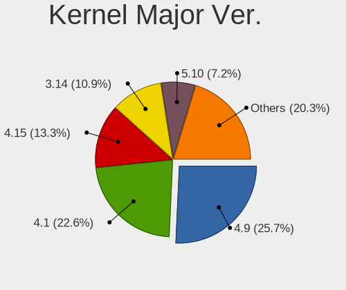
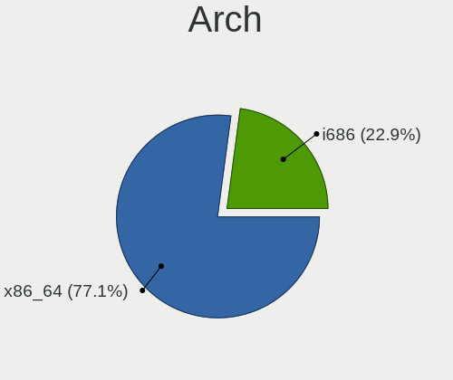
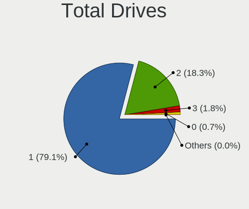
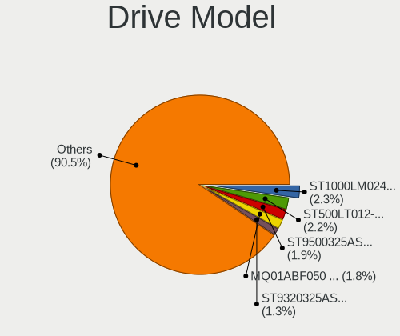
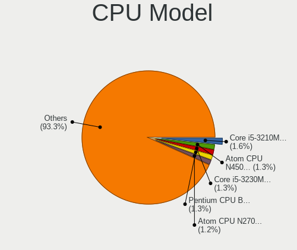
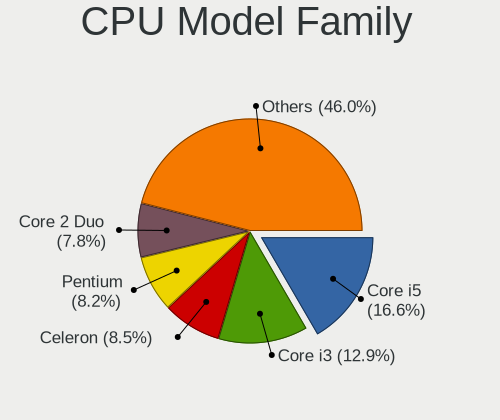
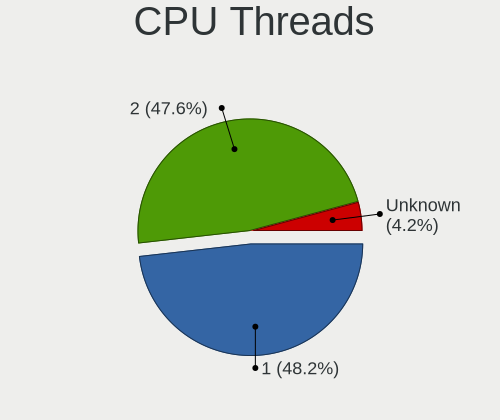
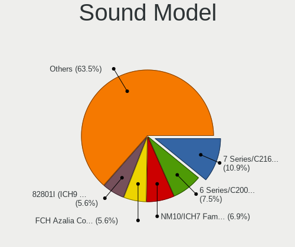
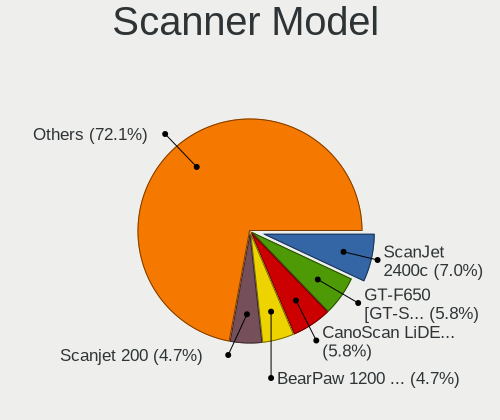

ROSA - Tested Hardware & Statistics (Notebooks)
-----------------------------------------------

A project to collect tested hardware configurations for ROSA.

Anyone can contribute to this report by the [hw-probe](https://github.com/linuxhw/hw-probe) tool:

    sudo -E hw-probe -all -upload

Please contribute! Especially if your hardware is rare.

Contents
--------

* [ Test Cases ](#test-cases)

* [ System ](#system)
  - [ OS                       ](#os)
  - [ OS Family                ](#os-family)
  - [ Kernel                   ](#kernel)
  - [ Kernel Family            ](#kernel-family)
  - [ Kernel Major Ver.        ](#kernel-major-ver)
  - [ Arch                     ](#arch)
  - [ DE                       ](#de)
  - [ Display Server           ](#display-server)
  - [ Display Manager          ](#display-manager)
  - [ OS Lang                  ](#os-lang)
  - [ Boot Mode                ](#boot-mode)
  - [ Filesystem               ](#filesystem)
  - [ Part. scheme             ](#part-scheme)
  - [ Dual Boot with Linux/BSD ](#dual-boot-with-linuxbsd)
  - [ Dual Boot (Win)          ](#dual-boot-win)

* [ Board ](#board)
  - [ Vendor                   ](#vendor)
  - [ Model                    ](#model)
  - [ Model Family             ](#model-family)
  - [ MFG Year                 ](#mfg-year)
  - [ Form Factor              ](#form-factor)
  - [ Secure Boot              ](#secure-boot)
  - [ Coreboot                 ](#coreboot)
  - [ RAM Size                 ](#ram-size)
  - [ RAM Used                 ](#ram-used)
  - [ Total Drives             ](#total-drives)
  - [ Has CD-ROM               ](#has-cd-rom)
  - [ Has Ethernet             ](#has-ethernet)
  - [ Has WiFi                 ](#has-wifi)
  - [ Has Bluetooth            ](#has-bluetooth)

* [ Location ](#location)
  - [ Country                  ](#country)
  - [ City                     ](#city)

* [ Drives ](#drives)
  - [ Drive Vendor             ](#drive-vendor)
  - [ Drive Model              ](#drive-model)
  - [ HDD Vendor               ](#hdd-vendor)
  - [ SSD Vendor               ](#ssd-vendor)
  - [ Drive Kind               ](#drive-kind)
  - [ Drive Connector          ](#drive-connector)
  - [ Drive Size               ](#drive-size)
  - [ Space Total              ](#space-total)
  - [ Space Used               ](#space-used)
  - [ Malfunc. Drives          ](#malfunc-drives)
  - [ Malfunc. Drive Vendor    ](#malfunc-drive-vendor)
  - [ Malfunc. HDD Vendor      ](#malfunc-hdd-vendor)
  - [ Malfunc. Drive Kind      ](#malfunc-drive-kind)
  - [ Failed Drives            ](#failed-drives)
  - [ Failed Drive Vendor      ](#failed-drive-vendor)
  - [ Drive Status             ](#drive-status)

* [ Storage controller ](#storage-controller)
  - [ Storage Vendor           ](#storage-vendor)
  - [ Storage Model            ](#storage-model)
  - [ Storage Kind             ](#storage-kind)

* [ Processor ](#processor)
  - [ CPU Vendor               ](#cpu-vendor)
  - [ CPU Model                ](#cpu-model)
  - [ CPU Model Family         ](#cpu-model-family)
  - [ CPU Cores                ](#cpu-cores)
  - [ CPU Sockets              ](#cpu-sockets)
  - [ CPU Threads              ](#cpu-threads)
  - [ CPU Op-Modes             ](#cpu-op-modes)
  - [ CPU Microcode            ](#cpu-microcode)
  - [ CPU Microarch            ](#cpu-microarch)

* [ Graphics ](#graphics)
  - [ GPU Vendor               ](#gpu-vendor)
  - [ GPU Model                ](#gpu-model)
  - [ GPU Combo                ](#gpu-combo)
  - [ GPU Driver               ](#gpu-driver)
  - [ GPU Memory               ](#gpu-memory)

* [ Monitor ](#monitor)
  - [ Monitor Vendor           ](#monitor-vendor)
  - [ Monitor Model            ](#monitor-model)
  - [ Monitor Resolution       ](#monitor-resolution)
  - [ Monitor Diagonal         ](#monitor-diagonal)
  - [ Monitor Width            ](#monitor-width)
  - [ Aspect Ratio             ](#aspect-ratio)
  - [ Monitor Area             ](#monitor-area)
  - [ Pixel Density            ](#pixel-density)
  - [ Multiple Monitors        ](#multiple-monitors)

* [ Network ](#network)
  - [ Net Controller Vendor    ](#net-controller-vendor)
  - [ Net Controller Model     ](#net-controller-model)
  - [ Wireless Vendor          ](#wireless-vendor)
  - [ Wireless Model           ](#wireless-model)
  - [ Ethernet Vendor          ](#ethernet-vendor)
  - [ Ethernet Model           ](#ethernet-model)
  - [ Net Controller Kind      ](#net-controller-kind)
  - [ Used Controller          ](#used-controller)
  - [ NICs                     ](#nics)
  - [ IPv6                     ](#ipv6)

* [ Bluetooth ](#bluetooth)
  - [ Bluetooth Vendor         ](#bluetooth-vendor)
  - [ Bluetooth Model          ](#bluetooth-model)

* [ Sound ](#sound)
  - [ Sound Vendor             ](#sound-vendor)
  - [ Sound Model              ](#sound-model)

* [ Memory ](#memory)
  - [ Memory Vendor            ](#memory-vendor)
  - [ Memory Model             ](#memory-model)
  - [ Memory Kind              ](#memory-kind)
  - [ Memory Form Factor       ](#memory-form-factor)
  - [ Memory Size              ](#memory-size)
  - [ Memory Speed             ](#memory-speed)

* [ Printers & scanners ](#printers--scanners)
  - [ Printer Vendor           ](#printer-vendor)
  - [ Printer Model            ](#printer-model)
  - [ Scanner Vendor           ](#scanner-vendor)
  - [ Scanner Model            ](#scanner-model)

* [ Camera ](#camera)
  - [ Camera Vendor            ](#camera-vendor)
  - [ Camera Model             ](#camera-model)

* [ Security ](#security)
  - [ Fingerprint Vendor       ](#fingerprint-vendor)
  - [ Fingerprint Model        ](#fingerprint-model)
  - [ Chipcard Vendor          ](#chipcard-vendor)
  - [ Chipcard Model           ](#chipcard-model)

* [ Unsupported ](#unsupported)
  - [ Unsupported Devices      ](#unsupported-devices)
  - [ Unsupported Device Types ](#unsupported-device-types)

Test Cases
----------

Total: 19369

| Vendor        | Model                       | Probe                                                      | Date         |
|---------------|-----------------------------|------------------------------------------------------------|--------------|
| Lenovo        | G500 20236                  | [75f2e6fae1](https://linux-hardware.org/?probe=75f2e6fae1) | Dec 31, 2022 |
| Lenovo        | G500 20236                  | [0d3ed20685](https://linux-hardware.org/?probe=0d3ed20685) | Dec 31, 2022 |
| Lenovo        | G780 20138                  | [896aeb4e20](https://linux-hardware.org/?probe=896aeb4e20) | Dec 31, 2022 |
| Dell          | Inspiron 15-3552            | [e8b804ddd5](https://linux-hardware.org/?probe=e8b804ddd5) | Dec 31, 2022 |
| Samsung       | 300V3A/300V4A/300V5A        | [14b589709d](https://linux-hardware.org/?probe=14b589709d) | Dec 31, 2022 |
| HP            | Pavilion g6                 | [6f29ccd86e](https://linux-hardware.org/?probe=6f29ccd86e) | Dec 30, 2022 |
| ASUSTek       | VivoBook 15_ASUS Laptop ... | [5710b93654](https://linux-hardware.org/?probe=5710b93654) | Dec 30, 2022 |
| Lenovo        | IdeaPad 330-15IKB 81DE      | [2d63537d23](https://linux-hardware.org/?probe=2d63537d23) | Dec 30, 2022 |
| ASUSTek       | VivoBook_ASUS Laptop E21... | [41da11b027](https://linux-hardware.org/?probe=41da11b027) | Dec 30, 2022 |
| Lenovo        | IdeaPad 330-15IKB 81DE      | [954fdfcd25](https://linux-hardware.org/?probe=954fdfcd25) | Dec 30, 2022 |
| Prestigio     | PSB141C04CGH                | [591f91b689](https://linux-hardware.org/?probe=591f91b689) | Dec 29, 2022 |
| Lenovo        | IdeaPad L340-17IRH Gamin... | [83acd419e0](https://linux-hardware.org/?probe=83acd419e0) | Dec 29, 2022 |
| ASUSTek       | K40IN                       | [1b4a2d0604](https://linux-hardware.org/?probe=1b4a2d0604) | Dec 29, 2022 |
| Aquarius      | NS685U R11                  | [d99ae12a0c](https://linux-hardware.org/?probe=d99ae12a0c) | Dec 29, 2022 |
| Lenovo        | V14-IIL 82C4                | [221e9b9fd6](https://linux-hardware.org/?probe=221e9b9fd6) | Dec 28, 2022 |
| ASUSTek       | VivoBook 15_ASUS Laptop ... | [e36e85614e](https://linux-hardware.org/?probe=e36e85614e) | Dec 28, 2022 |
| Toshiba       | Satellite U300              | [88861461c8](https://linux-hardware.org/?probe=88861461c8) | Dec 27, 2022 |
| HP            | Compaq Presario CQ50        | [802e160a5a](https://linux-hardware.org/?probe=802e160a5a) | Dec 27, 2022 |
| Lenovo        | V14-IIL 82C4                | [2b7f53c989](https://linux-hardware.org/?probe=2b7f53c989) | Dec 27, 2022 |
| HP            | Laptop 15s-eq2xxx           | [155c738d10](https://linux-hardware.org/?probe=155c738d10) | Dec 27, 2022 |
| Dell          | Inspiron N4050              | [542b5ae2f6](https://linux-hardware.org/?probe=542b5ae2f6) | Dec 27, 2022 |
| HP            | Compaq Mini CQ10-100        | [8b34b357bb](https://linux-hardware.org/?probe=8b34b357bb) | Dec 27, 2022 |
| Gigabyte      | i1520N                      | [4f94938d1b](https://linux-hardware.org/?probe=4f94938d1b) | Dec 27, 2022 |
| MSI           | Modern 14 B4MW              | [17bd139f0c](https://linux-hardware.org/?probe=17bd139f0c) | Dec 26, 2022 |
| ASUSTek       | N56VZ                       | [1ba62f0fab](https://linux-hardware.org/?probe=1ba62f0fab) | Dec 26, 2022 |
| Dell          | G5 5590                     | [43fbc3b36d](https://linux-hardware.org/?probe=43fbc3b36d) | Dec 26, 2022 |
| Acer          | Acadia V1.45                | [2d98a8cef2](https://linux-hardware.org/?probe=2d98a8cef2) | Dec 25, 2022 |
| Unknown       | Unknown                     | [8f4d031a78](https://linux-hardware.org/?probe=8f4d031a78) | Dec 25, 2022 |
| Pegatron      | C15B                        | [f838b3f22c](https://linux-hardware.org/?probe=f838b3f22c) | Dec 25, 2022 |
| Acer          | Nitro AN515-52              | [1571f74238](https://linux-hardware.org/?probe=1571f74238) | Dec 25, 2022 |
| ASUSTek       | X551CAP                     | [3442037418](https://linux-hardware.org/?probe=3442037418) | Dec 25, 2022 |
| Intel         | ChiefRiver                  | [a23ea2e43e](https://linux-hardware.org/?probe=a23ea2e43e) | Dec 23, 2022 |
| Acer          | Aspire A315-51              | [b53beddded](https://linux-hardware.org/?probe=b53beddded) | Dec 23, 2022 |
| Lenovo        | B570e HuronRiver Platfor... | [672c320794](https://linux-hardware.org/?probe=672c320794) | Dec 22, 2022 |
| HP            | G62                         | [00b47da7dc](https://linux-hardware.org/?probe=00b47da7dc) | Dec 22, 2022 |
| Lenovo        | G700 20251                  | [1a8f388366](https://linux-hardware.org/?probe=1a8f388366) | Dec 22, 2022 |
| Toshiba       | Satellite A300              | [8981102ebe](https://linux-hardware.org/?probe=8981102ebe) | Dec 22, 2022 |
| Acer          | Aspire A315-51              | [4fc8630d91](https://linux-hardware.org/?probe=4fc8630d91) | Dec 22, 2022 |
| HP            | ProBook 440 G6              | [ad317dc4fd](https://linux-hardware.org/?probe=ad317dc4fd) | Dec 22, 2022 |
| Lenovo        | G700 20251                  | [afac6a5bfa](https://linux-hardware.org/?probe=afac6a5bfa) | Dec 21, 2022 |
| MSI           | Alpha 15 B5EEK              | [d6e55e247a](https://linux-hardware.org/?probe=d6e55e247a) | Dec 21, 2022 |
| ASUSTek       | VivoBook_ASUSLaptop X570... | [cc485cc076](https://linux-hardware.org/?probe=cc485cc076) | Dec 21, 2022 |
| eMachines     | E525                        | [8368666118](https://linux-hardware.org/?probe=8368666118) | Dec 21, 2022 |
| ASUSTek       | X555SJ                      | [c580c82fe2](https://linux-hardware.org/?probe=c580c82fe2) | Dec 21, 2022 |
| Lenovo        | G700 20251                  | [ba8b12c87e](https://linux-hardware.org/?probe=ba8b12c87e) | Dec 21, 2022 |
| Samsung       | 350V5C/351V5C/3540VC/344... | [c56023ff15](https://linux-hardware.org/?probe=c56023ff15) | Dec 21, 2022 |
| Pegatron      | A17                         | [f40a055eac](https://linux-hardware.org/?probe=f40a055eac) | Dec 21, 2022 |
| Acer          | Aspire A315-51              | [8777d682b0](https://linux-hardware.org/?probe=8777d682b0) | Dec 20, 2022 |
| Acer          | Aspire A315-51              | [faf7ad4c29](https://linux-hardware.org/?probe=faf7ad4c29) | Dec 19, 2022 |
| MSI           | X460/X460DX                 | [6fff37a8a5](https://linux-hardware.org/?probe=6fff37a8a5) | Dec 18, 2022 |
| MSI           | X460/X460DX                 | [71ca32ac12](https://linux-hardware.org/?probe=71ca32ac12) | Dec 18, 2022 |
| MSI           | Delta 15 A5EFK              | [c793cb6f38](https://linux-hardware.org/?probe=c793cb6f38) | Dec 18, 2022 |
| Acer          | Nitro AN515-56              | [cac9892365](https://linux-hardware.org/?probe=cac9892365) | Dec 18, 2022 |
| eMachines     | E525                        | [2a0aeb50bf](https://linux-hardware.org/?probe=2a0aeb50bf) | Dec 18, 2022 |
| Acer          | AO533                       | [1639951fe5](https://linux-hardware.org/?probe=1639951fe5) | Dec 18, 2022 |
| ASUSTek       | 1201N                       | [214a7002b9](https://linux-hardware.org/?probe=214a7002b9) | Dec 18, 2022 |
| Dell          | Inspiron 15-3552            | [0dc1961e62](https://linux-hardware.org/?probe=0dc1961e62) | Dec 18, 2022 |
| HP            | Pavilion g7                 | [6a1a042504](https://linux-hardware.org/?probe=6a1a042504) | Dec 18, 2022 |
| HP            | Pavilion g7                 | [465a08d81a](https://linux-hardware.org/?probe=465a08d81a) | Dec 18, 2022 |
| Lenovo        | G580 20157                  | [c6cce8ff6d](https://linux-hardware.org/?probe=c6cce8ff6d) | Dec 18, 2022 |
| Dell          | Inspiron 1525               | [216bedab36](https://linux-hardware.org/?probe=216bedab36) | Dec 18, 2022 |
| Prestigio     | PSB141C04CGH                | [60f02a4cb4](https://linux-hardware.org/?probe=60f02a4cb4) | Dec 17, 2022 |
| ICL           | RAYbook Si1511              | [9994b3ec08](https://linux-hardware.org/?probe=9994b3ec08) | Dec 17, 2022 |
| ASUSTek       | ROG Strix G713QM_G713QM     | [c04b0805ad](https://linux-hardware.org/?probe=c04b0805ad) | Dec 17, 2022 |
| Acer          | Aspire ES1-521              | [4f4f04579a](https://linux-hardware.org/?probe=4f4f04579a) | Dec 17, 2022 |
| Maibenben     | MaiBook M                   | [a216b90cac](https://linux-hardware.org/?probe=a216b90cac) | Dec 17, 2022 |
| 3Logic Gro... | Graviton N15i               | [9d85f624db](https://linux-hardware.org/?probe=9d85f624db) | Dec 16, 2022 |
| Acer          | Aspire A315-51              | [116b321e68](https://linux-hardware.org/?probe=116b321e68) | Dec 16, 2022 |
| 3Logic Gro... | Graviton N15i-K2            | [a04f7471b9](https://linux-hardware.org/?probe=a04f7471b9) | Dec 16, 2022 |
| Samsung       | 350V5C/351V5C/3540VC/344... | [66d31fc2c8](https://linux-hardware.org/?probe=66d31fc2c8) | Dec 16, 2022 |
| Acer          | Aspire A315-51              | [5f2e420614](https://linux-hardware.org/?probe=5f2e420614) | Dec 15, 2022 |
| Digma         | EVE 11 C421Y ES1067EW       | [458afe13df](https://linux-hardware.org/?probe=458afe13df) | Dec 14, 2022 |
| Apple         | MacBookPro5,4               | [902c809015](https://linux-hardware.org/?probe=902c809015) | Dec 14, 2022 |
| ASUSTek       | F7Z                         | [3c42714822](https://linux-hardware.org/?probe=3c42714822) | Dec 14, 2022 |
| Samsung       | 350V5C/351V5C/3540VC/344... | [7040d4353c](https://linux-hardware.org/?probe=7040d4353c) | Dec 14, 2022 |
| ASUSTek       | N73SV                       | [7b729a3a7c](https://linux-hardware.org/?probe=7b729a3a7c) | Dec 14, 2022 |
| Lenovo        | Legion 5 15IMH05H 81Y6      | [1457c2669d](https://linux-hardware.org/?probe=1457c2669d) | Dec 13, 2022 |
| Acer          | Aspire 5720                 | [5940b07034](https://linux-hardware.org/?probe=5940b07034) | Dec 13, 2022 |
| ASUSTek       | N73SV                       | [c696bac1dd](https://linux-hardware.org/?probe=c696bac1dd) | Dec 13, 2022 |
| Lenovo        | IdeaPad L340-17IRH Gamin... | [b479704ea5](https://linux-hardware.org/?probe=b479704ea5) | Dec 13, 2022 |
| Samsung       | 305V4A/305V5A/3415VA        | [d01e578aa0](https://linux-hardware.org/?probe=d01e578aa0) | Dec 13, 2022 |
| Sony          | VPCEJ1L1R                   | [25ab3e0119](https://linux-hardware.org/?probe=25ab3e0119) | Dec 13, 2022 |
| MSI           | GF65 Thin 10UE              | [ff4ab808c0](https://linux-hardware.org/?probe=ff4ab808c0) | Dec 13, 2022 |
| Clevo         | M7x0K                       | [08ce94ab11](https://linux-hardware.org/?probe=08ce94ab11) | Dec 13, 2022 |
| Lenovo        | V14-IIL 82C4                | [8c4853dba7](https://linux-hardware.org/?probe=8c4853dba7) | Dec 12, 2022 |
| Sony          | SVE1111M1RW                 | [bc29721da9](https://linux-hardware.org/?probe=bc29721da9) | Dec 12, 2022 |
| Acer          | Aspire 5740                 | [5b35ba45a3](https://linux-hardware.org/?probe=5b35ba45a3) | Dec 12, 2022 |
| Acer          | Aspire A315-42G             | [1d93c8b401](https://linux-hardware.org/?probe=1d93c8b401) | Dec 11, 2022 |
| TUXEDO        | Pulse 15 Gen1               | [f803c32eae](https://linux-hardware.org/?probe=f803c32eae) | Dec 11, 2022 |
| ASUSTek       | ROG Zephyrus M16 GU603HE... | [c90a3cb8c2](https://linux-hardware.org/?probe=c90a3cb8c2) | Dec 11, 2022 |
| ASUSTek       | UL30A                       | [f24e02511f](https://linux-hardware.org/?probe=f24e02511f) | Dec 11, 2022 |
| Lenovo        | G700 20251                  | [0400a58c53](https://linux-hardware.org/?probe=0400a58c53) | Dec 11, 2022 |
| Samsung       | SQ45/Q70C/P200              | [4a96589cf5](https://linux-hardware.org/?probe=4a96589cf5) | Dec 11, 2022 |
| Lenovo        | IdeaPad Gaming 3 15ARH05... | [bb4615bd96](https://linux-hardware.org/?probe=bb4615bd96) | Dec 10, 2022 |
| Samsung       | RC530/RC730                 | [4b7783525a](https://linux-hardware.org/?probe=4b7783525a) | Dec 10, 2022 |
| Lenovo        | IdeaPad 3 15ITL6 82H8       | [fa13871cf9](https://linux-hardware.org/?probe=fa13871cf9) | Dec 10, 2022 |
| MSI           | Modern 15 B12M              | [b5f43a3075](https://linux-hardware.org/?probe=b5f43a3075) | Dec 09, 2022 |
| ASUSTek       | UX310UQK                    | [c4a573e93c](https://linux-hardware.org/?probe=c4a573e93c) | Dec 08, 2022 |
| Acer          | Aspire F5-571G              | [dedd56f0fe](https://linux-hardware.org/?probe=dedd56f0fe) | Dec 08, 2022 |
| Lenovo        | B590 20206                  | [969ca94bb7](https://linux-hardware.org/?probe=969ca94bb7) | Dec 08, 2022 |
| ASUSTek       | K42F                        | [ee90271b2d](https://linux-hardware.org/?probe=ee90271b2d) | Dec 08, 2022 |
| Acer          | Aspire A315-51              | [1b1e1ae174](https://linux-hardware.org/?probe=1b1e1ae174) | Dec 08, 2022 |
| Dell          | Inspiron 3721               | [3bfc5892fe](https://linux-hardware.org/?probe=3bfc5892fe) | Dec 08, 2022 |
| Samsung       | 350V5C/351V5C/3540VC/344... | [c6d0984a2c](https://linux-hardware.org/?probe=c6d0984a2c) | Dec 08, 2022 |
| ASUSTek       | U24E                        | [e8bdc6be97](https://linux-hardware.org/?probe=e8bdc6be97) | Dec 08, 2022 |
| Acer          | Aspire A114-33              | [0bb6c29bb6](https://linux-hardware.org/?probe=0bb6c29bb6) | Dec 07, 2022 |
| Dell          | Inspiron 3137               | [2f74d45567](https://linux-hardware.org/?probe=2f74d45567) | Dec 07, 2022 |
| Lenovo        | IdeaPad 3 15ITL6 82H8       | [fd694a5ddd](https://linux-hardware.org/?probe=fd694a5ddd) | Dec 07, 2022 |
| Pegatron      | C17A                        | [5fc3c61389](https://linux-hardware.org/?probe=5fc3c61389) | Dec 07, 2022 |
| Lenovo        | G700 20251                  | [0613a1c41e](https://linux-hardware.org/?probe=0613a1c41e) | Dec 06, 2022 |
| HP            | Pavilion 15                 | [eb3caff76e](https://linux-hardware.org/?probe=eb3caff76e) | Dec 06, 2022 |
| Acer          | Nitro AN517-51              | [6b5fd6a48c](https://linux-hardware.org/?probe=6b5fd6a48c) | Dec 05, 2022 |
| Apple         | MacBookPro5,4               | [bd98ec1bcb](https://linux-hardware.org/?probe=bd98ec1bcb) | Dec 05, 2022 |
| HONOR         | BOHK-WAX9X                  | [543eb800d7](https://linux-hardware.org/?probe=543eb800d7) | Dec 05, 2022 |
| Acer          | Aspire A315-51              | [26828f578e](https://linux-hardware.org/?probe=26828f578e) | Dec 05, 2022 |
| Dell          | Inspiron 3521               | [44f8fe348a](https://linux-hardware.org/?probe=44f8fe348a) | Dec 05, 2022 |
| Dell          | Vostro 1310                 | [60bdc28f50](https://linux-hardware.org/?probe=60bdc28f50) | Dec 04, 2022 |
| ASUSTek       | F3Sg                        | [f5ae748125](https://linux-hardware.org/?probe=f5ae748125) | Dec 04, 2022 |
| Lenovo        | ThinkPad L420 7854RP1       | [3216e34b2e](https://linux-hardware.org/?probe=3216e34b2e) | Dec 04, 2022 |
| Acer          | Nitro AN515-43              | [f18907cee0](https://linux-hardware.org/?probe=f18907cee0) | Dec 04, 2022 |
| Lenovo        | IdeaPad Gaming 3 15ARH05... | [c795306dd2](https://linux-hardware.org/?probe=c795306dd2) | Dec 03, 2022 |
| Dell          | Inspiron 5570               | [c2ee22631f](https://linux-hardware.org/?probe=c2ee22631f) | Dec 03, 2022 |
| Lenovo        | IdeaPad 330-15IKB 81DE      | [91bffab1ae](https://linux-hardware.org/?probe=91bffab1ae) | Dec 03, 2022 |
| Lenovo        | IdeaPad 330-14AST 81D5      | [795327c2b7](https://linux-hardware.org/?probe=795327c2b7) | Dec 03, 2022 |
| Samsung       | 350V5C/351V5C/3540VC/344... | [6cb73d5a1c](https://linux-hardware.org/?probe=6cb73d5a1c) | Dec 03, 2022 |
| MSI           | GE72 6QC                    | [8411668d4d](https://linux-hardware.org/?probe=8411668d4d) | Dec 02, 2022 |
| Acer          | Aspire 5951G                | [0b1e900a8c](https://linux-hardware.org/?probe=0b1e900a8c) | Dec 02, 2022 |
| HP            | 635                         | [cf79165440](https://linux-hardware.org/?probe=cf79165440) | Dec 02, 2022 |
| Acer          | Aspire V5-572G              | [638e9873a7](https://linux-hardware.org/?probe=638e9873a7) | Dec 02, 2022 |
| Acer          | Aspire V5-572G              | [711acef394](https://linux-hardware.org/?probe=711acef394) | Dec 02, 2022 |
| Samsung       | R410                        | [7c2a18f2cc](https://linux-hardware.org/?probe=7c2a18f2cc) | Dec 01, 2022 |
| Acer          | Aspire V3-571G              | [bbb0c707bb](https://linux-hardware.org/?probe=bbb0c707bb) | Dec 01, 2022 |
| Acer          | Aspire V3-771               | [38dfcb79d5](https://linux-hardware.org/?probe=38dfcb79d5) | Dec 01, 2022 |
| Lenovo        | IdeaPad S340-14API 81NB     | [a8156db955](https://linux-hardware.org/?probe=a8156db955) | Dec 01, 2022 |
| Lenovo        | IdeaPad 5 Pro 14ACN6 82L... | [5955142015](https://linux-hardware.org/?probe=5955142015) | Dec 01, 2022 |
| Acer          | Aspire 5336                 | [65be105c02](https://linux-hardware.org/?probe=65be105c02) | Dec 01, 2022 |
| Acer          | Aspire 5741G                | [0a336099ba](https://linux-hardware.org/?probe=0a336099ba) | Dec 01, 2022 |
| Lenovo        | B450 1S1680033610187        | [e33670a27b](https://linux-hardware.org/?probe=e33670a27b) | Nov 30, 2022 |
| MSI           | GE72 6QC                    | [ba4847397e](https://linux-hardware.org/?probe=ba4847397e) | Nov 30, 2022 |
| Pegatron      | C15B                        | [defacd8748](https://linux-hardware.org/?probe=defacd8748) | Nov 30, 2022 |
| Lenovo        | IdeaPad Gaming 3 15ARH05... | [65c3211b0a](https://linux-hardware.org/?probe=65c3211b0a) | Nov 30, 2022 |
| Lenovo        | IdeaPad Gaming 3 15ARH05... | [2a8dbc14ef](https://linux-hardware.org/?probe=2a8dbc14ef) | Nov 30, 2022 |
| Lenovo        | G500 20236                  | [43815283d9](https://linux-hardware.org/?probe=43815283d9) | Nov 30, 2022 |
| Lenovo        | Y520-15IKBN 80WK            | [b245f9da58](https://linux-hardware.org/?probe=b245f9da58) | Nov 30, 2022 |
| Dell          | Inspiron 3558               | [481755baa3](https://linux-hardware.org/?probe=481755baa3) | Nov 30, 2022 |
| Samsung       | 355V4C/356V4C/3445VC/354... | [8a99ec717f](https://linux-hardware.org/?probe=8a99ec717f) | Nov 29, 2022 |
| Lenovo        | G500 20236                  | [6ece9d62e6](https://linux-hardware.org/?probe=6ece9d62e6) | Nov 29, 2022 |
| Lenovo        | G565 20071                  | [659a9a89b9](https://linux-hardware.org/?probe=659a9a89b9) | Nov 28, 2022 |
| Acer          | Aspire ES1-522              | [114c1d0914](https://linux-hardware.org/?probe=114c1d0914) | Nov 28, 2022 |
| Lenovo        | IdeaPad S340-14API 81NB     | [4fbe923ad2](https://linux-hardware.org/?probe=4fbe923ad2) | Nov 28, 2022 |
| Lenovo        | IdeaPad S340-14API 81NB     | [e117f07f42](https://linux-hardware.org/?probe=e117f07f42) | Nov 28, 2022 |
| Lenovo        | ThinkPad T460 20FMS07000    | [0c1dece352](https://linux-hardware.org/?probe=0c1dece352) | Nov 28, 2022 |
| Lenovo        | ThinkPad L540 20AVA07BJP    | [cfc9d5c8a2](https://linux-hardware.org/?probe=cfc9d5c8a2) | Nov 27, 2022 |
| Quanta        | JW6H                        | [12c85e1c14](https://linux-hardware.org/?probe=12c85e1c14) | Nov 27, 2022 |
| HP            | Notebook                    | [4ff28b891c](https://linux-hardware.org/?probe=4ff28b891c) | Nov 27, 2022 |
| HP            | Pavilion g6                 | [c5f8f3f82b](https://linux-hardware.org/?probe=c5f8f3f82b) | Nov 26, 2022 |
| Acer          | Aspire 5733Z                | [7fc415db1f](https://linux-hardware.org/?probe=7fc415db1f) | Nov 26, 2022 |
| Sony          | VGN-P31ZRK_G                | [3c0c707fd4](https://linux-hardware.org/?probe=3c0c707fd4) | Nov 26, 2022 |
| HP            | Notebook                    | [6a8992e3ee](https://linux-hardware.org/?probe=6a8992e3ee) | Nov 26, 2022 |
| Acer          | Aspire E1-570G              | [9c2f530d6a](https://linux-hardware.org/?probe=9c2f530d6a) | Nov 25, 2022 |
| Insyde        | CherryTrail                 | [f7728857e6](https://linux-hardware.org/?probe=f7728857e6) | Nov 25, 2022 |
| HP            | Pavilion g7                 | [9b84cb2362](https://linux-hardware.org/?probe=9b84cb2362) | Nov 25, 2022 |
| Acer          | Aspire A315-51              | [e08bf40900](https://linux-hardware.org/?probe=e08bf40900) | Nov 25, 2022 |
| DEPO Compu... | DPC156                      | [9607de1a9c](https://linux-hardware.org/?probe=9607de1a9c) | Nov 25, 2022 |
| Lenovo        | IdeaPad Y580 20132          | [41fc6614f7](https://linux-hardware.org/?probe=41fc6614f7) | Nov 25, 2022 |
| Samsung       | 530U3BI/530U4BI/530U4BH     | [0bb72a6a2a](https://linux-hardware.org/?probe=0bb72a6a2a) | Nov 25, 2022 |
| MSI           | GE72 6QC                    | [07084dd8f9](https://linux-hardware.org/?probe=07084dd8f9) | Nov 24, 2022 |
| Acer          | Aspire A315-51              | [a636cfb9ff](https://linux-hardware.org/?probe=a636cfb9ff) | Nov 24, 2022 |
| Lenovo        | B590 20208                  | [b1551151f5](https://linux-hardware.org/?probe=b1551151f5) | Nov 24, 2022 |
| Aquarius      | NS685U R11                  | [866e6d043c](https://linux-hardware.org/?probe=866e6d043c) | Nov 24, 2022 |
| ASUSTek       | ROG Zephyrus M16 GU603HE... | [a31935f117](https://linux-hardware.org/?probe=a31935f117) | Nov 24, 2022 |
| HP            | Notebook                    | [f81a524d22](https://linux-hardware.org/?probe=f81a524d22) | Nov 23, 2022 |
| HP            | Pavilion dv6                | [e3921e4da9](https://linux-hardware.org/?probe=e3921e4da9) | Nov 23, 2022 |
| Samsung       | 300E4C/300E5C/300E7C        | [2485671def](https://linux-hardware.org/?probe=2485671def) | Nov 23, 2022 |
| Toshiba       | Satellite U300              | [f24a55abbf](https://linux-hardware.org/?probe=f24a55abbf) | Nov 23, 2022 |
| MSI           | MS-N051                     | [efb37aedbe](https://linux-hardware.org/?probe=efb37aedbe) | Nov 22, 2022 |
| ASUSTek       | VivoBook_ASUSLaptop X571... | [ab91a099a5](https://linux-hardware.org/?probe=ab91a099a5) | Nov 22, 2022 |
| ASUSTek       | TUF Gaming FX505DT_FX505... | [149f57ad9c](https://linux-hardware.org/?probe=149f57ad9c) | Nov 22, 2022 |
| Acer          | Aspire V3-771               | [c0a3895ac4](https://linux-hardware.org/?probe=c0a3895ac4) | Nov 22, 2022 |
| Notebook      | W65_67SF                    | [91f6aa0bfb](https://linux-hardware.org/?probe=91f6aa0bfb) | Nov 22, 2022 |
| Toshiba       | Satellite L45Dt-B           | [9cdcee20dc](https://linux-hardware.org/?probe=9cdcee20dc) | Nov 22, 2022 |
| Lenovo        | IdeaPad S145-15IGM 81MX     | [ed6bb8845a](https://linux-hardware.org/?probe=ed6bb8845a) | Nov 21, 2022 |
| Acer          | Extensa 2519                | [1ab63c7353](https://linux-hardware.org/?probe=1ab63c7353) | Nov 21, 2022 |
| Lenovo        | B590 20206                  | [7d8faca25a](https://linux-hardware.org/?probe=7d8faca25a) | Nov 21, 2022 |
| HP            | Notebook                    | [c8bac5b72d](https://linux-hardware.org/?probe=c8bac5b72d) | Nov 20, 2022 |
| Acer          | Extensa 2519                | [fc5526a30f](https://linux-hardware.org/?probe=fc5526a30f) | Nov 20, 2022 |
| Acer          | Extensa 2519                | [5ae619eb32](https://linux-hardware.org/?probe=5ae619eb32) | Nov 20, 2022 |
| Acer          | Extensa 2540                | [2cd32708f2](https://linux-hardware.org/?probe=2cd32708f2) | Nov 20, 2022 |
| HP            | Compaq Presario CQ60        | [3f18cccea5](https://linux-hardware.org/?probe=3f18cccea5) | Nov 20, 2022 |
| HP            | Compaq nx9020 (PG641ES#A... | [ba63296d55](https://linux-hardware.org/?probe=ba63296d55) | Nov 20, 2022 |
| ASUSTek       | X550CC                      | [a2eae9195c](https://linux-hardware.org/?probe=a2eae9195c) | Nov 20, 2022 |
| Lenovo        | G560 20042                  | [e2ea91a4ca](https://linux-hardware.org/?probe=e2ea91a4ca) | Nov 20, 2022 |
| Acer          | Aspire E5-771G              | [5099a55836](https://linux-hardware.org/?probe=5099a55836) | Nov 20, 2022 |
| Pegatron      | A15                         | [dea0a0c81e](https://linux-hardware.org/?probe=dea0a0c81e) | Nov 20, 2022 |
| Acer          | Aspire 5750G                | [8b000b014f](https://linux-hardware.org/?probe=8b000b014f) | Nov 20, 2022 |
| Samsung       | R528/R728                   | [ea586efd66](https://linux-hardware.org/?probe=ea586efd66) | Nov 19, 2022 |
| Acer          | Aspire 5740                 | [450ca9f243](https://linux-hardware.org/?probe=450ca9f243) | Nov 19, 2022 |
| Acer          | Aspire ES1-331              | [32e06647dd](https://linux-hardware.org/?probe=32e06647dd) | Nov 19, 2022 |
| ASUSTek       | K53SD                       | [7620fe2bdd](https://linux-hardware.org/?probe=7620fe2bdd) | Nov 19, 2022 |
| Dell          | Inspiron 1525               | [3e09380a65](https://linux-hardware.org/?probe=3e09380a65) | Nov 18, 2022 |
| Haier         | U1520HD                     | [7a9c0df4f1](https://linux-hardware.org/?probe=7a9c0df4f1) | Nov 18, 2022 |
| ASUSTek       | X507UA                      | [9a2fe77bac](https://linux-hardware.org/?probe=9a2fe77bac) | Nov 16, 2022 |
| Lenovo        | V14 G2 ALC 82KC             | [cf10680f5f](https://linux-hardware.org/?probe=cf10680f5f) | Nov 15, 2022 |
| Samsung       | NC210/NC110                 | [31ebbfaf58](https://linux-hardware.org/?probe=31ebbfaf58) | Nov 15, 2022 |
| Toshiba       | Satellite A300D             | [c5dc216e31](https://linux-hardware.org/?probe=c5dc216e31) | Nov 15, 2022 |
| Acer          | Aspire ES1-512              | [5802f0db59](https://linux-hardware.org/?probe=5802f0db59) | Nov 15, 2022 |
| HP            | ENVY m6                     | [4397c54e20](https://linux-hardware.org/?probe=4397c54e20) | Nov 14, 2022 |
| ASUSTek       | K42DY                       | [f7a61f85d9](https://linux-hardware.org/?probe=f7a61f85d9) | Nov 14, 2022 |
| ASUSTek       | UX330CAK                    | [bd7d377985](https://linux-hardware.org/?probe=bd7d377985) | Nov 14, 2022 |
| Samsung       | 300V3A/300V4A/300V5A/200... | [34a5f361bd](https://linux-hardware.org/?probe=34a5f361bd) | Nov 14, 2022 |
| ASUSTek       | K53SM                       | [297194e8e4](https://linux-hardware.org/?probe=297194e8e4) | Nov 13, 2022 |
| Toshiba       | Satellite P300              | [02285947b8](https://linux-hardware.org/?probe=02285947b8) | Nov 13, 2022 |
| Acer          | Aspire E1-531G              | [9f3c8742f7](https://linux-hardware.org/?probe=9f3c8742f7) | Nov 13, 2022 |
| Sony          | SVE1512H1RW                 | [032fdf5260](https://linux-hardware.org/?probe=032fdf5260) | Nov 13, 2022 |
| Samsung       | 300E4C/300E5C/300E7C        | [e8e7b815c4](https://linux-hardware.org/?probe=e8e7b815c4) | Nov 13, 2022 |
| Lenovo        | B590 20208                  | [af898e0d66](https://linux-hardware.org/?probe=af898e0d66) | Nov 13, 2022 |
| Dell          | Inspiron 3521               | [10482f151a](https://linux-hardware.org/?probe=10482f151a) | Nov 12, 2022 |
| Dell          | Inspiron 3521               | [5f20ed2dd2](https://linux-hardware.org/?probe=5f20ed2dd2) | Nov 12, 2022 |
| HP            | Compaq nc6120 (PY507EA#A... | [a4c594d8db](https://linux-hardware.org/?probe=a4c594d8db) | Nov 12, 2022 |
| Acer          | Acadia V1.45                | [c6a91498cc](https://linux-hardware.org/?probe=c6a91498cc) | Nov 12, 2022 |
| Acer          | Swift SF314-43              | [1243c9795a](https://linux-hardware.org/?probe=1243c9795a) | Nov 12, 2022 |
| ASUSTek       | K53BR                       | [15838034f5](https://linux-hardware.org/?probe=15838034f5) | Nov 12, 2022 |
| Samsung       | 700Z3A/700Z4A/700Z5A/700... | [4f40815737](https://linux-hardware.org/?probe=4f40815737) | Nov 12, 2022 |
| Lenovo        | ThinkBook 15 G3 ACL 21A4    | [4838271135](https://linux-hardware.org/?probe=4838271135) | Nov 11, 2022 |
| Acer          | Acadia V1.19                | [f43450e9d4](https://linux-hardware.org/?probe=f43450e9d4) | Nov 11, 2022 |
| ASUSTek       | VivoBook 15_ASUS Laptop ... | [cbd9e440a6](https://linux-hardware.org/?probe=cbd9e440a6) | Nov 11, 2022 |
| Acer          | Aspire E5-573               | [b8b0c9fae3](https://linux-hardware.org/?probe=b8b0c9fae3) | Nov 11, 2022 |
| Samsung       | R519/R719                   | [31260d4616](https://linux-hardware.org/?probe=31260d4616) | Nov 11, 2022 |
| Sony          | VPCEH3J1R                   | [4944a2e287](https://linux-hardware.org/?probe=4944a2e287) | Nov 11, 2022 |
| HP            | Pavilion g6                 | [fc422ba1a4](https://linux-hardware.org/?probe=fc422ba1a4) | Nov 11, 2022 |
| ASUSTek       | VivoBook_ASUSLaptop X403... | [f56dc1af6b](https://linux-hardware.org/?probe=f56dc1af6b) | Nov 10, 2022 |
| Acer          | Aspire V5-572G              | [bd537cc78c](https://linux-hardware.org/?probe=bd537cc78c) | Nov 10, 2022 |
| Sony          | VPCS11V9R                   | [a0b4bf7869](https://linux-hardware.org/?probe=a0b4bf7869) | Nov 10, 2022 |
| HP            | Laptop 14s-dq3xxx           | [2da4055f76](https://linux-hardware.org/?probe=2da4055f76) | Nov 09, 2022 |
| Lenovo        | E31-70 80KX                 | [61343c5ca1](https://linux-hardware.org/?probe=61343c5ca1) | Nov 09, 2022 |
| ASUSTek       | X507UB                      | [2790049313](https://linux-hardware.org/?probe=2790049313) | Nov 09, 2022 |
| TUXEDO        | Pulse 15 Gen1               | [97ed2f1140](https://linux-hardware.org/?probe=97ed2f1140) | Nov 09, 2022 |
| MSI           | GE70 2PL                    | [d09e002aa8](https://linux-hardware.org/?probe=d09e002aa8) | Nov 09, 2022 |
| ASUSTek       | X550CC                      | [46dd8a0416](https://linux-hardware.org/?probe=46dd8a0416) | Nov 08, 2022 |
| ASUSTek       | U24E                        | [a51fe3226f](https://linux-hardware.org/?probe=a51fe3226f) | Nov 08, 2022 |
| MSI           | GE70 2PL                    | [8752dacd05](https://linux-hardware.org/?probe=8752dacd05) | Nov 08, 2022 |
| Acer          | Nitro AN517-52              | [3a2bb9e1e9](https://linux-hardware.org/?probe=3a2bb9e1e9) | Nov 08, 2022 |
| Acer          | Aspire E5-573G              | [b6a1f08748](https://linux-hardware.org/?probe=b6a1f08748) | Nov 08, 2022 |
| HP            | Notebook                    | [0868a7d110](https://linux-hardware.org/?probe=0868a7d110) | Nov 08, 2022 |
| HP            | EliteBook 2540p             | [515cdf3f6c](https://linux-hardware.org/?probe=515cdf3f6c) | Nov 08, 2022 |
| Toshiba       | Satellite C660              | [5e972fdb95](https://linux-hardware.org/?probe=5e972fdb95) | Nov 07, 2022 |
| HP            | Pavilion g6                 | [9992a08641](https://linux-hardware.org/?probe=9992a08641) | Nov 07, 2022 |
| Acer          | Aspire A315-51              | [d5c179046a](https://linux-hardware.org/?probe=d5c179046a) | Nov 07, 2022 |
| Toshiba       | Satellite C660              | [e75f44efd0](https://linux-hardware.org/?probe=e75f44efd0) | Nov 07, 2022 |
| eMachines     | eM350                       | [ac6dda5ddb](https://linux-hardware.org/?probe=ac6dda5ddb) | Nov 07, 2022 |
| Sony          | VPCZ13S9R                   | [9a0f47ed25](https://linux-hardware.org/?probe=9a0f47ed25) | Nov 07, 2022 |
| ASUSTek       | ROG Flow X13 GV301QH_GV3... | [614a486442](https://linux-hardware.org/?probe=614a486442) | Nov 07, 2022 |
| MSI           | GP66 Leopard 11UG           | [0dab96ade2](https://linux-hardware.org/?probe=0dab96ade2) | Nov 06, 2022 |
| Lenovo        | IdeaPad S145-15API 81UT     | [db56889368](https://linux-hardware.org/?probe=db56889368) | Nov 06, 2022 |
| Lenovo        | IdeaPad 3 17ADA05 81W2      | [05ac02550e](https://linux-hardware.org/?probe=05ac02550e) | Nov 06, 2022 |
| Samsung       | R510/P510                   | [4921b97206](https://linux-hardware.org/?probe=4921b97206) | Nov 06, 2022 |
| Packard Be... | EasyNote TS11HR             | [19304dd869](https://linux-hardware.org/?probe=19304dd869) | Nov 06, 2022 |
| Acer          | Aspire A317-52              | [e9ed162010](https://linux-hardware.org/?probe=e9ed162010) | Nov 06, 2022 |
| Toshiba       | Satellite L550              | [3b95d22100](https://linux-hardware.org/?probe=3b95d22100) | Nov 06, 2022 |
| Acer          | Nitro AN515-42              | [a89bc09dca](https://linux-hardware.org/?probe=a89bc09dca) | Nov 05, 2022 |
| Lenovo        | V14-ADA 82C6                | [92be197f2d](https://linux-hardware.org/?probe=92be197f2d) | Nov 05, 2022 |
| ASUSTek       | N76VB                       | [c46794ba60](https://linux-hardware.org/?probe=c46794ba60) | Nov 05, 2022 |
| Fujitsu Si... | AMILO Pro V3205             | [7a03ef6ae1](https://linux-hardware.org/?probe=7a03ef6ae1) | Nov 05, 2022 |
| Dell          | Inspiron N5110              | [698596bd58](https://linux-hardware.org/?probe=698596bd58) | Nov 05, 2022 |
| HP            | Pavilion dv7                | [d17019e1f7](https://linux-hardware.org/?probe=d17019e1f7) | Nov 05, 2022 |
| ASUSTek       | N56VJ                       | [1685737249](https://linux-hardware.org/?probe=1685737249) | Nov 05, 2022 |
| ASUSTek       | F5N                         | [f1efa34bf8](https://linux-hardware.org/?probe=f1efa34bf8) | Nov 04, 2022 |
| ASUSTek       | X75VD                       | [60e91d212e](https://linux-hardware.org/?probe=60e91d212e) | Nov 04, 2022 |
| Lenovo        | B590 20206                  | [6807b6b584](https://linux-hardware.org/?probe=6807b6b584) | Nov 04, 2022 |
| Lenovo        | B590 20206                  | [d0267472d6](https://linux-hardware.org/?probe=d0267472d6) | Nov 04, 2022 |
| Lenovo        | G500 20236                  | [82213a5471](https://linux-hardware.org/?probe=82213a5471) | Nov 04, 2022 |
| ASUSTek       | F5N                         | [8e3878fe4d](https://linux-hardware.org/?probe=8e3878fe4d) | Nov 04, 2022 |
| ASUSTek       | F5N                         | [f95b9890f6](https://linux-hardware.org/?probe=f95b9890f6) | Nov 04, 2022 |
| HUAWEI        | HKD-WXX                     | [7a8f33b5bf](https://linux-hardware.org/?probe=7a8f33b5bf) | Nov 04, 2022 |
| Fujitsu       | LIFEBOOK A512               | [8732711bf0](https://linux-hardware.org/?probe=8732711bf0) | Nov 04, 2022 |
| ASUSTek       | U24E                        | [6303641e69](https://linux-hardware.org/?probe=6303641e69) | Nov 04, 2022 |
| Samsung       | 350V5C/351V5C/3540VC/344... | [d7c44d9e94](https://linux-hardware.org/?probe=d7c44d9e94) | Nov 04, 2022 |
| Lenovo        | G580 20157                  | [16cd4b28ce](https://linux-hardware.org/?probe=16cd4b28ce) | Nov 04, 2022 |
| ASUSTek       | 1215B                       | [eeff579fe6](https://linux-hardware.org/?probe=eeff579fe6) | Nov 03, 2022 |
| ASUSTek       | K501LB                      | [e28cd8cfbf](https://linux-hardware.org/?probe=e28cd8cfbf) | Nov 03, 2022 |
| ASUSTek       | 1215B                       | [3cc2c5ad48](https://linux-hardware.org/?probe=3cc2c5ad48) | Nov 03, 2022 |
| ASUSTek       | VivoBook_ASUSLaptop X570... | [28d7daff10](https://linux-hardware.org/?probe=28d7daff10) | Nov 02, 2022 |
| Acer          | Nitro AN515-54              | [710ab678b2](https://linux-hardware.org/?probe=710ab678b2) | Nov 02, 2022 |
| Acer          | Aspire A515-54G             | [519fa92199](https://linux-hardware.org/?probe=519fa92199) | Nov 02, 2022 |
| ASUSTek       | 1215B                       | [21694405a9](https://linux-hardware.org/?probe=21694405a9) | Nov 02, 2022 |
| Acer          | Aspire 5750G                | [496a16216c](https://linux-hardware.org/?probe=496a16216c) | Nov 02, 2022 |
| ASUSTek       | VivoBook_ASUSLaptop X570... | [6f89789444](https://linux-hardware.org/?probe=6f89789444) | Nov 02, 2022 |
| HP            | Laptop 14s-fq0xxx           | [fe23529093](https://linux-hardware.org/?probe=fe23529093) | Nov 01, 2022 |
| Lenovo        | V14-ADA 82C6                | [a54d6876b6](https://linux-hardware.org/?probe=a54d6876b6) | Nov 01, 2022 |
| Lenovo        | V15 G2 ALC 82KD             | [406aae2f66](https://linux-hardware.org/?probe=406aae2f66) | Nov 01, 2022 |
| Apple         | MacBookPro8,1               | [da912b99f4](https://linux-hardware.org/?probe=da912b99f4) | Nov 01, 2022 |
| Acer          | Aspire A315-51              | [eaa9bcaadb](https://linux-hardware.org/?probe=eaa9bcaadb) | Oct 31, 2022 |
| Acer          | Aspire A315-51              | [7b016c85d8](https://linux-hardware.org/?probe=7b016c85d8) | Oct 31, 2022 |
| Acer          | Aspire 5733                 | [bcc1836178](https://linux-hardware.org/?probe=bcc1836178) | Oct 31, 2022 |
| ASUSTek       | K43SJ                       | [778e6caf06](https://linux-hardware.org/?probe=778e6caf06) | Oct 31, 2022 |
| Sony          | VGN-AR71MR                  | [4ecd695b12](https://linux-hardware.org/?probe=4ecd695b12) | Oct 31, 2022 |
| HP            | Laptop 14s-dq3xxx           | [674ced10f2](https://linux-hardware.org/?probe=674ced10f2) | Oct 31, 2022 |
| ASUSTek       | VivoBook_ASUS Laptop E21... | [cb2a07da11](https://linux-hardware.org/?probe=cb2a07da11) | Oct 30, 2022 |
| ASUSTek       | X501A1                      | [037e1402b1](https://linux-hardware.org/?probe=037e1402b1) | Oct 30, 2022 |
| MSI           | Sword 15 A11UE              | [c039d4321b](https://linux-hardware.org/?probe=c039d4321b) | Oct 30, 2022 |
| HP            | Pavilion g6                 | [666a829545](https://linux-hardware.org/?probe=666a829545) | Oct 30, 2022 |
| HIPER         | WORKBOOK                    | [0a3eb12b15](https://linux-hardware.org/?probe=0a3eb12b15) | Oct 30, 2022 |
| Acer          | Nitro AN515-42              | [763e5e0492](https://linux-hardware.org/?probe=763e5e0492) | Oct 29, 2022 |
| ASUSTek       | ZenBook 13 UX310UFR         | [11b52c3e1f](https://linux-hardware.org/?probe=11b52c3e1f) | Oct 29, 2022 |
| ASUSTek       | X550DP                      | [b0a52fe296](https://linux-hardware.org/?probe=b0a52fe296) | Oct 29, 2022 |
| Samsung       | 350V5C/351V5C/3540VC/344... | [0a24d1491a](https://linux-hardware.org/?probe=0a24d1491a) | Oct 29, 2022 |
| Lenovo        | B560                        | [f8676b0e49](https://linux-hardware.org/?probe=f8676b0e49) | Oct 28, 2022 |
| ASUSTek       | F3Ka                        | [06235844a1](https://linux-hardware.org/?probe=06235844a1) | Oct 28, 2022 |
| Lenovo        | Legion Y540-15IRH-PG0 81... | [f845ed2866](https://linux-hardware.org/?probe=f845ed2866) | Oct 28, 2022 |
| Dell          | Inspiron 3542               | [a3a24a81fa](https://linux-hardware.org/?probe=a3a24a81fa) | Oct 28, 2022 |
| Lenovo        | IdeaPad 110-15IBR 80T7      | [26311f56d7](https://linux-hardware.org/?probe=26311f56d7) | Oct 28, 2022 |
| ASUSTek       | K501LB                      | [25003181f1](https://linux-hardware.org/?probe=25003181f1) | Oct 27, 2022 |
| Acer          | Aspire E5-573G              | [6f926eed65](https://linux-hardware.org/?probe=6f926eed65) | Oct 27, 2022 |
| ASUSTek       | K501LB                      | [2481764903](https://linux-hardware.org/?probe=2481764903) | Oct 27, 2022 |
| HP            | Laptop 14s-fq0xxx           | [377893cdc6](https://linux-hardware.org/?probe=377893cdc6) | Oct 27, 2022 |
| Acer          | Aspire A315-51              | [17faa0d40a](https://linux-hardware.org/?probe=17faa0d40a) | Oct 27, 2022 |
| ASUSTek       | N56VZ                       | [399d92f9e0](https://linux-hardware.org/?probe=399d92f9e0) | Oct 27, 2022 |
| HP            | Compaq 610                  | [5adc7e0aba](https://linux-hardware.org/?probe=5adc7e0aba) | Oct 26, 2022 |
| Lenovo        | Legion 5 15IMH05H 81Y6      | [9bb0c7d3b0](https://linux-hardware.org/?probe=9bb0c7d3b0) | Oct 26, 2022 |
| Acer          | Nitro AN515-54              | [89180ba46b](https://linux-hardware.org/?probe=89180ba46b) | Oct 26, 2022 |
| Samsung       | 300V3A/300V4A/300V5A/200... | [70ea39404e](https://linux-hardware.org/?probe=70ea39404e) | Oct 26, 2022 |
| HP            | EliteBook 840 G4            | [73ee5ace17](https://linux-hardware.org/?probe=73ee5ace17) | Oct 26, 2022 |
| ASUSTek       | VivoBook_ASUSLaptop M350... | [8b68d25121](https://linux-hardware.org/?probe=8b68d25121) | Oct 26, 2022 |
| HP            | Laptop 15s-fq2xxx           | [a7a7e4b82c](https://linux-hardware.org/?probe=a7a7e4b82c) | Oct 26, 2022 |
| HP            | Pavilion dv7                | [1b53255010](https://linux-hardware.org/?probe=1b53255010) | Oct 25, 2022 |
| ASUSTek       | VivoBook_ASUSLaptop X570... | [09eec214ae](https://linux-hardware.org/?probe=09eec214ae) | Oct 25, 2022 |
| Acer          | Extensa 5630                | [bdc63e9670](https://linux-hardware.org/?probe=bdc63e9670) | Oct 25, 2022 |
| Toshiba       | Satellite C660              | [b9d0cd845c](https://linux-hardware.org/?probe=b9d0cd845c) | Oct 25, 2022 |
| Toshiba       | Satellite C660              | [36faa336cf](https://linux-hardware.org/?probe=36faa336cf) | Oct 25, 2022 |
| Lenovo        | IdeaPad L340-15IRH Gamin... | [f426a7b690](https://linux-hardware.org/?probe=f426a7b690) | Oct 24, 2022 |
| MSI           | GE60 2PC                    | [e4378edb2b](https://linux-hardware.org/?probe=e4378edb2b) | Oct 24, 2022 |
| Sony          | SVE1513U1RW                 | [019c35087a](https://linux-hardware.org/?probe=019c35087a) | Oct 24, 2022 |
| MSI           | GE60 2PC                    | [930a153301](https://linux-hardware.org/?probe=930a153301) | Oct 24, 2022 |
| ASUSTek       | N56DY                       | [2d308224ee](https://linux-hardware.org/?probe=2d308224ee) | Oct 23, 2022 |
| ASUSTek       | N56DY                       | [d0caa49d24](https://linux-hardware.org/?probe=d0caa49d24) | Oct 23, 2022 |
| HUAWEI        | NBD-WXX9                    | [c6c2d4cab0](https://linux-hardware.org/?probe=c6c2d4cab0) | Oct 23, 2022 |
| HP            | Pavilion g6                 | [1c355f37b9](https://linux-hardware.org/?probe=1c355f37b9) | Oct 23, 2022 |
| HP            | Compaq 610                  | [9a584886fe](https://linux-hardware.org/?probe=9a584886fe) | Oct 23, 2022 |
| ASUSTek       | W7S                         | [5797f4be95](https://linux-hardware.org/?probe=5797f4be95) | Oct 23, 2022 |
| HP            | Pavilion dv7                | [acaa8b9309](https://linux-hardware.org/?probe=acaa8b9309) | Oct 23, 2022 |
| Lenovo        | IdeaPad 330-14AST 81D5      | [e0face3bcb](https://linux-hardware.org/?probe=e0face3bcb) | Oct 22, 2022 |
| HP            | Pavilion dv7                | [ede1ff6d62](https://linux-hardware.org/?probe=ede1ff6d62) | Oct 22, 2022 |
| Samsung       | 300V3A/300V4A/300V5A/200... | [eb7a276b51](https://linux-hardware.org/?probe=eb7a276b51) | Oct 22, 2022 |
| Shanghai Z... | ZXE CRB                     | [166b646956](https://linux-hardware.org/?probe=166b646956) | Oct 22, 2022 |
| Acer          | Aspire E1-571G              | [3440b5765d](https://linux-hardware.org/?probe=3440b5765d) | Oct 21, 2022 |
| 3Logic Gro... | APM Graviton                | [0dd152f1d6](https://linux-hardware.org/?probe=0dd152f1d6) | Oct 21, 2022 |
| Samsung       | RV411/RV511/E3511/S3511/... | [6c8562fa45](https://linux-hardware.org/?probe=6c8562fa45) | Oct 21, 2022 |
| Lenovo        | IdeaPad 330-15AST 81D6      | [123b6fc51a](https://linux-hardware.org/?probe=123b6fc51a) | Oct 21, 2022 |
| Acer          | Aspire A315-51              | [244d93ab06](https://linux-hardware.org/?probe=244d93ab06) | Oct 21, 2022 |
| Acer          | Aspire A315-51              | [dc26121480](https://linux-hardware.org/?probe=dc26121480) | Oct 21, 2022 |
| ASUSTek       | VivoBook_ASUSLaptop M350... | [4c95f64c92](https://linux-hardware.org/?probe=4c95f64c92) | Oct 20, 2022 |
| Acer          | Aspire E5-575G              | [66cfe85e96](https://linux-hardware.org/?probe=66cfe85e96) | Oct 20, 2022 |
| Lenovo        | IdeaPad Gaming 3 15ACH6 ... | [344040aee1](https://linux-hardware.org/?probe=344040aee1) | Oct 19, 2022 |
| HP            | Pavilion g6                 | [8744b669fe](https://linux-hardware.org/?probe=8744b669fe) | Oct 19, 2022 |
| Pegatron      | A17                         | [14f7d2a90d](https://linux-hardware.org/?probe=14f7d2a90d) | Oct 19, 2022 |
| Lenovo        | IdeaPad 3 15ADA05 81W1      | [d6d2256d26](https://linux-hardware.org/?probe=d6d2256d26) | Oct 19, 2022 |
| ASUSTek       | VivoBook_ASUSLaptop X570... | [3c2bd41b69](https://linux-hardware.org/?probe=3c2bd41b69) | Oct 19, 2022 |
| Lenovo        | IdeaPad 5 Pro 16ACH6 82L... | [71f188e90c](https://linux-hardware.org/?probe=71f188e90c) | Oct 19, 2022 |
| Dell          | Inspiron 15-3567            | [4727244665](https://linux-hardware.org/?probe=4727244665) | Oct 18, 2022 |
| eMachines     | E525                        | [6b500273c6](https://linux-hardware.org/?probe=6b500273c6) | Oct 18, 2022 |
| Lenovo        | G565 20071                  | [52758e9b4b](https://linux-hardware.org/?probe=52758e9b4b) | Oct 18, 2022 |
| Lenovo        | B570e HuronRiver Platfor... | [b8a2cca654](https://linux-hardware.org/?probe=b8a2cca654) | Oct 18, 2022 |
| Maibenben     | ZiMai Z5                    | [96d25004be](https://linux-hardware.org/?probe=96d25004be) | Oct 18, 2022 |
| Lenovo        | V310-15IKB 80T3             | [c56ac0436c](https://linux-hardware.org/?probe=c56ac0436c) | Oct 18, 2022 |
| Lenovo        | G480                        | [55e0ad0e82](https://linux-hardware.org/?probe=55e0ad0e82) | Oct 17, 2022 |
| Acer          | Aspire 5740                 | [83bb80a8d4](https://linux-hardware.org/?probe=83bb80a8d4) | Oct 17, 2022 |
| Maibenben     | MaiBook M                   | [ca20ade584](https://linux-hardware.org/?probe=ca20ade584) | Oct 16, 2022 |
| ASUSTek       | VivoBook_ASUSLaptop M350... | [2740d3c96e](https://linux-hardware.org/?probe=2740d3c96e) | Oct 16, 2022 |
| HONOR         | NBR-WAX9                    | [3862d6fc41](https://linux-hardware.org/?probe=3862d6fc41) | Oct 16, 2022 |
| Lenovo        | B580 20144                  | [3de13d5e45](https://linux-hardware.org/?probe=3de13d5e45) | Oct 16, 2022 |
| Samsung       | RV413/RV513                 | [22d5794b5d](https://linux-hardware.org/?probe=22d5794b5d) | Oct 16, 2022 |
| Sony          | SVE1512H1RW                 | [bdc28748b2](https://linux-hardware.org/?probe=bdc28748b2) | Oct 16, 2022 |
| ASUSTek       | VivoBook_ASUSLaptop X403... | [7782926601](https://linux-hardware.org/?probe=7782926601) | Oct 16, 2022 |
| MSI           | Sword 15 A11UE              | [514b1ab74d](https://linux-hardware.org/?probe=514b1ab74d) | Oct 16, 2022 |
| Pegatron      | A15                         | [25bf0fe850](https://linux-hardware.org/?probe=25bf0fe850) | Oct 15, 2022 |
| ASUSTek       | K53TA                       | [8759f9f39c](https://linux-hardware.org/?probe=8759f9f39c) | Oct 15, 2022 |
| Lenovo        | IdeaPad 330-15IGM 81D1      | [f7b75c7dff](https://linux-hardware.org/?probe=f7b75c7dff) | Oct 14, 2022 |
| Acer          | Aspire E5-511               | [823f951e7a](https://linux-hardware.org/?probe=823f951e7a) | Oct 14, 2022 |
| ASUSTek       | ROG Zephyrus M16 GU603HE... | [2356263af1](https://linux-hardware.org/?probe=2356263af1) | Oct 14, 2022 |
| ASUSTek       | K53TA                       | [dd95142fda](https://linux-hardware.org/?probe=dd95142fda) | Oct 14, 2022 |
| HUAWEI        | NBLK-WAX9X                  | [9f4368b685](https://linux-hardware.org/?probe=9f4368b685) | Oct 14, 2022 |
| eMachines     | E525                        | [a2c8a5cadb](https://linux-hardware.org/?probe=a2c8a5cadb) | Oct 14, 2022 |
| ASUSTek       | K55N                        | [8a7b8b14f3](https://linux-hardware.org/?probe=8a7b8b14f3) | Oct 13, 2022 |
| ASUSTek       | VivoBook_ASUSLaptop M350... | [54d1a0ebb2](https://linux-hardware.org/?probe=54d1a0ebb2) | Oct 13, 2022 |
| Acer          | Aspire E1-571G              | [75b10196e0](https://linux-hardware.org/?probe=75b10196e0) | Oct 13, 2022 |
| Acer          | Aspire 5742G                | [b9da06eb9c](https://linux-hardware.org/?probe=b9da06eb9c) | Oct 13, 2022 |
| Lenovo        | ThinkPad X1 Carbon 34481... | [adce18affa](https://linux-hardware.org/?probe=adce18affa) | Oct 13, 2022 |
| Lenovo        | G50-30 80G0                 | [f3bdfee67a](https://linux-hardware.org/?probe=f3bdfee67a) | Oct 13, 2022 |
| HP            | Laptop 15-db0xxx            | [16bb04d1db](https://linux-hardware.org/?probe=16bb04d1db) | Oct 11, 2022 |
| ASUSTek       | VivoBook_ASUSLaptop M350... | [7969631063](https://linux-hardware.org/?probe=7969631063) | Oct 11, 2022 |
| Lenovo        | ThinkPad S1 Yoga 20CDA00... | [7bc7561ab1](https://linux-hardware.org/?probe=7bc7561ab1) | Oct 11, 2022 |
| Lenovo        | G710 20252                  | [d83e7270f9](https://linux-hardware.org/?probe=d83e7270f9) | Oct 11, 2022 |
| Aquarius      | NS685U R11                  | [ce27c5e6f7](https://linux-hardware.org/?probe=ce27c5e6f7) | Oct 10, 2022 |
| ASUSTek       | VivoBook_ASUSLaptop M350... | [f5e933eaac](https://linux-hardware.org/?probe=f5e933eaac) | Oct 10, 2022 |
| ASUSTek       | VivoBook_ASUS Laptop E21... | [52c4e232f3](https://linux-hardware.org/?probe=52c4e232f3) | Oct 10, 2022 |
| Lenovo        | IdeaPad S340-14API 81NB     | [efabc0c1ba](https://linux-hardware.org/?probe=efabc0c1ba) | Oct 09, 2022 |
| Unknown       | Unknown                     | [d00832c27c](https://linux-hardware.org/?probe=d00832c27c) | Oct 09, 2022 |
| Dell          | Inspiron 3520               | [12650c819a](https://linux-hardware.org/?probe=12650c819a) | Oct 09, 2022 |
| Lenovo        | G50-70 20351                | [300cc7d78f](https://linux-hardware.org/?probe=300cc7d78f) | Oct 09, 2022 |
| MSI           | GF63 Thin 9RCX              | [b8e1d8da2a](https://linux-hardware.org/?probe=b8e1d8da2a) | Oct 09, 2022 |
| Acer          | Aspire 5742G                | [d7c3182832](https://linux-hardware.org/?probe=d7c3182832) | Oct 08, 2022 |
| MSI           | GF63 Thin 9RCX              | [64bcf40d38](https://linux-hardware.org/?probe=64bcf40d38) | Oct 08, 2022 |
| HP            | Pavilion g6                 | [1c2fd7400d](https://linux-hardware.org/?probe=1c2fd7400d) | Oct 08, 2022 |
| HP            | EliteBook 6930p             | [6f175167b8](https://linux-hardware.org/?probe=6f175167b8) | Oct 08, 2022 |
| HONOR         | NBR-WAX9                    | [2f0c3ba507](https://linux-hardware.org/?probe=2f0c3ba507) | Oct 08, 2022 |
| Acer          | Nitro AN515-54              | [dc5782e5a2](https://linux-hardware.org/?probe=dc5782e5a2) | Oct 08, 2022 |
| Dell          | Vostro 15 7510              | [b9ab199135](https://linux-hardware.org/?probe=b9ab199135) | Oct 07, 2022 |
| Clevo         | W210CUQ                     | [d698b7fe27](https://linux-hardware.org/?probe=d698b7fe27) | Oct 07, 2022 |
| MSI           | CX62 6QD                    | [cf52082ecb](https://linux-hardware.org/?probe=cf52082ecb) | Oct 07, 2022 |
| HP            | ProBook 450 G6              | [646d9b09b3](https://linux-hardware.org/?probe=646d9b09b3) | Oct 07, 2022 |
| HUAWEI        | HLY-WX9XX                   | [af5d214080](https://linux-hardware.org/?probe=af5d214080) | Oct 06, 2022 |
| Sony          | VPCSB1V9R                   | [c19abb47cc](https://linux-hardware.org/?probe=c19abb47cc) | Oct 06, 2022 |
| HP            | Pavilion dv7                | [13e60be2de](https://linux-hardware.org/?probe=13e60be2de) | Oct 06, 2022 |
| Acer          | Extensa 4220                | [10e3973e91](https://linux-hardware.org/?probe=10e3973e91) | Oct 06, 2022 |
| HP            | ProBook 4310s               | [ac57665927](https://linux-hardware.org/?probe=ac57665927) | Oct 06, 2022 |
| HP            | Notebook                    | [49ab3eec39](https://linux-hardware.org/?probe=49ab3eec39) | Oct 06, 2022 |
| ASUSTek       | ASUS TUF Gaming A15 FA50... | [75a7a7f691](https://linux-hardware.org/?probe=75a7a7f691) | Oct 05, 2022 |
| Samsung       | NC110P/NC108P/NC111P        | [33b573e4a1](https://linux-hardware.org/?probe=33b573e4a1) | Oct 04, 2022 |
| ASUSTek       | X101CH                      | [c90b38a699](https://linux-hardware.org/?probe=c90b38a699) | Oct 04, 2022 |
| Clevo         | P150HMx                     | [48c8941ee9](https://linux-hardware.org/?probe=48c8941ee9) | Oct 04, 2022 |
| Lenovo        | Legion Y-540-17IRH-PG0 8... | [3dbbfc44f6](https://linux-hardware.org/?probe=3dbbfc44f6) | Oct 04, 2022 |
| ASUSTek       | K43SJ                       | [826d1c0dc8](https://linux-hardware.org/?probe=826d1c0dc8) | Oct 04, 2022 |
| HP            | Stream Laptop 14-cb1xxx     | [a38d4c3754](https://linux-hardware.org/?probe=a38d4c3754) | Oct 04, 2022 |
| ASUSTek       | T101MT                      | [d0fc7c3dae](https://linux-hardware.org/?probe=d0fc7c3dae) | Oct 04, 2022 |
| Acer          | Nitro AN515-52              | [9a69b6dc4a](https://linux-hardware.org/?probe=9a69b6dc4a) | Oct 03, 2022 |
| Lenovo        | B590 62743BG                | [8c120b5fea](https://linux-hardware.org/?probe=8c120b5fea) | Oct 03, 2022 |
| Sony          | VPCF12Z1R                   | [6d7cd0d51d](https://linux-hardware.org/?probe=6d7cd0d51d) | Oct 03, 2022 |
| ASUSTek       | VivoBook_ASUSLaptop M350... | [2ac8b7a157](https://linux-hardware.org/?probe=2ac8b7a157) | Oct 03, 2022 |
| Lenovo        | ThinkPad T490s 20NYS4HL1... | [7f5e71e099](https://linux-hardware.org/?probe=7f5e71e099) | Oct 02, 2022 |
| Lenovo        | ThinkPad T490s 20NYS4HL1... | [8b81fb7c67](https://linux-hardware.org/?probe=8b81fb7c67) | Oct 02, 2022 |
| HP            | Pavilion dv7                | [219524e854](https://linux-hardware.org/?probe=219524e854) | Oct 02, 2022 |
| BenQ          | Joybook S32                 | [ba2b78c3e4](https://linux-hardware.org/?probe=ba2b78c3e4) | Oct 02, 2022 |
| HP            | Pavilion g7                 | [458c7b0f65](https://linux-hardware.org/?probe=458c7b0f65) | Oct 02, 2022 |
| Sony          | VPCEB1M1R                   | [343feefe62](https://linux-hardware.org/?probe=343feefe62) | Oct 02, 2022 |
| Acer          | Aspire A315-42G             | [84345ea89c](https://linux-hardware.org/?probe=84345ea89c) | Oct 02, 2022 |
| Lenovo        | G550 20023                  | [68961f954b](https://linux-hardware.org/?probe=68961f954b) | Oct 02, 2022 |
| ASUSTek       | K53SM                       | [49967682a7](https://linux-hardware.org/?probe=49967682a7) | Oct 02, 2022 |
| Dell          | Inspiron 3520               | [5fdeec4922](https://linux-hardware.org/?probe=5fdeec4922) | Oct 02, 2022 |
| Quanta        | TWC                         | [423f504621](https://linux-hardware.org/?probe=423f504621) | Oct 02, 2022 |
| HP            | 650                         | [162893e9ad](https://linux-hardware.org/?probe=162893e9ad) | Oct 01, 2022 |
| Lenovo        | G770 20089                  | [e06e588d62](https://linux-hardware.org/?probe=e06e588d62) | Oct 01, 2022 |
| ASUSTek       | F5V                         | [463cd15493](https://linux-hardware.org/?probe=463cd15493) | Oct 01, 2022 |
| Dell          | Inspiron 5737               | [14113affa1](https://linux-hardware.org/?probe=14113affa1) | Oct 01, 2022 |
| Dell          | Inspiron 5737               | [6893292144](https://linux-hardware.org/?probe=6893292144) | Oct 01, 2022 |
| Acer          | Aspire 5750G                | [8e87575f75](https://linux-hardware.org/?probe=8e87575f75) | Oct 01, 2022 |
| Acer          | Extensa 4220                | [c35a0a579a](https://linux-hardware.org/?probe=c35a0a579a) | Sep 30, 2022 |
| HP            | Pavilion dv7                | [4d54db9389](https://linux-hardware.org/?probe=4d54db9389) | Sep 30, 2022 |
| Acer          | Aspire A514-54              | [b8b0da1194](https://linux-hardware.org/?probe=b8b0da1194) | Sep 30, 2022 |
| Lenovo        | IdeaPad S145-15API 81UT     | [9ccd242ca4](https://linux-hardware.org/?probe=9ccd242ca4) | Sep 30, 2022 |
| Lenovo        | G580 20150                  | [d057161e9d](https://linux-hardware.org/?probe=d057161e9d) | Sep 30, 2022 |
| Acer          | Aspire 5741G                | [837c4599cc](https://linux-hardware.org/?probe=837c4599cc) | Sep 29, 2022 |
| Acer          | AOD257                      | [87b7501836](https://linux-hardware.org/?probe=87b7501836) | Sep 29, 2022 |
| ASUSTek       | TUF Gaming FX504GE_FX80G... | [4a8bc2a5e5](https://linux-hardware.org/?probe=4a8bc2a5e5) | Sep 28, 2022 |
| Acer          | Aspire A715-42G             | [44d8521e1d](https://linux-hardware.org/?probe=44d8521e1d) | Sep 28, 2022 |
| Acer          | Aspire A715-42G             | [ecbc8d9288](https://linux-hardware.org/?probe=ecbc8d9288) | Sep 28, 2022 |
| 3Logic Gro... | Graviton N15i-K2            | [6ce327114c](https://linux-hardware.org/?probe=6ce327114c) | Sep 28, 2022 |
| Lenovo        | IdeaPad Gaming 3 15ACH6 ... | [d0fd059ca7](https://linux-hardware.org/?probe=d0fd059ca7) | Sep 28, 2022 |
| Acer          | Aspire A515-45G             | [0e8bdd2e37](https://linux-hardware.org/?probe=0e8bdd2e37) | Sep 27, 2022 |
| Samsung       | R530/R730                   | [e6168a9f1a](https://linux-hardware.org/?probe=e6168a9f1a) | Sep 27, 2022 |
| ASUSTek       | ASUSPRO P3540FA_P3540FA     | [bb1530a50e](https://linux-hardware.org/?probe=bb1530a50e) | Sep 27, 2022 |
| Lenovo        | IdeaPad S340-15IML 81NA     | [03d36518de](https://linux-hardware.org/?probe=03d36518de) | Sep 27, 2022 |
| Medion        | C15MU-N                     | [e4a1e96ebd](https://linux-hardware.org/?probe=e4a1e96ebd) | Sep 26, 2022 |
| Lenovo        | ThinkBook 16p Gen 2 20YM    | [efcbc52fcd](https://linux-hardware.org/?probe=efcbc52fcd) | Sep 25, 2022 |
| MSI           | GL65 Leopard 10SCSR         | [d1b60d3f52](https://linux-hardware.org/?probe=d1b60d3f52) | Sep 25, 2022 |
| Lenovo        | Legion Y-540-17IRH-PG0 8... | [29c967b4ec](https://linux-hardware.org/?probe=29c967b4ec) | Sep 25, 2022 |
| MSI           | GL65 Leopard 10SCSR         | [1487715bc7](https://linux-hardware.org/?probe=1487715bc7) | Sep 25, 2022 |
| Unknown       | Unknown                     | [d5d8bdbf34](https://linux-hardware.org/?probe=d5d8bdbf34) | Sep 25, 2022 |
| HP            | Pavilion g6                 | [915b5a320a](https://linux-hardware.org/?probe=915b5a320a) | Sep 25, 2022 |
| Lenovo        | ThinkBook 16p Gen 2 20YM    | [436bfa4c50](https://linux-hardware.org/?probe=436bfa4c50) | Sep 25, 2022 |
| HP            | Pavilion g6                 | [2c685dca1c](https://linux-hardware.org/?probe=2c685dca1c) | Sep 24, 2022 |
| Samsung       | R540/R580/R780/SA41/E452    | [fe4a71500c](https://linux-hardware.org/?probe=fe4a71500c) | Sep 24, 2022 |
| Lenovo        | ThinkBook 16p Gen 2 20YM    | [bf6e11dcf3](https://linux-hardware.org/?probe=bf6e11dcf3) | Sep 24, 2022 |
| HP            | Laptop 15-bw0xx             | [ea756ff16b](https://linux-hardware.org/?probe=ea756ff16b) | Sep 24, 2022 |
| ASUSTek       | X541NC                      | [226d4d741d](https://linux-hardware.org/?probe=226d4d741d) | Sep 24, 2022 |
| ASUSTek       | X453SA                      | [b879e569d1](https://linux-hardware.org/?probe=b879e569d1) | Sep 24, 2022 |
| Acer          | Aspire 5253G                | [098f7ee3ed](https://linux-hardware.org/?probe=098f7ee3ed) | Sep 24, 2022 |
| Acer          | Aspire 5733Z                | [c22d27a781](https://linux-hardware.org/?probe=c22d27a781) | Sep 23, 2022 |
| ASUSTek       | X550EA                      | [256620a993](https://linux-hardware.org/?probe=256620a993) | Sep 23, 2022 |
| Haier         | GG1560XT                    | [fbdbeb0e82](https://linux-hardware.org/?probe=fbdbeb0e82) | Sep 22, 2022 |
| Acer          | Aspire A315-51              | [29e3f57ef9](https://linux-hardware.org/?probe=29e3f57ef9) | Sep 22, 2022 |
| Dell          | Inspiron 5547               | [e3a9b82c15](https://linux-hardware.org/?probe=e3a9b82c15) | Sep 22, 2022 |
| ASUSTek       | X550LC                      | [03f4677430](https://linux-hardware.org/?probe=03f4677430) | Sep 22, 2022 |
| ASUSTek       | K50IJ                       | [a0d9805cbb](https://linux-hardware.org/?probe=a0d9805cbb) | Sep 22, 2022 |
| Unknown       | Unknown                     | [a3dbfe1076](https://linux-hardware.org/?probe=a3dbfe1076) | Sep 22, 2022 |
| Lenovo        | ThinkPad L13 20R3000CRT     | [cec261f5e2](https://linux-hardware.org/?probe=cec261f5e2) | Sep 22, 2022 |
| ASUSTek       | K53E                        | [dc270d21ac](https://linux-hardware.org/?probe=dc270d21ac) | Sep 22, 2022 |
| MSI           | Katana GF66 11UE            | [b418d015a6](https://linux-hardware.org/?probe=b418d015a6) | Sep 22, 2022 |
| Lenovo        | G500 20236                  | [ede942e5a1](https://linux-hardware.org/?probe=ede942e5a1) | Sep 21, 2022 |
| DEXP          | Notebook                    | [2caa8c0be4](https://linux-hardware.org/?probe=2caa8c0be4) | Sep 21, 2022 |
| Acer          | Aspire A315-23              | [204980d2bd](https://linux-hardware.org/?probe=204980d2bd) | Sep 21, 2022 |
| ASUSTek       | X550LC                      | [018ca85503](https://linux-hardware.org/?probe=018ca85503) | Sep 21, 2022 |
| ASUSTek       | K50IJ                       | [3662255ac7](https://linux-hardware.org/?probe=3662255ac7) | Sep 20, 2022 |
| ASUSTek       | BU401LG                     | [12d87b6cad](https://linux-hardware.org/?probe=12d87b6cad) | Sep 20, 2022 |
| Lenovo        | IdeaPad 110-15ACL 80TJ      | [1db8da5821](https://linux-hardware.org/?probe=1db8da5821) | Sep 20, 2022 |
| HP            | Pavilion g6                 | [930de8d94d](https://linux-hardware.org/?probe=930de8d94d) | Sep 20, 2022 |
| ASUSTek       | X550LC                      | [3683e3fd1b](https://linux-hardware.org/?probe=3683e3fd1b) | Sep 20, 2022 |
| Intel         | ChiefRiver Platform         | [87cff551c8](https://linux-hardware.org/?probe=87cff551c8) | Sep 20, 2022 |
| Intel         | ChiefRiver Platform         | [ffaa34d0c1](https://linux-hardware.org/?probe=ffaa34d0c1) | Sep 20, 2022 |
| HP            | Pavilion g6                 | [dfd4d1f4e2](https://linux-hardware.org/?probe=dfd4d1f4e2) | Sep 20, 2022 |
| HP            | ProBook 5330m               | [659bc725a3](https://linux-hardware.org/?probe=659bc725a3) | Sep 19, 2022 |
| HP            | EliteBook 840 G4            | [32b16880e2](https://linux-hardware.org/?probe=32b16880e2) | Sep 19, 2022 |
| ASUSTek       | X550MJ                      | [8b3130c363](https://linux-hardware.org/?probe=8b3130c363) | Sep 19, 2022 |
| ASUSTek       | VivoBook_ASUS Laptop E21... | [d9742b9445](https://linux-hardware.org/?probe=d9742b9445) | Sep 19, 2022 |
| Aquarius      | NS685U R11                  | [f1f88e57c5](https://linux-hardware.org/?probe=f1f88e57c5) | Sep 19, 2022 |
| HP            | Pavilion g6                 | [4d623b8260](https://linux-hardware.org/?probe=4d623b8260) | Sep 19, 2022 |
| HP            | Notebook                    | [91f7c83215](https://linux-hardware.org/?probe=91f7c83215) | Sep 18, 2022 |
| Sony          | VGN-FW245J                  | [ab3391f43e](https://linux-hardware.org/?probe=ab3391f43e) | Sep 18, 2022 |
| ASUSTek       | F3Sa                        | [0950d9df40](https://linux-hardware.org/?probe=0950d9df40) | Sep 18, 2022 |
| Acer          | Ferrari 3200                | [ca5401c49c](https://linux-hardware.org/?probe=ca5401c49c) | Sep 18, 2022 |
| Samsung       | N150P/N210P/N220P           | [0dc99cefb4](https://linux-hardware.org/?probe=0dc99cefb4) | Sep 18, 2022 |
| ASUSTek       | VivoBook_ASUS Laptop E21... | [6c5e991427](https://linux-hardware.org/?probe=6c5e991427) | Sep 18, 2022 |
| Samsung       | 355V4C/356V4C/3445VC/354... | [bf101b4985](https://linux-hardware.org/?probe=bf101b4985) | Sep 17, 2022 |
| Acer          | Aspire ES1-523              | [cf05d4169b](https://linux-hardware.org/?probe=cf05d4169b) | Sep 17, 2022 |
| HP            | Compaq Presario CQ50        | [dce2af5435](https://linux-hardware.org/?probe=dce2af5435) | Sep 16, 2022 |
| HP            | Pavilion g6                 | [ba360b5712](https://linux-hardware.org/?probe=ba360b5712) | Sep 16, 2022 |
| HP            | Laptop 15-bs1xx             | [5529c09c5e](https://linux-hardware.org/?probe=5529c09c5e) | Sep 16, 2022 |
| ASUSTek       | X550MD                      | [69cce160a1](https://linux-hardware.org/?probe=69cce160a1) | Sep 16, 2022 |
| Aquarius      | NS685U R11                  | [3b687d6944](https://linux-hardware.org/?probe=3b687d6944) | Sep 16, 2022 |
| Aquarius      | NS685U R11                  | [9e626224d3](https://linux-hardware.org/?probe=9e626224d3) | Sep 16, 2022 |
| MSI           | GS66 Stealth 10SE           | [de4d4f5b61](https://linux-hardware.org/?probe=de4d4f5b61) | Sep 16, 2022 |
| Acer          | Aspire A717-72G             | [b0f989d584](https://linux-hardware.org/?probe=b0f989d584) | Sep 15, 2022 |
| Lenovo        | IdeaPad 5 Pro 16ACH6 82L... | [f632794c70](https://linux-hardware.org/?probe=f632794c70) | Sep 15, 2022 |
| Lenovo        | IdeaPad 5 Pro 16ACH6 82L... | [d99530ffd0](https://linux-hardware.org/?probe=d99530ffd0) | Sep 15, 2022 |
| Aquarius      | NS685U R11                  | [37cfe22203](https://linux-hardware.org/?probe=37cfe22203) | Sep 15, 2022 |
| Aquarius      | NS685U R11                  | [e8ba91b867](https://linux-hardware.org/?probe=e8ba91b867) | Sep 15, 2022 |
| Lenovo        | IdeaPad 320-15IKB 80XL      | [b731b95d0f](https://linux-hardware.org/?probe=b731b95d0f) | Sep 15, 2022 |
| Timi          | RedmiBook Pro 14S           | [1662163cb8](https://linux-hardware.org/?probe=1662163cb8) | Sep 15, 2022 |
| HP            | Notebook                    | [65621e9bea](https://linux-hardware.org/?probe=65621e9bea) | Sep 14, 2022 |
| Acer          | Extensa 215-52              | [cb38a4efeb](https://linux-hardware.org/?probe=cb38a4efeb) | Sep 14, 2022 |
| Acer          | TravelMate 5744Z            | [f9846e0165](https://linux-hardware.org/?probe=f9846e0165) | Sep 13, 2022 |
| Chuwi         | HeroBook Pro                | [aa99b0558b](https://linux-hardware.org/?probe=aa99b0558b) | Sep 13, 2022 |
| Acer          | Nitro AN515-54              | [552b310540](https://linux-hardware.org/?probe=552b310540) | Sep 13, 2022 |
| ASUSTek       | 1005HA                      | [93ee340172](https://linux-hardware.org/?probe=93ee340172) | Sep 12, 2022 |
| Aquarius      | win10 HOME rs10             | [988e1b3035](https://linux-hardware.org/?probe=988e1b3035) | Sep 12, 2022 |
| Lenovo        | IdeaPad 100-14IBY 80MH      | [0d14398a88](https://linux-hardware.org/?probe=0d14398a88) | Sep 12, 2022 |
| HP            | EliteBook 2530p             | [4bae06f3d0](https://linux-hardware.org/?probe=4bae06f3d0) | Sep 12, 2022 |
| ASUSTek       | F5N                         | [343f77754d](https://linux-hardware.org/?probe=343f77754d) | Sep 12, 2022 |
| ASUSTek       | X550LC                      | [124bce938e](https://linux-hardware.org/?probe=124bce938e) | Sep 12, 2022 |
| Lenovo        | IdeaPad S145-15AST 81N3     | [017c9c9f8f](https://linux-hardware.org/?probe=017c9c9f8f) | Sep 11, 2022 |
| ASUSTek       | N56VJ                       | [a67b781113](https://linux-hardware.org/?probe=a67b781113) | Sep 11, 2022 |
| ASUSTek       | N56VJ                       | [c384cac71a](https://linux-hardware.org/?probe=c384cac71a) | Sep 11, 2022 |
| HP            | Pavilion g6                 | [15a646b1af](https://linux-hardware.org/?probe=15a646b1af) | Sep 11, 2022 |
| Lenovo        | Legion Y540-17IRH 81UJ      | [404a01ee53](https://linux-hardware.org/?probe=404a01ee53) | Sep 11, 2022 |
| HP            | Pavilion g6                 | [abeefb9863](https://linux-hardware.org/?probe=abeefb9863) | Sep 11, 2022 |
| Lenovo        | IdeaPad Y510                | [460d140033](https://linux-hardware.org/?probe=460d140033) | Sep 11, 2022 |
| Lenovo        | IdeaPad S12 20021,2959      | [d26f8478cf](https://linux-hardware.org/?probe=d26f8478cf) | Sep 10, 2022 |
| ASUSTek       | X705UQ                      | [8afcde5edb](https://linux-hardware.org/?probe=8afcde5edb) | Sep 10, 2022 |
| HP            | Presario CQ56               | [9ab1ac3d7d](https://linux-hardware.org/?probe=9ab1ac3d7d) | Sep 10, 2022 |
| ASUSTek       | VivoBook_ASUSLaptop X513... | [894e7133b8](https://linux-hardware.org/?probe=894e7133b8) | Sep 10, 2022 |
| Toshiba       | Satellite A200              | [ce084887f1](https://linux-hardware.org/?probe=ce084887f1) | Sep 10, 2022 |
| ASUSTek       | VivoBook_ASUSLaptop X509... | [7d63a02b7a](https://linux-hardware.org/?probe=7d63a02b7a) | Sep 09, 2022 |
| ASUSTek       | X401A1                      | [8da7efe143](https://linux-hardware.org/?probe=8da7efe143) | Sep 09, 2022 |
| ASUSTek       | X55A                        | [3164e4194b](https://linux-hardware.org/?probe=3164e4194b) | Sep 09, 2022 |
| ASUSTek       | 1225C                       | [91f049c977](https://linux-hardware.org/?probe=91f049c977) | Sep 09, 2022 |
| Dell          | Inspiron N5110              | [6743b005a2](https://linux-hardware.org/?probe=6743b005a2) | Sep 09, 2022 |
| Acer          | Aspire 5742G                | [64789ba939](https://linux-hardware.org/?probe=64789ba939) | Sep 08, 2022 |
| Acer          | Aspire 7530G                | [c60f3942b7](https://linux-hardware.org/?probe=c60f3942b7) | Sep 08, 2022 |
| Dell          | Inspiron 3521               | [684eb65731](https://linux-hardware.org/?probe=684eb65731) | Sep 08, 2022 |
| Aquarius      | win10 HOME rs10             | [6d31915653](https://linux-hardware.org/?probe=6d31915653) | Sep 08, 2022 |
| System76      | Lemur                       | [5993c130bc](https://linux-hardware.org/?probe=5993c130bc) | Sep 07, 2022 |
| Apple         | MacBook4,1                  | [dcc65ebdf1](https://linux-hardware.org/?probe=dcc65ebdf1) | Sep 07, 2022 |
| ASUSTek       | VivoBook 15_ASUS Laptop ... | [c22457dc35](https://linux-hardware.org/?probe=c22457dc35) | Sep 07, 2022 |
| Toshiba       | Satellite Pro L630          | [9f20969845](https://linux-hardware.org/?probe=9f20969845) | Sep 06, 2022 |
| Samsung       | 350V5C/351V5C/3540VC/344... | [c0933e083b](https://linux-hardware.org/?probe=c0933e083b) | Sep 06, 2022 |
| HP            | Pavilion g6                 | [fe038c57a9](https://linux-hardware.org/?probe=fe038c57a9) | Sep 06, 2022 |
| Aquarius      | NS685U R11                  | [e4b0733994](https://linux-hardware.org/?probe=e4b0733994) | Sep 06, 2022 |
| Lenovo        | IdeaPad 330-15AST 81D6      | [edd9555b23](https://linux-hardware.org/?probe=edd9555b23) | Sep 06, 2022 |
| Positivo B... | VJFE52F11X-B0611H           | [93d596fc4f](https://linux-hardware.org/?probe=93d596fc4f) | Sep 05, 2022 |
| Lenovo        | B50-10 80QR                 | [983c62f244](https://linux-hardware.org/?probe=983c62f244) | Sep 05, 2022 |
| MSI           | GP60 2OD                    | [edfcc5eb89](https://linux-hardware.org/?probe=edfcc5eb89) | Sep 05, 2022 |
| Positivo B... | VJFE52F11X-B0611H           | [0e3fd8d374](https://linux-hardware.org/?probe=0e3fd8d374) | Sep 05, 2022 |
| Lenovo        | IdeaPad 320-15IKB 80XL      | [90f0d2a48d](https://linux-hardware.org/?probe=90f0d2a48d) | Sep 04, 2022 |
| Lenovo        | G710 20252                  | [f43077f02f](https://linux-hardware.org/?probe=f43077f02f) | Sep 04, 2022 |
| MSI           | MS-N051                     | [a7ae139021](https://linux-hardware.org/?probe=a7ae139021) | Sep 03, 2022 |
| Dell          | Inspiron N5110              | [5201cd643e](https://linux-hardware.org/?probe=5201cd643e) | Sep 03, 2022 |
| ASUSTek       | U24E                        | [2b872b7fa8](https://linux-hardware.org/?probe=2b872b7fa8) | Sep 03, 2022 |
| ASUSTek       | K50IJ                       | [8fd7454abf](https://linux-hardware.org/?probe=8fd7454abf) | Sep 03, 2022 |
| HP            | Compaq nx7300 (RU373ES#A... | [e32e503c04](https://linux-hardware.org/?probe=e32e503c04) | Sep 03, 2022 |
| Dell          | Inspiron 3531               | [929b1f8bf4](https://linux-hardware.org/?probe=929b1f8bf4) | Sep 02, 2022 |
| Acer          | Aspire A315-34              | [35cbd90c30](https://linux-hardware.org/?probe=35cbd90c30) | Sep 02, 2022 |
| HP            | Pavilion Gaming Laptop 1... | [cbab6ab08c](https://linux-hardware.org/?probe=cbab6ab08c) | Sep 02, 2022 |
| ASUSTek       | VivoBook_ASUSLaptop X350... | [2a3eb4b772](https://linux-hardware.org/?probe=2a3eb4b772) | Sep 02, 2022 |
| Lenovo        | B570e HuronRiver Platfor... | [23e052db95](https://linux-hardware.org/?probe=23e052db95) | Sep 01, 2022 |
| Notebook      | W65_67SB                    | [38393a5559](https://linux-hardware.org/?probe=38393a5559) | Sep 01, 2022 |
| Lenovo        | IdeaPad 320-15IAP 80XR      | [6aba706c0c](https://linux-hardware.org/?probe=6aba706c0c) | Aug 31, 2022 |
| Lenovo        | G710 20252                  | [37b1f6e81c](https://linux-hardware.org/?probe=37b1f6e81c) | Aug 31, 2022 |
| ASUSTek       | K46CM                       | [742d7047ea](https://linux-hardware.org/?probe=742d7047ea) | Aug 31, 2022 |
| ASUSTek       | VivoBook 15_ASUS Laptop ... | [9da97f5dea](https://linux-hardware.org/?probe=9da97f5dea) | Aug 30, 2022 |
| Lenovo        | Y520-15IKBN 80WK            | [8036c3df64](https://linux-hardware.org/?probe=8036c3df64) | Aug 30, 2022 |
| Dell          | G3 3579                     | [fd78a1cf65](https://linux-hardware.org/?probe=fd78a1cf65) | Aug 30, 2022 |
| Packard Be... | EasyNote LM85               | [4294f9bdaf](https://linux-hardware.org/?probe=4294f9bdaf) | Aug 30, 2022 |
| Lenovo        | IdeaPad 330-15IKB 81DE      | [339b12ba13](https://linux-hardware.org/?probe=339b12ba13) | Aug 30, 2022 |
| Lenovo        | IdeaPad 330-15AST 81D6      | [3236ef3b00](https://linux-hardware.org/?probe=3236ef3b00) | Aug 30, 2022 |
| Acer          | Aspire V3-731               | [19d7285e0f](https://linux-hardware.org/?probe=19d7285e0f) | Aug 30, 2022 |
| Google        | Rammus                      | [cd31fc11aa](https://linux-hardware.org/?probe=cd31fc11aa) | Aug 29, 2022 |
| HP            | Pavilion g6                 | [d127560ff3](https://linux-hardware.org/?probe=d127560ff3) | Aug 29, 2022 |
| Positivo B... | VJFE52F11X-B0611H           | [eedd8fa1eb](https://linux-hardware.org/?probe=eedd8fa1eb) | Aug 29, 2022 |
| ASUSTek       | X550LC                      | [3507f6f2ba](https://linux-hardware.org/?probe=3507f6f2ba) | Aug 29, 2022 |
| Dell          | Vostro 1014                 | [bf43d87a11](https://linux-hardware.org/?probe=bf43d87a11) | Aug 29, 2022 |
| HP            | Notebook                    | [e00cfcb387](https://linux-hardware.org/?probe=e00cfcb387) | Aug 29, 2022 |
| ASUSTek       | VivoBook_ASUSLaptop X350... | [bddbedffed](https://linux-hardware.org/?probe=bddbedffed) | Aug 29, 2022 |
| ASUSTek       | F3E                         | [1314dc63b6](https://linux-hardware.org/?probe=1314dc63b6) | Aug 28, 2022 |
| Samsung       | R580/R590                   | [cb30537ee4](https://linux-hardware.org/?probe=cb30537ee4) | Aug 28, 2022 |
| Acer          | Nitro AN515-42              | [a82d7c03b0](https://linux-hardware.org/?probe=a82d7c03b0) | Aug 28, 2022 |
| Lenovo        | Legion 5 Pro 16ACH6H 82J... | [6cd83991d9](https://linux-hardware.org/?probe=6cd83991d9) | Aug 28, 2022 |
| HP            | Pavilion g6                 | [709d3e19e8](https://linux-hardware.org/?probe=709d3e19e8) | Aug 28, 2022 |
| Acer          | Aspire E5-573G              | [70ea653c9c](https://linux-hardware.org/?probe=70ea653c9c) | Aug 28, 2022 |
| HP            | Laptop 15-bw0xx             | [90fa9c15ec](https://linux-hardware.org/?probe=90fa9c15ec) | Aug 27, 2022 |
| Acer          | Aspire V3-571G              | [e584bee2db](https://linux-hardware.org/?probe=e584bee2db) | Aug 27, 2022 |
| Lenovo        | V14-ADA 82C6                | [46741f4613](https://linux-hardware.org/?probe=46741f4613) | Aug 27, 2022 |
| ASUSTek       | VivoBook_ASUSLaptop X515... | [2267f01dee](https://linux-hardware.org/?probe=2267f01dee) | Aug 27, 2022 |
| Acer          | Nitro AN515-42              | [063eca4290](https://linux-hardware.org/?probe=063eca4290) | Aug 26, 2022 |
| Acer          | Aspire 5570Z                | [38fe74cbe3](https://linux-hardware.org/?probe=38fe74cbe3) | Aug 26, 2022 |
| Acer          | Nitro AN517-52              | [8732c0caef](https://linux-hardware.org/?probe=8732c0caef) | Aug 26, 2022 |
| ASUSTek       | K52Dr                       | [aa74e72258](https://linux-hardware.org/?probe=aa74e72258) | Aug 26, 2022 |
| Lenovo        | IdeaPad 330-15IKB 81DE      | [619be9ede9](https://linux-hardware.org/?probe=619be9ede9) | Aug 26, 2022 |
| Positivo B... | VJFE52F11X-B0611H           | [635925265e](https://linux-hardware.org/?probe=635925265e) | Aug 25, 2022 |
| Unknown       | Unknown                     | [b9616ab32f](https://linux-hardware.org/?probe=b9616ab32f) | Aug 25, 2022 |
| Acer          | AO533                       | [5150a8b326](https://linux-hardware.org/?probe=5150a8b326) | Aug 25, 2022 |
| HP            | Pavilion 17                 | [e252f6b16e](https://linux-hardware.org/?probe=e252f6b16e) | Aug 25, 2022 |
| 3Logic Gro... | APM Graviton                | [03fd96a27c](https://linux-hardware.org/?probe=03fd96a27c) | Aug 24, 2022 |
| HP            | Compaq 610                  | [538b6ae6f8](https://linux-hardware.org/?probe=538b6ae6f8) | Aug 24, 2022 |
| HP            | Pavilion g6                 | [4c027aa104](https://linux-hardware.org/?probe=4c027aa104) | Aug 24, 2022 |
| Samsung       | NC210/NC110                 | [8063d3ecff](https://linux-hardware.org/?probe=8063d3ecff) | Aug 24, 2022 |
| Lenovo        | IdeaPad Gaming 3 15IMH05... | [37c239f9d1](https://linux-hardware.org/?probe=37c239f9d1) | Aug 24, 2022 |
| HP            | Pavilion g6                 | [96672b6762](https://linux-hardware.org/?probe=96672b6762) | Aug 24, 2022 |
| HP            | Laptop 15s-fq2xxx           | [3c37e04cf3](https://linux-hardware.org/?probe=3c37e04cf3) | Aug 24, 2022 |
| HUAWEI        | KLVD-WXX9                   | [b5dea99797](https://linux-hardware.org/?probe=b5dea99797) | Aug 24, 2022 |
| HP            | Compaq Presario CQ50        | [ca5e35f5fd](https://linux-hardware.org/?probe=ca5e35f5fd) | Aug 24, 2022 |
| Lenovo        | Legion Y740-17IRHg 81UJ     | [b8859a4f21](https://linux-hardware.org/?probe=b8859a4f21) | Aug 23, 2022 |
| Lenovo        | Legion Y740-17IRHg 81UJ     | [ce734a061a](https://linux-hardware.org/?probe=ce734a061a) | Aug 23, 2022 |
| Unknown       | Unknown                     | [40c763302e](https://linux-hardware.org/?probe=40c763302e) | Aug 22, 2022 |
| ASUSTek       | K55DR                       | [3620d3d416](https://linux-hardware.org/?probe=3620d3d416) | Aug 21, 2022 |
| Lenovo        | IdeaPad Gaming 3 15IMH05... | [0d73b91195](https://linux-hardware.org/?probe=0d73b91195) | Aug 21, 2022 |
| HP            | Pavilion g6                 | [7e345d980f](https://linux-hardware.org/?probe=7e345d980f) | Aug 21, 2022 |
| Samsung       | 700Z3A/700Z4A/700Z5A/700... | [8756581baa](https://linux-hardware.org/?probe=8756581baa) | Aug 21, 2022 |
| Acer          | Aspire E1-572G              | [d3d75b83d2](https://linux-hardware.org/?probe=d3d75b83d2) | Aug 21, 2022 |
| HP            | Pavilion m6                 | [54fcf9b1b4](https://linux-hardware.org/?probe=54fcf9b1b4) | Aug 21, 2022 |
| Lenovo        | Z710 20250                  | [8c7e567f41](https://linux-hardware.org/?probe=8c7e567f41) | Aug 21, 2022 |
| Lenovo        | IdeaPad 320-15IKB 80XL      | [8ab10bdcff](https://linux-hardware.org/?probe=8ab10bdcff) | Aug 21, 2022 |
| HP            | 255 G7 Notebook PC          | [c001653a5a](https://linux-hardware.org/?probe=c001653a5a) | Aug 20, 2022 |
| Acer          | Aspire A315-23              | [cedbeec8c7](https://linux-hardware.org/?probe=cedbeec8c7) | Aug 20, 2022 |
| Lenovo        | IdeaPad Gaming 3 15IMH05... | [0008792e11](https://linux-hardware.org/?probe=0008792e11) | Aug 19, 2022 |
| ASUSTek       | VivoBook_ASUSLaptop M350... | [8fd948229f](https://linux-hardware.org/?probe=8fd948229f) | Aug 19, 2022 |
| Acer          | Nitro AN517-52              | [8a1b401faa](https://linux-hardware.org/?probe=8a1b401faa) | Aug 19, 2022 |
| Samsung       | RV411/RV511/E3511/S3511/... | [b1602685e4](https://linux-hardware.org/?probe=b1602685e4) | Aug 19, 2022 |
| eMachines     | E525                        | [90d5ce71fa](https://linux-hardware.org/?probe=90d5ce71fa) | Aug 19, 2022 |
| Acer          | TravelMate B118-M           | [e35887bbe0](https://linux-hardware.org/?probe=e35887bbe0) | Aug 18, 2022 |
| HP            | Compaq 610                  | [2b90520f8f](https://linux-hardware.org/?probe=2b90520f8f) | Aug 18, 2022 |
| Lenovo        | ACLUAB                      | [3dcd5fa41c](https://linux-hardware.org/?probe=3dcd5fa41c) | Aug 18, 2022 |
| ASUSTek       | X551MA                      | [7baf2d8841](https://linux-hardware.org/?probe=7baf2d8841) | Aug 18, 2022 |
| Lenovo        | B590 20206                  | [d2d8a01f80](https://linux-hardware.org/?probe=d2d8a01f80) | Aug 18, 2022 |
| HP            | ProBook 440 G4              | [7bdaf1eeed](https://linux-hardware.org/?probe=7bdaf1eeed) | Aug 18, 2022 |
| HUAWEI        | NBD-WXX9                    | [fa32705b39](https://linux-hardware.org/?probe=fa32705b39) | Aug 18, 2022 |
| Lenovo        | IdeaPad 320-15IAP 80XR      | [7e5604ed7a](https://linux-hardware.org/?probe=7e5604ed7a) | Aug 17, 2022 |
| Lenovo        | ThinkPad T440p 20AWS0VB0... | [0c8e0377e6](https://linux-hardware.org/?probe=0c8e0377e6) | Aug 17, 2022 |
| Apple         | MacBookAir7,2               | [1bbad39284](https://linux-hardware.org/?probe=1bbad39284) | Aug 17, 2022 |
| Lenovo        | G505 20240                  | [fa8889478b](https://linux-hardware.org/?probe=fa8889478b) | Aug 17, 2022 |
| ASUSTek       | VivoBook 15_ASUS Laptop ... | [3f685da542](https://linux-hardware.org/?probe=3f685da542) | Aug 17, 2022 |
| Acer          | AOD260                      | [f9256627d2](https://linux-hardware.org/?probe=f9256627d2) | Aug 16, 2022 |
| ASUSTek       | VivoBook_ASUSLaptop M350... | [8057f74fa1](https://linux-hardware.org/?probe=8057f74fa1) | Aug 16, 2022 |
| Pegatron      | A17                         | [18101d1b69](https://linux-hardware.org/?probe=18101d1b69) | Aug 16, 2022 |
| Pegatron      | A17                         | [a845e63b56](https://linux-hardware.org/?probe=a845e63b56) | Aug 16, 2022 |
| Sony          | VPCSB1V9R                   | [6c72559c96](https://linux-hardware.org/?probe=6c72559c96) | Aug 16, 2022 |
| Lenovo        | B570e HuronRiver Platfor... | [51cb006bb3](https://linux-hardware.org/?probe=51cb006bb3) | Aug 16, 2022 |
| Sony          | VPCSB1V9R                   | [6aee1e8e96](https://linux-hardware.org/?probe=6aee1e8e96) | Aug 15, 2022 |
| Acer          | AOD260                      | [ba32775bba](https://linux-hardware.org/?probe=ba32775bba) | Aug 15, 2022 |
| Lenovo        | IdeaPad 320-15IKB 80XL      | [44af3a6839](https://linux-hardware.org/?probe=44af3a6839) | Aug 15, 2022 |
| Lenovo        | ThinkPad X220 4291B66       | [4e32cfa8bb](https://linux-hardware.org/?probe=4e32cfa8bb) | Aug 15, 2022 |
| Positivo B... | VJFE52F11X-B0611H           | [3a6b82f27f](https://linux-hardware.org/?probe=3a6b82f27f) | Aug 15, 2022 |
| Lenovo        | Legion 5 17IMH05H 81Y8      | [f2e01b5017](https://linux-hardware.org/?probe=f2e01b5017) | Aug 14, 2022 |
| Acer          | Nitro AN515-43              | [a7d615e104](https://linux-hardware.org/?probe=a7d615e104) | Aug 14, 2022 |
| HP            | 550                         | [620939b295](https://linux-hardware.org/?probe=620939b295) | Aug 14, 2022 |
| Dell          | Inspiron 3537               | [bcd6162709](https://linux-hardware.org/?probe=bcd6162709) | Aug 14, 2022 |
| ASUSTek       | 1215N                       | [40d99f3703](https://linux-hardware.org/?probe=40d99f3703) | Aug 14, 2022 |
| ASUSTek       | X550DP                      | [ce42b65252](https://linux-hardware.org/?probe=ce42b65252) | Aug 13, 2022 |
| Dell          | Vostro 15 3515              | [442f64dba9](https://linux-hardware.org/?probe=442f64dba9) | Aug 13, 2022 |
| Lenovo        | IdeaPad Gaming 3 15ARH05... | [4602665059](https://linux-hardware.org/?probe=4602665059) | Aug 13, 2022 |
| Dell          | Inspiron 7720               | [0435e973e0](https://linux-hardware.org/?probe=0435e973e0) | Aug 13, 2022 |
| Dell          | Precision M6600             | [7fcd14ca35](https://linux-hardware.org/?probe=7fcd14ca35) | Aug 13, 2022 |
| Acer          | Extensa 215-32              | [1a14e5a16b](https://linux-hardware.org/?probe=1a14e5a16b) | Aug 12, 2022 |
| Lenovo        | ThinkPad SL500 2746AA3      | [c4535a80a1](https://linux-hardware.org/?probe=c4535a80a1) | Aug 12, 2022 |
| ASUSTek       | K52Dr                       | [df4d29153d](https://linux-hardware.org/?probe=df4d29153d) | Aug 12, 2022 |
| HP            | 240 G8 Notebook PC          | [65080f426a](https://linux-hardware.org/?probe=65080f426a) | Aug 12, 2022 |
| ASUSTek       | F5N                         | [27348ad31d](https://linux-hardware.org/?probe=27348ad31d) | Aug 11, 2022 |
| Acer          | Unknown                     | [da56362a7e](https://linux-hardware.org/?probe=da56362a7e) | Aug 11, 2022 |
| MSI           | FX610                       | [60d49d467b](https://linux-hardware.org/?probe=60d49d467b) | Aug 11, 2022 |
| Dell          | Vostro 3460                 | [fbaf8208cb](https://linux-hardware.org/?probe=fbaf8208cb) | Aug 11, 2022 |
| eMachines     | eME728                      | [951d4614b6](https://linux-hardware.org/?probe=951d4614b6) | Aug 11, 2022 |
| Acer          | Aspire 5730                 | [34e252c0e0](https://linux-hardware.org/?probe=34e252c0e0) | Aug 11, 2022 |
| Acer          | AOHAPPY2                    | [dbed059d31](https://linux-hardware.org/?probe=dbed059d31) | Aug 10, 2022 |
| Acer          | Extensa 2519                | [674500aced](https://linux-hardware.org/?probe=674500aced) | Aug 10, 2022 |
| Lenovo        | IdeaPad Gaming 3 15ACH6 ... | [4f4d3ac481](https://linux-hardware.org/?probe=4f4d3ac481) | Aug 10, 2022 |
| HP            | 255 G4                      | [44b5858d14](https://linux-hardware.org/?probe=44b5858d14) | Aug 10, 2022 |
| HP            | Compaq Presario CQ60        | [20f30b16e5](https://linux-hardware.org/?probe=20f30b16e5) | Aug 09, 2022 |
| Haier         | GG1560XT                    | [5b42159441](https://linux-hardware.org/?probe=5b42159441) | Aug 09, 2022 |
| ASUSTek       | ASUS TUF Gaming A15 FA50... | [d37a512899](https://linux-hardware.org/?probe=d37a512899) | Aug 09, 2022 |
| Dell          | XPS 15 9550                 | [abf6de9a2d](https://linux-hardware.org/?probe=abf6de9a2d) | Aug 09, 2022 |
| Lenovo        | ThinkPad X220 4291B66       | [e3362a3a9f](https://linux-hardware.org/?probe=e3362a3a9f) | Aug 09, 2022 |
| Acer          | Aspire ES1-522              | [bcde4c3494](https://linux-hardware.org/?probe=bcde4c3494) | Aug 08, 2022 |
| Lenovo        | ThinkPad 13 2nd Gen 20J1... | [06d7313a34](https://linux-hardware.org/?probe=06d7313a34) | Aug 08, 2022 |
| ASUSTek       | TUF Gaming FX505DY_FX505... | [c11322ce1e](https://linux-hardware.org/?probe=c11322ce1e) | Aug 08, 2022 |
| Lenovo        | G70-80 80FF                 | [495516e19d](https://linux-hardware.org/?probe=495516e19d) | Aug 08, 2022 |
| ASUSTek       | X101CH                      | [07505fcd44](https://linux-hardware.org/?probe=07505fcd44) | Aug 07, 2022 |
| Lenovo        | B570e HuronRiver Platfor... | [091037a7fb](https://linux-hardware.org/?probe=091037a7fb) | Aug 07, 2022 |
| Acer          | Swift SF114-34              | [12de778ffd](https://linux-hardware.org/?probe=12de778ffd) | Aug 07, 2022 |
| ASUSTek       | F5N                         | [82b1172101](https://linux-hardware.org/?probe=82b1172101) | Aug 06, 2022 |
| eMachines     | eME728                      | [4000a32585](https://linux-hardware.org/?probe=4000a32585) | Aug 06, 2022 |
| Lenovo        | IdeaPad Y580 20132          | [f801b501ae](https://linux-hardware.org/?probe=f801b501ae) | Aug 06, 2022 |
| Lenovo        | G50-80 80L0                 | [eb58813044](https://linux-hardware.org/?probe=eb58813044) | Aug 06, 2022 |
| Lenovo        | IdeaPad S145-15API 81UT     | [36d7a0a9bd](https://linux-hardware.org/?probe=36d7a0a9bd) | Aug 05, 2022 |
| Dell          | Latitude E5550              | [cecf472493](https://linux-hardware.org/?probe=cecf472493) | Aug 05, 2022 |
| Acer          | Extensa 2509                | [5093176e6c](https://linux-hardware.org/?probe=5093176e6c) | Aug 05, 2022 |
| Acer          | Extensa 5220                | [d9bdf6e628](https://linux-hardware.org/?probe=d9bdf6e628) | Aug 05, 2022 |
| Lenovo        | IdeaPad S20-30              | [f845cb2e0e](https://linux-hardware.org/?probe=f845cb2e0e) | Aug 04, 2022 |
| Samsung       | R528/R728                   | [8681847134](https://linux-hardware.org/?probe=8681847134) | Aug 04, 2022 |
| Pegatron      | A17                         | [15db0a3ade](https://linux-hardware.org/?probe=15db0a3ade) | Aug 04, 2022 |
| ASUSTek       | X541UV                      | [feb8312a2c](https://linux-hardware.org/?probe=feb8312a2c) | Aug 04, 2022 |
| Lenovo        | B550 20053                  | [e42ac0b420](https://linux-hardware.org/?probe=e42ac0b420) | Aug 03, 2022 |
| eMachines     | E725                        | [12668c1e21](https://linux-hardware.org/?probe=12668c1e21) | Aug 03, 2022 |
| ASUSTek       | N56VV                       | [cc6eac0001](https://linux-hardware.org/?probe=cc6eac0001) | Aug 03, 2022 |
| eMachines     | E725                        | [3d751e0afa](https://linux-hardware.org/?probe=3d751e0afa) | Aug 03, 2022 |
| HP            | Pavilion dv7                | [895d651847](https://linux-hardware.org/?probe=895d651847) | Aug 02, 2022 |
| ASUSTek       | X550LC                      | [e430c69fbc](https://linux-hardware.org/?probe=e430c69fbc) | Aug 02, 2022 |
| ASUSTek       | X301A1                      | [60d9f2bc4d](https://linux-hardware.org/?probe=60d9f2bc4d) | Aug 02, 2022 |
| Acer          | Aspire A315-42              | [7d8e339d92](https://linux-hardware.org/?probe=7d8e339d92) | Aug 02, 2022 |
| Lenovo        | ThinkPad Edge E545 20B2A... | [51fe5d6f47](https://linux-hardware.org/?probe=51fe5d6f47) | Aug 02, 2022 |
| BBEN          | MN9                         | [d6ce556349](https://linux-hardware.org/?probe=d6ce556349) | Aug 02, 2022 |
| HP            | Pavilion dv6                | [28cf5336ab](https://linux-hardware.org/?probe=28cf5336ab) | Aug 02, 2022 |
| Dell          | Latitude 3490               | [3cd8f6d390](https://linux-hardware.org/?probe=3cd8f6d390) | Aug 02, 2022 |
| Lenovo        | B560                        | [010fb7ada1](https://linux-hardware.org/?probe=010fb7ada1) | Aug 01, 2022 |
| Shenzhen B... | XN1A                        | [6b1dd20a55](https://linux-hardware.org/?probe=6b1dd20a55) | Aug 01, 2022 |
| Samsung       | R530/R730/R540              | [73f8fb9528](https://linux-hardware.org/?probe=73f8fb9528) | Aug 01, 2022 |
| ASUSTek       | 1011PX                      | [c95aa572a4](https://linux-hardware.org/?probe=c95aa572a4) | Aug 01, 2022 |
| Acer          | Aspire 5830TG               | [7eb001e6b4](https://linux-hardware.org/?probe=7eb001e6b4) | Jul 31, 2022 |
| Aquarius      | Pro, Std, Elt Series        | [3f08a29e9a](https://linux-hardware.org/?probe=3f08a29e9a) | Jul 31, 2022 |
| Timi          | Mi Laptop Pro 15 2020       | [d27e88a924](https://linux-hardware.org/?probe=d27e88a924) | Jul 31, 2022 |
| ASUSTek       | X550LC                      | [841508c072](https://linux-hardware.org/?probe=841508c072) | Jul 31, 2022 |
| Lenovo        | G580 20157                  | [a2270894c7](https://linux-hardware.org/?probe=a2270894c7) | Jul 31, 2022 |
| Acer          | Aspire 5730                 | [1541bd94e2](https://linux-hardware.org/?probe=1541bd94e2) | Jul 31, 2022 |
| MSI           | GL65 Leopard 10SCSR         | [2cbf6d3aae](https://linux-hardware.org/?probe=2cbf6d3aae) | Jul 31, 2022 |
| Acer          | Aspire 3610                 | [d56c48ade2](https://linux-hardware.org/?probe=d56c48ade2) | Jul 31, 2022 |
| Acer          | Unknown                     | [99992e8b67](https://linux-hardware.org/?probe=99992e8b67) | Jul 30, 2022 |
| Sony          | VPCEH2E1R                   | [24d621e667](https://linux-hardware.org/?probe=24d621e667) | Jul 30, 2022 |
| HP            | Laptop 15-db1xxx            | [dcbb6ec79b](https://linux-hardware.org/?probe=dcbb6ec79b) | Jul 30, 2022 |
| HP            | OMEN by Laptop 16-c0xxx     | [8ad22205d4](https://linux-hardware.org/?probe=8ad22205d4) | Jul 30, 2022 |
| Acer          | Aspire 5730                 | [8ac8b8a87a](https://linux-hardware.org/?probe=8ac8b8a87a) | Jul 30, 2022 |
| HP            | Pavilion g6                 | [ea628a71ee](https://linux-hardware.org/?probe=ea628a71ee) | Jul 29, 2022 |
| Acer          | Swift SF314-52              | [e9f0b2fcb7](https://linux-hardware.org/?probe=e9f0b2fcb7) | Jul 29, 2022 |
| ASUSTek       | P50IJ                       | [b11ce03a3b](https://linux-hardware.org/?probe=b11ce03a3b) | Jul 29, 2022 |
| Kraftway      | ACCORD                      | [1d694d32ba](https://linux-hardware.org/?probe=1d694d32ba) | Jul 29, 2022 |
| MSI           | FX610                       | [9e545d6a24](https://linux-hardware.org/?probe=9e545d6a24) | Jul 29, 2022 |
| Packard Be... | EasyNote LJ75               | [a883180728](https://linux-hardware.org/?probe=a883180728) | Jul 29, 2022 |
| Lenovo        | V14-IIL 82C4                | [9be688b59e](https://linux-hardware.org/?probe=9be688b59e) | Jul 28, 2022 |
| ASUSTek       | VivoBook 15_ASUS Laptop ... | [4947baccf9](https://linux-hardware.org/?probe=4947baccf9) | Jul 28, 2022 |
| Sony          | VGN-TT31MR_N                | [b1a4f2a68c](https://linux-hardware.org/?probe=b1a4f2a68c) | Jul 27, 2022 |
| Acer          | Aspire 5741G                | [bb63a4917e](https://linux-hardware.org/?probe=bb63a4917e) | Jul 27, 2022 |
| ASUSTek       | X55A                        | [61d57c4e59](https://linux-hardware.org/?probe=61d57c4e59) | Jul 26, 2022 |
| Toshiba       | Satellite L750D             | [c8e9ea3fdd](https://linux-hardware.org/?probe=c8e9ea3fdd) | Jul 26, 2022 |
| Acer          | Iconia W700                 | [694887391c](https://linux-hardware.org/?probe=694887391c) | Jul 26, 2022 |
| ASUSTek       | X550LC                      | [e38c3e6cb5](https://linux-hardware.org/?probe=e38c3e6cb5) | Jul 26, 2022 |
| Acer          | Aspire 4720Z                | [0233e1c451](https://linux-hardware.org/?probe=0233e1c451) | Jul 26, 2022 |
| HP            | ENVY dv6                    | [7f8e688cc4](https://linux-hardware.org/?probe=7f8e688cc4) | Jul 26, 2022 |
| Acer          | TravelMate 5744Z            | [aa1416d2e3](https://linux-hardware.org/?probe=aa1416d2e3) | Jul 26, 2022 |
| Lenovo        | Legion Y-540-17IRH-PG0 8... | [22ded313b5](https://linux-hardware.org/?probe=22ded313b5) | Jul 25, 2022 |
| HP            | ENVY dv6                    | [97d752c934](https://linux-hardware.org/?probe=97d752c934) | Jul 25, 2022 |
| Acer          | Aspire A315-51              | [b9d14045a3](https://linux-hardware.org/?probe=b9d14045a3) | Jul 25, 2022 |
| Acer          | Aspire E5-551G              | [8c94f9bae3](https://linux-hardware.org/?probe=8c94f9bae3) | Jul 25, 2022 |
| Lenovo        | Y520-15IKBN 80WK            | [80334990e7](https://linux-hardware.org/?probe=80334990e7) | Jul 25, 2022 |
| ASUSTek       | T200TAC                     | [a8314ae281](https://linux-hardware.org/?probe=a8314ae281) | Jul 24, 2022 |
| HP            | Pavilion dv6                | [0a3ef4b5dd](https://linux-hardware.org/?probe=0a3ef4b5dd) | Jul 24, 2022 |
| ASUSTek       | S300CA                      | [08b3fe2c70](https://linux-hardware.org/?probe=08b3fe2c70) | Jul 24, 2022 |
| ASUSTek       | K53SJ                       | [d8eb4baf45](https://linux-hardware.org/?probe=d8eb4baf45) | Jul 24, 2022 |
| ASUSTek       | K53SJ                       | [5d5189c2d1](https://linux-hardware.org/?probe=5d5189c2d1) | Jul 24, 2022 |
| Lenovo        | B590 20208                  | [35decc70d1](https://linux-hardware.org/?probe=35decc70d1) | Jul 23, 2022 |
| Timi          | TM1701                      | [387e7a36d8](https://linux-hardware.org/?probe=387e7a36d8) | Jul 23, 2022 |
| Lenovo        | IdeaPad 3 15IML05 81WB      | [3181f43aef](https://linux-hardware.org/?probe=3181f43aef) | Jul 23, 2022 |
| Lenovo        | G710 20252                  | [87b375d9cf](https://linux-hardware.org/?probe=87b375d9cf) | Jul 22, 2022 |
| HP            | ProBook 4540s               | [d70dbfeecb](https://linux-hardware.org/?probe=d70dbfeecb) | Jul 22, 2022 |
| ASUSTek       | 1215N                       | [5ef0576222](https://linux-hardware.org/?probe=5ef0576222) | Jul 22, 2022 |
| ASUSTek       | ROG Zephyrus M16 GU603HE... | [dd0034072b](https://linux-hardware.org/?probe=dd0034072b) | Jul 22, 2022 |
| Dell          | XPS 15 9550                 | [b4691ae23b](https://linux-hardware.org/?probe=b4691ae23b) | Jul 22, 2022 |
| ASUSTek       | F5N                         | [5dc4f489d9](https://linux-hardware.org/?probe=5dc4f489d9) | Jul 22, 2022 |
| Dell          | Inspiron MM061              | [8e0cd55a28](https://linux-hardware.org/?probe=8e0cd55a28) | Jul 22, 2022 |
| ASUSTek       | 1005HA                      | [5fca7b8752](https://linux-hardware.org/?probe=5fca7b8752) | Jul 21, 2022 |
| Lenovo        | IdeaPad Yoga 13 20175       | [b7d05f361c](https://linux-hardware.org/?probe=b7d05f361c) | Jul 21, 2022 |
| HP            | Pavilion dv7                | [8975495225](https://linux-hardware.org/?probe=8975495225) | Jul 21, 2022 |
| Lenovo        | ThinkPad T480s 20L7001PA... | [de71ab8780](https://linux-hardware.org/?probe=de71ab8780) | Jul 21, 2022 |
| Lenovo        | IdeaPad S340-15IML 81NA     | [bff95aa218](https://linux-hardware.org/?probe=bff95aa218) | Jul 21, 2022 |
| Samsung       | 350V5C/351V5C/3540VC/344... | [81020ca308](https://linux-hardware.org/?probe=81020ca308) | Jul 21, 2022 |
| ASUSTek       | ASUSPRO P1440FAC_P1440FA    | [914c4b3782](https://linux-hardware.org/?probe=914c4b3782) | Jul 21, 2022 |
| Lenovo        | ThinkPad T60 1953D9U        | [1c31cb6b44](https://linux-hardware.org/?probe=1c31cb6b44) | Jul 21, 2022 |
| Dell          | Inspiron N5110              | [30a3da64bf](https://linux-hardware.org/?probe=30a3da64bf) | Jul 20, 2022 |
| Dell          | Latitude 3500               | [9f3c591e61](https://linux-hardware.org/?probe=9f3c591e61) | Jul 20, 2022 |
| Acer          | Acadia V1.45                | [73f544e6cb](https://linux-hardware.org/?probe=73f544e6cb) | Jul 20, 2022 |
| ASUSTek       | 1011PX                      | [fd9099b538](https://linux-hardware.org/?probe=fd9099b538) | Jul 20, 2022 |
| Lenovo        | ThinkBook 15 G3 ACL 21A4    | [1c39715e4d](https://linux-hardware.org/?probe=1c39715e4d) | Jul 20, 2022 |
| Lenovo        | ThinkBook 15 G3 ACL 21A4    | [a85dfe6cdd](https://linux-hardware.org/?probe=a85dfe6cdd) | Jul 20, 2022 |
| Fujitsu Si... | AMILO Pi 3540               | [47c0c1f4eb](https://linux-hardware.org/?probe=47c0c1f4eb) | Jul 19, 2022 |
| ASUSTek       | TUF Gaming FX504GE_FX80G... | [4e1321f550](https://linux-hardware.org/?probe=4e1321f550) | Jul 19, 2022 |
| Fujitsu Si... | AMILO Pi 3540               | [4efd4113d7](https://linux-hardware.org/?probe=4efd4113d7) | Jul 19, 2022 |
| Lenovo        | IdeaPad S145-15IGM 81MX     | [6dbaa4c42a](https://linux-hardware.org/?probe=6dbaa4c42a) | Jul 19, 2022 |
| Acer          | Aspire 5730                 | [27c09757d3](https://linux-hardware.org/?probe=27c09757d3) | Jul 19, 2022 |
| Lenovo        | B590 20206                  | [bdd7a06914](https://linux-hardware.org/?probe=bdd7a06914) | Jul 18, 2022 |
| Toshiba       | Satellite C55-B             | [70c17c522d](https://linux-hardware.org/?probe=70c17c522d) | Jul 18, 2022 |
| Packard Be... | EasyNote TJ71               | [9a533d59ac](https://linux-hardware.org/?probe=9a533d59ac) | Jul 18, 2022 |
| HP            | Notebook                    | [d917f9c8a4](https://linux-hardware.org/?probe=d917f9c8a4) | Jul 18, 2022 |
| Dell          | Vostro 3500                 | [a0599c411c](https://linux-hardware.org/?probe=a0599c411c) | Jul 18, 2022 |
| Acer          | Aspire 5715Z                | [ee2710b5c5](https://linux-hardware.org/?probe=ee2710b5c5) | Jul 17, 2022 |
| Irbis         | NB660                       | [ca5b5a40a8](https://linux-hardware.org/?probe=ca5b5a40a8) | Jul 17, 2022 |
| HP            | Laptop 15-bw0xx             | [9acefdf3c8](https://linux-hardware.org/?probe=9acefdf3c8) | Jul 17, 2022 |
| ASUSTek       | X55VD                       | [7748a75672](https://linux-hardware.org/?probe=7748a75672) | Jul 17, 2022 |
| Lenovo        | G580 20157                  | [20e895d9f0](https://linux-hardware.org/?probe=20e895d9f0) | Jul 17, 2022 |
| Lenovo        | B590 20206                  | [e072d299e3](https://linux-hardware.org/?probe=e072d299e3) | Jul 16, 2022 |
| 3Logic Gro... | APM Graviton A15i-K2        | [01bb777843](https://linux-hardware.org/?probe=01bb777843) | Jul 16, 2022 |
| eMachines     | E525                        | [da97665159](https://linux-hardware.org/?probe=da97665159) | Jul 16, 2022 |
| HP            | Pavilion g6                 | [3549fb92f1](https://linux-hardware.org/?probe=3549fb92f1) | Jul 15, 2022 |
| ASUSTek       | X550LC                      | [5ff99910a2](https://linux-hardware.org/?probe=5ff99910a2) | Jul 15, 2022 |
| Fujitsu       | AMILO Pi 3560               | [aed2d10046](https://linux-hardware.org/?probe=aed2d10046) | Jul 15, 2022 |
| Acer          | Aspire A315-51              | [0ececc803e](https://linux-hardware.org/?probe=0ececc803e) | Jul 15, 2022 |
| Acer          | Aspire ES1-524              | [686edf54b2](https://linux-hardware.org/?probe=686edf54b2) | Jul 15, 2022 |
| Packard Be... | EasyNote TJ71               | [b8e077b663](https://linux-hardware.org/?probe=b8e077b663) | Jul 15, 2022 |
| Acer          | Iconia W700                 | [f290f68268](https://linux-hardware.org/?probe=f290f68268) | Jul 14, 2022 |
| Dell          | 500                         | [9c1b1d5349](https://linux-hardware.org/?probe=9c1b1d5349) | Jul 14, 2022 |
| ASUSTek       | K43SJ                       | [41d331904e](https://linux-hardware.org/?probe=41d331904e) | Jul 14, 2022 |
| ASUSTek       | X553MA                      | [b78b735f01](https://linux-hardware.org/?probe=b78b735f01) | Jul 14, 2022 |
| Toshiba       | Satellite C660              | [fa23f41617](https://linux-hardware.org/?probe=fa23f41617) | Jul 13, 2022 |
| Lenovo        | IdeaPad 330S-14IKB 81F4     | [cf23beb6c1](https://linux-hardware.org/?probe=cf23beb6c1) | Jul 13, 2022 |
| ASUSTek       | X550LC                      | [059c605792](https://linux-hardware.org/?probe=059c605792) | Jul 13, 2022 |
| Lenovo        | Legion Y540-17IRH 81UJ      | [eb06d804a9](https://linux-hardware.org/?probe=eb06d804a9) | Jul 13, 2022 |
| HP            | Pavilion Laptop 15-eg0xx... | [c81bc160f7](https://linux-hardware.org/?probe=c81bc160f7) | Jul 13, 2022 |
| Lenovo        | Y50-70 Touch 20349          | [19209d1119](https://linux-hardware.org/?probe=19209d1119) | Jul 12, 2022 |
| Lenovo        | IdeaPad 3 15ADA6 82KR       | [8604a047fc](https://linux-hardware.org/?probe=8604a047fc) | Jul 12, 2022 |
| Lenovo        | Legion 5 15IMH05H 81Y6      | [7af17249cf](https://linux-hardware.org/?probe=7af17249cf) | Jul 11, 2022 |
| Lenovo        | 3000 G430 4153/200          | [b262119cef](https://linux-hardware.org/?probe=b262119cef) | Jul 11, 2022 |
| HP            | Laptop 15-db1xxx            | [5c94e19aab](https://linux-hardware.org/?probe=5c94e19aab) | Jul 11, 2022 |
| HP            | Laptop 15-db1xxx            | [f843bd9b84](https://linux-hardware.org/?probe=f843bd9b84) | Jul 11, 2022 |
| Irbis         | NB20                        | [8dc53febc0](https://linux-hardware.org/?probe=8dc53febc0) | Jul 11, 2022 |
| ASUSTek       | X51RL                       | [3da6910e57](https://linux-hardware.org/?probe=3da6910e57) | Jul 10, 2022 |
| ASUSTek       | N750JK                      | [efede6fbcd](https://linux-hardware.org/?probe=efede6fbcd) | Jul 10, 2022 |
| Lenovo        | ThinkPad L390 20NR0013RK    | [57447f37e2](https://linux-hardware.org/?probe=57447f37e2) | Jul 10, 2022 |
| Dell          | Precision M4800             | [d28fa75d0e](https://linux-hardware.org/?probe=d28fa75d0e) | Jul 10, 2022 |
| HP            | Pavilion g6                 | [19081f813f](https://linux-hardware.org/?probe=19081f813f) | Jul 10, 2022 |
| Lenovo        | E31-70 80KX                 | [ba73d295c1](https://linux-hardware.org/?probe=ba73d295c1) | Jul 10, 2022 |
| Acer          | Extensa 2509                | [b6374137c9](https://linux-hardware.org/?probe=b6374137c9) | Jul 09, 2022 |
| Dell          | Inspiron N5110              | [8c9cb805af](https://linux-hardware.org/?probe=8c9cb805af) | Jul 09, 2022 |
| Samsung       | QX310/QX410/QX510/SF310/... | [318bcea56d](https://linux-hardware.org/?probe=318bcea56d) | Jul 09, 2022 |
| Sony          | VGN-FS515BR                 | [d8f67da4b1](https://linux-hardware.org/?probe=d8f67da4b1) | Jul 09, 2022 |
| Toshiba       | Satellite A300              | [0cdf2eabc3](https://linux-hardware.org/?probe=0cdf2eabc3) | Jul 09, 2022 |
| Packard Be... | EasyNote TE11HC             | [5b42305918](https://linux-hardware.org/?probe=5b42305918) | Jul 09, 2022 |
| Dell          | Inspiron N5110              | [efd3d0395b](https://linux-hardware.org/?probe=efd3d0395b) | Jul 09, 2022 |
| THD           | PX1 01                      | [5da95870c5](https://linux-hardware.org/?probe=5da95870c5) | Jul 09, 2022 |
| Acer          | Swift SF114-34              | [469f6147b8](https://linux-hardware.org/?probe=469f6147b8) | Jul 08, 2022 |
| ASUSTek       | ASUS TUF Gaming A15 FA50... | [499be72aa8](https://linux-hardware.org/?probe=499be72aa8) | Jul 08, 2022 |
| ASUSTek       | N56VZ                       | [be74c56d76](https://linux-hardware.org/?probe=be74c56d76) | Jul 08, 2022 |
| Acer          | Aspire A315-51              | [6e44a5f157](https://linux-hardware.org/?probe=6e44a5f157) | Jul 08, 2022 |
| Lenovo        | IdeaPad S340-14API 81NB     | [15a618f993](https://linux-hardware.org/?probe=15a618f993) | Jul 08, 2022 |
| ASUSTek       | F3JR                        | [9a1e994bcb](https://linux-hardware.org/?probe=9a1e994bcb) | Jul 08, 2022 |
| Aquarius      | NS685U R11                  | [ad52e2f253](https://linux-hardware.org/?probe=ad52e2f253) | Jul 08, 2022 |
| Sony          | SVE1512H1RW                 | [6aa6a13a40](https://linux-hardware.org/?probe=6aa6a13a40) | Jul 07, 2022 |
| Chuwi         | GemiBook Pro                | [f2151c1737](https://linux-hardware.org/?probe=f2151c1737) | Jul 07, 2022 |
| Notebook      | W250EGQ / W270EGQ           | [189e78b17c](https://linux-hardware.org/?probe=189e78b17c) | Jul 07, 2022 |
| ASUSTek       | X550LC                      | [d9ce56c2f6](https://linux-hardware.org/?probe=d9ce56c2f6) | Jul 07, 2022 |
| ASUSTek       | K501LB                      | [2ef855cc9c](https://linux-hardware.org/?probe=2ef855cc9c) | Jul 07, 2022 |
| Acer          | Aspire E5-573G              | [cda7a71bd9](https://linux-hardware.org/?probe=cda7a71bd9) | Jul 07, 2022 |
| Acer          | Aspire A315-51              | [4fbcdebde9](https://linux-hardware.org/?probe=4fbcdebde9) | Jul 07, 2022 |
| Insyde        | CherryTrail                 | [6e2e30eb92](https://linux-hardware.org/?probe=6e2e30eb92) | Jul 07, 2022 |
| Insyde        | CherryTrail                 | [4e8ddb465a](https://linux-hardware.org/?probe=4e8ddb465a) | Jul 06, 2022 |
| Lenovo        | B50-45 20388                | [0012892dd7](https://linux-hardware.org/?probe=0012892dd7) | Jul 06, 2022 |
| HP            | Laptop 15-bw0xx             | [8639a1e63e](https://linux-hardware.org/?probe=8639a1e63e) | Jul 06, 2022 |
| Lenovo        | ACLUAB                      | [2ce2997754](https://linux-hardware.org/?probe=2ce2997754) | Jul 06, 2022 |
| HP            | Compaq 610                  | [62287cff21](https://linux-hardware.org/?probe=62287cff21) | Jul 06, 2022 |
| Samsung       | 300E4C/300E5C/300E7C        | [0050f243df](https://linux-hardware.org/?probe=0050f243df) | Jul 06, 2022 |
| Acer          | Aspire E5-573G              | [15a8d7d8f1](https://linux-hardware.org/?probe=15a8d7d8f1) | Jul 06, 2022 |
| Dell          | Vostro 3460                 | [b8795fc256](https://linux-hardware.org/?probe=b8795fc256) | Jul 06, 2022 |
| ASUSTek       | N56VZ                       | [2251ef0947](https://linux-hardware.org/?probe=2251ef0947) | Jul 05, 2022 |
| Acer          | Aspire E5-771G              | [b6ed168d04](https://linux-hardware.org/?probe=b6ed168d04) | Jul 05, 2022 |
| Acer          | Aspire E5-771G              | [22bcdc67e5](https://linux-hardware.org/?probe=22bcdc67e5) | Jul 05, 2022 |
| HP            | Notebook                    | [926fa01485](https://linux-hardware.org/?probe=926fa01485) | Jul 05, 2022 |
| Lenovo        | B50-45 20388                | [94bf23b60a](https://linux-hardware.org/?probe=94bf23b60a) | Jul 05, 2022 |
| Acer          | Extensa 215-22              | [4a13395136](https://linux-hardware.org/?probe=4a13395136) | Jul 05, 2022 |
| HP            | 250 G4                      | [3d629889b2](https://linux-hardware.org/?probe=3d629889b2) | Jul 05, 2022 |
| HP            | 250 G4                      | [e19f8a8485](https://linux-hardware.org/?probe=e19f8a8485) | Jul 05, 2022 |
| Samsung       | 350V5C/351V5C/3540VC/344... | [cb45b5021c](https://linux-hardware.org/?probe=cb45b5021c) | Jul 05, 2022 |
| ASUSTek       | X550LC                      | [e8a4f0a550](https://linux-hardware.org/?probe=e8a4f0a550) | Jul 05, 2022 |
| Acer          | Aspire E1-571G              | [ecdd15dca9](https://linux-hardware.org/?probe=ecdd15dca9) | Jul 04, 2022 |
| Sony          | VPCEL3S1R                   | [e1b8e390a3](https://linux-hardware.org/?probe=e1b8e390a3) | Jul 04, 2022 |
| ASUSTek       | VivoBook_ASUSLaptop X415... | [5e89bab635](https://linux-hardware.org/?probe=5e89bab635) | Jul 04, 2022 |
| HONOR         | NBR-WAX9                    | [2fb330049e](https://linux-hardware.org/?probe=2fb330049e) | Jul 04, 2022 |
| Lenovo        | B50-10 80QR                 | [6f7fded495](https://linux-hardware.org/?probe=6f7fded495) | Jul 04, 2022 |
| ASUSTek       | VivoBook_ASUS Laptop E21... | [f63cb64736](https://linux-hardware.org/?probe=f63cb64736) | Jul 03, 2022 |
| ASUSTek       | TUF Gaming FX505DT_FX505... | [dde637ca4d](https://linux-hardware.org/?probe=dde637ca4d) | Jul 03, 2022 |
| Toshiba       | Satellite A200              | [e3faf1f7af](https://linux-hardware.org/?probe=e3faf1f7af) | Jul 03, 2022 |
| ASUSTek       | TUF Gaming FX505DT_FX505... | [c952fb4747](https://linux-hardware.org/?probe=c952fb4747) | Jul 03, 2022 |
| ASUSTek       | K43SJ                       | [5ce2543cfd](https://linux-hardware.org/?probe=5ce2543cfd) | Jul 03, 2022 |
| Maibenben     | ZiMai Z5                    | [5ce306f1ef](https://linux-hardware.org/?probe=5ce306f1ef) | Jul 03, 2022 |
| Acer          | Aspire 5741G                | [228eb87fbc](https://linux-hardware.org/?probe=228eb87fbc) | Jul 02, 2022 |
| Insyde        | CherryTrail                 | [d44a4a4b3e](https://linux-hardware.org/?probe=d44a4a4b3e) | Jul 02, 2022 |
| Unknown       | Unknown                     | [f7dd6e9a70](https://linux-hardware.org/?probe=f7dd6e9a70) | Jul 02, 2022 |
| ASUSTek       | VivoBook_ASUSLaptop X509... | [f627896a13](https://linux-hardware.org/?probe=f627896a13) | Jul 02, 2022 |
| Samsung       | R530/R730/R540              | [b72926eed2](https://linux-hardware.org/?probe=b72926eed2) | Jul 02, 2022 |
| Acer          | Aspire ES1-731              | [47f63a551b](https://linux-hardware.org/?probe=47f63a551b) | Jul 02, 2022 |
| Sony          | SVE1511B1RW                 | [28f74e1ad4](https://linux-hardware.org/?probe=28f74e1ad4) | Jul 02, 2022 |
| ASUSTek       | X550CL                      | [e1d90279b4](https://linux-hardware.org/?probe=e1d90279b4) | Jul 02, 2022 |
| HP            | Laptop 14s-fq1xxx           | [fb867b18e2](https://linux-hardware.org/?probe=fb867b18e2) | Jul 02, 2022 |
| Lenovo        | IdeaPad Gaming 3 15ARH05... | [665117ea47](https://linux-hardware.org/?probe=665117ea47) | Jul 01, 2022 |
| Acer          | Aspire A315-51              | [8febe62da6](https://linux-hardware.org/?probe=8febe62da6) | Jul 01, 2022 |
| HP            | ProBook 4545s               | [d743bf83fe](https://linux-hardware.org/?probe=d743bf83fe) | Jul 01, 2022 |
| Aquarius      | NS685U R11                  | [1b9ecf0aba](https://linux-hardware.org/?probe=1b9ecf0aba) | Jul 01, 2022 |
| Aquarius      | NS685U R11                  | [3ec207409f](https://linux-hardware.org/?probe=3ec207409f) | Jul 01, 2022 |
| Lenovo        | IdeaPad 3 15IML05 81WB      | [93d3e2daba](https://linux-hardware.org/?probe=93d3e2daba) | Jul 01, 2022 |
| ASUSTek       | VivoBook E14 E402WA         | [1ba6fe4840](https://linux-hardware.org/?probe=1ba6fe4840) | Jun 30, 2022 |
| Lenovo        | V14-IIL 82C4                | [3bfb8980e3](https://linux-hardware.org/?probe=3bfb8980e3) | Jun 30, 2022 |
| Toshiba       | Satellite R630              | [1caa1a1d65](https://linux-hardware.org/?probe=1caa1a1d65) | Jun 30, 2022 |
| Lenovo        | ThinkBook 15 G2 ARE 20VG    | [18646c06d9](https://linux-hardware.org/?probe=18646c06d9) | Jun 30, 2022 |
| Aquarius      | NS685U R11                  | [339dc3db60](https://linux-hardware.org/?probe=339dc3db60) | Jun 30, 2022 |
| Fujitsu       | LIFEBOOK S760               | [f17241857a](https://linux-hardware.org/?probe=f17241857a) | Jun 30, 2022 |
| Acer          | Aspire A315-55KG            | [223d853d4e](https://linux-hardware.org/?probe=223d853d4e) | Jun 29, 2022 |
| Lenovo        | B590 20208                  | [9ca2d03c70](https://linux-hardware.org/?probe=9ca2d03c70) | Jun 29, 2022 |
| Dell          | Vostro 3500                 | [3cc5f6458d](https://linux-hardware.org/?probe=3cc5f6458d) | Jun 29, 2022 |
| ASUSTek       | VivoBook_ASUSLaptop X509... | [dbc366f6a0](https://linux-hardware.org/?probe=dbc366f6a0) | Jun 29, 2022 |
| Acer          | Aspire 5750G                | [da7d8da0cd](https://linux-hardware.org/?probe=da7d8da0cd) | Jun 28, 2022 |
| Lenovo        | IdeaPad S145-15IWL 81MV     | [c8b32a6fb0](https://linux-hardware.org/?probe=c8b32a6fb0) | Jun 28, 2022 |
| HONOR         | NBR-WAX9                    | [8cb88942e3](https://linux-hardware.org/?probe=8cb88942e3) | Jun 28, 2022 |
| Samsung       | N150P/N210P/N220P           | [5174eabd5a](https://linux-hardware.org/?probe=5174eabd5a) | Jun 28, 2022 |
| Lenovo        | Y720-15IKB 80VR             | [ccc6ab3c14](https://linux-hardware.org/?probe=ccc6ab3c14) | Jun 28, 2022 |
| Lenovo        | IdeaPad S340-14API 81NB     | [2e863ded46](https://linux-hardware.org/?probe=2e863ded46) | Jun 28, 2022 |
| Acer          | Aspire V3-551G              | [ab6075e45b](https://linux-hardware.org/?probe=ab6075e45b) | Jun 28, 2022 |
| Aquarius      | NS685U R11                  | [c8318bcb67](https://linux-hardware.org/?probe=c8318bcb67) | Jun 28, 2022 |
| Aquarius      | NS685U R11                  | [43b69d89b7](https://linux-hardware.org/?probe=43b69d89b7) | Jun 28, 2022 |
| Acer          | TravelMate P214-52          | [54b175aa82](https://linux-hardware.org/?probe=54b175aa82) | Jun 28, 2022 |
| Acer          | Aspire A315-42G             | [c45842ef33](https://linux-hardware.org/?probe=c45842ef33) | Jun 28, 2022 |
| Samsung       | R519/R719                   | [bc5bf3743f](https://linux-hardware.org/?probe=bc5bf3743f) | Jun 27, 2022 |
| Lenovo        | IdeaPad 510S-13IKB 80V0     | [38cab35ece](https://linux-hardware.org/?probe=38cab35ece) | Jun 27, 2022 |
| Lenovo        | B50-30 20382                | [dad63dd3da](https://linux-hardware.org/?probe=dad63dd3da) | Jun 27, 2022 |
| ASUSTek       | X551MA                      | [9800cbde2d](https://linux-hardware.org/?probe=9800cbde2d) | Jun 27, 2022 |
| Notebook      | W35xSS_370SS                | [eede186ef3](https://linux-hardware.org/?probe=eede186ef3) | Jun 27, 2022 |
| HP            | EliteBook 840 G4            | [e5a87b27d0](https://linux-hardware.org/?probe=e5a87b27d0) | Jun 27, 2022 |
| ASUSTek       | VivoBook_ASUSLaptop X415... | [409bdabffc](https://linux-hardware.org/?probe=409bdabffc) | Jun 27, 2022 |
| Samsung       | 350V5C/351V5C/3540VC/344... | [fefda691b3](https://linux-hardware.org/?probe=fefda691b3) | Jun 27, 2022 |
| Acer          | Aspire V3-571G              | [c1db22f033](https://linux-hardware.org/?probe=c1db22f033) | Jun 27, 2022 |
| Aquarius      | NS685U R11                  | [723c063c03](https://linux-hardware.org/?probe=723c063c03) | Jun 27, 2022 |
| Samsung       | R710                        | [621908f2d7](https://linux-hardware.org/?probe=621908f2d7) | Jun 27, 2022 |
| ASUSTek       | X551MA                      | [29e4ae4b60](https://linux-hardware.org/?probe=29e4ae4b60) | Jun 26, 2022 |
| Samsung       | R530/R730/R540              | [d0f7e87445](https://linux-hardware.org/?probe=d0f7e87445) | Jun 26, 2022 |
| MSI           | Alpha 15 B5EEK              | [c1115c4710](https://linux-hardware.org/?probe=c1115c4710) | Jun 26, 2022 |
| HP            | Compaq 6830s                | [7a323c5f1e](https://linux-hardware.org/?probe=7a323c5f1e) | Jun 25, 2022 |
| Acer          | Aspire V5-471PG             | [c256b0463a](https://linux-hardware.org/?probe=c256b0463a) | Jun 25, 2022 |
| Lenovo        | IdeaPad Z570 HuronRiver ... | [83c0821672](https://linux-hardware.org/?probe=83c0821672) | Jun 25, 2022 |
| eMachines     | E525                        | [a0e6d57ea8](https://linux-hardware.org/?probe=a0e6d57ea8) | Jun 25, 2022 |
| Acer          | Aspire 5349                 | [91d7b9ccba](https://linux-hardware.org/?probe=91d7b9ccba) | Jun 25, 2022 |
| Acer          | Aspire 5349                 | [004766f468](https://linux-hardware.org/?probe=004766f468) | Jun 25, 2022 |
| Dell          | Vostro 3460                 | [f3c9818cba](https://linux-hardware.org/?probe=f3c9818cba) | Jun 25, 2022 |
| eMachines     | E525                        | [b98232f6f3](https://linux-hardware.org/?probe=b98232f6f3) | Jun 24, 2022 |
| Haier         | A1410ED                     | [20d950b152](https://linux-hardware.org/?probe=20d950b152) | Jun 24, 2022 |
| Samsung       | RV411/RV511/E3511/S3511/... | [4e82139350](https://linux-hardware.org/?probe=4e82139350) | Jun 24, 2022 |
| Acer          | Aspire 5734Z                | [e038e7c37a](https://linux-hardware.org/?probe=e038e7c37a) | Jun 24, 2022 |
| Dell          | Inspiron 1520               | [91f73d22d2](https://linux-hardware.org/?probe=91f73d22d2) | Jun 24, 2022 |
| HP            | 250 G2                      | [ed31c94ab8](https://linux-hardware.org/?probe=ed31c94ab8) | Jun 24, 2022 |
| Samsung       | 530U3C/530U4C               | [700079e455](https://linux-hardware.org/?probe=700079e455) | Jun 23, 2022 |
| Lenovo        | B590 20206                  | [81212258ee](https://linux-hardware.org/?probe=81212258ee) | Jun 23, 2022 |
| Dell          | Inspiron 5575               | [100eb0939f](https://linux-hardware.org/?probe=100eb0939f) | Jun 23, 2022 |
| Lenovo        | B590 20206                  | [209f6078dd](https://linux-hardware.org/?probe=209f6078dd) | Jun 23, 2022 |
| Acer          | Aspire 5920G                | [fd11e393df](https://linux-hardware.org/?probe=fd11e393df) | Jun 23, 2022 |
| Acer          | AOHAPPY2                    | [e88637c901](https://linux-hardware.org/?probe=e88637c901) | Jun 23, 2022 |
| Lenovo        | V580 20147                  | [7d0c9814e9](https://linux-hardware.org/?probe=7d0c9814e9) | Jun 23, 2022 |
| Samsung       | 305V4A/305V5A/3415VA        | [9d37021c42](https://linux-hardware.org/?probe=9d37021c42) | Jun 23, 2022 |
| ASUSTek       | X200MA                      | [129875660c](https://linux-hardware.org/?probe=129875660c) | Jun 23, 2022 |
| HP            | ENVY m6                     | [f81957bc82](https://linux-hardware.org/?probe=f81957bc82) | Jun 23, 2022 |
| Acer          | Aspire 5920G                | [6a7ca052b8](https://linux-hardware.org/?probe=6a7ca052b8) | Jun 23, 2022 |
| Acer          | Aspire E1-571G              | [852f6ab490](https://linux-hardware.org/?probe=852f6ab490) | Jun 23, 2022 |
| Acer          | Aspire E1-571G              | [26145bf603](https://linux-hardware.org/?probe=26145bf603) | Jun 23, 2022 |
| TUXEDO        | Pulse 15 Gen1               | [69e0965863](https://linux-hardware.org/?probe=69e0965863) | Jun 23, 2022 |
| Lenovo        | Y720-15IKB 80VR             | [2a4f688e8f](https://linux-hardware.org/?probe=2a4f688e8f) | Jun 23, 2022 |
| Dell          | Inspiron N5050              | [64750b947a](https://linux-hardware.org/?probe=64750b947a) | Jun 22, 2022 |
| Acer          | Aspire V3-571G              | [67a57849ee](https://linux-hardware.org/?probe=67a57849ee) | Jun 22, 2022 |
| Dell          | Vostro 3400                 | [c3d590bd27](https://linux-hardware.org/?probe=c3d590bd27) | Jun 21, 2022 |
| HP            | ENVY dv7                    | [7a80e9049e](https://linux-hardware.org/?probe=7a80e9049e) | Jun 21, 2022 |
| ASUSTek       | ROG Strix G513IE_G513IE     | [6249fe17fd](https://linux-hardware.org/?probe=6249fe17fd) | Jun 21, 2022 |
| Acer          | Aspire E1-531               | [204d8fb3ca](https://linux-hardware.org/?probe=204d8fb3ca) | Jun 21, 2022 |
| Acer          | Aspire A315-51              | [b5723d34ff](https://linux-hardware.org/?probe=b5723d34ff) | Jun 21, 2022 |
| Toshiba       | Satellite L850-B5K          | [05fac5d561](https://linux-hardware.org/?probe=05fac5d561) | Jun 20, 2022 |
| ASUSTek       | G1Sn                        | [284239158a](https://linux-hardware.org/?probe=284239158a) | Jun 20, 2022 |
| Lenovo        | IdeaPad 120S-14IAP 81A5     | [9f6660d3fc](https://linux-hardware.org/?probe=9f6660d3fc) | Jun 20, 2022 |
| HP            | 625                         | [11b46ad2b3](https://linux-hardware.org/?probe=11b46ad2b3) | Jun 19, 2022 |
| Lenovo        | E31-70 80KX                 | [bb7a3db2e4](https://linux-hardware.org/?probe=bb7a3db2e4) | Jun 19, 2022 |
| ASUSTek       | ROG Strix G513IE_G513IE     | [06331aceb5](https://linux-hardware.org/?probe=06331aceb5) | Jun 19, 2022 |
| HP            | Pavilion dv6                | [8c7537ccea](https://linux-hardware.org/?probe=8c7537ccea) | Jun 19, 2022 |
| Lenovo        | B590 20208                  | [dbcc6b988f](https://linux-hardware.org/?probe=dbcc6b988f) | Jun 19, 2022 |
| HP            | Pavilion dv6                | [1a2d23f03e](https://linux-hardware.org/?probe=1a2d23f03e) | Jun 18, 2022 |
| Samsung       | R59P/R60P/R61P              | [2cb85fc1c3](https://linux-hardware.org/?probe=2cb85fc1c3) | Jun 18, 2022 |
| Acer          | TravelMate P259-MG          | [1609af3673](https://linux-hardware.org/?probe=1609af3673) | Jun 18, 2022 |
| Toshiba       | Satellite C670D-11G         | [758d3e3f2c](https://linux-hardware.org/?probe=758d3e3f2c) | Jun 18, 2022 |
| HP            | ProBook 4540s               | [ef091179ce](https://linux-hardware.org/?probe=ef091179ce) | Jun 17, 2022 |
| MSI           | GE70 2OC\2OD\2OE            | [bfa60b33dc](https://linux-hardware.org/?probe=bfa60b33dc) | Jun 17, 2022 |
| Samsung       | R430/P430/R480              | [8156495900](https://linux-hardware.org/?probe=8156495900) | Jun 17, 2022 |
| Lenovo        | G560 20042                  | [47e1bd42d7](https://linux-hardware.org/?probe=47e1bd42d7) | Jun 17, 2022 |
| Sony          | VPCF12Z1R                   | [9a9acd5415](https://linux-hardware.org/?probe=9a9acd5415) | Jun 16, 2022 |
| Dell          | Vostro 3400                 | [4e86c697fe](https://linux-hardware.org/?probe=4e86c697fe) | Jun 15, 2022 |
| ASUSTek       | VivoBook_ASUSLaptop M350... | [0e5041320e](https://linux-hardware.org/?probe=0e5041320e) | Jun 15, 2022 |
| mtech         | MTL1578                     | [7a3f2f0890](https://linux-hardware.org/?probe=7a3f2f0890) | Jun 15, 2022 |

...

See full list of test cases in the file [Test_Cases.md](</Dist/ROSA/Notebook/Test_Cases.md>).

System
------

OS
--

Installed operating systems

| Name         | Notebooks | Percent |
|--------------|-----------|---------|
| ROSA R10     | 2144      | 14.85%  |
| ROSA R11     | 1938      | 13.42%  |
| ROSA R8      | 1703      | 11.8%   |
| ROSA R6      | 1686      | 11.68%  |
| ROSA R7      | 1566      | 10.85%  |
| ROSA R8.1    | 1349      | 9.34%   |
| ROSA R9      | 1217      | 8.43%   |
| ROSA R11.1   | 1043      | 7.22%   |
| ROSA 12.2    | 890       | 6.16%   |
| ROSA R5      | 321       | 2.22%   |
| ROSA 12.3    | 188       | 1.3%    |
| ROSA 12.1    | 144       | 1%      |
| ROSA R4      | 78        | 0.54%   |
| ROSA 12      | 62        | 0.43%   |
| ROSA R3      | 56        | 0.39%   |
| ROSA R12     | 24        | 0.17%   |
| ROSA R2      | 10        | 0.07%   |
| ROSA 2012.0  | 6         | 0.04%   |
| ROSA 2019.05 | 4         | 0.03%   |
| ROSA R9-R11  | 3         | 0.02%   |
| ROSA DX 2.0  | 2         | 0.01%   |
| ROSA DX 1.0  | 2         | 0.01%   |
| ROSA R4-R8   | 1         | 0.01%   |
| ROSA 2019.0  | 1         | 0.01%   |

OS Family
---------

OS without a version

| Name | Notebooks | Percent |
|------|-----------|---------|
| ROSA | 11989     | 100%    |

Kernel
------

Version of the Linux kernel

| Version                             | Notebooks | Percent |
|-------------------------------------|-----------|---------|
| 4.9.60-nrj-desktop-1rosa-x86_64     | 954       | 6.13%   |
| 3.14.44-nrj-desktop-2rosa-x86_64    | 890       | 5.72%   |
| 4.9.20-nrj-desktop-1rosa-x86_64     | 852       | 5.47%   |
| 4.15.0-desktop-45.1rosa-x86_64      | 845       | 5.43%   |
| 5.10.74-generic-2rosa2021.1-x86_64  | 767       | 4.93%   |
| 4.1.25-nrj-desktop-1rosa-x86_64     | 724       | 4.65%   |
| 4.1.15-nrj-desktop-1rosa-x86_64     | 621       | 3.99%   |
| 4.1.34-nrj-desktop-2rosa-x86_64     | 458       | 2.94%   |
| 3.14.44-nrj-desktop-2rosa-i586      | 391       | 2.51%   |
| 4.9.124-nrj-desktop-1rosa-x86_64    | 370       | 2.38%   |
| 4.9.9-nrj-desktop-1rosa-x86_64      | 353       | 2.27%   |
| 4.1.38-nrj-desktop-2rosa-x86_64     | 287       | 1.84%   |
| 4.9.60-nrj-desktop-1rosa-i586       | 285       | 1.83%   |
| 4.1.25-nrj-desktop-1rosa-i586       | 271       | 1.74%   |
| 4.9.20-nrj-desktop-1rosa-i586       | 249       | 1.6%    |
| 4.9.76-nrj-desktop-1rosa-x86_64     | 228       | 1.46%   |
| 4.15.0-desktop-45.1rosa-i586        | 227       | 1.46%   |
| 4.1.15-nrj-desktop-1rosa-i586       | 226       | 1.45%   |
| 4.9.41-nrj-desktop-1rosa-x86_64     | 220       | 1.41%   |
| 4.15.0-desktop-68.5rosa-x86_64      | 216       | 1.39%   |
| 4.9.155-nrj-desktop-1rosa-x86_64    | 214       | 1.37%   |
| 5.4.32-generic-2rosa-x86_64         | 209       | 1.34%   |
| 4.1.16-nrj-desktop-1rosa-x86_64     | 199       | 1.28%   |
| 4.1.34-nrj-desktop-2rosa-i586       | 182       | 1.17%   |
| 5.4.83-generic-2rosa-x86_64         | 180       | 1.16%   |
| 4.15.0-desktop-122.124.1rosa-x86_64 | 172       | 1.1%    |
| 5.10.118-generic-2rosa2021.1-x86_64 | 168       | 1.08%   |
| 4.15.0-desktop-47.2rosa-x86_64      | 159       | 1.02%   |
| 4.15.0-desktop-94.1rosa-x86_64      | 146       | 0.94%   |
| 4.9.95-nrj-desktop-2rosa-x86_64     | 137       | 0.88%   |
| 4.1.38-nrj-desktop-2rosa-i586       | 130       | 0.83%   |
| 3.14.25-nrj-desktop-1rosa           | 129       | 0.83%   |
| 4.9.9-nrj-desktop-1rosa-i586        | 128       | 0.82%   |
| 3.14.53-nrj-desktop-1rosa-x86_64    | 127       | 0.82%   |
| 4.1.33-nrj-desktop-1rosa-x86_64     | 114       | 0.73%   |
| 4.1.22-nrj-desktop-2rosa-x86_64     | 113       | 0.73%   |
| 4.9.124-nrj-desktop-1rosa-i586      | 111       | 0.71%   |
| 4.15.0-desktop-60.7rosa-x86_64      | 98        | 0.63%   |
| 3.14.33-nrj-desktop-1rosa           | 98        | 0.63%   |
| 4.1.13-nrj-desktop-1rosa-x86_64     | 95        | 0.61%   |

Kernel Family
-------------

Linux kernel without a distro release

| Version  | Notebooks | Percent |
|----------|-----------|---------|
| 4.15.0   | 2061      | 13.48%  |
| 3.14.44  | 1283      | 8.39%   |
| 4.9.60   | 1238      | 8.1%    |
| 4.9.20   | 1106      | 7.23%   |
| 4.1.25   | 994       | 6.5%    |
| 4.1.15   | 850       | 5.56%   |
| 5.10.74  | 803       | 5.25%   |
| 4.1.34   | 643       | 4.21%   |
| 4.1.38   | 507       | 3.32%   |
| 4.9.124  | 484       | 3.17%   |
| 4.9.9    | 480       | 3.14%   |
| 4.9.155  | 306       | 2%      |
| 4.9.76   | 303       | 1.98%   |
| 4.9.41   | 296       | 1.94%   |
| 4.1.16   | 292       | 1.91%   |
| 5.4.32   | 289       | 1.89%   |
| 5.4.83   | 239       | 1.56%   |
| 4.1.19   | 197       | 1.29%   |
| 3.14.53  | 191       | 1.25%   |
| 5.10.118 | 173       | 1.13%   |
| 4.9.95   | 168       | 1.1%    |
| 4.1.22   | 168       | 1.1%    |
| 4.1.33   | 158       | 1.03%   |
| 4.1.13   | 155       | 1.01%   |
| 3.14.25  | 132       | 0.86%   |
| 4.9.111  | 107       | 0.7%    |
| 3.14.33  | 103       | 0.67%   |
| 3.14.39  | 81        | 0.53%   |
| 5.15.75  | 78        | 0.51%   |
| 4.9.87   | 76        | 0.5%    |
| 5.10.71  | 61        | 0.4%    |
| 4.9.14   | 54        | 0.35%   |
| 3.14.15  | 54        | 0.35%   |
| 5.4.40   | 50        | 0.33%   |
| 4.13.0   | 49        | 0.32%   |
| 5.17.11  | 35        | 0.23%   |
| 3.10.34  | 34        | 0.22%   |
| 5.15.79  | 33        | 0.22%   |
| 4.9.34   | 33        | 0.22%   |
| 3.14.22  | 31        | 0.2%    |

Kernel Major Ver.
-----------------

Linux kernel major version

| Version | Notebooks | Percent |
|---------|-----------|---------|
| 4.9     | 4050      | 29.23%  |
| 4.1     | 3560      | 25.7%   |
| 4.15    | 2069      | 14.93%  |
| 3.14    | 1737      | 12.54%  |
| 5.10    | 1017      | 7.34%   |
| 5.4     | 598       | 4.32%   |
| 5.15    | 178       | 1.28%   |
| 4.4     | 75        | 0.54%   |
| 3.10    | 65        | 0.47%   |
| 4.13    | 64        | 0.46%   |
| 4.0     | 38        | 0.27%   |
| 4.8     | 37        | 0.27%   |
| 5.17    | 36        | 0.26%   |
| 5.0     | 30        | 0.22%   |
| 4.6     | 25        | 0.18%   |
| 5.18    | 21        | 0.15%   |
| 4.16    | 21        | 0.15%   |
| 4.7     | 20        | 0.14%   |
| 3.18    | 19        | 0.14%   |
| 4.19    | 18        | 0.13%   |
| 4.18    | 18        | 0.13%   |
| 4.14    | 18        | 0.13%   |
| 4.3     | 15        | 0.11%   |
| 4.5     | 13        | 0.09%   |
| 4.2     | 13        | 0.09%   |
| 4.11    | 10        | 0.07%   |
| 6.0     | 9         | 0.06%   |
| 4.17    | 9         | 0.06%   |
| 4.10    | 9         | 0.06%   |
| 5.16    | 8         | 0.06%   |
| 3.17    | 7         | 0.05%   |
| 3.0     | 7         | 0.05%   |
| 6.1     | 6         | 0.04%   |
| 4.12    | 6         | 0.04%   |
| 5.13    | 4         | 0.03%   |
| 5.9     | 3         | 0.02%   |
| 5.6     | 3         | 0.02%   |
| 5.5     | 3         | 0.02%   |
| 5.2     | 3         | 0.02%   |
| 5.8     | 2         | 0.01%   |

Arch
----

OS architecture (x86_64, i586, etc.)

| Name   | Notebooks | Percent |
|--------|-----------|---------|
| x86_64 | 9245      | 75.32%  |
| i686   | 3030      | 24.68%  |

DE
--

Desktop Environment

| Name    | Notebooks | Percent |
|---------|-----------|---------|
| KDE4    | 8624      | 66.74%  |
| KDE5    | 2837      | 21.95%  |
| GNOME   | 593       | 4.59%   |
| LXQt    | 461       | 3.57%   |
| MATE    | 175       | 1.35%   |
| XFCE    | 108       | 0.84%   |
| LXDE    | 89        | 0.69%   |
| Unknown | 33        | 0.26%   |
| KDE     | 1         | 0.01%   |
| Budgie  | 1         | 0.01%   |

Display Server
--------------

X11 or Wayland

| Name    | Notebooks | Percent |
|---------|-----------|---------|
| X11     | 11122     | 91.34%  |
| Wayland | 1048      | 8.61%   |
| Tty     | 6         | 0.05%   |

Display Manager
---------------

SDDM, LightDM, etc.

| Name    | Notebooks | Percent |
|---------|-----------|---------|
| KDM     | 8686      | 67.69%  |
| SDDM    | 3158      | 24.61%  |
| GDM     | 833       | 6.49%   |
| LightDM | 71        | 0.55%   |
| TDM     | 64        | 0.5%    |
| XDM     | 10        | 0.08%   |
| Unknown | 10        | 0.08%   |

OS Lang
-------

Language

| Lang    | Notebooks | Percent |
|---------|-----------|---------|
| Unknown | 10113     | 81.56%  |
| ru_RU   | 2014      | 16.24%  |
| en_US   | 74        | 0.6%    |
| pl_PL   | 34        | 0.27%   |
| de_DE   | 33        | 0.27%   |
| es_ES   | 21        | 0.17%   |
| en_GB   | 19        | 0.15%   |
| pt_BR   | 18        | 0.15%   |
| it_IT   | 12        | 0.1%    |
| fr_FR   | 12        | 0.1%    |
| ru_UA   | 7         | 0.06%   |
| pt_PT   | 3         | 0.02%   |
| es_PE   | 3         | 0.02%   |
| C       | 3         | 0.02%   |
| tr_TR   | 2         | 0.02%   |
| ro_RO   | 2         | 0.02%   |
| nl_NL   | 2         | 0.02%   |
| lv_LV   | 2         | 0.02%   |
| es_MX   | 2         | 0.02%   |
| es_CO   | 2         | 0.02%   |
| en_IN   | 2         | 0.02%   |
| da_DK   | 2         | 0.02%   |
| bg_BG   | 2         | 0.02%   |
| tt_RU   | 1         | 0.01%   |
| sv_SE   | 1         | 0.01%   |
| sr_RS   | 1         | 0.01%   |
| sk_SK   | 1         | 0.01%   |
| lt_LT   | 1         | 0.01%   |
| hu_HU   | 1         | 0.01%   |
| fr_BE   | 1         | 0.01%   |
| et_EE   | 1         | 0.01%   |
| es_VE   | 1         | 0.01%   |
| en_AU   | 1         | 0.01%   |
| de_AT   | 1         | 0.01%   |
| cs_CZ   | 1         | 0.01%   |
| ca_AD   | 1         | 0.01%   |
| be_BY   | 1         | 0.01%   |
| ba_RU   | 1         | 0.01%   |
| ar_DZ   | 1         | 0.01%   |

Boot Mode
---------

EFI or BIOS

| Mode | Notebooks | Percent |
|------|-----------|---------|
| BIOS | 9230      | 75.45%  |
| EFI  | 3003      | 24.55%  |

Filesystem
----------

Type of filesystem

| Type     | Notebooks | Percent |
|----------|-----------|---------|
| Unknown  | 7904      | 62%     |
| Ext4     | 4609      | 36.15%  |
| Btrfs    | 170       | 1.33%   |
| Ext3     | 28        | 0.22%   |
| Aufs     | 11        | 0.09%   |
| Xfs      | 9         | 0.07%   |
| Ext2     | 8         | 0.06%   |
| F2fs     | 3         | 0.02%   |
| Reiserfs | 2         | 0.02%   |
| Overlay  | 1         | 0.01%   |
| Jfs      | 1         | 0.01%   |
| 20G      | 1         | 0.01%   |
| 12G      | 1         | 0.01%   |

Part. scheme
------------

Scheme of partitioning

| Type    | Notebooks | Percent |
|---------|-----------|---------|
| MBR     | 7478      | 57.98%  |
| GPT     | 2880      | 22.33%  |
| Unknown | 2539      | 19.69%  |

Dual Boot with Linux/BSD
------------------------

Hosting more than one Linux/BSD

| Dual boot | Notebooks | Percent |
|-----------|-----------|---------|
| No        | 11201     | 91.08%  |
| Yes       | 1097      | 8.92%   |

Dual Boot (Win)
---------------

Hosting Linux and Windows

| Dual boot | Notebooks | Percent |
|-----------|-----------|---------|
| No        | 10403     | 83.37%  |
| Yes       | 2075      | 16.63%  |

Board
-----

Vendor
------

Motherboard manufacturer

| Name                           | Notebooks | Percent |
|--------------------------------|-----------|---------|
| ASUSTek Computer               | 2178      | 18.17%  |
| Lenovo                         | 1966      | 16.4%   |
| Acer                           | 1825      | 15.22%  |
| Hewlett-Packard                | 1759      | 14.67%  |
| Samsung Electronics            | 908       | 7.57%   |
| Dell                           | 842       | 7.02%   |
| Toshiba                        | 470       | 3.92%   |
| Sony                           | 310       | 2.59%   |
| Packard Bell                   | 243       | 2.03%   |
| MSI                            | 224       | 1.87%   |
| eMachines                      | 166       | 1.38%   |
| Notebook                       | 100       | 0.83%   |
| Clevo                          | 95        | 0.79%   |
| Fujitsu Siemens                | 75        | 0.63%   |
| Pegatron                       | 71        | 0.59%   |
| Apple                          | 65        | 0.54%   |
| Unknown                        | 60        | 0.5%    |
| Fujitsu                        | 53        | 0.44%   |
| Intel                          | 49        | 0.41%   |
| DNS                            | 47        | 0.39%   |
| Quanta                         | 35        | 0.29%   |
| DEXP                           | 29        | 0.24%   |
| Medion                         | 21        | 0.18%   |
| Irbis                          | 19        | 0.16%   |
| Aquarius                       | 19        | 0.16%   |
| Prestigio                      | 16        | 0.13%   |
| Insyde                         | 16        | 0.13%   |
| Infomash                       | 15        | 0.13%   |
| Compal                         | 15        | 0.13%   |
| LG Electronics                 | 14        | 0.12%   |
| Digma                          | 14        | 0.12%   |
| IBM                            | 13        | 0.11%   |
| BenQ                           | 13        | 0.11%   |
| Alienware                      | 12        | 0.1%    |
| Matsushita Electric Industrial | 11        | 0.09%   |
| Gigabyte Technology            | 10        | 0.08%   |
| Timi                           | 9         | 0.08%   |
| HUAWEI                         | 9         | 0.08%   |
| Gateway                        | 7         | 0.06%   |
| Panasonic                      | 6         | 0.05%   |

Model
-----

Motherboard model

| Name                                       | Notebooks | Percent |
|--------------------------------------------|-----------|---------|
| HP Pavilion g6                             | 177       | 1.48%   |
| Unknown                                    | 151       | 1.26%   |
| HP Pavilion dv6                            | 108       | 0.9%    |
| HP Notebook                                | 74        | 0.62%   |
| Acer Aspire V3-571G                        | 66        | 0.55%   |
| Lenovo G570 20079                          | 65        | 0.54%   |
| Lenovo B590 20206                          | 56        | 0.47%   |
| HP Pavilion dv7                            | 53        | 0.44%   |
| Packard Bell EasyNote TE11HC               | 52        | 0.43%   |
| Lenovo G50-30 80G0                         | 51        | 0.43%   |
| HP Pavilion g7                             | 51        | 0.43%   |
| Lenovo G500 20236                          | 48        | 0.4%    |
| HP Pavilion 15                             | 47        | 0.39%   |
| Dell Inspiron N5110                        | 46        | 0.38%   |
| Lenovo G50-45 80E3                         | 43        | 0.36%   |
| Acer Aspire 5750G                          | 43        | 0.36%   |
| Toshiba Satellite C660                     | 41        | 0.34%   |
| Acer Aspire 5742G                          | 41        | 0.34%   |
| Lenovo G580 20157                          | 37        | 0.31%   |
| Lenovo G580 20150                          | 37        | 0.31%   |
| Lenovo B570e HuronRiver Platform           | 37        | 0.31%   |
| HP G62                                     | 37        | 0.31%   |
| ASUS X101CH                                | 37        | 0.31%   |
| ASUS K53U                                  | 37        | 0.31%   |
| ASUS K50IJ                                 | 36        | 0.3%    |
| Acer Aspire E1-571G                        | 35        | 0.29%   |
| Samsung 300V3A/300V4A/300V5A/200A4B/200A5B | 34        | 0.28%   |
| Lenovo B590 20208                          | 34        | 0.28%   |
| HP Laptop 15-bw0xx                         | 34        | 0.28%   |
| HP 15                                      | 33        | 0.28%   |
| Samsung 355V4C/356V4C/3445VC/3545VC        | 32        | 0.27%   |
| Lenovo G560 20042                          | 32        | 0.27%   |
| Dell Inspiron 3542                         | 32        | 0.27%   |
| Dell Inspiron 3521                         | 32        | 0.27%   |
| Samsung 300E4A/300E5A/300E7A/3430EA/3530EA | 31        | 0.26%   |
| Lenovo G505 20240                          | 31        | 0.26%   |
| ASUS X550CC                                | 30        | 0.25%   |
| Acer Extensa 5220                          | 30        | 0.25%   |
| Toshiba Satellite A200                     | 29        | 0.24%   |
| Lenovo V580c 20160                         | 29        | 0.24%   |

Model Family
------------

Motherboard model prefix

| Name                  | Notebooks | Percent |
|-----------------------|-----------|---------|
| Acer Aspire           | 1312      | 10.94%  |
| HP Pavilion           | 621       | 5.18%   |
| Lenovo IdeaPad        | 483       | 4.03%   |
| Dell Inspiron         | 462       | 3.85%   |
| Toshiba Satellite     | 426       | 3.55%   |
| Lenovo ThinkPad       | 351       | 2.93%   |
| Packard Bell EasyNote | 206       | 1.72%   |
| HP Compaq             | 203       | 1.69%   |
| Dell Latitude         | 200       | 1.67%   |
| HP ProBook            | 187       | 1.56%   |
| Acer Extensa          | 164       | 1.37%   |
| Unknown               | 151       | 1.26%   |
| HP Laptop             | 111       | 0.93%   |
| Lenovo G580           | 100       | 0.83%   |
| HP EliteBook          | 95        | 0.79%   |
| Lenovo B590           | 94        | 0.78%   |
| Dell Vostro           | 86        | 0.72%   |
| Acer TravelMate       | 84        | 0.7%    |
| HP Notebook           | 74        | 0.62%   |
| Lenovo G570           | 66        | 0.55%   |
| ASUS VivoBook         | 63        | 0.53%   |
| Samsung 355V4C        | 54        | 0.45%   |
| HP ENVY               | 52        | 0.43%   |
| Lenovo G50-30         | 51        | 0.43%   |
| HP Presario           | 49        | 0.41%   |
| HP Mini               | 49        | 0.41%   |
| Lenovo G500           | 48        | 0.4%    |
| Fujitsu LIFEBOOK      | 47        | 0.39%   |
| Notebook W65          | 46        | 0.38%   |
| Samsung 300V3A        | 45        | 0.38%   |
| Lenovo G50-45         | 45        | 0.38%   |
| HP 250                | 40        | 0.33%   |
| Fujitsu Siemens AMILO | 40        | 0.33%   |
| Samsung 300E4A        | 38        | 0.32%   |
| Lenovo B570e          | 37        | 0.31%   |
| HP G62                | 37        | 0.31%   |
| ASUS X101CH           | 37        | 0.31%   |
| ASUS K53U             | 37        | 0.31%   |
| Samsung R540          | 36        | 0.3%    |
| ASUS K50IJ            | 36        | 0.3%    |

MFG Year
--------

Motherboard manufacture year

| Year    | Notebooks | Percent |
|---------|-----------|---------|
| 2011    | 2005      | 16.72%  |
| 2012    | 1763      | 14.71%  |
| 2010    | 1451      | 12.1%   |
| 2013    | 1142      | 9.53%   |
| 2009    | 945       | 7.88%   |
| 2008    | 933       | 7.78%   |
| 2007    | 756       | 6.31%   |
| 2014    | 729       | 6.08%   |
| 2015    | 541       | 4.51%   |
| 2016    | 369       | 3.08%   |
| 2006    | 352       | 2.94%   |
| 2017    | 279       | 2.33%   |
| 2018    | 225       | 1.88%   |
| 2019    | 141       | 1.18%   |
| 2020    | 115       | 0.96%   |
| 2021    | 92        | 0.77%   |
| 2005    | 87        | 0.73%   |
| 2022    | 22        | 0.18%   |
| 2004    | 22        | 0.18%   |
| Unknown | 14        | 0.12%   |
| 2003    | 4         | 0.03%   |
| 2002    | 1         | 0.01%   |
| 2001    | 1         | 0.01%   |

Form Factor
-----------

Physical design of the computer

| Name     | Notebooks | Percent |
|----------|-----------|---------|
| Notebook | 11989     | 100%    |

Secure Boot
-----------

Enabled or disabled

| State    | Notebooks | Percent |
|----------|-----------|---------|
| Disabled | 11987     | 99.96%  |
| Enabled  | 5         | 0.04%   |

Coreboot
--------

Have coreboot on board

| Used | Notebooks | Percent |
|------|-----------|---------|
| No   | 11982     | 99.94%  |
| Yes  | 7         | 0.06%   |

RAM Size
--------

Total RAM memory

| Size in GB | Notebooks | Percent |
|------------|-----------|---------|
| 3.01-4.0   | 4487      | 35.74%  |
| 4.01-8.0   | 2312      | 18.42%  |
| 1.01-2.0   | 2022      | 16.11%  |
| 2.01-3.0   | 1421      | 11.32%  |
| 8.01-16.0  | 1308      | 10.42%  |
| 0.51-1.0   | 457       | 3.64%   |
| 16.01-24.0 | 259       | 2.06%   |
| Unknown    | 223       | 1.78%   |
| 32.01-64.0 | 32        | 0.25%   |
| 0.01-0.5   | 20        | 0.16%   |
| 24.01-32.0 | 12        | 0.1%    |

RAM Used
--------

Used RAM memory

| Used GB    | Notebooks | Percent |
|------------|-----------|---------|
| 0.51-1.0   | 6489      | 46.95%  |
| 1.01-2.0   | 5328      | 38.55%  |
| 2.01-3.0   | 832       | 6.02%   |
| 0.01-0.5   | 609       | 4.41%   |
| Unknown    | 260       | 1.88%   |
| 3.01-4.0   | 191       | 1.38%   |
| 4.01-8.0   | 100       | 0.72%   |
| 8.01-16.0  | 11        | 0.08%   |
| 16.01-24.0 | 2         | 0.01%   |

Total Drives
------------

Number of drives on board

| Drives  | Notebooks | Percent |
|---------|-----------|---------|
| 1       | 9949      | 79.89%  |
| 2       | 2191      | 17.59%  |
| 3       | 209       | 1.68%   |
| 0       | 92        | 0.74%   |
| 4       | 8         | 0.06%   |
| 5       | 4         | 0.03%   |
| Unknown | 1         | 0.01%   |

Has CD-ROM
----------

Has CD-ROM on board

| Presented | Notebooks | Percent |
|-----------|-----------|---------|
| Yes       | 8038      | 65.97%  |
| No        | 4147      | 34.03%  |

Has Ethernet
------------

Has Ethernet on board

| Presented | Notebooks | Percent |
|-----------|-----------|---------|
| Yes       | 11416     | 95.13%  |
| No        | 584       | 4.87%   |

Has WiFi
--------

Has WiFi module

| Presented | Notebooks | Percent |
|-----------|-----------|---------|
| Yes       | 11797     | 98.23%  |
| No        | 213       | 1.77%   |

Has Bluetooth
-------------

Has Bluetooth module

| Presented | Notebooks | Percent |
|-----------|-----------|---------|
| Yes       | 7324      | 59.78%  |
| No        | 4927      | 40.22%  |

Location
--------

Country
-------

Geographic location (country)

| Country     | Notebooks | Percent |
|-------------|-----------|---------|
| Russia      | 6554      | 51.77%  |
| Unknown     | 3872      | 30.58%  |
| Ukraine     | 529       | 4.18%   |
| Belarus     | 232       | 1.83%   |
| Poland      | 178       | 1.41%   |
| Germany     | 178       | 1.41%   |
| Kazakhstan  | 110       | 0.87%   |
| USA         | 93        | 0.73%   |
| Italy       | 84        | 0.66%   |
| France      | 73        | 0.58%   |
| Spain       | 54        | 0.43%   |
| Brazil      | 52        | 0.41%   |
| Canada      | 36        | 0.28%   |
| UK          | 35        | 0.28%   |
| Romania     | 32        | 0.25%   |
| Latvia      | 32        | 0.25%   |
| Bulgaria    | 27        | 0.21%   |
| Moldova     | 26        | 0.21%   |
| Serbia      | 22        | 0.17%   |
| Turkey      | 21        | 0.17%   |
| Belgium     | 18        | 0.14%   |
| India       | 16        | 0.13%   |
| Czechia     | 16        | 0.13%   |
| Slovakia    | 15        | 0.12%   |
| Mexico      | 15        | 0.12%   |
| Lithuania   | 15        | 0.12%   |
| Finland     | 15        | 0.12%   |
| Uzbekistan  | 14        | 0.11%   |
| Switzerland | 14        | 0.11%   |
| Israel      | 14        | 0.11%   |
| Colombia    | 14        | 0.11%   |
| Estonia     | 13        | 0.1%    |
| Chile       | 13        | 0.1%    |
| Hungary     | 12        | 0.09%   |
| Greece      | 12        | 0.09%   |
| Portugal    | 11        | 0.09%   |
| Austria     | 11        | 0.09%   |
| Indonesia   | 10        | 0.08%   |
| Azerbaijan  | 10        | 0.08%   |
| Australia   | 10        | 0.08%   |

City
----

Geographic location (city)

| City             | Notebooks | Percent |
|------------------|-----------|---------|
| Unknown          | 3873      | 28.66%  |
| Moscow           | 1124      | 8.32%   |
| St Petersburg    | 501       | 3.71%   |
| Pecherskoye      | 337       | 2.49%   |
| Novosibirsk      | 229       | 1.69%   |
| Krasnodar        | 226       | 1.67%   |
| Yekaterinburg    | 200       | 1.48%   |
| Nizhniy Novgorod | 154       | 1.14%   |
| Samara           | 135       | 1%      |
| Chelyabinsk      | 129       | 0.95%   |
| Voronezh         | 123       | 0.91%   |
| Perm             | 122       | 0.9%    |
| Rostov-on-Don    | 115       | 0.85%   |
| Saratov          | 95        | 0.7%    |
| Krasnoyarsk      | 95        | 0.7%    |
| Minsk            | 87        | 0.64%   |
| Khabarovsk       | 78        | 0.58%   |
| Kazan         | 75        | 0.55%   |
| Ufa              | 68        | 0.5%    |
| Omsk             | 68        | 0.5%    |
| Volgograd        | 66        | 0.49%   |
| Kyiv             | 63        | 0.47%   |
| Tyumen           | 62        | 0.46%   |
| Barnaul          | 60        | 0.44%   |
| Kaliningrad      | 59        | 0.44%   |
| Irkutsk          | 58        | 0.43%   |
| Yaroslavl        | 57        | 0.42%   |
| Stavropol        | 53        | 0.39%   |
| Kemerovo         | 53        | 0.39%   |
| Simferopol       | 51        | 0.38%   |
| Tula             | 48        | 0.36%   |
| Surgut           | 48        | 0.36%   |
| Kirov            | 48        | 0.36%   |
| Vladivostok      | 47        | 0.35%   |
| Novokuznetsk     | 46        | 0.34%   |
| Vitebsk          | 43        | 0.32%   |
| Sevastopol       | 43        | 0.32%   |
| Penza            | 43        | 0.32%   |
| Belgorod         | 40        | 0.3%    |
| Warsaw           | 39        | 0.29%   |

Drives
------

Drive Vendor
------------

Hard drive vendors

| Vendor              | Notebooks | Drives  | Percent |
|---------------------|-----------|---------|---------|
| WDC                 | 2969      | 4116    | 20.51%  |
| Seagate             | 2940      | 4004    | 20.31%  |
| Toshiba             | 1647      | 2206    | 11.38%  |
| Hitachi             | 1533      | 2076    | 10.59%  |
| Samsung Electronics | 877       | 1203    | 6.06%   |
| HGST                | 722       | 1074    | 4.99%   |
| Unknown             | 695       | 889     | 4.8%    |
| Kingston            | 539       | 690     | 3.72%   |
| SanDisk             | 289       | 394     | 2%      |
| Fujitsu             | 251       | 307     | 1.73%   |
| China               | 144       | 184     | 0.99%   |
| Intel               | 132       | 167     | 0.91%   |
| HUAWEI              | 132       | 151     | 0.91%   |
| A-DATA Technology   | 127       | 168     | 0.88%   |
| Crucial             | 111       | 132     | 0.77%   |
| SPCC                | 105       | 161     | 0.73%   |
| OCZ                 | 100       | 139     | 0.69%   |
| SK hynix            | 96        | 129     | 0.66%   |
| Plextor             | 77        | 102     | 0.53%   |
| Smartbuy            | 75        | 91      | 0.52%   |
| Transcend           | 61        | 92      | 0.42%   |
| KingSpec            | 61        | 91      | 0.42%   |
| GOODRAM             | 49        | 56      | 0.34%   |
| Micron Technology   | 46        | 58      | 0.32%   |
| Corsair             | 45        | 63      | 0.31%   |
| Apacer              | 44        | 54      | 0.3%    |
| AMD                 | 40        | 47      | 0.28%   |
| Patriot             | 39        | 48      | 0.27%   |
| TF CARD             | 37        | 52      | 0.26%   |
| LITEONIT            | 28        | 42      | 0.19%   |
| KingDian            | 26        | 37      | 0.18%   |
| Apple               | 24        | 30      | 0.17%   |
| LITEON              | 19        | 26      | 0.13%   |
| Gigabyte Technology | 17        | 21      | 0.12%   |
| Netac               | 16        | 19      | 0.11%   |
| Mass                | 16        | Unknown | 0.11%   |
| ZTE                 | 15        | 18      | 0.1%    |
| JMicron Technology  | 15        | 14      | 0.1%    |
| Kingmax             | 13        | 29      | 0.09%   |
| KIOXIA              | 12        | 12      | 0.08%   |

Drive Model
-----------

Hard drive models

| Model                               | Notebooks | Percent |
|-------------------------------------|-----------|---------|
| Seagate ST1000LM024 HN-M101MBB 1TB  | 366       | 2.48%   |
| Seagate ST500LT012-1DG142 500GB     | 341       | 2.31%   |
| Seagate ST9500325AS 500GB           | 304       | 2.06%   |
| Toshiba MQ01ABF050 500GB            | 272       | 1.85%   |
| Seagate ST9320325AS 320GB           | 215       | 1.46%   |
| Unknown xD/SD/M.S.                  | 200       | 1.36%   |
| HGST HTS545050A7E680 500GB          | 191       | 1.3%    |
| Hitachi HTS543232A7A384 320GB       | 163       | 1.11%   |
| Seagate ST500LT012-9WS142 500GB     | 161       | 1.09%   |
| Seagate ST9250315AS 250GB           | 151       | 1.02%   |
| Toshiba MQ01ABD100 1TB              | 147       | 1%      |
| Seagate ST500LM012 HN-M500MBB 500GB | 137       | 0.93%   |
| WDC WD5000LPVX-22V0TT0 500GB        | 128       | 0.87%   |
| Seagate ST320LT020-9YG142 320GB     | 127       | 0.86%   |
| Hitachi HTS547550A9E384 500GB       | 119       | 0.81%   |
| HGST HTS545050A7E380 500GB          | 116       | 0.79%   |
| WDC WD3200BPVT-22JJ5T0 320GB        | 111       | 0.75%   |
| Hitachi HTS545025B9A300 250GB       | 111       | 0.75%   |
| HGST HTS541010A9E680 1TB            | 109       | 0.74%   |
| Kingston SV300S37A120G 120GB SSD    | 103       | 0.7%    |
| Hitachi HTS547575A9E384 752GB       | 102       | 0.69%   |
| Toshiba MQ01ABD050 500GB            | 91        | 0.62%   |
| Hitachi HTS545050A7E380 500GB       | 91        | 0.62%   |
| Hitachi HTS545032B9A300 320GB       | 91        | 0.62%   |
| HGST HTS721010A9E630 1TB            | 89        | 0.6%    |
| WDC WD10JPVX-22JC3T0 1TB            | 88        | 0.6%    |
| Hitachi HTS545050B9A300 500GB       | 81        | 0.55%   |
| HGST HTS725050A7E630 500GB          | 79        | 0.54%   |
| WDC WD1600BEVT-22ZCT0 160GB         | 77        | 0.52%   |
| Seagate ST750LM022 HN-M750MBB 752GB | 77        | 0.52%   |
| Toshiba MQ01ABD075 752GB            | 76        | 0.52%   |
| Seagate ST1000LM035-1RK172 1TB      | 74        | 0.5%    |
| Samsung HM321HI 320GB               | 72        | 0.49%   |
| HUAWEI TF CARD Storage 16GB         | 70        | 0.47%   |
| WDC WD3200BEVT-22ZCT0 320GB         | 68        | 0.46%   |
| Toshiba MQ01ABD032 320GB            | 68        | 0.46%   |
| Samsung HM250HI 250GB               | 65        | 0.44%   |
| Kingston SA400S37120G 120GB SSD     | 64        | 0.43%   |
| Hitachi HTS541612J9SA00 120GB       | 59        | 0.4%    |
| WDC WD5000LPCX-24VHAT0 500GB        | 57        | 0.39%   |

HDD Vendor
----------

Hard disk drive vendors

| Vendor              | Notebooks | Drives | Percent |
|---------------------|-----------|--------|---------|
| Seagate             | 2928      | 3981   | 28.63%  |
| WDC                 | 2808      | 3890   | 27.46%  |
| Toshiba             | 1561      | 2092   | 15.27%  |
| Hitachi             | 1533      | 2076   | 14.99%  |
| HGST                | 722       | 1074   | 7.06%   |
| Samsung Electronics | 379       | 482    | 3.71%   |
| Fujitsu             | 250       | 305    | 2.44%   |
| IBM/Hitachi         | 12        | 12     | 0.12%   |
| Unknown             | 10        | 13     | 0.1%    |
| Apple               | 5         | 5      | 0.05%   |
| JMicron Technology  | 2         | 2      | 0.02%   |
| HGST HTS            | 2         | 2      | 0.02%   |
| ASMT                | 2         | 3      | 0.02%   |
| ASMedia             | 2         | 3      | 0.02%   |
| ZALMAN              | 1         | 1      | 0.01%   |
| WD MediaMax         | 1         | 2      | 0.01%   |
| SILICONMOTION       | 1         | 1      | 0.01%   |
| PHD 3.0             | 1         | 1      | 0.01%   |
| OEM                 | 1         | 2      | 0.01%   |
| Maxtor              | 1         | 1      | 0.01%   |
| MARSHAL             | 1         | 2      | 0.01%   |
| Intenso             | 1         | 1      | 0.01%   |
| IBM                 | 1         | 2      | 0.01%   |
| CLOVER              | 1         | 1      | 0.01%   |

SSD Vendor
----------

Solid state drive vendors

| Vendor              | Notebooks | Drives | Percent |
|---------------------|-----------|--------|---------|
| Kingston            | 513       | 654    | 17.33%  |
| Samsung Electronics | 418       | 588    | 14.12%  |
| SanDisk             | 244       | 341    | 8.24%   |
| China               | 144       | 184    | 4.86%   |
| WDC                 | 131       | 155    | 4.43%   |
| A-DATA Technology   | 117       | 158    | 3.95%   |
| Crucial             | 109       | 130    | 3.68%   |
| SPCC                | 105       | 161    | 3.55%   |
| Intel               | 103       | 128    | 3.48%   |
| OCZ                 | 100       | 139    | 3.38%   |
| Plextor             | 77        | 102    | 2.6%    |
| Toshiba             | 73        | 94     | 2.47%   |
| Smartbuy            | 73        | 89     | 2.47%   |
| KingSpec            | 61        | 91     | 2.06%   |
| Transcend           | 60        | 90     | 2.03%   |
| GOODRAM             | 49        | 56     | 1.66%   |
| Corsair             | 45        | 63     | 1.52%   |
| Apacer              | 40        | 49     | 1.35%   |
| Patriot             | 39        | 48     | 1.32%   |
| SK hynix            | 38        | 51     | 1.28%   |
| AMD                 | 37        | 44     | 1.25%   |
| LITEONIT            | 28        | 42     | 0.95%   |
| Micron Technology   | 26        | 35     | 0.88%   |
| KingDian            | 25        | 36     | 0.84%   |
| LITEON              | 19        | 26     | 0.64%   |
| Apple               | 19        | 25     | 0.64%   |
| Netac               | 14        | 17     | 0.47%   |
| Kingmax             | 13        | 29     | 0.44%   |
| Team                | 10        | 12     | 0.34%   |
| KingFast            | 10        | 12     | 0.34%   |
| Gigabyte Technology | 10        | 12     | 0.34%   |
| JMicron Technology  | 9         | 10     | 0.3%    |
| Zheino              | 8         | 10     | 0.27%   |
| PNY                 | 8         | 11     | 0.27%   |
| ASUS-PHISON         | 8         | 21     | 0.27%   |
| TO Exter            | 7         | 9      | 0.24%   |
| Londisk             | 7         | 9      | 0.24%   |
| OCZ-VERTEX3         | 6         | 8      | 0.2%    |
| Mushkin             | 6         | 6      | 0.2%    |
| XrayDisk            | 5         | 6      | 0.17%   |

Drive Kind
----------

HDD or SSD

| Kind    | Notebooks | Drives | Percent |
|---------|-----------|--------|---------|
| HDD     | 9851      | 13954  | 70.85%  |
| SSD     | 2769      | 3938   | 19.92%  |
| MMC     | 528       | 709    | 3.8%    |
| Unknown | 420       | 494    | 3.02%   |
| NVMe    | 336       | 480    | 2.42%   |

Drive Connector
---------------

SATA, SAS, NVMe, etc.

| Type | Notebooks | Drives | Percent |
|------|-----------|--------|---------|
| SATA | 11521     | 17745  | 89.2%   |
| SAS  | 536       | 647    | 4.15%   |
| MMC  | 528       | 709    | 4.09%   |
| NVMe | 331       | 474    | 2.56%   |

Drive Size
----------

Size of hard drive

| Size in TB | Notebooks | Drives | Percent |
|------------|-----------|--------|---------|
| 0.01-0.5   | 9915      | 14576  | 81.54%  |
| 0.51-1.0   | 2182      | 3233   | 17.94%  |
| 1.01-2.0   | 32        | 39     | 0.26%   |
| 3.01-4.0   | 26        | 39     | 0.21%   |
| 4.01-10.0  | 3         | 3      | 0.02%   |
| 2.01-3.0   | 2         | 2      | 0.02%   |

Space Total
-----------

Amount of disk space available on the file system

| Size in GB     | Notebooks | Percent |
|----------------|-----------|---------|
| 101-250        | 3563      | 26.12%  |
| 251-500        | 3547      | 26%     |
| 1-20           | 2038      | 14.94%  |
| 51-100         | 1437      | 10.53%  |
| 21-50          | 1267      | 9.29%   |
| 501-1000       | 1223      | 8.96%   |
| Unknown        | 267       | 1.96%   |
| 1001-2000      | 246       | 1.8%    |
| 2001-3000      | 35        | 0.26%   |
| More than 3000 | 19        | 0.14%   |

Space Used
----------

Amount of used disk space

| Used GB        | Notebooks | Percent |
|----------------|-----------|---------|
| 1-20           | 9286      | 67.62%  |
| 21-50          | 1362      | 9.92%   |
| 101-250        | 995       | 7.25%   |
| 51-100         | 958       | 6.98%   |
| 251-500        | 559       | 4.07%   |
| Unknown        | 267       | 1.94%   |
| 501-1000       | 239       | 1.74%   |
| 1001-2000      | 50        | 0.36%   |
| More than 3000 | 8         | 0.06%   |
| 2001-3000      | 8         | 0.06%   |

Malfunc. Drives
---------------

Drive models with a malfunction

| Model                               | Notebooks | Drives | Percent |
|-------------------------------------|-----------|--------|---------|
| Seagate ST9500325AS 500GB           | 219       | 306    | 4.84%   |
| Seagate ST500LT012-9WS142 500GB     | 156       | 200    | 3.45%   |
| Seagate ST9320325AS 320GB           | 125       | 159    | 2.76%   |
| Seagate ST9250315AS 250GB           | 100       | 125    | 2.21%   |
| Seagate ST1000LM024 HN-M101MBB 1TB  | 91        | 108    | 2.01%   |
| HGST HTS545050A7E680 500GB          | 91        | 120    | 2.01%   |
| Seagate ST500LT012-1DG142 500GB     | 85        | 104    | 1.88%   |
| Seagate ST320LT020-9YG142 320GB     | 77        | 111    | 1.7%    |
| Hitachi HTS543232A7A384 320GB       | 70        | 87     | 1.55%   |
| HGST HTS545050A7E380 500GB          | 61        | 97     | 1.35%   |
| Hitachi HTS545025B9A300 250GB       | 60        | 75     | 1.33%   |
| Seagate ST320LT012-9WS14C 320GB     | 52        | 76     | 1.15%   |
| Toshiba MQ01ABD050 500GB            | 50        | 65     | 1.1%    |
| Hitachi HTS547575A9E384 752GB       | 50        | 70     | 1.1%    |
| Hitachi HTS547550A9E384 500GB       | 50        | 69     | 1.1%    |
| Hitachi HTS541612J9SA00 120GB       | 50        | 63     | 1.1%    |
| Seagate ST9500420AS 500GB           | 45        | 63     | 0.99%   |
| Hitachi HTS545050B9A300 500GB       | 44        | 62     | 0.97%   |
| Hitachi HTS545050A7E380 500GB       | 44        | 57     | 0.97%   |
| Hitachi HTS545032B9A300 320GB       | 43        | 52     | 0.95%   |
| Samsung Electronics HM160HI 160GB   | 41        | 51     | 0.91%   |
| Toshiba MQ01ABF050 500GB            | 39        | 44     | 0.86%   |
| Hitachi HTS541680J9SA00 80GB        | 39        | 51     | 0.86%   |
| Toshiba MK3265GSX 320GB             | 37        | 50     | 0.82%   |
| Seagate ST9160821AS 160GB           | 33        | 41     | 0.73%   |
| Hitachi HTS542512K9SA00 120GB       | 33        | 43     | 0.73%   |
| Seagate ST500LM012 HN-M500MBB 500GB | 32        | 42     | 0.71%   |
| HGST HTS541010A9E680 1TB            | 31        | 52     | 0.68%   |
| Hitachi HTS542516K9SA00 160GB       | 28        | 45     | 0.62%   |
| Hitachi HTS543216L9A300 160GB       | 26        | 27     | 0.57%   |
| Hitachi HTS542525K9SA00 250GB       | 26        | 33     | 0.57%   |
| WDC WD3200BPVT-22JJ5T0 320GB        | 24        | 30     | 0.53%   |
| WDC WD2500BEVT-22A23T0 250GB        | 23        | 28     | 0.51%   |
| Toshiba MQ01ABD100 1TB              | 23        | 35     | 0.51%   |
| Toshiba MK3259GSXP 320GB            | 23        | 39     | 0.51%   |
| Seagate ST9160310AS 160GB           | 23        | 28     | 0.51%   |
| Samsung Electronics HM321HI 320GB   | 23        | 31     | 0.51%   |
| WDC WD3200BPVT-22ZEST0 320GB        | 22        | 27     | 0.49%   |
| Toshiba MK2555GSX 250GB             | 21        | 24     | 0.46%   |
| Seagate ST9250827AS 250GB           | 21        | 25     | 0.46%   |

Malfunc. Drive Vendor
---------------------

Vendors of faulty drives

| Vendor              | Notebooks | Drives | Percent |
|---------------------|-----------|--------|---------|
| Seagate             | 1392      | 1811   | 30.93%  |
| Hitachi             | 877       | 1146   | 19.49%  |
| WDC                 | 709       | 923    | 15.76%  |
| Toshiba             | 659       | 863    | 14.64%  |
| HGST                | 254       | 363    | 5.64%   |
| Samsung Electronics | 183       | 226    | 4.07%   |
| Fujitsu             | 103       | 127    | 2.29%   |
| Kingston            | 63        | 77     | 1.4%    |
| SanDisk             | 41        | 49     | 0.91%   |
| Intel               | 21        | 26     | 0.47%   |
| SPCC                | 18        | 19     | 0.4%    |
| OCZ                 | 18        | 28     | 0.4%    |
| A-DATA Technology   | 17        | 25     | 0.38%   |
| China               | 15        | 19     | 0.33%   |
| Crucial             | 14        | 17     | 0.31%   |
| Corsair             | 12        | 12     | 0.27%   |
| IBM/Hitachi         | 11        | 11     | 0.24%   |
| SK hynix            | 10        | 14     | 0.22%   |
| KingSpec            | 10        | 18     | 0.22%   |
| LITEONIT            | 9         | 14     | 0.2%    |
| Plextor             | 8         | 9      | 0.18%   |
| Micron Technology   | 5         | 10     | 0.11%   |
| Kingmax             | 5         | 5      | 0.11%   |
| AMD                 | 5         | 7      | 0.11%   |
| Transcend           | 4         | 6      | 0.09%   |
| Mushkin             | 3         | 3      | 0.07%   |
| Apple               | 3         | 3      | 0.07%   |
| Team                | 2         | 2      | 0.04%   |
| SSSTC               | 2         | 2      | 0.04%   |
| PNY                 | 2         | 4      | 0.04%   |
| OCZ-VERTEX3         | 2         | 3      | 0.04%   |
| KingFast            | 2         | 2      | 0.04%   |
| KingDian            | 2         | 3      | 0.04%   |
| Zheino              | 1         | 1      | 0.02%   |
| Unknown             | 1         | 1      | 0.02%   |
| SMI                 | 1         | 1      | 0.02%   |
| Smartbuy            | 1         | 1      | 0.02%   |
| SemsoTai            | 1         | 1      | 0.02%   |
| SandForce           | 1         | 1      | 0.02%   |
| RunCore             | 1         | 1      | 0.02%   |

Malfunc. HDD Vendor
-------------------

Vendors of faulty HDD drives

| Vendor              | Notebooks | Drives | Percent |
|---------------------|-----------|--------|---------|
| Seagate             | 1392      | 1811   | 33.48%  |
| Hitachi             | 877       | 1146   | 21.09%  |
| WDC                 | 694       | 908    | 16.69%  |
| Toshiba             | 654       | 858    | 15.73%  |
| HGST                | 254       | 363    | 6.11%   |
| Samsung Electronics | 170       | 212    | 4.09%   |
| Fujitsu             | 103       | 127    | 2.48%   |
| IBM/Hitachi         | 11        | 11     | 0.26%   |
| MARSHAL             | 1         | 2      | 0.02%   |
| HGST HTS            | 1         | 1      | 0.02%   |
| Apple               | 1         | 1      | 0.02%   |

Malfunc. Drive Kind
-------------------

Kinds of faulty drives

| Kind | Notebooks | Drives | Percent |
|------|-----------|--------|---------|
| HDD  | 4097      | 5440   | 92.36%  |
| SSD  | 336       | 427    | 7.57%   |
| NVMe | 3         | 3      | 0.07%   |

Failed Drives
-------------

Failed drive models

| Model                              | Notebooks | Drives | Percent |
|------------------------------------|-----------|--------|---------|
| Seagate ST9500325AS 500GB          | 6         | 7      | 4.29%   |
| WDC WD3200BEVT-22ZCT0 320GB        | 5         | 6      | 3.57%   |
| Samsung Electronics HM321HI 320GB  | 5         | 6      | 3.57%   |
| HGST HTS545050A7E680 500GB         | 5         | 5      | 3.57%   |
| WDC WD1600BEVT-22ZCT0 160GB        | 4         | 5      | 2.86%   |
| Seagate ST500LT012-1DG142 500GB    | 4         | 4      | 2.86%   |
| Seagate ST1000LM024 HN-M101MBB 1TB | 4         | 4      | 2.86%   |
| WDC WD3200BPVT-22JJ5T0 320GB       | 3         | 3      | 2.14%   |
| Toshiba MQ01ABD050 500GB           | 3         | 3      | 2.14%   |
| Toshiba MK6465GSX 640GB            | 3         | 5      | 2.14%   |
| Toshiba MK3265GSX 320GB            | 3         | 3      | 2.14%   |
| Seagate ST9320325AS 320GB          | 3         | 3      | 2.14%   |
| Samsung Electronics HM160HI 160GB  | 3         | 3      | 2.14%   |
| HGST HTS721010A9E630 1TB           | 3         | 4      | 2.14%   |
| WDC WD1600BEVS-22RST0 160GB        | 2         | 2      | 1.43%   |
| Toshiba MK3259GSXP 320GB           | 2         | 2      | 1.43%   |
| Toshiba MK2565GSX 250GB            | 2         | 2      | 1.43%   |
| Seagate ST9250315AS 250GB          | 2         | 2      | 1.43%   |
| Seagate ST320LT020-9YG142 320GB    | 2         | 2      | 1.43%   |
| Hitachi HTS547575A9E384 752GB      | 2         | 2      | 1.43%   |
| Hitachi HTS547550A9E384 500GB      | 2         | 2      | 1.43%   |
| Hitachi HTS543232A7A384 320GB      | 2         | 2      | 1.43%   |
| Hitachi HTS543225A7A384 250GB      | 2         | 3      | 1.43%   |
| HGST HTS541010A9E680 1TB           | 2         | 2      | 1.43%   |
| WDC WD800BEVS-75RST0 80GB          | 1         | 2      | 0.71%   |
| WDC WD800BEVS-22RST0 80GB          | 1         | 1      | 0.71%   |
| WDC WD7500BPVT-22HXZT3 752GB       | 1         | 1      | 0.71%   |
| WDC WD7500BPVT-22HXZT1 752GB       | 1         | 1      | 0.71%   |
| WDC WD5000LPCX-24VHAT0 500GB       | 1         | 1      | 0.71%   |
| WDC WD5000BPVT-80HXZT3 500GB       | 1         | 1      | 0.71%   |
| WDC WD5000BPVT-80HXZT1 500GB       | 1         | 1      | 0.71%   |
| WDC WD5000BPVT-24HXZT3 500GB       | 1         | 1      | 0.71%   |
| WDC WD5000BPVT-00HXZT1 500GB       | 1         | 1      | 0.71%   |
| WDC WD5000BEVT-35ZAT0 500GB        | 1         | 1      | 0.71%   |
| WDC WD5000BEVT-26A0RT0 500GB       | 1         | 1      | 0.71%   |
| WDC WD5000BEVT-22A0RT0 500GB       | 1         | 1      | 0.71%   |
| WDC WD3200BPVT-80ZEST0 320GB       | 1         | 1      | 0.71%   |
| WDC WD3200BPVT-24JJ5T0 320GB       | 1         | 1      | 0.71%   |
| WDC WD3200BEVT-24A23T0 320GB       | 1         | 1      | 0.71%   |
| WDC WD3200BEVS-0 320GB             | 1         | 1      | 0.71%   |

Failed Drive Vendor
-------------------

Failed drive vendors

| Vendor              | Notebooks | Drives | Percent |
|---------------------|-----------|--------|---------|
| WDC                 | 39        | 42     | 27.86%  |
| Toshiba             | 28        | 34     | 20%     |
| Seagate             | 27        | 30     | 19.29%  |
| Samsung Electronics | 17        | 18     | 12.14%  |
| Hitachi             | 13        | 14     | 9.29%   |
| HGST                | 12        | 14     | 8.57%   |
| Fujitsu             | 2         | 2      | 1.43%   |
| Maxtor              | 1         | 1      | 0.71%   |
| Apple               | 1         | 2      | 0.71%   |

Drive Status
------------

Number of failed and malfunc. drives

| Status   | Notebooks | Drives | Percent |
|----------|-----------|--------|---------|
| Works    | 7782      | 11745  | 57.22%  |
| Malfunc  | 4389      | 5870   | 32.27%  |
| Detected | 1289      | 1803   | 9.48%   |
| Failed   | 140       | 157    | 1.03%   |

Storage controller
------------------

Storage Vendor
--------------

Storage controller vendors

| Vendor                           | Notebooks | Percent |
|----------------------------------|-----------|---------|
| Intel                            | 9215      | 75.76%  |
| AMD                              | 2232      | 18.35%  |
| Nvidia                           | 187       | 1.54%   |
| Silicon Integrated Systems [SiS] | 116       | 0.95%   |
| Samsung Electronics              | 98        | 0.81%   |
| SanDisk                          | 54        | 0.44%   |
| SK hynix                         | 44        | 0.36%   |
| JMicron Technology               | 41        | 0.34%   |
| VIA Technologies                 | 26        | 0.21%   |
| Kingston Technology Company      | 26        | 0.21%   |
| Micron Technology                | 20        | 0.16%   |
| Phison Electronics               | 15        | 0.12%   |
| KIOXIA                           | 13        | 0.11%   |
| Union Memory (Shenzhen)          | 11        | 0.09%   |
| Silicon Motion                   | 11        | 0.09%   |
| Toshiba America Info Systems     | 10        | 0.08%   |
| Solid State Storage Technology   | 9         | 0.07%   |
| ADATA Technology                 | 9         | 0.07%   |
| Realtek Semiconductor            | 7         | 0.06%   |
| Silicon Image                    | 4         | 0.03%   |
| Netac Technology                 | 2         | 0.02%   |
| Micron/Crucial Technology        | 2         | 0.02%   |
| Marvell Technology Group         | 2         | 0.02%   |
| Zhaoxin                          | 1         | 0.01%   |
| ULi Electronics                  | 1         | 0.01%   |
| Transcend                        | 1         | 0.01%   |
| Shenzhen Longsys Electronics     | 1         | 0.01%   |
| MAXIO Technology (Hangzhou)      | 1         | 0.01%   |
| Lite-On Technology               | 1         | 0.01%   |
| Lenovo                           | 1         | 0.01%   |
| ASMedia Technology               | 1         | 0.01%   |
| Apple                            | 1         | 0.01%   |

Storage Model
-------------

Storage controller models

| Model                                                                                  | Notebooks | Percent |
|----------------------------------------------------------------------------------------|-----------|---------|
| Intel 7 Series Chipset Family 6-port SATA Controller [AHCI mode]                       | 1693      | 12.08%  |
| Intel 6 Series/C200 Series Chipset Family 6 port Mobile SATA AHCI Controller           | 1199      | 8.56%   |
| AMD FCH SATA Controller [AHCI mode]                                                    | 1154      | 8.23%   |
| Intel 82801IBM/IEM (ICH9M/ICH9M-E) 4 port SATA Controller [AHCI mode]                  | 840       | 5.99%   |
| Intel 5 Series/3400 Series Chipset 4 port SATA AHCI Controller                         | 702       | 5.01%   |
| AMD SB7x0/SB8x0/SB9x0 SATA Controller [AHCI mode]                                      | 692       | 4.94%   |
| Intel 82801HM/HEM (ICH8M/ICH8M-E) IDE Controller                                       | 594       | 4.24%   |
| Intel NM10/ICH7 Family SATA Controller [AHCI mode]                                     | 584       | 4.17%   |
| Intel 82801HM/HEM (ICH8M/ICH8M-E) SATA Controller [AHCI mode]                          | 472       | 3.37%   |
| Intel 8 Series SATA Controller 1 [AHCI mode]                                           | 416       | 2.97%   |
| Intel Sunrise Point-LP SATA Controller [AHCI mode]                                     | 327       | 2.33%   |
| Intel Atom Processor E3800 Series SATA AHCI Controller                                 | 324       | 2.31%   |
| Intel 82801GBM/GHM (ICH7-M Family) SATA Controller [IDE mode]                          | 322       | 2.3%    |
| Intel 8 Series/C220 Series Chipset Family 6-port SATA Controller 1 [AHCI mode]         | 304       | 2.17%   |
| Intel 82801 Mobile SATA Controller [RAID mode]                                         | 214       | 1.53%   |
| Intel Atom/Celeron/Pentium Processor x5-E8000/J3xxx/N3xxx Series SATA Controller       | 206       | 1.47%   |
| Intel 82801HM/HEM (ICH8M/ICH8M-E) SATA Controller [IDE mode]                           | 191       | 1.36%   |
| Intel 82801G (ICH7 Family) IDE Controller                                              | 191       | 1.36%   |
| AMD SB600 Non-Raid-5 SATA                                                              | 185       | 1.32%   |
| AMD SB600 IDE                                                                          | 182       | 1.3%    |
| Intel Wildcat Point-LP SATA Controller [AHCI Mode]                                     | 178       | 1.27%   |
| AMD SB7x0/SB8x0/SB9x0 IDE Controller                                                   | 174       | 1.24%   |
| Intel 5 Series/3400 Series Chipset 6 port SATA AHCI Controller                         | 173       | 1.23%   |
| Intel 82801GBM/GHM (ICH7-M Family) SATA Controller [AHCI mode]                         | 149       | 1.06%   |
| Intel 7 Series Chipset Family 4-port SATA Controller [IDE mode]                        | 123       | 0.88%   |
| Intel 7 Series Chipset Family 2-port SATA Controller [IDE mode]                        | 122       | 0.87%   |
| Silicon Integrated Systems [SiS] SATA Controller / IDE mode                            | 109       | 0.78%   |
| Intel 82801IBM/IEM (ICH9M/ICH9M-E) 2 port SATA Controller [IDE mode]                   | 105       | 0.75%   |
| Silicon Integrated Systems [SiS] 5513 IDE Controller                                   | 99        | 0.71%   |
| Intel NM10/ICH7 Family SATA Controller [IDE mode]                                      | 83        | 0.59%   |
| AMD SB7x0/SB8x0/SB9x0 SATA Controller [IDE mode]                                       | 83        | 0.59%   |
| AMD FCH IDE Controller                                                                 | 79        | 0.56%   |
| AMD IXP SB4x0 IDE Controller                                                           | 77        | 0.55%   |
| Nvidia MCP79 AHCI Controller                                                           | 73        | 0.52%   |
| Intel 82801FB/FBM/FR/FW/FRW (ICH6 Family) IDE Controller                               | 69        | 0.49%   |
| Intel 6 Series/C200 Series Chipset Family Mobile SATA Controller (IDE mode, ports 4-5) | 67        | 0.48%   |
| Intel 6 Series/C200 Series Chipset Family Mobile SATA Controller (IDE mode, ports 0-3) | 67        | 0.48%   |
| Intel Celeron N3350/Pentium N4200/Atom E3900 Series SATA AHCI Controller               | 66        | 0.47%   |
| Intel Celeron/Pentium Silver Processor SATA Controller                                 | 60        | 0.43%   |
| Intel 5 Series/3400 Series Chipset 4 port SATA IDE Controller                          | 60        | 0.43%   |

Storage Kind
------------

Kind of storage controller (IDE, SATA, NVMe, SAS, ...)

| Kind | Notebooks | Percent |
|------|-----------|---------|
| SATA | 10151     | 76.55%  |
| IDE  | 2534      | 19.11%  |
| NVMe | 334       | 2.52%   |
| RAID | 241       | 1.82%   |

Processor
---------

CPU Vendor
----------

Processor vendors

| Vendor       | Notebooks | Percent |
|--------------|-----------|---------|
| Intel        | 9734      | 81.18%  |
| AMD          | 2247      | 18.74%  |
| CentaurHauls | 9         | 0.08%   |

CPU Model
---------

Processor models

| Model                                       | Notebooks | Percent |
|---------------------------------------------|-----------|---------|
| Intel Core i5-3210M CPU @ 2.50GHz           | 211       | 1.75%   |
| Intel Atom CPU N450 @ 1.66GHz               | 167       | 1.39%   |
| Intel Pentium CPU B960 @ 2.20GHz            | 161       | 1.34%   |
| Intel Core i5-3230M CPU @ 2.60GHz           | 154       | 1.28%   |
| Intel Atom CPU N270 @ 1.60GHz               | 153       | 1.27%   |
| Intel Core i5-2410M CPU @ 2.30GHz           | 150       | 1.25%   |
| Intel Core i3-2350M CPU @ 2.30GHz           | 149       | 1.24%   |
| Intel Core i5-2450M CPU @ 2.50GHz           | 143       | 1.19%   |
| AMD E-450 APU with Radeon HD Graphics       | 136       | 1.13%   |
| Intel Celeron CPU N2840 @ 2.16GHz           | 135       | 1.12%   |
| Intel Atom CPU N2600 @ 1.60GHz              | 128       | 1.06%   |
| Intel Core i5-2430M CPU @ 2.40GHz           | 127       | 1.06%   |
| Intel Core i3-3110M CPU @ 2.40GHz           | 127       | 1.06%   |
| Intel Core i3-2310M CPU @ 2.10GHz           | 123       | 1.02%   |
| Intel Core i3 CPU M 380 @ 2.53GHz           | 122       | 1.01%   |
| Intel Core i3 CPU M 370 @ 2.40GHz           | 121       | 1.01%   |
| Intel Atom CPU N455 @ 1.66GHz               | 111       | 0.92%   |
| Intel Pentium CPU 2020M @ 2.40GHz           | 104       | 0.86%   |
| Intel Atom CPU N570 @ 1.66GHz               | 99        | 0.82%   |
| Intel Core i5-4210U CPU @ 1.70GHz           | 98        | 0.81%   |
| Intel Pentium Dual-Core CPU T4500 @ 2.30GHz | 96        | 0.8%    |
| Intel Core i3-2330M CPU @ 2.20GHz           | 88        | 0.73%   |
| Intel Core i3 CPU M 350 @ 2.27GHz           | 85        | 0.71%   |
| AMD A10-4600M APU with Radeon HD Graphics   | 80        | 0.67%   |
| Intel Pentium Dual-Core CPU T4300 @ 2.10GHz | 79        | 0.66%   |
| Intel Core i7-3630QM CPU @ 2.40GHz          | 78        | 0.65%   |
| Intel Core i7-2670QM CPU @ 2.20GHz          | 78        | 0.65%   |
| Intel Pentium CPU P6200 @ 2.13GHz           | 77        | 0.64%   |
| Intel Core i3-3120M CPU @ 2.50GHz           | 75        | 0.62%   |
| Intel Pentium Dual-Core CPU T4400 @ 2.20GHz | 74        | 0.62%   |
| Intel Core i3-3217U CPU @ 1.80GHz           | 73        | 0.61%   |
| Intel Core i5-3337U CPU @ 1.80GHz           | 72        | 0.6%    |
| Intel Core i5 CPU M 460 @ 2.53GHz           | 69        | 0.57%   |
| Intel Pentium Dual-Core CPU T4200 @ 2.00GHz | 68        | 0.57%   |
| Intel Core i5-2520M CPU @ 2.50GHz           | 67        | 0.56%   |
| Intel Pentium CPU B950 @ 2.10GHz            | 65        | 0.54%   |
| Intel Core i5-7200U CPU @ 2.50GHz           | 64        | 0.53%   |
| Intel Core i3-5005U CPU @ 2.00GHz           | 64        | 0.53%   |
| Intel Core 2 Duo CPU P8400 @ 2.26GHz        | 64        | 0.53%   |
| Intel Celeron CPU N3060 @ 1.60GHz           | 64        | 0.53%   |

CPU Model Family
----------------

Processor model prefix

| Model                          | Notebooks | Percent |
|--------------------------------|-----------|---------|
| Intel Core i5                  | 1982      | 16.49%  |
| Intel Core i3                  | 1587      | 13.2%   |
| Intel Celeron                  | 1015      | 8.44%   |
| Intel Pentium                  | 1010      | 8.4%    |
| Intel Core 2 Duo               | 971       | 8.08%   |
| Intel Atom                     | 970       | 8.07%   |
| Intel Core i7                  | 862       | 7.17%   |
| Intel Pentium Dual-Core        | 316       | 2.63%   |
| AMD A6                         | 252       | 2.1%    |
| AMD E                          | 245       | 2.04%   |
| AMD A8                         | 194       | 1.61%   |
| AMD A4                         | 187       | 1.56%   |
| Intel Genuine                  | 185       | 1.54%   |
| Intel Pentium Dual             | 170       | 1.41%   |
| Intel Core 2                   | 170       | 1.41%   |
| AMD E1                         | 163       | 1.36%   |
| AMD A10                        | 153       | 1.27%   |
| Intel Celeron M                | 136       | 1.13%   |
| AMD Turion 64 X2 Mobile        | 114       | 0.95%   |
| Intel Celeron Dual-Core        | 113       | 0.94%   |
| AMD Phenom II                  | 99        | 0.82%   |
| Intel Pentium M                | 95        | 0.79%   |
| AMD E2                         | 95        | 0.79%   |
| AMD Athlon II                  | 91        | 0.76%   |
| AMD Ryzen 5                    | 65        | 0.54%   |
| Other                          | 62        | 0.52%   |
| AMD C-60                       | 57        | 0.47%   |
| AMD Athlon X2                  | 51        | 0.42%   |
| Intel Core Duo                 | 45        | 0.37%   |
| AMD C-50                       | 38        | 0.32%   |
| AMD Athlon 64 X2               | 38        | 0.32%   |
| AMD Turion X2 Dual-Core Mobile | 35        | 0.29%   |
| Intel Celeron D                | 31        | 0.26%   |
| AMD Athlon                     | 31        | 0.26%   |
| AMD Ryzen 3                    | 30        | 0.25%   |
| AMD Turion II Dual-Core        | 29        | 0.24%   |
| AMD Turion II                  | 29        | 0.24%   |
| Intel Pentium Silver           | 28        | 0.23%   |
| AMD Turion 64 Mobile           | 25        | 0.21%   |
| AMD Ryzen 7                    | 25        | 0.21%   |

CPU Cores
---------

Number of processor cores

| Number  | Notebooks | Percent |
|---------|-----------|---------|
| 2       | 8660      | 71.27%  |
| 4       | 1681      | 13.83%  |
| 1       | 1087      | 8.95%   |
| Unknown | 591       | 4.86%   |
| 6       | 69        | 0.57%   |
| 3       | 37        | 0.3%    |
| 8       | 23        | 0.19%   |
| 192     | 2         | 0.02%   |
| 10      | 1         | 0.01%   |

CPU Sockets
-----------

Number of sockets

| Number  | Notebooks | Percent |
|---------|-----------|---------|
| 1       | 11923     | 99.16%  |
| Unknown | 85        | 0.71%   |
| 2       | 10        | 0.08%   |
| 4       | 6         | 0.05%   |

CPU Threads
-----------

Threads per core (Hyper-Threading)

| Number  | Notebooks | Percent |
|---------|-----------|---------|
| 1       | 6045      | 49.6%   |
| 2       | 5552      | 45.55%  |
| Unknown | 591       | 4.85%   |

CPU Op-Modes
------------

CPU Operation Modes (32-bit, 64-bit)

| Op mode        | Notebooks | Percent |
|----------------|-----------|---------|
| 32-bit, 64-bit | 11049     | 91.05%  |
| 32-bit         | 647       | 5.33%   |
| Unknown        | 357       | 2.94%   |
| 64-bit         | 82        | 0.68%   |

CPU Microcode
-------------

Microcode number

| Number     | Notebooks | Percent |
|------------|-----------|---------|
| 0x206a7    | 1746      | 14.31%  |
| 0x306a9    | 1367      | 11.2%   |
| 0x1067a    | 768       | 6.29%   |
| 0x20655    | 653       | 5.35%   |
| 0x6fd      | 563       | 4.61%   |
| Unknown    | 517       | 4.24%   |
| 0x106ca    | 449       | 3.68%   |
| 0x40651    | 420       | 3.44%   |
| 0x30678    | 362       | 2.97%   |
| 0x306c3    | 322       | 2.64%   |
| 0x10676    | 244       | 2%      |
| 0x20652    | 224       | 1.84%   |
| 0x05000119 | 219       | 1.79%   |
| 0x06001119 | 210       | 1.72%   |
| 0x010000c8 | 206       | 1.69%   |
| 0x106c2    | 201       | 1.65%   |
| 0x30661    | 199       | 1.63%   |
| 0x306d4    | 189       | 1.55%   |
| 0x03000027 | 172       | 1.41%   |
| 0x406e3    | 168       | 1.38%   |
| 0x10661    | 165       | 1.35%   |
| 0x07030105 | 159       | 1.3%    |
| 0x6f6      | 138       | 1.13%   |
| 0x406c4    | 135       | 1.11%   |
| 0x6e8      | 130       | 1.07%   |
| 0x406c3    | 128       | 1.05%   |
| 0x6d8      | 117       | 0.96%   |
| 0x806e9    | 107       | 0.88%   |
| 0x6ec      | 97        | 0.79%   |
| 0x0700010f | 86        | 0.7%    |
| 0x806ea    | 82        | 0.67%   |
| 0x6fb      | 76        | 0.62%   |
| 0x05000101 | 75        | 0.61%   |
| 0x506c9    | 63        | 0.52%   |
| 0x05000029 | 63        | 0.52%   |
| 0x02000032 | 62        | 0.51%   |
| 0x906ea    | 60        | 0.49%   |
| 0x06006705 | 58        | 0.48%   |
| 0x010000b6 | 58        | 0.48%   |
| 0x02000057 | 55        | 0.45%   |

CPU Microarch
-------------

Microarchitecture

| Name             | Notebooks | Percent |
|------------------|-----------|---------|
| SandyBridge      | 1758      | 14.61%  |
| IvyBridge        | 1376      | 11.43%  |
| Core             | 1052      | 8.74%   |
| Penryn           | 1011      | 8.4%    |
| Westmere         | 889       | 7.39%   |
| Bonnell          | 808       | 6.71%   |
| Haswell          | 752       | 6.25%   |
| Silvermont       | 673       | 5.59%   |
| Bobcat           | 423       | 3.52%   |
| KabyLake         | 349       | 2.9%    |
| P6               | 332       | 2.76%   |
| K10              | 324       | 2.69%   |
| Piledriver       | 265       | 2.2%    |
| K8 Hammer        | 223       | 1.85%   |
| K10 Llano        | 214       | 1.78%   |
| Skylake          | 210       | 1.75%   |
| Puma             | 206       | 1.71%   |
| Broadwell        | 194       | 1.61%   |
| Unknown          | 187       | 1.55%   |
| Jaguar           | 143       | 1.19%   |
| Excavator        | 132       | 1.1%    |
| K8 & K10 hybrid  | 117       | 0.97%   |
| Goldmont         | 66        | 0.55%   |
| Goldmont plus    | 61        | 0.51%   |
| Zen+             | 60        | 0.5%    |
| Nehalem          | 45        | 0.37%   |
| TigerLake        | 27        | 0.22%   |
| Zen 2            | 26        | 0.22%   |
| Icelake          | 21        | 0.17%   |
| Zen 3            | 20        | 0.17%   |
| Zen              | 20        | 0.17%   |
| CometLake        | 15        | 0.12%   |
| Steamroller      | 14        | 0.12%   |
| NetBurst         | 11        | 0.09%   |
| Tremont          | 9         | 0.07%   |
| Alderlake Hybrid | 1         | 0.01%   |

Graphics
--------

GPU Vendor
----------

Vendors of graphics cards

| Vendor                           | Notebooks | Percent |
|----------------------------------|-----------|---------|
| Intel                            | 7853      | 52.05%  |
| AMD                              | 3692      | 24.47%  |
| Nvidia                           | 3466      | 22.97%  |
| Silicon Integrated Systems [SiS] | 54        | 0.36%   |
| VIA Technologies                 | 20        | 0.13%   |
| Zhaoxin                          | 1         | 0.01%   |
| Trident Microsystems             | 1         | 0.01%   |
| ATI Technologies                 | 1         | 0.01%   |

GPU Model
---------

Graphics card models

| Model                                                                                    | Notebooks | Percent |
|------------------------------------------------------------------------------------------|-----------|---------|
| Intel 2nd Generation Core Processor Family Integrated Graphics Controller                | 1589      | 9.64%   |
| Intel 3rd Gen Core processor Graphics Controller                                         | 1335      | 8.1%    |
| Intel Mobile 4 Series Chipset Integrated Graphics Controller                             | 574       | 3.48%   |
| Intel Core Processor Integrated Graphics Controller                                      | 500       | 3.03%   |
| Intel Atom Processor D4xx/D5xx/N4xx/N5xx Integrated Graphics Controller                  | 443       | 2.69%   |
| Intel Haswell-ULT Integrated Graphics Controller                                         | 420       | 2.55%   |
| Nvidia GF117M [GeForce 610M/710M/810M/820M / GT 620M/625M/630M/720M]                     | 411       | 2.49%   |
| Intel Atom Processor Z36xxx/Z37xxx Series Graphics & Display                             | 406       | 2.46%   |
| Intel Mobile 945GM/GMS/GME, 943/940GML Express Integrated Graphics Controller            | 370       | 2.25%   |
| Intel Mobile GM965/GL960 Integrated Graphics Controller (secondary)                      | 365       | 2.21%   |
| Intel Mobile GM965/GL960 Integrated Graphics Controller (primary)                        | 365       | 2.21%   |
| Intel 4th Gen Core Processor Integrated Graphics Controller                              | 308       | 1.87%   |
| AMD Seymour [Radeon HD 6400M/7400M Series]                                               | 274       | 1.66%   |
| Intel Atom/Celeron/Pentium Processor x5-E8000/J3xxx/N3xxx Integrated Graphics Controller | 267       | 1.62%   |
| AMD Thames [Radeon HD 7500M/7600M Series]                                                | 234       | 1.42%   |
| AMD Park [Mobility Radeon HD 5430/5450/5470]                                             | 226       | 1.37%   |
| Intel Mobile 945GM/GMS, 943/940GML Express Integrated Graphics Controller                | 208       | 1.26%   |
| Intel Atom Processor D2xxx/N2xxx Integrated Graphics Controller                          | 196       | 1.19%   |
| Nvidia GF108M [GeForce GT 540M]                                                          | 177       | 1.07%   |
| AMD RS880M [Mobility Radeon HD 4225/4250]                                                | 174       | 1.06%   |
| Intel Mobile 945GSE Express Integrated Graphics Controller                               | 162       | 0.98%   |
| Nvidia GF108M [GeForce GT 620M/630M/635M/640M LE]                                        | 161       | 0.98%   |
| Intel HD Graphics 5500                                                                   | 159       | 0.96%   |
| Intel Skylake GT2 [HD Graphics 520]                                                      | 148       | 0.9%    |
| AMD RV710/M92 [Mobility Radeon HD 4530/4570/545v]                                        | 143       | 0.87%   |
| AMD Sun XT [Radeon HD 8670A/8670M/8690M / R5 M330 / M430 / Radeon 520 Mobile]            | 137       | 0.83%   |
| AMD Wrestler [Radeon HD 6320]                                                            | 124       | 0.75%   |
| Nvidia GM108M [GeForce 840M]                                                             | 120       | 0.73%   |
| AMD Whistler [Radeon HD 6630M/6650M/6750M/7670M/7690M]                                   | 118       | 0.72%   |
| Intel HD Graphics 620                                                                    | 115       | 0.7%    |
| Nvidia GT218M [GeForce 310M]                                                             | 114       | 0.69%   |
| AMD Mullins [Radeon R4/R5 Graphics]                                                      | 114       | 0.69%   |
| AMD Stoney [Radeon R2/R3/R4/R5 Graphics]                                                 | 109       | 0.66%   |
| AMD Madison [Mobility Radeon HD 5650/5750 / 6530M/6550M]                                 | 105       | 0.64%   |
| AMD Wrestler [Radeon HD 6310]                                                            | 103       | 0.63%   |
| Nvidia GF119M [GeForce 610M]                                                             | 101       | 0.61%   |
| AMD RV620/M82 [Mobility Radeon HD 3450/3470]                                             | 101       | 0.61%   |
| Nvidia GK208M [GeForce GT 740M]                                                          | 95        | 0.58%   |
| Nvidia GF119M [GeForce GT 520MX]                                                         | 95        | 0.58%   |
| AMD Robson CE [Radeon HD 6370M/7370M]                                                    | 90        | 0.55%   |

GPU Combo
---------

Combinations of graphics cards

| Name                     | Notebooks | Percent |
|--------------------------|-----------|---------|
| 1 x Intel                | 4799      | 39.9%   |
| Intel + Nvidia           | 2432      | 20.22%  |
| 1 x AMD                  | 2403      | 19.98%  |
| 1 x Nvidia               | 1004      | 8.35%   |
| 2 x AMD                  | 638       | 5.3%    |
| Intel + AMD              | 631       | 5.25%   |
| 1 x SiS                  | 54        | 0.45%   |
| AMD + Nvidia             | 29        | 0.24%   |
| 1 x VIA                  | 20        | 0.17%   |
| Other                    | 12        | 0.1%    |
| 2 x Nvidia               | 4         | 0.03%   |
| 1 x Zhaoxin              | 1         | 0.01%   |
| 1 x Trident Microsystems | 1         | 0.01%   |
| Intel + 2 x Nvidia       | 1         | 0.01%   |

GPU Driver
----------

Free vs proprietary

| Driver      | Notebooks | Percent |
|-------------|-----------|---------|
| Free        | 10991     | 88.74%  |
| Proprietary | 780       | 6.3%    |
| Unknown     | 615       | 4.97%   |

GPU Memory
----------

Total video memory

| Size in GB | Notebooks | Percent |
|------------|-----------|---------|
| 1.01-2.0   | 4981      | 39.65%  |
| 0.01-0.5   | 3810      | 30.32%  |
| Unknown    | 2306      | 18.35%  |
| 0.51-1.0   | 866       | 6.89%   |
| 3.01-4.0   | 564       | 4.49%   |
| 5.01-6.0   | 15        | 0.12%   |
| 2.01-3.0   | 14        | 0.11%   |
| 7.01-8.0   | 7         | 0.06%   |
| 8.01-16.0  | 1         | 0.01%   |

Monitor
-------

Monitor Vendor
--------------

Monitor vendors

| Vendor                  | Notebooks | Percent |
|-------------------------|-----------|---------|
| AU Optronics            | 2734      | 22.79%  |
| LG Display              | 2192      | 18.27%  |
| Samsung Electronics     | 2163      | 18.03%  |
| Chi Mei Optoelectronics | 1159      | 9.66%   |
| Chimei Innolux          | 948       | 7.9%    |
| BOE                     | 611       | 5.09%   |
| LG Philips              | 415       | 3.46%   |
| Lenovo                  | 275       | 2.29%   |
| HannStar                | 272       | 2.27%   |
| CPT                     | 180       | 1.5%    |
| InfoVision              | 120       | 1%      |
| Goldstar                | 95        | 0.79%   |
| Apple                   | 79        | 0.66%   |
| Sony                    | 64        | 0.53%   |
| BenQ                    | 56        | 0.47%   |
| Acer                    | 56        | 0.47%   |
| Quanta Display          | 48        | 0.4%    |
| InnoLux Display         | 48        | 0.4%    |
| Dell                    | 46        | 0.38%   |
| Philips                 | 42        | 0.35%   |
| Toshiba                 | 33        | 0.28%   |
| Hewlett-Packard         | 33        | 0.28%   |
| Ancor Communications    | 33        | 0.28%   |
| Sharp                   | 31        | 0.26%   |
| PANDA                   | 30        | 0.25%   |
| ViewSonic               | 28        | 0.23%   |
| AOC                     | 22        | 0.18%   |
| NEC Computers           | 18        | 0.15%   |
| Nvidia                  | 16        | 0.13%   |
| Panasonic               | 12        | 0.1%    |
| Iiyama                  | 11        | 0.09%   |
| IBM                     | 7         | 0.06%   |
| ___                     | 6         | 0.05%   |
| CSO                     | 6         | 0.05%   |
| Unknown                 | 5         | 0.04%   |
| MStar                   | 5         | 0.04%   |
| MiTAC                   | 5         | 0.04%   |
| S2-Tek                  | 4         | 0.03%   |
| Fujitsu Siemens         | 4         | 0.03%   |
| CVT                     | 4         | 0.03%   |

Monitor Model
-------------

Monitor models

| Model                                                                     | Notebooks | Percent |
|---------------------------------------------------------------------------|-----------|---------|
| LG Display LCD Monitor LGD02DC 1366x768 344x194mm 15.5-inch               | 327       | 2.71%   |
| AU Optronics LCD Monitor AUO22EC 1366x768 344x193mm 15.5-inch             | 306       | 2.53%   |
| Chi Mei Optoelectronics LCD Monitor CMO15A7 1366x768 344x193mm 15.5-inch  | 240       | 1.99%   |
| AU Optronics LCD Monitor AUO26EC 1366x768 344x193mm 15.5-inch             | 210       | 1.74%   |
| Samsung Electronics LCD Monitor SEC3245 1366x768 344x194mm 15.5-inch      | 154       | 1.27%   |
| LG Display LCD Monitor LGD033A 1366x768 344x194mm 15.5-inch               | 133       | 1.1%    |
| Samsung Electronics LCD Monitor SEC5441 1366x768 344x194mm 15.5-inch      | 127       | 1.05%   |
| HannStar HSD101PFW2 HSD03E9 1024x600 222x125mm 10.0-inch                  | 118       | 0.98%   |
| AU Optronics LCD Monitor AUO21EC 1366x768 344x193mm 15.5-inch             | 115       | 0.95%   |
| AU Optronics LCD Monitor AUO20EC 1366x768 344x193mm 15.5-inch             | 104       | 0.86%   |
| AU Optronics LCD Monitor AUO8174 1280x800 331x207mm 15.4-inch             | 103       | 0.85%   |
| Samsung Electronics LCD Monitor SEC324A 1366x768 344x194mm 15.5-inch      | 96        | 0.79%   |
| AU Optronics LCD Monitor AUO61D2 1024x600 222x125mm 10.0-inch             | 95        | 0.79%   |
| Chi Mei Optoelectronics LCD Monitor CMO1592 1366x768 344x193mm 15.5-inch  | 94        | 0.78%   |
| Lenovo LCD Monitor LEN40B0 1366x768 344x193mm 15.5-inch                   | 92        | 0.76%   |
| LG Display LCD Monitor LGD038E 1366x768 344x194mm 15.5-inch               | 89        | 0.74%   |
| Chi Mei Optoelectronics LCD Monitor CMO15A3 1366x768 344x193mm 15.5-inch  | 75        | 0.62%   |
| AU Optronics LCD Monitor AUO45EC 1366x768 344x193mm 15.5-inch             | 74        | 0.61%   |
| AU Optronics LCD Monitor AUO38ED 1920x1080 344x193mm 15.5-inch            | 69        | 0.57%   |
| LG Display LCD Monitor LGD02F2 1366x768 344x194mm 15.5-inch               | 68        | 0.56%   |
| LG Display LCD Monitor LGD039F 1366x768 345x194mm 15.6-inch               | 65        | 0.54%   |
| Chimei Innolux LCD Monitor CMN15DB 1366x768 344x193mm 15.5-inch           | 65        | 0.54%   |
| Chimei Innolux LCD Monitor CMN1728 1600x900 382x215mm 17.3-inch           | 62        | 0.51%   |
| InfoVision LCD Monitor IVO03F4 1024x600 223x125mm 10.1-inch               | 61        | 0.5%    |
| AU Optronics LCD Monitor AUO139E 1600x900 382x214mm 17.2-inch             | 59        | 0.49%   |
| HannStar HSD121PHW1 HSD04B6 1366x768 270x150mm 12.2-inch                  | 57        | 0.47%   |
| Chi Mei Optoelectronics LCD Monitor CMO1720 1920x1080 382x215mm 17.3-inch | 57        | 0.47%   |
| AU Optronics LCD Monitor AUO2174 1280x800 331x207mm 15.4-inch             | 57        | 0.47%   |
| Samsung Electronics LCD Monitor SEC4252 1366x768 344x194mm 15.5-inch      | 56        | 0.46%   |
| Chi Mei Optoelectronics LCD Monitor CMO15A2 1366x768 344x193mm 15.5-inch  | 55        | 0.46%   |
| LG Display LCD Monitor LGD02AC 1366x768 344x194mm 15.5-inch               | 54        | 0.45%   |
| AU Optronics LCD Monitor AUO46EC 1366x768 344x193mm 15.5-inch             | 54        | 0.45%   |
| LG Display LP156WH2-TLAA LGD0230 1366x768 344x194mm 15.5-inch             | 52        | 0.43%   |
| LG Display LCD Monitor LGD0250 1366x768 350x190mm 15.7-inch               | 52        | 0.43%   |
| Chimei Innolux LCD Monitor CMN15C9 1366x768 344x193mm 15.5-inch           | 51        | 0.42%   |
| Chimei Innolux LCD Monitor CMN15BE 1366x768 344x193mm 15.5-inch           | 51        | 0.42%   |
| Samsung Electronics LCD Monitor SEC544B 1600x900 382x214mm 17.2-inch      | 50        | 0.41%   |
| Chi Mei Optoelectronics LCD Monitor CMO1526 1280x800 331x207mm 15.4-inch  | 50        | 0.41%   |
| Samsung Electronics LCD Monitor SEC3945 1280x800 331x207mm 15.4-inch      | 49        | 0.41%   |
| LG Display LCD Monitor LGD01E8 1366x768 344x194mm 15.5-inch               | 49        | 0.41%   |

Monitor Resolution
------------------

Monitor screen resolution

| Resolution         | Notebooks | Percent |
|--------------------|-----------|---------|
| 1366x768 (WXGA)    | 6396      | 53.73%  |
| 1920x1080 (FHD)    | 1634      | 13.73%  |
| 1280x800 (WXGA)    | 1269      | 10.66%  |
| 1600x900 (HD+)     | 1032      | 8.67%   |
| 1024x600           | 586       | 4.92%   |
| 1440x900 (WXGA+)   | 288       | 2.42%   |
| 1280x1024 (SXGA)   | 143       | 1.2%    |
| 1920x1200 (WUXGA)  | 114       | 0.96%   |
| 1680x1050 (WSXGA+) | 110       | 0.92%   |
| 3840x2160 (4K)     | 87        | 0.73%   |
| 1024x768 (XGA)     | 60        | 0.5%    |
| 1360x768           | 21        | 0.18%   |
| 1680x945           | 20        | 0.17%   |
| 2560x1440 (QHD)    | 19        | 0.16%   |
| 1400x1050          | 19        | 0.16%   |
| 1280x720 (HD)      | 19        | 0.16%   |
| 2288x1287          | 18        | 0.15%   |
| 1600x1200          | 11        | 0.09%   |
| 1920x540           | 10        | 0.08%   |
| 2560x1600          | 9         | 0.08%   |
| 1024x576           | 8         | 0.07%   |
| 2880x1800          | 4         | 0.03%   |
| 1280x768           | 4         | 0.03%   |
| 3200x1800 (QHD+)   | 3         | 0.03%   |
| 1152x864           | 3         | 0.03%   |
| 2736x1824          | 2         | 0.02%   |
| 2560x1080          | 2         | 0.02%   |
| 2160x1440          | 2         | 0.02%   |
| 2048x1536          | 2         | 0.02%   |
| 4093x4093          | 1         | 0.01%   |
| 3440x1440          | 1         | 0.01%   |
| 2880x1920          | 1         | 0.01%   |
| 2520x1680          | 1         | 0.01%   |
| 2048x1152          | 1         | 0.01%   |
| 1792x768           | 1         | 0.01%   |
| 1360x765           | 1         | 0.01%   |
| Unknown            | 1         | 0.01%   |

Monitor Diagonal
----------------

Diagonal size in inches

| Inches  | Notebooks | Percent |
|---------|-----------|---------|
| 15      | 7346      | 61.23%  |
| 17      | 1222      | 10.19%  |
| 14      | 824       | 6.87%   |
| 13      | 619       | 5.16%   |
| 10      | 598       | 4.98%   |
| 11      | 301       | 2.51%   |
| 12      | 240       | 2%      |
| 18      | 119       | 0.99%   |
| 23      | 111       | 0.93%   |
| 21      | 100       | 0.83%   |
| 19      | 87        | 0.73%   |
| 24      | 72        | 0.6%    |
| 27      | 50        | 0.42%   |
| 20      | 35        | 0.29%   |
| 8       | 34        | 0.28%   |
| Unknown | 34        | 0.28%   |
| 16      | 32        | 0.27%   |
| 22      | 26        | 0.22%   |
| 31      | 24        | 0.2%    |
| 54      | 18        | 0.15%   |
| 72      | 13        | 0.11%   |
| 32      | 11        | 0.09%   |
| 40      | 10        | 0.08%   |
| 52      | 9         | 0.08%   |
| 84      | 7         | 0.06%   |
| 26      | 7         | 0.06%   |
| 48      | 5         | 0.04%   |
| 46      | 5         | 0.04%   |
| 34      | 5         | 0.04%   |
| 25      | 5         | 0.04%   |
| 9       | 5         | 0.04%   |
| 42      | 4         | 0.03%   |
| 37      | 3         | 0.03%   |
| 142     | 2         | 0.02%   |
| 57      | 2         | 0.02%   |
| 55      | 2         | 0.02%   |
| 50      | 2         | 0.02%   |
| 36      | 2         | 0.02%   |
| 29      | 2         | 0.02%   |
| 115     | 1         | 0.01%   |

Monitor Width
-------------

Physical width

| Width in mm    | Notebooks | Percent |
|----------------|-----------|---------|
| 301-350        | 8219      | 68.91%  |
| 201-300        | 1513      | 12.68%  |
| 351-400        | 1471      | 12.33%  |
| 401-500        | 290       | 2.43%   |
| 501-600        | 233       | 1.95%   |
| 1001-1500      | 42        | 0.35%   |
| 101-200        | 36        | 0.3%    |
| Unknown        | 34        | 0.29%   |
| 601-700        | 28        | 0.23%   |
| 1501-2000      | 22        | 0.18%   |
| 701-800        | 18        | 0.15%   |
| 801-900        | 13        | 0.11%   |
| 901-1000       | 6         | 0.05%   |
| More than 2000 | 3         | 0.03%   |

Aspect Ratio
------------

Proportional relationship between the width and the height

| Ratio   | Notebooks | Percent |
|---------|-----------|---------|
| 16/9    | 9534      | 82.01%  |
| 16/10   | 1800      | 15.48%  |
| 5/4     | 127       | 1.09%   |
| 4/3     | 109       | 0.94%   |
| 3/2     | 32        | 0.28%   |
| 6/5     | 7         | 0.06%   |
| Unknown | 5         | 0.04%   |
| 21/9    | 4         | 0.03%   |
| 32/9    | 3         | 0.03%   |
| 1.00    | 2         | 0.02%   |
| 2.21    | 1         | 0.01%   |
| 1.96    | 1         | 0.01%   |

Monitor Area
------------

Area in inch

| Area in inch | Notebooks | Percent |
|----------------|-----------|---------|
| 101-110        | 7283      | 60.68%  |
| 81-90          | 1103      | 9.19%   |
| 121-130        | 868       | 7.23%   |
| 41-50          | 601       | 5.01%   |
| 51-60          | 301       | 2.51%   |
| 71-80          | 299       | 2.49%   |
| 131-140        | 296       | 2.47%   |
| 201-250        | 258       | 2.15%   |
| 61-70          | 234       | 1.95%   |
| 141-150        | 171       | 1.42%   |
| 151-200        | 161       | 1.34%   |
| 91-100         | 128       | 1.07%   |
| More than 1000 | 61        | 0.51%   |
| 301-350        | 53        | 0.44%   |
| 351-500        | 40        | 0.33%   |
| 1-40           | 36        | 0.3%    |
| Unknown        | 34        | 0.28%   |
| 251-300        | 29        | 0.24%   |
| 501-1000       | 28        | 0.23%   |
| 111-120        | 19        | 0.16%   |

Pixel Density
-------------

Pixels per inch

| Density       | Notebooks | Percent |
|---------------|-----------|---------|
| 101-120       | 6917      | 58.3%   |
| 51-100        | 2743      | 23.12%  |
| 121-160       | 1965      | 16.56%  |
| 161-240       | 104       | 0.88%   |
| 1-50          | 80        | 0.67%   |
| Unknown       | 34        | 0.29%   |
| More than 240 | 21        | 0.18%   |

Multiple Monitors
-----------------

Total monitors connected

| Total | Notebooks | Percent |
|-------|-----------|---------|
| 1     | 11382     | 93.39%  |
| 2     | 627       | 5.14%   |
| 0     | 160       | 1.31%   |
| 3     | 19        | 0.16%   |

Network
-------

Net Controller Vendor
---------------------

Controller vendors

| Vendor                                 | Notebooks | Percent |
|----------------------------------------|-----------|---------|
| Realtek Semiconductor                  | 6567      | 30.85%  |
| Qualcomm Atheros                       | 5874      | 27.6%   |
| Intel                                  | 2828      | 13.29%  |
| Broadcom                               | 2593      | 12.18%  |
| Marvell Technology Group               | 679       | 3.19%   |
| Broadcom Limited                       | 660       | 3.1%    |
| Ralink                                 | 497       | 2.34%   |
| Huawei Technologies                    | 310       | 1.46%   |
| JMicron Technology                     | 163       | 0.77%   |
| Attansic Technology                    | 150       | 0.7%    |
| Nvidia                                 | 113       | 0.53%   |
| Ralink Technology                      | 99        | 0.47%   |
| MediaTek                               | 84        | 0.39%   |
| Silicon Integrated Systems [SiS]       | 78        | 0.37%   |
| ZTE WCDMA Technologies MSM             | 53        | 0.25%   |
| Ericsson Business Mobile Networks      | 39        | 0.18%   |
| Samsung Electronics                    | 37        | 0.17%   |
| Qualcomm Atheros Communications        | 37        | 0.17%   |
| ASUSTek Computer                       | 32        | 0.15%   |
| D-Link                                 | 31        | 0.15%   |
| TP-Link                                | 28        | 0.13%   |
| Gemtek                                 | 27        | 0.13%   |
| Xiaomi                                 | 25        | 0.12%   |
| Hewlett-Packard                        | 22        | 0.1%    |
| HTC (High Tech Computer)               | 21        | 0.1%    |
| VIA Technologies                       | 17        | 0.08%   |
| Qualcomm                               | 14        | 0.07%   |
| Dell                                   | 14        | 0.07%   |
| AMD                                    | 14        | 0.07%   |
| NTmore                                 | 11        | 0.05%   |
| ASIX Electronics                       | 11        | 0.05%   |
| D-Link System                          | 10        | 0.05%   |
| Nokia Mobile Phones                    | 9         | 0.04%   |
| Vimtron Electronics                    | 8         | 0.04%   |
| Sony Ericsson Mobile Communications AB | 8         | 0.04%   |
| Lenovo                                 | 8         | 0.04%   |
| T & A Mobile Phones                    | 7         | 0.03%   |
| Sierra Wireless                        | 7         | 0.03%   |
| GCT Semiconductor                      | 7         | 0.03%   |
| Linksys                                | 5         | 0.02%   |

Net Controller Model
--------------------

Controller models

| Model                                                                   | Notebooks | Percent |
|-------------------------------------------------------------------------|-----------|---------|
| Realtek RTL8111/8168/8411 PCI Express Gigabit Ethernet Controller       | 3705      | 15.13%  |
| Realtek RTL810xE PCI Express Fast Ethernet controller                   | 2230      | 9.11%   |
| Qualcomm Atheros AR9285 Wireless Network Adapter (PCI-Express)          | 1885      | 7.7%    |
| Qualcomm Atheros AR9485 Wireless Network Adapter                        | 1046      | 4.27%   |
| Broadcom BCM4313 802.11bgn Wireless Network Adapter                     | 844       | 3.45%   |
| Qualcomm Atheros QCA9565 / AR9565 Wireless Network Adapter              | 704       | 2.88%   |
| Qualcomm Atheros AR242x / AR542x Wireless Network Adapter (PCI-Express) | 565       | 2.31%   |
| Realtek RTL8723BE PCIe Wireless Network Adapter                         | 462       | 1.89%   |
| Intel PRO/Wireless 3945ABG [Golan] Network Connection                   | 448       | 1.83%   |
| Broadcom BCM43142 802.11b/g/n                                           | 380       | 1.55%   |
| Qualcomm Atheros AR8151 v2.0 Gigabit Ethernet                           | 330       | 1.35%   |
| Broadcom NetLink BCM57785 Gigabit Ethernet PCIe                         | 316       | 1.29%   |
| Marvell Group 88E8040 PCI-E Fast Ethernet Controller                    | 258       | 1.05%   |
| Ralink RT3290 Wireless 802.11n 1T/1R PCIe                               | 257       | 1.05%   |
| Qualcomm Atheros AR8132 Fast Ethernet                                   | 254       | 1.04%   |
| Qualcomm Atheros AR9462 Wireless Network Adapter                        | 233       | 0.95%   |
| Qualcomm Atheros QCA9377 802.11ac Wireless Network Adapter              | 230       | 0.94%   |
| Intel WiFi Link 5100                                                    | 217       | 0.89%   |
| Realtek RTL-8100/8101L/8139 PCI Fast Ethernet Adapter                   | 209       | 0.85%   |
| Broadcom BCM4312 802.11b/g LP-PHY                                       | 207       | 0.85%   |
| Qualcomm Atheros AR8152 v2.0 Fast Ethernet                              | 197       | 0.8%    |
| Qualcomm Atheros AR8131 Gigabit Ethernet                                | 187       | 0.76%   |
| Realtek RTL8188CE 802.11b/g/n WiFi Adapter                              | 180       | 0.74%   |
| Qualcomm Atheros QCA8172 Fast Ethernet                                  | 176       | 0.72%   |
| Huawei Modem/Networkcard                                                | 168       | 0.69%   |
| Intel 82579LM Gigabit Network Connection (Lewisville)                   | 166       | 0.68%   |
| Realtek RTL8723AE PCIe Wireless Network Adapter                         | 163       | 0.67%   |
| Qualcomm Atheros AR8161 Gigabit Ethernet                                | 162       | 0.66%   |
| Intel PRO/Wireless 4965 AG or AGN [Kedron] Network Connection           | 157       | 0.64%   |
| Intel Centrino Wireless-N 130                                           | 156       | 0.64%   |
| Qualcomm Atheros AR8162 Fast Ethernet                                   | 155       | 0.63%   |
| Broadcom NetLink BCM57780 Gigabit Ethernet PCIe                         | 150       | 0.61%   |
| Attansic AR8152 v2.0 Fast Ethernet                                      | 150       | 0.61%   |
| Ralink RT3090 Wireless 802.11n 1T/1R PCIe                               | 139       | 0.57%   |
| Intel Wireless 7260                                                     | 138       | 0.56%   |
| Broadcom BCM4311 802.11b/g WLAN                                         | 138       | 0.56%   |
| Qualcomm Atheros AR9287 Wireless Network Adapter (PCI-Express)          | 137       | 0.56%   |
| Marvell Group 88E8055 PCI-E Gigabit Ethernet Controller                 | 136       | 0.56%   |
| JMicron JMC250 PCI Express Gigabit Ethernet Controller                  | 135       | 0.55%   |
| Intel Centrino Advanced-N 6205 [Taylor Peak]                            | 132       | 0.54%   |

Wireless Vendor
---------------

Wireless vendors

| Vendor                           | Notebooks | Percent |
|----------------------------------|-----------|---------|
| Qualcomm Atheros                 | 5035      | 41.51%  |
| Intel                            | 2665      | 21.97%  |
| Broadcom                         | 1832      | 15.1%   |
| Realtek Semiconductor            | 1437      | 11.85%  |
| Ralink                           | 497       | 4.1%    |
| Broadcom Limited                 | 331       | 2.73%   |
| Ralink Technology                | 99        | 0.82%   |
| MediaTek                         | 52        | 0.43%   |
| Qualcomm Atheros Communications  | 37        | 0.31%   |
| ASUSTek Computer                 | 28        | 0.23%   |
| D-Link                           | 26        | 0.21%   |
| TP-Link                          | 25        | 0.21%   |
| D-Link System                    | 10        | 0.08%   |
| Dell                             | 8         | 0.07%   |
| Sierra Wireless                  | 7         | 0.06%   |
| Linksys                          | 5         | 0.04%   |
| Hewlett-Packard                  | 5         | 0.04%   |
| Micro Star International         | 3         | 0.02%   |
| Fujitsu Siemens Computers        | 3         | 0.02%   |
| Edimax Technology                | 3         | 0.02%   |
| Belkin Components                | 3         | 0.02%   |
| ZyDAS                            | 2         | 0.02%   |
| Tenda                            | 2         | 0.02%   |
| Sagem                            | 2         | 0.02%   |
| Qualcomm                         | 2         | 0.02%   |
| Qcom                             | 2         | 0.02%   |
| Mercucys                         | 2         | 0.02%   |
| Xiaomi                           | 1         | 0.01%   |
| Wacom                            | 1         | 0.01%   |
| Sitecom Europe                   | 1         | 0.01%   |
| Silicon Integrated Systems [SiS] | 1         | 0.01%   |
| NetGear                          | 1         | 0.01%   |
| Marvell Technology Group         | 1         | 0.01%   |
| Fibocom                          | 1         | 0.01%   |
| ASUSTek Computer (wrong ID)      | 1         | 0.01%   |

Wireless Model
--------------

Wireless models

| Model                                                                   | Notebooks | Percent |
|-------------------------------------------------------------------------|-----------|---------|
| Qualcomm Atheros AR9285 Wireless Network Adapter (PCI-Express)          | 1885      | 15.49%  |
| Qualcomm Atheros AR9485 Wireless Network Adapter                        | 1046      | 8.59%   |
| Broadcom BCM4313 802.11bgn Wireless Network Adapter                     | 844       | 6.93%   |
| Qualcomm Atheros QCA9565 / AR9565 Wireless Network Adapter              | 704       | 5.78%   |
| Qualcomm Atheros AR242x / AR542x Wireless Network Adapter (PCI-Express) | 565       | 4.64%   |
| Realtek RTL8723BE PCIe Wireless Network Adapter                         | 462       | 3.8%    |
| Intel PRO/Wireless 3945ABG [Golan] Network Connection                   | 448       | 3.68%   |
| Broadcom BCM43142 802.11b/g/n                                           | 380       | 3.12%   |
| Ralink RT3290 Wireless 802.11n 1T/1R PCIe                               | 257       | 2.11%   |
| Qualcomm Atheros AR9462 Wireless Network Adapter                        | 233       | 1.91%   |
| Qualcomm Atheros QCA9377 802.11ac Wireless Network Adapter              | 230       | 1.89%   |
| Intel WiFi Link 5100                                                    | 217       | 1.78%   |
| Broadcom BCM4312 802.11b/g LP-PHY                                       | 207       | 1.7%    |
| Realtek RTL8188CE 802.11b/g/n WiFi Adapter                              | 180       | 1.48%   |
| Realtek RTL8723AE PCIe Wireless Network Adapter                         | 163       | 1.34%   |
| Intel PRO/Wireless 4965 AG or AGN [Kedron] Network Connection           | 157       | 1.29%   |
| Intel Centrino Wireless-N 130                                           | 156       | 1.28%   |
| Ralink RT3090 Wireless 802.11n 1T/1R PCIe                               | 139       | 1.14%   |
| Intel Wireless 7260                                                     | 138       | 1.13%   |
| Broadcom BCM4311 802.11b/g WLAN                                         | 138       | 1.13%   |
| Qualcomm Atheros AR9287 Wireless Network Adapter (PCI-Express)          | 137       | 1.13%   |
| Intel Centrino Advanced-N 6205 [Taylor Peak]                            | 132       | 1.08%   |
| Broadcom Limited BCM4312 802.11b/g LP-PHY                               | 126       | 1.04%   |
| Intel Centrino Wireless-N 2230                                          | 116       | 0.95%   |
| Realtek RTL8821CE 802.11ac PCIe Wireless Network Adapter                | 106       | 0.87%   |
| Qualcomm Atheros AR928X Wireless Network Adapter (PCI-Express)          | 104       | 0.85%   |
| Intel Wireless 7265                                                     | 99        | 0.81%   |
| Intel WiMAX/WiFi Link 5150                                              | 99        | 0.81%   |
| Intel Centrino Wireless-N 100                                           | 93        | 0.76%   |
| Broadcom Limited BCM4313 802.11bgn Wireless Network Adapter             | 91        | 0.75%   |
| Realtek RTL8723DE Wireless Network Adapter                              | 84        | 0.69%   |
| Intel Centrino Advanced-N 6235                                          | 70        | 0.58%   |
| Intel Centrino Advanced-N 6200                                          | 69        | 0.57%   |
| Realtek RTL8188EE Wireless Network Adapter                              | 68        | 0.56%   |
| Intel Centrino Wireless-N 1000 [Condor Peak]                            | 68        | 0.56%   |
| Intel Wireless 3165                                                     | 65        | 0.53%   |
| Intel PRO/Wireless 2200BG [Calexico2] Network Connection                | 64        | 0.53%   |
| Broadcom BCM43227 802.11b/g/n                                           | 64        | 0.53%   |
| Realtek RTL8191SEvB Wireless LAN Controller                             | 62        | 0.51%   |
| Intel PRO/Wireless 5100 AGN [Shiloh] Network Connection                 | 59        | 0.48%   |

Ethernet Vendor
---------------

Ethernet vendors

| Vendor                                 | Notebooks | Percent |
|----------------------------------------|-----------|---------|
| Realtek Semiconductor                  | 6207      | 52.48%  |
| Qualcomm Atheros                       | 1894      | 16.01%  |
| Broadcom                               | 1032      | 8.73%   |
| Intel                                  | 787       | 6.65%   |
| Marvell Technology Group               | 678       | 5.73%   |
| Broadcom Limited                       | 346       | 2.93%   |
| JMicron Technology                     | 163       | 1.38%   |
| Attansic Technology                    | 150       | 1.27%   |
| Nvidia                                 | 112       | 0.95%   |
| Silicon Integrated Systems [SiS]       | 77        | 0.65%   |
| Huawei Technologies                    | 66        | 0.56%   |
| ZTE WCDMA Technologies MSM             | 48        | 0.41%   |
| Samsung Electronics                    | 34        | 0.29%   |
| MediaTek                               | 30        | 0.25%   |
| Gemtek                                 | 27        | 0.23%   |
| Xiaomi                                 | 24        | 0.2%    |
| HTC (High Tech Computer)               | 21        | 0.18%   |
| VIA Technologies                       | 16        | 0.14%   |
| Qualcomm                               | 12        | 0.1%    |
| NTmore                                 | 11        | 0.09%   |
| ASIX Electronics                       | 11        | 0.09%   |
| Vimtron Electronics                    | 8         | 0.07%   |
| GCT Semiconductor                      | 7         | 0.06%   |
| Sony Ericsson Mobile Communications AB | 6         | 0.05%   |
| Lenovo                                 | 6         | 0.05%   |
| D-Link                                 | 5         | 0.04%   |
| ASUSTek Computer                       | 5         | 0.04%   |
| T & A Mobile Phones                    | 4         | 0.03%   |
| Motorola PCS                           | 4         | 0.03%   |
| TP-Link                                | 3         | 0.03%   |
| Spreadtrum Communications              | 3         | 0.03%   |
| LSI                                    | 3         | 0.03%   |
| LG Electronics                         | 3         | 0.03%   |
| ICS Advent                             | 3         | 0.03%   |
| HMD Global                             | 3         | 0.03%   |
| Android                                | 3         | 0.03%   |
| Research In Motion                     | 2         | 0.02%   |
| Hewlett-Packard                        | 2         | 0.02%   |
| 3Com                                   | 2         | 0.02%   |
| Prestigio                              | 1         | 0.01%   |

Ethernet Model
--------------

Ethernet models

| Model                                                                          | Notebooks | Percent |
|--------------------------------------------------------------------------------|-----------|---------|
| Realtek RTL8111/8168/8411 PCI Express Gigabit Ethernet Controller              | 3705      | 31.28%  |
| Realtek RTL810xE PCI Express Fast Ethernet controller                          | 2230      | 18.82%  |
| Qualcomm Atheros AR8151 v2.0 Gigabit Ethernet                                  | 330       | 2.79%   |
| Broadcom NetLink BCM57785 Gigabit Ethernet PCIe                                | 316       | 2.67%   |
| Marvell Group 88E8040 PCI-E Fast Ethernet Controller                           | 258       | 2.18%   |
| Qualcomm Atheros AR8132 Fast Ethernet                                          | 254       | 2.14%   |
| Realtek RTL-8100/8101L/8139 PCI Fast Ethernet Adapter                          | 209       | 1.76%   |
| Qualcomm Atheros AR8152 v2.0 Fast Ethernet                                     | 197       | 1.66%   |
| Qualcomm Atheros AR8131 Gigabit Ethernet                                       | 187       | 1.58%   |
| Qualcomm Atheros QCA8172 Fast Ethernet                                         | 176       | 1.49%   |
| Intel 82579LM Gigabit Network Connection (Lewisville)                          | 166       | 1.4%    |
| Qualcomm Atheros AR8161 Gigabit Ethernet                                       | 162       | 1.37%   |
| Qualcomm Atheros AR8162 Fast Ethernet                                          | 155       | 1.31%   |
| Broadcom NetLink BCM57780 Gigabit Ethernet PCIe                                | 150       | 1.27%   |
| Attansic AR8152 v2.0 Fast Ethernet                                             | 150       | 1.27%   |
| Marvell Group 88E8055 PCI-E Gigabit Ethernet Controller                        | 136       | 1.15%   |
| JMicron JMC250 PCI Express Gigabit Ethernet Controller                         | 135       | 1.14%   |
| Broadcom NetLink BCM5787M Gigabit Ethernet PCI Express                         | 129       | 1.09%   |
| Intel WiMAX Connection 2400m                                                   | 119       | 1%      |
| Qualcomm Atheros AR8121/AR8113/AR8114 Gigabit or Fast Ethernet                 | 114       | 0.96%   |
| Broadcom BCM4401-B0 100Base-TX                                                 | 111       | 0.94%   |
| Broadcom Limited NetLink BCM57780 Gigabit Ethernet PCIe                        | 105       | 0.89%   |
| Intel 82577LM Gigabit Network Connection                                       | 94        | 0.79%   |
| Broadcom NetLink BCM5906M Fast Ethernet PCI Express                            | 81        | 0.68%   |
| Qualcomm Atheros AR8152 v1.1 Fast Ethernet                                     | 77        | 0.65%   |
| Intel 82567LM Gigabit Network Connection                                       | 77        | 0.65%   |
| Silicon Integrated Systems [SiS] 191 Gigabit Ethernet Adapter                  | 73        | 0.62%   |
| Qualcomm Atheros QCA8171 Gigabit Ethernet                                      | 71        | 0.6%    |
| Marvell Group Yukon Optima 88E8059 [PCIe Gigabit Ethernet Controller with AVB] | 64        | 0.54%   |
| Qualcomm Atheros AR8151 v1.0 Gigabit Ethernet                                  | 62        | 0.52%   |
| Broadcom NetLink BCM5784M Gigabit Ethernet PCIe                                | 60        | 0.51%   |
| Intel 82566MM Gigabit Network Connection                                       | 50        | 0.42%   |
| Broadcom Limited NetLink BCM5787M Gigabit Ethernet PCI Express                 | 48        | 0.41%   |
| Broadcom Limited BCM4401-B0 100Base-TX                                         | 47        | 0.4%    |
| Broadcom NetXtreme BCM57786 Gigabit Ethernet PCIe                              | 46        | 0.39%   |
| Qualcomm Atheros Killer E220x Gigabit Ethernet Controller                      | 45        | 0.38%   |
| Broadcom NetXtreme BCM5764M Gigabit Ethernet PCIe                              | 44        | 0.37%   |
| ZTE WCDMA MSM ZTE WCDMA MSM                                                    | 43        | 0.36%   |
| Marvell Group 88E8039 PCI-E Fast Ethernet Controller                           | 42        | 0.35%   |
| Huawei E353/E3131                                                              | 42        | 0.35%   |

Net Controller Kind
-------------------

Ethernet, WiFi or modem

| Kind     | Notebooks | Percent |
|----------|-----------|---------|
| WiFi     | 11796     | 49.87%  |
| Ethernet | 11409     | 48.23%  |
| Modem    | 436       | 1.84%   |
| Unknown  | 14        | 0.06%   |

Used Controller
---------------

Currently used network controller

| Kind     | Notebooks | Percent |
|----------|-----------|---------|
| WiFi     | 9790      | 77.96%  |
| Ethernet | 2755      | 21.94%  |
| Unknown  | 9         | 0.07%   |
| Modem    | 4         | 0.03%   |

NICs
----

Total network controllers on board

| Total | Notebooks | Percent |
|-------|-----------|---------|
| 2     | 11096     | 92.3%   |
| 1     | 766       | 6.37%   |
| 0     | 151       | 1.26%   |
| 3     | 9         | 0.07%   |

IPv6
----

IPv6 vs IPv4

| Used    | Notebooks | Percent |
|---------|-----------|---------|
| No      | 8659      | 68.67%  |
| Unknown | 3872      | 30.71%  |
| Yes     | 78        | 0.62%   |

Bluetooth
---------

Bluetooth Vendor
----------------

Controller vendors

| Vendor                          | Notebooks | Percent |
|---------------------------------|-----------|---------|
| Qualcomm Atheros Communications | 1280      | 17.31%  |
| Intel                           | 1026      | 13.87%  |
| Broadcom                        | 929       | 12.56%  |
| Realtek Semiconductor           | 730       | 9.87%   |
| Foxconn / Hon Hai               | 560       | 7.57%   |
| IMC Networks                    | 547       | 7.4%    |
| Lite-On Technology              | 541       | 7.31%   |
| ASUSTek Computer                | 260       | 3.52%   |
| Ralink                          | 257       | 3.47%   |
| Toshiba                         | 225       | 3.04%   |
| Hewlett-Packard                 | 225       | 3.04%   |
| Dell                            | 191       | 2.58%   |
| Foxconn International           | 178       | 2.41%   |
| Cambridge Silicon Radio         | 138       | 1.87%   |
| Alps Electric                   | 74        | 1%      |
| Apple                           | 63        | 0.85%   |
| Ralink Technology               | 60        | 0.81%   |
| Chicony Electronics             | 21        | 0.28%   |
| Taiyo Yuden                     | 15        | 0.2%    |
| MediaTek                        | 15        | 0.2%    |
| Micro Star International        | 13        | 0.18%   |
| Askey Computer                  | 11        | 0.15%   |
| Realtek                         | 8         | 0.11%   |
| USI                             | 5         | 0.07%   |
| Qcom                            | 5         | 0.07%   |
| Syntek                          | 4         | 0.05%   |
| Integrated System Solution      | 4         | 0.05%   |
| Samsung Electronics             | 3         | 0.04%   |
| Unknown                         | 1         | 0.01%   |
| TP-Link                         | 1         | 0.01%   |
| Qualcomm Atheros                | 1         | 0.01%   |
| Opticis                         | 1         | 0.01%   |
| Fujitsu                         | 1         | 0.01%   |
| Belkin Components               | 1         | 0.01%   |
| Actiontec Electronics           | 1         | 0.01%   |
| AboCom Systems                  | 1         | 0.01%   |

Bluetooth Model
---------------

Controller models

| Model                                                                               | Notebooks | Percent |
|-------------------------------------------------------------------------------------|-----------|---------|
| Qualcomm Atheros AR3011 Bluetooth                                                   | 477       | 6.45%   |
| Intel Bluetooth wireless interface                                                  | 431       | 5.82%   |
| Realtek Bluetooth Radio                                                             | 382       | 5.16%   |
| Qualcomm Atheros AR3012 Bluetooth 4.0                                               | 332       | 4.49%   |
| Ralink RT3290 Bluetooth                                                             | 257       | 3.47%   |
| Qualcomm Atheros  Bluetooth Device                                                  | 210       | 2.84%   |
| Intel Centrino Advanced-N 6230 Bluetooth adapter                                    | 205       | 2.77%   |
| Foxconn / Hon Hai Bluetooth Device                                                  | 193       | 2.61%   |
| Lite-On Atheros AR3012 Bluetooth                                                    | 190       | 2.57%   |
| Intel Centrino Bluetooth Wireless Transceiver                                       | 188       | 2.54%   |
| Foxconn International BCM43142A0 Bluetooth module                                   | 176       | 2.38%   |
| IMC Networks Atheros AR3012 Bluetooth 4.0 Adapter                                   | 172       | 2.32%   |
| Broadcom BCM2070 Bluetooth Device                                                   | 160       | 2.16%   |
| Broadcom BCM2070 Bluetooth 2.1 + EDR                                                | 150       | 2.03%   |
| Cambridge Silicon Radio Bluetooth Dongle (HCI mode)                                 | 138       | 1.86%   |
| Realtek RTL8723B Bluetooth                                                          | 130       | 1.76%   |
| Broadcom BCM2045 Bluetooth                                                          | 124       | 1.68%   |
| Lite-On Bluetooth Device                                                            | 123       | 1.66%   |
| IMC Networks Bluetooth Device                                                       | 122       | 1.65%   |
| HP Bluetooth 2.0 Interface [Broadcom BCM2045]                                       | 116       | 1.57%   |
| Realtek  Bluetooth 4.2 Adapter                                                      | 107       | 1.45%   |
| Qualcomm Atheros Bluetooth                                                          | 100       | 1.35%   |
| HP Broadcom 2070 Bluetooth Combo                                                    | 98        | 1.32%   |
| ASUS BT-183 Bluetooth 2.0+EDR adapter                                               | 95        | 1.28%   |
| Broadcom BCM2045B (BDC-2.1)                                                         | 89        | 1.2%    |
| Toshiba Integrated Bluetooth HCI                                                    | 88        | 1.19%   |
| Broadcom HP Portable Valentine                                                      | 84        | 1.13%   |
| Foxconn / Hon Hai Broadcom Bluetooth 2.1 Device                                     | 82        | 1.11%   |
| Intel Bluetooth 9460/9560 Jefferson Peak (JfP)                                      | 80        | 1.08%   |
| Lite-On Qualcomm Atheros QCA9377 Bluetooth                                          | 77        | 1.04%   |
| ASUS BT-270 Bluetooth Adapter                                                       | 77        | 1.04%   |
| Qualcomm Atheros AR9462 Bluetooth                                                   | 73        | 0.99%   |
| Lite-On Broadcom BCM43142A0 Bluetooth Device                                        | 72        | 0.97%   |
| ASUS BT-253 Bluetooth Adapter                                                       | 70        | 0.95%   |
| IMC Networks Bluetooth Radio                                                        | 66        | 0.89%   |
| Foxconn / Hon Hai Bluetooth USB Host Controller                                     | 65        | 0.88%   |
| Realtek RTL8723A Bluetooth                                                          | 64        | 0.86%   |
| IMC Networks Bluetooth module                                                       | 61        | 0.82%   |
| Foxconn / Hon Hai Foxconn T77H114 BCM2070 [Single-Chip Bluetooth 2.1 + EDR Adapter] | 59        | 0.8%    |
| Intel Wireless-AC 3168 Bluetooth                                                    | 49        | 0.66%   |

Sound
-----

Sound Vendor
------------

Sound card vendors

| Vendor                               | Notebooks | Percent |
|--------------------------------------|-----------|---------|
| Intel                                | 9266      | 69.66%  |
| AMD                                  | 2889      | 21.72%  |
| Nvidia                               | 851       | 6.4%    |
| Silicon Integrated Systems [SiS]     | 116       | 0.87%   |
| C-Media Electronics                  | 31        | 0.23%   |
| VIA Technologies                     | 23        | 0.17%   |
| Creative Technology                  | 19        | 0.14%   |
| Logitech                             | 12        | 0.09%   |
| Generalplus Technology               | 9         | 0.07%   |
| Texas Instruments                    | 6         | 0.05%   |
| JMTek                                | 6         | 0.05%   |
| GYROCOM C&C                          | 5         | 0.04%   |
| Plantronics                          | 4         | 0.03%   |
| M-Audio                              | 4         | 0.03%   |
| iCreate Technologies                 | 4         | 0.03%   |
| Thesycon Systemsoftware & Consulting | 3         | 0.02%   |
| Roland                               | 3         | 0.02%   |
| ASUSTek Computer                     | 3         | 0.02%   |
| Yealink Network Technology           | 2         | 0.02%   |
| Yamaha                               | 2         | 0.02%   |
| XMOS                                 | 2         | 0.02%   |
| TEAC                                 | 2         | 0.02%   |
| Samson Technologies                  | 2         | 0.02%   |
| Focusrite-Novation                   | 2         | 0.02%   |
| DigiTech                             | 2         | 0.02%   |
| Cambridge Silicon Radio              | 2         | 0.02%   |
| A4Tech                               | 2         | 0.02%   |
| Zhaoxin                              | 1         | 0.01%   |
| USB MICROPHONE                       | 1         | 0.01%   |
| ULi Electronics                      | 1         | 0.01%   |
| Trust                                | 1         | 0.01%   |
| Tenx Technology                      | 1         | 0.01%   |
| Shenzhen Rapoo Technology            | 1         | 0.01%   |
| Sennheiser Communications            | 1         | 0.01%   |
| Pixart Imaging                       | 1         | 0.01%   |
| Pioneer                              | 1         | 0.01%   |
| Nordic Semiconductor ASA             | 1         | 0.01%   |
| Nektar                               | 1         | 0.01%   |
| Native Instruments                   | 1         | 0.01%   |
| Microsoft                            | 1         | 0.01%   |

Sound Model
-----------

Sound card models

| Model                                                                                             | Notebooks | Percent |
|---------------------------------------------------------------------------------------------------|-----------|---------|
| Intel 7 Series/C216 Chipset Family High Definition Audio Controller                               | 1859      | 11.54%  |
| Intel 6 Series/C200 Series Chipset Family High Definition Audio Controller                        | 1271      | 7.89%   |
| Intel NM10/ICH7 Family High Definition Audio Controller                                           | 1165      | 7.23%   |
| AMD FCH Azalia Controller                                                                         | 968       | 6.01%   |
| Intel 82801I (ICH9 Family) HD Audio Controller                                                    | 956       | 5.93%   |
| AMD SBx00 Azalia (Intel HDA)                                                                      | 955       | 5.93%   |
| Intel 5 Series/3400 Series Chipset High Definition Audio                                          | 933       | 5.79%   |
| Intel 82801H (ICH8 Family) HD Audio Controller                                                    | 661       | 4.1%    |
| Intel 8 Series HD Audio Controller                                                                | 425       | 2.64%   |
| Intel Haswell-ULT HD Audio Controller                                                             | 424       | 2.63%   |
| AMD Kabini HDMI/DP Audio                                                                          | 386       | 2.4%    |
| Intel Sunrise Point-LP HD Audio                                                                   | 368       | 2.28%   |
| AMD Wrestler HDMI Audio                                                                           | 352       | 2.18%   |
| Intel Atom Processor Z36xxx/Z37xxx Series High Definition Audio Controller                        | 342       | 2.12%   |
| Intel 8 Series/C220 Series Chipset High Definition Audio Controller                               | 327       | 2.03%   |
| Intel Xeon E3-1200 v3/4th Gen Core Processor HD Audio Controller                                  | 316       | 1.96%   |
| AMD Trinity HDMI Audio Controller                                                                 | 271       | 1.68%   |
| AMD Cedar HDMI Audio [Radeon HD 5400/6300/7300 Series]                                            | 239       | 1.48%   |
| Intel Atom/Celeron/Pentium Processor x5-E8000/J3xxx/N3xxx Series High Definition Audio Controller | 220       | 1.37%   |
| AMD BeaverCreek HDMI Audio [Radeon HD 6500D and 6400G-6600G series]                               | 215       | 1.33%   |
| Intel Broadwell-U Audio Controller                                                                | 194       | 1.2%    |
| Intel Wildcat Point-LP High Definition Audio Controller                                           | 193       | 1.2%    |
| AMD RV710/730 HDMI Audio [Radeon HD 4000 series]                                                  | 188       | 1.17%   |
| Nvidia GF108 High Definition Audio Controller                                                     | 178       | 1.1%    |
| Nvidia High Definition Audio Controller                                                           | 158       | 0.98%   |
| AMD Family 17h/19h HD Audio Controller                                                            | 140       | 0.87%   |
| AMD Family 15h (Models 60h-6fh) Audio Controller                                                  | 134       | 0.83%   |
| AMD RS880 HDMI Audio [Radeon HD 4200 Series]                                                      | 127       | 0.79%   |
| AMD Redwood HDMI Audio [Radeon HD 5000 Series]                                                    | 120       | 0.74%   |
| Silicon Integrated Systems [SiS] Azalia Audio Controller                                          | 111       | 0.69%   |
| AMD High Definition Audio Controller                                                              | 109       | 0.68%   |
| Nvidia GT216 HDMI Audio Controller                                                                | 100       | 0.62%   |
| Nvidia MCP79 High Definition Audio                                                                | 91        | 0.56%   |
| AMD Raven/Raven2/Fenghuang HDMI/DP Audio Controller                                               | 76        | 0.47%   |
| AMD Turks HDMI Audio [Radeon HD 6500/6600 / 6700M Series]                                         | 70        | 0.43%   |
| Intel Cannon Lake PCH cAVS                                                                        | 67        | 0.42%   |
| AMD Caicos HDMI Audio [Radeon HD 6450 / 7450/8450/8490 OEM / R5 230/235/235X OEM]                 | 67        | 0.42%   |
| Intel Celeron N3350/Pentium N4200/Atom E3900 Series Audio Cluster                                 | 66        | 0.41%   |
| AMD IXP SB4x0 High Definition Audio Controller                                                    | 65        | 0.4%    |
| AMD RV620 HDMI Audio [Radeon HD 3450/3470/3550/3570]                                              | 61        | 0.38%   |

Memory
------

Memory Vendor
-------------

Memory module vendors

| Vendor                | Notebooks | Percent |
|-----------------------|-----------|---------|
| Samsung Electronics   | 3030      | 22.05%  |
| SK hynix              | 2539      | 18.47%  |
| Unknown               | 2253      | 16.39%  |
| Kingston              | 1465      | 10.66%  |
| Micron Technology     | 878       | 6.39%   |
| Elpida                | 711       | 5.17%   |
| Nanya Technology      | 588       | 4.28%   |
| Ramaxel Technology    | 468       | 3.41%   |
| A-DATA Technology     | 394       | 2.87%   |
| Crucial               | 194       | 1.41%   |
| ASint Technology      | 173       | 1.26%   |
| 48spaces              | 120       | 0.87%   |
| Goldkey               | 104       | 0.76%   |
| Corsair               | 91        | 0.66%   |
| AMD                   | 81        | 0.59%   |
| SHARETRONIC           | 75        | 0.55%   |
| Patriot               | 62        | 0.45%   |
| Qimonda               | 54        | 0.39%   |
| Transcend             | 51        | 0.37%   |
| Goodram               | 35        | 0.25%   |
| Unknown (ABCD)        | 32        | 0.23%   |
| Unifosa               | 30        | 0.22%   |
| Toshiba               | 26        | 0.19%   |
| Apacer                | 23        | 0.17%   |
| Foxline               | 19        | 0.14%   |
| Qumo                  | 18        | 0.13%   |
| Team                  | 17        | 0.12%   |
| Silicon Power         | 17        | 0.12%   |
| Kllisre               | 15        | 0.11%   |
| Kingmax               | 15        | 0.11%   |
| Smart                 | 14        | 0.1%    |
| Kingmax Semiconductor | 14        | 0.1%    |
| Unknown               | 12        | 0.09%   |
| GeIL                  | 7         | 0.05%   |
| Infineon              | 5         | 0.04%   |
| G.Skill               | 5         | 0.04%   |
| Teikon                | 4         | 0.03%   |
| pqi                   | 4         | 0.03%   |
| Netlist               | 4         | 0.03%   |
| Kreton                | 4         | 0.03%   |

Memory Model
------------

Memory module models

| Model                                                                     | Notebooks | Percent |
|---------------------------------------------------------------------------|-----------|---------|
| Samsung RAM M471B5273DH0-CH9 4096MB SODIMM DDR3 1334MT/s                  | 309       | 2.05%   |
| Samsung RAM M471B5773CHS-CH9 2GB SODIMM DDR3 4199MT/s                     | 223       | 1.48%   |
| SK hynix RAM HMT351S6CFR8C-PB 4GB SODIMM DDR3 1600MT/s                    | 222       | 1.47%   |
| Unknown RAM Module 2048MB SODIMM DDR2 667MT/s                             | 218       | 1.44%   |
| Samsung RAM M471B5773DH0-CH9 2GB SODIMM DDR3 1600MT/s                     | 205       | 1.36%   |
| Unknown RAM Module 2048MB SODIMM DDR2                                     | 198       | 1.31%   |
| Samsung RAM M471B5273CH0-CH9 4GB SODIMM DDR3 1334MT/s                     | 198       | 1.31%   |
| Samsung RAM M471B5173DB0-YK0 4GB SODIMM DDR3 1600MT/s                     | 184       | 1.22%   |
| Samsung RAM M471B5273DH0-CK0 4GB SODIMM DDR3 1600MT/s                     | 181       | 1.2%    |
| Unknown RAM Module 1024MB SODIMM DDR2                                     | 176       | 1.17%   |
| Samsung RAM M471B5173QH0-YK0 4GB SODIMM DDR3 1600MT/s                     | 155       | 1.03%   |
| Unknown RAM Module 1024MB SODIMM DDR2 667MT/s                             | 152       | 1.01%   |
| SK hynix RAM HMT451S6BFR8A-PB 4GB SODIMM DDR3 1600MT/s                    | 144       | 0.95%   |
| SK hynix RAM HMT325S6CFR8C-PB 2GB SODIMM DDR3 1600MT/s                    | 131       | 0.87%   |
| Elpida RAM EBJ41UF8BCS0-DJ-F 4GB SODIMM DDR3 1334MT/s                     | 129       | 0.85%   |
| Samsung RAM M471B5173EB0-YK0 4GB SODIMM DDR3 1600MT/s                     | 125       | 0.83%   |
| Samsung RAM M471B5673FH0-CH9 2GB SODIMM DDR3 1334MT/s                     | 122       | 0.81%   |
| SK hynix RAM HMT451S6AFR8A-PB 4GB SODIMM DDR3 1600MT/s                    | 116       | 0.77%   |
| 48spaces RAM 012345678901234567890123456789012345 2GB SODIMM DDR2 667MT/s | 115       | 0.76%   |
| Unknown RAM Module 4096MB SODIMM DDR3                                     | 113       | 0.75%   |
| Nanya RAM NT2GC64B88B0NS-CG 2GB SODIMM DDR3 1334MT/s                      | 106       | 0.7%    |
| A-DATA RAM AD73I1C1674EV 4GB SODIMM DDR3 1334MT/s                         | 106       | 0.7%    |
| Samsung RAM M471B5673FH0-CF8 2GB SODIMM DDR3 1067MT/s                     | 99        | 0.66%   |
| Unknown RAM Module 1024MB SODIMM DDR                                      | 94        | 0.62%   |
| Unknown RAM Module 2048MB SODIMM SDRAM                                    | 92        | 0.61%   |
| Samsung RAM M471B5773DH0-CK0 2048MB SODIMM DDR3 1600MT/s                  | 92        | 0.61%   |
| Unknown RAM Module 1024MB SODIMM DRAM                                     | 90        | 0.6%    |
| Elpida RAM EBJ40UG8BBU0-GN-F 4GB SODIMM DDR3 1600MT/s                     | 85        | 0.56%   |
| Unknown RAM Module 2048MB SODIMM DDR2 800MT/s                             | 83        | 0.55%   |
| Nanya RAM NT4GC64B8HB0NS-CG 4GB SODIMM DDR3 1334MT/s                      | 83        | 0.55%   |
| Elpida RAM EBJ21UE8BFU0-DJ-F 2GB SODIMM DDR3 1334MT/s                     | 82        | 0.54%   |
| Unknown RAM Module 1024MB SODIMM SDRAM                                    | 80        | 0.53%   |
| SK hynix RAM HMT351S6BFR8C-H9 4GB SODIMM DDR3 1333MT/s                    | 78        | 0.52%   |
| SK hynix RAM HMT325S6BFR8C-H9 2GB SODIMM DDR3 1600MT/s                    | 77        | 0.51%   |
| Samsung RAM M471B2873FHS-CH9 1GB SODIMM DDR3 1334MT/s                     | 77        | 0.51%   |
| SK hynix RAM HMT351S6CFR8C-H9 4GB SODIMM DDR3 1334MT/s                    | 73        | 0.48%   |
| SK hynix RAM HMT425S6AFR6A-PB 2GB SODIMM DDR3 3200MT/s                    | 72        | 0.48%   |
| Micron RAM 16KTF51264HZ-1G6M1 4GB SODIMM DDR3 1600MT/s                    | 72        | 0.48%   |
| Nanya RAM NT4GC64B8HG0NS-CG 4096MB SODIMM DDR3 1334MT/s                   | 70        | 0.46%   |
| Kingston RAM ACR256X64D3S1333C9 2048MB SODIMM DDR3 1334MT/s               | 70        | 0.46%   |

Memory Kind
-----------

Memory module kinds

| Kind    | Notebooks | Percent |
|---------|-----------|---------|
| DDR3    | 7416      | 63.82%  |
| DDR2    | 1784      | 15.35%  |
| SDRAM   | 886       | 7.62%   |
| DDR4    | 796       | 6.85%   |
| DDR     | 250       | 2.15%   |
| Unknown | 195       | 1.68%   |
| DRAM    | 176       | 1.51%   |
| LPDDR4  | 93        | 0.8%    |
| LPDDR3  | 23        | 0.2%    |
| SRAM    | 1         | 0.01%   |
| RAM     | 1         | 0.01%   |

Memory Form Factor
------------------

Physical design of the memory module

| Name         | Notebooks | Percent |
|--------------|-----------|---------|
| SODIMM       | 11032     | 98.42%  |
| DIMM         | 92        | 0.82%   |
| Row Of Chips | 57        | 0.51%   |
| Chip         | 21        | 0.19%   |
| Unknown      | 7         | 0.06%   |

Memory Size
-----------

Memory module size

| Size    | Notebooks | Percent |
|---------|-----------|---------|
| 4096    | 5522      | 40.97%  |
| 2048    | 4746      | 35.21%  |
| 1024    | 1723      | 12.78%  |
| 8192    | 1095      | 8.12%   |
| 512     | 264       | 1.96%   |
| 16384   | 81        | 0.6%    |
| 256     | 31        | 0.23%   |
| Unknown | 10        | 0.07%   |
| 32768   | 5         | 0.04%   |
| 1536    | 1         | 0.01%   |
| 128     | 1         | 0.01%   |

Memory Speed
------------

Memory module speed

| Speed   | Notebooks | Percent |
|---------|-----------|---------|
| 1600    | 4212      | 32.53%  |
| 1334    | 2005      | 15.48%  |
| 1333    | 1217      | 9.4%    |
| 667     | 1083      | 8.36%   |
| Unknown | 1039      | 8.02%   |
| 4199    | 464       | 3.58%   |
| 2667    | 438       | 3.38%   |
| 1067    | 437       | 3.37%   |
| 800     | 385       | 2.97%   |
| 2400    | 273       | 2.11%   |
| 533     | 246       | 1.9%    |
| 2048    | 211       | 1.63%   |
| 3200    | 210       | 1.62%   |
| 1066    | 136       | 1.05%   |
| 975     | 123       | 0.95%   |
| 2133    | 112       | 0.86%   |
| 333     | 83        | 0.64%   |
| 3266    | 55        | 0.42%   |
| 1867    | 51        | 0.39%   |
| 400     | 49        | 0.38%   |
| 1639    | 38        | 0.29%   |
| 1866    | 16        | 0.12%   |
| 266     | 13        | 0.1%    |
| 4267    | 6         | 0.05%   |
| 2933    | 6         | 0.05%   |
| 1776    | 6         | 0.05%   |
| 65535   | 4         | 0.03%   |
| 200     | 4         | 0.03%   |
| 1       | 4         | 0.03%   |
| 4266    | 3         | 0.02%   |
| 100     | 3         | 0.02%   |
| 8400    | 2         | 0.02%   |
| 3733    | 2         | 0.02%   |
| 2666    | 2         | 0.02%   |
| 666     | 2         | 0.02%   |
| 166     | 2         | 0.02%   |
| 133     | 2         | 0.02%   |
| 4800    | 1         | 0.01%   |
| 2267    | 1         | 0.01%   |
| 1926    | 1         | 0.01%   |

Printers & scanners
-------------------

Printer Vendor
--------------

Printer device vendors

| Vendor                 | Notebooks | Percent |
|------------------------|-----------|---------|
| Hewlett-Packard        | 83        | 29.64%  |
| Canon                  | 66        | 23.57%  |
| Samsung Electronics    | 47        | 16.79%  |
| Seiko Epson            | 26        | 9.29%   |
| Brother Industries     | 18        | 6.43%   |
| Panasonic (Matsushita) | 13        | 4.64%   |
| Xerox                  | 10        | 3.57%   |
| Pantum                 | 6         | 2.14%   |
| Ricoh                  | 3         | 1.07%   |
| Prolific Technology    | 3         | 1.07%   |
| Xiaomi                 | 1         | 0.36%   |
| QinHeng Electronics    | 1         | 0.36%   |
| Kyocera                | 1         | 0.36%   |
| Dell                   | 1         | 0.36%   |
| Apple                  | 1         | 0.36%   |

Printer Model
-------------

Printer device models

| Model                                                        | Notebooks | Percent |
|--------------------------------------------------------------|-----------|---------|
| HP LaserJet 1020                                             | 11        | 3.77%   |
| Samsung SCX-4200 series                                      | 9         | 3.08%   |
| HP LaserJet P1102                                            | 9         | 3.08%   |
| HP LaserJet 1018                                             | 9         | 3.08%   |
| Panasonic (Matsushita) KX-MB1500RU                           | 8         | 2.74%   |
| Samsung SCX-3400 Series                                      | 5         | 1.71%   |
| Samsung SCX-3200 Series                                      | 5         | 1.71%   |
| Panasonic (Matsushita) KX-MB2030 Multifunction Laser Printer | 5         | 1.71%   |
| Canon LBP2900                                                | 5         | 1.71%   |
| Brother HL-1110 series                                       | 5         | 1.71%   |
| Seiko Epson Printer                                          | 4         | 1.37%   |
| Seiko Epson L210 Series                                      | 4         | 1.37%   |
| Samsung ML-1210 Printer                                      | 4         | 1.37%   |
| HP LaserJet Professional P1102w                              | 4         | 1.37%   |
| Canon PIXMA MG2500 Series                                    | 4         | 1.37%   |
| Canon MF4410                                                 | 4         | 1.37%   |
| Canon LBP6000                                                | 4         | 1.37%   |
| Canon LBP3010/LBP3018/LBP3050                                | 4         | 1.37%   |
| Xerox Phaser 3040                                            | 3         | 1.03%   |
| Xerox Phaser 3010                                            | 3         | 1.03%   |
| Samsung M2070 Series                                         | 3         | 1.03%   |
| Prolific PL2305 Parallel Port                                | 3         | 1.03%   |
| HP LaserJet 1200                                             | 3         | 1.03%   |
| HP LaserJet 1010                                             | 3         | 1.03%   |
| HP Deskjet 2050 J510                                         | 3         | 1.03%   |
| Canon PIXMA MP280                                            | 3         | 1.03%   |
| Canon MG2400 series                                          | 3         | 1.03%   |
| Canon MF3010                                                 | 3         | 1.03%   |
| Canon LBP7010C/7018C                                         | 3         | 1.03%   |
| Canon LBP6020                                                | 3         | 1.03%   |
| Canon LaserShot LBP-1120 Printer                             | 3         | 1.03%   |
| Canon iP2700 series                                          | 3         | 1.03%   |
| Canon G1000 series                                           | 3         | 1.03%   |
| Brother HL-2030 Laser Printer                                | 3         | 1.03%   |
| Xerox Phaser 6000B                                           | 2         | 0.68%   |
| Xerox Phaser 3020                                            | 2         | 0.68%   |
| Seiko Epson USB2.0 Printer (Hi-speed)                        | 2         | 0.68%   |
| Seiko Epson L365 Series                                      | 2         | 0.68%   |
| Seiko Epson L200 Series                                      | 2         | 0.68%   |
| Seiko Epson L110 Series                                      | 2         | 0.68%   |

Scanner Vendor
--------------

Scanner device vendors

| Vendor                      | Notebooks | Percent |
|-----------------------------|-----------|---------|
| Canon                       | 21        | 28.38%  |
| Seiko Epson                 | 19        | 25.68%  |
| Hewlett-Packard             | 12        | 16.22%  |
| Mustek Systems              | 10        | 13.51%  |
| Ultima Electronics          | 3         | 4.05%   |
| Acer Peripherals (now BenQ) | 3         | 4.05%   |
| KYE Systems (Mouse Systems) | 2         | 2.7%    |
| Visioneer                   | 1         | 1.35%   |
| Papillon Systems            | 1         | 1.35%   |
| Microtek International      | 1         | 1.35%   |
| Fujitsu                     | 1         | 1.35%   |

Scanner Model
-------------

Scanner device models

| Model                                                                                 | Notebooks | Percent |
|---------------------------------------------------------------------------------------|-----------|---------|
| Seiko Epson GT-F650 [GT-S600/Perfection V10/V100]                                     | 5         | 6.76%   |
| Canon CanoScan LiDE 110                                                               | 5         | 6.76%   |
| HP ScanJet 2400c                                                                      | 4         | 5.41%   |
| Canon CanoScan N670U/N676U/LiDE 20                                                    | 4         | 5.41%   |
| Ultima Artec Ultima 2000 (GT6801 based)/Lifetec LT9385/ScanMagic 1200 UB Plus Scanner | 3         | 4.05%   |
| Seiko Epson GT-F730 [GT-S630/Perfection V33/V330 Photo]                               | 3         | 4.05%   |
| Seiko Epson GT-F500/GT-F550 [Perfection 2480/2580 PHOTO]                              | 3         | 4.05%   |
| Mustek Systems BearPaw 1200 CU Plus                                                   | 3         | 4.05%   |
| HP Scanjet 200                                                                        | 3         | 4.05%   |
| Seiko Epson GT-F520/GT-F570 [Perfection 3590 PHOTO]                                   | 2         | 2.7%    |
| Mustek Systems BearPaw 1200 TA/CS                                                     | 2         | 2.7%    |
| HP ScanJet 3770                                                                       | 2         | 2.7%    |
| Canon CanoScan LIDE 25                                                                | 2         | 2.7%    |
| Canon CanoScan LiDE 220                                                               | 2         | 2.7%    |
| Canon CanoScan LiDE 120                                                               | 2         | 2.7%    |
| Acer Peripherals (now BenQ) Benq 5150/5250                                            | 2         | 2.7%    |
| Visioneer DM 152                                                                      | 1         | 1.35%   |
| Seiko Epson GT-X800 [Perfection 4990 PHOTO]                                           | 1         | 1.35%   |
| Seiko Epson GT-F670 [Perfection V200 Photo]                                           | 1         | 1.35%   |
| Seiko Epson GT-8400UF [Perfection 1670/1670 PHOTO]                                    | 1         | 1.35%   |
| Seiko Epson GT-7400U [Perfection 1270]                                                | 1         | 1.35%   |
| Seiko Epson ES-7000H [GT-15000]                                                       | 1         | 1.35%   |
| Seiko Epson CC-570L [Stylus CX3100/CX3200]                                            | 1         | 1.35%   |
| Papillon Systems Scanner DS45USB                                                      | 1         | 1.35%   |
| Mustek Systems SNAPSCAN e22                                                           | 1         | 1.35%   |
| Mustek Systems BearPaw 2448 TA Pro                                                    | 1         | 1.35%   |
| Mustek Systems BearPaw 2448 CU Pro                                                    | 1         | 1.35%   |
| Mustek Systems BearPaw 2400 TA Plus                                                   | 1         | 1.35%   |
| Mustek Systems BearPaw 2400 CU Plus                                                   | 1         | 1.35%   |
| Microtek International USB1200 Scanner                                                | 1         | 1.35%   |
| KYE Systems (Mouse Systems) ColorPage-Vivid4                                          | 1         | 1.35%   |
| KYE Systems (Mouse Systems) ColorPage-Vivid 1200 XE                                   | 1         | 1.35%   |
| HP ScanJet G4010                                                                      | 1         | 1.35%   |
| HP ScanJet 3500c                                                                      | 1         | 1.35%   |
| HP ScanJet 3400cse                                                                    | 1         | 1.35%   |
| Fujitsu fi-4120c Scanner                                                              | 1         | 1.35%   |
| Canon CanoScan LiDE 70                                                                | 1         | 1.35%   |
| Canon CanoScan LiDE 600F                                                              | 1         | 1.35%   |
| Canon CanoScan LiDE 210                                                               | 1         | 1.35%   |
| Canon CanoScan LiDE 100                                                               | 1         | 1.35%   |

Camera
------

Camera Vendor
-------------

Camera device vendors

| Vendor                                 | Notebooks | Percent |
|----------------------------------------|-----------|---------|
| Chicony Electronics                    | 2811      | 27.56%  |
| Acer                                   | 967       | 9.48%   |
| Suyin                                  | 910       | 8.92%   |
| IMC Networks                           | 839       | 8.23%   |
| Realtek Semiconductor                  | 659       | 6.46%   |
| Silicon Motion                         | 562       | 5.51%   |
| Sunplus Innovation Technology          | 545       | 5.34%   |
| Microdia                               | 534       | 5.24%   |
| Cheng Uei Precision Industry (Foxlink) | 317       | 3.11%   |
| Alcor Micro                            | 312       | 3.06%   |
| Syntek                                 | 292       | 2.86%   |
| Z-Star Microelectronics                | 213       | 2.09%   |
| Quanta                                 | 164       | 1.61%   |
| ALi                                    | 162       | 1.59%   |
| Ricoh                                  | 146       | 1.43%   |
| DigiTech                               | 124       | 1.22%   |
| Apple                                  | 81        | 0.79%   |
| Lenovo                                 | 66        | 0.65%   |
| Lite-On Technology                     | 61        | 0.6%    |
| Logitech                               | 58        | 0.57%   |
| Importek                               | 52        | 0.51%   |
| Primax Electronics                     | 46        | 0.45%   |
| Samsung Electronics                    | 38        | 0.37%   |
| OmniVision Technologies                | 25        | 0.25%   |
| Sunplus Technology                     | 22        | 0.22%   |
| Luxvisions Innotech Limited            | 18        | 0.18%   |
| Image Processor                        | 17        | 0.17%   |
| Genesys Logic                          | 14        | 0.14%   |
| Unknown                                | 14        | 0.14%   |
| Sonix Technology                       | 9         | 0.09%   |
| Pixart Imaging                         | 9         | 0.09%   |
| GEMBIRD                                | 9         | 0.09%   |
| Foxconn / Hon Hai                      | 8         | 0.08%   |
| Microsoft                              | 7         | 0.07%   |
| O2 Micro                               | 6         | 0.06%   |
| Nokia Mobile Phones                    | 6         | 0.06%   |
| Y Media                                | 5         | 0.05%   |
| KYE Systems (Mouse Systems)            | 5         | 0.05%   |
| Cubeternet                             | 5         | 0.05%   |
| Arkmicro Technologies                  | 5         | 0.05%   |

Camera Model
------------

Camera device models

| Model                                                       | Notebooks | Percent |
|-------------------------------------------------------------|-----------|---------|
| Chicony HD WebCam                                           | 299       | 2.93%   |
| Chicony Lenovo EasyCamera                                   | 273       | 2.67%   |
| Acer Lenovo Integrated Webcam                               | 267       | 2.62%   |
| Acer Lenovo EasyCamera                                      | 204       | 2%      |
| IMC Networks UVC VGA Webcam                                 | 201       | 1.97%   |
| Sunplus HD WebCam                                           | 195       | 1.91%   |
| Chicony USB 2.0 Camera                                      | 178       | 1.74%   |
| Chicony USB2.0 HD UVC WebCam                                | 156       | 1.53%   |
| Acer BisonCam, NB Pro                                       | 141       | 1.38%   |
| Realtek USB Camera                                          | 130       | 1.27%   |
| Chicony Integrated Camera                                   | 122       | 1.2%    |
| Suyin Acer/HP Integrated Webcam [CN0314]                    | 119       | 1.17%   |
| Realtek Lenovo EasyCamera                                   | 118       | 1.16%   |
| Silicon Motion WebCam SC-0311139N                           | 112       | 1.1%    |
| Chicony 2.0M UVC Webcam / CNF7129                           | 111       | 1.09%   |
| ALi Gateway Webcam                                          | 111       | 1.09%   |
| Syntek Lenovo EasyCamera                                    | 109       | 1.07%   |
| IMC Networks Integrated Webcam                              | 109       | 1.07%   |
| Alcor Micro Asus Integrated Webcam                          | 109       | 1.07%   |
| DigiTech USB 2.0 PC Camera                                  | 103       | 1.01%   |
| Chicony USB2.0 VGA UVC WebCam                               | 93        | 0.91%   |
| Sunplus Asus Webcam                                         | 92        | 0.9%    |
| Chicony HP Truevision HD                                    | 89        | 0.87%   |
| Chicony USB2.0 0.3M UVC WebCam                              | 86        | 0.84%   |
| IMC Networks USB2.0 VGA UVC WebCam                          | 79        | 0.77%   |
| Chicony HP Webcam                                           | 78        | 0.76%   |
| Suyin Acer CrystalEye Webcam                                | 77        | 0.75%   |
| Chicony 1.3M Webcam                                         | 77        | 0.75%   |
| IMC Networks USB2.0 UVC HD Webcam                           | 76        | 0.74%   |
| IMC Networks USB 2.0 UVC VGA WebCam                         | 76        | 0.74%   |
| Chicony Webcam                                              | 76        | 0.74%   |
| Chicony VGA WebCam                                          | 76        | 0.74%   |
| Silicon Motion WebCam SCB-1100N                             | 75        | 0.73%   |
| Microdia Sonix USB 2.0 Camera                               | 75        | 0.73%   |
| Suyin 1.3M WebCam (notebook emachines E730, Acer sub-brand) | 72        | 0.71%   |
| Silicon Motion WebCam SCB-0355N                             | 70        | 0.69%   |
| Chicony CNF9055 Toshiba Webcam                              | 70        | 0.69%   |
| Suyin HP TrueVision HD                                      | 69        | 0.68%   |
| Cheng Uei Precision Industry (Foxlink) HP Webcam-101        | 67        | 0.66%   |
| Microdia Laptop_Integrated_Webcam_HD                        | 65        | 0.64%   |

Security
--------

Fingerprint Vendor
------------------

Fingerprint sensor vendors

| Vendor                     | Notebooks | Percent |
|----------------------------|-----------|---------|
| Validity Sensors           | 426       | 43.74%  |
| AuthenTec                  | 224       | 23%     |
| Upek                       | 156       | 16.02%  |
| STMicroelectronics         | 72        | 7.39%   |
| LighTuning Technology      | 61        | 6.26%   |
| Shenzhen Goodix Technology | 13        | 1.33%   |
| Elan Microelectronics      | 12        | 1.23%   |
| Synaptics                  | 9         | 0.92%   |
| Focal-systems.Corp         | 1         | 0.1%    |

Fingerprint Model
-----------------

Fingerprint sensor models

| Model                                                                      | Notebooks | Percent |
|----------------------------------------------------------------------------|-----------|---------|
| Upek Biometric Touchchip/Touchstrip Fingerprint Sensor                     | 139       | 14.27%  |
| Validity Sensors Fingerprint scanner                                       | 114       | 11.7%   |
| Validity Sensors VFS5011 Fingerprint Reader                                | 87        | 8.93%   |
| AuthenTec AES2501 Fingerprint Sensor                                       | 73        | 7.49%   |
| STMicroelectronics Fingerprint Reader                                      | 72        | 7.39%   |
| AuthenTec AES1600                                                          | 62        | 6.37%   |
| AuthenTec AES2810                                                          | 55        | 5.65%   |
| Validity Sensors VFS495 Fingerprint Reader                                 | 45        | 4.62%   |
| LighTuning Fingerprint Reader                                              | 40        | 4.11%   |
| Validity Sensors VFS451 Fingerprint Reader                                 | 39        | 4%      |
| Validity Sensors VFS301 Fingerprint Reader                                 | 31        | 3.18%   |
| Validity Sensors VFS491                                                    | 26        | 2.67%   |
| Validity Sensors VFS471 Fingerprint Reader                                 | 25        | 2.57%   |
| Validity Sensors VFS101 Fingerprint Reader                                 | 24        | 2.46%   |
| AuthenTec AES1660 Fingerprint Sensor                                       | 19        | 1.95%   |
| Upek TCS5B Fingerprint sensor                                              | 17        | 1.75%   |
| LighTuning ES603 Swipe Fingerprint Sensor                                  | 16        | 1.64%   |
| Validity Sensors Swipe Fingerprint Sensor                                  | 12        | 1.23%   |
| Shenzhen Goodix  Fingerprint Device                                        | 12        | 1.23%   |
| Elan ELAN:Fingerprint                                                      | 10        | 1.03%   |
| Validity Sensors VFS 5011 fingerprint sensor                               | 8         | 0.82%   |
| AuthenTec Fingerprint Sensor                                               | 7         | 0.72%   |
| AuthenTec AES2550 Fingerprint Sensor                                       | 7         | 0.72%   |
| Validity Sensors VFS Fingerprint sensor                                    | 6         | 0.62%   |
| LighTuning EgisTec Touch Fingerprint Sensor                                | 5         | 0.51%   |
| Validity Sensors Synaptics WBDI                                            | 4         | 0.41%   |
| Validity Sensors VFS300 Fingerprint Reader                                 | 3         | 0.31%   |
| Synaptics  WBDI                                                            | 2         | 0.21%   |
| Synaptics Metallica MIS Touch Fingerprint Reader                           | 2         | 0.21%   |
| Validity Sensors VFS7500 Touch Fingerprint Sensor                          | 1         | 0.1%    |
| Validity Sensors Synaptics VFS7552 Touch Fingerprint Sensor with PurePrint | 1         | 0.1%    |
| Synaptics  VFS7552 Touch Fingerprint Sensor with PurePrint                 | 1         | 0.1%    |
| Synaptics  FS7604 Touch Fingerprint Sensor with PurePrint                  | 1         | 0.1%    |
| Synaptics Prometheus MIS Touch Fingerprint Reader                          | 1         | 0.1%    |
| Synaptics Metallica MOH Touch Fingerprint Reader                           | 1         | 0.1%    |
| Shenzhen Goodix Fingerprint Reader                                         | 1         | 0.1%    |
| Focal-systems.Corp FT9201Fingerprint.                                      | 1         | 0.1%    |
| Elan fingerprint sensor [FeinTech FPS00200]                                | 1         | 0.1%    |
| Elan ELAN:ARM-M4                                                           | 1         | 0.1%    |
| AuthenTec AES2501                                                          | 1         | 0.1%    |

Chipcard Vendor
---------------

Chipcard module vendors

| Vendor                    | Notebooks | Percent |
|---------------------------|-----------|---------|
| Broadcom                  | 99        | 40.91%  |
| O2 Micro                  | 52        | 21.49%  |
| Lenovo                    | 27        | 11.16%  |
| Upek                      | 26        | 10.74%  |
| Alcor Micro               | 24        | 9.92%   |
| Gemalto (was Gemplus)     | 4         | 1.65%   |
| OmniKey                   | 3         | 1.24%   |
| Aladdin Knowledge Systems | 3         | 1.24%   |
| Realtek Semiconductor     | 1         | 0.41%   |
| In Focus Systems          | 1         | 0.41%   |
| Aladdin R.D.              | 1         | 0.41%   |
| Aktiv                     | 1         | 0.41%   |

Chipcard Model
--------------

Chipcard module models

| Model                                                                        | Notebooks | Percent |
|------------------------------------------------------------------------------|-----------|---------|
| Broadcom BCM5880 Secure Applications Processor                               | 66        | 27.27%  |
| O2 Micro OZ776 CCID Smartcard Reader                                         | 36        | 14.88%  |
| Lenovo Integrated Smart Card Reader                                          | 27        | 11.16%  |
| Upek TouchChip Fingerprint Coprocessor (WBF advanced mode)                   | 26        | 10.74%  |
| Broadcom BCM5880 Secure Applications Processor with fingerprint swipe sensor | 25        | 10.33%  |
| Alcor Micro AU9540 Smartcard Reader                                          | 23        | 9.5%    |
| O2 Micro Oz776 SmartCard Reader                                              | 16        | 6.61%   |
| Broadcom 5880                                                                | 6         | 2.48%   |
| Gemalto (was Gemplus) Compact Smart Card Reader Writer                       | 3         | 1.24%   |
| Aladdin Knowledge Systems Token JC                                           | 3         | 1.24%   |
| OmniKey CardMan 1021                                                         | 2         | 0.83%   |
| Broadcom 58200                                                               | 2         | 0.83%   |
| Realtek Semiconductor Smart Card Reader Interface                            | 1         | 0.41%   |
| OmniKey CardMan 4321                                                         | 1         | 0.41%   |
| In Focus Systems EMV Smartcard Reader                                        | 1         | 0.41%   |
| Gemalto (was Gemplus) GemPC Key SmartCard Reader                             | 1         | 0.41%   |
| Alcor Micro Watchdata W 1981                                                 | 1         | 0.41%   |
| Aladdin R.D. JaCarta                                                         | 1         | 0.41%   |
| Aktiv Rutoken lite                                                           | 1         | 0.41%   |

Unsupported
-----------

Unsupported Devices
-------------------

Total unsupported devices on board

| Total | Notebooks | Percent |
|-------|-----------|---------|
| 0     | 8836      | 70.09%  |
| 1     | 3004      | 23.83%  |
| 2     | 673       | 5.34%   |
| 3     | 75        | 0.59%   |
| 4     | 17        | 0.13%   |
| 5     | 1         | 0.01%   |

Unsupported Device Types
------------------------

Types of unsupported devices

| Type                     | Notebooks | Percent |
|--------------------------|-----------|---------|
| Graphics card            | 1867      | 44.57%  |
| Fingerprint reader       | 974       | 23.25%  |
| Bluetooth                | 342       | 8.16%   |
| Net/wireless             | 294       | 7.02%   |
| Chipcard                 | 234       | 5.59%   |
| Storage                  | 117       | 2.79%   |
| Flash memory             | 96        | 2.29%   |
| Multimedia controller    | 83        | 1.98%   |
| Camera                   | 70        | 1.67%   |
| Communication controller | 65        | 1.55%   |
| Card reader              | 20        | 0.48%   |
| Sound                    | 10        | 0.24%   |
| Dvb card                 | 5         | 0.12%   |
| Net/ethernet             | 4         | 0.1%    |
| Video                    | 3         | 0.07%   |
| Modem                    | 2         | 0.05%   |
| Wireless                 | 1         | 0.02%   |
| Tv card                  | 1         | 0.02%   |
| Network                  | 1         | 0.02%   |

