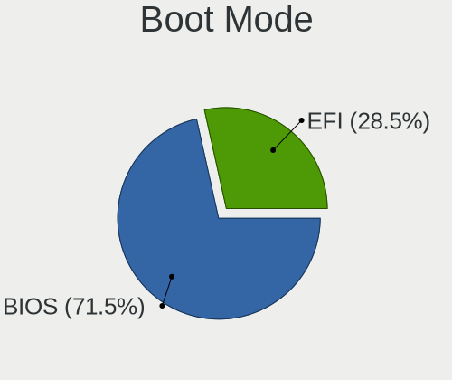
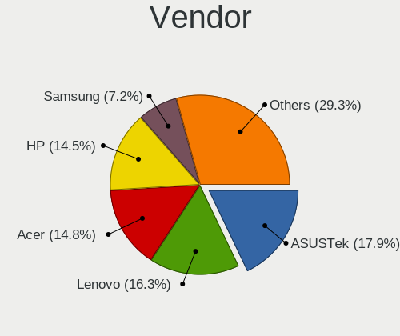
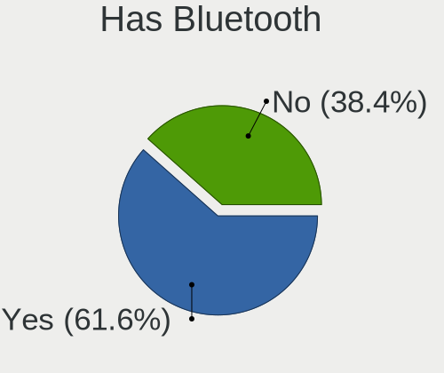
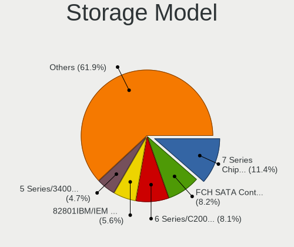
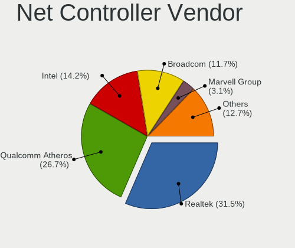
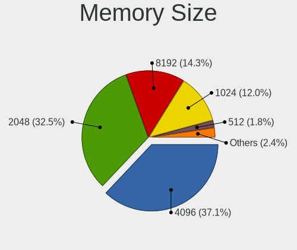

ROSA - Tested Hardware & Statistics (Notebooks)
-----------------------------------------------

A project to collect tested hardware configurations for ROSA.

Anyone can contribute to this report by the [hw-probe](https://github.com/linuxhw/hw-probe) tool:

    sudo -E hw-probe -all -upload

Please contribute! Especially if your hardware is rare.

Contents
--------

* [ Test Cases ](#test-cases)

* [ System ](#system)
  - [ OS                       ](#os)
  - [ OS Family                ](#os-family)
  - [ Kernel                   ](#kernel)
  - [ Kernel Family            ](#kernel-family)
  - [ Kernel Major Ver.        ](#kernel-major-ver)
  - [ Arch                     ](#arch)
  - [ DE                       ](#de)
  - [ Display Server           ](#display-server)
  - [ Display Manager          ](#display-manager)
  - [ OS Lang                  ](#os-lang)
  - [ Boot Mode                ](#boot-mode)
  - [ Filesystem               ](#filesystem)
  - [ Part. scheme             ](#part-scheme)
  - [ Dual Boot with Linux/BSD ](#dual-boot-with-linuxbsd)
  - [ Dual Boot (Win)          ](#dual-boot-win)

* [ Board ](#board)
  - [ Vendor                   ](#vendor)
  - [ Model                    ](#model)
  - [ Model Family             ](#model-family)
  - [ MFG Year                 ](#mfg-year)
  - [ Form Factor              ](#form-factor)
  - [ Secure Boot              ](#secure-boot)
  - [ Coreboot                 ](#coreboot)
  - [ RAM Size                 ](#ram-size)
  - [ RAM Used                 ](#ram-used)
  - [ Total Drives             ](#total-drives)
  - [ Has CD-ROM               ](#has-cd-rom)
  - [ Has Ethernet             ](#has-ethernet)
  - [ Has WiFi                 ](#has-wifi)
  - [ Has Bluetooth            ](#has-bluetooth)

* [ Location ](#location)
  - [ Country                  ](#country)
  - [ City                     ](#city)

* [ Drives ](#drives)
  - [ Drive Vendor             ](#drive-vendor)
  - [ Drive Model              ](#drive-model)
  - [ HDD Vendor               ](#hdd-vendor)
  - [ SSD Vendor               ](#ssd-vendor)
  - [ Drive Kind               ](#drive-kind)
  - [ Drive Connector          ](#drive-connector)
  - [ Drive Size               ](#drive-size)
  - [ Space Total              ](#space-total)
  - [ Space Used               ](#space-used)
  - [ Malfunc. Drives          ](#malfunc-drives)
  - [ Malfunc. Drive Vendor    ](#malfunc-drive-vendor)
  - [ Malfunc. HDD Vendor      ](#malfunc-hdd-vendor)
  - [ Malfunc. Drive Kind      ](#malfunc-drive-kind)
  - [ Failed Drives            ](#failed-drives)
  - [ Failed Drive Vendor      ](#failed-drive-vendor)
  - [ Drive Status             ](#drive-status)

* [ Storage controller ](#storage-controller)
  - [ Storage Vendor           ](#storage-vendor)
  - [ Storage Model            ](#storage-model)
  - [ Storage Kind             ](#storage-kind)

* [ Processor ](#processor)
  - [ CPU Vendor               ](#cpu-vendor)
  - [ CPU Model                ](#cpu-model)
  - [ CPU Model Family         ](#cpu-model-family)
  - [ CPU Cores                ](#cpu-cores)
  - [ CPU Sockets              ](#cpu-sockets)
  - [ CPU Threads              ](#cpu-threads)
  - [ CPU Op-Modes             ](#cpu-op-modes)
  - [ CPU Microcode            ](#cpu-microcode)
  - [ CPU Microarch            ](#cpu-microarch)

* [ Graphics ](#graphics)
  - [ GPU Vendor               ](#gpu-vendor)
  - [ GPU Model                ](#gpu-model)
  - [ GPU Combo                ](#gpu-combo)
  - [ GPU Driver               ](#gpu-driver)
  - [ GPU Memory               ](#gpu-memory)

* [ Monitor ](#monitor)
  - [ Monitor Vendor           ](#monitor-vendor)
  - [ Monitor Model            ](#monitor-model)
  - [ Monitor Resolution       ](#monitor-resolution)
  - [ Monitor Diagonal         ](#monitor-diagonal)
  - [ Monitor Width            ](#monitor-width)
  - [ Aspect Ratio             ](#aspect-ratio)
  - [ Monitor Area             ](#monitor-area)
  - [ Pixel Density            ](#pixel-density)
  - [ Multiple Monitors        ](#multiple-monitors)

* [ Network ](#network)
  - [ Net Controller Vendor    ](#net-controller-vendor)
  - [ Net Controller Model     ](#net-controller-model)
  - [ Wireless Vendor          ](#wireless-vendor)
  - [ Wireless Model           ](#wireless-model)
  - [ Ethernet Vendor          ](#ethernet-vendor)
  - [ Ethernet Model           ](#ethernet-model)
  - [ Net Controller Kind      ](#net-controller-kind)
  - [ Used Controller          ](#used-controller)
  - [ NICs                     ](#nics)
  - [ IPv6                     ](#ipv6)

* [ Bluetooth ](#bluetooth)
  - [ Bluetooth Vendor         ](#bluetooth-vendor)
  - [ Bluetooth Model          ](#bluetooth-model)

* [ Sound ](#sound)
  - [ Sound Vendor             ](#sound-vendor)
  - [ Sound Model              ](#sound-model)

* [ Memory ](#memory)
  - [ Memory Vendor            ](#memory-vendor)
  - [ Memory Model             ](#memory-model)
  - [ Memory Kind              ](#memory-kind)
  - [ Memory Form Factor       ](#memory-form-factor)
  - [ Memory Size              ](#memory-size)
  - [ Memory Speed             ](#memory-speed)

* [ Printers & scanners ](#printers--scanners)
  - [ Printer Vendor           ](#printer-vendor)
  - [ Printer Model            ](#printer-model)
  - [ Scanner Vendor           ](#scanner-vendor)
  - [ Scanner Model            ](#scanner-model)

* [ Camera ](#camera)
  - [ Camera Vendor            ](#camera-vendor)
  - [ Camera Model             ](#camera-model)

* [ Security ](#security)
  - [ Fingerprint Vendor       ](#fingerprint-vendor)
  - [ Fingerprint Model        ](#fingerprint-model)
  - [ Chipcard Vendor          ](#chipcard-vendor)
  - [ Chipcard Model           ](#chipcard-model)

* [ Unsupported ](#unsupported)
  - [ Unsupported Devices      ](#unsupported-devices)
  - [ Unsupported Device Types ](#unsupported-device-types)

Test Cases
----------

Total: 18964

| Vendor        | Model                       | Probe                                                      | Date         |
|---------------|-----------------------------|------------------------------------------------------------|--------------|
| HP            | 650                         | [162893e9ad](https://linux-hardware.org/?probe=162893e9ad) | Oct 01, 2022 |
| Lenovo        | G770 20089                  | [e06e588d62](https://linux-hardware.org/?probe=e06e588d62) | Oct 01, 2022 |
| ASUSTek       | F5V                         | [463cd15493](https://linux-hardware.org/?probe=463cd15493) | Oct 01, 2022 |
| Dell          | Inspiron 5737               | [14113affa1](https://linux-hardware.org/?probe=14113affa1) | Oct 01, 2022 |
| Dell          | Inspiron 5737               | [6893292144](https://linux-hardware.org/?probe=6893292144) | Oct 01, 2022 |
| Acer          | Aspire 5750G                | [8e87575f75](https://linux-hardware.org/?probe=8e87575f75) | Oct 01, 2022 |
| Acer          | Extensa 4220                | [c35a0a579a](https://linux-hardware.org/?probe=c35a0a579a) | Sep 30, 2022 |
| HP            | Pavilion dv7                | [4d54db9389](https://linux-hardware.org/?probe=4d54db9389) | Sep 30, 2022 |
| Acer          | Aspire A514-54              | [b8b0da1194](https://linux-hardware.org/?probe=b8b0da1194) | Sep 30, 2022 |
| Lenovo        | IdeaPad S145-15API 81UT     | [9ccd242ca4](https://linux-hardware.org/?probe=9ccd242ca4) | Sep 30, 2022 |
| Lenovo        | G580 20150                  | [d057161e9d](https://linux-hardware.org/?probe=d057161e9d) | Sep 30, 2022 |
| Acer          | Aspire 5741G                | [837c4599cc](https://linux-hardware.org/?probe=837c4599cc) | Sep 29, 2022 |
| Acer          | AOD257                      | [87b7501836](https://linux-hardware.org/?probe=87b7501836) | Sep 29, 2022 |
| ASUSTek       | TUF Gaming FX504GE_FX80G... | [4a8bc2a5e5](https://linux-hardware.org/?probe=4a8bc2a5e5) | Sep 28, 2022 |
| Acer          | Aspire A715-42G             | [44d8521e1d](https://linux-hardware.org/?probe=44d8521e1d) | Sep 28, 2022 |
| Acer          | Aspire A715-42G             | [ecbc8d9288](https://linux-hardware.org/?probe=ecbc8d9288) | Sep 28, 2022 |
| 3Logic Gro... | Graviton N15i-K2            | [6ce327114c](https://linux-hardware.org/?probe=6ce327114c) | Sep 28, 2022 |
| Lenovo        | IdeaPad Gaming 3 15ACH6 ... | [d0fd059ca7](https://linux-hardware.org/?probe=d0fd059ca7) | Sep 28, 2022 |
| Acer          | Aspire A515-45G             | [0e8bdd2e37](https://linux-hardware.org/?probe=0e8bdd2e37) | Sep 27, 2022 |
| Samsung       | R530/R730                   | [e6168a9f1a](https://linux-hardware.org/?probe=e6168a9f1a) | Sep 27, 2022 |
| ASUSTek       | ASUSPRO P3540FA_P3540FA     | [bb1530a50e](https://linux-hardware.org/?probe=bb1530a50e) | Sep 27, 2022 |
| Lenovo        | IdeaPad S340-15IML 81NA     | [03d36518de](https://linux-hardware.org/?probe=03d36518de) | Sep 27, 2022 |
| Medion        | C15MU-N                     | [e4a1e96ebd](https://linux-hardware.org/?probe=e4a1e96ebd) | Sep 26, 2022 |
| Lenovo        | ThinkBook 16p Gen 2 20YM    | [efcbc52fcd](https://linux-hardware.org/?probe=efcbc52fcd) | Sep 25, 2022 |
| MSI           | GL65 Leopard 10SCSR         | [d1b60d3f52](https://linux-hardware.org/?probe=d1b60d3f52) | Sep 25, 2022 |
| Lenovo        | Legion Y-540-17IRH-PG0 8... | [29c967b4ec](https://linux-hardware.org/?probe=29c967b4ec) | Sep 25, 2022 |
| MSI           | GL65 Leopard 10SCSR         | [1487715bc7](https://linux-hardware.org/?probe=1487715bc7) | Sep 25, 2022 |
| Unknown       | Unknown                     | [d5d8bdbf34](https://linux-hardware.org/?probe=d5d8bdbf34) | Sep 25, 2022 |
| HP            | Pavilion g6                 | [915b5a320a](https://linux-hardware.org/?probe=915b5a320a) | Sep 25, 2022 |
| Lenovo        | ThinkBook 16p Gen 2 20YM    | [436bfa4c50](https://linux-hardware.org/?probe=436bfa4c50) | Sep 25, 2022 |
| HP            | Pavilion g6                 | [2c685dca1c](https://linux-hardware.org/?probe=2c685dca1c) | Sep 24, 2022 |
| Samsung       | R540/R580/R780/SA41/E452    | [fe4a71500c](https://linux-hardware.org/?probe=fe4a71500c) | Sep 24, 2022 |
| Lenovo        | ThinkBook 16p Gen 2 20YM    | [bf6e11dcf3](https://linux-hardware.org/?probe=bf6e11dcf3) | Sep 24, 2022 |
| HP            | Laptop 15-bw0xx             | [ea756ff16b](https://linux-hardware.org/?probe=ea756ff16b) | Sep 24, 2022 |
| ASUSTek       | X541NC                      | [226d4d741d](https://linux-hardware.org/?probe=226d4d741d) | Sep 24, 2022 |
| ASUSTek       | X453SA                      | [b879e569d1](https://linux-hardware.org/?probe=b879e569d1) | Sep 24, 2022 |
| Acer          | Aspire 5253G                | [098f7ee3ed](https://linux-hardware.org/?probe=098f7ee3ed) | Sep 24, 2022 |
| Acer          | Aspire 5733Z                | [c22d27a781](https://linux-hardware.org/?probe=c22d27a781) | Sep 23, 2022 |
| ASUSTek       | X550EA                      | [256620a993](https://linux-hardware.org/?probe=256620a993) | Sep 23, 2022 |
| Haier         | GG1560XT                    | [fbdbeb0e82](https://linux-hardware.org/?probe=fbdbeb0e82) | Sep 22, 2022 |
| Acer          | Aspire A315-51              | [29e3f57ef9](https://linux-hardware.org/?probe=29e3f57ef9) | Sep 22, 2022 |
| Dell          | Inspiron 5547               | [e3a9b82c15](https://linux-hardware.org/?probe=e3a9b82c15) | Sep 22, 2022 |
| ASUSTek       | X550LC                      | [03f4677430](https://linux-hardware.org/?probe=03f4677430) | Sep 22, 2022 |
| ASUSTek       | K50IJ                       | [a0d9805cbb](https://linux-hardware.org/?probe=a0d9805cbb) | Sep 22, 2022 |
| Unknown       | Unknown                     | [a3dbfe1076](https://linux-hardware.org/?probe=a3dbfe1076) | Sep 22, 2022 |
| Lenovo        | ThinkPad L13 20R3000CRT     | [cec261f5e2](https://linux-hardware.org/?probe=cec261f5e2) | Sep 22, 2022 |
| ASUSTek       | K53E                        | [dc270d21ac](https://linux-hardware.org/?probe=dc270d21ac) | Sep 22, 2022 |
| MSI           | Katana GF66 11UE            | [b418d015a6](https://linux-hardware.org/?probe=b418d015a6) | Sep 22, 2022 |
| Lenovo        | G500 20236                  | [ede942e5a1](https://linux-hardware.org/?probe=ede942e5a1) | Sep 21, 2022 |
| DEXP          | Notebook                    | [2caa8c0be4](https://linux-hardware.org/?probe=2caa8c0be4) | Sep 21, 2022 |
| Haier         | GG1560XT                    | [85cb227779](https://linux-hardware.org/?probe=85cb227779) | Sep 21, 2022 |
| Acer          | Aspire A315-23              | [204980d2bd](https://linux-hardware.org/?probe=204980d2bd) | Sep 21, 2022 |
| ASUSTek       | X550LC                      | [018ca85503](https://linux-hardware.org/?probe=018ca85503) | Sep 21, 2022 |
| ASUSTek       | K50IJ                       | [3662255ac7](https://linux-hardware.org/?probe=3662255ac7) | Sep 20, 2022 |
| ASUSTek       | BU401LG                     | [12d87b6cad](https://linux-hardware.org/?probe=12d87b6cad) | Sep 20, 2022 |
| Lenovo        | IdeaPad 110-15ACL 80TJ      | [1db8da5821](https://linux-hardware.org/?probe=1db8da5821) | Sep 20, 2022 |
| HP            | Pavilion g6                 | [930de8d94d](https://linux-hardware.org/?probe=930de8d94d) | Sep 20, 2022 |
| ASUSTek       | X550LC                      | [3683e3fd1b](https://linux-hardware.org/?probe=3683e3fd1b) | Sep 20, 2022 |
| Intel         | ChiefRiver Platform         | [87cff551c8](https://linux-hardware.org/?probe=87cff551c8) | Sep 20, 2022 |
| Intel         | ChiefRiver Platform         | [ffaa34d0c1](https://linux-hardware.org/?probe=ffaa34d0c1) | Sep 20, 2022 |
| HP            | Pavilion g6                 | [dfd4d1f4e2](https://linux-hardware.org/?probe=dfd4d1f4e2) | Sep 20, 2022 |
| Acer          | Nitro AN515-54              | [d927d512ed](https://linux-hardware.org/?probe=d927d512ed) | Sep 20, 2022 |
| Acer          | Aspire 5750G                | [e32fb86913](https://linux-hardware.org/?probe=e32fb86913) | Sep 19, 2022 |
| HP            | ProBook 5330m               | [659bc725a3](https://linux-hardware.org/?probe=659bc725a3) | Sep 19, 2022 |
| HP            | EliteBook 840 G4            | [32b16880e2](https://linux-hardware.org/?probe=32b16880e2) | Sep 19, 2022 |
| ASUSTek       | X550MJ                      | [8b3130c363](https://linux-hardware.org/?probe=8b3130c363) | Sep 19, 2022 |
| ASUSTek       | VivoBook_ASUS Laptop E21... | [d9742b9445](https://linux-hardware.org/?probe=d9742b9445) | Sep 19, 2022 |
| Aquarius      | NS685U R11                  | [f1f88e57c5](https://linux-hardware.org/?probe=f1f88e57c5) | Sep 19, 2022 |
| HP            | Pavilion g6                 | [4d623b8260](https://linux-hardware.org/?probe=4d623b8260) | Sep 19, 2022 |
| HP            | Notebook                    | [91f7c83215](https://linux-hardware.org/?probe=91f7c83215) | Sep 18, 2022 |
| Sony          | VGN-FW245J                  | [ab3391f43e](https://linux-hardware.org/?probe=ab3391f43e) | Sep 18, 2022 |
| ASUSTek       | F3Sa                        | [0950d9df40](https://linux-hardware.org/?probe=0950d9df40) | Sep 18, 2022 |
| Acer          | Ferrari 3200                | [ca5401c49c](https://linux-hardware.org/?probe=ca5401c49c) | Sep 18, 2022 |
| ASUSTek       | VivoBook_ASUS Laptop E21... | [c37b1b0747](https://linux-hardware.org/?probe=c37b1b0747) | Sep 18, 2022 |
| Samsung       | N150P/N210P/N220P           | [0dc99cefb4](https://linux-hardware.org/?probe=0dc99cefb4) | Sep 18, 2022 |
| ASUSTek       | VivoBook_ASUS Laptop E21... | [6c5e991427](https://linux-hardware.org/?probe=6c5e991427) | Sep 18, 2022 |
| Samsung       | 355V4C/356V4C/3445VC/354... | [bf101b4985](https://linux-hardware.org/?probe=bf101b4985) | Sep 17, 2022 |
| Acer          | Aspire ES1-523              | [cf05d4169b](https://linux-hardware.org/?probe=cf05d4169b) | Sep 17, 2022 |
| HP            | Compaq Presario CQ50        | [dce2af5435](https://linux-hardware.org/?probe=dce2af5435) | Sep 16, 2022 |
| HP            | Pavilion g6                 | [ba360b5712](https://linux-hardware.org/?probe=ba360b5712) | Sep 16, 2022 |
| HP            | Laptop 15-bs1xx             | [5529c09c5e](https://linux-hardware.org/?probe=5529c09c5e) | Sep 16, 2022 |
| ASUSTek       | X550MD                      | [69cce160a1](https://linux-hardware.org/?probe=69cce160a1) | Sep 16, 2022 |
| Aquarius      | NS685U R11                  | [3b687d6944](https://linux-hardware.org/?probe=3b687d6944) | Sep 16, 2022 |
| Aquarius      | NS685U R11                  | [9e626224d3](https://linux-hardware.org/?probe=9e626224d3) | Sep 16, 2022 |
| MSI           | GS66 Stealth 10SE           | [de4d4f5b61](https://linux-hardware.org/?probe=de4d4f5b61) | Sep 16, 2022 |
| Acer          | Aspire A717-72G             | [b0f989d584](https://linux-hardware.org/?probe=b0f989d584) | Sep 15, 2022 |
| Lenovo        | IdeaPad 5 Pro 16ACH6 82L... | [f632794c70](https://linux-hardware.org/?probe=f632794c70) | Sep 15, 2022 |
| Lenovo        | IdeaPad 5 Pro 16ACH6 82L... | [d99530ffd0](https://linux-hardware.org/?probe=d99530ffd0) | Sep 15, 2022 |
| Aquarius      | NS685U R11                  | [37cfe22203](https://linux-hardware.org/?probe=37cfe22203) | Sep 15, 2022 |
| Aquarius      | NS685U R11                  | [e8ba91b867](https://linux-hardware.org/?probe=e8ba91b867) | Sep 15, 2022 |
| Lenovo        | IdeaPad 320-15IKB 80XL      | [b731b95d0f](https://linux-hardware.org/?probe=b731b95d0f) | Sep 15, 2022 |
| Timi          | RedmiBook Pro 14S           | [1662163cb8](https://linux-hardware.org/?probe=1662163cb8) | Sep 15, 2022 |
| HP            | Notebook                    | [65621e9bea](https://linux-hardware.org/?probe=65621e9bea) | Sep 14, 2022 |
| Acer          | Extensa 215-52              | [cb38a4efeb](https://linux-hardware.org/?probe=cb38a4efeb) | Sep 14, 2022 |
| Acer          | Nitro AN515-54              | [c36c715af7](https://linux-hardware.org/?probe=c36c715af7) | Sep 14, 2022 |
| Acer          | TravelMate 5744Z            | [f9846e0165](https://linux-hardware.org/?probe=f9846e0165) | Sep 13, 2022 |
| Chuwi         | HeroBook Pro                | [aa99b0558b](https://linux-hardware.org/?probe=aa99b0558b) | Sep 13, 2022 |
| Acer          | Nitro AN515-54              | [552b310540](https://linux-hardware.org/?probe=552b310540) | Sep 13, 2022 |
| ASUSTek       | 1005HA                      | [93ee340172](https://linux-hardware.org/?probe=93ee340172) | Sep 12, 2022 |
| Aquarius      | win10 HOME rs10             | [988e1b3035](https://linux-hardware.org/?probe=988e1b3035) | Sep 12, 2022 |
| Lenovo        | IdeaPad 100-14IBY 80MH      | [0d14398a88](https://linux-hardware.org/?probe=0d14398a88) | Sep 12, 2022 |
| HP            | EliteBook 2530p             | [4bae06f3d0](https://linux-hardware.org/?probe=4bae06f3d0) | Sep 12, 2022 |
| ASUSTek       | F5N                         | [343f77754d](https://linux-hardware.org/?probe=343f77754d) | Sep 12, 2022 |
| ASUSTek       | X550LC                      | [124bce938e](https://linux-hardware.org/?probe=124bce938e) | Sep 12, 2022 |
| Lenovo        | IdeaPad S145-15AST 81N3     | [017c9c9f8f](https://linux-hardware.org/?probe=017c9c9f8f) | Sep 11, 2022 |
| ASUSTek       | N56VJ                       | [a67b781113](https://linux-hardware.org/?probe=a67b781113) | Sep 11, 2022 |
| ASUSTek       | N56VJ                       | [c384cac71a](https://linux-hardware.org/?probe=c384cac71a) | Sep 11, 2022 |
| HP            | Pavilion g6                 | [15a646b1af](https://linux-hardware.org/?probe=15a646b1af) | Sep 11, 2022 |
| Lenovo        | Legion Y540-17IRH 81UJ      | [404a01ee53](https://linux-hardware.org/?probe=404a01ee53) | Sep 11, 2022 |
| HP            | Pavilion g6                 | [abeefb9863](https://linux-hardware.org/?probe=abeefb9863) | Sep 11, 2022 |
| Lenovo        | IdeaPad Y510                | [460d140033](https://linux-hardware.org/?probe=460d140033) | Sep 11, 2022 |
| Lenovo        | IdeaPad S12 20021,2959      | [d26f8478cf](https://linux-hardware.org/?probe=d26f8478cf) | Sep 10, 2022 |
| ASUSTek       | X705UQ                      | [8afcde5edb](https://linux-hardware.org/?probe=8afcde5edb) | Sep 10, 2022 |
| HP            | Presario CQ56               | [9ab1ac3d7d](https://linux-hardware.org/?probe=9ab1ac3d7d) | Sep 10, 2022 |
| ASUSTek       | VivoBook_ASUSLaptop X513... | [894e7133b8](https://linux-hardware.org/?probe=894e7133b8) | Sep 10, 2022 |
| Toshiba       | Satellite A200              | [ce084887f1](https://linux-hardware.org/?probe=ce084887f1) | Sep 10, 2022 |
| ASUSTek       | VivoBook_ASUSLaptop X509... | [7d63a02b7a](https://linux-hardware.org/?probe=7d63a02b7a) | Sep 09, 2022 |
| ASUSTek       | X401A1                      | [8da7efe143](https://linux-hardware.org/?probe=8da7efe143) | Sep 09, 2022 |
| ASUSTek       | X55A                        | [3164e4194b](https://linux-hardware.org/?probe=3164e4194b) | Sep 09, 2022 |
| ASUSTek       | 1225C                       | [91f049c977](https://linux-hardware.org/?probe=91f049c977) | Sep 09, 2022 |
| Dell          | Inspiron N5110              | [6743b005a2](https://linux-hardware.org/?probe=6743b005a2) | Sep 09, 2022 |
| Acer          | Aspire 5742G                | [64789ba939](https://linux-hardware.org/?probe=64789ba939) | Sep 08, 2022 |
| Acer          | Aspire 7530G                | [c60f3942b7](https://linux-hardware.org/?probe=c60f3942b7) | Sep 08, 2022 |
| Dell          | Inspiron 3521               | [684eb65731](https://linux-hardware.org/?probe=684eb65731) | Sep 08, 2022 |
| Aquarius      | win10 HOME rs10             | [6d31915653](https://linux-hardware.org/?probe=6d31915653) | Sep 08, 2022 |
| Lenovo        | IdeaPad 320-15IKB 80XL      | [74be767838](https://linux-hardware.org/?probe=74be767838) | Sep 08, 2022 |
| ASUSTek       | VivoBook_ASUS Laptop E21... | [5002f53142](https://linux-hardware.org/?probe=5002f53142) | Sep 08, 2022 |
| System76      | Lemur                       | [5993c130bc](https://linux-hardware.org/?probe=5993c130bc) | Sep 07, 2022 |
| Apple         | MacBook4,1                  | [dcc65ebdf1](https://linux-hardware.org/?probe=dcc65ebdf1) | Sep 07, 2022 |
| ASUSTek       | VivoBook 15_ASUS Laptop ... | [c22457dc35](https://linux-hardware.org/?probe=c22457dc35) | Sep 07, 2022 |
| Toshiba       | Satellite Pro L630          | [9f20969845](https://linux-hardware.org/?probe=9f20969845) | Sep 06, 2022 |
| Samsung       | 350V5C/351V5C/3540VC/344... | [c0933e083b](https://linux-hardware.org/?probe=c0933e083b) | Sep 06, 2022 |
| HP            | Pavilion g6                 | [fe038c57a9](https://linux-hardware.org/?probe=fe038c57a9) | Sep 06, 2022 |
| Aquarius      | NS685U R11                  | [e4b0733994](https://linux-hardware.org/?probe=e4b0733994) | Sep 06, 2022 |
| Lenovo        | IdeaPad 330-15AST 81D6      | [edd9555b23](https://linux-hardware.org/?probe=edd9555b23) | Sep 06, 2022 |
| Positivo B... | VJFE52F11X-B0611H           | [93d596fc4f](https://linux-hardware.org/?probe=93d596fc4f) | Sep 05, 2022 |
| Lenovo        | B50-10 80QR                 | [983c62f244](https://linux-hardware.org/?probe=983c62f244) | Sep 05, 2022 |
| MSI           | GP60 2OD                    | [edfcc5eb89](https://linux-hardware.org/?probe=edfcc5eb89) | Sep 05, 2022 |
| Positivo B... | VJFE52F11X-B0611H           | [0e3fd8d374](https://linux-hardware.org/?probe=0e3fd8d374) | Sep 05, 2022 |
| Lenovo        | IdeaPad 320-15IKB 80XL      | [90f0d2a48d](https://linux-hardware.org/?probe=90f0d2a48d) | Sep 04, 2022 |
| ASUSTek       | VivoBook_ASUS Laptop E21... | [3fd0d4c291](https://linux-hardware.org/?probe=3fd0d4c291) | Sep 04, 2022 |
| Lenovo        | G710 20252                  | [f43077f02f](https://linux-hardware.org/?probe=f43077f02f) | Sep 04, 2022 |
| MSI           | MS-N051                     | [a7ae139021](https://linux-hardware.org/?probe=a7ae139021) | Sep 03, 2022 |
| Dell          | Inspiron N5110              | [5201cd643e](https://linux-hardware.org/?probe=5201cd643e) | Sep 03, 2022 |
| ASUSTek       | U24E                        | [2b872b7fa8](https://linux-hardware.org/?probe=2b872b7fa8) | Sep 03, 2022 |
| ASUSTek       | K50IJ                       | [8fd7454abf](https://linux-hardware.org/?probe=8fd7454abf) | Sep 03, 2022 |
| HP            | Compaq nx7300 (RU373ES#A... | [e32e503c04](https://linux-hardware.org/?probe=e32e503c04) | Sep 03, 2022 |
| Dell          | Inspiron 3531               | [929b1f8bf4](https://linux-hardware.org/?probe=929b1f8bf4) | Sep 02, 2022 |
| Acer          | Aspire A315-34              | [35cbd90c30](https://linux-hardware.org/?probe=35cbd90c30) | Sep 02, 2022 |
| HP            | Pavilion Gaming Laptop 1... | [cbab6ab08c](https://linux-hardware.org/?probe=cbab6ab08c) | Sep 02, 2022 |
| ASUSTek       | VivoBook_ASUSLaptop X350... | [2a3eb4b772](https://linux-hardware.org/?probe=2a3eb4b772) | Sep 02, 2022 |
| Lenovo        | B570e HuronRiver Platfor... | [23e052db95](https://linux-hardware.org/?probe=23e052db95) | Sep 01, 2022 |
| Notebook      | W65_67SB                    | [38393a5559](https://linux-hardware.org/?probe=38393a5559) | Sep 01, 2022 |
| Lenovo        | IdeaPad 330-15AST 81D6      | [972c4cb608](https://linux-hardware.org/?probe=972c4cb608) | Sep 01, 2022 |
| ASUSTek       | VivoBook 15_ASUS Laptop ... | [57d535de2e](https://linux-hardware.org/?probe=57d535de2e) | Sep 01, 2022 |
| Lenovo        | IdeaPad 320-15IAP 80XR      | [6aba706c0c](https://linux-hardware.org/?probe=6aba706c0c) | Aug 31, 2022 |
| Lenovo        | G710 20252                  | [37b1f6e81c](https://linux-hardware.org/?probe=37b1f6e81c) | Aug 31, 2022 |
| ASUSTek       | K46CM                       | [742d7047ea](https://linux-hardware.org/?probe=742d7047ea) | Aug 31, 2022 |
| Lenovo        | IdeaPad 330-15AST 81D6      | [f3877acbd2](https://linux-hardware.org/?probe=f3877acbd2) | Aug 31, 2022 |
| ASUSTek       | VivoBook 15_ASUS Laptop ... | [9da97f5dea](https://linux-hardware.org/?probe=9da97f5dea) | Aug 30, 2022 |
| Lenovo        | Y520-15IKBN 80WK            | [8036c3df64](https://linux-hardware.org/?probe=8036c3df64) | Aug 30, 2022 |
| Dell          | G3 3579                     | [fd78a1cf65](https://linux-hardware.org/?probe=fd78a1cf65) | Aug 30, 2022 |
| Packard Be... | EasyNote LM85               | [4294f9bdaf](https://linux-hardware.org/?probe=4294f9bdaf) | Aug 30, 2022 |
| Lenovo        | IdeaPad 330-15IKB 81DE      | [339b12ba13](https://linux-hardware.org/?probe=339b12ba13) | Aug 30, 2022 |
| Lenovo        | IdeaPad 330-15AST 81D6      | [3236ef3b00](https://linux-hardware.org/?probe=3236ef3b00) | Aug 30, 2022 |
| Acer          | Aspire V3-731               | [19d7285e0f](https://linux-hardware.org/?probe=19d7285e0f) | Aug 30, 2022 |
| Google        | Rammus                      | [cd31fc11aa](https://linux-hardware.org/?probe=cd31fc11aa) | Aug 29, 2022 |
| HP            | Pavilion g6                 | [d127560ff3](https://linux-hardware.org/?probe=d127560ff3) | Aug 29, 2022 |
| Positivo B... | VJFE52F11X-B0611H           | [eedd8fa1eb](https://linux-hardware.org/?probe=eedd8fa1eb) | Aug 29, 2022 |
| ASUSTek       | X550LC                      | [3507f6f2ba](https://linux-hardware.org/?probe=3507f6f2ba) | Aug 29, 2022 |
| Dell          | Vostro 1014                 | [bf43d87a11](https://linux-hardware.org/?probe=bf43d87a11) | Aug 29, 2022 |
| HP            | Notebook                    | [e00cfcb387](https://linux-hardware.org/?probe=e00cfcb387) | Aug 29, 2022 |
| ASUSTek       | VivoBook_ASUSLaptop X350... | [bddbedffed](https://linux-hardware.org/?probe=bddbedffed) | Aug 29, 2022 |
| ASUSTek       | F3E                         | [1314dc63b6](https://linux-hardware.org/?probe=1314dc63b6) | Aug 28, 2022 |
| Samsung       | R580/R590                   | [cb30537ee4](https://linux-hardware.org/?probe=cb30537ee4) | Aug 28, 2022 |
| Acer          | Nitro AN515-42              | [a82d7c03b0](https://linux-hardware.org/?probe=a82d7c03b0) | Aug 28, 2022 |
| Lenovo        | Legion 5 Pro 16ACH6H 82J... | [6cd83991d9](https://linux-hardware.org/?probe=6cd83991d9) | Aug 28, 2022 |
| HP            | Pavilion g6                 | [709d3e19e8](https://linux-hardware.org/?probe=709d3e19e8) | Aug 28, 2022 |
| Acer          | Aspire E5-573G              | [70ea653c9c](https://linux-hardware.org/?probe=70ea653c9c) | Aug 28, 2022 |
| HP            | Laptop 15-bw0xx             | [90fa9c15ec](https://linux-hardware.org/?probe=90fa9c15ec) | Aug 27, 2022 |
| Acer          | Aspire V3-571G              | [e584bee2db](https://linux-hardware.org/?probe=e584bee2db) | Aug 27, 2022 |
| Lenovo        | V14-ADA 82C6                | [46741f4613](https://linux-hardware.org/?probe=46741f4613) | Aug 27, 2022 |
| Lenovo        | IdeaPad 330-15IGM 81D1      | [029246a642](https://linux-hardware.org/?probe=029246a642) | Aug 27, 2022 |
| ASUSTek       | VivoBook_ASUSLaptop X515... | [2267f01dee](https://linux-hardware.org/?probe=2267f01dee) | Aug 27, 2022 |
| Acer          | Nitro AN515-42              | [063eca4290](https://linux-hardware.org/?probe=063eca4290) | Aug 26, 2022 |
| Acer          | Aspire 5570Z                | [38fe74cbe3](https://linux-hardware.org/?probe=38fe74cbe3) | Aug 26, 2022 |
| Acer          | Nitro AN517-52              | [8732c0caef](https://linux-hardware.org/?probe=8732c0caef) | Aug 26, 2022 |
| ASUSTek       | K52Dr                       | [aa74e72258](https://linux-hardware.org/?probe=aa74e72258) | Aug 26, 2022 |
| Lenovo        | IdeaPad 330-15IKB 81DE      | [619be9ede9](https://linux-hardware.org/?probe=619be9ede9) | Aug 26, 2022 |
| Positivo B... | VJFE52F11X-B0611H           | [635925265e](https://linux-hardware.org/?probe=635925265e) | Aug 25, 2022 |
| Unknown       | Unknown                     | [b9616ab32f](https://linux-hardware.org/?probe=b9616ab32f) | Aug 25, 2022 |
| Acer          | AO533                       | [5150a8b326](https://linux-hardware.org/?probe=5150a8b326) | Aug 25, 2022 |
| HP            | Pavilion 17                 | [e252f6b16e](https://linux-hardware.org/?probe=e252f6b16e) | Aug 25, 2022 |
| 3Logic Gro... | APM Graviton                | [03fd96a27c](https://linux-hardware.org/?probe=03fd96a27c) | Aug 24, 2022 |
| HP            | Compaq 610                  | [538b6ae6f8](https://linux-hardware.org/?probe=538b6ae6f8) | Aug 24, 2022 |
| HP            | Pavilion g6                 | [4c027aa104](https://linux-hardware.org/?probe=4c027aa104) | Aug 24, 2022 |
| Samsung       | NC210/NC110                 | [8063d3ecff](https://linux-hardware.org/?probe=8063d3ecff) | Aug 24, 2022 |
| Lenovo        | IdeaPad Gaming 3 15IMH05... | [37c239f9d1](https://linux-hardware.org/?probe=37c239f9d1) | Aug 24, 2022 |
| HP            | Pavilion g6                 | [96672b6762](https://linux-hardware.org/?probe=96672b6762) | Aug 24, 2022 |
| HP            | Laptop 15s-fq2xxx           | [3c37e04cf3](https://linux-hardware.org/?probe=3c37e04cf3) | Aug 24, 2022 |
| HUAWEI        | KLVD-WXX9                   | [b5dea99797](https://linux-hardware.org/?probe=b5dea99797) | Aug 24, 2022 |
| HP            | Compaq Presario CQ50        | [ca5e35f5fd](https://linux-hardware.org/?probe=ca5e35f5fd) | Aug 24, 2022 |
| Lenovo        | Legion Y740-17IRHg 81UJ     | [b8859a4f21](https://linux-hardware.org/?probe=b8859a4f21) | Aug 23, 2022 |
| Lenovo        | Legion Y740-17IRHg 81UJ     | [ce734a061a](https://linux-hardware.org/?probe=ce734a061a) | Aug 23, 2022 |
| Unknown       | Unknown                     | [40c763302e](https://linux-hardware.org/?probe=40c763302e) | Aug 22, 2022 |
| ASUSTek       | K55DR                       | [3620d3d416](https://linux-hardware.org/?probe=3620d3d416) | Aug 21, 2022 |
| Lenovo        | IdeaPad Gaming 3 15IMH05... | [0d73b91195](https://linux-hardware.org/?probe=0d73b91195) | Aug 21, 2022 |
| HP            | Pavilion g6                 | [7e345d980f](https://linux-hardware.org/?probe=7e345d980f) | Aug 21, 2022 |
| Samsung       | 700Z3A/700Z4A/700Z5A/700... | [8756581baa](https://linux-hardware.org/?probe=8756581baa) | Aug 21, 2022 |
| Acer          | Aspire E1-572G              | [d3d75b83d2](https://linux-hardware.org/?probe=d3d75b83d2) | Aug 21, 2022 |
| HP            | Pavilion m6                 | [54fcf9b1b4](https://linux-hardware.org/?probe=54fcf9b1b4) | Aug 21, 2022 |
| Lenovo        | Z710 20250                  | [8c7e567f41](https://linux-hardware.org/?probe=8c7e567f41) | Aug 21, 2022 |
| Lenovo        | IdeaPad 320-15IKB 80XL      | [8ab10bdcff](https://linux-hardware.org/?probe=8ab10bdcff) | Aug 21, 2022 |
| HP            | 255 G7 Notebook PC          | [c001653a5a](https://linux-hardware.org/?probe=c001653a5a) | Aug 20, 2022 |
| Acer          | Aspire A315-23              | [cedbeec8c7](https://linux-hardware.org/?probe=cedbeec8c7) | Aug 20, 2022 |
| Lenovo        | IdeaPad Gaming 3 15IMH05... | [0008792e11](https://linux-hardware.org/?probe=0008792e11) | Aug 19, 2022 |
| Haier         | GG1560XT                    | [6498de51c5](https://linux-hardware.org/?probe=6498de51c5) | Aug 19, 2022 |
| Haier         | GG1560XT                    | [1918cb9aa0](https://linux-hardware.org/?probe=1918cb9aa0) | Aug 19, 2022 |
| ASUSTek       | VivoBook_ASUSLaptop M350... | [8fd948229f](https://linux-hardware.org/?probe=8fd948229f) | Aug 19, 2022 |
| Acer          | Nitro AN517-52              | [8a1b401faa](https://linux-hardware.org/?probe=8a1b401faa) | Aug 19, 2022 |
| Samsung       | RV411/RV511/E3511/S3511/... | [b1602685e4](https://linux-hardware.org/?probe=b1602685e4) | Aug 19, 2022 |
| eMachines     | E525                        | [90d5ce71fa](https://linux-hardware.org/?probe=90d5ce71fa) | Aug 19, 2022 |
| Acer          | TravelMate B118-M           | [e35887bbe0](https://linux-hardware.org/?probe=e35887bbe0) | Aug 18, 2022 |
| HP            | Compaq 610                  | [2b90520f8f](https://linux-hardware.org/?probe=2b90520f8f) | Aug 18, 2022 |
| Lenovo        | ACLUAB                      | [3dcd5fa41c](https://linux-hardware.org/?probe=3dcd5fa41c) | Aug 18, 2022 |
| ASUSTek       | X551MA                      | [7baf2d8841](https://linux-hardware.org/?probe=7baf2d8841) | Aug 18, 2022 |
| Lenovo        | B590 20206                  | [d2d8a01f80](https://linux-hardware.org/?probe=d2d8a01f80) | Aug 18, 2022 |
| HP            | ProBook 440 G4              | [7bdaf1eeed](https://linux-hardware.org/?probe=7bdaf1eeed) | Aug 18, 2022 |
| HUAWEI        | NBD-WXX9                    | [fa32705b39](https://linux-hardware.org/?probe=fa32705b39) | Aug 18, 2022 |
| Lenovo        | IdeaPad 320-15IAP 80XR      | [7e5604ed7a](https://linux-hardware.org/?probe=7e5604ed7a) | Aug 17, 2022 |
| Lenovo        | ThinkPad T440p 20AWS0VB0... | [0c8e0377e6](https://linux-hardware.org/?probe=0c8e0377e6) | Aug 17, 2022 |
| Apple         | MacBookAir7,2               | [1bbad39284](https://linux-hardware.org/?probe=1bbad39284) | Aug 17, 2022 |
| Lenovo        | G505 20240                  | [fa8889478b](https://linux-hardware.org/?probe=fa8889478b) | Aug 17, 2022 |
| ASUSTek       | VivoBook 15_ASUS Laptop ... | [3f685da542](https://linux-hardware.org/?probe=3f685da542) | Aug 17, 2022 |
| Lenovo        | Legion 5 15IMH05H 81Y6      | [5ddc6fd9fe](https://linux-hardware.org/?probe=5ddc6fd9fe) | Aug 16, 2022 |
| Acer          | AOD260                      | [f9256627d2](https://linux-hardware.org/?probe=f9256627d2) | Aug 16, 2022 |
| ASUSTek       | VivoBook_ASUSLaptop M350... | [8057f74fa1](https://linux-hardware.org/?probe=8057f74fa1) | Aug 16, 2022 |
| Pegatron      | A17                         | [18101d1b69](https://linux-hardware.org/?probe=18101d1b69) | Aug 16, 2022 |
| Pegatron      | A17                         | [a845e63b56](https://linux-hardware.org/?probe=a845e63b56) | Aug 16, 2022 |
| Sony          | VPCSB1V9R                   | [6c72559c96](https://linux-hardware.org/?probe=6c72559c96) | Aug 16, 2022 |
| Lenovo        | B570e HuronRiver Platfor... | [51cb006bb3](https://linux-hardware.org/?probe=51cb006bb3) | Aug 16, 2022 |
| Sony          | VPCSB1V9R                   | [6aee1e8e96](https://linux-hardware.org/?probe=6aee1e8e96) | Aug 15, 2022 |
| Acer          | AOD260                      | [ba32775bba](https://linux-hardware.org/?probe=ba32775bba) | Aug 15, 2022 |
| Lenovo        | IdeaPad 320-15IKB 80XL      | [44af3a6839](https://linux-hardware.org/?probe=44af3a6839) | Aug 15, 2022 |
| Lenovo        | ThinkPad X220 4291B66       | [4e32cfa8bb](https://linux-hardware.org/?probe=4e32cfa8bb) | Aug 15, 2022 |
| Positivo B... | VJFE52F11X-B0611H           | [3a6b82f27f](https://linux-hardware.org/?probe=3a6b82f27f) | Aug 15, 2022 |
| Lenovo        | Legion 5 17IMH05H 81Y8      | [f2e01b5017](https://linux-hardware.org/?probe=f2e01b5017) | Aug 14, 2022 |
| Acer          | Nitro AN515-43              | [a7d615e104](https://linux-hardware.org/?probe=a7d615e104) | Aug 14, 2022 |
| HP            | 550                         | [620939b295](https://linux-hardware.org/?probe=620939b295) | Aug 14, 2022 |
| Dell          | Inspiron 3537               | [bcd6162709](https://linux-hardware.org/?probe=bcd6162709) | Aug 14, 2022 |
| ASUSTek       | 1215N                       | [40d99f3703](https://linux-hardware.org/?probe=40d99f3703) | Aug 14, 2022 |
| ASUSTek       | X550DP                      | [ce42b65252](https://linux-hardware.org/?probe=ce42b65252) | Aug 13, 2022 |
| Dell          | Vostro 15 3515              | [442f64dba9](https://linux-hardware.org/?probe=442f64dba9) | Aug 13, 2022 |
| Lenovo        | IdeaPad Gaming 3 15ARH05... | [4602665059](https://linux-hardware.org/?probe=4602665059) | Aug 13, 2022 |
| Dell          | Inspiron 7720               | [0435e973e0](https://linux-hardware.org/?probe=0435e973e0) | Aug 13, 2022 |
| Dell          | Precision M6600             | [7fcd14ca35](https://linux-hardware.org/?probe=7fcd14ca35) | Aug 13, 2022 |
| ASUSTek       | K501LB                      | [1e1745d32c](https://linux-hardware.org/?probe=1e1745d32c) | Aug 12, 2022 |
| ASUSTek       | K501LB                      | [a763c682f5](https://linux-hardware.org/?probe=a763c682f5) | Aug 12, 2022 |
| Acer          | Extensa 215-32              | [1a14e5a16b](https://linux-hardware.org/?probe=1a14e5a16b) | Aug 12, 2022 |
| Lenovo        | ThinkPad SL500 2746AA3      | [c4535a80a1](https://linux-hardware.org/?probe=c4535a80a1) | Aug 12, 2022 |
| ASUSTek       | K52Dr                       | [df4d29153d](https://linux-hardware.org/?probe=df4d29153d) | Aug 12, 2022 |
| HP            | 240 G8 Notebook PC          | [65080f426a](https://linux-hardware.org/?probe=65080f426a) | Aug 12, 2022 |
| Lenovo        | IdeaPad S340-14API 81NB     | [27e9575d4e](https://linux-hardware.org/?probe=27e9575d4e) | Aug 11, 2022 |
| Lenovo        | IdeaPad S340-14API 81NB     | [95349038bf](https://linux-hardware.org/?probe=95349038bf) | Aug 11, 2022 |
| ASUSTek       | F5N                         | [27348ad31d](https://linux-hardware.org/?probe=27348ad31d) | Aug 11, 2022 |
| Acer          | Unknown                     | [da56362a7e](https://linux-hardware.org/?probe=da56362a7e) | Aug 11, 2022 |
| MSI           | FX610                       | [60d49d467b](https://linux-hardware.org/?probe=60d49d467b) | Aug 11, 2022 |
| Dell          | Vostro 3460                 | [fbaf8208cb](https://linux-hardware.org/?probe=fbaf8208cb) | Aug 11, 2022 |
| eMachines     | eME728                      | [951d4614b6](https://linux-hardware.org/?probe=951d4614b6) | Aug 11, 2022 |
| Acer          | Aspire 5730                 | [34e252c0e0](https://linux-hardware.org/?probe=34e252c0e0) | Aug 11, 2022 |
| Acer          | AOHAPPY2                    | [dbed059d31](https://linux-hardware.org/?probe=dbed059d31) | Aug 10, 2022 |
| Acer          | Extensa 2519                | [674500aced](https://linux-hardware.org/?probe=674500aced) | Aug 10, 2022 |
| Lenovo        | IdeaPad Gaming 3 15ACH6 ... | [4f4d3ac481](https://linux-hardware.org/?probe=4f4d3ac481) | Aug 10, 2022 |
| HP            | 255 G4                      | [44b5858d14](https://linux-hardware.org/?probe=44b5858d14) | Aug 10, 2022 |
| HP            | Compaq Presario CQ60        | [20f30b16e5](https://linux-hardware.org/?probe=20f30b16e5) | Aug 09, 2022 |
| Haier         | GG1560XT                    | [5b42159441](https://linux-hardware.org/?probe=5b42159441) | Aug 09, 2022 |
| ASUSTek       | ASUS TUF Gaming A15 FA50... | [d37a512899](https://linux-hardware.org/?probe=d37a512899) | Aug 09, 2022 |
| Dell          | XPS 15 9550                 | [abf6de9a2d](https://linux-hardware.org/?probe=abf6de9a2d) | Aug 09, 2022 |
| Lenovo        | ThinkPad X220 4291B66       | [e3362a3a9f](https://linux-hardware.org/?probe=e3362a3a9f) | Aug 09, 2022 |
| Acer          | Aspire ES1-522              | [bcde4c3494](https://linux-hardware.org/?probe=bcde4c3494) | Aug 08, 2022 |
| Lenovo        | ThinkPad 13 2nd Gen 20J1... | [06d7313a34](https://linux-hardware.org/?probe=06d7313a34) | Aug 08, 2022 |
| ASUSTek       | TUF Gaming FX505DY_FX505... | [c11322ce1e](https://linux-hardware.org/?probe=c11322ce1e) | Aug 08, 2022 |
| Lenovo        | G70-80 80FF                 | [495516e19d](https://linux-hardware.org/?probe=495516e19d) | Aug 08, 2022 |
| ASUSTek       | X101CH                      | [07505fcd44](https://linux-hardware.org/?probe=07505fcd44) | Aug 07, 2022 |
| Lenovo        | B570e HuronRiver Platfor... | [091037a7fb](https://linux-hardware.org/?probe=091037a7fb) | Aug 07, 2022 |
| Acer          | Swift SF114-34              | [12de778ffd](https://linux-hardware.org/?probe=12de778ffd) | Aug 07, 2022 |
| ASUSTek       | F5N                         | [82b1172101](https://linux-hardware.org/?probe=82b1172101) | Aug 06, 2022 |
| eMachines     | eME728                      | [4000a32585](https://linux-hardware.org/?probe=4000a32585) | Aug 06, 2022 |
| Lenovo        | IdeaPad Y580 20132          | [f801b501ae](https://linux-hardware.org/?probe=f801b501ae) | Aug 06, 2022 |
| Lenovo        | G50-80 80L0                 | [eb58813044](https://linux-hardware.org/?probe=eb58813044) | Aug 06, 2022 |
| Lenovo        | IdeaPad S145-15API 81UT     | [36d7a0a9bd](https://linux-hardware.org/?probe=36d7a0a9bd) | Aug 05, 2022 |
| Dell          | Latitude E5550              | [cecf472493](https://linux-hardware.org/?probe=cecf472493) | Aug 05, 2022 |
| Acer          | Extensa 2509                | [5093176e6c](https://linux-hardware.org/?probe=5093176e6c) | Aug 05, 2022 |
| Acer          | Extensa 5220                | [d9bdf6e628](https://linux-hardware.org/?probe=d9bdf6e628) | Aug 05, 2022 |
| Lenovo        | IdeaPad S20-30              | [f845cb2e0e](https://linux-hardware.org/?probe=f845cb2e0e) | Aug 04, 2022 |
| Samsung       | R528/R728                   | [8681847134](https://linux-hardware.org/?probe=8681847134) | Aug 04, 2022 |
| Pegatron      | A17                         | [15db0a3ade](https://linux-hardware.org/?probe=15db0a3ade) | Aug 04, 2022 |
| ASUSTek       | X541UV                      | [feb8312a2c](https://linux-hardware.org/?probe=feb8312a2c) | Aug 04, 2022 |
| Lenovo        | B550 20053                  | [e42ac0b420](https://linux-hardware.org/?probe=e42ac0b420) | Aug 03, 2022 |
| eMachines     | E725                        | [12668c1e21](https://linux-hardware.org/?probe=12668c1e21) | Aug 03, 2022 |
| ASUSTek       | N56VV                       | [cc6eac0001](https://linux-hardware.org/?probe=cc6eac0001) | Aug 03, 2022 |
| eMachines     | E725                        | [3d751e0afa](https://linux-hardware.org/?probe=3d751e0afa) | Aug 03, 2022 |
| HP            | Pavilion dv7                | [895d651847](https://linux-hardware.org/?probe=895d651847) | Aug 02, 2022 |
| ASUSTek       | X550LC                      | [e430c69fbc](https://linux-hardware.org/?probe=e430c69fbc) | Aug 02, 2022 |
| ASUSTek       | X301A1                      | [60d9f2bc4d](https://linux-hardware.org/?probe=60d9f2bc4d) | Aug 02, 2022 |
| Acer          | Aspire A315-42              | [7d8e339d92](https://linux-hardware.org/?probe=7d8e339d92) | Aug 02, 2022 |
| Lenovo        | ThinkPad Edge E545 20B2A... | [51fe5d6f47](https://linux-hardware.org/?probe=51fe5d6f47) | Aug 02, 2022 |
| BBEN          | MN9                         | [d6ce556349](https://linux-hardware.org/?probe=d6ce556349) | Aug 02, 2022 |
| HP            | Pavilion dv6                | [28cf5336ab](https://linux-hardware.org/?probe=28cf5336ab) | Aug 02, 2022 |
| Dell          | Latitude 3490               | [3cd8f6d390](https://linux-hardware.org/?probe=3cd8f6d390) | Aug 02, 2022 |
| Lenovo        | B560                        | [010fb7ada1](https://linux-hardware.org/?probe=010fb7ada1) | Aug 01, 2022 |
| Shenzhen B... | XN1A                        | [6b1dd20a55](https://linux-hardware.org/?probe=6b1dd20a55) | Aug 01, 2022 |
| Samsung       | R530/R730/R540              | [73f8fb9528](https://linux-hardware.org/?probe=73f8fb9528) | Aug 01, 2022 |
| ASUSTek       | K501LB                      | [462af39f9d](https://linux-hardware.org/?probe=462af39f9d) | Aug 01, 2022 |
| ASUSTek       | 1011PX                      | [c95aa572a4](https://linux-hardware.org/?probe=c95aa572a4) | Aug 01, 2022 |
| Acer          | Aspire 5830TG               | [7eb001e6b4](https://linux-hardware.org/?probe=7eb001e6b4) | Jul 31, 2022 |
| Aquarius      | Pro, Std, Elt Series        | [3f08a29e9a](https://linux-hardware.org/?probe=3f08a29e9a) | Jul 31, 2022 |
| Timi          | Mi Laptop Pro 15 2020       | [d27e88a924](https://linux-hardware.org/?probe=d27e88a924) | Jul 31, 2022 |
| ASUSTek       | X550LC                      | [841508c072](https://linux-hardware.org/?probe=841508c072) | Jul 31, 2022 |
| Lenovo        | G580 20157                  | [a2270894c7](https://linux-hardware.org/?probe=a2270894c7) | Jul 31, 2022 |
| Acer          | Aspire 5730                 | [1541bd94e2](https://linux-hardware.org/?probe=1541bd94e2) | Jul 31, 2022 |
| MSI           | GL65 Leopard 10SCSR         | [2cbf6d3aae](https://linux-hardware.org/?probe=2cbf6d3aae) | Jul 31, 2022 |
| Acer          | Aspire 3610                 | [d56c48ade2](https://linux-hardware.org/?probe=d56c48ade2) | Jul 31, 2022 |
| Acer          | Unknown                     | [99992e8b67](https://linux-hardware.org/?probe=99992e8b67) | Jul 30, 2022 |
| Sony          | VPCEH2E1R                   | [24d621e667](https://linux-hardware.org/?probe=24d621e667) | Jul 30, 2022 |
| HP            | Laptop 15-db1xxx            | [dcbb6ec79b](https://linux-hardware.org/?probe=dcbb6ec79b) | Jul 30, 2022 |
| HP            | OMEN by Laptop 16-c0xxx     | [8ad22205d4](https://linux-hardware.org/?probe=8ad22205d4) | Jul 30, 2022 |
| Acer          | Aspire 5730                 | [8ac8b8a87a](https://linux-hardware.org/?probe=8ac8b8a87a) | Jul 30, 2022 |
| HP            | Pavilion g6                 | [ea628a71ee](https://linux-hardware.org/?probe=ea628a71ee) | Jul 29, 2022 |
| Acer          | Swift SF314-52              | [e9f0b2fcb7](https://linux-hardware.org/?probe=e9f0b2fcb7) | Jul 29, 2022 |
| ASUSTek       | P50IJ                       | [b11ce03a3b](https://linux-hardware.org/?probe=b11ce03a3b) | Jul 29, 2022 |
| Kraftway      | ACCORD                      | [1d694d32ba](https://linux-hardware.org/?probe=1d694d32ba) | Jul 29, 2022 |
| MSI           | FX610                       | [9e545d6a24](https://linux-hardware.org/?probe=9e545d6a24) | Jul 29, 2022 |
| Packard Be... | EasyNote LJ75               | [a883180728](https://linux-hardware.org/?probe=a883180728) | Jul 29, 2022 |
| HP            | Pavilion dv7                | [b22a2df288](https://linux-hardware.org/?probe=b22a2df288) | Jul 29, 2022 |
| HP            | Pavilion dv7                | [f7daa0e3e3](https://linux-hardware.org/?probe=f7daa0e3e3) | Jul 29, 2022 |
| HP            | Pavilion dv7                | [649a117385](https://linux-hardware.org/?probe=649a117385) | Jul 28, 2022 |
| Lenovo        | V14-IIL 82C4                | [9be688b59e](https://linux-hardware.org/?probe=9be688b59e) | Jul 28, 2022 |
| ASUSTek       | VivoBook 15_ASUS Laptop ... | [4947baccf9](https://linux-hardware.org/?probe=4947baccf9) | Jul 28, 2022 |
| Sony          | VGN-TT31MR_N                | [b1a4f2a68c](https://linux-hardware.org/?probe=b1a4f2a68c) | Jul 27, 2022 |
| Acer          | Aspire 5741G                | [bb63a4917e](https://linux-hardware.org/?probe=bb63a4917e) | Jul 27, 2022 |
| ASUSTek       | X55A                        | [61d57c4e59](https://linux-hardware.org/?probe=61d57c4e59) | Jul 26, 2022 |
| Toshiba       | Satellite L750D             | [c8e9ea3fdd](https://linux-hardware.org/?probe=c8e9ea3fdd) | Jul 26, 2022 |
| Acer          | Iconia W700                 | [694887391c](https://linux-hardware.org/?probe=694887391c) | Jul 26, 2022 |
| ASUSTek       | X550LC                      | [e38c3e6cb5](https://linux-hardware.org/?probe=e38c3e6cb5) | Jul 26, 2022 |
| Acer          | Aspire 4720Z                | [0233e1c451](https://linux-hardware.org/?probe=0233e1c451) | Jul 26, 2022 |
| HP            | ENVY dv6                    | [7f8e688cc4](https://linux-hardware.org/?probe=7f8e688cc4) | Jul 26, 2022 |
| Acer          | TravelMate 5744Z            | [aa1416d2e3](https://linux-hardware.org/?probe=aa1416d2e3) | Jul 26, 2022 |
| Lenovo        | Legion Y-540-17IRH-PG0 8... | [22ded313b5](https://linux-hardware.org/?probe=22ded313b5) | Jul 25, 2022 |
| HP            | ENVY dv6                    | [97d752c934](https://linux-hardware.org/?probe=97d752c934) | Jul 25, 2022 |
| Acer          | Aspire A315-51              | [b9d14045a3](https://linux-hardware.org/?probe=b9d14045a3) | Jul 25, 2022 |
| Acer          | Aspire E5-551G              | [8c94f9bae3](https://linux-hardware.org/?probe=8c94f9bae3) | Jul 25, 2022 |
| Lenovo        | Y520-15IKBN 80WK            | [80334990e7](https://linux-hardware.org/?probe=80334990e7) | Jul 25, 2022 |
| ASUSTek       | T200TAC                     | [a8314ae281](https://linux-hardware.org/?probe=a8314ae281) | Jul 24, 2022 |
| HP            | Pavilion dv6                | [0a3ef4b5dd](https://linux-hardware.org/?probe=0a3ef4b5dd) | Jul 24, 2022 |
| ASUSTek       | S300CA                      | [08b3fe2c70](https://linux-hardware.org/?probe=08b3fe2c70) | Jul 24, 2022 |
| ASUSTek       | K53SJ                       | [d8eb4baf45](https://linux-hardware.org/?probe=d8eb4baf45) | Jul 24, 2022 |
| ASUSTek       | K53SJ                       | [5d5189c2d1](https://linux-hardware.org/?probe=5d5189c2d1) | Jul 24, 2022 |
| Lenovo        | B590 20208                  | [35decc70d1](https://linux-hardware.org/?probe=35decc70d1) | Jul 23, 2022 |
| Timi          | TM1701                      | [387e7a36d8](https://linux-hardware.org/?probe=387e7a36d8) | Jul 23, 2022 |
| Lenovo        | IdeaPad 3 15IML05 81WB      | [3181f43aef](https://linux-hardware.org/?probe=3181f43aef) | Jul 23, 2022 |
| Lenovo        | G710 20252                  | [87b375d9cf](https://linux-hardware.org/?probe=87b375d9cf) | Jul 22, 2022 |
| HP            | ProBook 4540s               | [d70dbfeecb](https://linux-hardware.org/?probe=d70dbfeecb) | Jul 22, 2022 |
| ASUSTek       | 1215N                       | [5ef0576222](https://linux-hardware.org/?probe=5ef0576222) | Jul 22, 2022 |
| ASUSTek       | ROG Zephyrus M16 GU603HE... | [dd0034072b](https://linux-hardware.org/?probe=dd0034072b) | Jul 22, 2022 |
| Dell          | XPS 15 9550                 | [b4691ae23b](https://linux-hardware.org/?probe=b4691ae23b) | Jul 22, 2022 |
| ASUSTek       | F5N                         | [5dc4f489d9](https://linux-hardware.org/?probe=5dc4f489d9) | Jul 22, 2022 |
| Dell          | Inspiron MM061              | [8e0cd55a28](https://linux-hardware.org/?probe=8e0cd55a28) | Jul 22, 2022 |
| ASUSTek       | 1005HA                      | [5fca7b8752](https://linux-hardware.org/?probe=5fca7b8752) | Jul 21, 2022 |
| Lenovo        | IdeaPad Yoga 13 20175       | [b7d05f361c](https://linux-hardware.org/?probe=b7d05f361c) | Jul 21, 2022 |
| HP            | Pavilion dv7                | [8975495225](https://linux-hardware.org/?probe=8975495225) | Jul 21, 2022 |
| Lenovo        | ThinkPad T480s 20L7001PA... | [de71ab8780](https://linux-hardware.org/?probe=de71ab8780) | Jul 21, 2022 |
| Lenovo        | IdeaPad S340-15IML 81NA     | [bff95aa218](https://linux-hardware.org/?probe=bff95aa218) | Jul 21, 2022 |
| Samsung       | 350V5C/351V5C/3540VC/344... | [81020ca308](https://linux-hardware.org/?probe=81020ca308) | Jul 21, 2022 |
| ASUSTek       | ASUSPRO P1440FAC_P1440FA    | [914c4b3782](https://linux-hardware.org/?probe=914c4b3782) | Jul 21, 2022 |
| Lenovo        | ThinkPad T60 1953D9U        | [1c31cb6b44](https://linux-hardware.org/?probe=1c31cb6b44) | Jul 21, 2022 |
| Dell          | Inspiron N5110              | [30a3da64bf](https://linux-hardware.org/?probe=30a3da64bf) | Jul 20, 2022 |
| Dell          | Latitude 3500               | [9f3c591e61](https://linux-hardware.org/?probe=9f3c591e61) | Jul 20, 2022 |
| Acer          | Acadia V1.45                | [73f544e6cb](https://linux-hardware.org/?probe=73f544e6cb) | Jul 20, 2022 |
| ASUSTek       | 1011PX                      | [fd9099b538](https://linux-hardware.org/?probe=fd9099b538) | Jul 20, 2022 |
| Lenovo        | ThinkBook 15 G3 ACL 21A4    | [1c39715e4d](https://linux-hardware.org/?probe=1c39715e4d) | Jul 20, 2022 |
| Lenovo        | ThinkBook 15 G3 ACL 21A4    | [a85dfe6cdd](https://linux-hardware.org/?probe=a85dfe6cdd) | Jul 20, 2022 |
| Fujitsu Si... | AMILO Pi 3540               | [47c0c1f4eb](https://linux-hardware.org/?probe=47c0c1f4eb) | Jul 19, 2022 |
| ASUSTek       | TUF Gaming FX504GE_FX80G... | [4e1321f550](https://linux-hardware.org/?probe=4e1321f550) | Jul 19, 2022 |
| Fujitsu Si... | AMILO Pi 3540               | [4efd4113d7](https://linux-hardware.org/?probe=4efd4113d7) | Jul 19, 2022 |
| Lenovo        | IdeaPad S145-15IGM 81MX     | [6dbaa4c42a](https://linux-hardware.org/?probe=6dbaa4c42a) | Jul 19, 2022 |
| Acer          | Aspire 5730                 | [27c09757d3](https://linux-hardware.org/?probe=27c09757d3) | Jul 19, 2022 |
| Lenovo        | B590 20206                  | [bdd7a06914](https://linux-hardware.org/?probe=bdd7a06914) | Jul 18, 2022 |
| Toshiba       | Satellite C55-B             | [70c17c522d](https://linux-hardware.org/?probe=70c17c522d) | Jul 18, 2022 |
| Packard Be... | EasyNote TJ71               | [9a533d59ac](https://linux-hardware.org/?probe=9a533d59ac) | Jul 18, 2022 |
| HP            | Notebook                    | [d917f9c8a4](https://linux-hardware.org/?probe=d917f9c8a4) | Jul 18, 2022 |
| Dell          | Vostro 3500                 | [a0599c411c](https://linux-hardware.org/?probe=a0599c411c) | Jul 18, 2022 |
| Acer          | Aspire 5715Z                | [ee2710b5c5](https://linux-hardware.org/?probe=ee2710b5c5) | Jul 17, 2022 |
| Irbis         | NB660                       | [ca5b5a40a8](https://linux-hardware.org/?probe=ca5b5a40a8) | Jul 17, 2022 |
| HP            | Laptop 15-bw0xx             | [9acefdf3c8](https://linux-hardware.org/?probe=9acefdf3c8) | Jul 17, 2022 |
| ASUSTek       | X55VD                       | [7748a75672](https://linux-hardware.org/?probe=7748a75672) | Jul 17, 2022 |
| ASUSTek       | K501LB                      | [6089dc323f](https://linux-hardware.org/?probe=6089dc323f) | Jul 17, 2022 |
| Lenovo        | G580 20157                  | [20e895d9f0](https://linux-hardware.org/?probe=20e895d9f0) | Jul 17, 2022 |
| Lenovo        | B590 20206                  | [e072d299e3](https://linux-hardware.org/?probe=e072d299e3) | Jul 16, 2022 |
| 3Logic Gro... | APM Graviton A15i-K2        | [01bb777843](https://linux-hardware.org/?probe=01bb777843) | Jul 16, 2022 |
| eMachines     | E525                        | [da97665159](https://linux-hardware.org/?probe=da97665159) | Jul 16, 2022 |
| HP            | Pavilion g6                 | [3549fb92f1](https://linux-hardware.org/?probe=3549fb92f1) | Jul 15, 2022 |
| ASUSTek       | X550LC                      | [5ff99910a2](https://linux-hardware.org/?probe=5ff99910a2) | Jul 15, 2022 |
| Fujitsu       | AMILO Pi 3560               | [aed2d10046](https://linux-hardware.org/?probe=aed2d10046) | Jul 15, 2022 |
| Acer          | Aspire A315-51              | [0ececc803e](https://linux-hardware.org/?probe=0ececc803e) | Jul 15, 2022 |
| Acer          | Aspire ES1-524              | [686edf54b2](https://linux-hardware.org/?probe=686edf54b2) | Jul 15, 2022 |
| Packard Be... | EasyNote TJ71               | [b8e077b663](https://linux-hardware.org/?probe=b8e077b663) | Jul 15, 2022 |
| Acer          | Iconia W700                 | [f290f68268](https://linux-hardware.org/?probe=f290f68268) | Jul 14, 2022 |
| Dell          | 500                         | [9c1b1d5349](https://linux-hardware.org/?probe=9c1b1d5349) | Jul 14, 2022 |
| ASUSTek       | K43SJ                       | [41d331904e](https://linux-hardware.org/?probe=41d331904e) | Jul 14, 2022 |
| ASUSTek       | X553MA                      | [b78b735f01](https://linux-hardware.org/?probe=b78b735f01) | Jul 14, 2022 |
| Toshiba       | Satellite C660              | [fa23f41617](https://linux-hardware.org/?probe=fa23f41617) | Jul 13, 2022 |
| Lenovo        | IdeaPad 330S-14IKB 81F4     | [cf23beb6c1](https://linux-hardware.org/?probe=cf23beb6c1) | Jul 13, 2022 |
| ASUSTek       | X550LC                      | [059c605792](https://linux-hardware.org/?probe=059c605792) | Jul 13, 2022 |
| Lenovo        | Legion Y540-17IRH 81UJ      | [eb06d804a9](https://linux-hardware.org/?probe=eb06d804a9) | Jul 13, 2022 |
| HP            | Pavilion Laptop 15-eg0xx... | [c81bc160f7](https://linux-hardware.org/?probe=c81bc160f7) | Jul 13, 2022 |
| ASUSTek       | K43SJ                       | [26529ab8e3](https://linux-hardware.org/?probe=26529ab8e3) | Jul 12, 2022 |
| Lenovo        | Y50-70 Touch 20349          | [19209d1119](https://linux-hardware.org/?probe=19209d1119) | Jul 12, 2022 |
| Lenovo        | IdeaPad 3 15ADA6 82KR       | [8604a047fc](https://linux-hardware.org/?probe=8604a047fc) | Jul 12, 2022 |
| Lenovo        | Legion 5 15IMH05H 81Y6      | [7af17249cf](https://linux-hardware.org/?probe=7af17249cf) | Jul 11, 2022 |
| Lenovo        | 3000 G430 4153/200          | [b262119cef](https://linux-hardware.org/?probe=b262119cef) | Jul 11, 2022 |
| ASUSTek       | K501LB                      | [bb760c59ed](https://linux-hardware.org/?probe=bb760c59ed) | Jul 11, 2022 |
| HP            | Laptop 15-db1xxx            | [5c94e19aab](https://linux-hardware.org/?probe=5c94e19aab) | Jul 11, 2022 |
| HP            | Laptop 15-db1xxx            | [f843bd9b84](https://linux-hardware.org/?probe=f843bd9b84) | Jul 11, 2022 |
| Irbis         | NB20                        | [8dc53febc0](https://linux-hardware.org/?probe=8dc53febc0) | Jul 11, 2022 |
| ASUSTek       | X51RL                       | [3da6910e57](https://linux-hardware.org/?probe=3da6910e57) | Jul 10, 2022 |
| ASUSTek       | N750JK                      | [efede6fbcd](https://linux-hardware.org/?probe=efede6fbcd) | Jul 10, 2022 |
| Lenovo        | ThinkPad L390 20NR0013RK    | [57447f37e2](https://linux-hardware.org/?probe=57447f37e2) | Jul 10, 2022 |
| Dell          | Precision M4800             | [d28fa75d0e](https://linux-hardware.org/?probe=d28fa75d0e) | Jul 10, 2022 |
| HP            | Pavilion g6                 | [19081f813f](https://linux-hardware.org/?probe=19081f813f) | Jul 10, 2022 |
| Lenovo        | E31-70 80KX                 | [ba73d295c1](https://linux-hardware.org/?probe=ba73d295c1) | Jul 10, 2022 |
| Acer          | Extensa 2509                | [b6374137c9](https://linux-hardware.org/?probe=b6374137c9) | Jul 09, 2022 |
| Dell          | Inspiron N5110              | [8c9cb805af](https://linux-hardware.org/?probe=8c9cb805af) | Jul 09, 2022 |
| Samsung       | QX310/QX410/QX510/SF310/... | [318bcea56d](https://linux-hardware.org/?probe=318bcea56d) | Jul 09, 2022 |
| Sony          | VGN-FS515BR                 | [d8f67da4b1](https://linux-hardware.org/?probe=d8f67da4b1) | Jul 09, 2022 |
| Toshiba       | Satellite A300              | [0cdf2eabc3](https://linux-hardware.org/?probe=0cdf2eabc3) | Jul 09, 2022 |
| Packard Be... | EasyNote TE11HC             | [5b42305918](https://linux-hardware.org/?probe=5b42305918) | Jul 09, 2022 |
| Dell          | Inspiron N5110              | [efd3d0395b](https://linux-hardware.org/?probe=efd3d0395b) | Jul 09, 2022 |
| THD           | PX1 01                      | [5da95870c5](https://linux-hardware.org/?probe=5da95870c5) | Jul 09, 2022 |
| Acer          | Swift SF114-34              | [469f6147b8](https://linux-hardware.org/?probe=469f6147b8) | Jul 08, 2022 |
| ASUSTek       | ASUS TUF Gaming A15 FA50... | [499be72aa8](https://linux-hardware.org/?probe=499be72aa8) | Jul 08, 2022 |
| ASUSTek       | N56VZ                       | [be74c56d76](https://linux-hardware.org/?probe=be74c56d76) | Jul 08, 2022 |
| Acer          | Aspire A315-51              | [6e44a5f157](https://linux-hardware.org/?probe=6e44a5f157) | Jul 08, 2022 |
| Lenovo        | IdeaPad S340-14API 81NB     | [15a618f993](https://linux-hardware.org/?probe=15a618f993) | Jul 08, 2022 |
| ASUSTek       | F3JR                        | [9a1e994bcb](https://linux-hardware.org/?probe=9a1e994bcb) | Jul 08, 2022 |
| Aquarius      | NS685U R11                  | [ad52e2f253](https://linux-hardware.org/?probe=ad52e2f253) | Jul 08, 2022 |
| Sony          | SVE1512H1RW                 | [6aa6a13a40](https://linux-hardware.org/?probe=6aa6a13a40) | Jul 07, 2022 |
| Chuwi         | GemiBook Pro                | [f2151c1737](https://linux-hardware.org/?probe=f2151c1737) | Jul 07, 2022 |
| Notebook      | W250EGQ / W270EGQ           | [189e78b17c](https://linux-hardware.org/?probe=189e78b17c) | Jul 07, 2022 |
| ASUSTek       | X550LC                      | [d9ce56c2f6](https://linux-hardware.org/?probe=d9ce56c2f6) | Jul 07, 2022 |
| ASUSTek       | K501LB                      | [2ef855cc9c](https://linux-hardware.org/?probe=2ef855cc9c) | Jul 07, 2022 |
| Acer          | Aspire E5-573G              | [cda7a71bd9](https://linux-hardware.org/?probe=cda7a71bd9) | Jul 07, 2022 |
| Acer          | Aspire A315-51              | [4fbcdebde9](https://linux-hardware.org/?probe=4fbcdebde9) | Jul 07, 2022 |
| Insyde        | CherryTrail                 | [6e2e30eb92](https://linux-hardware.org/?probe=6e2e30eb92) | Jul 07, 2022 |
| Insyde        | CherryTrail                 | [4e8ddb465a](https://linux-hardware.org/?probe=4e8ddb465a) | Jul 06, 2022 |
| Lenovo        | B50-45 20388                | [0012892dd7](https://linux-hardware.org/?probe=0012892dd7) | Jul 06, 2022 |
| HP            | Laptop 15-bw0xx             | [8639a1e63e](https://linux-hardware.org/?probe=8639a1e63e) | Jul 06, 2022 |
| Lenovo        | ACLUAB                      | [2ce2997754](https://linux-hardware.org/?probe=2ce2997754) | Jul 06, 2022 |
| HP            | Compaq 610                  | [62287cff21](https://linux-hardware.org/?probe=62287cff21) | Jul 06, 2022 |
| Samsung       | 300E4C/300E5C/300E7C        | [0050f243df](https://linux-hardware.org/?probe=0050f243df) | Jul 06, 2022 |
| Acer          | Aspire E5-573G              | [15a8d7d8f1](https://linux-hardware.org/?probe=15a8d7d8f1) | Jul 06, 2022 |
| Dell          | Vostro 3460                 | [b8795fc256](https://linux-hardware.org/?probe=b8795fc256) | Jul 06, 2022 |
| ASUSTek       | N56VZ                       | [2251ef0947](https://linux-hardware.org/?probe=2251ef0947) | Jul 05, 2022 |
| Acer          | Aspire E5-771G              | [b6ed168d04](https://linux-hardware.org/?probe=b6ed168d04) | Jul 05, 2022 |
| Acer          | Aspire E5-771G              | [22bcdc67e5](https://linux-hardware.org/?probe=22bcdc67e5) | Jul 05, 2022 |
| HP            | Notebook                    | [926fa01485](https://linux-hardware.org/?probe=926fa01485) | Jul 05, 2022 |
| Lenovo        | B50-45 20388                | [94bf23b60a](https://linux-hardware.org/?probe=94bf23b60a) | Jul 05, 2022 |
| Acer          | Extensa 215-22              | [4a13395136](https://linux-hardware.org/?probe=4a13395136) | Jul 05, 2022 |
| HP            | 250 G4                      | [3d629889b2](https://linux-hardware.org/?probe=3d629889b2) | Jul 05, 2022 |
| HP            | 250 G4                      | [e19f8a8485](https://linux-hardware.org/?probe=e19f8a8485) | Jul 05, 2022 |
| Samsung       | 350V5C/351V5C/3540VC/344... | [cb45b5021c](https://linux-hardware.org/?probe=cb45b5021c) | Jul 05, 2022 |
| ASUSTek       | X550LC                      | [e8a4f0a550](https://linux-hardware.org/?probe=e8a4f0a550) | Jul 05, 2022 |
| Acer          | Aspire E1-571G              | [ecdd15dca9](https://linux-hardware.org/?probe=ecdd15dca9) | Jul 04, 2022 |
| Sony          | VPCEL3S1R                   | [e1b8e390a3](https://linux-hardware.org/?probe=e1b8e390a3) | Jul 04, 2022 |
| ASUSTek       | VivoBook_ASUSLaptop X415... | [5e89bab635](https://linux-hardware.org/?probe=5e89bab635) | Jul 04, 2022 |
| HONOR         | NBR-WAX9                    | [2fb330049e](https://linux-hardware.org/?probe=2fb330049e) | Jul 04, 2022 |
| Lenovo        | B50-10 80QR                 | [6f7fded495](https://linux-hardware.org/?probe=6f7fded495) | Jul 04, 2022 |
| ASUSTek       | VivoBook_ASUS Laptop E21... | [f63cb64736](https://linux-hardware.org/?probe=f63cb64736) | Jul 03, 2022 |
| ASUSTek       | TUF Gaming FX505DT_FX505... | [dde637ca4d](https://linux-hardware.org/?probe=dde637ca4d) | Jul 03, 2022 |
| Toshiba       | Satellite A200              | [e3faf1f7af](https://linux-hardware.org/?probe=e3faf1f7af) | Jul 03, 2022 |
| ASUSTek       | TUF Gaming FX505DT_FX505... | [c952fb4747](https://linux-hardware.org/?probe=c952fb4747) | Jul 03, 2022 |
| Dell          | Vostro 3460                 | [ad605672fd](https://linux-hardware.org/?probe=ad605672fd) | Jul 03, 2022 |
| ASUSTek       | K43SJ                       | [5ce2543cfd](https://linux-hardware.org/?probe=5ce2543cfd) | Jul 03, 2022 |
| Maibenben     | ZiMai Z5                    | [5ce306f1ef](https://linux-hardware.org/?probe=5ce306f1ef) | Jul 03, 2022 |
| Acer          | Aspire 5741G                | [228eb87fbc](https://linux-hardware.org/?probe=228eb87fbc) | Jul 02, 2022 |
| Insyde        | CherryTrail                 | [d44a4a4b3e](https://linux-hardware.org/?probe=d44a4a4b3e) | Jul 02, 2022 |
| Unknown       | Unknown                     | [f7dd6e9a70](https://linux-hardware.org/?probe=f7dd6e9a70) | Jul 02, 2022 |
| ASUSTek       | VivoBook_ASUSLaptop X509... | [f627896a13](https://linux-hardware.org/?probe=f627896a13) | Jul 02, 2022 |
| Samsung       | R530/R730/R540              | [b72926eed2](https://linux-hardware.org/?probe=b72926eed2) | Jul 02, 2022 |
| Acer          | Aspire ES1-731              | [47f63a551b](https://linux-hardware.org/?probe=47f63a551b) | Jul 02, 2022 |
| Sony          | SVE1511B1RW                 | [28f74e1ad4](https://linux-hardware.org/?probe=28f74e1ad4) | Jul 02, 2022 |
| ASUSTek       | X550CL                      | [e1d90279b4](https://linux-hardware.org/?probe=e1d90279b4) | Jul 02, 2022 |
| HP            | Laptop 14s-fq1xxx           | [fb867b18e2](https://linux-hardware.org/?probe=fb867b18e2) | Jul 02, 2022 |
| Lenovo        | IdeaPad Gaming 3 15ARH05... | [665117ea47](https://linux-hardware.org/?probe=665117ea47) | Jul 01, 2022 |
| Acer          | Aspire A315-51              | [8febe62da6](https://linux-hardware.org/?probe=8febe62da6) | Jul 01, 2022 |
| HP            | ProBook 4545s               | [d743bf83fe](https://linux-hardware.org/?probe=d743bf83fe) | Jul 01, 2022 |
| Aquarius      | NS685U R11                  | [1b9ecf0aba](https://linux-hardware.org/?probe=1b9ecf0aba) | Jul 01, 2022 |
| Aquarius      | NS685U R11                  | [3ec207409f](https://linux-hardware.org/?probe=3ec207409f) | Jul 01, 2022 |
| Lenovo        | IdeaPad 3 15IML05 81WB      | [93d3e2daba](https://linux-hardware.org/?probe=93d3e2daba) | Jul 01, 2022 |
| ASUSTek       | VivoBook E14 E402WA         | [1ba6fe4840](https://linux-hardware.org/?probe=1ba6fe4840) | Jun 30, 2022 |
| Lenovo        | V14-IIL 82C4                | [3bfb8980e3](https://linux-hardware.org/?probe=3bfb8980e3) | Jun 30, 2022 |
| Toshiba       | Satellite R630              | [1caa1a1d65](https://linux-hardware.org/?probe=1caa1a1d65) | Jun 30, 2022 |
| Lenovo        | ThinkBook 15 G2 ARE 20VG    | [18646c06d9](https://linux-hardware.org/?probe=18646c06d9) | Jun 30, 2022 |
| Aquarius      | NS685U R11                  | [339dc3db60](https://linux-hardware.org/?probe=339dc3db60) | Jun 30, 2022 |
| Fujitsu       | LIFEBOOK S760               | [f17241857a](https://linux-hardware.org/?probe=f17241857a) | Jun 30, 2022 |
| Acer          | Aspire A315-55KG            | [223d853d4e](https://linux-hardware.org/?probe=223d853d4e) | Jun 29, 2022 |
| Lenovo        | B590 20208                  | [9ca2d03c70](https://linux-hardware.org/?probe=9ca2d03c70) | Jun 29, 2022 |
| Dell          | Vostro 3500                 | [3cc5f6458d](https://linux-hardware.org/?probe=3cc5f6458d) | Jun 29, 2022 |
| ASUSTek       | VivoBook_ASUSLaptop X509... | [dbc366f6a0](https://linux-hardware.org/?probe=dbc366f6a0) | Jun 29, 2022 |
| Acer          | Aspire 5750G                | [da7d8da0cd](https://linux-hardware.org/?probe=da7d8da0cd) | Jun 28, 2022 |
| Lenovo        | IdeaPad S145-15IWL 81MV     | [c8b32a6fb0](https://linux-hardware.org/?probe=c8b32a6fb0) | Jun 28, 2022 |
| HONOR         | NBR-WAX9                    | [8cb88942e3](https://linux-hardware.org/?probe=8cb88942e3) | Jun 28, 2022 |
| Samsung       | N150P/N210P/N220P           | [5174eabd5a](https://linux-hardware.org/?probe=5174eabd5a) | Jun 28, 2022 |
| Lenovo        | Y720-15IKB 80VR             | [ccc6ab3c14](https://linux-hardware.org/?probe=ccc6ab3c14) | Jun 28, 2022 |
| Lenovo        | IdeaPad S340-14API 81NB     | [2e863ded46](https://linux-hardware.org/?probe=2e863ded46) | Jun 28, 2022 |
| Acer          | Aspire V3-551G              | [ab6075e45b](https://linux-hardware.org/?probe=ab6075e45b) | Jun 28, 2022 |
| Aquarius      | NS685U R11                  | [c8318bcb67](https://linux-hardware.org/?probe=c8318bcb67) | Jun 28, 2022 |
| Aquarius      | NS685U R11                  | [43b69d89b7](https://linux-hardware.org/?probe=43b69d89b7) | Jun 28, 2022 |
| Acer          | TravelMate P214-52          | [54b175aa82](https://linux-hardware.org/?probe=54b175aa82) | Jun 28, 2022 |
| Acer          | Aspire A315-42G             | [c45842ef33](https://linux-hardware.org/?probe=c45842ef33) | Jun 28, 2022 |
| Samsung       | R519/R719                   | [bc5bf3743f](https://linux-hardware.org/?probe=bc5bf3743f) | Jun 27, 2022 |
| Lenovo        | IdeaPad 510S-13IKB 80V0     | [38cab35ece](https://linux-hardware.org/?probe=38cab35ece) | Jun 27, 2022 |
| Lenovo        | B50-30 20382                | [dad63dd3da](https://linux-hardware.org/?probe=dad63dd3da) | Jun 27, 2022 |
| ASUSTek       | X551MA                      | [9800cbde2d](https://linux-hardware.org/?probe=9800cbde2d) | Jun 27, 2022 |
| Notebook      | W35xSS_370SS                | [eede186ef3](https://linux-hardware.org/?probe=eede186ef3) | Jun 27, 2022 |
| HP            | EliteBook 840 G4            | [e5a87b27d0](https://linux-hardware.org/?probe=e5a87b27d0) | Jun 27, 2022 |
| ASUSTek       | VivoBook_ASUSLaptop X415... | [409bdabffc](https://linux-hardware.org/?probe=409bdabffc) | Jun 27, 2022 |
| Samsung       | 350V5C/351V5C/3540VC/344... | [fefda691b3](https://linux-hardware.org/?probe=fefda691b3) | Jun 27, 2022 |
| Acer          | Aspire V3-571G              | [c1db22f033](https://linux-hardware.org/?probe=c1db22f033) | Jun 27, 2022 |
| Aquarius      | NS685U R11                  | [723c063c03](https://linux-hardware.org/?probe=723c063c03) | Jun 27, 2022 |
| Samsung       | R710                        | [621908f2d7](https://linux-hardware.org/?probe=621908f2d7) | Jun 27, 2022 |
| ASUSTek       | X551MA                      | [29e4ae4b60](https://linux-hardware.org/?probe=29e4ae4b60) | Jun 26, 2022 |
| Samsung       | R530/R730/R540              | [d0f7e87445](https://linux-hardware.org/?probe=d0f7e87445) | Jun 26, 2022 |
| MSI           | Alpha 15 B5EEK              | [c1115c4710](https://linux-hardware.org/?probe=c1115c4710) | Jun 26, 2022 |
| HP            | Compaq 6830s                | [7a323c5f1e](https://linux-hardware.org/?probe=7a323c5f1e) | Jun 25, 2022 |
| Acer          | Aspire V5-471PG             | [c256b0463a](https://linux-hardware.org/?probe=c256b0463a) | Jun 25, 2022 |
| Lenovo        | IdeaPad Z570 HuronRiver ... | [83c0821672](https://linux-hardware.org/?probe=83c0821672) | Jun 25, 2022 |
| eMachines     | E525                        | [a0e6d57ea8](https://linux-hardware.org/?probe=a0e6d57ea8) | Jun 25, 2022 |
| Acer          | Aspire 5349                 | [91d7b9ccba](https://linux-hardware.org/?probe=91d7b9ccba) | Jun 25, 2022 |
| Acer          | Aspire 5349                 | [004766f468](https://linux-hardware.org/?probe=004766f468) | Jun 25, 2022 |
| Dell          | Vostro 3460                 | [f3c9818cba](https://linux-hardware.org/?probe=f3c9818cba) | Jun 25, 2022 |
| eMachines     | E525                        | [b98232f6f3](https://linux-hardware.org/?probe=b98232f6f3) | Jun 24, 2022 |
| Haier         | A1410ED                     | [20d950b152](https://linux-hardware.org/?probe=20d950b152) | Jun 24, 2022 |
| Samsung       | RV411/RV511/E3511/S3511/... | [4e82139350](https://linux-hardware.org/?probe=4e82139350) | Jun 24, 2022 |
| Acer          | Aspire 5734Z                | [e038e7c37a](https://linux-hardware.org/?probe=e038e7c37a) | Jun 24, 2022 |
| Dell          | Inspiron 1520               | [91f73d22d2](https://linux-hardware.org/?probe=91f73d22d2) | Jun 24, 2022 |
| HP            | 250 G2                      | [ed31c94ab8](https://linux-hardware.org/?probe=ed31c94ab8) | Jun 24, 2022 |
| Samsung       | 530U3C/530U4C               | [700079e455](https://linux-hardware.org/?probe=700079e455) | Jun 23, 2022 |
| Lenovo        | B590 20206                  | [81212258ee](https://linux-hardware.org/?probe=81212258ee) | Jun 23, 2022 |
| Dell          | Inspiron 5575               | [100eb0939f](https://linux-hardware.org/?probe=100eb0939f) | Jun 23, 2022 |
| Lenovo        | B590 20206                  | [209f6078dd](https://linux-hardware.org/?probe=209f6078dd) | Jun 23, 2022 |
| Acer          | Aspire 5920G                | [fd11e393df](https://linux-hardware.org/?probe=fd11e393df) | Jun 23, 2022 |
| Acer          | AOHAPPY2                    | [e88637c901](https://linux-hardware.org/?probe=e88637c901) | Jun 23, 2022 |
| Lenovo        | V580 20147                  | [7d0c9814e9](https://linux-hardware.org/?probe=7d0c9814e9) | Jun 23, 2022 |
| Samsung       | 305V4A/305V5A/3415VA        | [9d37021c42](https://linux-hardware.org/?probe=9d37021c42) | Jun 23, 2022 |
| ASUSTek       | X200MA                      | [129875660c](https://linux-hardware.org/?probe=129875660c) | Jun 23, 2022 |
| HP            | ENVY m6                     | [f81957bc82](https://linux-hardware.org/?probe=f81957bc82) | Jun 23, 2022 |
| Acer          | Aspire 5920G                | [6a7ca052b8](https://linux-hardware.org/?probe=6a7ca052b8) | Jun 23, 2022 |
| Acer          | Aspire E1-571G              | [852f6ab490](https://linux-hardware.org/?probe=852f6ab490) | Jun 23, 2022 |
| Acer          | Aspire E1-571G              | [26145bf603](https://linux-hardware.org/?probe=26145bf603) | Jun 23, 2022 |
| TUXEDO        | Pulse 15 Gen1               | [69e0965863](https://linux-hardware.org/?probe=69e0965863) | Jun 23, 2022 |
| Lenovo        | Y720-15IKB 80VR             | [2a4f688e8f](https://linux-hardware.org/?probe=2a4f688e8f) | Jun 23, 2022 |
| Dell          | Inspiron N5050              | [64750b947a](https://linux-hardware.org/?probe=64750b947a) | Jun 22, 2022 |
| Acer          | Aspire V3-571G              | [67a57849ee](https://linux-hardware.org/?probe=67a57849ee) | Jun 22, 2022 |
| Dell          | Vostro 3400                 | [c3d590bd27](https://linux-hardware.org/?probe=c3d590bd27) | Jun 21, 2022 |
| HP            | ENVY dv7                    | [7a80e9049e](https://linux-hardware.org/?probe=7a80e9049e) | Jun 21, 2022 |
| ASUSTek       | ROG Strix G513IE_G513IE     | [6249fe17fd](https://linux-hardware.org/?probe=6249fe17fd) | Jun 21, 2022 |
| Acer          | Aspire E1-531               | [204d8fb3ca](https://linux-hardware.org/?probe=204d8fb3ca) | Jun 21, 2022 |
| Acer          | Aspire A315-51              | [b5723d34ff](https://linux-hardware.org/?probe=b5723d34ff) | Jun 21, 2022 |
| Toshiba       | Satellite L850-B5K          | [05fac5d561](https://linux-hardware.org/?probe=05fac5d561) | Jun 20, 2022 |
| ASUSTek       | G1Sn                        | [284239158a](https://linux-hardware.org/?probe=284239158a) | Jun 20, 2022 |
| Lenovo        | IdeaPad 120S-14IAP 81A5     | [9f6660d3fc](https://linux-hardware.org/?probe=9f6660d3fc) | Jun 20, 2022 |
| HP            | 625                         | [11b46ad2b3](https://linux-hardware.org/?probe=11b46ad2b3) | Jun 19, 2022 |
| Lenovo        | E31-70 80KX                 | [bb7a3db2e4](https://linux-hardware.org/?probe=bb7a3db2e4) | Jun 19, 2022 |
| ASUSTek       | ROG Strix G513IE_G513IE     | [06331aceb5](https://linux-hardware.org/?probe=06331aceb5) | Jun 19, 2022 |
| HP            | Pavilion dv6                | [8c7537ccea](https://linux-hardware.org/?probe=8c7537ccea) | Jun 19, 2022 |
| Lenovo        | B590 20208                  | [dbcc6b988f](https://linux-hardware.org/?probe=dbcc6b988f) | Jun 19, 2022 |
| HP            | Pavilion dv6                | [1a2d23f03e](https://linux-hardware.org/?probe=1a2d23f03e) | Jun 18, 2022 |
| Samsung       | R59P/R60P/R61P              | [2cb85fc1c3](https://linux-hardware.org/?probe=2cb85fc1c3) | Jun 18, 2022 |
| Acer          | TravelMate P259-MG          | [1609af3673](https://linux-hardware.org/?probe=1609af3673) | Jun 18, 2022 |
| Samsung       | R710                        | [27a4304395](https://linux-hardware.org/?probe=27a4304395) | Jun 18, 2022 |
| Toshiba       | Satellite C670D-11G         | [758d3e3f2c](https://linux-hardware.org/?probe=758d3e3f2c) | Jun 18, 2022 |
| HP            | ProBook 4540s               | [ef091179ce](https://linux-hardware.org/?probe=ef091179ce) | Jun 17, 2022 |
| MSI           | GE70 2OC\2OD\2OE            | [bfa60b33dc](https://linux-hardware.org/?probe=bfa60b33dc) | Jun 17, 2022 |
| Samsung       | R430/P430/R480              | [8156495900](https://linux-hardware.org/?probe=8156495900) | Jun 17, 2022 |
| Lenovo        | G560 20042                  | [47e1bd42d7](https://linux-hardware.org/?probe=47e1bd42d7) | Jun 17, 2022 |
| Sony          | VPCF12Z1R                   | [9a9acd5415](https://linux-hardware.org/?probe=9a9acd5415) | Jun 16, 2022 |
| Dell          | Vostro 3400                 | [4e86c697fe](https://linux-hardware.org/?probe=4e86c697fe) | Jun 15, 2022 |
| ASUSTek       | VivoBook_ASUSLaptop M350... | [0e5041320e](https://linux-hardware.org/?probe=0e5041320e) | Jun 15, 2022 |
| mtech         | MTL1578                     | [7a3f2f0890](https://linux-hardware.org/?probe=7a3f2f0890) | Jun 15, 2022 |
| HP            | x2 210                      | [8f6739cda0](https://linux-hardware.org/?probe=8f6739cda0) | Jun 15, 2022 |
| ASUSTek       | 1011PX                      | [0d6fcb60fc](https://linux-hardware.org/?probe=0d6fcb60fc) | Jun 15, 2022 |
| Toshiba       | Satellite L775D             | [1e8d5767fe](https://linux-hardware.org/?probe=1e8d5767fe) | Jun 14, 2022 |
| Packard Be... | EasyNote MH36               | [4e44e76243](https://linux-hardware.org/?probe=4e44e76243) | Jun 14, 2022 |
| ASUSTek       | VivoBook_ASUSLaptop M350... | [2b2eaf5172](https://linux-hardware.org/?probe=2b2eaf5172) | Jun 14, 2022 |
| Acer          | Aspire V3-571G              | [ec8fb6ad13](https://linux-hardware.org/?probe=ec8fb6ad13) | Jun 14, 2022 |
| Acer          | Aspire 5680                 | [4bd016b9f7](https://linux-hardware.org/?probe=4bd016b9f7) | Jun 14, 2022 |
| Lenovo        | IdeaPad 330-15IKB 81DE      | [9fb99a6e14](https://linux-hardware.org/?probe=9fb99a6e14) | Jun 14, 2022 |
| HP            | Pavilion g6                 | [c43a328a7d](https://linux-hardware.org/?probe=c43a328a7d) | Jun 13, 2022 |
| Dell          | Inspiron 1501               | [9e919b7385](https://linux-hardware.org/?probe=9e919b7385) | Jun 13, 2022 |
| ASUSTek       | K501LX                      | [7d93bbc1da](https://linux-hardware.org/?probe=7d93bbc1da) | Jun 12, 2022 |
| Acer          | Acadia V1.45                | [6e6fbafec9](https://linux-hardware.org/?probe=6e6fbafec9) | Jun 12, 2022 |
| HP            | Pavilion g6                 | [bd8a6d4061](https://linux-hardware.org/?probe=bd8a6d4061) | Jun 12, 2022 |
| HP            | Pavilion dv6                | [032ec21bdc](https://linux-hardware.org/?probe=032ec21bdc) | Jun 11, 2022 |
| HP            | Pavilion g6                 | [6b908f6a76](https://linux-hardware.org/?probe=6b908f6a76) | Jun 11, 2022 |
| Acer          | Aspire 7220                 | [96d9953572](https://linux-hardware.org/?probe=96d9953572) | Jun 11, 2022 |
| HP            | 250 G1                      | [9d2c5546d4](https://linux-hardware.org/?probe=9d2c5546d4) | Jun 11, 2022 |
| Lenovo        | G505 20240                  | [7bea2eae2b](https://linux-hardware.org/?probe=7bea2eae2b) | Jun 11, 2022 |
| Acer          | Aspire 5740                 | [bb074dc5f2](https://linux-hardware.org/?probe=bb074dc5f2) | Jun 10, 2022 |
| Lenovo        | G700 20251                  | [6ea834ef43](https://linux-hardware.org/?probe=6ea834ef43) | Jun 10, 2022 |
| Lenovo        | G505s 20255                 | [b9128cc049](https://linux-hardware.org/?probe=b9128cc049) | Jun 10, 2022 |
| ASUSTek       | TUF Gaming FX504GE_FX80G... | [58d62f94d4](https://linux-hardware.org/?probe=58d62f94d4) | Jun 09, 2022 |
| Acer          | Aspire A715-72G             | [e1b95e1466](https://linux-hardware.org/?probe=e1b95e1466) | Jun 09, 2022 |
| ASUSTek       | ROG Zephyrus M16 GU603HE... | [80be12d19f](https://linux-hardware.org/?probe=80be12d19f) | Jun 09, 2022 |
| Acer          | Aspire A315-56              | [595e4c8656](https://linux-hardware.org/?probe=595e4c8656) | Jun 09, 2022 |
| eMachines     | eME528                      | [1a6f2ee67f](https://linux-hardware.org/?probe=1a6f2ee67f) | Jun 09, 2022 |
| Acer          | Aspire A315-56              | [0ee020dd5a](https://linux-hardware.org/?probe=0ee020dd5a) | Jun 09, 2022 |
| HP            | Laptop 15-bw0xx             | [61f440fc00](https://linux-hardware.org/?probe=61f440fc00) | Jun 08, 2022 |
| ASUSTek       | VivoBook_ASUSLaptop M350... | [942439b935](https://linux-hardware.org/?probe=942439b935) | Jun 08, 2022 |
| HP            | Pavilion dv6                | [ad1d8befb8](https://linux-hardware.org/?probe=ad1d8befb8) | Jun 08, 2022 |
| HP            | EliteBook 850 G1            | [7a86a2071b](https://linux-hardware.org/?probe=7a86a2071b) | Jun 08, 2022 |
| HP            | EliteBook 850 G1            | [04ba105e6a](https://linux-hardware.org/?probe=04ba105e6a) | Jun 08, 2022 |
| ASUSTek       | X550LC                      | [159be6208f](https://linux-hardware.org/?probe=159be6208f) | Jun 07, 2022 |
| Acer          | Swift SF314-59              | [e057e3b6d8](https://linux-hardware.org/?probe=e057e3b6d8) | Jun 07, 2022 |
| HP            | Mini 110-4100               | [62932d62d5](https://linux-hardware.org/?probe=62932d62d5) | Jun 07, 2022 |
| Lenovo        | Z50-70 20354                | [c397479885](https://linux-hardware.org/?probe=c397479885) | Jun 07, 2022 |
| ASUSTek       | VivoBook_ASUSLaptop X403... | [9d15b74c5c](https://linux-hardware.org/?probe=9d15b74c5c) | Jun 06, 2022 |
| Samsung       | QX310/QX410/QX510/SF310/... | [ef9bba37b4](https://linux-hardware.org/?probe=ef9bba37b4) | Jun 06, 2022 |
| Acer          | Aspire V3-571G              | [0378d12eb6](https://linux-hardware.org/?probe=0378d12eb6) | Jun 06, 2022 |
| ASUSTek       | VivoBook_ASUSLaptop M350... | [7451ec17f4](https://linux-hardware.org/?probe=7451ec17f4) | Jun 06, 2022 |
| ASUSTek       | X550LC                      | [a0bbe7d854](https://linux-hardware.org/?probe=a0bbe7d854) | Jun 06, 2022 |
| HP            | ProBook 6460b               | [af9529c9ce](https://linux-hardware.org/?probe=af9529c9ce) | Jun 06, 2022 |
| HP            | ProBook 6460b               | [9c541ffc6f](https://linux-hardware.org/?probe=9c541ffc6f) | Jun 06, 2022 |
| ASUSTek       | X550LC                      | [21ef2421ba](https://linux-hardware.org/?probe=21ef2421ba) | Jun 06, 2022 |
| ASUSTek       | X550LC                      | [2a030df2db](https://linux-hardware.org/?probe=2a030df2db) | Jun 05, 2022 |
| Lenovo        | Z50-70 20354                | [63e15ced1e](https://linux-hardware.org/?probe=63e15ced1e) | Jun 05, 2022 |
| Lenovo        | Legion 5 15ARH05H 82B1      | [77b282aaaa](https://linux-hardware.org/?probe=77b282aaaa) | Jun 05, 2022 |
| Lenovo        | Legion 5 15ARH05H 82B1      | [b320ea6050](https://linux-hardware.org/?probe=b320ea6050) | Jun 05, 2022 |
| HUAWEI        | NBLK-WAX9X                  | [8ed2e0756c](https://linux-hardware.org/?probe=8ed2e0756c) | Jun 05, 2022 |
| Packard Be... | EasyNote TE11HC             | [e05de3ca90](https://linux-hardware.org/?probe=e05de3ca90) | Jun 05, 2022 |
| Intel         | Unknown                     | [59c013da2a](https://linux-hardware.org/?probe=59c013da2a) | Jun 04, 2022 |
| HP            | OMEN by Laptop 15-dh0xxx    | [843bf80512](https://linux-hardware.org/?probe=843bf80512) | Jun 04, 2022 |
| Acer          | Aspire V3-731               | [42533f3a73](https://linux-hardware.org/?probe=42533f3a73) | Jun 04, 2022 |
| Dell          | Precision M4800             | [23f6c97301](https://linux-hardware.org/?probe=23f6c97301) | Jun 04, 2022 |
| Acer          | Aspire V3-731               | [fbbcc29b05](https://linux-hardware.org/?probe=fbbcc29b05) | Jun 04, 2022 |
| ASUSTek       | K55VD                       | [7fa5d36a45](https://linux-hardware.org/?probe=7fa5d36a45) | Jun 04, 2022 |
| Dell          | Latitude E6440              | [dd05b883a6](https://linux-hardware.org/?probe=dd05b883a6) | Jun 04, 2022 |
| Lenovo        | IdeaPad Z500 20202          | [a6b13cfb1d](https://linux-hardware.org/?probe=a6b13cfb1d) | Jun 04, 2022 |
| MSI           | GE70 2OC\2OD\2OE            | [742e021a09](https://linux-hardware.org/?probe=742e021a09) | Jun 04, 2022 |
| eMachines     | E525                        | [29ad47d982](https://linux-hardware.org/?probe=29ad47d982) | Jun 04, 2022 |
| Acer          | AO756                       | [cdb1685f46](https://linux-hardware.org/?probe=cdb1685f46) | Jun 04, 2022 |
| Dell          | Vostro 1000                 | [6f9968b80c](https://linux-hardware.org/?probe=6f9968b80c) | Jun 03, 2022 |
| Lenovo        | ThinkBook 15 G3 ACL 21A4    | [6cfad6bf9b](https://linux-hardware.org/?probe=6cfad6bf9b) | Jun 03, 2022 |
| HP            | ENVY m6                     | [bb514b64c2](https://linux-hardware.org/?probe=bb514b64c2) | Jun 03, 2022 |
| ASUSTek       | VivoBook_ASUSLaptop M350... | [cb0b4fcb93](https://linux-hardware.org/?probe=cb0b4fcb93) | Jun 03, 2022 |
| ICL           | RAYbook Si1514              | [55e1a899eb](https://linux-hardware.org/?probe=55e1a899eb) | Jun 03, 2022 |
| Acer          | Aspire A315-51              | [b0af67de88](https://linux-hardware.org/?probe=b0af67de88) | Jun 03, 2022 |
| Sony          | VGN-CS240T                  | [b25cbd1a6b](https://linux-hardware.org/?probe=b25cbd1a6b) | Jun 03, 2022 |
| Lenovo        | B50-70 20384                | [6cc14ea394](https://linux-hardware.org/?probe=6cc14ea394) | Jun 03, 2022 |
| Samsung       | R40/R41                     | [f9140ae1d5](https://linux-hardware.org/?probe=f9140ae1d5) | Jun 02, 2022 |
| HP            | 255 G6 Notebook PC          | [6e67a29156](https://linux-hardware.org/?probe=6e67a29156) | Jun 02, 2022 |
| MSI           | GP72 2QE                    | [0584648cad](https://linux-hardware.org/?probe=0584648cad) | Jun 01, 2022 |
| ASUSTek       | VivoBook 15_ASUS Laptop ... | [77997723a4](https://linux-hardware.org/?probe=77997723a4) | Jun 01, 2022 |
| Samsung       | 355V4C/356V4C/3445VC/354... | [ed4b2cf0c3](https://linux-hardware.org/?probe=ed4b2cf0c3) | Jun 01, 2022 |
| HP            | Laptop 14s-fq0xxx           | [ab444cb5f3](https://linux-hardware.org/?probe=ab444cb5f3) | Jun 01, 2022 |
| ASUSTek       | ROG Zephyrus M16 GU603HE... | [7ea50ffaa9](https://linux-hardware.org/?probe=7ea50ffaa9) | Jun 01, 2022 |
| ASUSTek       | ROG Zephyrus M16 GU603HE... | [91aa5f8d3a](https://linux-hardware.org/?probe=91aa5f8d3a) | Jun 01, 2022 |
| Acer          | Aspire ES1-522              | [60eba56233](https://linux-hardware.org/?probe=60eba56233) | Jun 01, 2022 |
| Acer          | AO756                       | [dd33104b58](https://linux-hardware.org/?probe=dd33104b58) | May 31, 2022 |
| Acer          | TravelMate 5760             | [6d4b89571e](https://linux-hardware.org/?probe=6d4b89571e) | May 31, 2022 |
| Dell          | Inspiron 3180               | [ee18866cf0](https://linux-hardware.org/?probe=ee18866cf0) | May 31, 2022 |
| ASUSTek       | VivoBook_ASUSLaptop M350... | [ec1c8e7378](https://linux-hardware.org/?probe=ec1c8e7378) | May 31, 2022 |
| Acer          | Aspire 5738                 | [ce5695fd2a](https://linux-hardware.org/?probe=ce5695fd2a) | May 31, 2022 |
| Acer          | Aspire V5-571G              | [b1c8a97e57](https://linux-hardware.org/?probe=b1c8a97e57) | May 31, 2022 |
| Lenovo        | ThinkBook 15p 20V3          | [e63df7d890](https://linux-hardware.org/?probe=e63df7d890) | May 30, 2022 |
| Lenovo        | Legion Y540-15IRH 81SX      | [ed0b412ea1](https://linux-hardware.org/?probe=ed0b412ea1) | May 30, 2022 |
| ASUSTek       | VivoBook_ASUSLaptop M350... | [217b497fa9](https://linux-hardware.org/?probe=217b497fa9) | May 30, 2022 |
| Acer          | Aspire A315-51              | [6a48092da4](https://linux-hardware.org/?probe=6a48092da4) | May 30, 2022 |
| Samsung       | 300E4A/300E5A/300E7A/343... | [cc7ddb2cbc](https://linux-hardware.org/?probe=cc7ddb2cbc) | May 30, 2022 |
| Lenovo        | IdeaPad 330-15IKB 81DE      | [7b22d97da7](https://linux-hardware.org/?probe=7b22d97da7) | May 30, 2022 |
| Toshiba       | Satellite U400              | [cbcfeeeb48](https://linux-hardware.org/?probe=cbcfeeeb48) | May 30, 2022 |
| HP            | Laptop 15-ra0xx             | [dab3ef3dee](https://linux-hardware.org/?probe=dab3ef3dee) | May 30, 2022 |
| Dell          | Studio XPS 1645             | [5fdf8e3100](https://linux-hardware.org/?probe=5fdf8e3100) | May 29, 2022 |
| HP            | 250 G6 Notebook PC          | [5d2f3565ff](https://linux-hardware.org/?probe=5d2f3565ff) | May 29, 2022 |
| HP            | Laptop 15-da2xxx            | [b261adaa93](https://linux-hardware.org/?probe=b261adaa93) | May 29, 2022 |
| Chuwi         | LarkBook                    | [46e805f477](https://linux-hardware.org/?probe=46e805f477) | May 29, 2022 |
| HP            | Pavilion g6                 | [49471ad092](https://linux-hardware.org/?probe=49471ad092) | May 29, 2022 |
| Acer          | Acadia V1.45                | [3734fbcb7d](https://linux-hardware.org/?probe=3734fbcb7d) | May 29, 2022 |
| HP            | ProBook 4540s               | [bb0ac4bfa9](https://linux-hardware.org/?probe=bb0ac4bfa9) | May 28, 2022 |
| Notebook      | W65_67SF                    | [c8ba646143](https://linux-hardware.org/?probe=c8ba646143) | May 28, 2022 |
| Dell          | Vostro 5468                 | [2784f8c927](https://linux-hardware.org/?probe=2784f8c927) | May 28, 2022 |
| Lenovo        | 3000 G410                   | [e745b05a55](https://linux-hardware.org/?probe=e745b05a55) | May 28, 2022 |
| ASUSTek       | X541UVK                     | [af4a83b898](https://linux-hardware.org/?probe=af4a83b898) | May 28, 2022 |
| Toshiba       | Satellite U300              | [1635f05f8d](https://linux-hardware.org/?probe=1635f05f8d) | May 28, 2022 |
| ASUSTek       | 1001PX                      | [8cdbd043a4](https://linux-hardware.org/?probe=8cdbd043a4) | May 27, 2022 |
| ASUSTek       | X75A1                       | [59159b4b05](https://linux-hardware.org/?probe=59159b4b05) | May 27, 2022 |
| Lenovo        | ThinkPad L460 20FVS14V00    | [63b7b8022c](https://linux-hardware.org/?probe=63b7b8022c) | May 27, 2022 |
| Lenovo        | G575 20081                  | [14e84df65f](https://linux-hardware.org/?probe=14e84df65f) | May 27, 2022 |
| Lenovo        | IdeaPad 330-15IKB 81DE      | [4728993173](https://linux-hardware.org/?probe=4728993173) | May 27, 2022 |
| ONDA          | OBOOK 20 PLUS               | [c0152b04cb](https://linux-hardware.org/?probe=c0152b04cb) | May 27, 2022 |
| Lenovo        | 3000 G410                   | [3ebbe29445](https://linux-hardware.org/?probe=3ebbe29445) | May 26, 2022 |
| Dell          | Latitude E6430              | [5a914a9c89](https://linux-hardware.org/?probe=5a914a9c89) | May 26, 2022 |
| Acer          | Extensa 5630                | [9728bad307](https://linux-hardware.org/?probe=9728bad307) | May 25, 2022 |
| ASUSTek       | VivoBook_ASUSLaptop M350... | [30207c3cdc](https://linux-hardware.org/?probe=30207c3cdc) | May 25, 2022 |
| HP            | Pavilion g7                 | [e038c828f9](https://linux-hardware.org/?probe=e038c828f9) | May 25, 2022 |
| Samsung       | 530U3C/530U4C               | [a52fc8f40a](https://linux-hardware.org/?probe=a52fc8f40a) | May 25, 2022 |
| ASUSTek       | TUF Gaming FX504GE_FX80G... | [ed4df544d6](https://linux-hardware.org/?probe=ed4df544d6) | May 24, 2022 |
| Acer          | Acadia V1.45                | [f99b47321c](https://linux-hardware.org/?probe=f99b47321c) | May 24, 2022 |
| HP            | Mini 110-4100               | [c09a467c25](https://linux-hardware.org/?probe=c09a467c25) | May 24, 2022 |
| Lenovo        | IdeaPad 330-15ARR 81D2      | [7200a39439](https://linux-hardware.org/?probe=7200a39439) | May 23, 2022 |
| HP            | Notebook                    | [3e5ee0fcbb](https://linux-hardware.org/?probe=3e5ee0fcbb) | May 23, 2022 |
| Dell          | G7 7588                     | [6224d3a656](https://linux-hardware.org/?probe=6224d3a656) | May 23, 2022 |
| ASUSTek       | VivoBook_ASUSLaptop X415... | [be23737ca8](https://linux-hardware.org/?probe=be23737ca8) | May 22, 2022 |
| Dell          | Vostro 3400                 | [bee7a3bfc6](https://linux-hardware.org/?probe=bee7a3bfc6) | May 22, 2022 |
| ASUSTek       | N53Jq                       | [f8e79d7221](https://linux-hardware.org/?probe=f8e79d7221) | May 22, 2022 |
| Acer          | Aspire 5734Z                | [6c47938031](https://linux-hardware.org/?probe=6c47938031) | May 22, 2022 |
| HP            | Pavilion 17                 | [d2dbdbd444](https://linux-hardware.org/?probe=d2dbdbd444) | May 22, 2022 |
| ASUSTek       | N61Da                       | [e96feda0f9](https://linux-hardware.org/?probe=e96feda0f9) | May 22, 2022 |
| Samsung       | 530U3C/530U4C               | [cd12ece868](https://linux-hardware.org/?probe=cd12ece868) | May 22, 2022 |
| ASUSTek       | N61Da                       | [406255b638](https://linux-hardware.org/?probe=406255b638) | May 22, 2022 |
| Intel         | Unknown                     | [9f704ad203](https://linux-hardware.org/?probe=9f704ad203) | May 22, 2022 |
| Dell          | Vostro 3400                 | [27be8e7d2f](https://linux-hardware.org/?probe=27be8e7d2f) | May 21, 2022 |
| Clevo         | W251EFQ/W270EFQ             | [bd3a571c95](https://linux-hardware.org/?probe=bd3a571c95) | May 21, 2022 |
| Lenovo        | B590 20206                  | [77ba979b27](https://linux-hardware.org/?probe=77ba979b27) | May 21, 2022 |
| ASUSTek       | N53Jq                       | [a0d24cad99](https://linux-hardware.org/?probe=a0d24cad99) | May 21, 2022 |
| Samsung       | R59P/R60P/R61P              | [12aa7cac29](https://linux-hardware.org/?probe=12aa7cac29) | May 21, 2022 |
| ASUSTek       | K56CB                       | [299fbf792e](https://linux-hardware.org/?probe=299fbf792e) | May 21, 2022 |
| HP            | Compaq 6735s                | [bcd9db6031](https://linux-hardware.org/?probe=bcd9db6031) | May 20, 2022 |
| HP            | Pavilion Power Laptop 15... | [91fe66d159](https://linux-hardware.org/?probe=91fe66d159) | May 20, 2022 |
| Acer          | Unknown                     | [c8e97c31be](https://linux-hardware.org/?probe=c8e97c31be) | May 20, 2022 |
| Lenovo        | Legion 5 17IMH05H 81Y8      | [88882c2c94](https://linux-hardware.org/?probe=88882c2c94) | May 19, 2022 |
| Lenovo        | Legion 5 17IMH05H 81Y8      | [08638290ff](https://linux-hardware.org/?probe=08638290ff) | May 19, 2022 |
| Lenovo        | G585 20137                  | [5eae6b5a34](https://linux-hardware.org/?probe=5eae6b5a34) | May 19, 2022 |
| ASUSTek       | F5RL                        | [30e7f880d5](https://linux-hardware.org/?probe=30e7f880d5) | May 19, 2022 |
| HP            | Pavilion dv6                | [50fc292dd2](https://linux-hardware.org/?probe=50fc292dd2) | May 19, 2022 |
| ASUSTek       | VivoBook_ASUSLaptop M350... | [d61129ec0f](https://linux-hardware.org/?probe=d61129ec0f) | May 19, 2022 |
| Lenovo        | B590 20206                  | [d5649e5a3a](https://linux-hardware.org/?probe=d5649e5a3a) | May 19, 2022 |
| ASUSTek       | N53Jq                       | [b8c3bdc3de](https://linux-hardware.org/?probe=b8c3bdc3de) | May 19, 2022 |
| Apple         | MacBookPro8,1               | [7a6f957def](https://linux-hardware.org/?probe=7a6f957def) | May 18, 2022 |
| Lenovo        | ThinkPad L520 5017BK4       | [087884b808](https://linux-hardware.org/?probe=087884b808) | May 18, 2022 |
| ASUSTek       | X550CC                      | [1f15f778fd](https://linux-hardware.org/?probe=1f15f778fd) | May 17, 2022 |
| ASUSTek       | GL703VD                     | [4e6962ed18](https://linux-hardware.org/?probe=4e6962ed18) | May 17, 2022 |
| HP            | Pavilion g6                 | [9a7ac94310](https://linux-hardware.org/?probe=9a7ac94310) | May 17, 2022 |
| HP            | ProBook 450 G7              | [0d1a3da50a](https://linux-hardware.org/?probe=0d1a3da50a) | May 17, 2022 |
| Fujitsu       | LIFEBOOK S760               | [63fd31813f](https://linux-hardware.org/?probe=63fd31813f) | May 17, 2022 |
| Packard Be... | EasyNote TV44HC             | [5186d57b24](https://linux-hardware.org/?probe=5186d57b24) | May 17, 2022 |
| Toshiba       | Satellite L750D             | [6a84eb18c8](https://linux-hardware.org/?probe=6a84eb18c8) | May 16, 2022 |
| ASUSTek       | VivoBook_ASUS Laptop E41... | [909b5d9be4](https://linux-hardware.org/?probe=909b5d9be4) | May 16, 2022 |
| ASUSTek       | VivoBook_ASUSLaptop X521... | [4487dba8aa](https://linux-hardware.org/?probe=4487dba8aa) | May 16, 2022 |
| Samsung       | 355V4C/356V4C/3445VC/354... | [934bd75010](https://linux-hardware.org/?probe=934bd75010) | May 16, 2022 |
| MSI           | GL62M 7REX                  | [767733bb1e](https://linux-hardware.org/?probe=767733bb1e) | May 16, 2022 |
| ASUSTek       | ROG Strix G713QM_G713QM     | [cad77c8a2c](https://linux-hardware.org/?probe=cad77c8a2c) | May 16, 2022 |
| Samsung       | RV411/RV511/E3511/S3511/... | [b7466ace8a](https://linux-hardware.org/?probe=b7466ace8a) | May 16, 2022 |
| Acer          | Extensa 2519                | [e07a5704a8](https://linux-hardware.org/?probe=e07a5704a8) | May 16, 2022 |
| ASUSTek       | 1011PX                      | [fb414ad293](https://linux-hardware.org/?probe=fb414ad293) | May 16, 2022 |
| ASUSTek       | VivoBook_ASUSLaptop M350... | [633d4d525b](https://linux-hardware.org/?probe=633d4d525b) | May 16, 2022 |
| ASUSTek       | K52JT                       | [66067f39a0](https://linux-hardware.org/?probe=66067f39a0) | May 16, 2022 |
| ASUSTek       | K52JT                       | [68862e338e](https://linux-hardware.org/?probe=68862e338e) | May 16, 2022 |
| Sony          | SVE1512H1RW                 | [0a75cef1f7](https://linux-hardware.org/?probe=0a75cef1f7) | May 16, 2022 |
| ASUSTek       | M51Sr                       | [ebcb6315c9](https://linux-hardware.org/?probe=ebcb6315c9) | May 16, 2022 |
| MSI           | GL62M 7REX                  | [79f61f478d](https://linux-hardware.org/?probe=79f61f478d) | May 16, 2022 |
| HP            | EliteBook 830 G5            | [1cabcd1318](https://linux-hardware.org/?probe=1cabcd1318) | May 16, 2022 |
| ASUSTek       | VivoBook_ASUSLaptop X521... | [040dc0a951](https://linux-hardware.org/?probe=040dc0a951) | May 16, 2022 |
| Acer          | Aspire A715-75G             | [ea483c055f](https://linux-hardware.org/?probe=ea483c055f) | May 16, 2022 |
| HP            | Compaq 6830s                | [edca070359](https://linux-hardware.org/?probe=edca070359) | May 15, 2022 |
| Packard Be... | EasyNote TS11HR             | [a777a043ac](https://linux-hardware.org/?probe=a777a043ac) | May 15, 2022 |
| Acer          | Acadia V1.45                | [778c730721](https://linux-hardware.org/?probe=778c730721) | May 15, 2022 |
| Samsung       | SQ45S70S                    | [fd62971ba0](https://linux-hardware.org/?probe=fd62971ba0) | May 15, 2022 |
| ASUSTek       | X550CC                      | [59b99933d2](https://linux-hardware.org/?probe=59b99933d2) | May 14, 2022 |
| Dell          | Precision M6800             | [65d5a77965](https://linux-hardware.org/?probe=65d5a77965) | May 14, 2022 |
| HP            | Pavilion g6                 | [6106cdb29d](https://linux-hardware.org/?probe=6106cdb29d) | May 14, 2022 |
| ASUSTek       | X550CL                      | [b202236bb9](https://linux-hardware.org/?probe=b202236bb9) | May 14, 2022 |
| Unknown       | Unknown                     | [2cb841c94e](https://linux-hardware.org/?probe=2cb841c94e) | May 14, 2022 |
| ASUSTek       | N53SV                       | [1e48c58c4d](https://linux-hardware.org/?probe=1e48c58c4d) | May 14, 2022 |
| Acer          | Aspire 5349                 | [17c18c2202](https://linux-hardware.org/?probe=17c18c2202) | May 14, 2022 |
| Samsung       | RC530/RC730                 | [c4a3491741](https://linux-hardware.org/?probe=c4a3491741) | May 14, 2022 |
| Samsung       | RC530/RC730                 | [abbad40394](https://linux-hardware.org/?probe=abbad40394) | May 14, 2022 |
| Lenovo        | Z50-70 20354                | [9fece02922](https://linux-hardware.org/?probe=9fece02922) | May 14, 2022 |
| Lenovo        | ThinkPad X200 7455FPG       | [9c403ef686](https://linux-hardware.org/?probe=9c403ef686) | May 13, 2022 |
| Dell          | Inspiron 3521               | [4aeb51ba34](https://linux-hardware.org/?probe=4aeb51ba34) | May 13, 2022 |
| Acer          | Aspire ES1-511              | [0b5faf442b](https://linux-hardware.org/?probe=0b5faf442b) | May 13, 2022 |
| eMachines     | eME732ZG                    | [459bdc2a9c](https://linux-hardware.org/?probe=459bdc2a9c) | May 13, 2022 |
| eMachines     | eME732ZG                    | [6304ba86ef](https://linux-hardware.org/?probe=6304ba86ef) | May 12, 2022 |
| ASUSTek       | X550LC                      | [e50b53ba02](https://linux-hardware.org/?probe=e50b53ba02) | May 12, 2022 |
| Samsung       | 355V4C/356V4C/3445VC/354... | [a53ce6039b](https://linux-hardware.org/?probe=a53ce6039b) | May 12, 2022 |
| ASUSTek       | GL503VD                     | [c0b6c60fb0](https://linux-hardware.org/?probe=c0b6c60fb0) | May 12, 2022 |
| Samsung       | 355V4C/356V4C/3445VC/354... | [4cd5815707](https://linux-hardware.org/?probe=4cd5815707) | May 12, 2022 |
| Compaq        | Presario CQ-25              | [581b490f0c](https://linux-hardware.org/?probe=581b490f0c) | May 12, 2022 |
| Acer          | Nitro AN515-52              | [c37decd47b](https://linux-hardware.org/?probe=c37decd47b) | May 11, 2022 |
| ASUSTek       | GL503VD                     | [819ca99934](https://linux-hardware.org/?probe=819ca99934) | May 11, 2022 |
| ASUSTek       | X540SAA                     | [610c48d5c2](https://linux-hardware.org/?probe=610c48d5c2) | May 11, 2022 |
| Acer          | Aspire A315-51              | [67db373009](https://linux-hardware.org/?probe=67db373009) | May 11, 2022 |
| HP            | ProBook 440 G4              | [0b131ecdc3](https://linux-hardware.org/?probe=0b131ecdc3) | May 10, 2022 |
| Acer          | Nitro AN515-56              | [897ae85fd2](https://linux-hardware.org/?probe=897ae85fd2) | May 10, 2022 |
| HP            | Pavilion g6                 | [7b42128ef0](https://linux-hardware.org/?probe=7b42128ef0) | May 10, 2022 |
| HP            | Pavilion Gaming Laptop 1... | [c3da40525e](https://linux-hardware.org/?probe=c3da40525e) | May 09, 2022 |
| HP            | Laptop 14s-fq0xxx           | [5fbac11232](https://linux-hardware.org/?probe=5fbac11232) | May 09, 2022 |
| Timi          | TM1607                      | [3cdd16d975](https://linux-hardware.org/?probe=3cdd16d975) | May 09, 2022 |
| Unknown       | Unknown                     | [ff7a5266e3](https://linux-hardware.org/?probe=ff7a5266e3) | May 08, 2022 |
| HP            | Notebook                    | [3e346da5bf](https://linux-hardware.org/?probe=3e346da5bf) | May 08, 2022 |
| Lenovo        | G580 20150                  | [05b35ee0cc](https://linux-hardware.org/?probe=05b35ee0cc) | May 08, 2022 |
| Dell          | Inspiron N5050              | [61776a02d4](https://linux-hardware.org/?probe=61776a02d4) | May 07, 2022 |
| K-Systems     | Crestline+ICH8M             | [e94aa3f1ff](https://linux-hardware.org/?probe=e94aa3f1ff) | May 07, 2022 |
| HP            | Pavilion Gaming Laptop 1... | [6e0ebf856b](https://linux-hardware.org/?probe=6e0ebf856b) | May 07, 2022 |
| Samsung       | R530/R730/P530              | [d209735fd8](https://linux-hardware.org/?probe=d209735fd8) | May 07, 2022 |
| MSI           | GP60 2QE                    | [50a45201e9](https://linux-hardware.org/?probe=50a45201e9) | May 07, 2022 |
| Notebook      | NLx0MU                      | [addef0004e](https://linux-hardware.org/?probe=addef0004e) | May 06, 2022 |
| Lenovo        | 3000 G410                   | [1865fb9b1c](https://linux-hardware.org/?probe=1865fb9b1c) | May 06, 2022 |
| Acer          | Extensa 2519                | [86f643f1bb](https://linux-hardware.org/?probe=86f643f1bb) | May 06, 2022 |
| ASUSTek       | VivoBook S15 X530UF         | [3d6fe0b407](https://linux-hardware.org/?probe=3d6fe0b407) | May 06, 2022 |
| Lenovo        | B50-70 20384                | [a395b8eda0](https://linux-hardware.org/?probe=a395b8eda0) | May 06, 2022 |
| Acer          | Aspire A715-75G             | [d0e53387f7](https://linux-hardware.org/?probe=d0e53387f7) | May 05, 2022 |
| Lenovo        | IdeaPad L340-17IRH Gamin... | [24e9a90d68](https://linux-hardware.org/?probe=24e9a90d68) | May 05, 2022 |
| Acer          | Swift SF314-57              | [e533455f48](https://linux-hardware.org/?probe=e533455f48) | May 05, 2022 |
| HP            | Pavilion Laptop 14-ce1xx... | [5c730dc365](https://linux-hardware.org/?probe=5c730dc365) | May 05, 2022 |
| ASUSTek       | 1005P                       | [ef0e05c7aa](https://linux-hardware.org/?probe=ef0e05c7aa) | May 05, 2022 |
| HP            | Pavilion Laptop 14-ce1xx... | [cc78e4f439](https://linux-hardware.org/?probe=cc78e4f439) | May 05, 2022 |
| Lenovo        | ThinkPad T480s 20L7001PA... | [a6a0d2276e](https://linux-hardware.org/?probe=a6a0d2276e) | May 05, 2022 |
| ASUSTek       | X550LC                      | [61c02ee0e9](https://linux-hardware.org/?probe=61c02ee0e9) | May 04, 2022 |
| Acer          | Aspire E1-532               | [c89b45b9ad](https://linux-hardware.org/?probe=c89b45b9ad) | May 04, 2022 |
| Lenovo        | ThinkPad T480 20L5000ART    | [f4cd0ce06c](https://linux-hardware.org/?probe=f4cd0ce06c) | May 03, 2022 |
| Lenovo        | ThinkPad T480 20L5000ART    | [4360d63d4a](https://linux-hardware.org/?probe=4360d63d4a) | May 03, 2022 |
| Irbis         | TW39                        | [38844a7f5e](https://linux-hardware.org/?probe=38844a7f5e) | May 03, 2022 |
| Lenovo        | G500 20236                  | [ee0d654e52](https://linux-hardware.org/?probe=ee0d654e52) | May 03, 2022 |
| ASUSTek       | X551CAP                     | [c4f8ae2abf](https://linux-hardware.org/?probe=c4f8ae2abf) | May 02, 2022 |
| ASUSTek       | TUF Gaming FX504GE_FX80G... | [ab4b021f1b](https://linux-hardware.org/?probe=ab4b021f1b) | May 02, 2022 |
| Dell          | Vostro A860                 | [c314c4b269](https://linux-hardware.org/?probe=c314c4b269) | May 02, 2022 |
| ICL           | RAYbook Si1507              | [eaf9bd7ea3](https://linux-hardware.org/?probe=eaf9bd7ea3) | May 02, 2022 |
| Acer          | Aspire E5-573G              | [ccabd73c80](https://linux-hardware.org/?probe=ccabd73c80) | May 02, 2022 |
| Lenovo        | B71-80 80RJ                 | [e6a2ee3ec5](https://linux-hardware.org/?probe=e6a2ee3ec5) | May 02, 2022 |
| Intel         | Unknown                     | [8353c6d487](https://linux-hardware.org/?probe=8353c6d487) | May 01, 2022 |
| ASUSTek       | TUF Gaming FX504GE_FX80G... | [67404fab24](https://linux-hardware.org/?probe=67404fab24) | May 01, 2022 |
| HP            | Pavilion Gaming Laptop 1... | [467c181d49](https://linux-hardware.org/?probe=467c181d49) | May 01, 2022 |
| Dell          | Vostro 3400                 | [da9df39f8c](https://linux-hardware.org/?probe=da9df39f8c) | Apr 30, 2022 |
| Dell          | Vostro 3400                 | [72ea7f5155](https://linux-hardware.org/?probe=72ea7f5155) | Apr 30, 2022 |
| Lenovo        | ThinkPad T61 7659A39        | [e5c32846e2](https://linux-hardware.org/?probe=e5c32846e2) | Apr 30, 2022 |
| Acer          | Aspire A517-51G             | [a7e637b1af](https://linux-hardware.org/?probe=a7e637b1af) | Apr 30, 2022 |
| Acer          | Aspire A315-53              | [24faa6d3b2](https://linux-hardware.org/?probe=24faa6d3b2) | Apr 30, 2022 |
| Acer          | Nitro AN517-51              | [81d7fd8d2e](https://linux-hardware.org/?probe=81d7fd8d2e) | Apr 30, 2022 |
| HP            | ProBook 440 G7              | [6bba4f2274](https://linux-hardware.org/?probe=6bba4f2274) | Apr 30, 2022 |
| ASUSTek       | X553MA                      | [3d56136487](https://linux-hardware.org/?probe=3d56136487) | Apr 30, 2022 |
| Acer          | Aspire A315-42G             | [56fabb8cec](https://linux-hardware.org/?probe=56fabb8cec) | Apr 29, 2022 |
| HP            | Laptop 15-db1xxx            | [442670a18f](https://linux-hardware.org/?probe=442670a18f) | Apr 29, 2022 |
| ASUSTek       | K52N                        | [29f3f98ad0](https://linux-hardware.org/?probe=29f3f98ad0) | Apr 29, 2022 |
| ASUSTek       | X553MA                      | [2c284d0f8c](https://linux-hardware.org/?probe=2c284d0f8c) | Apr 29, 2022 |
| Acer          | TravelMate 2490             | [8cc2cf84f4](https://linux-hardware.org/?probe=8cc2cf84f4) | Apr 29, 2022 |
| ASUSTek       | TUF Gaming FX504GE_FX80G... | [d5828a8f9f](https://linux-hardware.org/?probe=d5828a8f9f) | Apr 29, 2022 |
| Dell          | Latitude 3420               | [d1239521b9](https://linux-hardware.org/?probe=d1239521b9) | Apr 29, 2022 |
| ASUSTek       | X550LC                      | [22369d04ff](https://linux-hardware.org/?probe=22369d04ff) | Apr 28, 2022 |
| HP            | Laptop 15-db1xxx            | [7050d2a05f](https://linux-hardware.org/?probe=7050d2a05f) | Apr 28, 2022 |
| ASUSTek       | X550LC                      | [c5f3191403](https://linux-hardware.org/?probe=c5f3191403) | Apr 27, 2022 |
| Matsushita... | CF-30CTQAZBG                | [7935a074aa](https://linux-hardware.org/?probe=7935a074aa) | Apr 27, 2022 |
| Acer          | Aspire 6930G                | [f0c8ad777d](https://linux-hardware.org/?probe=f0c8ad777d) | Apr 27, 2022 |
| HP            | Laptop 15-da0xxx            | [8332dfca0b](https://linux-hardware.org/?probe=8332dfca0b) | Apr 27, 2022 |
| Acer          | Aspire 5625G                | [654e51fb7c](https://linux-hardware.org/?probe=654e51fb7c) | Apr 27, 2022 |
| HP            | 2000                        | [65891d90cc](https://linux-hardware.org/?probe=65891d90cc) | Apr 27, 2022 |
| ASUSTek       | K50IE                       | [5d8cdec08c](https://linux-hardware.org/?probe=5d8cdec08c) | Apr 27, 2022 |
| Acer          | Aspire 5625G                | [6dfe24b002](https://linux-hardware.org/?probe=6dfe24b002) | Apr 26, 2022 |
| Acer          | Aspire V3-571               | [65d778f931](https://linux-hardware.org/?probe=65d778f931) | Apr 26, 2022 |
| Lenovo        | B450 1S16800336100RT        | [ddaca02cbd](https://linux-hardware.org/?probe=ddaca02cbd) | Apr 26, 2022 |
| Acer          | Aspire 7736                 | [a0b8522191](https://linux-hardware.org/?probe=a0b8522191) | Apr 26, 2022 |
| ASUSTek       | ZenBook UX434FQ_UX434FQ     | [9f8c80ed7d](https://linux-hardware.org/?probe=9f8c80ed7d) | Apr 26, 2022 |
| ASUSTek       | K50ID                       | [7d7776358b](https://linux-hardware.org/?probe=7d7776358b) | Apr 26, 2022 |
| Acer          | Aspire E5-575G              | [b48dc21646](https://linux-hardware.org/?probe=b48dc21646) | Apr 26, 2022 |
| Sony          | SVE1712V1RB                 | [e63891da73](https://linux-hardware.org/?probe=e63891da73) | Apr 25, 2022 |
| iRU           | LPGR.469559.001             | [3758808bc5](https://linux-hardware.org/?probe=3758808bc5) | Apr 25, 2022 |
| Fujitsu       | LIFEBOOK AH531              | [f0f822fa1b](https://linux-hardware.org/?probe=f0f822fa1b) | Apr 25, 2022 |
| Toshiba       | Satellite U300              | [1fa01f4156](https://linux-hardware.org/?probe=1fa01f4156) | Apr 25, 2022 |
| Dell          | Inspiron 3501               | [99bd45c11d](https://linux-hardware.org/?probe=99bd45c11d) | Apr 25, 2022 |
| HP            | Pavilion dv6000             | [f41a09331b](https://linux-hardware.org/?probe=f41a09331b) | Apr 24, 2022 |
| ASUSTek       | S400CA                      | [b9b3e314e5](https://linux-hardware.org/?probe=b9b3e314e5) | Apr 24, 2022 |
| Notebook      | W65_67SF                    | [37712c1d2b](https://linux-hardware.org/?probe=37712c1d2b) | Apr 24, 2022 |
| Lenovo        | G510 20238                  | [906f1626d7](https://linux-hardware.org/?probe=906f1626d7) | Apr 24, 2022 |
| HP            | Pavilion dv6000 (RE386EA... | [9d00048a2d](https://linux-hardware.org/?probe=9d00048a2d) | Apr 24, 2022 |
| ASUSTek       | UX32A                       | [0cbf3a6f80](https://linux-hardware.org/?probe=0cbf3a6f80) | Apr 24, 2022 |
| Toshiba       | Satellite L655              | [a4c9b28b0f](https://linux-hardware.org/?probe=a4c9b28b0f) | Apr 24, 2022 |
| Acer          | Aspire V3-571G              | [6dad6af75e](https://linux-hardware.org/?probe=6dad6af75e) | Apr 24, 2022 |
| MSI           | GF63 Thin 9SC               | [c3e874826b](https://linux-hardware.org/?probe=c3e874826b) | Apr 24, 2022 |
| Acer          | Aspire ES1-521              | [0d1857219f](https://linux-hardware.org/?probe=0d1857219f) | Apr 24, 2022 |
| Haier         | U1520SD                     | [a546af91bb](https://linux-hardware.org/?probe=a546af91bb) | Apr 24, 2022 |
| Acer          | AOD270                      | [50198f1c2f](https://linux-hardware.org/?probe=50198f1c2f) | Apr 24, 2022 |
| Haier         | S424                        | [9dcf76fcf7](https://linux-hardware.org/?probe=9dcf76fcf7) | Apr 24, 2022 |
| Fujitsu       | LIFEBOOK AH531              | [0324fe4cc6](https://linux-hardware.org/?probe=0324fe4cc6) | Apr 23, 2022 |
| Acer          | Aspire E1-531               | [c1cd0a61e1](https://linux-hardware.org/?probe=c1cd0a61e1) | Apr 23, 2022 |
| Sony          | SVE1512H1RW                 | [0fc6ea9996](https://linux-hardware.org/?probe=0fc6ea9996) | Apr 23, 2022 |
| ASUSTek       | N550JV                      | [acbc0ffb3b](https://linux-hardware.org/?probe=acbc0ffb3b) | Apr 23, 2022 |
| Samsung       | 355V4C/355V4X/355V5C/355... | [5d81eb4631](https://linux-hardware.org/?probe=5d81eb4631) | Apr 23, 2022 |
| Toshiba       | Satellite U300              | [9db41e52eb](https://linux-hardware.org/?probe=9db41e52eb) | Apr 23, 2022 |
| Lenovo        | IdeaPad Z470                | [0033f5692b](https://linux-hardware.org/?probe=0033f5692b) | Apr 23, 2022 |
| Lenovo        | ThinkPad T520 4243RT9       | [a10fb9fe10](https://linux-hardware.org/?probe=a10fb9fe10) | Apr 23, 2022 |
| Acer          | AOD257                      | [9b11649bce](https://linux-hardware.org/?probe=9b11649bce) | Apr 22, 2022 |
| Acer          | Aspire 7110                 | [6e46dbc582](https://linux-hardware.org/?probe=6e46dbc582) | Apr 22, 2022 |
| Lenovo        | ThinkPad X230 2325I63       | [22522f125f](https://linux-hardware.org/?probe=22522f125f) | Apr 22, 2022 |
| Acer          | AOD257                      | [e321b17ef8](https://linux-hardware.org/?probe=e321b17ef8) | Apr 22, 2022 |
| Pegatron      | A15W8                       | [93ddbc3b82](https://linux-hardware.org/?probe=93ddbc3b82) | Apr 22, 2022 |
| Pegatron      | A15W8                       | [c02c5b8796](https://linux-hardware.org/?probe=c02c5b8796) | Apr 22, 2022 |
| Gigabyte      | U2152                       | [0226fcddee](https://linux-hardware.org/?probe=0226fcddee) | Apr 22, 2022 |
| Acer          | Aspire 7540                 | [0700a2eb31](https://linux-hardware.org/?probe=0700a2eb31) | Apr 21, 2022 |
| Samsung       | 300V3A/300V4A/300V5A/200... | [7ab5ec522c](https://linux-hardware.org/?probe=7ab5ec522c) | Apr 21, 2022 |
| HP            | Laptop 15-db1xxx            | [725dad09bf](https://linux-hardware.org/?probe=725dad09bf) | Apr 21, 2022 |
| ASUSTek       | F5SL                        | [a5cf2fd4ca](https://linux-hardware.org/?probe=a5cf2fd4ca) | Apr 21, 2022 |
| MSI           | Sword 15 A11UE              | [c9316aedb8](https://linux-hardware.org/?probe=c9316aedb8) | Apr 21, 2022 |
| ASUSTek       | U35JC                       | [d5ba4e2fdf](https://linux-hardware.org/?probe=d5ba4e2fdf) | Apr 20, 2022 |
| Dell          | Precision M2300             | [05928bee5f](https://linux-hardware.org/?probe=05928bee5f) | Apr 20, 2022 |
| Samsung       | 530U3BI/530U4BI/530U4BH     | [1d8b7fa1f2](https://linux-hardware.org/?probe=1d8b7fa1f2) | Apr 20, 2022 |
| ASUSTek       | X301A1                      | [b935ecb34c](https://linux-hardware.org/?probe=b935ecb34c) | Apr 19, 2022 |
| Lenovo        | ThinkPad X230 2324A15       | [8ff57cadde](https://linux-hardware.org/?probe=8ff57cadde) | Apr 19, 2022 |
| ASUSTek       | 1011PX                      | [264d31f34e](https://linux-hardware.org/?probe=264d31f34e) | Apr 19, 2022 |
| Lenovo        | IdeaPad L340-17IRH Gamin... | [26c006e6e3](https://linux-hardware.org/?probe=26c006e6e3) | Apr 19, 2022 |
| Lenovo        | G780 20138                  | [ec0d75d365](https://linux-hardware.org/?probe=ec0d75d365) | Apr 18, 2022 |
| Acer          | P7YE0                       | [5e81ff3f2e](https://linux-hardware.org/?probe=5e81ff3f2e) | Apr 18, 2022 |
| HP            | EliteBook 840 G4            | [8d13032194](https://linux-hardware.org/?probe=8d13032194) | Apr 18, 2022 |
| Lenovo        | G580 20150                  | [e3a29e4f7f](https://linux-hardware.org/?probe=e3a29e4f7f) | Apr 18, 2022 |
| ASUSTek       | ROG Zephyrus M16 GU603HE... | [f8696ef7df](https://linux-hardware.org/?probe=f8696ef7df) | Apr 18, 2022 |
| ASUSTek       | N56VV                       | [2e4a4c394e](https://linux-hardware.org/?probe=2e4a4c394e) | Apr 18, 2022 |
| Sony          | SVF1521L1RB                 | [1bfd1d7042](https://linux-hardware.org/?probe=1bfd1d7042) | Apr 18, 2022 |
| ASUSTek       | N56VV                       | [2ad328ebc8](https://linux-hardware.org/?probe=2ad328ebc8) | Apr 18, 2022 |
| Lenovo        | ThinkPad T520 4243RT9       | [d948d987b4](https://linux-hardware.org/?probe=d948d987b4) | Apr 18, 2022 |
| Toshiba       | Satellite Pro L300          | [6b08a26a10](https://linux-hardware.org/?probe=6b08a26a10) | Apr 18, 2022 |
| HP            | Laptop 14s-fq0xxx           | [0e97aa77b4](https://linux-hardware.org/?probe=0e97aa77b4) | Apr 17, 2022 |
| ASUSTek       | UX303LB                     | [104779add9](https://linux-hardware.org/?probe=104779add9) | Apr 17, 2022 |
| Packard Be... | EasyNote TS11HR             | [28836e512c](https://linux-hardware.org/?probe=28836e512c) | Apr 17, 2022 |
| HP            | 250 G2                      | [eafcfe8215](https://linux-hardware.org/?probe=eafcfe8215) | Apr 17, 2022 |
| Sony          | SVF1521L1RB                 | [e2034a7617](https://linux-hardware.org/?probe=e2034a7617) | Apr 17, 2022 |
| ASUSTek       | X541NC                      | [d1dc342eb9](https://linux-hardware.org/?probe=d1dc342eb9) | Apr 17, 2022 |
| ASUSTek       | X550EP                      | [fbc44882a3](https://linux-hardware.org/?probe=fbc44882a3) | Apr 17, 2022 |
| HP            | Laptop 15-db1xxx            | [b3dd50d275](https://linux-hardware.org/?probe=b3dd50d275) | Apr 17, 2022 |
| Samsung       | R425D/R525D                 | [84fdb88779](https://linux-hardware.org/?probe=84fdb88779) | Apr 17, 2022 |
| HP            | EliteBook 8560w             | [1c7ab231f3](https://linux-hardware.org/?probe=1c7ab231f3) | Apr 17, 2022 |
| Acer          | Aspire F5-571G              | [16518ad895](https://linux-hardware.org/?probe=16518ad895) | Apr 17, 2022 |
| Acer          | Aspire 5720Z                | [e8155eac20](https://linux-hardware.org/?probe=e8155eac20) | Apr 16, 2022 |
| Lenovo        | IdeaPad Z565 20066          | [258c94f58b](https://linux-hardware.org/?probe=258c94f58b) | Apr 16, 2022 |
| DNS           | W510LU                      | [b3f74317f2](https://linux-hardware.org/?probe=b3f74317f2) | Apr 16, 2022 |
| Dell          | Precision M6800             | [a632e8de16](https://linux-hardware.org/?probe=a632e8de16) | Apr 16, 2022 |
| Samsung       | NB30P                       | [a64bf01edf](https://linux-hardware.org/?probe=a64bf01edf) | Apr 16, 2022 |
| ASUSTek       | K53SD                       | [559213734d](https://linux-hardware.org/?probe=559213734d) | Apr 16, 2022 |
| Lenovo        | G780 20138                  | [c20f1de565](https://linux-hardware.org/?probe=c20f1de565) | Apr 16, 2022 |
| ASUSTek       | K50IJ                       | [ad5a24dbb3](https://linux-hardware.org/?probe=ad5a24dbb3) | Apr 15, 2022 |
| Lenovo        | IdeaPad 330-15IKB 81DE      | [cc6e57929e](https://linux-hardware.org/?probe=cc6e57929e) | Apr 15, 2022 |
| Dell          | Inspiron 5567               | [a9e2d5e0ef](https://linux-hardware.org/?probe=a9e2d5e0ef) | Apr 15, 2022 |
| Dell          | XPS 15 9550                 | [8b4c83d150](https://linux-hardware.org/?probe=8b4c83d150) | Apr 15, 2022 |
| HP            | Compaq Mini CQ10-100        | [89c92e2cf7](https://linux-hardware.org/?probe=89c92e2cf7) | Apr 15, 2022 |
| HP            | Compaq 8710w                | [cd5964d073](https://linux-hardware.org/?probe=cd5964d073) | Apr 14, 2022 |
| Acer          | Aspire 5739G                | [46b7178535](https://linux-hardware.org/?probe=46b7178535) | Apr 14, 2022 |
| Toshiba       | Satellite L655              | [3a04e2b5f2](https://linux-hardware.org/?probe=3a04e2b5f2) | Apr 14, 2022 |
| Samsung       | 350V5C/351V5C/3540VC/344... | [14eacf8520](https://linux-hardware.org/?probe=14eacf8520) | Apr 14, 2022 |
| ASUSTek       | ASUS TUF Gaming A17 FA70... | [a4da99355b](https://linux-hardware.org/?probe=a4da99355b) | Apr 14, 2022 |
| HP            | Pavilion m6                 | [2886b9d0c1](https://linux-hardware.org/?probe=2886b9d0c1) | Apr 13, 2022 |
| Acer          | Extensa 5620                | [b19ed102e0](https://linux-hardware.org/?probe=b19ed102e0) | Apr 13, 2022 |
| ONDA          | OBOOK 20 PLUS               | [f4f58931b7](https://linux-hardware.org/?probe=f4f58931b7) | Apr 13, 2022 |
| Lenovo        | ThinkPad E480 20KN001VRT    | [43b93d84fd](https://linux-hardware.org/?probe=43b93d84fd) | Apr 13, 2022 |
| HP            | Notebook                    | [e15febc7e4](https://linux-hardware.org/?probe=e15febc7e4) | Apr 13, 2022 |
| Haier         | S424                        | [c0b23cd835](https://linux-hardware.org/?probe=c0b23cd835) | Apr 13, 2022 |
| ASUSTek       | N56VJ                       | [02581c1388](https://linux-hardware.org/?probe=02581c1388) | Apr 12, 2022 |
| Gigabyte      | U2152                       | [f668079691](https://linux-hardware.org/?probe=f668079691) | Apr 12, 2022 |
| HP            | 250 G6 Notebook PC          | [deda69fa6d](https://linux-hardware.org/?probe=deda69fa6d) | Apr 12, 2022 |
| Lenovo        | M5400 20281                 | [dd1a23fe3f](https://linux-hardware.org/?probe=dd1a23fe3f) | Apr 12, 2022 |
| Lenovo        | V570c HuronRiver Platfor... | [0858e6ff56](https://linux-hardware.org/?probe=0858e6ff56) | Apr 12, 2022 |
| Acer          | Aspire 7745G                | [7ea9773813](https://linux-hardware.org/?probe=7ea9773813) | Apr 12, 2022 |
| eMachines     | E725                        | [cd03638757](https://linux-hardware.org/?probe=cd03638757) | Apr 11, 2022 |
| Acer          | Aspire 5734Z                | [982dccf136](https://linux-hardware.org/?probe=982dccf136) | Apr 11, 2022 |
| Lenovo        | IdeaPad Z570 HuronRiver ... | [3b949d56a9](https://linux-hardware.org/?probe=3b949d56a9) | Apr 11, 2022 |
| HP            | Laptop 15-bw0xx             | [c2de5fcfd5](https://linux-hardware.org/?probe=c2de5fcfd5) | Apr 11, 2022 |
| Dell          | Inspiron 5759               | [315fcfc017](https://linux-hardware.org/?probe=315fcfc017) | Apr 10, 2022 |
| Samsung       | NC210/NC110                 | [a71131cba6](https://linux-hardware.org/?probe=a71131cba6) | Apr 10, 2022 |
| Lenovo        | Legion Y540-17IRH 81UJ      | [d29d125641](https://linux-hardware.org/?probe=d29d125641) | Apr 10, 2022 |
| ASUSTek       | F5RL                        | [c4f44cce57](https://linux-hardware.org/?probe=c4f44cce57) | Apr 10, 2022 |
| Lenovo        | G505 20240                  | [dd55fda409](https://linux-hardware.org/?probe=dd55fda409) | Apr 10, 2022 |
| ASUSTek       | K50IN                       | [97e92ead43](https://linux-hardware.org/?probe=97e92ead43) | Apr 10, 2022 |
| Sony          | VGN-TT31MR_N                | [d8eb5d22da](https://linux-hardware.org/?probe=d8eb5d22da) | Apr 10, 2022 |
| Lenovo        | IdeaPad 320-15IAP 80XR      | [ad84faeb49](https://linux-hardware.org/?probe=ad84faeb49) | Apr 09, 2022 |
| Irbis         | NB211                       | [75ad10cc68](https://linux-hardware.org/?probe=75ad10cc68) | Apr 09, 2022 |
| Acer          | Aspire E5-532               | [d2135748fe](https://linux-hardware.org/?probe=d2135748fe) | Apr 09, 2022 |
| Lenovo        | B590 20206                  | [01bc8ef97c](https://linux-hardware.org/?probe=01bc8ef97c) | Apr 09, 2022 |
| Acer          | Nitro AN515-56              | [c46bf4b738](https://linux-hardware.org/?probe=c46bf4b738) | Apr 09, 2022 |
| Acer          | Nitro AN515-56              | [3c444ad400](https://linux-hardware.org/?probe=3c444ad400) | Apr 09, 2022 |
| Acer          | Aspire A315-56              | [a096b22b37](https://linux-hardware.org/?probe=a096b22b37) | Apr 09, 2022 |
| DNS           | Unknown                     | [ce4a6e5c43](https://linux-hardware.org/?probe=ce4a6e5c43) | Apr 09, 2022 |
| Acer          | Aspire 5740                 | [f5ee5fd187](https://linux-hardware.org/?probe=f5ee5fd187) | Apr 09, 2022 |
| ASUSTek       | ZenBook UX534FTC_UX534FT    | [b40816245c](https://linux-hardware.org/?probe=b40816245c) | Apr 09, 2022 |
| ASUSTek       | 1011PX                      | [3d06c8719d](https://linux-hardware.org/?probe=3d06c8719d) | Apr 08, 2022 |
| Lenovo        | IdeaPad Z570 HuronRiver ... | [74c07daf2f](https://linux-hardware.org/?probe=74c07daf2f) | Apr 08, 2022 |
| Acer          | Aspire 1830T                | [b5348b2c70](https://linux-hardware.org/?probe=b5348b2c70) | Apr 08, 2022 |
| Acer          | Aspire A315-42              | [ac9ab2383f](https://linux-hardware.org/?probe=ac9ab2383f) | Apr 08, 2022 |
| Packard Be... | EasyNote LM85               | [56cf496cf2](https://linux-hardware.org/?probe=56cf496cf2) | Apr 08, 2022 |
| HP            | Pavilion 13 x360 PC         | [5da93676f7](https://linux-hardware.org/?probe=5da93676f7) | Apr 08, 2022 |
| Packard Be... | EasyNote LM85               | [32140f5b90](https://linux-hardware.org/?probe=32140f5b90) | Apr 08, 2022 |
| ASUSTek       | ROG Zephyrus M16 GU603HE... | [bce81d50a8](https://linux-hardware.org/?probe=bce81d50a8) | Apr 08, 2022 |
| eMachines     | eM355                       | [76ddd795cc](https://linux-hardware.org/?probe=76ddd795cc) | Apr 08, 2022 |
| Apple         | MacBook7,1                  | [304330a609](https://linux-hardware.org/?probe=304330a609) | Apr 08, 2022 |
| Acer          | AOD255                      | [f1a5682c95](https://linux-hardware.org/?probe=f1a5682c95) | Apr 08, 2022 |
| Lenovo        | Legion 5 15ARH05 82B5       | [7e98fd7db9](https://linux-hardware.org/?probe=7e98fd7db9) | Apr 08, 2022 |
| Lenovo        | G780 20138                  | [0cabea6484](https://linux-hardware.org/?probe=0cabea6484) | Apr 08, 2022 |
| ASUSTek       | ZenBook UX534FTC_UX534FT    | [043d63cc06](https://linux-hardware.org/?probe=043d63cc06) | Apr 08, 2022 |
| ASUSTek       | ASUS TUF Gaming F15 FX50... | [bc8934f133](https://linux-hardware.org/?probe=bc8934f133) | Apr 07, 2022 |
| HP            | 250 G6 Notebook PC          | [7b41cf9275](https://linux-hardware.org/?probe=7b41cf9275) | Apr 07, 2022 |
| Digma         | EVE 10 C301 ES1050EW        | [7db1a321e8](https://linux-hardware.org/?probe=7db1a321e8) | Apr 07, 2022 |
| ASUSTek       | ASUS TUF Gaming A15 FA50... | [2dce0bfd4f](https://linux-hardware.org/?probe=2dce0bfd4f) | Apr 07, 2022 |
| Acer          | Swift SF314-43              | [0b8ce7d654](https://linux-hardware.org/?probe=0b8ce7d654) | Apr 07, 2022 |
| HP            | Pavilion Notebook           | [f8b24828c3](https://linux-hardware.org/?probe=f8b24828c3) | Apr 07, 2022 |
| Lenovo        | IdeaPad 330-15IKB 81DC      | [0579a9b7d8](https://linux-hardware.org/?probe=0579a9b7d8) | Apr 07, 2022 |

...

See full list of test cases in the file [Test_Cases.md](</Dist/ROSA/Notebook/Test_Cases.md>).

System
------

OS
--

Installed operating systems

| Name         | Notebooks | Percent |
|--------------|-----------|---------|
| ROSA R10     | 2144      | 15.18%  |
| ROSA R11     | 1937      | 13.71%  |
| ROSA R8      | 1703      | 12.05%  |
| ROSA R6      | 1686      | 11.93%  |
| ROSA R7      | 1566      | 11.09%  |
| ROSA R8.1    | 1349      | 9.55%   |
| ROSA R9      | 1217      | 8.61%   |
| ROSA R11.1   | 1022      | 7.23%   |
| ROSA 12.2    | 792       | 5.61%   |
| ROSA R5      | 321       | 2.27%   |
| ROSA 12.1    | 141       | 1%      |
| ROSA R4      | 78        | 0.55%   |
| ROSA 12      | 62        | 0.44%   |
| ROSA R3      | 56        | 0.4%    |
| ROSA R12     | 24        | 0.17%   |
| ROSA R2      | 10        | 0.07%   |
| ROSA 2012.0  | 6         | 0.04%   |
| ROSA 2019.05 | 4         | 0.03%   |
| ROSA R9-R11  | 3         | 0.02%   |
| ROSA DX 2.0  | 2         | 0.01%   |
| ROSA DX 1.0  | 2         | 0.01%   |
| ROSA R4-R8   | 1         | 0.01%   |
| ROSA 2019.0  | 1         | 0.01%   |

OS Family
---------

OS without a version

| Name | Notebooks | Percent |
|------|-----------|---------|
| ROSA | 11763     | 100%    |

Kernel
------

Version of the Linux kernel

| Version                             | Notebooks | Percent |
|-------------------------------------|-----------|---------|
| 4.9.60-nrj-desktop-1rosa-x86_64     | 954       | 6.26%   |
| 3.14.44-nrj-desktop-2rosa-x86_64    | 890       | 5.84%   |
| 4.9.20-nrj-desktop-1rosa-x86_64     | 852       | 5.59%   |
| 4.15.0-desktop-45.1rosa-x86_64      | 845       | 5.55%   |
| 4.1.25-nrj-desktop-1rosa-x86_64     | 724       | 4.75%   |
| 5.10.74-generic-2rosa2021.1-x86_64  | 715       | 4.69%   |
| 4.1.15-nrj-desktop-1rosa-x86_64     | 621       | 4.08%   |
| 4.1.34-nrj-desktop-2rosa-x86_64     | 458       | 3.01%   |
| 3.14.44-nrj-desktop-2rosa-i586      | 391       | 2.57%   |
| 4.9.124-nrj-desktop-1rosa-x86_64    | 370       | 2.43%   |
| 4.9.9-nrj-desktop-1rosa-x86_64      | 353       | 2.32%   |
| 4.1.38-nrj-desktop-2rosa-x86_64     | 287       | 1.88%   |
| 4.9.60-nrj-desktop-1rosa-i586       | 285       | 1.87%   |
| 4.1.25-nrj-desktop-1rosa-i586       | 271       | 1.78%   |
| 4.9.20-nrj-desktop-1rosa-i586       | 249       | 1.63%   |
| 4.9.76-nrj-desktop-1rosa-x86_64     | 228       | 1.5%    |
| 4.15.0-desktop-45.1rosa-i586        | 226       | 1.48%   |
| 4.1.15-nrj-desktop-1rosa-i586       | 226       | 1.48%   |
| 4.9.41-nrj-desktop-1rosa-x86_64     | 220       | 1.44%   |
| 4.15.0-desktop-68.5rosa-x86_64      | 216       | 1.42%   |
| 4.9.155-nrj-desktop-1rosa-x86_64    | 209       | 1.37%   |
| 5.4.32-generic-2rosa-x86_64         | 201       | 1.32%   |
| 4.1.16-nrj-desktop-1rosa-x86_64     | 199       | 1.31%   |
| 4.1.34-nrj-desktop-2rosa-i586       | 182       | 1.19%   |
| 5.4.83-generic-2rosa-x86_64         | 175       | 1.15%   |
| 4.15.0-desktop-122.124.1rosa-x86_64 | 170       | 1.12%   |
| 4.15.0-desktop-47.2rosa-x86_64      | 159       | 1.04%   |
| 4.15.0-desktop-94.1rosa-x86_64      | 146       | 0.96%   |
| 4.9.95-nrj-desktop-2rosa-x86_64     | 137       | 0.9%    |
| 4.1.38-nrj-desktop-2rosa-i586       | 130       | 0.85%   |
| 3.14.25-nrj-desktop-1rosa           | 129       | 0.85%   |
| 4.9.9-nrj-desktop-1rosa-i586        | 128       | 0.84%   |
| 3.14.53-nrj-desktop-1rosa-x86_64    | 127       | 0.83%   |
| 5.10.118-generic-2rosa2021.1-x86_64 | 125       | 0.82%   |
| 4.1.33-nrj-desktop-1rosa-x86_64     | 114       | 0.75%   |
| 4.1.22-nrj-desktop-2rosa-x86_64     | 113       | 0.74%   |
| 4.9.124-nrj-desktop-1rosa-i586      | 111       | 0.73%   |
| 4.15.0-desktop-60.7rosa-x86_64      | 98        | 0.64%   |
| 3.14.33-nrj-desktop-1rosa           | 98        | 0.64%   |
| 4.1.13-nrj-desktop-1rosa-x86_64     | 95        | 0.62%   |

Kernel Family
-------------

Linux kernel without a distro release

| Version  | Notebooks | Percent |
|----------|-----------|---------|
| 4.15.0   | 2059      | 13.77%  |
| 3.14.44  | 1283      | 8.58%   |
| 4.9.60   | 1238      | 8.28%   |
| 4.9.20   | 1106      | 7.4%    |
| 4.1.25   | 994       | 6.65%   |
| 4.1.15   | 850       | 5.68%   |
| 5.10.74  | 749       | 5.01%   |
| 4.1.34   | 643       | 4.3%    |
| 4.1.38   | 507       | 3.39%   |
| 4.9.124  | 484       | 3.24%   |
| 4.9.9    | 480       | 3.21%   |
| 4.9.76   | 303       | 2.03%   |
| 4.9.155  | 301       | 2.01%   |
| 4.9.41   | 296       | 1.98%   |
| 4.1.16   | 292       | 1.95%   |
| 5.4.32   | 280       | 1.87%   |
| 5.4.83   | 232       | 1.55%   |
| 4.1.19   | 197       | 1.32%   |
| 3.14.53  | 191       | 1.28%   |
| 4.9.95   | 168       | 1.12%   |
| 4.1.22   | 168       | 1.12%   |
| 4.1.33   | 158       | 1.06%   |
| 4.1.13   | 155       | 1.04%   |
| 3.14.25  | 132       | 0.88%   |
| 5.10.118 | 129       | 0.86%   |
| 4.9.111  | 107       | 0.72%   |
| 3.14.33  | 103       | 0.69%   |
| 3.14.39  | 81        | 0.54%   |
| 4.9.87   | 76        | 0.51%   |
| 5.10.71  | 61        | 0.41%   |
| 4.9.14   | 54        | 0.36%   |
| 3.14.15  | 54        | 0.36%   |
| 5.4.40   | 50        | 0.33%   |
| 4.13.0   | 49        | 0.33%   |
| 3.10.34  | 34        | 0.23%   |
| 4.9.34   | 33        | 0.22%   |
| 3.14.22  | 31        | 0.21%   |
| 5.0.0    | 28        | 0.19%   |
| 4.4.1    | 28        | 0.19%   |
| 5.15.32  | 27        | 0.18%   |

Kernel Major Ver.
-----------------

Linux kernel major version

| Version | Notebooks | Percent |
|---------|-----------|---------|
| 4.9     | 4047      | 29.85%  |
| 4.1     | 3560      | 26.26%  |
| 4.15    | 2067      | 15.25%  |
| 3.14    | 1737      | 12.81%  |
| 5.10    | 908       | 6.7%    |
| 5.4     | 582       | 4.29%   |
| 4.4     | 75        | 0.55%   |
| 3.10    | 65        | 0.48%   |
| 4.13    | 64        | 0.47%   |
| 5.15    | 44        | 0.32%   |
| 4.0     | 38        | 0.28%   |
| 4.8     | 37        | 0.27%   |
| 5.0     | 30        | 0.22%   |
| 4.6     | 25        | 0.18%   |
| 5.17    | 23        | 0.17%   |
| 4.16    | 21        | 0.15%   |
| 4.7     | 20        | 0.15%   |
| 3.18    | 19        | 0.14%   |
| 5.18    | 18        | 0.13%   |
| 4.19    | 18        | 0.13%   |
| 4.18    | 18        | 0.13%   |
| 4.14    | 18        | 0.13%   |
| 4.3     | 15        | 0.11%   |
| 4.5     | 13        | 0.1%    |
| 4.2     | 13        | 0.1%    |
| 4.11    | 10        | 0.07%   |
| 4.17    | 9         | 0.07%   |
| 4.10    | 9         | 0.07%   |
| 5.16    | 8         | 0.06%   |
| 3.17    | 7         | 0.05%   |
| 3.0     | 7         | 0.05%   |
| 4.12    | 6         | 0.04%   |
| 5.13    | 4         | 0.03%   |
| 5.9     | 3         | 0.02%   |
| 5.6     | 3         | 0.02%   |
| 5.5     | 3         | 0.02%   |
| 5.2     | 3         | 0.02%   |
| 5.8     | 2         | 0.01%   |
| 5.11    | 2         | 0.01%   |
| 3.19    | 2         | 0.01%   |

Arch
----

OS architecture (x86_64, i586, etc.)

| Name   | Notebooks | Percent |
|--------|-----------|---------|
| x86_64 | 9033      | 74.98%  |
| i686   | 3015      | 25.02%  |

DE
--

Desktop Environment

| Name    | Notebooks | Percent |
|---------|-----------|---------|
| KDE4    | 8612      | 68.01%  |
| KDE5    | 2704      | 21.35%  |
| GNOME   | 521       | 4.11%   |
| LXQt    | 420       | 3.32%   |
| MATE    | 175       | 1.38%   |
| XFCE    | 107       | 0.84%   |
| LXDE    | 89        | 0.7%    |
| Unknown | 33        | 0.26%   |
| KDE     | 1         | 0.01%   |
| Budgie  | 1         | 0.01%   |

Display Server
--------------

X11 or Wayland

| Name    | Notebooks | Percent |
|---------|-----------|---------|
| X11     | 11062     | 92.79%  |
| Wayland | 853       | 7.16%   |
| Tty     | 6         | 0.05%   |

Display Manager
---------------

SDDM, LightDM, etc.

| Name    | Notebooks | Percent |
|---------|-----------|---------|
| KDM     | 8674      | 68.98%  |
| SDDM    | 3026      | 24.07%  |
| GDM     | 735       | 5.85%   |
| TDM     | 64        | 0.51%   |
| LightDM | 56        | 0.45%   |
| XDM     | 10        | 0.08%   |
| Unknown | 9         | 0.07%   |

OS Lang
-------

Language

| Lang    | Notebooks | Percent |
|---------|-----------|---------|
| Unknown | 10112     | 83.18%  |
| ru_RU   | 1792      | 14.74%  |
| en_US   | 69        | 0.57%   |
| de_DE   | 32        | 0.26%   |
| pl_PL   | 31        | 0.25%   |
| es_ES   | 21        | 0.17%   |
| en_GB   | 18        | 0.15%   |
| pt_BR   | 16        | 0.13%   |
| it_IT   | 11        | 0.09%   |
| fr_FR   | 9         | 0.07%   |
| ru_UA   | 7         | 0.06%   |
| pt_PT   | 3         | 0.02%   |
| C       | 3         | 0.02%   |
| tr_TR   | 2         | 0.02%   |
| ro_RO   | 2         | 0.02%   |
| nl_NL   | 2         | 0.02%   |
| lv_LV   | 2         | 0.02%   |
| es_PE   | 2         | 0.02%   |
| es_CO   | 2         | 0.02%   |
| en_IN   | 2         | 0.02%   |
| bg_BG   | 2         | 0.02%   |
| tt_RU   | 1         | 0.01%   |
| sv_SE   | 1         | 0.01%   |
| sr_RS   | 1         | 0.01%   |
| sk_SK   | 1         | 0.01%   |
| hu_HU   | 1         | 0.01%   |
| fr_BE   | 1         | 0.01%   |
| et_EE   | 1         | 0.01%   |
| es_VE   | 1         | 0.01%   |
| es_MX   | 1         | 0.01%   |
| en_AU   | 1         | 0.01%   |
| de_AT   | 1         | 0.01%   |
| da_DK   | 1         | 0.01%   |
| cs_CZ   | 1         | 0.01%   |
| ca_AD   | 1         | 0.01%   |
| be_BY   | 1         | 0.01%   |
| ba_RU   | 1         | 0.01%   |
| ar_DZ   | 1         | 0.01%   |

Boot Mode
---------

EFI or BIOS

| Mode | Notebooks | Percent |
|------|-----------|---------|
| BIOS | 9122      | 76%     |
| EFI  | 2880      | 24%     |

Filesystem
----------

Type of filesystem

| Type     | Notebooks | Percent |
|----------|-----------|---------|
| Unknown  | 7904      | 63.16%  |
| Ext4     | 4387      | 35.05%  |
| Btrfs    | 159       | 1.27%   |
| Ext3     | 28        | 0.22%   |
| Aufs     | 11        | 0.09%   |
| Xfs      | 9         | 0.07%   |
| Ext2     | 8         | 0.06%   |
| F2fs     | 3         | 0.02%   |
| Reiserfs | 2         | 0.02%   |
| Overlay  | 1         | 0.01%   |
| Jfs      | 1         | 0.01%   |
| 20G      | 1         | 0.01%   |
| 12G      | 1         | 0.01%   |

Part. scheme
------------

Scheme of partitioning

| Type    | Notebooks | Percent |
|---------|-----------|---------|
| MBR     | 7376      | 58.29%  |
| GPT     | 2739      | 21.65%  |
| Unknown | 2539      | 20.06%  |

Dual Boot with Linux/BSD
------------------------

Hosting more than one Linux/BSD

| Dual boot | Notebooks | Percent |
|-----------|-----------|---------|
| No        | 11022     | 91.44%  |
| Yes       | 1032      | 8.56%   |

Dual Boot (Win)
---------------

Hosting Linux and Windows

| Dual boot | Notebooks | Percent |
|-----------|-----------|---------|
| No        | 10249     | 83.75%  |
| Yes       | 1988      | 16.25%  |

Board
-----

Vendor
------

Motherboard manufacturer

| Name                           | Notebooks | Percent |
|--------------------------------|-----------|---------|
| ASUSTek Computer               | 2144      | 18.23%  |
| Lenovo                         | 1924      | 16.36%  |
| Acer                           | 1791      | 15.23%  |
| Hewlett-Packard                | 1733      | 14.73%  |
| Samsung Electronics            | 896       | 7.62%   |
| Dell                           | 827       | 7.03%   |
| Toshiba                        | 463       | 3.94%   |
| Sony                           | 302       | 2.57%   |
| Packard Bell                   | 243       | 2.07%   |
| MSI                            | 211       | 1.79%   |
| eMachines                      | 165       | 1.4%    |
| Notebook                       | 100       | 0.85%   |
| Clevo                          | 92        | 0.78%   |
| Fujitsu Siemens                | 74        | 0.63%   |
| Pegatron                       | 67        | 0.57%   |
| Apple                          | 64        | 0.54%   |
| Unknown                        | 59        | 0.5%    |
| Fujitsu                        | 53        | 0.45%   |
| Intel                          | 48        | 0.41%   |
| DNS                            | 47        | 0.4%    |
| Quanta                         | 33        | 0.28%   |
| DEXP                           | 29        | 0.25%   |
| Medion                         | 21        | 0.18%   |
| Irbis                          | 19        | 0.16%   |
| Aquarius                       | 16        | 0.14%   |
| Prestigio                      | 15        | 0.13%   |
| Insyde                         | 15        | 0.13%   |
| Infomash                       | 15        | 0.13%   |
| Compal                         | 15        | 0.13%   |
| LG Electronics                 | 14        | 0.12%   |
| IBM                            | 13        | 0.11%   |
| Digma                          | 13        | 0.11%   |
| BenQ                           | 13        | 0.11%   |
| Alienware                      | 12        | 0.1%    |
| Matsushita Electric Industrial | 11        | 0.09%   |
| Timi                           | 9         | 0.08%   |
| Gigabyte Technology            | 9         | 0.08%   |
| Gateway                        | 7         | 0.06%   |
| Panasonic                      | 6         | 0.05%   |
| ilife                          | 6         | 0.05%   |

Model
-----

Motherboard model

| Name                                       | Notebooks | Percent |
|--------------------------------------------|-----------|---------|
| HP Pavilion g6                             | 175       | 1.49%   |
| Unknown                                    | 150       | 1.28%   |
| HP Pavilion dv6                            | 107       | 0.91%   |
| HP Notebook                                | 71        | 0.6%    |
| Lenovo G570 20079                          | 65        | 0.55%   |
| Acer Aspire V3-571G                        | 65        | 0.55%   |
| Lenovo B590 20206                          | 55        | 0.47%   |
| Packard Bell EasyNote TE11HC               | 52        | 0.44%   |
| HP Pavilion dv7                            | 51        | 0.43%   |
| Lenovo G50-30 80G0                         | 50        | 0.43%   |
| HP Pavilion g7                             | 50        | 0.43%   |
| Lenovo G500 20236                          | 48        | 0.41%   |
| HP Pavilion 15                             | 47        | 0.4%    |
| Dell Inspiron N5110                        | 46        | 0.39%   |
| Lenovo G50-45 80E3                         | 43        | 0.37%   |
| Acer Aspire 5750G                          | 43        | 0.37%   |
| Acer Aspire 5742G                          | 40        | 0.34%   |
| Toshiba Satellite C660                     | 39        | 0.33%   |
| Lenovo G580 20150                          | 37        | 0.31%   |
| ASUS X101CH                                | 37        | 0.31%   |
| ASUS K53U                                  | 37        | 0.31%   |
| Lenovo G580 20157                          | 36        | 0.31%   |
| Lenovo B570e HuronRiver Platform           | 36        | 0.31%   |
| HP G62                                     | 36        | 0.31%   |
| ASUS K50IJ                                 | 36        | 0.31%   |
| HP Laptop 15-bw0xx                         | 34        | 0.29%   |
| Samsung 300V3A/300V4A/300V5A/200A4B/200A5B | 33        | 0.28%   |
| Lenovo B590 20208                          | 33        | 0.28%   |
| HP 15                                      | 33        | 0.28%   |
| Acer Aspire E1-571G                        | 33        | 0.28%   |
| Samsung 355V4C/356V4C/3445VC/3545VC        | 32        | 0.27%   |
| Samsung 300E4A/300E5A/300E7A/3430EA/3530EA | 31        | 0.26%   |
| Lenovo G560 20042                          | 31        | 0.26%   |
| Lenovo G505 20240                          | 31        | 0.26%   |
| Dell Inspiron 3542                         | 31        | 0.26%   |
| Dell Inspiron 3521                         | 31        | 0.26%   |
| Acer Extensa 5220                          | 30        | 0.26%   |
| Toshiba Satellite A200                     | 29        | 0.25%   |
| Lenovo V580c 20160                         | 29        | 0.25%   |
| Samsung 300E4C/300E5C/300E7C               | 28        | 0.24%   |

Model Family
------------

Motherboard model prefix

| Name                  | Notebooks | Percent |
|-----------------------|-----------|---------|
| Acer Aspire           | 1285      | 10.92%  |
| HP Pavilion           | 615       | 5.23%   |
| Lenovo IdeaPad        | 466       | 3.96%   |
| Dell Inspiron         | 450       | 3.83%   |
| Toshiba Satellite     | 419       | 3.56%   |
| Lenovo ThinkPad       | 345       | 2.93%   |
| Packard Bell EasyNote | 206       | 1.75%   |
| HP Compaq             | 200       | 1.7%    |
| Dell Latitude         | 200       | 1.7%    |
| HP ProBook            | 184       | 1.56%   |
| Acer Extensa          | 163       | 1.39%   |
| Unknown               | 150       | 1.28%   |
| HP Laptop             | 104       | 0.88%   |
| Lenovo G580           | 99        | 0.84%   |
| HP EliteBook          | 94        | 0.8%    |
| Lenovo B590           | 91        | 0.77%   |
| Dell Vostro           | 84        | 0.71%   |
| Acer TravelMate       | 84        | 0.71%   |
| HP Notebook           | 71        | 0.6%    |
| Lenovo G570           | 66        | 0.56%   |
| ASUS VivoBook         | 59        | 0.5%    |
| Samsung 355V4C        | 54        | 0.46%   |
| HP ENVY               | 52        | 0.44%   |
| Lenovo G50-30         | 50        | 0.43%   |
| HP Presario           | 49        | 0.42%   |
| HP Mini               | 49        | 0.42%   |
| Lenovo G500           | 48        | 0.41%   |
| Fujitsu LIFEBOOK      | 47        | 0.4%    |
| Notebook W65          | 46        | 0.39%   |
| Lenovo G50-45         | 45        | 0.38%   |
| Samsung 300V3A        | 43        | 0.37%   |
| HP 250                | 40        | 0.34%   |
| Fujitsu Siemens AMILO | 39        | 0.33%   |
| Samsung 300E4A        | 38        | 0.32%   |
| ASUS X101CH           | 37        | 0.31%   |
| ASUS K53U             | 37        | 0.31%   |
| Samsung R540          | 36        | 0.31%   |
| Lenovo B570e          | 36        | 0.31%   |
| HP G62                | 36        | 0.31%   |
| ASUS K50IJ            | 36        | 0.31%   |

MFG Year
--------

Motherboard manufacture year

| Year    | Notebooks | Percent |
|---------|-----------|---------|
| 2011    | 1976      | 16.8%   |
| 2012    | 1737      | 14.77%  |
| 2010    | 1436      | 12.21%  |
| 2013    | 1130      | 9.61%   |
| 2009    | 936       | 7.96%   |
| 2008    | 917       | 7.8%    |
| 2007    | 750       | 6.38%   |
| 2014    | 721       | 6.13%   |
| 2015    | 530       | 4.51%   |
| 2016    | 361       | 3.07%   |
| 2006    | 351       | 2.98%   |
| 2017    | 277       | 2.35%   |
| 2018    | 215       | 1.83%   |
| 2019    | 120       | 1.02%   |
| 2020    | 97        | 0.82%   |
| 2005    | 85        | 0.72%   |
| 2021    | 68        | 0.58%   |
| 2004    | 22        | 0.19%   |
| 2022    | 14        | 0.12%   |
| Unknown | 14        | 0.12%   |
| 2003    | 4         | 0.03%   |
| 2002    | 1         | 0.01%   |
| 2001    | 1         | 0.01%   |

Form Factor
-----------

Physical design of the computer

| Name     | Notebooks | Percent |
|----------|-----------|---------|
| Notebook | 11763     | 100%    |

Secure Boot
-----------

Enabled or disabled

| State    | Notebooks | Percent |
|----------|-----------|---------|
| Disabled | 11761     | 99.96%  |
| Enabled  | 5         | 0.04%   |

Coreboot
--------

Have coreboot on board

| Used | Notebooks | Percent |
|------|-----------|---------|
| No   | 11756     | 99.94%  |
| Yes  | 7         | 0.06%   |

RAM Size
--------

Total RAM memory

| Size in GB | Notebooks | Percent |
|------------|-----------|---------|
| 3.01-4.0   | 4426      | 35.94%  |
| 4.01-8.0   | 2234      | 18.14%  |
| 1.01-2.0   | 2001      | 16.25%  |
| 2.01-3.0   | 1417      | 11.51%  |
| 8.01-16.0  | 1264      | 10.26%  |
| 0.51-1.0   | 451       | 3.66%   |
| 16.01-24.0 | 238       | 1.93%   |
| Unknown    | 223       | 1.81%   |
| 32.01-64.0 | 29        | 0.24%   |
| 0.01-0.5   | 20        | 0.16%   |
| 24.01-32.0 | 12        | 0.1%    |

RAM Used
--------

Used RAM memory

| Used GB    | Notebooks | Percent |
|------------|-----------|---------|
| 0.51-1.0   | 6423      | 47.4%   |
| 1.01-2.0   | 5191      | 38.3%   |
| 2.01-3.0   | 789       | 5.82%   |
| 0.01-0.5   | 604       | 4.46%   |
| Unknown    | 260       | 1.92%   |
| 3.01-4.0   | 179       | 1.32%   |
| 4.01-8.0   | 94        | 0.69%   |
| 8.01-16.0  | 10        | 0.07%   |
| 16.01-24.0 | 2         | 0.01%   |

Total Drives
------------

Number of drives on board

| Drives  | Notebooks | Percent |
|---------|-----------|---------|
| 1       | 9781      | 80.06%  |
| 2       | 2129      | 17.43%  |
| 3       | 202       | 1.65%   |
| 0       | 92        | 0.75%   |
| 4       | 8         | 0.07%   |
| 5       | 4         | 0.03%   |
| Unknown | 1         | 0.01%   |

Has CD-ROM
----------

Has CD-ROM on board

| Presented | Notebooks | Percent |
|-----------|-----------|---------|
| Yes       | 7935      | 66.36%  |
| No        | 4023      | 33.64%  |

Has Ethernet
------------

Has Ethernet on board

| Presented | Notebooks | Percent |
|-----------|-----------|---------|
| Yes       | 11229     | 95.38%  |
| No        | 544       | 4.62%   |

Has WiFi
--------

Has WiFi module

| Presented | Notebooks | Percent |
|-----------|-----------|---------|
| Yes       | 11573     | 98.21%  |
| No        | 211       | 1.79%   |

Has Bluetooth
-------------

Has Bluetooth module

| Presented | Notebooks | Percent |
|-----------|-----------|---------|
| Yes       | 7147      | 59.47%  |
| No        | 4871      | 40.53%  |

Location
--------

Country
-------

Geographic location (country)

| Country     | Notebooks | Percent |
|-------------|-----------|---------|
| Russia      | 6359      | 51.15%  |
| Unknown     | 3872      | 31.15%  |
| Ukraine     | 520       | 4.18%   |
| Belarus     | 228       | 1.83%   |
| Germany     | 177       | 1.42%   |
| Poland      | 174       | 1.4%    |
| Kazakhstan  | 108       | 0.87%   |
| USA         | 92        | 0.74%   |
| Italy       | 83        | 0.67%   |
| France      | 71        | 0.57%   |
| Spain       | 54        | 0.43%   |
| Brazil      | 50        | 0.4%    |
| Canada      | 36        | 0.29%   |
| UK          | 34        | 0.27%   |
| Romania     | 32        | 0.26%   |
| Latvia      | 32        | 0.26%   |
| Bulgaria    | 27        | 0.22%   |
| Moldova     | 25        | 0.2%    |
| Serbia      | 22        | 0.18%   |
| Turkey      | 21        | 0.17%   |
| Belgium     | 18        | 0.14%   |
| India       | 16        | 0.13%   |
| Slovakia    | 15        | 0.12%   |
| Lithuania   | 15        | 0.12%   |
| Czechia     | 15        | 0.12%   |
| Uzbekistan  | 14        | 0.11%   |
| Switzerland | 14        | 0.11%   |
| Mexico      | 14        | 0.11%   |
| Israel      | 14        | 0.11%   |
| Finland     | 14        | 0.11%   |
| Colombia    | 14        | 0.11%   |
| Estonia     | 13        | 0.1%    |
| Chile       | 13        | 0.1%    |
| Hungary     | 12        | 0.1%    |
| Greece      | 12        | 0.1%    |
| Portugal    | 11        | 0.09%   |
| Austria     | 11        | 0.09%   |
| Indonesia   | 10        | 0.08%   |
| Azerbaijan  | 10        | 0.08%   |
| Australia   | 10        | 0.08%   |

City
----

Geographic location (city)

| City             | Notebooks | Percent |
|------------------|-----------|---------|
| Unknown          | 3873      | 29.22%  |
| Moscow           | 1089      | 8.22%   |
| St Petersburg    | 484       | 3.65%   |
| Pecherskoye      | 337       | 2.54%   |
| Novosibirsk      | 221       | 1.67%   |
| Krasnodar        | 220       | 1.66%   |
| Yekaterinburg    | 192       | 1.45%   |
| Nizhniy Novgorod | 145       | 1.09%   |
| Samara           | 132       | 1%      |
| Chelyabinsk      | 122       | 0.92%   |
| Voronezh         | 118       | 0.89%   |
| Perm             | 118       | 0.89%   |
| Rostov-on-Don    | 110       | 0.83%   |
| Krasnoyarsk      | 94        | 0.71%   |
| Saratov          | 92        | 0.69%   |
| Minsk            | 84        | 0.63%   |
| Khabarovsk       | 78        | 0.59%   |
| Kazan         | 72        | 0.54%   |
| Ufa              | 66        | 0.5%    |
| Omsk             | 66        | 0.5%    |
| Volgograd        | 64        | 0.48%   |
| Tyumen           | 62        | 0.47%   |
| Kyiv             | 62        | 0.47%   |
| Barnaul          | 60        | 0.45%   |
| Kaliningrad      | 58        | 0.44%   |
| Yaroslavl        | 57        | 0.43%   |
| Irkutsk          | 57        | 0.43%   |
| Kemerovo         | 52        | 0.39%   |
| Simferopol       | 50        | 0.38%   |
| Kirov            | 48        | 0.36%   |
| Tula             | 47        | 0.35%   |
| Surgut           | 47        | 0.35%   |
| Stavropol        | 47        | 0.35%   |
| Vladivostok      | 45        | 0.34%   |
| Novokuznetsk     | 45        | 0.34%   |
| Vitebsk          | 43        | 0.32%   |
| Penza            | 42        | 0.32%   |
| Sevastopol       | 41        | 0.31%   |
| Belgorod         | 39        | 0.29%   |
| Warsaw           | 38        | 0.29%   |

Drives
------

Drive Vendor
------------

Hard drive vendors

| Vendor              | Notebooks | Drives  | Percent |
|---------------------|-----------|---------|---------|
| WDC                 | 2926      | 4045    | 20.63%  |
| Seagate             | 2910      | 3954    | 20.52%  |
| Toshiba             | 1619      | 2166    | 11.42%  |
| Hitachi             | 1512      | 2044    | 10.66%  |
| Samsung Electronics | 855       | 1170    | 6.03%   |
| HGST                | 713       | 1057    | 5.03%   |
| Unknown             | 685       | 871     | 4.83%   |
| Kingston            | 524       | 669     | 3.69%   |
| SanDisk             | 282       | 384     | 1.99%   |
| Fujitsu             | 249       | 305     | 1.76%   |
| China               | 137       | 173     | 0.97%   |
| HUAWEI              | 132       | 151     | 0.93%   |
| Intel               | 127       | 158     | 0.9%    |
| A-DATA Technology   | 121       | 161     | 0.85%   |
| Crucial             | 106       | 128     | 0.75%   |
| SPCC                | 101       | 149     | 0.71%   |
| OCZ                 | 100       | 139     | 0.71%   |
| SK hynix            | 88        | 114     | 0.62%   |
| Plextor             | 76        | 101     | 0.54%   |
| Smartbuy            | 73        | 88      | 0.51%   |
| Transcend           | 60        | 90      | 0.42%   |
| KingSpec            | 57        | 82      | 0.4%    |
| GOODRAM             | 46        | 53      | 0.32%   |
| Corsair             | 45        | 63      | 0.32%   |
| Apacer              | 38        | 45      | 0.27%   |
| TF CARD             | 37        | 52      | 0.26%   |
| Patriot             | 37        | 46      | 0.26%   |
| Micron Technology   | 37        | 46      | 0.26%   |
| AMD                 | 36        | 42      | 0.25%   |
| LITEONIT            | 27        | 41      | 0.19%   |
| KingDian            | 26        | 36      | 0.18%   |
| Apple               | 24        | 30      | 0.17%   |
| LITEON              | 19        | 26      | 0.13%   |
| ZTE                 | 15        | 18      | 0.11%   |
| Mass                | 15        | Unknown | 0.11%   |
| JMicron Technology  | 14        | 13      | 0.1%    |
| Gigabyte Technology | 14        | 17      | 0.1%    |
| Netac               | 13        | 16      | 0.09%   |
| Kingmax             | 13        | 28      | 0.09%   |
| IBM/Hitachi         | 12        | 12      | 0.08%   |

Drive Model
-----------

Hard drive models

| Model                               | Notebooks | Percent |
|-------------------------------------|-----------|---------|
| Seagate ST1000LM024 HN-M101MBB 1TB  | 363       | 2.52%   |
| Seagate ST500LT012-1DG142 500GB     | 336       | 2.33%   |
| Seagate ST9500325AS 500GB           | 303       | 2.1%    |
| Toshiba MQ01ABF050 500GB            | 265       | 1.84%   |
| Seagate ST9320325AS 320GB           | 213       | 1.48%   |
| Unknown xD/SD/M.S.                  | 200       | 1.39%   |
| HGST HTS545050A7E680 500GB          | 188       | 1.3%    |
| Hitachi HTS543232A7A384 320GB       | 159       | 1.1%    |
| Seagate ST500LT012-9WS142 500GB     | 158       | 1.1%    |
| Seagate ST9250315AS 250GB           | 149       | 1.03%   |
| Toshiba MQ01ABD100 1TB              | 146       | 1.01%   |
| Seagate ST500LM012 HN-M500MBB 500GB | 136       | 0.94%   |
| WDC WD5000LPVX-22V0TT0 500GB        | 127       | 0.88%   |
| Seagate ST320LT020-9YG142 320GB     | 125       | 0.87%   |
| Hitachi HTS547550A9E384 500GB       | 118       | 0.82%   |
| HGST HTS545050A7E380 500GB          | 116       | 0.8%    |
| WDC WD3200BPVT-22JJ5T0 320GB        | 110       | 0.76%   |
| Hitachi HTS545025B9A300 250GB       | 110       | 0.76%   |
| HGST HTS541010A9E680 1TB            | 108       | 0.75%   |
| Kingston SV300S37A120G 120GB SSD    | 103       | 0.71%   |
| Hitachi HTS547575A9E384 752GB       | 101       | 0.7%    |
| Hitachi HTS545050A7E380 500GB       | 90        | 0.62%   |
| Toshiba MQ01ABD050 500GB            | 89        | 0.62%   |
| Hitachi HTS545032B9A300 320GB       | 88        | 0.61%   |
| HGST HTS721010A9E630 1TB            | 88        | 0.61%   |
| WDC WD10JPVX-22JC3T0 1TB            | 87        | 0.6%    |
| Hitachi HTS545050B9A300 500GB       | 79        | 0.55%   |
| HGST HTS725050A7E630 500GB          | 78        | 0.54%   |
| WDC WD1600BEVT-22ZCT0 160GB         | 77        | 0.53%   |
| Seagate ST750LM022 HN-M750MBB 752GB | 77        | 0.53%   |
| Toshiba MQ01ABD075 752GB            | 76        | 0.53%   |
| Seagate ST1000LM035-1RK172 1TB      | 72        | 0.5%    |
| Samsung HM321HI 320GB               | 72        | 0.5%    |
| HUAWEI TF CARD Storage 16GB         | 70        | 0.49%   |
| WDC WD3200BEVT-22ZCT0 320GB         | 68        | 0.47%   |
| Toshiba MQ01ABD032 320GB            | 67        | 0.46%   |
| Samsung HM250HI 250GB               | 64        | 0.44%   |
| Kingston SA400S37120G 120GB SSD     | 64        | 0.44%   |
| Hitachi HTS541612J9SA00 120GB       | 58        | 0.4%    |
| Seagate ST9500420AS 500GB           | 57        | 0.4%    |

HDD Vendor
----------

Hard disk drive vendors

| Vendor              | Notebooks | Drives | Percent |
|---------------------|-----------|--------|---------|
| Seagate             | 2899      | 3932   | 28.68%  |
| WDC                 | 2779      | 3842   | 27.49%  |
| Toshiba             | 1537      | 2058   | 15.21%  |
| Hitachi             | 1512      | 2044   | 14.96%  |
| HGST                | 713       | 1057   | 7.05%   |
| Samsung Electronics | 378       | 480    | 3.74%   |
| Fujitsu             | 248       | 303    | 2.45%   |
| IBM/Hitachi         | 12        | 12     | 0.12%   |
| Unknown             | 9         | 12     | 0.09%   |
| Apple               | 5         | 5      | 0.05%   |
| JMicron Technology  | 2         | 2      | 0.02%   |
| HGST HTS            | 2         | 2      | 0.02%   |
| ASMedia             | 2         | 3      | 0.02%   |
| ZALMAN              | 1         | 1      | 0.01%   |
| WD MediaMax         | 1         | 2      | 0.01%   |
| SILICONMOTION       | 1         | 1      | 0.01%   |
| PHD 3.0             | 1         | 1      | 0.01%   |
| OEM                 | 1         | 2      | 0.01%   |
| Maxtor              | 1         | 1      | 0.01%   |
| MARSHAL             | 1         | 2      | 0.01%   |
| Intenso             | 1         | 1      | 0.01%   |
| IBM                 | 1         | 2      | 0.01%   |
| CLOVER              | 1         | 1      | 0.01%   |

SSD Vendor
----------

Solid state drive vendors

| Vendor              | Notebooks | Drives | Percent |
|---------------------|-----------|--------|---------|
| Kingston            | 501       | 637    | 17.63%  |
| Samsung Electronics | 407       | 572    | 14.33%  |
| SanDisk             | 239       | 333    | 8.41%   |
| China               | 137       | 173    | 4.82%   |
| WDC                 | 123       | 143    | 4.33%   |
| A-DATA Technology   | 111       | 151    | 3.91%   |
| Crucial             | 104       | 126    | 3.66%   |
| Intel               | 102       | 127    | 3.59%   |
| SPCC                | 101       | 149    | 3.56%   |
| OCZ                 | 100       | 139    | 3.52%   |
| Plextor             | 76        | 101    | 2.68%   |
| Smartbuy            | 72        | 87     | 2.53%   |
| Toshiba             | 70        | 89     | 2.46%   |
| Transcend           | 59        | 88     | 2.08%   |
| KingSpec            | 57        | 82     | 2.01%   |
| GOODRAM             | 46        | 53     | 1.62%   |
| Corsair             | 45        | 63     | 1.58%   |
| SK hynix            | 37        | 49     | 1.3%    |
| Patriot             | 37        | 46     | 1.3%    |
| Apacer              | 36        | 43     | 1.27%   |
| AMD                 | 33        | 39     | 1.16%   |
| LITEONIT            | 27        | 41     | 0.95%   |
| KingDian            | 25        | 35     | 0.88%   |
| Micron Technology   | 24        | 33     | 0.84%   |
| LITEON              | 19        | 26     | 0.67%   |
| Apple               | 19        | 25     | 0.67%   |
| Netac               | 13        | 16     | 0.46%   |
| Kingmax             | 13        | 28     | 0.46%   |
| KingFast            | 10        | 12     | 0.35%   |
| Team                | 8         | 10     | 0.28%   |
| ASUS-PHISON         | 8         | 21     | 0.28%   |
| Zheino              | 7         | 9      | 0.25%   |
| TO Exter            | 7         | 9      | 0.25%   |
| PNY                 | 7         | 10     | 0.25%   |
| Londisk             | 7         | 9      | 0.25%   |
| Gigabyte Technology | 7         | 9      | 0.25%   |
| OCZ-VERTEX3         | 6         | 8      | 0.21%   |
| Mushkin             | 6         | 6      | 0.21%   |
| XrayDisk            | 4         | 5      | 0.14%   |
| Phison              | 4         | 5      | 0.14%   |

Drive Kind
----------

HDD or SSD

| Kind    | Notebooks | Drives | Percent |
|---------|-----------|--------|---------|
| HDD     | 9737      | 13766  | 71.47%  |
| SSD     | 2664      | 3771   | 19.56%  |
| MMC     | 517       | 691    | 3.8%    |
| Unknown | 416       | 491    | 3.05%   |
| NVMe    | 289       | 404    | 2.12%   |

Drive Connector
---------------

SATA, SAS, NVMe, etc.

| Type | Notebooks | Drives | Percent |
|------|-----------|--------|---------|
| SATA | 11339     | 17403  | 89.55%  |
| SAS  | 529       | 641    | 4.18%   |
| MMC  | 517       | 691    | 4.08%   |
| NVMe | 277       | 388    | 2.19%   |

Drive Size
----------

Size of hard drive

| Size in TB | Notebooks | Drives | Percent |
|------------|-----------|--------|---------|
| 0.01-0.5   | 9752      | 14301  | 81.68%  |
| 0.51-1.0   | 2154      | 3191   | 18.04%  |
| 1.01-2.0   | 30        | 37     | 0.25%   |
| 2.01-3.0   | 2         | 2      | 0.02%   |
| 4.01-10.0  | 2         | 6      | 0.02%   |

Space Total
-----------

Amount of disk space available on the file system

| Size in GB     | Notebooks | Percent |
|----------------|-----------|---------|
| 251-500        | 3472      | 25.97%  |
| 101-250        | 3471      | 25.96%  |
| 1-20           | 2006      | 15%     |
| 51-100         | 1419      | 10.61%  |
| 21-50          | 1251      | 9.36%   |
| 501-1000       | 1199      | 8.97%   |
| Unknown        | 267       | 2%      |
| 1001-2000      | 232       | 1.74%   |
| 2001-3000      | 34        | 0.25%   |
| More than 3000 | 18        | 0.13%   |

Space Used
----------

Amount of used disk space

| Used GB        | Notebooks | Percent |
|----------------|-----------|---------|
| 1-20           | 9112      | 67.66%  |
| 21-50          | 1327      | 9.85%   |
| 101-250        | 985       | 7.31%   |
| 51-100         | 935       | 6.94%   |
| 251-500        | 545       | 4.05%   |
| Unknown        | 267       | 1.98%   |
| 501-1000       | 234       | 1.74%   |
| 1001-2000      | 49        | 0.36%   |
| More than 3000 | 7         | 0.05%   |
| 2001-3000      | 7         | 0.05%   |

Malfunc. Drives
---------------

Drive models with a malfunction

| Model                               | Notebooks | Drives | Percent |
|-------------------------------------|-----------|--------|---------|
| Seagate ST9500325AS 500GB           | 218       | 305    | 4.89%   |
| Seagate ST500LT012-9WS142 500GB     | 153       | 197    | 3.43%   |
| Seagate ST9320325AS 320GB           | 124       | 156    | 2.78%   |
| Seagate ST9250315AS 250GB           | 99        | 124    | 2.22%   |
| Seagate ST1000LM024 HN-M101MBB 1TB  | 89        | 106    | 2%      |
| HGST HTS545050A7E680 500GB          | 88        | 116    | 1.97%   |
| Seagate ST500LT012-1DG142 500GB     | 82        | 100    | 1.84%   |
| Seagate ST320LT020-9YG142 320GB     | 76        | 110    | 1.7%    |
| Hitachi HTS543232A7A384 320GB       | 68        | 85     | 1.53%   |
| HGST HTS545050A7E380 500GB          | 61        | 97     | 1.37%   |
| Hitachi HTS545025B9A300 250GB       | 60        | 75     | 1.35%   |
| Seagate ST320LT012-9WS14C 320GB     | 51        | 72     | 1.14%   |
| Hitachi HTS547575A9E384 752GB       | 49        | 69     | 1.1%    |
| Hitachi HTS547550A9E384 500GB       | 49        | 67     | 1.1%    |
| Hitachi HTS541612J9SA00 120GB       | 49        | 62     | 1.1%    |
| Toshiba MQ01ABD050 500GB            | 48        | 63     | 1.08%   |
| Seagate ST9500420AS 500GB           | 45        | 62     | 1.01%   |
| Hitachi HTS545050A7E380 500GB       | 44        | 57     | 0.99%   |
| Hitachi HTS545050B9A300 500GB       | 43        | 61     | 0.96%   |
| Hitachi HTS545032B9A300 320GB       | 42        | 51     | 0.94%   |
| Samsung Electronics HM160HI 160GB   | 41        | 51     | 0.92%   |
| Toshiba MQ01ABF050 500GB            | 38        | 43     | 0.85%   |
| Toshiba MK3265GSX 320GB             | 37        | 50     | 0.83%   |
| Hitachi HTS541680J9SA00 80GB        | 37        | 49     | 0.83%   |
| Seagate ST9160821AS 160GB           | 33        | 41     | 0.74%   |
| Hitachi HTS542512K9SA00 120GB       | 33        | 44     | 0.74%   |
| Seagate ST500LM012 HN-M500MBB 500GB | 32        | 41     | 0.72%   |
| HGST HTS541010A9E680 1TB            | 31        | 52     | 0.7%    |
| Hitachi HTS542516K9SA00 160GB       | 28        | 42     | 0.63%   |
| Hitachi HTS543216L9A300 160GB       | 26        | 27     | 0.58%   |
| Hitachi HTS542525K9SA00 250GB       | 26        | 33     | 0.58%   |
| WDC WD3200BPVT-22JJ5T0 320GB        | 23        | 29     | 0.52%   |
| Toshiba MQ01ABD100 1TB              | 23        | 34     | 0.52%   |
| Toshiba MK3259GSXP 320GB            | 23        | 39     | 0.52%   |
| Samsung Electronics HM321HI 320GB   | 23        | 30     | 0.52%   |
| WDC WD3200BPVT-22ZEST0 320GB        | 22        | 27     | 0.49%   |
| WDC WD2500BEVT-22A23T0 250GB        | 22        | 27     | 0.49%   |
| Seagate ST9160310AS 160GB           | 22        | 27     | 0.49%   |
| Toshiba MK2555GSX 250GB             | 21        | 24     | 0.47%   |
| Seagate ST750LM022 HN-M750MBB 752GB | 21        | 23     | 0.47%   |

Malfunc. Drive Vendor
---------------------

Vendors of faulty drives

| Vendor              | Notebooks | Drives | Percent |
|---------------------|-----------|--------|---------|
| Seagate             | 1375      | 1783   | 31%     |
| Hitachi             | 865       | 1131   | 19.5%   |
| WDC                 | 695       | 903    | 15.67%  |
| Toshiba             | 647       | 849    | 14.59%  |
| HGST                | 251       | 359    | 5.66%   |
| Samsung Electronics | 182       | 224    | 4.1%    |
| Fujitsu             | 102       | 126    | 2.3%    |
| Kingston            | 60        | 74     | 1.35%   |
| SanDisk             | 41        | 48     | 0.92%   |
| Intel               | 21        | 26     | 0.47%   |
| SPCC                | 18        | 19     | 0.41%   |
| OCZ                 | 18        | 28     | 0.41%   |
| A-DATA Technology   | 16        | 24     | 0.36%   |
| China               | 15        | 18     | 0.34%   |
| Crucial             | 14        | 17     | 0.32%   |
| Corsair             | 12        | 12     | 0.27%   |
| IBM/Hitachi         | 11        | 11     | 0.25%   |
| SK hynix            | 10        | 14     | 0.23%   |
| KingSpec            | 10        | 17     | 0.23%   |
| LITEONIT            | 9         | 14     | 0.2%    |
| Plextor             | 8         | 9      | 0.18%   |
| Micron Technology   | 5         | 10     | 0.11%   |
| Kingmax             | 5         | 5      | 0.11%   |
| AMD                 | 5         | 7      | 0.11%   |
| Transcend           | 4         | 6      | 0.09%   |
| Mushkin             | 3         | 3      | 0.07%   |
| Apple               | 3         | 3      | 0.07%   |
| SSSTC               | 2         | 2      | 0.05%   |
| PNY                 | 2         | 4      | 0.05%   |
| OCZ-VERTEX3         | 2         | 3      | 0.05%   |
| KingFast            | 2         | 2      | 0.05%   |
| KingDian            | 2         | 3      | 0.05%   |
| Zheino              | 1         | 1      | 0.02%   |
| Unknown             | 1         | 1      | 0.02%   |
| Team                | 1         | 1      | 0.02%   |
| SMI                 | 1         | 1      | 0.02%   |
| Smartbuy            | 1         | 1      | 0.02%   |
| SemsoTai            | 1         | 1      | 0.02%   |
| SandForce           | 1         | 1      | 0.02%   |
| RunCore             | 1         | 1      | 0.02%   |

Malfunc. HDD Vendor
-------------------

Vendors of faulty HDD drives

| Vendor              | Notebooks | Drives | Percent |
|---------------------|-----------|--------|---------|
| Seagate             | 1375      | 1783   | 33.54%  |
| Hitachi             | 865       | 1131   | 21.1%   |
| WDC                 | 682       | 890    | 16.63%  |
| Toshiba             | 642       | 844    | 15.66%  |
| HGST                | 251       | 359    | 6.12%   |
| Samsung Electronics | 169       | 210    | 4.12%   |
| Fujitsu             | 102       | 126    | 2.49%   |
| IBM/Hitachi         | 11        | 11     | 0.27%   |
| MARSHAL             | 1         | 2      | 0.02%   |
| HGST HTS            | 1         | 1      | 0.02%   |
| Apple               | 1         | 1      | 0.02%   |

Malfunc. Drive Kind
-------------------

Kinds of faulty drives

| Kind | Notebooks | Drives | Percent |
|------|-----------|--------|---------|
| HDD  | 4041      | 5358   | 92.41%  |
| SSD  | 329       | 417    | 7.52%   |
| NVMe | 3         | 3      | 0.07%   |

Failed Drives
-------------

Failed drive models

| Model                              | Notebooks | Drives | Percent |
|------------------------------------|-----------|--------|---------|
| Seagate ST9500325AS 500GB          | 6         | 7      | 4.32%   |
| WDC WD3200BEVT-22ZCT0 320GB        | 5         | 6      | 3.6%    |
| Samsung Electronics HM321HI 320GB  | 5         | 6      | 3.6%    |
| HGST HTS545050A7E680 500GB         | 5         | 5      | 3.6%    |
| WDC WD1600BEVT-22ZCT0 160GB        | 4         | 5      | 2.88%   |
| Seagate ST500LT012-1DG142 500GB    | 4         | 4      | 2.88%   |
| Seagate ST1000LM024 HN-M101MBB 1TB | 4         | 4      | 2.88%   |
| WDC WD3200BPVT-22JJ5T0 320GB       | 3         | 3      | 2.16%   |
| Toshiba MQ01ABD050 500GB           | 3         | 3      | 2.16%   |
| Toshiba MK6465GSX 640GB            | 3         | 5      | 2.16%   |
| Toshiba MK3265GSX 320GB            | 3         | 3      | 2.16%   |
| Seagate ST9320325AS 320GB          | 3         | 3      | 2.16%   |
| Samsung Electronics HM160HI 160GB  | 3         | 3      | 2.16%   |
| HGST HTS721010A9E630 1TB           | 3         | 4      | 2.16%   |
| WDC WD1600BEVS-22RST0 160GB        | 2         | 2      | 1.44%   |
| Toshiba MK3259GSXP 320GB           | 2         | 2      | 1.44%   |
| Toshiba MK2565GSX 250GB            | 2         | 2      | 1.44%   |
| Seagate ST9250315AS 250GB          | 2         | 2      | 1.44%   |
| Seagate ST320LT020-9YG142 320GB    | 2         | 2      | 1.44%   |
| Hitachi HTS547575A9E384 752GB      | 2         | 2      | 1.44%   |
| Hitachi HTS547550A9E384 500GB      | 2         | 2      | 1.44%   |
| Hitachi HTS543232A7A384 320GB      | 2         | 2      | 1.44%   |
| Hitachi HTS543225A7A384 250GB      | 2         | 3      | 1.44%   |
| HGST HTS541010A9E680 1TB           | 2         | 2      | 1.44%   |
| WDC WD800BEVS-75RST0 80GB          | 1         | 2      | 0.72%   |
| WDC WD800BEVS-22RST0 80GB          | 1         | 1      | 0.72%   |
| WDC WD7500BPVT-22HXZT3 752GB       | 1         | 1      | 0.72%   |
| WDC WD7500BPVT-22HXZT1 752GB       | 1         | 1      | 0.72%   |
| WDC WD5000LPCX-24VHAT0 500GB       | 1         | 1      | 0.72%   |
| WDC WD5000BPVT-80HXZT3 500GB       | 1         | 1      | 0.72%   |
| WDC WD5000BPVT-80HXZT1 500GB       | 1         | 1      | 0.72%   |
| WDC WD5000BPVT-24HXZT3 500GB       | 1         | 1      | 0.72%   |
| WDC WD5000BPVT-00HXZT1 500GB       | 1         | 1      | 0.72%   |
| WDC WD5000BEVT-26A0RT0 500GB       | 1         | 1      | 0.72%   |
| WDC WD5000BEVT-22A0RT0 500GB       | 1         | 1      | 0.72%   |
| WDC WD3200BPVT-80ZEST0 320GB       | 1         | 1      | 0.72%   |
| WDC WD3200BPVT-24JJ5T0 320GB       | 1         | 1      | 0.72%   |
| WDC WD3200BEVT-24A23T0 320GB       | 1         | 1      | 0.72%   |
| WDC WD3200BEVS-0 320GB             | 1         | 1      | 0.72%   |
| WDC WD3200BEKT-75PVMT1 320GB       | 1         | 1      | 0.72%   |

Failed Drive Vendor
-------------------

Failed drive vendors

| Vendor              | Notebooks | Drives | Percent |
|---------------------|-----------|--------|---------|
| WDC                 | 38        | 41     | 27.34%  |
| Toshiba             | 28        | 33     | 20.14%  |
| Seagate             | 27        | 30     | 19.42%  |
| Samsung Electronics | 17        | 18     | 12.23%  |
| Hitachi             | 13        | 14     | 9.35%   |
| HGST                | 12        | 14     | 8.63%   |
| Fujitsu             | 2         | 2      | 1.44%   |
| Maxtor              | 1         | 1      | 0.72%   |
| Apple               | 1         | 2      | 0.72%   |

Drive Status
------------

Number of failed and malfunc. drives

| Status   | Notebooks | Drives | Percent |
|----------|-----------|--------|---------|
| Works    | 7604      | 11414  | 57%     |
| Malfunc  | 4328      | 5778   | 32.44%  |
| Detected | 1269      | 1776   | 9.51%   |
| Failed   | 139       | 155    | 1.04%   |

Storage controller
------------------

Storage Vendor
--------------

Storage controller vendors

| Vendor                           | Notebooks | Percent |
|----------------------------------|-----------|---------|
| Intel                            | 9056      | 76.08%  |
| AMD                              | 2191      | 18.41%  |
| Nvidia                           | 184       | 1.55%   |
| Silicon Integrated Systems [SiS] | 116       | 0.97%   |
| Samsung Electronics              | 86        | 0.72%   |
| SanDisk                          | 44        | 0.37%   |
| JMicron Technology               | 41        | 0.34%   |
| SK hynix                         | 36        | 0.3%    |
| VIA Technologies                 | 26        | 0.22%   |
| Kingston Technology Company      | 23        | 0.19%   |
| Micron Technology                | 13        | 0.11%   |
| Phison Electronics               | 12        | 0.1%    |
| Union Memory (Shenzhen)          | 11        | 0.09%   |
| Toshiba America Info Systems     | 9         | 0.08%   |
| Silicon Motion                   | 9         | 0.08%   |
| KIOXIA                           | 9         | 0.08%   |
| ADATA Technology                 | 9         | 0.08%   |
| Solid State Storage Technology   | 7         | 0.06%   |
| Realtek Semiconductor            | 6         | 0.05%   |
| Silicon Image                    | 4         | 0.03%   |
| Micron/Crucial Technology        | 2         | 0.02%   |
| Marvell Technology Group         | 2         | 0.02%   |
| ULi Electronics                  | 1         | 0.01%   |
| Transcend                        | 1         | 0.01%   |
| Shenzhen Longsys Electronics     | 1         | 0.01%   |
| Lite-On Technology               | 1         | 0.01%   |
| Lenovo                           | 1         | 0.01%   |
| ASMedia Technology               | 1         | 0.01%   |
| Apple                            | 1         | 0.01%   |

Storage Model
-------------

Storage controller models

| Model                                                                                  | Notebooks | Percent |
|----------------------------------------------------------------------------------------|-----------|---------|
| Intel 7 Series Chipset Family 6-port SATA Controller [AHCI mode]                       | 1666      | 12.14%  |
| Intel 6 Series/C200 Series Chipset Family 6 port Mobile SATA AHCI Controller           | 1179      | 8.59%   |
| AMD FCH SATA Controller [AHCI mode]                                                    | 1125      | 8.2%    |
| Intel 82801IBM/IEM (ICH9M/ICH9M-E) 4 port SATA Controller [AHCI mode]                  | 831       | 6.05%   |
| Intel 5 Series/3400 Series Chipset 4 port SATA AHCI Controller                         | 689       | 5.02%   |
| AMD SB7x0/SB8x0/SB9x0 SATA Controller [AHCI mode]                                      | 684       | 4.98%   |
| Intel 82801HM/HEM (ICH8M/ICH8M-E) IDE Controller                                       | 584       | 4.25%   |
| Intel NM10/ICH7 Family SATA Controller [AHCI mode]                                     | 579       | 4.22%   |
| Intel 82801HM/HEM (ICH8M/ICH8M-E) SATA Controller [AHCI mode]                          | 464       | 3.38%   |
| Intel 8 Series SATA Controller 1 [AHCI mode]                                           | 411       | 2.99%   |
| Intel Atom Processor E3800 Series SATA AHCI Controller                                 | 322       | 2.35%   |
| Intel 82801GBM/GHM (ICH7-M Family) SATA Controller [IDE mode]                          | 322       | 2.35%   |
| Intel Sunrise Point-LP SATA Controller [AHCI mode]                                     | 319       | 2.32%   |
| Intel 8 Series/C220 Series Chipset Family 6-port SATA Controller 1 [AHCI mode]         | 300       | 2.19%   |
| Intel 82801 Mobile SATA Controller [RAID mode]                                         | 208       | 1.52%   |
| Intel Atom/Celeron/Pentium Processor x5-E8000/J3xxx/N3xxx Series SATA Controller       | 200       | 1.46%   |
| Intel 82801G (ICH7 Family) IDE Controller                                              | 190       | 1.38%   |
| Intel 82801HM/HEM (ICH8M/ICH8M-E) SATA Controller [IDE mode]                           | 189       | 1.38%   |
| AMD SB600 Non-Raid-5 SATA                                                              | 182       | 1.33%   |
| AMD SB600 IDE                                                                          | 179       | 1.3%    |
| Intel Wildcat Point-LP SATA Controller [AHCI Mode]                                     | 176       | 1.28%   |
| Intel 5 Series/3400 Series Chipset 6 port SATA AHCI Controller                         | 172       | 1.25%   |
| AMD SB7x0/SB8x0/SB9x0 IDE Controller                                                   | 170       | 1.24%   |
| Intel 82801GBM/GHM (ICH7-M Family) SATA Controller [AHCI mode]                         | 148       | 1.08%   |
| Intel 7 Series Chipset Family 4-port SATA Controller [IDE mode]                        | 120       | 0.87%   |
| Intel 7 Series Chipset Family 2-port SATA Controller [IDE mode]                        | 119       | 0.87%   |
| Silicon Integrated Systems [SiS] SATA Controller / IDE mode                            | 109       | 0.79%   |
| Intel 82801IBM/IEM (ICH9M/ICH9M-E) 2 port SATA Controller [IDE mode]                   | 105       | 0.76%   |
| Silicon Integrated Systems [SiS] 5513 IDE Controller                                   | 99        | 0.72%   |
| Intel NM10/ICH7 Family SATA Controller [IDE mode]                                      | 83        | 0.6%    |
| AMD SB7x0/SB8x0/SB9x0 SATA Controller [IDE mode]                                       | 83        | 0.6%    |
| AMD FCH IDE Controller                                                                 | 79        | 0.58%   |
| AMD IXP SB4x0 IDE Controller                                                           | 77        | 0.56%   |
| Nvidia MCP79 AHCI Controller                                                           | 72        | 0.52%   |
| Intel 82801FB/FBM/FR/FW/FRW (ICH6 Family) IDE Controller                               | 68        | 0.5%    |
| Intel 6 Series/C200 Series Chipset Family Mobile SATA Controller (IDE mode, ports 4-5) | 67        | 0.49%   |
| Intel 6 Series/C200 Series Chipset Family Mobile SATA Controller (IDE mode, ports 0-3) | 67        | 0.49%   |
| Intel Celeron N3350/Pentium N4200/Atom E3900 Series SATA AHCI Controller               | 66        | 0.48%   |
| Intel 5 Series/3400 Series Chipset 4 port SATA IDE Controller                          | 59        | 0.43%   |
| Intel 5 Series/3400 Series Chipset 2 port SATA IDE Controller                          | 57        | 0.42%   |

Storage Kind
------------

Kind of storage controller (IDE, SATA, NVMe, SAS, ...)

| Kind | Notebooks | Percent |
|------|-----------|---------|
| SATA | 9966      | 76.75%  |
| IDE  | 2508      | 19.31%  |
| NVMe | 279       | 2.15%   |
| RAID | 232       | 1.79%   |

Processor
---------

CPU Vendor
----------

Processor vendors

| Vendor       | Notebooks | Percent |
|--------------|-----------|---------|
| Intel        | 9565      | 81.31%  |
| AMD          | 2191      | 18.62%  |
| CentaurHauls | 8         | 0.07%   |

CPU Model
---------

Processor models

| Model                                       | Notebooks | Percent |
|---------------------------------------------|-----------|---------|
| Intel Core i5-3210M CPU @ 2.50GHz           | 209       | 1.77%   |
| Intel Atom CPU N450 @ 1.66GHz               | 165       | 1.4%    |
| Intel Pentium CPU B960 @ 2.20GHz            | 156       | 1.32%   |
| Intel Atom CPU N270 @ 1.60GHz               | 153       | 1.3%    |
| Intel Core i5-3230M CPU @ 2.60GHz           | 152       | 1.29%   |
| Intel Core i5-2410M CPU @ 2.30GHz           | 146       | 1.24%   |
| Intel Core i3-2350M CPU @ 2.30GHz           | 145       | 1.23%   |
| Intel Core i5-2450M CPU @ 2.50GHz           | 143       | 1.21%   |
| Intel Celeron CPU N2840 @ 2.16GHz           | 134       | 1.14%   |
| AMD E-450 APU with Radeon HD Graphics       | 134       | 1.14%   |
| Intel Atom CPU N2600 @ 1.60GHz              | 128       | 1.08%   |
| Intel Core i3-3110M CPU @ 2.40GHz           | 125       | 1.06%   |
| Intel Core i5-2430M CPU @ 2.40GHz           | 124       | 1.05%   |
| Intel Core i3-2310M CPU @ 2.10GHz           | 121       | 1.03%   |
| Intel Core i3 CPU M 380 @ 2.53GHz           | 121       | 1.03%   |
| Intel Core i3 CPU M 370 @ 2.40GHz           | 120       | 1.02%   |
| Intel Atom CPU N455 @ 1.66GHz               | 111       | 0.94%   |
| Intel Pentium CPU 2020M @ 2.40GHz           | 102       | 0.86%   |
| Intel Atom CPU N570 @ 1.66GHz               | 99        | 0.84%   |
| Intel Core i5-4210U CPU @ 1.70GHz           | 98        | 0.83%   |
| Intel Pentium Dual-Core CPU T4500 @ 2.30GHz | 94        | 0.8%    |
| Intel Core i3-2330M CPU @ 2.20GHz           | 86        | 0.73%   |
| Intel Core i3 CPU M 350 @ 2.27GHz           | 84        | 0.71%   |
| AMD A10-4600M APU with Radeon HD Graphics   | 80        | 0.68%   |
| Intel Pentium Dual-Core CPU T4300 @ 2.10GHz | 78        | 0.66%   |
| Intel Pentium CPU P6200 @ 2.13GHz           | 76        | 0.64%   |
| Intel Core i7-3630QM CPU @ 2.40GHz          | 76        | 0.64%   |
| Intel Core i7-2670QM CPU @ 2.20GHz          | 75        | 0.64%   |
| Intel Core i3-3120M CPU @ 2.50GHz           | 74        | 0.63%   |
| Intel Pentium Dual-Core CPU T4400 @ 2.20GHz | 73        | 0.62%   |
| Intel Core i3-3217U CPU @ 1.80GHz           | 73        | 0.62%   |
| Intel Core i5-3337U CPU @ 1.80GHz           | 71        | 0.6%    |
| Intel Core i5 CPU M 460 @ 2.53GHz           | 68        | 0.58%   |
| Intel Pentium Dual-Core CPU T4200 @ 2.00GHz | 67        | 0.57%   |
| Intel Core i5-2520M CPU @ 2.50GHz           | 67        | 0.57%   |
| Intel Pentium CPU B950 @ 2.10GHz            | 64        | 0.54%   |
| Intel Core i3-5005U CPU @ 2.00GHz           | 64        | 0.54%   |
| Intel Celeron CPU N3050 @ 1.60GHz           | 64        | 0.54%   |
| Intel Core i5-4200U CPU @ 1.60GHz           | 63        | 0.53%   |
| Intel Core 2 Duo CPU P8400 @ 2.26GHz        | 63        | 0.53%   |

CPU Model Family
----------------

Processor model prefix

| Model                          | Notebooks | Percent |
|--------------------------------|-----------|---------|
| Intel Core i5                  | 1934      | 16.4%   |
| Intel Core i3                  | 1559      | 13.22%  |
| Intel Celeron                  | 1001      | 8.49%   |
| Intel Pentium                  | 988       | 8.38%   |
| Intel Atom                     | 963       | 8.17%   |
| Intel Core 2 Duo               | 960       | 8.14%   |
| Intel Core i7                  | 844       | 7.16%   |
| Intel Pentium Dual-Core        | 311       | 2.64%   |
| AMD A6                         | 249       | 2.11%   |
| AMD E                          | 241       | 2.04%   |
| AMD A8                         | 191       | 1.62%   |
| AMD A4                         | 185       | 1.57%   |
| Intel Genuine                  | 184       | 1.56%   |
| Intel Core 2                   | 170       | 1.44%   |
| Intel Pentium Dual             | 168       | 1.42%   |
| AMD E1                         | 160       | 1.36%   |
| AMD A10                        | 153       | 1.3%    |
| Intel Celeron M                | 135       | 1.14%   |
| AMD Turion 64 X2 Mobile        | 114       | 0.97%   |
| Intel Celeron Dual-Core        | 112       | 0.95%   |
| AMD Phenom II                  | 98        | 0.83%   |
| Intel Pentium M                | 94        | 0.8%    |
| AMD E2                         | 91        | 0.77%   |
| AMD Athlon II                  | 90        | 0.76%   |
| AMD C-60                       | 57        | 0.48%   |
| Other                          | 53        | 0.45%   |
| AMD Athlon X2                  | 50        | 0.42%   |
| AMD Ryzen 5                    | 48        | 0.41%   |
| Intel Core Duo                 | 45        | 0.38%   |
| AMD C-50                       | 38        | 0.32%   |
| AMD Athlon 64 X2               | 37        | 0.31%   |
| AMD Turion X2 Dual-Core Mobile | 34        | 0.29%   |
| Intel Celeron D                | 31        | 0.26%   |
| AMD Turion II Dual-Core        | 29        | 0.25%   |
| AMD Turion II                  | 29        | 0.25%   |
| AMD Athlon                     | 27        | 0.23%   |
| AMD Ryzen 3                    | 26        | 0.22%   |
| Intel Pentium Silver           | 25        | 0.21%   |
| AMD Turion 64 Mobile           | 25        | 0.21%   |
| AMD Athlon II Dual-Core        | 25        | 0.21%   |

CPU Cores
---------

Number of processor cores

| Number  | Notebooks | Percent |
|---------|-----------|---------|
| 2       | 8523      | 71.48%  |
| 4       | 1621      | 13.59%  |
| 1       | 1079      | 9.05%   |
| Unknown | 591       | 4.96%   |
| 6       | 55        | 0.46%   |
| 3       | 37        | 0.31%   |
| 8       | 16        | 0.13%   |
| 192     | 2         | 0.02%   |

CPU Sockets
-----------

Number of sockets

| Number  | Notebooks | Percent |
|---------|-----------|---------|
| 1       | 11697     | 99.14%  |
| Unknown | 85        | 0.72%   |
| 2       | 10        | 0.08%   |
| 4       | 6         | 0.05%   |

CPU Threads
-----------

Threads per core (Hyper-Threading)

| Number  | Notebooks | Percent |
|---------|-----------|---------|
| 1       | 5952      | 49.76%  |
| 2       | 5418      | 45.3%   |
| Unknown | 591       | 4.94%   |

CPU Op-Modes
------------

CPU Operation Modes (32-bit, 64-bit)

| Op mode        | Notebooks | Percent |
|----------------|-----------|---------|
| 32-bit, 64-bit | 10826     | 90.91%  |
| 32-bit         | 644       | 5.41%   |
| Unknown        | 357       | 3%      |
| 64-bit         | 82        | 0.69%   |

CPU Microcode
-------------

Microcode number

| Number     | Notebooks | Percent |
|------------|-----------|---------|
| 0x206a7    | 1715      | 14.33%  |
| 0x306a9    | 1347      | 11.25%  |
| 0x1067a    | 760       | 6.35%   |
| 0x20655    | 644       | 5.38%   |
| 0x6fd      | 555       | 4.64%   |
| Unknown    | 507       | 4.24%   |
| 0x106ca    | 446       | 3.73%   |
| 0x40651    | 415       | 3.47%   |
| 0x30678    | 360       | 3.01%   |
| 0x306c3    | 318       | 2.66%   |
| 0x10676    | 241       | 2.01%   |
| 0x20652    | 220       | 1.84%   |
| 0x05000119 | 218       | 1.82%   |
| 0x06001119 | 210       | 1.75%   |
| 0x010000c8 | 204       | 1.7%    |
| 0x106c2    | 200       | 1.67%   |
| 0x30661    | 197       | 1.65%   |
| 0x306d4    | 187       | 1.56%   |
| 0x03000027 | 170       | 1.42%   |
| 0x406e3    | 166       | 1.39%   |
| 0x10661    | 163       | 1.36%   |
| 0x07030105 | 156       | 1.3%    |
| 0x6f6      | 138       | 1.15%   |
| 0x406c4    | 132       | 1.1%    |
| 0x6e8      | 129       | 1.08%   |
| 0x406c3    | 124       | 1.04%   |
| 0x6d8      | 116       | 0.97%   |
| 0x806e9    | 103       | 0.86%   |
| 0x6ec      | 97        | 0.81%   |
| 0x0700010f | 86        | 0.72%   |
| 0x806ea    | 78        | 0.65%   |
| 0x6fb      | 76        | 0.63%   |
| 0x05000101 | 74        | 0.62%   |
| 0x506c9    | 63        | 0.53%   |
| 0x05000029 | 62        | 0.52%   |
| 0x02000032 | 61        | 0.51%   |
| 0x010000b6 | 57        | 0.48%   |
| 0x06006705 | 56        | 0.47%   |
| 0x906ea    | 54        | 0.45%   |
| 0x02000057 | 53        | 0.44%   |

CPU Microarch
-------------

Microarchitecture

| Name            | Notebooks | Percent |
|-----------------|-----------|---------|
| SandyBridge     | 1727      | 14.63%  |
| IvyBridge       | 1356      | 11.48%  |
| Core            | 1041      | 8.82%   |
| Penryn          | 1000      | 8.47%   |
| Westmere        | 875       | 7.41%   |
| Bonnell         | 802       | 6.79%   |
| Haswell         | 743       | 6.29%   |
| Silvermont      | 664       | 5.62%   |
| Bobcat          | 418       | 3.54%   |
| P6              | 329       | 2.79%   |
| K10             | 322       | 2.73%   |
| KabyLake        | 321       | 2.72%   |
| Piledriver      | 263       | 2.23%   |
| K8 Hammer       | 222       | 1.88%   |
| K10 Llano       | 211       | 1.79%   |
| Skylake         | 205       | 1.74%   |
| Puma            | 201       | 1.7%    |
| Broadwell       | 192       | 1.63%   |
| Unknown         | 181       | 1.53%   |
| Jaguar          | 143       | 1.21%   |
| Excavator       | 128       | 1.08%   |
| K8 & K10 hybrid | 114       | 0.97%   |
| Goldmont        | 66        | 0.56%   |
| Goldmont plus   | 55        | 0.47%   |
| Zen+            | 48        | 0.41%   |
| Nehalem         | 44        | 0.37%   |
| TigerLake       | 24        | 0.2%    |
| Zen 2           | 20        | 0.17%   |
| Icelake         | 18        | 0.15%   |
| Zen             | 17        | 0.14%   |
| Zen 3           | 14        | 0.12%   |
| Steamroller     | 14        | 0.12%   |
| CometLake       | 13        | 0.11%   |
| NetBurst        | 11        | 0.09%   |
| Tremont         | 6         | 0.05%   |

Graphics
--------

GPU Vendor
----------

Vendors of graphics cards

| Vendor                           | Notebooks | Percent |
|----------------------------------|-----------|---------|
| Intel                            | 7710      | 52.12%  |
| AMD                              | 3622      | 24.49%  |
| Nvidia                           | 3384      | 22.88%  |
| Silicon Integrated Systems [SiS] | 54        | 0.37%   |
| VIA Technologies                 | 20        | 0.14%   |
| Trident Microsystems             | 1         | 0.01%   |
| ATI Technologies                 | 1         | 0.01%   |

GPU Model
---------

Graphics card models

| Model                                                                                    | Notebooks | Percent |
|------------------------------------------------------------------------------------------|-----------|---------|
| Intel 2nd Generation Core Processor Family Integrated Graphics Controller                | 1562      | 9.66%   |
| Intel 3rd Gen Core processor Graphics Controller                                         | 1316      | 8.14%   |
| Intel Mobile 4 Series Chipset Integrated Graphics Controller                             | 571       | 3.53%   |
| Intel Core Processor Integrated Graphics Controller                                      | 491       | 3.04%   |
| Intel Atom Processor D4xx/D5xx/N4xx/N5xx Integrated Graphics Controller                  | 440       | 2.72%   |
| Intel Haswell-ULT Integrated Graphics Controller                                         | 415       | 2.57%   |
| Nvidia GF117M [GeForce 610M/710M/810M/820M / GT 620M/625M/630M/720M]                     | 405       | 2.51%   |
| Intel Atom Processor Z36xxx/Z37xxx Series Graphics & Display                             | 404       | 2.5%    |
| Intel Mobile 945GM/GMS/GME, 943/940GML Express Integrated Graphics Controller            | 369       | 2.28%   |
| Intel Mobile GM965/GL960 Integrated Graphics Controller (secondary)                      | 358       | 2.21%   |
| Intel Mobile GM965/GL960 Integrated Graphics Controller (primary)                        | 358       | 2.21%   |
| Intel 4th Gen Core Processor Integrated Graphics Controller                              | 304       | 1.88%   |
| AMD Seymour [Radeon HD 6400M/7400M Series]                                               | 270       | 1.67%   |
| Intel Atom/Celeron/Pentium Processor x5-E8000/J3xxx/N3xxx Integrated Graphics Controller | 260       | 1.61%   |
| AMD Thames [Radeon HD 7500M/7600M Series]                                                | 233       | 1.44%   |
| AMD Park [Mobility Radeon HD 5430/5450/5470]                                             | 223       | 1.38%   |
| Intel Mobile 945GM/GMS, 943/940GML Express Integrated Graphics Controller                | 207       | 1.28%   |
| Intel Atom Processor D2xxx/N2xxx Integrated Graphics Controller                          | 194       | 1.2%    |
| AMD RS880M [Mobility Radeon HD 4225/4250]                                                | 174       | 1.08%   |
| Nvidia GF108M [GeForce GT 540M]                                                          | 172       | 1.06%   |
| Intel Mobile 945GSE Express Integrated Graphics Controller                               | 162       | 1%      |
| Nvidia GF108M [GeForce GT 620M/630M/635M/640M LE]                                        | 159       | 0.98%   |
| Intel HD Graphics 5500                                                                   | 157       | 0.97%   |
| Intel Skylake GT2 [HD Graphics 520]                                                      | 145       | 0.9%    |
| AMD RV710/M92 [Mobility Radeon HD 4530/4570/545v]                                        | 143       | 0.88%   |
| AMD Sun XT [Radeon HD 8670A/8670M/8690M / R5 M330 / M430 / Radeon 520 Mobile]            | 136       | 0.84%   |
| AMD Wrestler [Radeon HD 6320]                                                            | 122       | 0.75%   |
| Nvidia GM108M [GeForce 840M]                                                             | 119       | 0.74%   |
| AMD Whistler [Radeon HD 6630M/6650M/6750M/7670M/7690M]                                   | 116       | 0.72%   |
| Nvidia GT218M [GeForce 310M]                                                             | 113       | 0.7%    |
| AMD Mullins [Radeon R4/R5 Graphics]                                                      | 113       | 0.7%    |
| Intel HD Graphics 620                                                                    | 109       | 0.67%   |
| AMD Stoney [Radeon R2/R3/R4/R5 Graphics]                                                 | 105       | 0.65%   |
| AMD Madison [Mobility Radeon HD 5650/5750 / 6530M/6550M]                                 | 103       | 0.64%   |
| AMD Wrestler [Radeon HD 6310]                                                            | 101       | 0.62%   |
| AMD RV620/M82 [Mobility Radeon HD 3450/3470]                                             | 100       | 0.62%   |
| Nvidia GF119M [GeForce 610M]                                                             | 99        | 0.61%   |
| Nvidia GK208M [GeForce GT 740M]                                                          | 93        | 0.58%   |
| Nvidia GF119M [GeForce GT 520MX]                                                         | 93        | 0.58%   |
| AMD Robson CE [Radeon HD 6370M/7370M]                                                    | 90        | 0.56%   |

GPU Combo
---------

Combinations of graphics cards

| Name                     | Notebooks | Percent |
|--------------------------|-----------|---------|
| 1 x Intel                | 4718      | 39.98%  |
| Intel + Nvidia           | 2376      | 20.13%  |
| 1 x AMD                  | 2356      | 19.96%  |
| 1 x Nvidia               | 986       | 8.35%   |
| 2 x AMD                  | 629       | 5.33%   |
| Intel + AMD              | 625       | 5.3%    |
| 1 x SiS                  | 54        | 0.46%   |
| AMD + Nvidia             | 21        | 0.18%   |
| 1 x VIA                  | 20        | 0.17%   |
| Other                    | 11        | 0.09%   |
| 2 x Nvidia               | 4         | 0.03%   |
| 1 x Trident Microsystems | 1         | 0.01%   |
| Intel + 2 x Nvidia       | 1         | 0.01%   |

GPU Driver
----------

Free vs proprietary

| Driver      | Notebooks | Percent |
|-------------|-----------|---------|
| Free        | 10781     | 88.78%  |
| Proprietary | 753       | 6.2%    |
| Unknown     | 610       | 5.02%   |

GPU Memory
----------

Total video memory

| Size in GB | Notebooks | Percent |
|------------|-----------|---------|
| 1.01-2.0   | 4947      | 40.18%  |
| 0.01-0.5   | 3763      | 30.57%  |
| Unknown    | 2177      | 17.68%  |
| 0.51-1.0   | 837       | 6.8%    |
| 3.01-4.0   | 554       | 4.5%    |
| 5.01-6.0   | 14        | 0.11%   |
| 2.01-3.0   | 13        | 0.11%   |
| 7.01-8.0   | 6         | 0.05%   |

Monitor
-------

Monitor Vendor
--------------

Monitor vendors

| Vendor                  | Notebooks | Percent |
|-------------------------|-----------|---------|
| AU Optronics            | 2687      | 22.84%  |
| LG Display              | 2155      | 18.31%  |
| Samsung Electronics     | 2138      | 18.17%  |
| Chi Mei Optoelectronics | 1142      | 9.71%   |
| Chimei Innolux          | 920       | 7.82%   |
| BOE                     | 575       | 4.89%   |
| LG Philips              | 411       | 3.49%   |
| Lenovo                  | 274       | 2.33%   |
| HannStar                | 270       | 2.29%   |
| CPT                     | 179       | 1.52%   |
| InfoVision              | 118       | 1%      |
| Goldstar                | 93        | 0.79%   |
| Apple                   | 77        | 0.65%   |
| Sony                    | 61        | 0.52%   |
| BenQ                    | 54        | 0.46%   |
| Acer                    | 54        | 0.46%   |
| Quanta Display          | 48        | 0.41%   |
| InnoLux Display         | 48        | 0.41%   |
| Dell                    | 44        | 0.37%   |
| Philips                 | 41        | 0.35%   |
| Ancor Communications    | 33        | 0.28%   |
| Toshiba                 | 32        | 0.27%   |
| Hewlett-Packard         | 31        | 0.26%   |
| ViewSonic               | 28        | 0.24%   |
| Sharp                   | 28        | 0.24%   |
| PANDA                   | 27        | 0.23%   |
| AOC                     | 22        | 0.19%   |
| NEC Computers           | 18        | 0.15%   |
| Nvidia                  | 16        | 0.14%   |
| Panasonic               | 12        | 0.1%    |
| Iiyama                  | 11        | 0.09%   |
| IBM                     | 7         | 0.06%   |
| ___                     | 6         | 0.05%   |
| Unknown                 | 5         | 0.04%   |
| MStar                   | 5         | 0.04%   |
| MiTAC                   | 5         | 0.04%   |
| S2-Tek                  | 4         | 0.03%   |
| Fujitsu Siemens         | 4         | 0.03%   |
| CVT                     | 4         | 0.03%   |
| Toppoly                 | 3         | 0.03%   |

Monitor Model
-------------

Monitor models

| Model                                                                     | Notebooks | Percent |
|---------------------------------------------------------------------------|-----------|---------|
| LG Display LCD Monitor LGD02DC 1366x768 344x194mm 15.5-inch               | 322       | 2.72%   |
| AU Optronics LCD Monitor AUO22EC 1366x768 344x193mm 15.5-inch             | 301       | 2.54%   |
| Chi Mei Optoelectronics LCD Monitor CMO15A7 1366x768 344x193mm 15.5-inch  | 237       | 2%      |
| AU Optronics LCD Monitor AUO26EC 1366x768 344x193mm 15.5-inch             | 207       | 1.75%   |
| Samsung Electronics LCD Monitor SEC3245 1366x768 344x194mm 15.5-inch      | 150       | 1.27%   |
| LG Display LCD Monitor LGD033A 1366x768 344x194mm 15.5-inch               | 132       | 1.11%   |
| Samsung Electronics LCD Monitor SEC5441 1366x768 353x198mm 15.9-inch      | 127       | 1.07%   |
| HannStar LCD Monitor HSD03E9 1024x600 220x129mm 10.0-inch                 | 118       | 1%      |
| AU Optronics LCD Monitor AUO21EC 1366x768 344x193mm 15.5-inch             | 115       | 0.97%   |
| AU Optronics LCD Monitor AUO20EC 1366x768 344x193mm 15.5-inch             | 103       | 0.87%   |
| AU Optronics LCD Monitor AUO8174 1280x800 331x207mm 15.4-inch             | 101       | 0.85%   |
| AU Optronics LCD Monitor AUO61D2 1024x600 222x125mm 10.0-inch             | 95        | 0.8%    |
| Samsung Electronics LCD Monitor SEC324A 1366x768 344x194mm 15.5-inch      | 93        | 0.78%   |
| Chi Mei Optoelectronics LCD Monitor CMO1592 1366x768 344x193mm 15.5-inch  | 93        | 0.78%   |
| Lenovo LCD Monitor LEN40B0 1366x768 344x194mm 15.5-inch                   | 92        | 0.78%   |
| LG Display LCD Monitor LGD038E 1366x768 344x194mm 15.5-inch               | 88        | 0.74%   |
| AU Optronics LCD Monitor AUO45EC 1366x768 344x193mm 15.5-inch             | 73        | 0.62%   |
| Chi Mei Optoelectronics LCD Monitor CMO15A3 1366x768 344x193mm 15.5-inch  | 72        | 0.61%   |
| AU Optronics LCD Monitor AUO38ED 1920x1080 344x193mm 15.5-inch            | 69        | 0.58%   |
| LG Display LCD Monitor LGD02F2 1366x768 344x194mm 15.5-inch               | 68        | 0.57%   |
| LG Display LCD Monitor LGD039F 1366x768 345x194mm 15.6-inch               | 64        | 0.54%   |
| Chimei Innolux LCD Monitor CMN15DB 1366x768 344x193mm 15.5-inch           | 64        | 0.54%   |
| Chimei Innolux LCD Monitor CMN1728 1600x900 382x215mm 17.3-inch           | 62        | 0.52%   |
| InfoVision LCD Monitor IVO03F4 1024x600 223x125mm 10.1-inch               | 60        | 0.51%   |
| AU Optronics LCD Monitor AUO139E 1600x900 382x214mm 17.2-inch             | 59        | 0.5%    |
| AU Optronics LCD Monitor AUO2174 1280x800 331x207mm 15.4-inch             | 57        | 0.48%   |
| Samsung Electronics LCD Monitor SEC4252 1366x768 344x194mm 15.5-inch      | 55        | 0.46%   |
| HannStar HSD121PHW1 HSD04B6 1366x768 270x150mm 12.2-inch                  | 55        | 0.46%   |
| Chi Mei Optoelectronics LCD Monitor CMO1720 1920x1080 382x215mm 17.3-inch | 54        | 0.46%   |
| AU Optronics LCD Monitor AUO46EC 1366x768 344x193mm 15.5-inch             | 54        | 0.46%   |
| Chi Mei Optoelectronics LCD Monitor CMO15A2 1366x768 344x193mm 15.5-inch  | 53        | 0.45%   |
| LG Display LCD Monitor LGD02AC 1366x768 344x194mm 15.5-inch               | 52        | 0.44%   |
| LG Display LCD Monitor LGD0250 1366x768 345x194mm 15.6-inch               | 52        | 0.44%   |
| Chimei Innolux LCD Monitor CMN15BE 1366x768 344x193mm 15.5-inch           | 50        | 0.42%   |
| Chi Mei Optoelectronics LCD Monitor CMO1526 1280x800 331x207mm 15.4-inch  | 50        | 0.42%   |
| Samsung Electronics LCD Monitor SEC3945 1280x800 331x207mm 15.4-inch      | 49        | 0.41%   |
| LG Display LP156WH2-TLAA LGD0230 1366x768 344x194mm 15.5-inch             | 49        | 0.41%   |
| LG Display LCD Monitor LGD01E8 1366x768 344x194mm 15.5-inch               | 49        | 0.41%   |
| BOE LCD Monitor BOE06A5 1366x768 344x194mm 15.5-inch                      | 49        | 0.41%   |
| Samsung Electronics LCD Monitor SEC544B 1600x900 382x215mm 17.3-inch      | 48        | 0.41%   |

Monitor Resolution
------------------

Monitor screen resolution

| Resolution         | Notebooks | Percent |
|--------------------|-----------|---------|
| 1366x768 (WXGA)    | 6304      | 53.99%  |
| 1920x1080 (FHD)    | 1549      | 13.27%  |
| 1280x800 (WXGA)    | 1255      | 10.75%  |
| 1600x900 (HD+)     | 1017      | 8.71%   |
| 1024x600           | 584       | 5%      |
| 1440x900 (WXGA+)   | 285       | 2.44%   |
| 1280x1024 (SXGA)   | 143       | 1.22%   |
| 1920x1200 (WUXGA)  | 112       | 0.96%   |
| 1680x1050 (WSXGA+) | 110       | 0.94%   |
| 3840x2160 (4K)     | 83        | 0.71%   |
| 1024x768 (XGA)     | 59        | 0.51%   |
| 1360x768           | 21        | 0.18%   |
| 1680x945           | 20        | 0.17%   |
| 2560x1440 (QHD)    | 19        | 0.16%   |
| 1400x1050          | 19        | 0.16%   |
| 2288x1287          | 18        | 0.15%   |
| 1280x720 (HD)      | 18        | 0.15%   |
| 1920x540           | 9         | 0.08%   |
| 1600x1200          | 9         | 0.08%   |
| 2560x1600          | 8         | 0.07%   |
| 1024x576           | 8         | 0.07%   |
| 1280x768           | 4         | 0.03%   |
| 3200x1800 (QHD+)   | 3         | 0.03%   |
| 2880x1800          | 3         | 0.03%   |
| 1152x864           | 3         | 0.03%   |
| 2736x1824          | 2         | 0.02%   |
| 2560x1080          | 2         | 0.02%   |
| 2160x1440          | 2         | 0.02%   |
| 2048x1536          | 2         | 0.02%   |
| 3440x1440          | 1         | 0.01%   |
| 2880x1920          | 1         | 0.01%   |
| 2048x1152          | 1         | 0.01%   |
| 1792x768           | 1         | 0.01%   |
| 1360x765           | 1         | 0.01%   |
| Unknown            | 1         | 0.01%   |

Monitor Diagonal
----------------

Diagonal size in inches

| Inches  | Notebooks | Percent |
|---------|-----------|---------|
| 15      | 7209      | 61.25%  |
| 17      | 1201      | 10.2%   |
| 14      | 806       | 6.85%   |
| 13      | 597       | 5.07%   |
| 10      | 595       | 5.06%   |
| 11      | 296       | 2.52%   |
| 12      | 235       | 2%      |
| 18      | 118       | 1%      |
| 23      | 110       | 0.93%   |
| 21      | 97        | 0.82%   |
| 19      | 86        | 0.73%   |
| 24      | 72        | 0.61%   |
| 27      | 48        | 0.41%   |
| 20      | 34        | 0.29%   |
| 8       | 34        | 0.29%   |
| Unknown | 33        | 0.28%   |
| 16      | 29        | 0.25%   |
| 22      | 26        | 0.22%   |
| 31      | 22        | 0.19%   |
| 54      | 18        | 0.15%   |
| 72      | 13        | 0.11%   |
| 32      | 12        | 0.1%    |
| 40      | 10        | 0.08%   |
| 52      | 8         | 0.07%   |
| 84      | 7         | 0.06%   |
| 26      | 6         | 0.05%   |
| 48      | 5         | 0.04%   |
| 46      | 5         | 0.04%   |
| 34      | 5         | 0.04%   |
| 25      | 5         | 0.04%   |
| 9       | 5         | 0.04%   |
| 42      | 4         | 0.03%   |
| 37      | 3         | 0.03%   |
| 142     | 2         | 0.02%   |
| 57      | 2         | 0.02%   |
| 55      | 2         | 0.02%   |
| 50      | 2         | 0.02%   |
| 29      | 2         | 0.02%   |
| 115     | 1         | 0.01%   |
| 95      | 1         | 0.01%   |

Monitor Width
-------------

Physical width

| Width in mm    | Notebooks | Percent |
|----------------|-----------|---------|
| 301-350        | 8053      | 68.82%  |
| 201-300        | 1489      | 12.72%  |
| 351-400        | 1448      | 12.37%  |
| 401-500        | 285       | 2.44%   |
| 501-600        | 229       | 1.96%   |
| 1001-1500      | 41        | 0.35%   |
| 101-200        | 36        | 0.31%   |
| Unknown        | 33        | 0.28%   |
| 601-700        | 26        | 0.22%   |
| 1501-2000      | 22        | 0.19%   |
| 701-800        | 18        | 0.15%   |
| 801-900        | 13        | 0.11%   |
| 901-1000       | 6         | 0.05%   |
| More than 2000 | 3         | 0.03%   |

Aspect Ratio
------------

Proportional relationship between the width and the height

| Ratio   | Notebooks | Percent |
|---------|-----------|---------|
| 16/9    | 9342      | 81.91%  |
| 16/10   | 1778      | 15.59%  |
| 5/4     | 125       | 1.1%    |
| 4/3     | 107       | 0.94%   |
| 3/2     | 31        | 0.27%   |
| 6/5     | 7         | 0.06%   |
| Unknown | 5         | 0.04%   |
| 21/9    | 4         | 0.04%   |
| 32/9    | 2         | 0.02%   |
| 1.00    | 2         | 0.02%   |
| 2.21    | 1         | 0.01%   |
| 1.96    | 1         | 0.01%   |

Monitor Area
------------

Area in inch

| Area in inch | Notebooks | Percent |
|----------------|-----------|---------|
| 101-110        | 7147      | 60.7%   |
| 81-90          | 1072      | 9.1%    |
| 121-130        | 851       | 7.23%   |
| 41-50          | 598       | 5.08%   |
| 51-60          | 296       | 2.51%   |
| 131-140        | 292       | 2.48%   |
| 71-80          | 291       | 2.47%   |
| 201-250        | 255       | 2.17%   |
| 61-70          | 229       | 1.94%   |
| 141-150        | 169       | 1.44%   |
| 151-200        | 158       | 1.34%   |
| 91-100         | 125       | 1.06%   |
| More than 1000 | 60        | 0.51%   |
| 301-350        | 50        | 0.42%   |
| 351-500        | 39        | 0.33%   |
| 1-40           | 36        | 0.31%   |
| Unknown        | 33        | 0.28%   |
| 251-300        | 29        | 0.25%   |
| 501-1000       | 27        | 0.23%   |
| 111-120        | 17        | 0.14%   |

Pixel Density
-------------

Pixels per inch

| Density       | Notebooks | Percent |
|---------------|-----------|---------|
| 101-120       | 6822      | 58.61%  |
| 51-100        | 2709      | 23.27%  |
| 121-160       | 1880      | 16.15%  |
| 161-240       | 96        | 0.82%   |
| 1-50          | 79        | 0.68%   |
| Unknown       | 33        | 0.28%   |
| More than 240 | 21        | 0.18%   |

Multiple Monitors
-----------------

Total monitors connected

| Total | Notebooks | Percent |
|-------|-----------|---------|
| 1     | 11174     | 93.44%  |
| 2     | 616       | 5.15%   |
| 0     | 150       | 1.25%   |
| 3     | 18        | 0.15%   |

Network
-------

Net Controller Vendor
---------------------

Controller vendors

| Vendor                                 | Notebooks | Percent |
|----------------------------------------|-----------|---------|
| Realtek Semiconductor                  | 6425      | 30.73%  |
| Qualcomm Atheros                       | 5776      | 27.63%  |
| Intel                                  | 2763      | 13.22%  |
| Broadcom                               | 2560      | 12.25%  |
| Marvell Technology Group               | 669       | 3.2%    |
| Broadcom Limited                       | 657       | 3.14%   |
| Ralink                                 | 493       | 2.36%   |
| Huawei Technologies                    | 306       | 1.46%   |
| JMicron Technology                     | 158       | 0.76%   |
| Attansic Technology                    | 149       | 0.71%   |
| Nvidia                                 | 112       | 0.54%   |
| Ralink Technology                      | 99        | 0.47%   |
| MediaTek                               | 80        | 0.38%   |
| Silicon Integrated Systems [SiS]       | 78        | 0.37%   |
| ZTE WCDMA Technologies MSM             | 53        | 0.25%   |
| Ericsson Business Mobile Networks      | 38        | 0.18%   |
| Qualcomm Atheros Communications        | 37        | 0.18%   |
| Samsung Electronics                    | 35        | 0.17%   |
| D-Link                                 | 31        | 0.15%   |
| ASUSTek Computer                       | 30        | 0.14%   |
| TP-Link                                | 27        | 0.13%   |
| Gemtek                                 | 27        | 0.13%   |
| Xiaomi                                 | 24        | 0.11%   |
| Hewlett-Packard                        | 22        | 0.11%   |
| HTC (High Tech Computer)               | 21        | 0.1%    |
| VIA Technologies                       | 17        | 0.08%   |
| Qualcomm                               | 14        | 0.07%   |
| Dell                                   | 14        | 0.07%   |
| AMD                                    | 14        | 0.07%   |
| NTmore                                 | 11        | 0.05%   |
| ASIX Electronics                       | 11        | 0.05%   |
| D-Link System                          | 10        | 0.05%   |
| Nokia Mobile Phones                    | 9         | 0.04%   |
| Sony Ericsson Mobile Communications AB | 8         | 0.04%   |
| Lenovo                                 | 8         | 0.04%   |
| Vimtron Electronics                    | 7         | 0.03%   |
| T & A Mobile Phones                    | 7         | 0.03%   |
| Sierra Wireless                        | 7         | 0.03%   |
| GCT Semiconductor                      | 7         | 0.03%   |
| Linksys                                | 5         | 0.02%   |

Net Controller Model
--------------------

Controller models

| Model                                                                   | Notebooks | Percent |
|-------------------------------------------------------------------------|-----------|---------|
| Realtek RTL8111/8168/8411 PCI Express Gigabit Ethernet Controller       | 3622      | 15.06%  |
| Realtek RTL810xE PCI Express Fast Ethernet controller                   | 2203      | 9.16%   |
| Qualcomm Atheros AR9285 Wireless Network Adapter (PCI-Express)          | 1861      | 7.74%   |
| Qualcomm Atheros AR9485 Wireless Network Adapter                        | 1024      | 4.26%   |
| Broadcom BCM4313 802.11bgn Wireless Network Adapter                     | 834       | 3.47%   |
| Qualcomm Atheros QCA9565 / AR9565 Wireless Network Adapter              | 690       | 2.87%   |
| Qualcomm Atheros AR242x / AR542x Wireless Network Adapter (PCI-Express) | 559       | 2.32%   |
| Realtek RTL8723BE PCIe Wireless Network Adapter                         | 457       | 1.9%    |
| Intel PRO/Wireless 3945ABG [Golan] Network Connection                   | 444       | 1.85%   |
| Broadcom BCM43142 802.11b/g/n                                           | 377       | 1.57%   |
| Qualcomm Atheros AR8151 v2.0 Gigabit Ethernet                           | 326       | 1.36%   |
| Broadcom NetLink BCM57785 Gigabit Ethernet PCIe                         | 312       | 1.3%    |
| Ralink RT3290 Wireless 802.11n 1T/1R PCIe                               | 255       | 1.06%   |
| Marvell Group 88E8040 PCI-E Fast Ethernet Controller                    | 255       | 1.06%   |
| Qualcomm Atheros AR8132 Fast Ethernet                                   | 252       | 1.05%   |
| Qualcomm Atheros AR9462 Wireless Network Adapter                        | 230       | 0.96%   |
| Qualcomm Atheros QCA9377 802.11ac Wireless Network Adapter              | 220       | 0.91%   |
| Intel WiFi Link 5100                                                    | 215       | 0.89%   |
| Realtek RTL-8100/8101L/8139 PCI Fast Ethernet Adapter                   | 208       | 0.86%   |
| Broadcom BCM4312 802.11b/g LP-PHY                                       | 202       | 0.84%   |
| Qualcomm Atheros AR8152 v2.0 Fast Ethernet                              | 197       | 0.82%   |
| Qualcomm Atheros AR8131 Gigabit Ethernet                                | 186       | 0.77%   |
| Realtek RTL8188CE 802.11b/g/n WiFi Adapter                              | 177       | 0.74%   |
| Qualcomm Atheros QCA8172 Fast Ethernet                                  | 176       | 0.73%   |
| Huawei Modem/Networkcard                                                | 167       | 0.69%   |
| Intel 82579LM Gigabit Network Connection (Lewisville)                   | 166       | 0.69%   |
| Realtek RTL8723AE PCIe Wireless Network Adapter                         | 162       | 0.67%   |
| Qualcomm Atheros AR8161 Gigabit Ethernet                                | 156       | 0.65%   |
| Intel PRO/Wireless 4965 AG or AGN [Kedron] Network Connection           | 156       | 0.65%   |
| Qualcomm Atheros AR8162 Fast Ethernet                                   | 153       | 0.64%   |
| Intel Centrino Wireless-N 130                                           | 152       | 0.63%   |
| Attansic AR8152 v2.0 Fast Ethernet                                      | 149       | 0.62%   |
| Broadcom NetLink BCM57780 Gigabit Ethernet PCIe                         | 147       | 0.61%   |
| Ralink RT3090 Wireless 802.11n 1T/1R PCIe                               | 137       | 0.57%   |
| Qualcomm Atheros AR9287 Wireless Network Adapter (PCI-Express)          | 137       | 0.57%   |
| Broadcom BCM4311 802.11b/g WLAN                                         | 137       | 0.57%   |
| Intel Wireless 7260                                                     | 135       | 0.56%   |
| Marvell Group 88E8055 PCI-E Gigabit Ethernet Controller                 | 133       | 0.55%   |
| JMicron JMC250 PCI Express Gigabit Ethernet Controller                  | 132       | 0.55%   |
| Intel Centrino Advanced-N 6205 [Taylor Peak]                            | 131       | 0.54%   |

Wireless Vendor
---------------

Wireless vendors

| Vendor                            | Notebooks | Percent |
|-----------------------------------|-----------|---------|
| Qualcomm Atheros                  | 4947      | 41.54%  |
| Intel                             | 2601      | 21.84%  |
| Broadcom                          | 1812      | 15.22%  |
| Realtek Semiconductor             | 1395      | 11.71%  |
| Ralink                            | 493       | 4.14%   |
| Broadcom Limited                  | 330       | 2.77%   |
| Ralink Technology                 | 99        | 0.83%   |
| MediaTek                          | 48        | 0.4%    |
| Qualcomm Atheros Communications   | 37        | 0.31%   |
| D-Link                            | 26        | 0.22%   |
| ASUSTek Computer                  | 26        | 0.22%   |
| TP-Link                           | 24        | 0.2%    |
| D-Link System                     | 10        | 0.08%   |
| Dell                              | 8         | 0.07%   |
| Sierra Wireless                   | 7         | 0.06%   |
| Linksys                           | 5         | 0.04%   |
| Hewlett-Packard                   | 5         | 0.04%   |
| Ericsson Business Mobile Networks | 4         | 0.03%   |
| Micro Star International          | 3         | 0.03%   |
| Fujitsu Siemens Computers         | 3         | 0.03%   |
| Edimax Technology                 | 3         | 0.03%   |
| Belkin Components                 | 3         | 0.03%   |
| ZyDAS                             | 2         | 0.02%   |
| Tenda                             | 2         | 0.02%   |
| Sagem                             | 2         | 0.02%   |
| Qualcomm                          | 2         | 0.02%   |
| Qcom                              | 2         | 0.02%   |
| Mercucys                          | 2         | 0.02%   |
| Xiaomi                            | 1         | 0.01%   |
| Wacom                             | 1         | 0.01%   |
| Sitecom Europe                    | 1         | 0.01%   |
| Silicon Integrated Systems [SiS]  | 1         | 0.01%   |
| NetGear                           | 1         | 0.01%   |
| Marvell Technology Group          | 1         | 0.01%   |
| Fibocom                           | 1         | 0.01%   |
| ASUSTek Computer (wrong ID)       | 1         | 0.01%   |

Wireless Model
--------------

Wireless models

| Model                                                                   | Notebooks | Percent |
|-------------------------------------------------------------------------|-----------|---------|
| Qualcomm Atheros AR9285 Wireless Network Adapter (PCI-Express)          | 1861      | 15.57%  |
| Qualcomm Atheros AR9485 Wireless Network Adapter                        | 1024      | 8.57%   |
| Broadcom BCM4313 802.11bgn Wireless Network Adapter                     | 834       | 6.98%   |
| Qualcomm Atheros QCA9565 / AR9565 Wireless Network Adapter              | 690       | 5.77%   |
| Qualcomm Atheros AR242x / AR542x Wireless Network Adapter (PCI-Express) | 559       | 4.68%   |
| Realtek RTL8723BE PCIe Wireless Network Adapter                         | 457       | 3.82%   |
| Intel PRO/Wireless 3945ABG [Golan] Network Connection                   | 444       | 3.72%   |
| Broadcom BCM43142 802.11b/g/n                                           | 377       | 3.16%   |
| Ralink RT3290 Wireless 802.11n 1T/1R PCIe                               | 255       | 2.13%   |
| Qualcomm Atheros AR9462 Wireless Network Adapter                        | 230       | 1.92%   |
| Qualcomm Atheros QCA9377 802.11ac Wireless Network Adapter              | 220       | 1.84%   |
| Intel WiFi Link 5100                                                    | 215       | 1.8%    |
| Broadcom BCM4312 802.11b/g LP-PHY                                       | 202       | 1.69%   |
| Realtek RTL8188CE 802.11b/g/n WiFi Adapter                              | 177       | 1.48%   |
| Realtek RTL8723AE PCIe Wireless Network Adapter                         | 162       | 1.36%   |
| Intel PRO/Wireless 4965 AG or AGN [Kedron] Network Connection           | 156       | 1.31%   |
| Intel Centrino Wireless-N 130                                           | 152       | 1.27%   |
| Ralink RT3090 Wireless 802.11n 1T/1R PCIe                               | 137       | 1.15%   |
| Qualcomm Atheros AR9287 Wireless Network Adapter (PCI-Express)          | 137       | 1.15%   |
| Broadcom BCM4311 802.11b/g WLAN                                         | 137       | 1.15%   |
| Intel Wireless 7260                                                     | 135       | 1.13%   |
| Intel Centrino Advanced-N 6205 [Taylor Peak]                            | 131       | 1.1%    |
| Broadcom Limited BCM4312 802.11b/g LP-PHY                               | 126       | 1.05%   |
| Intel Centrino Wireless-N 2230                                          | 116       | 0.97%   |
| Qualcomm Atheros AR928X Wireless Network Adapter (PCI-Express)          | 101       | 0.85%   |
| Intel WiMAX/WiFi Link 5150                                              | 99        | 0.83%   |
| Realtek RTL8821CE 802.11ac PCIe Wireless Network Adapter                | 95        | 0.8%    |
| Intel Centrino Wireless-N 100                                           | 93        | 0.78%   |
| Intel Wireless 7265                                                     | 92        | 0.77%   |
| Broadcom Limited BCM4313 802.11bgn Wireless Network Adapter             | 91        | 0.76%   |
| Realtek RTL8723DE Wireless Network Adapter                              | 83        | 0.69%   |
| Intel Centrino Advanced-N 6235                                          | 70        | 0.59%   |
| Intel Centrino Wireless-N 1000 [Condor Peak]                            | 68        | 0.57%   |
| Intel Centrino Advanced-N 6200                                          | 68        | 0.57%   |
| Realtek RTL8188EE Wireless Network Adapter                              | 67        | 0.56%   |
| Intel Wireless 3165                                                     | 63        | 0.53%   |
| Intel PRO/Wireless 2200BG [Calexico2] Network Connection                | 63        | 0.53%   |
| Broadcom BCM43227 802.11b/g/n                                           | 63        | 0.53%   |
| Realtek RTL8191SEvB Wireless LAN Controller                             | 61        | 0.51%   |
| Intel PRO/Wireless 5100 AGN [Shiloh] Network Connection                 | 58        | 0.49%   |

Ethernet Vendor
---------------

Ethernet vendors

| Vendor                                 | Notebooks | Percent |
|----------------------------------------|-----------|---------|
| Realtek Semiconductor                  | 6090      | 52.35%  |
| Qualcomm Atheros                       | 1872      | 16.09%  |
| Broadcom                               | 1017      | 8.74%   |
| Intel                                  | 775       | 6.66%   |
| Marvell Technology Group               | 668       | 5.74%   |
| Broadcom Limited                       | 344       | 2.96%   |
| JMicron Technology                     | 158       | 1.36%   |
| Attansic Technology                    | 149       | 1.28%   |
| Nvidia                                 | 111       | 0.95%   |
| Silicon Integrated Systems [SiS]       | 77        | 0.66%   |
| Huawei Technologies                    | 63        | 0.54%   |
| ZTE WCDMA Technologies MSM             | 48        | 0.41%   |
| Samsung Electronics                    | 32        | 0.28%   |
| MediaTek                               | 30        | 0.26%   |
| Gemtek                                 | 27        | 0.23%   |
| Xiaomi                                 | 23        | 0.2%    |
| HTC (High Tech Computer)               | 18        | 0.15%   |
| VIA Technologies                       | 16        | 0.14%   |
| Qualcomm                               | 12        | 0.1%    |
| NTmore                                 | 11        | 0.09%   |
| ASIX Electronics                       | 11        | 0.09%   |
| Vimtron Electronics                    | 7         | 0.06%   |
| GCT Semiconductor                      | 7         | 0.06%   |
| Sony Ericsson Mobile Communications AB | 6         | 0.05%   |
| Lenovo                                 | 6         | 0.05%   |
| D-Link                                 | 5         | 0.04%   |
| ASUSTek Computer                       | 5         | 0.04%   |
| T & A Mobile Phones                    | 4         | 0.03%   |
| Motorola PCS                           | 4         | 0.03%   |
| TP-Link                                | 3         | 0.03%   |
| Spreadtrum Communications              | 3         | 0.03%   |
| LSI                                    | 3         | 0.03%   |
| LG Electronics                         | 3         | 0.03%   |
| ICS Advent                             | 3         | 0.03%   |
| HMD Global                             | 3         | 0.03%   |
| Android                                | 3         | 0.03%   |
| Research In Motion                     | 2         | 0.02%   |
| Hewlett-Packard                        | 2         | 0.02%   |
| 3Com                                   | 2         | 0.02%   |
| Prestigio                              | 1         | 0.01%   |

Ethernet Model
--------------

Ethernet models

| Model                                                                          | Notebooks | Percent |
|--------------------------------------------------------------------------------|-----------|---------|
| Realtek RTL8111/8168/8411 PCI Express Gigabit Ethernet Controller              | 3622      | 31.09%  |
| Realtek RTL810xE PCI Express Fast Ethernet controller                          | 2203      | 18.91%  |
| Qualcomm Atheros AR8151 v2.0 Gigabit Ethernet                                  | 326       | 2.8%    |
| Broadcom NetLink BCM57785 Gigabit Ethernet PCIe                                | 312       | 2.68%   |
| Marvell Group 88E8040 PCI-E Fast Ethernet Controller                           | 255       | 2.19%   |
| Qualcomm Atheros AR8132 Fast Ethernet                                          | 252       | 2.16%   |
| Realtek RTL-8100/8101L/8139 PCI Fast Ethernet Adapter                          | 208       | 1.79%   |
| Qualcomm Atheros AR8152 v2.0 Fast Ethernet                                     | 197       | 1.69%   |
| Qualcomm Atheros AR8131 Gigabit Ethernet                                       | 186       | 1.6%    |
| Qualcomm Atheros QCA8172 Fast Ethernet                                         | 176       | 1.51%   |
| Intel 82579LM Gigabit Network Connection (Lewisville)                          | 166       | 1.42%   |
| Qualcomm Atheros AR8161 Gigabit Ethernet                                       | 156       | 1.34%   |
| Qualcomm Atheros AR8162 Fast Ethernet                                          | 153       | 1.31%   |
| Attansic AR8152 v2.0 Fast Ethernet                                             | 149       | 1.28%   |
| Broadcom NetLink BCM57780 Gigabit Ethernet PCIe                                | 147       | 1.26%   |
| Marvell Group 88E8055 PCI-E Gigabit Ethernet Controller                        | 133       | 1.14%   |
| JMicron JMC250 PCI Express Gigabit Ethernet Controller                         | 132       | 1.13%   |
| Broadcom NetLink BCM5787M Gigabit Ethernet PCI Express                         | 128       | 1.1%    |
| Intel WiMAX Connection 2400m                                                   | 116       | 1%      |
| Qualcomm Atheros AR8121/AR8113/AR8114 Gigabit or Fast Ethernet                 | 113       | 0.97%   |
| Broadcom BCM4401-B0 100Base-TX                                                 | 111       | 0.95%   |
| Broadcom Limited NetLink BCM57780 Gigabit Ethernet PCIe                        | 103       | 0.88%   |
| Intel 82577LM Gigabit Network Connection                                       | 93        | 0.8%    |
| Broadcom NetLink BCM5906M Fast Ethernet PCI Express                            | 78        | 0.67%   |
| Intel 82567LM Gigabit Network Connection                                       | 77        | 0.66%   |
| Qualcomm Atheros AR8152 v1.1 Fast Ethernet                                     | 75        | 0.64%   |
| Silicon Integrated Systems [SiS] 191 Gigabit Ethernet Adapter                  | 73        | 0.63%   |
| Qualcomm Atheros QCA8171 Gigabit Ethernet                                      | 70        | 0.6%    |
| Marvell Group Yukon Optima 88E8059 [PCIe Gigabit Ethernet Controller with AVB] | 63        | 0.54%   |
| Qualcomm Atheros AR8151 v1.0 Gigabit Ethernet                                  | 62        | 0.53%   |
| Broadcom NetLink BCM5784M Gigabit Ethernet PCIe                                | 60        | 0.52%   |
| Intel 82566MM Gigabit Network Connection                                       | 50        | 0.43%   |
| Broadcom Limited NetLink BCM5787M Gigabit Ethernet PCI Express                 | 48        | 0.41%   |
| Broadcom Limited BCM4401-B0 100Base-TX                                         | 47        | 0.4%    |
| Broadcom NetXtreme BCM57786 Gigabit Ethernet PCIe                              | 45        | 0.39%   |
| ZTE WCDMA MSM ZTE WCDMA MSM                                                    | 43        | 0.37%   |
| Qualcomm Atheros Killer E220x Gigabit Ethernet Controller                      | 43        | 0.37%   |
| Broadcom NetXtreme BCM5764M Gigabit Ethernet PCIe                              | 43        | 0.37%   |
| Marvell Group 88E8039 PCI-E Fast Ethernet Controller                           | 41        | 0.35%   |
| Huawei E353/E3131                                                              | 40        | 0.34%   |

Net Controller Kind
-------------------

Ethernet, WiFi or modem

| Kind     | Notebooks | Percent |
|----------|-----------|---------|
| WiFi     | 11573     | 49.8%   |
| Ethernet | 11223     | 48.29%  |
| Modem    | 431       | 1.85%   |
| Unknown  | 14        | 0.06%   |

Used Controller
---------------

Currently used network controller

| Kind     | Notebooks | Percent |
|----------|-----------|---------|
| WiFi     | 9595      | 77.87%  |
| Ethernet | 2711      | 22%     |
| Unknown  | 9         | 0.07%   |
| Modem    | 7         | 0.06%   |

NICs
----

Total network controllers on board

| Total | Notebooks | Percent |
|-------|-----------|---------|
| 2     | 10919     | 92.57%  |
| 1     | 721       | 6.11%   |
| 0     | 147       | 1.25%   |
| 3     | 9         | 0.08%   |

IPv6
----

IPv6 vs IPv4

| Used    | Notebooks | Percent |
|---------|-----------|---------|
| No      | 8446      | 68.24%  |
| Unknown | 3872      | 31.29%  |
| Yes     | 58        | 0.47%   |

Bluetooth
---------

Bluetooth Vendor
----------------

Controller vendors

| Vendor                          | Notebooks | Percent |
|---------------------------------|-----------|---------|
| Qualcomm Atheros Communications | 1243      | 17.22%  |
| Intel                           | 978       | 13.55%  |
| Broadcom                        | 923       | 12.79%  |
| Realtek Semiconductor           | 708       | 9.81%   |
| Foxconn / Hon Hai               | 550       | 7.62%   |
| Lite-On Technology              | 531       | 7.36%   |
| IMC Networks                    | 530       | 7.34%   |
| ASUSTek Computer                | 257       | 3.56%   |
| Ralink                          | 255       | 3.53%   |
| Hewlett-Packard                 | 222       | 3.08%   |
| Toshiba                         | 220       | 3.05%   |
| Dell                            | 190       | 2.63%   |
| Foxconn International           | 176       | 2.44%   |
| Cambridge Silicon Radio         | 134       | 1.86%   |
| Alps Electric                   | 73        | 1.01%   |
| Apple                           | 62        | 0.86%   |
| Ralink Technology               | 60        | 0.83%   |
| Chicony Electronics             | 21        | 0.29%   |
| Taiyo Yuden                     | 15        | 0.21%   |
| MediaTek                        | 14        | 0.19%   |
| Micro Star International        | 13        | 0.18%   |
| Askey Computer                  | 11        | 0.15%   |
| Realtek                         | 5         | 0.07%   |
| Qcom                            | 5         | 0.07%   |
| USI                             | 4         | 0.06%   |
| Syntek                          | 4         | 0.06%   |
| Integrated System Solution      | 4         | 0.06%   |
| Samsung Electronics             | 3         | 0.04%   |
| Unknown                         | 1         | 0.01%   |
| Qualcomm Atheros                | 1         | 0.01%   |
| Opticis                         | 1         | 0.01%   |
| Fujitsu                         | 1         | 0.01%   |
| Belkin Components               | 1         | 0.01%   |
| Actiontec Electronics           | 1         | 0.01%   |
| AboCom Systems                  | 1         | 0.01%   |

Bluetooth Model
---------------

Controller models

| Model                                                                               | Notebooks | Percent |
|-------------------------------------------------------------------------------------|-----------|---------|
| Qualcomm Atheros AR3011 Bluetooth                                                   | 464       | 6.42%   |
| Intel Bluetooth wireless interface                                                  | 415       | 5.75%   |
| Realtek Bluetooth Radio                                                             | 402       | 5.57%   |
| Qualcomm Atheros AR3012 Bluetooth 4.0                                               | 329       | 4.55%   |
| Ralink RT3290 Bluetooth                                                             | 255       | 3.53%   |
| Qualcomm Atheros  Bluetooth Device                                                  | 201       | 2.78%   |
| Intel Centrino Advanced-N 6230 Bluetooth adapter                                    | 199       | 2.76%   |
| Foxconn / Hon Hai Bluetooth Device                                                  | 191       | 2.64%   |
| Lite-On Atheros AR3012 Bluetooth                                                    | 188       | 2.6%    |
| Intel Centrino Bluetooth Wireless Transceiver                                       | 187       | 2.59%   |
| Foxconn International BCM43142A0 Bluetooth module                                   | 174       | 2.41%   |
| IMC Networks Atheros AR3012 Bluetooth 4.0 Adapter                                   | 167       | 2.31%   |
| Broadcom BCM2070 Bluetooth Device                                                   | 159       | 2.2%    |
| Broadcom BCM2070 Bluetooth 2.1 + EDR                                                | 149       | 2.06%   |
| Cambridge Silicon Radio Bluetooth Dongle (HCI mode)                                 | 134       | 1.86%   |
| Realtek RTL8723B Bluetooth                                                          | 130       | 1.8%    |
| Broadcom BCM2045 Bluetooth                                                          | 121       | 1.68%   |
| IMC Networks Bluetooth Device                                                       | 120       | 1.66%   |
| Lite-On Bluetooth Device                                                            | 119       | 1.65%   |
| HP Bluetooth 2.0 Interface [Broadcom BCM2045]                                       | 115       | 1.59%   |
| Realtek  Bluetooth 4.2 Adapter                                                      | 104       | 1.44%   |
| Qualcomm Atheros Bluetooth                                                          | 99        | 1.37%   |
| HP Broadcom 2070 Bluetooth Combo                                                    | 96        | 1.33%   |
| ASUS BT-183 Bluetooth 2.0+EDR adapter                                               | 94        | 1.3%    |
| Broadcom BCM2045B (BDC-2.1)                                                         | 89        | 1.23%   |
| Toshiba Integrated Bluetooth HCI                                                    | 85        | 1.18%   |
| Broadcom HP Portable Valentine                                                      | 84        | 1.16%   |
| Foxconn / Hon Hai Broadcom Bluetooth 2.1 Device                                     | 82        | 1.14%   |
| ASUS BT-270 Bluetooth Adapter                                                       | 76        | 1.05%   |
| Lite-On Qualcomm Atheros QCA9377 Bluetooth                                          | 75        | 1.04%   |
| Lite-On Broadcom BCM43142A0 Bluetooth Device                                        | 71        | 0.98%   |
| Qualcomm Atheros AR9462 Bluetooth                                                   | 70        | 0.97%   |
| ASUS BT-253 Bluetooth Adapter                                                       | 69        | 0.96%   |
| Intel Bluetooth 9460/9560 Jefferson Peak (JfP)                                      | 67        | 0.93%   |
| Realtek RTL8723A Bluetooth                                                          | 64        | 0.89%   |
| Foxconn / Hon Hai Bluetooth USB Host Controller                                     | 63        | 0.87%   |
| IMC Networks Bluetooth module                                                       | 61        | 0.84%   |
| IMC Networks Bluetooth Radio                                                        | 60        | 0.83%   |
| Foxconn / Hon Hai Foxconn T77H114 BCM2070 [Single-Chip Bluetooth 2.1 + EDR Adapter] | 57        | 0.79%   |
| Intel Wireless-AC 3168 Bluetooth                                                    | 47        | 0.65%   |

Sound
-----

Sound Vendor
------------

Sound card vendors

| Vendor                                          | Notebooks | Percent |
|-------------------------------------------------|-----------|---------|
| Intel                                           | 9102      | 69.86%  |
| AMD                                             | 2824      | 21.68%  |
| Nvidia                                          | 812       | 6.23%   |
| Silicon Integrated Systems [SiS]                | 116       | 0.89%   |
| C-Media Electronics                             | 31        | 0.24%   |
| VIA Technologies                                | 23        | 0.18%   |
| Creative Technology                             | 19        | 0.15%   |
| Logitech                                        | 12        | 0.09%   |
| Generalplus Technology                          | 9         | 0.07%   |
| Texas Instruments                               | 6         | 0.05%   |
| JMTek                                           | 5         | 0.04%   |
| GYROCOM C&C                                     | 5         | 0.04%   |
| Plantronics                                     | 4         | 0.03%   |
| iCreate Technologies                            | 4         | 0.03%   |
| Thesycon Systemsoftware & Consulting            | 3         | 0.02%   |
| Roland                                          | 3         | 0.02%   |
| M-Audio                                         | 3         | 0.02%   |
| ASUSTek Computer                                | 3         | 0.02%   |
| Yealink Network Technology                      | 2         | 0.02%   |
| Yamaha                                          | 2         | 0.02%   |
| XMOS                                            | 2         | 0.02%   |
| TEAC                                            | 2         | 0.02%   |
| Samson Technologies                             | 2         | 0.02%   |
| Focusrite-Novation                              | 2         | 0.02%   |
| DigiTech                                        | 2         | 0.02%   |
| Cambridge Silicon Radio                         | 2         | 0.02%   |
| A4Tech                                          | 2         | 0.02%   |
| USB MICROPHONE                                  | 1         | 0.01%   |
| ULi Electronics                                 | 1         | 0.01%   |
| Tenx Technology                                 | 1         | 0.01%   |
| Shenzhen Rapoo Technology                       | 1         | 0.01%   |
| Sennheiser Communications                       | 1         | 0.01%   |
| Pixart Imaging                                  | 1         | 0.01%   |
| Pioneer                                         | 1         | 0.01%   |
| Nektar                                          | 1         | 0.01%   |
| Native Instruments                              | 1         | 0.01%   |
| Microsoft                                       | 1         | 0.01%   |
| Megawin Technology                              | 1         | 0.01%   |
| Licensed by Sony Computer Entertainment America | 1         | 0.01%   |
| Kingston Technology                             | 1         | 0.01%   |

Sound Model
-----------

Sound card models

| Model                                                                                             | Notebooks | Percent |
|---------------------------------------------------------------------------------------------------|-----------|---------|
| Intel 7 Series/C216 Chipset Family High Definition Audio Controller                               | 1828      | 11.59%  |
| Intel 6 Series/C200 Series Chipset Family High Definition Audio Controller                        | 1251      | 7.93%   |
| Intel NM10/ICH7 Family High Definition Audio Controller                                           | 1159      | 7.35%   |
| AMD FCH Azalia Controller                                                                         | 957       | 6.07%   |
| Intel 82801I (ICH9 Family) HD Audio Controller                                                    | 947       | 6%      |
| AMD SBx00 Azalia (Intel HDA)                                                                      | 944       | 5.98%   |
| Intel 5 Series/3400 Series Chipset High Definition Audio                                          | 918       | 5.82%   |
| Intel 82801H (ICH8 Family) HD Audio Controller                                                    | 651       | 4.13%   |
| Intel 8 Series HD Audio Controller                                                                | 420       | 2.66%   |
| Intel Haswell-ULT HD Audio Controller                                                             | 419       | 2.66%   |
| AMD Kabini HDMI/DP Audio                                                                          | 381       | 2.41%   |
| Intel Sunrise Point-LP HD Audio                                                                   | 359       | 2.28%   |
| AMD Wrestler HDMI Audio                                                                           | 347       | 2.2%    |
| Intel Atom Processor Z36xxx/Z37xxx Series High Definition Audio Controller                        | 340       | 2.16%   |
| Intel 8 Series/C220 Series Chipset High Definition Audio Controller                               | 323       | 2.05%   |
| Intel Xeon E3-1200 v3/4th Gen Core Processor HD Audio Controller                                  | 312       | 1.98%   |
| AMD Trinity HDMI Audio Controller                                                                 | 269       | 1.71%   |
| AMD Cedar HDMI Audio [Radeon HD 5400/6300/7300 Series]                                            | 237       | 1.5%    |
| Intel Atom/Celeron/Pentium Processor x5-E8000/J3xxx/N3xxx Series High Definition Audio Controller | 214       | 1.36%   |
| AMD BeaverCreek HDMI Audio [Radeon HD 6500D and 6400G-6600G series]                               | 212       | 1.34%   |
| Intel Broadwell-U Audio Controller                                                                | 192       | 1.22%   |
| Intel Wildcat Point-LP High Definition Audio Controller                                           | 191       | 1.21%   |
| AMD RV710/730 HDMI Audio [Radeon HD 4000 series]                                                  | 186       | 1.18%   |
| Nvidia GF108 High Definition Audio Controller                                                     | 170       | 1.08%   |
| Nvidia High Definition Audio Controller                                                           | 156       | 0.99%   |
| AMD Family 15h (Models 60h-6fh) Audio Controller                                                  | 130       | 0.82%   |
| AMD RS880 HDMI Audio [Radeon HD 4200 Series]                                                      | 127       | 0.8%    |
| AMD Redwood HDMI Audio [Radeon HD 5000 Series]                                                    | 118       | 0.75%   |
| Silicon Integrated Systems [SiS] Azalia Audio Controller                                          | 111       | 0.7%    |
| AMD Family 17h/19h HD Audio Controller                                                            | 109       | 0.69%   |
| AMD High Definition Audio Controller                                                              | 105       | 0.67%   |
| Nvidia GT216 HDMI Audio Controller                                                                | 98        | 0.62%   |
| Nvidia MCP79 High Definition Audio                                                                | 89        | 0.56%   |
| AMD Turks HDMI Audio [Radeon HD 6500/6600 / 6700M Series]                                         | 69        | 0.44%   |
| Intel Celeron N3350/Pentium N4200/Atom E3900 Series Audio Cluster                                 | 66        | 0.42%   |
| AMD Caicos HDMI Audio [Radeon HD 6450 / 7450/8450/8490 OEM / R5 230/235/235X OEM]                 | 66        | 0.42%   |
| AMD IXP SB4x0 High Definition Audio Controller                                                    | 65        | 0.41%   |
| AMD Raven/Raven2/Fenghuang HDMI/DP Audio Controller                                               | 62        | 0.39%   |
| AMD RV620 HDMI Audio [Radeon HD 3450/3470/3550/3570]                                              | 60        | 0.38%   |
| Intel Cannon Lake PCH cAVS                                                                        | 59        | 0.37%   |

Memory
------

Memory Vendor
-------------

Memory module vendors

| Vendor                | Notebooks | Percent |
|-----------------------|-----------|---------|
| Samsung Electronics   | 2968      | 22.07%  |
| SK hynix              | 2486      | 18.48%  |
| Unknown               | 2221      | 16.51%  |
| Kingston              | 1434      | 10.66%  |
| Micron Technology     | 859       | 6.39%   |
| Elpida                | 699       | 5.2%    |
| Nanya Technology      | 580       | 4.31%   |
| Ramaxel Technology    | 457       | 3.4%    |
| A-DATA Technology     | 389       | 2.89%   |
| Crucial               | 182       | 1.35%   |
| ASint Technology      | 173       | 1.29%   |
| 48spaces              | 120       | 0.89%   |
| Goldkey               | 104       | 0.77%   |
| Corsair               | 89        | 0.66%   |
| SHARETRONIC           | 74        | 0.55%   |
| AMD                   | 70        | 0.52%   |
| Patriot               | 55        | 0.41%   |
| Qimonda               | 54        | 0.4%    |
| Transcend             | 48        | 0.36%   |
| Goodram               | 34        | 0.25%   |
| Unknown (ABCD)        | 29        | 0.22%   |
| Unifosa               | 29        | 0.22%   |
| Toshiba               | 26        | 0.19%   |
| Apacer                | 21        | 0.16%   |
| Qumo                  | 18        | 0.13%   |
| Team                  | 17        | 0.13%   |
| Silicon Power         | 17        | 0.13%   |
| Kllisre               | 14        | 0.1%    |
| Kingmax Semiconductor | 14        | 0.1%    |
| Kingmax               | 14        | 0.1%    |
| Foxline               | 14        | 0.1%    |
| Smart                 | 13        | 0.1%    |
| GeIL                  | 7         | 0.05%   |
| Unknown               | 7         | 0.05%   |
| Infineon              | 5         | 0.04%   |
| G.Skill               | 5         | 0.04%   |
| Teikon                | 4         | 0.03%   |
| pqi                   | 4         | 0.03%   |
| Netlist               | 4         | 0.03%   |
| Kreton                | 4         | 0.03%   |

Memory Model
------------

Memory module models

| Model                                                                     | Notebooks | Percent |
|---------------------------------------------------------------------------|-----------|---------|
| Samsung RAM M471B5273DH0-CH9 4GB SODIMM DDR3 1334MT/s                     | 306       | 2.07%   |
| SK hynix RAM HMT351S6CFR8C-PB 4GB SODIMM DDR3 1600MT/s                    | 219       | 1.48%   |
| Samsung RAM M471B5773CHS-CH9 2GB SODIMM DDR3 4199MT/s                     | 219       | 1.48%   |
| Unknown RAM Module 2048MB SODIMM DDR2 667MT/s                             | 216       | 1.46%   |
| Samsung RAM M471B5773DH0-CH9 2GB SODIMM DDR3 1600MT/s                     | 204       | 1.38%   |
| Unknown RAM Module 2048MB SODIMM DDR2                                     | 198       | 1.34%   |
| Samsung RAM M471B5273CH0-CH9 4GB SODIMM DDR3 1334MT/s                     | 192       | 1.3%    |
| Samsung RAM M471B5173DB0-YK0 4GB SODIMM DDR3 1600MT/s                     | 182       | 1.23%   |
| Samsung RAM M471B5273DH0-CK0 4096MB SODIMM DDR3 1600MT/s                  | 179       | 1.21%   |
| Unknown RAM Module 1024MB SODIMM DDR2                                     | 176       | 1.19%   |
| Samsung RAM M471B5173QH0-YK0 4GB SODIMM DDR3 1600MT/s                     | 154       | 1.04%   |
| Unknown RAM Module 1024MB SODIMM DDR2 667MT/s                             | 152       | 1.03%   |
| Elpida RAM EBJ41UF8BCS0-DJ-F 4GB SODIMM DDR3 1334MT/s                     | 126       | 0.85%   |
| Samsung RAM M471B5673FH0-CH9 2GB SODIMM DDR3 1334MT/s                     | 121       | 0.82%   |
| Samsung RAM M471B5173EB0-YK0 4GB SODIMM DDR3 1600MT/s                     | 121       | 0.82%   |
| 48spaces RAM 012345678901234567890123456789012345 2GB SODIMM DDR2 667MT/s | 115       | 0.78%   |
| Unknown RAM Module 4096MB SODIMM DDR3                                     | 113       | 0.76%   |
| A-DATA RAM AD73I1C1674EV 4GB SODIMM DDR3 1334MT/s                         | 106       | 0.72%   |
| Nanya RAM NT2GC64B88B0NS-CG 2GB SODIMM DDR3 1334MT/s                      | 105       | 0.71%   |
| Samsung RAM M471B5673FH0-CF8 2048MB SODIMM DDR3 1067MT/s                  | 98        | 0.66%   |
| Unknown RAM Module 1024MB SODIMM DDR                                      | 94        | 0.64%   |
| Unknown RAM Module 2048MB SODIMM SDRAM                                    | 92        | 0.62%   |
| Unknown RAM Module 1024MB SODIMM DRAM                                     | 90        | 0.61%   |
| Samsung RAM M471B5773DH0-CK0 2GB SODIMM DDR3 1600MT/s                     | 90        | 0.61%   |
| Unknown RAM Module 2048MB SODIMM DDR2 800MT/s                             | 83        | 0.56%   |
| Elpida RAM EBJ40UG8BBU0-GN-F 4GB SODIMM DDR3 1600MT/s                     | 83        | 0.56%   |
| Nanya RAM NT4GC64B8HB0NS-CG 4GB SODIMM DDR3 1334MT/s                      | 82        | 0.55%   |
| Elpida RAM EBJ21UE8BFU0-DJ-F 2GB SODIMM DDR3 1334MT/s                     | 81        | 0.55%   |
| Unknown RAM Module 1024MB SODIMM SDRAM                                    | 80        | 0.54%   |
| SK hynix RAM HMT451S6AFR8A-PB 4GB SODIMM DDR3 1600MT/s                    | 80        | 0.54%   |
| SK hynix RAM HMT451S6MFR8C-PB 4GB SODIMM DDR3 1600MT/s                    | 78        | 0.53%   |
| SK hynix RAM HMT451S6BFR8A-PB 4GB SODIMM DDR3 1600MT/s                    | 77        | 0.52%   |
| SK hynix RAM HMT351S6EFR8A-PB 4GB SODIMM DDR3 1600MT/s                    | 77        | 0.52%   |
| Samsung RAM M471B2873FHS-CH9 1GB SODIMM DDR3 1334MT/s                     | 77        | 0.52%   |
| SK hynix RAM HMT325S6BFR8C-H9 2GB SODIMM DDR3 1600MT/s                    | 76        | 0.51%   |
| SK hynix RAM HMT351S6BFR8C-H9 4GB SODIMM DDR3 1333MT/s                    | 75        | 0.51%   |
| SK hynix RAM HMT351S6CFR8C-H9 4GB SODIMM DDR3 1334MT/s                    | 73        | 0.49%   |
| SK hynix RAM HMT425S6AFR6A-PB 2GB SODIMM DDR3 3200MT/s                    | 72        | 0.49%   |
| Micron RAM 16KTF51264HZ-1G6M1 4GB SODIMM DDR3 1600MT/s                    | 72        | 0.49%   |
| Kingston RAM ACR256X64D3S1333C9 2GB SODIMM DDR3 1334MT/s                  | 70        | 0.47%   |

Memory Kind
-----------

Memory module kinds

| Kind    | Notebooks | Percent |
|---------|-----------|---------|
| DDR3    | 7327      | 64.44%  |
| DDR2    | 1768      | 15.55%  |
| SDRAM   | 837       | 7.36%   |
| DDR4    | 717       | 6.31%   |
| DDR     | 246       | 2.16%   |
| Unknown | 192       | 1.69%   |
| DRAM    | 173       | 1.52%   |
| LPDDR4  | 86        | 0.76%   |
| LPDDR3  | 22        | 0.19%   |
| SRAM    | 1         | 0.01%   |
| RAM     | 1         | 0.01%   |

Memory Form Factor
------------------

Physical design of the memory module

| Name         | Notebooks | Percent |
|--------------|-----------|---------|
| SODIMM       | 10821     | 98.56%  |
| DIMM         | 87        | 0.79%   |
| Row Of Chips | 45        | 0.41%   |
| Chip         | 19        | 0.17%   |
| Unknown      | 7         | 0.06%   |

Memory Size
-----------

Memory module size

| Size    | Notebooks | Percent |
|---------|-----------|---------|
| 4096    | 5450      | 41.26%  |
| 2048    | 4681      | 35.44%  |
| 1024    | 1712      | 12.96%  |
| 8192    | 989       | 7.49%   |
| 512     | 259       | 1.96%   |
| 16384   | 71        | 0.54%   |
| 256     | 31        | 0.23%   |
| Unknown | 10        | 0.08%   |
| 32768   | 3         | 0.02%   |
| 1536    | 1         | 0.01%   |
| 128     | 1         | 0.01%   |

Memory Speed
------------

Memory module speed

| Speed   | Notebooks | Percent |
|---------|-----------|---------|
| 1600    | 4141      | 32.69%  |
| 1334    | 1978      | 15.61%  |
| 1333    | 1208      | 9.54%   |
| 667     | 1071      | 8.45%   |
| Unknown | 1026      | 8.1%    |
| 1067    | 450       | 3.55%   |
| 4199    | 421       | 3.32%   |
| 2667    | 398       | 3.14%   |
| 800     | 380       | 3%      |
| 2400    | 258       | 2.04%   |
| 533     | 242       | 1.91%   |
| 2048    | 205       | 1.62%   |
| 3200    | 180       | 1.42%   |
| 1066    | 135       | 1.07%   |
| 975     | 123       | 0.97%   |
| 2133    | 110       | 0.87%   |
| 333     | 81        | 0.64%   |
| 3266    | 52        | 0.41%   |
| 1867    | 50        | 0.39%   |
| 400     | 49        | 0.39%   |
| 1639    | 38        | 0.3%    |
| 1866    | 14        | 0.11%   |
| 266     | 13        | 0.1%    |
| 4267    | 5         | 0.04%   |
| 1776    | 5         | 0.04%   |
| 65535   | 4         | 0.03%   |
| 200     | 4         | 0.03%   |
| 1       | 4         | 0.03%   |
| 2933    | 3         | 0.02%   |
| 100     | 3         | 0.02%   |
| 8400    | 2         | 0.02%   |
| 4266    | 2         | 0.02%   |
| 3733    | 2         | 0.02%   |
| 666     | 2         | 0.02%   |
| 166     | 2         | 0.02%   |
| 133     | 2         | 0.02%   |
| 4800    | 1         | 0.01%   |
| 2666    | 1         | 0.01%   |
| 2267    | 1         | 0.01%   |
| 1926    | 1         | 0.01%   |

Printers & scanners
-------------------

Printer Vendor
--------------

Printer device vendors

| Vendor                 | Notebooks | Percent |
|------------------------|-----------|---------|
| Hewlett-Packard        | 83        | 30.07%  |
| Canon                  | 64        | 23.19%  |
| Samsung Electronics    | 46        | 16.67%  |
| Seiko Epson            | 26        | 9.42%   |
| Brother Industries     | 18        | 6.52%   |
| Panasonic (Matsushita) | 13        | 4.71%   |
| Xerox                  | 10        | 3.62%   |
| Pantum                 | 5         | 1.81%   |
| Ricoh                  | 3         | 1.09%   |
| Prolific Technology    | 3         | 1.09%   |
| Xiaomi                 | 1         | 0.36%   |
| QinHeng Electronics    | 1         | 0.36%   |
| Kyocera                | 1         | 0.36%   |
| Dell                   | 1         | 0.36%   |
| Apple                  | 1         | 0.36%   |

Printer Model
-------------

Printer device models

| Model                                                        | Notebooks | Percent |
|--------------------------------------------------------------|-----------|---------|
| HP LaserJet 1020                                             | 11        | 3.82%   |
| Samsung SCX-4200 series                                      | 9         | 3.13%   |
| HP LaserJet P1102                                            | 9         | 3.13%   |
| HP LaserJet 1018                                             | 9         | 3.13%   |
| Panasonic (Matsushita) KX-MB1500RU                           | 8         | 2.78%   |
| Samsung SCX-3400 Series                                      | 5         | 1.74%   |
| Samsung SCX-3200 Series                                      | 5         | 1.74%   |
| Panasonic (Matsushita) KX-MB2030 Multifunction Laser Printer | 5         | 1.74%   |
| Brother HL-1110 series                                       | 5         | 1.74%   |
| Seiko Epson Printer                                          | 4         | 1.39%   |
| Seiko Epson L210 Series                                      | 4         | 1.39%   |
| Samsung ML-1210 Printer                                      | 4         | 1.39%   |
| HP LaserJet Professional P1102w                              | 4         | 1.39%   |
| Canon MF4410                                                 | 4         | 1.39%   |
| Canon LBP6000                                                | 4         | 1.39%   |
| Canon LBP3010/LBP3018/LBP3050                                | 4         | 1.39%   |
| Canon LBP2900                                                | 4         | 1.39%   |
| Xerox Phaser 3040                                            | 3         | 1.04%   |
| Xerox Phaser 3010                                            | 3         | 1.04%   |
| Samsung M2070 Series                                         | 3         | 1.04%   |
| Prolific PL2305 Parallel Port                                | 3         | 1.04%   |
| HP LaserJet 1200                                             | 3         | 1.04%   |
| HP LaserJet 1010                                             | 3         | 1.04%   |
| HP Deskjet 2050 J510                                         | 3         | 1.04%   |
| Canon PIXMA MP280                                            | 3         | 1.04%   |
| Canon PIXMA MG2500 Series                                    | 3         | 1.04%   |
| Canon MG2400 series                                          | 3         | 1.04%   |
| Canon MF3010                                                 | 3         | 1.04%   |
| Canon LBP7010C/7018C                                         | 3         | 1.04%   |
| Canon LBP6020                                                | 3         | 1.04%   |
| Canon LaserShot LBP-1120 Printer                             | 3         | 1.04%   |
| Canon iP2700 series                                          | 3         | 1.04%   |
| Canon G1000 series                                           | 3         | 1.04%   |
| Brother HL-2030 Laser Printer                                | 3         | 1.04%   |
| Xerox Phaser 6000B                                           | 2         | 0.69%   |
| Xerox Phaser 3020                                            | 2         | 0.69%   |
| Seiko Epson USB2.0 Printer (Hi-speed)                        | 2         | 0.69%   |
| Seiko Epson L365 Series                                      | 2         | 0.69%   |
| Seiko Epson L200 Series                                      | 2         | 0.69%   |
| Seiko Epson L110 Series                                      | 2         | 0.69%   |

Scanner Vendor
--------------

Scanner device vendors

| Vendor                      | Notebooks | Percent |
|-----------------------------|-----------|---------|
| Canon                       | 20        | 27.4%   |
| Seiko Epson                 | 19        | 26.03%  |
| Hewlett-Packard             | 12        | 16.44%  |
| Mustek Systems              | 10        | 13.7%   |
| Ultima Electronics          | 3         | 4.11%   |
| Acer Peripherals (now BenQ) | 3         | 4.11%   |
| KYE Systems (Mouse Systems) | 2         | 2.74%   |
| Visioneer                   | 1         | 1.37%   |
| Papillon Systems            | 1         | 1.37%   |
| Microtek International      | 1         | 1.37%   |
| Fujitsu                     | 1         | 1.37%   |

Scanner Model
-------------

Scanner device models

| Model                                                                                 | Notebooks | Percent |
|---------------------------------------------------------------------------------------|-----------|---------|
| Seiko Epson GT-F650 [GT-S600/Perfection V10/V100]                                     | 5         | 6.85%   |
| Canon CanoScan LiDE 110                                                               | 5         | 6.85%   |
| HP ScanJet 2400c                                                                      | 4         | 5.48%   |
| Canon CanoScan N670U/N676U/LiDE 20                                                    | 4         | 5.48%   |
| Ultima Artec Ultima 2000 (GT6801 based)/Lifetec LT9385/ScanMagic 1200 UB Plus Scanner | 3         | 4.11%   |
| Seiko Epson GT-F730 [GT-S630/Perfection V33/V330 Photo]                               | 3         | 4.11%   |
| Seiko Epson GT-F500/GT-F550 [Perfection 2480/2580 PHOTO]                              | 3         | 4.11%   |
| Mustek Systems BearPaw 1200 CU Plus                                                   | 3         | 4.11%   |
| HP Scanjet 200                                                                        | 3         | 4.11%   |
| Seiko Epson GT-F520/GT-F570 [Perfection 3590 PHOTO]                                   | 2         | 2.74%   |
| Mustek Systems BearPaw 1200 TA/CS                                                     | 2         | 2.74%   |
| HP ScanJet 3770                                                                       | 2         | 2.74%   |
| Canon CanoScan LIDE 25                                                                | 2         | 2.74%   |
| Canon CanoScan LiDE 220                                                               | 2         | 2.74%   |
| Acer Peripherals (now BenQ) Benq 5150/5250                                            | 2         | 2.74%   |
| Visioneer DM 152                                                                      | 1         | 1.37%   |
| Seiko Epson GT-X800 [Perfection 4990 PHOTO]                                           | 1         | 1.37%   |
| Seiko Epson GT-F670 [Perfection V200 Photo]                                           | 1         | 1.37%   |
| Seiko Epson GT-8400UF [Perfection 1670/1670 PHOTO]                                    | 1         | 1.37%   |
| Seiko Epson GT-7400U [Perfection 1270]                                                | 1         | 1.37%   |
| Seiko Epson ES-7000H [GT-15000]                                                       | 1         | 1.37%   |
| Seiko Epson CC-570L [Stylus CX3100/CX3200]                                            | 1         | 1.37%   |
| Papillon Systems Scanner DS45USB                                                      | 1         | 1.37%   |
| Mustek Systems SNAPSCAN e22                                                           | 1         | 1.37%   |
| Mustek Systems BearPaw 2448 TA Pro                                                    | 1         | 1.37%   |
| Mustek Systems BearPaw 2448 CU Pro                                                    | 1         | 1.37%   |
| Mustek Systems BearPaw 2400 TA Plus                                                   | 1         | 1.37%   |
| Mustek Systems BearPaw 2400 CU Plus                                                   | 1         | 1.37%   |
| Microtek International USB1200 Scanner                                                | 1         | 1.37%   |
| KYE Systems (Mouse Systems) ColorPage-Vivid4                                          | 1         | 1.37%   |
| KYE Systems (Mouse Systems) ColorPage-Vivid 1200 XE                                   | 1         | 1.37%   |
| HP ScanJet G4010                                                                      | 1         | 1.37%   |
| HP ScanJet 3500c                                                                      | 1         | 1.37%   |
| HP ScanJet 3400cse                                                                    | 1         | 1.37%   |
| Fujitsu fi-4120c Scanner                                                              | 1         | 1.37%   |
| Canon CanoScan LiDE 70                                                                | 1         | 1.37%   |
| Canon CanoScan LiDE 600F                                                              | 1         | 1.37%   |
| Canon CanoScan LiDE 210                                                               | 1         | 1.37%   |
| Canon CanoScan LiDE 120                                                               | 1         | 1.37%   |
| Canon CanoScan LiDE 100                                                               | 1         | 1.37%   |

Camera
------

Camera Vendor
-------------

Camera device vendors

| Vendor                                 | Notebooks | Percent |
|----------------------------------------|-----------|---------|
| Chicony Electronics                    | 2761      | 27.61%  |
| Acer                                   | 946       | 9.46%   |
| Suyin                                  | 896       | 8.96%   |
| IMC Networks                           | 813       | 8.13%   |
| Realtek Semiconductor                  | 650       | 6.5%    |
| Silicon Motion                         | 555       | 5.55%   |
| Sunplus Innovation Technology          | 540       | 5.4%    |
| Microdia                               | 520       | 5.2%    |
| Cheng Uei Precision Industry (Foxlink) | 313       | 3.13%   |
| Alcor Micro                            | 308       | 3.08%   |
| Syntek                                 | 285       | 2.85%   |
| Z-Star Microelectronics                | 211       | 2.11%   |
| ALi                                    | 159       | 1.59%   |
| Quanta                                 | 150       | 1.5%    |
| Ricoh                                  | 143       | 1.43%   |
| DigiTech                               | 123       | 1.23%   |
| Apple                                  | 79        | 0.79%   |
| Lenovo                                 | 66        | 0.66%   |
| Lite-On Technology                     | 58        | 0.58%   |
| Logitech                               | 57        | 0.57%   |
| Importek                               | 52        | 0.52%   |
| Primax Electronics                     | 46        | 0.46%   |
| Samsung Electronics                    | 38        | 0.38%   |
| OmniVision Technologies                | 25        | 0.25%   |
| Sunplus Technology                     | 22        | 0.22%   |
| Image Processor                        | 16        | 0.16%   |
| Luxvisions Innotech Limited            | 15        | 0.15%   |
| Genesys Logic                          | 14        | 0.14%   |
| Unknown                                | 11        | 0.11%   |
| Pixart Imaging                         | 9         | 0.09%   |
| GEMBIRD                                | 9         | 0.09%   |
| Sonix Technology                       | 8         | 0.08%   |
| Foxconn / Hon Hai                      | 8         | 0.08%   |
| Microsoft                              | 7         | 0.07%   |
| O2 Micro                               | 6         | 0.06%   |
| Nokia Mobile Phones                    | 6         | 0.06%   |
| KYE Systems (Mouse Systems)            | 5         | 0.05%   |
| Cubeternet                             | 5         | 0.05%   |
| Arkmicro Technologies                  | 5         | 0.05%   |
| Nebraska Furniture Mart                | 4         | 0.04%   |

Camera Model
------------

Camera device models

| Model                                                       | Notebooks | Percent |
|-------------------------------------------------------------|-----------|---------|
| Chicony HD WebCam                                           | 292       | 2.92%   |
| Chicony Lenovo EasyCamera                                   | 271       | 2.71%   |
| Acer Lenovo Integrated Webcam                               | 263       | 2.63%   |
| IMC Networks UVC VGA Webcam                                 | 199       | 1.99%   |
| Sunplus HD WebCam                                           | 194       | 1.94%   |
| Acer Lenovo EasyCamera                                      | 191       | 1.91%   |
| Chicony USB 2.0 Camera                                      | 176       | 1.76%   |
| Chicony USB2.0 HD UVC WebCam                                | 153       | 1.53%   |
| Acer BisonCam, NB Pro                                       | 150       | 1.5%    |
| Realtek USB Camera                                          | 127       | 1.27%   |
| Realtek Lenovo EasyCamera                                   | 118       | 1.18%   |
| Suyin Acer/HP Integrated Webcam [CN0314]                    | 117       | 1.17%   |
| Chicony Integrated Camera                                   | 113       | 1.13%   |
| Silicon Motion WebCam SC-0311139N                           | 111       | 1.11%   |
| Chicony 2.0M UVC Webcam / CNF7129                           | 110       | 1.1%    |
| ALi Gateway Webcam                                          | 110       | 1.1%    |
| Syntek Lenovo EasyCamera                                    | 108       | 1.08%   |
| IMC Networks Integrated Webcam                              | 108       | 1.08%   |
| Alcor Micro Asus Integrated Webcam                          | 107       | 1.07%   |
| DigiTech USB 2.0 PC Camera                                  | 102       | 1.02%   |
| Chicony USB2.0 VGA UVC WebCam                               | 92        | 0.92%   |
| Suyin 1.3M HD WebCam                                        | 88        | 0.88%   |
| Chicony HP Truevision HD                                    | 88        | 0.88%   |
| Chicony USB2.0 0.3M UVC WebCam                              | 84        | 0.84%   |
| Sunplus ASUS USB2.0 Webcam                                  | 80        | 0.8%    |
| Chicony 1.3M Webcam                                         | 77        | 0.77%   |
| Suyin Acer CrystalEye Webcam                                | 76        | 0.76%   |
| IMC Networks USB 2.0 UVC VGA WebCam                         | 76        | 0.76%   |
| Chicony WebCam                                              | 76        | 0.76%   |
| Chicony HP Webcam                                           | 75        | 0.75%   |
| Microdia Sonix USB 2.0 Camera                               | 74        | 0.74%   |
| IMC Networks USB2.0 VGA UVC WebCam                          | 74        | 0.74%   |
| IMC Networks USB2.0 UVC HD Webcam                           | 74        | 0.74%   |
| Suyin 1.3M WebCam (notebook emachines E730, Acer sub-brand) | 72        | 0.72%   |
| Chicony VGA Webcam                                          | 72        | 0.72%   |
| Silicon Motion WebCam SCB-1100N                             | 71        | 0.71%   |
| Silicon Motion WebCam SCB-0355N                             | 70        | 0.7%    |
| Suyin HP TrueVision HD                                      | 69        | 0.69%   |
| Chicony CNF9055 Toshiba Webcam                              | 68        | 0.68%   |
| Cheng Uei Precision Industry (Foxlink) HP Webcam-101        | 66        | 0.66%   |

Security
--------

Fingerprint Vendor
------------------

Fingerprint sensor vendors

| Vendor                     | Notebooks | Percent |
|----------------------------|-----------|---------|
| Validity Sensors           | 423       | 44.11%  |
| AuthenTec                  | 223       | 23.25%  |
| Upek                       | 153       | 15.95%  |
| STMicroelectronics         | 72        | 7.51%   |
| LighTuning Technology      | 60        | 6.26%   |
| Elan Microelectronics      | 12        | 1.25%   |
| Shenzhen Goodix Technology | 8         | 0.83%   |
| Synaptics                  | 7         | 0.73%   |
| Focal-systems.Corp         | 1         | 0.1%    |

Fingerprint Model
-----------------

Fingerprint sensor models

| Model                                                                      | Notebooks | Percent |
|----------------------------------------------------------------------------|-----------|---------|
| Upek Biometric Touchchip/Touchstrip Fingerprint Sensor                     | 138       | 14.39%  |
| Validity Sensors Fingerprint scanner                                       | 114       | 11.89%  |
| Validity Sensors VFS5011 Fingerprint Reader                                | 85        | 8.86%   |
| AuthenTec AES2501 Fingerprint Sensor                                       | 73        | 7.61%   |
| STMicroelectronics Fingerprint Reader                                      | 72        | 7.51%   |
| AuthenTec AES1600                                                          | 62        | 6.47%   |
| AuthenTec AES2810                                                          | 54        | 5.63%   |
| Validity Sensors VFS495 Fingerprint Reader                                 | 45        | 4.69%   |
| Validity Sensors VFS451 Fingerprint Reader                                 | 39        | 4.07%   |
| LighTuning Fingerprint Reader                                              | 39        | 4.07%   |
| Validity Sensors VFS301 Fingerprint Reader                                 | 30        | 3.13%   |
| Validity Sensors VFS491                                                    | 26        | 2.71%   |
| Validity Sensors VFS471 Fingerprint Reader                                 | 25        | 2.61%   |
| Validity Sensors VFS101 Fingerprint Reader                                 | 24        | 2.5%    |
| AuthenTec AES1660 Fingerprint Sensor                                       | 19        | 1.98%   |
| LighTuning ES603 Swipe Fingerprint Sensor                                  | 16        | 1.67%   |
| Upek TCS5B Fingerprint sensor                                              | 15        | 1.56%   |
| Validity Sensors Swipe Fingerprint Sensor                                  | 12        | 1.25%   |
| Elan ELAN:Fingerprint                                                      | 10        | 1.04%   |
| Validity Sensors VFS 5011 fingerprint sensor                               | 8         | 0.83%   |
| Shenzhen Goodix  Fingerprint Device                                        | 8         | 0.83%   |
| AuthenTec Fingerprint Sensor                                               | 7         | 0.73%   |
| AuthenTec AES2550 Fingerprint Sensor                                       | 7         | 0.73%   |
| Validity Sensors VFS Fingerprint sensor                                    | 6         | 0.63%   |
| LighTuning EgisTec Touch Fingerprint Sensor                                | 5         | 0.52%   |
| Validity Sensors Synaptics WBDI                                            | 4         | 0.42%   |
| Validity Sensors VFS300 Fingerprint Reader                                 | 3         | 0.31%   |
| Synaptics  WBDI                                                            | 2         | 0.21%   |
| Synaptics Metallica MIS Touch Fingerprint Reader                           | 2         | 0.21%   |
| Validity Sensors VFS7500 Touch Fingerprint Sensor                          | 1         | 0.1%    |
| Validity Sensors Synaptics VFS7552 Touch Fingerprint Sensor with PurePrint | 1         | 0.1%    |
| Synaptics  FS7604 Touch Fingerprint Sensor with PurePrint                  | 1         | 0.1%    |
| Synaptics Metallica MOH Touch Fingerprint Reader                           | 1         | 0.1%    |
| Focal-systems.Corp FT9201Fingerprint.                                      | 1         | 0.1%    |
| Elan fingerprint sensor [FeinTech FPS00200]                                | 1         | 0.1%    |
| Elan ELAN:ARM-M4                                                           | 1         | 0.1%    |
| AuthenTec AES2501                                                          | 1         | 0.1%    |
| Unknown                                                                    | 1         | 0.1%    |

Chipcard Vendor
---------------

Chipcard module vendors

| Vendor                    | Notebooks | Percent |
|---------------------------|-----------|---------|
| Broadcom                  | 99        | 41.25%  |
| O2 Micro                  | 52        | 21.67%  |
| Lenovo                    | 27        | 11.25%  |
| Upek                      | 25        | 10.42%  |
| Alcor Micro               | 23        | 9.58%   |
| Gemalto (was Gemplus)     | 4         | 1.67%   |
| OmniKey                   | 3         | 1.25%   |
| Aladdin Knowledge Systems | 3         | 1.25%   |
| Realtek Semiconductor     | 1         | 0.42%   |
| In Focus Systems          | 1         | 0.42%   |
| Aladdin R.D.              | 1         | 0.42%   |
| Aktiv                     | 1         | 0.42%   |

Chipcard Model
--------------

Chipcard module models

| Model                                                                        | Notebooks | Percent |
|------------------------------------------------------------------------------|-----------|---------|
| Broadcom BCM5880 Secure Applications Processor                               | 66        | 27.5%   |
| O2 Micro OZ776 CCID Smartcard Reader                                         | 36        | 15%     |
| Lenovo Integrated Smart Card Reader                                          | 27        | 11.25%  |
| Upek TouchChip Fingerprint Coprocessor (WBF advanced mode)                   | 25        | 10.42%  |
| Broadcom BCM5880 Secure Applications Processor with fingerprint swipe sensor | 25        | 10.42%  |
| Alcor Micro AU9540 Smartcard Reader                                          | 22        | 9.17%   |
| O2 Micro Oz776 SmartCard Reader                                              | 16        | 6.67%   |
| Broadcom 5880                                                                | 6         | 2.5%    |
| Gemalto (was Gemplus) Compact Smart Card Reader Writer                       | 3         | 1.25%   |
| Aladdin Knowledge Systems Token JC                                           | 3         | 1.25%   |
| OmniKey CardMan 1021                                                         | 2         | 0.83%   |
| Broadcom 58200                                                               | 2         | 0.83%   |
| Realtek Semiconductor Smart Card Reader Interface                            | 1         | 0.42%   |
| OmniKey CardMan 4321                                                         | 1         | 0.42%   |
| In Focus Systems EMV Smartcard Reader                                        | 1         | 0.42%   |
| Gemalto (was Gemplus) GemPC Key SmartCard Reader                             | 1         | 0.42%   |
| Alcor Micro Watchdata W 1981                                                 | 1         | 0.42%   |
| Aladdin R.D. JaCarta                                                         | 1         | 0.42%   |
| Aktiv Rutoken lite                                                           | 1         | 0.42%   |

Unsupported
-----------

Unsupported Devices
-------------------

Total unsupported devices on board

| Total | Notebooks | Percent |
|-------|-----------|---------|
| 0     | 8704      | 70.42%  |
| 1     | 2916      | 23.59%  |
| 2     | 648       | 5.24%   |
| 3     | 74        | 0.6%    |
| 4     | 17        | 0.14%   |
| 5     | 1         | 0.01%   |

Unsupported Device Types
------------------------

Types of unsupported devices

| Type                     | Notebooks | Percent |
|--------------------------|-----------|---------|
| Graphics card            | 1769      | 43.56%  |
| Fingerprint reader       | 959       | 23.61%  |
| Bluetooth                | 340       | 8.37%   |
| Net/wireless             | 289       | 7.12%   |
| Chipcard                 | 232       | 5.71%   |
| Storage                  | 113       | 2.78%   |
| Flash memory             | 96        | 2.36%   |
| Multimedia controller    | 83        | 2.04%   |
| Camera                   | 70        | 1.72%   |
| Communication controller | 64        | 1.58%   |
| Card reader              | 20        | 0.49%   |
| Sound                    | 9         | 0.22%   |
| Dvb card                 | 5         | 0.12%   |
| Net/ethernet             | 4         | 0.1%    |
| Video                    | 3         | 0.07%   |
| Modem                    | 2         | 0.05%   |
| Wireless                 | 1         | 0.02%   |
| Tv card                  | 1         | 0.02%   |
| Network                  | 1         | 0.02%   |

