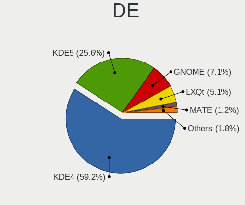
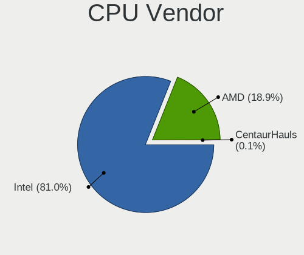
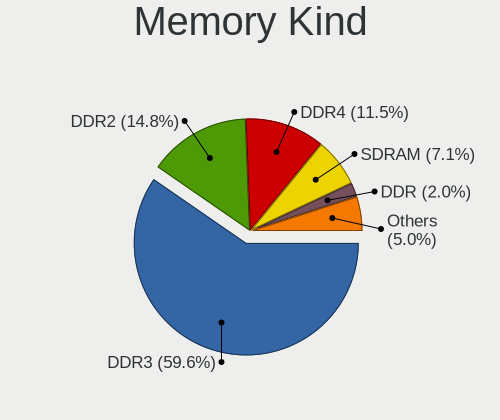

ROSA - Tested Hardware & Statistics (Notebooks)
-----------------------------------------------

A project to collect tested hardware configurations for ROSA.

Anyone can contribute to this report by the [hw-probe](https://github.com/linuxhw/hw-probe) tool:

    sudo -E hw-probe -all -upload

Please contribute! Especially if your hardware is rare.

Contents
--------

* [ Test Cases ](#test-cases)

* [ System ](#system)
  - [ OS                       ](#os)
  - [ OS Family                ](#os-family)
  - [ Kernel                   ](#kernel)
  - [ Kernel Family            ](#kernel-family)
  - [ Kernel Major Ver.        ](#kernel-major-ver)
  - [ Arch                     ](#arch)
  - [ DE                       ](#de)
  - [ Display Server           ](#display-server)
  - [ Display Manager          ](#display-manager)
  - [ OS Lang                  ](#os-lang)
  - [ Boot Mode                ](#boot-mode)
  - [ Filesystem               ](#filesystem)
  - [ Part. scheme             ](#part-scheme)
  - [ Dual Boot with Linux/BSD ](#dual-boot-with-linuxbsd)
  - [ Dual Boot (Win)          ](#dual-boot-win)

* [ Board ](#board)
  - [ Vendor                   ](#vendor)
  - [ Model                    ](#model)
  - [ Model Family             ](#model-family)
  - [ MFG Year                 ](#mfg-year)
  - [ Form Factor              ](#form-factor)
  - [ Secure Boot              ](#secure-boot)
  - [ Coreboot                 ](#coreboot)
  - [ RAM Size                 ](#ram-size)
  - [ RAM Used                 ](#ram-used)
  - [ Total Drives             ](#total-drives)
  - [ Has CD-ROM               ](#has-cd-rom)
  - [ Has Ethernet             ](#has-ethernet)
  - [ Has WiFi                 ](#has-wifi)
  - [ Has Bluetooth            ](#has-bluetooth)

* [ Location ](#location)
  - [ Country                  ](#country)
  - [ City                     ](#city)

* [ Drives ](#drives)
  - [ Drive Vendor             ](#drive-vendor)
  - [ Drive Model              ](#drive-model)
  - [ HDD Vendor               ](#hdd-vendor)
  - [ SSD Vendor               ](#ssd-vendor)
  - [ Drive Kind               ](#drive-kind)
  - [ Drive Connector          ](#drive-connector)
  - [ Drive Size               ](#drive-size)
  - [ Space Total              ](#space-total)
  - [ Space Used               ](#space-used)
  - [ Malfunc. Drives          ](#malfunc-drives)
  - [ Malfunc. Drive Vendor    ](#malfunc-drive-vendor)
  - [ Malfunc. HDD Vendor      ](#malfunc-hdd-vendor)
  - [ Malfunc. Drive Kind      ](#malfunc-drive-kind)
  - [ Failed Drives            ](#failed-drives)
  - [ Failed Drive Vendor      ](#failed-drive-vendor)
  - [ Drive Status             ](#drive-status)

* [ Storage controller ](#storage-controller)
  - [ Storage Vendor           ](#storage-vendor)
  - [ Storage Model            ](#storage-model)
  - [ Storage Kind             ](#storage-kind)

* [ Processor ](#processor)
  - [ CPU Vendor               ](#cpu-vendor)
  - [ CPU Model                ](#cpu-model)
  - [ CPU Model Family         ](#cpu-model-family)
  - [ CPU Cores                ](#cpu-cores)
  - [ CPU Sockets              ](#cpu-sockets)
  - [ CPU Threads              ](#cpu-threads)
  - [ CPU Op-Modes             ](#cpu-op-modes)
  - [ CPU Microcode            ](#cpu-microcode)
  - [ CPU Microarch            ](#cpu-microarch)

* [ Graphics ](#graphics)
  - [ GPU Vendor               ](#gpu-vendor)
  - [ GPU Model                ](#gpu-model)
  - [ GPU Combo                ](#gpu-combo)
  - [ GPU Driver               ](#gpu-driver)
  - [ GPU Memory               ](#gpu-memory)

* [ Monitor ](#monitor)
  - [ Monitor Vendor           ](#monitor-vendor)
  - [ Monitor Model            ](#monitor-model)
  - [ Monitor Resolution       ](#monitor-resolution)
  - [ Monitor Diagonal         ](#monitor-diagonal)
  - [ Monitor Width            ](#monitor-width)
  - [ Aspect Ratio             ](#aspect-ratio)
  - [ Monitor Area             ](#monitor-area)
  - [ Pixel Density            ](#pixel-density)
  - [ Multiple Monitors        ](#multiple-monitors)

* [ Network ](#network)
  - [ Net Controller Vendor    ](#net-controller-vendor)
  - [ Net Controller Model     ](#net-controller-model)
  - [ Wireless Vendor          ](#wireless-vendor)
  - [ Wireless Model           ](#wireless-model)
  - [ Ethernet Vendor          ](#ethernet-vendor)
  - [ Ethernet Model           ](#ethernet-model)
  - [ Net Controller Kind      ](#net-controller-kind)
  - [ Used Controller          ](#used-controller)
  - [ NICs                     ](#nics)
  - [ IPv6                     ](#ipv6)

* [ Bluetooth ](#bluetooth)
  - [ Bluetooth Vendor         ](#bluetooth-vendor)
  - [ Bluetooth Model          ](#bluetooth-model)

* [ Sound ](#sound)
  - [ Sound Vendor             ](#sound-vendor)
  - [ Sound Model              ](#sound-model)

* [ Memory ](#memory)
  - [ Memory Vendor            ](#memory-vendor)
  - [ Memory Model             ](#memory-model)
  - [ Memory Kind              ](#memory-kind)
  - [ Memory Form Factor       ](#memory-form-factor)
  - [ Memory Size              ](#memory-size)
  - [ Memory Speed             ](#memory-speed)

* [ Printers & scanners ](#printers--scanners)
  - [ Printer Vendor           ](#printer-vendor)
  - [ Printer Model            ](#printer-model)
  - [ Scanner Vendor           ](#scanner-vendor)
  - [ Scanner Model            ](#scanner-model)

* [ Camera ](#camera)
  - [ Camera Vendor            ](#camera-vendor)
  - [ Camera Model             ](#camera-model)

* [ Security ](#security)
  - [ Fingerprint Vendor       ](#fingerprint-vendor)
  - [ Fingerprint Model        ](#fingerprint-model)
  - [ Chipcard Vendor          ](#chipcard-vendor)
  - [ Chipcard Model           ](#chipcard-model)

* [ Unsupported ](#unsupported)
  - [ Unsupported Devices      ](#unsupported-devices)
  - [ Unsupported Device Types ](#unsupported-device-types)

Test Cases
----------

Total: 20273

| Vendor        | Model                       | Probe                                                      | Date         |
|---------------|-----------------------------|------------------------------------------------------------|--------------|
| HP            | ENVY Notebook               | [24c2810def](https://linux-hardware.org/?probe=24c2810def) | Aug 12, 2023 |
| Lenovo        | IdeaPad 5 15IAL7 82SF       | [c2d9d3160b](https://linux-hardware.org/?probe=c2d9d3160b) | Aug 11, 2023 |
| HP            | ENVY Notebook               | [6327abde35](https://linux-hardware.org/?probe=6327abde35) | Aug 11, 2023 |
| HP            | Pavilion 15                 | [0f7859844f](https://linux-hardware.org/?probe=0f7859844f) | Aug 11, 2023 |
| Acer          | Extensa 2511G               | [536699834a](https://linux-hardware.org/?probe=536699834a) | Aug 11, 2023 |
| Fujitsu Si... | AMILO Li 2727               | [1dc2c421f8](https://linux-hardware.org/?probe=1dc2c421f8) | Aug 11, 2023 |
| Acer          | Aspire E5-571G              | [6c55de5ac8](https://linux-hardware.org/?probe=6c55de5ac8) | Aug 10, 2023 |
| HP            | Pavilion 15                 | [3de983a470](https://linux-hardware.org/?probe=3de983a470) | Aug 10, 2023 |
| HP            | ENVY Notebook               | [9e8624aa8d](https://linux-hardware.org/?probe=9e8624aa8d) | Aug 09, 2023 |
| ASUSTek       | VivoBook_ASUSLaptop M350... | [70765ac17b](https://linux-hardware.org/?probe=70765ac17b) | Aug 09, 2023 |
| HP            | Pavilion 15                 | [8636764a35](https://linux-hardware.org/?probe=8636764a35) | Aug 09, 2023 |
| Toshiba       | Satellite L775D             | [6cb0b52e77](https://linux-hardware.org/?probe=6cb0b52e77) | Aug 08, 2023 |
| ASUSTek       | X501U                       | [1cd218236c](https://linux-hardware.org/?probe=1cd218236c) | Aug 08, 2023 |
| HUAWEI        | BOHB-WAX9                   | [42303ab8af](https://linux-hardware.org/?probe=42303ab8af) | Aug 08, 2023 |
| HP            | ENVY Notebook               | [9c6d8ac7f9](https://linux-hardware.org/?probe=9c6d8ac7f9) | Aug 08, 2023 |
| Acer          | Extensa 215-51K             | [27a26187b9](https://linux-hardware.org/?probe=27a26187b9) | Aug 08, 2023 |
| HP            | Presario CQ58               | [07f5cdfaa8](https://linux-hardware.org/?probe=07f5cdfaa8) | Aug 08, 2023 |
| Samsung       | R528/R728                   | [cc6458fab9](https://linux-hardware.org/?probe=cc6458fab9) | Aug 08, 2023 |
| Acer          | Aspire A315-42G             | [eff926e4a9](https://linux-hardware.org/?probe=eff926e4a9) | Aug 07, 2023 |
| ASUSTek       | X751NV                      | [ff33d23814](https://linux-hardware.org/?probe=ff33d23814) | Aug 07, 2023 |
| Dell          | Inspiron N5110              | [52c9bb6c33](https://linux-hardware.org/?probe=52c9bb6c33) | Aug 06, 2023 |
| Timi          | TM1701                      | [2fc0a44940](https://linux-hardware.org/?probe=2fc0a44940) | Aug 06, 2023 |
| ASUSTek       | X550CC                      | [0a99f6f654](https://linux-hardware.org/?probe=0a99f6f654) | Aug 06, 2023 |
| ASUSTek       | X550CC                      | [23298de8c1](https://linux-hardware.org/?probe=23298de8c1) | Aug 06, 2023 |
| Acer          | TravelMate 5744Z            | [19297331fd](https://linux-hardware.org/?probe=19297331fd) | Aug 05, 2023 |
| Lenovo        | IdeaPad 330-15IGM 81D1      | [efe021e3b5](https://linux-hardware.org/?probe=efe021e3b5) | Aug 05, 2023 |
| ASUSTek       | N53SV                       | [2c4db62652](https://linux-hardware.org/?probe=2c4db62652) | Aug 05, 2023 |
| HP            | EliteBook 830 G5            | [d4ebcfaf3d](https://linux-hardware.org/?probe=d4ebcfaf3d) | Aug 05, 2023 |
| HP            | EliteBook 830 G5            | [cf67e6a006](https://linux-hardware.org/?probe=cf67e6a006) | Aug 05, 2023 |
| Lenovo        | G50-45 80E3                 | [34edcb7dae](https://linux-hardware.org/?probe=34edcb7dae) | Aug 04, 2023 |
| Notebook      | W54_W94_W955TU,-T,-C        | [1f1f14320c](https://linux-hardware.org/?probe=1f1f14320c) | Aug 03, 2023 |
| HP            | Compaq Presario CQ60        | [1a14facdec](https://linux-hardware.org/?probe=1a14facdec) | Aug 03, 2023 |
| ASUSTek       | VivoBook_ASUSLaptop M350... | [e3f2347cf7](https://linux-hardware.org/?probe=e3f2347cf7) | Aug 02, 2023 |
| Dell          | Vostro 3500                 | [266d25478e](https://linux-hardware.org/?probe=266d25478e) | Aug 01, 2023 |
| HP            | Compaq Presario CQ50        | [f2a2e77d61](https://linux-hardware.org/?probe=f2a2e77d61) | Aug 01, 2023 |
| Toshiba       | Satellite C870-D7K          | [9e8acac201](https://linux-hardware.org/?probe=9e8acac201) | Jul 31, 2023 |
| Lenovo        | G580 20150                  | [81ab0317ab](https://linux-hardware.org/?probe=81ab0317ab) | Jul 31, 2023 |
| ASUSTek       | X411UA                      | [9ceaa9062e](https://linux-hardware.org/?probe=9ceaa9062e) | Jul 31, 2023 |
| Samsung       | 300V3A/300V4A/300V5A        | [a757cca527](https://linux-hardware.org/?probe=a757cca527) | Jul 31, 2023 |
| ASUSTek       | F3Se                        | [e5f8a806ea](https://linux-hardware.org/?probe=e5f8a806ea) | Jul 31, 2023 |
| Acer          | Aspire E5-573G              | [14307e0b7e](https://linux-hardware.org/?probe=14307e0b7e) | Jul 30, 2023 |
| HP            | Pavilion dv6                | [2046d205d6](https://linux-hardware.org/?probe=2046d205d6) | Jul 30, 2023 |
| Dell          | Vostro A860                 | [0148ba9cdc](https://linux-hardware.org/?probe=0148ba9cdc) | Jul 30, 2023 |
| Google        | Relm                        | [1c8bd1f9dd](https://linux-hardware.org/?probe=1c8bd1f9dd) | Jul 30, 2023 |
| HP            | Pavilion dv7                | [cdf06f1680](https://linux-hardware.org/?probe=cdf06f1680) | Jul 30, 2023 |
| Acer          | Aspire E5-576G              | [eac04b4464](https://linux-hardware.org/?probe=eac04b4464) | Jul 29, 2023 |
| Lenovo        | Unknown                     | [d43f4e6715](https://linux-hardware.org/?probe=d43f4e6715) | Jul 29, 2023 |
| ASUSTek       | GL503VD                     | [4c3516813b](https://linux-hardware.org/?probe=4c3516813b) | Jul 28, 2023 |
| ASUSTek       | X411UA                      | [0126e6254a](https://linux-hardware.org/?probe=0126e6254a) | Jul 28, 2023 |
| ASUSTek       | VivoBook_ASUSLaptop M350... | [cb17388b8c](https://linux-hardware.org/?probe=cb17388b8c) | Jul 28, 2023 |
| ASUSTek       | TUF Gaming FX504GD_FX80G... | [bca814cbb5](https://linux-hardware.org/?probe=bca814cbb5) | Jul 28, 2023 |
| Acer          | Aspire E5-573G              | [f07b71e1d6](https://linux-hardware.org/?probe=f07b71e1d6) | Jul 28, 2023 |
| Lenovo        | V15-IGL 82C3                | [613164e308](https://linux-hardware.org/?probe=613164e308) | Jul 27, 2023 |
| HP            | Laptop 14s-dq0xxx           | [dc484f95af](https://linux-hardware.org/?probe=dc484f95af) | Jul 26, 2023 |
| HUAWEI        | BOD-WXX9                    | [52358f6567](https://linux-hardware.org/?probe=52358f6567) | Jul 26, 2023 |
| HP            | Laptop 14s-dq0xxx           | [8a0b28f729](https://linux-hardware.org/?probe=8a0b28f729) | Jul 26, 2023 |
| ASUSTek       | X550CC                      | [15d4d04323](https://linux-hardware.org/?probe=15d4d04323) | Jul 25, 2023 |
| Acer          | Aspire 5742G                | [dd2b862a0c](https://linux-hardware.org/?probe=dd2b862a0c) | Jul 25, 2023 |
| Dell          | Vostro A860                 | [8932ae1e87](https://linux-hardware.org/?probe=8932ae1e87) | Jul 25, 2023 |
| ASUSTek       | X550CC                      | [9b0d43ec8f](https://linux-hardware.org/?probe=9b0d43ec8f) | Jul 25, 2023 |
| ASUSTek       | X751SA                      | [27185d9ec1](https://linux-hardware.org/?probe=27185d9ec1) | Jul 25, 2023 |
| HP            | Victus by Laptop 16-e0xx... | [58ac4a2c1b](https://linux-hardware.org/?probe=58ac4a2c1b) | Jul 25, 2023 |
| Lenovo        | ThinkPad T420 4180EP2       | [298fe52a60](https://linux-hardware.org/?probe=298fe52a60) | Jul 25, 2023 |
| ASUSTek       | ASUS TUF Dash F15 FX516P... | [c4d5317061](https://linux-hardware.org/?probe=c4d5317061) | Jul 25, 2023 |
| Notebook      | W510LU                      | [c770b71a6b](https://linux-hardware.org/?probe=c770b71a6b) | Jul 24, 2023 |
| ASUSTek       | VivoBook_ASUSLaptop M160... | [a15d078adf](https://linux-hardware.org/?probe=a15d078adf) | Jul 24, 2023 |
| ASUSTek       | VivoBook_ASUSLaptop M350... | [7bd82402c7](https://linux-hardware.org/?probe=7bd82402c7) | Jul 24, 2023 |
| Unknown       | Unknown                     | [1f64a4762c](https://linux-hardware.org/?probe=1f64a4762c) | Jul 24, 2023 |
| Timi          | Redmi G 2022                | [2a01d75ab6](https://linux-hardware.org/?probe=2a01d75ab6) | Jul 24, 2023 |
| Acer          | Swift SF114-34              | [eef65c51cf](https://linux-hardware.org/?probe=eef65c51cf) | Jul 24, 2023 |
| Dell          | System Inspiron 17 7000 ... | [d4af5c7529](https://linux-hardware.org/?probe=d4af5c7529) | Jul 24, 2023 |
| ASUSTek       | VivoBook_ASUSLaptop M160... | [db7d7ddd9c](https://linux-hardware.org/?probe=db7d7ddd9c) | Jul 23, 2023 |
| HUAWEI        | BOM-WXX9                    | [3c35f3e9b5](https://linux-hardware.org/?probe=3c35f3e9b5) | Jul 23, 2023 |
| Maibenben     | MaiBook M                   | [7b591c93bb](https://linux-hardware.org/?probe=7b591c93bb) | Jul 23, 2023 |
| Acer          | Aspire V3-571G              | [0581ed028d](https://linux-hardware.org/?probe=0581ed028d) | Jul 23, 2023 |
| Lenovo        | IdeaPad Yoga 2-13 594202... | [66db18067c](https://linux-hardware.org/?probe=66db18067c) | Jul 23, 2023 |
| Maibenben     | MaiBook M                   | [09beccd6f9](https://linux-hardware.org/?probe=09beccd6f9) | Jul 23, 2023 |
| ASUSTek       | TUF Gaming FX505DT_FX505... | [a14a1b8379](https://linux-hardware.org/?probe=a14a1b8379) | Jul 23, 2023 |
| Lenovo        | V14-IIL 82C4                | [b2870ce6ad](https://linux-hardware.org/?probe=b2870ce6ad) | Jul 22, 2023 |
| ASUSTek       | S551LN                      | [c716419bfb](https://linux-hardware.org/?probe=c716419bfb) | Jul 22, 2023 |
| Lenovo        | G505 20240                  | [c9c45ceeaf](https://linux-hardware.org/?probe=c9c45ceeaf) | Jul 21, 2023 |
| Acer          | Aspire 5610                 | [aa66524b51](https://linux-hardware.org/?probe=aa66524b51) | Jul 21, 2023 |
| Unknown       | Unknown                     | [139780d2a0](https://linux-hardware.org/?probe=139780d2a0) | Jul 21, 2023 |
| HP            | ProBook 4545s               | [cf43675118](https://linux-hardware.org/?probe=cf43675118) | Jul 20, 2023 |
| Acer          | Aspire E5-573G              | [b9e9f5f7fa](https://linux-hardware.org/?probe=b9e9f5f7fa) | Jul 20, 2023 |
| Samsung       | R530/R730                   | [0af014c11b](https://linux-hardware.org/?probe=0af014c11b) | Jul 20, 2023 |
| MSI           | GS73 Stealth 8RE            | [8fdb7e6e4e](https://linux-hardware.org/?probe=8fdb7e6e4e) | Jul 20, 2023 |
| Unknown       | Unknown                     | [7e6c1d1018](https://linux-hardware.org/?probe=7e6c1d1018) | Jul 19, 2023 |
| HP            | ProBook 440 G4              | [5fbf587eba](https://linux-hardware.org/?probe=5fbf587eba) | Jul 19, 2023 |
| Acer          | AOD260                      | [e3854aa993](https://linux-hardware.org/?probe=e3854aa993) | Jul 19, 2023 |
| Toshiba       | QOSMIO G30                  | [520eb05b29](https://linux-hardware.org/?probe=520eb05b29) | Jul 19, 2023 |
| HP            | Notebook                    | [92bc221e2c](https://linux-hardware.org/?probe=92bc221e2c) | Jul 19, 2023 |
| Lenovo        | IdeaPad 100-14IBY 80MH      | [39035af050](https://linux-hardware.org/?probe=39035af050) | Jul 19, 2023 |
| Lenovo        | B590 20208                  | [5f2fbf2720](https://linux-hardware.org/?probe=5f2fbf2720) | Jul 19, 2023 |
| ASUSTek       | K40IN                       | [ad25a9b9a2](https://linux-hardware.org/?probe=ad25a9b9a2) | Jul 19, 2023 |
| Lenovo        | IdeaPad S10-2 20027         | [ea5513d981](https://linux-hardware.org/?probe=ea5513d981) | Jul 18, 2023 |
| HP            | Compaq nx7400 (EY587ES#A... | [15ba20b136](https://linux-hardware.org/?probe=15ba20b136) | Jul 18, 2023 |
| Apple         | MacBookAir6,2               | [fe575143d6](https://linux-hardware.org/?probe=fe575143d6) | Jul 18, 2023 |
| MSI           | GS73 Stealth 8RE            | [83f9ea8fc6](https://linux-hardware.org/?probe=83f9ea8fc6) | Jul 18, 2023 |
| Acer          | Aspire A315-51              | [9d3efe2fa2](https://linux-hardware.org/?probe=9d3efe2fa2) | Jul 18, 2023 |
| Acer          | Extensa 2519                | [59550c139a](https://linux-hardware.org/?probe=59550c139a) | Jul 18, 2023 |
| Pegatron      | A24                         | [2423e38b38](https://linux-hardware.org/?probe=2423e38b38) | Jul 17, 2023 |
| Dell          | Latitude 5490               | [3938a20867](https://linux-hardware.org/?probe=3938a20867) | Jul 16, 2023 |
| HP            | Pavilion g7                 | [55b3650fc4](https://linux-hardware.org/?probe=55b3650fc4) | Jul 16, 2023 |
| Unknown       | X133                        | [9ddb375619](https://linux-hardware.org/?probe=9ddb375619) | Jul 15, 2023 |
| Quanta        | SWH                         | [b7b21e5a7e](https://linux-hardware.org/?probe=b7b21e5a7e) | Jul 15, 2023 |
| Lenovo        | G570 20079                  | [942a140f96](https://linux-hardware.org/?probe=942a140f96) | Jul 14, 2023 |
| ASUSTek       | N56VZ                       | [af989434ae](https://linux-hardware.org/?probe=af989434ae) | Jul 13, 2023 |
| Dell          | Inspiron 3721               | [bc68686efe](https://linux-hardware.org/?probe=bc68686efe) | Jul 13, 2023 |
| HP            | ENVY dv7                    | [f9022b116c](https://linux-hardware.org/?probe=f9022b116c) | Jul 13, 2023 |
| ASUSTek       | K40IN                       | [882334cade](https://linux-hardware.org/?probe=882334cade) | Jul 13, 2023 |
| Acer          | TravelMate B118-M           | [97e1dc01ce](https://linux-hardware.org/?probe=97e1dc01ce) | Jul 12, 2023 |
| Acer          | Aspire E1-531               | [77e5715691](https://linux-hardware.org/?probe=77e5715691) | Jul 12, 2023 |
| Toshiba       | Satellite C850-1GL          | [e160b642b4](https://linux-hardware.org/?probe=e160b642b4) | Jul 12, 2023 |
| MSI           | Katana GF76 11UD            | [dc3e50c4e3](https://linux-hardware.org/?probe=dc3e50c4e3) | Jul 11, 2023 |
| ASUSTek       | K53SV                       | [3a7ff2690e](https://linux-hardware.org/?probe=3a7ff2690e) | Jul 11, 2023 |
| HP            | Notebook                    | [eb64e08d64](https://linux-hardware.org/?probe=eb64e08d64) | Jul 11, 2023 |
| ASUSTek       | VivoBook_ASUSLaptop M350... | [fc0d49b8b1](https://linux-hardware.org/?probe=fc0d49b8b1) | Jul 11, 2023 |
| Lenovo        | ThinkBook 16 G4+ ARA 21D... | [b073050c46](https://linux-hardware.org/?probe=b073050c46) | Jul 11, 2023 |
| Toshiba       | Satellite C850-1GL          | [f7305d0265](https://linux-hardware.org/?probe=f7305d0265) | Jul 11, 2023 |
| Acer          | Swift SF114-34              | [aef11f1cde](https://linux-hardware.org/?probe=aef11f1cde) | Jul 11, 2023 |
| Samsung       | 355V4C/355V4X/355V5C/355... | [11b9751db7](https://linux-hardware.org/?probe=11b9751db7) | Jul 10, 2023 |
| ASUSTek       | ASUS TUF Gaming F17 FX70... | [1367b103ae](https://linux-hardware.org/?probe=1367b103ae) | Jul 09, 2023 |
| HP            | Pavilion 17                 | [e181859893](https://linux-hardware.org/?probe=e181859893) | Jul 09, 2023 |
| HP            | Pavilion 17                 | [3824925c02](https://linux-hardware.org/?probe=3824925c02) | Jul 09, 2023 |
| HONOR         | HLYL-WXX9                   | [874777047d](https://linux-hardware.org/?probe=874777047d) | Jul 09, 2023 |
| ASUSTek       | X555LJ                      | [2dfec77944](https://linux-hardware.org/?probe=2dfec77944) | Jul 09, 2023 |
| ASUSTek       | K53SD                       | [61da77f999](https://linux-hardware.org/?probe=61da77f999) | Jul 09, 2023 |
| Acer          | Extensa 2519                | [1aa67ff6d3](https://linux-hardware.org/?probe=1aa67ff6d3) | Jul 09, 2023 |
| HP            | Notebook                    | [9944e4c37d](https://linux-hardware.org/?probe=9944e4c37d) | Jul 09, 2023 |
| Lenovo        | IdeaPad 3 15ARE05 81W4      | [2eb50b690c](https://linux-hardware.org/?probe=2eb50b690c) | Jul 08, 2023 |
| Acer          | Extensa 5630                | [8ba8120911](https://linux-hardware.org/?probe=8ba8120911) | Jul 08, 2023 |
| Samsung       | 350V5C/351V5C/3540VC/344... | [cdff301d1a](https://linux-hardware.org/?probe=cdff301d1a) | Jul 08, 2023 |
| HP            | EliteBook 840 G4            | [cc006abf72](https://linux-hardware.org/?probe=cc006abf72) | Jul 08, 2023 |
| MSI           | Katana GF76 11UD            | [c3a26fb815](https://linux-hardware.org/?probe=c3a26fb815) | Jul 06, 2023 |
| ASUSTek       | VivoBook_ASUSLaptop M350... | [d9dc7d5425](https://linux-hardware.org/?probe=d9dc7d5425) | Jul 06, 2023 |
| HP            | 630                         | [d1836d596c](https://linux-hardware.org/?probe=d1836d596c) | Jul 06, 2023 |
| MSI           | Modern 15 A11SBU            | [1d46fd852c](https://linux-hardware.org/?probe=1d46fd852c) | Jul 06, 2023 |
| HP            | Laptop 14s-fq0xxx           | [638a590e01](https://linux-hardware.org/?probe=638a590e01) | Jul 05, 2023 |
| HONOR         | HYM-WXX                     | [d164a02f42](https://linux-hardware.org/?probe=d164a02f42) | Jul 05, 2023 |
| Acer          | Aspire 5750G                | [d487f9f635](https://linux-hardware.org/?probe=d487f9f635) | Jul 05, 2023 |
| HP            | Laptop 15s-eq0xxx           | [02df64cd7b](https://linux-hardware.org/?probe=02df64cd7b) | Jul 05, 2023 |
| ASUSTek       | VivoBook_ASUSLaptop M350... | [f876739c27](https://linux-hardware.org/?probe=f876739c27) | Jul 04, 2023 |
| TECNO         | MEGABOOK T1                 | [484f3282fa](https://linux-hardware.org/?probe=484f3282fa) | Jul 04, 2023 |
| Lenovo        | IdeaPad 3 17ALC6 82KV       | [d33df8d1a0](https://linux-hardware.org/?probe=d33df8d1a0) | Jul 03, 2023 |
| HP            | EliteBook 830 G5            | [72f7ad0022](https://linux-hardware.org/?probe=72f7ad0022) | Jul 03, 2023 |
| HP            | Laptop 15s-eq0xxx           | [ee60bb65df](https://linux-hardware.org/?probe=ee60bb65df) | Jul 03, 2023 |
| MSI           | ER710                       | [aa6325e66e](https://linux-hardware.org/?probe=aa6325e66e) | Jul 03, 2023 |
| HP            | Notebook                    | [8399533d47](https://linux-hardware.org/?probe=8399533d47) | Jul 03, 2023 |
| Haier         | i1500SD                     | [1a118c855a](https://linux-hardware.org/?probe=1a118c855a) | Jul 02, 2023 |
| Chuwi         | HeroBook Pro                | [d1abb5f348](https://linux-hardware.org/?probe=d1abb5f348) | Jul 02, 2023 |
| HP            | 250 G1                      | [25559429ca](https://linux-hardware.org/?probe=25559429ca) | Jul 02, 2023 |
| Prestigio     | Smartbook PSB116A           | [ff56870120](https://linux-hardware.org/?probe=ff56870120) | Jul 02, 2023 |
| Chuwi         | HeroBook Pro                | [c0238ceb53](https://linux-hardware.org/?probe=c0238ceb53) | Jul 02, 2023 |
| Dell          | Inspiron N5110              | [d49ddcbcf1](https://linux-hardware.org/?probe=d49ddcbcf1) | Jul 01, 2023 |
| ASUSTek       | ASUS TUF Gaming F17 FX70... | [4677625b04](https://linux-hardware.org/?probe=4677625b04) | Jun 30, 2023 |
| Acer          | Aspire E5-531G              | [a6eaac367e](https://linux-hardware.org/?probe=a6eaac367e) | Jun 29, 2023 |
| ASUSTek       | VivoBook_ASUSLaptop M350... | [076e14da35](https://linux-hardware.org/?probe=076e14da35) | Jun 29, 2023 |
| HP            | Pavilion g6                 | [b16b0ced2f](https://linux-hardware.org/?probe=b16b0ced2f) | Jun 28, 2023 |
| HP            | Notebook                    | [d5ab0810e6](https://linux-hardware.org/?probe=d5ab0810e6) | Jun 28, 2023 |
| HP            | Notebook                    | [2b5ac7b339](https://linux-hardware.org/?probe=2b5ac7b339) | Jun 28, 2023 |
| Unknown       | Unknown                     | [0ea4bcb3df](https://linux-hardware.org/?probe=0ea4bcb3df) | Jun 28, 2023 |
| Lenovo        | ThinkPad P17 Gen 1 20SN0... | [5ea6336cb5](https://linux-hardware.org/?probe=5ea6336cb5) | Jun 28, 2023 |
| MSI           | GL65 Leopard 10SCSR         | [165a76b787](https://linux-hardware.org/?probe=165a76b787) | Jun 27, 2023 |
| Clevo         | NL41MU2                     | [d7e51d1ddb](https://linux-hardware.org/?probe=d7e51d1ddb) | Jun 27, 2023 |
| ASUSTek       | VivoBook_ASUSLaptop M350... | [5336cd4400](https://linux-hardware.org/?probe=5336cd4400) | Jun 27, 2023 |
| Lenovo        | ThinkPad SL410 2842RN9      | [37157ab2f7](https://linux-hardware.org/?probe=37157ab2f7) | Jun 27, 2023 |
| Dell          | Inspiron N5110              | [ec28913b4e](https://linux-hardware.org/?probe=ec28913b4e) | Jun 27, 2023 |
| 3Logic Gro... | APM Graviton A15i-K2        | [6371ce9a45](https://linux-hardware.org/?probe=6371ce9a45) | Jun 26, 2023 |
| Acer          | Nitro AN515-45              | [674acd96a8](https://linux-hardware.org/?probe=674acd96a8) | Jun 26, 2023 |
| Lenovo        | G780 20138                  | [41cdbe05fe](https://linux-hardware.org/?probe=41cdbe05fe) | Jun 26, 2023 |
| HP            | Pavilion Notebook           | [eb68fc38b0](https://linux-hardware.org/?probe=eb68fc38b0) | Jun 25, 2023 |
| ASUSTek       | ZenBook UX435EG_UX435EG     | [a5d8941505](https://linux-hardware.org/?probe=a5d8941505) | Jun 25, 2023 |
| ASUSTek       | ZenBook UX435EG_UX435EG     | [6398806c80](https://linux-hardware.org/?probe=6398806c80) | Jun 25, 2023 |
| ASUSTek       | K53SD                       | [66f2fbfdf4](https://linux-hardware.org/?probe=66f2fbfdf4) | Jun 25, 2023 |
| Lenovo        | G580                        | [daa41583f5](https://linux-hardware.org/?probe=daa41583f5) | Jun 25, 2023 |
| Dell          | Inspiron N5110              | [0a3cfef2ce](https://linux-hardware.org/?probe=0a3cfef2ce) | Jun 25, 2023 |
| HP            | Pavilion Gaming Laptop 1... | [39719594b9](https://linux-hardware.org/?probe=39719594b9) | Jun 24, 2023 |
| eMachines     | E725                        | [91c6056aff](https://linux-hardware.org/?probe=91c6056aff) | Jun 24, 2023 |
| Toshiba       | Satellite U300              | [2abf629721](https://linux-hardware.org/?probe=2abf629721) | Jun 24, 2023 |
| HP            | Pavilion Gaming Laptop 1... | [b6bc214e79](https://linux-hardware.org/?probe=b6bc214e79) | Jun 23, 2023 |
| HP            | 530 Notebook PC(KP479AA#... | [0c639de47d](https://linux-hardware.org/?probe=0c639de47d) | Jun 23, 2023 |
| HP            | Pavilion Aero Laptop 13-... | [610b99a65b](https://linux-hardware.org/?probe=610b99a65b) | Jun 23, 2023 |
| Lenovo        | Legion Y540-15IRH Laptop... | [3f7008d282](https://linux-hardware.org/?probe=3f7008d282) | Jun 22, 2023 |
| Acer          | Aspire A315-51              | [0e6960c76b](https://linux-hardware.org/?probe=0e6960c76b) | Jun 22, 2023 |
| Acer          | Aspire A315-51              | [981385c200](https://linux-hardware.org/?probe=981385c200) | Jun 22, 2023 |
| Timi          | RedmiBook Pro 14S           | [f46c865218](https://linux-hardware.org/?probe=f46c865218) | Jun 22, 2023 |
| Lenovo        | B590 20206                  | [17fb06c810](https://linux-hardware.org/?probe=17fb06c810) | Jun 21, 2023 |
| Packard Be... | EasyNote TE69CX             | [d72fa50a56](https://linux-hardware.org/?probe=d72fa50a56) | Jun 21, 2023 |
| HP            | Unknown                     | [f7a4bc57b0](https://linux-hardware.org/?probe=f7a4bc57b0) | Jun 21, 2023 |
| Lenovo        | B50-70 20384                | [03450fe3f0](https://linux-hardware.org/?probe=03450fe3f0) | Jun 21, 2023 |
| HP            | 255 G1                      | [f09174c096](https://linux-hardware.org/?probe=f09174c096) | Jun 21, 2023 |
| Quanta        | TWH                         | [5d04c17be4](https://linux-hardware.org/?probe=5d04c17be4) | Jun 21, 2023 |
| Acer          | Nitro AN515-45              | [b34b0bc6e5](https://linux-hardware.org/?probe=b34b0bc6e5) | Jun 20, 2023 |
| Lenovo        | K14 Gen 1 21CSS16E00        | [d60f0418a5](https://linux-hardware.org/?probe=d60f0418a5) | Jun 20, 2023 |
| HP            | Laptop 15-bw0xx             | [2e2c8b4c64](https://linux-hardware.org/?probe=2e2c8b4c64) | Jun 20, 2023 |
| ASUSTek       | K53SC                       | [1dee87098f](https://linux-hardware.org/?probe=1dee87098f) | Jun 20, 2023 |
| Acer          | Extensa 5630                | [b3abbec1ca](https://linux-hardware.org/?probe=b3abbec1ca) | Jun 19, 2023 |
| Samsung       | 350V5C/351V5C/3540VC/344... | [2ac629a3ac](https://linux-hardware.org/?probe=2ac629a3ac) | Jun 19, 2023 |
| Apple         | MacBookPro7,1               | [0d56b62a99](https://linux-hardware.org/?probe=0d56b62a99) | Jun 19, 2023 |
| Acer          | AOD257                      | [d3510be962](https://linux-hardware.org/?probe=d3510be962) | Jun 18, 2023 |
| ASUSTek       | X200LA                      | [28ba5d9a3a](https://linux-hardware.org/?probe=28ba5d9a3a) | Jun 18, 2023 |
| ASUSTek       | VivoBook_ASUSLaptop X412... | [f3cbbb121e](https://linux-hardware.org/?probe=f3cbbb121e) | Jun 18, 2023 |
| ASUSTek       | X200LA                      | [5aca48b9ca](https://linux-hardware.org/?probe=5aca48b9ca) | Jun 18, 2023 |
| Lenovo        | IdeaPad S145-15IWL 81MV     | [6b85997420](https://linux-hardware.org/?probe=6b85997420) | Jun 17, 2023 |
| MSI           | GX60 1AC                    | [64c48d22a7](https://linux-hardware.org/?probe=64c48d22a7) | Jun 17, 2023 |
| Acer          | Aspire A315-33              | [c6a929a9ec](https://linux-hardware.org/?probe=c6a929a9ec) | Jun 17, 2023 |
| Acer          | Aspire A315-33              | [d72b8e616f](https://linux-hardware.org/?probe=d72b8e616f) | Jun 17, 2023 |
| Sony          | SVF1521L1RB                 | [b0dfbb64d0](https://linux-hardware.org/?probe=b0dfbb64d0) | Jun 17, 2023 |
| HIPER Tech... | HIPER WORKBOOK              | [06ce0448f5](https://linux-hardware.org/?probe=06ce0448f5) | Jun 16, 2023 |
| WeiBu         | OEM                         | [349908e6d0](https://linux-hardware.org/?probe=349908e6d0) | Jun 16, 2023 |
| ASUSTek       | X555LN                      | [1e46ee1872](https://linux-hardware.org/?probe=1e46ee1872) | Jun 16, 2023 |
| HP            | Laptop 15-bw0xx             | [baa9231329](https://linux-hardware.org/?probe=baa9231329) | Jun 15, 2023 |
| HP            | ENVY Notebook               | [ee7a2ae915](https://linux-hardware.org/?probe=ee7a2ae915) | Jun 15, 2023 |
| HP            | ENVY Notebook               | [29828fefe2](https://linux-hardware.org/?probe=29828fefe2) | Jun 15, 2023 |
| ASUSTek       | ROG Zephyrus M16 GU603HE... | [ff2a2aeca0](https://linux-hardware.org/?probe=ff2a2aeca0) | Jun 15, 2023 |
| HP            | EliteBook 1040 G4           | [01724286d9](https://linux-hardware.org/?probe=01724286d9) | Jun 15, 2023 |
| ASUSTek       | ROG Strix G731GT_GL731GT    | [fe83d43137](https://linux-hardware.org/?probe=fe83d43137) | Jun 15, 2023 |
| ASUSTek       | VivoBook_ASUSLaptop X421... | [eba8248dae](https://linux-hardware.org/?probe=eba8248dae) | Jun 14, 2023 |
| Acer          | Aspire S3-391               | [0547c7bf3a](https://linux-hardware.org/?probe=0547c7bf3a) | Jun 14, 2023 |
| ASUSTek       | VivoBook_ASUSLaptop X421... | [6ef7b87ef5](https://linux-hardware.org/?probe=6ef7b87ef5) | Jun 14, 2023 |
| MSI           | Katana GF66 12UE            | [49026cdaf3](https://linux-hardware.org/?probe=49026cdaf3) | Jun 14, 2023 |
| Toshiba       | Satellite L30               | [0b240892de](https://linux-hardware.org/?probe=0b240892de) | Jun 14, 2023 |
| Dell          | Inspiron 15-3573            | [129574e8dc](https://linux-hardware.org/?probe=129574e8dc) | Jun 14, 2023 |
| HP            | 255 G1                      | [a8c4597ccd](https://linux-hardware.org/?probe=a8c4597ccd) | Jun 14, 2023 |
| Apple         | MacBookPro9,2               | [4a879a147e](https://linux-hardware.org/?probe=4a879a147e) | Jun 12, 2023 |
| Dell          | Inspiron N5110              | [dcae82c86f](https://linux-hardware.org/?probe=dcae82c86f) | Jun 12, 2023 |
| Acer          | Extensa 5220                | [3f547b15a3](https://linux-hardware.org/?probe=3f547b15a3) | Jun 12, 2023 |
| ASUSTek       | X551CAP                     | [4076a43510](https://linux-hardware.org/?probe=4076a43510) | Jun 12, 2023 |
| Lenovo        | IdeaPad S10-2 20027         | [cd1619a50d](https://linux-hardware.org/?probe=cd1619a50d) | Jun 11, 2023 |
| Acer          | Aspire 5920G                | [2a5625ca4c](https://linux-hardware.org/?probe=2a5625ca4c) | Jun 11, 2023 |
| Samsung       | P29/28/26                   | [d7e9b6f2f3](https://linux-hardware.org/?probe=d7e9b6f2f3) | Jun 11, 2023 |
| Samsung       | P29/28/26                   | [6040d56961](https://linux-hardware.org/?probe=6040d56961) | Jun 10, 2023 |
| Lenovo        | ThinkPad P16s Gen 1 21CK... | [c768cfa03d](https://linux-hardware.org/?probe=c768cfa03d) | Jun 10, 2023 |
| WeiBu         | OEM                         | [49bd40f956](https://linux-hardware.org/?probe=49bd40f956) | Jun 10, 2023 |
| Lenovo        | Legion 5 15ARH05 82B5       | [2b4f40f41b](https://linux-hardware.org/?probe=2b4f40f41b) | Jun 09, 2023 |
| Dell          | Inspiron N5110              | [62d37454d3](https://linux-hardware.org/?probe=62d37454d3) | Jun 09, 2023 |
| Acer          | Aspire 5750G                | [69227c0908](https://linux-hardware.org/?probe=69227c0908) | Jun 09, 2023 |
| Lenovo        | Unknown                     | [1842b75de0](https://linux-hardware.org/?probe=1842b75de0) | Jun 08, 2023 |
| INFERIT       | Silver                      | [f6b3fc6762](https://linux-hardware.org/?probe=f6b3fc6762) | Jun 08, 2023 |
| Dell          | Inspiron 3558               | [87b5fd28c2](https://linux-hardware.org/?probe=87b5fd28c2) | Jun 08, 2023 |
| Lenovo        | B590 20208                  | [102b3706f4](https://linux-hardware.org/?probe=102b3706f4) | Jun 08, 2023 |
| Samsung       | 355V4C/356V4C/3445VC/354... | [6e2a67c010](https://linux-hardware.org/?probe=6e2a67c010) | Jun 07, 2023 |
| Samsung       | 350V5C/351V5C/3540VC/344... | [2e0b21f8d4](https://linux-hardware.org/?probe=2e0b21f8d4) | Jun 07, 2023 |
| Lenovo        | ThinkPad X61 7674GS3        | [629a290a98](https://linux-hardware.org/?probe=629a290a98) | Jun 07, 2023 |
| Acer          | AOD257                      | [1b75b86659](https://linux-hardware.org/?probe=1b75b86659) | Jun 06, 2023 |
| HP            | Pavilion 15                 | [d75a894e8c](https://linux-hardware.org/?probe=d75a894e8c) | Jun 06, 2023 |
| Acer          | Aspire V5-551G              | [7c55457a7e](https://linux-hardware.org/?probe=7c55457a7e) | Jun 06, 2023 |
| MSI           | Delta 15 A5EFK              | [d55fa44834](https://linux-hardware.org/?probe=d55fa44834) | Jun 05, 2023 |
| Lenovo        | IdeaPad 520-15IKB 81BF      | [2e429d02d1](https://linux-hardware.org/?probe=2e429d02d1) | Jun 05, 2023 |
| Samsung       | N102                        | [c3e402b50d](https://linux-hardware.org/?probe=c3e402b50d) | Jun 04, 2023 |
| HP            | Pavilion 15                 | [944c353c44](https://linux-hardware.org/?probe=944c353c44) | Jun 04, 2023 |
| Samsung       | 305V4A/305V5A/3415VA        | [a0f9cde008](https://linux-hardware.org/?probe=a0f9cde008) | Jun 04, 2023 |
| Maibenben     | MaiBook M                   | [b5d7957b55](https://linux-hardware.org/?probe=b5d7957b55) | Jun 03, 2023 |
| Acer          | Aspire S3                   | [23c1a32b88](https://linux-hardware.org/?probe=23c1a32b88) | Jun 03, 2023 |
| Samsung       | N102                        | [b21ddf3fea](https://linux-hardware.org/?probe=b21ddf3fea) | Jun 03, 2023 |
| ASUSTek       | VivoBook 17_ASUS Laptop ... | [88c3440ff2](https://linux-hardware.org/?probe=88c3440ff2) | Jun 03, 2023 |
| Dell          | Inspiron 1525               | [3160e89723](https://linux-hardware.org/?probe=3160e89723) | Jun 03, 2023 |
| ASUSTek       | X556UQ                      | [088518df2b](https://linux-hardware.org/?probe=088518df2b) | Jun 02, 2023 |
| HP            | ENVY Notebook               | [e7f4c63499](https://linux-hardware.org/?probe=e7f4c63499) | Jun 02, 2023 |
| DEXP          | Aquilon C15                 | [763c923576](https://linux-hardware.org/?probe=763c923576) | Jun 02, 2023 |
| Lenovo        | ThinkPad X61 7674GS3        | [194299200c](https://linux-hardware.org/?probe=194299200c) | Jun 01, 2023 |
| Lenovo        | K14 Gen 1 21CSS16E00        | [9c95ad4263](https://linux-hardware.org/?probe=9c95ad4263) | May 31, 2023 |
| Acer          | Aspire 4810T                | [3058ac9018](https://linux-hardware.org/?probe=3058ac9018) | May 31, 2023 |
| Acer          | TravelMate 5744Z            | [bde6d2f364](https://linux-hardware.org/?probe=bde6d2f364) | May 31, 2023 |
| Acer          | Aspire ES1-523              | [d68236f41d](https://linux-hardware.org/?probe=d68236f41d) | May 31, 2023 |
| HP            | EliteBook 840 G3            | [384ebf87a3](https://linux-hardware.org/?probe=384ebf87a3) | May 31, 2023 |
| Samsung       | RV410/RV510/S3510/E3510     | [d20ebd68c0](https://linux-hardware.org/?probe=d20ebd68c0) | May 30, 2023 |
| Lenovo        | Legion Y530-15ICH 81FV      | [85a2504037](https://linux-hardware.org/?probe=85a2504037) | May 30, 2023 |
| HP            | Laptop 15s-fq2xxx           | [7ab8c72481](https://linux-hardware.org/?probe=7ab8c72481) | May 30, 2023 |
| Acer          | Swift SF114-34              | [3722c76b10](https://linux-hardware.org/?probe=3722c76b10) | May 30, 2023 |
| HP            | ProBook 440 G7              | [9da720226e](https://linux-hardware.org/?probe=9da720226e) | May 30, 2023 |
| Lenovo        | Legion Y530-15ICH 81FV      | [c0e9edd453](https://linux-hardware.org/?probe=c0e9edd453) | May 30, 2023 |
| MSI           | GE60 2PC                    | [48c124853f](https://linux-hardware.org/?probe=48c124853f) | May 30, 2023 |
| Samsung       | RV410/RV510/S3510/E3510     | [a786eb985d](https://linux-hardware.org/?probe=a786eb985d) | May 29, 2023 |
| ICL-KME CS    | RAYbook                     | [9e976ffc1a](https://linux-hardware.org/?probe=9e976ffc1a) | May 29, 2023 |
| Acer          | Swift SF114-34              | [b7be0bf5ad](https://linux-hardware.org/?probe=b7be0bf5ad) | May 29, 2023 |
| Maibenben     | MaiBook M                   | [fa3f4694ba](https://linux-hardware.org/?probe=fa3f4694ba) | May 28, 2023 |
| HIPER Tech... | HIPER WORKBOOK              | [8283b1247f](https://linux-hardware.org/?probe=8283b1247f) | May 28, 2023 |
| LTD Delovo... | EVE 14 C414                 | [d52f6c1303](https://linux-hardware.org/?probe=d52f6c1303) | May 28, 2023 |
| Acer          | Aspire ES1-523              | [bd06482a4e](https://linux-hardware.org/?probe=bd06482a4e) | May 27, 2023 |
| Infinix       | INBOOK X2                   | [1f8b536f4f](https://linux-hardware.org/?probe=1f8b536f4f) | May 27, 2023 |
| Samsung       | N130                        | [bd37239d10](https://linux-hardware.org/?probe=bd37239d10) | May 26, 2023 |
| eMachines     | eME644G                     | [cde4d7b461](https://linux-hardware.org/?probe=cde4d7b461) | May 26, 2023 |
| Infinix       | INBOOK X2                   | [925318e521](https://linux-hardware.org/?probe=925318e521) | May 26, 2023 |
| ASUSTek       | VivoBook_ASUSLaptop X512... | [4086fae2a5](https://linux-hardware.org/?probe=4086fae2a5) | May 26, 2023 |
| THUNDEROBO... | IGER F1                     | [d492356b33](https://linux-hardware.org/?probe=d492356b33) | May 25, 2023 |
| HP            | ProBook 4535s               | [bf141ba124](https://linux-hardware.org/?probe=bf141ba124) | May 25, 2023 |
| eMachines     | eME644G                     | [bc740da95e](https://linux-hardware.org/?probe=bc740da95e) | May 25, 2023 |
| HONOR         | HYM-WXX                     | [00a5e48ef4](https://linux-hardware.org/?probe=00a5e48ef4) | May 25, 2023 |
| Acer          | Aspire 7750G                | [589639a63f](https://linux-hardware.org/?probe=589639a63f) | May 25, 2023 |
| Acer          | Aspire E5-573G              | [c6cc5e2a20](https://linux-hardware.org/?probe=c6cc5e2a20) | May 24, 2023 |
| Acer          | Extensa 5630                | [00e8bb4d6a](https://linux-hardware.org/?probe=00e8bb4d6a) | May 24, 2023 |
| Samsung       | R710                        | [a2c199b3cd](https://linux-hardware.org/?probe=a2c199b3cd) | May 24, 2023 |
| Packard Be... | DOT S                       | [a49bbc7aa2](https://linux-hardware.org/?probe=a49bbc7aa2) | May 24, 2023 |
| Lenovo        | Legion Y530-15ICH 81FV      | [dd1104fc5a](https://linux-hardware.org/?probe=dd1104fc5a) | May 23, 2023 |
| HP            | 255 G8 Notebook PC          | [eb644c96f3](https://linux-hardware.org/?probe=eb644c96f3) | May 23, 2023 |
| Unknown       | Unknown                     | [6680332a54](https://linux-hardware.org/?probe=6680332a54) | May 23, 2023 |
| ASUSTek       | N53SM                       | [95301f4dea](https://linux-hardware.org/?probe=95301f4dea) | May 23, 2023 |
| Dell          | Inspiron N5110              | [a410c18f8c](https://linux-hardware.org/?probe=a410c18f8c) | May 23, 2023 |
| ASUSTek       | ROG Zephyrus G15 GA503QS... | [374ccaecd9](https://linux-hardware.org/?probe=374ccaecd9) | May 22, 2023 |
| Unknown       | X133                        | [52cd0be8f5](https://linux-hardware.org/?probe=52cd0be8f5) | May 21, 2023 |
| Dell          | Inspiron N5110              | [279141fa2a](https://linux-hardware.org/?probe=279141fa2a) | May 21, 2023 |
| ASUSTek       | ASUS TUF Gaming A15 FA50... | [47ab72fc6c](https://linux-hardware.org/?probe=47ab72fc6c) | May 20, 2023 |
| ASUSTek       | K53SC                       | [d2ddb09cc1](https://linux-hardware.org/?probe=d2ddb09cc1) | May 20, 2023 |
| ASUSTek       | TUF Gaming FX504GE_FX80G... | [a51baad28a](https://linux-hardware.org/?probe=a51baad28a) | May 19, 2023 |
| HP            | Laptop 15-bs1xx             | [0517273b27](https://linux-hardware.org/?probe=0517273b27) | May 18, 2023 |
| HONOR         | HLYL-WXX9                   | [01a49c336d](https://linux-hardware.org/?probe=01a49c336d) | May 18, 2023 |
| ASUSTek       | K53TA                       | [9700522405](https://linux-hardware.org/?probe=9700522405) | May 16, 2023 |
| Digma         | EVE 11 C422 ES1068EW        | [21255b70aa](https://linux-hardware.org/?probe=21255b70aa) | May 16, 2023 |
| Acer          | AOD257                      | [421fde4e9b](https://linux-hardware.org/?probe=421fde4e9b) | May 16, 2023 |
| Samsung       | R780                        | [5862ae2996](https://linux-hardware.org/?probe=5862ae2996) | May 16, 2023 |
| Samsung       | R780                        | [1fc01590bb](https://linux-hardware.org/?probe=1fc01590bb) | May 16, 2023 |
| ASUSTek       | K53TA                       | [57a36429fe](https://linux-hardware.org/?probe=57a36429fe) | May 15, 2023 |
| Toshiba       | Satellite L755              | [ec59045a15](https://linux-hardware.org/?probe=ec59045a15) | May 15, 2023 |
| ASUSTek       | GL703VD                     | [6de826cbe5](https://linux-hardware.org/?probe=6de826cbe5) | May 15, 2023 |
| Lenovo        | IdeaPad S145-15AST 81N3     | [f8f9a6dc69](https://linux-hardware.org/?probe=f8f9a6dc69) | May 15, 2023 |
| Lenovo        | ThinkPad T420 4236PJ2       | [22a9e8213e](https://linux-hardware.org/?probe=22a9e8213e) | May 14, 2023 |
| HP            | ProBook 6560b               | [e8f24791d1](https://linux-hardware.org/?probe=e8f24791d1) | May 14, 2023 |
| Acer          | TravelMate B113             | [b6a4ef5336](https://linux-hardware.org/?probe=b6a4ef5336) | May 14, 2023 |
| Acer          | TravelMate B113             | [c2e9fe6581](https://linux-hardware.org/?probe=c2e9fe6581) | May 14, 2023 |
| Dell          | Inspiron 3520               | [675fc0ce85](https://linux-hardware.org/?probe=675fc0ce85) | May 14, 2023 |
| Irbis         | NB64                        | [a3dc2d6133](https://linux-hardware.org/?probe=a3dc2d6133) | May 13, 2023 |
| Irbis         | NB64                        | [369617cbf6](https://linux-hardware.org/?probe=369617cbf6) | May 13, 2023 |
| ASUSTek       | VivoBook_ASUSLaptop X421... | [dc1c717240](https://linux-hardware.org/?probe=dc1c717240) | May 13, 2023 |
| HP            | Laptop 15-bw0xx             | [10ee4f50b6](https://linux-hardware.org/?probe=10ee4f50b6) | May 13, 2023 |
| Apple         | MacBookPro8,1               | [cd0c59d678](https://linux-hardware.org/?probe=cd0c59d678) | May 13, 2023 |
| Packard Be... | EasyNote TK85               | [3d4b4e176a](https://linux-hardware.org/?probe=3d4b4e176a) | May 13, 2023 |
| HP            | Pavilion g6                 | [a86469b33f](https://linux-hardware.org/?probe=a86469b33f) | May 12, 2023 |
| ASUSTek       | M51Sn                       | [94a426384a](https://linux-hardware.org/?probe=94a426384a) | May 12, 2023 |
| ASUSTek       | TUF Gaming FX504GD_FX80G... | [ee8fe21e76](https://linux-hardware.org/?probe=ee8fe21e76) | May 12, 2023 |
| Lenovo        | IdeaPadFlex 10 20324        | [ac4be1ce4d](https://linux-hardware.org/?probe=ac4be1ce4d) | May 11, 2023 |
| Lenovo        | ThinkPad L15 Gen 1 20U8S... | [5d67743d33](https://linux-hardware.org/?probe=5d67743d33) | May 11, 2023 |
| Notebook      | W250EGQ / W270EGQ           | [7259a9f7fb](https://linux-hardware.org/?probe=7259a9f7fb) | May 11, 2023 |
| ASUSTek       | K53SC                       | [68e25fe72f](https://linux-hardware.org/?probe=68e25fe72f) | May 11, 2023 |
| HP            | Laptop 15-bw0xx             | [11e89ebe3c](https://linux-hardware.org/?probe=11e89ebe3c) | May 11, 2023 |
| Lenovo        | IdeaPad 520-15IKB 80YL      | [3fb4df889e](https://linux-hardware.org/?probe=3fb4df889e) | May 11, 2023 |
| Clevo         | W210CUQ                     | [73f12c473d](https://linux-hardware.org/?probe=73f12c473d) | May 11, 2023 |
| Clevo         | NL41MU2                     | [3fee2052a6](https://linux-hardware.org/?probe=3fee2052a6) | May 11, 2023 |
| Lenovo        | B590 20206                  | [b266312b1e](https://linux-hardware.org/?probe=b266312b1e) | May 11, 2023 |
| ASUSTek       | ASUS TUF Gaming F15 FX50... | [27c35072a3](https://linux-hardware.org/?probe=27c35072a3) | May 10, 2023 |
| HONOR         | BBR-WAX9                    | [e391a674fa](https://linux-hardware.org/?probe=e391a674fa) | May 10, 2023 |
| MSI           | GP60 2OD                    | [910b0f9647](https://linux-hardware.org/?probe=910b0f9647) | May 10, 2023 |
| Packard Be... | DOT S                       | [1ca8df486d](https://linux-hardware.org/?probe=1ca8df486d) | May 10, 2023 |
| Clevo         | W210CUQ                     | [afd0fd091b](https://linux-hardware.org/?probe=afd0fd091b) | May 09, 2023 |
| Acer          | Aspire 5100                 | [d12cffdc1d](https://linux-hardware.org/?probe=d12cffdc1d) | May 09, 2023 |
| ASUSTek       | TUF Gaming FX504GD_FX80G... | [b06388c1f4](https://linux-hardware.org/?probe=b06388c1f4) | May 09, 2023 |
| Clevo         | W240EL/W250ELQ/W270ELQ      | [f63a54bf5f](https://linux-hardware.org/?probe=f63a54bf5f) | May 08, 2023 |
| HP            | 255 G8 Notebook PC          | [1d61e5da8b](https://linux-hardware.org/?probe=1d61e5da8b) | May 08, 2023 |
| Acer          | Aspire 5733Z                | [5c8c1872e4](https://linux-hardware.org/?probe=5c8c1872e4) | May 08, 2023 |
| Acer          | Aspire 5733Z                | [8394909745](https://linux-hardware.org/?probe=8394909745) | May 08, 2023 |
| Samsung       | 350V5C/351V5C/3540VC/344... | [47f5fe62aa](https://linux-hardware.org/?probe=47f5fe62aa) | May 08, 2023 |
| Samsung       | 300V3A/300V4A/300V5A        | [bb84771a09](https://linux-hardware.org/?probe=bb84771a09) | May 08, 2023 |
| Dell          | Inspiron N5050              | [577e5fe375](https://linux-hardware.org/?probe=577e5fe375) | May 08, 2023 |
| Lenovo        | V580c 20160                 | [8efa05ada7](https://linux-hardware.org/?probe=8efa05ada7) | May 07, 2023 |
| HP            | Notebook                    | [3467291a26](https://linux-hardware.org/?probe=3467291a26) | May 07, 2023 |
| Sony          | VPCZ23Q9R                   | [38c78ad6b1](https://linux-hardware.org/?probe=38c78ad6b1) | May 07, 2023 |
| Sony          | VPCZ23Q9R                   | [fe13bc275e](https://linux-hardware.org/?probe=fe13bc275e) | May 07, 2023 |
| HP            | 255 G8 Notebook PC          | [8ec6bd089d](https://linux-hardware.org/?probe=8ec6bd089d) | May 07, 2023 |
| HP            | ProBook 440 G4              | [ec3ee4b9da](https://linux-hardware.org/?probe=ec3ee4b9da) | May 07, 2023 |
| Dell          | Inspiron 3520               | [00ce6a8f5a](https://linux-hardware.org/?probe=00ce6a8f5a) | May 07, 2023 |
| Lenovo        | V580c 20160                 | [8a0af12a27](https://linux-hardware.org/?probe=8a0af12a27) | May 07, 2023 |
| Acer          | Aspire V5-571G              | [e9212685f5](https://linux-hardware.org/?probe=e9212685f5) | May 07, 2023 |
| Lenovo        | ThinkBook 16p Gen 2 20YM    | [30581d3bef](https://linux-hardware.org/?probe=30581d3bef) | May 07, 2023 |
| HP            | Pavilion g4                 | [5e3bd3ea22](https://linux-hardware.org/?probe=5e3bd3ea22) | May 06, 2023 |
| Unknown       | X133                        | [6ed8dbca4d](https://linux-hardware.org/?probe=6ed8dbca4d) | May 06, 2023 |
| Lenovo        | Legion Y540-17IRH 81Q4      | [678b4ca4ed](https://linux-hardware.org/?probe=678b4ca4ed) | May 06, 2023 |
| HP            | 650                         | [86b80ba835](https://linux-hardware.org/?probe=86b80ba835) | May 05, 2023 |
| HP            | OMEN Laptop 15-en0xxx       | [2f63d091a0](https://linux-hardware.org/?probe=2f63d091a0) | May 04, 2023 |
| MSI           | GP60 2OD                    | [9dc27339b8](https://linux-hardware.org/?probe=9dc27339b8) | May 04, 2023 |
| Acer          | Aspire A315-55G             | [1af4545239](https://linux-hardware.org/?probe=1af4545239) | May 04, 2023 |
| HP            | ProBook 440 G4              | [7ac58f6955](https://linux-hardware.org/?probe=7ac58f6955) | May 03, 2023 |
| LTD Delovo... | 15CLG1                      | [9e3fbfad28](https://linux-hardware.org/?probe=9e3fbfad28) | May 03, 2023 |
| LTD Delovo... | 15CLG1                      | [0a60804fd0](https://linux-hardware.org/?probe=0a60804fd0) | May 03, 2023 |
| THUNDEROBO... | 911AirXD                    | [a6630cdd1c](https://linux-hardware.org/?probe=a6630cdd1c) | May 03, 2023 |
| Lenovo        | E31-80 80MX                 | [90be5f2d6e](https://linux-hardware.org/?probe=90be5f2d6e) | May 03, 2023 |
| Dell          | Inspiron 3537               | [92b0fa6435](https://linux-hardware.org/?probe=92b0fa6435) | May 03, 2023 |
| Lenovo        | B450 1S16800336100N8        | [34e42f6eaa](https://linux-hardware.org/?probe=34e42f6eaa) | May 02, 2023 |
| Dell          | Inspiron 3537               | [9833999b46](https://linux-hardware.org/?probe=9833999b46) | May 02, 2023 |
| Toshiba       | Satellite L850D-BNK         | [525c048249](https://linux-hardware.org/?probe=525c048249) | May 02, 2023 |
| Dell          | Studio 1747                 | [6f140484a6](https://linux-hardware.org/?probe=6f140484a6) | May 02, 2023 |
| Acer          | Aspire 5735                 | [00c2a8eb33](https://linux-hardware.org/?probe=00c2a8eb33) | May 02, 2023 |
| Acer          | Aspire 5735                 | [4463d7323a](https://linux-hardware.org/?probe=4463d7323a) | May 02, 2023 |
| Timi          | Xiaomi Book Pro 14 2022     | [313d9f6e42](https://linux-hardware.org/?probe=313d9f6e42) | May 01, 2023 |
| Maibenben     | MaiBook M                   | [920228c05f](https://linux-hardware.org/?probe=920228c05f) | May 01, 2023 |
| Dell          | Inspiron 1090               | [690e8bfe3a](https://linux-hardware.org/?probe=690e8bfe3a) | May 01, 2023 |
| HP            | ProBook 440 G4              | [ebdeafc055](https://linux-hardware.org/?probe=ebdeafc055) | May 01, 2023 |
| Notebook      | W250EGQ / W270EGQ           | [e523dbbf78](https://linux-hardware.org/?probe=e523dbbf78) | Apr 30, 2023 |
| Lenovo        | ThinkPad L15 Gen 1 20U8S... | [32b3bf20de](https://linux-hardware.org/?probe=32b3bf20de) | Apr 30, 2023 |
| ASUSTek       | VivoBook 15_ASUS Laptop ... | [4470195d38](https://linux-hardware.org/?probe=4470195d38) | Apr 30, 2023 |
| Dell          | Inspiron N5110              | [9f932190c4](https://linux-hardware.org/?probe=9f932190c4) | Apr 30, 2023 |
| HP            | Pavilion Gaming Laptop 1... | [cc7ea9df99](https://linux-hardware.org/?probe=cc7ea9df99) | Apr 30, 2023 |
| HP            | Pavilion g6                 | [6d3e51b808](https://linux-hardware.org/?probe=6d3e51b808) | Apr 29, 2023 |
| ASUSTek       | GL702VMK                    | [a3c0cb6515](https://linux-hardware.org/?probe=a3c0cb6515) | Apr 29, 2023 |
| Lenovo        | G585 20137                  | [f0b4e5c5fd](https://linux-hardware.org/?probe=f0b4e5c5fd) | Apr 29, 2023 |
| Lenovo        | IdeaCentre AIO 3 24IMB05... | [94a285f1f1](https://linux-hardware.org/?probe=94a285f1f1) | Apr 29, 2023 |
| HONOR         | HYM-WXX                     | [6923c4c1ce](https://linux-hardware.org/?probe=6923c4c1ce) | Apr 29, 2023 |
| Samsung       | 300E4C/300E5C/300E7C        | [e6257e3e50](https://linux-hardware.org/?probe=e6257e3e50) | Apr 29, 2023 |
| Clevo         | E512xQ/E4129                | [7499c233c9](https://linux-hardware.org/?probe=7499c233c9) | Apr 29, 2023 |
| HUAWEI        | BOM-WXX9                    | [b09f495645](https://linux-hardware.org/?probe=b09f495645) | Apr 29, 2023 |
| Notebook      | W250EGQ / W270EGQ           | [f25ef6f165](https://linux-hardware.org/?probe=f25ef6f165) | Apr 29, 2023 |
| Notebook      | W250EGQ / W270EGQ           | [e4ab273aac](https://linux-hardware.org/?probe=e4ab273aac) | Apr 29, 2023 |
| ASUSTek       | ASUS TUF Gaming A15 FA50... | [3059eade71](https://linux-hardware.org/?probe=3059eade71) | Apr 28, 2023 |
| Lenovo        | IdeaPad 5 Pro 14ACN6 82L... | [e665e9d318](https://linux-hardware.org/?probe=e665e9d318) | Apr 28, 2023 |
| Samsung       | R528/R728                   | [1e0b02f4c5](https://linux-hardware.org/?probe=1e0b02f4c5) | Apr 28, 2023 |
| ASUSTek       | GL702VMK                    | [5df53b9f76](https://linux-hardware.org/?probe=5df53b9f76) | Apr 28, 2023 |
| Lenovo        | ThinkPad P16s Gen 1 21CK... | [990335263d](https://linux-hardware.org/?probe=990335263d) | Apr 28, 2023 |
| Acer          | Swift SF314-43              | [9ca9aedf16](https://linux-hardware.org/?probe=9ca9aedf16) | Apr 27, 2023 |
| Dell          | Latitude D531               | [a6f2e7170f](https://linux-hardware.org/?probe=a6f2e7170f) | Apr 27, 2023 |
| Dell          | Inspiron N5110              | [2a40d09c1a](https://linux-hardware.org/?probe=2a40d09c1a) | Apr 27, 2023 |
| Lenovo        | B590 20208                  | [912acd510d](https://linux-hardware.org/?probe=912acd510d) | Apr 27, 2023 |
| Lenovo        | Legion 5 17ARH05H 82GN      | [e207848340](https://linux-hardware.org/?probe=e207848340) | Apr 27, 2023 |
| ASUSTek       | X55VD                       | [16ef8c0549](https://linux-hardware.org/?probe=16ef8c0549) | Apr 27, 2023 |
| HP            | EliteBook 2560p             | [23b5cbfb33](https://linux-hardware.org/?probe=23b5cbfb33) | Apr 27, 2023 |
| Acer          | Aspire 5720G                | [f566395f99](https://linux-hardware.org/?probe=f566395f99) | Apr 27, 2023 |
| ASUSTek       | ASUS TUF Gaming A15 FA50... | [67288f740c](https://linux-hardware.org/?probe=67288f740c) | Apr 27, 2023 |
| ASUSTek       | K501UX                      | [3f46fa9a68](https://linux-hardware.org/?probe=3f46fa9a68) | Apr 26, 2023 |
| Fujitsu Si... | AMILO Pro V2085             | [d577e7c1e8](https://linux-hardware.org/?probe=d577e7c1e8) | Apr 26, 2023 |
| Sony          | SVE1512K1RW                 | [521db31dfc](https://linux-hardware.org/?probe=521db31dfc) | Apr 26, 2023 |
| HP            | Pavilion g6                 | [e1b7d44502](https://linux-hardware.org/?probe=e1b7d44502) | Apr 26, 2023 |
| Lenovo        | IdeaPad S110 20126          | [4defb36760](https://linux-hardware.org/?probe=4defb36760) | Apr 25, 2023 |
| Lenovo        | IdeaPad Z580                | [ad5a6d474b](https://linux-hardware.org/?probe=ad5a6d474b) | Apr 25, 2023 |
| Lenovo        | G560 20042                  | [af88bff29f](https://linux-hardware.org/?probe=af88bff29f) | Apr 24, 2023 |
| HP            | Pavilion g6                 | [1ca41a3608](https://linux-hardware.org/?probe=1ca41a3608) | Apr 23, 2023 |
| Acer          | Aspire A315-56              | [5efcb6cf5d](https://linux-hardware.org/?probe=5efcb6cf5d) | Apr 23, 2023 |
| Lenovo        | Legion 5 15ARH05 82B5       | [803d0798f1](https://linux-hardware.org/?probe=803d0798f1) | Apr 22, 2023 |
| ASUSTek       | X551CAP                     | [96dc0b9b7c](https://linux-hardware.org/?probe=96dc0b9b7c) | Apr 22, 2023 |
| Lenovo        | G560 20042                  | [29bfcf59fa](https://linux-hardware.org/?probe=29bfcf59fa) | Apr 22, 2023 |
| MSI           | GP60 2OD                    | [3504850973](https://linux-hardware.org/?probe=3504850973) | Apr 22, 2023 |
| Samsung       | 350V5C/351V5C/3540VC/344... | [0658934d69](https://linux-hardware.org/?probe=0658934d69) | Apr 21, 2023 |
| Samsung       | 350V5C/351V5C/3540VC/344... | [87d3a8b29f](https://linux-hardware.org/?probe=87d3a8b29f) | Apr 20, 2023 |
| Toshiba       | Satellite A100              | [f95e411124](https://linux-hardware.org/?probe=f95e411124) | Apr 20, 2023 |
| Acer          | Aspire One 721              | [672386bd50](https://linux-hardware.org/?probe=672386bd50) | Apr 20, 2023 |
| HP            | OMEN Laptop 15-en1xxx       | [30caba94a4](https://linux-hardware.org/?probe=30caba94a4) | Apr 20, 2023 |
| ASUSTek       | 1011PX                      | [6aa9d32dda](https://linux-hardware.org/?probe=6aa9d32dda) | Apr 19, 2023 |
| ASUSTek       | A8Le                        | [3e4df24741](https://linux-hardware.org/?probe=3e4df24741) | Apr 19, 2023 |
| Acer          | Aspire 5930                 | [0bca303d94](https://linux-hardware.org/?probe=0bca303d94) | Apr 19, 2023 |
| Acer          | Aspire 5930                 | [af833465b4](https://linux-hardware.org/?probe=af833465b4) | Apr 19, 2023 |
| Clevo         | M7x0K                       | [70cb3d8a2a](https://linux-hardware.org/?probe=70cb3d8a2a) | Apr 19, 2023 |
| Lenovo        | IdeaPad Y570 20091          | [14e15479a1](https://linux-hardware.org/?probe=14e15479a1) | Apr 18, 2023 |
| Dell          | Precision M6800             | [b39d3f31df](https://linux-hardware.org/?probe=b39d3f31df) | Apr 18, 2023 |
| Acer          | Aspire E5-575G              | [26bce7ac33](https://linux-hardware.org/?probe=26bce7ac33) | Apr 18, 2023 |
| ASUSTek       | K40AF                       | [f3e1d56dbc](https://linux-hardware.org/?probe=f3e1d56dbc) | Apr 18, 2023 |
| HP            | Pavilion 15                 | [ae147077b1](https://linux-hardware.org/?probe=ae147077b1) | Apr 18, 2023 |
| Acer          | Aspire A315-34              | [06332b53b1](https://linux-hardware.org/?probe=06332b53b1) | Apr 18, 2023 |
| Lenovo        | IdeaPad 510-15ISK 80SR      | [38aeb226af](https://linux-hardware.org/?probe=38aeb226af) | Apr 17, 2023 |
| HP            | OMEN Laptop 15-en1xxx       | [909a9c8c45](https://linux-hardware.org/?probe=909a9c8c45) | Apr 17, 2023 |
| Acer          | Aspire 3820                 | [2be4b1b525](https://linux-hardware.org/?probe=2be4b1b525) | Apr 16, 2023 |
| Lenovo        | IdeaPad Z570 HuronRiver ... | [c59c5c0cdf](https://linux-hardware.org/?probe=c59c5c0cdf) | Apr 16, 2023 |
| Acer          | Extensa 4220                | [65c0e4f901](https://linux-hardware.org/?probe=65c0e4f901) | Apr 16, 2023 |
| Digma         | EVE 11 C422 ES1068EW        | [8f62352864](https://linux-hardware.org/?probe=8f62352864) | Apr 16, 2023 |
| Lenovo        | IdeaPad 300-15ISK 80Q7      | [a08b6e5824](https://linux-hardware.org/?probe=a08b6e5824) | Apr 15, 2023 |
| Dell          | Inspiron N5110              | [4f65d649d9](https://linux-hardware.org/?probe=4f65d649d9) | Apr 15, 2023 |
| ASUSTek       | VivoBook 15_ASUS Laptop ... | [162ef2f577](https://linux-hardware.org/?probe=162ef2f577) | Apr 15, 2023 |
| 3Logic Gro... | Graviton N15i               | [12b7711444](https://linux-hardware.org/?probe=12b7711444) | Apr 15, 2023 |
| HP            | EliteBook 8470p             | [69cb1a0781](https://linux-hardware.org/?probe=69cb1a0781) | Apr 15, 2023 |
| 3Logic Gro... | Graviton N15i               | [a61925937f](https://linux-hardware.org/?probe=a61925937f) | Apr 15, 2023 |
| Lenovo        | IdeaPad 300-15ISK 80Q7      | [510bfe2f94](https://linux-hardware.org/?probe=510bfe2f94) | Apr 15, 2023 |
| F-Plus Mob... | FLAPTOP r                   | [0a63354640](https://linux-hardware.org/?probe=0a63354640) | Apr 15, 2023 |
| F-Plus Mob... | FLAPTOP r                   | [1ed54f4477](https://linux-hardware.org/?probe=1ed54f4477) | Apr 15, 2023 |
| HP            | EliteBook 2540p             | [de07820409](https://linux-hardware.org/?probe=de07820409) | Apr 15, 2023 |
| ASUSTek       | VivoBook 15_ASUS Laptop ... | [ca241d00f8](https://linux-hardware.org/?probe=ca241d00f8) | Apr 15, 2023 |
| UMAX          | VisionBook 15Wg Plus        | [59d15de09e](https://linux-hardware.org/?probe=59d15de09e) | Apr 15, 2023 |
| Acer          | Swift SF114-34              | [45d963eb7c](https://linux-hardware.org/?probe=45d963eb7c) | Apr 14, 2023 |
| Haier         | U1520HD                     | [3084c84bb6](https://linux-hardware.org/?probe=3084c84bb6) | Apr 14, 2023 |
| Sony          | VGN-NW24MR                  | [3325bb2781](https://linux-hardware.org/?probe=3325bb2781) | Apr 13, 2023 |
| Lenovo        | V15-IGL 82C3                | [3b24daf87d](https://linux-hardware.org/?probe=3b24daf87d) | Apr 13, 2023 |
| Acer          | Extensa 2519                | [8a555b0d7b](https://linux-hardware.org/?probe=8a555b0d7b) | Apr 13, 2023 |
| HONOR         | HYM-WXX                     | [ab8722ddde](https://linux-hardware.org/?probe=ab8722ddde) | Apr 13, 2023 |
| Acer          | Aspire E1-572G              | [6321e44a81](https://linux-hardware.org/?probe=6321e44a81) | Apr 12, 2023 |
| Dell          | Inspiron N5110              | [38bace81f3](https://linux-hardware.org/?probe=38bace81f3) | Apr 12, 2023 |
| Toshiba       | Satellite A100              | [064df21bd6](https://linux-hardware.org/?probe=064df21bd6) | Apr 12, 2023 |
| ASUSTek       | UX31E                       | [ef65b0b616](https://linux-hardware.org/?probe=ef65b0b616) | Apr 12, 2023 |
| Lenovo        | IdeaPad 530S-14IKB 81EU     | [80c85e1b7c](https://linux-hardware.org/?probe=80c85e1b7c) | Apr 11, 2023 |
| HP            | ProBook 6450b               | [dd6ffb8639](https://linux-hardware.org/?probe=dd6ffb8639) | Apr 11, 2023 |
| HP            | Unknown                     | [abc7d95b62](https://linux-hardware.org/?probe=abc7d95b62) | Apr 11, 2023 |
| Dell          | Inspiron ME051              | [ea73cc4553](https://linux-hardware.org/?probe=ea73cc4553) | Apr 11, 2023 |
| ASUSTek       | 1011PX                      | [77bd102d23](https://linux-hardware.org/?probe=77bd102d23) | Apr 11, 2023 |
| Acer          | Aspire V3-571G              | [bd013771db](https://linux-hardware.org/?probe=bd013771db) | Apr 10, 2023 |
| Intel         | Unknown                     | [2f7f544903](https://linux-hardware.org/?probe=2f7f544903) | Apr 10, 2023 |
| Lenovo        | B590 20206                  | [527adf79f4](https://linux-hardware.org/?probe=527adf79f4) | Apr 10, 2023 |
| Acer          | Extensa 4220                | [32504ab636](https://linux-hardware.org/?probe=32504ab636) | Apr 09, 2023 |
| ASUSTek       | K50IJ                       | [b829712e0d](https://linux-hardware.org/?probe=b829712e0d) | Apr 09, 2023 |
| Lenovo        | IdeaPad 300-15ISK 80Q7      | [05a8a1a4c7](https://linux-hardware.org/?probe=05a8a1a4c7) | Apr 09, 2023 |
| HP            | Pavilion dv6                | [10eeff8916](https://linux-hardware.org/?probe=10eeff8916) | Apr 08, 2023 |
| Dell          | Inspiron 15-3552            | [5c23d1d7f7](https://linux-hardware.org/?probe=5c23d1d7f7) | Apr 08, 2023 |
| Gateway       | M-6812M                     | [6101b79a06](https://linux-hardware.org/?probe=6101b79a06) | Apr 08, 2023 |
| ASUSTek       | VivoBook 15_ASUS Laptop ... | [47b0256864](https://linux-hardware.org/?probe=47b0256864) | Apr 08, 2023 |
| ASUSTek       | K53TA                       | [94ce67f7d9](https://linux-hardware.org/?probe=94ce67f7d9) | Apr 08, 2023 |
| HP            | Notebook                    | [41f9931a45](https://linux-hardware.org/?probe=41f9931a45) | Apr 07, 2023 |
| Acer          | Nitro AN515-55              | [64f96c6fde](https://linux-hardware.org/?probe=64f96c6fde) | Apr 07, 2023 |
| ASUSTek       | VivoBook 15_ASUS Laptop ... | [426fcd7ee1](https://linux-hardware.org/?probe=426fcd7ee1) | Apr 07, 2023 |
| Samsung       | NC110P/NC108P/NC111P        | [91fcea0b0f](https://linux-hardware.org/?probe=91fcea0b0f) | Apr 07, 2023 |
| Acer          | Swift SF314-41G             | [9906ab0e8b](https://linux-hardware.org/?probe=9906ab0e8b) | Apr 07, 2023 |
| HP            | ProBook 6450b               | [f3c04ce75f](https://linux-hardware.org/?probe=f3c04ce75f) | Apr 06, 2023 |
| HP            | Notebook                    | [a344d6edef](https://linux-hardware.org/?probe=a344d6edef) | Apr 05, 2023 |
| Lenovo        | Y520-15IKBN 80WK            | [9d621102fd](https://linux-hardware.org/?probe=9d621102fd) | Apr 05, 2023 |
| Acer          | Aspire A114-33              | [ad4bc7aa94](https://linux-hardware.org/?probe=ad4bc7aa94) | Apr 05, 2023 |
| Dell          | Vostro 5481                 | [3754935440](https://linux-hardware.org/?probe=3754935440) | Apr 05, 2023 |
| Acer          | Acadia V1.45                | [8aa933f692](https://linux-hardware.org/?probe=8aa933f692) | Apr 05, 2023 |
| ASUSTek       | VivoBook_ASUS Laptop X50... | [7d54e77534](https://linux-hardware.org/?probe=7d54e77534) | Apr 04, 2023 |
| MSI           | GE72 6QC                    | [b697e393ac](https://linux-hardware.org/?probe=b697e393ac) | Apr 03, 2023 |
| ASUSTek       | A7U                         | [3828d5841d](https://linux-hardware.org/?probe=3828d5841d) | Apr 03, 2023 |
| Irbis         | NB283                       | [420a997036](https://linux-hardware.org/?probe=420a997036) | Apr 03, 2023 |
| Lenovo        | B590 20208                  | [b48930da93](https://linux-hardware.org/?probe=b48930da93) | Apr 03, 2023 |
| HP            | ProBook 4540s               | [9ace929040](https://linux-hardware.org/?probe=9ace929040) | Apr 02, 2023 |
| ASUSTek       | X551CAP                     | [d197f4a99c](https://linux-hardware.org/?probe=d197f4a99c) | Apr 02, 2023 |
| HP            | ProBook 470 G0              | [64e05fac23](https://linux-hardware.org/?probe=64e05fac23) | Apr 01, 2023 |
| HP            | Presario CQ58               | [e8f8f289ac](https://linux-hardware.org/?probe=e8f8f289ac) | Apr 01, 2023 |
| Toshiba       | Satellite S50-A-K7M         | [af163d8ec3](https://linux-hardware.org/?probe=af163d8ec3) | Apr 01, 2023 |
| Lenovo        | ThinkPad X201s 514328U      | [011c475758](https://linux-hardware.org/?probe=011c475758) | Apr 01, 2023 |
| Notebook      | W54_55SU1,SUW               | [74313ae73b](https://linux-hardware.org/?probe=74313ae73b) | Mar 31, 2023 |
| ASUSTek       | GL502VMK                    | [fe7f43d2db](https://linux-hardware.org/?probe=fe7f43d2db) | Mar 31, 2023 |
| Dell          | Inspiron N5010              | [4d3e61950f](https://linux-hardware.org/?probe=4d3e61950f) | Mar 31, 2023 |
| ASUSTek       | VivoBook 15_ASUS Laptop ... | [8228733171](https://linux-hardware.org/?probe=8228733171) | Mar 31, 2023 |
| ASUSTek       | X101H                       | [a8a30f0050](https://linux-hardware.org/?probe=a8a30f0050) | Mar 30, 2023 |
| Lenovo        | IdeaPad 520-15IKB 81BF      | [51f6d77f50](https://linux-hardware.org/?probe=51f6d77f50) | Mar 30, 2023 |
| Lenovo        | Legion 5 15ACH6H 82JU       | [8e7a5551df](https://linux-hardware.org/?probe=8e7a5551df) | Mar 30, 2023 |
| Acer          | Aspire E5-573G              | [d68a126b9b](https://linux-hardware.org/?probe=d68a126b9b) | Mar 30, 2023 |
| Toshiba       | Satellite Pro L300          | [04b9e48603](https://linux-hardware.org/?probe=04b9e48603) | Mar 30, 2023 |
| Dell          | Vostro 5468                 | [4ad7375ed0](https://linux-hardware.org/?probe=4ad7375ed0) | Mar 30, 2023 |
| ASUSTek       | VivoBook_ASUSLaptop X513... | [d7fedcc338](https://linux-hardware.org/?probe=d7fedcc338) | Mar 29, 2023 |
| Lenovo        | ThinkPad X201s 514328U      | [a6dbe138a5](https://linux-hardware.org/?probe=a6dbe138a5) | Mar 29, 2023 |
| Dell          | System XPS L702X            | [2c8aed8334](https://linux-hardware.org/?probe=2c8aed8334) | Mar 29, 2023 |
| Fujitsu Si... | LIFEBOOK S6410              | [607219699e](https://linux-hardware.org/?probe=607219699e) | Mar 29, 2023 |
| HONOR         | NBR-WAX9                    | [c0eeee7caf](https://linux-hardware.org/?probe=c0eeee7caf) | Mar 29, 2023 |
| Pegatron      | H36QR                       | [a9f1036ba5](https://linux-hardware.org/?probe=a9f1036ba5) | Mar 28, 2023 |
| Pegatron      | H36QR                       | [c3cf444e89](https://linux-hardware.org/?probe=c3cf444e89) | Mar 28, 2023 |
| HP            | Notebook                    | [f18d14ac70](https://linux-hardware.org/?probe=f18d14ac70) | Mar 28, 2023 |
| HIPER Tech... | HIPER WORKBOOK              | [6e3a79c8b3](https://linux-hardware.org/?probe=6e3a79c8b3) | Mar 28, 2023 |
| MSI           | GE72 6QC                    | [6e593cf965](https://linux-hardware.org/?probe=6e593cf965) | Mar 28, 2023 |
| ASUSTek       | VivoBook 15_ASUS Laptop ... | [d97a249a99](https://linux-hardware.org/?probe=d97a249a99) | Mar 28, 2023 |
| Aquarius      | NS685U R11                  | [ecd08ca6d1](https://linux-hardware.org/?probe=ecd08ca6d1) | Mar 28, 2023 |
| Samsung       | 350V5C/351V5C/3540VC/344... | [b8a7f41c86](https://linux-hardware.org/?probe=b8a7f41c86) | Mar 28, 2023 |
| Acer          | NB-EX2510G-53DE             | [d331242786](https://linux-hardware.org/?probe=d331242786) | Mar 27, 2023 |
| Haier         | P1510SD                     | [8bba4e9b5f](https://linux-hardware.org/?probe=8bba4e9b5f) | Mar 27, 2023 |
| Pegatron      | A15                         | [2a0a6bdafc](https://linux-hardware.org/?probe=2a0a6bdafc) | Mar 27, 2023 |
| Dell          | Inspiron 5570               | [696a8c86bf](https://linux-hardware.org/?probe=696a8c86bf) | Mar 27, 2023 |
| MSI           | GE72 6QC                    | [e7c328a9f5](https://linux-hardware.org/?probe=e7c328a9f5) | Mar 27, 2023 |
| Lenovo        | B570e HuronRiver Platfor... | [f5274197b8](https://linux-hardware.org/?probe=f5274197b8) | Mar 27, 2023 |
| MSI           | Katana GF76 11UE            | [b82e15f498](https://linux-hardware.org/?probe=b82e15f498) | Mar 27, 2023 |
| Sony          | VPCF13E8R                   | [a9c7f1d8bc](https://linux-hardware.org/?probe=a9c7f1d8bc) | Mar 27, 2023 |
| Dell          | Latitude E6430              | [ec464ade9c](https://linux-hardware.org/?probe=ec464ade9c) | Mar 27, 2023 |
| MSI           | GE72 6QC                    | [83793f19c1](https://linux-hardware.org/?probe=83793f19c1) | Mar 26, 2023 |
| Acer          | Aspire E1-570G              | [9d123ef87d](https://linux-hardware.org/?probe=9d123ef87d) | Mar 26, 2023 |
| Toshiba       | Satellite A500              | [cd79c573c6](https://linux-hardware.org/?probe=cd79c573c6) | Mar 25, 2023 |
| ASUSTek       | ROG Strix G513IH_G513IH     | [f692116967](https://linux-hardware.org/?probe=f692116967) | Mar 25, 2023 |
| Samsung       | NC10                        | [96a0efc869](https://linux-hardware.org/?probe=96a0efc869) | Mar 25, 2023 |
| Samsung       | 300E4A/300E5A/300E7A/343... | [e9d97f4745](https://linux-hardware.org/?probe=e9d97f4745) | Mar 25, 2023 |
| Sony          | VPCF1390X                   | [328d720f61](https://linux-hardware.org/?probe=328d720f61) | Mar 25, 2023 |
| ASUSTek       | N53SN                       | [4150c3835d](https://linux-hardware.org/?probe=4150c3835d) | Mar 24, 2023 |
| ASUSTek       | N550JK                      | [b63ec78860](https://linux-hardware.org/?probe=b63ec78860) | Mar 24, 2023 |
| Packard Be... | EasyNote TE11HC             | [dbea63ed43](https://linux-hardware.org/?probe=dbea63ed43) | Mar 24, 2023 |
| Unknown       | Unknown                     | [17cc340907](https://linux-hardware.org/?probe=17cc340907) | Mar 24, 2023 |
| Unknown       | Unknown                     | [359168b631](https://linux-hardware.org/?probe=359168b631) | Mar 24, 2023 |
| ASUSTek       | VivoBook 15_ASUS Laptop ... | [a021e21c5f](https://linux-hardware.org/?probe=a021e21c5f) | Mar 24, 2023 |
| Lenovo        | IdeaPad Y560                | [18071acd7e](https://linux-hardware.org/?probe=18071acd7e) | Mar 24, 2023 |
| Lenovo        | Legion 5 15ACH6A 82NW       | [aa102c68bf](https://linux-hardware.org/?probe=aa102c68bf) | Mar 23, 2023 |
| Packard Be... | EasyNote TS11HR             | [f03dde8b73](https://linux-hardware.org/?probe=f03dde8b73) | Mar 23, 2023 |
| Apple         | MacBookPro9,2               | [4efbf8be88](https://linux-hardware.org/?probe=4efbf8be88) | Mar 23, 2023 |
| ASUSTek       | X556UB                      | [97a85936b2](https://linux-hardware.org/?probe=97a85936b2) | Mar 23, 2023 |
| ASUSTek       | K61IC                       | [b16fb0d3c8](https://linux-hardware.org/?probe=b16fb0d3c8) | Mar 23, 2023 |
| Lenovo        | G560 20042                  | [2df8b64f07](https://linux-hardware.org/?probe=2df8b64f07) | Mar 22, 2023 |
| HP            | 635                         | [fef3dd1785](https://linux-hardware.org/?probe=fef3dd1785) | Mar 22, 2023 |
| ASUSTek       | X550CC                      | [55d3d0217c](https://linux-hardware.org/?probe=55d3d0217c) | Mar 22, 2023 |
| ASUSTek       | X550CC                      | [957e5f5f8d](https://linux-hardware.org/?probe=957e5f5f8d) | Mar 22, 2023 |
| Lenovo        | ThinkBook 15 G2 ITL 20VE    | [a526417aaf](https://linux-hardware.org/?probe=a526417aaf) | Mar 21, 2023 |
| ASUSTek       | VivoBook_ASUSLaptop M350... | [e96b4f9ca9](https://linux-hardware.org/?probe=e96b4f9ca9) | Mar 21, 2023 |
| Lenovo        | G500 20236                  | [cf5df0e653](https://linux-hardware.org/?probe=cf5df0e653) | Mar 20, 2023 |
| Acer          | Swift SF114-34              | [0648d2d9c3](https://linux-hardware.org/?probe=0648d2d9c3) | Mar 20, 2023 |
| Acer          | Extensa 2509                | [8e0efd63c5](https://linux-hardware.org/?probe=8e0efd63c5) | Mar 20, 2023 |
| ASUSTek       | VivoBook_ASUSLaptop X712... | [5b1bccd269](https://linux-hardware.org/?probe=5b1bccd269) | Mar 20, 2023 |
| ASUSTek       | X751NV                      | [934e232587](https://linux-hardware.org/?probe=934e232587) | Mar 20, 2023 |
| Samsung       | 300E4A/300E5A/300E7A/343... | [470a7a9123](https://linux-hardware.org/?probe=470a7a9123) | Mar 20, 2023 |
| Lenovo        | ThinkPad T430 23493V2       | [96a7658d91](https://linux-hardware.org/?probe=96a7658d91) | Mar 19, 2023 |
| Toshiba       | Satellite Pro L300          | [82e7cb9669](https://linux-hardware.org/?probe=82e7cb9669) | Mar 19, 2023 |
| ASUSTek       | N56DP                       | [c49dee996b](https://linux-hardware.org/?probe=c49dee996b) | Mar 19, 2023 |
| HONOR         | HYM-WXX                     | [bdb5c6a4ee](https://linux-hardware.org/?probe=bdb5c6a4ee) | Mar 18, 2023 |
| Positivo      | N6440                       | [98323051b5](https://linux-hardware.org/?probe=98323051b5) | Mar 18, 2023 |
| HP            | OMEN Laptop 15-en1xxx       | [233610a033](https://linux-hardware.org/?probe=233610a033) | Mar 18, 2023 |
| ASUSTek       | X551CAP                     | [e45da01a7e](https://linux-hardware.org/?probe=e45da01a7e) | Mar 18, 2023 |
| Acer          | Aspire 5310                 | [132691cbda](https://linux-hardware.org/?probe=132691cbda) | Mar 18, 2023 |
| HONOR         | NBR-WAX9                    | [09541b3bdd](https://linux-hardware.org/?probe=09541b3bdd) | Mar 17, 2023 |
| ASUSTek       | VivoBook_ASUS Laptop E21... | [613aec2276](https://linux-hardware.org/?probe=613aec2276) | Mar 17, 2023 |
| HP            | EliteBook 840 G4            | [bb6be61738](https://linux-hardware.org/?probe=bb6be61738) | Mar 17, 2023 |
| Lenovo        | B590 20208                  | [e151d5d899](https://linux-hardware.org/?probe=e151d5d899) | Mar 17, 2023 |
| ASUSTek       | X75VCP                      | [f154cf28db](https://linux-hardware.org/?probe=f154cf28db) | Mar 16, 2023 |
| ASUSTek       | X55A                        | [5cf7c3643d](https://linux-hardware.org/?probe=5cf7c3643d) | Mar 16, 2023 |
| Lenovo        | ThinkPad X230 23245C8       | [7015f3b169](https://linux-hardware.org/?probe=7015f3b169) | Mar 16, 2023 |
| Lenovo        | ThinkPad X1 Carbon 6th 2... | [4b60a30117](https://linux-hardware.org/?probe=4b60a30117) | Mar 16, 2023 |
| ASUSTek       | N76VB                       | [20afa1889d](https://linux-hardware.org/?probe=20afa1889d) | Mar 15, 2023 |
| Acer          | Aspire A315-42G             | [727c7d3b7b](https://linux-hardware.org/?probe=727c7d3b7b) | Mar 15, 2023 |
| Toshiba       | Satellite L850D-BJS         | [95fcbd0967](https://linux-hardware.org/?probe=95fcbd0967) | Mar 15, 2023 |
| HP            | Pavilion g6                 | [ee8ba66ff4](https://linux-hardware.org/?probe=ee8ba66ff4) | Mar 15, 2023 |
| Acer          | Extensa 5630                | [e78d4a3c28](https://linux-hardware.org/?probe=e78d4a3c28) | Mar 14, 2023 |
| Acer          | Aspire 7110                 | [ec44273fd3](https://linux-hardware.org/?probe=ec44273fd3) | Mar 14, 2023 |
| ASUSTek       | 1215P                       | [7cfe211e09](https://linux-hardware.org/?probe=7cfe211e09) | Mar 14, 2023 |
| Lenovo        | ThinkPad X230 23245C8       | [5aaf852168](https://linux-hardware.org/?probe=5aaf852168) | Mar 14, 2023 |
| Lenovo        | V110-15AST 80TD             | [a574807ec1](https://linux-hardware.org/?probe=a574807ec1) | Mar 14, 2023 |
| HP            | Laptop 15-bs1xx             | [3d98403721](https://linux-hardware.org/?probe=3d98403721) | Mar 14, 2023 |
| Lenovo        | G500 20236                  | [decf2fb7ba](https://linux-hardware.org/?probe=decf2fb7ba) | Mar 14, 2023 |
| Lenovo        | G500 20236                  | [9084414030](https://linux-hardware.org/?probe=9084414030) | Mar 14, 2023 |
| eMachines     | eME730G                     | [ef96ec0313](https://linux-hardware.org/?probe=ef96ec0313) | Mar 14, 2023 |
| ASUSTek       | K56CB                       | [b6d6f5ed8d](https://linux-hardware.org/?probe=b6d6f5ed8d) | Mar 13, 2023 |
| Acer          | Aspire one                  | [60c75cc14d](https://linux-hardware.org/?probe=60c75cc14d) | Mar 13, 2023 |
| Acer          | Aspire A315-21G             | [84b199bf8b](https://linux-hardware.org/?probe=84b199bf8b) | Mar 13, 2023 |
| Lenovo        | ThinkPad L15 Gen 1 20U8S... | [e78843ce7e](https://linux-hardware.org/?probe=e78843ce7e) | Mar 13, 2023 |
| Acer          | Aspire one                  | [c3d7bc326a](https://linux-hardware.org/?probe=c3d7bc326a) | Mar 12, 2023 |
| Sony          | VPCEB3S1R                   | [0e89d9279d](https://linux-hardware.org/?probe=0e89d9279d) | Mar 12, 2023 |
| Sony          | VPCEB3S1R                   | [8541575b10](https://linux-hardware.org/?probe=8541575b10) | Mar 12, 2023 |
| Lenovo        | ThinkPad Edge 13IAL# 019... | [1d91216d1b](https://linux-hardware.org/?probe=1d91216d1b) | Mar 12, 2023 |
| Pegatron      | C15B                        | [539f4fbf7a](https://linux-hardware.org/?probe=539f4fbf7a) | Mar 12, 2023 |
| ASUSTek       | GL702VM                     | [62a45a1b6d](https://linux-hardware.org/?probe=62a45a1b6d) | Mar 12, 2023 |
| ASUSTek       | GL702VM                     | [ae185a2005](https://linux-hardware.org/?probe=ae185a2005) | Mar 11, 2023 |
| Lenovo        | ThinkPad L15 Gen 1 20U8S... | [a909644dc4](https://linux-hardware.org/?probe=a909644dc4) | Mar 11, 2023 |
| ASUSTek       | X541NC                      | [d7e16d4472](https://linux-hardware.org/?probe=d7e16d4472) | Mar 11, 2023 |
| Sony          | SVE1713P1RB                 | [efa148ef67](https://linux-hardware.org/?probe=efa148ef67) | Mar 11, 2023 |
| ASUSTek       | N53SV                       | [816307ec8e](https://linux-hardware.org/?probe=816307ec8e) | Mar 11, 2023 |
| HP            | Laptop 15-bw0xx             | [d479ffc245](https://linux-hardware.org/?probe=d479ffc245) | Mar 11, 2023 |
| ASUSTek       | K46CM                       | [e0cce23d86](https://linux-hardware.org/?probe=e0cce23d86) | Mar 11, 2023 |
| Acer          | Aspire E5-771G              | [c9c401bdb5](https://linux-hardware.org/?probe=c9c401bdb5) | Mar 11, 2023 |
| Acer          | Aspire E5-771G              | [849ea0e3dc](https://linux-hardware.org/?probe=849ea0e3dc) | Mar 11, 2023 |
| ASUSTek       | K53SM                       | [aa3efc3683](https://linux-hardware.org/?probe=aa3efc3683) | Mar 11, 2023 |
| ASUSTek       | VivoBook_ASUSLaptop X509... | [bd2a89f7c1](https://linux-hardware.org/?probe=bd2a89f7c1) | Mar 11, 2023 |
| HP            | Laptop 15s-eq2xxx           | [a6dc5e13d0](https://linux-hardware.org/?probe=a6dc5e13d0) | Mar 10, 2023 |
| Dell          | Vostro 5581                 | [72b648b75c](https://linux-hardware.org/?probe=72b648b75c) | Mar 10, 2023 |
| Dell          | Vostro 5581                 | [c7a13194c8](https://linux-hardware.org/?probe=c7a13194c8) | Mar 10, 2023 |
| ASUSTek       | 1001PX                      | [b38727d178](https://linux-hardware.org/?probe=b38727d178) | Mar 10, 2023 |
| Lenovo        | IdeaPad 320-15IAP 80XR      | [d64a783d3a](https://linux-hardware.org/?probe=d64a783d3a) | Mar 10, 2023 |
| Lenovo        | G500 20236                  | [898271efb7](https://linux-hardware.org/?probe=898271efb7) | Mar 09, 2023 |
| Lenovo        | G50-70 20351                | [249f986099](https://linux-hardware.org/?probe=249f986099) | Mar 09, 2023 |
| Acer          | Swift SF114-32              | [6bc8cc9c28](https://linux-hardware.org/?probe=6bc8cc9c28) | Mar 08, 2023 |
| Toshiba       | Satellite A200              | [3b83e42348](https://linux-hardware.org/?probe=3b83e42348) | Mar 08, 2023 |
| HP            | Compaq 610                  | [3f5ffc0582](https://linux-hardware.org/?probe=3f5ffc0582) | Mar 08, 2023 |
| Lenovo        | G500 20236                  | [1f5114d6a5](https://linux-hardware.org/?probe=1f5114d6a5) | Mar 07, 2023 |
| ASUSTek       | ROG Strix G513IH_G513IH     | [9ff521edc3](https://linux-hardware.org/?probe=9ff521edc3) | Mar 07, 2023 |
| Timi          | Redmi Book Pro 15 2022      | [00b928f630](https://linux-hardware.org/?probe=00b928f630) | Mar 06, 2023 |
| Sony          | SVT1313X9RS                 | [c2766f4ac5](https://linux-hardware.org/?probe=c2766f4ac5) | Mar 06, 2023 |
| Lenovo        | ThinkPad Edge 03014EG       | [e3186561ef](https://linux-hardware.org/?probe=e3186561ef) | Mar 06, 2023 |
| Acer          | Aspire M3-581TG             | [2f8939e9ed](https://linux-hardware.org/?probe=2f8939e9ed) | Mar 06, 2023 |
| Infinix       | INBOOK X2 GEN11             | [6faa586824](https://linux-hardware.org/?probe=6faa586824) | Mar 06, 2023 |
| Acer          | Aspire 5739G                | [efd6fd1985](https://linux-hardware.org/?probe=efd6fd1985) | Mar 06, 2023 |
| Acer          | Aspire 4253G                | [80228255b2](https://linux-hardware.org/?probe=80228255b2) | Mar 06, 2023 |
| Toshiba       | Satellite U300              | [6e33105e71](https://linux-hardware.org/?probe=6e33105e71) | Mar 05, 2023 |
| ASUSTek       | X102BA                      | [6c425f0640](https://linux-hardware.org/?probe=6c425f0640) | Mar 05, 2023 |
| ASUSTek       | V6J                         | [10819a91fd](https://linux-hardware.org/?probe=10819a91fd) | Mar 05, 2023 |
| ASUSTek       | M51Tr                       | [3d4d35a9a7](https://linux-hardware.org/?probe=3d4d35a9a7) | Mar 05, 2023 |
| Acer          | Aspire V3-551G              | [ae3684f7c7](https://linux-hardware.org/?probe=ae3684f7c7) | Mar 04, 2023 |
| Dell          | Vostro 3500                 | [268e27cc20](https://linux-hardware.org/?probe=268e27cc20) | Mar 04, 2023 |
| Samsung       | R530/R730                   | [277c940c6b](https://linux-hardware.org/?probe=277c940c6b) | Mar 04, 2023 |
| Sony          | VPCZ12S9R                   | [bbc4c5d9ae](https://linux-hardware.org/?probe=bbc4c5d9ae) | Mar 04, 2023 |
| ASUSTek       | K53TA                       | [5bfd8132fb](https://linux-hardware.org/?probe=5bfd8132fb) | Mar 04, 2023 |
| eMachines     | eM355                       | [a882cab474](https://linux-hardware.org/?probe=a882cab474) | Mar 03, 2023 |
| Lenovo        | G500 20236                  | [89a9f53a7e](https://linux-hardware.org/?probe=89a9f53a7e) | Mar 03, 2023 |
| ASUSTek       | F5SL                        | [c959885e6f](https://linux-hardware.org/?probe=c959885e6f) | Mar 03, 2023 |
| Acer          | Aspire 3690                 | [6f2794495c](https://linux-hardware.org/?probe=6f2794495c) | Mar 02, 2023 |
| HP            | Pavilion g6                 | [ee48e03827](https://linux-hardware.org/?probe=ee48e03827) | Mar 02, 2023 |
| Irbis         | 15NBC1000                   | [c10f6c3c00](https://linux-hardware.org/?probe=c10f6c3c00) | Mar 02, 2023 |
| ASUSTek       | K40AF                       | [09472e2548](https://linux-hardware.org/?probe=09472e2548) | Mar 02, 2023 |
| Samsung       | 350V5C/351V5C/3540VC/344... | [ad513cea88](https://linux-hardware.org/?probe=ad513cea88) | Mar 02, 2023 |
| Acer          | Aspire 3690                 | [36266c4a83](https://linux-hardware.org/?probe=36266c4a83) | Mar 02, 2023 |
| Maibenben     | XiaoMai5                    | [f4f5217397](https://linux-hardware.org/?probe=f4f5217397) | Mar 02, 2023 |
| Dell          | Vostro 5402                 | [0befe28d1b](https://linux-hardware.org/?probe=0befe28d1b) | Mar 01, 2023 |
| Dell          | Inspiron 1501               | [e137d431d2](https://linux-hardware.org/?probe=e137d431d2) | Mar 01, 2023 |
| ASUSTek       | K53TK                       | [09398155fc](https://linux-hardware.org/?probe=09398155fc) | Mar 01, 2023 |
| ASUSTek       | K40AF                       | [71ec4e0527](https://linux-hardware.org/?probe=71ec4e0527) | Mar 01, 2023 |
| Acer          | AOHAPPY2                    | [9bbd271b36](https://linux-hardware.org/?probe=9bbd271b36) | Feb 28, 2023 |
| HP            | 255 G2                      | [10397efd1b](https://linux-hardware.org/?probe=10397efd1b) | Feb 28, 2023 |
| Apple         | MacBookPro6,2               | [3696f0b49e](https://linux-hardware.org/?probe=3696f0b49e) | Feb 27, 2023 |
| Samsung       | 350V5C/351V5C/3540VC/344... | [7936e7db49](https://linux-hardware.org/?probe=7936e7db49) | Feb 27, 2023 |
| Acer          | Aspire 3690                 | [c93af7d4eb](https://linux-hardware.org/?probe=c93af7d4eb) | Feb 27, 2023 |
| Acer          | Aspire 3690                 | [b119bda1a6](https://linux-hardware.org/?probe=b119bda1a6) | Feb 27, 2023 |
| Sony          | VPCSB2L1R                   | [6ed9bd210d](https://linux-hardware.org/?probe=6ed9bd210d) | Feb 26, 2023 |
| HP            | EliteBook 8540p             | [9f543932d2](https://linux-hardware.org/?probe=9f543932d2) | Feb 26, 2023 |
| Apple         | MacBookAir7,1               | [2986fb12e2](https://linux-hardware.org/?probe=2986fb12e2) | Feb 26, 2023 |
| HP            | Pavilion g6                 | [8d8e5bc41d](https://linux-hardware.org/?probe=8d8e5bc41d) | Feb 26, 2023 |
| Acer          | AOHAPPY2                    | [830a1212b7](https://linux-hardware.org/?probe=830a1212b7) | Feb 26, 2023 |
| Apple         | MacBookAir7,1               | [05c92ac080](https://linux-hardware.org/?probe=05c92ac080) | Feb 26, 2023 |
| Acer          | Extensa 2519                | [b80f0bc182](https://linux-hardware.org/?probe=b80f0bc182) | Feb 26, 2023 |
| Acer          | Extensa 2519                | [3ee3fea5eb](https://linux-hardware.org/?probe=3ee3fea5eb) | Feb 26, 2023 |
| eMachines     | Rhine V1.42                 | [c0c7b48991](https://linux-hardware.org/?probe=c0c7b48991) | Feb 26, 2023 |
| Lenovo        | G50-70 20351                | [8fa16a1dec](https://linux-hardware.org/?probe=8fa16a1dec) | Feb 24, 2023 |
| HP            | Pavilion Gaming Laptop 1... | [9c0b9ff47a](https://linux-hardware.org/?probe=9c0b9ff47a) | Feb 24, 2023 |
| Toshiba       | Satellite U300              | [d5973ad69a](https://linux-hardware.org/?probe=d5973ad69a) | Feb 24, 2023 |
| Lenovo        | ThinkPad X201 3680U6V       | [abcf384939](https://linux-hardware.org/?probe=abcf384939) | Feb 23, 2023 |
| Acer          | AOHAPPY2                    | [a7a5e4b46c](https://linux-hardware.org/?probe=a7a5e4b46c) | Feb 23, 2023 |
| ASUSTek       | VivoBook 15_ASUS Laptop ... | [e76bd912f8](https://linux-hardware.org/?probe=e76bd912f8) | Feb 23, 2023 |
| ASUSTek       | X541SA                      | [59a1b07ad5](https://linux-hardware.org/?probe=59a1b07ad5) | Feb 23, 2023 |
| Apple         | MacBookPro8,1               | [b7071da133](https://linux-hardware.org/?probe=b7071da133) | Feb 22, 2023 |
| 3Logic Gro... | Graviton N15i-K2            | [564ecd80d9](https://linux-hardware.org/?probe=564ecd80d9) | Feb 22, 2023 |
| Acer          | Aspire V3-771               | [c56e36cd0e](https://linux-hardware.org/?probe=c56e36cd0e) | Feb 22, 2023 |
| Toshiba       | Satellite A300D             | [fd0d9d5ba1](https://linux-hardware.org/?probe=fd0d9d5ba1) | Feb 22, 2023 |
| ASUSTek       | X551CAP                     | [1ed860d561](https://linux-hardware.org/?probe=1ed860d561) | Feb 21, 2023 |
| HP            | Pavilion Notebook           | [caff81fa5f](https://linux-hardware.org/?probe=caff81fa5f) | Feb 20, 2023 |
| Samsung       | N102                        | [736977f523](https://linux-hardware.org/?probe=736977f523) | Feb 20, 2023 |
| ASUSTek       | GL703VD                     | [5b0cf6bef1](https://linux-hardware.org/?probe=5b0cf6bef1) | Feb 20, 2023 |
| Haier         | A1410ED                     | [0188ad4a9b](https://linux-hardware.org/?probe=0188ad4a9b) | Feb 20, 2023 |
| Haier         | A1410ED                     | [0551c42cf8](https://linux-hardware.org/?probe=0551c42cf8) | Feb 20, 2023 |
| DNS           | MB40IA1                     | [9aaf027f52](https://linux-hardware.org/?probe=9aaf027f52) | Feb 20, 2023 |
| ASUSTek       | VivoBook_ASUSLaptop X571... | [c0032d4f0b](https://linux-hardware.org/?probe=c0032d4f0b) | Feb 19, 2023 |
| HP            | Unknown                     | [69b276cb01](https://linux-hardware.org/?probe=69b276cb01) | Feb 19, 2023 |
| ASUSTek       | VivoBook 15_ASUS Laptop ... | [b27447bfa3](https://linux-hardware.org/?probe=b27447bfa3) | Feb 19, 2023 |
| ASUSTek       | M51Sn                       | [999f32a65f](https://linux-hardware.org/?probe=999f32a65f) | Feb 18, 2023 |
| Casper        | NIRVANA NOTEBOOK            | [75db698bfd](https://linux-hardware.org/?probe=75db698bfd) | Feb 18, 2023 |
| Lenovo        | Flex 2-14 20404             | [1fc2c6c2f5](https://linux-hardware.org/?probe=1fc2c6c2f5) | Feb 18, 2023 |
| Samsung       | R519/R719                   | [17524cf177](https://linux-hardware.org/?probe=17524cf177) | Feb 18, 2023 |
| Acer          | TravelMate B118-M           | [f70df82711](https://linux-hardware.org/?probe=f70df82711) | Feb 18, 2023 |
| Acer          | AOHAPPY2                    | [1f71a1ad75](https://linux-hardware.org/?probe=1f71a1ad75) | Feb 18, 2023 |
| Acer          | Aspire 5920G                | [f9000d049e](https://linux-hardware.org/?probe=f9000d049e) | Feb 17, 2023 |
| ASUSTek       | X540YA                      | [3faff8d320](https://linux-hardware.org/?probe=3faff8d320) | Feb 17, 2023 |
| Acer          | Aspire 5540                 | [ce25cbe4f9](https://linux-hardware.org/?probe=ce25cbe4f9) | Feb 17, 2023 |
| ASUSTek       | VivoBook 15_ASUS Laptop ... | [9187251796](https://linux-hardware.org/?probe=9187251796) | Feb 17, 2023 |
| ASUSTek       | VivoBook 15_ASUS Laptop ... | [650a873a5a](https://linux-hardware.org/?probe=650a873a5a) | Feb 16, 2023 |
| ASUSTek       | VivoBook 15_ASUS Laptop ... | [4b78132251](https://linux-hardware.org/?probe=4b78132251) | Feb 16, 2023 |
| ASUSTek       | 1011PX                      | [f0f2625313](https://linux-hardware.org/?probe=f0f2625313) | Feb 15, 2023 |
| Toshiba       | Satellite U300              | [3925a92635](https://linux-hardware.org/?probe=3925a92635) | Feb 15, 2023 |
| ASUSTek       | X550CL                      | [0da8e9ac4c](https://linux-hardware.org/?probe=0da8e9ac4c) | Feb 14, 2023 |
| ICL           | RAYbook Si1512              | [d1565e917f](https://linux-hardware.org/?probe=d1565e917f) | Feb 14, 2023 |
| ICL           | RAYbook Si1512              | [aba6ac482b](https://linux-hardware.org/?probe=aba6ac482b) | Feb 14, 2023 |
| ASUSTek       | GL703VD                     | [409d6e3cb3](https://linux-hardware.org/?probe=409d6e3cb3) | Feb 13, 2023 |
| Unknown       | X133                        | [537237c180](https://linux-hardware.org/?probe=537237c180) | Feb 13, 2023 |
| Lenovo        | ThinkBook 15 G3 ACL 21A4    | [55a63c3dce](https://linux-hardware.org/?probe=55a63c3dce) | Feb 13, 2023 |
| ASUSTek       | 1011PX                      | [570fd77e58](https://linux-hardware.org/?probe=570fd77e58) | Feb 13, 2023 |
| Haier         | A1410ED                     | [5c90c9c566](https://linux-hardware.org/?probe=5c90c9c566) | Feb 12, 2023 |
| ASUSTek       | N61Jv                       | [4b94eea923](https://linux-hardware.org/?probe=4b94eea923) | Feb 12, 2023 |
| ASUSTek       | N61Jv                       | [15b41bf352](https://linux-hardware.org/?probe=15b41bf352) | Feb 12, 2023 |
| Lenovo        | G505 20240                  | [eeda09fb13](https://linux-hardware.org/?probe=eeda09fb13) | Feb 12, 2023 |
| Sony          | SVE14A2V1RWI                | [09509862be](https://linux-hardware.org/?probe=09509862be) | Feb 12, 2023 |
| Chuwi         | CoreBook X                  | [faf97ec5ac](https://linux-hardware.org/?probe=faf97ec5ac) | Feb 12, 2023 |
| Acer          | Aspire 5742G                | [b090683ed1](https://linux-hardware.org/?probe=b090683ed1) | Feb 12, 2023 |
| ASUSTek       | 1025C                       | [a5ae0e6be9](https://linux-hardware.org/?probe=a5ae0e6be9) | Feb 11, 2023 |
| HP            | Laptop 14s-dq0xxx           | [2a6b583e08](https://linux-hardware.org/?probe=2a6b583e08) | Feb 11, 2023 |
| MSI           | Alpha 15 A3DDK              | [fc04f9445d](https://linux-hardware.org/?probe=fc04f9445d) | Feb 11, 2023 |
| IBM           | ThinkPad T41 23731HG        | [3f4c1d8c96](https://linux-hardware.org/?probe=3f4c1d8c96) | Feb 10, 2023 |
| Lenovo        | G70-80 80FF                 | [ade67f432f](https://linux-hardware.org/?probe=ade67f432f) | Feb 10, 2023 |
| ASUSTek       | VivoBook 15_ASUS Laptop ... | [5e82ed12a7](https://linux-hardware.org/?probe=5e82ed12a7) | Feb 10, 2023 |
| Acer          | Aspire V3-771               | [5e29ff0071](https://linux-hardware.org/?probe=5e29ff0071) | Feb 09, 2023 |
| HP            | Compaq Presario CQ70        | [5644272d9e](https://linux-hardware.org/?probe=5644272d9e) | Feb 09, 2023 |
| Samsung       | 350V5C/351V5C/3540VC/344... | [d0f9bc7752](https://linux-hardware.org/?probe=d0f9bc7752) | Feb 09, 2023 |
| Notebook      | W65_67SJ                    | [6f4b26218a](https://linux-hardware.org/?probe=6f4b26218a) | Feb 08, 2023 |
| Lenovo        | G50-80 80E5                 | [ea138517da](https://linux-hardware.org/?probe=ea138517da) | Feb 08, 2023 |
| Notebook      | W65_67SJ                    | [1736d50901](https://linux-hardware.org/?probe=1736d50901) | Feb 08, 2023 |
| Samsung       | R519/R719                   | [b67d6600ae](https://linux-hardware.org/?probe=b67d6600ae) | Feb 08, 2023 |
| Lenovo        | ThinkBook 16 G4+ ARA 21D... | [cd84a3ed54](https://linux-hardware.org/?probe=cd84a3ed54) | Feb 08, 2023 |
| HUAWEI        | NBLB-WAX9N                  | [5872694b2c](https://linux-hardware.org/?probe=5872694b2c) | Feb 08, 2023 |
| ASUSTek       | VivoBook 15_ASUS Laptop ... | [c3fd4be797](https://linux-hardware.org/?probe=c3fd4be797) | Feb 08, 2023 |
| ASUSTek       | ROG Zephyrus M16 GU603HE... | [e58b6f75be](https://linux-hardware.org/?probe=e58b6f75be) | Feb 07, 2023 |
| Dell          | Inspiron 5575               | [1620065d9c](https://linux-hardware.org/?probe=1620065d9c) | Feb 07, 2023 |
| ASUSTek       | VivoBook 15_ASUS Laptop ... | [2a21f87922](https://linux-hardware.org/?probe=2a21f87922) | Feb 07, 2023 |
| THUNDEROBO... | 911 Plus                    | [63fe672aa8](https://linux-hardware.org/?probe=63fe672aa8) | Feb 07, 2023 |
| Acer          | Aspire E1-570G              | [079f741109](https://linux-hardware.org/?probe=079f741109) | Feb 07, 2023 |
| Toshiba       | Satellite C870-196          | [85ded7d8d0](https://linux-hardware.org/?probe=85ded7d8d0) | Feb 06, 2023 |
| MSI           | U90/U100                    | [f7dc915782](https://linux-hardware.org/?probe=f7dc915782) | Feb 06, 2023 |
| HONOR         | NBR-WAX9                    | [89ff251118](https://linux-hardware.org/?probe=89ff251118) | Feb 06, 2023 |
| HONOR         | NBR-WAX9                    | [b045a54f0b](https://linux-hardware.org/?probe=b045a54f0b) | Feb 06, 2023 |
| MSI           | Alpha 15 B5EEK              | [47f300cd75](https://linux-hardware.org/?probe=47f300cd75) | Feb 06, 2023 |
| Lenovo        | IdeaPad 320-15IKB 80XL      | [ebbbcf807a](https://linux-hardware.org/?probe=ebbbcf807a) | Feb 06, 2023 |
| Acer          | Aspire A315-51              | [b644932b49](https://linux-hardware.org/?probe=b644932b49) | Feb 06, 2023 |
| Dell          | Inspiron N5110              | [9d66ef100a](https://linux-hardware.org/?probe=9d66ef100a) | Feb 06, 2023 |
| Dell          | Vostro 1015                 | [d93258a6f8](https://linux-hardware.org/?probe=d93258a6f8) | Feb 05, 2023 |
| THUNDEROBO... | 911 Plus                    | [bae8523a8a](https://linux-hardware.org/?probe=bae8523a8a) | Feb 05, 2023 |
| Sony          | VPCY11M1R                   | [2de520036a](https://linux-hardware.org/?probe=2de520036a) | Feb 05, 2023 |
| HP            | Notebook                    | [ad5aca71c1](https://linux-hardware.org/?probe=ad5aca71c1) | Feb 04, 2023 |
| MSI           | Alpha 15 B5EEK              | [b95575866c](https://linux-hardware.org/?probe=b95575866c) | Feb 04, 2023 |
| ASUSTek       | VivoBook 15_ASUS Laptop ... | [b71a6e4da9](https://linux-hardware.org/?probe=b71a6e4da9) | Feb 04, 2023 |
| MSI           | GP60 2OD                    | [5c91f4e591](https://linux-hardware.org/?probe=5c91f4e591) | Feb 03, 2023 |
| Lenovo        | ThinkBook 16 G4+ ARA 21D... | [c26575b761](https://linux-hardware.org/?probe=c26575b761) | Feb 03, 2023 |
| MSI           | GP60 2OD                    | [6820f98769](https://linux-hardware.org/?probe=6820f98769) | Feb 03, 2023 |
| ASUSTek       | K50IJ                       | [044d301912](https://linux-hardware.org/?probe=044d301912) | Feb 02, 2023 |
| MSI           | MS-N0E1 Ver                 | [9c4dcef9c6](https://linux-hardware.org/?probe=9c4dcef9c6) | Feb 01, 2023 |
| HP            | Pavilion Gaming Laptop 1... | [de3138b686](https://linux-hardware.org/?probe=de3138b686) | Feb 01, 2023 |
| Acer          | Nitro AN515-52              | [86156a3b50](https://linux-hardware.org/?probe=86156a3b50) | Jan 31, 2023 |
| ASUSTek       | 1011PX                      | [204706229b](https://linux-hardware.org/?probe=204706229b) | Jan 31, 2023 |
| MSI           | GL75 Leopard 10SCSR         | [8e30762127](https://linux-hardware.org/?probe=8e30762127) | Jan 30, 2023 |
| Infinix       | INBOOK X2 GEN11             | [d826805d37](https://linux-hardware.org/?probe=d826805d37) | Jan 30, 2023 |
| Lenovo        | Z50-70 20354                | [54f6c27c09](https://linux-hardware.org/?probe=54f6c27c09) | Jan 30, 2023 |
| HP            | Pavilion g6                 | [d25ed40cf3](https://linux-hardware.org/?probe=d25ed40cf3) | Jan 30, 2023 |
| ASUSTek       | 1011PX                      | [7359bcfbfb](https://linux-hardware.org/?probe=7359bcfbfb) | Jan 29, 2023 |
| Acer          | Nitro AN515-52              | [c8c73a9f67](https://linux-hardware.org/?probe=c8c73a9f67) | Jan 29, 2023 |
| Unknown       | Unknown                     | [23d04579d4](https://linux-hardware.org/?probe=23d04579d4) | Jan 29, 2023 |
| Samsung       | RV420/RV520/RV720/E3530/... | [93e0f40842](https://linux-hardware.org/?probe=93e0f40842) | Jan 29, 2023 |
| Acer          | Nitro AN515-52              | [2fb747792d](https://linux-hardware.org/?probe=2fb747792d) | Jan 29, 2023 |
| ASUSTek       | X550MJ                      | [51fd1f6c24](https://linux-hardware.org/?probe=51fd1f6c24) | Jan 28, 2023 |
| ASUSTek       | N56DP                       | [a746d3fd78](https://linux-hardware.org/?probe=a746d3fd78) | Jan 27, 2023 |
| ASUSTek       | N56VJ                       | [6ad6470149](https://linux-hardware.org/?probe=6ad6470149) | Jan 27, 2023 |
| Acer          | Aspire 5532                 | [88e8887c6c](https://linux-hardware.org/?probe=88e8887c6c) | Jan 27, 2023 |
| ASUSTek       | VivoBook_ASUSLaptop X515... | [acbaa4516c](https://linux-hardware.org/?probe=acbaa4516c) | Jan 27, 2023 |
| Clevo         | M770SUA                     | [3a19bae169](https://linux-hardware.org/?probe=3a19bae169) | Jan 27, 2023 |
| Lenovo        | IdeaPad 320-15IAP 80XR      | [ecd1e46811](https://linux-hardware.org/?probe=ecd1e46811) | Jan 27, 2023 |
| Lenovo        | G480 20156                  | [9e09139dbc](https://linux-hardware.org/?probe=9e09139dbc) | Jan 26, 2023 |
| ASUSTek       | 1201N                       | [ddc52a086f](https://linux-hardware.org/?probe=ddc52a086f) | Jan 26, 2023 |
| Notebook      | P15SM-A/SM1-A               | [7f70263934](https://linux-hardware.org/?probe=7f70263934) | Jan 26, 2023 |
| Acer          | Nitro AN515-52              | [02dffce8d7](https://linux-hardware.org/?probe=02dffce8d7) | Jan 26, 2023 |
| ASUSTek       | VivoBook 15_ASUS Laptop ... | [6290f61a46](https://linux-hardware.org/?probe=6290f61a46) | Jan 26, 2023 |
| Acer          | Nitro AN517-51              | [8c568dd8e5](https://linux-hardware.org/?probe=8c568dd8e5) | Jan 26, 2023 |
| Infinix       | INBOOK X2 GEN11             | [ee7b9f5fd0](https://linux-hardware.org/?probe=ee7b9f5fd0) | Jan 26, 2023 |
| HP            | EliteBook 840 G4            | [ee6e7a2924](https://linux-hardware.org/?probe=ee6e7a2924) | Jan 25, 2023 |
| Lenovo        | V310-15IKB 80T3             | [fe11977488](https://linux-hardware.org/?probe=fe11977488) | Jan 25, 2023 |
| HP            | Laptop 15-bw0xx             | [c2867457c2](https://linux-hardware.org/?probe=c2867457c2) | Jan 25, 2023 |
| Lenovo        | V310-15IKB 80T3             | [d56d0b1732](https://linux-hardware.org/?probe=d56d0b1732) | Jan 25, 2023 |
| Acer          | Extensa 2540                | [af5b1ea485](https://linux-hardware.org/?probe=af5b1ea485) | Jan 25, 2023 |
| HP            | Laptop 15-db0xxx            | [a9dace6356](https://linux-hardware.org/?probe=a9dace6356) | Jan 24, 2023 |
| Acer          | Aspire 5742G                | [e7afbd79e9](https://linux-hardware.org/?probe=e7afbd79e9) | Jan 24, 2023 |
| HIPER Tech... | HIPER WORKBOOK              | [3b1ce8fc77](https://linux-hardware.org/?probe=3b1ce8fc77) | Jan 24, 2023 |
| Alienware     | 18                          | [982870ed1f](https://linux-hardware.org/?probe=982870ed1f) | Jan 24, 2023 |
| Alienware     | 18                          | [afe83f1946](https://linux-hardware.org/?probe=afe83f1946) | Jan 24, 2023 |
| Acer          | Extensa 5630                | [ae62db30e8](https://linux-hardware.org/?probe=ae62db30e8) | Jan 23, 2023 |
| Lenovo        | IdeaPad S510p 20298         | [18fdd7a490](https://linux-hardware.org/?probe=18fdd7a490) | Jan 23, 2023 |
| Samsung       | N148P/N208P/N218P/NB28P     | [f665dc3839](https://linux-hardware.org/?probe=f665dc3839) | Jan 23, 2023 |
| Lenovo        | ThinkPad P16s Gen 1 21CK... | [37f26b2f10](https://linux-hardware.org/?probe=37f26b2f10) | Jan 23, 2023 |
| Samsung       | NC10                        | [6bd13301d9](https://linux-hardware.org/?probe=6bd13301d9) | Jan 22, 2023 |
| ASUSTek       | VivoBook_ASUSLaptop X435... | [b1ced07f7b](https://linux-hardware.org/?probe=b1ced07f7b) | Jan 22, 2023 |
| HP            | ProBook 5330m               | [989327864b](https://linux-hardware.org/?probe=989327864b) | Jan 22, 2023 |
| ASUSTek       | N56VJ                       | [167dae47d7](https://linux-hardware.org/?probe=167dae47d7) | Jan 22, 2023 |
| MSI           | CR500                       | [4aaddddd7f](https://linux-hardware.org/?probe=4aaddddd7f) | Jan 22, 2023 |
| Dell          | Vostro 3460                 | [569626e023](https://linux-hardware.org/?probe=569626e023) | Jan 22, 2023 |
| ASUSTek       | VivoBook 15_ASUS Laptop ... | [7d63d494c6](https://linux-hardware.org/?probe=7d63d494c6) | Jan 21, 2023 |
| Samsung       | RV408/RV508                 | [0d5c4881c1](https://linux-hardware.org/?probe=0d5c4881c1) | Jan 21, 2023 |
| Toshiba       | Satellite P200              | [cdc37dfe5e](https://linux-hardware.org/?probe=cdc37dfe5e) | Jan 20, 2023 |
| Sony          | VGN-FJ3SR_B                 | [4dc8b8d09d](https://linux-hardware.org/?probe=4dc8b8d09d) | Jan 20, 2023 |
| Lenovo        | B450                        | [96b87672bf](https://linux-hardware.org/?probe=96b87672bf) | Jan 20, 2023 |
| ASUSTek       | VivoBook 15_ASUS Laptop ... | [459b2e28d0](https://linux-hardware.org/?probe=459b2e28d0) | Jan 20, 2023 |
| Acer          | Nitro AN515-52              | [9abd51692e](https://linux-hardware.org/?probe=9abd51692e) | Jan 20, 2023 |
| Lenovo        | G70-80 80FF                 | [1ce03f27f3](https://linux-hardware.org/?probe=1ce03f27f3) | Jan 19, 2023 |
| Acer          | Aspire E5-573G              | [cfe663eeb9](https://linux-hardware.org/?probe=cfe663eeb9) | Jan 19, 2023 |
| Chuwi         | HeroBook Pro                | [42bf8b9a0d](https://linux-hardware.org/?probe=42bf8b9a0d) | Jan 18, 2023 |
| Lenovo        | IdeaPad 330-15IKB 81DE      | [82eea2cc7b](https://linux-hardware.org/?probe=82eea2cc7b) | Jan 18, 2023 |
| Toshiba       | Satellite Pro C660          | [02a6db2951](https://linux-hardware.org/?probe=02a6db2951) | Jan 18, 2023 |
| Toshiba       | Satellite Pro C660          | [a9de8742d5](https://linux-hardware.org/?probe=a9de8742d5) | Jan 17, 2023 |
| HP            | Notebook                    | [a998060574](https://linux-hardware.org/?probe=a998060574) | Jan 17, 2023 |
| Lenovo        | Flex 2-14 20404             | [bdfe91e3c9](https://linux-hardware.org/?probe=bdfe91e3c9) | Jan 17, 2023 |
| Acer          | Nitro AN515-52              | [4507d2f32d](https://linux-hardware.org/?probe=4507d2f32d) | Jan 17, 2023 |
| Lenovo        | G500 20236                  | [37891c1ea9](https://linux-hardware.org/?probe=37891c1ea9) | Jan 16, 2023 |
| HP            | Laptop 15-db0xxx            | [363f8daa52](https://linux-hardware.org/?probe=363f8daa52) | Jan 16, 2023 |
| Unknown       | Unknown                     | [84f591bd6b](https://linux-hardware.org/?probe=84f591bd6b) | Jan 16, 2023 |
| HP            | Notebook                    | [219540f0f7](https://linux-hardware.org/?probe=219540f0f7) | Jan 16, 2023 |
| ASUSTek       | VivoBook 15_ASUS Laptop ... | [2ec1685227](https://linux-hardware.org/?probe=2ec1685227) | Jan 15, 2023 |
| Lenovo        | IdeaPad Z580                | [f51c90cadc](https://linux-hardware.org/?probe=f51c90cadc) | Jan 15, 2023 |
| Acer          | Aspire V3-772G              | [832efe11f1](https://linux-hardware.org/?probe=832efe11f1) | Jan 15, 2023 |
| ASUSTek       | VivoBook 15_ASUS Laptop ... | [bf4ea0ba42](https://linux-hardware.org/?probe=bf4ea0ba42) | Jan 15, 2023 |
| Kraftway      | ACCORD                      | [63039ae17f](https://linux-hardware.org/?probe=63039ae17f) | Jan 15, 2023 |
| Casper        | NIRVANA NOTEBOOK            | [b5b29198b0](https://linux-hardware.org/?probe=b5b29198b0) | Jan 15, 2023 |
| ASUSTek       | G75VW                       | [adc92101d7](https://linux-hardware.org/?probe=adc92101d7) | Jan 15, 2023 |
| Irbis         | NB264                       | [ed534a1d30](https://linux-hardware.org/?probe=ed534a1d30) | Jan 15, 2023 |
| HP            | 15                          | [6df03629da](https://linux-hardware.org/?probe=6df03629da) | Jan 15, 2023 |
| Toshiba       | Satellite L300              | [282e0e478f](https://linux-hardware.org/?probe=282e0e478f) | Jan 15, 2023 |
| MECHREVO      | Jiaolong Series GM5ZG0O     | [17487f7b28](https://linux-hardware.org/?probe=17487f7b28) | Jan 14, 2023 |
| Clevo         | W240EL/W250ELQ/W270ELQ      | [fd3560384c](https://linux-hardware.org/?probe=fd3560384c) | Jan 14, 2023 |
| Dell          | Inspiron 15-3552            | [6fc2ac2b48](https://linux-hardware.org/?probe=6fc2ac2b48) | Jan 14, 2023 |
| HP            | Mini 110-3700               | [564cb84405](https://linux-hardware.org/?probe=564cb84405) | Jan 14, 2023 |
| MECHREVO      | Jiaolong Series GM5ZG0O     | [a02f812ef3](https://linux-hardware.org/?probe=a02f812ef3) | Jan 14, 2023 |
| Fujitsu       | LIFEBOOK A530               | [64e3a1d972](https://linux-hardware.org/?probe=64e3a1d972) | Jan 14, 2023 |
| Dell          | Inspiron ME051              | [853b489238](https://linux-hardware.org/?probe=853b489238) | Jan 14, 2023 |
| Dell          | Inspiron ME051              | [e806b368b7](https://linux-hardware.org/?probe=e806b368b7) | Jan 14, 2023 |
| HP            | Notebook                    | [3fc38fa55e](https://linux-hardware.org/?probe=3fc38fa55e) | Jan 13, 2023 |
| HP            | Laptop 14s-dq3xxx           | [19be6bae3d](https://linux-hardware.org/?probe=19be6bae3d) | Jan 12, 2023 |
| Lenovo        | IdeaPad Z510 20287          | [9ebcc90bcf](https://linux-hardware.org/?probe=9ebcc90bcf) | Jan 12, 2023 |
| Lenovo        | IdeaPad Z510 20287          | [71f6d9b711](https://linux-hardware.org/?probe=71f6d9b711) | Jan 12, 2023 |
| Lenovo        | IdeaPad Gaming 3 15ACH6 ... | [c551a35ec7](https://linux-hardware.org/?probe=c551a35ec7) | Jan 12, 2023 |
| Acer          | Aspire ES1-331              | [970c4e185f](https://linux-hardware.org/?probe=970c4e185f) | Jan 12, 2023 |
| Acer          | Aspire A315-41G             | [2bfe8a0134](https://linux-hardware.org/?probe=2bfe8a0134) | Jan 12, 2023 |
| Lenovo        | IdeaPad 3 17ADA05 81W2      | [5c4331e8b9](https://linux-hardware.org/?probe=5c4331e8b9) | Jan 11, 2023 |
| Clevo         | E512xQ/E4129                | [6c78caccf5](https://linux-hardware.org/?probe=6c78caccf5) | Jan 11, 2023 |
| Acer          | Aspire ES1-512              | [9d614553aa](https://linux-hardware.org/?probe=9d614553aa) | Jan 11, 2023 |
| MSI           | GP60 2OD                    | [dbd191a73b](https://linux-hardware.org/?probe=dbd191a73b) | Jan 11, 2023 |
| Lenovo        | ThinkBook 16 G4+ ARA 21D... | [8d567b585a](https://linux-hardware.org/?probe=8d567b585a) | Jan 10, 2023 |
| Lenovo        | ThinkBook 16 G4+ ARA 21D... | [c4de77365a](https://linux-hardware.org/?probe=c4de77365a) | Jan 10, 2023 |
| Positivo B... | VJFE52F11X-B0611H           | [91caa09e7b](https://linux-hardware.org/?probe=91caa09e7b) | Jan 10, 2023 |
| Acer          | Aspire 5733Z                | [87c8f3902d](https://linux-hardware.org/?probe=87c8f3902d) | Jan 10, 2023 |
| Samsung       | RV420/RV520/RV720           | [c0697ead47](https://linux-hardware.org/?probe=c0697ead47) | Jan 09, 2023 |
| ASUSTek       | K54L                        | [88b71478e6](https://linux-hardware.org/?probe=88b71478e6) | Jan 09, 2023 |
| ASUSTek       | K61IC                       | [c593968311](https://linux-hardware.org/?probe=c593968311) | Jan 09, 2023 |
| MSI           | GV72 8RD                    | [5fa5d4ef58](https://linux-hardware.org/?probe=5fa5d4ef58) | Jan 09, 2023 |
| Acer          | TravelMate P278-M           | [6b2be0a8cc](https://linux-hardware.org/?probe=6b2be0a8cc) | Jan 09, 2023 |
| Samsung       | 350V5C/351V5C/3540VC/344... | [71bd754745](https://linux-hardware.org/?probe=71bd754745) | Jan 09, 2023 |
| ASUSTek       | ASUS TUF Gaming F15 FX50... | [505cec778a](https://linux-hardware.org/?probe=505cec778a) | Jan 09, 2023 |
| ASUSTek       | ASUS TUF Gaming F15 FX50... | [9924742c7d](https://linux-hardware.org/?probe=9924742c7d) | Jan 08, 2023 |
| Dell          | Latitude 5490               | [8fd07b1457](https://linux-hardware.org/?probe=8fd07b1457) | Jan 08, 2023 |
| ASUSTek       | 1003HAG                     | [0b411dbd38](https://linux-hardware.org/?probe=0b411dbd38) | Jan 08, 2023 |
| Lenovo        | B590 20208                  | [e082e7aece](https://linux-hardware.org/?probe=e082e7aece) | Jan 07, 2023 |
| ASUSTek       | 1003HAG                     | [eb8e81a088](https://linux-hardware.org/?probe=eb8e81a088) | Jan 07, 2023 |
| Lenovo        | G580 20157                  | [57ec88a87b](https://linux-hardware.org/?probe=57ec88a87b) | Jan 07, 2023 |
| Lenovo        | IdeaPad 330-15IKB 81FE      | [7f2254139c](https://linux-hardware.org/?probe=7f2254139c) | Jan 07, 2023 |
| HP            | Compaq 515                  | [6cc60c3d13](https://linux-hardware.org/?probe=6cc60c3d13) | Jan 06, 2023 |
| Acer          | Nitro AN515-44              | [1b36fc58ae](https://linux-hardware.org/?probe=1b36fc58ae) | Jan 05, 2023 |
| Chuwi         | CoreBook X                  | [bf8c10bdca](https://linux-hardware.org/?probe=bf8c10bdca) | Jan 05, 2023 |
| Samsung       | 350V5C/351V5C/3540VC/344... | [729add189b](https://linux-hardware.org/?probe=729add189b) | Jan 05, 2023 |
| Lenovo        | IdeaPad S145-15AST 81N3     | [c2df57a53f](https://linux-hardware.org/?probe=c2df57a53f) | Jan 05, 2023 |
| Lenovo        | B570e HuronRiver Platfor... | [5be962cfea](https://linux-hardware.org/?probe=5be962cfea) | Jan 05, 2023 |
| HP            | ProBook 640 G1              | [e3fd4121a2](https://linux-hardware.org/?probe=e3fd4121a2) | Jan 04, 2023 |
| HUAWEI        | BOM-WXX9                    | [f4631a1285](https://linux-hardware.org/?probe=f4631a1285) | Jan 04, 2023 |
| ASUSTek       | N551JM                      | [f6de50a76b](https://linux-hardware.org/?probe=f6de50a76b) | Jan 04, 2023 |
| Acer          | Swift SF114-32              | [50315135d2](https://linux-hardware.org/?probe=50315135d2) | Jan 04, 2023 |
| Dell          | Inspiron 1525               | [c3c074f183](https://linux-hardware.org/?probe=c3c074f183) | Jan 03, 2023 |
| Acer          | Aspire 5738                 | [aa99474aec](https://linux-hardware.org/?probe=aa99474aec) | Jan 03, 2023 |
| Gigabyte      | G5 KD                       | [b86543e8cf](https://linux-hardware.org/?probe=b86543e8cf) | Jan 03, 2023 |
| ASUSTek       | N551JM                      | [3ba1d0e689](https://linux-hardware.org/?probe=3ba1d0e689) | Jan 03, 2023 |
| Dell          | Precision M6400             | [8f1b979d06](https://linux-hardware.org/?probe=8f1b979d06) | Jan 03, 2023 |
| Acer          | Aspire 5349                 | [b482fc96ea](https://linux-hardware.org/?probe=b482fc96ea) | Jan 03, 2023 |
| Lenovo        | ThinkPad T570 W10DG 20JX... | [63a14c970b](https://linux-hardware.org/?probe=63a14c970b) | Jan 03, 2023 |
| Lenovo        | IdeaPad Gaming 3 15ARH05... | [8eef31a350](https://linux-hardware.org/?probe=8eef31a350) | Jan 03, 2023 |
| ASUSTek       | VivoBook 15_ASUS Laptop ... | [4842e4b3e5](https://linux-hardware.org/?probe=4842e4b3e5) | Jan 03, 2023 |
| ASUSTek       | VivoBook 15_ASUS Laptop ... | [a959b07b66](https://linux-hardware.org/?probe=a959b07b66) | Jan 02, 2023 |
| Lenovo        | G500 20236                  | [75f2e6fae1](https://linux-hardware.org/?probe=75f2e6fae1) | Dec 31, 2022 |
| Lenovo        | G500 20236                  | [0d3ed20685](https://linux-hardware.org/?probe=0d3ed20685) | Dec 31, 2022 |
| Lenovo        | G780 20138                  | [896aeb4e20](https://linux-hardware.org/?probe=896aeb4e20) | Dec 31, 2022 |
| Dell          | Inspiron 15-3552            | [e8b804ddd5](https://linux-hardware.org/?probe=e8b804ddd5) | Dec 31, 2022 |
| Samsung       | 300V3A/300V4A/300V5A        | [14b589709d](https://linux-hardware.org/?probe=14b589709d) | Dec 31, 2022 |
| HP            | Pavilion g6                 | [6f29ccd86e](https://linux-hardware.org/?probe=6f29ccd86e) | Dec 30, 2022 |
| ASUSTek       | VivoBook 15_ASUS Laptop ... | [5710b93654](https://linux-hardware.org/?probe=5710b93654) | Dec 30, 2022 |
| Lenovo        | IdeaPad 330-15IKB 81DE      | [2d63537d23](https://linux-hardware.org/?probe=2d63537d23) | Dec 30, 2022 |
| ASUSTek       | VivoBook_ASUS Laptop E21... | [41da11b027](https://linux-hardware.org/?probe=41da11b027) | Dec 30, 2022 |
| Lenovo        | IdeaPad 330-15IKB 81DE      | [954fdfcd25](https://linux-hardware.org/?probe=954fdfcd25) | Dec 30, 2022 |
| Prestigio     | PSB141C04CGH                | [591f91b689](https://linux-hardware.org/?probe=591f91b689) | Dec 29, 2022 |
| Lenovo        | IdeaPad L340-17IRH Gamin... | [83acd419e0](https://linux-hardware.org/?probe=83acd419e0) | Dec 29, 2022 |
| ASUSTek       | K40IN                       | [1b4a2d0604](https://linux-hardware.org/?probe=1b4a2d0604) | Dec 29, 2022 |
| Aquarius      | NS685U R11                  | [d99ae12a0c](https://linux-hardware.org/?probe=d99ae12a0c) | Dec 29, 2022 |
| Lenovo        | V14-IIL 82C4                | [221e9b9fd6](https://linux-hardware.org/?probe=221e9b9fd6) | Dec 28, 2022 |
| ASUSTek       | VivoBook 15_ASUS Laptop ... | [e36e85614e](https://linux-hardware.org/?probe=e36e85614e) | Dec 28, 2022 |
| Toshiba       | Satellite U300              | [88861461c8](https://linux-hardware.org/?probe=88861461c8) | Dec 27, 2022 |
| HP            | Compaq Presario CQ50        | [802e160a5a](https://linux-hardware.org/?probe=802e160a5a) | Dec 27, 2022 |
| Lenovo        | V14-IIL 82C4                | [2b7f53c989](https://linux-hardware.org/?probe=2b7f53c989) | Dec 27, 2022 |
| HP            | Laptop 15s-eq2xxx           | [155c738d10](https://linux-hardware.org/?probe=155c738d10) | Dec 27, 2022 |
| Dell          | Inspiron N4050              | [542b5ae2f6](https://linux-hardware.org/?probe=542b5ae2f6) | Dec 27, 2022 |
| HP            | Compaq Mini CQ10-100        | [8b34b357bb](https://linux-hardware.org/?probe=8b34b357bb) | Dec 27, 2022 |
| Gigabyte      | i1520N                      | [4f94938d1b](https://linux-hardware.org/?probe=4f94938d1b) | Dec 27, 2022 |
| MSI           | Modern 14 B4MW              | [17bd139f0c](https://linux-hardware.org/?probe=17bd139f0c) | Dec 26, 2022 |
| ASUSTek       | N56VZ                       | [1ba62f0fab](https://linux-hardware.org/?probe=1ba62f0fab) | Dec 26, 2022 |
| Dell          | G5 5590                     | [43fbc3b36d](https://linux-hardware.org/?probe=43fbc3b36d) | Dec 26, 2022 |
| Acer          | Acadia V1.45                | [2d98a8cef2](https://linux-hardware.org/?probe=2d98a8cef2) | Dec 25, 2022 |
| Unknown       | Unknown                     | [8f4d031a78](https://linux-hardware.org/?probe=8f4d031a78) | Dec 25, 2022 |
| Pegatron      | C15B                        | [f838b3f22c](https://linux-hardware.org/?probe=f838b3f22c) | Dec 25, 2022 |
| Acer          | Nitro AN515-52              | [1571f74238](https://linux-hardware.org/?probe=1571f74238) | Dec 25, 2022 |
| ASUSTek       | X551CAP                     | [3442037418](https://linux-hardware.org/?probe=3442037418) | Dec 25, 2022 |
| Intel         | ChiefRiver                  | [a23ea2e43e](https://linux-hardware.org/?probe=a23ea2e43e) | Dec 23, 2022 |
| Acer          | Aspire A315-51              | [b53beddded](https://linux-hardware.org/?probe=b53beddded) | Dec 23, 2022 |
| Lenovo        | B570e HuronRiver Platfor... | [672c320794](https://linux-hardware.org/?probe=672c320794) | Dec 22, 2022 |
| HP            | G62                         | [00b47da7dc](https://linux-hardware.org/?probe=00b47da7dc) | Dec 22, 2022 |
| Lenovo        | G700 20251                  | [1a8f388366](https://linux-hardware.org/?probe=1a8f388366) | Dec 22, 2022 |
| Toshiba       | Satellite A300              | [8981102ebe](https://linux-hardware.org/?probe=8981102ebe) | Dec 22, 2022 |
| Acer          | Aspire A315-51              | [4fc8630d91](https://linux-hardware.org/?probe=4fc8630d91) | Dec 22, 2022 |
| HP            | ProBook 440 G6              | [ad317dc4fd](https://linux-hardware.org/?probe=ad317dc4fd) | Dec 22, 2022 |
| Lenovo        | G700 20251                  | [afac6a5bfa](https://linux-hardware.org/?probe=afac6a5bfa) | Dec 21, 2022 |
| MSI           | Alpha 15 B5EEK              | [d6e55e247a](https://linux-hardware.org/?probe=d6e55e247a) | Dec 21, 2022 |
| ASUSTek       | VivoBook_ASUSLaptop X570... | [cc485cc076](https://linux-hardware.org/?probe=cc485cc076) | Dec 21, 2022 |
| eMachines     | E525                        | [8368666118](https://linux-hardware.org/?probe=8368666118) | Dec 21, 2022 |
| ASUSTek       | X555SJ                      | [c580c82fe2](https://linux-hardware.org/?probe=c580c82fe2) | Dec 21, 2022 |
| Lenovo        | G700 20251                  | [ba8b12c87e](https://linux-hardware.org/?probe=ba8b12c87e) | Dec 21, 2022 |
| Samsung       | 350V5C/351V5C/3540VC/344... | [c56023ff15](https://linux-hardware.org/?probe=c56023ff15) | Dec 21, 2022 |
| Pegatron      | A17                         | [f40a055eac](https://linux-hardware.org/?probe=f40a055eac) | Dec 21, 2022 |
| Acer          | Aspire A315-51              | [8777d682b0](https://linux-hardware.org/?probe=8777d682b0) | Dec 20, 2022 |
| Acer          | Aspire A315-51              | [faf7ad4c29](https://linux-hardware.org/?probe=faf7ad4c29) | Dec 19, 2022 |
| MSI           | X460/X460DX                 | [6fff37a8a5](https://linux-hardware.org/?probe=6fff37a8a5) | Dec 18, 2022 |
| MSI           | X460/X460DX                 | [71ca32ac12](https://linux-hardware.org/?probe=71ca32ac12) | Dec 18, 2022 |
| MSI           | Delta 15 A5EFK              | [c793cb6f38](https://linux-hardware.org/?probe=c793cb6f38) | Dec 18, 2022 |
| Acer          | Nitro AN515-56              | [cac9892365](https://linux-hardware.org/?probe=cac9892365) | Dec 18, 2022 |
| eMachines     | E525                        | [2a0aeb50bf](https://linux-hardware.org/?probe=2a0aeb50bf) | Dec 18, 2022 |
| Acer          | AO533                       | [1639951fe5](https://linux-hardware.org/?probe=1639951fe5) | Dec 18, 2022 |
| ASUSTek       | 1201N                       | [214a7002b9](https://linux-hardware.org/?probe=214a7002b9) | Dec 18, 2022 |
| Dell          | Inspiron 15-3552            | [0dc1961e62](https://linux-hardware.org/?probe=0dc1961e62) | Dec 18, 2022 |
| HP            | Pavilion g7                 | [6a1a042504](https://linux-hardware.org/?probe=6a1a042504) | Dec 18, 2022 |
| HP            | Pavilion g7                 | [465a08d81a](https://linux-hardware.org/?probe=465a08d81a) | Dec 18, 2022 |
| Lenovo        | G580 20157                  | [c6cce8ff6d](https://linux-hardware.org/?probe=c6cce8ff6d) | Dec 18, 2022 |
| Dell          | Inspiron 1525               | [216bedab36](https://linux-hardware.org/?probe=216bedab36) | Dec 18, 2022 |
| Prestigio     | PSB141C04CGH                | [60f02a4cb4](https://linux-hardware.org/?probe=60f02a4cb4) | Dec 17, 2022 |
| ICL           | RAYbook Si1511              | [9994b3ec08](https://linux-hardware.org/?probe=9994b3ec08) | Dec 17, 2022 |
| ASUSTek       | ROG Strix G713QM_G713QM     | [c04b0805ad](https://linux-hardware.org/?probe=c04b0805ad) | Dec 17, 2022 |
| Acer          | Aspire ES1-521              | [4f4f04579a](https://linux-hardware.org/?probe=4f4f04579a) | Dec 17, 2022 |
| Maibenben     | MaiBook M                   | [a216b90cac](https://linux-hardware.org/?probe=a216b90cac) | Dec 17, 2022 |
| 3Logic Gro... | Graviton N15i               | [9d85f624db](https://linux-hardware.org/?probe=9d85f624db) | Dec 16, 2022 |
| Acer          | Aspire A315-51              | [116b321e68](https://linux-hardware.org/?probe=116b321e68) | Dec 16, 2022 |
| 3Logic Gro... | Graviton N15i-K2            | [a04f7471b9](https://linux-hardware.org/?probe=a04f7471b9) | Dec 16, 2022 |
| Samsung       | 350V5C/351V5C/3540VC/344... | [66d31fc2c8](https://linux-hardware.org/?probe=66d31fc2c8) | Dec 16, 2022 |
| Acer          | Aspire A315-51              | [5f2e420614](https://linux-hardware.org/?probe=5f2e420614) | Dec 15, 2022 |
| Digma         | EVE 11 C421Y ES1067EW       | [458afe13df](https://linux-hardware.org/?probe=458afe13df) | Dec 14, 2022 |
| Apple         | MacBookPro5,4               | [902c809015](https://linux-hardware.org/?probe=902c809015) | Dec 14, 2022 |
| ASUSTek       | F7Z                         | [3c42714822](https://linux-hardware.org/?probe=3c42714822) | Dec 14, 2022 |
| Samsung       | 350V5C/351V5C/3540VC/344... | [7040d4353c](https://linux-hardware.org/?probe=7040d4353c) | Dec 14, 2022 |
| ASUSTek       | N73SV                       | [7b729a3a7c](https://linux-hardware.org/?probe=7b729a3a7c) | Dec 14, 2022 |
| Lenovo        | Legion 5 15IMH05H 81Y6      | [1457c2669d](https://linux-hardware.org/?probe=1457c2669d) | Dec 13, 2022 |
| Acer          | Aspire 5720                 | [5940b07034](https://linux-hardware.org/?probe=5940b07034) | Dec 13, 2022 |
| ASUSTek       | N73SV                       | [c696bac1dd](https://linux-hardware.org/?probe=c696bac1dd) | Dec 13, 2022 |
| Lenovo        | IdeaPad L340-17IRH Gamin... | [b479704ea5](https://linux-hardware.org/?probe=b479704ea5) | Dec 13, 2022 |
| Samsung       | 305V4A/305V5A/3415VA        | [d01e578aa0](https://linux-hardware.org/?probe=d01e578aa0) | Dec 13, 2022 |
| Sony          | VPCEJ1L1R                   | [25ab3e0119](https://linux-hardware.org/?probe=25ab3e0119) | Dec 13, 2022 |
| MSI           | GF65 Thin 10UE              | [ff4ab808c0](https://linux-hardware.org/?probe=ff4ab808c0) | Dec 13, 2022 |
| Clevo         | M7x0K                       | [08ce94ab11](https://linux-hardware.org/?probe=08ce94ab11) | Dec 13, 2022 |
| Lenovo        | V14-IIL 82C4                | [8c4853dba7](https://linux-hardware.org/?probe=8c4853dba7) | Dec 12, 2022 |
| Sony          | SVE1111M1RW                 | [bc29721da9](https://linux-hardware.org/?probe=bc29721da9) | Dec 12, 2022 |
| Acer          | Aspire 5740                 | [5b35ba45a3](https://linux-hardware.org/?probe=5b35ba45a3) | Dec 12, 2022 |
| Acer          | Aspire A315-42G             | [1d93c8b401](https://linux-hardware.org/?probe=1d93c8b401) | Dec 11, 2022 |
| TUXEDO        | Pulse 15 Gen1               | [f803c32eae](https://linux-hardware.org/?probe=f803c32eae) | Dec 11, 2022 |
| ASUSTek       | ROG Zephyrus M16 GU603HE... | [c90a3cb8c2](https://linux-hardware.org/?probe=c90a3cb8c2) | Dec 11, 2022 |
| ASUSTek       | UL30A                       | [f24e02511f](https://linux-hardware.org/?probe=f24e02511f) | Dec 11, 2022 |
| Lenovo        | G700 20251                  | [0400a58c53](https://linux-hardware.org/?probe=0400a58c53) | Dec 11, 2022 |
| Samsung       | SQ45/Q70C/P200              | [4a96589cf5](https://linux-hardware.org/?probe=4a96589cf5) | Dec 11, 2022 |
| Lenovo        | IdeaPad Gaming 3 15ARH05... | [bb4615bd96](https://linux-hardware.org/?probe=bb4615bd96) | Dec 10, 2022 |
| Samsung       | RC530/RC730                 | [4b7783525a](https://linux-hardware.org/?probe=4b7783525a) | Dec 10, 2022 |
| Lenovo        | IdeaPad 3 15ITL6 82H8       | [fa13871cf9](https://linux-hardware.org/?probe=fa13871cf9) | Dec 10, 2022 |
| MSI           | Modern 15 B12M              | [b5f43a3075](https://linux-hardware.org/?probe=b5f43a3075) | Dec 09, 2022 |
| ASUSTek       | UX310UQK                    | [c4a573e93c](https://linux-hardware.org/?probe=c4a573e93c) | Dec 08, 2022 |

...

See full list of test cases in the file [Test_Cases.md](</Dist/ROSA/Notebook/Test_Cases.md>).

System
------

OS
--

Installed operating systems

| Name         | Notebooks | Percent |
|--------------|-----------|---------|
| ROSA R10     | 2145      | 14.24%  |
| ROSA R11     | 1940      | 12.88%  |
| ROSA R8      | 1703      | 11.31%  |
| ROSA R6      | 1686      | 11.19%  |
| ROSA R7      | 1566      | 10.4%   |
| ROSA R8.1    | 1349      | 8.96%   |
| ROSA R9      | 1218      | 8.09%   |
| ROSA R11.1   | 1080      | 7.17%   |
| ROSA 12.2    | 909       | 6.03%   |
| ROSA 12.3    | 425       | 2.82%   |
| ROSA R5      | 321       | 2.13%   |
| ROSA 12.4    | 304       | 2.02%   |
| ROSA 12.1    | 153       | 1.02%   |
| ROSA R4      | 78        | 0.52%   |
| ROSA 12      | 72        | 0.48%   |
| ROSA R3      | 56        | 0.37%   |
| ROSA R12     | 24        | 0.16%   |
| ROSA R2      | 10        | 0.07%   |
| ROSA 2012.0  | 6         | 0.04%   |
| ROSA 2019.05 | 4         | 0.03%   |
| ROSA R9-R11  | 3         | 0.02%   |
| ROSA 13.0    | 3         | 0.02%   |
| ROSA DX 2.0  | 2         | 0.01%   |
| ROSA DX 1.0  | 2         | 0.01%   |
| ROSA 2021.1  | 2         | 0.01%   |
| ROSA R4-R8   | 1         | 0.01%   |
| ROSA 2019.0  | 1         | 0.01%   |

OS Family
---------

OS without a version

| Name | Notebooks | Percent |
|------|-----------|---------|
| ROSA | 12466     | 100%    |

Kernel
------

Version of the Linux kernel

| Version                             | Notebooks | Percent |
|-------------------------------------|-----------|---------|
| 4.9.60-nrj-desktop-1rosa-x86_64     | 955       | 5.88%   |
| 3.14.44-nrj-desktop-2rosa-x86_64    | 890       | 5.48%   |
| 4.9.20-nrj-desktop-1rosa-x86_64     | 853       | 5.25%   |
| 4.15.0-desktop-45.1rosa-x86_64      | 847       | 5.22%   |
| 5.10.74-generic-2rosa2021.1-x86_64  | 793       | 4.88%   |
| 4.1.25-nrj-desktop-1rosa-x86_64     | 724       | 4.46%   |
| 4.1.15-nrj-desktop-1rosa-x86_64     | 621       | 3.82%   |
| 4.1.34-nrj-desktop-2rosa-x86_64     | 458       | 2.82%   |
| 3.14.44-nrj-desktop-2rosa-i586      | 391       | 2.41%   |
| 4.9.124-nrj-desktop-1rosa-x86_64    | 370       | 2.28%   |
| 4.9.9-nrj-desktop-1rosa-x86_64      | 353       | 2.17%   |
| 4.1.38-nrj-desktop-2rosa-x86_64     | 287       | 1.77%   |
| 4.9.60-nrj-desktop-1rosa-i586       | 285       | 1.76%   |
| 4.1.25-nrj-desktop-1rosa-i586       | 271       | 1.67%   |
| 4.9.20-nrj-desktop-1rosa-i586       | 249       | 1.53%   |
| 4.9.76-nrj-desktop-1rosa-x86_64     | 228       | 1.4%    |
| 4.15.0-desktop-45.1rosa-i586        | 228       | 1.4%    |
| 4.1.15-nrj-desktop-1rosa-i586       | 226       | 1.39%   |
| 4.9.41-nrj-desktop-1rosa-x86_64     | 220       | 1.36%   |
| 6.1.20-generic-2rosa2021.1-x86_64   | 216       | 1.33%   |
| 5.4.32-generic-2rosa-x86_64         | 216       | 1.33%   |
| 4.15.0-desktop-68.5rosa-x86_64      | 216       | 1.33%   |
| 4.9.155-nrj-desktop-1rosa-x86_64    | 215       | 1.32%   |
| 4.1.16-nrj-desktop-1rosa-x86_64     | 199       | 1.23%   |
| 5.4.83-generic-2rosa-x86_64         | 189       | 1.16%   |
| 4.1.34-nrj-desktop-2rosa-i586       | 182       | 1.12%   |
| 4.15.0-desktop-122.124.1rosa-x86_64 | 178       | 1.1%    |
| 5.10.118-generic-2rosa2021.1-x86_64 | 170       | 1.05%   |
| 4.15.0-desktop-47.2rosa-x86_64      | 159       | 0.98%   |
| 5.15.75-generic-1rosa2021.1-x86_64  | 155       | 0.95%   |
| 4.15.0-desktop-94.1rosa-x86_64      | 146       | 0.9%    |
| 4.9.95-nrj-desktop-2rosa-x86_64     | 137       | 0.84%   |
| 4.1.38-nrj-desktop-2rosa-i586       | 130       | 0.8%    |
| 3.14.25-nrj-desktop-1rosa           | 129       | 0.79%   |
| 4.9.9-nrj-desktop-1rosa-i586        | 128       | 0.79%   |
| 3.14.53-nrj-desktop-1rosa-x86_64    | 127       | 0.78%   |
| 5.15.79-generic-1rosa2021.1-x86_64  | 118       | 0.73%   |
| 4.1.33-nrj-desktop-1rosa-x86_64     | 114       | 0.7%    |
| 4.1.22-nrj-desktop-2rosa-x86_64     | 113       | 0.7%    |
| 4.9.124-nrj-desktop-1rosa-i586      | 111       | 0.68%   |

Kernel Family
-------------

Linux kernel without a distro release

| Version  | Notebooks | Percent |
|----------|-----------|---------|
| 4.15.0   | 2071      | 12.99%  |
| 3.14.44  | 1283      | 8.05%   |
| 4.9.60   | 1239      | 7.77%   |
| 4.9.20   | 1107      | 6.94%   |
| 4.1.25   | 994       | 6.23%   |
| 4.1.15   | 850       | 5.33%   |
| 5.10.74  | 831       | 5.21%   |
| 4.1.34   | 643       | 4.03%   |
| 4.1.38   | 507       | 3.18%   |
| 4.9.124  | 485       | 3.04%   |
| 4.9.9    | 480       | 3.01%   |
| 4.9.155  | 308       | 1.93%   |
| 4.9.76   | 303       | 1.9%    |
| 5.4.32   | 300       | 1.88%   |
| 4.9.41   | 296       | 1.86%   |
| 4.1.16   | 292       | 1.83%   |
| 5.4.83   | 252       | 1.58%   |
| 6.1.20   | 219       | 1.37%   |
| 4.1.19   | 197       | 1.24%   |
| 3.14.53  | 191       | 1.2%    |
| 5.15.75  | 187       | 1.17%   |
| 5.10.118 | 175       | 1.1%    |
| 4.9.95   | 168       | 1.05%   |
| 4.1.22   | 168       | 1.05%   |
| 4.1.33   | 158       | 0.99%   |
| 4.1.13   | 155       | 0.97%   |
| 3.14.25  | 132       | 0.83%   |
| 5.15.79  | 118       | 0.74%   |
| 4.9.111  | 107       | 0.67%   |
| 3.14.33  | 103       | 0.65%   |
| 3.14.39  | 81        | 0.51%   |
| 4.9.87   | 76        | 0.48%   |
| 5.10.71  | 63        | 0.4%    |
| 4.9.14   | 54        | 0.34%   |
| 3.14.15  | 54        | 0.34%   |
| 6.1.38   | 53        | 0.33%   |
| 5.4.40   | 50        | 0.31%   |
| 4.13.0   | 49        | 0.31%   |
| 5.17.11  | 42        | 0.26%   |
| 5.15.77  | 36        | 0.23%   |

Kernel Major Ver.
-----------------

Linux kernel major version

| Version | Notebooks | Percent |
|---------|-----------|---------|
| 4.9     | 4055      | 28.04%  |
| 4.1     | 3560      | 24.61%  |
| 4.15    | 2079      | 14.37%  |
| 3.14    | 1737      | 12.01%  |
| 5.10    | 1071      | 7.41%   |
| 5.4     | 620       | 4.29%   |
| 5.15    | 406       | 2.81%   |
| 6.1     | 272       | 1.88%   |
| 4.4     | 75        | 0.52%   |
| 3.10    | 65        | 0.45%   |
| 4.13    | 64        | 0.44%   |
| 5.17    | 43        | 0.3%    |
| 4.0     | 38        | 0.26%   |
| 4.8     | 37        | 0.26%   |
| 5.0     | 30        | 0.21%   |
| 4.6     | 25        | 0.17%   |
| 6.0     | 21        | 0.15%   |
| 5.18    | 21        | 0.15%   |
| 4.16    | 21        | 0.15%   |
| 4.7     | 20        | 0.14%   |
| 3.18    | 19        | 0.13%   |
| 4.19    | 18        | 0.12%   |
| 4.18    | 18        | 0.12%   |
| 4.14    | 18        | 0.12%   |
| 4.3     | 15        | 0.1%    |
| 4.5     | 13        | 0.09%   |
| 4.2     | 13        | 0.09%   |
| 5.16    | 10        | 0.07%   |
| 4.11    | 10        | 0.07%   |
| 4.17    | 9         | 0.06%   |
| 4.10    | 9         | 0.06%   |
| 3.17    | 7         | 0.05%   |
| 3.0     | 7         | 0.05%   |
| 4.12    | 6         | 0.04%   |
| 5.13    | 4         | 0.03%   |
| 5.9     | 3         | 0.02%   |
| 5.6     | 3         | 0.02%   |
| 5.5     | 3         | 0.02%   |
| 5.2     | 3         | 0.02%   |
| 6.4     | 2         | 0.01%   |

Arch
----

OS architecture (x86_64, i586, etc.)

| Name   | Notebooks | Percent |
|--------|-----------|---------|
| x86_64 | 9675      | 75.84%  |
| i686   | 3082      | 24.16%  |

DE
--

Desktop Environment

| Name    | Notebooks | Percent |
|---------|-----------|---------|
| KDE4    | 8648      | 64.19%  |
| KDE5    | 3100      | 23.01%  |
| GNOME   | 758       | 5.63%   |
| LXQt    | 550       | 4.08%   |
| MATE    | 175       | 1.3%    |
| XFCE    | 112       | 0.83%   |
| LXDE    | 90        | 0.67%   |
| Unknown | 34        | 0.25%   |
| i3      | 2         | 0.01%   |
| Budgie  | 2         | 0.01%   |
| KDE     | 1         | 0.01%   |

Display Server
--------------

X11 or Wayland

| Name    | Notebooks | Percent |
|---------|-----------|---------|
| X11     | 11255     | 88.6%   |
| Wayland | 1441      | 11.34%  |
| Tty     | 7         | 0.06%   |

Display Manager
---------------

SDDM, LightDM, etc.

| Name    | Notebooks | Percent |
|---------|-----------|---------|
| KDM     | 8710      | 65.08%  |
| SDDM    | 3424      | 25.58%  |
| GDM     | 1048      | 7.83%   |
| LightDM | 116       | 0.87%   |
| TDM     | 64        | 0.48%   |
| Unknown | 12        | 0.09%   |
| XDM     | 10        | 0.07%   |

OS Lang
-------

Language

| Lang    | Notebooks | Percent |
|---------|-----------|---------|
| Unknown | 10117     | 78.36%  |
| ru_RU   | 2468      | 19.12%  |
| en_US   | 90        | 0.7%    |
| pl_PL   | 40        | 0.31%   |
| de_DE   | 37        | 0.29%   |
| es_ES   | 24        | 0.19%   |
| en_GB   | 23        | 0.18%   |
| pt_BR   | 19        | 0.15%   |
| it_IT   | 17        | 0.13%   |
| fr_FR   | 14        | 0.11%   |
| ru_UA   | 7         | 0.05%   |
| es_PE   | 5         | 0.04%   |
| tr_TR   | 3         | 0.02%   |
| ro_RO   | 3         | 0.02%   |
| pt_PT   | 3         | 0.02%   |
| es_MX   | 3         | 0.02%   |
| es_CO   | 3         | 0.02%   |
| C       | 3         | 0.02%   |
| nl_NL   | 2         | 0.02%   |
| lv_LV   | 2         | 0.02%   |
| en_IN   | 2         | 0.02%   |
| da_DK   | 2         | 0.02%   |
| cs_CZ   | 2         | 0.02%   |
| bg_BG   | 2         | 0.02%   |
| vi_VN   | 1         | 0.01%   |
| tt_RU   | 1         | 0.01%   |
| sv_SE   | 1         | 0.01%   |
| sr_RS   | 1         | 0.01%   |
| sk_SK   | 1         | 0.01%   |
| ru_BY   | 1         | 0.01%   |
| lt_LT   | 1         | 0.01%   |
| hu_HU   | 1         | 0.01%   |
| hr_HR   | 1         | 0.01%   |
| fr_BE   | 1         | 0.01%   |
| et_EE   | 1         | 0.01%   |
| es_VE   | 1         | 0.01%   |
| es_AR   | 1         | 0.01%   |
| en_AU   | 1         | 0.01%   |
| de_CH   | 1         | 0.01%   |
| de_AT   | 1         | 0.01%   |

Boot Mode
---------

EFI or BIOS

| Mode | Notebooks | Percent |
|------|-----------|---------|
| BIOS | 9456      | 74.29%  |
| EFI  | 3272      | 25.71%  |

Filesystem
----------

Type of filesystem

| Type     | Notebooks | Percent |
|----------|-----------|---------|
| Unknown  | 7904      | 59.66%  |
| Ext4     | 5082      | 38.36%  |
| Btrfs    | 193       | 1.46%   |
| Ext3     | 28        | 0.21%   |
| Aufs     | 12        | 0.09%   |
| Xfs      | 9         | 0.07%   |
| Ext2     | 8         | 0.06%   |
| Overlay  | 4         | 0.03%   |
| F2fs     | 3         | 0.02%   |
| Reiserfs | 2         | 0.02%   |
| Jfs      | 1         | 0.01%   |
| 20G      | 1         | 0.01%   |
| 12G      | 1         | 0.01%   |

Part. scheme
------------

Scheme of partitioning

| Type    | Notebooks | Percent |
|---------|-----------|---------|
| MBR     | 7681      | 57.33%  |
| GPT     | 3174      | 23.69%  |
| Unknown | 2543      | 18.98%  |

Dual Boot with Linux/BSD
------------------------

Hosting more than one Linux/BSD

| Dual boot | Notebooks | Percent |
|-----------|-----------|---------|
| No        | 11562     | 90.22%  |
| Yes       | 1254      | 9.78%   |

Dual Boot (Win)
---------------

Hosting Linux and Windows

| Dual boot | Notebooks | Percent |
|-----------|-----------|---------|
| No        | 10706     | 82.46%  |
| Yes       | 2277      | 17.54%  |

Board
-----

Vendor
------

Motherboard manufacturer

| Name                           | Notebooks | Percent |
|--------------------------------|-----------|---------|
| ASUSTek Computer               | 2257      | 18.11%  |
| Lenovo                         | 2038      | 16.35%  |
| Acer                           | 1897      | 15.22%  |
| Hewlett-Packard                | 1826      | 14.65%  |
| Samsung Electronics            | 928       | 7.44%   |
| Dell                           | 865       | 6.94%   |
| Toshiba                        | 485       | 3.89%   |
| Sony                           | 321       | 2.58%   |
| Packard Bell                   | 247       | 1.98%   |
| MSI                            | 239       | 1.92%   |
| eMachines                      | 171       | 1.37%   |
| Notebook                       | 105       | 0.84%   |
| Clevo                          | 100       | 0.8%    |
| Fujitsu Siemens                | 78        | 0.63%   |
| Pegatron                       | 73        | 0.59%   |
| Apple                          | 72        | 0.58%   |
| Unknown                        | 68        | 0.55%   |
| Fujitsu                        | 54        | 0.43%   |
| Intel                          | 50        | 0.4%    |
| DNS                            | 48        | 0.39%   |
| Quanta                         | 37        | 0.3%    |
| DEXP                           | 30        | 0.24%   |
| Irbis                          | 23        | 0.18%   |
| Medion                         | 21        | 0.17%   |
| Aquarius                       | 20        | 0.16%   |
| Prestigio                      | 17        | 0.14%   |
| Insyde                         | 16        | 0.13%   |
| Infomash                       | 15        | 0.12%   |
| Digma                          | 15        | 0.12%   |
| Compal                         | 15        | 0.12%   |
| LG Electronics                 | 14        | 0.11%   |
| IBM                            | 14        | 0.11%   |
| HUAWEI                         | 14        | 0.11%   |
| Timi                           | 13        | 0.1%    |
| BenQ                           | 13        | 0.1%    |
| Alienware                      | 13        | 0.1%    |
| Matsushita Electric Industrial | 11        | 0.09%   |
| Gigabyte Technology            | 11        | 0.09%   |
| Maibenben                      | 9         | 0.07%   |
| Haier                          | 9         | 0.07%   |

Model
-----

Motherboard model

| Name                                       | Notebooks | Percent |
|--------------------------------------------|-----------|---------|
| HP Pavilion g6                             | 180       | 1.44%   |
| Unknown                                    | 164       | 1.32%   |
| HP Pavilion dv6                            | 110       | 0.88%   |
| HP Notebook                                | 79        | 0.63%   |
| Acer Aspire V3-571G                        | 68        | 0.55%   |
| Lenovo G570 20079                          | 66        | 0.53%   |
| Lenovo B590 20206                          | 58        | 0.47%   |
| HP Pavilion dv7                            | 53        | 0.43%   |
| Packard Bell EasyNote TE11HC               | 52        | 0.42%   |
| Lenovo G50-30 80G0                         | 51        | 0.41%   |
| HP Pavilion g7                             | 51        | 0.41%   |
| Lenovo G500 20236                          | 49        | 0.39%   |
| Dell Inspiron N5110                        | 49        | 0.39%   |
| HP Pavilion 15                             | 48        | 0.39%   |
| Lenovo G50-45 80E3                         | 44        | 0.35%   |
| Acer Aspire 5750G                          | 43        | 0.34%   |
| Acer Aspire 5742G                          | 42        | 0.34%   |
| Toshiba Satellite C660                     | 41        | 0.33%   |
| Lenovo B570e HuronRiver Platform           | 39        | 0.31%   |
| Lenovo G580 20150                          | 38        | 0.3%    |
| ASUS K50IJ                                 | 38        | 0.3%    |
| Lenovo G580 20157                          | 37        | 0.3%    |
| HP G62                                     | 37        | 0.3%    |
| ASUS X101CH                                | 37        | 0.3%    |
| ASUS K53U                                  | 37        | 0.3%    |
| Lenovo B590 20208                          | 36        | 0.29%   |
| HP Laptop 15-bw0xx                         | 36        | 0.29%   |
| Acer Aspire E1-571G                        | 35        | 0.28%   |
| Samsung 300V3A/300V4A/300V5A/200A4B/200A5B | 34        | 0.27%   |
| Samsung 355V4C/356V4C/3445VC/3545VC        | 33        | 0.26%   |
| Lenovo G560 20042                          | 33        | 0.26%   |
| HP 15                                      | 33        | 0.26%   |
| Samsung 300E4A/300E5A/300E7A/3430EA/3530EA | 32        | 0.26%   |
| Dell Inspiron 3542                         | 32        | 0.26%   |
| Dell Inspiron 3521                         | 32        | 0.26%   |
| Lenovo G505 20240                          | 31        | 0.25%   |
| ASUS X550CC                                | 31        | 0.25%   |
| Acer Extensa 5220                          | 31        | 0.25%   |
| Toshiba Satellite A200                     | 30        | 0.24%   |
| Lenovo V580c 20160                         | 30        | 0.24%   |

Model Family
------------

Motherboard model prefix

| Name                  | Notebooks | Percent |
|-----------------------|-----------|---------|
| Acer Aspire           | 1360      | 10.91%  |
| HP Pavilion           | 637       | 5.11%   |
| Lenovo IdeaPad        | 504       | 4.04%   |
| Dell Inspiron         | 473       | 3.79%   |
| Toshiba Satellite     | 440       | 3.53%   |
| Lenovo ThinkPad       | 364       | 2.92%   |
| Packard Bell EasyNote | 208       | 1.67%   |
| HP Compaq             | 207       | 1.66%   |
| Dell Latitude         | 203       | 1.63%   |
| HP ProBook            | 194       | 1.56%   |
| Acer Extensa          | 172       | 1.38%   |
| Unknown               | 164       | 1.32%   |
| HP Laptop             | 119       | 0.95%   |
| Lenovo G580           | 102       | 0.82%   |
| HP EliteBook          | 101       | 0.81%   |
| Lenovo B590           | 98        | 0.79%   |
| Dell Vostro           | 93        | 0.75%   |
| Acer TravelMate       | 88        | 0.71%   |
| HP Notebook           | 79        | 0.63%   |
| ASUS VivoBook         | 75        | 0.6%    |
| Lenovo G570           | 67        | 0.54%   |
| Samsung 355V4C        | 56        | 0.45%   |
| HP ENVY               | 54        | 0.43%   |
| Lenovo G50-30         | 51        | 0.41%   |
| HP Presario           | 51        | 0.41%   |
| HP Mini               | 50        | 0.4%    |
| Lenovo G500           | 49        | 0.39%   |
| Fujitsu LIFEBOOK      | 48        | 0.39%   |
| Notebook W65          | 47        | 0.38%   |
| Samsung 300V3A        | 46        | 0.37%   |
| Lenovo G50-45         | 46        | 0.37%   |
| Fujitsu Siemens AMILO | 42        | 0.34%   |
| HP 250                | 41        | 0.33%   |
| Samsung 300E4A        | 39        | 0.31%   |
| Lenovo B570e          | 39        | 0.31%   |
| ASUS K50IJ            | 38        | 0.3%    |
| HP G62                | 37        | 0.3%    |
| ASUS X101CH           | 37        | 0.3%    |
| ASUS K53U             | 37        | 0.3%    |
| Samsung R540          | 36        | 0.29%   |

MFG Year
--------

Motherboard manufacture year

| Year    | Notebooks | Percent |
|---------|-----------|---------|
| 2011    | 2066      | 16.57%  |
| 2012    | 1817      | 14.58%  |
| 2010    | 1483      | 11.9%   |
| 2013    | 1164      | 9.34%   |
| 2009    | 970       | 7.78%   |
| 2008    | 951       | 7.63%   |
| 2007    | 777       | 6.23%   |
| 2014    | 747       | 5.99%   |
| 2015    | 559       | 4.48%   |
| 2016    | 381       | 3.06%   |
| 2006    | 364       | 2.92%   |
| 2017    | 297       | 2.38%   |
| 2018    | 246       | 1.97%   |
| 2019    | 169       | 1.36%   |
| 2021    | 152       | 1.22%   |
| 2020    | 139       | 1.12%   |
| 2005    | 89        | 0.71%   |
| 2022    | 50        | 0.4%    |
| 2004    | 23        | 0.18%   |
| Unknown | 14        | 0.11%   |
| 2003    | 4         | 0.03%   |
| 2023    | 2         | 0.02%   |
| 2002    | 1         | 0.01%   |
| 2001    | 1         | 0.01%   |

Form Factor
-----------

Physical design of the computer

| Name     | Notebooks | Percent |
|----------|-----------|---------|
| Notebook | 12466     | 100%    |

Secure Boot
-----------

Enabled or disabled

| State    | Notebooks | Percent |
|----------|-----------|---------|
| Disabled | 12464     | 99.96%  |
| Enabled  | 5         | 0.04%   |

Coreboot
--------

Have coreboot on board

| Used | Notebooks | Percent |
|------|-----------|---------|
| No   | 12458     | 99.94%  |
| Yes  | 8         | 0.06%   |

RAM Size
--------

Total RAM memory

| Size in GB | Notebooks | Percent |
|------------|-----------|---------|
| 3.01-4.0   | 4611      | 35.31%  |
| 4.01-8.0   | 2464      | 18.87%  |
| 1.01-2.0   | 2071      | 15.86%  |
| 2.01-3.0   | 1453      | 11.13%  |
| 8.01-16.0  | 1372      | 10.51%  |
| 0.51-1.0   | 465       | 3.56%   |
| 16.01-24.0 | 318       | 2.43%   |
| Unknown    | 223       | 1.71%   |
| 32.01-64.0 | 47        | 0.36%   |
| 0.01-0.5   | 20        | 0.15%   |
| 24.01-32.0 | 16        | 0.12%   |

RAM Used
--------

Used RAM memory

| Used GB    | Notebooks | Percent |
|------------|-----------|---------|
| 0.51-1.0   | 6610      | 45.99%  |
| 1.01-2.0   | 5602      | 38.98%  |
| 2.01-3.0   | 923       | 6.42%   |
| 0.01-0.5   | 619       | 4.31%   |
| Unknown    | 260       | 1.81%   |
| 3.01-4.0   | 215       | 1.5%    |
| 4.01-8.0   | 128       | 0.89%   |
| 8.01-16.0  | 12        | 0.08%   |
| 16.01-24.0 | 2         | 0.01%   |
| 24.01-32.0 | 1         | 0.01%   |

Total Drives
------------

Number of drives on board

| Drives  | Notebooks | Percent |
|---------|-----------|---------|
| 1       | 10294     | 79.45%  |
| 2       | 2330      | 17.98%  |
| 3       | 224       | 1.73%   |
| 0       | 92        | 0.71%   |
| 4       | 11        | 0.08%   |
| 5       | 4         | 0.03%   |
| Unknown | 1         | 0.01%   |

Has CD-ROM
----------

Has CD-ROM on board

| Presented | Notebooks | Percent |
|-----------|-----------|---------|
| Yes       | 8261      | 65.12%  |
| No        | 4424      | 34.88%  |

Has Ethernet
------------

Has Ethernet on board

| Presented | Notebooks | Percent |
|-----------|-----------|---------|
| Yes       | 11818     | 94.72%  |
| No        | 659       | 5.28%   |

Has WiFi
--------

Has WiFi module

| Presented | Notebooks | Percent |
|-----------|-----------|---------|
| Yes       | 12268     | 98.22%  |
| No        | 222       | 1.78%   |

Has Bluetooth
-------------

Has Bluetooth module

| Presented | Notebooks | Percent |
|-----------|-----------|---------|
| Yes       | 7676      | 60.28%  |
| No        | 5058      | 39.72%  |

Location
--------

Country
-------

Geographic location (country)

| Country     | Notebooks | Percent |
|-------------|-----------|---------|
| Russia      | 6947      | 52.82%  |
| Unknown     | 3872      | 29.44%  |
| Ukraine     | 539       | 4.1%    |
| Belarus     | 248       | 1.89%   |
| Poland      | 187       | 1.42%   |
| Germany     | 187       | 1.42%   |
| Kazakhstan  | 115       | 0.87%   |
| USA         | 98        | 0.75%   |
| Italy       | 88        | 0.67%   |
| France      | 75        | 0.57%   |
| Spain       | 56        | 0.43%   |
| Brazil      | 56        | 0.43%   |
| UK          | 37        | 0.28%   |
| Canada      | 36        | 0.27%   |
| Latvia      | 35        | 0.27%   |
| Romania     | 33        | 0.25%   |
| Bulgaria    | 28        | 0.21%   |
| Moldova     | 27        | 0.21%   |
| Turkey      | 22        | 0.17%   |
| Serbia      | 22        | 0.17%   |
| Belgium     | 19        | 0.14%   |
| Czechia     | 18        | 0.14%   |
| Uzbekistan  | 16        | 0.12%   |
| Mexico      | 16        | 0.12%   |
| India       | 16        | 0.12%   |
| Switzerland | 15        | 0.11%   |
| Slovakia    | 15        | 0.11%   |
| Lithuania   | 15        | 0.11%   |
| Finland     | 15        | 0.11%   |
| Colombia    | 15        | 0.11%   |
| Israel      | 14        | 0.11%   |
| Estonia     | 14        | 0.11%   |
| Chile       | 13        | 0.1%    |
| Portugal    | 12        | 0.09%   |
| Hungary     | 12        | 0.09%   |
| Greece      | 12        | 0.09%   |
| Austria     | 11        | 0.08%   |
| Netherlands | 10        | 0.08%   |
| Indonesia   | 10        | 0.08%   |
| Azerbaijan  | 10        | 0.08%   |

City
----

Geographic location (city)

| City             | Notebooks | Percent |
|------------------|-----------|---------|
| Unknown          | 3874      | 27.53%  |
| Moscow           | 1209      | 8.59%   |
| St Petersburg    | 536       | 3.81%   |
| Pecherskoye      | 337       | 2.39%   |
| Krasnodar        | 244       | 1.73%   |
| Novosibirsk      | 239       | 1.7%    |
| Yekaterinburg    | 209       | 1.49%   |
| Nizhniy Novgorod | 161       | 1.14%   |
| Samara           | 148       | 1.05%   |
| Chelyabinsk      | 135       | 0.96%   |
| Voronezh         | 130       | 0.92%   |
| Perm             | 127       | 0.9%    |
| Rostov-on-Don    | 119       | 0.85%   |
| Krasnoyarsk      | 101       | 0.72%   |
| Saratov          | 100       | 0.71%   |
| Minsk            | 95        | 0.68%   |
| Khabarovsk       | 83        | 0.59%   |
| Kazan         | 79        | 0.56%   |
| Omsk             | 76        | 0.54%   |
| Volgograd        | 73        | 0.52%   |
| Ufa              | 73        | 0.52%   |
| Tyumen           | 68        | 0.48%   |
| Kyiv             | 66        | 0.47%   |
| Irkutsk          | 63        | 0.45%   |
| Barnaul          | 63        | 0.45%   |
| Yaroslavl        | 61        | 0.43%   |
| Kaliningrad      | 59        | 0.42%   |
| Kirov            | 55        | 0.39%   |
| Surgut           | 54        | 0.38%   |
| Stavropol        | 54        | 0.38%   |
| Simferopol       | 54        | 0.38%   |
| Kemerovo         | 53        | 0.38%   |
| Tula             | 52        | 0.37%   |
| Vladivostok      | 49        | 0.35%   |
| Novokuznetsk     | 46        | 0.33%   |
| Vitebsk          | 45        | 0.32%   |
| Sevastopol       | 45        | 0.32%   |
| Penza            | 44        | 0.31%   |
| Ryazan           | 42        | 0.3%    |
| Belgorod         | 41        | 0.29%   |

Drives
------

Drive Vendor
------------

Hard drive vendors

| Vendor              | Notebooks | Drives  | Percent |
|---------------------|-----------|---------|---------|
| WDC                 | 3050      | 4252    | 20.16%  |
| Seagate             | 3015      | 4112    | 19.92%  |
| Toshiba             | 1692      | 2272    | 11.18%  |
| Hitachi             | 1565      | 2122    | 10.34%  |
| Samsung Electronics | 931       | 1287    | 6.15%   |
| HGST                | 739       | 1104    | 4.88%   |
| Unknown             | 717       | 914     | 4.74%   |
| Kingston            | 580       | 749     | 3.83%   |
| SanDisk             | 306       | 414     | 2.02%   |
| Fujitsu             | 257       | 313     | 1.7%    |
| China               | 166       | 210     | 1.1%    |
| Intel               | 145       | 187     | 0.96%   |
| A-DATA Technology   | 140       | 186     | 0.93%   |
| HUAWEI              | 132       | 151     | 0.87%   |
| Crucial             | 124       | 150     | 0.82%   |
| SPCC                | 120       | 187     | 0.79%   |
| SK hynix            | 113       | 155     | 0.75%   |
| OCZ                 | 101       | 140     | 0.67%   |
| Plextor             | 79        | 105     | 0.52%   |
| Smartbuy            | 78        | 95      | 0.52%   |
| Transcend           | 70        | 102     | 0.46%   |
| KingSpec            | 67        | 98      | 0.44%   |
| Micron Technology   | 56        | 72      | 0.37%   |
| Apacer              | 52        | 67      | 0.34%   |
| GOODRAM             | 51        | 58      | 0.34%   |
| Patriot             | 45        | 58      | 0.3%    |
| Corsair             | 45        | 63      | 0.3%    |
| AMD                 | 44        | 52      | 0.29%   |
| TF CARD             | 37        | 52      | 0.24%   |
| LITEONIT            | 29        | 43      | 0.19%   |
| Apple               | 27        | 33      | 0.18%   |
| Netac               | 26        | 31      | 0.17%   |
| KingDian            | 26        | 38      | 0.17%   |
| JMicron Technology  | 20        | 19      | 0.13%   |
| Gigabyte Technology | 20        | 24      | 0.13%   |
| LITEON              | 19        | 26      | 0.13%   |
| KIOXIA              | 19        | 20      | 0.13%   |
| Unknown             | 19        | 21      | 0.13%   |
| Mass                | 16        | Unknown | 0.11%   |
| ZTE                 | 15        | 18      | 0.1%    |

Drive Model
-----------

Hard drive models

| Model                               | Notebooks | Percent |
|-------------------------------------|-----------|---------|
| Seagate ST1000LM024 HN-M101MBB 1TB  | 372       | 2.41%   |
| Seagate ST500LT012-1DG142 500GB     | 350       | 2.27%   |
| Seagate ST9500325AS 500GB           | 311       | 2.02%   |
| Toshiba MQ01ABF050 500GB            | 287       | 1.86%   |
| Seagate ST9320325AS 320GB           | 218       | 1.41%   |
| Unknown xD/SD/M.S.                  | 200       | 1.3%    |
| HGST HTS545050A7E680 500GB          | 194       | 1.26%   |
| Seagate ST500LT012-9WS142 500GB     | 168       | 1.09%   |
| Hitachi HTS543232A7A384 320GB       | 166       | 1.08%   |
| Seagate ST9250315AS 250GB           | 154       | 1%      |
| Toshiba MQ01ABD100 1TB              | 152       | 0.99%   |
| Seagate ST500LM012 HN-M500MBB 500GB | 139       | 0.9%    |
| WDC WD5000LPVX-22V0TT0 500GB        | 130       | 0.84%   |
| Seagate ST320LT020-9YG142 320GB     | 130       | 0.84%   |
| HGST HTS545050A7E380 500GB          | 123       | 0.8%    |
| Hitachi HTS547550A9E384 500GB       | 122       | 0.79%   |
| Hitachi HTS545025B9A300 250GB       | 113       | 0.73%   |
| WDC WD3200BPVT-22JJ5T0 320GB        | 111       | 0.72%   |
| HGST HTS541010A9E680 1TB            | 111       | 0.72%   |
| Kingston SV300S37A120G 120GB SSD    | 105       | 0.68%   |
| Hitachi HTS547575A9E384 752GB       | 103       | 0.67%   |
| Hitachi HTS545032B9A300 320GB       | 94        | 0.61%   |
| Toshiba MQ01ABD050 500GB            | 92        | 0.6%    |
| Hitachi HTS545050A7E380 500GB       | 92        | 0.6%    |
| WDC WD10JPVX-22JC3T0 1TB            | 91        | 0.59%   |
| HGST HTS721010A9E630 1TB            | 90        | 0.58%   |
| Seagate ST1000LM035-1RK172 1TB      | 83        | 0.54%   |
| Hitachi HTS545050B9A300 500GB       | 82        | 0.53%   |
| HGST HTS725050A7E630 500GB          | 80        | 0.52%   |
| Seagate ST750LM022 HN-M750MBB 752GB | 78        | 0.51%   |
| WDC WD1600BEVT-22ZCT0 160GB         | 77        | 0.5%    |
| Toshiba MQ01ABD075 752GB            | 76        | 0.49%   |
| Samsung HM321HI 320GB               | 72        | 0.47%   |
| HUAWEI TF CARD Storage 2GB          | 70        | 0.45%   |
| Toshiba MQ01ABD032 320GB            | 69        | 0.45%   |
| WDC WD3200BEVT-22ZCT0 320GB         | 68        | 0.44%   |
| Kingston SA400S37120G 120GB SSD     | 68        | 0.44%   |
| Samsung HM250HI 250GB               | 66        | 0.43%   |
| Kingston SA400S37240G 240GB SSD     | 63        | 0.41%   |
| WDC WD5000LPCX-24VHAT0 500GB        | 60        | 0.39%   |

HDD Vendor
----------

Hard disk drive vendors

| Vendor              | Notebooks | Drives | Percent |
|---------------------|-----------|--------|---------|
| Seagate             | 3002      | 4088   | 28.65%  |
| WDC                 | 2863      | 3987   | 27.32%  |
| Toshiba             | 1602      | 2151   | 15.29%  |
| Hitachi             | 1565      | 2122   | 14.93%  |
| HGST                | 739       | 1104   | 7.05%   |
| Samsung Electronics | 384       | 487    | 3.66%   |
| Fujitsu             | 256       | 311    | 2.44%   |
| JMicron Technology  | 16        | 17     | 0.15%   |
| IBM/Hitachi         | 12        | 12     | 0.11%   |
| Unknown             | 11        | 14     | 0.1%    |
| Apple               | 6         | 6      | 0.06%   |
| External            | 5         | 5      | 0.05%   |
| HGST HTS            | 3         | 3      | 0.03%   |
| ASMT                | 2         | 3      | 0.02%   |
| ASMedia             | 2         | 3      | 0.02%   |
| ZALMAN              | 1         | 1      | 0.01%   |
| WD MediaMax         | 1         | 2      | 0.01%   |
| USB3.0              | 1         | 1      | 0.01%   |
| SILICONMOTION       | 1         | 1      | 0.01%   |
| PHD 3.0             | 1         | 1      | 0.01%   |
| OEM                 | 1         | 2      | 0.01%   |
| Maxtor              | 1         | 1      | 0.01%   |
| MARSHAL             | 1         | 2      | 0.01%   |
| Intenso             | 1         | 1      | 0.01%   |
| IBM                 | 1         | 2      | 0.01%   |
| CLOVER              | 1         | 1      | 0.01%   |

SSD Vendor
----------

Solid state drive vendors

| Vendor              | Notebooks | Drives | Percent |
|---------------------|-----------|--------|---------|
| Kingston            | 546       | 701    | 17.01%  |
| Samsung Electronics | 437       | 620    | 13.62%  |
| SanDisk             | 255       | 355    | 7.95%   |
| China               | 166       | 210    | 5.17%   |
| WDC                 | 147       | 173    | 4.58%   |
| A-DATA Technology   | 128       | 171    | 3.99%   |
| Crucial             | 121       | 145    | 3.77%   |
| SPCC                | 119       | 186    | 3.71%   |
| Intel               | 107       | 133    | 3.33%   |
| OCZ                 | 101       | 140    | 3.15%   |
| Plextor             | 79        | 105    | 2.46%   |
| Toshiba             | 76        | 98     | 2.37%   |
| Smartbuy            | 75        | 92     | 2.34%   |
| Transcend           | 69        | 99     | 2.15%   |
| KingSpec            | 67        | 98     | 2.09%   |
| GOODRAM             | 51        | 58     | 1.59%   |
| Apacer              | 46        | 59     | 1.43%   |
| Patriot             | 45        | 58     | 1.4%    |
| Corsair             | 45        | 63     | 1.4%    |
| SK hynix            | 43        | 56     | 1.34%   |
| AMD                 | 41        | 49     | 1.28%   |
| LITEONIT            | 29        | 43     | 0.9%    |
| Micron Technology   | 27        | 36     | 0.84%   |
| KingDian            | 25        | 37     | 0.78%   |
| Netac               | 24        | 29     | 0.75%   |
| Apple               | 21        | 27     | 0.65%   |
| LITEON              | 19        | 26     | 0.59%   |
| Team                | 14        | 17     | 0.44%   |
| Kingmax             | 13        | 29     | 0.41%   |
| PNY                 | 10        | 14     | 0.31%   |
| KingFast            | 10        | 12     | 0.31%   |
| Gigabyte Technology | 10        | 12     | 0.31%   |
| Unknown             | 10        | 11     | 0.31%   |
| XrayDisk            | 9         | 12     | 0.28%   |
| TO Exter            | 9         | 11     | 0.28%   |
| Zheino              | 8         | 10     | 0.25%   |
| ASUS-PHISON         | 8         | 21     | 0.25%   |
| Mushkin             | 7         | 7      | 0.22%   |
| Londisk             | 7         | 9      | 0.22%   |
| Hewlett-Packard     | 7         | 8      | 0.22%   |

Drive Kind
----------

HDD or SSD

| Kind    | Notebooks | Drives | Percent |
|---------|-----------|--------|---------|
| HDD     | 10079     | 14328  | 69.53%  |
| SSD     | 2993      | 4273   | 20.65%  |
| MMC     | 555       | 740    | 3.83%   |
| NVMe    | 447       | 668    | 3.08%   |
| Unknown | 422       | 496    | 2.91%   |

Drive Connector
---------------

SATA, SAS, NVMe, etc.

| Type | Notebooks | Drives | Percent |
|------|-----------|--------|---------|
| SATA | 11895     | 18426  | 88.42%  |
| SAS  | 558       | 674    | 4.15%   |
| MMC  | 555       | 740    | 4.13%   |
| NVMe | 445       | 665    | 3.31%   |

Drive Size
----------

Size of hard drive

| Size in TB | Notebooks | Drives | Percent |
|------------|-----------|--------|---------|
| 0.01-0.5   | 10225     | 15085  | 81.25%  |
| 0.51-1.0   | 2305      | 3446   | 18.32%  |
| 1.01-2.0   | 47        | 57     | 0.37%   |
| 4.01-10.0  | 5         | 10     | 0.04%   |
| 2.01-3.0   | 2         | 2      | 0.02%   |
| 3.01-4.0   | 1         | 1      | 0.01%   |

Space Total
-----------

Amount of disk space available on the file system

| Size in GB     | Notebooks | Percent |
|----------------|-----------|---------|
| 101-250        | 3750      | 26.42%  |
| 251-500        | 3676      | 25.9%   |
| 1-20           | 2115      | 14.9%   |
| 51-100         | 1479      | 10.42%  |
| 21-50          | 1311      | 9.24%   |
| 501-1000       | 1276      | 8.99%   |
| Unknown        | 267       | 1.88%   |
| 1001-2000      | 263       | 1.85%   |
| 2001-3000      | 38        | 0.27%   |
| More than 3000 | 20        | 0.14%   |

Space Used
----------

Amount of used disk space

| Used GB        | Notebooks | Percent |
|----------------|-----------|---------|
| 1-20           | 9639      | 67.48%  |
| 21-50          | 1439      | 10.07%  |
| 101-250        | 1034      | 7.24%   |
| 51-100         | 1001      | 7.01%   |
| 251-500        | 582       | 4.07%   |
| Unknown        | 267       | 1.87%   |
| 501-1000       | 253       | 1.77%   |
| 1001-2000      | 52        | 0.36%   |
| More than 3000 | 9         | 0.06%   |
| 2001-3000      | 9         | 0.06%   |

Malfunc. Drives
---------------

Drive models with a malfunction

| Model                               | Notebooks | Drives | Percent |
|-------------------------------------|-----------|--------|---------|
| Seagate ST9500325AS 500GB           | 225       | 314    | 4.82%   |
| Seagate ST500LT012-9WS142 500GB     | 163       | 207    | 3.49%   |
| Seagate ST9320325AS 320GB           | 127       | 162    | 2.72%   |
| Seagate ST9250315AS 250GB           | 103       | 129    | 2.21%   |
| Seagate ST1000LM024 HN-M101MBB 1TB  | 94        | 113    | 2.01%   |
| HGST HTS545050A7E680 500GB          | 91        | 123    | 1.95%   |
| Seagate ST500LT012-1DG142 500GB     | 89        | 110    | 1.91%   |
| Seagate ST320LT020-9YG142 320GB     | 80        | 114    | 1.71%   |
| Hitachi HTS543232A7A384 320GB       | 73        | 90     | 1.56%   |
| HGST HTS545050A7E380 500GB          | 65        | 102    | 1.39%   |
| Hitachi HTS545025B9A300 250GB       | 61        | 77     | 1.31%   |
| Seagate ST320LT012-9WS14C 320GB     | 52        | 76     | 1.11%   |
| Hitachi HTS547575A9E384 752GB       | 51        | 71     | 1.09%   |
| Hitachi HTS541612J9SA00 120GB       | 51        | 64     | 1.09%   |
| Toshiba MQ01ABD050 500GB            | 50        | 66     | 1.07%   |
| Hitachi HTS547550A9E384 500GB       | 50        | 69     | 1.07%   |
| Seagate ST9500420AS 500GB           | 45        | 63     | 0.96%   |
| Hitachi HTS545050B9A300 500GB       | 45        | 63     | 0.96%   |
| Hitachi HTS545032B9A300 320GB       | 45        | 54     | 0.96%   |
| Toshiba MQ01ABF050 500GB            | 44        | 51     | 0.94%   |
| Hitachi HTS545050A7E380 500GB       | 44        | 57     | 0.94%   |
| Samsung Electronics HM160HI 160GB   | 42        | 52     | 0.9%    |
| Hitachi HTS541680J9SA00 80GB        | 41        | 53     | 0.88%   |
| Toshiba MK3265GSX 320GB             | 37        | 50     | 0.79%   |
| Seagate ST500LM012 HN-M500MBB 500GB | 34        | 44     | 0.73%   |
| Hitachi HTS542512K9SA00 120GB       | 34        | 44     | 0.73%   |
| Seagate ST9160821AS 160GB           | 33        | 41     | 0.71%   |
| HGST HTS541010A9E680 1TB            | 32        | 54     | 0.69%   |
| Hitachi HTS542516K9SA00 160GB       | 28        | 47     | 0.6%    |
| Hitachi HTS543216L9A300 160GB       | 26        | 27     | 0.56%   |
| Hitachi HTS542525K9SA00 250GB       | 26        | 34     | 0.56%   |
| WDC WD3200BPVT-22ZEST0 320GB        | 24        | 29     | 0.51%   |
| WDC WD3200BPVT-22JJ5T0 320GB        | 24        | 30     | 0.51%   |
| Toshiba MQ01ABD100 1TB              | 24        | 37     | 0.51%   |
| WDC WD2500BEVT-22A23T0 250GB        | 23        | 28     | 0.49%   |
| Toshiba MK3259GSXP 320GB            | 23        | 39     | 0.49%   |
| Seagate ST9160310AS 160GB           | 23        | 28     | 0.49%   |
| Samsung Electronics HM321HI 320GB   | 23        | 31     | 0.49%   |
| Toshiba MK2555GSX 250GB             | 22        | 25     | 0.47%   |
| Seagate ST750LM022 HN-M750MBB 752GB | 22        | 24     | 0.47%   |

Malfunc. Drive Vendor
---------------------

Vendors of faulty drives

| Vendor              | Notebooks | Drives | Percent |
|---------------------|-----------|--------|---------|
| Seagate             | 1437      | 1867   | 30.95%  |
| Hitachi             | 895       | 1170   | 19.28%  |
| WDC                 | 729       | 955    | 15.7%   |
| Toshiba             | 675       | 888    | 14.54%  |
| HGST                | 260       | 374    | 5.6%    |
| Samsung Electronics | 187       | 230    | 4.03%   |
| Fujitsu             | 108       | 132    | 2.33%   |
| Kingston            | 66        | 80     | 1.42%   |
| SanDisk             | 43        | 51     | 0.93%   |
| Intel               | 23        | 28     | 0.5%    |
| SPCC                | 20        | 21     | 0.43%   |
| OCZ                 | 19        | 29     | 0.41%   |
| China               | 18        | 23     | 0.39%   |
| A-DATA Technology   | 17        | 26     | 0.37%   |
| Crucial             | 14        | 17     | 0.3%    |
| SK hynix            | 12        | 16     | 0.26%   |
| KingSpec            | 12        | 21     | 0.26%   |
| Corsair             | 12        | 12     | 0.26%   |
| IBM/Hitachi         | 11        | 11     | 0.24%   |
| LITEONIT            | 9         | 14     | 0.19%   |
| Plextor             | 8         | 9      | 0.17%   |
| AMD                 | 6         | 8      | 0.13%   |
| Transcend           | 5         | 7      | 0.11%   |
| Micron Technology   | 5         | 10     | 0.11%   |
| Kingmax             | 5         | 5      | 0.11%   |
| Netac               | 4         | 5      | 0.09%   |
| Mushkin             | 3         | 3      | 0.06%   |
| Apple               | 3         | 3      | 0.06%   |
| Team                | 2         | 2      | 0.04%   |
| SSSTC               | 2         | 2      | 0.04%   |
| PNY                 | 2         | 5      | 0.04%   |
| Patriot             | 2         | 2      | 0.04%   |
| OCZ-VERTEX3         | 2         | 3      | 0.04%   |
| KingFast            | 2         | 2      | 0.04%   |
| KingDian            | 2         | 3      | 0.04%   |
| Unknown             | 2         | 3      | 0.04%   |
| Zheino              | 1         | 1      | 0.02%   |
| Unknown             | 1         | 1      | 0.02%   |
| SMI                 | 1         | 1      | 0.02%   |
| Smartbuy            | 1         | 1      | 0.02%   |

Malfunc. HDD Vendor
-------------------

Vendors of faulty HDD drives

| Vendor              | Notebooks | Drives | Percent |
|---------------------|-----------|--------|---------|
| Seagate             | 1437      | 1867   | 33.68%  |
| Hitachi             | 895       | 1170   | 20.97%  |
| WDC                 | 709       | 935    | 16.62%  |
| Toshiba             | 669       | 882    | 15.68%  |
| HGST                | 260       | 374    | 6.09%   |
| Samsung Electronics | 174       | 216    | 4.08%   |
| Fujitsu             | 108       | 132    | 2.53%   |
| IBM/Hitachi         | 11        | 11     | 0.26%   |
| MARSHAL             | 1         | 2      | 0.02%   |
| HGST HTS            | 1         | 1      | 0.02%   |
| External            | 1         | 1      | 0.02%   |
| Apple               | 1         | 1      | 0.02%   |

Malfunc. Drive Kind
-------------------

Kinds of faulty drives

| Kind | Notebooks | Drives | Percent |
|------|-----------|--------|---------|
| HDD  | 4201      | 5592   | 91.87%  |
| SSD  | 370       | 467    | 8.09%   |
| NVMe | 2         | 2      | 0.04%   |

Failed Drives
-------------

Failed drive models

| Model                              | Notebooks | Drives | Percent |
|------------------------------------|-----------|--------|---------|
| Seagate ST9500325AS 500GB          | 6         | 8      | 4.23%   |
| WDC WD3200BEVT-22ZCT0 320GB        | 5         | 6      | 3.52%   |
| Samsung Electronics HM321HI 320GB  | 5         | 6      | 3.52%   |
| HGST HTS545050A7E680 500GB         | 5         | 5      | 3.52%   |
| WDC WD1600BEVT-22ZCT0 160GB        | 4         | 5      | 2.82%   |
| Seagate ST500LT012-1DG142 500GB    | 4         | 4      | 2.82%   |
| Seagate ST1000LM024 HN-M101MBB 1TB | 4         | 4      | 2.82%   |
| WDC WD3200BPVT-22JJ5T0 320GB       | 3         | 3      | 2.11%   |
| Toshiba MQ01ABD050 500GB           | 3         | 3      | 2.11%   |
| Toshiba MK6465GSX 640GB            | 3         | 5      | 2.11%   |
| Toshiba MK3265GSX 320GB            | 3         | 3      | 2.11%   |
| Seagate ST9320325AS 320GB          | 3         | 3      | 2.11%   |
| Samsung Electronics HM160HI 160GB  | 3         | 3      | 2.11%   |
| Hitachi HTS547550A9E384 500GB      | 3         | 3      | 2.11%   |
| HGST HTS721010A9E630 1TB           | 3         | 4      | 2.11%   |
| WDC WD1600BEVS-22RST0 160GB        | 2         | 2      | 1.41%   |
| Toshiba MK3259GSXP 320GB           | 2         | 2      | 1.41%   |
| Toshiba MK2565GSX 250GB            | 2         | 2      | 1.41%   |
| Seagate ST9250315AS 250GB          | 2         | 2      | 1.41%   |
| Seagate ST320LT020-9YG142 320GB    | 2         | 2      | 1.41%   |
| Hitachi HTS547575A9E384 752GB      | 2         | 2      | 1.41%   |
| Hitachi HTS545050A7E380 500GB      | 2         | 2      | 1.41%   |
| Hitachi HTS543232A7A384 320GB      | 2         | 2      | 1.41%   |
| Hitachi HTS543225A7A384 250GB      | 2         | 3      | 1.41%   |
| HGST HTS541010A9E680 1TB           | 2         | 2      | 1.41%   |
| WDC WD800BEVS-75RST0 80GB          | 1         | 2      | 0.7%    |
| WDC WD800BEVS-22RST0 80GB          | 1         | 1      | 0.7%    |
| WDC WD7500BPVT-22HXZT3 752GB       | 1         | 1      | 0.7%    |
| WDC WD7500BPVT-22HXZT1 752GB       | 1         | 1      | 0.7%    |
| WDC WD5000LPCX-24VHAT0 500GB       | 1         | 1      | 0.7%    |
| WDC WD5000BPVT-80HXZT3 500GB       | 1         | 1      | 0.7%    |
| WDC WD5000BPVT-80HXZT1 500GB       | 1         | 1      | 0.7%    |
| WDC WD5000BPVT-24HXZT3 500GB       | 1         | 1      | 0.7%    |
| WDC WD5000BPVT-00HXZT1 500GB       | 1         | 1      | 0.7%    |
| WDC WD5000BEVT-35ZAT0 500GB        | 1         | 1      | 0.7%    |
| WDC WD5000BEVT-26A0RT0 500GB       | 1         | 1      | 0.7%    |
| WDC WD5000BEVT-22A0RT0 500GB       | 1         | 1      | 0.7%    |
| WDC WD3200BPVT-80ZEST0 320GB       | 1         | 1      | 0.7%    |
| WDC WD3200BPVT-24JJ5T0 320GB       | 1         | 1      | 0.7%    |
| WDC WD3200BEVT-24A23T0 320GB       | 1         | 1      | 0.7%    |

Failed Drive Vendor
-------------------

Failed drive vendors

| Vendor              | Notebooks | Drives | Percent |
|---------------------|-----------|--------|---------|
| WDC                 | 39        | 42     | 27.46%  |
| Toshiba             | 28        | 34     | 19.72%  |
| Seagate             | 27        | 31     | 19.01%  |
| Samsung Electronics | 17        | 18     | 11.97%  |
| Hitachi             | 15        | 16     | 10.56%  |
| HGST                | 12        | 14     | 8.45%   |
| Fujitsu             | 2         | 2      | 1.41%   |
| Maxtor              | 1         | 1      | 0.7%    |
| Apple               | 1         | 2      | 0.7%    |

Drive Status
------------

Number of failed and malfunc. drives

| Status   | Notebooks | Drives | Percent |
|----------|-----------|--------|---------|
| Works    | 8160      | 12410  | 57.6%   |
| Malfunc  | 4522      | 6061   | 31.92%  |
| Detected | 1343      | 1874   | 9.48%   |
| Failed   | 142       | 160    | 1%      |

Storage controller
------------------

Storage Vendor
--------------

Storage controller vendors

| Vendor                           | Notebooks | Percent |
|----------------------------------|-----------|---------|
| Intel                            | 9566      | 75.23%  |
| AMD                              | 2300      | 18.09%  |
| Nvidia                           | 195       | 1.53%   |
| Samsung Electronics              | 130       | 1.02%   |
| Silicon Integrated Systems [SiS] | 118       | 0.93%   |
| SanDisk                          | 73        | 0.57%   |
| SK hynix                         | 55        | 0.43%   |
| JMicron Technology               | 43        | 0.34%   |
| Kingston Technology Company      | 34        | 0.27%   |
| Micron Technology                | 29        | 0.23%   |
| VIA Technologies                 | 26        | 0.2%    |
| Phison Electronics               | 25        | 0.2%    |
| KIOXIA                           | 20        | 0.16%   |
| Silicon Motion                   | 16        | 0.13%   |
| Solid State Storage Technology   | 12        | 0.09%   |
| Union Memory (Shenzhen)          | 11        | 0.09%   |
| Toshiba America Info Systems     | 11        | 0.09%   |
| ADATA Technology                 | 11        | 0.09%   |
| Realtek Semiconductor            | 10        | 0.08%   |
| Shenzhen Longsys Electronics     | 5         | 0.04%   |
| Silicon Image                    | 4         | 0.03%   |
| Micron/Crucial Technology        | 3         | 0.02%   |
| INNOGRIT                         | 3         | 0.02%   |
| Netac Technology                 | 2         | 0.02%   |
| MAXIO Technology (Hangzhou)      | 2         | 0.02%   |
| Marvell Technology Group         | 2         | 0.02%   |
| Zhaoxin                          | 1         | 0.01%   |
| ULi Electronics                  | 1         | 0.01%   |
| Transcend                        | 1         | 0.01%   |
| Shenzhen Shichuangyi Electronics | 1         | 0.01%   |
| Lite-On Technology               | 1         | 0.01%   |
| Lenovo                           | 1         | 0.01%   |
| Biwin Storage Technology         | 1         | 0.01%   |
| ASMedia Technology               | 1         | 0.01%   |
| Apple                            | 1         | 0.01%   |

Storage Model
-------------

Storage controller models

| Model                                                                                  | Notebooks | Percent |
|----------------------------------------------------------------------------------------|-----------|---------|
| Intel 7 Series Chipset Family 6-port SATA Controller [AHCI mode]                       | 1736      | 11.87%  |
| Intel 6 Series/C200 Series Chipset Family 6 port Mobile SATA AHCI Controller           | 1237      | 8.46%   |
| AMD FCH SATA Controller [AHCI mode]                                                    | 1202      | 8.22%   |
| Intel 82801IBM/IEM (ICH9M/ICH9M-E) 4 port SATA Controller [AHCI mode]                  | 860       | 5.88%   |
| Intel 5 Series/3400 Series Chipset 4 port SATA AHCI Controller                         | 716       | 4.9%    |
| AMD SB7x0/SB8x0/SB9x0 SATA Controller [AHCI mode]                                      | 703       | 4.81%   |
| Intel 82801HM/HEM (ICH8M/ICH8M-E) IDE Controller                                       | 612       | 4.19%   |
| Intel NM10/ICH7 Family SATA Controller [AHCI mode]                                     | 603       | 4.12%   |
| Intel 82801HM/HEM (ICH8M/ICH8M-E) SATA Controller [AHCI mode]                          | 487       | 3.33%   |
| Intel 8 Series SATA Controller 1 [AHCI mode]                                           | 432       | 2.95%   |
| Intel Sunrise Point-LP SATA Controller [AHCI mode]                                     | 350       | 2.39%   |
| Intel Atom Processor E3800 Series SATA AHCI Controller                                 | 329       | 2.25%   |
| Intel 82801GBM/GHM (ICH7-M Family) SATA Controller [IDE mode]                          | 329       | 2.25%   |
| Intel 8 Series/C220 Series Chipset Family 6-port SATA Controller 1 [AHCI mode]         | 312       | 2.13%   |
| Intel 82801 Mobile SATA Controller [RAID mode]                                         | 229       | 1.57%   |
| Intel Atom/Celeron/Pentium Processor x5-E8000/J3xxx/N3xxx Series SATA Controller       | 214       | 1.46%   |
| Intel 82801G (ICH7 Family) IDE Controller                                              | 197       | 1.35%   |
| Intel 82801HM/HEM (ICH8M/ICH8M-E) SATA Controller [IDE mode]                           | 196       | 1.34%   |
| AMD SB600 Non-Raid-5 SATA                                                              | 189       | 1.29%   |
| Intel Wildcat Point-LP SATA Controller [AHCI Mode]                                     | 186       | 1.27%   |
| AMD SB600 IDE                                                                          | 186       | 1.27%   |
| Intel 5 Series/3400 Series Chipset 6 port SATA AHCI Controller                         | 179       | 1.22%   |
| AMD SB7x0/SB8x0/SB9x0 IDE Controller                                                   | 178       | 1.22%   |
| Intel 82801GBM/GHM (ICH7-M Family) SATA Controller [AHCI mode]                         | 155       | 1.06%   |
| Intel 7 Series Chipset Family 4-port SATA Controller [IDE mode]                        | 125       | 0.85%   |
| Intel 7 Series Chipset Family 2-port SATA Controller [IDE mode]                        | 124       | 0.85%   |
| Silicon Integrated Systems [SiS] SATA Controller / IDE mode                            | 111       | 0.76%   |
| Intel 82801IBM/IEM (ICH9M/ICH9M-E) 2 port SATA Controller [IDE mode]                   | 106       | 0.73%   |
| Silicon Integrated Systems [SiS] 5513 IDE Controller                                   | 100       | 0.68%   |
| Intel NM10/ICH7 Family SATA Controller [IDE mode]                                      | 84        | 0.57%   |
| AMD SB7x0/SB8x0/SB9x0 SATA Controller [IDE mode]                                       | 84        | 0.57%   |
| AMD FCH IDE Controller                                                                 | 81        | 0.55%   |
| Intel Celeron/Pentium Silver Processor SATA Controller                                 | 80        | 0.55%   |
| AMD IXP SB4x0 IDE Controller                                                           | 79        | 0.54%   |
| Nvidia MCP79 AHCI Controller                                                           | 77        | 0.53%   |
| Intel 82801FB/FBM/FR/FW/FRW (ICH6 Family) IDE Controller                               | 71        | 0.49%   |
| Intel Celeron N3350/Pentium N4200/Atom E3900 Series SATA AHCI Controller               | 70        | 0.48%   |
| Intel 6 Series/C200 Series Chipset Family Mobile SATA Controller (IDE mode, ports 4-5) | 68        | 0.47%   |
| Intel 6 Series/C200 Series Chipset Family Mobile SATA Controller (IDE mode, ports 0-3) | 68        | 0.47%   |
| Intel Cannon Lake Mobile PCH SATA AHCI Controller                                      | 63        | 0.43%   |

Storage Kind
------------

Kind of storage controller (IDE, SATA, NVMe, SAS, ...)

| Kind | Notebooks | Percent |
|------|-----------|---------|
| SATA | 10533     | 76.12%  |
| IDE  | 2594      | 18.75%  |
| NVMe | 448       | 3.24%   |
| RAID | 263       | 1.9%    |

Processor
---------

CPU Vendor
----------

Processor vendors

| Vendor       | Notebooks | Percent |
|--------------|-----------|---------|
| Intel        | 10116     | 81.14%  |
| AMD          | 2342      | 18.79%  |
| CentaurHauls | 9         | 0.07%   |

CPU Model
---------

Processor models

| Model                                       | Notebooks | Percent |
|---------------------------------------------|-----------|---------|
| Intel Core i5-3210M CPU @ 2.50GHz           | 216       | 1.73%   |
| Intel Atom CPU N450 @ 1.66GHz               | 170       | 1.36%   |
| Intel Pentium CPU B960 @ 2.20GHz            | 162       | 1.29%   |
| Intel Core i5-3230M CPU @ 2.60GHz           | 158       | 1.26%   |
| Intel Atom CPU N270 @ 1.60GHz               | 157       | 1.25%   |
| Intel Core i5-2410M CPU @ 2.30GHz           | 153       | 1.22%   |
| Intel Core i3-2350M CPU @ 2.30GHz           | 151       | 1.21%   |
| Intel Core i5-2450M CPU @ 2.50GHz           | 146       | 1.17%   |
| AMD E-450 APU with Radeon HD Graphics       | 137       | 1.1%    |
| Intel Celeron CPU N2840 @ 2.16GHz           | 135       | 1.08%   |
| Intel Core i3-3110M CPU @ 2.40GHz           | 132       | 1.06%   |
| Intel Core i3-2310M CPU @ 2.10GHz           | 132       | 1.06%   |
| Intel Atom CPU N2600 @ 1.60GHz              | 130       | 1.04%   |
| Intel Core i5-2430M CPU @ 2.40GHz           | 129       | 1.03%   |
| Intel Core i3 CPU M 380 @ 2.53GHz           | 125       | 1%      |
| Intel Core i3 CPU M 370 @ 2.40GHz           | 122       | 0.98%   |
| Intel Atom CPU N455 @ 1.66GHz               | 114       | 0.91%   |
| Intel Pentium CPU 2020M @ 2.40GHz           | 105       | 0.84%   |
| Intel Atom CPU N570 @ 1.66GHz               | 105       | 0.84%   |
| Intel Core i5-4210U CPU @ 1.70GHz           | 101       | 0.81%   |
| Intel Pentium Dual-Core CPU T4500 @ 2.30GHz | 97        | 0.78%   |
| Intel Core i3-2330M CPU @ 2.20GHz           | 91        | 0.73%   |
| Intel Core i3 CPU M 350 @ 2.27GHz           | 85        | 0.68%   |
| AMD A10-4600M APU with Radeon HD Graphics   | 85        | 0.68%   |
| Intel Pentium Dual-Core CPU T4300 @ 2.10GHz | 82        | 0.66%   |
| Intel Core i7-2670QM CPU @ 2.20GHz          | 81        | 0.65%   |
| Intel Core i7-3630QM CPU @ 2.40GHz          | 80        | 0.64%   |
| Intel Pentium CPU P6200 @ 2.13GHz           | 78        | 0.62%   |
| Intel Pentium Dual-Core CPU T4400 @ 2.20GHz | 76        | 0.61%   |
| Intel Core i3-3217U CPU @ 1.80GHz           | 76        | 0.61%   |
| Intel Core i3-3120M CPU @ 2.50GHz           | 76        | 0.61%   |
| Intel Core i5-3337U CPU @ 1.80GHz           | 72        | 0.58%   |
| Intel Core i5 CPU M 460 @ 2.53GHz           | 71        | 0.57%   |
| Intel Core i5-2520M CPU @ 2.50GHz           | 70        | 0.56%   |
| Intel Celeron CPU N3060 @ 1.60GHz           | 69        | 0.55%   |
| Intel Pentium Dual-Core CPU T4200 @ 2.00GHz | 68        | 0.54%   |
| Intel Pentium CPU B950 @ 2.10GHz            | 67        | 0.54%   |
| Intel Core i5-7200U CPU @ 2.50GHz           | 67        | 0.54%   |
| Intel Pentium CPU N3540 @ 2.16GHz           | 66        | 0.53%   |
| Intel Core i3-5005U CPU @ 2.00GHz           | 66        | 0.53%   |

CPU Model Family
----------------

Processor model prefix

| Model                          | Notebooks | Percent |
|--------------------------------|-----------|---------|
| Intel Core i5                  | 2071      | 16.57%  |
| Intel Core i3                  | 1645      | 13.16%  |
| Intel Celeron                  | 1061      | 8.49%   |
| Intel Pentium                  | 1040      | 8.32%   |
| Intel Core 2 Duo               | 998       | 7.99%   |
| Intel Atom                     | 998       | 7.99%   |
| Intel Core i7                  | 900       | 7.2%    |
| Intel Pentium Dual-Core        | 322       | 2.58%   |
| AMD A6                         | 261       | 2.09%   |
| AMD E                          | 248       | 1.98%   |
| AMD A8                         | 197       | 1.58%   |
| AMD A4                         | 192       | 1.54%   |
| Intel Genuine                  | 191       | 1.53%   |
| Intel Core 2                   | 172       | 1.38%   |
| Intel Pentium Dual             | 171       | 1.37%   |
| AMD E1                         | 167       | 1.34%   |
| AMD A10                        | 159       | 1.27%   |
| Intel Celeron M                | 140       | 1.12%   |
| Intel Celeron Dual-Core        | 118       | 0.94%   |
| AMD Turion 64 X2 Mobile        | 116       | 0.93%   |
| AMD Phenom II                  | 100       | 0.8%    |
| Intel Pentium M                | 99        | 0.79%   |
| AMD E2                         | 98        | 0.78%   |
| Other                          | 91        | 0.73%   |
| AMD Athlon II                  | 91        | 0.73%   |
| AMD Ryzen 5                    | 81        | 0.65%   |
| AMD C-60                       | 57        | 0.46%   |
| AMD Athlon X2                  | 52        | 0.42%   |
| Intel Core Duo                 | 48        | 0.38%   |
| AMD Athlon 64 X2               | 42        | 0.34%   |
| AMD Ryzen 7                    | 41        | 0.33%   |
| AMD C-50                       | 38        | 0.3%    |
| AMD Turion X2 Dual-Core Mobile | 37        | 0.3%    |
| AMD Ryzen 3                    | 37        | 0.3%    |
| Intel Pentium Silver           | 35        | 0.28%   |
| AMD Athlon                     | 34        | 0.27%   |
| Intel Celeron D                | 31        | 0.25%   |
| AMD Turion II Dual-Core        | 29        | 0.23%   |
| AMD Turion II                  | 29        | 0.23%   |
| AMD Turion 64 Mobile           | 26        | 0.21%   |

CPU Cores
---------

Number of processor cores

| Number  | Notebooks | Percent |
|---------|-----------|---------|
| 2       | 8948      | 70.86%  |
| 4       | 1783      | 14.12%  |
| 1       | 1124      | 8.9%    |
| Unknown | 591       | 4.68%   |
| 6       | 96        | 0.76%   |
| 8       | 39        | 0.31%   |
| 3       | 37        | 0.29%   |
| 10      | 4         | 0.03%   |
| 192     | 2         | 0.02%   |
| 14      | 2         | 0.02%   |
| 12      | 2         | 0.02%   |

CPU Sockets
-----------

Number of sockets

| Number  | Notebooks | Percent |
|---------|-----------|---------|
| 1       | 12400     | 99.19%  |
| Unknown | 85        | 0.68%   |
| 2       | 10        | 0.08%   |
| 4       | 6         | 0.05%   |

CPU Threads
-----------

Threads per core (Hyper-Threading)

| Number  | Notebooks | Percent |
|---------|-----------|---------|
| 1       | 6228      | 49.17%  |
| 2       | 5846      | 46.16%  |
| Unknown | 591       | 4.67%   |

CPU Op-Modes
------------

CPU Operation Modes (32-bit, 64-bit)

| Op mode        | Notebooks | Percent |
|----------------|-----------|---------|
| 32-bit, 64-bit | 11508     | 91.25%  |
| 32-bit         | 665       | 5.27%   |
| Unknown        | 357       | 2.83%   |
| 64-bit         | 82        | 0.65%   |

CPU Microcode
-------------

Microcode number

| Number     | Notebooks | Percent |
|------------|-----------|---------|
| 0x206a7    | 1800      | 14.18%  |
| 0x306a9    | 1399      | 11.02%  |
| 0x1067a    | 785       | 6.19%   |
| 0x20655    | 664       | 5.23%   |
| 0x6fd      | 574       | 4.52%   |
| Unknown    | 543       | 4.28%   |
| 0x106ca    | 465       | 3.66%   |
| 0x40651    | 436       | 3.44%   |
| 0x30678    | 367       | 2.89%   |
| 0x306c3    | 331       | 2.61%   |
| 0x10676    | 252       | 1.99%   |
| 0x20652    | 232       | 1.83%   |
| 0x05000119 | 220       | 1.73%   |
| 0x06001119 | 210       | 1.65%   |
| 0x010000c8 | 208       | 1.64%   |
| 0x106c2    | 207       | 1.63%   |
| 0x30661    | 202       | 1.59%   |
| 0x306d4    | 198       | 1.56%   |
| 0x406e3    | 177       | 1.39%   |
| 0x03000027 | 172       | 1.36%   |
| 0x10661    | 169       | 1.33%   |
| 0x07030105 | 164       | 1.29%   |
| 0x406c4    | 144       | 1.13%   |
| 0x6f6      | 141       | 1.11%   |
| 0x6e8      | 135       | 1.06%   |
| 0x406c3    | 130       | 1.02%   |
| 0x6d8      | 121       | 0.95%   |
| 0x806e9    | 114       | 0.9%    |
| 0x6ec      | 100       | 0.79%   |
| 0x806ea    | 96        | 0.76%   |
| 0x0700010f | 86        | 0.68%   |
| 0x6fb      | 80        | 0.63%   |
| 0x05000101 | 76        | 0.6%    |
| 0x906ea    | 71        | 0.56%   |
| 0x506c9    | 66        | 0.52%   |
| 0x06006705 | 63        | 0.5%    |
| 0x05000029 | 63        | 0.5%    |
| 0x02000032 | 63        | 0.5%    |
| 0x806ec    | 62        | 0.49%   |
| 0x02000057 | 58        | 0.46%   |

CPU Microarch
-------------

Microarchitecture

| Name             | Notebooks | Percent |
|------------------|-----------|---------|
| SandyBridge      | 1812      | 14.48%  |
| IvyBridge        | 1408      | 11.25%  |
| Core             | 1076      | 8.6%    |
| Penryn           | 1036      | 8.28%   |
| Westmere         | 909       | 7.27%   |
| Bonnell          | 834       | 6.67%   |
| Haswell          | 779       | 6.23%   |
| Silvermont       | 690       | 5.52%   |
| Bobcat           | 429       | 3.43%   |
| KabyLake         | 403       | 3.22%   |
| P6               | 345       | 2.76%   |
| K10              | 327       | 2.61%   |
| Piledriver       | 275       | 2.2%    |
| K8 Hammer        | 231       | 1.85%   |
| Skylake          | 222       | 1.77%   |
| K10 Llano        | 217       | 1.73%   |
| Puma             | 211       | 1.69%   |
| Broadwell        | 203       | 1.62%   |
| Unknown          | 196       | 1.57%   |
| Jaguar           | 145       | 1.16%   |
| Excavator        | 140       | 1.12%   |
| K8 & K10 hybrid  | 121       | 0.97%   |
| Goldmont plus    | 81        | 0.65%   |
| Goldmont         | 70        | 0.56%   |
| Zen+             | 69        | 0.55%   |
| Nehalem          | 47        | 0.38%   |
| TigerLake        | 42        | 0.34%   |
| Zen 3            | 37        | 0.3%    |
| Zen 2            | 37        | 0.3%    |
| IceLake          | 28        | 0.22%   |
| Zen              | 22        | 0.18%   |
| CometLake        | 21        | 0.17%   |
| Steamroller      | 14        | 0.11%   |
| Tremont          | 13        | 0.1%    |
| NetBurst         | 11        | 0.09%   |
| Alderlake Hybrid | 10        | 0.08%   |

Graphics
--------

GPU Vendor
----------

Vendors of graphics cards

| Vendor                           | Notebooks | Percent |
|----------------------------------|-----------|---------|
| Intel                            | 8183      | 52.11%  |
| AMD                              | 3815      | 24.3%   |
| Nvidia                           | 3627      | 23.1%   |
| Silicon Integrated Systems [SiS] | 54        | 0.34%   |
| VIA Technologies                 | 20        | 0.13%   |
| Zhaoxin                          | 1         | 0.01%   |
| Trident Microsystems             | 1         | 0.01%   |
| ATI Technologies                 | 1         | 0.01%   |

GPU Model
---------

Graphics card models

| Model                                                                                    | Notebooks | Percent |
|------------------------------------------------------------------------------------------|-----------|---------|
| Intel 2nd Generation Core Processor Family Integrated Graphics Controller                | 1637      | 9.55%   |
| Intel 3rd Gen Core processor Graphics Controller                                         | 1365      | 7.96%   |
| Intel Mobile 4 Series Chipset Integrated Graphics Controller                             | 585       | 3.41%   |
| Intel Core Processor Integrated Graphics Controller                                      | 514       | 3%      |
| Intel Atom Processor D4xx/D5xx/N4xx/N5xx Integrated Graphics Controller                  | 459       | 2.68%   |
| Intel Haswell-ULT Integrated Graphics Controller                                         | 437       | 2.55%   |
| Nvidia GF117M [GeForce 610M/710M/810M/820M / GT 620M/625M/630M/720M]                     | 423       | 2.47%   |
| Intel Atom Processor Z36xxx/Z37xxx Series Graphics & Display                             | 412       | 2.4%    |
| Intel Mobile 945GM/GMS/GME, 943/940GML Express Integrated Graphics Controller            | 381       | 2.22%   |
| Intel Mobile GM965/GL960 Integrated Graphics Controller (secondary)                      | 377       | 2.2%    |
| Intel Mobile GM965/GL960 Integrated Graphics Controller (primary)                        | 377       | 2.2%    |
| Intel 4th Gen Core Processor Integrated Graphics Controller                              | 317       | 1.85%   |
| AMD Seymour [Radeon HD 6400M/7400M Series]                                               | 281       | 1.64%   |
| Intel Atom/Celeron/Pentium Processor x5-E8000/J3xxx/N3xxx Integrated Graphics Controller | 278       | 1.62%   |
| AMD Thames [Radeon HD 7500M/7600M Series]                                                | 239       | 1.39%   |
| AMD Park [Mobility Radeon HD 5430/5450/5470]                                             | 227       | 1.32%   |
| Intel Mobile 945GM/GMS, 943/940GML Express Integrated Graphics Controller                | 213       | 1.24%   |
| Intel Atom Processor D2xxx/N2xxx Integrated Graphics Controller                          | 200       | 1.17%   |
| Nvidia GF108M [GeForce GT 540M]                                                          | 182       | 1.06%   |
| AMD RS880M [Mobility Radeon HD 4225/4250]                                                | 176       | 1.03%   |
| Intel Mobile 945GSE Express Integrated Graphics Controller                               | 168       | 0.98%   |
| Nvidia GF108M [GeForce GT 620M/630M/635M/640M LE]                                        | 166       | 0.97%   |
| Intel HD Graphics 5500                                                                   | 165       | 0.96%   |
| Intel Skylake GT2 [HD Graphics 520]                                                      | 157       | 0.92%   |
| AMD RV710/M92 [Mobility Radeon HD 4530/4570/5145/530v/540v/545v]                         | 146       | 0.85%   |
| AMD Sun XT [Radeon HD 8670A/8670M/8690M / R5 M330 / M430 / Radeon 520 Mobile]            | 143       | 0.83%   |
| AMD Wrestler [Radeon HD 6320]                                                            | 125       | 0.73%   |
| Nvidia GM108M [GeForce 840M]                                                             | 123       | 0.72%   |
| Intel HD Graphics 620                                                                    | 120       | 0.7%    |
| AMD Whistler [Radeon HD 6630M/6650M/6750M/7670M/7690M]                                   | 118       | 0.69%   |
| Nvidia GT218M [GeForce 310M]                                                             | 117       | 0.68%   |
| AMD Mullins [Radeon R4/R5 Graphics]                                                      | 117       | 0.68%   |
| AMD Stoney [Radeon R2/R3/R4/R5 Graphics]                                                 | 116       | 0.68%   |
| AMD Madison [Mobility Radeon HD 5650/5750 / 6530M/6550M]                                 | 107       | 0.62%   |
| AMD Wrestler [Radeon HD 6310]                                                            | 105       | 0.61%   |
| Nvidia GF119M [GeForce 610M]                                                             | 104       | 0.61%   |
| AMD RV620/M82 [Mobility Radeon HD 3450/3470]                                             | 104       | 0.61%   |
| Nvidia GK208M [GeForce GT 740M]                                                          | 98        | 0.57%   |
| Nvidia GF119M [GeForce GT 520MX]                                                         | 98        | 0.57%   |
| AMD Robson CE [Radeon HD 6370M/7370M]                                                    | 91        | 0.53%   |

GPU Combo
---------

Combinations of graphics cards

| Name                     | Notebooks | Percent |
|--------------------------|-----------|---------|
| 1 x Intel                | 5005      | 40.01%  |
| Intel + Nvidia           | 2541      | 20.31%  |
| 1 x AMD                  | 2475      | 19.79%  |
| 1 x Nvidia               | 1044      | 8.35%   |
| 2 x AMD                  | 663       | 5.3%    |
| Intel + AMD              | 646       | 5.16%   |
| 1 x SiS                  | 54        | 0.43%   |
| AMD + Nvidia             | 41        | 0.33%   |
| 1 x VIA                  | 20        | 0.16%   |
| Other                    | 12        | 0.1%    |
| 2 x Nvidia               | 4         | 0.03%   |
| 1 x Zhaoxin              | 1         | 0.01%   |
| 1 x Trident Microsystems | 1         | 0.01%   |
| Intel + 2 x Nvidia       | 1         | 0.01%   |

GPU Driver
----------

Free vs proprietary

| Driver      | Notebooks | Percent |
|-------------|-----------|---------|
| Free        | 11431     | 88.77%  |
| Proprietary | 823       | 6.39%   |
| Unknown     | 623       | 4.84%   |

GPU Memory
----------

Total video memory

| Size in GB | Notebooks | Percent |
|------------|-----------|---------|
| 1.01-2.0   | 5037      | 38.52%  |
| 0.01-0.5   | 3914      | 29.93%  |
| Unknown    | 2566      | 19.62%  |
| 0.51-1.0   | 921       | 7.04%   |
| 3.01-4.0   | 586       | 4.48%   |
| 5.01-6.0   | 24        | 0.18%   |
| 2.01-3.0   | 15        | 0.11%   |
| 7.01-8.0   | 11        | 0.08%   |
| 8.01-16.0  | 2         | 0.02%   |

Monitor
-------

Monitor Vendor
--------------

Monitor vendors

| Vendor                  | Notebooks | Percent |
|-------------------------|-----------|---------|
| AU Optronics            | 2820      | 22.63%  |
| LG Display              | 2258      | 18.12%  |
| Samsung Electronics     | 2210      | 17.73%  |
| Chi Mei Optoelectronics | 1188      | 9.53%   |
| Chimei Innolux          | 1003      | 8.05%   |
| BOE                     | 691       | 5.54%   |
| LG Philips              | 426       | 3.42%   |
| Lenovo                  | 283       | 2.27%   |
| HannStar                | 282       | 2.26%   |
| CPT                     | 184       | 1.48%   |
| InfoVision              | 126       | 1.01%   |
| Goldstar                | 99        | 0.79%   |
| Apple                   | 87        | 0.7%    |
| Sony                    | 70        | 0.56%   |
| Acer                    | 59        | 0.47%   |
| BenQ                    | 58        | 0.47%   |
| InnoLux Display         | 50        | 0.4%    |
| Quanta Display          | 48        | 0.39%   |
| Philips                 | 45        | 0.36%   |
| Dell                    | 45        | 0.36%   |
| PANDA                   | 39        | 0.31%   |
| Toshiba                 | 35        | 0.28%   |
| Hewlett-Packard         | 34        | 0.27%   |
| Sharp                   | 33        | 0.26%   |
| Ancor Communications    | 33        | 0.26%   |
| ViewSonic               | 29        | 0.23%   |
| AOC                     | 25        | 0.2%    |
| NEC Computers           | 18        | 0.14%   |
| Nvidia                  | 16        | 0.13%   |
| Panasonic               | 12        | 0.1%    |
| Iiyama                  | 12        | 0.1%    |
| IBM                     | 7         | 0.06%   |
| HKC                     | 7         | 0.06%   |
| CSO                     | 7         | 0.06%   |
| ___                     | 6         | 0.05%   |
| MStar                   | 6         | 0.05%   |
| Unknown                 | 5         | 0.04%   |
| SLD                     | 5         | 0.04%   |
| S2-Tek                  | 5         | 0.04%   |
| MiTAC                   | 5         | 0.04%   |

Monitor Model
-------------

Monitor models

| Model                                                                     | Notebooks | Percent |
|---------------------------------------------------------------------------|-----------|---------|
| LG Display LCD Monitor LGD02DC 1366x768 344x194mm 15.5-inch               | 331       | 2.64%   |
| AU Optronics LCD Monitor AUO22EC 1366x768 344x193mm 15.5-inch             | 316       | 2.52%   |
| Chi Mei Optoelectronics LCD Monitor CMO15A7 1366x768 344x193mm 15.5-inch  | 247       | 1.97%   |
| AU Optronics LCD Monitor AUO26EC 1366x768 344x193mm 15.5-inch             | 213       | 1.7%    |
| Samsung Electronics LCD Monitor SEC3245 1366x768 344x194mm 15.5-inch      | 158       | 1.26%   |
| LG Display LCD Monitor LGD033A 1366x768 344x194mm 15.5-inch               | 139       | 1.11%   |
| Samsung Electronics LCD Monitor SEC5441 1366x768 344x194mm 15.5-inch      | 129       | 1.03%   |
| HannStar LCD Monitor HSD03E9 1024x600 220x129mm 10.0-inch                 | 121       | 0.96%   |
| AU Optronics LCD Monitor AUO21EC 1366x768 344x193mm 15.5-inch             | 117       | 0.93%   |
| AU Optronics LCD Monitor AUO8174 1280x800 331x207mm 15.4-inch             | 107       | 0.85%   |
| AU Optronics LCD Monitor AUO20EC 1366x768 344x193mm 15.5-inch             | 107       | 0.85%   |
| AU Optronics LCD Monitor AUO61D2 1024x600 222x125mm 10.0-inch             | 101       | 0.8%    |
| Samsung Electronics LCD Monitor SEC324A 1366x768 344x194mm 15.5-inch      | 98        | 0.78%   |
| Chi Mei Optoelectronics LCD Monitor CMO1592 1366x768 344x193mm 15.5-inch  | 96        | 0.76%   |
| Lenovo LCD Monitor LEN40B0 1366x768 344x194mm 15.5-inch                   | 93        | 0.74%   |
| LG Display LCD Monitor LGD038E 1366x768 344x194mm 15.5-inch               | 91        | 0.73%   |
| Chi Mei Optoelectronics LCD Monitor CMO15A3 1366x768 344x193mm 15.5-inch  | 77        | 0.61%   |
| AU Optronics LCD Monitor AUO45EC 1366x768 344x193mm 15.5-inch             | 77        | 0.61%   |
| AU Optronics LCD Monitor AUO38ED 1920x1080 344x193mm 15.5-inch            | 75        | 0.6%    |
| LG Display LCD Monitor LGD02F2 1366x768 344x194mm 15.5-inch               | 69        | 0.55%   |
| Chimei Innolux LCD Monitor CMN15DB 1366x768 344x193mm 15.5-inch           | 67        | 0.53%   |
| LG Display LCD Monitor LGD039F 1366x768 345x194mm 15.6-inch               | 66        | 0.53%   |
| InfoVision LCD Monitor IVO03F4 1024x600 223x125mm 10.1-inch               | 62        | 0.49%   |
| Chimei Innolux LCD Monitor CMN1728 1600x900 382x215mm 17.3-inch           | 62        | 0.49%   |
| AU Optronics LCD Monitor AUO139E 1600x900 382x214mm 17.2-inch             | 61        | 0.49%   |
| HannStar HSD121PHW1 HSD04B6 1366x768 270x150mm 12.2-inch                  | 59        | 0.47%   |
| AU Optronics LCD Monitor AUO2174 1280x800 331x207mm 15.4-inch             | 59        | 0.47%   |
| Samsung Electronics LCD Monitor SEC4252 1366x768 344x194mm 15.5-inch      | 57        | 0.45%   |
| LG Display LCD Monitor LGD02AC 1366x768 344x194mm 15.5-inch               | 57        | 0.45%   |
| Chi Mei Optoelectronics LCD Monitor CMO1720 1920x1080 382x215mm 17.3-inch | 57        | 0.45%   |
| AU Optronics LCD Monitor AUO46EC 1366x768 344x193mm 15.5-inch             | 56        | 0.45%   |
| Chi Mei Optoelectronics LCD Monitor CMO15A2 1366x768 344x193mm 15.5-inch  | 55        | 0.44%   |
| LG Display LCD Monitor LGD0250 1366x768 345x194mm 15.6-inch               | 54        | 0.43%   |
| LG Display LP156WH2-TLAA LGD0230 1366x768 344x194mm 15.5-inch             | 53        | 0.42%   |
| Samsung Electronics LCD Monitor SEC3945 1280x800 331x207mm 15.4-inch      | 52        | 0.41%   |
| Chimei Innolux LCD Monitor CMN15BE 1366x768 344x193mm 15.5-inch           | 52        | 0.41%   |
| Chi Mei Optoelectronics LCD Monitor CMO1526 1280x800 331x207mm 15.4-inch  | 52        | 0.41%   |
| BOE LCD Monitor BOE06A5 1366x768 344x194mm 15.5-inch                      | 52        | 0.41%   |
| Chimei Innolux LCD Monitor CMN15C9 1366x768 344x193mm 15.5-inch           | 51        | 0.41%   |
| Samsung Electronics LCD Monitor SEC544B 1600x900 382x214mm 17.2-inch      | 50        | 0.4%    |

Monitor Resolution
------------------

Monitor screen resolution

| Resolution         | Notebooks | Percent |
|--------------------|-----------|---------|
| 1366x768 (WXGA)    | 6576      | 53.2%   |
| 1920x1080 (FHD)    | 1786      | 14.45%  |
| 1280x800 (WXGA)    | 1308      | 10.58%  |
| 1600x900 (HD+)     | 1058      | 8.56%   |
| 1024x600           | 603       | 4.88%   |
| 1440x900 (WXGA+)   | 299       | 2.42%   |
| 1280x1024 (SXGA)   | 147       | 1.19%   |
| 1920x1200 (WUXGA)  | 116       | 0.94%   |
| 1680x1050 (WSXGA+) | 110       | 0.89%   |
| 3840x2160 (4K)     | 93        | 0.75%   |
| 1024x768 (XGA)     | 61        | 0.49%   |
| 2560x1440 (QHD)    | 25        | 0.2%    |
| 1360x768           | 25        | 0.2%    |
| 1680x945           | 20        | 0.16%   |
| 1400x1050          | 20        | 0.16%   |
| 1280x720 (HD)      | 20        | 0.16%   |
| 2288x1287          | 18        | 0.15%   |
| 2560x1600          | 14        | 0.11%   |
| 1920x540           | 11        | 0.09%   |
| 1600x1200          | 11        | 0.09%   |
| 1024x576           | 8         | 0.06%   |
| 2880x1800          | 5         | 0.04%   |
| 1280x768           | 4         | 0.03%   |
| 3200x1800 (QHD+)   | 3         | 0.02%   |
| 2160x1440          | 3         | 0.02%   |
| 1152x864           | 3         | 0.02%   |
| 2736x1824          | 2         | 0.02%   |
| 2560x1080          | 2         | 0.02%   |
| 2048x1536          | 2         | 0.02%   |
| Unknown            | 2         | 0.02%   |
| 4093x4093          | 1         | 0.01%   |
| 3440x1440          | 1         | 0.01%   |
| 2880x1920          | 1         | 0.01%   |
| 2520x1680          | 1         | 0.01%   |
| 2048x1152          | 1         | 0.01%   |
| 1792x768           | 1         | 0.01%   |
| 1360x765           | 1         | 0.01%   |

Monitor Diagonal
----------------

Diagonal size in inches

| Inches  | Notebooks | Percent |
|---------|-----------|---------|
| 15      | 7605      | 61.01%  |
| 17      | 1267      | 10.16%  |
| 14      | 868       | 6.96%   |
| 13      | 655       | 5.25%   |
| 10      | 620       | 4.97%   |
| 11      | 311       | 2.49%   |
| 12      | 248       | 1.99%   |
| 18      | 117       | 0.94%   |
| 23      | 116       | 0.93%   |
| 21      | 106       | 0.85%   |
| 19      | 91        | 0.73%   |
| 24      | 77        | 0.62%   |
| 27      | 54        | 0.43%   |
| 16      | 41        | 0.33%   |
| Unknown | 36        | 0.29%   |
| 20      | 35        | 0.28%   |
| 8       | 34        | 0.27%   |
| 31      | 26        | 0.21%   |
| 22      | 26        | 0.21%   |
| 40      | 16        | 0.13%   |
| 72      | 15        | 0.12%   |
| 54      | 15        | 0.12%   |
| 32      | 12        | 0.1%    |
| 52      | 10        | 0.08%   |
| 26      | 9         | 0.07%   |
| 84      | 7         | 0.06%   |
| 48      | 5         | 0.04%   |
| 46      | 5         | 0.04%   |
| 42      | 5         | 0.04%   |
| 34      | 5         | 0.04%   |
| 25      | 5         | 0.04%   |
| 9       | 5         | 0.04%   |
| 37      | 3         | 0.02%   |
| 142     | 2         | 0.02%   |
| 57      | 2         | 0.02%   |
| 55      | 2         | 0.02%   |
| 50      | 2         | 0.02%   |
| 36      | 2         | 0.02%   |
| 29      | 2         | 0.02%   |
| 115     | 1         | 0.01%   |

Monitor Width
-------------

Physical width

| Width in mm    | Notebooks | Percent |
|----------------|-----------|---------|
| 301-350        | 8541      | 68.91%  |
| 201-300        | 1570      | 12.67%  |
| 351-400        | 1523      | 12.29%  |
| 401-500        | 298       | 2.4%    |
| 501-600        | 248       | 2%      |
| 1001-1500      | 40        | 0.32%   |
| 101-200        | 36        | 0.29%   |
| Unknown        | 36        | 0.29%   |
| 601-700        | 31        | 0.25%   |
| 1501-2000      | 24        | 0.19%   |
| 801-900        | 19        | 0.15%   |
| 701-800        | 19        | 0.15%   |
| 901-1000       | 7         | 0.06%   |
| More than 2000 | 3         | 0.02%   |

Aspect Ratio
------------

Proportional relationship between the width and the height

| Ratio   | Notebooks | Percent |
|---------|-----------|---------|
| 16/9    | 9908      | 82.08%  |
| 16/10   | 1861      | 15.42%  |
| 5/4     | 130       | 1.08%   |
| 4/3     | 113       | 0.94%   |
| 3/2     | 34        | 0.28%   |
| 6/5     | 7         | 0.06%   |
| Unknown | 7         | 0.06%   |
| 21/9    | 4         | 0.03%   |
| 32/9    | 3         | 0.02%   |
| 1.00    | 2         | 0.02%   |
| 2.21    | 1         | 0.01%   |
| 1.96    | 1         | 0.01%   |

Monitor Area
------------

Area in inch

| Area in inch | Notebooks | Percent |
|----------------|-----------|---------|
| 101-110        | 7546      | 60.51%  |
| 81-90          | 1169      | 9.37%   |
| 121-130        | 902       | 7.23%   |
| 41-50          | 623       | 5%      |
| 71-80          | 312       | 2.5%    |
| 51-60          | 311       | 2.49%   |
| 131-140        | 304       | 2.44%   |
| 201-250        | 272       | 2.18%   |
| 61-70          | 242       | 1.94%   |
| 141-150        | 173       | 1.39%   |
| 151-200        | 164       | 1.32%   |
| 91-100         | 130       | 1.04%   |
| More than 1000 | 61        | 0.49%   |
| 301-350        | 59        | 0.47%   |
| 351-500        | 43        | 0.34%   |
| 1-40           | 36        | 0.29%   |
| Unknown        | 36        | 0.29%   |
| 501-1000       | 35        | 0.28%   |
| 251-300        | 30        | 0.24%   |
| 111-120        | 23        | 0.18%   |

Pixel Density
-------------

Pixels per inch

| Density       | Notebooks | Percent |
|---------------|-----------|---------|
| 101-120       | 7109      | 57.65%  |
| 51-100        | 2831      | 22.96%  |
| 121-160       | 2139      | 17.35%  |
| 161-240       | 114       | 0.92%   |
| 1-50          | 81        | 0.66%   |
| Unknown       | 36        | 0.29%   |
| More than 240 | 22        | 0.18%   |

Multiple Monitors
-----------------

Total monitors connected

| Total | Notebooks | Percent |
|-------|-----------|---------|
| 1     | 11822     | 93.24%  |
| 2     | 662       | 5.22%   |
| 0     | 175       | 1.38%   |
| 3     | 20        | 0.16%   |

Network
-------

Net Controller Vendor
---------------------

Controller vendors

| Vendor                                 | Notebooks | Percent |
|----------------------------------------|-----------|---------|
| Realtek Semiconductor                  | 6867      | 31.1%   |
| Qualcomm Atheros                       | 6041      | 27.36%  |
| Intel                                  | 2986      | 13.52%  |
| Broadcom                               | 2650      | 12%     |
| Marvell Technology Group               | 693       | 3.14%   |
| Broadcom Limited                       | 686       | 3.11%   |
| Ralink                                 | 506       | 2.29%   |
| Huawei Technologies                    | 311       | 1.41%   |
| JMicron Technology                     | 164       | 0.74%   |
| Attansic Technology                    | 153       | 0.69%   |
| Nvidia                                 | 116       | 0.53%   |
| Ralink Technology                      | 104       | 0.47%   |
| MediaTek                               | 100       | 0.45%   |
| Silicon Integrated Systems [SiS]       | 80        | 0.36%   |
| ZTE WCDMA Technologies MSM             | 55        | 0.25%   |
| Samsung Electronics                    | 39        | 0.18%   |
| Ericsson Business Mobile Networks      | 39        | 0.18%   |
| Qualcomm Atheros Communications        | 38        | 0.17%   |
| TP-Link                                | 35        | 0.16%   |
| Xiaomi                                 | 33        | 0.15%   |
| ASUSTek Computer                       | 32        | 0.14%   |
| D-Link                                 | 31        | 0.14%   |
| Gemtek                                 | 27        | 0.12%   |
| Hewlett-Packard                        | 25        | 0.11%   |
| HTC (High Tech Computer)               | 21        | 0.1%    |
| VIA Technologies                       | 17        | 0.08%   |
| Qualcomm                               | 17        | 0.08%   |
| Dell                                   | 15        | 0.07%   |
| AMD                                    | 15        | 0.07%   |
| ASIX Electronics                       | 14        | 0.06%   |
| NTmore                                 | 11        | 0.05%   |
| D-Link System                          | 11        | 0.05%   |
| Vimtron Electronics                    | 9         | 0.04%   |
| Nokia Mobile Phones                    | 9         | 0.04%   |
| T & A Mobile Phones                    | 8         | 0.04%   |
| Sony Ericsson Mobile Communications AB | 8         | 0.04%   |
| Lenovo                                 | 8         | 0.04%   |
| Sierra Wireless                        | 7         | 0.03%   |
| GCT Semiconductor                      | 7         | 0.03%   |
| Select & iobile Co. Utd.               | 4         | 0.02%   |

Net Controller Model
--------------------

Controller models

| Model                                                                   | Notebooks | Percent |
|-------------------------------------------------------------------------|-----------|---------|
| Realtek RTL8111/8168/8411 PCI Express Gigabit Ethernet Controller       | 3889      | 15.31%  |
| Realtek RTL810xE PCI Express Fast Ethernet controller                   | 2290      | 9.01%   |
| Qualcomm Atheros AR9285 Wireless Network Adapter (PCI-Express)          | 1936      | 7.62%   |
| Qualcomm Atheros AR9485 Wireless Network Adapter                        | 1068      | 4.2%    |
| Broadcom BCM4313 802.11bgn Wireless Network Adapter                     | 857       | 3.37%   |
| Qualcomm Atheros QCA9565 / AR9565 Wireless Network Adapter              | 729       | 2.87%   |
| Qualcomm Atheros AR242x / AR542x Wireless Network Adapter (PCI-Express) | 579       | 2.28%   |
| Realtek RTL8723BE PCIe Wireless Network Adapter                         | 474       | 1.87%   |
| Intel PRO/Wireless 3945ABG [Golan] Network Connection                   | 462       | 1.82%   |
| Broadcom BCM43142 802.11b/g/n                                           | 387       | 1.52%   |
| Qualcomm Atheros AR8151 v2.0 Gigabit Ethernet                           | 340       | 1.34%   |
| Broadcom NetLink BCM57785 Gigabit Ethernet PCIe                         | 320       | 1.26%   |
| Ralink RT3290 Wireless 802.11n 1T/1R PCIe                               | 263       | 1.04%   |
| Marvell Group 88E8040 PCI-E Fast Ethernet Controller                    | 263       | 1.04%   |
| Qualcomm Atheros AR8132 Fast Ethernet                                   | 259       | 1.02%   |
| Qualcomm Atheros QCA9377 802.11ac Wireless Network Adapter              | 249       | 0.98%   |
| Qualcomm Atheros AR9462 Wireless Network Adapter                        | 243       | 0.96%   |
| Intel WiFi Link 5100                                                    | 222       | 0.87%   |
| Realtek RTL-8100/8101L/8139 PCI Fast Ethernet Adapter                   | 211       | 0.83%   |
| Broadcom BCM4312 802.11b/g LP-PHY                                       | 211       | 0.83%   |
| Qualcomm Atheros AR8152 v2.0 Fast Ethernet                              | 200       | 0.79%   |
| Qualcomm Atheros AR8131 Gigabit Ethernet                                | 189       | 0.74%   |
| Realtek RTL8188CE 802.11b/g/n WiFi Adapter                              | 185       | 0.73%   |
| Qualcomm Atheros QCA8172 Fast Ethernet                                  | 177       | 0.7%    |
| Intel 82579LM Gigabit Network Connection (Lewisville)                   | 174       | 0.68%   |
| Realtek RTL8723AE PCIe Wireless Network Adapter                         | 169       | 0.67%   |
| Huawei Modem/Networkcard                                                | 168       | 0.66%   |
| Qualcomm Atheros AR8161 Gigabit Ethernet                                | 164       | 0.65%   |
| Intel PRO/Wireless 4965 AG or AGN [Kedron] Network Connection           | 162       | 0.64%   |
| Qualcomm Atheros AR8162 Fast Ethernet                                   | 159       | 0.63%   |
| Intel Centrino Wireless-N 130                                           | 158       | 0.62%   |
| Broadcom NetLink BCM57780 Gigabit Ethernet PCIe                         | 153       | 0.6%    |
| Attansic AR8152 v2.0 Fast Ethernet                                      | 153       | 0.6%    |
| Intel Wireless 7260                                                     | 145       | 0.57%   |
| Broadcom BCM4311 802.11b/g WLAN                                         | 143       | 0.56%   |
| Qualcomm Atheros AR9287 Wireless Network Adapter (PCI-Express)          | 142       | 0.56%   |
| Ralink RT3090 Wireless 802.11n 1T/1R PCIe                               | 140       | 0.55%   |
| Intel Centrino Advanced-N 6205 [Taylor Peak]                            | 139       | 0.55%   |
| Marvell Group 88E8055 PCI-E Gigabit Ethernet Controller                 | 138       | 0.54%   |
| JMicron JMC250 PCI Express Gigabit Ethernet Controller                  | 136       | 0.54%   |

Wireless Vendor
---------------

Wireless vendors

| Vendor                                | Notebooks | Percent |
|---------------------------------------|-----------|---------|
| Qualcomm Atheros                      | 5187      | 41.09%  |
| Intel                                 | 2817      | 22.32%  |
| Broadcom                              | 1870      | 14.82%  |
| Realtek Semiconductor                 | 1531      | 12.13%  |
| Ralink                                | 506       | 4.01%   |
| Broadcom Limited                      | 346       | 2.74%   |
| Ralink Technology                     | 104       | 0.82%   |
| MediaTek                              | 66        | 0.52%   |
| Qualcomm Atheros Communications       | 38        | 0.3%    |
| TP-Link                               | 29        | 0.23%   |
| ASUSTek Computer                      | 28        | 0.22%   |
| D-Link                                | 26        | 0.21%   |
| D-Link System                         | 11        | 0.09%   |
| Dell                                  | 8         | 0.06%   |
| Sierra Wireless                       | 7         | 0.06%   |
| Qualcomm                              | 5         | 0.04%   |
| Hewlett-Packard                       | 5         | 0.04%   |
| Linksys                               | 4         | 0.03%   |
| Ericsson Business Mobile Networks     | 4         | 0.03%   |
| Micro Star International              | 3         | 0.02%   |
| Fujitsu Siemens Computers             | 3         | 0.02%   |
| Edimax Technology                     | 3         | 0.02%   |
| Belkin Components                     | 3         | 0.02%   |
| ZyDAS                                 | 2         | 0.02%   |
| Xiaomi                                | 2         | 0.02%   |
| Sagem                                 | 2         | 0.02%   |
| Qcom                                  | 2         | 0.02%   |
| Mercucys                              | 2         | 0.02%   |
| Wacom                                 | 1         | 0.01%   |
| Sitecom Europe                        | 1         | 0.01%   |
| Silicon Integrated Systems [SiS]      | 1         | 0.01%   |
| NetGear                               | 1         | 0.01%   |
| Marvell Technology Group              | 1         | 0.01%   |
| Fibocom                               | 1         | 0.01%   |
| ASUSTek Computer (wrong ID)           | 1         | 0.01%   |
| 802.11g Adapter [Linksys WUSB54GC v3] | 1         | 0.01%   |

Wireless Model
--------------

Wireless models

| Model                                                                   | Notebooks | Percent |
|-------------------------------------------------------------------------|-----------|---------|
| Qualcomm Atheros AR9285 Wireless Network Adapter (PCI-Express)          | 1936      | 15.22%  |
| Qualcomm Atheros AR9485 Wireless Network Adapter                        | 1068      | 8.4%    |
| Broadcom BCM4313 802.11bgn Wireless Network Adapter                     | 857       | 6.74%   |
| Qualcomm Atheros QCA9565 / AR9565 Wireless Network Adapter              | 729       | 5.73%   |
| Qualcomm Atheros AR242x / AR542x Wireless Network Adapter (PCI-Express) | 579       | 4.55%   |
| Realtek RTL8723BE PCIe Wireless Network Adapter                         | 474       | 3.73%   |
| Intel PRO/Wireless 3945ABG [Golan] Network Connection                   | 462       | 3.63%   |
| Broadcom BCM43142 802.11b/g/n                                           | 387       | 3.04%   |
| Ralink RT3290 Wireless 802.11n 1T/1R PCIe                               | 263       | 2.07%   |
| Qualcomm Atheros QCA9377 802.11ac Wireless Network Adapter              | 249       | 1.96%   |
| Qualcomm Atheros AR9462 Wireless Network Adapter                        | 243       | 1.91%   |
| Intel WiFi Link 5100                                                    | 222       | 1.75%   |
| Broadcom BCM4312 802.11b/g LP-PHY                                       | 211       | 1.66%   |
| Realtek RTL8188CE 802.11b/g/n WiFi Adapter                              | 185       | 1.45%   |
| Realtek RTL8723AE PCIe Wireless Network Adapter                         | 169       | 1.33%   |
| Intel PRO/Wireless 4965 AG or AGN [Kedron] Network Connection           | 162       | 1.27%   |
| Intel Centrino Wireless-N 130                                           | 158       | 1.24%   |
| Intel Wireless 7260                                                     | 145       | 1.14%   |
| Broadcom BCM4311 802.11b/g WLAN                                         | 143       | 1.12%   |
| Qualcomm Atheros AR9287 Wireless Network Adapter (PCI-Express)          | 142       | 1.12%   |
| Ralink RT3090 Wireless 802.11n 1T/1R PCIe                               | 140       | 1.1%    |
| Intel Centrino Advanced-N 6205 [Taylor Peak]                            | 139       | 1.09%   |
| Realtek RTL8821CE 802.11ac PCIe Wireless Network Adapter                | 131       | 1.03%   |
| Broadcom Limited BCM4312 802.11b/g LP-PHY                               | 129       | 1.01%   |
| Intel Centrino Wireless-N 2230                                          | 117       | 0.92%   |
| Intel Wireless 7265                                                     | 109       | 0.86%   |
| Qualcomm Atheros AR928X Wireless Network Adapter (PCI-Express)          | 107       | 0.84%   |
| Intel WiMAX/WiFi Link 5150                                              | 101       | 0.79%   |
| Intel Centrino Wireless-N 100                                           | 97        | 0.76%   |
| Broadcom Limited BCM4313 802.11bgn Wireless Network Adapter             | 92        | 0.72%   |
| Realtek RTL8723DE Wireless Network Adapter                              | 86        | 0.68%   |
| Intel Centrino Wireless-N 1000 [Condor Peak]                            | 72        | 0.57%   |
| Intel Centrino Advanced-N 6200                                          | 71        | 0.56%   |
| Intel Wireless 3165                                                     | 70        | 0.55%   |
| Intel Centrino Advanced-N 6235                                          | 70        | 0.55%   |
| Realtek RTL8188EE Wireless Network Adapter                              | 69        | 0.54%   |
| Intel PRO/Wireless 2200BG [Calexico2] Network Connection                | 66        | 0.52%   |
| Broadcom BCM43227 802.11b/g/n                                           | 64        | 0.5%    |
| Realtek RTL8191SEvB Wireless LAN Controller                             | 63        | 0.5%    |
| Intel PRO/Wireless 5100 AGN [Shiloh] Network Connection                 | 59        | 0.46%   |

Ethernet Vendor
---------------

Ethernet vendors

| Vendor                                 | Notebooks | Percent |
|----------------------------------------|-----------|---------|
| Realtek Semiconductor                  | 6467      | 53.03%  |
| Qualcomm Atheros                       | 1932      | 15.84%  |
| Broadcom                               | 1059      | 8.68%   |
| Intel                                  | 775       | 6.36%   |
| Marvell Technology Group               | 692       | 5.67%   |
| Broadcom Limited                       | 358       | 2.94%   |
| JMicron Technology                     | 164       | 1.34%   |
| Attansic Technology                    | 153       | 1.25%   |
| Nvidia                                 | 115       | 0.94%   |
| Silicon Integrated Systems [SiS]       | 79        | 0.65%   |
| Huawei Technologies                    | 67        | 0.55%   |
| ZTE WCDMA Technologies MSM             | 50        | 0.41%   |
| MediaTek                               | 32        | 0.26%   |
| Xiaomi                                 | 31        | 0.25%   |
| Gemtek                                 | 27        | 0.22%   |
| Samsung Electronics                    | 25        | 0.21%   |
| HTC (High Tech Computer)               | 21        | 0.17%   |
| VIA Technologies                       | 16        | 0.13%   |
| ASIX Electronics                       | 14        | 0.11%   |
| Qualcomm                               | 12        | 0.1%    |
| NTmore                                 | 11        | 0.09%   |
| Vimtron Electronics                    | 9         | 0.07%   |
| GCT Semiconductor                      | 7         | 0.06%   |
| TP-Link                                | 6         | 0.05%   |
| T & A Mobile Phones                    | 6         | 0.05%   |
| Sony Ericsson Mobile Communications AB | 6         | 0.05%   |
| Lenovo                                 | 6         | 0.05%   |
| D-Link                                 | 5         | 0.04%   |
| ASUSTek Computer                       | 5         | 0.04%   |
| Motorola PCS                           | 4         | 0.03%   |
| Hewlett-Packard                        | 4         | 0.03%   |
| Spreadtrum Communications              | 3         | 0.02%   |
| LSI                                    | 3         | 0.02%   |
| LG Electronics                         | 3         | 0.02%   |
| ICS Advent                             | 3         | 0.02%   |
| HMD Global                             | 3         | 0.02%   |
| Tenda                                  | 2         | 0.02%   |
| Research In Motion                     | 2         | 0.02%   |
| OPPO Electronics                       | 2         | 0.02%   |
| DisplayLink                            | 2         | 0.02%   |

Ethernet Model
--------------

Ethernet models

| Model                                                                          | Notebooks | Percent |
|--------------------------------------------------------------------------------|-----------|---------|
| Realtek RTL8111/8168/8411 PCI Express Gigabit Ethernet Controller              | 3889      | 31.84%  |
| Realtek RTL810xE PCI Express Fast Ethernet controller                          | 2290      | 18.75%  |
| Qualcomm Atheros AR8151 v2.0 Gigabit Ethernet                                  | 340       | 2.78%   |
| Broadcom NetLink BCM57785 Gigabit Ethernet PCIe                                | 320       | 2.62%   |
| Marvell Group 88E8040 PCI-E Fast Ethernet Controller                           | 263       | 2.15%   |
| Qualcomm Atheros AR8132 Fast Ethernet                                          | 259       | 2.12%   |
| Realtek RTL-8100/8101L/8139 PCI Fast Ethernet Adapter                          | 211       | 1.73%   |
| Qualcomm Atheros AR8152 v2.0 Fast Ethernet                                     | 200       | 1.64%   |
| Qualcomm Atheros AR8131 Gigabit Ethernet                                       | 189       | 1.55%   |
| Qualcomm Atheros QCA8172 Fast Ethernet                                         | 177       | 1.45%   |
| Intel 82579LM Gigabit Network Connection (Lewisville)                          | 174       | 1.42%   |
| Qualcomm Atheros AR8161 Gigabit Ethernet                                       | 164       | 1.34%   |
| Qualcomm Atheros AR8162 Fast Ethernet                                          | 159       | 1.3%    |
| Broadcom NetLink BCM57780 Gigabit Ethernet PCIe                                | 153       | 1.25%   |
| Attansic AR8152 v2.0 Fast Ethernet                                             | 153       | 1.25%   |
| Marvell Group 88E8055 PCI-E Gigabit Ethernet Controller                        | 138       | 1.13%   |
| JMicron JMC250 PCI Express Gigabit Ethernet Controller                         | 136       | 1.11%   |
| Broadcom NetLink BCM5787M Gigabit Ethernet PCI Express                         | 134       | 1.1%    |
| Qualcomm Atheros AR8121/AR8113/AR8114 Gigabit or Fast Ethernet                 | 117       | 0.96%   |
| Broadcom BCM4401-B0 100Base-TX                                                 | 116       | 0.95%   |
| Broadcom Limited NetLink BCM57780 Gigabit Ethernet PCIe                        | 109       | 0.89%   |
| Intel 82577LM Gigabit Network Connection                                       | 97        | 0.79%   |
| Broadcom NetLink BCM5906M Fast Ethernet PCI Express                            | 82        | 0.67%   |
| Qualcomm Atheros AR8152 v1.1 Fast Ethernet                                     | 77        | 0.63%   |
| Intel 82567LM Gigabit Network Connection                                       | 77        | 0.63%   |
| Silicon Integrated Systems [SiS] 191 Gigabit Ethernet Adapter                  | 75        | 0.61%   |
| Qualcomm Atheros QCA8171 Gigabit Ethernet                                      | 73        | 0.6%    |
| Intel WiMAX Connection 2400m                                                   | 70        | 0.57%   |
| Marvell Group Yukon Optima 88E8059 [PCIe Gigabit Ethernet Controller with AVB] | 66        | 0.54%   |
| Qualcomm Atheros AR8151 v1.0 Gigabit Ethernet                                  | 63        | 0.52%   |
| Broadcom NetLink BCM5784M Gigabit Ethernet PCIe                                | 60        | 0.49%   |
| Intel 82566MM Gigabit Network Connection                                       | 51        | 0.42%   |
| Broadcom Limited NetLink BCM5787M Gigabit Ethernet PCI Express                 | 49        | 0.4%    |
| Broadcom Limited BCM4401-B0 100Base-TX                                         | 49        | 0.4%    |
| Broadcom NetXtreme BCM57786 Gigabit Ethernet PCIe                              | 48        | 0.39%   |
| Qualcomm Atheros Killer E220x Gigabit Ethernet Controller                      | 47        | 0.38%   |
| Broadcom NetXtreme BCM5764M Gigabit Ethernet PCIe                              | 47        | 0.38%   |
| ZTE WCDMA MSM USB SCSI CD-ROM                                                  | 44        | 0.36%   |
| Huawei E353/E3131                                                              | 43        | 0.35%   |
| Marvell Group 88E8039 PCI-E Fast Ethernet Controller                           | 42        | 0.34%   |

Net Controller Kind
-------------------

Ethernet, WiFi or modem

| Kind     | Notebooks | Percent |
|----------|-----------|---------|
| WiFi     | 12267     | 49.99%  |
| Ethernet | 11810     | 48.13%  |
| Modem    | 447       | 1.82%   |
| Unknown  | 13        | 0.05%   |

Used Controller
---------------

Currently used network controller

| Kind     | Notebooks | Percent |
|----------|-----------|---------|
| WiFi     | 10182     | 77.97%  |
| Ethernet | 2862      | 21.92%  |
| Unknown  | 8         | 0.06%   |
| Modem    | 7         | 0.05%   |

NICs
----

Total network controllers on board

| Total | Notebooks | Percent |
|-------|-----------|---------|
| 2     | 11474     | 91.79%  |
| 1     | 855       | 6.84%   |
| 0     | 161       | 1.29%   |
| 3     | 10        | 0.08%   |

IPv6
----

IPv6 vs IPv4

| Used    | Notebooks | Percent |
|---------|-----------|---------|
| No      | 9110      | 69.51%  |
| Unknown | 3872      | 29.54%  |
| Yes     | 124       | 0.95%   |

Bluetooth
---------

Bluetooth Vendor
----------------

Controller vendors

| Vendor                          | Notebooks | Percent |
|---------------------------------|-----------|---------|
| Qualcomm Atheros Communications | 1320      | 17.03%  |
| Intel                           | 1126      | 14.53%  |
| Broadcom                        | 941       | 12.14%  |
| Realtek Semiconductor           | 778       | 10.04%  |
| Foxconn / Hon Hai               | 583       | 7.52%   |
| IMC Networks                    | 581       | 7.5%    |
| Lite-On Technology              | 568       | 7.33%   |
| ASUSTek Computer                | 267       | 3.44%   |
| Ralink                          | 263       | 3.39%   |
| Toshiba                         | 234       | 3.02%   |
| Hewlett-Packard                 | 232       | 2.99%   |
| Dell                            | 195       | 2.52%   |
| Foxconn International           | 183       | 2.36%   |
| Cambridge Silicon Radio         | 147       | 1.9%    |
| Alps Electric                   | 75        | 0.97%   |
| Apple                           | 70        | 0.9%    |
| Ralink Technology               | 60        | 0.77%   |
| Chicony Electronics             | 21        | 0.27%   |
| MediaTek                        | 18        | 0.23%   |
| Taiyo Yuden                     | 16        | 0.21%   |
| Micro Star International        | 13        | 0.17%   |
| Askey Computer                  | 12        | 0.15%   |
| Realtek                         | 11        | 0.14%   |
| USI                             | 6         | 0.08%   |
| Qcom                            | 5         | 0.06%   |
| Syntek                          | 4         | 0.05%   |
| Integrated System Solution      | 4         | 0.05%   |
| TP-Link                         | 3         | 0.04%   |
| Samsung Electronics             | 3         | 0.04%   |
| Opticis                         | 3         | 0.04%   |
| ISSC                            | 2         | 0.03%   |
| Fujitsu                         | 2         | 0.03%   |
| Smart Modular Technologies      | 1         | 0.01%   |
| Qualcomm Atheros                | 1         | 0.01%   |
| Belkin Components               | 1         | 0.01%   |
| Actiontec Electronics           | 1         | 0.01%   |
| AboCom Systems                  | 1         | 0.01%   |

Bluetooth Model
---------------

Controller models

| Model                                                                               | Notebooks | Percent |
|-------------------------------------------------------------------------------------|-----------|---------|
| Qualcomm Atheros AR3011 Bluetooth                                                   | 493       | 6.36%   |
| Intel Bluetooth wireless interface                                                  | 464       | 5.98%   |
| Realtek Bluetooth Radio                                                             | 408       | 5.26%   |
| Qualcomm Atheros AR3012 Bluetooth 4.0                                               | 340       | 4.38%   |
| Ralink RT3290 Bluetooth                                                             | 263       | 3.39%   |
| Qualcomm Atheros  Bluetooth Device                                                  | 222       | 2.86%   |
| Intel Centrino Advanced-N 6230 Bluetooth adapter                                    | 208       | 2.68%   |
| Foxconn / Hon Hai Bluetooth Device                                                  | 200       | 2.58%   |
| Lite-On Atheros AR3012 Bluetooth                                                    | 196       | 2.53%   |
| Intel Centrino Bluetooth Wireless Transceiver                                       | 189       | 2.44%   |
| IMC Networks Atheros AR3012 Bluetooth 4.0 Adapter                                   | 181       | 2.33%   |
| Foxconn International BCM43142A0 Bluetooth module                                   | 181       | 2.33%   |
| Broadcom BCM2070 Bluetooth Device                                                   | 162       | 2.09%   |
| Broadcom BCM2070 Bluetooth 2.1 + EDR                                                | 151       | 1.95%   |
| Cambridge Silicon Radio Bluetooth Dongle (HCI mode)                                 | 147       | 1.9%    |
| Realtek RTL8723B Bluetooth                                                          | 133       | 1.71%   |
| IMC Networks Bluetooth Device                                                       | 129       | 1.66%   |
| Lite-On Bluetooth Device                                                            | 127       | 1.64%   |
| Broadcom BCM2045 Bluetooth                                                          | 127       | 1.64%   |
| Realtek  Bluetooth 4.2 Adapter                                                      | 118       | 1.52%   |
| HP Bluetooth 2.0 Interface [Broadcom BCM2045]                                       | 117       | 1.51%   |
| HP Broadcom 2070 Bluetooth Combo                                                    | 104       | 1.34%   |
| Qualcomm Atheros Bluetooth                                                          | 102       | 1.31%   |
| Intel Bluetooth 9460/9560 Jefferson Peak (JfP)                                      | 101       | 1.3%    |
| ASUS BT-183 Bluetooth 2.0+EDR adapter                                               | 99        | 1.28%   |
| Toshiba Integrated Bluetooth HCI                                                    | 93        | 1.2%    |
| Broadcom BCM2045B (BDC-2.1)                                                         | 93        | 1.2%    |
| Lite-On Qualcomm Atheros QCA9377 Bluetooth                                          | 86        | 1.11%   |
| Foxconn / Hon Hai Broadcom Bluetooth 2.1 Device                                     | 85        | 1.1%    |
| Broadcom HP Portable Valentine                                                      | 84        | 1.08%   |
| ASUS BT-270 Bluetooth Adapter                                                       | 78        | 1.01%   |
| IMC Networks Bluetooth Radio                                                        | 76        | 0.98%   |
| Lite-On Broadcom BCM43142A0 Bluetooth Device                                        | 75        | 0.97%   |
| Qualcomm Atheros AR9462 Bluetooth                                                   | 73        | 0.94%   |
| ASUS BT-253 Bluetooth Adapter                                                       | 71        | 0.92%   |
| Foxconn / Hon Hai Bluetooth USB Host Controller                                     | 68        | 0.88%   |
| Realtek RTL8723A Bluetooth                                                          | 66        | 0.85%   |
| Intel AX201 Bluetooth                                                               | 65        | 0.84%   |
| IMC Networks Bluetooth Module                                                       | 63        | 0.81%   |
| Foxconn / Hon Hai Foxconn T77H114 BCM2070 [Single-Chip Bluetooth 2.1 + EDR Adapter] | 63        | 0.81%   |

Sound
-----

Sound Vendor
------------

Sound card vendors

| Vendor                                       | Notebooks | Percent |
|----------------------------------------------|-----------|---------|
| Intel                                        | 9636      | 69.37%  |
| AMD                                          | 2999      | 21.59%  |
| Nvidia                                       | 941       | 6.77%   |
| Silicon Integrated Systems [SiS]             | 118       | 0.85%   |
| C-Media Electronics                          | 37        | 0.27%   |
| VIA Technologies                             | 23        | 0.17%   |
| Creative Technology                          | 21        | 0.15%   |
| Logitech                                     | 12        | 0.09%   |
| Generalplus Technology                       | 11        | 0.08%   |
| Texas Instruments                            | 7         | 0.05%   |
| JMTek                                        | 6         | 0.04%   |
| GYROCOM C&C                                  | 5         | 0.04%   |
| Plantronics                                  | 4         | 0.03%   |
| M-Audio                                      | 4         | 0.03%   |
| iCreate Technologies                         | 4         | 0.03%   |
| Thesycon Systemsoftware & Consulting         | 3         | 0.02%   |
| Roland                                       | 3         | 0.02%   |
| GN Netcom                                    | 3         | 0.02%   |
| ASUSTek Computer                             | 3         | 0.02%   |
| Yealink Network Technology                   | 2         | 0.01%   |
| Yamaha                                       | 2         | 0.01%   |
| XMOS                                         | 2         | 0.01%   |
| TEAC                                         | 2         | 0.01%   |
| Samson Technologies                          | 2         | 0.01%   |
| Nordic Semiconductor ASA                     | 2         | 0.01%   |
| Focusrite-Novation                           | 2         | 0.01%   |
| DigiTech                                     | 2         | 0.01%   |
| Cambridge Silicon Radio                      | 2         | 0.01%   |
| BEHRINGER International                      | 2         | 0.01%   |
| A4Tech                                       | 2         | 0.01%   |
| Zoran Co. Personal Media Division (Nogatech) | 1         | 0.01%   |
| Zhaoxin                                      | 1         | 0.01%   |
| USB MICROPHONE                               | 1         | 0.01%   |
| ULi Electronics                              | 1         | 0.01%   |
| TTGK Technology                              | 1         | 0.01%   |
| Trust                                        | 1         | 0.01%   |
| Tenx Technology                              | 1         | 0.01%   |
| Shenzhen Rapoo Technology                    | 1         | 0.01%   |
| Sennheiser Communications                    | 1         | 0.01%   |
| SAVITECH                                     | 1         | 0.01%   |

Sound Model
-----------

Sound card models

| Model                                                                                             | Notebooks | Percent |
|---------------------------------------------------------------------------------------------------|-----------|---------|
| Intel 7 Series/C216 Chipset Family High Definition Audio Controller                               | 1905      | 11.33%  |
| Intel 6 Series/C200 Series Chipset Family High Definition Audio Controller                        | 1311      | 7.79%   |
| Intel NM10/ICH7 Family High Definition Audio Controller                                           | 1200      | 7.13%   |
| AMD FCH Azalia Controller                                                                         | 990       | 5.89%   |
| Intel 82801I (ICH9 Family) HD Audio Controller                                                    | 976       | 5.8%    |
| AMD SBx00 Azalia (Intel HDA)                                                                      | 971       | 5.77%   |
| Intel 5 Series/3400 Series Chipset High Definition Audio                                          | 955       | 5.68%   |
| Intel 82801H (ICH8 Family) HD Audio Controller                                                    | 680       | 4.04%   |
| Intel 8 Series HD Audio Controller                                                                | 442       | 2.63%   |
| Intel Haswell-ULT HD Audio Controller                                                             | 441       | 2.62%   |
| Intel Sunrise Point-LP HD Audio                                                                   | 396       | 2.35%   |
| AMD Kabini HDMI/DP Audio                                                                          | 394       | 2.34%   |
| AMD Wrestler HDMI Audio                                                                           | 358       | 2.13%   |
| Intel Atom Processor Z36xxx/Z37xxx Series High Definition Audio Controller                        | 347       | 2.06%   |
| Intel 8 Series/C220 Series Chipset High Definition Audio Controller                               | 337       | 2%      |
| Intel Xeon E3-1200 v3/4th Gen Core Processor HD Audio Controller                                  | 325       | 1.93%   |
| AMD Trinity HDMI Audio Controller                                                                 | 281       | 1.67%   |
| AMD Cedar HDMI Audio [Radeon HD 5400/6300/7300 Series]                                            | 241       | 1.43%   |
| Intel Atom/Celeron/Pentium Processor x5-E8000/J3xxx/N3xxx Series High Definition Audio Controller | 230       | 1.37%   |
| AMD BeaverCreek HDMI Audio [Radeon HD 6500D and 6400G-6600G series]                               | 218       | 1.3%    |
| Intel Broadwell-U Audio Controller                                                                | 203       | 1.21%   |
| Intel Wildcat Point-LP High Definition Audio Controller                                           | 202       | 1.2%    |
| Nvidia GF108 High Definition Audio Controller                                                     | 198       | 1.18%   |
| AMD RV710/730 HDMI Audio [Radeon HD 4000 series]                                                  | 190       | 1.13%   |
| AMD Family 17h/19h HD Audio Controller                                                            | 184       | 1.09%   |
| Nvidia High Definition Audio Controller                                                           | 163       | 0.97%   |
| AMD Family 15h (Models 60h-6fh) Audio Controller                                                  | 142       | 0.84%   |
| AMD RS880 HDMI Audio [Radeon HD 4200 Series]                                                      | 129       | 0.77%   |
| AMD Redwood HDMI Audio [Radeon HD 5000 Series]                                                    | 123       | 0.73%   |
| AMD High Definition Audio Controller                                                              | 116       | 0.69%   |
| Silicon Integrated Systems [SiS] Azalia Audio Controller                                          | 113       | 0.67%   |
| Nvidia GT216 HDMI Audio Controller                                                                | 104       | 0.62%   |
| Nvidia MCP79 High Definition Audio                                                                | 96        | 0.57%   |
| AMD Raven/Raven2/Fenghuang HDMI/DP Audio Controller                                               | 86        | 0.51%   |
| Intel Celeron/Pentium Silver Processor High Definition Audio                                      | 80        | 0.48%   |
| Intel Cannon Lake PCH cAVS                                                                        | 78        | 0.46%   |
| AMD Turks HDMI Audio [Radeon HD 6500/6600 / 6700M Series]                                         | 73        | 0.43%   |
| Intel Celeron N3350/Pentium N4200/Atom E3900 Series Audio Cluster                                 | 70        | 0.42%   |
| AMD Renoir Radeon High Definition Audio Controller                                                | 70        | 0.42%   |
| AMD Caicos HDMI Audio [Radeon HD 6450 / 7450/8450/8490 OEM / R5 230/235/235X OEM]                 | 68        | 0.4%    |

Memory
------

Memory Vendor
-------------

Memory module vendors

| Vendor                | Notebooks | Percent |
|-----------------------|-----------|---------|
| Samsung Electronics   | 3173      | 22.13%  |
| SK hynix              | 2634      | 18.37%  |
| Unknown               | 2332      | 16.27%  |
| Kingston              | 1529      | 10.66%  |
| Micron Technology     | 925       | 6.45%   |
| Elpida                | 731       | 5.1%    |
| Nanya Technology      | 600       | 4.18%   |
| Ramaxel Technology    | 480       | 3.35%   |
| A-DATA Technology     | 407       | 2.84%   |
| Crucial               | 213       | 1.49%   |
| ASint Technology      | 175       | 1.22%   |
| 48spaces              | 123       | 0.86%   |
| Goldkey               | 107       | 0.75%   |
| Corsair               | 97        | 0.68%   |
| AMD                   | 94        | 0.66%   |
| SHARETRONIC           | 76        | 0.53%   |
| Patriot               | 68        | 0.47%   |
| Qimonda               | 55        | 0.38%   |
| Transcend             | 51        | 0.36%   |
| Unknown (ABCD)        | 45        | 0.31%   |
| GOODRAM               | 37        | 0.26%   |
| Unifosa               | 30        | 0.21%   |
| Apacer                | 28        | 0.2%    |
| Toshiba               | 27        | 0.19%   |
| Foxline               | 23        | 0.16%   |
| Team                  | 18        | 0.13%   |
| Silicon Power         | 18        | 0.13%   |
| Qumo                  | 18        | 0.13%   |
| Kllisre               | 17        | 0.12%   |
| Unknown               | 17        | 0.12%   |
| Smart                 | 16        | 0.11%   |
| Kingmax               | 15        | 0.1%    |
| Kingmax Semiconductor | 14        | 0.1%    |
| GeIL                  | 7         | 0.05%   |
| G.Skill               | 7         | 0.05%   |
| Infineon              | 5         | 0.03%   |
| Teikon                | 4         | 0.03%   |
| pqi                   | 4         | 0.03%   |
| Netlist               | 4         | 0.03%   |
| Kreton                | 4         | 0.03%   |

Memory Model
------------

Memory module models

| Model                                                                     | Notebooks | Percent |
|---------------------------------------------------------------------------|-----------|---------|
| Samsung RAM M471B5273DH0-CH9 4GB SODIMM DDR3 1334MT/s                     | 317       | 2.01%   |
| Samsung RAM M471B5773CHS-CH9 2048MB SODIMM DDR3 4199MT/s                  | 226       | 1.43%   |
| SK hynix RAM HMT351S6CFR8C-PB 4GB SODIMM DDR3 1600MT/s                    | 225       | 1.43%   |
| Unknown RAM Module 2048MB SODIMM DDR2 667MT/s                             | 219       | 1.39%   |
| Samsung RAM M471B5773DH0-CH9 2GB SODIMM 1600MT/s                          | 208       | 1.32%   |
| Samsung RAM M471B5273CH0-CH9 4GB SODIMM DDR3 1334MT/s                     | 203       | 1.29%   |
| Unknown RAM Module 2048MB SODIMM DDR2                                     | 198       | 1.26%   |
| Samsung RAM M471B5173DB0-YK0 4GB SODIMM DDR3 1600MT/s                     | 187       | 1.19%   |
| Samsung RAM M471B5273DH0-CK0 4GB SODIMM DDR3 1600MT/s                     | 186       | 1.18%   |
| Unknown RAM Module 1024MB SODIMM DDR2                                     | 178       | 1.13%   |
| Samsung RAM M471B5173QH0-YK0 4096MB SODIMM DDR3 1600MT/s                  | 161       | 1.02%   |
| Unknown RAM Module 1024MB SODIMM DDR2 667MT/s                             | 153       | 0.97%   |
| SK hynix RAM HMT451S6BFR8A-PB 4GB SODIMM DDR3 1600MT/s                    | 147       | 0.93%   |
| Elpida RAM EBJ41UF8BCS0-DJ-F 4GB SODIMM DDR3 1334MT/s                     | 135       | 0.86%   |
| Samsung RAM M471B5173EB0-YK0 4GB SODIMM DDR3 1600MT/s                     | 134       | 0.85%   |
| SK hynix RAM HMT325S6CFR8C-PB 2GB SODIMM DDR3 1600MT/s                    | 133       | 0.84%   |
| Samsung RAM M471B5673FH0-CH9 2GB SODIMM DDR3 1334MT/s                     | 127       | 0.81%   |
| SK hynix RAM HMT451S6AFR8A-PB 4GB SODIMM DDR3 1600MT/s                    | 118       | 0.75%   |
| 48spaces RAM 012345678901234567890123456789012345 2GB SODIMM DDR2 667MT/s | 118       | 0.75%   |
| Unknown RAM Module 4096MB SODIMM DDR3                                     | 113       | 0.72%   |
| Nanya RAM NT2GC64B88B0NS-CG 2GB SODIMM DDR3 1334MT/s                      | 106       | 0.67%   |
| A-DATA RAM AD73I1C1674EV 4GB SODIMM DDR3 1334MT/s                         | 106       | 0.67%   |
| Samsung RAM M471B5673FH0-CF8 2048MB SODIMM DDR3 1067MT/s                  | 101       | 0.64%   |
| Samsung RAM M471B5773DH0-CK0 2GB SODIMM DDR3 1600MT/s                     | 100       | 0.63%   |
| Unknown RAM Module 1024MB SODIMM DDR                                      | 95        | 0.6%    |
| Unknown RAM Module 2048MB SODIMM SDRAM                                    | 93        | 0.59%   |
| Unknown RAM Module 1024MB SODIMM DRAM                                     | 90        | 0.57%   |
| Elpida RAM EBJ40UG8BBU0-GN-F 4GB SODIMM DDR3 1600MT/s                     | 87        | 0.55%   |
| Nanya RAM NT4GC64B8HB0NS-CG 4GB SODIMM DDR3 1334MT/s                      | 84        | 0.53%   |
| Unknown RAM Module 2048MB SODIMM DDR2 800MT/s                             | 83        | 0.53%   |
| Elpida RAM EBJ21UE8BFU0-DJ-F 2GB SODIMM DDR3 1334MT/s                     | 83        | 0.53%   |
| Unknown RAM Module 1024MB SODIMM SDRAM                                    | 82        | 0.52%   |
| SK hynix RAM HMT451S6MFR8C-PB 4GB SODIMM DDR3 1600MT/s                    | 81        | 0.51%   |
| SK hynix RAM HMT351S6BFR8C-H9 4GB SODIMM DDR3 1333MT/s                    | 81        | 0.51%   |
| SK hynix RAM HMT325S6BFR8C-H9 2GB SODIMM 1600MT/s                         | 81        | 0.51%   |
| SK hynix RAM HMT351S6EFR8A-PB 4GB SODIMM DDR3 1600MT/s                    | 78        | 0.5%    |
| Samsung RAM M471B2873FHS-CH9 1GB SODIMM DDR3 1334MT/s                     | 77        | 0.49%   |
| Micron RAM 16KTF51264HZ-1G6M1 4GB SODIMM DDR3 1600MT/s                    | 74        | 0.47%   |
| SK hynix RAM HMT425S6AFR6A-PB 2GB SODIMM DDR3 3200MT/s                    | 73        | 0.46%   |
| SK hynix RAM HMT351S6CFR8C-H9 4GB SODIMM DDR3 1334MT/s                    | 73        | 0.46%   |

Memory Kind
-----------

Memory module kinds

| Kind    | Notebooks | Percent |
|---------|-----------|---------|
| DDR3    | 7629      | 62.99%  |
| DDR2    | 1843      | 15.22%  |
| DDR4    | 942       | 7.78%   |
| SDRAM   | 907       | 7.49%   |
| DDR     | 259       | 2.14%   |
| Unknown | 199       | 1.64%   |
| DRAM    | 180       | 1.49%   |
| LPDDR4  | 120       | 0.99%   |
| LPDDR3  | 25        | 0.21%   |
| LPDDR5  | 4         | 0.03%   |
| SRAM    | 1         | 0.01%   |
| RAM     | 1         | 0.01%   |
| DDR5    | 1         | 0.01%   |

Memory Form Factor
------------------

Physical design of the memory module

| Name         | Notebooks | Percent |
|--------------|-----------|---------|
| SODIMM       | 11482     | 98.25%  |
| DIMM         | 97        | 0.83%   |
| Row Of Chips | 79        | 0.68%   |
| Chip         | 21        | 0.18%   |
| Unknown      | 8         | 0.07%   |

Memory Size
-----------

Memory module size

| Size    | Notebooks | Percent |
|---------|-----------|---------|
| 4096    | 5432      | 38.3%   |
| 2048    | 4889      | 34.48%  |
| 1024    | 1769      | 12.47%  |
| 8192    | 1653      | 11.66%  |
| 512     | 269       | 1.9%    |
| 16384   | 115       | 0.81%   |
| 256     | 33        | 0.23%   |
| Unknown | 10        | 0.07%   |
| 32768   | 8         | 0.06%   |
| 12288   | 1         | 0.01%   |
| 1536    | 1         | 0.01%   |
| 128     | 1         | 0.01%   |

Memory Speed
------------

Memory module speed

| Speed   | Notebooks | Percent |
|---------|-----------|---------|
| 1600    | 4383      | 32.5%   |
| 1334    | 2050      | 15.2%   |
| 1333    | 1214      | 9%      |
| 667     | 1123      | 8.33%   |
| Unknown | 1067      | 7.91%   |
| 2667    | 498       | 3.69%   |
| 4199    | 470       | 3.48%   |
| 1067    | 447       | 3.31%   |
| 800     | 396       | 2.94%   |
| 2400    | 304       | 2.25%   |
| 3200    | 286       | 2.12%   |
| 533     | 256       | 1.9%    |
| 2048    | 221       | 1.64%   |
| 1066    | 137       | 1.02%   |
| 975     | 129       | 0.96%   |
| 2133    | 118       | 0.87%   |
| 333     | 87        | 0.65%   |
| 3266    | 60        | 0.44%   |
| 1867    | 52        | 0.39%   |
| 400     | 49        | 0.36%   |
| 1639    | 41        | 0.3%    |
| 1866    | 17        | 0.13%   |
| 266     | 13        | 0.1%    |
| 4267    | 11        | 0.08%   |
| 2933    | 7         | 0.05%   |
| 1776    | 6         | 0.04%   |
| 65535   | 4         | 0.03%   |
| 6400    | 4         | 0.03%   |
| 4266    | 4         | 0.03%   |
| 3733    | 4         | 0.03%   |
| 200     | 4         | 0.03%   |
| 1       | 4         | 0.03%   |
| 100     | 3         | 0.02%   |
| 8400    | 2         | 0.01%   |
| 4800    | 2         | 0.01%   |
| 2666    | 2         | 0.01%   |
| 1596    | 2         | 0.01%   |
| 666     | 2         | 0.01%   |
| 166     | 2         | 0.01%   |
| 133     | 2         | 0.01%   |

Printers & scanners
-------------------

Printer Vendor
--------------

Printer device vendors

| Vendor                 | Notebooks | Percent |
|------------------------|-----------|---------|
| Hewlett-Packard        | 90        | 30.61%  |
| Canon                  | 69        | 23.47%  |
| Samsung Electronics    | 47        | 15.99%  |
| Seiko Epson            | 27        | 9.18%   |
| Brother Industries     | 18        | 6.12%   |
| Panasonic (Matsushita) | 13        | 4.42%   |
| Xerox                  | 11        | 3.74%   |
| Pantum                 | 7         | 2.38%   |
| Ricoh                  | 3         | 1.02%   |
| Prolific Technology    | 3         | 1.02%   |
| Xiaomi                 | 1         | 0.34%   |
| QinHeng Electronics    | 1         | 0.34%   |
| Kyocera                | 1         | 0.34%   |
| iDPRT                  | 1         | 0.34%   |
| Dell                   | 1         | 0.34%   |
| Apple                  | 1         | 0.34%   |

Printer Model
-------------

Printer device models

| Model                                                        | Notebooks | Percent |
|--------------------------------------------------------------|-----------|---------|
| HP LaserJet 1020                                             | 11        | 3.59%   |
| HP LaserJet P1102                                            | 10        | 3.27%   |
| Samsung SCX-4200 series                                      | 9         | 2.94%   |
| HP LaserJet 1018                                             | 9         | 2.94%   |
| Panasonic (Matsushita) KX-MB1500RU                           | 8         | 2.61%   |
| Samsung SCX-3400 Series                                      | 5         | 1.63%   |
| Samsung SCX-3200 Series                                      | 5         | 1.63%   |
| Panasonic (Matsushita) KX-MB2030 Multifunction Laser Printer | 5         | 1.63%   |
| Canon LBP6020                                                | 5         | 1.63%   |
| Canon LBP2900                                                | 5         | 1.63%   |
| Brother HL-1110 series                                       | 5         | 1.63%   |
| Seiko Epson Printer                                          | 4         | 1.31%   |
| Seiko Epson L210 Series                                      | 4         | 1.31%   |
| Samsung ML-1210 Printer                                      | 4         | 1.31%   |
| HP LaserJet Professional P1102w                              | 4         | 1.31%   |
| HP LaserJet P1005                                            | 4         | 1.31%   |
| Canon PIXMA MG2500 Series                                    | 4         | 1.31%   |
| Canon MF4410                                                 | 4         | 1.31%   |
| Canon LBP6000                                                | 4         | 1.31%   |
| Canon LBP3010/LBP3018/LBP3050                                | 4         | 1.31%   |
| Xerox Phaser 3040                                            | 3         | 0.98%   |
| Xerox Phaser 3010                                            | 3         | 0.98%   |
| Samsung M2070 Series                                         | 3         | 0.98%   |
| Prolific PL2305 Parallel Port                                | 3         | 0.98%   |
| HP LaserJet 1200                                             | 3         | 0.98%   |
| HP LaserJet 1010                                             | 3         | 0.98%   |
| HP Deskjet 2050 J510                                         | 3         | 0.98%   |
| Canon PIXMA MP280                                            | 3         | 0.98%   |
| Canon MG2400 series                                          | 3         | 0.98%   |
| Canon MF3010                                                 | 3         | 0.98%   |
| Canon LBP7010C/7018C                                         | 3         | 0.98%   |
| Canon LaserShot LBP-1120 Printer                             | 3         | 0.98%   |
| Canon iP2700 series                                          | 3         | 0.98%   |
| Canon G1000 series                                           | 3         | 0.98%   |
| Brother HL-2030 Laser Printer                                | 3         | 0.98%   |
| Xerox Phaser 6000B                                           | 2         | 0.65%   |
| Xerox Phaser 3020                                            | 2         | 0.65%   |
| Seiko Epson USB2.0 Printer (Hi-speed)                        | 2         | 0.65%   |
| Seiko Epson L365 Series                                      | 2         | 0.65%   |
| Seiko Epson L200 Series                                      | 2         | 0.65%   |

Scanner Vendor
--------------

Scanner device vendors

| Vendor                      | Notebooks | Percent |
|-----------------------------|-----------|---------|
| Canon                       | 21        | 27.63%  |
| Seiko Epson                 | 19        | 25%     |
| Hewlett-Packard             | 13        | 17.11%  |
| Mustek Systems              | 11        | 14.47%  |
| Ultima Electronics          | 3         | 3.95%   |
| Acer Peripherals (now BenQ) | 3         | 3.95%   |
| KYE Systems (Mouse Systems) | 2         | 2.63%   |
| Visioneer                   | 1         | 1.32%   |
| Papillon Systems            | 1         | 1.32%   |
| Microtek International      | 1         | 1.32%   |
| Fujitsu                     | 1         | 1.32%   |

Scanner Model
-------------

Scanner device models

| Model                                                                                 | Notebooks | Percent |
|---------------------------------------------------------------------------------------|-----------|---------|
| Seiko Epson GT-F650 [GT-S600/Perfection V10/V100]                                     | 5         | 6.58%   |
| HP ScanJet 2400c                                                                      | 5         | 6.58%   |
| Canon CanoScan LiDE 110                                                               | 5         | 6.58%   |
| Canon CanoScan N670U/N676U/LiDE 20                                                    | 4         | 5.26%   |
| Ultima Artec Ultima 2000 (GT6801 based)/Lifetec LT9385/ScanMagic 1200 UB Plus Scanner | 3         | 3.95%   |
| Seiko Epson GT-F730 [GT-S630/Perfection V33/V330 Photo]                               | 3         | 3.95%   |
| Seiko Epson GT-F500/GT-F550 [Perfection 2480/2580 PHOTO]                              | 3         | 3.95%   |
| Mustek Systems BearPaw 1200 CU Plus                                                   | 3         | 3.95%   |
| HP Scanjet 200                                                                        | 3         | 3.95%   |
| Seiko Epson GT-F520/GT-F570 [Perfection 3590 PHOTO]                                   | 2         | 2.63%   |
| Mustek Systems SNAPSCAN e22                                                           | 2         | 2.63%   |
| Mustek Systems BearPaw 1200 TA/CS                                                     | 2         | 2.63%   |
| HP ScanJet 3770                                                                       | 2         | 2.63%   |
| Canon CanoScan LIDE 25                                                                | 2         | 2.63%   |
| Canon CanoScan LiDE 220                                                               | 2         | 2.63%   |
| Canon CanoScan LiDE 120                                                               | 2         | 2.63%   |
| Acer Peripherals (now BenQ) Benq 5150/5250                                            | 2         | 2.63%   |
| Visioneer DM 152                                                                      | 1         | 1.32%   |
| Seiko Epson GT-X800 [Perfection 4990 PHOTO]                                           | 1         | 1.32%   |
| Seiko Epson GT-F670 [Perfection V200 Photo]                                           | 1         | 1.32%   |
| Seiko Epson GT-8400UF [Perfection 1670/1670 PHOTO]                                    | 1         | 1.32%   |
| Seiko Epson GT-7400U [Perfection 1270]                                                | 1         | 1.32%   |
| Seiko Epson ES-7000H [GT-15000]                                                       | 1         | 1.32%   |
| Seiko Epson CC-570L [Stylus CX3100/CX3200]                                            | 1         | 1.32%   |
| Papillon Systems Scanner DS45USB                                                      | 1         | 1.32%   |
| Mustek Systems BearPaw 2448 TA Pro                                                    | 1         | 1.32%   |
| Mustek Systems BearPaw 2448 CU Pro                                                    | 1         | 1.32%   |
| Mustek Systems BearPaw 2400 TA Plus                                                   | 1         | 1.32%   |
| Mustek Systems BearPaw 2400 CU Plus                                                   | 1         | 1.32%   |
| Microtek International USB1200 Scanner                                                | 1         | 1.32%   |
| KYE Systems (Mouse Systems) ColorPage-Vivid4                                          | 1         | 1.32%   |
| KYE Systems (Mouse Systems) ColorPage-Vivid 1200 XE                                   | 1         | 1.32%   |
| HP ScanJet G4010                                                                      | 1         | 1.32%   |
| HP ScanJet 3500c                                                                      | 1         | 1.32%   |
| HP ScanJet 3400cse                                                                    | 1         | 1.32%   |
| Fujitsu fi-4120c Scanner                                                              | 1         | 1.32%   |
| Canon CanoScan LiDE 70                                                                | 1         | 1.32%   |
| Canon CanoScan LiDE 600F                                                              | 1         | 1.32%   |
| Canon CanoScan LiDE 210                                                               | 1         | 1.32%   |
| Canon CanoScan LiDE 100                                                               | 1         | 1.32%   |

Camera
------

Camera Vendor
-------------

Camera device vendors

| Vendor                                 | Notebooks | Percent |
|----------------------------------------|-----------|---------|
| Chicony Electronics                    | 2906      | 27.38%  |
| Suyin                                  | 932       | 8.78%   |
| IMC Networks                           | 884       | 8.33%   |
| Bison Electronics                      | 739       | 6.96%   |
| Realtek Semiconductor                  | 685       | 6.45%   |
| Silicon Motion                         | 574       | 5.41%   |
| Sunplus Innovation Technology          | 571       | 5.38%   |
| Microdia                               | 551       | 5.19%   |
| Cheng Uei Precision Industry (Foxlink) | 332       | 3.13%   |
| Alcor Micro                            | 321       | 3.02%   |
| Syntek                                 | 303       | 2.86%   |
| Acer                                   | 272       | 2.56%   |
| Z-Star Microelectronics                | 220       | 2.07%   |
| Quanta                                 | 185       | 1.74%   |
| ALi                                    | 167       | 1.57%   |
| Ricoh                                  | 149       | 1.4%    |
| DigiTech                               | 127       | 1.2%    |
| Apple                                  | 89        | 0.84%   |
| Lenovo                                 | 67        | 0.63%   |
| Lite-On Technology                     | 66        | 0.62%   |
| Logitech                               | 62        | 0.58%   |
| Importek                               | 52        | 0.49%   |
| Primax Electronics                     | 50        | 0.47%   |
| Samsung Electronics                    | 39        | 0.37%   |
| OmniVision Technologies                | 25        | 0.24%   |
| Sunplus Technology                     | 23        | 0.22%   |
| Luxvisions Innotech Limited            | 23        | 0.22%   |
| Image Processor                        | 17        | 0.16%   |
| Unknown                                | 15        | 0.14%   |
| Genesys Logic                          | 14        | 0.13%   |
| Sonix Technology                       | 12        | 0.11%   |
| GEMBIRD                                | 11        | 0.1%    |
| Pixart Imaging                         | 9         | 0.08%   |
| Y Media                                | 8         | 0.08%   |
| Foxconn / Hon Hai                      | 8         | 0.08%   |
| Microsoft                              | 7         | 0.07%   |
| O2 Micro                               | 6         | 0.06%   |
| Nokia Mobile Phones                    | 6         | 0.06%   |
| KYE Systems (Mouse Systems)            | 5         | 0.05%   |
| Cubeternet                             | 5         | 0.05%   |

Camera Model
------------

Camera device models

| Model                                                       | Notebooks | Percent |
|-------------------------------------------------------------|-----------|---------|
| Chicony HD WebCam                                           | 308       | 2.9%    |
| Chicony Lenovo EasyCamera                                   | 278       | 2.62%   |
| Bison Lenovo Integrated Webcam                              | 234       | 2.2%    |
| Sunplus HD WebCam                                           | 221       | 2.08%   |
| IMC Networks UVC VGA Webcam                                 | 206       | 1.94%   |
| Chicony USB 2.0 Camera                                      | 182       | 1.71%   |
| Chicony USB2.0 HD UVC WebCam                                | 160       | 1.51%   |
| Bison Lenovo EasyCamera                                     | 142       | 1.34%   |
| Chicony integrated camera                                   | 127       | 1.2%    |
| Suyin Acer/HP Integrated Webcam [CN0314]                    | 121       | 1.14%   |
| Realtek Lenovo EasyCamera                                   | 119       | 1.12%   |
| Silicon Motion WebCam SC-0311139N                           | 115       | 1.08%   |
| Chicony 2.0M UVC Webcam / CNF7129                           | 115       | 1.08%   |
| ALi Gateway Webcam                                          | 113       | 1.06%   |
| Alcor Micro Asus Integrated Webcam                          | 112       | 1.05%   |
| IMC Networks Integrated Webcam                              | 110       | 1.04%   |
| Syntek Lenovo EasyCamera                                    | 109       | 1.03%   |
| DigiTech USB 2.0 PC Camera                                  | 106       | 1%      |
| Realtek USB Camera                                          | 104       | 0.98%   |
| Chicony USB2.0 VGA UVC WebCam                               | 100       | 0.94%   |
| Bison BisonCam, NB Pro                                      | 100       | 0.94%   |
| Sunplus Asus Webcam                                         | 94        | 0.89%   |
| Chicony HP Truevision HD                                    | 93        | 0.88%   |
| Suyin 1.3M HD WebCam                                        | 91        | 0.86%   |
| Chicony USB2.0 0.3M UVC WebCam                              | 86        | 0.81%   |
| IMC Networks USB2.0 VGA UVC WebCam                          | 83        | 0.78%   |
| Chicony HP Webcam                                           | 82        | 0.77%   |
| Chicony VGA WebCam                                          | 81        | 0.76%   |
| Suyin Acer CrystalEye Webcam                                | 80        | 0.75%   |
| IMC Networks USB2.0 UVC HD Webcam                           | 79        | 0.74%   |
| Chicony WebCam                                              | 78        | 0.73%   |
| Chicony 1.3M Webcam                                         | 78        | 0.73%   |
| IMC Networks USB 2.0 UVC VGA WebCam                         | 77        | 0.72%   |
| Silicon Motion WebCam SCB-1100N                             | 76        | 0.72%   |
| Microdia Sonix USB 2.0 Camera                               | 76        | 0.72%   |
| Silicon Motion WebCam SCB-0355N                             | 73        | 0.69%   |
| Suyin 1.3M WebCam (notebook emachines E730, Acer sub-brand) | 72        | 0.68%   |
| Chicony CNF9055 Toshiba Webcam                              | 70        | 0.66%   |
| Suyin HP Truevision HD                                      | 69        | 0.65%   |
| Cheng Uei Precision Industry (Foxlink) HP Webcam-101        | 68        | 0.64%   |

Security
--------

Fingerprint Vendor
------------------

Fingerprint sensor vendors

| Vendor                     | Notebooks | Percent |
|----------------------------|-----------|---------|
| Validity Sensors           | 435       | 43.2%   |
| AuthenTec                  | 228       | 22.64%  |
| Upek                       | 158       | 15.69%  |
| STMicroelectronics         | 74        | 7.35%   |
| LighTuning Technology      | 63        | 6.26%   |
| Shenzhen Goodix Technology | 20        | 1.99%   |
| Elan Microelectronics      | 14        | 1.39%   |
| Synaptics                  | 12        | 1.19%   |
| Focal-systems.Corp         | 3         | 0.3%    |

Fingerprint Model
-----------------

Fingerprint sensor models

| Model                                                                      | Notebooks | Percent |
|----------------------------------------------------------------------------|-----------|---------|
| Upek Biometric Touchchip/Touchstrip Fingerprint Sensor                     | 141       | 14%     |
| Validity Sensors Fingerprint scanner                                       | 115       | 11.42%  |
| Validity Sensors VFS5011 Fingerprint Reader                                | 88        | 8.74%   |
| STMicroelectronics Fingerprint Reader                                      | 74        | 7.35%   |
| AuthenTec AES2501 Fingerprint Sensor                                       | 74        | 7.35%   |
| AuthenTec AES1600                                                          | 64        | 6.36%   |
| AuthenTec AES2810                                                          | 55        | 5.46%   |
| Validity Sensors VFS495 Fingerprint Reader                                 | 46        | 4.57%   |
| Validity Sensors VFS451 Fingerprint Reader                                 | 41        | 4.07%   |
| LighTuning Fingerprint Reader                                              | 40        | 3.97%   |
| Validity Sensors VFS301 Fingerprint Reader                                 | 32        | 3.18%   |
| Validity Sensors VFS491                                                    | 27        | 2.68%   |
| Validity Sensors VFS471 Fingerprint Reader                                 | 26        | 2.58%   |
| Validity Sensors VFS101 Fingerprint Reader                                 | 24        | 2.38%   |
| AuthenTec AES1660 Fingerprint Sensor                                       | 20        | 1.99%   |
| Upek TCS5B Fingerprint sensor                                              | 17        | 1.69%   |
| LighTuning ES603 Swipe Fingerprint Sensor                                  | 17        | 1.69%   |
| Shenzhen Goodix  Fingerprint Device                                        | 16        | 1.59%   |
| Validity Sensors Swipe Fingerprint Sensor                                  | 12        | 1.19%   |
| Elan ELAN:Fingerprint                                                      | 11        | 1.09%   |
| Validity Sensors VFS 5011 fingerprint sensor                               | 8         | 0.79%   |
| AuthenTec Fingerprint Sensor                                               | 7         | 0.7%    |
| AuthenTec AES2550 Fingerprint Sensor                                       | 7         | 0.7%    |
| Validity Sensors VFS Fingerprint sensor                                    | 6         | 0.6%    |
| LighTuning EgisTec Touch Fingerprint Sensor                                | 6         | 0.6%    |
| Validity Sensors Synaptics WBDI                                            | 4         | 0.4%    |
| Shenzhen Goodix Fingerprint Reader                                         | 4         | 0.4%    |
| Validity Sensors VFS300 Fingerprint Reader                                 | 3         | 0.3%    |
| Synaptics  WBDI                                                            | 3         | 0.3%    |
| Synaptics Metallica MIS Touch Fingerprint Reader                           | 3         | 0.3%    |
| Focal-systems.Corp FT9201Fingerprint.                                      | 3         | 0.3%    |
| Synaptics Prometheus MIS Touch Fingerprint Reader                          | 2         | 0.2%    |
| Elan ELAN:ARM-M4                                                           | 2         | 0.2%    |
| Validity Sensors VFS7500 Touch Fingerprint Sensor                          | 1         | 0.1%    |
| Validity Sensors Synaptics VFS7552 Touch Fingerprint Sensor with PurePrint | 1         | 0.1%    |
| Validity Sensors Synaptics VFS7552 Touch Fingerprint Sensor                | 1         | 0.1%    |
| Synaptics WBDI                                                             | 1         | 0.1%    |
| Synaptics  FS7604 Touch Fingerprint Sensor with PurePrint                  | 1         | 0.1%    |
| Synaptics Metallica MOH Touch Fingerprint Reader                           | 1         | 0.1%    |
| Synaptics Fingerprint reader [HP G6]                                       | 1         | 0.1%    |

Chipcard Vendor
---------------

Chipcard module vendors

| Vendor                    | Notebooks | Percent |
|---------------------------|-----------|---------|
| Broadcom                  | 103       | 41.04%  |
| O2 Micro                  | 52        | 20.72%  |
| Lenovo                    | 28        | 11.16%  |
| Upek                      | 27        | 10.76%  |
| Alcor Micro               | 26        | 10.36%  |
| Gemalto (was Gemplus)     | 4         | 1.59%   |
| OmniKey                   | 3         | 1.2%    |
| Aladdin Knowledge Systems | 3         | 1.2%    |
| Aladdin R.D.              | 2         | 0.8%    |
| Realtek Semiconductor     | 1         | 0.4%    |
| In Focus Systems          | 1         | 0.4%    |
| Aktiv                     | 1         | 0.4%    |

Chipcard Model
--------------

Chipcard module models

| Model                                                                        | Notebooks | Percent |
|------------------------------------------------------------------------------|-----------|---------|
| Broadcom BCM5880 Secure Applications Processor                               | 68        | 27.09%  |
| O2 Micro OZ776 CCID Smartcard Reader                                         | 36        | 14.34%  |
| Lenovo Integrated Smart Card Reader                                          | 28        | 11.16%  |
| Upek TouchChip Fingerprint Coprocessor (WBF advanced mode)                   | 27        | 10.76%  |
| Broadcom BCM5880 Secure Applications Processor with fingerprint swipe sensor | 26        | 10.36%  |
| Alcor Micro AU9540 Smartcard Reader                                          | 25        | 9.96%   |
| O2 Micro Oz776 SmartCard Reader                                              | 16        | 6.37%   |
| Broadcom 5880                                                                | 7         | 2.79%   |
| Gemalto (was Gemplus) Compact Smart Card Reader Writer                       | 3         | 1.2%    |
| Aladdin Knowledge Systems Token JC                                           | 3         | 1.2%    |
| OmniKey CardMan 1021                                                         | 2         | 0.8%    |
| Broadcom 58200                                                               | 2         | 0.8%    |
| Aladdin R.D. JaCarta                                                         | 2         | 0.8%    |
| Realtek Semiconductor Smart Card Reader Interface                            | 1         | 0.4%    |
| OmniKey CardMan 4321                                                         | 1         | 0.4%    |
| In Focus Systems EMV Smartcard Reader                                        | 1         | 0.4%    |
| Gemalto (was Gemplus) GemPC Key SmartCard Reader                             | 1         | 0.4%    |
| Alcor Micro Watchdata W 1981                                                 | 1         | 0.4%    |
| Aktiv Rutoken lite                                                           | 1         | 0.4%    |

Unsupported
-----------

Unsupported Devices
-------------------

Total unsupported devices on board

| Total | Notebooks | Percent |
|-------|-----------|---------|
| 0     | 9030      | 68.93%  |
| 1     | 3262      | 24.9%   |
| 2     | 710       | 5.42%   |
| 3     | 78        | 0.6%    |
| 4     | 19        | 0.15%   |
| 5     | 1         | 0.01%   |

Unsupported Device Types
------------------------

Types of unsupported devices

| Type                     | Notebooks | Percent |
|--------------------------|-----------|---------|
| Graphics card            | 2112      | 46.93%  |
| Fingerprint reader       | 1007      | 22.38%  |
| Bluetooth                | 350       | 7.78%   |
| Net/wireless             | 302       | 6.71%   |
| Chipcard                 | 239       | 5.31%   |
| Storage                  | 120       | 2.67%   |
| Flash memory             | 100       | 2.22%   |
| Multimedia controller    | 86        | 1.91%   |
| Camera                   | 70        | 1.56%   |
| Communication controller | 66        | 1.47%   |
| Card reader              | 20        | 0.44%   |
| Sound                    | 10        | 0.22%   |
| Dvb card                 | 5         | 0.11%   |
| Net/ethernet             | 4         | 0.09%   |
| Video                    | 3         | 0.07%   |
| Tv card                  | 2         | 0.04%   |
| Modem                    | 2         | 0.04%   |
| Wireless                 | 1         | 0.02%   |
| Network                  | 1         | 0.02%   |

