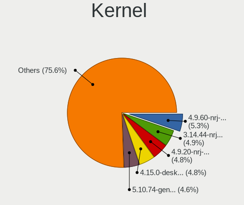
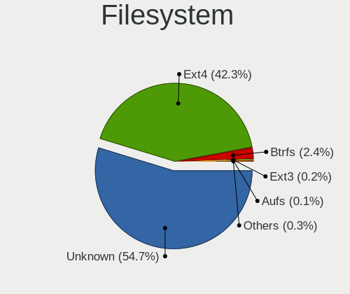
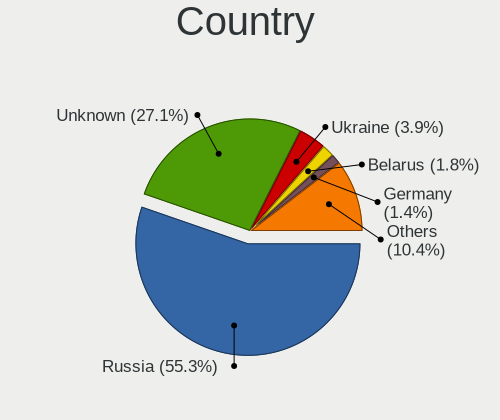
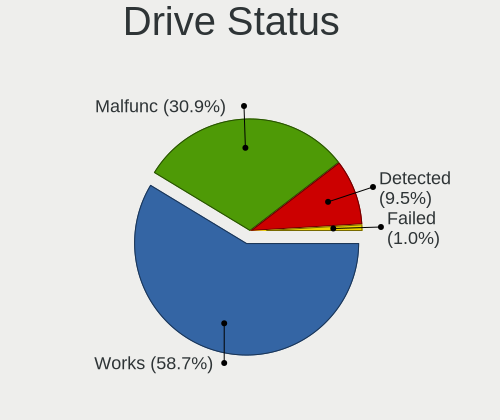
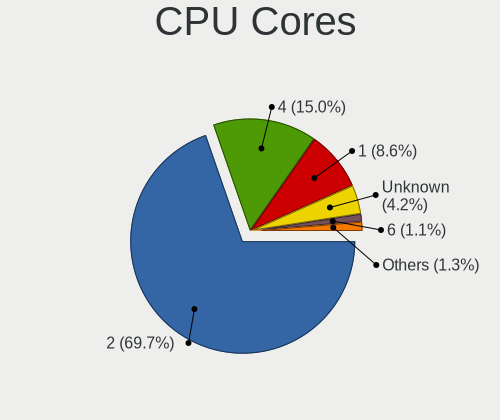
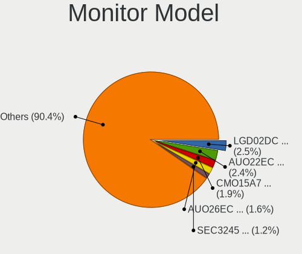

ROSA - Tested Hardware & Statistics (Notebooks)
-----------------------------------------------

A project to collect tested hardware configurations for ROSA.

Anyone can contribute to this report by the [hw-probe](https://github.com/linuxhw/hw-probe) tool:

    sudo -E hw-probe -all -upload

Please contribute! Especially if your hardware is rare.

Contents
--------

* [ Test Cases ](#test-cases)

* [ System ](#system)
  - [ OS                       ](#os)
  - [ OS Family                ](#os-family)
  - [ Kernel                   ](#kernel)
  - [ Kernel Family            ](#kernel-family)
  - [ Kernel Major Ver.        ](#kernel-major-ver)
  - [ Arch                     ](#arch)
  - [ DE                       ](#de)
  - [ Display Server           ](#display-server)
  - [ Display Manager          ](#display-manager)
  - [ OS Lang                  ](#os-lang)
  - [ Boot Mode                ](#boot-mode)
  - [ Filesystem               ](#filesystem)
  - [ Part. scheme             ](#part-scheme)
  - [ Dual Boot with Linux/BSD ](#dual-boot-with-linuxbsd)
  - [ Dual Boot (Win)          ](#dual-boot-win)

* [ Board ](#board)
  - [ Vendor                   ](#vendor)
  - [ Model                    ](#model)
  - [ Model Family             ](#model-family)
  - [ MFG Year                 ](#mfg-year)
  - [ Form Factor              ](#form-factor)
  - [ Secure Boot              ](#secure-boot)
  - [ Coreboot                 ](#coreboot)
  - [ RAM Size                 ](#ram-size)
  - [ RAM Used                 ](#ram-used)
  - [ Total Drives             ](#total-drives)
  - [ Has CD-ROM               ](#has-cd-rom)
  - [ Has Ethernet             ](#has-ethernet)
  - [ Has WiFi                 ](#has-wifi)
  - [ Has Bluetooth            ](#has-bluetooth)

* [ Location ](#location)
  - [ Country                  ](#country)
  - [ City                     ](#city)

* [ Drives ](#drives)
  - [ Drive Vendor             ](#drive-vendor)
  - [ Drive Model              ](#drive-model)
  - [ HDD Vendor               ](#hdd-vendor)
  - [ SSD Vendor               ](#ssd-vendor)
  - [ Drive Kind               ](#drive-kind)
  - [ Drive Connector          ](#drive-connector)
  - [ Drive Size               ](#drive-size)
  - [ Space Total              ](#space-total)
  - [ Space Used               ](#space-used)
  - [ Malfunc. Drives          ](#malfunc-drives)
  - [ Malfunc. Drive Vendor    ](#malfunc-drive-vendor)
  - [ Malfunc. HDD Vendor      ](#malfunc-hdd-vendor)
  - [ Malfunc. Drive Kind      ](#malfunc-drive-kind)
  - [ Failed Drives            ](#failed-drives)
  - [ Failed Drive Vendor      ](#failed-drive-vendor)
  - [ Drive Status             ](#drive-status)

* [ Storage controller ](#storage-controller)
  - [ Storage Vendor           ](#storage-vendor)
  - [ Storage Model            ](#storage-model)
  - [ Storage Kind             ](#storage-kind)

* [ Processor ](#processor)
  - [ CPU Vendor               ](#cpu-vendor)
  - [ CPU Model                ](#cpu-model)
  - [ CPU Model Family         ](#cpu-model-family)
  - [ CPU Cores                ](#cpu-cores)
  - [ CPU Sockets              ](#cpu-sockets)
  - [ CPU Threads              ](#cpu-threads)
  - [ CPU Op-Modes             ](#cpu-op-modes)
  - [ CPU Microcode            ](#cpu-microcode)
  - [ CPU Microarch            ](#cpu-microarch)

* [ Graphics ](#graphics)
  - [ GPU Vendor               ](#gpu-vendor)
  - [ GPU Model                ](#gpu-model)
  - [ GPU Combo                ](#gpu-combo)
  - [ GPU Driver               ](#gpu-driver)
  - [ GPU Memory               ](#gpu-memory)

* [ Monitor ](#monitor)
  - [ Monitor Vendor           ](#monitor-vendor)
  - [ Monitor Model            ](#monitor-model)
  - [ Monitor Resolution       ](#monitor-resolution)
  - [ Monitor Diagonal         ](#monitor-diagonal)
  - [ Monitor Width            ](#monitor-width)
  - [ Aspect Ratio             ](#aspect-ratio)
  - [ Monitor Area             ](#monitor-area)
  - [ Pixel Density            ](#pixel-density)
  - [ Multiple Monitors        ](#multiple-monitors)

* [ Network ](#network)
  - [ Net Controller Vendor    ](#net-controller-vendor)
  - [ Net Controller Model     ](#net-controller-model)
  - [ Wireless Vendor          ](#wireless-vendor)
  - [ Wireless Model           ](#wireless-model)
  - [ Ethernet Vendor          ](#ethernet-vendor)
  - [ Ethernet Model           ](#ethernet-model)
  - [ Net Controller Kind      ](#net-controller-kind)
  - [ Used Controller          ](#used-controller)
  - [ NICs                     ](#nics)
  - [ IPv6                     ](#ipv6)

* [ Bluetooth ](#bluetooth)
  - [ Bluetooth Vendor         ](#bluetooth-vendor)
  - [ Bluetooth Model          ](#bluetooth-model)

* [ Sound ](#sound)
  - [ Sound Vendor             ](#sound-vendor)
  - [ Sound Model              ](#sound-model)

* [ Memory ](#memory)
  - [ Memory Vendor            ](#memory-vendor)
  - [ Memory Model             ](#memory-model)
  - [ Memory Kind              ](#memory-kind)
  - [ Memory Form Factor       ](#memory-form-factor)
  - [ Memory Size              ](#memory-size)
  - [ Memory Speed             ](#memory-speed)

* [ Printers & scanners ](#printers--scanners)
  - [ Printer Vendor           ](#printer-vendor)
  - [ Printer Model            ](#printer-model)
  - [ Scanner Vendor           ](#scanner-vendor)
  - [ Scanner Model            ](#scanner-model)

* [ Camera ](#camera)
  - [ Camera Vendor            ](#camera-vendor)
  - [ Camera Model             ](#camera-model)

* [ Security ](#security)
  - [ Fingerprint Vendor       ](#fingerprint-vendor)
  - [ Fingerprint Model        ](#fingerprint-model)
  - [ Chipcard Vendor          ](#chipcard-vendor)
  - [ Chipcard Model           ](#chipcard-model)

* [ Unsupported ](#unsupported)
  - [ Unsupported Devices      ](#unsupported-devices)
  - [ Unsupported Device Types ](#unsupported-device-types)

Test Cases
----------

Total: 20822

| Vendor        | Model                       | Probe                                                      | Date         |
|---------------|-----------------------------|------------------------------------------------------------|--------------|
| Chuwi         | HeroBook Pro                | [97c2ff9710](https://linux-hardware.org/?probe=97c2ff9710) | Jan 01, 2024 |
| Sony          | VPCEH3P1R                   | [d5a18ec675](https://linux-hardware.org/?probe=d5a18ec675) | Jan 01, 2024 |
| ASUSTek       | X555LB                      | [6e12fcec56](https://linux-hardware.org/?probe=6e12fcec56) | Jan 01, 2024 |
| Lenovo        | ThinkPad T430 2349SB4       | [06956b900b](https://linux-hardware.org/?probe=06956b900b) | Jan 01, 2024 |
| Acer          | Extensa 5220                | [dd3638713e](https://linux-hardware.org/?probe=dd3638713e) | Dec 31, 2023 |
| Intel         | ChiefRiver                  | [6fc4ceeaa6](https://linux-hardware.org/?probe=6fc4ceeaa6) | Dec 30, 2023 |
| ASUSTek       | K52JB                       | [169f787cff](https://linux-hardware.org/?probe=169f787cff) | Dec 30, 2023 |
| HP            | ProBook 6460b               | [45038d4599](https://linux-hardware.org/?probe=45038d4599) | Dec 30, 2023 |
| Acer          | Aspire A715-75G             | [753b419047](https://linux-hardware.org/?probe=753b419047) | Dec 30, 2023 |
| HP            | Victus by Gaming Laptop ... | [d82dad2793](https://linux-hardware.org/?probe=d82dad2793) | Dec 29, 2023 |
| Lenovo        | IdeaPad 320-15IAP 80XR      | [d2c1896794](https://linux-hardware.org/?probe=d2c1896794) | Dec 29, 2023 |
| Lenovo        | XiaoXinPro 16 IRH8 83AQ     | [e21e415784](https://linux-hardware.org/?probe=e21e415784) | Dec 29, 2023 |
| HUAWEI        | BOD-WXX9                    | [fdcf9374ad](https://linux-hardware.org/?probe=fdcf9374ad) | Dec 29, 2023 |
| HUAWEI        | BOD-WXX9                    | [eee070b636](https://linux-hardware.org/?probe=eee070b636) | Dec 29, 2023 |
| HIPER Tech... | HIPER WORKBOOK              | [ddca4cca74](https://linux-hardware.org/?probe=ddca4cca74) | Dec 28, 2023 |
| Clevo         | NL41MU2                     | [51d90b2126](https://linux-hardware.org/?probe=51d90b2126) | Dec 28, 2023 |
| Lenovo        | ThinkPad L520 5017AD1       | [93cc8d014a](https://linux-hardware.org/?probe=93cc8d014a) | Dec 28, 2023 |
| Toshiba       | Satellite A200              | [081782c544](https://linux-hardware.org/?probe=081782c544) | Dec 28, 2023 |
| ASUSTek       | ROG Zephyrus G14 GA401QM... | [9c498442e0](https://linux-hardware.org/?probe=9c498442e0) | Dec 28, 2023 |
| Lenovo        | B570e HuronRiver Platfor... | [274273301c](https://linux-hardware.org/?probe=274273301c) | Dec 28, 2023 |
| ASUSTek       | X200LA                      | [e7eb756fbf](https://linux-hardware.org/?probe=e7eb756fbf) | Dec 27, 2023 |
| Packard Be... | EasyNote TE11HC             | [6061821ba9](https://linux-hardware.org/?probe=6061821ba9) | Dec 27, 2023 |
| Lenovo        | ThinkPad T480 20L50007RT    | [17df248bb2](https://linux-hardware.org/?probe=17df248bb2) | Dec 27, 2023 |
| ASUSTek       | F3Ke                        | [22f515ae42](https://linux-hardware.org/?probe=22f515ae42) | Dec 26, 2023 |
| Sony          | VGC-LT1SR                   | [680780a4de](https://linux-hardware.org/?probe=680780a4de) | Dec 26, 2023 |
| Sony          | VGC-LT1SR                   | [2a7c712f76](https://linux-hardware.org/?probe=2a7c712f76) | Dec 26, 2023 |
| MSI           | GE70 0NC\0ND                | [ffc8a3bf6d](https://linux-hardware.org/?probe=ffc8a3bf6d) | Dec 26, 2023 |
| ASUSTek       | GL553VE                     | [19d431f40e](https://linux-hardware.org/?probe=19d431f40e) | Dec 25, 2023 |
| Lenovo        | B590 20206                  | [c0fb6339e4](https://linux-hardware.org/?probe=c0fb6339e4) | Dec 25, 2023 |
| Acer          | Aspire E5-571G              | [5004570f44](https://linux-hardware.org/?probe=5004570f44) | Dec 24, 2023 |
| Acer          | Aspire E5-571G              | [b62ffffcdb](https://linux-hardware.org/?probe=b62ffffcdb) | Dec 24, 2023 |
| HP            | ProBook 430 G2              | [e383d83cd9](https://linux-hardware.org/?probe=e383d83cd9) | Dec 24, 2023 |
| Dell          | Inspiron N5110              | [4629a1dfe0](https://linux-hardware.org/?probe=4629a1dfe0) | Dec 24, 2023 |
| Notebook      | W65_67SJ                    | [8bea89f7c9](https://linux-hardware.org/?probe=8bea89f7c9) | Dec 24, 2023 |
| Notebook      | W65_67SJ                    | [439816e10c](https://linux-hardware.org/?probe=439816e10c) | Dec 24, 2023 |
| Dell          | Latitude E4310              | [0c4f2ab6b3](https://linux-hardware.org/?probe=0c4f2ab6b3) | Dec 23, 2023 |
| ASUSTek       | U5A                         | [fd3c48af54](https://linux-hardware.org/?probe=fd3c48af54) | Dec 23, 2023 |
| ASUSTek       | N53SV                       | [5098aee09b](https://linux-hardware.org/?probe=5098aee09b) | Dec 23, 2023 |
| ASUSTek       | N53SV                       | [5ad49bc6d3](https://linux-hardware.org/?probe=5ad49bc6d3) | Dec 23, 2023 |
| Samsung       | 350V5C/351V5C/3540VC/344... | [541c5efbf3](https://linux-hardware.org/?probe=541c5efbf3) | Dec 23, 2023 |
| Dell          | System XPS L702X            | [d69355a342](https://linux-hardware.org/?probe=d69355a342) | Dec 23, 2023 |
| Dell          | Inspiron N5050              | [51b49fb205](https://linux-hardware.org/?probe=51b49fb205) | Dec 22, 2023 |
| HUAWEI        | KLVL-WXXW                   | [ccf505804c](https://linux-hardware.org/?probe=ccf505804c) | Dec 22, 2023 |
| HP            | ProBook 4330s               | [fce67d52c0](https://linux-hardware.org/?probe=fce67d52c0) | Dec 22, 2023 |
| Acer          | Aspire 5920G                | [93945148f3](https://linux-hardware.org/?probe=93945148f3) | Dec 22, 2023 |
| Samsung       | 300V3A/300V4A/300V5A/200... | [4bf5538ba0](https://linux-hardware.org/?probe=4bf5538ba0) | Dec 22, 2023 |
| ASUSTek       | X553MA                      | [af944b3278](https://linux-hardware.org/?probe=af944b3278) | Dec 22, 2023 |
| ASUSTek       | X553MA                      | [ccc1d214ce](https://linux-hardware.org/?probe=ccc1d214ce) | Dec 22, 2023 |
| LG Electro... | F1-2A85R                    | [06bdffa7cc](https://linux-hardware.org/?probe=06bdffa7cc) | Dec 21, 2023 |
| Acer          | Aspire ES1-531              | [0bacfb8ebc](https://linux-hardware.org/?probe=0bacfb8ebc) | Dec 21, 2023 |
| Acer          | Aspire ES1-531              | [14e802a51f](https://linux-hardware.org/?probe=14e802a51f) | Dec 21, 2023 |
| ASUSTek       | X540LA                      | [ae9a60ec08](https://linux-hardware.org/?probe=ae9a60ec08) | Dec 21, 2023 |
| ASUSTek       | K53SM                       | [7af945d0af](https://linux-hardware.org/?probe=7af945d0af) | Dec 21, 2023 |
| Lenovo        | ThinkPad T530 239233G       | [83d94e2acb](https://linux-hardware.org/?probe=83d94e2acb) | Dec 20, 2023 |
| Dell          | Inspiron N5110              | [c983a4857a](https://linux-hardware.org/?probe=c983a4857a) | Dec 20, 2023 |
| Acer          | Nitro AN515-56              | [3fb0406c18](https://linux-hardware.org/?probe=3fb0406c18) | Dec 19, 2023 |
| ASUSTek       | N73Jn                       | [75d7e7434d](https://linux-hardware.org/?probe=75d7e7434d) | Dec 19, 2023 |
| DNS           | V40SI2                      | [cc28f4eaa2](https://linux-hardware.org/?probe=cc28f4eaa2) | Dec 19, 2023 |
| ASUSTek       | N56DP                       | [736ba321d5](https://linux-hardware.org/?probe=736ba321d5) | Dec 18, 2023 |
| Acer          | Aspire E1-522               | [874bdf3d31](https://linux-hardware.org/?probe=874bdf3d31) | Dec 18, 2023 |
| HUAWEI        | BOD-WXX9                    | [3d0c812852](https://linux-hardware.org/?probe=3d0c812852) | Dec 18, 2023 |
| Acer          | Aspire A114-33              | [0d1dc00e78](https://linux-hardware.org/?probe=0d1dc00e78) | Dec 18, 2023 |
| Toshiba       | Satellite Pro C660          | [8d45441911](https://linux-hardware.org/?probe=8d45441911) | Dec 18, 2023 |
| Maibenben     | MaiBook P series            | [6bd05cc6a1](https://linux-hardware.org/?probe=6bd05cc6a1) | Dec 18, 2023 |
| HP            | Pavilion dv6                | [604417783f](https://linux-hardware.org/?probe=604417783f) | Dec 18, 2023 |
| Clevo         | NL41MU2                     | [31d86d4507](https://linux-hardware.org/?probe=31d86d4507) | Dec 18, 2023 |
| Dell          | Studio 1535                 | [06e18b7a2f](https://linux-hardware.org/?probe=06e18b7a2f) | Dec 18, 2023 |
| Clevo         | NL41MU2                     | [7bf2e8159e](https://linux-hardware.org/?probe=7bf2e8159e) | Dec 18, 2023 |
| Lenovo        | IdeaPad 3 15ITL05 81X8      | [4c190c150c](https://linux-hardware.org/?probe=4c190c150c) | Dec 18, 2023 |
| Fujitsu Si... | LIFEBOOK S6410              | [24edc4b12c](https://linux-hardware.org/?probe=24edc4b12c) | Dec 17, 2023 |
| Dell          | System Inspiron N7110       | [b1f392f5f3](https://linux-hardware.org/?probe=b1f392f5f3) | Dec 17, 2023 |
| HP            | Laptop 14s-dq2xxx           | [0e123e0682](https://linux-hardware.org/?probe=0e123e0682) | Dec 16, 2023 |
| Toshiba       | Satellite C660              | [c67f7d8341](https://linux-hardware.org/?probe=c67f7d8341) | Dec 16, 2023 |
| Lenovo        | B590 20206                  | [b6afc3e929](https://linux-hardware.org/?probe=b6afc3e929) | Dec 16, 2023 |
| Toshiba       | Satellite U300              | [f8f967d0fe](https://linux-hardware.org/?probe=f8f967d0fe) | Dec 16, 2023 |
| Samsung       | R528/R728                   | [3a61761648](https://linux-hardware.org/?probe=3a61761648) | Dec 16, 2023 |
| Clevo         | NL41MU2                     | [7042699eef](https://linux-hardware.org/?probe=7042699eef) | Dec 15, 2023 |
| ASUSTek       | X550CC                      | [e07df321e3](https://linux-hardware.org/?probe=e07df321e3) | Dec 15, 2023 |
| Sony          | VGN-FW11ER                  | [eead7d1cca](https://linux-hardware.org/?probe=eead7d1cca) | Dec 15, 2023 |
| Dell          | Studio 1535                 | [0fd7468ec1](https://linux-hardware.org/?probe=0fd7468ec1) | Dec 14, 2023 |
| HP            | Notebook                    | [ac92e1373d](https://linux-hardware.org/?probe=ac92e1373d) | Dec 14, 2023 |
| Acer          | AO521                       | [e519cc3d02](https://linux-hardware.org/?probe=e519cc3d02) | Dec 14, 2023 |
| Acer          | AO521                       | [0dd76d9c3a](https://linux-hardware.org/?probe=0dd76d9c3a) | Dec 14, 2023 |
| HP            | ProBook 6560b               | [e103647ee9](https://linux-hardware.org/?probe=e103647ee9) | Dec 13, 2023 |
| Digma         | EVE 14 C411                 | [bcd7c864a1](https://linux-hardware.org/?probe=bcd7c864a1) | Dec 12, 2023 |
| Lenovo        | ThinkPad Z61t 9441W15       | [af90f6fb00](https://linux-hardware.org/?probe=af90f6fb00) | Dec 11, 2023 |
| Acer          | Aspire E1-572G              | [c087547192](https://linux-hardware.org/?probe=c087547192) | Dec 11, 2023 |
| Acer          | Aspire E1-572G              | [5347b71932](https://linux-hardware.org/?probe=5347b71932) | Dec 11, 2023 |
| eMachines     | eME728                      | [b89ccf8caf](https://linux-hardware.org/?probe=b89ccf8caf) | Dec 09, 2023 |
| eMachines     | eME728                      | [1c6bed2983](https://linux-hardware.org/?probe=1c6bed2983) | Dec 09, 2023 |
| Lenovo        | IdeaPad S145-15IIL 81W8     | [9aa2e36112](https://linux-hardware.org/?probe=9aa2e36112) | Dec 09, 2023 |
| MSI           | Katana GF76 12UC            | [6667f9e88d](https://linux-hardware.org/?probe=6667f9e88d) | Dec 08, 2023 |
| HP            | Compaq 610                  | [6104f16206](https://linux-hardware.org/?probe=6104f16206) | Dec 07, 2023 |
| Lenovo        | K14 Gen 1 21CSS16E00        | [b0d96c9e33](https://linux-hardware.org/?probe=b0d96c9e33) | Dec 07, 2023 |
| Acer          | Aspire V3-772               | [3939d82727](https://linux-hardware.org/?probe=3939d82727) | Dec 07, 2023 |
| Acer          | TravelMate B118-M           | [22f8658b94](https://linux-hardware.org/?probe=22f8658b94) | Dec 07, 2023 |
| HUAWEI        | BoDE-WXX9                   | [290f7cf6b8](https://linux-hardware.org/?probe=290f7cf6b8) | Dec 06, 2023 |
| Infinix       | INBOOK X3                   | [51e5d10a85](https://linux-hardware.org/?probe=51e5d10a85) | Dec 06, 2023 |
| ASUSTek       | VivoBook_ASUS Laptop E41... | [d1acc8db3d](https://linux-hardware.org/?probe=d1acc8db3d) | Dec 06, 2023 |
| Lenovo        | G50-70 20351                | [a5c872d21f](https://linux-hardware.org/?probe=a5c872d21f) | Dec 06, 2023 |
| Lenovo        | IdeaPad 3 14ADA05 81W0      | [58eeb19907](https://linux-hardware.org/?probe=58eeb19907) | Dec 05, 2023 |
| Lenovo        | IdeaPad 3 14ADA05 81W0      | [5a7b70b8e0](https://linux-hardware.org/?probe=5a7b70b8e0) | Dec 05, 2023 |
| ARDOR GAMI... | V15x_V17xRNx                | [ac9b89a2cd](https://linux-hardware.org/?probe=ac9b89a2cd) | Dec 05, 2023 |
| ASUSTek       | VivoBook_ASUSLaptop M350... | [5e0643e419](https://linux-hardware.org/?probe=5e0643e419) | Dec 04, 2023 |
| ASUSTek       | X550VC                      | [376ffad1f1](https://linux-hardware.org/?probe=376ffad1f1) | Dec 04, 2023 |
| Clevo         | NL41MU2                     | [fbc45d8077](https://linux-hardware.org/?probe=fbc45d8077) | Dec 04, 2023 |
| HP            | EliteBook 840 G4            | [1ea135770e](https://linux-hardware.org/?probe=1ea135770e) | Dec 04, 2023 |
| HUAWEI        | BoDE-WXX9                   | [28ae7336e2](https://linux-hardware.org/?probe=28ae7336e2) | Dec 03, 2023 |
| Apple         | MacBookAir3,2               | [f3560f311e](https://linux-hardware.org/?probe=f3560f311e) | Dec 03, 2023 |
| Dell          | Vostro 1015                 | [50b53131f2](https://linux-hardware.org/?probe=50b53131f2) | Dec 03, 2023 |
| Irbis         | NB133                       | [b376d8603a](https://linux-hardware.org/?probe=b376d8603a) | Dec 03, 2023 |
| Lenovo        | IdeaPad 330-15ARR 81D2      | [a8192548ea](https://linux-hardware.org/?probe=a8192548ea) | Dec 03, 2023 |
| ASUSTek       | TUF Gaming FX505DT_FX505... | [7dab5dd440](https://linux-hardware.org/?probe=7dab5dd440) | Dec 03, 2023 |
| ASUSTek       | X75VCP                      | [c4746fbc7c](https://linux-hardware.org/?probe=c4746fbc7c) | Dec 02, 2023 |
| Lenovo        | IdeaPad L340-15API 81LW     | [786b8aae1c](https://linux-hardware.org/?probe=786b8aae1c) | Dec 02, 2023 |
| Graviton      | N15i-T                      | [45f4b45d76](https://linux-hardware.org/?probe=45f4b45d76) | Dec 02, 2023 |
| Graviton      | N15i-T                      | [2dfff446c0](https://linux-hardware.org/?probe=2dfff446c0) | Dec 02, 2023 |
| HP            | ProBook 450 G5              | [695b186626](https://linux-hardware.org/?probe=695b186626) | Dec 02, 2023 |
| LTD Delovo... | EVE 14 C414 NA9144BXW01     | [ef37f773f0](https://linux-hardware.org/?probe=ef37f773f0) | Dec 02, 2023 |
| Acer          | Aspire A315-21              | [a89238478d](https://linux-hardware.org/?probe=a89238478d) | Dec 01, 2023 |
| HP            | 250 G8 Notebook PC          | [444b1864c9](https://linux-hardware.org/?probe=444b1864c9) | Dec 01, 2023 |
| HP            | 250 G8 Notebook PC          | [475b7358ee](https://linux-hardware.org/?probe=475b7358ee) | Dec 01, 2023 |
| Toshiba       | Satellite U300              | [9b42ec691e](https://linux-hardware.org/?probe=9b42ec691e) | Nov 30, 2023 |
| HP            | Pavilion dv6000 (RY647EA... | [9940416812](https://linux-hardware.org/?probe=9940416812) | Nov 30, 2023 |
| Timi          | TM1703                      | [cc3fe6b22b](https://linux-hardware.org/?probe=cc3fe6b22b) | Nov 30, 2023 |
| Gigabyte      | G5 GE                       | [53343f6e05](https://linux-hardware.org/?probe=53343f6e05) | Nov 29, 2023 |
| ARDOR GAMI... | V15x_V17xRNx                | [b711d78ac1](https://linux-hardware.org/?probe=b711d78ac1) | Nov 29, 2023 |
| Lenovo        | IdeaPad Gaming 3 15ARH05... | [2f1a80ecf8](https://linux-hardware.org/?probe=2f1a80ecf8) | Nov 28, 2023 |
| Timi          | TM1703                      | [87ad7cf4b2](https://linux-hardware.org/?probe=87ad7cf4b2) | Nov 28, 2023 |
| ASUSTek       | VivoBook_ASUSLaptop M350... | [cabab02402](https://linux-hardware.org/?probe=cabab02402) | Nov 28, 2023 |
| Packard Be... | EasyNote TE11HC             | [d9993e4ca1](https://linux-hardware.org/?probe=d9993e4ca1) | Nov 28, 2023 |
| HP            | Notebook                    | [3faeeff15b](https://linux-hardware.org/?probe=3faeeff15b) | Nov 28, 2023 |
| Acer          | Aspire A315-51              | [9d08bad421](https://linux-hardware.org/?probe=9d08bad421) | Nov 28, 2023 |
| Clevo         | NL41MU2                     | [972ddcedb5](https://linux-hardware.org/?probe=972ddcedb5) | Nov 27, 2023 |
| Dell          | Vostro 14 5410              | [d8694cd2f4](https://linux-hardware.org/?probe=d8694cd2f4) | Nov 27, 2023 |
| ASUSTek       | X551MA                      | [462be5c161](https://linux-hardware.org/?probe=462be5c161) | Nov 26, 2023 |
| HONOR         | HYM-WXX                     | [ce9c3cc669](https://linux-hardware.org/?probe=ce9c3cc669) | Nov 26, 2023 |
| HP            | ProBook 6460b               | [d489496b9f](https://linux-hardware.org/?probe=d489496b9f) | Nov 26, 2023 |
| Clevo         | NL41MU2                     | [77e9934d61](https://linux-hardware.org/?probe=77e9934d61) | Nov 26, 2023 |
| Acer          | Aspire V5-571G              | [325e8c5f4e](https://linux-hardware.org/?probe=325e8c5f4e) | Nov 26, 2023 |
| Lenovo        | G700 20251                  | [786f74858b](https://linux-hardware.org/?probe=786f74858b) | Nov 26, 2023 |
| HUAWEI        | BOD-WXX9                    | [87185da0b7](https://linux-hardware.org/?probe=87185da0b7) | Nov 26, 2023 |
| Alienware     | 18                          | [063cb2cb74](https://linux-hardware.org/?probe=063cb2cb74) | Nov 26, 2023 |
| Lenovo        | IdeaPad L340-15API 81LW     | [bfe4912cfd](https://linux-hardware.org/?probe=bfe4912cfd) | Nov 26, 2023 |
| Packard Be... | EasyNote TE11HC             | [812406c15d](https://linux-hardware.org/?probe=812406c15d) | Nov 26, 2023 |
| ASUSTek       | VivoBook_ASUSLaptop M140... | [977c83a086](https://linux-hardware.org/?probe=977c83a086) | Nov 25, 2023 |
| HP            | Laptop 15-bw0xx             | [09f8fda895](https://linux-hardware.org/?probe=09f8fda895) | Nov 25, 2023 |
| HP            | Notebook                    | [519d55357d](https://linux-hardware.org/?probe=519d55357d) | Nov 25, 2023 |
| Lenovo        | G505 20240                  | [f0b93fcca9](https://linux-hardware.org/?probe=f0b93fcca9) | Nov 25, 2023 |
| Lenovo        | IdeaPad Z500 20202          | [59a8bda477](https://linux-hardware.org/?probe=59a8bda477) | Nov 25, 2023 |
| HP            | ProBook 4340s               | [15f28b24ae](https://linux-hardware.org/?probe=15f28b24ae) | Nov 25, 2023 |
| Acer          | Aspire ES1-522              | [b367ec5e53](https://linux-hardware.org/?probe=b367ec5e53) | Nov 25, 2023 |
| HP            | ENVY 17                     | [d4d314c6cb](https://linux-hardware.org/?probe=d4d314c6cb) | Nov 25, 2023 |
| 3Logic Gro... | Graviton N15i               | [a351a9f906](https://linux-hardware.org/?probe=a351a9f906) | Nov 25, 2023 |
| Lenovo        | IdeaPad Gaming 3 15ARH05... | [7186bd00ff](https://linux-hardware.org/?probe=7186bd00ff) | Nov 24, 2023 |
| ASUSTek       | N550JK                      | [637d2ba066](https://linux-hardware.org/?probe=637d2ba066) | Nov 24, 2023 |
| ASUSTek       | N750JV                      | [27e9669d13](https://linux-hardware.org/?probe=27e9669d13) | Nov 24, 2023 |
| HUAWEI        | BOM-WXX9                    | [f4f0ebc885](https://linux-hardware.org/?probe=f4f0ebc885) | Nov 23, 2023 |
| Acer          | TravelMate P259-MG          | [9ab55a1799](https://linux-hardware.org/?probe=9ab55a1799) | Nov 23, 2023 |
| Lenovo        | IdeaPad Gaming 3 16ARH7 ... | [2c6adf9db4](https://linux-hardware.org/?probe=2c6adf9db4) | Nov 23, 2023 |
| Acer          | TravelMate P259-MG          | [aea9b092e1](https://linux-hardware.org/?probe=aea9b092e1) | Nov 23, 2023 |
| ASUSTek       | ROG Strix G834JY_G834JY     | [26a2d5750f](https://linux-hardware.org/?probe=26a2d5750f) | Nov 23, 2023 |
| Lenovo        | IdeaPad Gaming 3 16ARH7 ... | [6a200f511c](https://linux-hardware.org/?probe=6a200f511c) | Nov 23, 2023 |
| Alienware     | m15 R7 AMD                  | [92e9ba0c14](https://linux-hardware.org/?probe=92e9ba0c14) | Nov 23, 2023 |
| HP            | Notebook                    | [efccf1789b](https://linux-hardware.org/?probe=efccf1789b) | Nov 22, 2023 |
| ASUSTek       | G75VX                       | [e433e70a9f](https://linux-hardware.org/?probe=e433e70a9f) | Nov 22, 2023 |
| HP            | Laptop 15-bw0xx             | [9e429c4742](https://linux-hardware.org/?probe=9e429c4742) | Nov 22, 2023 |
| HP            | ProBook 6460b               | [0d13c42c84](https://linux-hardware.org/?probe=0d13c42c84) | Nov 21, 2023 |
| HP            | Compaq Presario CQ50        | [40a3d73ff2](https://linux-hardware.org/?probe=40a3d73ff2) | Nov 21, 2023 |
| LTD Delovo... | 15Y                         | [8d54474ad0](https://linux-hardware.org/?probe=8d54474ad0) | Nov 21, 2023 |
| Samsung       | G25/G26                     | [75ea3e9d1c](https://linux-hardware.org/?probe=75ea3e9d1c) | Nov 21, 2023 |
| Samsung       | G25/G26                     | [4fa1c48bf4](https://linux-hardware.org/?probe=4fa1c48bf4) | Nov 20, 2023 |
| Dell          | Vostro1710                  | [a34c5e67aa](https://linux-hardware.org/?probe=a34c5e67aa) | Nov 19, 2023 |
| Dell          | Inspiron 1521               | [0b0507a1ae](https://linux-hardware.org/?probe=0b0507a1ae) | Nov 19, 2023 |
| Lenovo        | ThinkPad T430 23445PU       | [95684da8bd](https://linux-hardware.org/?probe=95684da8bd) | Nov 19, 2023 |
| Dell          | Latitude E6230              | [92e65f6bca](https://linux-hardware.org/?probe=92e65f6bca) | Nov 19, 2023 |
| ASUSTek       | K53E                        | [8b2b851183](https://linux-hardware.org/?probe=8b2b851183) | Nov 19, 2023 |
| Lenovo        | 3000 V100 076346G           | [039632f3f3](https://linux-hardware.org/?probe=039632f3f3) | Nov 18, 2023 |
| Lenovo        | B560                        | [05bde0afed](https://linux-hardware.org/?probe=05bde0afed) | Nov 18, 2023 |
| Sony          | VGN-NS11ER_S                | [f295aaa7fd](https://linux-hardware.org/?probe=f295aaa7fd) | Nov 18, 2023 |
| Acer          | Aspire 5334                 | [0dcad1d6e0](https://linux-hardware.org/?probe=0dcad1d6e0) | Nov 18, 2023 |
| Lenovo        | ThinkBook 15 G3 ACL 21A4    | [d4e8f3f548](https://linux-hardware.org/?probe=d4e8f3f548) | Nov 17, 2023 |
| ASUSTek       | X101H                       | [d9e12c16e0](https://linux-hardware.org/?probe=d9e12c16e0) | Nov 17, 2023 |
| MSI           | Katana GF76 12UC            | [0f4df1b67e](https://linux-hardware.org/?probe=0f4df1b67e) | Nov 17, 2023 |
| HP            | Pavilion Laptop 15-eh2xx... | [39179fa6fd](https://linux-hardware.org/?probe=39179fa6fd) | Nov 17, 2023 |
| ASUSTek       | ZenBook UX435EG_UX435EG     | [01e59bb98c](https://linux-hardware.org/?probe=01e59bb98c) | Nov 16, 2023 |
| ASUSTek       | 1001PXD                     | [6f92b6aa53](https://linux-hardware.org/?probe=6f92b6aa53) | Nov 16, 2023 |
| HP            | Pavilion Gaming Laptop 1... | [2164c33a50](https://linux-hardware.org/?probe=2164c33a50) | Nov 16, 2023 |
| HP            | Mini 110-4100               | [a7aaa77ba5](https://linux-hardware.org/?probe=a7aaa77ba5) | Nov 16, 2023 |
| Lenovo        | IdeaPad 3 15IML05 81WB      | [d5c9e20e7b](https://linux-hardware.org/?probe=d5c9e20e7b) | Nov 15, 2023 |
| HP            | ProBook 6460b               | [b0795caa4c](https://linux-hardware.org/?probe=b0795caa4c) | Nov 15, 2023 |
| Dell          | Inspiron 3521               | [d038cb0c11](https://linux-hardware.org/?probe=d038cb0c11) | Nov 15, 2023 |
| Sony          | VPCCA2S1R                   | [f94fcde51d](https://linux-hardware.org/?probe=f94fcde51d) | Nov 15, 2023 |
| HP            | 250 G7 Notebook PC          | [127af8c0e3](https://linux-hardware.org/?probe=127af8c0e3) | Nov 15, 2023 |
| Unknown       | Unknown                     | [8f82e3bd78](https://linux-hardware.org/?probe=8f82e3bd78) | Nov 15, 2023 |
| MSI           | Katana GF76 11UD            | [4f5b6c3898](https://linux-hardware.org/?probe=4f5b6c3898) | Nov 15, 2023 |
| HP            | EliteBook 8460p             | [57e8703df8](https://linux-hardware.org/?probe=57e8703df8) | Nov 14, 2023 |
| HIPER Tech... | HIPER WORKBOOK              | [8e914770df](https://linux-hardware.org/?probe=8e914770df) | Nov 14, 2023 |
| Unchartevi... | 6540                        | [5353bd2c2c](https://linux-hardware.org/?probe=5353bd2c2c) | Nov 13, 2023 |
| HP            | Pavilion dv7                | [b53b5881ea](https://linux-hardware.org/?probe=b53b5881ea) | Nov 13, 2023 |
| Lenovo        | IdeaPad 5 14ARE05 81YM      | [0e8786e8a9](https://linux-hardware.org/?probe=0e8786e8a9) | Nov 13, 2023 |
| HP            | Pavilion Laptop 15-eg0xx... | [4d8ebb0232](https://linux-hardware.org/?probe=4d8ebb0232) | Nov 13, 2023 |
| Fujitsu Si... | AMILO Pro Edition V3505     | [47597109a6](https://linux-hardware.org/?probe=47597109a6) | Nov 13, 2023 |
| Samsung       | G25/G26                     | [5fdbe7131c](https://linux-hardware.org/?probe=5fdbe7131c) | Nov 13, 2023 |
| Dell          | Inspiron ME051              | [e0114c60de](https://linux-hardware.org/?probe=e0114c60de) | Nov 12, 2023 |
| Lenovo        | B570e HuronRiver Platfor... | [ab99d222f4](https://linux-hardware.org/?probe=ab99d222f4) | Nov 12, 2023 |
| Toshiba       | Satellite L735              | [a04ec0c5b2](https://linux-hardware.org/?probe=a04ec0c5b2) | Nov 11, 2023 |
| ASUSTek       | M51Tr                       | [d022e223bc](https://linux-hardware.org/?probe=d022e223bc) | Nov 11, 2023 |
| Lenovo        | IdeaPad 3 15IML05 81WB      | [3d7d7d3e34](https://linux-hardware.org/?probe=3d7d7d3e34) | Nov 11, 2023 |
| Haier         | U1530EM                     | [ea3804c31f](https://linux-hardware.org/?probe=ea3804c31f) | Nov 11, 2023 |
| HUAWEI        | BOD-WXX9                    | [430cbdbe91](https://linux-hardware.org/?probe=430cbdbe91) | Nov 10, 2023 |
| Fujitsu Si... | AMILO Pro Edition V3505     | [78a7710228](https://linux-hardware.org/?probe=78a7710228) | Nov 10, 2023 |
| ASUSTek       | X550CC                      | [dc3a25ade3](https://linux-hardware.org/?probe=dc3a25ade3) | Nov 09, 2023 |
| Lenovo        | IdeaPad 330-15ARR 81D2      | [7279b92270](https://linux-hardware.org/?probe=7279b92270) | Nov 09, 2023 |
| HP            | Pavilion g6                 | [1bddfcc66f](https://linux-hardware.org/?probe=1bddfcc66f) | Nov 09, 2023 |
| Aquarius      | NS685U R11                  | [fe2d295af1](https://linux-hardware.org/?probe=fe2d295af1) | Nov 09, 2023 |
| Fujitsu Si... | AMILO Pro Edition V3405     | [429a0b938f](https://linux-hardware.org/?probe=429a0b938f) | Nov 09, 2023 |
| HP            | Pavilion g6                 | [ef6c4056ae](https://linux-hardware.org/?probe=ef6c4056ae) | Nov 09, 2023 |
| Sony          | VPCEL3S1R                   | [00e9149304](https://linux-hardware.org/?probe=00e9149304) | Nov 08, 2023 |
| Acer          | Aspire E1-570G              | [ecbf335e61](https://linux-hardware.org/?probe=ecbf335e61) | Nov 08, 2023 |
| Clevo         | NL41MU2                     | [cf49add8e7](https://linux-hardware.org/?probe=cf49add8e7) | Nov 08, 2023 |
| Unknown       | Unknown                     | [a1be0f3000](https://linux-hardware.org/?probe=a1be0f3000) | Nov 08, 2023 |
| Samsung       | 300V3A/300V4A/300V5A/200... | [8ae8c2d4d9](https://linux-hardware.org/?probe=8ae8c2d4d9) | Nov 08, 2023 |
| Toshiba       | Satellite U300              | [c4701b779e](https://linux-hardware.org/?probe=c4701b779e) | Nov 08, 2023 |
| Acer          | TravelMate P259-MG          | [b9429814ad](https://linux-hardware.org/?probe=b9429814ad) | Nov 07, 2023 |
| HP            | ProBook 450 G1              | [bb1bf92ea5](https://linux-hardware.org/?probe=bb1bf92ea5) | Nov 07, 2023 |
| HP            | ProBook 450 G1              | [bec045a214](https://linux-hardware.org/?probe=bec045a214) | Nov 07, 2023 |
| Acer          | Aspire ES1-531              | [9fd8344477](https://linux-hardware.org/?probe=9fd8344477) | Nov 07, 2023 |
| ASUSTek       | VivoBook 15_ASUS Laptop ... | [55a0738916](https://linux-hardware.org/?probe=55a0738916) | Nov 06, 2023 |
| ASUSTek       | VivoBook 15_ASUS Laptop ... | [738c6220a5](https://linux-hardware.org/?probe=738c6220a5) | Nov 06, 2023 |
| ASUSTek       | ASUS TUF Gaming A15 FA50... | [60ec029256](https://linux-hardware.org/?probe=60ec029256) | Nov 05, 2023 |
| HP            | Laptop 17t-by000            | [b23b606118](https://linux-hardware.org/?probe=b23b606118) | Nov 05, 2023 |
| Acer          | Aspire 5349                 | [b1ca6f597c](https://linux-hardware.org/?probe=b1ca6f597c) | Nov 05, 2023 |
| Lenovo        | IdeaPad 100-15IBY 80MJ      | [f782cf5541](https://linux-hardware.org/?probe=f782cf5541) | Nov 05, 2023 |
| ASUSTek       | VivoBook 15_ASUS Laptop ... | [5541e01522](https://linux-hardware.org/?probe=5541e01522) | Nov 05, 2023 |
| Acer          | Aspire 5100                 | [62b63704e9](https://linux-hardware.org/?probe=62b63704e9) | Nov 04, 2023 |
| Acer          | Aspire 5100                 | [c4d628cb50](https://linux-hardware.org/?probe=c4d628cb50) | Nov 04, 2023 |
| Lenovo        | IdeaPad 330-15IGM 81D1      | [157f4d1006](https://linux-hardware.org/?probe=157f4d1006) | Nov 04, 2023 |
| Dell          | Inspiron M5110              | [20e338fb21](https://linux-hardware.org/?probe=20e338fb21) | Nov 04, 2023 |
| ASUSTek       | VivoBook 15_ASUS Laptop ... | [86d2394935](https://linux-hardware.org/?probe=86d2394935) | Nov 03, 2023 |
| Lenovo        | G580                        | [d137c3bc30](https://linux-hardware.org/?probe=d137c3bc30) | Nov 02, 2023 |
| 3Logic Gro... | Graviton N15i               | [555d634638](https://linux-hardware.org/?probe=555d634638) | Nov 02, 2023 |
| KVADRA        | U15W                        | [1c1f562cf5](https://linux-hardware.org/?probe=1c1f562cf5) | Nov 02, 2023 |
| Lenovo        | ThinkPad T430 23493V2       | [6fc33e3528](https://linux-hardware.org/?probe=6fc33e3528) | Nov 02, 2023 |
| Digma         | Pro Fortis M DN15P5-8CXN... | [7bb9e8e743](https://linux-hardware.org/?probe=7bb9e8e743) | Nov 02, 2023 |
| Samsung       | 350V5C/351V5C/3540VC/344... | [10b531fcd1](https://linux-hardware.org/?probe=10b531fcd1) | Nov 02, 2023 |
| Samsung       | P29/28/26                   | [15d449da5d](https://linux-hardware.org/?probe=15d449da5d) | Nov 01, 2023 |
| ANCOMP        | Learnmate A15-501           | [da0c777960](https://linux-hardware.org/?probe=da0c777960) | Nov 01, 2023 |
| Acer          | Extensa 215-22              | [5fd05270e7](https://linux-hardware.org/?probe=5fd05270e7) | Oct 31, 2023 |
| ASUSTek       | N61Vn                       | [d8ee34cdbc](https://linux-hardware.org/?probe=d8ee34cdbc) | Oct 30, 2023 |
| HP            | Laptop 15-dy2xxx            | [f39cf8f2f8](https://linux-hardware.org/?probe=f39cf8f2f8) | Oct 30, 2023 |
| Lenovo        | ThinkBook 15 G3 ACL 21A4    | [8ddd5fdfba](https://linux-hardware.org/?probe=8ddd5fdfba) | Oct 29, 2023 |
| eMachines     | Rhine V1.45                 | [dc1b87d14a](https://linux-hardware.org/?probe=dc1b87d14a) | Oct 29, 2023 |
| Clevo         | W150HRM                     | [ef386d81b5](https://linux-hardware.org/?probe=ef386d81b5) | Oct 29, 2023 |
| HP            | Pavilion Notebook           | [c76c1fe34a](https://linux-hardware.org/?probe=c76c1fe34a) | Oct 29, 2023 |
| Toshiba       | Satellite L755              | [6f0566d95a](https://linux-hardware.org/?probe=6f0566d95a) | Oct 28, 2023 |
| Sony          | VPCEB1S1R                   | [bb50d8e6f3](https://linux-hardware.org/?probe=bb50d8e6f3) | Oct 28, 2023 |
| HP            | 15                          | [a9e38be5d5](https://linux-hardware.org/?probe=a9e38be5d5) | Oct 27, 2023 |
| ASUSTek       | N56VZ                       | [bfe478311d](https://linux-hardware.org/?probe=bfe478311d) | Oct 26, 2023 |
| Timi          | Mi NoteBook Ultra           | [66cfbcd057](https://linux-hardware.org/?probe=66cfbcd057) | Oct 26, 2023 |
| HP            | ProBook 4730s               | [935df70e31](https://linux-hardware.org/?probe=935df70e31) | Oct 26, 2023 |
| Toshiba       | Satellite C660D             | [8dc1c1d768](https://linux-hardware.org/?probe=8dc1c1d768) | Oct 26, 2023 |
| ANCOMP        | Learnmate A15-501           | [832eeb008b](https://linux-hardware.org/?probe=832eeb008b) | Oct 26, 2023 |
| Sony          | VGN-SR19VRN                 | [b6137146d6](https://linux-hardware.org/?probe=b6137146d6) | Oct 26, 2023 |
| HP            | Pavilion dv6700             | [4e65db3924](https://linux-hardware.org/?probe=4e65db3924) | Oct 26, 2023 |
| ASUSTek       | G56JR                       | [9dd84ffe04](https://linux-hardware.org/?probe=9dd84ffe04) | Oct 26, 2023 |
| Acer          | Aspire 7520                 | [e5636cc92b](https://linux-hardware.org/?probe=e5636cc92b) | Oct 25, 2023 |
| eMachines     | Rhine V1.45                 | [7b3fd7da03](https://linux-hardware.org/?probe=7b3fd7da03) | Oct 25, 2023 |
| Maibenben     | MaiBook P series            | [227638ee70](https://linux-hardware.org/?probe=227638ee70) | Oct 25, 2023 |
| Acer          | Aspire 5541                 | [df4f0f3912](https://linux-hardware.org/?probe=df4f0f3912) | Oct 25, 2023 |
| Dell          | Latitude E6220              | [afc941b941](https://linux-hardware.org/?probe=afc941b941) | Oct 25, 2023 |
| Lenovo        | Unknown                     | [1139846802](https://linux-hardware.org/?probe=1139846802) | Oct 25, 2023 |
| Samsung       | 350V5C/351V5C/3540VC/344... | [118822d39f](https://linux-hardware.org/?probe=118822d39f) | Oct 25, 2023 |
| HP            | Pavilion dv6700             | [5e143a92d1](https://linux-hardware.org/?probe=5e143a92d1) | Oct 25, 2023 |
| Irbis         | NB264                       | [ac65f72c50](https://linux-hardware.org/?probe=ac65f72c50) | Oct 24, 2023 |
| Lenovo        | ThinkPad L520 5017BK4       | [77037e51b0](https://linux-hardware.org/?probe=77037e51b0) | Oct 24, 2023 |
| Packard Be... | EasyNote ENLG81BA           | [a9cb75e4fa](https://linux-hardware.org/?probe=a9cb75e4fa) | Oct 23, 2023 |
| ASUSTek       | N73SV                       | [6be1f80f91](https://linux-hardware.org/?probe=6be1f80f91) | Oct 23, 2023 |
| Acer          | Aspire 5734Z                | [cf4468ed0d](https://linux-hardware.org/?probe=cf4468ed0d) | Oct 23, 2023 |
| ASUSTek       | VivoBook_ASUSLaptop M650... | [06d21bfdb4](https://linux-hardware.org/?probe=06d21bfdb4) | Oct 23, 2023 |
| Samsung       | N100                        | [449f1837f5](https://linux-hardware.org/?probe=449f1837f5) | Oct 22, 2023 |
| Sony          | VGN-NS11ER_S                | [ece59481cb](https://linux-hardware.org/?probe=ece59481cb) | Oct 22, 2023 |
| HUAWEI        | BOD-WXX9                    | [102c170156](https://linux-hardware.org/?probe=102c170156) | Oct 22, 2023 |
| ASUSTek       | VivoBook_ASUSLaptop M150... | [d1026594ae](https://linux-hardware.org/?probe=d1026594ae) | Oct 21, 2023 |
| Samsung       | R530/R730/P530              | [ba506f75d1](https://linux-hardware.org/?probe=ba506f75d1) | Oct 21, 2023 |
| HP            | Notebook                    | [3bf9870d4a](https://linux-hardware.org/?probe=3bf9870d4a) | Oct 21, 2023 |
| Samsung       | N100                        | [80cf7b4a53](https://linux-hardware.org/?probe=80cf7b4a53) | Oct 21, 2023 |
| Acer          | Ferrari 3200                | [01ef021946](https://linux-hardware.org/?probe=01ef021946) | Oct 21, 2023 |
| HUAWEI        | HKD-WXX                     | [73735cfb57](https://linux-hardware.org/?probe=73735cfb57) | Oct 20, 2023 |
| HP            | Notebook                    | [4d0eddbb92](https://linux-hardware.org/?probe=4d0eddbb92) | Oct 20, 2023 |
| Jumper        | Ezbook X3                   | [54ebd459be](https://linux-hardware.org/?probe=54ebd459be) | Oct 20, 2023 |
| ASUSTek       | F3JA                        | [6a96b7e347](https://linux-hardware.org/?probe=6a96b7e347) | Oct 20, 2023 |
| Lenovo        | ThinkPad T60 1952W2Q        | [4493954de6](https://linux-hardware.org/?probe=4493954de6) | Oct 19, 2023 |
| realme        | RMNBXXXX                    | [55266c03b1](https://linux-hardware.org/?probe=55266c03b1) | Oct 19, 2023 |
| Lenovo        | IdeaPad Y550P 20035         | [899b4e9638](https://linux-hardware.org/?probe=899b4e9638) | Oct 19, 2023 |
| Dell          | Inspiron 15-3565            | [d60190dd5f](https://linux-hardware.org/?probe=d60190dd5f) | Oct 19, 2023 |
| Dell          | Inspiron 5558               | [5a4436b191](https://linux-hardware.org/?probe=5a4436b191) | Oct 19, 2023 |
| Acer          | TravelMate 4150             | [26bf6dbfcf](https://linux-hardware.org/?probe=26bf6dbfcf) | Oct 18, 2023 |
| Acer          | Aspire 5750G                | [ae0eccc095](https://linux-hardware.org/?probe=ae0eccc095) | Oct 18, 2023 |
| HONOR         | HYM-WXX                     | [84da562e08](https://linux-hardware.org/?probe=84da562e08) | Oct 18, 2023 |
| Acer          | TravelMate 5720             | [8902ce3049](https://linux-hardware.org/?probe=8902ce3049) | Oct 18, 2023 |
| Toshiba       | Satellite A200              | [afc5127b45](https://linux-hardware.org/?probe=afc5127b45) | Oct 18, 2023 |
| ASUSTek       | K53SC                       | [5e5a88b3e2](https://linux-hardware.org/?probe=5e5a88b3e2) | Oct 18, 2023 |
| HUAWEI        | BOD-WXX9                    | [b6bc7ed678](https://linux-hardware.org/?probe=b6bc7ed678) | Oct 17, 2023 |
| Acer          | Nitro AN515-57              | [2651ff0eba](https://linux-hardware.org/?probe=2651ff0eba) | Oct 17, 2023 |
| Clevo         | NL41MU2                     | [001109b89b](https://linux-hardware.org/?probe=001109b89b) | Oct 17, 2023 |
| Clevo         | NL41MU2                     | [da3768d9f4](https://linux-hardware.org/?probe=da3768d9f4) | Oct 17, 2023 |
| Lenovo        | ThinkBook 15 G3 ACL 21A4    | [3c327fc90c](https://linux-hardware.org/?probe=3c327fc90c) | Oct 16, 2023 |
| MSI           | VR610                       | [3cac0bd8c9](https://linux-hardware.org/?probe=3cac0bd8c9) | Oct 16, 2023 |
| Fujitsu Si... | AMILO Pro Edition V3405     | [ba0ead0d37](https://linux-hardware.org/?probe=ba0ead0d37) | Oct 16, 2023 |
| Clevo         | NL41MU2                     | [9e4818431f](https://linux-hardware.org/?probe=9e4818431f) | Oct 16, 2023 |
| HP            | Victus by Gaming Laptop ... | [6570860ebd](https://linux-hardware.org/?probe=6570860ebd) | Oct 15, 2023 |
| ASUSTek       | N56VV                       | [657664de04](https://linux-hardware.org/?probe=657664de04) | Oct 15, 2023 |
| Acer          | TravelMate B118-M           | [0d185effc4](https://linux-hardware.org/?probe=0d185effc4) | Oct 15, 2023 |
| eMachines     | Rhine V1.43                 | [1ec836f915](https://linux-hardware.org/?probe=1ec836f915) | Oct 15, 2023 |
| MSI           | Katana GF76 12UC            | [28c2984d39](https://linux-hardware.org/?probe=28c2984d39) | Oct 15, 2023 |
| Acer          | Aspire V3-571G              | [5e50c3624b](https://linux-hardware.org/?probe=5e50c3624b) | Oct 15, 2023 |
| ASUSTek       | VivoBook 15_ASUS Laptop ... | [fbf9250075](https://linux-hardware.org/?probe=fbf9250075) | Oct 15, 2023 |
| HP            | Laptop 15-ra0xx             | [7d7ff23b31](https://linux-hardware.org/?probe=7d7ff23b31) | Oct 15, 2023 |
| Samsung       | 350V5C/351V5C/3540VC/344... | [60cf13a0ce](https://linux-hardware.org/?probe=60cf13a0ce) | Oct 15, 2023 |
| ASUSTek       | F3Sr                        | [b7568466f9](https://linux-hardware.org/?probe=b7568466f9) | Oct 14, 2023 |
| ASUSTek       | F50GX                       | [4665f359b9](https://linux-hardware.org/?probe=4665f359b9) | Oct 14, 2023 |
| HP            | Notebook                    | [20fd24630c](https://linux-hardware.org/?probe=20fd24630c) | Oct 14, 2023 |
| Acer          | Aspire A515-52G             | [e347245de9](https://linux-hardware.org/?probe=e347245de9) | Oct 13, 2023 |
| Clevo         | NL41MU2                     | [366bab6858](https://linux-hardware.org/?probe=366bab6858) | Oct 13, 2023 |
| Acer          | TravelMate 3040             | [8fe8316945](https://linux-hardware.org/?probe=8fe8316945) | Oct 13, 2023 |
| Acer          | TravelMate 5744Z            | [38f2a731a5](https://linux-hardware.org/?probe=38f2a731a5) | Oct 13, 2023 |
| HP            | 635                         | [a44c783f17](https://linux-hardware.org/?probe=a44c783f17) | Oct 13, 2023 |
| Clevo         | NL41MU2                     | [b44ced08df](https://linux-hardware.org/?probe=b44ced08df) | Oct 12, 2023 |
| ANCOMP        | Learnmate A15-501           | [6994a91e07](https://linux-hardware.org/?probe=6994a91e07) | Oct 12, 2023 |
| ANCOMP        | Learnmate A15-501           | [2d6b73a209](https://linux-hardware.org/?probe=2d6b73a209) | Oct 12, 2023 |
| Acer          | AOD270                      | [f42863f60d](https://linux-hardware.org/?probe=f42863f60d) | Oct 11, 2023 |
| Acer          | Aspire 5750G                | [56bdc382d5](https://linux-hardware.org/?probe=56bdc382d5) | Oct 10, 2023 |
| HONOR         | HYM-WXX                     | [d8ab8c960a](https://linux-hardware.org/?probe=d8ab8c960a) | Oct 10, 2023 |
| Lenovo        | ThinkPad T400 6474WPU       | [8c4f0dda0f](https://linux-hardware.org/?probe=8c4f0dda0f) | Oct 10, 2023 |
| ASUSTek       | K40IJ                       | [67ca367ad2](https://linux-hardware.org/?probe=67ca367ad2) | Oct 10, 2023 |
| Acer          | Swift SF114-34              | [1b92216526](https://linux-hardware.org/?probe=1b92216526) | Oct 09, 2023 |
| HP            | 650                         | [1339361633](https://linux-hardware.org/?probe=1339361633) | Oct 09, 2023 |
| HP            | ProBook 4545s               | [bc5404508f](https://linux-hardware.org/?probe=bc5404508f) | Oct 09, 2023 |
| MSI           | U210/U210 Light             | [14ee9aa051](https://linux-hardware.org/?probe=14ee9aa051) | Oct 09, 2023 |
| Lenovo        | ThinkPad X200 7458Y28       | [ad9893f44c](https://linux-hardware.org/?probe=ad9893f44c) | Oct 09, 2023 |
| Samsung       | 355V4C/355V4X/355V5C/355... | [0cc35c9eaf](https://linux-hardware.org/?probe=0cc35c9eaf) | Oct 08, 2023 |
| MSI           | Alpha 15 B5EEK              | [8af576f99e](https://linux-hardware.org/?probe=8af576f99e) | Oct 08, 2023 |
| MSI           | U210/U210 Light             | [29ff1c90ca](https://linux-hardware.org/?probe=29ff1c90ca) | Oct 08, 2023 |
| Lenovo        | IdeaPad 3 15IML05 81WB      | [ee2df4d880](https://linux-hardware.org/?probe=ee2df4d880) | Oct 08, 2023 |
| ASUSTek       | N56VZ                       | [1fd7b27414](https://linux-hardware.org/?probe=1fd7b27414) | Oct 07, 2023 |
| Acer          | Aspire A515-52G             | [653d2049d2](https://linux-hardware.org/?probe=653d2049d2) | Oct 07, 2023 |
| HUAWEI        | HKD-WXX                     | [20886a702a](https://linux-hardware.org/?probe=20886a702a) | Oct 07, 2023 |
| HP            | Laptop 15-rb0xx             | [a52cde95dc](https://linux-hardware.org/?probe=a52cde95dc) | Oct 06, 2023 |
| Apple         | MacBookPro8,1               | [1f095979f4](https://linux-hardware.org/?probe=1f095979f4) | Oct 06, 2023 |
| ASUSTek       | G50V                        | [90f92902b1](https://linux-hardware.org/?probe=90f92902b1) | Oct 06, 2023 |
| Kraftway      | ACCORD                      | [b8d5508724](https://linux-hardware.org/?probe=b8d5508724) | Oct 06, 2023 |
| Lenovo        | Y520-15IKBN 80WK            | [7b88a62033](https://linux-hardware.org/?probe=7b88a62033) | Oct 05, 2023 |
| Fujitsu Si... | AMILO Pro Edition V3405     | [b566dd24ff](https://linux-hardware.org/?probe=b566dd24ff) | Oct 04, 2023 |
| HP            | Pavilion Gaming Laptop 1... | [6256ecb2a2](https://linux-hardware.org/?probe=6256ecb2a2) | Oct 04, 2023 |
| ASUSTek       | GL703VD                     | [cfa1d9861b](https://linux-hardware.org/?probe=cfa1d9861b) | Oct 04, 2023 |
| HUAWEI        | BOHK-WAX9X                  | [deb34982fa](https://linux-hardware.org/?probe=deb34982fa) | Oct 04, 2023 |
| HP            | Pavilion Gaming Laptop 1... | [2acaa4ddbc](https://linux-hardware.org/?probe=2acaa4ddbc) | Oct 04, 2023 |
| HP            | 250 G8 Notebook PC          | [46b3fb73b0](https://linux-hardware.org/?probe=46b3fb73b0) | Oct 04, 2023 |
| Acer          | Swift SF314-43              | [b451657ad6](https://linux-hardware.org/?probe=b451657ad6) | Oct 03, 2023 |
| Lenovo        | G70-70 80HW                 | [c63d12108b](https://linux-hardware.org/?probe=c63d12108b) | Oct 03, 2023 |
| MSI           | GS43VR 7RE                  | [cf9a5a8be9](https://linux-hardware.org/?probe=cf9a5a8be9) | Oct 03, 2023 |
| Dell          | System Inspiron 17 7000 ... | [4a237f21f8](https://linux-hardware.org/?probe=4a237f21f8) | Oct 03, 2023 |
| Acer          | Aspire VN7-571G             | [0babc8185b](https://linux-hardware.org/?probe=0babc8185b) | Oct 03, 2023 |
| HP            | 650                         | [f652e189f9](https://linux-hardware.org/?probe=f652e189f9) | Oct 03, 2023 |
| ASUSTek       | X551CAP                     | [37d7bd14c7](https://linux-hardware.org/?probe=37d7bd14c7) | Oct 03, 2023 |
| ASUSTek       | G50V                        | [a6edae3eff](https://linux-hardware.org/?probe=a6edae3eff) | Oct 03, 2023 |
| HP            | Notebook                    | [02403b0967](https://linux-hardware.org/?probe=02403b0967) | Oct 02, 2023 |
| Toshiba       | Satellite A200              | [6a3308fba2](https://linux-hardware.org/?probe=6a3308fba2) | Oct 02, 2023 |
| MSI           | Katana GF76 12UC            | [3939c14096](https://linux-hardware.org/?probe=3939c14096) | Oct 02, 2023 |
| ASUSTek       | TUF Gaming FX505DT_FX505... | [0aa82776f5](https://linux-hardware.org/?probe=0aa82776f5) | Oct 01, 2023 |
| HP            | Compaq 610                  | [9570db13af](https://linux-hardware.org/?probe=9570db13af) | Oct 01, 2023 |
| MSI           | GE70 0NC/GE70 0ND/GE70K ... | [0939610428](https://linux-hardware.org/?probe=0939610428) | Oct 01, 2023 |
| Dell          | Vostro 3560                 | [9acebbf655](https://linux-hardware.org/?probe=9acebbf655) | Oct 01, 2023 |
| Digma         | EVE 11 C421Y ES1067EW       | [2a54b2d3e1](https://linux-hardware.org/?probe=2a54b2d3e1) | Oct 01, 2023 |
| Toshiba       | Satellite C850-D4K          | [47d93b3030](https://linux-hardware.org/?probe=47d93b3030) | Oct 01, 2023 |
| Packard Be... | EasyNote ENLG81BA           | [c10a5eef39](https://linux-hardware.org/?probe=c10a5eef39) | Oct 01, 2023 |
| Fujitsu Si... | AMILO Pro Edition V3405     | [4814760ac1](https://linux-hardware.org/?probe=4814760ac1) | Sep 30, 2023 |
| Dell          | Inspiron N5110              | [e796baf50f](https://linux-hardware.org/?probe=e796baf50f) | Sep 30, 2023 |
| Dell          | Inspiron 5558               | [f94587a692](https://linux-hardware.org/?probe=f94587a692) | Sep 29, 2023 |
| Lenovo        | G70-70 80HW                 | [4e22db020f](https://linux-hardware.org/?probe=4e22db020f) | Sep 29, 2023 |
| F-PLUS EQU... | FNB-156-P1                  | [cceaaac2d3](https://linux-hardware.org/?probe=cceaaac2d3) | Sep 29, 2023 |
| Samsung       | 350V5C/351V5C/3540VC/344... | [b9f67caef4](https://linux-hardware.org/?probe=b9f67caef4) | Sep 29, 2023 |
| Lenovo        | G70-70 80HW                 | [5ef0f97836](https://linux-hardware.org/?probe=5ef0f97836) | Sep 29, 2023 |
| F-PLUS EQU... | FNB-156-P1                  | [fb8fd7617c](https://linux-hardware.org/?probe=fb8fd7617c) | Sep 28, 2023 |
| Lenovo        | ThinkPad X250 20CMS0A200    | [54f848d222](https://linux-hardware.org/?probe=54f848d222) | Sep 28, 2023 |
| Lenovo        | XiaoXinPro 16 APH8 83AR     | [9ad96a3803](https://linux-hardware.org/?probe=9ad96a3803) | Sep 27, 2023 |
| Lenovo        | ThinkBook 15 G3 ACL 21A4    | [278578e488](https://linux-hardware.org/?probe=278578e488) | Sep 27, 2023 |
| Lenovo        | ThinkBook 15 G3 ACL 21A4    | [6f4a404e89](https://linux-hardware.org/?probe=6f4a404e89) | Sep 27, 2023 |
| HP            | Laptop 14s-dq2xxx           | [cf522515d7](https://linux-hardware.org/?probe=cf522515d7) | Sep 26, 2023 |
| ASUSTek       | VivoBook_ASUSLaptop M350... | [cf4a15af9e](https://linux-hardware.org/?probe=cf4a15af9e) | Sep 26, 2023 |
| Acer          | Aspire 5750ZG               | [b8e46e5780](https://linux-hardware.org/?probe=b8e46e5780) | Sep 26, 2023 |
| Lenovo        | IdeaPad Y510                | [caec91aae7](https://linux-hardware.org/?probe=caec91aae7) | Sep 26, 2023 |
| Acer          | TravelMate 5744             | [2e69d317ef](https://linux-hardware.org/?probe=2e69d317ef) | Sep 26, 2023 |
| Dell          | Inspiron 5558               | [dbf4dfe481](https://linux-hardware.org/?probe=dbf4dfe481) | Sep 25, 2023 |
| Toshiba       | Satellite A300              | [03aa0d1366](https://linux-hardware.org/?probe=03aa0d1366) | Sep 25, 2023 |
| Samsung       | N250P                       | [7eb858a64d](https://linux-hardware.org/?probe=7eb858a64d) | Sep 25, 2023 |
| Acer          | Aspire 3610                 | [021d48bbdb](https://linux-hardware.org/?probe=021d48bbdb) | Sep 25, 2023 |
| Lenovo        | IdeaPad 5 14ABA7 82SE       | [2695ee345d](https://linux-hardware.org/?probe=2695ee345d) | Sep 24, 2023 |
| Acer          | Aspire ES1-520              | [c2b98b035f](https://linux-hardware.org/?probe=c2b98b035f) | Sep 24, 2023 |
| Samsung       | 300E4Z/300E5Z/300E7Z        | [30d9462d2d](https://linux-hardware.org/?probe=30d9462d2d) | Sep 24, 2023 |
| Apple         | MacBookPro11,1              | [0f396f4227](https://linux-hardware.org/?probe=0f396f4227) | Sep 24, 2023 |
| Lenovo        | IdeaPad 330-15AST 81D6      | [2814a495de](https://linux-hardware.org/?probe=2814a495de) | Sep 24, 2023 |
| Sony          | VGN-FW11LR                  | [81921a2f1d](https://linux-hardware.org/?probe=81921a2f1d) | Sep 24, 2023 |
| Unknown       | Unknown                     | [b6f7bc9bd2](https://linux-hardware.org/?probe=b6f7bc9bd2) | Sep 24, 2023 |
| Lenovo        | G560 20042                  | [a8a67a12c7](https://linux-hardware.org/?probe=a8a67a12c7) | Sep 23, 2023 |
| Apple         | MacBook10,1                 | [50a9107d5d](https://linux-hardware.org/?probe=50a9107d5d) | Sep 23, 2023 |
| Acer          | AOHAPPY2                    | [b9937354f2](https://linux-hardware.org/?probe=b9937354f2) | Sep 22, 2023 |
| HP            | Laptop 14s-fq0xxx           | [3f7ef99bf3](https://linux-hardware.org/?probe=3f7ef99bf3) | Sep 22, 2023 |
| ASUSTek       | K50IJ                       | [a1dcfd7ff7](https://linux-hardware.org/?probe=a1dcfd7ff7) | Sep 21, 2023 |
| Lenovo        | B590 20208                  | [f8c48a3ed3](https://linux-hardware.org/?probe=f8c48a3ed3) | Sep 21, 2023 |
| Fujitsu Si... | AMILO Li3710                | [5a5c48d3df](https://linux-hardware.org/?probe=5a5c48d3df) | Sep 20, 2023 |
| Clevo         | NL41MU2                     | [68b62bb7da](https://linux-hardware.org/?probe=68b62bb7da) | Sep 20, 2023 |
| ASUSTek       | 1001PX                      | [6331a101c7](https://linux-hardware.org/?probe=6331a101c7) | Sep 20, 2023 |
| HP            | Pavilion Gaming Laptop 1... | [17bfc616ef](https://linux-hardware.org/?probe=17bfc616ef) | Sep 20, 2023 |
| Lenovo        | IdeaPad 3 15ALC6 82KU       | [911f7b8df2](https://linux-hardware.org/?probe=911f7b8df2) | Sep 19, 2023 |
| Clevo         | W240EL/W250ELQ/W270ELQ      | [6e554fc589](https://linux-hardware.org/?probe=6e554fc589) | Sep 19, 2023 |
| Toshiba       | QOSMIO X300                 | [fe89cd3f23](https://linux-hardware.org/?probe=fe89cd3f23) | Sep 19, 2023 |
| Acer          | Aspire ES1-520              | [8006999633](https://linux-hardware.org/?probe=8006999633) | Sep 19, 2023 |
| Acer          | Aspire A315-42              | [ae09470cce](https://linux-hardware.org/?probe=ae09470cce) | Sep 19, 2023 |
| HP            | Pavilion g6                 | [f11438b1a2](https://linux-hardware.org/?probe=f11438b1a2) | Sep 19, 2023 |
| Fujitsu       | LIFEBOOK N6470              | [bbc02d8d99](https://linux-hardware.org/?probe=bbc02d8d99) | Sep 18, 2023 |
| Clevo         | NL41MU2                     | [ae7db27e79](https://linux-hardware.org/?probe=ae7db27e79) | Sep 18, 2023 |
| HP            | ProBook 4535s               | [4fad5ba2da](https://linux-hardware.org/?probe=4fad5ba2da) | Sep 17, 2023 |
| Unknown       | Unknown                     | [3b4224eda5](https://linux-hardware.org/?probe=3b4224eda5) | Sep 17, 2023 |
| eMachines     | Rhine V1.43                 | [1dc929e263](https://linux-hardware.org/?probe=1dc929e263) | Sep 17, 2023 |
| Clevo         | W240EL/W250ELQ/W270ELQ      | [e5a3155306](https://linux-hardware.org/?probe=e5a3155306) | Sep 17, 2023 |
| HP            | Laptop 15-db0xxx            | [3cbd0bc118](https://linux-hardware.org/?probe=3cbd0bc118) | Sep 16, 2023 |
| Lenovo        | G570 20079                  | [f2da433d78](https://linux-hardware.org/?probe=f2da433d78) | Sep 16, 2023 |
| ASUSTek       | VivoBook_ASUSLaptop X513... | [80435bbec3](https://linux-hardware.org/?probe=80435bbec3) | Sep 16, 2023 |
| ASUSTek       | 1215P                       | [6741860726](https://linux-hardware.org/?probe=6741860726) | Sep 16, 2023 |
| Pegatron      | A35                         | [b95829115c](https://linux-hardware.org/?probe=b95829115c) | Sep 16, 2023 |
| ASUSTek       | 1215P                       | [51735ee7d6](https://linux-hardware.org/?probe=51735ee7d6) | Sep 16, 2023 |
| F-PLUS EQU... | FNB-156-P1                  | [ddd1dc3953](https://linux-hardware.org/?probe=ddd1dc3953) | Sep 15, 2023 |
| Clevo         | NL41MU2                     | [4400eaccdb](https://linux-hardware.org/?probe=4400eaccdb) | Sep 14, 2023 |
| ASUSTek       | T100TAM                     | [f3d6cb60ec](https://linux-hardware.org/?probe=f3d6cb60ec) | Sep 14, 2023 |
| Dell          | System Inspiron 17 7000 ... | [9dd436fa60](https://linux-hardware.org/?probe=9dd436fa60) | Sep 13, 2023 |
| HP            | Pavilion g6                 | [8ae79d7b93](https://linux-hardware.org/?probe=8ae79d7b93) | Sep 13, 2023 |
| HP            | Laptop 15-da3xxx            | [86c32c23db](https://linux-hardware.org/?probe=86c32c23db) | Sep 13, 2023 |
| Dell          | G3 3579                     | [0da9f9b572](https://linux-hardware.org/?probe=0da9f9b572) | Sep 13, 2023 |
| HP            | ProBook 4310s               | [5c60f06750](https://linux-hardware.org/?probe=5c60f06750) | Sep 13, 2023 |
| ASUSTek       | N56VJ                       | [8cf70251ac](https://linux-hardware.org/?probe=8cf70251ac) | Sep 13, 2023 |
| HP            | ENVY Notebook               | [cd276f172f](https://linux-hardware.org/?probe=cd276f172f) | Sep 12, 2023 |
| Lenovo        | V15-IGL 82C3                | [b6c8bbb82f](https://linux-hardware.org/?probe=b6c8bbb82f) | Sep 12, 2023 |
| HP            | Pavilion DV6                | [fde8a8cef6](https://linux-hardware.org/?probe=fde8a8cef6) | Sep 11, 2023 |
| HP            | ProBook 4535s               | [7ba4ddd436](https://linux-hardware.org/?probe=7ba4ddd436) | Sep 11, 2023 |
| Notebook      | W54_W94_W955TU,-T,-C        | [7418d15ca6](https://linux-hardware.org/?probe=7418d15ca6) | Sep 10, 2023 |
| Notebook      | W54_W94_W955TU,-T,-C        | [c1f536984f](https://linux-hardware.org/?probe=c1f536984f) | Sep 10, 2023 |
| Lenovo        | IdeaPad 5 14ABA7 82SE       | [2387d97fff](https://linux-hardware.org/?probe=2387d97fff) | Sep 10, 2023 |
| HUAWEI        | KLVL-WXXW                   | [7cb4d5f364](https://linux-hardware.org/?probe=7cb4d5f364) | Sep 10, 2023 |
| ASUSTek       | N56VJ                       | [cb528e4c6d](https://linux-hardware.org/?probe=cb528e4c6d) | Sep 09, 2023 |
| Acer          | Swift SF314-43              | [7c50d60e91](https://linux-hardware.org/?probe=7c50d60e91) | Sep 09, 2023 |
| Lenovo        | IdeaPad Gaming 3 15ARH05... | [82c10c1ff9](https://linux-hardware.org/?probe=82c10c1ff9) | Sep 09, 2023 |
| HP            | Laptop 14s-dq2xxx           | [a61ebacf85](https://linux-hardware.org/?probe=a61ebacf85) | Sep 09, 2023 |
| Lenovo        | G580 20157                  | [3a772f3179](https://linux-hardware.org/?probe=3a772f3179) | Sep 08, 2023 |
| Aquarius      | NS685U R11                  | [0a5a01ea58](https://linux-hardware.org/?probe=0a5a01ea58) | Sep 08, 2023 |
| LTD Delovo... | 15CLG2                      | [2497c739e2](https://linux-hardware.org/?probe=2497c739e2) | Sep 08, 2023 |
| Dell          | Vostro 15 3510              | [0937591ca4](https://linux-hardware.org/?probe=0937591ca4) | Sep 08, 2023 |
| HP            | Pavilion dv6                | [9ffcb827b4](https://linux-hardware.org/?probe=9ffcb827b4) | Sep 07, 2023 |
| Maibenben     | MaiBook M                   | [c3a39bc1f1](https://linux-hardware.org/?probe=c3a39bc1f1) | Sep 06, 2023 |
| Clevo         | NL41MU2                     | [c309162d11](https://linux-hardware.org/?probe=c309162d11) | Sep 06, 2023 |
| Samsung       | 350V5C/351V5C/3540VC/344... | [e8caa63849](https://linux-hardware.org/?probe=e8caa63849) | Sep 06, 2023 |
| ASUSTek       | N76VJ                       | [382d892ff6](https://linux-hardware.org/?probe=382d892ff6) | Sep 05, 2023 |
| Toshiba       | Satellite A200              | [a26939af7b](https://linux-hardware.org/?probe=a26939af7b) | Sep 05, 2023 |
| HP            | Pavilion Notebook           | [b8dd9b8f96](https://linux-hardware.org/?probe=b8dd9b8f96) | Sep 05, 2023 |
| HP            | EliteBook 840 G4            | [28d5496080](https://linux-hardware.org/?probe=28d5496080) | Sep 04, 2023 |
| ASUSTek       | N76VB                       | [246d3b2d0a](https://linux-hardware.org/?probe=246d3b2d0a) | Sep 04, 2023 |
| ASUSTek       | TUF Gaming FX505DT_FX505... | [8320743af2](https://linux-hardware.org/?probe=8320743af2) | Sep 04, 2023 |
| Lenovo        | B460e                       | [7134698bfb](https://linux-hardware.org/?probe=7134698bfb) | Sep 03, 2023 |
| Sony          | VPCEL1E1R                   | [64dec0f73c](https://linux-hardware.org/?probe=64dec0f73c) | Sep 03, 2023 |
| Sony          | VPCEL1E1R                   | [4a55a9ce8d](https://linux-hardware.org/?probe=4a55a9ce8d) | Sep 03, 2023 |
| MSI           | GT60 2QE                    | [234502653b](https://linux-hardware.org/?probe=234502653b) | Sep 02, 2023 |
| ASUSTek       | TUF Gaming FX504GD_FX80G... | [c93a88de93](https://linux-hardware.org/?probe=c93a88de93) | Sep 02, 2023 |
| ASUSTek       | TUF Gaming FX504GE_FX80G... | [3969affef8](https://linux-hardware.org/?probe=3969affef8) | Sep 02, 2023 |
| Irbis         | NB133                       | [62f2194b9a](https://linux-hardware.org/?probe=62f2194b9a) | Sep 02, 2023 |
| HONOR         | HYM-WXX                     | [1af7f717b0](https://linux-hardware.org/?probe=1af7f717b0) | Sep 02, 2023 |
| HP            | 630                         | [a1f0efde46](https://linux-hardware.org/?probe=a1f0efde46) | Sep 02, 2023 |
| Dell          | Inspiron 3793               | [fb0900afbb](https://linux-hardware.org/?probe=fb0900afbb) | Sep 02, 2023 |
| HP            | Unknown                     | [3809d7ad85](https://linux-hardware.org/?probe=3809d7ad85) | Sep 01, 2023 |
| Dell          | Inspiron 5520               | [0aac344d78](https://linux-hardware.org/?probe=0aac344d78) | Sep 01, 2023 |
| ASUSTek       | ASUS TUF Gaming F17 FX70... | [42547fa1b3](https://linux-hardware.org/?probe=42547fa1b3) | Sep 01, 2023 |
| Acer          | TravelMate 5744Z            | [6a875dbee6](https://linux-hardware.org/?probe=6a875dbee6) | Sep 01, 2023 |
| ASUSTek       | W7S                         | [6865435d79](https://linux-hardware.org/?probe=6865435d79) | Aug 31, 2023 |
| HP            | Notebook                    | [0d55f397ff](https://linux-hardware.org/?probe=0d55f397ff) | Aug 31, 2023 |
| Samsung       | R518                        | [1869c33e8e](https://linux-hardware.org/?probe=1869c33e8e) | Aug 31, 2023 |
| ASUSTek       | K52Je                       | [27136611ed](https://linux-hardware.org/?probe=27136611ed) | Aug 30, 2023 |
| ASUSTek       | VivoBook_ASUSLaptop M350... | [98d2e58ba6](https://linux-hardware.org/?probe=98d2e58ba6) | Aug 30, 2023 |
| HP            | ENVY Notebook               | [eda6f43e59](https://linux-hardware.org/?probe=eda6f43e59) | Aug 30, 2023 |
| ASUSTek       | VivoBook 15 ASUS Laptop ... | [7b3b082c14](https://linux-hardware.org/?probe=7b3b082c14) | Aug 30, 2023 |
| ASUSTek       | TUF Gaming FX504GD_FX80G... | [40693c0171](https://linux-hardware.org/?probe=40693c0171) | Aug 29, 2023 |
| Fujitsu Si... | AMILO Pro Edition V3405     | [95aa09fab6](https://linux-hardware.org/?probe=95aa09fab6) | Aug 29, 2023 |
| HP            | Pavilion dv7                | [2d5e628923](https://linux-hardware.org/?probe=2d5e628923) | Aug 29, 2023 |
| Clevo         | NL41MU2                     | [9bd0b91866](https://linux-hardware.org/?probe=9bd0b91866) | Aug 29, 2023 |
| Dell          | Inspiron 3501               | [9d092039d3](https://linux-hardware.org/?probe=9d092039d3) | Aug 29, 2023 |
| Dell          | Inspiron 3501               | [65f52f1180](https://linux-hardware.org/?probe=65f52f1180) | Aug 29, 2023 |
| Apple         | MacBook7,1                  | [c823f63fd6](https://linux-hardware.org/?probe=c823f63fd6) | Aug 28, 2023 |
| Dell          | Inspiron 3558               | [7c1198413a](https://linux-hardware.org/?probe=7c1198413a) | Aug 28, 2023 |
| ASUSTek       | K42DY                       | [5a9171654b](https://linux-hardware.org/?probe=5a9171654b) | Aug 27, 2023 |
| HP            | 470 G8 Notebook PC          | [b725ab24df](https://linux-hardware.org/?probe=b725ab24df) | Aug 27, 2023 |
| ASUSTek       | N76VZ                       | [096dcfdc21](https://linux-hardware.org/?probe=096dcfdc21) | Aug 27, 2023 |
| HP            | ProBook 640 G1              | [c3b97aa105](https://linux-hardware.org/?probe=c3b97aa105) | Aug 27, 2023 |
| Acer          | Aspire E5-573G              | [75836d26df](https://linux-hardware.org/?probe=75836d26df) | Aug 26, 2023 |
| Lenovo        | ThinkPad P50 20EN001CUS     | [ba41fd65f9](https://linux-hardware.org/?probe=ba41fd65f9) | Aug 26, 2023 |
| Lenovo        | ThinkPad P50 20EN001CUS     | [e4e1b91970](https://linux-hardware.org/?probe=e4e1b91970) | Aug 26, 2023 |
| HP            | 240 G8 Notebook PC          | [088ef87d1b](https://linux-hardware.org/?probe=088ef87d1b) | Aug 26, 2023 |
| Dell          | Inspiron 5520               | [5b99637f66](https://linux-hardware.org/?probe=5b99637f66) | Aug 25, 2023 |
| Lenovo        | 3000 G530 4151/200          | [a5812138d3](https://linux-hardware.org/?probe=a5812138d3) | Aug 25, 2023 |
| HP            | ProBook 430 G5              | [2f5a204e94](https://linux-hardware.org/?probe=2f5a204e94) | Aug 25, 2023 |
| HP            | 635                         | [4c35f9ca58](https://linux-hardware.org/?probe=4c35f9ca58) | Aug 24, 2023 |
| Timi          | Redmi Book Pro 14 2022      | [298355e334](https://linux-hardware.org/?probe=298355e334) | Aug 24, 2023 |
| Lenovo        | ThinkPad Edge E120 3043A... | [14d6dcc28e](https://linux-hardware.org/?probe=14d6dcc28e) | Aug 24, 2023 |
| Digma         | Pro Fortis M DN15P7-ADXW... | [8b2a8a66d0](https://linux-hardware.org/?probe=8b2a8a66d0) | Aug 24, 2023 |
| HP            | EliteBook 830 G5            | [15c7624753](https://linux-hardware.org/?probe=15c7624753) | Aug 23, 2023 |
| Digma         | Pro Fortis M DN15P7-ADXW... | [400fb89d1d](https://linux-hardware.org/?probe=400fb89d1d) | Aug 23, 2023 |
| Lenovo        | ThinkBook 16 G4+ ARA 21D... | [01beb6bf37](https://linux-hardware.org/?probe=01beb6bf37) | Aug 23, 2023 |
| ANCOMP        | LearnMate A15-501           | [f886cf8a23](https://linux-hardware.org/?probe=f886cf8a23) | Aug 23, 2023 |
| Lenovo        | IdeaPad 3 14ADA05 81W0      | [e3c7a7a5b3](https://linux-hardware.org/?probe=e3c7a7a5b3) | Aug 22, 2023 |
| ASUSTek       | TUF Gaming FX505DT_FX505... | [af048c393b](https://linux-hardware.org/?probe=af048c393b) | Aug 22, 2023 |
| HP            | ProBook 455 G8 Notebook ... | [7687b9e74a](https://linux-hardware.org/?probe=7687b9e74a) | Aug 22, 2023 |
| HUAWEI        | BOM-WXX9                    | [3bea77516f](https://linux-hardware.org/?probe=3bea77516f) | Aug 21, 2023 |
| HP            | Pavilion Notebook           | [bc9275cc73](https://linux-hardware.org/?probe=bc9275cc73) | Aug 20, 2023 |
| Dell          | Inspiron 11-3157            | [eae8586474](https://linux-hardware.org/?probe=eae8586474) | Aug 20, 2023 |
| ROMBICA       | myBook Eclipse              | [01efda8d0a](https://linux-hardware.org/?probe=01efda8d0a) | Aug 20, 2023 |
| Lenovo        | IdeaPad 3 15IML05 81WB      | [b0580e41dc](https://linux-hardware.org/?probe=b0580e41dc) | Aug 20, 2023 |
| Infomash      | RoverBook                   | [a105ac22d7](https://linux-hardware.org/?probe=a105ac22d7) | Aug 20, 2023 |
| HP            | Pavilion 17                 | [c6a4bc6b75](https://linux-hardware.org/?probe=c6a4bc6b75) | Aug 19, 2023 |
| Notebook      | WA50SRQ                     | [615e7be12b](https://linux-hardware.org/?probe=615e7be12b) | Aug 19, 2023 |
| Samsung       | 350V5C/351V5C/3540VC/344... | [6a0b53d7c1](https://linux-hardware.org/?probe=6a0b53d7c1) | Aug 18, 2023 |
| Notebook      | WA50SRQ                     | [5970fa0344](https://linux-hardware.org/?probe=5970fa0344) | Aug 18, 2023 |
| ANCOMP        | LearnMate A15-501           | [cf541ae2bd](https://linux-hardware.org/?probe=cf541ae2bd) | Aug 18, 2023 |
| HP            | Pavilion 15                 | [83dfd08b75](https://linux-hardware.org/?probe=83dfd08b75) | Aug 18, 2023 |
| HP            | Pavilion g6                 | [085d83c79a](https://linux-hardware.org/?probe=085d83c79a) | Aug 17, 2023 |
| Positivo      | N6440                       | [66e9ee4711](https://linux-hardware.org/?probe=66e9ee4711) | Aug 17, 2023 |
| Positivo      | N6440                       | [3516f8d728](https://linux-hardware.org/?probe=3516f8d728) | Aug 17, 2023 |
| Acer          | Aspire E5-575G              | [1bca67f78b](https://linux-hardware.org/?probe=1bca67f78b) | Aug 17, 2023 |
| HP            | Laptop 15-bs1xx             | [8933be3bc7](https://linux-hardware.org/?probe=8933be3bc7) | Aug 16, 2023 |
| Acer          | Aspire E5-575G              | [131eb14e26](https://linux-hardware.org/?probe=131eb14e26) | Aug 16, 2023 |
| Acer          | Aspire A315-56              | [ea88be85a3](https://linux-hardware.org/?probe=ea88be85a3) | Aug 16, 2023 |
| MSI           | X460/X460DX                 | [2e5d1c9b46](https://linux-hardware.org/?probe=2e5d1c9b46) | Aug 15, 2023 |
| Lenovo        | G580 20157                  | [3156a63d06](https://linux-hardware.org/?probe=3156a63d06) | Aug 15, 2023 |
| Fujitsu Si... | AMILO Li 2727               | [fd38ce192c](https://linux-hardware.org/?probe=fd38ce192c) | Aug 15, 2023 |
| Dell          | Studio 1735                 | [ff082d7af8](https://linux-hardware.org/?probe=ff082d7af8) | Aug 14, 2023 |
| Lenovo        | ThinkPad P1 Gen 4i 20Y30... | [85ce620e44](https://linux-hardware.org/?probe=85ce620e44) | Aug 14, 2023 |
| Acer          | Aspire V3-571G              | [1d96e3b473](https://linux-hardware.org/?probe=1d96e3b473) | Aug 13, 2023 |
| Acer          | Swift SF314-43              | [e0b2f87734](https://linux-hardware.org/?probe=e0b2f87734) | Aug 13, 2023 |
| Maibenben     | MaiBook X series            | [823d437123](https://linux-hardware.org/?probe=823d437123) | Aug 13, 2023 |
| Irbis         | NB264                       | [ed38bccd6d](https://linux-hardware.org/?probe=ed38bccd6d) | Aug 12, 2023 |
| Acer          | Aspire E5-573G              | [f1aa84a40b](https://linux-hardware.org/?probe=f1aa84a40b) | Aug 12, 2023 |
| HP            | ENVY Notebook               | [24c2810def](https://linux-hardware.org/?probe=24c2810def) | Aug 12, 2023 |
| Lenovo        | IdeaPad 5 15IAL7 82SF       | [c2d9d3160b](https://linux-hardware.org/?probe=c2d9d3160b) | Aug 11, 2023 |
| HP            | ENVY Notebook               | [6327abde35](https://linux-hardware.org/?probe=6327abde35) | Aug 11, 2023 |
| HP            | Pavilion 15                 | [0f7859844f](https://linux-hardware.org/?probe=0f7859844f) | Aug 11, 2023 |
| Acer          | Extensa 2511G               | [536699834a](https://linux-hardware.org/?probe=536699834a) | Aug 11, 2023 |
| Fujitsu Si... | AMILO Li 2727               | [1dc2c421f8](https://linux-hardware.org/?probe=1dc2c421f8) | Aug 11, 2023 |
| Acer          | Aspire E5-571G              | [6c55de5ac8](https://linux-hardware.org/?probe=6c55de5ac8) | Aug 10, 2023 |
| HP            | Pavilion 15                 | [3de983a470](https://linux-hardware.org/?probe=3de983a470) | Aug 10, 2023 |
| HP            | ENVY Notebook               | [9e8624aa8d](https://linux-hardware.org/?probe=9e8624aa8d) | Aug 09, 2023 |
| ASUSTek       | VivoBook_ASUSLaptop M350... | [70765ac17b](https://linux-hardware.org/?probe=70765ac17b) | Aug 09, 2023 |
| HP            | Pavilion 15                 | [8636764a35](https://linux-hardware.org/?probe=8636764a35) | Aug 09, 2023 |
| Toshiba       | Satellite L775D             | [6cb0b52e77](https://linux-hardware.org/?probe=6cb0b52e77) | Aug 08, 2023 |
| ASUSTek       | X501U                       | [1cd218236c](https://linux-hardware.org/?probe=1cd218236c) | Aug 08, 2023 |
| HUAWEI        | BOHB-WAX9                   | [42303ab8af](https://linux-hardware.org/?probe=42303ab8af) | Aug 08, 2023 |
| HP            | ENVY Notebook               | [9c6d8ac7f9](https://linux-hardware.org/?probe=9c6d8ac7f9) | Aug 08, 2023 |
| Acer          | Extensa 215-51K             | [27a26187b9](https://linux-hardware.org/?probe=27a26187b9) | Aug 08, 2023 |
| HP            | Presario CQ58               | [07f5cdfaa8](https://linux-hardware.org/?probe=07f5cdfaa8) | Aug 08, 2023 |
| Samsung       | R528/R728                   | [cc6458fab9](https://linux-hardware.org/?probe=cc6458fab9) | Aug 08, 2023 |
| Acer          | Aspire A315-42G             | [eff926e4a9](https://linux-hardware.org/?probe=eff926e4a9) | Aug 07, 2023 |
| ASUSTek       | X751NV                      | [ff33d23814](https://linux-hardware.org/?probe=ff33d23814) | Aug 07, 2023 |
| Dell          | Inspiron N5110              | [52c9bb6c33](https://linux-hardware.org/?probe=52c9bb6c33) | Aug 06, 2023 |
| Timi          | TM1701                      | [2fc0a44940](https://linux-hardware.org/?probe=2fc0a44940) | Aug 06, 2023 |
| ASUSTek       | X550CC                      | [0a99f6f654](https://linux-hardware.org/?probe=0a99f6f654) | Aug 06, 2023 |
| ASUSTek       | X550CC                      | [23298de8c1](https://linux-hardware.org/?probe=23298de8c1) | Aug 06, 2023 |
| Acer          | TravelMate 5744Z            | [19297331fd](https://linux-hardware.org/?probe=19297331fd) | Aug 05, 2023 |
| Lenovo        | IdeaPad 330-15IGM 81D1      | [efe021e3b5](https://linux-hardware.org/?probe=efe021e3b5) | Aug 05, 2023 |
| ASUSTek       | N53SV                       | [2c4db62652](https://linux-hardware.org/?probe=2c4db62652) | Aug 05, 2023 |
| HP            | EliteBook 830 G5            | [d4ebcfaf3d](https://linux-hardware.org/?probe=d4ebcfaf3d) | Aug 05, 2023 |
| HP            | EliteBook 830 G5            | [cf67e6a006](https://linux-hardware.org/?probe=cf67e6a006) | Aug 05, 2023 |
| Lenovo        | G50-45 80E3                 | [34edcb7dae](https://linux-hardware.org/?probe=34edcb7dae) | Aug 04, 2023 |
| Notebook      | W54_W94_W955TU,-T,-C        | [1f1f14320c](https://linux-hardware.org/?probe=1f1f14320c) | Aug 03, 2023 |
| HP            | Compaq Presario CQ60        | [1a14facdec](https://linux-hardware.org/?probe=1a14facdec) | Aug 03, 2023 |
| ASUSTek       | VivoBook_ASUSLaptop M350... | [e3f2347cf7](https://linux-hardware.org/?probe=e3f2347cf7) | Aug 02, 2023 |
| Dell          | Vostro 3500                 | [266d25478e](https://linux-hardware.org/?probe=266d25478e) | Aug 01, 2023 |
| HP            | Compaq Presario CQ50        | [f2a2e77d61](https://linux-hardware.org/?probe=f2a2e77d61) | Aug 01, 2023 |
| Toshiba       | Satellite C870-D7K          | [9e8acac201](https://linux-hardware.org/?probe=9e8acac201) | Jul 31, 2023 |
| Lenovo        | G580 20150                  | [81ab0317ab](https://linux-hardware.org/?probe=81ab0317ab) | Jul 31, 2023 |
| ASUSTek       | X411UA                      | [9ceaa9062e](https://linux-hardware.org/?probe=9ceaa9062e) | Jul 31, 2023 |
| Samsung       | 300V3A/300V4A/300V5A        | [a757cca527](https://linux-hardware.org/?probe=a757cca527) | Jul 31, 2023 |
| ASUSTek       | F3Se                        | [e5f8a806ea](https://linux-hardware.org/?probe=e5f8a806ea) | Jul 31, 2023 |
| Acer          | Aspire E5-573G              | [14307e0b7e](https://linux-hardware.org/?probe=14307e0b7e) | Jul 30, 2023 |
| HP            | Pavilion dv6                | [2046d205d6](https://linux-hardware.org/?probe=2046d205d6) | Jul 30, 2023 |
| Dell          | Vostro A860                 | [0148ba9cdc](https://linux-hardware.org/?probe=0148ba9cdc) | Jul 30, 2023 |
| Google        | Relm                        | [1c8bd1f9dd](https://linux-hardware.org/?probe=1c8bd1f9dd) | Jul 30, 2023 |
| HP            | Pavilion dv7                | [cdf06f1680](https://linux-hardware.org/?probe=cdf06f1680) | Jul 30, 2023 |
| Acer          | Aspire E5-576G              | [eac04b4464](https://linux-hardware.org/?probe=eac04b4464) | Jul 29, 2023 |
| Lenovo        | Unknown                     | [d43f4e6715](https://linux-hardware.org/?probe=d43f4e6715) | Jul 29, 2023 |
| ASUSTek       | GL503VD                     | [4c3516813b](https://linux-hardware.org/?probe=4c3516813b) | Jul 28, 2023 |
| ASUSTek       | X411UA                      | [0126e6254a](https://linux-hardware.org/?probe=0126e6254a) | Jul 28, 2023 |
| ASUSTek       | VivoBook_ASUSLaptop M350... | [cb17388b8c](https://linux-hardware.org/?probe=cb17388b8c) | Jul 28, 2023 |
| ASUSTek       | TUF Gaming FX504GD_FX80G... | [bca814cbb5](https://linux-hardware.org/?probe=bca814cbb5) | Jul 28, 2023 |
| Acer          | Aspire E5-573G              | [f07b71e1d6](https://linux-hardware.org/?probe=f07b71e1d6) | Jul 28, 2023 |
| Lenovo        | V15-IGL 82C3                | [613164e308](https://linux-hardware.org/?probe=613164e308) | Jul 27, 2023 |
| HP            | Laptop 14s-dq0xxx           | [dc484f95af](https://linux-hardware.org/?probe=dc484f95af) | Jul 26, 2023 |
| HUAWEI        | BOD-WXX9                    | [52358f6567](https://linux-hardware.org/?probe=52358f6567) | Jul 26, 2023 |
| HP            | Laptop 14s-dq0xxx           | [8a0b28f729](https://linux-hardware.org/?probe=8a0b28f729) | Jul 26, 2023 |
| ASUSTek       | X550CC                      | [15d4d04323](https://linux-hardware.org/?probe=15d4d04323) | Jul 25, 2023 |
| Acer          | Aspire 5742G                | [dd2b862a0c](https://linux-hardware.org/?probe=dd2b862a0c) | Jul 25, 2023 |
| Dell          | Vostro A860                 | [8932ae1e87](https://linux-hardware.org/?probe=8932ae1e87) | Jul 25, 2023 |
| ASUSTek       | X550CC                      | [9b0d43ec8f](https://linux-hardware.org/?probe=9b0d43ec8f) | Jul 25, 2023 |
| ASUSTek       | X751SA                      | [27185d9ec1](https://linux-hardware.org/?probe=27185d9ec1) | Jul 25, 2023 |
| HP            | Victus by Laptop 16-e0xx... | [58ac4a2c1b](https://linux-hardware.org/?probe=58ac4a2c1b) | Jul 25, 2023 |
| Lenovo        | ThinkPad T420 4180EP2       | [298fe52a60](https://linux-hardware.org/?probe=298fe52a60) | Jul 25, 2023 |
| ASUSTek       | ASUS TUF Dash F15 FX516P... | [c4d5317061](https://linux-hardware.org/?probe=c4d5317061) | Jul 25, 2023 |
| Notebook      | W510LU                      | [c770b71a6b](https://linux-hardware.org/?probe=c770b71a6b) | Jul 24, 2023 |
| ASUSTek       | VivoBook_ASUSLaptop M160... | [a15d078adf](https://linux-hardware.org/?probe=a15d078adf) | Jul 24, 2023 |
| ASUSTek       | VivoBook_ASUSLaptop M350... | [7bd82402c7](https://linux-hardware.org/?probe=7bd82402c7) | Jul 24, 2023 |
| Unknown       | Unknown                     | [1f64a4762c](https://linux-hardware.org/?probe=1f64a4762c) | Jul 24, 2023 |
| Timi          | Redmi G 2022                | [2a01d75ab6](https://linux-hardware.org/?probe=2a01d75ab6) | Jul 24, 2023 |
| Acer          | Swift SF114-34              | [eef65c51cf](https://linux-hardware.org/?probe=eef65c51cf) | Jul 24, 2023 |
| Dell          | System Inspiron 17 7000 ... | [d4af5c7529](https://linux-hardware.org/?probe=d4af5c7529) | Jul 24, 2023 |
| ASUSTek       | VivoBook_ASUSLaptop M160... | [db7d7ddd9c](https://linux-hardware.org/?probe=db7d7ddd9c) | Jul 23, 2023 |
| HUAWEI        | BOM-WXX9                    | [3c35f3e9b5](https://linux-hardware.org/?probe=3c35f3e9b5) | Jul 23, 2023 |
| Maibenben     | MaiBook M                   | [7b591c93bb](https://linux-hardware.org/?probe=7b591c93bb) | Jul 23, 2023 |
| Acer          | Aspire V3-571G              | [0581ed028d](https://linux-hardware.org/?probe=0581ed028d) | Jul 23, 2023 |
| Lenovo        | IdeaPad Yoga 2-13 594202... | [66db18067c](https://linux-hardware.org/?probe=66db18067c) | Jul 23, 2023 |
| Maibenben     | MaiBook M                   | [09beccd6f9](https://linux-hardware.org/?probe=09beccd6f9) | Jul 23, 2023 |
| ASUSTek       | TUF Gaming FX505DT_FX505... | [a14a1b8379](https://linux-hardware.org/?probe=a14a1b8379) | Jul 23, 2023 |
| Lenovo        | V14-IIL 82C4                | [b2870ce6ad](https://linux-hardware.org/?probe=b2870ce6ad) | Jul 22, 2023 |
| ASUSTek       | S551LN                      | [c716419bfb](https://linux-hardware.org/?probe=c716419bfb) | Jul 22, 2023 |
| Lenovo        | G505 20240                  | [c9c45ceeaf](https://linux-hardware.org/?probe=c9c45ceeaf) | Jul 21, 2023 |
| Acer          | Aspire 5610                 | [aa66524b51](https://linux-hardware.org/?probe=aa66524b51) | Jul 21, 2023 |
| Unknown       | Unknown                     | [139780d2a0](https://linux-hardware.org/?probe=139780d2a0) | Jul 21, 2023 |
| HP            | ProBook 4545s               | [cf43675118](https://linux-hardware.org/?probe=cf43675118) | Jul 20, 2023 |
| Acer          | Aspire E5-573G              | [b9e9f5f7fa](https://linux-hardware.org/?probe=b9e9f5f7fa) | Jul 20, 2023 |
| Samsung       | R530/R730                   | [0af014c11b](https://linux-hardware.org/?probe=0af014c11b) | Jul 20, 2023 |
| MSI           | GS73 Stealth 8RE            | [8fdb7e6e4e](https://linux-hardware.org/?probe=8fdb7e6e4e) | Jul 20, 2023 |
| Unknown       | Unknown                     | [7e6c1d1018](https://linux-hardware.org/?probe=7e6c1d1018) | Jul 19, 2023 |
| HP            | ProBook 440 G4              | [5fbf587eba](https://linux-hardware.org/?probe=5fbf587eba) | Jul 19, 2023 |
| Acer          | AOD260                      | [e3854aa993](https://linux-hardware.org/?probe=e3854aa993) | Jul 19, 2023 |
| Toshiba       | QOSMIO G30                  | [520eb05b29](https://linux-hardware.org/?probe=520eb05b29) | Jul 19, 2023 |
| HP            | Notebook                    | [92bc221e2c](https://linux-hardware.org/?probe=92bc221e2c) | Jul 19, 2023 |
| Lenovo        | IdeaPad 100-14IBY 80MH      | [39035af050](https://linux-hardware.org/?probe=39035af050) | Jul 19, 2023 |
| Lenovo        | B590 20208                  | [5f2fbf2720](https://linux-hardware.org/?probe=5f2fbf2720) | Jul 19, 2023 |
| ASUSTek       | K40IN                       | [ad25a9b9a2](https://linux-hardware.org/?probe=ad25a9b9a2) | Jul 19, 2023 |
| Lenovo        | IdeaPad S10-2 20027         | [ea5513d981](https://linux-hardware.org/?probe=ea5513d981) | Jul 18, 2023 |
| HP            | Compaq nx7400 (EY587ES#A... | [15ba20b136](https://linux-hardware.org/?probe=15ba20b136) | Jul 18, 2023 |
| Apple         | MacBookAir6,2               | [fe575143d6](https://linux-hardware.org/?probe=fe575143d6) | Jul 18, 2023 |
| MSI           | GS73 Stealth 8RE            | [83f9ea8fc6](https://linux-hardware.org/?probe=83f9ea8fc6) | Jul 18, 2023 |
| Acer          | Aspire A315-51              | [9d3efe2fa2](https://linux-hardware.org/?probe=9d3efe2fa2) | Jul 18, 2023 |
| Acer          | Extensa 2519                | [59550c139a](https://linux-hardware.org/?probe=59550c139a) | Jul 18, 2023 |
| Pegatron      | A24                         | [2423e38b38](https://linux-hardware.org/?probe=2423e38b38) | Jul 17, 2023 |
| Dell          | Latitude 5490               | [3938a20867](https://linux-hardware.org/?probe=3938a20867) | Jul 16, 2023 |
| HP            | Pavilion g7                 | [55b3650fc4](https://linux-hardware.org/?probe=55b3650fc4) | Jul 16, 2023 |
| Unknown       | X133                        | [9ddb375619](https://linux-hardware.org/?probe=9ddb375619) | Jul 15, 2023 |
| Quanta        | SWH                         | [b7b21e5a7e](https://linux-hardware.org/?probe=b7b21e5a7e) | Jul 15, 2023 |
| Lenovo        | G570 20079                  | [942a140f96](https://linux-hardware.org/?probe=942a140f96) | Jul 14, 2023 |
| ASUSTek       | N56VZ                       | [af989434ae](https://linux-hardware.org/?probe=af989434ae) | Jul 13, 2023 |
| Dell          | Inspiron 3721               | [bc68686efe](https://linux-hardware.org/?probe=bc68686efe) | Jul 13, 2023 |
| HP            | ENVY dv7                    | [f9022b116c](https://linux-hardware.org/?probe=f9022b116c) | Jul 13, 2023 |
| ASUSTek       | K40IN                       | [882334cade](https://linux-hardware.org/?probe=882334cade) | Jul 13, 2023 |
| Acer          | TravelMate B118-M           | [97e1dc01ce](https://linux-hardware.org/?probe=97e1dc01ce) | Jul 12, 2023 |
| Acer          | Aspire E1-531               | [77e5715691](https://linux-hardware.org/?probe=77e5715691) | Jul 12, 2023 |
| Toshiba       | Satellite C850-1GL          | [e160b642b4](https://linux-hardware.org/?probe=e160b642b4) | Jul 12, 2023 |
| MSI           | Katana GF76 11UD            | [dc3e50c4e3](https://linux-hardware.org/?probe=dc3e50c4e3) | Jul 11, 2023 |
| ASUSTek       | K53SV                       | [3a7ff2690e](https://linux-hardware.org/?probe=3a7ff2690e) | Jul 11, 2023 |
| HP            | Notebook                    | [eb64e08d64](https://linux-hardware.org/?probe=eb64e08d64) | Jul 11, 2023 |
| ASUSTek       | VivoBook_ASUSLaptop M350... | [fc0d49b8b1](https://linux-hardware.org/?probe=fc0d49b8b1) | Jul 11, 2023 |
| Lenovo        | ThinkBook 16 G4+ ARA 21D... | [b073050c46](https://linux-hardware.org/?probe=b073050c46) | Jul 11, 2023 |
| Toshiba       | Satellite C850-1GL          | [f7305d0265](https://linux-hardware.org/?probe=f7305d0265) | Jul 11, 2023 |
| Acer          | Swift SF114-34              | [aef11f1cde](https://linux-hardware.org/?probe=aef11f1cde) | Jul 11, 2023 |
| Samsung       | 355V4C/355V4X/355V5C/355... | [11b9751db7](https://linux-hardware.org/?probe=11b9751db7) | Jul 10, 2023 |
| ASUSTek       | ASUS TUF Gaming F17 FX70... | [1367b103ae](https://linux-hardware.org/?probe=1367b103ae) | Jul 09, 2023 |
| HP            | Pavilion 17                 | [e181859893](https://linux-hardware.org/?probe=e181859893) | Jul 09, 2023 |
| HP            | Pavilion 17                 | [3824925c02](https://linux-hardware.org/?probe=3824925c02) | Jul 09, 2023 |
| HONOR         | HLYL-WXX9                   | [874777047d](https://linux-hardware.org/?probe=874777047d) | Jul 09, 2023 |
| ASUSTek       | X555LJ                      | [2dfec77944](https://linux-hardware.org/?probe=2dfec77944) | Jul 09, 2023 |
| ASUSTek       | K53SD                       | [61da77f999](https://linux-hardware.org/?probe=61da77f999) | Jul 09, 2023 |
| Acer          | Extensa 2519                | [1aa67ff6d3](https://linux-hardware.org/?probe=1aa67ff6d3) | Jul 09, 2023 |
| HP            | Notebook                    | [9944e4c37d](https://linux-hardware.org/?probe=9944e4c37d) | Jul 09, 2023 |
| Lenovo        | IdeaPad 3 15ARE05 81W4      | [2eb50b690c](https://linux-hardware.org/?probe=2eb50b690c) | Jul 08, 2023 |
| Acer          | Extensa 5630                | [8ba8120911](https://linux-hardware.org/?probe=8ba8120911) | Jul 08, 2023 |
| Samsung       | 350V5C/351V5C/3540VC/344... | [cdff301d1a](https://linux-hardware.org/?probe=cdff301d1a) | Jul 08, 2023 |
| HP            | EliteBook 840 G4            | [cc006abf72](https://linux-hardware.org/?probe=cc006abf72) | Jul 08, 2023 |
| MSI           | Katana GF76 11UD            | [c3a26fb815](https://linux-hardware.org/?probe=c3a26fb815) | Jul 06, 2023 |
| ASUSTek       | VivoBook_ASUSLaptop M350... | [d9dc7d5425](https://linux-hardware.org/?probe=d9dc7d5425) | Jul 06, 2023 |
| HP            | 630                         | [d1836d596c](https://linux-hardware.org/?probe=d1836d596c) | Jul 06, 2023 |
| MSI           | Modern 15 A11SBU            | [1d46fd852c](https://linux-hardware.org/?probe=1d46fd852c) | Jul 06, 2023 |
| HP            | Laptop 14s-fq0xxx           | [638a590e01](https://linux-hardware.org/?probe=638a590e01) | Jul 05, 2023 |
| HONOR         | HYM-WXX                     | [d164a02f42](https://linux-hardware.org/?probe=d164a02f42) | Jul 05, 2023 |
| Acer          | Aspire 5750G                | [d487f9f635](https://linux-hardware.org/?probe=d487f9f635) | Jul 05, 2023 |
| HP            | Laptop 15s-eq0xxx           | [02df64cd7b](https://linux-hardware.org/?probe=02df64cd7b) | Jul 05, 2023 |
| ASUSTek       | VivoBook_ASUSLaptop M350... | [f876739c27](https://linux-hardware.org/?probe=f876739c27) | Jul 04, 2023 |
| TECNO         | MEGABOOK T1                 | [484f3282fa](https://linux-hardware.org/?probe=484f3282fa) | Jul 04, 2023 |
| Lenovo        | IdeaPad 3 17ALC6 82KV       | [d33df8d1a0](https://linux-hardware.org/?probe=d33df8d1a0) | Jul 03, 2023 |
| HP            | EliteBook 830 G5            | [72f7ad0022](https://linux-hardware.org/?probe=72f7ad0022) | Jul 03, 2023 |
| HP            | Laptop 15s-eq0xxx           | [ee60bb65df](https://linux-hardware.org/?probe=ee60bb65df) | Jul 03, 2023 |
| MSI           | ER710                       | [aa6325e66e](https://linux-hardware.org/?probe=aa6325e66e) | Jul 03, 2023 |
| HP            | Notebook                    | [8399533d47](https://linux-hardware.org/?probe=8399533d47) | Jul 03, 2023 |
| Haier         | i1500SD                     | [1a118c855a](https://linux-hardware.org/?probe=1a118c855a) | Jul 02, 2023 |
| Chuwi         | HeroBook Pro                | [d1abb5f348](https://linux-hardware.org/?probe=d1abb5f348) | Jul 02, 2023 |
| HP            | 250 G1                      | [25559429ca](https://linux-hardware.org/?probe=25559429ca) | Jul 02, 2023 |
| Prestigio     | Smartbook PSB116A           | [ff56870120](https://linux-hardware.org/?probe=ff56870120) | Jul 02, 2023 |
| Chuwi         | HeroBook Pro                | [c0238ceb53](https://linux-hardware.org/?probe=c0238ceb53) | Jul 02, 2023 |
| Dell          | Inspiron N5110              | [d49ddcbcf1](https://linux-hardware.org/?probe=d49ddcbcf1) | Jul 01, 2023 |
| ASUSTek       | ASUS TUF Gaming F17 FX70... | [4677625b04](https://linux-hardware.org/?probe=4677625b04) | Jun 30, 2023 |
| Acer          | Aspire E5-531G              | [a6eaac367e](https://linux-hardware.org/?probe=a6eaac367e) | Jun 29, 2023 |
| ASUSTek       | VivoBook_ASUSLaptop M350... | [076e14da35](https://linux-hardware.org/?probe=076e14da35) | Jun 29, 2023 |
| HP            | Pavilion g6                 | [b16b0ced2f](https://linux-hardware.org/?probe=b16b0ced2f) | Jun 28, 2023 |
| HP            | Notebook                    | [d5ab0810e6](https://linux-hardware.org/?probe=d5ab0810e6) | Jun 28, 2023 |
| HP            | Notebook                    | [2b5ac7b339](https://linux-hardware.org/?probe=2b5ac7b339) | Jun 28, 2023 |
| Unknown       | Unknown                     | [0ea4bcb3df](https://linux-hardware.org/?probe=0ea4bcb3df) | Jun 28, 2023 |
| Lenovo        | ThinkPad P17 Gen 1 20SN0... | [5ea6336cb5](https://linux-hardware.org/?probe=5ea6336cb5) | Jun 28, 2023 |
| MSI           | GL65 Leopard 10SCSR         | [165a76b787](https://linux-hardware.org/?probe=165a76b787) | Jun 27, 2023 |
| Clevo         | NL41MU2                     | [d7e51d1ddb](https://linux-hardware.org/?probe=d7e51d1ddb) | Jun 27, 2023 |
| ASUSTek       | VivoBook_ASUSLaptop M350... | [5336cd4400](https://linux-hardware.org/?probe=5336cd4400) | Jun 27, 2023 |
| Lenovo        | ThinkPad SL410 2842RN9      | [37157ab2f7](https://linux-hardware.org/?probe=37157ab2f7) | Jun 27, 2023 |
| Dell          | Inspiron N5110              | [ec28913b4e](https://linux-hardware.org/?probe=ec28913b4e) | Jun 27, 2023 |
| 3Logic Gro... | APM Graviton A15i-K2        | [6371ce9a45](https://linux-hardware.org/?probe=6371ce9a45) | Jun 26, 2023 |
| Acer          | Nitro AN515-45              | [674acd96a8](https://linux-hardware.org/?probe=674acd96a8) | Jun 26, 2023 |
| Lenovo        | G780 20138                  | [41cdbe05fe](https://linux-hardware.org/?probe=41cdbe05fe) | Jun 26, 2023 |
| HP            | Pavilion Notebook           | [eb68fc38b0](https://linux-hardware.org/?probe=eb68fc38b0) | Jun 25, 2023 |
| ASUSTek       | ZenBook UX435EG_UX435EG     | [a5d8941505](https://linux-hardware.org/?probe=a5d8941505) | Jun 25, 2023 |
| ASUSTek       | ZenBook UX435EG_UX435EG     | [6398806c80](https://linux-hardware.org/?probe=6398806c80) | Jun 25, 2023 |
| ASUSTek       | K53SD                       | [66f2fbfdf4](https://linux-hardware.org/?probe=66f2fbfdf4) | Jun 25, 2023 |
| Lenovo        | G580                        | [daa41583f5](https://linux-hardware.org/?probe=daa41583f5) | Jun 25, 2023 |
| Dell          | Inspiron N5110              | [0a3cfef2ce](https://linux-hardware.org/?probe=0a3cfef2ce) | Jun 25, 2023 |
| HP            | Pavilion Gaming Laptop 1... | [39719594b9](https://linux-hardware.org/?probe=39719594b9) | Jun 24, 2023 |
| eMachines     | E725                        | [91c6056aff](https://linux-hardware.org/?probe=91c6056aff) | Jun 24, 2023 |
| Toshiba       | Satellite U300              | [2abf629721](https://linux-hardware.org/?probe=2abf629721) | Jun 24, 2023 |
| HP            | Pavilion Gaming Laptop 1... | [b6bc214e79](https://linux-hardware.org/?probe=b6bc214e79) | Jun 23, 2023 |
| HP            | 530 Notebook PC(KP479AA#... | [0c639de47d](https://linux-hardware.org/?probe=0c639de47d) | Jun 23, 2023 |
| HP            | Pavilion Aero Laptop 13-... | [610b99a65b](https://linux-hardware.org/?probe=610b99a65b) | Jun 23, 2023 |
| Lenovo        | Legion Y540-15IRH Laptop... | [3f7008d282](https://linux-hardware.org/?probe=3f7008d282) | Jun 22, 2023 |
| Acer          | Aspire A315-51              | [0e6960c76b](https://linux-hardware.org/?probe=0e6960c76b) | Jun 22, 2023 |
| Acer          | Aspire A315-51              | [981385c200](https://linux-hardware.org/?probe=981385c200) | Jun 22, 2023 |
| Timi          | RedmiBook Pro 14S           | [f46c865218](https://linux-hardware.org/?probe=f46c865218) | Jun 22, 2023 |
| Lenovo        | B590 20206                  | [17fb06c810](https://linux-hardware.org/?probe=17fb06c810) | Jun 21, 2023 |
| Packard Be... | EasyNote TE69CX             | [d72fa50a56](https://linux-hardware.org/?probe=d72fa50a56) | Jun 21, 2023 |
| HP            | Unknown                     | [f7a4bc57b0](https://linux-hardware.org/?probe=f7a4bc57b0) | Jun 21, 2023 |
| Lenovo        | B50-70 20384                | [03450fe3f0](https://linux-hardware.org/?probe=03450fe3f0) | Jun 21, 2023 |
| HP            | 255 G1                      | [f09174c096](https://linux-hardware.org/?probe=f09174c096) | Jun 21, 2023 |
| Quanta        | TWH                         | [5d04c17be4](https://linux-hardware.org/?probe=5d04c17be4) | Jun 21, 2023 |
| Acer          | Nitro AN515-45              | [b34b0bc6e5](https://linux-hardware.org/?probe=b34b0bc6e5) | Jun 20, 2023 |
| Lenovo        | K14 Gen 1 21CSS16E00        | [d60f0418a5](https://linux-hardware.org/?probe=d60f0418a5) | Jun 20, 2023 |
| HP            | Laptop 15-bw0xx             | [2e2c8b4c64](https://linux-hardware.org/?probe=2e2c8b4c64) | Jun 20, 2023 |
| ASUSTek       | K53SC                       | [1dee87098f](https://linux-hardware.org/?probe=1dee87098f) | Jun 20, 2023 |
| Acer          | Extensa 5630                | [b3abbec1ca](https://linux-hardware.org/?probe=b3abbec1ca) | Jun 19, 2023 |
| Samsung       | 350V5C/351V5C/3540VC/344... | [2ac629a3ac](https://linux-hardware.org/?probe=2ac629a3ac) | Jun 19, 2023 |
| Apple         | MacBookPro7,1               | [0d56b62a99](https://linux-hardware.org/?probe=0d56b62a99) | Jun 19, 2023 |
| Acer          | AOD257                      | [d3510be962](https://linux-hardware.org/?probe=d3510be962) | Jun 18, 2023 |
| ASUSTek       | X200LA                      | [28ba5d9a3a](https://linux-hardware.org/?probe=28ba5d9a3a) | Jun 18, 2023 |
| ASUSTek       | VivoBook_ASUSLaptop X412... | [f3cbbb121e](https://linux-hardware.org/?probe=f3cbbb121e) | Jun 18, 2023 |
| ASUSTek       | X200LA                      | [5aca48b9ca](https://linux-hardware.org/?probe=5aca48b9ca) | Jun 18, 2023 |
| Lenovo        | IdeaPad S145-15IWL 81MV     | [6b85997420](https://linux-hardware.org/?probe=6b85997420) | Jun 17, 2023 |
| MSI           | GX60 1AC                    | [64c48d22a7](https://linux-hardware.org/?probe=64c48d22a7) | Jun 17, 2023 |
| Acer          | Aspire A315-33              | [c6a929a9ec](https://linux-hardware.org/?probe=c6a929a9ec) | Jun 17, 2023 |
| Acer          | Aspire A315-33              | [d72b8e616f](https://linux-hardware.org/?probe=d72b8e616f) | Jun 17, 2023 |
| Sony          | SVF1521L1RB                 | [b0dfbb64d0](https://linux-hardware.org/?probe=b0dfbb64d0) | Jun 17, 2023 |
| HIPER Tech... | HIPER WORKBOOK              | [06ce0448f5](https://linux-hardware.org/?probe=06ce0448f5) | Jun 16, 2023 |
| WeiBu         | OEM                         | [349908e6d0](https://linux-hardware.org/?probe=349908e6d0) | Jun 16, 2023 |
| ASUSTek       | X555LN                      | [1e46ee1872](https://linux-hardware.org/?probe=1e46ee1872) | Jun 16, 2023 |
| HP            | Laptop 15-bw0xx             | [baa9231329](https://linux-hardware.org/?probe=baa9231329) | Jun 15, 2023 |
| HP            | ENVY Notebook               | [ee7a2ae915](https://linux-hardware.org/?probe=ee7a2ae915) | Jun 15, 2023 |
| HP            | ENVY Notebook               | [29828fefe2](https://linux-hardware.org/?probe=29828fefe2) | Jun 15, 2023 |
| ASUSTek       | ROG Zephyrus M16 GU603HE... | [ff2a2aeca0](https://linux-hardware.org/?probe=ff2a2aeca0) | Jun 15, 2023 |
| HP            | EliteBook 1040 G4           | [01724286d9](https://linux-hardware.org/?probe=01724286d9) | Jun 15, 2023 |
| ASUSTek       | ROG Strix G731GT_GL731GT    | [fe83d43137](https://linux-hardware.org/?probe=fe83d43137) | Jun 15, 2023 |
| ASUSTek       | VivoBook_ASUSLaptop X421... | [eba8248dae](https://linux-hardware.org/?probe=eba8248dae) | Jun 14, 2023 |
| Acer          | Aspire S3-391               | [0547c7bf3a](https://linux-hardware.org/?probe=0547c7bf3a) | Jun 14, 2023 |
| ASUSTek       | VivoBook_ASUSLaptop X421... | [6ef7b87ef5](https://linux-hardware.org/?probe=6ef7b87ef5) | Jun 14, 2023 |
| MSI           | Katana GF66 12UE            | [49026cdaf3](https://linux-hardware.org/?probe=49026cdaf3) | Jun 14, 2023 |
| Toshiba       | Satellite L30               | [0b240892de](https://linux-hardware.org/?probe=0b240892de) | Jun 14, 2023 |
| Dell          | Inspiron 15-3573            | [129574e8dc](https://linux-hardware.org/?probe=129574e8dc) | Jun 14, 2023 |
| HP            | 255 G1                      | [a8c4597ccd](https://linux-hardware.org/?probe=a8c4597ccd) | Jun 14, 2023 |
| Apple         | MacBookPro9,2               | [4a879a147e](https://linux-hardware.org/?probe=4a879a147e) | Jun 12, 2023 |
| Dell          | Inspiron N5110              | [dcae82c86f](https://linux-hardware.org/?probe=dcae82c86f) | Jun 12, 2023 |
| Acer          | Extensa 5220                | [3f547b15a3](https://linux-hardware.org/?probe=3f547b15a3) | Jun 12, 2023 |
| ASUSTek       | X551CAP                     | [4076a43510](https://linux-hardware.org/?probe=4076a43510) | Jun 12, 2023 |
| Lenovo        | IdeaPad S10-2 20027         | [cd1619a50d](https://linux-hardware.org/?probe=cd1619a50d) | Jun 11, 2023 |
| Acer          | Aspire 5920G                | [2a5625ca4c](https://linux-hardware.org/?probe=2a5625ca4c) | Jun 11, 2023 |
| Samsung       | P29/28/26                   | [d7e9b6f2f3](https://linux-hardware.org/?probe=d7e9b6f2f3) | Jun 11, 2023 |
| Samsung       | P29/28/26                   | [6040d56961](https://linux-hardware.org/?probe=6040d56961) | Jun 10, 2023 |
| Lenovo        | ThinkPad P16s Gen 1 21CK... | [c768cfa03d](https://linux-hardware.org/?probe=c768cfa03d) | Jun 10, 2023 |
| WeiBu         | OEM                         | [49bd40f956](https://linux-hardware.org/?probe=49bd40f956) | Jun 10, 2023 |
| Lenovo        | Legion 5 15ARH05 82B5       | [2b4f40f41b](https://linux-hardware.org/?probe=2b4f40f41b) | Jun 09, 2023 |
| Dell          | Inspiron N5110              | [62d37454d3](https://linux-hardware.org/?probe=62d37454d3) | Jun 09, 2023 |
| Acer          | Aspire 5750G                | [69227c0908](https://linux-hardware.org/?probe=69227c0908) | Jun 09, 2023 |
| Lenovo        | Unknown                     | [1842b75de0](https://linux-hardware.org/?probe=1842b75de0) | Jun 08, 2023 |
| INFERIT       | Silver                      | [f6b3fc6762](https://linux-hardware.org/?probe=f6b3fc6762) | Jun 08, 2023 |
| Dell          | Inspiron 3558               | [87b5fd28c2](https://linux-hardware.org/?probe=87b5fd28c2) | Jun 08, 2023 |
| Lenovo        | B590 20208                  | [102b3706f4](https://linux-hardware.org/?probe=102b3706f4) | Jun 08, 2023 |
| Samsung       | 355V4C/356V4C/3445VC/354... | [6e2a67c010](https://linux-hardware.org/?probe=6e2a67c010) | Jun 07, 2023 |
| Samsung       | 350V5C/351V5C/3540VC/344... | [2e0b21f8d4](https://linux-hardware.org/?probe=2e0b21f8d4) | Jun 07, 2023 |
| Lenovo        | ThinkPad X61 7674GS3        | [629a290a98](https://linux-hardware.org/?probe=629a290a98) | Jun 07, 2023 |
| Acer          | AOD257                      | [1b75b86659](https://linux-hardware.org/?probe=1b75b86659) | Jun 06, 2023 |
| HP            | Pavilion 15                 | [d75a894e8c](https://linux-hardware.org/?probe=d75a894e8c) | Jun 06, 2023 |
| Acer          | Aspire V5-551G              | [7c55457a7e](https://linux-hardware.org/?probe=7c55457a7e) | Jun 06, 2023 |
| MSI           | Delta 15 A5EFK              | [d55fa44834](https://linux-hardware.org/?probe=d55fa44834) | Jun 05, 2023 |
| Lenovo        | IdeaPad 520-15IKB 81BF      | [2e429d02d1](https://linux-hardware.org/?probe=2e429d02d1) | Jun 05, 2023 |
| Samsung       | N102                        | [c3e402b50d](https://linux-hardware.org/?probe=c3e402b50d) | Jun 04, 2023 |
| HP            | Pavilion 15                 | [944c353c44](https://linux-hardware.org/?probe=944c353c44) | Jun 04, 2023 |
| Samsung       | 305V4A/305V5A/3415VA        | [a0f9cde008](https://linux-hardware.org/?probe=a0f9cde008) | Jun 04, 2023 |
| Maibenben     | MaiBook M                   | [b5d7957b55](https://linux-hardware.org/?probe=b5d7957b55) | Jun 03, 2023 |
| Acer          | Aspire S3                   | [23c1a32b88](https://linux-hardware.org/?probe=23c1a32b88) | Jun 03, 2023 |
| Samsung       | N102                        | [b21ddf3fea](https://linux-hardware.org/?probe=b21ddf3fea) | Jun 03, 2023 |
| ASUSTek       | VivoBook 17_ASUS Laptop ... | [88c3440ff2](https://linux-hardware.org/?probe=88c3440ff2) | Jun 03, 2023 |
| Dell          | Inspiron 1525               | [3160e89723](https://linux-hardware.org/?probe=3160e89723) | Jun 03, 2023 |
| ASUSTek       | X556UQ                      | [088518df2b](https://linux-hardware.org/?probe=088518df2b) | Jun 02, 2023 |
| HP            | ENVY Notebook               | [e7f4c63499](https://linux-hardware.org/?probe=e7f4c63499) | Jun 02, 2023 |
| DEXP          | Aquilon C15                 | [763c923576](https://linux-hardware.org/?probe=763c923576) | Jun 02, 2023 |
| Lenovo        | ThinkPad X61 7674GS3        | [194299200c](https://linux-hardware.org/?probe=194299200c) | Jun 01, 2023 |
| Lenovo        | K14 Gen 1 21CSS16E00        | [9c95ad4263](https://linux-hardware.org/?probe=9c95ad4263) | May 31, 2023 |
| Acer          | Aspire 4810T                | [3058ac9018](https://linux-hardware.org/?probe=3058ac9018) | May 31, 2023 |
| Acer          | TravelMate 5744Z            | [bde6d2f364](https://linux-hardware.org/?probe=bde6d2f364) | May 31, 2023 |
| Acer          | Aspire ES1-523              | [d68236f41d](https://linux-hardware.org/?probe=d68236f41d) | May 31, 2023 |
| HP            | EliteBook 840 G3            | [384ebf87a3](https://linux-hardware.org/?probe=384ebf87a3) | May 31, 2023 |
| Samsung       | RV410/RV510/S3510/E3510     | [d20ebd68c0](https://linux-hardware.org/?probe=d20ebd68c0) | May 30, 2023 |
| Lenovo        | Legion Y530-15ICH 81FV      | [85a2504037](https://linux-hardware.org/?probe=85a2504037) | May 30, 2023 |
| HP            | Laptop 15s-fq2xxx           | [7ab8c72481](https://linux-hardware.org/?probe=7ab8c72481) | May 30, 2023 |
| Acer          | Swift SF114-34              | [3722c76b10](https://linux-hardware.org/?probe=3722c76b10) | May 30, 2023 |
| HP            | ProBook 440 G7              | [9da720226e](https://linux-hardware.org/?probe=9da720226e) | May 30, 2023 |
| Lenovo        | Legion Y530-15ICH 81FV      | [c0e9edd453](https://linux-hardware.org/?probe=c0e9edd453) | May 30, 2023 |
| MSI           | GE60 2PC                    | [48c124853f](https://linux-hardware.org/?probe=48c124853f) | May 30, 2023 |
| Samsung       | RV410/RV510/S3510/E3510     | [a786eb985d](https://linux-hardware.org/?probe=a786eb985d) | May 29, 2023 |
| ICL-KME CS    | RAYbook                     | [9e976ffc1a](https://linux-hardware.org/?probe=9e976ffc1a) | May 29, 2023 |
| Acer          | Swift SF114-34              | [b7be0bf5ad](https://linux-hardware.org/?probe=b7be0bf5ad) | May 29, 2023 |
| Maibenben     | MaiBook M                   | [fa3f4694ba](https://linux-hardware.org/?probe=fa3f4694ba) | May 28, 2023 |
| HIPER Tech... | HIPER WORKBOOK              | [8283b1247f](https://linux-hardware.org/?probe=8283b1247f) | May 28, 2023 |
| LTD Delovo... | EVE 14 C414                 | [d52f6c1303](https://linux-hardware.org/?probe=d52f6c1303) | May 28, 2023 |
| Acer          | Aspire ES1-523              | [bd06482a4e](https://linux-hardware.org/?probe=bd06482a4e) | May 27, 2023 |
| Infinix       | INBOOK X2                   | [1f8b536f4f](https://linux-hardware.org/?probe=1f8b536f4f) | May 27, 2023 |
| Samsung       | N130                        | [bd37239d10](https://linux-hardware.org/?probe=bd37239d10) | May 26, 2023 |
| eMachines     | eME644G                     | [cde4d7b461](https://linux-hardware.org/?probe=cde4d7b461) | May 26, 2023 |
| Infinix       | INBOOK X2                   | [925318e521](https://linux-hardware.org/?probe=925318e521) | May 26, 2023 |
| ASUSTek       | VivoBook_ASUSLaptop X512... | [4086fae2a5](https://linux-hardware.org/?probe=4086fae2a5) | May 26, 2023 |
| THUNDEROBO... | IGER F1                     | [d492356b33](https://linux-hardware.org/?probe=d492356b33) | May 25, 2023 |
| HP            | ProBook 4535s               | [bf141ba124](https://linux-hardware.org/?probe=bf141ba124) | May 25, 2023 |
| eMachines     | eME644G                     | [bc740da95e](https://linux-hardware.org/?probe=bc740da95e) | May 25, 2023 |
| HONOR         | HYM-WXX                     | [00a5e48ef4](https://linux-hardware.org/?probe=00a5e48ef4) | May 25, 2023 |
| Acer          | Aspire 7750G                | [589639a63f](https://linux-hardware.org/?probe=589639a63f) | May 25, 2023 |
| Acer          | Aspire E5-573G              | [c6cc5e2a20](https://linux-hardware.org/?probe=c6cc5e2a20) | May 24, 2023 |
| Acer          | Extensa 5630                | [00e8bb4d6a](https://linux-hardware.org/?probe=00e8bb4d6a) | May 24, 2023 |
| Samsung       | R710                        | [a2c199b3cd](https://linux-hardware.org/?probe=a2c199b3cd) | May 24, 2023 |
| Packard Be... | DOT S                       | [a49bbc7aa2](https://linux-hardware.org/?probe=a49bbc7aa2) | May 24, 2023 |
| Lenovo        | Legion Y530-15ICH 81FV      | [dd1104fc5a](https://linux-hardware.org/?probe=dd1104fc5a) | May 23, 2023 |
| HP            | 255 G8 Notebook PC          | [eb644c96f3](https://linux-hardware.org/?probe=eb644c96f3) | May 23, 2023 |
| Unknown       | Unknown                     | [6680332a54](https://linux-hardware.org/?probe=6680332a54) | May 23, 2023 |
| ASUSTek       | N53SM                       | [95301f4dea](https://linux-hardware.org/?probe=95301f4dea) | May 23, 2023 |
| Dell          | Inspiron N5110              | [a410c18f8c](https://linux-hardware.org/?probe=a410c18f8c) | May 23, 2023 |
| ASUSTek       | ROG Zephyrus G15 GA503QS... | [374ccaecd9](https://linux-hardware.org/?probe=374ccaecd9) | May 22, 2023 |
| Unknown       | X133                        | [52cd0be8f5](https://linux-hardware.org/?probe=52cd0be8f5) | May 21, 2023 |
| Dell          | Inspiron N5110              | [279141fa2a](https://linux-hardware.org/?probe=279141fa2a) | May 21, 2023 |
| ASUSTek       | ASUS TUF Gaming A15 FA50... | [47ab72fc6c](https://linux-hardware.org/?probe=47ab72fc6c) | May 20, 2023 |
| ASUSTek       | K53SC                       | [d2ddb09cc1](https://linux-hardware.org/?probe=d2ddb09cc1) | May 20, 2023 |
| ASUSTek       | TUF Gaming FX504GE_FX80G... | [a51baad28a](https://linux-hardware.org/?probe=a51baad28a) | May 19, 2023 |
| HP            | Laptop 15-bs1xx             | [0517273b27](https://linux-hardware.org/?probe=0517273b27) | May 18, 2023 |
| HONOR         | HLYL-WXX9                   | [01a49c336d](https://linux-hardware.org/?probe=01a49c336d) | May 18, 2023 |
| ASUSTek       | K53TA                       | [9700522405](https://linux-hardware.org/?probe=9700522405) | May 16, 2023 |
| Digma         | EVE 11 C422 ES1068EW        | [21255b70aa](https://linux-hardware.org/?probe=21255b70aa) | May 16, 2023 |
| Acer          | AOD257                      | [421fde4e9b](https://linux-hardware.org/?probe=421fde4e9b) | May 16, 2023 |
| Samsung       | R780                        | [5862ae2996](https://linux-hardware.org/?probe=5862ae2996) | May 16, 2023 |
| Samsung       | R780                        | [1fc01590bb](https://linux-hardware.org/?probe=1fc01590bb) | May 16, 2023 |
| ASUSTek       | K53TA                       | [57a36429fe](https://linux-hardware.org/?probe=57a36429fe) | May 15, 2023 |
| Toshiba       | Satellite L755              | [ec59045a15](https://linux-hardware.org/?probe=ec59045a15) | May 15, 2023 |
| ASUSTek       | GL703VD                     | [6de826cbe5](https://linux-hardware.org/?probe=6de826cbe5) | May 15, 2023 |
| Lenovo        | IdeaPad S145-15AST 81N3     | [f8f9a6dc69](https://linux-hardware.org/?probe=f8f9a6dc69) | May 15, 2023 |
| Lenovo        | ThinkPad T420 4236PJ2       | [22a9e8213e](https://linux-hardware.org/?probe=22a9e8213e) | May 14, 2023 |
| HP            | ProBook 6560b               | [e8f24791d1](https://linux-hardware.org/?probe=e8f24791d1) | May 14, 2023 |
| Acer          | TravelMate B113             | [b6a4ef5336](https://linux-hardware.org/?probe=b6a4ef5336) | May 14, 2023 |
| Acer          | TravelMate B113             | [c2e9fe6581](https://linux-hardware.org/?probe=c2e9fe6581) | May 14, 2023 |
| Dell          | Inspiron 3520               | [675fc0ce85](https://linux-hardware.org/?probe=675fc0ce85) | May 14, 2023 |
| Irbis         | NB64                        | [a3dc2d6133](https://linux-hardware.org/?probe=a3dc2d6133) | May 13, 2023 |
| Irbis         | NB64                        | [369617cbf6](https://linux-hardware.org/?probe=369617cbf6) | May 13, 2023 |
| ASUSTek       | VivoBook_ASUSLaptop X421... | [dc1c717240](https://linux-hardware.org/?probe=dc1c717240) | May 13, 2023 |
| HP            | Laptop 15-bw0xx             | [10ee4f50b6](https://linux-hardware.org/?probe=10ee4f50b6) | May 13, 2023 |
| Apple         | MacBookPro8,1               | [cd0c59d678](https://linux-hardware.org/?probe=cd0c59d678) | May 13, 2023 |
| Packard Be... | EasyNote TK85               | [3d4b4e176a](https://linux-hardware.org/?probe=3d4b4e176a) | May 13, 2023 |
| HP            | Pavilion g6                 | [a86469b33f](https://linux-hardware.org/?probe=a86469b33f) | May 12, 2023 |
| ASUSTek       | M51Sn                       | [94a426384a](https://linux-hardware.org/?probe=94a426384a) | May 12, 2023 |
| ASUSTek       | TUF Gaming FX504GD_FX80G... | [ee8fe21e76](https://linux-hardware.org/?probe=ee8fe21e76) | May 12, 2023 |
| Lenovo        | IdeaPadFlex 10 20324        | [ac4be1ce4d](https://linux-hardware.org/?probe=ac4be1ce4d) | May 11, 2023 |
| Lenovo        | ThinkPad L15 Gen 1 20U8S... | [5d67743d33](https://linux-hardware.org/?probe=5d67743d33) | May 11, 2023 |
| Notebook      | W250EGQ / W270EGQ           | [7259a9f7fb](https://linux-hardware.org/?probe=7259a9f7fb) | May 11, 2023 |
| ASUSTek       | K53SC                       | [68e25fe72f](https://linux-hardware.org/?probe=68e25fe72f) | May 11, 2023 |
| HP            | Laptop 15-bw0xx             | [11e89ebe3c](https://linux-hardware.org/?probe=11e89ebe3c) | May 11, 2023 |
| Lenovo        | IdeaPad 520-15IKB 80YL      | [3fb4df889e](https://linux-hardware.org/?probe=3fb4df889e) | May 11, 2023 |
| Clevo         | W210CUQ                     | [73f12c473d](https://linux-hardware.org/?probe=73f12c473d) | May 11, 2023 |
| Clevo         | NL41MU2                     | [3fee2052a6](https://linux-hardware.org/?probe=3fee2052a6) | May 11, 2023 |
| Lenovo        | B590 20206                  | [b266312b1e](https://linux-hardware.org/?probe=b266312b1e) | May 11, 2023 |
| ASUSTek       | ASUS TUF Gaming F15 FX50... | [27c35072a3](https://linux-hardware.org/?probe=27c35072a3) | May 10, 2023 |
| HONOR         | BBR-WAX9                    | [e391a674fa](https://linux-hardware.org/?probe=e391a674fa) | May 10, 2023 |
| MSI           | GP60 2OD                    | [910b0f9647](https://linux-hardware.org/?probe=910b0f9647) | May 10, 2023 |
| Packard Be... | DOT S                       | [1ca8df486d](https://linux-hardware.org/?probe=1ca8df486d) | May 10, 2023 |
| Clevo         | W210CUQ                     | [afd0fd091b](https://linux-hardware.org/?probe=afd0fd091b) | May 09, 2023 |
| Acer          | Aspire 5100                 | [d12cffdc1d](https://linux-hardware.org/?probe=d12cffdc1d) | May 09, 2023 |
| ASUSTek       | TUF Gaming FX504GD_FX80G... | [b06388c1f4](https://linux-hardware.org/?probe=b06388c1f4) | May 09, 2023 |
| Clevo         | W240EL/W250ELQ/W270ELQ      | [f63a54bf5f](https://linux-hardware.org/?probe=f63a54bf5f) | May 08, 2023 |
| HP            | 255 G8 Notebook PC          | [1d61e5da8b](https://linux-hardware.org/?probe=1d61e5da8b) | May 08, 2023 |
| Acer          | Aspire 5733Z                | [5c8c1872e4](https://linux-hardware.org/?probe=5c8c1872e4) | May 08, 2023 |
| Acer          | Aspire 5733Z                | [8394909745](https://linux-hardware.org/?probe=8394909745) | May 08, 2023 |
| Samsung       | 350V5C/351V5C/3540VC/344... | [47f5fe62aa](https://linux-hardware.org/?probe=47f5fe62aa) | May 08, 2023 |
| Samsung       | 300V3A/300V4A/300V5A        | [bb84771a09](https://linux-hardware.org/?probe=bb84771a09) | May 08, 2023 |
| Dell          | Inspiron N5050              | [577e5fe375](https://linux-hardware.org/?probe=577e5fe375) | May 08, 2023 |
| Lenovo        | V580c 20160                 | [8efa05ada7](https://linux-hardware.org/?probe=8efa05ada7) | May 07, 2023 |
| HP            | Notebook                    | [3467291a26](https://linux-hardware.org/?probe=3467291a26) | May 07, 2023 |
| Sony          | VPCZ23Q9R                   | [38c78ad6b1](https://linux-hardware.org/?probe=38c78ad6b1) | May 07, 2023 |
| Sony          | VPCZ23Q9R                   | [fe13bc275e](https://linux-hardware.org/?probe=fe13bc275e) | May 07, 2023 |
| HP            | 255 G8 Notebook PC          | [8ec6bd089d](https://linux-hardware.org/?probe=8ec6bd089d) | May 07, 2023 |
| HP            | ProBook 440 G4              | [ec3ee4b9da](https://linux-hardware.org/?probe=ec3ee4b9da) | May 07, 2023 |
| Dell          | Inspiron 3520               | [00ce6a8f5a](https://linux-hardware.org/?probe=00ce6a8f5a) | May 07, 2023 |
| Lenovo        | V580c 20160                 | [8a0af12a27](https://linux-hardware.org/?probe=8a0af12a27) | May 07, 2023 |
| Acer          | Aspire V5-571G              | [e9212685f5](https://linux-hardware.org/?probe=e9212685f5) | May 07, 2023 |
| Lenovo        | ThinkBook 16p Gen 2 20YM    | [30581d3bef](https://linux-hardware.org/?probe=30581d3bef) | May 07, 2023 |
| HP            | Pavilion g4                 | [5e3bd3ea22](https://linux-hardware.org/?probe=5e3bd3ea22) | May 06, 2023 |
| Unknown       | X133                        | [6ed8dbca4d](https://linux-hardware.org/?probe=6ed8dbca4d) | May 06, 2023 |
| Lenovo        | Legion Y540-17IRH 81Q4      | [678b4ca4ed](https://linux-hardware.org/?probe=678b4ca4ed) | May 06, 2023 |
| HP            | 650                         | [86b80ba835](https://linux-hardware.org/?probe=86b80ba835) | May 05, 2023 |
| HP            | OMEN Laptop 15-en0xxx       | [2f63d091a0](https://linux-hardware.org/?probe=2f63d091a0) | May 04, 2023 |
| MSI           | GP60 2OD                    | [9dc27339b8](https://linux-hardware.org/?probe=9dc27339b8) | May 04, 2023 |
| Acer          | Aspire A315-55G             | [1af4545239](https://linux-hardware.org/?probe=1af4545239) | May 04, 2023 |
| HP            | ProBook 440 G4              | [7ac58f6955](https://linux-hardware.org/?probe=7ac58f6955) | May 03, 2023 |
| LTD Delovo... | 15CLG1                      | [9e3fbfad28](https://linux-hardware.org/?probe=9e3fbfad28) | May 03, 2023 |
| LTD Delovo... | 15CLG1                      | [0a60804fd0](https://linux-hardware.org/?probe=0a60804fd0) | May 03, 2023 |
| THUNDEROBO... | 911AirXD                    | [a6630cdd1c](https://linux-hardware.org/?probe=a6630cdd1c) | May 03, 2023 |
| Lenovo        | E31-80 80MX                 | [90be5f2d6e](https://linux-hardware.org/?probe=90be5f2d6e) | May 03, 2023 |
| Dell          | Inspiron 3537               | [92b0fa6435](https://linux-hardware.org/?probe=92b0fa6435) | May 03, 2023 |
| Lenovo        | B450 1S16800336100N8        | [34e42f6eaa](https://linux-hardware.org/?probe=34e42f6eaa) | May 02, 2023 |
| Dell          | Inspiron 3537               | [9833999b46](https://linux-hardware.org/?probe=9833999b46) | May 02, 2023 |
| Toshiba       | Satellite L850D-BNK         | [525c048249](https://linux-hardware.org/?probe=525c048249) | May 02, 2023 |
| Dell          | Studio 1747                 | [6f140484a6](https://linux-hardware.org/?probe=6f140484a6) | May 02, 2023 |
| Acer          | Aspire 5735                 | [00c2a8eb33](https://linux-hardware.org/?probe=00c2a8eb33) | May 02, 2023 |
| Acer          | Aspire 5735                 | [4463d7323a](https://linux-hardware.org/?probe=4463d7323a) | May 02, 2023 |
| Timi          | Xiaomi Book Pro 14 2022     | [313d9f6e42](https://linux-hardware.org/?probe=313d9f6e42) | May 01, 2023 |
| Maibenben     | MaiBook M                   | [920228c05f](https://linux-hardware.org/?probe=920228c05f) | May 01, 2023 |
| Dell          | Inspiron 1090               | [690e8bfe3a](https://linux-hardware.org/?probe=690e8bfe3a) | May 01, 2023 |
| HP            | ProBook 440 G4              | [ebdeafc055](https://linux-hardware.org/?probe=ebdeafc055) | May 01, 2023 |
| Notebook      | W250EGQ / W270EGQ           | [e523dbbf78](https://linux-hardware.org/?probe=e523dbbf78) | Apr 30, 2023 |
| Lenovo        | ThinkPad L15 Gen 1 20U8S... | [32b3bf20de](https://linux-hardware.org/?probe=32b3bf20de) | Apr 30, 2023 |
| ASUSTek       | VivoBook 15_ASUS Laptop ... | [4470195d38](https://linux-hardware.org/?probe=4470195d38) | Apr 30, 2023 |
| Dell          | Inspiron N5110              | [9f932190c4](https://linux-hardware.org/?probe=9f932190c4) | Apr 30, 2023 |
| HP            | Pavilion Gaming Laptop 1... | [cc7ea9df99](https://linux-hardware.org/?probe=cc7ea9df99) | Apr 30, 2023 |
| HP            | Pavilion g6                 | [6d3e51b808](https://linux-hardware.org/?probe=6d3e51b808) | Apr 29, 2023 |
| ASUSTek       | GL702VMK                    | [a3c0cb6515](https://linux-hardware.org/?probe=a3c0cb6515) | Apr 29, 2023 |
| Lenovo        | G585 20137                  | [f0b4e5c5fd](https://linux-hardware.org/?probe=f0b4e5c5fd) | Apr 29, 2023 |
| Lenovo        | IdeaCentre AIO 3 24IMB05... | [94a285f1f1](https://linux-hardware.org/?probe=94a285f1f1) | Apr 29, 2023 |
| HONOR         | HYM-WXX                     | [6923c4c1ce](https://linux-hardware.org/?probe=6923c4c1ce) | Apr 29, 2023 |
| Samsung       | 300E4C/300E5C/300E7C        | [e6257e3e50](https://linux-hardware.org/?probe=e6257e3e50) | Apr 29, 2023 |
| Clevo         | E512xQ/E4129                | [7499c233c9](https://linux-hardware.org/?probe=7499c233c9) | Apr 29, 2023 |
| HUAWEI        | BOM-WXX9                    | [b09f495645](https://linux-hardware.org/?probe=b09f495645) | Apr 29, 2023 |
| Notebook      | W250EGQ / W270EGQ           | [f25ef6f165](https://linux-hardware.org/?probe=f25ef6f165) | Apr 29, 2023 |
| Notebook      | W250EGQ / W270EGQ           | [e4ab273aac](https://linux-hardware.org/?probe=e4ab273aac) | Apr 29, 2023 |
| ASUSTek       | ASUS TUF Gaming A15 FA50... | [3059eade71](https://linux-hardware.org/?probe=3059eade71) | Apr 28, 2023 |
| Lenovo        | IdeaPad 5 Pro 14ACN6 82L... | [e665e9d318](https://linux-hardware.org/?probe=e665e9d318) | Apr 28, 2023 |
| Samsung       | R528/R728                   | [1e0b02f4c5](https://linux-hardware.org/?probe=1e0b02f4c5) | Apr 28, 2023 |
| ASUSTek       | GL702VMK                    | [5df53b9f76](https://linux-hardware.org/?probe=5df53b9f76) | Apr 28, 2023 |
| Lenovo        | ThinkPad P16s Gen 1 21CK... | [990335263d](https://linux-hardware.org/?probe=990335263d) | Apr 28, 2023 |
| Acer          | Swift SF314-43              | [9ca9aedf16](https://linux-hardware.org/?probe=9ca9aedf16) | Apr 27, 2023 |
| Dell          | Latitude D531               | [a6f2e7170f](https://linux-hardware.org/?probe=a6f2e7170f) | Apr 27, 2023 |
| Dell          | Inspiron N5110              | [2a40d09c1a](https://linux-hardware.org/?probe=2a40d09c1a) | Apr 27, 2023 |
| Lenovo        | B590 20208                  | [912acd510d](https://linux-hardware.org/?probe=912acd510d) | Apr 27, 2023 |
| Lenovo        | Legion 5 17ARH05H 82GN      | [e207848340](https://linux-hardware.org/?probe=e207848340) | Apr 27, 2023 |
| ASUSTek       | X55VD                       | [16ef8c0549](https://linux-hardware.org/?probe=16ef8c0549) | Apr 27, 2023 |
| HP            | EliteBook 2560p             | [23b5cbfb33](https://linux-hardware.org/?probe=23b5cbfb33) | Apr 27, 2023 |
| Acer          | Aspire 5720G                | [f566395f99](https://linux-hardware.org/?probe=f566395f99) | Apr 27, 2023 |
| ASUSTek       | ASUS TUF Gaming A15 FA50... | [67288f740c](https://linux-hardware.org/?probe=67288f740c) | Apr 27, 2023 |
| ASUSTek       | K501UX                      | [3f46fa9a68](https://linux-hardware.org/?probe=3f46fa9a68) | Apr 26, 2023 |
| Fujitsu Si... | AMILO Pro V2085             | [d577e7c1e8](https://linux-hardware.org/?probe=d577e7c1e8) | Apr 26, 2023 |
| Sony          | SVE1512K1RW                 | [521db31dfc](https://linux-hardware.org/?probe=521db31dfc) | Apr 26, 2023 |
| HP            | Pavilion g6                 | [e1b7d44502](https://linux-hardware.org/?probe=e1b7d44502) | Apr 26, 2023 |
| Lenovo        | IdeaPad S110 20126          | [4defb36760](https://linux-hardware.org/?probe=4defb36760) | Apr 25, 2023 |
| Lenovo        | IdeaPad Z580                | [ad5a6d474b](https://linux-hardware.org/?probe=ad5a6d474b) | Apr 25, 2023 |
| Lenovo        | G560 20042                  | [af88bff29f](https://linux-hardware.org/?probe=af88bff29f) | Apr 24, 2023 |
| HP            | Pavilion g6                 | [1ca41a3608](https://linux-hardware.org/?probe=1ca41a3608) | Apr 23, 2023 |
| Acer          | Aspire A315-56              | [5efcb6cf5d](https://linux-hardware.org/?probe=5efcb6cf5d) | Apr 23, 2023 |
| Lenovo        | Legion 5 15ARH05 82B5       | [803d0798f1](https://linux-hardware.org/?probe=803d0798f1) | Apr 22, 2023 |
| ASUSTek       | X551CAP                     | [96dc0b9b7c](https://linux-hardware.org/?probe=96dc0b9b7c) | Apr 22, 2023 |
| Lenovo        | G560 20042                  | [29bfcf59fa](https://linux-hardware.org/?probe=29bfcf59fa) | Apr 22, 2023 |
| MSI           | GP60 2OD                    | [3504850973](https://linux-hardware.org/?probe=3504850973) | Apr 22, 2023 |
| Samsung       | 350V5C/351V5C/3540VC/344... | [0658934d69](https://linux-hardware.org/?probe=0658934d69) | Apr 21, 2023 |
| Samsung       | 350V5C/351V5C/3540VC/344... | [87d3a8b29f](https://linux-hardware.org/?probe=87d3a8b29f) | Apr 20, 2023 |
| Toshiba       | Satellite A100              | [f95e411124](https://linux-hardware.org/?probe=f95e411124) | Apr 20, 2023 |
| Acer          | Aspire One 721              | [672386bd50](https://linux-hardware.org/?probe=672386bd50) | Apr 20, 2023 |
| HP            | OMEN Laptop 15-en1xxx       | [30caba94a4](https://linux-hardware.org/?probe=30caba94a4) | Apr 20, 2023 |
| ASUSTek       | 1011PX                      | [6aa9d32dda](https://linux-hardware.org/?probe=6aa9d32dda) | Apr 19, 2023 |
| ASUSTek       | A8Le                        | [3e4df24741](https://linux-hardware.org/?probe=3e4df24741) | Apr 19, 2023 |
| Acer          | Aspire 5930                 | [0bca303d94](https://linux-hardware.org/?probe=0bca303d94) | Apr 19, 2023 |
| Acer          | Aspire 5930                 | [af833465b4](https://linux-hardware.org/?probe=af833465b4) | Apr 19, 2023 |
| Clevo         | M7x0K                       | [70cb3d8a2a](https://linux-hardware.org/?probe=70cb3d8a2a) | Apr 19, 2023 |
| Lenovo        | IdeaPad Y570 20091          | [14e15479a1](https://linux-hardware.org/?probe=14e15479a1) | Apr 18, 2023 |
| Dell          | Precision M6800             | [b39d3f31df](https://linux-hardware.org/?probe=b39d3f31df) | Apr 18, 2023 |
| Acer          | Aspire E5-575G              | [26bce7ac33](https://linux-hardware.org/?probe=26bce7ac33) | Apr 18, 2023 |
| ASUSTek       | K40AF                       | [f3e1d56dbc](https://linux-hardware.org/?probe=f3e1d56dbc) | Apr 18, 2023 |
| HP            | Pavilion 15                 | [ae147077b1](https://linux-hardware.org/?probe=ae147077b1) | Apr 18, 2023 |
| Acer          | Aspire A315-34              | [06332b53b1](https://linux-hardware.org/?probe=06332b53b1) | Apr 18, 2023 |
| Lenovo        | IdeaPad 510-15ISK 80SR      | [38aeb226af](https://linux-hardware.org/?probe=38aeb226af) | Apr 17, 2023 |
| HP            | OMEN Laptop 15-en1xxx       | [909a9c8c45](https://linux-hardware.org/?probe=909a9c8c45) | Apr 17, 2023 |
| Acer          | Aspire 3820                 | [2be4b1b525](https://linux-hardware.org/?probe=2be4b1b525) | Apr 16, 2023 |
| Lenovo        | IdeaPad Z570 HuronRiver ... | [c59c5c0cdf](https://linux-hardware.org/?probe=c59c5c0cdf) | Apr 16, 2023 |
| Acer          | Extensa 4220                | [65c0e4f901](https://linux-hardware.org/?probe=65c0e4f901) | Apr 16, 2023 |
| Digma         | EVE 11 C422 ES1068EW        | [8f62352864](https://linux-hardware.org/?probe=8f62352864) | Apr 16, 2023 |
| Lenovo        | IdeaPad 300-15ISK 80Q7      | [a08b6e5824](https://linux-hardware.org/?probe=a08b6e5824) | Apr 15, 2023 |
| Dell          | Inspiron N5110              | [4f65d649d9](https://linux-hardware.org/?probe=4f65d649d9) | Apr 15, 2023 |

...

See full list of test cases in the file [Test_Cases.md](</Dist/ROSA/Notebook/Test_Cases.md>).

System
------

OS
--

Installed operating systems

| Name         | Notebooks | Percent |
|--------------|-----------|---------|
| ROSA R10     | 2145      | 13.89%  |
| ROSA R11     | 1942      | 12.58%  |
| ROSA R8      | 1704      | 11.04%  |
| ROSA R6      | 1686      | 10.92%  |
| ROSA R7      | 1566      | 10.14%  |
| ROSA R8.1    | 1350      | 8.74%   |
| ROSA R9      | 1218      | 7.89%   |
| ROSA R11.1   | 1104      | 7.15%   |
| ROSA 12.2    | 916       | 5.93%   |
| ROSA 12.4    | 596       | 3.86%   |
| ROSA 12.3    | 433       | 2.8%    |
| ROSA R5      | 321       | 2.08%   |
| ROSA 12.1    | 157       | 1.02%   |
| ROSA 12      | 106       | 0.69%   |
| ROSA R4      | 78        | 0.51%   |
| ROSA R3      | 56        | 0.36%   |
| ROSA R12     | 24        | 0.16%   |
| ROSA R2      | 10        | 0.06%   |
| ROSA 13.0    | 7         | 0.05%   |
| ROSA 2012.0  | 6         | 0.04%   |
| ROSA 2019.05 | 4         | 0.03%   |
| ROSA R9-R11  | 3         | 0.02%   |
| ROSA DX 2.0  | 2         | 0.01%   |
| ROSA DX 1.0  | 2         | 0.01%   |
| ROSA 2021.1  | 2         | 0.01%   |
| ROSA R4-R8   | 1         | 0.01%   |
| ROSA 2019.0  | 1         | 0.01%   |

OS Family
---------

OS without a version

| Name | Notebooks | Percent |
|------|-----------|---------|
| ROSA | 12777     | 100%    |

Kernel
------

Version of the Linux kernel

| Version                             | Notebooks | Percent |
|-------------------------------------|-----------|---------|
| 4.9.60-nrj-desktop-1rosa-x86_64     | 955       | 5.74%   |
| 3.14.44-nrj-desktop-2rosa-x86_64    | 890       | 5.34%   |
| 4.9.20-nrj-desktop-1rosa-x86_64     | 853       | 5.12%   |
| 4.15.0-desktop-45.1rosa-x86_64      | 848       | 5.09%   |
| 5.10.74-generic-2rosa2021.1-x86_64  | 803       | 4.82%   |
| 4.1.25-nrj-desktop-1rosa-x86_64     | 724       | 4.35%   |
| 4.1.15-nrj-desktop-1rosa-x86_64     | 621       | 3.73%   |
| 4.1.34-nrj-desktop-2rosa-x86_64     | 459       | 2.76%   |
| 3.14.44-nrj-desktop-2rosa-i586      | 391       | 2.35%   |
| 4.9.124-nrj-desktop-1rosa-x86_64    | 370       | 2.22%   |
| 4.9.9-nrj-desktop-1rosa-x86_64      | 353       | 2.12%   |
| 6.1.20-generic-2rosa2021.1-x86_64   | 311       | 1.87%   |
| 4.1.38-nrj-desktop-2rosa-x86_64     | 287       | 1.72%   |
| 4.9.60-nrj-desktop-1rosa-i586       | 285       | 1.71%   |
| 4.1.25-nrj-desktop-1rosa-i586       | 271       | 1.63%   |
| 4.9.20-nrj-desktop-1rosa-i586       | 249       | 1.5%    |
| 4.15.0-desktop-45.1rosa-i586        | 229       | 1.38%   |
| 4.9.76-nrj-desktop-1rosa-x86_64     | 228       | 1.37%   |
| 4.1.15-nrj-desktop-1rosa-i586       | 226       | 1.36%   |
| 4.9.41-nrj-desktop-1rosa-x86_64     | 220       | 1.32%   |
| 5.4.32-generic-2rosa-x86_64         | 217       | 1.3%    |
| 4.9.155-nrj-desktop-1rosa-x86_64    | 216       | 1.3%    |
| 4.15.0-desktop-68.5rosa-x86_64      | 216       | 1.3%    |
| 4.1.16-nrj-desktop-1rosa-x86_64     | 199       | 1.2%    |
| 5.4.83-generic-2rosa-x86_64         | 194       | 1.17%   |
| 4.15.0-desktop-122.124.1rosa-x86_64 | 183       | 1.1%    |
| 4.1.34-nrj-desktop-2rosa-i586       | 182       | 1.09%   |
| 5.10.118-generic-2rosa2021.1-x86_64 | 171       | 1.03%   |
| 4.15.0-desktop-47.2rosa-x86_64      | 159       | 0.95%   |
| 5.15.75-generic-1rosa2021.1-x86_64  | 158       | 0.95%   |
| 4.15.0-desktop-94.1rosa-x86_64      | 146       | 0.88%   |
| 4.9.95-nrj-desktop-2rosa-x86_64     | 137       | 0.82%   |
| 4.1.38-nrj-desktop-2rosa-i586       | 131       | 0.79%   |
| 3.14.25-nrj-desktop-1rosa           | 129       | 0.77%   |
| 4.9.9-nrj-desktop-1rosa-i586        | 128       | 0.77%   |
| 3.14.53-nrj-desktop-1rosa-x86_64    | 127       | 0.76%   |
| 5.15.79-generic-1rosa2021.1-x86_64  | 118       | 0.71%   |
| 4.1.33-nrj-desktop-1rosa-x86_64     | 114       | 0.68%   |
| 4.1.22-nrj-desktop-2rosa-x86_64     | 113       | 0.68%   |
| 4.9.124-nrj-desktop-1rosa-i586      | 111       | 0.67%   |

Kernel Family
-------------

Linux kernel without a distro release

| Version  | Notebooks | Percent |
|----------|-----------|---------|
| 4.15.0   | 2080      | 12.71%  |
| 3.14.44  | 1283      | 7.84%   |
| 4.9.60   | 1239      | 7.57%   |
| 4.9.20   | 1107      | 6.77%   |
| 4.1.25   | 994       | 6.08%   |
| 4.1.15   | 850       | 5.2%    |
| 5.10.74  | 842       | 5.15%   |
| 4.1.34   | 644       | 3.94%   |
| 4.1.38   | 508       | 3.1%    |
| 4.9.124  | 485       | 2.96%   |
| 4.9.9    | 480       | 2.93%   |
| 6.1.20   | 314       | 1.92%   |
| 4.9.155  | 309       | 1.89%   |
| 5.4.32   | 305       | 1.86%   |
| 4.9.76   | 303       | 1.85%   |
| 4.9.41   | 296       | 1.81%   |
| 4.1.16   | 292       | 1.78%   |
| 5.4.83   | 260       | 1.59%   |
| 4.1.19   | 197       | 1.2%    |
| 5.15.75  | 193       | 1.18%   |
| 3.14.53  | 191       | 1.17%   |
| 5.10.118 | 176       | 1.08%   |
| 4.9.95   | 168       | 1.03%   |
| 4.1.22   | 168       | 1.03%   |
| 4.1.33   | 158       | 0.97%   |
| 4.1.13   | 155       | 0.95%   |
| 3.14.25  | 132       | 0.81%   |
| 5.15.79  | 118       | 0.72%   |
| 6.1.58   | 111       | 0.68%   |
| 4.9.111  | 107       | 0.65%   |
| 3.14.33  | 103       | 0.63%   |
| 6.1.38   | 92        | 0.56%   |
| 3.14.39  | 81        | 0.5%    |
| 4.9.87   | 76        | 0.46%   |
| 5.10.71  | 65        | 0.4%    |
| 6.1.46   | 63        | 0.39%   |
| 4.9.14   | 54        | 0.33%   |
| 3.14.15  | 54        | 0.33%   |
| 5.4.40   | 50        | 0.31%   |
| 5.15.103 | 49        | 0.3%    |

Kernel Major Ver.
-----------------

Linux kernel major version

| Version | Notebooks | Percent |
|---------|-----------|---------|
| 4.9     | 4056      | 27.35%  |
| 4.1     | 3562      | 24.02%  |
| 4.15    | 2088      | 14.08%  |
| 3.14    | 1737      | 11.71%  |
| 5.10    | 1093      | 7.37%   |
| 5.4     | 633       | 4.27%   |
| 6.1     | 549       | 3.7%    |
| 5.15    | 442       | 2.98%   |
| 4.4     | 75        | 0.51%   |
| 3.10    | 65        | 0.44%   |
| 4.13    | 64        | 0.43%   |
| 5.17    | 45        | 0.3%    |
| 4.0     | 38        | 0.26%   |
| 4.8     | 37        | 0.25%   |
| 5.0     | 30        | 0.2%    |
| 4.6     | 25        | 0.17%   |
| 6.0     | 22        | 0.15%   |
| 5.18    | 21        | 0.14%   |
| 4.16    | 21        | 0.14%   |
| 4.7     | 20        | 0.13%   |
| 3.18    | 19        | 0.13%   |
| 4.19    | 18        | 0.12%   |
| 4.18    | 18        | 0.12%   |
| 4.14    | 18        | 0.12%   |
| 4.3     | 15        | 0.1%    |
| 4.5     | 13        | 0.09%   |
| 4.2     | 13        | 0.09%   |
| 5.16    | 10        | 0.07%   |
| 4.11    | 10        | 0.07%   |
| 4.17    | 9         | 0.06%   |
| 4.10    | 9         | 0.06%   |
| 3.17    | 7         | 0.05%   |
| 3.0     | 7         | 0.05%   |
| 4.12    | 6         | 0.04%   |
| 6.4     | 4         | 0.03%   |
| 5.13    | 4         | 0.03%   |
| 6.3     | 3         | 0.02%   |
| 5.9     | 3         | 0.02%   |
| 5.6     | 3         | 0.02%   |
| 5.5     | 3         | 0.02%   |

Arch
----

OS architecture (x86_64, i586, etc.)

| Name   | Notebooks | Percent |
|--------|-----------|---------|
| x86_64 | 9959      | 76.17%  |
| i686   | 3115      | 23.83%  |

DE
--

Desktop Environment

| Name    | Notebooks | Percent |
|---------|-----------|---------|
| KDE4    | 8664      | 62.69%  |
| KDE5    | 3287      | 23.78%  |
| GNOME   | 845       | 6.11%   |
| LXQt    | 601       | 4.35%   |
| MATE    | 175       | 1.27%   |
| XFCE    | 116       | 0.84%   |
| LXDE    | 90        | 0.65%   |
| Unknown | 35        | 0.25%   |
| i3      | 4         | 0.03%   |
| Budgie  | 3         | 0.02%   |
| KDE     | 1         | 0.01%   |

Display Server
--------------

X11 or Wayland

| Name    | Notebooks | Percent |
|---------|-----------|---------|
| X11     | 11346     | 87.05%  |
| Wayland | 1679      | 12.88%  |
| Tty     | 9         | 0.07%   |

Display Manager
---------------

SDDM, LightDM, etc.

| Name    | Notebooks | Percent |
|---------|-----------|---------|
| KDM     | 8726      | 63.55%  |
| SDDM    | 3617      | 26.34%  |
| GDM     | 1158      | 8.43%   |
| LightDM | 143       | 1.04%   |
| TDM     | 64        | 0.47%   |
| Unknown | 12        | 0.09%   |
| XDM     | 10        | 0.07%   |

OS Lang
-------

Language

| Lang    | Notebooks | Percent |
|---------|-----------|---------|
| Unknown | 10121     | 76.43%  |
| ru_RU   | 2763      | 20.86%  |
| en_US   | 103       | 0.78%   |
| pl_PL   | 42        | 0.32%   |
| de_DE   | 38        | 0.29%   |
| es_ES   | 27        | 0.2%    |
| it_IT   | 26        | 0.2%    |
| en_GB   | 23        | 0.17%   |
| pt_BR   | 19        | 0.14%   |
| fr_FR   | 14        | 0.11%   |
| ru_UA   | 7         | 0.05%   |
| es_PE   | 5         | 0.04%   |
| es_MX   | 4         | 0.03%   |
| tr_TR   | 3         | 0.02%   |
| sk_SK   | 3         | 0.02%   |
| ro_RO   | 3         | 0.02%   |
| pt_PT   | 3         | 0.02%   |
| es_CO   | 3         | 0.02%   |
| C       | 3         | 0.02%   |
| ru_BY   | 2         | 0.02%   |
| nl_NL   | 2         | 0.02%   |
| lv_LV   | 2         | 0.02%   |
| en_IN   | 2         | 0.02%   |
| da_DK   | 2         | 0.02%   |
| cs_CZ   | 2         | 0.02%   |
| bg_BG   | 2         | 0.02%   |
| vi_VN   | 1         | 0.01%   |
| tt_RU   | 1         | 0.01%   |
| sv_SE   | 1         | 0.01%   |
| sr_RS   | 1         | 0.01%   |
| lt_LT   | 1         | 0.01%   |
| hu_HU   | 1         | 0.01%   |
| hr_HR   | 1         | 0.01%   |
| fr_BE   | 1         | 0.01%   |
| et_EE   | 1         | 0.01%   |
| es_VE   | 1         | 0.01%   |
| es_CL   | 1         | 0.01%   |
| es_AR   | 1         | 0.01%   |
| en_AU   | 1         | 0.01%   |
| de_CH   | 1         | 0.01%   |

Boot Mode
---------

EFI or BIOS

| Mode | Notebooks | Percent |
|------|-----------|---------|
| BIOS | 9597      | 73.57%  |
| EFI  | 3448      | 26.43%  |

Filesystem
----------

Type of filesystem

| Type     | Notebooks | Percent |
|----------|-----------|---------|
| Unknown  | 7905      | 58.25%  |
| Ext4     | 5366      | 39.54%  |
| Btrfs    | 225       | 1.66%   |
| Ext3     | 29        | 0.21%   |
| Aufs     | 14        | 0.1%    |
| Xfs      | 9         | 0.07%   |
| Ext2     | 8         | 0.06%   |
| Overlay  | 7         | 0.05%   |
| F2fs     | 3         | 0.02%   |
| Reiserfs | 2         | 0.01%   |
| Jfs      | 1         | 0.01%   |
| 20G      | 1         | 0.01%   |
| 12G      | 1         | 0.01%   |

Part. scheme
------------

Scheme of partitioning

| Type    | Notebooks | Percent |
|---------|-----------|---------|
| MBR     | 7824      | 57.03%  |
| GPT     | 3350      | 24.42%  |
| Unknown | 2544      | 18.54%  |

Dual Boot with Linux/BSD
------------------------

Hosting more than one Linux/BSD

| Dual boot | Notebooks | Percent |
|-----------|-----------|---------|
| No        | 11810     | 89.82%  |
| Yes       | 1338      | 10.18%  |

Dual Boot (Win)
---------------

Hosting Linux and Windows

| Dual boot | Notebooks | Percent |
|-----------|-----------|---------|
| No        | 10896     | 81.88%  |
| Yes       | 2412      | 18.12%  |

Board
-----

Vendor
------

Motherboard manufacturer

| Name                           | Notebooks | Percent |
|--------------------------------|-----------|---------|
| ASUSTek Computer               | 2305      | 18.04%  |
| Lenovo                         | 2079      | 16.27%  |
| Acer                           | 1929      | 15.1%   |
| Hewlett-Packard                | 1869      | 14.63%  |
| Samsung Electronics            | 939       | 7.35%   |
| Dell                           | 885       | 6.93%   |
| Toshiba                        | 496       | 3.88%   |
| Sony                           | 331       | 2.59%   |
| Packard Bell                   | 250       | 1.96%   |
| MSI                            | 247       | 1.93%   |
| eMachines                      | 174       | 1.36%   |
| Clevo                          | 118       | 0.92%   |
| Notebook                       | 108       | 0.85%   |
| Fujitsu Siemens                | 82        | 0.64%   |
| Apple                          | 77        | 0.6%    |
| Pegatron                       | 74        | 0.58%   |
| Unknown                        | 70        | 0.55%   |
| Fujitsu                        | 55        | 0.43%   |
| Intel                          | 51        | 0.4%    |
| DNS                            | 49        | 0.38%   |
| Quanta                         | 37        | 0.29%   |
| DEXP                           | 30        | 0.23%   |
| Irbis                          | 25        | 0.2%    |
| HUAWEI                         | 23        | 0.18%   |
| Aquarius                       | 22        | 0.17%   |
| Medion                         | 21        | 0.16%   |
| Digma                          | 19        | 0.15%   |
| Prestigio                      | 17        | 0.13%   |
| Insyde                         | 16        | 0.13%   |
| Infomash                       | 16        | 0.13%   |
| Timi                           | 15        | 0.12%   |
| Compal                         | 15        | 0.12%   |
| LG Electronics                 | 14        | 0.11%   |
| IBM                            | 14        | 0.11%   |
| Alienware                      | 14        | 0.11%   |
| BenQ                           | 13        | 0.1%    |
| Maibenben                      | 12        | 0.09%   |
| Gigabyte Technology            | 12        | 0.09%   |
| Matsushita Electric Industrial | 11        | 0.09%   |
| Haier                          | 10        | 0.08%   |

Model
-----

Motherboard model

| Name                                       | Notebooks | Percent |
|--------------------------------------------|-----------|---------|
| HP Pavilion g6                             | 181       | 1.42%   |
| Unknown                                    | 168       | 1.31%   |
| HP Pavilion dv6                            | 112       | 0.88%   |
| HP Notebook                                | 85        | 0.67%   |
| Acer Aspire V3-571G                        | 70        | 0.55%   |
| Lenovo G570 20079                          | 66        | 0.52%   |
| Lenovo B590 20206                          | 59        | 0.46%   |
| Packard Bell EasyNote TE11HC               | 54        | 0.42%   |
| HP Pavilion dv7                            | 53        | 0.41%   |
| Lenovo G50-30 80G0                         | 51        | 0.4%    |
| HP Pavilion g7                             | 51        | 0.4%    |
| Dell Inspiron N5110                        | 50        | 0.39%   |
| Lenovo G500 20236                          | 49        | 0.38%   |
| HP Pavilion 15                             | 48        | 0.38%   |
| Lenovo G50-45 80E3                         | 44        | 0.34%   |
| Acer Aspire 5750G                          | 44        | 0.34%   |
| Toshiba Satellite C660                     | 42        | 0.33%   |
| Acer Aspire 5742G                          | 42        | 0.33%   |
| Lenovo B570e HuronRiver Platform           | 39        | 0.31%   |
| ASUS K50IJ                                 | 39        | 0.31%   |
| Lenovo G580 20157                          | 38        | 0.3%    |
| Lenovo G580 20150                          | 38        | 0.3%    |
| Lenovo B590 20208                          | 37        | 0.29%   |
| HP Laptop 15-bw0xx                         | 37        | 0.29%   |
| HP G62                                     | 37        | 0.29%   |
| ASUS X101CH                                | 37        | 0.29%   |
| ASUS K53U                                  | 37        | 0.29%   |
| Samsung 300V3A/300V4A/300V5A/200A4B/200A5B | 36        | 0.28%   |
| Acer Aspire E1-571G                        | 35        | 0.27%   |
| HP 15                                      | 34        | 0.27%   |
| Toshiba Satellite A200                     | 33        | 0.26%   |
| Samsung 355V4C/356V4C/3445VC/3545VC        | 33        | 0.26%   |
| Lenovo G560 20042                          | 33        | 0.26%   |
| Dell Inspiron 3521                         | 33        | 0.26%   |
| ASUS X550CC                                | 33        | 0.26%   |
| Samsung 300E4A/300E5A/300E7A/3430EA/3530EA | 32        | 0.25%   |
| Dell Inspiron 3542                         | 32        | 0.25%   |
| Lenovo G505 20240                          | 31        | 0.24%   |
| Acer Extensa 5220                          | 31        | 0.24%   |
| Lenovo V580c 20160                         | 30        | 0.23%   |

Model Family
------------

Motherboard model prefix

| Name                  | Notebooks | Percent |
|-----------------------|-----------|---------|
| Acer Aspire           | 1381      | 10.81%  |
| HP Pavilion           | 643       | 5.03%   |
| Lenovo IdeaPad        | 518       | 4.05%   |
| Dell Inspiron         | 481       | 3.76%   |
| Toshiba Satellite     | 450       | 3.52%   |
| Lenovo ThinkPad       | 375       | 2.93%   |
| Packard Bell EasyNote | 211       | 1.65%   |
| HP Compaq             | 206       | 1.61%   |
| Dell Latitude         | 206       | 1.61%   |
| HP ProBook            | 205       | 1.6%    |
| Acer Extensa          | 173       | 1.35%   |
| Unknown               | 168       | 1.31%   |
| HP Laptop             | 128       | 1%      |
| Lenovo G580           | 103       | 0.81%   |
| HP EliteBook          | 102       | 0.8%    |
| Lenovo B590           | 100       | 0.78%   |
| Dell Vostro           | 97        | 0.76%   |
| Acer TravelMate       | 95        | 0.74%   |
| HP Notebook           | 85        | 0.67%   |
| ASUS VivoBook         | 82        | 0.64%   |
| Lenovo G570           | 67        | 0.52%   |
| Samsung 355V4C        | 57        | 0.45%   |
| HP ENVY               | 54        | 0.42%   |
| Lenovo G50-30         | 51        | 0.4%    |
| HP Presario           | 51        | 0.4%    |
| HP Mini               | 51        | 0.4%    |
| Lenovo G500           | 49        | 0.38%   |
| Fujitsu LIFEBOOK      | 49        | 0.38%   |
| Samsung 300V3A        | 48        | 0.38%   |
| Notebook W65          | 48        | 0.38%   |
| Lenovo G50-45         | 46        | 0.36%   |
| Fujitsu Siemens AMILO | 45        | 0.35%   |
| HP 250                | 44        | 0.34%   |
| Samsung 300E4A        | 39        | 0.31%   |
| Lenovo B570e          | 39        | 0.31%   |
| ASUS K50IJ            | 39        | 0.31%   |
| HP G62                | 37        | 0.29%   |
| ASUS X101CH           | 37        | 0.29%   |
| ASUS K53U             | 37        | 0.29%   |
| Samsung R540          | 36        | 0.28%   |

MFG Year
--------

Motherboard manufacture year

| Year    | Notebooks | Percent |
|---------|-----------|---------|
| 2011    | 2097      | 16.41%  |
| 2012    | 1852      | 14.49%  |
| 2010    | 1504      | 11.77%  |
| 2013    | 1185      | 9.27%   |
| 2009    | 981       | 7.68%   |
| 2008    | 958       | 7.5%    |
| 2007    | 805       | 6.3%    |
| 2014    | 755       | 5.91%   |
| 2015    | 563       | 4.41%   |
| 2016    | 383       | 3%      |
| 2006    | 371       | 2.9%    |
| 2017    | 310       | 2.43%   |
| 2018    | 259       | 2.03%   |
| 2019    | 178       | 1.39%   |
| 2021    | 175       | 1.37%   |
| 2020    | 154       | 1.21%   |
| 2022    | 93        | 0.73%   |
| 2005    | 92        | 0.72%   |
| 2004    | 23        | 0.18%   |
| 2023    | 19        | 0.15%   |
| Unknown | 14        | 0.11%   |
| 2003    | 4         | 0.03%   |
| 2002    | 1         | 0.01%   |
| 2001    | 1         | 0.01%   |

Form Factor
-----------

Physical design of the computer

| Name     | Notebooks | Percent |
|----------|-----------|---------|
| Notebook | 12777     | 100%    |

Secure Boot
-----------

Enabled or disabled

| State    | Notebooks | Percent |
|----------|-----------|---------|
| Disabled | 12774     | 99.95%  |
| Enabled  | 6         | 0.05%   |

Coreboot
--------

Have coreboot on board

| Used | Notebooks | Percent |
|------|-----------|---------|
| No   | 12769     | 99.94%  |
| Yes  | 8         | 0.06%   |

RAM Size
--------

Total RAM memory

| Size in GB  | Notebooks | Percent |
|-------------|-----------|---------|
| 3.01-4.0    | 4690      | 35.02%  |
| 4.01-8.0    | 2571      | 19.2%   |
| 1.01-2.0    | 2093      | 15.63%  |
| 2.01-3.0    | 1472      | 10.99%  |
| 8.01-16.0   | 1409      | 10.52%  |
| 0.51-1.0    | 470       | 3.51%   |
| 16.01-24.0  | 370       | 2.76%   |
| Unknown     | 223       | 1.66%   |
| 32.01-64.0  | 55        | 0.41%   |
| 24.01-32.0  | 20        | 0.15%   |
| 0.01-0.5    | 20        | 0.15%   |
| 64.01-256.0 | 1         | 0.01%   |

RAM Used
--------

Used RAM memory

| Used GB    | Notebooks | Percent |
|------------|-----------|---------|
| 0.51-1.0   | 6677      | 45.28%  |
| 1.01-2.0   | 5777      | 39.18%  |
| 2.01-3.0   | 1000      | 6.78%   |
| 0.01-0.5   | 625       | 4.24%   |
| Unknown    | 260       | 1.76%   |
| 3.01-4.0   | 242       | 1.64%   |
| 4.01-8.0   | 148       | 1%      |
| 8.01-16.0  | 13        | 0.09%   |
| 16.01-24.0 | 2         | 0.01%   |
| 24.01-32.0 | 1         | 0.01%   |

Total Drives
------------

Number of drives on board

| Drives  | Notebooks | Percent |
|---------|-----------|---------|
| 1       | 10529     | 79.27%  |
| 2       | 2406      | 18.11%  |
| 3       | 237       | 1.78%   |
| 0       | 94        | 0.71%   |
| 4       | 11        | 0.08%   |
| 5       | 4         | 0.03%   |
| Unknown | 1         | 0.01%   |

Has CD-ROM
----------

Has CD-ROM on board

| Presented | Notebooks | Percent |
|-----------|-----------|---------|
| Yes       | 8373      | 64.41%  |
| No        | 4626      | 35.59%  |

Has Ethernet
------------

Has Ethernet on board

| Presented | Notebooks | Percent |
|-----------|-----------|---------|
| Yes       | 12082     | 94.46%  |
| No        | 708       | 5.54%   |

Has WiFi
--------

Has WiFi module

| Presented | Notebooks | Percent |
|-----------|-----------|---------|
| Yes       | 12574     | 98.23%  |
| No        | 227       | 1.77%   |

Has Bluetooth
-------------

Has Bluetooth module

| Presented | Notebooks | Percent |
|-----------|-----------|---------|
| Yes       | 7924      | 60.72%  |
| No        | 5125      | 39.28%  |

Location
--------

Country
-------

Geographic location (country)

| Country     | Notebooks | Percent |
|-------------|-----------|---------|
| Russia      | 7218      | 53.59%  |
| Unknown     | 3872      | 28.75%  |
| Ukraine     | 548       | 4.07%   |
| Belarus     | 252       | 1.87%   |
| Poland      | 189       | 1.4%    |
| Germany     | 189       | 1.4%    |
| Kazakhstan  | 117       | 0.87%   |
| USA         | 98        | 0.73%   |
| Italy       | 96        | 0.71%   |
| France      | 75        | 0.56%   |
| Spain       | 57        | 0.42%   |
| Brazil      | 56        | 0.42%   |
| UK          | 37        | 0.27%   |
| Latvia      | 36        | 0.27%   |
| Canada      | 36        | 0.27%   |
| Romania     | 34        | 0.25%   |
| Bulgaria    | 30        | 0.22%   |
| Moldova     | 27        | 0.2%    |
| Turkey      | 22        | 0.16%   |
| Serbia      | 22        | 0.16%   |
| Czechia     | 19        | 0.14%   |
| Belgium     | 19        | 0.14%   |
| Uzbekistan  | 17        | 0.13%   |
| Mexico      | 17        | 0.13%   |
| Lithuania   | 17        | 0.13%   |
| India       | 17        | 0.13%   |
| Slovakia    | 16        | 0.12%   |
| Switzerland | 15        | 0.11%   |
| Finland     | 15        | 0.11%   |
| Colombia    | 15        | 0.11%   |
| Israel      | 14        | 0.1%    |
| Estonia     | 14        | 0.1%    |
| Chile       | 14        | 0.1%    |
| Portugal    | 12        | 0.09%   |
| Hungary     | 12        | 0.09%   |
| Greece      | 12        | 0.09%   |
| Netherlands | 11        | 0.08%   |
| Austria     | 11        | 0.08%   |
| Peru        | 10        | 0.07%   |
| Indonesia   | 10        | 0.07%   |

City
----

Geographic location (city)

| City             | Notebooks | Percent |
|------------------|-----------|---------|
| Unknown          | 3874      | 26.84%  |
| Moscow           | 1305      | 9.04%   |
| St Petersburg    | 562       | 3.89%   |
| Pecherskoye      | 337       | 2.33%   |
| Krasnodar        | 255       | 1.77%   |
| Novosibirsk      | 246       | 1.7%    |
| Yekaterinburg    | 219       | 1.52%   |
| Nizhniy Novgorod | 165       | 1.14%   |
| Samara           | 154       | 1.07%   |
| Chelyabinsk      | 142       | 0.98%   |
| Voronezh         | 133       | 0.92%   |
| Perm             | 131       | 0.91%   |
| Rostov-on-Don    | 122       | 0.85%   |
| Krasnoyarsk      | 104       | 0.72%   |
| Saratov          | 102       | 0.71%   |
| Minsk            | 96        | 0.67%   |
| Khabarovsk       | 85        | 0.59%   |
| Kazan         | 81        | 0.56%   |
| Omsk             | 79        | 0.55%   |
| Volgograd        | 75        | 0.52%   |
| Ufa              | 74        | 0.51%   |
| Tyumen           | 69        | 0.48%   |
| Kyiv             | 66        | 0.46%   |
| Irkutsk          | 65        | 0.45%   |
| Barnaul          | 65        | 0.45%   |
| Yaroslavl        | 64        | 0.44%   |
| Kaliningrad      | 59        | 0.41%   |
| Simferopol       | 57        | 0.39%   |
| Kirov            | 57        | 0.39%   |
| Surgut           | 55        | 0.38%   |
| Stavropol        | 55        | 0.38%   |
| Kemerovo         | 54        | 0.37%   |
| Vladivostok      | 53        | 0.37%   |
| Tula             | 53        | 0.37%   |
| Vitebsk          | 46        | 0.32%   |
| Novokuznetsk     | 46        | 0.32%   |
| Sevastopol       | 45        | 0.31%   |
| Penza            | 45        | 0.31%   |
| Belgorod         | 44        | 0.3%    |
| Ryazan           | 43        | 0.3%    |

Drives
------

Drive Vendor
------------

Hard drive vendors

| Vendor              | Notebooks | Drives | Percent |
|---------------------|-----------|--------|---------|
| WDC                 | 3096      | 4334   | 19.92%  |
| Seagate             | 3051      | 4164   | 19.63%  |
| Toshiba             | 1713      | 2308   | 11.02%  |
| Hitachi             | 1582      | 2148   | 10.18%  |
| Samsung Electronics | 965       | 1339   | 6.21%   |
| HGST                | 756       | 1130   | 4.86%   |
| Unknown             | 731       | 933    | 4.7%    |
| Kingston            | 604       | 784    | 3.89%   |
| SanDisk             | 317       | 429    | 2.04%   |
| Fujitsu             | 262       | 322    | 1.69%   |
| China               | 178       | 223    | 1.15%   |
| Intel               | 154       | 199    | 0.99%   |
| A-DATA Technology   | 153       | 199    | 0.98%   |
| Crucial             | 134       | 165    | 0.86%   |
| HUAWEI              | 132       | 152    | 0.85%   |
| SK hynix            | 125       | 177    | 0.8%    |
| SPCC                | 123       | 195    | 0.79%   |
| OCZ                 | 102       | 141    | 0.66%   |
| Smartbuy            | 81        | 100    | 0.52%   |
| Plextor             | 79        | 105    | 0.51%   |
| Transcend           | 72        | 104    | 0.46%   |
| KingSpec            | 72        | 103    | 0.46%   |
| Micron Technology   | 63        | 83     | 0.41%   |
| Apacer              | 61        | 80     | 0.39%   |
| GOODRAM             | 52        | 59     | 0.33%   |
| AMD                 | 50        | 60     | 0.32%   |
| Patriot             | 48        | 61     | 0.31%   |
| Corsair             | 45        | 63     | 0.29%   |
| TF CARD             | 37        | 52     | 0.24%   |
| Netac               | 30        | 36     | 0.19%   |
| Apple               | 30        | 37     | 0.19%   |
| LITEONIT            | 29        | 44     | 0.19%   |
| KingDian            | 26        | 38     | 0.17%   |
| BIWIN               | 24        | 24     | 0.15%   |
| Unknown             | 23        | 25     | 0.15%   |
| KIOXIA              | 22        | 23     | 0.14%   |
| Gigabyte Technology | 22        | 26     | 0.14%   |
| JMicron Technology  | 21        | 20     | 0.14%   |
| LITEON              | 19        | 26     | 0.12%   |
| Team                | 16        | 21     | 0.1%    |

Drive Model
-----------

Hard drive models

| Model                               | Notebooks | Percent |
|-------------------------------------|-----------|---------|
| Seagate ST1000LM024 HN-M101MBB 1TB  | 376       | 2.38%   |
| Seagate ST500LT012-1DG142 500GB     | 356       | 2.25%   |
| Seagate ST9500325AS 500GB           | 314       | 1.98%   |
| Toshiba MQ01ABF050 500GB            | 294       | 1.86%   |
| Seagate ST9320325AS 320GB           | 219       | 1.38%   |
| Unknown xD/SD/M.S.                  | 200       | 1.26%   |
| HGST HTS545050A7E680 500GB          | 197       | 1.24%   |
| Seagate ST500LT012-9WS142 500GB     | 169       | 1.07%   |
| Hitachi HTS543232A7A384 320GB       | 168       | 1.06%   |
| Toshiba MQ01ABD100 1TB              | 154       | 0.97%   |
| Seagate ST9250315AS 250GB           | 154       | 0.97%   |
| Seagate ST500LM012 HN-M500MBB 500GB | 139       | 0.88%   |
| WDC WD5000LPVX-22V0TT0 500GB        | 130       | 0.82%   |
| Seagate ST320LT020-9YG142 320GB     | 130       | 0.82%   |
| Hitachi HTS547550A9E384 500GB       | 125       | 0.79%   |
| HGST HTS545050A7E380 500GB          | 125       | 0.79%   |
| HGST HTS541010A9E680 1TB            | 118       | 0.75%   |
| Hitachi HTS545025B9A300 250GB       | 113       | 0.71%   |
| WDC WD3200BPVT-22JJ5T0 320GB        | 112       | 0.71%   |
| Kingston SV300S37A120G 120GB SSD    | 106       | 0.67%   |
| Hitachi HTS547575A9E384 752GB       | 103       | 0.65%   |
| Hitachi HTS545032B9A300 320GB       | 95        | 0.6%    |
| WDC WD10JPVX-22JC3T0 1TB            | 92        | 0.58%   |
| Toshiba MQ01ABD050 500GB            | 92        | 0.58%   |
| Hitachi HTS545050A7E380 500GB       | 92        | 0.58%   |
| Seagate ST1000LM035-1RK172 1TB      | 91        | 0.57%   |
| HGST HTS721010A9E630 1TB            | 91        | 0.57%   |
| Hitachi HTS545050B9A300 500GB       | 82        | 0.52%   |
| HGST HTS725050A7E630 500GB          | 80        | 0.51%   |
| Seagate ST750LM022 HN-M750MBB 752GB | 78        | 0.49%   |
| WDC WD1600BEVT-22ZCT0 160GB         | 77        | 0.49%   |
| Toshiba MQ01ABD075 752GB            | 77        | 0.49%   |
| Samsung HM321HI 320GB               | 72        | 0.45%   |
| Kingston SA400S37120G 120GB SSD     | 72        | 0.45%   |
| Toshiba MQ01ABD032 320GB            | 71        | 0.45%   |
| HUAWEI TF CARD Storage 2GB          | 70        | 0.44%   |
| WDC WD3200BEVT-22ZCT0 320GB         | 68        | 0.43%   |
| Kingston SA400S37240G 240GB SSD     | 68        | 0.43%   |
| Samsung HM250HI 250GB               | 67        | 0.42%   |
| Hitachi HTS541612J9SA00 120GB       | 61        | 0.39%   |

HDD Vendor
----------

Hard disk drive vendors

| Vendor              | Notebooks | Drives | Percent |
|---------------------|-----------|--------|---------|
| Seagate             | 3038      | 4140   | 28.64%  |
| WDC                 | 2894      | 4045   | 27.28%  |
| Toshiba             | 1622      | 2184   | 15.29%  |
| Hitachi             | 1582      | 2148   | 14.91%  |
| HGST                | 756       | 1130   | 7.13%   |
| Samsung Electronics | 386       | 489    | 3.64%   |
| Fujitsu             | 261       | 320    | 2.46%   |
| IBM/Hitachi         | 12        | 12     | 0.11%   |
| Unknown             | 11        | 14     | 0.1%    |
| TO Exter            | 10        | 12     | 0.09%   |
| External            | 7         | 7      | 0.07%   |
| Apple               | 6         | 6      | 0.06%   |
| HGST HTS            | 3         | 3      | 0.03%   |
| USB3.0              | 2         | 2      | 0.02%   |
| JMicron Technology  | 2         | 2      | 0.02%   |
| ASMT                | 2         | 2      | 0.02%   |
| ZALMAN              | 1         | 1      | 0.01%   |
| WD MediaMax         | 1         | 2      | 0.01%   |
| USB                 | 1         | 1      | 0.01%   |
| StoreJet            | 1         | 1      | 0.01%   |
| SILICONMOTION       | 1         | 1      | 0.01%   |
| SABRENT             | 1         | 1      | 0.01%   |
| OEM                 | 1         | 2      | 0.01%   |
| Maxtor              | 1         | 1      | 0.01%   |
| MARSHAL             | 1         | 2      | 0.01%   |
| Intenso             | 1         | 1      | 0.01%   |
| IBM                 | 1         | 2      | 0.01%   |
| CLOVER              | 1         | 1      | 0.01%   |
| Unknown             | 1         | 1      | 0.01%   |

SSD Vendor
----------

Solid state drive vendors

| Vendor              | Notebooks | Drives | Percent |
|---------------------|-----------|--------|---------|
| Kingston            | 565       | 729    | 16.78%  |
| Samsung Electronics | 454       | 644    | 13.48%  |
| SanDisk             | 260       | 363    | 7.72%   |
| China               | 178       | 223    | 5.29%   |
| WDC                 | 157       | 184    | 4.66%   |
| A-DATA Technology   | 138       | 181    | 4.1%    |
| Crucial             | 130       | 156    | 3.86%   |
| SPCC                | 121       | 193    | 3.59%   |
| Intel               | 110       | 137    | 3.27%   |
| OCZ                 | 102       | 141    | 3.03%   |
| Plextor             | 79        | 105    | 2.35%   |
| Smartbuy            | 78        | 97     | 2.32%   |
| Toshiba             | 76        | 98     | 2.26%   |
| KingSpec            | 72        | 103    | 2.14%   |
| Transcend           | 71        | 101    | 2.11%   |
| Apacer              | 53        | 70     | 1.57%   |
| GOODRAM             | 52        | 59     | 1.54%   |
| Patriot             | 47        | 60     | 1.4%    |
| AMD                 | 46        | 56     | 1.37%   |
| Corsair             | 45        | 63     | 1.34%   |
| SK hynix            | 43        | 60     | 1.28%   |
| Micron Technology   | 30        | 40     | 0.89%   |
| LITEONIT            | 29        | 44     | 0.86%   |
| Netac               | 26        | 31     | 0.77%   |
| KingDian            | 25        | 37     | 0.74%   |
| Apple               | 23        | 29     | 0.68%   |
| LITEON              | 19        | 26     | 0.56%   |
| Team                | 16        | 21     | 0.48%   |
| Kingmax             | 14        | 30     | 0.42%   |
| JMicron Technology  | 14        | 15     | 0.42%   |
| KingFast            | 13        | 15     | 0.39%   |
| XrayDisk            | 11        | 17     | 0.33%   |
| Gigabyte Technology | 11        | 13     | 0.33%   |
| Unknown             | 11        | 12     | 0.33%   |
| PNY                 | 10        | 14     | 0.3%    |
| Zheino              | 9         | 11     | 0.27%   |
| Hewlett-Packard     | 9         | 10     | 0.27%   |
| Londisk             | 8         | 10     | 0.24%   |
| ASUS-PHISON         | 8         | 21     | 0.24%   |
| Mushkin             | 7         | 7      | 0.21%   |

Drive Kind
----------

HDD or SSD

| Kind    | Notebooks | Drives | Percent |
|---------|-----------|--------|---------|
| HDD     | 10204     | 14533  | 68.5%   |
| SSD     | 3144      | 4490   | 21.11%  |
| MMC     | 572       | 763    | 3.84%   |
| NVMe    | 549       | 819    | 3.69%   |
| Unknown | 427       | 502    | 2.87%   |

Drive Connector
---------------

SATA, SAS, NVMe, etc.

| Type | Notebooks | Drives | Percent |
|------|-----------|--------|---------|
| SATA | 12114     | 18832  | 87.74%  |
| SAS  | 572       | 695    | 4.14%   |
| MMC  | 572       | 763    | 4.14%   |
| NVMe | 548       | 817    | 3.97%   |

Drive Size
----------

Size of hard drive

| Size in TB | Notebooks | Drives | Percent |
|------------|-----------|--------|---------|
| 0.01-0.5   | 10399     | 15383  | 81.03%  |
| 0.51-1.0   | 2342      | 3510   | 18.25%  |
| 1.01-2.0   | 82        | 109    | 0.64%   |
| 3.01-4.0   | 4         | 9      | 0.03%   |
| 4.01-10.0  | 3         | 7      | 0.02%   |
| 2.01-3.0   | 2         | 2      | 0.02%   |
| 10.01-20.0 | 2         | 3      | 0.02%   |

Space Total
-----------

Amount of disk space available on the file system

| Size in GB     | Notebooks | Percent |
|----------------|-----------|---------|
| 101-250        | 3881      | 26.69%  |
| 251-500        | 3762      | 25.87%  |
| 1-20           | 2150      | 14.78%  |
| 51-100         | 1504      | 10.34%  |
| 21-50          | 1331      | 9.15%   |
| 501-1000       | 1313      | 9.03%   |
| 1001-2000      | 275       | 1.89%   |
| Unknown        | 267       | 1.84%   |
| 2001-3000      | 40        | 0.28%   |
| More than 3000 | 20        | 0.14%   |

Space Used
----------

Amount of used disk space

| Used GB        | Notebooks | Percent |
|----------------|-----------|---------|
| 1-20           | 9859      | 67.33%  |
| 21-50          | 1503      | 10.26%  |
| 101-250        | 1060      | 7.24%   |
| 51-100         | 1032      | 7.05%   |
| 251-500        | 593       | 4.05%   |
| Unknown        | 267       | 1.82%   |
| 501-1000       | 258       | 1.76%   |
| 1001-2000      | 53        | 0.36%   |
| More than 3000 | 9         | 0.06%   |
| 2001-3000      | 9         | 0.06%   |

Malfunc. Drives
---------------

Drive models with a malfunction

| Model                               | Notebooks | Drives | Percent |
|-------------------------------------|-----------|--------|---------|
| Seagate ST9500325AS 500GB           | 228       | 318    | 4.82%   |
| Seagate ST500LT012-9WS142 500GB     | 164       | 208    | 3.46%   |
| Seagate ST9320325AS 320GB           | 128       | 164    | 2.7%    |
| Seagate ST9250315AS 250GB           | 103       | 129    | 2.18%   |
| Seagate ST1000LM024 HN-M101MBB 1TB  | 96        | 116    | 2.03%   |
| HGST HTS545050A7E680 500GB          | 93        | 126    | 1.96%   |
| Seagate ST500LT012-1DG142 500GB     | 92        | 113    | 1.94%   |
| Seagate ST320LT020-9YG142 320GB     | 80        | 115    | 1.69%   |
| Hitachi HTS543232A7A384 320GB       | 74        | 91     | 1.56%   |
| HGST HTS545050A7E380 500GB          | 66        | 105    | 1.39%   |
| Hitachi HTS545025B9A300 250GB       | 61        | 77     | 1.29%   |
| Seagate ST320LT012-9WS14C 320GB     | 54        | 78     | 1.14%   |
| Hitachi HTS541612J9SA00 120GB       | 52        | 65     | 1.1%    |
| Hitachi HTS547575A9E384 752GB       | 51        | 71     | 1.08%   |
| Toshiba MQ01ABD050 500GB            | 50        | 66     | 1.06%   |
| Hitachi HTS547550A9E384 500GB       | 50        | 69     | 1.06%   |
| Toshiba MQ01ABF050 500GB            | 46        | 54     | 0.97%   |
| Seagate ST9500420AS 500GB           | 45        | 63     | 0.95%   |
| Hitachi HTS545050B9A300 500GB       | 45        | 63     | 0.95%   |
| Hitachi HTS545032B9A300 320GB       | 45        | 54     | 0.95%   |
| Hitachi HTS545050A7E380 500GB       | 44        | 57     | 0.93%   |
| Samsung Electronics HM160HI 160GB   | 43        | 53     | 0.91%   |
| Hitachi HTS541680J9SA00 80GB        | 41        | 53     | 0.87%   |
| Toshiba MK3265GSX 320GB             | 37        | 50     | 0.78%   |
| Hitachi HTS542512K9SA00 120GB       | 36        | 47     | 0.76%   |
| HGST HTS541010A9E680 1TB            | 36        | 60     | 0.76%   |
| Seagate ST500LM012 HN-M500MBB 500GB | 34        | 44     | 0.72%   |
| Seagate ST9160821AS 160GB           | 33        | 41     | 0.7%    |
| Hitachi HTS542516K9SA00 160GB       | 28        | 49     | 0.59%   |
| Hitachi HTS543216L9A300 160GB       | 26        | 27     | 0.55%   |
| Hitachi HTS542525K9SA00 250GB       | 26        | 34     | 0.55%   |
| Toshiba MQ01ABD100 1TB              | 25        | 38     | 0.53%   |
| WDC WD3200BPVT-22ZEST0 320GB        | 24        | 29     | 0.51%   |
| WDC WD3200BPVT-22JJ5T0 320GB        | 24        | 30     | 0.51%   |
| WDC WD2500BEVT-22A23T0 250GB        | 23        | 29     | 0.49%   |
| Toshiba MK3259GSXP 320GB            | 23        | 39     | 0.49%   |
| Seagate ST9160310AS 160GB           | 23        | 28     | 0.49%   |
| Samsung Electronics HM321HI 320GB   | 23        | 31     | 0.49%   |
| Toshiba MK2555GSX 250GB             | 22        | 25     | 0.46%   |
| Seagate ST750LM022 HN-M750MBB 752GB | 22        | 24     | 0.46%   |

Malfunc. Drive Vendor
---------------------

Vendors of faulty drives

| Vendor              | Notebooks | Drives | Percent |
|---------------------|-----------|--------|---------|
| Seagate             | 1452      | 1888   | 30.85%  |
| Hitachi             | 901       | 1181   | 19.15%  |
| WDC                 | 741       | 973    | 15.75%  |
| Toshiba             | 682       | 899    | 14.49%  |
| HGST                | 270       | 391    | 5.74%   |
| Samsung Electronics | 190       | 233    | 4.04%   |
| Fujitsu             | 108       | 135    | 2.29%   |
| Kingston            | 68        | 82     | 1.44%   |
| SanDisk             | 44        | 53     | 0.93%   |
| Intel               | 24        | 30     | 0.51%   |
| SPCC                | 20        | 21     | 0.42%   |
| OCZ                 | 19        | 29     | 0.4%    |
| China               | 18        | 23     | 0.38%   |
| A-DATA Technology   | 17        | 26     | 0.36%   |
| SK hynix            | 14        | 18     | 0.3%    |
| Crucial             | 14        | 17     | 0.3%    |
| KingSpec            | 12        | 21     | 0.25%   |
| Corsair             | 12        | 12     | 0.25%   |
| IBM/Hitachi         | 11        | 11     | 0.23%   |
| LITEONIT            | 9         | 14     | 0.19%   |
| Plextor             | 8         | 9      | 0.17%   |
| Micron Technology   | 6         | 11     | 0.13%   |
| Kingmax             | 6         | 6      | 0.13%   |
| AMD                 | 6         | 8      | 0.13%   |
| Transcend           | 5         | 7      | 0.11%   |
| Netac               | 4         | 5      | 0.08%   |
| Mushkin             | 3         | 3      | 0.06%   |
| Apple               | 3         | 3      | 0.06%   |
| Team                | 2         | 3      | 0.04%   |
| SSSTC               | 2         | 2      | 0.04%   |
| PNY                 | 2         | 5      | 0.04%   |
| Patriot             | 2         | 2      | 0.04%   |
| OCZ-VERTEX3         | 2         | 3      | 0.04%   |
| KingFast            | 2         | 2      | 0.04%   |
| KingDian            | 2         | 3      | 0.04%   |
| Unknown             | 2         | 3      | 0.04%   |
| Zheino              | 1         | 1      | 0.02%   |
| Unknown             | 1         | 1      | 0.02%   |
| SMI                 | 1         | 1      | 0.02%   |
| Smartbuy            | 1         | 1      | 0.02%   |

Malfunc. HDD Vendor
-------------------

Vendors of faulty HDD drives

| Vendor              | Notebooks | Drives | Percent |
|---------------------|-----------|--------|---------|
| Seagate             | 1452      | 1888   | 33.63%  |
| Hitachi             | 901       | 1181   | 20.87%  |
| WDC                 | 719       | 950    | 16.66%  |
| Toshiba             | 676       | 893    | 15.66%  |
| HGST                | 270       | 391    | 6.25%   |
| Samsung Electronics | 176       | 218    | 4.08%   |
| Fujitsu             | 108       | 135    | 2.5%    |
| IBM/Hitachi         | 11        | 11     | 0.25%   |
| MARSHAL             | 1         | 2      | 0.02%   |
| HGST HTS            | 1         | 1      | 0.02%   |
| External            | 1         | 1      | 0.02%   |
| Apple               | 1         | 1      | 0.02%   |

Malfunc. Drive Kind
-------------------

Kinds of faulty drives

| Kind | Notebooks | Drives | Percent |
|------|-----------|--------|---------|
| HDD  | 4250      | 5672   | 91.69%  |
| SSD  | 382       | 485    | 8.24%   |
| NVMe | 3         | 3      | 0.06%   |

Failed Drives
-------------

Failed drive models

| Model                              | Notebooks | Drives | Percent |
|------------------------------------|-----------|--------|---------|
| Seagate ST9500325AS 500GB          | 6         | 8      | 4.23%   |
| WDC WD3200BEVT-22ZCT0 320GB        | 5         | 6      | 3.52%   |
| Samsung Electronics HM321HI 320GB  | 5         | 6      | 3.52%   |
| HGST HTS545050A7E680 500GB         | 5         | 5      | 3.52%   |
| WDC WD1600BEVT-22ZCT0 160GB        | 4         | 5      | 2.82%   |
| Seagate ST500LT012-1DG142 500GB    | 4         | 4      | 2.82%   |
| Seagate ST1000LM024 HN-M101MBB 1TB | 4         | 4      | 2.82%   |
| WDC WD3200BPVT-22JJ5T0 320GB       | 3         | 3      | 2.11%   |
| Toshiba MQ01ABD050 500GB           | 3         | 3      | 2.11%   |
| Toshiba MK6465GSX 640GB            | 3         | 5      | 2.11%   |
| Toshiba MK3265GSX 320GB            | 3         | 3      | 2.11%   |
| Seagate ST9320325AS 320GB          | 3         | 3      | 2.11%   |
| Samsung Electronics HM160HI 160GB  | 3         | 3      | 2.11%   |
| Hitachi HTS547550A9E384 500GB      | 3         | 3      | 2.11%   |
| HGST HTS721010A9E630 1TB           | 3         | 4      | 2.11%   |
| WDC WD1600BEVS-22RST0 160GB        | 2         | 2      | 1.41%   |
| Toshiba MK3259GSXP 320GB           | 2         | 2      | 1.41%   |
| Toshiba MK2565GSX 250GB            | 2         | 2      | 1.41%   |
| Seagate ST9250315AS 250GB          | 2         | 2      | 1.41%   |
| Seagate ST320LT020-9YG142 320GB    | 2         | 2      | 1.41%   |
| Hitachi HTS547575A9E384 752GB      | 2         | 2      | 1.41%   |
| Hitachi HTS545050A7E380 500GB      | 2         | 2      | 1.41%   |
| Hitachi HTS543232A7A384 320GB      | 2         | 2      | 1.41%   |
| Hitachi HTS543225A7A384 250GB      | 2         | 3      | 1.41%   |
| HGST HTS541010A9E680 1TB           | 2         | 2      | 1.41%   |
| WDC WD800BEVS-75RST0 80GB          | 1         | 2      | 0.7%    |
| WDC WD800BEVS-22RST0 80GB          | 1         | 1      | 0.7%    |
| WDC WD7500BPVT-22HXZT3 752GB       | 1         | 1      | 0.7%    |
| WDC WD7500BPVT-22HXZT1 752GB       | 1         | 1      | 0.7%    |
| WDC WD5000LPCX-24VHAT0 500GB       | 1         | 1      | 0.7%    |
| WDC WD5000BPVT-80HXZT3 500GB       | 1         | 1      | 0.7%    |
| WDC WD5000BPVT-80HXZT1 500GB       | 1         | 1      | 0.7%    |
| WDC WD5000BPVT-24HXZT3 500GB       | 1         | 1      | 0.7%    |
| WDC WD5000BPVT-00HXZT1 500GB       | 1         | 1      | 0.7%    |
| WDC WD5000BEVT-35ZAT0 500GB        | 1         | 1      | 0.7%    |
| WDC WD5000BEVT-26A0RT0 500GB       | 1         | 1      | 0.7%    |
| WDC WD5000BEVT-22A0RT0 500GB       | 1         | 1      | 0.7%    |
| WDC WD3200BPVT-80ZEST0 320GB       | 1         | 1      | 0.7%    |
| WDC WD3200BPVT-24JJ5T0 320GB       | 1         | 1      | 0.7%    |
| WDC WD3200BEVT-24A23T0 320GB       | 1         | 1      | 0.7%    |

Failed Drive Vendor
-------------------

Failed drive vendors

| Vendor              | Notebooks | Drives | Percent |
|---------------------|-----------|--------|---------|
| WDC                 | 39        | 42     | 27.46%  |
| Toshiba             | 28        | 34     | 19.72%  |
| Seagate             | 27        | 31     | 19.01%  |
| Samsung Electronics | 17        | 18     | 11.97%  |
| Hitachi             | 15        | 16     | 10.56%  |
| HGST                | 12        | 14     | 8.45%   |
| Fujitsu             | 2         | 2      | 1.41%   |
| Maxtor              | 1         | 1      | 0.7%    |
| Apple               | 1         | 2      | 0.7%    |

Drive Status
------------

Number of failed and malfunc. drives

| Status   | Notebooks | Drives | Percent |
|----------|-----------|--------|---------|
| Works    | 8431      | 12865  | 58.02%  |
| Malfunc  | 4584      | 6160   | 31.54%  |
| Detected | 1375      | 1922   | 9.46%   |
| Failed   | 142       | 160    | 0.98%   |

Storage controller
------------------

Storage Vendor
--------------

Storage controller vendors

| Vendor                                  | Notebooks | Percent |
|-----------------------------------------|-----------|---------|
| Intel                                   | 9797      | 74.81%  |
| AMD                                     | 2340      | 17.87%  |
| Nvidia                                  | 199       | 1.52%   |
| Samsung Electronics                     | 146       | 1.11%   |
| Silicon Integrated Systems [SiS]        | 119       | 0.91%   |
| SanDisk                                 | 83        | 0.63%   |
| SK hynix                                | 66        | 0.5%    |
| JMicron Technology                      | 44        | 0.34%   |
| Kingston Technology Company             | 40        | 0.31%   |
| Micron Technology                       | 33        | 0.25%   |
| Phison Electronics                      | 32        | 0.24%   |
| VIA Technologies                        | 26        | 0.2%    |
| KIOXIA                                  | 24        | 0.18%   |
| Silicon Motion                          | 23        | 0.18%   |
| INNOGRIT                                | 20        | 0.15%   |
| Solid State Storage Technology          | 12        | 0.09%   |
| Realtek Semiconductor                   | 12        | 0.09%   |
| ADATA Technology                        | 12        | 0.09%   |
| Union Memory (Shenzhen)                 | 11        | 0.08%   |
| Toshiba America Info Systems            | 11        | 0.08%   |
| Shenzhen Longsys Electronics            | 7         | 0.05%   |
| Silicon Image                           | 4         | 0.03%   |
| Shenzhen Shichuangyi Electronics        | 4         | 0.03%   |
| Micron/Crucial Technology               | 4         | 0.03%   |
| MAXIO Technology (Hangzhou)             | 4         | 0.03%   |
| Netac Technology                        | 3         | 0.02%   |
| Marvell Technology Group                | 3         | 0.02%   |
| Shenzhen Unionmemory Information System | 2         | 0.02%   |
| Lenovo                                  | 2         | 0.02%   |
| Hosin Global Electronics                | 2         | 0.02%   |
| Biwin Storage Technology                | 2         | 0.02%   |
| Apple                                   | 2         | 0.02%   |
| Zhaoxin                                 | 1         | 0.01%   |
| ULi Electronics                         | 1         | 0.01%   |
| Transcend                               | 1         | 0.01%   |
| Lite-On Technology                      | 1         | 0.01%   |
| Jiangsu Huacun Elec.                    | 1         | 0.01%   |
| ASMedia Technology                      | 1         | 0.01%   |

Storage Model
-------------

Storage controller models

| Model                                                                                  | Notebooks | Percent |
|----------------------------------------------------------------------------------------|-----------|---------|
| Intel 7 Series Chipset Family 6-port SATA Controller [AHCI mode]                       | 1765      | 11.74%  |
| Intel 6 Series/C200 Series Chipset Family 6 port Mobile SATA AHCI Controller           | 1261      | 8.39%   |
| AMD FCH SATA Controller [AHCI mode]                                                    | 1232      | 8.19%   |
| Intel 82801IBM/IEM (ICH9M/ICH9M-E) 4 port SATA Controller [AHCI mode]                  | 876       | 5.83%   |
| Intel 5 Series/3400 Series Chipset 4 port SATA AHCI Controller                         | 725       | 4.82%   |
| AMD SB7x0/SB8x0/SB9x0 SATA Controller [AHCI mode]                                      | 710       | 4.72%   |
| Intel 82801HM/HEM (ICH8M/ICH8M-E) IDE Controller                                       | 627       | 4.17%   |
| Intel NM10/ICH7 Family SATA Controller [AHCI mode]                                     | 611       | 4.06%   |
| Intel 82801HM/HEM (ICH8M/ICH8M-E) SATA Controller [AHCI mode]                          | 503       | 3.35%   |
| Intel 8 Series SATA Controller 1 [AHCI mode]                                           | 437       | 2.91%   |
| Intel Sunrise Point-LP SATA Controller [AHCI mode]                                     | 357       | 2.37%   |
| Intel Atom Processor E3800 Series SATA AHCI Controller                                 | 333       | 2.21%   |
| Intel 82801GBM/GHM (ICH7-M Family) SATA Controller [IDE mode]                          | 333       | 2.21%   |
| Intel 8 Series/C220 Series Chipset Family 6-port SATA Controller 1 [AHCI mode]         | 321       | 2.14%   |
| Intel 82801 Mobile SATA Controller [RAID mode]                                         | 238       | 1.58%   |
| Intel Atom/Celeron/Pentium Processor x5-E8000/J3xxx/N3xxx Series SATA Controller       | 219       | 1.46%   |
| Intel 82801G (ICH7 Family) IDE Controller                                              | 202       | 1.34%   |
| Intel 82801HM/HEM (ICH8M/ICH8M-E) SATA Controller [IDE mode]                           | 197       | 1.31%   |
| Intel Wildcat Point-LP SATA Controller [AHCI Mode]                                     | 194       | 1.29%   |
| AMD SB600 Non-Raid-5 SATA                                                              | 191       | 1.27%   |
| AMD SB600 IDE                                                                          | 188       | 1.25%   |
| Intel 5 Series/3400 Series Chipset 6 port SATA AHCI Controller                         | 179       | 1.19%   |
| AMD SB7x0/SB8x0/SB9x0 IDE Controller                                                   | 179       | 1.19%   |
| Intel 82801GBM/GHM (ICH7-M Family) SATA Controller [AHCI mode]                         | 160       | 1.06%   |
| Intel 7 Series Chipset Family 4-port SATA Controller [IDE mode]                        | 125       | 0.83%   |
| Intel 7 Series Chipset Family 2-port SATA Controller [IDE mode]                        | 124       | 0.82%   |
| Silicon Integrated Systems [SiS] SATA Controller / IDE mode                            | 112       | 0.74%   |
| Intel 82801IBM/IEM (ICH9M/ICH9M-E) 2 port SATA Controller [IDE mode]                   | 107       | 0.71%   |
| Silicon Integrated Systems [SiS] 5513 IDE Controller                                   | 100       | 0.67%   |
| Intel Celeron/Pentium Silver Processor SATA Controller                                 | 89        | 0.59%   |
| Intel NM10/ICH7 Family SATA Controller [IDE mode]                                      | 84        | 0.56%   |
| AMD SB7x0/SB8x0/SB9x0 SATA Controller [IDE mode]                                       | 84        | 0.56%   |
| AMD FCH IDE Controller                                                                 | 82        | 0.55%   |
| AMD IXP SB4x0 IDE Controller                                                           | 80        | 0.53%   |
| Nvidia MCP79 AHCI Controller                                                           | 77        | 0.51%   |
| Intel Celeron N3350/Pentium N4200/Atom E3900 Series SATA AHCI Controller               | 73        | 0.49%   |
| Intel 82801FB/FBM/FR/FW/FRW (ICH6 Family) IDE Controller                               | 73        | 0.49%   |
| Intel 6 Series/C200 Series Chipset Family Mobile SATA Controller (IDE mode, ports 4-5) | 68        | 0.45%   |
| Intel 6 Series/C200 Series Chipset Family Mobile SATA Controller (IDE mode, ports 0-3) | 68        | 0.45%   |
| Intel Cannon Lake Mobile PCH SATA AHCI Controller                                      | 65        | 0.43%   |

Storage Kind
------------

Kind of storage controller (IDE, SATA, NVMe, SAS, ...)

| Kind | Notebooks | Percent |
|------|-----------|---------|
| SATA | 10780     | 75.69%  |
| IDE  | 2630      | 18.47%  |
| NVMe | 551       | 3.87%   |
| RAID | 281       | 1.97%   |

Processor
---------

CPU Vendor
----------

Processor vendors

| Vendor       | Notebooks | Percent |
|--------------|-----------|---------|
| Intel        | 10368     | 81.14%  |
| AMD          | 2401      | 18.79%  |
| CentaurHauls | 9         | 0.07%   |

CPU Model
---------

Processor models

| Model                                       | Notebooks | Percent |
|---------------------------------------------|-----------|---------|
| Intel Core i5-3210M CPU @ 2.50GHz           | 220       | 1.72%   |
| Intel Atom CPU N450 @ 1.66GHz               | 171       | 1.33%   |
| Intel Pentium CPU B960 @ 2.20GHz            | 166       | 1.29%   |
| Intel Core i5-3230M CPU @ 2.60GHz           | 162       | 1.26%   |
| Intel Atom CPU N270 @ 1.60GHz               | 157       | 1.22%   |
| Intel Core i5-2410M CPU @ 2.30GHz           | 156       | 1.22%   |
| Intel Core i3-2350M CPU @ 2.30GHz           | 153       | 1.19%   |
| Intel Core i5-2450M CPU @ 2.50GHz           | 150       | 1.17%   |
| AMD E-450 APU with Radeon HD Graphics       | 138       | 1.08%   |
| Intel Celeron CPU N2840 @ 2.16GHz           | 136       | 1.06%   |
| Intel Core i3-2310M CPU @ 2.10GHz           | 135       | 1.05%   |
| Intel Core i3-3110M CPU @ 2.40GHz           | 132       | 1.03%   |
| Intel Atom CPU N2600 @ 1.60GHz              | 132       | 1.03%   |
| Intel Core i5-2430M CPU @ 2.40GHz           | 131       | 1.02%   |
| Intel Core i3 CPU M 380 @ 2.53GHz           | 126       | 0.98%   |
| Intel Core i3 CPU M 370 @ 2.40GHz           | 125       | 0.97%   |
| Intel Atom CPU N455 @ 1.66GHz               | 116       | 0.9%    |
| Intel Pentium CPU 2020M @ 2.40GHz           | 108       | 0.84%   |
| Intel Atom CPU N570 @ 1.66GHz               | 106       | 0.83%   |
| Intel Core i5-4210U CPU @ 1.70GHz           | 104       | 0.81%   |
| Intel Pentium Dual-Core CPU T4500 @ 2.30GHz | 98        | 0.76%   |
| Intel Core i3-2330M CPU @ 2.20GHz           | 91        | 0.71%   |
| Intel Core i3 CPU M 350 @ 2.27GHz           | 85        | 0.66%   |
| AMD A10-4600M APU with Radeon HD Graphics   | 85        | 0.66%   |
| Intel Pentium Dual-Core CPU T4300 @ 2.10GHz | 84        | 0.66%   |
| Intel Core i7-3630QM CPU @ 2.40GHz          | 84        | 0.66%   |
| Intel Core i7-2670QM CPU @ 2.20GHz          | 81        | 0.63%   |
| Intel Pentium CPU P6200 @ 2.13GHz           | 78        | 0.61%   |
| Intel Core i3-3120M CPU @ 2.50GHz           | 77        | 0.6%    |
| Intel Pentium Dual-Core CPU T4400 @ 2.20GHz | 76        | 0.59%   |
| Intel Core i3-3217U CPU @ 1.80GHz           | 76        | 0.59%   |
| Intel Core i5-3337U CPU @ 1.80GHz           | 73        | 0.57%   |
| Intel Core i5-2520M CPU @ 2.50GHz           | 73        | 0.57%   |
| Intel Core i5 CPU M 460 @ 2.53GHz           | 71        | 0.55%   |
| Intel Pentium CPU B950 @ 2.10GHz            | 70        | 0.55%   |
| Intel Celeron CPU N3060 @ 1.60GHz           | 70        | 0.55%   |
| Intel Pentium Dual-Core CPU T4200 @ 2.00GHz | 69        | 0.54%   |
| Intel Celeron CPU N3050 @ 1.60GHz           | 69        | 0.54%   |
| Intel Core i5-7200U CPU @ 2.50GHz           | 68        | 0.53%   |
| Intel Core i3-5005U CPU @ 2.00GHz           | 68        | 0.53%   |

CPU Model Family
----------------

Processor model prefix

| Model                          | Notebooks | Percent |
|--------------------------------|-----------|---------|
| Intel Core i5                  | 2127      | 16.6%   |
| Intel Core i3                  | 1664      | 12.99%  |
| Intel Celeron                  | 1084      | 8.46%   |
| Intel Pentium                  | 1057      | 8.25%   |
| Intel Core 2 Duo               | 1021      | 7.97%   |
| Intel Atom                     | 1008      | 7.87%   |
| Intel Core i7                  | 923       | 7.21%   |
| Intel Pentium Dual-Core        | 326       | 2.54%   |
| AMD A6                         | 265       | 2.07%   |
| AMD E                          | 250       | 1.95%   |
| AMD A8                         | 198       | 1.55%   |
| Intel Genuine                  | 197       | 1.54%   |
| AMD A4                         | 196       | 1.53%   |
| Intel Core 2                   | 177       | 1.38%   |
| Intel Pentium Dual             | 173       | 1.35%   |
| AMD E1                         | 169       | 1.32%   |
| AMD A10                        | 159       | 1.24%   |
| Other                          | 144       | 1.12%   |
| Intel Celeron M                | 141       | 1.1%    |
| Intel Celeron Dual-Core        | 123       | 0.96%   |
| AMD Turion 64 X2 Mobile        | 119       | 0.93%   |
| AMD Phenom II                  | 102       | 0.8%    |
| Intel Pentium M                | 101       | 0.79%   |
| AMD E2                         | 100       | 0.78%   |
| AMD Ryzen 5                    | 96        | 0.75%   |
| AMD Athlon II                  | 91        | 0.71%   |
| AMD C-60                       | 57        | 0.44%   |
| AMD Ryzen 7                    | 55        | 0.43%   |
| AMD Athlon X2                  | 53        | 0.41%   |
| Intel Core Duo                 | 49        | 0.38%   |
| AMD Athlon 64 X2               | 42        | 0.33%   |
| AMD Ryzen 3                    | 41        | 0.32%   |
| Intel Pentium Silver           | 38        | 0.3%    |
| AMD C-50                       | 38        | 0.3%    |
| AMD Turion X2 Dual-Core Mobile | 37        | 0.29%   |
| AMD Athlon                     | 34        | 0.27%   |
| Intel Celeron D                | 31        | 0.24%   |
| AMD Turion II Dual-Core        | 29        | 0.23%   |
| AMD Turion II                  | 29        | 0.23%   |
| AMD Turion 64 Mobile           | 27        | 0.21%   |

CPU Cores
---------

Number of processor cores

| Number  | Notebooks | Percent |
|---------|-----------|---------|
| 2       | 9121      | 70.48%  |
| 4       | 1871      | 14.46%  |
| 1       | 1136      | 8.78%   |
| Unknown | 591       | 4.57%   |
| 6       | 108       | 0.83%   |
| 8       | 60        | 0.46%   |
| 3       | 37        | 0.29%   |
| 10      | 8         | 0.06%   |
| 14      | 4         | 0.03%   |
| 12      | 3         | 0.02%   |
| 192     | 2         | 0.02%   |
| 24      | 1         | 0.01%   |

CPU Sockets
-----------

Number of sockets

| Number  | Notebooks | Percent |
|---------|-----------|---------|
| 1       | 12711     | 99.21%  |
| Unknown | 85        | 0.66%   |
| 2       | 10        | 0.08%   |
| 4       | 6         | 0.05%   |

CPU Threads
-----------

Threads per core (Hyper-Threading)

| Number  | Notebooks | Percent |
|---------|-----------|---------|
| 1       | 6347      | 48.91%  |
| 2       | 6039      | 46.54%  |
| Unknown | 591       | 4.55%   |

CPU Op-Modes
------------

CPU Operation Modes (32-bit, 64-bit)

| Op mode        | Notebooks | Percent |
|----------------|-----------|---------|
| 32-bit, 64-bit | 11810     | 91.39%  |
| 32-bit         | 674       | 5.22%   |
| Unknown        | 357       | 2.76%   |
| 64-bit         | 82        | 0.63%   |

CPU Microcode
-------------

Microcode number

| Number     | Notebooks | Percent |
|------------|-----------|---------|
| 0x206a7    | 1831      | 14.08%  |
| 0x306a9    | 1422      | 10.93%  |
| 0x1067a    | 799       | 6.14%   |
| 0x20655    | 671       | 5.16%   |
| 0x6fd      | 586       | 4.51%   |
| Unknown    | 561       | 4.31%   |
| 0x106ca    | 471       | 3.62%   |
| 0x40651    | 441       | 3.39%   |
| 0x30678    | 372       | 2.86%   |
| 0x306c3    | 339       | 2.61%   |
| 0x10676    | 259       | 1.99%   |
| 0x20652    | 235       | 1.81%   |
| 0x05000119 | 221       | 1.7%    |
| 0x06001119 | 210       | 1.61%   |
| 0x010000c8 | 210       | 1.61%   |
| 0x106c2    | 207       | 1.59%   |
| 0x306d4    | 206       | 1.58%   |
| 0x30661    | 204       | 1.57%   |
| 0x406e3    | 179       | 1.38%   |
| 0x03000027 | 173       | 1.33%   |
| 0x10661    | 170       | 1.31%   |
| 0x07030105 | 165       | 1.27%   |
| 0x6f6      | 146       | 1.12%   |
| 0x406c4    | 146       | 1.12%   |
| 0x6e8      | 138       | 1.06%   |
| 0x406c3    | 134       | 1.03%   |
| 0x6d8      | 124       | 0.95%   |
| 0x806e9    | 116       | 0.89%   |
| 0x6ec      | 102       | 0.78%   |
| 0x806ea    | 101       | 0.78%   |
| 0x0700010f | 86        | 0.66%   |
| 0x6fb      | 82        | 0.63%   |
| 0x05000101 | 78        | 0.6%    |
| 0x906ea    | 72        | 0.55%   |
| 0x806c1    | 72        | 0.55%   |
| 0x506c9    | 68        | 0.52%   |
| 0x806ec    | 67        | 0.52%   |
| 0x06006705 | 67        | 0.52%   |
| 0x02000032 | 64        | 0.49%   |
| 0x05000029 | 63        | 0.48%   |

CPU Microarch
-------------

Microarchitecture

| Name             | Notebooks | Percent |
|------------------|-----------|---------|
| SandyBridge      | 1843      | 14.37%  |
| IvyBridge        | 1432      | 11.17%  |
| Core             | 1097      | 8.56%   |
| Penryn           | 1058      | 8.25%   |
| Westmere         | 919       | 7.17%   |
| Bonnell          | 842       | 6.57%   |
| Haswell          | 794       | 6.19%   |
| Silvermont       | 701       | 5.47%   |
| Bobcat           | 432       | 3.37%   |
| KabyLake         | 422       | 3.29%   |
| P6               | 353       | 2.75%   |
| K10              | 331       | 2.58%   |
| Piledriver       | 276       | 2.15%   |
| K8 Hammer        | 235       | 1.83%   |
| Skylake          | 225       | 1.75%   |
| K10 Llano        | 219       | 1.71%   |
| Puma             | 213       | 1.66%   |
| Broadwell        | 211       | 1.65%   |
| Unknown          | 208       | 1.62%   |
| Jaguar           | 148       | 1.15%   |
| Excavator        | 146       | 1.14%   |
| K8 & K10 hybrid  | 121       | 0.94%   |
| Goldmont plus    | 90        | 0.7%    |
| TigerLake        | 79        | 0.62%   |
| Zen+             | 77        | 0.6%    |
| Goldmont         | 73        | 0.57%   |
| Zen 3            | 47        | 0.37%   |
| Nehalem          | 47        | 0.37%   |
| Zen 2            | 41        | 0.32%   |
| Icelake          | 36        | 0.28%   |
| Zen              | 23        | 0.18%   |
| CometLake        | 22        | 0.17%   |
| Alderlake Hybrid | 22        | 0.17%   |
| Tremont          | 14        | 0.11%   |
| Steamroller      | 14        | 0.11%   |
| NetBurst         | 11        | 0.09%   |

Graphics
--------

GPU Vendor
----------

Vendors of graphics cards

| Vendor                           | Notebooks | Percent |
|----------------------------------|-----------|---------|
| Intel                            | 8401      | 52.23%  |
| AMD                              | 3892      | 24.2%   |
| Nvidia                           | 3713      | 23.09%  |
| Silicon Integrated Systems [SiS] | 55        | 0.34%   |
| VIA Technologies                 | 20        | 0.12%   |
| Zhaoxin                          | 1         | 0.01%   |
| Trident Microsystems             | 1         | 0.01%   |
| ATI Technologies                 | 1         | 0.01%   |

GPU Model
---------

Graphics card models

| Model                                                                                    | Notebooks | Percent |
|------------------------------------------------------------------------------------------|-----------|---------|
| Intel 2nd Generation Core Processor Family Integrated Graphics Controller                | 1664      | 9.48%   |
| Intel 3rd Gen Core processor Graphics Controller                                         | 1387      | 7.91%   |
| Intel Mobile 4 Series Chipset Integrated Graphics Controller                             | 596       | 3.4%    |
| Intel Core Processor Integrated Graphics Controller                                      | 519       | 2.96%   |
| Intel Atom Processor D4xx/D5xx/N4xx/N5xx Integrated Graphics Controller                  | 465       | 2.65%   |
| Intel Haswell-ULT Integrated Graphics Controller                                         | 443       | 2.52%   |
| Nvidia GF117M [GeForce 610M/710M/810M/820M / GT 620M/625M/630M/720M]                     | 429       | 2.45%   |
| Intel Atom Processor Z36xxx/Z37xxx Series Graphics & Display                             | 417       | 2.38%   |
| Intel Mobile 945GM/GMS/GME, 943/940GML Express Integrated Graphics Controller            | 388       | 2.21%   |
| Intel Mobile GM965/GL960 Integrated Graphics Controller (secondary)                      | 383       | 2.18%   |
| Intel Mobile GM965/GL960 Integrated Graphics Controller (primary)                        | 383       | 2.18%   |
| Intel 4th Gen Core Processor Integrated Graphics Controller                              | 326       | 1.86%   |
| Intel Atom/Celeron/Pentium Processor x5-E8000/J3xxx/N3xxx Integrated Graphics Controller | 284       | 1.62%   |
| AMD Seymour [Radeon HD 6400M/7400M Series]                                               | 284       | 1.62%   |
| AMD Thames [Radeon HD 7500M/7600M Series]                                                | 240       | 1.37%   |
| AMD Park [Mobility Radeon HD 5430/5450/5470]                                             | 229       | 1.31%   |
| Intel Mobile 945GM/GMS, 943/940GML Express Integrated Graphics Controller                | 220       | 1.25%   |
| Intel Atom Processor D2xxx/N2xxx Integrated Graphics Controller                          | 202       | 1.15%   |
| Nvidia GF108M [GeForce GT 540M]                                                          | 183       | 1.04%   |
| AMD RS880M [Mobility Radeon HD 4225/4250]                                                | 179       | 1.02%   |
| Intel HD Graphics 5500                                                                   | 171       | 0.97%   |
| Nvidia GF108M [GeForce GT 620M/630M/635M/640M LE]                                        | 168       | 0.96%   |
| Intel Mobile 945GSE Express Integrated Graphics Controller                               | 168       | 0.96%   |
| Intel Skylake GT2 [HD Graphics 520]                                                      | 159       | 0.91%   |
| AMD RV710/M92 [Mobility Radeon HD 4530/4570/5145/530v/540v/545v]                         | 147       | 0.84%   |
| AMD Sun XT [Radeon HD 8670A/8670M/8690M / R5 M330 / M430 / Radeon 520 Mobile]            | 146       | 0.83%   |
| AMD Wrestler [Radeon HD 6320]                                                            | 126       | 0.72%   |
| Nvidia GM108M [GeForce 840M]                                                             | 124       | 0.71%   |
| AMD Stoney [Radeon R2/R3/R4/R5 Graphics]                                                 | 122       | 0.7%    |
| Intel HD Graphics 620                                                                    | 121       | 0.69%   |
| AMD Whistler [Radeon HD 6630M/6650M/6750M/7670M/7690M]                                   | 119       | 0.68%   |
| AMD Mullins [Radeon R4/R5 Graphics]                                                      | 119       | 0.68%   |
| Nvidia GT218M [GeForce 310M]                                                             | 118       | 0.67%   |
| AMD RV620/M82 [Mobility Radeon HD 3450/3470]                                             | 110       | 0.63%   |
| AMD Madison [Mobility Radeon HD 5650/5750 / 6530M/6550M]                                 | 110       | 0.63%   |
| AMD Wrestler [Radeon HD 6310]                                                            | 106       | 0.6%    |
| Nvidia GF119M [GeForce 610M]                                                             | 104       | 0.59%   |
| Nvidia GK208M [GeForce GT 740M]                                                          | 99        | 0.56%   |
| Nvidia GF119M [GeForce GT 520MX]                                                         | 99        | 0.56%   |
| AMD Robson CE [Radeon HD 6370M/7370M]                                                    | 91        | 0.52%   |

GPU Combo
---------

Combinations of graphics cards

| Name                     | Notebooks | Percent |
|--------------------------|-----------|---------|
| 1 x Intel                | 5160      | 40.25%  |
| Intel + Nvidia           | 2597      | 20.26%  |
| 1 x AMD                  | 2528      | 19.72%  |
| 1 x Nvidia               | 1066      | 8.32%   |
| 2 x AMD                  | 672       | 5.24%   |
| Intel + AMD              | 653       | 5.09%   |
| 1 x SiS                  | 55        | 0.43%   |
| AMD + Nvidia             | 49        | 0.38%   |
| 1 x VIA                  | 20        | 0.16%   |
| Other                    | 12        | 0.09%   |
| 2 x Nvidia               | 4         | 0.03%   |
| 1 x Zhaoxin              | 1         | 0.01%   |
| 1 x Trident Microsystems | 1         | 0.01%   |
| Intel + 2 x Nvidia       | 1         | 0.01%   |

GPU Driver
----------

Free vs proprietary

| Driver      | Notebooks | Percent |
|-------------|-----------|---------|
| Free        | 11725     | 88.87%  |
| Proprietary | 840       | 6.37%   |
| Unknown     | 628       | 4.76%   |

GPU Memory
----------

Total video memory

| Size in GB | Notebooks | Percent |
|------------|-----------|---------|
| 1.01-2.0   | 5081      | 37.9%   |
| 0.01-0.5   | 3980      | 29.69%  |
| Unknown    | 2743      | 20.46%  |
| 0.51-1.0   | 943       | 7.03%   |
| 3.01-4.0   | 602       | 4.49%   |
| 5.01-6.0   | 26        | 0.19%   |
| 2.01-3.0   | 15        | 0.11%   |
| 7.01-8.0   | 13        | 0.1%    |
| 8.01-16.0  | 3         | 0.02%   |

Monitor
-------

Monitor Vendor
--------------

Monitor vendors

| Vendor                  | Notebooks | Percent |
|-------------------------|-----------|---------|
| AU Optronics            | 2868      | 22.43%  |
| LG Display              | 2294      | 17.94%  |
| Samsung Electronics     | 2251      | 17.6%   |
| Chi Mei Optoelectronics | 1208      | 9.45%   |
| Chimei Innolux          | 1045      | 8.17%   |
| BOE                     | 743       | 5.81%   |
| LG Philips              | 435       | 3.4%    |
| Lenovo                  | 285       | 2.23%   |
| HannStar                | 284       | 2.22%   |
| CPT                     | 187       | 1.46%   |
| InfoVision              | 127       | 0.99%   |
| Goldstar                | 104       | 0.81%   |
| Apple                   | 93        | 0.73%   |
| Sony                    | 71        | 0.56%   |
| Acer                    | 63        | 0.49%   |
| BenQ                    | 58        | 0.45%   |
| InnoLux Display         | 52        | 0.41%   |
| Quanta Display          | 51        | 0.4%    |
| PANDA                   | 51        | 0.4%    |
| Philips                 | 48        | 0.38%   |
| Dell                    | 48        | 0.38%   |
| Sharp                   | 37        | 0.29%   |
| Toshiba                 | 36        | 0.28%   |
| Hewlett-Packard         | 34        | 0.27%   |
| Ancor Communications    | 33        | 0.26%   |
| ViewSonic               | 30        | 0.23%   |
| AOC                     | 26        | 0.2%    |
| NEC Computers           | 18        | 0.14%   |
| Nvidia                  | 16        | 0.13%   |
| Panasonic               | 13        | 0.1%    |
| Iiyama                  | 12        | 0.09%   |
| HKC                     | 9         | 0.07%   |
| CSO                     | 9         | 0.07%   |
| IBM                     | 8         | 0.06%   |
| ___                     | 6         | 0.05%   |
| MStar                   | 6         | 0.05%   |
| Unknown                 | 5         | 0.04%   |
| SLD                     | 5         | 0.04%   |
| S2-Tek                  | 5         | 0.04%   |
| MiTAC                   | 5         | 0.04%   |

Monitor Model
-------------

Monitor models

| Model                                                                     | Notebooks | Percent |
|---------------------------------------------------------------------------|-----------|---------|
| LG Display LCD Monitor LGD02DC 1366x768 344x194mm 15.5-inch               | 335       | 2.6%    |
| AU Optronics LCD Monitor AUO22EC 1366x768 344x193mm 15.5-inch             | 318       | 2.47%   |
| Chi Mei Optoelectronics LCD Monitor CMO15A7 1366x768 344x193mm 15.5-inch  | 251       | 1.95%   |
| AU Optronics LCD Monitor AUO26EC 1366x768 344x193mm 15.5-inch             | 216       | 1.68%   |
| Samsung Electronics LCD Monitor SEC3245 1366x768 344x194mm 15.5-inch      | 159       | 1.23%   |
| LG Display LCD Monitor LGD033A 1366x768 344x194mm 15.5-inch               | 139       | 1.08%   |
| Samsung Electronics LCD Monitor SEC5441 1366x768 344x194mm 15.5-inch      | 131       | 1.02%   |
| AU Optronics LCD Monitor AUO21EC 1366x768 344x193mm 15.5-inch             | 125       | 0.97%   |
| HannStar LCD Monitor HSD03E9 1024x600 220x129mm 10.0-inch                 | 122       | 0.95%   |
| AU Optronics LCD Monitor AUO8174 1280x800 331x207mm 15.4-inch             | 110       | 0.85%   |
| AU Optronics LCD Monitor AUO20EC 1366x768 344x193mm 15.5-inch             | 107       | 0.83%   |
| AU Optronics LCD Monitor AUO61D2 1024x600 222x125mm 10.0-inch             | 102       | 0.79%   |
| Samsung Electronics LCD Monitor SEC324A 1366x768 344x194mm 15.5-inch      | 99        | 0.77%   |
| Chi Mei Optoelectronics LCD Monitor CMO1592 1366x768 344x193mm 15.5-inch  | 97        | 0.75%   |
| Lenovo LCD Monitor LEN40B0 1366x768 344x193mm 15.5-inch                   | 93        | 0.72%   |
| LG Display LCD Monitor LGD038E 1366x768 344x194mm 15.5-inch               | 91        | 0.71%   |
| Chi Mei Optoelectronics LCD Monitor CMO15A3 1366x768 344x193mm 15.5-inch  | 78        | 0.61%   |
| AU Optronics LCD Monitor AUO45EC 1366x768 344x193mm 15.5-inch             | 78        | 0.61%   |
| AU Optronics LCD Monitor AUO38ED 1920x1080 344x193mm 15.5-inch            | 76        | 0.59%   |
| LG Display LCD Monitor LGD02F2 1366x768 344x194mm 15.5-inch               | 69        | 0.54%   |
| Chimei Innolux LCD Monitor CMN15DB 1366x768 344x193mm 15.5-inch           | 69        | 0.54%   |
| LG Display LCD Monitor LGD039F 1366x768 345x194mm 15.6-inch               | 66        | 0.51%   |
| InfoVision LCD Monitor IVO03F4 1920x1080 309x173mm 13.9-inch              | 63        | 0.49%   |
| Chimei Innolux LCD Monitor CMN1728 1600x900 382x215mm 17.3-inch           | 62        | 0.48%   |
| Chi Mei Optoelectronics LCD Monitor CMO1720 1920x1080 380x210mm 17.1-inch | 61        | 0.47%   |
| AU Optronics LCD Monitor AUO139E 1600x900 382x214mm 17.2-inch             | 61        | 0.47%   |
| HannStar HSD121PHW1 HSD04B6 1366x768 270x150mm 12.2-inch                  | 60        | 0.47%   |
| AU Optronics LCD Monitor AUO2174 1280x800 331x207mm 15.4-inch             | 59        | 0.46%   |
| Samsung Electronics LCD Monitor SEC4252 1366x768 344x194mm 15.5-inch      | 57        | 0.44%   |
| LG Display LCD Monitor LGD02AC 1366x768 344x194mm 15.5-inch               | 57        | 0.44%   |
| AU Optronics LCD Monitor AUO46EC 1366x768 344x193mm 15.5-inch             | 57        | 0.44%   |
| LG Display LP156WH2-TLAA LGD0230 1366x768 344x194mm 15.5-inch             | 55        | 0.43%   |
| Chi Mei Optoelectronics LCD Monitor CMO15A2 1366x768 344x193mm 15.5-inch  | 55        | 0.43%   |
| Samsung Electronics LCD Monitor SEC3945 1280x800 331x207mm 15.4-inch      | 54        | 0.42%   |
| LG Display LCD Monitor LGD0250 1366x768 345x194mm 15.6-inch               | 54        | 0.42%   |
| Chimei Innolux LCD Monitor CMN15C9 1366x768 344x193mm 15.5-inch           | 53        | 0.41%   |
| Chi Mei Optoelectronics LCD Monitor CMO1526 1280x800 331x207mm 15.4-inch  | 53        | 0.41%   |
| BOE LCD Monitor BOE06A5 1366x768 344x194mm 15.5-inch                      | 53        | 0.41%   |
| Chimei Innolux LCD Monitor CMN15BE 1366x768 344x193mm 15.5-inch           | 52        | 0.4%    |
| Samsung Electronics LCD Monitor SEC544B 1600x900 382x215mm 17.3-inch      | 51        | 0.4%    |

Monitor Resolution
------------------

Monitor screen resolution

| Resolution         | Notebooks | Percent |
|--------------------|-----------|---------|
| 1366x768 (WXGA)    | 6680      | 52.69%  |
| 1920x1080 (FHD)    | 1906      | 15.04%  |
| 1280x800 (WXGA)    | 1331      | 10.5%   |
| 1600x900 (HD+)     | 1076      | 8.49%   |
| 1024x600           | 609       | 4.8%    |
| 1440x900 (WXGA+)   | 304       | 2.4%    |
| 1280x1024 (SXGA)   | 149       | 1.18%   |
| 1920x1200 (WUXGA)  | 120       | 0.95%   |
| 1680x1050 (WSXGA+) | 113       | 0.89%   |
| 3840x2160 (4K)     | 99        | 0.78%   |
| 1024x768 (XGA)     | 65        | 0.51%   |
| 2560x1440 (QHD)    | 27        | 0.21%   |
| 1360x768           | 27        | 0.21%   |
| 1280x720 (HD)      | 21        | 0.17%   |
| 1680x945           | 20        | 0.16%   |
| 1400x1050          | 20        | 0.16%   |
| 2560x1600          | 19        | 0.15%   |
| 2288x1287          | 18        | 0.14%   |
| 1920x540           | 12        | 0.09%   |
| 1600x1200          | 11        | 0.09%   |
| 1024x576           | 8         | 0.06%   |
| 2160x1440          | 7         | 0.06%   |
| 2880x1800          | 5         | 0.04%   |
| 1280x768           | 5         | 0.04%   |
| 3200x1800 (QHD+)   | 3         | 0.02%   |
| 2560x1080          | 3         | 0.02%   |
| 1152x864           | 3         | 0.02%   |
| 2736x1824          | 2         | 0.02%   |
| 2048x1536          | 2         | 0.02%   |
| Unknown            | 2         | 0.02%   |
| 4093x4093          | 1         | 0.01%   |
| 3440x1440          | 1         | 0.01%   |
| 3200x2000          | 1         | 0.01%   |
| 2880x1920          | 1         | 0.01%   |
| 2520x1680          | 1         | 0.01%   |
| 2304x1440          | 1         | 0.01%   |
| 2048x1152          | 1         | 0.01%   |
| 1920x1440          | 1         | 0.01%   |
| 1792x768           | 1         | 0.01%   |
| 1360x765           | 1         | 0.01%   |

Monitor Diagonal
----------------

Diagonal size in inches

| Inches  | Notebooks | Percent |
|---------|-----------|---------|
| 15      | 7756      | 60.65%  |
| 17      | 1298      | 10.15%  |
| 14      | 900       | 7.04%   |
| 13      | 683       | 5.34%   |
| 10      | 626       | 4.89%   |
| 11      | 315       | 2.46%   |
| 12      | 260       | 2.03%   |
| 18      | 122       | 0.95%   |
| 23      | 121       | 0.95%   |
| 21      | 110       | 0.86%   |
| 19      | 90        | 0.7%    |
| 24      | 78        | 0.61%   |
| 16      | 68        | 0.53%   |
| 27      | 58        | 0.45%   |
| Unknown | 39        | 0.3%    |
| 20      | 38        | 0.3%    |
| 8       | 34        | 0.27%   |
| 31      | 28        | 0.22%   |
| 22      | 26        | 0.2%    |
| 72      | 16        | 0.13%   |
| 40      | 16        | 0.13%   |
| 54      | 15        | 0.12%   |
| 32      | 13        | 0.1%    |
| 52      | 10        | 0.08%   |
| 84      | 7         | 0.05%   |
| 34      | 6         | 0.05%   |
| 26      | 6         | 0.05%   |
| 48      | 5         | 0.04%   |
| 46      | 5         | 0.04%   |
| 42      | 5         | 0.04%   |
| 25      | 5         | 0.04%   |
| 9       | 5         | 0.04%   |
| 86      | 3         | 0.02%   |
| 37      | 3         | 0.02%   |
| 142     | 2         | 0.02%   |
| 57      | 2         | 0.02%   |
| 55      | 2         | 0.02%   |
| 50      | 2         | 0.02%   |
| 36      | 2         | 0.02%   |
| 29      | 2         | 0.02%   |

Monitor Width
-------------

Physical width

| Width in mm    | Notebooks | Percent |
|----------------|-----------|---------|
| 301-350        | 8759      | 68.87%  |
| 201-300        | 1607      | 12.64%  |
| 351-400        | 1560      | 12.27%  |
| 401-500        | 308       | 2.42%   |
| 501-600        | 255       | 2.01%   |
| 1001-1500      | 45        | 0.35%   |
| Unknown        | 39        | 0.31%   |
| 101-200        | 36        | 0.28%   |
| 601-700        | 33        | 0.26%   |
| 1501-2000      | 25        | 0.2%    |
| 701-800        | 21        | 0.17%   |
| 801-900        | 19        | 0.15%   |
| 901-1000       | 8         | 0.06%   |
| More than 2000 | 3         | 0.02%   |

Aspect Ratio
------------

Proportional relationship between the width and the height

| Ratio   | Notebooks | Percent |
|---------|-----------|---------|
| 16/9    | 10158     | 82.06%  |
| 16/10   | 1901      | 15.36%  |
| 5/4     | 134       | 1.08%   |
| 4/3     | 118       | 0.95%   |
| 3/2     | 37        | 0.3%    |
| 6/5     | 7         | 0.06%   |
| Unknown | 7         | 0.06%   |
| 21/9    | 5         | 0.04%   |
| 32/9    | 4         | 0.03%   |
| 0.56    | 3         | 0.02%   |
| 1.00    | 2         | 0.02%   |
| 2.21    | 1         | 0.01%   |
| 1.96    | 1         | 0.01%   |

Monitor Area
------------

Area in inch

| Area in inch | Notebooks | Percent |
|----------------|-----------|---------|
| 101-110        | 7695      | 60.14%  |
| 81-90          | 1221      | 9.54%   |
| 121-130        | 949       | 7.42%   |
| 41-50          | 629       | 4.92%   |
| 71-80          | 321       | 2.51%   |
| 51-60          | 315       | 2.46%   |
| 131-140        | 310       | 2.42%   |
| 201-250        | 283       | 2.21%   |
| 61-70          | 252       | 1.97%   |
| 141-150        | 178       | 1.39%   |
| 151-200        | 166       | 1.3%    |
| 91-100         | 133       | 1.04%   |
| More than 1000 | 66        | 0.52%   |
| 301-350        | 60        | 0.47%   |
| 351-500        | 47        | 0.37%   |
| Unknown        | 39        | 0.3%    |
| 501-1000       | 37        | 0.29%   |
| 1-40           | 36        | 0.28%   |
| 251-300        | 30        | 0.23%   |
| 111-120        | 28        | 0.22%   |

Pixel Density
-------------

Pixels per inch

| Density       | Notebooks | Percent |
|---------------|-----------|---------|
| 101-120       | 7218      | 57.04%  |
| 51-100        | 2887      | 22.81%  |
| 121-160       | 2271      | 17.95%  |
| 161-240       | 128       | 1.01%   |
| 1-50          | 88        | 0.7%    |
| Unknown       | 39        | 0.31%   |
| More than 240 | 24        | 0.19%   |

Multiple Monitors
-----------------

Total monitors connected

| Total | Notebooks | Percent |
|-------|-----------|---------|
| 1     | 12098     | 93.08%  |
| 2     | 692       | 5.32%   |
| 0     | 185       | 1.42%   |
| 3     | 22        | 0.17%   |

Network
-------

Net Controller Vendor
---------------------

Controller vendors

| Vendor                                 | Notebooks | Percent |
|----------------------------------------|-----------|---------|
| Realtek Semiconductor                  | 7051      | 31.22%  |
| Qualcomm Atheros                       | 6139      | 27.18%  |
| Intel                                  | 3102      | 13.73%  |
| Broadcom                               | 2688      | 11.9%   |
| Marvell Technology Group               | 707       | 3.13%   |
| Broadcom Limited                       | 700       | 3.1%    |
| Ralink                                 | 509       | 2.25%   |
| Huawei Technologies                    | 311       | 1.38%   |
| JMicron Technology                     | 166       | 0.73%   |
| Attansic Technology                    | 156       | 0.69%   |
| Nvidia                                 | 119       | 0.53%   |
| MediaTek                               | 114       | 0.5%    |
| Ralink Technology                      | 108       | 0.48%   |
| Silicon Integrated Systems [SiS]       | 81        | 0.36%   |
| ZTE WCDMA Technologies MSM             | 55        | 0.24%   |
| Samsung Electronics                    | 39        | 0.17%   |
| Ericsson Business Mobile Networks      | 39        | 0.17%   |
| Qualcomm Atheros Communications        | 38        | 0.17%   |
| TP-Link                                | 36        | 0.16%   |
| Xiaomi                                 | 35        | 0.15%   |
| D-Link                                 | 32        | 0.14%   |
| ASUSTek Computer                       | 32        | 0.14%   |
| Gemtek                                 | 27        | 0.12%   |
| Hewlett-Packard                        | 25        | 0.11%   |
| HTC (High Tech Computer)               | 21        | 0.09%   |
| Qualcomm                               | 18        | 0.08%   |
| VIA Technologies                       | 17        | 0.08%   |
| ASIX Electronics                       | 16        | 0.07%   |
| Dell                                   | 15        | 0.07%   |
| AMD                                    | 15        | 0.07%   |
| NTmore                                 | 11        | 0.05%   |
| D-Link System                          | 11        | 0.05%   |
| Vimtron Electronics                    | 9         | 0.04%   |
| Nokia Mobile Phones                    | 9         | 0.04%   |
| T & A Mobile Phones                    | 8         | 0.04%   |
| Sony Ericsson Mobile Communications AB | 8         | 0.04%   |
| Lenovo                                 | 8         | 0.04%   |
| Sierra Wireless                        | 7         | 0.03%   |
| GCT Semiconductor                      | 7         | 0.03%   |
| Spreadtrum Communications              | 4         | 0.02%   |

Net Controller Model
--------------------

Controller models

| Model                                                                   | Notebooks | Percent |
|-------------------------------------------------------------------------|-----------|---------|
| Realtek RTL8111/8168/8411 PCI Express Gigabit Ethernet Controller       | 3998      | 15.38%  |
| Realtek RTL810xE PCI Express Fast Ethernet controller                   | 2325      | 8.94%   |
| Qualcomm Atheros AR9285 Wireless Network Adapter (PCI-Express)          | 1965      | 7.56%   |
| Qualcomm Atheros AR9485 Wireless Network Adapter                        | 1082      | 4.16%   |
| Broadcom BCM4313 802.11bgn Wireless Network Adapter                     | 865       | 3.33%   |
| Qualcomm Atheros QCA9565 / AR9565 Wireless Network Adapter              | 739       | 2.84%   |
| Qualcomm Atheros AR242x / AR542x Wireless Network Adapter (PCI-Express) | 585       | 2.25%   |
| Realtek RTL8723BE PCIe Wireless Network Adapter                         | 481       | 1.85%   |
| Intel PRO/Wireless 3945ABG [Golan] Network Connection                   | 475       | 1.83%   |
| Broadcom BCM43142 802.11b/g/n                                           | 396       | 1.52%   |
| Qualcomm Atheros AR8151 v2.0 Gigabit Ethernet                           | 348       | 1.34%   |
| Broadcom NetLink BCM57785 Gigabit Ethernet PCIe                         | 326       | 1.25%   |
| Ralink RT3290 Wireless 802.11n 1T/1R PCIe                               | 265       | 1.02%   |
| Marvell Group 88E8040 PCI-E Fast Ethernet Controller                    | 265       | 1.02%   |
| Qualcomm Atheros AR8132 Fast Ethernet                                   | 262       | 1.01%   |
| Qualcomm Atheros QCA9377 802.11ac Wireless Network Adapter              | 260       | 1%      |
| Qualcomm Atheros AR9462 Wireless Network Adapter                        | 250       | 0.96%   |
| Intel WiFi Link 5100                                                    | 226       | 0.87%   |
| Realtek RTL-8100/8101L/8139 PCI Fast Ethernet Adapter                   | 216       | 0.83%   |
| Broadcom BCM4312 802.11b/g LP-PHY                                       | 213       | 0.82%   |
| Qualcomm Atheros AR8152 v2.0 Fast Ethernet                              | 201       | 0.77%   |
| Qualcomm Atheros AR8131 Gigabit Ethernet                                | 193       | 0.74%   |
| Realtek RTL8188CE 802.11b/g/n WiFi Adapter                              | 188       | 0.72%   |
| Qualcomm Atheros QCA8172 Fast Ethernet                                  | 178       | 0.68%   |
| Intel 82579LM Gigabit Network Connection (Lewisville)                   | 178       | 0.68%   |
| Realtek RTL8723AE PCIe Wireless Network Adapter                         | 170       | 0.65%   |
| Huawei Modem/Networkcard                                                | 168       | 0.65%   |
| Qualcomm Atheros AR8161 Gigabit Ethernet                                | 167       | 0.64%   |
| Intel PRO/Wireless 4965 AG or AGN [Kedron] Network Connection           | 166       | 0.64%   |
| Intel Centrino Wireless-N 130                                           | 161       | 0.62%   |
| Qualcomm Atheros AR8162 Fast Ethernet                                   | 160       | 0.62%   |
| Attansic AR8152 v2.0 Fast Ethernet                                      | 156       | 0.6%    |
| Broadcom NetLink BCM57780 Gigabit Ethernet PCIe                         | 153       | 0.59%   |
| Marvell Group 88E8055 PCI-E Gigabit Ethernet Controller                 | 146       | 0.56%   |
| Intel Wireless 7260                                                     | 146       | 0.56%   |
| Realtek RTL8821CE 802.11ac PCIe Wireless Network Adapter                | 144       | 0.55%   |
| Qualcomm Atheros AR9287 Wireless Network Adapter (PCI-Express)          | 144       | 0.55%   |
| Broadcom BCM4311 802.11b/g WLAN                                         | 144       | 0.55%   |
| Intel Centrino Advanced-N 6205 [Taylor Peak]                            | 141       | 0.54%   |
| Ralink RT3090 Wireless 802.11n 1T/1R PCIe                               | 140       | 0.54%   |

Wireless Vendor
---------------

Wireless vendors

| Vendor                                | Notebooks | Percent |
|---------------------------------------|-----------|---------|
| Qualcomm Atheros                      | 5274      | 40.76%  |
| Intel                                 | 2928      | 22.63%  |
| Broadcom                              | 1896      | 14.65%  |
| Realtek Semiconductor                 | 1590      | 12.29%  |
| Ralink                                | 509       | 3.93%   |
| Broadcom Limited                      | 353       | 2.73%   |
| Ralink Technology                     | 108       | 0.83%   |
| MediaTek                              | 79        | 0.61%   |
| Qualcomm Atheros Communications       | 38        | 0.29%   |
| TP-Link                               | 30        | 0.23%   |
| ASUSTek Computer                      | 28        | 0.22%   |
| D-Link                                | 27        | 0.21%   |
| D-Link System                         | 11        | 0.09%   |
| Dell                                  | 10        | 0.08%   |
| Sierra Wireless                       | 7         | 0.05%   |
| Qualcomm                              | 5         | 0.04%   |
| Hewlett-Packard                       | 5         | 0.04%   |
| Linksys                               | 4         | 0.03%   |
| Ericsson Business Mobile Networks     | 4         | 0.03%   |
| Micro Star International              | 3         | 0.02%   |
| Mercucys                              | 3         | 0.02%   |
| Fujitsu Siemens Computers             | 3         | 0.02%   |
| Edimax Technology                     | 3         | 0.02%   |
| Belkin Components                     | 3         | 0.02%   |
| ZyDAS                                 | 2         | 0.02%   |
| Xiaomi                                | 2         | 0.02%   |
| Tenda                                 | 2         | 0.02%   |
| Sagem                                 | 2         | 0.02%   |
| Qcom                                  | 2         | 0.02%   |
| Fibocom                               | 2         | 0.02%   |
| Wacom                                 | 1         | 0.01%   |
| Sitecom Europe                        | 1         | 0.01%   |
| Silicon Integrated Systems [SiS]      | 1         | 0.01%   |
| NetGear                               | 1         | 0.01%   |
| Marvell Technology Group              | 1         | 0.01%   |
| ASUSTek Computer (wrong ID)           | 1         | 0.01%   |
| 802.11g Adapter [Linksys WUSB54GC v3] | 1         | 0.01%   |

Wireless Model
--------------

Wireless models

| Model                                                                   | Notebooks | Percent |
|-------------------------------------------------------------------------|-----------|---------|
| Qualcomm Atheros AR9285 Wireless Network Adapter (PCI-Express)          | 1965      | 15.13%  |
| Qualcomm Atheros AR9485 Wireless Network Adapter                        | 1082      | 8.33%   |
| Broadcom BCM4313 802.11bgn Wireless Network Adapter                     | 865       | 6.66%   |
| Qualcomm Atheros QCA9565 / AR9565 Wireless Network Adapter              | 739       | 5.69%   |
| Qualcomm Atheros AR242x / AR542x Wireless Network Adapter (PCI-Express) | 585       | 4.5%    |
| Realtek RTL8723BE PCIe Wireless Network Adapter                         | 481       | 3.7%    |
| Intel PRO/Wireless 3945ABG [Golan] Network Connection                   | 475       | 3.66%   |
| Broadcom BCM43142 802.11b/g/n                                           | 396       | 3.05%   |
| Ralink RT3290 Wireless 802.11n 1T/1R PCIe                               | 265       | 2.04%   |
| Qualcomm Atheros QCA9377 802.11ac Wireless Network Adapter              | 260       | 2%      |
| Qualcomm Atheros AR9462 Wireless Network Adapter                        | 250       | 1.93%   |
| Intel WiFi Link 5100                                                    | 226       | 1.74%   |
| Broadcom BCM4312 802.11b/g LP-PHY                                       | 213       | 1.64%   |
| Realtek RTL8188CE 802.11b/g/n WiFi Adapter                              | 188       | 1.45%   |
| Realtek RTL8723AE PCIe Wireless Network Adapter                         | 170       | 1.31%   |
| Intel PRO/Wireless 4965 AG or AGN [Kedron] Network Connection           | 166       | 1.28%   |
| Intel Centrino Wireless-N 130                                           | 161       | 1.24%   |
| Intel Wireless 7260                                                     | 146       | 1.12%   |
| Realtek RTL8821CE 802.11ac PCIe Wireless Network Adapter                | 144       | 1.11%   |
| Qualcomm Atheros AR9287 Wireless Network Adapter (PCI-Express)          | 144       | 1.11%   |
| Broadcom BCM4311 802.11b/g WLAN                                         | 144       | 1.11%   |
| Intel Centrino Advanced-N 6205 [Taylor Peak]                            | 141       | 1.09%   |
| Ralink RT3090 Wireless 802.11n 1T/1R PCIe                               | 140       | 1.08%   |
| Broadcom Limited BCM4312 802.11b/g LP-PHY                               | 133       | 1.02%   |
| Intel Centrino Wireless-N 2230                                          | 120       | 0.92%   |
| Intel Wireless 7265                                                     | 115       | 0.89%   |
| Qualcomm Atheros AR928X Wireless Network Adapter (PCI-Express)          | 113       | 0.87%   |
| Intel WiMAX/WiFi Link 5150                                              | 102       | 0.79%   |
| Intel Centrino Wireless-N 100                                           | 98        | 0.75%   |
| Broadcom Limited BCM4313 802.11bgn Wireless Network Adapter             | 93        | 0.72%   |
| Realtek RTL8723DE Wireless Network Adapter                              | 91        | 0.7%    |
| Intel Wireless 3165                                                     | 75        | 0.58%   |
| Realtek RTL8188EE Wireless Network Adapter                              | 73        | 0.56%   |
| Intel Centrino Wireless-N 1000 [Condor Peak]                            | 73        | 0.56%   |
| Intel Centrino Advanced-N 6200                                          | 72        | 0.55%   |
| Intel Centrino Advanced-N 6235                                          | 70        | 0.54%   |
| Intel PRO/Wireless 2200BG [Calexico2] Network Connection                | 68        | 0.52%   |
| Broadcom BCM43227 802.11b/g/n                                           | 64        | 0.49%   |
| Realtek RTL8191SEvB Wireless LAN Controller                             | 63        | 0.49%   |
| Intel PRO/Wireless 5100 AGN [Shiloh] Network Connection                 | 59        | 0.45%   |

Ethernet Vendor
---------------

Ethernet vendors

| Vendor                                 | Notebooks | Percent |
|----------------------------------------|-----------|---------|
| Realtek Semiconductor                  | 6625      | 52.93%  |
| Qualcomm Atheros                       | 1959      | 15.65%  |
| Broadcom                               | 1073      | 8.57%   |
| Intel                                  | 862       | 6.89%   |
| Marvell Technology Group               | 706       | 5.64%   |
| Broadcom Limited                       | 365       | 2.92%   |
| JMicron Technology                     | 166       | 1.33%   |
| Attansic Technology                    | 156       | 1.25%   |
| Nvidia                                 | 118       | 0.94%   |
| Silicon Integrated Systems [SiS]       | 80        | 0.64%   |
| Huawei Technologies                    | 67        | 0.54%   |
| ZTE WCDMA Technologies MSM             | 50        | 0.4%    |
| Xiaomi                                 | 33        | 0.26%   |
| MediaTek                               | 33        | 0.26%   |
| Gemtek                                 | 27        | 0.22%   |
| Samsung Electronics                    | 25        | 0.2%    |
| HTC (High Tech Computer)               | 21        | 0.17%   |
| VIA Technologies                       | 16        | 0.13%   |
| ASIX Electronics                       | 16        | 0.13%   |
| Qualcomm                               | 13        | 0.1%    |
| NTmore                                 | 11        | 0.09%   |
| Vimtron Electronics                    | 9         | 0.07%   |
| GCT Semiconductor                      | 7         | 0.06%   |
| TP-Link                                | 6         | 0.05%   |
| T & A Mobile Phones                    | 6         | 0.05%   |
| Sony Ericsson Mobile Communications AB | 6         | 0.05%   |
| Lenovo                                 | 6         | 0.05%   |
| D-Link                                 | 5         | 0.04%   |
| ASUSTek Computer                       | 5         | 0.04%   |
| Spreadtrum Communications              | 4         | 0.03%   |
| Motorola PCS                           | 4         | 0.03%   |
| Hewlett-Packard                        | 4         | 0.03%   |
| LSI                                    | 3         | 0.02%   |
| LG Electronics                         | 3         | 0.02%   |
| ICS Advent                             | 3         | 0.02%   |
| HMD Global                             | 3         | 0.02%   |
| DisplayLink                            | 3         | 0.02%   |
| Research In Motion                     | 2         | 0.02%   |
| OPPO Electronics                       | 2         | 0.02%   |
| Android                                | 2         | 0.02%   |

Ethernet Model
--------------

Ethernet models

| Model                                                                          | Notebooks | Percent |
|--------------------------------------------------------------------------------|-----------|---------|
| Realtek RTL8111/8168/8411 PCI Express Gigabit Ethernet Controller              | 3998      | 31.89%  |
| Realtek RTL810xE PCI Express Fast Ethernet controller                          | 2325      | 18.55%  |
| Qualcomm Atheros AR8151 v2.0 Gigabit Ethernet                                  | 348       | 2.78%   |
| Broadcom NetLink BCM57785 Gigabit Ethernet PCIe                                | 326       | 2.6%    |
| Marvell Group 88E8040 PCI-E Fast Ethernet Controller                           | 265       | 2.11%   |
| Qualcomm Atheros AR8132 Fast Ethernet                                          | 262       | 2.09%   |
| Realtek RTL-8100/8101L/8139 PCI Fast Ethernet Adapter                          | 216       | 1.72%   |
| Qualcomm Atheros AR8152 v2.0 Fast Ethernet                                     | 201       | 1.6%    |
| Qualcomm Atheros AR8131 Gigabit Ethernet                                       | 193       | 1.54%   |
| Qualcomm Atheros QCA8172 Fast Ethernet                                         | 178       | 1.42%   |
| Intel 82579LM Gigabit Network Connection (Lewisville)                          | 178       | 1.42%   |
| Qualcomm Atheros AR8161 Gigabit Ethernet                                       | 167       | 1.33%   |
| Qualcomm Atheros AR8162 Fast Ethernet                                          | 160       | 1.28%   |
| Attansic AR8152 v2.0 Fast Ethernet                                             | 156       | 1.24%   |
| Broadcom NetLink BCM57780 Gigabit Ethernet PCIe                                | 153       | 1.22%   |
| Marvell Group 88E8055 PCI-E Gigabit Ethernet Controller                        | 146       | 1.16%   |
| JMicron JMC250 PCI Express Gigabit Ethernet Controller                         | 138       | 1.1%    |
| Broadcom NetLink BCM5787M Gigabit Ethernet PCI Express                         | 137       | 1.09%   |
| Intel WiMAX Connection 2400m                                                   | 123       | 0.98%   |
| Qualcomm Atheros AR8121/AR8113/AR8114 Gigabit or Fast Ethernet                 | 119       | 0.95%   |
| Broadcom BCM4401-B0 100Base-TX                                                 | 116       | 0.93%   |
| Broadcom Limited NetLink BCM57780 Gigabit Ethernet PCIe                        | 112       | 0.89%   |
| Intel 82577LM Gigabit Network Connection                                       | 98        | 0.78%   |
| Broadcom NetLink BCM5906M Fast Ethernet PCI Express                            | 83        | 0.66%   |
| Intel 82567LM Gigabit Network Connection                                       | 78        | 0.62%   |
| Qualcomm Atheros AR8152 v1.1 Fast Ethernet                                     | 77        | 0.61%   |
| Silicon Integrated Systems [SiS] 191 Gigabit Ethernet Adapter                  | 76        | 0.61%   |
| Qualcomm Atheros QCA8171 Gigabit Ethernet                                      | 74        | 0.59%   |
| Marvell Group Yukon Optima 88E8059 [PCIe Gigabit Ethernet Controller with AVB] | 68        | 0.54%   |
| Qualcomm Atheros AR8151 v1.0 Gigabit Ethernet                                  | 63        | 0.5%    |
| Broadcom NetLink BCM5784M Gigabit Ethernet PCIe                                | 62        | 0.49%   |
| Intel 82566MM Gigabit Network Connection                                       | 51        | 0.41%   |
| Broadcom Limited BCM4401-B0 100Base-TX                                         | 50        | 0.4%    |
| Broadcom NetXtreme BCM57786 Gigabit Ethernet PCIe                              | 49        | 0.39%   |
| Broadcom Limited NetLink BCM5787M Gigabit Ethernet PCI Express                 | 49        | 0.39%   |
| Qualcomm Atheros Killer E220x Gigabit Ethernet Controller                      | 48        | 0.38%   |
| Broadcom NetXtreme BCM5764M Gigabit Ethernet PCIe                              | 47        | 0.37%   |
| ZTE WCDMA MSM DEMO Mobile Boardband                                            | 44        | 0.35%   |
| Huawei E353/E3131                                                              | 43        | 0.34%   |
| Marvell Group 88E8039 PCI-E Fast Ethernet Controller                           | 42        | 0.34%   |

Net Controller Kind
-------------------

Ethernet, WiFi or modem

| Kind     | Notebooks | Percent |
|----------|-----------|---------|
| WiFi     | 12573     | 50.08%  |
| Ethernet | 12074     | 48.09%  |
| Modem    | 448       | 1.78%   |
| Unknown  | 13        | 0.05%   |

Used Controller
---------------

Currently used network controller

| Kind     | Notebooks | Percent |
|----------|-----------|---------|
| WiFi     | 10437     | 77.98%  |
| Ethernet | 2933      | 21.91%  |
| Unknown  | 8         | 0.06%   |
| Modem    | 7         | 0.05%   |

NICs
----

Total network controllers on board

| Total | Notebooks | Percent |
|-------|-----------|---------|
| 2     | 11725     | 91.52%  |
| 1     | 908       | 7.09%   |
| 0     | 168       | 1.31%   |
| 3     | 10        | 0.08%   |

IPv6
----

IPv6 vs IPv4

| Used    | Notebooks | Percent |
|---------|-----------|---------|
| No      | 9406      | 70.06%  |
| Unknown | 3872      | 28.84%  |
| Yes     | 148       | 1.1%    |

Bluetooth
---------

Bluetooth Vendor
----------------

Controller vendors

| Vendor                          | Notebooks | Percent |
|---------------------------------|-----------|---------|
| Qualcomm Atheros Communications | 1350      | 16.88%  |
| Intel                           | 1205      | 15.06%  |
| Broadcom                        | 955       | 11.94%  |
| Realtek Semiconductor           | 807       | 10.09%  |
| IMC Networks                    | 604       | 7.55%   |
| Foxconn / Hon Hai               | 594       | 7.43%   |
| Lite-On Technology              | 582       | 7.28%   |
| ASUSTek Computer                | 277       | 3.46%   |
| Ralink                          | 265       | 3.31%   |
| Toshiba                         | 240       | 3%      |
| Hewlett-Packard                 | 237       | 2.96%   |
| Dell                            | 198       | 2.48%   |
| Foxconn International           | 187       | 2.34%   |
| Cambridge Silicon Radio         | 152       | 1.9%    |
| Alps Electric                   | 78        | 0.98%   |
| Apple                           | 74        | 0.93%   |
| Ralink Technology               | 60        | 0.75%   |
| MediaTek                        | 21        | 0.26%   |
| Chicony Electronics             | 21        | 0.26%   |
| Taiyo Yuden                     | 17        | 0.21%   |
| Realtek                         | 16        | 0.2%    |
| Micro Star International        | 13        | 0.16%   |
| Askey Computer                  | 12        | 0.15%   |
| USI                             | 6         | 0.08%   |
| Qcom                            | 5         | 0.06%   |
| Syntek                          | 4         | 0.05%   |
| Integrated System Solution      | 4         | 0.05%   |
| TP-Link                         | 3         | 0.04%   |
| Samsung Electronics             | 3         | 0.04%   |
| Opticis                         | 3         | 0.04%   |
| Fujitsu                         | 2         | 0.03%   |
| Smart Modular Technologies      | 1         | 0.01%   |
| Qualcomm Atheros                | 1         | 0.01%   |
| Belkin Components               | 1         | 0.01%   |
| Actiontec Electronics           | 1         | 0.01%   |
| AboCom Systems                  | 1         | 0.01%   |

Bluetooth Model
---------------

Controller models

| Model                                                                               | Notebooks | Percent |
|-------------------------------------------------------------------------------------|-----------|---------|
| Qualcomm Atheros AR3011 Bluetooth                                                   | 507       | 6.33%   |
| Intel Bluetooth wireless interface                                                  | 480       | 6%      |
| Realtek Bluetooth Radio                                                             | 428       | 5.35%   |
| Qualcomm Atheros AR3012 Bluetooth 4.0                                               | 345       | 4.31%   |
| Ralink RT3290 Bluetooth                                                             | 265       | 3.31%   |
| Qualcomm Atheros  Bluetooth Device                                                  | 228       | 2.85%   |
| Intel Centrino Advanced-N 6230 Bluetooth adapter                                    | 212       | 2.65%   |
| Foxconn / Hon Hai Bluetooth Device                                                  | 205       | 2.56%   |
| Lite-On Atheros AR3012 Bluetooth                                                    | 200       | 2.5%    |
| Intel Centrino Bluetooth Wireless Transceiver                                       | 193       | 2.41%   |
| IMC Networks Atheros AR3012 Bluetooth 4.0 Adapter                                   | 186       | 2.32%   |
| Foxconn International BCM43142A0 Bluetooth module                                   | 185       | 2.31%   |
| Broadcom Broadcom BCM2070 Bluetooth Device                                          | 162       | 2.02%   |
| Broadcom BCM2070 Bluetooth 2.1 + EDR                                                | 153       | 1.91%   |
| Cambridge Silicon Radio Bluetooth Dongle (HCI mode)                                 | 152       | 1.9%    |
| IMC Networks Bluetooth Device                                                       | 134       | 1.67%   |
| Realtek RTL8723B Bluetooth                                                          | 133       | 1.66%   |
| Broadcom BCM2045 Bluetooth                                                          | 130       | 1.62%   |
| Lite-On Bluetooth Device                                                            | 128       | 1.6%    |
| Realtek  Bluetooth 4.2 Adapter                                                      | 126       | 1.57%   |
| HP Bluetooth 2.0 Interface [Broadcom BCM2045]                                       | 118       | 1.47%   |
| HP Broadcom 2070 Bluetooth Combo                                                    | 108       | 1.35%   |
| Intel Bluetooth Device                                                              | 107       | 1.34%   |
| Intel Bluetooth 9460/9560 Jefferson Peak (JfP)                                      | 107       | 1.34%   |
| Qualcomm Atheros Bluetooth                                                          | 104       | 1.3%    |
| ASUS BT-183 Bluetooth 2.0+EDR adapter                                               | 102       | 1.27%   |
| Toshiba Integrated Bluetooth HCI                                                    | 96        | 1.2%    |
| Broadcom BCM2045B (BDC-2.1)                                                         | 95        | 1.19%   |
| Lite-On Qualcomm Atheros QCA9377 Bluetooth                                          | 89        | 1.11%   |
| Foxconn / Hon Hai Broadcom Bluetooth 2.1 Device                                     | 86        | 1.07%   |
| Broadcom HP Portable Valentine                                                      | 84        | 1.05%   |
| IMC Networks Bluetooth Radio                                                        | 83        | 1.04%   |
| ASUS BT-270 Bluetooth Adapter                                                       | 80        | 1%      |
| Lite-On Broadcom BCM43142A0 Bluetooth Device                                        | 77        | 0.96%   |
| ASUS BT-253 Bluetooth Adapter                                                       | 75        | 0.94%   |
| Qualcomm Atheros AR9462 Bluetooth                                                   | 73        | 0.91%   |
| Foxconn / Hon Hai Bluetooth USB Host Controller                                     | 68        | 0.85%   |
| Realtek RTL8723A Bluetooth                                                          | 66        | 0.82%   |
| Foxconn / Hon Hai Foxconn T77H114 BCM2070 [Single-Chip Bluetooth 2.1 + EDR Adapter] | 64        | 0.8%    |
| IMC Networks Bluetooth Module                                                       | 63        | 0.79%   |

Sound
-----

Sound Vendor
------------

Sound card vendors

| Vendor                                       | Notebooks | Percent |
|----------------------------------------------|-----------|---------|
| Intel                                        | 9881      | 69.23%  |
| AMD                                          | 3066      | 21.48%  |
| Nvidia                                       | 986       | 6.91%   |
| Silicon Integrated Systems [SiS]             | 119       | 0.83%   |
| C-Media Electronics                          | 55        | 0.39%   |
| VIA Technologies                             | 23        | 0.16%   |
| Creative Technology                          | 21        | 0.15%   |
| Logitech                                     | 13        | 0.09%   |
| Generalplus Technology                       | 11        | 0.08%   |
| Texas Instruments                            | 7         | 0.05%   |
| JMTek                                        | 6         | 0.04%   |
| GYROCOM C&C                                  | 5         | 0.04%   |
| Plantronics                                  | 4         | 0.03%   |
| M-Audio                                      | 4         | 0.03%   |
| iCreate Technologies                         | 4         | 0.03%   |
| Zoran Co. Personal Media Division (Nogatech) | 3         | 0.02%   |
| Thesycon Systemsoftware & Consulting         | 3         | 0.02%   |
| Roland                                       | 3         | 0.02%   |
| GN Netcom                                    | 3         | 0.02%   |
| ASUSTek Computer                             | 3         | 0.02%   |
| Yealink Network Technology                   | 2         | 0.01%   |
| Yamaha                                       | 2         | 0.01%   |
| XMOS                                         | 2         | 0.01%   |
| TEAC                                         | 2         | 0.01%   |
| Samson Technologies                          | 2         | 0.01%   |
| Nordic Semiconductor ASA                     | 2         | 0.01%   |
| Focusrite-Novation                           | 2         | 0.01%   |
| DigiTech                                     | 2         | 0.01%   |
| Cambridge Silicon Radio                      | 2         | 0.01%   |
| BEHRINGER International                      | 2         | 0.01%   |
| A4Tech                                       | 2         | 0.01%   |
| Zhaoxin                                      | 1         | 0.01%   |
| ULi Electronics                              | 1         | 0.01%   |
| TTGK Technology                              | 1         | 0.01%   |
| Trust                                        | 1         | 0.01%   |
| Tenx Technology                              | 1         | 0.01%   |
| Shenzhen Rapoo Technology                    | 1         | 0.01%   |
| Sennheiser Communications                    | 1         | 0.01%   |
| SAVITECH                                     | 1         | 0.01%   |
| Realtek Semiconductor                        | 1         | 0.01%   |

Sound Model
-----------

Sound card models

| Model                                                                                             | Notebooks | Percent |
|---------------------------------------------------------------------------------------------------|-----------|---------|
| Intel 7 Series/C216 Chipset Family High Definition Audio Controller                               | 1935      | 11.2%   |
| Intel 6 Series/C200 Series Chipset Family High Definition Audio Controller                        | 1336      | 7.74%   |
| Intel NM10/ICH7 Family High Definition Audio Controller                                           | 1217      | 7.05%   |
| AMD FCH Azalia Controller                                                                         | 999       | 5.78%   |
| Intel 82801I (ICH9 Family) HD Audio Controller                                                    | 993       | 5.75%   |
| AMD SBx00 Azalia (Intel HDA)                                                                      | 980       | 5.67%   |
| Intel 5 Series/3400 Series Chipset High Definition Audio                                          | 965       | 5.59%   |
| Intel 82801H (ICH8 Family) HD Audio Controller                                                    | 697       | 4.04%   |
| Intel 8 Series HD Audio Controller                                                                | 448       | 2.59%   |
| Intel Haswell-ULT HD Audio Controller                                                             | 447       | 2.59%   |
| Intel Sunrise Point-LP HD Audio                                                                   | 405       | 2.34%   |
| AMD Kabini HDMI/DP Audio                                                                          | 399       | 2.31%   |
| AMD Wrestler HDMI Audio                                                                           | 361       | 2.09%   |
| Intel Atom Processor Z36xxx/Z37xxx Series High Definition Audio Controller                        | 351       | 2.03%   |
| Intel 8 Series/C220 Series Chipset High Definition Audio Controller                               | 346       | 2%      |
| Intel Xeon E3-1200 v3/4th Gen Core Processor HD Audio Controller                                  | 333       | 1.93%   |
| AMD Trinity HDMI Audio Controller                                                                 | 282       | 1.63%   |
| AMD Cedar HDMI Audio [Radeon HD 5400/6300/7300 Series]                                            | 242       | 1.4%    |
| Intel Atom/Celeron/Pentium Processor x5-E8000/J3xxx/N3xxx Series High Definition Audio Controller | 235       | 1.36%   |
| AMD BeaverCreek HDMI Audio [Radeon HD 6500D and 6400G-6600G series]                               | 220       | 1.27%   |
| AMD Family 17h/19h HD Audio Controller                                                            | 214       | 1.24%   |
| Intel Broadwell-U Audio Controller                                                                | 211       | 1.22%   |
| Intel Wildcat Point-LP High Definition Audio Controller                                           | 210       | 1.22%   |
| Nvidia GF108 High Definition Audio Controller                                                     | 207       | 1.2%    |
| AMD RV710/730 HDMI Audio [Radeon HD 4000 series]                                                  | 190       | 1.1%    |
| Nvidia High Definition Audio Controller                                                           | 167       | 0.97%   |
| AMD Family 15h (Models 60h-6fh) Audio Controller                                                  | 148       | 0.86%   |
| AMD RS880 HDMI Audio [Radeon HD 4200 Series]                                                      | 130       | 0.75%   |
| AMD Redwood HDMI Audio [Radeon HD 5000 Series]                                                    | 126       | 0.73%   |
| AMD High Definition Audio Controller                                                              | 122       | 0.71%   |
| Silicon Integrated Systems [SiS] Azalia Audio Controller                                          | 114       | 0.66%   |
| Nvidia GT216 HDMI Audio Controller                                                                | 106       | 0.61%   |
| Nvidia MCP79 High Definition Audio                                                                | 97        | 0.56%   |
| AMD Raven/Raven2/Fenghuang HDMI/DP Audio Controller                                               | 93        | 0.54%   |
| AMD Renoir Radeon High Definition Audio Controller                                                | 91        | 0.53%   |
| Intel Celeron/Pentium Silver Processor High Definition Audio                                      | 89        | 0.52%   |
| Intel Cannon Lake PCH cAVS                                                                        | 80        | 0.46%   |
| Intel Tiger Lake-LP Smart Sound Technology Audio Controller                                       | 79        | 0.46%   |
| Intel Celeron N3350/Pentium N4200/Atom E3900 Series Audio Cluster                                 | 73        | 0.42%   |
| AMD Turks HDMI Audio [Radeon HD 6500/6600 / 6700M Series]                                         | 73        | 0.42%   |

Memory
------

Memory Vendor
-------------

Memory module vendors

| Vendor                | Notebooks | Percent |
|-----------------------|-----------|---------|
| Samsung Electronics   | 3260      | 22.15%  |
| SK hynix              | 2688      | 18.26%  |
| Unknown               | 2385      | 16.2%   |
| Kingston              | 1563      | 10.62%  |
| Micron Technology     | 956       | 6.49%   |
| Elpida                | 744       | 5.05%   |
| Nanya Technology      | 612       | 4.16%   |
| Ramaxel Technology    | 489       | 3.32%   |
| A-DATA Technology     | 417       | 2.83%   |
| Crucial               | 220       | 1.49%   |
| ASint Technology      | 177       | 1.2%    |
| 48spaces              | 125       | 0.85%   |
| Goldkey               | 108       | 0.73%   |
| AMD                   | 102       | 0.69%   |
| Corsair               | 97        | 0.66%   |
| SHARETRONIC           | 77        | 0.52%   |
| Patriot               | 70        | 0.48%   |
| Qimonda               | 56        | 0.38%   |
| Transcend             | 53        | 0.36%   |
| Unknown (ABCD)        | 51        | 0.35%   |
| Goodram               | 37        | 0.25%   |
| Apacer                | 32        | 0.22%   |
| Unifosa               | 30        | 0.2%    |
| Toshiba               | 27        | 0.18%   |
| Foxline               | 27        | 0.18%   |
| Unknown               | 23        | 0.16%   |
| Kllisre               | 19        | 0.13%   |
| ACPI Digital          | 19        | 0.13%   |
| Team                  | 18        | 0.12%   |
| Silicon Power         | 18        | 0.12%   |
| Qumo                  | 18        | 0.12%   |
| Smart                 | 16        | 0.11%   |
| Kingmax               | 15        | 0.1%    |
| Kingmax Semiconductor | 14        | 0.1%    |
| GeIL                  | 8         | 0.05%   |
| G.Skill               | 7         | 0.05%   |
| Infineon              | 5         | 0.03%   |
| Ankowall              | 5         | 0.03%   |
| Teikon                | 4         | 0.03%   |
| pqi                   | 4         | 0.03%   |

Memory Model
------------

Memory module models

| Model                                                                     | Notebooks | Percent |
|---------------------------------------------------------------------------|-----------|---------|
| Samsung RAM M471B5273DH0-CH9 4096MB SODIMM DDR3 1334MT/s                  | 322       | 1.99%   |
| SK hynix RAM HMT351S6CFR8C-PB 4GB SODIMM DDR3 1600MT/s                    | 231       | 1.43%   |
| Samsung RAM M471B5773CHS-CH9 2GB SODIMM DDR3 4199MT/s                     | 228       | 1.41%   |
| Unknown RAM Module 2048MB SODIMM DDR2 667MT/s                             | 221       | 1.37%   |
| Samsung RAM M471B5773DH0-CH9 2048MB SODIMM DDR3 1600MT/s                  | 210       | 1.3%    |
| Samsung RAM M471B5273CH0-CH9 4096MB SODIMM DDR3 1334MT/s                  | 210       | 1.3%    |
| Unknown RAM Module 2048MB SODIMM DDR2                                     | 200       | 1.24%   |
| Samsung RAM M471B5273DH0-CK0 4GB SODIMM DDR3 1600MT/s                     | 191       | 1.18%   |
| Samsung RAM M471B5173DB0-YK0 4GB SODIMM DDR3 1600MT/s                     | 191       | 1.18%   |
| Unknown RAM Module 1024MB SODIMM DDR2                                     | 178       | 1.1%    |
| Samsung RAM M471B5173QH0-YK0 4GB SODIMM DDR3 1600MT/s                     | 162       | 1%      |
| Unknown RAM Module 1024MB SODIMM DDR2 667MT/s                             | 154       | 0.95%   |
| SK hynix RAM HMT451S6BFR8A-PB 4GB SODIMM DDR3 1600MT/s                    | 152       | 0.94%   |
| Elpida RAM EBJ41UF8BCS0-DJ-F 4GB SODIMM DDR3 1334MT/s                     | 137       | 0.85%   |
| Samsung RAM M471B5173EB0-YK0 4GB SODIMM DDR3 1600MT/s                     | 134       | 0.83%   |
| SK hynix RAM HMT325S6CFR8C-PB 2GB SODIMM DDR3 1600MT/s                    | 133       | 0.82%   |
| Samsung RAM M471B5673FH0-CH9 2048MB SODIMM DDR3 1334MT/s                  | 128       | 0.79%   |
| 48spaces RAM 012345678901234567890123456789012345 1GB SODIMM DDR2 667MT/s | 120       | 0.74%   |
| Unknown RAM Module 4096MB SODIMM DDR3                                     | 113       | 0.7%    |
| Nanya RAM NT2GC64B88B0NS-CG 2GB SODIMM DDR3 1334MT/s                      | 108       | 0.67%   |
| A-DATA RAM AD73I1C1674EV 4GB SODIMM DDR3 1334MT/s                         | 107       | 0.66%   |
| Samsung RAM M471B5673FH0-CF8 2GB SODIMM 1067MT/s                          | 102       | 0.63%   |
| Samsung RAM M471B5773DH0-CK0 2GB SODIMM DDR3 1600MT/s                     | 101       | 0.62%   |
| Unknown RAM Module 1024MB SODIMM DDR                                      | 95        | 0.59%   |
| Unknown RAM Module 2048MB SODIMM SDRAM                                    | 93        | 0.57%   |
| Unknown RAM Module 1024MB SODIMM DRAM                                     | 90        | 0.56%   |
| Elpida RAM EBJ40UG8BBU0-GN-F 4GB SODIMM DDR3 1600MT/s                     | 88        | 0.54%   |
| Nanya RAM NT4GC64B8HB0NS-CG 4GB SODIMM DDR3 1334MT/s                      | 85        | 0.53%   |
| Elpida RAM EBJ21UE8BFU0-DJ-F 2GB SODIMM DDR3 1334MT/s                     | 85        | 0.53%   |
| Unknown RAM Module 2048MB SODIMM DDR2 800MT/s                             | 83        | 0.51%   |
| Unknown RAM Module 1024MB SODIMM SDRAM                                    | 82        | 0.51%   |
| SK hynix RAM HMT451S6MFR8C-PB 4GB SODIMM DDR3 1600MT/s                    | 82        | 0.51%   |
| SK hynix RAM HMT351S6BFR8C-H9 4GB SODIMM DDR3 1333MT/s                    | 82        | 0.51%   |
| SK hynix RAM HMT325S6BFR8C-H9 2GB SODIMM DDR3 1600MT/s                    | 81        | 0.5%    |
| Samsung RAM M471B2873FHS-CH9 1GB SODIMM DDR3 1334MT/s                     | 77        | 0.48%   |
| SK hynix RAM HMT351S6CFR8C-H9 4GB SODIMM DDR3 1334MT/s                    | 75        | 0.46%   |
| SK hynix RAM HMT425S6AFR6A-PB 2GB SODIMM DDR3 3200MT/s                    | 74        | 0.46%   |
| Micron RAM 16KTF51264HZ-1G6M1 4GB SODIMM DDR3 1600MT/s                    | 74        | 0.46%   |
| Kingston RAM ACR256X64D3S1333C9 2GB SODIMM DDR3 1334MT/s                  | 73        | 0.45%   |
| Nanya RAM NT4GC64B8HG0NS-CG 4GB SODIMM DDR3 1334MT/s                      | 72        | 0.45%   |

Memory Kind
-----------

Memory module kinds

| Kind    | Notebooks | Percent |
|---------|-----------|---------|
| DDR3    | 7749      | 62.37%  |
| DDR2    | 1888      | 15.2%   |
| DDR4    | 1051      | 8.46%   |
| SDRAM   | 915       | 7.36%   |
| DDR     | 263       | 2.12%   |
| Unknown | 203       | 1.63%   |
| DRAM    | 180       | 1.45%   |
| LPDDR4  | 136       | 1.09%   |
| LPDDR3  | 26        | 0.21%   |
| LPDDR5  | 6         | 0.05%   |
| DDR5    | 6         | 0.05%   |
| SRAM    | 1         | 0.01%   |
| RAM     | 1         | 0.01%   |

Memory Form Factor
------------------

Physical design of the memory module

| Name         | Notebooks | Percent |
|--------------|-----------|---------|
| SODIMM       | 11771     | 98.08%  |
| Row Of Chips | 101       | 0.84%   |
| DIMM         | 100       | 0.83%   |
| Chip         | 21        | 0.17%   |
| Unknown      | 8         | 0.07%   |

Memory Size
-----------

Memory module size

| Size    | Notebooks | Percent |
|---------|-----------|---------|
| 4096    | 5507      | 37.83%  |
| 2048    | 4970      | 34.14%  |
| 1024    | 1801      | 12.37%  |
| 8192    | 1755      | 12.06%  |
| 512     | 273       | 1.88%   |
| 16384   | 162       | 1.11%   |
| 32768   | 43        | 0.3%    |
| 256     | 33        | 0.23%   |
| Unknown | 10        | 0.07%   |
| 12288   | 1         | 0.01%   |
| 1536    | 1         | 0.01%   |
| 128     | 1         | 0.01%   |

Memory Speed
------------

Memory module speed

| Speed   | Notebooks | Percent |
|---------|-----------|---------|
| 1600    | 4424      | 31.92%  |
| 1334    | 2083      | 15.03%  |
| 1333    | 1250      | 9.02%   |
| 667     | 1145      | 8.26%   |
| Unknown | 1088      | 7.85%   |
| 2667    | 518       | 3.74%   |
| 4199    | 473       | 3.41%   |
| 3200    | 445       | 3.21%   |
| 1067    | 439       | 3.17%   |
| 800     | 402       | 2.9%    |
| 2400    | 301       | 2.17%   |
| 533     | 262       | 1.89%   |
| 2048    | 223       | 1.61%   |
| 1066    | 136       | 0.98%   |
| 975     | 132       | 0.95%   |
| 2133    | 120       | 0.87%   |
| 333     | 90        | 0.65%   |
| 3266    | 67        | 0.48%   |
| 1867    | 53        | 0.38%   |
| 400     | 51        | 0.37%   |
| 1639    | 42        | 0.3%    |
| 1866    | 17        | 0.12%   |
| 4267    | 15        | 0.11%   |
| 266     | 13        | 0.09%   |
| 4800    | 7         | 0.05%   |
| 3733    | 7         | 0.05%   |
| 2933    | 7         | 0.05%   |
| 6400    | 6         | 0.04%   |
| 1776    | 6         | 0.04%   |
| 4266    | 5         | 0.04%   |
| 65535   | 4         | 0.03%   |
| 200     | 4         | 0.03%   |
| 1       | 4         | 0.03%   |
| 666     | 3         | 0.02%   |
| 100     | 3         | 0.02%   |
| 8400    | 2         | 0.01%   |
| 2666    | 2         | 0.01%   |
| 1596    | 2         | 0.01%   |
| 166     | 2         | 0.01%   |
| 133     | 2         | 0.01%   |

Printers & scanners
-------------------

Printer Vendor
--------------

Printer device vendors

| Vendor                 | Notebooks | Percent |
|------------------------|-----------|---------|
| Hewlett-Packard        | 92        | 30.07%  |
| Canon                  | 70        | 22.88%  |
| Samsung Electronics    | 47        | 15.36%  |
| Seiko Epson            | 28        | 9.15%   |
| Brother Industries     | 18        | 5.88%   |
| Panasonic (Matsushita) | 14        | 4.58%   |
| Xerox                  | 11        | 3.59%   |
| Pantum                 | 9         | 2.94%   |
| Ricoh                  | 4         | 1.31%   |
| Prolific Technology    | 3         | 0.98%   |
| Kyocera                | 3         | 0.98%   |
| Xiaomi                 | 1         | 0.33%   |
| QinHeng Electronics    | 1         | 0.33%   |
| Oki Data               | 1         | 0.33%   |
| Lexmark International  | 1         | 0.33%   |
| iDPRT                  | 1         | 0.33%   |
| Dell                   | 1         | 0.33%   |
| Apple                  | 1         | 0.33%   |

Printer Model
-------------

Printer device models

| Model                                                        | Notebooks | Percent |
|--------------------------------------------------------------|-----------|---------|
| HP LaserJet 1020                                             | 11        | 3.46%   |
| HP LaserJet P1102                                            | 10        | 3.14%   |
| Samsung SCX-4200 series                                      | 9         | 2.83%   |
| HP LaserJet 1018                                             | 9         | 2.83%   |
| Panasonic (Matsushita) KX-MB1500RU                           | 8         | 2.52%   |
| Panasonic (Matsushita) KX-MB2030 Multifunction Laser Printer | 6         | 1.89%   |
| Samsung SCX-3400 Series                                      | 5         | 1.57%   |
| Samsung SCX-3200 Series                                      | 5         | 1.57%   |
| Canon LBP6020                                                | 5         | 1.57%   |
| Canon LBP2900                                                | 5         | 1.57%   |
| Brother HL-1110 series                                       | 5         | 1.57%   |
| Seiko Epson Printer                                          | 4         | 1.26%   |
| Seiko Epson L210 Series                                      | 4         | 1.26%   |
| Samsung ML-1210 Printer                                      | 4         | 1.26%   |
| HP LaserJet Professional P1102w                              | 4         | 1.26%   |
| HP LaserJet P1005                                            | 4         | 1.26%   |
| Canon PIXMA MG2500 Series                                    | 4         | 1.26%   |
| Canon MF4410                                                 | 4         | 1.26%   |
| Canon LBP6000                                                | 4         | 1.26%   |
| Canon LBP3010/LBP3018/LBP3050                                | 4         | 1.26%   |
| Xerox Phaser 3040                                            | 3         | 0.94%   |
| Xerox Phaser 3010                                            | 3         | 0.94%   |
| Samsung M2070 Series                                         | 3         | 0.94%   |
| Prolific PL2305 Parallel Port                                | 3         | 0.94%   |
| HP LaserJet Professional P 1102w                             | 3         | 0.94%   |
| HP LaserJet 1200                                             | 3         | 0.94%   |
| HP LaserJet 1010                                             | 3         | 0.94%   |
| HP Deskjet 2050 J510                                         | 3         | 0.94%   |
| Canon PIXMA MP280                                            | 3         | 0.94%   |
| Canon MG2400 series                                          | 3         | 0.94%   |
| Canon MF3010                                                 | 3         | 0.94%   |
| Canon LBP7010C/7018C                                         | 3         | 0.94%   |
| Canon LaserShot LBP-1120 Printer                             | 3         | 0.94%   |
| Canon iP2700 series                                          | 3         | 0.94%   |
| Canon G1000 series                                           | 3         | 0.94%   |
| Brother HL-2030 Laser Printer                                | 3         | 0.94%   |
| Xerox Phaser 6000B                                           | 2         | 0.63%   |
| Xerox Phaser 3020                                            | 2         | 0.63%   |
| Seiko Epson USB2.0 Printer                                   | 2         | 0.63%   |
| Seiko Epson L365 Series                                      | 2         | 0.63%   |

Scanner Vendor
--------------

Scanner device vendors

| Vendor                      | Notebooks | Percent |
|-----------------------------|-----------|---------|
| Canon                       | 21        | 26.92%  |
| Seiko Epson                 | 20        | 25.64%  |
| Hewlett-Packard             | 13        | 16.67%  |
| Mustek Systems              | 12        | 15.38%  |
| Ultima Electronics          | 3         | 3.85%   |
| Acer Peripherals (now BenQ) | 3         | 3.85%   |
| KYE Systems (Mouse Systems) | 2         | 2.56%   |
| Visioneer                   | 1         | 1.28%   |
| Papillon Systems            | 1         | 1.28%   |
| Microtek International      | 1         | 1.28%   |
| Fujitsu                     | 1         | 1.28%   |

Scanner Model
-------------

Scanner device models

| Model                                                                                 | Notebooks | Percent |
|---------------------------------------------------------------------------------------|-----------|---------|
| Seiko Epson GT-F650 [GT-S600/Perfection V10/V100]                                     | 5         | 6.41%   |
| HP ScanJet 2400c                                                                      | 5         | 6.41%   |
| Canon CanoScan LiDE 110                                                               | 5         | 6.41%   |
| Mustek Systems BearPaw 1200 CU Plus                                                   | 4         | 5.13%   |
| Canon CanoScan N670U/N676U/LiDE 20                                                    | 4         | 5.13%   |
| Ultima Artec Ultima 2000 (GT6801 based)/Lifetec LT9385/ScanMagic 1200 UB Plus Scanner | 3         | 3.85%   |
| Seiko Epson GT-F730 [GT-S630/Perfection V33/V330 Photo]                               | 3         | 3.85%   |
| Seiko Epson GT-F500/GT-F550 [Perfection 2480/2580 PHOTO]                              | 3         | 3.85%   |
| HP Scanjet 200                                                                        | 3         | 3.85%   |
| Seiko Epson GT-F520/GT-F570 [Perfection 3590 PHOTO]                                   | 2         | 2.56%   |
| Mustek Systems SNAPSCAN e22                                                           | 2         | 2.56%   |
| Mustek Systems BearPaw 1200 TA/CS                                                     | 2         | 2.56%   |
| HP ScanJet 3770                                                                       | 2         | 2.56%   |
| Canon CanoScan LIDE 25                                                                | 2         | 2.56%   |
| Canon CanoScan LiDE 220                                                               | 2         | 2.56%   |
| Canon CanoScan LiDE 120                                                               | 2         | 2.56%   |
| Acer Peripherals (now BenQ) Benq 5150/5250                                            | 2         | 2.56%   |
| Visioneer DM 152                                                                      | 1         | 1.28%   |
| Seiko Epson GT-X800 [Perfection 4990 PHOTO]                                           | 1         | 1.28%   |
| Seiko Epson GT-F670 [Perfection V200 Photo]                                           | 1         | 1.28%   |
| Seiko Epson GT-9700F [Perfection 2450 PHOTO]                                          | 1         | 1.28%   |
| Seiko Epson GT-8400UF [Perfection 1670/1670 PHOTO]                                    | 1         | 1.28%   |
| Seiko Epson GT-7400U [Perfection 1270]                                                | 1         | 1.28%   |
| Seiko Epson ES-7000H [GT-15000]                                                       | 1         | 1.28%   |
| Seiko Epson CC-570L [Stylus CX3100/CX3200]                                            | 1         | 1.28%   |
| Papillon Systems Scanner DS45USB                                                      | 1         | 1.28%   |
| Mustek Systems BearPaw 2448 TA Pro                                                    | 1         | 1.28%   |
| Mustek Systems BearPaw 2448 CU Pro                                                    | 1         | 1.28%   |
| Mustek Systems BearPaw 2400 TA Plus                                                   | 1         | 1.28%   |
| Mustek Systems BearPaw 2400 CU Plus                                                   | 1         | 1.28%   |
| Microtek International USB1200 Scanner                                                | 1         | 1.28%   |
| KYE Systems (Mouse Systems) ColorPage-Vivid4                                          | 1         | 1.28%   |
| KYE Systems (Mouse Systems) ColorPage-Vivid 1200 XE                                   | 1         | 1.28%   |
| HP ScanJet G4010                                                                      | 1         | 1.28%   |
| HP ScanJet 3500c                                                                      | 1         | 1.28%   |
| HP ScanJet 3400cse                                                                    | 1         | 1.28%   |
| Fujitsu fi-4120c Scanner                                                              | 1         | 1.28%   |
| Canon CanoScan LiDE 70                                                                | 1         | 1.28%   |
| Canon CanoScan LiDE 600F                                                              | 1         | 1.28%   |
| Canon CanoScan LiDE 210                                                               | 1         | 1.28%   |

Camera
------

Camera Vendor
-------------

Camera device vendors

| Vendor                                 | Notebooks | Percent |
|----------------------------------------|-----------|---------|
| Chicony Electronics                    | 2968      | 27.27%  |
| Suyin                                  | 947       | 8.7%    |
| IMC Networks                           | 905       | 8.31%   |
| Realtek Semiconductor                  | 698       | 6.41%   |
| Bison Electronics                      | 644       | 5.92%   |
| Sunplus Innovation Technology          | 591       | 5.43%   |
| Silicon Motion                         | 582       | 5.35%   |
| Microdia                               | 564       | 5.18%   |
| Acer                                   | 408       | 3.75%   |
| Cheng Uei Precision Industry (Foxlink) | 340       | 3.12%   |
| Alcor Micro                            | 328       | 3.01%   |
| Syntek                                 | 312       | 2.87%   |
| Z-Star Microelectronics                | 223       | 2.05%   |
| Quanta                                 | 199       | 1.83%   |
| ALi                                    | 168       | 1.54%   |
| Ricoh                                  | 156       | 1.43%   |
| DigiTech                               | 128       | 1.18%   |
| Apple                                  | 93        | 0.85%   |
| Lite-On Technology                     | 70        | 0.64%   |
| Lenovo                                 | 68        | 0.62%   |
| Logitech                               | 63        | 0.58%   |
| Primax Electronics                     | 53        | 0.49%   |
| Importek                               | 52        | 0.48%   |
| Samsung Electronics                    | 40        | 0.37%   |
| Luxvisions Innotech Limited            | 26        | 0.24%   |
| OmniVision Technologies                | 25        | 0.23%   |
| Sunplus Technology                     | 23        | 0.21%   |
| Image Processor                        | 17        | 0.16%   |
| Sonix Technology                       | 16        | 0.15%   |
| Unknown                                | 16        | 0.15%   |
| Genesys Logic                          | 14        | 0.13%   |
| GEMBIRD                                | 11        | 0.1%    |
| Y Media                                | 9         | 0.08%   |
| Pixart Imaging                         | 9         | 0.08%   |
| Foxconn / Hon Hai                      | 8         | 0.07%   |
| Microsoft                              | 7         | 0.06%   |
| SunplusIT                              | 6         | 0.06%   |
| O2 Micro                               | 6         | 0.06%   |
| Nokia Mobile Phones                    | 6         | 0.06%   |
| icSpring                               | 6         | 0.06%   |

Camera Model
------------

Camera device models

| Model                                                       | Notebooks | Percent |
|-------------------------------------------------------------|-----------|---------|
| Chicony HD WebCam                                           | 312       | 2.86%   |
| Chicony Lenovo EasyCamera                                   | 280       | 2.57%   |
| Bison Lenovo Integrated Webcam                              | 213       | 1.96%   |
| IMC Networks UVC VGA Webcam                                 | 210       | 1.93%   |
| Sunplus HD WebCam                                           | 204       | 1.87%   |
| Chicony USB 2.0 Camera                                      | 188       | 1.73%   |
| Chicony USB2.0 HD UVC WebCam                                | 162       | 1.49%   |
| Bison Lenovo EasyCamera                                     | 153       | 1.4%    |
| Realtek USB Camera                                          | 145       | 1.33%   |
| Chicony Integrated Camera                                   | 130       | 1.19%   |
| Suyin Acer/HP Integrated Webcam [CN0314]                    | 123       | 1.13%   |
| Realtek Lenovo EasyCamera                                   | 120       | 1.1%    |
| Chicony 2.0M UVC Webcam / CNF7129                           | 118       | 1.08%   |
| Silicon Motion WebCam SC-0311139N                           | 115       | 1.06%   |
| Acer BisonCam, NB Pro                                       | 114       | 1.05%   |
| ALi Gateway Webcam                                          | 113       | 1.04%   |
| Alcor Micro Asus Integrated Webcam                          | 112       | 1.03%   |
| Syntek Lenovo EasyCamera                                    | 111       | 1.02%   |
| IMC Networks Integrated Webcam                              | 110       | 1.01%   |
| DigiTech USB 2.0 PC Camera                                  | 107       | 0.98%   |
| Chicony USB2.0 VGA UVC WebCam                               | 101       | 0.93%   |
| Acer Lenovo EasyCamera                                      | 96        | 0.88%   |
| Suyin 1.3M HD WebCam                                        | 95        | 0.87%   |
| Chicony HP TrueVision HD                                    | 95        | 0.87%   |
| Chicony VGA Webcam                                          | 89        | 0.82%   |
| Chicony USB2.0 0.3M UVC WebCam                              | 87        | 0.8%    |
| Sunplus ASUS USB2.0 Webcam                                  | 85        | 0.78%   |
| IMC Networks USB2.0 VGA UVC WebCam                          | 85        | 0.78%   |
| Chicony HP Webcam                                           | 85        | 0.78%   |
| Suyin Acer CrystalEye Webcam                                | 80        | 0.73%   |
| IMC Networks USB2.0 UVC HD Webcam                           | 80        | 0.73%   |
| IMC Networks USB 2.0 UVC VGA WebCam                         | 79        | 0.73%   |
| Silicon Motion WebCam SCB-1100N                             | 78        | 0.72%   |
| Chicony Webcam                                              | 78        | 0.72%   |
| Chicony 1.3M Webcam                                         | 78        | 0.72%   |
| Microdia Sonix USB 2.0 Camera                               | 76        | 0.7%    |
| Silicon Motion WebCam SCB-0355N                             | 75        | 0.69%   |
| Suyin 1.3M WebCam (notebook emachines E730, Acer sub-brand) | 72        | 0.66%   |
| Chicony CNF9055 Toshiba Webcam                              | 72        | 0.66%   |
| Suyin HP Truevision HD                                      | 69        | 0.63%   |

Security
--------

Fingerprint Vendor
------------------

Fingerprint sensor vendors

| Vendor                             | Notebooks | Percent |
|------------------------------------|-----------|---------|
| Validity Sensors                   | 444       | 42.57%  |
| AuthenTec                          | 234       | 22.44%  |
| Upek                               | 159       | 15.24%  |
| STMicroelectronics                 | 76        | 7.29%   |
| LighTuning Technology              | 64        | 6.14%   |
| Shenzhen Goodix Technology         | 30        | 2.88%   |
| Elan Microelectronics              | 17        | 1.63%   |
| Synaptics                          | 14        | 1.34%   |
| Focal-systems.Corp                 | 4         | 0.38%   |
| Realtek USB2.0 Finger Print Bridge | 1         | 0.1%    |

Fingerprint Model
-----------------

Fingerprint sensor models

| Model                                                                      | Notebooks | Percent |
|----------------------------------------------------------------------------|-----------|---------|
| Upek Biometric Touchchip/Touchstrip Fingerprint Sensor                     | 142       | 13.61%  |
| Validity Sensors Fingerprint scanner                                       | 115       | 11.03%  |
| Validity Sensors VFS5011 Fingerprint Reader                                | 89        | 8.53%   |
| AuthenTec AES2501 Fingerprint Sensor                                       | 77        | 7.38%   |
| STMicroelectronics Fingerprint Reader                                      | 76        | 7.29%   |
| AuthenTec AES1600                                                          | 66        | 6.33%   |
| AuthenTec AES2810                                                          | 56        | 5.37%   |
| Validity Sensors VFS495 Fingerprint Reader                                 | 48        | 4.6%    |
| Validity Sensors VFS451 Fingerprint Reader                                 | 41        | 3.93%   |
| LighTuning Fingerprint Reader                                              | 41        | 3.93%   |
| Validity Sensors VFS301 Fingerprint Reader                                 | 34        | 3.26%   |
| Validity Sensors VFS491                                                    | 28        | 2.68%   |
| Validity Sensors VFS471 Fingerprint Reader                                 | 28        | 2.68%   |
| Shenzhen Goodix  Fingerprint Device                                        | 26        | 2.49%   |
| Validity Sensors VFS101 Fingerprint Reader                                 | 24        | 2.3%    |
| AuthenTec AES1660 Fingerprint Sensor                                       | 20        | 1.92%   |
| Upek TCS5B Fingerprint sensor                                              | 17        | 1.63%   |
| LighTuning ES603 Swipe Fingerprint Sensor                                  | 17        | 1.63%   |
| Validity Sensors Swipe Fingerprint Sensor                                  | 12        | 1.15%   |
| Elan ELAN:Fingerprint                                                      | 12        | 1.15%   |
| Validity Sensors VFS 5011 fingerprint sensor                               | 9         | 0.86%   |
| AuthenTec Fingerprint Sensor                                               | 7         | 0.67%   |
| AuthenTec AES2550 Fingerprint Sensor                                       | 7         | 0.67%   |
| Validity Sensors VFS Fingerprint sensor                                    | 6         | 0.58%   |
| LighTuning EgisTec Touch Fingerprint Sensor                                | 6         | 0.58%   |
| Validity Sensors Synaptics WBDI                                            | 4         | 0.38%   |
| Synaptics Metallica MIS Touch Fingerprint Reader                           | 4         | 0.38%   |
| Shenzhen Goodix Fingerprint Reader                                         | 4         | 0.38%   |
| Focal-systems.Corp FT9201Fingerprint.                                      | 4         | 0.38%   |
| Elan ELAN:ARM-M4                                                           | 4         | 0.38%   |
| Validity Sensors VFS300 Fingerprint Reader                                 | 3         | 0.29%   |
| Synaptics  WBDI                                                            | 3         | 0.29%   |
| Synaptics Prometheus MIS Touch Fingerprint Reader                          | 2         | 0.19%   |
| Validity Sensors VFS7500 Touch Fingerprint Sensor                          | 1         | 0.1%    |
| Validity Sensors Synaptics VFS7552 Touch Fingerprint Sensor with PurePrint | 1         | 0.1%    |
| Validity Sensors Synaptics VFS7552 Touch Fingerprint Sensor                | 1         | 0.1%    |
| Synaptics WBDI                                                             | 1         | 0.1%    |
| Synaptics UWP WBDI Device                                                  | 1         | 0.1%    |
| Synaptics  FS7604 Touch Fingerprint Sensor with PurePrint                  | 1         | 0.1%    |
| Synaptics Metallica MOH Touch Fingerprint Reader                           | 1         | 0.1%    |

Chipcard Vendor
---------------

Chipcard module vendors

| Vendor                    | Notebooks | Percent |
|---------------------------|-----------|---------|
| Broadcom                  | 105       | 41.34%  |
| O2 Micro                  | 52        | 20.47%  |
| Lenovo                    | 28        | 11.02%  |
| Upek                      | 27        | 10.63%  |
| Alcor Micro               | 27        | 10.63%  |
| Gemalto (was Gemplus)     | 4         | 1.57%   |
| OmniKey                   | 3         | 1.18%   |
| Aladdin Knowledge Systems | 3         | 1.18%   |
| Aladdin R.D.              | 2         | 0.79%   |
| Realtek Semiconductor     | 1         | 0.39%   |
| In Focus Systems          | 1         | 0.39%   |
| Aktiv                     | 1         | 0.39%   |

Chipcard Model
--------------

Chipcard module models

| Model                                                                        | Notebooks | Percent |
|------------------------------------------------------------------------------|-----------|---------|
| Broadcom BCM5880 Secure Applications Processor                               | 70        | 27.56%  |
| O2 Micro OZ776 CCID Smartcard Reader                                         | 36        | 14.17%  |
| Lenovo Integrated Smart Card Reader                                          | 28        | 11.02%  |
| Upek TouchChip Fingerprint Coprocessor (WBF advanced mode)                   | 27        | 10.63%  |
| Broadcom BCM5880 Secure Applications Processor with fingerprint swipe sensor | 26        | 10.24%  |
| Alcor Micro AU9540 Smartcard Reader                                          | 26        | 10.24%  |
| O2 Micro Oz776 SmartCard Reader                                              | 16        | 6.3%    |
| Broadcom 5880                                                                | 7         | 2.76%   |
| Gemalto (was Gemplus) Compact Smart Card Reader Writer                       | 3         | 1.18%   |
| Aladdin Knowledge Systems Token JC                                           | 3         | 1.18%   |
| OmniKey CardMan 1021                                                         | 2         | 0.79%   |
| Broadcom 58200                                                               | 2         | 0.79%   |
| Aladdin R.D. JaCarta                                                         | 2         | 0.79%   |
| Realtek Semiconductor Smart Card Reader Interface                            | 1         | 0.39%   |
| OmniKey CardMan 4321                                                         | 1         | 0.39%   |
| In Focus Systems EMV Smartcard Reader                                        | 1         | 0.39%   |
| Gemalto (was Gemplus) GemPC Key SmartCard Reader                             | 1         | 0.39%   |
| Alcor Micro Watchdata W 1981                                                 | 1         | 0.39%   |
| Aktiv Rutoken lite                                                           | 1         | 0.39%   |

Unsupported
-----------

Unsupported Devices
-------------------

Total unsupported devices on board

| Total | Notebooks | Percent |
|-------|-----------|---------|
| 0     | 9231      | 68.78%  |
| 1     | 3343      | 24.91%  |
| 2     | 745       | 5.55%   |
| 3     | 84        | 0.63%   |
| 4     | 17        | 0.13%   |
| 5     | 1         | 0.01%   |

Unsupported Device Types
------------------------

Types of unsupported devices

| Type                     | Notebooks | Percent |
|--------------------------|-----------|---------|
| Graphics card            | 2212      | 47.56%  |
| Fingerprint reader       | 1043      | 22.43%  |
| Bluetooth                | 352       | 7.57%   |
| Net/wireless             | 302       | 6.49%   |
| Chipcard                 | 240       | 5.16%   |
| Storage                  | 124       | 2.67%   |
| Flash memory             | 103       | 2.21%   |
| Multimedia controller    | 89        | 1.91%   |
| Camera                   | 72        | 1.55%   |
| Communication controller | 66        | 1.42%   |
| Card reader              | 20        | 0.43%   |
| Sound                    | 10        | 0.22%   |
| Dvb card                 | 5         | 0.11%   |
| Net/ethernet             | 4         | 0.09%   |
| Video                    | 3         | 0.06%   |
| Tv card                  | 2         | 0.04%   |
| Modem                    | 2         | 0.04%   |
| Wireless                 | 1         | 0.02%   |
| Network                  | 1         | 0.02%   |

