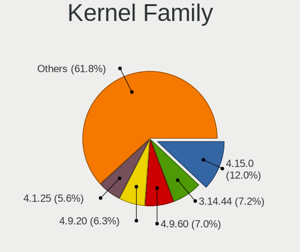
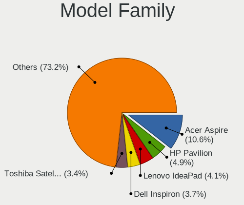
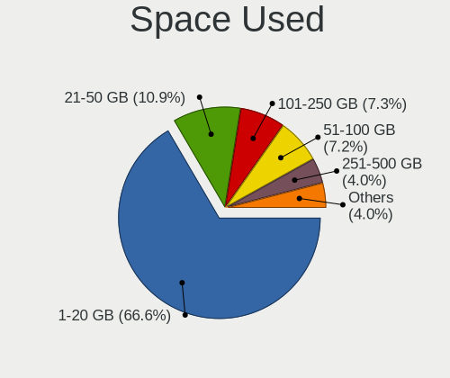
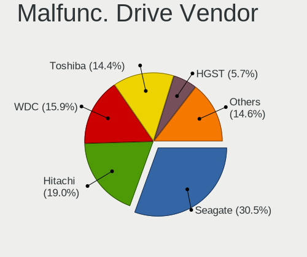
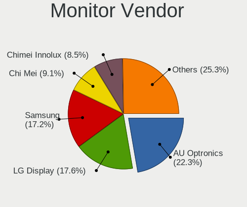
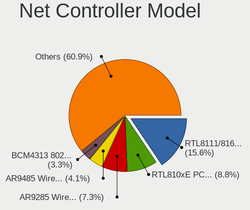
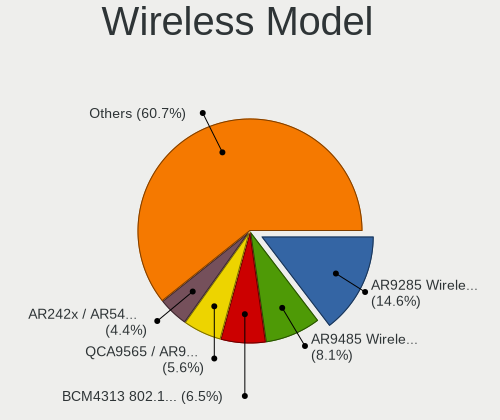

ROSA - Tested Hardware & Statistics (Notebooks)
-----------------------------------------------

A project to collect tested hardware configurations for ROSA.

Anyone can contribute to this report by the [hw-probe](https://github.com/linuxhw/hw-probe) tool:

    sudo -E hw-probe -all -upload

Please contribute! Especially if your hardware is rare.

Contents
--------

* [ Test Cases ](#test-cases)

* [ System ](#system)
  - [ OS                       ](#os)
  - [ OS Family                ](#os-family)
  - [ Kernel                   ](#kernel)
  - [ Kernel Family            ](#kernel-family)
  - [ Kernel Major Ver.        ](#kernel-major-ver)
  - [ Arch                     ](#arch)
  - [ DE                       ](#de)
  - [ Display Server           ](#display-server)
  - [ Display Manager          ](#display-manager)
  - [ OS Lang                  ](#os-lang)
  - [ Boot Mode                ](#boot-mode)
  - [ Filesystem               ](#filesystem)
  - [ Part. scheme             ](#part-scheme)
  - [ Dual Boot with Linux/BSD ](#dual-boot-with-linuxbsd)
  - [ Dual Boot (Win)          ](#dual-boot-win)

* [ Board ](#board)
  - [ Vendor                   ](#vendor)
  - [ Model                    ](#model)
  - [ Model Family             ](#model-family)
  - [ MFG Year                 ](#mfg-year)
  - [ Form Factor              ](#form-factor)
  - [ Secure Boot              ](#secure-boot)
  - [ Coreboot                 ](#coreboot)
  - [ RAM Size                 ](#ram-size)
  - [ RAM Used                 ](#ram-used)
  - [ Total Drives             ](#total-drives)
  - [ Has CD-ROM               ](#has-cd-rom)
  - [ Has Ethernet             ](#has-ethernet)
  - [ Has WiFi                 ](#has-wifi)
  - [ Has Bluetooth            ](#has-bluetooth)

* [ Location ](#location)
  - [ Country                  ](#country)
  - [ City                     ](#city)

* [ Drives ](#drives)
  - [ Drive Vendor             ](#drive-vendor)
  - [ Drive Model              ](#drive-model)
  - [ HDD Vendor               ](#hdd-vendor)
  - [ SSD Vendor               ](#ssd-vendor)
  - [ Drive Kind               ](#drive-kind)
  - [ Drive Connector          ](#drive-connector)
  - [ Drive Size               ](#drive-size)
  - [ Space Total              ](#space-total)
  - [ Space Used               ](#space-used)
  - [ Malfunc. Drives          ](#malfunc-drives)
  - [ Malfunc. Drive Vendor    ](#malfunc-drive-vendor)
  - [ Malfunc. HDD Vendor      ](#malfunc-hdd-vendor)
  - [ Malfunc. Drive Kind      ](#malfunc-drive-kind)
  - [ Failed Drives            ](#failed-drives)
  - [ Failed Drive Vendor      ](#failed-drive-vendor)
  - [ Drive Status             ](#drive-status)

* [ Storage controller ](#storage-controller)
  - [ Storage Vendor           ](#storage-vendor)
  - [ Storage Model            ](#storage-model)
  - [ Storage Kind             ](#storage-kind)

* [ Processor ](#processor)
  - [ CPU Vendor               ](#cpu-vendor)
  - [ CPU Model                ](#cpu-model)
  - [ CPU Model Family         ](#cpu-model-family)
  - [ CPU Cores                ](#cpu-cores)
  - [ CPU Sockets              ](#cpu-sockets)
  - [ CPU Threads              ](#cpu-threads)
  - [ CPU Op-Modes             ](#cpu-op-modes)
  - [ CPU Microcode            ](#cpu-microcode)
  - [ CPU Microarch            ](#cpu-microarch)

* [ Graphics ](#graphics)
  - [ GPU Vendor               ](#gpu-vendor)
  - [ GPU Model                ](#gpu-model)
  - [ GPU Combo                ](#gpu-combo)
  - [ GPU Driver               ](#gpu-driver)
  - [ GPU Memory               ](#gpu-memory)

* [ Monitor ](#monitor)
  - [ Monitor Vendor           ](#monitor-vendor)
  - [ Monitor Model            ](#monitor-model)
  - [ Monitor Resolution       ](#monitor-resolution)
  - [ Monitor Diagonal         ](#monitor-diagonal)
  - [ Monitor Width            ](#monitor-width)
  - [ Aspect Ratio             ](#aspect-ratio)
  - [ Monitor Area             ](#monitor-area)
  - [ Pixel Density            ](#pixel-density)
  - [ Multiple Monitors        ](#multiple-monitors)

* [ Network ](#network)
  - [ Net Controller Vendor    ](#net-controller-vendor)
  - [ Net Controller Model     ](#net-controller-model)
  - [ Wireless Vendor          ](#wireless-vendor)
  - [ Wireless Model           ](#wireless-model)
  - [ Ethernet Vendor          ](#ethernet-vendor)
  - [ Ethernet Model           ](#ethernet-model)
  - [ Net Controller Kind      ](#net-controller-kind)
  - [ Used Controller          ](#used-controller)
  - [ NICs                     ](#nics)
  - [ IPv6                     ](#ipv6)

* [ Bluetooth ](#bluetooth)
  - [ Bluetooth Vendor         ](#bluetooth-vendor)
  - [ Bluetooth Model          ](#bluetooth-model)

* [ Sound ](#sound)
  - [ Sound Vendor             ](#sound-vendor)
  - [ Sound Model              ](#sound-model)

* [ Memory ](#memory)
  - [ Memory Vendor            ](#memory-vendor)
  - [ Memory Model             ](#memory-model)
  - [ Memory Kind              ](#memory-kind)
  - [ Memory Form Factor       ](#memory-form-factor)
  - [ Memory Size              ](#memory-size)
  - [ Memory Speed             ](#memory-speed)

* [ Printers & scanners ](#printers--scanners)
  - [ Printer Vendor           ](#printer-vendor)
  - [ Printer Model            ](#printer-model)
  - [ Scanner Vendor           ](#scanner-vendor)
  - [ Scanner Model            ](#scanner-model)

* [ Camera ](#camera)
  - [ Camera Vendor            ](#camera-vendor)
  - [ Camera Model             ](#camera-model)

* [ Security ](#security)
  - [ Fingerprint Vendor       ](#fingerprint-vendor)
  - [ Fingerprint Model        ](#fingerprint-model)
  - [ Chipcard Vendor          ](#chipcard-vendor)
  - [ Chipcard Model           ](#chipcard-model)

* [ Unsupported ](#unsupported)
  - [ Unsupported Devices      ](#unsupported-devices)
  - [ Unsupported Device Types ](#unsupported-device-types)

Test Cases
----------

Total: 18813

| Vendor        | Model                       | Probe                                                      | Date         |
|---------------|-----------------------------|------------------------------------------------------------|--------------|
| Lenovo        | B570e HuronRiver Platfor... | [23e052db95](https://linux-hardware.org/?probe=23e052db95) | Sep 01, 2022 |
| Notebook      | W65_67SB                    | [38393a5559](https://linux-hardware.org/?probe=38393a5559) | Sep 01, 2022 |
| Lenovo        | IdeaPad 330-15AST 81D6      | [972c4cb608](https://linux-hardware.org/?probe=972c4cb608) | Sep 01, 2022 |
| ASUSTek       | VivoBook 15_ASUS Laptop ... | [57d535de2e](https://linux-hardware.org/?probe=57d535de2e) | Sep 01, 2022 |
| Lenovo        | IdeaPad 320-15IAP 80XR      | [6aba706c0c](https://linux-hardware.org/?probe=6aba706c0c) | Aug 31, 2022 |
| Lenovo        | G710 20252                  | [37b1f6e81c](https://linux-hardware.org/?probe=37b1f6e81c) | Aug 31, 2022 |
| ASUSTek       | K46CM                       | [742d7047ea](https://linux-hardware.org/?probe=742d7047ea) | Aug 31, 2022 |
| Lenovo        | IdeaPad 330-15AST 81D6      | [f3877acbd2](https://linux-hardware.org/?probe=f3877acbd2) | Aug 31, 2022 |
| ASUSTek       | VivoBook 15_ASUS Laptop ... | [9da97f5dea](https://linux-hardware.org/?probe=9da97f5dea) | Aug 30, 2022 |
| Lenovo        | Y520-15IKBN 80WK            | [8036c3df64](https://linux-hardware.org/?probe=8036c3df64) | Aug 30, 2022 |
| Dell          | G3 3579                     | [fd78a1cf65](https://linux-hardware.org/?probe=fd78a1cf65) | Aug 30, 2022 |
| Packard Be... | EasyNote LM85               | [4294f9bdaf](https://linux-hardware.org/?probe=4294f9bdaf) | Aug 30, 2022 |
| Lenovo        | IdeaPad 330-15IKB 81DE      | [339b12ba13](https://linux-hardware.org/?probe=339b12ba13) | Aug 30, 2022 |
| Lenovo        | IdeaPad 330-15AST 81D6      | [3236ef3b00](https://linux-hardware.org/?probe=3236ef3b00) | Aug 30, 2022 |
| Acer          | Aspire V3-731               | [19d7285e0f](https://linux-hardware.org/?probe=19d7285e0f) | Aug 30, 2022 |
| Google        | Rammus                      | [cd31fc11aa](https://linux-hardware.org/?probe=cd31fc11aa) | Aug 29, 2022 |
| HP            | Pavilion g6                 | [d127560ff3](https://linux-hardware.org/?probe=d127560ff3) | Aug 29, 2022 |
| Positivo B... | VJFE52F11X-B0611H           | [eedd8fa1eb](https://linux-hardware.org/?probe=eedd8fa1eb) | Aug 29, 2022 |
| ASUSTek       | X550LC                      | [3507f6f2ba](https://linux-hardware.org/?probe=3507f6f2ba) | Aug 29, 2022 |
| Dell          | Vostro 1014                 | [bf43d87a11](https://linux-hardware.org/?probe=bf43d87a11) | Aug 29, 2022 |
| HP            | Notebook                    | [e00cfcb387](https://linux-hardware.org/?probe=e00cfcb387) | Aug 29, 2022 |
| ASUSTek       | VivoBook_ASUSLaptop X350... | [bddbedffed](https://linux-hardware.org/?probe=bddbedffed) | Aug 29, 2022 |
| ASUSTek       | F3E                         | [1314dc63b6](https://linux-hardware.org/?probe=1314dc63b6) | Aug 28, 2022 |
| Samsung       | R580/R590                   | [cb30537ee4](https://linux-hardware.org/?probe=cb30537ee4) | Aug 28, 2022 |
| Acer          | Nitro AN515-42              | [a82d7c03b0](https://linux-hardware.org/?probe=a82d7c03b0) | Aug 28, 2022 |
| Lenovo        | Legion 5 Pro 16ACH6H 82J... | [6cd83991d9](https://linux-hardware.org/?probe=6cd83991d9) | Aug 28, 2022 |
| HP            | Pavilion g6                 | [709d3e19e8](https://linux-hardware.org/?probe=709d3e19e8) | Aug 28, 2022 |
| Acer          | Aspire E5-573G              | [70ea653c9c](https://linux-hardware.org/?probe=70ea653c9c) | Aug 28, 2022 |
| HP            | Laptop 15-bw0xx             | [90fa9c15ec](https://linux-hardware.org/?probe=90fa9c15ec) | Aug 27, 2022 |
| Acer          | Aspire V3-571G              | [e584bee2db](https://linux-hardware.org/?probe=e584bee2db) | Aug 27, 2022 |
| Lenovo        | V14-ADA 82C6                | [46741f4613](https://linux-hardware.org/?probe=46741f4613) | Aug 27, 2022 |
| Lenovo        | IdeaPad 330-15IGM 81D1      | [029246a642](https://linux-hardware.org/?probe=029246a642) | Aug 27, 2022 |
| ASUSTek       | VivoBook_ASUSLaptop X515... | [2267f01dee](https://linux-hardware.org/?probe=2267f01dee) | Aug 27, 2022 |
| Acer          | Nitro AN515-42              | [063eca4290](https://linux-hardware.org/?probe=063eca4290) | Aug 26, 2022 |
| Acer          | Aspire 5570Z                | [38fe74cbe3](https://linux-hardware.org/?probe=38fe74cbe3) | Aug 26, 2022 |
| Acer          | Nitro AN517-52              | [8732c0caef](https://linux-hardware.org/?probe=8732c0caef) | Aug 26, 2022 |
| ASUSTek       | K52Dr                       | [aa74e72258](https://linux-hardware.org/?probe=aa74e72258) | Aug 26, 2022 |
| Lenovo        | IdeaPad 330-15IKB 81DE      | [619be9ede9](https://linux-hardware.org/?probe=619be9ede9) | Aug 26, 2022 |
| Positivo B... | VJFE52F11X-B0611H           | [635925265e](https://linux-hardware.org/?probe=635925265e) | Aug 25, 2022 |
| Unknown       | Unknown                     | [b9616ab32f](https://linux-hardware.org/?probe=b9616ab32f) | Aug 25, 2022 |
| Acer          | AO533                       | [5150a8b326](https://linux-hardware.org/?probe=5150a8b326) | Aug 25, 2022 |
| HP            | Pavilion 17                 | [e252f6b16e](https://linux-hardware.org/?probe=e252f6b16e) | Aug 25, 2022 |
| 3Logic Gro... | APM Graviton                | [03fd96a27c](https://linux-hardware.org/?probe=03fd96a27c) | Aug 24, 2022 |
| HP            | Compaq 610                  | [538b6ae6f8](https://linux-hardware.org/?probe=538b6ae6f8) | Aug 24, 2022 |
| HP            | Pavilion g6                 | [4c027aa104](https://linux-hardware.org/?probe=4c027aa104) | Aug 24, 2022 |
| Samsung       | NC210/NC110                 | [8063d3ecff](https://linux-hardware.org/?probe=8063d3ecff) | Aug 24, 2022 |
| Lenovo        | IdeaPad Gaming 3 15IMH05... | [37c239f9d1](https://linux-hardware.org/?probe=37c239f9d1) | Aug 24, 2022 |
| HP            | Pavilion g6                 | [96672b6762](https://linux-hardware.org/?probe=96672b6762) | Aug 24, 2022 |
| HP            | Laptop 15s-fq2xxx           | [3c37e04cf3](https://linux-hardware.org/?probe=3c37e04cf3) | Aug 24, 2022 |
| HUAWEI        | KLVD-WXX9                   | [b5dea99797](https://linux-hardware.org/?probe=b5dea99797) | Aug 24, 2022 |
| HP            | Compaq Presario CQ50        | [ca5e35f5fd](https://linux-hardware.org/?probe=ca5e35f5fd) | Aug 24, 2022 |
| Lenovo        | Legion Y740-17IRHg 81UJ     | [b8859a4f21](https://linux-hardware.org/?probe=b8859a4f21) | Aug 23, 2022 |
| Lenovo        | Legion Y740-17IRHg 81UJ     | [ce734a061a](https://linux-hardware.org/?probe=ce734a061a) | Aug 23, 2022 |
| Unknown       | Unknown                     | [40c763302e](https://linux-hardware.org/?probe=40c763302e) | Aug 22, 2022 |
| ASUSTek       | K55DR                       | [3620d3d416](https://linux-hardware.org/?probe=3620d3d416) | Aug 21, 2022 |
| Lenovo        | IdeaPad Gaming 3 15IMH05... | [0d73b91195](https://linux-hardware.org/?probe=0d73b91195) | Aug 21, 2022 |
| HP            | Pavilion g6                 | [7e345d980f](https://linux-hardware.org/?probe=7e345d980f) | Aug 21, 2022 |
| Samsung       | 700Z3A/700Z4A/700Z5A/700... | [8756581baa](https://linux-hardware.org/?probe=8756581baa) | Aug 21, 2022 |
| Acer          | Aspire E1-572G              | [d3d75b83d2](https://linux-hardware.org/?probe=d3d75b83d2) | Aug 21, 2022 |
| HP            | Pavilion m6                 | [54fcf9b1b4](https://linux-hardware.org/?probe=54fcf9b1b4) | Aug 21, 2022 |
| Lenovo        | Z710 20250                  | [8c7e567f41](https://linux-hardware.org/?probe=8c7e567f41) | Aug 21, 2022 |
| Lenovo        | IdeaPad 320-15IKB 80XL      | [8ab10bdcff](https://linux-hardware.org/?probe=8ab10bdcff) | Aug 21, 2022 |
| HP            | 255 G7 Notebook PC          | [c001653a5a](https://linux-hardware.org/?probe=c001653a5a) | Aug 20, 2022 |
| Acer          | Aspire A315-23              | [cedbeec8c7](https://linux-hardware.org/?probe=cedbeec8c7) | Aug 20, 2022 |
| Lenovo        | IdeaPad Gaming 3 15IMH05... | [0008792e11](https://linux-hardware.org/?probe=0008792e11) | Aug 19, 2022 |
| Haier         | GG1560XT                    | [6498de51c5](https://linux-hardware.org/?probe=6498de51c5) | Aug 19, 2022 |
| Haier         | GG1560XT                    | [1918cb9aa0](https://linux-hardware.org/?probe=1918cb9aa0) | Aug 19, 2022 |
| ASUSTek       | VivoBook_ASUSLaptop M350... | [8fd948229f](https://linux-hardware.org/?probe=8fd948229f) | Aug 19, 2022 |
| Acer          | Nitro AN517-52              | [8a1b401faa](https://linux-hardware.org/?probe=8a1b401faa) | Aug 19, 2022 |
| Samsung       | RV411/RV511/E3511/S3511/... | [b1602685e4](https://linux-hardware.org/?probe=b1602685e4) | Aug 19, 2022 |
| eMachines     | E525                        | [90d5ce71fa](https://linux-hardware.org/?probe=90d5ce71fa) | Aug 19, 2022 |
| Acer          | TravelMate B118-M           | [e35887bbe0](https://linux-hardware.org/?probe=e35887bbe0) | Aug 18, 2022 |
| HP            | Compaq 610                  | [2b90520f8f](https://linux-hardware.org/?probe=2b90520f8f) | Aug 18, 2022 |
| Lenovo        | ACLUAB                      | [3dcd5fa41c](https://linux-hardware.org/?probe=3dcd5fa41c) | Aug 18, 2022 |
| ASUSTek       | X551MA                      | [7baf2d8841](https://linux-hardware.org/?probe=7baf2d8841) | Aug 18, 2022 |
| Lenovo        | B590 20206                  | [d2d8a01f80](https://linux-hardware.org/?probe=d2d8a01f80) | Aug 18, 2022 |
| HP            | ProBook 440 G4              | [7bdaf1eeed](https://linux-hardware.org/?probe=7bdaf1eeed) | Aug 18, 2022 |
| HUAWEI        | NBD-WXX9                    | [fa32705b39](https://linux-hardware.org/?probe=fa32705b39) | Aug 18, 2022 |
| Lenovo        | IdeaPad 320-15IAP 80XR      | [7e5604ed7a](https://linux-hardware.org/?probe=7e5604ed7a) | Aug 17, 2022 |
| Lenovo        | ThinkPad T440p 20AWS0VB0... | [0c8e0377e6](https://linux-hardware.org/?probe=0c8e0377e6) | Aug 17, 2022 |
| Apple         | MacBookAir7,2               | [1bbad39284](https://linux-hardware.org/?probe=1bbad39284) | Aug 17, 2022 |
| Lenovo        | G505 20240                  | [fa8889478b](https://linux-hardware.org/?probe=fa8889478b) | Aug 17, 2022 |
| ASUSTek       | VivoBook 15_ASUS Laptop ... | [3f685da542](https://linux-hardware.org/?probe=3f685da542) | Aug 17, 2022 |
| Lenovo        | Legion 5 15IMH05H 81Y6      | [5ddc6fd9fe](https://linux-hardware.org/?probe=5ddc6fd9fe) | Aug 16, 2022 |
| Acer          | AOD260                      | [f9256627d2](https://linux-hardware.org/?probe=f9256627d2) | Aug 16, 2022 |
| ASUSTek       | VivoBook_ASUSLaptop M350... | [8057f74fa1](https://linux-hardware.org/?probe=8057f74fa1) | Aug 16, 2022 |
| Pegatron      | A17                         | [18101d1b69](https://linux-hardware.org/?probe=18101d1b69) | Aug 16, 2022 |
| Pegatron      | A17                         | [a845e63b56](https://linux-hardware.org/?probe=a845e63b56) | Aug 16, 2022 |
| Sony          | VPCSB1V9R                   | [6c72559c96](https://linux-hardware.org/?probe=6c72559c96) | Aug 16, 2022 |
| Lenovo        | B570e HuronRiver Platfor... | [51cb006bb3](https://linux-hardware.org/?probe=51cb006bb3) | Aug 16, 2022 |
| Sony          | VPCSB1V9R                   | [6aee1e8e96](https://linux-hardware.org/?probe=6aee1e8e96) | Aug 15, 2022 |
| Acer          | AOD260                      | [ba32775bba](https://linux-hardware.org/?probe=ba32775bba) | Aug 15, 2022 |
| Lenovo        | IdeaPad 320-15IKB 80XL      | [44af3a6839](https://linux-hardware.org/?probe=44af3a6839) | Aug 15, 2022 |
| Lenovo        | ThinkPad X220 4291B66       | [4e32cfa8bb](https://linux-hardware.org/?probe=4e32cfa8bb) | Aug 15, 2022 |
| Positivo B... | VJFE52F11X-B0611H           | [3a6b82f27f](https://linux-hardware.org/?probe=3a6b82f27f) | Aug 15, 2022 |
| Lenovo        | Legion 5 17IMH05H 81Y8      | [f2e01b5017](https://linux-hardware.org/?probe=f2e01b5017) | Aug 14, 2022 |
| Acer          | Nitro AN515-43              | [a7d615e104](https://linux-hardware.org/?probe=a7d615e104) | Aug 14, 2022 |
| HP            | 550                         | [620939b295](https://linux-hardware.org/?probe=620939b295) | Aug 14, 2022 |
| Dell          | Inspiron 3537               | [bcd6162709](https://linux-hardware.org/?probe=bcd6162709) | Aug 14, 2022 |
| ASUSTek       | 1215N                       | [40d99f3703](https://linux-hardware.org/?probe=40d99f3703) | Aug 14, 2022 |
| ASUSTek       | X550DP                      | [ce42b65252](https://linux-hardware.org/?probe=ce42b65252) | Aug 13, 2022 |
| Dell          | Vostro 15 3515              | [442f64dba9](https://linux-hardware.org/?probe=442f64dba9) | Aug 13, 2022 |
| Lenovo        | IdeaPad Gaming 3 15ARH05... | [4602665059](https://linux-hardware.org/?probe=4602665059) | Aug 13, 2022 |
| Dell          | Inspiron 7720               | [0435e973e0](https://linux-hardware.org/?probe=0435e973e0) | Aug 13, 2022 |
| Dell          | Precision M6600             | [7fcd14ca35](https://linux-hardware.org/?probe=7fcd14ca35) | Aug 13, 2022 |
| ASUSTek       | K501LB                      | [1e1745d32c](https://linux-hardware.org/?probe=1e1745d32c) | Aug 12, 2022 |
| ASUSTek       | K501LB                      | [a763c682f5](https://linux-hardware.org/?probe=a763c682f5) | Aug 12, 2022 |
| Acer          | Extensa 215-32              | [1a14e5a16b](https://linux-hardware.org/?probe=1a14e5a16b) | Aug 12, 2022 |
| Lenovo        | ThinkPad SL500 2746AA3      | [c4535a80a1](https://linux-hardware.org/?probe=c4535a80a1) | Aug 12, 2022 |
| ASUSTek       | K52Dr                       | [df4d29153d](https://linux-hardware.org/?probe=df4d29153d) | Aug 12, 2022 |
| HP            | 240 G8 Notebook PC          | [65080f426a](https://linux-hardware.org/?probe=65080f426a) | Aug 12, 2022 |
| Lenovo        | IdeaPad S340-14API 81NB     | [27e9575d4e](https://linux-hardware.org/?probe=27e9575d4e) | Aug 11, 2022 |
| Lenovo        | IdeaPad S340-14API 81NB     | [95349038bf](https://linux-hardware.org/?probe=95349038bf) | Aug 11, 2022 |
| ASUSTek       | F5N                         | [27348ad31d](https://linux-hardware.org/?probe=27348ad31d) | Aug 11, 2022 |
| Acer          | Unknown                     | [da56362a7e](https://linux-hardware.org/?probe=da56362a7e) | Aug 11, 2022 |
| MSI           | FX610                       | [60d49d467b](https://linux-hardware.org/?probe=60d49d467b) | Aug 11, 2022 |
| Dell          | Vostro 3460                 | [fbaf8208cb](https://linux-hardware.org/?probe=fbaf8208cb) | Aug 11, 2022 |
| eMachines     | eME728                      | [951d4614b6](https://linux-hardware.org/?probe=951d4614b6) | Aug 11, 2022 |
| Acer          | Aspire 5730                 | [34e252c0e0](https://linux-hardware.org/?probe=34e252c0e0) | Aug 11, 2022 |
| Acer          | AOHAPPY2                    | [dbed059d31](https://linux-hardware.org/?probe=dbed059d31) | Aug 10, 2022 |
| Acer          | Extensa 2519                | [674500aced](https://linux-hardware.org/?probe=674500aced) | Aug 10, 2022 |
| Lenovo        | IdeaPad Gaming 3 15ACH6 ... | [4f4d3ac481](https://linux-hardware.org/?probe=4f4d3ac481) | Aug 10, 2022 |
| HP            | 255 G4                      | [44b5858d14](https://linux-hardware.org/?probe=44b5858d14) | Aug 10, 2022 |
| HP            | Compaq Presario CQ60        | [20f30b16e5](https://linux-hardware.org/?probe=20f30b16e5) | Aug 09, 2022 |
| Haier         | GG1560XT                    | [5b42159441](https://linux-hardware.org/?probe=5b42159441) | Aug 09, 2022 |
| ASUSTek       | ASUS TUF Gaming A15 FA50... | [d37a512899](https://linux-hardware.org/?probe=d37a512899) | Aug 09, 2022 |
| Dell          | XPS 15 9550                 | [abf6de9a2d](https://linux-hardware.org/?probe=abf6de9a2d) | Aug 09, 2022 |
| Lenovo        | ThinkPad X220 4291B66       | [e3362a3a9f](https://linux-hardware.org/?probe=e3362a3a9f) | Aug 09, 2022 |
| Acer          | Aspire ES1-522              | [bcde4c3494](https://linux-hardware.org/?probe=bcde4c3494) | Aug 08, 2022 |
| Lenovo        | ThinkPad 13 2nd Gen 20J1... | [06d7313a34](https://linux-hardware.org/?probe=06d7313a34) | Aug 08, 2022 |
| ASUSTek       | TUF Gaming FX505DY_FX505... | [c11322ce1e](https://linux-hardware.org/?probe=c11322ce1e) | Aug 08, 2022 |
| Lenovo        | G70-80 80FF                 | [495516e19d](https://linux-hardware.org/?probe=495516e19d) | Aug 08, 2022 |
| ASUSTek       | X101CH                      | [07505fcd44](https://linux-hardware.org/?probe=07505fcd44) | Aug 07, 2022 |
| Lenovo        | B570e HuronRiver Platfor... | [091037a7fb](https://linux-hardware.org/?probe=091037a7fb) | Aug 07, 2022 |
| Acer          | Swift SF114-34              | [12de778ffd](https://linux-hardware.org/?probe=12de778ffd) | Aug 07, 2022 |
| ASUSTek       | F5N                         | [82b1172101](https://linux-hardware.org/?probe=82b1172101) | Aug 06, 2022 |
| eMachines     | eME728                      | [4000a32585](https://linux-hardware.org/?probe=4000a32585) | Aug 06, 2022 |
| Lenovo        | IdeaPad Y580 20132          | [f801b501ae](https://linux-hardware.org/?probe=f801b501ae) | Aug 06, 2022 |
| Lenovo        | G50-80 80L0                 | [eb58813044](https://linux-hardware.org/?probe=eb58813044) | Aug 06, 2022 |
| Lenovo        | IdeaPad S145-15API 81UT     | [36d7a0a9bd](https://linux-hardware.org/?probe=36d7a0a9bd) | Aug 05, 2022 |
| Dell          | Latitude E5550              | [cecf472493](https://linux-hardware.org/?probe=cecf472493) | Aug 05, 2022 |
| Acer          | Extensa 2509                | [5093176e6c](https://linux-hardware.org/?probe=5093176e6c) | Aug 05, 2022 |
| Acer          | Extensa 5220                | [d9bdf6e628](https://linux-hardware.org/?probe=d9bdf6e628) | Aug 05, 2022 |
| Lenovo        | IdeaPad S20-30              | [f845cb2e0e](https://linux-hardware.org/?probe=f845cb2e0e) | Aug 04, 2022 |
| Samsung       | R528/R728                   | [8681847134](https://linux-hardware.org/?probe=8681847134) | Aug 04, 2022 |
| Pegatron      | A17                         | [15db0a3ade](https://linux-hardware.org/?probe=15db0a3ade) | Aug 04, 2022 |
| ASUSTek       | X541UV                      | [feb8312a2c](https://linux-hardware.org/?probe=feb8312a2c) | Aug 04, 2022 |
| Lenovo        | B550 20053                  | [e42ac0b420](https://linux-hardware.org/?probe=e42ac0b420) | Aug 03, 2022 |
| eMachines     | E725                        | [12668c1e21](https://linux-hardware.org/?probe=12668c1e21) | Aug 03, 2022 |
| ASUSTek       | N56VV                       | [cc6eac0001](https://linux-hardware.org/?probe=cc6eac0001) | Aug 03, 2022 |
| eMachines     | E725                        | [3d751e0afa](https://linux-hardware.org/?probe=3d751e0afa) | Aug 03, 2022 |
| HP            | Pavilion dv7                | [895d651847](https://linux-hardware.org/?probe=895d651847) | Aug 02, 2022 |
| ASUSTek       | X550LC                      | [e430c69fbc](https://linux-hardware.org/?probe=e430c69fbc) | Aug 02, 2022 |
| ASUSTek       | X301A1                      | [60d9f2bc4d](https://linux-hardware.org/?probe=60d9f2bc4d) | Aug 02, 2022 |
| Acer          | Aspire A315-42              | [7d8e339d92](https://linux-hardware.org/?probe=7d8e339d92) | Aug 02, 2022 |
| Lenovo        | ThinkPad Edge E545 20B2A... | [51fe5d6f47](https://linux-hardware.org/?probe=51fe5d6f47) | Aug 02, 2022 |
| BBEN          | MN9                         | [d6ce556349](https://linux-hardware.org/?probe=d6ce556349) | Aug 02, 2022 |
| HP            | Pavilion dv6                | [28cf5336ab](https://linux-hardware.org/?probe=28cf5336ab) | Aug 02, 2022 |
| Dell          | Latitude 3490               | [3cd8f6d390](https://linux-hardware.org/?probe=3cd8f6d390) | Aug 02, 2022 |
| Lenovo        | B560                        | [010fb7ada1](https://linux-hardware.org/?probe=010fb7ada1) | Aug 01, 2022 |
| Shenzhen B... | XN1A                        | [6b1dd20a55](https://linux-hardware.org/?probe=6b1dd20a55) | Aug 01, 2022 |
| Samsung       | R530/R730/R540              | [73f8fb9528](https://linux-hardware.org/?probe=73f8fb9528) | Aug 01, 2022 |
| ASUSTek       | K501LB                      | [462af39f9d](https://linux-hardware.org/?probe=462af39f9d) | Aug 01, 2022 |
| ASUSTek       | 1011PX                      | [c95aa572a4](https://linux-hardware.org/?probe=c95aa572a4) | Aug 01, 2022 |
| Acer          | Aspire 5830TG               | [7eb001e6b4](https://linux-hardware.org/?probe=7eb001e6b4) | Jul 31, 2022 |
| Aquarius      | Pro, Std, Elt Series        | [3f08a29e9a](https://linux-hardware.org/?probe=3f08a29e9a) | Jul 31, 2022 |
| Timi          | Mi Laptop Pro 15 2020       | [d27e88a924](https://linux-hardware.org/?probe=d27e88a924) | Jul 31, 2022 |
| ASUSTek       | X550LC                      | [841508c072](https://linux-hardware.org/?probe=841508c072) | Jul 31, 2022 |
| Lenovo        | G580 20157                  | [a2270894c7](https://linux-hardware.org/?probe=a2270894c7) | Jul 31, 2022 |
| Acer          | Aspire 5730                 | [1541bd94e2](https://linux-hardware.org/?probe=1541bd94e2) | Jul 31, 2022 |
| MSI           | GL65 Leopard 10SCSR         | [2cbf6d3aae](https://linux-hardware.org/?probe=2cbf6d3aae) | Jul 31, 2022 |
| Acer          | Aspire 3610                 | [d56c48ade2](https://linux-hardware.org/?probe=d56c48ade2) | Jul 31, 2022 |
| Acer          | Unknown                     | [99992e8b67](https://linux-hardware.org/?probe=99992e8b67) | Jul 30, 2022 |
| Sony          | VPCEH2E1R                   | [24d621e667](https://linux-hardware.org/?probe=24d621e667) | Jul 30, 2022 |
| HP            | Laptop 15-db1xxx            | [dcbb6ec79b](https://linux-hardware.org/?probe=dcbb6ec79b) | Jul 30, 2022 |
| HP            | OMEN by Laptop 16-c0xxx     | [8ad22205d4](https://linux-hardware.org/?probe=8ad22205d4) | Jul 30, 2022 |
| Acer          | Aspire 5730                 | [8ac8b8a87a](https://linux-hardware.org/?probe=8ac8b8a87a) | Jul 30, 2022 |
| HP            | Pavilion g6                 | [ea628a71ee](https://linux-hardware.org/?probe=ea628a71ee) | Jul 29, 2022 |
| Acer          | Swift SF314-52              | [e9f0b2fcb7](https://linux-hardware.org/?probe=e9f0b2fcb7) | Jul 29, 2022 |
| ASUSTek       | P50IJ                       | [b11ce03a3b](https://linux-hardware.org/?probe=b11ce03a3b) | Jul 29, 2022 |
| Kraftway      | ACCORD                      | [1d694d32ba](https://linux-hardware.org/?probe=1d694d32ba) | Jul 29, 2022 |
| MSI           | FX610                       | [9e545d6a24](https://linux-hardware.org/?probe=9e545d6a24) | Jul 29, 2022 |
| Packard Be... | EasyNote LJ75               | [a883180728](https://linux-hardware.org/?probe=a883180728) | Jul 29, 2022 |
| HP            | Pavilion dv7                | [b22a2df288](https://linux-hardware.org/?probe=b22a2df288) | Jul 29, 2022 |
| HP            | Pavilion dv7                | [f7daa0e3e3](https://linux-hardware.org/?probe=f7daa0e3e3) | Jul 29, 2022 |
| HP            | Pavilion dv7                | [649a117385](https://linux-hardware.org/?probe=649a117385) | Jul 28, 2022 |
| Lenovo        | V14-IIL 82C4                | [9be688b59e](https://linux-hardware.org/?probe=9be688b59e) | Jul 28, 2022 |
| ASUSTek       | VivoBook 15_ASUS Laptop ... | [4947baccf9](https://linux-hardware.org/?probe=4947baccf9) | Jul 28, 2022 |
| Sony          | VGN-TT31MR_N                | [b1a4f2a68c](https://linux-hardware.org/?probe=b1a4f2a68c) | Jul 27, 2022 |
| Acer          | Aspire 5741G                | [bb63a4917e](https://linux-hardware.org/?probe=bb63a4917e) | Jul 27, 2022 |
| ASUSTek       | X55A                        | [61d57c4e59](https://linux-hardware.org/?probe=61d57c4e59) | Jul 26, 2022 |
| Toshiba       | Satellite L750D             | [c8e9ea3fdd](https://linux-hardware.org/?probe=c8e9ea3fdd) | Jul 26, 2022 |
| Acer          | Iconia W700                 | [694887391c](https://linux-hardware.org/?probe=694887391c) | Jul 26, 2022 |
| ASUSTek       | X550LC                      | [e38c3e6cb5](https://linux-hardware.org/?probe=e38c3e6cb5) | Jul 26, 2022 |
| Acer          | Aspire 4720Z                | [0233e1c451](https://linux-hardware.org/?probe=0233e1c451) | Jul 26, 2022 |
| HP            | ENVY dv6                    | [7f8e688cc4](https://linux-hardware.org/?probe=7f8e688cc4) | Jul 26, 2022 |
| Acer          | TravelMate 5744Z            | [aa1416d2e3](https://linux-hardware.org/?probe=aa1416d2e3) | Jul 26, 2022 |
| Lenovo        | LegionY540-17IRH-PG0 81T... | [22ded313b5](https://linux-hardware.org/?probe=22ded313b5) | Jul 25, 2022 |
| HP            | ENVY dv6                    | [97d752c934](https://linux-hardware.org/?probe=97d752c934) | Jul 25, 2022 |
| Acer          | Aspire A315-51              | [b9d14045a3](https://linux-hardware.org/?probe=b9d14045a3) | Jul 25, 2022 |
| Acer          | Aspire E5-551G              | [8c94f9bae3](https://linux-hardware.org/?probe=8c94f9bae3) | Jul 25, 2022 |
| Lenovo        | Y520-15IKBN 80WK            | [80334990e7](https://linux-hardware.org/?probe=80334990e7) | Jul 25, 2022 |
| ASUSTek       | T200TAC                     | [a8314ae281](https://linux-hardware.org/?probe=a8314ae281) | Jul 24, 2022 |
| HP            | Pavilion dv6                | [0a3ef4b5dd](https://linux-hardware.org/?probe=0a3ef4b5dd) | Jul 24, 2022 |
| ASUSTek       | S300CA                      | [08b3fe2c70](https://linux-hardware.org/?probe=08b3fe2c70) | Jul 24, 2022 |
| ASUSTek       | K53SJ                       | [d8eb4baf45](https://linux-hardware.org/?probe=d8eb4baf45) | Jul 24, 2022 |
| ASUSTek       | K53SJ                       | [5d5189c2d1](https://linux-hardware.org/?probe=5d5189c2d1) | Jul 24, 2022 |
| Lenovo        | B590 20208                  | [35decc70d1](https://linux-hardware.org/?probe=35decc70d1) | Jul 23, 2022 |
| Timi          | TM1701                      | [387e7a36d8](https://linux-hardware.org/?probe=387e7a36d8) | Jul 23, 2022 |
| Lenovo        | IdeaPad 3 15IML05 81WB      | [3181f43aef](https://linux-hardware.org/?probe=3181f43aef) | Jul 23, 2022 |
| Lenovo        | G710 20252                  | [87b375d9cf](https://linux-hardware.org/?probe=87b375d9cf) | Jul 22, 2022 |
| HP            | ProBook 4540s               | [d70dbfeecb](https://linux-hardware.org/?probe=d70dbfeecb) | Jul 22, 2022 |
| ASUSTek       | 1215N                       | [5ef0576222](https://linux-hardware.org/?probe=5ef0576222) | Jul 22, 2022 |
| ASUSTek       | ROG Zephyrus M16 GU603HE... | [dd0034072b](https://linux-hardware.org/?probe=dd0034072b) | Jul 22, 2022 |
| Dell          | XPS 15 9550                 | [b4691ae23b](https://linux-hardware.org/?probe=b4691ae23b) | Jul 22, 2022 |
| ASUSTek       | F5N                         | [5dc4f489d9](https://linux-hardware.org/?probe=5dc4f489d9) | Jul 22, 2022 |
| Dell          | Inspiron MM061              | [8e0cd55a28](https://linux-hardware.org/?probe=8e0cd55a28) | Jul 22, 2022 |
| ASUSTek       | 1005HA                      | [5fca7b8752](https://linux-hardware.org/?probe=5fca7b8752) | Jul 21, 2022 |
| Lenovo        | IdeaPad Yoga 13 20175       | [b7d05f361c](https://linux-hardware.org/?probe=b7d05f361c) | Jul 21, 2022 |
| HP            | Pavilion dv7                | [8975495225](https://linux-hardware.org/?probe=8975495225) | Jul 21, 2022 |
| Lenovo        | ThinkPad T480s 20L7001PA... | [de71ab8780](https://linux-hardware.org/?probe=de71ab8780) | Jul 21, 2022 |
| Lenovo        | IdeaPad S340-15IML 81NA     | [bff95aa218](https://linux-hardware.org/?probe=bff95aa218) | Jul 21, 2022 |
| Samsung       | 350V5C/351V5C/3540VC/344... | [81020ca308](https://linux-hardware.org/?probe=81020ca308) | Jul 21, 2022 |
| ASUSTek       | ASUSPRO P1440FAC_P1440FA    | [914c4b3782](https://linux-hardware.org/?probe=914c4b3782) | Jul 21, 2022 |
| Lenovo        | ThinkPad T60 1953D9U        | [1c31cb6b44](https://linux-hardware.org/?probe=1c31cb6b44) | Jul 21, 2022 |
| Dell          | Inspiron N5110              | [30a3da64bf](https://linux-hardware.org/?probe=30a3da64bf) | Jul 20, 2022 |
| Dell          | Latitude 3500               | [9f3c591e61](https://linux-hardware.org/?probe=9f3c591e61) | Jul 20, 2022 |
| Acer          | Acadia V1.45                | [73f544e6cb](https://linux-hardware.org/?probe=73f544e6cb) | Jul 20, 2022 |
| ASUSTek       | 1011PX                      | [fd9099b538](https://linux-hardware.org/?probe=fd9099b538) | Jul 20, 2022 |
| Lenovo        | ThinkBook 15 G3 ACL 21A4    | [1c39715e4d](https://linux-hardware.org/?probe=1c39715e4d) | Jul 20, 2022 |
| Lenovo        | ThinkBook 15 G3 ACL 21A4    | [a85dfe6cdd](https://linux-hardware.org/?probe=a85dfe6cdd) | Jul 20, 2022 |
| Fujitsu Si... | AMILO Pi 3540               | [47c0c1f4eb](https://linux-hardware.org/?probe=47c0c1f4eb) | Jul 19, 2022 |
| ASUSTek       | TUF Gaming FX504GE_FX80G... | [4e1321f550](https://linux-hardware.org/?probe=4e1321f550) | Jul 19, 2022 |
| Fujitsu Si... | AMILO Pi 3540               | [4efd4113d7](https://linux-hardware.org/?probe=4efd4113d7) | Jul 19, 2022 |
| Lenovo        | IdeaPad S145-15IGM 81MX     | [6dbaa4c42a](https://linux-hardware.org/?probe=6dbaa4c42a) | Jul 19, 2022 |
| Acer          | Aspire 5730                 | [27c09757d3](https://linux-hardware.org/?probe=27c09757d3) | Jul 19, 2022 |
| Lenovo        | B590 20206                  | [bdd7a06914](https://linux-hardware.org/?probe=bdd7a06914) | Jul 18, 2022 |
| Toshiba       | Satellite C55-B             | [70c17c522d](https://linux-hardware.org/?probe=70c17c522d) | Jul 18, 2022 |
| Packard Be... | EasyNote TJ71               | [9a533d59ac](https://linux-hardware.org/?probe=9a533d59ac) | Jul 18, 2022 |
| HP            | Notebook                    | [d917f9c8a4](https://linux-hardware.org/?probe=d917f9c8a4) | Jul 18, 2022 |
| Dell          | Vostro 3500                 | [a0599c411c](https://linux-hardware.org/?probe=a0599c411c) | Jul 18, 2022 |
| Acer          | Aspire 5715Z                | [ee2710b5c5](https://linux-hardware.org/?probe=ee2710b5c5) | Jul 17, 2022 |
| Irbis         | NB660                       | [ca5b5a40a8](https://linux-hardware.org/?probe=ca5b5a40a8) | Jul 17, 2022 |
| HP            | Laptop 15-bw0xx             | [9acefdf3c8](https://linux-hardware.org/?probe=9acefdf3c8) | Jul 17, 2022 |
| ASUSTek       | X55VD                       | [7748a75672](https://linux-hardware.org/?probe=7748a75672) | Jul 17, 2022 |
| ASUSTek       | K501LB                      | [6089dc323f](https://linux-hardware.org/?probe=6089dc323f) | Jul 17, 2022 |
| Lenovo        | G580 20157                  | [20e895d9f0](https://linux-hardware.org/?probe=20e895d9f0) | Jul 17, 2022 |
| Lenovo        | B590 20206                  | [e072d299e3](https://linux-hardware.org/?probe=e072d299e3) | Jul 16, 2022 |
| 3Logic Gro... | APM Graviton A15i-K2        | [01bb777843](https://linux-hardware.org/?probe=01bb777843) | Jul 16, 2022 |
| eMachines     | E525                        | [da97665159](https://linux-hardware.org/?probe=da97665159) | Jul 16, 2022 |
| HP            | Pavilion g6                 | [3549fb92f1](https://linux-hardware.org/?probe=3549fb92f1) | Jul 15, 2022 |
| ASUSTek       | X550LC                      | [5ff99910a2](https://linux-hardware.org/?probe=5ff99910a2) | Jul 15, 2022 |
| Fujitsu       | AMILO Pi 3560               | [aed2d10046](https://linux-hardware.org/?probe=aed2d10046) | Jul 15, 2022 |
| Acer          | Aspire A315-51              | [0ececc803e](https://linux-hardware.org/?probe=0ececc803e) | Jul 15, 2022 |
| Acer          | Aspire ES1-524              | [686edf54b2](https://linux-hardware.org/?probe=686edf54b2) | Jul 15, 2022 |
| Packard Be... | EasyNote TJ71               | [b8e077b663](https://linux-hardware.org/?probe=b8e077b663) | Jul 15, 2022 |
| Acer          | Iconia W700                 | [f290f68268](https://linux-hardware.org/?probe=f290f68268) | Jul 14, 2022 |
| Dell          | 500                         | [9c1b1d5349](https://linux-hardware.org/?probe=9c1b1d5349) | Jul 14, 2022 |
| ASUSTek       | K43SJ                       | [41d331904e](https://linux-hardware.org/?probe=41d331904e) | Jul 14, 2022 |
| ASUSTek       | X553MA                      | [b78b735f01](https://linux-hardware.org/?probe=b78b735f01) | Jul 14, 2022 |
| Toshiba       | Satellite C660              | [fa23f41617](https://linux-hardware.org/?probe=fa23f41617) | Jul 13, 2022 |
| Lenovo        | IdeaPad 330S-14IKB 81F4     | [cf23beb6c1](https://linux-hardware.org/?probe=cf23beb6c1) | Jul 13, 2022 |
| ASUSTek       | X550LC                      | [059c605792](https://linux-hardware.org/?probe=059c605792) | Jul 13, 2022 |
| Lenovo        | Legion Y540-17IRH 81UJ      | [eb06d804a9](https://linux-hardware.org/?probe=eb06d804a9) | Jul 13, 2022 |
| HP            | Pavilion Laptop 15-eg0xx... | [c81bc160f7](https://linux-hardware.org/?probe=c81bc160f7) | Jul 13, 2022 |
| ASUSTek       | K43SJ                       | [26529ab8e3](https://linux-hardware.org/?probe=26529ab8e3) | Jul 12, 2022 |
| Lenovo        | Y50-70 Touch 20349          | [19209d1119](https://linux-hardware.org/?probe=19209d1119) | Jul 12, 2022 |
| Lenovo        | IdeaPad 3 15ADA6 82KR       | [8604a047fc](https://linux-hardware.org/?probe=8604a047fc) | Jul 12, 2022 |
| Lenovo        | Legion 5 15IMH05H 81Y6      | [7af17249cf](https://linux-hardware.org/?probe=7af17249cf) | Jul 11, 2022 |
| Lenovo        | 3000 G430 4153/200          | [b262119cef](https://linux-hardware.org/?probe=b262119cef) | Jul 11, 2022 |
| ASUSTek       | K501LB                      | [bb760c59ed](https://linux-hardware.org/?probe=bb760c59ed) | Jul 11, 2022 |
| HP            | Laptop 15-db1xxx            | [5c94e19aab](https://linux-hardware.org/?probe=5c94e19aab) | Jul 11, 2022 |
| HP            | Laptop 15-db1xxx            | [f843bd9b84](https://linux-hardware.org/?probe=f843bd9b84) | Jul 11, 2022 |
| Irbis         | NB20                        | [8dc53febc0](https://linux-hardware.org/?probe=8dc53febc0) | Jul 11, 2022 |
| ASUSTek       | X51RL                       | [3da6910e57](https://linux-hardware.org/?probe=3da6910e57) | Jul 10, 2022 |
| ASUSTek       | N750JK                      | [efede6fbcd](https://linux-hardware.org/?probe=efede6fbcd) | Jul 10, 2022 |
| Lenovo        | ThinkPad L390 20NR0013RK    | [57447f37e2](https://linux-hardware.org/?probe=57447f37e2) | Jul 10, 2022 |
| Dell          | Precision M4800             | [d28fa75d0e](https://linux-hardware.org/?probe=d28fa75d0e) | Jul 10, 2022 |
| HP            | Pavilion g6                 | [19081f813f](https://linux-hardware.org/?probe=19081f813f) | Jul 10, 2022 |
| Lenovo        | E31-70 80KX                 | [ba73d295c1](https://linux-hardware.org/?probe=ba73d295c1) | Jul 10, 2022 |
| Acer          | Extensa 2509                | [b6374137c9](https://linux-hardware.org/?probe=b6374137c9) | Jul 09, 2022 |
| Dell          | Inspiron N5110              | [8c9cb805af](https://linux-hardware.org/?probe=8c9cb805af) | Jul 09, 2022 |
| Samsung       | QX310/QX410/QX510/SF310/... | [318bcea56d](https://linux-hardware.org/?probe=318bcea56d) | Jul 09, 2022 |
| Sony          | VGN-FS515BR                 | [d8f67da4b1](https://linux-hardware.org/?probe=d8f67da4b1) | Jul 09, 2022 |
| Toshiba       | Satellite A300              | [0cdf2eabc3](https://linux-hardware.org/?probe=0cdf2eabc3) | Jul 09, 2022 |
| Packard Be... | EasyNote TE11HC             | [5b42305918](https://linux-hardware.org/?probe=5b42305918) | Jul 09, 2022 |
| Dell          | Inspiron N5110              | [efd3d0395b](https://linux-hardware.org/?probe=efd3d0395b) | Jul 09, 2022 |
| THD           | PX1 01                      | [5da95870c5](https://linux-hardware.org/?probe=5da95870c5) | Jul 09, 2022 |
| Acer          | Swift SF114-34              | [469f6147b8](https://linux-hardware.org/?probe=469f6147b8) | Jul 08, 2022 |
| ASUSTek       | ASUS TUF Gaming A15 FA50... | [499be72aa8](https://linux-hardware.org/?probe=499be72aa8) | Jul 08, 2022 |
| ASUSTek       | N56VZ                       | [be74c56d76](https://linux-hardware.org/?probe=be74c56d76) | Jul 08, 2022 |
| Acer          | Aspire A315-51              | [6e44a5f157](https://linux-hardware.org/?probe=6e44a5f157) | Jul 08, 2022 |
| Lenovo        | IdeaPad S340-14API 81NB     | [15a618f993](https://linux-hardware.org/?probe=15a618f993) | Jul 08, 2022 |
| ASUSTek       | F3JR                        | [9a1e994bcb](https://linux-hardware.org/?probe=9a1e994bcb) | Jul 08, 2022 |
| Aquarius      | NS685U R11                  | [ad52e2f253](https://linux-hardware.org/?probe=ad52e2f253) | Jul 08, 2022 |
| Sony          | SVE1512H1RW                 | [6aa6a13a40](https://linux-hardware.org/?probe=6aa6a13a40) | Jul 07, 2022 |
| Chuwi         | GemiBook Pro                | [f2151c1737](https://linux-hardware.org/?probe=f2151c1737) | Jul 07, 2022 |
| Notebook      | W250EGQ / W270EGQ           | [189e78b17c](https://linux-hardware.org/?probe=189e78b17c) | Jul 07, 2022 |
| ASUSTek       | X550LC                      | [d9ce56c2f6](https://linux-hardware.org/?probe=d9ce56c2f6) | Jul 07, 2022 |
| ASUSTek       | K501LB                      | [2ef855cc9c](https://linux-hardware.org/?probe=2ef855cc9c) | Jul 07, 2022 |
| Acer          | Aspire E5-573G              | [cda7a71bd9](https://linux-hardware.org/?probe=cda7a71bd9) | Jul 07, 2022 |
| Acer          | Aspire A315-51              | [4fbcdebde9](https://linux-hardware.org/?probe=4fbcdebde9) | Jul 07, 2022 |
| Insyde        | CherryTrail                 | [6e2e30eb92](https://linux-hardware.org/?probe=6e2e30eb92) | Jul 07, 2022 |
| Insyde        | CherryTrail                 | [4e8ddb465a](https://linux-hardware.org/?probe=4e8ddb465a) | Jul 06, 2022 |
| Lenovo        | B50-45 20388                | [0012892dd7](https://linux-hardware.org/?probe=0012892dd7) | Jul 06, 2022 |
| HP            | Laptop 15-bw0xx             | [8639a1e63e](https://linux-hardware.org/?probe=8639a1e63e) | Jul 06, 2022 |
| Lenovo        | ACLUAB                      | [2ce2997754](https://linux-hardware.org/?probe=2ce2997754) | Jul 06, 2022 |
| HP            | Compaq 610                  | [62287cff21](https://linux-hardware.org/?probe=62287cff21) | Jul 06, 2022 |
| Samsung       | 300E4C/300E5C/300E7C        | [0050f243df](https://linux-hardware.org/?probe=0050f243df) | Jul 06, 2022 |
| Acer          | Aspire E5-573G              | [15a8d7d8f1](https://linux-hardware.org/?probe=15a8d7d8f1) | Jul 06, 2022 |
| Dell          | Vostro 3460                 | [b8795fc256](https://linux-hardware.org/?probe=b8795fc256) | Jul 06, 2022 |
| ASUSTek       | N56VZ                       | [2251ef0947](https://linux-hardware.org/?probe=2251ef0947) | Jul 05, 2022 |
| Acer          | Aspire E5-771G              | [b6ed168d04](https://linux-hardware.org/?probe=b6ed168d04) | Jul 05, 2022 |
| Acer          | Aspire E5-771G              | [22bcdc67e5](https://linux-hardware.org/?probe=22bcdc67e5) | Jul 05, 2022 |
| HP            | Notebook                    | [926fa01485](https://linux-hardware.org/?probe=926fa01485) | Jul 05, 2022 |
| Lenovo        | B50-45 20388                | [94bf23b60a](https://linux-hardware.org/?probe=94bf23b60a) | Jul 05, 2022 |
| Acer          | Extensa 215-22              | [4a13395136](https://linux-hardware.org/?probe=4a13395136) | Jul 05, 2022 |
| HP            | 250 G4                      | [3d629889b2](https://linux-hardware.org/?probe=3d629889b2) | Jul 05, 2022 |
| HP            | 250 G4                      | [e19f8a8485](https://linux-hardware.org/?probe=e19f8a8485) | Jul 05, 2022 |
| Samsung       | 350V5C/351V5C/3540VC/344... | [cb45b5021c](https://linux-hardware.org/?probe=cb45b5021c) | Jul 05, 2022 |
| ASUSTek       | X550LC                      | [e8a4f0a550](https://linux-hardware.org/?probe=e8a4f0a550) | Jul 05, 2022 |
| Acer          | Aspire E1-571G              | [ecdd15dca9](https://linux-hardware.org/?probe=ecdd15dca9) | Jul 04, 2022 |
| Sony          | VPCEL3S1R                   | [e1b8e390a3](https://linux-hardware.org/?probe=e1b8e390a3) | Jul 04, 2022 |
| ASUSTek       | VivoBook_ASUSLaptop X415... | [5e89bab635](https://linux-hardware.org/?probe=5e89bab635) | Jul 04, 2022 |
| HONOR         | NBR-WAX9                    | [2fb330049e](https://linux-hardware.org/?probe=2fb330049e) | Jul 04, 2022 |
| Lenovo        | B50-10 80QR                 | [6f7fded495](https://linux-hardware.org/?probe=6f7fded495) | Jul 04, 2022 |
| ASUSTek       | VivoBook_ASUS Laptop E21... | [f63cb64736](https://linux-hardware.org/?probe=f63cb64736) | Jul 03, 2022 |
| ASUSTek       | TUF Gaming FX505DT_FX505... | [dde637ca4d](https://linux-hardware.org/?probe=dde637ca4d) | Jul 03, 2022 |
| Toshiba       | Satellite A200              | [e3faf1f7af](https://linux-hardware.org/?probe=e3faf1f7af) | Jul 03, 2022 |
| ASUSTek       | TUF Gaming FX505DT_FX505... | [c952fb4747](https://linux-hardware.org/?probe=c952fb4747) | Jul 03, 2022 |
| Dell          | Vostro 3460                 | [ad605672fd](https://linux-hardware.org/?probe=ad605672fd) | Jul 03, 2022 |
| ASUSTek       | K43SJ                       | [5ce2543cfd](https://linux-hardware.org/?probe=5ce2543cfd) | Jul 03, 2022 |
| Maibenben     | ZiMai Z5                    | [5ce306f1ef](https://linux-hardware.org/?probe=5ce306f1ef) | Jul 03, 2022 |
| Acer          | Aspire 5741G                | [228eb87fbc](https://linux-hardware.org/?probe=228eb87fbc) | Jul 02, 2022 |
| Insyde        | CherryTrail                 | [d44a4a4b3e](https://linux-hardware.org/?probe=d44a4a4b3e) | Jul 02, 2022 |
| Unknown       | Unknown                     | [f7dd6e9a70](https://linux-hardware.org/?probe=f7dd6e9a70) | Jul 02, 2022 |
| ASUSTek       | VivoBook_ASUSLaptop X509... | [f627896a13](https://linux-hardware.org/?probe=f627896a13) | Jul 02, 2022 |
| Samsung       | R530/R730/R540              | [b72926eed2](https://linux-hardware.org/?probe=b72926eed2) | Jul 02, 2022 |
| Acer          | Aspire ES1-731              | [47f63a551b](https://linux-hardware.org/?probe=47f63a551b) | Jul 02, 2022 |
| Sony          | SVE1511B1RW                 | [28f74e1ad4](https://linux-hardware.org/?probe=28f74e1ad4) | Jul 02, 2022 |
| ASUSTek       | X550CL                      | [e1d90279b4](https://linux-hardware.org/?probe=e1d90279b4) | Jul 02, 2022 |
| HP            | Laptop 14s-fq1xxx           | [fb867b18e2](https://linux-hardware.org/?probe=fb867b18e2) | Jul 02, 2022 |
| Lenovo        | IdeaPad Gaming 3 15ARH05... | [665117ea47](https://linux-hardware.org/?probe=665117ea47) | Jul 01, 2022 |
| Acer          | Aspire A315-51              | [8febe62da6](https://linux-hardware.org/?probe=8febe62da6) | Jul 01, 2022 |
| HP            | ProBook 4545s               | [d743bf83fe](https://linux-hardware.org/?probe=d743bf83fe) | Jul 01, 2022 |
| Aquarius      | NS685U R11                  | [1b9ecf0aba](https://linux-hardware.org/?probe=1b9ecf0aba) | Jul 01, 2022 |
| Aquarius      | NS685U R11                  | [3ec207409f](https://linux-hardware.org/?probe=3ec207409f) | Jul 01, 2022 |
| Lenovo        | IdeaPad 3 15IML05 81WB      | [93d3e2daba](https://linux-hardware.org/?probe=93d3e2daba) | Jul 01, 2022 |
| ASUSTek       | VivoBook E14 E402WA         | [1ba6fe4840](https://linux-hardware.org/?probe=1ba6fe4840) | Jun 30, 2022 |
| Lenovo        | V14-IIL 82C4                | [3bfb8980e3](https://linux-hardware.org/?probe=3bfb8980e3) | Jun 30, 2022 |
| Toshiba       | Satellite R630              | [1caa1a1d65](https://linux-hardware.org/?probe=1caa1a1d65) | Jun 30, 2022 |
| Lenovo        | ThinkBook 15 G2 ARE 20VG    | [18646c06d9](https://linux-hardware.org/?probe=18646c06d9) | Jun 30, 2022 |
| Aquarius      | NS685U R11                  | [339dc3db60](https://linux-hardware.org/?probe=339dc3db60) | Jun 30, 2022 |
| Fujitsu       | LIFEBOOK S760               | [f17241857a](https://linux-hardware.org/?probe=f17241857a) | Jun 30, 2022 |
| Acer          | Aspire A315-55KG            | [223d853d4e](https://linux-hardware.org/?probe=223d853d4e) | Jun 29, 2022 |
| Lenovo        | B590 20208                  | [9ca2d03c70](https://linux-hardware.org/?probe=9ca2d03c70) | Jun 29, 2022 |
| Dell          | Vostro 3500                 | [3cc5f6458d](https://linux-hardware.org/?probe=3cc5f6458d) | Jun 29, 2022 |
| ASUSTek       | VivoBook_ASUSLaptop X509... | [dbc366f6a0](https://linux-hardware.org/?probe=dbc366f6a0) | Jun 29, 2022 |
| Acer          | Aspire 5750G                | [da7d8da0cd](https://linux-hardware.org/?probe=da7d8da0cd) | Jun 28, 2022 |
| Lenovo        | IdeaPad S145-15IWL 81MV     | [c8b32a6fb0](https://linux-hardware.org/?probe=c8b32a6fb0) | Jun 28, 2022 |
| HONOR         | NBR-WAX9                    | [8cb88942e3](https://linux-hardware.org/?probe=8cb88942e3) | Jun 28, 2022 |
| Samsung       | N150P/N210P/N220P           | [5174eabd5a](https://linux-hardware.org/?probe=5174eabd5a) | Jun 28, 2022 |
| Lenovo        | Y720-15IKB 80VR             | [ccc6ab3c14](https://linux-hardware.org/?probe=ccc6ab3c14) | Jun 28, 2022 |
| Lenovo        | IdeaPad S340-14API 81NB     | [2e863ded46](https://linux-hardware.org/?probe=2e863ded46) | Jun 28, 2022 |
| Acer          | Aspire V3-551G              | [ab6075e45b](https://linux-hardware.org/?probe=ab6075e45b) | Jun 28, 2022 |
| Aquarius      | NS685U R11                  | [c8318bcb67](https://linux-hardware.org/?probe=c8318bcb67) | Jun 28, 2022 |
| Aquarius      | NS685U R11                  | [43b69d89b7](https://linux-hardware.org/?probe=43b69d89b7) | Jun 28, 2022 |
| Acer          | TravelMate P214-52          | [54b175aa82](https://linux-hardware.org/?probe=54b175aa82) | Jun 28, 2022 |
| Acer          | Aspire A315-42G             | [c45842ef33](https://linux-hardware.org/?probe=c45842ef33) | Jun 28, 2022 |
| Samsung       | R519/R719                   | [bc5bf3743f](https://linux-hardware.org/?probe=bc5bf3743f) | Jun 27, 2022 |
| Lenovo        | IdeaPad 510S-13IKB 80V0     | [38cab35ece](https://linux-hardware.org/?probe=38cab35ece) | Jun 27, 2022 |
| Lenovo        | B50-30 20382                | [dad63dd3da](https://linux-hardware.org/?probe=dad63dd3da) | Jun 27, 2022 |
| ASUSTek       | X551MA                      | [9800cbde2d](https://linux-hardware.org/?probe=9800cbde2d) | Jun 27, 2022 |
| Notebook      | W35xSS_370SS                | [eede186ef3](https://linux-hardware.org/?probe=eede186ef3) | Jun 27, 2022 |
| HP            | EliteBook 840 G4            | [e5a87b27d0](https://linux-hardware.org/?probe=e5a87b27d0) | Jun 27, 2022 |
| ASUSTek       | VivoBook_ASUSLaptop X415... | [409bdabffc](https://linux-hardware.org/?probe=409bdabffc) | Jun 27, 2022 |
| Samsung       | 350V5C/351V5C/3540VC/344... | [fefda691b3](https://linux-hardware.org/?probe=fefda691b3) | Jun 27, 2022 |
| Acer          | Aspire V3-571G              | [c1db22f033](https://linux-hardware.org/?probe=c1db22f033) | Jun 27, 2022 |
| Aquarius      | NS685U R11                  | [723c063c03](https://linux-hardware.org/?probe=723c063c03) | Jun 27, 2022 |
| Samsung       | R710                        | [621908f2d7](https://linux-hardware.org/?probe=621908f2d7) | Jun 27, 2022 |
| ASUSTek       | X551MA                      | [29e4ae4b60](https://linux-hardware.org/?probe=29e4ae4b60) | Jun 26, 2022 |
| Samsung       | R530/R730/R540              | [d0f7e87445](https://linux-hardware.org/?probe=d0f7e87445) | Jun 26, 2022 |
| MSI           | Alpha 15 B5EEK              | [c1115c4710](https://linux-hardware.org/?probe=c1115c4710) | Jun 26, 2022 |
| HP            | Compaq 6830s                | [7a323c5f1e](https://linux-hardware.org/?probe=7a323c5f1e) | Jun 25, 2022 |
| Acer          | Aspire V5-471PG             | [c256b0463a](https://linux-hardware.org/?probe=c256b0463a) | Jun 25, 2022 |
| Lenovo        | IdeaPad Z570 HuronRiver ... | [83c0821672](https://linux-hardware.org/?probe=83c0821672) | Jun 25, 2022 |
| eMachines     | E525                        | [a0e6d57ea8](https://linux-hardware.org/?probe=a0e6d57ea8) | Jun 25, 2022 |
| Acer          | Aspire 5349                 | [91d7b9ccba](https://linux-hardware.org/?probe=91d7b9ccba) | Jun 25, 2022 |
| Acer          | Aspire 5349                 | [004766f468](https://linux-hardware.org/?probe=004766f468) | Jun 25, 2022 |
| Dell          | Vostro 3460                 | [f3c9818cba](https://linux-hardware.org/?probe=f3c9818cba) | Jun 25, 2022 |
| eMachines     | E525                        | [b98232f6f3](https://linux-hardware.org/?probe=b98232f6f3) | Jun 24, 2022 |
| Haier         | A1410ED                     | [20d950b152](https://linux-hardware.org/?probe=20d950b152) | Jun 24, 2022 |
| Samsung       | RV411/RV511/E3511/S3511/... | [4e82139350](https://linux-hardware.org/?probe=4e82139350) | Jun 24, 2022 |
| Acer          | Aspire 5734Z                | [e038e7c37a](https://linux-hardware.org/?probe=e038e7c37a) | Jun 24, 2022 |
| Dell          | Inspiron 1520               | [91f73d22d2](https://linux-hardware.org/?probe=91f73d22d2) | Jun 24, 2022 |
| HP            | 250 G2                      | [ed31c94ab8](https://linux-hardware.org/?probe=ed31c94ab8) | Jun 24, 2022 |
| Samsung       | 530U3C/530U4C               | [700079e455](https://linux-hardware.org/?probe=700079e455) | Jun 23, 2022 |
| Lenovo        | B590 20206                  | [81212258ee](https://linux-hardware.org/?probe=81212258ee) | Jun 23, 2022 |
| Dell          | Inspiron 5575               | [100eb0939f](https://linux-hardware.org/?probe=100eb0939f) | Jun 23, 2022 |
| Lenovo        | B590 20206                  | [209f6078dd](https://linux-hardware.org/?probe=209f6078dd) | Jun 23, 2022 |
| Acer          | Aspire 5920G                | [fd11e393df](https://linux-hardware.org/?probe=fd11e393df) | Jun 23, 2022 |
| Acer          | AOHAPPY2                    | [e88637c901](https://linux-hardware.org/?probe=e88637c901) | Jun 23, 2022 |
| Lenovo        | V580 20147                  | [7d0c9814e9](https://linux-hardware.org/?probe=7d0c9814e9) | Jun 23, 2022 |
| Samsung       | 305V4A/305V5A/3415VA        | [9d37021c42](https://linux-hardware.org/?probe=9d37021c42) | Jun 23, 2022 |
| ASUSTek       | X200MA                      | [129875660c](https://linux-hardware.org/?probe=129875660c) | Jun 23, 2022 |
| HP            | ENVY m6                     | [f81957bc82](https://linux-hardware.org/?probe=f81957bc82) | Jun 23, 2022 |
| Acer          | Aspire 5920G                | [6a7ca052b8](https://linux-hardware.org/?probe=6a7ca052b8) | Jun 23, 2022 |
| Acer          | Aspire E1-571G              | [852f6ab490](https://linux-hardware.org/?probe=852f6ab490) | Jun 23, 2022 |
| Acer          | Aspire E1-571G              | [26145bf603](https://linux-hardware.org/?probe=26145bf603) | Jun 23, 2022 |
| TUXEDO        | Pulse 15 Gen1               | [69e0965863](https://linux-hardware.org/?probe=69e0965863) | Jun 23, 2022 |
| Lenovo        | Y720-15IKB 80VR             | [2a4f688e8f](https://linux-hardware.org/?probe=2a4f688e8f) | Jun 23, 2022 |
| Dell          | Inspiron N5050              | [64750b947a](https://linux-hardware.org/?probe=64750b947a) | Jun 22, 2022 |
| Acer          | Aspire V3-571G              | [67a57849ee](https://linux-hardware.org/?probe=67a57849ee) | Jun 22, 2022 |
| Dell          | Vostro 3400                 | [c3d590bd27](https://linux-hardware.org/?probe=c3d590bd27) | Jun 21, 2022 |
| HP            | ENVY dv7                    | [7a80e9049e](https://linux-hardware.org/?probe=7a80e9049e) | Jun 21, 2022 |
| ASUSTek       | ROG Strix G513IE_G513IE     | [6249fe17fd](https://linux-hardware.org/?probe=6249fe17fd) | Jun 21, 2022 |
| Acer          | Aspire E1-531               | [204d8fb3ca](https://linux-hardware.org/?probe=204d8fb3ca) | Jun 21, 2022 |
| Acer          | Aspire A315-51              | [b5723d34ff](https://linux-hardware.org/?probe=b5723d34ff) | Jun 21, 2022 |
| Toshiba       | Satellite L850-B5K          | [05fac5d561](https://linux-hardware.org/?probe=05fac5d561) | Jun 20, 2022 |
| ASUSTek       | G1Sn                        | [284239158a](https://linux-hardware.org/?probe=284239158a) | Jun 20, 2022 |
| Lenovo        | IdeaPad 120S-14IAP 81A5     | [9f6660d3fc](https://linux-hardware.org/?probe=9f6660d3fc) | Jun 20, 2022 |
| HP            | 625                         | [11b46ad2b3](https://linux-hardware.org/?probe=11b46ad2b3) | Jun 19, 2022 |
| Lenovo        | E31-70 80KX                 | [bb7a3db2e4](https://linux-hardware.org/?probe=bb7a3db2e4) | Jun 19, 2022 |
| ASUSTek       | ROG Strix G513IE_G513IE     | [06331aceb5](https://linux-hardware.org/?probe=06331aceb5) | Jun 19, 2022 |
| HP            | Pavilion dv6                | [8c7537ccea](https://linux-hardware.org/?probe=8c7537ccea) | Jun 19, 2022 |
| Lenovo        | B590 20208                  | [dbcc6b988f](https://linux-hardware.org/?probe=dbcc6b988f) | Jun 19, 2022 |
| HP            | Pavilion dv6                | [1a2d23f03e](https://linux-hardware.org/?probe=1a2d23f03e) | Jun 18, 2022 |
| Samsung       | R59P/R60P/R61P              | [2cb85fc1c3](https://linux-hardware.org/?probe=2cb85fc1c3) | Jun 18, 2022 |
| Acer          | TravelMate P259-MG          | [1609af3673](https://linux-hardware.org/?probe=1609af3673) | Jun 18, 2022 |
| Samsung       | R710                        | [27a4304395](https://linux-hardware.org/?probe=27a4304395) | Jun 18, 2022 |
| Toshiba       | Satellite C670D-11G         | [758d3e3f2c](https://linux-hardware.org/?probe=758d3e3f2c) | Jun 18, 2022 |
| HP            | ProBook 4540s               | [ef091179ce](https://linux-hardware.org/?probe=ef091179ce) | Jun 17, 2022 |
| MSI           | GE70 2OC\2OD\2OE            | [bfa60b33dc](https://linux-hardware.org/?probe=bfa60b33dc) | Jun 17, 2022 |
| Samsung       | R430/P430/R480              | [8156495900](https://linux-hardware.org/?probe=8156495900) | Jun 17, 2022 |
| Lenovo        | G560 20042                  | [47e1bd42d7](https://linux-hardware.org/?probe=47e1bd42d7) | Jun 17, 2022 |
| Sony          | VPCF12Z1R                   | [9a9acd5415](https://linux-hardware.org/?probe=9a9acd5415) | Jun 16, 2022 |
| Dell          | Vostro 3400                 | [4e86c697fe](https://linux-hardware.org/?probe=4e86c697fe) | Jun 15, 2022 |
| ASUSTek       | VivoBook_ASUSLaptop M350... | [0e5041320e](https://linux-hardware.org/?probe=0e5041320e) | Jun 15, 2022 |
| mtech         | MTL1578                     | [7a3f2f0890](https://linux-hardware.org/?probe=7a3f2f0890) | Jun 15, 2022 |
| HP            | x2 210                      | [8f6739cda0](https://linux-hardware.org/?probe=8f6739cda0) | Jun 15, 2022 |
| ASUSTek       | 1011PX                      | [0d6fcb60fc](https://linux-hardware.org/?probe=0d6fcb60fc) | Jun 15, 2022 |
| Toshiba       | Satellite L775D             | [1e8d5767fe](https://linux-hardware.org/?probe=1e8d5767fe) | Jun 14, 2022 |
| Packard Be... | EasyNote MH36               | [4e44e76243](https://linux-hardware.org/?probe=4e44e76243) | Jun 14, 2022 |
| ASUSTek       | VivoBook_ASUSLaptop M350... | [2b2eaf5172](https://linux-hardware.org/?probe=2b2eaf5172) | Jun 14, 2022 |
| Acer          | Aspire V3-571G              | [ec8fb6ad13](https://linux-hardware.org/?probe=ec8fb6ad13) | Jun 14, 2022 |
| Acer          | Aspire 5680                 | [4bd016b9f7](https://linux-hardware.org/?probe=4bd016b9f7) | Jun 14, 2022 |
| Lenovo        | IdeaPad 330-15IKB 81DE      | [9fb99a6e14](https://linux-hardware.org/?probe=9fb99a6e14) | Jun 14, 2022 |
| HP            | Pavilion g6                 | [c43a328a7d](https://linux-hardware.org/?probe=c43a328a7d) | Jun 13, 2022 |
| Dell          | Inspiron 1501               | [9e919b7385](https://linux-hardware.org/?probe=9e919b7385) | Jun 13, 2022 |
| ASUSTek       | K501LX                      | [7d93bbc1da](https://linux-hardware.org/?probe=7d93bbc1da) | Jun 12, 2022 |
| Acer          | Acadia V1.45                | [6e6fbafec9](https://linux-hardware.org/?probe=6e6fbafec9) | Jun 12, 2022 |
| HP            | Pavilion g6                 | [bd8a6d4061](https://linux-hardware.org/?probe=bd8a6d4061) | Jun 12, 2022 |
| HP            | Pavilion dv6                | [032ec21bdc](https://linux-hardware.org/?probe=032ec21bdc) | Jun 11, 2022 |
| HP            | Pavilion g6                 | [6b908f6a76](https://linux-hardware.org/?probe=6b908f6a76) | Jun 11, 2022 |
| Acer          | Aspire 7220                 | [96d9953572](https://linux-hardware.org/?probe=96d9953572) | Jun 11, 2022 |
| HP            | 250 G1                      | [9d2c5546d4](https://linux-hardware.org/?probe=9d2c5546d4) | Jun 11, 2022 |
| Lenovo        | G505 20240                  | [7bea2eae2b](https://linux-hardware.org/?probe=7bea2eae2b) | Jun 11, 2022 |
| Acer          | Aspire 5740                 | [bb074dc5f2](https://linux-hardware.org/?probe=bb074dc5f2) | Jun 10, 2022 |
| Lenovo        | G700 20251                  | [6ea834ef43](https://linux-hardware.org/?probe=6ea834ef43) | Jun 10, 2022 |
| Lenovo        | G505s 20255                 | [b9128cc049](https://linux-hardware.org/?probe=b9128cc049) | Jun 10, 2022 |
| ASUSTek       | TUF Gaming FX504GE_FX80G... | [58d62f94d4](https://linux-hardware.org/?probe=58d62f94d4) | Jun 09, 2022 |
| Acer          | Aspire A715-72G             | [e1b95e1466](https://linux-hardware.org/?probe=e1b95e1466) | Jun 09, 2022 |
| ASUSTek       | ROG Zephyrus M16 GU603HE... | [80be12d19f](https://linux-hardware.org/?probe=80be12d19f) | Jun 09, 2022 |
| Acer          | Aspire A315-56              | [595e4c8656](https://linux-hardware.org/?probe=595e4c8656) | Jun 09, 2022 |
| eMachines     | eME528                      | [1a6f2ee67f](https://linux-hardware.org/?probe=1a6f2ee67f) | Jun 09, 2022 |
| Acer          | Aspire A315-56              | [0ee020dd5a](https://linux-hardware.org/?probe=0ee020dd5a) | Jun 09, 2022 |
| HP            | Laptop 15-bw0xx             | [61f440fc00](https://linux-hardware.org/?probe=61f440fc00) | Jun 08, 2022 |
| ASUSTek       | VivoBook_ASUSLaptop M350... | [942439b935](https://linux-hardware.org/?probe=942439b935) | Jun 08, 2022 |
| HP            | Pavilion dv6                | [ad1d8befb8](https://linux-hardware.org/?probe=ad1d8befb8) | Jun 08, 2022 |
| HP            | EliteBook 850 G1            | [7a86a2071b](https://linux-hardware.org/?probe=7a86a2071b) | Jun 08, 2022 |
| HP            | EliteBook 850 G1            | [04ba105e6a](https://linux-hardware.org/?probe=04ba105e6a) | Jun 08, 2022 |
| ASUSTek       | X550LC                      | [159be6208f](https://linux-hardware.org/?probe=159be6208f) | Jun 07, 2022 |
| Acer          | Swift SF314-59              | [e057e3b6d8](https://linux-hardware.org/?probe=e057e3b6d8) | Jun 07, 2022 |
| HP            | Mini 110-4100               | [62932d62d5](https://linux-hardware.org/?probe=62932d62d5) | Jun 07, 2022 |
| Lenovo        | Z50-70 20354                | [c397479885](https://linux-hardware.org/?probe=c397479885) | Jun 07, 2022 |
| ASUSTek       | VivoBook_ASUSLaptop X403... | [9d15b74c5c](https://linux-hardware.org/?probe=9d15b74c5c) | Jun 06, 2022 |
| Samsung       | QX310/QX410/QX510/SF310/... | [ef9bba37b4](https://linux-hardware.org/?probe=ef9bba37b4) | Jun 06, 2022 |
| Acer          | Aspire V3-571G              | [0378d12eb6](https://linux-hardware.org/?probe=0378d12eb6) | Jun 06, 2022 |
| ASUSTek       | VivoBook_ASUSLaptop M350... | [7451ec17f4](https://linux-hardware.org/?probe=7451ec17f4) | Jun 06, 2022 |
| ASUSTek       | X550LC                      | [a0bbe7d854](https://linux-hardware.org/?probe=a0bbe7d854) | Jun 06, 2022 |
| HP            | ProBook 6460b               | [af9529c9ce](https://linux-hardware.org/?probe=af9529c9ce) | Jun 06, 2022 |
| HP            | ProBook 6460b               | [9c541ffc6f](https://linux-hardware.org/?probe=9c541ffc6f) | Jun 06, 2022 |
| ASUSTek       | X550LC                      | [21ef2421ba](https://linux-hardware.org/?probe=21ef2421ba) | Jun 06, 2022 |
| ASUSTek       | X550LC                      | [2a030df2db](https://linux-hardware.org/?probe=2a030df2db) | Jun 05, 2022 |
| Lenovo        | Z50-70 20354                | [63e15ced1e](https://linux-hardware.org/?probe=63e15ced1e) | Jun 05, 2022 |
| Lenovo        | Legion 5 15ARH05H 82B1      | [77b282aaaa](https://linux-hardware.org/?probe=77b282aaaa) | Jun 05, 2022 |
| Lenovo        | Legion 5 15ARH05H 82B1      | [b320ea6050](https://linux-hardware.org/?probe=b320ea6050) | Jun 05, 2022 |
| HUAWEI        | NBLK-WAX9X                  | [8ed2e0756c](https://linux-hardware.org/?probe=8ed2e0756c) | Jun 05, 2022 |
| Packard Be... | EasyNote TE11HC             | [e05de3ca90](https://linux-hardware.org/?probe=e05de3ca90) | Jun 05, 2022 |
| Intel         | Unknown                     | [59c013da2a](https://linux-hardware.org/?probe=59c013da2a) | Jun 04, 2022 |
| HP            | OMEN by Laptop 15-dh0xxx    | [843bf80512](https://linux-hardware.org/?probe=843bf80512) | Jun 04, 2022 |
| Acer          | Aspire V3-731               | [42533f3a73](https://linux-hardware.org/?probe=42533f3a73) | Jun 04, 2022 |
| Dell          | Precision M4800             | [23f6c97301](https://linux-hardware.org/?probe=23f6c97301) | Jun 04, 2022 |
| Acer          | Aspire V3-731               | [fbbcc29b05](https://linux-hardware.org/?probe=fbbcc29b05) | Jun 04, 2022 |
| ASUSTek       | K55VD                       | [7fa5d36a45](https://linux-hardware.org/?probe=7fa5d36a45) | Jun 04, 2022 |
| Dell          | Latitude E6440              | [dd05b883a6](https://linux-hardware.org/?probe=dd05b883a6) | Jun 04, 2022 |
| Lenovo        | IdeaPad Z500 20202          | [a6b13cfb1d](https://linux-hardware.org/?probe=a6b13cfb1d) | Jun 04, 2022 |
| MSI           | GE70 2OC\2OD\2OE            | [742e021a09](https://linux-hardware.org/?probe=742e021a09) | Jun 04, 2022 |
| eMachines     | E525                        | [29ad47d982](https://linux-hardware.org/?probe=29ad47d982) | Jun 04, 2022 |
| Acer          | AO756                       | [cdb1685f46](https://linux-hardware.org/?probe=cdb1685f46) | Jun 04, 2022 |
| Dell          | Vostro 1000                 | [6f9968b80c](https://linux-hardware.org/?probe=6f9968b80c) | Jun 03, 2022 |
| Lenovo        | ThinkBook 15 G3 ACL 21A4    | [6cfad6bf9b](https://linux-hardware.org/?probe=6cfad6bf9b) | Jun 03, 2022 |
| HP            | ENVY m6                     | [bb514b64c2](https://linux-hardware.org/?probe=bb514b64c2) | Jun 03, 2022 |
| ASUSTek       | VivoBook_ASUSLaptop M350... | [cb0b4fcb93](https://linux-hardware.org/?probe=cb0b4fcb93) | Jun 03, 2022 |
| ICL           | RAYbook Si1514              | [55e1a899eb](https://linux-hardware.org/?probe=55e1a899eb) | Jun 03, 2022 |
| Acer          | Aspire A315-51              | [b0af67de88](https://linux-hardware.org/?probe=b0af67de88) | Jun 03, 2022 |
| Sony          | VGN-CS240T                  | [b25cbd1a6b](https://linux-hardware.org/?probe=b25cbd1a6b) | Jun 03, 2022 |
| Lenovo        | B50-70 20384                | [6cc14ea394](https://linux-hardware.org/?probe=6cc14ea394) | Jun 03, 2022 |
| Samsung       | R40/R41                     | [f9140ae1d5](https://linux-hardware.org/?probe=f9140ae1d5) | Jun 02, 2022 |
| HP            | 255 G6 Notebook PC          | [6e67a29156](https://linux-hardware.org/?probe=6e67a29156) | Jun 02, 2022 |
| MSI           | GP72 2QE                    | [0584648cad](https://linux-hardware.org/?probe=0584648cad) | Jun 01, 2022 |
| ASUSTek       | VivoBook 15_ASUS Laptop ... | [77997723a4](https://linux-hardware.org/?probe=77997723a4) | Jun 01, 2022 |
| Samsung       | 355V4C/356V4C/3445VC/354... | [ed4b2cf0c3](https://linux-hardware.org/?probe=ed4b2cf0c3) | Jun 01, 2022 |
| HP            | Laptop 14s-fq0xxx           | [ab444cb5f3](https://linux-hardware.org/?probe=ab444cb5f3) | Jun 01, 2022 |
| ASUSTek       | ROG Zephyrus M16 GU603HE... | [7ea50ffaa9](https://linux-hardware.org/?probe=7ea50ffaa9) | Jun 01, 2022 |
| ASUSTek       | ROG Zephyrus M16 GU603HE... | [91aa5f8d3a](https://linux-hardware.org/?probe=91aa5f8d3a) | Jun 01, 2022 |
| Acer          | Aspire ES1-522              | [60eba56233](https://linux-hardware.org/?probe=60eba56233) | Jun 01, 2022 |
| Acer          | AO756                       | [dd33104b58](https://linux-hardware.org/?probe=dd33104b58) | May 31, 2022 |
| Acer          | TravelMate 5760             | [6d4b89571e](https://linux-hardware.org/?probe=6d4b89571e) | May 31, 2022 |
| Dell          | Inspiron 3180               | [ee18866cf0](https://linux-hardware.org/?probe=ee18866cf0) | May 31, 2022 |
| ASUSTek       | VivoBook_ASUSLaptop M350... | [ec1c8e7378](https://linux-hardware.org/?probe=ec1c8e7378) | May 31, 2022 |
| Acer          | Aspire 5738                 | [ce5695fd2a](https://linux-hardware.org/?probe=ce5695fd2a) | May 31, 2022 |
| Acer          | Aspire V5-571G              | [b1c8a97e57](https://linux-hardware.org/?probe=b1c8a97e57) | May 31, 2022 |
| Lenovo        | ThinkBook 15p 20V3          | [e63df7d890](https://linux-hardware.org/?probe=e63df7d890) | May 30, 2022 |
| Lenovo        | Legion Y540-15IRH 81SX      | [ed0b412ea1](https://linux-hardware.org/?probe=ed0b412ea1) | May 30, 2022 |
| ASUSTek       | VivoBook_ASUSLaptop M350... | [217b497fa9](https://linux-hardware.org/?probe=217b497fa9) | May 30, 2022 |
| Acer          | Aspire A315-51              | [6a48092da4](https://linux-hardware.org/?probe=6a48092da4) | May 30, 2022 |
| Samsung       | 300E4A/300E5A/300E7A/343... | [cc7ddb2cbc](https://linux-hardware.org/?probe=cc7ddb2cbc) | May 30, 2022 |
| Lenovo        | IdeaPad 330-15IKB 81DE      | [7b22d97da7](https://linux-hardware.org/?probe=7b22d97da7) | May 30, 2022 |
| Toshiba       | Satellite U400              | [cbcfeeeb48](https://linux-hardware.org/?probe=cbcfeeeb48) | May 30, 2022 |
| HP            | Laptop 15-ra0xx             | [dab3ef3dee](https://linux-hardware.org/?probe=dab3ef3dee) | May 30, 2022 |
| Dell          | Studio XPS 1645             | [5fdf8e3100](https://linux-hardware.org/?probe=5fdf8e3100) | May 29, 2022 |
| HP            | 250 G6 Notebook PC          | [5d2f3565ff](https://linux-hardware.org/?probe=5d2f3565ff) | May 29, 2022 |
| HP            | Laptop 15-da2xxx            | [b261adaa93](https://linux-hardware.org/?probe=b261adaa93) | May 29, 2022 |
| Chuwi         | LarkBook                    | [46e805f477](https://linux-hardware.org/?probe=46e805f477) | May 29, 2022 |
| HP            | Pavilion g6                 | [49471ad092](https://linux-hardware.org/?probe=49471ad092) | May 29, 2022 |
| Acer          | Acadia V1.45                | [3734fbcb7d](https://linux-hardware.org/?probe=3734fbcb7d) | May 29, 2022 |
| HP            | ProBook 4540s               | [bb0ac4bfa9](https://linux-hardware.org/?probe=bb0ac4bfa9) | May 28, 2022 |
| Notebook      | W65_67SF                    | [c8ba646143](https://linux-hardware.org/?probe=c8ba646143) | May 28, 2022 |
| Dell          | Vostro 5468                 | [2784f8c927](https://linux-hardware.org/?probe=2784f8c927) | May 28, 2022 |
| Lenovo        | 3000 G410                   | [e745b05a55](https://linux-hardware.org/?probe=e745b05a55) | May 28, 2022 |
| ASUSTek       | X541UVK                     | [af4a83b898](https://linux-hardware.org/?probe=af4a83b898) | May 28, 2022 |
| Toshiba       | Satellite U300              | [1635f05f8d](https://linux-hardware.org/?probe=1635f05f8d) | May 28, 2022 |
| ASUSTek       | 1001PX                      | [8cdbd043a4](https://linux-hardware.org/?probe=8cdbd043a4) | May 27, 2022 |
| ASUSTek       | X75A1                       | [59159b4b05](https://linux-hardware.org/?probe=59159b4b05) | May 27, 2022 |
| Lenovo        | ThinkPad L460 20FVS14V00    | [63b7b8022c](https://linux-hardware.org/?probe=63b7b8022c) | May 27, 2022 |
| Lenovo        | G575 20081                  | [14e84df65f](https://linux-hardware.org/?probe=14e84df65f) | May 27, 2022 |
| Lenovo        | IdeaPad 330-15IKB 81DE      | [4728993173](https://linux-hardware.org/?probe=4728993173) | May 27, 2022 |
| ONDA          | OBOOK 20 PLUS               | [c0152b04cb](https://linux-hardware.org/?probe=c0152b04cb) | May 27, 2022 |
| Lenovo        | 3000 G410                   | [3ebbe29445](https://linux-hardware.org/?probe=3ebbe29445) | May 26, 2022 |
| Dell          | Latitude E6430              | [5a914a9c89](https://linux-hardware.org/?probe=5a914a9c89) | May 26, 2022 |
| Acer          | Extensa 5630                | [9728bad307](https://linux-hardware.org/?probe=9728bad307) | May 25, 2022 |
| ASUSTek       | VivoBook_ASUSLaptop M350... | [30207c3cdc](https://linux-hardware.org/?probe=30207c3cdc) | May 25, 2022 |
| HP            | Pavilion g7                 | [e038c828f9](https://linux-hardware.org/?probe=e038c828f9) | May 25, 2022 |
| Samsung       | 530U3C/530U4C               | [a52fc8f40a](https://linux-hardware.org/?probe=a52fc8f40a) | May 25, 2022 |
| ASUSTek       | TUF Gaming FX504GE_FX80G... | [ed4df544d6](https://linux-hardware.org/?probe=ed4df544d6) | May 24, 2022 |
| Acer          | Acadia V1.45                | [f99b47321c](https://linux-hardware.org/?probe=f99b47321c) | May 24, 2022 |
| HP            | Mini 110-4100               | [c09a467c25](https://linux-hardware.org/?probe=c09a467c25) | May 24, 2022 |
| Lenovo        | IdeaPad 330-15ARR 81D2      | [7200a39439](https://linux-hardware.org/?probe=7200a39439) | May 23, 2022 |
| HP            | Notebook                    | [3e5ee0fcbb](https://linux-hardware.org/?probe=3e5ee0fcbb) | May 23, 2022 |
| Dell          | G7 7588                     | [6224d3a656](https://linux-hardware.org/?probe=6224d3a656) | May 23, 2022 |
| ASUSTek       | VivoBook_ASUSLaptop X415... | [be23737ca8](https://linux-hardware.org/?probe=be23737ca8) | May 22, 2022 |
| Dell          | Vostro 3400                 | [bee7a3bfc6](https://linux-hardware.org/?probe=bee7a3bfc6) | May 22, 2022 |
| ASUSTek       | N53Jq                       | [f8e79d7221](https://linux-hardware.org/?probe=f8e79d7221) | May 22, 2022 |
| Acer          | Aspire 5734Z                | [6c47938031](https://linux-hardware.org/?probe=6c47938031) | May 22, 2022 |
| HP            | Pavilion 17                 | [d2dbdbd444](https://linux-hardware.org/?probe=d2dbdbd444) | May 22, 2022 |
| ASUSTek       | N61Da                       | [e96feda0f9](https://linux-hardware.org/?probe=e96feda0f9) | May 22, 2022 |
| Samsung       | 530U3C/530U4C               | [cd12ece868](https://linux-hardware.org/?probe=cd12ece868) | May 22, 2022 |
| ASUSTek       | N61Da                       | [406255b638](https://linux-hardware.org/?probe=406255b638) | May 22, 2022 |
| Intel         | Unknown                     | [9f704ad203](https://linux-hardware.org/?probe=9f704ad203) | May 22, 2022 |
| Dell          | Vostro 3400                 | [27be8e7d2f](https://linux-hardware.org/?probe=27be8e7d2f) | May 21, 2022 |
| Clevo         | W251EFQ/W270EFQ             | [bd3a571c95](https://linux-hardware.org/?probe=bd3a571c95) | May 21, 2022 |
| Lenovo        | B590 20206                  | [77ba979b27](https://linux-hardware.org/?probe=77ba979b27) | May 21, 2022 |
| ASUSTek       | N53Jq                       | [a0d24cad99](https://linux-hardware.org/?probe=a0d24cad99) | May 21, 2022 |
| Samsung       | R59P/R60P/R61P              | [12aa7cac29](https://linux-hardware.org/?probe=12aa7cac29) | May 21, 2022 |
| ASUSTek       | K56CB                       | [299fbf792e](https://linux-hardware.org/?probe=299fbf792e) | May 21, 2022 |
| HP            | Compaq 6735s                | [bcd9db6031](https://linux-hardware.org/?probe=bcd9db6031) | May 20, 2022 |
| HP            | Pavilion Power Laptop 15... | [91fe66d159](https://linux-hardware.org/?probe=91fe66d159) | May 20, 2022 |
| Acer          | Unknown                     | [c8e97c31be](https://linux-hardware.org/?probe=c8e97c31be) | May 20, 2022 |
| Lenovo        | Legion 5 17IMH05H 81Y8      | [88882c2c94](https://linux-hardware.org/?probe=88882c2c94) | May 19, 2022 |
| Lenovo        | Legion 5 17IMH05H 81Y8      | [08638290ff](https://linux-hardware.org/?probe=08638290ff) | May 19, 2022 |
| Lenovo        | G585 20137                  | [5eae6b5a34](https://linux-hardware.org/?probe=5eae6b5a34) | May 19, 2022 |
| ASUSTek       | F5RL                        | [30e7f880d5](https://linux-hardware.org/?probe=30e7f880d5) | May 19, 2022 |
| HP            | Pavilion dv6                | [50fc292dd2](https://linux-hardware.org/?probe=50fc292dd2) | May 19, 2022 |
| ASUSTek       | VivoBook_ASUSLaptop M350... | [d61129ec0f](https://linux-hardware.org/?probe=d61129ec0f) | May 19, 2022 |
| Lenovo        | B590 20206                  | [d5649e5a3a](https://linux-hardware.org/?probe=d5649e5a3a) | May 19, 2022 |
| ASUSTek       | N53Jq                       | [b8c3bdc3de](https://linux-hardware.org/?probe=b8c3bdc3de) | May 19, 2022 |
| Apple         | MacBookPro8,1               | [7a6f957def](https://linux-hardware.org/?probe=7a6f957def) | May 18, 2022 |
| Lenovo        | ThinkPad L520 5017BK4       | [087884b808](https://linux-hardware.org/?probe=087884b808) | May 18, 2022 |
| ASUSTek       | X550CC                      | [1f15f778fd](https://linux-hardware.org/?probe=1f15f778fd) | May 17, 2022 |
| ASUSTek       | GL703VD                     | [4e6962ed18](https://linux-hardware.org/?probe=4e6962ed18) | May 17, 2022 |
| HP            | Pavilion g6                 | [9a7ac94310](https://linux-hardware.org/?probe=9a7ac94310) | May 17, 2022 |
| HP            | ProBook 450 G7              | [0d1a3da50a](https://linux-hardware.org/?probe=0d1a3da50a) | May 17, 2022 |
| Fujitsu       | LIFEBOOK S760               | [63fd31813f](https://linux-hardware.org/?probe=63fd31813f) | May 17, 2022 |
| Packard Be... | EasyNote TV44HC             | [5186d57b24](https://linux-hardware.org/?probe=5186d57b24) | May 17, 2022 |
| Toshiba       | Satellite L750D             | [6a84eb18c8](https://linux-hardware.org/?probe=6a84eb18c8) | May 16, 2022 |
| ASUSTek       | VivoBook_ASUS Laptop E41... | [909b5d9be4](https://linux-hardware.org/?probe=909b5d9be4) | May 16, 2022 |
| ASUSTek       | VivoBook_ASUSLaptop X521... | [4487dba8aa](https://linux-hardware.org/?probe=4487dba8aa) | May 16, 2022 |
| Samsung       | 355V4C/356V4C/3445VC/354... | [934bd75010](https://linux-hardware.org/?probe=934bd75010) | May 16, 2022 |
| MSI           | GL62M 7REX                  | [767733bb1e](https://linux-hardware.org/?probe=767733bb1e) | May 16, 2022 |
| ASUSTek       | ROG Strix G713QM_G713QM     | [cad77c8a2c](https://linux-hardware.org/?probe=cad77c8a2c) | May 16, 2022 |
| Samsung       | RV411/RV511/E3511/S3511/... | [b7466ace8a](https://linux-hardware.org/?probe=b7466ace8a) | May 16, 2022 |
| Acer          | Extensa 2519                | [e07a5704a8](https://linux-hardware.org/?probe=e07a5704a8) | May 16, 2022 |
| ASUSTek       | 1011PX                      | [fb414ad293](https://linux-hardware.org/?probe=fb414ad293) | May 16, 2022 |
| ASUSTek       | VivoBook_ASUSLaptop M350... | [633d4d525b](https://linux-hardware.org/?probe=633d4d525b) | May 16, 2022 |
| ASUSTek       | K52JT                       | [66067f39a0](https://linux-hardware.org/?probe=66067f39a0) | May 16, 2022 |
| ASUSTek       | K52JT                       | [68862e338e](https://linux-hardware.org/?probe=68862e338e) | May 16, 2022 |
| Sony          | SVE1512H1RW                 | [0a75cef1f7](https://linux-hardware.org/?probe=0a75cef1f7) | May 16, 2022 |
| ASUSTek       | M51Sr                       | [ebcb6315c9](https://linux-hardware.org/?probe=ebcb6315c9) | May 16, 2022 |
| MSI           | GL62M 7REX                  | [79f61f478d](https://linux-hardware.org/?probe=79f61f478d) | May 16, 2022 |
| HP            | EliteBook 830 G5            | [1cabcd1318](https://linux-hardware.org/?probe=1cabcd1318) | May 16, 2022 |
| ASUSTek       | VivoBook_ASUSLaptop X521... | [040dc0a951](https://linux-hardware.org/?probe=040dc0a951) | May 16, 2022 |
| Acer          | Aspire A715-75G             | [ea483c055f](https://linux-hardware.org/?probe=ea483c055f) | May 16, 2022 |
| HP            | Compaq 6830s                | [edca070359](https://linux-hardware.org/?probe=edca070359) | May 15, 2022 |
| Packard Be... | EasyNote TS11HR             | [a777a043ac](https://linux-hardware.org/?probe=a777a043ac) | May 15, 2022 |
| Acer          | Acadia V1.45                | [778c730721](https://linux-hardware.org/?probe=778c730721) | May 15, 2022 |
| Samsung       | SQ45S70S                    | [fd62971ba0](https://linux-hardware.org/?probe=fd62971ba0) | May 15, 2022 |
| ASUSTek       | X550CC                      | [59b99933d2](https://linux-hardware.org/?probe=59b99933d2) | May 14, 2022 |
| Dell          | Precision M6800             | [65d5a77965](https://linux-hardware.org/?probe=65d5a77965) | May 14, 2022 |
| HP            | Pavilion g6                 | [6106cdb29d](https://linux-hardware.org/?probe=6106cdb29d) | May 14, 2022 |
| ASUSTek       | X550CL                      | [b202236bb9](https://linux-hardware.org/?probe=b202236bb9) | May 14, 2022 |
| Unknown       | Unknown                     | [2cb841c94e](https://linux-hardware.org/?probe=2cb841c94e) | May 14, 2022 |
| ASUSTek       | N53SV                       | [1e48c58c4d](https://linux-hardware.org/?probe=1e48c58c4d) | May 14, 2022 |
| Acer          | Aspire 5349                 | [17c18c2202](https://linux-hardware.org/?probe=17c18c2202) | May 14, 2022 |
| Samsung       | RC530/RC730                 | [c4a3491741](https://linux-hardware.org/?probe=c4a3491741) | May 14, 2022 |
| Samsung       | RC530/RC730                 | [abbad40394](https://linux-hardware.org/?probe=abbad40394) | May 14, 2022 |
| Lenovo        | Z50-70 20354                | [9fece02922](https://linux-hardware.org/?probe=9fece02922) | May 14, 2022 |
| Lenovo        | ThinkPad X200 7455FPG       | [9c403ef686](https://linux-hardware.org/?probe=9c403ef686) | May 13, 2022 |
| Dell          | Inspiron 3521               | [4aeb51ba34](https://linux-hardware.org/?probe=4aeb51ba34) | May 13, 2022 |
| Acer          | Aspire ES1-511              | [0b5faf442b](https://linux-hardware.org/?probe=0b5faf442b) | May 13, 2022 |
| eMachines     | eME732ZG                    | [459bdc2a9c](https://linux-hardware.org/?probe=459bdc2a9c) | May 13, 2022 |
| eMachines     | eME732ZG                    | [6304ba86ef](https://linux-hardware.org/?probe=6304ba86ef) | May 12, 2022 |
| ASUSTek       | X550LC                      | [e50b53ba02](https://linux-hardware.org/?probe=e50b53ba02) | May 12, 2022 |
| Samsung       | 355V4C/356V4C/3445VC/354... | [a53ce6039b](https://linux-hardware.org/?probe=a53ce6039b) | May 12, 2022 |
| ASUSTek       | GL503VD                     | [c0b6c60fb0](https://linux-hardware.org/?probe=c0b6c60fb0) | May 12, 2022 |
| Samsung       | 355V4C/356V4C/3445VC/354... | [4cd5815707](https://linux-hardware.org/?probe=4cd5815707) | May 12, 2022 |
| Compaq        | Presario CQ-25              | [581b490f0c](https://linux-hardware.org/?probe=581b490f0c) | May 12, 2022 |
| Acer          | Nitro AN515-52              | [c37decd47b](https://linux-hardware.org/?probe=c37decd47b) | May 11, 2022 |
| ASUSTek       | GL503VD                     | [819ca99934](https://linux-hardware.org/?probe=819ca99934) | May 11, 2022 |
| ASUSTek       | X540SAA                     | [610c48d5c2](https://linux-hardware.org/?probe=610c48d5c2) | May 11, 2022 |
| Acer          | Aspire A315-51              | [67db373009](https://linux-hardware.org/?probe=67db373009) | May 11, 2022 |
| HP            | ProBook 440 G4              | [0b131ecdc3](https://linux-hardware.org/?probe=0b131ecdc3) | May 10, 2022 |
| Acer          | Nitro AN515-56              | [897ae85fd2](https://linux-hardware.org/?probe=897ae85fd2) | May 10, 2022 |
| HP            | Pavilion g6                 | [7b42128ef0](https://linux-hardware.org/?probe=7b42128ef0) | May 10, 2022 |
| HP            | Pavilion Gaming Laptop 1... | [c3da40525e](https://linux-hardware.org/?probe=c3da40525e) | May 09, 2022 |
| HP            | Laptop 14s-fq0xxx           | [5fbac11232](https://linux-hardware.org/?probe=5fbac11232) | May 09, 2022 |
| Timi          | TM1607                      | [3cdd16d975](https://linux-hardware.org/?probe=3cdd16d975) | May 09, 2022 |
| Unknown       | Unknown                     | [ff7a5266e3](https://linux-hardware.org/?probe=ff7a5266e3) | May 08, 2022 |
| HP            | Notebook                    | [3e346da5bf](https://linux-hardware.org/?probe=3e346da5bf) | May 08, 2022 |
| Lenovo        | G580 20150                  | [05b35ee0cc](https://linux-hardware.org/?probe=05b35ee0cc) | May 08, 2022 |
| Dell          | Inspiron N5050              | [61776a02d4](https://linux-hardware.org/?probe=61776a02d4) | May 07, 2022 |
| K-Systems     | Crestline+ICH8M             | [e94aa3f1ff](https://linux-hardware.org/?probe=e94aa3f1ff) | May 07, 2022 |
| HP            | Pavilion Gaming Laptop 1... | [6e0ebf856b](https://linux-hardware.org/?probe=6e0ebf856b) | May 07, 2022 |
| Samsung       | R530/R730/P530              | [d209735fd8](https://linux-hardware.org/?probe=d209735fd8) | May 07, 2022 |
| MSI           | GP60 2QE                    | [50a45201e9](https://linux-hardware.org/?probe=50a45201e9) | May 07, 2022 |
| Notebook      | NLx0MU                      | [addef0004e](https://linux-hardware.org/?probe=addef0004e) | May 06, 2022 |
| Lenovo        | 3000 G410                   | [1865fb9b1c](https://linux-hardware.org/?probe=1865fb9b1c) | May 06, 2022 |
| Acer          | Extensa 2519                | [86f643f1bb](https://linux-hardware.org/?probe=86f643f1bb) | May 06, 2022 |
| ASUSTek       | VivoBook S15 X530UF         | [3d6fe0b407](https://linux-hardware.org/?probe=3d6fe0b407) | May 06, 2022 |
| Lenovo        | B50-70 20384                | [a395b8eda0](https://linux-hardware.org/?probe=a395b8eda0) | May 06, 2022 |
| Acer          | Aspire A715-75G             | [d0e53387f7](https://linux-hardware.org/?probe=d0e53387f7) | May 05, 2022 |
| Lenovo        | IdeaPad L340-17IRH Gamin... | [24e9a90d68](https://linux-hardware.org/?probe=24e9a90d68) | May 05, 2022 |
| Acer          | Swift SF314-57              | [e533455f48](https://linux-hardware.org/?probe=e533455f48) | May 05, 2022 |
| HP            | Pavilion Laptop 14-ce1xx... | [5c730dc365](https://linux-hardware.org/?probe=5c730dc365) | May 05, 2022 |
| ASUSTek       | 1005P                       | [ef0e05c7aa](https://linux-hardware.org/?probe=ef0e05c7aa) | May 05, 2022 |
| HP            | Pavilion Laptop 14-ce1xx... | [cc78e4f439](https://linux-hardware.org/?probe=cc78e4f439) | May 05, 2022 |
| Lenovo        | ThinkPad T480s 20L7001PA... | [a6a0d2276e](https://linux-hardware.org/?probe=a6a0d2276e) | May 05, 2022 |
| ASUSTek       | X550LC                      | [61c02ee0e9](https://linux-hardware.org/?probe=61c02ee0e9) | May 04, 2022 |
| Acer          | Aspire E1-532               | [c89b45b9ad](https://linux-hardware.org/?probe=c89b45b9ad) | May 04, 2022 |
| Lenovo        | ThinkPad T480 20L5000ART    | [f4cd0ce06c](https://linux-hardware.org/?probe=f4cd0ce06c) | May 03, 2022 |
| Lenovo        | ThinkPad T480 20L5000ART    | [4360d63d4a](https://linux-hardware.org/?probe=4360d63d4a) | May 03, 2022 |
| Irbis         | TW39                        | [38844a7f5e](https://linux-hardware.org/?probe=38844a7f5e) | May 03, 2022 |
| Lenovo        | G500 20236                  | [ee0d654e52](https://linux-hardware.org/?probe=ee0d654e52) | May 03, 2022 |
| ASUSTek       | X551CAP                     | [c4f8ae2abf](https://linux-hardware.org/?probe=c4f8ae2abf) | May 02, 2022 |
| ASUSTek       | TUF Gaming FX504GE_FX80G... | [ab4b021f1b](https://linux-hardware.org/?probe=ab4b021f1b) | May 02, 2022 |
| Dell          | Vostro A860                 | [c314c4b269](https://linux-hardware.org/?probe=c314c4b269) | May 02, 2022 |
| ICL           | RAYbook Si1507              | [eaf9bd7ea3](https://linux-hardware.org/?probe=eaf9bd7ea3) | May 02, 2022 |
| Acer          | Aspire E5-573G              | [ccabd73c80](https://linux-hardware.org/?probe=ccabd73c80) | May 02, 2022 |
| Lenovo        | B71-80 80RJ                 | [e6a2ee3ec5](https://linux-hardware.org/?probe=e6a2ee3ec5) | May 02, 2022 |
| Intel         | Unknown                     | [8353c6d487](https://linux-hardware.org/?probe=8353c6d487) | May 01, 2022 |
| ASUSTek       | TUF Gaming FX504GE_FX80G... | [67404fab24](https://linux-hardware.org/?probe=67404fab24) | May 01, 2022 |
| HP            | Pavilion Gaming Laptop 1... | [467c181d49](https://linux-hardware.org/?probe=467c181d49) | May 01, 2022 |
| Dell          | Vostro 3400                 | [da9df39f8c](https://linux-hardware.org/?probe=da9df39f8c) | Apr 30, 2022 |
| Dell          | Vostro 3400                 | [72ea7f5155](https://linux-hardware.org/?probe=72ea7f5155) | Apr 30, 2022 |
| Lenovo        | ThinkPad T61 7659A39        | [e5c32846e2](https://linux-hardware.org/?probe=e5c32846e2) | Apr 30, 2022 |
| Acer          | Aspire A517-51G             | [a7e637b1af](https://linux-hardware.org/?probe=a7e637b1af) | Apr 30, 2022 |
| Acer          | Aspire A315-53              | [24faa6d3b2](https://linux-hardware.org/?probe=24faa6d3b2) | Apr 30, 2022 |
| Acer          | Nitro AN517-51              | [81d7fd8d2e](https://linux-hardware.org/?probe=81d7fd8d2e) | Apr 30, 2022 |
| HP            | ProBook 440 G7              | [6bba4f2274](https://linux-hardware.org/?probe=6bba4f2274) | Apr 30, 2022 |
| ASUSTek       | X553MA                      | [3d56136487](https://linux-hardware.org/?probe=3d56136487) | Apr 30, 2022 |
| Acer          | Aspire A315-42G             | [56fabb8cec](https://linux-hardware.org/?probe=56fabb8cec) | Apr 29, 2022 |
| HP            | Laptop 15-db1xxx            | [442670a18f](https://linux-hardware.org/?probe=442670a18f) | Apr 29, 2022 |
| ASUSTek       | K52N                        | [29f3f98ad0](https://linux-hardware.org/?probe=29f3f98ad0) | Apr 29, 2022 |
| ASUSTek       | X553MA                      | [2c284d0f8c](https://linux-hardware.org/?probe=2c284d0f8c) | Apr 29, 2022 |
| Acer          | TravelMate 2490             | [8cc2cf84f4](https://linux-hardware.org/?probe=8cc2cf84f4) | Apr 29, 2022 |
| ASUSTek       | TUF Gaming FX504GE_FX80G... | [d5828a8f9f](https://linux-hardware.org/?probe=d5828a8f9f) | Apr 29, 2022 |
| Dell          | Latitude 3420               | [d1239521b9](https://linux-hardware.org/?probe=d1239521b9) | Apr 29, 2022 |
| ASUSTek       | X550LC                      | [22369d04ff](https://linux-hardware.org/?probe=22369d04ff) | Apr 28, 2022 |
| HP            | Laptop 15-db1xxx            | [7050d2a05f](https://linux-hardware.org/?probe=7050d2a05f) | Apr 28, 2022 |
| ASUSTek       | X550LC                      | [c5f3191403](https://linux-hardware.org/?probe=c5f3191403) | Apr 27, 2022 |
| Matsushita... | CF-30CTQAZBG                | [7935a074aa](https://linux-hardware.org/?probe=7935a074aa) | Apr 27, 2022 |
| Acer          | Aspire 6930G                | [f0c8ad777d](https://linux-hardware.org/?probe=f0c8ad777d) | Apr 27, 2022 |
| HP            | Laptop 15-da0xxx            | [8332dfca0b](https://linux-hardware.org/?probe=8332dfca0b) | Apr 27, 2022 |
| Acer          | Aspire 5625G                | [654e51fb7c](https://linux-hardware.org/?probe=654e51fb7c) | Apr 27, 2022 |
| HP            | 2000                        | [65891d90cc](https://linux-hardware.org/?probe=65891d90cc) | Apr 27, 2022 |
| ASUSTek       | K50IE                       | [5d8cdec08c](https://linux-hardware.org/?probe=5d8cdec08c) | Apr 27, 2022 |
| Acer          | Aspire 5625G                | [6dfe24b002](https://linux-hardware.org/?probe=6dfe24b002) | Apr 26, 2022 |
| Acer          | Aspire V3-571               | [65d778f931](https://linux-hardware.org/?probe=65d778f931) | Apr 26, 2022 |
| Lenovo        | B450 1S16800336100RT        | [ddaca02cbd](https://linux-hardware.org/?probe=ddaca02cbd) | Apr 26, 2022 |
| Acer          | Aspire 7736                 | [a0b8522191](https://linux-hardware.org/?probe=a0b8522191) | Apr 26, 2022 |
| ASUSTek       | ZenBook UX434FQ_UX434FQ     | [9f8c80ed7d](https://linux-hardware.org/?probe=9f8c80ed7d) | Apr 26, 2022 |
| ASUSTek       | K50ID                       | [7d7776358b](https://linux-hardware.org/?probe=7d7776358b) | Apr 26, 2022 |
| Acer          | Aspire E5-575G              | [b48dc21646](https://linux-hardware.org/?probe=b48dc21646) | Apr 26, 2022 |
| Sony          | SVE1712V1RB                 | [e63891da73](https://linux-hardware.org/?probe=e63891da73) | Apr 25, 2022 |
| iRU           | LPGR.469559.001             | [3758808bc5](https://linux-hardware.org/?probe=3758808bc5) | Apr 25, 2022 |
| Fujitsu       | LIFEBOOK AH531              | [f0f822fa1b](https://linux-hardware.org/?probe=f0f822fa1b) | Apr 25, 2022 |
| Toshiba       | Satellite U300              | [1fa01f4156](https://linux-hardware.org/?probe=1fa01f4156) | Apr 25, 2022 |
| Dell          | Inspiron 3501               | [99bd45c11d](https://linux-hardware.org/?probe=99bd45c11d) | Apr 25, 2022 |
| HP            | Pavilion dv6000             | [f41a09331b](https://linux-hardware.org/?probe=f41a09331b) | Apr 24, 2022 |
| ASUSTek       | S400CA                      | [b9b3e314e5](https://linux-hardware.org/?probe=b9b3e314e5) | Apr 24, 2022 |
| Notebook      | W65_67SF                    | [37712c1d2b](https://linux-hardware.org/?probe=37712c1d2b) | Apr 24, 2022 |
| Lenovo        | G510 20238                  | [906f1626d7](https://linux-hardware.org/?probe=906f1626d7) | Apr 24, 2022 |
| HP            | Pavilion dv6000 (RE386EA... | [9d00048a2d](https://linux-hardware.org/?probe=9d00048a2d) | Apr 24, 2022 |
| ASUSTek       | UX32A                       | [0cbf3a6f80](https://linux-hardware.org/?probe=0cbf3a6f80) | Apr 24, 2022 |
| Toshiba       | Satellite L655              | [a4c9b28b0f](https://linux-hardware.org/?probe=a4c9b28b0f) | Apr 24, 2022 |
| Acer          | Aspire V3-571G              | [6dad6af75e](https://linux-hardware.org/?probe=6dad6af75e) | Apr 24, 2022 |
| MSI           | GF63 Thin 9SC               | [c3e874826b](https://linux-hardware.org/?probe=c3e874826b) | Apr 24, 2022 |
| Acer          | Aspire ES1-521              | [0d1857219f](https://linux-hardware.org/?probe=0d1857219f) | Apr 24, 2022 |
| Haier         | U1520SD                     | [a546af91bb](https://linux-hardware.org/?probe=a546af91bb) | Apr 24, 2022 |
| Acer          | AOD270                      | [50198f1c2f](https://linux-hardware.org/?probe=50198f1c2f) | Apr 24, 2022 |
| Haier         | S424                        | [9dcf76fcf7](https://linux-hardware.org/?probe=9dcf76fcf7) | Apr 24, 2022 |
| Fujitsu       | LIFEBOOK AH531              | [0324fe4cc6](https://linux-hardware.org/?probe=0324fe4cc6) | Apr 23, 2022 |
| Acer          | Aspire E1-531               | [c1cd0a61e1](https://linux-hardware.org/?probe=c1cd0a61e1) | Apr 23, 2022 |
| Sony          | SVE1512H1RW                 | [0fc6ea9996](https://linux-hardware.org/?probe=0fc6ea9996) | Apr 23, 2022 |
| ASUSTek       | N550JV                      | [acbc0ffb3b](https://linux-hardware.org/?probe=acbc0ffb3b) | Apr 23, 2022 |
| Samsung       | 355V4C/355V4X/355V5C/355... | [5d81eb4631](https://linux-hardware.org/?probe=5d81eb4631) | Apr 23, 2022 |
| Toshiba       | Satellite U300              | [9db41e52eb](https://linux-hardware.org/?probe=9db41e52eb) | Apr 23, 2022 |
| Lenovo        | IdeaPad Z470                | [0033f5692b](https://linux-hardware.org/?probe=0033f5692b) | Apr 23, 2022 |
| Lenovo        | ThinkPad T520 4243RT9       | [a10fb9fe10](https://linux-hardware.org/?probe=a10fb9fe10) | Apr 23, 2022 |
| Acer          | AOD257                      | [9b11649bce](https://linux-hardware.org/?probe=9b11649bce) | Apr 22, 2022 |
| Acer          | Aspire 7110                 | [6e46dbc582](https://linux-hardware.org/?probe=6e46dbc582) | Apr 22, 2022 |
| Lenovo        | ThinkPad X230 2325I63       | [22522f125f](https://linux-hardware.org/?probe=22522f125f) | Apr 22, 2022 |
| Acer          | AOD257                      | [e321b17ef8](https://linux-hardware.org/?probe=e321b17ef8) | Apr 22, 2022 |
| Pegatron      | A15W8                       | [93ddbc3b82](https://linux-hardware.org/?probe=93ddbc3b82) | Apr 22, 2022 |
| Pegatron      | A15W8                       | [c02c5b8796](https://linux-hardware.org/?probe=c02c5b8796) | Apr 22, 2022 |
| Gigabyte      | U2152                       | [0226fcddee](https://linux-hardware.org/?probe=0226fcddee) | Apr 22, 2022 |
| Acer          | Aspire 7540                 | [0700a2eb31](https://linux-hardware.org/?probe=0700a2eb31) | Apr 21, 2022 |
| Samsung       | 300V3A/300V4A/300V5A/200... | [7ab5ec522c](https://linux-hardware.org/?probe=7ab5ec522c) | Apr 21, 2022 |
| HP            | Laptop 15-db1xxx            | [725dad09bf](https://linux-hardware.org/?probe=725dad09bf) | Apr 21, 2022 |
| ASUSTek       | F5SL                        | [a5cf2fd4ca](https://linux-hardware.org/?probe=a5cf2fd4ca) | Apr 21, 2022 |
| MSI           | Sword 15 A11UE              | [c9316aedb8](https://linux-hardware.org/?probe=c9316aedb8) | Apr 21, 2022 |
| ASUSTek       | U35JC                       | [d5ba4e2fdf](https://linux-hardware.org/?probe=d5ba4e2fdf) | Apr 20, 2022 |
| Dell          | Precision M2300             | [05928bee5f](https://linux-hardware.org/?probe=05928bee5f) | Apr 20, 2022 |
| Samsung       | 530U3BI/530U4BI/530U4BH     | [1d8b7fa1f2](https://linux-hardware.org/?probe=1d8b7fa1f2) | Apr 20, 2022 |
| ASUSTek       | X301A1                      | [b935ecb34c](https://linux-hardware.org/?probe=b935ecb34c) | Apr 19, 2022 |
| Lenovo        | ThinkPad X230 2324A15       | [8ff57cadde](https://linux-hardware.org/?probe=8ff57cadde) | Apr 19, 2022 |
| ASUSTek       | 1011PX                      | [264d31f34e](https://linux-hardware.org/?probe=264d31f34e) | Apr 19, 2022 |
| Lenovo        | IdeaPad L340-17IRH Gamin... | [26c006e6e3](https://linux-hardware.org/?probe=26c006e6e3) | Apr 19, 2022 |
| Lenovo        | G780 20138                  | [ec0d75d365](https://linux-hardware.org/?probe=ec0d75d365) | Apr 18, 2022 |
| Acer          | P7YE0                       | [5e81ff3f2e](https://linux-hardware.org/?probe=5e81ff3f2e) | Apr 18, 2022 |
| HP            | EliteBook 840 G4            | [8d13032194](https://linux-hardware.org/?probe=8d13032194) | Apr 18, 2022 |
| Lenovo        | G580 20150                  | [e3a29e4f7f](https://linux-hardware.org/?probe=e3a29e4f7f) | Apr 18, 2022 |
| ASUSTek       | ROG Zephyrus M16 GU603HE... | [f8696ef7df](https://linux-hardware.org/?probe=f8696ef7df) | Apr 18, 2022 |
| ASUSTek       | N56VV                       | [2e4a4c394e](https://linux-hardware.org/?probe=2e4a4c394e) | Apr 18, 2022 |
| Sony          | SVF1521L1RB                 | [1bfd1d7042](https://linux-hardware.org/?probe=1bfd1d7042) | Apr 18, 2022 |
| ASUSTek       | N56VV                       | [2ad328ebc8](https://linux-hardware.org/?probe=2ad328ebc8) | Apr 18, 2022 |
| Lenovo        | ThinkPad T520 4243RT9       | [d948d987b4](https://linux-hardware.org/?probe=d948d987b4) | Apr 18, 2022 |
| Toshiba       | Satellite Pro L300          | [6b08a26a10](https://linux-hardware.org/?probe=6b08a26a10) | Apr 18, 2022 |
| HP            | Laptop 14s-fq0xxx           | [0e97aa77b4](https://linux-hardware.org/?probe=0e97aa77b4) | Apr 17, 2022 |
| ASUSTek       | UX303LB                     | [104779add9](https://linux-hardware.org/?probe=104779add9) | Apr 17, 2022 |
| Packard Be... | EasyNote TS11HR             | [28836e512c](https://linux-hardware.org/?probe=28836e512c) | Apr 17, 2022 |
| HP            | 250 G2                      | [eafcfe8215](https://linux-hardware.org/?probe=eafcfe8215) | Apr 17, 2022 |
| Sony          | SVF1521L1RB                 | [e2034a7617](https://linux-hardware.org/?probe=e2034a7617) | Apr 17, 2022 |
| ASUSTek       | X541NC                      | [d1dc342eb9](https://linux-hardware.org/?probe=d1dc342eb9) | Apr 17, 2022 |
| ASUSTek       | X550EP                      | [fbc44882a3](https://linux-hardware.org/?probe=fbc44882a3) | Apr 17, 2022 |
| HP            | Laptop 15-db1xxx            | [b3dd50d275](https://linux-hardware.org/?probe=b3dd50d275) | Apr 17, 2022 |
| Samsung       | R425D/R525D                 | [84fdb88779](https://linux-hardware.org/?probe=84fdb88779) | Apr 17, 2022 |
| HP            | EliteBook 8560w             | [1c7ab231f3](https://linux-hardware.org/?probe=1c7ab231f3) | Apr 17, 2022 |
| Acer          | Aspire F5-571G              | [16518ad895](https://linux-hardware.org/?probe=16518ad895) | Apr 17, 2022 |
| Acer          | Aspire 5720Z                | [e8155eac20](https://linux-hardware.org/?probe=e8155eac20) | Apr 16, 2022 |
| Lenovo        | IdeaPad Z565 20066          | [258c94f58b](https://linux-hardware.org/?probe=258c94f58b) | Apr 16, 2022 |
| DNS           | W510LU                      | [b3f74317f2](https://linux-hardware.org/?probe=b3f74317f2) | Apr 16, 2022 |
| Dell          | Precision M6800             | [a632e8de16](https://linux-hardware.org/?probe=a632e8de16) | Apr 16, 2022 |
| Samsung       | NB30P                       | [a64bf01edf](https://linux-hardware.org/?probe=a64bf01edf) | Apr 16, 2022 |
| ASUSTek       | K53SD                       | [559213734d](https://linux-hardware.org/?probe=559213734d) | Apr 16, 2022 |
| Lenovo        | G780 20138                  | [c20f1de565](https://linux-hardware.org/?probe=c20f1de565) | Apr 16, 2022 |
| ASUSTek       | K50IJ                       | [ad5a24dbb3](https://linux-hardware.org/?probe=ad5a24dbb3) | Apr 15, 2022 |
| Lenovo        | IdeaPad 330-15IKB 81DE      | [cc6e57929e](https://linux-hardware.org/?probe=cc6e57929e) | Apr 15, 2022 |
| Dell          | Inspiron 5567               | [a9e2d5e0ef](https://linux-hardware.org/?probe=a9e2d5e0ef) | Apr 15, 2022 |
| Dell          | XPS 15 9550                 | [8b4c83d150](https://linux-hardware.org/?probe=8b4c83d150) | Apr 15, 2022 |
| HP            | Compaq Mini CQ10-100        | [89c92e2cf7](https://linux-hardware.org/?probe=89c92e2cf7) | Apr 15, 2022 |
| HP            | Compaq 8710w                | [cd5964d073](https://linux-hardware.org/?probe=cd5964d073) | Apr 14, 2022 |
| Acer          | Aspire 5739G                | [46b7178535](https://linux-hardware.org/?probe=46b7178535) | Apr 14, 2022 |
| Toshiba       | Satellite L655              | [3a04e2b5f2](https://linux-hardware.org/?probe=3a04e2b5f2) | Apr 14, 2022 |
| Samsung       | 350V5C/351V5C/3540VC/344... | [14eacf8520](https://linux-hardware.org/?probe=14eacf8520) | Apr 14, 2022 |
| ASUSTek       | ASUS TUF Gaming A17 FA70... | [a4da99355b](https://linux-hardware.org/?probe=a4da99355b) | Apr 14, 2022 |
| HP            | Pavilion m6                 | [2886b9d0c1](https://linux-hardware.org/?probe=2886b9d0c1) | Apr 13, 2022 |
| Acer          | Extensa 5620                | [b19ed102e0](https://linux-hardware.org/?probe=b19ed102e0) | Apr 13, 2022 |
| ONDA          | OBOOK 20 PLUS               | [f4f58931b7](https://linux-hardware.org/?probe=f4f58931b7) | Apr 13, 2022 |
| Lenovo        | ThinkPad E480 20KN001VRT    | [43b93d84fd](https://linux-hardware.org/?probe=43b93d84fd) | Apr 13, 2022 |
| HP            | Notebook                    | [e15febc7e4](https://linux-hardware.org/?probe=e15febc7e4) | Apr 13, 2022 |
| Haier         | S424                        | [c0b23cd835](https://linux-hardware.org/?probe=c0b23cd835) | Apr 13, 2022 |
| ASUSTek       | N56VJ                       | [02581c1388](https://linux-hardware.org/?probe=02581c1388) | Apr 12, 2022 |
| Gigabyte      | U2152                       | [f668079691](https://linux-hardware.org/?probe=f668079691) | Apr 12, 2022 |
| HP            | 250 G6 Notebook PC          | [deda69fa6d](https://linux-hardware.org/?probe=deda69fa6d) | Apr 12, 2022 |
| Lenovo        | M5400 20281                 | [dd1a23fe3f](https://linux-hardware.org/?probe=dd1a23fe3f) | Apr 12, 2022 |
| Lenovo        | V570c HuronRiver Platfor... | [0858e6ff56](https://linux-hardware.org/?probe=0858e6ff56) | Apr 12, 2022 |
| Acer          | Aspire 7745G                | [7ea9773813](https://linux-hardware.org/?probe=7ea9773813) | Apr 12, 2022 |
| eMachines     | E725                        | [cd03638757](https://linux-hardware.org/?probe=cd03638757) | Apr 11, 2022 |
| Acer          | Aspire 5734Z                | [982dccf136](https://linux-hardware.org/?probe=982dccf136) | Apr 11, 2022 |
| Lenovo        | IdeaPad Z570 HuronRiver ... | [3b949d56a9](https://linux-hardware.org/?probe=3b949d56a9) | Apr 11, 2022 |
| HP            | Laptop 15-bw0xx             | [c2de5fcfd5](https://linux-hardware.org/?probe=c2de5fcfd5) | Apr 11, 2022 |
| Dell          | Inspiron 5759               | [315fcfc017](https://linux-hardware.org/?probe=315fcfc017) | Apr 10, 2022 |
| Samsung       | NC210/NC110                 | [a71131cba6](https://linux-hardware.org/?probe=a71131cba6) | Apr 10, 2022 |
| Lenovo        | Legion Y540-17IRH 81UJ      | [d29d125641](https://linux-hardware.org/?probe=d29d125641) | Apr 10, 2022 |
| ASUSTek       | F5RL                        | [c4f44cce57](https://linux-hardware.org/?probe=c4f44cce57) | Apr 10, 2022 |
| Lenovo        | G505 20240                  | [dd55fda409](https://linux-hardware.org/?probe=dd55fda409) | Apr 10, 2022 |
| ASUSTek       | K50IN                       | [97e92ead43](https://linux-hardware.org/?probe=97e92ead43) | Apr 10, 2022 |
| Sony          | VGN-TT31MR_N                | [d8eb5d22da](https://linux-hardware.org/?probe=d8eb5d22da) | Apr 10, 2022 |
| Lenovo        | IdeaPad 320-15IAP 80XR      | [ad84faeb49](https://linux-hardware.org/?probe=ad84faeb49) | Apr 09, 2022 |
| Irbis         | NB211                       | [75ad10cc68](https://linux-hardware.org/?probe=75ad10cc68) | Apr 09, 2022 |
| Acer          | Aspire E5-532               | [d2135748fe](https://linux-hardware.org/?probe=d2135748fe) | Apr 09, 2022 |
| Lenovo        | B590 20206                  | [01bc8ef97c](https://linux-hardware.org/?probe=01bc8ef97c) | Apr 09, 2022 |
| Acer          | Nitro AN515-56              | [c46bf4b738](https://linux-hardware.org/?probe=c46bf4b738) | Apr 09, 2022 |
| Acer          | Nitro AN515-56              | [3c444ad400](https://linux-hardware.org/?probe=3c444ad400) | Apr 09, 2022 |
| Acer          | Aspire A315-56              | [a096b22b37](https://linux-hardware.org/?probe=a096b22b37) | Apr 09, 2022 |
| DNS           | Unknown                     | [ce4a6e5c43](https://linux-hardware.org/?probe=ce4a6e5c43) | Apr 09, 2022 |
| Acer          | Aspire 5740                 | [f5ee5fd187](https://linux-hardware.org/?probe=f5ee5fd187) | Apr 09, 2022 |
| ASUSTek       | ZenBook UX534FTC_UX534FT    | [b40816245c](https://linux-hardware.org/?probe=b40816245c) | Apr 09, 2022 |
| ASUSTek       | 1011PX                      | [3d06c8719d](https://linux-hardware.org/?probe=3d06c8719d) | Apr 08, 2022 |
| Lenovo        | IdeaPad Z570 HuronRiver ... | [74c07daf2f](https://linux-hardware.org/?probe=74c07daf2f) | Apr 08, 2022 |
| Acer          | Aspire 1830T                | [b5348b2c70](https://linux-hardware.org/?probe=b5348b2c70) | Apr 08, 2022 |
| Acer          | Aspire A315-42              | [ac9ab2383f](https://linux-hardware.org/?probe=ac9ab2383f) | Apr 08, 2022 |
| Packard Be... | EasyNote LM85               | [56cf496cf2](https://linux-hardware.org/?probe=56cf496cf2) | Apr 08, 2022 |
| HP            | Pavilion 13 x360 PC         | [5da93676f7](https://linux-hardware.org/?probe=5da93676f7) | Apr 08, 2022 |
| Packard Be... | EasyNote LM85               | [32140f5b90](https://linux-hardware.org/?probe=32140f5b90) | Apr 08, 2022 |
| ASUSTek       | ROG Zephyrus M16 GU603HE... | [bce81d50a8](https://linux-hardware.org/?probe=bce81d50a8) | Apr 08, 2022 |
| eMachines     | eM355                       | [76ddd795cc](https://linux-hardware.org/?probe=76ddd795cc) | Apr 08, 2022 |
| Apple         | MacBook7,1                  | [304330a609](https://linux-hardware.org/?probe=304330a609) | Apr 08, 2022 |
| Acer          | AOD255                      | [f1a5682c95](https://linux-hardware.org/?probe=f1a5682c95) | Apr 08, 2022 |
| Lenovo        | Legion 5 15ARH05 82B5       | [7e98fd7db9](https://linux-hardware.org/?probe=7e98fd7db9) | Apr 08, 2022 |
| Lenovo        | G780 20138                  | [0cabea6484](https://linux-hardware.org/?probe=0cabea6484) | Apr 08, 2022 |
| ASUSTek       | ZenBook UX534FTC_UX534FT    | [043d63cc06](https://linux-hardware.org/?probe=043d63cc06) | Apr 08, 2022 |
| ASUSTek       | ASUS TUF Gaming F15 FX50... | [bc8934f133](https://linux-hardware.org/?probe=bc8934f133) | Apr 07, 2022 |
| HP            | 250 G6 Notebook PC          | [7b41cf9275](https://linux-hardware.org/?probe=7b41cf9275) | Apr 07, 2022 |
| Digma         | EVE 10 C301 ES1050EW        | [7db1a321e8](https://linux-hardware.org/?probe=7db1a321e8) | Apr 07, 2022 |
| ASUSTek       | ASUS TUF Gaming A15 FA50... | [2dce0bfd4f](https://linux-hardware.org/?probe=2dce0bfd4f) | Apr 07, 2022 |
| Acer          | Swift SF314-43              | [0b8ce7d654](https://linux-hardware.org/?probe=0b8ce7d654) | Apr 07, 2022 |
| HP            | Pavilion Notebook           | [f8b24828c3](https://linux-hardware.org/?probe=f8b24828c3) | Apr 07, 2022 |
| Lenovo        | IdeaPad 330-15IKB 81DC      | [0579a9b7d8](https://linux-hardware.org/?probe=0579a9b7d8) | Apr 07, 2022 |
| ASUSTek       | 1015B                       | [e271b0d0f3](https://linux-hardware.org/?probe=e271b0d0f3) | Apr 07, 2022 |
| Dell          | Inspiron 1525               | [9e7f22efa7](https://linux-hardware.org/?probe=9e7f22efa7) | Apr 07, 2022 |
| Maibenben     | DaMai E series              | [3a37c71f1e](https://linux-hardware.org/?probe=3a37c71f1e) | Apr 07, 2022 |
| HP            | ProBook 440 G4              | [49c1cb4d2b](https://linux-hardware.org/?probe=49c1cb4d2b) | Apr 07, 2022 |
| HP            | 550                         | [5b302acef8](https://linux-hardware.org/?probe=5b302acef8) | Apr 07, 2022 |
| ASUSTek       | VivoBook_ASUSLaptop M350... | [6e12ed717c](https://linux-hardware.org/?probe=6e12ed717c) | Apr 07, 2022 |
| HP            | ProBook 4520s               | [938de7402b](https://linux-hardware.org/?probe=938de7402b) | Apr 07, 2022 |
| Samsung       | N150/N210/N220              | [d431ef7f66](https://linux-hardware.org/?probe=d431ef7f66) | Apr 07, 2022 |
| ASUSTek       | TUF Gaming FX505DY_FX505... | [1097c7afa9](https://linux-hardware.org/?probe=1097c7afa9) | Apr 07, 2022 |
| Samsung       | R519/R719                   | [4bc0e89e19](https://linux-hardware.org/?probe=4bc0e89e19) | Apr 07, 2022 |
| Acer          | TravelMate 5620             | [fe6508476e](https://linux-hardware.org/?probe=fe6508476e) | Apr 07, 2022 |
| HP            | 250 G6 Notebook PC          | [b30a3c00f9](https://linux-hardware.org/?probe=b30a3c00f9) | Apr 07, 2022 |
| Lenovo        | IdeaPad 300-15ISK 80Q7      | [632f031e00](https://linux-hardware.org/?probe=632f031e00) | Apr 07, 2022 |
| Packard Be... | EasyNote TE69KB             | [db01c6669b](https://linux-hardware.org/?probe=db01c6669b) | Apr 07, 2022 |
| HP            | Pavilion Gaming Laptop 1... | [b8b32cb958](https://linux-hardware.org/?probe=b8b32cb958) | Apr 07, 2022 |
| Acer          | AOD255                      | [20bbc537d6](https://linux-hardware.org/?probe=20bbc537d6) | Apr 07, 2022 |
| Acer          | Aspire 1830T                | [5517b27bee](https://linux-hardware.org/?probe=5517b27bee) | Apr 07, 2022 |
| Acer          | Swift SF314-59              | [bcbdedc21a](https://linux-hardware.org/?probe=bcbdedc21a) | Apr 07, 2022 |
| Toshiba       | QOSMIO F60                  | [225135dedb](https://linux-hardware.org/?probe=225135dedb) | Apr 07, 2022 |
| Acer          | Aspire A315-51              | [f488ae3a24](https://linux-hardware.org/?probe=f488ae3a24) | Apr 07, 2022 |
| Acer          | Aspire E5-573G              | [aa5806bcd5](https://linux-hardware.org/?probe=aa5806bcd5) | Apr 07, 2022 |
| Lenovo        | V570c HuronRiver Platfor... | [b39c0569bb](https://linux-hardware.org/?probe=b39c0569bb) | Apr 07, 2022 |
| Lenovo        | IdeaPad L340-15IRH Gamin... | [ba5fa5ac1d](https://linux-hardware.org/?probe=ba5fa5ac1d) | Apr 07, 2022 |
| Lenovo        | IdeaPad 330-14IGM 81D0      | [d61b85b58c](https://linux-hardware.org/?probe=d61b85b58c) | Apr 07, 2022 |
| Acer          | Nitro AN515-42              | [8cf7fd2319](https://linux-hardware.org/?probe=8cf7fd2319) | Apr 07, 2022 |
| Dell          | Latitude 7480               | [b088dbb113](https://linux-hardware.org/?probe=b088dbb113) | Apr 06, 2022 |
| ASUSTek       | X541NC                      | [a7af7e79fd](https://linux-hardware.org/?probe=a7af7e79fd) | Apr 06, 2022 |
| MSI           | MS-N0E1 Ver                 | [95f1378c78](https://linux-hardware.org/?probe=95f1378c78) | Apr 06, 2022 |
| Lenovo        | IdeaPad Z580                | [f26f24743f](https://linux-hardware.org/?probe=f26f24743f) | Apr 06, 2022 |
| HP            | ProBook 440 G4              | [91224772eb](https://linux-hardware.org/?probe=91224772eb) | Apr 06, 2022 |
| Samsung       | R19/R20/R21                 | [77b19cd7c5](https://linux-hardware.org/?probe=77b19cd7c5) | Apr 06, 2022 |
| ASUSTek       | X540YA                      | [f25aa95e78](https://linux-hardware.org/?probe=f25aa95e78) | Apr 06, 2022 |
| ASUSTek       | F5SL                        | [76272ce111](https://linux-hardware.org/?probe=76272ce111) | Apr 06, 2022 |
| Dell          | Vostro A860                 | [72c05fd9ee](https://linux-hardware.org/?probe=72c05fd9ee) | Apr 06, 2022 |
| ASUSTek       | 1011CX                      | [39035efe16](https://linux-hardware.org/?probe=39035efe16) | Apr 05, 2022 |
| Dell          | Latitude 5590               | [6e22c70e48](https://linux-hardware.org/?probe=6e22c70e48) | Apr 05, 2022 |
| ASUSTek       | VivoBook 15_ASUS Laptop ... | [011cc4e8f8](https://linux-hardware.org/?probe=011cc4e8f8) | Apr 05, 2022 |
| Acer          | Swift SF314-59              | [6d2f9e0fce](https://linux-hardware.org/?probe=6d2f9e0fce) | Apr 05, 2022 |
| HP            | ENVY 17                     | [060904cd87](https://linux-hardware.org/?probe=060904cd87) | Apr 05, 2022 |
| ONDA          | OBOOK 20 PLUS               | [1b39269806](https://linux-hardware.org/?probe=1b39269806) | Apr 05, 2022 |
| ONDA          | OBOOK 20 PLUS               | [279c2a3de8](https://linux-hardware.org/?probe=279c2a3de8) | Apr 05, 2022 |
| Acer          | Aspire 5734Z                | [12ff3844f5](https://linux-hardware.org/?probe=12ff3844f5) | Apr 05, 2022 |
| HP            | Pavilion 15                 | [470ca0bc41](https://linux-hardware.org/?probe=470ca0bc41) | Apr 05, 2022 |
| Lenovo        | IdeaPad 110S-11IBR 80WG     | [75da1802c3](https://linux-hardware.org/?probe=75da1802c3) | Apr 05, 2022 |
| Acer          | Aspire 5732Z                | [c474b8d1a2](https://linux-hardware.org/?probe=c474b8d1a2) | Apr 04, 2022 |
| Dell          | Inspiron 5567               | [0134ef08d6](https://linux-hardware.org/?probe=0134ef08d6) | Apr 04, 2022 |
| Dell          | Precision M6800             | [d3510b5479](https://linux-hardware.org/?probe=d3510b5479) | Apr 04, 2022 |
| Acer          | Aspire A317-32              | [8980c8b316](https://linux-hardware.org/?probe=8980c8b316) | Apr 04, 2022 |
| HP            | ProBook 4535s               | [89adb58230](https://linux-hardware.org/?probe=89adb58230) | Apr 04, 2022 |
| MSI           | Sword 15 A11UE              | [dfc5aa7490](https://linux-hardware.org/?probe=dfc5aa7490) | Apr 04, 2022 |
| Lenovo        | IdeaPad S145-15API 81UT     | [2904ae2343](https://linux-hardware.org/?probe=2904ae2343) | Apr 03, 2022 |
| Acer          | Aspire 7110                 | [eb141ad92d](https://linux-hardware.org/?probe=eb141ad92d) | Apr 03, 2022 |
| Acer          | Aspire 5739G                | [60bc55e587](https://linux-hardware.org/?probe=60bc55e587) | Apr 03, 2022 |
| Samsung       | RV411/RV511/E3511/S3511/... | [68793d8d5a](https://linux-hardware.org/?probe=68793d8d5a) | Apr 03, 2022 |
| Jumper        | EZpad                       | [4ebe3328db](https://linux-hardware.org/?probe=4ebe3328db) | Apr 03, 2022 |
| Digma         | EVE 10 C301 ES1050EW        | [21b48c0c97](https://linux-hardware.org/?probe=21b48c0c97) | Apr 02, 2022 |
| Acer          | Swift SF314-43              | [49aec76409](https://linux-hardware.org/?probe=49aec76409) | Apr 02, 2022 |
| HP            | ProBook 455 G1              | [2b9c6b4b05](https://linux-hardware.org/?probe=2b9c6b4b05) | Apr 02, 2022 |
| eMachines     | E625                        | [d2e61292e0](https://linux-hardware.org/?probe=d2e61292e0) | Apr 02, 2022 |
| Acer          | Aspire 3820                 | [c7cc0b8ae7](https://linux-hardware.org/?probe=c7cc0b8ae7) | Apr 02, 2022 |
| Sony          | VGN-P688E                   | [bd0b916fe7](https://linux-hardware.org/?probe=bd0b916fe7) | Apr 02, 2022 |
| Lenovo        | IdeaPad 330S-15ARR 81FB     | [044dde3226](https://linux-hardware.org/?probe=044dde3226) | Apr 02, 2022 |
| eMachines     | Unknown                     | [177156159a](https://linux-hardware.org/?probe=177156159a) | Apr 02, 2022 |
| ASUSTek       | 1005P                       | [df93928fb7](https://linux-hardware.org/?probe=df93928fb7) | Apr 02, 2022 |
| ASUSTek       | K40IJ                       | [f05cdebfd9](https://linux-hardware.org/?probe=f05cdebfd9) | Apr 02, 2022 |
| Samsung       | 350V5C/351V5C/3540VC/344... | [8ed3394de0](https://linux-hardware.org/?probe=8ed3394de0) | Apr 02, 2022 |
| HP            | Laptop 15s-eq1xxx           | [cd49e5d099](https://linux-hardware.org/?probe=cd49e5d099) | Apr 02, 2022 |
| Dell          | Inspiron MM061              | [a6f8e740aa](https://linux-hardware.org/?probe=a6f8e740aa) | Apr 02, 2022 |
| Dell          | Inspiron 1521               | [ddd74ed487](https://linux-hardware.org/?probe=ddd74ed487) | Apr 01, 2022 |
| HP            | Notebook                    | [dd28d6de9b](https://linux-hardware.org/?probe=dd28d6de9b) | Apr 01, 2022 |
| Packard Be... | EasyNote TE11HC             | [ce851fba8f](https://linux-hardware.org/?probe=ce851fba8f) | Apr 01, 2022 |
| ASUSTek       | VivoBook_ASUSLaptop X712... | [bd224d9eb3](https://linux-hardware.org/?probe=bd224d9eb3) | Apr 01, 2022 |
| Dell          | Inspiron N5050              | [0eb7c0d9b2](https://linux-hardware.org/?probe=0eb7c0d9b2) | Apr 01, 2022 |
| ASUSTek       | K42F                        | [29766a27d6](https://linux-hardware.org/?probe=29766a27d6) | Apr 01, 2022 |
| ASUSTek       | X55VD                       | [36e2e9943a](https://linux-hardware.org/?probe=36e2e9943a) | Mar 31, 2022 |
| Intel         | ChiefRiver                  | [619464014d](https://linux-hardware.org/?probe=619464014d) | Mar 31, 2022 |
| HP            | 250 G6 Notebook PC          | [e4059f2c1d](https://linux-hardware.org/?probe=e4059f2c1d) | Mar 31, 2022 |
| MSI           | GT72 2QE                    | [ff49dc0593](https://linux-hardware.org/?probe=ff49dc0593) | Mar 31, 2022 |
| Dell          | Latitude E6430              | [a045dc014b](https://linux-hardware.org/?probe=a045dc014b) | Mar 31, 2022 |
| Packard Be... | EasyNote TE11HC             | [1f74cc9211](https://linux-hardware.org/?probe=1f74cc9211) | Mar 31, 2022 |
| Lenovo        | E43                         | [356aa25045](https://linux-hardware.org/?probe=356aa25045) | Mar 30, 2022 |
| Acer          | Aspire E5-573G              | [e9508b7cce](https://linux-hardware.org/?probe=e9508b7cce) | Mar 30, 2022 |
| HP            | Pavilion dv6                | [b456c7a1a3](https://linux-hardware.org/?probe=b456c7a1a3) | Mar 30, 2022 |
| HP            | EliteBook 840 G4            | [03f276b46f](https://linux-hardware.org/?probe=03f276b46f) | Mar 30, 2022 |
| Fujitsu Si... | AMILO Pi 2550               | [2ab7c6e8e9](https://linux-hardware.org/?probe=2ab7c6e8e9) | Mar 30, 2022 |
| Toshiba       | Satellite Pro L300          | [ee5a484f5e](https://linux-hardware.org/?probe=ee5a484f5e) | Mar 30, 2022 |
| Samsung       | R519/R719                   | [2d46b53c07](https://linux-hardware.org/?probe=2d46b53c07) | Mar 29, 2022 |
| ASUSTek       | X550CL                      | [a015b46fec](https://linux-hardware.org/?probe=a015b46fec) | Mar 29, 2022 |
| Packard Be... | EasyNote TS11HR             | [c29c76ec93](https://linux-hardware.org/?probe=c29c76ec93) | Mar 29, 2022 |
| eMachines     | E725                        | [b248c29df3](https://linux-hardware.org/?probe=b248c29df3) | Mar 29, 2022 |
| ASUSTek       | TUF Gaming FX505DT_FX505... | [16e1a01da4](https://linux-hardware.org/?probe=16e1a01da4) | Mar 29, 2022 |
| Dell          | Inspiron 3558               | [66daa065a8](https://linux-hardware.org/?probe=66daa065a8) | Mar 29, 2022 |
| HP            | Laptop 15-bw0xx             | [6d4270f045](https://linux-hardware.org/?probe=6d4270f045) | Mar 28, 2022 |
| Dell          | 500                         | [885884468f](https://linux-hardware.org/?probe=885884468f) | Mar 28, 2022 |
| Acer          | Aspire ES1-531              | [915761391f](https://linux-hardware.org/?probe=915761391f) | Mar 28, 2022 |
| HP            | Compaq 615                  | [77439caf8f](https://linux-hardware.org/?probe=77439caf8f) | Mar 28, 2022 |
| Packard Be... | EasyNote TE69KB             | [c9368e5a4a](https://linux-hardware.org/?probe=c9368e5a4a) | Mar 28, 2022 |
| ASUSTek       | K52F                        | [37baf143fa](https://linux-hardware.org/?probe=37baf143fa) | Mar 27, 2022 |
| Lenovo        | Legion 5 15ARH05 82B5       | [450dae5049](https://linux-hardware.org/?probe=450dae5049) | Mar 27, 2022 |
| ASUSTek       | N56VJ                       | [e5a80caf47](https://linux-hardware.org/?probe=e5a80caf47) | Mar 27, 2022 |
| Lenovo        | Yoga Slim 7 14ARE05 82A2    | [026a52c3bf](https://linux-hardware.org/?probe=026a52c3bf) | Mar 27, 2022 |
| Dell          | Inspiron 3537               | [bbb38ea950](https://linux-hardware.org/?probe=bbb38ea950) | Mar 27, 2022 |
| HP            | Laptop 15-da0xxx            | [ddd1434a1d](https://linux-hardware.org/?probe=ddd1434a1d) | Mar 27, 2022 |
| Acer          | Aspire V3-571G              | [2e240346e4](https://linux-hardware.org/?probe=2e240346e4) | Mar 27, 2022 |
| Dell          | Latitude D630               | [1aef88fee8](https://linux-hardware.org/?probe=1aef88fee8) | Mar 27, 2022 |
| Acer          | Aspire 5930                 | [0cfc174313](https://linux-hardware.org/?probe=0cfc174313) | Mar 26, 2022 |
| Acer          | Aspire 5930                 | [792fcd62f8](https://linux-hardware.org/?probe=792fcd62f8) | Mar 26, 2022 |
| HP            | Pavilion Gaming Laptop 1... | [01a39ed63c](https://linux-hardware.org/?probe=01a39ed63c) | Mar 26, 2022 |
| ASUSTek       | K54C                        | [07db23bedc](https://linux-hardware.org/?probe=07db23bedc) | Mar 26, 2022 |
| HP            | ProBook 430 G4              | [e37db9015b](https://linux-hardware.org/?probe=e37db9015b) | Mar 26, 2022 |
| Lenovo        | G50-30 80G0                 | [733309bfe7](https://linux-hardware.org/?probe=733309bfe7) | Mar 26, 2022 |
| ASUSTek       | GL553VE                     | [819be626ab](https://linux-hardware.org/?probe=819be626ab) | Mar 26, 2022 |
| Lenovo        | IdeaPad 330-15IKB 81FE      | [a7d9a4a0de](https://linux-hardware.org/?probe=a7d9a4a0de) | Mar 26, 2022 |
| ASUSTek       | VivoBook_ASUSLaptop X540... | [fa8d5965d7](https://linux-hardware.org/?probe=fa8d5965d7) | Mar 25, 2022 |
| Lenovo        | B590 20208                  | [419c6047da](https://linux-hardware.org/?probe=419c6047da) | Mar 25, 2022 |
| Infomash      | MS-163A                     | [90c92e916b](https://linux-hardware.org/?probe=90c92e916b) | Mar 25, 2022 |
| Lenovo        | B590 20208                  | [a955ba8b71](https://linux-hardware.org/?probe=a955ba8b71) | Mar 25, 2022 |
| Lenovo        | IdeaPad 330-15IKB 81DC      | [811ccad24d](https://linux-hardware.org/?probe=811ccad24d) | Mar 25, 2022 |
| Acer          | Aspire E5-573G              | [3ff575d2e1](https://linux-hardware.org/?probe=3ff575d2e1) | Mar 25, 2022 |
| Acer          | Extensa 2540                | [15f6f446ee](https://linux-hardware.org/?probe=15f6f446ee) | Mar 25, 2022 |
| Infomash      | MS-163A                     | [d620350f18](https://linux-hardware.org/?probe=d620350f18) | Mar 25, 2022 |
| HP            | Compaq 615                  | [c61f5e75c7](https://linux-hardware.org/?probe=c61f5e75c7) | Mar 24, 2022 |
| ASUSTek       | VivoBook 15_ASUS Laptop ... | [150e438d6e](https://linux-hardware.org/?probe=150e438d6e) | Mar 24, 2022 |
| ASUSTek       | K53U                        | [71a6293088](https://linux-hardware.org/?probe=71a6293088) | Mar 24, 2022 |
| ASUSTek       | K53SM                       | [4e1401bc98](https://linux-hardware.org/?probe=4e1401bc98) | Mar 24, 2022 |
| HP            | ProBook 455 G1              | [9e554de092](https://linux-hardware.org/?probe=9e554de092) | Mar 24, 2022 |
| Sony          | VPCF13E1R                   | [361546db94](https://linux-hardware.org/?probe=361546db94) | Mar 24, 2022 |
| ASUSTek       | VivoBook_ASUS Laptop E41... | [ebd44c18a4](https://linux-hardware.org/?probe=ebd44c18a4) | Mar 23, 2022 |
| Acer          | TravelMate B118-M           | [30b2718a46](https://linux-hardware.org/?probe=30b2718a46) | Mar 23, 2022 |
| Dell          | G3 3590                     | [2181ac62a9](https://linux-hardware.org/?probe=2181ac62a9) | Mar 23, 2022 |
| Dell          | G3 3590                     | [8081671504](https://linux-hardware.org/?probe=8081671504) | Mar 23, 2022 |
| Acer          | Aspire A315-51              | [8f801104d1](https://linux-hardware.org/?probe=8f801104d1) | Mar 23, 2022 |
| ASUSTek       | K84L                        | [4c12e53ed1](https://linux-hardware.org/?probe=4c12e53ed1) | Mar 23, 2022 |
| Lenovo        | ThinkPad L450 20DT0013RT    | [3feee1f95c](https://linux-hardware.org/?probe=3feee1f95c) | Mar 23, 2022 |
| Lenovo        | IdeaPad 330-15IKB 81DC      | [42e6c66cbd](https://linux-hardware.org/?probe=42e6c66cbd) | Mar 23, 2022 |
| Lenovo        | Legion 5 15ACH6A 82NW       | [26443633b7](https://linux-hardware.org/?probe=26443633b7) | Mar 23, 2022 |
| Samsung       | 530U3BI/530U4BI/530U4BH     | [d9fc74e94c](https://linux-hardware.org/?probe=d9fc74e94c) | Mar 23, 2022 |
| Lenovo        | 3000 G430 4153/200          | [19a8b8118b](https://linux-hardware.org/?probe=19a8b8118b) | Mar 23, 2022 |
| Lenovo        | IdeaPad L340-15IWL 81LG     | [6ae3b7ae99](https://linux-hardware.org/?probe=6ae3b7ae99) | Mar 23, 2022 |
| HP            | Laptop 15-bs1xx             | [1564427e82](https://linux-hardware.org/?probe=1564427e82) | Mar 23, 2022 |
| HP            | Pavilion Laptop 14-ce0xx... | [59daba0b8a](https://linux-hardware.org/?probe=59daba0b8a) | Mar 22, 2022 |
| HP            | ProBook 430 G1              | [0a9892ebf9](https://linux-hardware.org/?probe=0a9892ebf9) | Mar 22, 2022 |
| Lenovo        | B5400 20278                 | [ef29445841](https://linux-hardware.org/?probe=ef29445841) | Mar 22, 2022 |
| HP            | Laptop 15s-eq1xxx           | [416808d28d](https://linux-hardware.org/?probe=416808d28d) | Mar 22, 2022 |
| HP            | Laptop 15s-eq1xxx           | [8d1459408f](https://linux-hardware.org/?probe=8d1459408f) | Mar 22, 2022 |
| Acer          | Iconia W700                 | [e4ed6bd52d](https://linux-hardware.org/?probe=e4ed6bd52d) | Mar 22, 2022 |
| Apple         | MacBookAir7,2               | [6f9fd785de](https://linux-hardware.org/?probe=6f9fd785de) | Mar 21, 2022 |
| Toshiba       | Satellite L40               | [273b204272](https://linux-hardware.org/?probe=273b204272) | Mar 21, 2022 |
| Samsung       | 530U4E/540U4E               | [2a013dea90](https://linux-hardware.org/?probe=2a013dea90) | Mar 21, 2022 |
| HP            | ProBook 430 G1              | [a9acd08c72](https://linux-hardware.org/?probe=a9acd08c72) | Mar 21, 2022 |
| Acer          | Aspire ES1-521              | [7c8de8440e](https://linux-hardware.org/?probe=7c8de8440e) | Mar 21, 2022 |
| Samsung       | 530U4E/540U4E               | [95b1b45b99](https://linux-hardware.org/?probe=95b1b45b99) | Mar 21, 2022 |
| MSI           | Sword 15 A11UE              | [c9d9ef0d26](https://linux-hardware.org/?probe=c9d9ef0d26) | Mar 21, 2022 |
| ASUSTek       | X542UA                      | [37f9251b2d](https://linux-hardware.org/?probe=37f9251b2d) | Mar 20, 2022 |
| Pegatron      | A15                         | [624909f9a0](https://linux-hardware.org/?probe=624909f9a0) | Mar 20, 2022 |
| HP            | Pavilion 15                 | [dc84500611](https://linux-hardware.org/?probe=dc84500611) | Mar 20, 2022 |
| Lenovo        | B590 20206                  | [d54a831153](https://linux-hardware.org/?probe=d54a831153) | Mar 20, 2022 |
| HP            | Notebook                    | [e15e8a7e88](https://linux-hardware.org/?probe=e15e8a7e88) | Mar 20, 2022 |
| Acer          | Aspire E5-575G              | [739ed6ff81](https://linux-hardware.org/?probe=739ed6ff81) | Mar 20, 2022 |
| Lenovo        | V570c HuronRiver Platfor... | [bcbde01649](https://linux-hardware.org/?probe=bcbde01649) | Mar 20, 2022 |
| Dell          | Inspiron 7720               | [eed3c9f6e5](https://linux-hardware.org/?probe=eed3c9f6e5) | Mar 20, 2022 |
| HP            | Pavilion Laptop 14-ce0xx... | [7247904393](https://linux-hardware.org/?probe=7247904393) | Mar 20, 2022 |
| HP            | Laptop 15s-fq2xxx           | [bee5c791e6](https://linux-hardware.org/?probe=bee5c791e6) | Mar 20, 2022 |
| HP            | G62                         | [5a5a9ce935](https://linux-hardware.org/?probe=5a5a9ce935) | Mar 20, 2022 |
| Prestigio     | PSB133S01ZFH                | [c1e54c7eab](https://linux-hardware.org/?probe=c1e54c7eab) | Mar 20, 2022 |
| Lenovo        | B50-45 20388                | [ca3ab5bf1d](https://linux-hardware.org/?probe=ca3ab5bf1d) | Mar 20, 2022 |
| Lenovo        | B50-45 20388                | [5269284471](https://linux-hardware.org/?probe=5269284471) | Mar 20, 2022 |
| ASUSTek       | K53SC                       | [7f0fe8a60c](https://linux-hardware.org/?probe=7f0fe8a60c) | Mar 20, 2022 |
| Acer          | Nitro AN515-43              | [779e8733bd](https://linux-hardware.org/?probe=779e8733bd) | Mar 20, 2022 |
| Samsung       | R59P/R60P/R61P              | [2ec6236c3a](https://linux-hardware.org/?probe=2ec6236c3a) | Mar 20, 2022 |
| ASUSTek       | 1015BX                      | [e0b95ee4e6](https://linux-hardware.org/?probe=e0b95ee4e6) | Mar 19, 2022 |
| Lenovo        | ThinkPad X250 20CLS2JX00    | [c70a6de9d2](https://linux-hardware.org/?probe=c70a6de9d2) | Mar 19, 2022 |
| Samsung       | R528/R728                   | [0c8e6339bc](https://linux-hardware.org/?probe=0c8e6339bc) | Mar 19, 2022 |
| ASUSTek       | K50IJ                       | [5ee99a6dc2](https://linux-hardware.org/?probe=5ee99a6dc2) | Mar 19, 2022 |
| Acer          | Aspire A715-42G             | [29e36c8581](https://linux-hardware.org/?probe=29e36c8581) | Mar 19, 2022 |
| Acer          | Aspire A315-42G             | [3ca3cc710d](https://linux-hardware.org/?probe=3ca3cc710d) | Mar 19, 2022 |
| Toshiba       | Satellite P500              | [7ea81d88f5](https://linux-hardware.org/?probe=7ea81d88f5) | Mar 19, 2022 |
| Lenovo        | G50-45 80E3                 | [db1d7d479d](https://linux-hardware.org/?probe=db1d7d479d) | Mar 19, 2022 |
| ASUSTek       | X551CAP                     | [c0a4d8f9b3](https://linux-hardware.org/?probe=c0a4d8f9b3) | Mar 19, 2022 |
| Acer          | Aspire V5-572PG             | [71bde2a34c](https://linux-hardware.org/?probe=71bde2a34c) | Mar 19, 2022 |
| Lenovo        | 3000 G410                   | [4ed6a8bd15](https://linux-hardware.org/?probe=4ed6a8bd15) | Mar 19, 2022 |
| Acer          | TravelMate B117-M           | [7cc2868a61](https://linux-hardware.org/?probe=7cc2868a61) | Mar 18, 2022 |
| HP            | Laptop 15s-fq0xxx           | [520707aa61](https://linux-hardware.org/?probe=520707aa61) | Mar 18, 2022 |
| Lenovo        | IdeaPad 330-15IGM 81D1      | [e9e34594e8](https://linux-hardware.org/?probe=e9e34594e8) | Mar 18, 2022 |
| ASUSTek       | P50IJ                       | [1c1bbe3dad](https://linux-hardware.org/?probe=1c1bbe3dad) | Mar 18, 2022 |
| HP            | Presario CQ57               | [d5985051c5](https://linux-hardware.org/?probe=d5985051c5) | Mar 18, 2022 |
| Dell          | G5 5590                     | [459123608b](https://linux-hardware.org/?probe=459123608b) | Mar 18, 2022 |
| Lenovo        | ThinkPad E470 20H2S17C00    | [10ad5ccfbe](https://linux-hardware.org/?probe=10ad5ccfbe) | Mar 18, 2022 |
| Lenovo        | IdeaPad 5 Pro 14ACN6 82L... | [dc42360c90](https://linux-hardware.org/?probe=dc42360c90) | Mar 18, 2022 |
| Unknown       | Unknown                     | [58912ced73](https://linux-hardware.org/?probe=58912ced73) | Mar 18, 2022 |
| Samsung       | 300V3A/300V4A/300V5A/200... | [9f2b618c06](https://linux-hardware.org/?probe=9f2b618c06) | Mar 17, 2022 |
| ASUSTek       | TUF Gaming FX705DY_FX705... | [6848ceabc3](https://linux-hardware.org/?probe=6848ceabc3) | Mar 17, 2022 |
| Dell          | Precision 7510              | [b245b3fbbe](https://linux-hardware.org/?probe=b245b3fbbe) | Mar 17, 2022 |
| Acer          | TravelMate P259-MG          | [cff272c0eb](https://linux-hardware.org/?probe=cff272c0eb) | Mar 17, 2022 |
| Lenovo        | IdeaPad 330-15IGM 81D1      | [d011070d04](https://linux-hardware.org/?probe=d011070d04) | Mar 17, 2022 |
| Apple         | MacBookAir7,2               | [fdc892fa82](https://linux-hardware.org/?probe=fdc892fa82) | Mar 16, 2022 |
| Samsung       | N150P/N210P/N220P           | [a524460989](https://linux-hardware.org/?probe=a524460989) | Mar 16, 2022 |
| Toshiba       | Satellite A300              | [43a66e755d](https://linux-hardware.org/?probe=43a66e755d) | Mar 16, 2022 |
| Lenovo        | Legion Y730-17ICH 81HG      | [f351aaa28f](https://linux-hardware.org/?probe=f351aaa28f) | Mar 16, 2022 |
| Acer          | AOD260                      | [a2c202021a](https://linux-hardware.org/?probe=a2c202021a) | Mar 16, 2022 |
| ASUSTek       | K53SM                       | [8b4b50fef2](https://linux-hardware.org/?probe=8b4b50fef2) | Mar 16, 2022 |
| Acer          | AOD260                      | [ad3082d89c](https://linux-hardware.org/?probe=ad3082d89c) | Mar 16, 2022 |
| Samsung       | N150P/N210P/N220P           | [1d88facac1](https://linux-hardware.org/?probe=1d88facac1) | Mar 16, 2022 |
| HP            | Pavilion g7                 | [7b01e72658](https://linux-hardware.org/?probe=7b01e72658) | Mar 16, 2022 |
| ASUSTek       | X75VD                       | [e4e91f90ab](https://linux-hardware.org/?probe=e4e91f90ab) | Mar 15, 2022 |
| Lenovo        | IdeaPad Gaming 3 15ARH05... | [6fb5a4b51e](https://linux-hardware.org/?probe=6fb5a4b51e) | Mar 15, 2022 |
| Lenovo        | B50-70 20384                | [0d18f0227e](https://linux-hardware.org/?probe=0d18f0227e) | Mar 15, 2022 |
| HP            | Notebook                    | [2a54a0b644](https://linux-hardware.org/?probe=2a54a0b644) | Mar 15, 2022 |
| Lenovo        | G505 20240                  | [16371f42e1](https://linux-hardware.org/?probe=16371f42e1) | Mar 15, 2022 |
| ASUSTek       | K53U                        | [e2c08bf0fd](https://linux-hardware.org/?probe=e2c08bf0fd) | Mar 15, 2022 |
| ASUSTek       | X551CA                      | [9f824eb133](https://linux-hardware.org/?probe=9f824eb133) | Mar 15, 2022 |
| Fujitsu       | LIFEBOOK A512               | [b7592d46e1](https://linux-hardware.org/?probe=b7592d46e1) | Mar 14, 2022 |
| ASUSTek       | VivoBook_ASUSLaptop M350... | [9ec78dcd40](https://linux-hardware.org/?probe=9ec78dcd40) | Mar 14, 2022 |
| Sony          | VPCEJ3L1R                   | [dbe66e9e9c](https://linux-hardware.org/?probe=dbe66e9e9c) | Mar 14, 2022 |
| ASUSTek       | X542UA                      | [60343e7f21](https://linux-hardware.org/?probe=60343e7f21) | Mar 13, 2022 |
| Acer          | Swift SF113-31              | [52d4aeefe6](https://linux-hardware.org/?probe=52d4aeefe6) | Mar 13, 2022 |
| Acer          | Aspire 5720Z                | [722af64178](https://linux-hardware.org/?probe=722af64178) | Mar 13, 2022 |
| ASUSTek       | S551LN                      | [801998f12b](https://linux-hardware.org/?probe=801998f12b) | Mar 13, 2022 |
| Dell          | Inspiron N4050              | [f4746b80f4](https://linux-hardware.org/?probe=f4746b80f4) | Mar 13, 2022 |
| HUAWEI        | NBLK-WAX9X                  | [35a45d8ad1](https://linux-hardware.org/?probe=35a45d8ad1) | Mar 13, 2022 |
| ASUSTek       | K43SJ                       | [e761c99715](https://linux-hardware.org/?probe=e761c99715) | Mar 13, 2022 |
| Dell          | Latitude 3490               | [1dba55d488](https://linux-hardware.org/?probe=1dba55d488) | Mar 13, 2022 |
| ASUSTek       | X542UQ                      | [420374cb35](https://linux-hardware.org/?probe=420374cb35) | Mar 13, 2022 |
| Unknown       | Unknown                     | [65301eac1a](https://linux-hardware.org/?probe=65301eac1a) | Mar 13, 2022 |
| Sony          | VPCSA3Z9R                   | [3a61548567](https://linux-hardware.org/?probe=3a61548567) | Mar 12, 2022 |
| HP            | EliteBook 2170p             | [7e8c13d66a](https://linux-hardware.org/?probe=7e8c13d66a) | Mar 12, 2022 |
| HP            | Pavilion Power Laptop 15... | [0198690333](https://linux-hardware.org/?probe=0198690333) | Mar 12, 2022 |
| Sony          | VPCEB2M1R                   | [aa365b6983](https://linux-hardware.org/?probe=aa365b6983) | Mar 12, 2022 |
| Dell          | Inspiron MM061              | [1aa06e7b53](https://linux-hardware.org/?probe=1aa06e7b53) | Mar 12, 2022 |
| ASUSTek       | X551CA                      | [6822444b1c](https://linux-hardware.org/?probe=6822444b1c) | Mar 12, 2022 |
| Dell          | Inspiron 3521               | [01c90d7554](https://linux-hardware.org/?probe=01c90d7554) | Mar 12, 2022 |
| Dell          | Inspiron M5040              | [d765287ece](https://linux-hardware.org/?probe=d765287ece) | Mar 12, 2022 |
| ASUSTek       | K50IJ                       | [c378755487](https://linux-hardware.org/?probe=c378755487) | Mar 12, 2022 |
| Lenovo        | ThinkPad E580 20KS004GRT    | [4b3ecbe68e](https://linux-hardware.org/?probe=4b3ecbe68e) | Mar 11, 2022 |
| Acer          | Aspire A315-42G             | [5a356066ca](https://linux-hardware.org/?probe=5a356066ca) | Mar 11, 2022 |
| Lenovo        | 20208                       | [533a09b178](https://linux-hardware.org/?probe=533a09b178) | Mar 11, 2022 |
| Acer          | Aspire V5-571G              | [10a01b6a76](https://linux-hardware.org/?probe=10a01b6a76) | Mar 11, 2022 |
| Clevo         | M770SUA                     | [25b6849aa9](https://linux-hardware.org/?probe=25b6849aa9) | Mar 11, 2022 |
| MSI           | GP60 2OD                    | [14ec7ffbca](https://linux-hardware.org/?probe=14ec7ffbca) | Mar 11, 2022 |
| Toshiba       | Satellite C660              | [725cbb4998](https://linux-hardware.org/?probe=725cbb4998) | Mar 11, 2022 |
| Toshiba       | Satellite C660              | [f6068483ce](https://linux-hardware.org/?probe=f6068483ce) | Mar 11, 2022 |
| HP            | Laptop 15s-fq0xxx           | [5c45b0b08a](https://linux-hardware.org/?probe=5c45b0b08a) | Mar 11, 2022 |
| Acer          | Aspire V5-571G              | [e909e31559](https://linux-hardware.org/?probe=e909e31559) | Mar 11, 2022 |
| ASUSTek       | N56VJ                       | [a1d8d94b5f](https://linux-hardware.org/?probe=a1d8d94b5f) | Mar 11, 2022 |
| Apple         | MacBookPro9,2               | [2ab16bfcee](https://linux-hardware.org/?probe=2ab16bfcee) | Mar 10, 2022 |
| ASUSTek       | X550CC                      | [0a1f5e9bed](https://linux-hardware.org/?probe=0a1f5e9bed) | Mar 10, 2022 |
| Toshiba       | Satellite C650              | [73d930be97](https://linux-hardware.org/?probe=73d930be97) | Mar 10, 2022 |
| Lenovo        | IdeaPad Z580                | [e8e38c1cf0](https://linux-hardware.org/?probe=e8e38c1cf0) | Mar 10, 2022 |
| HP            | Presario CQ58               | [2d71998513](https://linux-hardware.org/?probe=2d71998513) | Mar 10, 2022 |
| ASUSTek       | X541UA                      | [629d92121b](https://linux-hardware.org/?probe=629d92121b) | Mar 10, 2022 |
| ASUSTek       | K53U                        | [262bd2b6b5](https://linux-hardware.org/?probe=262bd2b6b5) | Mar 10, 2022 |
| Samsung       | 350V5C/350V5X/350V4C/350... | [57531c7393](https://linux-hardware.org/?probe=57531c7393) | Mar 10, 2022 |
| ASUSTek       | 1005P                       | [e138dde726](https://linux-hardware.org/?probe=e138dde726) | Mar 09, 2022 |
| Dell          | Latitude E5550              | [38404c5760](https://linux-hardware.org/?probe=38404c5760) | Mar 09, 2022 |
| Toshiba       | Satellite A660              | [d52ba5f273](https://linux-hardware.org/?probe=d52ba5f273) | Mar 09, 2022 |
| Lenovo        | ThinkPad T410 2537VGY       | [4601c3aa77](https://linux-hardware.org/?probe=4601c3aa77) | Mar 09, 2022 |
| Dell          | Latitude E6430s             | [2af2bba8da](https://linux-hardware.org/?probe=2af2bba8da) | Mar 09, 2022 |
| Notebook      | W517GU1                     | [6a4971b810](https://linux-hardware.org/?probe=6a4971b810) | Mar 09, 2022 |
| Samsung       | R425D/R525D                 | [7e3a87a955](https://linux-hardware.org/?probe=7e3a87a955) | Mar 09, 2022 |
| Apple         | MacBookAir7,2               | [2f29bf2f45](https://linux-hardware.org/?probe=2f29bf2f45) | Mar 09, 2022 |
| Apple         | MacBookAir7,2               | [6f9fd5c747](https://linux-hardware.org/?probe=6f9fd5c747) | Mar 09, 2022 |
| Lenovo        | G580                        | [b9824d8702](https://linux-hardware.org/?probe=b9824d8702) | Mar 08, 2022 |
| HP            | 15                          | [5b2f656c49](https://linux-hardware.org/?probe=5b2f656c49) | Mar 08, 2022 |
| Lenovo        | IdeaPad 320-15ISK 80XH      | [5af22f3639](https://linux-hardware.org/?probe=5af22f3639) | Mar 07, 2022 |
| HP            | Mini 110-4100               | [2c1bf1951f](https://linux-hardware.org/?probe=2c1bf1951f) | Mar 07, 2022 |
| Lenovo        | G505 20240                  | [c42d057b96](https://linux-hardware.org/?probe=c42d057b96) | Mar 07, 2022 |
| Lenovo        | IdeaPad 100-15IBD 80QQ      | [7d4fb351f4](https://linux-hardware.org/?probe=7d4fb351f4) | Mar 07, 2022 |
| Acer          | Aspire 3650                 | [29dcfad748](https://linux-hardware.org/?probe=29dcfad748) | Mar 07, 2022 |
| GTZS          | Unknown                     | [7fe0316acf](https://linux-hardware.org/?probe=7fe0316acf) | Mar 07, 2022 |
| Gateway       | M-6307                      | [046587a2d1](https://linux-hardware.org/?probe=046587a2d1) | Mar 07, 2022 |
| Packard Be... | EasyNote TE11HC             | [7535a8d317](https://linux-hardware.org/?probe=7535a8d317) | Mar 06, 2022 |
| Gigabyte      | U2442                       | [24abf055f8](https://linux-hardware.org/?probe=24abf055f8) | Mar 06, 2022 |
| GTZS          | Unknown                     | [c6cfedc194](https://linux-hardware.org/?probe=c6cfedc194) | Mar 06, 2022 |
| MSI           | GF63 Thin 9SCXR             | [b371240959](https://linux-hardware.org/?probe=b371240959) | Mar 06, 2022 |
| HP            | Laptop 15s-fq0xxx           | [80b844d396](https://linux-hardware.org/?probe=80b844d396) | Mar 06, 2022 |
| HP            | Notebook                    | [57ce8d33b8](https://linux-hardware.org/?probe=57ce8d33b8) | Mar 06, 2022 |
| Dell          | Vostro 3400                 | [3210667e8d](https://linux-hardware.org/?probe=3210667e8d) | Mar 06, 2022 |
| Acer          | Swift SF114-34              | [18486d2474](https://linux-hardware.org/?probe=18486d2474) | Mar 06, 2022 |
| HP            | 650                         | [7b018f66df](https://linux-hardware.org/?probe=7b018f66df) | Mar 06, 2022 |
| Dell          | Inspiron 3537               | [9a0f2a2848](https://linux-hardware.org/?probe=9a0f2a2848) | Mar 06, 2022 |
| Sony          | SVS1512U1RW                 | [a8c9c44e7d](https://linux-hardware.org/?probe=a8c9c44e7d) | Mar 06, 2022 |
| Lenovo        | IdeaPad S20-30              | [d1282ebbca](https://linux-hardware.org/?probe=d1282ebbca) | Mar 05, 2022 |
| Sony          | SVS1512U1RW                 | [007a73bc6e](https://linux-hardware.org/?probe=007a73bc6e) | Mar 05, 2022 |
| Acer          | Aspire A315-34              | [6f53445c9d](https://linux-hardware.org/?probe=6f53445c9d) | Mar 05, 2022 |
| Lenovo        | G50-70 20351                | [eeb665e3dc](https://linux-hardware.org/?probe=eeb665e3dc) | Mar 05, 2022 |
| Lenovo        | IdeaPad 500-15ISK 80NT      | [2a1c30169a](https://linux-hardware.org/?probe=2a1c30169a) | Mar 05, 2022 |
| ASUSTek       | 1201T                       | [0c5ab272e7](https://linux-hardware.org/?probe=0c5ab272e7) | Mar 04, 2022 |
| ASUSTek       | F3E                         | [67c210b75c](https://linux-hardware.org/?probe=67c210b75c) | Mar 04, 2022 |
| Samsung       | 300E4C/300E5C/300E7C        | [a93cb7c85e](https://linux-hardware.org/?probe=a93cb7c85e) | Mar 04, 2022 |
| Apple         | MacBookAir7,2               | [eb84a61b0d](https://linux-hardware.org/?probe=eb84a61b0d) | Mar 03, 2022 |
| HP            | 635                         | [0d571de480](https://linux-hardware.org/?probe=0d571de480) | Mar 03, 2022 |
| MSI           | GF63 Thin 9SCXR             | [1dd9830ab5](https://linux-hardware.org/?probe=1dd9830ab5) | Mar 03, 2022 |
| ASUSTek       | G752VSK                     | [f4e226bea7](https://linux-hardware.org/?probe=f4e226bea7) | Mar 03, 2022 |
| HP            | G62                         | [5cb594a70d](https://linux-hardware.org/?probe=5cb594a70d) | Mar 02, 2022 |
| Lenovo        | ThinkPad W530 243857U       | [21c4433bf2](https://linux-hardware.org/?probe=21c4433bf2) | Mar 02, 2022 |
| Apple         | MacBookAir7,2               | [c272aff72c](https://linux-hardware.org/?probe=c272aff72c) | Mar 02, 2022 |
| Acer          | P5WE0                       | [c79056479e](https://linux-hardware.org/?probe=c79056479e) | Mar 01, 2022 |
| Acer          | Extensa 5635ZG              | [f26f40aa50](https://linux-hardware.org/?probe=f26f40aa50) | Mar 01, 2022 |
| ASUSTek       | F5SL                        | [f9f7087cdf](https://linux-hardware.org/?probe=f9f7087cdf) | Mar 01, 2022 |
| ASUSTek       | VivoBook 15_ASUS Laptop ... | [7b08a801d1](https://linux-hardware.org/?probe=7b08a801d1) | Mar 01, 2022 |
| Lenovo        | B560                        | [a860ecebe5](https://linux-hardware.org/?probe=a860ecebe5) | Feb 28, 2022 |
| ASUSTek       | F5SL                        | [01accf63ad](https://linux-hardware.org/?probe=01accf63ad) | Feb 28, 2022 |
| Lenovo        | IdeaPad S145-15AST 81N3     | [4d274afb4a](https://linux-hardware.org/?probe=4d274afb4a) | Feb 28, 2022 |
| Dell          | Inspiron 3558               | [e6b604b9dc](https://linux-hardware.org/?probe=e6b604b9dc) | Feb 28, 2022 |
| Samsung       | Q310                        | [88aa731039](https://linux-hardware.org/?probe=88aa731039) | Feb 28, 2022 |
| Lenovo        | ThinkPad X230 2330A17       | [ed014e00c8](https://linux-hardware.org/?probe=ed014e00c8) | Feb 27, 2022 |
| Dell          | Latitude E6540              | [cb7e492cd9](https://linux-hardware.org/?probe=cb7e492cd9) | Feb 27, 2022 |
| Toshiba       | QOSMIO F60                  | [71e17539c9](https://linux-hardware.org/?probe=71e17539c9) | Feb 27, 2022 |
| Apple         | MacBook4,1                  | [c08be74242](https://linux-hardware.org/?probe=c08be74242) | Feb 27, 2022 |
| Lenovo        | Legion 5 15ACH6A 82NW       | [9ffeec636e](https://linux-hardware.org/?probe=9ffeec636e) | Feb 26, 2022 |
| Lenovo        | ThinkPad X240 20AL0067RT    | [f246d643b4](https://linux-hardware.org/?probe=f246d643b4) | Feb 26, 2022 |
| Unknown       | Unknown                     | [ed1b593603](https://linux-hardware.org/?probe=ed1b593603) | Feb 26, 2022 |
| Samsung       | NC110P/NC108P/NC111P        | [fd3aa1b379](https://linux-hardware.org/?probe=fd3aa1b379) | Feb 26, 2022 |
| Lenovo        | G50-70 20351                | [4722b6373e](https://linux-hardware.org/?probe=4722b6373e) | Feb 26, 2022 |
| ASUSTek       | N53SV                       | [d7b0ae17c0](https://linux-hardware.org/?probe=d7b0ae17c0) | Feb 26, 2022 |
| ASUSTek       | 1005PXD                     | [600a38a244](https://linux-hardware.org/?probe=600a38a244) | Feb 25, 2022 |
| Lenovo        | IdeaPad S145-15AST 81N3     | [c3347258f5](https://linux-hardware.org/?probe=c3347258f5) | Feb 24, 2022 |
| Lenovo        | ThinkPad T500 2056Y2Z       | [fcf18af227](https://linux-hardware.org/?probe=fcf18af227) | Feb 23, 2022 |
| Acer          | Extensa 5620                | [d814497f9a](https://linux-hardware.org/?probe=d814497f9a) | Feb 23, 2022 |
| Lenovo        | IdeaPad S10-2 20027         | [35ffcaed33](https://linux-hardware.org/?probe=35ffcaed33) | Feb 23, 2022 |
| Lenovo        | ThinkPad T420 42367A4       | [8a65b38196](https://linux-hardware.org/?probe=8a65b38196) | Feb 23, 2022 |
| Apple         | MacBookAir2,1               | [70a8d35e9e](https://linux-hardware.org/?probe=70a8d35e9e) | Feb 23, 2022 |
| Packard Be... | DOT S                       | [337bbf93b3](https://linux-hardware.org/?probe=337bbf93b3) | Feb 23, 2022 |
| HP            | Laptop 15-bw0xx             | [30a18704d2](https://linux-hardware.org/?probe=30a18704d2) | Feb 23, 2022 |
| ASUSTek       | X55A                        | [2549eae4a5](https://linux-hardware.org/?probe=2549eae4a5) | Feb 23, 2022 |
| eMachines     | E725                        | [312a83e700](https://linux-hardware.org/?probe=312a83e700) | Feb 23, 2022 |
| Sony          | SVE1412E1RW                 | [3e0ba8aacd](https://linux-hardware.org/?probe=3e0ba8aacd) | Feb 23, 2022 |
| HP            | ProBook 4520s               | [c60e1c19e1](https://linux-hardware.org/?probe=c60e1c19e1) | Feb 23, 2022 |
| Dell          | Latitude E5520              | [323ea2506d](https://linux-hardware.org/?probe=323ea2506d) | Feb 23, 2022 |
| ASUSTek       | VivoBook 15_ASUS Laptop ... | [2dc15462eb](https://linux-hardware.org/?probe=2dc15462eb) | Feb 23, 2022 |
| Samsung       | N150/N210/N220              | [c0ce4da770](https://linux-hardware.org/?probe=c0ce4da770) | Feb 22, 2022 |
| Intel         | HuronRiver Platform         | [a2763becf2](https://linux-hardware.org/?probe=a2763becf2) | Feb 22, 2022 |
| eMachines     | eM250                       | [ebd724598b](https://linux-hardware.org/?probe=ebd724598b) | Feb 21, 2022 |
| Acer          | Aspire V3-571G              | [035b0766cc](https://linux-hardware.org/?probe=035b0766cc) | Feb 21, 2022 |
| ASUSTek       | U24E                        | [c11b6b6a56](https://linux-hardware.org/?probe=c11b6b6a56) | Feb 20, 2022 |
| Lenovo        | E43                         | [4af9ba3590](https://linux-hardware.org/?probe=4af9ba3590) | Feb 20, 2022 |
| Acer          | Aspire ES1-522              | [51b531d8e7](https://linux-hardware.org/?probe=51b531d8e7) | Feb 20, 2022 |
| ASUSTek       | X45U                        | [41f11e9487](https://linux-hardware.org/?probe=41f11e9487) | Feb 20, 2022 |
| ASUSTek       | K50IJ                       | [f20c485a7b](https://linux-hardware.org/?probe=f20c485a7b) | Feb 20, 2022 |
| ASUSTek       | K50IJ                       | [4482b4bb18](https://linux-hardware.org/?probe=4482b4bb18) | Feb 20, 2022 |
| ASUSTek       | N76VZ                       | [2f54a2ead3](https://linux-hardware.org/?probe=2f54a2ead3) | Feb 19, 2022 |
| HP            | Pavilion dv6                | [5c76391813](https://linux-hardware.org/?probe=5c76391813) | Feb 19, 2022 |
| Lenovo        | IdeaPad Z580                | [124b030ac3](https://linux-hardware.org/?probe=124b030ac3) | Feb 19, 2022 |
| Medion        | P7612                       | [7a8dc95cc8](https://linux-hardware.org/?probe=7a8dc95cc8) | Feb 18, 2022 |
| Toshiba       | Satellite L775D             | [ed8a6eb12f](https://linux-hardware.org/?probe=ed8a6eb12f) | Feb 17, 2022 |
| Acer          | Aspire 7745G                | [b32ffb9adc](https://linux-hardware.org/?probe=b32ffb9adc) | Feb 17, 2022 |
| Packard Be... | EasyNote TE69KB             | [ac7c6763e3](https://linux-hardware.org/?probe=ac7c6763e3) | Feb 17, 2022 |
| HP            | 255 G4                      | [52e97dffc1](https://linux-hardware.org/?probe=52e97dffc1) | Feb 17, 2022 |
| Lenovo        | IdeaPad 320-15IAP 80XR      | [b9aeffa5f3](https://linux-hardware.org/?probe=b9aeffa5f3) | Feb 16, 2022 |
| Notebook      | W54_W94_W955TU,-T,-C        | [6228810562](https://linux-hardware.org/?probe=6228810562) | Feb 16, 2022 |
| ASUSTek       | 1005PXD                     | [b454702c84](https://linux-hardware.org/?probe=b454702c84) | Feb 16, 2022 |
| HP            | ENVY dv7                    | [64d7869867](https://linux-hardware.org/?probe=64d7869867) | Feb 16, 2022 |
| ASUSTek       | ASUS TUF Gaming A15 FA50... | [e8455d8225](https://linux-hardware.org/?probe=e8455d8225) | Feb 15, 2022 |
| Fujitsu Si... | LIFEBOOK S7110              | [e9fdc5bbc4](https://linux-hardware.org/?probe=e9fdc5bbc4) | Feb 14, 2022 |
| Dell          | Inspiron 3558               | [9a70b72ce5](https://linux-hardware.org/?probe=9a70b72ce5) | Feb 13, 2022 |
| HP            | EliteBook 8470p             | [eb68a95d51](https://linux-hardware.org/?probe=eb68a95d51) | Feb 13, 2022 |
| ASUSTek       | 1011PX                      | [81437151b6](https://linux-hardware.org/?probe=81437151b6) | Feb 13, 2022 |
| Acer          | Aspire 7250G                | [92eab3e301](https://linux-hardware.org/?probe=92eab3e301) | Feb 13, 2022 |
| HP            | G7000                       | [77d8f165c0](https://linux-hardware.org/?probe=77d8f165c0) | Feb 13, 2022 |
| Fujitsu       | CELSIUS H700                | [80008ebc38](https://linux-hardware.org/?probe=80008ebc38) | Feb 13, 2022 |
| Samsung       | 355V4C/355V4X/355V5C/355... | [ab412a55d6](https://linux-hardware.org/?probe=ab412a55d6) | Feb 13, 2022 |
| HP            | Pavilion 15                 | [01960d4a72](https://linux-hardware.org/?probe=01960d4a72) | Feb 12, 2022 |
| Dell          | Vostro 5490                 | [39e19c2b14](https://linux-hardware.org/?probe=39e19c2b14) | Feb 12, 2022 |
| Acer          | Extensa 2511G               | [c1cd812a42](https://linux-hardware.org/?probe=c1cd812a42) | Feb 12, 2022 |
| Dell          | Latitude E5420              | [f016e9f3ad](https://linux-hardware.org/?probe=f016e9f3ad) | Feb 12, 2022 |
| Dell          | Latitude E5420              | [8843a735a0](https://linux-hardware.org/?probe=8843a735a0) | Feb 12, 2022 |
| Acer          | Aspire E5-571G              | [2c41d85640](https://linux-hardware.org/?probe=2c41d85640) | Feb 12, 2022 |
| Lenovo        | ThinkPad SL410 2842RN9      | [c0180c17d9](https://linux-hardware.org/?probe=c0180c17d9) | Feb 11, 2022 |
| ASUSTek       | N61Vn                       | [a933b77b15](https://linux-hardware.org/?probe=a933b77b15) | Feb 11, 2022 |
| MSI           | GP60 2OD                    | [dce2436e3a](https://linux-hardware.org/?probe=dce2436e3a) | Feb 11, 2022 |
| Samsung       | 350V5C/351V5C/3540VC/344... | [3055523150](https://linux-hardware.org/?probe=3055523150) | Feb 11, 2022 |
| ASUSTek       | VivoBook_ASUS Laptop E51... | [3fe8db326e](https://linux-hardware.org/?probe=3fe8db326e) | Feb 10, 2022 |
| ASUSTek       | VivoBook_ASUS Laptop E51... | [b6494cc86c](https://linux-hardware.org/?probe=b6494cc86c) | Feb 10, 2022 |
| Acer          | Aspire E5-573G              | [40808dc413](https://linux-hardware.org/?probe=40808dc413) | Feb 08, 2022 |
| Acer          | Aspire V5-121               | [d0e38ff5e5](https://linux-hardware.org/?probe=d0e38ff5e5) | Feb 08, 2022 |
| HP            | Pavilion g6                 | [ea7fe617bc](https://linux-hardware.org/?probe=ea7fe617bc) | Feb 08, 2022 |
| HP            | Laptop 15-db1xxx            | [5b8ad7499b](https://linux-hardware.org/?probe=5b8ad7499b) | Feb 07, 2022 |
| Lenovo        | IdeaPad 330-15IGM 81D1      | [2e1512ed5d](https://linux-hardware.org/?probe=2e1512ed5d) | Feb 07, 2022 |
| Notebook      | WA50SRQ                     | [d7188c65fe](https://linux-hardware.org/?probe=d7188c65fe) | Feb 07, 2022 |
| Chuwi         | Hero Book                   | [b5dbc15bbf](https://linux-hardware.org/?probe=b5dbc15bbf) | Feb 06, 2022 |
| Lenovo        | IdeaPad S110 20126          | [1d55b1f711](https://linux-hardware.org/?probe=1d55b1f711) | Feb 06, 2022 |
| Unknown       | Unknown                     | [fcff45ddb4](https://linux-hardware.org/?probe=fcff45ddb4) | Feb 06, 2022 |
| Unknown       | Unknown                     | [b75541868b](https://linux-hardware.org/?probe=b75541868b) | Feb 06, 2022 |
| Samsung       | 300E4Z/300E5Z/300E7Z        | [b9e58087b7](https://linux-hardware.org/?probe=b9e58087b7) | Feb 05, 2022 |
| ASUSTek       | VivoBook_ASUSLaptop X515... | [a41632fc91](https://linux-hardware.org/?probe=a41632fc91) | Feb 05, 2022 |
| Lenovo        | IdeaPad 3 17ALC6 82KV       | [cced3f9eec](https://linux-hardware.org/?probe=cced3f9eec) | Feb 05, 2022 |
| HP            | Pavilion dv6                | [9d6680df17](https://linux-hardware.org/?probe=9d6680df17) | Feb 05, 2022 |
| Lenovo        | IdeaPad S110 20126          | [b7ae05b6a1](https://linux-hardware.org/?probe=b7ae05b6a1) | Feb 05, 2022 |
| Acer          | Extensa 2519                | [6ac9948350](https://linux-hardware.org/?probe=6ac9948350) | Feb 05, 2022 |
| Acer          | Aspire 5610                 | [fb5b6d4c90](https://linux-hardware.org/?probe=fb5b6d4c90) | Feb 05, 2022 |
| HP            | Mini 110-3500               | [c64c9ca5ce](https://linux-hardware.org/?probe=c64c9ca5ce) | Feb 04, 2022 |
| Samsung       | R40/R41                     | [b53c8e5ef4](https://linux-hardware.org/?probe=b53c8e5ef4) | Feb 04, 2022 |
| Samsung       | QX310/QX410/QX510/SF310/... | [adb5d9b8b9](https://linux-hardware.org/?probe=adb5d9b8b9) | Feb 04, 2022 |
| Acer          | AOA110                      | [3290f1de93](https://linux-hardware.org/?probe=3290f1de93) | Feb 02, 2022 |
| Toshiba       | Satellite C850-C3K          | [9b7c25ddbc](https://linux-hardware.org/?probe=9b7c25ddbc) | Feb 02, 2022 |
| HP            | Compaq Presario CQ71        | [436407f045](https://linux-hardware.org/?probe=436407f045) | Feb 01, 2022 |
| ASUSTek       | VivoBook_ASUSLaptop X515... | [d3a9e62b95](https://linux-hardware.org/?probe=d3a9e62b95) | Feb 01, 2022 |
| Lenovo        | IdeaPad Z470                | [63443cfe31](https://linux-hardware.org/?probe=63443cfe31) | Feb 01, 2022 |
| ASUSTek       | N60Dp                       | [2ddb4635f8](https://linux-hardware.org/?probe=2ddb4635f8) | Jan 31, 2022 |
| HP            | ProBook 450 G7              | [1e1667b837](https://linux-hardware.org/?probe=1e1667b837) | Jan 31, 2022 |
| ASUSTek       | VivoBook_ASUSLaptop X509... | [662c007223](https://linux-hardware.org/?probe=662c007223) | Jan 31, 2022 |
| Clevo         | W240EL/W250ELQ/W270ELQ      | [8ca99b238c](https://linux-hardware.org/?probe=8ca99b238c) | Jan 30, 2022 |
| YJKC          | vBOOK Plus RVP7             | [5d3328d8a8](https://linux-hardware.org/?probe=5d3328d8a8) | Jan 30, 2022 |
| EVOO          | EVC156-1                    | [d6818d7d1d](https://linux-hardware.org/?probe=d6818d7d1d) | Jan 28, 2022 |
| Acer          | TravelMate B118-M           | [649bc8e7c0](https://linux-hardware.org/?probe=649bc8e7c0) | Jan 28, 2022 |
| ASUSTek       | F5SL                        | [5c64f7d8d6](https://linux-hardware.org/?probe=5c64f7d8d6) | Jan 27, 2022 |
| Acer          | Extensa 215-32              | [7eae690bd4](https://linux-hardware.org/?probe=7eae690bd4) | Jan 27, 2022 |
| Lenovo        | IdeaPad 100-15IBD 80QQ      | [742b413a15](https://linux-hardware.org/?probe=742b413a15) | Jan 27, 2022 |
| HP            | Presario CQ57               | [6a8428a112](https://linux-hardware.org/?probe=6a8428a112) | Jan 27, 2022 |
| HP            | ProBook 6560b               | [e61fbcfd64](https://linux-hardware.org/?probe=e61fbcfd64) | Jan 27, 2022 |
| HP            | Pavilion g6                 | [0030f5a26d](https://linux-hardware.org/?probe=0030f5a26d) | Jan 26, 2022 |
| ASUSTek       | S551LN                      | [934ebdf176](https://linux-hardware.org/?probe=934ebdf176) | Jan 26, 2022 |
| EVOO          | EVC156-1                    | [6b5bb91221](https://linux-hardware.org/?probe=6b5bb91221) | Jan 26, 2022 |
| Lenovo        | G70-80 80FF                 | [0771453742](https://linux-hardware.org/?probe=0771453742) | Jan 25, 2022 |
| Lenovo        | V110-15ISK 80TL             | [826facb133](https://linux-hardware.org/?probe=826facb133) | Jan 24, 2022 |
| Irbis         | NB248                       | [3dce59fcf8](https://linux-hardware.org/?probe=3dce59fcf8) | Jan 23, 2022 |
| Lenovo        | G700 20251                  | [41f8a4a3fb](https://linux-hardware.org/?probe=41f8a4a3fb) | Jan 23, 2022 |
| HP            | Pavilion dv6                | [6ff7329a99](https://linux-hardware.org/?probe=6ff7329a99) | Jan 22, 2022 |
| ASUSTek       | K42Jc                       | [a6a5772c7f](https://linux-hardware.org/?probe=a6a5772c7f) | Jan 22, 2022 |
| Toshiba       | Satellite L670D             | [51fb2a4a10](https://linux-hardware.org/?probe=51fb2a4a10) | Jan 22, 2022 |
| Acer          | AOD260                      | [f6f4250ae1](https://linux-hardware.org/?probe=f6f4250ae1) | Jan 21, 2022 |
| Acer          | Aspire 3820                 | [ba082175be](https://linux-hardware.org/?probe=ba082175be) | Jan 21, 2022 |
| Lenovo        | IdeaPad Z580                | [ed04c0200e](https://linux-hardware.org/?probe=ed04c0200e) | Jan 20, 2022 |
| Dell          | Inspiron 3542               | [d787ff9850](https://linux-hardware.org/?probe=d787ff9850) | Jan 20, 2022 |
| ASUSTek       | U31SD                       | [f0c1dbbf81](https://linux-hardware.org/?probe=f0c1dbbf81) | Jan 20, 2022 |
| ASUSTek       | U31SD                       | [40dfca6e1b](https://linux-hardware.org/?probe=40dfca6e1b) | Jan 20, 2022 |
| Samsung       | 350V5C/351V5C/3540VC/344... | [d63cfb2c70](https://linux-hardware.org/?probe=d63cfb2c70) | Jan 20, 2022 |
| ASUSTek       | X201EP                      | [5bac2a4ba7](https://linux-hardware.org/?probe=5bac2a4ba7) | Jan 20, 2022 |
| ASUSTek       | F5Z                         | [a329bd2dfc](https://linux-hardware.org/?probe=a329bd2dfc) | Jan 19, 2022 |
| Acer          | eMachine V1.45              | [3ac730a19e](https://linux-hardware.org/?probe=3ac730a19e) | Jan 19, 2022 |
| Shuttle       | DS68U                       | [5ac4aed9d9](https://linux-hardware.org/?probe=5ac4aed9d9) | Jan 19, 2022 |
| ASUSTek       | ROG Strix G513QY_G513QY     | [fca800793f](https://linux-hardware.org/?probe=fca800793f) | Jan 18, 2022 |
| Lenovo        | G70-80 80FF                 | [c69ec5ad5b](https://linux-hardware.org/?probe=c69ec5ad5b) | Jan 17, 2022 |
| ASUSTek       | VivoBook_ASUSLaptop X509... | [2e60d849ec](https://linux-hardware.org/?probe=2e60d849ec) | Jan 16, 2022 |
| Lenovo        | B50-70 20384                | [5d6c02a6e1](https://linux-hardware.org/?probe=5d6c02a6e1) | Jan 16, 2022 |
| Lenovo        | B50-70 20384                | [a72e344e07](https://linux-hardware.org/?probe=a72e344e07) | Jan 16, 2022 |
| Toshiba       | Satellite A300              | [c3f3665555](https://linux-hardware.org/?probe=c3f3665555) | Jan 16, 2022 |
| Acer          | TravelMate B118-M           | [49fb79c000](https://linux-hardware.org/?probe=49fb79c000) | Jan 15, 2022 |
| eMachines     | E625                        | [7ff6bcac68](https://linux-hardware.org/?probe=7ff6bcac68) | Jan 13, 2022 |
| Lenovo        | IdeaPad Z580                | [abd0e9203d](https://linux-hardware.org/?probe=abd0e9203d) | Jan 13, 2022 |
| HP            | Pavilion Laptop 15-cs2xx... | [b0fa30c056](https://linux-hardware.org/?probe=b0fa30c056) | Jan 13, 2022 |
| Dell          | Latitude E4300              | [0d0020f062](https://linux-hardware.org/?probe=0d0020f062) | Jan 12, 2022 |
| Acer          | TravelMate B118-M           | [950b54f965](https://linux-hardware.org/?probe=950b54f965) | Jan 12, 2022 |
| HP            | ProBook 5310m               | [e3c8188e1e](https://linux-hardware.org/?probe=e3c8188e1e) | Jan 10, 2022 |
| Acer          | Aspire V5-572G              | [9257745e1c](https://linux-hardware.org/?probe=9257745e1c) | Jan 10, 2022 |
| Acer          | Ferrari5                    | [7381cf9c0f](https://linux-hardware.org/?probe=7381cf9c0f) | Jan 09, 2022 |
| Acer          | AOD260                      | [fbd7c92891](https://linux-hardware.org/?probe=fbd7c92891) | Jan 09, 2022 |
| Acer          | Aspire V3-571G              | [1d54af3923](https://linux-hardware.org/?probe=1d54af3923) | Jan 09, 2022 |
| ASUSTek       | 1001PQD                     | [f820362ec8](https://linux-hardware.org/?probe=f820362ec8) | Jan 08, 2022 |
| ASUSTek       | X201EP                      | [c7c03f84b3](https://linux-hardware.org/?probe=c7c03f84b3) | Jan 08, 2022 |
| ASUSTek       | K50IJ                       | [5121cfd7d6](https://linux-hardware.org/?probe=5121cfd7d6) | Jan 07, 2022 |
| Samsung       | NC210/NC110                 | [4f250b5f81](https://linux-hardware.org/?probe=4f250b5f81) | Jan 07, 2022 |
| HP            | Pavilion dv5                | [5934fe650f](https://linux-hardware.org/?probe=5934fe650f) | Jan 06, 2022 |
| Packard Be... | EasyNote TE11HC             | [75d88ef705](https://linux-hardware.org/?probe=75d88ef705) | Jan 06, 2022 |
| ASUSTek       | VivoBook_ASUSLaptop X510... | [cf754c071b](https://linux-hardware.org/?probe=cf754c071b) | Jan 05, 2022 |
| ASUSTek       | VivoBook_ASUSLaptop X510... | [67487c4d3d](https://linux-hardware.org/?probe=67487c4d3d) | Jan 05, 2022 |
| IBM           | ThinkPad T43p 2668H9K       | [230290ea58](https://linux-hardware.org/?probe=230290ea58) | Jan 05, 2022 |
| IBM           | ThinkPad T43p 2668H9K       | [d091be7bdc](https://linux-hardware.org/?probe=d091be7bdc) | Jan 05, 2022 |
| Acer          | Aspire V3-551G              | [ec9cd18ee2](https://linux-hardware.org/?probe=ec9cd18ee2) | Jan 04, 2022 |
| ASUSTek       | M50Vc                       | [4d89c46c4f](https://linux-hardware.org/?probe=4d89c46c4f) | Jan 04, 2022 |
| Dell          | Inspiron 3537               | [13999054c0](https://linux-hardware.org/?probe=13999054c0) | Jan 04, 2022 |
| Dell          | Latitude E5550              | [ad5349f18a](https://linux-hardware.org/?probe=ad5349f18a) | Jan 03, 2022 |
| Apple         | MacBookAir2,1               | [225c657246](https://linux-hardware.org/?probe=225c657246) | Jan 03, 2022 |
| ASUSTek       | VivoBook_ASUSLaptop X513... | [e87dc26de6](https://linux-hardware.org/?probe=e87dc26de6) | Jan 02, 2022 |
| Lenovo        | G70-80 80FF                 | [b1279c6db3](https://linux-hardware.org/?probe=b1279c6db3) | Jan 02, 2022 |
| ASUSTek       | VivoBook 15_ASUS Laptop ... | [188b0e95e0](https://linux-hardware.org/?probe=188b0e95e0) | Jan 01, 2022 |
| HP            | Cario CQ57                  | [5ac4e3101c](https://linux-hardware.org/?probe=5ac4e3101c) | Dec 31, 2021 |
| MSI           | GS63 7RD                    | [1566fa00e5](https://linux-hardware.org/?probe=1566fa00e5) | Dec 31, 2021 |
| Lenovo        | IdeaPad 3 15ARE05 81W4      | [c5384c403d](https://linux-hardware.org/?probe=c5384c403d) | Dec 30, 2021 |
| Samsung       | NC210/NC110                 | [07cc3676cf](https://linux-hardware.org/?probe=07cc3676cf) | Dec 30, 2021 |
| Lenovo        | G580 20157                  | [881f6198e2](https://linux-hardware.org/?probe=881f6198e2) | Dec 30, 2021 |
| HP            | Notebook                    | [398d69b2ac](https://linux-hardware.org/?probe=398d69b2ac) | Dec 29, 2021 |
| Dell          | Vostro 1510                 | [38a24e373f](https://linux-hardware.org/?probe=38a24e373f) | Dec 28, 2021 |
| Intel         | Unknown                     | [8bcebe35ef](https://linux-hardware.org/?probe=8bcebe35ef) | Dec 27, 2021 |
| Lenovo        | G70-80 80FF                 | [4210ac05a8](https://linux-hardware.org/?probe=4210ac05a8) | Dec 26, 2021 |
| ASUSTek       | ROG Strix G513QY_G513QY     | [cb2ae92d82](https://linux-hardware.org/?probe=cb2ae92d82) | Dec 25, 2021 |
| HP            | Presario CQ57               | [0294a92fd1](https://linux-hardware.org/?probe=0294a92fd1) | Dec 25, 2021 |
| HP            | EliteBook 840 G4            | [8dda1bd936](https://linux-hardware.org/?probe=8dda1bd936) | Dec 24, 2021 |
| Samsung       | 300V3A/300V4A/300V5A/200... | [3a7331c884](https://linux-hardware.org/?probe=3a7331c884) | Dec 22, 2021 |
| Sony          | SVE1412E1RW                 | [0a5b673fb5](https://linux-hardware.org/?probe=0a5b673fb5) | Dec 22, 2021 |
| Acer          | Aspire 7220                 | [7eb278623d](https://linux-hardware.org/?probe=7eb278623d) | Dec 22, 2021 |
| Dell          | Latitude 5490               | [11ae9aa9e4](https://linux-hardware.org/?probe=11ae9aa9e4) | Dec 21, 2021 |
| HP            | EliteBook Folio 9470m       | [fe425f8432](https://linux-hardware.org/?probe=fe425f8432) | Dec 20, 2021 |
| Samsung       | Q35/Q36                     | [9e522c605c](https://linux-hardware.org/?probe=9e522c605c) | Dec 20, 2021 |
| Samsung       | 300E4A/300E5A/300E7A/343... | [3a2ef6b552](https://linux-hardware.org/?probe=3a2ef6b552) | Dec 20, 2021 |
| ASUSTek       | K53SD                       | [3a78778c18](https://linux-hardware.org/?probe=3a78778c18) | Dec 19, 2021 |
| HP            | EliteBook Folio 9470m       | [9ab82ba1e9](https://linux-hardware.org/?probe=9ab82ba1e9) | Dec 19, 2021 |
| HP            | Mini 110-3000               | [ce45dd9a4d](https://linux-hardware.org/?probe=ce45dd9a4d) | Dec 19, 2021 |
| Apple         | MacBookAir2,1               | [30dd1b6e63](https://linux-hardware.org/?probe=30dd1b6e63) | Dec 19, 2021 |
| Apple         | MacBookAir2,1               | [cdfa4e4182](https://linux-hardware.org/?probe=cdfa4e4182) | Dec 18, 2021 |
| HP            | 630                         | [027b9733fa](https://linux-hardware.org/?probe=027b9733fa) | Dec 18, 2021 |
| Lenovo        | IdeaPad L340-15IRH Gamin... | [8641a3f536](https://linux-hardware.org/?probe=8641a3f536) | Dec 17, 2021 |
| ASUSTek       | X555LJ                      | [25a567546a](https://linux-hardware.org/?probe=25a567546a) | Dec 17, 2021 |
| Acer          | Aspire V3-551G              | [8d712af9e8](https://linux-hardware.org/?probe=8d712af9e8) | Dec 17, 2021 |
| ASUSTek       | VivoBook_ASUSLaptop X512... | [ba8814b84b](https://linux-hardware.org/?probe=ba8814b84b) | Dec 17, 2021 |
| Packard Be... | EN Butterfly m              | [9c2bffdd98](https://linux-hardware.org/?probe=9c2bffdd98) | Dec 16, 2021 |
| Lenovo        | B590 20206                  | [d80c9d4f20](https://linux-hardware.org/?probe=d80c9d4f20) | Dec 16, 2021 |
| Lenovo        | B590 20206                  | [63051e4ef5](https://linux-hardware.org/?probe=63051e4ef5) | Dec 16, 2021 |
| Sony          | VGN-FW51JF_H                | [65e7795371](https://linux-hardware.org/?probe=65e7795371) | Dec 15, 2021 |
| Samsung       | N150P/N210P/N220P           | [bd40ed7f17](https://linux-hardware.org/?probe=bd40ed7f17) | Dec 15, 2021 |
| Fujitsu       | LIFEBOOK AH531              | [b294d0719f](https://linux-hardware.org/?probe=b294d0719f) | Dec 14, 2021 |
| Samsung       | 300E4C/300E5C/300E7C        | [382ba35de6](https://linux-hardware.org/?probe=382ba35de6) | Dec 14, 2021 |
| BenQ          | Joybook R56                 | [e05d04b5ec](https://linux-hardware.org/?probe=e05d04b5ec) | Dec 13, 2021 |
| HASEE Comp... | W65KJ1_KK1                  | [acc8611de6](https://linux-hardware.org/?probe=acc8611de6) | Dec 12, 2021 |
| ASUSTek       | E402SA                      | [2a140138d3](https://linux-hardware.org/?probe=2a140138d3) | Dec 12, 2021 |
| Samsung       | R528/R728                   | [2c553ccbfd](https://linux-hardware.org/?probe=2c553ccbfd) | Dec 11, 2021 |
| Acer          | Aspire 5750G                | [bba01dfbb6](https://linux-hardware.org/?probe=bba01dfbb6) | Dec 11, 2021 |
| Lenovo        | ThinkPad X220 42912WG       | [f26ab9e1e1](https://linux-hardware.org/?probe=f26ab9e1e1) | Dec 11, 2021 |
| TUXEDO        | Pulse 15 Gen1               | [e261e82842](https://linux-hardware.org/?probe=e261e82842) | Dec 10, 2021 |
| Lenovo        | Legion Y540-17IRH 81Q4      | [8fa17a7ab6](https://linux-hardware.org/?probe=8fa17a7ab6) | Dec 10, 2021 |
| HP            | Pavilion Gaming Laptop 1... | [27e8bdccce](https://linux-hardware.org/?probe=27e8bdccce) | Dec 09, 2021 |
| Lenovo        | G70-80 80FF                 | [7d694ce256](https://linux-hardware.org/?probe=7d694ce256) | Dec 09, 2021 |
| Samsung       | R528/R728                   | [e0c29683e8](https://linux-hardware.org/?probe=e0c29683e8) | Dec 09, 2021 |
| Acer          | Acadia V1.14                | [83720787eb](https://linux-hardware.org/?probe=83720787eb) | Dec 09, 2021 |
| TUXEDO        | Pulse 15 Gen1               | [d11e027c87](https://linux-hardware.org/?probe=d11e027c87) | Dec 08, 2021 |
| HP            | Pavilion g6                 | [f5eef58820](https://linux-hardware.org/?probe=f5eef58820) | Dec 07, 2021 |
| Dell          | Inspiron 3558               | [4b383d9b07](https://linux-hardware.org/?probe=4b383d9b07) | Dec 07, 2021 |
| Sony          | SVE1512G1RB                 | [e4ce73b2a4](https://linux-hardware.org/?probe=e4ce73b2a4) | Dec 07, 2021 |
| Samsung       | R530/R730                   | [164d49aa5a](https://linux-hardware.org/?probe=164d49aa5a) | Dec 07, 2021 |
| DNS           | W510LU                      | [0c8c5f2fd0](https://linux-hardware.org/?probe=0c8c5f2fd0) | Dec 07, 2021 |
| Samsung       | NC210/NC110                 | [38912e55d8](https://linux-hardware.org/?probe=38912e55d8) | Dec 07, 2021 |
| Lenovo        | ThinkPad W540 20BG001KUK    | [68023d22af](https://linux-hardware.org/?probe=68023d22af) | Dec 06, 2021 |
| HP            | Pavilion TS 11              | [3c415780c5](https://linux-hardware.org/?probe=3c415780c5) | Dec 06, 2021 |
| ASUSTek       | K43E                        | [bb13b10409](https://linux-hardware.org/?probe=bb13b10409) | Dec 05, 2021 |
| Acer          | Aspire ES1-522              | [f7bb1e4f3a](https://linux-hardware.org/?probe=f7bb1e4f3a) | Dec 05, 2021 |
| ASUSTek       | X401A1                      | [cf9f6e6049](https://linux-hardware.org/?probe=cf9f6e6049) | Dec 05, 2021 |
| Lenovo        | Legion Y7000 2019 81NS      | [fbe30211c6](https://linux-hardware.org/?probe=fbe30211c6) | Dec 05, 2021 |
| ASUSTek       | K50IE                       | [985ed9e52c](https://linux-hardware.org/?probe=985ed9e52c) | Dec 05, 2021 |
| Toshiba       | Satellite L30               | [c27dfb9787](https://linux-hardware.org/?probe=c27dfb9787) | Dec 04, 2021 |
| HP            | Pavilion g6                 | [b401047908](https://linux-hardware.org/?probe=b401047908) | Dec 04, 2021 |
| HP            | EliteBook 2760p             | [9efe885c4c](https://linux-hardware.org/?probe=9efe885c4c) | Dec 04, 2021 |
| Lenovo        | IdeaPad S145-15AST 81N3     | [d13f0450b4](https://linux-hardware.org/?probe=d13f0450b4) | Dec 03, 2021 |
| Lenovo        | B590 20206                  | [dca5dcaeaf](https://linux-hardware.org/?probe=dca5dcaeaf) | Dec 02, 2021 |
| HP            | Pavilion 15                 | [495bcb1b46](https://linux-hardware.org/?probe=495bcb1b46) | Dec 02, 2021 |
| Packard Be... | EasyNote LJ75               | [df13a85c43](https://linux-hardware.org/?probe=df13a85c43) | Dec 02, 2021 |
| Lenovo        | IdeaPad 320-15AST 80XV      | [e04a7b1f0f](https://linux-hardware.org/?probe=e04a7b1f0f) | Dec 01, 2021 |
| HP            | Compaq Presario CQ60        | [ca488bbc88](https://linux-hardware.org/?probe=ca488bbc88) | Dec 01, 2021 |
| Lenovo        | ThinkPad T430 2349S1N       | [7667b857cc](https://linux-hardware.org/?probe=7667b857cc) | Nov 30, 2021 |
| HP            | Pavilion g6                 | [c6bdce68cc](https://linux-hardware.org/?probe=c6bdce68cc) | Nov 30, 2021 |
| Lenovo        | IdeaPad S12 20021,2959      | [aa7bf24fd4](https://linux-hardware.org/?probe=aa7bf24fd4) | Nov 30, 2021 |
| Packard Be... | EasyNote TE11HC             | [a7db584bd5](https://linux-hardware.org/?probe=a7db584bd5) | Nov 29, 2021 |
| Lenovo        | IdeaPad 320-15AST 80XV      | [d8baefc30d](https://linux-hardware.org/?probe=d8baefc30d) | Nov 29, 2021 |
| Acer          | Aspire A315-51              | [bea60488c2](https://linux-hardware.org/?probe=bea60488c2) | Nov 29, 2021 |
| ASUSTek       | X540YA                      | [833019e25c](https://linux-hardware.org/?probe=833019e25c) | Nov 28, 2021 |
| DNS           | W510LU                      | [0716ee5d69](https://linux-hardware.org/?probe=0716ee5d69) | Nov 28, 2021 |
| ASUSTek       | X551MA                      | [e497d43da5](https://linux-hardware.org/?probe=e497d43da5) | Nov 28, 2021 |
| HP            | Notebook                    | [f7455d1de6](https://linux-hardware.org/?probe=f7455d1de6) | Nov 27, 2021 |
| Lenovo        | IdeaPad 110-15ACL 80TJ      | [0a5275c755](https://linux-hardware.org/?probe=0a5275c755) | Nov 27, 2021 |
| Toshiba       | Satellite A300              | [c71cc581b6](https://linux-hardware.org/?probe=c71cc581b6) | Nov 27, 2021 |
| Dell          | Latitude E6420              | [b4d8c9967f](https://linux-hardware.org/?probe=b4d8c9967f) | Nov 27, 2021 |
| Dell          | Latitude E6420              | [e06c2e635f](https://linux-hardware.org/?probe=e06c2e635f) | Nov 26, 2021 |
| HASEE Comp... | W65KJ1_KK1                  | [714fab132e](https://linux-hardware.org/?probe=714fab132e) | Nov 25, 2021 |
| HP            | Pavilion m6                 | [e0946dd051](https://linux-hardware.org/?probe=e0946dd051) | Nov 25, 2021 |
| Acer          | Aspire 3610                 | [8e86e03a2e](https://linux-hardware.org/?probe=8e86e03a2e) | Nov 24, 2021 |
| HP            | OMEN by Laptop 15-dc0xxx    | [f473a174c6](https://linux-hardware.org/?probe=f473a174c6) | Nov 24, 2021 |
| HP            | ProBook x360 11 G1 EE       | [df1011f2fc](https://linux-hardware.org/?probe=df1011f2fc) | Nov 24, 2021 |
| HP            | OMEN by Laptop 15-dc0xxx    | [698d70a723](https://linux-hardware.org/?probe=698d70a723) | Nov 24, 2021 |
| Toshiba       | Satellite Pro C50-A-154     | [6fb1dbf0e0](https://linux-hardware.org/?probe=6fb1dbf0e0) | Nov 23, 2021 |
| Lenovo        | Legion Y7000 2019 81NS      | [19ce916e45](https://linux-hardware.org/?probe=19ce916e45) | Nov 22, 2021 |
| HP            | Pavilion g6                 | [9f2968c92d](https://linux-hardware.org/?probe=9f2968c92d) | Nov 21, 2021 |
| HP            | Pavilion g6                 | [629853d948](https://linux-hardware.org/?probe=629853d948) | Nov 21, 2021 |
| Dell          | Latitude E5550              | [8bdee49fb5](https://linux-hardware.org/?probe=8bdee49fb5) | Nov 21, 2021 |
| Dell          | Inspiron 5570               | [86d0614397](https://linux-hardware.org/?probe=86d0614397) | Nov 20, 2021 |
| ASUSTek       | K52JB                       | [a29b8340b0](https://linux-hardware.org/?probe=a29b8340b0) | Nov 20, 2021 |
| ASUSTek       | X541SA                      | [4c170f3e67](https://linux-hardware.org/?probe=4c170f3e67) | Nov 20, 2021 |
| ASUSTek       | X550CL                      | [746f2f97d8](https://linux-hardware.org/?probe=746f2f97d8) | Nov 20, 2021 |
| ASUSTek       | X555LJ                      | [3aa8299eba](https://linux-hardware.org/?probe=3aa8299eba) | Nov 20, 2021 |
| Samsung       | R519/R719                   | [cd5ea0ec09](https://linux-hardware.org/?probe=cd5ea0ec09) | Nov 19, 2021 |
| Samsung       | R540/R580/R780/SA41/E452... | [f6e2eff346](https://linux-hardware.org/?probe=f6e2eff346) | Nov 19, 2021 |
| ASUSTek       | F5V                         | [77029e9a4c](https://linux-hardware.org/?probe=77029e9a4c) | Nov 19, 2021 |
| ASUSTek       | 1018P                       | [2fafc42636](https://linux-hardware.org/?probe=2fafc42636) | Nov 19, 2021 |
| Lenovo        | B590 20206                  | [c5d3f06c7e](https://linux-hardware.org/?probe=c5d3f06c7e) | Nov 18, 2021 |
| Toshiba       | Satellite M100              | [b430b2f9ab](https://linux-hardware.org/?probe=b430b2f9ab) | Nov 17, 2021 |
| HP            | Laptop 14-bp0xx             | [5304c07cec](https://linux-hardware.org/?probe=5304c07cec) | Nov 16, 2021 |
| HP            | Notebook                    | [b4472b4f06](https://linux-hardware.org/?probe=b4472b4f06) | Nov 16, 2021 |
| Lenovo        | G500 20236                  | [f8a555b358](https://linux-hardware.org/?probe=f8a555b358) | Nov 16, 2021 |
| Acer          | AOA110                      | [0a0f33d176](https://linux-hardware.org/?probe=0a0f33d176) | Nov 16, 2021 |
| ASUSTek       | ASUS TUF Gaming A15 FA50... | [03a705eace](https://linux-hardware.org/?probe=03a705eace) | Nov 13, 2021 |
| HP            | Pavilion g6                 | [52636906d8](https://linux-hardware.org/?probe=52636906d8) | Nov 13, 2021 |
| Toshiba       | Satellite L650D             | [88a5830818](https://linux-hardware.org/?probe=88a5830818) | Nov 13, 2021 |
| Dell          | Inspiron N5110              | [1eb66f9b96](https://linux-hardware.org/?probe=1eb66f9b96) | Nov 13, 2021 |
| HP            | 620                         | [5ac140224b](https://linux-hardware.org/?probe=5ac140224b) | Nov 12, 2021 |
| Samsung       | RC410/RC510/RC710           | [94f8e88090](https://linux-hardware.org/?probe=94f8e88090) | Nov 12, 2021 |
| HP            | Pavilion g7                 | [a9179e23c1](https://linux-hardware.org/?probe=a9179e23c1) | Nov 11, 2021 |
| Acer          | Aspire 5820TG               | [b178d97dc6](https://linux-hardware.org/?probe=b178d97dc6) | Nov 10, 2021 |
| ASUSTek       | K53SD                       | [3cd35960f1](https://linux-hardware.org/?probe=3cd35960f1) | Nov 10, 2021 |
| Acer          | AO751h                      | [71eac887d5](https://linux-hardware.org/?probe=71eac887d5) | Nov 09, 2021 |
| Notebook      | W65_W670SR                  | [ac4a0b408f](https://linux-hardware.org/?probe=ac4a0b408f) | Nov 09, 2021 |
| Acer          | Extensa 5220                | [f2a3d26a93](https://linux-hardware.org/?probe=f2a3d26a93) | Nov 08, 2021 |
| Digma         | EVE 10 C301 ES1050EW        | [89cca4144e](https://linux-hardware.org/?probe=89cca4144e) | Nov 08, 2021 |
| BenQ          | Joybook P41                 | [380b155fb4](https://linux-hardware.org/?probe=380b155fb4) | Nov 07, 2021 |
| HP            | Pavilion Notebook           | [a55cdb7c83](https://linux-hardware.org/?probe=a55cdb7c83) | Nov 07, 2021 |
| Acer          | Extensa 5220                | [c7c798e2bd](https://linux-hardware.org/?probe=c7c798e2bd) | Nov 06, 2021 |
| ASUSTek       | X750JB                      | [462cceab3c](https://linux-hardware.org/?probe=462cceab3c) | Nov 06, 2021 |
| ASUSTek       | ASUS TUF Gaming A15 FA50... | [aa927a00f4](https://linux-hardware.org/?probe=aa927a00f4) | Nov 06, 2021 |
| Lenovo        | IdeaPad 3 17ADA05 81W2      | [4ed7dbe5c8](https://linux-hardware.org/?probe=4ed7dbe5c8) | Nov 06, 2021 |
| ASUSTek       | ROG Strix G513QY_G513QY     | [f0d8cb68f0](https://linux-hardware.org/?probe=f0d8cb68f0) | Nov 06, 2021 |
| Samsung       | R59P/R60P/R61P              | [c04f0fcb02](https://linux-hardware.org/?probe=c04f0fcb02) | Nov 06, 2021 |
| Dell          | Inspiron 1545               | [67b99ebd43](https://linux-hardware.org/?probe=67b99ebd43) | Nov 05, 2021 |
| ASUSTek       | X51R                        | [c49e03715c](https://linux-hardware.org/?probe=c49e03715c) | Nov 05, 2021 |
| Acer          | Extensa 5230                | [ffaedf3579](https://linux-hardware.org/?probe=ffaedf3579) | Nov 04, 2021 |
| Samsung       | 350V5C/351V5C/3540VC/344... | [f338aaec9f](https://linux-hardware.org/?probe=f338aaec9f) | Nov 04, 2021 |
| HP            | Pavilion dv6                | [461518c8a8](https://linux-hardware.org/?probe=461518c8a8) | Nov 03, 2021 |
| ASUSTek       | N60Dp                       | [011d08ddf4](https://linux-hardware.org/?probe=011d08ddf4) | Nov 03, 2021 |
| HP            | Pavilion dv7                | [991d13b12e](https://linux-hardware.org/?probe=991d13b12e) | Nov 03, 2021 |
| Lenovo        | G710 20252                  | [6c197fdb65](https://linux-hardware.org/?probe=6c197fdb65) | Nov 02, 2021 |
| Acer          | Aspire 5630                 | [83204d14a3](https://linux-hardware.org/?probe=83204d14a3) | Nov 02, 2021 |
| ASUSTek       | 1015PE                      | [c61a8ce57c](https://linux-hardware.org/?probe=c61a8ce57c) | Nov 01, 2021 |
| Intel         | powered classmate PC        | [dc59479961](https://linux-hardware.org/?probe=dc59479961) | Nov 01, 2021 |
| ASUSTek       | K50C                        | [99381074cf](https://linux-hardware.org/?probe=99381074cf) | Nov 01, 2021 |
| Acer          | Aspire E5-573G              | [ec1917e00c](https://linux-hardware.org/?probe=ec1917e00c) | Nov 01, 2021 |
| Samsung       | R425/R525                   | [cf2bc09886](https://linux-hardware.org/?probe=cf2bc09886) | Nov 01, 2021 |
| Dell          | Inspiron MM061              | [d4f86565b3](https://linux-hardware.org/?probe=d4f86565b3) | Oct 30, 2021 |
| ASUSTek       | UL30A                       | [84f6267ad8](https://linux-hardware.org/?probe=84f6267ad8) | Oct 30, 2021 |
| HP            | Mini 110-3500               | [f696958f46](https://linux-hardware.org/?probe=f696958f46) | Oct 30, 2021 |
| ASUSTek       | UL30A                       | [283af13e5e](https://linux-hardware.org/?probe=283af13e5e) | Oct 30, 2021 |
| MSI           | CR61 2M/CX61 2OC/CX61 2O... | [532fd196d0](https://linux-hardware.org/?probe=532fd196d0) | Oct 29, 2021 |
| eMachines     | eME440                      | [1427ebffb0](https://linux-hardware.org/?probe=1427ebffb0) | Oct 29, 2021 |
| HP            | Laptop 14s-fq0xxx           | [b754c74b11](https://linux-hardware.org/?probe=b754c74b11) | Oct 29, 2021 |
| ASUSTek       | N53SV                       | [b96d5d5fdc](https://linux-hardware.org/?probe=b96d5d5fdc) | Oct 28, 2021 |
| Apple         | MacBookPro7,1               | [80e0b6af9e](https://linux-hardware.org/?probe=80e0b6af9e) | Oct 28, 2021 |
| Samsung       | NC110P/NC108P/NC111P        | [a83e302aba](https://linux-hardware.org/?probe=a83e302aba) | Oct 27, 2021 |
| HP            | Mini 110-3700               | [c9d1b330a2](https://linux-hardware.org/?probe=c9d1b330a2) | Oct 27, 2021 |
| Samsung       | R530/R730                   | [e872cab6ac](https://linux-hardware.org/?probe=e872cab6ac) | Oct 27, 2021 |
| Samsung       | R530/R730                   | [c8f8adc564](https://linux-hardware.org/?probe=c8f8adc564) | Oct 27, 2021 |
| Lenovo        | B590 20206                  | [0b6699ecd2](https://linux-hardware.org/?probe=0b6699ecd2) | Oct 27, 2021 |
| Packard Be... | EasyNote TJ71               | [85c9dd8233](https://linux-hardware.org/?probe=85c9dd8233) | Oct 26, 2021 |
| ASUSTek       | N56DP                       | [7332da68ec](https://linux-hardware.org/?probe=7332da68ec) | Oct 25, 2021 |
| Samsung       | R508                        | [89842bec44](https://linux-hardware.org/?probe=89842bec44) | Oct 25, 2021 |
| Compaq        | Presario CQ-25              | [ff46dc73d4](https://linux-hardware.org/?probe=ff46dc73d4) | Oct 25, 2021 |
| HP            | Notebook                    | [1963a09646](https://linux-hardware.org/?probe=1963a09646) | Oct 24, 2021 |
| Sony          | VGN-Z11VRN_B                | [87bd2c1cbf](https://linux-hardware.org/?probe=87bd2c1cbf) | Oct 24, 2021 |
| HP            | Pavilion 15                 | [e8585dc0d7](https://linux-hardware.org/?probe=e8585dc0d7) | Oct 24, 2021 |
| Lenovo        | IdeaPad 320-15IAP 80XR      | [d9956cac67](https://linux-hardware.org/?probe=d9956cac67) | Oct 24, 2021 |
| Acer          | Aspire A515-54G             | [fdbf1831d8](https://linux-hardware.org/?probe=fdbf1831d8) | Oct 24, 2021 |
| Lenovo        | B50-30 20382                | [23cdc0f5ac](https://linux-hardware.org/?probe=23cdc0f5ac) | Oct 23, 2021 |
| Dell          | Vostro 3559                 | [cbb0dc67de](https://linux-hardware.org/?probe=cbb0dc67de) | Oct 22, 2021 |
| HP            | Compaq CQ58                 | [43eefcbf97](https://linux-hardware.org/?probe=43eefcbf97) | Oct 22, 2021 |
| Lenovo        | B70-80 80MR                 | [fbc505d1bf](https://linux-hardware.org/?probe=fbc505d1bf) | Oct 22, 2021 |
| Samsung       | 300E5K/300E5Q               | [967d1d28ce](https://linux-hardware.org/?probe=967d1d28ce) | Oct 22, 2021 |
| HP            | Compaq CQ58                 | [553a61003f](https://linux-hardware.org/?probe=553a61003f) | Oct 21, 2021 |
| HP            | Presario CQ61               | [ce99148b7c](https://linux-hardware.org/?probe=ce99148b7c) | Oct 21, 2021 |
| Lenovo        | IdeaPad S12 20021,2959      | [d408de645f](https://linux-hardware.org/?probe=d408de645f) | Oct 21, 2021 |
| Samsung       | NC210/NC110                 | [bbabc93b07](https://linux-hardware.org/?probe=bbabc93b07) | Oct 21, 2021 |
| Acer          | Aspire E5-573G              | [8ac4ec44b1](https://linux-hardware.org/?probe=8ac4ec44b1) | Oct 20, 2021 |
| HP            | Pavilion dv6                | [603a200096](https://linux-hardware.org/?probe=603a200096) | Oct 20, 2021 |
| Lenovo        | V580c 20160                 | [fbeb39e0ce](https://linux-hardware.org/?probe=fbeb39e0ce) | Oct 20, 2021 |
| Acer          | Aspire A315-33              | [ae05301ddc](https://linux-hardware.org/?probe=ae05301ddc) | Oct 19, 2021 |
| ASUSTek       | K53SV                       | [fc712846d9](https://linux-hardware.org/?probe=fc712846d9) | Oct 19, 2021 |
| ASUSTek       | ASUS TUF Gaming A15 FA50... | [4aa0bd8b9f](https://linux-hardware.org/?probe=4aa0bd8b9f) | Oct 19, 2021 |
| Samsung       | R528/R728                   | [810ae66791](https://linux-hardware.org/?probe=810ae66791) | Oct 19, 2021 |
| Lenovo        | IdeaPad 110-15ACL 80TJ      | [a34f4e81c4](https://linux-hardware.org/?probe=a34f4e81c4) | Oct 19, 2021 |
| Dell          | Inspiron 5748               | [989d9e52f7](https://linux-hardware.org/?probe=989d9e52f7) | Oct 19, 2021 |
| Apple         | MacBookAir7,2               | [d6e67470ff](https://linux-hardware.org/?probe=d6e67470ff) | Oct 19, 2021 |
| Sony          | VGN-CR19VN_B                | [409f7c6aed](https://linux-hardware.org/?probe=409f7c6aed) | Oct 19, 2021 |
| Shuttle       | DS57U                       | [780ca9b317](https://linux-hardware.org/?probe=780ca9b317) | Oct 19, 2021 |
| ASUSTek       | X550CL                      | [3498166fa2](https://linux-hardware.org/?probe=3498166fa2) | Oct 19, 2021 |
| ASUSTek       | X555LJ                      | [ed5599f795](https://linux-hardware.org/?probe=ed5599f795) | Oct 19, 2021 |
| Lenovo        | B590 20206                  | [7ed2650105](https://linux-hardware.org/?probe=7ed2650105) | Oct 18, 2021 |
| Acer          | TravelMate 5760             | [cfa532ddf3](https://linux-hardware.org/?probe=cfa532ddf3) | Oct 18, 2021 |
| HP            | 255 G1                      | [d37ee677e9](https://linux-hardware.org/?probe=d37ee677e9) | Oct 17, 2021 |
| MSI           | GL65 9SEK                   | [fda8529760](https://linux-hardware.org/?probe=fda8529760) | Oct 17, 2021 |
| TUXEDO        | Pulse 15 Gen1               | [b02ac47d33](https://linux-hardware.org/?probe=b02ac47d33) | Oct 17, 2021 |
| Lenovo        | B590 20206                  | [04f3e18b31](https://linux-hardware.org/?probe=04f3e18b31) | Oct 17, 2021 |
| ASUSTek       | ASUS TUF Gaming A15 FA50... | [3cd54cd42d](https://linux-hardware.org/?probe=3cd54cd42d) | Oct 16, 2021 |
| Acer          | Nitro AN515-54              | [4e8f164e16](https://linux-hardware.org/?probe=4e8f164e16) | Oct 16, 2021 |
| eMachines     | eM350                       | [09b8fc981c](https://linux-hardware.org/?probe=09b8fc981c) | Oct 16, 2021 |
| Lenovo        | IdeaPad S205 Brazos         | [71753d9a10](https://linux-hardware.org/?probe=71753d9a10) | Oct 16, 2021 |
| Lenovo        | IdeaPad 3 17ADA05 81W2      | [1003b2549b](https://linux-hardware.org/?probe=1003b2549b) | Oct 15, 2021 |
| HP            | Pavilion dv6                | [2992dd1df0](https://linux-hardware.org/?probe=2992dd1df0) | Oct 15, 2021 |
| Lenovo        | IdeaPad Z580                | [6b1d1f059f](https://linux-hardware.org/?probe=6b1d1f059f) | Oct 15, 2021 |
| Lenovo        | IdeaPad Z580                | [661f69eb29](https://linux-hardware.org/?probe=661f69eb29) | Oct 15, 2021 |
| Dell          | Inspiron N5110              | [bf03c8601d](https://linux-hardware.org/?probe=bf03c8601d) | Oct 14, 2021 |
| Samsung       | 350V5C/351V5C/3540VC/344... | [a8699be8c7](https://linux-hardware.org/?probe=a8699be8c7) | Oct 14, 2021 |
| Lenovo        | ThinkPad T60p 200793G       | [cf747bee4e](https://linux-hardware.org/?probe=cf747bee4e) | Oct 13, 2021 |
| Dell          | Inspiron N5110              | [498e89971e](https://linux-hardware.org/?probe=498e89971e) | Oct 13, 2021 |
| ASUSTek       | VivoBook_ASUS Laptop E21... | [08cda4fcb0](https://linux-hardware.org/?probe=08cda4fcb0) | Oct 13, 2021 |
| ASUSTek       | K52JT                       | [1013f2f693](https://linux-hardware.org/?probe=1013f2f693) | Oct 13, 2021 |
| ASUSTek       | X555LJ                      | [07e3892a07](https://linux-hardware.org/?probe=07e3892a07) | Oct 13, 2021 |
| Acer          | Aspire A315-51              | [bfb1e33411](https://linux-hardware.org/?probe=bfb1e33411) | Oct 13, 2021 |
| Lenovo        | S40-70 80GQ                 | [5515480ed0](https://linux-hardware.org/?probe=5515480ed0) | Oct 13, 2021 |
| Lenovo        | IdeaPad 330-15AST 81D6      | [d9d0dd7c3c](https://linux-hardware.org/?probe=d9d0dd7c3c) | Oct 13, 2021 |
| Acer          | AOHAPPY                     | [e12c8838c3](https://linux-hardware.org/?probe=e12c8838c3) | Oct 13, 2021 |
| HP            | Pavilion Gaming Laptop 1... | [488dae59a1](https://linux-hardware.org/?probe=488dae59a1) | Oct 12, 2021 |
| HP            | 625                         | [adfe19c61c](https://linux-hardware.org/?probe=adfe19c61c) | Oct 12, 2021 |
| Lenovo        | G580 20150                  | [a4da62f3ed](https://linux-hardware.org/?probe=a4da62f3ed) | Oct 12, 2021 |
| ASUSTek       | 1015BX                      | [95653b7969](https://linux-hardware.org/?probe=95653b7969) | Oct 12, 2021 |
| Acer          | Unknown                     | [b0b64ccb39](https://linux-hardware.org/?probe=b0b64ccb39) | Oct 11, 2021 |
| ASUSTek       | 1003HAG                     | [ffb279a366](https://linux-hardware.org/?probe=ffb279a366) | Oct 11, 2021 |
| Acer          | Unknown                     | [0482a7e2cd](https://linux-hardware.org/?probe=0482a7e2cd) | Oct 11, 2021 |
| Apple         | MacBookAir4,2               | [a4f5d74cbf](https://linux-hardware.org/?probe=a4f5d74cbf) | Oct 10, 2021 |
| ASUSTek       | 901                         | [b8c2df18db](https://linux-hardware.org/?probe=b8c2df18db) | Oct 10, 2021 |
| HP            | Pavilion Notebook           | [4c64fde9dc](https://linux-hardware.org/?probe=4c64fde9dc) | Oct 10, 2021 |
| Toshiba       | Satellite C655              | [39f61ad9fd](https://linux-hardware.org/?probe=39f61ad9fd) | Oct 09, 2021 |
| Lenovo        | G580 20157                  | [36877dbfbd](https://linux-hardware.org/?probe=36877dbfbd) | Oct 09, 2021 |
| Packard Be... | EasyNote TE11HC             | [d2a5ca4aca](https://linux-hardware.org/?probe=d2a5ca4aca) | Oct 09, 2021 |
| Lenovo        | B590 20208                  | [610aac8c66](https://linux-hardware.org/?probe=610aac8c66) | Oct 08, 2021 |
| Toshiba       | Satellite U300              | [a8f19ba877](https://linux-hardware.org/?probe=a8f19ba877) | Oct 08, 2021 |
| Acer          | AOD255                      | [a2032bb3cd](https://linux-hardware.org/?probe=a2032bb3cd) | Oct 07, 2021 |
| Sony          | SVE1512G1RB                 | [5c87601314](https://linux-hardware.org/?probe=5c87601314) | Oct 07, 2021 |
| Quanta        | TWH                         | [b0e1ee9fdf](https://linux-hardware.org/?probe=b0e1ee9fdf) | Oct 06, 2021 |
| Toshiba       | Satellite U300              | [0354a4dbc4](https://linux-hardware.org/?probe=0354a4dbc4) | Oct 06, 2021 |
| eMachines     | E525                        | [c42d20565c](https://linux-hardware.org/?probe=c42d20565c) | Oct 06, 2021 |
| ASUSTek       | X555LJ                      | [6a714e7513](https://linux-hardware.org/?probe=6a714e7513) | Oct 06, 2021 |
| Lenovo        | B590 20208                  | [d571076b6b](https://linux-hardware.org/?probe=d571076b6b) | Oct 05, 2021 |
| Samsung       | NC10                        | [341f7c60ed](https://linux-hardware.org/?probe=341f7c60ed) | Oct 05, 2021 |
| Toshiba       | Satellite U300              | [8536fdd650](https://linux-hardware.org/?probe=8536fdd650) | Oct 05, 2021 |
| HP            | Pavilion g7                 | [31a556cbe5](https://linux-hardware.org/?probe=31a556cbe5) | Oct 05, 2021 |
| ASUSTek       | K70ID                       | [ae8948a236](https://linux-hardware.org/?probe=ae8948a236) | Oct 04, 2021 |
| Samsung       | NC210/NC110                 | [d66ebd7a47](https://linux-hardware.org/?probe=d66ebd7a47) | Oct 04, 2021 |
| ASUSTek       | F5RL                        | [e110aa6fe2](https://linux-hardware.org/?probe=e110aa6fe2) | Oct 01, 2021 |
| Acer          | TravelMate P243             | [6ef5fcfb44](https://linux-hardware.org/?probe=6ef5fcfb44) | Oct 01, 2021 |
| Lenovo        | B570e HuronRiver Platfor... | [6caab74a48](https://linux-hardware.org/?probe=6caab74a48) | Oct 01, 2021 |
| Gateway       | M-6307                      | [66d41efd4c](https://linux-hardware.org/?probe=66d41efd4c) | Sep 29, 2021 |
| Toshiba       | TECRA A9                    | [35e362031c](https://linux-hardware.org/?probe=35e362031c) | Sep 29, 2021 |
| ASUSTek       | K50IP                       | [75903baeac](https://linux-hardware.org/?probe=75903baeac) | Sep 29, 2021 |
| HP            | Mini 110-3700               | [0e84e432d9](https://linux-hardware.org/?probe=0e84e432d9) | Sep 29, 2021 |
| Acer          | Aspire 7736                 | [24d3e1d1c0](https://linux-hardware.org/?probe=24d3e1d1c0) | Sep 28, 2021 |
| Acer          | TravelMate 5760             | [cff8a7824e](https://linux-hardware.org/?probe=cff8a7824e) | Sep 28, 2021 |
| ASUSTek       | 1000HE                      | [c002c44040](https://linux-hardware.org/?probe=c002c44040) | Sep 27, 2021 |
| ASUSTek       | F9E                         | [b53c1fc258](https://linux-hardware.org/?probe=b53c1fc258) | Sep 27, 2021 |
| Acer          | Aspire E1-531               | [348655ab4c](https://linux-hardware.org/?probe=348655ab4c) | Sep 27, 2021 |
| HP            | Pavilion dv6                | [ffc397f9f8](https://linux-hardware.org/?probe=ffc397f9f8) | Sep 26, 2021 |
| Dell          | Latitude E6440              | [14a1218871](https://linux-hardware.org/?probe=14a1218871) | Sep 26, 2021 |
| Acer          | AOD260                      | [4aa905f3b3](https://linux-hardware.org/?probe=4aa905f3b3) | Sep 26, 2021 |
| Lenovo        | IdeaPad 110-15ACL 80TJ      | [de58749699](https://linux-hardware.org/?probe=de58749699) | Sep 25, 2021 |
| Acer          | Aspire A114-31              | [c36e4dcb54](https://linux-hardware.org/?probe=c36e4dcb54) | Sep 24, 2021 |
| Acer          | Aspire A114-31              | [61a139df2a](https://linux-hardware.org/?probe=61a139df2a) | Sep 23, 2021 |
| Acer          | Aspire 5920                 | [d7c90eb05b](https://linux-hardware.org/?probe=d7c90eb05b) | Sep 23, 2021 |
| ASUSTek       | A6Je                        | [452e94323b](https://linux-hardware.org/?probe=452e94323b) | Sep 22, 2021 |
| Samsung       | R540/R580/R780/SA41/E452... | [a2ebb6a9f9](https://linux-hardware.org/?probe=a2ebb6a9f9) | Sep 22, 2021 |
| Acer          | Aspire V3-571G              | [bf1f731b30](https://linux-hardware.org/?probe=bf1f731b30) | Sep 22, 2021 |
| Acer          | Aspire V3-571G              | [b2fc30d77f](https://linux-hardware.org/?probe=b2fc30d77f) | Sep 22, 2021 |
| Acer          | Aspire A315-21              | [6840d01b98](https://linux-hardware.org/?probe=6840d01b98) | Sep 21, 2021 |
| Acer          | Aspire 5750G                | [237ad3b201](https://linux-hardware.org/?probe=237ad3b201) | Sep 20, 2021 |
| HP            | 15                          | [d44c57c33b](https://linux-hardware.org/?probe=d44c57c33b) | Sep 20, 2021 |
| Samsung       | R460                        | [e5e235ff54](https://linux-hardware.org/?probe=e5e235ff54) | Sep 19, 2021 |
| eMachines     | E620                        | [b470708f29](https://linux-hardware.org/?probe=b470708f29) | Sep 18, 2021 |
| HP            | Pavilion m6                 | [c6f24d0ba4](https://linux-hardware.org/?probe=c6f24d0ba4) | Sep 17, 2021 |
| Acer          | Aspire A315-21              | [4260037285](https://linux-hardware.org/?probe=4260037285) | Sep 17, 2021 |
| HP            | Laptop 15-ra0xx             | [663afde26f](https://linux-hardware.org/?probe=663afde26f) | Sep 17, 2021 |
| Acer          | Aspire 5530                 | [0326de1fc0](https://linux-hardware.org/?probe=0326de1fc0) | Sep 17, 2021 |
| Lenovo        | Unknown                     | [c344d683b4](https://linux-hardware.org/?probe=c344d683b4) | Sep 17, 2021 |
| Acer          | Aspire E1-571G              | [5dbfcf37a5](https://linux-hardware.org/?probe=5dbfcf37a5) | Sep 16, 2021 |
| Lenovo        | G580 20150                  | [8dd420ee26](https://linux-hardware.org/?probe=8dd420ee26) | Sep 15, 2021 |
| Acer          | Aspire V5-121               | [6e28d60f83](https://linux-hardware.org/?probe=6e28d60f83) | Sep 15, 2021 |
| Acer          | Aspire V5-121               | [f086d2f79f](https://linux-hardware.org/?probe=f086d2f79f) | Sep 15, 2021 |
| Sony          | SVE1512H1RW                 | [728c8bd8bb](https://linux-hardware.org/?probe=728c8bd8bb) | Sep 15, 2021 |
| Samsung       | R530/R730                   | [69fb51f097](https://linux-hardware.org/?probe=69fb51f097) | Sep 13, 2021 |
| ASUSTek       | ASUS TUF Gaming A15 FA50... | [925dc425ce](https://linux-hardware.org/?probe=925dc425ce) | Sep 12, 2021 |
| ASUSTek       | ASUS TUF Gaming A15 FA50... | [cbfc1612df](https://linux-hardware.org/?probe=cbfc1612df) | Sep 12, 2021 |
| Toshiba       | Satellite L850-D7W          | [e79a9bb4b6](https://linux-hardware.org/?probe=e79a9bb4b6) | Sep 12, 2021 |
| Lenovo        | B590 20208                  | [76a9293adc](https://linux-hardware.org/?probe=76a9293adc) | Sep 11, 2021 |
| ASUSTek       | K53SD                       | [3714e570af](https://linux-hardware.org/?probe=3714e570af) | Sep 11, 2021 |
| Medion        | A17                         | [c5bbd083a4](https://linux-hardware.org/?probe=c5bbd083a4) | Sep 11, 2021 |
| HP            | Pavilion g6                 | [261221a1da](https://linux-hardware.org/?probe=261221a1da) | Sep 10, 2021 |
| ASUSTek       | K53SD                       | [584c0b3409](https://linux-hardware.org/?probe=584c0b3409) | Sep 10, 2021 |
| HP            | ProBook 4515s               | [f421481ba4](https://linux-hardware.org/?probe=f421481ba4) | Sep 09, 2021 |
| HP            | ProBook 4515s               | [308aea486b](https://linux-hardware.org/?probe=308aea486b) | Sep 09, 2021 |
| Clevo         | W251EFQ/W270EFQ             | [f195e85baa](https://linux-hardware.org/?probe=f195e85baa) | Sep 08, 2021 |
| Lenovo        | G50-70 20351                | [576b96b6da](https://linux-hardware.org/?probe=576b96b6da) | Sep 06, 2021 |
| Samsung       | R508                        | [9e358e751b](https://linux-hardware.org/?probe=9e358e751b) | Sep 06, 2021 |
| Acer          | AOD270                      | [10ac46eefd](https://linux-hardware.org/?probe=10ac46eefd) | Sep 05, 2021 |
| HP            | Pavilion 15                 | [9185255b98](https://linux-hardware.org/?probe=9185255b98) | Sep 05, 2021 |
| Dell          | Latitude D610               | [94c017baca](https://linux-hardware.org/?probe=94c017baca) | Sep 04, 2021 |
| HP            | Compaq 610                  | [a8792baad7](https://linux-hardware.org/?probe=a8792baad7) | Sep 03, 2021 |
| HP            | Pavilion dv6                | [db6f843983](https://linux-hardware.org/?probe=db6f843983) | Sep 02, 2021 |
| Samsung       | 450R4E/450R5E/450R4V/450... | [7a645d8ab0](https://linux-hardware.org/?probe=7a645d8ab0) | Sep 02, 2021 |
| Toshiba       | Satellite C655              | [1a24fad6d9](https://linux-hardware.org/?probe=1a24fad6d9) | Sep 02, 2021 |
| HP            | Pavilion dv6700             | [48ef40abbf](https://linux-hardware.org/?probe=48ef40abbf) | Sep 02, 2021 |
| Lenovo        | IdeaPad 110-15ACL 80TJ      | [a0f5403419](https://linux-hardware.org/?probe=a0f5403419) | Sep 01, 2021 |
| Lenovo        | IdeaPad 110-15ACL 80TJ      | [1247b30f09](https://linux-hardware.org/?probe=1247b30f09) | Sep 01, 2021 |
| ASUSTek       | VivoBook_ASUSLaptop X515... | [7456ab8ada](https://linux-hardware.org/?probe=7456ab8ada) | Sep 01, 2021 |
| ASUSTek       | K53BR                       | [989a6f27be](https://linux-hardware.org/?probe=989a6f27be) | Aug 29, 2021 |
| ASUSTek       | K52JU                       | [df8b34c73d](https://linux-hardware.org/?probe=df8b34c73d) | Aug 29, 2021 |
| Chuwi         | AeroBook                    | [b70d093b2f](https://linux-hardware.org/?probe=b70d093b2f) | Aug 29, 2021 |
| ASUSTek       | K54HR                       | [b03089591a](https://linux-hardware.org/?probe=b03089591a) | Aug 29, 2021 |
| ASUSTek       | A6Je                        | [c753f9d2cb](https://linux-hardware.org/?probe=c753f9d2cb) | Aug 28, 2021 |
| Samsung       | QX310/QX410/QX510/SF310/... | [5f9d928791](https://linux-hardware.org/?probe=5f9d928791) | Aug 27, 2021 |
| Lenovo        | G510 20238                  | [dc8b19978f](https://linux-hardware.org/?probe=dc8b19978f) | Aug 27, 2021 |
| Acer          | Aspire 5100                 | [02bfe697f2](https://linux-hardware.org/?probe=02bfe697f2) | Aug 27, 2021 |
| ASUSTek       | 1015B                       | [86fa6d91a6](https://linux-hardware.org/?probe=86fa6d91a6) | Aug 26, 2021 |
| Dell          | Inspiron N5110              | [972245ac13](https://linux-hardware.org/?probe=972245ac13) | Aug 25, 2021 |
| ASUSTek       | M51Vr                       | [a1793e4cba](https://linux-hardware.org/?probe=a1793e4cba) | Aug 25, 2021 |
| OEM           | I41SI1                      | [5eb737349b](https://linux-hardware.org/?probe=5eb737349b) | Aug 25, 2021 |
| Lenovo        | ThinkPad W520 427637U       | [56d031328b](https://linux-hardware.org/?probe=56d031328b) | Aug 25, 2021 |
| ASUSTek       | A6Je                        | [5875fd41c9](https://linux-hardware.org/?probe=5875fd41c9) | Aug 25, 2021 |
| HP            | Pavilion g6                 | [5ae6647c3e](https://linux-hardware.org/?probe=5ae6647c3e) | Aug 24, 2021 |
| Toshiba       | Satellite C650              | [80aa88bb5f](https://linux-hardware.org/?probe=80aa88bb5f) | Aug 24, 2021 |
| ASUSTek       | 1000HE                      | [523f51e980](https://linux-hardware.org/?probe=523f51e980) | Aug 24, 2021 |
| Dell          | Latitude E6430              | [1d8649d961](https://linux-hardware.org/?probe=1d8649d961) | Aug 23, 2021 |
| Acer          | Aspire A315-55G             | [3b94c6f7ae](https://linux-hardware.org/?probe=3b94c6f7ae) | Aug 23, 2021 |
| Acer          | Aspire 4736Z                | [a8d66e3be1](https://linux-hardware.org/?probe=a8d66e3be1) | Aug 23, 2021 |
| Aquarius      | Cmp NS585                   | [6a7a6fd29b](https://linux-hardware.org/?probe=6a7a6fd29b) | Aug 22, 2021 |
| HP            | 255 G3                      | [ac95ecc04e](https://linux-hardware.org/?probe=ac95ecc04e) | Aug 22, 2021 |
| Dell          | Inspiron M5110              | [fba36e8a9c](https://linux-hardware.org/?probe=fba36e8a9c) | Aug 22, 2021 |
| HP            | Notebook                    | [d5199840df](https://linux-hardware.org/?probe=d5199840df) | Aug 22, 2021 |
| Fujitsu Si... | AMILO PRO V3515             | [e7f145f52b](https://linux-hardware.org/?probe=e7f145f52b) | Aug 21, 2021 |
| Notebook      | W65_67SB                    | [6b0450bc16](https://linux-hardware.org/?probe=6b0450bc16) | Aug 21, 2021 |
| Acer          | Aspire 5750G                | [098bde6390](https://linux-hardware.org/?probe=098bde6390) | Aug 20, 2021 |
| Dell          | Inspiron 5575               | [0972b616a0](https://linux-hardware.org/?probe=0972b616a0) | Aug 18, 2021 |
| Acer          | Aspire 5750G                | [c358dfd2e6](https://linux-hardware.org/?probe=c358dfd2e6) | Aug 18, 2021 |
| Packard Be... | EasyNote TK85               | [9e04e05e9a](https://linux-hardware.org/?probe=9e04e05e9a) | Aug 16, 2021 |
| Toshiba       | Satellite M105              | [47e1c834e0](https://linux-hardware.org/?probe=47e1c834e0) | Aug 16, 2021 |
| Acer          | Aspire 5750G                | [3057301e6e](https://linux-hardware.org/?probe=3057301e6e) | Aug 16, 2021 |
| Toshiba       | Satellite M105              | [8b9be19e69](https://linux-hardware.org/?probe=8b9be19e69) | Aug 16, 2021 |
| ASUSTek       | K50IJ                       | [c43c7805a1](https://linux-hardware.org/?probe=c43c7805a1) | Aug 15, 2021 |
| HP            | Notebook                    | [a7edab167a](https://linux-hardware.org/?probe=a7edab167a) | Aug 12, 2021 |
| Acer          | AOD270                      | [0c81349dd2](https://linux-hardware.org/?probe=0c81349dd2) | Aug 12, 2021 |
| ASUSTek       | X751LN                      | [c608a3b670](https://linux-hardware.org/?probe=c608a3b670) | Aug 12, 2021 |
| Samsung       | 350V5C/351V5C/3540VC/344... | [188799420a](https://linux-hardware.org/?probe=188799420a) | Aug 11, 2021 |
| Sony          | VGN-FE11MR                  | [7c1f897bc6](https://linux-hardware.org/?probe=7c1f897bc6) | Aug 10, 2021 |
| ASUSTek       | N53Jg                       | [1ce5593104](https://linux-hardware.org/?probe=1ce5593104) | Aug 10, 2021 |
| Lenovo        | G550 20023                  | [d997251cee](https://linux-hardware.org/?probe=d997251cee) | Aug 09, 2021 |
| HP            | Mini 110-3000               | [f9f36e83c2](https://linux-hardware.org/?probe=f9f36e83c2) | Aug 09, 2021 |
| HP            | Notebook                    | [e7304a0193](https://linux-hardware.org/?probe=e7304a0193) | Aug 09, 2021 |
| ASUSTek       | K53SD                       | [a1901cec89](https://linux-hardware.org/?probe=a1901cec89) | Aug 08, 2021 |
| Lenovo        | G580 20150                  | [4d6f6eeb66](https://linux-hardware.org/?probe=4d6f6eeb66) | Aug 07, 2021 |
| Lenovo        | G580 20150                  | [592e55045f](https://linux-hardware.org/?probe=592e55045f) | Aug 07, 2021 |
| Apple         | MacBookPro5,4               | [6ec15abd38](https://linux-hardware.org/?probe=6ec15abd38) | Aug 06, 2021 |
| Apple         | MacBookPro6,2               | [1743386c07](https://linux-hardware.org/?probe=1743386c07) | Aug 06, 2021 |
| Packard Be... | EasyNote LX                 | [125ad979fe](https://linux-hardware.org/?probe=125ad979fe) | Aug 06, 2021 |
| Dell          | Latitude D631               | [5414c974c3](https://linux-hardware.org/?probe=5414c974c3) | Aug 06, 2021 |
| Dell          | Latitude E6330              | [650ed8fe7a](https://linux-hardware.org/?probe=650ed8fe7a) | Aug 06, 2021 |
| Dell          | Latitude E6330              | [81f59d918f](https://linux-hardware.org/?probe=81f59d918f) | Aug 06, 2021 |
| Samsung       | QX310/QX410/QX510/SF310/... | [dda551c93b](https://linux-hardware.org/?probe=dda551c93b) | Aug 05, 2021 |
| eMachines     | E525                        | [411c80564c](https://linux-hardware.org/?probe=411c80564c) | Aug 05, 2021 |
| ASUSTek       | X541NA                      | [a6011c35b9](https://linux-hardware.org/?probe=a6011c35b9) | Aug 05, 2021 |
| Acer          | Aspire 7750G                | [ae3eabe5fa](https://linux-hardware.org/?probe=ae3eabe5fa) | Aug 03, 2021 |
| eMachines     | E525                        | [8412ffa356](https://linux-hardware.org/?probe=8412ffa356) | Aug 03, 2021 |
| ASUSTek       | K53U                        | [cab278f376](https://linux-hardware.org/?probe=cab278f376) | Aug 03, 2021 |
| Dell          | Inspiron 3558               | [4cc68d302c](https://linux-hardware.org/?probe=4cc68d302c) | Aug 03, 2021 |
| Samsung       | R425/R525                   | [c06e86048c](https://linux-hardware.org/?probe=c06e86048c) | Aug 01, 2021 |
| Samsung       | RV408/RV508                 | [20dabc5192](https://linux-hardware.org/?probe=20dabc5192) | Jul 31, 2021 |
| Dell          | Inspiron 1525               | [b6db9ab080](https://linux-hardware.org/?probe=b6db9ab080) | Jul 30, 2021 |
| ASUSTek       | UX31E                       | [af97b2b4d4](https://linux-hardware.org/?probe=af97b2b4d4) | Jul 29, 2021 |
| Samsung       | R540/R580/R780/SA41/E452... | [fad66ae632](https://linux-hardware.org/?probe=fad66ae632) | Jul 28, 2021 |
| HP            | Laptop 15s-eq2xxx           | [170a4660ae](https://linux-hardware.org/?probe=170a4660ae) | Jul 28, 2021 |
| ASUSTek       | X550WA                      | [cb1abeff8b](https://linux-hardware.org/?probe=cb1abeff8b) | Jul 28, 2021 |
| Acer          | AO532h                      | [37a98643da](https://linux-hardware.org/?probe=37a98643da) | Jul 28, 2021 |
| Lenovo        | B50-10 80QR                 | [373daa5184](https://linux-hardware.org/?probe=373daa5184) | Jul 27, 2021 |
| HP            | 250 G7 Notebook PC          | [bf7b9902da](https://linux-hardware.org/?probe=bf7b9902da) | Jul 27, 2021 |
| Acer          | AOD270                      | [61e7dc1d25](https://linux-hardware.org/?probe=61e7dc1d25) | Jul 26, 2021 |
| Dell          | Latitude D631               | [0533727114](https://linux-hardware.org/?probe=0533727114) | Jul 26, 2021 |
| ASUSTek       | X540LJ                      | [a114c9634e](https://linux-hardware.org/?probe=a114c9634e) | Jul 25, 2021 |
| Dell          | Inspiron 1110               | [adcf60a5af](https://linux-hardware.org/?probe=adcf60a5af) | Jul 25, 2021 |
| Acer          | Aspire V3-771               | [0705cfcba0](https://linux-hardware.org/?probe=0705cfcba0) | Jul 25, 2021 |
| HP            | Pavilion dv9000 (EY797AV... | [f5fdb45e75](https://linux-hardware.org/?probe=f5fdb45e75) | Jul 25, 2021 |
| LG Electro... | S525-L.ACO1R1               | [0af3286dbd](https://linux-hardware.org/?probe=0af3286dbd) | Jul 25, 2021 |
| Acer          | Aspire 5930                 | [ef9eaa12bd](https://linux-hardware.org/?probe=ef9eaa12bd) | Jul 23, 2021 |
| Acer          | Extensa 7620                | [e0e9a2e532](https://linux-hardware.org/?probe=e0e9a2e532) | Jul 23, 2021 |
| Elenberg      | EL_T1011                    | [c2e05805b1](https://linux-hardware.org/?probe=c2e05805b1) | Jul 23, 2021 |
| Acer          | Aspire 5570Z                | [37e8699217](https://linux-hardware.org/?probe=37e8699217) | Jul 22, 2021 |
| HP            | Pavilion dv6                | [fa033b5868](https://linux-hardware.org/?probe=fa033b5868) | Jul 21, 2021 |
| Samsung       | R560                        | [50521a5f62](https://linux-hardware.org/?probe=50521a5f62) | Jul 21, 2021 |
| Acer          | Aspire 7750                 | [1d55be6cb0](https://linux-hardware.org/?probe=1d55be6cb0) | Jul 21, 2021 |
| ASUSTek       | VivoBook 15_ASUS Laptop ... | [51d593306a](https://linux-hardware.org/?probe=51d593306a) | Jul 20, 2021 |
| Acer          | Extensa 5620                | [dace11c2f2](https://linux-hardware.org/?probe=dace11c2f2) | Jul 20, 2021 |
| Lenovo        | B50-30 20382                | [000e3dcc67](https://linux-hardware.org/?probe=000e3dcc67) | Jul 20, 2021 |
| Acer          | AOA150                      | [013d358eb3](https://linux-hardware.org/?probe=013d358eb3) | Jul 20, 2021 |
| ASUSTek       | K54HR                       | [9466263a8a](https://linux-hardware.org/?probe=9466263a8a) | Jul 18, 2021 |
| Lenovo        | IdeaPad 300-15ISK 80Q7      | [bec64317cc](https://linux-hardware.org/?probe=bec64317cc) | Jul 18, 2021 |
| ASUSTek       | K53SC                       | [1db7dac3bd](https://linux-hardware.org/?probe=1db7dac3bd) | Jul 17, 2021 |
| ASUSTek       | VivoBook 15_ASUS Laptop ... | [f88958a5b9](https://linux-hardware.org/?probe=f88958a5b9) | Jul 17, 2021 |
| Acer          | Aspire 7720                 | [4c7c08aef4](https://linux-hardware.org/?probe=4c7c08aef4) | Jul 17, 2021 |
| HP            | 15                          | [fcc367258f](https://linux-hardware.org/?probe=fcc367258f) | Jul 17, 2021 |
| Acer          | Aspire 5930                 | [0701bfe1b5](https://linux-hardware.org/?probe=0701bfe1b5) | Jul 17, 2021 |
| Samsung       | R520/R522/R620              | [ea92d28043](https://linux-hardware.org/?probe=ea92d28043) | Jul 16, 2021 |
| Toshiba       | Satellite A300              | [852c0d1233](https://linux-hardware.org/?probe=852c0d1233) | Jul 16, 2021 |
| HP            | Laptop 15-bs0xx             | [ab8b0d224b](https://linux-hardware.org/?probe=ab8b0d224b) | Jul 16, 2021 |
| Apple         | MacBookPro6,2               | [9e135cd0f7](https://linux-hardware.org/?probe=9e135cd0f7) | Jul 16, 2021 |
| Dell          | Inspiron N5110              | [8f825c43b5](https://linux-hardware.org/?probe=8f825c43b5) | Jul 15, 2021 |
| ASUSTek       | X751MD                      | [ed8bbb2836](https://linux-hardware.org/?probe=ed8bbb2836) | Jul 15, 2021 |
| Lenovo        | IdeaPad 5 15ARE05 81YQ      | [8430084f74](https://linux-hardware.org/?probe=8430084f74) | Jul 15, 2021 |
| Lenovo        | G575 20081                  | [71e1fc252c](https://linux-hardware.org/?probe=71e1fc252c) | Jul 14, 2021 |
| MSI           | CR643                       | [939f7d4995](https://linux-hardware.org/?probe=939f7d4995) | Jul 14, 2021 |
| HP            | Mini 311-1000               | [0206e43dbf](https://linux-hardware.org/?probe=0206e43dbf) | Jul 13, 2021 |
| ASUSTek       | A7U                         | [1fd194d456](https://linux-hardware.org/?probe=1fd194d456) | Jul 13, 2021 |
| Acer          | Aspire E5-575G              | [2ac11db77d](https://linux-hardware.org/?probe=2ac11db77d) | Jul 12, 2021 |
| Notebook      | W65_W670SR                  | [5bff5f7e4d](https://linux-hardware.org/?probe=5bff5f7e4d) | Jul 12, 2021 |
| eMachines     | eM355                       | [683517b03e](https://linux-hardware.org/?probe=683517b03e) | Jul 12, 2021 |
| Lenovo        | ThinkPad L430 24641J9       | [368b6ae06f](https://linux-hardware.org/?probe=368b6ae06f) | Jul 11, 2021 |
| HP            | Compaq 6730b (GB988EA)      | [ca4426ce30](https://linux-hardware.org/?probe=ca4426ce30) | Jul 11, 2021 |
| ASUSTek       | X75VCP                      | [711285e3d5](https://linux-hardware.org/?probe=711285e3d5) | Jul 10, 2021 |
| HP            | Pavilion TS 11              | [f0cb6206a5](https://linux-hardware.org/?probe=f0cb6206a5) | Jul 10, 2021 |
| Samsung       | NC10                        | [2ff4481ec4](https://linux-hardware.org/?probe=2ff4481ec4) | Jul 08, 2021 |
| Acer          | Extensa 2510G               | [85d6d83d4e](https://linux-hardware.org/?probe=85d6d83d4e) | Jul 08, 2021 |
| eMachines     | eM350                       | [1124de4983](https://linux-hardware.org/?probe=1124de4983) | Jul 08, 2021 |
| Dell          | Inspiron 3576               | [58572f3e5a](https://linux-hardware.org/?probe=58572f3e5a) | Jul 08, 2021 |
| eMachines     | eM355                       | [01a11f0163](https://linux-hardware.org/?probe=01a11f0163) | Jul 06, 2021 |
| Acer          | AOD260                      | [a583f0ada3](https://linux-hardware.org/?probe=a583f0ada3) | Jul 06, 2021 |
| eMachines     | eM350                       | [eb388a1fdb](https://linux-hardware.org/?probe=eb388a1fdb) | Jul 06, 2021 |
| Sony          | SVE1512N1RW                 | [9cfa353121](https://linux-hardware.org/?probe=9cfa353121) | Jul 05, 2021 |
| ASUSTek       | X501U                       | [0957e28187](https://linux-hardware.org/?probe=0957e28187) | Jul 05, 2021 |
| ASUSTek       | VivoBook_ASUS Laptop E41... | [436bd07287](https://linux-hardware.org/?probe=436bd07287) | Jul 05, 2021 |
| Samsung       | RV415/RV515/E3415           | [09ee8c08c7](https://linux-hardware.org/?probe=09ee8c08c7) | Jul 05, 2021 |
| Acer          | Aspire one                  | [d3201325ed](https://linux-hardware.org/?probe=d3201325ed) | Jul 05, 2021 |
| AMI           | Cherry Trail CR             | [4e6f9ccc6c](https://linux-hardware.org/?probe=4e6f9ccc6c) | Jul 05, 2021 |
| Acer          | Aspire 5250                 | [fd1b061559](https://linux-hardware.org/?probe=fd1b061559) | Jul 04, 2021 |
| ASUSTek       | K54LY                       | [9346edd3b0](https://linux-hardware.org/?probe=9346edd3b0) | Jul 03, 2021 |
| Samsung       | 350V5C/351V5C/3540VC/344... | [64beaec8c9](https://linux-hardware.org/?probe=64beaec8c9) | Jul 03, 2021 |
| HP            | Pavilion 15                 | [4ac1869d91](https://linux-hardware.org/?probe=4ac1869d91) | Jul 03, 2021 |
| HP            | 620                         | [d46db3418c](https://linux-hardware.org/?probe=d46db3418c) | Jul 02, 2021 |
| Samsung       | RV408/RV508                 | [9c6043e9e1](https://linux-hardware.org/?probe=9c6043e9e1) | Jul 01, 2021 |
| Lenovo        | ThinkPad T400 6474WPU       | [574fbeb737](https://linux-hardware.org/?probe=574fbeb737) | Jul 01, 2021 |
| ASUSTek       | X75VCP                      | [542b38326d](https://linux-hardware.org/?probe=542b38326d) | Jul 01, 2021 |
| HP            | Laptop 15s-eq1xxx           | [a6ba20bd7c](https://linux-hardware.org/?probe=a6ba20bd7c) | Jun 30, 2021 |
| Lenovo        | ThinkPad T400 6474WPU       | [8625a3eb57](https://linux-hardware.org/?probe=8625a3eb57) | Jun 30, 2021 |
| Toshiba       | TECRA A9                    | [dfbfa7cede](https://linux-hardware.org/?probe=dfbfa7cede) | Jun 30, 2021 |
| HP            | Pavilion dv7                | [cd1d25fb69](https://linux-hardware.org/?probe=cd1d25fb69) | Jun 29, 2021 |
| Acer          | Aspire 5750ZG               | [629aa6ef43](https://linux-hardware.org/?probe=629aa6ef43) | Jun 29, 2021 |
| Samsung       | RV420/RV520/RV720/E3530/... | [ad42aba768](https://linux-hardware.org/?probe=ad42aba768) | Jun 28, 2021 |
| Samsung       | N150/N210/N220              | [cac30487cb](https://linux-hardware.org/?probe=cac30487cb) | Jun 27, 2021 |
| HP            | ZBook 14                    | [4ee6c8e056](https://linux-hardware.org/?probe=4ee6c8e056) | Jun 26, 2021 |
| Toshiba       | Satellite L775-A1W          | [33a641af5f](https://linux-hardware.org/?probe=33a641af5f) | Jun 26, 2021 |
| Lenovo        | IdeaPad S145-15IIL 81W8     | [0ea0ca4ac6](https://linux-hardware.org/?probe=0ea0ca4ac6) | Jun 26, 2021 |
| Lenovo        | IdeaPadFlex 10 20324        | [d96aea9f90](https://linux-hardware.org/?probe=d96aea9f90) | Jun 26, 2021 |
| Acer          | Aspire 1551                 | [ce4a36f7f8](https://linux-hardware.org/?probe=ce4a36f7f8) | Jun 26, 2021 |
| Acer          | Aspire F5-573G              | [9323ade702](https://linux-hardware.org/?probe=9323ade702) | Jun 26, 2021 |
| ASUSTek       | K45DR                       | [c880f45738](https://linux-hardware.org/?probe=c880f45738) | Jun 24, 2021 |
| HP            | ProBook 440 G4              | [724aa7587e](https://linux-hardware.org/?probe=724aa7587e) | Jun 24, 2021 |
| HP            | ProBook 440 G4              | [c673467e71](https://linux-hardware.org/?probe=c673467e71) | Jun 24, 2021 |
| Lenovo        | IdeaPad 320-15AST 80XV      | [ffcdcab1a9](https://linux-hardware.org/?probe=ffcdcab1a9) | Jun 24, 2021 |
| ASUSTek       | N73SV                       | [38f9d7e8b1](https://linux-hardware.org/?probe=38f9d7e8b1) | Jun 23, 2021 |
| ASUSTek       | VivoBook_ASUS Laptop E51... | [c406972730](https://linux-hardware.org/?probe=c406972730) | Jun 23, 2021 |
| Sony          | VPCEH1S1R                   | [96dd4b03c3](https://linux-hardware.org/?probe=96dd4b03c3) | Jun 22, 2021 |
| ASUSTek       | K56CB                       | [61afc9dd41](https://linux-hardware.org/?probe=61afc9dd41) | Jun 22, 2021 |
| Apple         | MacBookAir3,1               | [4f57c06051](https://linux-hardware.org/?probe=4f57c06051) | Jun 22, 2021 |
| Lenovo        | IdeaPad 5 14IIL05 81YH      | [5e8534fc80](https://linux-hardware.org/?probe=5e8534fc80) | Jun 21, 2021 |
| ASUSTek       | F5V                         | [d6a0692bae](https://linux-hardware.org/?probe=d6a0692bae) | Jun 20, 2021 |
| Alienware     | 17                          | [542f46849c](https://linux-hardware.org/?probe=542f46849c) | Jun 20, 2021 |
| ilife         | S806                        | [aa05451075](https://linux-hardware.org/?probe=aa05451075) | Jun 20, 2021 |
| HP            | Laptop 15-rb0xx             | [28d8f1272e](https://linux-hardware.org/?probe=28d8f1272e) | Jun 19, 2021 |
| ASUSTek       | X51RL                       | [897edc4bdb](https://linux-hardware.org/?probe=897edc4bdb) | Jun 19, 2021 |
| ASUSTek       | X555LJ                      | [f94fcd505f](https://linux-hardware.org/?probe=f94fcd505f) | Jun 19, 2021 |
| HP            | Pavilion dv6700             | [8d86cdfbad](https://linux-hardware.org/?probe=8d86cdfbad) | Jun 19, 2021 |
| Lenovo        | ThinkPad L540 20AUS0DW00    | [a3e83938c3](https://linux-hardware.org/?probe=a3e83938c3) | Jun 19, 2021 |
| HP            | Pavilion dv6700             | [44b174fec2](https://linux-hardware.org/?probe=44b174fec2) | Jun 18, 2021 |
| Lenovo        | IdeaPad Y510P 20217         | [2e2fece47d](https://linux-hardware.org/?probe=2e2fece47d) | Jun 18, 2021 |
| HP            | Pavilion dv6                | [d069f181ac](https://linux-hardware.org/?probe=d069f181ac) | Jun 16, 2021 |
| Dell          | Vostro 1000                 | [f8c1f4c020](https://linux-hardware.org/?probe=f8c1f4c020) | Jun 16, 2021 |
| Lenovo        | IdeaPad Y510P 20217         | [d0e4206217](https://linux-hardware.org/?probe=d0e4206217) | Jun 14, 2021 |
| Lenovo        | G50-45 80E3                 | [f60d0c5b30](https://linux-hardware.org/?probe=f60d0c5b30) | Jun 14, 2021 |
| Acer          | Aspire ES1-532G             | [be8aa07f5a](https://linux-hardware.org/?probe=be8aa07f5a) | Jun 14, 2021 |
| Acer          | Mandolin                    | [c5a4b06851](https://linux-hardware.org/?probe=c5a4b06851) | Jun 13, 2021 |
| HP            | Notebook                    | [49ac1224d1](https://linux-hardware.org/?probe=49ac1224d1) | Jun 12, 2021 |
| eMachines     | E725                        | [f2272ab286](https://linux-hardware.org/?probe=f2272ab286) | Jun 12, 2021 |
| Sony          | VPCY216FD                   | [c3a77197c1](https://linux-hardware.org/?probe=c3a77197c1) | Jun 12, 2021 |
| Dell          | Inspiron ME051              | [b44f7a5cdb](https://linux-hardware.org/?probe=b44f7a5cdb) | Jun 11, 2021 |
| Acer          | Extensa 5635Z               | [18f9b41743](https://linux-hardware.org/?probe=18f9b41743) | Jun 11, 2021 |
| Lenovo        | IdeaPad L340-17IRH Gamin... | [8380ef5fcb](https://linux-hardware.org/?probe=8380ef5fcb) | Jun 11, 2021 |
| Toshiba       | Satellite C660D             | [bc8685c579](https://linux-hardware.org/?probe=bc8685c579) | Jun 10, 2021 |
| ASUSTek       | X550EA                      | [71b07821f1](https://linux-hardware.org/?probe=71b07821f1) | Jun 10, 2021 |
| Samsung       | 355V4C/356V4C/3445VC/354... | [ced0fe43f9](https://linux-hardware.org/?probe=ced0fe43f9) | Jun 10, 2021 |
| Digma         | CITI E301 ES3008EW          | [bd19cdf69e](https://linux-hardware.org/?probe=bd19cdf69e) | Jun 09, 2021 |
| Samsung       | 300V3A/300V4A/300V5A/200... | [2e162c78fb](https://linux-hardware.org/?probe=2e162c78fb) | Jun 09, 2021 |
| Lenovo        | IdeaPad 320-15AST 80XV      | [7aa69ff82b](https://linux-hardware.org/?probe=7aa69ff82b) | Jun 09, 2021 |
| Acer          | TP-SW5-012-11EH             | [bf65a1a0c1](https://linux-hardware.org/?probe=bf65a1a0c1) | Jun 09, 2021 |
| Acer          | Aspire ES1-523              | [9ad7b323c7](https://linux-hardware.org/?probe=9ad7b323c7) | Jun 07, 2021 |
| HP            | Pavilion g6                 | [8c9a317bcf](https://linux-hardware.org/?probe=8c9a317bcf) | Jun 06, 2021 |
| Dell          | Inspiron 1525               | [f83d37571a](https://linux-hardware.org/?probe=f83d37571a) | Jun 06, 2021 |
| Acer          | AOD270                      | [b688b70a31](https://linux-hardware.org/?probe=b688b70a31) | Jun 06, 2021 |
| Samsung       | R460                        | [3017d2bfa6](https://linux-hardware.org/?probe=3017d2bfa6) | Jun 06, 2021 |
| ASUSTek       | X550CC                      | [06198ed17c](https://linux-hardware.org/?probe=06198ed17c) | Jun 05, 2021 |
| ASUSTek       | N73SV                       | [e5a41083d0](https://linux-hardware.org/?probe=e5a41083d0) | Jun 05, 2021 |
| HP            | ProBook x360 11 G1 EE       | [8047806178](https://linux-hardware.org/?probe=8047806178) | Jun 05, 2021 |
| Acer          | Extensa 2520G               | [920260f467](https://linux-hardware.org/?probe=920260f467) | Jun 05, 2021 |
| Dell          | Latitude E6510              | [7f86c73ee7](https://linux-hardware.org/?probe=7f86c73ee7) | Jun 04, 2021 |
| ICL           | RAYbook Si1514              | [e933cb5ff5](https://linux-hardware.org/?probe=e933cb5ff5) | Jun 04, 2021 |
| Lenovo        | G580                        | [b19f14193e](https://linux-hardware.org/?probe=b19f14193e) | Jun 03, 2021 |
| Sony          | VPCCW1S1R                   | [92bd24774d](https://linux-hardware.org/?probe=92bd24774d) | Jun 03, 2021 |
| HP            | Unknown                     | [73935c874b](https://linux-hardware.org/?probe=73935c874b) | Jun 02, 2021 |
| HP            | 250 G5 Notebook PC          | [2af2de3d81](https://linux-hardware.org/?probe=2af2de3d81) | Jun 02, 2021 |
| HP            | Mini 210-1000               | [82b7fc749d](https://linux-hardware.org/?probe=82b7fc749d) | May 31, 2021 |
| Dell          | Vostro 15-3568              | [d7d4c28d2d](https://linux-hardware.org/?probe=d7d4c28d2d) | May 31, 2021 |
| HP            | Mini 210-1100               | [71a792e70e](https://linux-hardware.org/?probe=71a792e70e) | May 31, 2021 |
| ASUSTek       | X550CL                      | [314b653635](https://linux-hardware.org/?probe=314b653635) | May 31, 2021 |
| Acer          | AO532h                      | [da7ba5d53f](https://linux-hardware.org/?probe=da7ba5d53f) | May 31, 2021 |
| Samsung       | 300V3A/300V4A/300V5A/200... | [574b61fc95](https://linux-hardware.org/?probe=574b61fc95) | May 30, 2021 |
| HP            | Laptop 17-by3xxx            | [2f3acdf081](https://linux-hardware.org/?probe=2f3acdf081) | May 30, 2021 |
| Acer          | Extensa 5620                | [6a05b72968](https://linux-hardware.org/?probe=6a05b72968) | May 28, 2021 |
| Lenovo        | G560 20042                  | [ceaf1a4989](https://linux-hardware.org/?probe=ceaf1a4989) | May 28, 2021 |
| HP            | Pavilion 17                 | [f12450cc62](https://linux-hardware.org/?probe=f12450cc62) | May 28, 2021 |
| Lenovo        | Legion Y7000 2019 81NS      | [c332c85dcf](https://linux-hardware.org/?probe=c332c85dcf) | May 26, 2021 |
| Sony          | VPCEA47EC                   | [03e0270fdd](https://linux-hardware.org/?probe=03e0270fdd) | May 25, 2021 |
| Samsung       | R530/R730/R540              | [47ec573607](https://linux-hardware.org/?probe=47ec573607) | May 23, 2021 |
| Lenovo        | IdeaPad 5 15ARE05 81YQ      | [9480bb8e99](https://linux-hardware.org/?probe=9480bb8e99) | May 23, 2021 |
| Acer          | AO722                       | [0ce8d9ac74](https://linux-hardware.org/?probe=0ce8d9ac74) | May 23, 2021 |
| ASUSTek       | VivoBook 15_ASUS Laptop ... | [887b6bc67e](https://linux-hardware.org/?probe=887b6bc67e) | May 22, 2021 |
| HP            | Laptop 15-db0xxx            | [a611754dc4](https://linux-hardware.org/?probe=a611754dc4) | May 22, 2021 |
| Intel         | powered classmate PC        | [79d1ef69bb](https://linux-hardware.org/?probe=79d1ef69bb) | May 22, 2021 |
| HP            | Laptop 15-db1xxx            | [214a977789](https://linux-hardware.org/?probe=214a977789) | May 22, 2021 |
| Clevo         | W240BU                      | [fff1aa7d2c](https://linux-hardware.org/?probe=fff1aa7d2c) | May 22, 2021 |
| Toshiba       | Satellite Pro U300          | [5982884be7](https://linux-hardware.org/?probe=5982884be7) | May 21, 2021 |
| HP            | Pavilion g6                 | [1ed3cb2316](https://linux-hardware.org/?probe=1ed3cb2316) | May 21, 2021 |
| HP            | ProBook 6570b               | [a66a0df735](https://linux-hardware.org/?probe=a66a0df735) | May 20, 2021 |
| ASUSTek       | 1011PX                      | [2a34cdeec5](https://linux-hardware.org/?probe=2a34cdeec5) | May 20, 2021 |
| Lenovo        | ThinkPad W530 24382TG       | [a0ed307832](https://linux-hardware.org/?probe=a0ed307832) | May 19, 2021 |
| ASUSTek       | X75VD1                      | [86b1bacda3](https://linux-hardware.org/?probe=86b1bacda3) | May 19, 2021 |
| Lenovo        | ThinkPad T60p 200793G       | [09351c4654](https://linux-hardware.org/?probe=09351c4654) | May 18, 2021 |
| Acer          | Aspire E1-522               | [212881fbeb](https://linux-hardware.org/?probe=212881fbeb) | May 16, 2021 |
| Acer          | TravelMate 5744Z            | [07ab62ba49](https://linux-hardware.org/?probe=07ab62ba49) | May 16, 2021 |
| ASUSTek       | K50AB                       | [b41f2f04ea](https://linux-hardware.org/?probe=b41f2f04ea) | May 15, 2021 |
| Samsung       | R528/R728                   | [7549a0bd9b](https://linux-hardware.org/?probe=7549a0bd9b) | May 15, 2021 |
| Lenovo        | G770 1037                   | [81bd4315b9](https://linux-hardware.org/?probe=81bd4315b9) | May 15, 2021 |
| HP            | Pavilion g6                 | [dab73003cd](https://linux-hardware.org/?probe=dab73003cd) | May 14, 2021 |
| ASUSTek       | X201EP                      | [ffa6690e27](https://linux-hardware.org/?probe=ffa6690e27) | May 12, 2021 |
| MSI           | GP60 2PE                    | [2f87498ee6](https://linux-hardware.org/?probe=2f87498ee6) | May 12, 2021 |
| Sony          | VGN-FS415MR                 | [43ee49b20c](https://linux-hardware.org/?probe=43ee49b20c) | May 11, 2021 |
| ICL           | RAYbook Bi1504              | [fcf808f43d](https://linux-hardware.org/?probe=fcf808f43d) | May 11, 2021 |
| Lenovo        | B50-70 20384                | [e95c5181a1](https://linux-hardware.org/?probe=e95c5181a1) | May 11, 2021 |
| ASUSTek       | K55VD                       | [87c1f4a491](https://linux-hardware.org/?probe=87c1f4a491) | May 11, 2021 |
| HP            | Notebook                    | [770738f40f](https://linux-hardware.org/?probe=770738f40f) | May 11, 2021 |
| MSI           | MS-1356 Ver                 | [a1c356034e](https://linux-hardware.org/?probe=a1c356034e) | May 11, 2021 |
| Sony          | VGN-FS415MR                 | [e3546cbe6c](https://linux-hardware.org/?probe=e3546cbe6c) | May 11, 2021 |
| Toshiba       | Satellite L755D             | [8d7a8f322d](https://linux-hardware.org/?probe=8d7a8f322d) | May 10, 2021 |
| Apple         | MacBookAir3,1               | [b89043db68](https://linux-hardware.org/?probe=b89043db68) | May 10, 2021 |
| HP            | Pavilion m6                 | [8e3895e273](https://linux-hardware.org/?probe=8e3895e273) | May 09, 2021 |
| Dell          | Inspiron N5050              | [c4987f849d](https://linux-hardware.org/?probe=c4987f849d) | May 09, 2021 |
| ASUSTek       | F5V                         | [9aa5687f87](https://linux-hardware.org/?probe=9aa5687f87) | May 09, 2021 |
| Lenovo        | IdeaPad 300-15IBR 80M3      | [85d10d3c36](https://linux-hardware.org/?probe=85d10d3c36) | May 07, 2021 |
| ICL           | RAYbook Bi1504              | [afe2d4c0fa](https://linux-hardware.org/?probe=afe2d4c0fa) | May 07, 2021 |
| eMachines     | E725                        | [20a3f68fe3](https://linux-hardware.org/?probe=20a3f68fe3) | May 07, 2021 |
| HP            | 655                         | [3bf0373638](https://linux-hardware.org/?probe=3bf0373638) | May 07, 2021 |
| Lenovo        | IdeaPad 300-15IBR 80M3      | [98fce5f2c5](https://linux-hardware.org/?probe=98fce5f2c5) | May 07, 2021 |
| Dell          | Inspiron N5110              | [c1ff514270](https://linux-hardware.org/?probe=c1ff514270) | May 07, 2021 |
| Acer          | P5WE0                       | [500756649b](https://linux-hardware.org/?probe=500756649b) | May 06, 2021 |
| Lenovo        | G500 20236                  | [d24751abf3](https://linux-hardware.org/?probe=d24751abf3) | May 06, 2021 |
| Acer          | Aspire V3-551G              | [64dc6dd26c](https://linux-hardware.org/?probe=64dc6dd26c) | May 06, 2021 |
| Notebook      | W65_67SR                    | [a3f48e6500](https://linux-hardware.org/?probe=a3f48e6500) | May 05, 2021 |
| Intel         | powered classmate PC        | [1f9014c98b](https://linux-hardware.org/?probe=1f9014c98b) | May 05, 2021 |
| Lenovo        | ThinkPad T400 6475VAU       | [c81452e176](https://linux-hardware.org/?probe=c81452e176) | May 04, 2021 |
| Toshiba       | Satellite L750              | [00ba50508b](https://linux-hardware.org/?probe=00ba50508b) | May 04, 2021 |
| Lenovo        | IdeaPad 5 15ARE05 81YQ      | [aba0aa1bf9](https://linux-hardware.org/?probe=aba0aa1bf9) | May 04, 2021 |
| Acer          | Aspire 5741G                | [37e510ef72](https://linux-hardware.org/?probe=37e510ef72) | May 04, 2021 |
| Lenovo        | E10-30 20424                | [54aefd4be7](https://linux-hardware.org/?probe=54aefd4be7) | May 04, 2021 |
| Lenovo        | Unknown                     | [74ec794adf](https://linux-hardware.org/?probe=74ec794adf) | May 04, 2021 |
| Lenovo        | Unknown                     | [b9bb02d87c](https://linux-hardware.org/?probe=b9bb02d87c) | May 04, 2021 |
| ASUSTek       | X553MA                      | [50aba78795](https://linux-hardware.org/?probe=50aba78795) | May 03, 2021 |
| Acer          | Aspire VX5-591G             | [56df920f49](https://linux-hardware.org/?probe=56df920f49) | May 03, 2021 |
| Samsung       | R540/SA41/E452              | [7f85c899f6](https://linux-hardware.org/?probe=7f85c899f6) | May 03, 2021 |
| ASUSTek       | X553MA                      | [006b9c67de](https://linux-hardware.org/?probe=006b9c67de) | May 02, 2021 |
| Packard Be... | EasyNote TJ65               | [a1a343a2bb](https://linux-hardware.org/?probe=a1a343a2bb) | May 02, 2021 |
| Lenovo        | G570 20079                  | [b57c55522e](https://linux-hardware.org/?probe=b57c55522e) | May 02, 2021 |
| Acer          | Aspire one                  | [794856e00f](https://linux-hardware.org/?probe=794856e00f) | May 02, 2021 |
| Acer          | Aspire V5-121               | [2dee6c4c10](https://linux-hardware.org/?probe=2dee6c4c10) | May 01, 2021 |
| Acer          | Aspire A315-23              | [605491aca5](https://linux-hardware.org/?probe=605491aca5) | May 01, 2021 |
| Acer          | Aspire 5520                 | [aa6d721bf2](https://linux-hardware.org/?probe=aa6d721bf2) | Apr 30, 2021 |
| Acer          | Aspire 5520                 | [cbc1114fab](https://linux-hardware.org/?probe=cbc1114fab) | Apr 30, 2021 |
| ASUSTek       | K53SD                       | [90a91802d8](https://linux-hardware.org/?probe=90a91802d8) | Apr 29, 2021 |
| HP            | Laptop 14s-fq0xxx           | [a2a6c6fd1a](https://linux-hardware.org/?probe=a2a6c6fd1a) | Apr 28, 2021 |
| Acer          | Aspire E1-522               | [8fbdb754ae](https://linux-hardware.org/?probe=8fbdb754ae) | Apr 28, 2021 |
| Samsung       | RV411/RV511/E3511/S3511/... | [37b746015a](https://linux-hardware.org/?probe=37b746015a) | Apr 28, 2021 |
| Samsung       | RV411/RV511/E3511/S3511/... | [03b6a0117c](https://linux-hardware.org/?probe=03b6a0117c) | Apr 26, 2021 |
| Lenovo        | B590 20208                  | [d31aaafdc5](https://linux-hardware.org/?probe=d31aaafdc5) | Apr 26, 2021 |
| Apple         | MacBookAir7,2               | [178ff75ae6](https://linux-hardware.org/?probe=178ff75ae6) | Apr 26, 2021 |
| ASUSTek       | 1011CX                      | [92cf086368](https://linux-hardware.org/?probe=92cf086368) | Apr 26, 2021 |
| Lenovo        | ThinkPad SL410 28748BG      | [e1603696ef](https://linux-hardware.org/?probe=e1603696ef) | Apr 25, 2021 |
| Dell          | 500                         | [5814dd5fd2](https://linux-hardware.org/?probe=5814dd5fd2) | Apr 25, 2021 |
| Lenovo        | ThinkPad L520 5017BK4       | [3db0ef17c9](https://linux-hardware.org/?probe=3db0ef17c9) | Apr 25, 2021 |
| HP            | Compaq Presario CQ60        | [67c143dfe9](https://linux-hardware.org/?probe=67c143dfe9) | Apr 25, 2021 |
| HP            | Pavilion dv7                | [037df20729](https://linux-hardware.org/?probe=037df20729) | Apr 25, 2021 |
| ASUSTek       | 1011CX                      | [465ecd0f31](https://linux-hardware.org/?probe=465ecd0f31) | Apr 25, 2021 |
| MSI           | CX61 2QC                    | [0d50e78b86](https://linux-hardware.org/?probe=0d50e78b86) | Apr 24, 2021 |
| Samsung       | 530U3C/530U4C/532U3C        | [86f3e41201](https://linux-hardware.org/?probe=86f3e41201) | Apr 24, 2021 |
| Lenovo        | ThinkPad L520 5017BK4       | [752ca8f869](https://linux-hardware.org/?probe=752ca8f869) | Apr 23, 2021 |
| MSI           | GE70 0NC\0ND                | [fcd5709a8d](https://linux-hardware.org/?probe=fcd5709a8d) | Apr 23, 2021 |
| Lenovo        | IdeaPad 110-15IBR 80T7      | [eacbdd3d68](https://linux-hardware.org/?probe=eacbdd3d68) | Apr 23, 2021 |
| LG Electro... | K1-322DR                    | [3e407c2b03](https://linux-hardware.org/?probe=3e407c2b03) | Apr 23, 2021 |
| Lenovo        | ThinkPad T460s 20FAS5PA0... | [4fe2416d31](https://linux-hardware.org/?probe=4fe2416d31) | Apr 22, 2021 |
| Samsung       | NC210/NC110                 | [25d1dcf4f4](https://linux-hardware.org/?probe=25d1dcf4f4) | Apr 21, 2021 |
| Lenovo        | IdeaPad 330-15IKB 81DE      | [2aaa8cd1b4](https://linux-hardware.org/?probe=2aaa8cd1b4) | Apr 21, 2021 |
| Acer          | AO722                       | [6d09f4a364](https://linux-hardware.org/?probe=6d09f4a364) | Apr 20, 2021 |
| WS            | C116A WS001                 | [054cf0837e](https://linux-hardware.org/?probe=054cf0837e) | Apr 20, 2021 |
| ASUSTek       | F5SL                        | [667e25f2dd](https://linux-hardware.org/?probe=667e25f2dd) | Apr 20, 2021 |
| Acer          | Acadia V1.14                | [aa2105944d](https://linux-hardware.org/?probe=aa2105944d) | Apr 20, 2021 |
| Dell          | Inspiron 5720               | [28fc1b9fd7](https://linux-hardware.org/?probe=28fc1b9fd7) | Apr 20, 2021 |
| Toshiba       | Satellite A200              | [3f0ebd44ad](https://linux-hardware.org/?probe=3f0ebd44ad) | Apr 19, 2021 |
| Medion        | P6812                       | [a45bd7fc22](https://linux-hardware.org/?probe=a45bd7fc22) | Apr 19, 2021 |
| ASUSTek       | F5SR                        | [ba9312996f](https://linux-hardware.org/?probe=ba9312996f) | Apr 18, 2021 |
| Packard Be... | EasyNote TE11HC             | [766612585b](https://linux-hardware.org/?probe=766612585b) | Apr 18, 2021 |
| HP            | Pavilion dv7                | [15ffeb9880](https://linux-hardware.org/?probe=15ffeb9880) | Apr 18, 2021 |
| Lenovo        | B450 1S168003928000Z        | [9ebe0429b2](https://linux-hardware.org/?probe=9ebe0429b2) | Apr 17, 2021 |
| Lenovo        | ThinkPad X1 1293RP9         | [f29e80a434](https://linux-hardware.org/?probe=f29e80a434) | Apr 17, 2021 |
| Packard Be... | EasyNote TV43HC             | [7dc3ba9219](https://linux-hardware.org/?probe=7dc3ba9219) | Apr 17, 2021 |
| Dell          | Inspiron 1501               | [07e2cc79f9](https://linux-hardware.org/?probe=07e2cc79f9) | Apr 17, 2021 |
| Acer          | Aspire 5742G                | [58bc627162](https://linux-hardware.org/?probe=58bc627162) | Apr 17, 2021 |
| Acer          | Aspire V5-121               | [5c01f4fa0f](https://linux-hardware.org/?probe=5c01f4fa0f) | Apr 17, 2021 |
| Lenovo        | B450 1S168003928000Z        | [af17a90800](https://linux-hardware.org/?probe=af17a90800) | Apr 17, 2021 |
| Acer          | TravelMate P278-MG          | [322c891631](https://linux-hardware.org/?probe=322c891631) | Apr 16, 2021 |
| Lenovo        | G50-45 80E3                 | [8f143d9162](https://linux-hardware.org/?probe=8f143d9162) | Apr 16, 2021 |
| Lenovo        | G505 20240                  | [710447aef9](https://linux-hardware.org/?probe=710447aef9) | Apr 16, 2021 |
| Samsung       | RV411/RV511/E3511/S3511/... | [813207c21a](https://linux-hardware.org/?probe=813207c21a) | Apr 15, 2021 |
| Acer          | Extensa 4630                | [ab3a38954a](https://linux-hardware.org/?probe=ab3a38954a) | Apr 15, 2021 |
| Samsung       | N102                        | [291264eb43](https://linux-hardware.org/?probe=291264eb43) | Apr 14, 2021 |
| HP            | Compaq Presario CQ50        | [f85713c4f5](https://linux-hardware.org/?probe=f85713c4f5) | Apr 14, 2021 |
| ASUSTek       | N61Jv                       | [87e50471ae](https://linux-hardware.org/?probe=87e50471ae) | Apr 13, 2021 |
| Samsung       | 300E4A/300E5A/300E7A/343... | [e396cc28dd](https://linux-hardware.org/?probe=e396cc28dd) | Apr 13, 2021 |
| Samsung       | R425/R525                   | [882021e467](https://linux-hardware.org/?probe=882021e467) | Apr 12, 2021 |
| Dell          | Inspiron 5567               | [a3e33fa598](https://linux-hardware.org/?probe=a3e33fa598) | Apr 12, 2021 |
| ASUSTek       | X540LA                      | [fa18f82ee3](https://linux-hardware.org/?probe=fa18f82ee3) | Apr 12, 2021 |
| Acer          | Aspire ES1-523              | [94bc5d25c2](https://linux-hardware.org/?probe=94bc5d25c2) | Apr 12, 2021 |
| ASUSTek       | X751SJ                      | [a9778e5765](https://linux-hardware.org/?probe=a9778e5765) | Apr 11, 2021 |
| Lenovo        | G500 20236                  | [ede02035c8](https://linux-hardware.org/?probe=ede02035c8) | Apr 11, 2021 |
| Acer          | Aspire E1-571G              | [7713767fa6](https://linux-hardware.org/?probe=7713767fa6) | Apr 10, 2021 |
| ASUSTek       | X540LA                      | [539c4993a8](https://linux-hardware.org/?probe=539c4993a8) | Apr 10, 2021 |
| ASUSTek       | K52JT                       | [b5f1d2416e](https://linux-hardware.org/?probe=b5f1d2416e) | Apr 10, 2021 |
| Acer          | AO722                       | [123930083f](https://linux-hardware.org/?probe=123930083f) | Apr 10, 2021 |
| Acer          | Aspire E1-522               | [472a4140f1](https://linux-hardware.org/?probe=472a4140f1) | Apr 10, 2021 |
| Dell          | Inspiron 5520               | [29f8e41ec1](https://linux-hardware.org/?probe=29f8e41ec1) | Apr 08, 2021 |
| Lenovo        | 20208                       | [fc7353a838](https://linux-hardware.org/?probe=fc7353a838) | Apr 08, 2021 |
| ASUSTek       | N61Jv                       | [a960dc4ca9](https://linux-hardware.org/?probe=a960dc4ca9) | Apr 08, 2021 |
| Lenovo        | B590 20206                  | [58ac07d2ac](https://linux-hardware.org/?probe=58ac07d2ac) | Apr 08, 2021 |
| Sony          | SVE1512D1RB                 | [03f89f5633](https://linux-hardware.org/?probe=03f89f5633) | Apr 07, 2021 |
| MSI           | M670                        | [800b19ff2d](https://linux-hardware.org/?probe=800b19ff2d) | Apr 07, 2021 |
| Packard Be... | EasyNote TE11HC             | [0148918935](https://linux-hardware.org/?probe=0148918935) | Apr 07, 2021 |
| Packard Be... | EasyNote TE11HC             | [36b26bda0e](https://linux-hardware.org/?probe=36b26bda0e) | Apr 07, 2021 |
| Lenovo        | IdeaPad 330-15ARR 81D2      | [874c7ced1c](https://linux-hardware.org/?probe=874c7ced1c) | Apr 07, 2021 |
| Fujitsu Si... | ESPRIMO Mobile V5505        | [2deb6be269](https://linux-hardware.org/?probe=2deb6be269) | Apr 07, 2021 |
| Dell          | Inspiron MM061              | [dd0c6f6c9c](https://linux-hardware.org/?probe=dd0c6f6c9c) | Apr 07, 2021 |
| Lenovo        | S10-3c 20074                | [7823b1c55a](https://linux-hardware.org/?probe=7823b1c55a) | Apr 06, 2021 |
| Lenovo        | G580                        | [0788cc373f](https://linux-hardware.org/?probe=0788cc373f) | Apr 06, 2021 |
| Lenovo        | G560 20042                  | [9378c99c76](https://linux-hardware.org/?probe=9378c99c76) | Apr 06, 2021 |
| Lenovo        | B590 20206                  | [6c1eb88a31](https://linux-hardware.org/?probe=6c1eb88a31) | Apr 05, 2021 |
| Samsung       | R540/R580/R780/SA41/E452    | [a28d6af686](https://linux-hardware.org/?probe=a28d6af686) | Apr 05, 2021 |
| Lenovo        | ThinkPad T440s 20ARS2C20... | [7b97637ef2](https://linux-hardware.org/?probe=7b97637ef2) | Apr 05, 2021 |
| Lenovo        | B590 20206                  | [d047bbbf2f](https://linux-hardware.org/?probe=d047bbbf2f) | Apr 05, 2021 |
| ASUSTek       | K42Jr                       | [bded48ddf4](https://linux-hardware.org/?probe=bded48ddf4) | Apr 05, 2021 |
| MSI           | GP60 2OD                    | [9d75593efc](https://linux-hardware.org/?probe=9d75593efc) | Apr 04, 2021 |
| Lenovo        | G505 20240                  | [ce6d2580b5](https://linux-hardware.org/?probe=ce6d2580b5) | Apr 04, 2021 |
| Lenovo        | IdeaPad 320-15IAP 80XR      | [c2c9637e2c](https://linux-hardware.org/?probe=c2c9637e2c) | Apr 03, 2021 |
| Toshiba       | Satellite L305              | [c6fad3b69b](https://linux-hardware.org/?probe=c6fad3b69b) | Apr 02, 2021 |
| Pegatron      | A17                         | [4144ddac49](https://linux-hardware.org/?probe=4144ddac49) | Apr 02, 2021 |
| Toshiba       | Satellite L305              | [99ab1303dd](https://linux-hardware.org/?probe=99ab1303dd) | Apr 02, 2021 |
| ASUSTek       | X55VD                       | [724394767d](https://linux-hardware.org/?probe=724394767d) | Apr 02, 2021 |
| Acer          | Aspire E1-571G              | [c5e7e65164](https://linux-hardware.org/?probe=c5e7e65164) | Apr 01, 2021 |
| ASUSTek       | F5SL                        | [5d52d019ba](https://linux-hardware.org/?probe=5d52d019ba) | Apr 01, 2021 |
| HP            | Laptop 15-db0xxx            | [bf4bd413ef](https://linux-hardware.org/?probe=bf4bd413ef) | Mar 31, 2021 |
| Toshiba       | Satellite L305              | [752660f082](https://linux-hardware.org/?probe=752660f082) | Mar 31, 2021 |
| Lenovo        | Unknown                     | [32718f3d68](https://linux-hardware.org/?probe=32718f3d68) | Mar 31, 2021 |
| HP            | Pavilion g6                 | [9ebc861404](https://linux-hardware.org/?probe=9ebc861404) | Mar 31, 2021 |
| HP            | ProBook 4530s               | [cbf624d57d](https://linux-hardware.org/?probe=cbf624d57d) | Mar 31, 2021 |
| Acer          | Aspire A315-21G             | [3a669e960f](https://linux-hardware.org/?probe=3a669e960f) | Mar 30, 2021 |
| Packard Be... | EasyNote TE69KB             | [ad8f5afe32](https://linux-hardware.org/?probe=ad8f5afe32) | Mar 30, 2021 |
| Acer          | Aspire 3050                 | [a9d5fb836a](https://linux-hardware.org/?probe=a9d5fb836a) | Mar 30, 2021 |
| ASUSTek       | 1215B                       | [8532a53b66](https://linux-hardware.org/?probe=8532a53b66) | Mar 30, 2021 |
| ASUSTek       | GL703VD                     | [680bc59b43](https://linux-hardware.org/?probe=680bc59b43) | Mar 29, 2021 |
| HP            | Compaq nx7300 (GB850ES#A... | [eb46e32533](https://linux-hardware.org/?probe=eb46e32533) | Mar 29, 2021 |
| Infomash      | RoverBook                   | [4bec822aec](https://linux-hardware.org/?probe=4bec822aec) | Mar 29, 2021 |
| Acer          | Aspire 5250                 | [adffeefeca](https://linux-hardware.org/?probe=adffeefeca) | Mar 29, 2021 |
| Lenovo        | ThinkPad W520 427637U       | [d8c0bad890](https://linux-hardware.org/?probe=d8c0bad890) | Mar 29, 2021 |
| ASUSTek       | K50IE                       | [4c093a6a6c](https://linux-hardware.org/?probe=4c093a6a6c) | Mar 28, 2021 |
| Acer          | Aspire 3050                 | [3643b69171](https://linux-hardware.org/?probe=3643b69171) | Mar 28, 2021 |
| Clevo         | W830T/W840T                 | [0b95a73fbb](https://linux-hardware.org/?probe=0b95a73fbb) | Mar 27, 2021 |
| ASUSTek       | X540LA                      | [b0a0fed61a](https://linux-hardware.org/?probe=b0a0fed61a) | Mar 27, 2021 |
| Acer          | Aspire 5745G                | [61ece44a92](https://linux-hardware.org/?probe=61ece44a92) | Mar 27, 2021 |
| Samsung       | 300E4C/300E5C/300E7C        | [b1d915e139](https://linux-hardware.org/?probe=b1d915e139) | Mar 27, 2021 |
| Toshiba       | Satellite U300              | [f9056001d2](https://linux-hardware.org/?probe=f9056001d2) | Mar 27, 2021 |
| HP            | G62                         | [619a355729](https://linux-hardware.org/?probe=619a355729) | Mar 27, 2021 |
| HP            | G62                         | [73283e5e75](https://linux-hardware.org/?probe=73283e5e75) | Mar 27, 2021 |
| Dell          | Inspiron 5520               | [9255d7d276](https://linux-hardware.org/?probe=9255d7d276) | Mar 26, 2021 |
| HP            | Notebook                    | [45d5ed33cf](https://linux-hardware.org/?probe=45d5ed33cf) | Mar 26, 2021 |
| Lenovo        | G50-45 80E3                 | [18c45e3043](https://linux-hardware.org/?probe=18c45e3043) | Mar 26, 2021 |
| ASUSTek       | K50IE                       | [d7bd5f4173](https://linux-hardware.org/?probe=d7bd5f4173) | Mar 26, 2021 |
| ASUSTek       | K50IE                       | [8d72fa50be](https://linux-hardware.org/?probe=8d72fa50be) | Mar 26, 2021 |
| ASUSTek       | K61IC                       | [f1573db462](https://linux-hardware.org/?probe=f1573db462) | Mar 26, 2021 |
| Acer          | Aspire A515-51              | [daa5fa49fe](https://linux-hardware.org/?probe=daa5fa49fe) | Mar 25, 2021 |
| Dell          | Latitude E5250              | [a7e3920f6e](https://linux-hardware.org/?probe=a7e3920f6e) | Mar 24, 2021 |
| HP            | Laptop 15-bs0xx             | [603d809cb5](https://linux-hardware.org/?probe=603d809cb5) | Mar 24, 2021 |
| ASUSTek       | U36SD                       | [f81998c5be](https://linux-hardware.org/?probe=f81998c5be) | Mar 23, 2021 |
| Lenovo        | ThinkPad T61 7661ZM5        | [3157cd3bfe](https://linux-hardware.org/?probe=3157cd3bfe) | Mar 23, 2021 |
| Acer          | Aspire 5630                 | [26a656b640](https://linux-hardware.org/?probe=26a656b640) | Mar 23, 2021 |
| Lenovo        | ThinkPad T61 7661ZM5        | [97df6a4a9a](https://linux-hardware.org/?probe=97df6a4a9a) | Mar 23, 2021 |
| Samsung       | 300V3A/300V4A/300V5A/200... | [d186b451c8](https://linux-hardware.org/?probe=d186b451c8) | Mar 23, 2021 |
| Dell          | Inspiron 11 - 3147          | [4196b9e172](https://linux-hardware.org/?probe=4196b9e172) | Mar 22, 2021 |
| HP            | Pavilion g6                 | [af42bf4f00](https://linux-hardware.org/?probe=af42bf4f00) | Mar 22, 2021 |
| Lenovo        | IdeaPad 330-15IKB 81DE      | [a3612f55fe](https://linux-hardware.org/?probe=a3612f55fe) | Mar 22, 2021 |
| Dell          | Inspiron 15-3552            | [b0d68e57c7](https://linux-hardware.org/?probe=b0d68e57c7) | Mar 21, 2021 |
| ASUSTek       | X75A1                       | [e37ae92a57](https://linux-hardware.org/?probe=e37ae92a57) | Mar 21, 2021 |
| Lenovo        | B50-30 20382                | [18d693f712](https://linux-hardware.org/?probe=18d693f712) | Mar 21, 2021 |
| HP            | Pavilion g6                 | [653068ce41](https://linux-hardware.org/?probe=653068ce41) | Mar 21, 2021 |
| Lenovo        | IdeaPad S145-15IIL 81W8     | [00c7d2aaa2](https://linux-hardware.org/?probe=00c7d2aaa2) | Mar 21, 2021 |
| ASUSTek       | A7U                         | [b5c6b1e6c5](https://linux-hardware.org/?probe=b5c6b1e6c5) | Mar 20, 2021 |
| Samsung       | R530/R730/P530              | [1ac89bfc92](https://linux-hardware.org/?probe=1ac89bfc92) | Mar 20, 2021 |
| Packard Be... | EasyNote TE11BZ             | [4a0a964260](https://linux-hardware.org/?probe=4a0a964260) | Mar 20, 2021 |
| Lenovo        | ThinkPad X131e 33681P3      | [842798a7b3](https://linux-hardware.org/?probe=842798a7b3) | Mar 20, 2021 |
| HP            | ENVY dv7                    | [d752368462](https://linux-hardware.org/?probe=d752368462) | Mar 20, 2021 |
| Toshiba       | NB550D                      | [685a708380](https://linux-hardware.org/?probe=685a708380) | Mar 19, 2021 |
| Lenovo        | IdeaPad 100-15IBD 80QQ      | [ba0b7fcc83](https://linux-hardware.org/?probe=ba0b7fcc83) | Mar 19, 2021 |
| Acer          | Aspire E5-511               | [12a112c788](https://linux-hardware.org/?probe=12a112c788) | Mar 19, 2021 |
| Lenovo        | IdeaPad 330-17IKB 81DK      | [4731d30f90](https://linux-hardware.org/?probe=4731d30f90) | Mar 19, 2021 |
| Lenovo        | 3000 G530 4151/200          | [ada3204e3c](https://linux-hardware.org/?probe=ada3204e3c) | Mar 18, 2021 |
| Acer          | Aspire E1-531               | [a459550892](https://linux-hardware.org/?probe=a459550892) | Mar 18, 2021 |
| Acer          | Aspire 3610                 | [c23e462c42](https://linux-hardware.org/?probe=c23e462c42) | Mar 17, 2021 |
| Acer          | Extensa 5220                | [43ba398370](https://linux-hardware.org/?probe=43ba398370) | Mar 17, 2021 |
| Fujitsu       | LIFEBOOK A512               | [4bda5bda21](https://linux-hardware.org/?probe=4bda5bda21) | Mar 17, 2021 |
| Lenovo        | IdeaPad 330-15IKB 81DC      | [77a4cd6f08](https://linux-hardware.org/?probe=77a4cd6f08) | Mar 17, 2021 |
| Lenovo        | IdeaPad 330-15IKB 81DC      | [57b55835ad](https://linux-hardware.org/?probe=57b55835ad) | Mar 16, 2021 |
| Lenovo        | IdeaPad 330-15IKB 81DC      | [98e382425a](https://linux-hardware.org/?probe=98e382425a) | Mar 16, 2021 |
| ASUSTek       | 1015PX                      | [4b364a9a74](https://linux-hardware.org/?probe=4b364a9a74) | Mar 15, 2021 |
| ASUSTek       | X540LA                      | [dfbbdc4e31](https://linux-hardware.org/?probe=dfbbdc4e31) | Mar 15, 2021 |
| Acer          | AO532h                      | [40b26aecd4](https://linux-hardware.org/?probe=40b26aecd4) | Mar 15, 2021 |
| ASUSTek       | N56VZ                       | [ae459e1657](https://linux-hardware.org/?probe=ae459e1657) | Mar 15, 2021 |
| Lenovo        | IdeaPad S145-15IIL 81W8     | [3e4793368c](https://linux-hardware.org/?probe=3e4793368c) | Mar 15, 2021 |
| Lenovo        | B50-30 20382                | [51bf91aae7](https://linux-hardware.org/?probe=51bf91aae7) | Mar 14, 2021 |
| Lenovo        | ThinkPad T60 1952W2Q        | [0dd44fcd1c](https://linux-hardware.org/?probe=0dd44fcd1c) | Mar 14, 2021 |
| Samsung       | 305V4A/305V5A/3415VA        | [460871166c](https://linux-hardware.org/?probe=460871166c) | Mar 14, 2021 |
| Lenovo        | G570 20079                  | [9ffe69d493](https://linux-hardware.org/?probe=9ffe69d493) | Mar 14, 2021 |
| Samsung       | 355V4C/355V4X/355V5C/355... | [f4534782a9](https://linux-hardware.org/?probe=f4534782a9) | Mar 13, 2021 |
| Sony          | VPCEL1E1R                   | [c7227a41c6](https://linux-hardware.org/?probe=c7227a41c6) | Mar 13, 2021 |
| Sony          | VPCEL1E1R                   | [feaa5bf7ae](https://linux-hardware.org/?probe=feaa5bf7ae) | Mar 13, 2021 |
| Lenovo        | IdeaPad Z570 HuronRiver ... | [2771ce5655](https://linux-hardware.org/?probe=2771ce5655) | Mar 13, 2021 |
| Acer          | AO751h                      | [f2338daa68](https://linux-hardware.org/?probe=f2338daa68) | Mar 13, 2021 |
| Dell          | Latitude E6420              | [2301ba0851](https://linux-hardware.org/?probe=2301ba0851) | Mar 12, 2021 |
| ASUSTek       | 1011PX                      | [662474202e](https://linux-hardware.org/?probe=662474202e) | Mar 12, 2021 |
| Acer          | Extensa 2511G               | [b3066b5f26](https://linux-hardware.org/?probe=b3066b5f26) | Mar 11, 2021 |
| Lenovo        | Unknown                     | [b44aa2a3c9](https://linux-hardware.org/?probe=b44aa2a3c9) | Mar 11, 2021 |
| Packard Be... | EasyNote ENTG81BA           | [49b870e55d](https://linux-hardware.org/?probe=49b870e55d) | Mar 11, 2021 |
| Acer          | Aspire ES1-532G             | [cecaacfced](https://linux-hardware.org/?probe=cecaacfced) | Mar 11, 2021 |
| HP            | ZBook 14                    | [726abf46b6](https://linux-hardware.org/?probe=726abf46b6) | Mar 10, 2021 |
| MSI           | GP60 2OD                    | [cb813ce4e6](https://linux-hardware.org/?probe=cb813ce4e6) | Mar 10, 2021 |
| Lenovo        | IdeaPad L340-15IRH Gamin... | [c9858b000f](https://linux-hardware.org/?probe=c9858b000f) | Mar 10, 2021 |
| Acer          | Swift SF314-51              | [2ebea19cba](https://linux-hardware.org/?probe=2ebea19cba) | Mar 10, 2021 |
| Pegatron      | D15B                        | [674cd47c19](https://linux-hardware.org/?probe=674cd47c19) | Mar 09, 2021 |
| Clevo         | M770SUA                     | [3b39547a3e](https://linux-hardware.org/?probe=3b39547a3e) | Mar 09, 2021 |
| ASUSTek       | X75A1                       | [59544bf4e3](https://linux-hardware.org/?probe=59544bf4e3) | Mar 08, 2021 |
| Acer          | Aspire 3680                 | [53ee388d7d](https://linux-hardware.org/?probe=53ee388d7d) | Mar 08, 2021 |
| BBEN          | MN9                         | [93b417a144](https://linux-hardware.org/?probe=93b417a144) | Mar 08, 2021 |
| Samsung       | R528/R728                   | [eae26abfa5](https://linux-hardware.org/?probe=eae26abfa5) | Mar 07, 2021 |
| Lenovo        | B560                        | [787fe33124](https://linux-hardware.org/?probe=787fe33124) | Mar 07, 2021 |
| ViewSonic     | ViewBook                    | [335a7ab973](https://linux-hardware.org/?probe=335a7ab973) | Mar 07, 2021 |
| ASUSTek       | K52Jc                       | [0fdfc8ed7d](https://linux-hardware.org/?probe=0fdfc8ed7d) | Mar 07, 2021 |
| Dell          | Inspiron N5110              | [3feff6616d](https://linux-hardware.org/?probe=3feff6616d) | Mar 07, 2021 |
| ASUSTek       | X550CC                      | [f63d1b8f0b](https://linux-hardware.org/?probe=f63d1b8f0b) | Mar 07, 2021 |
| ASUSTek       | 1011PX                      | [e417fdc81c](https://linux-hardware.org/?probe=e417fdc81c) | Mar 07, 2021 |
| Packard Be... | EasyNote TE11HC             | [6e816f1aa4](https://linux-hardware.org/?probe=6e816f1aa4) | Mar 07, 2021 |
| HP            | Pavilion dv7                | [4208cb40f8](https://linux-hardware.org/?probe=4208cb40f8) | Mar 06, 2021 |
| Packard Be... | EasyNote ENTF71BM           | [7f04a40532](https://linux-hardware.org/?probe=7f04a40532) | Mar 06, 2021 |
| Toshiba       | Satellite L20               | [875478a51a](https://linux-hardware.org/?probe=875478a51a) | Mar 06, 2021 |
| MSI           | S12T 3M/S12 3M              | [3d4eaf4567](https://linux-hardware.org/?probe=3d4eaf4567) | Mar 05, 2021 |
| Lenovo        | IdeaPad S130-11IGM 81J1     | [9557dbe397](https://linux-hardware.org/?probe=9557dbe397) | Mar 05, 2021 |
| MSI           | M670                        | [5cb23a1cb4](https://linux-hardware.org/?probe=5cb23a1cb4) | Mar 05, 2021 |
| Samsung       | R528/R728                   | [b5fe7c44c4](https://linux-hardware.org/?probe=b5fe7c44c4) | Mar 05, 2021 |
| MSI           | S12T 3M/S12 3M              | [56a3ffd589](https://linux-hardware.org/?probe=56a3ffd589) | Mar 05, 2021 |
| Lenovo        | G700 20251                  | [bf5d8870ba](https://linux-hardware.org/?probe=bf5d8870ba) | Mar 05, 2021 |
| Insyde        | i86C                        | [fd458f0a72](https://linux-hardware.org/?probe=fd458f0a72) | Mar 04, 2021 |
| Acer          | Aspire A315-51              | [0b389357da](https://linux-hardware.org/?probe=0b389357da) | Mar 04, 2021 |
| Acer          | Aspire 5750ZG               | [9199c28b56](https://linux-hardware.org/?probe=9199c28b56) | Mar 03, 2021 |
| Dell          | Inspiron 15-3552            | [d43c56e8bd](https://linux-hardware.org/?probe=d43c56e8bd) | Mar 03, 2021 |
| MSI           | GP60 2OD                    | [b4d4a00a0d](https://linux-hardware.org/?probe=b4d4a00a0d) | Mar 01, 2021 |
| HP            | Notebook                    | [04fb166d37](https://linux-hardware.org/?probe=04fb166d37) | Mar 01, 2021 |
| Dell          | Latitude E6400              | [212d32c384](https://linux-hardware.org/?probe=212d32c384) | Mar 01, 2021 |
| Acer          | AO532h                      | [d73f4c09bf](https://linux-hardware.org/?probe=d73f4c09bf) | Mar 01, 2021 |
| ASUSTek       | X550DP                      | [ffba103afd](https://linux-hardware.org/?probe=ffba103afd) | Feb 28, 2021 |
| Dell          | Inspiron N5110              | [f08080cd8d](https://linux-hardware.org/?probe=f08080cd8d) | Feb 28, 2021 |
| HP            | Pavilion g7                 | [6bdd67caeb](https://linux-hardware.org/?probe=6bdd67caeb) | Feb 28, 2021 |
| MSI           | S12T 3M/S12 3M              | [5ed9f551d1](https://linux-hardware.org/?probe=5ed9f551d1) | Feb 28, 2021 |
| Lenovo        | B560                        | [c472111b5c](https://linux-hardware.org/?probe=c472111b5c) | Feb 28, 2021 |
| HP            | 255 G5                      | [69e03fc8d5](https://linux-hardware.org/?probe=69e03fc8d5) | Feb 28, 2021 |
| ASUSTek       | X55A                        | [d6a685ca85](https://linux-hardware.org/?probe=d6a685ca85) | Feb 27, 2021 |
| ASUSTek       | UL50Vg                      | [bb793893b3](https://linux-hardware.org/?probe=bb793893b3) | Feb 27, 2021 |
| HP            | Pavilion 15                 | [343a18372e](https://linux-hardware.org/?probe=343a18372e) | Feb 27, 2021 |
| ASUSTek       | G1S                         | [171cb63396](https://linux-hardware.org/?probe=171cb63396) | Feb 26, 2021 |
| Dell          | System XPS L702X            | [1cce147fd2](https://linux-hardware.org/?probe=1cce147fd2) | Feb 26, 2021 |
| Insyde        | i86C                        | [bea4ca4062](https://linux-hardware.org/?probe=bea4ca4062) | Feb 26, 2021 |
| Lenovo        | IdeaPad 100-15IBY 80MJ      | [902d3d474e](https://linux-hardware.org/?probe=902d3d474e) | Feb 25, 2021 |
| Medion        | P6624                       | [29fba6cccc](https://linux-hardware.org/?probe=29fba6cccc) | Feb 24, 2021 |
| Packard Be... | EasyNote TJ65               | [0eda4f784a](https://linux-hardware.org/?probe=0eda4f784a) | Feb 23, 2021 |
| Lenovo        | ThinkPad X230 2320LFG       | [e9b319c431](https://linux-hardware.org/?probe=e9b319c431) | Feb 22, 2021 |
| Samsung       | 305U1A                      | [c1b31eb442](https://linux-hardware.org/?probe=c1b31eb442) | Feb 21, 2021 |
| Acer          | P5Wx6                       | [e0b08029e0](https://linux-hardware.org/?probe=e0b08029e0) | Feb 21, 2021 |
| Packard Be... | EasyNote TE69CX             | [3308f14969](https://linux-hardware.org/?probe=3308f14969) | Feb 20, 2021 |
| HP            | Compaq 6530b (NA407UC)      | [db7e3d1ac4](https://linux-hardware.org/?probe=db7e3d1ac4) | Feb 20, 2021 |
| ASUSTek       | 1215N                       | [e17264b122](https://linux-hardware.org/?probe=e17264b122) | Feb 19, 2021 |
| eMachines     | G730                        | [86289577ca](https://linux-hardware.org/?probe=86289577ca) | Feb 18, 2021 |
| ASUSTek       | N10J                        | [a6e68c8949](https://linux-hardware.org/?probe=a6e68c8949) | Feb 17, 2021 |
| ASUSTek       | K52Dr                       | [0cf20e0823](https://linux-hardware.org/?probe=0cf20e0823) | Feb 17, 2021 |
| Lenovo        | ThinkPad T60p 200793G       | [d91ab98cb0](https://linux-hardware.org/?probe=d91ab98cb0) | Feb 16, 2021 |
| Acer          | TravelMate 5760             | [0e3d674cbd](https://linux-hardware.org/?probe=0e3d674cbd) | Feb 16, 2021 |
| Lenovo        | ThinkPad X200 7459ZAZ       | [e086db71a2](https://linux-hardware.org/?probe=e086db71a2) | Feb 16, 2021 |
| ASUSTek       | S551LN                      | [f5a173d797](https://linux-hardware.org/?probe=f5a173d797) | Feb 16, 2021 |
| MSI           | CR610                       | [33240dda75](https://linux-hardware.org/?probe=33240dda75) | Feb 13, 2021 |
| Lenovo        | IdeaPad 310-15ISK 80SM      | [ecad109d67](https://linux-hardware.org/?probe=ecad109d67) | Feb 13, 2021 |
| Lenovo        | G560 20042                  | [d4d8fbe51a](https://linux-hardware.org/?probe=d4d8fbe51a) | Feb 12, 2021 |
| ASUSTek       | X51RL                       | [4b0026829d](https://linux-hardware.org/?probe=4b0026829d) | Feb 12, 2021 |
| Acer          | Extensa 7630EZ              | [9a0378eb4d](https://linux-hardware.org/?probe=9a0378eb4d) | Feb 11, 2021 |
| Apple         | MacBookAir7,2               | [b087154a9a](https://linux-hardware.org/?probe=b087154a9a) | Feb 10, 2021 |
| Apple         | MacBookAir7,2               | [bb890e3f75](https://linux-hardware.org/?probe=bb890e3f75) | Feb 10, 2021 |
| Acer          | Aspire xxxx                 | [f48ac39b62](https://linux-hardware.org/?probe=f48ac39b62) | Feb 10, 2021 |
| Acer          | TravelMate 5760             | [bbd0961627](https://linux-hardware.org/?probe=bbd0961627) | Feb 10, 2021 |
| HP            | ProBook 470 G5              | [a7eccec1b5](https://linux-hardware.org/?probe=a7eccec1b5) | Feb 10, 2021 |
| Packard Be... | EasyNote TE69CX             | [ab3635708e](https://linux-hardware.org/?probe=ab3635708e) | Feb 09, 2021 |
| HP            | Pavilion g6                 | [925eb309a3](https://linux-hardware.org/?probe=925eb309a3) | Feb 09, 2021 |
| Acer          | Extensa 2519                | [403aae3a30](https://linux-hardware.org/?probe=403aae3a30) | Feb 08, 2021 |
| Samsung       | 355V4C/356V4C/3445VC/354... | [cb87462cae](https://linux-hardware.org/?probe=cb87462cae) | Feb 07, 2021 |
| Chuwi         | Hero Book                   | [72521fb2db](https://linux-hardware.org/?probe=72521fb2db) | Feb 07, 2021 |
| ASUSTek       | VivoBook_ASUS Laptop X50... | [1b395a3dd8](https://linux-hardware.org/?probe=1b395a3dd8) | Feb 07, 2021 |
| ASUSTek       | VivoBook_ASUS Laptop X50... | [8cad71308d](https://linux-hardware.org/?probe=8cad71308d) | Feb 07, 2021 |
| HP            | Pavilion 15                 | [43aedb748c](https://linux-hardware.org/?probe=43aedb748c) | Feb 07, 2021 |
| ASUSTek       | F3Sg                        | [98e32533f7](https://linux-hardware.org/?probe=98e32533f7) | Feb 06, 2021 |
| Acer          | AO751h                      | [20884ce23f](https://linux-hardware.org/?probe=20884ce23f) | Feb 06, 2021 |
| Sony          | VPCCW1S1R                   | [ee3df098c4](https://linux-hardware.org/?probe=ee3df098c4) | Feb 06, 2021 |
| RoverCompu... | Neo U100                    | [c8e7d0b28e](https://linux-hardware.org/?probe=c8e7d0b28e) | Feb 05, 2021 |
| HP            | Pavilion g6                 | [a3bc67cf7d](https://linux-hardware.org/?probe=a3bc67cf7d) | Feb 04, 2021 |
| Lenovo        | B560                        | [ed717488a3](https://linux-hardware.org/?probe=ed717488a3) | Feb 04, 2021 |
| Sony          | VGN-NR430E                  | [62beb0a340](https://linux-hardware.org/?probe=62beb0a340) | Feb 04, 2021 |
| ASUSTek       | 1000H                       | [b3f573b4b4](https://linux-hardware.org/?probe=b3f573b4b4) | Feb 03, 2021 |
| Sony          | VPCS13S9R                   | [655fd8fffa](https://linux-hardware.org/?probe=655fd8fffa) | Feb 03, 2021 |
| RoverBook     | Calistoga & ICH7M Chipse... | [63bee52058](https://linux-hardware.org/?probe=63bee52058) | Feb 02, 2021 |
| ASUSTek       | U24E                        | [6722138c31](https://linux-hardware.org/?probe=6722138c31) | Jan 31, 2021 |
| Dell          | Inspiron 1521               | [2aff60eeab](https://linux-hardware.org/?probe=2aff60eeab) | Jan 31, 2021 |
| Toshiba       | Satellite C850-B7K          | [2066f455b0](https://linux-hardware.org/?probe=2066f455b0) | Jan 31, 2021 |
| ASUSTek       | A8Le                        | [aff3370c9e](https://linux-hardware.org/?probe=aff3370c9e) | Jan 30, 2021 |
| Lenovo        | AILZx                       | [a0146b437e](https://linux-hardware.org/?probe=a0146b437e) | Jan 30, 2021 |
| Apple         | MacBookPro6,2               | [982a87237f](https://linux-hardware.org/?probe=982a87237f) | Jan 29, 2021 |
| ASUSTek       | X51RL                       | [ac8d412b54](https://linux-hardware.org/?probe=ac8d412b54) | Jan 29, 2021 |
| Lenovo        | B590 20206                  | [d9cf337826](https://linux-hardware.org/?probe=d9cf337826) | Jan 29, 2021 |
| eMachines     | eME732                      | [989a2eaabb](https://linux-hardware.org/?probe=989a2eaabb) | Jan 28, 2021 |
| Samsung       | R540/R580/R780/SA41/E452... | [84d87e15ac](https://linux-hardware.org/?probe=84d87e15ac) | Jan 28, 2021 |
| ASUSTek       | VivoBook 17_ASUS Laptop ... | [7c48df6d57](https://linux-hardware.org/?probe=7c48df6d57) | Jan 28, 2021 |
| Dell          | Inspiron 3583               | [63fbd32eae](https://linux-hardware.org/?probe=63fbd32eae) | Jan 28, 2021 |
| ASUSTek       | F5RL                        | [9cb8467d0f](https://linux-hardware.org/?probe=9cb8467d0f) | Jan 27, 2021 |
| HP            | EliteBook 830 G5            | [b16515384a](https://linux-hardware.org/?probe=b16515384a) | Jan 27, 2021 |
| Lenovo        | ThinkPad T60p 200793G       | [2d3b61aa15](https://linux-hardware.org/?probe=2d3b61aa15) | Jan 26, 2021 |
| Clevo         | W240EL/W250ELQ/W270ELQ      | [a00c67b7ca](https://linux-hardware.org/?probe=a00c67b7ca) | Jan 26, 2021 |
| Toshiba       | Satellite A350D             | [bfc2b3c9a4](https://linux-hardware.org/?probe=bfc2b3c9a4) | Jan 26, 2021 |
| Lenovo        | ThinkPad X1C 5th W10DG 2... | [ecfb0ef239](https://linux-hardware.org/?probe=ecfb0ef239) | Jan 26, 2021 |
| Samsung       | N150/N210/N220              | [62901950c0](https://linux-hardware.org/?probe=62901950c0) | Jan 25, 2021 |
| ASUSTek       | UL80Jt                      | [c038f65e00](https://linux-hardware.org/?probe=c038f65e00) | Jan 24, 2021 |
| Dell          | Inspiron 5720               | [548a61cbe6](https://linux-hardware.org/?probe=548a61cbe6) | Jan 24, 2021 |
| HP            | Notebook                    | [c1412c0d10](https://linux-hardware.org/?probe=c1412c0d10) | Jan 23, 2021 |
| HP            | 250 G3                      | [cae139a628](https://linux-hardware.org/?probe=cae139a628) | Jan 23, 2021 |
| Sony          | SVE1511V1RW                 | [37421fa19b](https://linux-hardware.org/?probe=37421fa19b) | Jan 23, 2021 |
| HP            | Compaq Mini CQ10-400        | [7ed2dbff96](https://linux-hardware.org/?probe=7ed2dbff96) | Jan 22, 2021 |
| DNS           | W510LU                      | [04da59026a](https://linux-hardware.org/?probe=04da59026a) | Jan 22, 2021 |
| Samsung       | R530/R730                   | [06446e0ae4](https://linux-hardware.org/?probe=06446e0ae4) | Jan 22, 2021 |
| Lenovo        | G770 1037                   | [d98bc2693b](https://linux-hardware.org/?probe=d98bc2693b) | Jan 22, 2021 |
| Packard Be... | EasyNote ENTG81BA           | [ba32f19626](https://linux-hardware.org/?probe=ba32f19626) | Jan 21, 2021 |
| HP            | 255 G2                      | [3ebc0a9b9b](https://linux-hardware.org/?probe=3ebc0a9b9b) | Jan 21, 2021 |
| Acer          | Aspire 5736Z                | [6bb8df4de2](https://linux-hardware.org/?probe=6bb8df4de2) | Jan 21, 2021 |
| Lenovo        | G500 20236                  | [a85ffaf98e](https://linux-hardware.org/?probe=a85ffaf98e) | Jan 21, 2021 |
| ASUSTek       | U24E                        | [eec5f2d00e](https://linux-hardware.org/?probe=eec5f2d00e) | Jan 20, 2021 |
| ASUSTek       | U24E                        | [20709339f9](https://linux-hardware.org/?probe=20709339f9) | Jan 20, 2021 |
| Acer          | Aspire ES1-521              | [0b31adad06](https://linux-hardware.org/?probe=0b31adad06) | Jan 19, 2021 |
| Lenovo        | G50-30 80G0                 | [48644938e9](https://linux-hardware.org/?probe=48644938e9) | Jan 17, 2021 |
| Sony          | VGN-FZ11MR                  | [ce7940724b](https://linux-hardware.org/?probe=ce7940724b) | Jan 17, 2021 |
| ASUSTek       | UL80Jt                      | [33e93fddb6](https://linux-hardware.org/?probe=33e93fddb6) | Jan 17, 2021 |
| Digma         | ES6021EW                    | [85660cdfe3](https://linux-hardware.org/?probe=85660cdfe3) | Jan 17, 2021 |
| Acer          | Extensa 5635ZG              | [6ae9c36eb1](https://linux-hardware.org/?probe=6ae9c36eb1) | Jan 17, 2021 |
| HP            | Pavilion m6                 | [bfea3cf7ac](https://linux-hardware.org/?probe=bfea3cf7ac) | Jan 16, 2021 |
| ASUSTek       | X101CH                      | [fca7dbd9fe](https://linux-hardware.org/?probe=fca7dbd9fe) | Jan 16, 2021 |
| Lenovo        | IdeaPad S110 20126          | [52e48c17da](https://linux-hardware.org/?probe=52e48c17da) | Jan 16, 2021 |
| MSI           | GF75 Thin 9SCSR             | [5c8a0bec91](https://linux-hardware.org/?probe=5c8a0bec91) | Jan 16, 2021 |
| Sony          | VPCEB3E1R                   | [df990cd94d](https://linux-hardware.org/?probe=df990cd94d) | Jan 16, 2021 |
| LG Electro... | HUNTER                      | [862c35074f](https://linux-hardware.org/?probe=862c35074f) | Jan 16, 2021 |
| Dell          | Inspiron 5570               | [fcfa85511a](https://linux-hardware.org/?probe=fcfa85511a) | Jan 15, 2021 |
| Acer          | Aspire 7535                 | [8b9266cf84](https://linux-hardware.org/?probe=8b9266cf84) | Jan 15, 2021 |
| Dell          | System XPS L702X            | [5229b82f62](https://linux-hardware.org/?probe=5229b82f62) | Jan 15, 2021 |
| Acer          | Aspire V3-571G              | [35fba6a6f5](https://linux-hardware.org/?probe=35fba6a6f5) | Jan 15, 2021 |
| Lenovo        | Unknown                     | [6d77792e4b](https://linux-hardware.org/?probe=6d77792e4b) | Jan 15, 2021 |
| Lenovo        | G560 20042                  | [d06880ea34](https://linux-hardware.org/?probe=d06880ea34) | Jan 15, 2021 |
| ASUSTek       | F5SR                        | [368f5e5696](https://linux-hardware.org/?probe=368f5e5696) | Jan 14, 2021 |
| ASUSTek       | ASUS TUF Gaming A15 FA50... | [862f999aac](https://linux-hardware.org/?probe=862f999aac) | Jan 14, 2021 |
| MSI           | CX61 2QC                    | [0171fbc210](https://linux-hardware.org/?probe=0171fbc210) | Jan 14, 2021 |
| MSI           | MS-1356 Ver                 | [ec6f8bbed8](https://linux-hardware.org/?probe=ec6f8bbed8) | Jan 13, 2021 |
| Dell          | Inspiron 3542               | [38ab1b704b](https://linux-hardware.org/?probe=38ab1b704b) | Jan 12, 2021 |
| HP            | Pavilion 15-af138ur         | [27738a3b22](https://linux-hardware.org/?probe=27738a3b22) | Jan 11, 2021 |
| ASUSTek       | 1005PXD                     | [55d471cf7c](https://linux-hardware.org/?probe=55d471cf7c) | Jan 11, 2021 |
| Lenovo        | ThinkPad X230 2325I63       | [8fbca3f3f3](https://linux-hardware.org/?probe=8fbca3f3f3) | Jan 11, 2021 |
| HP            | Compaq tc4400 (RL875AW#A... | [ce3b2362b8](https://linux-hardware.org/?probe=ce3b2362b8) | Jan 11, 2021 |
| Acer          | Aspire 4720G                | [35f58955c6](https://linux-hardware.org/?probe=35f58955c6) | Jan 10, 2021 |
| Acer          | Aspire 5715Z                | [936132c9c5](https://linux-hardware.org/?probe=936132c9c5) | Jan 10, 2021 |
| Toshiba       | Satellite L655              | [aa6c9a5d41](https://linux-hardware.org/?probe=aa6c9a5d41) | Jan 10, 2021 |
| Lenovo        | B450 1S1680033610187        | [c4b127e782](https://linux-hardware.org/?probe=c4b127e782) | Jan 10, 2021 |
| Lenovo        | V130-15IKB 81HN             | [422a3658bd](https://linux-hardware.org/?probe=422a3658bd) | Jan 09, 2021 |
| ASUSTek       | X51RL                       | [c215ea9980](https://linux-hardware.org/?probe=c215ea9980) | Jan 09, 2021 |
| Packard Be... | EasyNote TS11SB             | [9959d85731](https://linux-hardware.org/?probe=9959d85731) | Jan 08, 2021 |
| Dell          | Inspiron 5567               | [0d62d918c5](https://linux-hardware.org/?probe=0d62d918c5) | Jan 07, 2021 |
| HP            | 250 G7 Notebook PC          | [fdfca1e689](https://linux-hardware.org/?probe=fdfca1e689) | Jan 06, 2021 |
| HP            | Mini 5102                   | [76f0b2193f](https://linux-hardware.org/?probe=76f0b2193f) | Jan 06, 2021 |
| Lenovo        | IdeaPad S340-14API 81NB     | [a146b1cb04](https://linux-hardware.org/?probe=a146b1cb04) | Jan 06, 2021 |
| Lenovo        | IdeaPad S340-14API 81NB     | [33326221e5](https://linux-hardware.org/?probe=33326221e5) | Jan 05, 2021 |
| Acer          | Aspire 5750G                | [91885a7829](https://linux-hardware.org/?probe=91885a7829) | Jan 05, 2021 |
| Acer          | Aspire xxxx                 | [c5ff31b6af](https://linux-hardware.org/?probe=c5ff31b6af) | Jan 05, 2021 |
| ASUSTek       | K53SC                       | [6303a44b0f](https://linux-hardware.org/?probe=6303a44b0f) | Jan 04, 2021 |
| Medion        | Erazer X7841 MD99556        | [13c1c5ae54](https://linux-hardware.org/?probe=13c1c5ae54) | Jan 04, 2021 |
| ASUSTek       | K73SV                       | [9e1dae2026](https://linux-hardware.org/?probe=9e1dae2026) | Jan 04, 2021 |
| ASUSTek       | X75VC                       | [5db5cd5816](https://linux-hardware.org/?probe=5db5cd5816) | Jan 03, 2021 |
| Dell          | Latitude E6420              | [7f45c8d3e4](https://linux-hardware.org/?probe=7f45c8d3e4) | Jan 02, 2021 |
| Lenovo        | IdeaPad Z565 20066          | [c0883e21d3](https://linux-hardware.org/?probe=c0883e21d3) | Jan 02, 2021 |
| Lenovo        | G570 20079                  | [36625843ae](https://linux-hardware.org/?probe=36625843ae) | Jan 02, 2021 |
| Sony          | VPCSA2S9R                   | [07e8968854](https://linux-hardware.org/?probe=07e8968854) | Jan 02, 2021 |
| Sony          | VPCEJ2L1E                   | [6423e5b578](https://linux-hardware.org/?probe=6423e5b578) | Jan 01, 2021 |
| MSI           | GL63 8RC                    | [ebe6f42f44](https://linux-hardware.org/?probe=ebe6f42f44) | Jan 01, 2021 |
| Sony          | VPCSA2S9R                   | [2410d0263f](https://linux-hardware.org/?probe=2410d0263f) | Dec 31, 2020 |
| Digma         | CITI E401 ET4007EW          | [effcd75dbd](https://linux-hardware.org/?probe=effcd75dbd) | Dec 31, 2020 |
| ASUSTek       | K50IJ                       | [a583282400](https://linux-hardware.org/?probe=a583282400) | Dec 30, 2020 |
| Samsung       | SQ45S70S                    | [b97dda448d](https://linux-hardware.org/?probe=b97dda448d) | Dec 30, 2020 |
| ASUSTek       | F3Ka                        | [423dc4366d](https://linux-hardware.org/?probe=423dc4366d) | Dec 28, 2020 |
| Acer          | Extensa 2510G               | [83c5a810df](https://linux-hardware.org/?probe=83c5a810df) | Dec 28, 2020 |
| Apple         | MacBook5,1                  | [3660f60c41](https://linux-hardware.org/?probe=3660f60c41) | Dec 28, 2020 |
| ASUSTek       | X556UQK                     | [6c8664d395](https://linux-hardware.org/?probe=6c8664d395) | Dec 28, 2020 |
| Lenovo        | G70-80 80FF                 | [069f4b154c](https://linux-hardware.org/?probe=069f4b154c) | Dec 27, 2020 |
| Lenovo        | IdeaPad Gaming 3 15IMH05... | [328a09feb9](https://linux-hardware.org/?probe=328a09feb9) | Dec 27, 2020 |
| Acer          | Extensa 2509                | [b664e31a26](https://linux-hardware.org/?probe=b664e31a26) | Dec 26, 2020 |
| Acer          | Aspire 5750G                | [34198a369d](https://linux-hardware.org/?probe=34198a369d) | Dec 26, 2020 |
| Lenovo        | V110-15IAP 80TG             | [5bb5bac2f1](https://linux-hardware.org/?probe=5bb5bac2f1) | Dec 26, 2020 |
| Lenovo        | IdeaPad 110-17ACL 80UM      | [b0e1fecc0d](https://linux-hardware.org/?probe=b0e1fecc0d) | Dec 26, 2020 |
| Lenovo        | G50-45 80E3                 | [48d0166a07](https://linux-hardware.org/?probe=48d0166a07) | Dec 25, 2020 |
| ASUSTek       | X101H                       | [9ffd32819d](https://linux-hardware.org/?probe=9ffd32819d) | Dec 25, 2020 |
| Toshiba       | Satellite A300              | [133be85832](https://linux-hardware.org/?probe=133be85832) | Dec 25, 2020 |
| Lenovo        | B51-80 80LM                 | [aaedb333d9](https://linux-hardware.org/?probe=aaedb333d9) | Dec 23, 2020 |
| LG Electro... | F1-2A85R                    | [f61292c4e7](https://linux-hardware.org/?probe=f61292c4e7) | Dec 23, 2020 |
| ASUSTek       | N61Vg                       | [957f8edd8b](https://linux-hardware.org/?probe=957f8edd8b) | Dec 23, 2020 |
| ASUSTek       | N50Vc                       | [978eb865f9](https://linux-hardware.org/?probe=978eb865f9) | Dec 23, 2020 |
| ASUSTek       | VivoBook 15_ASUS Laptop ... | [dba1f30f57](https://linux-hardware.org/?probe=dba1f30f57) | Dec 23, 2020 |
| Panasonic     | CF-LX3GDHCS                 | [58d186280d](https://linux-hardware.org/?probe=58d186280d) | Dec 23, 2020 |
| ASUSTek       | K73SV                       | [a48300b2e0](https://linux-hardware.org/?probe=a48300b2e0) | Dec 22, 2020 |
| Acer          | Extensa 2519                | [bc19a19f7c](https://linux-hardware.org/?probe=bc19a19f7c) | Dec 22, 2020 |
| Dell          | Inspiron 15-3552            | [ee5cbbe3bc](https://linux-hardware.org/?probe=ee5cbbe3bc) | Dec 21, 2020 |
| HP            | Laptop 15-bw0xx             | [347835395c](https://linux-hardware.org/?probe=347835395c) | Dec 21, 2020 |
| Dell          | Inspiron 1521               | [e6a4eef3e4](https://linux-hardware.org/?probe=e6a4eef3e4) | Dec 21, 2020 |
| HP            | Laptop 15-bw0xx             | [29aaea3a08](https://linux-hardware.org/?probe=29aaea3a08) | Dec 20, 2020 |
| Dell          | Inspiron 5570               | [845ffba97f](https://linux-hardware.org/?probe=845ffba97f) | Dec 20, 2020 |
| Toshiba       | Satellite L655              | [137c350eee](https://linux-hardware.org/?probe=137c350eee) | Dec 20, 2020 |
| ASUSTek       | N76VJ                       | [c2769335a8](https://linux-hardware.org/?probe=c2769335a8) | Dec 20, 2020 |
| ASUSTek       | K54LY                       | [e856aac84c](https://linux-hardware.org/?probe=e856aac84c) | Dec 19, 2020 |
| Toshiba       | Satellite C850-B6W          | [79e46e73b5](https://linux-hardware.org/?probe=79e46e73b5) | Dec 19, 2020 |
| HP            | 255 G4                      | [0c236deadb](https://linux-hardware.org/?probe=0c236deadb) | Dec 18, 2020 |
| HP            | Pavilion g6                 | [77207eafdf](https://linux-hardware.org/?probe=77207eafdf) | Dec 18, 2020 |
| Acer          | TravelMate 5610             | [33f52283be](https://linux-hardware.org/?probe=33f52283be) | Dec 18, 2020 |
| Acer          | Aspire A315-21G             | [c3ea8844de](https://linux-hardware.org/?probe=c3ea8844de) | Dec 18, 2020 |
| ASUSTek       | F6Ve                        | [367c4eaf9d](https://linux-hardware.org/?probe=367c4eaf9d) | Dec 18, 2020 |
| HP            | 625                         | [946ef5c93b](https://linux-hardware.org/?probe=946ef5c93b) | Dec 17, 2020 |
| Acer          | Aspire 5552G                | [92ba81c277](https://linux-hardware.org/?probe=92ba81c277) | Dec 16, 2020 |
| Samsung       | 305V4A/305V5A/3415VA        | [b51eef28ff](https://linux-hardware.org/?probe=b51eef28ff) | Dec 16, 2020 |
| Dell          | Inspiron 5748               | [091c74353b](https://linux-hardware.org/?probe=091c74353b) | Dec 16, 2020 |
| Acer          | Aspire 7250G                | [3647c9cb24](https://linux-hardware.org/?probe=3647c9cb24) | Dec 15, 2020 |
| HP            | Unknown                     | [5f02389911](https://linux-hardware.org/?probe=5f02389911) | Dec 15, 2020 |
| HP            | 15                          | [bc1be7d470](https://linux-hardware.org/?probe=bc1be7d470) | Dec 15, 2020 |
| HP            | ProBook 450 G2              | [f874634860](https://linux-hardware.org/?probe=f874634860) | Dec 15, 2020 |
| Samsung       | R530/R730/P530              | [01439170b3](https://linux-hardware.org/?probe=01439170b3) | Dec 15, 2020 |
| Samsung       | 530U4E/540U4E               | [cbf26dfde4](https://linux-hardware.org/?probe=cbf26dfde4) | Dec 14, 2020 |
| Acer          | Aspire E5-573G              | [b0e3754f46](https://linux-hardware.org/?probe=b0e3754f46) | Dec 14, 2020 |
| Lenovo        | B590 20206                  | [32fe1c6f26](https://linux-hardware.org/?probe=32fe1c6f26) | Dec 14, 2020 |
| Dell          | Inspiron 1525               | [3b13fd6ba2](https://linux-hardware.org/?probe=3b13fd6ba2) | Dec 13, 2020 |
| Packard Be... | EasyNote TS11HR             | [2779e168a9](https://linux-hardware.org/?probe=2779e168a9) | Dec 13, 2020 |
| Insyde        | i107c                       | [e0ab508c2a](https://linux-hardware.org/?probe=e0ab508c2a) | Dec 13, 2020 |
| HP            | ProBook 4730s               | [5facea14a6](https://linux-hardware.org/?probe=5facea14a6) | Dec 13, 2020 |
| Acer          | AOHAPPY2                    | [7d4aa52e5b](https://linux-hardware.org/?probe=7d4aa52e5b) | Dec 12, 2020 |
| Lenovo        | IdeaPad 300-15IBR 80M3      | [d56bed57e3](https://linux-hardware.org/?probe=d56bed57e3) | Dec 12, 2020 |
| Dell          | Vostro 5370                 | [e73e9bf694](https://linux-hardware.org/?probe=e73e9bf694) | Dec 12, 2020 |
| HP            | ProBook 4730s               | [fdab496c6d](https://linux-hardware.org/?probe=fdab496c6d) | Dec 12, 2020 |
| eMachines     | G725                        | [8dbbe89f1c](https://linux-hardware.org/?probe=8dbbe89f1c) | Dec 12, 2020 |
| HP            | ProBook 4540s               | [f88c269e5e](https://linux-hardware.org/?probe=f88c269e5e) | Dec 11, 2020 |
| Lenovo        | G770 1037                   | [6e12690429](https://linux-hardware.org/?probe=6e12690429) | Dec 11, 2020 |
| HP            | Unknown                     | [0317bc7891](https://linux-hardware.org/?probe=0317bc7891) | Dec 11, 2020 |
| Samsung       | R530/R730                   | [eaf1fed190](https://linux-hardware.org/?probe=eaf1fed190) | Dec 11, 2020 |
| HP            | Pavilion g6                 | [85f0f44820](https://linux-hardware.org/?probe=85f0f44820) | Dec 10, 2020 |
| ASUSTek       | F5SL                        | [4061332986](https://linux-hardware.org/?probe=4061332986) | Dec 10, 2020 |
| Sony          | SVE14A2V1RWI                | [ae5b13d14d](https://linux-hardware.org/?probe=ae5b13d14d) | Dec 09, 2020 |
| Lenovo        | ThinkPad T510 43145GG       | [ecf451449d](https://linux-hardware.org/?probe=ecf451449d) | Dec 09, 2020 |
| ASUSTek       | K52Je                       | [deb5337367](https://linux-hardware.org/?probe=deb5337367) | Dec 09, 2020 |
| Sony          | VGN-N11SR_W                 | [279227a208](https://linux-hardware.org/?probe=279227a208) | Dec 09, 2020 |
| Lenovo        | G50-30 80G0                 | [d0d9126db4](https://linux-hardware.org/?probe=d0d9126db4) | Dec 08, 2020 |
| ASUSTek       | X75VCP                      | [b802241038](https://linux-hardware.org/?probe=b802241038) | Dec 07, 2020 |
| Acer          | Aspire V3-571G              | [fb49c9888f](https://linux-hardware.org/?probe=fb49c9888f) | Dec 07, 2020 |
| Acer          | V5-131                      | [d29669e299](https://linux-hardware.org/?probe=d29669e299) | Dec 07, 2020 |
| Lenovo        | G50-30 80G0                 | [a566f76ca4](https://linux-hardware.org/?probe=a566f76ca4) | Dec 07, 2020 |
| Lenovo        | B590 20206                  | [ac386ad770](https://linux-hardware.org/?probe=ac386ad770) | Dec 07, 2020 |
| Acer          | Aspire 5750ZG               | [0cd4899ee0](https://linux-hardware.org/?probe=0cd4899ee0) | Dec 06, 2020 |
| Lenovo        | IdeaPad S205 Brazos         | [6e30f18f1e](https://linux-hardware.org/?probe=6e30f18f1e) | Dec 06, 2020 |
| HP            | Pavilion g6                 | [eb7e190082](https://linux-hardware.org/?probe=eb7e190082) | Dec 05, 2020 |
| Samsung       | RC530/RC730                 | [d29114cc5b](https://linux-hardware.org/?probe=d29114cc5b) | Dec 05, 2020 |
| Acer          | Extensa 2519                | [ff1193a524](https://linux-hardware.org/?probe=ff1193a524) | Dec 04, 2020 |
| Toshiba       | Satellite U840-B7S          | [7dc1c8e436](https://linux-hardware.org/?probe=7dc1c8e436) | Dec 04, 2020 |
| Acer          | Extensa 5220                | [9e03c305b4](https://linux-hardware.org/?probe=9e03c305b4) | Dec 03, 2020 |
| Lenovo        | IdeaPad S110 20126          | [e9f814f1ec](https://linux-hardware.org/?probe=e9f814f1ec) | Dec 02, 2020 |
| HP            | ProBook 445 G7              | [3b492f6b57](https://linux-hardware.org/?probe=3b492f6b57) | Dec 02, 2020 |
| Acer          | Aspire E1-532               | [27a4e636f6](https://linux-hardware.org/?probe=27a4e636f6) | Dec 02, 2020 |
| Acer          | Aspire E1-571               | [16c365314d](https://linux-hardware.org/?probe=16c365314d) | Dec 02, 2020 |
| Samsung       | Q310                        | [bd8dbab685](https://linux-hardware.org/?probe=bd8dbab685) | Dec 01, 2020 |
| Unknown       | Unknown                     | [b5d9624d18](https://linux-hardware.org/?probe=b5d9624d18) | Dec 01, 2020 |
| HP            | ProBook 4540s               | [92be5a10d2](https://linux-hardware.org/?probe=92be5a10d2) | Dec 01, 2020 |
| Acer          | Extensa 5220                | [08768d7065](https://linux-hardware.org/?probe=08768d7065) | Nov 30, 2020 |
| HP            | ProBook 445 G7              | [13d8f38265](https://linux-hardware.org/?probe=13d8f38265) | Nov 30, 2020 |
| ASUSTek       | K73TA                       | [01acfe4293](https://linux-hardware.org/?probe=01acfe4293) | Nov 30, 2020 |
| Toshiba       | NB550D                      | [b95f8df9b9](https://linux-hardware.org/?probe=b95f8df9b9) | Nov 30, 2020 |
| Toshiba       | Satellite A500              | [9e529f248e](https://linux-hardware.org/?probe=9e529f248e) | Nov 30, 2020 |
| MSI           | Bravo 15 A4DDR              | [29d2062adc](https://linux-hardware.org/?probe=29d2062adc) | Nov 29, 2020 |
| Samsung       | 300E4C/300E5C/300E7C        | [0db6befb05](https://linux-hardware.org/?probe=0db6befb05) | Nov 29, 2020 |
| Acer          | Nitro AN515-52              | [7041c80e3b](https://linux-hardware.org/?probe=7041c80e3b) | Nov 28, 2020 |
| Dell          | Latitude E5510              | [ca95592f13](https://linux-hardware.org/?probe=ca95592f13) | Nov 28, 2020 |
| Lenovo        | B50-10 80QR                 | [47105b9e9f](https://linux-hardware.org/?probe=47105b9e9f) | Nov 28, 2020 |
| Lenovo        | IdeaPad 330-15IGM 81D1      | [7f8517765b](https://linux-hardware.org/?probe=7f8517765b) | Nov 28, 2020 |
| HP            | Pavilion mini210            | [997e1442ba](https://linux-hardware.org/?probe=997e1442ba) | Nov 28, 2020 |
| Acer          | Aspire A715-41G             | [33341e7473](https://linux-hardware.org/?probe=33341e7473) | Nov 28, 2020 |
| HP            | Pavilion Notebook           | [b8302354fd](https://linux-hardware.org/?probe=b8302354fd) | Nov 27, 2020 |
| Acer          | Aspire 5750ZG               | [ab7ab112f3](https://linux-hardware.org/?probe=ab7ab112f3) | Nov 27, 2020 |
| Lenovo        | G70-80 80FF                 | [7563d834dc](https://linux-hardware.org/?probe=7563d834dc) | Nov 27, 2020 |
| ASUSTek       | X540SC                      | [e525b41737](https://linux-hardware.org/?probe=e525b41737) | Nov 27, 2020 |
| Lenovo        | IdeaPad 330-15AST 81D6      | [2a981a6f69](https://linux-hardware.org/?probe=2a981a6f69) | Nov 26, 2020 |
| Lenovo        | IdeaPad 330-15AST 81D6      | [6cb974f487](https://linux-hardware.org/?probe=6cb974f487) | Nov 26, 2020 |
| HP            | Compaq nx7400 (EY506ES#A... | [84ed9b9bae](https://linux-hardware.org/?probe=84ed9b9bae) | Nov 26, 2020 |
| Lenovo        | IdeaPad S205 10382EG        | [a7aa5ace86](https://linux-hardware.org/?probe=a7aa5ace86) | Nov 26, 2020 |
| Lenovo        | G70-80 80FF                 | [814d9b3267](https://linux-hardware.org/?probe=814d9b3267) | Nov 26, 2020 |
| ASUSTek       | K52N                        | [94f1b7362b](https://linux-hardware.org/?probe=94f1b7362b) | Nov 25, 2020 |
| ASUSTek       | N61Vg                       | [b125da035f](https://linux-hardware.org/?probe=b125da035f) | Nov 25, 2020 |
| ASUSTek       | K53SV                       | [18bd466263](https://linux-hardware.org/?probe=18bd466263) | Nov 25, 2020 |
| ASUSTek       | K53SV                       | [41f43f84eb](https://linux-hardware.org/?probe=41f43f84eb) | Nov 25, 2020 |
| Acer          | Aspire E1-530               | [e343493113](https://linux-hardware.org/?probe=e343493113) | Nov 25, 2020 |
| Dell          | Latitude D620               | [88e2b84a5d](https://linux-hardware.org/?probe=88e2b84a5d) | Nov 24, 2020 |
| Acer          | Aspire one                  | [cfb6dd438a](https://linux-hardware.org/?probe=cfb6dd438a) | Nov 24, 2020 |
| Acer          | Aspire one                  | [fa985f4543](https://linux-hardware.org/?probe=fa985f4543) | Nov 24, 2020 |
| Acer          | Aspire A315-55G             | [8bfbc44f2f](https://linux-hardware.org/?probe=8bfbc44f2f) | Nov 24, 2020 |
| Fujitsu       | LIFEBOOK AH532/G21          | [30ceda4380](https://linux-hardware.org/?probe=30ceda4380) | Nov 24, 2020 |
| ASUSTek       | TUF Gaming FX505DY_FX505... | [c5227d9826](https://linux-hardware.org/?probe=c5227d9826) | Nov 24, 2020 |
| Toshiba       | Satellite C850-B6W          | [1b77902aa8](https://linux-hardware.org/?probe=1b77902aa8) | Nov 24, 2020 |
| HP            | Pavilion Notebook           | [5f62ed479c](https://linux-hardware.org/?probe=5f62ed479c) | Nov 23, 2020 |
| Acer          | Aspire 5750G                | [94052b8fd1](https://linux-hardware.org/?probe=94052b8fd1) | Nov 23, 2020 |
| ASUSTek       | K95VB                       | [5746510f43](https://linux-hardware.org/?probe=5746510f43) | Nov 23, 2020 |
| HP            | Laptop 15-ra0xx             | [35b6daa8bf](https://linux-hardware.org/?probe=35b6daa8bf) | Nov 23, 2020 |
| Toshiba       | Satellite A300              | [3c0ec79b34](https://linux-hardware.org/?probe=3c0ec79b34) | Nov 23, 2020 |
| Lenovo        | G480                        | [8282576020](https://linux-hardware.org/?probe=8282576020) | Nov 22, 2020 |
| HP            | ProBook 4710s               | [e62865e770](https://linux-hardware.org/?probe=e62865e770) | Nov 22, 2020 |
| ASUSTek       | X51L                        | [fc31077571](https://linux-hardware.org/?probe=fc31077571) | Nov 22, 2020 |
| Sony          | VGN-FZ21SR                  | [7a670c4338](https://linux-hardware.org/?probe=7a670c4338) | Nov 22, 2020 |
| Acer          | Aspire 5738                 | [30f65ac99d](https://linux-hardware.org/?probe=30f65ac99d) | Nov 21, 2020 |
| Lenovo        | S10-3                       | [e201defa4c](https://linux-hardware.org/?probe=e201defa4c) | Nov 21, 2020 |
| ASUSTek       | 1000HE                      | [6f184d77fe](https://linux-hardware.org/?probe=6f184d77fe) | Nov 21, 2020 |
| ASUSTek       | 1000HE                      | [a147d12a6f](https://linux-hardware.org/?probe=a147d12a6f) | Nov 21, 2020 |
| HP            | Pavilion 15                 | [886f181fcf](https://linux-hardware.org/?probe=886f181fcf) | Nov 21, 2020 |
| ASUSTek       | VivoBook 15_ASUS Laptop ... | [0de3f12b38](https://linux-hardware.org/?probe=0de3f12b38) | Nov 20, 2020 |
| Lenovo        | ThinkPad T460 20FMS22931    | [e36841b43d](https://linux-hardware.org/?probe=e36841b43d) | Nov 20, 2020 |
| Acer          | Aspire V3-551G              | [31f5d676cc](https://linux-hardware.org/?probe=31f5d676cc) | Nov 20, 2020 |
| Lenovo        | ThinkPad X230 2320LFG       | [f0620a07f1](https://linux-hardware.org/?probe=f0620a07f1) | Nov 20, 2020 |
| Lenovo        | IdeaPad 100-15IBY 80MJ      | [8d35be057c](https://linux-hardware.org/?probe=8d35be057c) | Nov 20, 2020 |
| Samsung       | NC210/NC110                 | [e6fd7d7573](https://linux-hardware.org/?probe=e6fd7d7573) | Nov 20, 2020 |
| KREZ          | KREZ_N1403SXXXX             | [9ecd0b6e15](https://linux-hardware.org/?probe=9ecd0b6e15) | Nov 19, 2020 |
| Lenovo        | G500 20236                  | [fb8feffe6c](https://linux-hardware.org/?probe=fb8feffe6c) | Nov 19, 2020 |
| Lenovo        | G50-30 80G0                 | [9687208571](https://linux-hardware.org/?probe=9687208571) | Nov 19, 2020 |
| Acer          | Aspire 8735                 | [8658ba1784](https://linux-hardware.org/?probe=8658ba1784) | Nov 18, 2020 |
| Acer          | AOHAPPY2                    | [2b43c93f7b](https://linux-hardware.org/?probe=2b43c93f7b) | Nov 18, 2020 |
| HP            | Pavilion dm4                | [7241ee517a](https://linux-hardware.org/?probe=7241ee517a) | Nov 17, 2020 |
| Lenovo        | V110-15ISK 80TL             | [ba0a4059c6](https://linux-hardware.org/?probe=ba0a4059c6) | Nov 17, 2020 |
| Lenovo        | IdeaPad 100-15IBY 80MJ      | [ba69b7a6ac](https://linux-hardware.org/?probe=ba69b7a6ac) | Nov 17, 2020 |
| HP            | Pavilion 15                 | [92cc83021d](https://linux-hardware.org/?probe=92cc83021d) | Nov 17, 2020 |
| Samsung       | R508                        | [937a0199e0](https://linux-hardware.org/?probe=937a0199e0) | Nov 16, 2020 |
| Dell          | Latitude D520               | [fcfc42984f](https://linux-hardware.org/?probe=fcfc42984f) | Nov 16, 2020 |
| Acer          | AO722                       | [dccc2dc225](https://linux-hardware.org/?probe=dccc2dc225) | Nov 16, 2020 |
| ASUSTek       | X550CC                      | [2f01197b41](https://linux-hardware.org/?probe=2f01197b41) | Nov 16, 2020 |
| ASUSTek       | F9S                         | [dbadd20bba](https://linux-hardware.org/?probe=dbadd20bba) | Nov 15, 2020 |
| HP            | ProBook 4330s               | [c9597f3a0d](https://linux-hardware.org/?probe=c9597f3a0d) | Nov 15, 2020 |
| Lenovo        | IdeaPad Y550 20017          | [7423a89425](https://linux-hardware.org/?probe=7423a89425) | Nov 15, 2020 |
| HP            | Pavilion 15                 | [0ec24a3702](https://linux-hardware.org/?probe=0ec24a3702) | Nov 15, 2020 |
| ASUSTek       | K52N                        | [a96cd62a24](https://linux-hardware.org/?probe=a96cd62a24) | Nov 14, 2020 |
| ASUSTek       | ASUS TUF Gaming A15 FA50... | [54c9ee0f5f](https://linux-hardware.org/?probe=54c9ee0f5f) | Nov 14, 2020 |
| Lenovo        | G70-35 80Q5                 | [33768b7963](https://linux-hardware.org/?probe=33768b7963) | Nov 14, 2020 |
| Acer          | Aspire E1-571G              | [5c8ba8a029](https://linux-hardware.org/?probe=5c8ba8a029) | Nov 14, 2020 |
| ASUSTek       | X540LJ                      | [8c25d07325](https://linux-hardware.org/?probe=8c25d07325) | Nov 13, 2020 |
| Lenovo        | IdeaPad 320-15AST 80XV      | [50ce416949](https://linux-hardware.org/?probe=50ce416949) | Nov 13, 2020 |
| Lenovo        | IdeaPad 320-15AST 80XV      | [b40e9312a3](https://linux-hardware.org/?probe=b40e9312a3) | Nov 13, 2020 |
| ASUSTek       | K61IC                       | [939d1b95fe](https://linux-hardware.org/?probe=939d1b95fe) | Nov 12, 2020 |
| Lenovo        | ThinkPad SL500 4414WAV      | [ad5927920a](https://linux-hardware.org/?probe=ad5927920a) | Nov 12, 2020 |
| Samsung       | R510/P510                   | [595db5e836](https://linux-hardware.org/?probe=595db5e836) | Nov 11, 2020 |
| Alienware     | 17                          | [59fdbdd4d7](https://linux-hardware.org/?probe=59fdbdd4d7) | Nov 11, 2020 |
| Lenovo        | IdeaPad 330-15AST 81D6      | [c22de20cf4](https://linux-hardware.org/?probe=c22de20cf4) | Nov 11, 2020 |
| Samsung       | N145P/N250P/N260P           | [60f39432ab](https://linux-hardware.org/?probe=60f39432ab) | Nov 11, 2020 |
| HP            | Pavilion Gaming Laptop 1... | [545a2ba7d0](https://linux-hardware.org/?probe=545a2ba7d0) | Nov 11, 2020 |
| HP            | Notebook                    | [173104399c](https://linux-hardware.org/?probe=173104399c) | Nov 10, 2020 |
| HP            | Compaq 8510w                | [ebc9b50a9e](https://linux-hardware.org/?probe=ebc9b50a9e) | Nov 10, 2020 |
| HP            | 620                         | [5321f1185b](https://linux-hardware.org/?probe=5321f1185b) | Nov 10, 2020 |
| ASUSTek       | K73TA                       | [7fc65f167a](https://linux-hardware.org/?probe=7fc65f167a) | Nov 10, 2020 |
| Toshiba       | Satellite A105              | [9ddf917cb3](https://linux-hardware.org/?probe=9ddf917cb3) | Nov 09, 2020 |
| ASUSTek       | F9S                         | [17861d40da](https://linux-hardware.org/?probe=17861d40da) | Nov 09, 2020 |
| Lenovo        | B590 20206                  | [6bb81797ea](https://linux-hardware.org/?probe=6bb81797ea) | Nov 09, 2020 |
| Lenovo        | B590 20206                  | [61fa15e23e](https://linux-hardware.org/?probe=61fa15e23e) | Nov 09, 2020 |
| Sony          | VGN-FW21ZR                  | [68e2556552](https://linux-hardware.org/?probe=68e2556552) | Nov 09, 2020 |
| Lenovo        | G580 20157                  | [169e0317c6](https://linux-hardware.org/?probe=169e0317c6) | Nov 09, 2020 |
| HP            | ProBook 4730s               | [76cf97349d](https://linux-hardware.org/?probe=76cf97349d) | Nov 09, 2020 |
| ASUSTek       | K75VJ                       | [8c1aa2617a](https://linux-hardware.org/?probe=8c1aa2617a) | Nov 08, 2020 |
| Dell          | Inspiron 1521               | [287baa6ff0](https://linux-hardware.org/?probe=287baa6ff0) | Nov 08, 2020 |
| Sony          | SVE1112M1RB                 | [5af4a85d3a](https://linux-hardware.org/?probe=5af4a85d3a) | Nov 07, 2020 |
| ASUSTek       | K55N                        | [58a5176f9a](https://linux-hardware.org/?probe=58a5176f9a) | Nov 07, 2020 |
| Acer          | Aspire 5732Z                | [f2332fe94a](https://linux-hardware.org/?probe=f2332fe94a) | Nov 07, 2020 |
| Lenovo        | IdeaPad S10-2 20027         | [854c2250e7](https://linux-hardware.org/?probe=854c2250e7) | Nov 07, 2020 |
| Packard Be... | EasyNote TS11HR             | [129da63f53](https://linux-hardware.org/?probe=129da63f53) | Nov 07, 2020 |
| Lenovo        | G50-45 80E3                 | [55b9708577](https://linux-hardware.org/?probe=55b9708577) | Nov 06, 2020 |
| ASUSTek       | GL703VD                     | [a2daf16c5a](https://linux-hardware.org/?probe=a2daf16c5a) | Nov 06, 2020 |
| HP            | Pavilion Gaming Laptop 1... | [9ad1fc7961](https://linux-hardware.org/?probe=9ad1fc7961) | Nov 06, 2020 |
| Packard Be... | EasyNote TE69KB             | [7f1131003c](https://linux-hardware.org/?probe=7f1131003c) | Nov 06, 2020 |
| Toshiba       | NB305                       | [5043a8efdc](https://linux-hardware.org/?probe=5043a8efdc) | Nov 06, 2020 |
| Apple         | MacBookAir7,2               | [ceda8dd70c](https://linux-hardware.org/?probe=ceda8dd70c) | Nov 06, 2020 |
| Lenovo        | B450 1S1680033610187        | [7892f76220](https://linux-hardware.org/?probe=7892f76220) | Nov 06, 2020 |
| Dell          | Inspiron 1521               | [3263319f27](https://linux-hardware.org/?probe=3263319f27) | Nov 06, 2020 |
| Dell          | Inspiron 1720               | [d2018981ad](https://linux-hardware.org/?probe=d2018981ad) | Nov 05, 2020 |
| Packard Be... | EasyNote TSX62HR            | [a3485d10b3](https://linux-hardware.org/?probe=a3485d10b3) | Nov 04, 2020 |
| Acer          | Aspire 5740                 | [80ccd33e49](https://linux-hardware.org/?probe=80ccd33e49) | Nov 04, 2020 |
| MSI           | GF65 Thin 9SD               | [ace5e03987](https://linux-hardware.org/?probe=ace5e03987) | Nov 04, 2020 |
| MSI           | GP60 2OD                    | [6739db323f](https://linux-hardware.org/?probe=6739db323f) | Nov 03, 2020 |
| ASUSTek       | VivoBook 15_ASUS Laptop ... | [9f8787c67e](https://linux-hardware.org/?probe=9f8787c67e) | Nov 03, 2020 |
| Lenovo        | G580 20157                  | [29bf11dd7c](https://linux-hardware.org/?probe=29bf11dd7c) | Nov 03, 2020 |
| Apple         | MacBookAir7,2               | [a68b8dcaeb](https://linux-hardware.org/?probe=a68b8dcaeb) | Nov 03, 2020 |
| Samsung       | R508                        | [7915a99545](https://linux-hardware.org/?probe=7915a99545) | Nov 03, 2020 |
| ASUSTek       | M50Vc                       | [123776b0cf](https://linux-hardware.org/?probe=123776b0cf) | Nov 02, 2020 |
| Lenovo        | B590 20208                  | [c8d46ae66e](https://linux-hardware.org/?probe=c8d46ae66e) | Nov 02, 2020 |
| Samsung       | 305U1A                      | [6beb76ee00](https://linux-hardware.org/?probe=6beb76ee00) | Nov 01, 2020 |
| Lenovo        | Z70-80 80FG                 | [9b94f6407a](https://linux-hardware.org/?probe=9b94f6407a) | Nov 01, 2020 |
| Sony          | VPCW11S1E                   | [7b83e1a156](https://linux-hardware.org/?probe=7b83e1a156) | Nov 01, 2020 |
| Lenovo        | IdeaPad 530S-14IKB 81EU     | [08cb689dad](https://linux-hardware.org/?probe=08cb689dad) | Nov 01, 2020 |
| ASUSTek       | K73TK                       | [1d956ac487](https://linux-hardware.org/?probe=1d956ac487) | Nov 01, 2020 |
| Fujitsu Si... | ESPRIMO Mobile V6505        | [7081025c0c](https://linux-hardware.org/?probe=7081025c0c) | Nov 01, 2020 |
| HP            | 15                          | [501bfac4e6](https://linux-hardware.org/?probe=501bfac4e6) | Nov 01, 2020 |
| Sony          | VPCEH2E1R                   | [6b0fd8842c](https://linux-hardware.org/?probe=6b0fd8842c) | Nov 01, 2020 |
| ASUSTek       | VivoBook 15_ASUS Laptop ... | [94f01fc224](https://linux-hardware.org/?probe=94f01fc224) | Nov 01, 2020 |
| Dell          | Inspiron 5770               | [beabdaad7b](https://linux-hardware.org/?probe=beabdaad7b) | Nov 01, 2020 |
| Samsung       | 300E4C/300E5C/300E7C        | [16cc00492e](https://linux-hardware.org/?probe=16cc00492e) | Oct 31, 2020 |
| Dell          | Inspiron ME051              | [3672da9d11](https://linux-hardware.org/?probe=3672da9d11) | Oct 31, 2020 |
| Acer          | Aspire ES1-331              | [36f73d5b0c](https://linux-hardware.org/?probe=36f73d5b0c) | Oct 30, 2020 |
| ASUSTek       | K52Dr                       | [8810747959](https://linux-hardware.org/?probe=8810747959) | Oct 30, 2020 |
| HP            | Pavilion dv4                | [80f9a1311e](https://linux-hardware.org/?probe=80f9a1311e) | Oct 30, 2020 |
| Sony          | VGN-AR41MR                  | [b7e36c53a4](https://linux-hardware.org/?probe=b7e36c53a4) | Oct 30, 2020 |
| ASUSTek       | K43E                        | [a92466de74](https://linux-hardware.org/?probe=a92466de74) | Oct 29, 2020 |
| HP            | ProBook 6460b               | [21848dbea7](https://linux-hardware.org/?probe=21848dbea7) | Oct 29, 2020 |
| ASUSTek       | K50IJ                       | [f9827740f4](https://linux-hardware.org/?probe=f9827740f4) | Oct 29, 2020 |
| ASUSTek       | K52Dr                       | [fd5c5e59e7](https://linux-hardware.org/?probe=fd5c5e59e7) | Oct 28, 2020 |
| Lenovo        | ThinkPad W510 4391B49       | [49fb90ed47](https://linux-hardware.org/?probe=49fb90ed47) | Oct 28, 2020 |
| Samsung       | R530/R730                   | [a2395b1ab1](https://linux-hardware.org/?probe=a2395b1ab1) | Oct 28, 2020 |
| Dell          | System Vostro 3750          | [4ecdebeffe](https://linux-hardware.org/?probe=4ecdebeffe) | Oct 27, 2020 |
| Apple         | MacBookAir7,2               | [16896a7e1f](https://linux-hardware.org/?probe=16896a7e1f) | Oct 27, 2020 |
| Toshiba       | Satellite A200              | [3d41f6b73f](https://linux-hardware.org/?probe=3d41f6b73f) | Oct 27, 2020 |
| Acer          | Extensa 2510G               | [1891af4d2b](https://linux-hardware.org/?probe=1891af4d2b) | Oct 26, 2020 |
| Lenovo        | IdeaPad 320-15AST 80XV      | [eecc3fff2f](https://linux-hardware.org/?probe=eecc3fff2f) | Oct 26, 2020 |
| HP            | 255 G5 Notebook PC          | [e9aa4225e5](https://linux-hardware.org/?probe=e9aa4225e5) | Oct 26, 2020 |
| Acer          | Aspire A515-55G             | [579e72fb60](https://linux-hardware.org/?probe=579e72fb60) | Oct 26, 2020 |
| HP            | Pavilion Laptop 15-cs2xx... | [e15b4740e9](https://linux-hardware.org/?probe=e15b4740e9) | Oct 26, 2020 |
| Acer          | Aspire A515-55G             | [ce779f2e31](https://linux-hardware.org/?probe=ce779f2e31) | Oct 26, 2020 |
| ASUSTek       | F3Se                        | [81be6f54a8](https://linux-hardware.org/?probe=81be6f54a8) | Oct 25, 2020 |
| ASUSTek       | K50IE                       | [1e61a90562](https://linux-hardware.org/?probe=1e61a90562) | Oct 25, 2020 |
| HP            | ProBook 5330m               | [d7d89bb69c](https://linux-hardware.org/?probe=d7d89bb69c) | Oct 25, 2020 |
| MSI           | MS-1672 Ver                 | [c26b88df64](https://linux-hardware.org/?probe=c26b88df64) | Oct 25, 2020 |
| Acer          | Aspire 5730                 | [4731529047](https://linux-hardware.org/?probe=4731529047) | Oct 25, 2020 |
| Samsung       | SX22S                       | [841a889a40](https://linux-hardware.org/?probe=841a889a40) | Oct 24, 2020 |
| Acer          | Aspire One 522              | [a656e17351](https://linux-hardware.org/?probe=a656e17351) | Oct 24, 2020 |
| MSI           | MS-N014                     | [3ec75fa78d](https://linux-hardware.org/?probe=3ec75fa78d) | Oct 23, 2020 |
| MSI           | GX60 1AC                    | [7f39bcf47e](https://linux-hardware.org/?probe=7f39bcf47e) | Oct 23, 2020 |
| Lenovo        | B590 20206                  | [a6f8714764](https://linux-hardware.org/?probe=a6f8714764) | Oct 23, 2020 |
| Lenovo        | G50-80 80E5                 | [89f32e3856](https://linux-hardware.org/?probe=89f32e3856) | Oct 23, 2020 |
| Lenovo        | B70-80 80MR                 | [9fa94a765f](https://linux-hardware.org/?probe=9fa94a765f) | Oct 22, 2020 |
| ASUSTek       | X540LJ                      | [21071e0fd0](https://linux-hardware.org/?probe=21071e0fd0) | Oct 22, 2020 |
| Acer          | Nitro AN515-52              | [f6e1215c02](https://linux-hardware.org/?probe=f6e1215c02) | Oct 22, 2020 |
| Acer          | Aspire V5-571G              | [10b9d8d2b5](https://linux-hardware.org/?probe=10b9d8d2b5) | Oct 21, 2020 |
| MSI           | GX60 1AC                    | [2f23ea08c2](https://linux-hardware.org/?probe=2f23ea08c2) | Oct 21, 2020 |
| Acer          | Aspire E5-573               | [4ed80d4b7b](https://linux-hardware.org/?probe=4ed80d4b7b) | Oct 21, 2020 |
| Aquarius      | Pro, Std, Elt Series        | [f8dd36771f](https://linux-hardware.org/?probe=f8dd36771f) | Oct 21, 2020 |
| ASUSTek       | K52F                        | [ef3fed7855](https://linux-hardware.org/?probe=ef3fed7855) | Oct 20, 2020 |
| HP            | ProBook 6550b               | [8a1223dd6c](https://linux-hardware.org/?probe=8a1223dd6c) | Oct 20, 2020 |
| HP            | Folio 13                    | [3f315e4213](https://linux-hardware.org/?probe=3f315e4213) | Oct 20, 2020 |
| HP            | Pavilion 17                 | [d016742bce](https://linux-hardware.org/?probe=d016742bce) | Oct 20, 2020 |
| Lenovo        | IdeaPad 100-15IBY 80MJ      | [3d760d8461](https://linux-hardware.org/?probe=3d760d8461) | Oct 19, 2020 |
| ASUSTek       | X510UN                      | [b049dc3ce7](https://linux-hardware.org/?probe=b049dc3ce7) | Oct 19, 2020 |
| Lenovo        | G580 20150                  | [5f3a7e4cb0](https://linux-hardware.org/?probe=5f3a7e4cb0) | Oct 19, 2020 |
| Dell          | Latitude D820               | [a3b7efe446](https://linux-hardware.org/?probe=a3b7efe446) | Oct 19, 2020 |
| Samsung       | RV408/RV508                 | [af198b3bfc](https://linux-hardware.org/?probe=af198b3bfc) | Oct 19, 2020 |
| Acer          | Aspire 5551G                | [6d85dfd396](https://linux-hardware.org/?probe=6d85dfd396) | Oct 18, 2020 |
| HP            | Pavilion 15                 | [797d004283](https://linux-hardware.org/?probe=797d004283) | Oct 18, 2020 |
| Lenovo        | G50-45 80E3                 | [9f50fb5702](https://linux-hardware.org/?probe=9f50fb5702) | Oct 18, 2020 |
| Acer          | Unknown                     | [843672ec83](https://linux-hardware.org/?probe=843672ec83) | Oct 18, 2020 |
| Samsung       | R540/R580/R780/SA41/E452... | [9eecde5a26](https://linux-hardware.org/?probe=9eecde5a26) | Oct 18, 2020 |
| Acer          | Unknown                     | [5dc51268a1](https://linux-hardware.org/?probe=5dc51268a1) | Oct 17, 2020 |
| Lenovo        | G710 20252                  | [9c0d749348](https://linux-hardware.org/?probe=9c0d749348) | Oct 17, 2020 |
| HP            | Pavilion dv6                | [bf916040a6](https://linux-hardware.org/?probe=bf916040a6) | Oct 17, 2020 |
| HP            | Pavilion g7                 | [ec6aed82db](https://linux-hardware.org/?probe=ec6aed82db) | Oct 17, 2020 |
| Acer          | Extensa 5620                | [99fce5ede5](https://linux-hardware.org/?probe=99fce5ede5) | Oct 16, 2020 |
| HP            | 350 G1                      | [d3a6098a84](https://linux-hardware.org/?probe=d3a6098a84) | Oct 16, 2020 |
| Samsung       | RC410/RC510/RC710           | [343377a09e](https://linux-hardware.org/?probe=343377a09e) | Oct 16, 2020 |
| Toshiba       | Satellite P300              | [fdc8cb1b11](https://linux-hardware.org/?probe=fdc8cb1b11) | Oct 16, 2020 |
| HP            | Pavilion g6                 | [93b74ea69c](https://linux-hardware.org/?probe=93b74ea69c) | Oct 16, 2020 |
| HP            | Pavilion g6                 | [b9aeed6fcf](https://linux-hardware.org/?probe=b9aeed6fcf) | Oct 16, 2020 |
| Dell          | Inspiron 3521               | [94d46a8bed](https://linux-hardware.org/?probe=94d46a8bed) | Oct 15, 2020 |
| Samsung       | R560                        | [95112903f6](https://linux-hardware.org/?probe=95112903f6) | Oct 15, 2020 |
| MSI           | GX60 1AC                    | [dbe9c4648b](https://linux-hardware.org/?probe=dbe9c4648b) | Oct 15, 2020 |
| Lenovo        | G50-80 80E5                 | [3f72e0309a](https://linux-hardware.org/?probe=3f72e0309a) | Oct 15, 2020 |
| Sony          | VGN-NR21MR_S                | [167fed2850](https://linux-hardware.org/?probe=167fed2850) | Oct 14, 2020 |
| Lenovo        | IdeaPad 100-15IBD 80QQ      | [5a2a5a23f7](https://linux-hardware.org/?probe=5a2a5a23f7) | Oct 14, 2020 |
| Dell          | Latitude D820               | [81a7119f7d](https://linux-hardware.org/?probe=81a7119f7d) | Oct 14, 2020 |
| HP            | ProBook 430 G2              | [f23d0b7473](https://linux-hardware.org/?probe=f23d0b7473) | Oct 14, 2020 |
| Sony          | VGN-FE31ZR                  | [c5a6b34c91](https://linux-hardware.org/?probe=c5a6b34c91) | Oct 14, 2020 |
| Lenovo        | IdeaPad S12 20021,2959      | [4762847735](https://linux-hardware.org/?probe=4762847735) | Oct 13, 2020 |
| HP            | Laptop 15-gw0xxx            | [ba50dcc11d](https://linux-hardware.org/?probe=ba50dcc11d) | Oct 13, 2020 |
| Sony          | VPCSA2V9R                   | [aa9079900d](https://linux-hardware.org/?probe=aa9079900d) | Oct 13, 2020 |
| HP            | Compaq 8510w                | [34a8df6f1a](https://linux-hardware.org/?probe=34a8df6f1a) | Oct 13, 2020 |
| Lenovo        | G580 20150                  | [7508b944a7](https://linux-hardware.org/?probe=7508b944a7) | Oct 12, 2020 |
| HP            | Pavilion Sleekbook 15       | [7f814272eb](https://linux-hardware.org/?probe=7f814272eb) | Oct 12, 2020 |
| Lenovo        | ThinkPad X220 429137G       | [5fa5ab7d56](https://linux-hardware.org/?probe=5fa5ab7d56) | Oct 12, 2020 |
| Apple         | MacBookAir2,1               | [450b0d5f91](https://linux-hardware.org/?probe=450b0d5f91) | Oct 12, 2020 |
| ASUSTek       | X540YA                      | [cacf52d508](https://linux-hardware.org/?probe=cacf52d508) | Oct 12, 2020 |
| Acer          | Extensa 5620                | [cda42bc264](https://linux-hardware.org/?probe=cda42bc264) | Oct 11, 2020 |
| ASUSTek       | K52Dr                       | [097d36226b](https://linux-hardware.org/?probe=097d36226b) | Oct 10, 2020 |
| ASUSTek       | K53U                        | [59444922e7](https://linux-hardware.org/?probe=59444922e7) | Oct 10, 2020 |
| ASUSTek       | K53U                        | [5c5b3815f7](https://linux-hardware.org/?probe=5c5b3815f7) | Oct 10, 2020 |
| Lenovo        | B590 20206                  | [0b42ef0831](https://linux-hardware.org/?probe=0b42ef0831) | Oct 10, 2020 |
| Samsung       | RV413/RV513                 | [2d8eabacc9](https://linux-hardware.org/?probe=2d8eabacc9) | Oct 10, 2020 |
| ASUSTek       | X58C                        | [ee06813ac4](https://linux-hardware.org/?probe=ee06813ac4) | Oct 09, 2020 |
| ASUSTek       | X540YA                      | [a21f79e479](https://linux-hardware.org/?probe=a21f79e479) | Oct 08, 2020 |
| Lenovo        | IdeaPad Z370                | [f49cb9b406](https://linux-hardware.org/?probe=f49cb9b406) | Oct 08, 2020 |
| ASUSTek       | K53SD                       | [29bb369089](https://linux-hardware.org/?probe=29bb369089) | Oct 08, 2020 |
| HP            | Pavilion dv6                | [eaec8c7a71](https://linux-hardware.org/?probe=eaec8c7a71) | Oct 08, 2020 |
| Samsung       | N102SP/N100SP/N101SP        | [516d146c0a](https://linux-hardware.org/?probe=516d146c0a) | Oct 08, 2020 |
| ASUSTek       | X540YA                      | [fad8abe433](https://linux-hardware.org/?probe=fad8abe433) | Oct 08, 2020 |
| Lenovo        | Unknown                     | [b0511b3c91](https://linux-hardware.org/?probe=b0511b3c91) | Oct 08, 2020 |
| Dell          | Latitude XT                 | [062f726b30](https://linux-hardware.org/?probe=062f726b30) | Oct 08, 2020 |
| Acer          | AOD260                      | [43b1f216e2](https://linux-hardware.org/?probe=43b1f216e2) | Oct 07, 2020 |
| ASUSTek       | A8He                        | [9a03bf3587](https://linux-hardware.org/?probe=9a03bf3587) | Oct 07, 2020 |
| Acer          | P5Wx6                       | [5f508c78a6](https://linux-hardware.org/?probe=5f508c78a6) | Oct 07, 2020 |
| Dell          | Inspiron N5110              | [ce2ba7284f](https://linux-hardware.org/?probe=ce2ba7284f) | Oct 07, 2020 |
| Toshiba       | Satellite L655              | [405146f6df](https://linux-hardware.org/?probe=405146f6df) | Oct 07, 2020 |
| Dell          | Inspiron 3521               | [66df624fc7](https://linux-hardware.org/?probe=66df624fc7) | Oct 06, 2020 |
| Sony          | VGN-FZ11MR                  | [664743c2a1](https://linux-hardware.org/?probe=664743c2a1) | Oct 06, 2020 |
| Acer          | TravelMate 5760             | [cd6fd0eef3](https://linux-hardware.org/?probe=cd6fd0eef3) | Oct 05, 2020 |
| Lenovo        | B450 1S1680033610187        | [0cfe195566](https://linux-hardware.org/?probe=0cfe195566) | Oct 05, 2020 |
| Acer          | Aspire E5-774G              | [cf04abce5d](https://linux-hardware.org/?probe=cf04abce5d) | Oct 05, 2020 |
| Acer          | Extensa 5620                | [a4636e9d25](https://linux-hardware.org/?probe=a4636e9d25) | Oct 05, 2020 |
| Acer          | Aspire E5-774G              | [f92e440068](https://linux-hardware.org/?probe=f92e440068) | Oct 05, 2020 |
| Olidata       | T7700                       | [4d7eedb72e](https://linux-hardware.org/?probe=4d7eedb72e) | Oct 05, 2020 |
| Sony          | VGN-FE31ZR                  | [fa5ea626d2](https://linux-hardware.org/?probe=fa5ea626d2) | Oct 05, 2020 |
| Dell          | Latitude E5410              | [fb49f4c991](https://linux-hardware.org/?probe=fb49f4c991) | Oct 04, 2020 |
| Lenovo        | IdeaPad Z570 HuronRiver ... | [2fb0e2a643](https://linux-hardware.org/?probe=2fb0e2a643) | Oct 04, 2020 |
| Lenovo        | Unknown                     | [a866619286](https://linux-hardware.org/?probe=a866619286) | Oct 04, 2020 |
| Lenovo        | Unknown                     | [7e325d803d](https://linux-hardware.org/?probe=7e325d803d) | Oct 04, 2020 |
| ASUSTek       | VivoBook 15_ASUS Laptop ... | [b549e59367](https://linux-hardware.org/?probe=b549e59367) | Oct 03, 2020 |
| Lenovo        | IdeaPad 100-15IBY 80MJ      | [9a51eac55d](https://linux-hardware.org/?probe=9a51eac55d) | Oct 02, 2020 |
| HP            | Laptop 14-cf0xxx            | [3446d54333](https://linux-hardware.org/?probe=3446d54333) | Oct 02, 2020 |
| ASUSTek       | K53SV                       | [8839a7bddc](https://linux-hardware.org/?probe=8839a7bddc) | Oct 02, 2020 |
| ASUSTek       | K53SJ                       | [43767c7b62](https://linux-hardware.org/?probe=43767c7b62) | Oct 02, 2020 |
| ASUSTek       | X550CC                      | [a8fe45f5ed](https://linux-hardware.org/?probe=a8fe45f5ed) | Oct 01, 2020 |
| Lenovo        | IdeaPad 110-15ACL 80TJ      | [1144b3b76f](https://linux-hardware.org/?probe=1144b3b76f) | Oct 01, 2020 |
| ASUSTek       | N56VB                       | [2bc98bdd0d](https://linux-hardware.org/?probe=2bc98bdd0d) | Oct 01, 2020 |
| ASUSTek       | X55A                        | [4807244255](https://linux-hardware.org/?probe=4807244255) | Sep 30, 2020 |
| Fujitsu Si... | LIFEBOOK S6420              | [cea718db3d](https://linux-hardware.org/?probe=cea718db3d) | Sep 30, 2020 |
| Lenovo        | IdeaPad 110-15ACL 80TJ      | [8b874e475f](https://linux-hardware.org/?probe=8b874e475f) | Sep 30, 2020 |
| ASUSTek       | X55A                        | [d379b1d0a3](https://linux-hardware.org/?probe=d379b1d0a3) | Sep 30, 2020 |
| Olidata       | T7700                       | [744132e4a3](https://linux-hardware.org/?probe=744132e4a3) | Sep 30, 2020 |
| Dell          | Latitude 2100               | [67b3978c82](https://linux-hardware.org/?probe=67b3978c82) | Sep 30, 2020 |
| MSI           | GF65 Thin 9SD               | [34b4b1b184](https://linux-hardware.org/?probe=34b4b1b184) | Sep 30, 2020 |
| ASUSTek       | X540SA                      | [1f6a3f87d7](https://linux-hardware.org/?probe=1f6a3f87d7) | Sep 29, 2020 |
| MSI           | GP60 2OD                    | [d9c685e2eb](https://linux-hardware.org/?probe=d9c685e2eb) | Sep 29, 2020 |
| Lenovo        | IdeaPad 120S-11IAP 81A4     | [5435477e95](https://linux-hardware.org/?probe=5435477e95) | Sep 29, 2020 |
| ASUSTek       | K53U                        | [001a3c41a3](https://linux-hardware.org/?probe=001a3c41a3) | Sep 29, 2020 |
| Dell          | Inspiron 3542               | [967a6bdfaf](https://linux-hardware.org/?probe=967a6bdfaf) | Sep 29, 2020 |
| Acer          | Aspire ES1-531              | [0bce833def](https://linux-hardware.org/?probe=0bce833def) | Sep 28, 2020 |
| Dell          | Inspiron 3521               | [e9482aee87](https://linux-hardware.org/?probe=e9482aee87) | Sep 28, 2020 |
| MSI           | MS-1037                     | [2871ef194e](https://linux-hardware.org/?probe=2871ef194e) | Sep 28, 2020 |
| Dell          | Inspiron MP061              | [3c58dfbe7d](https://linux-hardware.org/?probe=3c58dfbe7d) | Sep 27, 2020 |
| ASUSTek       | K53SV                       | [68872d626d](https://linux-hardware.org/?probe=68872d626d) | Sep 27, 2020 |
| Lenovo        | V580c 20160                 | [44b72f8562](https://linux-hardware.org/?probe=44b72f8562) | Sep 27, 2020 |
| Dell          | Inspiron N5040              | [b2fdf7ec0d](https://linux-hardware.org/?probe=b2fdf7ec0d) | Sep 27, 2020 |
| Samsung       | R540/SA41/E452              | [ea30502c3a](https://linux-hardware.org/?probe=ea30502c3a) | Sep 27, 2020 |
| Acer          | Extensa 5620                | [7826e95ae0](https://linux-hardware.org/?probe=7826e95ae0) | Sep 27, 2020 |
| Toshiba       | Satellite P300              | [33020554c0](https://linux-hardware.org/?probe=33020554c0) | Sep 27, 2020 |
| Clevo         | W270HU                      | [017e536518](https://linux-hardware.org/?probe=017e536518) | Sep 27, 2020 |
| Dell          | 500                         | [87793efa0e](https://linux-hardware.org/?probe=87793efa0e) | Sep 27, 2020 |
| HP            | Compaq Presario CQ70        | [68ea70cf24](https://linux-hardware.org/?probe=68ea70cf24) | Sep 26, 2020 |
| Samsung       | 300E4A/300E5A/300E7A/343... | [9c194ce20b](https://linux-hardware.org/?probe=9c194ce20b) | Sep 26, 2020 |
| Samsung       | 300E4A/300E5A/300E7A/343... | [e824ad041d](https://linux-hardware.org/?probe=e824ad041d) | Sep 25, 2020 |
| Lenovo        | G505 20240                  | [a2a8ab84a3](https://linux-hardware.org/?probe=a2a8ab84a3) | Sep 25, 2020 |
| Dell          | Inspiron 11-3168            | [32f89747ea](https://linux-hardware.org/?probe=32f89747ea) | Sep 22, 2020 |
| Acer          | Aspire 5742G                | [7ad975a5db](https://linux-hardware.org/?probe=7ad975a5db) | Sep 22, 2020 |
| HP            | Compaq 615                  | [6d35c88c72](https://linux-hardware.org/?probe=6d35c88c72) | Sep 21, 2020 |
| ASUSTek       | F3L                         | [5367175dc9](https://linux-hardware.org/?probe=5367175dc9) | Sep 21, 2020 |
| Unknown       | Unknown                     | [24707a8d4b](https://linux-hardware.org/?probe=24707a8d4b) | Sep 21, 2020 |
| Unknown       | Unknown                     | [f011ffc9da](https://linux-hardware.org/?probe=f011ffc9da) | Sep 20, 2020 |
| Samsung       | R408P                       | [fba1715ad1](https://linux-hardware.org/?probe=fba1715ad1) | Sep 20, 2020 |
| Samsung       | RC410/RC510/RC710           | [37985e0340](https://linux-hardware.org/?probe=37985e0340) | Sep 19, 2020 |
| eMachines     | eME728                      | [c3cdcc4b5d](https://linux-hardware.org/?probe=c3cdcc4b5d) | Sep 19, 2020 |
| Acer          | Aspire E1-531               | [9e2cd0816a](https://linux-hardware.org/?probe=9e2cd0816a) | Sep 19, 2020 |
| Samsung       | 355V4C/356V4C/3445VC/354... | [0cc30e6c5f](https://linux-hardware.org/?probe=0cc30e6c5f) | Sep 19, 2020 |
| Lenovo        | V330-15IKB 81AX             | [33e001dbf4](https://linux-hardware.org/?probe=33e001dbf4) | Sep 19, 2020 |
| ASUSTek       | UX32VD                      | [433ff77539](https://linux-hardware.org/?probe=433ff77539) | Sep 19, 2020 |
| Lenovo        | ThinkPad T60 2007WEH        | [0a9884caef](https://linux-hardware.org/?probe=0a9884caef) | Sep 17, 2020 |
| Lenovo        | ThinkPad T60 2007WEH        | [18c990da0e](https://linux-hardware.org/?probe=18c990da0e) | Sep 17, 2020 |
| MSI           | MS-1037                     | [bdd54c5e80](https://linux-hardware.org/?probe=bdd54c5e80) | Sep 17, 2020 |
| Acer          | Aspire One 522              | [6efce7609b](https://linux-hardware.org/?probe=6efce7609b) | Sep 17, 2020 |
| Acer          | Aspire 7741                 | [3729e9f17f](https://linux-hardware.org/?probe=3729e9f17f) | Sep 16, 2020 |
| HP            | Laptop 15q-dy0xxx           | [9091194273](https://linux-hardware.org/?probe=9091194273) | Sep 16, 2020 |
| Acer          | Aspire E5-522G              | [b8b4fe9eed](https://linux-hardware.org/?probe=b8b4fe9eed) | Sep 15, 2020 |
| Packard Be... | EasyNote TE69KB             | [768da13a4f](https://linux-hardware.org/?probe=768da13a4f) | Sep 15, 2020 |
| Acer          | Aspire ES1-731              | [aedf482de1](https://linux-hardware.org/?probe=aedf482de1) | Sep 15, 2020 |
| Acer          | Aspire 5742G                | [e04d4493c4](https://linux-hardware.org/?probe=e04d4493c4) | Sep 15, 2020 |
| Acer          | Aspire 7220                 | [4a9d4cd1c8](https://linux-hardware.org/?probe=4a9d4cd1c8) | Sep 15, 2020 |
| ASUSTek       | F3Ke                        | [d06e287120](https://linux-hardware.org/?probe=d06e287120) | Sep 15, 2020 |
| Acer          | Aspire 7220                 | [08231ea366](https://linux-hardware.org/?probe=08231ea366) | Sep 14, 2020 |
| Acer          | Aspire 7741                 | [dd614c5a1b](https://linux-hardware.org/?probe=dd614c5a1b) | Sep 14, 2020 |
| Sony          | VPCEH1L1R                   | [2ba312be81](https://linux-hardware.org/?probe=2ba312be81) | Sep 14, 2020 |
| ASUSTek       | F3Ke                        | [15f3e74f2f](https://linux-hardware.org/?probe=15f3e74f2f) | Sep 14, 2020 |
| DEPO Compu... | VIP                         | [0037ed13e1](https://linux-hardware.org/?probe=0037ed13e1) | Sep 13, 2020 |
| ASUSTek       | A8He                        | [b9001479da](https://linux-hardware.org/?probe=b9001479da) | Sep 13, 2020 |
| Sony          | VGN-CR41SR_L                | [f469db4a71](https://linux-hardware.org/?probe=f469db4a71) | Sep 13, 2020 |
| Lenovo        | IdeaPad 300-15ISK 80Q7      | [318036ca0e](https://linux-hardware.org/?probe=318036ca0e) | Sep 12, 2020 |
| Acer          | Aspire 5735                 | [4c58e9a32e](https://linux-hardware.org/?probe=4c58e9a32e) | Sep 12, 2020 |
| ASUSTek       | 900AX                       | [9aa24d2b9b](https://linux-hardware.org/?probe=9aa24d2b9b) | Sep 12, 2020 |
| Lenovo        | IdeaPad 320-15IAP 80XR      | [e456c825e7](https://linux-hardware.org/?probe=e456c825e7) | Sep 12, 2020 |
| ASUSTek       | M50Vc                       | [e0ffe99e8d](https://linux-hardware.org/?probe=e0ffe99e8d) | Sep 12, 2020 |
| Samsung       | R528/R728                   | [2b2e2b682e](https://linux-hardware.org/?probe=2b2e2b682e) | Sep 11, 2020 |
| Lenovo        | G510 20238                  | [bd25e9d6ea](https://linux-hardware.org/?probe=bd25e9d6ea) | Sep 10, 2020 |
| ASUSTek       | K54LY                       | [b880fba2eb](https://linux-hardware.org/?probe=b880fba2eb) | Sep 10, 2020 |
| ASUSTek       | X550EP                      | [e949404efe](https://linux-hardware.org/?probe=e949404efe) | Sep 09, 2020 |
| HP            | Pavilion 17                 | [994f18c32f](https://linux-hardware.org/?probe=994f18c32f) | Sep 09, 2020 |
| Lenovo        | IdeaPad 300-15IBR 80M3      | [17b4a9f742](https://linux-hardware.org/?probe=17b4a9f742) | Sep 09, 2020 |
| Acer          | Aspire 3410                 | [b674606d49](https://linux-hardware.org/?probe=b674606d49) | Sep 08, 2020 |
| HP            | Laptop 15-bw0xx             | [1ff607fb42](https://linux-hardware.org/?probe=1ff607fb42) | Sep 08, 2020 |
| Sony          | SVE1412E1RW                 | [16a5399ff2](https://linux-hardware.org/?probe=16a5399ff2) | Sep 08, 2020 |
| HP            | Notebook                    | [9d1482fedf](https://linux-hardware.org/?probe=9d1482fedf) | Sep 08, 2020 |
| Dell          | Latitude E6430              | [05b37e0347](https://linux-hardware.org/?probe=05b37e0347) | Sep 07, 2020 |
| Acer          | Aspire 7560G                | [d7c44c6df9](https://linux-hardware.org/?probe=d7c44c6df9) | Sep 07, 2020 |
| Dell          | Inspiron N5040              | [7d81a97615](https://linux-hardware.org/?probe=7d81a97615) | Sep 07, 2020 |
| Dell          | Vostro 1520                 | [f92bb1d4a7](https://linux-hardware.org/?probe=f92bb1d4a7) | Sep 07, 2020 |
| Acer          | Aspire V5-572G              | [df32608d7d](https://linux-hardware.org/?probe=df32608d7d) | Sep 06, 2020 |
| Acer          | Aspire V3-771               | [84e183717d](https://linux-hardware.org/?probe=84e183717d) | Sep 06, 2020 |
| Lenovo        | B50-10 80QR                 | [c55bf9ea93](https://linux-hardware.org/?probe=c55bf9ea93) | Sep 05, 2020 |
| Toshiba       | NB550D                      | [7d82606aa5](https://linux-hardware.org/?probe=7d82606aa5) | Sep 05, 2020 |
| Lenovo        | ThinkPad X61s 7667A95       | [10039a7587](https://linux-hardware.org/?probe=10039a7587) | Sep 04, 2020 |
| Lenovo        | IdeaPad 300-15IBR 80M3      | [67a64142a8](https://linux-hardware.org/?probe=67a64142a8) | Sep 03, 2020 |
| Acer          | AOD255E                     | [585a805fad](https://linux-hardware.org/?probe=585a805fad) | Sep 03, 2020 |
| ASUSTek       | X55U                        | [99c4dfd2d9](https://linux-hardware.org/?probe=99c4dfd2d9) | Sep 02, 2020 |
| Sony          | VGN-FZ11ZR                  | [d939f154f6](https://linux-hardware.org/?probe=d939f154f6) | Sep 01, 2020 |
| ASUSTek       | UX32LN                      | [a4315c69a3](https://linux-hardware.org/?probe=a4315c69a3) | Sep 01, 2020 |
| Acer          | Aspire E1-570G              | [f196db7eba](https://linux-hardware.org/?probe=f196db7eba) | Aug 31, 2020 |
| Acer          | Aspire 5720                 | [4f97d5afcc](https://linux-hardware.org/?probe=4f97d5afcc) | Aug 30, 2020 |
| Lenovo        | Unknown                     | [9489719ce3](https://linux-hardware.org/?probe=9489719ce3) | Aug 30, 2020 |
| Dell          | Inspiron MM061              | [bcea79cf1c](https://linux-hardware.org/?probe=bcea79cf1c) | Aug 29, 2020 |
| Lenovo        | G50-45 80E3                 | [db6f080b81](https://linux-hardware.org/?probe=db6f080b81) | Aug 29, 2020 |
| HP            | Compaq CQ58                 | [2c658a1b4e](https://linux-hardware.org/?probe=2c658a1b4e) | Aug 29, 2020 |
| HP            | Compaq CQ58                 | [d4d2e4813e](https://linux-hardware.org/?probe=d4d2e4813e) | Aug 29, 2020 |
| HP            | Pavilion g6                 | [59b632b62d](https://linux-hardware.org/?probe=59b632b62d) | Aug 28, 2020 |
| ASUSTek       | X540LJ                      | [fc55d4968a](https://linux-hardware.org/?probe=fc55d4968a) | Aug 28, 2020 |
| HP            | Compaq 6730b (VC423ES#AC... | [5685b75fc2](https://linux-hardware.org/?probe=5685b75fc2) | Aug 28, 2020 |
| ASUSTek       | N61Vn                       | [ee83cc29b0](https://linux-hardware.org/?probe=ee83cc29b0) | Aug 27, 2020 |
| Lenovo        | B580 20144                  | [dd9aea567a](https://linux-hardware.org/?probe=dd9aea567a) | Aug 27, 2020 |
| Lenovo        | IdeaPad Y510                | [d8fba9115d](https://linux-hardware.org/?probe=d8fba9115d) | Aug 26, 2020 |
| Lenovo        | G710 20252                  | [c166b56839](https://linux-hardware.org/?probe=c166b56839) | Aug 26, 2020 |
| Samsung       | SF311/SF411/SF511           | [af9353657e](https://linux-hardware.org/?probe=af9353657e) | Aug 26, 2020 |
| Clevo         | M815P                       | [fedb6ea9dd](https://linux-hardware.org/?probe=fedb6ea9dd) | Aug 26, 2020 |
| Toshiba       | Satellite C850-B1K          | [bab6aa041c](https://linux-hardware.org/?probe=bab6aa041c) | Aug 25, 2020 |
| Clevo         | M815P                       | [b6b431e9d1](https://linux-hardware.org/?probe=b6b431e9d1) | Aug 25, 2020 |
| Acer          | Aspire 4720Z                | [5de0ef6a9d](https://linux-hardware.org/?probe=5de0ef6a9d) | Aug 23, 2020 |
| ASUSTek       | K52F                        | [45d88e1107](https://linux-hardware.org/?probe=45d88e1107) | Aug 23, 2020 |
| ASUSTek       | F5RL                        | [428d64f3bd](https://linux-hardware.org/?probe=428d64f3bd) | Aug 22, 2020 |
| Clevo         | W250ENQ / W270ENQ           | [852c782e9c](https://linux-hardware.org/?probe=852c782e9c) | Aug 22, 2020 |
| Dell          | Latitude E5520              | [16ac19feef](https://linux-hardware.org/?probe=16ac19feef) | Aug 22, 2020 |
| Lenovo        | G580 20157                  | [db44f2aca3](https://linux-hardware.org/?probe=db44f2aca3) | Aug 22, 2020 |
| ASUSTek       | X540LJ                      | [0c306b8f03](https://linux-hardware.org/?probe=0c306b8f03) | Aug 22, 2020 |
| HP            | Laptop 15-bw0xx             | [af89c6a66f](https://linux-hardware.org/?probe=af89c6a66f) | Aug 20, 2020 |
| ASUSTek       | F3JA                        | [e8389ba262](https://linux-hardware.org/?probe=e8389ba262) | Aug 20, 2020 |
| Toshiba       | Satellite Pro R50-B         | [0ea0d60f39](https://linux-hardware.org/?probe=0ea0d60f39) | Aug 20, 2020 |
| Lenovo        | IdeaPad U455 20046          | [28538fc108](https://linux-hardware.org/?probe=28538fc108) | Aug 20, 2020 |
| Dell          | Inspiron 3595               | [4b3ecf6ddf](https://linux-hardware.org/?probe=4b3ecf6ddf) | Aug 20, 2020 |
| Acer          | Aspire 5552                 | [97378ff5b5](https://linux-hardware.org/?probe=97378ff5b5) | Aug 20, 2020 |
| Lenovo        | IdeaPad U310                | [e7c298be2f](https://linux-hardware.org/?probe=e7c298be2f) | Aug 19, 2020 |
| Acer          | AOA150                      | [9096fe3f9b](https://linux-hardware.org/?probe=9096fe3f9b) | Aug 19, 2020 |
| ASUSTek       | X550EA                      | [8e61e2d6d0](https://linux-hardware.org/?probe=8e61e2d6d0) | Aug 19, 2020 |
| HP            | Pavilion m6                 | [2dc7dca4f1](https://linux-hardware.org/?probe=2dc7dca4f1) | Aug 19, 2020 |
| Acer          | TravelMate P238-M           | [bf9856ae95](https://linux-hardware.org/?probe=bf9856ae95) | Aug 18, 2020 |
| HP            | Pavilion 15                 | [01f44b89f7](https://linux-hardware.org/?probe=01f44b89f7) | Aug 18, 2020 |
| Lenovo        | ThinkPad L430 24641J9       | [f2ac8ac553](https://linux-hardware.org/?probe=f2ac8ac553) | Aug 18, 2020 |
| MSI           | U-100 Ver.001               | [1e618edae6](https://linux-hardware.org/?probe=1e618edae6) | Aug 17, 2020 |
| ASUSTek       | K53SJ                       | [9f8eda7726](https://linux-hardware.org/?probe=9f8eda7726) | Aug 16, 2020 |
| Lenovo        | G510 20238                  | [0c2aa9c100](https://linux-hardware.org/?probe=0c2aa9c100) | Aug 16, 2020 |
| MSI           | U230                        | [3f2e088cbc](https://linux-hardware.org/?probe=3f2e088cbc) | Aug 16, 2020 |
| ASUSTek       | UX305FA                     | [cf92253811](https://linux-hardware.org/?probe=cf92253811) | Aug 16, 2020 |
| Compaq        | Presario CQ-32              | [d6cabb2545](https://linux-hardware.org/?probe=d6cabb2545) | Aug 16, 2020 |
| Acer          | Extensa 5620                | [20ef19d58e](https://linux-hardware.org/?probe=20ef19d58e) | Aug 15, 2020 |
| ASUSTek       | K55N                        | [71fe472c49](https://linux-hardware.org/?probe=71fe472c49) | Aug 15, 2020 |
| Matsushita... | CF-19FLGC4AM                | [60e84bf2a4](https://linux-hardware.org/?probe=60e84bf2a4) | Aug 14, 2020 |
| Dell          | Inspiron 1545               | [7f156aaf98](https://linux-hardware.org/?probe=7f156aaf98) | Aug 13, 2020 |
| Acer          | Aspire 5253                 | [f3a3ce058f](https://linux-hardware.org/?probe=f3a3ce058f) | Aug 13, 2020 |
| Lenovo        | G50-30 80G0                 | [0958ae439e](https://linux-hardware.org/?probe=0958ae439e) | Aug 13, 2020 |
| Acer          | Aspire 3820                 | [82be60b2ad](https://linux-hardware.org/?probe=82be60b2ad) | Aug 13, 2020 |
| HP            | ProBook 6550b               | [4748f702c0](https://linux-hardware.org/?probe=4748f702c0) | Aug 13, 2020 |
| Unknown       | Unknown                     | [cf686447fc](https://linux-hardware.org/?probe=cf686447fc) | Aug 13, 2020 |
| Gigabyte      | U2442                       | [ab4dccfaa7](https://linux-hardware.org/?probe=ab4dccfaa7) | Aug 12, 2020 |
| Sony          | VGN-FZ490N                  | [9f4e906f28](https://linux-hardware.org/?probe=9f4e906f28) | Aug 12, 2020 |
| Sony          | VPCSE1L1E                   | [a625f9b5d7](https://linux-hardware.org/?probe=a625f9b5d7) | Aug 12, 2020 |
| Acer          | Aspire 5750ZG               | [b6d3938eda](https://linux-hardware.org/?probe=b6d3938eda) | Aug 12, 2020 |
| MSI           | U270 series                 | [2f5ec504e2](https://linux-hardware.org/?probe=2f5ec504e2) | Aug 11, 2020 |
| MSI           | GE60 0NC/GE60 0ND           | [40bde6964c](https://linux-hardware.org/?probe=40bde6964c) | Aug 11, 2020 |
| MSI           | GE60 0NC/GE60 0ND           | [2371408897](https://linux-hardware.org/?probe=2371408897) | Aug 11, 2020 |
| Lenovo        | IdeaPad 3 15ARE05 81W4      | [e5f33f3c40](https://linux-hardware.org/?probe=e5f33f3c40) | Aug 11, 2020 |
| Lenovo        | IdeaPad 3 15ARE05 81W4      | [9a83e261b0](https://linux-hardware.org/?probe=9a83e261b0) | Aug 11, 2020 |
| ASUSTek       | X541SC                      | [df260fd55b](https://linux-hardware.org/?probe=df260fd55b) | Aug 11, 2020 |
| Acer          | Aspire V3-571G              | [0cb7ea08c3](https://linux-hardware.org/?probe=0cb7ea08c3) | Aug 11, 2020 |
| Lenovo        | V580c 20160                 | [3e66660d5d](https://linux-hardware.org/?probe=3e66660d5d) | Aug 11, 2020 |
| ASUSTek       | X58C                        | [ea0e80f14c](https://linux-hardware.org/?probe=ea0e80f14c) | Aug 10, 2020 |
| ASUSTek       | GL753VE                     | [de52f2c928](https://linux-hardware.org/?probe=de52f2c928) | Aug 10, 2020 |
| ASUSTek       | GL753VE                     | [8fb116ae44](https://linux-hardware.org/?probe=8fb116ae44) | Aug 09, 2020 |
| Packard Be... | EasyNote TE11HC             | [81c427fc6a](https://linux-hardware.org/?probe=81c427fc6a) | Aug 09, 2020 |
| HP            | Unknown                     | [bcde3ef0cf](https://linux-hardware.org/?probe=bcde3ef0cf) | Aug 09, 2020 |
| Acer          | Aspire 4810T                | [5ff79d2a64](https://linux-hardware.org/?probe=5ff79d2a64) | Aug 09, 2020 |
| ASUSTek       | K53SC                       | [6c6672a9c7](https://linux-hardware.org/?probe=6c6672a9c7) | Aug 09, 2020 |
| HP            | Laptop 15-bw0xx             | [0187556ab6](https://linux-hardware.org/?probe=0187556ab6) | Aug 07, 2020 |
| Acer          | Aspire V3-571G              | [92978848d1](https://linux-hardware.org/?probe=92978848d1) | Aug 07, 2020 |
| ASUSTek       | K42Jr                       | [fb15b95bb9](https://linux-hardware.org/?probe=fb15b95bb9) | Aug 07, 2020 |
| Dell          | Inspiron 3558               | [2e0da6b191](https://linux-hardware.org/?probe=2e0da6b191) | Aug 06, 2020 |
| ASUSTek       | K52Jc                       | [5442c0aee3](https://linux-hardware.org/?probe=5442c0aee3) | Aug 06, 2020 |
| HP            | Pavilion g6                 | [98d75162cc](https://linux-hardware.org/?probe=98d75162cc) | Aug 06, 2020 |
| Compaq        | Presario CQ-32              | [ded3002b68](https://linux-hardware.org/?probe=ded3002b68) | Aug 05, 2020 |
| HP            | Pavilion g6                 | [ad6b983866](https://linux-hardware.org/?probe=ad6b983866) | Aug 05, 2020 |
| Dell          | Inspiron N7010              | [49797465d8](https://linux-hardware.org/?probe=49797465d8) | Aug 05, 2020 |
| Acer          | Aspire A315-22              | [17e13cc8ef](https://linux-hardware.org/?probe=17e13cc8ef) | Aug 05, 2020 |
| HP            | Pavilion dv2                | [0052d4a785](https://linux-hardware.org/?probe=0052d4a785) | Aug 04, 2020 |
| ASUSTek       | X501A                       | [395967b7f4](https://linux-hardware.org/?probe=395967b7f4) | Aug 04, 2020 |
| ASUSTek       | VivoBook 12_ASUS Laptop ... | [f97896710b](https://linux-hardware.org/?probe=f97896710b) | Aug 04, 2020 |
| Acer          | Aspire E1-572G              | [194399aadf](https://linux-hardware.org/?probe=194399aadf) | Aug 04, 2020 |
| Intel         | Crestline+ICH8M             | [ba6f03e565](https://linux-hardware.org/?probe=ba6f03e565) | Aug 04, 2020 |
| Acer          | Aspire E5-573G              | [2cb1b2e9e3](https://linux-hardware.org/?probe=2cb1b2e9e3) | Aug 04, 2020 |
| Acer          | Aspire V5-572G              | [d21986f769](https://linux-hardware.org/?probe=d21986f769) | Aug 04, 2020 |
| WS            | C116A WS001                 | [f4a87a5b2d](https://linux-hardware.org/?probe=f4a87a5b2d) | Aug 03, 2020 |
| Acer          | Aspire V3-571G              | [da334de063](https://linux-hardware.org/?probe=da334de063) | Aug 03, 2020 |
| Acer          | Aspire one                  | [6d4f62c0bf](https://linux-hardware.org/?probe=6d4f62c0bf) | Aug 03, 2020 |
| HP            | Pavilion g6                 | [d6986fdb12](https://linux-hardware.org/?probe=d6986fdb12) | Aug 03, 2020 |
| ASUSTek       | X541NA                      | [3f4978f463](https://linux-hardware.org/?probe=3f4978f463) | Aug 03, 2020 |
| HP            | Laptop 15-bw0xx             | [336e8bc5b5](https://linux-hardware.org/?probe=336e8bc5b5) | Aug 03, 2020 |
| Acer          | AOA150                      | [413e0369d7](https://linux-hardware.org/?probe=413e0369d7) | Aug 02, 2020 |
| Dell          | Inspiron 3595               | [53bb14aedb](https://linux-hardware.org/?probe=53bb14aedb) | Aug 01, 2020 |
| Lenovo        | G70-80 80FF                 | [ea2b934752](https://linux-hardware.org/?probe=ea2b934752) | Aug 01, 2020 |
| Lenovo        | G70-80 80FF                 | [2154fefe00](https://linux-hardware.org/?probe=2154fefe00) | Aug 01, 2020 |
| Lenovo        | ThinkPad X230 2325BA3       | [e4e6ef036a](https://linux-hardware.org/?probe=e4e6ef036a) | Jul 31, 2020 |
| HP            | Pavilion g7 series NoteB... | [7a2308239b](https://linux-hardware.org/?probe=7a2308239b) | Jul 31, 2020 |
| Pegatron      | A17                         | [91410711c5](https://linux-hardware.org/?probe=91410711c5) | Jul 31, 2020 |
| Lenovo        | IdeaPad 330-15ARR 81D2      | [7ebb821205](https://linux-hardware.org/?probe=7ebb821205) | Jul 31, 2020 |
| Sony          | VPCSE1L1E                   | [022b800fe3](https://linux-hardware.org/?probe=022b800fe3) | Jul 31, 2020 |
| ASUSTek       | X541NA                      | [d8ce1e4f9f](https://linux-hardware.org/?probe=d8ce1e4f9f) | Jul 30, 2020 |
| Lenovo        | ThinkPad T60 1953D9U        | [45c01e0aca](https://linux-hardware.org/?probe=45c01e0aca) | Jul 30, 2020 |
| Lenovo        | IdeaPad L340-17IRH Gamin... | [d38b29e9f6](https://linux-hardware.org/?probe=d38b29e9f6) | Jul 29, 2020 |
| Clevo         | W250ENQ / W270ENQ           | [9313cd4f8d](https://linux-hardware.org/?probe=9313cd4f8d) | Jul 29, 2020 |
| Pegatron      | A17                         | [c9fd34d200](https://linux-hardware.org/?probe=c9fd34d200) | Jul 28, 2020 |
| Toshiba       | Satellite U840-B7S          | [5363df4406](https://linux-hardware.org/?probe=5363df4406) | Jul 28, 2020 |
| Toshiba       | Satellite L40               | [f08144df26](https://linux-hardware.org/?probe=f08144df26) | Jul 27, 2020 |
| Acer          | TravelMate 2410             | [f6a2c696c4](https://linux-hardware.org/?probe=f6a2c696c4) | Jul 27, 2020 |
| ASUSTek       | K95VJ                       | [f04586c2d7](https://linux-hardware.org/?probe=f04586c2d7) | Jul 26, 2020 |
| DEXP          | OEM                         | [de7a9c777c](https://linux-hardware.org/?probe=de7a9c777c) | Jul 26, 2020 |
| Dell          | Inspiron 5567               | [49227875dc](https://linux-hardware.org/?probe=49227875dc) | Jul 25, 2020 |
| ASUSTek       | VivoBook 15_ASUS Laptop ... | [3d44654e91](https://linux-hardware.org/?probe=3d44654e91) | Jul 25, 2020 |
| Toshiba       | Satellite X200              | [e2ee5a81c3](https://linux-hardware.org/?probe=e2ee5a81c3) | Jul 25, 2020 |
| Dell          | Latitude E6430              | [0a0e967623](https://linux-hardware.org/?probe=0a0e967623) | Jul 25, 2020 |
| Acer          | Aspire 3750G                | [357d87befb](https://linux-hardware.org/?probe=357d87befb) | Jul 25, 2020 |
| Apple         | MacBookPro5,5               | [d6d4acc576](https://linux-hardware.org/?probe=d6d4acc576) | Jul 24, 2020 |
| Dell          | Latitude E6530              | [6e1b2fb388](https://linux-hardware.org/?probe=6e1b2fb388) | Jul 24, 2020 |
| Acer          | Aspire R3-431T              | [b3bc6f8d90](https://linux-hardware.org/?probe=b3bc6f8d90) | Jul 24, 2020 |
| ASUSTek       | VivoBook 12_ASUS Laptop ... | [6f559bf7e4](https://linux-hardware.org/?probe=6f559bf7e4) | Jul 23, 2020 |
| HP            | Pavilion dv6                | [4c09684767](https://linux-hardware.org/?probe=4c09684767) | Jul 23, 2020 |
| Toshiba       | Satellite L355              | [ceb69daeb7](https://linux-hardware.org/?probe=ceb69daeb7) | Jul 23, 2020 |
| HP            | Pavilion 15                 | [ec8c68f8b8](https://linux-hardware.org/?probe=ec8c68f8b8) | Jul 22, 2020 |
| Medion        | Erazer P7643 MD60098        | [9126df1e00](https://linux-hardware.org/?probe=9126df1e00) | Jul 22, 2020 |
| Clevo         | W150HRM                     | [3c5d344289](https://linux-hardware.org/?probe=3c5d344289) | Jul 21, 2020 |
| HP            | Pavilion dv7                | [0574c9d2f7](https://linux-hardware.org/?probe=0574c9d2f7) | Jul 21, 2020 |
| HP            | Pavilion dv7                | [c154895472](https://linux-hardware.org/?probe=c154895472) | Jul 21, 2020 |
| HUAWEI        | BOHK-WAX9X                  | [7906c870bf](https://linux-hardware.org/?probe=7906c870bf) | Jul 21, 2020 |
| Toshiba       | Satellite C660              | [b72933ea9a](https://linux-hardware.org/?probe=b72933ea9a) | Jul 20, 2020 |
| ASUSTek       | M51Vr                       | [af75437d5b](https://linux-hardware.org/?probe=af75437d5b) | Jul 20, 2020 |
| Lenovo        | G710 20252                  | [9c935e19ee](https://linux-hardware.org/?probe=9c935e19ee) | Jul 20, 2020 |
| HP            | Notebook                    | [1fd4fce54f](https://linux-hardware.org/?probe=1fd4fce54f) | Jul 20, 2020 |
| Dell          | Latitude 5400               | [11473792e0](https://linux-hardware.org/?probe=11473792e0) | Jul 19, 2020 |
| Lenovo        | S206                        | [d71fa48bee](https://linux-hardware.org/?probe=d71fa48bee) | Jul 19, 2020 |
| ASUSTek       | X751MD                      | [0ee888fd79](https://linux-hardware.org/?probe=0ee888fd79) | Jul 19, 2020 |
| HP            | 635                         | [94b1cf4806](https://linux-hardware.org/?probe=94b1cf4806) | Jul 18, 2020 |
| ASUSTek       | X751MD                      | [8fe9cb0080](https://linux-hardware.org/?probe=8fe9cb0080) | Jul 18, 2020 |
| Lenovo        | G560 20042                  | [bb16cbd685](https://linux-hardware.org/?probe=bb16cbd685) | Jul 18, 2020 |
| Dell          | Inspiron 3521               | [a3e8d50d4c](https://linux-hardware.org/?probe=a3e8d50d4c) | Jul 17, 2020 |
| HP            | EliteBook 8470p             | [f4a1de007c](https://linux-hardware.org/?probe=f4a1de007c) | Jul 17, 2020 |
| Acer          | Aspire E5-532               | [1957e7b90e](https://linux-hardware.org/?probe=1957e7b90e) | Jul 17, 2020 |
| Lenovo        | ThinkPad X240 20AMS0RR00    | [755ed54301](https://linux-hardware.org/?probe=755ed54301) | Jul 16, 2020 |
| Aquarius      | Pro, Std, Elt Series        | [40f81a4b3c](https://linux-hardware.org/?probe=40f81a4b3c) | Jul 16, 2020 |
| Acer          | Aspire E1-731               | [e055f89ff6](https://linux-hardware.org/?probe=e055f89ff6) | Jul 15, 2020 |
| HP            | Compaq Presario CQ60        | [8d24316f6b](https://linux-hardware.org/?probe=8d24316f6b) | Jul 15, 2020 |
| Samsung       | R560                        | [6c3e2035fc](https://linux-hardware.org/?probe=6c3e2035fc) | Jul 15, 2020 |
| Dell          | Latitude 5501               | [91d42ffea0](https://linux-hardware.org/?probe=91d42ffea0) | Jul 15, 2020 |
| Lenovo        | IdeaPad L340-17IRH Gamin... | [c23bcc916f](https://linux-hardware.org/?probe=c23bcc916f) | Jul 15, 2020 |
| Lenovo        | IdeaPad L340-17IRH Gamin... | [c08f743eed](https://linux-hardware.org/?probe=c08f743eed) | Jul 15, 2020 |
| Lenovo        | ThinkPad Edge E120 3043A... | [f13893f669](https://linux-hardware.org/?probe=f13893f669) | Jul 15, 2020 |
| ASUSTek       | VivoBook 15_ASUS Laptop ... | [e3c0e41523](https://linux-hardware.org/?probe=e3c0e41523) | Jul 14, 2020 |
| HP            | Pavilion g6                 | [06ee808b4c](https://linux-hardware.org/?probe=06ee808b4c) | Jul 14, 2020 |
| ASUSTek       | VivoBook 15_ASUS Laptop ... | [c434099686](https://linux-hardware.org/?probe=c434099686) | Jul 14, 2020 |
| Fujitsu Si... | AMILO M1437 Series          | [63c393ea04](https://linux-hardware.org/?probe=63c393ea04) | Jul 13, 2020 |
| Samsung       | 300E4A/300E5A/300E7A/343... | [fd32879068](https://linux-hardware.org/?probe=fd32879068) | Jul 13, 2020 |
| Toshiba       | Satellite C660              | [243d2f4bff](https://linux-hardware.org/?probe=243d2f4bff) | Jul 13, 2020 |
| HP            | Pavilion g6                 | [d23f284cac](https://linux-hardware.org/?probe=d23f284cac) | Jul 13, 2020 |
| MSI           | PR200                       | [5604f2b979](https://linux-hardware.org/?probe=5604f2b979) | Jul 12, 2020 |
| Fujitsu Si... | AMILO PRO V2030             | [2c34dea0fc](https://linux-hardware.org/?probe=2c34dea0fc) | Jul 12, 2020 |
| HP            | 530                         | [f9779fb3f8](https://linux-hardware.org/?probe=f9779fb3f8) | Jul 12, 2020 |
| Acer          | T                           | [fa895aade7](https://linux-hardware.org/?probe=fa895aade7) | Jul 11, 2020 |
| Acer          | Aspire E5-532               | [8522a000b1](https://linux-hardware.org/?probe=8522a000b1) | Jul 11, 2020 |
| Acer          | Aspire E5-532               | [2270f1e3b0](https://linux-hardware.org/?probe=2270f1e3b0) | Jul 11, 2020 |
| Acer          | AO533                       | [567ffc4429](https://linux-hardware.org/?probe=567ffc4429) | Jul 11, 2020 |
| Dell          | Latitude D620               | [e36bee378b](https://linux-hardware.org/?probe=e36bee378b) | Jul 10, 2020 |
| Dell          | Latitude D620               | [e953e1595b](https://linux-hardware.org/?probe=e953e1595b) | Jul 10, 2020 |
| Acer          | Aspire V5-571G              | [a5459f3a20](https://linux-hardware.org/?probe=a5459f3a20) | Jul 09, 2020 |
| ASUSTek       | GL703VD                     | [4e9baef878](https://linux-hardware.org/?probe=4e9baef878) | Jul 07, 2020 |
| Lenovo        | ThinkBook 14-IML 20RV       | [17d5d837d1](https://linux-hardware.org/?probe=17d5d837d1) | Jul 07, 2020 |
| Lenovo        | IdeaPad S145-15AST 81N3     | [ed18a44b49](https://linux-hardware.org/?probe=ed18a44b49) | Jul 07, 2020 |
| ASUSTek       | K54LY                       | [621f2dc7d1](https://linux-hardware.org/?probe=621f2dc7d1) | Jul 07, 2020 |
| ASUSTek       | U31SD                       | [599104c915](https://linux-hardware.org/?probe=599104c915) | Jul 06, 2020 |
| ASUSTek       | K52JB                       | [3503687dd3](https://linux-hardware.org/?probe=3503687dd3) | Jul 05, 2020 |
| Acer          | Aspire E1-571G              | [d57599924e](https://linux-hardware.org/?probe=d57599924e) | Jul 05, 2020 |
| Dell          | 500                         | [f770370226](https://linux-hardware.org/?probe=f770370226) | Jul 04, 2020 |
| Lenovo        | G50-45 80E3                 | [dd0c0e244b](https://linux-hardware.org/?probe=dd0c0e244b) | Jul 04, 2020 |
| Acer          | Aspire E1-531               | [7baad79bd7](https://linux-hardware.org/?probe=7baad79bd7) | Jul 04, 2020 |
| Acer          | Aspire R7-571G              | [f34a20aca3](https://linux-hardware.org/?probe=f34a20aca3) | Jul 03, 2020 |
| HP            | 620                         | [86017a7163](https://linux-hardware.org/?probe=86017a7163) | Jul 02, 2020 |
| HP            | 620                         | [fb934855da](https://linux-hardware.org/?probe=fb934855da) | Jul 02, 2020 |
| HP            | Laptop 14-cf0xxx            | [0c397a01f0](https://linux-hardware.org/?probe=0c397a01f0) | Jul 02, 2020 |
| DEPO Compu... | VIP                         | [e369fe52c6](https://linux-hardware.org/?probe=e369fe52c6) | Jul 02, 2020 |
| Sony          | SVF1521D1RW                 | [439b2687fb](https://linux-hardware.org/?probe=439b2687fb) | Jul 02, 2020 |
| Dell          | Inspiron 5570               | [7dcecb4f75](https://linux-hardware.org/?probe=7dcecb4f75) | Jul 02, 2020 |
| Acer          | Aspire A315-55G             | [d2e124e8c5](https://linux-hardware.org/?probe=d2e124e8c5) | Jul 01, 2020 |
| Samsung       | 300V3A/300V4A/300V5A        | [00d6b8d94e](https://linux-hardware.org/?probe=00d6b8d94e) | Jul 01, 2020 |
| Lenovo        | B570e HuronRiver Platfor... | [80d586a15d](https://linux-hardware.org/?probe=80d586a15d) | Jul 01, 2020 |
| Clevo         | W240EL/W250ELQ/W270ELQ      | [d33fa32363](https://linux-hardware.org/?probe=d33fa32363) | Jul 01, 2020 |
| HP            | Compaq nx9420 (GJ968US#A... | [9f80ea24a6](https://linux-hardware.org/?probe=9f80ea24a6) | Jul 01, 2020 |
| Dell          | Inspiron M5110              | [9c338cad92](https://linux-hardware.org/?probe=9c338cad92) | Jun 30, 2020 |
| Lenovo        | B590 20206                  | [e4ed7de78c](https://linux-hardware.org/?probe=e4ed7de78c) | Jun 30, 2020 |
| Acer          | Aspire E5-573G              | [46f8ca8a39](https://linux-hardware.org/?probe=46f8ca8a39) | Jun 30, 2020 |
| ASUSTek       | N550JV                      | [ce8fdec119](https://linux-hardware.org/?probe=ce8fdec119) | Jun 30, 2020 |
| HP            | ProBook 6450b               | [68f6f32b71](https://linux-hardware.org/?probe=68f6f32b71) | Jun 30, 2020 |
| Acer          | Aspire V3-571G              | [61d106ea18](https://linux-hardware.org/?probe=61d106ea18) | Jun 30, 2020 |
| Lenovo        | G500 20236                  | [058a8917df](https://linux-hardware.org/?probe=058a8917df) | Jun 29, 2020 |
| HP            | Laptop 15-rb0xx             | [2b1a115d63](https://linux-hardware.org/?probe=2b1a115d63) | Jun 29, 2020 |
| ASUSTek       | K52F                        | [e409c4193a](https://linux-hardware.org/?probe=e409c4193a) | Jun 29, 2020 |
| Pegatron      | A15W8                       | [0c8387980c](https://linux-hardware.org/?probe=0c8387980c) | Jun 29, 2020 |
| ASUSTek       | X555LJ                      | [cef010bd9b](https://linux-hardware.org/?probe=cef010bd9b) | Jun 29, 2020 |
| Dell          | 500                         | [d497ef99c1](https://linux-hardware.org/?probe=d497ef99c1) | Jun 28, 2020 |
| Lenovo        | ThinkPad SL 2746AMG         | [270b717343](https://linux-hardware.org/?probe=270b717343) | Jun 28, 2020 |
| Samsung       | N145P/N250P/N260P           | [b09c4120ad](https://linux-hardware.org/?probe=b09c4120ad) | Jun 27, 2020 |
| ASUSTek       | K52F                        | [39a1e6e26c](https://linux-hardware.org/?probe=39a1e6e26c) | Jun 27, 2020 |
| Lenovo        | IdeaPad S206 20154          | [18c20a5668](https://linux-hardware.org/?probe=18c20a5668) | Jun 27, 2020 |
| Acer          | Swift SF314-57G             | [9bd6123d76](https://linux-hardware.org/?probe=9bd6123d76) | Jun 25, 2020 |
| Dell          | Inspiron 3542               | [3021b41123](https://linux-hardware.org/?probe=3021b41123) | Jun 25, 2020 |
| Samsung       | 300V3A/300V4A/300V5A        | [65817064f2](https://linux-hardware.org/?probe=65817064f2) | Jun 25, 2020 |
| MSI           | MS-16Y1                     | [a84ba9d406](https://linux-hardware.org/?probe=a84ba9d406) | Jun 24, 2020 |
| Sony          | VPCEB4M1E                   | [e99c8bc910](https://linux-hardware.org/?probe=e99c8bc910) | Jun 24, 2020 |
| Medion        | Erazer P7643 MD60098        | [0af05ca8c2](https://linux-hardware.org/?probe=0af05ca8c2) | Jun 24, 2020 |
| ASUSTek       | X553MA                      | [0f94c67555](https://linux-hardware.org/?probe=0f94c67555) | Jun 24, 2020 |
| Lenovo        | G50-45 80E3                 | [a4bbf9737e](https://linux-hardware.org/?probe=a4bbf9737e) | Jun 23, 2020 |
| ASUSTek       | X553MA                      | [9b5e555fbe](https://linux-hardware.org/?probe=9b5e555fbe) | Jun 23, 2020 |
| Acer          | Aspire ES1-132              | [e0c8534676](https://linux-hardware.org/?probe=e0c8534676) | Jun 23, 2020 |
| Lenovo        | IdeaPad S110 20126          | [efa8a31328](https://linux-hardware.org/?probe=efa8a31328) | Jun 23, 2020 |
| ASUSTek       | U31SD                       | [735691d999](https://linux-hardware.org/?probe=735691d999) | Jun 23, 2020 |
| MSI           | MS-16Y1                     | [d40ab1efb7](https://linux-hardware.org/?probe=d40ab1efb7) | Jun 23, 2020 |
| Acer          | Aspire E1-772G              | [ec0b266c4e](https://linux-hardware.org/?probe=ec0b266c4e) | Jun 22, 2020 |
| HP            | Pavilion 15                 | [8e255d574b](https://linux-hardware.org/?probe=8e255d574b) | Jun 22, 2020 |
| Acer          | Aspire 6930G                | [2dd38eff4d](https://linux-hardware.org/?probe=2dd38eff4d) | Jun 22, 2020 |
| Dell          | Latitude E6500              | [7105ce2f9b](https://linux-hardware.org/?probe=7105ce2f9b) | Jun 21, 2020 |
| Apple         | MacBookPro6,2               | [83d172ace3](https://linux-hardware.org/?probe=83d172ace3) | Jun 21, 2020 |
| Notebook      | RIM2510                     | [262909cb28](https://linux-hardware.org/?probe=262909cb28) | Jun 21, 2020 |
| Acer          | Aspire 7250                 | [51d32d7145](https://linux-hardware.org/?probe=51d32d7145) | Jun 21, 2020 |
| Lenovo        | S20-30 20421                | [756a10c886](https://linux-hardware.org/?probe=756a10c886) | Jun 20, 2020 |
| Lenovo        | IdeaPad Z510 20287          | [700a97303d](https://linux-hardware.org/?probe=700a97303d) | Jun 20, 2020 |
| Acer          | TravelMate P253             | [fffe5adb69](https://linux-hardware.org/?probe=fffe5adb69) | Jun 20, 2020 |
| Acer          | Aspire 5742G                | [90e9f6f06f](https://linux-hardware.org/?probe=90e9f6f06f) | Jun 19, 2020 |
| Lenovo        | B50-70 20384                | [5891b4fcb5](https://linux-hardware.org/?probe=5891b4fcb5) | Jun 18, 2020 |
| Acer          | Aspire 5742G                | [ba3a46175f](https://linux-hardware.org/?probe=ba3a46175f) | Jun 18, 2020 |
| Acer          | Aspire V3-571G              | [094451da9a](https://linux-hardware.org/?probe=094451da9a) | Jun 18, 2020 |
| HP            | Pavilion dv6                | [ac5e5ce6ab](https://linux-hardware.org/?probe=ac5e5ce6ab) | Jun 17, 2020 |
| ASUSTek       | N750JK                      | [e4bc2a965f](https://linux-hardware.org/?probe=e4bc2a965f) | Jun 15, 2020 |
| ASUSTek       | K73E                        | [38a8bfb7c9](https://linux-hardware.org/?probe=38a8bfb7c9) | Jun 15, 2020 |
| Dell          | Latitude E5530 vPro         | [afad73e75b](https://linux-hardware.org/?probe=afad73e75b) | Jun 14, 2020 |
| Toshiba       | Satellite C660              | [e6aab7b97d](https://linux-hardware.org/?probe=e6aab7b97d) | Jun 14, 2020 |
| ASUSTek       | X541NA                      | [6d3495ee91](https://linux-hardware.org/?probe=6d3495ee91) | Jun 14, 2020 |
| Lenovo        | B570e HuronRiver Platfor... | [5942936857](https://linux-hardware.org/?probe=5942936857) | Jun 14, 2020 |
| Acer          | Aspire 5943G                | [ffeacc729d](https://linux-hardware.org/?probe=ffeacc729d) | Jun 14, 2020 |
| ASUSTek       | A6L                         | [f17f46e694](https://linux-hardware.org/?probe=f17f46e694) | Jun 13, 2020 |
| Packard Be... | EasyNote TE69KB             | [8529670d29](https://linux-hardware.org/?probe=8529670d29) | Jun 13, 2020 |
| MSI           | Calpella platform           | [810b8d52ad](https://linux-hardware.org/?probe=810b8d52ad) | Jun 13, 2020 |
| ASUSTek       | A6L                         | [3812d48d01](https://linux-hardware.org/?probe=3812d48d01) | Jun 13, 2020 |
| Acer          | Aspire 5560                 | [7877add1e3](https://linux-hardware.org/?probe=7877add1e3) | Jun 12, 2020 |
| HP            | EliteBook 8470p             | [f52af10516](https://linux-hardware.org/?probe=f52af10516) | Jun 12, 2020 |
| HP            | Pavilion dv6                | [aac7c11797](https://linux-hardware.org/?probe=aac7c11797) | Jun 12, 2020 |
| HP            | Pavilion dv7                | [83ae7fc233](https://linux-hardware.org/?probe=83ae7fc233) | Jun 12, 2020 |
| ASUSTek       | X550CA                      | [9babe4b721](https://linux-hardware.org/?probe=9babe4b721) | Jun 11, 2020 |
| Lenovo        | B50-70 20384                | [a609ac1bc5](https://linux-hardware.org/?probe=a609ac1bc5) | Jun 11, 2020 |
| Dell          | Latitude E5510              | [05ffb07825](https://linux-hardware.org/?probe=05ffb07825) | Jun 11, 2020 |
| HP            | Laptop 14s-dq1xxx           | [5099cf8edc](https://linux-hardware.org/?probe=5099cf8edc) | Jun 10, 2020 |
| Acer          | Aspire 5720                 | [feb00c71ef](https://linux-hardware.org/?probe=feb00c71ef) | Jun 10, 2020 |
| Notebook      | W35xSS_370SS                | [51efe7ae0c](https://linux-hardware.org/?probe=51efe7ae0c) | Jun 10, 2020 |
| Dell          | Latitude E6420              | [2055fc3697](https://linux-hardware.org/?probe=2055fc3697) | Jun 10, 2020 |
| MSI           | GL75 9SCK                   | [8d503ae255](https://linux-hardware.org/?probe=8d503ae255) | Jun 09, 2020 |
| MSI           | GL75 9SCK                   | [0279e9a89c](https://linux-hardware.org/?probe=0279e9a89c) | Jun 09, 2020 |
| Sony          | VPCEA3S1R                   | [8cfcebbdd7](https://linux-hardware.org/?probe=8cfcebbdd7) | Jun 08, 2020 |
| Sony          | SVE1111M1RB                 | [197324ccef](https://linux-hardware.org/?probe=197324ccef) | Jun 08, 2020 |
| ASUSTek       | N61Vg                       | [2a35f37ca8](https://linux-hardware.org/?probe=2a35f37ca8) | Jun 08, 2020 |
| Acer          | Aspire One 522              | [a196948703](https://linux-hardware.org/?probe=a196948703) | Jun 08, 2020 |
| HP            | Presario CQ56               | [f959d13a9d](https://linux-hardware.org/?probe=f959d13a9d) | Jun 07, 2020 |
| Notebook      | W54_55SU1,SUW               | [ee871d607d](https://linux-hardware.org/?probe=ee871d607d) | Jun 07, 2020 |
| ASUSTek       | N61Vg                       | [af30c0141e](https://linux-hardware.org/?probe=af30c0141e) | Jun 07, 2020 |
| Sony          | SVE1111M1RB                 | [056267346b](https://linux-hardware.org/?probe=056267346b) | Jun 07, 2020 |
| Acer          | Aspire One 522              | [5a5c724449](https://linux-hardware.org/?probe=5a5c724449) | Jun 07, 2020 |
| Toshiba       | Satellite C850-C1W          | [69f89d108e](https://linux-hardware.org/?probe=69f89d108e) | Jun 07, 2020 |
| Lenovo        | IdeaPad 320-15IAP 80XR      | [566a257192](https://linux-hardware.org/?probe=566a257192) | Jun 07, 2020 |
| ASUSTek       | UL20FT                      | [354923187c](https://linux-hardware.org/?probe=354923187c) | Jun 07, 2020 |
| Sony          | SVE1512G1RB                 | [024a3e6397](https://linux-hardware.org/?probe=024a3e6397) | Jun 06, 2020 |
| ASUSTek       | F6A                         | [aa4bb32b17](https://linux-hardware.org/?probe=aa4bb32b17) | Jun 06, 2020 |
| HP            | Pavilion 15-af138ur         | [1e1d3bc0a6](https://linux-hardware.org/?probe=1e1d3bc0a6) | Jun 05, 2020 |
| HP            | Pavilion 15-af138ur         | [ccacecbef4](https://linux-hardware.org/?probe=ccacecbef4) | Jun 05, 2020 |
| Lenovo        | Unknown                     | [9337840e88](https://linux-hardware.org/?probe=9337840e88) | Jun 05, 2020 |
| Samsung       | RV415/RV515                 | [d65c44570e](https://linux-hardware.org/?probe=d65c44570e) | Jun 05, 2020 |
| ASUSTek       | K73TA                       | [78bf116109](https://linux-hardware.org/?probe=78bf116109) | Jun 05, 2020 |
| Lenovo        | IdeaPad 330-15IKB 81DE      | [91f6c1407e](https://linux-hardware.org/?probe=91f6c1407e) | Jun 05, 2020 |
| eMachines     | Rhine V1.39                 | [316657a6e8](https://linux-hardware.org/?probe=316657a6e8) | Jun 04, 2020 |
| Toshiba       | Satellite C850-B6W          | [b33c48e3c6](https://linux-hardware.org/?probe=b33c48e3c6) | Jun 03, 2020 |
| ASUSTek       | F5V                         | [df7fc5ddb4](https://linux-hardware.org/?probe=df7fc5ddb4) | Jun 03, 2020 |
| ASUSTek       | X540YA                      | [24443b6425](https://linux-hardware.org/?probe=24443b6425) | Jun 03, 2020 |
| Pegatron      | C17A                        | [237d221fa1](https://linux-hardware.org/?probe=237d221fa1) | Jun 02, 2020 |
| ASUSTek       | A8Le                        | [f0eb260043](https://linux-hardware.org/?probe=f0eb260043) | Jun 01, 2020 |
| HP            | Pavilion Notebook           | [7e78c6f759](https://linux-hardware.org/?probe=7e78c6f759) | May 31, 2020 |
| Toshiba       | Satellite P300              | [8eb9fa72de](https://linux-hardware.org/?probe=8eb9fa72de) | May 31, 2020 |
| Lenovo        | B50-45 20388                | [024ace22ba](https://linux-hardware.org/?probe=024ace22ba) | May 31, 2020 |
| ASUSTek       | 1201HAG                     | [b34e67d512](https://linux-hardware.org/?probe=b34e67d512) | May 31, 2020 |
| ASUSTek       | M50Vc                       | [d410fd3909](https://linux-hardware.org/?probe=d410fd3909) | May 31, 2020 |
| Lenovo        | B50-80 80EW                 | [a8d389d086](https://linux-hardware.org/?probe=a8d389d086) | May 30, 2020 |
| Acer          | Aspire 4820TG               | [8a0765ccb8](https://linux-hardware.org/?probe=8a0765ccb8) | May 30, 2020 |
| Lenovo        | IdeaPad Y560                | [7a4fa16972](https://linux-hardware.org/?probe=7a4fa16972) | May 29, 2020 |
| Packard Be... | EasyNote TJ71               | [63cf4a4a5c](https://linux-hardware.org/?probe=63cf4a4a5c) | May 29, 2020 |
| ASUSTek       | K73E                        | [6a107e325f](https://linux-hardware.org/?probe=6a107e325f) | May 29, 2020 |
| Acer          | TravelMate P278-MG          | [0d832cb435](https://linux-hardware.org/?probe=0d832cb435) | May 29, 2020 |
| ASUSTek       | N73SM                       | [e4417c417d](https://linux-hardware.org/?probe=e4417c417d) | May 29, 2020 |
| Sony          | VGN-AW11ZR_B                | [8cff7e390f](https://linux-hardware.org/?probe=8cff7e390f) | May 29, 2020 |
| ASUSTek       | F9E                         | [02a14b04f7](https://linux-hardware.org/?probe=02a14b04f7) | May 28, 2020 |
| ASUSTek       | EB1033                      | [bec6b2417c](https://linux-hardware.org/?probe=bec6b2417c) | May 28, 2020 |
| ASUSTek       | N73SM                       | [26b4bf9920](https://linux-hardware.org/?probe=26b4bf9920) | May 28, 2020 |
| ASUSTek       | S551LB                      | [4aed54f228](https://linux-hardware.org/?probe=4aed54f228) | May 28, 2020 |
| Samsung       | 300E4A/300E5A/300E7A        | [84a75a5bb1](https://linux-hardware.org/?probe=84a75a5bb1) | May 28, 2020 |
| ASUSTek       | 1201HAG                     | [79926f71da](https://linux-hardware.org/?probe=79926f71da) | May 27, 2020 |
| HP            | ENVY m6                     | [5893abf8f8](https://linux-hardware.org/?probe=5893abf8f8) | May 27, 2020 |
| Fujitsu Si... | STYLISTIC ST6012            | [d0643276f1](https://linux-hardware.org/?probe=d0643276f1) | May 27, 2020 |
| Toshiba       | Satellite C660              | [3fa5958369](https://linux-hardware.org/?probe=3fa5958369) | May 27, 2020 |
| Acer          | AOD257                      | [21965f7afe](https://linux-hardware.org/?probe=21965f7afe) | May 26, 2020 |
| HP            | ENVY dv7                    | [79a8384f5b](https://linux-hardware.org/?probe=79a8384f5b) | May 26, 2020 |
| Lenovo        | G580 20150                  | [8d0300b823](https://linux-hardware.org/?probe=8d0300b823) | May 25, 2020 |
| HP            | Laptop 17-bs0xx             | [dece41664e](https://linux-hardware.org/?probe=dece41664e) | May 25, 2020 |
| Packard Be... | EasyNote TE69HW             | [371c5ec0b8](https://linux-hardware.org/?probe=371c5ec0b8) | May 25, 2020 |
| ASUSTek       | 1011PX                      | [1623dcbb2a](https://linux-hardware.org/?probe=1623dcbb2a) | May 24, 2020 |
| Dell          | Inspiron N5110              | [d2c4164b1c](https://linux-hardware.org/?probe=d2c4164b1c) | May 24, 2020 |
| Apple         | MacBookPro8,1               | [cdead02ec8](https://linux-hardware.org/?probe=cdead02ec8) | May 24, 2020 |
| Acer          | AOA150                      | [4879ee6a95](https://linux-hardware.org/?probe=4879ee6a95) | May 24, 2020 |
| Acer          | Acadia V1.18                | [e14266b5e5](https://linux-hardware.org/?probe=e14266b5e5) | May 24, 2020 |
| Sony          | VGN-NS31MR_S                | [0c5f581fba](https://linux-hardware.org/?probe=0c5f581fba) | May 23, 2020 |
| Pegatron      | C17A                        | [acad5ba129](https://linux-hardware.org/?probe=acad5ba129) | May 23, 2020 |
| MSI           | MS-1672 Ver                 | [8e68dfd39d](https://linux-hardware.org/?probe=8e68dfd39d) | May 23, 2020 |
| ASUSTek       | TAICHI31                    | [7c0a406a2e](https://linux-hardware.org/?probe=7c0a406a2e) | May 23, 2020 |
| HP            | 255 G4                      | [7c6f4259c1](https://linux-hardware.org/?probe=7c6f4259c1) | May 23, 2020 |
| Acer          | Aspire ES1-572              | [70327d8e8d](https://linux-hardware.org/?probe=70327d8e8d) | May 22, 2020 |

...

See full list of test cases in the file [Test_Cases.md](</Dist/ROSA/Notebook/Test_Cases.md>).

System
------

OS
--

Installed operating systems

| Name         | Notebooks | Percent |
|--------------|-----------|---------|
| ROSA R10     | 2144      | 15.28%  |
| ROSA R11     | 1936      | 13.8%   |
| ROSA R8      | 1703      | 12.14%  |
| ROSA R6      | 1686      | 12.02%  |
| ROSA R7      | 1566      | 11.16%  |
| ROSA R8.1    | 1349      | 9.61%   |
| ROSA R9      | 1217      | 8.67%   |
| ROSA R11.1   | 1012      | 7.21%   |
| ROSA 12.2    | 710       | 5.06%   |
| ROSA R5      | 321       | 2.29%   |
| ROSA 12.1    | 138       | 0.98%   |
| ROSA R4      | 78        | 0.56%   |
| ROSA 12      | 62        | 0.44%   |
| ROSA R3      | 56        | 0.4%    |
| ROSA R12     | 24        | 0.17%   |
| ROSA R2      | 10        | 0.07%   |
| ROSA 2012.0  | 6         | 0.04%   |
| ROSA 2019.05 | 4         | 0.03%   |
| ROSA R9-R11  | 3         | 0.02%   |
| ROSA DX 2.0  | 2         | 0.01%   |
| ROSA DX 1.0  | 2         | 0.01%   |
| ROSA R4-R8   | 1         | 0.01%   |
| ROSA 2019.0  | 1         | 0.01%   |

OS Family
---------

OS without a version

| Name | Notebooks | Percent |
|------|-----------|---------|
| ROSA | 11681     | 100%    |

Kernel
------

Version of the Linux kernel

| Version                             | Notebooks | Percent |
|-------------------------------------|-----------|---------|
| 4.9.60-nrj-desktop-1rosa-x86_64     | 954       | 6.31%   |
| 3.14.44-nrj-desktop-2rosa-x86_64    | 890       | 5.88%   |
| 4.9.20-nrj-desktop-1rosa-x86_64     | 852       | 5.63%   |
| 4.15.0-desktop-45.1rosa-x86_64      | 844       | 5.58%   |
| 4.1.25-nrj-desktop-1rosa-x86_64     | 724       | 4.79%   |
| 5.10.74-generic-2rosa2021.1-x86_64  | 673       | 4.45%   |
| 4.1.15-nrj-desktop-1rosa-x86_64     | 621       | 4.11%   |
| 4.1.34-nrj-desktop-2rosa-x86_64     | 458       | 3.03%   |
| 3.14.44-nrj-desktop-2rosa-i586      | 391       | 2.59%   |
| 4.9.124-nrj-desktop-1rosa-x86_64    | 370       | 2.45%   |
| 4.9.9-nrj-desktop-1rosa-x86_64      | 353       | 2.33%   |
| 4.1.38-nrj-desktop-2rosa-x86_64     | 287       | 1.9%    |
| 4.9.60-nrj-desktop-1rosa-i586       | 285       | 1.88%   |
| 4.1.25-nrj-desktop-1rosa-i586       | 271       | 1.79%   |
| 4.9.20-nrj-desktop-1rosa-i586       | 249       | 1.65%   |
| 4.9.76-nrj-desktop-1rosa-x86_64     | 228       | 1.51%   |
| 4.15.0-desktop-45.1rosa-i586        | 226       | 1.49%   |
| 4.1.15-nrj-desktop-1rosa-i586       | 226       | 1.49%   |
| 4.9.41-nrj-desktop-1rosa-x86_64     | 220       | 1.45%   |
| 4.15.0-desktop-68.5rosa-x86_64      | 216       | 1.43%   |
| 4.9.155-nrj-desktop-1rosa-x86_64    | 209       | 1.38%   |
| 5.4.32-generic-2rosa-x86_64         | 200       | 1.32%   |
| 4.1.16-nrj-desktop-1rosa-x86_64     | 199       | 1.32%   |
| 4.1.34-nrj-desktop-2rosa-i586       | 182       | 1.2%    |
| 5.4.83-generic-2rosa-x86_64         | 171       | 1.13%   |
| 4.15.0-desktop-122.124.1rosa-x86_64 | 167       | 1.1%    |
| 4.15.0-desktop-47.2rosa-x86_64      | 159       | 1.05%   |
| 4.15.0-desktop-94.1rosa-x86_64      | 146       | 0.97%   |
| 4.9.95-nrj-desktop-2rosa-x86_64     | 137       | 0.91%   |
| 4.1.38-nrj-desktop-2rosa-i586       | 130       | 0.86%   |
| 3.14.25-nrj-desktop-1rosa           | 129       | 0.85%   |
| 4.9.9-nrj-desktop-1rosa-i586        | 128       | 0.85%   |
| 3.14.53-nrj-desktop-1rosa-x86_64    | 127       | 0.84%   |
| 4.1.33-nrj-desktop-1rosa-x86_64     | 114       | 0.75%   |
| 4.1.22-nrj-desktop-2rosa-x86_64     | 113       | 0.75%   |
| 4.9.124-nrj-desktop-1rosa-i586      | 111       | 0.73%   |
| 4.15.0-desktop-60.7rosa-x86_64      | 98        | 0.65%   |
| 3.14.33-nrj-desktop-1rosa           | 98        | 0.65%   |
| 5.10.118-generic-2rosa2021.1-x86_64 | 97        | 0.64%   |
| 4.1.13-nrj-desktop-1rosa-x86_64     | 95        | 0.63%   |
| 4.1.16-nrj-desktop-1rosa-i586       | 89        | 0.59%   |
| 4.9.111-nrj-desktop-2rosa-x86_64    | 83        | 0.55%   |
| 5.4.32-generic-2rosa-i586           | 78        | 0.52%   |
| 4.9.155-nrj-desktop-1rosa-i586      | 78        | 0.52%   |
| 4.1.19-nrj-desktop-3rosa-x86_64     | 75        | 0.5%    |
| 4.1.38-nrj-desktop-1rosa-x86_64     | 74        | 0.49%   |
| 4.9.41-nrj-desktop-1rosa-i586       | 72        | 0.48%   |
| 4.9.76-nrj-desktop-1rosa-i586       | 69        | 0.46%   |
| 4.1.19-nrj-desktop-2rosa-x86_64     | 69        | 0.46%   |
| 5.10.71-generic-1rosa2021.1-x86_64  | 61        | 0.4%    |
| 3.14.39-nrj-desktop-4rosa-x86_64    | 60        | 0.4%    |
| 4.9.87-nrj-desktop-2rosa-x86_64     | 57        | 0.38%   |
| 4.15.0-desktop-51.4rosa-x86_64      | 56        | 0.37%   |
| 3.14.53-nrj-desktop-1rosa-i586      | 55        | 0.36%   |
| 5.4.83-generic-2rosa-i586           | 54        | 0.36%   |
| 4.1.13-nrj-desktop-1rosa-i586       | 53        | 0.35%   |
| 4.15.0-desktop-68.5rosa-i586        | 50        | 0.33%   |
| 4.15.0-desktop-54.1rosa-x86_64      | 49        | 0.32%   |
| 4.1.22-nrj-desktop-2rosa-i586       | 49        | 0.32%   |
| 3.14.15-nrj-desktop-1rosa           | 46        | 0.3%    |

Kernel Family
-------------

Linux kernel without a distro release

| Version  | Notebooks | Percent |
|----------|-----------|---------|
| 4.15.0   | 2055      | 13.84%  |
| 3.14.44  | 1283      | 8.64%   |
| 4.9.60   | 1238      | 8.34%   |
| 4.9.20   | 1106      | 7.45%   |
| 4.1.25   | 994       | 6.7%    |
| 4.1.15   | 850       | 5.73%   |
| 5.10.74  | 704       | 4.74%   |
| 4.1.34   | 643       | 4.33%   |
| 4.1.38   | 507       | 3.42%   |
| 4.9.124  | 484       | 3.26%   |
| 4.9.9    | 480       | 3.23%   |
| 4.9.76   | 303       | 2.04%   |
| 4.9.155  | 301       | 2.03%   |
| 4.9.41   | 296       | 1.99%   |
| 4.1.16   | 292       | 1.97%   |
| 5.4.32   | 278       | 1.87%   |
| 5.4.83   | 227       | 1.53%   |
| 4.1.19   | 197       | 1.33%   |
| 3.14.53  | 191       | 1.29%   |
| 4.9.95   | 168       | 1.13%   |
| 4.1.22   | 168       | 1.13%   |
| 4.1.33   | 158       | 1.06%   |
| 4.1.13   | 155       | 1.04%   |
| 3.14.25  | 132       | 0.89%   |
| 4.9.111  | 107       | 0.72%   |
| 3.14.33  | 103       | 0.69%   |
| 5.10.118 | 101       | 0.68%   |
| 3.14.39  | 81        | 0.55%   |
| 4.9.87   | 76        | 0.51%   |
| 5.10.71  | 61        | 0.41%   |
| 4.9.14   | 54        | 0.36%   |
| 3.14.15  | 54        | 0.36%   |
| 5.4.40   | 50        | 0.34%   |
| 4.13.0   | 49        | 0.33%   |
| 3.10.34  | 34        | 0.23%   |
| 4.9.34   | 33        | 0.22%   |
| 3.14.22  | 31        | 0.21%   |
| 5.0.0    | 28        | 0.19%   |
| 4.4.1    | 28        | 0.19%   |
| 5.15.32  | 27        | 0.18%   |
| 4.1.10   | 23        | 0.15%   |
| 5.4.72   | 15        | 0.1%    |
| 4.4.16   | 15        | 0.1%    |
| 4.18.0   | 15        | 0.1%    |
| 4.8.17   | 14        | 0.09%   |
| 3.10.42  | 14        | 0.09%   |
| 4.16.18  | 13        | 0.09%   |
| 4.19.0   | 12        | 0.08%   |
| 4.0.8    | 12        | 0.08%   |
| 5.17.11  | 11        | 0.07%   |
| 4.5.7    | 11        | 0.07%   |
| 4.9.7    | 10        | 0.07%   |
| 4.8.14   | 10        | 0.07%   |
| 4.1.6    | 10        | 0.07%   |
| 3.10.19  | 10        | 0.07%   |
| 4.6.2    | 9         | 0.06%   |
| 4.9.12   | 8         | 0.05%   |
| 4.3.6    | 8         | 0.05%   |
| 4.1.4    | 8         | 0.05%   |
| 4.1.3    | 8         | 0.05%   |

Kernel Major Ver.
-----------------

Linux kernel major version

| Version | Notebooks | Percent |
|---------|-----------|---------|
| 4.9     | 4047      | 30.08%  |
| 4.1     | 3560      | 26.46%  |
| 4.15    | 2063      | 15.33%  |
| 3.14    | 1737      | 12.91%  |
| 5.10    | 840       | 6.24%   |
| 5.4     | 575       | 4.27%   |
| 4.4     | 75        | 0.56%   |
| 3.10    | 65        | 0.48%   |
| 4.13    | 64        | 0.48%   |
| 4.0     | 38        | 0.28%   |
| 4.8     | 37        | 0.28%   |
| 5.15    | 35        | 0.26%   |
| 5.0     | 30        | 0.22%   |
| 4.6     | 25        | 0.19%   |
| 4.16    | 21        | 0.16%   |
| 4.7     | 20        | 0.15%   |
| 3.18    | 19        | 0.14%   |
| 4.19    | 18        | 0.13%   |
| 4.18    | 18        | 0.13%   |
| 4.14    | 18        | 0.13%   |
| 4.3     | 15        | 0.11%   |
| 5.18    | 13        | 0.1%    |
| 4.5     | 13        | 0.1%    |
| 4.2     | 13        | 0.1%    |
| 5.17    | 12        | 0.09%   |
| 4.11    | 10        | 0.07%   |
| 4.17    | 9         | 0.07%   |
| 4.10    | 9         | 0.07%   |
| 5.16    | 8         | 0.06%   |
| 3.17    | 7         | 0.05%   |
| 3.0     | 7         | 0.05%   |
| 4.12    | 6         | 0.04%   |
| 5.13    | 4         | 0.03%   |
| 5.9     | 3         | 0.02%   |
| 5.6     | 3         | 0.02%   |
| 5.5     | 3         | 0.02%   |
| 5.2     | 3         | 0.02%   |
| 5.8     | 2         | 0.01%   |
| 5.11    | 2         | 0.01%   |
| 3.19    | 2         | 0.01%   |
| 3.15    | 2         | 0.01%   |
| 5.3     | 1         | 0.01%   |
| 3.12    | 1         | 0.01%   |

Arch
----

OS architecture (x86_64, i586, etc.)

| Name   | Notebooks | Percent |
|--------|-----------|---------|
| x86_64 | 8956      | 74.85%  |
| i686   | 3010      | 25.15%  |

DE
--

Desktop Environment

| Name    | Notebooks | Percent |
|---------|-----------|---------|
| KDE4    | 8605      | 68.46%  |
| KDE5    | 2663      | 21.19%  |
| GNOME   | 489       | 3.89%   |
| LXQt    | 406       | 3.23%   |
| MATE    | 175       | 1.39%   |
| XFCE    | 107       | 0.85%   |
| LXDE    | 89        | 0.71%   |
| Unknown | 33        | 0.26%   |
| KDE     | 1         | 0.01%   |
| Budgie  | 1         | 0.01%   |

Display Server
--------------

X11 or Wayland

| Name    | Notebooks | Percent |
|---------|-----------|---------|
| X11     | 11043     | 93.38%  |
| Wayland | 777       | 6.57%   |
| Tty     | 6         | 0.05%   |

Display Manager
---------------

SDDM, LightDM, etc.

| Name    | Notebooks | Percent |
|---------|-----------|---------|
| KDM     | 8667      | 69.47%  |
| SDDM    | 2983      | 23.91%  |
| GDM     | 690       | 5.53%   |
| TDM     | 64        | 0.51%   |
| LightDM | 53        | 0.42%   |
| XDM     | 10        | 0.08%   |
| Unknown | 9         | 0.07%   |

OS Lang
-------

Language

| Lang    | Notebooks | Percent |
|---------|-----------|---------|
| Unknown | 10111     | 83.8%   |
| ru_RU   | 1707      | 14.15%  |
| en_US   | 67        | 0.56%   |
| pl_PL   | 31        | 0.26%   |
| de_DE   | 31        | 0.26%   |
| es_ES   | 21        | 0.17%   |
| en_GB   | 18        | 0.15%   |
| pt_BR   | 15        | 0.12%   |
| it_IT   | 11        | 0.09%   |
| fr_FR   | 9         | 0.07%   |
| ru_UA   | 7         | 0.06%   |
| pt_PT   | 3         | 0.02%   |
| C       | 3         | 0.02%   |
| ro_RO   | 2         | 0.02%   |
| nl_NL   | 2         | 0.02%   |
| lv_LV   | 2         | 0.02%   |
| es_PE   | 2         | 0.02%   |
| es_CO   | 2         | 0.02%   |
| en_IN   | 2         | 0.02%   |
| bg_BG   | 2         | 0.02%   |
| tt_RU   | 1         | 0.01%   |
| tr_TR   | 1         | 0.01%   |
| sv_SE   | 1         | 0.01%   |
| sr_RS   | 1         | 0.01%   |
| sk_SK   | 1         | 0.01%   |
| hu_HU   | 1         | 0.01%   |
| fr_BE   | 1         | 0.01%   |
| es_VE   | 1         | 0.01%   |
| es_MX   | 1         | 0.01%   |
| en_AU   | 1         | 0.01%   |
| de_AT   | 1         | 0.01%   |
| da_DK   | 1         | 0.01%   |
| cs_CZ   | 1         | 0.01%   |
| ca_AD   | 1         | 0.01%   |
| be_BY   | 1         | 0.01%   |
| ba_RU   | 1         | 0.01%   |
| ar_DZ   | 1         | 0.01%   |

Boot Mode
---------

EFI or BIOS

| Mode | Notebooks | Percent |
|------|-----------|---------|
| BIOS | 9084      | 76.21%  |
| EFI  | 2836      | 23.79%  |

Filesystem
----------

Type of filesystem

| Type     | Notebooks | Percent |
|----------|-----------|---------|
| Unknown  | 7904      | 63.59%  |
| Ext4     | 4310      | 34.67%  |
| Btrfs    | 153       | 1.23%   |
| Ext3     | 27        | 0.22%   |
| Aufs     | 11        | 0.09%   |
| Xfs      | 8         | 0.06%   |
| Ext2     | 8         | 0.06%   |
| F2fs     | 3         | 0.02%   |
| Reiserfs | 2         | 0.02%   |
| Overlay  | 1         | 0.01%   |
| Jfs      | 1         | 0.01%   |
| 20G      | 1         | 0.01%   |
| 12G      | 1         | 0.01%   |

Part. scheme
------------

Scheme of partitioning

| Type    | Notebooks | Percent |
|---------|-----------|---------|
| MBR     | 7344      | 58.43%  |
| GPT     | 2685      | 21.36%  |
| Unknown | 2539      | 20.2%   |

Dual Boot with Linux/BSD
------------------------

Hosting more than one Linux/BSD

| Dual boot | Notebooks | Percent |
|-----------|-----------|---------|
| No        | 10962     | 91.62%  |
| Yes       | 1002      | 8.38%   |

Dual Boot (Win)
---------------

Hosting Linux and Windows

| Dual boot | Notebooks | Percent |
|-----------|-----------|---------|
| No        | 10194     | 83.92%  |
| Yes       | 1954      | 16.08%  |

Board
-----

Vendor
------

Motherboard manufacturer

| Name                           | Notebooks | Percent |
|--------------------------------|-----------|---------|
| ASUSTek Computer               | 2126      | 18.2%   |
| Lenovo                         | 1912      | 16.37%  |
| Acer                           | 1775      | 15.2%   |
| Hewlett-Packard                | 1726      | 14.78%  |
| Samsung Electronics            | 892       | 7.64%   |
| Dell                           | 823       | 7.05%   |
| Toshiba                        | 461       | 3.95%   |
| Sony                           | 301       | 2.58%   |
| Packard Bell                   | 243       | 2.08%   |
| MSI                            | 208       | 1.78%   |
| eMachines                      | 165       | 1.41%   |
| Notebook                       | 100       | 0.86%   |
| Clevo                          | 92        | 0.79%   |
| Fujitsu Siemens                | 74        | 0.63%   |
| Pegatron                       | 67        | 0.57%   |
| Apple                          | 63        | 0.54%   |
| Unknown                        | 57        | 0.49%   |
| Fujitsu                        | 53        | 0.45%   |
| Intel                          | 47        | 0.4%    |
| DNS                            | 47        | 0.4%    |
| Quanta                         | 33        | 0.28%   |
| DEXP                           | 28        | 0.24%   |
| Medion                         | 20        | 0.17%   |
| Irbis                          | 19        | 0.16%   |
| Prestigio                      | 15        | 0.13%   |
| Insyde                         | 15        | 0.13%   |
| Infomash                       | 15        | 0.13%   |
| Compal                         | 15        | 0.13%   |
| LG Electronics                 | 14        | 0.12%   |
| IBM                            | 13        | 0.11%   |
| Digma                          | 13        | 0.11%   |
| BenQ                           | 13        | 0.11%   |
| Alienware                      | 12        | 0.1%    |
| Matsushita Electric Industrial | 11        | 0.09%   |
| Aquarius                       | 11        | 0.09%   |
| Gigabyte Technology            | 9         | 0.08%   |
| Timi                           | 8         | 0.07%   |
| Gateway                        | 7         | 0.06%   |
| Panasonic                      | 6         | 0.05%   |
| ilife                          | 6         | 0.05%   |
| HUAWEI                         | 6         | 0.05%   |
| Hampoo                         | 5         | 0.04%   |
| DEPO Computers                 | 5         | 0.04%   |
| Chuwi                          | 5         | 0.04%   |
| Standard                       | 4         | 0.03%   |
| Shuttle                        | 4         | 0.03%   |
| OEM                            | 4         | 0.03%   |
| MouseComputer                  | 4         | 0.03%   |
| iRU                            | 4         | 0.03%   |
| ICL                            | 4         | 0.03%   |
| Haier                          | 4         | 0.03%   |
| Google                         | 4         | 0.03%   |
| 3Q                             | 4         | 0.03%   |
| ViewSonic                      | 3         | 0.03%   |
| THD                            | 3         | 0.03%   |
| Shenzhen Da&Fong Electronics   | 3         | 0.03%   |
| Positivo                       | 3         | 0.03%   |
| ONDA                           | 3         | 0.03%   |
| MTC                            | 3         | 0.03%   |
| Maibenben                      | 3         | 0.03%   |

Model
-----

Motherboard model

| Name                                                                                     | Notebooks | Percent |
|------------------------------------------------------------------------------------------|-----------|---------|
| HP Pavilion g6                                                                           | 173       | 1.48%   |
| Unknown                                                                                  | 148       | 1.27%   |
| HP Pavilion dv6                                                                          | 107       | 0.92%   |
| HP Notebook                                                                              | 71        | 0.61%   |
| Lenovo G570 20079                                                                        | 65        | 0.56%   |
| Acer Aspire V3-571G                                                                      | 65        | 0.56%   |
| Lenovo B590 20206                                                                        | 55        | 0.47%   |
| Packard Bell EasyNote TE11HC                                                             | 52        | 0.45%   |
| Lenovo G50-30 80G0                                                                       | 50        | 0.43%   |
| HP Pavilion g7                                                                           | 50        | 0.43%   |
| HP Pavilion dv7                                                                          | 50        | 0.43%   |
| Lenovo G500 20236                                                                        | 48        | 0.41%   |
| HP Pavilion 15                                                                           | 47        | 0.4%    |
| Dell Inspiron N5110                                                                      | 45        | 0.39%   |
| Lenovo G50-45 80E3                                                                       | 43        | 0.37%   |
| Acer Aspire 5750G                                                                        | 43        | 0.37%   |
| Acer Aspire 5742G                                                                        | 40        | 0.34%   |
| Toshiba Satellite C660                                                                   | 39        | 0.33%   |
| ASUS X101CH                                                                              | 37        | 0.32%   |
| ASUS K53U                                                                                | 37        | 0.32%   |
| Lenovo G580 20157                                                                        | 36        | 0.31%   |
| Lenovo G580 20150                                                                        | 36        | 0.31%   |
| Lenovo B570e HuronRiver Platform                                                         | 36        | 0.31%   |
| HP G62                                                                                   | 36        | 0.31%   |
| HP Laptop 15-bw0xx                                                                       | 34        | 0.29%   |
| Samsung 300V3A/300V4A/300V5A/200A4B/200A5B                                               | 33        | 0.28%   |
| Lenovo B590 20208                                                                        | 33        | 0.28%   |
| HP 15                                                                                    | 33        | 0.28%   |
| ASUS K50IJ                                                                               | 33        | 0.28%   |
| Acer Aspire E1-571G                                                                      | 33        | 0.28%   |
| Samsung 355V4C/356V4C/3445VC/3545VC                                                      | 31        | 0.27%   |
| Samsung 300E4A/300E5A/300E7A/3430EA/3530EA                                               | 31        | 0.27%   |
| Lenovo G560 20042                                                                        | 31        | 0.27%   |
| Lenovo G505 20240                                                                        | 31        | 0.27%   |
| Dell Inspiron 3542                                                                       | 31        | 0.27%   |
| Dell Inspiron 3521                                                                       | 31        | 0.27%   |
| Acer Extensa 5220                                                                        | 30        | 0.26%   |
| Lenovo V580c 20160                                                                       | 29        | 0.25%   |
| Toshiba Satellite A200                                                                   | 28        | 0.24%   |
| Samsung 300E4C/300E5C/300E7C                                                             | 28        | 0.24%   |
| Lenovo IdeaPad 100-15IBY 80MJ                                                            | 28        | 0.24%   |
| Lenovo G505s 20255                                                                       | 28        | 0.24%   |
| ASUS X550CL                                                                              | 28        | 0.24%   |
| ASUS X550CC                                                                              | 28        | 0.24%   |
| Toshiba Satellite A300                                                                   | 27        | 0.23%   |
| Acer Extensa 5620                                                                        | 27        | 0.23%   |
| Samsung R519/R719                                                                        | 25        | 0.21%   |
| Lenovo IdeaPad Z570 HuronRiver Platform                                                  | 25        | 0.21%   |
| Lenovo G580                                                                              | 25        | 0.21%   |
| Lenovo B560                                                                              | 25        | 0.21%   |
| ASUS X553MA                                                                              | 25        | 0.21%   |
| ASUS X551MA                                                                              | 24        | 0.21%   |
| ASUS K53SD                                                                               | 24        | 0.21%   |
| Samsung R540/R580/R780/SA41/E452/E852                                                    | 23        | 0.2%    |
| Samsung R528/R728                                                                        | 23        | 0.2%    |
| HP Pavilion 17                                                                           | 23        | 0.2%    |
| Dell Inspiron 1501                                                                       | 23        | 0.2%    |
| ASUS X55A                                                                                | 23        | 0.2%    |
| Acer AO722                                                                               | 23        | 0.2%    |
| Samsung 355V4C/355V4X/355V5C/355V5X/356V4C/356V4X/356V5C/356V5X/3445VC/3445VX/3545VC/354 | 22        | 0.19%   |

Model Family
------------

Motherboard model prefix

| Name                  | Notebooks | Percent |
|-----------------------|-----------|---------|
| Acer Aspire           | 1274      | 10.91%  |
| HP Pavilion           | 611       | 5.23%   |
| Lenovo IdeaPad        | 459       | 3.93%   |
| Dell Inspiron         | 446       | 3.82%   |
| Toshiba Satellite     | 417       | 3.57%   |
| Lenovo ThinkPad       | 344       | 2.94%   |
| Packard Bell EasyNote | 206       | 1.76%   |
| Dell Latitude         | 200       | 1.71%   |
| HP Compaq             | 199       | 1.7%    |
| HP ProBook            | 184       | 1.58%   |
| Acer Extensa          | 161       | 1.38%   |
| Unknown               | 148       | 1.27%   |
| HP Laptop             | 103       | 0.88%   |
| Lenovo G580           | 98        | 0.84%   |
| HP EliteBook          | 93        | 0.8%    |
| Lenovo B590           | 91        | 0.78%   |
| Dell Vostro           | 84        | 0.72%   |
| Acer TravelMate       | 84        | 0.72%   |
| HP Notebook           | 71        | 0.61%   |
| Lenovo G570           | 66        | 0.57%   |
| ASUS VivoBook         | 55        | 0.47%   |
| Samsung 355V4C        | 53        | 0.45%   |
| HP ENVY               | 52        | 0.45%   |
| Lenovo G50-30         | 50        | 0.43%   |
| HP Presario           | 49        | 0.42%   |
| HP Mini               | 49        | 0.42%   |
| Lenovo G500           | 48        | 0.41%   |
| Fujitsu LIFEBOOK      | 47        | 0.4%    |
| Notebook W65          | 46        | 0.39%   |
| Lenovo G50-45         | 45        | 0.39%   |
| Samsung 300V3A        | 43        | 0.37%   |
| HP 250                | 40        | 0.34%   |
| Fujitsu Siemens AMILO | 39        | 0.33%   |
| Samsung 300E4A        | 38        | 0.33%   |
| ASUS X101CH           | 37        | 0.32%   |
| ASUS K53U             | 37        | 0.32%   |
| Lenovo B570e          | 36        | 0.31%   |
| HP G62                | 36        | 0.31%   |
| Samsung R540          | 35        | 0.3%    |
| HP 15                 | 34        | 0.29%   |
| Lenovo G560           | 33        | 0.28%   |
| ASUS K50IJ            | 33        | 0.28%   |
| Samsung R530          | 32        | 0.27%   |
| Lenovo G505           | 31        | 0.27%   |
| HP 255                | 30        | 0.26%   |
| Lenovo V580c          | 29        | 0.25%   |
| Samsung 350V5C        | 28        | 0.24%   |
| Samsung 300E4C        | 28        | 0.24%   |
| Lenovo G505s          | 28        | 0.24%   |
| ASUS X550CL           | 28        | 0.24%   |
| ASUS X550CC           | 28        | 0.24%   |
| Lenovo B560           | 27        | 0.23%   |
| Samsung R519          | 25        | 0.21%   |
| ASUS X553MA           | 25        | 0.21%   |
| Packard Bell DOT      | 24        | 0.21%   |
| Dell System           | 24        | 0.21%   |
| ASUS X551MA           | 24        | 0.21%   |
| ASUS K53SD            | 24        | 0.21%   |
| Samsung R528          | 23        | 0.2%    |
| Lenovo 3000           | 23        | 0.2%    |

MFG Year
--------

Motherboard manufacture year

| Year    | Notebooks | Percent |
|---------|-----------|---------|
| 2011    | 1973      | 16.89%  |
| 2012    | 1737      | 14.87%  |
| 2010    | 1424      | 12.19%  |
| 2013    | 1127      | 9.65%   |
| 2009    | 931       | 7.97%   |
| 2008    | 911       | 7.8%    |
| 2007    | 747       | 6.4%    |
| 2014    | 717       | 6.14%   |
| 2015    | 526       | 4.5%    |
| 2016    | 359       | 3.07%   |
| 2006    | 350       | 3%      |
| 2017    | 275       | 2.35%   |
| 2018    | 210       | 1.8%    |
| 2019    | 113       | 0.97%   |
| 2020    | 89        | 0.76%   |
| 2005    | 85        | 0.73%   |
| 2021    | 57        | 0.49%   |
| 2004    | 21        | 0.18%   |
| Unknown | 14        | 0.12%   |
| 2022    | 9         | 0.08%   |
| 2003    | 4         | 0.03%   |
| 2002    | 1         | 0.01%   |
| 2001    | 1         | 0.01%   |

Form Factor
-----------

Physical design of the computer

| Name     | Notebooks | Percent |
|----------|-----------|---------|
| Notebook | 11681     | 100%    |

Secure Boot
-----------

Enabled or disabled

| State    | Notebooks | Percent |
|----------|-----------|---------|
| Disabled | 11679     | 99.96%  |
| Enabled  | 5         | 0.04%   |

Coreboot
--------

Have coreboot on board

| Used | Notebooks | Percent |
|------|-----------|---------|
| No   | 11674     | 99.94%  |
| Yes  | 7         | 0.06%   |

RAM Size
--------

Total RAM memory

| Size in GB | Notebooks | Percent |
|------------|-----------|---------|
| 3.01-4.0   | 4407      | 36.04%  |
| 4.01-8.0   | 2204      | 18.02%  |
| 1.01-2.0   | 1988      | 16.26%  |
| 2.01-3.0   | 1412      | 11.55%  |
| 8.01-16.0  | 1254      | 10.26%  |
| 0.51-1.0   | 448       | 3.66%   |
| 16.01-24.0 | 231       | 1.89%   |
| Unknown    | 223       | 1.82%   |
| 32.01-64.0 | 29        | 0.24%   |
| 0.01-0.5   | 20        | 0.16%   |
| 24.01-32.0 | 12        | 0.1%    |

RAM Used
--------

Used RAM memory

| Used GB    | Notebooks | Percent |
|------------|-----------|---------|
| 0.51-1.0   | 6399      | 47.56%  |
| 1.01-2.0   | 5142      | 38.22%  |
| 2.01-3.0   | 773       | 5.75%   |
| 0.01-0.5   | 600       | 4.46%   |
| Unknown    | 260       | 1.93%   |
| 3.01-4.0   | 177       | 1.32%   |
| 4.01-8.0   | 92        | 0.68%   |
| 8.01-16.0  | 10        | 0.07%   |
| 16.01-24.0 | 2         | 0.01%   |

Total Drives
------------

Number of drives on board

| Drives  | Notebooks | Percent |
|---------|-----------|---------|
| 1       | 9720      | 80.12%  |
| 2       | 2108      | 17.38%  |
| 3       | 199       | 1.64%   |
| 0       | 92        | 0.76%   |
| 4       | 8         | 0.07%   |
| 5       | 4         | 0.03%   |
| Unknown | 1         | 0.01%   |

Has CD-ROM
----------

Has CD-ROM on board

| Presented | Notebooks | Percent |
|-----------|-----------|---------|
| Yes       | 7954      | 66.96%  |
| No        | 3925      | 33.04%  |

Has Ethernet
------------

Has Ethernet on board

| Presented | Notebooks | Percent |
|-----------|-----------|---------|
| Yes       | 11154     | 95.41%  |
| No        | 537       | 4.59%   |

Has WiFi
--------

Has WiFi module

| Presented | Notebooks | Percent |
|-----------|-----------|---------|
| Yes       | 11491     | 98.2%   |
| No        | 211       | 1.8%    |

Has Bluetooth
-------------

Has Bluetooth module

| Presented | Notebooks | Percent |
|-----------|-----------|---------|
| Yes       | 7083      | 59.35%  |
| No        | 4851      | 40.65%  |

Location
--------

Country
-------

Geographic location (country)

| Country         | Notebooks | Percent |
|-----------------|-----------|---------|
| Russia          | 6289      | 50.93%  |
| Unknown         | 3872      | 31.35%  |
| Ukraine         | 518       | 4.19%   |
| Belarus         | 227       | 1.84%   |
| Germany         | 176       | 1.43%   |
| Poland          | 174       | 1.41%   |
| Kazakhstan      | 107       | 0.87%   |
| USA             | 92        | 0.74%   |
| Italy           | 83        | 0.67%   |
| France          | 70        | 0.57%   |
| Spain           | 54        | 0.44%   |
| Brazil          | 49        | 0.4%    |
| Canada          | 36        | 0.29%   |
| UK              | 34        | 0.28%   |
| Romania         | 32        | 0.26%   |
| Latvia          | 32        | 0.26%   |
| Bulgaria        | 27        | 0.22%   |
| Moldova         | 25        | 0.2%    |
| Serbia          | 22        | 0.18%   |
| Turkey          | 20        | 0.16%   |
| Belgium         | 18        | 0.15%   |
| India           | 16        | 0.13%   |
| Slovakia        | 15        | 0.12%   |
| Lithuania       | 15        | 0.12%   |
| Uzbekistan      | 14        | 0.11%   |
| Switzerland     | 14        | 0.11%   |
| Mexico          | 14        | 0.11%   |
| Israel          | 14        | 0.11%   |
| Finland         | 14        | 0.11%   |
| Czechia         | 14        | 0.11%   |
| Colombia        | 14        | 0.11%   |
| Chile           | 13        | 0.11%   |
| Hungary         | 12        | 0.1%    |
| Greece          | 12        | 0.1%    |
| Estonia         | 12        | 0.1%    |
| Portugal        | 11        | 0.09%   |
| Austria         | 11        | 0.09%   |
| Azerbaijan      | 10        | 0.08%   |
| Australia       | 10        | 0.08%   |
| Netherlands     | 9         | 0.07%   |
| Indonesia       | 9         | 0.07%   |
| Argentina       | 9         | 0.07%   |
| Sweden          | 7         | 0.06%   |
| Peru            | 7         | 0.06%   |
| Georgia         | 7         | 0.06%   |
| China           | 7         | 0.06%   |
| Kyrgyzstan      | 6         | 0.05%   |
| Ireland         | 6         | 0.05%   |
| Croatia         | 6         | 0.05%   |
| South Korea     | 5         | 0.04%   |
| Senegal         | 5         | 0.04%   |
| Venezuela       | 4         | 0.03%   |
| Denmark         | 4         | 0.03%   |
| Armenia         | 4         | 0.03%   |
| Tunisia         | 3         | 0.02%   |
| South Africa    | 3         | 0.02%   |
| Norway          | 3         | 0.02%   |
| North Macedonia | 3         | 0.02%   |
| Montenegro      | 3         | 0.02%   |
| Japan           | 3         | 0.02%   |

City
----

Geographic location (city)

| City             | Notebooks | Percent |
|------------------|-----------|---------|
| Unknown          | 3872      | 29.41%  |
| Moscow           | 1069      | 8.12%   |
| St Petersburg    | 479       | 3.64%   |
| Pecherskoye      | 337       | 2.56%   |
| Novosibirsk      | 219       | 1.66%   |
| Krasnodar        | 216       | 1.64%   |
| Yekaterinburg    | 189       | 1.44%   |
| Nizhniy Novgorod | 143       | 1.09%   |
| Samara           | 131       | 1%      |
| Chelyabinsk      | 121       | 0.92%   |
| Perm             | 117       | 0.89%   |
| Voronezh         | 116       | 0.88%   |
| Rostov-on-Don    | 106       | 0.81%   |
| Saratov          | 92        | 0.7%    |
| Krasnoyarsk      | 92        | 0.7%    |
| Minsk            | 84        | 0.64%   |
| Khabarovsk       | 77        | 0.58%   |
| Kazan         | 72        | 0.55%   |
| Ufa              | 66        | 0.5%    |
| Omsk             | 66        | 0.5%    |
| Volgograd        | 63        | 0.48%   |
| Tyumen           | 62        | 0.47%   |
| Kyiv             | 62        | 0.47%   |
| Barnaul          | 60        | 0.46%   |
| Kaliningrad      | 58        | 0.44%   |
| Yaroslavl        | 57        | 0.43%   |
| Irkutsk          | 56        | 0.43%   |
| Kemerovo         | 52        | 0.4%    |
| Simferopol       | 50        | 0.38%   |
| Tula             | 47        | 0.36%   |
| Surgut           | 47        | 0.36%   |
| Stavropol        | 46        | 0.35%   |
| Kirov            | 46        | 0.35%   |
| Vladivostok      | 45        | 0.34%   |
| Novokuznetsk     | 45        | 0.34%   |
| Vitebsk          | 42        | 0.32%   |
| Penza            | 42        | 0.32%   |
| Sevastopol       | 41        | 0.31%   |
| Belgorod         | 39        | 0.3%    |
| Warsaw           | 38        | 0.29%   |
| Ryazan           | 38        | 0.29%   |
| Bryansk          | 38        | 0.29%   |
| Tver             | 36        | 0.27%   |
| Astrakhan        | 36        | 0.27%   |
| Ulyanovsk        | 34        | 0.26%   |
| Izhevsk          | 34        | 0.26%   |
| Ivanovo          | 34        | 0.26%   |
| Donetsk          | 34        | 0.26%   |
| Arkhangelsk      | 34        | 0.26%   |
| Murmansk         | 31        | 0.24%   |
| Chita            | 31        | 0.24%   |
| Tolyatti         | 30        | 0.23%   |
| Tomsk            | 29        | 0.22%   |
| Smolensk         | 29        | 0.22%   |
| Orenburg         | 29        | 0.22%   |
| Kharkiv          | 29        | 0.22%   |
| Pskov            | 28        | 0.21%   |
| Lipetsk          | 27        | 0.21%   |
| Gomel            | 27        | 0.21%   |
| Kaluga           | 26        | 0.2%    |

Drives
------

Drive Vendor
------------

Hard drive vendors

| Vendor              | Notebooks | Drives  | Percent |
|---------------------|-----------|---------|---------|
| WDC                 | 2907      | 4019    | 20.66%  |
| Seagate             | 2902      | 3940    | 20.62%  |
| Toshiba             | 1613      | 2154    | 11.46%  |
| Hitachi             | 1506      | 2031    | 10.7%   |
| Samsung Electronics | 841       | 1151    | 5.98%   |
| HGST                | 710       | 1053    | 5.05%   |
| Unknown             | 681       | 862     | 4.84%   |
| Kingston            | 516       | 660     | 3.67%   |
| SanDisk             | 280       | 381     | 1.99%   |
| Fujitsu             | 248       | 303     | 1.76%   |
| China               | 133       | 167     | 0.95%   |
| HUAWEI              | 132       | 151     | 0.94%   |
| Intel               | 123       | 154     | 0.87%   |
| A-DATA Technology   | 114       | 153     | 0.81%   |
| Crucial             | 105       | 127     | 0.75%   |
| SPCC                | 100       | 146     | 0.71%   |
| OCZ                 | 99        | 138     | 0.7%    |
| SK hynix            | 83        | 108     | 0.59%   |
| Plextor             | 75        | 99      | 0.53%   |
| Smartbuy            | 73        | 88      | 0.52%   |
| Transcend           | 60        | 90      | 0.43%   |
| KingSpec            | 56        | 81      | 0.4%    |
| GOODRAM             | 46        | 53      | 0.33%   |
| Corsair             | 45        | 63      | 0.32%   |
| TF CARD             | 37        | 52      | 0.26%   |
| Apacer              | 37        | 44      | 0.26%   |
| Micron Technology   | 36        | 45      | 0.26%   |
| Patriot             | 35        | 44      | 0.25%   |
| AMD                 | 35        | 41      | 0.25%   |
| LITEONIT            | 27        | 41      | 0.19%   |
| KingDian            | 25        | 35      | 0.18%   |
| Apple               | 24        | 30      | 0.17%   |
| LITEON              | 19        | 26      | 0.14%   |
| ZTE                 | 15        | 18      | 0.11%   |
| Mass                | 15        | Unknown | 0.11%   |
| JMicron Technology  | 14        | 13      | 0.1%    |
| Netac               | 13        | 16      | 0.09%   |
| Kingmax             | 13        | 27      | 0.09%   |
| Gigabyte Technology | 13        | 16      | 0.09%   |
| IBM/Hitachi         | 12        | 12      | 0.09%   |
| KingFast            | 10        | 12      | 0.07%   |
| UMIS                | 8         | 11      | 0.06%   |
| Team                | 8         | 10      | 0.06%   |
| ASUS-PHISON         | 8         | 21      | 0.06%   |
| Zheino              | 7         | 9       | 0.05%   |
| TO Exter            | 7         | 9       | 0.05%   |
| PNY                 | 7         | 10      | 0.05%   |
| Londisk             | 7         | 9       | 0.05%   |
| KIOXIA              | 7         | 7       | 0.05%   |
| Phison              | 6         | 7       | 0.04%   |
| OCZ-VERTEX3         | 6         | 8       | 0.04%   |
| Mushkin             | 6         | 6       | 0.04%   |
| XPG                 | 5         | 5       | 0.04%   |
| Solid State Storage | 5         | 6       | 0.04%   |
| Intenso             | 5         | 5       | 0.04%   |
| XrayDisk            | 4         | 5       | 0.03%   |
| GeIL                | 4         | 4       | 0.03%   |
| Foxline             | 4         | 5       | 0.03%   |
| FORESEE             | 4         | 4       | 0.03%   |
| FASTDISK            | 4         | 4       | 0.03%   |

Drive Model
-----------

Hard drive models

| Model                               | Notebooks | Percent |
|-------------------------------------|-----------|---------|
| Seagate ST1000LM024 HN-M101MBB 1TB  | 361       | 2.52%   |
| Seagate ST500LT012-1DG142 500GB     | 334       | 2.33%   |
| Seagate ST9500325AS 500GB           | 302       | 2.11%   |
| Toshiba MQ01ABF050 500GB            | 264       | 1.84%   |
| Seagate ST9320325AS 320GB           | 213       | 1.49%   |
| Unknown xD/SD/M.S.                  | 200       | 1.4%    |
| HGST HTS545050A7E680 500GB          | 186       | 1.3%    |
| Hitachi HTS543232A7A384 320GB       | 159       | 1.11%   |
| Seagate ST500LT012-9WS142 500GB     | 158       | 1.1%    |
| Seagate ST9250315AS 250GB           | 149       | 1.04%   |
| Toshiba MQ01ABD100 1TB              | 146       | 1.02%   |
| Seagate ST500LM012 HN-M500MBB 500GB | 136       | 0.95%   |
| WDC WD5000LPVX-22V0TT0 500GB        | 127       | 0.89%   |
| Seagate ST320LT020-9YG142 320GB     | 125       | 0.87%   |
| Hitachi HTS547550A9E384 500GB       | 118       | 0.82%   |
| HGST HTS545050A7E380 500GB          | 116       | 0.81%   |
| WDC WD3200BPVT-22JJ5T0 320GB        | 110       | 0.77%   |
| Hitachi HTS545025B9A300 250GB       | 108       | 0.75%   |
| HGST HTS541010A9E680 1TB            | 108       | 0.75%   |
| Kingston SV300S37A120G 120GB SSD    | 103       | 0.72%   |
| Hitachi HTS547575A9E384 752GB       | 101       | 0.71%   |
| Hitachi HTS545050A7E380 500GB       | 90        | 0.63%   |
| Toshiba MQ01ABD050 500GB            | 89        | 0.62%   |
| Hitachi HTS545032B9A300 320GB       | 88        | 0.61%   |
| HGST HTS721010A9E630 1TB            | 88        | 0.61%   |
| WDC WD10JPVX-22JC3T0 1TB            | 87        | 0.61%   |
| Hitachi HTS545050B9A300 500GB       | 78        | 0.54%   |
| HGST HTS725050A7E630 500GB          | 78        | 0.54%   |
| WDC WD1600BEVT-22ZCT0 160GB         | 77        | 0.54%   |
| Seagate ST750LM022 HN-M750MBB 752GB | 77        | 0.54%   |
| Toshiba MQ01ABD075 752GB            | 76        | 0.53%   |
| Seagate ST1000LM035-1RK172 1TB      | 71        | 0.5%    |
| Samsung HM321HI 320GB               | 71        | 0.5%    |
| HUAWEI TF CARD Storage 16GB         | 70        | 0.49%   |
| WDC WD3200BEVT-22ZCT0 320GB         | 68        | 0.48%   |
| Toshiba MQ01ABD032 320GB            | 67        | 0.47%   |
| Kingston SA400S37120G 120GB SSD     | 64        | 0.45%   |
| Samsung HM250HI 250GB               | 63        | 0.44%   |
| Hitachi HTS541612J9SA00 120GB       | 58        | 0.41%   |
| Seagate ST9500420AS 500GB           | 56        | 0.39%   |
| WDC WD5000LPCX-24VHAT0 500GB        | 55        | 0.38%   |
| Seagate ST320LT012-9WS14C 320GB     | 55        | 0.38%   |
| Samsung HM160HI 160GB               | 55        | 0.38%   |
| HUAWEI SD Storage 8GB               | 53        | 0.37%   |
| WDC WD5000LPCX-21VHAT0 500GB        | 52        | 0.36%   |
| WDC WD3200BPVT-80JJ5T0 320GB        | 52        | 0.36%   |
| Kingston SA400S37240G 240GB SSD     | 50        | 0.35%   |
| WDC WD3200BPVT-24JJ5T0 320GB        | 49        | 0.34%   |
| Toshiba MK3265GSX 320GB             | 49        | 0.34%   |
| Hitachi HTS541680J9SA00 80GB        | 49        | 0.34%   |
| WDC WD2500BEVT-22A23T0 250GB        | 48        | 0.34%   |
| WDC WD3200BPVT-22ZEST0 320GB        | 45        | 0.31%   |
| Toshiba MK3259GSXP 320GB            | 45        | 0.31%   |
| Seagate ST9160821AS 160GB           | 45        | 0.31%   |
| Unknown NCard  32GB                 | 44        | 0.31%   |
| Hitachi HTS542516K9SA00 160GB       | 44        | 0.31%   |
| Hitachi HTS542512K9SA00 120GB       | 43        | 0.3%    |
| Samsung SSD 850 EVO 250GB           | 41        | 0.29%   |
| Kingston SV300S37A60G 64GB SSD      | 41        | 0.29%   |
| Hitachi HTS545016B9A300 160GB       | 41        | 0.29%   |

HDD Vendor
----------

Hard disk drive vendors

| Vendor              | Notebooks | Drives | Percent |
|---------------------|-----------|--------|---------|
| Seagate             | 2891      | 3918   | 28.7%   |
| WDC                 | 2769      | 3826   | 27.49%  |
| Toshiba             | 1532      | 2047   | 15.21%  |
| Hitachi             | 1506      | 2031   | 14.95%  |
| HGST                | 710       | 1053   | 7.05%   |
| Samsung Electronics | 374       | 476    | 3.71%   |
| Fujitsu             | 247       | 301    | 2.45%   |
| IBM/Hitachi         | 12        | 12     | 0.12%   |
| Unknown             | 9         | 12     | 0.09%   |
| Apple               | 5         | 5      | 0.05%   |
| JMicron Technology  | 2         | 2      | 0.02%   |
| HGST HTS            | 2         | 2      | 0.02%   |
| ASMedia             | 2         | 3      | 0.02%   |
| ZALMAN              | 1         | 1      | 0.01%   |
| WD MediaMax         | 1         | 2      | 0.01%   |
| SILICONMOTION       | 1         | 1      | 0.01%   |
| SABRENT             | 1         | 1      | 0.01%   |
| PHD 3.0             | 1         | 1      | 0.01%   |
| OEM                 | 1         | 2      | 0.01%   |
| Maxtor              | 1         | 1      | 0.01%   |
| MARSHAL             | 1         | 2      | 0.01%   |
| Intenso             | 1         | 1      | 0.01%   |
| IBM                 | 1         | 2      | 0.01%   |
| CLOVER              | 1         | 1      | 0.01%   |
| ASMT                | 1         | 2      | 0.01%   |

SSD Vendor
----------

Solid state drive vendors

| Vendor              | Notebooks | Drives | Percent |
|---------------------|-----------|--------|---------|
| Kingston            | 496       | 632    | 17.66%  |
| Samsung Electronics | 402       | 566    | 14.31%  |
| SanDisk             | 237       | 330    | 8.44%   |
| China               | 133       | 167    | 4.73%   |
| WDC                 | 117       | 136    | 4.17%   |
| A-DATA Technology   | 106       | 145    | 3.77%   |
| Crucial             | 103       | 125    | 3.67%   |
| Intel               | 102       | 127    | 3.63%   |
| SPCC                | 100       | 146    | 3.56%   |
| OCZ                 | 99        | 138    | 3.52%   |
| Plextor             | 75        | 99     | 2.67%   |
| Smartbuy            | 72        | 87     | 2.56%   |
| Toshiba             | 70        | 89     | 2.49%   |
| Transcend           | 59        | 88     | 2.1%    |
| KingSpec            | 56        | 81     | 1.99%   |
| GOODRAM             | 46        | 53     | 1.64%   |
| Corsair             | 45        | 63     | 1.6%    |
| SK hynix            | 37        | 48     | 1.32%   |
| Patriot             | 35        | 44     | 1.25%   |
| Apacer              | 35        | 42     | 1.25%   |
| AMD                 | 32        | 38     | 1.14%   |
| LITEONIT            | 27        | 41     | 0.96%   |
| Micron Technology   | 24        | 33     | 0.85%   |
| KingDian            | 24        | 34     | 0.85%   |
| LITEON              | 19        | 26     | 0.68%   |
| Apple               | 19        | 25     | 0.68%   |
| Netac               | 13        | 16     | 0.46%   |
| Kingmax             | 13        | 27     | 0.46%   |
| KingFast            | 10        | 12     | 0.36%   |
| JMicron Technology  | 9         | 10     | 0.32%   |
| Team                | 8         | 10     | 0.28%   |
| ASUS-PHISON         | 8         | 21     | 0.28%   |
| Zheino              | 7         | 9      | 0.25%   |
| TO Exter            | 7         | 9      | 0.25%   |
| PNY                 | 7         | 10     | 0.25%   |
| Londisk             | 7         | 9      | 0.25%   |
| Gigabyte Technology | 7         | 9      | 0.25%   |
| OCZ-VERTEX3         | 6         | 8      | 0.21%   |
| Mushkin             | 6         | 6      | 0.21%   |
| XrayDisk            | 4         | 5      | 0.14%   |
| Phison              | 4         | 5      | 0.14%   |
| Intenso             | 4         | 4      | 0.14%   |
| GeIL                | 4         | 4      | 0.14%   |
| FORESEE             | 4         | 4      | 0.14%   |
| FASTDISK            | 4         | 4      | 0.14%   |
| Unknown             | 3         | 3      | 0.11%   |
| Seagate             | 3         | 4      | 0.11%   |
| LDLC                | 3         | 5      | 0.11%   |
| Hewlett-Packard     | 3         | 4      | 0.11%   |
| GLOWAY              | 3         | 3      | 0.11%   |
| Foxline             | 3         | 4      | 0.11%   |
| Faspeed             | 3         | 3      | 0.11%   |
| Dell                | 3         | 5      | 0.11%   |
| BIWIN               | 3         | 3      | 0.11%   |
| Vaseky              | 2         | 2      | 0.07%   |
| Teclast             | 2         | 2      | 0.07%   |
| SSSTC               | 2         | 2      | 0.07%   |
| SMI                 | 2         | 2      | 0.07%   |
| RDM-II              | 2         | 4      | 0.07%   |
| OYUNKEY             | 2         | 2      | 0.07%   |

Drive Kind
----------

HDD or SSD

| Kind    | Notebooks | Drives | Percent |
|---------|-----------|--------|---------|
| HDD     | 9702      | 13705  | 71.78%  |
| SSD     | 2630      | 3726   | 19.46%  |
| MMC     | 513       | 682    | 3.8%    |
| Unknown | 416       | 491    | 3.08%   |
| NVMe    | 256       | 358    | 1.89%   |

Drive Connector
---------------

SATA, SAS, NVMe, etc.

| Type | Notebooks | Drives | Percent |
|------|-----------|--------|---------|
| SATA | 11276     | 17289  | 89.73%  |
| SAS  | 524       | 636    | 4.17%   |
| MMC  | 513       | 682    | 4.08%   |
| NVMe | 254       | 355    | 2.02%   |

Drive Size
----------

Size of hard drive

| Size in TB | Notebooks | Drives | Percent |
|------------|-----------|--------|---------|
| 0.01-0.5   | 9716      | 14265  | 81.84%  |
| 0.51-1.0   | 2118      | 3116   | 17.84%  |
| 1.01-2.0   | 31        | 39     | 0.26%   |
| 3.01-4.0   | 3         | 3      | 0.03%   |
| 2.01-3.0   | 2         | 2      | 0.02%   |
| 4.01-10.0  | 2         | 6      | 0.02%   |

Space Total
-----------

Amount of disk space available on the file system

| Size in GB     | Notebooks | Percent |
|----------------|-----------|---------|
| 251-500        | 3453      | 26.01%  |
| 101-250        | 3440      | 25.91%  |
| 1-20           | 1989      | 14.98%  |
| 51-100         | 1407      | 10.6%   |
| 21-50          | 1250      | 9.42%   |
| 501-1000       | 1189      | 8.96%   |
| Unknown        | 267       | 2.01%   |
| 1001-2000      | 228       | 1.72%   |
| 2001-3000      | 34        | 0.26%   |
| More than 3000 | 18        | 0.14%   |

Space Used
----------

Amount of used disk space

| Used GB        | Notebooks | Percent |
|----------------|-----------|---------|
| 1-20           | 9046      | 67.63%  |
| 21-50          | 1318      | 9.85%   |
| 101-250        | 981       | 7.33%   |
| 51-100         | 925       | 6.92%   |
| 251-500        | 543       | 4.06%   |
| Unknown        | 267       | 2%      |
| 501-1000       | 233       | 1.74%   |
| 1001-2000      | 48        | 0.36%   |
| More than 3000 | 7         | 0.05%   |
| 2001-3000      | 7         | 0.05%   |

Malfunc. Drives
---------------

Drive models with a malfunction

| Model                               | Notebooks | Drives | Percent |
|-------------------------------------|-----------|--------|---------|
| Seagate ST9500325AS 500GB           | 217       | 304    | 4.89%   |
| Seagate ST500LT012-9WS142 500GB     | 153       | 197    | 3.45%   |
| Seagate ST9320325AS 320GB           | 124       | 156    | 2.8%    |
| Seagate ST9250315AS 250GB           | 99        | 124    | 2.23%   |
| Seagate ST1000LM024 HN-M101MBB 1TB  | 89        | 106    | 2.01%   |
| HGST HTS545050A7E680 500GB          | 86        | 114    | 1.94%   |
| Seagate ST500LT012-1DG142 500GB     | 81        | 99     | 1.83%   |
| Seagate ST320LT020-9YG142 320GB     | 76        | 110    | 1.71%   |
| Hitachi HTS543232A7A384 320GB       | 68        | 85     | 1.53%   |
| HGST HTS545050A7E380 500GB          | 61        | 97     | 1.38%   |
| Hitachi HTS545025B9A300 250GB       | 58        | 73     | 1.31%   |
| Seagate ST320LT012-9WS14C 320GB     | 51        | 71     | 1.15%   |
| Hitachi HTS547575A9E384 752GB       | 49        | 68     | 1.1%    |
| Hitachi HTS547550A9E384 500GB       | 49        | 65     | 1.1%    |
| Hitachi HTS541612J9SA00 120GB       | 49        | 62     | 1.1%    |
| Toshiba MQ01ABD050 500GB            | 47        | 62     | 1.06%   |
| Seagate ST9500420AS 500GB           | 44        | 61     | 0.99%   |
| Hitachi HTS545050A7E380 500GB       | 44        | 57     | 0.99%   |
| Hitachi HTS545050B9A300 500GB       | 42        | 59     | 0.95%   |
| Hitachi HTS545032B9A300 320GB       | 42        | 51     | 0.95%   |
| Samsung Electronics HM160HI 160GB   | 41        | 51     | 0.92%   |
| Toshiba MQ01ABF050 500GB            | 37        | 42     | 0.83%   |
| Toshiba MK3265GSX 320GB             | 37        | 50     | 0.83%   |
| Hitachi HTS541680J9SA00 80GB        | 37        | 49     | 0.83%   |
| Seagate ST9160821AS 160GB           | 33        | 41     | 0.74%   |
| Hitachi HTS542512K9SA00 120GB       | 33        | 43     | 0.74%   |
| Seagate ST500LM012 HN-M500MBB 500GB | 32        | 41     | 0.72%   |
| HGST HTS541010A9E680 1TB            | 31        | 52     | 0.7%    |
| Hitachi HTS542516K9SA00 160GB       | 28        | 41     | 0.63%   |
| Hitachi HTS543216L9A300 160GB       | 26        | 27     | 0.59%   |
| Hitachi HTS542525K9SA00 250GB       | 26        | 33     | 0.59%   |
| WDC WD3200BPVT-22JJ5T0 320GB        | 23        | 29     | 0.52%   |
| Toshiba MQ01ABD100 1TB              | 23        | 34     | 0.52%   |
| Toshiba MK3259GSXP 320GB            | 23        | 39     | 0.52%   |
| WDC WD2500BEVT-22A23T0 250GB        | 22        | 27     | 0.5%    |
| Seagate ST9160310AS 160GB           | 22        | 27     | 0.5%    |
| Samsung Electronics HM321HI 320GB   | 22        | 29     | 0.5%    |
| WDC WD3200BPVT-22ZEST0 320GB        | 21        | 26     | 0.47%   |
| Toshiba MK2555GSX 250GB             | 21        | 24     | 0.47%   |
| Seagate ST750LM022 HN-M750MBB 752GB | 21        | 23     | 0.47%   |
| HGST HTS725050A7E630 500GB          | 21        | 28     | 0.47%   |
| Hitachi HTS541616J9SA00 160GB       | 20        | 25     | 0.45%   |
| Seagate ST9250827AS 250GB           | 19        | 23     | 0.43%   |
| Seagate ST9160827AS 160GB           | 19        | 31     | 0.43%   |
| Seagate ST9120822AS 120GB           | 19        | 21     | 0.43%   |
| Toshiba MQ01ABD075 752GB            | 18        | 25     | 0.41%   |
| Toshiba MK1637GSX 160GB             | 18        | 20     | 0.41%   |
| Seagate ST9160314AS 160GB           | 18        | 19     | 0.41%   |
| Samsung Electronics HM250HI 250GB   | 18        | 21     | 0.41%   |
| WDC WD3200BEVT-22A23T0 320GB        | 17        | 18     | 0.38%   |
| Hitachi HTS723232A7A364 320GB       | 17        | 21     | 0.38%   |
| Hitachi HTS547564A9E384 640GB       | 17        | 30     | 0.38%   |
| Hitachi HTS543225L9A300 250GB       | 17        | 26     | 0.38%   |
| WDC WD5000LPVX-22V0TT0 500GB        | 16        | 19     | 0.36%   |
| WDC WD3200BEVT-80A0RT0 320GB        | 16        | 23     | 0.36%   |
| WDC WD3200BEVT-22ZCT0 320GB         | 16        | 19     | 0.36%   |
| Hitachi HTS545016B9A300 160GB       | 16        | 21     | 0.36%   |
| WDC WD5000BEVT-22A0RT0 500GB        | 15        | 15     | 0.34%   |
| WDC WD3200BEVT-60A23T0 320GB        | 15        | 22     | 0.34%   |
| Toshiba MQ01ABD032 320GB            | 15        | 16     | 0.34%   |

Malfunc. Drive Vendor
---------------------

Vendors of faulty drives

| Vendor              | Notebooks | Drives | Percent |
|---------------------|-----------|--------|---------|
| Seagate             | 1372      | 1778   | 31.1%   |
| Hitachi             | 859       | 1119   | 19.47%  |
| WDC                 | 690       | 896    | 15.64%  |
| Toshiba             | 644       | 846    | 14.6%   |
| HGST                | 249       | 356    | 5.64%   |
| Samsung Electronics | 180       | 222    | 4.08%   |
| Fujitsu             | 102       | 125    | 2.31%   |
| Kingston            | 60        | 74     | 1.36%   |
| SanDisk             | 41        | 48     | 0.93%   |
| Intel               | 21        | 26     | 0.48%   |
| SPCC                | 18        | 19     | 0.41%   |
| OCZ                 | 18        | 28     | 0.41%   |
| A-DATA Technology   | 16        | 24     | 0.36%   |
| Crucial             | 14        | 17     | 0.32%   |
| China               | 14        | 16     | 0.32%   |
| Corsair             | 12        | 12     | 0.27%   |
| IBM/Hitachi         | 11        | 11     | 0.25%   |
| SK hynix            | 10        | 14     | 0.23%   |
| LITEONIT            | 9         | 14     | 0.2%    |
| KingSpec            | 9         | 16     | 0.2%    |
| Plextor             | 7         | 8      | 0.16%   |
| Micron Technology   | 5         | 10     | 0.11%   |
| Kingmax             | 5         | 5      | 0.11%   |
| AMD                 | 5         | 7      | 0.11%   |
| Transcend           | 4         | 6      | 0.09%   |
| Mushkin             | 3         | 3      | 0.07%   |
| Apple               | 3         | 3      | 0.07%   |
| SSSTC               | 2         | 2      | 0.05%   |
| PNY                 | 2         | 4      | 0.05%   |
| OCZ-VERTEX3         | 2         | 3      | 0.05%   |
| KingFast            | 2         | 2      | 0.05%   |
| KingDian            | 2         | 3      | 0.05%   |
| Zheino              | 1         | 1      | 0.02%   |
| Unknown             | 1         | 1      | 0.02%   |
| Team                | 1         | 1      | 0.02%   |
| SMI                 | 1         | 1      | 0.02%   |
| Smartbuy            | 1         | 1      | 0.02%   |
| SemsoTai            | 1         | 1      | 0.02%   |
| SandForce           | 1         | 1      | 0.02%   |
| RunCore             | 1         | 1      | 0.02%   |
| Phison              | 1         | 1      | 0.02%   |
| Patriot             | 1         | 1      | 0.02%   |
| Netac               | 1         | 2      | 0.02%   |
| MD300               | 1         | 1      | 0.02%   |
| MARSHAL             | 1         | 2      | 0.02%   |
| LITEON              | 1         | 1      | 0.02%   |
| HGST HTS            | 1         | 1      | 0.02%   |
| External            | 1         | 1      | 0.02%   |
| Espada              | 1         | 1      | 0.02%   |
| Colorful            | 1         | 2      | 0.02%   |
| AEGO                | 1         | 1      | 0.02%   |
| Unknown             | 1         | 2      | 0.02%   |

Malfunc. HDD Vendor
-------------------

Vendors of faulty HDD drives

| Vendor              | Notebooks | Drives | Percent |
|---------------------|-----------|--------|---------|
| Seagate             | 1372      | 1778   | 33.63%  |
| Hitachi             | 859       | 1119   | 21.05%  |
| WDC                 | 678       | 884    | 16.62%  |
| Toshiba             | 639       | 841    | 15.66%  |
| HGST                | 249       | 356    | 6.1%    |
| Samsung Electronics | 167       | 208    | 4.09%   |
| Fujitsu             | 102       | 125    | 2.5%    |
| IBM/Hitachi         | 11        | 11     | 0.27%   |
| MARSHAL             | 1         | 2      | 0.02%   |
| HGST HTS            | 1         | 1      | 0.02%   |
| Apple               | 1         | 1      | 0.02%   |

Malfunc. Drive Kind
-------------------

Kinds of faulty drives

| Kind | Notebooks | Drives | Percent |
|------|-----------|--------|---------|
| HDD  | 4021      | 5326   | 92.46%  |
| SSD  | 325       | 412    | 7.47%   |
| NVMe | 3         | 3      | 0.07%   |

Failed Drives
-------------

Failed drive models

| Model                              | Notebooks | Drives | Percent |
|------------------------------------|-----------|--------|---------|
| Seagate ST9500325AS 500GB          | 6         | 7      | 4.35%   |
| WDC WD3200BEVT-22ZCT0 320GB        | 5         | 6      | 3.62%   |
| Samsung Electronics HM321HI 320GB  | 5         | 6      | 3.62%   |
| HGST HTS545050A7E680 500GB         | 5         | 5      | 3.62%   |
| WDC WD1600BEVT-22ZCT0 160GB        | 4         | 5      | 2.9%    |
| Seagate ST500LT012-1DG142 500GB    | 4         | 4      | 2.9%    |
| Seagate ST1000LM024 HN-M101MBB 1TB | 4         | 4      | 2.9%    |
| WDC WD3200BPVT-22JJ5T0 320GB       | 3         | 3      | 2.17%   |
| Toshiba MQ01ABD050 500GB           | 3         | 3      | 2.17%   |
| Toshiba MK6465GSX 640GB            | 3         | 5      | 2.17%   |
| Toshiba MK3265GSX 320GB            | 3         | 3      | 2.17%   |
| Seagate ST9320325AS 320GB          | 3         | 3      | 2.17%   |
| HGST HTS721010A9E630 1TB           | 3         | 4      | 2.17%   |
| WDC WD1600BEVS-22RST0 160GB        | 2         | 2      | 1.45%   |
| Toshiba MK3259GSXP 320GB           | 2         | 2      | 1.45%   |
| Toshiba MK2565GSX 250GB            | 2         | 2      | 1.45%   |
| Seagate ST9250315AS 250GB          | 2         | 2      | 1.45%   |
| Seagate ST320LT020-9YG142 320GB    | 2         | 2      | 1.45%   |
| Samsung Electronics HM160HI 160GB  | 2         | 2      | 1.45%   |
| Hitachi HTS547575A9E384 752GB      | 2         | 2      | 1.45%   |
| Hitachi HTS547550A9E384 500GB      | 2         | 2      | 1.45%   |
| Hitachi HTS543232A7A384 320GB      | 2         | 2      | 1.45%   |
| Hitachi HTS543225A7A384 250GB      | 2         | 3      | 1.45%   |
| HGST HTS541010A9E680 1TB           | 2         | 2      | 1.45%   |
| WDC WD800BEVS-75RST0 80GB          | 1         | 2      | 0.72%   |
| WDC WD800BEVS-22RST0 80GB          | 1         | 1      | 0.72%   |
| WDC WD7500BPVT-22HXZT3 752GB       | 1         | 1      | 0.72%   |
| WDC WD7500BPVT-22HXZT1 752GB       | 1         | 1      | 0.72%   |
| WDC WD5000LPCX-24VHAT0 500GB       | 1         | 1      | 0.72%   |
| WDC WD5000BPVT-80HXZT3 500GB       | 1         | 1      | 0.72%   |
| WDC WD5000BPVT-80HXZT1 500GB       | 1         | 1      | 0.72%   |
| WDC WD5000BPVT-24HXZT3 500GB       | 1         | 1      | 0.72%   |
| WDC WD5000BPVT-00HXZT1 500GB       | 1         | 1      | 0.72%   |
| WDC WD5000BEVT-26A0RT0 500GB       | 1         | 1      | 0.72%   |
| WDC WD5000BEVT-22A0RT0 500GB       | 1         | 1      | 0.72%   |
| WDC WD3200BPVT-80ZEST0 320GB       | 1         | 1      | 0.72%   |
| WDC WD3200BPVT-24JJ5T0 320GB       | 1         | 1      | 0.72%   |
| WDC WD3200BEVT-24A23T0 320GB       | 1         | 1      | 0.72%   |
| WDC WD3200BEVS-0 320GB             | 1         | 1      | 0.72%   |
| WDC WD3200BEKT-75PVMT1 320GB       | 1         | 1      | 0.72%   |
| WDC WD2500LPCX-24C6HT0 250GB       | 1         | 1      | 0.72%   |
| WDC WD2500BPVT-22JJ5T0 250GB       | 1         | 1      | 0.72%   |
| WDC WD2500BEVT-24A23T0 250GB       | 1         | 1      | 0.72%   |
| WDC WD2500BEVT-22ZCT0 250GB        | 1         | 1      | 0.72%   |
| WDC WD2500BEVT-22A23T0 250GB       | 1         | 1      | 0.72%   |
| WDC WD1600BEVT-75ZCT2 160GB        | 1         | 1      | 0.72%   |
| WDC WD1200BEVS-07LAT0 120GB        | 1         | 1      | 0.72%   |
| WDC WD10JPVX-22JC3T0 1TB           | 1         | 1      | 0.72%   |
| Toshiba MQ01ABD100 1TB             | 1         | 1      | 0.72%   |
| Toshiba MK8037GSX 80GB             | 1         | 1      | 0.72%   |
| Toshiba MK8032GSX 80GB             | 1         | 1      | 0.72%   |
| Toshiba MK8025GAL 80GB             | 1         | 1      | 0.72%   |
| Toshiba MK7575GSX 752GB            | 1         | 2      | 0.72%   |
| Toshiba MK6475GSX 640GB            | 1         | 1      | 0.72%   |
| Toshiba MK5065GSXN 500GB           | 1         | 1      | 0.72%   |
| Toshiba MK5065GSX 500GB            | 1         | 1      | 0.72%   |
| Toshiba MK5059GSXP 500GB           | 1         | 1      | 0.72%   |
| Toshiba MK3275GSX 320GB            | 1         | 1      | 0.72%   |
| Toshiba MK3265GSXN 320GB           | 1         | 1      | 0.72%   |
| Toshiba MK3252GSX 320GB            | 1         | 2      | 0.72%   |

Failed Drive Vendor
-------------------

Failed drive vendors

| Vendor              | Notebooks | Drives | Percent |
|---------------------|-----------|--------|---------|
| WDC                 | 38        | 41     | 27.54%  |
| Toshiba             | 28        | 33     | 20.29%  |
| Seagate             | 27        | 30     | 19.57%  |
| Samsung Electronics | 16        | 17     | 11.59%  |
| Hitachi             | 13        | 14     | 9.42%   |
| HGST                | 12        | 14     | 8.7%    |
| Fujitsu             | 2         | 2      | 1.45%   |
| Maxtor              | 1         | 1      | 0.72%   |
| Apple               | 1         | 2      | 0.72%   |

Drive Status
------------

Number of failed and malfunc. drives

| Status   | Notebooks | Drives | Percent |
|----------|-----------|--------|---------|
| Works    | 7541      | 11306  | 56.94%  |
| Malfunc  | 4305      | 5741   | 32.51%  |
| Detected | 1260      | 1761   | 9.51%   |
| Failed   | 138       | 154    | 1.04%   |

Storage controller
------------------

Storage Vendor
--------------

Storage controller vendors

| Vendor                           | Notebooks | Percent |
|----------------------------------|-----------|---------|
| Intel                            | 8996      | 76.23%  |
| AMD                              | 2177      | 18.45%  |
| Nvidia                           | 182       | 1.54%   |
| Silicon Integrated Systems [SiS] | 116       | 0.98%   |
| Samsung Electronics              | 79        | 0.67%   |
| SanDisk                          | 41        | 0.35%   |
| JMicron Technology               | 40        | 0.34%   |
| SK hynix                         | 31        | 0.26%   |
| VIA Technologies                 | 25        | 0.21%   |
| Kingston Technology Company      | 20        | 0.17%   |
| Micron Technology                | 12        | 0.1%    |
| Union Memory (Shenzhen)          | 11        | 0.09%   |
| Phison Electronics               | 11        | 0.09%   |
| Silicon Motion                   | 9         | 0.08%   |
| Toshiba America Info Systems     | 8         | 0.07%   |
| KIOXIA                           | 8         | 0.07%   |
| Solid State Storage Technology   | 7         | 0.06%   |
| ADATA Technology                 | 7         | 0.06%   |
| Realtek Semiconductor            | 6         | 0.05%   |
| Silicon Image                    | 4         | 0.03%   |
| Micron/Crucial Technology        | 2         | 0.02%   |
| Marvell Technology Group         | 2         | 0.02%   |
| Unknown                          | 1         | 0.01%   |
| ULi Electronics                  | 1         | 0.01%   |
| Shenzhen Longsys Electronics     | 1         | 0.01%   |
| Lite-On Technology               | 1         | 0.01%   |
| Lenovo                           | 1         | 0.01%   |
| ASMedia Technology               | 1         | 0.01%   |
| Apple                            | 1         | 0.01%   |

Storage Model
-------------

Storage controller models

| Model                                                                                  | Notebooks | Percent |
|----------------------------------------------------------------------------------------|-----------|---------|
| Intel 7 Series Chipset Family 6-port SATA Controller [AHCI mode]                       | 1664      | 12.22%  |
| Intel 6 Series/C200 Series Chipset Family 6 port Mobile SATA AHCI Controller           | 1176      | 8.64%   |
| AMD FCH SATA Controller [AHCI mode]                                                    | 1112      | 8.17%   |
| Intel 82801IBM/IEM (ICH9M/ICH9M-E) 4 port SATA Controller [AHCI mode]                  | 825       | 6.06%   |
| Intel 5 Series/3400 Series Chipset 4 port SATA AHCI Controller                         | 685       | 5.03%   |
| AMD SB7x0/SB8x0/SB9x0 SATA Controller [AHCI mode]                                      | 683       | 5.02%   |
| Intel 82801HM/HEM (ICH8M/ICH8M-E) IDE Controller                                       | 579       | 4.25%   |
| Intel NM10/ICH7 Family SATA Controller [AHCI mode]                                     | 574       | 4.22%   |
| Intel 82801HM/HEM (ICH8M/ICH8M-E) SATA Controller [AHCI mode]                          | 459       | 3.37%   |
| Intel 8 Series SATA Controller 1 [AHCI mode]                                           | 408       | 3%      |
| Intel 82801GBM/GHM (ICH7-M Family) SATA Controller [IDE mode]                          | 321       | 2.36%   |
| Intel Atom Processor E3800 Series SATA AHCI Controller                                 | 318       | 2.34%   |
| Intel Sunrise Point-LP SATA Controller [AHCI mode]                                     | 316       | 2.32%   |
| Intel 8 Series/C220 Series Chipset Family 6-port SATA Controller 1 [AHCI mode]         | 299       | 2.2%    |
| Intel 82801 Mobile SATA Controller [RAID mode]                                         | 208       | 1.53%   |
| Intel Atom/Celeron/Pentium Processor x5-E8000/J3xxx/N3xxx Series SATA Controller       | 199       | 1.46%   |
| Intel 82801G (ICH7 Family) IDE Controller                                              | 190       | 1.4%    |
| Intel 82801HM/HEM (ICH8M/ICH8M-E) SATA Controller [IDE mode]                           | 189       | 1.39%   |
| AMD SB600 Non-Raid-5 SATA                                                              | 182       | 1.34%   |
| AMD SB600 IDE                                                                          | 179       | 1.31%   |
| Intel Wildcat Point-LP SATA Controller [AHCI Mode]                                     | 175       | 1.29%   |
| Intel 5 Series/3400 Series Chipset 6 port SATA AHCI Controller                         | 172       | 1.26%   |
| AMD SB7x0/SB8x0/SB9x0 IDE Controller                                                   | 170       | 1.25%   |
| Intel 82801GBM/GHM (ICH7-M Family) SATA Controller [AHCI mode]                         | 148       | 1.09%   |
| Intel 7 Series Chipset Family 4-port SATA Controller [IDE mode]                        | 120       | 0.88%   |
| Intel 7 Series Chipset Family 2-port SATA Controller [IDE mode]                        | 119       | 0.87%   |
| Silicon Integrated Systems [SiS] SATA Controller / IDE mode                            | 109       | 0.8%    |
| Intel 82801IBM/IEM (ICH9M/ICH9M-E) 2 port SATA Controller [IDE mode]                   | 105       | 0.77%   |
| Silicon Integrated Systems [SiS] 5513 IDE Controller                                   | 99        | 0.73%   |
| Intel NM10/ICH7 Family SATA Controller [IDE mode]                                      | 83        | 0.61%   |
| AMD SB7x0/SB8x0/SB9x0 SATA Controller [IDE mode]                                       | 83        | 0.61%   |
| AMD FCH IDE Controller                                                                 | 79        | 0.58%   |
| AMD IXP SB4x0 IDE Controller                                                           | 77        | 0.57%   |
| Nvidia MCP79 AHCI Controller                                                           | 71        | 0.52%   |
| Intel 82801FB/FBM/FR/FW/FRW (ICH6 Family) IDE Controller                               | 68        | 0.5%    |
| Intel 6 Series/C200 Series Chipset Family Mobile SATA Controller (IDE mode, ports 4-5) | 67        | 0.49%   |
| Intel 6 Series/C200 Series Chipset Family Mobile SATA Controller (IDE mode, ports 0-3) | 67        | 0.49%   |
| Intel Celeron N3350/Pentium N4200/Atom E3900 Series SATA AHCI Controller               | 64        | 0.47%   |
| Intel 5 Series/3400 Series Chipset 4 port SATA IDE Controller                          | 59        | 0.43%   |
| Intel 5 Series/3400 Series Chipset 2 port SATA IDE Controller                          | 57        | 0.42%   |
| Intel Celeron/Pentium Silver Processor SATA Controller                                 | 52        | 0.38%   |
| AMD FCH SATA Controller [IDE mode]                                                     | 49        | 0.36%   |
| Intel Cannon Lake Mobile PCH SATA AHCI Controller                                      | 44        | 0.32%   |
| AMD IXP SB4x0 Serial ATA Controller                                                    | 44        | 0.32%   |
| Intel HM170/QM170 Chipset SATA Controller [AHCI Mode]                                  | 41        | 0.3%    |
| JMicron JMB360 AHCI Controller                                                         | 37        | 0.27%   |
| Nvidia MCP67 AHCI Controller                                                           | 36        | 0.26%   |
| Intel 82801FBM (ICH6M) SATA Controller                                                 | 33        | 0.24%   |
| Samsung NVMe SSD Controller SM981/PM981/PM983                                          | 31        | 0.23%   |
| Nvidia MCP67 IDE Controller                                                            | 29        | 0.21%   |
| Intel 82801DBM (ICH4-M) IDE Controller                                                 | 27        | 0.2%    |
| Intel US15W/US15X/US15L/UL11L SCH [Poulsbo] IDE Controller                             | 26        | 0.19%   |
| Samsung NVMe SSD Controller 980                                                        | 25        | 0.18%   |
| Nvidia MCP51 IDE                                                                       | 24        | 0.18%   |
| Nvidia MCP51 Serial ATA Controller                                                     | 22        | 0.16%   |
| Intel Comet Lake SATA AHCI Controller                                                  | 22        | 0.16%   |
| Intel Mobile 4 Series Chipset PT IDER Controller                                       | 19        | 0.14%   |
| Nvidia MCP79 SATA Controller                                                           | 18        | 0.13%   |
| Nvidia MCP78S [GeForce 8200] IDE                                                       | 18        | 0.13%   |
| Intel Mobile PM965/GM965 PT IDER Controller                                            | 18        | 0.13%   |

Storage Kind
------------

Kind of storage controller (IDE, SATA, NVMe, SAS, ...)

| Kind | Notebooks | Percent |
|------|-----------|---------|
| SATA | 9892      | 76.81%  |
| IDE  | 2500      | 19.41%  |
| NVMe | 256       | 1.99%   |
| RAID | 231       | 1.79%   |

Processor
---------

CPU Vendor
----------

Processor vendors

| Vendor       | Notebooks | Percent |
|--------------|-----------|---------|
| Intel        | 9502      | 81.34%  |
| AMD          | 2172      | 18.59%  |
| CentaurHauls | 8         | 0.07%   |

CPU Model
---------

Processor models

| Model                                       | Notebooks | Percent |
|---------------------------------------------|-----------|---------|
| Intel Core i5-3210M CPU @ 2.50GHz           | 209       | 1.78%   |
| Intel Atom CPU N450 @ 1.66GHz               | 163       | 1.39%   |
| Intel Pentium CPU B960 @ 2.20GHz            | 156       | 1.33%   |
| Intel Core i5-3230M CPU @ 2.60GHz           | 152       | 1.3%    |
| Intel Atom CPU N270 @ 1.60GHz               | 152       | 1.3%    |
| Intel Core i5-2410M CPU @ 2.30GHz           | 145       | 1.24%   |
| Intel Core i3-2350M CPU @ 2.30GHz           | 145       | 1.24%   |
| Intel Core i5-2450M CPU @ 2.50GHz           | 143       | 1.22%   |
| AMD E-450 APU with Radeon HD Graphics       | 134       | 1.14%   |
| Intel Celeron CPU N2840 @ 2.16GHz           | 133       | 1.13%   |
| Intel Atom CPU N2600 @ 1.60GHz              | 127       | 1.08%   |
| Intel Core i3-3110M CPU @ 2.40GHz           | 125       | 1.07%   |
| Intel Core i5-2430M CPU @ 2.40GHz           | 123       | 1.05%   |
| Intel Core i3 CPU M 380 @ 2.53GHz           | 121       | 1.03%   |
| Intel Core i3-2310M CPU @ 2.10GHz           | 120       | 1.02%   |
| Intel Core i3 CPU M 370 @ 2.40GHz           | 118       | 1.01%   |
| Intel Atom CPU N455 @ 1.66GHz               | 110       | 0.94%   |
| Intel Pentium CPU 2020M @ 2.40GHz           | 102       | 0.87%   |
| Intel Atom CPU N570 @ 1.66GHz               | 99        | 0.84%   |
| Intel Core i5-4210U CPU @ 1.70GHz           | 97        | 0.83%   |
| Intel Pentium Dual-Core CPU T4500 @ 2.30GHz | 92        | 0.78%   |
| Intel Core i3-2330M CPU @ 2.20GHz           | 86        | 0.73%   |
| Intel Core i3 CPU M 350 @ 2.27GHz           | 83        | 0.71%   |
| Intel Pentium Dual-Core CPU T4300 @ 2.10GHz | 78        | 0.67%   |
| AMD A10-4600M APU with Radeon HD Graphics   | 78        | 0.67%   |
| Intel Core i7-3630QM CPU @ 2.40GHz          | 76        | 0.65%   |
| Intel Pentium CPU P6200 @ 2.13GHz           | 75        | 0.64%   |
| Intel Core i7-2670QM CPU @ 2.20GHz          | 75        | 0.64%   |
| Intel Core i3-3120M CPU @ 2.50GHz           | 74        | 0.63%   |
| Intel Pentium Dual-Core CPU T4400 @ 2.20GHz | 73        | 0.62%   |
| Intel Core i3-3217U CPU @ 1.80GHz           | 73        | 0.62%   |
| Intel Core i5-3337U CPU @ 1.80GHz           | 71        | 0.61%   |
| Intel Core i5 CPU M 460 @ 2.53GHz           | 68        | 0.58%   |
| Intel Pentium Dual-Core CPU T4200 @ 2.00GHz | 67        | 0.57%   |
| Intel Core i5-2520M CPU @ 2.50GHz           | 67        | 0.57%   |
| Intel Pentium CPU B950 @ 2.10GHz            | 64        | 0.55%   |
| Intel Core i3-5005U CPU @ 2.00GHz           | 63        | 0.54%   |
| Intel Core 2 Duo CPU P8400 @ 2.26GHz        | 63        | 0.54%   |
| Intel Celeron CPU N3050 @ 1.60GHz           | 63        | 0.54%   |
| Intel Core i5-7200U CPU @ 2.50GHz           | 62        | 0.53%   |
| Intel Celeron CPU N3060 @ 1.60GHz           | 62        | 0.53%   |
| Intel Celeron CPU N2830 @ 2.16GHz           | 62        | 0.53%   |
| Intel Pentium CPU N3540 @ 2.16GHz           | 61        | 0.52%   |
| Intel Core i5-4200U CPU @ 1.60GHz           | 61        | 0.52%   |
| Intel Core i7-2630QM CPU @ 2.00GHz          | 59        | 0.5%    |
| Intel Core i3 CPU M 330 @ 2.13GHz           | 59        | 0.5%    |
| Intel Pentium CPU P6100 @ 2.00GHz           | 56        | 0.48%   |
| Intel Core i7-3610QM CPU @ 2.30GHz          | 55        | 0.47%   |
| Intel Core i3-6006U CPU @ 2.00GHz           | 55        | 0.47%   |
| Intel Core 2 Duo CPU T5750 @ 2.00GHz        | 55        | 0.47%   |
| Intel Core i3-4005U CPU @ 1.70GHz           | 54        | 0.46%   |
| AMD C-60 APU with Radeon HD Graphics        | 54        | 0.46%   |
| AMD A8-4500M APU with Radeon HD Graphics    | 54        | 0.46%   |
| Intel Core i5-3317U CPU @ 1.70GHz           | 53        | 0.45%   |
| Intel Core i5 CPU M 480 @ 2.67GHz           | 53        | 0.45%   |
| Intel Core i5 CPU M 430 @ 2.27GHz           | 53        | 0.45%   |
| Intel Core 2 Duo CPU T7500 @ 2.20GHz        | 53        | 0.45%   |
| Intel Celeron CPU 1005M @ 1.90GHz           | 53        | 0.45%   |
| Intel Pentium CPU B940 @ 2.00GHz            | 52        | 0.44%   |
| Intel Core i5-5200U CPU @ 2.20GHz           | 52        | 0.44%   |

CPU Model Family
----------------

Processor model prefix

| Model                                | Notebooks | Percent |
|--------------------------------------|-----------|---------|
| Intel Core i5                        | 1918      | 16.38%  |
| Intel Core i3                        | 1551      | 13.24%  |
| Intel Celeron                        | 991       | 8.46%   |
| Intel Pentium                        | 985       | 8.41%   |
| Intel Atom                           | 957       | 8.17%   |
| Intel Core 2 Duo                     | 955       | 8.15%   |
| Intel Core i7                        | 840       | 7.17%   |
| Intel Pentium Dual-Core              | 309       | 2.64%   |
| AMD A6                               | 249       | 2.13%   |
| AMD E                                | 240       | 2.05%   |
| AMD A8                               | 189       | 1.61%   |
| AMD A4                               | 185       | 1.58%   |
| Intel Genuine                        | 184       | 1.57%   |
| Intel Core 2                         | 170       | 1.45%   |
| Intel Pentium Dual                   | 167       | 1.43%   |
| AMD E1                               | 159       | 1.36%   |
| AMD A10                              | 151       | 1.29%   |
| Intel Celeron M                      | 134       | 1.14%   |
| AMD Turion 64 X2 Mobile              | 114       | 0.97%   |
| Intel Celeron Dual-Core              | 110       | 0.94%   |
| AMD Phenom II                        | 98        | 0.84%   |
| Intel Pentium M                      | 94        | 0.8%    |
| AMD E2                               | 91        | 0.78%   |
| AMD Athlon II                        | 90        | 0.77%   |
| AMD C-60                             | 57        | 0.49%   |
| AMD Athlon X2                        | 50        | 0.43%   |
| Other                                | 47        | 0.4%    |
| Intel Core Duo                       | 45        | 0.38%   |
| AMD Ryzen 5                          | 44        | 0.38%   |
| AMD C-50                             | 38        | 0.32%   |
| AMD Athlon 64 X2                     | 37        | 0.32%   |
| AMD Turion X2 Dual-Core Mobile       | 33        | 0.28%   |
| Intel Celeron D                      | 31        | 0.26%   |
| AMD Turion II Dual-Core              | 29        | 0.25%   |
| AMD Turion II                        | 29        | 0.25%   |
| AMD Athlon                           | 26        | 0.22%   |
| AMD Turion 64 Mobile                 | 25        | 0.21%   |
| AMD Ryzen 3                          | 25        | 0.21%   |
| AMD Athlon II Dual-Core              | 25        | 0.21%   |
| Intel Pentium Silver                 | 24        | 0.2%    |
| AMD Ryzen 7                          | 17        | 0.15%   |
| AMD Sempron                          | 16        | 0.14%   |
| AMD Mobile Sempron                   | 16        | 0.14%   |
| AMD V140                             | 15        | 0.13%   |
| AMD Turion X2 Ultra Dual-Core Mobile | 15        | 0.13%   |
| AMD Athlon Neo                       | 15        | 0.13%   |
| AMD Athlon II Neo                    | 13        | 0.11%   |
| AMD V120                             | 10        | 0.09%   |
| AMD C-70                             | 8         | 0.07%   |
| Intel Mobile Pentium 4               | 7         | 0.06%   |
| AMD C-30                             | 7         | 0.06%   |
| Intel Core m3                        | 6         | 0.05%   |
| Intel Core 2 Solo                    | 6         | 0.05%   |
| AMD A12                              | 5         | 0.04%   |
| Intel Core M                         | 4         | 0.03%   |
| AMD Turion II Ultra Dual-Core Mobile | 4         | 0.03%   |
| AMD Turion                           | 4         | 0.03%   |
| AMD Athlon Neo X2                    | 4         | 0.03%   |
| Intel Pentium 4                      | 3         | 0.03%   |
| Intel Core 2 Extreme                 | 3         | 0.03%   |

CPU Cores
---------

Number of processor cores

| Number  | Notebooks | Percent |
|---------|-----------|---------|
| 2       | 8478      | 71.59%  |
| 4       | 1601      | 13.52%  |
| 1       | 1072      | 9.05%   |
| Unknown | 591       | 4.99%   |
| 6       | 48        | 0.41%   |
| 3       | 37        | 0.31%   |
| 8       | 13        | 0.11%   |
| 192     | 2         | 0.02%   |

CPU Sockets
-----------

Number of sockets

| Number  | Notebooks | Percent |
|---------|-----------|---------|
| 1       | 11615     | 99.14%  |
| Unknown | 85        | 0.73%   |
| 2       | 10        | 0.09%   |
| 4       | 6         | 0.05%   |

CPU Threads
-----------

Threads per core (Hyper-Threading)

| Number  | Notebooks | Percent |
|---------|-----------|---------|
| 1       | 5919      | 49.83%  |
| 2       | 5369      | 45.2%   |
| Unknown | 591       | 4.98%   |

CPU Op-Modes
------------

CPU Operation Modes (32-bit, 64-bit)

| Op mode        | Notebooks | Percent |
|----------------|-----------|---------|
| 32-bit, 64-bit | 10746     | 90.86%  |
| 32-bit         | 642       | 5.43%   |
| Unknown        | 357       | 3.02%   |
| 64-bit         | 82        | 0.69%   |

CPU Microcode
-------------

Microcode number

| Number     | Notebooks | Percent |
|------------|-----------|---------|
| 0x206a7    | 1711      | 14.39%  |
| 0x306a9    | 1346      | 11.32%  |
| 0x1067a    | 755       | 6.35%   |
| 0x20655    | 641       | 5.39%   |
| 0x6fd      | 552       | 4.64%   |
| Unknown    | 504       | 4.24%   |
| 0x106ca    | 442       | 3.72%   |
| 0x40651    | 412       | 3.47%   |
| 0x30678    | 356       | 2.99%   |
| 0x306c3    | 317       | 2.67%   |
| 0x10676    | 240       | 2.02%   |
| 0x20652    | 219       | 1.84%   |
| 0x05000119 | 218       | 1.83%   |
| 0x06001119 | 208       | 1.75%   |
| 0x010000c8 | 204       | 1.72%   |
| 0x106c2    | 199       | 1.67%   |
| 0x30661    | 196       | 1.65%   |
| 0x306d4    | 186       | 1.56%   |
| 0x03000027 | 169       | 1.42%   |
| 0x406e3    | 165       | 1.39%   |
| 0x10661    | 162       | 1.36%   |
| 0x07030105 | 155       | 1.3%    |
| 0x6f6      | 138       | 1.16%   |
| 0x406c4    | 132       | 1.11%   |
| 0x6e8      | 128       | 1.08%   |
| 0x406c3    | 123       | 1.03%   |
| 0x6d8      | 116       | 0.98%   |
| 0x806e9    | 102       | 0.86%   |
| 0x6ec      | 97        | 0.82%   |
| 0x0700010f | 85        | 0.72%   |
| 0x806ea    | 76        | 0.64%   |
| 0x6fb      | 75        | 0.63%   |
| 0x05000101 | 74        | 0.62%   |
| 0x05000029 | 62        | 0.52%   |
| 0x506c9    | 61        | 0.51%   |
| 0x02000032 | 60        | 0.5%    |
| 0x010000b6 | 57        | 0.48%   |
| 0x06006705 | 54        | 0.45%   |
| 0x02000057 | 53        | 0.45%   |
| 0x0500010d | 52        | 0.44%   |
| 0x0700010b | 51        | 0.43%   |
| 0x906ea    | 50        | 0.42%   |
| 0x6fa      | 50        | 0.42%   |
| 0x06006704 | 50        | 0.42%   |
| 0x06001116 | 46        | 0.39%   |
| 0x106e5    | 44        | 0.37%   |
| 0x01000098 | 44        | 0.37%   |
| 0x6f2      | 41        | 0.34%   |
| 0x30673    | 40        | 0.34%   |
| 0x07030104 | 38        | 0.32%   |
| 0x05000028 | 36        | 0.3%    |
| 0x806ec    | 34        | 0.29%   |
| 0x706a1    | 32        | 0.27%   |
| 0x906e9    | 28        | 0.24%   |
| 0x506e3    | 24        | 0.2%    |
| 0x08108109 | 23        | 0.19%   |
| 0x08108102 | 21        | 0.18%   |
| 0x03000025 | 21        | 0.18%   |
| 0x706a8    | 20        | 0.17%   |
| 0x806c1    | 19        | 0.16%   |

CPU Microarch
-------------

Microarchitecture

| Name            | Notebooks | Percent |
|-----------------|-----------|---------|
| SandyBridge     | 1723      | 14.69%  |
| IvyBridge       | 1355      | 11.56%  |
| Core            | 1036      | 8.84%   |
| Penryn          | 994       | 8.48%   |
| Westmere        | 871       | 7.43%   |
| Bonnell         | 796       | 6.79%   |
| Haswell         | 739       | 6.3%    |
| Silvermont      | 659       | 5.62%   |
| Bobcat          | 417       | 3.56%   |
| P6              | 328       | 2.8%    |
| K10             | 322       | 2.75%   |
| KabyLake        | 307       | 2.62%   |
| Piledriver      | 261       | 2.23%   |
| K8 Hammer       | 221       | 1.88%   |
| K10 Llano       | 210       | 1.79%   |
| Skylake         | 204       | 1.74%   |
| Puma            | 200       | 1.71%   |
| Broadwell       | 191       | 1.63%   |
| Unknown         | 178       | 1.52%   |
| Jaguar          | 142       | 1.21%   |
| Excavator       | 126       | 1.07%   |
| K8 & K10 hybrid | 113       | 0.96%   |
| Goldmont        | 64        | 0.55%   |
| Goldmont plus   | 52        | 0.44%   |
| Zen+            | 46        | 0.39%   |
| Nehalem         | 44        | 0.38%   |
| TigerLake       | 21        | 0.18%   |
| Zen 2           | 20        | 0.17%   |
| Zen             | 17        | 0.14%   |
| IceLake         | 16        | 0.14%   |
| Steamroller     | 14        | 0.12%   |
| CometLake       | 12        | 0.1%    |
| NetBurst        | 11        | 0.09%   |
| Zen 3           | 10        | 0.09%   |
| Tremont         | 6         | 0.05%   |

Graphics
--------

GPU Vendor
----------

Vendors of graphics cards

| Vendor                           | Notebooks | Percent |
|----------------------------------|-----------|---------|
| Intel                            | 7651      | 52.09%  |
| AMD                              | 3597      | 24.49%  |
| Nvidia                           | 3365      | 22.91%  |
| Silicon Integrated Systems [SiS] | 54        | 0.37%   |
| VIA Technologies                 | 20        | 0.14%   |
| Trident Microsystems             | 1         | 0.01%   |
| ATI Technologies                 | 1         | 0.01%   |

GPU Model
---------

Graphics card models

| Model                                                                                    | Notebooks | Percent |
|------------------------------------------------------------------------------------------|-----------|---------|
| Intel 2nd Generation Core Processor Family Integrated Graphics Controller                | 1558      | 9.71%   |
| Intel 3rd Gen Core processor Graphics Controller                                         | 1315      | 8.19%   |
| Intel Mobile 4 Series Chipset Integrated Graphics Controller                             | 565       | 3.52%   |
| Intel Core Processor Integrated Graphics Controller                                      | 489       | 3.05%   |
| Intel Atom Processor D4xx/D5xx/N4xx/N5xx Integrated Graphics Controller                  | 436       | 2.72%   |
| Intel Haswell-ULT Integrated Graphics Controller                                         | 412       | 2.57%   |
| Nvidia GF117M [GeForce 610M/710M/810M/820M / GT 620M/625M/630M/720M]                     | 405       | 2.52%   |
| Intel Atom Processor Z36xxx/Z37xxx Series Graphics & Display                             | 400       | 2.49%   |
| Intel Mobile 945GM/GMS/GME, 943/940GML Express Integrated Graphics Controller            | 368       | 2.29%   |
| Intel Mobile GM965/GL960 Integrated Graphics Controller (secondary)                      | 355       | 2.21%   |
| Intel Mobile GM965/GL960 Integrated Graphics Controller (primary)                        | 355       | 2.21%   |
| Intel 4th Gen Core Processor Integrated Graphics Controller                              | 303       | 1.89%   |
| AMD Seymour [Radeon HD 6400M/7400M Series]                                               | 269       | 1.68%   |
| Intel Atom/Celeron/Pentium Processor x5-E8000/J3xxx/N3xxx Integrated Graphics Controller | 259       | 1.61%   |
| AMD Thames [Radeon HD 7500M/7600M Series]                                                | 231       | 1.44%   |
| AMD Park [Mobility Radeon HD 5430/5450/5470]                                             | 221       | 1.38%   |
| Intel Mobile 945GM/GMS, 943/940GML Express Integrated Graphics Controller                | 206       | 1.28%   |
| Intel Atom Processor D2xxx/N2xxx Integrated Graphics Controller                          | 193       | 1.2%    |
| AMD RS880M [Mobility Radeon HD 4225/4250]                                                | 174       | 1.08%   |
| Nvidia GF108M [GeForce GT 540M]                                                          | 172       | 1.07%   |
| Intel Mobile 945GSE Express Integrated Graphics Controller                               | 162       | 1.01%   |
| Nvidia GF108M [GeForce GT 620M/630M/635M/640M LE]                                        | 159       | 0.99%   |
| Intel HD Graphics 5500                                                                   | 156       | 0.97%   |
| Intel Skylake GT2 [HD Graphics 520]                                                      | 144       | 0.9%    |
| AMD RV710/M92 [Mobility Radeon HD 4530/4570/545v]                                        | 143       | 0.89%   |
| AMD Sun XT [Radeon HD 8670A/8670M/8690M / R5 M330 / M430 / Radeon 520 Mobile]            | 135       | 0.84%   |
| AMD Wrestler [Radeon HD 6320]                                                            | 122       | 0.76%   |
| Nvidia GM108M [GeForce 840M]                                                             | 119       | 0.74%   |
| AMD Whistler [Radeon HD 6630M/6650M/6750M/7670M/7690M]                                   | 116       | 0.72%   |
| Nvidia GT218M [GeForce 310M]                                                             | 113       | 0.7%    |
| AMD Mullins [Radeon R4/R5 Graphics]                                                      | 112       | 0.7%    |
| Intel HD Graphics 620                                                                    | 107       | 0.67%   |
| AMD Stoney [Radeon R2/R3/R4/R5 Graphics]                                                 | 103       | 0.64%   |
| AMD Madison [Mobility Radeon HD 5650/5750 / 6530M/6550M]                                 | 103       | 0.64%   |
| AMD Wrestler [Radeon HD 6310]                                                            | 100       | 0.62%   |
| AMD RV620/M82 [Mobility Radeon HD 3450/3470]                                             | 100       | 0.62%   |
| Nvidia GF119M [GeForce 610M]                                                             | 99        | 0.62%   |
| Nvidia GK208M [GeForce GT 740M]                                                          | 93        | 0.58%   |
| Nvidia GF119M [GeForce GT 520MX]                                                         | 93        | 0.58%   |
| AMD Robson CE [Radeon HD 6370M/7370M]                                                    | 90        | 0.56%   |
| AMD Trinity [Radeon HD 7660G]                                                            | 78        | 0.49%   |
| AMD RS780M [Mobility Radeon HD 3200]                                                     | 77        | 0.48%   |
| AMD Sumo [Radeon HD 6520G]                                                               | 76        | 0.47%   |
| Nvidia GK208BM [GeForce 920M]                                                            | 74        | 0.46%   |
| AMD Topaz XT [Radeon R7 M260/M265 / M340/M360 / M440/M445 / 530/535 / 620/625 Mobile]    | 73        | 0.45%   |
| AMD RC410M [Mobility Radeon Xpress 200M]                                                 | 73        | 0.45%   |
| Nvidia GF119M [GeForce GT 520M]                                                          | 67        | 0.42%   |
| Nvidia GF108M [GeForce GT 525M]                                                          | 66        | 0.41%   |
| Intel Mobile 915GM/GMS/910GML Express Graphics Controller                                | 65        | 0.4%    |
| Nvidia GK107M [GeForce GT 750M]                                                          | 64        | 0.4%    |
| AMD Mullins [Radeon R2 Graphics]                                                         | 63        | 0.39%   |
| Nvidia GF108M [GeForce GT 635M]                                                          | 62        | 0.39%   |
| Nvidia GK107M [GeForce GT 640M]                                                          | 60        | 0.37%   |
| Nvidia GK107M [GeForce GT 650M]                                                          | 58        | 0.36%   |
| AMD Wrestler [Radeon HD 6290]                                                            | 57        | 0.36%   |
| AMD Sumo [Radeon HD 6620G]                                                               | 56        | 0.35%   |
| AMD Trinity [Radeon HD 7640G]                                                            | 54        | 0.34%   |
| AMD RS690M [Radeon Xpress 1200/1250/1270]                                                | 54        | 0.34%   |
| Silicon Integrated Systems [SiS] 771/671 PCIE VGA Display Adapter                        | 52        | 0.32%   |
| AMD Sumo [Radeon HD 6480G]                                                               | 52        | 0.32%   |

GPU Combo
---------

Combinations of graphics cards

| Name                     | Notebooks | Percent |
|--------------------------|-----------|---------|
| 1 x Intel                | 4676      | 39.9%   |
| Intel + Nvidia           | 2362      | 20.16%  |
| 1 x AMD                  | 2343      | 19.99%  |
| 1 x Nvidia               | 985       | 8.41%   |
| 2 x AMD                  | 624       | 5.32%   |
| Intel + AMD              | 622       | 5.31%   |
| 1 x SiS                  | 54        | 0.46%   |
| 1 x VIA                  | 20        | 0.17%   |
| AMD + Nvidia             | 17        | 0.15%   |
| Other                    | 11        | 0.09%   |
| 2 x Nvidia               | 3         | 0.03%   |
| 1 x Trident Microsystems | 1         | 0.01%   |
| Intel + 2 x Nvidia       | 1         | 0.01%   |

GPU Driver
----------

Free vs proprietary

| Driver      | Notebooks | Percent |
|-------------|-----------|---------|
| Free        | 10705     | 88.76%  |
| Proprietary | 746       | 6.19%   |
| Unknown     | 609       | 5.05%   |

GPU Memory
----------

Total video memory

| Size in GB | Notebooks | Percent |
|------------|-----------|---------|
| 1.01-2.0   | 4937      | 40.4%   |
| 0.01-0.5   | 3745      | 30.65%  |
| Unknown    | 2125      | 17.39%  |
| 0.51-1.0   | 829       | 6.78%   |
| 3.01-4.0   | 552       | 4.52%   |
| 5.01-6.0   | 14        | 0.11%   |
| 2.01-3.0   | 12        | 0.1%    |
| 7.01-8.0   | 6         | 0.05%   |

Monitor
-------

Monitor Vendor
--------------

Monitor vendors

| Vendor                  | Notebooks | Percent |
|-------------------------|-----------|---------|
| AU Optronics            | 2664      | 22.8%   |
| LG Display              | 2146      | 18.37%  |
| Samsung Electronics     | 2128      | 18.21%  |
| Chi Mei Optoelectronics | 1139      | 9.75%   |
| Chimei Innolux          | 913       | 7.81%   |
| BOE                     | 561       | 4.8%    |
| LG Philips              | 409       | 3.5%    |
| Lenovo                  | 274       | 2.34%   |
| HannStar                | 270       | 2.31%   |
| CPT                     | 179       | 1.53%   |
| InfoVision              | 115       | 0.98%   |
| Goldstar                | 91        | 0.78%   |
| Apple                   | 76        | 0.65%   |
| Sony                    | 61        | 0.52%   |
| BenQ                    | 54        | 0.46%   |
| Acer                    | 53        | 0.45%   |
| Quanta Display          | 48        | 0.41%   |
| InnoLux Display         | 48        | 0.41%   |
| Dell                    | 43        | 0.37%   |
| Philips                 | 40        | 0.34%   |
| Toshiba                 | 32        | 0.27%   |
| Ancor Communications    | 32        | 0.27%   |
| Hewlett-Packard         | 30        | 0.26%   |
| ViewSonic               | 28        | 0.24%   |
| Sharp                   | 27        | 0.23%   |
| PANDA                   | 27        | 0.23%   |
| AOC                     | 22        | 0.19%   |
| NEC Computers           | 18        | 0.15%   |
| Nvidia                  | 16        | 0.14%   |
| Panasonic               | 12        | 0.1%    |
| Iiyama                  | 11        | 0.09%   |
| IBM                     | 7         | 0.06%   |
| ___                     | 6         | 0.05%   |
| Unknown                 | 5         | 0.04%   |
| MStar                   | 5         | 0.04%   |
| MiTAC                   | 5         | 0.04%   |
| S2-Tek                  | 4         | 0.03%   |
| Fujitsu Siemens         | 4         | 0.03%   |
| CVT                     | 4         | 0.03%   |
| Toppoly                 | 3         | 0.03%   |
| SLD                     | 3         | 0.03%   |
| HKC                     | 3         | 0.03%   |
| Hitachi                 | 3         | 0.03%   |
| Unknown (AAA)           | 2         | 0.02%   |
| SAC                     | 2         | 0.02%   |
| Plain Tree Systems      | 2         | 0.02%   |
| Packard Bell            | 2         | 0.02%   |
| MTD                     | 2         | 0.02%   |
| Medion                  | 2         | 0.02%   |
| KTC                     | 2         | 0.02%   |
| JRY                     | 2         | 0.02%   |
| Eizo                    | 2         | 0.02%   |
| CHD                     | 2         | 0.02%   |
| Belinea                 | 2         | 0.02%   |
| ZS116IH3001             | 1         | 0.01%   |
| Vestel Elektronik       | 1         | 0.01%   |
| UME                     | 1         | 0.01%   |
| Thomson                 | 1         | 0.01%   |
| TCL                     | 1         | 0.01%   |
| SYK                     | 1         | 0.01%   |

Monitor Model
-------------

Monitor models

| Model                                                                     | Notebooks | Percent |
|---------------------------------------------------------------------------|-----------|---------|
| LG Display LCD Monitor LGD02DC 1366x768 344x194mm 15.5-inch               | 322       | 2.74%   |
| AU Optronics LCD Monitor AUO22EC 1366x768 344x193mm 15.5-inch             | 300       | 2.55%   |
| Chi Mei Optoelectronics LCD Monitor CMO15A7 1366x768 344x193mm 15.5-inch  | 236       | 2.01%   |
| AU Optronics LCD Monitor AUO26EC 1366x768 344x193mm 15.5-inch             | 206       | 1.75%   |
| Samsung Electronics LCD Monitor SEC3245 1366x768 344x194mm 15.5-inch      | 147       | 1.25%   |
| LG Display LCD Monitor LGD033A 1366x768 344x194mm 15.5-inch               | 132       | 1.12%   |
| Samsung Electronics LCD Monitor SEC5441 1366x768 344x194mm 15.5-inch      | 127       | 1.08%   |
| HannStar LCD Monitor HSD03E9 1024x600 220x129mm 10.0-inch                 | 118       | 1%      |
| AU Optronics LCD Monitor AUO21EC 1366x768 340x190mm 15.3-inch             | 113       | 0.96%   |
| AU Optronics LCD Monitor AUO8174 1280x800 331x207mm 15.4-inch             | 101       | 0.86%   |
| AU Optronics LCD Monitor AUO20EC 1366x768 344x193mm 15.5-inch             | 101       | 0.86%   |
| Samsung Electronics LCD Monitor SEC324A 1366x768 344x194mm 15.5-inch      | 93        | 0.79%   |
| AU Optronics LCD Monitor AUO61D2 1024x600 222x125mm 10.0-inch             | 93        | 0.79%   |
| Lenovo LCD Monitor LEN40B0 1366x768 344x193mm 15.5-inch                   | 92        | 0.78%   |
| Chi Mei Optoelectronics LCD Monitor CMO1592 1366x768 350x190mm 15.7-inch  | 92        | 0.78%   |
| LG Display LCD Monitor LGD038E 1366x768 344x194mm 15.5-inch               | 88        | 0.75%   |
| AU Optronics LCD Monitor AUO45EC 1366x768 344x193mm 15.5-inch             | 73        | 0.62%   |
| Chi Mei Optoelectronics LCD Monitor CMO15A3 1366x768 344x193mm 15.5-inch  | 72        | 0.61%   |
| AU Optronics LCD Monitor AUO38ED 1920x1080 344x193mm 15.5-inch            | 68        | 0.58%   |
| LG Display LCD Monitor LGD02F2 1366x768 344x194mm 15.5-inch               | 67        | 0.57%   |
| LG Display LCD Monitor LGD039F 1366x768 345x194mm 15.6-inch               | 64        | 0.54%   |
| Chimei Innolux LCD Monitor CMN15DB 1366x768 344x193mm 15.5-inch           | 63        | 0.54%   |
| Chimei Innolux LCD Monitor CMN1728 1600x900 382x215mm 17.3-inch           | 62        | 0.53%   |
| InfoVision LCD Monitor IVO03F4 1024x600 223x125mm 10.1-inch               | 60        | 0.51%   |
| AU Optronics LCD Monitor AUO139E 1600x900 382x214mm 17.2-inch             | 58        | 0.49%   |
| AU Optronics LCD Monitor AUO2174 1280x800 331x207mm 15.4-inch             | 57        | 0.48%   |
| Samsung Electronics LCD Monitor SEC4252 1366x768 344x194mm 15.5-inch      | 55        | 0.47%   |
| HannStar HSD121PHW1 HSD04B6 1366x768 270x150mm 12.2-inch                  | 55        | 0.47%   |
| Chi Mei Optoelectronics LCD Monitor CMO1720 1920x1080 382x215mm 17.3-inch | 54        | 0.46%   |
| AU Optronics LCD Monitor AUO46EC 1366x768 344x193mm 15.5-inch             | 54        | 0.46%   |
| Chi Mei Optoelectronics LCD Monitor CMO15A2 1366x768 344x193mm 15.5-inch  | 53        | 0.45%   |
| LG Display LCD Monitor LGD02AC 1366x768 344x194mm 15.5-inch               | 52        | 0.44%   |
| LG Display LCD Monitor LGD0250 1366x768 345x194mm 15.6-inch               | 51        | 0.43%   |
| Chimei Innolux LCD Monitor CMN15BE 1366x768 344x193mm 15.5-inch           | 50        | 0.42%   |
| Chi Mei Optoelectronics LCD Monitor CMO1526 1280x800 331x207mm 15.4-inch  | 50        | 0.42%   |
| Samsung Electronics LCD Monitor SEC3945 1280x800 331x207mm 15.4-inch      | 49        | 0.42%   |
| LG Display LP156WH2-TLAA LGD0230 1366x768 344x194mm 15.5-inch             | 49        | 0.42%   |
| BOE LCD Monitor BOE06A5 1366x768 344x194mm 15.5-inch                      | 49        | 0.42%   |
| Samsung Electronics LCD Monitor SEC544B 1600x900 382x215mm 17.3-inch      | 48        | 0.41%   |
| Samsung Electronics LCD Monitor SEC3046 1366x768 344x193mm 15.5-inch      | 48        | 0.41%   |
| LG Display LCD Monitor LGD01E8 1366x768 344x194mm 15.5-inch               | 48        | 0.41%   |
| Chimei Innolux LCD Monitor CMN15C9 1366x768 344x193mm 15.5-inch           | 48        | 0.41%   |
| Samsung Electronics LCD Monitor SEC4251 1366x768 344x194mm 15.5-inch      | 47        | 0.4%    |
| Samsung Electronics LCD Monitor SDC4852 1366x768 344x194mm 15.5-inch      | 46        | 0.39%   |
| Samsung Electronics LCD Monitor SEC3152 1366x768 344x194mm 15.5-inch      | 45        | 0.38%   |
| Samsung Electronics LCD Monitor SEC5541 1366x768 344x193mm 15.5-inch      | 44        | 0.37%   |
| AU Optronics LCD Monitor AUO23EC 1366x768 344x193mm 15.5-inch             | 44        | 0.37%   |
| HannStar HSD101PFW4A HSD03ED 1024x600 223x125mm 10.1-inch                 | 43        | 0.37%   |
| Chi Mei Optoelectronics LCD Monitor CMO1018 1024x600 222x125mm 10.0-inch  | 42        | 0.36%   |
| Samsung Electronics LCD Monitor SEC4542 1366x768 309x174mm 14.0-inch      | 41        | 0.35%   |
| AU Optronics LCD Monitor AUO305C 1366x768 256x144mm 11.6-inch             | 40        | 0.34%   |
| LG Philips LCD Monitor LPLE300 1280x800 331x207mm 15.4-inch               | 39        | 0.33%   |
| AU Optronics LCD Monitor AUO71EC 1366x768 344x193mm 15.5-inch             | 39        | 0.33%   |
| CPT LCD Monitor CPT14C7 1366x768 344x194mm 15.5-inch                      | 38        | 0.32%   |
| AU Optronics LCD Monitor AUO159E 1600x900 382x214mm 17.2-inch             | 37        | 0.31%   |
| LG Display LCD Monitor LGD0384 1366x768 344x194mm 15.5-inch               | 35        | 0.3%    |
| AU Optronics LCD Monitor AUO47EC 1366x768 344x193mm 15.5-inch             | 35        | 0.3%    |
| Samsung Electronics LCD Monitor SDC4752 1366x768 344x194mm 15.5-inch      | 33        | 0.28%   |
| LG Display LCD Monitor LGD0468 1366x768 344x194mm 15.5-inch               | 33        | 0.28%   |
| LG Display LCD Monitor LGD033B 1366x768 344x194mm 15.5-inch               | 33        | 0.28%   |

Monitor Resolution
------------------

Monitor screen resolution

| Resolution         | Notebooks | Percent |
|--------------------|-----------|---------|
| 1366x768 (WXGA)    | 6279      | 54.14%  |
| 1920x1080 (FHD)    | 1521      | 13.11%  |
| 1280x800 (WXGA)    | 1250      | 10.78%  |
| 1600x900 (HD+)     | 1010      | 8.71%   |
| 1024x600           | 582       | 5.02%   |
| 1440x900 (WXGA+)   | 282       | 2.43%   |
| 1280x1024 (SXGA)   | 141       | 1.22%   |
| 1920x1200 (WUXGA)  | 112       | 0.97%   |
| 1680x1050 (WSXGA+) | 109       | 0.94%   |
| 3840x2160 (4K)     | 83        | 0.72%   |
| 1024x768 (XGA)     | 59        | 0.51%   |
| 1360x768           | 21        | 0.18%   |
| 1680x945           | 20        | 0.17%   |
| 1400x1050          | 19        | 0.16%   |
| 2288x1287          | 18        | 0.16%   |
| 1280x720 (HD)      | 18        | 0.16%   |
| 2560x1440 (QHD)    | 17        | 0.15%   |
| 1920x540           | 9         | 0.08%   |
| 1600x1200          | 9         | 0.08%   |
| 1024x576           | 8         | 0.07%   |
| 2560x1600          | 4         | 0.03%   |
| 1280x768           | 4         | 0.03%   |
| 3200x1800 (QHD+)   | 3         | 0.03%   |
| 2880x1800          | 3         | 0.03%   |
| 1152x864           | 3         | 0.03%   |
| 2736x1824          | 2         | 0.02%   |
| 2560x1080          | 2         | 0.02%   |
| 2160x1440          | 2         | 0.02%   |
| 2048x1536          | 2         | 0.02%   |
| 3440x1440          | 1         | 0.01%   |
| 2880x1920          | 1         | 0.01%   |
| 2048x1152          | 1         | 0.01%   |
| 1792x768           | 1         | 0.01%   |
| 1360x765           | 1         | 0.01%   |
| Unknown            | 1         | 0.01%   |

Monitor Diagonal
----------------

Diagonal size in inches

| Inches  | Notebooks | Percent |
|---------|-----------|---------|
| 15      | 7158      | 61.25%  |
| 17      | 1194      | 10.22%  |
| 14      | 798       | 6.83%   |
| 13      | 595       | 5.09%   |
| 10      | 593       | 5.07%   |
| 11      | 294       | 2.52%   |
| 12      | 234       | 2%      |
| 18      | 118       | 1.01%   |
| 23      | 107       | 0.92%   |
| 21      | 97        | 0.83%   |
| 19      | 85        | 0.73%   |
| 24      | 72        | 0.62%   |
| 27      | 45        | 0.39%   |
| 20      | 34        | 0.29%   |
| 8       | 34        | 0.29%   |
| Unknown | 33        | 0.28%   |
| 16      | 28        | 0.24%   |
| 22      | 26        | 0.22%   |
| 31      | 22        | 0.19%   |
| 54      | 18        | 0.15%   |
| 72      | 13        | 0.11%   |
| 32      | 12        | 0.1%    |
| 40      | 10        | 0.09%   |
| 52      | 8         | 0.07%   |
| 84      | 7         | 0.06%   |
| 48      | 5         | 0.04%   |
| 46      | 5         | 0.04%   |
| 34      | 5         | 0.04%   |
| 26      | 5         | 0.04%   |
| 25      | 5         | 0.04%   |
| 9       | 5         | 0.04%   |
| 42      | 4         | 0.03%   |
| 37      | 3         | 0.03%   |
| 142     | 2         | 0.02%   |
| 57      | 2         | 0.02%   |
| 55      | 2         | 0.02%   |
| 50      | 2         | 0.02%   |
| 29      | 2         | 0.02%   |
| 115     | 1         | 0.01%   |
| 95      | 1         | 0.01%   |
| 75      | 1         | 0.01%   |
| 41      | 1         | 0.01%   |
| 36      | 1         | 0.01%   |

Monitor Width
-------------

Physical width

| Width in mm    | Notebooks | Percent |
|----------------|-----------|---------|
| 301-350        | 7989      | 68.75%  |
| 201-300        | 1482      | 12.75%  |
| 351-400        | 1445      | 12.43%  |
| 401-500        | 284       | 2.44%   |
| 501-600        | 223       | 1.92%   |
| 1001-1500      | 41        | 0.35%   |
| 101-200        | 36        | 0.31%   |
| Unknown        | 33        | 0.28%   |
| 601-700        | 26        | 0.22%   |
| 1501-2000      | 22        | 0.19%   |
| 701-800        | 18        | 0.15%   |
| 801-900        | 13        | 0.11%   |
| 901-1000       | 6         | 0.05%   |
| More than 2000 | 3         | 0.03%   |

Aspect Ratio
------------

Proportional relationship between the width and the height

| Ratio   | Notebooks | Percent |
|---------|-----------|---------|
| 16/9    | 9280      | 81.92%  |
| 16/10   | 1766      | 15.59%  |
| 5/4     | 123       | 1.09%   |
| 4/3     | 107       | 0.94%   |
| 3/2     | 30        | 0.26%   |
| 6/5     | 7         | 0.06%   |
| Unknown | 5         | 0.04%   |
| 21/9    | 4         | 0.04%   |
| 32/9    | 2         | 0.02%   |
| 1.00    | 2         | 0.02%   |
| 2.21    | 1         | 0.01%   |
| 1.96    | 1         | 0.01%   |

Monitor Area
------------

Area in inch

| Area in inch | Notebooks | Percent |
|----------------|-----------|---------|
| 101-110        | 7096      | 60.69%  |
| 81-90          | 1063      | 9.09%   |
| 121-130        | 847       | 7.24%   |
| 41-50          | 596       | 5.1%    |
| 51-60          | 294       | 2.51%   |
| 131-140        | 291       | 2.49%   |
| 71-80          | 290       | 2.48%   |
| 201-250        | 253       | 2.16%   |
| 61-70          | 228       | 1.95%   |
| 141-150        | 167       | 1.43%   |
| 151-200        | 156       | 1.33%   |
| 91-100         | 125       | 1.07%   |
| More than 1000 | 60        | 0.51%   |
| 301-350        | 47        | 0.4%    |
| 351-500        | 39        | 0.33%   |
| 1-40           | 36        | 0.31%   |
| Unknown        | 33        | 0.28%   |
| 251-300        | 28        | 0.24%   |
| 501-1000       | 27        | 0.23%   |
| 111-120        | 16        | 0.14%   |

Pixel Density
-------------

Pixels per inch

| Density       | Notebooks | Percent |
|---------------|-----------|---------|
| 101-120       | 6787      | 58.73%  |
| 51-100        | 2696      | 23.33%  |
| 121-160       | 1850      | 16.01%  |
| 161-240       | 91        | 0.79%   |
| 1-50          | 79        | 0.68%   |
| Unknown       | 33        | 0.29%   |
| More than 240 | 21        | 0.18%   |

Multiple Monitors
-----------------

Total monitors connected

| Total | Notebooks | Percent |
|-------|-----------|---------|
| 1     | 11097     | 93.45%  |
| 2     | 612       | 5.15%   |
| 0     | 148       | 1.25%   |
| 3     | 18        | 0.15%   |

Network
-------

Net Controller Vendor
---------------------

Controller vendors

| Vendor                                 | Notebooks | Percent |
|----------------------------------------|-----------|---------|
| Realtek Semiconductor                  | 6377      | 30.7%   |
| Qualcomm Atheros                       | 5745      | 27.66%  |
| Intel                                  | 2741      | 13.2%   |
| Broadcom                               | 2548      | 12.27%  |
| Marvell Technology Group               | 664       | 3.2%    |
| Broadcom Limited                       | 653       | 3.14%   |
| Ralink                                 | 491       | 2.36%   |
| Huawei Technologies                    | 306       | 1.47%   |
| JMicron Technology                     | 158       | 0.76%   |
| Attansic Technology                    | 149       | 0.72%   |
| Nvidia                                 | 112       | 0.54%   |
| Ralink Technology                      | 99        | 0.48%   |
| Silicon Integrated Systems [SiS]       | 78        | 0.38%   |
| MediaTek                               | 73        | 0.35%   |
| ZTE WCDMA Technologies MSM             | 53        | 0.26%   |
| Ericsson Business Mobile Networks      | 38        | 0.18%   |
| Qualcomm Atheros Communications        | 37        | 0.18%   |
| Samsung Electronics                    | 34        | 0.16%   |
| D-Link                                 | 31        | 0.15%   |
| ASUSTek Computer                       | 30        | 0.14%   |
| Gemtek                                 | 27        | 0.13%   |
| TP-Link                                | 25        | 0.12%   |
| Xiaomi                                 | 24        | 0.12%   |
| Hewlett-Packard                        | 22        | 0.11%   |
| HTC (High Tech Computer)               | 21        | 0.1%    |
| VIA Technologies                       | 17        | 0.08%   |
| Qualcomm                               | 14        | 0.07%   |
| Dell                                   | 14        | 0.07%   |
| AMD                                    | 14        | 0.07%   |
| NTmore                                 | 11        | 0.05%   |
| ASIX Electronics                       | 11        | 0.05%   |
| D-Link System                          | 10        | 0.05%   |
| Nokia Mobile Phones                    | 9         | 0.04%   |
| Lenovo                                 | 8         | 0.04%   |
| Vimtron Electronics                    | 7         | 0.03%   |
| T & A Mobile Phones                    | 7         | 0.03%   |
| Sony Ericsson Mobile Communications AB | 7         | 0.03%   |
| Sierra Wireless                        | 7         | 0.03%   |
| GCT Semiconductor                      | 7         | 0.03%   |
| Select & iobile Co. Utd.               | 4         | 0.02%   |
| Motorola PCS                           | 4         | 0.02%   |
| LSI                                    | 4         | 0.02%   |
| Linksys                                | 4         | 0.02%   |
| Android                                | 4         | 0.02%   |
| U-Blox                                 | 3         | 0.01%   |
| Spreadtrum Communications              | 3         | 0.01%   |
| Realtek                                | 3         | 0.01%   |
| Micro Star International               | 3         | 0.01%   |
| LG Electronics                         | 3         | 0.01%   |
| ICS Advent                             | 3         | 0.01%   |
| HMD Global                             | 3         | 0.01%   |
| Fujitsu Siemens Computers              | 3         | 0.01%   |
| Edimax Technology                      | 3         | 0.01%   |
| Comneon                                | 3         | 0.01%   |
| Belkin Components                      | 3         | 0.01%   |
| ZyDAS                                  | 2         | 0.01%   |
| Toshiba                                | 2         | 0.01%   |
| Sagem                                  | 2         | 0.01%   |
| Research In Motion                     | 2         | 0.01%   |
| Qcom                                   | 2         | 0.01%   |

Net Controller Model
--------------------

Controller models

| Model                                                                   | Notebooks | Percent |
|-------------------------------------------------------------------------|-----------|---------|
| Realtek RTL8111/8168/8411 PCI Express Gigabit Ethernet Controller       | 3595      | 15.04%  |
| Realtek RTL810xE PCI Express Fast Ethernet controller                   | 2188      | 9.16%   |
| Qualcomm Atheros AR9285 Wireless Network Adapter (PCI-Express)          | 1851      | 7.75%   |
| Qualcomm Atheros AR9485 Wireless Network Adapter                        | 1020      | 4.27%   |
| Broadcom BCM4313 802.11bgn Wireless Network Adapter                     | 831       | 3.48%   |
| Qualcomm Atheros QCA9565 / AR9565 Wireless Network Adapter              | 685       | 2.87%   |
| Qualcomm Atheros AR242x / AR542x Wireless Network Adapter (PCI-Express) | 559       | 2.34%   |
| Realtek RTL8723BE PCIe Wireless Network Adapter                         | 452       | 1.89%   |
| Intel PRO/Wireless 3945ABG [Golan] Network Connection                   | 444       | 1.86%   |
| Broadcom BCM43142 802.11b/g/n                                           | 376       | 1.57%   |
| Qualcomm Atheros AR8151 v2.0 Gigabit Ethernet                           | 325       | 1.36%   |
| Broadcom NetLink BCM57785 Gigabit Ethernet PCIe                         | 312       | 1.31%   |
| Ralink RT3290 Wireless 802.11n 1T/1R PCIe                               | 255       | 1.07%   |
| Qualcomm Atheros AR8132 Fast Ethernet                                   | 252       | 1.05%   |
| Marvell Group 88E8040 PCI-E Fast Ethernet Controller                    | 252       | 1.05%   |
| Qualcomm Atheros AR9462 Wireless Network Adapter                        | 230       | 0.96%   |
| Intel WiFi Link 5100                                                    | 214       | 0.9%    |
| Qualcomm Atheros QCA9377 802.11ac Wireless Network Adapter              | 213       | 0.89%   |
| Realtek RTL-8100/8101L/8139 PCI Fast Ethernet Adapter                   | 208       | 0.87%   |
| Broadcom BCM4312 802.11b/g LP-PHY                                       | 201       | 0.84%   |
| Qualcomm Atheros AR8152 v2.0 Fast Ethernet                              | 197       | 0.82%   |
| Qualcomm Atheros AR8131 Gigabit Ethernet                                | 186       | 0.78%   |
| Realtek RTL8188CE 802.11b/g/n WiFi Adapter                              | 177       | 0.74%   |
| Qualcomm Atheros QCA8172 Fast Ethernet                                  | 176       | 0.74%   |
| Huawei Modem/Networkcard                                                | 167       | 0.7%    |
| Intel 82579LM Gigabit Network Connection (Lewisville)                   | 166       | 0.69%   |
| Realtek RTL8723AE PCIe Wireless Network Adapter                         | 162       | 0.68%   |
| Qualcomm Atheros AR8161 Gigabit Ethernet                                | 156       | 0.65%   |
| Intel PRO/Wireless 4965 AG or AGN [Kedron] Network Connection           | 154       | 0.64%   |
| Qualcomm Atheros AR8162 Fast Ethernet                                   | 152       | 0.64%   |
| Intel Centrino Wireless-N 130                                           | 152       | 0.64%   |
| Attansic AR8152 v2.0 Fast Ethernet                                      | 149       | 0.62%   |
| Broadcom NetLink BCM57780 Gigabit Ethernet PCIe                         | 145       | 0.61%   |
| Qualcomm Atheros AR9287 Wireless Network Adapter (PCI-Express)          | 137       | 0.57%   |
| Ralink RT3090 Wireless 802.11n 1T/1R PCIe                               | 136       | 0.57%   |
| Broadcom BCM4311 802.11b/g WLAN                                         | 135       | 0.56%   |
| Intel Wireless 7260                                                     | 133       | 0.56%   |
| Marvell Group 88E8055 PCI-E Gigabit Ethernet Controller                 | 132       | 0.55%   |
| JMicron JMC250 PCI Express Gigabit Ethernet Controller                  | 132       | 0.55%   |
| Intel Centrino Advanced-N 6205 [Taylor Peak]                            | 131       | 0.55%   |
| Broadcom NetLink BCM5787M Gigabit Ethernet PCI Express                  | 127       | 0.53%   |
| Broadcom Limited BCM4312 802.11b/g LP-PHY                               | 125       | 0.52%   |
| Intel Centrino Wireless-N 2230                                          | 116       | 0.49%   |
| Intel WiMAX Connection 2400m                                            | 115       | 0.48%   |
| Qualcomm Atheros AR8121/AR8113/AR8114 Gigabit or Fast Ethernet          | 110       | 0.46%   |
| Broadcom BCM4401-B0 100Base-TX                                          | 110       | 0.46%   |
| Broadcom Limited NetLink BCM57780 Gigabit Ethernet PCIe                 | 103       | 0.43%   |
| Qualcomm Atheros AR928X Wireless Network Adapter (PCI-Express)          | 101       | 0.42%   |
| Intel WiMAX/WiFi Link 5150                                              | 98        | 0.41%   |
| Realtek RTL8821CE 802.11ac PCIe Wireless Network Adapter                | 93        | 0.39%   |
| Intel Centrino Wireless-N 100                                           | 93        | 0.39%   |
| Intel 82577LM Gigabit Network Connection                                | 93        | 0.39%   |
| Broadcom Limited BCM4313 802.11bgn Wireless Network Adapter             | 90        | 0.38%   |
| Intel Wireless 7265                                                     | 87        | 0.36%   |
| Realtek RTL8723DE Wireless Network Adapter                              | 82        | 0.34%   |
| Broadcom NetLink BCM5906M Fast Ethernet PCI Express                     | 78        | 0.33%   |
| Intel 82567LM Gigabit Network Connection                                | 76        | 0.32%   |
| Qualcomm Atheros AR8152 v1.1 Fast Ethernet                              | 75        | 0.31%   |
| Silicon Integrated Systems [SiS] 191 Gigabit Ethernet Adapter           | 73        | 0.31%   |
| Qualcomm Atheros QCA8171 Gigabit Ethernet                               | 70        | 0.29%   |

Wireless Vendor
---------------

Wireless vendors

| Vendor                                | Notebooks | Percent |
|---------------------------------------|-----------|---------|
| Qualcomm Atheros                      | 4920      | 41.61%  |
| Intel                                 | 2579      | 21.81%  |
| Broadcom                              | 1803      | 15.25%  |
| Realtek Semiconductor                 | 1380      | 11.67%  |
| Ralink                                | 491       | 4.15%   |
| Broadcom Limited                      | 328       | 2.77%   |
| Ralink Technology                     | 99        | 0.84%   |
| MediaTek                              | 42        | 0.36%   |
| Qualcomm Atheros Communications       | 37        | 0.31%   |
| D-Link                                | 26        | 0.22%   |
| ASUSTek Computer                      | 26        | 0.22%   |
| TP-Link                               | 22        | 0.19%   |
| D-Link System                         | 10        | 0.08%   |
| Dell                                  | 8         | 0.07%   |
| Sierra Wireless                       | 6         | 0.05%   |
| Hewlett-Packard                       | 5         | 0.04%   |
| Linksys                               | 4         | 0.03%   |
| Ericsson Business Mobile Networks     | 4         | 0.03%   |
| Realtek                               | 3         | 0.03%   |
| Micro Star International              | 3         | 0.03%   |
| Fujitsu Siemens Computers             | 3         | 0.03%   |
| Edimax Technology                     | 3         | 0.03%   |
| Belkin Components                     | 3         | 0.03%   |
| ZyDAS                                 | 2         | 0.02%   |
| Sagem                                 | 2         | 0.02%   |
| Qualcomm                              | 2         | 0.02%   |
| Qcom                                  | 2         | 0.02%   |
| Mercucys                              | 2         | 0.02%   |
| Xiaomi                                | 1         | 0.01%   |
| Wacom                                 | 1         | 0.01%   |
| Sitecom Europe                        | 1         | 0.01%   |
| Silicon Integrated Systems [SiS]      | 1         | 0.01%   |
| NetGear                               | 1         | 0.01%   |
| Marvell Technology Group              | 1         | 0.01%   |
| ASUSTek Computer (wrong ID)           | 1         | 0.01%   |
| 802.11g Adapter [Linksys WUSB54GC v3] | 1         | 0.01%   |

Wireless Model
--------------

Wireless models

| Model                                                                         | Notebooks | Percent |
|-------------------------------------------------------------------------------|-----------|---------|
| Qualcomm Atheros AR9285 Wireless Network Adapter (PCI-Express)                | 1851      | 15.6%   |
| Qualcomm Atheros AR9485 Wireless Network Adapter                              | 1020      | 8.6%    |
| Broadcom BCM4313 802.11bgn Wireless Network Adapter                           | 831       | 7.01%   |
| Qualcomm Atheros QCA9565 / AR9565 Wireless Network Adapter                    | 685       | 5.77%   |
| Qualcomm Atheros AR242x / AR542x Wireless Network Adapter (PCI-Express)       | 559       | 4.71%   |
| Realtek RTL8723BE PCIe Wireless Network Adapter                               | 452       | 3.81%   |
| Intel PRO/Wireless 3945ABG [Golan] Network Connection                         | 444       | 3.74%   |
| Broadcom BCM43142 802.11b/g/n                                                 | 376       | 3.17%   |
| Ralink RT3290 Wireless 802.11n 1T/1R PCIe                                     | 255       | 2.15%   |
| Qualcomm Atheros AR9462 Wireless Network Adapter                              | 230       | 1.94%   |
| Intel WiFi Link 5100                                                          | 214       | 1.8%    |
| Qualcomm Atheros QCA9377 802.11ac Wireless Network Adapter                    | 213       | 1.8%    |
| Broadcom BCM4312 802.11b/g LP-PHY                                             | 201       | 1.69%   |
| Realtek RTL8188CE 802.11b/g/n WiFi Adapter                                    | 177       | 1.49%   |
| Realtek RTL8723AE PCIe Wireless Network Adapter                               | 162       | 1.37%   |
| Intel PRO/Wireless 4965 AG or AGN [Kedron] Network Connection                 | 154       | 1.3%    |
| Intel Centrino Wireless-N 130                                                 | 152       | 1.28%   |
| Qualcomm Atheros AR9287 Wireless Network Adapter (PCI-Express)                | 137       | 1.15%   |
| Ralink RT3090 Wireless 802.11n 1T/1R PCIe                                     | 136       | 1.15%   |
| Broadcom BCM4311 802.11b/g WLAN                                               | 135       | 1.14%   |
| Intel Wireless 7260                                                           | 133       | 1.12%   |
| Intel Centrino Advanced-N 6205 [Taylor Peak]                                  | 131       | 1.1%    |
| Broadcom Limited BCM4312 802.11b/g LP-PHY                                     | 125       | 1.05%   |
| Intel Centrino Wireless-N 2230                                                | 116       | 0.98%   |
| Qualcomm Atheros AR928X Wireless Network Adapter (PCI-Express)                | 101       | 0.85%   |
| Intel WiMAX/WiFi Link 5150                                                    | 98        | 0.83%   |
| Realtek RTL8821CE 802.11ac PCIe Wireless Network Adapter                      | 93        | 0.78%   |
| Intel Centrino Wireless-N 100                                                 | 93        | 0.78%   |
| Broadcom Limited BCM4313 802.11bgn Wireless Network Adapter                   | 90        | 0.76%   |
| Intel Wireless 7265                                                           | 87        | 0.73%   |
| Realtek RTL8723DE Wireless Network Adapter                                    | 82        | 0.69%   |
| Intel Centrino Advanced-N 6235                                                | 70        | 0.59%   |
| Intel Centrino Wireless-N 1000 [Condor Peak]                                  | 68        | 0.57%   |
| Intel Centrino Advanced-N 6200                                                | 68        | 0.57%   |
| Realtek RTL8188EE Wireless Network Adapter                                    | 67        | 0.56%   |
| Intel Wireless 3165                                                           | 63        | 0.53%   |
| Intel PRO/Wireless 2200BG [Calexico2] Network Connection                      | 63        | 0.53%   |
| Broadcom BCM43227 802.11b/g/n                                                 | 63        | 0.53%   |
| Realtek RTL8191SEvB Wireless LAN Controller                                   | 61        | 0.51%   |
| Intel PRO/Wireless 5100 AGN [Shiloh] Network Connection                       | 57        | 0.48%   |
| Qualcomm Atheros AR2413/AR2414 Wireless Network Adapter [AR5005G(S) 802.11bg] | 52        | 0.44%   |
| Intel Dual Band Wireless-AC 3168NGW [Stone Peak]                              | 49        | 0.41%   |
| Ralink RT5390 Wireless 802.11n 1T/1R PCIe                                     | 48        | 0.4%    |
| Broadcom BCM43228 802.11a/b/g/n                                               | 48        | 0.4%    |
| Intel Wireless 3160                                                           | 46        | 0.39%   |
| Intel Centrino Wireless-N 1030 [Rainbow Peak]                                 | 46        | 0.39%   |
| Intel Dual Band Wireless-AC 3165 Plus Bluetooth                               | 44        | 0.37%   |
| Realtek RTL8821AE 802.11ac PCIe Wireless Network Adapter                      | 43        | 0.36%   |
| Intel Centrino Ultimate-N 6300                                                | 43        | 0.36%   |
| Realtek RTL8188EUS 802.11n Wireless Network Adapter                           | 41        | 0.35%   |
| Ralink MT7601U Wireless Adapter                                               | 38        | 0.32%   |
| Qualcomm Atheros QCA6174 802.11ac Wireless Network Adapter                    | 36        | 0.3%    |
| Intel Cannon Lake PCH CNVi WiFi                                               | 36        | 0.3%    |
| Broadcom BCM43225 802.11b/g/n                                                 | 34        | 0.29%   |
| Qualcomm Atheros AR9271 802.11n                                               | 33        | 0.28%   |
| Intel Wireless 8265 / 8275                                                    | 32        | 0.27%   |
| MediaTek MT7630e 802.11bgn Wireless Network Adapter                           | 31        | 0.26%   |
| Intel Centrino Advanced-N 6230 [Rainbow Peak]                                 | 31        | 0.26%   |
| Realtek RTL8822CE 802.11ac PCIe Wireless Network Adapter                      | 26        | 0.22%   |
| Realtek RTL8187SE Wireless LAN Controller                                     | 26        | 0.22%   |

Ethernet Vendor
---------------

Ethernet vendors

| Vendor                                 | Notebooks | Percent |
|----------------------------------------|-----------|---------|
| Realtek Semiconductor                  | 6046      | 52.48%  |
| Qualcomm Atheros                       | 1865      | 16.19%  |
| Broadcom                               | 1011      | 8.78%   |
| Intel                                  | 769       | 6.67%   |
| Marvell Technology Group               | 663       | 5.75%   |
| Broadcom Limited                       | 342       | 2.97%   |
| JMicron Technology                     | 158       | 1.37%   |
| Attansic Technology                    | 149       | 1.29%   |
| Nvidia                                 | 111       | 0.96%   |
| Silicon Integrated Systems [SiS]       | 77        | 0.67%   |
| Huawei Technologies                    | 63        | 0.55%   |
| Samsung Electronics                    | 31        | 0.27%   |
| MediaTek                               | 30        | 0.26%   |
| Gemtek                                 | 27        | 0.23%   |
| Xiaomi                                 | 23        | 0.2%    |
| HTC (High Tech Computer)               | 18        | 0.16%   |
| VIA Technologies                       | 16        | 0.14%   |
| Qualcomm                               | 12        | 0.1%    |
| NTmore                                 | 11        | 0.1%    |
| ASIX Electronics                       | 11        | 0.1%    |
| Vimtron Electronics                    | 7         | 0.06%   |
| GCT Semiconductor                      | 7         | 0.06%   |
| ZTE WCDMA Technologies MSM             | 6         | 0.05%   |
| Sony Ericsson Mobile Communications AB | 6         | 0.05%   |
| Lenovo                                 | 6         | 0.05%   |
| D-Link                                 | 5         | 0.04%   |
| ASUSTek Computer                       | 5         | 0.04%   |
| T & A Mobile Phones                    | 4         | 0.03%   |
| Motorola PCS                           | 4         | 0.03%   |
| TP-Link                                | 3         | 0.03%   |
| Spreadtrum Communications              | 3         | 0.03%   |
| LSI                                    | 3         | 0.03%   |
| LG Electronics                         | 3         | 0.03%   |
| ICS Advent                             | 3         | 0.03%   |
| HMD Global                             | 3         | 0.03%   |
| Android                                | 3         | 0.03%   |
| Research In Motion                     | 2         | 0.02%   |
| Hewlett-Packard                        | 2         | 0.02%   |
| 3Com                                   | 2         | 0.02%   |
| Sierra Wireless                        | 1         | 0.01%   |
| Prestigio                              | 1         | 0.01%   |
| Nokia Mobile Phones                    | 1         | 0.01%   |
| National Semiconductor                 | 1         | 0.01%   |
| Google                                 | 1         | 0.01%   |
| FS406                                  | 1         | 0.01%   |
| Fibocom                                | 1         | 0.01%   |
| DisplayLink                            | 1         | 0.01%   |
| Arris Interactive                      | 1         | 0.01%   |
| Apple                                  | 1         | 0.01%   |
| Acer                                   | 1         | 0.01%   |

Ethernet Model
--------------

Ethernet models

| Model                                                                          | Notebooks | Percent |
|--------------------------------------------------------------------------------|-----------|---------|
| Realtek RTL8111/8168/8411 PCI Express Gigabit Ethernet Controller              | 3595      | 31.16%  |
| Realtek RTL810xE PCI Express Fast Ethernet controller                          | 2188      | 18.97%  |
| Qualcomm Atheros AR8151 v2.0 Gigabit Ethernet                                  | 325       | 2.82%   |
| Broadcom NetLink BCM57785 Gigabit Ethernet PCIe                                | 312       | 2.7%    |
| Qualcomm Atheros AR8132 Fast Ethernet                                          | 252       | 2.18%   |
| Marvell Group 88E8040 PCI-E Fast Ethernet Controller                           | 252       | 2.18%   |
| Realtek RTL-8100/8101L/8139 PCI Fast Ethernet Adapter                          | 208       | 1.8%    |
| Qualcomm Atheros AR8152 v2.0 Fast Ethernet                                     | 197       | 1.71%   |
| Qualcomm Atheros AR8131 Gigabit Ethernet                                       | 186       | 1.61%   |
| Qualcomm Atheros QCA8172 Fast Ethernet                                         | 176       | 1.53%   |
| Intel 82579LM Gigabit Network Connection (Lewisville)                          | 166       | 1.44%   |
| Qualcomm Atheros AR8161 Gigabit Ethernet                                       | 156       | 1.35%   |
| Qualcomm Atheros AR8162 Fast Ethernet                                          | 152       | 1.32%   |
| Attansic AR8152 v2.0 Fast Ethernet                                             | 149       | 1.29%   |
| Broadcom NetLink BCM57780 Gigabit Ethernet PCIe                                | 145       | 1.26%   |
| Marvell Group 88E8055 PCI-E Gigabit Ethernet Controller                        | 132       | 1.14%   |
| JMicron JMC250 PCI Express Gigabit Ethernet Controller                         | 132       | 1.14%   |
| Broadcom NetLink BCM5787M Gigabit Ethernet PCI Express                         | 127       | 1.1%    |
| Intel WiMAX Connection 2400m                                                   | 115       | 1%      |
| Qualcomm Atheros AR8121/AR8113/AR8114 Gigabit or Fast Ethernet                 | 110       | 0.95%   |
| Broadcom BCM4401-B0 100Base-TX                                                 | 110       | 0.95%   |
| Broadcom Limited NetLink BCM57780 Gigabit Ethernet PCIe                        | 103       | 0.89%   |
| Intel 82577LM Gigabit Network Connection                                       | 93        | 0.81%   |
| Broadcom NetLink BCM5906M Fast Ethernet PCI Express                            | 78        | 0.68%   |
| Intel 82567LM Gigabit Network Connection                                       | 76        | 0.66%   |
| Qualcomm Atheros AR8152 v1.1 Fast Ethernet                                     | 75        | 0.65%   |
| Silicon Integrated Systems [SiS] 191 Gigabit Ethernet Adapter                  | 73        | 0.63%   |
| Qualcomm Atheros QCA8171 Gigabit Ethernet                                      | 70        | 0.61%   |
| Marvell Group Yukon Optima 88E8059 [PCIe Gigabit Ethernet Controller with AVB] | 63        | 0.55%   |
| Qualcomm Atheros AR8151 v1.0 Gigabit Ethernet                                  | 61        | 0.53%   |
| Broadcom NetLink BCM5784M Gigabit Ethernet PCIe                                | 60        | 0.52%   |
| Intel 82566MM Gigabit Network Connection                                       | 50        | 0.43%   |
| Broadcom Limited NetLink BCM5787M Gigabit Ethernet PCI Express                 | 48        | 0.42%   |
| Broadcom Limited BCM4401-B0 100Base-TX                                         | 47        | 0.41%   |
| Broadcom NetXtreme BCM57786 Gigabit Ethernet PCIe                              | 45        | 0.39%   |
| Qualcomm Atheros Killer E220x Gigabit Ethernet Controller                      | 43        | 0.37%   |
| Broadcom NetXtreme BCM5764M Gigabit Ethernet PCIe                              | 42        | 0.36%   |
| Marvell Group 88E8039 PCI-E Fast Ethernet Controller                           | 41        | 0.36%   |
| Huawei E353/E3131                                                              | 40        | 0.35%   |
| Nvidia MCP67 Ethernet                                                          | 37        | 0.32%   |
| Marvell Group 88E8057 PCI-E Gigabit Ethernet Controller                        | 35        | 0.3%    |
| Nvidia MCP79 Ethernet                                                          | 29        | 0.25%   |
| Broadcom Limited NetLink BCM5906M Fast Ethernet PCI Express                    | 29        | 0.25%   |
| Marvell Group 88E8072 PCI-E Gigabit Ethernet Controller                        | 28        | 0.24%   |
| Intel 82579V Gigabit Network Connection                                        | 28        | 0.24%   |
| JMicron JMC260 PCI Express Fast Ethernet Controller                            | 26        | 0.23%   |
| Intel 82562GT 10/100 Network Connection                                        | 26        | 0.23%   |
| Qualcomm Atheros Attansic L1 Gigabit Ethernet                                  | 25        | 0.22%   |
| Marvell Group 88E8071 PCI-E Gigabit Ethernet Controller                        | 25        | 0.22%   |
| Broadcom Limited NetLink BCM57785 Gigabit Ethernet PCIe                        | 25        | 0.22%   |
| Intel 82573L Gigabit Ethernet Controller                                       | 24        | 0.21%   |
| Intel Ethernet Connection I218-LM                                              | 23        | 0.2%    |
| Broadcom NetXtreme BCM5755M Gigabit Ethernet PCI Express                       | 23        | 0.2%    |
| Realtek RTL8152 Fast Ethernet Adapter                                          | 22        | 0.19%   |
| Qualcomm Atheros Attansic L2 Fast Ethernet                                     | 22        | 0.19%   |
| MediaTek moto e6s                                                              | 22        | 0.19%   |
| Intel PRO/100 VE Network Connection                                            | 22        | 0.19%   |
| Intel 82562ET/EZ/GT/GZ - PRO/100 VE (LOM) Ethernet Controller Mobile           | 22        | 0.19%   |
| Marvell Group 88E8036 PCI-E Fast Ethernet Controller                           | 21        | 0.18%   |
| Nvidia MCP51 Ethernet Controller                                               | 20        | 0.17%   |

Net Controller Kind
-------------------

Ethernet, WiFi or modem

| Kind     | Notebooks | Percent |
|----------|-----------|---------|
| WiFi     | 11491     | 49.7%   |
| Ethernet | 11148     | 48.22%  |
| Modem    | 468       | 2.02%   |
| Unknown  | 13        | 0.06%   |

Used Controller
---------------

Currently used network controller

| Kind     | Notebooks | Percent |
|----------|-----------|---------|
| WiFi     | 9534      | 77.83%  |
| Ethernet | 2666      | 21.77%  |
| Modem    | 40        | 0.33%   |
| Unknown  | 9         | 0.07%   |

NICs
----

Total network controllers on board

| Total | Notebooks | Percent |
|-------|-----------|---------|
| 2     | 10852     | 92.64%  |
| 1     | 708       | 6.04%   |
| 0     | 145       | 1.24%   |
| 3     | 9         | 0.08%   |

IPv6
----

IPv6 vs IPv4

| Used    | Notebooks | Percent |
|---------|-----------|---------|
| No      | 8367      | 68.06%  |
| Unknown | 3872      | 31.5%   |
| Yes     | 54        | 0.44%   |

Bluetooth
---------

Bluetooth Vendor
----------------

Controller vendors

| Vendor                          | Notebooks | Percent |
|---------------------------------|-----------|---------|
| Qualcomm Atheros Communications | 1233      | 17.24%  |
| Intel                           | 961       | 13.43%  |
| Broadcom                        | 920       | 12.86%  |
| Realtek Semiconductor           | 700       | 9.78%   |
| Foxconn / Hon Hai               | 548       | 7.66%   |
| IMC Networks                    | 524       | 7.32%   |
| Lite-On Technology              | 523       | 7.31%   |
| ASUSTek Computer                | 257       | 3.59%   |
| Ralink                          | 255       | 3.56%   |
| Hewlett-Packard                 | 221       | 3.09%   |
| Toshiba                         | 218       | 3.05%   |
| Dell                            | 190       | 2.66%   |
| Foxconn International           | 175       | 2.45%   |
| Cambridge Silicon Radio         | 132       | 1.85%   |
| Alps Electric                   | 73        | 1.02%   |
| Apple                           | 61        | 0.85%   |
| Ralink Technology               | 59        | 0.82%   |
| Chicony Electronics             | 20        | 0.28%   |
| Taiyo Yuden                     | 15        | 0.21%   |
| MediaTek                        | 14        | 0.2%    |
| Micro Star International        | 13        | 0.18%   |
| Askey Computer                  | 11        | 0.15%   |
| Realtek                         | 5         | 0.07%   |
| Qcom                            | 5         | 0.07%   |
| USI                             | 4         | 0.06%   |
| Syntek                          | 4         | 0.06%   |
| Integrated System Solution      | 4         | 0.06%   |
| Samsung Electronics             | 3         | 0.04%   |
| Unknown                         | 1         | 0.01%   |
| Qualcomm Atheros                | 1         | 0.01%   |
| Fujitsu                         | 1         | 0.01%   |
| Belkin Components               | 1         | 0.01%   |
| Actiontec Electronics           | 1         | 0.01%   |
| AboCom Systems                  | 1         | 0.01%   |

Bluetooth Model
---------------

Controller models

| Model                                                                               | Notebooks | Percent |
|-------------------------------------------------------------------------------------|-----------|---------|
| Qualcomm Atheros AR3011 Bluetooth                                                   | 461       | 6.44%   |
| Intel Bluetooth wireless interface                                                  | 407       | 5.69%   |
| Realtek Bluetooth Radio                                                             | 359       | 5.01%   |
| Qualcomm Atheros AR3012 Bluetooth 4.0                                               | 328       | 4.58%   |
| Ralink RT3290 Bluetooth                                                             | 255       | 3.56%   |
| Intel Centrino Advanced-N 6230 Bluetooth adapter                                    | 199       | 2.78%   |
| Qualcomm Atheros  Bluetooth Device                                                  | 196       | 2.74%   |
| Foxconn / Hon Hai Bluetooth Device                                                  | 191       | 2.67%   |
| Lite-On Atheros AR3012 Bluetooth                                                    | 187       | 2.61%   |
| Intel Centrino Bluetooth Wireless Transceiver                                       | 187       | 2.61%   |
| Foxconn International BCM43142A0 Bluetooth module                                   | 173       | 2.42%   |
| IMC Networks Atheros AR3012 Bluetooth 4.0 Adapter                                   | 167       | 2.33%   |
| Broadcom BCM2070 Bluetooth Device                                                   | 157       | 2.19%   |
| Broadcom BCM2070 Bluetooth 2.1 + EDR                                                | 148       | 2.07%   |
| Cambridge Silicon Radio Bluetooth Dongle (HCI mode)                                 | 132       | 1.84%   |
| Realtek RTL8723B Bluetooth                                                          | 130       | 1.82%   |
| Broadcom BCM2045 Bluetooth                                                          | 121       | 1.69%   |
| Lite-On Bluetooth Device                                                            | 118       | 1.65%   |
| IMC Networks Bluetooth Device                                                       | 117       | 1.63%   |
| HP Bluetooth 2.0 Interface [Broadcom BCM2045]                                       | 114       | 1.59%   |
| Realtek  Bluetooth 4.2 Adapter                                                      | 102       | 1.42%   |
| Qualcomm Atheros Bluetooth                                                          | 98        | 1.37%   |
| HP Broadcom 2070 Bluetooth Combo                                                    | 96        | 1.34%   |
| ASUS BT-183 Bluetooth 2.0+EDR adapter                                               | 94        | 1.31%   |
| Broadcom BCM2045B (BDC-2.1)                                                         | 89        | 1.24%   |
| Toshiba Integrated Bluetooth HCI                                                    | 84        | 1.17%   |
| Broadcom HP Portable Valentine                                                      | 84        | 1.17%   |
| Foxconn / Hon Hai Broadcom Bluetooth 2.1 Device                                     | 82        | 1.15%   |
| ASUS BT-270 Bluetooth Adapter                                                       | 76        | 1.06%   |
| Lite-On Qualcomm Atheros QCA9377 Bluetooth                                          | 72        | 1.01%   |
| Lite-On Broadcom BCM43142A0 Bluetooth Device                                        | 71        | 0.99%   |
| Qualcomm Atheros AR9462 Bluetooth                                                   | 70        | 0.98%   |
| ASUS BT-253 Bluetooth Adapter                                                       | 69        | 0.96%   |
| Realtek RTL8723A Bluetooth                                                          | 64        | 0.89%   |
| Intel Bluetooth 9460/9560 Jefferson Peak (JfP)                                      | 64        | 0.89%   |
| Foxconn / Hon Hai Bluetooth USB Host Controller                                     | 63        | 0.88%   |
| IMC Networks Bluetooth module                                                       | 61        | 0.85%   |
| IMC Networks Bluetooth Radio                                                        | 58        | 0.81%   |
| Foxconn / Hon Hai Foxconn T77H114 BCM2070 [Single-Chip Bluetooth 2.1 + EDR Adapter] | 57        | 0.8%    |
| Intel Wireless-AC 3168 Bluetooth                                                    | 46        | 0.64%   |
| Ralink Motorola BC4 Bluetooth 3.0+HS Adapter                                        | 43        | 0.6%    |
| Dell Wireless 360 Bluetooth                                                         | 42        | 0.59%   |
| Toshiba Askey Bluetooth Module                                                      | 41        | 0.57%   |
| Dell Wireless 355 Bluetooth                                                         | 41        | 0.57%   |
| Broadcom BCM20702A0                                                                 | 38        | 0.53%   |
| Realtek RTL8821A Bluetooth                                                          | 37        | 0.52%   |
| IMC Networks Bluetooth USB Host Controller                                          | 37        | 0.52%   |
| Foxconn / Hon Hai Broadcom BCM20702 Bluetooth                                       | 36        | 0.5%    |
| IMC Networks Bluetooth                                                              | 35        | 0.49%   |
| Toshiba RT Bluetooth Radio                                                          | 34        | 0.47%   |
| Broadcom BCM43142A0 Bluetooth 4.0                                                   | 34        | 0.47%   |
| Broadcom BCM2045B (BDC-2) [Bluetooth Controller]                                    | 34        | 0.47%   |
| Alps Electric BCM2046 Bluetooth Device                                              | 34        | 0.47%   |
| Dell DW375 Bluetooth Module                                                         | 33        | 0.46%   |
| Lite-On Atheros Bluetooth                                                           | 32        | 0.45%   |
| Broadcom BCM43142 Bluetooth 4.0                                                     | 32        | 0.45%   |
| Broadcom BCM20702 Bluetooth 4.0 [ThinkPad]                                          | 32        | 0.45%   |
| Intel AX201 Bluetooth                                                               | 30        | 0.42%   |
| Qualcomm Atheros Bluetooth (AR3011)                                                 | 29        | 0.41%   |
| Broadcom BCM2045B (BDC-2.1) [Bluetooth Controller]                                  | 29        | 0.41%   |

Sound
-----

Sound Vendor
------------

Sound card vendors

| Vendor                                          | Notebooks | Percent |
|-------------------------------------------------|-----------|---------|
| Intel                                           | 9040      | 69.91%  |
| AMD                                             | 2804      | 21.69%  |
| Nvidia                                          | 798       | 6.17%   |
| Silicon Integrated Systems [SiS]                | 116       | 0.9%    |
| C-Media Electronics                             | 31        | 0.24%   |
| VIA Technologies                                | 22        | 0.17%   |
| Creative Technology                             | 18        | 0.14%   |
| Logitech                                        | 12        | 0.09%   |
| Generalplus Technology                          | 9         | 0.07%   |
| Texas Instruments                               | 6         | 0.05%   |
| JMTek                                           | 5         | 0.04%   |
| GYROCOM C&C                                     | 5         | 0.04%   |
| Plantronics                                     | 4         | 0.03%   |
| iCreate Technologies                            | 4         | 0.03%   |
| Thesycon Systemsoftware & Consulting            | 3         | 0.02%   |
| Roland                                          | 3         | 0.02%   |
| M-Audio                                         | 3         | 0.02%   |
| ASUSTek Computer                                | 3         | 0.02%   |
| Yealink Network Technology                      | 2         | 0.02%   |
| Yamaha                                          | 2         | 0.02%   |
| XMOS                                            | 2         | 0.02%   |
| TEAC                                            | 2         | 0.02%   |
| Samson Technologies                             | 2         | 0.02%   |
| Focusrite-Novation                              | 2         | 0.02%   |
| DigiTech                                        | 2         | 0.02%   |
| Cambridge Silicon Radio                         | 2         | 0.02%   |
| A4Tech                                          | 2         | 0.02%   |
| USB MICROPHONE                                  | 1         | 0.01%   |
| ULi Electronics                                 | 1         | 0.01%   |
| Tenx Technology                                 | 1         | 0.01%   |
| Shenzhen Rapoo Technology                       | 1         | 0.01%   |
| Sennheiser Communications                       | 1         | 0.01%   |
| Pixart Imaging                                  | 1         | 0.01%   |
| Pioneer                                         | 1         | 0.01%   |
| Nektar                                          | 1         | 0.01%   |
| Native Instruments                              | 1         | 0.01%   |
| Microsoft                                       | 1         | 0.01%   |
| Megawin Technology                              | 1         | 0.01%   |
| Licensed by Sony Computer Entertainment America | 1         | 0.01%   |
| Kingston Technology                             | 1         | 0.01%   |
| KC Technology                                   | 1         | 0.01%   |
| Harman                                          | 1         | 0.01%   |
| Guillemot                                       | 1         | 0.01%   |
| GN Netcom                                       | 1         | 0.01%   |
| ESI Audiotechnik                                | 1         | 0.01%   |
| Emotiva TA-100                                  | 1         | 0.01%   |
| ELMCU                                           | 1         | 0.01%   |
| EGO SYStems                                     | 1         | 0.01%   |
| Creative Labs                                   | 1         | 0.01%   |
| Biforst Technology                              | 1         | 0.01%   |
| BEHRINGER International                         | 1         | 0.01%   |
| AVerMedia Technologies                          | 1         | 0.01%   |
| ARCAM                                           | 1         | 0.01%   |

Sound Model
-----------

Sound card models

| Model                                                                                             | Notebooks | Percent |
|---------------------------------------------------------------------------------------------------|-----------|---------|
| Intel 7 Series/C216 Chipset Family High Definition Audio Controller                               | 1826      | 11.66%  |
| Intel 6 Series/C200 Series Chipset Family High Definition Audio Controller                        | 1248      | 7.97%   |
| Intel NM10/ICH7 Family High Definition Audio Controller                                           | 1153      | 7.36%   |
| AMD FCH Azalia Controller                                                                         | 952       | 6.08%   |
| AMD SBx00 Azalia (Intel HDA)                                                                      | 943       | 6.02%   |
| Intel 82801I (ICH9 Family) HD Audio Controller                                                    | 941       | 6.01%   |
| Intel 5 Series/3400 Series Chipset High Definition Audio                                          | 914       | 5.84%   |
| Intel 82801H (ICH8 Family) HD Audio Controller                                                    | 646       | 4.13%   |
| Intel 8 Series HD Audio Controller                                                                | 417       | 2.66%   |
| Intel Haswell-ULT HD Audio Controller                                                             | 416       | 2.66%   |
| AMD Kabini HDMI/DP Audio                                                                          | 379       | 2.42%   |
| Intel Sunrise Point-LP HD Audio                                                                   | 356       | 2.27%   |
| AMD Wrestler HDMI Audio                                                                           | 346       | 2.21%   |
| Intel Atom Processor Z36xxx/Z37xxx Series High Definition Audio Controller                        | 336       | 2.15%   |
| Intel 8 Series/C220 Series Chipset High Definition Audio Controller                               | 322       | 2.06%   |
| Intel Xeon E3-1200 v3/4th Gen Core Processor HD Audio Controller                                  | 311       | 1.99%   |
| AMD Trinity HDMI Audio Controller                                                                 | 267       | 1.71%   |
| AMD Cedar HDMI Audio [Radeon HD 5400/6300/7300 Series]                                            | 235       | 1.5%    |
| Intel Atom/Celeron/Pentium Processor x5-E8000/J3xxx/N3xxx Series High Definition Audio Controller | 213       | 1.36%   |
| AMD BeaverCreek HDMI Audio [Radeon HD 6500D and 6400G-6600G series]                               | 211       | 1.35%   |
| Intel Broadwell-U Audio Controller                                                                | 191       | 1.22%   |
| Intel Wildcat Point-LP High Definition Audio Controller                                           | 190       | 1.21%   |
| AMD RV710/730 HDMI Audio [Radeon HD 4000 series]                                                  | 186       | 1.19%   |
| Nvidia GF108 High Definition Audio Controller                                                     | 168       | 1.07%   |
| Nvidia High Definition Audio Controller                                                           | 156       | 1%      |
| AMD Family 15h (Models 60h-6fh) Audio Controller                                                  | 128       | 0.82%   |
| AMD RS880 HDMI Audio [Radeon HD 4200 Series]                                                      | 127       | 0.81%   |
| AMD Redwood HDMI Audio [Radeon HD 5000 Series]                                                    | 118       | 0.75%   |
| Silicon Integrated Systems [SiS] Azalia Audio Controller                                          | 111       | 0.71%   |
| AMD High Definition Audio Controller                                                              | 103       | 0.66%   |
| AMD Family 17h/19h HD Audio Controller                                                            | 100       | 0.64%   |
| Nvidia GT216 HDMI Audio Controller                                                                | 98        | 0.63%   |
| Nvidia MCP79 High Definition Audio                                                                | 88        | 0.56%   |
| AMD Turks HDMI Audio [Radeon HD 6500/6600 / 6700M Series]                                         | 69        | 0.44%   |
| AMD Caicos HDMI Audio [Radeon HD 6450 / 7450/8450/8490 OEM / R5 230/235/235X OEM]                 | 66        | 0.42%   |
| AMD IXP SB4x0 High Definition Audio Controller                                                    | 65        | 0.42%   |
| Intel Celeron N3350/Pentium N4200/Atom E3900 Series Audio Cluster                                 | 64        | 0.41%   |
| AMD RV620 HDMI Audio [Radeon HD 3450/3470/3550/3570]                                              | 60        | 0.38%   |
| AMD Raven/Raven2/Fenghuang HDMI/DP Audio Controller                                               | 60        | 0.38%   |
| Intel Cannon Lake PCH cAVS                                                                        | 55        | 0.35%   |
| Intel 82801FB/FBM/FR/FW/FRW (ICH6 Family) AC'97 Audio Controller                                  | 54        | 0.34%   |
| Nvidia GF119 HDMI Audio Controller                                                                | 53        | 0.34%   |
| Intel Celeron/Pentium Silver Processor High Definition Audio                                      | 51        | 0.33%   |
| Intel 82801FB/FBM/FR/FW/FRW (ICH6 Family) High Definition Audio Controller                        | 41        | 0.26%   |
| Nvidia MCP67 High Definition Audio                                                                | 34        | 0.22%   |
| Intel Comet Lake PCH-LP cAVS                                                                      | 28        | 0.18%   |
| Intel CM238 HD Audio Controller                                                                   | 28        | 0.18%   |
| AMD RV635 HDMI Audio [Radeon HD 3650/3730/3750]                                                   | 28        | 0.18%   |
| AMD Renoir Radeon High Definition Audio Controller                                                | 28        | 0.18%   |
| Intel 82801DB/DBL/DBM (ICH4/ICH4-L/ICH4-M) AC'97 Audio Controller                                 | 27        | 0.17%   |
| Intel US15W/US15X/US15L/UL11L SCH [Poulsbo] HD Audio Controller                                   | 26        | 0.17%   |
| Nvidia TU107 GeForce GTX 1650 High Definition Audio Controller                                    | 25        | 0.16%   |
| Nvidia GK208 HDMI/DP Audio Controller                                                             | 24        | 0.15%   |
| Intel 100 Series/C230 Series Chipset Family HD Audio Controller                                   | 24        | 0.15%   |
| Nvidia MCP51 High Definition Audio                                                                | 23        | 0.15%   |
| Nvidia GK107 HDMI Audio Controller                                                                | 23        | 0.15%   |
| Intel Tiger Lake-LP Smart Sound Technology Audio Controller                                       | 21        | 0.13%   |
| Nvidia MCP72XE/MCP72P/MCP78U/MCP78S High Definition Audio                                         | 20        | 0.13%   |
| Nvidia GP107GL High Definition Audio Controller                                                   | 19        | 0.12%   |
| Intel Cannon Point-LP High Definition Audio Controller                                            | 19        | 0.12%   |

Memory
------

Memory Vendor
-------------

Memory module vendors

| Vendor                                           | Notebooks | Percent |
|--------------------------------------------------|-----------|---------|
| Samsung Electronics                              | 2952      | 22.1%   |
| SK hynix                                         | 2469      | 18.49%  |
| Unknown                                          | 2205      | 16.51%  |
| Kingston                                         | 1420      | 10.63%  |
| Micron Technology                                | 851       | 6.37%   |
| Elpida                                           | 695       | 5.2%    |
| Nanya Technology                                 | 579       | 4.34%   |
| Ramaxel Technology                               | 456       | 3.41%   |
| A-DATA Technology                                | 387       | 2.9%    |
| Crucial                                          | 182       | 1.36%   |
| ASint Technology                                 | 173       | 1.3%    |
| 48spaces                                         | 119       | 0.89%   |
| Goldkey                                          | 104       | 0.78%   |
| Corsair                                          | 89        | 0.67%   |
| SHARETRONIC                                      | 74        | 0.55%   |
| AMD                                              | 69        | 0.52%   |
| Qimonda                                          | 54        | 0.4%    |
| Patriot                                          | 53        | 0.4%    |
| Transcend                                        | 48        | 0.36%   |
| GOODRAM                                          | 34        | 0.25%   |
| Unifosa                                          | 29        | 0.22%   |
| Unknown (ABCD)                                   | 27        | 0.2%    |
| Toshiba                                          | 26        | 0.19%   |
| Apacer                                           | 20        | 0.15%   |
| Qumo                                             | 18        | 0.13%   |
| Team                                             | 17        | 0.13%   |
| Silicon Power                                    | 17        | 0.13%   |
| Kllisre                                          | 14        | 0.1%    |
| Kingmax Semiconductor                            | 14        | 0.1%    |
| Kingmax                                          | 14        | 0.1%    |
| Smart                                            | 13        | 0.1%    |
| Foxline                                          | 8         | 0.06%   |
| GeIL                                             | 7         | 0.05%   |
| Unknown                                          | 7         | 0.05%   |
| Infineon                                         | 5         | 0.04%   |
| G.Skill                                          | 5         | 0.04%   |
| Teikon                                           | 4         | 0.03%   |
| pqi                                              | 4         | 0.03%   |
| Netlist                                          | 4         | 0.03%   |
| Kreton                                           | 4         | 0.03%   |
| High Bridge                                      | 4         | 0.03%   |
| TakeMS                                           | 3         | 0.02%   |
| Smart Brazil                                     | 3         | 0.02%   |
| SGS/Thomson                                      | 3         | 0.02%   |
| ProMos/Mosel Vitelic                             | 3         | 0.02%   |
| Hexon                                            | 3         | 0.02%   |
| Unknown (8A02)                                   | 2         | 0.01%   |
| Unknown (0x4D342037305435363633515A332D43463720) | 2         | 0.01%   |
| Unknown (0x4D342037305432383634515A332D43463720) | 2         | 0.01%   |
| Unknown (08AE)                                   | 2         | 0.01%   |
| Unigen                                           | 2         | 0.01%   |
| TwinMOS                                          | 2         | 0.01%   |
| PNY                                              | 2         | 0.01%   |
| PKI/Kingston                                     | 2         | 0.01%   |
| MLLSE                                            | 2         | 0.01%   |
| KomputerBay                                      | 2         | 0.01%   |
| KingTiger                                        | 2         | 0.01%   |
| Kembona                                          | 2         | 0.01%   |
| Goldenmars                                       | 2         | 0.01%   |
| Exceleram                                        | 2         | 0.01%   |

Memory Model
------------

Memory module models

| Model                                                                        | Notebooks | Percent |
|------------------------------------------------------------------------------|-----------|---------|
| Samsung RAM M471B5273DH0-CH9 4096MB SODIMM DDR3 1334MT/s                     | 306       | 2.08%   |
| SK hynix RAM HMT351S6CFR8C-PB 4GB SODIMM DDR3 1600MT/s                       | 218       | 1.48%   |
| Samsung RAM M471B5773CHS-CH9 2GB SODIMM DDR3 4199MT/s                        | 217       | 1.48%   |
| Unknown RAM Module 2048MB SODIMM DDR2 667MT/s                                | 216       | 1.47%   |
| Samsung RAM M471B5773DH0-CH9 2048MB SODIMM DDR3 1600MT/s                     | 204       | 1.39%   |
| Unknown RAM Module 2048MB SODIMM DDR2                                        | 198       | 1.35%   |
| Samsung RAM M471B5273CH0-CH9 4096MB SODIMM DDR3 1334MT/s                     | 192       | 1.31%   |
| Samsung RAM M471B5173DB0-YK0 4096MB SODIMM DDR3 1600MT/s                     | 182       | 1.24%   |
| Samsung RAM M471B5273DH0-CK0 4GB SODIMM DDR3 1600MT/s                        | 178       | 1.21%   |
| Unknown RAM Module 1024MB SODIMM DDR2                                        | 175       | 1.19%   |
| Samsung RAM M471B5173QH0-YK0 4GB SODIMM DDR3 1600MT/s                        | 154       | 1.05%   |
| Unknown RAM Module 1024MB SODIMM DDR2 667MT/s                                | 152       | 1.04%   |
| SK hynix RAM HMT451S6BFR8A-PB 4GB SODIMM DDR3 1600MT/s                       | 141       | 0.96%   |
| SK hynix RAM HMT325S6CFR8C-PB 2GB SODIMM DDR3 1600MT/s                       | 127       | 0.86%   |
| Elpida RAM EBJ41UF8BCS0-DJ-F 4GB SODIMM DDR3 1334MT/s                        | 126       | 0.86%   |
| Samsung RAM M471B5673FH0-CH9 2GB SODIMM DDR3 1334MT/s                        | 121       | 0.82%   |
| Samsung RAM M471B5173EB0-YK0 4GB SODIMM DDR3 1600MT/s                        | 121       | 0.82%   |
| SK hynix RAM HMT451S6AFR8A-PB 4096MB SODIMM DDR3 1600MT/s                    | 115       | 0.78%   |
| 48spaces RAM 012345678901234567890123456789012345 2048MB SODIMM DDR2 667MT/s | 114       | 0.78%   |
| Unknown RAM Module 4096MB SODIMM DDR3                                        | 113       | 0.77%   |
| A-DATA RAM AD73I1C1674EV 4GB SODIMM DDR3 1334MT/s                            | 106       | 0.72%   |
| Nanya RAM NT2GC64B88B0NS-CG 2GB SODIMM DDR3 1334MT/s                         | 105       | 0.72%   |
| Samsung RAM M471B5673FH0-CF8 2048MB SODIMM DDR3 1067MT/s                     | 98        | 0.67%   |
| Unknown RAM Module 1024MB SODIMM DDR                                         | 94        | 0.64%   |
| Unknown RAM Module 2048MB SODIMM SDRAM                                       | 92        | 0.63%   |
| Unknown RAM Module 1024MB SODIMM DRAM                                        | 90        | 0.61%   |
| Samsung RAM M471B5773DH0-CK0 2GB SODIMM DDR3 1600MT/s                        | 90        | 0.61%   |
| Unknown RAM Module 2048MB SODIMM DDR2 800MT/s                                | 83        | 0.57%   |
| Elpida RAM EBJ40UG8BBU0-GN-F 4GB SODIMM DDR3 1600MT/s                        | 83        | 0.57%   |
| Nanya RAM NT4GC64B8HB0NS-CG 4GB SODIMM DDR3 1334MT/s                         | 82        | 0.56%   |
| Elpida RAM EBJ21UE8BFU0-DJ-F 2GB SODIMM DDR3 1334MT/s                        | 81        | 0.55%   |
| Unknown RAM Module 1024MB SODIMM SDRAM                                       | 80        | 0.54%   |
| SK hynix RAM HMT451S6MFR8C-PB 4GB SODIMM DDR3 1600MT/s                       | 78        | 0.53%   |
| SK hynix RAM HMT351S6EFR8A-PB 4GB SODIMM DDR3 1600MT/s                       | 77        | 0.52%   |
| SK hynix RAM HMT325S6BFR8C-H9 2GB SODIMM DDR3 1600MT/s                       | 76        | 0.52%   |
| Samsung RAM M471B2873FHS-CH9 1GB SODIMM DDR3 1334MT/s                        | 76        | 0.52%   |
| SK hynix RAM HMT351S6CFR8C-H9 4GB SODIMM DDR3 1334MT/s                       | 73        | 0.5%    |
| Micron RAM 16KTF51264HZ-1G6M1 4GB SODIMM DDR3 1600MT/s                       | 72        | 0.49%   |
| SK hynix RAM HYMP125S64CP8-S6 2GB SODIMM DDR2 800MT/s                        | 70        | 0.48%   |
| SK hynix RAM HMT425S6AFR6A-PB 2GB SODIMM DDR3 3200MT/s                       | 70        | 0.48%   |
| Kingston RAM ACR256X64D3S1333C9 2GB SODIMM DDR3 1334MT/s                     | 70        | 0.48%   |
| Elpida RAM EBJ21UE8BDS0-DJ-F 2GB SODIMM DDR3 1334MT/s                        | 69        | 0.47%   |
| SK hynix RAM HMT351S6CFR8C-H9 4GB SODIMM DDR3 1333MT/s                       | 67        | 0.46%   |
| Unknown RAM Module 512MB SODIMM DDR2                                         | 66        | 0.45%   |
| Unknown RAM Module 2048MB SODIMM DDR3 1333MT/s                               | 66        | 0.45%   |
| Nanya RAM NT4GC64B8HG0NS-CG 4GB SODIMM DDR3 1334MT/s                         | 66        | 0.45%   |
| SK hynix RAM HMT425S6AFR6A-PB 2GB SODIMM DDR3 1600MT/s                       | 65        | 0.44%   |
| SK hynix RAM HMT325S6BFR8C-H9 2GB SODIMM DDR3 1333MT/s                       | 65        | 0.44%   |
| Samsung RAM M471B5173BH0-CK0 4GB SODIMM DDR3 1600MT/s                        | 61        | 0.42%   |
| Unknown RAM Module 2048MB SODIMM DDR3                                        | 59        | 0.4%    |
| Samsung RAM M471B2873FHS-CF8 1024MB SODIMM DDR3 1067MT/s                     | 59        | 0.4%    |
| Micron RAM 8JSF25664HZ-1G4D1 2GB SODIMM DDR3 1334MT/s                        | 59        | 0.4%    |
| Samsung RAM M471A5244CB0-CRC 4GB SODIMM DDR4 2667MT/s                        | 58        | 0.39%   |
| Ramaxel RAM RMT3170EB68F9W1600 4GB SODIMM DDR3 1600MT/s                      | 57        | 0.39%   |
| Unknown RAM Module 2048MB SODIMM 667MT/s                                     | 56        | 0.38%   |
| Ramaxel RAM RMT3160ED58E9W1600 4GB SODIMM DDR3 1600MT/s                      | 56        | 0.38%   |
| Samsung RAM M471B5273CH0-CK0 4GB SODIMM DDR3 1600MT/s                        | 54        | 0.37%   |
| Nanya RAM NT2GC64B88G0NS-CG 2GB SODIMM DDR3 1600MT/s                         | 53        | 0.36%   |
| Micron RAM 16JSF51264HZ-1G4D1 4096MB SODIMM DDR3 1334MT/s                    | 53        | 0.36%   |
| Nanya RAM NT2GC64B8HC0NS-CG 2GB SODIMM DDR3 1334MT/s                         | 51        | 0.35%   |

Memory Kind
-----------

Memory module kinds

| Kind    | Notebooks | Percent |
|---------|-----------|---------|
| DDR3    | 7302      | 64.68%  |
| DDR2    | 1755      | 15.54%  |
| SDRAM   | 834       | 7.39%   |
| DDR4    | 684       | 6.06%   |
| DDR     | 246       | 2.18%   |
| Unknown | 190       | 1.68%   |
| DRAM    | 172       | 1.52%   |
| LPDDR4  | 83        | 0.74%   |
| LPDDR3  | 22        | 0.19%   |
| SRAM    | 1         | 0.01%   |
| RAM     | 1         | 0.01%   |

Memory Form Factor
------------------

Physical design of the memory module

| Name         | Notebooks | Percent |
|--------------|-----------|---------|
| SODIMM       | 10747     | 98.61%  |
| DIMM         | 85        | 0.78%   |
| Row Of Chips | 41        | 0.38%   |
| Chip         | 19        | 0.17%   |
| Unknown      | 7         | 0.06%   |

Memory Size
-----------

Memory module size

| Size    | Notebooks | Percent |
|---------|-----------|---------|
| 4096    | 5447      | 41.53%  |
| 2048    | 4665      | 35.57%  |
| 1024    | 1699      | 12.95%  |
| 8192    | 940       | 7.17%   |
| 512     | 258       | 1.97%   |
| 16384   | 61        | 0.47%   |
| 256     | 30        | 0.23%   |
| Unknown | 10        | 0.08%   |
| 32768   | 3         | 0.02%   |
| 1536    | 1         | 0.01%   |
| 128     | 1         | 0.01%   |

Memory Speed
------------

Memory module speed

| Speed   | Notebooks | Percent |
|---------|-----------|---------|
| 1600    | 4122      | 32.76%  |
| 1334    | 1974      | 15.69%  |
| 1333    | 1204      | 9.57%   |
| 667     | 1061      | 8.43%   |
| Unknown | 1023      | 8.13%   |
| 1067    | 451       | 3.58%   |
| 4199    | 419       | 3.33%   |
| 2667    | 383       | 3.04%   |
| 800     | 379       | 3.01%   |
| 2400    | 252       | 2%      |
| 533     | 239       | 1.9%    |
| 2048    | 204       | 1.62%   |
| 3200    | 163       | 1.3%    |
| 1066    | 135       | 1.07%   |
| 975     | 122       | 0.97%   |
| 2133    | 109       | 0.87%   |
| 333     | 81        | 0.64%   |
| 1867    | 50        | 0.4%    |
| 3266    | 49        | 0.39%   |
| 400     | 49        | 0.39%   |
| 1639    | 38        | 0.3%    |
| 1866    | 14        | 0.11%   |
| 266     | 13        | 0.1%    |
| 4267    | 5         | 0.04%   |
| 1776    | 5         | 0.04%   |
| 65535   | 4         | 0.03%   |
| 2933    | 4         | 0.03%   |
| 200     | 4         | 0.03%   |
| 1       | 4         | 0.03%   |
| 100     | 3         | 0.02%   |
| 8400    | 2         | 0.02%   |
| 4266    | 2         | 0.02%   |
| 3733    | 2         | 0.02%   |
| 666     | 2         | 0.02%   |
| 166     | 2         | 0.02%   |
| 133     | 2         | 0.02%   |
| 4800    | 1         | 0.01%   |
| 2666    | 1         | 0.01%   |
| 2267    | 1         | 0.01%   |
| 1926    | 1         | 0.01%   |
| 1200    | 1         | 0.01%   |
| 4       | 1         | 0.01%   |

Printers & scanners
-------------------

Printer Vendor
--------------

Printer device vendors

| Vendor                 | Notebooks | Percent |
|------------------------|-----------|---------|
| Hewlett-Packard        | 83        | 30.4%   |
| Canon                  | 64        | 23.44%  |
| Samsung Electronics    | 46        | 16.85%  |
| Seiko Epson            | 24        | 8.79%   |
| Brother Industries     | 18        | 6.59%   |
| Panasonic (Matsushita) | 13        | 4.76%   |
| Xerox                  | 10        | 3.66%   |
| Pantum                 | 4         | 1.47%   |
| Ricoh                  | 3         | 1.1%    |
| Prolific Technology    | 3         | 1.1%    |
| Xiaomi                 | 1         | 0.37%   |
| QinHeng Electronics    | 1         | 0.37%   |
| Kyocera                | 1         | 0.37%   |
| Dell                   | 1         | 0.37%   |
| Apple                  | 1         | 0.37%   |

Printer Model
-------------

Printer device models

| Model                                                        | Notebooks | Percent |
|--------------------------------------------------------------|-----------|---------|
| HP LaserJet 1020                                             | 11        | 3.86%   |
| Samsung SCX-4200 series                                      | 9         | 3.16%   |
| HP LaserJet P1102                                            | 9         | 3.16%   |
| HP LaserJet 1018                                             | 9         | 3.16%   |
| Panasonic (Matsushita) KX-MB1500UC                           | 8         | 2.81%   |
| Samsung SCX-3400 Series                                      | 5         | 1.75%   |
| Samsung SCX-3200 Series                                      | 5         | 1.75%   |
| Panasonic (Matsushita) KX-MB2030 Multifunction Laser Printer | 5         | 1.75%   |
| Brother HL-1110 series                                       | 5         | 1.75%   |
| Seiko Epson Printer                                          | 4         | 1.4%    |
| Seiko Epson L210 Series                                      | 4         | 1.4%    |
| Samsung ML-1210 Printer                                      | 4         | 1.4%    |
| HP LaserJet Professional P1102w                              | 4         | 1.4%    |
| Canon MF4410                                                 | 4         | 1.4%    |
| Canon LBP6000                                                | 4         | 1.4%    |
| Canon LBP3010/LBP3018/LBP3050                                | 4         | 1.4%    |
| Canon LBP2900                                                | 4         | 1.4%    |
| Xerox Phaser 3040                                            | 3         | 1.05%   |
| Xerox Phaser 3010                                            | 3         | 1.05%   |
| Samsung M2070 Series                                         | 3         | 1.05%   |
| Prolific PL2305 Parallel Port                                | 3         | 1.05%   |
| HP LaserJet 1200                                             | 3         | 1.05%   |
| HP LaserJet 1010                                             | 3         | 1.05%   |
| HP Deskjet 2050 J510                                         | 3         | 1.05%   |
| Canon PIXMA MP280                                            | 3         | 1.05%   |
| Canon PIXMA MG2500 Series                                    | 3         | 1.05%   |
| Canon MG2400 series                                          | 3         | 1.05%   |
| Canon MF3010                                                 | 3         | 1.05%   |
| Canon LBP7010C/7018C                                         | 3         | 1.05%   |
| Canon LBP6020                                                | 3         | 1.05%   |
| Canon LaserShot LBP-1120 Printer                             | 3         | 1.05%   |
| Canon iP2700 series                                          | 3         | 1.05%   |
| Canon G1000 series                                           | 3         | 1.05%   |
| Brother HL-2030 Laser Printer                                | 3         | 1.05%   |
| Xerox Phaser 6000B                                           | 2         | 0.7%    |
| Xerox Phaser 3020                                            | 2         | 0.7%    |
| Seiko Epson USB2.0 Printer (Hi-speed)                        | 2         | 0.7%    |
| Seiko Epson L365 Series                                      | 2         | 0.7%    |
| Seiko Epson L200 Series                                      | 2         | 0.7%    |
| Seiko Epson L110 Series                                      | 2         | 0.7%    |
| Samsung SCX-4623 Series                                      | 2         | 0.7%    |
| Samsung SCX-4300 Series                                      | 2         | 0.7%    |
| Samsung ML-1865                                              | 2         | 0.7%    |
| Samsung ML-1640 Series Laser Printer                         | 2         | 0.7%    |
| Samsung M2020 Series                                         | 2         | 0.7%    |
| Samsung Laser Printer                                        | 2         | 0.7%    |
| Pantum M6500 series                                          | 2         | 0.7%    |
| HP LaserJet Professional P 1102w                             | 2         | 0.7%    |
| HP LaserJet P2035                                            | 2         | 0.7%    |
| HP LaserJet P1005                                            | 2         | 0.7%    |
| HP DeskJet F2492 All-in-One                                  | 2         | 0.7%    |
| HP Deskjet D4300 series                                      | 2         | 0.7%    |
| HP DeskJet 5550                                              | 2         | 0.7%    |
| HP DeskJet 4530 series                                       | 2         | 0.7%    |
| HP Deskjet 1050 J410                                         | 2         | 0.7%    |
| Canon PIXMA MP495                                            | 2         | 0.7%    |
| Canon PIXMA MP250                                            | 2         | 0.7%    |
| Canon MF4010 series                                          | 2         | 0.7%    |
| Canon iP7200 series                                          | 2         | 0.7%    |
| Canon iP1900 series                                          | 2         | 0.7%    |

Scanner Vendor
--------------

Scanner device vendors

| Vendor                      | Notebooks | Percent |
|-----------------------------|-----------|---------|
| Canon                       | 20        | 27.78%  |
| Seiko Epson                 | 18        | 25%     |
| Hewlett-Packard             | 12        | 16.67%  |
| Mustek Systems              | 10        | 13.89%  |
| Ultima Electronics          | 3         | 4.17%   |
| Acer Peripherals (now BenQ) | 3         | 4.17%   |
| KYE Systems (Mouse Systems) | 2         | 2.78%   |
| Visioneer                   | 1         | 1.39%   |
| Papillon Systems            | 1         | 1.39%   |
| Microtek International      | 1         | 1.39%   |
| Fujitsu                     | 1         | 1.39%   |

Scanner Model
-------------

Scanner device models

| Model                                                                                 | Notebooks | Percent |
|---------------------------------------------------------------------------------------|-----------|---------|
| Canon CanoScan LiDE 110                                                               | 5         | 6.94%   |
| Seiko Epson GT-F650 [GT-S600/Perfection V10/V100]                                     | 4         | 5.56%   |
| HP ScanJet 2400c                                                                      | 4         | 5.56%   |
| Canon CanoScan N670U/N676U/LiDE 20                                                    | 4         | 5.56%   |
| Ultima Artec Ultima 2000 (GT6801 based)/Lifetec LT9385/ScanMagic 1200 UB Plus Scanner | 3         | 4.17%   |
| Seiko Epson GT-F730 [GT-S630/Perfection V33/V330 Photo]                               | 3         | 4.17%   |
| Seiko Epson GT-F500/GT-F550 [Perfection 2480/2580 PHOTO]                              | 3         | 4.17%   |
| Mustek Systems BearPaw 1200 CU Plus                                                   | 3         | 4.17%   |
| HP Scanjet 200                                                                        | 3         | 4.17%   |
| Seiko Epson GT-F520/GT-F570 [Perfection 3590 PHOTO]                                   | 2         | 2.78%   |
| Mustek Systems BearPaw 1200 TA/CS                                                     | 2         | 2.78%   |
| HP ScanJet 3770                                                                       | 2         | 2.78%   |
| Canon CanoScan LIDE 25                                                                | 2         | 2.78%   |
| Canon CanoScan LiDE 220                                                               | 2         | 2.78%   |
| Acer Peripherals (now BenQ) Benq 5150/5250                                            | 2         | 2.78%   |
| Visioneer DM 152                                                                      | 1         | 1.39%   |
| Seiko Epson GT-X800 [Perfection 4990 PHOTO]                                           | 1         | 1.39%   |
| Seiko Epson GT-F670 [Perfection V200 Photo]                                           | 1         | 1.39%   |
| Seiko Epson GT-8400UF [Perfection 1670/1670 PHOTO]                                    | 1         | 1.39%   |
| Seiko Epson GT-7400U [Perfection 1270]                                                | 1         | 1.39%   |
| Seiko Epson ES-7000H [GT-15000]                                                       | 1         | 1.39%   |
| Seiko Epson CC-570L [Stylus CX3100/CX3200]                                            | 1         | 1.39%   |
| Papillon Systems Scanner DS45USB                                                      | 1         | 1.39%   |
| Mustek Systems SNAPSCAN e22                                                           | 1         | 1.39%   |
| Mustek Systems BearPaw 2448 TA Pro                                                    | 1         | 1.39%   |
| Mustek Systems BearPaw 2448 CU Pro                                                    | 1         | 1.39%   |
| Mustek Systems BearPaw 2400 TA Plus                                                   | 1         | 1.39%   |
| Mustek Systems BearPaw 2400 CU Plus                                                   | 1         | 1.39%   |
| Microtek International USB1200 Scanner                                                | 1         | 1.39%   |
| KYE Systems (Mouse Systems) ColorPage-Vivid4                                          | 1         | 1.39%   |
| KYE Systems (Mouse Systems) ColorPage-Vivid 1200 XE                                   | 1         | 1.39%   |
| HP ScanJet G4010                                                                      | 1         | 1.39%   |
| HP ScanJet 3500c                                                                      | 1         | 1.39%   |
| HP ScanJet 3400cse                                                                    | 1         | 1.39%   |
| Fujitsu fi-4120c Scanner                                                              | 1         | 1.39%   |
| Canon CanoScan LiDE 70                                                                | 1         | 1.39%   |
| Canon CanoScan LiDE 600F                                                              | 1         | 1.39%   |
| Canon CanoScan LiDE 210                                                               | 1         | 1.39%   |
| Canon CanoScan LiDE 120                                                               | 1         | 1.39%   |
| Canon CanoScan LiDE 100                                                               | 1         | 1.39%   |
| Canon CanoScan 4400F                                                                  | 1         | 1.39%   |
| Canon CanoScan                                                                        | 1         | 1.39%   |
| Acer Peripherals (now BenQ) S2W 3300U/4300U                                           | 1         | 1.39%   |

Camera
------

Camera Vendor
-------------

Camera device vendors

| Vendor                                 | Notebooks | Percent |
|----------------------------------------|-----------|---------|
| Chicony Electronics                    | 2743      | 27.64%  |
| Acer                                   | 935       | 9.42%   |
| Suyin                                  | 893       | 9%      |
| IMC Networks                           | 805       | 8.11%   |
| Realtek Semiconductor                  | 645       | 6.5%    |
| Silicon Motion                         | 554       | 5.58%   |
| Sunplus Innovation Technology          | 539       | 5.43%   |
| Microdia                               | 518       | 5.22%   |
| Cheng Uei Precision Industry (Foxlink) | 310       | 3.12%   |
| Alcor Micro                            | 307       | 3.09%   |
| Syntek                                 | 282       | 2.84%   |
| Z-Star Microelectronics                | 210       | 2.12%   |
| ALi                                    | 159       | 1.6%    |
| Quanta                                 | 144       | 1.45%   |
| Ricoh                                  | 142       | 1.43%   |
| DigiTech                               | 121       | 1.22%   |
| Apple                                  | 77        | 0.78%   |
| Lenovo                                 | 66        | 0.67%   |
| Lite-On Technology                     | 57        | 0.57%   |
| Logitech                               | 55        | 0.55%   |
| Importek                               | 52        | 0.52%   |
| Primax Electronics                     | 46        | 0.46%   |
| Samsung Electronics                    | 38        | 0.38%   |
| OmniVision Technologies                | 25        | 0.25%   |
| Sunplus Technology                     | 22        | 0.22%   |
| Image Processor                        | 15        | 0.15%   |
| Genesys Logic                          | 14        | 0.14%   |
| Luxvisions Innotech Limited            | 12        | 0.12%   |
| Pixart Imaging                         | 9         | 0.09%   |
| GEMBIRD                                | 9         | 0.09%   |
| Sonix Technology                       | 8         | 0.08%   |
| Foxconn / Hon Hai                      | 8         | 0.08%   |
| Microsoft                              | 7         | 0.07%   |
| Vimicro                                | 6         | 0.06%   |
| O2 Micro                               | 6         | 0.06%   |
| Nokia Mobile Phones                    | 6         | 0.06%   |
| Unknown                                | 6         | 0.06%   |
| KYE Systems (Mouse Systems)            | 5         | 0.05%   |
| Cubeternet                             | 5         | 0.05%   |
| Arkmicro Technologies                  | 5         | 0.05%   |
| Nebraska Furniture Mart                | 4         | 0.04%   |
| HTC (High Tech Computer)               | 4         | 0.04%   |
| LG Electronics                         | 3         | 0.03%   |
| eMPIA Technology                       | 3         | 0.03%   |
| Canon                                  | 3         | 0.03%   |
| Anchor Chips                           | 3         | 0.03%   |
| Y Media                                | 2         | 0.02%   |
| Novatek Microelectronics               | 2         | 0.02%   |
| Nikon                                  | 2         | 0.02%   |
| MacroSilicon                           | 2         | 0.02%   |
| Intel                                  | 2         | 0.02%   |
| Generalplus Technology                 | 2         | 0.02%   |
| Fitipower Integrated Technology        | 2         | 0.02%   |
| FITI LINKCORP.                         | 2         | 0.02%   |
| Denron                                 | 2         | 0.02%   |
| Creative Technology                    | 2         | 0.02%   |
| Aveo Technology                        | 2         | 0.02%   |
| Alpha Imaging Technology               | 2         | 0.02%   |
| Xiaomi                                 | 1         | 0.01%   |
| USB Camera CS                          | 1         | 0.01%   |

Camera Model
------------

Camera device models

| Model                                                       | Notebooks | Percent |
|-------------------------------------------------------------|-----------|---------|
| Chicony HD WebCam                                           | 292       | 2.94%   |
| Chicony Lenovo EasyCamera                                   | 270       | 2.72%   |
| Acer Lenovo Integrated Webcam                               | 257       | 2.59%   |
| IMC Networks UVC VGA Webcam                                 | 199       | 2%      |
| Sunplus HD WebCam                                           | 194       | 1.95%   |
| Acer Lenovo EasyCamera                                      | 191       | 1.92%   |
| Chicony USB 2.0 Camera                                      | 174       | 1.75%   |
| Chicony USB2.0 HD UVC WebCam                                | 150       | 1.51%   |
| Acer BisonCam, NB Pro                                       | 149       | 1.5%    |
| Realtek USB Camera                                          | 126       | 1.27%   |
| Realtek Lenovo EasyCamera                                   | 118       | 1.19%   |
| Suyin Acer/HP Integrated Webcam [CN0314]                    | 116       | 1.17%   |
| Silicon Motion WebCam SC-0311139N                           | 111       | 1.12%   |
| Chicony Integrated Camera                                   | 111       | 1.12%   |
| Chicony 2.0M UVC Webcam / CNF7129                           | 110       | 1.11%   |
| ALi Gateway Webcam                                          | 110       | 1.11%   |
| IMC Networks Integrated Webcam                              | 108       | 1.09%   |
| Syntek Lenovo EasyCamera                                    | 107       | 1.08%   |
| Alcor Micro Asus Integrated Webcam                          | 106       | 1.07%   |
| DigiTech USB 2.0 PC Camera                                  | 100       | 1.01%   |
| Chicony USB2.0 VGA UVC WebCam                               | 91        | 0.92%   |
| Suyin 1.3M HD WebCam                                        | 88        | 0.89%   |
| Chicony HP Truevision HD                                    | 88        | 0.89%   |
| Chicony USB2.0 0.3M UVC WebCam                              | 84        | 0.85%   |
| Sunplus ASUS USB2.0 Webcam                                  | 80        | 0.81%   |
| Chicony 1.3M Webcam                                         | 77        | 0.78%   |
| Suyin Acer CrystalEye Webcam                                | 76        | 0.77%   |
| IMC Networks USB 2.0 UVC VGA WebCam                         | 75        | 0.76%   |
| Chicony WebCam                                              | 75        | 0.76%   |
| Chicony HP Webcam                                           | 75        | 0.76%   |
| IMC Networks USB2.0 UVC HD Webcam                           | 74        | 0.75%   |
| Microdia Sonix USB 2.0 Camera                               | 73        | 0.73%   |
| Chicony VGA Webcam                                          | 72        | 0.72%   |
| Suyin 1.3M WebCam (notebook emachines E730, Acer sub-brand) | 71        | 0.71%   |
| Silicon Motion WebCam SCB-1100N                             | 71        | 0.71%   |
| Silicon Motion WebCam SCB-0355N                             | 70        | 0.7%    |
| IMC Networks USB2.0 VGA UVC WebCam                          | 70        | 0.7%    |
| Suyin HP TrueVision HD                                      | 69        | 0.69%   |
| Chicony CNF9055 Toshiba Webcam                              | 68        | 0.68%   |
| Cheng Uei Precision Industry (Foxlink) HP Webcam-101        | 65        | 0.65%   |
| Suyin HD WebCam                                             | 63        | 0.63%   |
| Silicon Motion WebCam SC-03FFL11939N                        | 62        | 0.62%   |
| Z-Star Webcam                                               | 60        | 0.6%    |
| Cheng Uei Precision Industry (Foxlink) Webcam               | 57        | 0.57%   |
| Microdia Lenovo EasyCamera                                  | 56        | 0.56%   |
| Microdia Laptop_Integrated_Webcam_HD                        | 54        | 0.54%   |
| Chicony TOSHIBA Web Camera - HD                             | 54        | 0.54%   |
| Microdia Integrated_Webcam_HD                               | 53        | 0.53%   |
| Suyin HP TrueVision HD Integrated Webcam                    | 52        | 0.52%   |
| Realtek USB2.0 HD UVC WebCam                                | 51        | 0.51%   |
| Cheng Uei Precision Industry (Foxlink) HP Webcam            | 51        | 0.51%   |
| Sunplus Integrated_Webcam_HD                                | 50        | 0.5%    |
| Chicony Acer CrystalEye Webcam                              | 50        | 0.5%    |
| Silicon Motion Lenovo EasyCamera                            | 49        | 0.49%   |
| IMC Networks Lenovo EasyCamera                              | 48        | 0.48%   |
| ALi WebCam                                                  | 48        | 0.48%   |
| Acer EasyCamera                                             | 48        | 0.48%   |
| Realtek Acer 640 x 480 laptop camera                        | 47        | 0.47%   |
| Cheng Uei Precision Industry (Foxlink) HP Truevision HD     | 47        | 0.47%   |
| Alcor Micro Acer Integrated Webcam                          | 47        | 0.47%   |

Security
--------

Fingerprint Vendor
------------------

Fingerprint sensor vendors

| Vendor                     | Notebooks | Percent |
|----------------------------|-----------|---------|
| Validity Sensors           | 421       | 44.13%  |
| AuthenTec                  | 222       | 23.27%  |
| Upek                       | 153       | 16.04%  |
| STMicroelectronics         | 72        | 7.55%   |
| LighTuning Technology      | 60        | 6.29%   |
| Elan Microelectronics      | 11        | 1.15%   |
| Shenzhen Goodix Technology | 8         | 0.84%   |
| Synaptics                  | 6         | 0.63%   |
| Focal-systems.Corp         | 1         | 0.1%    |

Fingerprint Model
-----------------

Fingerprint sensor models

| Model                                                                      | Notebooks | Percent |
|----------------------------------------------------------------------------|-----------|---------|
| Upek Biometric Touchchip/Touchstrip Fingerprint Sensor                     | 138       | 14.47%  |
| Validity Sensors Fingerprint scanner                                       | 113       | 11.84%  |
| Validity Sensors VFS5011 Fingerprint Reader                                | 85        | 8.91%   |
| AuthenTec AES2501 Fingerprint Sensor                                       | 73        | 7.65%   |
| STMicroelectronics Fingerprint Reader                                      | 72        | 7.55%   |
| AuthenTec AES1600                                                          | 62        | 6.5%    |
| AuthenTec AES2810                                                          | 53        | 5.56%   |
| Validity Sensors VFS495 Fingerprint Reader                                 | 45        | 4.72%   |
| Validity Sensors VFS451 Fingerprint Reader                                 | 39        | 4.09%   |
| LighTuning Fingerprint Reader                                              | 39        | 4.09%   |
| Validity Sensors VFS301 Fingerprint Reader                                 | 30        | 3.14%   |
| Validity Sensors VFS491                                                    | 26        | 2.73%   |
| Validity Sensors VFS471 Fingerprint Reader                                 | 25        | 2.62%   |
| Validity Sensors VFS101 Fingerprint Reader                                 | 24        | 2.52%   |
| AuthenTec AES1660 Fingerprint Sensor                                       | 19        | 1.99%   |
| LighTuning ES603 Swipe Fingerprint Sensor                                  | 16        | 1.68%   |
| Upek TCS5B Fingerprint sensor                                              | 15        | 1.57%   |
| Validity Sensors Swipe Fingerprint Sensor                                  | 12        | 1.26%   |
| Elan ELAN:Fingerprint                                                      | 9         | 0.94%   |
| Validity Sensors VFS 5011 fingerprint sensor                               | 8         | 0.84%   |
| Shenzhen Goodix  Fingerprint Device                                        | 8         | 0.84%   |
| AuthenTec Fingerprint Sensor                                               | 7         | 0.73%   |
| AuthenTec AES2550 Fingerprint Sensor                                       | 7         | 0.73%   |
| Validity Sensors VFS Fingerprint sensor                                    | 5         | 0.52%   |
| LighTuning EgisTec Touch Fingerprint Sensor                                | 5         | 0.52%   |
| Validity Sensors Synaptics WBDI                                            | 4         | 0.42%   |
| Validity Sensors VFS300 Fingerprint Reader                                 | 3         | 0.31%   |
| Synaptics  WBDI                                                            | 2         | 0.21%   |
| Synaptics Metallica MIS Touch Fingerprint Reader                           | 2         | 0.21%   |
| Validity Sensors VFS7500 Touch Fingerprint Sensor                          | 1         | 0.1%    |
| Validity Sensors Synaptics VFS7552 Touch Fingerprint Sensor with PurePrint | 1         | 0.1%    |
| Synaptics  FS7604 Touch Fingerprint Sensor with PurePrint                  | 1         | 0.1%    |
| Synaptics Metallica MOH Touch Fingerprint Reader                           | 1         | 0.1%    |
| Focal-systems.Corp FT9201Fingerprint.                                      | 1         | 0.1%    |
| Elan fingerprint sensor [FeinTech FPS00200]                                | 1         | 0.1%    |
| Elan ELAN:ARM-M4                                                           | 1         | 0.1%    |
| AuthenTec AES2501                                                          | 1         | 0.1%    |

Chipcard Vendor
---------------

Chipcard module vendors

| Vendor                    | Notebooks | Percent |
|---------------------------|-----------|---------|
| Broadcom                  | 99        | 41.6%   |
| O2 Micro                  | 52        | 21.85%  |
| Lenovo                    | 27        | 11.34%  |
| Upek                      | 25        | 10.5%   |
| Alcor Micro               | 22        | 9.24%   |
| Gemalto (was Gemplus)     | 4         | 1.68%   |
| OmniKey                   | 3         | 1.26%   |
| Aladdin Knowledge Systems | 3         | 1.26%   |
| Realtek Semiconductor     | 1         | 0.42%   |
| In Focus Systems          | 1         | 0.42%   |
| Aladdin R.D.              | 1         | 0.42%   |

Chipcard Model
--------------

Chipcard module models

| Model                                                                        | Notebooks | Percent |
|------------------------------------------------------------------------------|-----------|---------|
| Broadcom BCM5880 Secure Applications Processor                               | 66        | 27.73%  |
| O2 Micro OZ776 CCID Smartcard Reader                                         | 36        | 15.13%  |
| Lenovo Integrated Smart Card Reader                                          | 27        | 11.34%  |
| Upek TouchChip Fingerprint Coprocessor (WBF advanced mode)                   | 25        | 10.5%   |
| Broadcom BCM5880 Secure Applications Processor with fingerprint swipe sensor | 25        | 10.5%   |
| Alcor Micro AU9540 Smartcard Reader                                          | 21        | 8.82%   |
| O2 Micro Oz776 SmartCard Reader                                              | 16        | 6.72%   |
| Broadcom 5880                                                                | 6         | 2.52%   |
| Gemalto (was Gemplus) Compact Smart Card Reader Writer                       | 3         | 1.26%   |
| Aladdin Knowledge Systems Token JC                                           | 3         | 1.26%   |
| OmniKey CardMan 1021                                                         | 2         | 0.84%   |
| Broadcom 58200                                                               | 2         | 0.84%   |
| Realtek Semiconductor Smart Card Reader Interface                            | 1         | 0.42%   |
| OmniKey CardMan 4321                                                         | 1         | 0.42%   |
| In Focus Systems EMV Smartcard Reader                                        | 1         | 0.42%   |
| Gemalto (was Gemplus) GemPC Key SmartCard Reader                             | 1         | 0.42%   |
| Alcor Micro Watchdata W 1981                                                 | 1         | 0.42%   |
| Aladdin R.D. JaCarta                                                         | 1         | 0.42%   |

Unsupported
-----------

Unsupported Devices
-------------------

Total unsupported devices on board

| Total | Notebooks | Percent |
|-------|-----------|---------|
| 0     | 8640      | 70.39%  |
| 1     | 2897      | 23.6%   |
| 2     | 644       | 5.25%   |
| 3     | 75        | 0.61%   |
| 4     | 17        | 0.14%   |
| 5     | 1         | 0.01%   |

Unsupported Device Types
------------------------

Types of unsupported devices

| Type                     | Notebooks | Percent |
|--------------------------|-----------|---------|
| Graphics card            | 1754      | 43.44%  |
| Fingerprint reader       | 954       | 23.63%  |
| Bluetooth                | 340       | 8.42%   |
| Net/wireless             | 288       | 7.13%   |
| Chipcard                 | 232       | 5.75%   |
| Storage                  | 113       | 2.8%    |
| Flash memory             | 96        | 2.38%   |
| Multimedia controller    | 82        | 2.03%   |
| Camera                   | 69        | 1.71%   |
| Communication controller | 64        | 1.58%   |
| Card reader              | 20        | 0.5%    |
| Sound                    | 9         | 0.22%   |
| Dvb card                 | 5         | 0.12%   |
| Net/ethernet             | 4         | 0.1%    |
| Video                    | 3         | 0.07%   |
| Modem                    | 2         | 0.05%   |
| Wireless                 | 1         | 0.02%   |
| Tv card                  | 1         | 0.02%   |
| Network                  | 1         | 0.02%   |

