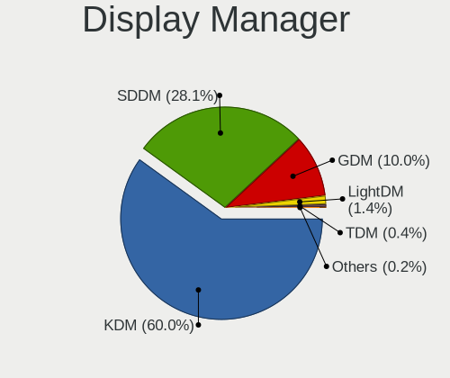
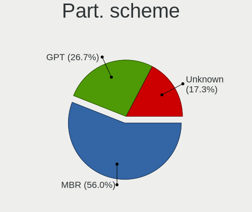
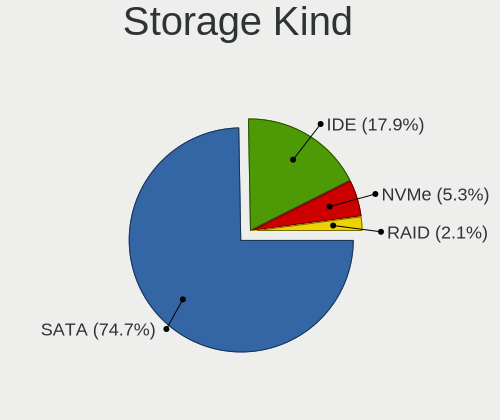
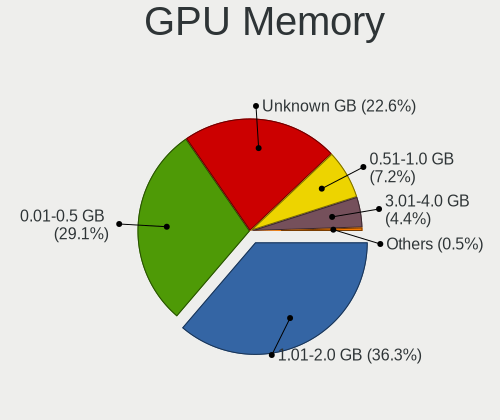
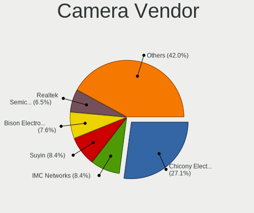
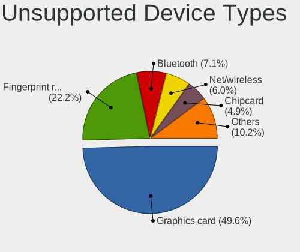

ROSA - Tested Hardware & Statistics (Notebooks)
-----------------------------------------------

A project to collect tested hardware configurations for ROSA.

Anyone can contribute to this report by the [hw-probe](https://github.com/linuxhw/hw-probe) tool:

    sudo -E hw-probe -all -upload

Please contribute! Especially if your hardware is rare.

Contents
--------

* [ Test Cases ](#test-cases)

* [ System ](#system)
  - [ OS                       ](#os)
  - [ OS Family                ](#os-family)
  - [ Kernel                   ](#kernel)
  - [ Kernel Family            ](#kernel-family)
  - [ Kernel Major Ver.        ](#kernel-major-ver)
  - [ Arch                     ](#arch)
  - [ DE                       ](#de)
  - [ Display Server           ](#display-server)
  - [ Display Manager          ](#display-manager)
  - [ OS Lang                  ](#os-lang)
  - [ Boot Mode                ](#boot-mode)
  - [ Filesystem               ](#filesystem)
  - [ Part. scheme             ](#part-scheme)
  - [ Dual Boot with Linux/BSD ](#dual-boot-with-linuxbsd)
  - [ Dual Boot (Win)          ](#dual-boot-win)

* [ Board ](#board)
  - [ Vendor                   ](#vendor)
  - [ Model                    ](#model)
  - [ Model Family             ](#model-family)
  - [ MFG Year                 ](#mfg-year)
  - [ Form Factor              ](#form-factor)
  - [ Secure Boot              ](#secure-boot)
  - [ Coreboot                 ](#coreboot)
  - [ RAM Size                 ](#ram-size)
  - [ RAM Used                 ](#ram-used)
  - [ Total Drives             ](#total-drives)
  - [ Has CD-ROM               ](#has-cd-rom)
  - [ Has Ethernet             ](#has-ethernet)
  - [ Has WiFi                 ](#has-wifi)
  - [ Has Bluetooth            ](#has-bluetooth)

* [ Location ](#location)
  - [ Country                  ](#country)
  - [ City                     ](#city)

* [ Drives ](#drives)
  - [ Drive Vendor             ](#drive-vendor)
  - [ Drive Model              ](#drive-model)
  - [ HDD Vendor               ](#hdd-vendor)
  - [ SSD Vendor               ](#ssd-vendor)
  - [ Drive Kind               ](#drive-kind)
  - [ Drive Connector          ](#drive-connector)
  - [ Drive Size               ](#drive-size)
  - [ Space Total              ](#space-total)
  - [ Space Used               ](#space-used)
  - [ Malfunc. Drives          ](#malfunc-drives)
  - [ Malfunc. Drive Vendor    ](#malfunc-drive-vendor)
  - [ Malfunc. HDD Vendor      ](#malfunc-hdd-vendor)
  - [ Malfunc. Drive Kind      ](#malfunc-drive-kind)
  - [ Failed Drives            ](#failed-drives)
  - [ Failed Drive Vendor      ](#failed-drive-vendor)
  - [ Drive Status             ](#drive-status)

* [ Storage controller ](#storage-controller)
  - [ Storage Vendor           ](#storage-vendor)
  - [ Storage Model            ](#storage-model)
  - [ Storage Kind             ](#storage-kind)

* [ Processor ](#processor)
  - [ CPU Vendor               ](#cpu-vendor)
  - [ CPU Model                ](#cpu-model)
  - [ CPU Model Family         ](#cpu-model-family)
  - [ CPU Cores                ](#cpu-cores)
  - [ CPU Sockets              ](#cpu-sockets)
  - [ CPU Threads              ](#cpu-threads)
  - [ CPU Op-Modes             ](#cpu-op-modes)
  - [ CPU Microcode            ](#cpu-microcode)
  - [ CPU Microarch            ](#cpu-microarch)

* [ Graphics ](#graphics)
  - [ GPU Vendor               ](#gpu-vendor)
  - [ GPU Model                ](#gpu-model)
  - [ GPU Combo                ](#gpu-combo)
  - [ GPU Driver               ](#gpu-driver)
  - [ GPU Memory               ](#gpu-memory)

* [ Monitor ](#monitor)
  - [ Monitor Vendor           ](#monitor-vendor)
  - [ Monitor Model            ](#monitor-model)
  - [ Monitor Resolution       ](#monitor-resolution)
  - [ Monitor Diagonal         ](#monitor-diagonal)
  - [ Monitor Width            ](#monitor-width)
  - [ Aspect Ratio             ](#aspect-ratio)
  - [ Monitor Area             ](#monitor-area)
  - [ Pixel Density            ](#pixel-density)
  - [ Multiple Monitors        ](#multiple-monitors)

* [ Network ](#network)
  - [ Net Controller Vendor    ](#net-controller-vendor)
  - [ Net Controller Model     ](#net-controller-model)
  - [ Wireless Vendor          ](#wireless-vendor)
  - [ Wireless Model           ](#wireless-model)
  - [ Ethernet Vendor          ](#ethernet-vendor)
  - [ Ethernet Model           ](#ethernet-model)
  - [ Net Controller Kind      ](#net-controller-kind)
  - [ Used Controller          ](#used-controller)
  - [ NICs                     ](#nics)
  - [ IPv6                     ](#ipv6)

* [ Bluetooth ](#bluetooth)
  - [ Bluetooth Vendor         ](#bluetooth-vendor)
  - [ Bluetooth Model          ](#bluetooth-model)

* [ Sound ](#sound)
  - [ Sound Vendor             ](#sound-vendor)
  - [ Sound Model              ](#sound-model)

* [ Memory ](#memory)
  - [ Memory Vendor            ](#memory-vendor)
  - [ Memory Model             ](#memory-model)
  - [ Memory Kind              ](#memory-kind)
  - [ Memory Form Factor       ](#memory-form-factor)
  - [ Memory Size              ](#memory-size)
  - [ Memory Speed             ](#memory-speed)

* [ Printers & scanners ](#printers--scanners)
  - [ Printer Vendor           ](#printer-vendor)
  - [ Printer Model            ](#printer-model)
  - [ Scanner Vendor           ](#scanner-vendor)
  - [ Scanner Model            ](#scanner-model)

* [ Camera ](#camera)
  - [ Camera Vendor            ](#camera-vendor)
  - [ Camera Model             ](#camera-model)

* [ Security ](#security)
  - [ Fingerprint Vendor       ](#fingerprint-vendor)
  - [ Fingerprint Model        ](#fingerprint-model)
  - [ Chipcard Vendor          ](#chipcard-vendor)
  - [ Chipcard Model           ](#chipcard-model)

* [ Unsupported ](#unsupported)
  - [ Unsupported Devices      ](#unsupported-devices)
  - [ Unsupported Device Types ](#unsupported-device-types)

Test Cases
----------

Total: 21344

| Vendor        | Model                       | Probe                                                      | Date         |
|---------------|-----------------------------|------------------------------------------------------------|--------------|
| Samsung       | 350V5C/351V5C/3540VC/344... | [c7b3c10131](https://linux-hardware.org/?probe=c7b3c10131) | May 09, 2024 |
| ASUSTek       | VivoBook 15_ASUS Laptop ... | [11d69e96cb](https://linux-hardware.org/?probe=11d69e96cb) | May 08, 2024 |
| ASUSTek       | ASUS TUF Dash F15 FX517Z... | [ac49e3fa07](https://linux-hardware.org/?probe=ac49e3fa07) | May 08, 2024 |
| Sony          | VPCF13E1R                   | [593de85e33](https://linux-hardware.org/?probe=593de85e33) | May 08, 2024 |
| Lenovo        | IdeaPad S510p 20298         | [e4c7ca80f3](https://linux-hardware.org/?probe=e4c7ca80f3) | May 08, 2024 |
| Dell          | Inspiron 3793               | [02e4c23d86](https://linux-hardware.org/?probe=02e4c23d86) | May 07, 2024 |
| Dell          | Inspiron 3793               | [00234ed0c4](https://linux-hardware.org/?probe=00234ed0c4) | May 07, 2024 |
| ASUSTek       | ASUSLaptop_Q530VJ           | [97021794a9](https://linux-hardware.org/?probe=97021794a9) | May 07, 2024 |
| ASUSTek       | VivoBook S15 X530UF         | [5725e80488](https://linux-hardware.org/?probe=5725e80488) | May 07, 2024 |
| Fujitsu Si... | LIFEBOOK S6410              | [fb78e4f92a](https://linux-hardware.org/?probe=fb78e4f92a) | May 07, 2024 |
| MSI           | GL62M 7RDX                  | [df43002002](https://linux-hardware.org/?probe=df43002002) | May 07, 2024 |
| HP            | EliteBook 8470p             | [1022758f4a](https://linux-hardware.org/?probe=1022758f4a) | May 07, 2024 |
| HP            | EliteBook 8470p             | [36f94dbbd1](https://linux-hardware.org/?probe=36f94dbbd1) | May 07, 2024 |
| Lenovo        | IdeaPad Z580                | [2fad877602](https://linux-hardware.org/?probe=2fad877602) | May 06, 2024 |
| eMachines     | E725                        | [171963d4bd](https://linux-hardware.org/?probe=171963d4bd) | May 05, 2024 |
| Dell          | Inspiron 11-3162            | [ccf99ca586](https://linux-hardware.org/?probe=ccf99ca586) | May 05, 2024 |
| Lenovo        | LOQ 15IRH8 82XV             | [2cc53cfafd](https://linux-hardware.org/?probe=2cc53cfafd) | May 05, 2024 |
| Samsung       | R528/R728                   | [2f4a17771e](https://linux-hardware.org/?probe=2f4a17771e) | May 05, 2024 |
| ASUSTek       | A7U                         | [d380bb6272](https://linux-hardware.org/?probe=d380bb6272) | May 05, 2024 |
| Toshiba       | Satellite L500              | [c947dc4138](https://linux-hardware.org/?probe=c947dc4138) | May 04, 2024 |
| Acer          | Extensa 5630                | [3312068dfc](https://linux-hardware.org/?probe=3312068dfc) | May 04, 2024 |
| Lenovo        | ThinkPad T14 Gen 2i 20W1... | [6689db52ed](https://linux-hardware.org/?probe=6689db52ed) | May 04, 2024 |
| ASUSTek       | ASUS TUF Dash F15 FX517Z... | [2ce93c9d05](https://linux-hardware.org/?probe=2ce93c9d05) | May 03, 2024 |
| HP            | ProBook 450 G3              | [63fa17c1de](https://linux-hardware.org/?probe=63fa17c1de) | May 03, 2024 |
| Acer          | Aspire 3690                 | [18468b287d](https://linux-hardware.org/?probe=18468b287d) | May 02, 2024 |
| Lenovo        | B560 43308UG                | [3a36ef2f10](https://linux-hardware.org/?probe=3a36ef2f10) | May 02, 2024 |
| Samsung       | RV420/RV520/RV720/E3530/... | [b12580ca82](https://linux-hardware.org/?probe=b12580ca82) | May 02, 2024 |
| HUAWEI        | BOM-WXX9                    | [358e00bbaa](https://linux-hardware.org/?probe=358e00bbaa) | May 02, 2024 |
| HONOR         | HYM-WXX                     | [58cc24a6c2](https://linux-hardware.org/?probe=58cc24a6c2) | May 02, 2024 |
| eMachines     | Rhine V1.42                 | [f281ddf1c6](https://linux-hardware.org/?probe=f281ddf1c6) | May 01, 2024 |
| Lenovo        | ThinkPad T14 Gen 2i 20W1... | [6dee7f5b7c](https://linux-hardware.org/?probe=6dee7f5b7c) | May 01, 2024 |
| ASUSTek       | M50Vc                       | [d1db0617f1](https://linux-hardware.org/?probe=d1db0617f1) | May 01, 2024 |
| ASUSTek       | X75VC                       | [0896559952](https://linux-hardware.org/?probe=0896559952) | May 01, 2024 |
| Acer          | Predator PH317-52           | [bd69caed14](https://linux-hardware.org/?probe=bd69caed14) | Apr 30, 2024 |
| Lenovo        | ThinkPad T60 1952W2Q        | [cfb8cb1bb5](https://linux-hardware.org/?probe=cfb8cb1bb5) | Apr 30, 2024 |
| HUAWEI        | NBD-WXX9                    | [28ca7324e5](https://linux-hardware.org/?probe=28ca7324e5) | Apr 30, 2024 |
| ASUSTek       | X550VC                      | [cc8153163f](https://linux-hardware.org/?probe=cc8153163f) | Apr 30, 2024 |
| DEXP          | Atlas M15-I3W302            | [efae6e687e](https://linux-hardware.org/?probe=efae6e687e) | Apr 30, 2024 |
| Dell          | Inspiron 3542               | [b37cc5d9c0](https://linux-hardware.org/?probe=b37cc5d9c0) | Apr 30, 2024 |
| Lenovo        | ThinkPad X250 20CLS75800    | [7626333cd6](https://linux-hardware.org/?probe=7626333cd6) | Apr 29, 2024 |
| HIPER Tech... | HIPER WORKBOOK              | [b553fc9cbc](https://linux-hardware.org/?probe=b553fc9cbc) | Apr 29, 2024 |
| Lenovo        | IdeaPad 5 15ARE05 81YQ      | [69ab0359f4](https://linux-hardware.org/?probe=69ab0359f4) | Apr 29, 2024 |
| Lenovo        | IdeaPad 5 14ARE05 81YM      | [6c0201b207](https://linux-hardware.org/?probe=6c0201b207) | Apr 29, 2024 |
| HP            | Laptop 15s-eq1xxx           | [43977b477b](https://linux-hardware.org/?probe=43977b477b) | Apr 29, 2024 |
| Lenovo        | ThinkBook 15 G3 ACL 21A4    | [63088368e6](https://linux-hardware.org/?probe=63088368e6) | Apr 29, 2024 |
| Dell          | Inspiron 5558               | [544ce3b297](https://linux-hardware.org/?probe=544ce3b297) | Apr 28, 2024 |
| HP            | EliteBook 840 G4            | [85dd5fce8a](https://linux-hardware.org/?probe=85dd5fce8a) | Apr 28, 2024 |
| HP            | EliteBook 840 G4            | [0da481706b](https://linux-hardware.org/?probe=0da481706b) | Apr 27, 2024 |
| Lenovo        | IdeaPad S145-14AST 81ST     | [a823e9adf2](https://linux-hardware.org/?probe=a823e9adf2) | Apr 26, 2024 |
| Microtech     | CoreBook Lite               | [6b831e47a9](https://linux-hardware.org/?probe=6b831e47a9) | Apr 26, 2024 |
| Unknown       | Unknown                     | [0cb76807b8](https://linux-hardware.org/?probe=0cb76807b8) | Apr 26, 2024 |
| Lenovo        | ThinkBook 16 G4+ ARA 21D... | [9c92ac1222](https://linux-hardware.org/?probe=9c92ac1222) | Apr 26, 2024 |
| Haier         | AX1750SD                    | [75850d1eb4](https://linux-hardware.org/?probe=75850d1eb4) | Apr 26, 2024 |
| Samsung       | RV415/RV515/E3415           | [b52d1ce535](https://linux-hardware.org/?probe=b52d1ce535) | Apr 25, 2024 |
| Acer          | AO725                       | [edab2bcf78](https://linux-hardware.org/?probe=edab2bcf78) | Apr 25, 2024 |
| Lenovo        | 3000 G770 PIWG1             | [07341d0770](https://linux-hardware.org/?probe=07341d0770) | Apr 25, 2024 |
| Timi          | Xiaomi Book Pro 14 2022     | [c08c262bee](https://linux-hardware.org/?probe=c08c262bee) | Apr 25, 2024 |
| Acer          | Aspire V5-122               | [56cc9120d0](https://linux-hardware.org/?probe=56cc9120d0) | Apr 25, 2024 |
| ASUSTek       | X75VC                       | [11dcf2d1f8](https://linux-hardware.org/?probe=11dcf2d1f8) | Apr 25, 2024 |
| Samsung       | 350V5C/351V5C/3540VC/344... | [5df7b71a31](https://linux-hardware.org/?probe=5df7b71a31) | Apr 25, 2024 |
| DEXP          | Atlas M15-A5W304            | [4185759bbc](https://linux-hardware.org/?probe=4185759bbc) | Apr 24, 2024 |
| Dell          | Vostro 5502                 | [ec30716f3d](https://linux-hardware.org/?probe=ec30716f3d) | Apr 24, 2024 |
| Clevo         | NL41MU2                     | [bfc7896f0a](https://linux-hardware.org/?probe=bfc7896f0a) | Apr 23, 2024 |
| XIAOMI        | Redmi Book 14 2024          | [8bc80a1886](https://linux-hardware.org/?probe=8bc80a1886) | Apr 23, 2024 |
| Standard      | Unknown                     | [56927b31d9](https://linux-hardware.org/?probe=56927b31d9) | Apr 23, 2024 |
| Maibenben     | Perfectum Series            | [bec84b156a](https://linux-hardware.org/?probe=bec84b156a) | Apr 23, 2024 |
| Unknown       | Unknown                     | [f8d5589c4d](https://linux-hardware.org/?probe=f8d5589c4d) | Apr 22, 2024 |
| Lenovo        | ThinkPad SL510 28477EG      | [cd4ebf191f](https://linux-hardware.org/?probe=cd4ebf191f) | Apr 22, 2024 |
| Lenovo        | ThinkPad E15 Gen 2 20T80... | [fdad15cab2](https://linux-hardware.org/?probe=fdad15cab2) | Apr 22, 2024 |
| MSI           | CX600                       | [061bf45f86](https://linux-hardware.org/?probe=061bf45f86) | Apr 21, 2024 |
| Lenovo        | ThinkPad T61 7663PJG        | [6463d83351](https://linux-hardware.org/?probe=6463d83351) | Apr 21, 2024 |
| HUAWEI        | BOM-WXX9                    | [fb9a9f3feb](https://linux-hardware.org/?probe=fb9a9f3feb) | Apr 20, 2024 |
| Acer          | Aspire 5742Z                | [d74abf8d8a](https://linux-hardware.org/?probe=d74abf8d8a) | Apr 20, 2024 |
| HP            | Pavilion g6                 | [9e232056dd](https://linux-hardware.org/?probe=9e232056dd) | Apr 20, 2024 |
| Sony          | VGN-FW11ER                  | [a8a0b64a18](https://linux-hardware.org/?probe=a8a0b64a18) | Apr 20, 2024 |
| Acer          | Aspire 5943G                | [25e8c506a4](https://linux-hardware.org/?probe=25e8c506a4) | Apr 20, 2024 |
| HP            | ProBook 450 G5              | [7f344d90df](https://linux-hardware.org/?probe=7f344d90df) | Apr 20, 2024 |
| Lenovo        | IdeaPad S10-2 20027         | [db640aaaa7](https://linux-hardware.org/?probe=db640aaaa7) | Apr 20, 2024 |
| Unknown       | Unknown                     | [5dbe94517d](https://linux-hardware.org/?probe=5dbe94517d) | Apr 19, 2024 |
| Toshiba       | Satellite C850-C1S          | [f81e33341e](https://linux-hardware.org/?probe=f81e33341e) | Apr 19, 2024 |
| Lenovo        | 3000 G770 PIWG1             | [d649ef0780](https://linux-hardware.org/?probe=d649ef0780) | Apr 18, 2024 |
| Lenovo        | G50-30 80G0                 | [bb33045893](https://linux-hardware.org/?probe=bb33045893) | Apr 18, 2024 |
| HP            | 655                         | [603622d552](https://linux-hardware.org/?probe=603622d552) | Apr 18, 2024 |
| HP            | EliteBook 8440p             | [eb3a684db2](https://linux-hardware.org/?probe=eb3a684db2) | Apr 17, 2024 |
| Infinix       | INBOOK Y2 PLUS              | [8daf9c701b](https://linux-hardware.org/?probe=8daf9c701b) | Apr 17, 2024 |
| ASUSTek       | F80S                        | [74bd778747](https://linux-hardware.org/?probe=74bd778747) | Apr 16, 2024 |
| Acer          | Predator PH317-52           | [61bf535f73](https://linux-hardware.org/?probe=61bf535f73) | Apr 16, 2024 |
| HP            | Presario CQ61               | [8247d1e7e6](https://linux-hardware.org/?probe=8247d1e7e6) | Apr 16, 2024 |
| ANCOMP        | Learnmate A15-501           | [4084ef8bf3](https://linux-hardware.org/?probe=4084ef8bf3) | Apr 16, 2024 |
| HIPER         | EXPERTBOOK                  | [d0acd21b3b](https://linux-hardware.org/?probe=d0acd21b3b) | Apr 16, 2024 |
| ASUSTek       | K53SM                       | [63f81d22fb](https://linux-hardware.org/?probe=63f81d22fb) | Apr 15, 2024 |
| ASUSTek       | K53SM                       | [d23a978a95](https://linux-hardware.org/?probe=d23a978a95) | Apr 15, 2024 |
| Toshiba       | Satellite C850-C1S          | [d4457e5519](https://linux-hardware.org/?probe=d4457e5519) | Apr 15, 2024 |
| HP            | Pavilion m6                 | [c0e3a0cb12](https://linux-hardware.org/?probe=c0e3a0cb12) | Apr 15, 2024 |
| Acer          | Aspire E5-573G              | [4afd132fe0](https://linux-hardware.org/?probe=4afd132fe0) | Apr 15, 2024 |
| HP            | Pavilion dv7                | [36f682acf5](https://linux-hardware.org/?probe=36f682acf5) | Apr 15, 2024 |
| Dell          | Inspiron 11-3162            | [ba7e2b7089](https://linux-hardware.org/?probe=ba7e2b7089) | Apr 14, 2024 |
| HONOR         | NMH-WDX9                    | [2560619236](https://linux-hardware.org/?probe=2560619236) | Apr 14, 2024 |
| HP            | Pavilion g6                 | [067ec164b8](https://linux-hardware.org/?probe=067ec164b8) | Apr 14, 2024 |
| Aquarius      | NE405                       | [0a14f42d90](https://linux-hardware.org/?probe=0a14f42d90) | Apr 14, 2024 |
| Sony          | SVF14A15CLB                 | [473cac0cd4](https://linux-hardware.org/?probe=473cac0cd4) | Apr 14, 2024 |
| Lenovo        | ThinkPad X250 20CLS2JX00    | [2c388fd864](https://linux-hardware.org/?probe=2c388fd864) | Apr 13, 2024 |
| MSI           | MS-N014                     | [22666eaddc](https://linux-hardware.org/?probe=22666eaddc) | Apr 13, 2024 |
| Clevo         | NL41MU2                     | [682e4993f4](https://linux-hardware.org/?probe=682e4993f4) | Apr 12, 2024 |
| Lenovo        | ThinkPad T480 20L6S57T00    | [06575d2064](https://linux-hardware.org/?probe=06575d2064) | Apr 12, 2024 |
| eMachines     | D620 Rev                    | [14ed3fe2a0](https://linux-hardware.org/?probe=14ed3fe2a0) | Apr 12, 2024 |
| Lenovo        | IdeaPad S145-15IWL 81MV     | [057d948dbd](https://linux-hardware.org/?probe=057d948dbd) | Apr 12, 2024 |
| HP            | ProBook 440 G5              | [aef600663a](https://linux-hardware.org/?probe=aef600663a) | Apr 12, 2024 |
| Notebook      | Si155                       | [52da5014e6](https://linux-hardware.org/?probe=52da5014e6) | Apr 12, 2024 |
| ASUSTek       | X200CA                      | [463838f274](https://linux-hardware.org/?probe=463838f274) | Apr 12, 2024 |
| Infinix       | INBOOK Y2 PLUS              | [47c3147253](https://linux-hardware.org/?probe=47c3147253) | Apr 12, 2024 |
| ANCOMP        | Learnmate A15-501           | [4200531dd0](https://linux-hardware.org/?probe=4200531dd0) | Apr 12, 2024 |
| Samsung       | R510/P510                   | [0c28f56ea4](https://linux-hardware.org/?probe=0c28f56ea4) | Apr 11, 2024 |
| HP            | Pavilion dv5                | [8709b8e62d](https://linux-hardware.org/?probe=8709b8e62d) | Apr 11, 2024 |
| ASUSTek       | VivoBook_ASUSLaptop M350... | [33cfdae960](https://linux-hardware.org/?probe=33cfdae960) | Apr 11, 2024 |
| Lenovo        | B50-80 80EW                 | [eb7ac17048](https://linux-hardware.org/?probe=eb7ac17048) | Apr 11, 2024 |
| Lenovo        | B50-80 80EW                 | [147e0059fe](https://linux-hardware.org/?probe=147e0059fe) | Apr 11, 2024 |
| MSI           | GL62M 7RDX                  | [253c6d2492](https://linux-hardware.org/?probe=253c6d2492) | Apr 11, 2024 |
| Timi          | TM1701                      | [c71e4ec638](https://linux-hardware.org/?probe=c71e4ec638) | Apr 10, 2024 |
| Acer          | AOD270                      | [6e71521433](https://linux-hardware.org/?probe=6e71521433) | Apr 10, 2024 |
| ASUSTek       | K54HR                       | [5ac55f4069](https://linux-hardware.org/?probe=5ac55f4069) | Apr 10, 2024 |
| ASUSTek       | K55VM                       | [9293006922](https://linux-hardware.org/?probe=9293006922) | Apr 09, 2024 |
| Toshiba       | Satellite Pro L300          | [b400408af4](https://linux-hardware.org/?probe=b400408af4) | Apr 09, 2024 |
| Lenovo        | B450                        | [b3bc6520f9](https://linux-hardware.org/?probe=b3bc6520f9) | Apr 09, 2024 |
| HIPER Tech... | HIPER WORKBOOK              | [4a64209bcc](https://linux-hardware.org/?probe=4a64209bcc) | Apr 09, 2024 |
| HP            | ProBook 450 G5              | [62ad537ec4](https://linux-hardware.org/?probe=62ad537ec4) | Apr 09, 2024 |
| Toshiba       | Satellite U300              | [a72672e15f](https://linux-hardware.org/?probe=a72672e15f) | Apr 09, 2024 |
| Samsung       | RV413/RV513                 | [7c83951a22](https://linux-hardware.org/?probe=7c83951a22) | Apr 08, 2024 |
| ASUSTek       | N53SV                       | [aa46266206](https://linux-hardware.org/?probe=aa46266206) | Apr 08, 2024 |
| Sony          | SVE1512G1RB                 | [667f25c5c9](https://linux-hardware.org/?probe=667f25c5c9) | Apr 08, 2024 |
| Lenovo        | IdeaPad S145-15AST 81N3     | [0739adb3ee](https://linux-hardware.org/?probe=0739adb3ee) | Apr 08, 2024 |
| Lenovo        | B590 20208                  | [4d24cbea78](https://linux-hardware.org/?probe=4d24cbea78) | Apr 07, 2024 |
| Acer          | Aspire A315-42              | [bff5263ba8](https://linux-hardware.org/?probe=bff5263ba8) | Apr 07, 2024 |
| Microtech     | CoreBook Lite               | [95ee2cd3b2](https://linux-hardware.org/?probe=95ee2cd3b2) | Apr 07, 2024 |
| HP            | EliteBook 8440p             | [d4fbc831bb](https://linux-hardware.org/?probe=d4fbc831bb) | Apr 07, 2024 |
| Lenovo        | Yoga 2 13 20344             | [62b5514e4f](https://linux-hardware.org/?probe=62b5514e4f) | Apr 07, 2024 |
| Lenovo        | IdeaPad 330-15IKB 81DE      | [c1d58b4852](https://linux-hardware.org/?probe=c1d58b4852) | Apr 07, 2024 |
| ASUSTek       | 1215N                       | [38e91de3c6](https://linux-hardware.org/?probe=38e91de3c6) | Apr 07, 2024 |
| ASUSTek       | 1001PX                      | [5b414f71aa](https://linux-hardware.org/?probe=5b414f71aa) | Apr 07, 2024 |
| Lenovo        | ThinkPad T490s 20NX0056M... | [3945b47d9b](https://linux-hardware.org/?probe=3945b47d9b) | Apr 07, 2024 |
| ASUSTek       | VivoBook_ASUSLaptop M160... | [a6e759eb1f](https://linux-hardware.org/?probe=a6e759eb1f) | Apr 06, 2024 |
| Timi          | Xiaomi Book Pro 14 2022     | [c1e2a24ecd](https://linux-hardware.org/?probe=c1e2a24ecd) | Apr 06, 2024 |
| Fujitsu Si... | ESPRIMO Mobile U9200        | [44ccd02e3f](https://linux-hardware.org/?probe=44ccd02e3f) | Apr 06, 2024 |
| Acer          | Swift SF314-43              | [2b8af801f3](https://linux-hardware.org/?probe=2b8af801f3) | Apr 06, 2024 |
| Medion        | E1210                       | [bff743af58](https://linux-hardware.org/?probe=bff743af58) | Apr 06, 2024 |
| ASUSTek       | N76VJ                       | [677cc11076](https://linux-hardware.org/?probe=677cc11076) | Apr 06, 2024 |
| Lenovo        | 3000 G770 PIWG1             | [dc1eb85932](https://linux-hardware.org/?probe=dc1eb85932) | Apr 06, 2024 |
| DEPO Compu... | DPC156                      | [957ec88118](https://linux-hardware.org/?probe=957ec88118) | Apr 06, 2024 |
| HP            | 14 TS                       | [9ac43a4a95](https://linux-hardware.org/?probe=9ac43a4a95) | Apr 06, 2024 |
| Lenovo        | ThinkPad Edge 021722G       | [c737a0d5d1](https://linux-hardware.org/?probe=c737a0d5d1) | Apr 06, 2024 |
| Acer          | AO751h                      | [d2bba2eb45](https://linux-hardware.org/?probe=d2bba2eb45) | Apr 06, 2024 |
| Apple         | MacBookPro14,1              | [bc52c8c02f](https://linux-hardware.org/?probe=bc52c8c02f) | Apr 06, 2024 |
| Packard Be... | EasyNote TV11HC             | [02779c78ea](https://linux-hardware.org/?probe=02779c78ea) | Apr 06, 2024 |
| Packard Be... | EasyNote TE69KB             | [39d995af3d](https://linux-hardware.org/?probe=39d995af3d) | Apr 06, 2024 |
| Lenovo        | Legion Y530-15ICH 81FV      | [25c53a5f52](https://linux-hardware.org/?probe=25c53a5f52) | Apr 05, 2024 |
| HP            | Stream Laptop 14-ax0XX      | [61b97ed8ce](https://linux-hardware.org/?probe=61b97ed8ce) | Apr 05, 2024 |
| ASUSTek       | K55VM                       | [dff985be75](https://linux-hardware.org/?probe=dff985be75) | Apr 05, 2024 |
| ASUSTek       | UX42VS                      | [c2a278a12f](https://linux-hardware.org/?probe=c2a278a12f) | Apr 05, 2024 |
| HP            | Laptop 15-bw0xx             | [3ca37ac33c](https://linux-hardware.org/?probe=3ca37ac33c) | Apr 05, 2024 |
| Unknown       | Unknown                     | [4c4a9c5f53](https://linux-hardware.org/?probe=4c4a9c5f53) | Apr 05, 2024 |
| Lenovo        | Legion Y530-15ICH 81FV      | [58e74c68af](https://linux-hardware.org/?probe=58e74c68af) | Apr 05, 2024 |
| ASUSTek       | GL503VD                     | [009b84286f](https://linux-hardware.org/?probe=009b84286f) | Apr 05, 2024 |
| Acer          | Aspire V3-571G              | [54eaa3974d](https://linux-hardware.org/?probe=54eaa3974d) | Apr 05, 2024 |
| Acer          | Aspire V3-571G              | [5a8cd57120](https://linux-hardware.org/?probe=5a8cd57120) | Apr 05, 2024 |
| ASUSTek       | F80S                        | [bd2ef82132](https://linux-hardware.org/?probe=bd2ef82132) | Apr 05, 2024 |
| Dell          | Vostro 3559                 | [6fcf8b4651](https://linux-hardware.org/?probe=6fcf8b4651) | Apr 05, 2024 |
| Acer          | Nitro AN515-54              | [4cd085f7f7](https://linux-hardware.org/?probe=4cd085f7f7) | Apr 04, 2024 |
| Toshiba       | Satellite C850-B1K          | [54bfebf11c](https://linux-hardware.org/?probe=54bfebf11c) | Apr 04, 2024 |
| ASUSTek       | K93SV                       | [f15f98fdbd](https://linux-hardware.org/?probe=f15f98fdbd) | Apr 04, 2024 |
| ASUSTek       | N76VJ                       | [283ab72984](https://linux-hardware.org/?probe=283ab72984) | Apr 04, 2024 |
| Aquarius      | NS685U R11                  | [1835039a14](https://linux-hardware.org/?probe=1835039a14) | Apr 04, 2024 |
| Acer          | eMachine V1.45              | [90a127f026](https://linux-hardware.org/?probe=90a127f026) | Apr 04, 2024 |
| ASUSTek       | K54C                        | [caa5ba5924](https://linux-hardware.org/?probe=caa5ba5924) | Apr 04, 2024 |
| Aquarius      | NS685U R11                  | [a26d251971](https://linux-hardware.org/?probe=a26d251971) | Apr 04, 2024 |
| HP            | Pavilion m6                 | [7573d33d4f](https://linux-hardware.org/?probe=7573d33d4f) | Apr 04, 2024 |
| HP            | Laptop 17t-by000            | [d4cc1fe9d7](https://linux-hardware.org/?probe=d4cc1fe9d7) | Apr 03, 2024 |
| DEXP          | Atlas M15-A5W305            | [b27b93bc8c](https://linux-hardware.org/?probe=b27b93bc8c) | Apr 03, 2024 |
| Toshiba       | Satellite A200              | [0c54df7f91](https://linux-hardware.org/?probe=0c54df7f91) | Apr 03, 2024 |
| Sony          | SVE1512G1RB                 | [54ae17acf8](https://linux-hardware.org/?probe=54ae17acf8) | Apr 03, 2024 |
| GPU Compan... | GWTC116-2                   | [740edc0de8](https://linux-hardware.org/?probe=740edc0de8) | Apr 03, 2024 |
| ASUSTek       | ASUS TUF Gaming A17 FA70... | [22996086cd](https://linux-hardware.org/?probe=22996086cd) | Apr 03, 2024 |
| Acer          | AO531h                      | [34b9d3fa61](https://linux-hardware.org/?probe=34b9d3fa61) | Apr 03, 2024 |
| Notebook      | WA50SRQ                     | [9106a71979](https://linux-hardware.org/?probe=9106a71979) | Apr 03, 2024 |
| Acer          | Aspire A315-53G             | [966e473570](https://linux-hardware.org/?probe=966e473570) | Apr 03, 2024 |
| Timi          | Xiaomi Book Pro 14 2022     | [7040c47312](https://linux-hardware.org/?probe=7040c47312) | Apr 02, 2024 |
| TPS           | C48P                        | [ae189fc69f](https://linux-hardware.org/?probe=ae189fc69f) | Apr 02, 2024 |
| Lenovo        | G50-30 80G0                 | [2783320d6e](https://linux-hardware.org/?probe=2783320d6e) | Apr 02, 2024 |
| Acer          | Aspire A315-23              | [db43c42221](https://linux-hardware.org/?probe=db43c42221) | Apr 01, 2024 |
| Lenovo        | IdeaPad S145-15IWL 81MV     | [786ccd46d4](https://linux-hardware.org/?probe=786ccd46d4) | Apr 01, 2024 |
| Lenovo        | IdeaPad 310-15IAP 80TT      | [072c615063](https://linux-hardware.org/?probe=072c615063) | Apr 01, 2024 |
| Acer          | Aspire V5-572G              | [b1d00300e0](https://linux-hardware.org/?probe=b1d00300e0) | Apr 01, 2024 |
| Lenovo        | IdeaPad 320-15IKB 80XL      | [a029650e84](https://linux-hardware.org/?probe=a029650e84) | Mar 31, 2024 |
| Samsung       | NC210/NC110                 | [57294b1e3f](https://linux-hardware.org/?probe=57294b1e3f) | Mar 31, 2024 |
| ASUSTek       | ROG Zephyrus M16 GU603HE... | [3316d5eaec](https://linux-hardware.org/?probe=3316d5eaec) | Mar 31, 2024 |
| Acer          | Aspire A315-51              | [445d41291a](https://linux-hardware.org/?probe=445d41291a) | Mar 31, 2024 |
| Dell          | Latitude 7490               | [956211ad36](https://linux-hardware.org/?probe=956211ad36) | Mar 31, 2024 |
| Lenovo        | IdeaPad S145-15IWL 81MV     | [7b7e530a69](https://linux-hardware.org/?probe=7b7e530a69) | Mar 31, 2024 |
| Dell          | Latitude D430               | [2a17846b53](https://linux-hardware.org/?probe=2a17846b53) | Mar 31, 2024 |
| KUANLITU      | S series                    | [5db7aca4ab](https://linux-hardware.org/?probe=5db7aca4ab) | Mar 30, 2024 |
| ASUSTek       | ASUSLaptop_Q530VJ           | [c7460fce88](https://linux-hardware.org/?probe=c7460fce88) | Mar 30, 2024 |
| ASUSTek       | X555LN                      | [c95810d29d](https://linux-hardware.org/?probe=c95810d29d) | Mar 30, 2024 |
| HONOR         | HYM-WXX                     | [9754f1deb5](https://linux-hardware.org/?probe=9754f1deb5) | Mar 30, 2024 |
| Acer          | Aspire 5750ZG               | [cc9cf86880](https://linux-hardware.org/?probe=cc9cf86880) | Mar 30, 2024 |
| HUAWEI        | BOD-WXX9                    | [4e26880f3b](https://linux-hardware.org/?probe=4e26880f3b) | Mar 30, 2024 |
| Toshiba       | Satellite A200              | [9bcf8b40fc](https://linux-hardware.org/?probe=9bcf8b40fc) | Mar 30, 2024 |
| HP            | EliteBook 840 G5            | [f25cac79a7](https://linux-hardware.org/?probe=f25cac79a7) | Mar 29, 2024 |
| Samsung       | 350V5C/351V5C/3540VC/344... | [cde549ae53](https://linux-hardware.org/?probe=cde549ae53) | Mar 29, 2024 |
| HP            | Pavilion 17                 | [9f10efb99b](https://linux-hardware.org/?probe=9f10efb99b) | Mar 28, 2024 |
| HONOR         | BOHK-WAX9X                  | [90a8f20c20](https://linux-hardware.org/?probe=90a8f20c20) | Mar 28, 2024 |
| HP            | 635                         | [96cc20f748](https://linux-hardware.org/?probe=96cc20f748) | Mar 28, 2024 |
| Unknown       | Unknown                     | [534b840aae](https://linux-hardware.org/?probe=534b840aae) | Mar 28, 2024 |
| Dell          | Latitude 3450               | [e94bd779b1](https://linux-hardware.org/?probe=e94bd779b1) | Mar 27, 2024 |
| DEXP          | Atlas M15-I3W300            | [c1a497fc53](https://linux-hardware.org/?probe=c1a497fc53) | Mar 27, 2024 |
| Lenovo        | G570 20079                  | [b5f56f9d77](https://linux-hardware.org/?probe=b5f56f9d77) | Mar 27, 2024 |
| Lenovo        | G570 20079                  | [42e2389620](https://linux-hardware.org/?probe=42e2389620) | Mar 27, 2024 |
| Acer          | Aspire E3-112               | [bba28f3708](https://linux-hardware.org/?probe=bba28f3708) | Mar 27, 2024 |
| Samsung       | 350V5C/351V5C/3540VC/344... | [77bbf9ae04](https://linux-hardware.org/?probe=77bbf9ae04) | Mar 27, 2024 |
| DEXP          | Atlas M15-I3W300            | [a3dcd0089d](https://linux-hardware.org/?probe=a3dcd0089d) | Mar 27, 2024 |
| Lenovo        | IdeaPad S145-14AST 81ST     | [ccd1b2b6f2](https://linux-hardware.org/?probe=ccd1b2b6f2) | Mar 26, 2024 |
| Lunnen        | LLL5DAW                     | [72cff21a83](https://linux-hardware.org/?probe=72cff21a83) | Mar 26, 2024 |
| ASUSTek       | X75VC                       | [8c68d57585](https://linux-hardware.org/?probe=8c68d57585) | Mar 26, 2024 |
| ASUSTek       | X200MA                      | [c95a47bfb6](https://linux-hardware.org/?probe=c95a47bfb6) | Mar 26, 2024 |
| Lunnen        | LLL5DAW                     | [4538ed2fdf](https://linux-hardware.org/?probe=4538ed2fdf) | Mar 25, 2024 |
| HP            | 625                         | [4371b61062](https://linux-hardware.org/?probe=4371b61062) | Mar 25, 2024 |
| Lenovo        | IdeaPad 330-15ARR 81D2      | [38ecc4a222](https://linux-hardware.org/?probe=38ecc4a222) | Mar 25, 2024 |
| Lenovo        | IdeaPad U350                | [c331aa5e14](https://linux-hardware.org/?probe=c331aa5e14) | Mar 25, 2024 |
| Dell          | Vostro 3501                 | [a93a1c775d](https://linux-hardware.org/?probe=a93a1c775d) | Mar 25, 2024 |
| HP            | Laptop 15-ra0xx             | [28ad73615f](https://linux-hardware.org/?probe=28ad73615f) | Mar 25, 2024 |
| ASUSTek       | VivoBook_ASUSLaptop K650... | [56ced57fe4](https://linux-hardware.org/?probe=56ced57fe4) | Mar 24, 2024 |
| Lenovo        | IdeaPad S145-14AST 81ST     | [879204692b](https://linux-hardware.org/?probe=879204692b) | Mar 24, 2024 |
| Maibenben     | MaiBook M                   | [e75fc661c1](https://linux-hardware.org/?probe=e75fc661c1) | Mar 24, 2024 |
| Lenovo        | ThinkPad X270 20HMS40900    | [573dd9915e](https://linux-hardware.org/?probe=573dd9915e) | Mar 24, 2024 |
| ASUSTek       | 1025C                       | [3de65ffcfb](https://linux-hardware.org/?probe=3de65ffcfb) | Mar 24, 2024 |
| Sony          | VGN-NS11ER_S                | [4c6946b182](https://linux-hardware.org/?probe=4c6946b182) | Mar 24, 2024 |
| Lenovo        | IdeaPad 320-15IAP 80XR      | [049e2594d8](https://linux-hardware.org/?probe=049e2594d8) | Mar 24, 2024 |
| Acer          | Aspire 5750ZG               | [b864796f5c](https://linux-hardware.org/?probe=b864796f5c) | Mar 23, 2024 |
| Acer          | Aspire A715-71G             | [24ccb5c519](https://linux-hardware.org/?probe=24ccb5c519) | Mar 23, 2024 |
| ASUSTek       | K50IN                       | [cb20965ea3](https://linux-hardware.org/?probe=cb20965ea3) | Mar 23, 2024 |
| HP            | 635                         | [de4ace6942](https://linux-hardware.org/?probe=de4ace6942) | Mar 23, 2024 |
| Apple         | MacBookPro8,1               | [918da57743](https://linux-hardware.org/?probe=918da57743) | Mar 22, 2024 |
| Haier         | AX1750SD                    | [4c573c4681](https://linux-hardware.org/?probe=4c573c4681) | Mar 21, 2024 |
| ASUSTek       | VivoBook_ASUSLaptop M160... | [c6499bbbb9](https://linux-hardware.org/?probe=c6499bbbb9) | Mar 21, 2024 |
| Lenovo        | 3000 G770 PIWG1             | [4f49e10775](https://linux-hardware.org/?probe=4f49e10775) | Mar 21, 2024 |
| Acer          | Aspire ES1-731              | [d104e477d9](https://linux-hardware.org/?probe=d104e477d9) | Mar 20, 2024 |
| HP            | Pavilion dv6700             | [520f7adb20](https://linux-hardware.org/?probe=520f7adb20) | Mar 20, 2024 |
| Acer          | Unknown                     | [ed0c4a7bd2](https://linux-hardware.org/?probe=ed0c4a7bd2) | Mar 19, 2024 |
| Dell          | Inspiron 1520               | [295570b958](https://linux-hardware.org/?probe=295570b958) | Mar 19, 2024 |
| MACHENIKE     | L17                         | [5baba9a106](https://linux-hardware.org/?probe=5baba9a106) | Mar 19, 2024 |
| Samsung       | NC210/NC110                 | [c323bc2a30](https://linux-hardware.org/?probe=c323bc2a30) | Mar 19, 2024 |
| Sony          | VPCEH3J1R                   | [195eb03fa4](https://linux-hardware.org/?probe=195eb03fa4) | Mar 19, 2024 |
| ASUSTek       | K53SC                       | [8f2d0c4705](https://linux-hardware.org/?probe=8f2d0c4705) | Mar 19, 2024 |
| Lenovo        | IdeaPad 3 17ALC6 82KV       | [1fea3d6368](https://linux-hardware.org/?probe=1fea3d6368) | Mar 18, 2024 |
| Dell          | Inspiron 14-3452            | [7563b824e5](https://linux-hardware.org/?probe=7563b824e5) | Mar 18, 2024 |
| Chuwi         | CoreBook X                  | [ef8f61b58a](https://linux-hardware.org/?probe=ef8f61b58a) | Mar 18, 2024 |
| Lenovo        | B50-10 80QR                 | [7fcdee5f54](https://linux-hardware.org/?probe=7fcdee5f54) | Mar 18, 2024 |
| Lenovo        | ThinkPad X270 20HMS40900    | [b7babbc9ca](https://linux-hardware.org/?probe=b7babbc9ca) | Mar 17, 2024 |
| Dell          | Inspiron 3542               | [815f2730fa](https://linux-hardware.org/?probe=815f2730fa) | Mar 17, 2024 |
| HP            | 650                         | [d58bfc527e](https://linux-hardware.org/?probe=d58bfc527e) | Mar 17, 2024 |
| Haier         | AX1750SD                    | [e195d01670](https://linux-hardware.org/?probe=e195d01670) | Mar 16, 2024 |
| ASUSTek       | K52JB                       | [11a2732ad2](https://linux-hardware.org/?probe=11a2732ad2) | Mar 16, 2024 |
| Lenovo        | ThinkPad X1 Carbon 6th 2... | [02bf20bedd](https://linux-hardware.org/?probe=02bf20bedd) | Mar 16, 2024 |
| Lenovo        | IdeaPad 100-15IBY 80MJ      | [c59faf2a38](https://linux-hardware.org/?probe=c59faf2a38) | Mar 15, 2024 |
| HP            | ProBook 4545s               | [2297cc3886](https://linux-hardware.org/?probe=2297cc3886) | Mar 15, 2024 |
| Clevo         | NL41MU2                     | [fd65a9a975](https://linux-hardware.org/?probe=fd65a9a975) | Mar 14, 2024 |
| Dell          | Precision 7730              | [8b863ed391](https://linux-hardware.org/?probe=8b863ed391) | Mar 14, 2024 |
| ASUSTek       | X55A                        | [c37422f48f](https://linux-hardware.org/?probe=c37422f48f) | Mar 13, 2024 |
| HP            | ProBook 6450b               | [6fe298067d](https://linux-hardware.org/?probe=6fe298067d) | Mar 13, 2024 |
| Dell          | Inspiron N5110              | [dc024261f5](https://linux-hardware.org/?probe=dc024261f5) | Mar 13, 2024 |
| ASUSTek       | X555LJ                      | [4c27f2dbb4](https://linux-hardware.org/?probe=4c27f2dbb4) | Mar 12, 2024 |
| Clevo         | NL41MU2                     | [33f876f46b](https://linux-hardware.org/?probe=33f876f46b) | Mar 12, 2024 |
| Toshiba       | Satellite A300              | [12d262455d](https://linux-hardware.org/?probe=12d262455d) | Mar 12, 2024 |
| Lenovo        | Flex 2-14 20404             | [e95e59de53](https://linux-hardware.org/?probe=e95e59de53) | Mar 12, 2024 |
| Unknown       | Unknown                     | [5a4b0b9993](https://linux-hardware.org/?probe=5a4b0b9993) | Mar 12, 2024 |
| Lenovo        | G700 20251                  | [1174aff664](https://linux-hardware.org/?probe=1174aff664) | Mar 12, 2024 |
| Lenovo        | IdeaPad 330-15ARR 81D2      | [3a0b64148f](https://linux-hardware.org/?probe=3a0b64148f) | Mar 11, 2024 |
| Acer          | Aspire 5742G                | [813449796f](https://linux-hardware.org/?probe=813449796f) | Mar 11, 2024 |
| Dell          | Inspiron 3583               | [7e2f65db59](https://linux-hardware.org/?probe=7e2f65db59) | Mar 11, 2024 |
| ICL Techno    | F140a                       | [b8e3a1fe63](https://linux-hardware.org/?probe=b8e3a1fe63) | Mar 11, 2024 |
| ASUSTek       | X555LJ                      | [6362bae49c](https://linux-hardware.org/?probe=6362bae49c) | Mar 10, 2024 |
| ASUSTek       | ASUSLaptop_Q530VJ           | [2c665bd0c8](https://linux-hardware.org/?probe=2c665bd0c8) | Mar 10, 2024 |
| ASUSTek       | TUF Gaming FX504GD_FX80G... | [76844655f2](https://linux-hardware.org/?probe=76844655f2) | Mar 09, 2024 |
| ASUSTek       | ZenBook UX435EG_UX435EG     | [f477b038da](https://linux-hardware.org/?probe=f477b038da) | Mar 08, 2024 |
| Sony          | SVE1512H1RW                 | [e8330932c9](https://linux-hardware.org/?probe=e8330932c9) | Mar 08, 2024 |
| ASUSTek       | ROG Zephyrus M16 GU603HE... | [f706c7c515](https://linux-hardware.org/?probe=f706c7c515) | Mar 08, 2024 |
| ANCOMP        | Learnmate A15-501           | [24a515a276](https://linux-hardware.org/?probe=24a515a276) | Mar 07, 2024 |
| Lenovo        | ThinkPad P1 Gen 4i 20Y30... | [19d8702f15](https://linux-hardware.org/?probe=19d8702f15) | Mar 07, 2024 |
| HP            | Laptop 15-bw0xx             | [02fc67b4fb](https://linux-hardware.org/?probe=02fc67b4fb) | Mar 07, 2024 |
| HP            | Compaq Presario CQ61        | [3a0ae8d2d3](https://linux-hardware.org/?probe=3a0ae8d2d3) | Mar 07, 2024 |
| Acer          | Aspire 5920G                | [586c5cb0e1](https://linux-hardware.org/?probe=586c5cb0e1) | Mar 06, 2024 |
| Lenovo        | 3000 G530 444625G           | [720e206a18](https://linux-hardware.org/?probe=720e206a18) | Mar 06, 2024 |
| DEPO Compu... | DPC156 V2                   | [bc629ecee9](https://linux-hardware.org/?probe=bc629ecee9) | Mar 06, 2024 |
| HP            | Laptop 15-dw1xxx            | [2751142293](https://linux-hardware.org/?probe=2751142293) | Mar 06, 2024 |
| Acer          | Aspire A715-71G             | [5591b344cd](https://linux-hardware.org/?probe=5591b344cd) | Mar 06, 2024 |
| Sony          | VPCY11M1R                   | [53bd4974e0](https://linux-hardware.org/?probe=53bd4974e0) | Mar 05, 2024 |
| Sony          | SVE1713P1RB                 | [625635b6eb](https://linux-hardware.org/?probe=625635b6eb) | Mar 05, 2024 |
| Toshiba       | Satellite A100              | [99366bab71](https://linux-hardware.org/?probe=99366bab71) | Mar 05, 2024 |
| Toshiba       | Satellite A100              | [0fe823286f](https://linux-hardware.org/?probe=0fe823286f) | Mar 05, 2024 |
| Lenovo        | B50-80 80EW                 | [c06e49bbad](https://linux-hardware.org/?probe=c06e49bbad) | Mar 05, 2024 |
| Lenovo        | G550 20023                  | [ab98886bbc](https://linux-hardware.org/?probe=ab98886bbc) | Mar 04, 2024 |
| ANCOMP        | Learnmate A15-501           | [9f02f3c977](https://linux-hardware.org/?probe=9f02f3c977) | Mar 04, 2024 |
| HP            | Pavilion dv5                | [b0752dc7dc](https://linux-hardware.org/?probe=b0752dc7dc) | Mar 04, 2024 |
| Lenovo        | IdeaPad Slim 3 15IAN8 82... | [6b13499624](https://linux-hardware.org/?probe=6b13499624) | Mar 04, 2024 |
| Lenovo        | IdeaPad Slim 3 15IAN8 82... | [df4fc7d269](https://linux-hardware.org/?probe=df4fc7d269) | Mar 04, 2024 |
| ASUSTek       | X55A                        | [8ef5ab8fcf](https://linux-hardware.org/?probe=8ef5ab8fcf) | Mar 03, 2024 |
| Fujitsu Si... | AMILO Ui 3520               | [3daef8a3d5](https://linux-hardware.org/?probe=3daef8a3d5) | Mar 03, 2024 |
| ASUSTek       | TUF Gaming FX504GD_FX80G... | [bafdcef8e7](https://linux-hardware.org/?probe=bafdcef8e7) | Mar 03, 2024 |
| COLORFUL      | X15 XS 22                   | [7d88cf8f7e](https://linux-hardware.org/?probe=7d88cf8f7e) | Mar 03, 2024 |
| Samsung       | 530U3C/530U4C               | [918631002b](https://linux-hardware.org/?probe=918631002b) | Mar 03, 2024 |
| ASUSTek       | ASUS TUF Gaming A15 FA50... | [d93931cd39](https://linux-hardware.org/?probe=d93931cd39) | Mar 03, 2024 |
| HASEE Comp... | NHx0DB,DE                   | [f8fda16385](https://linux-hardware.org/?probe=f8fda16385) | Mar 02, 2024 |
| HONOR         | NBR-WAX9                    | [7260734dab](https://linux-hardware.org/?probe=7260734dab) | Mar 02, 2024 |
| Sony          | VGN-NS11ER_S                | [b98a93241c](https://linux-hardware.org/?probe=b98a93241c) | Mar 02, 2024 |
| ASUSTek       | F5VL                        | [c498441136](https://linux-hardware.org/?probe=c498441136) | Mar 02, 2024 |
| Lenovo        | V110-15IAP 80TG             | [4e9ef75882](https://linux-hardware.org/?probe=4e9ef75882) | Mar 02, 2024 |
| Acer          | Nitro AN515-54              | [4bf7cd3483](https://linux-hardware.org/?probe=4bf7cd3483) | Mar 02, 2024 |
| Fujitsu Si... | AMILO Pro V3205             | [f865610b43](https://linux-hardware.org/?probe=f865610b43) | Mar 01, 2024 |
| HP            | EliteBook 840 G4            | [447f73473c](https://linux-hardware.org/?probe=447f73473c) | Mar 01, 2024 |
| Lenovo        | IdeaPad 100-15IBY 80MJ      | [3e73dd51ae](https://linux-hardware.org/?probe=3e73dd51ae) | Mar 01, 2024 |
| Dell          | Latitude 3380               | [8fd57a6249](https://linux-hardware.org/?probe=8fd57a6249) | Feb 29, 2024 |
| Lenovo        | ThinkPad 20AC0018US         | [f132e9ed8f](https://linux-hardware.org/?probe=f132e9ed8f) | Feb 28, 2024 |
| Sony          | VGN-FW11ER                  | [c6e5978dc0](https://linux-hardware.org/?probe=c6e5978dc0) | Feb 28, 2024 |
| Lenovo        | ThinkBook 15 G3 ACL 21A4    | [d6bfebf715](https://linux-hardware.org/?probe=d6bfebf715) | Feb 28, 2024 |
| HP            | EliteBook 840 G4            | [f1abf020be](https://linux-hardware.org/?probe=f1abf020be) | Feb 28, 2024 |
| Sony          | VGN-FW11ER                  | [a9ff5f3adb](https://linux-hardware.org/?probe=a9ff5f3adb) | Feb 28, 2024 |
| Insyde        | CherryTrail                 | [26a3cd45d8](https://linux-hardware.org/?probe=26a3cd45d8) | Feb 27, 2024 |
| Lenovo        | Unknown                     | [16315ec313](https://linux-hardware.org/?probe=16315ec313) | Feb 27, 2024 |
| Lenovo        | IdeaPad 520-15IKB 81BF      | [19c9cc81e5](https://linux-hardware.org/?probe=19c9cc81e5) | Feb 26, 2024 |
| Lenovo        | V130-15IKB 81HN             | [12e75015d7](https://linux-hardware.org/?probe=12e75015d7) | Feb 26, 2024 |
| Acer          | Aspire A715-75G             | [f0b195ab68](https://linux-hardware.org/?probe=f0b195ab68) | Feb 26, 2024 |
| MSI           | Alpha 15 A4DEK              | [27dfde8568](https://linux-hardware.org/?probe=27dfde8568) | Feb 26, 2024 |
| ASUSTek       | X555LAB                     | [126dbc29f9](https://linux-hardware.org/?probe=126dbc29f9) | Feb 26, 2024 |
| Acer          | Aspire ES1-731              | [3a3a51458b](https://linux-hardware.org/?probe=3a3a51458b) | Feb 25, 2024 |
| HP            | Pavilion dv6                | [ccc6fb70da](https://linux-hardware.org/?probe=ccc6fb70da) | Feb 25, 2024 |
| ASUSTek       | F80L                        | [e54453d17e](https://linux-hardware.org/?probe=e54453d17e) | Feb 25, 2024 |
| Acer          | Aspire 5333                 | [83eb3675a6](https://linux-hardware.org/?probe=83eb3675a6) | Feb 25, 2024 |
| Acer          | Aspire V3-571G              | [3f90ba96c1](https://linux-hardware.org/?probe=3f90ba96c1) | Feb 25, 2024 |
| Lenovo        | IdeaPad S340-14API 81NB     | [56dd3561b4](https://linux-hardware.org/?probe=56dd3561b4) | Feb 25, 2024 |
| Notebook      | W94_95_97SU2,SUY,-C,-T      | [8c39d19753](https://linux-hardware.org/?probe=8c39d19753) | Feb 24, 2024 |
| Lenovo        | IdeaPad 320-15AST 80XV      | [36495e7e77](https://linux-hardware.org/?probe=36495e7e77) | Feb 24, 2024 |
| HUAWEI        | BOM-WXX9                    | [693c751b40](https://linux-hardware.org/?probe=693c751b40) | Feb 24, 2024 |
| Lenovo        | IdeaPad L340-17API 81LY     | [1e0f578b7a](https://linux-hardware.org/?probe=1e0f578b7a) | Feb 24, 2024 |
| MACHENIKE     | L17                         | [08154c66fa](https://linux-hardware.org/?probe=08154c66fa) | Feb 24, 2024 |
| Sony          | SVF1521L1RB                 | [4b0e081c62](https://linux-hardware.org/?probe=4b0e081c62) | Feb 23, 2024 |
| Acer          | Ferrari One 200             | [5072f72087](https://linux-hardware.org/?probe=5072f72087) | Feb 23, 2024 |
| HP            | Notebook                    | [5f3373127c](https://linux-hardware.org/?probe=5f3373127c) | Feb 23, 2024 |
| ASUSTek       | ASUSPRO P1440FAC_P1440FA    | [3855f6e348](https://linux-hardware.org/?probe=3855f6e348) | Feb 23, 2024 |
| ASUSTek       | ASUSPRO P1440FAC_P1440FA    | [5d0b20b6d7](https://linux-hardware.org/?probe=5d0b20b6d7) | Feb 23, 2024 |
| Lenovo        | V110-15IAP 80TG             | [40db337b2e](https://linux-hardware.org/?probe=40db337b2e) | Feb 22, 2024 |
| Clevo         | NL41MU2                     | [77b091dccf](https://linux-hardware.org/?probe=77b091dccf) | Feb 21, 2024 |
| MSI           | Modern 14 B5M               | [6ac198222d](https://linux-hardware.org/?probe=6ac198222d) | Feb 20, 2024 |
| Clevo         | NL41MU2                     | [44809f0abc](https://linux-hardware.org/?probe=44809f0abc) | Feb 20, 2024 |
| Lenovo        | ThinkPad Edge 13IAL# 019... | [8d4589c01b](https://linux-hardware.org/?probe=8d4589c01b) | Feb 20, 2024 |
| Lenovo        | ThinkPad E14 Gen 2 20T60... | [14f46fe9da](https://linux-hardware.org/?probe=14f46fe9da) | Feb 19, 2024 |
| Dell          | Inspiron 3521               | [320100a896](https://linux-hardware.org/?probe=320100a896) | Feb 19, 2024 |
| ASUSTek       | VivoBook_ASUSLaptop M350... | [69f45460a5](https://linux-hardware.org/?probe=69f45460a5) | Feb 19, 2024 |
| Lenovo        | IdeaPad 330-15IKB 81DC      | [1e0db2694e](https://linux-hardware.org/?probe=1e0db2694e) | Feb 18, 2024 |
| Lenovo        | IdeaPad 330-17IKB 81DK      | [b626bc37d7](https://linux-hardware.org/?probe=b626bc37d7) | Feb 18, 2024 |
| MSI           | Katana GF76 11SC            | [255453e6e0](https://linux-hardware.org/?probe=255453e6e0) | Feb 18, 2024 |
| HP            | Presario CQ56               | [fb99928f36](https://linux-hardware.org/?probe=fb99928f36) | Feb 18, 2024 |
| ASUSTek       | F5VL                        | [a78564818c](https://linux-hardware.org/?probe=a78564818c) | Feb 17, 2024 |
| Samsung       | R59P/R60P/R61P              | [07c2d7b87b](https://linux-hardware.org/?probe=07c2d7b87b) | Feb 17, 2024 |
| ASUSTek       | ROG Zephyrus G15 GA502IU... | [46119aca23](https://linux-hardware.org/?probe=46119aca23) | Feb 17, 2024 |
| ASUSTek       | G56JR                       | [6b794adf83](https://linux-hardware.org/?probe=6b794adf83) | Feb 17, 2024 |
| ASUSTek       | VivoBook_ASUSLaptop X421... | [b35c381ed3](https://linux-hardware.org/?probe=b35c381ed3) | Feb 16, 2024 |
| Sony          | SVJ2021M1RWI                | [6b8a15b379](https://linux-hardware.org/?probe=6b8a15b379) | Feb 16, 2024 |
| Dell          | G5 5590                     | [c4c28daa01](https://linux-hardware.org/?probe=c4c28daa01) | Feb 15, 2024 |
| ASUSTek       | K53SM                       | [f1041b1b6f](https://linux-hardware.org/?probe=f1041b1b6f) | Feb 15, 2024 |
| Acer          | AO531h                      | [41172ed668](https://linux-hardware.org/?probe=41172ed668) | Feb 15, 2024 |
| ASUSTek       | X55VD                       | [dfe71f00a2](https://linux-hardware.org/?probe=dfe71f00a2) | Feb 15, 2024 |
| HUAWEI        | HVY-WXX9                    | [88cd8fd670](https://linux-hardware.org/?probe=88cd8fd670) | Feb 15, 2024 |
| HUAWEI        | HVY-WXX9                    | [03f01a9d31](https://linux-hardware.org/?probe=03f01a9d31) | Feb 14, 2024 |
| Fujitsu       | LIFEBOOK AH544              | [902ac8e112](https://linux-hardware.org/?probe=902ac8e112) | Feb 14, 2024 |
| Fujitsu       | LIFEBOOK AH544              | [eb6f47e6a5](https://linux-hardware.org/?probe=eb6f47e6a5) | Feb 14, 2024 |
| HP            | ProBook 440 G4              | [8d9de31e48](https://linux-hardware.org/?probe=8d9de31e48) | Feb 13, 2024 |
| Packard Be... | EasyNote ENLG81BA           | [f652a4484a](https://linux-hardware.org/?probe=f652a4484a) | Feb 13, 2024 |
| Lenovo        | ThinkPad T410s 2912BQ5      | [a482dc6643](https://linux-hardware.org/?probe=a482dc6643) | Feb 13, 2024 |
| Sony          | SVJ2021M1RWI                | [660a4d64c3](https://linux-hardware.org/?probe=660a4d64c3) | Feb 12, 2024 |
| HP            | Pavilion g7                 | [ac6712d6f4](https://linux-hardware.org/?probe=ac6712d6f4) | Feb 12, 2024 |
| ASUSTek       | K54C                        | [c0141fc4ce](https://linux-hardware.org/?probe=c0141fc4ce) | Feb 12, 2024 |
| HP            | ProBook 430 G8 Notebook ... | [def3e44236](https://linux-hardware.org/?probe=def3e44236) | Feb 12, 2024 |
| Unknown       | Unknown                     | [abf73b0d88](https://linux-hardware.org/?probe=abf73b0d88) | Feb 11, 2024 |
| ASUSTek       | U30Jc                       | [7d00951468](https://linux-hardware.org/?probe=7d00951468) | Feb 11, 2024 |
| ASUSTek       | Vivobook Go E1504FA_E150... | [74416f0bdb](https://linux-hardware.org/?probe=74416f0bdb) | Feb 11, 2024 |
| Lenovo        | G50-30 80G0                 | [cff468bc98](https://linux-hardware.org/?probe=cff468bc98) | Feb 11, 2024 |
| Toshiba       | Satellite U300              | [5e307666a8](https://linux-hardware.org/?probe=5e307666a8) | Feb 11, 2024 |
| ASUSTek       | ROG Zephyrus G15 GA502IU... | [7cd212b3af](https://linux-hardware.org/?probe=7cd212b3af) | Feb 11, 2024 |
| HP            | ProBook 455 G1              | [fea4de4b90](https://linux-hardware.org/?probe=fea4de4b90) | Feb 10, 2024 |
| ICL           | RAYbook Si1507              | [c503f513a0](https://linux-hardware.org/?probe=c503f513a0) | Feb 09, 2024 |
| Samsung       | RV420/RV520/RV720/E3530/... | [177050808c](https://linux-hardware.org/?probe=177050808c) | Feb 09, 2024 |
| HP            | Pavilion 15                 | [5d60cc14fe](https://linux-hardware.org/?probe=5d60cc14fe) | Feb 09, 2024 |
| Teclast       | X98 Plus                    | [59736535cc](https://linux-hardware.org/?probe=59736535cc) | Feb 09, 2024 |
| LTD Delovo... | EVE 14 C414                 | [1914cfb601](https://linux-hardware.org/?probe=1914cfb601) | Feb 09, 2024 |
| Lenovo        | IdeaPad 320-15IKB 80YE      | [48cf9448c1](https://linux-hardware.org/?probe=48cf9448c1) | Feb 09, 2024 |
| Dell          | Vostro 3500                 | [72eddcc0a7](https://linux-hardware.org/?probe=72eddcc0a7) | Feb 09, 2024 |
| ASUSTek       | K50IJ                       | [6199b895f2](https://linux-hardware.org/?probe=6199b895f2) | Feb 09, 2024 |
| HP            | ProBook 455 G1              | [b31430d3a1](https://linux-hardware.org/?probe=b31430d3a1) | Feb 09, 2024 |
| HP            | Pavilion dv5                | [7c9e52629b](https://linux-hardware.org/?probe=7c9e52629b) | Feb 08, 2024 |
| HP            | Presario CQ43               | [7a83910893](https://linux-hardware.org/?probe=7a83910893) | Feb 08, 2024 |
| Dell          | Vostro 3500                 | [005733c995](https://linux-hardware.org/?probe=005733c995) | Feb 08, 2024 |
| HUAWEI        | NBD-WXX9                    | [8c4237a03d](https://linux-hardware.org/?probe=8c4237a03d) | Feb 08, 2024 |
| HUAWEI        | NBD-WXX9                    | [d2529ff0cf](https://linux-hardware.org/?probe=d2529ff0cf) | Feb 08, 2024 |
| HUAWEI        | BOM-WXX9                    | [d4ae52d8ae](https://linux-hardware.org/?probe=d4ae52d8ae) | Feb 07, 2024 |
| Clevo         | NL41MU2                     | [f3741adfba](https://linux-hardware.org/?probe=f3741adfba) | Feb 07, 2024 |
| Clevo         | NL41MU2                     | [04dab9b1d0](https://linux-hardware.org/?probe=04dab9b1d0) | Feb 07, 2024 |
| HP            | EliteBook 8470p             | [2427c6c77d](https://linux-hardware.org/?probe=2427c6c77d) | Feb 07, 2024 |
| Dell          | G15 5510                    | [736e3cb22e](https://linux-hardware.org/?probe=736e3cb22e) | Feb 06, 2024 |
| Unknown       | Unknown                     | [6724b67e0d](https://linux-hardware.org/?probe=6724b67e0d) | Feb 05, 2024 |
| Acer          | AOD257                      | [13daf2822d](https://linux-hardware.org/?probe=13daf2822d) | Feb 05, 2024 |
| HP            | Pavilion Gaming Laptop 1... | [7b57e6f1b5](https://linux-hardware.org/?probe=7b57e6f1b5) | Feb 04, 2024 |
| HP            | Laptop 15-dy2xxx            | [741712e605](https://linux-hardware.org/?probe=741712e605) | Feb 04, 2024 |
| HP            | Laptop 14s-fq0xxx           | [abc419b071](https://linux-hardware.org/?probe=abc419b071) | Feb 04, 2024 |
| ASUSTek       | K53SM                       | [c356c0e7f5](https://linux-hardware.org/?probe=c356c0e7f5) | Feb 03, 2024 |
| HP            | Pavilion dv6                | [56e5073c7a](https://linux-hardware.org/?probe=56e5073c7a) | Feb 03, 2024 |
| HP            | Pavilion g7                 | [1c6ea74601](https://linux-hardware.org/?probe=1c6ea74601) | Feb 03, 2024 |
| Acer          | Aspire E5-521               | [c17ac980cc](https://linux-hardware.org/?probe=c17ac980cc) | Feb 03, 2024 |
| Acer          | P4LJ0                       | [c0a2639732](https://linux-hardware.org/?probe=c0a2639732) | Feb 02, 2024 |
| Samsung       | 305E4A/305E5A/305E7A        | [bf840a5308](https://linux-hardware.org/?probe=bf840a5308) | Feb 02, 2024 |
| Acer          | TravelMate B118-M           | [4f53c6a6af](https://linux-hardware.org/?probe=4f53c6a6af) | Feb 01, 2024 |
| Samsung       | RV413/RV513/E3413           | [975921919b](https://linux-hardware.org/?probe=975921919b) | Feb 01, 2024 |
| MACHCREATO... | E                           | [af231c3cc8](https://linux-hardware.org/?probe=af231c3cc8) | Jan 31, 2024 |
| Acer          | Aspire ES1-531              | [eb59b4c3ac](https://linux-hardware.org/?probe=eb59b4c3ac) | Jan 31, 2024 |
| Dell          | Inspiron MXC061             | [a134206781](https://linux-hardware.org/?probe=a134206781) | Jan 31, 2024 |
| ASUSTek       | ROG Zephyrus G15 GA503QS... | [556c1ede91](https://linux-hardware.org/?probe=556c1ede91) | Jan 30, 2024 |
| Lenovo        | IdeaPad S340-14API 81NB     | [39c2f54da6](https://linux-hardware.org/?probe=39c2f54da6) | Jan 30, 2024 |
| ASUSTek       | ASUS EXPERTBOOK L2402CYA... | [7b41a93878](https://linux-hardware.org/?probe=7b41a93878) | Jan 30, 2024 |
| Fujitsu       | LIFEBOOK AH544              | [7c4ab0f337](https://linux-hardware.org/?probe=7c4ab0f337) | Jan 29, 2024 |
| Fujitsu       | LIFEBOOK AH544              | [b7421bfef5](https://linux-hardware.org/?probe=b7421bfef5) | Jan 29, 2024 |
| Lenovo        | G50-30 80G0                 | [94b345e552](https://linux-hardware.org/?probe=94b345e552) | Jan 29, 2024 |
| DEPO Compu... | DPH610S                     | [de6c6c0dc5](https://linux-hardware.org/?probe=de6c6c0dc5) | Jan 29, 2024 |
| eMachines     | Rhine V1.45                 | [6bb4f91b29](https://linux-hardware.org/?probe=6bb4f91b29) | Jan 29, 2024 |
| Acer          | Iconia W701                 | [572a3d7c02](https://linux-hardware.org/?probe=572a3d7c02) | Jan 28, 2024 |
| ASUSTek       | X540SA                      | [39aef9d411](https://linux-hardware.org/?probe=39aef9d411) | Jan 28, 2024 |
| HP            | Pavilion 15                 | [c303f2769d](https://linux-hardware.org/?probe=c303f2769d) | Jan 26, 2024 |
| Lenovo        | IdeaPad S340-14API 81NB     | [1e983d206c](https://linux-hardware.org/?probe=1e983d206c) | Jan 26, 2024 |
| Unknown       | Unknown                     | [f24b77e03e](https://linux-hardware.org/?probe=f24b77e03e) | Jan 25, 2024 |
| Apple         | MacBookPro4,1               | [8cbf896791](https://linux-hardware.org/?probe=8cbf896791) | Jan 25, 2024 |
| ASUSTek       | N61Vg                       | [ea2d37b9a8](https://linux-hardware.org/?probe=ea2d37b9a8) | Jan 25, 2024 |
| Unknown       | Unknown                     | [f149927f3f](https://linux-hardware.org/?probe=f149927f3f) | Jan 25, 2024 |
| HUAWEI        | NBD-WXX9                    | [d2b6c52d72](https://linux-hardware.org/?probe=d2b6c52d72) | Jan 25, 2024 |
| Lenovo        | Legion 5 15ACH6H 82JU       | [ceebacdeee](https://linux-hardware.org/?probe=ceebacdeee) | Jan 24, 2024 |
| MACHENIKE     | L17                         | [6510b1b157](https://linux-hardware.org/?probe=6510b1b157) | Jan 24, 2024 |
| Acer          | Aspire A515-51G             | [d1fe84630c](https://linux-hardware.org/?probe=d1fe84630c) | Jan 24, 2024 |
| Lenovo        | IdeaPad 330-15AST 81D6      | [10eb215783](https://linux-hardware.org/?probe=10eb215783) | Jan 24, 2024 |
| Infinix       | INBOOK X2                   | [a49adb917b](https://linux-hardware.org/?probe=a49adb917b) | Jan 24, 2024 |
| Acer          | Aspire A717-71G             | [b7fb65f8f0](https://linux-hardware.org/?probe=b7fb65f8f0) | Jan 24, 2024 |
| Toshiba       | Satellite C660              | [b1d19ad191](https://linux-hardware.org/?probe=b1d19ad191) | Jan 23, 2024 |
| HP            | Pavilion g6                 | [ba785cef9c](https://linux-hardware.org/?probe=ba785cef9c) | Jan 23, 2024 |
| Toshiba       | Satellite L40               | [0f0ab308a5](https://linux-hardware.org/?probe=0f0ab308a5) | Jan 23, 2024 |
| Samsung       | R580/R590                   | [832ca89f89](https://linux-hardware.org/?probe=832ca89f89) | Jan 23, 2024 |
| Clevo         | NL41MU2                     | [9ea0222064](https://linux-hardware.org/?probe=9ea0222064) | Jan 23, 2024 |
| ASUSTek       | S551LN                      | [4bcdfef62c](https://linux-hardware.org/?probe=4bcdfef62c) | Jan 23, 2024 |
| Acidanther... | MacBookPro16,3              | [ec9ea0d332](https://linux-hardware.org/?probe=ec9ea0d332) | Jan 22, 2024 |
| Acer          | Aspire A315-57G             | [75b94f015e](https://linux-hardware.org/?probe=75b94f015e) | Jan 22, 2024 |
| Acer          | Aspire 7551                 | [19efb9c9b1](https://linux-hardware.org/?probe=19efb9c9b1) | Jan 21, 2024 |
| ASUSTek       | K50IN                       | [ce48aa2c37](https://linux-hardware.org/?probe=ce48aa2c37) | Jan 20, 2024 |
| ASUSTek       | K53SD                       | [0b62b854c0](https://linux-hardware.org/?probe=0b62b854c0) | Jan 20, 2024 |
| HIPER Tech... | HIPER WORKBOOK              | [88b6a30668](https://linux-hardware.org/?probe=88b6a30668) | Jan 19, 2024 |
| HIPER Tech... | HIPER WORKBOOK              | [277f1fa594](https://linux-hardware.org/?probe=277f1fa594) | Jan 19, 2024 |
| ASUSTek       | UX303UA                     | [a1e8d78385](https://linux-hardware.org/?probe=a1e8d78385) | Jan 19, 2024 |
| Samsung       | 300V3A/300V4A/300V5A/200... | [69a5d8296c](https://linux-hardware.org/?probe=69a5d8296c) | Jan 19, 2024 |
| Acer          | Aspire A315-21              | [0e67fe580f](https://linux-hardware.org/?probe=0e67fe580f) | Jan 18, 2024 |
| Lenovo        | ThinkPad L530 2479BG8       | [4c8c134e10](https://linux-hardware.org/?probe=4c8c134e10) | Jan 18, 2024 |
| MECHREVO      | Jiaolong Series GM5ZG0O     | [4f589be8f4](https://linux-hardware.org/?probe=4f589be8f4) | Jan 18, 2024 |
| MSI           | GE60 2PL                    | [a0eff25dfe](https://linux-hardware.org/?probe=a0eff25dfe) | Jan 17, 2024 |
| Packard Be... | EasyNote TE11HC             | [b38e6a2298](https://linux-hardware.org/?probe=b38e6a2298) | Jan 17, 2024 |
| HP            | 250 G5 Notebook PC          | [d8e4449d99](https://linux-hardware.org/?probe=d8e4449d99) | Jan 16, 2024 |
| ASUSTek       | VivoBook 15_ASUS Laptop ... | [4162a83dbc](https://linux-hardware.org/?probe=4162a83dbc) | Jan 15, 2024 |
| ASUSTek       | VivoBook_ASUSLaptop M350... | [e73d1f2078](https://linux-hardware.org/?probe=e73d1f2078) | Jan 15, 2024 |
| HP            | ProBook 430 G2              | [0c1f594a26](https://linux-hardware.org/?probe=0c1f594a26) | Jan 14, 2024 |
| Matsushita... | CF-30CTQAZBG                | [18a587bfa8](https://linux-hardware.org/?probe=18a587bfa8) | Jan 14, 2024 |
| MSI           | FX610MX                     | [398e37e98e](https://linux-hardware.org/?probe=398e37e98e) | Jan 14, 2024 |
| ASUSTek       | K50IJ                       | [2626e31d7a](https://linux-hardware.org/?probe=2626e31d7a) | Jan 14, 2024 |
| Packard Be... | EasyNote ENTE70BH           | [3b0a0b0f19](https://linux-hardware.org/?probe=3b0a0b0f19) | Jan 13, 2024 |
| HP            | ProBook 4330s               | [44ddddb2d1](https://linux-hardware.org/?probe=44ddddb2d1) | Jan 13, 2024 |
| Acer          | Aspire E5-532               | [5441361fdd](https://linux-hardware.org/?probe=5441361fdd) | Jan 13, 2024 |
| HP            | EliteBook 840 G4            | [e5073c8346](https://linux-hardware.org/?probe=e5073c8346) | Jan 13, 2024 |
| HP            | Pavilion dv7                | [5b2ddda1cc](https://linux-hardware.org/?probe=5b2ddda1cc) | Jan 13, 2024 |
| Packard Be... | EasyNote ENLG81BA           | [8fce4ff747](https://linux-hardware.org/?probe=8fce4ff747) | Jan 13, 2024 |
| Lenovo        | V15-IGL 82C3                | [c7de9c6d40](https://linux-hardware.org/?probe=c7de9c6d40) | Jan 12, 2024 |
| ASUSTek       | VivoBook_ASUSLaptop M350... | [c317a3afa7](https://linux-hardware.org/?probe=c317a3afa7) | Jan 12, 2024 |
| HP            | ProBook 4330s               | [35ef27eb5a](https://linux-hardware.org/?probe=35ef27eb5a) | Jan 12, 2024 |
| Clevo         | NL41MU2                     | [a1934fd532](https://linux-hardware.org/?probe=a1934fd532) | Jan 11, 2024 |
| Sony          | VGN-NS11ER_S                | [a36cd10d4f](https://linux-hardware.org/?probe=a36cd10d4f) | Jan 11, 2024 |
| HP            | Pavilion 15                 | [f2b6647344](https://linux-hardware.org/?probe=f2b6647344) | Jan 11, 2024 |
| Samsung       | 550P5C/550P7C               | [0153b8d5e8](https://linux-hardware.org/?probe=0153b8d5e8) | Jan 11, 2024 |
| HP            | EliteBook 8440p             | [889462ebed](https://linux-hardware.org/?probe=889462ebed) | Jan 10, 2024 |
| Lenovo        | G70-70 80HW                 | [b3b5cddaa9](https://linux-hardware.org/?probe=b3b5cddaa9) | Jan 10, 2024 |
| ASUSTek       | F3JA                        | [bdf839bb01](https://linux-hardware.org/?probe=bdf839bb01) | Jan 10, 2024 |
| ASUSTek       | K54HR                       | [9bea135bd3](https://linux-hardware.org/?probe=9bea135bd3) | Jan 10, 2024 |
| Lenovo        | ThinkPad E14 20RA001BRT     | [99ac2e5b0c](https://linux-hardware.org/?probe=99ac2e5b0c) | Jan 10, 2024 |
| Dell          | System Inspiron N7110       | [4b3ae60a61](https://linux-hardware.org/?probe=4b3ae60a61) | Jan 10, 2024 |
| Samsung       | N145P/N250P/N260P           | [42f3dc5b5b](https://linux-hardware.org/?probe=42f3dc5b5b) | Jan 08, 2024 |
| Packard Be... | EasyNote ENTE70BH           | [686528b2b8](https://linux-hardware.org/?probe=686528b2b8) | Jan 08, 2024 |
| MSI           | Katana GF76 11SC            | [e85c0b091c](https://linux-hardware.org/?probe=e85c0b091c) | Jan 08, 2024 |
| Lenovo        | B560                        | [900be0c575](https://linux-hardware.org/?probe=900be0c575) | Jan 08, 2024 |
| ASUSTek       | T100TA                      | [6c102638a9](https://linux-hardware.org/?probe=6c102638a9) | Jan 08, 2024 |
| Acer          | Aspire 5520                 | [0a5ec0c310](https://linux-hardware.org/?probe=0a5ec0c310) | Jan 08, 2024 |
| ASUSTek       | X551MA                      | [243ad8414b](https://linux-hardware.org/?probe=243ad8414b) | Jan 08, 2024 |
| HP            | Laptop 15s-eq2xxx           | [9233f4fdcb](https://linux-hardware.org/?probe=9233f4fdcb) | Jan 07, 2024 |
| Acer          | Aspire 7739ZG               | [62dc64989b](https://linux-hardware.org/?probe=62dc64989b) | Jan 07, 2024 |
| Lenovo        | IdeaPad S145-15AST 81N3     | [3a2e5d320d](https://linux-hardware.org/?probe=3a2e5d320d) | Jan 06, 2024 |
| ASUSTek       | VivoBook_ASUSLaptop X515... | [3be696b6a2](https://linux-hardware.org/?probe=3be696b6a2) | Jan 06, 2024 |
| Samsung       | 300V3A/300V4A/300V5A/200... | [db402d3717](https://linux-hardware.org/?probe=db402d3717) | Jan 05, 2024 |
| HP            | EliteBook 840 G4            | [2831ef8f2f](https://linux-hardware.org/?probe=2831ef8f2f) | Jan 05, 2024 |
| ASUSTek       | M51Sn                       | [909c38ed4b](https://linux-hardware.org/?probe=909c38ed4b) | Jan 05, 2024 |
| Clevo         | W760T/M740T/M760T           | [1b63264977](https://linux-hardware.org/?probe=1b63264977) | Jan 05, 2024 |
| Samsung       | 300E4C/300E5C/300E7C        | [0350f7e562](https://linux-hardware.org/?probe=0350f7e562) | Jan 05, 2024 |
| Lenovo        | G470 20078                  | [e9f6af483a](https://linux-hardware.org/?probe=e9f6af483a) | Jan 05, 2024 |
| ASUSTek       | VivoBook_ASUSLaptop M160... | [96f32abb26](https://linux-hardware.org/?probe=96f32abb26) | Jan 05, 2024 |
| HP            | Compaq Presario CQ50        | [593df08bff](https://linux-hardware.org/?probe=593df08bff) | Jan 05, 2024 |
| Clevo         | NL41MU2                     | [c45b51ce3f](https://linux-hardware.org/?probe=c45b51ce3f) | Jan 05, 2024 |
| HP            | Compaq Presario CQ50        | [1b67d7fdc7](https://linux-hardware.org/?probe=1b67d7fdc7) | Jan 04, 2024 |
| Acer          | Aspire ES1-531              | [d690461c92](https://linux-hardware.org/?probe=d690461c92) | Jan 04, 2024 |
| Acer          | Aspire ES1-531              | [cb353673fe](https://linux-hardware.org/?probe=cb353673fe) | Jan 04, 2024 |
| ASUSTek       | K40IN                       | [3652028e43](https://linux-hardware.org/?probe=3652028e43) | Jan 04, 2024 |
| Acer          | Aspire A715-71G             | [47783802e5](https://linux-hardware.org/?probe=47783802e5) | Jan 04, 2024 |
| Dell          | Latitude D630               | [e48315d3aa](https://linux-hardware.org/?probe=e48315d3aa) | Jan 04, 2024 |
| Lenovo        | ThinkBook 16 G4+ ARA 21D... | [9ebfe6bfaf](https://linux-hardware.org/?probe=9ebfe6bfaf) | Jan 03, 2024 |
| ASUSTek       | P53SJ                       | [166aa26cbf](https://linux-hardware.org/?probe=166aa26cbf) | Jan 02, 2024 |
| ASUSTek       | P53SJ                       | [b4d6eb4321](https://linux-hardware.org/?probe=b4d6eb4321) | Jan 02, 2024 |
| Acer          | AO531h                      | [d53e1252c6](https://linux-hardware.org/?probe=d53e1252c6) | Jan 02, 2024 |
| 3Q            | 3QLAP-ES1001N-WBN6-MB       | [d0a86ccf9e](https://linux-hardware.org/?probe=d0a86ccf9e) | Jan 02, 2024 |
| Chuwi         | HeroBook Pro                | [97c2ff9710](https://linux-hardware.org/?probe=97c2ff9710) | Jan 01, 2024 |
| Sony          | VPCEH3P1R                   | [d5a18ec675](https://linux-hardware.org/?probe=d5a18ec675) | Jan 01, 2024 |
| ASUSTek       | X555LB                      | [6e12fcec56](https://linux-hardware.org/?probe=6e12fcec56) | Jan 01, 2024 |
| Lenovo        | ThinkPad T430 2349SB4       | [06956b900b](https://linux-hardware.org/?probe=06956b900b) | Jan 01, 2024 |
| Acer          | Extensa 5220                | [dd3638713e](https://linux-hardware.org/?probe=dd3638713e) | Dec 31, 2023 |
| Intel         | ChiefRiver                  | [6fc4ceeaa6](https://linux-hardware.org/?probe=6fc4ceeaa6) | Dec 30, 2023 |
| ASUSTek       | K52JB                       | [169f787cff](https://linux-hardware.org/?probe=169f787cff) | Dec 30, 2023 |
| HP            | ProBook 6460b               | [45038d4599](https://linux-hardware.org/?probe=45038d4599) | Dec 30, 2023 |
| Acer          | Aspire A715-75G             | [753b419047](https://linux-hardware.org/?probe=753b419047) | Dec 30, 2023 |
| HP            | Victus by Gaming Laptop ... | [d82dad2793](https://linux-hardware.org/?probe=d82dad2793) | Dec 29, 2023 |
| Lenovo        | IdeaPad 320-15IAP 80XR      | [d2c1896794](https://linux-hardware.org/?probe=d2c1896794) | Dec 29, 2023 |
| Lenovo        | XiaoXinPro 16 IRH8 83AQ     | [e21e415784](https://linux-hardware.org/?probe=e21e415784) | Dec 29, 2023 |
| HUAWEI        | BOD-WXX9                    | [fdcf9374ad](https://linux-hardware.org/?probe=fdcf9374ad) | Dec 29, 2023 |
| HUAWEI        | BOD-WXX9                    | [eee070b636](https://linux-hardware.org/?probe=eee070b636) | Dec 29, 2023 |
| HIPER Tech... | HIPER WORKBOOK              | [ddca4cca74](https://linux-hardware.org/?probe=ddca4cca74) | Dec 28, 2023 |
| Clevo         | NL41MU2                     | [51d90b2126](https://linux-hardware.org/?probe=51d90b2126) | Dec 28, 2023 |
| Lenovo        | ThinkPad L520 5017AD1       | [93cc8d014a](https://linux-hardware.org/?probe=93cc8d014a) | Dec 28, 2023 |
| Toshiba       | Satellite A200              | [081782c544](https://linux-hardware.org/?probe=081782c544) | Dec 28, 2023 |
| ASUSTek       | ROG Zephyrus G14 GA401QM... | [9c498442e0](https://linux-hardware.org/?probe=9c498442e0) | Dec 28, 2023 |
| Lenovo        | B570e HuronRiver Platfor... | [274273301c](https://linux-hardware.org/?probe=274273301c) | Dec 28, 2023 |
| ASUSTek       | X200LA                      | [e7eb756fbf](https://linux-hardware.org/?probe=e7eb756fbf) | Dec 27, 2023 |
| Packard Be... | EasyNote TE11HC             | [6061821ba9](https://linux-hardware.org/?probe=6061821ba9) | Dec 27, 2023 |
| Lenovo        | ThinkPad T480 20L50007RT    | [17df248bb2](https://linux-hardware.org/?probe=17df248bb2) | Dec 27, 2023 |
| ASUSTek       | F3Ke                        | [22f515ae42](https://linux-hardware.org/?probe=22f515ae42) | Dec 26, 2023 |
| Sony          | VGC-LT1SR                   | [680780a4de](https://linux-hardware.org/?probe=680780a4de) | Dec 26, 2023 |
| Sony          | VGC-LT1SR                   | [2a7c712f76](https://linux-hardware.org/?probe=2a7c712f76) | Dec 26, 2023 |
| MSI           | GE70 0NC\0ND                | [ffc8a3bf6d](https://linux-hardware.org/?probe=ffc8a3bf6d) | Dec 26, 2023 |
| ASUSTek       | GL553VE                     | [19d431f40e](https://linux-hardware.org/?probe=19d431f40e) | Dec 25, 2023 |
| Lenovo        | B590 20206                  | [c0fb6339e4](https://linux-hardware.org/?probe=c0fb6339e4) | Dec 25, 2023 |
| Acer          | Aspire E5-571G              | [5004570f44](https://linux-hardware.org/?probe=5004570f44) | Dec 24, 2023 |
| Acer          | Aspire E5-571G              | [b62ffffcdb](https://linux-hardware.org/?probe=b62ffffcdb) | Dec 24, 2023 |
| HP            | ProBook 430 G2              | [e383d83cd9](https://linux-hardware.org/?probe=e383d83cd9) | Dec 24, 2023 |
| Dell          | Inspiron N5110              | [4629a1dfe0](https://linux-hardware.org/?probe=4629a1dfe0) | Dec 24, 2023 |
| Notebook      | W65_67SJ                    | [8bea89f7c9](https://linux-hardware.org/?probe=8bea89f7c9) | Dec 24, 2023 |
| Notebook      | W65_67SJ                    | [439816e10c](https://linux-hardware.org/?probe=439816e10c) | Dec 24, 2023 |
| Dell          | Latitude E4310              | [0c4f2ab6b3](https://linux-hardware.org/?probe=0c4f2ab6b3) | Dec 23, 2023 |
| ASUSTek       | U5A                         | [fd3c48af54](https://linux-hardware.org/?probe=fd3c48af54) | Dec 23, 2023 |
| ASUSTek       | N53SV                       | [5098aee09b](https://linux-hardware.org/?probe=5098aee09b) | Dec 23, 2023 |
| ASUSTek       | N53SV                       | [5ad49bc6d3](https://linux-hardware.org/?probe=5ad49bc6d3) | Dec 23, 2023 |
| Samsung       | 350V5C/351V5C/3540VC/344... | [541c5efbf3](https://linux-hardware.org/?probe=541c5efbf3) | Dec 23, 2023 |
| Dell          | System XPS L702X            | [d69355a342](https://linux-hardware.org/?probe=d69355a342) | Dec 23, 2023 |
| Dell          | Inspiron N5050              | [51b49fb205](https://linux-hardware.org/?probe=51b49fb205) | Dec 22, 2023 |
| HUAWEI        | KLVL-WXXW                   | [ccf505804c](https://linux-hardware.org/?probe=ccf505804c) | Dec 22, 2023 |
| HP            | ProBook 4330s               | [fce67d52c0](https://linux-hardware.org/?probe=fce67d52c0) | Dec 22, 2023 |
| Acer          | Aspire 5920G                | [93945148f3](https://linux-hardware.org/?probe=93945148f3) | Dec 22, 2023 |
| Samsung       | 300V3A/300V4A/300V5A/200... | [4bf5538ba0](https://linux-hardware.org/?probe=4bf5538ba0) | Dec 22, 2023 |
| ASUSTek       | X553MA                      | [af944b3278](https://linux-hardware.org/?probe=af944b3278) | Dec 22, 2023 |
| ASUSTek       | X553MA                      | [ccc1d214ce](https://linux-hardware.org/?probe=ccc1d214ce) | Dec 22, 2023 |
| LG Electro... | F1-2A85R                    | [06bdffa7cc](https://linux-hardware.org/?probe=06bdffa7cc) | Dec 21, 2023 |
| Acer          | Aspire ES1-531              | [0bacfb8ebc](https://linux-hardware.org/?probe=0bacfb8ebc) | Dec 21, 2023 |
| Acer          | Aspire ES1-531              | [14e802a51f](https://linux-hardware.org/?probe=14e802a51f) | Dec 21, 2023 |
| ASUSTek       | X540LA                      | [ae9a60ec08](https://linux-hardware.org/?probe=ae9a60ec08) | Dec 21, 2023 |
| ASUSTek       | K53SM                       | [7af945d0af](https://linux-hardware.org/?probe=7af945d0af) | Dec 21, 2023 |
| Lenovo        | ThinkPad T530 239233G       | [83d94e2acb](https://linux-hardware.org/?probe=83d94e2acb) | Dec 20, 2023 |
| Dell          | Inspiron N5110              | [c983a4857a](https://linux-hardware.org/?probe=c983a4857a) | Dec 20, 2023 |
| Acer          | Nitro AN515-56              | [3fb0406c18](https://linux-hardware.org/?probe=3fb0406c18) | Dec 19, 2023 |
| ASUSTek       | N73Jn                       | [75d7e7434d](https://linux-hardware.org/?probe=75d7e7434d) | Dec 19, 2023 |
| DNS           | V40SI2                      | [cc28f4eaa2](https://linux-hardware.org/?probe=cc28f4eaa2) | Dec 19, 2023 |
| ASUSTek       | N56DP                       | [736ba321d5](https://linux-hardware.org/?probe=736ba321d5) | Dec 18, 2023 |
| Acer          | Aspire E1-522               | [874bdf3d31](https://linux-hardware.org/?probe=874bdf3d31) | Dec 18, 2023 |
| HUAWEI        | BOD-WXX9                    | [3d0c812852](https://linux-hardware.org/?probe=3d0c812852) | Dec 18, 2023 |
| Acer          | Aspire A114-33              | [0d1dc00e78](https://linux-hardware.org/?probe=0d1dc00e78) | Dec 18, 2023 |
| Toshiba       | Satellite Pro C660          | [8d45441911](https://linux-hardware.org/?probe=8d45441911) | Dec 18, 2023 |
| Maibenben     | MaiBook P series            | [6bd05cc6a1](https://linux-hardware.org/?probe=6bd05cc6a1) | Dec 18, 2023 |
| HP            | Pavilion dv6                | [604417783f](https://linux-hardware.org/?probe=604417783f) | Dec 18, 2023 |
| Clevo         | NL41MU2                     | [31d86d4507](https://linux-hardware.org/?probe=31d86d4507) | Dec 18, 2023 |
| Dell          | Studio 1535                 | [06e18b7a2f](https://linux-hardware.org/?probe=06e18b7a2f) | Dec 18, 2023 |
| Clevo         | NL41MU2                     | [7bf2e8159e](https://linux-hardware.org/?probe=7bf2e8159e) | Dec 18, 2023 |
| Lenovo        | IdeaPad 3 15ITL05 81X8      | [4c190c150c](https://linux-hardware.org/?probe=4c190c150c) | Dec 18, 2023 |
| Fujitsu Si... | LIFEBOOK S6410              | [24edc4b12c](https://linux-hardware.org/?probe=24edc4b12c) | Dec 17, 2023 |
| Dell          | System Inspiron N7110       | [b1f392f5f3](https://linux-hardware.org/?probe=b1f392f5f3) | Dec 17, 2023 |
| HP            | Laptop 14s-dq2xxx           | [0e123e0682](https://linux-hardware.org/?probe=0e123e0682) | Dec 16, 2023 |
| Toshiba       | Satellite C660              | [c67f7d8341](https://linux-hardware.org/?probe=c67f7d8341) | Dec 16, 2023 |
| Lenovo        | B590 20206                  | [b6afc3e929](https://linux-hardware.org/?probe=b6afc3e929) | Dec 16, 2023 |
| Toshiba       | Satellite U300              | [f8f967d0fe](https://linux-hardware.org/?probe=f8f967d0fe) | Dec 16, 2023 |
| Samsung       | R528/R728                   | [3a61761648](https://linux-hardware.org/?probe=3a61761648) | Dec 16, 2023 |
| Clevo         | NL41MU2                     | [7042699eef](https://linux-hardware.org/?probe=7042699eef) | Dec 15, 2023 |
| ASUSTek       | X550CC                      | [e07df321e3](https://linux-hardware.org/?probe=e07df321e3) | Dec 15, 2023 |
| Sony          | VGN-FW11ER                  | [eead7d1cca](https://linux-hardware.org/?probe=eead7d1cca) | Dec 15, 2023 |
| Dell          | Studio 1535                 | [0fd7468ec1](https://linux-hardware.org/?probe=0fd7468ec1) | Dec 14, 2023 |
| HP            | Notebook                    | [ac92e1373d](https://linux-hardware.org/?probe=ac92e1373d) | Dec 14, 2023 |
| Acer          | AO521                       | [e519cc3d02](https://linux-hardware.org/?probe=e519cc3d02) | Dec 14, 2023 |
| Acer          | AO521                       | [0dd76d9c3a](https://linux-hardware.org/?probe=0dd76d9c3a) | Dec 14, 2023 |
| HP            | ProBook 6560b               | [e103647ee9](https://linux-hardware.org/?probe=e103647ee9) | Dec 13, 2023 |
| Digma         | EVE 14 C411                 | [bcd7c864a1](https://linux-hardware.org/?probe=bcd7c864a1) | Dec 12, 2023 |
| Lenovo        | ThinkPad Z61t 9441W15       | [af90f6fb00](https://linux-hardware.org/?probe=af90f6fb00) | Dec 11, 2023 |
| Acer          | Aspire E1-572G              | [c087547192](https://linux-hardware.org/?probe=c087547192) | Dec 11, 2023 |
| Acer          | Aspire E1-572G              | [5347b71932](https://linux-hardware.org/?probe=5347b71932) | Dec 11, 2023 |
| eMachines     | eME728                      | [b89ccf8caf](https://linux-hardware.org/?probe=b89ccf8caf) | Dec 09, 2023 |
| eMachines     | eME728                      | [1c6bed2983](https://linux-hardware.org/?probe=1c6bed2983) | Dec 09, 2023 |
| Lenovo        | IdeaPad S145-15IIL 81W8     | [9aa2e36112](https://linux-hardware.org/?probe=9aa2e36112) | Dec 09, 2023 |
| MSI           | Katana GF76 12UC            | [6667f9e88d](https://linux-hardware.org/?probe=6667f9e88d) | Dec 08, 2023 |
| HP            | Compaq 610                  | [6104f16206](https://linux-hardware.org/?probe=6104f16206) | Dec 07, 2023 |
| Lenovo        | K14 Gen 1 21CSS16E00        | [b0d96c9e33](https://linux-hardware.org/?probe=b0d96c9e33) | Dec 07, 2023 |
| Acer          | Aspire V3-772               | [3939d82727](https://linux-hardware.org/?probe=3939d82727) | Dec 07, 2023 |
| Acer          | TravelMate B118-M           | [22f8658b94](https://linux-hardware.org/?probe=22f8658b94) | Dec 07, 2023 |
| HUAWEI        | BoDE-WXX9                   | [290f7cf6b8](https://linux-hardware.org/?probe=290f7cf6b8) | Dec 06, 2023 |
| Infinix       | INBOOK X3                   | [51e5d10a85](https://linux-hardware.org/?probe=51e5d10a85) | Dec 06, 2023 |
| ASUSTek       | VivoBook_ASUS Laptop E41... | [d1acc8db3d](https://linux-hardware.org/?probe=d1acc8db3d) | Dec 06, 2023 |
| Lenovo        | G50-70 20351                | [a5c872d21f](https://linux-hardware.org/?probe=a5c872d21f) | Dec 06, 2023 |
| Acidanther... | MacBookPro16,3              | [58eeb19907](https://linux-hardware.org/?probe=58eeb19907) | Dec 05, 2023 |
| Acidanther... | MacBookPro16,3              | [5a7b70b8e0](https://linux-hardware.org/?probe=5a7b70b8e0) | Dec 05, 2023 |
| ARDOR GAMI... | V15x_V17xRNx                | [ac9b89a2cd](https://linux-hardware.org/?probe=ac9b89a2cd) | Dec 05, 2023 |
| ASUSTek       | VivoBook_ASUSLaptop M350... | [5e0643e419](https://linux-hardware.org/?probe=5e0643e419) | Dec 04, 2023 |
| ASUSTek       | X550VC                      | [376ffad1f1](https://linux-hardware.org/?probe=376ffad1f1) | Dec 04, 2023 |
| Clevo         | NL41MU2                     | [fbc45d8077](https://linux-hardware.org/?probe=fbc45d8077) | Dec 04, 2023 |
| HP            | EliteBook 840 G4            | [1ea135770e](https://linux-hardware.org/?probe=1ea135770e) | Dec 04, 2023 |
| HUAWEI        | BoDE-WXX9                   | [28ae7336e2](https://linux-hardware.org/?probe=28ae7336e2) | Dec 03, 2023 |
| Apple         | MacBookAir3,2               | [f3560f311e](https://linux-hardware.org/?probe=f3560f311e) | Dec 03, 2023 |
| Dell          | Vostro 1015                 | [50b53131f2](https://linux-hardware.org/?probe=50b53131f2) | Dec 03, 2023 |
| Irbis         | NB133                       | [b376d8603a](https://linux-hardware.org/?probe=b376d8603a) | Dec 03, 2023 |
| Lenovo        | IdeaPad 330-15ARR 81D2      | [a8192548ea](https://linux-hardware.org/?probe=a8192548ea) | Dec 03, 2023 |
| ASUSTek       | TUF Gaming FX505DT_FX505... | [7dab5dd440](https://linux-hardware.org/?probe=7dab5dd440) | Dec 03, 2023 |
| ASUSTek       | X75VCP                      | [c4746fbc7c](https://linux-hardware.org/?probe=c4746fbc7c) | Dec 02, 2023 |
| Lenovo        | IdeaPad L340-15API 81LW     | [786b8aae1c](https://linux-hardware.org/?probe=786b8aae1c) | Dec 02, 2023 |
| Graviton      | N15i-T                      | [45f4b45d76](https://linux-hardware.org/?probe=45f4b45d76) | Dec 02, 2023 |
| Graviton      | N15i-T                      | [2dfff446c0](https://linux-hardware.org/?probe=2dfff446c0) | Dec 02, 2023 |
| HP            | ProBook 450 G5              | [695b186626](https://linux-hardware.org/?probe=695b186626) | Dec 02, 2023 |
| LTD Delovo... | EVE 14 C414 NA9144BXW01     | [ef37f773f0](https://linux-hardware.org/?probe=ef37f773f0) | Dec 02, 2023 |
| Acer          | Aspire A315-21              | [a89238478d](https://linux-hardware.org/?probe=a89238478d) | Dec 01, 2023 |
| HP            | 250 G8 Notebook PC          | [444b1864c9](https://linux-hardware.org/?probe=444b1864c9) | Dec 01, 2023 |
| HP            | 250 G8 Notebook PC          | [475b7358ee](https://linux-hardware.org/?probe=475b7358ee) | Dec 01, 2023 |
| Toshiba       | Satellite U300              | [9b42ec691e](https://linux-hardware.org/?probe=9b42ec691e) | Nov 30, 2023 |
| HP            | Pavilion dv6000 (RY647EA... | [9940416812](https://linux-hardware.org/?probe=9940416812) | Nov 30, 2023 |
| Timi          | TM1703                      | [cc3fe6b22b](https://linux-hardware.org/?probe=cc3fe6b22b) | Nov 30, 2023 |
| Gigabyte      | G5 GE                       | [53343f6e05](https://linux-hardware.org/?probe=53343f6e05) | Nov 29, 2023 |
| ARDOR GAMI... | V15x_V17xRNx                | [b711d78ac1](https://linux-hardware.org/?probe=b711d78ac1) | Nov 29, 2023 |
| Lenovo        | IdeaPad Gaming 3 15ARH05... | [2f1a80ecf8](https://linux-hardware.org/?probe=2f1a80ecf8) | Nov 28, 2023 |
| Timi          | TM1703                      | [87ad7cf4b2](https://linux-hardware.org/?probe=87ad7cf4b2) | Nov 28, 2023 |
| ASUSTek       | VivoBook_ASUSLaptop M350... | [cabab02402](https://linux-hardware.org/?probe=cabab02402) | Nov 28, 2023 |
| Packard Be... | EasyNote TE11HC             | [d9993e4ca1](https://linux-hardware.org/?probe=d9993e4ca1) | Nov 28, 2023 |
| HP            | Notebook                    | [3faeeff15b](https://linux-hardware.org/?probe=3faeeff15b) | Nov 28, 2023 |
| Acer          | Aspire A315-51              | [9d08bad421](https://linux-hardware.org/?probe=9d08bad421) | Nov 28, 2023 |
| Clevo         | NL41MU2                     | [972ddcedb5](https://linux-hardware.org/?probe=972ddcedb5) | Nov 27, 2023 |
| Dell          | Vostro 14 5410              | [d8694cd2f4](https://linux-hardware.org/?probe=d8694cd2f4) | Nov 27, 2023 |
| ASUSTek       | X551MA                      | [462be5c161](https://linux-hardware.org/?probe=462be5c161) | Nov 26, 2023 |
| HONOR         | HYM-WXX                     | [ce9c3cc669](https://linux-hardware.org/?probe=ce9c3cc669) | Nov 26, 2023 |
| HP            | ProBook 6460b               | [d489496b9f](https://linux-hardware.org/?probe=d489496b9f) | Nov 26, 2023 |
| Clevo         | NL41MU2                     | [77e9934d61](https://linux-hardware.org/?probe=77e9934d61) | Nov 26, 2023 |
| Acer          | Aspire V5-571G              | [325e8c5f4e](https://linux-hardware.org/?probe=325e8c5f4e) | Nov 26, 2023 |
| Lenovo        | G700 20251                  | [786f74858b](https://linux-hardware.org/?probe=786f74858b) | Nov 26, 2023 |
| HUAWEI        | BOD-WXX9                    | [87185da0b7](https://linux-hardware.org/?probe=87185da0b7) | Nov 26, 2023 |
| Alienware     | 18                          | [063cb2cb74](https://linux-hardware.org/?probe=063cb2cb74) | Nov 26, 2023 |
| Lenovo        | IdeaPad L340-15API 81LW     | [bfe4912cfd](https://linux-hardware.org/?probe=bfe4912cfd) | Nov 26, 2023 |
| Packard Be... | EasyNote TE11HC             | [812406c15d](https://linux-hardware.org/?probe=812406c15d) | Nov 26, 2023 |
| ASUSTek       | VivoBook_ASUSLaptop M140... | [977c83a086](https://linux-hardware.org/?probe=977c83a086) | Nov 25, 2023 |
| HP            | Laptop 15-bw0xx             | [09f8fda895](https://linux-hardware.org/?probe=09f8fda895) | Nov 25, 2023 |
| HP            | Notebook                    | [519d55357d](https://linux-hardware.org/?probe=519d55357d) | Nov 25, 2023 |
| Lenovo        | G505 20240                  | [f0b93fcca9](https://linux-hardware.org/?probe=f0b93fcca9) | Nov 25, 2023 |
| Lenovo        | IdeaPad Z500 20202          | [59a8bda477](https://linux-hardware.org/?probe=59a8bda477) | Nov 25, 2023 |
| HP            | ProBook 4340s               | [15f28b24ae](https://linux-hardware.org/?probe=15f28b24ae) | Nov 25, 2023 |
| Acer          | Aspire ES1-522              | [b367ec5e53](https://linux-hardware.org/?probe=b367ec5e53) | Nov 25, 2023 |
| HP            | ENVY 17                     | [d4d314c6cb](https://linux-hardware.org/?probe=d4d314c6cb) | Nov 25, 2023 |
| 3Logic Gro... | Graviton N15i               | [a351a9f906](https://linux-hardware.org/?probe=a351a9f906) | Nov 25, 2023 |
| Lenovo        | IdeaPad Gaming 3 15ARH05... | [7186bd00ff](https://linux-hardware.org/?probe=7186bd00ff) | Nov 24, 2023 |
| ASUSTek       | N550JK                      | [637d2ba066](https://linux-hardware.org/?probe=637d2ba066) | Nov 24, 2023 |
| ASUSTek       | N750JV                      | [27e9669d13](https://linux-hardware.org/?probe=27e9669d13) | Nov 24, 2023 |
| HUAWEI        | BOM-WXX9                    | [f4f0ebc885](https://linux-hardware.org/?probe=f4f0ebc885) | Nov 23, 2023 |
| Acer          | TravelMate P259-MG          | [9ab55a1799](https://linux-hardware.org/?probe=9ab55a1799) | Nov 23, 2023 |
| Lenovo        | IdeaPad Gaming 3 16ARH7 ... | [2c6adf9db4](https://linux-hardware.org/?probe=2c6adf9db4) | Nov 23, 2023 |
| Acer          | TravelMate P259-MG          | [aea9b092e1](https://linux-hardware.org/?probe=aea9b092e1) | Nov 23, 2023 |
| ASUSTek       | ROG Strix G834JY_G834JY     | [26a2d5750f](https://linux-hardware.org/?probe=26a2d5750f) | Nov 23, 2023 |
| Lenovo        | IdeaPad Gaming 3 16ARH7 ... | [6a200f511c](https://linux-hardware.org/?probe=6a200f511c) | Nov 23, 2023 |
| Alienware     | m15 R7 AMD                  | [92e9ba0c14](https://linux-hardware.org/?probe=92e9ba0c14) | Nov 23, 2023 |
| HP            | Notebook                    | [efccf1789b](https://linux-hardware.org/?probe=efccf1789b) | Nov 22, 2023 |
| ASUSTek       | G75VX                       | [e433e70a9f](https://linux-hardware.org/?probe=e433e70a9f) | Nov 22, 2023 |
| HP            | Laptop 15-bw0xx             | [9e429c4742](https://linux-hardware.org/?probe=9e429c4742) | Nov 22, 2023 |
| HP            | ProBook 6460b               | [0d13c42c84](https://linux-hardware.org/?probe=0d13c42c84) | Nov 21, 2023 |
| HP            | Compaq Presario CQ50        | [40a3d73ff2](https://linux-hardware.org/?probe=40a3d73ff2) | Nov 21, 2023 |
| LTD Delovo... | 15Y                         | [8d54474ad0](https://linux-hardware.org/?probe=8d54474ad0) | Nov 21, 2023 |
| Samsung       | G25/G26                     | [75ea3e9d1c](https://linux-hardware.org/?probe=75ea3e9d1c) | Nov 21, 2023 |
| Samsung       | G25/G26                     | [4fa1c48bf4](https://linux-hardware.org/?probe=4fa1c48bf4) | Nov 20, 2023 |
| Dell          | Vostro1710                  | [a34c5e67aa](https://linux-hardware.org/?probe=a34c5e67aa) | Nov 19, 2023 |
| Dell          | Inspiron 1521               | [0b0507a1ae](https://linux-hardware.org/?probe=0b0507a1ae) | Nov 19, 2023 |
| Lenovo        | ThinkPad T430 23445PU       | [95684da8bd](https://linux-hardware.org/?probe=95684da8bd) | Nov 19, 2023 |
| Dell          | Latitude E6230              | [92e65f6bca](https://linux-hardware.org/?probe=92e65f6bca) | Nov 19, 2023 |
| ASUSTek       | K53E                        | [8b2b851183](https://linux-hardware.org/?probe=8b2b851183) | Nov 19, 2023 |
| Lenovo        | 3000 V100 076346G           | [039632f3f3](https://linux-hardware.org/?probe=039632f3f3) | Nov 18, 2023 |
| Lenovo        | B560                        | [05bde0afed](https://linux-hardware.org/?probe=05bde0afed) | Nov 18, 2023 |
| Sony          | VGN-NS11ER_S                | [f295aaa7fd](https://linux-hardware.org/?probe=f295aaa7fd) | Nov 18, 2023 |
| Acer          | Aspire 5334                 | [0dcad1d6e0](https://linux-hardware.org/?probe=0dcad1d6e0) | Nov 18, 2023 |
| Lenovo        | ThinkBook 15 G3 ACL 21A4    | [d4e8f3f548](https://linux-hardware.org/?probe=d4e8f3f548) | Nov 17, 2023 |
| ASUSTek       | X101H                       | [d9e12c16e0](https://linux-hardware.org/?probe=d9e12c16e0) | Nov 17, 2023 |
| MSI           | Katana GF76 12UC            | [0f4df1b67e](https://linux-hardware.org/?probe=0f4df1b67e) | Nov 17, 2023 |
| HP            | Pavilion Laptop 15-eh2xx... | [39179fa6fd](https://linux-hardware.org/?probe=39179fa6fd) | Nov 17, 2023 |
| ASUSTek       | ZenBook UX435EG_UX435EG     | [01e59bb98c](https://linux-hardware.org/?probe=01e59bb98c) | Nov 16, 2023 |
| ASUSTek       | 1001PXD                     | [6f92b6aa53](https://linux-hardware.org/?probe=6f92b6aa53) | Nov 16, 2023 |
| HP            | Pavilion Gaming Laptop 1... | [2164c33a50](https://linux-hardware.org/?probe=2164c33a50) | Nov 16, 2023 |
| HP            | Mini 110-4100               | [a7aaa77ba5](https://linux-hardware.org/?probe=a7aaa77ba5) | Nov 16, 2023 |
| Lenovo        | IdeaPad 3 15IML05 81WB      | [d5c9e20e7b](https://linux-hardware.org/?probe=d5c9e20e7b) | Nov 15, 2023 |
| HP            | ProBook 6460b               | [b0795caa4c](https://linux-hardware.org/?probe=b0795caa4c) | Nov 15, 2023 |
| Dell          | Inspiron 3521               | [d038cb0c11](https://linux-hardware.org/?probe=d038cb0c11) | Nov 15, 2023 |
| Sony          | VPCCA2S1R                   | [f94fcde51d](https://linux-hardware.org/?probe=f94fcde51d) | Nov 15, 2023 |
| HP            | 250 G7 Notebook PC          | [127af8c0e3](https://linux-hardware.org/?probe=127af8c0e3) | Nov 15, 2023 |
| Unknown       | Unknown                     | [8f82e3bd78](https://linux-hardware.org/?probe=8f82e3bd78) | Nov 15, 2023 |
| MSI           | Katana GF76 11UD            | [4f5b6c3898](https://linux-hardware.org/?probe=4f5b6c3898) | Nov 15, 2023 |
| HP            | EliteBook 8460p             | [57e8703df8](https://linux-hardware.org/?probe=57e8703df8) | Nov 14, 2023 |
| HIPER Tech... | HIPER WORKBOOK              | [8e914770df](https://linux-hardware.org/?probe=8e914770df) | Nov 14, 2023 |
| Unchartevi... | 6540                        | [5353bd2c2c](https://linux-hardware.org/?probe=5353bd2c2c) | Nov 13, 2023 |
| HP            | Pavilion dv7                | [b53b5881ea](https://linux-hardware.org/?probe=b53b5881ea) | Nov 13, 2023 |
| Lenovo        | IdeaPad 5 14ARE05 81YM      | [0e8786e8a9](https://linux-hardware.org/?probe=0e8786e8a9) | Nov 13, 2023 |
| HP            | Pavilion Laptop 15-eg0xx... | [4d8ebb0232](https://linux-hardware.org/?probe=4d8ebb0232) | Nov 13, 2023 |
| Fujitsu Si... | AMILO Pro Edition V3505     | [47597109a6](https://linux-hardware.org/?probe=47597109a6) | Nov 13, 2023 |
| Samsung       | G25/G26                     | [5fdbe7131c](https://linux-hardware.org/?probe=5fdbe7131c) | Nov 13, 2023 |
| Dell          | Inspiron ME051              | [e0114c60de](https://linux-hardware.org/?probe=e0114c60de) | Nov 12, 2023 |
| Lenovo        | B570e HuronRiver Platfor... | [ab99d222f4](https://linux-hardware.org/?probe=ab99d222f4) | Nov 12, 2023 |
| Toshiba       | Satellite L735              | [a04ec0c5b2](https://linux-hardware.org/?probe=a04ec0c5b2) | Nov 11, 2023 |
| ASUSTek       | M51Tr                       | [d022e223bc](https://linux-hardware.org/?probe=d022e223bc) | Nov 11, 2023 |
| Lenovo        | IdeaPad 3 15IML05 81WB      | [3d7d7d3e34](https://linux-hardware.org/?probe=3d7d7d3e34) | Nov 11, 2023 |
| Haier         | U1530EM                     | [ea3804c31f](https://linux-hardware.org/?probe=ea3804c31f) | Nov 11, 2023 |
| HUAWEI        | BOD-WXX9                    | [430cbdbe91](https://linux-hardware.org/?probe=430cbdbe91) | Nov 10, 2023 |
| Fujitsu Si... | AMILO Pro Edition V3505     | [78a7710228](https://linux-hardware.org/?probe=78a7710228) | Nov 10, 2023 |
| ASUSTek       | X550CC                      | [dc3a25ade3](https://linux-hardware.org/?probe=dc3a25ade3) | Nov 09, 2023 |
| Lenovo        | IdeaPad 330-15ARR 81D2      | [7279b92270](https://linux-hardware.org/?probe=7279b92270) | Nov 09, 2023 |
| HP            | Pavilion g6                 | [1bddfcc66f](https://linux-hardware.org/?probe=1bddfcc66f) | Nov 09, 2023 |
| Aquarius      | NS685U R11                  | [fe2d295af1](https://linux-hardware.org/?probe=fe2d295af1) | Nov 09, 2023 |
| Fujitsu Si... | AMILO Pro Edition V3405     | [429a0b938f](https://linux-hardware.org/?probe=429a0b938f) | Nov 09, 2023 |
| HP            | Pavilion g6                 | [ef6c4056ae](https://linux-hardware.org/?probe=ef6c4056ae) | Nov 09, 2023 |
| Sony          | VPCEL3S1R                   | [00e9149304](https://linux-hardware.org/?probe=00e9149304) | Nov 08, 2023 |
| Acer          | Aspire E1-570G              | [ecbf335e61](https://linux-hardware.org/?probe=ecbf335e61) | Nov 08, 2023 |
| Clevo         | NL41MU2                     | [cf49add8e7](https://linux-hardware.org/?probe=cf49add8e7) | Nov 08, 2023 |
| Unknown       | Unknown                     | [a1be0f3000](https://linux-hardware.org/?probe=a1be0f3000) | Nov 08, 2023 |
| Samsung       | 300V3A/300V4A/300V5A/200... | [8ae8c2d4d9](https://linux-hardware.org/?probe=8ae8c2d4d9) | Nov 08, 2023 |
| Toshiba       | Satellite U300              | [c4701b779e](https://linux-hardware.org/?probe=c4701b779e) | Nov 08, 2023 |
| Acer          | TravelMate P259-MG          | [b9429814ad](https://linux-hardware.org/?probe=b9429814ad) | Nov 07, 2023 |
| HP            | ProBook 450 G1              | [bb1bf92ea5](https://linux-hardware.org/?probe=bb1bf92ea5) | Nov 07, 2023 |
| HP            | ProBook 450 G1              | [bec045a214](https://linux-hardware.org/?probe=bec045a214) | Nov 07, 2023 |
| Acer          | Aspire ES1-531              | [9fd8344477](https://linux-hardware.org/?probe=9fd8344477) | Nov 07, 2023 |
| ASUSTek       | VivoBook 15_ASUS Laptop ... | [55a0738916](https://linux-hardware.org/?probe=55a0738916) | Nov 06, 2023 |
| ASUSTek       | VivoBook 15_ASUS Laptop ... | [738c6220a5](https://linux-hardware.org/?probe=738c6220a5) | Nov 06, 2023 |
| ASUSTek       | ASUS TUF Gaming A15 FA50... | [60ec029256](https://linux-hardware.org/?probe=60ec029256) | Nov 05, 2023 |
| HP            | Laptop 17t-by000            | [b23b606118](https://linux-hardware.org/?probe=b23b606118) | Nov 05, 2023 |
| Acer          | Aspire 5349                 | [b1ca6f597c](https://linux-hardware.org/?probe=b1ca6f597c) | Nov 05, 2023 |
| Lenovo        | IdeaPad 100-15IBY 80MJ      | [f782cf5541](https://linux-hardware.org/?probe=f782cf5541) | Nov 05, 2023 |
| ASUSTek       | VivoBook 15_ASUS Laptop ... | [5541e01522](https://linux-hardware.org/?probe=5541e01522) | Nov 05, 2023 |
| Acer          | Aspire 5100                 | [62b63704e9](https://linux-hardware.org/?probe=62b63704e9) | Nov 04, 2023 |
| Acer          | Aspire 5100                 | [c4d628cb50](https://linux-hardware.org/?probe=c4d628cb50) | Nov 04, 2023 |
| Lenovo        | IdeaPad 330-15IGM 81D1      | [157f4d1006](https://linux-hardware.org/?probe=157f4d1006) | Nov 04, 2023 |
| Dell          | Inspiron M5110              | [20e338fb21](https://linux-hardware.org/?probe=20e338fb21) | Nov 04, 2023 |
| ASUSTek       | VivoBook 15_ASUS Laptop ... | [86d2394935](https://linux-hardware.org/?probe=86d2394935) | Nov 03, 2023 |
| Lenovo        | G580                        | [d137c3bc30](https://linux-hardware.org/?probe=d137c3bc30) | Nov 02, 2023 |
| 3Logic Gro... | Graviton N15i               | [555d634638](https://linux-hardware.org/?probe=555d634638) | Nov 02, 2023 |
| KVADRA        | U15W                        | [1c1f562cf5](https://linux-hardware.org/?probe=1c1f562cf5) | Nov 02, 2023 |
| Lenovo        | ThinkPad T430 23493V2       | [6fc33e3528](https://linux-hardware.org/?probe=6fc33e3528) | Nov 02, 2023 |
| Digma         | Pro Fortis M DN15P5-8CXN... | [7bb9e8e743](https://linux-hardware.org/?probe=7bb9e8e743) | Nov 02, 2023 |
| Samsung       | 350V5C/351V5C/3540VC/344... | [10b531fcd1](https://linux-hardware.org/?probe=10b531fcd1) | Nov 02, 2023 |
| Samsung       | P29/28/26                   | [15d449da5d](https://linux-hardware.org/?probe=15d449da5d) | Nov 01, 2023 |
| ANCOMP        | Learnmate A15-501           | [da0c777960](https://linux-hardware.org/?probe=da0c777960) | Nov 01, 2023 |
| Acer          | Extensa 215-22              | [5fd05270e7](https://linux-hardware.org/?probe=5fd05270e7) | Oct 31, 2023 |
| ASUSTek       | N61Vn                       | [d8ee34cdbc](https://linux-hardware.org/?probe=d8ee34cdbc) | Oct 30, 2023 |
| HP            | Laptop 15-dy2xxx            | [f39cf8f2f8](https://linux-hardware.org/?probe=f39cf8f2f8) | Oct 30, 2023 |
| Lenovo        | ThinkBook 15 G3 ACL 21A4    | [8ddd5fdfba](https://linux-hardware.org/?probe=8ddd5fdfba) | Oct 29, 2023 |
| eMachines     | Rhine V1.45                 | [dc1b87d14a](https://linux-hardware.org/?probe=dc1b87d14a) | Oct 29, 2023 |
| Clevo         | W150HRM                     | [ef386d81b5](https://linux-hardware.org/?probe=ef386d81b5) | Oct 29, 2023 |
| HP            | Pavilion Notebook           | [c76c1fe34a](https://linux-hardware.org/?probe=c76c1fe34a) | Oct 29, 2023 |
| Toshiba       | Satellite L755              | [6f0566d95a](https://linux-hardware.org/?probe=6f0566d95a) | Oct 28, 2023 |
| Sony          | VPCEB1S1R                   | [bb50d8e6f3](https://linux-hardware.org/?probe=bb50d8e6f3) | Oct 28, 2023 |
| HP            | 15                          | [a9e38be5d5](https://linux-hardware.org/?probe=a9e38be5d5) | Oct 27, 2023 |
| ASUSTek       | N56VZ                       | [bfe478311d](https://linux-hardware.org/?probe=bfe478311d) | Oct 26, 2023 |
| Timi          | Mi NoteBook Ultra           | [66cfbcd057](https://linux-hardware.org/?probe=66cfbcd057) | Oct 26, 2023 |
| HP            | ProBook 4730s               | [935df70e31](https://linux-hardware.org/?probe=935df70e31) | Oct 26, 2023 |
| Toshiba       | Satellite C660D             | [8dc1c1d768](https://linux-hardware.org/?probe=8dc1c1d768) | Oct 26, 2023 |
| ANCOMP        | Learnmate A15-501           | [832eeb008b](https://linux-hardware.org/?probe=832eeb008b) | Oct 26, 2023 |
| Sony          | VGN-SR19VRN                 | [b6137146d6](https://linux-hardware.org/?probe=b6137146d6) | Oct 26, 2023 |
| HP            | Pavilion dv6700             | [4e65db3924](https://linux-hardware.org/?probe=4e65db3924) | Oct 26, 2023 |
| ASUSTek       | G56JR                       | [9dd84ffe04](https://linux-hardware.org/?probe=9dd84ffe04) | Oct 26, 2023 |
| Acer          | Aspire 7520                 | [e5636cc92b](https://linux-hardware.org/?probe=e5636cc92b) | Oct 25, 2023 |
| eMachines     | Rhine V1.45                 | [7b3fd7da03](https://linux-hardware.org/?probe=7b3fd7da03) | Oct 25, 2023 |
| Maibenben     | MaiBook P series            | [227638ee70](https://linux-hardware.org/?probe=227638ee70) | Oct 25, 2023 |
| Acer          | Aspire 5541                 | [df4f0f3912](https://linux-hardware.org/?probe=df4f0f3912) | Oct 25, 2023 |
| Dell          | Latitude E6220              | [afc941b941](https://linux-hardware.org/?probe=afc941b941) | Oct 25, 2023 |
| Lenovo        | Unknown                     | [1139846802](https://linux-hardware.org/?probe=1139846802) | Oct 25, 2023 |
| Samsung       | 350V5C/351V5C/3540VC/344... | [118822d39f](https://linux-hardware.org/?probe=118822d39f) | Oct 25, 2023 |
| HP            | Pavilion dv6700             | [5e143a92d1](https://linux-hardware.org/?probe=5e143a92d1) | Oct 25, 2023 |
| Irbis         | NB264                       | [ac65f72c50](https://linux-hardware.org/?probe=ac65f72c50) | Oct 24, 2023 |
| Lenovo        | ThinkPad L520 5017BK4       | [77037e51b0](https://linux-hardware.org/?probe=77037e51b0) | Oct 24, 2023 |
| Packard Be... | EasyNote ENLG81BA           | [a9cb75e4fa](https://linux-hardware.org/?probe=a9cb75e4fa) | Oct 23, 2023 |
| ASUSTek       | N73SV                       | [6be1f80f91](https://linux-hardware.org/?probe=6be1f80f91) | Oct 23, 2023 |
| Acer          | Aspire 5734Z                | [cf4468ed0d](https://linux-hardware.org/?probe=cf4468ed0d) | Oct 23, 2023 |
| ASUSTek       | VivoBook_ASUSLaptop M650... | [06d21bfdb4](https://linux-hardware.org/?probe=06d21bfdb4) | Oct 23, 2023 |
| Samsung       | N100                        | [449f1837f5](https://linux-hardware.org/?probe=449f1837f5) | Oct 22, 2023 |
| Sony          | VGN-NS11ER_S                | [ece59481cb](https://linux-hardware.org/?probe=ece59481cb) | Oct 22, 2023 |
| HUAWEI        | BOD-WXX9                    | [102c170156](https://linux-hardware.org/?probe=102c170156) | Oct 22, 2023 |
| ASUSTek       | VivoBook_ASUSLaptop M150... | [d1026594ae](https://linux-hardware.org/?probe=d1026594ae) | Oct 21, 2023 |
| Samsung       | R530/R730/P530              | [ba506f75d1](https://linux-hardware.org/?probe=ba506f75d1) | Oct 21, 2023 |
| HP            | Notebook                    | [3bf9870d4a](https://linux-hardware.org/?probe=3bf9870d4a) | Oct 21, 2023 |
| Samsung       | N100                        | [80cf7b4a53](https://linux-hardware.org/?probe=80cf7b4a53) | Oct 21, 2023 |
| Acer          | Ferrari 3200                | [01ef021946](https://linux-hardware.org/?probe=01ef021946) | Oct 21, 2023 |
| HUAWEI        | HKD-WXX                     | [73735cfb57](https://linux-hardware.org/?probe=73735cfb57) | Oct 20, 2023 |
| HP            | Notebook                    | [4d0eddbb92](https://linux-hardware.org/?probe=4d0eddbb92) | Oct 20, 2023 |
| Jumper        | Ezbook X3                   | [54ebd459be](https://linux-hardware.org/?probe=54ebd459be) | Oct 20, 2023 |
| ASUSTek       | F3JA                        | [6a96b7e347](https://linux-hardware.org/?probe=6a96b7e347) | Oct 20, 2023 |
| Lenovo        | ThinkPad T60 1952W2Q        | [4493954de6](https://linux-hardware.org/?probe=4493954de6) | Oct 19, 2023 |
| realme        | RMNBXXXX                    | [55266c03b1](https://linux-hardware.org/?probe=55266c03b1) | Oct 19, 2023 |
| Lenovo        | IdeaPad Y550P 20035         | [899b4e9638](https://linux-hardware.org/?probe=899b4e9638) | Oct 19, 2023 |
| Dell          | Inspiron 15-3565            | [d60190dd5f](https://linux-hardware.org/?probe=d60190dd5f) | Oct 19, 2023 |
| Dell          | Inspiron 5558               | [5a4436b191](https://linux-hardware.org/?probe=5a4436b191) | Oct 19, 2023 |
| Acer          | TravelMate 4150             | [26bf6dbfcf](https://linux-hardware.org/?probe=26bf6dbfcf) | Oct 18, 2023 |
| Acer          | Aspire 5750G                | [ae0eccc095](https://linux-hardware.org/?probe=ae0eccc095) | Oct 18, 2023 |
| HONOR         | HYM-WXX                     | [84da562e08](https://linux-hardware.org/?probe=84da562e08) | Oct 18, 2023 |
| Acer          | TravelMate 5720             | [8902ce3049](https://linux-hardware.org/?probe=8902ce3049) | Oct 18, 2023 |
| Toshiba       | Satellite A200              | [afc5127b45](https://linux-hardware.org/?probe=afc5127b45) | Oct 18, 2023 |
| ASUSTek       | K53SC                       | [5e5a88b3e2](https://linux-hardware.org/?probe=5e5a88b3e2) | Oct 18, 2023 |
| HUAWEI        | BOD-WXX9                    | [b6bc7ed678](https://linux-hardware.org/?probe=b6bc7ed678) | Oct 17, 2023 |
| Acer          | Nitro AN515-57              | [2651ff0eba](https://linux-hardware.org/?probe=2651ff0eba) | Oct 17, 2023 |
| Clevo         | NL41MU2                     | [001109b89b](https://linux-hardware.org/?probe=001109b89b) | Oct 17, 2023 |
| Clevo         | NL41MU2                     | [da3768d9f4](https://linux-hardware.org/?probe=da3768d9f4) | Oct 17, 2023 |
| Lenovo        | ThinkBook 15 G3 ACL 21A4    | [3c327fc90c](https://linux-hardware.org/?probe=3c327fc90c) | Oct 16, 2023 |
| MSI           | VR610                       | [3cac0bd8c9](https://linux-hardware.org/?probe=3cac0bd8c9) | Oct 16, 2023 |
| Fujitsu Si... | AMILO Pro Edition V3405     | [ba0ead0d37](https://linux-hardware.org/?probe=ba0ead0d37) | Oct 16, 2023 |
| Clevo         | NL41MU2                     | [9e4818431f](https://linux-hardware.org/?probe=9e4818431f) | Oct 16, 2023 |
| HP            | Victus by Gaming Laptop ... | [6570860ebd](https://linux-hardware.org/?probe=6570860ebd) | Oct 15, 2023 |
| ASUSTek       | N56VV                       | [657664de04](https://linux-hardware.org/?probe=657664de04) | Oct 15, 2023 |
| Acer          | TravelMate B118-M           | [0d185effc4](https://linux-hardware.org/?probe=0d185effc4) | Oct 15, 2023 |
| eMachines     | Rhine V1.43                 | [1ec836f915](https://linux-hardware.org/?probe=1ec836f915) | Oct 15, 2023 |
| MSI           | Katana GF76 12UC            | [28c2984d39](https://linux-hardware.org/?probe=28c2984d39) | Oct 15, 2023 |
| Acer          | Aspire V3-571G              | [5e50c3624b](https://linux-hardware.org/?probe=5e50c3624b) | Oct 15, 2023 |
| ASUSTek       | VivoBook 15_ASUS Laptop ... | [fbf9250075](https://linux-hardware.org/?probe=fbf9250075) | Oct 15, 2023 |
| HP            | Laptop 15-ra0xx             | [7d7ff23b31](https://linux-hardware.org/?probe=7d7ff23b31) | Oct 15, 2023 |
| Samsung       | 350V5C/351V5C/3540VC/344... | [60cf13a0ce](https://linux-hardware.org/?probe=60cf13a0ce) | Oct 15, 2023 |
| ASUSTek       | F3Sr                        | [b7568466f9](https://linux-hardware.org/?probe=b7568466f9) | Oct 14, 2023 |
| ASUSTek       | F50GX                       | [4665f359b9](https://linux-hardware.org/?probe=4665f359b9) | Oct 14, 2023 |
| HP            | Notebook                    | [20fd24630c](https://linux-hardware.org/?probe=20fd24630c) | Oct 14, 2023 |
| Acer          | Aspire A515-52G             | [e347245de9](https://linux-hardware.org/?probe=e347245de9) | Oct 13, 2023 |
| Clevo         | NL41MU2                     | [366bab6858](https://linux-hardware.org/?probe=366bab6858) | Oct 13, 2023 |
| Acer          | TravelMate 3040             | [8fe8316945](https://linux-hardware.org/?probe=8fe8316945) | Oct 13, 2023 |
| Acer          | TravelMate 5744Z            | [38f2a731a5](https://linux-hardware.org/?probe=38f2a731a5) | Oct 13, 2023 |
| HP            | 635                         | [a44c783f17](https://linux-hardware.org/?probe=a44c783f17) | Oct 13, 2023 |
| Clevo         | NL41MU2                     | [b44ced08df](https://linux-hardware.org/?probe=b44ced08df) | Oct 12, 2023 |
| ANCOMP        | Learnmate A15-501           | [6994a91e07](https://linux-hardware.org/?probe=6994a91e07) | Oct 12, 2023 |
| ANCOMP        | Learnmate A15-501           | [2d6b73a209](https://linux-hardware.org/?probe=2d6b73a209) | Oct 12, 2023 |
| Acer          | AOD270                      | [f42863f60d](https://linux-hardware.org/?probe=f42863f60d) | Oct 11, 2023 |
| Acer          | Aspire 5750G                | [56bdc382d5](https://linux-hardware.org/?probe=56bdc382d5) | Oct 10, 2023 |
| HONOR         | HYM-WXX                     | [d8ab8c960a](https://linux-hardware.org/?probe=d8ab8c960a) | Oct 10, 2023 |
| Lenovo        | ThinkPad T400 6474WPU       | [8c4f0dda0f](https://linux-hardware.org/?probe=8c4f0dda0f) | Oct 10, 2023 |
| ASUSTek       | K40IJ                       | [67ca367ad2](https://linux-hardware.org/?probe=67ca367ad2) | Oct 10, 2023 |
| Acer          | Swift SF114-34              | [1b92216526](https://linux-hardware.org/?probe=1b92216526) | Oct 09, 2023 |
| HP            | 650                         | [1339361633](https://linux-hardware.org/?probe=1339361633) | Oct 09, 2023 |
| HP            | ProBook 4545s               | [bc5404508f](https://linux-hardware.org/?probe=bc5404508f) | Oct 09, 2023 |
| MSI           | U210/U210 Light             | [14ee9aa051](https://linux-hardware.org/?probe=14ee9aa051) | Oct 09, 2023 |
| Lenovo        | ThinkPad X200 7458Y28       | [ad9893f44c](https://linux-hardware.org/?probe=ad9893f44c) | Oct 09, 2023 |
| Samsung       | 355V4C/355V4X/355V5C/355... | [0cc35c9eaf](https://linux-hardware.org/?probe=0cc35c9eaf) | Oct 08, 2023 |
| MSI           | Alpha 15 B5EEK              | [8af576f99e](https://linux-hardware.org/?probe=8af576f99e) | Oct 08, 2023 |
| MSI           | U210/U210 Light             | [29ff1c90ca](https://linux-hardware.org/?probe=29ff1c90ca) | Oct 08, 2023 |
| Lenovo        | IdeaPad 3 15IML05 81WB      | [ee2df4d880](https://linux-hardware.org/?probe=ee2df4d880) | Oct 08, 2023 |
| ASUSTek       | N56VZ                       | [1fd7b27414](https://linux-hardware.org/?probe=1fd7b27414) | Oct 07, 2023 |
| Acer          | Aspire A515-52G             | [653d2049d2](https://linux-hardware.org/?probe=653d2049d2) | Oct 07, 2023 |
| HUAWEI        | HKD-WXX                     | [20886a702a](https://linux-hardware.org/?probe=20886a702a) | Oct 07, 2023 |
| HP            | Laptop 15-rb0xx             | [a52cde95dc](https://linux-hardware.org/?probe=a52cde95dc) | Oct 06, 2023 |
| Apple         | MacBookPro8,1               | [1f095979f4](https://linux-hardware.org/?probe=1f095979f4) | Oct 06, 2023 |
| ASUSTek       | G50V                        | [90f92902b1](https://linux-hardware.org/?probe=90f92902b1) | Oct 06, 2023 |
| Kraftway      | ACCORD                      | [b8d5508724](https://linux-hardware.org/?probe=b8d5508724) | Oct 06, 2023 |
| Lenovo        | Y520-15IKBN 80WK            | [7b88a62033](https://linux-hardware.org/?probe=7b88a62033) | Oct 05, 2023 |
| Fujitsu Si... | AMILO Pro Edition V3405     | [b566dd24ff](https://linux-hardware.org/?probe=b566dd24ff) | Oct 04, 2023 |
| HP            | Pavilion Gaming Laptop 1... | [6256ecb2a2](https://linux-hardware.org/?probe=6256ecb2a2) | Oct 04, 2023 |
| ASUSTek       | GL703VD                     | [cfa1d9861b](https://linux-hardware.org/?probe=cfa1d9861b) | Oct 04, 2023 |
| HUAWEI        | BOHK-WAX9X                  | [deb34982fa](https://linux-hardware.org/?probe=deb34982fa) | Oct 04, 2023 |
| HP            | Pavilion Gaming Laptop 1... | [2acaa4ddbc](https://linux-hardware.org/?probe=2acaa4ddbc) | Oct 04, 2023 |
| HP            | 250 G8 Notebook PC          | [46b3fb73b0](https://linux-hardware.org/?probe=46b3fb73b0) | Oct 04, 2023 |
| Acer          | Swift SF314-43              | [b451657ad6](https://linux-hardware.org/?probe=b451657ad6) | Oct 03, 2023 |
| Lenovo        | G70-70 80HW                 | [c63d12108b](https://linux-hardware.org/?probe=c63d12108b) | Oct 03, 2023 |
| MSI           | GS43VR 7RE                  | [cf9a5a8be9](https://linux-hardware.org/?probe=cf9a5a8be9) | Oct 03, 2023 |
| Dell          | System Inspiron 17 7000 ... | [4a237f21f8](https://linux-hardware.org/?probe=4a237f21f8) | Oct 03, 2023 |
| Acer          | Aspire VN7-571G             | [0babc8185b](https://linux-hardware.org/?probe=0babc8185b) | Oct 03, 2023 |
| HP            | 650                         | [f652e189f9](https://linux-hardware.org/?probe=f652e189f9) | Oct 03, 2023 |
| ASUSTek       | X551CAP                     | [37d7bd14c7](https://linux-hardware.org/?probe=37d7bd14c7) | Oct 03, 2023 |
| ASUSTek       | G50V                        | [a6edae3eff](https://linux-hardware.org/?probe=a6edae3eff) | Oct 03, 2023 |
| HP            | Notebook                    | [02403b0967](https://linux-hardware.org/?probe=02403b0967) | Oct 02, 2023 |
| Toshiba       | Satellite A200              | [6a3308fba2](https://linux-hardware.org/?probe=6a3308fba2) | Oct 02, 2023 |
| MSI           | Katana GF76 12UC            | [3939c14096](https://linux-hardware.org/?probe=3939c14096) | Oct 02, 2023 |
| ASUSTek       | TUF Gaming FX505DT_FX505... | [0aa82776f5](https://linux-hardware.org/?probe=0aa82776f5) | Oct 01, 2023 |
| HP            | Compaq 610                  | [9570db13af](https://linux-hardware.org/?probe=9570db13af) | Oct 01, 2023 |
| MSI           | GE70 0NC/GE70 0ND/GE70K ... | [0939610428](https://linux-hardware.org/?probe=0939610428) | Oct 01, 2023 |
| Dell          | Vostro 3560                 | [9acebbf655](https://linux-hardware.org/?probe=9acebbf655) | Oct 01, 2023 |
| Digma         | EVE 11 C421Y ES1067EW       | [2a54b2d3e1](https://linux-hardware.org/?probe=2a54b2d3e1) | Oct 01, 2023 |
| Toshiba       | Satellite C850-D4K          | [47d93b3030](https://linux-hardware.org/?probe=47d93b3030) | Oct 01, 2023 |
| Packard Be... | EasyNote ENLG81BA           | [c10a5eef39](https://linux-hardware.org/?probe=c10a5eef39) | Oct 01, 2023 |
| Fujitsu Si... | AMILO Pro Edition V3405     | [4814760ac1](https://linux-hardware.org/?probe=4814760ac1) | Sep 30, 2023 |
| Dell          | Inspiron N5110              | [e796baf50f](https://linux-hardware.org/?probe=e796baf50f) | Sep 30, 2023 |
| Dell          | Inspiron 5558               | [f94587a692](https://linux-hardware.org/?probe=f94587a692) | Sep 29, 2023 |
| Lenovo        | G70-70 80HW                 | [4e22db020f](https://linux-hardware.org/?probe=4e22db020f) | Sep 29, 2023 |
| F-PLUS EQU... | FNB-156-P1                  | [cceaaac2d3](https://linux-hardware.org/?probe=cceaaac2d3) | Sep 29, 2023 |
| Samsung       | 350V5C/351V5C/3540VC/344... | [b9f67caef4](https://linux-hardware.org/?probe=b9f67caef4) | Sep 29, 2023 |
| Lenovo        | G70-70 80HW                 | [5ef0f97836](https://linux-hardware.org/?probe=5ef0f97836) | Sep 29, 2023 |
| F-PLUS EQU... | FNB-156-P1                  | [fb8fd7617c](https://linux-hardware.org/?probe=fb8fd7617c) | Sep 28, 2023 |
| Lenovo        | ThinkPad X250 20CMS0A200    | [54f848d222](https://linux-hardware.org/?probe=54f848d222) | Sep 28, 2023 |
| Lenovo        | XiaoXinPro 16 APH8 83AR     | [9ad96a3803](https://linux-hardware.org/?probe=9ad96a3803) | Sep 27, 2023 |
| Lenovo        | ThinkBook 15 G3 ACL 21A4    | [278578e488](https://linux-hardware.org/?probe=278578e488) | Sep 27, 2023 |
| Lenovo        | ThinkBook 15 G3 ACL 21A4    | [6f4a404e89](https://linux-hardware.org/?probe=6f4a404e89) | Sep 27, 2023 |
| HP            | Laptop 14s-dq2xxx           | [cf522515d7](https://linux-hardware.org/?probe=cf522515d7) | Sep 26, 2023 |
| ASUSTek       | VivoBook_ASUSLaptop M350... | [cf4a15af9e](https://linux-hardware.org/?probe=cf4a15af9e) | Sep 26, 2023 |
| Acer          | Aspire 5750ZG               | [b8e46e5780](https://linux-hardware.org/?probe=b8e46e5780) | Sep 26, 2023 |
| Lenovo        | IdeaPad Y510                | [caec91aae7](https://linux-hardware.org/?probe=caec91aae7) | Sep 26, 2023 |
| Acer          | TravelMate 5744             | [2e69d317ef](https://linux-hardware.org/?probe=2e69d317ef) | Sep 26, 2023 |
| Dell          | Inspiron 5558               | [dbf4dfe481](https://linux-hardware.org/?probe=dbf4dfe481) | Sep 25, 2023 |
| Toshiba       | Satellite A300              | [03aa0d1366](https://linux-hardware.org/?probe=03aa0d1366) | Sep 25, 2023 |
| Samsung       | N250P                       | [7eb858a64d](https://linux-hardware.org/?probe=7eb858a64d) | Sep 25, 2023 |
| Acer          | Aspire 3610                 | [021d48bbdb](https://linux-hardware.org/?probe=021d48bbdb) | Sep 25, 2023 |
| Lenovo        | IdeaPad 5 14ABA7 82SE       | [2695ee345d](https://linux-hardware.org/?probe=2695ee345d) | Sep 24, 2023 |
| Acer          | Aspire ES1-520              | [c2b98b035f](https://linux-hardware.org/?probe=c2b98b035f) | Sep 24, 2023 |
| Samsung       | 300E4Z/300E5Z/300E7Z        | [30d9462d2d](https://linux-hardware.org/?probe=30d9462d2d) | Sep 24, 2023 |
| Apple         | MacBookPro11,1              | [0f396f4227](https://linux-hardware.org/?probe=0f396f4227) | Sep 24, 2023 |
| Lenovo        | IdeaPad 330-15AST 81D6      | [2814a495de](https://linux-hardware.org/?probe=2814a495de) | Sep 24, 2023 |
| Sony          | VGN-FW11LR                  | [81921a2f1d](https://linux-hardware.org/?probe=81921a2f1d) | Sep 24, 2023 |
| Unknown       | Unknown                     | [b6f7bc9bd2](https://linux-hardware.org/?probe=b6f7bc9bd2) | Sep 24, 2023 |
| Lenovo        | G560 20042                  | [a8a67a12c7](https://linux-hardware.org/?probe=a8a67a12c7) | Sep 23, 2023 |
| Apple         | MacBook10,1                 | [50a9107d5d](https://linux-hardware.org/?probe=50a9107d5d) | Sep 23, 2023 |
| Acer          | AOHAPPY2                    | [b9937354f2](https://linux-hardware.org/?probe=b9937354f2) | Sep 22, 2023 |
| HP            | Laptop 14s-fq0xxx           | [3f7ef99bf3](https://linux-hardware.org/?probe=3f7ef99bf3) | Sep 22, 2023 |
| ASUSTek       | K50IJ                       | [a1dcfd7ff7](https://linux-hardware.org/?probe=a1dcfd7ff7) | Sep 21, 2023 |
| Lenovo        | B590 20208                  | [f8c48a3ed3](https://linux-hardware.org/?probe=f8c48a3ed3) | Sep 21, 2023 |
| Fujitsu Si... | AMILO Li3710                | [5a5c48d3df](https://linux-hardware.org/?probe=5a5c48d3df) | Sep 20, 2023 |
| Clevo         | NL41MU2                     | [68b62bb7da](https://linux-hardware.org/?probe=68b62bb7da) | Sep 20, 2023 |
| ASUSTek       | 1001PX                      | [6331a101c7](https://linux-hardware.org/?probe=6331a101c7) | Sep 20, 2023 |
| HP            | Pavilion Gaming Laptop 1... | [17bfc616ef](https://linux-hardware.org/?probe=17bfc616ef) | Sep 20, 2023 |
| Lenovo        | IdeaPad 3 15ALC6 82KU       | [911f7b8df2](https://linux-hardware.org/?probe=911f7b8df2) | Sep 19, 2023 |
| Clevo         | W240EL/W250ELQ/W270ELQ      | [6e554fc589](https://linux-hardware.org/?probe=6e554fc589) | Sep 19, 2023 |
| Toshiba       | QOSMIO X300                 | [fe89cd3f23](https://linux-hardware.org/?probe=fe89cd3f23) | Sep 19, 2023 |
| Acer          | Aspire ES1-520              | [8006999633](https://linux-hardware.org/?probe=8006999633) | Sep 19, 2023 |
| Acer          | Aspire A315-42              | [ae09470cce](https://linux-hardware.org/?probe=ae09470cce) | Sep 19, 2023 |
| HP            | Pavilion g6                 | [f11438b1a2](https://linux-hardware.org/?probe=f11438b1a2) | Sep 19, 2023 |
| Fujitsu       | LIFEBOOK N6470              | [bbc02d8d99](https://linux-hardware.org/?probe=bbc02d8d99) | Sep 18, 2023 |
| Clevo         | NL41MU2                     | [ae7db27e79](https://linux-hardware.org/?probe=ae7db27e79) | Sep 18, 2023 |
| HP            | ProBook 4535s               | [4fad5ba2da](https://linux-hardware.org/?probe=4fad5ba2da) | Sep 17, 2023 |
| Unknown       | Unknown                     | [3b4224eda5](https://linux-hardware.org/?probe=3b4224eda5) | Sep 17, 2023 |
| eMachines     | Rhine V1.43                 | [1dc929e263](https://linux-hardware.org/?probe=1dc929e263) | Sep 17, 2023 |
| Clevo         | W240EL/W250ELQ/W270ELQ      | [e5a3155306](https://linux-hardware.org/?probe=e5a3155306) | Sep 17, 2023 |
| HP            | Laptop 15-db0xxx            | [3cbd0bc118](https://linux-hardware.org/?probe=3cbd0bc118) | Sep 16, 2023 |
| Lenovo        | G570 20079                  | [f2da433d78](https://linux-hardware.org/?probe=f2da433d78) | Sep 16, 2023 |
| ASUSTek       | VivoBook_ASUSLaptop X513... | [80435bbec3](https://linux-hardware.org/?probe=80435bbec3) | Sep 16, 2023 |
| ASUSTek       | 1215P                       | [6741860726](https://linux-hardware.org/?probe=6741860726) | Sep 16, 2023 |
| Pegatron      | A35                         | [b95829115c](https://linux-hardware.org/?probe=b95829115c) | Sep 16, 2023 |
| ASUSTek       | 1215P                       | [51735ee7d6](https://linux-hardware.org/?probe=51735ee7d6) | Sep 16, 2023 |
| F-PLUS EQU... | FNB-156-P1                  | [ddd1dc3953](https://linux-hardware.org/?probe=ddd1dc3953) | Sep 15, 2023 |
| Clevo         | NL41MU2                     | [4400eaccdb](https://linux-hardware.org/?probe=4400eaccdb) | Sep 14, 2023 |
| ASUSTek       | T100TAM                     | [f3d6cb60ec](https://linux-hardware.org/?probe=f3d6cb60ec) | Sep 14, 2023 |
| Dell          | System Inspiron 17 7000 ... | [9dd436fa60](https://linux-hardware.org/?probe=9dd436fa60) | Sep 13, 2023 |
| HP            | Pavilion g6                 | [8ae79d7b93](https://linux-hardware.org/?probe=8ae79d7b93) | Sep 13, 2023 |
| HP            | Laptop 15-da3xxx            | [86c32c23db](https://linux-hardware.org/?probe=86c32c23db) | Sep 13, 2023 |
| Dell          | G3 3579                     | [0da9f9b572](https://linux-hardware.org/?probe=0da9f9b572) | Sep 13, 2023 |
| HP            | ProBook 4310s               | [5c60f06750](https://linux-hardware.org/?probe=5c60f06750) | Sep 13, 2023 |
| ASUSTek       | N56VJ                       | [8cf70251ac](https://linux-hardware.org/?probe=8cf70251ac) | Sep 13, 2023 |
| HP            | ENVY Notebook               | [cd276f172f](https://linux-hardware.org/?probe=cd276f172f) | Sep 12, 2023 |
| Lenovo        | V15-IGL 82C3                | [b6c8bbb82f](https://linux-hardware.org/?probe=b6c8bbb82f) | Sep 12, 2023 |
| HP            | Pavilion DV6                | [fde8a8cef6](https://linux-hardware.org/?probe=fde8a8cef6) | Sep 11, 2023 |
| HP            | ProBook 4535s               | [7ba4ddd436](https://linux-hardware.org/?probe=7ba4ddd436) | Sep 11, 2023 |
| Notebook      | W54_W94_W955TU,-T,-C        | [7418d15ca6](https://linux-hardware.org/?probe=7418d15ca6) | Sep 10, 2023 |
| Notebook      | W54_W94_W955TU,-T,-C        | [c1f536984f](https://linux-hardware.org/?probe=c1f536984f) | Sep 10, 2023 |
| Lenovo        | IdeaPad 5 14ABA7 82SE       | [2387d97fff](https://linux-hardware.org/?probe=2387d97fff) | Sep 10, 2023 |
| HUAWEI        | KLVL-WXXW                   | [7cb4d5f364](https://linux-hardware.org/?probe=7cb4d5f364) | Sep 10, 2023 |
| ASUSTek       | N56VJ                       | [cb528e4c6d](https://linux-hardware.org/?probe=cb528e4c6d) | Sep 09, 2023 |
| Acer          | Swift SF314-43              | [7c50d60e91](https://linux-hardware.org/?probe=7c50d60e91) | Sep 09, 2023 |
| Lenovo        | IdeaPad Gaming 3 15ARH05... | [82c10c1ff9](https://linux-hardware.org/?probe=82c10c1ff9) | Sep 09, 2023 |
| HP            | Laptop 14s-dq2xxx           | [a61ebacf85](https://linux-hardware.org/?probe=a61ebacf85) | Sep 09, 2023 |
| Lenovo        | G580 20157                  | [3a772f3179](https://linux-hardware.org/?probe=3a772f3179) | Sep 08, 2023 |
| Aquarius      | NS685U R11                  | [0a5a01ea58](https://linux-hardware.org/?probe=0a5a01ea58) | Sep 08, 2023 |
| LTD Delovo... | 15CLG2                      | [2497c739e2](https://linux-hardware.org/?probe=2497c739e2) | Sep 08, 2023 |
| Dell          | Vostro 15 3510              | [0937591ca4](https://linux-hardware.org/?probe=0937591ca4) | Sep 08, 2023 |
| HP            | Pavilion dv6                | [9ffcb827b4](https://linux-hardware.org/?probe=9ffcb827b4) | Sep 07, 2023 |
| Maibenben     | MaiBook M                   | [c3a39bc1f1](https://linux-hardware.org/?probe=c3a39bc1f1) | Sep 06, 2023 |
| Clevo         | NL41MU2                     | [c309162d11](https://linux-hardware.org/?probe=c309162d11) | Sep 06, 2023 |
| Samsung       | 350V5C/351V5C/3540VC/344... | [e8caa63849](https://linux-hardware.org/?probe=e8caa63849) | Sep 06, 2023 |
| ASUSTek       | N76VJ                       | [382d892ff6](https://linux-hardware.org/?probe=382d892ff6) | Sep 05, 2023 |
| Toshiba       | Satellite A200              | [a26939af7b](https://linux-hardware.org/?probe=a26939af7b) | Sep 05, 2023 |
| HP            | Pavilion Notebook           | [b8dd9b8f96](https://linux-hardware.org/?probe=b8dd9b8f96) | Sep 05, 2023 |
| HP            | EliteBook 840 G4            | [28d5496080](https://linux-hardware.org/?probe=28d5496080) | Sep 04, 2023 |
| ASUSTek       | N76VB                       | [246d3b2d0a](https://linux-hardware.org/?probe=246d3b2d0a) | Sep 04, 2023 |
| ASUSTek       | TUF Gaming FX505DT_FX505... | [8320743af2](https://linux-hardware.org/?probe=8320743af2) | Sep 04, 2023 |
| Lenovo        | B460e                       | [7134698bfb](https://linux-hardware.org/?probe=7134698bfb) | Sep 03, 2023 |
| Sony          | VPCEL1E1R                   | [64dec0f73c](https://linux-hardware.org/?probe=64dec0f73c) | Sep 03, 2023 |
| Sony          | VPCEL1E1R                   | [4a55a9ce8d](https://linux-hardware.org/?probe=4a55a9ce8d) | Sep 03, 2023 |
| MSI           | GT60 2QE                    | [234502653b](https://linux-hardware.org/?probe=234502653b) | Sep 02, 2023 |
| ASUSTek       | TUF Gaming FX504GD_FX80G... | [c93a88de93](https://linux-hardware.org/?probe=c93a88de93) | Sep 02, 2023 |
| ASUSTek       | TUF Gaming FX504GE_FX80G... | [3969affef8](https://linux-hardware.org/?probe=3969affef8) | Sep 02, 2023 |
| Irbis         | NB133                       | [62f2194b9a](https://linux-hardware.org/?probe=62f2194b9a) | Sep 02, 2023 |
| HONOR         | HYM-WXX                     | [1af7f717b0](https://linux-hardware.org/?probe=1af7f717b0) | Sep 02, 2023 |
| HP            | 630                         | [a1f0efde46](https://linux-hardware.org/?probe=a1f0efde46) | Sep 02, 2023 |
| Dell          | Inspiron 3793               | [fb0900afbb](https://linux-hardware.org/?probe=fb0900afbb) | Sep 02, 2023 |
| HP            | Unknown                     | [3809d7ad85](https://linux-hardware.org/?probe=3809d7ad85) | Sep 01, 2023 |

...

See full list of test cases in the file [Test_Cases.md](</Dist/ROSA/Notebook/Test_Cases.md>).

System
------

OS
--

Installed operating systems

| Name         | Notebooks | Percent |
|--------------|-----------|---------|
| ROSA R10     | 2145      | 13.56%  |
| ROSA R11     | 1942      | 12.27%  |
| ROSA R8      | 1704      | 10.77%  |
| ROSA R6      | 1686      | 10.66%  |
| ROSA R7      | 1566      | 9.9%    |
| ROSA R8.1    | 1350      | 8.53%   |
| ROSA R9      | 1219      | 7.7%    |
| ROSA R11.1   | 1124      | 7.1%    |
| ROSA 12.2    | 921       | 5.82%   |
| ROSA 12.4    | 764       | 4.83%   |
| ROSA 12.3    | 436       | 2.76%   |
| ROSA R5      | 321       | 2.03%   |
| ROSA 12.1    | 160       | 1.01%   |
| ROSA 12      | 137       | 0.87%   |
| ROSA 12.5    | 131       | 0.83%   |
| ROSA R4      | 78        | 0.49%   |
| ROSA R3      | 56        | 0.35%   |
| ROSA R12     | 24        | 0.15%   |
| ROSA 13.0    | 19        | 0.12%   |
| ROSA R2      | 10        | 0.06%   |
| ROSA 12.5.1  | 9         | 0.06%   |
| ROSA 2012.0  | 6         | 0.04%   |
| ROSA 2019.05 | 4         | 0.03%   |
| ROSA R9-R11  | 3         | 0.02%   |
| ROSA DX 1.0  | 2         | 0.01%   |
| ROSA 2021.1  | 2         | 0.01%   |
| ROSA R4-R8   | 1         | 0.01%   |
| ROSA 2019.0  | 1         | 0.01%   |

OS Family
---------

OS without a version

| Name | Notebooks | Percent |
|------|-----------|---------|
| ROSA | 13092     | 100%    |

Kernel
------

Version of the Linux kernel

| Version                             | Notebooks | Percent |
|-------------------------------------|-----------|---------|
| 4.9.60-nrj-desktop-1rosa-x86_64     | 933       | 5.47%   |
| 3.14.44-nrj-desktop-2rosa-x86_64    | 872       | 5.11%   |
| 4.9.20-nrj-desktop-1rosa-x86_64     | 852       | 4.99%   |
| 4.15.0-desktop-45.1rosa-x86_64      | 848       | 4.97%   |
| 5.10.74-generic-2rosa2021.1-x86_64  | 812       | 4.76%   |
| 4.1.25-nrj-desktop-1rosa-x86_64     | 717       | 4.2%    |
| 4.1.15-nrj-desktop-1rosa-x86_64     | 605       | 3.54%   |
| 4.1.34-nrj-desktop-2rosa-x86_64     | 463       | 2.71%   |
| 3.14.44-nrj-desktop-2rosa-i586      | 384       | 2.25%   |
| 4.9.124-nrj-desktop-1rosa-x86_64    | 380       | 2.23%   |
| 6.1.20-generic-2rosa2021.1-x86_64   | 369       | 2.16%   |
| 4.9.9-nrj-desktop-1rosa-x86_64      | 345       | 2.02%   |
| 4.1.38-nrj-desktop-2rosa-x86_64     | 285       | 1.67%   |
| 4.9.60-nrj-desktop-1rosa-i586       | 283       | 1.66%   |
| 4.1.25-nrj-desktop-1rosa-i586       | 268       | 1.57%   |
| 4.9.20-nrj-desktop-1rosa-i586       | 248       | 1.45%   |
| 4.9.76-nrj-desktop-1rosa-x86_64     | 233       | 1.37%   |
| 4.15.0-desktop-45.1rosa-i586        | 230       | 1.35%   |
| 4.9.41-nrj-desktop-1rosa-x86_64     | 225       | 1.32%   |
| 4.1.15-nrj-desktop-1rosa-i586       | 224       | 1.31%   |
| 5.4.32-generic-2rosa-x86_64         | 217       | 1.27%   |
| 4.9.155-nrj-desktop-1rosa-x86_64    | 217       | 1.27%   |
| 4.15.0-desktop-68.5rosa-x86_64      | 217       | 1.27%   |
| 6.1.58-generic-1rosa2021.1-x86_64   | 211       | 1.24%   |
| 4.1.16-nrj-desktop-1rosa-x86_64     | 203       | 1.19%   |
| 5.4.83-generic-2rosa-x86_64         | 199       | 1.17%   |
| 4.15.0-desktop-122.124.1rosa-x86_64 | 186       | 1.09%   |
| 4.1.34-nrj-desktop-2rosa-i586       | 180       | 1.05%   |
| 5.10.118-generic-2rosa2021.1-x86_64 | 171       | 1%      |
| 4.15.0-desktop-47.2rosa-x86_64      | 159       | 0.93%   |
| 5.15.75-generic-1rosa2021.1-x86_64  | 157       | 0.92%   |
| 4.9.95-nrj-desktop-2rosa-x86_64     | 146       | 0.86%   |
| 4.15.0-desktop-94.1rosa-x86_64      | 146       | 0.86%   |
| 3.14.53-nrj-desktop-1rosa-x86_64    | 132       | 0.77%   |
| 4.1.38-nrj-desktop-2rosa-i586       | 129       | 0.76%   |
| 3.14.25-nrj-desktop-1rosa           | 128       | 0.75%   |
| 4.9.9-nrj-desktop-1rosa-i586        | 124       | 0.73%   |
| 4.1.22-nrj-desktop-2rosa-x86_64     | 121       | 0.71%   |
| 5.15.79-generic-1rosa2021.1-x86_64  | 120       | 0.7%    |
| 4.1.33-nrj-desktop-1rosa-x86_64     | 117       | 0.69%   |

Kernel Family
-------------

Linux kernel without a distro release

| Version  | Notebooks | Percent |
|----------|-----------|---------|
| 4.15.0   | 2087      | 12.44%  |
| 3.14.44  | 1260      | 7.51%   |
| 4.9.60   | 1215      | 7.24%   |
| 4.9.20   | 1104      | 6.58%   |
| 4.1.25   | 984       | 5.87%   |
| 5.10.74  | 850       | 5.07%   |
| 4.1.15   | 832       | 4.96%   |
| 4.1.34   | 646       | 3.85%   |
| 4.1.38   | 508       | 3.03%   |
| 4.9.124  | 496       | 2.96%   |
| 4.9.9    | 469       | 2.8%    |
| 6.1.20   | 373       | 2.22%   |
| 4.9.155  | 310       | 1.85%   |
| 5.4.32   | 308       | 1.84%   |
| 4.9.76   | 306       | 1.82%   |
| 4.9.41   | 302       | 1.8%    |
| 4.1.16   | 295       | 1.76%   |
| 5.4.83   | 269       | 1.6%    |
| 6.1.58   | 214       | 1.28%   |
| 4.1.19   | 201       | 1.2%    |
| 3.14.53  | 197       | 1.17%   |
| 5.15.75  | 192       | 1.14%   |
| 4.9.95   | 179       | 1.07%   |
| 4.1.22   | 178       | 1.06%   |
| 5.10.118 | 176       | 1.05%   |
| 4.1.33   | 163       | 0.97%   |
| 4.1.13   | 158       | 0.94%   |
| 3.14.25  | 131       | 0.78%   |
| 5.15.79  | 120       | 0.72%   |
| 4.9.111  | 109       | 0.65%   |
| 3.14.33  | 104       | 0.62%   |
| 6.1.38   | 94        | 0.56%   |
| 4.9.87   | 82        | 0.49%   |
| 6.6.21   | 79        | 0.47%   |
| 3.14.39  | 77        | 0.46%   |
| 6.1.46   | 68        | 0.41%   |
| 5.10.71  | 67        | 0.4%    |
| 5.15.103 | 58        | 0.35%   |
| 4.9.14   | 56        | 0.33%   |
| 3.14.15  | 54        | 0.32%   |

Kernel Major Ver.
-----------------

Linux kernel major version

| Version | Notebooks | Percent |
|---------|-----------|---------|
| 4.9     | 4057      | 26.69%  |
| 4.1     | 3569      | 23.48%  |
| 4.15    | 2095      | 13.78%  |
| 3.14    | 1716      | 11.29%  |
| 5.10    | 1113      | 7.32%   |
| 6.1     | 729       | 4.8%    |
| 5.4     | 646       | 4.25%   |
| 5.15    | 472       | 3.11%   |
| 6.6     | 116       | 0.76%   |
| 4.4     | 73        | 0.48%   |
| 3.10    | 65        | 0.43%   |
| 4.13    | 64        | 0.42%   |
| 5.17    | 46        | 0.3%    |
| 4.0     | 41        | 0.27%   |
| 4.8     | 38        | 0.25%   |
| 5.0     | 30        | 0.2%    |
| 4.6     | 30        | 0.2%    |
| 5.18    | 23        | 0.15%   |
| 3.18    | 22        | 0.14%   |
| 4.16    | 21        | 0.14%   |
| 6.0     | 20        | 0.13%   |
| 4.7     | 20        | 0.13%   |
| 4.14    | 19        | 0.13%   |
| 4.19    | 18        | 0.12%   |
| 4.18    | 18        | 0.12%   |
| 4.3     | 15        | 0.1%    |
| 4.2     | 12        | 0.08%   |
| 4.5     | 10        | 0.07%   |
| 4.11    | 10        | 0.07%   |
| 5.16    | 9         | 0.06%   |
| 4.17    | 9         | 0.06%   |
| 4.10    | 9         | 0.06%   |
| 3.17    | 8         | 0.05%   |
| 3.0     | 7         | 0.05%   |
| 6.4     | 6         | 0.04%   |
| 4.12    | 6         | 0.04%   |
| 6.8     | 5         | 0.03%   |
| 5.13    | 4         | 0.03%   |
| 6.3     | 3         | 0.02%   |
| 5.9     | 3         | 0.02%   |

Arch
----

OS architecture (x86_64, i586, etc.)

| Name   | Notebooks | Percent |
|--------|-----------|---------|
| x86_64 | 10257     | 76.6%   |
| i686   | 3133      | 23.4%   |

DE
--

Desktop Environment

| Name    | Notebooks | Percent |
|---------|-----------|---------|
| KDE4    | 8664      | 61.23%  |
| KDE5    | 3472      | 24.54%  |
| GNOME   | 927       | 6.55%   |
| LXQt    | 654       | 4.62%   |
| MATE    | 177       | 1.25%   |
| XFCE    | 116       | 0.82%   |
| LXDE    | 91        | 0.64%   |
| Unknown | 40        | 0.28%   |
| i3      | 4         | 0.03%   |
| Budgie  | 3         | 0.02%   |
| KDE6    | 1         | 0.01%   |
| KDE     | 1         | 0.01%   |

Display Server
--------------

X11 or Wayland

| Name    | Notebooks | Percent |
|---------|-----------|---------|
| X11     | 11437     | 85.54%  |
| Wayland | 1925      | 14.4%   |
| Tty     | 9         | 0.07%   |

Display Manager
---------------

SDDM, LightDM, etc.

| Name    | Notebooks | Percent |
|---------|-----------|---------|
| KDM     | 8729      | 62.09%  |
| SDDM    | 3809      | 27.09%  |
| GDM     | 1272      | 9.05%   |
| LightDM | 163       | 1.16%   |
| TDM     | 65        | 0.46%   |
| Unknown | 11        | 0.08%   |
| XDM     | 10        | 0.07%   |

OS Lang
-------

Language

| Lang    | Notebooks | Percent |
|---------|-----------|---------|
| Unknown | 10122     | 74.6%   |
| ru_RU   | 3042      | 22.42%  |
| en_US   | 117       | 0.86%   |
| pl_PL   | 46        | 0.34%   |
| de_DE   | 44        | 0.32%   |
| it_IT   | 32        | 0.24%   |
| es_ES   | 31        | 0.23%   |
| en_GB   | 26        | 0.19%   |
| pt_BR   | 19        | 0.14%   |
| fr_FR   | 16        | 0.12%   |
| ru_UA   | 7         | 0.05%   |
| es_PE   | 6         | 0.04%   |
| es_MX   | 4         | 0.03%   |
| tr_TR   | 3         | 0.02%   |
| sk_SK   | 3         | 0.02%   |
| ro_RO   | 3         | 0.02%   |
| pt_PT   | 3         | 0.02%   |
| es_CO   | 3         | 0.02%   |
| cs_CZ   | 3         | 0.02%   |
| C       | 3         | 0.02%   |
| sv_SE   | 2         | 0.01%   |
| ru_BY   | 2         | 0.01%   |
| nl_NL   | 2         | 0.01%   |
| lv_LV   | 2         | 0.01%   |
| es_VE   | 2         | 0.01%   |
| en_IN   | 2         | 0.01%   |
| da_DK   | 2         | 0.01%   |
| bg_BG   | 2         | 0.01%   |
| vi_VN   | 1         | 0.01%   |
| tt_RU   | 1         | 0.01%   |
| sr_RS   | 1         | 0.01%   |
| nb_NO   | 1         | 0.01%   |
| lt_LT   | 1         | 0.01%   |
| hu_HU   | 1         | 0.01%   |
| hr_HR   | 1         | 0.01%   |
| fr_BE   | 1         | 0.01%   |
| et_EE   | 1         | 0.01%   |
| es_CL   | 1         | 0.01%   |
| es_AR   | 1         | 0.01%   |
| en_ZA   | 1         | 0.01%   |

Boot Mode
---------

EFI or BIOS

| Mode | Notebooks | Percent |
|------|-----------|---------|
| BIOS | 9730      | 72.77%  |
| EFI  | 3641      | 27.23%  |

Filesystem
----------

Type of filesystem

| Type     | Notebooks | Percent |
|----------|-----------|---------|
| Unknown  | 7876      | 56.67%  |
| Ext4     | 5664      | 40.75%  |
| Btrfs    | 280       | 2.01%   |
| Ext3     | 30        | 0.22%   |
| Aufs     | 14        | 0.1%    |
| Xfs      | 11        | 0.08%   |
| Ext2     | 9         | 0.06%   |
| Overlay  | 7         | 0.05%   |
| F2fs     | 3         | 0.02%   |
| Reiserfs | 2         | 0.01%   |
| Jfs      | 1         | 0.01%   |
| 20G      | 1         | 0.01%   |
| 12G      | 1         | 0.01%   |

Part. scheme
------------

Scheme of partitioning

| Type    | Notebooks | Percent |
|---------|-----------|---------|
| MBR     | 7973      | 56.76%  |
| GPT     | 3561      | 25.35%  |
| Unknown | 2514      | 17.9%   |

Dual Boot with Linux/BSD
------------------------

Hosting more than one Linux/BSD

| Dual boot | Notebooks | Percent |
|-----------|-----------|---------|
| No        | 12071     | 89.53%  |
| Yes       | 1411      | 10.47%  |

Dual Boot (Win)
---------------

Hosting Linux and Windows

| Dual boot | Notebooks | Percent |
|-----------|-----------|---------|
| No        | 11106     | 81.39%  |
| Yes       | 2540      | 18.61%  |

Board
-----

Vendor
------

Motherboard manufacturer

| Name                           | Notebooks | Percent |
|--------------------------------|-----------|---------|
| ASUSTek Computer               | 2359      | 18.02%  |
| Lenovo                         | 2134      | 16.3%   |
| Acer                           | 1965      | 15.01%  |
| Hewlett-Packard                | 1908      | 14.57%  |
| Samsung Electronics            | 951       | 7.26%   |
| Dell                           | 905       | 6.91%   |
| Toshiba                        | 503       | 3.84%   |
| Sony                           | 336       | 2.57%   |
| MSI                            | 255       | 1.95%   |
| Packard Bell                   | 253       | 1.93%   |
| eMachines                      | 177       | 1.35%   |
| Clevo                          | 127       | 0.97%   |
| Notebook                       | 110       | 0.84%   |
| Fujitsu Siemens                | 85        | 0.65%   |
| Apple                          | 80        | 0.61%   |
| Unknown                        | 78        | 0.6%    |
| Pegatron                       | 74        | 0.57%   |
| Fujitsu                        | 57        | 0.44%   |
| Intel                          | 51        | 0.39%   |
| DNS                            | 49        | 0.37%   |
| Quanta                         | 37        | 0.28%   |
| DEXP                           | 34        | 0.26%   |
| HUAWEI                         | 29        | 0.22%   |
| Irbis                          | 25        | 0.19%   |
| Aquarius                       | 24        | 0.18%   |
| Medion                         | 22        | 0.17%   |
| Digma                          | 19        | 0.15%   |
| Timi                           | 17        | 0.13%   |
| Prestigio                      | 17        | 0.13%   |
| Insyde                         | 17        | 0.13%   |
| Infomash                       | 16        | 0.12%   |
| Compal                         | 15        | 0.11%   |
| Maibenben                      | 14        | 0.11%   |
| LG Electronics                 | 14        | 0.11%   |
| IBM                            | 14        | 0.11%   |
| Alienware                      | 14        | 0.11%   |
| BenQ                           | 13        | 0.1%    |
| Gigabyte Technology            | 12        | 0.09%   |
| Matsushita Electric Industrial | 11        | 0.08%   |
| Haier                          | 11        | 0.08%   |

Model
-----

Motherboard model

| Name                                       | Notebooks | Percent |
|--------------------------------------------|-----------|---------|
| HP Pavilion g6                             | 183       | 1.4%    |
| Unknown                                    | 179       | 1.37%   |
| HP Pavilion dv6                            | 112       | 0.86%   |
| HP Notebook                                | 86        | 0.66%   |
| Acer Aspire V3-571G                        | 71        | 0.54%   |
| Lenovo G570 20079                          | 67        | 0.51%   |
| Lenovo B590 20206                          | 59        | 0.45%   |
| Packard Bell EasyNote TE11HC               | 54        | 0.41%   |
| Lenovo G50-30 80G0                         | 54        | 0.41%   |
| HP Pavilion dv7                            | 53        | 0.4%    |
| HP Pavilion g7                             | 52        | 0.4%    |
| HP Pavilion 15                             | 51        | 0.39%   |
| Dell Inspiron N5110                        | 50        | 0.38%   |
| Lenovo G500 20236                          | 49        | 0.37%   |
| Lenovo G50-45 80E3                         | 44        | 0.34%   |
| Acer Aspire 5750G                          | 44        | 0.34%   |
| Toshiba Satellite C660                     | 43        | 0.33%   |
| Acer Aspire 5742G                          | 43        | 0.33%   |
| ASUS K50IJ                                 | 41        | 0.31%   |
| Lenovo B570e HuronRiver Platform           | 39        | 0.3%    |
| HP Laptop 15-bw0xx                         | 39        | 0.3%    |
| Lenovo G580 20157                          | 38        | 0.29%   |
| Lenovo G580 20150                          | 38        | 0.29%   |
| Lenovo B590 20208                          | 37        | 0.28%   |
| HP G62                                     | 37        | 0.28%   |
| ASUS X101CH                                | 37        | 0.28%   |
| ASUS K53U                                  | 37        | 0.28%   |
| Samsung 300V3A/300V4A/300V5A/200A4B/200A5B | 36        | 0.27%   |
| Acer Aspire E1-571G                        | 35        | 0.27%   |
| Toshiba Satellite A200                     | 34        | 0.26%   |
| HP 15                                      | 34        | 0.26%   |
| Dell Inspiron 3542                         | 34        | 0.26%   |
| Samsung 355V4C/356V4C/3445VC/3545VC        | 33        | 0.25%   |
| Lenovo G560 20042                          | 33        | 0.25%   |
| Dell Inspiron 3521                         | 33        | 0.25%   |
| ASUS X550CC                                | 33        | 0.25%   |
| Samsung 300E4A/300E5A/300E7A/3430EA/3530EA | 32        | 0.24%   |
| Lenovo G505 20240                          | 31        | 0.24%   |
| Acer Extensa 5220                          | 31        | 0.24%   |
| Samsung 300E4C/300E5C/300E7C               | 30        | 0.23%   |

Model Family
------------

Motherboard model prefix

| Name                  | Notebooks | Percent |
|-----------------------|-----------|---------|
| Acer Aspire           | 1405      | 10.73%  |
| HP Pavilion           | 655       | 5%      |
| Lenovo IdeaPad        | 538       | 4.11%   |
| Dell Inspiron         | 488       | 3.73%   |
| Toshiba Satellite     | 457       | 3.49%   |
| Lenovo ThinkPad       | 389       | 2.97%   |
| Packard Bell EasyNote | 214       | 1.63%   |
| HP ProBook            | 213       | 1.63%   |
| Dell Latitude         | 211       | 1.61%   |
| HP Compaq             | 207       | 1.58%   |
| Unknown               | 179       | 1.37%   |
| Acer Extensa          | 173       | 1.32%   |
| HP Laptop             | 133       | 1.02%   |
| HP EliteBook          | 107       | 0.82%   |
| Lenovo G580           | 103       | 0.79%   |
| Dell Vostro           | 102       | 0.78%   |
| Lenovo B590           | 100       | 0.76%   |
| Acer TravelMate       | 96        | 0.73%   |
| ASUS VivoBook         | 91        | 0.7%    |
| HP Notebook           | 86        | 0.66%   |
| Lenovo G570           | 68        | 0.52%   |
| Samsung 355V4C        | 57        | 0.44%   |
| Lenovo G50-30         | 54        | 0.41%   |
| HP ENVY               | 54        | 0.41%   |
| HP Presario           | 52        | 0.4%    |
| HP Mini               | 51        | 0.39%   |
| Fujitsu LIFEBOOK      | 51        | 0.39%   |
| Lenovo G500           | 49        | 0.37%   |
| Samsung 300V3A        | 48        | 0.37%   |
| Notebook W65          | 48        | 0.37%   |
| Fujitsu Siemens AMILO | 47        | 0.36%   |
| Lenovo G50-45         | 46        | 0.35%   |
| HP 250                | 45        | 0.34%   |
| ASUS K50IJ            | 41        | 0.31%   |
| Samsung 300E4A        | 39        | 0.3%    |
| Lenovo B570e          | 39        | 0.3%    |
| HP G62                | 37        | 0.28%   |
| ASUS X101CH           | 37        | 0.28%   |
| ASUS K53U             | 37        | 0.28%   |
| Samsung R540          | 36        | 0.27%   |

MFG Year
--------

Motherboard manufacture year

| Year    | Notebooks | Percent |
|---------|-----------|---------|
| 2011    | 2129      | 16.26%  |
| 2012    | 1871      | 14.29%  |
| 2010    | 1528      | 11.67%  |
| 2013    | 1200      | 9.17%   |
| 2009    | 995       | 7.6%    |
| 2008    | 985       | 7.52%   |
| 2007    | 811       | 6.19%   |
| 2014    | 769       | 5.87%   |
| 2015    | 576       | 4.4%    |
| 2016    | 390       | 2.98%   |
| 2006    | 380       | 2.9%    |
| 2017    | 326       | 2.49%   |
| 2018    | 273       | 2.09%   |
| 2021    | 200       | 1.53%   |
| 2019    | 200       | 1.53%   |
| 2020    | 168       | 1.28%   |
| 2022    | 115       | 0.88%   |
| 2005    | 92        | 0.7%    |
| 2023    | 40        | 0.31%   |
| 2004    | 23        | 0.18%   |
| Unknown | 14        | 0.11%   |
| 2003    | 4         | 0.03%   |
| 2024    | 1         | 0.01%   |
| 2002    | 1         | 0.01%   |
| 2001    | 1         | 0.01%   |

Form Factor
-----------

Physical design of the computer

| Name     | Notebooks | Percent |
|----------|-----------|---------|
| Notebook | 13092     | 100%    |

Secure Boot
-----------

Enabled or disabled

| State    | Notebooks | Percent |
|----------|-----------|---------|
| Disabled | 13089     | 99.95%  |
| Enabled  | 6         | 0.05%   |

Coreboot
--------

Have coreboot on board

| Used | Notebooks | Percent |
|------|-----------|---------|
| No   | 13084     | 99.94%  |
| Yes  | 8         | 0.06%   |

RAM Size
--------

Total RAM memory

| Size in GB  | Notebooks | Percent |
|-------------|-----------|---------|
| 3.01-4.0    | 4774      | 34.77%  |
| 4.01-8.0    | 2686      | 19.56%  |
| 1.01-2.0    | 2125      | 15.48%  |
| 2.01-3.0    | 1476      | 10.75%  |
| 8.01-16.0   | 1466      | 10.68%  |
| 0.51-1.0    | 470       | 3.42%   |
| 16.01-24.0  | 408       | 2.97%   |
| Unknown     | 221       | 1.61%   |
| 32.01-64.0  | 61        | 0.44%   |
| 24.01-32.0  | 22        | 0.16%   |
| 0.01-0.5    | 20        | 0.15%   |
| 64.01-256.0 | 1         | 0.01%   |

RAM Used
--------

Used RAM memory

| Used GB    | Notebooks | Percent |
|------------|-----------|---------|
| 0.51-1.0   | 6721      | 44.44%  |
| 1.01-2.0   | 5990      | 39.61%  |
| 2.01-3.0   | 1075      | 7.11%   |
| 0.01-0.5   | 632       | 4.18%   |
| 3.01-4.0   | 270       | 1.79%   |
| Unknown    | 259       | 1.71%   |
| 4.01-8.0   | 157       | 1.04%   |
| 8.01-16.0  | 17        | 0.11%   |
| 16.01-24.0 | 2         | 0.01%   |
| 24.01-32.0 | 1         | 0.01%   |

Total Drives
------------

Number of drives on board

| Drives  | Notebooks | Percent |
|---------|-----------|---------|
| 1       | 10764     | 79.1%   |
| 2       | 2490      | 18.3%   |
| 3       | 242       | 1.78%   |
| 0       | 96        | 0.71%   |
| 4       | 11        | 0.08%   |
| 5       | 4         | 0.03%   |
| Unknown | 1         | 0.01%   |

Has CD-ROM
----------

Has CD-ROM on board

| Presented | Notebooks | Percent |
|-----------|-----------|---------|
| Yes       | 8477      | 63.67%  |
| No        | 4838      | 36.33%  |

Has Ethernet
------------

Has Ethernet on board

| Presented | Notebooks | Percent |
|-----------|-----------|---------|
| Yes       | 12347     | 94.21%  |
| No        | 759       | 5.79%   |

Has WiFi
--------

Has WiFi module

| Presented | Notebooks | Percent |
|-----------|-----------|---------|
| Yes       | 12884     | 98.23%  |
| No        | 232       | 1.77%   |

Has Bluetooth
-------------

Has Bluetooth module

| Presented | Notebooks | Percent |
|-----------|-----------|---------|
| Yes       | 8160      | 61.02%  |
| No        | 5212      | 38.98%  |

Location
--------

Country
-------

Geographic location (country)

| Country     | Notebooks | Percent |
|-------------|-----------|---------|
| Russia      | 7479      | 54.25%  |
| Unknown     | 3872      | 28.09%  |
| Ukraine     | 554       | 4.02%   |
| Belarus     | 253       | 1.84%   |
| Germany     | 197       | 1.43%   |
| Poland      | 193       | 1.4%    |
| Kazakhstan  | 120       | 0.87%   |
| Italy       | 103       | 0.75%   |
| USA         | 100       | 0.73%   |
| France      | 78        | 0.57%   |
| Spain       | 59        | 0.43%   |
| Brazil      | 57        | 0.41%   |
| UK          | 37        | 0.27%   |
| Latvia      | 36        | 0.26%   |
| Canada      | 36        | 0.26%   |
| Romania     | 34        | 0.25%   |
| Bulgaria    | 32        | 0.23%   |
| Moldova     | 27        | 0.2%    |
| Turkey      | 22        | 0.16%   |
| Serbia      | 22        | 0.16%   |
| Czechia     | 21        | 0.15%   |
| Belgium     | 19        | 0.14%   |
| Uzbekistan  | 17        | 0.12%   |
| Mexico      | 17        | 0.12%   |
| Lithuania   | 17        | 0.12%   |
| India       | 17        | 0.12%   |
| Slovakia    | 16        | 0.12%   |
| Israel      | 16        | 0.12%   |
| Switzerland | 15        | 0.11%   |
| Finland     | 15        | 0.11%   |
| Estonia     | 15        | 0.11%   |
| Colombia    | 15        | 0.11%   |
| Chile       | 14        | 0.1%    |
| Hungary     | 13        | 0.09%   |
| Portugal    | 12        | 0.09%   |
| Netherlands | 12        | 0.09%   |
| Greece      | 12        | 0.09%   |
| Austria     | 12        | 0.09%   |
| Peru        | 11        | 0.08%   |
| Indonesia   | 10        | 0.07%   |

City
----

Geographic location (city)

| City             | Notebooks | Percent |
|------------------|-----------|---------|
| Unknown          | 3874      | 26.22%  |
| Moscow           | 1401      | 9.48%   |
| St Petersburg    | 586       | 3.97%   |
| Pecherskoye      | 329       | 2.23%   |
| Krasnodar        | 264       | 1.79%   |
| Novosibirsk      | 253       | 1.71%   |
| Yekaterinburg    | 222       | 1.5%    |
| Nizhniy Novgorod | 173       | 1.17%   |
| Samara           | 156       | 1.06%   |
| Chelyabinsk      | 146       | 0.99%   |
| Voronezh         | 139       | 0.94%   |
| Perm             | 134       | 0.91%   |
| Rostov-on-Don    | 128       | 0.87%   |
| Saratov          | 106       | 0.72%   |
| Krasnoyarsk      | 106       | 0.72%   |
| Minsk            | 98        | 0.66%   |
| Khabarovsk       | 86        | 0.58%   |
| Kazan         | 81        | 0.55%   |
| Omsk             | 80        | 0.54%   |
| Volgograd        | 76        | 0.51%   |
| Ufa              | 76        | 0.51%   |
| Tyumen           | 70        | 0.47%   |
| Barnaul          | 69        | 0.47%   |
| Irkutsk          | 68        | 0.46%   |
| Kyiv             | 66        | 0.45%   |
| Yaroslavl        | 65        | 0.44%   |
| Kaliningrad      | 61        | 0.41%   |
| Surgut           | 59        | 0.4%    |
| Kemerovo         | 58        | 0.39%   |
| Simferopol       | 57        | 0.39%   |
| Kirov            | 57        | 0.39%   |
| Tula             | 56        | 0.38%   |
| Stavropol        | 55        | 0.37%   |
| Vladivostok      | 54        | 0.37%   |
| Belgorod         | 47        | 0.32%   |
| Novokuznetsk     | 46        | 0.31%   |
| Vitebsk          | 45        | 0.3%    |
| Sevastopol       | 45        | 0.3%    |
| Penza            | 45        | 0.3%    |
| Ryazan           | 43        | 0.29%   |

Drives
------

Drive Vendor
------------

Hard drive vendors

| Vendor              | Notebooks | Drives | Percent |
|---------------------|-----------|--------|---------|
| WDC                 | 3144      | 4397   | 19.71%  |
| Seagate             | 3086      | 4215   | 19.35%  |
| Toshiba             | 1738      | 2342   | 10.9%   |
| Hitachi             | 1605      | 2179   | 10.06%  |
| Samsung Electronics | 999       | 1395   | 6.26%   |
| HGST                | 763       | 1144   | 4.78%   |
| Unknown             | 747       | 953    | 4.68%   |
| Kingston            | 626       | 817    | 3.92%   |
| SanDisk             | 325       | 439    | 2.04%   |
| Fujitsu             | 262       | 322    | 1.64%   |
| China               | 189       | 238    | 1.18%   |
| Intel               | 165       | 216    | 1.03%   |
| A-DATA Technology   | 160       | 208    | 1%      |
| Crucial             | 140       | 176    | 0.88%   |
| HUAWEI              | 132       | 152    | 0.83%   |
| SK hynix            | 131       | 189    | 0.82%   |
| SPCC                | 125       | 203    | 0.78%   |
| OCZ                 | 103       | 142    | 0.65%   |
| Smartbuy            | 82        | 104    | 0.51%   |
| Plextor             | 81        | 109    | 0.51%   |
| Transcend           | 75        | 107    | 0.47%   |
| KingSpec            | 75        | 108    | 0.47%   |
| Micron Technology   | 72        | 96     | 0.45%   |
| Apacer              | 69        | 89     | 0.43%   |
| GOODRAM             | 54        | 61     | 0.34%   |
| AMD                 | 54        | 67     | 0.34%   |
| Patriot             | 50        | 64     | 0.31%   |
| Corsair             | 45        | 63     | 0.28%   |
| TF CARD             | 37        | 52     | 0.23%   |
| Netac               | 36        | 42     | 0.23%   |
| BIWIN               | 36        | 36     | 0.23%   |
| Apple               | 31        | 38     | 0.19%   |
| KIOXIA              | 30        | 33     | 0.19%   |
| Unknown             | 30        | 33     | 0.19%   |
| LITEONIT            | 29        | 44     | 0.18%   |
| KingDian            | 27        | 39     | 0.17%   |
| Gigabyte Technology | 23        | 27     | 0.14%   |
| JMicron Technology  | 22        | 21     | 0.14%   |
| LITEON              | 19        | 26     | 0.12%   |
| Team                | 16        | 22     | 0.1%    |

Drive Model
-----------

Hard drive models

| Model                               | Notebooks | Percent |
|-------------------------------------|-----------|---------|
| Seagate ST1000LM024 HN-M101MBB 1TB  | 377       | 2.32%   |
| Seagate ST500LT012-1DG142 500GB     | 360       | 2.22%   |
| Seagate ST9500325AS 500GB           | 316       | 1.94%   |
| Toshiba MQ01ABF050 500GB            | 300       | 1.85%   |
| Seagate ST9320325AS 320GB           | 220       | 1.35%   |
| Unknown xD/SD/M.S.                  | 200       | 1.23%   |
| HGST HTS545050A7E680 500GB          | 197       | 1.21%   |
| Hitachi HTS543232A7A384 320GB       | 171       | 1.05%   |
| Seagate ST500LT012-9WS142 500GB     | 169       | 1.04%   |
| Toshiba MQ01ABD100 1TB              | 155       | 0.95%   |
| Seagate ST9250315AS 250GB           | 155       | 0.95%   |
| Seagate ST500LM012 HN-M500MBB 500GB | 142       | 0.87%   |
| Seagate ST320LT020-9YG142 320GB     | 134       | 0.82%   |
| WDC WD5000LPVX-22V0TT0 500GB        | 131       | 0.81%   |
| Hitachi HTS547550A9E384 500GB       | 127       | 0.78%   |
| HGST HTS545050A7E380 500GB          | 125       | 0.77%   |
| HGST HTS541010A9E680 1TB            | 119       | 0.73%   |
| Hitachi HTS545025B9A300 250GB       | 115       | 0.71%   |
| WDC WD3200BPVT-22JJ5T0 320GB        | 114       | 0.7%    |
| Kingston SV300S37A120G 120GB SSD    | 106       | 0.65%   |
| Hitachi HTS547575A9E384 752GB       | 103       | 0.63%   |
| Seagate ST1000LM035-1RK172 1TB      | 95        | 0.58%   |
| Hitachi HTS545032B9A300 320GB       | 95        | 0.58%   |
| Toshiba MQ01ABD050 500GB            | 94        | 0.58%   |
| Hitachi HTS545050A7E380 500GB       | 94        | 0.58%   |
| WDC WD10JPVX-22JC3T0 1TB            | 93        | 0.57%   |
| HGST HTS721010A9E630 1TB            | 93        | 0.57%   |
| Hitachi HTS545050B9A300 500GB       | 85        | 0.52%   |
| HGST HTS725050A7E630 500GB          | 81        | 0.5%    |
| WDC WD1600BEVT-22ZCT0 160GB         | 78        | 0.48%   |
| Seagate ST750LM022 HN-M750MBB 752GB | 78        | 0.48%   |
| Toshiba MQ01ABD075 752GB            | 77        | 0.47%   |
| Kingston SA400S37120G 120GB SSD     | 74        | 0.46%   |
| Kingston SA400S37240G 240GB SSD     | 73        | 0.45%   |
| Toshiba MQ01ABD032 320GB            | 72        | 0.44%   |
| Samsung HM321HI 320GB               | 72        | 0.44%   |
| HUAWEI TF CARD Storage 2GB          | 70        | 0.43%   |
| WDC WD3200BEVT-22ZCT0 320GB         | 69        | 0.42%   |
| Samsung HM250HI 250GB               | 68        | 0.42%   |
| WDC WD5000LPCX-24VHAT0 500GB        | 62        | 0.38%   |

HDD Vendor
----------

Hard disk drive vendors

| Vendor              | Notebooks | Drives | Percent |
|---------------------|-----------|--------|---------|
| Seagate             | 3073      | 4191   | 28.61%  |
| WDC                 | 2924      | 4083   | 27.22%  |
| Toshiba             | 1643      | 2214   | 15.3%   |
| Hitachi             | 1605      | 2179   | 14.94%  |
| HGST                | 763       | 1144   | 7.1%    |
| Samsung Electronics | 393       | 497    | 3.66%   |
| Fujitsu             | 261       | 320    | 2.43%   |
| JMicron Technology  | 17        | 18     | 0.16%   |
| Unknown             | 14        | 17     | 0.13%   |
| IBM/Hitachi         | 12        | 12     | 0.11%   |
| TO Exter            | 11        | 13     | 0.1%    |
| Apple               | 6         | 6      | 0.06%   |
| HGST HTS            | 3         | 3      | 0.03%   |
| ASMT                | 2         | 2      | 0.02%   |
| ASMedia             | 2         | 3      | 0.02%   |
| ZALMAN              | 1         | 1      | 0.01%   |
| WD MediaMax         | 1         | 2      | 0.01%   |
| StoreJet            | 1         | 1      | 0.01%   |
| SILICONMOTION       | 1         | 1      | 0.01%   |
| SAGE                | 1         | 1      | 0.01%   |
| SABRENT             | 1         | 1      | 0.01%   |
| OEM                 | 1         | 2      | 0.01%   |
| Maxtor              | 1         | 1      | 0.01%   |
| MARSHAL             | 1         | 2      | 0.01%   |
| Intenso             | 1         | 1      | 0.01%   |
| IBM                 | 1         | 2      | 0.01%   |
| CLOVER              | 1         | 1      | 0.01%   |
| Unknown             | 1         | 1      | 0.01%   |

SSD Vendor
----------

Solid state drive vendors

| Vendor              | Notebooks | Drives | Percent |
|---------------------|-----------|--------|---------|
| Kingston            | 584       | 758    | 16.62%  |
| Samsung Electronics | 470       | 670    | 13.38%  |
| SanDisk             | 267       | 371    | 7.6%    |
| China               | 189       | 238    | 5.38%   |
| WDC                 | 165       | 195    | 4.7%    |
| A-DATA Technology   | 145       | 190    | 4.13%   |
| Crucial             | 136       | 164    | 3.87%   |
| SPCC                | 123       | 200    | 3.5%    |
| Intel               | 112       | 141    | 3.19%   |
| OCZ                 | 103       | 142    | 2.93%   |
| Plextor             | 81        | 109    | 2.31%   |
| Smartbuy            | 79        | 101    | 2.25%   |
| Toshiba             | 78        | 100    | 2.22%   |
| KingSpec            | 75        | 108    | 2.13%   |
| Transcend           | 74        | 104    | 2.11%   |
| Apacer              | 61        | 79     | 1.74%   |
| GOODRAM             | 54        | 61     | 1.54%   |
| Patriot             | 49        | 63     | 1.39%   |
| AMD                 | 49        | 61     | 1.39%   |
| Corsair             | 45        | 63     | 1.28%   |
| SK hynix            | 44        | 62     | 1.25%   |
| Micron Technology   | 32        | 43     | 0.91%   |
| Netac               | 29        | 34     | 0.83%   |
| LITEONIT            | 29        | 44     | 0.83%   |
| KingDian            | 26        | 38     | 0.74%   |
| Apple               | 23        | 29     | 0.65%   |
| LITEON              | 19        | 26     | 0.54%   |
| Team                | 16        | 22     | 0.46%   |
| Unknown             | 15        | 17     | 0.43%   |
| Kingmax             | 14        | 30     | 0.4%    |
| KingFast            | 14        | 16     | 0.4%    |
| XrayDisk            | 12        | 22     | 0.34%   |
| Gigabyte Technology | 12        | 14     | 0.34%   |
| PNY                 | 10        | 14     | 0.28%   |
| Zheino              | 9         | 12     | 0.26%   |
| Hewlett-Packard     | 9         | 10     | 0.26%   |
| DEXP                | 9         | 9      | 0.26%   |
| Qumo                | 8         | 9      | 0.23%   |
| Londisk             | 8         | 10     | 0.23%   |
| ASUS-PHISON         | 8         | 21     | 0.23%   |

Drive Kind
----------

HDD or SSD

| Kind    | Notebooks | Drives | Percent |
|---------|-----------|--------|---------|
| HDD     | 10329     | 14719  | 67.64%  |
| SSD     | 3279      | 4706   | 21.47%  |
| NVMe    | 646       | 971    | 4.23%   |
| MMC     | 587       | 784    | 3.84%   |
| Unknown | 429       | 504    | 2.81%   |

Drive Connector
---------------

SATA, SAS, NVMe, etc.

| Type | Notebooks | Drives | Percent |
|------|-----------|--------|---------|
| SATA | 12333     | 19222  | 87.15%  |
| NVMe | 644       | 968    | 4.55%   |
| SAS  | 587       | 710    | 4.15%   |
| MMC  | 587       | 784    | 4.15%   |

Drive Size
----------

Size of hard drive

| Size in TB | Notebooks | Drives | Percent |
|------------|-----------|--------|---------|
| 0.01-0.5   | 10608     | 15731  | 81.14%  |
| 0.51-1.0   | 2376      | 3568   | 18.17%  |
| 1.01-2.0   | 76        | 102    | 0.58%   |
| 3.01-4.0   | 11        | 21     | 0.08%   |
| 2.01-3.0   | 3         | 3      | 0.02%   |

Space Total
-----------

Amount of disk space available on the file system

| Size in GB     | Notebooks | Percent |
|----------------|-----------|---------|
| 101-250        | 4019      | 26.99%  |
| 251-500        | 3873      | 26.01%  |
| 1-20           | 2141      | 14.38%  |
| 51-100         | 1522      | 10.22%  |
| 21-50          | 1354      | 9.09%   |
| 501-1000       | 1352      | 9.08%   |
| 1001-2000      | 293       | 1.97%   |
| Unknown        | 267       | 1.79%   |
| 2001-3000      | 41        | 0.28%   |
| More than 3000 | 26        | 0.17%   |

Space Used
----------

Amount of used disk space

| Used GB        | Notebooks | Percent |
|----------------|-----------|---------|
| 1-20           | 10038     | 66.9%   |
| 21-50          | 1594      | 10.62%  |
| 101-250        | 1089      | 7.26%   |
| 51-100         | 1063      | 7.08%   |
| 251-500        | 616       | 4.11%   |
| Unknown        | 267       | 1.78%   |
| 501-1000       | 261       | 1.74%   |
| 1001-2000      | 56        | 0.37%   |
| 2001-3000      | 11        | 0.07%   |
| More than 3000 | 10        | 0.07%   |

Malfunc. Drives
---------------

Drive models with a malfunction

| Model                               | Notebooks | Drives | Percent |
|-------------------------------------|-----------|--------|---------|
| Seagate ST9500325AS 500GB           | 228       | 319    | 4.73%   |
| Seagate ST500LT012-9WS142 500GB     | 164       | 209    | 3.4%    |
| Seagate ST9320325AS 320GB           | 129       | 165    | 2.68%   |
| Seagate ST9250315AS 250GB           | 104       | 132    | 2.16%   |
| Seagate ST1000LM024 HN-M101MBB 1TB  | 97        | 117    | 2.01%   |
| Seagate ST500LT012-1DG142 500GB     | 94        | 115    | 1.95%   |
| HGST HTS545050A7E680 500GB          | 93        | 126    | 1.93%   |
| Seagate ST320LT020-9YG142 320GB     | 84        | 120    | 1.74%   |
| Hitachi HTS543232A7A384 320GB       | 74        | 91     | 1.54%   |
| HGST HTS545050A7E380 500GB          | 66        | 108    | 1.37%   |
| Hitachi HTS545025B9A300 250GB       | 62        | 78     | 1.29%   |
| Seagate ST320LT012-9WS14C 320GB     | 55        | 79     | 1.14%   |
| Hitachi HTS541612J9SA00 120GB       | 53        | 66     | 1.1%    |
| Toshiba MQ01ABD050 500GB            | 51        | 67     | 1.06%   |
| Hitachi HTS547575A9E384 752GB       | 51        | 71     | 1.06%   |
| Hitachi HTS547550A9E384 500GB       | 51        | 71     | 1.06%   |
| Toshiba MQ01ABF050 500GB            | 49        | 57     | 1.02%   |
| Hitachi HTS545050B9A300 500GB       | 48        | 66     | 1%      |
| Hitachi HTS545050A7E380 500GB       | 46        | 59     | 0.95%   |
| Seagate ST9500420AS 500GB           | 45        | 63     | 0.93%   |
| Hitachi HTS545032B9A300 320GB       | 45        | 54     | 0.93%   |
| Samsung Electronics HM160HI 160GB   | 44        | 55     | 0.91%   |
| Hitachi HTS541680J9SA00 80GB        | 41        | 53     | 0.85%   |
| Toshiba MK3265GSX 320GB             | 37        | 50     | 0.77%   |
| HGST HTS541010A9E680 1TB            | 37        | 62     | 0.77%   |
| Hitachi HTS542512K9SA00 120GB       | 36        | 47     | 0.75%   |
| Seagate ST500LM012 HN-M500MBB 500GB | 35        | 45     | 0.73%   |
| Seagate ST9160821AS 160GB           | 33        | 41     | 0.68%   |
| Hitachi HTS542516K9SA00 160GB       | 29        | 51     | 0.6%    |
| Hitachi HTS543216L9A300 160GB       | 26        | 27     | 0.54%   |
| Hitachi HTS542525K9SA00 250GB       | 26        | 35     | 0.54%   |
| WDC WD3200BPVT-22JJ5T0 320GB        | 25        | 31     | 0.52%   |
| Toshiba MQ01ABD100 1TB              | 25        | 38     | 0.52%   |
| WDC WD3200BPVT-22ZEST0 320GB        | 24        | 29     | 0.5%    |
| Seagate ST9160310AS 160GB           | 24        | 29     | 0.5%    |
| WDC WD2500BEVT-22A23T0 250GB        | 23        | 29     | 0.48%   |
| Toshiba MK3259GSXP 320GB            | 23        | 39     | 0.48%   |
| Seagate ST9250827AS 250GB           | 23        | 27     | 0.48%   |
| Samsung Electronics HM321HI 320GB   | 23        | 31     | 0.48%   |
| Toshiba MK2555GSX 250GB             | 22        | 25     | 0.46%   |

Malfunc. Drive Vendor
---------------------

Vendors of faulty drives

| Vendor              | Notebooks | Drives | Percent |
|---------------------|-----------|--------|---------|
| Seagate             | 1471      | 1913   | 30.71%  |
| Hitachi             | 916       | 1200   | 19.12%  |
| WDC                 | 759       | 994    | 15.85%  |
| Toshiba             | 693       | 912    | 14.47%  |
| HGST                | 273       | 400    | 5.7%    |
| Samsung Electronics | 197       | 241    | 4.11%   |
| Fujitsu             | 108       | 135    | 2.25%   |
| Kingston            | 71        | 85     | 1.48%   |
| SanDisk             | 44        | 53     | 0.92%   |
| Intel               | 24        | 32     | 0.5%    |
| SPCC                | 20        | 21     | 0.42%   |
| OCZ                 | 20        | 30     | 0.42%   |
| China               | 19        | 24     | 0.4%    |
| A-DATA Technology   | 17        | 26     | 0.35%   |
| SK hynix            | 14        | 19     | 0.29%   |
| Crucial             | 14        | 17     | 0.29%   |
| KingSpec            | 12        | 21     | 0.25%   |
| Corsair             | 12        | 12     | 0.25%   |
| IBM/Hitachi         | 11        | 11     | 0.23%   |
| Plextor             | 9         | 10     | 0.19%   |
| LITEONIT            | 9         | 14     | 0.19%   |
| Micron Technology   | 6         | 11     | 0.13%   |
| Kingmax             | 6         | 6      | 0.13%   |
| AMD                 | 6         | 8      | 0.13%   |
| Transcend           | 5         | 7      | 0.1%    |
| Netac               | 4         | 5      | 0.08%   |
| Patriot             | 3         | 3      | 0.06%   |
| Mushkin             | 3         | 3      | 0.06%   |
| Apple               | 3         | 3      | 0.06%   |
| Unknown             | 3         | 4      | 0.06%   |
| Team                | 2         | 3      | 0.04%   |
| SSSTC               | 2         | 2      | 0.04%   |
| PNY                 | 2         | 5      | 0.04%   |
| OCZ-VERTEX3         | 2         | 3      | 0.04%   |
| KingFast            | 2         | 2      | 0.04%   |
| KingDian            | 2         | 3      | 0.04%   |
| Colorful            | 2         | 3      | 0.04%   |
| Zheino              | 1         | 1      | 0.02%   |
| WALRAM              | 1         | 1      | 0.02%   |
| Unknown             | 1         | 1      | 0.02%   |

Malfunc. HDD Vendor
-------------------

Vendors of faulty HDD drives

| Vendor              | Notebooks | Drives | Percent |
|---------------------|-----------|--------|---------|
| Seagate             | 1471      | 1913   | 33.55%  |
| Hitachi             | 916       | 1200   | 20.89%  |
| WDC                 | 736       | 970    | 16.78%  |
| Toshiba             | 686       | 905    | 15.64%  |
| HGST                | 273       | 400    | 6.23%   |
| Samsung Electronics | 181       | 224    | 4.13%   |
| Fujitsu             | 108       | 135    | 2.46%   |
| IBM/Hitachi         | 11        | 11     | 0.25%   |
| MARSHAL             | 1         | 2      | 0.02%   |
| HGST HTS            | 1         | 1      | 0.02%   |
| Apple               | 1         | 1      | 0.02%   |

Malfunc. Drive Kind
-------------------

Kinds of faulty drives

| Kind | Notebooks | Drives | Percent |
|------|-----------|--------|---------|
| HDD  | 4318      | 5762   | 91.5%   |
| SSD  | 395       | 503    | 8.37%   |
| NVMe | 6         | 6      | 0.13%   |

Failed Drives
-------------

Failed drive models

| Model                              | Notebooks | Drives | Percent |
|------------------------------------|-----------|--------|---------|
| Seagate ST9500325AS 500GB          | 6         | 8      | 4.17%   |
| WDC WD3200BEVT-22ZCT0 320GB        | 5         | 6      | 3.47%   |
| Samsung Electronics HM321HI 320GB  | 5         | 6      | 3.47%   |
| HGST HTS545050A7E680 500GB         | 5         | 5      | 3.47%   |
| WDC WD1600BEVT-22ZCT0 160GB        | 4         | 5      | 2.78%   |
| Seagate ST500LT012-1DG142 500GB    | 4         | 4      | 2.78%   |
| Seagate ST1000LM024 HN-M101MBB 1TB | 4         | 4      | 2.78%   |
| WDC WD3200BPVT-22JJ5T0 320GB       | 3         | 3      | 2.08%   |
| Toshiba MQ01ABD050 500GB           | 3         | 3      | 2.08%   |
| Toshiba MK6465GSX 640GB            | 3         | 5      | 2.08%   |
| Toshiba MK3265GSX 320GB            | 3         | 3      | 2.08%   |
| Seagate ST9320325AS 320GB          | 3         | 3      | 2.08%   |
| Samsung Electronics HM160HI 160GB  | 3         | 3      | 2.08%   |
| Hitachi HTS547550A9E384 500GB      | 3         | 3      | 2.08%   |
| HGST HTS721010A9E630 1TB           | 3         | 4      | 2.08%   |
| WDC WD1600BEVS-22RST0 160GB        | 2         | 2      | 1.39%   |
| Toshiba MK3259GSXP 320GB           | 2         | 2      | 1.39%   |
| Toshiba MK2565GSX 250GB            | 2         | 2      | 1.39%   |
| Seagate ST9250315AS 250GB          | 2         | 2      | 1.39%   |
| Seagate ST320LT020-9YG142 320GB    | 2         | 2      | 1.39%   |
| Hitachi HTS547575A9E384 752GB      | 2         | 2      | 1.39%   |
| Hitachi HTS545050A7E380 500GB      | 2         | 2      | 1.39%   |
| Hitachi HTS543232A7A384 320GB      | 2         | 2      | 1.39%   |
| Hitachi HTS543225A7A384 250GB      | 2         | 3      | 1.39%   |
| HGST HTS541010A9E680 1TB           | 2         | 2      | 1.39%   |
| WDC WD800BEVS-75RST0 80GB          | 1         | 2      | 0.69%   |
| WDC WD800BEVS-22RST0 80GB          | 1         | 1      | 0.69%   |
| WDC WD7500BPVT-22HXZT3 752GB       | 1         | 1      | 0.69%   |
| WDC WD7500BPVT-22HXZT1 752GB       | 1         | 1      | 0.69%   |
| WDC WD5000LPCX-24VHAT0 500GB       | 1         | 1      | 0.69%   |
| WDC WD5000BPVT-80HXZT3 500GB       | 1         | 1      | 0.69%   |
| WDC WD5000BPVT-80HXZT1 500GB       | 1         | 1      | 0.69%   |
| WDC WD5000BPVT-24HXZT3 500GB       | 1         | 1      | 0.69%   |
| WDC WD5000BPVT-00HXZT1 500GB       | 1         | 1      | 0.69%   |
| WDC WD5000BEVT-35ZAT0 500GB        | 1         | 1      | 0.69%   |
| WDC WD5000BEVT-26A0RT0 500GB       | 1         | 1      | 0.69%   |
| WDC WD5000BEVT-22A0RT0 500GB       | 1         | 1      | 0.69%   |
| WDC WD3200BPVT-80ZEST0 320GB       | 1         | 1      | 0.69%   |
| WDC WD3200BPVT-24JJ5T0 320GB       | 1         | 1      | 0.69%   |
| WDC WD3200BEVT-24A23T0 320GB       | 1         | 1      | 0.69%   |

Failed Drive Vendor
-------------------

Failed drive vendors

| Vendor              | Notebooks | Drives | Percent |
|---------------------|-----------|--------|---------|
| WDC                 | 39        | 42     | 27.08%  |
| Toshiba             | 29        | 35     | 20.14%  |
| Seagate             | 27        | 31     | 18.75%  |
| Samsung Electronics | 17        | 18     | 11.81%  |
| Hitachi             | 15        | 16     | 10.42%  |
| HGST                | 12        | 14     | 8.33%   |
| Fujitsu             | 2         | 2      | 1.39%   |
| SK hynix            | 1         | 1      | 0.69%   |
| Maxtor              | 1         | 1      | 0.69%   |
| Apple               | 1         | 2      | 0.69%   |

Drive Status
------------

Number of failed and malfunc. drives

| Status   | Notebooks | Drives | Percent |
|----------|-----------|--------|---------|
| Works    | 8671      | 13288  | 58.23%  |
| Malfunc  | 4668      | 6271   | 31.35%  |
| Detected | 1407      | 1963   | 9.45%   |
| Failed   | 144       | 162    | 0.97%   |

Storage controller
------------------

Storage Vendor
--------------

Storage controller vendors

| Vendor                                  | Notebooks | Percent |
|-----------------------------------------|-----------|---------|
| Intel                                   | 10021     | 74.41%  |
| AMD                                     | 2388      | 17.73%  |
| Nvidia                                  | 201       | 1.49%   |
| Samsung Electronics                     | 158       | 1.17%   |
| Silicon Integrated Systems [SiS]        | 122       | 0.91%   |
| SanDisk                                 | 93        | 0.69%   |
| SK hynix                                | 69        | 0.51%   |
| JMicron Technology                      | 45        | 0.33%   |
| Kingston Technology Company             | 44        | 0.33%   |
| Micron Technology                       | 40        | 0.3%    |
| Phison Electronics                      | 38        | 0.28%   |
| KIOXIA                                  | 33        | 0.25%   |
| Silicon Motion                          | 30        | 0.22%   |
| INNOGRIT                                | 30        | 0.22%   |
| VIA Technologies                        | 26        | 0.19%   |
| Solid State Storage Technology          | 15        | 0.11%   |
| MAXIO Technology (Hangzhou)             | 13        | 0.1%    |
| Union Memory (Shenzhen)                 | 12        | 0.09%   |
| Toshiba America Info Systems            | 12        | 0.09%   |
| Realtek Semiconductor                   | 12        | 0.09%   |
| ADATA Technology                        | 12        | 0.09%   |
| Shenzhen Longsys Electronics            | 10        | 0.07%   |
| Shenzhen Shichuangyi Electronics        | 6         | 0.04%   |
| Netac Technology                        | 5         | 0.04%   |
| Silicon Image                           | 4         | 0.03%   |
| Micron/Crucial Technology               | 4         | 0.03%   |
| Yangtze Memory Technologies             | 3         | 0.02%   |
| Marvell Technology Group                | 3         | 0.02%   |
| Hosin Global Electronics                | 3         | 0.02%   |
| Shenzhen Unionmemory Information System | 2         | 0.01%   |
| Lenovo                                  | 2         | 0.01%   |
| Biwin Storage Technology                | 2         | 0.01%   |
| Apple                                   | 2         | 0.01%   |
| Zhaoxin                                 | 1         | 0.01%   |
| ULi Electronics                         | 1         | 0.01%   |
| Transcend                               | 1         | 0.01%   |
| Lite-On Technology                      | 1         | 0.01%   |
| Jiangsu Huacun Elec.                    | 1         | 0.01%   |
| ASMedia Technology                      | 1         | 0.01%   |
| Unknown                                 | 1         | 0.01%   |

Storage Model
-------------

Storage controller models

| Model                                                                                  | Notebooks | Percent |
|----------------------------------------------------------------------------------------|-----------|---------|
| Intel 7 Series Chipset Family 6-port SATA Controller [AHCI mode]                       | 1792      | 11.61%  |
| Intel 6 Series/C200 Series Chipset Family 6 port Mobile SATA AHCI Controller           | 1279      | 8.28%   |
| AMD FCH SATA Controller [AHCI mode]                                                    | 1268      | 8.21%   |
| Intel 82801IBM/IEM (ICH9M/ICH9M-E) 4 port SATA Controller [AHCI mode]                  | 888       | 5.75%   |
| Intel 5 Series/3400 Series Chipset 4 port SATA AHCI Controller                         | 734       | 4.75%   |
| AMD SB7x0/SB8x0/SB9x0 SATA Controller [AHCI mode]                                      | 717       | 4.64%   |
| Intel 82801HM/HEM (ICH8M/ICH8M-E) IDE Controller                                       | 636       | 4.12%   |
| Intel NM10/ICH7 Family SATA Controller [AHCI mode]                                     | 618       | 4%      |
| Intel 82801HM/HEM (ICH8M/ICH8M-E) SATA Controller [AHCI mode]                          | 511       | 3.31%   |
| Intel 8 Series SATA Controller 1 [AHCI mode]                                           | 448       | 2.9%    |
| Intel Sunrise Point-LP SATA Controller [AHCI mode]                                     | 375       | 2.43%   |
| Intel Atom Processor E3800 Series SATA AHCI Controller                                 | 340       | 2.2%    |
| Intel 82801GBM/GHM (ICH7-M Family) SATA Controller [IDE mode]                          | 337       | 2.18%   |
| Intel 8 Series/C220 Series Chipset Family 6-port SATA Controller 1 [AHCI mode]         | 325       | 2.1%    |
| Intel 82801 Mobile SATA Controller [RAID mode]                                         | 246       | 1.59%   |
| Intel Atom/Celeron/Pentium Processor x5-E8000/J3xxx/N3xxx Series SATA Controller       | 225       | 1.46%   |
| Intel 82801G (ICH7 Family) IDE Controller                                              | 207       | 1.34%   |
| Intel Wildcat Point-LP SATA Controller [AHCI Mode]                                     | 201       | 1.3%    |
| Intel 82801HM/HEM (ICH8M/ICH8M-E) SATA Controller [IDE mode]                           | 198       | 1.28%   |
| AMD SB600 Non-Raid-5 SATA                                                              | 194       | 1.26%   |
| AMD SB600 IDE                                                                          | 191       | 1.24%   |
| Intel 5 Series/3400 Series Chipset 6 port SATA AHCI Controller                         | 183       | 1.19%   |
| AMD SB7x0/SB8x0/SB9x0 IDE Controller                                                   | 181       | 1.17%   |
| Intel 82801GBM/GHM (ICH7-M Family) SATA Controller [AHCI mode]                         | 164       | 1.06%   |
| Intel 7 Series Chipset Family 4-port SATA Controller [IDE mode]                        | 126       | 0.82%   |
| Intel 7 Series Chipset Family 2-port SATA Controller [IDE mode]                        | 125       | 0.81%   |
| Silicon Integrated Systems [SiS] SATA Controller / IDE mode                            | 115       | 0.74%   |
| Intel 82801IBM/IEM (ICH9M/ICH9M-E) 2 port SATA Controller [IDE mode]                   | 108       | 0.7%    |
| Silicon Integrated Systems [SiS] 5513 IDE Controller                                   | 103       | 0.67%   |
| Intel Celeron/Pentium Silver Processor SATA Controller                                 | 95        | 0.62%   |
| Intel NM10/ICH7 Family SATA Controller [IDE mode]                                      | 86        | 0.56%   |
| AMD SB7x0/SB8x0/SB9x0 SATA Controller [IDE mode]                                       | 85        | 0.55%   |
| AMD FCH IDE Controller                                                                 | 82        | 0.53%   |
| AMD IXP SB4x0 IDE Controller                                                           | 81        | 0.52%   |
| Nvidia MCP79 AHCI Controller                                                           | 78        | 0.51%   |
| Intel Celeron N3350/Pentium N4200/Atom E3900 Series SATA AHCI Controller               | 76        | 0.49%   |
| Intel 82801FB/FBM/FR/FW/FRW (ICH6 Family) IDE Controller                               | 73        | 0.47%   |
| Intel Cannon Lake Mobile PCH SATA AHCI Controller                                      | 68        | 0.44%   |
| Intel 6 Series/C200 Series Chipset Family Mobile SATA Controller (IDE mode, ports 4-5) | 68        | 0.44%   |
| Intel 6 Series/C200 Series Chipset Family Mobile SATA Controller (IDE mode, ports 0-3) | 68        | 0.44%   |

Storage Kind
------------

Kind of storage controller (IDE, SATA, NVMe, SAS, ...)

| Kind | Notebooks | Percent |
|------|-----------|---------|
| SATA | 11021     | 75.34%  |
| IDE  | 2666      | 18.23%  |
| NVMe | 647       | 4.42%   |
| RAID | 294       | 2.01%   |

Processor
---------

CPU Vendor
----------

Processor vendors

| Vendor       | Notebooks | Percent |
|--------------|-----------|---------|
| Intel        | 10616     | 81.08%  |
| AMD          | 2468      | 18.85%  |
| CentaurHauls | 9         | 0.07%   |

CPU Model
---------

Processor models

| Model                                       | Notebooks | Percent |
|---------------------------------------------|-----------|---------|
| Intel Core i5-3210M CPU @ 2.50GHz           | 222       | 1.69%   |
| Intel Atom CPU N450 @ 1.66GHz               | 174       | 1.32%   |
| Intel Pentium CPU B960 @ 2.20GHz            | 170       | 1.29%   |
| Intel Core i5-3230M CPU @ 2.60GHz           | 165       | 1.26%   |
| Intel Atom CPU N270 @ 1.60GHz               | 161       | 1.23%   |
| Intel Core i5-2410M CPU @ 2.30GHz           | 158       | 1.2%    |
| Intel Core i3-2350M CPU @ 2.30GHz           | 155       | 1.18%   |
| Intel Core i5-2450M CPU @ 2.50GHz           | 154       | 1.17%   |
| AMD E-450 APU with Radeon HD Graphics       | 141       | 1.07%   |
| Intel Celeron CPU N2840 @ 2.16GHz           | 140       | 1.07%   |
| Intel Core i3-2310M CPU @ 2.10GHz           | 136       | 1.04%   |
| Intel Core i5-2430M CPU @ 2.40GHz           | 133       | 1.01%   |
| Intel Core i3-3110M CPU @ 2.40GHz           | 133       | 1.01%   |
| Intel Atom CPU N2600 @ 1.60GHz              | 133       | 1.01%   |
| Intel Core i3 CPU M 380 @ 2.53GHz           | 127       | 0.97%   |
| Intel Core i3 CPU M 370 @ 2.40GHz           | 127       | 0.97%   |
| Intel Atom CPU N455 @ 1.66GHz               | 119       | 0.91%   |
| Intel Pentium CPU 2020M @ 2.40GHz           | 108       | 0.82%   |
| Intel Core i5-4210U CPU @ 1.70GHz           | 107       | 0.81%   |
| Intel Atom CPU N570 @ 1.66GHz               | 106       | 0.81%   |
| Intel Pentium Dual-Core CPU T4500 @ 2.30GHz | 99        | 0.75%   |
| Intel Core i3-2330M CPU @ 2.20GHz           | 92        | 0.7%    |
| Intel Pentium Dual-Core CPU T4300 @ 2.10GHz | 86        | 0.65%   |
| Intel Core i7-3630QM CPU @ 2.40GHz          | 86        | 0.65%   |
| AMD A10-4600M APU with Radeon HD Graphics   | 86        | 0.65%   |
| Intel Core i3 CPU M 350 @ 2.27GHz           | 85        | 0.65%   |
| Intel Core i7-2670QM CPU @ 2.20GHz          | 81        | 0.62%   |
| Intel Pentium CPU P6200 @ 2.13GHz           | 79        | 0.6%    |
| Intel Core i3-3120M CPU @ 2.50GHz           | 78        | 0.59%   |
| Intel Pentium Dual-Core CPU T4400 @ 2.20GHz | 77        | 0.59%   |
| Intel Core i3-3217U CPU @ 1.80GHz           | 77        | 0.59%   |
| Intel Core i5-3337U CPU @ 1.80GHz           | 75        | 0.57%   |
| Intel Core i5-2520M CPU @ 2.50GHz           | 73        | 0.56%   |
| Intel Celeron CPU N3050 @ 1.60GHz           | 73        | 0.56%   |
| Intel Core i5-7200U CPU @ 2.50GHz           | 72        | 0.55%   |
| Intel Core i3-5005U CPU @ 2.00GHz           | 72        | 0.55%   |
| Intel Celeron CPU N3060 @ 1.60GHz           | 72        | 0.55%   |
| Intel Pentium CPU B950 @ 2.10GHz            | 71        | 0.54%   |
| Intel Core i5 CPU M 460 @ 2.53GHz           | 71        | 0.54%   |
| Intel Pentium Dual-Core CPU T4200 @ 2.00GHz | 69        | 0.53%   |

CPU Model Family
----------------

Processor model prefix

| Model                          | Notebooks | Percent |
|--------------------------------|-----------|---------|
| Intel Core i5                  | 2191      | 16.69%  |
| Intel Core i3                  | 1701      | 12.96%  |
| Intel Celeron                  | 1113      | 8.48%   |
| Intel Pentium                  | 1078      | 8.21%   |
| Intel Core 2 Duo               | 1038      | 7.91%   |
| Intel Atom                     | 1025      | 7.81%   |
| Intel Core i7                  | 938       | 7.15%   |
| Intel Pentium Dual-Core        | 330       | 2.51%   |
| AMD A6                         | 273       | 2.08%   |
| AMD E                          | 253       | 1.93%   |
| Intel Genuine                  | 199       | 1.52%   |
| AMD A8                         | 199       | 1.52%   |
| AMD A4                         | 198       | 1.51%   |
| Other                          | 182       | 1.39%   |
| Intel Core 2                   | 178       | 1.36%   |
| Intel Pentium Dual             | 177       | 1.35%   |
| AMD E1                         | 171       | 1.3%    |
| AMD A10                        | 160       | 1.22%   |
| Intel Celeron M                | 144       | 1.1%    |
| Intel Celeron Dual-Core        | 123       | 0.94%   |
| AMD Turion 64 X2 Mobile        | 121       | 0.92%   |
| AMD Ryzen 5                    | 117       | 0.89%   |
| AMD Phenom II                  | 103       | 0.78%   |
| Intel Pentium M                | 101       | 0.77%   |
| AMD E2                         | 101       | 0.77%   |
| AMD Athlon II                  | 93        | 0.71%   |
| AMD Ryzen 7                    | 68        | 0.52%   |
| AMD C-60                       | 58        | 0.44%   |
| AMD Athlon X2                  | 54        | 0.41%   |
| Intel Core Duo                 | 50        | 0.38%   |
| AMD Ryzen 3                    | 43        | 0.33%   |
| AMD Athlon 64 X2               | 42        | 0.32%   |
| Intel Pentium Silver           | 38        | 0.29%   |
| AMD C-50                       | 38        | 0.29%   |
| AMD Turion X2 Dual-Core Mobile | 37        | 0.28%   |
| AMD Athlon                     | 35        | 0.27%   |
| Intel Celeron D                | 31        | 0.24%   |
| AMD Turion II Dual-Core        | 29        | 0.22%   |
| AMD Turion II                  | 29        | 0.22%   |
| AMD Turion 64 Mobile           | 27        | 0.21%   |

CPU Cores
---------

Number of processor cores

| Number  | Notebooks | Percent |
|---------|-----------|---------|
| 2       | 9300      | 70.18%  |
| 4       | 1944      | 14.67%  |
| 1       | 1161      | 8.76%   |
| Unknown | 577       | 4.35%   |
| 6       | 130       | 0.98%   |
| 8       | 77        | 0.58%   |
| 3       | 38        | 0.29%   |
| 10      | 10        | 0.08%   |
| 12      | 7         | 0.05%   |
| 14      | 5         | 0.04%   |
| 192     | 2         | 0.02%   |
| 24      | 1         | 0.01%   |

CPU Sockets
-----------

Number of sockets

| Number  | Notebooks | Percent |
|---------|-----------|---------|
| 1       | 13032     | 99.31%  |
| Unknown | 74        | 0.56%   |
| 2       | 10        | 0.08%   |
| 4       | 6         | 0.05%   |

CPU Threads
-----------

Threads per core (Hyper-Threading)

| Number  | Notebooks | Percent |
|---------|-----------|---------|
| 1       | 6469      | 48.68%  |
| 2       | 6242      | 46.97%  |
| Unknown | 577       | 4.34%   |

CPU Op-Modes
------------

CPU Operation Modes (32-bit, 64-bit)

| Op mode        | Notebooks | Percent |
|----------------|-----------|---------|
| 32-bit, 64-bit | 12116     | 91.51%  |
| 32-bit         | 685       | 5.17%   |
| Unknown        | 357       | 2.7%    |
| 64-bit         | 82        | 0.62%   |

CPU Microcode
-------------

Microcode number

| Number     | Notebooks | Percent |
|------------|-----------|---------|
| 0x206a7    | 1848      | 13.84%  |
| 0x306a9    | 1433      | 10.73%  |
| 0x1067a    | 808       | 6.05%   |
| 0x20655    | 678       | 5.08%   |
| Unknown    | 668       | 5%      |
| 0x6fd      | 593       | 4.44%   |
| 0x106ca    | 478       | 3.58%   |
| 0x40651    | 450       | 3.37%   |
| 0x30678    | 378       | 2.83%   |
| 0x306c3    | 342       | 2.56%   |
| 0x10676    | 261       | 1.95%   |
| 0x20652    | 238       | 1.78%   |
| 0x05000119 | 222       | 1.66%   |
| 0x010000c8 | 213       | 1.6%    |
| 0x106c2    | 212       | 1.59%   |
| 0x306d4    | 211       | 1.58%   |
| 0x06001119 | 211       | 1.58%   |
| 0x30661    | 206       | 1.54%   |
| 0x406e3    | 183       | 1.37%   |
| 0x03000027 | 173       | 1.3%    |
| 0x10661    | 171       | 1.28%   |
| 0x07030105 | 166       | 1.24%   |
| 0x6f6      | 147       | 1.1%    |
| 0x406c4    | 147       | 1.1%    |
| 0x6e8      | 140       | 1.05%   |
| 0x406c3    | 140       | 1.05%   |
| 0x6d8      | 125       | 0.94%   |
| 0x806e9    | 120       | 0.9%    |
| 0x806ea    | 107       | 0.8%    |
| 0x6ec      | 104       | 0.78%   |
| 0x806c1    | 87        | 0.65%   |
| 0x6fb      | 86        | 0.64%   |
| 0x0700010f | 86        | 0.64%   |
| 0x05000101 | 80        | 0.6%    |
| 0x906ea    | 74        | 0.55%   |
| 0x06006705 | 73        | 0.55%   |
| 0x806ec    | 72        | 0.54%   |
| 0x506c9    | 69        | 0.52%   |
| 0x02000032 | 65        | 0.49%   |
| 0x05000029 | 63        | 0.47%   |

CPU Microarch
-------------

Microarchitecture

| Name             | Notebooks | Percent |
|------------------|-----------|---------|
| SandyBridge      | 1870      | 14.24%  |
| IvyBridge        | 1453      | 11.06%  |
| Core             | 1110      | 8.45%   |
| Penryn           | 1073      | 8.17%   |
| Westmere         | 934       | 7.11%   |
| Bonnell          | 856       | 6.52%   |
| Haswell          | 809       | 6.16%   |
| Silvermont       | 719       | 5.47%   |
| KabyLake         | 462       | 3.52%   |
| Bobcat           | 437       | 3.33%   |
| P6               | 358       | 2.73%   |
| K10              | 334       | 2.54%   |
| Piledriver       | 280       | 2.13%   |
| K8 Hammer        | 240       | 1.83%   |
| Skylake          | 230       | 1.75%   |
| K10 Llano        | 222       | 1.69%   |
| Broadwell        | 218       | 1.66%   |
| Puma             | 215       | 1.64%   |
| Unknown          | 214       | 1.63%   |
| Excavator        | 154       | 1.17%   |
| Jaguar           | 150       | 1.14%   |
| K8 & K10 hybrid  | 123       | 0.94%   |
| TigerLake        | 100       | 0.76%   |
| Goldmont plus    | 96        | 0.73%   |
| Zen+             | 82        | 0.62%   |
| Goldmont         | 76        | 0.58%   |
| Zen 3            | 55        | 0.42%   |
| Zen 2            | 52        | 0.4%    |
| Nehalem          | 47        | 0.36%   |
| Icelake          | 42        | 0.32%   |
| Alderlake Hybrid | 35        | 0.27%   |
| Zen              | 25        | 0.19%   |
| CometLake        | 25        | 0.19%   |
| Tremont          | 14        | 0.11%   |
| Steamroller      | 14        | 0.11%   |
| NetBurst         | 11        | 0.08%   |
| Gracemont        | 1         | 0.01%   |

Graphics
--------

GPU Vendor
----------

Vendors of graphics cards

| Vendor                           | Notebooks | Percent |
|----------------------------------|-----------|---------|
| Intel                            | 8625      | 52.36%  |
| AMD                              | 3975      | 24.13%  |
| Nvidia                           | 3796      | 23.04%  |
| Silicon Integrated Systems [SiS] | 55        | 0.33%   |
| VIA Technologies                 | 20        | 0.12%   |
| Zhaoxin                          | 1         | 0.01%   |
| Trident Microsystems             | 1         | 0.01%   |
| ATI Technologies                 | 1         | 0.01%   |

GPU Model
---------

Graphics card models

| Model                                                                                    | Notebooks | Percent |
|------------------------------------------------------------------------------------------|-----------|---------|
| Intel 2nd Generation Core Processor Family Integrated Graphics Controller                | 1687      | 9.39%   |
| Intel 3rd Gen Core processor Graphics Controller                                         | 1407      | 7.83%   |
| Intel Mobile 4 Series Chipset Integrated Graphics Controller                             | 606       | 3.37%   |
| Intel Core Processor Integrated Graphics Controller                                      | 529       | 2.95%   |
| Intel Atom Processor D4xx/D5xx/N4xx/N5xx Integrated Graphics Controller                  | 472       | 2.63%   |
| Intel Haswell-ULT Integrated Graphics Controller                                         | 454       | 2.53%   |
| Nvidia GF117M [GeForce 610M/710M/810M/820M / GT 620M/625M/630M/720M]                     | 439       | 2.44%   |
| Intel Atom Processor Z36xxx/Z37xxx Series Graphics & Display                             | 426       | 2.37%   |
| Intel Mobile 945GM/GMS/GME, 943/940GML Express Integrated Graphics Controller            | 398       | 2.22%   |
| Intel Mobile GM965/GL960 Integrated Graphics Controller (secondary)                      | 388       | 2.16%   |
| Intel Mobile GM965/GL960 Integrated Graphics Controller (primary)                        | 388       | 2.16%   |
| Intel 4th Gen Core Processor Integrated Graphics Controller                              | 330       | 1.84%   |
| Intel Atom/Celeron/Pentium Processor x5-E8000/J3xxx/N3xxx Integrated Graphics Controller | 293       | 1.63%   |
| AMD Seymour [Radeon HD 6400M/7400M Series]                                               | 290       | 1.61%   |
| AMD Thames [Radeon HD 7500M/7600M Series]                                                | 243       | 1.35%   |
| AMD Park [Mobility Radeon HD 5430/5450/5470]                                             | 230       | 1.28%   |
| Intel Mobile 945GM/GMS, 943/940GML Express Integrated Graphics Controller                | 226       | 1.26%   |
| Intel Atom Processor D2xxx/N2xxx Integrated Graphics Controller                          | 204       | 1.14%   |
| Nvidia GF108M [GeForce GT 540M]                                                          | 187       | 1.04%   |
| AMD RS880M [Mobility Radeon HD 4225/4250]                                                | 181       | 1.01%   |
| Intel HD Graphics 5500                                                                   | 177       | 0.99%   |
| Nvidia GF108M [GeForce GT 620M/630M/635M/640M LE]                                        | 172       | 0.96%   |
| Intel Mobile 945GSE Express Integrated Graphics Controller                               | 172       | 0.96%   |
| Intel Skylake GT2 [HD Graphics 520]                                                      | 163       | 0.91%   |
| AMD Sun XT [Radeon HD 8670A/8670M/8690M / R5 M330 / M430 / Radeon 520 Mobile]            | 150       | 0.84%   |
| AMD RV710/M92 [Mobility Radeon HD 4530/4570/5145/530v/540v/545v]                         | 147       | 0.82%   |
| AMD Stoney [Radeon R2/R3/R4/R5 Graphics]                                                 | 129       | 0.72%   |
| Intel HD Graphics 620                                                                    | 128       | 0.71%   |
| AMD Wrestler [Radeon HD 6320]                                                            | 127       | 0.71%   |
| Nvidia GM108M [GeForce 840M]                                                             | 125       | 0.7%    |
| AMD Whistler [Radeon HD 6630M/6650M/6750M/7670M/7690M]                                   | 121       | 0.67%   |
| Nvidia GT218M [GeForce 310M]                                                             | 120       | 0.67%   |
| AMD Mullins [Radeon R4/R5 Graphics]                                                      | 119       | 0.66%   |
| AMD RV620/M82 [Mobility Radeon HD 3450/3470]                                             | 112       | 0.62%   |
| AMD Madison [Mobility Radeon HD 5650/5750 / 6530M/6550M]                                 | 110       | 0.61%   |
| Nvidia GF119M [GeForce 610M]                                                             | 107       | 0.6%    |
| AMD Wrestler [Radeon HD 6310]                                                            | 106       | 0.59%   |
| Nvidia GK208M [GeForce GT 740M]                                                          | 99        | 0.55%   |
| Nvidia GF119M [GeForce GT 520MX]                                                         | 99        | 0.55%   |
| AMD Robson CE [Radeon HD 6370M/7370M]                                                    | 91        | 0.51%   |

GPU Combo
---------

Combinations of graphics cards

| Name                     | Notebooks | Percent |
|--------------------------|-----------|---------|
| 1 x Intel                | 5315      | 40.46%  |
| Intel + Nvidia           | 2659      | 20.24%  |
| 1 x AMD                  | 2589      | 19.71%  |
| 1 x Nvidia               | 1083      | 8.24%   |
| 2 x AMD                  | 681       | 5.18%   |
| Intel + AMD              | 662       | 5.04%   |
| 1 x SiS                  | 55        | 0.42%   |
| AMD + Nvidia             | 53        | 0.4%    |
| 1 x VIA                  | 20        | 0.15%   |
| Other                    | 12        | 0.09%   |
| 2 x Nvidia               | 4         | 0.03%   |
| 1 x Zhaoxin              | 1         | 0.01%   |
| 1 x Trident Microsystems | 1         | 0.01%   |
| Intel + 2 x Nvidia       | 1         | 0.01%   |

GPU Driver
----------

Free vs proprietary

| Driver      | Notebooks | Percent |
|-------------|-----------|---------|
| Free        | 12017     | 88.9%   |
| Proprietary | 867       | 6.41%   |
| Unknown     | 633       | 4.68%   |

GPU Memory
----------

Total video memory

| Size in GB | Notebooks | Percent |
|------------|-----------|---------|
| 1.01-2.0   | 5116      | 37.26%  |
| 0.01-0.5   | 4045      | 29.46%  |
| Unknown    | 2916      | 21.24%  |
| 0.51-1.0   | 980       | 7.14%   |
| 3.01-4.0   | 611       | 4.45%   |
| 5.01-6.0   | 31        | 0.23%   |
| 2.01-3.0   | 15        | 0.11%   |
| 7.01-8.0   | 14        | 0.1%    |
| 8.01-16.0  | 3         | 0.02%   |

Monitor
-------

Monitor Vendor
--------------

Monitor vendors

| Vendor                  | Notebooks | Percent |
|-------------------------|-----------|---------|
| AU Optronics            | 2937      | 22.39%  |
| LG Display              | 2331      | 17.77%  |
| Samsung Electronics     | 2290      | 17.46%  |
| Chi Mei Optoelectronics | 1223      | 9.33%   |
| Chimei Innolux          | 1092      | 8.33%   |
| BOE                     | 802       | 6.12%   |
| LG Philips              | 441       | 3.36%   |
| Lenovo                  | 290       | 2.21%   |
| HannStar                | 288       | 2.2%    |
| CPT                     | 189       | 1.44%   |
| InfoVision              | 130       | 0.99%   |
| Goldstar                | 104       | 0.79%   |
| Apple                   | 96        | 0.73%   |
| Sony                    | 72        | 0.55%   |
| Acer                    | 63        | 0.48%   |
| BenQ                    | 62        | 0.47%   |
| PANDA                   | 56        | 0.43%   |
| InnoLux Display         | 53        | 0.4%    |
| Quanta Display          | 51        | 0.39%   |
| Dell                    | 51        | 0.39%   |
| Philips                 | 48        | 0.37%   |
| Sharp                   | 40        | 0.3%    |
| Toshiba                 | 37        | 0.28%   |
| Hewlett-Packard         | 34        | 0.26%   |
| Ancor Communications    | 33        | 0.25%   |
| ViewSonic               | 30        | 0.23%   |
| AOC                     | 27        | 0.21%   |
| NEC Computers           | 18        | 0.14%   |
| Nvidia                  | 16        | 0.12%   |
| Panasonic               | 14        | 0.11%   |
| HKC                     | 14        | 0.11%   |
| Iiyama                  | 13        | 0.1%    |
| CSO                     | 9         | 0.07%   |
| IBM                     | 8         | 0.06%   |
| ___                     | 6         | 0.05%   |
| MStar                   | 6         | 0.05%   |
| Unknown                 | 5         | 0.04%   |
| TMX                     | 5         | 0.04%   |
| SLD                     | 5         | 0.04%   |
| S2-Tek                  | 5         | 0.04%   |

Monitor Model
-------------

Monitor models

| Model                                                                     | Notebooks | Percent |
|---------------------------------------------------------------------------|-----------|---------|
| LG Display LCD Monitor LGD02DC 1366x768 344x194mm 15.5-inch               | 338       | 2.56%   |
| AU Optronics LCD Monitor AUO22EC 1366x768 344x193mm 15.5-inch             | 324       | 2.45%   |
| Chi Mei Optoelectronics LCD Monitor CMO15A7 1366x768 344x193mm 15.5-inch  | 254       | 1.92%   |
| AU Optronics LCD Monitor AUO26EC 1366x768 344x193mm 15.5-inch             | 220       | 1.67%   |
| Samsung Electronics LCD Monitor SEC3245 1366x768 344x194mm 15.5-inch      | 161       | 1.22%   |
| LG Display LCD Monitor LGD033A 1366x768 344x194mm 15.5-inch               | 140       | 1.06%   |
| Samsung Electronics LCD Monitor SEC5441 1366x768 344x194mm 15.5-inch      | 133       | 1.01%   |
| AU Optronics LCD Monitor AUO21EC 1366x768 344x193mm 15.5-inch             | 127       | 0.96%   |
| HannStar LCD Monitor HSD03E9 1024x600 220x129mm 10.0-inch                 | 124       | 0.94%   |
| AU Optronics LCD Monitor AUO8174 1280x800 331x207mm 15.4-inch             | 111       | 0.84%   |
| AU Optronics LCD Monitor AUO20EC 1366x768 344x193mm 15.5-inch             | 107       | 0.81%   |
| Samsung Electronics LCD Monitor SEC324A 1366x768 344x194mm 15.5-inch      | 103       | 0.78%   |
| AU Optronics LCD Monitor AUO61D2 1024x600 222x125mm 10.0-inch             | 102       | 0.77%   |
| Chi Mei Optoelectronics LCD Monitor CMO1592 1366x768 344x193mm 15.5-inch  | 98        | 0.74%   |
| Lenovo LCD Monitor LEN40B0 1366x768 344x193mm 15.5-inch                   | 94        | 0.71%   |
| LG Display LCD Monitor LGD038E 1366x768 344x194mm 15.5-inch               | 92        | 0.7%    |
| AU Optronics LCD Monitor AUO38ED 1920x1080 344x193mm 15.5-inch            | 80        | 0.61%   |
| Chi Mei Optoelectronics LCD Monitor CMO15A3 1366x768 344x193mm 15.5-inch  | 78        | 0.59%   |
| AU Optronics LCD Monitor AUO45EC 1366x768 344x193mm 15.5-inch             | 78        | 0.59%   |
| Chimei Innolux LCD Monitor CMN15DB 1366x768 344x193mm 15.5-inch           | 74        | 0.56%   |
| LG Display LCD Monitor LGD02F2 1366x768 344x194mm 15.5-inch               | 70        | 0.53%   |
| LG Display LCD Monitor LGD039F 1366x768 345x194mm 15.6-inch               | 66        | 0.5%    |
| InfoVision LCD Monitor IVO03F4 1920x1080 309x173mm 13.9-inch              | 64        | 0.48%   |
| AU Optronics LCD Monitor AUO139E 1600x900 382x214mm 17.2-inch             | 63        | 0.48%   |
| Chimei Innolux LCD Monitor CMN1728 1600x900 382x215mm 17.3-inch           | 62        | 0.47%   |
| HannStar HSD121PHW1 HSD04B6 1366x768 270x150mm 12.2-inch                  | 61        | 0.46%   |
| Chi Mei Optoelectronics LCD Monitor CMO1720 1920x1080 382x215mm 17.3-inch | 61        | 0.46%   |
| LG Display LCD Monitor LGD02AC 1366x768 344x194mm 15.5-inch               | 59        | 0.45%   |
| AU Optronics LCD Monitor AUO46EC 1366x768 344x193mm 15.5-inch             | 59        | 0.45%   |
| AU Optronics LCD Monitor AUO2174 1280x800 331x207mm 15.4-inch             | 59        | 0.45%   |
| Samsung Electronics LCD Monitor SEC4252 1366x768 344x194mm 15.5-inch      | 57        | 0.43%   |
| Samsung Electronics LCD Monitor SEC3945 1280x800 331x207mm 15.4-inch      | 56        | 0.42%   |
| LG Display LP156WH2-TLAA LGD0230 1366x768 344x194mm 15.5-inch             | 56        | 0.42%   |
| Chimei Innolux LCD Monitor CMN15C9 1366x768 344x193mm 15.5-inch           | 56        | 0.42%   |
| LG Display LCD Monitor LGD0250 1366x768 345x194mm 15.6-inch               | 55        | 0.42%   |
| Chi Mei Optoelectronics LCD Monitor CMO15A2 1366x768 344x193mm 15.5-inch  | 55        | 0.42%   |
| Chi Mei Optoelectronics LCD Monitor CMO1526 1280x800 331x207mm 15.4-inch  | 54        | 0.41%   |
| BOE LCD Monitor BOE06A5 1366x768 344x194mm 15.5-inch                      | 54        | 0.41%   |
| LG Display LCD Monitor LGD01E8 1366x768 344x194mm 15.5-inch               | 53        | 0.4%    |
| Chimei Innolux LCD Monitor CMN15BE 1366x768 344x193mm 15.5-inch           | 53        | 0.4%    |

Monitor Resolution
------------------

Monitor screen resolution

| Resolution         | Notebooks | Percent |
|--------------------|-----------|---------|
| 1366x768 (WXGA)    | 6794      | 52.27%  |
| 1920x1080 (FHD)    | 2046      | 15.74%  |
| 1280x800 (WXGA)    | 1352      | 10.4%   |
| 1600x900 (HD+)     | 1090      | 8.39%   |
| 1024x600           | 615       | 4.73%   |
| 1440x900 (WXGA+)   | 307       | 2.36%   |
| 1280x1024 (SXGA)   | 152       | 1.17%   |
| 1920x1200 (WUXGA)  | 124       | 0.95%   |
| 1680x1050 (WSXGA+) | 115       | 0.88%   |
| 3840x2160 (4K)     | 101       | 0.78%   |
| 1024x768 (XGA)     | 65        | 0.5%    |
| 2560x1440 (QHD)    | 29        | 0.22%   |
| 1360x768           | 27        | 0.21%   |
| 1280x720 (HD)      | 22        | 0.17%   |
| 1680x945           | 21        | 0.16%   |
| 1400x1050          | 20        | 0.15%   |
| 2560x1600          | 19        | 0.15%   |
| 2288x1287          | 18        | 0.14%   |
| 1920x540           | 12        | 0.09%   |
| 1600x1200          | 11        | 0.08%   |
| 2880x1800          | 8         | 0.06%   |
| 2160x1440          | 8         | 0.06%   |
| 1024x576           | 8         | 0.06%   |
| 1280x768           | 5         | 0.04%   |
| 3200x1800 (QHD+)   | 3         | 0.02%   |
| 2560x1080          | 3         | 0.02%   |
| 1152x864           | 3         | 0.02%   |
| 3440x1440          | 2         | 0.02%   |
| 2736x1824          | 2         | 0.02%   |
| 2048x1536          | 2         | 0.02%   |
| Unknown            | 2         | 0.02%   |
| 4093x4093          | 1         | 0.01%   |
| 3200x2000          | 1         | 0.01%   |
| 2880x1920          | 1         | 0.01%   |
| 2880x1620          | 1         | 0.01%   |
| 2520x1680          | 1         | 0.01%   |
| 2304x1440          | 1         | 0.01%   |
| 2240x1400          | 1         | 0.01%   |
| 2048x1152          | 1         | 0.01%   |
| 1920x1440          | 1         | 0.01%   |

Monitor Diagonal
----------------

Diagonal size in inches

| Inches  | Notebooks | Percent |
|---------|-----------|---------|
| 15      | 7937      | 60.51%  |
| 17      | 1320      | 10.06%  |
| 14      | 933       | 7.11%   |
| 13      | 722       | 5.5%    |
| 10      | 632       | 4.82%   |
| 11      | 325       | 2.48%   |
| 12      | 266       | 2.03%   |
| 18      | 125       | 0.95%   |
| 23      | 124       | 0.95%   |
| 21      | 112       | 0.85%   |
| 19      | 91        | 0.69%   |
| 24      | 84        | 0.64%   |
| 16      | 70        | 0.53%   |
| 27      | 61        | 0.47%   |
| Unknown | 41        | 0.31%   |
| 20      | 38        | 0.29%   |
| 8       | 35        | 0.27%   |
| 31      | 29        | 0.22%   |
| 22      | 27        | 0.21%   |
| 72      | 16        | 0.12%   |
| 40      | 16        | 0.12%   |
| 54      | 15        | 0.11%   |
| 32      | 13        | 0.1%    |
| 52      | 12        | 0.09%   |
| 84      | 7         | 0.05%   |
| 34      | 7         | 0.05%   |
| 46      | 6         | 0.05%   |
| 26      | 6         | 0.05%   |
| 25      | 6         | 0.05%   |
| 48      | 5         | 0.04%   |
| 42      | 5         | 0.04%   |
| 9       | 5         | 0.04%   |
| 86      | 3         | 0.02%   |
| 37      | 3         | 0.02%   |
| 142     | 2         | 0.02%   |
| 57      | 2         | 0.02%   |
| 55      | 2         | 0.02%   |
| 50      | 2         | 0.02%   |
| 36      | 2         | 0.02%   |
| 29      | 2         | 0.02%   |

Monitor Width
-------------

Physical width

| Width in mm    | Notebooks | Percent |
|----------------|-----------|---------|
| 301-350        | 9001      | 69%     |
| 201-300        | 1639      | 12.57%  |
| 351-400        | 1586      | 12.16%  |
| 401-500        | 313       | 2.4%    |
| 501-600        | 268       | 2.05%   |
| 1001-1500      | 48        | 0.37%   |
| Unknown        | 41        | 0.31%   |
| 101-200        | 37        | 0.28%   |
| 601-700        | 34        | 0.26%   |
| 1501-2000      | 25        | 0.19%   |
| 701-800        | 22        | 0.17%   |
| 801-900        | 19        | 0.15%   |
| 901-1000       | 8         | 0.06%   |
| More than 2000 | 3         | 0.02%   |

Aspect Ratio
------------

Proportional relationship between the width and the height

| Ratio   | Notebooks | Percent |
|---------|-----------|---------|
| 16/9    | 10433     | 82.2%   |
| 16/10   | 1936      | 15.25%  |
| 5/4     | 137       | 1.08%   |
| 4/3     | 117       | 0.92%   |
| 3/2     | 38        | 0.3%    |
| 6/5     | 7         | 0.06%   |
| Unknown | 7         | 0.06%   |
| 21/9    | 6         | 0.05%   |
| 32/9    | 4         | 0.03%   |
| 0.56    | 3         | 0.02%   |
| 1.00    | 2         | 0.02%   |
| 2.21    | 1         | 0.01%   |
| 1.96    | 1         | 0.01%   |

Monitor Area
------------

Area in inch

| Area in inch | Notebooks | Percent |
|----------------|-----------|---------|
| 101-110        | 7877      | 60.03%  |
| 81-90          | 1285      | 9.79%   |
| 121-130        | 969       | 7.38%   |
| 41-50          | 635       | 4.84%   |
| 71-80          | 329       | 2.51%   |
| 51-60          | 325       | 2.48%   |
| 131-140        | 312       | 2.38%   |
| 201-250        | 292       | 2.23%   |
| 61-70          | 258       | 1.97%   |
| 141-150        | 182       | 1.39%   |
| 151-200        | 167       | 1.27%   |
| 91-100         | 133       | 1.01%   |
| More than 1000 | 68        | 0.52%   |
| 301-350        | 63        | 0.48%   |
| 351-500        | 49        | 0.37%   |
| Unknown        | 41        | 0.31%   |
| 501-1000       | 38        | 0.29%   |
| 1-40           | 37        | 0.28%   |
| 251-300        | 33        | 0.25%   |
| 111-120        | 29        | 0.22%   |

Pixel Density
-------------

Pixels per inch

| Density       | Notebooks | Percent |
|---------------|-----------|---------|
| 101-120       | 7337      | 56.53%  |
| 51-100        | 2928      | 22.56%  |
| 121-160       | 2419      | 18.64%  |
| 161-240       | 137       | 1.06%   |
| 1-50          | 91        | 0.7%    |
| Unknown       | 41        | 0.32%   |
| More than 240 | 27        | 0.21%   |

Multiple Monitors
-----------------

Total monitors connected

| Total | Notebooks | Percent |
|-------|-----------|---------|
| 1     | 12387     | 93.03%  |
| 2     | 713       | 5.35%   |
| 0     | 192       | 1.44%   |
| 3     | 23        | 0.17%   |

Network
-------

Net Controller Vendor
---------------------

Controller vendors

| Vendor                                 | Notebooks | Percent |
|----------------------------------------|-----------|---------|
| Realtek Semiconductor                  | 7237      | 31.33%  |
| Qualcomm Atheros                       | 6246      | 27.04%  |
| Intel                                  | 3225      | 13.96%  |
| Broadcom                               | 2722      | 11.78%  |
| Marvell Technology Group               | 714       | 3.09%   |
| Broadcom Limited                       | 709       | 3.07%   |
| Ralink                                 | 523       | 2.26%   |
| Huawei Technologies                    | 312       | 1.35%   |
| JMicron Technology                     | 166       | 0.72%   |
| Attansic Technology                    | 158       | 0.68%   |
| Nvidia                                 | 120       | 0.52%   |
| MediaTek                               | 119       | 0.52%   |
| Ralink Technology                      | 109       | 0.47%   |
| Silicon Integrated Systems [SiS]       | 83        | 0.36%   |
| ZTE WCDMA Technologies MSM             | 55        | 0.24%   |
| Samsung Electronics                    | 40        | 0.17%   |
| TP-Link                                | 39        | 0.17%   |
| Ericsson Business Mobile Networks      | 39        | 0.17%   |
| Qualcomm Atheros Communications        | 38        | 0.16%   |
| Xiaomi                                 | 36        | 0.16%   |
| ASUSTek Computer                       | 34        | 0.15%   |
| D-Link                                 | 33        | 0.14%   |
| Gemtek                                 | 27        | 0.12%   |
| Hewlett-Packard                        | 26        | 0.11%   |
| HTC (High Tech Computer)               | 21        | 0.09%   |
| Qualcomm                               | 19        | 0.08%   |
| VIA Technologies                       | 17        | 0.07%   |
| ASIX Electronics                       | 16        | 0.07%   |
| Dell                                   | 15        | 0.06%   |
| AMD                                    | 15        | 0.06%   |
| NTmore                                 | 11        | 0.05%   |
| D-Link System                          | 11        | 0.05%   |
| Vimtron Electronics                    | 10        | 0.04%   |
| Nokia Mobile Phones                    | 9         | 0.04%   |
| T & A Mobile Phones                    | 8         | 0.03%   |
| Sony Ericsson Mobile Communications AB | 8         | 0.03%   |
| Sierra Wireless                        | 8         | 0.03%   |
| Lenovo                                 | 8         | 0.03%   |
| GCT Semiconductor                      | 7         | 0.03%   |
| Spreadtrum Communications              | 4         | 0.02%   |

Net Controller Model
--------------------

Controller models

| Model                                                                   | Notebooks | Percent |
|-------------------------------------------------------------------------|-----------|---------|
| Realtek RTL8111/8168/8211/8411 PCI Express Gigabit Ethernet Controller  | 4120      | 15.49%  |
| Realtek RTL810xE PCI Express Fast Ethernet controller                   | 2364      | 8.89%   |
| Qualcomm Atheros AR9285 Wireless Network Adapter (PCI-Express)          | 1989      | 7.48%   |
| Qualcomm Atheros AR9485 Wireless Network Adapter                        | 1094      | 4.11%   |
| Broadcom BCM4313 802.11bgn Wireless Network Adapter                     | 876       | 3.29%   |
| Qualcomm Atheros QCA9565 / AR9565 Wireless Network Adapter              | 755       | 2.84%   |
| Qualcomm Atheros AR242x / AR542x Wireless Network Adapter (PCI-Express) | 595       | 2.24%   |
| Realtek RTL8723BE PCIe Wireless Network Adapter                         | 488       | 1.84%   |
| Intel PRO/Wireless 3945ABG [Golan] Network Connection                   | 480       | 1.8%    |
| Broadcom BCM43142 802.11b/g/n                                           | 398       | 1.5%    |
| Qualcomm Atheros AR8151 v2.0 Gigabit Ethernet                           | 353       | 1.33%   |
| Broadcom NetLink BCM57785 Gigabit Ethernet PCIe                         | 329       | 1.24%   |
| Qualcomm Atheros QCA9377 802.11ac Wireless Network Adapter              | 280       | 1.05%   |
| Ralink RT3290 Wireless 802.11n 1T/1R PCIe                               | 272       | 1.02%   |
| Marvell Group 88E8040 PCI-E Fast Ethernet Controller                    | 267       | 1%      |
| Qualcomm Atheros AR8132 Fast Ethernet                                   | 264       | 0.99%   |
| Qualcomm Atheros AR9462 Wireless Network Adapter                        | 253       | 0.95%   |
| Intel WiFi Link 5100                                                    | 227       | 0.85%   |
| Realtek RTL-8100/8101L/8139 PCI Fast Ethernet Adapter                   | 218       | 0.82%   |
| Broadcom BCM4312 802.11b/g LP-PHY                                       | 218       | 0.82%   |
| Qualcomm Atheros AR8152 v2.0 Fast Ethernet                              | 204       | 0.77%   |
| Qualcomm Atheros AR8131 Gigabit Ethernet                                | 198       | 0.74%   |
| Realtek RTL8188CE 802.11b/g/n WiFi Adapter                              | 192       | 0.72%   |
| Intel 82579LM Gigabit Network Connection (Lewisville)                   | 180       | 0.68%   |
| Qualcomm Atheros QCA8172 Fast Ethernet                                  | 179       | 0.67%   |
| Qualcomm Atheros AR8161 Gigabit Ethernet                                | 173       | 0.65%   |
| Realtek RTL8723AE PCIe Wireless Network Adapter                         | 171       | 0.64%   |
| Intel PRO/Wireless 4965 AG or AGN [Kedron] Network Connection           | 168       | 0.63%   |
| Huawei Modem/Networkcard                                                | 168       | 0.63%   |
| Qualcomm Atheros AR8162 Fast Ethernet                                   | 161       | 0.61%   |
| Intel Centrino Wireless-N 130                                           | 161       | 0.61%   |
| Attansic AR8152 v2.0 Fast Ethernet                                      | 158       | 0.59%   |
| Realtek RTL8821CE 802.11ac PCIe Wireless Network Adapter                | 157       | 0.59%   |
| Broadcom NetLink BCM57780 Gigabit Ethernet PCIe                         | 157       | 0.59%   |
| Intel Wireless 7260                                                     | 149       | 0.56%   |
| Marvell Group 88E8055 PCI-E Gigabit Ethernet Controller                 | 147       | 0.55%   |
| Qualcomm Atheros AR9287 Wireless Network Adapter (PCI-Express)          | 146       | 0.55%   |
| Broadcom BCM4311 802.11b/g WLAN                                         | 144       | 0.54%   |
| Ralink RT3090 Wireless 802.11n 1T/1R PCIe                               | 143       | 0.54%   |
| Intel Centrino Advanced-N 6205 [Taylor Peak]                            | 142       | 0.53%   |

Wireless Vendor
---------------

Wireless vendors

| Vendor                                | Notebooks | Percent |
|---------------------------------------|-----------|---------|
| Qualcomm Atheros                      | 5366      | 40.47%  |
| Intel                                 | 3050      | 23%     |
| Broadcom                              | 1921      | 14.49%  |
| Realtek Semiconductor                 | 1639      | 12.36%  |
| Ralink                                | 523       | 3.94%   |
| Broadcom Limited                      | 360       | 2.72%   |
| Ralink Technology                     | 109       | 0.82%   |
| MediaTek                              | 84        | 0.63%   |
| Qualcomm Atheros Communications       | 38        | 0.29%   |
| TP-Link                               | 31        | 0.23%   |
| ASUSTek Computer                      | 30        | 0.23%   |
| D-Link                                | 28        | 0.21%   |
| D-Link System                         | 11        | 0.08%   |
| Sierra Wireless                       | 8         | 0.06%   |
| Dell                                  | 8         | 0.06%   |
| Qualcomm                              | 6         | 0.05%   |
| Hewlett-Packard                       | 6         | 0.05%   |
| Mercucys                              | 4         | 0.03%   |
| Linksys                               | 4         | 0.03%   |
| Edimax Technology                     | 4         | 0.03%   |
| Micro Star International              | 3         | 0.02%   |
| Fujitsu Siemens Computers             | 3         | 0.02%   |
| FIBOCOM                               | 3         | 0.02%   |
| Belkin Components                     | 3         | 0.02%   |
| ZyDAS                                 | 2         | 0.02%   |
| Xiaomi                                | 2         | 0.02%   |
| Tenda                                 | 2         | 0.02%   |
| Sagem                                 | 2         | 0.02%   |
| Qcom                                  | 2         | 0.02%   |
| Wacom                                 | 1         | 0.01%   |
| Sitecom Europe                        | 1         | 0.01%   |
| Silicon Integrated Systems [SiS]      | 1         | 0.01%   |
| NetGear                               | 1         | 0.01%   |
| Marvell Technology Group              | 1         | 0.01%   |
| ASUSTek Computer (wrong ID)           | 1         | 0.01%   |
| 802.11g Adapter [Linksys WUSB54GC v3] | 1         | 0.01%   |

Wireless Model
--------------

Wireless models

| Model                                                                   | Notebooks | Percent |
|-------------------------------------------------------------------------|-----------|---------|
| Qualcomm Atheros AR9285 Wireless Network Adapter (PCI-Express)          | 1989      | 14.95%  |
| Qualcomm Atheros AR9485 Wireless Network Adapter                        | 1094      | 8.22%   |
| Broadcom BCM4313 802.11bgn Wireless Network Adapter                     | 876       | 6.58%   |
| Qualcomm Atheros QCA9565 / AR9565 Wireless Network Adapter              | 755       | 5.67%   |
| Qualcomm Atheros AR242x / AR542x Wireless Network Adapter (PCI-Express) | 595       | 4.47%   |
| Realtek RTL8723BE PCIe Wireless Network Adapter                         | 488       | 3.67%   |
| Intel PRO/Wireless 3945ABG [Golan] Network Connection                   | 480       | 3.61%   |
| Broadcom BCM43142 802.11b/g/n                                           | 398       | 2.99%   |
| Qualcomm Atheros QCA9377 802.11ac Wireless Network Adapter              | 280       | 2.1%    |
| Ralink RT3290 Wireless 802.11n 1T/1R PCIe                               | 272       | 2.04%   |
| Qualcomm Atheros AR9462 Wireless Network Adapter                        | 253       | 1.9%    |
| Intel WiFi Link 5100                                                    | 227       | 1.71%   |
| Broadcom BCM4312 802.11b/g LP-PHY                                       | 218       | 1.64%   |
| Realtek RTL8188CE 802.11b/g/n WiFi Adapter                              | 192       | 1.44%   |
| Realtek RTL8723AE PCIe Wireless Network Adapter                         | 171       | 1.29%   |
| Intel PRO/Wireless 4965 AG or AGN [Kedron] Network Connection           | 168       | 1.26%   |
| Intel Centrino Wireless-N 130                                           | 161       | 1.21%   |
| Realtek RTL8821CE 802.11ac PCIe Wireless Network Adapter                | 157       | 1.18%   |
| Intel Wireless 7260                                                     | 149       | 1.12%   |
| Qualcomm Atheros AR9287 Wireless Network Adapter (PCI-Express)          | 146       | 1.1%    |
| Broadcom BCM4311 802.11b/g WLAN                                         | 144       | 1.08%   |
| Ralink RT3090 Wireless 802.11n 1T/1R PCIe                               | 143       | 1.07%   |
| Intel Centrino Advanced-N 6205 [Taylor Peak]                            | 142       | 1.07%   |
| Broadcom Limited BCM4312 802.11b/g LP-PHY                               | 136       | 1.02%   |
| Intel Wireless 7265                                                     | 126       | 0.95%   |
| Intel Centrino Wireless-N 2230                                          | 122       | 0.92%   |
| Qualcomm Atheros AR928X Wireless Network Adapter (PCI-Express)          | 114       | 0.86%   |
| Intel WiMAX/WiFi Link 5150                                              | 105       | 0.79%   |
| Intel Centrino Wireless-N 100                                           | 99        | 0.74%   |
| Realtek RTL8723DE Wireless Network Adapter                              | 94        | 0.71%   |
| Broadcom Limited BCM4313 802.11bgn Wireless Network Adapter             | 94        | 0.71%   |
| Intel Wireless 3165                                                     | 78        | 0.59%   |
| Realtek RTL8188EE Wireless Network Adapter                              | 75        | 0.56%   |
| Intel Centrino Advanced-N 6200                                          | 75        | 0.56%   |
| Intel Centrino Advanced-N 6235                                          | 74        | 0.56%   |
| Intel Wi-Fi 6 AX201                                                     | 73        | 0.55%   |
| Intel Centrino Wireless-N 1000 [Condor Peak]                            | 73        | 0.55%   |
| Intel PRO/Wireless 2200BG [Calexico2] Network Connection                | 68        | 0.51%   |
| Realtek RTL8822CE 802.11ac PCIe Wireless Network Adapter                | 64        | 0.48%   |
| Broadcom BCM43227 802.11b/g/n                                           | 64        | 0.48%   |

Ethernet Vendor
---------------

Ethernet vendors

| Vendor                                 | Notebooks | Percent |
|----------------------------------------|-----------|---------|
| Realtek Semiconductor                  | 6794      | 53.09%  |
| Qualcomm Atheros                       | 1987      | 15.53%  |
| Broadcom                               | 1088      | 8.5%    |
| Intel                                  | 896       | 7%      |
| Marvell Technology Group               | 713       | 5.57%   |
| Broadcom Limited                       | 367       | 2.87%   |
| JMicron Technology                     | 166       | 1.3%    |
| Attansic Technology                    | 158       | 1.23%   |
| Nvidia                                 | 119       | 0.93%   |
| Silicon Integrated Systems [SiS]       | 82        | 0.64%   |
| Huawei Technologies                    | 67        | 0.52%   |
| ZTE WCDMA Technologies MSM             | 50        | 0.39%   |
| Samsung Electronics                    | 37        | 0.29%   |
| Xiaomi                                 | 34        | 0.27%   |
| MediaTek                               | 33        | 0.26%   |
| Gemtek                                 | 27        | 0.21%   |
| HTC (High Tech Computer)               | 21        | 0.16%   |
| VIA Technologies                       | 16        | 0.13%   |
| ASIX Electronics                       | 16        | 0.13%   |
| Qualcomm                               | 13        | 0.1%    |
| NTmore                                 | 11        | 0.09%   |
| Vimtron Electronics                    | 10        | 0.08%   |
| TP-Link                                | 8         | 0.06%   |
| GCT Semiconductor                      | 7         | 0.05%   |
| T & A Mobile Phones                    | 6         | 0.05%   |
| Sony Ericsson Mobile Communications AB | 6         | 0.05%   |
| Lenovo                                 | 6         | 0.05%   |
| D-Link                                 | 5         | 0.04%   |
| ASUSTek Computer                       | 5         | 0.04%   |
| Spreadtrum Communications              | 4         | 0.03%   |
| Motorola PCS                           | 4         | 0.03%   |
| ICS Advent                             | 4         | 0.03%   |
| Hewlett-Packard                        | 4         | 0.03%   |
| DisplayLink                            | 4         | 0.03%   |
| OPPO Electronics                       | 3         | 0.02%   |
| LSI                                    | 3         | 0.02%   |
| LG Electronics                         | 3         | 0.02%   |
| HMD Global                             | 3         | 0.02%   |
| Research In Motion                     | 2         | 0.02%   |
| Android                                | 2         | 0.02%   |

Ethernet Model
--------------

Ethernet models

| Model                                                                          | Notebooks | Percent |
|--------------------------------------------------------------------------------|-----------|---------|
| Realtek RTL8111/8168/8211/8411 PCI Express Gigabit Ethernet Controller         | 4120      | 32.14%  |
| Realtek RTL810xE PCI Express Fast Ethernet controller                          | 2364      | 18.44%  |
| Qualcomm Atheros AR8151 v2.0 Gigabit Ethernet                                  | 353       | 2.75%   |
| Broadcom NetLink BCM57785 Gigabit Ethernet PCIe                                | 329       | 2.57%   |
| Marvell Group 88E8040 PCI-E Fast Ethernet Controller                           | 267       | 2.08%   |
| Qualcomm Atheros AR8132 Fast Ethernet                                          | 264       | 2.06%   |
| Realtek RTL-8100/8101L/8139 PCI Fast Ethernet Adapter                          | 218       | 1.7%    |
| Qualcomm Atheros AR8152 v2.0 Fast Ethernet                                     | 204       | 1.59%   |
| Qualcomm Atheros AR8131 Gigabit Ethernet                                       | 198       | 1.54%   |
| Intel 82579LM Gigabit Network Connection (Lewisville)                          | 180       | 1.4%    |
| Qualcomm Atheros QCA8172 Fast Ethernet                                         | 179       | 1.4%    |
| Qualcomm Atheros AR8161 Gigabit Ethernet                                       | 173       | 1.35%   |
| Qualcomm Atheros AR8162 Fast Ethernet                                          | 161       | 1.26%   |
| Attansic AR8152 v2.0 Fast Ethernet                                             | 158       | 1.23%   |
| Broadcom NetLink BCM57780 Gigabit Ethernet PCIe                                | 157       | 1.22%   |
| Marvell Group 88E8055 PCI-E Gigabit Ethernet Controller                        | 147       | 1.15%   |
| JMicron JMC250 PCI Express Gigabit Ethernet Controller                         | 138       | 1.08%   |
| Broadcom NetLink BCM5787M Gigabit Ethernet PCI Express                         | 138       | 1.08%   |
| Intel WiMAX Connection 2400m                                                   | 126       | 0.98%   |
| Qualcomm Atheros AR8121/AR8113/AR8114 Gigabit or Fast Ethernet                 | 122       | 0.95%   |
| Broadcom BCM4401-B0 100Base-TX                                                 | 118       | 0.92%   |
| Broadcom Limited NetLink BCM57780 Gigabit Ethernet PCIe                        | 113       | 0.88%   |
| Intel 82577LM Gigabit Network Connection                                       | 100       | 0.78%   |
| Broadcom NetLink BCM5906M Fast Ethernet PCI Express                            | 85        | 0.66%   |
| Silicon Integrated Systems [SiS] 191 Gigabit Ethernet Adapter                  | 78        | 0.61%   |
| Intel 82567LM Gigabit Network Connection                                       | 78        | 0.61%   |
| Qualcomm Atheros AR8152 v1.1 Fast Ethernet                                     | 77        | 0.6%    |
| Qualcomm Atheros QCA8171 Gigabit Ethernet                                      | 75        | 0.59%   |
| Marvell Group Yukon Optima 88E8059 [PCIe Gigabit Ethernet Controller with AVB] | 69        | 0.54%   |
| Qualcomm Atheros AR8151 v1.0 Gigabit Ethernet                                  | 63        | 0.49%   |
| Broadcom NetLink BCM5784M Gigabit Ethernet PCIe                                | 62        | 0.48%   |
| Intel 82566MM Gigabit Network Connection                                       | 52        | 0.41%   |
| Broadcom Limited BCM4401-B0 100Base-TX                                         | 50        | 0.39%   |
| Qualcomm Atheros Killer E220x Gigabit Ethernet Controller                      | 49        | 0.38%   |
| Broadcom NetXtreme BCM57786 Gigabit Ethernet PCIe                              | 49        | 0.38%   |
| Broadcom Limited NetLink BCM5787M Gigabit Ethernet PCI Express                 | 49        | 0.38%   |
| Broadcom NetXtreme BCM5764M Gigabit Ethernet PCIe                              | 47        | 0.37%   |
| ZTE WCDMA MSM DEMO Mobile Boardband                                            | 44        | 0.34%   |
| Marvell Group 88E8039 PCI-E Fast Ethernet Controller                           | 43        | 0.34%   |
| Huawei E353/E3131                                                              | 43        | 0.34%   |

Net Controller Kind
-------------------

Ethernet, WiFi or modem

| Kind     | Notebooks | Percent |
|----------|-----------|---------|
| WiFi     | 12883     | 50.17%  |
| Ethernet | 12338     | 48.05%  |
| Modem    | 445       | 1.73%   |
| Unknown  | 12        | 0.05%   |

Used Controller
---------------

Currently used network controller

| Kind     | Notebooks | Percent |
|----------|-----------|---------|
| WiFi     | 10700     | 78.01%  |
| Ethernet | 3005      | 21.91%  |
| Unknown  | 8         | 0.06%   |
| Modem    | 4         | 0.03%   |

NICs
----

Total network controllers on board

| Total | Notebooks | Percent |
|-------|-----------|---------|
| 2     | 11972     | 91.21%  |
| 1     | 970       | 7.39%   |
| 0     | 174       | 1.33%   |
| 3     | 10        | 0.08%   |

IPv6
----

IPv6 vs IPv4

| Used    | Notebooks | Percent |
|---------|-----------|---------|
| No      | 9696      | 70.52%  |
| Unknown | 3872      | 28.16%  |
| Yes     | 181       | 1.32%   |

Bluetooth
---------

Bluetooth Vendor
----------------

Controller vendors

| Vendor                          | Notebooks | Percent |
|---------------------------------|-----------|---------|
| Qualcomm Atheros Communications | 1382      | 16.77%  |
| Intel                           | 1304      | 15.83%  |
| Broadcom                        | 966       | 11.72%  |
| Realtek Semiconductor           | 829       | 10.06%  |
| IMC Networks                    | 621       | 7.54%   |
| Foxconn / Hon Hai               | 606       | 7.35%   |
| Lite-On Technology              | 597       | 7.25%   |
| ASUSTek Computer                | 281       | 3.41%   |
| Ralink                          | 272       | 3.3%    |
| Hewlett-Packard                 | 242       | 2.94%   |
| Toshiba                         | 241       | 2.92%   |
| Dell                            | 200       | 2.43%   |
| Foxconn International           | 187       | 2.27%   |
| Cambridge Silicon Radio         | 155       | 1.88%   |
| Alps Electric                   | 78        | 0.95%   |
| Apple                           | 76        | 0.92%   |
| Ralink Technology               | 60        | 0.73%   |
| MediaTek                        | 23        | 0.28%   |
| Chicony Electronics             | 22        | 0.27%   |
| Realtek                         | 19        | 0.23%   |
| Taiyo Yuden                     | 17        | 0.21%   |
| Micro Star International        | 13        | 0.16%   |
| Askey Computer                  | 12        | 0.15%   |
| USI                             | 6         | 0.07%   |
| Qcom                            | 5         | 0.06%   |
| Syntek                          | 4         | 0.05%   |
| Integrated System Solution      | 4         | 0.05%   |
| TP-Link                         | 3         | 0.04%   |
| Samsung Electronics             | 3         | 0.04%   |
| Opticis                         | 3         | 0.04%   |
| SiW                             | 2         | 0.02%   |
| Fujitsu                         | 2         | 0.02%   |
| Smart Modular Technologies      | 1         | 0.01%   |
| Qualcomm Atheros                | 1         | 0.01%   |
| Belkin Components               | 1         | 0.01%   |
| Actiontec Electronics           | 1         | 0.01%   |
| AboCom Systems                  | 1         | 0.01%   |

Bluetooth Model
---------------

Controller models

| Model                                                                               | Notebooks | Percent |
|-------------------------------------------------------------------------------------|-----------|---------|
| Qualcomm Atheros AR3011 Bluetooth                                                   | 516       | 6.26%   |
| Realtek Bluetooth Radio                                                             | 439       | 5.32%   |
| Intel Bluetooth wireless interface                                                  | 431       | 5.23%   |
| Qualcomm Atheros AR3012 Bluetooth 4.0                                               | 350       | 4.24%   |
| Ralink RT3290 Bluetooth                                                             | 272       | 3.3%    |
| Qualcomm Atheros  Bluetooth Device                                                  | 242       | 2.93%   |
| Intel Centrino Advanced-N 6230 Bluetooth adapter                                    | 212       | 2.57%   |
| Foxconn / Hon Hai Bluetooth Device                                                  | 210       | 2.55%   |
| Lite-On Atheros AR3012 Bluetooth                                                    | 203       | 2.46%   |
| Intel Centrino Bluetooth Wireless Transceiver                                       | 199       | 2.41%   |
| IMC Networks Atheros AR3012 Bluetooth 4.0 Adapter                                   | 189       | 2.29%   |
| Foxconn International BCM43142A0 Bluetooth module                                   | 185       | 2.24%   |
| Broadcom BCM2070 Bluetooth Device                                                   | 166       | 2.01%   |
| Cambridge Silicon Radio Bluetooth Dongle (HCI mode)                                 | 155       | 1.88%   |
| Broadcom BCM2070 Bluetooth 2.1 + EDR                                                | 153       | 1.86%   |
| IMC Networks Bluetooth Device                                                       | 141       | 1.71%   |
| Realtek RTL8723B Bluetooth                                                          | 136       | 1.65%   |
| Lite-On Bluetooth Device                                                            | 132       | 1.6%    |
| Broadcom BCM2045 Bluetooth                                                          | 130       | 1.58%   |
| Intel AX201 Bluetooth                                                               | 128       | 1.55%   |
| Intel Bluetooth 9460/9560 Jefferson Peak (JfP)                                      | 124       | 1.5%    |
| Realtek  Bluetooth 4.2 Adapter                                                      | 121       | 1.47%   |
| HP Bluetooth 2.0 Interface [Broadcom BCM2045]                                       | 120       | 1.46%   |
| HP Broadcom 2070 Bluetooth Combo                                                    | 111       | 1.35%   |
| Qualcomm Atheros Bluetooth                                                          | 106       | 1.29%   |
| ASUS BT-183 Bluetooth 2.0+EDR adapter                                               | 103       | 1.25%   |
| Toshiba Integrated Bluetooth HCI                                                    | 96        | 1.16%   |
| Broadcom BCM2045B (BDC-2.1)                                                         | 96        | 1.16%   |
| Lite-On Qualcomm Atheros QCA9377 Bluetooth                                          | 92        | 1.12%   |
| IMC Networks Bluetooth Radio                                                        | 86        | 1.04%   |
| Foxconn / Hon Hai Broadcom Bluetooth 2.1 Device                                     | 86        | 1.04%   |
| Broadcom HP Portable Valentine                                                      | 85        | 1.03%   |
| Intel Bluetooth Device                                                              | 82        | 0.99%   |
| ASUS BT-270 Bluetooth Adapter                                                       | 81        | 0.98%   |
| Lite-On Broadcom BCM43142A0 Bluetooth Device                                        | 78        | 0.95%   |
| ASUS BT-253 Bluetooth Adapter                                                       | 77        | 0.93%   |
| Qualcomm Atheros AR9462 Bluetooth                                                   | 75        | 0.91%   |
| Foxconn / Hon Hai Bluetooth USB Host Controller                                     | 70        | 0.85%   |
| Realtek RTL8723A Bluetooth                                                          | 66        | 0.8%    |
| Foxconn / Hon Hai Foxconn T77H114 BCM2070 [Single-Chip Bluetooth 2.1 + EDR Adapter] | 65        | 0.79%   |

Sound
-----

Sound Vendor
------------

Sound card vendors

| Vendor                                       | Notebooks | Percent |
|----------------------------------------------|-----------|---------|
| Intel                                        | 10120     | 69.09%  |
| AMD                                          | 3137      | 21.42%  |
| Nvidia                                       | 1028      | 7.02%   |
| Silicon Integrated Systems [SiS]             | 122       | 0.83%   |
| C-Media Electronics                          | 66        | 0.45%   |
| VIA Technologies                             | 23        | 0.16%   |
| Creative Technology                          | 21        | 0.14%   |
| Logitech                                     | 13        | 0.09%   |
| Generalplus Technology                       | 12        | 0.08%   |
| Texas Instruments                            | 8         | 0.05%   |
| JMTek                                        | 7         | 0.05%   |
| GYROCOM C&C                                  | 5         | 0.03%   |
| Zoran Co. Personal Media Division (Nogatech) | 4         | 0.03%   |
| Plantronics                                  | 4         | 0.03%   |
| M-Audio                                      | 4         | 0.03%   |
| iCreate Technologies                         | 4         | 0.03%   |
| ASUSTek Computer                             | 4         | 0.03%   |
| Thesycon Systemsoftware & Consulting         | 3         | 0.02%   |
| Roland                                       | 3         | 0.02%   |
| GN Netcom                                    | 3         | 0.02%   |
| Yealink Network Technology                   | 2         | 0.01%   |
| Yamaha                                       | 2         | 0.01%   |
| XMOS                                         | 2         | 0.01%   |
| TEAC                                         | 2         | 0.01%   |
| Samson Technologies                          | 2         | 0.01%   |
| Nordic Semiconductor ASA                     | 2         | 0.01%   |
| Focusrite-Novation                           | 2         | 0.01%   |
| EGO SYStems                                  | 2         | 0.01%   |
| DigiTech                                     | 2         | 0.01%   |
| Cambridge Silicon Radio                      | 2         | 0.01%   |
| BR25                                         | 2         | 0.01%   |
| BEHRINGER International                      | 2         | 0.01%   |
| A4Tech                                       | 2         | 0.01%   |
| Zhaoxin                                      | 1         | 0.01%   |
| ULi Electronics                              | 1         | 0.01%   |
| TX                                           | 1         | 0.01%   |
| TTGK Technology                              | 1         | 0.01%   |
| Trust                                        | 1         | 0.01%   |
| Tenx Technology                              | 1         | 0.01%   |
| Shenzhen Rapoo Technology                    | 1         | 0.01%   |

Sound Model
-----------

Sound card models

| Model                                                                                             | Notebooks | Percent |
|---------------------------------------------------------------------------------------------------|-----------|---------|
| Intel 7 Series/C216 Chipset Family High Definition Audio Controller                               | 1964      | 11.08%  |
| Intel 6 Series/C200 Series Chipset Family High Definition Audio Controller                        | 1354      | 7.64%   |
| Intel NM10/ICH7 Family High Definition Audio Controller                                           | 1236      | 6.97%   |
| AMD FCH Azalia Controller                                                                         | 1010      | 5.7%    |
| Intel 82801I (ICH9 Family) HD Audio Controller                                                    | 1006      | 5.67%   |
| AMD SBx00 Azalia (Intel HDA)                                                                      | 991       | 5.59%   |
| Intel 5 Series/3400 Series Chipset High Definition Audio                                          | 980       | 5.53%   |
| Intel 82801H (ICH8 Family) HD Audio Controller                                                    | 706       | 3.98%   |
| Intel 8 Series HD Audio Controller                                                                | 459       | 2.59%   |
| Intel Haswell-ULT HD Audio Controller                                                             | 458       | 2.58%   |
| Intel Sunrise Point-LP HD Audio                                                                   | 429       | 2.42%   |
| AMD Kabini HDMI/DP Audio                                                                          | 404       | 2.28%   |
| AMD Wrestler HDMI Audio                                                                           | 364       | 2.05%   |
| Intel Atom Processor Z36xxx/Z37xxx Series High Definition Audio Controller                        | 359       | 2.02%   |
| Intel 8 Series/C220 Series Chipset High Definition Audio Controller                               | 350       | 1.97%   |
| Intel Xeon E3-1200 v3/4th Gen Core Processor HD Audio Controller                                  | 337       | 1.9%    |
| AMD Trinity HDMI Audio Controller                                                                 | 285       | 1.61%   |
| AMD Family 17h/19h HD Audio Controller                                                            | 248       | 1.4%    |
| Intel Atom/Celeron/Pentium Processor x5-E8000/J3xxx/N3xxx Series High Definition Audio Controller | 242       | 1.36%   |
| AMD Cedar HDMI Audio [Radeon HD 5400/6300/7300 Series]                                            | 242       | 1.36%   |
| AMD BeaverCreek HDMI Audio [Radeon HD 6500D and 6400G-6600G series]                               | 222       | 1.25%   |
| Nvidia GF108 High Definition Audio Controller                                                     | 219       | 1.24%   |
| Intel Broadwell-U Audio Controller                                                                | 218       | 1.23%   |
| Intel Wildcat Point-LP High Definition Audio Controller                                           | 217       | 1.22%   |
| AMD RV710/730 HDMI Audio [Radeon HD 4000 series]                                                  | 190       | 1.07%   |
| Nvidia High Definition Audio Controller                                                           | 173       | 0.98%   |
| AMD Family 15h (Models 60h-6fh) Audio Controller                                                  | 156       | 0.88%   |
| AMD RS880 HDMI Audio [Radeon HD 4200 Series]                                                      | 132       | 0.74%   |
| AMD High Definition Audio Controller                                                              | 129       | 0.73%   |
| AMD Redwood HDMI Audio [Radeon HD 5000 Series]                                                    | 126       | 0.71%   |
| Silicon Integrated Systems [SiS] Azalia Audio Controller                                          | 117       | 0.66%   |
| AMD Renoir Radeon High Definition Audio Controller                                                | 117       | 0.66%   |
| Nvidia GT216 HDMI Audio Controller                                                                | 107       | 0.6%    |
| Intel Tiger Lake-LP Smart Sound Technology Audio Controller                                       | 100       | 0.56%   |
| AMD Raven/Raven2/Fenghuang HDMI/DP Audio Controller                                               | 100       | 0.56%   |
| Nvidia MCP79 High Definition Audio                                                                | 98        | 0.55%   |
| Intel Celeron/Pentium Silver Processor High Definition Audio                                      | 95        | 0.54%   |
| Intel Cannon Lake PCH cAVS                                                                        | 85        | 0.48%   |
| Intel Celeron N3350/Pentium N4200/Atom E3900 Series Audio Cluster                                 | 76        | 0.43%   |
| AMD Turks HDMI Audio [Radeon HD 6500/6600 / 6700M Series]                                         | 74        | 0.42%   |

Memory
------

Memory Vendor
-------------

Memory module vendors

| Vendor                | Notebooks | Percent |
|-----------------------|-----------|---------|
| Samsung Electronics   | 3336      | 22.08%  |
| SK hynix              | 2743      | 18.15%  |
| Unknown               | 2425      | 16.05%  |
| Kingston              | 1599      | 10.58%  |
| Micron Technology     | 995       | 6.58%   |
| Elpida                | 761       | 5.04%   |
| Nanya Technology      | 620       | 4.1%    |
| Ramaxel Technology    | 498       | 3.3%    |
| A-DATA Technology     | 425       | 2.81%   |
| Crucial               | 235       | 1.56%   |
| ASint Technology      | 179       | 1.18%   |
| 48spaces              | 128       | 0.85%   |
| AMD                   | 111       | 0.73%   |
| Goldkey               | 109       | 0.72%   |
| Corsair               | 97        | 0.64%   |
| Patriot               | 79        | 0.52%   |
| SHARETRONIC           | 78        | 0.52%   |
| Qimonda               | 57        | 0.38%   |
| Unknown (ABCD)        | 55        | 0.36%   |
| Transcend             | 54        | 0.36%   |
| GOODRAM               | 39        | 0.26%   |
| Unknown               | 37        | 0.24%   |
| Apacer                | 35        | 0.23%   |
| Unifosa               | 30        | 0.2%    |
| Foxline               | 29        | 0.19%   |
| Toshiba               | 28        | 0.19%   |
| ACPI Digital          | 27        | 0.18%   |
| Kllisre               | 21        | 0.14%   |
| Team                  | 18        | 0.12%   |
| Silicon Power         | 18        | 0.12%   |
| Qumo                  | 18        | 0.12%   |
| Smart                 | 16        | 0.11%   |
| Kingmax               | 16        | 0.11%   |
| Kingmax Semiconductor | 14        | 0.09%   |
| GeIL                  | 8         | 0.05%   |
| G.Skill               | 8         | 0.05%   |
| Unknown (0x0BEC)      | 7         | 0.05%   |
| ChangXin Memory       | 7         | 0.05%   |
| Ankowall              | 7         | 0.05%   |
| Infineon              | 5         | 0.03%   |

Memory Model
------------

Memory module models

| Model                                                                     | Notebooks | Percent |
|---------------------------------------------------------------------------|-----------|---------|
| Samsung RAM M471B5273DH0-CH9 4GB SODIMM DDR3 1334MT/s                     | 330       | 1.99%   |
| SK hynix RAM HMT351S6CFR8C-PB 4GB SODIMM DDR3 1600MT/s                    | 235       | 1.42%   |
| Samsung RAM M471B5773CHS-CH9 2048MB SODIMM DDR3 4199MT/s                  | 228       | 1.37%   |
| Unknown RAM Module 2048MB SODIMM DDR2 667MT/s                             | 221       | 1.33%   |
| Samsung RAM M471B5273CH0-CH9 4GB SODIMM DDR3 1334MT/s                     | 215       | 1.3%    |
| Samsung RAM M471B5773DH0-CH9 2GB SODIMM DDR3 1600MT/s                     | 211       | 1.27%   |
| Unknown RAM Module 2048MB SODIMM DDR2                                     | 200       | 1.21%   |
| Samsung RAM M471B5273DH0-CK0 4096MB SODIMM DDR3 1600MT/s                  | 192       | 1.16%   |
| Samsung RAM M471B5173DB0-YK0 4GB SODIMM DDR3 1600MT/s                     | 192       | 1.16%   |
| Unknown RAM Module 1024MB SODIMM DDR2                                     | 178       | 1.07%   |
| Samsung RAM M471B5173QH0-YK0 4GB SODIMM DDR3 1600MT/s                     | 166       | 1%      |
| SK hynix RAM HMT451S6BFR8A-PB 4GB SODIMM DDR3 1600MT/s                    | 157       | 0.95%   |
| Unknown RAM Module 1024MB SODIMM DDR2 667MT/s                             | 155       | 0.93%   |
| Elpida RAM EBJ41UF8BCS0-DJ-F 4GB SODIMM DDR3 1334MT/s                     | 141       | 0.85%   |
| Samsung RAM M471B5173EB0-YK0 4GB SODIMM DDR3 1600MT/s                     | 136       | 0.82%   |
| SK hynix RAM HMT325S6CFR8C-PB 2GB SODIMM DDR3 1600MT/s                    | 135       | 0.81%   |
| Samsung RAM M471B5673FH0-CH9 2GB SODIMM DDR3 1334MT/s                     | 130       | 0.78%   |
| 48spaces RAM 012345678901234567890123456789012345 1GB SODIMM DDR2 667MT/s | 123       | 0.74%   |
| Unknown RAM Module 4096MB SODIMM DDR3                                     | 113       | 0.68%   |
| Nanya RAM NT2GC64B88B0NS-CG 2GB SODIMM DDR3 1334MT/s                      | 110       | 0.66%   |
| A-DATA RAM AD73I1C1674EV 4GB SODIMM DDR3 1334MT/s                         | 110       | 0.66%   |
| Samsung RAM M471B5673FH0-CF8 2GB SODIMM DDR3 1067MT/s                     | 104       | 0.63%   |
| Samsung RAM M471B5773DH0-CK0 2GB SODIMM DDR3 1600MT/s                     | 102       | 0.61%   |
| Unknown RAM Module 2048MB SODIMM SDRAM                                    | 95        | 0.57%   |
| Unknown RAM Module 1024MB SODIMM DDR                                      | 95        | 0.57%   |
| Unknown RAM Module 1024MB SODIMM DRAM                                     | 91        | 0.55%   |
| Elpida RAM EBJ40UG8BBU0-GN-F 4GB SODIMM DDR3 1600MT/s                     | 90        | 0.54%   |
| Nanya RAM NT4GC64B8HB0NS-CG 4GB SODIMM DDR3 1334MT/s                      | 88        | 0.53%   |
| Elpida RAM EBJ21UE8BFU0-DJ-F 2GB SODIMM DDR3 1334MT/s                     | 87        | 0.52%   |
| Unknown RAM Module 2048MB SODIMM DDR2 800MT/s                             | 83        | 0.5%    |
| Unknown RAM Module 1024MB SODIMM SDRAM                                    | 82        | 0.49%   |
| SK hynix RAM HMT451S6MFR8C-PB 4GB SODIMM DDR3 1600MT/s                    | 82        | 0.49%   |
| SK hynix RAM HMT351S6BFR8C-H9 4GB SODIMM DDR3 1333MT/s                    | 82        | 0.49%   |
| SK hynix RAM HMT325S6BFR8C-H9 2GB SODIMM DDR3 1600MT/s                    | 81        | 0.49%   |
| Samsung RAM M471B2873FHS-CH9 1GB SODIMM DDR3 1334MT/s                     | 77        | 0.46%   |
| SK hynix RAM HMT425S6AFR6A-PB 2GB SODIMM DDR3 3200MT/s                    | 75        | 0.45%   |
| SK hynix RAM HMT351S6CFR8C-H9 4096MB SODIMM 1334MT/s                      | 75        | 0.45%   |
| Micron RAM 16KTF51264HZ-1G6M1 4GB SODIMM DDR3 1600MT/s                    | 74        | 0.45%   |
| SK hynix RAM HMT351S6CFR8C-H9 4GB SODIMM DDR3 1333MT/s                    | 73        | 0.44%   |
| Kingston RAM ACR256X64D3S1333C9 2GB SODIMM DDR3 1334MT/s                  | 73        | 0.44%   |

Memory Kind
-----------

Memory module kinds

| Kind    | Notebooks | Percent |
|---------|-----------|---------|
| DDR3    | 7863      | 61.62%  |
| DDR2    | 1922      | 15.06%  |
| DDR4    | 1200      | 9.4%    |
| SDRAM   | 922       | 7.23%   |
| DDR     | 267       | 2.09%   |
| Unknown | 207       | 1.62%   |
| DRAM    | 181       | 1.42%   |
| LPDDR4  | 147       | 1.15%   |
| LPDDR3  | 28        | 0.22%   |
| LPDDR5  | 11        | 0.09%   |
| DDR5    | 10        | 0.08%   |
| SRAM    | 1         | 0.01%   |
| RAM     | 1         | 0.01%   |

Memory Form Factor
------------------

Physical design of the memory module

| Name         | Notebooks | Percent |
|--------------|-----------|---------|
| SODIMM       | 12059     | 97.95%  |
| Row Of Chips | 117       | 0.95%   |
| DIMM         | 105       | 0.85%   |
| Chip         | 22        | 0.18%   |
| Unknown      | 8         | 0.06%   |

Memory Size
-----------

Memory module size

| Size    | Notebooks | Percent |
|---------|-----------|---------|
| 4096    | 5599      | 37.47%  |
| 2048    | 5040      | 33.73%  |
| 8192    | 1893      | 12.67%  |
| 1024    | 1821      | 12.19%  |
| 512     | 276       | 1.85%   |
| 16384   | 219       | 1.47%   |
| 32768   | 47        | 0.31%   |
| 256     | 33        | 0.22%   |
| Unknown | 11        | 0.07%   |
| 1536    | 2         | 0.01%   |
| 12288   | 1         | 0.01%   |
| 128     | 1         | 0.01%   |

Memory Speed
------------

Memory module speed

| Speed   | Notebooks | Percent |
|---------|-----------|---------|
| 1600    | 4500      | 31.62%  |
| 1334    | 2112      | 14.84%  |
| 1333    | 1264      | 8.88%   |
| 667     | 1166      | 8.19%   |
| Unknown | 1104      | 7.76%   |
| 2667    | 590       | 4.15%   |
| 3200    | 509       | 3.58%   |
| 4199    | 475       | 3.34%   |
| 1067    | 446       | 3.13%   |
| 800     | 405       | 2.85%   |
| 2400    | 322       | 2.26%   |
| 533     | 270       | 1.9%    |
| 2048    | 225       | 1.58%   |
| 1066    | 139       | 0.98%   |
| 975     | 138       | 0.97%   |
| 2133    | 126       | 0.89%   |
| 333     | 91        | 0.64%   |
| 3266    | 72        | 0.51%   |
| 1867    | 54        | 0.38%   |
| 400     | 52        | 0.37%   |
| 1639    | 43        | 0.3%    |
| 1866    | 17        | 0.12%   |
| 4267    | 15        | 0.11%   |
| 266     | 13        | 0.09%   |
| 4800    | 10        | 0.07%   |
| 3733    | 10        | 0.07%   |
| 6400    | 9         | 0.06%   |
| 2933    | 8         | 0.06%   |
| 1776    | 6         | 0.04%   |
| 4266    | 5         | 0.04%   |
| 65535   | 4         | 0.03%   |
| 200     | 4         | 0.03%   |
| 1       | 4         | 0.03%   |
| 666     | 3         | 0.02%   |
| 100     | 3         | 0.02%   |
| 8400    | 2         | 0.01%   |
| 2666    | 2         | 0.01%   |
| 1596    | 2         | 0.01%   |
| 166     | 2         | 0.01%   |
| 133     | 2         | 0.01%   |

Printers & scanners
-------------------

Printer Vendor
--------------

Printer device vendors

| Vendor                 | Notebooks | Percent |
|------------------------|-----------|---------|
| Hewlett-Packard        | 93        | 29.81%  |
| Canon                  | 70        | 22.44%  |
| Samsung Electronics    | 49        | 15.71%  |
| Seiko Epson            | 28        | 8.97%   |
| Brother Industries     | 19        | 6.09%   |
| Panasonic (Matsushita) | 14        | 4.49%   |
| Xerox                  | 11        | 3.53%   |
| Pantum                 | 10        | 3.21%   |
| Ricoh                  | 4         | 1.28%   |
| Prolific Technology    | 3         | 0.96%   |
| Kyocera                | 3         | 0.96%   |
| Xiaomi                 | 1         | 0.32%   |
| QinHeng Electronics    | 1         | 0.32%   |
| Oki Data               | 1         | 0.32%   |
| Lexmark International  | 1         | 0.32%   |
| Index Braille AB       | 1         | 0.32%   |
| iDPRT                  | 1         | 0.32%   |
| Dell                   | 1         | 0.32%   |
| Apple                  | 1         | 0.32%   |

Printer Model
-------------

Printer device models

| Model                                                        | Notebooks | Percent |
|--------------------------------------------------------------|-----------|---------|
| HP LaserJet 1020                                             | 11        | 3.4%    |
| HP LaserJet P1102                                            | 10        | 3.09%   |
| Samsung SCX-4200 series                                      | 9         | 2.78%   |
| HP LaserJet 1018                                             | 9         | 2.78%   |
| Panasonic (Matsushita) KX-MB1500RU                           | 8         | 2.47%   |
| Samsung SCX-3400 Series                                      | 6         | 1.85%   |
| Panasonic (Matsushita) KX-MB2030 Multifunction Laser Printer | 6         | 1.85%   |
| Canon CAPT USB Device                                        | 6         | 1.85%   |
| Samsung SCX-3200 Series                                      | 5         | 1.54%   |
| Canon LBP2900                                                | 5         | 1.54%   |
| Brother HL-1110 series                                       | 5         | 1.54%   |
| Seiko Epson Printer                                          | 4         | 1.23%   |
| Seiko Epson L210 Series                                      | 4         | 1.23%   |
| Samsung ML-1210 Printer                                      | 4         | 1.23%   |
| HP LaserJet Professional P1102w                              | 4         | 1.23%   |
| HP LaserJet P1005                                            | 4         | 1.23%   |
| Canon PIXMA MG2500 Series                                    | 4         | 1.23%   |
| Canon MF4410                                                 | 4         | 1.23%   |
| Canon LBP6000                                                | 4         | 1.23%   |
| Canon LBP3010/LBP3018/LBP3050                                | 4         | 1.23%   |
| Xerox Phaser 3040                                            | 3         | 0.93%   |
| Xerox Phaser 3010                                            | 3         | 0.93%   |
| Samsung M2070 Series                                         | 3         | 0.93%   |
| Prolific PL2305 Parallel Port                                | 3         | 0.93%   |
| HP LaserJet Professional P 1102w                             | 3         | 0.93%   |
| HP LaserJet 1200                                             | 3         | 0.93%   |
| HP LaserJet 1010                                             | 3         | 0.93%   |
| HP Deskjet 2050 J510                                         | 3         | 0.93%   |
| Canon PIXMA MP280                                            | 3         | 0.93%   |
| Canon MG2400 series                                          | 3         | 0.93%   |
| Canon MF3010                                                 | 3         | 0.93%   |
| Canon LBP7010C/7018C                                         | 3         | 0.93%   |
| Canon LaserShot LBP-1120 Printer                             | 3         | 0.93%   |
| Canon iP2700 series                                          | 3         | 0.93%   |
| Canon G1000 series                                           | 3         | 0.93%   |
| Brother HL-2030 Laser Printer                                | 3         | 0.93%   |
| Brother DCP-1510                                             | 3         | 0.93%   |
| Xerox Phaser 6000B                                           | 2         | 0.62%   |
| Xerox Phaser 3020                                            | 2         | 0.62%   |
| Seiko Epson USB2.0 Printer                                   | 2         | 0.62%   |

Scanner Vendor
--------------

Scanner device vendors

| Vendor                      | Notebooks | Percent |
|-----------------------------|-----------|---------|
| Canon                       | 23        | 28.4%   |
| Seiko Epson                 | 20        | 24.69%  |
| Hewlett-Packard             | 14        | 17.28%  |
| Mustek Systems              | 12        | 14.81%  |
| Ultima Electronics          | 3         | 3.7%    |
| Acer Peripherals (now BenQ) | 3         | 3.7%    |
| KYE Systems (Mouse Systems) | 2         | 2.47%   |
| Visioneer                   | 1         | 1.23%   |
| Papillon Systems            | 1         | 1.23%   |
| Microtek International      | 1         | 1.23%   |
| Fujitsu                     | 1         | 1.23%   |

Scanner Model
-------------

Scanner device models

| Model                                                                                 | Notebooks | Percent |
|---------------------------------------------------------------------------------------|-----------|---------|
| HP ScanJet 2400c                                                                      | 6         | 7.41%   |
| Seiko Epson GT-F650 [GT-S600/Perfection V10/V100]                                     | 5         | 6.17%   |
| Canon CanoScan LiDE 110                                                               | 5         | 6.17%   |
| Mustek Systems BearPaw 1200 CU Plus                                                   | 4         | 4.94%   |
| Canon CanoScan N670U/N676U/LiDE 20                                                    | 4         | 4.94%   |
| Canon CanoScan LIDE 25                                                                | 4         | 4.94%   |
| Ultima Artec Ultima 2000 (GT6801 based)/Lifetec LT9385/ScanMagic 1200 UB Plus Scanner | 3         | 3.7%    |
| Seiko Epson GT-F730 [GT-S630/Perfection V33/V330 Photo]                               | 3         | 3.7%    |
| Seiko Epson GT-F500/GT-F550 [Perfection 2480/2580 PHOTO]                              | 3         | 3.7%    |
| HP Scanjet 200                                                                        | 3         | 3.7%    |
| Seiko Epson GT-F520/GT-F570 [Perfection 3590 PHOTO]                                   | 2         | 2.47%   |
| Mustek Systems SNAPSCAN e22                                                           | 2         | 2.47%   |
| Mustek Systems BearPaw 1200 TA/CS                                                     | 2         | 2.47%   |
| HP ScanJet 3770                                                                       | 2         | 2.47%   |
| Canon CanoScan LiDE 220                                                               | 2         | 2.47%   |
| Canon CanoScan LiDE 120                                                               | 2         | 2.47%   |
| Acer Peripherals (now BenQ) Benq 5150/5250                                            | 2         | 2.47%   |
| Visioneer DM 152                                                                      | 1         | 1.23%   |
| Seiko Epson GT-X800 [Perfection 4990 PHOTO]                                           | 1         | 1.23%   |
| Seiko Epson GT-F670 [Perfection V200 Photo]                                           | 1         | 1.23%   |
| Seiko Epson GT-9700F [Perfection 2450 PHOTO]                                          | 1         | 1.23%   |
| Seiko Epson GT-8400UF [Perfection 1670/1670 PHOTO]                                    | 1         | 1.23%   |
| Seiko Epson GT-7400U [Perfection 1270]                                                | 1         | 1.23%   |
| Seiko Epson ES-7000H [GT-15000]                                                       | 1         | 1.23%   |
| Seiko Epson CC-570L [Stylus CX3100/CX3200]                                            | 1         | 1.23%   |
| Papillon Systems Scanner DS45USB                                                      | 1         | 1.23%   |
| Mustek Systems BearPaw 2448 TA Pro                                                    | 1         | 1.23%   |
| Mustek Systems BearPaw 2448 CU Pro                                                    | 1         | 1.23%   |
| Mustek Systems BearPaw 2400 TA Plus                                                   | 1         | 1.23%   |
| Mustek Systems BearPaw 2400 CU Plus                                                   | 1         | 1.23%   |
| Microtek International USB1200 Scanner                                                | 1         | 1.23%   |
| KYE Systems (Mouse Systems) ColorPage-Vivid4                                          | 1         | 1.23%   |
| KYE Systems (Mouse Systems) ColorPage-Vivid 1200 XE                                   | 1         | 1.23%   |
| HP ScanJet G4010                                                                      | 1         | 1.23%   |
| HP ScanJet 3500c                                                                      | 1         | 1.23%   |
| HP ScanJet 3400cse                                                                    | 1         | 1.23%   |
| Fujitsu fi-4120c Scanner                                                              | 1         | 1.23%   |
| Canon CanoScan LiDE 70                                                                | 1         | 1.23%   |
| Canon CanoScan LiDE 600F                                                              | 1         | 1.23%   |
| Canon CanoScan LiDE 210                                                               | 1         | 1.23%   |

Camera
------

Camera Vendor
-------------

Camera device vendors

| Vendor                                 | Notebooks | Percent |
|----------------------------------------|-----------|---------|
| Chicony Electronics                    | 3041      | 27.26%  |
| Suyin                                  | 958       | 8.59%   |
| IMC Networks                           | 937       | 8.4%    |
| Realtek Semiconductor                  | 711       | 6.37%   |
| Sunplus Innovation Technology          | 616       | 5.52%   |
| Acer                                   | 601       | 5.39%   |
| Silicon Motion                         | 593       | 5.32%   |
| Microdia                               | 580       | 5.2%    |
| Bison Electronics                      | 482       | 4.32%   |
| Cheng Uei Precision Industry (Foxlink) | 347       | 3.11%   |
| Alcor Micro                            | 332       | 2.98%   |
| Syntek                                 | 317       | 2.84%   |
| Z-Star Microelectronics                | 226       | 2.03%   |
| Quanta                                 | 211       | 1.89%   |
| ALi                                    | 169       | 1.51%   |
| Ricoh                                  | 157       | 1.41%   |
| DigiTech                               | 128       | 1.15%   |
| Apple                                  | 96        | 0.86%   |
| Lite-On Technology                     | 74        | 0.66%   |
| Lenovo                                 | 70        | 0.63%   |
| Logitech                               | 63        | 0.56%   |
| Primax Electronics                     | 54        | 0.48%   |
| Importek                               | 52        | 0.47%   |
| Samsung Electronics                    | 41        | 0.37%   |
| Luxvisions Innotech Limited            | 29        | 0.26%   |
| OmniVision Technologies                | 25        | 0.22%   |
| Sunplus Technology                     | 23        | 0.21%   |
| Sonix Technology                       | 21        | 0.19%   |
| Image Processor                        | 17        | 0.15%   |
| Unknown                                | 17        | 0.15%   |
| Genesys Logic                          | 14        | 0.13%   |
| GEMBIRD                                | 11        | 0.1%    |
| Y Media                                | 9         | 0.08%   |
| Pixart Imaging                         | 9         | 0.08%   |
| icSpring                               | 9         | 0.08%   |
| Foxconn / Hon Hai                      | 8         | 0.07%   |
| SunplusIT                              | 7         | 0.06%   |
| Microsoft                              | 7         | 0.06%   |
| USB Camera CS                          | 6         | 0.05%   |
| O2 Micro                               | 6         | 0.05%   |

Camera Model
------------

Camera device models

| Model                                                       | Notebooks | Percent |
|-------------------------------------------------------------|-----------|---------|
| Chicony HD Webcam                                           | 318       | 2.85%   |
| Chicony Lenovo EasyCamera                                   | 284       | 2.54%   |
| Acer Lenovo Integrated Webcam                               | 231       | 2.07%   |
| IMC Networks UVC VGA Webcam                                 | 219       | 1.96%   |
| Sunplus HD WebCam                                           | 208       | 1.86%   |
| Chicony USB2.0 HD UVC WebCam                                | 164       | 1.47%   |
| Realtek USB Camera                                          | 147       | 1.32%   |
| Chicony Integrated Camera                                   | 138       | 1.24%   |
| Chicony USB 2.0 Camera                                      | 134       | 1.2%    |
| Acer Lenovo EasyCamera                                      | 134       | 1.2%    |
| Realtek Lenovo EasyCamera                                   | 126       | 1.13%   |
| Suyin Acer/HP Integrated Webcam [CN0314]                    | 123       | 1.1%    |
| Chicony 2.0M UVC Webcam / CNF7129                           | 123       | 1.1%    |
| Silicon Motion WebCam SC-0311139N                           | 118       | 1.06%   |
| ALi Gateway Webcam                                          | 114       | 1.02%   |
| Alcor Micro Asus Integrated Webcam                          | 114       | 1.02%   |
| Syntek Lenovo EasyCamera                                    | 111       | 0.99%   |
| IMC Networks Integrated Webcam                              | 110       | 0.99%   |
| DigiTech USB 2.0 PC Camera                                  | 107       | 0.96%   |
| Chicony USB2.0 VGA UVC WebCam                               | 103       | 0.92%   |
| Sunplus Asus Webcam                                         | 97        | 0.87%   |
| Chicony HP Truevision HD                                    | 96        | 0.86%   |
| Suyin 1.3M HD WebCam                                        | 95        | 0.85%   |
| Chicony VGA WebCam                                          | 92        | 0.82%   |
| Bison BisonCam, NB Pro                                      | 92        | 0.82%   |
| IMC Networks USB2.0 VGA UVC WebCam                          | 87        | 0.78%   |
| Chicony USB2.0 0.3M UVC WebCam                              | 87        | 0.78%   |
| Chicony HP Webcam                                           | 87        | 0.78%   |
| IMC Networks USB2.0 UVC HD Webcam                           | 81        | 0.73%   |
| Suyin Acer CrystalEye Webcam                                | 80        | 0.72%   |
| IMC Networks USB 2.0 UVC VGA WebCam                         | 80        | 0.72%   |
| Chicony WebCam                                              | 80        | 0.72%   |
| Silicon Motion WebCam SCB-1100N                             | 78        | 0.7%    |
| Chicony 1.3M Webcam                                         | 78        | 0.7%    |
| Microdia Sonix USB 2.0 Camera                               | 77        | 0.69%   |
| Silicon Motion WebCam SCB-0355N                             | 76        | 0.68%   |
| Suyin 1.3M WebCam (notebook emachines E730, Acer sub-brand) | 73        | 0.65%   |
| Chicony CNF9055 Toshiba Webcam                              | 72        | 0.64%   |
| Acer BisonCam, NB Pro                                       | 72        | 0.64%   |
| Cheng Uei Precision Industry (Foxlink) HP Webcam-101        | 71        | 0.64%   |

Security
--------

Fingerprint Vendor
------------------

Fingerprint sensor vendors

| Vendor                             | Notebooks | Percent |
|------------------------------------|-----------|---------|
| Validity Sensors                   | 455       | 42.13%  |
| AuthenTec                          | 235       | 21.76%  |
| Upek                               | 159       | 14.72%  |
| STMicroelectronics                 | 77        | 7.13%   |
| LighTuning Technology              | 66        | 6.11%   |
| Shenzhen Goodix Technology         | 36        | 3.33%   |
| Elan Microelectronics              | 21        | 1.94%   |
| Synaptics                          | 18        | 1.67%   |
| Focal-systems.Corp                 | 5         | 0.46%   |
| FocalTech                          | 4         | 0.37%   |
| Realtek USB2.0 Finger Print Bridge | 2         | 0.19%   |
| GDMicroelectronics                 | 2         | 0.19%   |

Fingerprint Model
-----------------

Fingerprint sensor models

| Model                                                                      | Notebooks | Percent |
|----------------------------------------------------------------------------|-----------|---------|
| Upek Biometric Touchchip/Touchstrip Fingerprint Sensor                     | 142       | 13.15%  |
| Validity Sensors Fingerprint scanner                                       | 117       | 10.83%  |
| Validity Sensors VFS5011 Fingerprint Reader                                | 90        | 8.33%   |
| STMicroelectronics Fingerprint Reader                                      | 77        | 7.13%   |
| AuthenTec AES2501 Fingerprint Sensor                                       | 77        | 7.13%   |
| AuthenTec AES1600                                                          | 67        | 6.2%    |
| AuthenTec AES2810                                                          | 56        | 5.19%   |
| Validity Sensors VFS495 Fingerprint Reader                                 | 50        | 4.63%   |
| Validity Sensors VFS451 Fingerprint Reader                                 | 43        | 3.98%   |
| LighTuning Fingerprint Reader                                              | 43        | 3.98%   |
| Validity Sensors VFS301 Fingerprint Reader                                 | 34        | 3.15%   |
| Shenzhen Goodix  Fingerprint Device                                        | 32        | 2.96%   |
| Validity Sensors VFS491                                                    | 29        | 2.69%   |
| Validity Sensors VFS471 Fingerprint Reader                                 | 28        | 2.59%   |
| Validity Sensors VFS101 Fingerprint Reader                                 | 26        | 2.41%   |
| AuthenTec AES1660 Fingerprint Sensor                                       | 20        | 1.85%   |
| Upek TCS5B Fingerprint sensor                                              | 17        | 1.57%   |
| LighTuning ES603 Swipe Fingerprint Sensor                                  | 17        | 1.57%   |
| Elan ELAN:Fingerprint                                                      | 16        | 1.48%   |
| Validity Sensors Swipe Fingerprint Sensor                                  | 12        | 1.11%   |
| Validity Sensors VFS 5011 fingerprint sensor                               | 9         | 0.83%   |
| AuthenTec Fingerprint Sensor                                               | 7         | 0.65%   |
| AuthenTec AES2550 Fingerprint Sensor                                       | 7         | 0.65%   |
| Validity Sensors VFS Fingerprint sensor                                    | 6         | 0.56%   |
| Synaptics Metallica MIS Touch Fingerprint Reader                           | 6         | 0.56%   |
| LighTuning EgisTec Touch Fingerprint Sensor                                | 6         | 0.56%   |
| Focal-systems.Corp FT9201Fingerprint.                                      | 5         | 0.46%   |
| Validity Sensors Synaptics WBDI                                            | 4         | 0.37%   |
| Synaptics Prometheus MIS Touch Fingerprint Reader                          | 4         | 0.37%   |
| Shenzhen Goodix Fingerprint Reader                                         | 4         | 0.37%   |
| FocalTech Fingerprint Device                                               | 4         | 0.37%   |
| Elan ELAN:ARM-M4                                                           | 4         | 0.37%   |
| Validity Sensors VFS300 Fingerprint Reader                                 | 3         | 0.28%   |
| Synaptics  WBDI                                                            | 3         | 0.28%   |
| Validity Sensors Synaptics VFS7552 Touch Fingerprint Sensor with PurePrint | 2         | 0.19%   |
| Realtek USB2.0 Finger Print Bridge FocalTech Fingerprint Device            | 2         | 0.19%   |
| GDMicroelectronics Touch Fingerprint Sensor                                | 2         | 0.19%   |
| Validity Sensors VFS7500 Touch Fingerprint Sensor                          | 1         | 0.09%   |
| Validity Sensors Synaptics VFS7552 Touch Fingerprint Sensor                | 1         | 0.09%   |
| Synaptics WBDI                                                             | 1         | 0.09%   |

Chipcard Vendor
---------------

Chipcard module vendors

| Vendor                    | Notebooks | Percent |
|---------------------------|-----------|---------|
| Broadcom                  | 107       | 41.15%  |
| O2 Micro                  | 54        | 20.77%  |
| Alcor Micro               | 29        | 11.15%  |
| Lenovo                    | 28        | 10.77%  |
| Upek                      | 27        | 10.38%  |
| Gemalto (was Gemplus)     | 4         | 1.54%   |
| OmniKey                   | 3         | 1.15%   |
| Aladdin Knowledge Systems | 3         | 1.15%   |
| Aladdin R.D.              | 2         | 0.77%   |
| Realtek Semiconductor     | 1         | 0.38%   |
| In Focus Systems          | 1         | 0.38%   |
| Aktiv                     | 1         | 0.38%   |

Chipcard Model
--------------

Chipcard module models

| Model                                                                        | Notebooks | Percent |
|------------------------------------------------------------------------------|-----------|---------|
| Broadcom BCM5880 Secure Applications Processor                               | 70        | 26.92%  |
| O2 Micro OZ776 CCID Smartcard Reader                                         | 37        | 14.23%  |
| Lenovo Integrated Smart Card Reader                                          | 28        | 10.77%  |
| Alcor Micro AU9540 Smartcard Reader                                          | 28        | 10.77%  |
| Upek TouchChip Fingerprint Coprocessor (WBF advanced mode)                   | 27        | 10.38%  |
| Broadcom BCM5880 Secure Applications Processor with fingerprint swipe sensor | 26        | 10%     |
| O2 Micro Oz776 SmartCard Reader                                              | 17        | 6.54%   |
| Broadcom 5880                                                                | 9         | 3.46%   |
| Gemalto (was Gemplus) Compact Smart Card Reader Writer                       | 3         | 1.15%   |
| Aladdin Knowledge Systems Token JC                                           | 3         | 1.15%   |
| OmniKey CardMan 1021                                                         | 2         | 0.77%   |
| Broadcom 58200                                                               | 2         | 0.77%   |
| Aladdin R.D. JaCarta                                                         | 2         | 0.77%   |
| Realtek Semiconductor Smart Card Reader Interface                            | 1         | 0.38%   |
| OmniKey CardMan 4321                                                         | 1         | 0.38%   |
| In Focus Systems EMV Smartcard Reader                                        | 1         | 0.38%   |
| Gemalto (was Gemplus) GemPC Key SmartCard Reader                             | 1         | 0.38%   |
| Alcor Micro Watchdata W 1981                                                 | 1         | 0.38%   |
| Aktiv Rutoken lite                                                           | 1         | 0.38%   |

Unsupported
-----------

Unsupported Devices
-------------------

Total unsupported devices on board

| Total | Notebooks | Percent |
|-------|-----------|---------|
| 0     | 9475      | 68.92%  |
| 1     | 3440      | 25.02%  |
| 2     | 728       | 5.3%    |
| 3     | 86        | 0.63%   |
| 4     | 18        | 0.13%   |
| 5     | 1         | 0.01%   |

Unsupported Device Types
------------------------

Types of unsupported devices

| Type                     | Notebooks | Percent |
|--------------------------|-----------|---------|
| Graphics card            | 2234      | 47.23%  |
| Fingerprint reader       | 1080      | 22.83%  |
| Bluetooth                | 360       | 7.61%   |
| Net/wireless             | 304       | 6.43%   |
| Chipcard                 | 246       | 5.2%    |
| Storage                  | 124       | 2.62%   |
| Flash memory             | 104       | 2.2%    |
| Multimedia controller    | 90        | 1.9%    |
| Camera                   | 72        | 1.52%   |
| Communication controller | 66        | 1.4%    |
| Card reader              | 20        | 0.42%   |
| Sound                    | 10        | 0.21%   |
| Net/ethernet             | 5         | 0.11%   |
| Dvb card                 | 5         | 0.11%   |
| Video                    | 3         | 0.06%   |
| Tv card                  | 3         | 0.06%   |
| Modem                    | 2         | 0.04%   |
| Wireless                 | 1         | 0.02%   |
| Network                  | 1         | 0.02%   |

