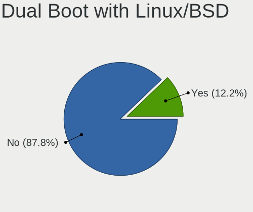
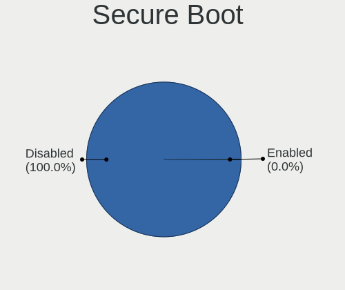
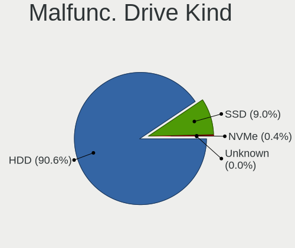
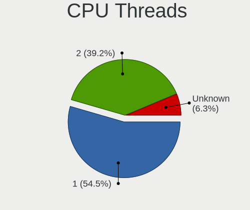
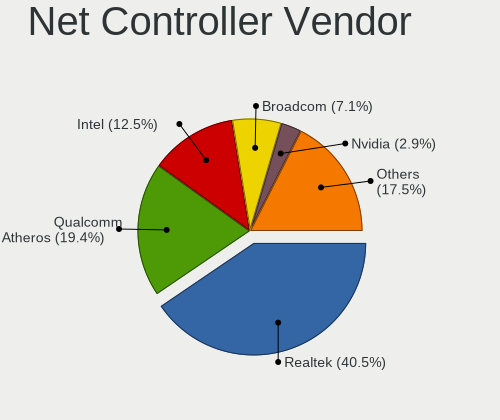
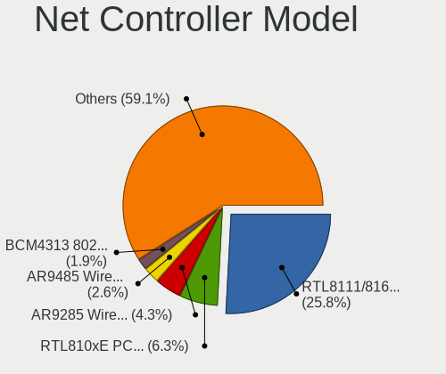
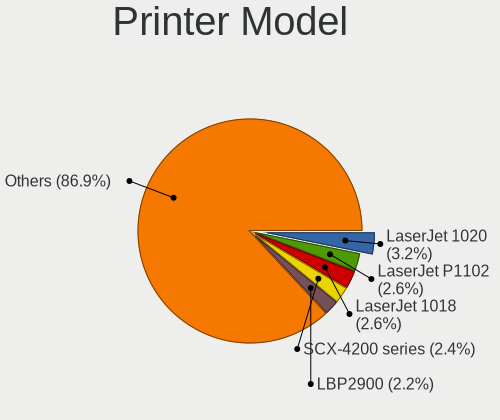

ROSA - Tested Hardware & Statistics
-----------------------------------

A project to collect tested hardware configurations for ROSA.

Anyone can contribute to this report by the [hw-probe](https://github.com/linuxhw/hw-probe) tool:

    sudo -E hw-probe -all -upload

Please contribute! Especially if your hardware is rare.

This is a report for all computer types. See also reports for [desktops](/Dist/ROSA/Desktop/README.md) and [notebooks](/Dist/ROSA/Notebook/README.md).

Contents
--------

* [ Test Cases ](#test-cases)

* [ System ](#system)
  - [ OS                       ](#os)
  - [ OS Family                ](#os-family)
  - [ Kernel                   ](#kernel)
  - [ Kernel Family            ](#kernel-family)
  - [ Kernel Major Ver.        ](#kernel-major-ver)
  - [ Arch                     ](#arch)
  - [ DE                       ](#de)
  - [ Display Server           ](#display-server)
  - [ Display Manager          ](#display-manager)
  - [ OS Lang                  ](#os-lang)
  - [ Boot Mode                ](#boot-mode)
  - [ Filesystem               ](#filesystem)
  - [ Part. scheme             ](#part-scheme)
  - [ Dual Boot with Linux/BSD ](#dual-boot-with-linuxbsd)
  - [ Dual Boot (Win)          ](#dual-boot-win)

* [ Board ](#board)
  - [ Vendor                   ](#vendor)
  - [ Model                    ](#model)
  - [ Model Family             ](#model-family)
  - [ MFG Year                 ](#mfg-year)
  - [ Form Factor              ](#form-factor)
  - [ Secure Boot              ](#secure-boot)
  - [ Coreboot                 ](#coreboot)
  - [ RAM Size                 ](#ram-size)
  - [ RAM Used                 ](#ram-used)
  - [ Total Drives             ](#total-drives)
  - [ Has CD-ROM               ](#has-cd-rom)
  - [ Has Ethernet             ](#has-ethernet)
  - [ Has WiFi                 ](#has-wifi)
  - [ Has Bluetooth            ](#has-bluetooth)

* [ Location ](#location)
  - [ Country                  ](#country)
  - [ City                     ](#city)

* [ Drives ](#drives)
  - [ Drive Vendor             ](#drive-vendor)
  - [ Drive Model              ](#drive-model)
  - [ HDD Vendor               ](#hdd-vendor)
  - [ SSD Vendor               ](#ssd-vendor)
  - [ Drive Kind               ](#drive-kind)
  - [ Drive Connector          ](#drive-connector)
  - [ Drive Size               ](#drive-size)
  - [ Space Total              ](#space-total)
  - [ Space Used               ](#space-used)
  - [ Malfunc. Drives          ](#malfunc-drives)
  - [ Malfunc. Drive Vendor    ](#malfunc-drive-vendor)
  - [ Malfunc. HDD Vendor      ](#malfunc-hdd-vendor)
  - [ Malfunc. Drive Kind      ](#malfunc-drive-kind)
  - [ Failed Drives            ](#failed-drives)
  - [ Failed Drive Vendor      ](#failed-drive-vendor)
  - [ Drive Status             ](#drive-status)

* [ Storage controller ](#storage-controller)
  - [ Storage Vendor           ](#storage-vendor)
  - [ Storage Model            ](#storage-model)
  - [ Storage Kind             ](#storage-kind)

* [ Processor ](#processor)
  - [ CPU Vendor               ](#cpu-vendor)
  - [ CPU Model                ](#cpu-model)
  - [ CPU Model Family         ](#cpu-model-family)
  - [ CPU Cores                ](#cpu-cores)
  - [ CPU Sockets              ](#cpu-sockets)
  - [ CPU Threads              ](#cpu-threads)
  - [ CPU Op-Modes             ](#cpu-op-modes)
  - [ CPU Microcode            ](#cpu-microcode)
  - [ CPU Microarch            ](#cpu-microarch)

* [ Graphics ](#graphics)
  - [ GPU Vendor               ](#gpu-vendor)
  - [ GPU Model                ](#gpu-model)
  - [ GPU Combo                ](#gpu-combo)
  - [ GPU Driver               ](#gpu-driver)
  - [ GPU Memory               ](#gpu-memory)

* [ Monitor ](#monitor)
  - [ Monitor Vendor           ](#monitor-vendor)
  - [ Monitor Model            ](#monitor-model)
  - [ Monitor Resolution       ](#monitor-resolution)
  - [ Monitor Diagonal         ](#monitor-diagonal)
  - [ Monitor Width            ](#monitor-width)
  - [ Aspect Ratio             ](#aspect-ratio)
  - [ Monitor Area             ](#monitor-area)
  - [ Pixel Density            ](#pixel-density)
  - [ Multiple Monitors        ](#multiple-monitors)

* [ Network ](#network)
  - [ Net Controller Vendor    ](#net-controller-vendor)
  - [ Net Controller Model     ](#net-controller-model)
  - [ Wireless Vendor          ](#wireless-vendor)
  - [ Wireless Model           ](#wireless-model)
  - [ Ethernet Vendor          ](#ethernet-vendor)
  - [ Ethernet Model           ](#ethernet-model)
  - [ Net Controller Kind      ](#net-controller-kind)
  - [ Used Controller          ](#used-controller)
  - [ NICs                     ](#nics)
  - [ IPv6                     ](#ipv6)

* [ Bluetooth ](#bluetooth)
  - [ Bluetooth Vendor         ](#bluetooth-vendor)
  - [ Bluetooth Model          ](#bluetooth-model)

* [ Sound ](#sound)
  - [ Sound Vendor             ](#sound-vendor)
  - [ Sound Model              ](#sound-model)

* [ Memory ](#memory)
  - [ Memory Vendor            ](#memory-vendor)
  - [ Memory Model             ](#memory-model)
  - [ Memory Kind              ](#memory-kind)
  - [ Memory Form Factor       ](#memory-form-factor)
  - [ Memory Size              ](#memory-size)
  - [ Memory Speed             ](#memory-speed)

* [ Printers & scanners ](#printers--scanners)
  - [ Printer Vendor           ](#printer-vendor)
  - [ Printer Model            ](#printer-model)
  - [ Scanner Vendor           ](#scanner-vendor)
  - [ Scanner Model            ](#scanner-model)

* [ Camera ](#camera)
  - [ Camera Vendor            ](#camera-vendor)
  - [ Camera Model             ](#camera-model)

* [ Security ](#security)
  - [ Fingerprint Vendor       ](#fingerprint-vendor)
  - [ Fingerprint Model        ](#fingerprint-model)
  - [ Chipcard Vendor          ](#chipcard-vendor)
  - [ Chipcard Model           ](#chipcard-model)

* [ Unsupported ](#unsupported)
  - [ Unsupported Devices      ](#unsupported-devices)
  - [ Unsupported Device Types ](#unsupported-device-types)

Test Cases
----------

Total: 45103

| Vendor        | Model                       | Form-Factor | Probe                                                      | Date         |
|---------------|-----------------------------|-------------|------------------------------------------------------------|--------------|
| Samsung       | 350V5C/351V5C/3540VC/344... | Notebook    | [c7b3c10131](https://linux-hardware.org/?probe=c7b3c10131) | May 09, 2024 |
| Lenovo        | Bantry CRB NOK              | Desktop     | [c2a11bca8a](https://linux-hardware.org/?probe=c2a11bca8a) | May 09, 2024 |
| ASUSTek       | VivoBook 15_ASUS Laptop ... | Notebook    | [11d69e96cb](https://linux-hardware.org/?probe=11d69e96cb) | May 08, 2024 |
| ASRock        | H61M                        | Desktop     | [4db6a46097](https://linux-hardware.org/?probe=4db6a46097) | May 08, 2024 |
| ASRock        | H61M                        | Desktop     | [cf55ba331e](https://linux-hardware.org/?probe=cf55ba331e) | May 08, 2024 |
| ASUSTek       | ASUS TUF Dash F15 FX517Z... | Notebook    | [ac49e3fa07](https://linux-hardware.org/?probe=ac49e3fa07) | May 08, 2024 |
| Sony          | VPCF13E1R                   | Notebook    | [593de85e33](https://linux-hardware.org/?probe=593de85e33) | May 08, 2024 |
| Lenovo        | IdeaPad S510p 20298         | Notebook    | [e4c7ca80f3](https://linux-hardware.org/?probe=e4c7ca80f3) | May 08, 2024 |
| ASRock        | B550M Phantom Gaming 4      | Desktop     | [336a5b4e2b](https://linux-hardware.org/?probe=336a5b4e2b) | May 08, 2024 |
| Gigabyte      | H81M-S1                     | Desktop     | [3566b1666c](https://linux-hardware.org/?probe=3566b1666c) | May 08, 2024 |
| ASUSTek       | E520                        | Desktop     | [4e025280e9](https://linux-hardware.org/?probe=4e025280e9) | May 08, 2024 |
| Gigabyte      | B560M H                     | Desktop     | [9d2a9c59a3](https://linux-hardware.org/?probe=9d2a9c59a3) | May 08, 2024 |
| MSI           | B450M-A PRO MAX II          | Desktop     | [cd66ff303c](https://linux-hardware.org/?probe=cd66ff303c) | May 08, 2024 |
| MSI           | PRO B650M-P                 | Desktop     | [2490ea1b56](https://linux-hardware.org/?probe=2490ea1b56) | May 08, 2024 |
| Gigabyte      | H81M-S2H                    | Desktop     | [217f6991ee](https://linux-hardware.org/?probe=217f6991ee) | May 08, 2024 |
| Gigabyte      | B450 GAMING X               | Desktop     | [f7eef71378](https://linux-hardware.org/?probe=f7eef71378) | May 08, 2024 |
| ASRock        | AB350M-HDV R3.0             | Desktop     | [d919c0d099](https://linux-hardware.org/?probe=d919c0d099) | May 07, 2024 |
| Dell          | Inspiron 3793               | Notebook    | [02e4c23d86](https://linux-hardware.org/?probe=02e4c23d86) | May 07, 2024 |
| Gigabyte      | C1037UN-EU                  | Desktop     | [714735cd6f](https://linux-hardware.org/?probe=714735cd6f) | May 07, 2024 |
| Dell          | Inspiron 3793               | Notebook    | [00234ed0c4](https://linux-hardware.org/?probe=00234ed0c4) | May 07, 2024 |
| ASUSTek       | ASUSLaptop_Q530VJ           | Notebook    | [97021794a9](https://linux-hardware.org/?probe=97021794a9) | May 07, 2024 |
| ASUSTek       | VivoBook S15 X530UF         | Notebook    | [5725e80488](https://linux-hardware.org/?probe=5725e80488) | May 07, 2024 |
| Fujitsu Si... | LIFEBOOK S6410              | Notebook    | [fb78e4f92a](https://linux-hardware.org/?probe=fb78e4f92a) | May 07, 2024 |
| MSI           | GL62M 7RDX                  | Notebook    | [df43002002](https://linux-hardware.org/?probe=df43002002) | May 07, 2024 |
| GEEKOM        | A7                          | Desktop     | [87925a210f](https://linux-hardware.org/?probe=87925a210f) | May 07, 2024 |
| Gigabyte      | H610M S2H DDR4              | Desktop     | [4fb0650e99](https://linux-hardware.org/?probe=4fb0650e99) | May 07, 2024 |
| HP            | EliteBook 8470p             | Notebook    | [1022758f4a](https://linux-hardware.org/?probe=1022758f4a) | May 07, 2024 |
| HP            | EliteBook 8470p             | Notebook    | [36f94dbbd1](https://linux-hardware.org/?probe=36f94dbbd1) | May 07, 2024 |
| Lenovo        | IdeaPad Z580                | Notebook    | [2fad877602](https://linux-hardware.org/?probe=2fad877602) | May 06, 2024 |
| Intel         | B75                         | Desktop     | [18e086bc3d](https://linux-hardware.org/?probe=18e086bc3d) | May 06, 2024 |
| Lenovo        | 36C7 SDK0J40697 WIN 3305... | Desktop     | [867c770e38](https://linux-hardware.org/?probe=867c770e38) | May 06, 2024 |
| Gigabyte      | 8PEMT4                      | Desktop     | [d43ba07bdd](https://linux-hardware.org/?probe=d43ba07bdd) | May 06, 2024 |
| Fujitsu       | D3222-A1 S26361-D3222-A1    | Desktop     | [ec90e9cff9](https://linux-hardware.org/?probe=ec90e9cff9) | May 06, 2024 |
| Gigabyte      | H81M-S2H                    | Desktop     | [0b1a61e802](https://linux-hardware.org/?probe=0b1a61e802) | May 06, 2024 |
| Gigabyte      | B560M DS3H                  | Desktop     | [ead92a9fe5](https://linux-hardware.org/?probe=ead92a9fe5) | May 06, 2024 |
| eMachines     | E725                        | Notebook    | [171963d4bd](https://linux-hardware.org/?probe=171963d4bd) | May 05, 2024 |
| ASRock        | FM2A68M-DG3+                | Desktop     | [0c960e6942](https://linux-hardware.org/?probe=0c960e6942) | May 05, 2024 |
| Gigabyte      | B560M DS3H                  | Desktop     | [3d88207b4d](https://linux-hardware.org/?probe=3d88207b4d) | May 05, 2024 |
| Dell          | Inspiron 11-3162            | Notebook    | [ccf99ca586](https://linux-hardware.org/?probe=ccf99ca586) | May 05, 2024 |
| ASUSTek       | TUF H310M-PLUS GAMING R2... | Desktop     | [2a47a6393b](https://linux-hardware.org/?probe=2a47a6393b) | May 05, 2024 |
| ASUSTek       | TUF Gaming B550M-PLUS WI... | Desktop     | [c785a73424](https://linux-hardware.org/?probe=c785a73424) | May 05, 2024 |
| ASUSTek       | M4A88TD-V EVO/USB3          | Desktop     | [0ded21fa2e](https://linux-hardware.org/?probe=0ded21fa2e) | May 05, 2024 |
| Lenovo        | LOQ 15IRH8 82XV             | Notebook    | [2cc53cfafd](https://linux-hardware.org/?probe=2cc53cfafd) | May 05, 2024 |
| Samsung       | R528/R728                   | Notebook    | [2f4a17771e](https://linux-hardware.org/?probe=2f4a17771e) | May 05, 2024 |
| ASUSTek       | A7U                         | Notebook    | [d380bb6272](https://linux-hardware.org/?probe=d380bb6272) | May 05, 2024 |
| Gigabyte      | B450 GAMING X               | Desktop     | [632943f952](https://linux-hardware.org/?probe=632943f952) | May 05, 2024 |
| MSI           | B650 GAMING PLUS WIFI       | Desktop     | [c1db6719c8](https://linux-hardware.org/?probe=c1db6719c8) | May 04, 2024 |
| Toshiba       | Satellite L500              | Notebook    | [c947dc4138](https://linux-hardware.org/?probe=c947dc4138) | May 04, 2024 |
| ASUSTek       | P8P67                       | Desktop     | [9dcca1359b](https://linux-hardware.org/?probe=9dcca1359b) | May 04, 2024 |
| Gigabyte      | B550 AORUS ELITE V2         | Desktop     | [2f23713428](https://linux-hardware.org/?probe=2f23713428) | May 04, 2024 |
| Acer          | Extensa 5630                | Notebook    | [3312068dfc](https://linux-hardware.org/?probe=3312068dfc) | May 04, 2024 |
| Lenovo        | ThinkPad T14 Gen 2i 20W1... | Notebook    | [6689db52ed](https://linux-hardware.org/?probe=6689db52ed) | May 04, 2024 |
| Gigabyte      | Z77-DS3H                    | Desktop     | [239aa09252](https://linux-hardware.org/?probe=239aa09252) | May 04, 2024 |
| Gigabyte      | H97-D3H-CF                  | Desktop     | [d4b03a1295](https://linux-hardware.org/?probe=d4b03a1295) | May 04, 2024 |
| Dell          | 03NVJ6 A01                  | Desktop     | [d2f91d8ce7](https://linux-hardware.org/?probe=d2f91d8ce7) | May 03, 2024 |
| ASUSTek       | P7H55                       | Desktop     | [25860ff0c1](https://linux-hardware.org/?probe=25860ff0c1) | May 03, 2024 |
| Gigabyte      | B650M GAMING X AX           | Desktop     | [bca236e545](https://linux-hardware.org/?probe=bca236e545) | May 03, 2024 |
| Unknown       | Unknown                     | Desktop     | [1564e76ada](https://linux-hardware.org/?probe=1564e76ada) | May 03, 2024 |
| ASUSTek       | ASUS TUF Dash F15 FX517Z... | Notebook    | [2ce93c9d05](https://linux-hardware.org/?probe=2ce93c9d05) | May 03, 2024 |
| HP            | ProBook 450 G3              | Notebook    | [63fa17c1de](https://linux-hardware.org/?probe=63fa17c1de) | May 03, 2024 |
| AZW           | SER V1.0                    | Mini pc     | [cf0759e00a](https://linux-hardware.org/?probe=cf0759e00a) | May 03, 2024 |
| MSI           | MS-7309                     | Desktop     | [0683637148](https://linux-hardware.org/?probe=0683637148) | May 03, 2024 |
| Acer          | Aspire 3690                 | Notebook    | [18468b287d](https://linux-hardware.org/?probe=18468b287d) | May 02, 2024 |
| Lenovo        | B560 43308UG                | Notebook    | [3a36ef2f10](https://linux-hardware.org/?probe=3a36ef2f10) | May 02, 2024 |
| Gigabyte      | Z690 UD                     | Desktop     | [700cd9b859](https://linux-hardware.org/?probe=700cd9b859) | May 02, 2024 |
| Samsung       | RV420/RV520/RV720/E3530/... | Notebook    | [b12580ca82](https://linux-hardware.org/?probe=b12580ca82) | May 02, 2024 |
| HUAWEI        | BOM-WXX9                    | Notebook    | [358e00bbaa](https://linux-hardware.org/?probe=358e00bbaa) | May 02, 2024 |
| HONOR         | HYM-WXX                     | Notebook    | [58cc24a6c2](https://linux-hardware.org/?probe=58cc24a6c2) | May 02, 2024 |
| Gigabyte      | B560 HD3                    | Desktop     | [eb083c6668](https://linux-hardware.org/?probe=eb083c6668) | May 02, 2024 |
| ASRock        | Z68 Pro3                    | Desktop     | [2b254bcdbb](https://linux-hardware.org/?probe=2b254bcdbb) | May 02, 2024 |
| HP            | 0AA8h                       | Desktop     | [7b72e86416](https://linux-hardware.org/?probe=7b72e86416) | May 01, 2024 |
| JGINYUE       | X99 TITANIUM D4             | Desktop     | [dc3cd2b7e9](https://linux-hardware.org/?probe=dc3cd2b7e9) | May 01, 2024 |
| ASRock        | H410M-HVS                   | Desktop     | [2a5b383001](https://linux-hardware.org/?probe=2a5b383001) | May 01, 2024 |
| Intel         | DZ77BH-55K AAG39008-401     | Desktop     | [9fae0699d4](https://linux-hardware.org/?probe=9fae0699d4) | May 01, 2024 |
| eMachines     | Rhine V1.42                 | Notebook    | [f281ddf1c6](https://linux-hardware.org/?probe=f281ddf1c6) | May 01, 2024 |
| Acer          | WMCP78M                     | Desktop     | [34b0e08d0c](https://linux-hardware.org/?probe=34b0e08d0c) | May 01, 2024 |
| Lenovo        | ThinkPad T14 Gen 2i 20W1... | Notebook    | [6dee7f5b7c](https://linux-hardware.org/?probe=6dee7f5b7c) | May 01, 2024 |
| Unknown       | GB01                        | Desktop     | [cbbb8cc3ea](https://linux-hardware.org/?probe=cbbb8cc3ea) | May 01, 2024 |
| ASUSTek       | M50Vc                       | Notebook    | [d1db0617f1](https://linux-hardware.org/?probe=d1db0617f1) | May 01, 2024 |
| ASUSTek       | X75VC                       | Notebook    | [0896559952](https://linux-hardware.org/?probe=0896559952) | May 01, 2024 |
| Acer          | Predator PH317-52           | Notebook    | [bd69caed14](https://linux-hardware.org/?probe=bd69caed14) | Apr 30, 2024 |
| Gigabyte      | P67A-D3-B3                  | Desktop     | [22337aabf0](https://linux-hardware.org/?probe=22337aabf0) | Apr 30, 2024 |
| Gigabyte      | P67A-D3-B3                  | Desktop     | [f3950d30d7](https://linux-hardware.org/?probe=f3950d30d7) | Apr 30, 2024 |
| ASRock        | H510M-HDV                   | Desktop     | [f48ead89ac](https://linux-hardware.org/?probe=f48ead89ac) | Apr 30, 2024 |
| Lenovo        | ThinkPad T60 1952W2Q        | Notebook    | [cfb8cb1bb5](https://linux-hardware.org/?probe=cfb8cb1bb5) | Apr 30, 2024 |
| HUAWEI        | NBD-WXX9                    | Notebook    | [28ca7324e5](https://linux-hardware.org/?probe=28ca7324e5) | Apr 30, 2024 |
| ASUSTek       | X550VC                      | Notebook    | [cc8153163f](https://linux-hardware.org/?probe=cc8153163f) | Apr 30, 2024 |
| DEXP          | Atlas M15-I3W302            | Notebook    | [efae6e687e](https://linux-hardware.org/?probe=efae6e687e) | Apr 30, 2024 |
| Dell          | Inspiron 3542               | Notebook    | [b37cc5d9c0](https://linux-hardware.org/?probe=b37cc5d9c0) | Apr 30, 2024 |
| ASUSTek       | M5A97 R2.0                  | Desktop     | [448d785ccb](https://linux-hardware.org/?probe=448d785ccb) | Apr 30, 2024 |
| Lenovo        | ThinkPad X250 20CLS75800    | Notebook    | [7626333cd6](https://linux-hardware.org/?probe=7626333cd6) | Apr 29, 2024 |
| ASUSTek       | P5KPL-VM                    | Desktop     | [d2d5710920](https://linux-hardware.org/?probe=d2d5710920) | Apr 29, 2024 |
| HIPER Tech... | HIPER WORKBOOK              | Notebook    | [b553fc9cbc](https://linux-hardware.org/?probe=b553fc9cbc) | Apr 29, 2024 |
| Lenovo        | IdeaPad 5 15ARE05 81YQ      | Notebook    | [69ab0359f4](https://linux-hardware.org/?probe=69ab0359f4) | Apr 29, 2024 |
| Lenovo        | IdeaPad 5 14ARE05 81YM      | Notebook    | [6c0201b207](https://linux-hardware.org/?probe=6c0201b207) | Apr 29, 2024 |
| Gigabyte      | C1037UN-EU                  | Desktop     | [ff9f6ab993](https://linux-hardware.org/?probe=ff9f6ab993) | Apr 29, 2024 |
| Gigabyte      | B550M AORUS ELITE           | Desktop     | [deab538223](https://linux-hardware.org/?probe=deab538223) | Apr 29, 2024 |
| ASRock        | H110M-DGS R3.0              | Desktop     | [e1d811fd8f](https://linux-hardware.org/?probe=e1d811fd8f) | Apr 29, 2024 |
| ASUSTek       | P5B-VM SE                   | Desktop     | [b3631ed021](https://linux-hardware.org/?probe=b3631ed021) | Apr 29, 2024 |
| HP            | Laptop 15s-eq1xxx           | Notebook    | [43977b477b](https://linux-hardware.org/?probe=43977b477b) | Apr 29, 2024 |
| Lenovo        | ThinkBook 15 G3 ACL 21A4    | Notebook    | [63088368e6](https://linux-hardware.org/?probe=63088368e6) | Apr 29, 2024 |
| Dell          | 0J3C2F A00                  | Desktop     | [7c98336737](https://linux-hardware.org/?probe=7c98336737) | Apr 29, 2024 |
| ASRock        | 970 Extreme3                | Desktop     | [41c988e70a](https://linux-hardware.org/?probe=41c988e70a) | Apr 28, 2024 |
| Dell          | 0Y5DDC A00                  | Desktop     | [ebc89ad860](https://linux-hardware.org/?probe=ebc89ad860) | Apr 28, 2024 |
| Dell          | Inspiron 5558               | Notebook    | [544ce3b297](https://linux-hardware.org/?probe=544ce3b297) | Apr 28, 2024 |
| ASUSTek       | ROG STRIX Z490-A GAMING     | Desktop     | [3f33898064](https://linux-hardware.org/?probe=3f33898064) | Apr 28, 2024 |
| HP            | EliteBook 840 G4            | Notebook    | [85dd5fce8a](https://linux-hardware.org/?probe=85dd5fce8a) | Apr 28, 2024 |
| Gigabyte      | B450M GAMING                | Desktop     | [e1d90f7845](https://linux-hardware.org/?probe=e1d90f7845) | Apr 28, 2024 |
| HP            | EliteBook 840 G4            | Notebook    | [0da481706b](https://linux-hardware.org/?probe=0da481706b) | Apr 27, 2024 |
| ASUSTek       | TUF Gaming B550-PLUS        | Desktop     | [9668278c22](https://linux-hardware.org/?probe=9668278c22) | Apr 27, 2024 |
| Gigabyte      | B560 HD3                    | Desktop     | [44238d5c6b](https://linux-hardware.org/?probe=44238d5c6b) | Apr 27, 2024 |
| Gigabyte      | P75-D3                      | Desktop     | [5b99a00fb6](https://linux-hardware.org/?probe=5b99a00fb6) | Apr 27, 2024 |
| ASRock        | A520M Pro4                  | Desktop     | [4bc0a01a43](https://linux-hardware.org/?probe=4bc0a01a43) | Apr 27, 2024 |
| ASUSTek       | M5A97 LE R2.0               | Desktop     | [c01df1a8cc](https://linux-hardware.org/?probe=c01df1a8cc) | Apr 27, 2024 |
| MSI           | B560M PRO-VDH               | Desktop     | [e8eecbc1e8](https://linux-hardware.org/?probe=e8eecbc1e8) | Apr 27, 2024 |
| Lenovo        | IdeaPad S145-14AST 81ST     | Notebook    | [a823e9adf2](https://linux-hardware.org/?probe=a823e9adf2) | Apr 26, 2024 |
| Microtech     | CoreBook Lite               | Notebook    | [6b831e47a9](https://linux-hardware.org/?probe=6b831e47a9) | Apr 26, 2024 |
| Lenovo        | 3190 NOK                    | Mini pc     | [e8cbe17627](https://linux-hardware.org/?probe=e8cbe17627) | Apr 26, 2024 |
| Unknown       | Unknown                     | Notebook    | [0cb76807b8](https://linux-hardware.org/?probe=0cb76807b8) | Apr 26, 2024 |
| Lenovo        | ThinkBook 16 G4+ ARA 21D... | Notebook    | [9c92ac1222](https://linux-hardware.org/?probe=9c92ac1222) | Apr 26, 2024 |
| MSI           | A520M-A PRO                 | Desktop     | [b5da5c88d5](https://linux-hardware.org/?probe=b5da5c88d5) | Apr 26, 2024 |
| MSI           | A520M-A PRO                 | Desktop     | [29f83993ee](https://linux-hardware.org/?probe=29f83993ee) | Apr 26, 2024 |
| MSI           | B560M-A PRO                 | Desktop     | [8c03907a7f](https://linux-hardware.org/?probe=8c03907a7f) | Apr 26, 2024 |
| Haier         | AX1750SD                    | Notebook    | [75850d1eb4](https://linux-hardware.org/?probe=75850d1eb4) | Apr 26, 2024 |
| Samsung       | RV415/RV515/E3415           | Notebook    | [b52d1ce535](https://linux-hardware.org/?probe=b52d1ce535) | Apr 25, 2024 |
| Acer          | AO725                       | Notebook    | [edab2bcf78](https://linux-hardware.org/?probe=edab2bcf78) | Apr 25, 2024 |
| Lenovo        | 3000 G770 PIWG1             | Notebook    | [07341d0770](https://linux-hardware.org/?probe=07341d0770) | Apr 25, 2024 |
| Gigabyte      | H610M H DDR4                | Desktop     | [f539d958f8](https://linux-hardware.org/?probe=f539d958f8) | Apr 25, 2024 |
| Timi          | Xiaomi Book Pro 14 2022     | Notebook    | [c08c262bee](https://linux-hardware.org/?probe=c08c262bee) | Apr 25, 2024 |
| ASUSTek       | PRIME B450M-K II            | Desktop     | [5e0533ba7a](https://linux-hardware.org/?probe=5e0533ba7a) | Apr 25, 2024 |
| MB            | A320-SF110                  | Desktop     | [12b1e02450](https://linux-hardware.org/?probe=12b1e02450) | Apr 25, 2024 |
| Acer          | Aspire V5-122               | Notebook    | [56cc9120d0](https://linux-hardware.org/?probe=56cc9120d0) | Apr 25, 2024 |
| ASUSTek       | X75VC                       | Notebook    | [11dcf2d1f8](https://linux-hardware.org/?probe=11dcf2d1f8) | Apr 25, 2024 |
| MSI           | B450M PRO-VDH MAX           | Desktop     | [6af9b206fe](https://linux-hardware.org/?probe=6af9b206fe) | Apr 25, 2024 |
| Samsung       | 350V5C/351V5C/3540VC/344... | Notebook    | [5df7b71a31](https://linux-hardware.org/?probe=5df7b71a31) | Apr 25, 2024 |
| ASRock        | B450M Pro4                  | Desktop     | [c21217d9a7](https://linux-hardware.org/?probe=c21217d9a7) | Apr 24, 2024 |
| DEXP          | Atlas M15-A5W304            | Notebook    | [4185759bbc](https://linux-hardware.org/?probe=4185759bbc) | Apr 24, 2024 |
| Dell          | Vostro 5502                 | Notebook    | [ec30716f3d](https://linux-hardware.org/?probe=ec30716f3d) | Apr 24, 2024 |
| ASUSTek       | M5A78L-M PLUS/USB3          | Desktop     | [2d7981cb51](https://linux-hardware.org/?probe=2d7981cb51) | Apr 24, 2024 |
| ASUSTek       | Z87-K                       | Desktop     | [4e94cfc6a5](https://linux-hardware.org/?probe=4e94cfc6a5) | Apr 23, 2024 |
| ASUSTek       | Z87-K                       | Desktop     | [82b76f44a6](https://linux-hardware.org/?probe=82b76f44a6) | Apr 23, 2024 |
| Clevo         | NL41MU2                     | Notebook    | [bfc7896f0a](https://linux-hardware.org/?probe=bfc7896f0a) | Apr 23, 2024 |
| XIAOMI        | Redmi Book 14 2024          | Notebook    | [8bc80a1886](https://linux-hardware.org/?probe=8bc80a1886) | Apr 23, 2024 |
| Standard      | Unknown                     | Notebook    | [56927b31d9](https://linux-hardware.org/?probe=56927b31d9) | Apr 23, 2024 |
| Maibenben     | Perfectum Series            | Notebook    | [bec84b156a](https://linux-hardware.org/?probe=bec84b156a) | Apr 23, 2024 |
| Biostar       | B250MHC                     | Desktop     | [ce7a852455](https://linux-hardware.org/?probe=ce7a852455) | Apr 23, 2024 |
| Unknown       | Unknown                     | Notebook    | [f8d5589c4d](https://linux-hardware.org/?probe=f8d5589c4d) | Apr 22, 2024 |
| Lenovo        | ThinkPad SL510 28477EG      | Notebook    | [cd4ebf191f](https://linux-hardware.org/?probe=cd4ebf191f) | Apr 22, 2024 |
| ICL           | H510SB-TM v2.0              | All in one  | [acb37c9baa](https://linux-hardware.org/?probe=acb37c9baa) | Apr 22, 2024 |
| EPoX Compu... | nForce3 DDR: 8KDA3I Seri... | Desktop     | [12953efce9](https://linux-hardware.org/?probe=12953efce9) | Apr 22, 2024 |
| Gigabyte      | B560 HD3                    | Desktop     | [79a0bd3c5a](https://linux-hardware.org/?probe=79a0bd3c5a) | Apr 22, 2024 |
| Lenovo        | ThinkPad E15 Gen 2 20T80... | Notebook    | [fdad15cab2](https://linux-hardware.org/?probe=fdad15cab2) | Apr 22, 2024 |
| Gigabyte      | A520M H                     | Desktop     | [e2dbe2747f](https://linux-hardware.org/?probe=e2dbe2747f) | Apr 21, 2024 |
| ECS           | H61H2-MV                    | Desktop     | [ae7dbc61ba](https://linux-hardware.org/?probe=ae7dbc61ba) | Apr 21, 2024 |
| MSI           | 760GM-P21                   | Desktop     | [7984d3e4b9](https://linux-hardware.org/?probe=7984d3e4b9) | Apr 21, 2024 |
| MSI           | CX600                       | Notebook    | [061bf45f86](https://linux-hardware.org/?probe=061bf45f86) | Apr 21, 2024 |
| ASUSTek       | P5G41T-M LX3                | Desktop     | [4a8c3625a7](https://linux-hardware.org/?probe=4a8c3625a7) | Apr 21, 2024 |
| Gigabyte      | H77N-WIFI                   | Desktop     | [a3913f0b25](https://linux-hardware.org/?probe=a3913f0b25) | Apr 21, 2024 |
| Huanan        | X99-BD4 V1.33               | Desktop     | [b8d6f42912](https://linux-hardware.org/?probe=b8d6f42912) | Apr 21, 2024 |
| HP            | 8433 11                     | Desktop     | [c35af27b38](https://linux-hardware.org/?probe=c35af27b38) | Apr 21, 2024 |
| Gigabyte      | B560M DS3H V2               | Desktop     | [6d72c0e404](https://linux-hardware.org/?probe=6d72c0e404) | Apr 21, 2024 |
| Gigabyte      | B450M S2H                   | Desktop     | [91016c84f6](https://linux-hardware.org/?probe=91016c84f6) | Apr 21, 2024 |
| Lenovo        | ThinkPad T61 7663PJG        | Notebook    | [6463d83351](https://linux-hardware.org/?probe=6463d83351) | Apr 21, 2024 |
| Intel         | X99                         | Desktop     | [efa0495932](https://linux-hardware.org/?probe=efa0495932) | Apr 20, 2024 |
| ASRock        | N68-VS3 UCC                 | Desktop     | [d273e0a39b](https://linux-hardware.org/?probe=d273e0a39b) | Apr 20, 2024 |
| HUAWEI        | BOM-WXX9                    | Notebook    | [fb9a9f3feb](https://linux-hardware.org/?probe=fb9a9f3feb) | Apr 20, 2024 |
| Acer          | Aspire 5742Z                | Notebook    | [d74abf8d8a](https://linux-hardware.org/?probe=d74abf8d8a) | Apr 20, 2024 |
| HP            | Pavilion g6                 | Notebook    | [9e232056dd](https://linux-hardware.org/?probe=9e232056dd) | Apr 20, 2024 |
| Sony          | VGN-FW11ER                  | Notebook    | [a8a0b64a18](https://linux-hardware.org/?probe=a8a0b64a18) | Apr 20, 2024 |
| ASRock        | N68C-GS FX                  | Desktop     | [8c11941906](https://linux-hardware.org/?probe=8c11941906) | Apr 20, 2024 |
| Acer          | Aspire 5943G                | Notebook    | [25e8c506a4](https://linux-hardware.org/?probe=25e8c506a4) | Apr 20, 2024 |
| HP            | ProBook 450 G5              | Notebook    | [7f344d90df](https://linux-hardware.org/?probe=7f344d90df) | Apr 20, 2024 |
| Intel         | AB2L .A001                  | Mini pc     | [ee7b33e3aa](https://linux-hardware.org/?probe=ee7b33e3aa) | Apr 20, 2024 |
| Lenovo        | IdeaPad S10-2 20027         | Notebook    | [db640aaaa7](https://linux-hardware.org/?probe=db640aaaa7) | Apr 20, 2024 |
| MSI           | B550M PRO-VDH WIFI          | Desktop     | [b02f80cde5](https://linux-hardware.org/?probe=b02f80cde5) | Apr 20, 2024 |
| MSI           | 2A9Ch                       | Desktop     | [9722851624](https://linux-hardware.org/?probe=9722851624) | Apr 19, 2024 |
| ASRock        | H55M-GE                     | Desktop     | [af9410e05d](https://linux-hardware.org/?probe=af9410e05d) | Apr 19, 2024 |
| ASRock        | H81M-HDS R2.0               | Desktop     | [fc15e77fd7](https://linux-hardware.org/?probe=fc15e77fd7) | Apr 19, 2024 |
| Gigabyte      | GA-870A-UD3                 | Desktop     | [5c12a39842](https://linux-hardware.org/?probe=5c12a39842) | Apr 19, 2024 |
| Gigabyte      | GA-970A-UD3                 | Desktop     | [a898b849a3](https://linux-hardware.org/?probe=a898b849a3) | Apr 19, 2024 |
| Unknown       | Unknown                     | Notebook    | [5dbe94517d](https://linux-hardware.org/?probe=5dbe94517d) | Apr 19, 2024 |
| Gigabyte      | Z68X-UD3H-B3                | Desktop     | [e0caa04752](https://linux-hardware.org/?probe=e0caa04752) | Apr 19, 2024 |
| Toshiba       | Satellite C850-C1S          | Notebook    | [f81e33341e](https://linux-hardware.org/?probe=f81e33341e) | Apr 19, 2024 |
| Gigabyte      | AB350M-DS3H V2-CF           | Desktop     | [7521a177c6](https://linux-hardware.org/?probe=7521a177c6) | Apr 18, 2024 |
| ICL           | H310SB-TM                   | All in one  | [46658f67d3](https://linux-hardware.org/?probe=46658f67d3) | Apr 18, 2024 |
| Intel         | SKYBAY                      | Desktop     | [8177e0db3d](https://linux-hardware.org/?probe=8177e0db3d) | Apr 18, 2024 |
| ASRock        | H55M-LE                     | Desktop     | [d1a9eab709](https://linux-hardware.org/?probe=d1a9eab709) | Apr 18, 2024 |
| Lenovo        | 3000 G770 PIWG1             | Notebook    | [d649ef0780](https://linux-hardware.org/?probe=d649ef0780) | Apr 18, 2024 |
| Lenovo        | G50-30 80G0                 | Notebook    | [bb33045893](https://linux-hardware.org/?probe=bb33045893) | Apr 18, 2024 |
| Gigabyte      | H61M-S2PV                   | Desktop     | [2237c11067](https://linux-hardware.org/?probe=2237c11067) | Apr 18, 2024 |
| HP            | 655                         | Notebook    | [603622d552](https://linux-hardware.org/?probe=603622d552) | Apr 18, 2024 |
| MSI           | PRO B650M-P                 | Desktop     | [248ffb4c8d](https://linux-hardware.org/?probe=248ffb4c8d) | Apr 18, 2024 |
| MACHINIST     | X79 (INTEL Xeon E5/Corei... | Desktop     | [4dbd9441f2](https://linux-hardware.org/?probe=4dbd9441f2) | Apr 18, 2024 |
| HP            | 8534 MVB                    | Desktop     | [a72d3ca2aa](https://linux-hardware.org/?probe=a72d3ca2aa) | Apr 17, 2024 |
| WeiBu         | ADL-N Prod                  | Desktop     | [3da2323db4](https://linux-hardware.org/?probe=3da2323db4) | Apr 17, 2024 |
| HP            | EliteBook 8440p             | Notebook    | [eb3a684db2](https://linux-hardware.org/?probe=eb3a684db2) | Apr 17, 2024 |
| ASRock        | H110M-DGS R3.0              | Desktop     | [f010a333ff](https://linux-hardware.org/?probe=f010a333ff) | Apr 17, 2024 |
| MSI           | MPG B550 GAMING PLUS        | Desktop     | [3d86cc0385](https://linux-hardware.org/?probe=3d86cc0385) | Apr 17, 2024 |
| Infinix       | INBOOK Y2 PLUS              | Notebook    | [8daf9c701b](https://linux-hardware.org/?probe=8daf9c701b) | Apr 17, 2024 |
| ASUSTek       | A88XM-A                     | Desktop     | [9ec8a9c7a5](https://linux-hardware.org/?probe=9ec8a9c7a5) | Apr 16, 2024 |
| Gigabyte      | B360M DS3H                  | Desktop     | [5840160986](https://linux-hardware.org/?probe=5840160986) | Apr 16, 2024 |
| ASUSTek       | M5A97 R2.0                  | Desktop     | [4cbfaca39b](https://linux-hardware.org/?probe=4cbfaca39b) | Apr 16, 2024 |
| ASUSTek       | F80S                        | Notebook    | [74bd778747](https://linux-hardware.org/?probe=74bd778747) | Apr 16, 2024 |
| Gigabyte      | B360M DS3H                  | Desktop     | [b0cdd5070e](https://linux-hardware.org/?probe=b0cdd5070e) | Apr 16, 2024 |
| Acer          | Predator PH317-52           | Notebook    | [61bf535f73](https://linux-hardware.org/?probe=61bf535f73) | Apr 16, 2024 |
| HP            | Presario CQ61               | Notebook    | [8247d1e7e6](https://linux-hardware.org/?probe=8247d1e7e6) | Apr 16, 2024 |
| ASUSTek       | P5Q-VM DO                   | Desktop     | [97854f0f53](https://linux-hardware.org/?probe=97854f0f53) | Apr 16, 2024 |
| Gigabyte      | Z77-DS3H                    | Desktop     | [c0e482caa4](https://linux-hardware.org/?probe=c0e482caa4) | Apr 16, 2024 |
| ANCOMP        | Learnmate A15-501           | Notebook    | [4084ef8bf3](https://linux-hardware.org/?probe=4084ef8bf3) | Apr 16, 2024 |
| HIPER         | EXPERTBOOK                  | Notebook    | [d0acd21b3b](https://linux-hardware.org/?probe=d0acd21b3b) | Apr 16, 2024 |
| ASUSTek       | PRIME B660M-K D4            | Desktop     | [ef00b4e19b](https://linux-hardware.org/?probe=ef00b4e19b) | Apr 15, 2024 |
| ASUSTek       | K53SM                       | Notebook    | [63f81d22fb](https://linux-hardware.org/?probe=63f81d22fb) | Apr 15, 2024 |
| ASUSTek       | K53SM                       | Notebook    | [d23a978a95](https://linux-hardware.org/?probe=d23a978a95) | Apr 15, 2024 |
| Toshiba       | Satellite C850-C1S          | Notebook    | [d4457e5519](https://linux-hardware.org/?probe=d4457e5519) | Apr 15, 2024 |
| HP            | Pavilion m6                 | Notebook    | [c0e3a0cb12](https://linux-hardware.org/?probe=c0e3a0cb12) | Apr 15, 2024 |
| Acer          | Aspire E5-573G              | Notebook    | [4afd132fe0](https://linux-hardware.org/?probe=4afd132fe0) | Apr 15, 2024 |
| ASUSTek       | P7H55-M PRO                 | Desktop     | [ac09a9db06](https://linux-hardware.org/?probe=ac09a9db06) | Apr 15, 2024 |
| Gigabyte      | B85M-D3H                    | Desktop     | [0428aaf36d](https://linux-hardware.org/?probe=0428aaf36d) | Apr 15, 2024 |
| HP            | Pavilion dv7                | Notebook    | [36f682acf5](https://linux-hardware.org/?probe=36f682acf5) | Apr 15, 2024 |
| Lenovo        | Yoga 730-15IKB 81CU         | Convertible | [d2e974bead](https://linux-hardware.org/?probe=d2e974bead) | Apr 14, 2024 |
| ASRock        | A520M Pro4                  | Desktop     | [9d7e14b058](https://linux-hardware.org/?probe=9d7e14b058) | Apr 14, 2024 |
| Dell          | Inspiron 11-3162            | Notebook    | [ba7e2b7089](https://linux-hardware.org/?probe=ba7e2b7089) | Apr 14, 2024 |
| Gigabyte      | H77N-WIFI                   | Desktop     | [1dbe5f68f3](https://linux-hardware.org/?probe=1dbe5f68f3) | Apr 14, 2024 |
| HONOR         | NMH-WDX9                    | Notebook    | [2560619236](https://linux-hardware.org/?probe=2560619236) | Apr 14, 2024 |
| ASUSTek       | STRIX B250F GAMING          | Desktop     | [b80ca80da1](https://linux-hardware.org/?probe=b80ca80da1) | Apr 14, 2024 |
| ASUSTek       | H81-PLUS                    | Desktop     | [6dbd2eaff6](https://linux-hardware.org/?probe=6dbd2eaff6) | Apr 14, 2024 |
| HP            | Pavilion g6                 | Notebook    | [067ec164b8](https://linux-hardware.org/?probe=067ec164b8) | Apr 14, 2024 |
| MSI           | B250M MORTAR                | Desktop     | [dcacc2485e](https://linux-hardware.org/?probe=dcacc2485e) | Apr 14, 2024 |
| Gigabyte      | Z97M-DS3H                   | Desktop     | [209a4136f3](https://linux-hardware.org/?probe=209a4136f3) | Apr 14, 2024 |
| ECS           | GLKD-I2                     | Desktop     | [77d06e5960](https://linux-hardware.org/?probe=77d06e5960) | Apr 14, 2024 |
| ASUSTek       | TUF Gaming B550M-PLUS       | Desktop     | [bc904a86db](https://linux-hardware.org/?probe=bc904a86db) | Apr 14, 2024 |
| Aquarius      | NE405                       | Notebook    | [0a14f42d90](https://linux-hardware.org/?probe=0a14f42d90) | Apr 14, 2024 |
| Sony          | SVF14A15CLB                 | Notebook    | [473cac0cd4](https://linux-hardware.org/?probe=473cac0cd4) | Apr 14, 2024 |
| Lenovo        | Aptio CRB 31900059 STD      | Mini pc     | [91ca10aa3b](https://linux-hardware.org/?probe=91ca10aa3b) | Apr 13, 2024 |
| ASUSTek       | P8B75-M                     | Desktop     | [fc9c40684f](https://linux-hardware.org/?probe=fc9c40684f) | Apr 13, 2024 |
| Gigabyte      | H110N-CF                    | Desktop     | [4e8d65ec25](https://linux-hardware.org/?probe=4e8d65ec25) | Apr 13, 2024 |
| Lenovo        | ThinkPad X250 20CLS2JX00    | Notebook    | [2c388fd864](https://linux-hardware.org/?probe=2c388fd864) | Apr 13, 2024 |
| MSI           | MS-N014                     | Notebook    | [22666eaddc](https://linux-hardware.org/?probe=22666eaddc) | Apr 13, 2024 |
| Intel         | DH67BL AAG10189-209         | Desktop     | [0d8601b752](https://linux-hardware.org/?probe=0d8601b752) | Apr 13, 2024 |
| MSI           | MAG B660M MORTAR WIFI       | Desktop     | [663c8ae486](https://linux-hardware.org/?probe=663c8ae486) | Apr 13, 2024 |
| ASUSTek       | P7H55-M PRO                 | Desktop     | [ab4d2501d8](https://linux-hardware.org/?probe=ab4d2501d8) | Apr 13, 2024 |
| Clevo         | NL41MU2                     | Notebook    | [682e4993f4](https://linux-hardware.org/?probe=682e4993f4) | Apr 12, 2024 |
| ASRock        | A520M Pro4                  | Desktop     | [03f2a575e4](https://linux-hardware.org/?probe=03f2a575e4) | Apr 12, 2024 |
| Lenovo        | ThinkPad T480 20L6S57T00    | Notebook    | [06575d2064](https://linux-hardware.org/?probe=06575d2064) | Apr 12, 2024 |
| eMachines     | D620 Rev                    | Notebook    | [14ed3fe2a0](https://linux-hardware.org/?probe=14ed3fe2a0) | Apr 12, 2024 |
| Lenovo        | IdeaPad S145-15IWL 81MV     | Notebook    | [057d948dbd](https://linux-hardware.org/?probe=057d948dbd) | Apr 12, 2024 |
| HP            | ProBook 440 G5              | Notebook    | [aef600663a](https://linux-hardware.org/?probe=aef600663a) | Apr 12, 2024 |
| MSI           | H97M-G43                    | Desktop     | [dc55d3b788](https://linux-hardware.org/?probe=dc55d3b788) | Apr 12, 2024 |
| ICL           | H510SB-TM v2.0              | All in one  | [e5e70259e0](https://linux-hardware.org/?probe=e5e70259e0) | Apr 12, 2024 |
| Notebook      | Si155                       | Notebook    | [52da5014e6](https://linux-hardware.org/?probe=52da5014e6) | Apr 12, 2024 |
| ASRock        | AB350 Pro4                  | Desktop     | [930f540c90](https://linux-hardware.org/?probe=930f540c90) | Apr 12, 2024 |
| ASRock        | H81M-HDS R2.0               | Desktop     | [78e0859e01](https://linux-hardware.org/?probe=78e0859e01) | Apr 12, 2024 |
| ASUSTek       | X200CA                      | Notebook    | [463838f274](https://linux-hardware.org/?probe=463838f274) | Apr 12, 2024 |
| ASRock        | B75M-DGS                    | Desktop     | [d12544d0b5](https://linux-hardware.org/?probe=d12544d0b5) | Apr 12, 2024 |
| Infinix       | INBOOK Y2 PLUS              | Notebook    | [47c3147253](https://linux-hardware.org/?probe=47c3147253) | Apr 12, 2024 |
| ANCOMP        | Learnmate A15-501           | Notebook    | [4200531dd0](https://linux-hardware.org/?probe=4200531dd0) | Apr 12, 2024 |
| ASUSTek       | SABERTOOTH 990FX R2.0       | Desktop     | [91919808a7](https://linux-hardware.org/?probe=91919808a7) | Apr 12, 2024 |
| ASUSTek       | ROG STRIX B450-F GAMING     | Desktop     | [6bd36b8a91](https://linux-hardware.org/?probe=6bd36b8a91) | Apr 12, 2024 |
| Samsung       | R510/P510                   | Notebook    | [0c28f56ea4](https://linux-hardware.org/?probe=0c28f56ea4) | Apr 11, 2024 |
| MSI           | MAG X570 TOMAHAWK WIFI      | Desktop     | [625c9224c1](https://linux-hardware.org/?probe=625c9224c1) | Apr 11, 2024 |
| HP            | Pavilion dv5                | Notebook    | [8709b8e62d](https://linux-hardware.org/?probe=8709b8e62d) | Apr 11, 2024 |
| ASUSTek       | VivoBook_ASUSLaptop M350... | Notebook    | [33cfdae960](https://linux-hardware.org/?probe=33cfdae960) | Apr 11, 2024 |
| Gigabyte      | AB350M-D3V-CF               | Desktop     | [c80a1a724e](https://linux-hardware.org/?probe=c80a1a724e) | Apr 11, 2024 |
| ASUSTek       | P8H77-V LE                  | Desktop     | [e338c880cd](https://linux-hardware.org/?probe=e338c880cd) | Apr 11, 2024 |
| Lenovo        | B50-80 80EW                 | Notebook    | [eb7ac17048](https://linux-hardware.org/?probe=eb7ac17048) | Apr 11, 2024 |
| Lenovo        | B50-80 80EW                 | Notebook    | [147e0059fe](https://linux-hardware.org/?probe=147e0059fe) | Apr 11, 2024 |
| MSI           | GL62M 7RDX                  | Notebook    | [253c6d2492](https://linux-hardware.org/?probe=253c6d2492) | Apr 11, 2024 |
| Intel         | H61                         | Desktop     | [99ba929566](https://linux-hardware.org/?probe=99ba929566) | Apr 11, 2024 |
| Acer          | WG43M                       | Desktop     | [782ee862c8](https://linux-hardware.org/?probe=782ee862c8) | Apr 11, 2024 |
| Gigabyte      | H610M S2H DDR4              | Desktop     | [e27e00184c](https://linux-hardware.org/?probe=e27e00184c) | Apr 10, 2024 |
| Timi          | TM1701                      | Notebook    | [c71e4ec638](https://linux-hardware.org/?probe=c71e4ec638) | Apr 10, 2024 |
| Intel         | AB2L .A001                  | Mini pc     | [8a88e63042](https://linux-hardware.org/?probe=8a88e63042) | Apr 10, 2024 |
| BESHTAU       | H610RU001 V1.0              | Desktop     | [13908cdc03](https://linux-hardware.org/?probe=13908cdc03) | Apr 10, 2024 |
| Gigabyte      | B75M-D2V                    | Desktop     | [73cc8735fc](https://linux-hardware.org/?probe=73cc8735fc) | Apr 10, 2024 |
| HP            | 8719                        | Desktop     | [02086100cf](https://linux-hardware.org/?probe=02086100cf) | Apr 10, 2024 |
| Biostar       | A320MH                      | Desktop     | [39c71c5a15](https://linux-hardware.org/?probe=39c71c5a15) | Apr 10, 2024 |
| Acer          | AOD270                      | Notebook    | [6e71521433](https://linux-hardware.org/?probe=6e71521433) | Apr 10, 2024 |
| Fujitsu       | D3222-A1 S26361-D3222-A1    | Desktop     | [e5f77d4699](https://linux-hardware.org/?probe=e5f77d4699) | Apr 10, 2024 |
| ASUSTek       | K54HR                       | Notebook    | [5ac55f4069](https://linux-hardware.org/?probe=5ac55f4069) | Apr 10, 2024 |
| Gigabyte      | A520M S2H                   | Desktop     | [baba89fd01](https://linux-hardware.org/?probe=baba89fd01) | Apr 10, 2024 |
| ASUSTek       | K55VM                       | Notebook    | [9293006922](https://linux-hardware.org/?probe=9293006922) | Apr 09, 2024 |
| Toshiba       | Satellite Pro L300          | Notebook    | [b400408af4](https://linux-hardware.org/?probe=b400408af4) | Apr 09, 2024 |
| Lenovo        | B450                        | Notebook    | [b3bc6520f9](https://linux-hardware.org/?probe=b3bc6520f9) | Apr 09, 2024 |
| HIPER Tech... | HIPER WORKBOOK              | Notebook    | [4a64209bcc](https://linux-hardware.org/?probe=4a64209bcc) | Apr 09, 2024 |
| HP            | ProBook 450 G5              | Notebook    | [62ad537ec4](https://linux-hardware.org/?probe=62ad537ec4) | Apr 09, 2024 |
| MSI           | H110M PRO-VD PLUS           | Desktop     | [3536b4b6ae](https://linux-hardware.org/?probe=3536b4b6ae) | Apr 09, 2024 |
| ASRock        | A520M Pro4                  | Desktop     | [917d6e1ea7](https://linux-hardware.org/?probe=917d6e1ea7) | Apr 09, 2024 |
| Toshiba       | Satellite U300              | Notebook    | [a72672e15f](https://linux-hardware.org/?probe=a72672e15f) | Apr 09, 2024 |
| MSI           | H110M PRO-D                 | Desktop     | [b3ab9e2e4c](https://linux-hardware.org/?probe=b3ab9e2e4c) | Apr 08, 2024 |
| Samsung       | RV413/RV513                 | Notebook    | [7c83951a22](https://linux-hardware.org/?probe=7c83951a22) | Apr 08, 2024 |
| Gigabyte      | 8PEMT4                      | Desktop     | [efaa20f6ef](https://linux-hardware.org/?probe=efaa20f6ef) | Apr 08, 2024 |
| Gigabyte      | AB350M-DS3H V2-CF           | Desktop     | [46f80c95ad](https://linux-hardware.org/?probe=46f80c95ad) | Apr 08, 2024 |
| Packard Be... | EG43M                       | Desktop     | [4fc4ce3736](https://linux-hardware.org/?probe=4fc4ce3736) | Apr 08, 2024 |
| MSI           | B360M PRO-VD 2019-01-24     | Desktop     | [5452671bee](https://linux-hardware.org/?probe=5452671bee) | Apr 08, 2024 |
| ASUSTek       | P5G41T-M LX                 | Desktop     | [67249f5ab0](https://linux-hardware.org/?probe=67249f5ab0) | Apr 08, 2024 |
| ASUSTek       | P8Z68-V LX                  | Desktop     | [4b6af763ef](https://linux-hardware.org/?probe=4b6af763ef) | Apr 08, 2024 |
| ASUSTek       | N53SV                       | Notebook    | [aa46266206](https://linux-hardware.org/?probe=aa46266206) | Apr 08, 2024 |
| MB            | A320-SF110                  | Desktop     | [70937f5b47](https://linux-hardware.org/?probe=70937f5b47) | Apr 08, 2024 |
| MSI           | H510M-A PRO                 | Desktop     | [638e20e26e](https://linux-hardware.org/?probe=638e20e26e) | Apr 08, 2024 |
| ASRock        | J5040-ITX                   | Desktop     | [2fc164e842](https://linux-hardware.org/?probe=2fc164e842) | Apr 08, 2024 |
| ASRock        | J5040-ITX                   | Desktop     | [f99f00b44e](https://linux-hardware.org/?probe=f99f00b44e) | Apr 08, 2024 |
| Sony          | SVE1512G1RB                 | Notebook    | [667f25c5c9](https://linux-hardware.org/?probe=667f25c5c9) | Apr 08, 2024 |
| Huanan        | X99 F8D V2.2                | Desktop     | [9d62ddde46](https://linux-hardware.org/?probe=9d62ddde46) | Apr 08, 2024 |
| Lenovo        | IdeaPad S145-15AST 81N3     | Notebook    | [0739adb3ee](https://linux-hardware.org/?probe=0739adb3ee) | Apr 08, 2024 |
| Intel         | H61                         | Desktop     | [ee335cb309](https://linux-hardware.org/?probe=ee335cb309) | Apr 08, 2024 |
| Lenovo        | B590 20208                  | Notebook    | [4d24cbea78](https://linux-hardware.org/?probe=4d24cbea78) | Apr 07, 2024 |
| Acer          | Aspire Z3730                | All in one  | [063c69d03c](https://linux-hardware.org/?probe=063c69d03c) | Apr 07, 2024 |
| Acer          | Aspire Z3730                | All in one  | [4ff5f776b4](https://linux-hardware.org/?probe=4ff5f776b4) | Apr 07, 2024 |
| Gigabyte      | GA-MA78LM-S2H               | Desktop     | [7d1804790f](https://linux-hardware.org/?probe=7d1804790f) | Apr 07, 2024 |
| Acer          | Aspire A315-42              | Notebook    | [bff5263ba8](https://linux-hardware.org/?probe=bff5263ba8) | Apr 07, 2024 |
| ASUSTek       | PRIME B250M-A               | Desktop     | [fa5b0597ea](https://linux-hardware.org/?probe=fa5b0597ea) | Apr 07, 2024 |
| Gigabyte      | GA-M56S-S3                  | Desktop     | [af30b29794](https://linux-hardware.org/?probe=af30b29794) | Apr 07, 2024 |
| ASUSTek       | PRIME H310M-K               | Desktop     | [fb3bb01029](https://linux-hardware.org/?probe=fb3bb01029) | Apr 07, 2024 |
| Microtech     | CoreBook Lite               | Notebook    | [95ee2cd3b2](https://linux-hardware.org/?probe=95ee2cd3b2) | Apr 07, 2024 |
| ASUSTek       | STRIX Z270E GAMING          | Desktop     | [61f6715e80](https://linux-hardware.org/?probe=61f6715e80) | Apr 07, 2024 |
| HP            | EliteBook 8440p             | Notebook    | [d4fbc831bb](https://linux-hardware.org/?probe=d4fbc831bb) | Apr 07, 2024 |
| Packard Be... | FMCP7A-ION                  | Desktop     | [6416d4370c](https://linux-hardware.org/?probe=6416d4370c) | Apr 07, 2024 |
| Gigabyte      | H61M-DS2 DVI                | Desktop     | [b4519443c0](https://linux-hardware.org/?probe=b4519443c0) | Apr 07, 2024 |
| ASUSTek       | B85-PLUS                    | Desktop     | [21ce73299e](https://linux-hardware.org/?probe=21ce73299e) | Apr 07, 2024 |
| Lenovo        | Yoga 2 13 20344             | Notebook    | [62b5514e4f](https://linux-hardware.org/?probe=62b5514e4f) | Apr 07, 2024 |
| Lenovo        | IdeaPad 330-15IKB 81DE      | Notebook    | [c1d58b4852](https://linux-hardware.org/?probe=c1d58b4852) | Apr 07, 2024 |
| ASUSTek       | 1215N                       | Notebook    | [38e91de3c6](https://linux-hardware.org/?probe=38e91de3c6) | Apr 07, 2024 |
| Packard Be... | FMCP7A-ION                  | Desktop     | [980f8d3802](https://linux-hardware.org/?probe=980f8d3802) | Apr 07, 2024 |
| ASUSTek       | 1001PX                      | Notebook    | [5b414f71aa](https://linux-hardware.org/?probe=5b414f71aa) | Apr 07, 2024 |
| Unknown       | Unknown                     | Desktop     | [a2dd90b9c9](https://linux-hardware.org/?probe=a2dd90b9c9) | Apr 07, 2024 |
| Lenovo        | ThinkPad T490s 20NX0056M... | Notebook    | [3945b47d9b](https://linux-hardware.org/?probe=3945b47d9b) | Apr 07, 2024 |
| ASUSTek       | ROG STRIX B350-F GAMING     | Desktop     | [73ddc52a0f](https://linux-hardware.org/?probe=73ddc52a0f) | Apr 06, 2024 |
| ASUSTek       | VivoBook_ASUSLaptop M160... | Notebook    | [a6e759eb1f](https://linux-hardware.org/?probe=a6e759eb1f) | Apr 06, 2024 |
| Timi          | Xiaomi Book Pro 14 2022     | Notebook    | [c1e2a24ecd](https://linux-hardware.org/?probe=c1e2a24ecd) | Apr 06, 2024 |
| Fujitsu Si... | ESPRIMO Mobile U9200        | Notebook    | [44ccd02e3f](https://linux-hardware.org/?probe=44ccd02e3f) | Apr 06, 2024 |
| Acer          | Swift SF314-43              | Notebook    | [2b8af801f3](https://linux-hardware.org/?probe=2b8af801f3) | Apr 06, 2024 |
| Medion        | E1210                       | Notebook    | [bff743af58](https://linux-hardware.org/?probe=bff743af58) | Apr 06, 2024 |
| HP            | 8653 A                      | Desktop     | [6df4b26261](https://linux-hardware.org/?probe=6df4b26261) | Apr 06, 2024 |
| MSI           | 770-C45                     | Desktop     | [ba92b1059e](https://linux-hardware.org/?probe=ba92b1059e) | Apr 06, 2024 |
| ASUSTek       | N76VJ                       | Notebook    | [677cc11076](https://linux-hardware.org/?probe=677cc11076) | Apr 06, 2024 |
| Lenovo        | 3000 G770 PIWG1             | Notebook    | [dc1eb85932](https://linux-hardware.org/?probe=dc1eb85932) | Apr 06, 2024 |
| DEPO Compu... | DPC156                      | Notebook    | [957ec88118](https://linux-hardware.org/?probe=957ec88118) | Apr 06, 2024 |
| Gigabyte      | GA-970A-DS3                 | Desktop     | [5eaed7ef4a](https://linux-hardware.org/?probe=5eaed7ef4a) | Apr 06, 2024 |
| ASRock        | H410M-HVS                   | Desktop     | [bff4181453](https://linux-hardware.org/?probe=bff4181453) | Apr 06, 2024 |
| HP            | 14 TS                       | Notebook    | [9ac43a4a95](https://linux-hardware.org/?probe=9ac43a4a95) | Apr 06, 2024 |
| Lenovo        | ThinkPad Edge 021722G       | Notebook    | [c737a0d5d1](https://linux-hardware.org/?probe=c737a0d5d1) | Apr 06, 2024 |
| Acer          | AO751h                      | Notebook    | [d2bba2eb45](https://linux-hardware.org/?probe=d2bba2eb45) | Apr 06, 2024 |
| Gigabyte      | H110M-S2-CF                 | Desktop     | [b2e584528d](https://linux-hardware.org/?probe=b2e584528d) | Apr 06, 2024 |
| Apple         | MacBookPro14,1              | Notebook    | [bc52c8c02f](https://linux-hardware.org/?probe=bc52c8c02f) | Apr 06, 2024 |
| Packard Be... | EasyNote TV11HC             | Notebook    | [02779c78ea](https://linux-hardware.org/?probe=02779c78ea) | Apr 06, 2024 |
| Packard Be... | EasyNote TE69KB             | Notebook    | [39d995af3d](https://linux-hardware.org/?probe=39d995af3d) | Apr 06, 2024 |
| Intel         | X99H                        | Desktop     | [cc8af5d83d](https://linux-hardware.org/?probe=cc8af5d83d) | Apr 05, 2024 |
| Apple         | Mac-F2218FC8                | All in one  | [fd2a4d2940](https://linux-hardware.org/?probe=fd2a4d2940) | Apr 05, 2024 |
| Lenovo        | Legion Y530-15ICH 81FV      | Notebook    | [25c53a5f52](https://linux-hardware.org/?probe=25c53a5f52) | Apr 05, 2024 |
| HP            | Stream Laptop 14-ax0XX      | Notebook    | [61b97ed8ce](https://linux-hardware.org/?probe=61b97ed8ce) | Apr 05, 2024 |
| ASUSTek       | K55VM                       | Notebook    | [dff985be75](https://linux-hardware.org/?probe=dff985be75) | Apr 05, 2024 |
| Dell          | 0F373D A00                  | Desktop     | [34e756242b](https://linux-hardware.org/?probe=34e756242b) | Apr 05, 2024 |
| ASUSTek       | UX42VS                      | Notebook    | [c2a278a12f](https://linux-hardware.org/?probe=c2a278a12f) | Apr 05, 2024 |
| HP            | Laptop 15-bw0xx             | Notebook    | [3ca37ac33c](https://linux-hardware.org/?probe=3ca37ac33c) | Apr 05, 2024 |
| MSI           | H61M-P20                    | Desktop     | [fc8a433734](https://linux-hardware.org/?probe=fc8a433734) | Apr 05, 2024 |
| ASRock        | B550M Steel Legend          | Desktop     | [d09a077cff](https://linux-hardware.org/?probe=d09a077cff) | Apr 05, 2024 |
| MSI           | A320M PRO-VD/S              | Desktop     | [4e485d29ea](https://linux-hardware.org/?probe=4e485d29ea) | Apr 05, 2024 |
| Unknown       | Unknown                     | Notebook    | [4c4a9c5f53](https://linux-hardware.org/?probe=4c4a9c5f53) | Apr 05, 2024 |
| Lenovo        | Legion Y530-15ICH 81FV      | Notebook    | [58e74c68af](https://linux-hardware.org/?probe=58e74c68af) | Apr 05, 2024 |
| ASUSTek       | GL503VD                     | Notebook    | [009b84286f](https://linux-hardware.org/?probe=009b84286f) | Apr 05, 2024 |
| Acer          | Aspire V3-571G              | Notebook    | [54eaa3974d](https://linux-hardware.org/?probe=54eaa3974d) | Apr 05, 2024 |
| Acer          | Aspire V3-571G              | Notebook    | [5a8cd57120](https://linux-hardware.org/?probe=5a8cd57120) | Apr 05, 2024 |
| ASUSTek       | F80S                        | Notebook    | [bd2ef82132](https://linux-hardware.org/?probe=bd2ef82132) | Apr 05, 2024 |
| Dell          | Vostro 3559                 | Notebook    | [6fcf8b4651](https://linux-hardware.org/?probe=6fcf8b4651) | Apr 05, 2024 |
| Gigabyte      | Z390 UD                     | Desktop     | [b6071c4a29](https://linux-hardware.org/?probe=b6071c4a29) | Apr 04, 2024 |
| MSI           | X570-A PRO                  | Desktop     | [4f7dddb3d7](https://linux-hardware.org/?probe=4f7dddb3d7) | Apr 04, 2024 |
| Acer          | Nitro AN515-54              | Notebook    | [4cd085f7f7](https://linux-hardware.org/?probe=4cd085f7f7) | Apr 04, 2024 |
| Toshiba       | Satellite C850-B1K          | Notebook    | [54bfebf11c](https://linux-hardware.org/?probe=54bfebf11c) | Apr 04, 2024 |
| Intel         | NUC5PPYB H76558-109         | Mini pc     | [2cd35a2254](https://linux-hardware.org/?probe=2cd35a2254) | Apr 04, 2024 |
| ASUSTek       | K93SV                       | Notebook    | [f15f98fdbd](https://linux-hardware.org/?probe=f15f98fdbd) | Apr 04, 2024 |
| ASRock        | H81M-HDS R2.0               | Desktop     | [f7dcd5cd93](https://linux-hardware.org/?probe=f7dcd5cd93) | Apr 04, 2024 |
| ASUSTek       | PRIME B550-PLUS             | Desktop     | [1151f3dcdc](https://linux-hardware.org/?probe=1151f3dcdc) | Apr 04, 2024 |
| ASUSTek       | N76VJ                       | Notebook    | [283ab72984](https://linux-hardware.org/?probe=283ab72984) | Apr 04, 2024 |
| Intel         | H61                         | Desktop     | [d442271cf5](https://linux-hardware.org/?probe=d442271cf5) | Apr 04, 2024 |
| Aquarius      | NS685U R11                  | Notebook    | [1835039a14](https://linux-hardware.org/?probe=1835039a14) | Apr 04, 2024 |
| Acer          | eMachine V1.45              | Notebook    | [90a127f026](https://linux-hardware.org/?probe=90a127f026) | Apr 04, 2024 |
| ASRock        | N68C-GS FX                  | Desktop     | [9cb5b39fe1](https://linux-hardware.org/?probe=9cb5b39fe1) | Apr 04, 2024 |
| ASUSTek       | K54C                        | Notebook    | [caa5ba5924](https://linux-hardware.org/?probe=caa5ba5924) | Apr 04, 2024 |
| Aquarius      | NS685U R11                  | Notebook    | [a26d251971](https://linux-hardware.org/?probe=a26d251971) | Apr 04, 2024 |
| Gigabyte      | Z77-D3H                     | Desktop     | [a3abe9a059](https://linux-hardware.org/?probe=a3abe9a059) | Apr 04, 2024 |
| HP            | Pavilion m6                 | Notebook    | [7573d33d4f](https://linux-hardware.org/?probe=7573d33d4f) | Apr 04, 2024 |
| Gigabyte      | H61M-S2PV                   | Desktop     | [0f125d9a05](https://linux-hardware.org/?probe=0f125d9a05) | Apr 04, 2024 |
| Gigabyte      | H61M-S2PV                   | Desktop     | [5a003d744c](https://linux-hardware.org/?probe=5a003d744c) | Apr 04, 2024 |
| HP            | Laptop 17t-by000            | Notebook    | [d4cc1fe9d7](https://linux-hardware.org/?probe=d4cc1fe9d7) | Apr 03, 2024 |
| DEXP          | Atlas M15-A5W305            | Notebook    | [b27b93bc8c](https://linux-hardware.org/?probe=b27b93bc8c) | Apr 03, 2024 |
| Fujitsu       | D3028-A1 S26361-D3028-A1    | Desktop     | [9473d84dbd](https://linux-hardware.org/?probe=9473d84dbd) | Apr 03, 2024 |
| Toshiba       | Satellite A200              | Notebook    | [0c54df7f91](https://linux-hardware.org/?probe=0c54df7f91) | Apr 03, 2024 |
| Sony          | SVE1512G1RB                 | Notebook    | [54ae17acf8](https://linux-hardware.org/?probe=54ae17acf8) | Apr 03, 2024 |
| HP            | 8063                        | All in one  | [b1a8080e1e](https://linux-hardware.org/?probe=b1a8080e1e) | Apr 03, 2024 |
| HP            | 8063                        | All in one  | [4ad07effd1](https://linux-hardware.org/?probe=4ad07effd1) | Apr 03, 2024 |
| GPU Compan... | GWTC116-2                   | Notebook    | [740edc0de8](https://linux-hardware.org/?probe=740edc0de8) | Apr 03, 2024 |
| Gigabyte      | GA-MA770T-UD3               | Desktop     | [c953922cd7](https://linux-hardware.org/?probe=c953922cd7) | Apr 03, 2024 |
| ASUSTek       | ASUS TUF Gaming A17 FA70... | Notebook    | [22996086cd](https://linux-hardware.org/?probe=22996086cd) | Apr 03, 2024 |
| ASUSTek       | P5B-VM SE                   | Desktop     | [9e6d967077](https://linux-hardware.org/?probe=9e6d967077) | Apr 03, 2024 |
| Acer          | AO531h                      | Notebook    | [34b9d3fa61](https://linux-hardware.org/?probe=34b9d3fa61) | Apr 03, 2024 |
| Notebook      | WA50SRQ                     | Notebook    | [9106a71979](https://linux-hardware.org/?probe=9106a71979) | Apr 03, 2024 |
| Acer          | Aspire A315-53G             | Notebook    | [966e473570](https://linux-hardware.org/?probe=966e473570) | Apr 03, 2024 |
| ASRock        | Z97 Extreme4                | Desktop     | [0a83391fdb](https://linux-hardware.org/?probe=0a83391fdb) | Apr 02, 2024 |
| Gigabyte      | B365M DS3H                  | Desktop     | [157cf755c3](https://linux-hardware.org/?probe=157cf755c3) | Apr 02, 2024 |
| Timi          | Xiaomi Book Pro 14 2022     | Notebook    | [7040c47312](https://linux-hardware.org/?probe=7040c47312) | Apr 02, 2024 |
| Gigabyte      | H55-UD3H                    | Desktop     | [337c3ae004](https://linux-hardware.org/?probe=337c3ae004) | Apr 02, 2024 |
| Gigabyte      | H77N-WIFI                   | Desktop     | [1ed84965ff](https://linux-hardware.org/?probe=1ed84965ff) | Apr 02, 2024 |
| TPS           | C48P                        | Notebook    | [ae189fc69f](https://linux-hardware.org/?probe=ae189fc69f) | Apr 02, 2024 |
| Lenovo        | G50-30 80G0                 | Notebook    | [2783320d6e](https://linux-hardware.org/?probe=2783320d6e) | Apr 02, 2024 |
| MSI           | B450M-A PRO MAX II          | Desktop     | [c4f17b1b3d](https://linux-hardware.org/?probe=c4f17b1b3d) | Apr 02, 2024 |
| Gigabyte      | B450M DS3H V2               | Desktop     | [f8c3755f9e](https://linux-hardware.org/?probe=f8c3755f9e) | Apr 02, 2024 |
| ASUSTek       | P5B                         | Desktop     | [a652289624](https://linux-hardware.org/?probe=a652289624) | Apr 02, 2024 |
| ASUSTek       | PRIME H310M-E R2.0          | Desktop     | [4a49ac0e01](https://linux-hardware.org/?probe=4a49ac0e01) | Apr 01, 2024 |
| Acer          | Aspire A315-23              | Notebook    | [db43c42221](https://linux-hardware.org/?probe=db43c42221) | Apr 01, 2024 |
| ICL           | H510SB-TM v2.0              | All in one  | [87463e8aee](https://linux-hardware.org/?probe=87463e8aee) | Apr 01, 2024 |
| Lenovo        | IdeaPad S145-15IWL 81MV     | Notebook    | [786ccd46d4](https://linux-hardware.org/?probe=786ccd46d4) | Apr 01, 2024 |
| Lenovo        | IdeaPad 310-15IAP 80TT      | Notebook    | [072c615063](https://linux-hardware.org/?probe=072c615063) | Apr 01, 2024 |
| MSI           | MPG Z790 CARBON WIFI        | Desktop     | [131c95d3d7](https://linux-hardware.org/?probe=131c95d3d7) | Apr 01, 2024 |
| Gigabyte      | B250M-D3H-CF                | Desktop     | [1439347b12](https://linux-hardware.org/?probe=1439347b12) | Apr 01, 2024 |
| ASRock        | AB350 Pro4                  | Desktop     | [ea73f70fbe](https://linux-hardware.org/?probe=ea73f70fbe) | Apr 01, 2024 |
| Gigabyte      | Z68P-DS3                    | Desktop     | [a692dcd385](https://linux-hardware.org/?probe=a692dcd385) | Apr 01, 2024 |
| Acer          | Aspire V5-572G              | Notebook    | [b1d00300e0](https://linux-hardware.org/?probe=b1d00300e0) | Apr 01, 2024 |
| Gigabyte      | EP35C-DS3R                  | Desktop     | [f61c8ec0be](https://linux-hardware.org/?probe=f61c8ec0be) | Mar 31, 2024 |
| Lenovo        | IdeaPad 320-15IKB 80XL      | Notebook    | [a029650e84](https://linux-hardware.org/?probe=a029650e84) | Mar 31, 2024 |
| Dell          | 03NVJ6 A01                  | Desktop     | [70e6108772](https://linux-hardware.org/?probe=70e6108772) | Mar 31, 2024 |
| Samsung       | NC210/NC110                 | Notebook    | [57294b1e3f](https://linux-hardware.org/?probe=57294b1e3f) | Mar 31, 2024 |
| ASUSTek       | PRIME X470-PRO              | Desktop     | [fa1161d44a](https://linux-hardware.org/?probe=fa1161d44a) | Mar 31, 2024 |
| ASUSTek       | ROG Zephyrus M16 GU603HE... | Notebook    | [3316d5eaec](https://linux-hardware.org/?probe=3316d5eaec) | Mar 31, 2024 |
| Acer          | Aspire A315-51              | Notebook    | [445d41291a](https://linux-hardware.org/?probe=445d41291a) | Mar 31, 2024 |
| Dell          | Latitude 7490               | Notebook    | [956211ad36](https://linux-hardware.org/?probe=956211ad36) | Mar 31, 2024 |
| Lenovo        | IdeaPad S145-15IWL 81MV     | Notebook    | [7b7e530a69](https://linux-hardware.org/?probe=7b7e530a69) | Mar 31, 2024 |
| ASUSTek       | M4A88TD-V EVO/USB3          | Desktop     | [a718289cf3](https://linux-hardware.org/?probe=a718289cf3) | Mar 31, 2024 |
| Dell          | Latitude D430               | Notebook    | [2a17846b53](https://linux-hardware.org/?probe=2a17846b53) | Mar 31, 2024 |
| Shenzhen M... | F6BFC                       | Desktop     | [bf5a4e1e40](https://linux-hardware.org/?probe=bf5a4e1e40) | Mar 31, 2024 |
| ASUSTek       | PRIME B450M-A               | Desktop     | [f3878488ab](https://linux-hardware.org/?probe=f3878488ab) | Mar 31, 2024 |
| Gigabyte      | H77N-WIFI                   | Desktop     | [6a9364640d](https://linux-hardware.org/?probe=6a9364640d) | Mar 31, 2024 |
| ASUSTek       | B85M-E/BR                   | Desktop     | [cfa7260344](https://linux-hardware.org/?probe=cfa7260344) | Mar 31, 2024 |
| KUANLITU      | S series                    | Notebook    | [5db7aca4ab](https://linux-hardware.org/?probe=5db7aca4ab) | Mar 30, 2024 |
| ASUSTek       | ASUSLaptop_Q530VJ           | Notebook    | [c7460fce88](https://linux-hardware.org/?probe=c7460fce88) | Mar 30, 2024 |
| ASUSTek       | X555LN                      | Notebook    | [c95810d29d](https://linux-hardware.org/?probe=c95810d29d) | Mar 30, 2024 |
| AZW           | SER V01                     | Mini pc     | [bef5193f3b](https://linux-hardware.org/?probe=bef5193f3b) | Mar 30, 2024 |
| MSI           | MPG X570S CARBON MAX WIF... | Desktop     | [d4aba798d3](https://linux-hardware.org/?probe=d4aba798d3) | Mar 30, 2024 |
| HONOR         | HYM-WXX                     | Notebook    | [9754f1deb5](https://linux-hardware.org/?probe=9754f1deb5) | Mar 30, 2024 |
| Acer          | Aspire 5750ZG               | Notebook    | [cc9cf86880](https://linux-hardware.org/?probe=cc9cf86880) | Mar 30, 2024 |
| MSI           | A320M PRO-VD/S              | Desktop     | [b996dca6eb](https://linux-hardware.org/?probe=b996dca6eb) | Mar 30, 2024 |
| HUAWEI        | BOD-WXX9                    | Notebook    | [4e26880f3b](https://linux-hardware.org/?probe=4e26880f3b) | Mar 30, 2024 |
| Toshiba       | Satellite A200              | Notebook    | [9bcf8b40fc](https://linux-hardware.org/?probe=9bcf8b40fc) | Mar 30, 2024 |
| Gigabyte      | X570 AORUS MASTER           | Desktop     | [70abf33885](https://linux-hardware.org/?probe=70abf33885) | Mar 29, 2024 |
| HP            | EliteBook 840 G5            | Notebook    | [f25cac79a7](https://linux-hardware.org/?probe=f25cac79a7) | Mar 29, 2024 |
| MSI           | MAG X570S TORPEDO MAX       | Desktop     | [4b37fd0dd4](https://linux-hardware.org/?probe=4b37fd0dd4) | Mar 29, 2024 |
| ASUSTek       | P5K Deluxe                  | Desktop     | [07468c91cd](https://linux-hardware.org/?probe=07468c91cd) | Mar 29, 2024 |
| MSI           | 770-C45                     | Desktop     | [82b653914c](https://linux-hardware.org/?probe=82b653914c) | Mar 29, 2024 |
| Samsung       | 350V5C/351V5C/3540VC/344... | Notebook    | [cde549ae53](https://linux-hardware.org/?probe=cde549ae53) | Mar 29, 2024 |
| Gigabyte      | B550 AORUS ELITE AX V2      | Desktop     | [071b6ed41c](https://linux-hardware.org/?probe=071b6ed41c) | Mar 29, 2024 |
| Unknown       | Unknown                     | Convertible | [0408a5ee9f](https://linux-hardware.org/?probe=0408a5ee9f) | Mar 29, 2024 |
| HP            | Pavilion 17                 | Notebook    | [9f10efb99b](https://linux-hardware.org/?probe=9f10efb99b) | Mar 28, 2024 |
| HONOR         | BOHK-WAX9X                  | Notebook    | [90a8f20c20](https://linux-hardware.org/?probe=90a8f20c20) | Mar 28, 2024 |
| Gigabyte      | H110M-S2-CF                 | Desktop     | [5d6ded6b47](https://linux-hardware.org/?probe=5d6ded6b47) | Mar 28, 2024 |
| HP            | 635                         | Notebook    | [96cc20f748](https://linux-hardware.org/?probe=96cc20f748) | Mar 28, 2024 |
| Unknown       | Unknown                     | Notebook    | [534b840aae](https://linux-hardware.org/?probe=534b840aae) | Mar 28, 2024 |
| Huanan        | X99-8M-F V1.1               | Desktop     | [298251d6d5](https://linux-hardware.org/?probe=298251d6d5) | Mar 28, 2024 |
| Dell          | Latitude 3450               | Notebook    | [e94bd779b1](https://linux-hardware.org/?probe=e94bd779b1) | Mar 27, 2024 |
| DEXP          | Atlas M15-I3W300            | Notebook    | [c1a497fc53](https://linux-hardware.org/?probe=c1a497fc53) | Mar 27, 2024 |
| Lenovo        | G570 20079                  | Notebook    | [b5f56f9d77](https://linux-hardware.org/?probe=b5f56f9d77) | Mar 27, 2024 |
| Lenovo        | G570 20079                  | Notebook    | [42e2389620](https://linux-hardware.org/?probe=42e2389620) | Mar 27, 2024 |
| Gigabyte      | P67A-D3-B3                  | Desktop     | [cade2b56ea](https://linux-hardware.org/?probe=cade2b56ea) | Mar 27, 2024 |
| OEM           | H310C Ver:1.00              | Desktop     | [4b6ef4e649](https://linux-hardware.org/?probe=4b6ef4e649) | Mar 27, 2024 |
| Acer          | Aspire E3-112               | Notebook    | [bba28f3708](https://linux-hardware.org/?probe=bba28f3708) | Mar 27, 2024 |
| Intel         | AB2L .A004                  | Mini pc     | [f9ffe57928](https://linux-hardware.org/?probe=f9ffe57928) | Mar 27, 2024 |
| ASUSTek       | H61M-K                      | Desktop     | [d414dafec6](https://linux-hardware.org/?probe=d414dafec6) | Mar 27, 2024 |
| Samsung       | 350V5C/351V5C/3540VC/344... | Notebook    | [77bbf9ae04](https://linux-hardware.org/?probe=77bbf9ae04) | Mar 27, 2024 |
| DEXP          | Atlas M15-I3W300            | Notebook    | [a3dcd0089d](https://linux-hardware.org/?probe=a3dcd0089d) | Mar 27, 2024 |
| Lenovo        | IdeaPad S145-14AST 81ST     | Notebook    | [ccd1b2b6f2](https://linux-hardware.org/?probe=ccd1b2b6f2) | Mar 26, 2024 |
| ASUSTek       | P5G41T-M LX2/GB             | Desktop     | [0c8eb10bab](https://linux-hardware.org/?probe=0c8eb10bab) | Mar 26, 2024 |
| Lunnen        | LLL5DAW                     | Notebook    | [72cff21a83](https://linux-hardware.org/?probe=72cff21a83) | Mar 26, 2024 |
| ASUSTek       | X75VC                       | Notebook    | [8c68d57585](https://linux-hardware.org/?probe=8c68d57585) | Mar 26, 2024 |
| ASUSTek       | X200MA                      | Notebook    | [c95a47bfb6](https://linux-hardware.org/?probe=c95a47bfb6) | Mar 26, 2024 |
| ASUSTek       | H61M-K                      | Desktop     | [761c06c5d3](https://linux-hardware.org/?probe=761c06c5d3) | Mar 26, 2024 |
| Lunnen        | LLL5DAW                     | Notebook    | [4538ed2fdf](https://linux-hardware.org/?probe=4538ed2fdf) | Mar 25, 2024 |
| HP            | 625                         | Notebook    | [4371b61062](https://linux-hardware.org/?probe=4371b61062) | Mar 25, 2024 |
| ASUSTek       | TUF Gaming B550-PLUS WIF... | Desktop     | [f929e8260b](https://linux-hardware.org/?probe=f929e8260b) | Mar 25, 2024 |
| Lenovo        | IdeaPad 330-15ARR 81D2      | Notebook    | [38ecc4a222](https://linux-hardware.org/?probe=38ecc4a222) | Mar 25, 2024 |
| ASRock        | H110M-DGS R3.0              | Desktop     | [36da9413fa](https://linux-hardware.org/?probe=36da9413fa) | Mar 25, 2024 |
| Lenovo        | IdeaPad U350                | Notebook    | [c331aa5e14](https://linux-hardware.org/?probe=c331aa5e14) | Mar 25, 2024 |
| Gigabyte      | B450M S2H                   | Desktop     | [0179ab9b9b](https://linux-hardware.org/?probe=0179ab9b9b) | Mar 25, 2024 |
| Dell          | Vostro 3501                 | Notebook    | [a93a1c775d](https://linux-hardware.org/?probe=a93a1c775d) | Mar 25, 2024 |
| HP            | Laptop 15-ra0xx             | Notebook    | [28ad73615f](https://linux-hardware.org/?probe=28ad73615f) | Mar 25, 2024 |
| ASUSTek       | VivoBook_ASUSLaptop K650... | Notebook    | [56ced57fe4](https://linux-hardware.org/?probe=56ced57fe4) | Mar 24, 2024 |
| Lenovo        | IdeaPad S145-14AST 81ST     | Notebook    | [879204692b](https://linux-hardware.org/?probe=879204692b) | Mar 24, 2024 |
| Maibenben     | MaiBook M                   | Notebook    | [e75fc661c1](https://linux-hardware.org/?probe=e75fc661c1) | Mar 24, 2024 |
| Biostar       | Hi-Fi A70U3P                | Desktop     | [8234630750](https://linux-hardware.org/?probe=8234630750) | Mar 24, 2024 |
| MSI           | Z77A-GD65                   | Desktop     | [d45d119016](https://linux-hardware.org/?probe=d45d119016) | Mar 24, 2024 |
| Lenovo        | ThinkPad X270 20HMS40900    | Notebook    | [573dd9915e](https://linux-hardware.org/?probe=573dd9915e) | Mar 24, 2024 |
| ASUSTek       | 1025C                       | Notebook    | [3de65ffcfb](https://linux-hardware.org/?probe=3de65ffcfb) | Mar 24, 2024 |
| ASUSTek       | PRIME H510M-K               | Desktop     | [6bb15775d7](https://linux-hardware.org/?probe=6bb15775d7) | Mar 24, 2024 |
| MSI           | Z77A-GD65                   | Desktop     | [07dc75f390](https://linux-hardware.org/?probe=07dc75f390) | Mar 24, 2024 |
| ASUSTek       | PRIME B450M-A II            | Desktop     | [02bfdecd45](https://linux-hardware.org/?probe=02bfdecd45) | Mar 24, 2024 |
| Sony          | VGN-NS11ER_S                | Notebook    | [4c6946b182](https://linux-hardware.org/?probe=4c6946b182) | Mar 24, 2024 |
| Lenovo        | IdeaPad 320-15IAP 80XR      | Notebook    | [049e2594d8](https://linux-hardware.org/?probe=049e2594d8) | Mar 24, 2024 |
| Gigabyte      | P61-DS3-B3                  | Desktop     | [ca57139521](https://linux-hardware.org/?probe=ca57139521) | Mar 23, 2024 |
| Gigabyte      | P61-DS3-B3                  | Desktop     | [385ec2d0ff](https://linux-hardware.org/?probe=385ec2d0ff) | Mar 23, 2024 |
| Biostar       | Hi-Fi A70U3P                | Desktop     | [88168504fb](https://linux-hardware.org/?probe=88168504fb) | Mar 23, 2024 |
| Acer          | Aspire 5750ZG               | Notebook    | [b864796f5c](https://linux-hardware.org/?probe=b864796f5c) | Mar 23, 2024 |
| MSI           | B460M PRO-VDH WIFI          | Desktop     | [f8af3eeb30](https://linux-hardware.org/?probe=f8af3eeb30) | Mar 23, 2024 |
| MSI           | B460M PRO-VDH WIFI          | Desktop     | [99e41413e4](https://linux-hardware.org/?probe=99e41413e4) | Mar 23, 2024 |
| Acer          | Aspire A715-71G             | Notebook    | [24ccb5c519](https://linux-hardware.org/?probe=24ccb5c519) | Mar 23, 2024 |
| ASUSTek       | K50IN                       | Notebook    | [cb20965ea3](https://linux-hardware.org/?probe=cb20965ea3) | Mar 23, 2024 |
| HP            | 635                         | Notebook    | [de4ace6942](https://linux-hardware.org/?probe=de4ace6942) | Mar 23, 2024 |
| Dell          | 0Y5DDC A00                  | Desktop     | [4ee28a1ed9](https://linux-hardware.org/?probe=4ee28a1ed9) | Mar 23, 2024 |
| ASUSTek       | TUF Gaming B550M-PLUS       | Desktop     | [ae06319bd5](https://linux-hardware.org/?probe=ae06319bd5) | Mar 23, 2024 |
| Intel         | DG33BU AAD79951-407         | Desktop     | [df1bfcb53e](https://linux-hardware.org/?probe=df1bfcb53e) | Mar 23, 2024 |
| Huanan        | X99-BD4 V1.1, NALEX         | Desktop     | [61ca546bc1](https://linux-hardware.org/?probe=61ca546bc1) | Mar 22, 2024 |
| Acer          | WMCP78M                     | Desktop     | [42a75723ca](https://linux-hardware.org/?probe=42a75723ca) | Mar 22, 2024 |
| Apple         | MacBookPro8,1               | Notebook    | [918da57743](https://linux-hardware.org/?probe=918da57743) | Mar 22, 2024 |
| ASRock        | ALiveXFire-eSATA2           | Desktop     | [4046319313](https://linux-hardware.org/?probe=4046319313) | Mar 21, 2024 |
| ASRock        | H61M/U3S3                   | Desktop     | [b521683a8c](https://linux-hardware.org/?probe=b521683a8c) | Mar 21, 2024 |
| Haier         | AX1750SD                    | Notebook    | [4c573c4681](https://linux-hardware.org/?probe=4c573c4681) | Mar 21, 2024 |
| Gigabyte      | B550 AORUS MASTER           | Desktop     | [4505be58ad](https://linux-hardware.org/?probe=4505be58ad) | Mar 21, 2024 |
| ASUSTek       | VivoBook_ASUSLaptop M160... | Notebook    | [c6499bbbb9](https://linux-hardware.org/?probe=c6499bbbb9) | Mar 21, 2024 |
| Lenovo        | 3000 G770 PIWG1             | Notebook    | [4f49e10775](https://linux-hardware.org/?probe=4f49e10775) | Mar 21, 2024 |
| Huanan        | X79 V2.47                   | Desktop     | [2409d6bc5e](https://linux-hardware.org/?probe=2409d6bc5e) | Mar 21, 2024 |
| Acer          | Aspire ES1-731              | Notebook    | [d104e477d9](https://linux-hardware.org/?probe=d104e477d9) | Mar 20, 2024 |
| ASUSTek       | TUF B450M-PLUS GAMING       | Desktop     | [e22f5ffbdb](https://linux-hardware.org/?probe=e22f5ffbdb) | Mar 20, 2024 |
| ASUSTek       | PRIME H510M-K               | Desktop     | [a64d5bab29](https://linux-hardware.org/?probe=a64d5bab29) | Mar 20, 2024 |
| Apple         | Mac-031AEE4D24BFF0B1 Mac... | Mini pc     | [4388ef8808](https://linux-hardware.org/?probe=4388ef8808) | Mar 20, 2024 |
| HP            | Pavilion dv6700             | Notebook    | [520f7adb20](https://linux-hardware.org/?probe=520f7adb20) | Mar 20, 2024 |
| Gigabyte      | B550 AORUS PRO V2           | Desktop     | [9d76e364c6](https://linux-hardware.org/?probe=9d76e364c6) | Mar 20, 2024 |
| Acer          | Unknown                     | Notebook    | [ed0c4a7bd2](https://linux-hardware.org/?probe=ed0c4a7bd2) | Mar 19, 2024 |
| Dell          | Inspiron 1520               | Notebook    | [295570b958](https://linux-hardware.org/?probe=295570b958) | Mar 19, 2024 |
| MACHENIKE     | L17                         | Notebook    | [5baba9a106](https://linux-hardware.org/?probe=5baba9a106) | Mar 19, 2024 |
| Samsung       | NC210/NC110                 | Notebook    | [c323bc2a30](https://linux-hardware.org/?probe=c323bc2a30) | Mar 19, 2024 |
| K-Systems     | Unknown                     | Desktop     | [f1263fcfc7](https://linux-hardware.org/?probe=f1263fcfc7) | Mar 19, 2024 |
| Sony          | VPCEH3J1R                   | Notebook    | [195eb03fa4](https://linux-hardware.org/?probe=195eb03fa4) | Mar 19, 2024 |
| K-Systems     | Unknown                     | Desktop     | [f82ecffa76](https://linux-hardware.org/?probe=f82ecffa76) | Mar 19, 2024 |
| ASUSTek       | K53SC                       | Notebook    | [8f2d0c4705](https://linux-hardware.org/?probe=8f2d0c4705) | Mar 19, 2024 |
| Huanan        | X99 F8D V2.2                | Desktop     | [3a83b658e4](https://linux-hardware.org/?probe=3a83b658e4) | Mar 18, 2024 |
| Lenovo        | IdeaPad 3 17ALC6 82KV       | Notebook    | [1fea3d6368](https://linux-hardware.org/?probe=1fea3d6368) | Mar 18, 2024 |
| Dell          | Inspiron 14-3452            | Notebook    | [7563b824e5](https://linux-hardware.org/?probe=7563b824e5) | Mar 18, 2024 |
| ASUSTek       | PRIME N100I-D D4            | Desktop     | [0b96b0508e](https://linux-hardware.org/?probe=0b96b0508e) | Mar 18, 2024 |
| Chuwi         | CoreBook X                  | Notebook    | [ef8f61b58a](https://linux-hardware.org/?probe=ef8f61b58a) | Mar 18, 2024 |
| Gigabyte      | C1037UN-EU                  | Desktop     | [aa4f7d24b2](https://linux-hardware.org/?probe=aa4f7d24b2) | Mar 18, 2024 |
| Lenovo        | B50-10 80QR                 | Notebook    | [7fcdee5f54](https://linux-hardware.org/?probe=7fcdee5f54) | Mar 18, 2024 |
| ASRock        | B550M-HDV                   | Desktop     | [8adaf6e6b2](https://linux-hardware.org/?probe=8adaf6e6b2) | Mar 17, 2024 |
| Lenovo        | ThinkPad X270 20HMS40900    | Notebook    | [b7babbc9ca](https://linux-hardware.org/?probe=b7babbc9ca) | Mar 17, 2024 |
| ASRock        | H81M-DG4                    | Desktop     | [f41d354a25](https://linux-hardware.org/?probe=f41d354a25) | Mar 17, 2024 |
| Dell          | Inspiron 3542               | Notebook    | [815f2730fa](https://linux-hardware.org/?probe=815f2730fa) | Mar 17, 2024 |
| Shenzhen M... | F7BFD                       | Desktop     | [d02591fce3](https://linux-hardware.org/?probe=d02591fce3) | Mar 17, 2024 |
| Acer          | Aspire TC-705               | Desktop     | [a349860877](https://linux-hardware.org/?probe=a349860877) | Mar 17, 2024 |
| HP            | 650                         | Notebook    | [d58bfc527e](https://linux-hardware.org/?probe=d58bfc527e) | Mar 17, 2024 |
| Huanan        | X99 F8D V2.2                | Desktop     | [47c75c3708](https://linux-hardware.org/?probe=47c75c3708) | Mar 17, 2024 |
| Haier         | AX1750SD                    | Notebook    | [e195d01670](https://linux-hardware.org/?probe=e195d01670) | Mar 16, 2024 |
| Gigabyte      | GA-970A-DS3                 | Desktop     | [48c680cfa8](https://linux-hardware.org/?probe=48c680cfa8) | Mar 16, 2024 |
| ASRock        | FM2A88X Extreme4+           | Desktop     | [80b564a98a](https://linux-hardware.org/?probe=80b564a98a) | Mar 16, 2024 |
| MSI           | X570-A PRO                  | Desktop     | [54aac0dbe6](https://linux-hardware.org/?probe=54aac0dbe6) | Mar 16, 2024 |
| ASUSTek       | H81M-K                      | Desktop     | [bda4381f89](https://linux-hardware.org/?probe=bda4381f89) | Mar 16, 2024 |
| Dell          | 0J190T A01                  | Desktop     | [33f8e7ee95](https://linux-hardware.org/?probe=33f8e7ee95) | Mar 16, 2024 |
| ASUSTek       | K52JB                       | Notebook    | [11a2732ad2](https://linux-hardware.org/?probe=11a2732ad2) | Mar 16, 2024 |
| Lenovo        | MIIX 320-10ICR 80XF         | Tablet      | [b71aacc2c1](https://linux-hardware.org/?probe=b71aacc2c1) | Mar 16, 2024 |
| Lenovo        | ThinkPad X1 Carbon 6th 2... | Notebook    | [02bf20bedd](https://linux-hardware.org/?probe=02bf20bedd) | Mar 16, 2024 |
| ASRock        | ALiveXFire-eSATA2           | Desktop     | [7c0a8288c6](https://linux-hardware.org/?probe=7c0a8288c6) | Mar 15, 2024 |
| Gigabyte      | B560M DS3H                  | Desktop     | [79ce86cb80](https://linux-hardware.org/?probe=79ce86cb80) | Mar 15, 2024 |
| ASUSTek       | P5P41D                      | Desktop     | [9b1be78b66](https://linux-hardware.org/?probe=9b1be78b66) | Mar 15, 2024 |
| Lenovo        | IdeaPad 100-15IBY 80MJ      | Notebook    | [c59faf2a38](https://linux-hardware.org/?probe=c59faf2a38) | Mar 15, 2024 |
| HP            | ProBook 4545s               | Notebook    | [2297cc3886](https://linux-hardware.org/?probe=2297cc3886) | Mar 15, 2024 |
| Gigabyte      | B560M DS3H                  | Desktop     | [5cfc32b71d](https://linux-hardware.org/?probe=5cfc32b71d) | Mar 14, 2024 |
| MSI           | MPG B560I GAMING EDGE WI... | Desktop     | [70775d0689](https://linux-hardware.org/?probe=70775d0689) | Mar 14, 2024 |
| Clevo         | NL41MU2                     | Notebook    | [fd65a9a975](https://linux-hardware.org/?probe=fd65a9a975) | Mar 14, 2024 |
| Dell          | Precision 7730              | Notebook    | [8b863ed391](https://linux-hardware.org/?probe=8b863ed391) | Mar 14, 2024 |
| Gigabyte      | B75M-D3V                    | Desktop     | [c80c4006f5](https://linux-hardware.org/?probe=c80c4006f5) | Mar 14, 2024 |
| ICL           | H510SB-TM v2.0              | All in one  | [158dfdb182](https://linux-hardware.org/?probe=158dfdb182) | Mar 14, 2024 |
| Gigabyte      | H61M-S1                     | Desktop     | [df6f2e8bed](https://linux-hardware.org/?probe=df6f2e8bed) | Mar 13, 2024 |
| Biostar       | H61MHV3                     | Desktop     | [de68d5069f](https://linux-hardware.org/?probe=de68d5069f) | Mar 13, 2024 |
| ASUSTek       | X55A                        | Notebook    | [c37422f48f](https://linux-hardware.org/?probe=c37422f48f) | Mar 13, 2024 |
| HP            | ProBook 6450b               | Notebook    | [6fe298067d](https://linux-hardware.org/?probe=6fe298067d) | Mar 13, 2024 |
| Dell          | Inspiron N5110              | Notebook    | [dc024261f5](https://linux-hardware.org/?probe=dc024261f5) | Mar 13, 2024 |
| MSI           | B550 GAMING GEN3            | Desktop     | [228d1219c6](https://linux-hardware.org/?probe=228d1219c6) | Mar 12, 2024 |
| ASUSTek       | X555LJ                      | Notebook    | [4c27f2dbb4](https://linux-hardware.org/?probe=4c27f2dbb4) | Mar 12, 2024 |
| Clevo         | NL41MU2                     | Notebook    | [33f876f46b](https://linux-hardware.org/?probe=33f876f46b) | Mar 12, 2024 |
| Acer          | Aspire XC-830               | Desktop     | [56026ee137](https://linux-hardware.org/?probe=56026ee137) | Mar 12, 2024 |
| Toshiba       | Satellite A300              | Notebook    | [12d262455d](https://linux-hardware.org/?probe=12d262455d) | Mar 12, 2024 |
| Lenovo        | Flex 2-14 20404             | Notebook    | [e95e59de53](https://linux-hardware.org/?probe=e95e59de53) | Mar 12, 2024 |
| MSI           | B450M-A PRO MAX             | Desktop     | [755b7b2566](https://linux-hardware.org/?probe=755b7b2566) | Mar 12, 2024 |
| Unknown       | Unknown                     | Notebook    | [5a4b0b9993](https://linux-hardware.org/?probe=5a4b0b9993) | Mar 12, 2024 |
| Lenovo        | G700 20251                  | Notebook    | [1174aff664](https://linux-hardware.org/?probe=1174aff664) | Mar 12, 2024 |
| Lenovo        | IdeaPad 330-15ARR 81D2      | Notebook    | [3a0b64148f](https://linux-hardware.org/?probe=3a0b64148f) | Mar 11, 2024 |
| Acer          | Aspire 5742G                | Notebook    | [813449796f](https://linux-hardware.org/?probe=813449796f) | Mar 11, 2024 |
| ASUSTek       | M5A97                       | Desktop     | [2778a1c570](https://linux-hardware.org/?probe=2778a1c570) | Mar 11, 2024 |
| Dell          | Inspiron 3583               | Notebook    | [7e2f65db59](https://linux-hardware.org/?probe=7e2f65db59) | Mar 11, 2024 |
| MSI           | A520M-A PRO                 | Desktop     | [e5af1132d9](https://linux-hardware.org/?probe=e5af1132d9) | Mar 11, 2024 |
| ICL Techno    | F140a                       | Notebook    | [b8e3a1fe63](https://linux-hardware.org/?probe=b8e3a1fe63) | Mar 11, 2024 |
| ASUSTek       | P5KR                        | Desktop     | [13351a6cbd](https://linux-hardware.org/?probe=13351a6cbd) | Mar 10, 2024 |
| MSI           | H81M ECO                    | Desktop     | [c046e6730c](https://linux-hardware.org/?probe=c046e6730c) | Mar 10, 2024 |
| Gigabyte      | H110M-S2PV-CF               | Desktop     | [ee56912aab](https://linux-hardware.org/?probe=ee56912aab) | Mar 10, 2024 |
| ASUSTek       | P5P41D                      | Desktop     | [c4bcfd497b](https://linux-hardware.org/?probe=c4bcfd497b) | Mar 10, 2024 |
| ASUSTek       | X555LJ                      | Notebook    | [6362bae49c](https://linux-hardware.org/?probe=6362bae49c) | Mar 10, 2024 |
| ASUSTek       | PRIME B350-PLUS             | Desktop     | [167473d89e](https://linux-hardware.org/?probe=167473d89e) | Mar 10, 2024 |
| ASUSTek       | ASUSLaptop_Q530VJ           | Notebook    | [2c665bd0c8](https://linux-hardware.org/?probe=2c665bd0c8) | Mar 10, 2024 |
| ASUSTek       | TUF Gaming B550-PLUS WIF... | Desktop     | [0ec2344f7a](https://linux-hardware.org/?probe=0ec2344f7a) | Mar 10, 2024 |
| Gigabyte      | A320M-H-CF                  | Desktop     | [cd7cff78d6](https://linux-hardware.org/?probe=cd7cff78d6) | Mar 10, 2024 |
| Gigabyte      | B550 AORUS ELITE V2         | Desktop     | [5552313303](https://linux-hardware.org/?probe=5552313303) | Mar 09, 2024 |
| ASUSTek       | TUF Gaming FX504GD_FX80G... | Notebook    | [76844655f2](https://linux-hardware.org/?probe=76844655f2) | Mar 09, 2024 |
| Gigabyte      | AB350M-DS3H V2-CF           | Desktop     | [3d531c7373](https://linux-hardware.org/?probe=3d531c7373) | Mar 09, 2024 |
| ASUSTek       | STRIX Z270H GAMING          | Desktop     | [7cbe4695cc](https://linux-hardware.org/?probe=7cbe4695cc) | Mar 09, 2024 |
| Gigabyte      | B75M-D3V                    | Desktop     | [425a64f975](https://linux-hardware.org/?probe=425a64f975) | Mar 09, 2024 |
| MSI           | MPG Z790 CARBON WIFI        | Desktop     | [b4bd23b644](https://linux-hardware.org/?probe=b4bd23b644) | Mar 08, 2024 |
| ASUSTek       | ZenBook UX435EG_UX435EG     | Notebook    | [f477b038da](https://linux-hardware.org/?probe=f477b038da) | Mar 08, 2024 |
| Sony          | SVE1512H1RW                 | Notebook    | [e8330932c9](https://linux-hardware.org/?probe=e8330932c9) | Mar 08, 2024 |
| ASUSTek       | ROG Zephyrus M16 GU603HE... | Notebook    | [f706c7c515](https://linux-hardware.org/?probe=f706c7c515) | Mar 08, 2024 |
| Gigabyte      | B250M-D3H-CF                | Desktop     | [c5dc366c0e](https://linux-hardware.org/?probe=c5dc366c0e) | Mar 08, 2024 |
| ANCOMP        | Learnmate A15-501           | Notebook    | [24a515a276](https://linux-hardware.org/?probe=24a515a276) | Mar 07, 2024 |
| Lenovo        | ThinkPad P1 Gen 4i 20Y30... | Notebook    | [19d8702f15](https://linux-hardware.org/?probe=19d8702f15) | Mar 07, 2024 |
| MSI           | MPG B560I GAMING EDGE WI... | Desktop     | [c5a6b34264](https://linux-hardware.org/?probe=c5a6b34264) | Mar 07, 2024 |
| Gigabyte      | X58A-UD3R                   | All in one  | [1786cf3d3d](https://linux-hardware.org/?probe=1786cf3d3d) | Mar 07, 2024 |
| Gigabyte      | X58A-UD3R                   | All in one  | [3a0241cd0d](https://linux-hardware.org/?probe=3a0241cd0d) | Mar 07, 2024 |
| Foxconn       | P35A01                      | Desktop     | [65350c4f66](https://linux-hardware.org/?probe=65350c4f66) | Mar 07, 2024 |
| HP            | Laptop 15-bw0xx             | Notebook    | [02fc67b4fb](https://linux-hardware.org/?probe=02fc67b4fb) | Mar 07, 2024 |
| Acer          | EM61SM/EM61PM               | Desktop     | [cb1d370f79](https://linux-hardware.org/?probe=cb1d370f79) | Mar 07, 2024 |
| HP            | Compaq Presario CQ61        | Notebook    | [3a0ae8d2d3](https://linux-hardware.org/?probe=3a0ae8d2d3) | Mar 07, 2024 |
| ICL           | H510SB-TM v2.0              | All in one  | [0fe2003c2e](https://linux-hardware.org/?probe=0fe2003c2e) | Mar 07, 2024 |
| Acer          | Aspire 5920G                | Notebook    | [586c5cb0e1](https://linux-hardware.org/?probe=586c5cb0e1) | Mar 06, 2024 |
| ASUSTek       | M5A88-V EVO                 | Desktop     | [69bbc282ac](https://linux-hardware.org/?probe=69bbc282ac) | Mar 06, 2024 |
| Lenovo        | 3000 G530 444625G           | Notebook    | [720e206a18](https://linux-hardware.org/?probe=720e206a18) | Mar 06, 2024 |
| DEPO Compu... | DPC156 V2                   | Notebook    | [bc629ecee9](https://linux-hardware.org/?probe=bc629ecee9) | Mar 06, 2024 |
| HP            | Laptop 15-dw1xxx            | Notebook    | [2751142293](https://linux-hardware.org/?probe=2751142293) | Mar 06, 2024 |
| Biostar       | A68MHE                      | Desktop     | [d7f1ce84dc](https://linux-hardware.org/?probe=d7f1ce84dc) | Mar 06, 2024 |
| Acer          | Aspire A715-71G             | Notebook    | [5591b344cd](https://linux-hardware.org/?probe=5591b344cd) | Mar 06, 2024 |
| Unknown       | Unknown                     | Convertible | [a9e1a2e956](https://linux-hardware.org/?probe=a9e1a2e956) | Mar 05, 2024 |
| Sony          | VPCY11M1R                   | Notebook    | [53bd4974e0](https://linux-hardware.org/?probe=53bd4974e0) | Mar 05, 2024 |
| Gigabyte      | B75-D3V                     | Desktop     | [3202bffb91](https://linux-hardware.org/?probe=3202bffb91) | Mar 05, 2024 |
| Sony          | SVE1713P1RB                 | Notebook    | [625635b6eb](https://linux-hardware.org/?probe=625635b6eb) | Mar 05, 2024 |
| ASRock        | FM2A58M-VG3+ R2.0           | Desktop     | [4db18e803a](https://linux-hardware.org/?probe=4db18e803a) | Mar 05, 2024 |
| Toshiba       | Satellite A100              | Notebook    | [99366bab71](https://linux-hardware.org/?probe=99366bab71) | Mar 05, 2024 |
| Toshiba       | Satellite A100              | Notebook    | [0fe823286f](https://linux-hardware.org/?probe=0fe823286f) | Mar 05, 2024 |
| Lenovo        | B50-80 80EW                 | Notebook    | [c06e49bbad](https://linux-hardware.org/?probe=c06e49bbad) | Mar 05, 2024 |
| MSI           | G41M-P26                    | Desktop     | [11ab0d567e](https://linux-hardware.org/?probe=11ab0d567e) | Mar 05, 2024 |
| Gigabyte      | Z170X-Gaming 3              | Desktop     | [9852232481](https://linux-hardware.org/?probe=9852232481) | Mar 04, 2024 |
| EPoX Compu... | nForce3 DDR: 8KDA3I Seri... | Desktop     | [08b4789de3](https://linux-hardware.org/?probe=08b4789de3) | Mar 04, 2024 |
| Gigabyte      | H61M-DS2 DVI                | Desktop     | [3dcd2f0f9e](https://linux-hardware.org/?probe=3dcd2f0f9e) | Mar 04, 2024 |
| Lenovo        | G550 20023                  | Notebook    | [ab98886bbc](https://linux-hardware.org/?probe=ab98886bbc) | Mar 04, 2024 |
| ANCOMP        | Learnmate A15-501           | Notebook    | [9f02f3c977](https://linux-hardware.org/?probe=9f02f3c977) | Mar 04, 2024 |
| ICL           | H510SB-TM v2.0              | All in one  | [bf511d1501](https://linux-hardware.org/?probe=bf511d1501) | Mar 04, 2024 |
| HP            | Pavilion dv5                | Notebook    | [b0752dc7dc](https://linux-hardware.org/?probe=b0752dc7dc) | Mar 04, 2024 |
| ASUSTek       | PRIME B550M-A               | Desktop     | [a01de15f57](https://linux-hardware.org/?probe=a01de15f57) | Mar 04, 2024 |
| Lenovo        | IdeaPad Slim 3 15IAN8 82... | Notebook    | [6b13499624](https://linux-hardware.org/?probe=6b13499624) | Mar 04, 2024 |
| Lenovo        | IdeaPad Slim 3 15IAN8 82... | Notebook    | [df4fc7d269](https://linux-hardware.org/?probe=df4fc7d269) | Mar 04, 2024 |
| Biostar       | G41-M7                      | Desktop     | [134a309179](https://linux-hardware.org/?probe=134a309179) | Mar 04, 2024 |
| ASUSTek       | X55A                        | Notebook    | [8ef5ab8fcf](https://linux-hardware.org/?probe=8ef5ab8fcf) | Mar 03, 2024 |
| MSI           | X570-A PRO                  | Desktop     | [86fb0ef626](https://linux-hardware.org/?probe=86fb0ef626) | Mar 03, 2024 |
| Fujitsu Si... | AMILO Ui 3520               | Notebook    | [3daef8a3d5](https://linux-hardware.org/?probe=3daef8a3d5) | Mar 03, 2024 |
| ASUSTek       | TUF Gaming FX504GD_FX80G... | Notebook    | [bafdcef8e7](https://linux-hardware.org/?probe=bafdcef8e7) | Mar 03, 2024 |
| COLORFUL      | X15 XS 22                   | Notebook    | [7d88cf8f7e](https://linux-hardware.org/?probe=7d88cf8f7e) | Mar 03, 2024 |
| MSI           | P55-CD53                    | Desktop     | [12af28caac](https://linux-hardware.org/?probe=12af28caac) | Mar 03, 2024 |
| Samsung       | 530U3C/530U4C               | Notebook    | [918631002b](https://linux-hardware.org/?probe=918631002b) | Mar 03, 2024 |
| MSI           | MS-AF821                    | All in one  | [e416a13633](https://linux-hardware.org/?probe=e416a13633) | Mar 03, 2024 |
| ASUSTek       | ASUS TUF Gaming A15 FA50... | Notebook    | [d93931cd39](https://linux-hardware.org/?probe=d93931cd39) | Mar 03, 2024 |
| Dell          | 0Y5DDC A00                  | Desktop     | [4a370aa964](https://linux-hardware.org/?probe=4a370aa964) | Mar 03, 2024 |
| Gigabyte      | P55-US3L                    | Desktop     | [f21e22bd07](https://linux-hardware.org/?probe=f21e22bd07) | Mar 02, 2024 |
| ECS           | G41T-M9                     | Desktop     | [880fe214bb](https://linux-hardware.org/?probe=880fe214bb) | Mar 02, 2024 |
| HASEE Comp... | NHx0DB,DE                   | Notebook    | [f8fda16385](https://linux-hardware.org/?probe=f8fda16385) | Mar 02, 2024 |
| HONOR         | NBR-WAX9                    | Notebook    | [7260734dab](https://linux-hardware.org/?probe=7260734dab) | Mar 02, 2024 |
| MSI           | Z97-G43 GAMING              | Desktop     | [5400a4a9d3](https://linux-hardware.org/?probe=5400a4a9d3) | Mar 02, 2024 |
| ASUSTek       | M2N-MX                      | Desktop     | [96bb3a6d17](https://linux-hardware.org/?probe=96bb3a6d17) | Mar 02, 2024 |
| ASRock        | N68-GS3 UCC                 | Desktop     | [b2fe7f0d8d](https://linux-hardware.org/?probe=b2fe7f0d8d) | Mar 02, 2024 |
| Sony          | VGN-NS11ER_S                | Notebook    | [b98a93241c](https://linux-hardware.org/?probe=b98a93241c) | Mar 02, 2024 |
| ASUSTek       | PRIME A320M-E               | Desktop     | [312cf66d8d](https://linux-hardware.org/?probe=312cf66d8d) | Mar 02, 2024 |
| ASUSTek       | F5VL                        | Notebook    | [c498441136](https://linux-hardware.org/?probe=c498441136) | Mar 02, 2024 |
| Lenovo        | V110-15IAP 80TG             | Notebook    | [4e9ef75882](https://linux-hardware.org/?probe=4e9ef75882) | Mar 02, 2024 |
| Acer          | Nitro AN515-54              | Notebook    | [4bf7cd3483](https://linux-hardware.org/?probe=4bf7cd3483) | Mar 02, 2024 |
| LTD Delovo... | EVE 1494E ES1280EW          | Tablet      | [634654402d](https://linux-hardware.org/?probe=634654402d) | Mar 01, 2024 |
| Fujitsu Si... | AMILO Pro V3205             | Notebook    | [f865610b43](https://linux-hardware.org/?probe=f865610b43) | Mar 01, 2024 |
| Gigabyte      | H310M S2                    | Desktop     | [ab894b803e](https://linux-hardware.org/?probe=ab894b803e) | Mar 01, 2024 |
| HP            | EliteBook 840 G4            | Notebook    | [447f73473c](https://linux-hardware.org/?probe=447f73473c) | Mar 01, 2024 |
| ASUSTek       | P7P55D-E LX                 | Desktop     | [be8795986d](https://linux-hardware.org/?probe=be8795986d) | Mar 01, 2024 |
| Lenovo        | IdeaPad 100-15IBY 80MJ      | Notebook    | [3e73dd51ae](https://linux-hardware.org/?probe=3e73dd51ae) | Mar 01, 2024 |
| Dell          | Latitude 3380               | Notebook    | [8fd57a6249](https://linux-hardware.org/?probe=8fd57a6249) | Feb 29, 2024 |
| Unknown       | Unknown                     | Server      | [205e19d351](https://linux-hardware.org/?probe=205e19d351) | Feb 29, 2024 |
| MSI           | X570-A PRO                  | Desktop     | [9c20ceba29](https://linux-hardware.org/?probe=9c20ceba29) | Feb 29, 2024 |
| AZW           | SER V1                      | Desktop     | [26dba2c735](https://linux-hardware.org/?probe=26dba2c735) | Feb 28, 2024 |
| MSI           | MS-7850                     | Desktop     | [c1d3f829f5](https://linux-hardware.org/?probe=c1d3f829f5) | Feb 28, 2024 |
| Lenovo        | ThinkPad 20AC0018US         | Notebook    | [f132e9ed8f](https://linux-hardware.org/?probe=f132e9ed8f) | Feb 28, 2024 |
| MSI           | MS-7850                     | Desktop     | [f5d6cb5f20](https://linux-hardware.org/?probe=f5d6cb5f20) | Feb 28, 2024 |
| Sony          | VGN-FW11ER                  | Notebook    | [c6e5978dc0](https://linux-hardware.org/?probe=c6e5978dc0) | Feb 28, 2024 |
| Gigabyte      | Z590 UD AC                  | Desktop     | [d804f09c40](https://linux-hardware.org/?probe=d804f09c40) | Feb 28, 2024 |
| Lenovo        | ThinkBook 15 G3 ACL 21A4    | Notebook    | [d6bfebf715](https://linux-hardware.org/?probe=d6bfebf715) | Feb 28, 2024 |
| HP            | EliteBook 840 G4            | Notebook    | [f1abf020be](https://linux-hardware.org/?probe=f1abf020be) | Feb 28, 2024 |
| Sony          | VGN-FW11ER                  | Notebook    | [a9ff5f3adb](https://linux-hardware.org/?probe=a9ff5f3adb) | Feb 28, 2024 |
| Gigabyte      | H310M H                     | Desktop     | [f2f7a74d55](https://linux-hardware.org/?probe=f2f7a74d55) | Feb 28, 2024 |
| Huanan        | X99-QD4 V1.0                | Desktop     | [0f88a70c7b](https://linux-hardware.org/?probe=0f88a70c7b) | Feb 27, 2024 |
| Huanan        | X99-QD4 V1.0                | Desktop     | [2fd4bd879c](https://linux-hardware.org/?probe=2fd4bd879c) | Feb 27, 2024 |
| Insyde        | CherryTrail                 | Notebook    | [26a3cd45d8](https://linux-hardware.org/?probe=26a3cd45d8) | Feb 27, 2024 |
| Gigabyte      | GA-MA770T-UD3               | Desktop     | [bc9f00f2a0](https://linux-hardware.org/?probe=bc9f00f2a0) | Feb 27, 2024 |
| ASRock        | G41M-VS3                    | Desktop     | [b655c15d4d](https://linux-hardware.org/?probe=b655c15d4d) | Feb 27, 2024 |
| Lenovo        | Unknown                     | Notebook    | [16315ec313](https://linux-hardware.org/?probe=16315ec313) | Feb 27, 2024 |
| Lenovo        | IdeaPad 520-15IKB 81BF      | Notebook    | [19c9cc81e5](https://linux-hardware.org/?probe=19c9cc81e5) | Feb 26, 2024 |
| ASUSTek       | PRIME A320M-C R2.0          | Desktop     | [b6b1f11968](https://linux-hardware.org/?probe=b6b1f11968) | Feb 26, 2024 |
| Lenovo        | V130-15IKB 81HN             | Notebook    | [12e75015d7](https://linux-hardware.org/?probe=12e75015d7) | Feb 26, 2024 |
| Acer          | Aspire A715-75G             | Notebook    | [f0b195ab68](https://linux-hardware.org/?probe=f0b195ab68) | Feb 26, 2024 |
| MSI           | Alpha 15 A4DEK              | Notebook    | [27dfde8568](https://linux-hardware.org/?probe=27dfde8568) | Feb 26, 2024 |
| ASRock        | H510M-HDV                   | Desktop     | [8ca5959091](https://linux-hardware.org/?probe=8ca5959091) | Feb 26, 2024 |
| Aquarius      | AQB560M                     | Desktop     | [9d453966da](https://linux-hardware.org/?probe=9d453966da) | Feb 26, 2024 |
| Gigabyte      | Z77X-UD3H                   | Desktop     | [6fc9ab449f](https://linux-hardware.org/?probe=6fc9ab449f) | Feb 26, 2024 |
| ASUSTek       | X555LAB                     | Notebook    | [126dbc29f9](https://linux-hardware.org/?probe=126dbc29f9) | Feb 26, 2024 |
| Gigabyte      | B760M GAMING X AX DDR4      | Desktop     | [31e269f120](https://linux-hardware.org/?probe=31e269f120) | Feb 25, 2024 |
| Acer          | Aspire ES1-731              | Notebook    | [3a3a51458b](https://linux-hardware.org/?probe=3a3a51458b) | Feb 25, 2024 |
| Biostar       | A68MHE                      | Desktop     | [5d160d4f95](https://linux-hardware.org/?probe=5d160d4f95) | Feb 25, 2024 |
| HP            | Pavilion dv6                | Notebook    | [ccc6fb70da](https://linux-hardware.org/?probe=ccc6fb70da) | Feb 25, 2024 |
| ASUSTek       | F80L                        | Notebook    | [e54453d17e](https://linux-hardware.org/?probe=e54453d17e) | Feb 25, 2024 |
| Gigabyte      | MZAPLBP-00                  | Desktop     | [6c2eff47ce](https://linux-hardware.org/?probe=6c2eff47ce) | Feb 25, 2024 |
| Acer          | Aspire 5333                 | Notebook    | [83eb3675a6](https://linux-hardware.org/?probe=83eb3675a6) | Feb 25, 2024 |
| MSI           | MPG B550 GAMING PLUS        | Desktop     | [9d153b59b6](https://linux-hardware.org/?probe=9d153b59b6) | Feb 25, 2024 |
| Acer          | Aspire V3-571G              | Notebook    | [3f90ba96c1](https://linux-hardware.org/?probe=3f90ba96c1) | Feb 25, 2024 |
| Lenovo        | IdeaPad S340-14API 81NB     | Notebook    | [56dd3561b4](https://linux-hardware.org/?probe=56dd3561b4) | Feb 25, 2024 |
| ASUSTek       | Z97-A                       | Desktop     | [933b884b19](https://linux-hardware.org/?probe=933b884b19) | Feb 24, 2024 |
| Notebook      | W94_95_97SU2,SUY,-C,-T      | Notebook    | [8c39d19753](https://linux-hardware.org/?probe=8c39d19753) | Feb 24, 2024 |
| Lenovo        | IdeaPad 320-15AST 80XV      | Notebook    | [36495e7e77](https://linux-hardware.org/?probe=36495e7e77) | Feb 24, 2024 |
| HUAWEI        | BOM-WXX9                    | Notebook    | [693c751b40](https://linux-hardware.org/?probe=693c751b40) | Feb 24, 2024 |
| Lenovo        | IdeaPad L340-17API 81LY     | Notebook    | [1e0f578b7a](https://linux-hardware.org/?probe=1e0f578b7a) | Feb 24, 2024 |
| MACHENIKE     | L17                         | Notebook    | [08154c66fa](https://linux-hardware.org/?probe=08154c66fa) | Feb 24, 2024 |
| MSI           | X370 GAMING PLUS            | Desktop     | [121e5ad783](https://linux-hardware.org/?probe=121e5ad783) | Feb 24, 2024 |
| ASUSTek       | P5B                         | Desktop     | [a64f675fc1](https://linux-hardware.org/?probe=a64f675fc1) | Feb 24, 2024 |
| ASUSTek       | Z97-A                       | Desktop     | [136c66a00d](https://linux-hardware.org/?probe=136c66a00d) | Feb 24, 2024 |
| ASUSTek       | M5A78L-M LE                 | Desktop     | [5366289da9](https://linux-hardware.org/?probe=5366289da9) | Feb 24, 2024 |
| Sony          | SVF1521L1RB                 | Notebook    | [4b0e081c62](https://linux-hardware.org/?probe=4b0e081c62) | Feb 23, 2024 |
| Acer          | Ferrari One 200             | Notebook    | [5072f72087](https://linux-hardware.org/?probe=5072f72087) | Feb 23, 2024 |
| HP            | Notebook                    | Notebook    | [5f3373127c](https://linux-hardware.org/?probe=5f3373127c) | Feb 23, 2024 |
| ASUSTek       | ASUSPRO P1440FAC_P1440FA    | Notebook    | [3855f6e348](https://linux-hardware.org/?probe=3855f6e348) | Feb 23, 2024 |
| Gigabyte      | N3150ND3V                   | Desktop     | [704c1879b4](https://linux-hardware.org/?probe=704c1879b4) | Feb 23, 2024 |
| ASUSTek       | ASUSPRO P1440FAC_P1440FA    | Notebook    | [5d0b20b6d7](https://linux-hardware.org/?probe=5d0b20b6d7) | Feb 23, 2024 |
| HP            | ProLiant ML350 G5           | Desktop     | [7c561170db](https://linux-hardware.org/?probe=7c561170db) | Feb 23, 2024 |
| MSI           | MAG B550M MORTAR            | Desktop     | [01b17246ec](https://linux-hardware.org/?probe=01b17246ec) | Feb 23, 2024 |
| MSI           | 2A9C                        | Desktop     | [ef6d2b1db7](https://linux-hardware.org/?probe=ef6d2b1db7) | Feb 23, 2024 |
| MSI           | H81M-E33                    | Desktop     | [620633c566](https://linux-hardware.org/?probe=620633c566) | Feb 22, 2024 |
| Gigabyte      | Z270P-D3-CF                 | Desktop     | [68d302d9b6](https://linux-hardware.org/?probe=68d302d9b6) | Feb 22, 2024 |
| Lenovo        | V110-15IAP 80TG             | Notebook    | [40db337b2e](https://linux-hardware.org/?probe=40db337b2e) | Feb 22, 2024 |
| MSI           | B450M PRO-VDH MAX           | Desktop     | [2089982e68](https://linux-hardware.org/?probe=2089982e68) | Feb 22, 2024 |
| ASUSTek       | M5A78L-M LE                 | Desktop     | [a6c65a07d0](https://linux-hardware.org/?probe=a6c65a07d0) | Feb 22, 2024 |
| ASUSTek       | PRIME H510M-K               | Desktop     | [2430483bb7](https://linux-hardware.org/?probe=2430483bb7) | Feb 21, 2024 |
| Clevo         | NL41MU2                     | Notebook    | [77b091dccf](https://linux-hardware.org/?probe=77b091dccf) | Feb 21, 2024 |
| MSI           | Modern 14 B5M               | Notebook    | [6ac198222d](https://linux-hardware.org/?probe=6ac198222d) | Feb 20, 2024 |
| Shenzhen M... | F7BFD                       | Desktop     | [81eec7d1fd](https://linux-hardware.org/?probe=81eec7d1fd) | Feb 20, 2024 |
| Gigabyte      | 8PEMT4                      | Desktop     | [d602f9bae2](https://linux-hardware.org/?probe=d602f9bae2) | Feb 20, 2024 |
| Gigabyte      | C1037UN-EU                  | Desktop     | [fc037a5832](https://linux-hardware.org/?probe=fc037a5832) | Feb 20, 2024 |
| Apple         | Mac-F60DEB81FF30ACF6 Mac... | Desktop     | [3c9c187529](https://linux-hardware.org/?probe=3c9c187529) | Feb 20, 2024 |
| Clevo         | NL41MU2                     | Notebook    | [44809f0abc](https://linux-hardware.org/?probe=44809f0abc) | Feb 20, 2024 |
| Lenovo        | ThinkPad Edge 13IAL# 019... | Notebook    | [8d4589c01b](https://linux-hardware.org/?probe=8d4589c01b) | Feb 20, 2024 |
| Lenovo        | ThinkPad E14 Gen 2 20T60... | Notebook    | [14f46fe9da](https://linux-hardware.org/?probe=14f46fe9da) | Feb 19, 2024 |
| Gigabyte      | H61M-D2-B3                  | Desktop     | [d48438b2f8](https://linux-hardware.org/?probe=d48438b2f8) | Feb 19, 2024 |
| Dell          | Inspiron 3521               | Notebook    | [320100a896](https://linux-hardware.org/?probe=320100a896) | Feb 19, 2024 |
| ASUSTek       | VivoBook_ASUSLaptop M350... | Notebook    | [69f45460a5](https://linux-hardware.org/?probe=69f45460a5) | Feb 19, 2024 |
| ASRock        | K10N78D                     | Desktop     | [31060d37cf](https://linux-hardware.org/?probe=31060d37cf) | Feb 18, 2024 |
| MSI           | H81M-E33                    | Desktop     | [396774b8f9](https://linux-hardware.org/?probe=396774b8f9) | Feb 18, 2024 |
| Lenovo        | IdeaPad 330-15IKB 81DC      | Notebook    | [1e0db2694e](https://linux-hardware.org/?probe=1e0db2694e) | Feb 18, 2024 |
| Lenovo        | IdeaPad 330-17IKB 81DK      | Notebook    | [b626bc37d7](https://linux-hardware.org/?probe=b626bc37d7) | Feb 18, 2024 |
| MSI           | Katana GF76 11SC            | Notebook    | [255453e6e0](https://linux-hardware.org/?probe=255453e6e0) | Feb 18, 2024 |
| HP            | Presario CQ56               | Notebook    | [fb99928f36](https://linux-hardware.org/?probe=fb99928f36) | Feb 18, 2024 |
| ASRock        | P43DE3                      | Desktop     | [5726c99726](https://linux-hardware.org/?probe=5726c99726) | Feb 18, 2024 |
| MACHINIST     | E5-MR9S V1.0                | Desktop     | [13018ea040](https://linux-hardware.org/?probe=13018ea040) | Feb 18, 2024 |
| Gigabyte      | H61M-S2-B3                  | Desktop     | [ddd8a1ca70](https://linux-hardware.org/?probe=ddd8a1ca70) | Feb 18, 2024 |
| AZW           | MINI S 10                   | Desktop     | [7145cdd737](https://linux-hardware.org/?probe=7145cdd737) | Feb 17, 2024 |
| ASUSTek       | H61M-K                      | Desktop     | [66135af4c0](https://linux-hardware.org/?probe=66135af4c0) | Feb 17, 2024 |
| ASUSTek       | H61M-K                      | Desktop     | [aa8d6c7318](https://linux-hardware.org/?probe=aa8d6c7318) | Feb 17, 2024 |
| ASUSTek       | F5VL                        | Notebook    | [a78564818c](https://linux-hardware.org/?probe=a78564818c) | Feb 17, 2024 |
| Samsung       | R59P/R60P/R61P              | Notebook    | [07c2d7b87b](https://linux-hardware.org/?probe=07c2d7b87b) | Feb 17, 2024 |
| ASUSTek       | ROG Zephyrus G15 GA502IU... | Notebook    | [46119aca23](https://linux-hardware.org/?probe=46119aca23) | Feb 17, 2024 |
| ASUSTek       | G56JR                       | Notebook    | [6b794adf83](https://linux-hardware.org/?probe=6b794adf83) | Feb 17, 2024 |
| DIGMA PRO     | AiO 27i DM27P7-ADXW03       | All in one  | [9aa9c859ce](https://linux-hardware.org/?probe=9aa9c859ce) | Feb 17, 2024 |
| OEM           | X79G                        | Desktop     | [8f55adbb98](https://linux-hardware.org/?probe=8f55adbb98) | Feb 16, 2024 |
| ASUSTek       | VivoBook_ASUSLaptop X421... | Notebook    | [b35c381ed3](https://linux-hardware.org/?probe=b35c381ed3) | Feb 16, 2024 |
| ASUSTek       | PN52                        | Mini pc     | [bd3e592f7f](https://linux-hardware.org/?probe=bd3e592f7f) | Feb 16, 2024 |
| Sony          | SVJ2021M1RWI                | Notebook    | [6b8a15b379](https://linux-hardware.org/?probe=6b8a15b379) | Feb 16, 2024 |
| Acidanther... | Mac-7BA5B2D9E42DDD94 iMa... | All in one  | [a9e76c81d7](https://linux-hardware.org/?probe=a9e76c81d7) | Feb 16, 2024 |
| Biostar       | H61MHV3                     | Desktop     | [622f610d1c](https://linux-hardware.org/?probe=622f610d1c) | Feb 16, 2024 |
| Unknown       | Unknown                     | Desktop     | [f333efff07](https://linux-hardware.org/?probe=f333efff07) | Feb 16, 2024 |
| Dell          | G5 5590                     | Notebook    | [c4c28daa01](https://linux-hardware.org/?probe=c4c28daa01) | Feb 15, 2024 |
| Dell          | 06X1TJ A00                  | Desktop     | [cf44a80f01](https://linux-hardware.org/?probe=cf44a80f01) | Feb 15, 2024 |
| ASUSTek       | K53SM                       | Notebook    | [f1041b1b6f](https://linux-hardware.org/?probe=f1041b1b6f) | Feb 15, 2024 |
| HIPER Tech... | ACTIVEBOX S8                | Mini pc     | [a285a3d9bd](https://linux-hardware.org/?probe=a285a3d9bd) | Feb 15, 2024 |
| HIPER Tech... | ACTIVEBOX S8                | Mini pc     | [5377814004](https://linux-hardware.org/?probe=5377814004) | Feb 15, 2024 |
| HP            | ENVY x360 Convertible       | Convertible | [656a8feaf8](https://linux-hardware.org/?probe=656a8feaf8) | Feb 15, 2024 |
| Acer          | AO531h                      | Notebook    | [41172ed668](https://linux-hardware.org/?probe=41172ed668) | Feb 15, 2024 |
| ASUSTek       | X55VD                       | Notebook    | [dfe71f00a2](https://linux-hardware.org/?probe=dfe71f00a2) | Feb 15, 2024 |
| HUAWEI        | HVY-WXX9                    | Notebook    | [88cd8fd670](https://linux-hardware.org/?probe=88cd8fd670) | Feb 15, 2024 |
| HUAWEI        | HVY-WXX9                    | Notebook    | [03f01a9d31](https://linux-hardware.org/?probe=03f01a9d31) | Feb 14, 2024 |
| Fujitsu       | LIFEBOOK AH544              | Notebook    | [902ac8e112](https://linux-hardware.org/?probe=902ac8e112) | Feb 14, 2024 |
| Fujitsu       | LIFEBOOK AH544              | Notebook    | [eb6f47e6a5](https://linux-hardware.org/?probe=eb6f47e6a5) | Feb 14, 2024 |
| MSI           | 770-C45                     | Desktop     | [821b89b717](https://linux-hardware.org/?probe=821b89b717) | Feb 14, 2024 |
| Biostar       | X470GTA                     | Desktop     | [a75fa29fe5](https://linux-hardware.org/?probe=a75fa29fe5) | Feb 14, 2024 |
| ASRock        | FM2A58M-VG3+ R2.0           | Desktop     | [86be5407ae](https://linux-hardware.org/?probe=86be5407ae) | Feb 14, 2024 |
| MSI           | 970A SLI Krait Edition      | Desktop     | [4c41e4bcc2](https://linux-hardware.org/?probe=4c41e4bcc2) | Feb 14, 2024 |
| Lenovo        | SHARKBAY NOK                | Desktop     | [fa37beed12](https://linux-hardware.org/?probe=fa37beed12) | Feb 14, 2024 |
| MSI           | H61M-P20                    | Desktop     | [b123f8a489](https://linux-hardware.org/?probe=b123f8a489) | Feb 14, 2024 |
| Intel         | SKYBAY                      | Desktop     | [83abda444f](https://linux-hardware.org/?probe=83abda444f) | Feb 14, 2024 |
| Dell          | 0V0D45 A01                  | All in one  | [fc825798b1](https://linux-hardware.org/?probe=fc825798b1) | Feb 14, 2024 |
| Gigabyte      | C1037UN-EU                  | Desktop     | [865c4a7b61](https://linux-hardware.org/?probe=865c4a7b61) | Feb 14, 2024 |
| Gigabyte      | C1037UN-EU                  | Desktop     | [9fa46dca6c](https://linux-hardware.org/?probe=9fa46dca6c) | Feb 13, 2024 |
| HP            | ProBook 440 G4              | Notebook    | [8d9de31e48](https://linux-hardware.org/?probe=8d9de31e48) | Feb 13, 2024 |
| MSI           | H310M PRO-VDH PLUS          | Desktop     | [868ef78d2c](https://linux-hardware.org/?probe=868ef78d2c) | Feb 13, 2024 |
| Gigabyte      | H310M DS2                   | Desktop     | [5acae65173](https://linux-hardware.org/?probe=5acae65173) | Feb 13, 2024 |
| ASRock        | N68C-S UCC                  | Desktop     | [18ba568a75](https://linux-hardware.org/?probe=18ba568a75) | Feb 13, 2024 |
| MB            | A320-SF110                  | Desktop     | [1bff91c327](https://linux-hardware.org/?probe=1bff91c327) | Feb 13, 2024 |
| Gigabyte      | Z68P-DS3                    | Desktop     | [214c81c4de](https://linux-hardware.org/?probe=214c81c4de) | Feb 13, 2024 |
| Packard Be... | EasyNote ENLG81BA           | Notebook    | [f652a4484a](https://linux-hardware.org/?probe=f652a4484a) | Feb 13, 2024 |
| Lenovo        | ThinkPad T410s 2912BQ5      | Notebook    | [a482dc6643](https://linux-hardware.org/?probe=a482dc6643) | Feb 13, 2024 |
| Sony          | SVJ2021M1RWI                | Notebook    | [660a4d64c3](https://linux-hardware.org/?probe=660a4d64c3) | Feb 12, 2024 |
| HP            | Pavilion g7                 | Notebook    | [ac6712d6f4](https://linux-hardware.org/?probe=ac6712d6f4) | Feb 12, 2024 |
| ASUSTek       | K54C                        | Notebook    | [c0141fc4ce](https://linux-hardware.org/?probe=c0141fc4ce) | Feb 12, 2024 |
| Gigabyte      | Z370M DS3H-CF               | Desktop     | [38034612df](https://linux-hardware.org/?probe=38034612df) | Feb 12, 2024 |
| JGINYUE       | X99M-PLUS D4 V5.2           | Desktop     | [b4759f5526](https://linux-hardware.org/?probe=b4759f5526) | Feb 12, 2024 |
| Gigabyte      | B660 DS3H DDR4              | Desktop     | [40b8cc7bb5](https://linux-hardware.org/?probe=40b8cc7bb5) | Feb 12, 2024 |
| Gigabyte      | Z68P-DS3                    | Desktop     | [e719fc099d](https://linux-hardware.org/?probe=e719fc099d) | Feb 12, 2024 |
| HP            | ProBook 430 G8 Notebook ... | Notebook    | [def3e44236](https://linux-hardware.org/?probe=def3e44236) | Feb 12, 2024 |
| Unknown       | Unknown                     | Notebook    | [abf73b0d88](https://linux-hardware.org/?probe=abf73b0d88) | Feb 11, 2024 |
| DIGMA PRO     | AiO 27i DM27P7-ADXW03       | All in one  | [1afde34e59](https://linux-hardware.org/?probe=1afde34e59) | Feb 11, 2024 |
| ASUSTek       | U30Jc                       | Notebook    | [7d00951468](https://linux-hardware.org/?probe=7d00951468) | Feb 11, 2024 |
| ASUSTek       | Vivobook Go E1504FA_E150... | Notebook    | [74416f0bdb](https://linux-hardware.org/?probe=74416f0bdb) | Feb 11, 2024 |
| Lenovo        | G50-30 80G0                 | Notebook    | [cff468bc98](https://linux-hardware.org/?probe=cff468bc98) | Feb 11, 2024 |
| ASRock        | FM2A88X Extreme4+           | Desktop     | [b30121b1f1](https://linux-hardware.org/?probe=b30121b1f1) | Feb 11, 2024 |
| Toshiba       | Satellite U300              | Notebook    | [5e307666a8](https://linux-hardware.org/?probe=5e307666a8) | Feb 11, 2024 |
| ASUSTek       | ROG Zephyrus G15 GA502IU... | Notebook    | [7cd212b3af](https://linux-hardware.org/?probe=7cd212b3af) | Feb 11, 2024 |
| ASUSTek       | A4110                       | All in one  | [15b08c9c89](https://linux-hardware.org/?probe=15b08c9c89) | Feb 10, 2024 |
| MSI           | H97M-G43                    | Desktop     | [59635213b8](https://linux-hardware.org/?probe=59635213b8) | Feb 10, 2024 |
| HP            | 843B                        | Desktop     | [0279dedd88](https://linux-hardware.org/?probe=0279dedd88) | Feb 10, 2024 |
| MSI           | B450M-A PRO MAX             | Desktop     | [442b9d3150](https://linux-hardware.org/?probe=442b9d3150) | Feb 10, 2024 |
| HP            | ProBook 455 G1              | Notebook    | [fea4de4b90](https://linux-hardware.org/?probe=fea4de4b90) | Feb 10, 2024 |
| ICL           | RAYbook Si1507              | Notebook    | [c503f513a0](https://linux-hardware.org/?probe=c503f513a0) | Feb 09, 2024 |
| Samsung       | RV420/RV520/RV720/E3530/... | Notebook    | [177050808c](https://linux-hardware.org/?probe=177050808c) | Feb 09, 2024 |
| HP            | Pavilion 15                 | Notebook    | [5d60cc14fe](https://linux-hardware.org/?probe=5d60cc14fe) | Feb 09, 2024 |
| Teclast       | X98 Plus                    | Notebook    | [59736535cc](https://linux-hardware.org/?probe=59736535cc) | Feb 09, 2024 |
| LTD Delovo... | EVE 14 C414                 | Notebook    | [1914cfb601](https://linux-hardware.org/?probe=1914cfb601) | Feb 09, 2024 |
| Lenovo        | IdeaPad 320-15IKB 80YE      | Notebook    | [48cf9448c1](https://linux-hardware.org/?probe=48cf9448c1) | Feb 09, 2024 |
| ASRock        | A320M-HDV R4.0              | Desktop     | [701ad54cd4](https://linux-hardware.org/?probe=701ad54cd4) | Feb 09, 2024 |
| Dell          | Vostro 3500                 | Notebook    | [72eddcc0a7](https://linux-hardware.org/?probe=72eddcc0a7) | Feb 09, 2024 |
| ASUSTek       | K50IJ                       | Notebook    | [6199b895f2](https://linux-hardware.org/?probe=6199b895f2) | Feb 09, 2024 |
| HP            | ProBook 455 G1              | Notebook    | [b31430d3a1](https://linux-hardware.org/?probe=b31430d3a1) | Feb 09, 2024 |
| MSI           | 770-C45                     | Desktop     | [8ff04ff7b8](https://linux-hardware.org/?probe=8ff04ff7b8) | Feb 09, 2024 |
| MSI           | MS-AF821                    | All in one  | [29e97af5d9](https://linux-hardware.org/?probe=29e97af5d9) | Feb 08, 2024 |
| MSI           | B450M MORTAR MAX            | Desktop     | [a17d251862](https://linux-hardware.org/?probe=a17d251862) | Feb 08, 2024 |
| Manufact      | Pineview-D                  | Desktop     | [4bd96489f5](https://linux-hardware.org/?probe=4bd96489f5) | Feb 08, 2024 |
| HP            | Pavilion dv5                | Notebook    | [7c9e52629b](https://linux-hardware.org/?probe=7c9e52629b) | Feb 08, 2024 |
| Biostar       | H61MHV3                     | Desktop     | [699b8962e3](https://linux-hardware.org/?probe=699b8962e3) | Feb 08, 2024 |
| HP            | Presario CQ43               | Notebook    | [7a83910893](https://linux-hardware.org/?probe=7a83910893) | Feb 08, 2024 |
| Dell          | Vostro 3500                 | Notebook    | [005733c995](https://linux-hardware.org/?probe=005733c995) | Feb 08, 2024 |
| HUAWEI        | NBD-WXX9                    | Notebook    | [8c4237a03d](https://linux-hardware.org/?probe=8c4237a03d) | Feb 08, 2024 |
| HUAWEI        | NBD-WXX9                    | Notebook    | [d2529ff0cf](https://linux-hardware.org/?probe=d2529ff0cf) | Feb 08, 2024 |
| ASUSTek       | PRIME H510M-K               | Desktop     | [adc5e324f1](https://linux-hardware.org/?probe=adc5e324f1) | Feb 08, 2024 |
| HUAWEI        | BOM-WXX9                    | Notebook    | [d4ae52d8ae](https://linux-hardware.org/?probe=d4ae52d8ae) | Feb 07, 2024 |
| Gigabyte      | Z370M DS3H-CF               | Desktop     | [57957e1516](https://linux-hardware.org/?probe=57957e1516) | Feb 07, 2024 |
| MSI           | B360M PRO-VD 2019-01-24     | Desktop     | [4affd322d1](https://linux-hardware.org/?probe=4affd322d1) | Feb 07, 2024 |
| Clevo         | NL41MU2                     | Notebook    | [f3741adfba](https://linux-hardware.org/?probe=f3741adfba) | Feb 07, 2024 |
| Clevo         | NL41MU2                     | Notebook    | [04dab9b1d0](https://linux-hardware.org/?probe=04dab9b1d0) | Feb 07, 2024 |
| ASUSTek       | TUF Gaming B450-PLUS II     | Desktop     | [5c48f72aa8](https://linux-hardware.org/?probe=5c48f72aa8) | Feb 07, 2024 |
| HP            | EliteBook 8470p             | Notebook    | [2427c6c77d](https://linux-hardware.org/?probe=2427c6c77d) | Feb 07, 2024 |
| Unknown       | Unknown                     | Desktop     | [97cc2cfe31](https://linux-hardware.org/?probe=97cc2cfe31) | Feb 07, 2024 |
| ASUSTek       | PRIME B650-PLUS             | Desktop     | [ee599b6f9d](https://linux-hardware.org/?probe=ee599b6f9d) | Feb 06, 2024 |
| Dell          | G15 5510                    | Notebook    | [736e3cb22e](https://linux-hardware.org/?probe=736e3cb22e) | Feb 06, 2024 |
| iRU           | LPGR.469559.017             | Desktop     | [2314dfad5d](https://linux-hardware.org/?probe=2314dfad5d) | Feb 06, 2024 |
| ASRock        | N68C-S UCC                  | Desktop     | [9879ddf9c2](https://linux-hardware.org/?probe=9879ddf9c2) | Feb 06, 2024 |
| Intel         | X99 V1.0                    | Desktop     | [7eda9d34ca](https://linux-hardware.org/?probe=7eda9d34ca) | Feb 05, 2024 |
| Unknown       | Unknown                     | Notebook    | [6724b67e0d](https://linux-hardware.org/?probe=6724b67e0d) | Feb 05, 2024 |
| Shenzhen M... | F7BFD                       | Desktop     | [644587bb1c](https://linux-hardware.org/?probe=644587bb1c) | Feb 05, 2024 |
| Acer          | AOD257                      | Notebook    | [13daf2822d](https://linux-hardware.org/?probe=13daf2822d) | Feb 05, 2024 |
| HP            | Pavilion Gaming Laptop 1... | Notebook    | [7b57e6f1b5](https://linux-hardware.org/?probe=7b57e6f1b5) | Feb 04, 2024 |
| HP            | Laptop 15-dy2xxx            | Notebook    | [741712e605](https://linux-hardware.org/?probe=741712e605) | Feb 04, 2024 |
| ASRock        | N68C-GS FX                  | Desktop     | [714ac272bb](https://linux-hardware.org/?probe=714ac272bb) | Feb 04, 2024 |
| Gigabyte      | B450 AORUS PRO-CF           | Desktop     | [8822403d1f](https://linux-hardware.org/?probe=8822403d1f) | Feb 04, 2024 |
| HP            | Laptop 14s-fq0xxx           | Notebook    | [abc419b071](https://linux-hardware.org/?probe=abc419b071) | Feb 04, 2024 |
| Biostar       | A68MHE                      | Desktop     | [05630290af](https://linux-hardware.org/?probe=05630290af) | Feb 04, 2024 |
| MSI           | B450M-A PRO MAX             | Desktop     | [89d29c5b12](https://linux-hardware.org/?probe=89d29c5b12) | Feb 04, 2024 |
| ASUSTek       | K53SM                       | Notebook    | [c356c0e7f5](https://linux-hardware.org/?probe=c356c0e7f5) | Feb 03, 2024 |
| Dell          | 0Y5DDC A00                  | Desktop     | [239af3b38b](https://linux-hardware.org/?probe=239af3b38b) | Feb 03, 2024 |
| Shenzhen M... | F7BFD                       | Desktop     | [d548d52454](https://linux-hardware.org/?probe=d548d52454) | Feb 03, 2024 |
| HP            | Pavilion dv6                | Notebook    | [56e5073c7a](https://linux-hardware.org/?probe=56e5073c7a) | Feb 03, 2024 |
| HP            | Pavilion g7                 | Notebook    | [1c6ea74601](https://linux-hardware.org/?probe=1c6ea74601) | Feb 03, 2024 |
| Acer          | Aspire E5-521               | Notebook    | [c17ac980cc](https://linux-hardware.org/?probe=c17ac980cc) | Feb 03, 2024 |
| AZW           | MINI S                      | Desktop     | [f10fcad141](https://linux-hardware.org/?probe=f10fcad141) | Feb 03, 2024 |
| Dell          | 0Y5DDC A00                  | Desktop     | [5cebf6ea45](https://linux-hardware.org/?probe=5cebf6ea45) | Feb 03, 2024 |
| MSI           | A520M PRO-VH                | Desktop     | [dd6b3dd9af](https://linux-hardware.org/?probe=dd6b3dd9af) | Feb 03, 2024 |
| Gigabyte      | M55S-S3                     | Desktop     | [ebc6e07ccf](https://linux-hardware.org/?probe=ebc6e07ccf) | Feb 03, 2024 |
| ASUSTek       | PRIME H510M-K               | Desktop     | [75c12b1309](https://linux-hardware.org/?probe=75c12b1309) | Feb 03, 2024 |
| Gigabyte      | A320M-S2H V2-CF             | Desktop     | [88a3ffaf88](https://linux-hardware.org/?probe=88a3ffaf88) | Feb 02, 2024 |
| Acer          | P4LJ0                       | Notebook    | [c0a2639732](https://linux-hardware.org/?probe=c0a2639732) | Feb 02, 2024 |
| ASUSTek       | B85M-G                      | Desktop     | [cd9f6ee87d](https://linux-hardware.org/?probe=cd9f6ee87d) | Feb 02, 2024 |
| ASRock        | 970M Pro3                   | Desktop     | [cf54a4b360](https://linux-hardware.org/?probe=cf54a4b360) | Feb 02, 2024 |
| ASUSTek       | PRIME H510M-R               | Desktop     | [4196d911d2](https://linux-hardware.org/?probe=4196d911d2) | Feb 02, 2024 |
| Gigabyte      | A320M-S2H V2-CF             | Desktop     | [f38bbe7c82](https://linux-hardware.org/?probe=f38bbe7c82) | Feb 02, 2024 |
| Samsung       | 305E4A/305E5A/305E7A        | Notebook    | [bf840a5308](https://linux-hardware.org/?probe=bf840a5308) | Feb 02, 2024 |
| ASUSTek       | P5K                         | Desktop     | [1414d10ffb](https://linux-hardware.org/?probe=1414d10ffb) | Feb 01, 2024 |
| Acer          | TravelMate B118-M           | Notebook    | [4f53c6a6af](https://linux-hardware.org/?probe=4f53c6a6af) | Feb 01, 2024 |
| Gigabyte      | EP43T-UD3L                  | Desktop     | [934c3f974a](https://linux-hardware.org/?probe=934c3f974a) | Feb 01, 2024 |
| ASUSTek       | PRIME B450M-A               | Desktop     | [5befaf642f](https://linux-hardware.org/?probe=5befaf642f) | Feb 01, 2024 |
| Apple         | Mac-4BC72D62AD45599E Mac... | Mini pc     | [729a70888f](https://linux-hardware.org/?probe=729a70888f) | Feb 01, 2024 |
| Samsung       | RV413/RV513/E3413           | Notebook    | [975921919b](https://linux-hardware.org/?probe=975921919b) | Feb 01, 2024 |
| Apple         | Mac-F4208DC8 PVT            | Desktop     | [bce380880a](https://linux-hardware.org/?probe=bce380880a) | Feb 01, 2024 |
| ASRock        | G41M-VS3                    | Desktop     | [df1c8c0da3](https://linux-hardware.org/?probe=df1c8c0da3) | Feb 01, 2024 |
| ASUSTek       | A68HM-PLUS                  | Desktop     | [b00734a23e](https://linux-hardware.org/?probe=b00734a23e) | Feb 01, 2024 |
| MACHCREATO... | E                           | Notebook    | [af231c3cc8](https://linux-hardware.org/?probe=af231c3cc8) | Jan 31, 2024 |
| ASUSTek       | A68HM-PLUS                  | Desktop     | [6361608cec](https://linux-hardware.org/?probe=6361608cec) | Jan 31, 2024 |
| ASUSTek       | V221ID                      | All in one  | [1a3791054b](https://linux-hardware.org/?probe=1a3791054b) | Jan 31, 2024 |
| Intel         | SKYBAY                      | Desktop     | [1e706b6589](https://linux-hardware.org/?probe=1e706b6589) | Jan 31, 2024 |
| Acer          | Aspire ES1-531              | Notebook    | [eb59b4c3ac](https://linux-hardware.org/?probe=eb59b4c3ac) | Jan 31, 2024 |
| Intel         | SKYBAY                      | Desktop     | [4420198abc](https://linux-hardware.org/?probe=4420198abc) | Jan 31, 2024 |
| Intel         | SKYBAY                      | Desktop     | [9d6bc7afb3](https://linux-hardware.org/?probe=9d6bc7afb3) | Jan 31, 2024 |
| Dell          | Inspiron MXC061             | Notebook    | [a134206781](https://linux-hardware.org/?probe=a134206781) | Jan 31, 2024 |
| ASUSTek       | ROG Zephyrus G15 GA503QS... | Notebook    | [556c1ede91](https://linux-hardware.org/?probe=556c1ede91) | Jan 30, 2024 |
| Lenovo        | IdeaPad S340-14API 81NB     | Notebook    | [39c2f54da6](https://linux-hardware.org/?probe=39c2f54da6) | Jan 30, 2024 |
| ASUSTek       | ASUS EXPERTBOOK L2402CYA... | Notebook    | [7b41a93878](https://linux-hardware.org/?probe=7b41a93878) | Jan 30, 2024 |
| ASUSTek       | P7H55                       | Desktop     | [21853e5c4a](https://linux-hardware.org/?probe=21853e5c4a) | Jan 30, 2024 |
| Fujitsu       | LIFEBOOK AH544              | Notebook    | [7c4ab0f337](https://linux-hardware.org/?probe=7c4ab0f337) | Jan 29, 2024 |
| Intel         | X99 V1.0                    | Desktop     | [dee15911ba](https://linux-hardware.org/?probe=dee15911ba) | Jan 29, 2024 |
| Fujitsu       | LIFEBOOK AH544              | Notebook    | [b7421bfef5](https://linux-hardware.org/?probe=b7421bfef5) | Jan 29, 2024 |
| Lenovo        | 3190 NOK                    | Mini pc     | [df5decae4b](https://linux-hardware.org/?probe=df5decae4b) | Jan 29, 2024 |
| OEM           | PSC621DI-16F 12220113A01... | Server      | [6c1f52bc56](https://linux-hardware.org/?probe=6c1f52bc56) | Jan 29, 2024 |
| MSI           | B550M PRO-VDH WIFI          | Desktop     | [d0403669b9](https://linux-hardware.org/?probe=d0403669b9) | Jan 29, 2024 |
| ASRock        | AB350M-HDV R3.0             | Desktop     | [7b68f8ca63](https://linux-hardware.org/?probe=7b68f8ca63) | Jan 29, 2024 |
| Lenovo        | G50-30 80G0                 | Notebook    | [94b345e552](https://linux-hardware.org/?probe=94b345e552) | Jan 29, 2024 |
| DEPO Compu... | DPH610S                     | Notebook    | [de6c6c0dc5](https://linux-hardware.org/?probe=de6c6c0dc5) | Jan 29, 2024 |
| eMachines     | Rhine V1.45                 | Notebook    | [6bb4f91b29](https://linux-hardware.org/?probe=6bb4f91b29) | Jan 29, 2024 |
| OEM           | T2DM B                      | Server      | [cbf4342d2c](https://linux-hardware.org/?probe=cbf4342d2c) | Jan 29, 2024 |
| ASRock        | AB350M-HDV R3.0             | Desktop     | [5cc2818fe5](https://linux-hardware.org/?probe=5cc2818fe5) | Jan 29, 2024 |
| HP            | Stream x360 Convertible ... | Convertible | [b19e0e313e](https://linux-hardware.org/?probe=b19e0e313e) | Jan 28, 2024 |
| Acer          | Iconia W701                 | Notebook    | [572a3d7c02](https://linux-hardware.org/?probe=572a3d7c02) | Jan 28, 2024 |
| Intel         | Unknown                     | Desktop     | [24ab2fdfbf](https://linux-hardware.org/?probe=24ab2fdfbf) | Jan 28, 2024 |
| Dell          | 0Y5DDC A00                  | Desktop     | [bad163ed53](https://linux-hardware.org/?probe=bad163ed53) | Jan 28, 2024 |
| ASUSTek       | X540SA                      | Notebook    | [39aef9d411](https://linux-hardware.org/?probe=39aef9d411) | Jan 28, 2024 |
| Sony          | VAIO                        | All in one  | [5a4ca41301](https://linux-hardware.org/?probe=5a4ca41301) | Jan 27, 2024 |
| ASUSTek       | P5K                         | Desktop     | [9cadd6185d](https://linux-hardware.org/?probe=9cadd6185d) | Jan 27, 2024 |
| ASUSTek       | Maximus VII RANGER          | Desktop     | [23059625c1](https://linux-hardware.org/?probe=23059625c1) | Jan 27, 2024 |
| ECS           | A960M-MV                    | Desktop     | [3b0de09ab6](https://linux-hardware.org/?probe=3b0de09ab6) | Jan 27, 2024 |
| MSI           | MS-B1711                    | Desktop     | [8eec6cdde5](https://linux-hardware.org/?probe=8eec6cdde5) | Jan 27, 2024 |
| Gigabyte      | GA-A55M-S2HP                | Desktop     | [2c061938f7](https://linux-hardware.org/?probe=2c061938f7) | Jan 26, 2024 |
| ASUSTek       | PRIME B450M-A II            | Desktop     | [0554d57e37](https://linux-hardware.org/?probe=0554d57e37) | Jan 26, 2024 |
| Gigabyte      | Z170X-Gaming 3              | Desktop     | [70edc53219](https://linux-hardware.org/?probe=70edc53219) | Jan 26, 2024 |
| MSI           | 785G-E53                    | Desktop     | [81ee1ec28d](https://linux-hardware.org/?probe=81ee1ec28d) | Jan 26, 2024 |
| HP            | Pavilion 15                 | Notebook    | [c303f2769d](https://linux-hardware.org/?probe=c303f2769d) | Jan 26, 2024 |
| Lenovo        | IdeaPad S340-14API 81NB     | Notebook    | [1e983d206c](https://linux-hardware.org/?probe=1e983d206c) | Jan 26, 2024 |
| Intel         | SKYBAY                      | Desktop     | [3d4350c03d](https://linux-hardware.org/?probe=3d4350c03d) | Jan 26, 2024 |
| Unknown       | Unknown                     | Notebook    | [f24b77e03e](https://linux-hardware.org/?probe=f24b77e03e) | Jan 25, 2024 |
| Apple         | MacBookPro4,1               | Notebook    | [8cbf896791](https://linux-hardware.org/?probe=8cbf896791) | Jan 25, 2024 |
| ASUSTek       | N61Vg                       | Notebook    | [ea2d37b9a8](https://linux-hardware.org/?probe=ea2d37b9a8) | Jan 25, 2024 |
| Unknown       | Unknown                     | Notebook    | [f149927f3f](https://linux-hardware.org/?probe=f149927f3f) | Jan 25, 2024 |
| HUAWEI        | NBD-WXX9                    | Notebook    | [d2b6c52d72](https://linux-hardware.org/?probe=d2b6c52d72) | Jan 25, 2024 |
| Lenovo        | Legion 5 15ACH6H 82JU       | Notebook    | [ceebacdeee](https://linux-hardware.org/?probe=ceebacdeee) | Jan 24, 2024 |
| MACHENIKE     | L17                         | Notebook    | [6510b1b157](https://linux-hardware.org/?probe=6510b1b157) | Jan 24, 2024 |
| Acer          | Aspire A515-51G             | Notebook    | [d1fe84630c](https://linux-hardware.org/?probe=d1fe84630c) | Jan 24, 2024 |
| ASUSTek       | V221ID                      | All in one  | [9966113f02](https://linux-hardware.org/?probe=9966113f02) | Jan 24, 2024 |
| ASUSTek       | PRIME Z690-P D4             | Desktop     | [61635d9262](https://linux-hardware.org/?probe=61635d9262) | Jan 24, 2024 |
| Lenovo        | IdeaPad 330-15AST 81D6      | Notebook    | [10eb215783](https://linux-hardware.org/?probe=10eb215783) | Jan 24, 2024 |
| Infinix       | INBOOK X2                   | Notebook    | [a49adb917b](https://linux-hardware.org/?probe=a49adb917b) | Jan 24, 2024 |
| ASRock        | N68C-GS FX                  | Desktop     | [ed8901f53b](https://linux-hardware.org/?probe=ed8901f53b) | Jan 24, 2024 |
| Acer          | Aspire A717-71G             | Notebook    | [b7fb65f8f0](https://linux-hardware.org/?probe=b7fb65f8f0) | Jan 24, 2024 |
| Toshiba       | Satellite C660              | Notebook    | [b1d19ad191](https://linux-hardware.org/?probe=b1d19ad191) | Jan 23, 2024 |
| HP            | Pavilion g6                 | Notebook    | [ba785cef9c](https://linux-hardware.org/?probe=ba785cef9c) | Jan 23, 2024 |
| Toshiba       | Satellite L40               | Notebook    | [0f0ab308a5](https://linux-hardware.org/?probe=0f0ab308a5) | Jan 23, 2024 |
| Samsung       | R580/R590                   | Notebook    | [832ca89f89](https://linux-hardware.org/?probe=832ca89f89) | Jan 23, 2024 |
| Clevo         | NL41MU2                     | Notebook    | [9ea0222064](https://linux-hardware.org/?probe=9ea0222064) | Jan 23, 2024 |
| Huanan        | X99-BD4 V1.34               | Desktop     | [65794c873c](https://linux-hardware.org/?probe=65794c873c) | Jan 23, 2024 |
| ASUSTek       | S551LN                      | Notebook    | [4bcdfef62c](https://linux-hardware.org/?probe=4bcdfef62c) | Jan 23, 2024 |
| Shuttle       | XS35V3                      | Desktop     | [af36ef4d08](https://linux-hardware.org/?probe=af36ef4d08) | Jan 23, 2024 |
| ASRock        | H110M-DGS R3.0              | Desktop     | [8d264d359b](https://linux-hardware.org/?probe=8d264d359b) | Jan 22, 2024 |
| ASUSTek       | E520                        | Desktop     | [948381dfd1](https://linux-hardware.org/?probe=948381dfd1) | Jan 22, 2024 |
| ASUSTek       | P5QL                        | Desktop     | [300924de5a](https://linux-hardware.org/?probe=300924de5a) | Jan 22, 2024 |
| Acidanther... | MacBookPro16,3              | Notebook    | [ec9ea0d332](https://linux-hardware.org/?probe=ec9ea0d332) | Jan 22, 2024 |
| Acer          | Aspire A315-57G             | Notebook    | [75b94f015e](https://linux-hardware.org/?probe=75b94f015e) | Jan 22, 2024 |
| Intel         | X99                         | Desktop     | [f232e1ea07](https://linux-hardware.org/?probe=f232e1ea07) | Jan 21, 2024 |
| ASRock        | A770DE+                     | Desktop     | [280f9c65c0](https://linux-hardware.org/?probe=280f9c65c0) | Jan 21, 2024 |
| Biostar       | Z690GTA                     | Desktop     | [7beb190026](https://linux-hardware.org/?probe=7beb190026) | Jan 21, 2024 |
| ASUSTek       | P5KPL-AM                    | Desktop     | [98dc47d431](https://linux-hardware.org/?probe=98dc47d431) | Jan 21, 2024 |
| Acer          | Aspire 7551                 | Notebook    | [19efb9c9b1](https://linux-hardware.org/?probe=19efb9c9b1) | Jan 21, 2024 |
| Intel         | D525MW AAE93082-401         | Desktop     | [c1c97f080e](https://linux-hardware.org/?probe=c1c97f080e) | Jan 21, 2024 |
| Huanan        | X99 F8D V2.2                | Desktop     | [5a8ba8fd60](https://linux-hardware.org/?probe=5a8ba8fd60) | Jan 21, 2024 |
| ASRock        | B550 Phantom Gaming 4       | Desktop     | [f8f9f25c64](https://linux-hardware.org/?probe=f8f9f25c64) | Jan 21, 2024 |
| Gigabyte      | B450 GAMING X               | Desktop     | [28be98f6c6](https://linux-hardware.org/?probe=28be98f6c6) | Jan 21, 2024 |
| Gigabyte      | B550 AORUS ELITE AX V2      | Desktop     | [ac1d5f3aec](https://linux-hardware.org/?probe=ac1d5f3aec) | Jan 21, 2024 |
| ASRock        | B75 Pro3                    | Desktop     | [498caaba05](https://linux-hardware.org/?probe=498caaba05) | Jan 21, 2024 |
| ASRock        | N68C-GS FX                  | Desktop     | [6c88409266](https://linux-hardware.org/?probe=6c88409266) | Jan 21, 2024 |
| Intel         | X99                         | Desktop     | [93a5879bf4](https://linux-hardware.org/?probe=93a5879bf4) | Jan 21, 2024 |
| ECS           | A960M-MV                    | Desktop     | [7762cce94d](https://linux-hardware.org/?probe=7762cce94d) | Jan 21, 2024 |
| Gigabyte      | B550 AORUS ELITE AX V2      | Desktop     | [0dc11cbadf](https://linux-hardware.org/?probe=0dc11cbadf) | Jan 21, 2024 |
| Dell          | 0Y5DDC A00                  | Desktop     | [a73f786be7](https://linux-hardware.org/?probe=a73f786be7) | Jan 20, 2024 |
| ASUSTek       | K50IN                       | Notebook    | [ce48aa2c37](https://linux-hardware.org/?probe=ce48aa2c37) | Jan 20, 2024 |
| ASUSTek       | K53SD                       | Notebook    | [0b62b854c0](https://linux-hardware.org/?probe=0b62b854c0) | Jan 20, 2024 |
| Gigabyte      | H310M S2V                   | Desktop     | [7be62ed879](https://linux-hardware.org/?probe=7be62ed879) | Jan 20, 2024 |
| HIPER Tech... | HIPER WORKBOOK              | Notebook    | [88b6a30668](https://linux-hardware.org/?probe=88b6a30668) | Jan 19, 2024 |
| ASUSTek       | F2A85-V PRO                 | Desktop     | [150d445de6](https://linux-hardware.org/?probe=150d445de6) | Jan 19, 2024 |
| ASUSTek       | F2A85-V PRO                 | Desktop     | [51b2474c14](https://linux-hardware.org/?probe=51b2474c14) | Jan 19, 2024 |
| HIPER Tech... | HIPER WORKBOOK              | Notebook    | [277f1fa594](https://linux-hardware.org/?probe=277f1fa594) | Jan 19, 2024 |
| ASUSTek       | UX303UA                     | Notebook    | [a1e8d78385](https://linux-hardware.org/?probe=a1e8d78385) | Jan 19, 2024 |
| ASUSTek       | P8H77-V LE                  | Desktop     | [d805f83d93](https://linux-hardware.org/?probe=d805f83d93) | Jan 19, 2024 |
| ASUSTek       | PRIME A320M-E               | Desktop     | [979cbe9fe0](https://linux-hardware.org/?probe=979cbe9fe0) | Jan 19, 2024 |
| Samsung       | 300V3A/300V4A/300V5A/200... | Notebook    | [69a5d8296c](https://linux-hardware.org/?probe=69a5d8296c) | Jan 19, 2024 |
| Acer          | Aspire A315-21              | Notebook    | [0e67fe580f](https://linux-hardware.org/?probe=0e67fe580f) | Jan 18, 2024 |
| Lenovo        | ThinkPad L530 2479BG8       | Notebook    | [4c8c134e10](https://linux-hardware.org/?probe=4c8c134e10) | Jan 18, 2024 |
| Unknown       | Unknown                     | Desktop     | [500e9e8fda](https://linux-hardware.org/?probe=500e9e8fda) | Jan 18, 2024 |
| Unknown       | Unknown                     | Desktop     | [17bd249685](https://linux-hardware.org/?probe=17bd249685) | Jan 18, 2024 |
| MSI           | PRO B760M-A WIFI DDR4       | Desktop     | [a115913fe1](https://linux-hardware.org/?probe=a115913fe1) | Jan 18, 2024 |
| MECHREVO      | Jiaolong Series GM5ZG0O     | Notebook    | [4f589be8f4](https://linux-hardware.org/?probe=4f589be8f4) | Jan 18, 2024 |
| MSI           | GE60 2PL                    | Notebook    | [a0eff25dfe](https://linux-hardware.org/?probe=a0eff25dfe) | Jan 17, 2024 |
| Gigabyte      | GA-870A-UD3                 | Desktop     | [d274a17024](https://linux-hardware.org/?probe=d274a17024) | Jan 17, 2024 |
| ASUSTek       | P5GC-MX/1333                | Desktop     | [9aa4d8799f](https://linux-hardware.org/?probe=9aa4d8799f) | Jan 17, 2024 |
| ASUSTek       | P5GC-MX/1333                | Desktop     | [39f5fe6747](https://linux-hardware.org/?probe=39f5fe6747) | Jan 17, 2024 |
| Packard Be... | EasyNote TE11HC             | Notebook    | [b38e6a2298](https://linux-hardware.org/?probe=b38e6a2298) | Jan 17, 2024 |
| HP            | 250 G5 Notebook PC          | Notebook    | [d8e4449d99](https://linux-hardware.org/?probe=d8e4449d99) | Jan 16, 2024 |
| ASUSTek       | PRIME Z270-P                | Desktop     | [ae035d3e35](https://linux-hardware.org/?probe=ae035d3e35) | Jan 16, 2024 |
| Dell          | 0C2KJT A00                  | Desktop     | [ef30ea4bc9](https://linux-hardware.org/?probe=ef30ea4bc9) | Jan 16, 2024 |
| ASUSTek       | P5GC-MX/1333                | Desktop     | [17555d4d11](https://linux-hardware.org/?probe=17555d4d11) | Jan 15, 2024 |
| Pegatron      | 2A94h                       | Desktop     | [1bb35b61cf](https://linux-hardware.org/?probe=1bb35b61cf) | Jan 15, 2024 |

...

See full list of test cases in the file [Test_Cases.md](</Dist/ROSA/All/Test_Cases.md>).

System
------

OS
--

Installed operating systems

| Name               | Computers | Percent |
|--------------------|-----------|---------|
| ROSA R10           | 4390      | 13.16%  |
| ROSA R11           | 4125      | 12.36%  |
| ROSA R8            | 3637      | 10.9%   |
| ROSA R6            | 3496      | 10.48%  |
| ROSA R7            | 3301      | 9.89%   |
| ROSA R8.1          | 2853      | 8.55%   |
| ROSA R9            | 2552      | 7.65%   |
| ROSA R11.1         | 2384      | 7.14%   |
| ROSA 12.2          | 2021      | 6.06%   |
| ROSA 12.4          | 1596      | 4.78%   |
| ROSA 12.3          | 987       | 2.96%   |
| ROSA R5            | 571       | 1.71%   |
| ROSA 12.1          | 368       | 1.1%    |
| ROSA 12            | 349       | 1.05%   |
| ROSA 12.5          | 279       | 0.84%   |
| ROSA R4            | 121       | 0.36%   |
| ROSA R3            | 86        | 0.26%   |
| ROSA R12           | 71        | 0.21%   |
| ROSA 13.0          | 49        | 0.15%   |
| ROSA 12.5.1        | 29        | 0.09%   |
| ROSA 2019.05       | 21        | 0.06%   |
| ROSA R9-R11        | 16        | 0.05%   |
| ROSA R2            | 16        | 0.05%   |
| ROSA 2021.1        | 12        | 0.04%   |
| ROSA 2012.0        | 12        | 0.04%   |
| ROSA Chrome 2.0    | 7         | 0.02%   |
| ROSA R4-R8         | 4         | 0.01%   |
| ROSA DX 1.0        | 4         | 0.01%   |
| ROSA Nickel 2019.0 | 3         | 0.01%   |
| ROSA 2019.0        | 2         | 0.01%   |
| ROSA 12f.1         | 2         | 0.01%   |
| ROSA SX 1.0        | 1         | 0.003%  |
| ROSA R1            | 1         | 0.003%  |
| ROSA 1.0           | 1         | 0.003%  |

OS Family
---------

OS without a version

| Name | Computers | Percent |
|------|-----------|---------|
| ROSA | 27539     | 100%    |

Kernel
------

Version of the Linux kernel

| Version                             | Computers | Percent |
|-------------------------------------|-----------|---------|
| 4.9.60-nrj-desktop-1rosa-x86_64     | 2020      | 5.61%   |
| 3.14.44-nrj-desktop-2rosa-x86_64    | 1827      | 5.07%   |
| 4.9.20-nrj-desktop-1rosa-x86_64     | 1815      | 5.04%   |
| 4.15.0-desktop-45.1rosa-x86_64      | 1807      | 5.01%   |
| 5.10.74-generic-2rosa2021.1-x86_64  | 1802      | 5%      |
| 4.1.25-nrj-desktop-1rosa-x86_64     | 1590      | 4.41%   |
| 4.1.15-nrj-desktop-1rosa-x86_64     | 1352      | 3.75%   |
| 4.1.34-nrj-desktop-2rosa-x86_64     | 978       | 2.71%   |
| 3.14.44-nrj-desktop-2rosa-i586      | 819       | 2.27%   |
| 4.9.124-nrj-desktop-1rosa-x86_64    | 798       | 2.21%   |
| 6.1.20-generic-2rosa2021.1-x86_64   | 776       | 2.15%   |
| 4.9.9-nrj-desktop-1rosa-x86_64      | 680       | 1.89%   |
| 4.1.38-nrj-desktop-2rosa-x86_64     | 645       | 1.79%   |
| 4.1.25-nrj-desktop-1rosa-i586       | 575       | 1.6%    |
| 4.9.60-nrj-desktop-1rosa-i586       | 544       | 1.51%   |
| 4.9.155-nrj-desktop-1rosa-x86_64    | 526       | 1.46%   |
| 4.9.76-nrj-desktop-1rosa-x86_64     | 512       | 1.42%   |
| 4.9.20-nrj-desktop-1rosa-i586       | 488       | 1.35%   |
| 4.9.41-nrj-desktop-1rosa-x86_64     | 463       | 1.28%   |
| 4.1.16-nrj-desktop-1rosa-x86_64     | 460       | 1.28%   |
| 4.15.0-desktop-45.1rosa-i586        | 459       | 1.27%   |
| 4.15.0-desktop-68.5rosa-x86_64      | 458       | 1.27%   |
| 4.15.0-desktop-122.124.1rosa-x86_64 | 452       | 1.25%   |
| 5.4.32-generic-2rosa-x86_64         | 449       | 1.25%   |
| 4.1.15-nrj-desktop-1rosa-i586       | 446       | 1.24%   |
| 6.1.58-generic-1rosa2021.1-x86_64   | 440       | 1.22%   |
| 5.4.83-generic-2rosa-x86_64         | 417       | 1.16%   |
| 4.1.34-nrj-desktop-2rosa-i586       | 377       | 1.05%   |
| 5.10.118-generic-2rosa2021.1-x86_64 | 366       | 1.02%   |
| 5.15.75-generic-1rosa2021.1-x86_64  | 356       | 0.99%   |
| 4.15.0-desktop-47.2rosa-x86_64      | 340       | 0.94%   |
| 4.15.0-desktop-94.1rosa-x86_64      | 334       | 0.93%   |
| 4.9.9-nrj-desktop-1rosa-i586        | 301       | 0.84%   |
| 5.15.79-generic-1rosa2021.1-x86_64  | 284       | 0.79%   |
| 4.9.95-nrj-desktop-2rosa-x86_64     | 283       | 0.79%   |
| 3.14.53-nrj-desktop-1rosa-x86_64    | 278       | 0.77%   |
| 4.1.38-nrj-desktop-2rosa-i586       | 277       | 0.77%   |
| 4.1.22-nrj-desktop-2rosa-x86_64     | 268       | 0.74%   |
| 4.1.33-nrj-desktop-1rosa-x86_64     | 254       | 0.7%    |
| 4.15.0-desktop-60.7rosa-x86_64      | 228       | 0.63%   |

Kernel Family
-------------

Linux kernel without a distro release

| Version  | Computers | Percent |
|----------|-----------|---------|
| 4.15.0   | 4445      | 12.56%  |
| 3.14.44  | 2647      | 7.48%   |
| 4.9.60   | 2555      | 7.22%   |
| 4.9.20   | 2302      | 6.51%   |
| 4.1.25   | 2159      | 6.1%    |
| 5.10.74  | 1858      | 5.25%   |
| 4.1.15   | 1797      | 5.08%   |
| 4.1.34   | 1354      | 3.83%   |
| 4.1.38   | 1113      | 3.15%   |
| 4.9.124  | 991       | 2.8%    |
| 4.9.9    | 977       | 2.76%   |
| 6.1.20   | 788       | 2.23%   |
| 4.9.155  | 697       | 1.97%   |
| 4.9.76   | 647       | 1.83%   |
| 4.1.16   | 628       | 1.77%   |
| 5.4.32   | 619       | 1.75%   |
| 4.9.41   | 610       | 1.72%   |
| 5.4.83   | 537       | 1.52%   |
| 6.1.58   | 448       | 1.27%   |
| 4.1.19   | 410       | 1.16%   |
| 5.15.75  | 408       | 1.15%   |
| 3.14.53  | 398       | 1.12%   |
| 4.1.22   | 376       | 1.06%   |
| 5.10.118 | 375       | 1.06%   |
| 4.9.95   | 357       | 1.01%   |
| 4.1.33   | 344       | 0.97%   |
| 4.1.13   | 318       | 0.9%    |
| 5.15.79  | 284       | 0.8%    |
| 4.9.111  | 249       | 0.7%    |
| 3.14.25  | 217       | 0.61%   |
| 3.14.33  | 194       | 0.55%   |
| 5.10.71  | 191       | 0.54%   |
| 4.9.87   | 182       | 0.51%   |
| 6.1.38   | 181       | 0.51%   |
| 6.6.21   | 163       | 0.46%   |
| 6.1.46   | 163       | 0.46%   |
| 3.14.39  | 130       | 0.37%   |
| 4.9.14   | 113       | 0.32%   |
| 5.4.40   | 104       | 0.29%   |
| 5.15.103 | 104       | 0.29%   |

Kernel Major Ver.
-----------------

Linux kernel major version

| Version | Computers | Percent |
|---------|-----------|---------|
| 4.9     | 8445      | 26.41%  |
| 4.1     | 7568      | 23.67%  |
| 4.15    | 4459      | 13.95%  |
| 3.14    | 3492      | 10.92%  |
| 5.10    | 2474      | 7.74%   |
| 6.1     | 1550      | 4.85%   |
| 5.4     | 1316      | 4.12%   |
| 5.15    | 1000      | 3.13%   |
| 6.6     | 237       | 0.74%   |
| 4.4     | 154       | 0.48%   |
| 4.13    | 105       | 0.33%   |
| 5.17    | 104       | 0.33%   |
| 3.10    | 101       | 0.32%   |
| 5.18    | 78        | 0.24%   |
| 4.8     | 77        | 0.24%   |
| 6.0     | 59        | 0.18%   |
| 5.0     | 58        | 0.18%   |
| 4.0     | 55        | 0.17%   |
| 4.6     | 52        | 0.16%   |
| 4.7     | 48        | 0.15%   |
| 4.16    | 46        | 0.14%   |
| 3.18    | 42        | 0.13%   |
| 4.19    | 41        | 0.13%   |
| 4.18    | 40        | 0.13%   |
| 4.14    | 35        | 0.11%   |
| 4.3     | 28        | 0.09%   |
| 5.16    | 25        | 0.08%   |
| 4.2     | 24        | 0.08%   |
| 4.5     | 22        | 0.07%   |
| 4.17    | 22        | 0.07%   |
| 4.11    | 18        | 0.06%   |
| 5.5     | 16        | 0.05%   |
| 4.12    | 15        | 0.05%   |
| 3.0     | 14        | 0.04%   |
| 6.8     | 13        | 0.04%   |
| 6.4     | 13        | 0.04%   |
| 5.3     | 12        | 0.04%   |
| 5.2     | 12        | 0.04%   |
| 3.17    | 12        | 0.04%   |
| 6.2     | 10        | 0.03%   |

Arch
----

OS architecture (x86_64, i586, etc.)

| Name    | Computers | Percent |
|---------|-----------|---------|
| x86_64  | 21935     | 77.9%   |
| i686    | 6213      | 22.06%  |
| aarch64 | 7         | 0.02%   |
| e2k     | 3         | 0.01%   |

DE
--

Desktop Environment

| Name       | Computers | Percent |
|------------|-----------|---------|
| KDE4       | 18150     | 61.05%  |
| KDE5       | 7528      | 25.32%  |
| GNOME      | 1989      | 6.69%   |
| LXQt       | 1148      | 3.86%   |
| MATE       | 379       | 1.27%   |
| XFCE       | 237       | 0.8%    |
| LXDE       | 165       | 0.56%   |
| Unknown    | 115       | 0.39%   |
| i3         | 7         | 0.02%   |
| KDE        | 4         | 0.01%   |
| Budgie     | 3         | 0.01%   |
| Cinnamon   | 2         | 0.01%   |
| X-Cinnamon | 1         | 0.003%  |
| KDE6       | 1         | 0.003%  |

Display Server
--------------

X11 or Wayland

| Name    | Computers | Percent |
|---------|-----------|---------|
| X11     | 24019     | 85.13%  |
| Wayland | 4156      | 14.73%  |
| Tty     | 27        | 0.1%    |
| Unknown | 12        | 0.04%   |

Display Manager
---------------

SDDM, LightDM, etc.

| Name    | Computers | Percent |
|---------|-----------|---------|
| KDM     | 18330     | 62.03%  |
| SDDM    | 8076      | 27.33%  |
| GDM     | 2720      | 9.2%    |
| LightDM | 245       | 0.83%   |
| TDM     | 114       | 0.39%   |
| Unknown | 46        | 0.16%   |
| XDM     | 19        | 0.06%   |
| LXDM    | 1         | 0.003%  |
| LDM     | 1         | 0.003%  |

OS Lang
-------

Language

| Lang    | Computers | Percent |
|---------|-----------|---------|
| Unknown | 21119     | 73.97%  |
| ru_RU   | 6583      | 23.06%  |
| en_US   | 233       | 0.82%   |
| de_DE   | 100       | 0.35%   |
| pl_PL   | 90        | 0.32%   |
| es_ES   | 61        | 0.21%   |
| it_IT   | 53        | 0.19%   |
| pt_BR   | 47        | 0.16%   |
| fr_FR   | 46        | 0.16%   |
| en_GB   | 45        | 0.16%   |
| ru_UA   | 28        | 0.1%    |
| pt_PT   | 12        | 0.04%   |
| ro_RO   | 10        | 0.04%   |
| es_PE   | 9         | 0.03%   |
| es_MX   | 8         | 0.03%   |
| C       | 7         | 0.02%   |
| tr_TR   | 6         | 0.02%   |
| sk_SK   | 6         | 0.02%   |
| hu_HU   | 6         | 0.02%   |
| es_CO   | 6         | 0.02%   |
| es_AR   | 6         | 0.02%   |
| cs_CZ   | 6         | 0.02%   |
| fr_BE   | 4         | 0.01%   |
| ru_BY   | 3         | 0.01%   |
| hr_HR   | 3         | 0.01%   |
| es_VE   | 3         | 0.01%   |
| en_IN   | 3         | 0.01%   |
| bg_BG   | 3         | 0.01%   |
| sv_SE   | 2         | 0.01%   |
| ru_KZ   | 2         | 0.01%   |
| nl_NL   | 2         | 0.01%   |
| lv_LV   | 2         | 0.01%   |
| lt_LT   | 2         | 0.01%   |
| et_EE   | 2         | 0.01%   |
| el_GR   | 2         | 0.01%   |
| de_CH   | 2         | 0.01%   |
| da_DK   | 2         | 0.01%   |
| be_BY   | 2         | 0.01%   |
| ar_EG   | 2         | 0.01%   |
| zh_TW   | 1         | 0.004%  |

Boot Mode
---------

EFI or BIOS

| Mode | Computers | Percent |
|------|-----------|---------|
| BIOS | 21289     | 75.56%  |
| EFI  | 6885      | 24.44%  |

Filesystem
----------

Type of filesystem

| Type     | Computers | Percent |
|----------|-----------|---------|
| Unknown  | 16432     | 56.26%  |
| Ext4     | 12001     | 41.09%  |
| Btrfs    | 587       | 2.01%   |
| Ext3     | 71        | 0.24%   |
| Xfs      | 28        | 0.1%    |
| Ext2     | 25        | 0.09%   |
| Aufs     | 18        | 0.06%   |
| F2fs     | 17        | 0.06%   |
| Overlay  | 12        | 0.04%   |
| SAMSUNG  | 7         | 0.02%   |
| Reiserfs | 4         | 0.01%   |
| Jfs      | 1         | 0.003%  |
| Exfat    | 1         | 0.003%  |
| 2G       | 1         | 0.003%  |
| 20G      | 1         | 0.003%  |
| 12G      | 1         | 0.003%  |

Part. scheme
------------

Scheme of partitioning

| Type    | Computers | Percent |
|---------|-----------|---------|
| MBR     | 17036     | 57.6%   |
| GPT     | 7361      | 24.89%  |
| Unknown | 5180      | 17.51%  |

Dual Boot with Linux/BSD
------------------------

Hosting more than one Linux/BSD

| Dual boot | Computers | Percent |
|-----------|-----------|---------|
| No        | 25133     | 88.27%  |
| Yes       | 3341      | 11.73%  |

Dual Boot (Win)
---------------

Hosting Linux and Windows

| Dual boot | Computers | Percent |
|-----------|-----------|---------|
| No        | 22576     | 78.3%   |
| Yes       | 6256      | 21.7%   |

Board
-----

Vendor
------

Motherboard manufacturer

| Name                | Computers | Percent |
|---------------------|-----------|---------|
| ASUSTek Computer    | 7269      | 26.4%   |
| Gigabyte Technology | 3238      | 11.76%  |
| Lenovo              | 2376      | 8.63%   |
| Hewlett-Packard     | 2263      | 8.22%   |
| Acer                | 2198      | 7.98%   |
| MSI                 | 1723      | 6.26%   |
| ASRock              | 1520      | 5.52%   |
| Dell                | 1151      | 4.18%   |
| Samsung Electronics | 956       | 3.47%   |
| Toshiba             | 503       | 1.83%   |
| Intel               | 477       | 1.73%   |
| Sony                | 347       | 1.26%   |
| ECS                 | 304       | 1.1%    |
| Unknown             | 274       | 0.99%   |
| Packard Bell        | 273       | 0.99%   |
| Biostar             | 223       | 0.81%   |
| Pegatron            | 192       | 0.7%    |
| eMachines           | 188       | 0.68%   |
| Foxconn             | 175       | 0.64%   |
| Apple               | 134       | 0.49%   |
| Clevo               | 128       | 0.46%   |
| Fujitsu Siemens     | 120       | 0.44%   |
| Notebook            | 110       | 0.4%    |
| Fujitsu             | 98        | 0.36%   |
| DNS                 | 51        | 0.19%   |
| Huanan              | 49        | 0.18%   |
| Quanta              | 44        | 0.16%   |
| Medion              | 40        | 0.15%   |
| EPoX Computer       | 35        | 0.13%   |
| DEXP                | 35        | 0.13%   |
| Aquarius            | 34        | 0.12%   |
| WinFast             | 33        | 0.12%   |
| ICL                 | 30        | 0.11%   |
| HUAWEI              | 30        | 0.11%   |
| AMI                 | 30        | 0.11%   |
| Irbis               | 28        | 0.1%    |
| Digma               | 28        | 0.1%    |
| Supermicro          | 25        | 0.09%   |
| Prestigio           | 25        | 0.09%   |
| IBM                 | 23        | 0.08%   |

Model
-----

Motherboard model

| Name                         | Computers | Percent |
|------------------------------|-----------|---------|
| Unknown                      | 391       | 1.42%   |
| ASUS All Series              | 382       | 1.39%   |
| HP Pavilion g6               | 183       | 0.66%   |
| HP Pavilion dv6              | 112       | 0.41%   |
| HP Notebook                  | 86        | 0.31%   |
| MSI MS-7817                  | 78        | 0.28%   |
| ASUS M5A78L-M LX3            | 78        | 0.28%   |
| ASUS M5A97 R2.0              | 72        | 0.26%   |
| Acer Aspire V3-571G          | 71        | 0.26%   |
| Lenovo G570 20079            | 67        | 0.24%   |
| ASRock G31M-S                | 66        | 0.24%   |
| Gigabyte 970A-DS3P           | 63        | 0.23%   |
| ASRock N68C-S UCC            | 63        | 0.23%   |
| MSI MS-7529                  | 59        | 0.21%   |
| Lenovo B590 20206            | 59        | 0.21%   |
| Gigabyte G31M-ES2L           | 57        | 0.21%   |
| ASUS P5K                     | 57        | 0.21%   |
| MSI MS-7592                  | 56        | 0.2%    |
| Gigabyte H61M-S1             | 56        | 0.2%    |
| Packard Bell EasyNote TE11HC | 54        | 0.2%    |
| Lenovo G50-30 80G0           | 54        | 0.2%    |
| HP Pavilion dv7              | 53        | 0.19%   |
| HP Pavilion g7               | 52        | 0.19%   |
| HP Pavilion 15               | 51        | 0.19%   |
| ASUS P8H61-M LX3 R2.0        | 51        | 0.19%   |
| Dell Inspiron N5110          | 50        | 0.18%   |
| ASUS P5KPL-AM                | 50        | 0.18%   |
| ASUS P5B                     | 50        | 0.18%   |
| Lenovo G500 20236            | 49        | 0.18%   |
| MSI MS-7788                  | 48        | 0.17%   |
| ASUS P5G41T-M LX2/GB         | 47        | 0.17%   |
| ASUS M5A97 LE R2.0           | 47        | 0.17%   |
| MSI MS-7309                  | 46        | 0.17%   |
| ASUS P8Z77-V LX              | 46        | 0.17%   |
| Lenovo G50-45 80E3           | 44        | 0.16%   |
| Acer Aspire 5750G            | 44        | 0.16%   |
| Toshiba Satellite C660       | 43        | 0.16%   |
| ASUS P5KPL-AM IN/ROEM/SI     | 43        | 0.16%   |
| ASRock G41M-VS3              | 43        | 0.16%   |
| Acer Aspire 5742G            | 43        | 0.16%   |

Model Family
------------

Motherboard model prefix

| Name                  | Computers | Percent |
|-----------------------|-----------|---------|
| Acer Aspire           | 1572      | 5.71%   |
| HP Pavilion           | 673       | 2.44%   |
| Lenovo IdeaPad        | 539       | 1.96%   |
| Dell Inspiron         | 519       | 1.88%   |
| Toshiba Satellite     | 457       | 1.66%   |
| Lenovo ThinkPad       | 391       | 1.42%   |
| Unknown               | 391       | 1.42%   |
| ASUS All              | 382       | 1.39%   |
| HP Compaq             | 363       | 1.32%   |
| ASUS PRIME            | 231       | 0.84%   |
| HP ProBook            | 216       | 0.78%   |
| Packard Bell EasyNote | 214       | 0.78%   |
| Dell Latitude         | 211       | 0.77%   |
| ASUS M5A78L-M         | 210       | 0.76%   |
| ASUS P8H61-M          | 197       | 0.72%   |
| Acer Extensa          | 178       | 0.65%   |
| ASUS P5KPL-AM         | 163       | 0.59%   |
| ASUS M5A97            | 161       | 0.58%   |
| Dell OptiPlex         | 153       | 0.56%   |
| ASUS P5K              | 146       | 0.53%   |
| ASUS P8Z77-V          | 134       | 0.49%   |
| HP Laptop             | 133       | 0.48%   |
| ASUS P5G41T-M         | 123       | 0.45%   |
| Dell Vostro           | 119       | 0.43%   |
| HP EliteBook          | 108       | 0.39%   |
| ASUS P5Q              | 108       | 0.39%   |
| Lenovo G580           | 103       | 0.37%   |
| Lenovo B590           | 100       | 0.36%   |
| Acer TravelMate       | 97        | 0.35%   |
| Lenovo ThinkCentre    | 93        | 0.34%   |
| ASUS VivoBook         | 91        | 0.33%   |
| HP Notebook           | 86        | 0.31%   |
| MSI MS-7817           | 78        | 0.28%   |
| ASUS SABERTOOTH       | 72        | 0.26%   |
| Lenovo G570           | 68        | 0.25%   |
| ASUS TUF              | 66        | 0.24%   |
| ASRock G31M-S         | 66        | 0.24%   |
| ASRock N68C-S         | 65        | 0.24%   |
| Gigabyte 970A-DS3P    | 64        | 0.23%   |
| HP ENVY               | 61        | 0.22%   |

MFG Year
--------

Motherboard manufacture year

| Year    | Computers | Percent |
|---------|-----------|---------|
| 2012    | 3867      | 14.04%  |
| 2011    | 3592      | 13.04%  |
| 2010    | 2844      | 10.33%  |
| 2009    | 2503      | 9.09%   |
| 2013    | 2302      | 8.36%   |
| 2008    | 2179      | 7.91%   |
| 2007    | 1980      | 7.19%   |
| 2014    | 1436      | 5.21%   |
| 2006    | 1171      | 4.25%   |
| 2015    | 1034      | 3.75%   |
| 2016    | 849       | 3.08%   |
| 2018    | 781       | 2.84%   |
| 2017    | 657       | 2.39%   |
| 2019    | 452       | 1.64%   |
| 2005    | 428       | 1.55%   |
| 2021    | 418       | 1.52%   |
| 2020    | 403       | 1.46%   |
| 2022    | 254       | 0.92%   |
| 2004    | 148       | 0.54%   |
| 2023    | 85        | 0.31%   |
| 2003    | 84        | 0.31%   |
| Unknown | 48        | 0.17%   |
| 2002    | 15        | 0.05%   |
| 2001    | 5         | 0.02%   |
| 2024    | 3         | 0.01%   |
| 2000    | 1         | 0.004%  |

Form Factor
-----------

Physical design of the computer

| Name           | Computers | Percent |
|----------------|-----------|---------|
| Desktop        | 13850     | 50.29%  |
| Notebook       | 13092     | 47.54%  |
| All in one     | 300       | 1.09%   |
| Mini pc        | 138       | 0.5%    |
| Tablet         | 60        | 0.22%   |
| Server         | 52        | 0.19%   |
| Convertible    | 39        | 0.14%   |
| System on chip | 6         | 0.02%   |
| Stick pc       | 2         | 0.01%   |

Secure Boot
-----------

Enabled or disabled

| State    | Computers | Percent |
|----------|-----------|---------|
| Disabled | 27536     | 99.98%  |
| Enabled  | 6         | 0.02%   |

Coreboot
--------

Have coreboot on board

| Used | Computers | Percent |
|------|-----------|---------|
| No   | 27530     | 99.97%  |
| Yes  | 9         | 0.03%   |

RAM Size
--------

Total RAM memory

| Size in GB      | Computers | Percent |
|-----------------|-----------|---------|
| 3.01-4.0        | 9325      | 32.14%  |
| 4.01-8.0        | 4776      | 16.46%  |
| 8.01-16.0       | 4735      | 16.32%  |
| 1.01-2.0        | 3713      | 12.8%   |
| 2.01-3.0        | 2686      | 9.26%   |
| 16.01-24.0      | 1939      | 6.68%   |
| 0.51-1.0        | 760       | 2.62%   |
| 32.01-64.0      | 467       | 1.61%   |
| Unknown         | 374       | 1.29%   |
| 24.01-32.0      | 119       | 0.41%   |
| 64.01-256.0     | 75        | 0.26%   |
| 0.01-0.5        | 38        | 0.13%   |
| More than 256.0 | 7         | 0.02%   |

RAM Used
--------

Used RAM memory

| Used GB    | Computers | Percent |
|------------|-----------|---------|
| 0.51-1.0   | 13995     | 43.84%  |
| 1.01-2.0   | 12676     | 39.7%   |
| 2.01-3.0   | 2478      | 7.76%   |
| 0.01-0.5   | 1181      | 3.7%    |
| 3.01-4.0   | 655       | 2.05%   |
| Unknown    | 443       | 1.39%   |
| 4.01-8.0   | 439       | 1.38%   |
| 8.01-16.0  | 48        | 0.15%   |
| 16.01-24.0 | 10        | 0.03%   |
| 24.01-32.0 | 1         | 0.003%  |

Total Drives
------------

Number of drives on board

| Drives  | Computers | Percent |
|---------|-----------|---------|
| 1       | 18872     | 64.69%  |
| 2       | 6770      | 23.21%  |
| 3       | 2174      | 7.45%   |
| 4       | 715       | 2.45%   |
| 5       | 268       | 0.92%   |
| 0       | 213       | 0.73%   |
| 6       | 95        | 0.33%   |
| 7       | 26        | 0.09%   |
| 8       | 15        | 0.05%   |
| Unknown | 10        | 0.03%   |
| 9       | 9         | 0.03%   |
| 10      | 2         | 0.01%   |
| 25      | 1         | 0.003%  |
| 19      | 1         | 0.003%  |

Has CD-ROM
----------

Has CD-ROM on board

| Presented | Computers | Percent |
|-----------|-----------|---------|
| Yes       | 17726     | 62.8%   |
| No        | 10502     | 37.2%   |

Has Ethernet
------------

Has Ethernet on board

| Presented | Computers | Percent |
|-----------|-----------|---------|
| Yes       | 26568     | 96.41%  |
| No        | 988       | 3.59%   |

Has WiFi
--------

Has WiFi module

| Presented | Computers | Percent |
|-----------|-----------|---------|
| Yes       | 16827     | 60.34%  |
| No        | 11061     | 39.66%  |

Has Bluetooth
-------------

Has Bluetooth module

| Presented | Computers | Percent |
|-----------|-----------|---------|
| No        | 18029     | 64.31%  |
| Yes       | 10004     | 35.69%  |

Location
--------

Country
-------

Geographic location (country)

| Country     | Computers | Percent |
|-------------|-----------|---------|
| Russia      | 16142     | 55.75%  |
| Unknown     | 7998      | 27.62%  |
| Ukraine     | 1119      | 3.86%   |
| Belarus     | 448       | 1.55%   |
| Germany     | 381       | 1.32%   |
| Poland      | 349       | 1.21%   |
| Kazakhstan  | 259       | 0.89%   |
| Italy       | 202       | 0.7%    |
| USA         | 199       | 0.69%   |
| France      | 183       | 0.63%   |
| Brazil      | 138       | 0.48%   |
| Spain       | 114       | 0.39%   |
| UK          | 80        | 0.28%   |
| Canada      | 76        | 0.26%   |
| Moldova     | 69        | 0.24%   |
| Romania     | 68        | 0.23%   |
| Latvia      | 55        | 0.19%   |
| Bulgaria    | 52        | 0.18%   |
| Mexico      | 47        | 0.16%   |
| Czechia     | 45        | 0.16%   |
| Serbia      | 43        | 0.15%   |
| Austria     | 39        | 0.13%   |
| Israel      | 37        | 0.13%   |
| Estonia     | 35        | 0.12%   |
| Turkey      | 34        | 0.12%   |
| Slovakia    | 32        | 0.11%   |
| Netherlands | 30        | 0.1%    |
| Lithuania   | 30        | 0.1%    |
| Finland     | 30        | 0.1%    |
| Belgium     | 30        | 0.1%    |
| Australia   | 30        | 0.1%    |
| Uzbekistan  | 27        | 0.09%   |
| Switzerland | 26        | 0.09%   |
| Colombia    | 25        | 0.09%   |
| Argentina   | 25        | 0.09%   |
| Hungary     | 24        | 0.08%   |
| India       | 23        | 0.08%   |
| Greece      | 23        | 0.08%   |
| Portugal    | 22        | 0.08%   |
| Sweden      | 21        | 0.07%   |

City
----

Geographic location (city)

| City             | Computers | Percent |
|------------------|-----------|---------|
| Unknown          | 8000      | 25.84%  |
| Moscow           | 2842      | 9.18%   |
| St Petersburg    | 1123      | 3.63%   |
| Pecherskoye      | 746       | 2.41%   |
| Novosibirsk      | 555       | 1.79%   |
| Krasnodar        | 507       | 1.64%   |
| Yekaterinburg    | 455       | 1.47%   |
| Samara           | 371       | 1.2%    |
| Nizhniy Novgorod | 361       | 1.17%   |
| Rostov-on-Don    | 319       | 1.03%   |
| Chelyabinsk      | 306       | 0.99%   |
| Perm             | 282       | 0.91%   |
| Voronezh         | 280       | 0.9%    |
| Krasnoyarsk      | 237       | 0.77%   |
| Saratov          | 231       | 0.75%   |
| Omsk             | 193       | 0.62%   |
| Volgograd        | 183       | 0.59%   |
| Kazan         | 172       | 0.56%   |
| Khabarovsk       | 169       | 0.55%   |
| Minsk            | 165       | 0.53%   |
| Barnaul          | 156       | 0.5%    |
| Tyumen           | 155       | 0.5%    |
| Ufa              | 151       | 0.49%   |
| Stavropol        | 149       | 0.48%   |
| Vladivostok      | 136       | 0.44%   |
| Irkutsk          | 134       | 0.43%   |
| Yaroslavl        | 127       | 0.41%   |
| Kemerovo         | 122       | 0.39%   |
| Kyiv             | 118       | 0.38%   |
| Tula             | 117       | 0.38%   |
| Kaliningrad      | 111       | 0.36%   |
| Bryansk          | 110       | 0.36%   |
| Simferopol       | 107       | 0.35%   |
| Orenburg         | 107       | 0.35%   |
| Novokuznetsk     | 106       | 0.34%   |
| Belgorod         | 106       | 0.34%   |
| Kirov            | 103       | 0.33%   |
| Surgut           | 101       | 0.33%   |
| Tomsk            | 95        | 0.31%   |
| Lipetsk          | 94        | 0.3%    |

Drives
------

Drive Vendor
------------

Hard drive vendors

| Vendor              | Computers | Drives | Percent |
|---------------------|-----------|--------|---------|
| Seagate             | 9318      | 14591  | 23.91%  |
| WDC                 | 8941      | 14387  | 22.95%  |
| Samsung Electronics | 3083      | 4646   | 7.91%   |
| Hitachi             | 3082      | 4317   | 7.91%   |
| Toshiba             | 3007      | 4250   | 7.72%   |
| Kingston            | 1604      | 2242   | 4.12%   |
| HGST                | 945       | 1443   | 2.43%   |
| Unknown             | 879       | 1174   | 2.26%   |
| SanDisk             | 600       | 860    | 1.54%   |
| A-DATA Technology   | 515       | 721    | 1.32%   |
| Maxtor              | 488       | 627    | 1.25%   |
| China               | 466       | 621    | 1.2%    |
| SPCC                | 409       | 598    | 1.05%   |
| OCZ                 | 391       | 527    | 1%      |
| Crucial             | 380       | 543    | 0.98%   |
| Intel               | 366       | 565    | 0.94%   |
| Fujitsu             | 322       | 398    | 0.83%   |
| HUAWEI              | 286       | 336    | 0.73%   |
| Plextor             | 274       | 416    | 0.7%    |
| Apacer              | 225       | 314    | 0.58%   |
| Smartbuy            | 192       | 254    | 0.49%   |
| Transcend           | 173       | 239    | 0.44%   |
| KingSpec            | 166       | 222    | 0.43%   |
| SK hynix            | 163       | 234    | 0.42%   |
| AMD                 | 154       | 195    | 0.4%    |
| Patriot             | 142       | 183    | 0.36%   |
| GOODRAM             | 140       | 190    | 0.36%   |
| Corsair             | 140       | 186    | 0.36%   |
| Netac               | 98        | 120    | 0.25%   |
| Micron Technology   | 89        | 115    | 0.23%   |
| Gigabyte Technology | 75        | 99     | 0.19%   |
| TF CARD             | 72        | 94     | 0.18%   |
| KingDian            | 68        | 100    | 0.17%   |
| Silicon Motion      | 64        | 85     | 0.16%   |
| Unknown             | 63        | 69     | 0.16%   |
| Apple               | 58        | 72     | 0.15%   |
| JMicron Technology  | 56        | 58     | 0.14%   |
| Hewlett-Packard     | 54        | 100    | 0.14%   |
| XrayDisk            | 49        | 70     | 0.13%   |
| Kingmax             | 48        | 100    | 0.12%   |

Drive Model
-----------

Hard drive models

| Model                               | Computers | Percent |
|-------------------------------------|-----------|---------|
| Seagate ST500DM002-1BD142 500GB     | 518       | 1.22%   |
| Seagate ST1000LM024 HN-M101MBB 1TB  | 431       | 1.01%   |
| Seagate ST500LT012-1DG142 500GB     | 396       | 0.93%   |
| Seagate ST9500325AS 500GB           | 355       | 0.83%   |
| Seagate ST3500418AS 500GB           | 347       | 0.81%   |
| Toshiba MQ01ABF050 500GB            | 325       | 0.76%   |
| Toshiba DT01ACA050 500GB            | 299       | 0.7%    |
| Seagate ST1000DM003-1CH162 1TB      | 294       | 0.69%   |
| Kingston SV300S37A120G 120GB SSD    | 292       | 0.69%   |
| Toshiba DT01ACA100 1TB              | 248       | 0.58%   |
| Seagate ST9320325AS 320GB           | 241       | 0.57%   |
| HGST HTS545050A7E680 500GB          | 231       | 0.54%   |
| Kingston SA400S37120G 120GB SSD     | 216       | 0.51%   |
| Unknown xD/SD/M.S.                  | 207       | 0.49%   |
| Seagate ST3250410AS 250GB           | 197       | 0.46%   |
| Seagate ST1000DM010-2EP102 1TB      | 194       | 0.46%   |
| Seagate ST500LT012-9WS142 500GB     | 192       | 0.45%   |
| Hitachi HTS543232A7A384 320GB       | 191       | 0.45%   |
| Kingston SA400S37240G 240GB SSD     | 188       | 0.44%   |
| WDC WD5000AAKX-001CA0 500GB         | 186       | 0.44%   |
| Seagate ST3160815AS 160GB           | 184       | 0.43%   |
| Toshiba HDWD110 1TB                 | 182       | 0.43%   |
| Seagate ST9250315AS 250GB           | 182       | 0.43%   |
| Seagate ST380011A 80GB              | 182       | 0.43%   |
| WDC WD5000LPVX-22V0TT0 500GB        | 169       | 0.4%    |
| Seagate ST3250310AS 250GB           | 168       | 0.39%   |
| Seagate ST31000528AS 1TB            | 168       | 0.39%   |
| Toshiba MQ01ABD100 1TB              | 165       | 0.39%   |
| Seagate ST380815AS 80GB             | 164       | 0.38%   |
| Seagate ST31000524AS 1TB            | 164       | 0.38%   |
| Seagate ST500LM012 HN-M500MBB 500GB | 163       | 0.38%   |
| WDC WD10EZEX-08WN4A0 1TB            | 162       | 0.38%   |
| Seagate ST320LT020-9YG142 320GB     | 154       | 0.36%   |
| Seagate ST1000DM003-1ER162 1TB      | 154       | 0.36%   |
| HGST HTS545050A7E380 500GB          | 150       | 0.35%   |
| Hitachi HTS547550A9E384 500GB       | 145       | 0.34%   |
| HGST HTS541010A9E680 1TB            | 138       | 0.32%   |
| Hitachi HDS721050CLA362 500GB       | 137       | 0.32%   |
| HUAWEI TF CARD Storage 2GB          | 136       | 0.32%   |
| HUAWEI SD Storage 7GB               | 134       | 0.31%   |

HDD Vendor
----------

Hard disk drive vendors

| Vendor              | Computers | Drives | Percent |
|---------------------|-----------|--------|---------|
| Seagate             | 9288      | 14524  | 33.72%  |
| WDC                 | 8514      | 13558  | 30.91%  |
| Hitachi             | 3082      | 4317   | 11.19%  |
| Toshiba             | 2865      | 4034   | 10.4%   |
| Samsung Electronics | 1782      | 2537   | 6.47%   |
| HGST                | 945       | 1443   | 3.43%   |
| Maxtor              | 484       | 623    | 1.76%   |
| Fujitsu             | 320       | 395    | 1.16%   |
| JMicron Technology  | 47        | 50     | 0.17%   |
| Unknown             | 35        | 54     | 0.13%   |
| IBM/Hitachi         | 31        | 36     | 0.11%   |
| Apple               | 29        | 36     | 0.11%   |
| Hewlett-Packard     | 21        | 49     | 0.08%   |
| TO Exter            | 17        | 20     | 0.06%   |
| ExcelStor           | 13        | 20     | 0.05%   |
| WD MediaMax         | 8         | 12     | 0.03%   |
| Quantum             | 6         | 6      | 0.02%   |
| IBM                 | 6         | 9      | 0.02%   |
| ASMT                | 6         | 21     | 0.02%   |
| HGST HTS            | 4         | 4      | 0.01%   |
| ASMedia             | 4         | 11     | 0.01%   |
| Magnetic Data       | 3         | 3      | 0.01%   |
| Intenso             | 3         | 3      | 0.01%   |
| Unknown             | 3         | 3      | 0.01%   |
| SAGE                | 2         | 2      | 0.01%   |
| MARSHAL             | 2         | 3      | 0.01%   |
| FC-1307             | 2         | 2      | 0.01%   |
| CLOVER              | 2         | 2      | 0.01%   |
| ZALMAN              | 1         | 1      | 0.004%  |
| USB3.0              | 1         | 1      | 0.004%  |
| USB 3.0             | 1         | 1      | 0.004%  |
| Unknown (CF)        | 1         | 1      | 0.004%  |
| TPH01204000GB       | 1         | 1      | 0.004%  |
| TPH00100500GB       | 1         | 1      | 0.004%  |
| StoreJet            | 1         | 1      | 0.004%  |
| Speeding            | 1         | 1      | 0.004%  |
| SILICONMOTION       | 1         | 1      | 0.004%  |
| Silicon             | 1         | 1      | 0.004%  |
| SABRENT             | 1         | 1      | 0.004%  |
| OEM                 | 1         | 2      | 0.004%  |

SSD Vendor
----------

Solid state drive vendors

| Vendor              | Computers | Drives | Percent |
|---------------------|-----------|--------|---------|
| Kingston            | 1475      | 2048   | 16.93%  |
| Samsung Electronics | 1016      | 1576   | 11.66%  |
| SanDisk             | 508       | 745    | 5.83%   |
| WDC                 | 469       | 633    | 5.38%   |
| China               | 464       | 619    | 5.33%   |
| A-DATA Technology   | 440       | 596    | 5.05%   |
| SPCC                | 392       | 574    | 4.5%    |
| OCZ                 | 390       | 526    | 4.48%   |
| Crucial             | 361       | 495    | 4.14%   |
| Intel               | 279       | 429    | 3.2%    |
| Plextor             | 265       | 399    | 3.04%   |
| Apacer              | 198       | 273    | 2.27%   |
| Smartbuy            | 185       | 245    | 2.12%   |
| KingSpec            | 164       | 220    | 1.88%   |
| Transcend           | 163       | 219    | 1.87%   |
| AMD                 | 142       | 174    | 1.63%   |
| Corsair             | 137       | 181    | 1.57%   |
| GOODRAM             | 136       | 186    | 1.56%   |
| Patriot             | 130       | 171    | 1.49%   |
| Toshiba             | 124       | 177    | 1.42%   |
| Netac               | 73        | 89     | 0.84%   |
| KingDian            | 67        | 99     | 0.77%   |
| Gigabyte Technology | 52        | 65     | 0.6%    |
| SK hynix            | 50        | 74     | 0.57%   |
| Kingmax             | 48        | 100    | 0.55%   |
| Micron Technology   | 47        | 60     | 0.54%   |
| XrayDisk            | 42        | 63     | 0.48%   |
| Team                | 39        | 49     | 0.45%   |
| Unknown             | 39        | 44     | 0.45%   |
| LITEONIT            | 33        | 50     | 0.38%   |
| KingFast            | 29        | 39     | 0.33%   |
| LITEON              | 27        | 39     | 0.31%   |
| Apple               | 26        | 32     | 0.3%    |
| PNY                 | 24        | 29     | 0.28%   |
| Intenso             | 24        | 33     | 0.28%   |
| OCZ-VERTEX3         | 23        | 35     | 0.26%   |
| Foxline             | 23        | 33     | 0.26%   |
| Qumo                | 22        | 30     | 0.25%   |
| DEXP                | 21        | 22     | 0.24%   |
| Hewlett-Packard     | 20        | 28     | 0.23%   |

Drive Kind
----------

HDD or SSD

| Kind    | Computers | Drives | Percent |
|---------|-----------|--------|---------|
| HDD     | 23128     | 41797  | 68.76%  |
| SSD     | 7675      | 12254  | 22.82%  |
| NVMe    | 1435      | 2209   | 4.27%   |
| Unknown | 711       | 864    | 2.11%   |
| MMC     | 687       | 936    | 2.04%   |

Drive Connector
---------------

SATA, SAS, NVMe, etc.

| Type | Computers | Drives | Percent |
|------|-----------|--------|---------|
| SATA | 26394     | 53511  | 89.13%  |
| NVMe | 1432      | 2205   | 4.84%   |
| SAS  | 1100      | 1408   | 3.71%   |
| MMC  | 687       | 936    | 2.32%   |

Drive Size
----------

Size of hard drive

| Size in TB      | Computers | Drives | Percent |
|-----------------|-----------|--------|---------|
| 0.01-0.5        | 22702     | 39780  | 72.51%  |
| 0.51-1.0        | 6988      | 11593  | 22.32%  |
| 1.01-2.0        | 1183      | 1940   | 3.78%   |
| 2.01-3.0        | 223       | 334    | 0.71%   |
| 3.01-4.0        | 155       | 267    | 0.5%    |
| 4.01-10.0       | 47        | 123    | 0.15%   |
| More than 100.0 | 6         | 7      | 0.02%   |
| 10.01-20.0      | 6         | 7      | 0.02%   |

Space Total
-----------

Amount of disk space available on the file system

| Size in GB     | Computers | Percent |
|----------------|-----------|---------|
| 101-250        | 8193      | 25.77%  |
| 251-500        | 7032      | 22.12%  |
| 1-20           | 4310      | 13.56%  |
| 51-100         | 3572      | 11.23%  |
| 501-1000       | 3439      | 10.82%  |
| 21-50          | 2689      | 8.46%   |
| 1001-2000      | 1445      | 4.54%   |
| Unknown        | 455       | 1.43%   |
| 2001-3000      | 379       | 1.19%   |
| More than 3000 | 280       | 0.88%   |

Space Used
----------

Amount of used disk space

| Used GB        | Computers | Percent |
|----------------|-----------|---------|
| 1-20           | 20330     | 63.97%  |
| 21-50          | 3185      | 10.02%  |
| 101-250        | 2395      | 7.54%   |
| 51-100         | 2098      | 6.6%    |
| 251-500        | 1624      | 5.11%   |
| 501-1000       | 1052      | 3.31%   |
| Unknown        | 455       | 1.43%   |
| 1001-2000      | 440       | 1.38%   |
| 2001-3000      | 108       | 0.34%   |
| More than 3000 | 94        | 0.3%    |

Malfunc. Drives
---------------

Drive models with a malfunction

| Model                              | Computers | Drives | Percent |
|------------------------------------|-----------|--------|---------|
| Seagate ST9500325AS 500GB          | 257       | 354    | 1.95%   |
| Seagate ST500DM002-1BD142 500GB    | 210       | 275    | 1.6%    |
| Seagate ST500LT012-9WS142 500GB    | 187       | 234    | 1.42%   |
| Seagate ST3500418AS 500GB          | 174       | 239    | 1.32%   |
| Seagate ST9320325AS 320GB          | 143       | 182    | 1.09%   |
| Seagate ST3250410AS 250GB          | 125       | 160    | 0.95%   |
| Seagate ST9250315AS 250GB          | 124       | 156    | 0.94%   |
| Seagate ST1000LM024 HN-M101MBB 1TB | 119       | 141    | 0.9%    |
| Seagate ST3250310AS 250GB          | 112       | 170    | 0.85%   |
| Seagate ST500LT012-1DG142 500GB    | 110       | 135    | 0.84%   |
| HGST HTS545050A7E680 500GB         | 105       | 143    | 0.8%    |
| WDC WD5000AAKX-001CA0 500GB        | 100       | 127    | 0.76%   |
| Seagate ST320LT020-9YG142 320GB    | 98        | 137    | 0.75%   |
| Seagate ST31000528AS 1TB           | 84        | 112    | 0.64%   |
| Seagate ST3320613AS 320GB          | 83        | 117    | 0.63%   |
| Hitachi HTS543232A7A384 320GB      | 83        | 101    | 0.63%   |
| HGST HTS545050A7E380 500GB         | 74        | 120    | 0.56%   |
| Seagate ST3160815AS 160GB          | 73        | 86     | 0.56%   |
| Hitachi HTS545025B9A300 250GB      | 70        | 91     | 0.53%   |
| WDC WD5000AADS-00S9B0 500GB        | 67        | 80     | 0.51%   |
| Seagate ST380011A 80GB             | 66        | 75     | 0.5%    |
| Samsung Electronics HD080HJ 80GB   | 66        | 81     | 0.5%    |
| Seagate ST1000DM003-1CH162 1TB     | 65        | 94     | 0.49%   |
| Seagate ST3160811AS 160GB          | 64        | 90     | 0.49%   |
| Seagate ST31000524AS 1TB           | 64        | 92     | 0.49%   |
| Hitachi HTS541612J9SA00 120GB      | 63        | 77     | 0.48%   |
| Seagate ST320LT012-9WS14C 320GB    | 61        | 87     | 0.46%   |
| Hitachi HTS547550A9E384 500GB      | 60        | 82     | 0.46%   |
| Hitachi HDS721616PLA380 160GB      | 60        | 79     | 0.46%   |
| Toshiba MQ01ABD050 500GB           | 58        | 74     | 0.44%   |
| Seagate ST1000DM003-9YN162 1TB     | 58        | 70     | 0.44%   |
| Hitachi HDS721050CLA362 500GB      | 58        | 73     | 0.44%   |
| Hitachi HTS545050B9A300 500GB      | 57        | 79     | 0.43%   |
| Toshiba MQ01ABF050 500GB           | 55        | 63     | 0.42%   |
| Seagate ST3250318AS 250GB          | 55        | 75     | 0.42%   |
| Samsung Electronics HD160JJ 160GB  | 55        | 85     | 0.42%   |
| Hitachi HDP725050GLA360 500GB      | 55        | 73     | 0.42%   |
| Hitachi HTS547575A9E384 752GB      | 54        | 77     | 0.41%   |
| Seagate ST380815AS 80GB            | 52        | 65     | 0.4%    |
| WDC WD3200AAJS-00L7A0 320GB        | 51        | 60     | 0.39%   |

Malfunc. Drive Vendor
---------------------

Vendors of faulty drives

| Vendor              | Computers | Drives | Percent |
|---------------------|-----------|--------|---------|
| Seagate             | 4265      | 5976   | 33.95%  |
| WDC                 | 2976      | 4154   | 23.69%  |
| Hitachi             | 1676      | 2246   | 13.34%  |
| Samsung Electronics | 970       | 1306   | 7.72%   |
| Toshiba             | 923       | 1224   | 7.35%   |
| HGST                | 315       | 452    | 2.51%   |
| Maxtor              | 287       | 356    | 2.28%   |
| Kingston            | 195       | 237    | 1.55%   |
| Fujitsu             | 136       | 173    | 1.08%   |
| SanDisk             | 84        | 102    | 0.67%   |
| OCZ                 | 76        | 106    | 0.6%    |
| SPCC                | 73        | 92     | 0.58%   |
| Intel               | 68        | 83     | 0.54%   |
| A-DATA Technology   | 58        | 83     | 0.46%   |
| Corsair             | 42        | 52     | 0.33%   |
| China               | 34        | 43     | 0.27%   |
| Kingmax             | 32        | 61     | 0.25%   |
| Crucial             | 31        | 48     | 0.25%   |
| IBM/Hitachi         | 27        | 32     | 0.21%   |
| KingSpec            | 26        | 38     | 0.21%   |
| Plextor             | 21        | 30     | 0.17%   |
| AMD                 | 19        | 23     | 0.15%   |
| SK hynix            | 17        | 23     | 0.14%   |
| Netac               | 13        | 14     | 0.1%    |
| LITEONIT            | 12        | 17     | 0.1%    |
| Transcend           | 9         | 11     | 0.07%   |
| ExcelStor           | 9         | 11     | 0.07%   |
| Apacer              | 9         | 15     | 0.07%   |
| Patriot             | 8         | 8      | 0.06%   |
| OCZ-VERTEX3         | 8         | 16     | 0.06%   |
| Unknown             | 8         | 10     | 0.06%   |
| Micron Technology   | 7         | 12     | 0.06%   |
| Apple               | 7         | 8      | 0.06%   |
| Smartbuy            | 5         | 6      | 0.04%   |
| Neo                 | 5         | 10     | 0.04%   |
| Mushkin             | 5         | 5      | 0.04%   |
| IBM                 | 5         | 7      | 0.04%   |
| Hewlett-Packard     | 5         | 6      | 0.04%   |
| PNY                 | 4         | 7      | 0.03%   |
| KingDian            | 4         | 5      | 0.03%   |

Malfunc. HDD Vendor
-------------------

Vendors of faulty HDD drives

| Vendor              | Computers | Drives | Percent |
|---------------------|-----------|--------|---------|
| Seagate             | 4265      | 5976   | 37.05%  |
| WDC                 | 2925      | 4079   | 25.41%  |
| Hitachi             | 1676      | 2246   | 14.56%  |
| Samsung Electronics | 927       | 1250   | 8.05%   |
| Toshiba             | 916       | 1217   | 7.96%   |
| HGST                | 315       | 452    | 2.74%   |
| Maxtor              | 287       | 356    | 2.49%   |
| Fujitsu             | 136       | 173    | 1.18%   |
| IBM/Hitachi         | 27        | 32     | 0.23%   |
| ExcelStor           | 9         | 11     | 0.08%   |
| IBM                 | 5         | 7      | 0.04%   |
| Apple               | 5         | 6      | 0.04%   |
| WD MediaMax         | 3         | 5      | 0.03%   |
| Hewlett-Packard     | 3         | 4      | 0.03%   |
| Quantum             | 2         | 2      | 0.02%   |
| MARSHAL             | 2         | 3      | 0.02%   |
| ASMT                | 2         | 4      | 0.02%   |
| TPH00100500GB       | 1         | 1      | 0.01%   |
| Magnetic Data       | 1         | 1      | 0.01%   |
| LaCie               | 1         | 1      | 0.01%   |
| HGST HTS            | 1         | 1      | 0.01%   |
| Unknown             | 1         | 1      | 0.01%   |

Malfunc. Drive Kind
-------------------

Kinds of faulty drives

| Kind | Computers | Drives | Percent |
|------|-----------|--------|---------|
| HDD  | 10536     | 15828  | 91%     |
| SSD  | 1007      | 1350   | 8.7%    |
| NVMe | 35        | 44     | 0.3%    |

Failed Drives
-------------

Failed drive models

| Model                              | Computers | Drives | Percent |
|------------------------------------|-----------|--------|---------|
| Seagate ST3500418AS 500GB          | 13        | 14     | 3.12%   |
| Seagate ST31000528AS 1TB           | 12        | 14     | 2.88%   |
| Seagate ST9500325AS 500GB          | 7         | 9      | 1.68%   |
| Seagate ST31000524AS 1TB           | 7         | 8      | 1.68%   |
| Samsung Electronics HM321HI 320GB  | 7         | 9      | 1.68%   |
| Hitachi HDS721010DLE630 1TB        | 7         | 9      | 1.68%   |
| HGST HTS545050A7E680 500GB         | 7         | 7      | 1.68%   |
| WDC WD3200BEVT-22ZCT0 320GB        | 6         | 7      | 1.44%   |
| Seagate ST3500412AS 500GB          | 6         | 8      | 1.44%   |
| WDC WD1600BEVT-22ZCT0 160GB        | 5         | 6      | 1.2%    |
| Toshiba MK3265GSX 320GB            | 5         | 5      | 1.2%    |
| Seagate ST9320325AS 320GB          | 5         | 6      | 1.2%    |
| Seagate ST1000LM024 HN-M101MBB 1TB | 5         | 5      | 1.2%    |
| Samsung Electronics HD502HJ 500GB  | 5         | 5      | 1.2%    |
| HGST HTS545050A7E380 500GB         | 5         | 5      | 1.2%    |
| Toshiba MQ01ABD050 500GB           | 4         | 4      | 0.96%   |
| Toshiba MK6465GSX 640GB            | 4         | 6      | 0.96%   |
| Seagate ST9250315AS 250GB          | 4         | 4      | 0.96%   |
| Seagate ST500LT012-1DG142 500GB    | 4         | 4      | 0.96%   |
| Seagate ST3500410AS 500GB          | 4         | 5      | 0.96%   |
| Seagate ST31000333AS 1TB           | 4         | 4      | 0.96%   |
| Samsung Electronics SP0411N 40GB   | 4         | 5      | 0.96%   |
| Samsung Electronics HD502IJ 500GB  | 4         | 4      | 0.96%   |
| Samsung Electronics HD322GJ 320GB  | 4         | 5      | 0.96%   |
| Hitachi HTS547550A9E384 500GB      | 4         | 5      | 0.96%   |
| WDC WD5000AAKS-00V1A0 500GB        | 3         | 4      | 0.72%   |
| WDC WD3200BPVT-22JJ5T0 320GB       | 3         | 3      | 0.72%   |
| WDC WD3200AAJS-00L7A0 320GB        | 3         | 4      | 0.72%   |
| WDC WD1600BEVS-22RST0 160GB        | 3         | 4      | 0.72%   |
| WDC WD15EARS-00MVWB0 1TB           | 3         | 6      | 0.72%   |
| Seagate ST3750528AS 752GB          | 3         | 3      | 0.72%   |
| Seagate ST3320613AS 320GB          | 3         | 4      | 0.72%   |
| Seagate ST32000542AS 2TB           | 3         | 5      | 0.72%   |
| Samsung Electronics HM160HI 160GB  | 3         | 3      | 0.72%   |
| Maxtor 6Y080L0 82GB                | 3         | 3      | 0.72%   |
| Hitachi HTS547575A9E384 752GB      | 3         | 3      | 0.72%   |
| Hitachi HTS545050A7E380 500GB      | 3         | 3      | 0.72%   |
| Hitachi HDS721050DLE630 500GB      | 3         | 3      | 0.72%   |
| Hitachi HDS721010CLA332 1TB        | 3         | 3      | 0.72%   |
| HGST HTS721010A9E630 1TB           | 3         | 4      | 0.72%   |

Failed Drive Vendor
-------------------

Failed drive vendors

| Vendor              | Computers | Drives | Percent |
|---------------------|-----------|--------|---------|
| Seagate             | 125       | 152    | 30.12%  |
| WDC                 | 106       | 126    | 25.54%  |
| Samsung Electronics | 64        | 73     | 15.42%  |
| Toshiba             | 42        | 48     | 10.12%  |
| Hitachi             | 41        | 45     | 9.88%   |
| HGST                | 20        | 23     | 4.82%   |
| Maxtor              | 10        | 10     | 2.41%   |
| Fujitsu             | 2         | 2      | 0.48%   |
| Apple               | 2         | 3      | 0.48%   |
| SK hynix            | 1         | 1      | 0.24%   |
| Hewlett-Packard     | 1         | 1      | 0.24%   |
| Corsair             | 1         | 1      | 0.24%   |

Drive Status
------------

Number of failed and malfunc. drives

| Status   | Computers | Drives | Percent |
|----------|-----------|--------|---------|
| Works    | 19455     | 36995  | 58.11%  |
| Malfunc  | 11306     | 17222  | 33.77%  |
| Detected | 2306      | 3358   | 6.89%   |
| Failed   | 412       | 485    | 1.23%   |

Storage controller
------------------

Storage Vendor
--------------

Storage controller vendors

| Vendor                           | Computers | Percent |
|----------------------------------|-----------|---------|
| Intel                            | 19329     | 62.16%  |
| AMD                              | 5858      | 18.84%  |
| Nvidia                           | 1550      | 4.98%   |
| JMicron Technology               | 1135      | 3.65%   |
| Marvell Technology Group         | 611       | 1.97%   |
| ASMedia Technology               | 396       | 1.27%   |
| Samsung Electronics              | 370       | 1.19%   |
| VIA Technologies                 | 337       | 1.08%   |
| Silicon Integrated Systems [SiS] | 193       | 0.62%   |
| SanDisk                          | 155       | 0.5%    |
| Kingston Technology Company      | 151       | 0.49%   |
| Silicon Motion                   | 143       | 0.46%   |
| Phison Electronics               | 115       | 0.37%   |
| SK hynix                         | 88        | 0.28%   |
| ADATA Technology                 | 84        | 0.27%   |
| Silicon Image                    | 56        | 0.18%   |
| Realtek Semiconductor            | 51        | 0.16%   |
| MAXIO Technology (Hangzhou)      | 46        | 0.15%   |
| Integrated Technology Express    | 43        | 0.14%   |
| Micron Technology                | 42        | 0.14%   |
| KIOXIA                           | 39        | 0.13%   |
| INNOGRIT                         | 37        | 0.12%   |
| Micron/Crucial Technology        | 25        | 0.08%   |
| Netac Technology                 | 22        | 0.07%   |
| LSI Logic / Symbios Logic        | 20        | 0.06%   |
| Toshiba America Info Systems     | 19        | 0.06%   |
| Lite-On Technology               | 18        | 0.06%   |
| ULi Electronics                  | 16        | 0.05%   |
| Union Memory (Shenzhen)          | 15        | 0.05%   |
| Solid State Storage Technology   | 15        | 0.05%   |
| Shenzhen Longsys Electronics     | 14        | 0.05%   |
| Adaptec                          | 14        | 0.05%   |
| Hewlett-Packard                  | 11        | 0.04%   |
| Shenzhen Shichuangyi Electronics | 9         | 0.03%   |
| OCZ Technology Group             | 8         | 0.03%   |
| Promise Technology               | 7         | 0.02%   |
| Broadcom / LSI                   | 7         | 0.02%   |
| Lite-On IT Corp. / Plextor       | 6         | 0.02%   |
| Hosin Global Electronics         | 5         | 0.02%   |
| Biwin Storage Technology         | 4         | 0.01%   |

Storage Model
-------------

Storage controller models

| Model                                                                                   | Computers | Percent |
|-----------------------------------------------------------------------------------------|-----------|---------|
| AMD FCH SATA Controller [AHCI mode]                                                     | 2281      | 5.51%   |
| Intel NM10/ICH7 Family SATA Controller [IDE mode]                                       | 2096      | 5.06%   |
| Intel 7 Series Chipset Family 6-port SATA Controller [AHCI mode]                        | 1861      | 4.5%    |
| Intel 82801G (ICH7 Family) IDE Controller                                               | 1749      | 4.23%   |
| AMD SB7x0/SB8x0/SB9x0 IDE Controller                                                    | 1703      | 4.11%   |
| AMD SB7x0/SB8x0/SB9x0 SATA Controller [AHCI mode]                                       | 1542      | 3.73%   |
| Intel 6 Series/C200 Series Chipset Family 6 port Mobile SATA AHCI Controller            | 1293      | 3.12%   |
| AMD SB7x0/SB8x0/SB9x0 SATA Controller [IDE mode]                                        | 1218      | 2.94%   |
| Intel 8 Series/C220 Series Chipset Family 6-port SATA Controller 1 [AHCI mode]          | 1150      | 2.78%   |
| Intel 82801IBM/IEM (ICH9M/ICH9M-E) 4 port SATA Controller [AHCI mode]                   | 888       | 2.15%   |
| Intel 6 Series/C200 Series Chipset Family Desktop SATA Controller (IDE mode, ports 4-5) | 746       | 1.8%    |
| Intel 6 Series/C200 Series Chipset Family Desktop SATA Controller (IDE mode, ports 0-3) | 744       | 1.8%    |
| Intel 5 Series/3400 Series Chipset 4 port SATA AHCI Controller                          | 740       | 1.79%   |
| Intel 6 Series/C200 Series Chipset Family 6 port Desktop SATA AHCI Controller           | 727       | 1.76%   |
| Intel NM10/ICH7 Family SATA Controller [AHCI mode]                                      | 696       | 1.68%   |
| Nvidia MCP61 SATA Controller                                                            | 674       | 1.63%   |
| Intel 82801HM/HEM (ICH8M/ICH8M-E) IDE Controller                                        | 644       | 1.56%   |
| Nvidia MCP61 IDE                                                                        | 629       | 1.52%   |
| Intel 7 Series/C210 Series Chipset Family 6-port SATA Controller [AHCI mode]            | 563       | 1.36%   |
| JMicron JMB363 SATA/IDE Controller                                                      | 556       | 1.34%   |
| Intel 82801HM/HEM (ICH8M/ICH8M-E) SATA Controller [AHCI mode]                           | 516       | 1.25%   |
| Intel Q170/Q150/B150/H170/H110/Z170/CM236 Chipset SATA Controller [AHCI Mode]           | 473       | 1.14%   |
| Intel 8 Series SATA Controller 1 [AHCI mode]                                            | 461       | 1.11%   |
| Intel Atom Processor E3800 Series SATA AHCI Controller                                  | 436       | 1.05%   |
| Intel 82801JI (ICH10 Family) 4 port SATA IDE Controller #1                              | 436       | 1.05%   |
| Intel 82801JI (ICH10 Family) 2 port SATA IDE Controller #2                              | 435       | 1.05%   |
| Intel 82801I (ICH9 Family) 2 port SATA Controller [IDE mode]                            | 411       | 0.99%   |
| Intel Sunrise Point-LP SATA Controller [AHCI mode]                                      | 409       | 0.99%   |
| JMicron JMB368 IDE controller                                                           | 390       | 0.94%   |
| ASMedia ASM1061/ASM1062 Serial ATA Controller                                           | 376       | 0.91%   |
| Intel 82801GBM/GHM (ICH7-M Family) SATA Controller [IDE mode]                           | 343       | 0.83%   |
| Intel 5 Series/3400 Series Chipset 6 port SATA AHCI Controller                          | 341       | 0.82%   |
| AMD SB600 Non-Raid-5 SATA                                                               | 332       | 0.8%    |
| AMD SB600 IDE                                                                           | 329       | 0.79%   |
| Intel 5 Series/3400 Series Chipset 4 port SATA IDE Controller                           | 325       | 0.79%   |
| AMD FCH IDE Controller                                                                  | 319       | 0.77%   |
| Intel 5 Series/3400 Series Chipset 2 port SATA IDE Controller                           | 318       | 0.77%   |
| Intel Atom/Celeron/Pentium Processor x5-E8000/J3xxx/N3xxx Series SATA Controller        | 288       | 0.7%    |
| AMD 400 Series Chipset SATA Controller                                                  | 249       | 0.6%    |
| Intel 82801 Mobile SATA Controller [RAID mode]                                          | 248       | 0.6%    |

Storage Kind
------------

Kind of storage controller (IDE, SATA, NVMe, SAS, ...)

| Kind | Computers | Percent |
|------|-----------|---------|
| SATA | 19117     | 58.69%  |
| IDE  | 11280     | 34.63%  |
| NVMe | 1436      | 4.41%   |
| RAID | 692       | 2.12%   |
| SCSI | 26        | 0.08%   |
| SAS  | 23        | 0.07%   |

Processor
---------

CPU Vendor
----------

Processor vendors

| Vendor       | Computers | Percent |
|--------------|-----------|---------|
| Intel        | 20275     | 73.62%  |
| AMD          | 7244      | 26.3%   |
| CentaurHauls | 12        | 0.04%   |
| ARM          | 7         | 0.03%   |
| MBE8C-PC     | 1         | 0.004%  |
| Elbrus-MCST  | 1         | 0.004%  |
| E8C-mITX     | 1         | 0.004%  |

CPU Model
---------

Processor models

| Model                                       | Computers | Percent |
|---------------------------------------------|-----------|---------|
| Intel Core 2 Duo CPU E8400 @ 3.00GHz        | 247       | 0.89%   |
| Intel Core i5-3210M CPU @ 2.50GHz           | 228       | 0.82%   |
| Intel Pentium 4 CPU 3.00GHz                 | 199       | 0.72%   |
| Intel Atom CPU N450 @ 1.66GHz               | 175       | 0.63%   |
| Intel Pentium CPU B960 @ 2.20GHz            | 170       | 0.61%   |
| Intel Core i5-3230M CPU @ 2.60GHz           | 165       | 0.59%   |
| Intel Atom CPU N270 @ 1.60GHz               | 162       | 0.58%   |
| AMD Athlon II X2 250 Processor              | 161       | 0.58%   |
| Intel Core i5-2410M CPU @ 2.30GHz           | 158       | 0.57%   |
| Intel Core i3-2350M CPU @ 2.30GHz           | 157       | 0.57%   |
| Intel Core i5-2450M CPU @ 2.50GHz           | 154       | 0.55%   |
| Intel Celeron CPU N2840 @ 2.16GHz           | 150       | 0.54%   |
| AMD FX-6300 Six-Core Processor              | 149       | 0.54%   |
| Intel Core i3-2120 CPU @ 3.30GHz            | 144       | 0.52%   |
| AMD E-450 APU with Radeon HD Graphics       | 144       | 0.52%   |
| Intel Core i3-2310M CPU @ 2.10GHz           | 138       | 0.5%    |
| Intel Core 2 Duo CPU E7500 @ 2.93GHz        | 138       | 0.5%    |
| Intel Core i5-2430M CPU @ 2.40GHz           | 136       | 0.49%   |
| Intel Core i3-3110M CPU @ 2.40GHz           | 134       | 0.48%   |
| Intel Atom CPU N2600 @ 1.60GHz              | 133       | 0.48%   |
| Intel Core 2 Quad CPU Q6600 @ 2.40GHz       | 132       | 0.48%   |
| Intel Core i3 CPU M 370 @ 2.40GHz           | 130       | 0.47%   |
| Intel Core i3 CPU M 380 @ 2.53GHz           | 127       | 0.46%   |
| Intel Core i3-2100 CPU @ 3.10GHz            | 126       | 0.45%   |
| Intel Pentium Dual-Core CPU E5300 @ 2.60GHz | 120       | 0.43%   |
| Intel Atom CPU N455 @ 1.66GHz               | 119       | 0.43%   |
| Intel Core i5-3470 CPU @ 3.20GHz            | 118       | 0.42%   |
| Intel Core i5-2400 CPU @ 3.10GHz            | 116       | 0.42%   |
| Intel Core i3-3220 CPU @ 3.30GHz            | 116       | 0.42%   |
| Intel Pentium CPU 2020M @ 2.40GHz           | 108       | 0.39%   |
| Intel Core 2 Duo CPU E8500 @ 3.16GHz        | 108       | 0.39%   |
| AMD FX-8350 Eight-Core Processor            | 108       | 0.39%   |
| Intel Core i5-4210U CPU @ 1.70GHz           | 107       | 0.39%   |
| Intel Atom CPU N570 @ 1.66GHz               | 106       | 0.38%   |
| Intel Core 2 Duo CPU E6550 @ 2.33GHz        | 101       | 0.36%   |
| Intel Pentium Dual-Core CPU T4500 @ 2.30GHz | 99        | 0.36%   |
| Intel Core i3-2330M CPU @ 2.20GHz           | 93        | 0.33%   |
| Intel Pentium Dual-Core CPU E5700 @ 3.00GHz | 92        | 0.33%   |
| Intel Celeron CPU N3050 @ 1.60GHz           | 88        | 0.32%   |
| Intel Core i7-3630QM CPU @ 2.40GHz          | 87        | 0.31%   |

CPU Model Family
----------------

Processor model prefix

| Model                   | Computers | Percent |
|-------------------------|-----------|---------|
| Intel Core i5           | 3991      | 14.4%   |
| Intel Core i3           | 2943      | 10.62%  |
| Intel Core 2 Duo        | 2152      | 7.76%   |
| Intel Celeron           | 2053      | 7.41%   |
| Intel Pentium           | 1837      | 6.63%   |
| Intel Core i7           | 1685      | 6.08%   |
| Intel Atom              | 1253      | 4.52%   |
| Intel Pentium Dual-Core | 885       | 3.19%   |
| AMD FX                  | 764       | 2.76%   |
| AMD Athlon 64 X2        | 737       | 2.66%   |
| AMD Athlon II X2        | 528       | 1.9%    |
| Intel Core 2 Quad       | 490       | 1.77%   |
| Intel Xeon              | 485       | 1.75%   |
| Intel Pentium 4         | 461       | 1.66%   |
| AMD Ryzen 5             | 446       | 1.61%   |
| Intel Core 2            | 420       | 1.52%   |
| Intel Pentium Dual      | 417       | 1.5%    |
| AMD A6                  | 370       | 1.33%   |
| Other                   | 347       | 1.25%   |
| AMD A4                  | 343       | 1.24%   |
| AMD A8                  | 339       | 1.22%   |
| AMD Phenom II X4        | 329       | 1.19%   |
| AMD A10                 | 294       | 1.06%   |
| AMD E                   | 284       | 1.02%   |
| Intel Genuine           | 242       | 0.87%   |
| AMD Athlon II X4        | 222       | 0.8%    |
| AMD Ryzen 7             | 201       | 0.73%   |
| AMD E1                  | 185       | 0.67%   |
| Intel Pentium D         | 174       | 0.63%   |
| AMD Athlon II X3        | 167       | 0.6%    |
| AMD Athlon 64           | 162       | 0.58%   |
| AMD Ryzen 3             | 154       | 0.56%   |
| Intel Celeron M         | 145       | 0.52%   |
| Intel Celeron Dual-Core | 123       | 0.44%   |
| AMD Turion 64 X2 Mobile | 123       | 0.44%   |
| AMD Athlon              | 123       | 0.44%   |
| AMD E2                  | 119       | 0.43%   |
| AMD Phenom              | 116       | 0.42%   |
| AMD Sempron             | 111       | 0.4%    |
| AMD Phenom II           | 105       | 0.38%   |

CPU Cores
---------

Number of processor cores

| Number  | Computers | Percent |
|---------|-----------|---------|
| 2       | 15940     | 56.49%  |
| 4       | 6275      | 22.24%  |
| 1       | 2249      | 7.97%   |
| Unknown | 1844      | 6.53%   |
| 6       | 888       | 3.15%   |
| 3       | 462       | 1.64%   |
| 8       | 394       | 1.4%    |
| 12      | 60        | 0.21%   |
| 10      | 43        | 0.15%   |
| 16      | 19        | 0.07%   |
| 14      | 12        | 0.04%   |
| 20      | 9         | 0.03%   |
| 24      | 8         | 0.03%   |
| 18      | 5         | 0.02%   |
| 64      | 3         | 0.01%   |
| 192     | 2         | 0.01%   |
| 28      | 2         | 0.01%   |
| 120     | 1         | 0.004%  |
| 115     | 1         | 0.004%  |
| 56      | 1         | 0.004%  |
| 5       | 1         | 0.004%  |

CPU Sockets
-----------

Number of sockets

| Number  | Computers | Percent |
|---------|-----------|---------|
| 1       | 27363     | 99.1%   |
| Unknown | 138       | 0.5%    |
| 2       | 100       | 0.36%   |
| 4       | 7         | 0.03%   |
| 8       | 2         | 0.01%   |
| 3       | 1         | 0.004%  |

CPU Threads
-----------

Threads per core (Hyper-Threading)

| Number  | Computers | Percent |
|---------|-----------|---------|
| 1       | 15554     | 55.14%  |
| 2       | 10811     | 38.32%  |
| Unknown | 1844      | 6.54%   |

CPU Op-Modes
------------

CPU Operation Modes (32-bit, 64-bit)

| Op mode        | Computers | Percent |
|----------------|-----------|---------|
| 32-bit, 64-bit | 25977     | 93.45%  |
| 32-bit         | 1015      | 3.65%   |
| Unknown        | 628       | 2.26%   |
| 64-bit         | 177       | 0.64%   |

CPU Microcode
-------------

Microcode number

| Number     | Computers | Percent |
|------------|-----------|---------|
| 0x206a7    | 3070      | 10.86%  |
| 0x306a9    | 2512      | 8.88%   |
| 0x1067a    | 2254      | 7.97%   |
| Unknown    | 2021      | 7.15%   |
| 0x306c3    | 1342      | 4.75%   |
| 0x6fd      | 1028      | 3.64%   |
| 0x010000c8 | 951       | 3.36%   |
| 0x20655    | 839       | 2.97%   |
| 0x10676    | 632       | 2.23%   |
| 0x106ca    | 570       | 2.02%   |
| 0x06001119 | 521       | 1.84%   |
| 0x30678    | 473       | 1.67%   |
| 0x40651    | 463       | 1.64%   |
| 0x6fb      | 447       | 1.58%   |
| 0x506e3    | 364       | 1.29%   |
| 0x20652    | 347       | 1.23%   |
| 0x6f6      | 296       | 1.05%   |
| 0x906e9    | 289       | 1.02%   |
| 0x03000027 | 271       | 0.96%   |
| 0x106c2    | 260       | 0.92%   |
| 0x05000119 | 241       | 0.85%   |
| 0x30661    | 236       | 0.83%   |
| 0x10661    | 233       | 0.82%   |
| 0x306d4    | 231       | 0.82%   |
| 0x906ea    | 226       | 0.8%    |
| 0x0600084f | 222       | 0.79%   |
| 0x406c4    | 210       | 0.74%   |
| 0x106e5    | 205       | 0.72%   |
| 0x406e3    | 195       | 0.69%   |
| 0x06000852 | 195       | 0.69%   |
| 0x010000b6 | 190       | 0.67%   |
| 0x406c3    | 176       | 0.62%   |
| 0x07030105 | 174       | 0.62%   |
| 0x6f2      | 167       | 0.59%   |
| 0x010000db | 164       | 0.58%   |
| 0x6e8      | 142       | 0.5%    |
| 0x06003106 | 142       | 0.5%    |
| 0xf41      | 140       | 0.5%    |
| 0x806e9    | 140       | 0.5%    |
| 0xf49      | 134       | 0.47%   |

CPU Microarch
-------------

Microarchitecture

| Name             | Computers | Percent |
|------------------|-----------|---------|
| SandyBridge      | 3169      | 11.42%  |
| Penryn           | 2916      | 10.51%  |
| IvyBridge        | 2597      | 9.36%   |
| Core             | 2366      | 8.53%   |
| K10              | 1919      | 6.92%   |
| Haswell          | 1913      | 6.9%    |
| Westmere         | 1238      | 4.46%   |
| K8 Hammer        | 1165      | 4.2%    |
| Piledriver       | 1154      | 4.16%   |
| KabyLake         | 1012      | 3.65%   |
| Bonnell          | 1011      | 3.64%   |
| Silvermont       | 944       | 3.4%    |
| NetBurst         | 822       | 2.96%   |
| Skylake          | 598       | 2.16%   |
| Bobcat           | 492       | 1.77%   |
| Unknown          | 467       | 1.68%   |
| P6               | 363       | 1.31%   |
| K10 Llano        | 335       | 1.21%   |
| Nehalem          | 285       | 1.03%   |
| Broadwell        | 258       | 0.93%   |
| Zen+             | 257       | 0.93%   |
| Zen              | 239       | 0.86%   |
| Puma             | 224       | 0.81%   |
| Excavator        | 215       | 0.77%   |
| Bulldozer        | 199       | 0.72%   |
| Zen 2            | 194       | 0.7%    |
| Jaguar           | 186       | 0.67%   |
| Zen 3            | 173       | 0.62%   |
| CometLake        | 172       | 0.62%   |
| Steamroller      | 161       | 0.58%   |
| Goldmont plus    | 140       | 0.5%    |
| K8 & K10 hybrid  | 125       | 0.45%   |
| TigerLake        | 115       | 0.41%   |
| Goldmont         | 111       | 0.4%    |
| Alderlake Hybrid | 80        | 0.29%   |
| IceLake          | 74        | 0.27%   |
| K6               | 26        | 0.09%   |
| Tremont          | 21        | 0.08%   |
| Gracemont        | 7         | 0.03%   |
| Sapphire Rapids  | 1         | 0.004%  |

Graphics
--------

GPU Vendor
----------

Vendors of graphics cards

| Vendor                           | Computers | Percent |
|----------------------------------|-----------|---------|
| Intel                            | 12087     | 38.04%  |
| Nvidia                           | 11378     | 35.8%   |
| AMD                              | 8132      | 25.59%  |
| Silicon Integrated Systems [SiS] | 62        | 0.2%    |
| VIA Technologies                 | 49        | 0.15%   |
| Matrox Electronics Systems       | 29        | 0.09%   |
| ASPEED Technology                | 24        | 0.08%   |
| ATI Technologies                 | 8         | 0.03%   |
| S3 Graphics                      | 6         | 0.02%   |
| Zhaoxin                          | 1         | 0.003%  |
| Trident Microsystems             | 1         | 0.003%  |
| Huawei Technologies              | 1         | 0.003%  |

GPU Model
---------

Graphics card models

| Model                                                                                    | Computers | Percent |
|------------------------------------------------------------------------------------------|-----------|---------|
| Intel 2nd Generation Core Processor Family Integrated Graphics Controller                | 2166      | 6.35%   |
| Intel 3rd Gen Core processor Graphics Controller                                         | 1461      | 4.28%   |
| Intel Mobile 4 Series Chipset Integrated Graphics Controller                             | 610       | 1.79%   |
| Intel Core Processor Integrated Graphics Controller                                      | 602       | 1.76%   |
| Intel Atom Processor Z36xxx/Z37xxx Series Graphics & Display                             | 543       | 1.59%   |
| Intel Atom Processor D4xx/D5xx/N4xx/N5xx Integrated Graphics Controller                  | 539       | 1.58%   |
| Intel Haswell-ULT Integrated Graphics Controller                                         | 466       | 1.37%   |
| Nvidia GF117M [GeForce 610M/710M/810M/820M / GT 620M/625M/630M/720M]                     | 448       | 1.31%   |
| Intel Xeon E3-1200 v3/4th Gen Core Processor Integrated Graphics Controller              | 405       | 1.19%   |
| Intel Mobile 945GM/GMS/GME, 943/940GML Express Integrated Graphics Controller            | 401       | 1.18%   |
| Intel Atom/Celeron/Pentium Processor x5-E8000/J3xxx/N3xxx Integrated Graphics Controller | 396       | 1.16%   |
| Intel Mobile GM965/GL960 Integrated Graphics Controller (secondary)                      | 388       | 1.14%   |
| Intel Mobile GM965/GL960 Integrated Graphics Controller (primary)                        | 388       | 1.14%   |
| Nvidia GT218 [GeForce 210]                                                               | 385       | 1.13%   |
| Intel 4th Gen Core Processor Integrated Graphics Controller                              | 336       | 0.99%   |
| Intel 4 Series Chipset Integrated Graphics Controller                                    | 301       | 0.88%   |
| Intel Xeon E3-1200 v2/3rd Gen Core processor Graphics Controller                         | 300       | 0.88%   |
| AMD Seymour [Radeon HD 6400M/7400M Series]                                               | 292       | 0.86%   |
| Nvidia G94 [GeForce 9600 GT]                                                             | 254       | 0.74%   |
| Intel 82G33/G31 Express Integrated Graphics Controller                                   | 254       | 0.74%   |
| AMD Thames [Radeon HD 7500M/7600M Series]                                                | 248       | 0.73%   |
| Nvidia GP107 [GeForce GTX 1050 Ti]                                                       | 245       | 0.72%   |
| Nvidia GK208B [GeForce GT 710]                                                           | 244       | 0.72%   |
| Nvidia GK107 [GeForce GTX 650]                                                           | 243       | 0.71%   |
| AMD Park [Mobility Radeon HD 5430/5450/5470]                                             | 232       | 0.68%   |
| Intel Mobile 945GM/GMS, 943/940GML Express Integrated Graphics Controller                | 228       | 0.67%   |
| Intel Atom Processor D2xxx/N2xxx Integrated Graphics Controller                          | 226       | 0.66%   |
| Nvidia GF116 [GeForce GTX 550 Ti]                                                        | 225       | 0.66%   |
| Nvidia GF108 [GeForce GT 630]                                                            | 225       | 0.66%   |
| Nvidia GM107 [GeForce GTX 750 Ti]                                                        | 208       | 0.61%   |
| Nvidia GF119 [GeForce GT 610]                                                            | 207       | 0.61%   |
| Intel 82945G/GZ Integrated Graphics Controller                                           | 198       | 0.58%   |
| Nvidia GF108M [GeForce GT 540M]                                                          | 195       | 0.57%   |
| Intel HD Graphics 5500                                                                   | 190       | 0.56%   |
| AMD RS880M [Mobility Radeon HD 4225/4250]                                                | 186       | 0.55%   |
| AMD Ellesmere [Radeon RX 470/480/570/570X/580/580X/590]                                  | 185       | 0.54%   |
| Nvidia GF108M [GeForce GT 620M/630M/635M/640M LE]                                        | 177       | 0.52%   |
| Nvidia GF108 [GeForce GT 440]                                                            | 174       | 0.51%   |
| Intel Skylake GT2 [HD Graphics 520]                                                      | 174       | 0.51%   |
| Intel Mobile 945GSE Express Integrated Graphics Controller                               | 174       | 0.51%   |

GPU Combo
---------

Combinations of graphics cards

| Name                          | Computers | Percent |
|-------------------------------|-----------|---------|
| 1 x Nvidia                    | 8419      | 30.09%  |
| 1 x Intel                     | 8335      | 29.79%  |
| 1 x AMD                       | 6243      | 22.31%  |
| Intel + Nvidia                | 2833      | 10.13%  |
| 2 x AMD                       | 1108      | 3.96%   |
| Intel + AMD                   | 710       | 2.54%   |
| AMD + Nvidia                  | 92        | 0.33%   |
| 1 x SiS                       | 62        | 0.22%   |
| 1 x VIA                       | 49        | 0.18%   |
| 2 x Nvidia                    | 36        | 0.13%   |
| Other                         | 20        | 0.07%   |
| 1 x Matrox                    | 20        | 0.07%   |
| 1 x ASPEED                    | 16        | 0.06%   |
| Nvidia + Matrox               | 9         | 0.03%   |
| AMD + ASPEED                  | 5         | 0.02%   |
| 1 x S3 Graphics               | 4         | 0.01%   |
| 3 x AMD                       | 3         | 0.01%   |
| 3 x Nvidia                    | 2         | 0.01%   |
| Nvidia + ASPEED               | 2         | 0.01%   |
| 2 x AMD + 1 x Nvidia          | 1         | 0.004%  |
| 1 x Zhaoxin                   | 1         | 0.004%  |
| 1 x Trident Microsystems      | 1         | 0.004%  |
| Intel + 2 x Nvidia            | 1         | 0.004%  |
| Intel + 2 x AMD               | 1         | 0.004%  |
| Intel + SiS + 1 x S3 Graphics | 1         | 0.004%  |
| Intel + S3 Graphics           | 1         | 0.004%  |
| Intel + ASPEED                | 1         | 0.004%  |
| 1 x Huawei Technologies       | 1         | 0.004%  |
| AMD + 2 x Nvidia              | 1         | 0.004%  |

GPU Driver
----------

Free vs proprietary

| Driver      | Computers | Percent |
|-------------|-----------|---------|
| Free        | 23496     | 80.97%  |
| Proprietary | 3907      | 13.46%  |
| Unknown     | 1614      | 5.56%   |

GPU Memory
----------

Total video memory

| Size in GB | Computers | Percent |
|------------|-----------|---------|
| 1.01-2.0   | 8637      | 29.39%  |
| 0.01-0.5   | 7610      | 25.89%  |
| Unknown    | 6737      | 22.92%  |
| 0.51-1.0   | 4167      | 14.18%  |
| 3.01-4.0   | 1519      | 5.17%   |
| 7.01-8.0   | 309       | 1.05%   |
| 5.01-6.0   | 170       | 0.58%   |
| 2.01-3.0   | 170       | 0.58%   |
| 8.01-16.0  | 71        | 0.24%   |
| 16.01-24.0 | 1         | 0.003%  |

Monitor
-------

Monitor Vendor
--------------

Monitor vendors

| Vendor                  | Computers | Percent |
|-------------------------|-----------|---------|
| Samsung Electronics     | 5861      | 21.4%   |
| AU Optronics            | 2973      | 10.85%  |
| LG Display              | 2347      | 8.57%   |
| Goldstar                | 2316      | 8.45%   |
| Acer                    | 1616      | 5.9%    |
| Chi Mei Optoelectronics | 1233      | 4.5%    |
| BenQ                    | 1129      | 4.12%   |
| Chimei Innolux          | 1103      | 4.03%   |
| Philips                 | 968       | 3.53%   |
| BOE                     | 821       | 3%      |
| ViewSonic               | 662       | 2.42%   |
| Dell                    | 600       | 2.19%   |
| Ancor Communications    | 556       | 2.03%   |
| AOC                     | 526       | 1.92%   |
| Hewlett-Packard         | 461       | 1.68%   |
| LG Philips              | 442       | 1.61%   |
| Lenovo                  | 417       | 1.52%   |
| HannStar                | 333       | 1.22%   |
| NEC Computers           | 321       | 1.17%   |
| Sony                    | 223       | 0.81%   |
| CPT                     | 189       | 0.69%   |
| Iiyama                  | 154       | 0.56%   |
| InfoVision              | 135       | 0.49%   |
| Apple                   | 131       | 0.48%   |
| Toshiba                 | 82        | 0.3%    |
| Plain Tree Systems      | 81        | 0.3%    |
| ASUSTek Computer        | 64        | 0.23%   |
| Envision Peripherals    | 60        | 0.22%   |
| PANDA                   | 59        | 0.22%   |
| Sharp                   | 58        | 0.21%   |
| Fujitsu Siemens         | 57        | 0.21%   |
| Unknown                 | 56        | 0.2%    |
| InnoLux Display         | 55        | 0.2%    |
| Quanta Display          | 51        | 0.19%   |
| Packard Bell            | 51        | 0.19%   |
| ___                     | 45        | 0.16%   |
| Panasonic               | 44        | 0.16%   |
| MiTAC                   | 43        | 0.16%   |
| CHR                     | 33        | 0.12%   |
| MSI                     | 32        | 0.12%   |

Monitor Model
-------------

Monitor models

| Model                                                                     | Computers | Percent |
|---------------------------------------------------------------------------|-----------|---------|
| LG Display LCD Monitor LGD02DC 1366x768 344x194mm 15.5-inch               | 348       | 1.25%   |
| AU Optronics LCD Monitor AUO22EC 1366x768 344x193mm 15.5-inch             | 324       | 1.16%   |
| Chi Mei Optoelectronics LCD Monitor CMO15A7 1366x768 344x193mm 15.5-inch  | 255       | 0.91%   |
| AU Optronics LCD Monitor AUO26EC 1366x768 344x193mm 15.5-inch             | 220       | 0.79%   |
| Samsung Electronics LCD Monitor SEC3245 1366x768 344x194mm 15.5-inch      | 161       | 0.58%   |
| LG Display LCD Monitor LGD033A 1366x768 344x194mm 15.5-inch               | 140       | 0.5%    |
| Samsung Electronics LCD Monitor SEC5441 1366x768 344x194mm 15.5-inch      | 133       | 0.48%   |
| AU Optronics LCD Monitor AUO21EC 1366x768 344x193mm 15.5-inch             | 128       | 0.46%   |
| HannStar LCD Monitor HSD03E9 1024x600 220x129mm 10.0-inch                 | 125       | 0.45%   |
| Samsung Electronics SyncMaster SAM01E1 1280x1024 376x301mm 19.0-inch      | 119       | 0.43%   |
| AU Optronics LCD Monitor AUO8174 1280x800 331x207mm 15.4-inch             | 111       | 0.4%    |
| Samsung Electronics SyncMaster SAM011E 1280x1024 338x270mm 17.0-inch      | 109       | 0.39%   |
| AU Optronics LCD Monitor AUO20EC 1366x768 344x193mm 15.5-inch             | 107       | 0.38%   |
| Samsung Electronics LCD Monitor SEC324A 1366x768 344x194mm 15.5-inch      | 103       | 0.37%   |
| AU Optronics LCD Monitor AUO61D2 1024x600 222x125mm 10.0-inch             | 102       | 0.37%   |
| Samsung Electronics SyncMaster SAM01B7 1280x1024 340x270mm 17.1-inch      | 101       | 0.36%   |
| Chi Mei Optoelectronics LCD Monitor CMO1592 1366x768 344x193mm 15.5-inch  | 98        | 0.35%   |
| Lenovo LCD Monitor LEN40B0 1366x768 344x193mm 15.5-inch                   | 94        | 0.34%   |
| LG Display LCD Monitor LGD038E 1366x768 344x194mm 15.5-inch               | 92        | 0.33%   |
| Samsung Electronics SyncMaster SAM036E 1280x1024 376x301mm 19.0-inch      | 82        | 0.29%   |
| AU Optronics LCD Monitor AUO38ED 1920x1080 344x193mm 15.5-inch            | 80        | 0.29%   |
| Chi Mei Optoelectronics LCD Monitor CMO15A3 1366x768 344x193mm 15.5-inch  | 78        | 0.28%   |
| AU Optronics LCD Monitor AUO45EC 1366x768 344x193mm 15.5-inch             | 78        | 0.28%   |
| Chimei Innolux LCD Monitor CMN15DB 1366x768 344x193mm 15.5-inch           | 75        | 0.27%   |
| Acer AL1716 ACRAD46 1280x1024 338x270mm 17.0-inch                         | 72        | 0.26%   |
| LG Display LCD Monitor LGD02F2 1366x768 344x194mm 15.5-inch               | 70        | 0.25%   |
| Goldstar W1943 GSM4BAD 1360x768 406x229mm 18.4-inch                       | 67        | 0.24%   |
| LG Display LCD Monitor LGD039F 1366x768 345x194mm 15.6-inch               | 66        | 0.24%   |
| InfoVision LCD Monitor IVO03F4 1920x1080 309x173mm 13.9-inch              | 64        | 0.23%   |
| AU Optronics LCD Monitor AUO139E 1600x900 382x214mm 17.2-inch             | 63        | 0.23%   |
| Chimei Innolux LCD Monitor CMN1728 1600x900 382x215mm 17.3-inch           | 62        | 0.22%   |
| Philips PHL 223V5 PHLC0CF 1920x1080 477x268mm 21.5-inch                   | 61        | 0.22%   |
| HannStar HSD121PHW1 HSD04B6 1366x768 270x150mm 12.2-inch                  | 61        | 0.22%   |
| Goldstar W1942 GSM4B6F 1440x900 408x255mm 18.9-inch                       | 61        | 0.22%   |
| Chi Mei Optoelectronics LCD Monitor CMO1720 1920x1080 382x215mm 17.3-inch | 61        | 0.22%   |
| AU Optronics LCD Monitor AUO46EC 1366x768 344x193mm 15.5-inch             | 61        | 0.22%   |
| LG Display LCD Monitor LGD02AC 1366x768 344x194mm 15.5-inch               | 59        | 0.21%   |
| AU Optronics LCD Monitor AUO2174 1280x800 331x207mm 15.4-inch             | 59        | 0.21%   |
| Samsung Electronics LCD Monitor SEC4252 1366x768 344x194mm 15.5-inch      | 57        | 0.2%    |
| Samsung Electronics LCD Monitor SEC3945 1280x800 331x207mm 15.4-inch      | 56        | 0.2%    |

Monitor Resolution
------------------

Monitor screen resolution

| Resolution         | Computers | Percent |
|--------------------|-----------|---------|
| 1920x1080 (FHD)    | 7903      | 29.17%  |
| 1366x768 (WXGA)    | 7483      | 27.62%  |
| 1280x1024 (SXGA)   | 3349      | 12.36%  |
| 1600x900 (HD+)     | 1645      | 6.07%   |
| 1280x800 (WXGA)    | 1363      | 5.03%   |
| 1440x900 (WXGA+)   | 1170      | 4.32%   |
| 1680x1050 (WSXGA+) | 1144      | 4.22%   |
| 1024x600           | 616       | 2.27%   |
| 3840x2160 (4K)     | 418       | 1.54%   |
| 1920x1200 (WUXGA)  | 382       | 1.41%   |
| 1024x768 (XGA)     | 308       | 1.14%   |
| 1360x768           | 300       | 1.11%   |
| 2560x1440 (QHD)    | 287       | 1.06%   |
| 1600x1200          | 152       | 0.56%   |
| 2560x1080          | 111       | 0.41%   |
| 1920x540           | 73        | 0.27%   |
| 1280x720 (HD)      | 62        | 0.23%   |
| 1400x1050          | 52        | 0.19%   |
| 1152x864           | 39        | 0.14%   |
| 3440x1440          | 36        | 0.13%   |
| 2560x1600          | 28        | 0.1%    |
| 2288x1287          | 25        | 0.09%   |
| 1680x945           | 21        | 0.08%   |
| 2048x1536          | 16        | 0.06%   |
| 2048x1152          | 13        | 0.05%   |
| 1920x1440          | 13        | 0.05%   |
| 2160x1440          | 12        | 0.04%   |
| 1280x960           | 12        | 0.04%   |
| 1280x768           | 9         | 0.03%   |
| 2880x1800          | 8         | 0.03%   |
| 1024x576           | 8         | 0.03%   |
| Unknown            | 5         | 0.02%   |
| 4093x4093          | 3         | 0.01%   |
| 3200x1800 (QHD+)   | 3         | 0.01%   |
| 2880x1920          | 3         | 0.01%   |
| 2736x1824          | 3         | 0.01%   |
| 2880x1620          | 2         | 0.01%   |
| 832x624            | 1         | 0.004%  |
| 640x480            | 1         | 0.004%  |
| 3840x2560          | 1         | 0.004%  |

Monitor Diagonal
----------------

Diagonal size in inches

| Inches  | Computers | Percent |
|---------|-----------|---------|
| 15      | 8447      | 30.73%  |
| 17      | 2895      | 10.53%  |
| 21      | 2408      | 8.76%   |
| 19      | 2384      | 8.67%   |
| 23      | 1992      | 7.25%   |
| 24      | 1286      | 4.68%   |
| 18      | 1042      | 3.79%   |
| 14      | 958       | 3.48%   |
| 20      | 846       | 3.08%   |
| 27      | 785       | 2.86%   |
| 13      | 768       | 2.79%   |
| 22      | 655       | 2.38%   |
| 10      | 643       | 2.34%   |
| 11      | 343       | 1.25%   |
| 12      | 290       | 1.05%   |
| Unknown | 237       | 0.86%   |
| 31      | 208       | 0.76%   |
| 16      | 139       | 0.51%   |
| 72      | 138       | 0.5%    |
| 40      | 125       | 0.45%   |
| 54      | 123       | 0.45%   |
| 32      | 113       | 0.41%   |
| 34      | 112       | 0.41%   |
| 52      | 68        | 0.25%   |
| 26      | 59        | 0.21%   |
| 84      | 58        | 0.21%   |
| 25      | 55        | 0.2%    |
| 46      | 45        | 0.16%   |
| 8       | 35        | 0.13%   |
| 48      | 30        | 0.11%   |
| 42      | 25        | 0.09%   |
| 43      | 20        | 0.07%   |
| 28      | 17        | 0.06%   |
| 65      | 13        | 0.05%   |
| 37      | 13        | 0.05%   |
| 29      | 13        | 0.05%   |
| 33      | 12        | 0.04%   |
| 55      | 10        | 0.04%   |
| 39      | 7         | 0.03%   |
| 36      | 7         | 0.03%   |

Monitor Width
-------------

Physical width

| Width in mm    | Computers | Percent |
|----------------|-----------|---------|
| 301-350        | 11100     | 40.76%  |
| 401-500        | 5699      | 20.93%  |
| 501-600        | 3950      | 14.5%   |
| 351-400        | 3194      | 11.73%  |
| 201-300        | 1750      | 6.43%   |
| 1001-1500      | 325       | 1.19%   |
| 601-700        | 289       | 1.06%   |
| 701-800        | 242       | 0.89%   |
| Unknown        | 237       | 0.87%   |
| 1501-2000      | 203       | 0.75%   |
| 801-900        | 133       | 0.49%   |
| 901-1000       | 64        | 0.24%   |
| 101-200        | 37        | 0.14%   |
| More than 2000 | 11        | 0.04%   |

Aspect Ratio
------------

Proportional relationship between the width and the height

| Ratio   | Computers | Percent |
|---------|-----------|---------|
| 16/9    | 18169     | 68.31%  |
| 16/10   | 3980      | 14.96%  |
| 5/4     | 3153      | 11.85%  |
| 4/3     | 841       | 3.16%   |
| 3/2     | 197       | 0.74%   |
| 21/9    | 136       | 0.51%   |
| 6/5     | 57        | 0.21%   |
| Unknown | 37        | 0.14%   |
| 32/9    | 15        | 0.06%   |
| 1.00    | 6         | 0.02%   |
| 0.56    | 3         | 0.01%   |
| 2.21    | 1         | 0.004%  |
| 2.00    | 1         | 0.004%  |
| 1.96    | 1         | 0.004%  |

Monitor Area
------------

Area in inch

| Area in inch | Computers | Percent |
|----------------|-----------|---------|
| 101-110        | 8183      | 29.91%  |
| 201-250        | 5412      | 19.78%  |
| 151-200        | 3911      | 14.3%   |
| 141-150        | 2412      | 8.82%   |
| 81-90          | 1311      | 4.79%   |
| 121-130        | 1015      | 3.71%   |
| 301-350        | 834       | 3.05%   |
| 41-50          | 646       | 2.36%   |
| More than 1000 | 481       | 1.76%   |
| 351-500        | 450       | 1.64%   |
| 251-300        | 446       | 1.63%   |
| 71-80          | 366       | 1.34%   |
| 131-140        | 347       | 1.27%   |
| 51-60          | 343       | 1.25%   |
| 501-1000       | 265       | 0.97%   |
| 61-70          | 262       | 0.96%   |
| 111-120        | 257       | 0.94%   |
| Unknown        | 237       | 0.87%   |
| 91-100         | 144       | 0.53%   |
| 1-40           | 37        | 0.14%   |

Pixel Density
-------------

Pixels per inch

| Density       | Computers | Percent |
|---------------|-----------|---------|
| 51-100        | 13049     | 48.77%  |
| 101-120       | 10008     | 37.4%   |
| 121-160       | 2626      | 9.81%   |
| 1-50          | 595       | 2.22%   |
| Unknown       | 237       | 0.89%   |
| 161-240       | 208       | 0.78%   |
| More than 240 | 33        | 0.12%   |

Multiple Monitors
-----------------

Total monitors connected

| Total | Computers | Percent |
|-------|-----------|---------|
| 1     | 25791     | 91.92%  |
| 2     | 1571      | 5.6%    |
| 0     | 649       | 2.31%   |
| 3     | 47        | 0.17%   |

Network
-------

Net Controller Vendor
---------------------

Controller vendors

| Vendor                                 | Computers | Percent |
|----------------------------------------|-----------|---------|
| Realtek Semiconductor                  | 16995     | 40.3%   |
| Qualcomm Atheros                       | 8306      | 19.7%   |
| Intel                                  | 5138      | 12.19%  |
| Broadcom                               | 3006      | 7.13%   |
| Nvidia                                 | 1273      | 3.02%   |
| Marvell Technology Group               | 1085      | 2.57%   |
| Broadcom Limited                       | 873       | 2.07%   |
| Ralink                                 | 857       | 2.03%   |
| Huawei Technologies                    | 664       | 1.57%   |
| Ralink Technology                      | 639       | 1.52%   |
| VIA Technologies                       | 322       | 0.76%   |
| Qualcomm Atheros Communications        | 242       | 0.57%   |
| TP-Link                                | 219       | 0.52%   |
| D-Link System                          | 212       | 0.5%    |
| D-Link                                 | 195       | 0.46%   |
| MediaTek                               | 192       | 0.46%   |
| JMicron Technology                     | 179       | 0.42%   |
| ASUSTek Computer                       | 171       | 0.41%   |
| Attansic Technology                    | 158       | 0.37%   |
| ZTE WCDMA Technologies MSM             | 138       | 0.33%   |
| Silicon Integrated Systems [SiS]       | 135       | 0.32%   |
| Samsung Electronics                    | 89        | 0.21%   |
| Xiaomi                                 | 84        | 0.2%    |
| Sundance Technology Inc / IC Plus      | 67        | 0.16%   |
| HTC (High Tech Computer)               | 57        | 0.14%   |
| NetGear                                | 48        | 0.11%   |
| Gemtek                                 | 48        | 0.11%   |
| 3Com                                   | 46        | 0.11%   |
| Ericsson Business Mobile Networks      | 39        | 0.09%   |
| Qualcomm                               | 35        | 0.08%   |
| ASIX Electronics                       | 31        | 0.07%   |
| Hewlett-Packard                        | 28        | 0.07%   |
| T & A Mobile Phones                    | 25        | 0.06%   |
| LSI                                    | 22        | 0.05%   |
| IMC Networks                           | 22        | 0.05%   |
| Microsoft                              | 21        | 0.05%   |
| ZyXEL Communications                   | 19        | 0.05%   |
| Sony Ericsson Mobile Communications AB | 19        | 0.05%   |
| Vimtron Electronics                    | 18        | 0.04%   |
| Mercucys                               | 17        | 0.04%   |

Net Controller Model
--------------------

Controller models

| Model                                                                   | Computers | Percent |
|-------------------------------------------------------------------------|-----------|---------|
| Realtek RTL8111/8168/8211/8411 PCI Express Gigabit Ethernet Controller  | 12086     | 25.72%  |
| Realtek RTL810xE PCI Express Fast Ethernet controller                   | 2998      | 6.38%   |
| Qualcomm Atheros AR9285 Wireless Network Adapter (PCI-Express)          | 2084      | 4.43%   |
| Qualcomm Atheros AR9485 Wireless Network Adapter                        | 1252      | 2.66%   |
| Broadcom BCM4313 802.11bgn Wireless Network Adapter                     | 885       | 1.88%   |
| Realtek RTL-8100/8101L/8139 PCI Fast Ethernet Adapter                   | 877       | 1.87%   |
| Qualcomm Atheros QCA9565 / AR9565 Wireless Network Adapter              | 776       | 1.65%   |
| Qualcomm Atheros AR8151 v2.0 Gigabit Ethernet                           | 616       | 1.31%   |
| Qualcomm Atheros AR242x / AR542x Wireless Network Adapter (PCI-Express) | 616       | 1.31%   |
| Nvidia MCP61 Ethernet                                                   | 596       | 1.27%   |
| Realtek RTL8723BE PCIe Wireless Network Adapter                         | 523       | 1.11%   |
| Intel PRO/Wireless 3945ABG [Golan] Network Connection                   | 482       | 1.03%   |
| Broadcom BCM43142 802.11b/g/n                                           | 401       | 0.85%   |
| Huawei Modem/Networkcard                                                | 362       | 0.77%   |
| Qualcomm Atheros AR8131 Gigabit Ethernet                                | 339       | 0.72%   |
| Broadcom NetLink BCM57785 Gigabit Ethernet PCIe                         | 329       | 0.7%    |
| Qualcomm Atheros AR8121/AR8113/AR8114 Gigabit or Fast Ethernet          | 327       | 0.7%    |
| Ralink MT7601U Wireless Adapter                                         | 322       | 0.69%   |
| Qualcomm Atheros AR8152 v2.0 Fast Ethernet                              | 303       | 0.64%   |
| Qualcomm Atheros QCA9377 802.11ac Wireless Network Adapter              | 300       | 0.64%   |
| Qualcomm Atheros AR8161 Gigabit Ethernet                                | 300       | 0.64%   |
| Qualcomm Atheros AR8132 Fast Ethernet                                   | 294       | 0.63%   |
| Qualcomm Atheros AR9462 Wireless Network Adapter                        | 289       | 0.61%   |
| Qualcomm Atheros Attansic L1 Gigabit Ethernet                           | 287       | 0.61%   |
| Intel 82579LM Gigabit Network Connection (Lewisville)                   | 282       | 0.6%    |
| Ralink RT3290 Wireless 802.11n 1T/1R PCIe                               | 280       | 0.6%    |
| Marvell Group 88E8040 PCI-E Fast Ethernet Controller                    | 267       | 0.57%   |
| Realtek RTL8188CE 802.11b/g/n WiFi Adapter                              | 262       | 0.56%   |
| Realtek RTL8188EUS 802.11n Wireless Network Adapter                     | 257       | 0.55%   |
| Intel 82579V Gigabit Network Connection                                 | 240       | 0.51%   |
| Intel WiFi Link 5100                                                    | 231       | 0.49%   |
| Broadcom BCM4312 802.11b/g LP-PHY                                       | 220       | 0.47%   |
| Realtek RTL8821CE 802.11ac PCIe Wireless Network Adapter                | 202       | 0.43%   |
| Qualcomm Atheros AR9287 Wireless Network Adapter (PCI-Express)          | 200       | 0.43%   |
| VIA VT6105/VT6106S [Rhine-III]                                          | 199       | 0.42%   |
| Qualcomm Atheros AR9271 802.11n                                         | 195       | 0.41%   |
| Qualcomm Atheros QCA8172 Fast Ethernet                                  | 179       | 0.38%   |
| Ralink RT3090 Wireless 802.11n 1T/1R PCIe                               | 178       | 0.38%   |
| Intel Wireless 7260                                                     | 178       | 0.38%   |
| Realtek RTL8723AE PCIe Wireless Network Adapter                         | 177       | 0.38%   |

Wireless Vendor
---------------

Wireless vendors

| Vendor                          | Computers | Percent |
|---------------------------------|-----------|---------|
| Qualcomm Atheros                | 6048      | 34.71%  |
| Intel                           | 3495      | 20.06%  |
| Realtek Semiconductor           | 2635      | 15.12%  |
| Broadcom                        | 2048      | 11.75%  |
| Ralink                          | 857       | 4.92%   |
| Ralink Technology               | 639       | 3.67%   |
| Broadcom Limited                | 403       | 2.31%   |
| Qualcomm Atheros Communications | 242       | 1.39%   |
| TP-Link                         | 209       | 1.2%    |
| D-Link                          | 187       | 1.07%   |
| ASUSTek Computer                | 153       | 0.88%   |
| MediaTek                        | 117       | 0.67%   |
| D-Link System                   | 115       | 0.66%   |
| NetGear                         | 47        | 0.27%   |
| IMC Networks                    | 22        | 0.13%   |
| Microsoft                       | 20        | 0.11%   |
| Mercucys                        | 17        | 0.1%    |
| ZyXEL Communications            | 15        | 0.09%   |
| Edimax Technology               | 15        | 0.09%   |
| Belkin Components               | 12        | 0.07%   |
| Sierra Wireless                 | 10        | 0.06%   |
| Linksys                         | 9         | 0.05%   |
| Marvell Technology Group        | 8         | 0.05%   |
| Dell                            | 8         | 0.05%   |
| ZyDAS                           | 7         | 0.04%   |
| Sitecom Europe                  | 6         | 0.03%   |
| Qualcomm                        | 6         | 0.03%   |
| Micro Star International        | 6         | 0.03%   |
| Hewlett-Packard                 | 6         | 0.03%   |
| Gemtek                          | 6         | 0.03%   |
| Tenda                           | 5         | 0.03%   |
| Sagem                           | 5         | 0.03%   |
| Xiaomi                          | 4         | 0.02%   |
| TRENDnet                        | 4         | 0.02%   |
| Fujitsu Siemens Computers       | 4         | 0.02%   |
| FIBOCOM                         | 4         | 0.02%   |
| Accton Technology               | 4         | 0.02%   |
| VIA Technologies                | 3         | 0.02%   |
| Texas Instruments               | 3         | 0.02%   |
| BUFFALO                         | 3         | 0.02%   |

Wireless Model
--------------

Wireless models

| Model                                                                   | Computers | Percent |
|-------------------------------------------------------------------------|-----------|---------|
| Qualcomm Atheros AR9285 Wireless Network Adapter (PCI-Express)          | 2084      | 11.87%  |
| Qualcomm Atheros AR9485 Wireless Network Adapter                        | 1252      | 7.13%   |
| Broadcom BCM4313 802.11bgn Wireless Network Adapter                     | 885       | 5.04%   |
| Qualcomm Atheros QCA9565 / AR9565 Wireless Network Adapter              | 776       | 4.42%   |
| Qualcomm Atheros AR242x / AR542x Wireless Network Adapter (PCI-Express) | 616       | 3.51%   |
| Realtek RTL8723BE PCIe Wireless Network Adapter                         | 523       | 2.98%   |
| Intel PRO/Wireless 3945ABG [Golan] Network Connection                   | 482       | 2.75%   |
| Broadcom BCM43142 802.11b/g/n                                           | 401       | 2.28%   |
| Ralink MT7601U Wireless Adapter                                         | 322       | 1.83%   |
| Qualcomm Atheros QCA9377 802.11ac Wireless Network Adapter              | 300       | 1.71%   |
| Qualcomm Atheros AR9462 Wireless Network Adapter                        | 289       | 1.65%   |
| Ralink RT3290 Wireless 802.11n 1T/1R PCIe                               | 280       | 1.59%   |
| Realtek RTL8188CE 802.11b/g/n WiFi Adapter                              | 262       | 1.49%   |
| Realtek RTL8188EUS 802.11n Wireless Network Adapter                     | 257       | 1.46%   |
| Intel WiFi Link 5100                                                    | 231       | 1.32%   |
| Broadcom BCM4312 802.11b/g LP-PHY                                       | 220       | 1.25%   |
| Realtek RTL8821CE 802.11ac PCIe Wireless Network Adapter                | 202       | 1.15%   |
| Qualcomm Atheros AR9287 Wireless Network Adapter (PCI-Express)          | 200       | 1.14%   |
| Qualcomm Atheros AR9271 802.11n                                         | 195       | 1.11%   |
| Ralink RT3090 Wireless 802.11n 1T/1R PCIe                               | 178       | 1.01%   |
| Intel Wireless 7260                                                     | 178       | 1.01%   |
| Realtek RTL8723AE PCIe Wireless Network Adapter                         | 177       | 1.01%   |
| Intel Wireless 7265                                                     | 174       | 0.99%   |
| Intel PRO/Wireless 4965 AG or AGN [Kedron] Network Connection           | 169       | 0.96%   |
| Intel Centrino Wireless-N 130                                           | 164       | 0.93%   |
| Intel Wireless 3165                                                     | 146       | 0.83%   |
| Intel Centrino Advanced-N 6205 [Taylor Peak]                            | 146       | 0.83%   |
| Broadcom BCM4311 802.11b/g WLAN                                         | 146       | 0.83%   |
| Realtek RTL8192CU 802.11n WLAN Adapter                                  | 144       | 0.82%   |
| Broadcom Limited BCM4312 802.11b/g LP-PHY                               | 143       | 0.81%   |
| Realtek RTL8188EE Wireless Network Adapter                              | 141       | 0.8%    |
| Ralink RT5370 Wireless Adapter                                          | 137       | 0.78%   |
| Intel Centrino Wireless-N 2230                                          | 133       | 0.76%   |
| Qualcomm Atheros AR928X Wireless Network Adapter (PCI-Express)          | 121       | 0.69%   |
| Intel WiMAX/WiFi Link 5150                                              | 106       | 0.6%    |
| Intel Dual Band Wireless-AC 3168NGW [Stone Peak]                        | 106       | 0.6%    |
| Qualcomm Atheros AR9227 Wireless Network Adapter                        | 104       | 0.59%   |
| Intel Centrino Wireless-N 100                                           | 99        | 0.56%   |
| Intel Wi-Fi 6 AX200                                                     | 96        | 0.55%   |
| Realtek RTL8723DE Wireless Network Adapter                              | 95        | 0.54%   |

Ethernet Vendor
---------------

Ethernet vendors

| Vendor                                 | Computers | Percent |
|----------------------------------------|-----------|---------|
| Realtek Semiconductor                  | 16221     | 57.47%  |
| Qualcomm Atheros                       | 3427      | 12.14%  |
| Intel                                  | 2503      | 8.87%   |
| Nvidia                                 | 1272      | 4.51%   |
| Broadcom                               | 1261      | 4.47%   |
| Marvell Technology Group               | 1078      | 3.82%   |
| Broadcom Limited                       | 488       | 1.73%   |
| VIA Technologies                       | 311       | 1.1%    |
| JMicron Technology                     | 179       | 0.63%   |
| Huawei Technologies                    | 161       | 0.57%   |
| Attansic Technology                    | 158       | 0.56%   |
| Silicon Integrated Systems [SiS]       | 132       | 0.47%   |
| ZTE WCDMA Technologies MSM             | 127       | 0.45%   |
| D-Link System                          | 98        | 0.35%   |
| Samsung Electronics                    | 85        | 0.3%    |
| Xiaomi                                 | 80        | 0.28%   |
| MediaTek                               | 72        | 0.26%   |
| Sundance Technology Inc / IC Plus      | 67        | 0.24%   |
| HTC (High Tech Computer)               | 57        | 0.2%    |
| 3Com                                   | 46        | 0.16%   |
| Gemtek                                 | 42        | 0.15%   |
| ASIX Electronics                       | 31        | 0.11%   |
| Qualcomm                               | 29        | 0.1%    |
| T & A Mobile Phones                    | 22        | 0.08%   |
| ASUSTek Computer                       | 19        | 0.07%   |
| Vimtron Electronics                    | 18        | 0.06%   |
| Sony Ericsson Mobile Communications AB | 17        | 0.06%   |
| Spreadtrum Communications              | 16        | 0.06%   |
| GCT Semiconductor                      | 16        | 0.06%   |
| Lenovo                                 | 15        | 0.05%   |
| NTmore                                 | 14        | 0.05%   |
| ICS Advent                             | 11        | 0.04%   |
| TP-Link                                | 10        | 0.04%   |
| OPPO Electronics                       | 10        | 0.04%   |
| ULi Electronics                        | 8         | 0.03%   |
| Davicom Semiconductor                  | 8         | 0.03%   |
| D-Link                                 | 8         | 0.03%   |
| Motorola PCS                           | 7         | 0.02%   |
| ADMtek                                 | 7         | 0.02%   |
| LG Electronics                         | 6         | 0.02%   |

Ethernet Model
--------------

Ethernet models

| Model                                                                  | Computers | Percent |
|------------------------------------------------------------------------|-----------|---------|
| Realtek RTL8111/8168/8211/8411 PCI Express Gigabit Ethernet Controller | 12086     | 42.27%  |
| Realtek RTL810xE PCI Express Fast Ethernet controller                  | 2998      | 10.49%  |
| Realtek RTL-8100/8101L/8139 PCI Fast Ethernet Adapter                  | 877       | 3.07%   |
| Qualcomm Atheros AR8151 v2.0 Gigabit Ethernet                          | 616       | 2.15%   |
| Nvidia MCP61 Ethernet                                                  | 596       | 2.08%   |
| Qualcomm Atheros AR8131 Gigabit Ethernet                               | 339       | 1.19%   |
| Broadcom NetLink BCM57785 Gigabit Ethernet PCIe                        | 329       | 1.15%   |
| Qualcomm Atheros AR8121/AR8113/AR8114 Gigabit or Fast Ethernet         | 327       | 1.14%   |
| Qualcomm Atheros AR8152 v2.0 Fast Ethernet                             | 303       | 1.06%   |
| Qualcomm Atheros AR8161 Gigabit Ethernet                               | 300       | 1.05%   |
| Qualcomm Atheros AR8132 Fast Ethernet                                  | 294       | 1.03%   |
| Qualcomm Atheros Attansic L1 Gigabit Ethernet                          | 287       | 1%      |
| Intel 82579LM Gigabit Network Connection (Lewisville)                  | 282       | 0.99%   |
| Marvell Group 88E8040 PCI-E Fast Ethernet Controller                   | 267       | 0.93%   |
| Intel 82579V Gigabit Network Connection                                | 240       | 0.84%   |
| VIA VT6105/VT6106S [Rhine-III]                                         | 199       | 0.7%    |
| Qualcomm Atheros QCA8172 Fast Ethernet                                 | 179       | 0.63%   |
| Marvell Group 88E8056 PCI-E Gigabit Ethernet Controller                | 169       | 0.59%   |
| Qualcomm Atheros QCA8171 Gigabit Ethernet                              | 165       | 0.58%   |
| Broadcom NetLink BCM57780 Gigabit Ethernet PCIe                        | 165       | 0.58%   |
| Intel Ethernet Connection (2) I219-V                                   | 162       | 0.57%   |
| Qualcomm Atheros AR8162 Fast Ethernet                                  | 161       | 0.56%   |
| Attansic AR8152 v2.0 Fast Ethernet                                     | 158       | 0.55%   |
| Marvell Group 88E8055 PCI-E Gigabit Ethernet Controller                | 155       | 0.54%   |
| JMicron JMC250 PCI Express Gigabit Ethernet Controller                 | 146       | 0.51%   |
| Broadcom NetLink BCM5787M Gigabit Ethernet PCI Express                 | 139       | 0.49%   |
| Realtek RTL-8110SC/8169SC Gigabit Ethernet                             | 138       | 0.48%   |
| Qualcomm Atheros Killer E220x Gigabit Ethernet Controller              | 127       | 0.44%   |
| Realtek RTL8169 PCI Gigabit Ethernet Controller                        | 126       | 0.44%   |
| Intel WiMAX Connection 2400m                                           | 126       | 0.44%   |
| Intel I211 Gigabit Network Connection                                  | 121       | 0.42%   |
| Realtek RTL8125 2.5GbE Controller                                      | 120       | 0.42%   |
| Nvidia MCP77 Ethernet                                                  | 120       | 0.42%   |
| Qualcomm Atheros Attansic L2 Fast Ethernet                             | 119       | 0.42%   |
| Broadcom BCM4401-B0 100Base-TX                                         | 119       | 0.42%   |
| Marvell Group 88E8001 Gigabit Ethernet Controller                      | 115       | 0.4%    |
| Broadcom Limited NetLink BCM57780 Gigabit Ethernet PCIe                | 114       | 0.4%    |
| Nvidia CK804 Ethernet Controller                                       | 112       | 0.39%   |
| VIA VT6102/VT6103 [Rhine-II]                                           | 109       | 0.38%   |
| ZTE WCDMA MSM DEMO Mobile Boardband                                    | 108       | 0.38%   |

Net Controller Kind
-------------------

Ethernet, WiFi or modem

| Kind     | Computers | Percent |
|----------|-----------|---------|
| Ethernet | 26548     | 60.07%  |
| WiFi     | 16823     | 38.07%  |
| Modem    | 792       | 1.79%   |
| Unknown  | 32        | 0.07%   |

Used Controller
---------------

Currently used network controller

| Kind     | Computers | Percent |
|----------|-----------|---------|
| Ethernet | 14768     | 52.47%  |
| WiFi     | 13366     | 47.49%  |
| Unknown  | 9         | 0.03%   |
| Modem    | 4         | 0.01%   |

NICs
----

Total network controllers on board

| Total | Computers | Percent |
|-------|-----------|---------|
| 2     | 14861     | 53.62%  |
| 1     | 12276     | 44.3%   |
| 0     | 364       | 1.31%   |
| 3     | 183       | 0.66%   |
| 4     | 22        | 0.08%   |
| 6     | 4         | 0.01%   |
| 33    | 1         | 0.004%  |
| 16    | 1         | 0.004%  |
| 11    | 1         | 0.004%  |

IPv6
----

IPv6 vs IPv4

| Used    | Computers | Percent |
|---------|-----------|---------|
| No      | 20508     | 70.95%  |
| Unknown | 7998      | 27.67%  |
| Yes     | 397       | 1.37%   |

Bluetooth
---------

Bluetooth Vendor
----------------

Controller vendors

| Vendor                          | Computers | Percent |
|---------------------------------|-----------|---------|
| Intel                           | 1705      | 16.83%  |
| Qualcomm Atheros Communications | 1473      | 14.54%  |
| Broadcom                        | 1068      | 10.54%  |
| Realtek Semiconductor           | 974       | 9.61%   |
| Cambridge Silicon Radio         | 829       | 8.18%   |
| IMC Networks                    | 674       | 6.65%   |
| Lite-On Technology              | 632       | 6.24%   |
| Foxconn / Hon Hai               | 621       | 6.13%   |
| ASUSTek Computer                | 442       | 4.36%   |
| Ralink                          | 280       | 2.76%   |
| Hewlett-Packard                 | 243       | 2.4%    |
| Toshiba                         | 241       | 2.38%   |
| Dell                            | 201       | 1.98%   |
| Foxconn International           | 187       | 1.85%   |
| Apple                           | 137       | 1.35%   |
| Alps Electric                   | 78        | 0.77%   |
| Ralink Technology               | 61        | 0.6%    |
| Integrated System Solution      | 57        | 0.56%   |
| MediaTek                        | 44        | 0.43%   |
| Chicony Electronics             | 22        | 0.22%   |
| TP-Link                         | 21        | 0.21%   |
| Realtek                         | 20        | 0.2%    |
| Micro Star International        | 18        | 0.18%   |
| Taiyo Yuden                     | 17        | 0.17%   |
| Askey Computer                  | 12        | 0.12%   |
| USI                             | 10        | 0.1%    |
| SiW                             | 10        | 0.1%    |
| Qcom                            | 9         | 0.09%   |
| Roper                           | 8         | 0.08%   |
| Conwise Technology              | 7         | 0.07%   |
| Syntek                          | 4         | 0.04%   |
| Logitech                        | 4         | 0.04%   |
| Samsung Electronics             | 3         | 0.03%   |
| Opticis                         | 3         | 0.03%   |
| Belkin Components               | 3         | 0.03%   |
| Actions                         | 3         | 0.03%   |
| Fujitsu                         | 2         | 0.02%   |
| Smart Modular Technologies      | 1         | 0.01%   |
| Qualcomm Atheros                | 1         | 0.01%   |
| Primax Electronics              | 1         | 0.01%   |

Bluetooth Model
---------------

Controller models

| Model                                               | Computers | Percent |
|-----------------------------------------------------|-----------|---------|
| Cambridge Silicon Radio Bluetooth Dongle (HCI mode) | 829       | 8.18%   |
| Intel Bluetooth wireless interface                  | 599       | 5.91%   |
| Qualcomm Atheros AR3011 Bluetooth                   | 566       | 5.58%   |
| Realtek Bluetooth Radio                             | 547       | 5.4%    |
| Qualcomm Atheros AR3012 Bluetooth 4.0               | 361       | 3.56%   |
| Ralink RT3290 Bluetooth                             | 280       | 2.76%   |
| Qualcomm Atheros  Bluetooth Device                  | 257       | 2.53%   |
| Intel Centrino Advanced-N 6230 Bluetooth adapter    | 214       | 2.11%   |
| Foxconn / Hon Hai Bluetooth Device                  | 214       | 2.11%   |
| Intel Centrino Bluetooth Wireless Transceiver       | 211       | 2.08%   |
| Lite-On Atheros AR3012 Bluetooth                    | 207       | 2.04%   |
| IMC Networks Atheros AR3012 Bluetooth 4.0 Adapter   | 189       | 1.86%   |
| Foxconn International BCM43142A0 Bluetooth module   | 185       | 1.82%   |
| Broadcom BCM2070 Bluetooth Device                   | 166       | 1.64%   |
| Lite-On Bluetooth Device                            | 154       | 1.52%   |
| Broadcom BCM2070 Bluetooth 2.1 + EDR                | 154       | 1.52%   |
| Broadcom BCM2045 Bluetooth                          | 153       | 1.51%   |
| Intel AX201 Bluetooth                               | 148       | 1.46%   |
| IMC Networks Bluetooth Device                       | 148       | 1.46%   |
| Intel Bluetooth 9460/9560 Jefferson Peak (JfP)      | 145       | 1.43%   |
| Realtek RTL8723B Bluetooth                          | 142       | 1.4%    |
| Realtek  Bluetooth 4.2 Adapter                      | 138       | 1.36%   |
| HP Bluetooth 2.0 Interface [Broadcom BCM2045]       | 121       | 1.19%   |
| HP Broadcom 2070 Bluetooth Combo                    | 111       | 1.09%   |
| Intel Bluetooth Device                              | 110       | 1.08%   |
| Qualcomm Atheros Bluetooth                          | 107       | 1.06%   |
| IMC Networks Bluetooth Radio                        | 107       | 1.06%   |
| ASUS BT-183 Bluetooth 2.0+EDR adapter               | 103       | 1.02%   |
| Intel Wireless-AC 3168 Bluetooth                    | 102       | 1.01%   |
| Lite-On Qualcomm Atheros QCA9377 Bluetooth          | 100       | 0.99%   |
| Toshiba Integrated Bluetooth HCI                    | 96        | 0.95%   |
| Broadcom BCM2045B (BDC-2.1)                         | 96        | 0.95%   |
| Intel AX200 Bluetooth                               | 95        | 0.94%   |
| Foxconn / Hon Hai Broadcom Bluetooth 2.1 Device     | 86        | 0.85%   |
| Broadcom HP Portable Valentine                      | 85        | 0.84%   |
| ASUS BT-270 Bluetooth Adapter                       | 81        | 0.8%    |
| Qualcomm Atheros AR9462 Bluetooth                   | 78        | 0.77%   |
| Lite-On Broadcom BCM43142A0 Bluetooth Device        | 78        | 0.77%   |
| ASUS BT-253 Bluetooth Adapter                       | 77        | 0.76%   |
| IMC Networks Bluetooth module                       | 72        | 0.71%   |

Sound
-----

Sound Vendor
------------

Sound card vendors

| Vendor                                          | Computers | Percent |
|-------------------------------------------------|-----------|---------|
| Intel                                           | 19146     | 51.43%  |
| AMD                                             | 8297      | 22.29%  |
| Nvidia                                          | 7348      | 19.74%  |
| C-Media Electronics                             | 648       | 1.74%   |
| Creative Labs                                   | 485       | 1.3%    |
| VIA Technologies                                | 216       | 0.58%   |
| Silicon Integrated Systems [SiS]                | 189       | 0.51%   |
| Creative Technology                             | 91        | 0.24%   |
| Logitech                                        | 75        | 0.2%    |
| Generalplus Technology                          | 54        | 0.15%   |
| JMTek                                           | 53        | 0.14%   |
| Texas Instruments                               | 50        | 0.13%   |
| Plantronics                                     | 29        | 0.08%   |
| Ensoniq                                         | 25        | 0.07%   |
| ASUSTek Computer                                | 25        | 0.07%   |
| Pixart Imaging                                  | 20        | 0.05%   |
| Tenx Technology                                 | 18        | 0.05%   |
| Razer USA                                       | 17        | 0.05%   |
| ULi Electronics                                 | 16        | 0.04%   |
| Zoran Co. Personal Media Division (Nogatech)    | 12        | 0.03%   |
| Yamaha                                          | 12        | 0.03%   |
| M-Audio                                         | 12        | 0.03%   |
| A4Tech                                          | 12        | 0.03%   |
| Kingston Technology                             | 11        | 0.03%   |
| Shenzhen Rapoo Technology                       | 10        | 0.03%   |
| Micro Star International                        | 10        | 0.03%   |
| Aureal Semiconductor                            | 10        | 0.03%   |
| iCreate Technologies                            | 9         | 0.02%   |
| ESS Technology                                  | 9         | 0.02%   |
| Asahi Kasei Microsystems                        | 9         | 0.02%   |
| Yealink Network Technology                      | 8         | 0.02%   |
| XMOS                                            | 8         | 0.02%   |
| Licensed by Sony Computer Entertainment America | 8         | 0.02%   |
| Guillemot                                       | 8         | 0.02%   |
| ATI Technologies                                | 8         | 0.02%   |
| Samson Technologies                             | 7         | 0.02%   |
| GYROCOM C&C                                     | 7         | 0.02%   |
| GN Netcom                                       | 7         | 0.02%   |
| Focusrite-Novation                              | 7         | 0.02%   |
| EGO SYStems                                     | 7         | 0.02%   |

Sound Model
-----------

Sound card models

| Model                                                                                             | Computers | Percent |
|---------------------------------------------------------------------------------------------------|-----------|---------|
| Intel NM10/ICH7 Family High Definition Audio Controller                                           | 3256      | 7.57%   |
| AMD SBx00 Azalia (Intel HDA)                                                                      | 2981      | 6.93%   |
| Intel 7 Series/C216 Chipset Family High Definition Audio Controller                               | 2803      | 6.52%   |
| Intel 6 Series/C200 Series Chipset Family High Definition Audio Controller                        | 2790      | 6.49%   |
| AMD FCH Azalia Controller                                                                         | 1649      | 3.84%   |
| Intel 82801I (ICH9 Family) HD Audio Controller                                                    | 1504      | 3.5%    |
| Intel 5 Series/3400 Series Chipset High Definition Audio                                          | 1383      | 3.22%   |
| Intel 8 Series/C220 Series Chipset High Definition Audio Controller                               | 1201      | 2.79%   |
| Nvidia GF108 High Definition Audio Controller                                                     | 976       | 2.27%   |
| Intel 82801H (ICH8 Family) HD Audio Controller                                                    | 918       | 2.14%   |
| Nvidia High Definition Audio Controller                                                           | 811       | 1.89%   |
| Intel Xeon E3-1200 v3/4th Gen Core Processor HD Audio Controller                                  | 724       | 1.68%   |
| Nvidia MCP61 High Definition Audio                                                                | 652       | 1.52%   |
| AMD Oland/Hainan/Cape Verde/Pitcairn HDMI Audio [Radeon HD 7000 Series]                           | 619       | 1.44%   |
| Intel 82801JI (ICH10 Family) HD Audio Controller                                                  | 579       | 1.35%   |
| AMD Family 17h/19h HD Audio Controller                                                            | 492       | 1.14%   |
| Intel 100 Series/C230 Series Chipset Family HD Audio Controller                                   | 491       | 1.14%   |
| Nvidia GK208 HDMI/DP Audio Controller                                                             | 487       | 1.13%   |
| AMD Kabini HDMI/DP Audio                                                                          | 477       | 1.11%   |
| Intel 8 Series HD Audio Controller                                                                | 473       | 1.1%    |
| Intel Sunrise Point-LP HD Audio                                                                   | 471       | 1.1%    |
| Intel Haswell-ULT HD Audio Controller                                                             | 471       | 1.1%    |
| Nvidia GK107 HDMI Audio Controller                                                                | 466       | 1.08%   |
| Intel Atom Processor Z36xxx/Z37xxx Series High Definition Audio Controller                        | 460       | 1.07%   |
| AMD Trinity HDMI Audio Controller                                                                 | 418       | 0.97%   |
| AMD Wrestler HDMI Audio                                                                           | 412       | 0.96%   |
| AMD Cedar HDMI Audio [Radeon HD 5400/6300/7300 Series]                                            | 400       | 0.93%   |
| Nvidia GP107GL High Definition Audio Controller                                                   | 374       | 0.87%   |
| AMD RV710/730 HDMI Audio [Radeon HD 4000 series]                                                  | 371       | 0.86%   |
| Nvidia GF119 HDMI Audio Controller                                                                | 360       | 0.84%   |
| Nvidia GF116 High Definition Audio Controller                                                     | 326       | 0.76%   |
| Nvidia GM107 High Definition Audio Controller [GeForce 940MX]                                     | 324       | 0.75%   |
| Nvidia GK106 HDMI Audio Controller                                                                | 315       | 0.73%   |
| Intel Atom/Celeron/Pentium Processor x5-E8000/J3xxx/N3xxx Series High Definition Audio Controller | 311       | 0.72%   |
| AMD Turks HDMI Audio [Radeon HD 6500/6600 / 6700M Series]                                         | 287       | 0.67%   |
| Intel 200 Series PCH HD Audio                                                                     | 259       | 0.6%    |
| AMD BeaverCreek HDMI Audio [Radeon HD 6500D and 6400G-6600G series]                               | 259       | 0.6%    |
| AMD Redwood HDMI Audio [Radeon HD 5000 Series]                                                    | 257       | 0.6%    |
| Nvidia GK104 HDMI Audio Controller                                                                | 255       | 0.59%   |
| Intel Broadwell-U Audio Controller                                                                | 239       | 0.56%   |

Memory
------

Memory Vendor
-------------

Memory module vendors

| Vendor                | Computers | Percent |
|-----------------------|-----------|---------|
| Unknown               | 9618      | 31.28%  |
| Samsung Electronics   | 4322      | 14.06%  |
| Kingston              | 4176      | 13.58%  |
| SK hynix              | 3526      | 11.47%  |
| Micron Technology     | 1292      | 4.2%    |
| Crucial               | 1042      | 3.39%   |
| Elpida                | 852       | 2.77%   |
| Nanya Technology      | 770       | 2.5%    |
| Corsair               | 693       | 2.25%   |
| A-DATA Technology     | 583       | 1.9%    |
| Ramaxel Technology    | 554       | 1.8%    |
| AMD                   | 367       | 1.19%   |
| Patriot               | 326       | 1.06%   |
| ASint Technology      | 185       | 0.6%    |
| GOODRAM               | 173       | 0.56%   |
| Goldkey               | 168       | 0.55%   |
| Transcend             | 145       | 0.47%   |
| 48spaces              | 131       | 0.43%   |
| G.Skill               | 125       | 0.41%   |
| Silicon Power         | 113       | 0.37%   |
| Unknown               | 108       | 0.35%   |
| Apacer                | 105       | 0.34%   |
| Kingmax               | 103       | 0.34%   |
| Qimonda               | 84        | 0.27%   |
| Unknown (ABCD)        | 82        | 0.27%   |
| SHARETRONIC           | 80        | 0.26%   |
| Qumo                  | 78        | 0.25%   |
| Unifosa               | 75        | 0.24%   |
| Team                  | 74        | 0.24%   |
| GeIL                  | 68        | 0.22%   |
| Foxline               | 63        | 0.2%    |
| Kllisre               | 58        | 0.19%   |
| Toshiba               | 32        | 0.1%    |
| KETECH                | 31        | 0.1%    |
| ACPI Digital          | 31        | 0.1%    |
| Atermiter             | 30        | 0.1%    |
| Smart                 | 21        | 0.07%   |
| Ramos Technology      | 20        | 0.07%   |
| TakeMS                | 18        | 0.06%   |
| Kingmax Semiconductor | 18        | 0.06%   |

Memory Model
------------

Memory module models

| Model                                                                     | Computers | Percent |
|---------------------------------------------------------------------------|-----------|---------|
| Unknown RAM Module 2048MB DIMM DDR2 800MT/s                               | 489       | 1.4%    |
| Unknown RAM Module 2048MB DIMM SDRAM                                      | 476       | 1.36%   |
| Unknown RAM Module 2048MB DIMM 800MT/s                                    | 444       | 1.27%   |
| Unknown RAM Module 1024MB DIMM SDRAM                                      | 416       | 1.19%   |
| Unknown RAM Module 2048MB DIMM 1333MT/s                                   | 372       | 1.07%   |
| Unknown RAM Module 4096MB DIMM 1333MT/s                                   | 354       | 1.01%   |
| Samsung RAM M471B5273DH0-CH9 4GB SODIMM DDR3 1334MT/s                     | 334       | 0.96%   |
| Unknown RAM Module 1024MB DIMM DDR2 800MT/s                               | 326       | 0.93%   |
| Unknown RAM Module 1024MB DIMM 800MT/s                                    | 250       | 0.72%   |
| Unknown RAM Module 1024MB DIMM DDR2 667MT/s                               | 249       | 0.71%   |
| SK hynix RAM HMT351S6CFR8C-PB 4GB SODIMM DDR3 1600MT/s                    | 247       | 0.71%   |
| Samsung RAM M471B5773CHS-CH9 2048MB SODIMM DDR3 4199MT/s                  | 229       | 0.66%   |
| Unknown RAM Module 2048MB SODIMM DDR2 667MT/s                             | 224       | 0.64%   |
| Samsung RAM M471B5273CH0-CH9 4GB SODIMM DDR3 1334MT/s                     | 217       | 0.62%   |
| Samsung RAM M471B5773DH0-CH9 2GB SODIMM DDR3 1600MT/s                     | 213       | 0.61%   |
| Unknown RAM Module 2048MB DIMM DDR2 667MT/s                               | 207       | 0.59%   |
| Unknown RAM Module 2048MB SODIMM DDR2                                     | 203       | 0.58%   |
| Samsung RAM M471B5173DB0-YK0 4GB SODIMM DDR3 1600MT/s                     | 200       | 0.57%   |
| Samsung RAM M471B5273DH0-CK0 4096MB SODIMM DDR3 1600MT/s                  | 196       | 0.56%   |
| Unknown RAM Module 1024MB SODIMM DDR2                                     | 179       | 0.51%   |
| Samsung RAM M471B5173QH0-YK0 4GB SODIMM DDR3 1600MT/s                     | 178       | 0.51%   |
| SK hynix RAM HMT451S6BFR8A-PB 4GB SODIMM DDR3 1600MT/s                    | 173       | 0.5%    |
| Unknown RAM Module 1024MB DIMM 667MT/s                                    | 164       | 0.47%   |
| Unknown RAM Module 2048MB DIMM 667MT/s                                    | 163       | 0.47%   |
| Unknown RAM Module 4096MB DIMM DDR3 1333MT/s                              | 160       | 0.46%   |
| Unknown RAM Module 1024MB SODIMM DDR2 667MT/s                             | 159       | 0.46%   |
| Unknown RAM Module 2048MB DIMM 400MT/s                                    | 146       | 0.42%   |
| Unknown RAM Module 512MB DIMM SDRAM                                       | 145       | 0.42%   |
| Elpida RAM EBJ41UF8BCS0-DJ-F 4GB SODIMM DDR3 1334MT/s                     | 144       | 0.41%   |
| SK hynix RAM HMT325S6CFR8C-PB 2GB SODIMM DDR3 1600MT/s                    | 143       | 0.41%   |
| Samsung RAM M471B5173EB0-YK0 4GB SODIMM DDR3 1600MT/s                     | 140       | 0.4%    |
| Unknown RAM Module 1024MB DIMM                                            | 138       | 0.4%    |
| Kingston RAM KHX1600C9D3/4GX 4GB DIMM DDR3 1600MT/s                       | 134       | 0.38%   |
| Unknown RAM Module 4096MB DIMM 1600MT/s                                   | 132       | 0.38%   |
| Samsung RAM M471B5673FH0-CH9 2GB SODIMM DDR3 1334MT/s                     | 131       | 0.38%   |
| Unknown RAM Module 2048MB DIMM DDR3 1333MT/s                              | 124       | 0.36%   |
| 48spaces RAM 012345678901234567890123456789012345 1GB SODIMM DDR2 667MT/s | 123       | 0.35%   |
| Unknown RAM Module 4096MB SODIMM DDR3                                     | 120       | 0.34%   |
| Nanya RAM NT2GC64B88B0NS-CG 2GB SODIMM DDR3 1334MT/s                      | 114       | 0.33%   |
| A-DATA RAM AD73I1C1674EV 4GB SODIMM DDR3 1334MT/s                         | 110       | 0.32%   |

Memory Kind
-----------

Memory module kinds

| Kind    | Computers | Percent |
|---------|-----------|---------|
| DDR3    | 12901     | 47.72%  |
| DDR2    | 4109      | 15.2%   |
| Unknown | 3201      | 11.84%  |
| DDR4    | 3092      | 11.44%  |
| SDRAM   | 2489      | 9.21%   |
| DDR     | 758       | 2.8%    |
| DRAM    | 210       | 0.78%   |
| LPDDR4  | 186       | 0.69%   |
| LPDDR3  | 37        | 0.14%   |
| DDR5    | 37        | 0.14%   |
| LPDDR5  | 11        | 0.04%   |
| EEPROM  | 3         | 0.01%   |
| SRAM    | 1         | 0.004%  |
| RAM     | 1         | 0.004%  |

Memory Form Factor
------------------

Physical design of the memory module

| Name         | Computers | Percent |
|--------------|-----------|---------|
| DIMM         | 13381     | 50.77%  |
| SODIMM       | 12790     | 48.53%  |
| Row Of Chips | 137       | 0.52%   |
| Chip         | 26        | 0.1%    |
| FB-DIMM      | 11        | 0.04%   |
| Unknown      | 9         | 0.03%   |

Memory Size
-----------

Memory module size

| Size    | Computers | Percent |
|---------|-----------|---------|
| 4096    | 10264     | 32.65%  |
| 2048    | 10093     | 32.11%  |
| 1024    | 4637      | 14.75%  |
| 8192    | 4448      | 14.15%  |
| 512     | 978       | 3.11%   |
| 16384   | 627       | 1.99%   |
| 256     | 199       | 0.63%   |
| 32768   | 156       | 0.5%    |
| Unknown | 11        | 0.03%   |
| 128     | 6         | 0.02%   |
| 1536    | 4         | 0.01%   |
| 32      | 4         | 0.01%   |
| 16      | 3         | 0.01%   |
| 1       | 3         | 0.01%   |
| 65536   | 1         | 0.003%  |
| 32767   | 1         | 0.003%  |
| 12288   | 1         | 0.003%  |
| 11825   | 1         | 0.003%  |

Memory Speed
------------

Memory module speed

| Speed   | Computers | Percent |
|---------|-----------|---------|
| 1600    | 7276      | 24.54%  |
| 1333    | 3942      | 13.29%  |
| Unknown | 2652      | 8.94%   |
| 800     | 2403      | 8.1%    |
| 667     | 2319      | 7.82%   |
| 1334    | 2188      | 7.38%   |
| 2667    | 901       | 3.04%   |
| 2400    | 884       | 2.98%   |
| 3200    | 847       | 2.86%   |
| 2133    | 552       | 1.86%   |
| 1067    | 550       | 1.85%   |
| 400     | 530       | 1.79%   |
| 533     | 521       | 1.76%   |
| 4199    | 481       | 1.62%   |
| 1066    | 436       | 1.47%   |
| 1867    | 374       | 1.26%   |
| 333     | 318       | 1.07%   |
| 2048    | 267       | 0.9%    |
| 1866    | 212       | 0.71%   |
| 3600    | 173       | 0.58%   |
| 1800    | 170       | 0.57%   |
| 975     | 139       | 0.47%   |
| 3400    | 124       | 0.42%   |
| 266     | 109       | 0.37%   |
| 3266    | 107       | 0.36%   |
| 2933    | 86        | 0.29%   |
| 2666    | 78        | 0.26%   |
| 1639    | 78        | 0.26%   |
| 3000    | 52        | 0.18%   |
| 3733    | 49        | 0.17%   |
| 66      | 49        | 0.17%   |
| 3466    | 47        | 0.16%   |
| 2000    | 45        | 0.15%   |
| 1648    | 40        | 0.13%   |
| 1400    | 37        | 0.12%   |
| 2800    | 33        | 0.11%   |
| 2134    | 32        | 0.11%   |
| 200     | 32        | 0.11%   |
| 3333    | 31        | 0.1%    |
| 49926   | 27        | 0.09%   |

Printers & scanners
-------------------

Printer Vendor
--------------

Printer device vendors

| Vendor                          | Computers | Percent |
|---------------------------------|-----------|---------|
| Hewlett-Packard                 | 539       | 30.49%  |
| Canon                           | 402       | 22.74%  |
| Samsung Electronics             | 294       | 16.63%  |
| Seiko Epson                     | 173       | 9.79%   |
| Brother Industries              | 119       | 6.73%   |
| Xerox                           | 54        | 3.05%   |
| Panasonic (Matsushita)          | 39        | 2.21%   |
| Pantum                          | 34        | 1.92%   |
| Kyocera                         | 28        | 1.58%   |
| Ricoh                           | 21        | 1.19%   |
| Prolific Technology             | 13        | 0.74%   |
| Lexmark International           | 9         | 0.51%   |
| QinHeng Electronics             | 8         | 0.45%   |
| TSC Auto ID Technology          | 4         | 0.23%   |
| Xiaomi                          | 3         | 0.17%   |
| WinChipHead                     | 3         | 0.17%   |
| Custom Engineering SPA          | 3         | 0.17%   |
| STMicroelectronics              | 2         | 0.11%   |
| Sharp                           | 2         | 0.11%   |
| Dell                            | 2         | 0.11%   |
| cab Produkttechnik GmbH & Co KG | 2         | 0.11%   |
| Yurex                           | 1         | 0.06%   |
| Toshiba TEC                     | 1         | 0.06%   |
| Samsung Info. Systems America   | 1         | 0.06%   |
| Oki Data                        | 1         | 0.06%   |
| NXP Semiconductors              | 1         | 0.06%   |
| NCR                             | 1         | 0.06%   |
| Konica Minolta                  | 1         | 0.06%   |
| KODAK                           | 1         | 0.06%   |
| Index Braille AB                | 1         | 0.06%   |
| iDPRT                           | 1         | 0.06%   |
| HIPER                           | 1         | 0.06%   |
| Fuji Xerox                      | 1         | 0.06%   |
| ATEN International              | 1         | 0.06%   |
| Apple                           | 1         | 0.06%   |

Printer Model
-------------

Printer device models

| Model                                                        | Computers | Percent |
|--------------------------------------------------------------|-----------|---------|
| HP LaserJet 1020                                             | 58        | 3.22%   |
| HP LaserJet 1018                                             | 49        | 2.72%   |
| HP LaserJet P1102                                            | 48        | 2.66%   |
| Samsung SCX-4200 series                                      | 44        | 2.44%   |
| Canon LBP2900                                                | 38        | 2.11%   |
| Seiko Epson Printer                                          | 34        | 1.89%   |
| Samsung SCX-3400 Series                                      | 25        | 1.39%   |
| Panasonic (Matsushita) KX-MB1500RU                           | 25        | 1.39%   |
| HP LaserJet 1010                                             | 25        | 1.39%   |
| Seiko Epson USB2.0 Printer                                   | 24        | 1.33%   |
| Samsung SCX-3200 Series                                      | 24        | 1.33%   |
| HP LaserJet P1005                                            | 24        | 1.33%   |
| Canon MF4410                                                 | 24        | 1.33%   |
| Canon MF3010                                                 | 23        | 1.28%   |
| Seiko Epson L210 Series                                      | 20        | 1.11%   |
| Canon CAPT USB Device                                        | 18        | 1%      |
| Samsung ML-1640 Series Laser Printer                         | 17        | 0.94%   |
| Canon MF4010 series                                          | 17        | 0.94%   |
| Canon LBP3010/LBP3018/LBP3050                                | 17        | 0.94%   |
| Samsung M2070 Series                                         | 16        | 0.89%   |
| Samsung ML-1210 Printer                                      | 15        | 0.83%   |
| Canon PIXMA MG2500 Series                                    | 15        | 0.83%   |
| Canon LBP810                                                 | 15        | 0.83%   |
| Canon LBP6000                                                | 15        | 0.83%   |
| HP LaserJet 1320                                             | 14        | 0.78%   |
| HP Deskjet 2050 J510                                         | 14        | 0.78%   |
| Canon LaserShot LBP-1120 Printer                             | 14        | 0.78%   |
| Samsung ML-2010P Mono Laser Printer                          | 13        | 0.72%   |
| Samsung M2020 Series                                         | 13        | 0.72%   |
| Prolific PL2305 Parallel Port                                | 13        | 0.72%   |
| HP DeskJet 2130 series                                       | 13        | 0.72%   |
| Canon iP7200 series                                          | 13        | 0.72%   |
| Brother HL-2030 Laser Printer                                | 13        | 0.72%   |
| Brother DCP-7057 scanner/printer                             | 13        | 0.72%   |
| Xerox Phaser 3140 and 3155                                   | 12        | 0.67%   |
| HP LaserJet 1200                                             | 12        | 0.67%   |
| Canon MG2400 series                                          | 12        | 0.67%   |
| Brother HL-1110 series                                       | 12        | 0.67%   |
| Panasonic (Matsushita) KX-MB2030 Multifunction Laser Printer | 11        | 0.61%   |
| HP LaserJet 1022                                             | 11        | 0.61%   |

Scanner Vendor
--------------

Scanner device vendors

| Vendor                      | Computers | Percent |
|-----------------------------|-----------|---------|
| Canon                       | 180       | 36.36%  |
| Seiko Epson                 | 119       | 24.04%  |
| Hewlett-Packard             | 85        | 17.17%  |
| Mustek Systems              | 52        | 10.51%  |
| Acer Peripherals (now BenQ) | 19        | 3.84%   |
| Ultima Electronics          | 18        | 3.64%   |
| KYE Systems (Mouse Systems) | 7         | 1.41%   |
| Fujitsu                     | 4         | 0.81%   |
| Plustek                     | 2         | 0.4%    |
| Microtek International      | 2         | 0.4%    |
| Avision                     | 2         | 0.4%    |
| AGFA-Gevaert NV             | 2         | 0.4%    |
| Visioneer                   | 1         | 0.2%    |
| Papillon Systems            | 1         | 0.2%    |
| Canon Electronics           | 1         | 0.2%    |

Scanner Model
-------------

Scanner device models

| Model                                                                                 | Computers | Percent |
|---------------------------------------------------------------------------------------|-----------|---------|
| Canon CanoScan LIDE 25                                                                | 33        | 6.65%   |
| HP ScanJet 2400c                                                                      | 28        | 5.65%   |
| Canon CanoScan LiDE 110                                                               | 27        | 5.44%   |
| Canon CanoScan N670U/N676U/LiDE 20                                                    | 21        | 4.23%   |
| Canon CanoScan LiDE 120                                                               | 19        | 3.83%   |
| Seiko Epson GT-F500/GT-F550 [Perfection 2480/2580 PHOTO]                              | 18        | 3.63%   |
| Mustek Systems BearPaw 1200 CU Plus                                                   | 18        | 3.63%   |
| Ultima Artec Ultima 2000 (GT6801 based)/Lifetec LT9385/ScanMagic 1200 UB Plus Scanner | 16        | 3.23%   |
| Seiko Epson GT-F650 [GT-S600/Perfection V10/V100]                                     | 16        | 3.23%   |
| Seiko Epson GT-F730 [GT-S630/Perfection V33/V330 Photo]                               | 14        | 2.82%   |
| Canon CanoScan LiDE 60                                                                | 13        | 2.62%   |
| Canon CanoScan LiDE 210                                                               | 13        | 2.62%   |
| Seiko Epson GT-7400U [Perfection 1270]                                                | 10        | 2.02%   |
| Canon CanoScan LiDE 100                                                               | 10        | 2.02%   |
| Canon CanoScan LiDE 220                                                               | 9         | 1.81%   |
| Seiko Epson GT-F520/GT-F570 [Perfection 3590 PHOTO]                                   | 8         | 1.61%   |
| Seiko Epson GT-8400UF [Perfection 1670/1670 PHOTO]                                    | 8         | 1.61%   |
| Mustek Systems SNAPSCAN e22                                                           | 8         | 1.61%   |
| Mustek Systems BearPaw 2400 CU Plus                                                   | 8         | 1.61%   |
| Seiko Epson GT-F670 [Perfection V200 Photo]                                           | 7         | 1.41%   |
| Seiko Epson Perfection 660                                                            | 6         | 1.21%   |
| Canon CanoScan                                                                        | 6         | 1.21%   |
| Mustek Systems BearPaw 2448 TA Plus                                                   | 5         | 1.01%   |
| Acer Peripherals (now BenQ) Benq 5560                                                 | 5         | 1.01%   |
| Seiko Epson GT-7200U [Perfection 1250/1250 PHOTO]                                     | 4         | 0.81%   |
| Mustek Systems BearPaw 2448 CU Pro                                                    | 4         | 0.81%   |
| HP ScanJet 3800c                                                                      | 4         | 0.81%   |
| HP Scanjet 200                                                                        | 4         | 0.81%   |
| Canon CanoScan LiDE 70                                                                | 4         | 0.81%   |
| Canon CanoScan LiDE 50/LiDE 35/LiDE 40                                                | 4         | 0.81%   |
| Seiko Epson GT-X800 [Perfection 4990 PHOTO]                                           | 3         | 0.6%    |
| Mustek Systems BearPaw 2400 TA Plus                                                   | 3         | 0.6%    |
| HP ScanJet G3010                                                                      | 3         | 0.6%    |
| HP ScanJet 3970c                                                                      | 3         | 0.6%    |
| HP ScanJet 3770                                                                       | 3         | 0.6%    |
| HP ScanJet 3500c                                                                      | 3         | 0.6%    |
| HP Scanjet 300                                                                        | 3         | 0.6%    |
| HP ScanJet 2200c                                                                      | 3         | 0.6%    |
| HP PSC 1200                                                                           | 3         | 0.6%    |
| Fujitsu ScanSnap SV600                                                                | 3         | 0.6%    |

Camera
------

Camera Vendor
-------------

Camera device vendors

| Vendor                                 | Computers | Percent |
|----------------------------------------|-----------|---------|
| Chicony Electronics                    | 3175      | 21.43%  |
| Logitech                               | 1137      | 7.67%   |
| Suyin                                  | 981       | 6.62%   |
| IMC Networks                           | 959       | 6.47%   |
| Z-Star Microelectronics                | 872       | 5.89%   |
| Microdia                               | 867       | 5.85%   |
| Realtek Semiconductor                  | 805       | 5.43%   |
| Sunplus Innovation Technology          | 640       | 4.32%   |
| Silicon Motion                         | 619       | 4.18%   |
| Acer                                   | 619       | 4.18%   |
| Bison Electronics                      | 498       | 3.36%   |
| Alcor Micro                            | 392       | 2.65%   |
| Cheng Uei Precision Industry (Foxlink) | 360       | 2.43%   |
| Syntek                                 | 344       | 2.32%   |
| Quanta                                 | 216       | 1.46%   |
| Microsoft                              | 173       | 1.17%   |
| ALi                                    | 171       | 1.15%   |
| Ricoh                                  | 164       | 1.11%   |
| Apple                                  | 156       | 1.05%   |
| KYE Systems (Mouse Systems)            | 131       | 0.88%   |
| DigiTech                               | 128       | 0.86%   |
| Cubeternet                             | 109       | 0.74%   |
| Pixart Imaging                         | 107       | 0.72%   |
| Arkmicro Technologies                  | 106       | 0.72%   |
| Aveo Technology                        | 98        | 0.66%   |
| GEMBIRD                                | 96        | 0.65%   |
| Samsung Electronics                    | 88        | 0.59%   |
| Lite-On Technology                     | 76        | 0.51%   |
| Lenovo                                 | 71        | 0.48%   |
| Primax Electronics                     | 54        | 0.36%   |
| Importek                               | 54        | 0.36%   |
| Creative Technology                    | 45        | 0.3%    |
| Genesys Logic                          | 32        | 0.22%   |
| Luxvisions Innotech Limited            | 31        | 0.21%   |
| OmniVision Technologies                | 26        | 0.18%   |
| Sunplus Technology                     | 24        | 0.16%   |
| Sonix Technology                       | 24        | 0.16%   |
| Guillemot                              | 22        | 0.15%   |
| Nokia Mobile Phones                    | 21        | 0.14%   |
| Image Processor                        | 18        | 0.12%   |

Camera Model
------------

Camera device models

| Model                                    | Computers | Percent |
|------------------------------------------|-----------|---------|
| Logitech Webcam C270                     | 379       | 2.55%   |
| Chicony HD Webcam                        | 318       | 2.14%   |
| Z-Star Venus USB2.0 Camera               | 294       | 1.98%   |
| Chicony Lenovo EasyCamera                | 284       | 1.91%   |
| Acer Lenovo Integrated Webcam            | 231       | 1.56%   |
| IMC Networks UVC VGA Webcam              | 220       | 1.48%   |
| Sunplus HD WebCam                        | 208       | 1.4%    |
| Realtek USB Camera                       | 177       | 1.19%   |
| Z-Star A4 TECH USB2.0 PC Camera J        | 168       | 1.13%   |
| Chicony USB2.0 HD UVC WebCam             | 167       | 1.13%   |
| Microdia Camera                          | 156       | 1.05%   |
| Chicony USB 2.0 Camera                   | 152       | 1.02%   |
| Chicony Integrated Camera                | 143       | 0.96%   |
| Acer Lenovo EasyCamera                   | 134       | 0.9%    |
| Realtek Lenovo EasyCamera                | 127       | 0.86%   |
| Chicony 2.0M UVC Webcam / CNF7129        | 124       | 0.84%   |
| Suyin Acer/HP Integrated Webcam [CN0314] | 123       | 0.83%   |
| Microdia Sonix USB 2.0 Camera            | 123       | 0.83%   |
| Z-Star Vimicro USB Camera (Altair)       | 120       | 0.81%   |
| Silicon Motion WebCam SC-0311139N        | 118       | 0.8%    |
| Syntek Lenovo EasyCamera                 | 114       | 0.77%   |
| ALi Gateway Webcam                       | 114       | 0.77%   |
| Alcor Micro Asus Integrated Webcam       | 114       | 0.77%   |
| IMC Networks Integrated Webcam           | 110       | 0.74%   |
| DigiTech USB 2.0 PC Camera               | 107       | 0.72%   |
| Chicony USB2.0 VGA UVC WebCam            | 103       | 0.69%   |
| Suyin 1.3M HD WebCam                     | 101       | 0.68%   |
| Sunplus Asus Webcam                      | 99        | 0.67%   |
| Chicony HP Truevision HD                 | 98        | 0.66%   |
| Arkmicro USB2.0 PC CAMERA                | 96        | 0.65%   |
| Chicony HP Webcam                        | 94        | 0.63%   |
| Bison BisonCam, NB Pro                   | 94        | 0.63%   |
| Logitech Webcam C170                     | 92        | 0.62%   |
| Chicony VGA WebCam                       | 92        | 0.62%   |
| IMC Networks USB2.0 VGA UVC WebCam       | 89        | 0.6%    |
| Logitech Webcam C310                     | 88        | 0.59%   |
| Chicony USB2.0 0.3M UVC WebCam           | 87        | 0.59%   |
| Logitech Webcam C210                     | 85        | 0.57%   |
| Samsung Galaxy series, misc. (MTP mode)  | 83        | 0.56%   |
| IMC Networks USB2.0 UVC HD Webcam        | 83        | 0.56%   |

Security
--------

Fingerprint Vendor
------------------

Fingerprint sensor vendors

| Vendor                             | Computers | Percent |
|------------------------------------|-----------|---------|
| Validity Sensors                   | 457       | 41.58%  |
| AuthenTec                          | 235       | 21.38%  |
| Upek                               | 159       | 14.47%  |
| STMicroelectronics                 | 79        | 7.19%   |
| LighTuning Technology              | 68        | 6.19%   |
| Shenzhen Goodix Technology         | 37        | 3.37%   |
| Synaptics                          | 24        | 2.18%   |
| Elan Microelectronics              | 24        | 2.18%   |
| Focal-systems.Corp                 | 5         | 0.45%   |
| FocalTech                          | 4         | 0.36%   |
| Realtek USB2.0 Finger Print Bridge | 2         | 0.18%   |
| Microsoft                          | 2         | 0.18%   |
| GDMicroelectronics                 | 2         | 0.18%   |
| DigitalPersona                     | 1         | 0.09%   |

Fingerprint Model
-----------------

Fingerprint sensor models

| Model                                                                      | Computers | Percent |
|----------------------------------------------------------------------------|-----------|---------|
| Upek Biometric Touchchip/Touchstrip Fingerprint Sensor                     | 142       | 12.92%  |
| Validity Sensors Fingerprint scanner                                       | 117       | 10.65%  |
| Validity Sensors VFS5011 Fingerprint Reader                                | 90        | 8.19%   |
| STMicroelectronics Fingerprint Reader                                      | 79        | 7.19%   |
| AuthenTec AES2501 Fingerprint Sensor                                       | 77        | 7.01%   |
| AuthenTec AES1600                                                          | 67        | 6.1%    |
| AuthenTec AES2810                                                          | 56        | 5.1%    |
| Validity Sensors VFS495 Fingerprint Reader                                 | 51        | 4.64%   |
| Validity Sensors VFS451 Fingerprint Reader                                 | 43        | 3.91%   |
| LighTuning Fingerprint Reader                                              | 43        | 3.91%   |
| Validity Sensors VFS301 Fingerprint Reader                                 | 34        | 3.09%   |
| Shenzhen Goodix  Fingerprint Device                                        | 33        | 3%      |
| Validity Sensors VFS491                                                    | 29        | 2.64%   |
| Validity Sensors VFS471 Fingerprint Reader                                 | 28        | 2.55%   |
| Validity Sensors VFS101 Fingerprint Reader                                 | 26        | 2.37%   |
| AuthenTec AES1660 Fingerprint Sensor                                       | 20        | 1.82%   |
| Elan ELAN:Fingerprint                                                      | 19        | 1.73%   |
| LighTuning ES603 Swipe Fingerprint Sensor                                  | 18        | 1.64%   |
| Upek TCS5B Fingerprint sensor                                              | 17        | 1.55%   |
| Validity Sensors Swipe Fingerprint Sensor                                  | 12        | 1.09%   |
| Validity Sensors VFS 5011 fingerprint sensor                               | 9         | 0.82%   |
| AuthenTec Fingerprint Sensor                                               | 7         | 0.64%   |
| AuthenTec AES2550 Fingerprint Sensor                                       | 7         | 0.64%   |
| Validity Sensors VFS Fingerprint sensor                                    | 6         | 0.55%   |
| Synaptics Metallica MIS Touch Fingerprint Reader                           | 6         | 0.55%   |
| LighTuning EgisTec Touch Fingerprint Sensor                                | 6         | 0.55%   |
| Focal-systems.Corp FT9201Fingerprint.                                      | 5         | 0.45%   |
| Validity Sensors Synaptics WBDI                                            | 4         | 0.36%   |
| Synaptics  WBDI                                                            | 4         | 0.36%   |
| Synaptics Prometheus MIS Touch Fingerprint Reader                          | 4         | 0.36%   |
| Shenzhen Goodix Fingerprint Reader                                         | 4         | 0.36%   |
| FocalTech Fingerprint Device                                               | 4         | 0.36%   |
| Elan ELAN:ARM-M4                                                           | 4         | 0.36%   |
| Validity Sensors VFS300 Fingerprint Reader                                 | 3         | 0.27%   |
| Validity Sensors Synaptics VFS7552 Touch Fingerprint Sensor with PurePrint | 2         | 0.18%   |
| Validity Sensors Synaptics VFS7552 Touch Fingerprint Sensor                | 2         | 0.18%   |
| Synaptics WBDI                                                             | 2         | 0.18%   |
| Synaptics UWP WBDI                                                         | 2         | 0.18%   |
| Realtek USB2.0 Finger Print Bridge FocalTech Fingerprint Device            | 2         | 0.18%   |
| Microsoft Fingerprint Reader                                               | 2         | 0.18%   |

Chipcard Vendor
---------------

Chipcard module vendors

| Vendor                                  | Computers | Percent |
|-----------------------------------------|-----------|---------|
| Broadcom                                | 107       | 32.92%  |
| O2 Micro                                | 54        | 16.62%  |
| Alcor Micro                             | 40        | 12.31%  |
| Lenovo                                  | 28        | 8.62%   |
| Upek                                    | 27        | 8.31%   |
| Aladdin Knowledge Systems               | 14        | 4.31%   |
| Advanced Card Systems                   | 11        | 3.38%   |
| Aktiv                                   | 9         | 2.77%   |
| OmniKey                                 | 8         | 2.46%   |
| Realtek Semiconductor                   | 5         | 1.54%   |
| Gemalto (was Gemplus)                   | 5         | 1.54%   |
| Athena Smartcard Solutions              | 4         | 1.23%   |
| Aladdin R.D.                            | 3         | 0.92%   |
| Castles Technology                      | 2         | 0.62%   |
| Reiner SCT Kartensysteme                | 1         | 0.31%   |
| In Focus Systems                        | 1         | 0.31%   |
| Future Technology Devices International | 1         | 0.31%   |
| Fujitsu Siemens Computers               | 1         | 0.31%   |
| Chicony Electronics                     | 1         | 0.31%   |
| CHERRY                                  | 1         | 0.31%   |
| BIFIT                                   | 1         | 0.31%   |
| Avtor                                   | 1         | 0.31%   |

Chipcard Model
--------------

Chipcard module models

| Model                                                                        | Computers | Percent |
|------------------------------------------------------------------------------|-----------|---------|
| Broadcom BCM5880 Secure Applications Processor                               | 70        | 21.54%  |
| O2 Micro OZ776 CCID Smartcard Reader                                         | 37        | 11.38%  |
| Alcor Micro AU9540 Smartcard Reader                                          | 32        | 9.85%   |
| Lenovo Integrated Smart Card Reader                                          | 28        | 8.62%   |
| Upek TouchChip Fingerprint Coprocessor (WBF advanced mode)                   | 27        | 8.31%   |
| Broadcom BCM5880 Secure Applications Processor with fingerprint swipe sensor | 26        | 8%      |
| O2 Micro Oz776 SmartCard Reader                                              | 17        | 5.23%   |
| Aladdin Knowledge Systems Token JC                                           | 14        | 4.31%   |
| Broadcom 5880                                                                | 9         | 2.77%   |
| Alcor Micro Watchdata W 1981                                                 | 8         | 2.46%   |
| Aktiv Rutoken lite                                                           | 8         | 2.46%   |
| OmniKey CardMan 1021                                                         | 6         | 1.85%   |
| Realtek Semiconductor Smart Card Reader Interface                            | 5         | 1.54%   |
| Athena Smartcard Solutions ASEDrive CCID                                     | 4         | 1.23%   |
| Advanced Card Systems ACR38 SmartCard Reader                                 | 4         | 1.23%   |
| Gemalto (was Gemplus) Compact Smart Card Reader Writer                       | 3         | 0.92%   |
| Aladdin R.D. JaCarta                                                         | 3         | 0.92%   |
| Advanced Card Systems Token USB 64K                                          | 3         | 0.92%   |
| Gemalto (was Gemplus) GemPC Key SmartCard Reader                             | 2         | 0.62%   |
| Castles Technology EZCCID Smart Card Reader                                  | 2         | 0.62%   |
| Broadcom 58200                                                               | 2         | 0.62%   |
| Advanced Card Systems ACR3901U                                               | 2         | 0.62%   |
| Reiner SCT Kartensysteme cyberJack RFID basis contactless smartcard reader   | 1         | 0.31%   |
| OmniKey CardMan 4321                                                         | 1         | 0.31%   |
| OmniKey CardMan 3021 / 3121                                                  | 1         | 0.31%   |
| In Focus Systems EMV Smartcard Reader                                        | 1         | 0.31%   |
| Future Technology Devices International Parsec Desktop Reader PR-EH08        | 1         | 0.31%   |
| Fujitsu Siemens Computers SmartCard Reader 2A                                | 1         | 0.31%   |
| Chicony Electronics HP Skylab USB Smartcard Keyboard                         | 1         | 0.31%   |
| CHERRY SmartCard Reader Keyboard KC 1000 SC                                  | 1         | 0.31%   |
| BIFIT iBank2Key                                                              | 1         | 0.31%   |
| Avtor SecureToken                                                            | 1         | 0.31%   |
| Aktiv KAZTOKEN                                                               | 1         | 0.31%   |
| Advanced Card Systems ACR39U                                                 | 1         | 0.31%   |
| Advanced Card Systems ACR1281 1S Dual Reader                                 | 1         | 0.31%   |

Unsupported
-----------

Unsupported Devices
-------------------

Total unsupported devices on board

| Total | Computers | Percent |
|-------|-----------|---------|
| 0     | 22308     | 77.85%  |
| 1     | 5310      | 18.53%  |
| 2     | 896       | 3.13%   |
| 3     | 110       | 0.38%   |
| 4     | 24        | 0.08%   |
| 5     | 4         | 0.01%   |
| 9     | 1         | 0.003%  |
| 7     | 1         | 0.003%  |

Unsupported Device Types
------------------------

Types of unsupported devices

| Type                     | Computers | Percent |
|--------------------------|-----------|---------|
| Graphics card            | 3519      | 50.59%  |
| Fingerprint reader       | 1097      | 15.77%  |
| Net/wireless             | 537       | 7.72%   |
| Bluetooth                | 371       | 5.33%   |
| Chipcard                 | 302       | 4.34%   |
| Communication controller | 249       | 3.58%   |
| Multimedia controller    | 243       | 3.49%   |
| Camera                   | 142       | 2.04%   |
| Storage                  | 131       | 1.88%   |
| Flash memory             | 104       | 1.5%    |
| Unassigned class         | 79        | 1.14%   |
| Sound                    | 37        | 0.53%   |
| Modem                    | 30        | 0.43%   |
| Dvb card                 | 28        | 0.4%    |
| Card reader              | 27        | 0.39%   |
| Net/ethernet             | 21        | 0.3%    |
| Network                  | 13        | 0.19%   |
| Tv card                  | 8         | 0.12%   |
| Storage/raid             | 7         | 0.1%    |
| Video                    | 5         | 0.07%   |
| Storage/ata              | 4         | 0.06%   |
| Wireless                 | 1         | 0.01%   |
| Storage/ide              | 1         | 0.01%   |

