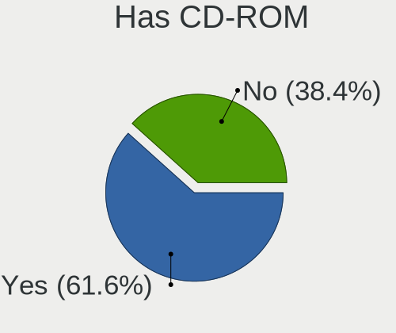
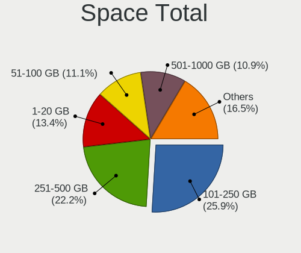
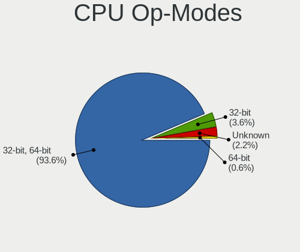
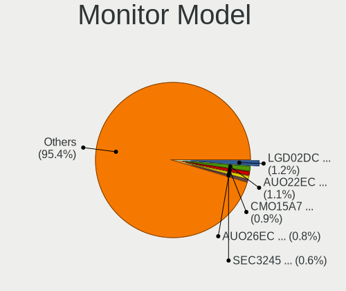

ROSA - Tested Hardware & Statistics
-----------------------------------

A project to collect tested hardware configurations for ROSA.

Anyone can contribute to this report by the [hw-probe](https://github.com/linuxhw/hw-probe) tool:

    sudo -E hw-probe -all -upload

Please contribute! Especially if your hardware is rare.

This is a report for all computer types. See also reports for [desktops](/Dist/ROSA/Desktop/README.md) and [notebooks](/Dist/ROSA/Notebook/README.md).

Contents
--------

* [ Test Cases ](#test-cases)

* [ System ](#system)
  - [ OS                       ](#os)
  - [ OS Family                ](#os-family)
  - [ Kernel                   ](#kernel)
  - [ Kernel Family            ](#kernel-family)
  - [ Kernel Major Ver.        ](#kernel-major-ver)
  - [ Arch                     ](#arch)
  - [ DE                       ](#de)
  - [ Display Server           ](#display-server)
  - [ Display Manager          ](#display-manager)
  - [ OS Lang                  ](#os-lang)
  - [ Boot Mode                ](#boot-mode)
  - [ Filesystem               ](#filesystem)
  - [ Part. scheme             ](#part-scheme)
  - [ Dual Boot with Linux/BSD ](#dual-boot-with-linuxbsd)
  - [ Dual Boot (Win)          ](#dual-boot-win)

* [ Board ](#board)
  - [ Vendor                   ](#vendor)
  - [ Model                    ](#model)
  - [ Model Family             ](#model-family)
  - [ MFG Year                 ](#mfg-year)
  - [ Form Factor              ](#form-factor)
  - [ Secure Boot              ](#secure-boot)
  - [ Coreboot                 ](#coreboot)
  - [ RAM Size                 ](#ram-size)
  - [ RAM Used                 ](#ram-used)
  - [ Total Drives             ](#total-drives)
  - [ Has CD-ROM               ](#has-cd-rom)
  - [ Has Ethernet             ](#has-ethernet)
  - [ Has WiFi                 ](#has-wifi)
  - [ Has Bluetooth            ](#has-bluetooth)

* [ Location ](#location)
  - [ Country                  ](#country)
  - [ City                     ](#city)

* [ Drives ](#drives)
  - [ Drive Vendor             ](#drive-vendor)
  - [ Drive Model              ](#drive-model)
  - [ HDD Vendor               ](#hdd-vendor)
  - [ SSD Vendor               ](#ssd-vendor)
  - [ Drive Kind               ](#drive-kind)
  - [ Drive Connector          ](#drive-connector)
  - [ Drive Size               ](#drive-size)
  - [ Space Total              ](#space-total)
  - [ Space Used               ](#space-used)
  - [ Malfunc. Drives          ](#malfunc-drives)
  - [ Malfunc. Drive Vendor    ](#malfunc-drive-vendor)
  - [ Malfunc. HDD Vendor      ](#malfunc-hdd-vendor)
  - [ Malfunc. Drive Kind      ](#malfunc-drive-kind)
  - [ Failed Drives            ](#failed-drives)
  - [ Failed Drive Vendor      ](#failed-drive-vendor)
  - [ Drive Status             ](#drive-status)

* [ Storage controller ](#storage-controller)
  - [ Storage Vendor           ](#storage-vendor)
  - [ Storage Model            ](#storage-model)
  - [ Storage Kind             ](#storage-kind)

* [ Processor ](#processor)
  - [ CPU Vendor               ](#cpu-vendor)
  - [ CPU Model                ](#cpu-model)
  - [ CPU Model Family         ](#cpu-model-family)
  - [ CPU Cores                ](#cpu-cores)
  - [ CPU Sockets              ](#cpu-sockets)
  - [ CPU Threads              ](#cpu-threads)
  - [ CPU Op-Modes             ](#cpu-op-modes)
  - [ CPU Microcode            ](#cpu-microcode)
  - [ CPU Microarch            ](#cpu-microarch)

* [ Graphics ](#graphics)
  - [ GPU Vendor               ](#gpu-vendor)
  - [ GPU Model                ](#gpu-model)
  - [ GPU Combo                ](#gpu-combo)
  - [ GPU Driver               ](#gpu-driver)
  - [ GPU Memory               ](#gpu-memory)

* [ Monitor ](#monitor)
  - [ Monitor Vendor           ](#monitor-vendor)
  - [ Monitor Model            ](#monitor-model)
  - [ Monitor Resolution       ](#monitor-resolution)
  - [ Monitor Diagonal         ](#monitor-diagonal)
  - [ Monitor Width            ](#monitor-width)
  - [ Aspect Ratio             ](#aspect-ratio)
  - [ Monitor Area             ](#monitor-area)
  - [ Pixel Density            ](#pixel-density)
  - [ Multiple Monitors        ](#multiple-monitors)

* [ Network ](#network)
  - [ Net Controller Vendor    ](#net-controller-vendor)
  - [ Net Controller Model     ](#net-controller-model)
  - [ Wireless Vendor          ](#wireless-vendor)
  - [ Wireless Model           ](#wireless-model)
  - [ Ethernet Vendor          ](#ethernet-vendor)
  - [ Ethernet Model           ](#ethernet-model)
  - [ Net Controller Kind      ](#net-controller-kind)
  - [ Used Controller          ](#used-controller)
  - [ NICs                     ](#nics)
  - [ IPv6                     ](#ipv6)

* [ Bluetooth ](#bluetooth)
  - [ Bluetooth Vendor         ](#bluetooth-vendor)
  - [ Bluetooth Model          ](#bluetooth-model)

* [ Sound ](#sound)
  - [ Sound Vendor             ](#sound-vendor)
  - [ Sound Model              ](#sound-model)

* [ Memory ](#memory)
  - [ Memory Vendor            ](#memory-vendor)
  - [ Memory Model             ](#memory-model)
  - [ Memory Kind              ](#memory-kind)
  - [ Memory Form Factor       ](#memory-form-factor)
  - [ Memory Size              ](#memory-size)
  - [ Memory Speed             ](#memory-speed)

* [ Printers & scanners ](#printers--scanners)
  - [ Printer Vendor           ](#printer-vendor)
  - [ Printer Model            ](#printer-model)
  - [ Scanner Vendor           ](#scanner-vendor)
  - [ Scanner Model            ](#scanner-model)

* [ Camera ](#camera)
  - [ Camera Vendor            ](#camera-vendor)
  - [ Camera Model             ](#camera-model)

* [ Security ](#security)
  - [ Fingerprint Vendor       ](#fingerprint-vendor)
  - [ Fingerprint Model        ](#fingerprint-model)
  - [ Chipcard Vendor          ](#chipcard-vendor)
  - [ Chipcard Model           ](#chipcard-model)

* [ Unsupported ](#unsupported)
  - [ Unsupported Devices      ](#unsupported-devices)
  - [ Unsupported Device Types ](#unsupported-device-types)

Test Cases
----------

Total: 42092

| Vendor        | Model                       | Form-Factor | Probe                                                      | Date         |
|---------------|-----------------------------|-------------|------------------------------------------------------------|--------------|
| Dell          | 0Y5DDC A00                  | Desktop     | [9a9a57dd2b](https://linux-hardware.org/?probe=9a9a57dd2b) | May 01, 2023 |
| Notebook      | W250EGQ / W270EGQ           | Notebook    | [e523dbbf78](https://linux-hardware.org/?probe=e523dbbf78) | Apr 30, 2023 |
| ASUSTek       | TUF Gaming B550-PLUS        | Desktop     | [0bf0b828d4](https://linux-hardware.org/?probe=0bf0b828d4) | Apr 30, 2023 |
| ASRock        | B650M PG Riptide            | Desktop     | [236258bd78](https://linux-hardware.org/?probe=236258bd78) | Apr 30, 2023 |
| Lenovo        | ThinkPad L15 Gen 1 20U8S... | Notebook    | [32b3bf20de](https://linux-hardware.org/?probe=32b3bf20de) | Apr 30, 2023 |
| ASUSTek       | P5K                         | Desktop     | [ea70f7298c](https://linux-hardware.org/?probe=ea70f7298c) | Apr 30, 2023 |
| ASUSTek       | PRIME A320M-K               | Desktop     | [4587583e6a](https://linux-hardware.org/?probe=4587583e6a) | Apr 30, 2023 |
| ASUSTek       | VivoBook 15_ASUS Laptop ... | Notebook    | [4470195d38](https://linux-hardware.org/?probe=4470195d38) | Apr 30, 2023 |
| Dell          | Inspiron N5110              | Notebook    | [9f932190c4](https://linux-hardware.org/?probe=9f932190c4) | Apr 30, 2023 |
| MSI           | P67A-C43                    | Desktop     | [68f0d09abd](https://linux-hardware.org/?probe=68f0d09abd) | Apr 30, 2023 |
| HP            | Pavilion Gaming Laptop 1... | Notebook    | [cc7ea9df99](https://linux-hardware.org/?probe=cc7ea9df99) | Apr 30, 2023 |
| HP            | Pavilion g6                 | Notebook    | [6d3e51b808](https://linux-hardware.org/?probe=6d3e51b808) | Apr 29, 2023 |
| ASUSTek       | GL702VMK                    | Notebook    | [a3c0cb6515](https://linux-hardware.org/?probe=a3c0cb6515) | Apr 29, 2023 |
| Lenovo        | G585 20137                  | Notebook    | [f0b4e5c5fd](https://linux-hardware.org/?probe=f0b4e5c5fd) | Apr 29, 2023 |
| Lenovo        | IdeaCentre AIO 3 24IMB05... | Notebook    | [94a285f1f1](https://linux-hardware.org/?probe=94a285f1f1) | Apr 29, 2023 |
| Gigabyte      | GA-A55M-S2HP                | Desktop     | [4a478780d6](https://linux-hardware.org/?probe=4a478780d6) | Apr 29, 2023 |
| HONOR         | HYM-WXX                     | Notebook    | [6923c4c1ce](https://linux-hardware.org/?probe=6923c4c1ce) | Apr 29, 2023 |
| Samsung       | 300E4C/300E5C/300E7C        | Notebook    | [e6257e3e50](https://linux-hardware.org/?probe=e6257e3e50) | Apr 29, 2023 |
| Clevo         | E512xQ/E4129                | Notebook    | [7499c233c9](https://linux-hardware.org/?probe=7499c233c9) | Apr 29, 2023 |
| HUAWEI        | BOM-WXX9                    | Notebook    | [b09f495645](https://linux-hardware.org/?probe=b09f495645) | Apr 29, 2023 |
| Biostar       | A780L3C                     | Desktop     | [056ea662e6](https://linux-hardware.org/?probe=056ea662e6) | Apr 29, 2023 |
| Notebook      | W250EGQ / W270EGQ           | Notebook    | [f25ef6f165](https://linux-hardware.org/?probe=f25ef6f165) | Apr 29, 2023 |
| Dell          | Inspiron 7706 2n1           | Convertible | [06734c942e](https://linux-hardware.org/?probe=06734c942e) | Apr 29, 2023 |
| Notebook      | W250EGQ / W270EGQ           | Notebook    | [e4ab273aac](https://linux-hardware.org/?probe=e4ab273aac) | Apr 29, 2023 |
| ECS           | A740GM-M                    | Desktop     | [9e69523c9f](https://linux-hardware.org/?probe=9e69523c9f) | Apr 28, 2023 |
| ASUSTek       | ASUS TUF Gaming A15 FA50... | Notebook    | [3059eade71](https://linux-hardware.org/?probe=3059eade71) | Apr 28, 2023 |
| ASRock        | Z77 Extreme3                | Desktop     | [b0c7bac447](https://linux-hardware.org/?probe=b0c7bac447) | Apr 28, 2023 |
| Lenovo        | IdeaPad 5 Pro 14ACN6 82L... | Notebook    | [e665e9d318](https://linux-hardware.org/?probe=e665e9d318) | Apr 28, 2023 |
| Samsung       | R528/R728                   | Notebook    | [1e0b02f4c5](https://linux-hardware.org/?probe=1e0b02f4c5) | Apr 28, 2023 |
| Gigabyte      | B550 AORUS MASTER           | Desktop     | [93cf85eecd](https://linux-hardware.org/?probe=93cf85eecd) | Apr 28, 2023 |
| HP            | 0B54h D                     | Desktop     | [49c56c77af](https://linux-hardware.org/?probe=49c56c77af) | Apr 28, 2023 |
| ASUSTek       | GL702VMK                    | Notebook    | [5df53b9f76](https://linux-hardware.org/?probe=5df53b9f76) | Apr 28, 2023 |
| Lenovo        | ThinkPad P16s Gen 1 21CK... | Notebook    | [990335263d](https://linux-hardware.org/?probe=990335263d) | Apr 28, 2023 |
| Acer          | Swift SF314-43              | Notebook    | [9ca9aedf16](https://linux-hardware.org/?probe=9ca9aedf16) | Apr 27, 2023 |
| ASRock        | N68-VS3 UCC                 | Desktop     | [e30ee0a621](https://linux-hardware.org/?probe=e30ee0a621) | Apr 27, 2023 |
| ASRock        | H510M-HDV/M.2               | Desktop     | [c11c9964fa](https://linux-hardware.org/?probe=c11c9964fa) | Apr 27, 2023 |
| Dell          | Latitude D531               | Notebook    | [a6f2e7170f](https://linux-hardware.org/?probe=a6f2e7170f) | Apr 27, 2023 |
| Dell          | Inspiron N5110              | Notebook    | [2a40d09c1a](https://linux-hardware.org/?probe=2a40d09c1a) | Apr 27, 2023 |
| Lenovo        | B590 20208                  | Notebook    | [912acd510d](https://linux-hardware.org/?probe=912acd510d) | Apr 27, 2023 |
| Lenovo        | Legion 5 17ARH05H 82GN      | Notebook    | [e207848340](https://linux-hardware.org/?probe=e207848340) | Apr 27, 2023 |
| ASUSTek       | X55VD                       | Notebook    | [16ef8c0549](https://linux-hardware.org/?probe=16ef8c0549) | Apr 27, 2023 |
| Unknown       | Unknown                     | Desktop     | [59d18b7284](https://linux-hardware.org/?probe=59d18b7284) | Apr 27, 2023 |
| HP            | EliteBook 2560p             | Notebook    | [23b5cbfb33](https://linux-hardware.org/?probe=23b5cbfb33) | Apr 27, 2023 |
| Unknown       | Unknown                     | Desktop     | [8599268159](https://linux-hardware.org/?probe=8599268159) | Apr 27, 2023 |
| Acer          | Aspire 5720G                | Notebook    | [f566395f99](https://linux-hardware.org/?probe=f566395f99) | Apr 27, 2023 |
| ASUSTek       | M4A785D-M PRO               | Desktop     | [ac2a21023c](https://linux-hardware.org/?probe=ac2a21023c) | Apr 27, 2023 |
| ASUSTek       | ASUS TUF Gaming A15 FA50... | Notebook    | [67288f740c](https://linux-hardware.org/?probe=67288f740c) | Apr 27, 2023 |
| ASUSTek       | K501UX                      | Notebook    | [3f46fa9a68](https://linux-hardware.org/?probe=3f46fa9a68) | Apr 26, 2023 |
| Gigabyte      | P75-D3                      | Desktop     | [f9cf28acb8](https://linux-hardware.org/?probe=f9cf28acb8) | Apr 26, 2023 |
| MSI           | A320M PRO-VD/S              | Desktop     | [f147a5df1c](https://linux-hardware.org/?probe=f147a5df1c) | Apr 26, 2023 |
| MSI           | H110M PRO-VD PLUS           | Desktop     | [95bac1f720](https://linux-hardware.org/?probe=95bac1f720) | Apr 26, 2023 |
| Fujitsu Si... | AMILO Pro V2085             | Notebook    | [d577e7c1e8](https://linux-hardware.org/?probe=d577e7c1e8) | Apr 26, 2023 |
| Sony          | SVE1512K1RW                 | Notebook    | [521db31dfc](https://linux-hardware.org/?probe=521db31dfc) | Apr 26, 2023 |
| HP            | Pavilion g6                 | Notebook    | [e1b7d44502](https://linux-hardware.org/?probe=e1b7d44502) | Apr 26, 2023 |
| Gigabyte      | A320M-H-CF                  | Desktop     | [a1ddcc0d4a](https://linux-hardware.org/?probe=a1ddcc0d4a) | Apr 26, 2023 |
| X79P mothe... | KLLISRE V1.0                | Desktop     | [a7a0059437](https://linux-hardware.org/?probe=a7a0059437) | Apr 26, 2023 |
| Acer          | Extensa M2610 V:1.0         | Desktop     | [4a85453666](https://linux-hardware.org/?probe=4a85453666) | Apr 26, 2023 |
| ASUSTek       | M5A78L-M LX3 PLUS           | Desktop     | [8093a43498](https://linux-hardware.org/?probe=8093a43498) | Apr 25, 2023 |
| Lenovo        | IdeaPad S110 20126          | Notebook    | [4defb36760](https://linux-hardware.org/?probe=4defb36760) | Apr 25, 2023 |
| ASUSTek       | P5QL/EPU                    | Desktop     | [a84428c233](https://linux-hardware.org/?probe=a84428c233) | Apr 25, 2023 |
| Lenovo        | H420                        | Desktop     | [265f943a61](https://linux-hardware.org/?probe=265f943a61) | Apr 25, 2023 |
| HP            | 2B43                        | Desktop     | [aa5fb69f7e](https://linux-hardware.org/?probe=aa5fb69f7e) | Apr 25, 2023 |
| Lenovo        | IdeaPad Z580                | Notebook    | [ad5a6d474b](https://linux-hardware.org/?probe=ad5a6d474b) | Apr 25, 2023 |
| Gigabyte      | F2A68HM-DS2                 | Desktop     | [b9b8640409](https://linux-hardware.org/?probe=b9b8640409) | Apr 25, 2023 |
| ASRock        | H61M-VG3                    | Desktop     | [3427383977](https://linux-hardware.org/?probe=3427383977) | Apr 24, 2023 |
| Gigabyte      | B365M DS3H                  | Desktop     | [90747b3b70](https://linux-hardware.org/?probe=90747b3b70) | Apr 24, 2023 |
| Lenovo        | G560 20042                  | Notebook    | [af88bff29f](https://linux-hardware.org/?probe=af88bff29f) | Apr 24, 2023 |
| ASUSTek       | PRIME Z390M-PLUS            | Desktop     | [cac96b2cc9](https://linux-hardware.org/?probe=cac96b2cc9) | Apr 24, 2023 |
| ASUSTek       | PRIME Z390M-PLUS            | Desktop     | [1a7a3be03e](https://linux-hardware.org/?probe=1a7a3be03e) | Apr 23, 2023 |
| HP            | Pavilion g6                 | Notebook    | [1ca41a3608](https://linux-hardware.org/?probe=1ca41a3608) | Apr 23, 2023 |
| ASRock        | A320M-DVS R4.0              | Desktop     | [ba7ae1ec90](https://linux-hardware.org/?probe=ba7ae1ec90) | Apr 23, 2023 |
| Acer          | Aspire A315-56              | Notebook    | [5efcb6cf5d](https://linux-hardware.org/?probe=5efcb6cf5d) | Apr 23, 2023 |
| Gigabyte      | H61M-HD2                    | Desktop     | [dd548a2be5](https://linux-hardware.org/?probe=dd548a2be5) | Apr 23, 2023 |
| Gigabyte      | G41MT-S2P                   | Desktop     | [9f5177c657](https://linux-hardware.org/?probe=9f5177c657) | Apr 23, 2023 |
| Gigabyte      | G41MT-S2P                   | Desktop     | [e263516539](https://linux-hardware.org/?probe=e263516539) | Apr 23, 2023 |
| Lenovo        | Legion 5 15ARH05 82B5       | Notebook    | [803d0798f1](https://linux-hardware.org/?probe=803d0798f1) | Apr 22, 2023 |
| Gigabyte      | AB350-Gaming 3-CF           | Desktop     | [2f62c287fc](https://linux-hardware.org/?probe=2f62c287fc) | Apr 22, 2023 |
| ASUSTek       | X551CAP                     | Notebook    | [96dc0b9b7c](https://linux-hardware.org/?probe=96dc0b9b7c) | Apr 22, 2023 |
| ASUSTek       | F1A75-V                     | Desktop     | [ac602a38ec](https://linux-hardware.org/?probe=ac602a38ec) | Apr 22, 2023 |
| Lenovo        | G560 20042                  | Notebook    | [29bfcf59fa](https://linux-hardware.org/?probe=29bfcf59fa) | Apr 22, 2023 |
| MSI           | GP60 2OD                    | Notebook    | [3504850973](https://linux-hardware.org/?probe=3504850973) | Apr 22, 2023 |
| ASUSTek       | M4A785D-M PRO               | Desktop     | [09791c0d84](https://linux-hardware.org/?probe=09791c0d84) | Apr 22, 2023 |
| ASUSTek       | M4A785D-M PRO               | Desktop     | [62dfd33592](https://linux-hardware.org/?probe=62dfd33592) | Apr 22, 2023 |
| Gigabyte      | P31-S3G                     | Desktop     | [cec5cd32e8](https://linux-hardware.org/?probe=cec5cd32e8) | Apr 21, 2023 |
| Gigabyte      | AB350-Gaming 3-CF           | Desktop     | [ebd7a2d70a](https://linux-hardware.org/?probe=ebd7a2d70a) | Apr 21, 2023 |
| Gigabyte      | H110-D3-CF                  | Desktop     | [bbf67462c7](https://linux-hardware.org/?probe=bbf67462c7) | Apr 21, 2023 |
| Pegatron      | 2A73h                       | Desktop     | [f4578519ad](https://linux-hardware.org/?probe=f4578519ad) | Apr 21, 2023 |
| ASUSTek       | P8H61-M LX R2.0             | Desktop     | [ebc4b3095d](https://linux-hardware.org/?probe=ebc4b3095d) | Apr 21, 2023 |
| ASRock        | H310M-HDV                   | Desktop     | [ee492f099b](https://linux-hardware.org/?probe=ee492f099b) | Apr 21, 2023 |
| ASUSTek       | M4N68T-M LE                 | Desktop     | [4f1e6c6ce7](https://linux-hardware.org/?probe=4f1e6c6ce7) | Apr 21, 2023 |
| Samsung       | 350V5C/351V5C/3540VC/344... | Notebook    | [0658934d69](https://linux-hardware.org/?probe=0658934d69) | Apr 21, 2023 |
| ASRock        | H61M-GE                     | Desktop     | [615c74338c](https://linux-hardware.org/?probe=615c74338c) | Apr 21, 2023 |
| Samsung       | 350V5C/351V5C/3540VC/344... | Notebook    | [87d3a8b29f](https://linux-hardware.org/?probe=87d3a8b29f) | Apr 20, 2023 |
| Toshiba       | Satellite A100              | Notebook    | [f95e411124](https://linux-hardware.org/?probe=f95e411124) | Apr 20, 2023 |
| ASUSTek       | ROG STRIX B550-I GAMING     | Desktop     | [d3cfdb3436](https://linux-hardware.org/?probe=d3cfdb3436) | Apr 20, 2023 |
| Acer          | Aspire One 721              | Notebook    | [672386bd50](https://linux-hardware.org/?probe=672386bd50) | Apr 20, 2023 |
| Aquarius      | AQH410T                     | Desktop     | [ecb27c0ff7](https://linux-hardware.org/?probe=ecb27c0ff7) | Apr 20, 2023 |
| Huanan        | X99 F8D V2.2                | Desktop     | [b8c2462ada](https://linux-hardware.org/?probe=b8c2462ada) | Apr 20, 2023 |
| Gigabyte      | A320M-S2H V2-CF             | Desktop     | [7ac787a4fa](https://linux-hardware.org/?probe=7ac787a4fa) | Apr 20, 2023 |
| Aquarius      | AQH410T                     | Desktop     | [29e8b5bd74](https://linux-hardware.org/?probe=29e8b5bd74) | Apr 20, 2023 |
| HP            | OMEN Laptop 15-en1xxx       | Notebook    | [30caba94a4](https://linux-hardware.org/?probe=30caba94a4) | Apr 20, 2023 |
| Biostar       | H61MHV                      | Desktop     | [7b3d591e47](https://linux-hardware.org/?probe=7b3d591e47) | Apr 20, 2023 |
| Gigabyte      | A320M-H-CF                  | Desktop     | [51afdddffc](https://linux-hardware.org/?probe=51afdddffc) | Apr 20, 2023 |
| EPoX Compu... | nForce3 DDR: 8KDA3I Seri... | Desktop     | [ba684478b5](https://linux-hardware.org/?probe=ba684478b5) | Apr 20, 2023 |
| ASUSTek       | 1011PX                      | Notebook    | [6aa9d32dda](https://linux-hardware.org/?probe=6aa9d32dda) | Apr 19, 2023 |
| ASUSTek       | A8Le                        | Notebook    | [3e4df24741](https://linux-hardware.org/?probe=3e4df24741) | Apr 19, 2023 |
| MACHINIST     | X99-RS9 V3.1                | Desktop     | [492b8bb4d0](https://linux-hardware.org/?probe=492b8bb4d0) | Apr 19, 2023 |
| MSI           | MPG B550 GAMING PLUS        | Desktop     | [ea69ff8c8b](https://linux-hardware.org/?probe=ea69ff8c8b) | Apr 19, 2023 |
| ASRock        | N68-GS4 FX                  | Desktop     | [b01bc53af9](https://linux-hardware.org/?probe=b01bc53af9) | Apr 19, 2023 |
| ASRock        | N68C-GS FX                  | Desktop     | [fc16ea346a](https://linux-hardware.org/?probe=fc16ea346a) | Apr 19, 2023 |
| Acer          | Aspire 5930                 | Notebook    | [0bca303d94](https://linux-hardware.org/?probe=0bca303d94) | Apr 19, 2023 |
| Acer          | Aspire 5930                 | Notebook    | [af833465b4](https://linux-hardware.org/?probe=af833465b4) | Apr 19, 2023 |
| ASUSTek       | B75M-PLUS                   | Desktop     | [33cd5127f2](https://linux-hardware.org/?probe=33cd5127f2) | Apr 19, 2023 |
| Dell          | 0Y5DDC A00                  | Desktop     | [daff249988](https://linux-hardware.org/?probe=daff249988) | Apr 19, 2023 |
| Clevo         | M7x0K                       | Notebook    | [70cb3d8a2a](https://linux-hardware.org/?probe=70cb3d8a2a) | Apr 19, 2023 |
| Lenovo        | IdeaPad Y570 20091          | Notebook    | [14e15479a1](https://linux-hardware.org/?probe=14e15479a1) | Apr 18, 2023 |
| MSI           | G41M-P33 Combo              | Desktop     | [55ead22ec0](https://linux-hardware.org/?probe=55ead22ec0) | Apr 18, 2023 |
| MSI           | G41M-P33 Combo              | Desktop     | [9fc5380d7a](https://linux-hardware.org/?probe=9fc5380d7a) | Apr 18, 2023 |
| Dell          | Precision M6800             | Notebook    | [b39d3f31df](https://linux-hardware.org/?probe=b39d3f31df) | Apr 18, 2023 |
| Gigabyte      | H310M S2                    | Desktop     | [02a81434f0](https://linux-hardware.org/?probe=02a81434f0) | Apr 18, 2023 |
| Acer          | Aspire E5-575G              | Notebook    | [26bce7ac33](https://linux-hardware.org/?probe=26bce7ac33) | Apr 18, 2023 |
| Gigabyte      | 970A-UD3P                   | Desktop     | [38275208cc](https://linux-hardware.org/?probe=38275208cc) | Apr 18, 2023 |
| ASUSTek       | K40AF                       | Notebook    | [f3e1d56dbc](https://linux-hardware.org/?probe=f3e1d56dbc) | Apr 18, 2023 |
| HP            | Pavilion 15                 | Notebook    | [ae147077b1](https://linux-hardware.org/?probe=ae147077b1) | Apr 18, 2023 |
| Gigabyte      | F2A68HM-DS2                 | Desktop     | [d7ebec50bf](https://linux-hardware.org/?probe=d7ebec50bf) | Apr 18, 2023 |
| Acer          | Aspire A315-34              | Notebook    | [06332b53b1](https://linux-hardware.org/?probe=06332b53b1) | Apr 18, 2023 |
| Lenovo        | IdeaPad 510-15ISK 80SR      | Notebook    | [38aeb226af](https://linux-hardware.org/?probe=38aeb226af) | Apr 17, 2023 |
| HP            | OMEN Laptop 15-en1xxx       | Notebook    | [909a9c8c45](https://linux-hardware.org/?probe=909a9c8c45) | Apr 17, 2023 |
| Acer          | Aspire 3820                 | Notebook    | [2be4b1b525](https://linux-hardware.org/?probe=2be4b1b525) | Apr 16, 2023 |
| Lenovo        | IdeaPad Z570 HuronRiver ... | Notebook    | [c59c5c0cdf](https://linux-hardware.org/?probe=c59c5c0cdf) | Apr 16, 2023 |
| Biostar       | H81MHV3                     | Desktop     | [384b42f2e6](https://linux-hardware.org/?probe=384b42f2e6) | Apr 16, 2023 |
| ASRock        | B650M PG Riptide            | Desktop     | [e138e763eb](https://linux-hardware.org/?probe=e138e763eb) | Apr 16, 2023 |
| Gigabyte      | A320M-S2H-CF                | Desktop     | [badd20d374](https://linux-hardware.org/?probe=badd20d374) | Apr 16, 2023 |
| Lenovo        | 367D 31900059 STD           | Desktop     | [e3ebbe3950](https://linux-hardware.org/?probe=e3ebbe3950) | Apr 16, 2023 |
| ASUSTek       | P5K-VM                      | Desktop     | [2c8298a0a8](https://linux-hardware.org/?probe=2c8298a0a8) | Apr 16, 2023 |
| Acer          | Extensa 4220                | Notebook    | [65c0e4f901](https://linux-hardware.org/?probe=65c0e4f901) | Apr 16, 2023 |
| Acer          | Aspire TC-705               | Desktop     | [80bfa42512](https://linux-hardware.org/?probe=80bfa42512) | Apr 16, 2023 |
| MSI           | B450M PRO-M2                | Desktop     | [05ae2ac6e6](https://linux-hardware.org/?probe=05ae2ac6e6) | Apr 16, 2023 |
| Digma         | EVE 11 C422 ES1068EW        | Notebook    | [8f62352864](https://linux-hardware.org/?probe=8f62352864) | Apr 16, 2023 |
| ASRock        | 970 Pro3 R2.0               | Desktop     | [a70cf56038](https://linux-hardware.org/?probe=a70cf56038) | Apr 15, 2023 |
| Lenovo        | IdeaPad 300-15ISK 80Q7      | Notebook    | [a08b6e5824](https://linux-hardware.org/?probe=a08b6e5824) | Apr 15, 2023 |
| Dell          | Inspiron N5110              | Notebook    | [4f65d649d9](https://linux-hardware.org/?probe=4f65d649d9) | Apr 15, 2023 |
| ASUSTek       | P8H61-MX                    | Desktop     | [4ad2b2bcdc](https://linux-hardware.org/?probe=4ad2b2bcdc) | Apr 15, 2023 |
| ASUSTek       | VivoBook 15_ASUS Laptop ... | Notebook    | [162ef2f577](https://linux-hardware.org/?probe=162ef2f577) | Apr 15, 2023 |
| 3Logic Gro... | Graviton N15i               | Notebook    | [12b7711444](https://linux-hardware.org/?probe=12b7711444) | Apr 15, 2023 |
| HP            | EliteBook 8470p             | Notebook    | [69cb1a0781](https://linux-hardware.org/?probe=69cb1a0781) | Apr 15, 2023 |
| 3Logic Gro... | Graviton N15i               | Notebook    | [a61925937f](https://linux-hardware.org/?probe=a61925937f) | Apr 15, 2023 |
| Lenovo        | IdeaPad 300-15ISK 80Q7      | Notebook    | [510bfe2f94](https://linux-hardware.org/?probe=510bfe2f94) | Apr 15, 2023 |
| F-Plus Mob... | FLAPTOP r                   | Notebook    | [0a63354640](https://linux-hardware.org/?probe=0a63354640) | Apr 15, 2023 |
| F-Plus Mob... | FLAPTOP r                   | Notebook    | [1ed54f4477](https://linux-hardware.org/?probe=1ed54f4477) | Apr 15, 2023 |
| MSI           | MPG B550 GAMING CARBON W... | Desktop     | [4f8d3b46f5](https://linux-hardware.org/?probe=4f8d3b46f5) | Apr 15, 2023 |
| HP            | EliteBook 2540p             | Notebook    | [de07820409](https://linux-hardware.org/?probe=de07820409) | Apr 15, 2023 |
| ASUSTek       | P5KPL-AM                    | Desktop     | [f48937493d](https://linux-hardware.org/?probe=f48937493d) | Apr 15, 2023 |
| ASUSTek       | VivoBook 15_ASUS Laptop ... | Notebook    | [ca241d00f8](https://linux-hardware.org/?probe=ca241d00f8) | Apr 15, 2023 |
| UMAX          | VisionBook 15Wg Plus        | Notebook    | [59d15de09e](https://linux-hardware.org/?probe=59d15de09e) | Apr 15, 2023 |
| MSI           | H81M-P33                    | Desktop     | [e0d66aee3a](https://linux-hardware.org/?probe=e0d66aee3a) | Apr 14, 2023 |
| MSI           | B550M PRO-VDH WIFI          | Desktop     | [57e42e5107](https://linux-hardware.org/?probe=57e42e5107) | Apr 14, 2023 |
| MSI           | B550M PRO-VDH WIFI          | Desktop     | [9e1d9ff252](https://linux-hardware.org/?probe=9e1d9ff252) | Apr 14, 2023 |
| Acer          | Swift SF114-34              | Notebook    | [45d963eb7c](https://linux-hardware.org/?probe=45d963eb7c) | Apr 14, 2023 |
| Haier         | U1520HD                     | Notebook    | [3084c84bb6](https://linux-hardware.org/?probe=3084c84bb6) | Apr 14, 2023 |
| Gigabyte      | G31M-S2L                    | Desktop     | [eaccdb6a68](https://linux-hardware.org/?probe=eaccdb6a68) | Apr 14, 2023 |
| Gigabyte      | A320M-H-CF                  | Desktop     | [ae3ba04308](https://linux-hardware.org/?probe=ae3ba04308) | Apr 14, 2023 |
| MSI           | MAG B650 TOMAHAWK WIFI      | Desktop     | [f1f1661f59](https://linux-hardware.org/?probe=f1f1661f59) | Apr 13, 2023 |
| Sony          | VGN-NW24MR                  | Notebook    | [3325bb2781](https://linux-hardware.org/?probe=3325bb2781) | Apr 13, 2023 |
| Lenovo        | V15-IGL 82C3                | Notebook    | [3b24daf87d](https://linux-hardware.org/?probe=3b24daf87d) | Apr 13, 2023 |
| Acer          | Extensa 2519                | Notebook    | [8a555b0d7b](https://linux-hardware.org/?probe=8a555b0d7b) | Apr 13, 2023 |
| ASUSTek       | P5KPL-AM IN/GB              | Desktop     | [c7c00c395f](https://linux-hardware.org/?probe=c7c00c395f) | Apr 13, 2023 |
| ASUSTek       | PRIME B650-PLUS             | Desktop     | [d05eccd5c7](https://linux-hardware.org/?probe=d05eccd5c7) | Apr 13, 2023 |
| Biostar       | G41D3C                      | Desktop     | [96bf9b40ac](https://linux-hardware.org/?probe=96bf9b40ac) | Apr 13, 2023 |
| ASUSTek       | P8H61-M LE R2.0             | Desktop     | [507f555919](https://linux-hardware.org/?probe=507f555919) | Apr 13, 2023 |
| Foxconn       | 2ABF                        | Desktop     | [35a1f24f18](https://linux-hardware.org/?probe=35a1f24f18) | Apr 13, 2023 |
| Gigabyte      | B550 GAMING X V2            | Desktop     | [67fa6790f3](https://linux-hardware.org/?probe=67fa6790f3) | Apr 13, 2023 |
| MSI           | MPG B550 GAMING PLUS        | Desktop     | [71542ed659](https://linux-hardware.org/?probe=71542ed659) | Apr 13, 2023 |
| HONOR         | HYM-WXX                     | Notebook    | [ab8722ddde](https://linux-hardware.org/?probe=ab8722ddde) | Apr 13, 2023 |
| Intel         | D945GCCR AAD78647-301       | Desktop     | [fac1992089](https://linux-hardware.org/?probe=fac1992089) | Apr 13, 2023 |
| Gigabyte      | H61M-DS2 DVI                | Desktop     | [fe00316c95](https://linux-hardware.org/?probe=fe00316c95) | Apr 12, 2023 |
| Acer          | Aspire E1-572G              | Notebook    | [6321e44a81](https://linux-hardware.org/?probe=6321e44a81) | Apr 12, 2023 |
| Gigabyte      | M68MT-D3P                   | Desktop     | [695e9c2a36](https://linux-hardware.org/?probe=695e9c2a36) | Apr 12, 2023 |
| Dell          | Inspiron N5110              | Notebook    | [38bace81f3](https://linux-hardware.org/?probe=38bace81f3) | Apr 12, 2023 |
| HP            | 3048h                       | Desktop     | [c16e3c4fdc](https://linux-hardware.org/?probe=c16e3c4fdc) | Apr 12, 2023 |
| Toshiba       | Satellite A100              | Notebook    | [064df21bd6](https://linux-hardware.org/?probe=064df21bd6) | Apr 12, 2023 |
| ASUSTek       | UX31E                       | Notebook    | [ef65b0b616](https://linux-hardware.org/?probe=ef65b0b616) | Apr 12, 2023 |
| Lenovo        | IdeaPad 530S-14IKB 81EU     | Notebook    | [80c85e1b7c](https://linux-hardware.org/?probe=80c85e1b7c) | Apr 11, 2023 |
| HP            | Unknown                     | Notebook    | [abc7d95b62](https://linux-hardware.org/?probe=abc7d95b62) | Apr 11, 2023 |
| Intel         | B85 V2.2A                   | Desktop     | [1ca186850c](https://linux-hardware.org/?probe=1ca186850c) | Apr 11, 2023 |
| Dell          | Inspiron ME051              | Notebook    | [ea73cc4553](https://linux-hardware.org/?probe=ea73cc4553) | Apr 11, 2023 |
| Gigabyte      | GA-78LMT-S2PV               | Desktop     | [a2ddbc2eee](https://linux-hardware.org/?probe=a2ddbc2eee) | Apr 11, 2023 |
| ASUSTek       | 1011PX                      | Notebook    | [77bd102d23](https://linux-hardware.org/?probe=77bd102d23) | Apr 11, 2023 |
| ASUSTek       | Z97-K                       | Desktop     | [8e04d8c50e](https://linux-hardware.org/?probe=8e04d8c50e) | Apr 11, 2023 |
| MSI           | X470 GAMING PRO MAX         | Desktop     | [068934f572](https://linux-hardware.org/?probe=068934f572) | Apr 10, 2023 |
| Gigabyte      | GA-78LMT-S2P                | Desktop     | [6cff2537ae](https://linux-hardware.org/?probe=6cff2537ae) | Apr 10, 2023 |
| Dell          | 0KC9NP A01                  | Desktop     | [fdb331baab](https://linux-hardware.org/?probe=fdb331baab) | Apr 10, 2023 |
| Acer          | Aspire V3-571G              | Notebook    | [bd013771db](https://linux-hardware.org/?probe=bd013771db) | Apr 10, 2023 |
| Intel         | Unknown                     | Notebook    | [2f7f544903](https://linux-hardware.org/?probe=2f7f544903) | Apr 10, 2023 |
| Gigabyte      | H110M-D3H R2-CF             | Desktop     | [4cb2e51f7d](https://linux-hardware.org/?probe=4cb2e51f7d) | Apr 10, 2023 |
| Lenovo        | B590 20206                  | Notebook    | [527adf79f4](https://linux-hardware.org/?probe=527adf79f4) | Apr 10, 2023 |
| Gigabyte      | A320M-S2H V2-CF             | Desktop     | [d2e041bd92](https://linux-hardware.org/?probe=d2e041bd92) | Apr 10, 2023 |
| Biostar       | B250MHC                     | Desktop     | [4fee7821ab](https://linux-hardware.org/?probe=4fee7821ab) | Apr 09, 2023 |
| Acer          | Extensa 4220                | Notebook    | [32504ab636](https://linux-hardware.org/?probe=32504ab636) | Apr 09, 2023 |
| ASUSTek       | K50IJ                       | Notebook    | [b829712e0d](https://linux-hardware.org/?probe=b829712e0d) | Apr 09, 2023 |
| ASRock        | FM2A55M-VG3+                | Desktop     | [f7435e4d65](https://linux-hardware.org/?probe=f7435e4d65) | Apr 09, 2023 |
| Fujitsu       | D3162-A1 S26361-D3162-A1    | Desktop     | [eca06b42fa](https://linux-hardware.org/?probe=eca06b42fa) | Apr 09, 2023 |
| ECS           | H67H2-M3                    | Desktop     | [613fd53405](https://linux-hardware.org/?probe=613fd53405) | Apr 09, 2023 |
| ASUSTek       | M4A785TD-V EVO              | Desktop     | [3af0783523](https://linux-hardware.org/?probe=3af0783523) | Apr 09, 2023 |
| ASRock        | FM2A55M-VG3+                | Desktop     | [53ed0bc068](https://linux-hardware.org/?probe=53ed0bc068) | Apr 09, 2023 |
| Lenovo        | IdeaPad 300-15ISK 80Q7      | Notebook    | [05a8a1a4c7](https://linux-hardware.org/?probe=05a8a1a4c7) | Apr 09, 2023 |
| Intel         | X79M-S                      | Desktop     | [3cec74aa9d](https://linux-hardware.org/?probe=3cec74aa9d) | Apr 09, 2023 |
| MSI           | 2A9C                        | Desktop     | [91d20791c3](https://linux-hardware.org/?probe=91d20791c3) | Apr 09, 2023 |
| HP            | 1495                        | Desktop     | [6a4176bb41](https://linux-hardware.org/?probe=6a4176bb41) | Apr 09, 2023 |
| MSI           | PRO H610M-E DDR4            | Desktop     | [64fbe95b80](https://linux-hardware.org/?probe=64fbe95b80) | Apr 08, 2023 |
| HP            | Pavilion dv6                | Notebook    | [10eeff8916](https://linux-hardware.org/?probe=10eeff8916) | Apr 08, 2023 |
| Dell          | Inspiron 15-3552            | Notebook    | [5c23d1d7f7](https://linux-hardware.org/?probe=5c23d1d7f7) | Apr 08, 2023 |
| ASRock        | H87 Performance             | Desktop     | [bcf217db06](https://linux-hardware.org/?probe=bcf217db06) | Apr 08, 2023 |
| HP            | EliteBook x360 1030 G2      | Convertible | [e24e6944b6](https://linux-hardware.org/?probe=e24e6944b6) | Apr 08, 2023 |
| Gateway       | M-6812M                     | Notebook    | [6101b79a06](https://linux-hardware.org/?probe=6101b79a06) | Apr 08, 2023 |
| ASUSTek       | VivoBook 15_ASUS Laptop ... | Notebook    | [47b0256864](https://linux-hardware.org/?probe=47b0256864) | Apr 08, 2023 |
| ASUSTek       | K53TA                       | Notebook    | [94ce67f7d9](https://linux-hardware.org/?probe=94ce67f7d9) | Apr 08, 2023 |
| ASRock        | B550 Extreme4               | Desktop     | [26350ccd3f](https://linux-hardware.org/?probe=26350ccd3f) | Apr 08, 2023 |
| HP            | Notebook                    | Notebook    | [41f9931a45](https://linux-hardware.org/?probe=41f9931a45) | Apr 07, 2023 |
| Acer          | Nitro AN515-55              | Notebook    | [64f96c6fde](https://linux-hardware.org/?probe=64f96c6fde) | Apr 07, 2023 |
| ASUSTek       | VM40B                       | Desktop     | [f371d84955](https://linux-hardware.org/?probe=f371d84955) | Apr 07, 2023 |
| ASRock        | N68PV-GS                    | Desktop     | [bd8595032e](https://linux-hardware.org/?probe=bd8595032e) | Apr 07, 2023 |
| ASUSTek       | VivoBook 15_ASUS Laptop ... | Notebook    | [426fcd7ee1](https://linux-hardware.org/?probe=426fcd7ee1) | Apr 07, 2023 |
| ASRock        | N68-GS4 FX                  | Desktop     | [347c879912](https://linux-hardware.org/?probe=347c879912) | Apr 07, 2023 |
| ASRock        | N68C-GS4 FX                 | Desktop     | [71c25d2dce](https://linux-hardware.org/?probe=71c25d2dce) | Apr 07, 2023 |
| ECS           | GLKD-I2                     | Desktop     | [ee23104ef2](https://linux-hardware.org/?probe=ee23104ef2) | Apr 07, 2023 |
| Gigabyte      | H310M A-CF x.x              | Desktop     | [e37377d08b](https://linux-hardware.org/?probe=e37377d08b) | Apr 07, 2023 |
| ASUSTek       | M4N98TD EVO                 | Desktop     | [a2423b5193](https://linux-hardware.org/?probe=a2423b5193) | Apr 07, 2023 |
| ASUSTek       | B85M-E/BR                   | Desktop     | [66efb7f634](https://linux-hardware.org/?probe=66efb7f634) | Apr 07, 2023 |
| Samsung       | NC110P/NC108P/NC111P        | Notebook    | [91fcea0b0f](https://linux-hardware.org/?probe=91fcea0b0f) | Apr 07, 2023 |
| Acer          | Swift SF314-41G             | Notebook    | [9906ab0e8b](https://linux-hardware.org/?probe=9906ab0e8b) | Apr 07, 2023 |
| HP            | ProBook 6450b               | Notebook    | [f3c04ce75f](https://linux-hardware.org/?probe=f3c04ce75f) | Apr 06, 2023 |
| khadas        | VIM3                        | Soc         | [ddf24fd076](https://linux-hardware.org/?probe=ddf24fd076) | Apr 06, 2023 |
| Dell          | 0C2KJT A00                  | Desktop     | [1f006c081e](https://linux-hardware.org/?probe=1f006c081e) | Apr 06, 2023 |
| Gigabyte      | C51-MCP51                   | Desktop     | [64a51d5df8](https://linux-hardware.org/?probe=64a51d5df8) | Apr 05, 2023 |
| Gigabyte      | A320M-S2H-CF                | Desktop     | [495ddacc93](https://linux-hardware.org/?probe=495ddacc93) | Apr 05, 2023 |
| Gigabyte      | X570 AORUS ULTRA            | Desktop     | [8b89901dc6](https://linux-hardware.org/?probe=8b89901dc6) | Apr 05, 2023 |
| ASRock        | H87 Performance             | Desktop     | [34f591b007](https://linux-hardware.org/?probe=34f591b007) | Apr 05, 2023 |
| Medion        | BTDD-EAIO                   | All in one  | [2bbf3378ef](https://linux-hardware.org/?probe=2bbf3378ef) | Apr 05, 2023 |
| HP            | Notebook                    | Notebook    | [a344d6edef](https://linux-hardware.org/?probe=a344d6edef) | Apr 05, 2023 |
| Lenovo        | Y520-15IKBN 80WK            | Notebook    | [9d621102fd](https://linux-hardware.org/?probe=9d621102fd) | Apr 05, 2023 |
| Dinson        | Unknown                     | Desktop     | [2cb920a0bd](https://linux-hardware.org/?probe=2cb920a0bd) | Apr 05, 2023 |
| Acer          | Veriton X4110G              | Desktop     | [0acd5d08f8](https://linux-hardware.org/?probe=0acd5d08f8) | Apr 05, 2023 |
| Acer          | Aspire A114-33              | Notebook    | [ad4bc7aa94](https://linux-hardware.org/?probe=ad4bc7aa94) | Apr 05, 2023 |
| Dell          | Vostro 5481                 | Notebook    | [3754935440](https://linux-hardware.org/?probe=3754935440) | Apr 05, 2023 |
| Acer          | Acadia V1.45                | Notebook    | [8aa933f692](https://linux-hardware.org/?probe=8aa933f692) | Apr 05, 2023 |
| Gigabyte      | C51-MCP51                   | Desktop     | [31ee5c7a85](https://linux-hardware.org/?probe=31ee5c7a85) | Apr 05, 2023 |
| ECS           | GLKD-I2                     | Desktop     | [392f907879](https://linux-hardware.org/?probe=392f907879) | Apr 05, 2023 |
| Gigabyte      | H410M H V3                  | Desktop     | [3a3f22e8aa](https://linux-hardware.org/?probe=3a3f22e8aa) | Apr 05, 2023 |
| Gigabyte      | B450 AORUS M                | Desktop     | [ed948ed552](https://linux-hardware.org/?probe=ed948ed552) | Apr 04, 2023 |
| ASUSTek       | Z97-P                       | Desktop     | [24d0950a77](https://linux-hardware.org/?probe=24d0950a77) | Apr 04, 2023 |
| ASUSTek       | P5G41T-M LX2/GB/LPT         | Desktop     | [24ac3864d2](https://linux-hardware.org/?probe=24ac3864d2) | Apr 04, 2023 |
| ASUSTek       | VivoBook_ASUS Laptop X50... | Notebook    | [7d54e77534](https://linux-hardware.org/?probe=7d54e77534) | Apr 04, 2023 |
| ASRock        | N68-GS4 FX                  | Desktop     | [96928ca8af](https://linux-hardware.org/?probe=96928ca8af) | Apr 04, 2023 |
| ASUSTek       | M2N4-SLI                    | Desktop     | [870bba0c09](https://linux-hardware.org/?probe=870bba0c09) | Apr 03, 2023 |
| ASRock        | B450 Gaming K4              | Desktop     | [86b0411adf](https://linux-hardware.org/?probe=86b0411adf) | Apr 03, 2023 |
| MSI           | B360M PRO-VD 2019-01-24     | Desktop     | [64fa944dfd](https://linux-hardware.org/?probe=64fa944dfd) | Apr 03, 2023 |
| ASUSTek       | P7H55-USB3                  | Desktop     | [e6ed8a0215](https://linux-hardware.org/?probe=e6ed8a0215) | Apr 03, 2023 |
| MSI           | GE72 6QC                    | Notebook    | [b697e393ac](https://linux-hardware.org/?probe=b697e393ac) | Apr 03, 2023 |
| ASUSTek       | A7U                         | Notebook    | [3828d5841d](https://linux-hardware.org/?probe=3828d5841d) | Apr 03, 2023 |
| Irbis         | NB283                       | Notebook    | [420a997036](https://linux-hardware.org/?probe=420a997036) | Apr 03, 2023 |
| Lenovo        | B590 20208                  | Notebook    | [b48930da93](https://linux-hardware.org/?probe=b48930da93) | Apr 03, 2023 |
| Huanan        | X99-BD4 V1.33               | Desktop     | [b11d91c675](https://linux-hardware.org/?probe=b11d91c675) | Apr 02, 2023 |
| Dell          | XPS 15 9575                 | Convertible | [57e1b26619](https://linux-hardware.org/?probe=57e1b26619) | Apr 02, 2023 |
| HP            | ProBook 4540s               | Notebook    | [9ace929040](https://linux-hardware.org/?probe=9ace929040) | Apr 02, 2023 |
| ASRock        | H510M-HDV                   | Desktop     | [2cb8a6e1c5](https://linux-hardware.org/?probe=2cb8a6e1c5) | Apr 02, 2023 |
| ASUSTek       | P5KPL-AM                    | Desktop     | [a4e100811d](https://linux-hardware.org/?probe=a4e100811d) | Apr 02, 2023 |
| MSI           | B550M PRO-VDH WIFI          | Desktop     | [2a898637e8](https://linux-hardware.org/?probe=2a898637e8) | Apr 02, 2023 |
| ASUSTek       | P8Z77-M PRO                 | Desktop     | [c2a49fdbe4](https://linux-hardware.org/?probe=c2a49fdbe4) | Apr 02, 2023 |
| MSI           | H81M-P33                    | Desktop     | [cad337e1e8](https://linux-hardware.org/?probe=cad337e1e8) | Apr 02, 2023 |
| ASUSTek       | X551CAP                     | Notebook    | [d197f4a99c](https://linux-hardware.org/?probe=d197f4a99c) | Apr 02, 2023 |
| Gigabyte      | Z590M                       | Desktop     | [0d5e6857b8](https://linux-hardware.org/?probe=0d5e6857b8) | Apr 02, 2023 |
| ASUSTek       | ROG CROSSHAIR X670E HERO    | Desktop     | [9c34c50ec4](https://linux-hardware.org/?probe=9c34c50ec4) | Apr 02, 2023 |
| HP            | ProBook 470 G0              | Notebook    | [64e05fac23](https://linux-hardware.org/?probe=64e05fac23) | Apr 01, 2023 |
| HP            | 8906 SMVB                   | Desktop     | [74430f2160](https://linux-hardware.org/?probe=74430f2160) | Apr 01, 2023 |
| HP            | Presario CQ58               | Notebook    | [e8f8f289ac](https://linux-hardware.org/?probe=e8f8f289ac) | Apr 01, 2023 |
| Gigabyte      | B550 AORUS ELITE V2         | Desktop     | [978a5e2579](https://linux-hardware.org/?probe=978a5e2579) | Apr 01, 2023 |
| Toshiba       | Satellite S50-A-K7M         | Notebook    | [af163d8ec3](https://linux-hardware.org/?probe=af163d8ec3) | Apr 01, 2023 |
| Gigabyte      | G41M-Combo                  | Desktop     | [ac658bcb80](https://linux-hardware.org/?probe=ac658bcb80) | Apr 01, 2023 |
| ASUSTek       | M5A78L LE                   | Desktop     | [af64a32a09](https://linux-hardware.org/?probe=af64a32a09) | Apr 01, 2023 |
| MSI           | H510M-A PRO                 | Desktop     | [a6953d3b96](https://linux-hardware.org/?probe=a6953d3b96) | Apr 01, 2023 |
| Unknown       | X79                         | Desktop     | [d0592836a5](https://linux-hardware.org/?probe=d0592836a5) | Apr 01, 2023 |
| Lenovo        | ThinkPad X201s 514328U      | Notebook    | [011c475758](https://linux-hardware.org/?probe=011c475758) | Apr 01, 2023 |
| Acer          | WG43M                       | Desktop     | [77cb0bf517](https://linux-hardware.org/?probe=77cb0bf517) | Apr 01, 2023 |
| ASUSTek       | P8B75-V                     | Desktop     | [5ed3be8dbc](https://linux-hardware.org/?probe=5ed3be8dbc) | Mar 31, 2023 |
| Notebook      | W54_55SU1,SUW               | Notebook    | [74313ae73b](https://linux-hardware.org/?probe=74313ae73b) | Mar 31, 2023 |
| ASUSTek       | PRIME Z690M-PLUS D4         | Desktop     | [51c601477f](https://linux-hardware.org/?probe=51c601477f) | Mar 31, 2023 |
| Gigabyte      | Z77X-UD5H                   | Desktop     | [323d8881a5](https://linux-hardware.org/?probe=323d8881a5) | Mar 31, 2023 |
| ASRock        | N68-GS4 FX                  | Desktop     | [573f5db37d](https://linux-hardware.org/?probe=573f5db37d) | Mar 31, 2023 |
| ASUSTek       | GL502VMK                    | Notebook    | [fe7f43d2db](https://linux-hardware.org/?probe=fe7f43d2db) | Mar 31, 2023 |
| Dell          | Inspiron N5010              | Notebook    | [4d3e61950f](https://linux-hardware.org/?probe=4d3e61950f) | Mar 31, 2023 |
| ASUSTek       | VivoBook 15_ASUS Laptop ... | Notebook    | [8228733171](https://linux-hardware.org/?probe=8228733171) | Mar 31, 2023 |
| HP            | Spectre x360 Convertible... | Convertible | [6df4368a49](https://linux-hardware.org/?probe=6df4368a49) | Mar 31, 2023 |
| ASUSTek       | X101H                       | Notebook    | [a8a30f0050](https://linux-hardware.org/?probe=a8a30f0050) | Mar 30, 2023 |
| Lenovo        | IdeaPad 520-15IKB 81BF      | Notebook    | [51f6d77f50](https://linux-hardware.org/?probe=51f6d77f50) | Mar 30, 2023 |
| MSI           | H510M-A PRO                 | Desktop     | [49a4903c58](https://linux-hardware.org/?probe=49a4903c58) | Mar 30, 2023 |
| Lenovo        | Legion 5 15ACH6H 82JU       | Notebook    | [8e7a5551df](https://linux-hardware.org/?probe=8e7a5551df) | Mar 30, 2023 |
| Acer          | Aspire E5-573G              | Notebook    | [d68a126b9b](https://linux-hardware.org/?probe=d68a126b9b) | Mar 30, 2023 |
| Toshiba       | Satellite Pro L300          | Notebook    | [04b9e48603](https://linux-hardware.org/?probe=04b9e48603) | Mar 30, 2023 |
| Dell          | Vostro 5468                 | Notebook    | [4ad7375ed0](https://linux-hardware.org/?probe=4ad7375ed0) | Mar 30, 2023 |
| Gigabyte      | GA-A55M-S2V                 | Desktop     | [6bb5f276cd](https://linux-hardware.org/?probe=6bb5f276cd) | Mar 30, 2023 |
| Gigabyte      | H77N-WIFI                   | Desktop     | [fecc161428](https://linux-hardware.org/?probe=fecc161428) | Mar 30, 2023 |
| Huanan        | X99-QD4 V1.0                | Desktop     | [d88393be26](https://linux-hardware.org/?probe=d88393be26) | Mar 30, 2023 |
| Acer          | Aspire TC-605               | Desktop     | [5938e606b6](https://linux-hardware.org/?probe=5938e606b6) | Mar 30, 2023 |
| ASRock        | H110M-DGS R3.0              | Desktop     | [0580e11b2f](https://linux-hardware.org/?probe=0580e11b2f) | Mar 29, 2023 |
| ASRock        | B650M PG Riptide            | Desktop     | [f019265109](https://linux-hardware.org/?probe=f019265109) | Mar 29, 2023 |
| Unknown       | Unknown                     | Desktop     | [e62607df55](https://linux-hardware.org/?probe=e62607df55) | Mar 29, 2023 |
| ASUSTek       | VivoBook_ASUSLaptop X513... | Notebook    | [d7fedcc338](https://linux-hardware.org/?probe=d7fedcc338) | Mar 29, 2023 |
| ASRock        | N68PV-GS                    | Desktop     | [1c473cd5c6](https://linux-hardware.org/?probe=1c473cd5c6) | Mar 29, 2023 |
| Gigabyte      | 945P-S3                     | Desktop     | [8aa985b6fa](https://linux-hardware.org/?probe=8aa985b6fa) | Mar 29, 2023 |
| ASUSTek       | ProArt Z690-CREATOR WIFI    | Desktop     | [55a22382cc](https://linux-hardware.org/?probe=55a22382cc) | Mar 29, 2023 |
| ASRock        | 990FX Extreme3              | Desktop     | [ca172328f1](https://linux-hardware.org/?probe=ca172328f1) | Mar 29, 2023 |
| Lenovo        | ThinkPad X201s 514328U      | Notebook    | [a6dbe138a5](https://linux-hardware.org/?probe=a6dbe138a5) | Mar 29, 2023 |
| Dell          | System XPS L702X            | Notebook    | [2c8aed8334](https://linux-hardware.org/?probe=2c8aed8334) | Mar 29, 2023 |
| Fujitsu Si... | LIFEBOOK S6410              | Notebook    | [607219699e](https://linux-hardware.org/?probe=607219699e) | Mar 29, 2023 |
| ASRock        | H81M-HDS R2.0               | Desktop     | [1f333c98e1](https://linux-hardware.org/?probe=1f333c98e1) | Mar 29, 2023 |
| HONOR         | NBR-WAX9                    | Notebook    | [c0eeee7caf](https://linux-hardware.org/?probe=c0eeee7caf) | Mar 29, 2023 |
| Gigabyte      | H410M H V3                  | Desktop     | [10fd7d1526](https://linux-hardware.org/?probe=10fd7d1526) | Mar 28, 2023 |
| MSI           | X370 GAMING PLUS            | Desktop     | [53543ce276](https://linux-hardware.org/?probe=53543ce276) | Mar 28, 2023 |
| Pegatron      | H36QR                       | Notebook    | [a9f1036ba5](https://linux-hardware.org/?probe=a9f1036ba5) | Mar 28, 2023 |
| Pegatron      | H36QR                       | Notebook    | [c3cf444e89](https://linux-hardware.org/?probe=c3cf444e89) | Mar 28, 2023 |
| HP            | Notebook                    | Notebook    | [f18d14ac70](https://linux-hardware.org/?probe=f18d14ac70) | Mar 28, 2023 |
| HIPER Tech... | HIPER WORKBOOK              | Notebook    | [6e3a79c8b3](https://linux-hardware.org/?probe=6e3a79c8b3) | Mar 28, 2023 |
| MSI           | GE72 6QC                    | Notebook    | [6e593cf965](https://linux-hardware.org/?probe=6e593cf965) | Mar 28, 2023 |
| Gigabyte      | 946GMX-S2                   | Desktop     | [41f98f54fd](https://linux-hardware.org/?probe=41f98f54fd) | Mar 28, 2023 |
| ASUSTek       | VivoBook 15_ASUS Laptop ... | Notebook    | [d97a249a99](https://linux-hardware.org/?probe=d97a249a99) | Mar 28, 2023 |
| ASUSTek       | P8Z77-V LK                  | Desktop     | [b097373c25](https://linux-hardware.org/?probe=b097373c25) | Mar 28, 2023 |
| MSI           | 770-C45                     | Desktop     | [9b23a7e2d0](https://linux-hardware.org/?probe=9b23a7e2d0) | Mar 28, 2023 |
| Aquarius      | NS685U R11                  | Notebook    | [ecd08ca6d1](https://linux-hardware.org/?probe=ecd08ca6d1) | Mar 28, 2023 |
| Samsung       | 350V5C/351V5C/3540VC/344... | Notebook    | [b8a7f41c86](https://linux-hardware.org/?probe=b8a7f41c86) | Mar 28, 2023 |
| MSI           | MPG B550 GAMING PLUS        | Desktop     | [23438353bb](https://linux-hardware.org/?probe=23438353bb) | Mar 28, 2023 |
| MSI           | MPG B550 GAMING PLUS        | Desktop     | [c49cc33482](https://linux-hardware.org/?probe=c49cc33482) | Mar 28, 2023 |
| MSI           | MS-AA721 100                | All in one  | [f2703ea41c](https://linux-hardware.org/?probe=f2703ea41c) | Mar 28, 2023 |
| MACHINIST     | E5-MR9A PRO V1.1            | Desktop     | [727f980b20](https://linux-hardware.org/?probe=727f980b20) | Mar 27, 2023 |
| Dell          | 0WMJ54 A01                  | Desktop     | [0b26a988f6](https://linux-hardware.org/?probe=0b26a988f6) | Mar 27, 2023 |
| Intel         | X79v2.72 KD V2.0            | Desktop     | [7b9dfca8cc](https://linux-hardware.org/?probe=7b9dfca8cc) | Mar 27, 2023 |
| Foxconn       | 2AA9                        | Desktop     | [97192fc35b](https://linux-hardware.org/?probe=97192fc35b) | Mar 27, 2023 |
| Acer          | NB-EX2510G-53DE             | Notebook    | [d331242786](https://linux-hardware.org/?probe=d331242786) | Mar 27, 2023 |
| Haier         | P1510SD                     | Notebook    | [8bba4e9b5f](https://linux-hardware.org/?probe=8bba4e9b5f) | Mar 27, 2023 |
| Pegatron      | A15                         | Notebook    | [2a0a6bdafc](https://linux-hardware.org/?probe=2a0a6bdafc) | Mar 27, 2023 |
| Dell          | Inspiron 5570               | Notebook    | [696a8c86bf](https://linux-hardware.org/?probe=696a8c86bf) | Mar 27, 2023 |
| MSI           | GE72 6QC                    | Notebook    | [e7c328a9f5](https://linux-hardware.org/?probe=e7c328a9f5) | Mar 27, 2023 |
| Lenovo        | B570e HuronRiver Platfor... | Notebook    | [f5274197b8](https://linux-hardware.org/?probe=f5274197b8) | Mar 27, 2023 |
| MSI           | Katana GF76 11UE            | Notebook    | [b82e15f498](https://linux-hardware.org/?probe=b82e15f498) | Mar 27, 2023 |
| Sony          | VPCF13E8R                   | Notebook    | [a9c7f1d8bc](https://linux-hardware.org/?probe=a9c7f1d8bc) | Mar 27, 2023 |
| Dell          | Latitude E6430              | Notebook    | [ec464ade9c](https://linux-hardware.org/?probe=ec464ade9c) | Mar 27, 2023 |
| Unknown       | Unknown                     | Desktop     | [6f77d9be36](https://linux-hardware.org/?probe=6f77d9be36) | Mar 26, 2023 |
| Dell          | 04YP6J A02                  | Desktop     | [797053b2f7](https://linux-hardware.org/?probe=797053b2f7) | Mar 26, 2023 |
| Gigabyte      | Z590 D                      | Desktop     | [095ade7803](https://linux-hardware.org/?probe=095ade7803) | Mar 26, 2023 |
| Gigabyte      | H77-DS3H                    | Desktop     | [36d80a146f](https://linux-hardware.org/?probe=36d80a146f) | Mar 26, 2023 |
| Foxconn       | G41MXE-V                    | Desktop     | [38d87a8061](https://linux-hardware.org/?probe=38d87a8061) | Mar 26, 2023 |
| MSI           | GE72 6QC                    | Notebook    | [83793f19c1](https://linux-hardware.org/?probe=83793f19c1) | Mar 26, 2023 |
| ASUSTek       | TUF Gaming B550-PLUS        | Desktop     | [bbfe5423c9](https://linux-hardware.org/?probe=bbfe5423c9) | Mar 26, 2023 |
| Acer          | Aspire E1-570G              | Notebook    | [9d123ef87d](https://linux-hardware.org/?probe=9d123ef87d) | Mar 26, 2023 |
| ASUSTek       | M5A78L/USB3                 | Desktop     | [732b7b7fab](https://linux-hardware.org/?probe=732b7b7fab) | Mar 26, 2023 |
| Gigabyte      | F2A55M-S1                   | Desktop     | [fff8f87d2a](https://linux-hardware.org/?probe=fff8f87d2a) | Mar 25, 2023 |
| MSI           | PRO H610M-E DDR4            | Desktop     | [c33415cb2b](https://linux-hardware.org/?probe=c33415cb2b) | Mar 25, 2023 |
| MSI           | B360M PRO-VD 2019-01-24     | Desktop     | [71fc8dc05c](https://linux-hardware.org/?probe=71fc8dc05c) | Mar 25, 2023 |
| Gigabyte      | B75M-D2V                    | Desktop     | [c98eac375f](https://linux-hardware.org/?probe=c98eac375f) | Mar 25, 2023 |
| Fanless Mi... | Rev GMLR1                   | Mini pc     | [1879a953b7](https://linux-hardware.org/?probe=1879a953b7) | Mar 25, 2023 |
| HP            | ProLiant DL360 Gen9         | Server      | [9ab6fd4ae0](https://linux-hardware.org/?probe=9ab6fd4ae0) | Mar 25, 2023 |
| Toshiba       | Satellite A500              | Notebook    | [cd79c573c6](https://linux-hardware.org/?probe=cd79c573c6) | Mar 25, 2023 |
| ASUSTek       | ROG Strix G513IH_G513IH     | Notebook    | [f692116967](https://linux-hardware.org/?probe=f692116967) | Mar 25, 2023 |
| Dell          | 01TKCC A01                  | Desktop     | [c250d03840](https://linux-hardware.org/?probe=c250d03840) | Mar 25, 2023 |
| Samsung       | NC10                        | Notebook    | [96a0efc869](https://linux-hardware.org/?probe=96a0efc869) | Mar 25, 2023 |
| Samsung       | 300E4A/300E5A/300E7A/343... | Notebook    | [e9d97f4745](https://linux-hardware.org/?probe=e9d97f4745) | Mar 25, 2023 |
| Sony          | VPCF1390X                   | Notebook    | [328d720f61](https://linux-hardware.org/?probe=328d720f61) | Mar 25, 2023 |
| ASUSTek       | P5KPL-AM SE                 | Desktop     | [357a52fe14](https://linux-hardware.org/?probe=357a52fe14) | Mar 25, 2023 |
| ASUSTek       | N53SN                       | Notebook    | [4150c3835d](https://linux-hardware.org/?probe=4150c3835d) | Mar 24, 2023 |
| Gigabyte      | X470 AORUS ULTRA GAMING-... | Desktop     | [f185ea819d](https://linux-hardware.org/?probe=f185ea819d) | Mar 24, 2023 |
| ASUSTek       | N550JK                      | Notebook    | [b63ec78860](https://linux-hardware.org/?probe=b63ec78860) | Mar 24, 2023 |
| MACHINIST     | X99-RS9 V3.1                | Desktop     | [c1e2b5e7fb](https://linux-hardware.org/?probe=c1e2b5e7fb) | Mar 24, 2023 |
| ASRock        | 990FX Extreme3              | Desktop     | [c310b97b8d](https://linux-hardware.org/?probe=c310b97b8d) | Mar 24, 2023 |
| Packard Be... | EasyNote TE11HC             | Notebook    | [dbea63ed43](https://linux-hardware.org/?probe=dbea63ed43) | Mar 24, 2023 |
| Unknown       | Unknown                     | Notebook    | [17cc340907](https://linux-hardware.org/?probe=17cc340907) | Mar 24, 2023 |
| Unknown       | Unknown                     | Notebook    | [359168b631](https://linux-hardware.org/?probe=359168b631) | Mar 24, 2023 |
| ASUSTek       | VivoBook 15_ASUS Laptop ... | Notebook    | [a021e21c5f](https://linux-hardware.org/?probe=a021e21c5f) | Mar 24, 2023 |
| Gigabyte      | GA-880GM-USB3               | Desktop     | [e6219dd355](https://linux-hardware.org/?probe=e6219dd355) | Mar 24, 2023 |
| Lenovo        | IdeaPad Y560                | Notebook    | [18071acd7e](https://linux-hardware.org/?probe=18071acd7e) | Mar 24, 2023 |
| HP            | 8906 SMVB                   | Desktop     | [ae7d4327f5](https://linux-hardware.org/?probe=ae7d4327f5) | Mar 24, 2023 |
| Lenovo        | Legion 5 15ACH6A 82NW       | Notebook    | [aa102c68bf](https://linux-hardware.org/?probe=aa102c68bf) | Mar 23, 2023 |
| Unknown       | X79M2-Q                     | Desktop     | [f517d6c26d](https://linux-hardware.org/?probe=f517d6c26d) | Mar 23, 2023 |
| ASRock        | H61M-HVGS                   | Desktop     | [8023b22765](https://linux-hardware.org/?probe=8023b22765) | Mar 23, 2023 |
| ASRock        | N68C-GS FX                  | Desktop     | [03da177044](https://linux-hardware.org/?probe=03da177044) | Mar 23, 2023 |
| Packard Be... | EasyNote TS11HR             | Notebook    | [f03dde8b73](https://linux-hardware.org/?probe=f03dde8b73) | Mar 23, 2023 |
| Apple         | MacBookPro9,2               | Notebook    | [4efbf8be88](https://linux-hardware.org/?probe=4efbf8be88) | Mar 23, 2023 |
| Gigabyte      | 970-GAMING                  | Desktop     | [f16afa095b](https://linux-hardware.org/?probe=f16afa095b) | Mar 23, 2023 |
| HP            | 3048h                       | Desktop     | [8cee790d83](https://linux-hardware.org/?probe=8cee790d83) | Mar 23, 2023 |
| ASUSTek       | X556UB                      | Notebook    | [97a85936b2](https://linux-hardware.org/?probe=97a85936b2) | Mar 23, 2023 |
| Gigabyte      | B450M S2H                   | Desktop     | [73d22216c2](https://linux-hardware.org/?probe=73d22216c2) | Mar 23, 2023 |
| MSI           | 760GM-P23                   | Desktop     | [f170457555](https://linux-hardware.org/?probe=f170457555) | Mar 23, 2023 |
| ASUSTek       | K61IC                       | Notebook    | [b16fb0d3c8](https://linux-hardware.org/?probe=b16fb0d3c8) | Mar 23, 2023 |
| ASUSTek       | H97-PLUS                    | Desktop     | [577716237d](https://linux-hardware.org/?probe=577716237d) | Mar 22, 2023 |
| Lenovo        | G560 20042                  | Notebook    | [2df8b64f07](https://linux-hardware.org/?probe=2df8b64f07) | Mar 22, 2023 |
| HP            | 635                         | Notebook    | [fef3dd1785](https://linux-hardware.org/?probe=fef3dd1785) | Mar 22, 2023 |
| ASUSTek       | H97-PLUS                    | Desktop     | [32fa1d46e2](https://linux-hardware.org/?probe=32fa1d46e2) | Mar 22, 2023 |
| Apple         | Mac-F4238CC8 PVT            | All in one  | [59a7093d9b](https://linux-hardware.org/?probe=59a7093d9b) | Mar 22, 2023 |
| ASUSTek       | X550CC                      | Notebook    | [55d3d0217c](https://linux-hardware.org/?probe=55d3d0217c) | Mar 22, 2023 |
| MACHINIST     | X99-k9 V2.0                 | Desktop     | [24377b0218](https://linux-hardware.org/?probe=24377b0218) | Mar 22, 2023 |
| ASUSTek       | X550CC                      | Notebook    | [957e5f5f8d](https://linux-hardware.org/?probe=957e5f5f8d) | Mar 22, 2023 |
| ASUSTek       | M2N-MX                      | Desktop     | [7eead8bd18](https://linux-hardware.org/?probe=7eead8bd18) | Mar 22, 2023 |
| Gigabyte      | Z390 AORUS PRO-CF           | Desktop     | [7d8950b25b](https://linux-hardware.org/?probe=7d8950b25b) | Mar 21, 2023 |
| Gigabyte      | Z390 AORUS PRO-CF           | Desktop     | [c58012d73d](https://linux-hardware.org/?probe=c58012d73d) | Mar 21, 2023 |
| Lenovo        | ThinkBook 15 G2 ITL 20VE    | Notebook    | [a526417aaf](https://linux-hardware.org/?probe=a526417aaf) | Mar 21, 2023 |
| ASUSTek       | VivoBook_ASUSLaptop M350... | Notebook    | [e96b4f9ca9](https://linux-hardware.org/?probe=e96b4f9ca9) | Mar 21, 2023 |
| Gigabyte      | H77N-WIFI                   | Desktop     | [3a70b6918f](https://linux-hardware.org/?probe=3a70b6918f) | Mar 21, 2023 |
| ASRock        | H470M-HDV                   | Desktop     | [52b14963e3](https://linux-hardware.org/?probe=52b14963e3) | Mar 21, 2023 |
| Unknown       | X79M2-Q                     | Desktop     | [11e2caa120](https://linux-hardware.org/?probe=11e2caa120) | Mar 20, 2023 |
| Gigabyte      | B550 AORUS PRO AC           | Desktop     | [e128423a13](https://linux-hardware.org/?probe=e128423a13) | Mar 20, 2023 |
| Lenovo        | G500 20236                  | Notebook    | [cf5df0e653](https://linux-hardware.org/?probe=cf5df0e653) | Mar 20, 2023 |
| Gigabyte      | B360M DS3H                  | Desktop     | [4df457f6bb](https://linux-hardware.org/?probe=4df457f6bb) | Mar 20, 2023 |
| ASUSTek       | P5KPL-AM SE                 | Desktop     | [9a5bfcc056](https://linux-hardware.org/?probe=9a5bfcc056) | Mar 20, 2023 |
| Acer          | Swift SF114-34              | Notebook    | [0648d2d9c3](https://linux-hardware.org/?probe=0648d2d9c3) | Mar 20, 2023 |
| ASUSTek       | ROG STRIX B550-I GAMING     | Desktop     | [9b2ff390f6](https://linux-hardware.org/?probe=9b2ff390f6) | Mar 20, 2023 |
| Acer          | Extensa 2509                | Notebook    | [8e0efd63c5](https://linux-hardware.org/?probe=8e0efd63c5) | Mar 20, 2023 |
| ASRock        | H310CM-DVS                  | Desktop     | [2ef180bad0](https://linux-hardware.org/?probe=2ef180bad0) | Mar 20, 2023 |
| ASUSTek       | VivoBook_ASUSLaptop X712... | Notebook    | [5b1bccd269](https://linux-hardware.org/?probe=5b1bccd269) | Mar 20, 2023 |
| ASUSTek       | PRIME H310M-R R2.0          | Desktop     | [e49b9e39d5](https://linux-hardware.org/?probe=e49b9e39d5) | Mar 20, 2023 |
| ASUSTek       | X751NV                      | Notebook    | [934e232587](https://linux-hardware.org/?probe=934e232587) | Mar 20, 2023 |
| Samsung       | 300E4A/300E5A/300E7A/343... | Notebook    | [470a7a9123](https://linux-hardware.org/?probe=470a7a9123) | Mar 20, 2023 |
| ASUSTek       | Z97-K                       | Desktop     | [a48a2fbdd0](https://linux-hardware.org/?probe=a48a2fbdd0) | Mar 19, 2023 |
| MSI           | B360M PRO-VD 2019-01-24     | Desktop     | [cd708d0e58](https://linux-hardware.org/?probe=cd708d0e58) | Mar 19, 2023 |
| Dell          | 01TKCC A01                  | Desktop     | [fd02c2aade](https://linux-hardware.org/?probe=fd02c2aade) | Mar 19, 2023 |
| ASUSTek       | PRIME H270-PLUS             | Desktop     | [4f56864a63](https://linux-hardware.org/?probe=4f56864a63) | Mar 19, 2023 |
| Soyo          | SY-Classic B660M            | Desktop     | [cebe1d8722](https://linux-hardware.org/?probe=cebe1d8722) | Mar 19, 2023 |
| Lenovo        | ThinkPad T430 23493V2       | Notebook    | [96a7658d91](https://linux-hardware.org/?probe=96a7658d91) | Mar 19, 2023 |
| HP            | 0A54h                       | Desktop     | [6ec15582a7](https://linux-hardware.org/?probe=6ec15582a7) | Mar 19, 2023 |
| Toshiba       | Satellite Pro L300          | Notebook    | [82e7cb9669](https://linux-hardware.org/?probe=82e7cb9669) | Mar 19, 2023 |
| ASRock        | N68C-GS FX                  | Desktop     | [4d50b47e95](https://linux-hardware.org/?probe=4d50b47e95) | Mar 19, 2023 |
| MB            | A320-SF110                  | Desktop     | [588c8f3fe5](https://linux-hardware.org/?probe=588c8f3fe5) | Mar 19, 2023 |
| ASUSTek       | PRIME H310M-R R2.0          | Desktop     | [99096c6a78](https://linux-hardware.org/?probe=99096c6a78) | Mar 19, 2023 |
| ASUSTek       | N56DP                       | Notebook    | [c49dee996b](https://linux-hardware.org/?probe=c49dee996b) | Mar 19, 2023 |
| ASUSTek       | TUF Gaming X570-PLUS        | Desktop     | [e0a2f725e3](https://linux-hardware.org/?probe=e0a2f725e3) | Mar 19, 2023 |
| ASUSTek       | TUF Gaming X570-PLUS        | Desktop     | [a77ff93d75](https://linux-hardware.org/?probe=a77ff93d75) | Mar 19, 2023 |
| ASRock        | B550 Steel Legend           | Desktop     | [8c50fc6c24](https://linux-hardware.org/?probe=8c50fc6c24) | Mar 19, 2023 |
| Supermicro    | X9SRL-F                     | Server      | [eef379bee2](https://linux-hardware.org/?probe=eef379bee2) | Mar 19, 2023 |
| Supermicro    | X9SRL-F                     | Server      | [87f035b169](https://linux-hardware.org/?probe=87f035b169) | Mar 18, 2023 |
| ASRock        | B550 Steel Legend           | Desktop     | [2283637069](https://linux-hardware.org/?probe=2283637069) | Mar 18, 2023 |
| Gigabyte      | H110M-S2V-CF                | Desktop     | [1bedc9be7e](https://linux-hardware.org/?probe=1bedc9be7e) | Mar 18, 2023 |
| HONOR         | HYM-WXX                     | Notebook    | [bdb5c6a4ee](https://linux-hardware.org/?probe=bdb5c6a4ee) | Mar 18, 2023 |
| Gigabyte      | GA-870A-UD3                 | Desktop     | [caf54bddb9](https://linux-hardware.org/?probe=caf54bddb9) | Mar 18, 2023 |
| Positivo      | N6440                       | Notebook    | [98323051b5](https://linux-hardware.org/?probe=98323051b5) | Mar 18, 2023 |
| ASRock        | B550 Steel Legend           | Desktop     | [d7d537c353](https://linux-hardware.org/?probe=d7d537c353) | Mar 18, 2023 |
| ASRock        | B550 Steel Legend           | Desktop     | [213f4f774f](https://linux-hardware.org/?probe=213f4f774f) | Mar 18, 2023 |
| Gigabyte      | B550 AORUS ELITE AX V2      | Desktop     | [b33066c1b7](https://linux-hardware.org/?probe=b33066c1b7) | Mar 18, 2023 |
| HP            | OMEN Laptop 15-en1xxx       | Notebook    | [233610a033](https://linux-hardware.org/?probe=233610a033) | Mar 18, 2023 |
| ASRock        | N68C-GS FX                  | Desktop     | [94b8c06fdd](https://linux-hardware.org/?probe=94b8c06fdd) | Mar 18, 2023 |
| ASUSTek       | X551CAP                     | Notebook    | [e45da01a7e](https://linux-hardware.org/?probe=e45da01a7e) | Mar 18, 2023 |
| Gigabyte      | G41M-Combo                  | Desktop     | [877608b32b](https://linux-hardware.org/?probe=877608b32b) | Mar 18, 2023 |
| Acer          | Aspire 5310                 | Notebook    | [132691cbda](https://linux-hardware.org/?probe=132691cbda) | Mar 18, 2023 |
| Unknown       | X79M2-Q                     | Desktop     | [fe58227748](https://linux-hardware.org/?probe=fe58227748) | Mar 17, 2023 |
| HONOR         | NBR-WAX9                    | Notebook    | [09541b3bdd](https://linux-hardware.org/?probe=09541b3bdd) | Mar 17, 2023 |
| ASUSTek       | VivoBook_ASUS Laptop E21... | Notebook    | [613aec2276](https://linux-hardware.org/?probe=613aec2276) | Mar 17, 2023 |
| Biostar       | G41-M7                      | Desktop     | [7109205ef0](https://linux-hardware.org/?probe=7109205ef0) | Mar 17, 2023 |
| ASRock        | N68C-GS FX                  | Desktop     | [814c2e63c6](https://linux-hardware.org/?probe=814c2e63c6) | Mar 17, 2023 |
| HP            | EliteBook 840 G4            | Notebook    | [bb6be61738](https://linux-hardware.org/?probe=bb6be61738) | Mar 17, 2023 |
| Lenovo        | B590 20208                  | Notebook    | [e151d5d899](https://linux-hardware.org/?probe=e151d5d899) | Mar 17, 2023 |
| Biostar       | G41-M7                      | Desktop     | [b1fe372b7d](https://linux-hardware.org/?probe=b1fe372b7d) | Mar 17, 2023 |
| Gigabyte      | H410M H V3                  | Desktop     | [be0d148aa6](https://linux-hardware.org/?probe=be0d148aa6) | Mar 17, 2023 |
| Gigabyte      | H410M H V3                  | Desktop     | [3b591bcb12](https://linux-hardware.org/?probe=3b591bcb12) | Mar 17, 2023 |
| Gigabyte      | H410M H V3                  | Desktop     | [97ef9205b5](https://linux-hardware.org/?probe=97ef9205b5) | Mar 17, 2023 |
| ASUSTek       | PRIME B250M-K               | Desktop     | [244382a7f5](https://linux-hardware.org/?probe=244382a7f5) | Mar 17, 2023 |
| ASUSTek       | X75VCP                      | Notebook    | [f154cf28db](https://linux-hardware.org/?probe=f154cf28db) | Mar 16, 2023 |
| ASUSTek       | X55A                        | Notebook    | [5cf7c3643d](https://linux-hardware.org/?probe=5cf7c3643d) | Mar 16, 2023 |
| Dell          | 0VRWRC A00                  | Desktop     | [2159ca2389](https://linux-hardware.org/?probe=2159ca2389) | Mar 16, 2023 |
| ASUSTek       | P7H57D-V EVO                | Desktop     | [f93f85e76d](https://linux-hardware.org/?probe=f93f85e76d) | Mar 16, 2023 |
| Lenovo        | ThinkPad X230 23245C8       | Notebook    | [7015f3b169](https://linux-hardware.org/?probe=7015f3b169) | Mar 16, 2023 |
| Lenovo        | ThinkPad X1 Carbon 6th 2... | Notebook    | [4b60a30117](https://linux-hardware.org/?probe=4b60a30117) | Mar 16, 2023 |
| ASUSTek       | N76VB                       | Notebook    | [20afa1889d](https://linux-hardware.org/?probe=20afa1889d) | Mar 15, 2023 |
| Acer          | Aspire A315-42G             | Notebook    | [727c7d3b7b](https://linux-hardware.org/?probe=727c7d3b7b) | Mar 15, 2023 |
| Gigabyte      | A320M-S2H V2-CF             | Desktop     | [dfe927cc13](https://linux-hardware.org/?probe=dfe927cc13) | Mar 15, 2023 |
| ASRock        | Z77 Extreme3                | Desktop     | [e128413357](https://linux-hardware.org/?probe=e128413357) | Mar 15, 2023 |
| ECS           | K8M890M-M                   | Desktop     | [f38e796f51](https://linux-hardware.org/?probe=f38e796f51) | Mar 15, 2023 |
| Toshiba       | Satellite L850D-BJS         | Notebook    | [95fcbd0967](https://linux-hardware.org/?probe=95fcbd0967) | Mar 15, 2023 |
| Gigabyte      | H55-UD3H                    | Desktop     | [bd69e8e59c](https://linux-hardware.org/?probe=bd69e8e59c) | Mar 15, 2023 |
| HP            | Pavilion g6                 | Notebook    | [ee8ba66ff4](https://linux-hardware.org/?probe=ee8ba66ff4) | Mar 15, 2023 |
| ASUSTek       | P5Q SE2                     | Desktop     | [4f76198c2d](https://linux-hardware.org/?probe=4f76198c2d) | Mar 15, 2023 |
| Acer          | Extensa 5630                | Notebook    | [e78d4a3c28](https://linux-hardware.org/?probe=e78d4a3c28) | Mar 14, 2023 |
| ASRock        | B250M Pro4                  | Desktop     | [98382222cd](https://linux-hardware.org/?probe=98382222cd) | Mar 14, 2023 |
| Acer          | Aspire 7110                 | Notebook    | [ec44273fd3](https://linux-hardware.org/?probe=ec44273fd3) | Mar 14, 2023 |
| ASUSTek       | 1215P                       | Notebook    | [7cfe211e09](https://linux-hardware.org/?probe=7cfe211e09) | Mar 14, 2023 |
| Gigabyte      | B450M S2H                   | Desktop     | [31a56518c3](https://linux-hardware.org/?probe=31a56518c3) | Mar 14, 2023 |
| Lenovo        | ThinkPad X230 23245C8       | Notebook    | [5aaf852168](https://linux-hardware.org/?probe=5aaf852168) | Mar 14, 2023 |
| Gigabyte      | GA-A55M-S2V                 | Desktop     | [25f7fa6e96](https://linux-hardware.org/?probe=25f7fa6e96) | Mar 14, 2023 |
| Lenovo        | V110-15AST 80TD             | Notebook    | [a574807ec1](https://linux-hardware.org/?probe=a574807ec1) | Mar 14, 2023 |
| HP            | Laptop 15-bs1xx             | Notebook    | [3d98403721](https://linux-hardware.org/?probe=3d98403721) | Mar 14, 2023 |
| Lenovo        | G500 20236                  | Notebook    | [decf2fb7ba](https://linux-hardware.org/?probe=decf2fb7ba) | Mar 14, 2023 |
| Lenovo        | G500 20236                  | Notebook    | [9084414030](https://linux-hardware.org/?probe=9084414030) | Mar 14, 2023 |
| ASRock        | H55M Pro                    | Desktop     | [fe7531d450](https://linux-hardware.org/?probe=fe7531d450) | Mar 14, 2023 |
| MSI           | 770-C45                     | Desktop     | [ec1fc57db4](https://linux-hardware.org/?probe=ec1fc57db4) | Mar 14, 2023 |
| ASUSTek       | P5K                         | Desktop     | [2257feac11](https://linux-hardware.org/?probe=2257feac11) | Mar 14, 2023 |
| Gigabyte      | E350N WIN8                  | Desktop     | [fd71263100](https://linux-hardware.org/?probe=fd71263100) | Mar 14, 2023 |
| eMachines     | eME730G                     | Notebook    | [ef96ec0313](https://linux-hardware.org/?probe=ef96ec0313) | Mar 14, 2023 |
| Gigabyte      | B550 GAMING X V2            | Desktop     | [72f5663d9d](https://linux-hardware.org/?probe=72f5663d9d) | Mar 13, 2023 |
| Intel         | X79                         | Desktop     | [ae742c13ae](https://linux-hardware.org/?probe=ae742c13ae) | Mar 13, 2023 |
| Gigabyte      | X570 GAMING X               | Desktop     | [d4ebb8d458](https://linux-hardware.org/?probe=d4ebb8d458) | Mar 13, 2023 |
| ASUSTek       | H110M-K                     | Desktop     | [d0e82a7ba0](https://linux-hardware.org/?probe=d0e82a7ba0) | Mar 13, 2023 |
| MSI           | H61M-P32/W8                 | Desktop     | [9eefe8ac8e](https://linux-hardware.org/?probe=9eefe8ac8e) | Mar 13, 2023 |
| ASUSTek       | K56CB                       | Notebook    | [b6d6f5ed8d](https://linux-hardware.org/?probe=b6d6f5ed8d) | Mar 13, 2023 |
| Acer          | Aspire one                  | Notebook    | [60c75cc14d](https://linux-hardware.org/?probe=60c75cc14d) | Mar 13, 2023 |
| Foxconn       | nT-330i                     | Desktop     | [e4b99289c7](https://linux-hardware.org/?probe=e4b99289c7) | Mar 13, 2023 |
| Acer          | Aspire A315-21G             | Notebook    | [84b199bf8b](https://linux-hardware.org/?probe=84b199bf8b) | Mar 13, 2023 |
| Lenovo        | ThinkPad L15 Gen 1 20U8S... | Notebook    | [e78843ce7e](https://linux-hardware.org/?probe=e78843ce7e) | Mar 13, 2023 |
| ECS           | K8M890M-M                   | Desktop     | [5adfeea7d1](https://linux-hardware.org/?probe=5adfeea7d1) | Mar 12, 2023 |
| Acer          | Aspire one                  | Notebook    | [c3d7bc326a](https://linux-hardware.org/?probe=c3d7bc326a) | Mar 12, 2023 |
| MSI           | MPG B550 GAMING PLUS        | Desktop     | [3103d0f0c2](https://linux-hardware.org/?probe=3103d0f0c2) | Mar 12, 2023 |
| Sony          | VPCEB3S1R                   | Notebook    | [0e89d9279d](https://linux-hardware.org/?probe=0e89d9279d) | Mar 12, 2023 |
| Sony          | VPCEB3S1R                   | Notebook    | [8541575b10](https://linux-hardware.org/?probe=8541575b10) | Mar 12, 2023 |
| Fujitsu       | D2778-D1 S26361-D2778-D1    | Desktop     | [092aec6abe](https://linux-hardware.org/?probe=092aec6abe) | Mar 12, 2023 |
| Gigabyte      | B365M H                     | Desktop     | [1f3f97f186](https://linux-hardware.org/?probe=1f3f97f186) | Mar 12, 2023 |
| Lenovo        | ThinkPad Edge 13IAL# 019... | Notebook    | [1d91216d1b](https://linux-hardware.org/?probe=1d91216d1b) | Mar 12, 2023 |
| Pegatron      | C15B                        | Notebook    | [539f4fbf7a](https://linux-hardware.org/?probe=539f4fbf7a) | Mar 12, 2023 |
| MSI           | MPG B550 GAMING PLUS        | Desktop     | [b1df269b3c](https://linux-hardware.org/?probe=b1df269b3c) | Mar 12, 2023 |
| ASUSTek       | GL702VM                     | Notebook    | [62a45a1b6d](https://linux-hardware.org/?probe=62a45a1b6d) | Mar 12, 2023 |
| Dell          | 0M859N A00                  | Desktop     | [4de136eea0](https://linux-hardware.org/?probe=4de136eea0) | Mar 11, 2023 |
| ASUSTek       | GL702VM                     | Notebook    | [ae185a2005](https://linux-hardware.org/?probe=ae185a2005) | Mar 11, 2023 |
| Gigabyte      | H55M-USB3                   | Desktop     | [3633c704cc](https://linux-hardware.org/?probe=3633c704cc) | Mar 11, 2023 |
| Supermicro    | X9SRL-F                     | Server      | [dceb5c3175](https://linux-hardware.org/?probe=dceb5c3175) | Mar 11, 2023 |
| Gigabyte      | H55M-USB3                   | Desktop     | [c249ea9094](https://linux-hardware.org/?probe=c249ea9094) | Mar 11, 2023 |
| Supermicro    | X9SRL-F                     | Server      | [c0880336e5](https://linux-hardware.org/?probe=c0880336e5) | Mar 11, 2023 |
| ASUSTek       | M3400WUA                    | All in one  | [e593179048](https://linux-hardware.org/?probe=e593179048) | Mar 11, 2023 |
| ASUSTek       | SABERTOOTH 990FX            | Desktop     | [70fe849438](https://linux-hardware.org/?probe=70fe849438) | Mar 11, 2023 |
| Lenovo        | ThinkPad L15 Gen 1 20U8S... | Notebook    | [a909644dc4](https://linux-hardware.org/?probe=a909644dc4) | Mar 11, 2023 |
| ASUSTek       | X541NC                      | Notebook    | [d7e16d4472](https://linux-hardware.org/?probe=d7e16d4472) | Mar 11, 2023 |
| Sony          | SVE1713P1RB                 | Notebook    | [efa148ef67](https://linux-hardware.org/?probe=efa148ef67) | Mar 11, 2023 |
| ASUSTek       | N53SV                       | Notebook    | [816307ec8e](https://linux-hardware.org/?probe=816307ec8e) | Mar 11, 2023 |
| HP            | Laptop 15-bw0xx             | Notebook    | [d479ffc245](https://linux-hardware.org/?probe=d479ffc245) | Mar 11, 2023 |
| MSI           | MPG B550 GAMING PLUS        | Desktop     | [c3c00e99aa](https://linux-hardware.org/?probe=c3c00e99aa) | Mar 11, 2023 |
| ASUSTek       | K46CM                       | Notebook    | [e0cce23d86](https://linux-hardware.org/?probe=e0cce23d86) | Mar 11, 2023 |
| Acer          | Aspire E5-771G              | Notebook    | [c9c401bdb5](https://linux-hardware.org/?probe=c9c401bdb5) | Mar 11, 2023 |
| Acer          | Aspire E5-771G              | Notebook    | [849ea0e3dc](https://linux-hardware.org/?probe=849ea0e3dc) | Mar 11, 2023 |
| ASUSTek       | K53SM                       | Notebook    | [aa3efc3683](https://linux-hardware.org/?probe=aa3efc3683) | Mar 11, 2023 |
| ASRock        | B550 Steel Legend           | Desktop     | [811704abe4](https://linux-hardware.org/?probe=811704abe4) | Mar 11, 2023 |
| ASUSTek       | VivoBook_ASUSLaptop X509... | Notebook    | [bd2a89f7c1](https://linux-hardware.org/?probe=bd2a89f7c1) | Mar 11, 2023 |
| ASUSTek       | P5QL/EPU                    | Desktop     | [ccd888c89f](https://linux-hardware.org/?probe=ccd888c89f) | Mar 10, 2023 |
| HP            | Laptop 15s-eq2xxx           | Notebook    | [a6dc5e13d0](https://linux-hardware.org/?probe=a6dc5e13d0) | Mar 10, 2023 |
| ASUSTek       | PRIME H510M-R               | Desktop     | [058f4d66e2](https://linux-hardware.org/?probe=058f4d66e2) | Mar 10, 2023 |
| Gigabyte      | B650 AORUS ELITE AX         | Desktop     | [fb2f4741e9](https://linux-hardware.org/?probe=fb2f4741e9) | Mar 10, 2023 |
| Dell          | Vostro 5581                 | Notebook    | [72b648b75c](https://linux-hardware.org/?probe=72b648b75c) | Mar 10, 2023 |
| Gigabyte      | B650 AORUS ELITE AX         | Desktop     | [9260aaddc7](https://linux-hardware.org/?probe=9260aaddc7) | Mar 10, 2023 |
| Dell          | Vostro 5581                 | Notebook    | [c7a13194c8](https://linux-hardware.org/?probe=c7a13194c8) | Mar 10, 2023 |
| ASUSTek       | 1001PX                      | Notebook    | [b38727d178](https://linux-hardware.org/?probe=b38727d178) | Mar 10, 2023 |
| Lenovo        | IdeaPad 320-15IAP 80XR      | Notebook    | [d64a783d3a](https://linux-hardware.org/?probe=d64a783d3a) | Mar 10, 2023 |
| ASUSTek       | Z87-DELUXE                  | Desktop     | [cd975ff510](https://linux-hardware.org/?probe=cd975ff510) | Mar 10, 2023 |
| Lenovo        | G500 20236                  | Notebook    | [898271efb7](https://linux-hardware.org/?probe=898271efb7) | Mar 09, 2023 |
| Lenovo        | G50-70 20351                | Notebook    | [249f986099](https://linux-hardware.org/?probe=249f986099) | Mar 09, 2023 |
| EPoX Compu... | nForce3 DDR: 8KDA3I Seri... | Desktop     | [271d259059](https://linux-hardware.org/?probe=271d259059) | Mar 08, 2023 |
| Acer          | Swift SF114-32              | Notebook    | [6bc8cc9c28](https://linux-hardware.org/?probe=6bc8cc9c28) | Mar 08, 2023 |
| EPoX Compu... | nForce3 DDR: 8KDA3I Seri... | Desktop     | [4cb9932b91](https://linux-hardware.org/?probe=4cb9932b91) | Mar 08, 2023 |
| Toshiba       | Satellite A200              | Notebook    | [3b83e42348](https://linux-hardware.org/?probe=3b83e42348) | Mar 08, 2023 |
| ASRock        | B450 Gaming K4              | Desktop     | [ef22a14cc5](https://linux-hardware.org/?probe=ef22a14cc5) | Mar 08, 2023 |
| HP            | Compaq 610                  | Notebook    | [3f5ffc0582](https://linux-hardware.org/?probe=3f5ffc0582) | Mar 08, 2023 |
| Gigabyte      | H170-HD3-CF                 | Desktop     | [5785eede0a](https://linux-hardware.org/?probe=5785eede0a) | Mar 08, 2023 |
| Gigabyte      | 8IPE1000-G                  | Desktop     | [58d94793e2](https://linux-hardware.org/?probe=58d94793e2) | Mar 08, 2023 |
| Gigabyte      | A320M-S2H V2-CF             | Desktop     | [38c0ccd72e](https://linux-hardware.org/?probe=38c0ccd72e) | Mar 08, 2023 |
| Gigabyte      | P35-DS3L                    | Desktop     | [246f8d46b3](https://linux-hardware.org/?probe=246f8d46b3) | Mar 08, 2023 |
| MSI           | B550M PRO-VDH WIFI          | Desktop     | [c4c9827316](https://linux-hardware.org/?probe=c4c9827316) | Mar 08, 2023 |
| ASUSTek       | P5Q-EM                      | Desktop     | [371913da58](https://linux-hardware.org/?probe=371913da58) | Mar 08, 2023 |
| Lenovo        | G500 20236                  | Notebook    | [1f5114d6a5](https://linux-hardware.org/?probe=1f5114d6a5) | Mar 07, 2023 |
| MSI           | A320M-A PRO                 | Desktop     | [ce2373e31a](https://linux-hardware.org/?probe=ce2373e31a) | Mar 07, 2023 |
| MSI           | B450-A PRO MAX              | Desktop     | [55883b5a5d](https://linux-hardware.org/?probe=55883b5a5d) | Mar 07, 2023 |
| ASUSTek       | ROG Strix G513IH_G513IH     | Notebook    | [9ff521edc3](https://linux-hardware.org/?probe=9ff521edc3) | Mar 07, 2023 |
| Gigabyte      | B550 AORUS PRO AC           | Desktop     | [887c698c7d](https://linux-hardware.org/?probe=887c698c7d) | Mar 07, 2023 |
| Dell          | 0Y5DDC A00                  | Desktop     | [46fa342e07](https://linux-hardware.org/?probe=46fa342e07) | Mar 07, 2023 |
| Apple         | Mac-F226BEC8 PVT            | All in one  | [a5841cbe8f](https://linux-hardware.org/?probe=a5841cbe8f) | Mar 07, 2023 |
| Acer          | Aspire C22-820              | All in one  | [07d4bf17aa](https://linux-hardware.org/?probe=07d4bf17aa) | Mar 06, 2023 |
| Timi          | Redmi Book Pro 15 2022      | Notebook    | [00b928f630](https://linux-hardware.org/?probe=00b928f630) | Mar 06, 2023 |
| Sony          | SVT1313X9RS                 | Notebook    | [c2766f4ac5](https://linux-hardware.org/?probe=c2766f4ac5) | Mar 06, 2023 |
| Lenovo        | ThinkPad Edge 03014EG       | Notebook    | [e3186561ef](https://linux-hardware.org/?probe=e3186561ef) | Mar 06, 2023 |
| Acer          | Aspire M3-581TG             | Notebook    | [2f8939e9ed](https://linux-hardware.org/?probe=2f8939e9ed) | Mar 06, 2023 |
| Infinix       | INBOOK X2 GEN11             | Notebook    | [6faa586824](https://linux-hardware.org/?probe=6faa586824) | Mar 06, 2023 |
| Acer          | Aspire 5739G                | Notebook    | [efd6fd1985](https://linux-hardware.org/?probe=efd6fd1985) | Mar 06, 2023 |
| EPoX Compu... | MCP61S DDR2: AGF6110-M S... | Desktop     | [537087cc72](https://linux-hardware.org/?probe=537087cc72) | Mar 06, 2023 |
| HP            | 2B0A                        | All in one  | [35f88e8f33](https://linux-hardware.org/?probe=35f88e8f33) | Mar 06, 2023 |
| Gigabyte      | B650 AORUS ELITE AX         | Desktop     | [2c8192e064](https://linux-hardware.org/?probe=2c8192e064) | Mar 06, 2023 |
| Acer          | Aspire 4253G                | Notebook    | [80228255b2](https://linux-hardware.org/?probe=80228255b2) | Mar 06, 2023 |
| ASUSTek       | SABERTOOTH Z77              | Desktop     | [f85824345a](https://linux-hardware.org/?probe=f85824345a) | Mar 06, 2023 |
| EPoX Compu... | NF550/570 DDR2: AF550/57... | Desktop     | [de616ef63b](https://linux-hardware.org/?probe=de616ef63b) | Mar 06, 2023 |
| ASRock        | X470 Gaming K4              | Desktop     | [3884dbf23c](https://linux-hardware.org/?probe=3884dbf23c) | Mar 05, 2023 |
| ASRock        | X470 Gaming K4              | Desktop     | [36b6cd2a7e](https://linux-hardware.org/?probe=36b6cd2a7e) | Mar 05, 2023 |
| Toshiba       | Satellite U300              | Notebook    | [6e33105e71](https://linux-hardware.org/?probe=6e33105e71) | Mar 05, 2023 |
| Shuttle       | XS35V3                      | Desktop     | [1f391b4852](https://linux-hardware.org/?probe=1f391b4852) | Mar 05, 2023 |
| ASUSTek       | X102BA                      | Notebook    | [6c425f0640](https://linux-hardware.org/?probe=6c425f0640) | Mar 05, 2023 |
| ASUSTek       | PRIME H270-PLUS             | Desktop     | [93b1720fa7](https://linux-hardware.org/?probe=93b1720fa7) | Mar 05, 2023 |
| ASUSTek       | V6J                         | Notebook    | [10819a91fd](https://linux-hardware.org/?probe=10819a91fd) | Mar 05, 2023 |
| Biostar       | A320MH                      | Desktop     | [f4701d1a66](https://linux-hardware.org/?probe=f4701d1a66) | Mar 05, 2023 |
| Lenovo        | 371D 31900002 WIN 180194... | All in one  | [2bd3cdbc37](https://linux-hardware.org/?probe=2bd3cdbc37) | Mar 05, 2023 |
| ASUSTek       | M51Tr                       | Notebook    | [3d4d35a9a7](https://linux-hardware.org/?probe=3d4d35a9a7) | Mar 05, 2023 |
| Dell          | 0T1D10 A01                  | Desktop     | [e42a2e580a](https://linux-hardware.org/?probe=e42a2e580a) | Mar 05, 2023 |
| ASUSTek       | STRIX B250F GAMING          | Desktop     | [8555857264](https://linux-hardware.org/?probe=8555857264) | Mar 05, 2023 |
| ASUSTek       | PRIME B550-PLUS             | Desktop     | [b51b70bc1a](https://linux-hardware.org/?probe=b51b70bc1a) | Mar 05, 2023 |
| Gigabyte      | H110M-D3H R2-CF             | Desktop     | [35866f074d](https://linux-hardware.org/?probe=35866f074d) | Mar 04, 2023 |
| Acer          | Aspire V3-551G              | Notebook    | [ae3684f7c7](https://linux-hardware.org/?probe=ae3684f7c7) | Mar 04, 2023 |
| Dell          | Vostro 3500                 | Notebook    | [268e27cc20](https://linux-hardware.org/?probe=268e27cc20) | Mar 04, 2023 |
| Samsung       | R530/R730                   | Notebook    | [277c940c6b](https://linux-hardware.org/?probe=277c940c6b) | Mar 04, 2023 |
| Sony          | VPCZ12S9R                   | Notebook    | [bbc4c5d9ae](https://linux-hardware.org/?probe=bbc4c5d9ae) | Mar 04, 2023 |
| ASUSTek       | K53TA                       | Notebook    | [5bfd8132fb](https://linux-hardware.org/?probe=5bfd8132fb) | Mar 04, 2023 |
| ASRock        | B550 Steel Legend           | Desktop     | [eadfad8fc8](https://linux-hardware.org/?probe=eadfad8fc8) | Mar 04, 2023 |
| Huanan        | X99-QD4 V1.0                | Desktop     | [17889079ab](https://linux-hardware.org/?probe=17889079ab) | Mar 04, 2023 |
| ASUSTek       | PRIME B450M-A               | Desktop     | [dd9492dd43](https://linux-hardware.org/?probe=dd9492dd43) | Mar 03, 2023 |
| Dell          | 03NVJ6 A01                  | Desktop     | [0e8d1a9e75](https://linux-hardware.org/?probe=0e8d1a9e75) | Mar 03, 2023 |
| ASUSTek       | PN52                        | Mini pc     | [5f0d451ee3](https://linux-hardware.org/?probe=5f0d451ee3) | Mar 03, 2023 |
| eMachines     | eM355                       | Notebook    | [a882cab474](https://linux-hardware.org/?probe=a882cab474) | Mar 03, 2023 |
| Gigabyte      | B75M-HD3                    | Desktop     | [c76495f7b0](https://linux-hardware.org/?probe=c76495f7b0) | Mar 03, 2023 |
| ASUSTek       | PN52                        | Mini pc     | [820f30037a](https://linux-hardware.org/?probe=820f30037a) | Mar 03, 2023 |
| MSI           | 970A SLI Krait Edition      | Desktop     | [55b187db64](https://linux-hardware.org/?probe=55b187db64) | Mar 03, 2023 |
| Lenovo        | G500 20236                  | Notebook    | [89a9f53a7e](https://linux-hardware.org/?probe=89a9f53a7e) | Mar 03, 2023 |
| ASUSTek       | F5SL                        | Notebook    | [c959885e6f](https://linux-hardware.org/?probe=c959885e6f) | Mar 03, 2023 |
| MSI           | 970A SLI Krait Edition      | Desktop     | [db674213ce](https://linux-hardware.org/?probe=db674213ce) | Mar 03, 2023 |
| ASUSTek       | PRIME Z370-P II             | Desktop     | [771fd25f9d](https://linux-hardware.org/?probe=771fd25f9d) | Mar 02, 2023 |
| Acer          | Aspire 3690                 | Notebook    | [6f2794495c](https://linux-hardware.org/?probe=6f2794495c) | Mar 02, 2023 |
| ASUSTek       | PRIME H310M-K               | Desktop     | [8c7ab87113](https://linux-hardware.org/?probe=8c7ab87113) | Mar 02, 2023 |
| AMI           | Aptio CRB E220AQ-600        | Mini pc     | [f341b62f96](https://linux-hardware.org/?probe=f341b62f96) | Mar 02, 2023 |
| Intel         | H61                         | Desktop     | [7bc298c53d](https://linux-hardware.org/?probe=7bc298c53d) | Mar 02, 2023 |
| HP            | Pavilion g6                 | Notebook    | [ee48e03827](https://linux-hardware.org/?probe=ee48e03827) | Mar 02, 2023 |
| Irbis         | 15NBC1000                   | Notebook    | [c10f6c3c00](https://linux-hardware.org/?probe=c10f6c3c00) | Mar 02, 2023 |
| ASUSTek       | K40AF                       | Notebook    | [09472e2548](https://linux-hardware.org/?probe=09472e2548) | Mar 02, 2023 |
| Samsung       | 350V5C/351V5C/3540VC/344... | Notebook    | [ad513cea88](https://linux-hardware.org/?probe=ad513cea88) | Mar 02, 2023 |
| Acer          | Aspire 3690                 | Notebook    | [36266c4a83](https://linux-hardware.org/?probe=36266c4a83) | Mar 02, 2023 |
| Maibenben     | XiaoMai5                    | Notebook    | [f4f5217397](https://linux-hardware.org/?probe=f4f5217397) | Mar 02, 2023 |
| MSI           | MPG X570 GAMING PLUS        | Desktop     | [ea9a7523dc](https://linux-hardware.org/?probe=ea9a7523dc) | Mar 01, 2023 |
| MSI           | MPG X570 GAMING PLUS        | Desktop     | [0a096e93c1](https://linux-hardware.org/?probe=0a096e93c1) | Mar 01, 2023 |
| Huanan        | X99-F8 NALEX, NALEX         | Desktop     | [ada9b78c86](https://linux-hardware.org/?probe=ada9b78c86) | Mar 01, 2023 |
| Dell          | Vostro 5402                 | Notebook    | [0befe28d1b](https://linux-hardware.org/?probe=0befe28d1b) | Mar 01, 2023 |
| Lenovo        | 370C No DPK                 | All in one  | [ae16b78fa0](https://linux-hardware.org/?probe=ae16b78fa0) | Mar 01, 2023 |
| Dell          | Inspiron 1501               | Notebook    | [e137d431d2](https://linux-hardware.org/?probe=e137d431d2) | Mar 01, 2023 |
| ASUSTek       | K53TK                       | Notebook    | [09398155fc](https://linux-hardware.org/?probe=09398155fc) | Mar 01, 2023 |
| Gigabyte      | GA-78LMT-S2 sex             | Desktop     | [ee3aeec484](https://linux-hardware.org/?probe=ee3aeec484) | Mar 01, 2023 |
| Biostar       | A320MH                      | Desktop     | [d1f48d6cab](https://linux-hardware.org/?probe=d1f48d6cab) | Mar 01, 2023 |
| Gigabyte      | H61M-S1                     | Desktop     | [a37a935237](https://linux-hardware.org/?probe=a37a935237) | Mar 01, 2023 |
| ASUSTek       | K40AF                       | Notebook    | [71ec4e0527](https://linux-hardware.org/?probe=71ec4e0527) | Mar 01, 2023 |
| Acer          | AOHAPPY2                    | Notebook    | [9bbd271b36](https://linux-hardware.org/?probe=9bbd271b36) | Feb 28, 2023 |
| HP            | ProLiant ML350 G5           | Desktop     | [073427bc3c](https://linux-hardware.org/?probe=073427bc3c) | Feb 28, 2023 |
| HP            | ProLiant ML350 Gen9         | Desktop     | [bbad31d175](https://linux-hardware.org/?probe=bbad31d175) | Feb 28, 2023 |
| HP            | 255 G2                      | Notebook    | [10397efd1b](https://linux-hardware.org/?probe=10397efd1b) | Feb 28, 2023 |
| MSI           | MS-7210 100                 | Desktop     | [5cb2d5ea2c](https://linux-hardware.org/?probe=5cb2d5ea2c) | Feb 28, 2023 |
| MSI           | MS-7210 100                 | Desktop     | [a541b48e4d](https://linux-hardware.org/?probe=a541b48e4d) | Feb 28, 2023 |
| MSI           | MPG B560I GAMING EDGE WI... | Desktop     | [882168458c](https://linux-hardware.org/?probe=882168458c) | Feb 27, 2023 |
| Gigabyte      | GA-970A-UD3                 | Desktop     | [e4bb117847](https://linux-hardware.org/?probe=e4bb117847) | Feb 27, 2023 |
| Gigabyte      | GA-970A-UD3                 | Desktop     | [732f6c8c00](https://linux-hardware.org/?probe=732f6c8c00) | Feb 27, 2023 |
| ASUSTek       | P7H55                       | Desktop     | [394ad3d24f](https://linux-hardware.org/?probe=394ad3d24f) | Feb 27, 2023 |
| Gigabyte      | B365M D2V                   | Desktop     | [aa39313621](https://linux-hardware.org/?probe=aa39313621) | Feb 27, 2023 |
| Apple         | MacBookPro6,2               | Notebook    | [3696f0b49e](https://linux-hardware.org/?probe=3696f0b49e) | Feb 27, 2023 |
| Dell          | 0Y5DDC A00                  | Desktop     | [e3090d9725](https://linux-hardware.org/?probe=e3090d9725) | Feb 27, 2023 |
| Samsung       | 350V5C/351V5C/3540VC/344... | Notebook    | [7936e7db49](https://linux-hardware.org/?probe=7936e7db49) | Feb 27, 2023 |
| Acer          | Aspire 3690                 | Notebook    | [c93af7d4eb](https://linux-hardware.org/?probe=c93af7d4eb) | Feb 27, 2023 |
| Acer          | Aspire 3690                 | Notebook    | [b119bda1a6](https://linux-hardware.org/?probe=b119bda1a6) | Feb 27, 2023 |
| Gigabyte      | B550M AORUS PRO             | Desktop     | [ffdac8fa88](https://linux-hardware.org/?probe=ffdac8fa88) | Feb 27, 2023 |
| Sony          | VPCSB2L1R                   | Notebook    | [6ed9bd210d](https://linux-hardware.org/?probe=6ed9bd210d) | Feb 26, 2023 |
| Gigabyte      | GA-M56S-S3                  | Desktop     | [e8e3f57eef](https://linux-hardware.org/?probe=e8e3f57eef) | Feb 26, 2023 |
| HP            | EliteBook 8540p             | Notebook    | [9f543932d2](https://linux-hardware.org/?probe=9f543932d2) | Feb 26, 2023 |
| Apple         | MacBookAir7,1               | Notebook    | [2986fb12e2](https://linux-hardware.org/?probe=2986fb12e2) | Feb 26, 2023 |
| HP            | Pavilion g6                 | Notebook    | [8d8e5bc41d](https://linux-hardware.org/?probe=8d8e5bc41d) | Feb 26, 2023 |
| ASUSTek       | Z97-K                       | Desktop     | [77a5832b3f](https://linux-hardware.org/?probe=77a5832b3f) | Feb 26, 2023 |
| Dell          | 0UP453                      | Desktop     | [e45bff8252](https://linux-hardware.org/?probe=e45bff8252) | Feb 26, 2023 |
| Acer          | AOHAPPY2                    | Notebook    | [830a1212b7](https://linux-hardware.org/?probe=830a1212b7) | Feb 26, 2023 |
| Apple         | MacBookAir7,1               | Notebook    | [05c92ac080](https://linux-hardware.org/?probe=05c92ac080) | Feb 26, 2023 |
| MSI           | Z77A-G43                    | Desktop     | [2fe5c30b13](https://linux-hardware.org/?probe=2fe5c30b13) | Feb 26, 2023 |
| MSI           | Z77A-G43                    | Desktop     | [4b96538701](https://linux-hardware.org/?probe=4b96538701) | Feb 26, 2023 |
| Acer          | Extensa 2519                | Notebook    | [b80f0bc182](https://linux-hardware.org/?probe=b80f0bc182) | Feb 26, 2023 |
| Acer          | Extensa 2519                | Notebook    | [3ee3fea5eb](https://linux-hardware.org/?probe=3ee3fea5eb) | Feb 26, 2023 |
| ASRock        | 880GM-LE                    | Desktop     | [32366172e4](https://linux-hardware.org/?probe=32366172e4) | Feb 26, 2023 |
| ASRock        | AB350 Pro4                  | Desktop     | [887241ec59](https://linux-hardware.org/?probe=887241ec59) | Feb 26, 2023 |
| eMachines     | Rhine V1.42                 | Notebook    | [c0c7b48991](https://linux-hardware.org/?probe=c0c7b48991) | Feb 26, 2023 |
| Unknown       | Intel X79                   | Desktop     | [0f7920afd6](https://linux-hardware.org/?probe=0f7920afd6) | Feb 26, 2023 |
| Unknown       | Unknown                     | Desktop     | [b4e0540b00](https://linux-hardware.org/?probe=b4e0540b00) | Feb 25, 2023 |
| Acer          | Aspire Z1-601               | All in one  | [dd0dffa557](https://linux-hardware.org/?probe=dd0dffa557) | Feb 25, 2023 |
| HP            | 1497                        | Desktop     | [bd24913452](https://linux-hardware.org/?probe=bd24913452) | Feb 24, 2023 |
| HP            | 1497                        | Desktop     | [ebf580cb5d](https://linux-hardware.org/?probe=ebf580cb5d) | Feb 24, 2023 |
| ASUSTek       | P5Q-EM                      | Desktop     | [3fef9c126a](https://linux-hardware.org/?probe=3fef9c126a) | Feb 24, 2023 |
| ASRock        | 760GM-GS3                   | Desktop     | [5440ad3270](https://linux-hardware.org/?probe=5440ad3270) | Feb 24, 2023 |
| Lenovo        | G50-70 20351                | Notebook    | [8fa16a1dec](https://linux-hardware.org/?probe=8fa16a1dec) | Feb 24, 2023 |
| ASRock        | N68C-GS FX                  | Desktop     | [6b7b16645d](https://linux-hardware.org/?probe=6b7b16645d) | Feb 24, 2023 |
| HP            | Pavilion Gaming Laptop 1... | Notebook    | [9c0b9ff47a](https://linux-hardware.org/?probe=9c0b9ff47a) | Feb 24, 2023 |
| Toshiba       | Satellite U300              | Notebook    | [d5973ad69a](https://linux-hardware.org/?probe=d5973ad69a) | Feb 24, 2023 |
| Lenovo        | ThinkPad X201 3680U6V       | Notebook    | [abcf384939](https://linux-hardware.org/?probe=abcf384939) | Feb 23, 2023 |
| Gigabyte      | B660M DS3H DDR4             | Desktop     | [4cddc9362b](https://linux-hardware.org/?probe=4cddc9362b) | Feb 23, 2023 |
| MSI           | B450M GAMING PLUS           | Desktop     | [accb966ada](https://linux-hardware.org/?probe=accb966ada) | Feb 23, 2023 |
| Acer          | AOHAPPY2                    | Notebook    | [a7a5e4b46c](https://linux-hardware.org/?probe=a7a5e4b46c) | Feb 23, 2023 |
| Gigabyte      | GA-970A-D3                  | Desktop     | [8b1222a755](https://linux-hardware.org/?probe=8b1222a755) | Feb 23, 2023 |
| ASUSTek       | VivoBook 15_ASUS Laptop ... | Notebook    | [e76bd912f8](https://linux-hardware.org/?probe=e76bd912f8) | Feb 23, 2023 |
| MSI           | G31TM-P21                   | Desktop     | [7d6e4cd766](https://linux-hardware.org/?probe=7d6e4cd766) | Feb 23, 2023 |
| ASUSTek       | X541SA                      | Notebook    | [59a1b07ad5](https://linux-hardware.org/?probe=59a1b07ad5) | Feb 23, 2023 |
| Dell          | XPS 15 9575                 | Convertible | [38981fcd34](https://linux-hardware.org/?probe=38981fcd34) | Feb 22, 2023 |
| ASUSTek       | PRIME H510M-K               | Desktop     | [3dab1052d4](https://linux-hardware.org/?probe=3dab1052d4) | Feb 22, 2023 |
| Apple         | MacBookPro8,1               | Notebook    | [b7071da133](https://linux-hardware.org/?probe=b7071da133) | Feb 22, 2023 |
| 3Logic Gro... | Graviton N15i-K2            | Notebook    | [564ecd80d9](https://linux-hardware.org/?probe=564ecd80d9) | Feb 22, 2023 |
| Unknown       | NF-CK804                    | Desktop     | [3dd6239815](https://linux-hardware.org/?probe=3dd6239815) | Feb 22, 2023 |
| MSI           | MPG X570 GAMING EDGE WIF... | Desktop     | [feea587fef](https://linux-hardware.org/?probe=feea587fef) | Feb 22, 2023 |
| Acer          | Aspire V3-771               | Notebook    | [c56e36cd0e](https://linux-hardware.org/?probe=c56e36cd0e) | Feb 22, 2023 |
| ASUSTek       | P8H61-M LX3                 | Desktop     | [af3c7b2459](https://linux-hardware.org/?probe=af3c7b2459) | Feb 22, 2023 |
| Toshiba       | Satellite A300D             | Notebook    | [fd0d9d5ba1](https://linux-hardware.org/?probe=fd0d9d5ba1) | Feb 22, 2023 |
| ASUSTek       | X551CAP                     | Notebook    | [1ed860d561](https://linux-hardware.org/?probe=1ed860d561) | Feb 21, 2023 |
| HP            | Pavilion Notebook           | Notebook    | [caff81fa5f](https://linux-hardware.org/?probe=caff81fa5f) | Feb 20, 2023 |
| Samsung       | N102                        | Notebook    | [736977f523](https://linux-hardware.org/?probe=736977f523) | Feb 20, 2023 |
| ASUSTek       | Z97-K                       | Desktop     | [132a805814](https://linux-hardware.org/?probe=132a805814) | Feb 20, 2023 |
| ASUSTek       | GL703VD                     | Notebook    | [5b0cf6bef1](https://linux-hardware.org/?probe=5b0cf6bef1) | Feb 20, 2023 |
| Haier         | A1410ED                     | Notebook    | [0188ad4a9b](https://linux-hardware.org/?probe=0188ad4a9b) | Feb 20, 2023 |
| Haier         | A1410ED                     | Notebook    | [0551c42cf8](https://linux-hardware.org/?probe=0551c42cf8) | Feb 20, 2023 |
| Huanan        | X99 F8D V2.2                | Desktop     | [c9d8617e08](https://linux-hardware.org/?probe=c9d8617e08) | Feb 20, 2023 |
| AMI           | Aptio CRB                   | Mini pc     | [5bcd20c966](https://linux-hardware.org/?probe=5bcd20c966) | Feb 20, 2023 |
| Intel         | X79M-S                      | Desktop     | [89ac8fc3ce](https://linux-hardware.org/?probe=89ac8fc3ce) | Feb 20, 2023 |
| ASUSTek       | P8H61-M LX3                 | Desktop     | [509f76c7ec](https://linux-hardware.org/?probe=509f76c7ec) | Feb 20, 2023 |
| ASUSTek       | M5A99FX PRO R2.0            | Desktop     | [45e185354c](https://linux-hardware.org/?probe=45e185354c) | Feb 20, 2023 |
| Gigabyte      | 945P-S3                     | Desktop     | [2cdcb107ab](https://linux-hardware.org/?probe=2cdcb107ab) | Feb 20, 2023 |
| DNS           | MB40IA1                     | Notebook    | [9aaf027f52](https://linux-hardware.org/?probe=9aaf027f52) | Feb 20, 2023 |
| ASUSTek       | VivoBook_ASUSLaptop X571... | Notebook    | [c0032d4f0b](https://linux-hardware.org/?probe=c0032d4f0b) | Feb 19, 2023 |
| Gigabyte      | H61M-S1                     | Desktop     | [82ab7aabe2](https://linux-hardware.org/?probe=82ab7aabe2) | Feb 19, 2023 |
| Gigabyte      | P85-D3                      | Desktop     | [970f04658e](https://linux-hardware.org/?probe=970f04658e) | Feb 19, 2023 |
| Gigabyte      | P85-D3                      | Desktop     | [331f606733](https://linux-hardware.org/?probe=331f606733) | Feb 19, 2023 |
| HP            | Unknown                     | Notebook    | [69b276cb01](https://linux-hardware.org/?probe=69b276cb01) | Feb 19, 2023 |
| Dell          | 0Y5DDC A00                  | Desktop     | [87c921a93a](https://linux-hardware.org/?probe=87c921a93a) | Feb 19, 2023 |
| ASUSTek       | VivoBook 15_ASUS Laptop ... | Notebook    | [b27447bfa3](https://linux-hardware.org/?probe=b27447bfa3) | Feb 19, 2023 |
| ASUSTek       | SABERTOOTH Z77              | Desktop     | [b8b41b7a6e](https://linux-hardware.org/?probe=b8b41b7a6e) | Feb 19, 2023 |
| ASUSTek       | M51Sn                       | Notebook    | [999f32a65f](https://linux-hardware.org/?probe=999f32a65f) | Feb 18, 2023 |
| Gigabyte      | H410M S2H                   | Desktop     | [bdb8c0094b](https://linux-hardware.org/?probe=bdb8c0094b) | Feb 18, 2023 |
| Casper        | NIRVANA NOTEBOOK            | Notebook    | [75db698bfd](https://linux-hardware.org/?probe=75db698bfd) | Feb 18, 2023 |
| OEM           | Intel H81                   | Desktop     | [2dc44e8ff2](https://linux-hardware.org/?probe=2dc44e8ff2) | Feb 18, 2023 |
| Lenovo        | Flex 2-14 20404             | Notebook    | [1fc2c6c2f5](https://linux-hardware.org/?probe=1fc2c6c2f5) | Feb 18, 2023 |
| Samsung       | R519/R719                   | Notebook    | [17524cf177](https://linux-hardware.org/?probe=17524cf177) | Feb 18, 2023 |
| Acer          | TravelMate B118-M           | Notebook    | [f70df82711](https://linux-hardware.org/?probe=f70df82711) | Feb 18, 2023 |
| Acer          | Aspire TC-895 V:1.0         | Desktop     | [cbe7b5e34f](https://linux-hardware.org/?probe=cbe7b5e34f) | Feb 18, 2023 |
| Biostar       | H61MLB                      | Desktop     | [b79584c7c9](https://linux-hardware.org/?probe=b79584c7c9) | Feb 18, 2023 |
| Acer          | AOHAPPY2                    | Notebook    | [1f71a1ad75](https://linux-hardware.org/?probe=1f71a1ad75) | Feb 18, 2023 |
| Acer          | Aspire 5920G                | Notebook    | [f9000d049e](https://linux-hardware.org/?probe=f9000d049e) | Feb 17, 2023 |
| ASRock        | 970 Pro3 R2.0               | Desktop     | [55a53738ee](https://linux-hardware.org/?probe=55a53738ee) | Feb 17, 2023 |
| ASUSTek       | X540YA                      | Notebook    | [3faff8d320](https://linux-hardware.org/?probe=3faff8d320) | Feb 17, 2023 |
| MSI           | B460M PRO-VDH               | Desktop     | [38f8f579be](https://linux-hardware.org/?probe=38f8f579be) | Feb 17, 2023 |
| HP            | 3031h                       | Desktop     | [f3d2748999](https://linux-hardware.org/?probe=f3d2748999) | Feb 17, 2023 |
| Acer          | Aspire 5540                 | Notebook    | [ce25cbe4f9](https://linux-hardware.org/?probe=ce25cbe4f9) | Feb 17, 2023 |
| ASUSTek       | VivoBook 15_ASUS Laptop ... | Notebook    | [9187251796](https://linux-hardware.org/?probe=9187251796) | Feb 17, 2023 |
| Gigabyte      | B360M DS3H                  | Desktop     | [1ceaa9af7d](https://linux-hardware.org/?probe=1ceaa9af7d) | Feb 17, 2023 |
| ASRock        | 760GM-GS3                   | Desktop     | [88433e4e24](https://linux-hardware.org/?probe=88433e4e24) | Feb 16, 2023 |
| ASUSTek       | VivoBook 15_ASUS Laptop ... | Notebook    | [650a873a5a](https://linux-hardware.org/?probe=650a873a5a) | Feb 16, 2023 |
| Intel         | DP67BA AAG10219-300         | Desktop     | [8fc0c69640](https://linux-hardware.org/?probe=8fc0c69640) | Feb 16, 2023 |
| ASUSTek       | VivoBook 15_ASUS Laptop ... | Notebook    | [4b78132251](https://linux-hardware.org/?probe=4b78132251) | Feb 16, 2023 |
| MSI           | G41M-P28                    | Desktop     | [85efceb14b](https://linux-hardware.org/?probe=85efceb14b) | Feb 16, 2023 |
| ASUSTek       | 1011PX                      | Notebook    | [f0f2625313](https://linux-hardware.org/?probe=f0f2625313) | Feb 15, 2023 |
| Toshiba       | Satellite U300              | Notebook    | [3925a92635](https://linux-hardware.org/?probe=3925a92635) | Feb 15, 2023 |
| ASRock        | N68C-GS FX                  | Desktop     | [bc0fe319be](https://linux-hardware.org/?probe=bc0fe319be) | Feb 15, 2023 |
| ASRock        | Z77 Pro3                    | Desktop     | [095671c1c9](https://linux-hardware.org/?probe=095671c1c9) | Feb 15, 2023 |
| Dell          | 0Y5DDC A00                  | Desktop     | [261e3ca363](https://linux-hardware.org/?probe=261e3ca363) | Feb 15, 2023 |
| Unknown       | X79A                        | Desktop     | [4cf2d15d70](https://linux-hardware.org/?probe=4cf2d15d70) | Feb 14, 2023 |
| Gigabyte      | Z87-HD3                     | Desktop     | [e856a4629d](https://linux-hardware.org/?probe=e856a4629d) | Feb 14, 2023 |
| ASRock        | AQH410T                     | Desktop     | [9ca03a8dcd](https://linux-hardware.org/?probe=9ca03a8dcd) | Feb 14, 2023 |
| ASUSTek       | X550CL                      | Notebook    | [0da8e9ac4c](https://linux-hardware.org/?probe=0da8e9ac4c) | Feb 14, 2023 |
| Gigabyte      | GA-990XA-UD3                | Desktop     | [da50295fcc](https://linux-hardware.org/?probe=da50295fcc) | Feb 14, 2023 |
| ICL           | RAYbook Si1512              | Notebook    | [d1565e917f](https://linux-hardware.org/?probe=d1565e917f) | Feb 14, 2023 |
| ICL           | RAYbook Si1512              | Notebook    | [aba6ac482b](https://linux-hardware.org/?probe=aba6ac482b) | Feb 14, 2023 |
| Gigabyte      | B450M S2H                   | Desktop     | [2120a2f3b5](https://linux-hardware.org/?probe=2120a2f3b5) | Feb 13, 2023 |
| Gigabyte      | B450M DS3H V2               | Desktop     | [6338542845](https://linux-hardware.org/?probe=6338542845) | Feb 13, 2023 |
| ASUSTek       | GL703VD                     | Notebook    | [409d6e3cb3](https://linux-hardware.org/?probe=409d6e3cb3) | Feb 13, 2023 |
| Gigabyte      | B450 AORUS ELITE            | Desktop     | [c66b51a84d](https://linux-hardware.org/?probe=c66b51a84d) | Feb 13, 2023 |
| Unknown       | X133                        | Notebook    | [537237c180](https://linux-hardware.org/?probe=537237c180) | Feb 13, 2023 |
| AMI           | Aptio CRB E220AQ-600        | Mini pc     | [b93e11cebc](https://linux-hardware.org/?probe=b93e11cebc) | Feb 13, 2023 |
| Gigabyte      | H510M S2H V2                | Desktop     | [e3580e73af](https://linux-hardware.org/?probe=e3580e73af) | Feb 13, 2023 |
| Lenovo        | ThinkBook 15 G3 ACL 21A4    | Notebook    | [55a63c3dce](https://linux-hardware.org/?probe=55a63c3dce) | Feb 13, 2023 |
| ASUSTek       | 1011PX                      | Notebook    | [570fd77e58](https://linux-hardware.org/?probe=570fd77e58) | Feb 13, 2023 |
| Biostar       | A320MH                      | Desktop     | [d51405079c](https://linux-hardware.org/?probe=d51405079c) | Feb 13, 2023 |
| WeiBu         | Aptio CRB                   | Mini pc     | [183e716ff5](https://linux-hardware.org/?probe=183e716ff5) | Feb 13, 2023 |
| ASUSTek       | M2N-E SLI                   | Desktop     | [8bf6aedf43](https://linux-hardware.org/?probe=8bf6aedf43) | Feb 12, 2023 |
| Huanan        | X99 F8D V2.2                | Desktop     | [7b98ade6b1](https://linux-hardware.org/?probe=7b98ade6b1) | Feb 12, 2023 |
| ASRock        | B450M Pro4                  | Desktop     | [8f60713f8a](https://linux-hardware.org/?probe=8f60713f8a) | Feb 12, 2023 |
| Gigabyte      | B550M DS3H                  | Desktop     | [06dc671402](https://linux-hardware.org/?probe=06dc671402) | Feb 12, 2023 |
| Haier         | A1410ED                     | Notebook    | [5c90c9c566](https://linux-hardware.org/?probe=5c90c9c566) | Feb 12, 2023 |
| MSI           | MS-7369                     | Desktop     | [f2d9a7a428](https://linux-hardware.org/?probe=f2d9a7a428) | Feb 12, 2023 |
| ASUSTek       | N61Jv                       | Notebook    | [4b94eea923](https://linux-hardware.org/?probe=4b94eea923) | Feb 12, 2023 |
| ASUSTek       | N61Jv                       | Notebook    | [15b41bf352](https://linux-hardware.org/?probe=15b41bf352) | Feb 12, 2023 |
| Lenovo        | G505 20240                  | Notebook    | [eeda09fb13](https://linux-hardware.org/?probe=eeda09fb13) | Feb 12, 2023 |
| Sony          | SVE14A2V1RWI                | Notebook    | [09509862be](https://linux-hardware.org/?probe=09509862be) | Feb 12, 2023 |
| MSI           | 770-C45                     | Desktop     | [80cd4311f5](https://linux-hardware.org/?probe=80cd4311f5) | Feb 12, 2023 |
| Chuwi         | CoreBook X                  | Notebook    | [faf97ec5ac](https://linux-hardware.org/?probe=faf97ec5ac) | Feb 12, 2023 |
| OEM           | Intel H81                   | Desktop     | [89ca7b56ce](https://linux-hardware.org/?probe=89ca7b56ce) | Feb 12, 2023 |
| Acer          | Aspire 5742G                | Notebook    | [b090683ed1](https://linux-hardware.org/?probe=b090683ed1) | Feb 12, 2023 |
| Unknown       | X79A                        | Desktop     | [d2cdf88906](https://linux-hardware.org/?probe=d2cdf88906) | Feb 12, 2023 |
| Medion        | TJ4105                      | Desktop     | [b9f44d3290](https://linux-hardware.org/?probe=b9f44d3290) | Feb 11, 2023 |
| ASUSTek       | 1025C                       | Notebook    | [a5ae0e6be9](https://linux-hardware.org/?probe=a5ae0e6be9) | Feb 11, 2023 |
| Gigabyte      | B550 AORUS PRO AC           | Desktop     | [0207d4f5eb](https://linux-hardware.org/?probe=0207d4f5eb) | Feb 11, 2023 |
| MSI           | MAG X570S TOMAHAWK MAX W... | Desktop     | [4a3b0fd844](https://linux-hardware.org/?probe=4a3b0fd844) | Feb 11, 2023 |
| HP            | Laptop 14s-dq0xxx           | Notebook    | [2a6b583e08](https://linux-hardware.org/?probe=2a6b583e08) | Feb 11, 2023 |
| MSI           | Alpha 15 A3DDK              | Notebook    | [fc04f9445d](https://linux-hardware.org/?probe=fc04f9445d) | Feb 11, 2023 |
| Huanan        | X99 F8D V2.2                | Desktop     | [226310e919](https://linux-hardware.org/?probe=226310e919) | Feb 10, 2023 |
| MSI           | MAG X570S TOMAHAWK MAX W... | Desktop     | [d88dcef939](https://linux-hardware.org/?probe=d88dcef939) | Feb 10, 2023 |
| IBM           | ThinkPad T41 23731HG        | Notebook    | [3f4c1d8c96](https://linux-hardware.org/?probe=3f4c1d8c96) | Feb 10, 2023 |
| ASUSTek       | PRIME H510M-K               | Desktop     | [ad01ef1c97](https://linux-hardware.org/?probe=ad01ef1c97) | Feb 10, 2023 |
| Lenovo        | G70-80 80FF                 | Notebook    | [ade67f432f](https://linux-hardware.org/?probe=ade67f432f) | Feb 10, 2023 |
| EPoX Compu... | nForce4 DDR: 9NPA3I / 9N... | Desktop     | [978c5bad53](https://linux-hardware.org/?probe=978c5bad53) | Feb 10, 2023 |
| ASUSTek       | VivoBook 15_ASUS Laptop ... | Notebook    | [5e82ed12a7](https://linux-hardware.org/?probe=5e82ed12a7) | Feb 10, 2023 |
| ASUSTek       | M4A785TD-M EVO              | Desktop     | [31d8a68d71](https://linux-hardware.org/?probe=31d8a68d71) | Feb 09, 2023 |
| ASUSTek       | ROG STRIX B550-A GAMING     | Desktop     | [2a366ac100](https://linux-hardware.org/?probe=2a366ac100) | Feb 09, 2023 |
| Acer          | Aspire V3-771               | Notebook    | [5e29ff0071](https://linux-hardware.org/?probe=5e29ff0071) | Feb 09, 2023 |
| Gigabyte      | H61M-S2PV                   | Desktop     | [6cd301542b](https://linux-hardware.org/?probe=6cd301542b) | Feb 09, 2023 |
| HP            | Compaq Presario CQ70        | Notebook    | [5644272d9e](https://linux-hardware.org/?probe=5644272d9e) | Feb 09, 2023 |
| Unknown       | X99H                        | Desktop     | [722aafff41](https://linux-hardware.org/?probe=722aafff41) | Feb 09, 2023 |
| Huanan        | B75 V10.1 376               | Desktop     | [f501974f04](https://linux-hardware.org/?probe=f501974f04) | Feb 09, 2023 |
| Samsung       | 350V5C/351V5C/3540VC/344... | Notebook    | [d0f9bc7752](https://linux-hardware.org/?probe=d0f9bc7752) | Feb 09, 2023 |
| Intel         | DG31PR AAD97573-301         | Desktop     | [665f8e7d81](https://linux-hardware.org/?probe=665f8e7d81) | Feb 09, 2023 |
| Notebook      | W65_67SJ                    | Notebook    | [6f4b26218a](https://linux-hardware.org/?probe=6f4b26218a) | Feb 08, 2023 |
| Lenovo        | G50-80 80E5                 | Notebook    | [ea138517da](https://linux-hardware.org/?probe=ea138517da) | Feb 08, 2023 |
| Notebook      | W65_67SJ                    | Notebook    | [1736d50901](https://linux-hardware.org/?probe=1736d50901) | Feb 08, 2023 |
| ASUSTek       | P5Q DELUXE                  | Desktop     | [6c056321fa](https://linux-hardware.org/?probe=6c056321fa) | Feb 08, 2023 |
| Samsung       | R519/R719                   | Notebook    | [b67d6600ae](https://linux-hardware.org/?probe=b67d6600ae) | Feb 08, 2023 |
| Lenovo        | ThinkBook 16 G4+ ARA 21D... | Notebook    | [cd84a3ed54](https://linux-hardware.org/?probe=cd84a3ed54) | Feb 08, 2023 |
| ASUSTek       | P7H55-USB3                  | Desktop     | [0c02735e75](https://linux-hardware.org/?probe=0c02735e75) | Feb 08, 2023 |
| HUAWEI        | NBLB-WAX9N                  | Notebook    | [5872694b2c](https://linux-hardware.org/?probe=5872694b2c) | Feb 08, 2023 |
| ASRock        | A320M-DVS R4.0              | Desktop     | [8fb4060e1f](https://linux-hardware.org/?probe=8fb4060e1f) | Feb 08, 2023 |
| ASUSTek       | VivoBook 15_ASUS Laptop ... | Notebook    | [c3fd4be797](https://linux-hardware.org/?probe=c3fd4be797) | Feb 08, 2023 |
| ASRock        | B450M Pro4-F                | Desktop     | [133f0c845d](https://linux-hardware.org/?probe=133f0c845d) | Feb 07, 2023 |
| ASUSTek       | TUF B450M-PRO GAMING        | Desktop     | [d7157a7862](https://linux-hardware.org/?probe=d7157a7862) | Feb 07, 2023 |
| ASUSTek       | ROG Zephyrus M16 GU603HE... | Notebook    | [e58b6f75be](https://linux-hardware.org/?probe=e58b6f75be) | Feb 07, 2023 |
| Dell          | Inspiron 5575               | Notebook    | [1620065d9c](https://linux-hardware.org/?probe=1620065d9c) | Feb 07, 2023 |
| ASUSTek       | P7H55-USB3                  | Desktop     | [8d7cca4218](https://linux-hardware.org/?probe=8d7cca4218) | Feb 07, 2023 |
| ASUSTek       | VivoBook 15_ASUS Laptop ... | Notebook    | [2a21f87922](https://linux-hardware.org/?probe=2a21f87922) | Feb 07, 2023 |
| Dell          | 0Y5DDC A00                  | Desktop     | [35c52844f5](https://linux-hardware.org/?probe=35c52844f5) | Feb 07, 2023 |
| Gigabyte      | B550 AORUS ELITE V2         | Desktop     | [b6c83b73c5](https://linux-hardware.org/?probe=b6c83b73c5) | Feb 07, 2023 |
| Pegatron      | 2A73h                       | Desktop     | [6745d62f6e](https://linux-hardware.org/?probe=6745d62f6e) | Feb 07, 2023 |
| THUNDEROBO... | 911 Plus                    | Notebook    | [63fe672aa8](https://linux-hardware.org/?probe=63fe672aa8) | Feb 07, 2023 |
| HP            | 0AA0h                       | Desktop     | [921b7f0d0c](https://linux-hardware.org/?probe=921b7f0d0c) | Feb 07, 2023 |
| Gigabyte      | B450M S2H V2                | Desktop     | [62a01ed1f1](https://linux-hardware.org/?probe=62a01ed1f1) | Feb 07, 2023 |
| Acer          | Aspire E1-570G              | Notebook    | [079f741109](https://linux-hardware.org/?probe=079f741109) | Feb 07, 2023 |
| ASUSTek       | P8B75-V                     | Desktop     | [04d1d12416](https://linux-hardware.org/?probe=04d1d12416) | Feb 07, 2023 |
| Toshiba       | Satellite C870-196          | Notebook    | [85ded7d8d0](https://linux-hardware.org/?probe=85ded7d8d0) | Feb 06, 2023 |
| Gigabyte      | B560 HD3                    | Desktop     | [ab4ab47498](https://linux-hardware.org/?probe=ab4ab47498) | Feb 06, 2023 |
| MSI           | U90/U100                    | Notebook    | [f7dc915782](https://linux-hardware.org/?probe=f7dc915782) | Feb 06, 2023 |
| HONOR         | NBR-WAX9                    | Notebook    | [89ff251118](https://linux-hardware.org/?probe=89ff251118) | Feb 06, 2023 |
| ASUSTek       | P5QL/EPU                    | Desktop     | [32c834326a](https://linux-hardware.org/?probe=32c834326a) | Feb 06, 2023 |
| HONOR         | NBR-WAX9                    | Notebook    | [b045a54f0b](https://linux-hardware.org/?probe=b045a54f0b) | Feb 06, 2023 |
| MSI           | Alpha 15 B5EEK              | Notebook    | [47f300cd75](https://linux-hardware.org/?probe=47f300cd75) | Feb 06, 2023 |
| Lenovo        | IdeaPad 320-15IKB 80XL      | Notebook    | [ebbbcf807a](https://linux-hardware.org/?probe=ebbbcf807a) | Feb 06, 2023 |
| Acer          | Aspire A315-51              | Notebook    | [b644932b49](https://linux-hardware.org/?probe=b644932b49) | Feb 06, 2023 |
| Acer          | FMCP7A-ION-LE               | Desktop     | [4567c6a09c](https://linux-hardware.org/?probe=4567c6a09c) | Feb 06, 2023 |
| Dell          | Inspiron N5110              | Notebook    | [9d66ef100a](https://linux-hardware.org/?probe=9d66ef100a) | Feb 06, 2023 |
| Dell          | Vostro 1015                 | Notebook    | [d93258a6f8](https://linux-hardware.org/?probe=d93258a6f8) | Feb 05, 2023 |
| Gigabyte      | B450M DS3H-CF               | Desktop     | [ebe7e665d6](https://linux-hardware.org/?probe=ebe7e665d6) | Feb 05, 2023 |
| ASUSTek       | PRIME Z270-P                | Desktop     | [8884f6f6dd](https://linux-hardware.org/?probe=8884f6f6dd) | Feb 05, 2023 |
| Huanan        | X79 VAA1                    | Desktop     | [62888124bd](https://linux-hardware.org/?probe=62888124bd) | Feb 05, 2023 |
| Acer          | WG43M                       | Desktop     | [e463181f54](https://linux-hardware.org/?probe=e463181f54) | Feb 05, 2023 |
| ASRock        | G41M-VS3                    | Desktop     | [d6cea67f50](https://linux-hardware.org/?probe=d6cea67f50) | Feb 05, 2023 |
| THUNDEROBO... | 911 Plus                    | Notebook    | [bae8523a8a](https://linux-hardware.org/?probe=bae8523a8a) | Feb 05, 2023 |
| Sony          | VPCY11M1R                   | Notebook    | [2de520036a](https://linux-hardware.org/?probe=2de520036a) | Feb 05, 2023 |
| ASUSTek       | M2N                         | Desktop     | [cc5d457ca6](https://linux-hardware.org/?probe=cc5d457ca6) | Feb 05, 2023 |
| ASRock        | A75M-HVS                    | Desktop     | [74c7bde15c](https://linux-hardware.org/?probe=74c7bde15c) | Feb 05, 2023 |
| HP            | Notebook                    | Notebook    | [ad5aca71c1](https://linux-hardware.org/?probe=ad5aca71c1) | Feb 04, 2023 |
| ASUSTek       | M4A785T-M                   | Desktop     | [5402edfed1](https://linux-hardware.org/?probe=5402edfed1) | Feb 04, 2023 |
| MSI           | Alpha 15 B5EEK              | Notebook    | [b95575866c](https://linux-hardware.org/?probe=b95575866c) | Feb 04, 2023 |
| ASUSTek       | VivoBook 15_ASUS Laptop ... | Notebook    | [b71a6e4da9](https://linux-hardware.org/?probe=b71a6e4da9) | Feb 04, 2023 |
| Lenovo        | 3746 No DPK                 | All in one  | [3b66e6134f](https://linux-hardware.org/?probe=3b66e6134f) | Feb 04, 2023 |
| ASUSTek       | ROG STRIX B550-I GAMING     | Desktop     | [4214ad8f29](https://linux-hardware.org/?probe=4214ad8f29) | Feb 04, 2023 |
| MSI           | GP60 2OD                    | Notebook    | [5c91f4e591](https://linux-hardware.org/?probe=5c91f4e591) | Feb 03, 2023 |
| JGINYUE       | H97I GAMING V1.0            | Desktop     | [d83687e8ea](https://linux-hardware.org/?probe=d83687e8ea) | Feb 03, 2023 |
| Lenovo        | ThinkBook 16 G4+ ARA 21D... | Notebook    | [c26575b761](https://linux-hardware.org/?probe=c26575b761) | Feb 03, 2023 |
| Graviton      | DMB-H610-TMI01              | All in one  | [53c72256da](https://linux-hardware.org/?probe=53c72256da) | Feb 03, 2023 |
| MSI           | GP60 2OD                    | Notebook    | [6820f98769](https://linux-hardware.org/?probe=6820f98769) | Feb 03, 2023 |
| Biostar       | A320MH                      | Desktop     | [61f708d874](https://linux-hardware.org/?probe=61f708d874) | Feb 03, 2023 |
| Gigabyte      | 990XA-UD3                   | Desktop     | [f26da18faa](https://linux-hardware.org/?probe=f26da18faa) | Feb 02, 2023 |
| MSI           | 770-C45                     | Desktop     | [fa06564503](https://linux-hardware.org/?probe=fa06564503) | Feb 02, 2023 |
| MSI           | Z87-GD65 GAMING             | Desktop     | [0021264c10](https://linux-hardware.org/?probe=0021264c10) | Feb 02, 2023 |
| Gigabyte      | X58A-UD3R                   | Desktop     | [e29b47f46f](https://linux-hardware.org/?probe=e29b47f46f) | Feb 02, 2023 |
| ASUSTek       | K50IJ                       | Notebook    | [044d301912](https://linux-hardware.org/?probe=044d301912) | Feb 02, 2023 |
| AMI           | Aptio CRB                   | Mini pc     | [b3fc9704f0](https://linux-hardware.org/?probe=b3fc9704f0) | Feb 02, 2023 |
| Gigabyte      | A320M-S2H-CF                | Desktop     | [3b016839cd](https://linux-hardware.org/?probe=3b016839cd) | Feb 02, 2023 |
| Biostar       | G41-M7                      | Desktop     | [862afd5a70](https://linux-hardware.org/?probe=862afd5a70) | Feb 01, 2023 |
| Gigabyte      | B560 HD3                    | Desktop     | [477504bfc6](https://linux-hardware.org/?probe=477504bfc6) | Feb 01, 2023 |
| MSI           | MS-N0E1 Ver                 | Notebook    | [9c4dcef9c6](https://linux-hardware.org/?probe=9c4dcef9c6) | Feb 01, 2023 |
| ASUSTek       | H110M-R                     | Desktop     | [c790793197](https://linux-hardware.org/?probe=c790793197) | Feb 01, 2023 |
| HP            | Pavilion Gaming Laptop 1... | Notebook    | [de3138b686](https://linux-hardware.org/?probe=de3138b686) | Feb 01, 2023 |
| Acer          | Nitro AN515-52              | Notebook    | [86156a3b50](https://linux-hardware.org/?probe=86156a3b50) | Jan 31, 2023 |
| Unknown       | Unknown                     | Desktop     | [7e53e3c6e8](https://linux-hardware.org/?probe=7e53e3c6e8) | Jan 31, 2023 |
| ASUSTek       | 1011PX                      | Notebook    | [204706229b](https://linux-hardware.org/?probe=204706229b) | Jan 31, 2023 |
| Gigabyte      | A320M-H-CF                  | Desktop     | [f5379a55ea](https://linux-hardware.org/?probe=f5379a55ea) | Jan 31, 2023 |
| ASUSTek       | H110-PLUS                   | Desktop     | [c20a43e3e5](https://linux-hardware.org/?probe=c20a43e3e5) | Jan 31, 2023 |
| ASRock        | B650M PG Riptide            | Desktop     | [260d257a0c](https://linux-hardware.org/?probe=260d257a0c) | Jan 30, 2023 |
| ASUSTek       | P8H61-MX                    | Desktop     | [4830eacf5e](https://linux-hardware.org/?probe=4830eacf5e) | Jan 30, 2023 |
| ASUSTek       | P8H61-MX                    | Desktop     | [0b59b68d55](https://linux-hardware.org/?probe=0b59b68d55) | Jan 30, 2023 |
| MSI           | GL75 Leopard 10SCSR         | Notebook    | [8e30762127](https://linux-hardware.org/?probe=8e30762127) | Jan 30, 2023 |
| ASUSTek       | M4A89GTD-PRO/USB3           | Desktop     | [10c275723f](https://linux-hardware.org/?probe=10c275723f) | Jan 30, 2023 |
| HP            | ProBook x360 11 G5 EE       | Convertible | [8f41c8cf5c](https://linux-hardware.org/?probe=8f41c8cf5c) | Jan 30, 2023 |
| Infinix       | INBOOK X2 GEN11             | Notebook    | [d826805d37](https://linux-hardware.org/?probe=d826805d37) | Jan 30, 2023 |
| Lenovo        | Z50-70 20354                | Notebook    | [54f6c27c09](https://linux-hardware.org/?probe=54f6c27c09) | Jan 30, 2023 |
| ZoomSmart     | A1002                       | Tablet      | [f8733ffc4d](https://linux-hardware.org/?probe=f8733ffc4d) | Jan 30, 2023 |
| HP            | Pavilion g6                 | Notebook    | [d25ed40cf3](https://linux-hardware.org/?probe=d25ed40cf3) | Jan 30, 2023 |
| MSI           | B450M-A PRO MAX             | Desktop     | [a7232f4811](https://linux-hardware.org/?probe=a7232f4811) | Jan 30, 2023 |
| ASUSTek       | 1011PX                      | Notebook    | [7359bcfbfb](https://linux-hardware.org/?probe=7359bcfbfb) | Jan 29, 2023 |
| Acer          | Nitro AN515-52              | Notebook    | [c8c73a9f67](https://linux-hardware.org/?probe=c8c73a9f67) | Jan 29, 2023 |
| HP            | ProBook x360 11 G5 EE       | Convertible | [183bb56595](https://linux-hardware.org/?probe=183bb56595) | Jan 29, 2023 |
| Gigabyte      | B550 GAMING X V2            | Desktop     | [868269808a](https://linux-hardware.org/?probe=868269808a) | Jan 29, 2023 |
| ASRock        | P45DE3                      | Desktop     | [e4c2e737f7](https://linux-hardware.org/?probe=e4c2e737f7) | Jan 29, 2023 |
| Unknown       | Unknown                     | Notebook    | [23d04579d4](https://linux-hardware.org/?probe=23d04579d4) | Jan 29, 2023 |
| ASRock        | Z77M                        | Desktop     | [83a27ed2b5](https://linux-hardware.org/?probe=83a27ed2b5) | Jan 29, 2023 |
| ASRock        | G41M-S3                     | Desktop     | [2196343afa](https://linux-hardware.org/?probe=2196343afa) | Jan 29, 2023 |
| ASUSTek       | P7P55D LE                   | Desktop     | [943a02b7e9](https://linux-hardware.org/?probe=943a02b7e9) | Jan 29, 2023 |
| ASUSTek       | P6T SE                      | Desktop     | [c52b5b3357](https://linux-hardware.org/?probe=c52b5b3357) | Jan 29, 2023 |
| ASRock        | B450 Gaming K4              | Desktop     | [e768563b42](https://linux-hardware.org/?probe=e768563b42) | Jan 29, 2023 |
| Samsung       | RV420/RV520/RV720/E3530/... | Notebook    | [93e0f40842](https://linux-hardware.org/?probe=93e0f40842) | Jan 29, 2023 |
| MSI           | B450M MORTAR MAX            | Desktop     | [017467452c](https://linux-hardware.org/?probe=017467452c) | Jan 29, 2023 |
| Acer          | Nitro AN515-52              | Notebook    | [2fb747792d](https://linux-hardware.org/?probe=2fb747792d) | Jan 29, 2023 |
| ASUSTek       | X550MJ                      | Notebook    | [51fd1f6c24](https://linux-hardware.org/?probe=51fd1f6c24) | Jan 28, 2023 |
| Unknown       | X79                         | Desktop     | [164508bcb4](https://linux-hardware.org/?probe=164508bcb4) | Jan 28, 2023 |
| Gigabyte      | AB350M-DS3H V2-CF           | Desktop     | [8492e549e2](https://linux-hardware.org/?probe=8492e549e2) | Jan 28, 2023 |
| ASUSTek       | ROG STRIX B460-G GAMING     | Desktop     | [836e9a9809](https://linux-hardware.org/?probe=836e9a9809) | Jan 28, 2023 |
| Acer          | Aspire TC-705               | Desktop     | [be48644835](https://linux-hardware.org/?probe=be48644835) | Jan 27, 2023 |
| ASUSTek       | M2N-MX                      | Desktop     | [0920c10a0e](https://linux-hardware.org/?probe=0920c10a0e) | Jan 27, 2023 |
| Gigabyte      | B85M-D3H-A                  | Desktop     | [8289da39ca](https://linux-hardware.org/?probe=8289da39ca) | Jan 27, 2023 |
| ASUSTek       | N56DP                       | Notebook    | [a746d3fd78](https://linux-hardware.org/?probe=a746d3fd78) | Jan 27, 2023 |
| Gigabyte      | 970A-DS3P                   | Desktop     | [547e171057](https://linux-hardware.org/?probe=547e171057) | Jan 27, 2023 |
| ASUSTek       | N56VJ                       | Notebook    | [6ad6470149](https://linux-hardware.org/?probe=6ad6470149) | Jan 27, 2023 |
| Acer          | Aspire 5532                 | Notebook    | [88e8887c6c](https://linux-hardware.org/?probe=88e8887c6c) | Jan 27, 2023 |
| ASRock        | B450 Gaming K4              | Desktop     | [7ce2ff0443](https://linux-hardware.org/?probe=7ce2ff0443) | Jan 27, 2023 |
| ASUSTek       | VivoBook_ASUSLaptop X515... | Notebook    | [acbaa4516c](https://linux-hardware.org/?probe=acbaa4516c) | Jan 27, 2023 |
| Clevo         | M770SUA                     | Notebook    | [3a19bae169](https://linux-hardware.org/?probe=3a19bae169) | Jan 27, 2023 |
| Lenovo        | IdeaPad 320-15IAP 80XR      | Notebook    | [ecd1e46811](https://linux-hardware.org/?probe=ecd1e46811) | Jan 27, 2023 |
| Lenovo        | G480 20156                  | Notebook    | [9e09139dbc](https://linux-hardware.org/?probe=9e09139dbc) | Jan 26, 2023 |
| ASUSTek       | 1201N                       | Notebook    | [ddc52a086f](https://linux-hardware.org/?probe=ddc52a086f) | Jan 26, 2023 |
| MSI           | 770-C45                     | Desktop     | [3da3ee46c2](https://linux-hardware.org/?probe=3da3ee46c2) | Jan 26, 2023 |
| Notebook      | P15SM-A/SM1-A               | Notebook    | [7f70263934](https://linux-hardware.org/?probe=7f70263934) | Jan 26, 2023 |
| Acer          | Nitro AN515-52              | Notebook    | [02dffce8d7](https://linux-hardware.org/?probe=02dffce8d7) | Jan 26, 2023 |
| ASUSTek       | P6T SE                      | Desktop     | [1033fae7e9](https://linux-hardware.org/?probe=1033fae7e9) | Jan 26, 2023 |
| ASUSTek       | VivoBook 15_ASUS Laptop ... | Notebook    | [6290f61a46](https://linux-hardware.org/?probe=6290f61a46) | Jan 26, 2023 |
| ASRock        | B650M PG Riptide            | Desktop     | [e9f4894d6d](https://linux-hardware.org/?probe=e9f4894d6d) | Jan 26, 2023 |
| Acer          | Nitro AN517-51              | Notebook    | [8c568dd8e5](https://linux-hardware.org/?probe=8c568dd8e5) | Jan 26, 2023 |
| ASUSTek       | P7H55-M                     | Desktop     | [34c55ab8ae](https://linux-hardware.org/?probe=34c55ab8ae) | Jan 26, 2023 |
| iRU           | v1.0                        | Desktop     | [5dfa804f74](https://linux-hardware.org/?probe=5dfa804f74) | Jan 26, 2023 |
| ASUSTek       | P5E-VM SE                   | Desktop     | [0b25483160](https://linux-hardware.org/?probe=0b25483160) | Jan 26, 2023 |
| Infinix       | INBOOK X2 GEN11             | Notebook    | [ee7b9f5fd0](https://linux-hardware.org/?probe=ee7b9f5fd0) | Jan 26, 2023 |
| Gigabyte      | AB350M-DS3H V2-CF           | Desktop     | [883b4a1c39](https://linux-hardware.org/?probe=883b4a1c39) | Jan 26, 2023 |
| MSI           | 770-C45                     | Desktop     | [42ffd24c35](https://linux-hardware.org/?probe=42ffd24c35) | Jan 25, 2023 |
| HP            | EliteBook 840 G4            | Notebook    | [ee6e7a2924](https://linux-hardware.org/?probe=ee6e7a2924) | Jan 25, 2023 |
| Lenovo        | V310-15IKB 80T3             | Notebook    | [fe11977488](https://linux-hardware.org/?probe=fe11977488) | Jan 25, 2023 |
| HP            | Laptop 15-bw0xx             | Notebook    | [c2867457c2](https://linux-hardware.org/?probe=c2867457c2) | Jan 25, 2023 |
| MSI           | 770-C45                     | Desktop     | [1991e96ff2](https://linux-hardware.org/?probe=1991e96ff2) | Jan 25, 2023 |
| Lenovo        | V310-15IKB 80T3             | Notebook    | [d56d0b1732](https://linux-hardware.org/?probe=d56d0b1732) | Jan 25, 2023 |
| Acer          | Extensa 2540                | Notebook    | [af5b1ea485](https://linux-hardware.org/?probe=af5b1ea485) | Jan 25, 2023 |
| ASRock        | H310CM-DVS                  | Desktop     | [41b1ad4545](https://linux-hardware.org/?probe=41b1ad4545) | Jan 25, 2023 |
| Gigabyte      | B550 GAMING X V2            | Desktop     | [8a7a7f6b72](https://linux-hardware.org/?probe=8a7a7f6b72) | Jan 25, 2023 |
| HP            | Laptop 15-db0xxx            | Notebook    | [a9dace6356](https://linux-hardware.org/?probe=a9dace6356) | Jan 24, 2023 |
| Acer          | Aspire 5742G                | Notebook    | [e7afbd79e9](https://linux-hardware.org/?probe=e7afbd79e9) | Jan 24, 2023 |
| ZoomSmart     | A1002                       | Tablet      | [9bfc68ab23](https://linux-hardware.org/?probe=9bfc68ab23) | Jan 24, 2023 |
| HIPER Tech... | HIPER WORKBOOK              | Notebook    | [3b1ce8fc77](https://linux-hardware.org/?probe=3b1ce8fc77) | Jan 24, 2023 |
| Alienware     | 18                          | Notebook    | [982870ed1f](https://linux-hardware.org/?probe=982870ed1f) | Jan 24, 2023 |
| Alienware     | 18                          | Notebook    | [afe83f1946](https://linux-hardware.org/?probe=afe83f1946) | Jan 24, 2023 |
| Gigabyte      | B450M S2H V2                | Desktop     | [e8e7a44a2a](https://linux-hardware.org/?probe=e8e7a44a2a) | Jan 24, 2023 |
| Biostar       | G41-M7                      | Desktop     | [3f66a61637](https://linux-hardware.org/?probe=3f66a61637) | Jan 24, 2023 |
| Pegatron      | IPPPV-D3G                   | Desktop     | [770e25fefd](https://linux-hardware.org/?probe=770e25fefd) | Jan 24, 2023 |
| ASUSTek       | M5A97 R2.0                  | Desktop     | [e2d597c046](https://linux-hardware.org/?probe=e2d597c046) | Jan 24, 2023 |
| Gigabyte      | B650 AORUS ELITE AX         | Desktop     | [416a11089a](https://linux-hardware.org/?probe=416a11089a) | Jan 23, 2023 |
| ASRock        | B450 Gaming K4              | Desktop     | [0a7ef9990f](https://linux-hardware.org/?probe=0a7ef9990f) | Jan 23, 2023 |
| Acer          | Extensa 5630                | Notebook    | [ae62db30e8](https://linux-hardware.org/?probe=ae62db30e8) | Jan 23, 2023 |
| ASUSTek       | P5KPL-AM SE                 | Desktop     | [257f3b320c](https://linux-hardware.org/?probe=257f3b320c) | Jan 23, 2023 |
| Gigabyte      | A320M-S2H V2-CF             | Desktop     | [10fa3eeed2](https://linux-hardware.org/?probe=10fa3eeed2) | Jan 23, 2023 |
| ASUSTek       | P5K SE                      | Desktop     | [6d55940af7](https://linux-hardware.org/?probe=6d55940af7) | Jan 23, 2023 |
| Lenovo        | IdeaPad S510p 20298         | Notebook    | [18fdd7a490](https://linux-hardware.org/?probe=18fdd7a490) | Jan 23, 2023 |
| Gigabyte      | B75M-HD3                    | Desktop     | [77d58eb890](https://linux-hardware.org/?probe=77d58eb890) | Jan 23, 2023 |
| Samsung       | N148P/N208P/N218P/NB28P     | Notebook    | [f665dc3839](https://linux-hardware.org/?probe=f665dc3839) | Jan 23, 2023 |
| Lenovo        | ThinkPad P16s Gen 1 21CK... | Notebook    | [37f26b2f10](https://linux-hardware.org/?probe=37f26b2f10) | Jan 23, 2023 |
| ASUSTek       | Z97-C                       | Desktop     | [3a89f39a8f](https://linux-hardware.org/?probe=3a89f39a8f) | Jan 23, 2023 |
| Samsung       | NC10                        | Notebook    | [6bd13301d9](https://linux-hardware.org/?probe=6bd13301d9) | Jan 22, 2023 |
| ASUSTek       | VivoBook_ASUSLaptop X435... | Notebook    | [b1ced07f7b](https://linux-hardware.org/?probe=b1ced07f7b) | Jan 22, 2023 |
| HP            | ProBook 5330m               | Notebook    | [989327864b](https://linux-hardware.org/?probe=989327864b) | Jan 22, 2023 |
| ASUSTek       | N56VJ                       | Notebook    | [167dae47d7](https://linux-hardware.org/?probe=167dae47d7) | Jan 22, 2023 |
| Gigabyte      | F2A55M-DS2                  | Desktop     | [0e1605a304](https://linux-hardware.org/?probe=0e1605a304) | Jan 22, 2023 |
| MSI           | CR500                       | Notebook    | [4aaddddd7f](https://linux-hardware.org/?probe=4aaddddd7f) | Jan 22, 2023 |
| Gigabyte      | H310M H                     | Desktop     | [bd85a7e96e](https://linux-hardware.org/?probe=bd85a7e96e) | Jan 22, 2023 |
| Huanan        | X99-F8 GAMING V5.0          | Desktop     | [ecfd1795a0](https://linux-hardware.org/?probe=ecfd1795a0) | Jan 22, 2023 |
| ASRock        | B360 Pro4                   | Desktop     | [9cd508a59c](https://linux-hardware.org/?probe=9cd508a59c) | Jan 22, 2023 |
| ASUSTek       | P5E-VM SE                   | Desktop     | [a0b3d87534](https://linux-hardware.org/?probe=a0b3d87534) | Jan 22, 2023 |
| Huanan        | H97-ZD3 V2.0                | Desktop     | [afb82fa3cf](https://linux-hardware.org/?probe=afb82fa3cf) | Jan 22, 2023 |
| Dell          | Vostro 3460                 | Notebook    | [569626e023](https://linux-hardware.org/?probe=569626e023) | Jan 22, 2023 |
| MSI           | H97 GAMING 3                | Desktop     | [c861b7e450](https://linux-hardware.org/?probe=c861b7e450) | Jan 22, 2023 |
| Gigabyte      | GA-78LMT-USB3               | Desktop     | [0bf19053f1](https://linux-hardware.org/?probe=0bf19053f1) | Jan 21, 2023 |
| ASUSTek       | VivoBook 15_ASUS Laptop ... | Notebook    | [7d63d494c6](https://linux-hardware.org/?probe=7d63d494c6) | Jan 21, 2023 |
| Samsung       | RV408/RV508                 | Notebook    | [0d5c4881c1](https://linux-hardware.org/?probe=0d5c4881c1) | Jan 21, 2023 |
| ASUSTek       | P5KPL-AM SE                 | Desktop     | [9672c4222a](https://linux-hardware.org/?probe=9672c4222a) | Jan 21, 2023 |
| ASUSTek       | P7H55-M                     | Desktop     | [18efa12cb2](https://linux-hardware.org/?probe=18efa12cb2) | Jan 21, 2023 |
| MSI           | B75MA-E33                   | Desktop     | [df4c3bb4d2](https://linux-hardware.org/?probe=df4c3bb4d2) | Jan 21, 2023 |
| ASUSTek       | P7H55-USB3                  | Desktop     | [3f270588f4](https://linux-hardware.org/?probe=3f270588f4) | Jan 21, 2023 |
| ASRock        | 880GMH/U3S3                 | Desktop     | [f2dff18301](https://linux-hardware.org/?probe=f2dff18301) | Jan 21, 2023 |
| Toshiba       | Satellite P200              | Notebook    | [cdc37dfe5e](https://linux-hardware.org/?probe=cdc37dfe5e) | Jan 20, 2023 |
| Sony          | VGN-FJ3SR_B                 | Notebook    | [4dc8b8d09d](https://linux-hardware.org/?probe=4dc8b8d09d) | Jan 20, 2023 |
| MSI           | Z490-A PRO                  | Desktop     | [712d12e3e9](https://linux-hardware.org/?probe=712d12e3e9) | Jan 20, 2023 |
| ASUSTek       | P5E-VM SE                   | Desktop     | [b3df4a1dfa](https://linux-hardware.org/?probe=b3df4a1dfa) | Jan 20, 2023 |
| Lenovo        | B450                        | Notebook    | [96b87672bf](https://linux-hardware.org/?probe=96b87672bf) | Jan 20, 2023 |
| ASUSTek       | VivoBook 15_ASUS Laptop ... | Notebook    | [459b2e28d0](https://linux-hardware.org/?probe=459b2e28d0) | Jan 20, 2023 |
| Lenovo        | 3111 SDK0J40697 WIN 3305... | Desktop     | [4ebd222ef1](https://linux-hardware.org/?probe=4ebd222ef1) | Jan 20, 2023 |
| ECS           | G41T-M7                     | Desktop     | [e6be57e3c3](https://linux-hardware.org/?probe=e6be57e3c3) | Jan 20, 2023 |
| Acer          | Nitro AN515-52              | Notebook    | [9abd51692e](https://linux-hardware.org/?probe=9abd51692e) | Jan 20, 2023 |
| Gigabyte      | H510M H                     | Desktop     | [f44f319e21](https://linux-hardware.org/?probe=f44f319e21) | Jan 20, 2023 |
| Huanan        | X99-F8D V2.4                | Desktop     | [26bc61b381](https://linux-hardware.org/?probe=26bc61b381) | Jan 19, 2023 |
| AZW           | U59                         | Desktop     | [6621409d8c](https://linux-hardware.org/?probe=6621409d8c) | Jan 19, 2023 |
| Biostar       | A780LB                      | Desktop     | [ffce251f42](https://linux-hardware.org/?probe=ffce251f42) | Jan 19, 2023 |
| Gigabyte      | B660 GAMING X DDR4          | Desktop     | [348a5d1848](https://linux-hardware.org/?probe=348a5d1848) | Jan 19, 2023 |
| Lenovo        | G70-80 80FF                 | Notebook    | [1ce03f27f3](https://linux-hardware.org/?probe=1ce03f27f3) | Jan 19, 2023 |
| Acer          | Aspire E5-573G              | Notebook    | [cfe663eeb9](https://linux-hardware.org/?probe=cfe663eeb9) | Jan 19, 2023 |
| ASUSTek       | P4P800                      | Desktop     | [f37bee349c](https://linux-hardware.org/?probe=f37bee349c) | Jan 18, 2023 |
| Intel         | DG41MJ AAE54659-206         | Desktop     | [98a0ca82de](https://linux-hardware.org/?probe=98a0ca82de) | Jan 18, 2023 |
| Chuwi         | HeroBook Pro                | Notebook    | [42bf8b9a0d](https://linux-hardware.org/?probe=42bf8b9a0d) | Jan 18, 2023 |
| Lenovo        | IdeaPad 330-15IKB 81DE      | Notebook    | [82eea2cc7b](https://linux-hardware.org/?probe=82eea2cc7b) | Jan 18, 2023 |
| Toshiba       | Satellite Pro C660          | Notebook    | [02a6db2951](https://linux-hardware.org/?probe=02a6db2951) | Jan 18, 2023 |
| Lenovo        | ThinkCentre M57e 6305B2U    | Desktop     | [fbd4306314](https://linux-hardware.org/?probe=fbd4306314) | Jan 18, 2023 |
| ASRock        | B75 Pro3-M                  | Desktop     | [a42e9dbc36](https://linux-hardware.org/?probe=a42e9dbc36) | Jan 18, 2023 |
| ASRock        | B75 Pro3-M                  | Desktop     | [d4147630a1](https://linux-hardware.org/?probe=d4147630a1) | Jan 18, 2023 |
| Toshiba       | Satellite Pro C660          | Notebook    | [a9de8742d5](https://linux-hardware.org/?probe=a9de8742d5) | Jan 17, 2023 |

...

See full list of test cases in the file [Test_Cases.md](</Dist/ROSA/All/Test_Cases.md>).

System
------

OS
--

Installed operating systems

| Name               | Computers | Percent |
|--------------------|-----------|---------|
| ROSA R10           | 4389      | 14.04%  |
| ROSA R11           | 4116      | 13.17%  |
| ROSA R8            | 3637      | 11.64%  |
| ROSA R6            | 3496      | 11.19%  |
| ROSA R7            | 3301      | 10.56%  |
| ROSA R8.1          | 2852      | 9.12%   |
| ROSA R9            | 2548      | 8.15%   |
| ROSA R11.1         | 2284      | 7.31%   |
| ROSA 12.2          | 1998      | 6.39%   |
| ROSA 12.3          | 940       | 3.01%   |
| ROSA R5            | 571       | 1.83%   |
| ROSA 12.1          | 345       | 1.1%    |
| ROSA 12.4          | 215       | 0.69%   |
| ROSA 12            | 192       | 0.61%   |
| ROSA R4            | 121       | 0.39%   |
| ROSA R3            | 86        | 0.28%   |
| ROSA R12           | 71        | 0.23%   |
| ROSA 2019.05       | 20        | 0.06%   |
| ROSA R9-R11        | 16        | 0.05%   |
| ROSA R2            | 16        | 0.05%   |
| ROSA 2012.0        | 12        | 0.04%   |
| ROSA Chrome 2.0    | 7         | 0.02%   |
| ROSA R4-R8         | 4         | 0.01%   |
| ROSA DX 1.0        | 4         | 0.01%   |
| ROSA Nickel 2019.0 | 3         | 0.01%   |
| ROSA 2021.1        | 3         | 0.01%   |
| ROSA DX 2.0        | 2         | 0.01%   |
| ROSA 2019.0        | 2         | 0.01%   |
| ROSA 13.0          | 2         | 0.01%   |
| ROSA SX 1.0        | 1         | 0.003%  |
| ROSA R1            | 1         | 0.003%  |
| ROSA 1.0           | 1         | 0.003%  |

OS Family
---------

OS without a version

| Name | Computers | Percent |
|------|-----------|---------|
| ROSA | 25860     | 100%    |

Kernel
------

Version of the Linux kernel

| Version                             | Computers | Percent |
|-------------------------------------|-----------|---------|
| 4.9.60-nrj-desktop-1rosa-x86_64     | 2053      | 6.08%   |
| 3.14.44-nrj-desktop-2rosa-x86_64    | 1866      | 5.53%   |
| 4.9.20-nrj-desktop-1rosa-x86_64     | 1827      | 5.42%   |
| 4.15.0-desktop-45.1rosa-x86_64      | 1801      | 5.34%   |
| 5.10.74-generic-2rosa2021.1-x86_64  | 1758      | 5.21%   |
| 4.1.25-nrj-desktop-1rosa-x86_64     | 1600      | 4.74%   |
| 4.1.15-nrj-desktop-1rosa-x86_64     | 1381      | 4.09%   |
| 4.1.34-nrj-desktop-2rosa-x86_64     | 971       | 2.88%   |
| 3.14.44-nrj-desktop-2rosa-i586      | 833       | 2.47%   |
| 4.9.124-nrj-desktop-1rosa-x86_64    | 782       | 2.32%   |
| 4.9.9-nrj-desktop-1rosa-x86_64      | 697       | 2.07%   |
| 4.1.38-nrj-desktop-2rosa-x86_64     | 647       | 1.92%   |
| 4.1.25-nrj-desktop-1rosa-i586       | 580       | 1.72%   |
| 4.9.60-nrj-desktop-1rosa-i586       | 549       | 1.63%   |
| 4.9.155-nrj-desktop-1rosa-x86_64    | 519       | 1.54%   |
| 4.9.76-nrj-desktop-1rosa-x86_64     | 502       | 1.49%   |
| 4.9.20-nrj-desktop-1rosa-i586       | 491       | 1.46%   |
| 4.1.16-nrj-desktop-1rosa-x86_64     | 463       | 1.37%   |
| 4.15.0-desktop-68.5rosa-x86_64      | 457       | 1.35%   |
| 4.15.0-desktop-45.1rosa-i586        | 454       | 1.35%   |
| 4.1.15-nrj-desktop-1rosa-i586       | 452       | 1.34%   |
| 4.9.41-nrj-desktop-1rosa-x86_64     | 446       | 1.32%   |
| 5.4.32-generic-2rosa-x86_64         | 442       | 1.31%   |
| 4.15.0-desktop-122.124.1rosa-x86_64 | 429       | 1.27%   |
| 5.4.83-generic-2rosa-x86_64         | 393       | 1.16%   |
| 4.1.34-nrj-desktop-2rosa-i586       | 379       | 1.12%   |
| 5.10.118-generic-2rosa2021.1-x86_64 | 362       | 1.07%   |
| 4.15.0-desktop-47.2rosa-x86_64      | 340       | 1.01%   |
| 5.15.75-generic-1rosa2021.1-x86_64  | 335       | 0.99%   |
| 4.15.0-desktop-94.1rosa-x86_64      | 334       | 0.99%   |
| 4.9.9-nrj-desktop-1rosa-i586        | 311       | 0.92%   |
| 4.1.38-nrj-desktop-2rosa-i586       | 278       | 0.82%   |
| 5.15.79-generic-1rosa2021.1-x86_64  | 276       | 0.82%   |
| 4.9.95-nrj-desktop-2rosa-x86_64     | 270       | 0.8%    |
| 3.14.53-nrj-desktop-1rosa-x86_64    | 270       | 0.8%    |
| 4.1.22-nrj-desktop-2rosa-x86_64     | 258       | 0.76%   |
| 4.1.33-nrj-desktop-1rosa-x86_64     | 250       | 0.74%   |
| 4.15.0-desktop-60.7rosa-x86_64      | 228       | 0.68%   |
| 3.14.25-nrj-desktop-1rosa           | 219       | 0.65%   |
| 4.1.13-nrj-desktop-1rosa-x86_64     | 200       | 0.59%   |

Kernel Family
-------------

Linux kernel without a distro release

| Version  | Computers | Percent |
|----------|-----------|---------|
| 4.15.0   | 4403      | 13.3%   |
| 3.14.44  | 2695      | 8.14%   |
| 4.9.60   | 2594      | 7.84%   |
| 4.9.20   | 2317      | 7%      |
| 4.1.25   | 2172      | 6.56%   |
| 4.1.15   | 1832      | 5.54%   |
| 5.10.74  | 1814      | 5.48%   |
| 4.1.34   | 1349      | 4.08%   |
| 4.1.38   | 1110      | 3.35%   |
| 4.9.9    | 1002      | 3.03%   |
| 4.9.124  | 974       | 2.94%   |
| 4.9.155  | 688       | 2.08%   |
| 4.9.76   | 638       | 1.93%   |
| 4.1.16   | 631       | 1.91%   |
| 5.4.32   | 602       | 1.82%   |
| 4.9.41   | 589       | 1.78%   |
| 5.4.83   | 499       | 1.51%   |
| 4.1.19   | 390       | 1.18%   |
| 3.14.53  | 387       | 1.17%   |
| 5.15.75  | 381       | 1.15%   |
| 5.10.118 | 371       | 1.12%   |
| 4.1.22   | 366       | 1.11%   |
| 4.9.95   | 339       | 1.02%   |
| 4.1.33   | 339       | 1.02%   |
| 4.1.13   | 305       | 0.92%   |
| 5.15.79  | 276       | 0.83%   |
| 4.9.111  | 244       | 0.74%   |
| 3.14.25  | 222       | 0.67%   |
| 3.14.33  | 196       | 0.59%   |
| 5.10.71  | 185       | 0.56%   |
| 4.9.87   | 174       | 0.53%   |
| 6.1.20   | 157       | 0.47%   |
| 3.14.39  | 134       | 0.4%    |
| 4.9.14   | 109       | 0.33%   |
| 5.4.40   | 104       | 0.31%   |
| 5.17.11  | 95        | 0.29%   |
| 4.9.34   | 80        | 0.24%   |
| 4.13.0   | 79        | 0.24%   |
| 5.15.77  | 78        | 0.24%   |
| 5.10.155 | 78        | 0.24%   |

Kernel Major Ver.
-----------------

Linux kernel major version

| Version | Computers | Percent |
|---------|-----------|---------|
| 4.9     | 8440      | 28.18%  |
| 4.1     | 7556      | 25.23%  |
| 4.15    | 4417      | 14.75%  |
| 3.14    | 3541      | 11.82%  |
| 5.10    | 2372      | 7.92%   |
| 5.4     | 1258      | 4.2%    |
| 5.15    | 836       | 2.79%   |
| 6.1     | 185       | 0.62%   |
| 4.4     | 150       | 0.5%    |
| 4.13    | 108       | 0.36%   |
| 3.10    | 101       | 0.34%   |
| 5.17    | 96        | 0.32%   |
| 4.8     | 77        | 0.26%   |
| 5.18    | 76        | 0.25%   |
| 6.0     | 57        | 0.19%   |
| 5.0     | 57        | 0.19%   |
| 4.0     | 48        | 0.16%   |
| 4.7     | 47        | 0.16%   |
| 4.6     | 46        | 0.15%   |
| 4.16    | 44        | 0.15%   |
| 4.19    | 41        | 0.14%   |
| 4.18    | 40        | 0.13%   |
| 3.18    | 38        | 0.13%   |
| 4.14    | 32        | 0.11%   |
| 4.3     | 27        | 0.09%   |
| 5.16    | 26        | 0.09%   |
| 4.2     | 26        | 0.09%   |
| 4.5     | 24        | 0.08%   |
| 4.17    | 21        | 0.07%   |
| 4.11    | 17        | 0.06%   |
| 5.5     | 16        | 0.05%   |
| 4.12    | 15        | 0.05%   |
| 3.0     | 14        | 0.05%   |
| 5.3     | 12        | 0.04%   |
| 5.2     | 12        | 0.04%   |
| 4.10    | 9         | 0.03%   |
| 3.17    | 9         | 0.03%   |
| 5.9     | 7         | 0.02%   |
| 5.8     | 7         | 0.02%   |
| 5.6     | 6         | 0.02%   |

Arch
----

OS architecture (x86_64, i586, etc.)

| Name    | Computers | Percent |
|---------|-----------|---------|
| x86_64  | 20346     | 76.86%  |
| i686    | 6120      | 23.12%  |
| aarch64 | 4         | 0.02%   |
| e2k     | 1         | 0.004%  |

DE
--

Desktop Environment

| Name       | Computers | Percent |
|------------|-----------|---------|
| KDE4       | 18091     | 64.9%   |
| KDE5       | 6480      | 23.25%  |
| GNOME      | 1508      | 5.41%   |
| LXQt       | 943       | 3.38%   |
| MATE       | 363       | 1.3%    |
| XFCE       | 224       | 0.8%    |
| LXDE       | 165       | 0.59%   |
| Unknown    | 93        | 0.33%   |
| KDE        | 4         | 0.01%   |
| Budgie     | 2         | 0.01%   |
| X-Cinnamon | 1         | 0.004%  |
| i3         | 1         | 0.004%  |
| Cinnamon   | 1         | 0.004%  |

Display Server
--------------

X11 or Wayland

| Name    | Computers | Percent |
|---------|-----------|---------|
| X11     | 23519     | 89.12%  |
| Wayland | 2852      | 10.81%  |
| Tty     | 17        | 0.06%   |
| Unknown | 3         | 0.01%   |

Display Manager
---------------

SDDM, LightDM, etc.

| Name    | Computers | Percent |
|---------|-----------|---------|
| KDM     | 18259     | 65.91%  |
| SDDM    | 7015      | 25.32%  |
| GDM     | 2115      | 7.63%   |
| LightDM | 152       | 0.55%   |
| TDM     | 115       | 0.42%   |
| Unknown | 26        | 0.09%   |
| XDM     | 19        | 0.07%   |
| LXDM    | 1         | 0.004%  |
| LDM     | 1         | 0.004%  |

OS Lang
-------

Language

| Lang        | Computers | Percent |
|-------------|-----------|---------|
| Unknown     | 21103     | 78.76%  |
| ru_RU       | 5028      | 18.77%  |
| en_US       | 171       | 0.64%   |
| pl_PL       | 77        | 0.29%   |
| de_DE       | 77        | 0.29%   |
| es_ES       | 49        | 0.18%   |
| pt_BR       | 44        | 0.16%   |
| fr_FR       | 39        | 0.15%   |
| en_GB       | 36        | 0.13%   |
| it_IT       | 35        | 0.13%   |
| ru_UA       | 23        | 0.09%   |
| ro_RO       | 9         | 0.03%   |
| pt_PT       | 9         | 0.03%   |
| es_MX       | 7         | 0.03%   |
| C           | 7         | 0.03%   |
| es_PE       | 6         | 0.02%   |
| hu_HU       | 5         | 0.02%   |
| es_CO       | 5         | 0.02%   |
| es_AR       | 5         | 0.02%   |
| cs_CZ       | 5         | 0.02%   |
| tr_TR       | 4         | 0.01%   |
| sk_SK       | 4         | 0.01%   |
| fr_BE       | 4         | 0.01%   |
| en_IN       | 3         | 0.01%   |
| bg_BG       | 3         | 0.01%   |
| ru_BY       | 2         | 0.01%   |
| nl_NL       | 2         | 0.01%   |
| lv_LV       | 2         | 0.01%   |
| lt_LT       | 2         | 0.01%   |
| es_VE       | 2         | 0.01%   |
| el_GR       | 2         | 0.01%   |
| da_DK       | 2         | 0.01%   |
| be_BY       | 2         | 0.01%   |
| tt_RU       | 1         | 0.004%  |
| sv_SE       | 1         | 0.004%  |
| sr_RS@latin | 1         | 0.004%  |
| sr_RS       | 1         | 0.004%  |
| sr_ME       | 1         | 0.004%  |
| ru_KZ       | 1         | 0.004%  |
| ja_JP       | 1         | 0.004%  |

Boot Mode
---------

EFI or BIOS

| Mode | Computers | Percent |
|------|-----------|---------|
| BIOS | 20574     | 77.8%   |
| EFI  | 5871      | 22.2%   |

Filesystem
----------

Type of filesystem

| Type     | Computers | Percent |
|----------|-----------|---------|
| Unknown  | 16470     | 59.97%  |
| Ext4     | 10445     | 38.03%  |
| Btrfs    | 390       | 1.42%   |
| Ext3     | 68        | 0.25%   |
| Ext2     | 24        | 0.09%   |
| Xfs      | 22        | 0.08%   |
| Aufs     | 14        | 0.05%   |
| F2fs     | 13        | 0.05%   |
| SAMSUNG  | 6         | 0.02%   |
| Reiserfs | 4         | 0.01%   |
| Overlay  | 3         | 0.01%   |
| Jfs      | 1         | 0.004%  |
| Exfat    | 1         | 0.004%  |
| 2G       | 1         | 0.004%  |
| 20G      | 1         | 0.004%  |
| 12G      | 1         | 0.004%  |

Part. scheme
------------

Scheme of partitioning

| Type    | Computers | Percent |
|---------|-----------|---------|
| MBR     | 16376     | 58.84%  |
| GPT     | 6235      | 22.4%   |
| Unknown | 5219      | 18.75%  |

Dual Boot with Linux/BSD
------------------------

Hosting more than one Linux/BSD

| Dual boot | Computers | Percent |
|-----------|-----------|---------|
| No        | 23797     | 89.2%   |
| Yes       | 2880      | 10.8%   |

Dual Boot (Win)
---------------

Hosting Linux and Windows

| Dual boot | Computers | Percent |
|-----------|-----------|---------|
| No        | 21611     | 79.9%   |
| Yes       | 5435      | 20.1%   |

Board
-----

Vendor
------

Motherboard manufacturer

| Name                | Computers | Percent |
|---------------------|-----------|---------|
| ASUSTek Computer    | 6934      | 26.81%  |
| Gigabyte Technology | 3046      | 11.78%  |
| Lenovo              | 2233      | 8.63%   |
| Hewlett-Packard     | 2119      | 8.19%   |
| Acer                | 2085      | 8.06%   |
| MSI                 | 1599      | 6.18%   |
| ASRock              | 1453      | 5.62%   |
| Dell                | 1095      | 4.23%   |
| Samsung Electronics | 922       | 3.57%   |
| Toshiba             | 481       | 1.86%   |
| Intel               | 429       | 1.66%   |
| Sony                | 330       | 1.28%   |
| ECS                 | 293       | 1.13%   |
| Packard Bell        | 262       | 1.01%   |
| Unknown             | 237       | 0.92%   |
| Biostar             | 211       | 0.82%   |
| Pegatron            | 186       | 0.72%   |
| eMachines           | 181       | 0.7%    |
| Foxconn             | 172       | 0.67%   |
| Apple               | 113       | 0.44%   |
| Fujitsu Siemens     | 112       | 0.43%   |
| Notebook            | 103       | 0.4%    |
| Clevo               | 98        | 0.38%   |
| Fujitsu             | 93        | 0.36%   |
| DNS                 | 50        | 0.19%   |
| Quanta              | 42        | 0.16%   |
| Medion              | 38        | 0.15%   |
| Huanan              | 37        | 0.14%   |
| EPoX Computer       | 35        | 0.14%   |
| WinFast             | 33        | 0.13%   |
| DEXP                | 30        | 0.12%   |
| AMI                 | 30        | 0.12%   |
| Supermicro          | 25        | 0.1%    |
| Irbis               | 25        | 0.1%    |
| Aquarius            | 25        | 0.1%    |
| Prestigio           | 24        | 0.09%   |
| Digma               | 24        | 0.09%   |
| IBM                 | 23        | 0.09%   |
| Nvidia              | 18        | 0.07%   |
| ABIT                | 18        | 0.07%   |

Model
-----

Motherboard model

| Name                         | Computers | Percent |
|------------------------------|-----------|---------|
| ASUS All Series              | 362       | 1.4%    |
| Unknown                      | 346       | 1.34%   |
| HP Pavilion g6               | 179       | 0.69%   |
| HP Pavilion dv6              | 109       | 0.42%   |
| HP Notebook                  | 78        | 0.3%    |
| ASUS M5A78L-M LX3            | 78        | 0.3%    |
| MSI MS-7817                  | 75        | 0.29%   |
| ASUS M5A97 R2.0              | 68        | 0.26%   |
| Acer Aspire V3-571G          | 67        | 0.26%   |
| ASRock G31M-S                | 66        | 0.26%   |
| Lenovo G570 20079            | 65        | 0.25%   |
| Gigabyte 970A-DS3P           | 62        | 0.24%   |
| ASRock N68C-S UCC            | 60        | 0.23%   |
| MSI MS-7529                  | 57        | 0.22%   |
| Lenovo B590 20206            | 57        | 0.22%   |
| Gigabyte H61M-S1             | 55        | 0.21%   |
| Gigabyte G31M-ES2L           | 55        | 0.21%   |
| ASUS P5K                     | 54        | 0.21%   |
| MSI MS-7592                  | 53        | 0.2%    |
| HP Pavilion dv7              | 53        | 0.2%    |
| Packard Bell EasyNote TE11HC | 52        | 0.2%    |
| Lenovo G50-30 80G0           | 51        | 0.2%    |
| HP Pavilion g7               | 51        | 0.2%    |
| Lenovo G500 20236            | 49        | 0.19%   |
| ASUS P5KPL-AM                | 49        | 0.19%   |
| Dell Inspiron N5110          | 48        | 0.19%   |
| ASUS P5B                     | 48        | 0.19%   |
| HP Pavilion 15               | 47        | 0.18%   |
| ASUS P8H61-M LX3 R2.0        | 47        | 0.18%   |
| MSI MS-7309                  | 46        | 0.18%   |
| ASUS P8Z77-V LX              | 46        | 0.18%   |
| MSI MS-7788                  | 45        | 0.17%   |
| ASUS P5G41T-M LX2/GB         | 45        | 0.17%   |
| ASUS M5A97 LE R2.0           | 45        | 0.17%   |
| Lenovo G50-45 80E3           | 43        | 0.17%   |
| ASUS P5KPL-AM IN/ROEM/SI     | 43        | 0.17%   |
| Acer Aspire 5750G            | 43        | 0.17%   |
| Acer Aspire 5742G            | 42        | 0.16%   |
| Toshiba Satellite C660       | 41        | 0.16%   |
| ASRock G41M-VS3              | 41        | 0.16%   |

Model Family
------------

Motherboard model prefix

| Name                  | Computers | Percent |
|-----------------------|-----------|---------|
| Acer Aspire           | 1497      | 5.79%   |
| HP Pavilion           | 643       | 2.49%   |
| Lenovo IdeaPad        | 499       | 1.93%   |
| Dell Inspiron         | 498       | 1.93%   |
| Toshiba Satellite     | 436       | 1.69%   |
| ASUS All              | 362       | 1.4%    |
| Lenovo ThinkPad       | 361       | 1.4%    |
| HP Compaq             | 351       | 1.36%   |
| Unknown               | 346       | 1.34%   |
| Packard Bell EasyNote | 207       | 0.8%    |
| ASUS M5A78L-M         | 206       | 0.8%    |
| Dell Latitude         | 203       | 0.78%   |
| ASUS PRIME            | 195       | 0.75%   |
| HP ProBook            | 192       | 0.74%   |
| ASUS P8H61-M          | 188       | 0.73%   |
| Acer Extensa          | 173       | 0.67%   |
| ASUS P5KPL-AM         | 162       | 0.63%   |
| ASUS M5A97            | 155       | 0.6%    |
| Dell OptiPlex         | 146       | 0.56%   |
| ASUS P5K              | 140       | 0.54%   |
| ASUS P8Z77-V          | 132       | 0.51%   |
| ASUS P5G41T-M         | 119       | 0.46%   |
| HP Laptop             | 115       | 0.44%   |
| Dell Vostro           | 108       | 0.42%   |
| ASUS P5Q              | 107       | 0.41%   |
| Lenovo G580           | 100       | 0.39%   |
| HP EliteBook          | 100       | 0.39%   |
| Lenovo B590           | 96        | 0.37%   |
| Acer TravelMate       | 87        | 0.34%   |
| Lenovo ThinkCentre    | 78        | 0.3%    |
| HP Notebook           | 78        | 0.3%    |
| MSI MS-7817           | 75        | 0.29%   |
| ASUS VivoBook         | 69        | 0.27%   |
| ASUS SABERTOOTH       | 69        | 0.27%   |
| Lenovo G570           | 66        | 0.26%   |
| ASRock G31M-S         | 66        | 0.26%   |
| Gigabyte 970A-DS3P    | 63        | 0.24%   |
| ASRock N68C-S         | 62        | 0.24%   |
| HP ENVY               | 58        | 0.22%   |
| MSI MS-7529           | 57        | 0.22%   |

MFG Year
--------

Motherboard manufacture year

| Year    | Computers | Percent |
|---------|-----------|---------|
| 2012    | 3702      | 14.32%  |
| 2011    | 3419      | 13.22%  |
| 2010    | 2763      | 10.68%  |
| 2009    | 2409      | 9.32%   |
| 2013    | 2218      | 8.58%   |
| 2008    | 2118      | 8.19%   |
| 2007    | 1913      | 7.4%    |
| 2014    | 1361      | 5.26%   |
| 2006    | 1141      | 4.41%   |
| 2015    | 990       | 3.83%   |
| 2016    | 808       | 3.12%   |
| 2018    | 672       | 2.6%    |
| 2017    | 605       | 2.34%   |
| 2005    | 423       | 1.64%   |
| 2019    | 375       | 1.45%   |
| 2021    | 288       | 1.11%   |
| 2020    | 286       | 1.11%   |
| 2004    | 149       | 0.58%   |
| 2003    | 80        | 0.31%   |
| 2022    | 73        | 0.28%   |
| Unknown | 46        | 0.18%   |
| 2002    | 15        | 0.06%   |
| 2001    | 5         | 0.02%   |
| 2000    | 1         | 0.004%  |

Form Factor
-----------

Physical design of the computer

| Name           | Computers | Percent |
|----------------|-----------|---------|
| Desktop        | 13100     | 50.66%  |
| Notebook       | 12267     | 47.44%  |
| All in one     | 245       | 0.95%   |
| Mini pc        | 121       | 0.47%   |
| Tablet         | 55        | 0.21%   |
| Server         | 38        | 0.15%   |
| Convertible    | 28        | 0.11%   |
| System on chip | 4         | 0.02%   |
| Stick pc       | 2         | 0.01%   |

Secure Boot
-----------

Enabled or disabled

| State    | Computers | Percent |
|----------|-----------|---------|
| Disabled | 25858     | 99.98%  |
| Enabled  | 5         | 0.02%   |

Coreboot
--------

Have coreboot on board

| Used | Computers | Percent |
|------|-----------|---------|
| No   | 25852     | 99.97%  |
| Yes  | 8         | 0.03%   |

RAM Size
--------

Total RAM memory

| Size in GB      | Computers | Percent |
|-----------------|-----------|---------|
| 3.01-4.0        | 9009      | 33.07%  |
| 8.01-16.0       | 4419      | 16.22%  |
| 4.01-8.0        | 4316      | 15.84%  |
| 1.01-2.0        | 3619      | 13.28%  |
| 2.01-3.0        | 2634      | 9.67%   |
| 16.01-24.0      | 1611      | 5.91%   |
| 0.51-1.0        | 752       | 2.76%   |
| Unknown         | 380       | 1.39%   |
| 32.01-64.0      | 324       | 1.19%   |
| 24.01-32.0      | 97        | 0.36%   |
| 64.01-256.0     | 40        | 0.15%   |
| 0.01-0.5        | 38        | 0.14%   |
| More than 256.0 | 3         | 0.01%   |

RAM Used
--------

Used RAM memory

| Used GB    | Computers | Percent |
|------------|-----------|---------|
| 0.51-1.0   | 13691     | 45.77%  |
| 1.01-2.0   | 11682     | 39.06%  |
| 2.01-3.0   | 2068      | 6.91%   |
| 0.01-0.5   | 1153      | 3.85%   |
| 3.01-4.0   | 492       | 1.64%   |
| Unknown    | 447       | 1.49%   |
| 4.01-8.0   | 336       | 1.12%   |
| 8.01-16.0  | 35        | 0.12%   |
| 16.01-24.0 | 7         | 0.02%   |

Total Drives
------------

Number of drives on board

| Drives  | Computers | Percent |
|---------|-----------|---------|
| 1       | 17843     | 65.25%  |
| 2       | 6285      | 22.98%  |
| 3       | 2008      | 7.34%   |
| 4       | 638       | 2.33%   |
| 5       | 233       | 0.85%   |
| 0       | 204       | 0.75%   |
| 6       | 84        | 0.31%   |
| 7       | 20        | 0.07%   |
| 8       | 12        | 0.04%   |
| Unknown | 10        | 0.04%   |
| 9       | 5         | 0.02%   |
| 10      | 2         | 0.01%   |

Has CD-ROM
----------

Has CD-ROM on board

| Presented | Computers | Percent |
|-----------|-----------|---------|
| Yes       | 17163     | 64.75%  |
| No        | 9344      | 35.25%  |

Has Ethernet
------------

Has Ethernet on board

| Presented | Computers | Percent |
|-----------|-----------|---------|
| Yes       | 25040     | 96.78%  |
| No        | 834       | 3.22%   |

Has WiFi
--------

Has WiFi module

| Presented | Computers | Percent |
|-----------|-----------|---------|
| Yes       | 15654     | 59.8%   |
| No        | 10522     | 40.2%   |

Has Bluetooth
-------------

Has Bluetooth module

| Presented | Computers | Percent |
|-----------|-----------|---------|
| No        | 17232     | 65.49%  |
| Yes       | 9081      | 34.51%  |

Location
--------

Country
-------

Geographic location (country)

| Country     | Computers | Percent |
|-------------|-----------|---------|
| Russia      | 14697     | 53.92%  |
| Unknown     | 8003      | 29.36%  |
| Ukraine     | 1089      | 4%      |
| Belarus     | 424       | 1.56%   |
| Germany     | 352       | 1.29%   |
| Poland      | 333       | 1.22%   |
| Kazakhstan  | 241       | 0.88%   |
| USA         | 190       | 0.7%    |
| Italy       | 184       | 0.68%   |
| France      | 175       | 0.64%   |
| Brazil      | 128       | 0.47%   |
| Spain       | 109       | 0.4%    |
| UK          | 78        | 0.29%   |
| Canada      | 76        | 0.28%   |
| Moldova     | 68        | 0.25%   |
| Romania     | 65        | 0.24%   |
| Latvia      | 53        | 0.19%   |
| Bulgaria    | 48        | 0.18%   |
| Mexico      | 46        | 0.17%   |
| Serbia      | 42        | 0.15%   |
| Czechia     | 39        | 0.14%   |
| Austria     | 36        | 0.13%   |
| Israel      | 35        | 0.13%   |
| Turkey      | 32        | 0.12%   |
| Estonia     | 32        | 0.12%   |
| Slovakia    | 31        | 0.11%   |
| Belgium     | 30        | 0.11%   |
| Australia   | 29        | 0.11%   |
| Lithuania   | 28        | 0.1%    |
| Uzbekistan  | 26        | 0.1%    |
| Netherlands | 26        | 0.1%    |
| Finland     | 26        | 0.1%    |
| Switzerland | 25        | 0.09%   |
| Colombia    | 24        | 0.09%   |
| Greece      | 23        | 0.08%   |
| Argentina   | 23        | 0.08%   |
| India       | 22        | 0.08%   |
| Hungary     | 22        | 0.08%   |
| Sweden      | 20        | 0.07%   |
| Portugal    | 19        | 0.07%   |

City
----

Geographic location (city)

| City             | Computers | Percent |
|------------------|-----------|---------|
| Unknown          | 8005      | 27.54%  |
| Moscow           | 2363      | 8.13%   |
| St Petersburg    | 1009      | 3.47%   |
| Pecherskoye      | 759       | 2.61%   |
| Novosibirsk      | 516       | 1.78%   |
| Krasnodar        | 458       | 1.58%   |
| Yekaterinburg    | 413       | 1.42%   |
| Samara           | 349       | 1.2%    |
| Nizhniy Novgorod | 341       | 1.17%   |
| Rostov-on-Don    | 294       | 1.01%   |
| Chelyabinsk      | 278       | 0.96%   |
| Perm             | 268       | 0.92%   |
| Voronezh         | 254       | 0.87%   |
| Krasnoyarsk      | 220       | 0.76%   |
| Saratov          | 214       | 0.74%   |
| Omsk             | 177       | 0.61%   |
| Volgograd        | 166       | 0.57%   |
| Kazan         | 161       | 0.55%   |
| Minsk            | 154       | 0.53%   |
| Khabarovsk       | 154       | 0.53%   |
| Barnaul          | 144       | 0.5%    |
| Tyumen           | 141       | 0.49%   |
| Stavropol        | 138       | 0.47%   |
| Ufa              | 137       | 0.47%   |
| Vladivostok      | 122       | 0.42%   |
| Irkutsk          | 120       | 0.41%   |
| Kyiv             | 116       | 0.4%    |
| Kemerovo         | 116       | 0.4%    |
| Yaroslavl        | 113       | 0.39%   |
| Tula             | 105       | 0.36%   |
| Kaliningrad      | 105       | 0.36%   |
| Novokuznetsk     | 102       | 0.35%   |
| Simferopol       | 100       | 0.34%   |
| Orenburg         | 99        | 0.34%   |
| Bryansk          | 99        | 0.34%   |
| Belgorod         | 96        | 0.33%   |
| Kirov            | 92        | 0.32%   |
| Surgut           | 91        | 0.31%   |
| Astrakhan        | 88        | 0.3%    |
| Lipetsk          | 87        | 0.3%    |

Drives
------

Drive Vendor
------------

Hard drive vendors

| Vendor              | Computers | Drives  | Percent |
|---------------------|-----------|---------|---------|
| Seagate             | 9001      | 14075   | 24.86%  |
| WDC                 | 8533      | 13570   | 23.57%  |
| Hitachi             | 2978      | 4146    | 8.23%   |
| Toshiba             | 2850      | 4001    | 7.87%   |
| Samsung Electronics | 2838      | 4219    | 7.84%   |
| Kingston            | 1437      | 1975    | 3.97%   |
| HGST                | 893       | 1340    | 2.47%   |
| Unknown             | 824       | 1089    | 2.28%   |
| SanDisk             | 555       | 782     | 1.53%   |
| Maxtor              | 475       | 609     | 1.31%   |
| A-DATA Technology   | 403       | 572     | 1.11%   |
| China               | 388       | 517     | 1.07%   |
| SPCC                | 377       | 538     | 1.04%   |
| OCZ                 | 374       | 504     | 1.03%   |
| Intel               | 326       | 500     | 0.9%    |
| Crucial             | 309       | 429     | 0.85%   |
| Fujitsu             | 308       | 374     | 0.85%   |
| HUAWEI              | 285       | 334     | 0.79%   |
| Plextor             | 263       | 394     | 0.73%   |
| Smartbuy            | 174       | 224     | 0.48%   |
| Apacer              | 163       | 226     | 0.45%   |
| Transcend           | 156       | 220     | 0.43%   |
| Corsair             | 134       | 178     | 0.37%   |
| SK hynix            | 131       | 178     | 0.36%   |
| KingSpec            | 129       | 174     | 0.36%   |
| GOODRAM             | 127       | 167     | 0.35%   |
| AMD                 | 119       | 146     | 0.33%   |
| Patriot             | 118       | 152     | 0.33%   |
| TF CARD             | 72        | 94      | 0.2%    |
| KingDian            | 64        | 96      | 0.18%   |
| Micron Technology   | 62        | 79      | 0.17%   |
| Gigabyte Technology | 61        | 81      | 0.17%   |
| Netac               | 60        | 72      | 0.17%   |
| Apple               | 49        | 62      | 0.14%   |
| ZTE                 | 46        | 53      | 0.13%   |
| Kingmax             | 46        | 96      | 0.13%   |
| Silicon Motion      | 43        | 53      | 0.12%   |
| JMicron Technology  | 38        | 40      | 0.1%    |
| XPG                 | 36        | 42      | 0.1%    |
| Mass                | 34        | Unknown | 0.09%   |

Drive Model
-----------

Hard drive models

| Model                               | Computers | Percent |
|-------------------------------------|-----------|---------|
| Seagate ST500DM002-1BD142 500GB     | 497       | 1.26%   |
| Seagate ST1000LM024 HN-M101MBB 1TB  | 420       | 1.06%   |
| Seagate ST500LT012-1DG142 500GB     | 379       | 0.96%   |
| Seagate ST9500325AS 500GB           | 348       | 0.88%   |
| Seagate ST3500418AS 500GB           | 342       | 0.86%   |
| Toshiba MQ01ABF050 500GB            | 299       | 0.76%   |
| Toshiba DT01ACA050 500GB            | 285       | 0.72%   |
| Kingston SV300S37A120G 120GB SSD    | 285       | 0.72%   |
| Seagate ST1000DM003-1CH162 1TB      | 282       | 0.71%   |
| Toshiba DT01ACA100 1TB              | 238       | 0.6%    |
| Seagate ST9320325AS 320GB           | 237       | 0.6%    |
| HGST HTS545050A7E680 500GB          | 224       | 0.57%   |
| Unknown xD/SD/M.S.                  | 207       | 0.52%   |
| Seagate ST3250410AS 250GB           | 192       | 0.48%   |
| Kingston SA400S37120G 120GB SSD     | 192       | 0.48%   |
| Seagate ST500LT012-9WS142 500GB     | 187       | 0.47%   |
| WDC WD5000AAKX-001CA0 500GB         | 183       | 0.46%   |
| Hitachi HTS543232A7A384 320GB       | 183       | 0.46%   |
| Seagate ST380011A 80GB              | 181       | 0.46%   |
| Seagate ST9250315AS 250GB           | 180       | 0.45%   |
| Seagate ST3160815AS 160GB           | 178       | 0.45%   |
| Seagate ST1000DM010-2EP102 1TB      | 171       | 0.43%   |
| WDC WD5000LPVX-22V0TT0 500GB        | 166       | 0.42%   |
| Seagate ST31000528AS 1TB            | 164       | 0.41%   |
| Seagate ST3250310AS 250GB           | 163       | 0.41%   |
| Toshiba HDWD110 1TB                 | 161       | 0.41%   |
| Seagate ST31000524AS 1TB            | 161       | 0.41%   |
| Toshiba MQ01ABD100 1TB              | 160       | 0.4%    |
| Seagate ST500LM012 HN-M500MBB 500GB | 159       | 0.4%    |
| Seagate ST380815AS 80GB             | 157       | 0.4%    |
| Kingston SA400S37240G 240GB SSD     | 154       | 0.39%   |
| WDC WD10EZEX-08WN4A0 1TB            | 145       | 0.37%   |
| Seagate ST320LT020-9YG142 320GB     | 145       | 0.37%   |
| Seagate ST1000DM003-1ER162 1TB      | 143       | 0.36%   |
| HGST HTS545050A7E380 500GB          | 143       | 0.36%   |
| HUAWEI TF CARD Storage 16GB         | 135       | 0.34%   |
| HUAWEI SD Storage 128GB             | 134       | 0.34%   |
| Hitachi HTS547550A9E384 500GB       | 133       | 0.34%   |
| Hitachi HDS721050CLA362 500GB       | 133       | 0.34%   |
| Hitachi HTS545025B9A300 250GB       | 126       | 0.32%   |

HDD Vendor
----------

Hard disk drive vendors

| Vendor              | Computers | Drives | Percent |
|---------------------|-----------|--------|---------|
| Seagate             | 8976      | 14016  | 33.9%   |
| WDC                 | 8183      | 12898  | 30.9%   |
| Hitachi             | 2978      | 4146   | 11.25%  |
| Toshiba             | 2716      | 3799   | 10.26%  |
| Samsung Electronics | 1741      | 2483   | 6.58%   |
| HGST                | 893       | 1340   | 3.37%   |
| Maxtor              | 473       | 607    | 1.79%   |
| Fujitsu             | 306       | 371    | 1.16%   |
| JMicron Technology  | 31        | 34     | 0.12%   |
| IBM/Hitachi         | 31        | 36     | 0.12%   |
| Unknown             | 29        | 40     | 0.11%   |
| Apple               | 27        | 34     | 0.1%    |
| Hewlett-Packard     | 12        | 23     | 0.05%   |
| ExcelStor           | 12        | 19     | 0.05%   |
| WD MediaMax         | 8         | 12     | 0.03%   |
| Quantum             | 6         | 6      | 0.02%   |
| IBM                 | 6         | 9      | 0.02%   |
| ASMT                | 6         | 20     | 0.02%   |
| ASMedia             | 5         | 12     | 0.02%   |
| USB3.0              | 4         | 4      | 0.02%   |
| Magnetic Data       | 3         | 3      | 0.01%   |
| Intenso             | 3         | 3      | 0.01%   |
| HGST HTS            | 3         | 3      | 0.01%   |
| PHD 3.0             | 2         | 2      | 0.01%   |
| HPE                 | 2         | 2      | 0.01%   |
| CLOVER              | 2         | 2      | 0.01%   |
| Unknown             | 2         | 2      | 0.01%   |
| ZALMAN              | 1         | 1      | 0.004%  |
| USB 3.0             | 1         | 1      | 0.004%  |
| TPH01204000GB       | 1         | 1      | 0.004%  |
| TPH00100500GB       | 1         | 1      | 0.004%  |
| Speeding            | 1         | 1      | 0.004%  |
| SILICONMOTION       | 1         | 1      | 0.004%  |
| Silicon             | 1         | 1      | 0.004%  |
| SAGE                | 1         | 1      | 0.004%  |
| OEM                 | 1         | 2      | 0.004%  |
| MSCC                | 1         | 1      | 0.004%  |
| MR2020              | 1         | 1      | 0.004%  |
| MARSHAL             | 1         | 2      | 0.004%  |
| Lexar               | 1         | 1      | 0.004%  |

SSD Vendor
----------

Solid state drive vendors

| Vendor              | Computers | Drives | Percent |
|---------------------|-----------|--------|---------|
| Kingston            | 1344      | 1842   | 17.64%  |
| Samsung Electronics | 909       | 1386   | 11.93%  |
| SanDisk             | 482       | 691    | 6.33%   |
| WDC                 | 403       | 534    | 5.29%   |
| China               | 386       | 515    | 5.07%   |
| OCZ                 | 373       | 503    | 4.9%    |
| SPCC                | 371       | 530    | 4.87%   |
| A-DATA Technology   | 356       | 488    | 4.67%   |
| Crucial             | 299       | 411    | 3.92%   |
| Intel               | 267       | 410    | 3.5%    |
| Plextor             | 254       | 378    | 3.33%   |
| Smartbuy            | 168       | 217    | 2.21%   |
| Apacer              | 151       | 207    | 1.98%   |
| Transcend           | 148       | 204    | 1.94%   |
| Corsair             | 133       | 176    | 1.75%   |
| KingSpec            | 129       | 174    | 1.69%   |
| GOODRAM             | 124       | 164    | 1.63%   |
| Toshiba             | 121       | 172    | 1.59%   |
| Patriot             | 111       | 145    | 1.46%   |
| AMD                 | 109       | 131    | 1.43%   |
| KingDian            | 63        | 95     | 0.83%   |
| Netac               | 48        | 58     | 0.63%   |
| Kingmax             | 46        | 96     | 0.6%    |
| SK hynix            | 45        | 64     | 0.59%   |
| Gigabyte Technology | 44        | 54     | 0.58%   |
| Micron Technology   | 38        | 49     | 0.5%    |
| LITEONIT            | 33        | 49     | 0.43%   |
| Team                | 30        | 36     | 0.39%   |
| XrayDisk            | 27        | 37     | 0.35%   |
| LITEON              | 26        | 37     | 0.34%   |
| KingFast            | 23        | 31     | 0.3%    |
| OCZ-VERTEX3         | 22        | 33     | 0.29%   |
| Unknown             | 22        | 25     | 0.29%   |
| PNY                 | 21        | 26     | 0.28%   |
| Apple               | 21        | 27     | 0.28%   |
| Intenso             | 20        | 25     | 0.26%   |
| Foxline             | 19        | 26     | 0.25%   |
| Zheino              | 17        | 22     | 0.22%   |
| Londisk             | 15        | 17     | 0.2%    |
| TO Exter            | 14        | 17     | 0.18%   |

Drive Kind
----------

HDD or SSD

| Kind    | Computers | Drives | Percent |
|---------|-----------|--------|---------|
| HDD     | 22251     | 39947  | 71.14%  |
| SSD     | 6773      | 10638  | 21.66%  |
| NVMe    | 920       | 1351   | 2.94%   |
| Unknown | 696       | 838    | 2.23%   |
| MMC     | 636       | 870    | 2.03%   |

Drive Connector
---------------

SATA, SAS, NVMe, etc.

| Type | Computers | Drives | Percent |
|------|-----------|--------|---------|
| SATA | 25053     | 50140  | 90.68%  |
| SAS  | 1022      | 1288   | 3.7%    |
| NVMe | 916       | 1346   | 3.32%   |
| MMC  | 636       | 870    | 2.3%    |

Drive Size
----------

Size of hard drive

| Size in TB      | Computers | Drives | Percent |
|-----------------|-----------|--------|---------|
| 0.01-0.5        | 21544     | 37428  | 72.86%  |
| 0.51-1.0        | 6578      | 10809  | 22.25%  |
| 1.01-2.0        | 989       | 1636   | 3.34%   |
| 2.01-3.0        | 203       | 315    | 0.69%   |
| 3.01-4.0        | 198       | 297    | 0.67%   |
| 4.01-10.0       | 49        | 91     | 0.17%   |
| 10.01-20.0      | 6         | 8      | 0.02%   |
| More than 100.0 | 1         | 1      | 0.003%  |

Space Total
-----------

Amount of disk space available on the file system

| Size in GB     | Computers | Percent |
|----------------|-----------|---------|
| 101-250        | 7548      | 25.29%  |
| 251-500        | 6559      | 21.97%  |
| 1-20           | 4177      | 13.99%  |
| 51-100         | 3434      | 11.5%   |
| 501-1000       | 3215      | 10.77%  |
| 21-50          | 2592      | 8.68%   |
| 1001-2000      | 1297      | 4.35%   |
| Unknown        | 457       | 1.53%   |
| 2001-3000      | 336       | 1.13%   |
| More than 3000 | 235       | 0.79%   |

Space Used
----------

Amount of used disk space

| Used GB        | Computers | Percent |
|----------------|-----------|---------|
| 1-20           | 19255     | 64.66%  |
| 21-50          | 2833      | 9.51%   |
| 101-250        | 2234      | 7.5%    |
| 51-100         | 1934      | 6.49%   |
| 251-500        | 1519      | 5.1%    |
| 501-1000       | 975       | 3.27%   |
| Unknown        | 457       | 1.53%   |
| 1001-2000      | 398       | 1.34%   |
| 2001-3000      | 94        | 0.32%   |
| More than 3000 | 80        | 0.27%   |

Malfunc. Drives
---------------

Drive models with a malfunction

| Model                              | Computers | Drives | Percent |
|------------------------------------|-----------|--------|---------|
| Seagate ST9500325AS 500GB          | 251       | 344    | 2%      |
| Seagate ST500DM002-1BD142 500GB    | 202       | 265    | 1.61%   |
| Seagate ST500LT012-9WS142 500GB    | 182       | 228    | 1.45%   |
| Seagate ST3500418AS 500GB          | 172       | 235    | 1.37%   |
| Seagate ST9320325AS 320GB          | 139       | 176    | 1.1%    |
| Seagate ST9250315AS 250GB          | 122       | 152    | 0.97%   |
| Seagate ST3250410AS 250GB          | 122       | 156    | 0.97%   |
| Seagate ST1000LM024 HN-M101MBB 1TB | 112       | 131    | 0.89%   |
| Seagate ST3250310AS 250GB          | 108       | 165    | 0.86%   |
| Seagate ST500LT012-1DG142 500GB    | 102       | 127    | 0.81%   |
| HGST HTS545050A7E680 500GB         | 102       | 138    | 0.81%   |
| WDC WD5000AAKX-001CA0 500GB        | 99        | 123    | 0.79%   |
| Seagate ST320LT020-9YG142 320GB    | 89        | 125    | 0.71%   |
| Seagate ST3320613AS 320GB          | 82        | 113    | 0.65%   |
| Seagate ST31000528AS 1TB           | 82        | 109    | 0.65%   |
| Hitachi HTS543232A7A384 320GB      | 80        | 98     | 0.64%   |
| Seagate ST3160815AS 160GB          | 70        | 83     | 0.56%   |
| HGST HTS545050A7E380 500GB         | 70        | 111    | 0.56%   |
| Hitachi HTS545025B9A300 250GB      | 69        | 89     | 0.55%   |
| Samsung Electronics HD080HJ 80GB   | 66        | 81     | 0.52%   |
| WDC WD5000AADS-00S9B0 500GB        | 65        | 78     | 0.52%   |
| Seagate ST380011A 80GB             | 65        | 74     | 0.52%   |
| Seagate ST3160811AS 160GB          | 64        | 90     | 0.51%   |
| Seagate ST1000DM003-1CH162 1TB     | 62        | 90     | 0.49%   |
| Seagate ST31000524AS 1TB           | 61        | 88     | 0.48%   |
| Hitachi HTS541612J9SA00 120GB      | 60        | 74     | 0.48%   |
| Hitachi HDS721616PLA380 160GB      | 59        | 77     | 0.47%   |
| Seagate ST320LT012-9WS14C 320GB    | 57        | 82     | 0.45%   |
| Toshiba MQ01ABD050 500GB           | 56        | 72     | 0.45%   |
| Hitachi HTS547550A9E384 500GB      | 56        | 77     | 0.45%   |
| Seagate ST1000DM003-9YN162 1TB     | 55        | 66     | 0.44%   |
| Samsung Electronics HD160JJ/ 160GB | 55        | 85     | 0.44%   |
| Seagate ST3250318AS 250GB          | 54        | 72     | 0.43%   |
| Hitachi HDS721050CLA362 500GB      | 54        | 69     | 0.43%   |
| Hitachi HDP725050GLA360 500GB      | 54        | 72     | 0.43%   |
| Hitachi HTS547575A9E384 752GB      | 53        | 76     | 0.42%   |
| Hitachi HTS545050B9A300 500GB      | 53        | 75     | 0.42%   |
| WDC WD3200AAJS-00L7A0 320GB        | 50        | 59     | 0.4%    |
| WDC WD10EARS-00Y5B1 1TB            | 50        | 82     | 0.4%    |
| Seagate ST9500420AS 500GB          | 50        | 72     | 0.4%    |

Malfunc. Drive Vendor
---------------------

Vendors of faulty drives

| Vendor              | Computers | Drives | Percent |
|---------------------|-----------|--------|---------|
| Seagate             | 4126      | 5782   | 34.34%  |
| WDC                 | 2849      | 3961   | 23.71%  |
| Hitachi             | 1615      | 2163   | 13.44%  |
| Samsung Electronics | 937       | 1263   | 7.8%    |
| Toshiba             | 875       | 1153   | 7.28%   |
| HGST                | 293       | 416    | 2.44%   |
| Maxtor              | 281       | 347    | 2.34%   |
| Kingston            | 174       | 215    | 1.45%   |
| Fujitsu             | 130       | 158    | 1.08%   |
| SanDisk             | 83        | 100    | 0.69%   |
| SPCC                | 68        | 86     | 0.57%   |
| OCZ                 | 68        | 96     | 0.57%   |
| Intel               | 61        | 72     | 0.51%   |
| A-DATA Technology   | 50        | 73     | 0.42%   |
| Corsair             | 41        | 51     | 0.34%   |
| Kingmax             | 31        | 58     | 0.26%   |
| Crucial             | 31        | 48     | 0.26%   |
| IBM/Hitachi         | 27        | 32     | 0.22%   |
| China               | 27        | 35     | 0.22%   |
| KingSpec            | 24        | 35     | 0.2%    |
| Plextor             | 18        | 24     | 0.15%   |
| AMD                 | 15        | 19     | 0.12%   |
| SK hynix            | 14        | 19     | 0.12%   |
| LITEONIT            | 12        | 17     | 0.1%    |
| Transcend           | 9         | 11     | 0.07%   |
| Netac               | 9         | 10     | 0.07%   |
| OCZ-VERTEX3         | 8         | 15     | 0.07%   |
| ExcelStor           | 8         | 10     | 0.07%   |
| Apple               | 7         | 8      | 0.06%   |
| Micron Technology   | 6         | 11     | 0.05%   |
| Apacer              | 6         | 11     | 0.05%   |
| Patriot             | 5         | 5      | 0.04%   |
| Mushkin             | 5         | 5      | 0.04%   |
| IBM                 | 5         | 7      | 0.04%   |
| Unknown             | 5         | 7      | 0.04%   |
| Smartbuy            | 4         | 4      | 0.03%   |
| PNY                 | 4         | 7      | 0.03%   |
| Neo                 | 4         | 4      | 0.03%   |
| KingDian            | 4         | 5      | 0.03%   |
| Hewlett-Packard     | 4         | 5      | 0.03%   |

Malfunc. HDD Vendor
-------------------

Vendors of faulty HDD drives

| Vendor              | Computers | Drives | Percent |
|---------------------|-----------|--------|---------|
| Seagate             | 4126      | 5782   | 37.21%  |
| WDC                 | 2809      | 3901   | 25.33%  |
| Hitachi             | 1615      | 2163   | 14.57%  |
| Samsung Electronics | 904       | 1223   | 8.15%   |
| Toshiba             | 869       | 1147   | 7.84%   |
| HGST                | 293       | 416    | 2.64%   |
| Maxtor              | 281       | 347    | 2.53%   |
| Fujitsu             | 130       | 158    | 1.17%   |
| IBM/Hitachi         | 27        | 32     | 0.24%   |
| ExcelStor           | 8         | 10     | 0.07%   |
| IBM                 | 5         | 7      | 0.05%   |
| Apple               | 5         | 6      | 0.05%   |
| WD MediaMax         | 3         | 5      | 0.03%   |
| Hewlett-Packard     | 3         | 4      | 0.03%   |
| Quantum             | 2         | 2      | 0.02%   |
| ASMT                | 2         | 4      | 0.02%   |
| TPH00100500GB       | 1         | 1      | 0.01%   |
| MARSHAL             | 1         | 2      | 0.01%   |
| Magnetic Data       | 1         | 1      | 0.01%   |
| LaCie               | 1         | 1      | 0.01%   |
| HGST HTS            | 1         | 1      | 0.01%   |
| Unknown             | 1         | 1      | 0.01%   |

Malfunc. Drive Kind
-------------------

Kinds of faulty drives

| Kind | Computers | Drives | Percent |
|------|-----------|--------|---------|
| HDD  | 10149     | 15214  | 91.71%  |
| SSD  | 897       | 1199   | 8.11%   |
| NVMe | 20        | 26     | 0.18%   |

Failed Drives
-------------

Failed drive models

| Model                              | Computers | Drives | Percent |
|------------------------------------|-----------|--------|---------|
| Seagate ST3500418AS 500GB          | 13        | 14     | 3.22%   |
| Seagate ST31000528AS 1TB           | 12        | 14     | 2.97%   |
| Seagate ST9500325AS 500GB          | 7         | 9      | 1.73%   |
| Seagate ST31000524AS 1TB           | 7         | 8      | 1.73%   |
| Samsung Electronics HM321HI 320GB  | 7         | 9      | 1.73%   |
| HGST HTS545050A7E680 500GB         | 7         | 7      | 1.73%   |
| WDC WD3200BEVT-22ZCT0 320GB        | 6         | 7      | 1.49%   |
| Seagate ST3500412AS 500GB          | 6         | 8      | 1.49%   |
| Hitachi HDS721010DLE630 1TB        | 6         | 8      | 1.49%   |
| WDC WD1600BEVT-22ZCT0 160GB        | 5         | 6      | 1.24%   |
| Seagate ST9320325AS 320GB          | 5         | 6      | 1.24%   |
| Seagate ST1000LM024 HN-M101MBB 1TB | 5         | 5      | 1.24%   |
| Samsung Electronics HD502HJ 500GB  | 5         | 5      | 1.24%   |
| HGST HTS545050A7E380 500GB         | 5         | 5      | 1.24%   |
| Toshiba MQ01ABD050 500GB           | 4         | 4      | 0.99%   |
| Toshiba MK6465GSX 640GB            | 4         | 6      | 0.99%   |
| Seagate ST9250315AS 250GB          | 4         | 4      | 0.99%   |
| Seagate ST500LT012-1DG142 500GB    | 4         | 4      | 0.99%   |
| Seagate ST3500410AS 500GB          | 4         | 5      | 0.99%   |
| Seagate ST31000333AS 1TB           | 4         | 4      | 0.99%   |
| Samsung Electronics SP0411N 40GB   | 4         | 5      | 0.99%   |
| Samsung Electronics HD502IJ 500GB  | 4         | 4      | 0.99%   |
| Samsung Electronics HD322GJ 320GB  | 4         | 5      | 0.99%   |
| WDC WD5000AAKS-00V1A0 500GB        | 3         | 4      | 0.74%   |
| WDC WD3200BPVT-22JJ5T0 320GB       | 3         | 3      | 0.74%   |
| WDC WD3200AAJS-00L7A0 320GB        | 3         | 4      | 0.74%   |
| WDC WD1600BEVS-22RST0 160GB        | 3         | 4      | 0.74%   |
| WDC WD15EARS-00MVWB0 1TB           | 3         | 6      | 0.74%   |
| Toshiba MK3265GSX 320GB            | 3         | 3      | 0.74%   |
| Seagate ST3750528AS 752GB          | 3         | 3      | 0.74%   |
| Seagate ST32000542AS 2TB           | 3         | 5      | 0.74%   |
| Samsung Electronics HM160HI 160GB  | 3         | 3      | 0.74%   |
| Maxtor 6Y080L0 82GB                | 3         | 3      | 0.74%   |
| Hitachi HTS547575A9E384 752GB      | 3         | 3      | 0.74%   |
| Hitachi HTS547550A9E384 500GB      | 3         | 4      | 0.74%   |
| Hitachi HTS545050A7E380 500GB      | 3         | 3      | 0.74%   |
| Hitachi HDS721050DLE630 500GB      | 3         | 3      | 0.74%   |
| HGST HTS721010A9E630 1TB           | 3         | 4      | 0.74%   |
| WDC WD7501AALS-00J7B0 752GB        | 2         | 2      | 0.5%    |
| WDC WD5000BPVT-00HXZT1 500GB       | 2         | 2      | 0.5%    |

Failed Drive Vendor
-------------------

Failed drive vendors

| Vendor              | Computers | Drives | Percent |
|---------------------|-----------|--------|---------|
| Seagate             | 123       | 150    | 30.6%   |
| WDC                 | 105       | 124    | 26.12%  |
| Samsung Electronics | 63        | 72     | 15.67%  |
| Toshiba             | 38        | 44     | 9.45%   |
| Hitachi             | 38        | 42     | 9.45%   |
| HGST                | 19        | 21     | 4.73%   |
| Maxtor              | 10        | 10     | 2.49%   |
| Fujitsu             | 2         | 2      | 0.5%    |
| Apple               | 2         | 3      | 0.5%    |
| Hewlett-Packard     | 1         | 1      | 0.25%   |
| Corsair             | 1         | 1      | 0.25%   |

Drive Status
------------

Number of failed and malfunc. drives

| Status   | Computers | Drives | Percent |
|----------|-----------|--------|---------|
| Works    | 18047     | 33634  | 57.45%  |
| Malfunc  | 10822     | 16439  | 34.45%  |
| Detected | 2147      | 3101   | 6.83%   |
| Failed   | 399       | 470    | 1.27%   |

Storage controller
------------------

Storage Vendor
--------------

Storage controller vendors

| Vendor                           | Computers | Percent |
|----------------------------------|-----------|---------|
| Intel                            | 18153     | 62.87%  |
| AMD                              | 5513      | 19.09%  |
| Nvidia                           | 1520      | 5.26%   |
| JMicron Technology               | 1093      | 3.79%   |
| Marvell Technology Group         | 593       | 2.05%   |
| ASMedia Technology               | 368       | 1.27%   |
| VIA Technologies                 | 326       | 1.13%   |
| Samsung Electronics              | 257       | 0.89%   |
| Silicon Integrated Systems [SiS] | 189       | 0.65%   |
| SanDisk                          | 107       | 0.37%   |
| Kingston Technology Company      | 103       | 0.36%   |
| Silicon Motion                   | 100       | 0.35%   |
| SK hynix                         | 64        | 0.22%   |
| Phison Electronics               | 62        | 0.21%   |
| Silicon Image                    | 55        | 0.19%   |
| ADATA Technology                 | 53        | 0.18%   |
| Integrated Technology Express    | 42        | 0.15%   |
| Realtek Semiconductor            | 34        | 0.12%   |
| Micron Technology                | 24        | 0.08%   |
| KIOXIA                           | 20        | 0.07%   |
| LSI Logic / Symbios Logic        | 19        | 0.07%   |
| Lite-On Technology               | 18        | 0.06%   |
| Toshiba America Info Systems     | 17        | 0.06%   |
| ULi Electronics                  | 16        | 0.06%   |
| Union Memory (Shenzhen)          | 14        | 0.05%   |
| Micron/Crucial Technology        | 14        | 0.05%   |
| MAXIO Technology (Hangzhou)      | 13        | 0.05%   |
| Adaptec                          | 13        | 0.05%   |
| Solid State Storage Technology   | 10        | 0.03%   |
| Netac Technology                 | 10        | 0.03%   |
| Hewlett-Packard                  | 8         | 0.03%   |
| Promise Technology               | 7         | 0.02%   |
| OCZ Technology Group             | 7         | 0.02%   |
| Lite-On IT Corp. / Plextor       | 6         | 0.02%   |
| Shenzhen Longsys Electronics     | 5         | 0.02%   |
| Broadcom / LSI                   | 3         | 0.01%   |
| ATI Technologies                 | 3         | 0.01%   |
| Transcend                        | 2         | 0.01%   |
| Seagate Technology               | 2         | 0.01%   |
| Artop Electronic                 | 2         | 0.01%   |

Storage Model
-------------

Storage controller models

| Model                                                                                   | Computers | Percent |
|-----------------------------------------------------------------------------------------|-----------|---------|
| AMD FCH SATA Controller [AHCI mode]                                                     | 2108      | 5.43%   |
| Intel NM10/ICH7 Family SATA Controller [IDE mode]                                       | 2054      | 5.29%   |
| Intel 7 Series Chipset Family 6-port SATA Controller [AHCI mode]                        | 1780      | 4.59%   |
| Intel 82801G (ICH7 Family) IDE Controller                                               | 1708      | 4.4%    |
| AMD SB7x0/SB8x0/SB9x0 IDE Controller                                                    | 1654      | 4.26%   |
| AMD SB7x0/SB8x0/SB9x0 SATA Controller [AHCI mode]                                       | 1496      | 3.85%   |
| Intel 6 Series/C200 Series Chipset Family 6 port Mobile SATA AHCI Controller            | 1230      | 3.17%   |
| AMD SB7x0/SB8x0/SB9x0 SATA Controller [IDE mode]                                        | 1185      | 3.05%   |
| Intel 8 Series/C220 Series Chipset Family 6-port SATA Controller 1 [AHCI mode]          | 1079      | 2.78%   |
| Intel 82801IBM/IEM (ICH9M/ICH9M-E) 4 port SATA Controller [AHCI mode]                   | 854       | 2.2%    |
| Intel 5 Series/3400 Series Chipset 4 port SATA AHCI Controller                          | 716       | 1.85%   |
| Intel 6 Series/C200 Series Chipset Family Desktop SATA Controller (IDE mode, ports 4-5) | 712       | 1.83%   |
| Intel 6 Series/C200 Series Chipset Family Desktop SATA Controller (IDE mode, ports 0-3) | 710       | 1.83%   |
| Intel 6 Series/C200 Series Chipset Family 6 port Desktop SATA AHCI Controller           | 681       | 1.75%   |
| Intel NM10/ICH7 Family SATA Controller [AHCI mode]                                      | 672       | 1.73%   |
| Nvidia MCP61 SATA Controller                                                            | 666       | 1.72%   |
| Nvidia MCP61 IDE                                                                        | 621       | 1.6%    |
| Intel 82801HM/HEM (ICH8M/ICH8M-E) IDE Controller                                        | 613       | 1.58%   |
| Intel 7 Series/C210 Series Chipset Family 6-port SATA Controller [AHCI mode]            | 539       | 1.39%   |
| JMicron JMB363 SATA/IDE Controller                                                      | 535       | 1.38%   |
| Intel 82801HM/HEM (ICH8M/ICH8M-E) SATA Controller [AHCI mode]                           | 488       | 1.26%   |
| Intel 8 Series SATA Controller 1 [AHCI mode]                                            | 436       | 1.12%   |
| Intel Q170/Q150/B150/H170/H110/Z170/CM236 Chipset SATA Controller [AHCI Mode]           | 428       | 1.1%    |
| Intel 82801JI (ICH10 Family) 4 port SATA IDE Controller #1                              | 425       | 1.1%    |
| Intel 82801JI (ICH10 Family) 2 port SATA IDE Controller #2                              | 424       | 1.09%   |
| Intel Atom Processor E3800 Series SATA AHCI Controller                                  | 420       | 1.08%   |
| Intel 82801I (ICH9 Family) 2 port SATA Controller [IDE mode]                            | 398       | 1.03%   |
| JMicron JMB368 IDE controller                                                           | 377       | 0.97%   |
| Intel Sunrise Point-LP SATA Controller [AHCI mode]                                      | 371       | 0.96%   |
| ASMedia ASM1062 Serial ATA Controller                                                   | 352       | 0.91%   |
| Intel 82801GBM/GHM (ICH7-M Family) SATA Controller [IDE mode]                           | 332       | 0.86%   |
| AMD SB600 Non-Raid-5 SATA                                                               | 323       | 0.83%   |
| Intel 5 Series/3400 Series Chipset 6 port SATA AHCI Controller                          | 322       | 0.83%   |
| AMD SB600 IDE                                                                           | 320       | 0.82%   |
| AMD FCH IDE Controller                                                                  | 312       | 0.8%    |
| Intel 5 Series/3400 Series Chipset 4 port SATA IDE Controller                           | 311       | 0.8%    |
| Intel 5 Series/3400 Series Chipset 2 port SATA IDE Controller                           | 304       | 0.78%   |
| Intel Atom/Celeron/Pentium Processor x5-E8000/J3xxx/N3xxx Series SATA Controller        | 270       | 0.7%    |
| Intel 82801IB (ICH9) 2 port SATA Controller [IDE mode]                                  | 233       | 0.6%    |
| Intel 7 Series/C210 Series Chipset Family 4-port SATA Controller [IDE mode]             | 232       | 0.6%    |

Storage Kind
------------

Kind of storage controller (IDE, SATA, NVMe, SAS, ...)

| Kind | Computers | Percent |
|------|-----------|---------|
| SATA | 17793     | 58.62%  |
| IDE  | 10962     | 36.12%  |
| NVMe | 921       | 3.03%   |
| RAID | 636       | 2.1%    |
| SCSI | 23        | 0.08%   |
| SAS  | 16        | 0.05%   |

Processor
---------

CPU Vendor
----------

Processor vendors

| Vendor       | Computers | Percent |
|--------------|-----------|---------|
| Intel        | 19022     | 73.55%  |
| AMD          | 6823      | 26.38%  |
| CentaurHauls | 12        | 0.05%   |
| ARM          | 4         | 0.02%   |
| MBE8C-PC     | 1         | 0.004%  |

CPU Model
---------

Processor models

| Model                                       | Computers | Percent |
|---------------------------------------------|-----------|---------|
| Intel Core 2 Duo CPU E8400 @ 3.00GHz        | 242       | 0.93%   |
| Intel Core i5-3210M CPU @ 2.50GHz           | 219       | 0.84%   |
| Intel Pentium 4 CPU 3.00GHz                 | 200       | 0.77%   |
| Intel Atom CPU N450 @ 1.66GHz               | 170       | 0.65%   |
| Intel Pentium CPU B960 @ 2.20GHz            | 161       | 0.62%   |
| Intel Core i5-3230M CPU @ 2.60GHz           | 157       | 0.6%    |
| Intel Atom CPU N270 @ 1.60GHz               | 156       | 0.6%    |
| AMD Athlon II X2 250 Processor              | 154       | 0.59%   |
| Intel Core i3-2350M CPU @ 2.30GHz           | 153       | 0.59%   |
| Intel Core i5-2410M CPU @ 2.30GHz           | 152       | 0.58%   |
| Intel Celeron CPU N2840 @ 2.16GHz           | 145       | 0.56%   |
| AMD FX-6300 Six-Core Processor              | 145       | 0.56%   |
| Intel Core i5-2450M CPU @ 2.50GHz           | 144       | 0.55%   |
| AMD E-450 APU with Radeon HD Graphics       | 140       | 0.54%   |
| Intel Core i3-2120 CPU @ 3.30GHz            | 133       | 0.51%   |
| Intel Core 2 Duo CPU E7500 @ 2.93GHz        | 133       | 0.51%   |
| Intel Core i5-2430M CPU @ 2.40GHz           | 131       | 0.5%    |
| Intel Core 2 Quad CPU Q6600 @ 2.40GHz       | 130       | 0.5%    |
| Intel Core i3-3110M CPU @ 2.40GHz           | 129       | 0.49%   |
| Intel Core i3-2310M CPU @ 2.10GHz           | 129       | 0.49%   |
| Intel Atom CPU N2600 @ 1.60GHz              | 129       | 0.49%   |
| Intel Core i3 CPU M 370 @ 2.40GHz           | 125       | 0.48%   |
| Intel Core i3 CPU M 380 @ 2.53GHz           | 124       | 0.48%   |
| Intel Core i3-2100 CPU @ 3.10GHz            | 122       | 0.47%   |
| Intel Pentium Dual-Core CPU E5300 @ 2.60GHz | 116       | 0.44%   |
| Intel Core i5-3470 CPU @ 3.20GHz            | 115       | 0.44%   |
| Intel Core i3-3220 CPU @ 3.30GHz            | 113       | 0.43%   |
| Intel Atom CPU N455 @ 1.66GHz               | 113       | 0.43%   |
| Intel Core i5-2400 CPU @ 3.10GHz            | 108       | 0.41%   |
| AMD FX-8350 Eight-Core Processor            | 105       | 0.4%    |
| Intel Pentium CPU 2020M @ 2.40GHz           | 104       | 0.4%    |
| Intel Core 2 Duo CPU E8500 @ 3.16GHz        | 103       | 0.4%    |
| Intel Atom CPU N570 @ 1.66GHz               | 103       | 0.4%    |
| Intel Core i5-4210U CPU @ 1.70GHz           | 100       | 0.38%   |
| Intel Core 2 Duo CPU E6550 @ 2.33GHz        | 99        | 0.38%   |
| Intel Pentium Dual-Core CPU T4500 @ 2.30GHz | 97        | 0.37%   |
| Intel Core i3-2330M CPU @ 2.20GHz           | 91        | 0.35%   |
| Intel Pentium Dual-Core CPU E5700 @ 3.00GHz | 89        | 0.34%   |
| Intel Core i3 CPU M 350 @ 2.27GHz           | 85        | 0.33%   |
| AMD Athlon 64 X2 Dual Core Processor 4200+  | 85        | 0.33%   |

CPU Model Family
----------------

Processor model prefix

| Model                   | Computers | Percent |
|-------------------------|-----------|---------|
| Intel Core i5           | 3697      | 14.21%  |
| Intel Core i3           | 2756      | 10.59%  |
| Intel Core 2 Duo        | 2069      | 7.95%   |
| Intel Celeron           | 1944      | 7.47%   |
| Intel Pentium           | 1757      | 6.75%   |
| Intel Core i7           | 1573      | 6.05%   |
| Intel Atom              | 1205      | 4.63%   |
| Intel Pentium Dual-Core | 857       | 3.29%   |
| AMD FX                  | 744       | 2.86%   |
| AMD Athlon 64 X2        | 728       | 2.8%    |
| AMD Athlon II X2        | 514       | 1.98%   |
| Intel Core 2 Quad       | 475       | 1.83%   |
| Intel Pentium 4         | 458       | 1.76%   |
| Intel Xeon              | 419       | 1.61%   |
| Intel Core 2            | 410       | 1.58%   |
| Intel Pentium Dual      | 409       | 1.57%   |
| AMD A6                  | 351       | 1.35%   |
| AMD Ryzen 5             | 334       | 1.28%   |
| AMD A4                  | 332       | 1.28%   |
| AMD A8                  | 325       | 1.25%   |
| AMD Phenom II X4        | 317       | 1.22%   |
| AMD A10                 | 284       | 1.09%   |
| AMD E                   | 275       | 1.06%   |
| Intel Genuine           | 231       | 0.89%   |
| AMD Athlon II X4        | 217       | 0.83%   |
| AMD E1                  | 179       | 0.69%   |
| Intel Pentium D         | 171       | 0.66%   |
| Other                   | 164       | 0.63%   |
| AMD Athlon II X3        | 164       | 0.63%   |
| AMD Athlon 64           | 162       | 0.62%   |
| Intel Celeron M         | 139       | 0.53%   |
| AMD Ryzen 7             | 132       | 0.51%   |
| AMD Ryzen 3             | 127       | 0.49%   |
| Intel Celeron Dual-Core | 118       | 0.45%   |
| AMD Turion 64 X2 Mobile | 118       | 0.45%   |
| AMD Phenom              | 115       | 0.44%   |
| AMD E2                  | 114       | 0.44%   |
| AMD Athlon              | 113       | 0.43%   |
| AMD Sempron             | 111       | 0.43%   |
| AMD Athlon X4           | 102       | 0.39%   |

CPU Cores
---------

Number of processor cores

| Number  | Computers | Percent |
|---------|-----------|---------|
| 2       | 15215     | 57.35%  |
| 4       | 5761      | 21.71%  |
| 1       | 2180      | 8.22%   |
| Unknown | 1870      | 7.05%   |
| 6       | 688       | 2.59%   |
| 3       | 448       | 1.69%   |
| 8       | 285       | 1.07%   |
| 12      | 35        | 0.13%   |
| 10      | 18        | 0.07%   |
| 16      | 11        | 0.04%   |
| 20      | 7         | 0.03%   |
| 24      | 6         | 0.02%   |
| 192     | 2         | 0.01%   |
| 18      | 2         | 0.01%   |
| 120     | 1         | 0.004%  |
| 28      | 1         | 0.004%  |
| 14      | 1         | 0.004%  |
| 5       | 1         | 0.004%  |

CPU Sockets
-----------

Number of sockets

| Number  | Computers | Percent |
|---------|-----------|---------|
| 1       | 25680     | 99%     |
| Unknown | 159       | 0.61%   |
| 2       | 91        | 0.35%   |
| 4       | 7         | 0.03%   |
| 8       | 2         | 0.01%   |

CPU Threads
-----------

Threads per core (Hyper-Threading)

| Number  | Computers | Percent |
|---------|-----------|---------|
| 1       | 14876     | 56.08%  |
| 2       | 9781      | 36.87%  |
| Unknown | 1870      | 7.05%   |

CPU Op-Modes
------------

CPU Operation Modes (32-bit, 64-bit)

| Op mode        | Computers | Percent |
|----------------|-----------|---------|
| 32-bit, 64-bit | 24326     | 93.14%  |
| 32-bit         | 986       | 3.78%   |
| Unknown        | 626       | 2.4%    |
| 64-bit         | 179       | 0.69%   |

CPU Microcode
-------------

Microcode number

| Number     | Computers | Percent |
|------------|-----------|---------|
| 0x206a7    | 2941      | 11.1%   |
| 0x306a9    | 2413      | 9.11%   |
| 0x1067a    | 2180      | 8.23%   |
| Unknown    | 1742      | 6.58%   |
| 0x306c3    | 1279      | 4.83%   |
| 0x6fd      | 1001      | 3.78%   |
| 0x010000c8 | 925       | 3.49%   |
| 0x20655    | 812       | 3.07%   |
| 0x10676    | 613       | 2.31%   |
| 0x106ca    | 547       | 2.07%   |
| 0x06001119 | 513       | 1.94%   |
| 0x30678    | 458       | 1.73%   |
| 0x40651    | 440       | 1.66%   |
| 0x6fb      | 431       | 1.63%   |
| 0x20652    | 337       | 1.27%   |
| 0x506e3    | 335       | 1.26%   |
| 0x6f6      | 285       | 1.08%   |
| 0x03000027 | 268       | 1.01%   |
| 0x906e9    | 262       | 0.99%   |
| 0x106c2    | 252       | 0.95%   |
| 0x05000119 | 239       | 0.9%    |
| 0x30661    | 228       | 0.86%   |
| 0x10661    | 228       | 0.86%   |
| 0x0600084f | 222       | 0.84%   |
| 0x306d4    | 215       | 0.81%   |
| 0x906ea    | 203       | 0.77%   |
| 0x406c4    | 200       | 0.76%   |
| 0x106e5    | 196       | 0.74%   |
| 0x06000852 | 195       | 0.74%   |
| 0x406e3    | 186       | 0.7%    |
| 0x010000b6 | 185       | 0.7%    |
| 0x07030105 | 168       | 0.63%   |
| 0x6f2      | 167       | 0.63%   |
| 0x406c3    | 163       | 0.62%   |
| 0x010000db | 162       | 0.61%   |
| 0xf41      | 140       | 0.53%   |
| 0x6e8      | 135       | 0.51%   |
| 0x06003106 | 135       | 0.51%   |
| 0xf49      | 134       | 0.51%   |
| 0x806e9    | 128       | 0.48%   |

CPU Microarch
-------------

Microarchitecture

| Name             | Computers | Percent |
|------------------|-----------|---------|
| SandyBridge      | 3017      | 11.58%  |
| Penryn           | 2806      | 10.77%  |
| IvyBridge        | 2474      | 9.49%   |
| Core             | 2311      | 8.87%   |
| K10              | 1865      | 7.16%   |
| Haswell          | 1798      | 6.9%    |
| Westmere         | 1192      | 4.57%   |
| K8 Hammer        | 1144      | 4.39%   |
| Piledriver       | 1118      | 4.29%   |
| Bonnell          | 971       | 3.73%   |
| Silvermont       | 898       | 3.45%   |
| KabyLake         | 859       | 3.3%    |
| NetBurst         | 815       | 3.13%   |
| Skylake          | 551       | 2.11%   |
| Bobcat           | 478       | 1.83%   |
| Unknown          | 425       | 1.63%   |
| P6               | 346       | 1.33%   |
| K10 Llano        | 326       | 1.25%   |
| Nehalem          | 272       | 1.04%   |
| Broadwell        | 233       | 0.89%   |
| Zen              | 220       | 0.84%   |
| Puma             | 216       | 0.83%   |
| Zen+             | 215       | 0.83%   |
| Bulldozer        | 193       | 0.74%   |
| Excavator        | 189       | 0.73%   |
| Jaguar           | 181       | 0.69%   |
| Steamroller      | 155       | 0.59%   |
| Zen 2            | 131       | 0.5%    |
| K8 & K10 hybrid  | 122       | 0.47%   |
| Goldmont plus    | 109       | 0.42%   |
| CometLake        | 106       | 0.41%   |
| Goldmont         | 96        | 0.37%   |
| Zen 3            | 92        | 0.35%   |
| IceLake          | 42        | 0.16%   |
| TigerLake        | 34        | 0.13%   |
| K6               | 26        | 0.1%    |
| Tremont          | 16        | 0.06%   |
| Alderlake Hybrid | 15        | 0.06%   |

Graphics
--------

GPU Vendor
----------

Vendors of graphics cards

| Vendor                           | Computers | Percent |
|----------------------------------|-----------|---------|
| Intel                            | 11219     | 37.61%  |
| Nvidia                           | 10771     | 36.11%  |
| AMD                              | 7676      | 25.73%  |
| Silicon Integrated Systems [SiS] | 61        | 0.2%    |
| VIA Technologies                 | 48        | 0.16%   |
| Matrox Electronics Systems       | 23        | 0.08%   |
| ASPEED Technology                | 16        | 0.05%   |
| ATI Technologies                 | 8         | 0.03%   |
| S3 Graphics                      | 5         | 0.02%   |
| Zhaoxin                          | 1         | 0.003%  |
| Trident Microsystems             | 1         | 0.003%  |
| Huawei Technologies              | 1         | 0.003%  |

GPU Model
---------

Graphics card models

| Model                                                                                    | Computers | Percent |
|------------------------------------------------------------------------------------------|-----------|---------|
| Intel 2nd Generation Core Processor Family Integrated Graphics Controller                | 2069      | 6.45%   |
| Intel 3rd Gen Core processor Graphics Controller                                         | 1402      | 4.37%   |
| Intel Mobile 4 Series Chipset Integrated Graphics Controller                             | 587       | 1.83%   |
| Intel Core Processor Integrated Graphics Controller                                      | 578       | 1.8%    |
| Intel Atom Processor Z36xxx/Z37xxx Series Graphics & Display                             | 524       | 1.63%   |
| Intel Atom Processor D4xx/D5xx/N4xx/N5xx Integrated Graphics Controller                  | 516       | 1.61%   |
| Intel Haswell-ULT Integrated Graphics Controller                                         | 439       | 1.37%   |
| Nvidia GF117M [GeForce 610M/710M/810M/820M / GT 620M/625M/630M/720M]                     | 426       | 1.33%   |
| Intel Xeon E3-1200 v3/4th Gen Core Processor Integrated Graphics Controller              | 382       | 1.19%   |
| Intel Mobile 945GM/GMS/GME, 943/940GML Express Integrated Graphics Controller            | 380       | 1.19%   |
| Nvidia GT218 [GeForce 210]                                                               | 377       | 1.18%   |
| Intel Mobile GM965/GL960 Integrated Graphics Controller (secondary)                      | 373       | 1.16%   |
| Intel Mobile GM965/GL960 Integrated Graphics Controller (primary)                        | 373       | 1.16%   |
| Intel Atom/Celeron/Pentium Processor x5-E8000/J3xxx/N3xxx Integrated Graphics Controller | 370       | 1.15%   |
| Intel 4th Gen Core Processor Integrated Graphics Controller                              | 323       | 1.01%   |
| Intel 4 Series Chipset Integrated Graphics Controller                                    | 283       | 0.88%   |
| Intel Xeon E3-1200 v2/3rd Gen Core processor Graphics Controller                         | 280       | 0.87%   |
| AMD Seymour [Radeon HD 6400M/7400M Series]                                               | 278       | 0.87%   |
| Nvidia G94 [GeForce 9600 GT]                                                             | 251       | 0.78%   |
| Intel 82G33/G31 Express Integrated Graphics Controller                                   | 246       | 0.77%   |
| AMD Thames [Radeon HD 7500M/7600M Series]                                                | 240       | 0.75%   |
| Nvidia GK107 [GeForce GTX 650]                                                           | 236       | 0.74%   |
| AMD Park [Mobility Radeon HD 5430/5450/5470]                                             | 229       | 0.71%   |
| Nvidia GF108 [GeForce GT 630]                                                            | 221       | 0.69%   |
| Nvidia GP107 [GeForce GTX 1050 Ti]                                                       | 220       | 0.69%   |
| Nvidia GK208B [GeForce GT 710]                                                           | 219       | 0.68%   |
| Intel Atom Processor D2xxx/N2xxx Integrated Graphics Controller                          | 218       | 0.68%   |
| Nvidia GF116 [GeForce GTX 550 Ti]                                                        | 217       | 0.68%   |
| Intel Mobile 945GM/GMS, 943/940GML Express Integrated Graphics Controller                | 214       | 0.67%   |
| Nvidia GF119 [GeForce GT 610]                                                            | 198       | 0.62%   |
| Nvidia GM107 [GeForce GTX 750 Ti]                                                        | 195       | 0.61%   |
| Intel 82945G/GZ Integrated Graphics Controller                                           | 194       | 0.61%   |
| Nvidia GF108M [GeForce GT 540M]                                                          | 188       | 0.59%   |
| AMD RS880M [Mobility Radeon HD 4225/4250]                                                | 180       | 0.56%   |
| Intel HD Graphics 5500                                                                   | 175       | 0.55%   |
| Nvidia GF108 [GeForce GT 440]                                                            | 171       | 0.53%   |
| Nvidia GF108 [GeForce GT 430]                                                            | 169       | 0.53%   |
| Nvidia GF108M [GeForce GT 620M/630M/635M/640M LE]                                        | 168       | 0.52%   |
| Nvidia G92 [GeForce GTS 250]                                                             | 168       | 0.52%   |
| Intel Mobile 945GSE Express Integrated Graphics Controller                               | 167       | 0.52%   |

GPU Combo
---------

Combinations of graphics cards

| Name                          | Computers | Percent |
|-------------------------------|-----------|---------|
| 1 x Nvidia                    | 8023      | 30.55%  |
| 1 x Intel                     | 7682      | 29.25%  |
| 1 x AMD                       | 5870      | 22.35%  |
| Intel + Nvidia                | 2650      | 10.09%  |
| 2 x AMD                       | 1072      | 4.08%   |
| Intel + AMD                   | 686       | 2.61%   |
| AMD + Nvidia                  | 69        | 0.26%   |
| 1 x SiS                       | 61        | 0.23%   |
| 1 x VIA                       | 48        | 0.18%   |
| 2 x Nvidia                    | 33        | 0.13%   |
| 1 x Matrox                    | 18        | 0.07%   |
| Other                         | 16        | 0.06%   |
| 1 x ASPEED                    | 9         | 0.03%   |
| Nvidia + Matrox               | 5         | 0.02%   |
| 1 x S3 Graphics               | 4         | 0.02%   |
| AMD + ASPEED                  | 4         | 0.02%   |
| 3 x AMD                       | 3         | 0.01%   |
| 3 x Nvidia                    | 2         | 0.01%   |
| Nvidia + ASPEED               | 2         | 0.01%   |
| 2 x AMD + 1 x Nvidia          | 1         | 0.004%  |
| 1 x Zhaoxin                   | 1         | 0.004%  |
| 1 x Trident Microsystems      | 1         | 0.004%  |
| Intel + 2 x Nvidia            | 1         | 0.004%  |
| Intel + 2 x AMD               | 1         | 0.004%  |
| Intel + SiS + 1 x S3 Graphics | 1         | 0.004%  |
| Intel + ASPEED                | 1         | 0.004%  |
| 1 x Huawei Technologies       | 1         | 0.004%  |
| AMD + 2 x Nvidia              | 1         | 0.004%  |

GPU Driver
----------

Free vs proprietary

| Driver      | Computers | Percent |
|-------------|-----------|---------|
| Free        | 21996     | 80.69%  |
| Proprietary | 3702      | 13.58%  |
| Unknown     | 1563      | 5.73%   |

GPU Memory
----------

Total video memory

| Size in GB | Computers | Percent |
|------------|-----------|---------|
| 1.01-2.0   | 8390      | 30.41%  |
| 0.01-0.5   | 7334      | 26.58%  |
| Unknown    | 5919      | 21.45%  |
| 0.51-1.0   | 3980      | 14.43%  |
| 3.01-4.0   | 1412      | 5.12%   |
| 7.01-8.0   | 222       | 0.8%    |
| 2.01-3.0   | 163       | 0.59%   |
| 5.01-6.0   | 135       | 0.49%   |
| 8.01-16.0  | 33        | 0.12%   |

Monitor
-------

Monitor Vendor
--------------

Monitor vendors

| Vendor                  | Computers | Percent |
|-------------------------|-----------|---------|
| Samsung Electronics     | 5605      | 21.83%  |
| AU Optronics            | 2800      | 10.91%  |
| LG Display              | 2249      | 8.76%   |
| Goldstar                | 2226      | 8.67%   |
| Acer                    | 1520      | 5.92%   |
| Chi Mei Optoelectronics | 1185      | 4.62%   |
| BenQ                    | 1076      | 4.19%   |
| Chimei Innolux          | 986       | 3.84%   |
| Philips                 | 894       | 3.48%   |
| BOE                     | 671       | 2.61%   |
| ViewSonic               | 627       | 2.44%   |
| Dell                    | 548       | 2.13%   |
| Ancor Communications    | 536       | 2.09%   |
| AOC                     | 484       | 1.89%   |
| Hewlett-Packard         | 433       | 1.69%   |
| LG Philips              | 425       | 1.66%   |
| Lenovo                  | 397       | 1.55%   |
| HannStar                | 326       | 1.27%   |
| NEC Computers           | 314       | 1.22%   |
| Sony                    | 214       | 0.83%   |
| CPT                     | 183       | 0.71%   |
| Iiyama                  | 143       | 0.56%   |
| InfoVision              | 128       | 0.5%    |
| Apple                   | 112       | 0.44%   |
| Plain Tree Systems      | 79        | 0.31%   |
| Toshiba                 | 78        | 0.3%    |
| Envision Peripherals    | 58        | 0.23%   |
| Fujitsu Siemens         | 57        | 0.22%   |
| Unknown                 | 52        | 0.2%    |
| InnoLux Display         | 51        | 0.2%    |
| Quanta Display          | 48        | 0.19%   |
| Packard Bell            | 48        | 0.19%   |
| Sharp                   | 47        | 0.18%   |
| ASUSTek Computer        | 43        | 0.17%   |
| ___                     | 42        | 0.16%   |
| MiTAC                   | 41        | 0.16%   |
| Panasonic               | 40        | 0.16%   |
| PANDA                   | 35        | 0.14%   |
| Belinea                 | 30        | 0.12%   |
| KTC                     | 26        | 0.1%    |

Monitor Model
-------------

Monitor models

| Model                                                                     | Computers | Percent |
|---------------------------------------------------------------------------|-----------|---------|
| LG Display LCD Monitor LGD02DC 1366x768 344x194mm 15.5-inch               | 338       | 1.29%   |
| AU Optronics LCD Monitor AUO22EC 1366x768 344x193mm 15.5-inch             | 313       | 1.2%    |
| Chi Mei Optoelectronics LCD Monitor CMO15A7 1366x768 344x193mm 15.5-inch  | 246       | 0.94%   |
| AU Optronics LCD Monitor AUO26EC 1366x768 344x193mm 15.5-inch             | 211       | 0.81%   |
| Samsung Electronics LCD Monitor SEC3245 1366x768 344x194mm 15.5-inch      | 155       | 0.59%   |
| LG Display LCD Monitor LGD033A 1366x768 344x194mm 15.5-inch               | 135       | 0.52%   |
| Samsung Electronics LCD Monitor SEC5441 1366x768 344x194mm 15.5-inch      | 128       | 0.49%   |
| HannStar LCD Monitor HSD03E9 1024x600 220x129mm 10.0-inch                 | 122       | 0.47%   |
| AU Optronics LCD Monitor AUO21EC 1366x768 344x193mm 15.5-inch             | 117       | 0.45%   |
| Samsung Electronics SyncMaster SAM01E1 1280x1024 376x301mm 19.0-inch      | 114       | 0.44%   |
| AU Optronics LCD Monitor AUO20EC 1366x768 344x193mm 15.5-inch             | 107       | 0.41%   |
| AU Optronics LCD Monitor AUO8174 1280x800 331x207mm 15.4-inch             | 105       | 0.4%    |
| Samsung Electronics SyncMaster SAM011E 1280x1024 338x270mm 17.0-inch      | 103       | 0.39%   |
| Samsung Electronics SyncMaster SAM01B7 1280x1024 338x270mm 17.0-inch      | 97        | 0.37%   |
| Samsung Electronics LCD Monitor SEC324A 1366x768 344x194mm 15.5-inch      | 97        | 0.37%   |
| Chi Mei Optoelectronics LCD Monitor CMO1592 1366x768 344x193mm 15.5-inch  | 96        | 0.37%   |
| AU Optronics LCD Monitor AUO61D2 1024x600 222x125mm 10.0-inch             | 96        | 0.37%   |
| Lenovo LCD Monitor LEN40B0 1366x768 345x194mm 15.6-inch                   | 93        | 0.36%   |
| LG Display LCD Monitor LGD038E 1366x768 344x194mm 15.5-inch               | 90        | 0.34%   |
| Samsung Electronics SyncMaster SAM036E 1280x1024 376x301mm 19.0-inch      | 78        | 0.3%    |
| Chi Mei Optoelectronics LCD Monitor CMO15A3 1366x768 344x193mm 15.5-inch  | 76        | 0.29%   |
| AU Optronics LCD Monitor AUO45EC 1366x768 344x193mm 15.5-inch             | 76        | 0.29%   |
| AU Optronics LCD Monitor AUO38ED 1920x1080 344x193mm 15.5-inch            | 72        | 0.28%   |
| Acer AL1716A ACRAD46 1280x1024 338x270mm 17.0-inch                        | 72        | 0.28%   |
| LG Display LCD Monitor LGD02F2 1366x768 344x194mm 15.5-inch               | 69        | 0.26%   |
| LG Display LCD Monitor LGD039F 1366x768 345x194mm 15.6-inch               | 66        | 0.25%   |
| Goldstar W1943 GSM4BAD 1360x768 406x229mm 18.4-inch                       | 66        | 0.25%   |
| Chimei Innolux LCD Monitor CMN15DB 1366x768 344x193mm 15.5-inch           | 66        | 0.25%   |
| InfoVision LCD Monitor IVO03F4 1024x600 223x125mm 10.1-inch               | 62        | 0.24%   |
| Chimei Innolux LCD Monitor CMN1728 1600x900 382x215mm 17.3-inch           | 62        | 0.24%   |
| AU Optronics LCD Monitor AUO139E 1600x900 382x214mm 17.2-inch             | 60        | 0.23%   |
| HannStar HSD121PHW1 HSD04B6 1366x768 270x150mm 12.2-inch                  | 59        | 0.23%   |
| Goldstar W1942 GSM4B6F 1440x900 408x255mm 18.9-inch                       | 59        | 0.23%   |
| Chi Mei Optoelectronics LCD Monitor CMO1720 1920x1080 382x215mm 17.3-inch | 57        | 0.22%   |
| AU Optronics LCD Monitor AUO46EC 1366x768 344x193mm 15.5-inch             | 57        | 0.22%   |
| AU Optronics LCD Monitor AUO2174 1280x800 331x207mm 15.4-inch             | 57        | 0.22%   |
| Samsung Electronics LCD Monitor SEC4252 1366x768 344x194mm 15.5-inch      | 56        | 0.21%   |
| Philips PHL 223V5 PHLC0CF 1920x1080 477x268mm 21.5-inch                   | 56        | 0.21%   |
| LG Display LCD Monitor LGD02AC 1366x768 344x194mm 15.5-inch               | 55        | 0.21%   |
| Chi Mei Optoelectronics LCD Monitor CMO15A2 1366x768 344x193mm 15.5-inch  | 55        | 0.21%   |

Monitor Resolution
------------------

Monitor screen resolution

| Resolution         | Computers | Percent |
|--------------------|-----------|---------|
| 1920x1080 (FHD)    | 7149      | 28.12%  |
| 1366x768 (WXGA)    | 7146      | 28.11%  |
| 1280x1024 (SXGA)   | 3272      | 12.87%  |
| 1600x900 (HD+)     | 1579      | 6.21%   |
| 1280x800 (WXGA)    | 1305      | 5.13%   |
| 1440x900 (WXGA+)   | 1129      | 4.44%   |
| 1680x1050 (WSXGA+) | 1120      | 4.41%   |
| 1024x600           | 598       | 2.35%   |
| 1920x1200 (WUXGA)  | 354       | 1.39%   |
| 3840x2160 (4K)     | 321       | 1.26%   |
| 1024x768 (XGA)     | 292       | 1.15%   |
| 1360x768           | 288       | 1.13%   |
| 2560x1440 (QHD)    | 213       | 0.84%   |
| 1600x1200          | 150       | 0.59%   |
| 2560x1080          | 99        | 0.39%   |
| 1920x540           | 64        | 0.25%   |
| 1280x720 (HD)      | 60        | 0.24%   |
| 1400x1050          | 50        | 0.2%    |
| 1152x864           | 38        | 0.15%   |
| 3440x1440          | 24        | 0.09%   |
| 2288x1287          | 24        | 0.09%   |
| 1680x945           | 20        | 0.08%   |
| 2560x1600          | 17        | 0.07%   |
| 2048x1536          | 16        | 0.06%   |
| 2048x1152          | 13        | 0.05%   |
| 1920x1440          | 12        | 0.05%   |
| 1280x960           | 12        | 0.05%   |
| 2160x1440          | 8         | 0.03%   |
| 1280x768           | 8         | 0.03%   |
| 1024x576           | 8         | 0.03%   |
| Unknown            | 5         | 0.02%   |
| 2880x1800          | 4         | 0.02%   |
| 4093x4093          | 3         | 0.01%   |
| 3200x1800 (QHD+)   | 3         | 0.01%   |
| 2880x1920          | 3         | 0.01%   |
| 2736x1824          | 3         | 0.01%   |
| 832x624            | 1         | 0.004%  |
| 640x480            | 1         | 0.004%  |
| 3840x2560          | 1         | 0.004%  |
| 3840x1200          | 1         | 0.004%  |

Monitor Diagonal
----------------

Diagonal size in inches

| Inches  | Computers | Percent |
|---------|-----------|---------|
| 15      | 7972      | 30.93%  |
| 17      | 2797      | 10.85%  |
| 19      | 2310      | 8.96%   |
| 21      | 2272      | 8.82%   |
| 23      | 1888      | 7.33%   |
| 24      | 1104      | 4.28%   |
| 18      | 1002      | 3.89%   |
| 14      | 870       | 3.38%   |
| 20      | 818       | 3.17%   |
| 13      | 682       | 2.65%   |
| 27      | 680       | 2.64%   |
| 22      | 640       | 2.48%   |
| 10      | 622       | 2.41%   |
| 11      | 321       | 1.25%   |
| 12      | 269       | 1.04%   |
| Unknown | 213       | 0.83%   |
| 31      | 167       | 0.65%   |
| 72      | 131       | 0.51%   |
| 54      | 111       | 0.43%   |
| 40      | 104       | 0.4%    |
| 32      | 102       | 0.4%    |
| 16      | 102       | 0.4%    |
| 34      | 91        | 0.35%   |
| 52      | 61        | 0.24%   |
| 26      | 58        | 0.23%   |
| 25      | 53        | 0.21%   |
| 84      | 51        | 0.2%    |
| 46      | 43        | 0.17%   |
| 8       | 34        | 0.13%   |
| 48      | 30        | 0.12%   |
| 42      | 24        | 0.09%   |
| 43      | 17        | 0.07%   |
| 28      | 16        | 0.06%   |
| 37      | 12        | 0.05%   |
| 65      | 10        | 0.04%   |
| 55      | 10        | 0.04%   |
| 33      | 10        | 0.04%   |
| 29      | 10        | 0.04%   |
| 47      | 7         | 0.03%   |
| 50      | 6         | 0.02%   |

Monitor Width
-------------

Physical width

| Width in mm    | Computers | Percent |
|----------------|-----------|---------|
| 301-350        | 10440     | 40.89%  |
| 401-500        | 5450      | 21.35%  |
| 501-600        | 3574      | 14%     |
| 351-400        | 3068      | 12.02%  |
| 201-300        | 1648      | 6.45%   |
| 1001-1500      | 293       | 1.15%   |
| 601-700        | 236       | 0.92%   |
| Unknown        | 213       | 0.83%   |
| 701-800        | 206       | 0.81%   |
| 1501-2000      | 187       | 0.73%   |
| 801-900        | 125       | 0.49%   |
| 901-1000       | 45        | 0.18%   |
| 101-200        | 36        | 0.14%   |
| More than 2000 | 10        | 0.04%   |

Aspect Ratio
------------

Proportional relationship between the width and the height

| Ratio   | Computers | Percent |
|---------|-----------|---------|
| 16/9    | 16888     | 67.61%  |
| 16/10   | 3797      | 15.2%   |
| 5/4     | 3075      | 12.31%  |
| 4/3     | 819       | 3.28%   |
| 3/2     | 189       | 0.76%   |
| 21/9    | 98        | 0.39%   |
| 6/5     | 57        | 0.23%   |
| Unknown | 35        | 0.14%   |
| 32/9    | 11        | 0.04%   |
| 1.00    | 5         | 0.02%   |
| 2.21    | 1         | 0.004%  |
| 2.00    | 1         | 0.004%  |
| 1.96    | 1         | 0.004%  |

Monitor Area
------------

Area in inch

| Area in inch | Computers | Percent |
|----------------|-----------|---------|
| 101-110        | 7705      | 30.04%  |
| 201-250        | 5062      | 19.73%  |
| 151-200        | 3808      | 14.85%  |
| 141-150        | 2347      | 9.15%   |
| 81-90          | 1165      | 4.54%   |
| 121-130        | 932       | 3.63%   |
| 301-350        | 727       | 2.83%   |
| 41-50          | 625       | 2.44%   |
| More than 1000 | 437       | 1.7%    |
| 351-500        | 373       | 1.45%   |
| 251-300        | 363       | 1.42%   |
| 71-80          | 337       | 1.31%   |
| 131-140        | 336       | 1.31%   |
| 51-60          | 321       | 1.25%   |
| 111-120        | 246       | 0.96%   |
| 61-70          | 244       | 0.95%   |
| 501-1000       | 233       | 0.91%   |
| Unknown        | 213       | 0.83%   |
| 91-100         | 141       | 0.55%   |
| 1-40           | 36        | 0.14%   |

Pixel Density
-------------

Pixels per inch

| Density       | Computers | Percent |
|---------------|-----------|---------|
| 51-100        | 12381     | 49.36%  |
| 101-120       | 9512      | 37.92%  |
| 121-160       | 2227      | 8.88%   |
| 1-50          | 559       | 2.23%   |
| Unknown       | 213       | 0.85%   |
| 161-240       | 165       | 0.66%   |
| More than 240 | 27        | 0.11%   |

Multiple Monitors
-----------------

Total monitors connected

| Total | Computers | Percent |
|-------|-----------|---------|
| 1     | 24282     | 92.21%  |
| 2     | 1436      | 5.45%   |
| 0     | 572       | 2.17%   |
| 3     | 44        | 0.17%   |

Network
-------

Net Controller Vendor
---------------------

Controller vendors

| Vendor                                 | Computers | Percent |
|----------------------------------------|-----------|---------|
| Realtek Semiconductor                  | 15855     | 39.99%  |
| Qualcomm Atheros                       | 7967      | 20.1%   |
| Intel                                  | 4581      | 11.55%  |
| Broadcom                               | 2896      | 7.3%    |
| Nvidia                                 | 1250      | 3.15%   |
| Marvell Technology Group               | 1049      | 2.65%   |
| Broadcom Limited                       | 836       | 2.11%   |
| Ralink                                 | 822       | 2.07%   |
| Huawei Technologies                    | 653       | 1.65%   |
| Ralink Technology                      | 597       | 1.51%   |
| VIA Technologies                       | 319       | 0.8%    |
| Qualcomm Atheros Communications        | 240       | 0.61%   |
| D-Link System                          | 210       | 0.53%   |
| D-Link                                 | 192       | 0.48%   |
| TP-Link                                | 184       | 0.46%   |
| JMicron Technology                     | 176       | 0.44%   |
| ASUSTek Computer                       | 165       | 0.42%   |
| Attansic Technology                    | 153       | 0.39%   |
| MediaTek                               | 145       | 0.37%   |
| ZTE WCDMA Technologies MSM             | 134       | 0.34%   |
| Silicon Integrated Systems [SiS]       | 132       | 0.33%   |
| Samsung Electronics                    | 87        | 0.22%   |
| Xiaomi                                 | 76        | 0.19%   |
| Sundance Technology Inc / IC Plus      | 66        | 0.17%   |
| HTC (High Tech Computer)               | 57        | 0.14%   |
| Gemtek                                 | 48        | 0.12%   |
| NetGear                                | 46        | 0.12%   |
| 3Com                                   | 46        | 0.12%   |
| Ericsson Business Mobile Networks      | 39        | 0.1%    |
| Qualcomm                               | 28        | 0.07%   |
| ASIX Electronics                       | 26        | 0.07%   |
| Hewlett-Packard                        | 25        | 0.06%   |
| T & A Mobile Phones                    | 23        | 0.06%   |
| LSI                                    | 22        | 0.06%   |
| IMC Networks                           | 22        | 0.06%   |
| Microsoft                              | 20        | 0.05%   |
| ZyXEL Communications                   | 19        | 0.05%   |
| Sony Ericsson Mobile Communications AB | 19        | 0.05%   |
| Vimtron Electronics                    | 17        | 0.04%   |
| Lenovo                                 | 17        | 0.04%   |

Net Controller Model
--------------------

Controller models

| Model                                                                   | Computers | Percent |
|-------------------------------------------------------------------------|-----------|---------|
| Realtek RTL8111/8168/8411 PCI Express Gigabit Ethernet Controller       | 11257     | 25.51%  |
| Realtek RTL810xE PCI Express Fast Ethernet controller                   | 2879      | 6.53%   |
| Qualcomm Atheros AR9285 Wireless Network Adapter (PCI-Express)          | 2007      | 4.55%   |
| Qualcomm Atheros AR9485 Wireless Network Adapter                        | 1209      | 2.74%   |
| Realtek RTL-8100/8101L/8139 PCI Fast Ethernet Adapter                   | 862       | 1.95%   |
| Broadcom BCM4313 802.11bgn Wireless Network Adapter                     | 861       | 1.95%   |
| Qualcomm Atheros QCA9565 / AR9565 Wireless Network Adapter              | 739       | 1.67%   |
| Qualcomm Atheros AR242x / AR542x Wireless Network Adapter (PCI-Express) | 594       | 1.35%   |
| Nvidia MCP61 Ethernet                                                   | 590       | 1.34%   |
| Qualcomm Atheros AR8151 v2.0 Gigabit Ethernet                           | 587       | 1.33%   |
| Realtek RTL8723BE PCIe Wireless Network Adapter                         | 504       | 1.14%   |
| Intel PRO/Wireless 3945ABG [Golan] Network Connection                   | 459       | 1.04%   |
| Broadcom BCM43142 802.11b/g/n                                           | 387       | 0.88%   |
| Huawei Modem/Networkcard                                                | 361       | 0.82%   |
| Qualcomm Atheros AR8131 Gigabit Ethernet                                | 325       | 0.74%   |
| Qualcomm Atheros AR8121/AR8113/AR8114 Gigabit or Fast Ethernet          | 321       | 0.73%   |
| Broadcom NetLink BCM57785 Gigabit Ethernet PCIe                         | 318       | 0.72%   |
| Qualcomm Atheros AR8152 v2.0 Fast Ethernet                              | 293       | 0.66%   |
| Ralink MT7601U Wireless Adapter                                         | 291       | 0.66%   |
| Qualcomm Atheros AR8161 Gigabit Ethernet                                | 289       | 0.66%   |
| Qualcomm Atheros AR8132 Fast Ethernet                                   | 284       | 0.64%   |
| Qualcomm Atheros Attansic L1 Gigabit Ethernet                           | 278       | 0.63%   |
| Qualcomm Atheros AR9462 Wireless Network Adapter                        | 273       | 0.62%   |
| Ralink RT3290 Wireless 802.11n 1T/1R PCIe                               | 266       | 0.6%    |
| Intel 82579LM Gigabit Network Connection (Lewisville)                   | 263       | 0.6%    |
| Marvell Group 88E8040 PCI-E Fast Ethernet Controller                    | 261       | 0.59%   |
| Qualcomm Atheros QCA9377 802.11ac Wireless Network Adapter              | 257       | 0.58%   |
| Realtek RTL8188CE 802.11b/g/n WiFi Adapter                              | 249       | 0.56%   |
| Realtek RTL8188EUS 802.11n Wireless Network Adapter                     | 240       | 0.54%   |
| Intel 82579V Gigabit Network Connection                                 | 231       | 0.52%   |
| Intel WiFi Link 5100                                                    | 223       | 0.51%   |
| Broadcom BCM4312 802.11b/g LP-PHY                                       | 212       | 0.48%   |
| VIA VT6105/VT6106S [Rhine-III]                                          | 196       | 0.44%   |
| Qualcomm Atheros AR9287 Wireless Network Adapter (PCI-Express)          | 195       | 0.44%   |
| Qualcomm Atheros AR9271 802.11n                                         | 194       | 0.44%   |
| Qualcomm Atheros QCA8172 Fast Ethernet                                  | 177       | 0.4%    |
| Ralink RT3090 Wireless 802.11n 1T/1R PCIe                               | 173       | 0.39%   |
| Realtek RTL8723AE PCIe Wireless Network Adapter                         | 172       | 0.39%   |
| Intel Wireless 7260                                                     | 165       | 0.37%   |
| Marvell Group 88E8056 PCI-E Gigabit Ethernet Controller                 | 163       | 0.37%   |

Wireless Vendor
---------------

Wireless vendors

| Vendor                          | Computers | Percent |
|---------------------------------|-----------|---------|
| Qualcomm Atheros                | 5782      | 35.67%  |
| Intel                           | 3071      | 18.95%  |
| Realtek Semiconductor           | 2390      | 14.74%  |
| Broadcom                        | 1974      | 12.18%  |
| Ralink                          | 822       | 5.07%   |
| Ralink Technology               | 597       | 3.68%   |
| Broadcom Limited                | 377       | 2.33%   |
| Qualcomm Atheros Communications | 240       | 1.48%   |
| D-Link                          | 184       | 1.14%   |
| TP-Link                         | 180       | 1.11%   |
| ASUSTek Computer                | 148       | 0.91%   |
| D-Link System                   | 114       | 0.7%    |
| MediaTek                        | 76        | 0.47%   |
| NetGear                         | 45        | 0.28%   |
| IMC Networks                    | 22        | 0.14%   |
| Microsoft                       | 19        | 0.12%   |
| ZyXEL Communications            | 15        | 0.09%   |
| Edimax Technology               | 13        | 0.08%   |
| Mercucys                        | 12        | 0.07%   |
| Belkin Components               | 12        | 0.07%   |
| Linksys                         | 9         | 0.06%   |
| Marvell Technology Group        | 8         | 0.05%   |
| Dell                            | 8         | 0.05%   |
| ZyDAS                           | 7         | 0.04%   |
| Sierra Wireless                 | 7         | 0.04%   |
| Micro Star International        | 6         | 0.04%   |
| Gemtek                          | 6         | 0.04%   |
| Tenda                           | 5         | 0.03%   |
| Sitecom Europe                  | 5         | 0.03%   |
| Sagem                           | 5         | 0.03%   |
| Qualcomm                        | 5         | 0.03%   |
| Hewlett-Packard                 | 5         | 0.03%   |
| TRENDnet                        | 4         | 0.02%   |
| Fujitsu Siemens Computers       | 4         | 0.02%   |
| Accton Technology               | 4         | 0.02%   |
| Xiaomi                          | 3         | 0.02%   |
| VIA Technologies                | 3         | 0.02%   |
| Texas Instruments               | 3         | 0.02%   |
| BUFFALO                         | 3         | 0.02%   |
| AboCom Systems                  | 3         | 0.02%   |

Wireless Model
--------------

Wireless models

| Model                                                                   | Computers | Percent |
|-------------------------------------------------------------------------|-----------|---------|
| Qualcomm Atheros AR9285 Wireless Network Adapter (PCI-Express)          | 2007      | 12.25%  |
| Qualcomm Atheros AR9485 Wireless Network Adapter                        | 1209      | 7.38%   |
| Broadcom BCM4313 802.11bgn Wireless Network Adapter                     | 861       | 5.25%   |
| Qualcomm Atheros QCA9565 / AR9565 Wireless Network Adapter              | 739       | 4.51%   |
| Qualcomm Atheros AR242x / AR542x Wireless Network Adapter (PCI-Express) | 594       | 3.62%   |
| Realtek RTL8723BE PCIe Wireless Network Adapter                         | 504       | 3.08%   |
| Intel PRO/Wireless 3945ABG [Golan] Network Connection                   | 459       | 2.8%    |
| Broadcom BCM43142 802.11b/g/n                                           | 387       | 2.36%   |
| Ralink MT7601U Wireless Adapter                                         | 291       | 1.78%   |
| Qualcomm Atheros AR9462 Wireless Network Adapter                        | 273       | 1.67%   |
| Ralink RT3290 Wireless 802.11n 1T/1R PCIe                               | 266       | 1.62%   |
| Qualcomm Atheros QCA9377 802.11ac Wireless Network Adapter              | 257       | 1.57%   |
| Realtek RTL8188CE 802.11b/g/n WiFi Adapter                              | 249       | 1.52%   |
| Realtek RTL8188EUS 802.11n Wireless Network Adapter                     | 240       | 1.46%   |
| Intel WiFi Link 5100                                                    | 223       | 1.36%   |
| Broadcom BCM4312 802.11b/g LP-PHY                                       | 212       | 1.29%   |
| Qualcomm Atheros AR9287 Wireless Network Adapter (PCI-Express)          | 195       | 1.19%   |
| Qualcomm Atheros AR9271 802.11n                                         | 194       | 1.18%   |
| Ralink RT3090 Wireless 802.11n 1T/1R PCIe                               | 173       | 1.06%   |
| Realtek RTL8723AE PCIe Wireless Network Adapter                         | 172       | 1.05%   |
| Intel Wireless 7260                                                     | 165       | 1.01%   |
| Intel PRO/Wireless 4965 AG or AGN [Kedron] Network Connection           | 162       | 0.99%   |
| Intel Centrino Wireless-N 130                                           | 160       | 0.98%   |
| Realtek RTL8821CE 802.11ac PCIe Wireless Network Adapter                | 150       | 0.92%   |
| Broadcom BCM4311 802.11b/g WLAN                                         | 144       | 0.88%   |
| Intel Wireless 7265                                                     | 140       | 0.85%   |
| Intel Centrino Advanced-N 6205 [Taylor Peak]                            | 138       | 0.84%   |
| Realtek RTL8192CU 802.11n WLAN Adapter                                  | 137       | 0.84%   |
| Broadcom Limited BCM4312 802.11b/g LP-PHY                               | 135       | 0.82%   |
| Realtek RTL8188EE Wireless Network Adapter                              | 131       | 0.8%    |
| Ralink RT5370 Wireless Adapter                                          | 131       | 0.8%    |
| Intel Centrino Wireless-N 2230                                          | 126       | 0.77%   |
| Qualcomm Atheros AR928X Wireless Network Adapter (PCI-Express)          | 114       | 0.7%    |
| Intel Wireless 3165                                                     | 108       | 0.66%   |
| Qualcomm Atheros AR9227 Wireless Network Adapter                        | 101       | 0.62%   |
| Intel WiMAX/WiFi Link 5150                                              | 101       | 0.62%   |
| Intel Centrino Wireless-N 100                                           | 95        | 0.58%   |
| Broadcom Limited BCM4313 802.11bgn Wireless Network Adapter             | 92        | 0.56%   |
| Intel Dual Band Wireless-AC 3168NGW [Stone Peak]                        | 90        | 0.55%   |
| Realtek RTL8723DE Wireless Network Adapter                              | 86        | 0.52%   |

Ethernet Vendor
---------------

Ethernet vendors

| Vendor                                 | Computers | Percent |
|----------------------------------------|-----------|---------|
| Realtek Semiconductor                  | 15167     | 57.13%  |
| Qualcomm Atheros                       | 3316      | 12.49%  |
| Intel                                  | 2216      | 8.35%   |
| Nvidia                                 | 1249      | 4.71%   |
| Broadcom                               | 1210      | 4.56%   |
| Marvell Technology Group               | 1042      | 3.93%   |
| Broadcom Limited                       | 477       | 1.8%    |
| VIA Technologies                       | 308       | 1.16%   |
| JMicron Technology                     | 176       | 0.66%   |
| Attansic Technology                    | 153       | 0.58%   |
| Huawei Technologies                    | 152       | 0.57%   |
| Silicon Integrated Systems [SiS]       | 129       | 0.49%   |
| ZTE WCDMA Technologies MSM             | 123       | 0.46%   |
| D-Link System                          | 97        | 0.37%   |
| Xiaomi                                 | 73        | 0.27%   |
| Sundance Technology Inc / IC Plus      | 66        | 0.25%   |
| MediaTek                               | 66        | 0.25%   |
| Samsung Electronics                    | 65        | 0.24%   |
| HTC (High Tech Computer)               | 57        | 0.21%   |
| 3Com                                   | 46        | 0.17%   |
| Gemtek                                 | 42        | 0.16%   |
| ASIX Electronics                       | 26        | 0.1%    |
| Qualcomm                               | 23        | 0.09%   |
| T & A Mobile Phones                    | 20        | 0.08%   |
| ASUSTek Computer                       | 18        | 0.07%   |
| Vimtron Electronics                    | 17        | 0.06%   |
| Sony Ericsson Mobile Communications AB | 17        | 0.06%   |
| GCT Semiconductor                      | 16        | 0.06%   |
| Spreadtrum Communications              | 15        | 0.06%   |
| Lenovo                                 | 15        | 0.06%   |
| NTmore                                 | 14        | 0.05%   |
| ICS Advent                             | 9         | 0.03%   |
| ULi Electronics                        | 8         | 0.03%   |
| Davicom Semiconductor                  | 8         | 0.03%   |
| D-Link                                 | 8         | 0.03%   |
| Motorola PCS                           | 7         | 0.03%   |
| ADMtek                                 | 7         | 0.03%   |
| OPPO Electronics                       | 6         | 0.02%   |
| LG Electronics                         | 6         | 0.02%   |
| HMD Global                             | 5         | 0.02%   |

Ethernet Model
--------------

Ethernet models

| Model                                                             | Computers | Percent |
|-------------------------------------------------------------------|-----------|---------|
| Realtek RTL8111/8168/8411 PCI Express Gigabit Ethernet Controller | 11257     | 41.87%  |
| Realtek RTL810xE PCI Express Fast Ethernet controller             | 2879      | 10.71%  |
| Realtek RTL-8100/8101L/8139 PCI Fast Ethernet Adapter             | 862       | 3.21%   |
| Nvidia MCP61 Ethernet                                             | 590       | 2.19%   |
| Qualcomm Atheros AR8151 v2.0 Gigabit Ethernet                     | 587       | 2.18%   |
| Qualcomm Atheros AR8131 Gigabit Ethernet                          | 325       | 1.21%   |
| Qualcomm Atheros AR8121/AR8113/AR8114 Gigabit or Fast Ethernet    | 321       | 1.19%   |
| Broadcom NetLink BCM57785 Gigabit Ethernet PCIe                   | 318       | 1.18%   |
| Qualcomm Atheros AR8152 v2.0 Fast Ethernet                        | 293       | 1.09%   |
| Qualcomm Atheros AR8161 Gigabit Ethernet                          | 289       | 1.07%   |
| Qualcomm Atheros AR8132 Fast Ethernet                             | 284       | 1.06%   |
| Qualcomm Atheros Attansic L1 Gigabit Ethernet                     | 278       | 1.03%   |
| Intel 82579LM Gigabit Network Connection (Lewisville)             | 263       | 0.98%   |
| Marvell Group 88E8040 PCI-E Fast Ethernet Controller              | 261       | 0.97%   |
| Intel 82579V Gigabit Network Connection                           | 231       | 0.86%   |
| VIA VT6105/VT6106S [Rhine-III]                                    | 196       | 0.73%   |
| Qualcomm Atheros QCA8172 Fast Ethernet                            | 177       | 0.66%   |
| Marvell Group 88E8056 PCI-E Gigabit Ethernet Controller           | 163       | 0.61%   |
| Qualcomm Atheros QCA8171 Gigabit Ethernet                         | 161       | 0.6%    |
| Broadcom NetLink BCM57780 Gigabit Ethernet PCIe                   | 160       | 0.6%    |
| Qualcomm Atheros AR8162 Fast Ethernet                             | 157       | 0.58%   |
| Attansic AR8152 v2.0 Fast Ethernet                                | 153       | 0.57%   |
| Intel Ethernet Connection (2) I219-V                              | 150       | 0.56%   |
| Marvell Group 88E8055 PCI-E Gigabit Ethernet Controller           | 145       | 0.54%   |
| JMicron JMC250 PCI Express Gigabit Ethernet Controller            | 143       | 0.53%   |
| Broadcom NetLink BCM5787M Gigabit Ethernet PCI Express            | 133       | 0.49%   |
| Realtek RTL-8110SC/8169SC Gigabit Ethernet                        | 132       | 0.49%   |
| Realtek RTL8169 PCI Gigabit Ethernet Controller                   | 123       | 0.46%   |
| Qualcomm Atheros Killer E220x Gigabit Ethernet Controller         | 122       | 0.45%   |
| Nvidia MCP77 Ethernet                                             | 116       | 0.43%   |
| Qualcomm Atheros Attansic L2 Fast Ethernet                        | 115       | 0.43%   |
| Broadcom BCM4401-B0 100Base-TX                                    | 115       | 0.43%   |
| Marvell Group 88E8001 Gigabit Ethernet Controller                 | 113       | 0.42%   |
| Nvidia CK804 Ethernet Controller                                  | 111       | 0.41%   |
| Broadcom Limited NetLink BCM57780 Gigabit Ethernet PCIe           | 110       | 0.41%   |
| VIA VT6102/VT6103 [Rhine-II]                                      | 109       | 0.41%   |
| Intel I211 Gigabit Network Connection                             | 107       | 0.4%    |
| ZTE WCDMA MSM DEMO Mobile Boardband                               | 106       | 0.39%   |
| Nvidia MCP51 Ethernet Controller                                  | 105       | 0.39%   |
| Qualcomm Atheros AR8151 v1.0 Gigabit Ethernet                     | 97        | 0.36%   |

Net Controller Kind
-------------------

Ethernet, WiFi or modem

| Kind     | Computers | Percent |
|----------|-----------|---------|
| Ethernet | 25022     | 60.29%  |
| WiFi     | 15651     | 37.71%  |
| Modem    | 794       | 1.91%   |
| Unknown  | 34        | 0.08%   |

Used Controller
---------------

Currently used network controller

| Kind     | Computers | Percent |
|----------|-----------|---------|
| Ethernet | 13924     | 52.75%  |
| WiFi     | 12453     | 47.18%  |
| Unknown  | 10        | 0.04%   |
| Modem    | 9         | 0.03%   |

NICs
----

Total network controllers on board

| Total | Computers | Percent |
|-------|-----------|---------|
| 2     | 13965     | 53.65%  |
| 1     | 11539     | 44.33%  |
| 0     | 335       | 1.29%   |
| 3     | 165       | 0.63%   |
| 4     | 19        | 0.07%   |
| 6     | 2         | 0.01%   |
| 33    | 1         | 0.004%  |
| 16    | 1         | 0.004%  |
| 11    | 1         | 0.004%  |

IPv6
----

IPv6 vs IPv4

| Used    | Computers | Percent |
|---------|-----------|---------|
| No      | 18934     | 69.65%  |
| Unknown | 8003      | 29.44%  |
| Yes     | 247       | 0.91%   |

Bluetooth
---------

Bluetooth Vendor
----------------

Controller vendors

| Vendor                          | Computers | Percent |
|---------------------------------|-----------|---------|
| Qualcomm Atheros Communications | 1388      | 15.1%   |
| Intel                           | 1358      | 14.78%  |
| Broadcom                        | 1040      | 11.32%  |
| Realtek Semiconductor           | 859       | 9.35%   |
| Cambridge Silicon Radio         | 758       | 8.25%   |
| IMC Networks                    | 610       | 6.64%   |
| Lite-On Technology              | 589       | 6.41%   |
| Foxconn / Hon Hai               | 589       | 6.41%   |
| ASUSTek Computer                | 413       | 4.49%   |
| Ralink                          | 266       | 2.89%   |
| Toshiba                         | 233       | 2.54%   |
| Hewlett-Packard                 | 231       | 2.51%   |
| Dell                            | 195       | 2.12%   |
| Foxconn International           | 181       | 1.97%   |
| Apple                           | 115       | 1.25%   |
| Alps Electric                   | 75        | 0.82%   |
| Ralink Technology               | 61        | 0.66%   |
| Integrated System Solution      | 57        | 0.62%   |
| MediaTek                        | 27        | 0.29%   |
| Chicony Electronics             | 21        | 0.23%   |
| Micro Star International        | 18        | 0.2%    |
| Taiyo Yuden                     | 16        | 0.17%   |
| Askey Computer                  | 12        | 0.13%   |
| Realtek                         | 11        | 0.12%   |
| USI                             | 9         | 0.1%    |
| TP-Link                         | 9         | 0.1%    |
| Qcom                            | 9         | 0.1%    |
| Roper                           | 8         | 0.09%   |
| Conwise Technology              | 6         | 0.07%   |
| Syntek                          | 4         | 0.04%   |
| Logitech                        | 4         | 0.04%   |
| Samsung Electronics             | 3         | 0.03%   |
| Belkin Components               | 3         | 0.03%   |
| Opticis                         | 2         | 0.02%   |
| Smart Modular Technologies      | 1         | 0.01%   |
| Qualcomm Atheros                | 1         | 0.01%   |
| Primax Electronics              | 1         | 0.01%   |
| Marvell Semiconductor           | 1         | 0.01%   |
| Fujitsu                         | 1         | 0.01%   |
| D-Link                          | 1         | 0.01%   |

Bluetooth Model
---------------

Controller models

| Model                                                                               | Computers | Percent |
|-------------------------------------------------------------------------------------|-----------|---------|
| Cambridge Silicon Radio Bluetooth Dongle (HCI mode)                                 | 758       | 8.24%   |
| Intel Bluetooth wireless interface                                                  | 591       | 6.43%   |
| Qualcomm Atheros AR3011 Bluetooth                                                   | 533       | 5.79%   |
| Realtek Bluetooth Radio                                                             | 469       | 5.1%    |
| Qualcomm Atheros AR3012 Bluetooth 4.0                                               | 346       | 3.76%   |
| Ralink RT3290 Bluetooth                                                             | 266       | 2.89%   |
| Qualcomm Atheros  Bluetooth Device                                                  | 253       | 2.75%   |
| Intel Centrino Advanced-N 6230 Bluetooth adapter                                    | 208       | 2.26%   |
| Foxconn / Hon Hai Bluetooth Device                                                  | 202       | 2.2%    |
| Lite-On Atheros AR3012 Bluetooth                                                    | 199       | 2.16%   |
| Intel Centrino Bluetooth Wireless Transceiver                                       | 199       | 2.16%   |
| Foxconn International BCM43142A0 Bluetooth module                                   | 179       | 1.95%   |
| IMC Networks Atheros AR3012 Bluetooth 4.0 Adapter                                   | 177       | 1.92%   |
| Broadcom BCM2070 Bluetooth Device                                                   | 162       | 1.76%   |
| Broadcom BCM2070 Bluetooth 2.1 + EDR                                                | 152       | 1.65%   |
| Broadcom BCM2045 Bluetooth                                                          | 148       | 1.61%   |
| Lite-On Bluetooth Device                                                            | 147       | 1.6%    |
| Realtek RTL8723B Bluetooth                                                          | 137       | 1.49%   |
| IMC Networks Bluetooth Device                                                       | 131       | 1.42%   |
| Realtek  Bluetooth 4.2 Adapter                                                      | 129       | 1.4%    |
| HP Bluetooth 2.0 Interface [Broadcom BCM2045]                                       | 118       | 1.28%   |
| Intel Bluetooth 9460/9560 Jefferson Peak (JfP)                                      | 107       | 1.16%   |
| Qualcomm Atheros Bluetooth                                                          | 102       | 1.11%   |
| HP Broadcom 2070 Bluetooth Combo                                                    | 102       | 1.11%   |
| ASUS BT-183 Bluetooth 2.0+EDR adapter                                               | 98        | 1.07%   |
| Toshiba Integrated Bluetooth HCI                                                    | 93        | 1.01%   |
| Broadcom BCM2045B (BDC-2.1)                                                         | 92        | 1%      |
| IMC Networks Bluetooth Radio                                                        | 88        | 0.96%   |
| Lite-On Qualcomm Atheros QCA9377 Bluetooth                                          | 87        | 0.95%   |
| Intel Wireless-AC 3168 Bluetooth                                                    | 87        | 0.95%   |
| Foxconn / Hon Hai Broadcom Bluetooth 2.1 Device                                     | 85        | 0.92%   |
| Broadcom HP Portable Valentine                                                      | 84        | 0.91%   |
| ASUS BT-270 Bluetooth Adapter                                                       | 78        | 0.85%   |
| Qualcomm Atheros AR9462 Bluetooth                                                   | 76        | 0.83%   |
| Lite-On Broadcom BCM43142A0 Bluetooth Device                                        | 73        | 0.79%   |
| IMC Networks Bluetooth Module                                                       | 71        | 0.77%   |
| ASUS BT-253 Bluetooth Adapter                                                       | 71        | 0.77%   |
| Foxconn / Hon Hai Bluetooth USB Host Controller                                     | 68        | 0.74%   |
| Foxconn / Hon Hai Foxconn T77H114 BCM2070 [Single-Chip Bluetooth 2.1 + EDR Adapter] | 67        | 0.73%   |
| Realtek RTL8723A Bluetooth                                                          | 66        | 0.72%   |

Sound
-----

Sound Vendor
------------

Sound card vendors

| Vendor                                          | Computers | Percent |
|-------------------------------------------------|-----------|---------|
| Intel                                           | 17941     | 51.51%  |
| AMD                                             | 7795      | 22.38%  |
| Nvidia                                          | 6875      | 19.74%  |
| C-Media Electronics                             | 587       | 1.69%   |
| Creative Labs                                   | 461       | 1.32%   |
| VIA Technologies                                | 214       | 0.61%   |
| Silicon Integrated Systems [SiS]                | 185       | 0.53%   |
| Creative Technology                             | 83        | 0.24%   |
| Logitech                                        | 69        | 0.2%    |
| JMTek                                           | 46        | 0.13%   |
| Texas Instruments                               | 43        | 0.12%   |
| Generalplus Technology                          | 38        | 0.11%   |
| Plantronics                                     | 26        | 0.07%   |
| Ensoniq                                         | 24        | 0.07%   |
| ASUSTek Computer                                | 21        | 0.06%   |
| Pixart Imaging                                  | 19        | 0.05%   |
| Tenx Technology                                 | 18        | 0.05%   |
| ULi Electronics                                 | 16        | 0.05%   |
| Razer USA                                       | 14        | 0.04%   |
| Kingston Technology                             | 11        | 0.03%   |
| Yamaha                                          | 10        | 0.03%   |
| Shenzhen Rapoo Technology                       | 10        | 0.03%   |
| M-Audio                                         | 10        | 0.03%   |
| Aureal Semiconductor                            | 10        | 0.03%   |
| A4Tech                                          | 10        | 0.03%   |
| iCreate Technologies                            | 9         | 0.03%   |
| ESS Technology                                  | 9         | 0.03%   |
| Asahi Kasei Microsystems                        | 9         | 0.03%   |
| XMOS                                            | 8         | 0.02%   |
| Guillemot                                       | 8         | 0.02%   |
| ATI Technologies                                | 8         | 0.02%   |
| Yealink Network Technology                      | 7         | 0.02%   |
| Samson Technologies                             | 7         | 0.02%   |
| Licensed by Sony Computer Entertainment America | 7         | 0.02%   |
| GYROCOM C&C                                     | 7         | 0.02%   |
| Focusrite-Novation                              | 7         | 0.02%   |
| Sony                                            | 6         | 0.02%   |
| Philips (or NXP)                                | 6         | 0.02%   |
| GN Netcom                                       | 6         | 0.02%   |
| Fortemedia                                      | 6         | 0.02%   |

Sound Model
-----------

Sound card models

| Model                                                                                             | Computers | Percent |
|---------------------------------------------------------------------------------------------------|-----------|---------|
| Intel NM10/ICH7 Family High Definition Audio Controller                                           | 3164      | 7.87%   |
| AMD SBx00 Azalia (Intel HDA)                                                                      | 2897      | 7.21%   |
| Intel 7 Series/C216 Chipset Family High Definition Audio Controller                               | 2686      | 6.68%   |
| Intel 6 Series/C200 Series Chipset Family High Definition Audio Controller                        | 2646      | 6.59%   |
| AMD FCH Azalia Controller                                                                         | 1599      | 3.98%   |
| Intel 82801I (ICH9 Family) HD Audio Controller                                                    | 1453      | 3.62%   |
| Intel 5 Series/3400 Series Chipset High Definition Audio                                          | 1331      | 3.31%   |
| Intel 8 Series/C220 Series Chipset High Definition Audio Controller                               | 1129      | 2.81%   |
| Nvidia GF108 High Definition Audio Controller                                                     | 933       | 2.32%   |
| Intel 82801H (ICH8 Family) HD Audio Controller                                                    | 878       | 2.19%   |
| Nvidia High Definition Audio Controller                                                           | 781       | 1.94%   |
| Intel Xeon E3-1200 v3/4th Gen Core Processor HD Audio Controller                                  | 688       | 1.71%   |
| Nvidia MCP61 High Definition Audio                                                                | 645       | 1.61%   |
| AMD Oland/Hainan/Cape Verde/Pitcairn HDMI Audio [Radeon HD 7000 Series]                           | 605       | 1.51%   |
| Intel 82801JI (ICH10 Family) HD Audio Controller                                                  | 562       | 1.4%    |
| AMD Kabini HDMI/DP Audio                                                                          | 456       | 1.13%   |
| Nvidia GK107 HDMI Audio Controller                                                                | 450       | 1.12%   |
| Nvidia GK208 HDMI/DP Audio Controller                                                             | 449       | 1.12%   |
| Intel 100 Series/C230 Series Chipset Family HD Audio Controller                                   | 447       | 1.11%   |
| Intel 8 Series HD Audio Controller                                                                | 446       | 1.11%   |
| Intel Haswell-ULT HD Audio Controller                                                             | 444       | 1.1%    |
| Intel Atom Processor Z36xxx/Z37xxx Series High Definition Audio Controller                        | 443       | 1.1%    |
| Intel Sunrise Point-LP HD Audio                                                                   | 423       | 1.05%   |
| AMD Trinity HDMI Audio Controller                                                                 | 401       | 1%      |
| AMD Wrestler HDMI Audio                                                                           | 400       | 1%      |
| AMD Cedar HDMI Audio [Radeon HD 5400/6300/7300 Series]                                            | 393       | 0.98%   |
| AMD RV710/730 HDMI Audio [Radeon HD 4000 series]                                                  | 368       | 0.92%   |
| AMD Family 17h/19h HD Audio Controller                                                            | 348       | 0.87%   |
| Nvidia GF119 HDMI Audio Controller                                                                | 343       | 0.85%   |
| Nvidia GP107GL High Definition Audio Controller                                                   | 337       | 0.84%   |
| Nvidia GF116 High Definition Audio Controller                                                     | 312       | 0.78%   |
| Nvidia GM107 High Definition Audio Controller [GeForce 940MX]                                     | 301       | 0.75%   |
| Nvidia GK106 HDMI Audio Controller                                                                | 299       | 0.74%   |
| Intel Atom/Celeron/Pentium Processor x5-E8000/J3xxx/N3xxx Series High Definition Audio Controller | 290       | 0.72%   |
| AMD Turks HDMI Audio [Radeon HD 6500/6600 / 6700M Series]                                         | 283       | 0.7%    |
| AMD Redwood HDMI Audio [Radeon HD 5000 Series]                                                    | 252       | 0.63%   |
| AMD BeaverCreek HDMI Audio [Radeon HD 6500D and 6400G-6600G series]                               | 252       | 0.63%   |
| Nvidia GK104 HDMI Audio Controller                                                                | 248       | 0.62%   |
| Intel 200 Series PCH HD Audio                                                                     | 228       | 0.57%   |
| Nvidia GT216 HDMI Audio Controller                                                                | 222       | 0.55%   |

Memory
------

Memory Vendor
-------------

Memory module vendors

| Vendor                | Computers | Percent |
|-----------------------|-----------|---------|
| Unknown               | 9296      | 32.35%  |
| Samsung Electronics   | 4021      | 13.99%  |
| Kingston              | 3898      | 13.56%  |
| SK hynix              | 3306      | 11.5%   |
| Micron Technology     | 1168      | 4.06%   |
| Crucial               | 950       | 3.31%   |
| Elpida                | 806       | 2.8%    |
| Nanya Technology      | 737       | 2.56%   |
| Corsair               | 662       | 2.3%    |
| Ramaxel Technology    | 528       | 1.84%   |
| A-DATA Technology     | 511       | 1.78%   |
| AMD                   | 309       | 1.08%   |
| Patriot               | 281       | 0.98%   |
| ASint Technology      | 179       | 0.62%   |
| GOODRAM               | 160       | 0.56%   |
| Goldkey               | 159       | 0.55%   |
| Transcend             | 138       | 0.48%   |
| 48spaces              | 125       | 0.43%   |
| Silicon Power         | 111       | 0.39%   |
| G.Skill               | 100       | 0.35%   |
| Kingmax               | 98        | 0.34%   |
| Apacer                | 81        | 0.28%   |
| Qimonda               | 80        | 0.28%   |
| Qumo                  | 78        | 0.27%   |
| SHARETRONIC           | 77        | 0.27%   |
| Unifosa               | 71        | 0.25%   |
| Team                  | 68        | 0.24%   |
| Unknown (ABCD)        | 62        | 0.22%   |
| GeIL                  | 62        | 0.22%   |
| Foxline               | 54        | 0.19%   |
| Kllisre               | 49        | 0.17%   |
| Unknown               | 49        | 0.17%   |
| Toshiba               | 31        | 0.11%   |
| KETECH                | 31        | 0.11%   |
| Smart                 | 19        | 0.07%   |
| Ramos Technology      | 19        | 0.07%   |
| Atermiter             | 19        | 0.07%   |
| Kingmax Semiconductor | 18        | 0.06%   |
| TakeMS                | 17        | 0.06%   |
| Hexon                 | 14        | 0.05%   |

Memory Model
------------

Memory module models

| Model                                                                     | Computers | Percent |
|---------------------------------------------------------------------------|-----------|---------|
| Unknown RAM Module 2048MB DIMM DDR2 800MT/s                               | 487       | 1.49%   |
| Unknown RAM Module 2048MB DIMM SDRAM                                      | 473       | 1.45%   |
| Unknown RAM Module 2048MB DIMM 800MT/s                                    | 443       | 1.36%   |
| Unknown RAM Module 1024MB DIMM SDRAM                                      | 415       | 1.27%   |
| Unknown RAM Module 2048MB DIMM 1333MT/s                                   | 371       | 1.14%   |
| Unknown RAM Module 4096MB DIMM 1333MT/s                                   | 350       | 1.07%   |
| Unknown RAM Module 1024MB DIMM DDR2 800MT/s                               | 324       | 0.99%   |
| Samsung RAM M471B5273DH0-CH9 4GB SODIMM DDR3 1334MT/s                     | 318       | 0.97%   |
| Unknown RAM Module 1024MB DIMM 800MT/s                                    | 250       | 0.77%   |
| Unknown RAM Module 1024MB DIMM DDR2 667MT/s                               | 248       | 0.76%   |
| SK hynix RAM HMT351S6CFR8C-PB 4GB SODIMM DDR3 1600MT/s                    | 235       | 0.72%   |
| Samsung RAM M471B5773CHS-CH9 2GB SODIMM DDR3 4199MT/s                     | 225       | 0.69%   |
| Unknown RAM Module 2048MB SODIMM DDR2 667MT/s                             | 222       | 0.68%   |
| Samsung RAM M471B5773DH0-CH9 2GB SODIMM DDR3 1600MT/s                     | 208       | 0.64%   |
| Unknown RAM Module 2048MB DIMM DDR2 667MT/s                               | 206       | 0.63%   |
| Samsung RAM M471B5273CH0-CH9 4GB SODIMM DDR3 1334MT/s                     | 202       | 0.62%   |
| Unknown RAM Module 2048MB SODIMM DDR2                                     | 201       | 0.62%   |
| Samsung RAM M471B5173DB0-YK0 4GB SODIMM DDR3 1600MT/s                     | 193       | 0.59%   |
| Samsung RAM M471B5273DH0-CK0 4GB SODIMM DDR3 1600MT/s                     | 186       | 0.57%   |
| Unknown RAM Module 1024MB SODIMM DDR2                                     | 178       | 0.55%   |
| Samsung RAM M471B5173QH0-YK0 4GB SODIMM DDR3 1600MT/s                     | 171       | 0.52%   |
| Unknown RAM Module 1024MB DIMM 667MT/s                                    | 164       | 0.5%    |
| Unknown RAM Module 2048MB DIMM 667MT/s                                    | 162       | 0.5%    |
| SK hynix RAM HMT451S6BFR8A-PB 4GB SODIMM DDR3 1600MT/s                    | 161       | 0.49%   |
| Unknown RAM Module 4096MB DIMM DDR3 1333MT/s                              | 160       | 0.49%   |
| Unknown RAM Module 1024MB SODIMM DDR2 667MT/s                             | 157       | 0.48%   |
| Unknown RAM Module 2048MB DIMM 400MT/s                                    | 146       | 0.45%   |
| Unknown RAM Module 512MB DIMM SDRAM                                       | 144       | 0.44%   |
| Unknown RAM Module 1024MB DIMM                                            | 138       | 0.42%   |
| Samsung RAM M471B5173EB0-YK0 4GB SODIMM DDR3 1600MT/s                     | 134       | 0.41%   |
| Elpida RAM EBJ41UF8BCS0-DJ-F 4GB SODIMM DDR3 1334MT/s                     | 133       | 0.41%   |
| Unknown RAM Module 4096MB DIMM 1600MT/s                                   | 132       | 0.4%    |
| SK hynix RAM HMT451S6AFR8A-PB 4GB SODIMM DDR3 1600MT/s                    | 131       | 0.4%    |
| Samsung RAM M471B5673FH0-CH9 2GB SODIMM DDR3 1334MT/s                     | 126       | 0.39%   |
| Kingston RAM KHX1600C9D3/4GX 4GB DIMM DDR3 1600MT/s                       | 124       | 0.38%   |
| Unknown RAM Module 2048MB DIMM DDR3 1333MT/s                              | 123       | 0.38%   |
| Unknown RAM Module 4096MB SODIMM DDR3                                     | 120       | 0.37%   |
| 48spaces RAM 012345678901234567890123456789012345 2GB SODIMM DDR2 667MT/s | 117       | 0.36%   |
| Nanya RAM NT2GC64B88B0NS-CG 2GB SODIMM DDR3 1334MT/s                      | 110       | 0.34%   |
| A-DATA RAM AD73I1C1674EV 4GB SODIMM DDR3 1334MT/s                         | 106       | 0.32%   |

Memory Kind
-----------

Memory module kinds

| Kind    | Computers | Percent |
|---------|-----------|---------|
| DDR3    | 12357     | 48.78%  |
| DDR2    | 3953      | 15.61%  |
| Unknown | 3106      | 12.26%  |
| SDRAM   | 2408      | 9.51%   |
| DDR4    | 2386      | 9.42%   |
| DDR     | 740       | 2.92%   |
| DRAM    | 199       | 0.79%   |
| LPDDR4  | 135       | 0.53%   |
| LPDDR3  | 33        | 0.13%   |
| DDR5    | 5         | 0.02%   |
| LPDDR5  | 3         | 0.01%   |
| EEPROM  | 3         | 0.01%   |
| SRAM    | 1         | 0.004%  |
| RAM     | 1         | 0.004%  |

Memory Form Factor
------------------

Physical design of the memory module

| Name         | Computers | Percent |
|--------------|-----------|---------|
| DIMM         | 12679     | 51.33%  |
| SODIMM       | 11899     | 48.17%  |
| Row Of Chips | 82        | 0.33%   |
| Chip         | 25        | 0.1%    |
| FB-DIMM      | 10        | 0.04%   |
| Unknown      | 7         | 0.03%   |

Memory Size
-----------

Memory module size

| Size    | Computers | Percent |
|---------|-----------|---------|
| 4096    | 10085     | 34.38%  |
| 2048    | 9728      | 33.17%  |
| 1024    | 4531      | 15.45%  |
| 8192    | 3403      | 11.6%   |
| 512     | 961       | 3.28%   |
| 16384   | 330       | 1.13%   |
| 256     | 198       | 0.68%   |
| 32768   | 64        | 0.22%   |
| Unknown | 10        | 0.03%   |
| 128     | 6         | 0.02%   |
| 32      | 4         | 0.01%   |
| 1536    | 3         | 0.01%   |
| 16      | 3         | 0.01%   |
| 1       | 3         | 0.01%   |
| 32767   | 1         | 0.003%  |

Memory Speed
------------

Memory module speed

| Speed   | Computers | Percent |
|---------|-----------|---------|
| 1600    | 7024      | 25.34%  |
| 1333    | 3770      | 13.6%   |
| Unknown | 2579      | 9.31%   |
| 800     | 2336      | 8.43%   |
| 667     | 2244      | 8.1%    |
| 1334    | 2099      | 7.57%   |
| 2400    | 812       | 2.93%   |
| 2667    | 714       | 2.58%   |
| 1067    | 545       | 1.97%   |
| 2133    | 515       | 1.86%   |
| 400     | 512       | 1.85%   |
| 533     | 499       | 1.8%    |
| 4199    | 471       | 1.7%    |
| 3200    | 445       | 1.61%   |
| 1066    | 421       | 1.52%   |
| 1867    | 354       | 1.28%   |
| 333     | 308       | 1.11%   |
| 2048    | 257       | 0.93%   |
| 1866    | 188       | 0.68%   |
| 3600    | 125       | 0.45%   |
| 975     | 125       | 0.45%   |
| 266     | 109       | 0.39%   |
| 1800    | 103       | 0.37%   |
| 3400    | 97        | 0.35%   |
| 3266    | 95        | 0.34%   |
| 2933    | 80        | 0.29%   |
| 1639    | 74        | 0.27%   |
| 2666    | 55        | 0.2%    |
| 3466    | 49        | 0.18%   |
| 66      | 49        | 0.18%   |
| 3000    | 48        | 0.17%   |
| 2000    | 43        | 0.16%   |
| 1648    | 37        | 0.13%   |
| 2800    | 35        | 0.13%   |
| 1400    | 35        | 0.13%   |
| 200     | 32        | 0.12%   |
| 2134    | 31        | 0.11%   |
| 49926   | 25        | 0.09%   |
| 3333    | 24        | 0.09%   |
| 3066    | 15        | 0.05%   |

Printers & scanners
-------------------

Printer Vendor
--------------

Printer device vendors

| Vendor                          | Computers | Percent |
|---------------------------------|-----------|---------|
| Hewlett-Packard                 | 512       | 30.66%  |
| Canon                           | 388       | 23.23%  |
| Samsung Electronics             | 282       | 16.89%  |
| Seiko Epson                     | 167       | 10%     |
| Brother Industries              | 109       | 6.53%   |
| Xerox                           | 50        | 2.99%   |
| Panasonic (Matsushita)          | 38        | 2.28%   |
| Pantum                          | 25        | 1.5%    |
| Kyocera                         | 25        | 1.5%    |
| Ricoh                           | 20        | 1.2%    |
| Prolific Technology             | 13        | 0.78%   |
| QinHeng Electronics             | 8         | 0.48%   |
| Lexmark International           | 8         | 0.48%   |
| TSC Auto ID Technology          | 4         | 0.24%   |
| WinChipHead                     | 3         | 0.18%   |
| STMicroelectronics              | 2         | 0.12%   |
| Sharp                           | 2         | 0.12%   |
| cab Produkttechnik GmbH & Co KG | 2         | 0.12%   |
| Yurex                           | 1         | 0.06%   |
| Xiaomi                          | 1         | 0.06%   |
| Toshiba TEC                     | 1         | 0.06%   |
| Samsung Info. Systems America   | 1         | 0.06%   |
| NXP Semiconductors              | 1         | 0.06%   |
| Konica Minolta                  | 1         | 0.06%   |
| KODAK                           | 1         | 0.06%   |
| Fuji Xerox                      | 1         | 0.06%   |
| Dell                            | 1         | 0.06%   |
| Custom Engineering SPA          | 1         | 0.06%   |
| ATEN International              | 1         | 0.06%   |
| Apple                           | 1         | 0.06%   |

Printer Model
-------------

Printer device models

| Model                                 | Computers | Percent |
|---------------------------------------|-----------|---------|
| HP LaserJet 1020                      | 58        | 3.4%    |
| HP LaserJet 1018                      | 48        | 2.82%   |
| HP LaserJet P1102                     | 44        | 2.58%   |
| Samsung SCX-4200 series               | 43        | 2.52%   |
| Canon LBP2900                         | 38        | 2.23%   |
| Seiko Epson Printer                   | 34        | 2%      |
| Panasonic (Matsushita) KX-MB1500RU    | 25        | 1.47%   |
| Seiko Epson USB2.0 Printer (Hi-speed) | 24        | 1.41%   |
| Samsung SCX-3400 Series               | 24        | 1.41%   |
| HP LaserJet 1010                      | 24        | 1.41%   |
| Samsung SCX-3200 Series               | 23        | 1.35%   |
| Canon MF4410                          | 23        | 1.35%   |
| Canon MF3010                          | 23        | 1.35%   |
| HP LaserJet P1005                     | 22        | 1.29%   |
| Seiko Epson L210 Series               | 18        | 1.06%   |
| Samsung ML-1640 Series Laser Printer  | 17        | 1%      |
| Canon LBP3010/LBP3018/LBP3050         | 16        | 0.94%   |
| Samsung ML-1210 Printer               | 15        | 0.88%   |
| Canon MF4010 series                   | 15        | 0.88%   |
| Canon LBP6000                         | 15        | 0.88%   |
| HP Deskjet 2050 J510                  | 14        | 0.82%   |
| Canon PIXMA MG2500 Series             | 14        | 0.82%   |
| Canon LaserShot LBP-1120 Printer      | 14        | 0.82%   |
| Samsung M2070 Series                  | 13        | 0.76%   |
| Prolific PL2305 Parallel Port         | 13        | 0.76%   |
| Canon LBP810                          | 13        | 0.76%   |
| Canon iP7200 series                   | 13        | 0.76%   |
| Brother HL-2030 Laser Printer         | 13        | 0.76%   |
| Xerox Phaser 3140 and 3155            | 12        | 0.7%    |
| Samsung ML-2010P Mono Laser Printer   | 12        | 0.7%    |
| HP LaserJet 1200                      | 12        | 0.7%    |
| Canon MG2400 series                   | 12        | 0.7%    |
| Canon LBP6020                         | 12        | 0.7%    |
| Brother HL-1110 series                | 12        | 0.7%    |
| Brother DCP-7057 scanner/printer      | 12        | 0.7%    |
| HP LaserJet 1320                      | 11        | 0.65%   |
| HP LaserJet 1000                      | 11        | 0.65%   |
| HP DeskJet 2130 series                | 11        | 0.65%   |
| Samsung SCX-4100 Scanner              | 10        | 0.59%   |
| Samsung M2020 Series                  | 10        | 0.59%   |

Scanner Vendor
--------------

Scanner device vendors

| Vendor                      | Computers | Percent |
|-----------------------------|-----------|---------|
| Canon                       | 172       | 36.21%  |
| Seiko Epson                 | 114       | 24%     |
| Hewlett-Packard             | 82        | 17.26%  |
| Mustek Systems              | 49        | 10.32%  |
| Acer Peripherals (now BenQ) | 19        | 4%      |
| Ultima Electronics          | 18        | 3.79%   |
| KYE Systems (Mouse Systems) | 7         | 1.47%   |
| Fujitsu                     | 4         | 0.84%   |
| Microtek International      | 2         | 0.42%   |
| Avision                     | 2         | 0.42%   |
| AGFA-Gevaert NV             | 2         | 0.42%   |
| Visioneer                   | 1         | 0.21%   |
| Plustek                     | 1         | 0.21%   |
| Papillon Systems            | 1         | 0.21%   |
| Canon Electronics           | 1         | 0.21%   |

Scanner Model
-------------

Scanner device models

| Model                                                                                 | Computers | Percent |
|---------------------------------------------------------------------------------------|-----------|---------|
| Canon CanoScan LIDE 25                                                                | 31        | 6.51%   |
| HP ScanJet 2400c                                                                      | 26        | 5.46%   |
| Canon CanoScan LiDE 110                                                               | 26        | 5.46%   |
| Canon CanoScan N670U/N676U/LiDE 20                                                    | 21        | 4.41%   |
| Seiko Epson GT-F500/GT-F550 [Perfection 2480/2580 PHOTO]                              | 18        | 3.78%   |
| Canon CanoScan LiDE 120                                                               | 18        | 3.78%   |
| Mustek Systems BearPaw 1200 CU Plus                                                   | 17        | 3.57%   |
| Ultima Artec Ultima 2000 (GT6801 based)/Lifetec LT9385/ScanMagic 1200 UB Plus Scanner | 16        | 3.36%   |
| Seiko Epson GT-F650 [GT-S600/Perfection V10/V100]                                     | 15        | 3.15%   |
| Seiko Epson GT-F730 [GT-S630/Perfection V33/V330 Photo]                               | 14        | 2.94%   |
| Canon CanoScan LiDE 210                                                               | 12        | 2.52%   |
| Canon CanoScan LiDE 60                                                                | 11        | 2.31%   |
| Seiko Epson GT-7400U [Perfection 1270]                                                | 10        | 2.1%    |
| Canon CanoScan LiDE 100                                                               | 10        | 2.1%    |
| Canon CanoScan LiDE 220                                                               | 9         | 1.89%   |
| Seiko Epson GT-8400UF [Perfection 1670/1670 PHOTO]                                    | 8         | 1.68%   |
| Mustek Systems BearPaw 2400 CU Plus                                                   | 8         | 1.68%   |
| Seiko Epson GT-F670 [Perfection V200 Photo]                                           | 7         | 1.47%   |
| Seiko Epson GT-F520/GT-F570 [Perfection 3590 PHOTO]                                   | 7         | 1.47%   |
| Seiko Epson Perfection 660                                                            | 6         | 1.26%   |
| Mustek Systems SNAPSCAN e22                                                           | 6         | 1.26%   |
| Canon CanoScan                                                                        | 6         | 1.26%   |
| Mustek Systems BearPaw 2448 TA Plus                                                   | 5         | 1.05%   |
| Acer Peripherals (now BenQ) Benq 5560                                                 | 5         | 1.05%   |
| Seiko Epson GT-7200U [Perfection 1250/1250 PHOTO]                                     | 4         | 0.84%   |
| Mustek Systems BearPaw 2448 CU Pro                                                    | 4         | 0.84%   |
| HP ScanJet 3800c                                                                      | 4         | 0.84%   |
| HP Scanjet 200                                                                        | 4         | 0.84%   |
| Canon CanoScan LiDE 70                                                                | 4         | 0.84%   |
| Canon CanoScan LiDE 50/LiDE 35/LiDE 40                                                | 4         | 0.84%   |
| Seiko Epson GT-X800 [Perfection 4990 PHOTO]                                           | 3         | 0.63%   |
| Mustek Systems BearPaw 2400 TA Plus                                                   | 3         | 0.63%   |
| HP ScanJet G3010                                                                      | 3         | 0.63%   |
| HP ScanJet 3970c                                                                      | 3         | 0.63%   |
| HP ScanJet 3770                                                                       | 3         | 0.63%   |
| HP ScanJet 3500c                                                                      | 3         | 0.63%   |
| HP ScanJet 2200c                                                                      | 3         | 0.63%   |
| HP PSC 1200                                                                           | 3         | 0.63%   |
| Fujitsu ScanSnap SV600                                                                | 3         | 0.63%   |
| Canon CanoScan N1240U/LiDE 30                                                         | 3         | 0.63%   |

Camera
------

Camera Vendor
-------------

Camera device vendors

| Vendor                                 | Computers | Percent |
|----------------------------------------|-----------|---------|
| Chicony Electronics                    | 2991      | 21.53%  |
| Logitech                               | 1087      | 7.82%   |
| Suyin                                  | 946       | 6.81%   |
| IMC Networks                           | 881       | 6.34%   |
| Z-Star Microelectronics                | 846       | 6.09%   |
| Microdia                               | 820       | 5.9%    |
| Realtek Semiconductor                  | 745       | 5.36%   |
| Acer                                   | 701       | 5.05%   |
| Silicon Motion                         | 596       | 4.29%   |
| Sunplus Innovation Technology          | 579       | 4.17%   |
| Alcor Micro                            | 373       | 2.68%   |
| Cheng Uei Precision Industry (Foxlink) | 335       | 2.41%   |
| Syntek                                 | 326       | 2.35%   |
| Bison Electronics                      | 319       | 2.3%    |
| Quanta                                 | 178       | 1.28%   |
| Microsoft                              | 169       | 1.22%   |
| ALi                                    | 166       | 1.19%   |
| Ricoh                                  | 156       | 1.12%   |
| Apple                                  | 137       | 0.99%   |
| KYE Systems (Mouse Systems)            | 127       | 0.91%   |
| DigiTech                               | 125       | 0.9%    |
| Cubeternet                             | 108       | 0.78%   |
| Pixart Imaging                         | 106       | 0.76%   |
| Arkmicro Technologies                  | 103       | 0.74%   |
| Aveo Technology                        | 98        | 0.71%   |
| GEMBIRD                                | 90        | 0.65%   |
| Samsung Electronics                    | 82        | 0.59%   |
| Lenovo                                 | 68        | 0.49%   |
| Lite-On Technology                     | 64        | 0.46%   |
| Importek                               | 54        | 0.39%   |
| Primax Electronics                     | 47        | 0.34%   |
| Creative Technology                    | 40        | 0.29%   |
| Genesys Logic                          | 32        | 0.23%   |
| OmniVision Technologies                | 26        | 0.19%   |
| Sunplus Technology                     | 23        | 0.17%   |
| Nokia Mobile Phones                    | 21        | 0.15%   |
| Luxvisions Innotech Limited            | 21        | 0.15%   |
| Guillemot                              | 21        | 0.15%   |
| Image Processor                        | 18        | 0.13%   |
| Philips (or NXP)                       | 17        | 0.12%   |

Camera Model
------------

Camera device models

| Model                                    | Computers | Percent |
|------------------------------------------|-----------|---------|
| Logitech Webcam C270                     | 364       | 2.62%   |
| Chicony HD WebCam                        | 306       | 2.2%    |
| Z-Star Venus USB2.0 Camera               | 284       | 2.04%   |
| Chicony Lenovo EasyCamera                | 275       | 1.98%   |
| Acer Lenovo Integrated Webcam            | 207       | 1.49%   |
| IMC Networks UVC VGA Webcam              | 206       | 1.48%   |
| Sunplus HD Webcam                        | 202       | 1.45%   |
| Chicony USB 2.0 Camera                   | 196       | 1.41%   |
| Z-Star A4 TECH USB2.0 PC Camera J        | 165       | 1.19%   |
| Chicony USB2.0 HD UVC WebCam             | 162       | 1.16%   |
| Acer BisonCam, NB Pro                    | 152       | 1.09%   |
| Microdia Camera                          | 150       | 1.08%   |
| Chicony Integrated Camera                | 128       | 0.92%   |
| Acer Lenovo EasyCamera                   | 128       | 0.92%   |
| Suyin Acer/HP Integrated Webcam [CN0314] | 120       | 0.86%   |
| Microdia Sonix USB 2.0 Camera            | 120       | 0.86%   |
| Realtek Lenovo EasyCamera                | 119       | 0.86%   |
| Z-Star Vimicro USB Camera (Altair)       | 117       | 0.84%   |
| Chicony 2.0M UVC Webcam / CNF7129        | 115       | 0.83%   |
| Silicon Motion WebCam SC-0311139N        | 114       | 0.82%   |
| ALi Gateway Webcam                       | 113       | 0.81%   |
| Syntek Lenovo EasyCamera                 | 112       | 0.81%   |
| IMC Networks Integrated Webcam           | 110       | 0.79%   |
| Alcor Micro Asus Integrated Webcam       | 109       | 0.78%   |
| DigiTech USB 2.0 PC Camera               | 104       | 0.75%   |
| Realtek USB Camera                       | 100       | 0.72%   |
| Chicony USB2.0 VGA UVC WebCam            | 98        | 0.7%    |
| Suyin 1.3M HD WebCam                     | 96        | 0.69%   |
| Sunplus Asus Webcam                      | 95        | 0.68%   |
| Chicony HP Truevision HD                 | 93        | 0.67%   |
| Arkmicro USB2.0 PC CAMERA                | 93        | 0.67%   |
| Logitech Webcam C170                     | 90        | 0.65%   |
| GEMBIRD USB2.0 PC CAMERA                 | 89        | 0.64%   |
| Chicony USB2.0 0.3M UVC WebCam           | 86        | 0.62%   |
| Logitech Webcam C310                     | 85        | 0.61%   |
| Logitech Webcam C210                     | 84        | 0.6%    |
| IMC Networks USB2.0 VGA UVC WebCam       | 84        | 0.6%    |
| Chicony HP Webcam                        | 84        | 0.6%    |
| Chicony 1.3M Webcam                      | 81        | 0.58%   |
| Suyin Acer CrystalEye Webcam             | 80        | 0.58%   |

Security
--------

Fingerprint Vendor
------------------

Fingerprint sensor vendors

| Vendor                     | Computers | Percent |
|----------------------------|-----------|---------|
| Validity Sensors           | 430       | 42.7%   |
| AuthenTec                  | 227       | 22.54%  |
| Upek                       | 157       | 15.59%  |
| STMicroelectronics         | 75        | 7.45%   |
| LighTuning Technology      | 64        | 6.36%   |
| Shenzhen Goodix Technology | 18        | 1.79%   |
| Synaptics                  | 15        | 1.49%   |
| Elan Microelectronics      | 15        | 1.49%   |
| Focal-systems.Corp         | 3         | 0.3%    |
| Microsoft                  | 2         | 0.2%    |
| DigitalPersona             | 1         | 0.1%    |

Fingerprint Model
-----------------

Fingerprint sensor models

| Model                                                                      | Computers | Percent |
|----------------------------------------------------------------------------|-----------|---------|
| Upek Biometric Touchchip/Touchstrip Fingerprint Sensor                     | 140       | 13.9%   |
| Validity Sensors Fingerprint scanner                                       | 114       | 11.32%  |
| Validity Sensors VFS5011 Fingerprint Reader                                | 87        | 8.64%   |
| STMicroelectronics Fingerprint Reader                                      | 75        | 7.45%   |
| AuthenTec AES2501 Fingerprint Sensor                                       | 74        | 7.35%   |
| AuthenTec AES1600                                                          | 64        | 6.36%   |
| AuthenTec AES2810                                                          | 55        | 5.46%   |
| Validity Sensors VFS495 Fingerprint Reader                                 | 45        | 4.47%   |
| Validity Sensors VFS451 Fingerprint Reader                                 | 41        | 4.07%   |
| LighTuning Fingerprint Reader                                              | 40        | 3.97%   |
| Validity Sensors VFS301 Fingerprint Reader                                 | 31        | 3.08%   |
| Validity Sensors VFS491                                                    | 27        | 2.68%   |
| Validity Sensors VFS471 Fingerprint Reader                                 | 25        | 2.48%   |
| Validity Sensors VFS101 Fingerprint Reader                                 | 24        | 2.38%   |
| AuthenTec AES1660 Fingerprint Sensor                                       | 19        | 1.89%   |
| LighTuning ES603 Swipe Fingerprint Sensor                                  | 18        | 1.79%   |
| Upek TCS5B Fingerprint sensor                                              | 17        | 1.69%   |
| Shenzhen Goodix  Fingerprint Device                                        | 15        | 1.49%   |
| Elan ELAN:Fingerprint                                                      | 13        | 1.29%   |
| Validity Sensors Swipe Fingerprint Sensor                                  | 12        | 1.19%   |
| Validity Sensors VFS 5011 fingerprint sensor                               | 8         | 0.79%   |
| AuthenTec Fingerprint Sensor                                               | 7         | 0.7%    |
| AuthenTec AES2550 Fingerprint Sensor                                       | 7         | 0.7%    |
| Validity Sensors VFS Fingerprint sensor                                    | 6         | 0.6%    |
| LighTuning EgisTec Touch Fingerprint Sensor                                | 6         | 0.6%    |
| Validity Sensors Synaptics WBDI                                            | 4         | 0.4%    |
| Validity Sensors VFS300 Fingerprint Reader                                 | 3         | 0.3%    |
| Synaptics  WBDI                                                            | 3         | 0.3%    |
| Synaptics Metallica MIS Touch Fingerprint Reader                           | 3         | 0.3%    |
| Shenzhen Goodix Fingerprint Reader                                         | 3         | 0.3%    |
| Focal-systems.Corp FT9201Fingerprint.                                      | 3         | 0.3%    |
| Synaptics UWP WBDI                                                         | 2         | 0.2%    |
| Microsoft Fingerprint Reader                                               | 2         | 0.2%    |
| Validity Sensors VFS7500 Touch Fingerprint Sensor                          | 1         | 0.1%    |
| Validity Sensors Synaptics VFS7552 Touch Fingerprint Sensor with PurePrint | 1         | 0.1%    |
| Validity Sensors Synaptics VFS7552 Touch Fingerprint Sensor                | 1         | 0.1%    |
| Synaptics WBDI Fingerprint Reader USB 102                                  | 1         | 0.1%    |
| Synaptics WBDI                                                             | 1         | 0.1%    |
| Synaptics  VFS7552 Touch Fingerprint Sensor with PurePrint                 | 1         | 0.1%    |
| Synaptics  FS7604 Touch Fingerprint Sensor with PurePrint                  | 1         | 0.1%    |

Chipcard Vendor
---------------

Chipcard module vendors

| Vendor                                  | Computers | Percent |
|-----------------------------------------|-----------|---------|
| Broadcom                                | 103       | 33.23%  |
| O2 Micro                                | 52        | 16.77%  |
| Alcor Micro                             | 35        | 11.29%  |
| Upek                                    | 27        | 8.71%   |
| Lenovo                                  | 27        | 8.71%   |
| Aladdin Knowledge Systems               | 14        | 4.52%   |
| Advanced Card Systems                   | 11        | 3.55%   |
| OmniKey                                 | 8         | 2.58%   |
| Aktiv                                   | 8         | 2.58%   |
| Realtek Semiconductor                   | 5         | 1.61%   |
| Gemalto (was Gemplus)                   | 5         | 1.61%   |
| Athena Smartcard Solutions              | 4         | 1.29%   |
| Aladdin R.D.                            | 3         | 0.97%   |
| Castles Technology                      | 2         | 0.65%   |
| Reiner SCT Kartensysteme                | 1         | 0.32%   |
| In Focus Systems                        | 1         | 0.32%   |
| Future Technology Devices International | 1         | 0.32%   |
| Cherry                                  | 1         | 0.32%   |
| BIFIT                                   | 1         | 0.32%   |
| Avtor                                   | 1         | 0.32%   |

Chipcard Model
--------------

Chipcard module models

| Model                                                                        | Computers | Percent |
|------------------------------------------------------------------------------|-----------|---------|
| Broadcom BCM5880 Secure Applications Processor                               | 68        | 21.94%  |
| O2 Micro OZ776 CCID Smartcard Reader                                         | 36        | 11.61%  |
| Upek TouchChip Fingerprint Coprocessor (WBF advanced mode)                   | 27        | 8.71%   |
| Lenovo Integrated Smart Card Reader                                          | 27        | 8.71%   |
| Alcor Micro AU9540 Smartcard Reader                                          | 27        | 8.71%   |
| Broadcom BCM5880 Secure Applications Processor with fingerprint swipe sensor | 26        | 8.39%   |
| O2 Micro Oz776 SmartCard Reader                                              | 16        | 5.16%   |
| Aladdin Knowledge Systems Token JC                                           | 14        | 4.52%   |
| Alcor Micro Watchdata W 1981                                                 | 8         | 2.58%   |
| Broadcom 5880                                                                | 7         | 2.26%   |
| Aktiv Rutoken lite                                                           | 7         | 2.26%   |
| OmniKey CardMan 1021                                                         | 6         | 1.94%   |
| Realtek Semiconductor Smart Card Reader Interface                            | 5         | 1.61%   |
| Athena Smartcard Solutions ASEDrive CCID                                     | 4         | 1.29%   |
| Advanced Card Systems ACR38 SmartCard Reader                                 | 4         | 1.29%   |
| Gemalto (was Gemplus) Compact Smart Card Reader Writer                       | 3         | 0.97%   |
| Aladdin R.D. JaCarta                                                         | 3         | 0.97%   |
| Advanced Card Systems Token USB 64K                                          | 3         | 0.97%   |
| Gemalto (was Gemplus) GemPC Key SmartCard Reader                             | 2         | 0.65%   |
| Castles Technology EZC                                                       | 2         | 0.65%   |
| Broadcom 58200                                                               | 2         | 0.65%   |
| Advanced Card Systems ACR3901U                                               | 2         | 0.65%   |
| Reiner SCT Kartensysteme cyberJack RFID basis contactless smartcard reader   | 1         | 0.32%   |
| OmniKey CardMan 4321                                                         | 1         | 0.32%   |
| OmniKey CardMan 3021 / 3121                                                  | 1         | 0.32%   |
| In Focus Systems EMV Smartcard Reader                                        | 1         | 0.32%   |
| Future Technology Devices International Parsec Desktop Reader PR-EH08        | 1         | 0.32%   |
| Cherry SmartCard Reader Keyboard KC 1000 SC                                  | 1         | 0.32%   |
| BIFIT iBank2Key                                                              | 1         | 0.32%   |
| Avtor SecureToken                                                            | 1         | 0.32%   |
| Aktiv KAZTOKEN                                                               | 1         | 0.32%   |
| Advanced Card Systems ACR39U                                                 | 1         | 0.32%   |
| Advanced Card Systems ACR1281 1S Dual Reader                                 | 1         | 0.32%   |

Unsupported
-----------

Unsupported Devices
-------------------

Total unsupported devices on board

| Total | Computers | Percent |
|-------|-----------|---------|
| 0     | 20976     | 77.93%  |
| 1     | 4931      | 18.32%  |
| 2     | 883       | 3.28%   |
| 3     | 101       | 0.38%   |
| 4     | 22        | 0.08%   |
| 5     | 3         | 0.01%   |
| 9     | 1         | 0.004%  |
| 7     | 1         | 0.004%  |

Unsupported Device Types
------------------------

Types of unsupported devices

| Type                     | Computers | Percent |
|--------------------------|-----------|---------|
| Graphics card            | 3289      | 50.33%  |
| Fingerprint reader       | 1005      | 15.38%  |
| Net/wireless             | 524       | 8.02%   |
| Bluetooth                | 355       | 5.43%   |
| Chipcard                 | 293       | 4.48%   |
| Communication controller | 239       | 3.66%   |
| Multimedia controller    | 235       | 3.6%    |
| Camera                   | 139       | 2.13%   |
| Storage                  | 124       | 1.9%    |
| Flash memory             | 98        | 1.5%    |
| Unassigned class         | 65        | 0.99%   |
| Sound                    | 36        | 0.55%   |
| Modem                    | 30        | 0.46%   |
| Dvb card                 | 26        | 0.4%    |
| Card reader              | 26        | 0.4%    |
| Net/ethernet             | 15        | 0.23%   |
| Network                  | 13        | 0.2%    |
| Tv card                  | 7         | 0.11%   |
| Video                    | 5         | 0.08%   |
| Storage/raid             | 5         | 0.08%   |
| Storage/ata              | 4         | 0.06%   |
| Wireless                 | 1         | 0.02%   |
| Storage/ide              | 1         | 0.02%   |

