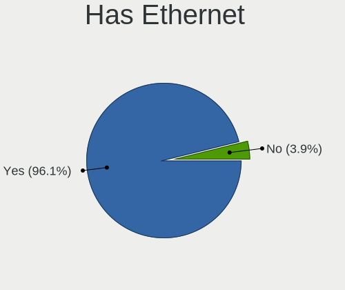
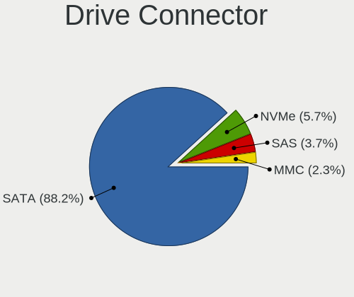
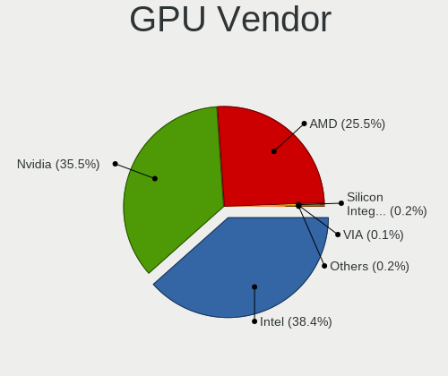
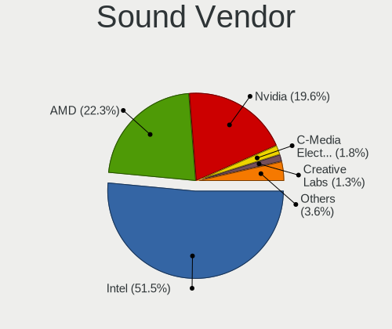
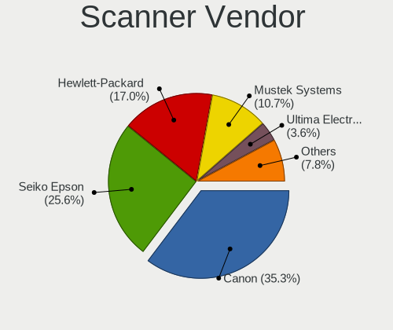

ROSA - Tested Hardware & Statistics
-----------------------------------

A project to collect tested hardware configurations for ROSA.

Anyone can contribute to this report by the [hw-probe](https://github.com/linuxhw/hw-probe) tool:

    sudo -E hw-probe -all -upload

Please contribute! Especially if your hardware is rare.

This is a report for all computer types. See also reports for [desktops](/Dist/ROSA/Desktop/README.md) and [notebooks](/Dist/ROSA/Notebook/README.md).

Contents
--------

* [ Test Cases ](#test-cases)

* [ System ](#system)
  - [ OS                       ](#os)
  - [ OS Family                ](#os-family)
  - [ Kernel                   ](#kernel)
  - [ Kernel Family            ](#kernel-family)
  - [ Kernel Major Ver.        ](#kernel-major-ver)
  - [ Arch                     ](#arch)
  - [ DE                       ](#de)
  - [ Display Server           ](#display-server)
  - [ Display Manager          ](#display-manager)
  - [ OS Lang                  ](#os-lang)
  - [ Boot Mode                ](#boot-mode)
  - [ Filesystem               ](#filesystem)
  - [ Part. scheme             ](#part-scheme)
  - [ Dual Boot with Linux/BSD ](#dual-boot-with-linuxbsd)
  - [ Dual Boot (Win)          ](#dual-boot-win)

* [ Board ](#board)
  - [ Vendor                   ](#vendor)
  - [ Model                    ](#model)
  - [ Model Family             ](#model-family)
  - [ MFG Year                 ](#mfg-year)
  - [ Form Factor              ](#form-factor)
  - [ Secure Boot              ](#secure-boot)
  - [ Coreboot                 ](#coreboot)
  - [ RAM Size                 ](#ram-size)
  - [ RAM Used                 ](#ram-used)
  - [ Total Drives             ](#total-drives)
  - [ Has CD-ROM               ](#has-cd-rom)
  - [ Has Ethernet             ](#has-ethernet)
  - [ Has WiFi                 ](#has-wifi)
  - [ Has Bluetooth            ](#has-bluetooth)

* [ Location ](#location)
  - [ Country                  ](#country)
  - [ City                     ](#city)

* [ Drives ](#drives)
  - [ Drive Vendor             ](#drive-vendor)
  - [ Drive Model              ](#drive-model)
  - [ HDD Vendor               ](#hdd-vendor)
  - [ SSD Vendor               ](#ssd-vendor)
  - [ Drive Kind               ](#drive-kind)
  - [ Drive Connector          ](#drive-connector)
  - [ Drive Size               ](#drive-size)
  - [ Space Total              ](#space-total)
  - [ Space Used               ](#space-used)
  - [ Malfunc. Drives          ](#malfunc-drives)
  - [ Malfunc. Drive Vendor    ](#malfunc-drive-vendor)
  - [ Malfunc. HDD Vendor      ](#malfunc-hdd-vendor)
  - [ Malfunc. Drive Kind      ](#malfunc-drive-kind)
  - [ Failed Drives            ](#failed-drives)
  - [ Failed Drive Vendor      ](#failed-drive-vendor)
  - [ Drive Status             ](#drive-status)

* [ Storage controller ](#storage-controller)
  - [ Storage Vendor           ](#storage-vendor)
  - [ Storage Model            ](#storage-model)
  - [ Storage Kind             ](#storage-kind)

* [ Processor ](#processor)
  - [ CPU Vendor               ](#cpu-vendor)
  - [ CPU Model                ](#cpu-model)
  - [ CPU Model Family         ](#cpu-model-family)
  - [ CPU Cores                ](#cpu-cores)
  - [ CPU Sockets              ](#cpu-sockets)
  - [ CPU Threads              ](#cpu-threads)
  - [ CPU Op-Modes             ](#cpu-op-modes)
  - [ CPU Microcode            ](#cpu-microcode)
  - [ CPU Microarch            ](#cpu-microarch)

* [ Graphics ](#graphics)
  - [ GPU Vendor               ](#gpu-vendor)
  - [ GPU Model                ](#gpu-model)
  - [ GPU Combo                ](#gpu-combo)
  - [ GPU Driver               ](#gpu-driver)
  - [ GPU Memory               ](#gpu-memory)

* [ Monitor ](#monitor)
  - [ Monitor Vendor           ](#monitor-vendor)
  - [ Monitor Model            ](#monitor-model)
  - [ Monitor Resolution       ](#monitor-resolution)
  - [ Monitor Diagonal         ](#monitor-diagonal)
  - [ Monitor Width            ](#monitor-width)
  - [ Aspect Ratio             ](#aspect-ratio)
  - [ Monitor Area             ](#monitor-area)
  - [ Pixel Density            ](#pixel-density)
  - [ Multiple Monitors        ](#multiple-monitors)

* [ Network ](#network)
  - [ Net Controller Vendor    ](#net-controller-vendor)
  - [ Net Controller Model     ](#net-controller-model)
  - [ Wireless Vendor          ](#wireless-vendor)
  - [ Wireless Model           ](#wireless-model)
  - [ Ethernet Vendor          ](#ethernet-vendor)
  - [ Ethernet Model           ](#ethernet-model)
  - [ Net Controller Kind      ](#net-controller-kind)
  - [ Used Controller          ](#used-controller)
  - [ NICs                     ](#nics)
  - [ IPv6                     ](#ipv6)

* [ Bluetooth ](#bluetooth)
  - [ Bluetooth Vendor         ](#bluetooth-vendor)
  - [ Bluetooth Model          ](#bluetooth-model)

* [ Sound ](#sound)
  - [ Sound Vendor             ](#sound-vendor)
  - [ Sound Model              ](#sound-model)

* [ Memory ](#memory)
  - [ Memory Vendor            ](#memory-vendor)
  - [ Memory Model             ](#memory-model)
  - [ Memory Kind              ](#memory-kind)
  - [ Memory Form Factor       ](#memory-form-factor)
  - [ Memory Size              ](#memory-size)
  - [ Memory Speed             ](#memory-speed)

* [ Printers & scanners ](#printers--scanners)
  - [ Printer Vendor           ](#printer-vendor)
  - [ Printer Model            ](#printer-model)
  - [ Scanner Vendor           ](#scanner-vendor)
  - [ Scanner Model            ](#scanner-model)

* [ Camera ](#camera)
  - [ Camera Vendor            ](#camera-vendor)
  - [ Camera Model             ](#camera-model)

* [ Security ](#security)
  - [ Fingerprint Vendor       ](#fingerprint-vendor)
  - [ Fingerprint Model        ](#fingerprint-model)
  - [ Chipcard Vendor          ](#chipcard-vendor)
  - [ Chipcard Model           ](#chipcard-model)

* [ Unsupported ](#unsupported)
  - [ Unsupported Devices      ](#unsupported-devices)
  - [ Unsupported Device Types ](#unsupported-device-types)

Test Cases
----------

Total: 46868

| Vendor        | Model                       | Form-Factor | Probe                                                      | Date         |
|---------------|-----------------------------|-------------|------------------------------------------------------------|--------------|
| eMachines     | E625                        | Notebook    | [e4674eed04](https://linux-hardware.org/?probe=e4674eed04) | Jan 06, 2025 |
| Samsung       | RV409/RV509/RV709           | Notebook    | [0c7619aac5](https://linux-hardware.org/?probe=0c7619aac5) | Jan 06, 2025 |
| ASUSTek       | PRIME B450-PLUS             | Desktop     | [4233786e9f](https://linux-hardware.org/?probe=4233786e9f) | Jan 06, 2025 |
| Lenovo        | Legion 5 15ARH05 82B5       | Notebook    | [572f922d7c](https://linux-hardware.org/?probe=572f922d7c) | Jan 06, 2025 |
| Lenovo        | ThinkPad X220 4290RV1       | Notebook    | [8873dfc3ac](https://linux-hardware.org/?probe=8873dfc3ac) | Jan 05, 2025 |
| Lenovo        | IdeaPad Z570 HuronRiver ... | Notebook    | [e12dddcd7f](https://linux-hardware.org/?probe=e12dddcd7f) | Jan 05, 2025 |
| Unknown       | Unknown                     | Notebook    | [d526621027](https://linux-hardware.org/?probe=d526621027) | Jan 05, 2025 |
| ASRock        | 960GM-VGS3 FX               | Desktop     | [e4da7ca430](https://linux-hardware.org/?probe=e4da7ca430) | Jan 05, 2025 |
| Gigabyte      | B450 AORUS M                | Desktop     | [65b4884505](https://linux-hardware.org/?probe=65b4884505) | Jan 04, 2025 |
| Intel         | D510MO AAE76523-401         | Desktop     | [70f66209d4](https://linux-hardware.org/?probe=70f66209d4) | Jan 04, 2025 |
| AZW           | MINI S                      | Desktop     | [0f7bb17346](https://linux-hardware.org/?probe=0f7bb17346) | Jan 04, 2025 |
| ASUSTek       | K53TA                       | Notebook    | [26c9d957fc](https://linux-hardware.org/?probe=26c9d957fc) | Jan 04, 2025 |
| MSI           | 970A-G43                    | Desktop     | [4da1f27374](https://linux-hardware.org/?probe=4da1f27374) | Jan 03, 2025 |
| Gigabyte      | B450 GAMING X               | Desktop     | [faa23f32b2](https://linux-hardware.org/?probe=faa23f32b2) | Jan 03, 2025 |
| ASUSTek       | VivoBook_ASUSLaptop X509... | Notebook    | [08c2c8d3a6](https://linux-hardware.org/?probe=08c2c8d3a6) | Jan 03, 2025 |
| Acer          | WMCP78M                     | Desktop     | [194dd31946](https://linux-hardware.org/?probe=194dd31946) | Jan 03, 2025 |
| Huanan        | X99-QD4 V1.0                | Desktop     | [6f4fe3e17b](https://linux-hardware.org/?probe=6f4fe3e17b) | Jan 02, 2025 |
| Toshiba       | NB100                       | Notebook    | [df34e9793f](https://linux-hardware.org/?probe=df34e9793f) | Jan 02, 2025 |
| MSI           | Katana 17 B12VFK            | Notebook    | [5bffc2a657](https://linux-hardware.org/?probe=5bffc2a657) | Jan 02, 2025 |
| Lenovo        | ThinkBook 16 G6 IRL 21KH    | Notebook    | [77722af02e](https://linux-hardware.org/?probe=77722af02e) | Jan 02, 2025 |
| HP            | 255 G8 Notebook PC          | Notebook    | [c48045073f](https://linux-hardware.org/?probe=c48045073f) | Jan 02, 2025 |
| Acer          | Aspire E5-571G              | Notebook    | [a4cd37383e](https://linux-hardware.org/?probe=a4cd37383e) | Jan 02, 2025 |
| HUAWEI        | BOD-WXX9                    | Notebook    | [305f6e1f4d](https://linux-hardware.org/?probe=305f6e1f4d) | Jan 02, 2025 |
| ASUSTek       | P5B-E Plus                  | Desktop     | [1026f82971](https://linux-hardware.org/?probe=1026f82971) | Jan 02, 2025 |
| HUAWEI        | BOD-WXX9                    | Notebook    | [a65202783f](https://linux-hardware.org/?probe=a65202783f) | Jan 02, 2025 |
| Lenovo        | IdeaPad 100-15IBY 80MJ      | Notebook    | [eaa8dd18d4](https://linux-hardware.org/?probe=eaa8dd18d4) | Jan 02, 2025 |
| Acer          | Aspire 3610                 | Notebook    | [eff3c1a864](https://linux-hardware.org/?probe=eff3c1a864) | Jan 01, 2025 |
| HUAWEI        | BOD-WXX9                    | Notebook    | [e28bd300ec](https://linux-hardware.org/?probe=e28bd300ec) | Jan 01, 2025 |
| Lenovo        | V15 G2 IJL 82QY             | Notebook    | [cd9b055146](https://linux-hardware.org/?probe=cd9b055146) | Dec 31, 2024 |
| DNS           | W510LU                      | Notebook    | [24e7ee2939](https://linux-hardware.org/?probe=24e7ee2939) | Dec 31, 2024 |
| Acer          | Acadia V1.34                | Notebook    | [10f43a8f8c](https://linux-hardware.org/?probe=10f43a8f8c) | Dec 31, 2024 |
| Huanan        | X99-F8 GAMING V5.0          | Desktop     | [b1dbf7b873](https://linux-hardware.org/?probe=b1dbf7b873) | Dec 31, 2024 |
| Gigabyte      | B450M S2H                   | Desktop     | [27c0c9eacb](https://linux-hardware.org/?probe=27c0c9eacb) | Dec 31, 2024 |
| Fujitsu Si... | LIFEBOOK S7020              | Notebook    | [7d29f5fd35](https://linux-hardware.org/?probe=7d29f5fd35) | Dec 30, 2024 |
| eMachines     | eM355                       | Notebook    | [cd8623ca62](https://linux-hardware.org/?probe=cd8623ca62) | Dec 30, 2024 |
| Lenovo        | MAHOBAY NOK                 | Desktop     | [00c630c63a](https://linux-hardware.org/?probe=00c630c63a) | Dec 30, 2024 |
| MSI           | A68HM-E33                   | Desktop     | [8054416839](https://linux-hardware.org/?probe=8054416839) | Dec 30, 2024 |
| HP            | Stream Notebook PC 13       | Notebook    | [ea9dccd4a8](https://linux-hardware.org/?probe=ea9dccd4a8) | Dec 30, 2024 |
| Fujitsu Si... | LIFEBOOK S7020              | Notebook    | [127407fc25](https://linux-hardware.org/?probe=127407fc25) | Dec 30, 2024 |
| Acer          | Aspire 5742G                | Notebook    | [79525e56eb](https://linux-hardware.org/?probe=79525e56eb) | Dec 30, 2024 |
| Acer          | Aspire E1-531G              | Notebook    | [222752a541](https://linux-hardware.org/?probe=222752a541) | Dec 29, 2024 |
| Fujitsu Si... | AMILO Pro Edition V3405     | Notebook    | [d4622b1451](https://linux-hardware.org/?probe=d4622b1451) | Dec 29, 2024 |
| MSI           | A320M-A PRO MAX             | Desktop     | [97b1ee7487](https://linux-hardware.org/?probe=97b1ee7487) | Dec 29, 2024 |
| Lenovo        | S20-30 20421                | Notebook    | [7e1a5a670a](https://linux-hardware.org/?probe=7e1a5a670a) | Dec 29, 2024 |
| ASUSTek       | TUF Gaming B450M-PRO II     | Desktop     | [8012f9a21d](https://linux-hardware.org/?probe=8012f9a21d) | Dec 28, 2024 |
| Lenovo        | MAHOBAY NOK                 | Desktop     | [9fd12e619e](https://linux-hardware.org/?probe=9fd12e619e) | Dec 28, 2024 |
| Lenovo        | G500 20236                  | Notebook    | [44c24fa0ee](https://linux-hardware.org/?probe=44c24fa0ee) | Dec 28, 2024 |
| GMKtec        | M5 PLUS                     | Mini pc     | [8628716cf4](https://linux-hardware.org/?probe=8628716cf4) | Dec 28, 2024 |
| Acer          | Unknown                     | Notebook    | [fa5b28121c](https://linux-hardware.org/?probe=fa5b28121c) | Dec 28, 2024 |
| Dell          | Vostro 1014                 | Notebook    | [89dcde03d0](https://linux-hardware.org/?probe=89dcde03d0) | Dec 28, 2024 |
| HP            | Stream Notebook PC 13       | Notebook    | [b31f0109e7](https://linux-hardware.org/?probe=b31f0109e7) | Dec 27, 2024 |
| ASUSTek       | PRIME B760-PLUS D4          | Desktop     | [aea60b12c3](https://linux-hardware.org/?probe=aea60b12c3) | Dec 27, 2024 |
| ASRock        | H510M-HDV                   | Desktop     | [3b9f735c39](https://linux-hardware.org/?probe=3b9f735c39) | Dec 26, 2024 |
| Acer          | Aspire 5349                 | Notebook    | [4538d32a3d](https://linux-hardware.org/?probe=4538d32a3d) | Dec 26, 2024 |
| ASRock        | G31M-GS                     | Desktop     | [655a9a77aa](https://linux-hardware.org/?probe=655a9a77aa) | Dec 26, 2024 |
| MSI           | GL62M 7RDX                  | Notebook    | [83b16ab268](https://linux-hardware.org/?probe=83b16ab268) | Dec 26, 2024 |
| Biostar       | A780LB                      | Desktop     | [50a42b0b06](https://linux-hardware.org/?probe=50a42b0b06) | Dec 25, 2024 |
| MSI           | G41TM-E43                   | Desktop     | [0d099148c3](https://linux-hardware.org/?probe=0d099148c3) | Dec 25, 2024 |
| HP            | EtiteBook 840 G5            | Notebook    | [5ed7fbc42d](https://linux-hardware.org/?probe=5ed7fbc42d) | Dec 25, 2024 |
| Huanan        | B75 G376-V6.0               | Desktop     | [fcecd9dab0](https://linux-hardware.org/?probe=fcecd9dab0) | Dec 25, 2024 |
| TECNO Mobi... | MEGABOOK K16SDA             | Notebook    | [99d3b277a9](https://linux-hardware.org/?probe=99d3b277a9) | Dec 25, 2024 |
| ASUSTek       | P8Z77-V LE PLUS             | Desktop     | [6d145d17f1](https://linux-hardware.org/?probe=6d145d17f1) | Dec 25, 2024 |
| ASUSTek       | Vivobook Go E1504FA_E150... | Notebook    | [421416a69e](https://linux-hardware.org/?probe=421416a69e) | Dec 25, 2024 |
| Elpitech      | ET151-2                     | Soc         | [817e35c7cf](https://linux-hardware.org/?probe=817e35c7cf) | Dec 25, 2024 |
| Acer          | Aspire A317-52              | Notebook    | [3d85a6b6d7](https://linux-hardware.org/?probe=3d85a6b6d7) | Dec 25, 2024 |
| Lenovo        | ThinkPad X250 20CM003CRT    | Notebook    | [8131530228](https://linux-hardware.org/?probe=8131530228) | Dec 24, 2024 |
| Gigabyte      | B360M DS3H                  | Desktop     | [d606dfb509](https://linux-hardware.org/?probe=d606dfb509) | Dec 24, 2024 |
| Gigabyte      | GA-MA770-DS3                | Desktop     | [d3c2067fd5](https://linux-hardware.org/?probe=d3c2067fd5) | Dec 24, 2024 |
| ICL           | H510SB-TM v2.0              | All in one  | [f969d9fb85](https://linux-hardware.org/?probe=f969d9fb85) | Dec 24, 2024 |
| ASUSTek       | PRIME A320M-K               | Desktop     | [cc7b12fc35](https://linux-hardware.org/?probe=cc7b12fc35) | Dec 24, 2024 |
| Toshiba       | NB100                       | Notebook    | [1041e6c170](https://linux-hardware.org/?probe=1041e6c170) | Dec 24, 2024 |
| ASUSTek       | M3A78-CM                    | Desktop     | [2d4194f76b](https://linux-hardware.org/?probe=2d4194f76b) | Dec 23, 2024 |
| Gigabyte      | 970A-DS3P                   | Desktop     | [82a3f44796](https://linux-hardware.org/?probe=82a3f44796) | Dec 23, 2024 |
| Dell          | Vostro 1014                 | Notebook    | [3a0229ef1c](https://linux-hardware.org/?probe=3a0229ef1c) | Dec 23, 2024 |
| Gigabyte      | H410M H V3                  | Desktop     | [38db6d3960](https://linux-hardware.org/?probe=38db6d3960) | Dec 23, 2024 |
| ASRock        | A320D4-P1                   | Desktop     | [9fd8b4c5ab](https://linux-hardware.org/?probe=9fd8b4c5ab) | Dec 23, 2024 |
| ASUSTek       | PRIME H270-PLUS             | Desktop     | [1ca103ad2a](https://linux-hardware.org/?probe=1ca103ad2a) | Dec 23, 2024 |
| ASUSTek       | ASUSLaptop_Q530VJ           | Notebook    | [701d015fd1](https://linux-hardware.org/?probe=701d015fd1) | Dec 22, 2024 |
| ASUSTek       | B85M-K                      | Desktop     | [0978d9437e](https://linux-hardware.org/?probe=0978d9437e) | Dec 22, 2024 |
| Acer          | AO531h                      | Notebook    | [ae863646cd](https://linux-hardware.org/?probe=ae863646cd) | Dec 22, 2024 |
| Lenovo        | ThinkPad P17 Gen 1 20SN0... | Notebook    | [472acf3ec6](https://linux-hardware.org/?probe=472acf3ec6) | Dec 21, 2024 |
| Lenovo        | ThinkPad P17 Gen 1 20SN0... | Notebook    | [71553abdd8](https://linux-hardware.org/?probe=71553abdd8) | Dec 21, 2024 |
| ASUSTek       | VivoBook_ASUSLaptop M650... | Notebook    | [5d90b386a8](https://linux-hardware.org/?probe=5d90b386a8) | Dec 21, 2024 |
| Gigabyte      | B650M AORUS ELITE           | Desktop     | [35a7c56bfe](https://linux-hardware.org/?probe=35a7c56bfe) | Dec 21, 2024 |
| ASUSTek       | X555QA                      | Notebook    | [44b32a3f7b](https://linux-hardware.org/?probe=44b32a3f7b) | Dec 21, 2024 |
| ASUSTek       | P5G41T-M LX2/GB             | Desktop     | [3ba1da1476](https://linux-hardware.org/?probe=3ba1da1476) | Dec 20, 2024 |
| ASUSTek       | STRIX Z270H GAMING          | Desktop     | [b38a7837c5](https://linux-hardware.org/?probe=b38a7837c5) | Dec 20, 2024 |
| LTD Delovo... | 15CLG2                      | Notebook    | [39a5c39de0](https://linux-hardware.org/?probe=39a5c39de0) | Dec 20, 2024 |
| Chuwi         | MiniBook X                  | Notebook    | [3d7be23d49](https://linux-hardware.org/?probe=3d7be23d49) | Dec 19, 2024 |
| Digma         | EVE 15 P418 NCN154BXW01     | Notebook    | [1f788db073](https://linux-hardware.org/?probe=1f788db073) | Dec 19, 2024 |
| ICL           | H510SB-TM v2.0              | All in one  | [c570b60c5c](https://linux-hardware.org/?probe=c570b60c5c) | Dec 19, 2024 |
| HP            | EliteBook 840 G8 Noteboo... | Notebook    | [9f0fc66e58](https://linux-hardware.org/?probe=9f0fc66e58) | Dec 19, 2024 |
| Acer          | Aspire A315-53              | Notebook    | [f25c3e31af](https://linux-hardware.org/?probe=f25c3e31af) | Dec 19, 2024 |
| KVADRA        | NAU LE14U                   | Notebook    | [bca4537cc8](https://linux-hardware.org/?probe=bca4537cc8) | Dec 19, 2024 |
| HUAWEI        | NBD-WXX9                    | Notebook    | [0d321b083c](https://linux-hardware.org/?probe=0d321b083c) | Dec 19, 2024 |
| MSI           | Z77A-GD65                   | Desktop     | [b928d00615](https://linux-hardware.org/?probe=b928d00615) | Dec 19, 2024 |
| Clevo         | W240EL/W250ELQ/W270ELQ      | Notebook    | [ff394d758b](https://linux-hardware.org/?probe=ff394d758b) | Dec 18, 2024 |
| Biostar       | N68S3B                      | Desktop     | [9b0517b1c6](https://linux-hardware.org/?probe=9b0517b1c6) | Dec 18, 2024 |
| LTD Delovo... | 15TLI                       | Notebook    | [b0481ea420](https://linux-hardware.org/?probe=b0481ea420) | Dec 18, 2024 |
| MSI           | G31TM-P21                   | Desktop     | [f8e605fd2a](https://linux-hardware.org/?probe=f8e605fd2a) | Dec 18, 2024 |
| Biostar       | Hi-Fi H77S                  | Desktop     | [920915dc5e](https://linux-hardware.org/?probe=920915dc5e) | Dec 18, 2024 |
| Acer          | Extensa 215-23              | Notebook    | [9ed4841427](https://linux-hardware.org/?probe=9ed4841427) | Dec 18, 2024 |
| HP            | ProBook 4540s               | Notebook    | [4f31cb1609](https://linux-hardware.org/?probe=4f31cb1609) | Dec 18, 2024 |
| ASRock        | H510M-HDV                   | Desktop     | [5b34b8b9bd](https://linux-hardware.org/?probe=5b34b8b9bd) | Dec 18, 2024 |
| Gigabyte      | H310M S2H                   | Desktop     | [2fe012a888](https://linux-hardware.org/?probe=2fe012a888) | Dec 18, 2024 |
| HP            | Laptop 15-dw3xxx            | Notebook    | [0fb8125031](https://linux-hardware.org/?probe=0fb8125031) | Dec 18, 2024 |
| ASUSTek       | M5A78L-M LX3                | Desktop     | [5b0695c446](https://linux-hardware.org/?probe=5b0695c446) | Dec 18, 2024 |
| Lenovo        | ThinkPad Yoga 11e 5th Ge... | Convertible | [a1c5f23bbe](https://linux-hardware.org/?probe=a1c5f23bbe) | Dec 17, 2024 |
| Lenovo        | G500 20236                  | Notebook    | [e99102e968](https://linux-hardware.org/?probe=e99102e968) | Dec 17, 2024 |
| Graviton      | VALDAY                      | Server      | [481d7f644b](https://linux-hardware.org/?probe=481d7f644b) | Dec 17, 2024 |
| Unknown       | Unknown                     | Desktop     | [ca877e7bea](https://linux-hardware.org/?probe=ca877e7bea) | Dec 17, 2024 |
| MSI           | B760M BOMBER                | Desktop     | [0b6ed644f3](https://linux-hardware.org/?probe=0b6ed644f3) | Dec 17, 2024 |
| Gigabyte      | H61M-DS2                    | Desktop     | [ed02a12fef](https://linux-hardware.org/?probe=ed02a12fef) | Dec 17, 2024 |
| MSI           | B760M BOMBER                | Desktop     | [c181449dfb](https://linux-hardware.org/?probe=c181449dfb) | Dec 17, 2024 |
| Positivo      | C464F                       | Notebook    | [6ba50c5c35](https://linux-hardware.org/?probe=6ba50c5c35) | Dec 17, 2024 |
| HUAWEI        | NBM-WXX9                    | Notebook    | [bc96f08cc4](https://linux-hardware.org/?probe=bc96f08cc4) | Dec 16, 2024 |
| ASUSTek       | 1225B                       | Notebook    | [282c903413](https://linux-hardware.org/?probe=282c903413) | Dec 16, 2024 |
| Gigabyte      | H610M H DDR4                | Desktop     | [6f57b82832](https://linux-hardware.org/?probe=6f57b82832) | Dec 16, 2024 |
| ASRock        | B75 Pro3                    | Desktop     | [f470c0e8ba](https://linux-hardware.org/?probe=f470c0e8ba) | Dec 16, 2024 |
| ASUSTek       | X401A1                      | Notebook    | [c8daab5ddd](https://linux-hardware.org/?probe=c8daab5ddd) | Dec 16, 2024 |
| ASUSTek       | X401A1                      | Notebook    | [68dca00960](https://linux-hardware.org/?probe=68dca00960) | Dec 16, 2024 |
| ASUSTek       | PRIME H510M-K R2.0          | Desktop     | [6c43b12a79](https://linux-hardware.org/?probe=6c43b12a79) | Dec 16, 2024 |
| Samsung       | 305V4A/305V5A               | Notebook    | [579117e933](https://linux-hardware.org/?probe=579117e933) | Dec 16, 2024 |
| Acer          | Nitro AN517-51              | Notebook    | [cfc1632018](https://linux-hardware.org/?probe=cfc1632018) | Dec 15, 2024 |
| ASUSTek       | M4A785D-M PRO               | Desktop     | [ce740f709b](https://linux-hardware.org/?probe=ce740f709b) | Dec 15, 2024 |
| HP            | Presario V3700              | Notebook    | [d66d7edcc9](https://linux-hardware.org/?probe=d66d7edcc9) | Dec 15, 2024 |
| Dell          | Inspiron N5040              | Notebook    | [505ab582ed](https://linux-hardware.org/?probe=505ab582ed) | Dec 15, 2024 |
| Dell          | Inspiron N5040              | Notebook    | [1095593128](https://linux-hardware.org/?probe=1095593128) | Dec 14, 2024 |
| Toshiba       | NB100                       | Notebook    | [976e6530d5](https://linux-hardware.org/?probe=976e6530d5) | Dec 14, 2024 |
| ASUSTek       | K52F                        | Notebook    | [d91478f3d5](https://linux-hardware.org/?probe=d91478f3d5) | Dec 14, 2024 |
| Maibenben     | Perfectum Series            | Notebook    | [560f2b3cf0](https://linux-hardware.org/?probe=560f2b3cf0) | Dec 14, 2024 |
| Lenovo        | Tiger Hill                  | Desktop     | [82f654c54b](https://linux-hardware.org/?probe=82f654c54b) | Dec 14, 2024 |
| Intel         | X99                         | Desktop     | [fca6609fa5](https://linux-hardware.org/?probe=fca6609fa5) | Dec 14, 2024 |
| Gigabyte      | 8PEMT4                      | Desktop     | [0d17183be5](https://linux-hardware.org/?probe=0d17183be5) | Dec 14, 2024 |
| ASUSTek       | P8Z77-V LE PLUS             | Desktop     | [d410612c72](https://linux-hardware.org/?probe=d410612c72) | Dec 14, 2024 |
| Acer          | FIH57                       | Desktop     | [0e1335494a](https://linux-hardware.org/?probe=0e1335494a) | Dec 14, 2024 |
| Acer          | Aspire VN7-571G             | Notebook    | [244938cec7](https://linux-hardware.org/?probe=244938cec7) | Dec 14, 2024 |
| HP            | Pavilion dv7                | Notebook    | [72e503e392](https://linux-hardware.org/?probe=72e503e392) | Dec 14, 2024 |
| Acer          | Predator PH317-52           | Notebook    | [dbfb480a1a](https://linux-hardware.org/?probe=dbfb480a1a) | Dec 13, 2024 |
| Gigabyte      | AB350M-DS3H-CF              | Desktop     | [2c834ce7a7](https://linux-hardware.org/?probe=2c834ce7a7) | Dec 13, 2024 |
| OEM           | X79G                        | Desktop     | [54ea7ee329](https://linux-hardware.org/?probe=54ea7ee329) | Dec 13, 2024 |
| Aquarius      | NS685U R11                  | Notebook    | [8a02adbd30](https://linux-hardware.org/?probe=8a02adbd30) | Dec 13, 2024 |
| Haier         | A1400EM                     | Notebook    | [6a70bab189](https://linux-hardware.org/?probe=6a70bab189) | Dec 12, 2024 |
| Notebook      | W250EGQ / W270EGQ           | Notebook    | [0f794c4db7](https://linux-hardware.org/?probe=0f794c4db7) | Dec 12, 2024 |
| HUAWEI        | NBM-WXX9                    | Notebook    | [06ed8ceba0](https://linux-hardware.org/?probe=06ed8ceba0) | Dec 12, 2024 |
| Haier         | A1400EM                     | Notebook    | [ec694f3d2b](https://linux-hardware.org/?probe=ec694f3d2b) | Dec 12, 2024 |
| ASUSTek       | H87M-E                      | Desktop     | [b2f1a524d5](https://linux-hardware.org/?probe=b2f1a524d5) | Dec 11, 2024 |
| ASRock        | H310CM-HDV                  | Desktop     | [6415ed92bc](https://linux-hardware.org/?probe=6415ed92bc) | Dec 11, 2024 |
| Acer          | Aspire E5-573               | Notebook    | [202745daec](https://linux-hardware.org/?probe=202745daec) | Dec 11, 2024 |
| Gigabyte      | H77N-WIFI                   | Desktop     | [b1ff81f4b0](https://linux-hardware.org/?probe=b1ff81f4b0) | Dec 11, 2024 |
| MSI           | VR610                       | Notebook    | [2cb0f5cee5](https://linux-hardware.org/?probe=2cb0f5cee5) | Dec 11, 2024 |
| Aquarius      | CMP NS685U_4                | Notebook    | [1625c80cdc](https://linux-hardware.org/?probe=1625c80cdc) | Dec 11, 2024 |
| HP            | EliteBook 840 G4            | Notebook    | [43588f84f7](https://linux-hardware.org/?probe=43588f84f7) | Dec 11, 2024 |
| Timi          | Redmi Book Pro 15 2022      | Notebook    | [6f1d744bdf](https://linux-hardware.org/?probe=6f1d744bdf) | Dec 11, 2024 |
| HP            | ProBook 440 G4              | Notebook    | [cc572d1c5d](https://linux-hardware.org/?probe=cc572d1c5d) | Dec 11, 2024 |
| ASRock        | H310CM-HDV                  | Desktop     | [af2d33d4ec](https://linux-hardware.org/?probe=af2d33d4ec) | Dec 10, 2024 |
| HONOR         | FRI-HXX                     | Notebook    | [c1ace97f1b](https://linux-hardware.org/?probe=c1ace97f1b) | Dec 10, 2024 |
| Gigabyte      | H470 HD3                    | Desktop     | [d6ad9179a1](https://linux-hardware.org/?probe=d6ad9179a1) | Dec 10, 2024 |
| Acer          | Aspire 5720                 | Notebook    | [7673fe735d](https://linux-hardware.org/?probe=7673fe735d) | Dec 10, 2024 |
| HP            | Laptop 15s-eq1xxx           | Notebook    | [a07076b780](https://linux-hardware.org/?probe=a07076b780) | Dec 10, 2024 |
| Acer          | Aspire E1-570G              | Notebook    | [4789e987c9](https://linux-hardware.org/?probe=4789e987c9) | Dec 10, 2024 |
| Digma Pro     | Minimax U1 DPP5-8CXN01      | Mini pc     | [3aa6662717](https://linux-hardware.org/?probe=3aa6662717) | Dec 09, 2024 |
| Gigabyte      | H77N-WIFI                   | Desktop     | [e0e8469dce](https://linux-hardware.org/?probe=e0e8469dce) | Dec 09, 2024 |
| Acer          | Nitro AN517-51              | Notebook    | [bcd4ba760b](https://linux-hardware.org/?probe=bcd4ba760b) | Dec 09, 2024 |
| Gigabyte      | B75-D3V                     | Desktop     | [01d3d78d8c](https://linux-hardware.org/?probe=01d3d78d8c) | Dec 09, 2024 |
| Unknown       | Unknown                     | Desktop     | [3ca90936ec](https://linux-hardware.org/?probe=3ca90936ec) | Dec 08, 2024 |
| ASUSTek       | TUF Gaming B450M-PRO II     | Desktop     | [1c11421588](https://linux-hardware.org/?probe=1c11421588) | Dec 08, 2024 |
| Intel         | DP35DP AAD81073-206         | Desktop     | [495382b328](https://linux-hardware.org/?probe=495382b328) | Dec 08, 2024 |
| Samsung       | R530/R730                   | Notebook    | [76e645e1f5](https://linux-hardware.org/?probe=76e645e1f5) | Dec 08, 2024 |
| ASRock        | G31M-GS                     | Desktop     | [94e1ac3253](https://linux-hardware.org/?probe=94e1ac3253) | Dec 08, 2024 |
| HP            | ProBook 440 G5              | Notebook    | [af0c5e2ba8](https://linux-hardware.org/?probe=af0c5e2ba8) | Dec 08, 2024 |
| HP            | ProBook 440 G5              | Notebook    | [bd256920c1](https://linux-hardware.org/?probe=bd256920c1) | Dec 08, 2024 |
| Lenovo        | C200                        | All in one  | [124088a101](https://linux-hardware.org/?probe=124088a101) | Dec 08, 2024 |
| MACHINIST     | X99-RS9 V3.1                | Desktop     | [fe7be85a71](https://linux-hardware.org/?probe=fe7be85a71) | Dec 08, 2024 |
| Toshiba       | Satellite U300              | Notebook    | [44bfb599a1](https://linux-hardware.org/?probe=44bfb599a1) | Dec 07, 2024 |
| ASUSTek       | M2N-X Plus                  | Desktop     | [ee0520cc79](https://linux-hardware.org/?probe=ee0520cc79) | Dec 07, 2024 |
| Gigabyte      | 970A-UD3P                   | Desktop     | [80b281101e](https://linux-hardware.org/?probe=80b281101e) | Dec 07, 2024 |
| ASUSTek       | X751MD                      | Notebook    | [5d526a41a5](https://linux-hardware.org/?probe=5d526a41a5) | Dec 07, 2024 |
| Gigabyte      | GA-MA770T-UD3               | Desktop     | [0645b251b4](https://linux-hardware.org/?probe=0645b251b4) | Dec 07, 2024 |
| Lenovo        | G500 20236                  | Notebook    | [c5df9aa471](https://linux-hardware.org/?probe=c5df9aa471) | Dec 07, 2024 |
| Haier         | A1400SD                     | Notebook    | [6c163e8082](https://linux-hardware.org/?probe=6c163e8082) | Dec 07, 2024 |
| Lenovo        | IdeaPad Z500 20202          | Notebook    | [263eac9279](https://linux-hardware.org/?probe=263eac9279) | Dec 07, 2024 |
| Lenovo        | Bantry CRB SDK0J40697 WI... | Desktop     | [8b5005227c](https://linux-hardware.org/?probe=8b5005227c) | Dec 07, 2024 |
| Notebook      | W250EGQ / W270EGQ           | Notebook    | [34572ad8d6](https://linux-hardware.org/?probe=34572ad8d6) | Dec 07, 2024 |
| Lenovo        | 3111 NOK                    | Desktop     | [be49e79017](https://linux-hardware.org/?probe=be49e79017) | Dec 07, 2024 |
| Foxconn       | G43M01                      | Desktop     | [05764150cd](https://linux-hardware.org/?probe=05764150cd) | Dec 07, 2024 |
| Samsung       | R510/P510                   | Notebook    | [5f6596d687](https://linux-hardware.org/?probe=5f6596d687) | Dec 07, 2024 |
| Gigabyte      | 970A-UD3P                   | Desktop     | [5bc1e6a705](https://linux-hardware.org/?probe=5bc1e6a705) | Dec 06, 2024 |
| HP            | Pavilion 17                 | Notebook    | [755fd13cd8](https://linux-hardware.org/?probe=755fd13cd8) | Dec 06, 2024 |
| HP            | Pavilion dv6500             | Notebook    | [b5885a14db](https://linux-hardware.org/?probe=b5885a14db) | Dec 06, 2024 |
| Intel         | X99                         | Desktop     | [1a747b74f7](https://linux-hardware.org/?probe=1a747b74f7) | Dec 06, 2024 |
| MSI           | A320M-A PRO MAX             | Desktop     | [c578d9f1c3](https://linux-hardware.org/?probe=c578d9f1c3) | Dec 06, 2024 |
| ASUSTek       | M4A78-VM                    | Desktop     | [6b8d8c80f7](https://linux-hardware.org/?probe=6b8d8c80f7) | Dec 06, 2024 |
| ASUSTek       | M5A78L LE                   | Desktop     | [a38ce39707](https://linux-hardware.org/?probe=a38ce39707) | Dec 06, 2024 |
| ASUSTek       | K52F                        | Notebook    | [80a163229c](https://linux-hardware.org/?probe=80a163229c) | Dec 05, 2024 |
| ASRock        | Z270M Extreme4              | Desktop     | [1759ae4e5c](https://linux-hardware.org/?probe=1759ae4e5c) | Dec 05, 2024 |
| Fujitsu       | D3062-A1 S26361-D3062-A1    | Desktop     | [fcb75ca2c4](https://linux-hardware.org/?probe=fcb75ca2c4) | Dec 05, 2024 |
| Acer          | Nitro AN515-52              | Notebook    | [9fd3688418](https://linux-hardware.org/?probe=9fd3688418) | Dec 04, 2024 |
| Acer          | Nitro AN515-52              | Notebook    | [35f03ceef6](https://linux-hardware.org/?probe=35f03ceef6) | Dec 04, 2024 |
| MSI           | B350M PRO-VDH               | Desktop     | [c287832149](https://linux-hardware.org/?probe=c287832149) | Dec 04, 2024 |
| Lenovo        | G580 20157                  | Notebook    | [d5c6a524fe](https://linux-hardware.org/?probe=d5c6a524fe) | Dec 04, 2024 |
| Intel         | DQ67SW AAG12527-310         | Desktop     | [acb85c645e](https://linux-hardware.org/?probe=acb85c645e) | Dec 04, 2024 |
| Gigabyte      | B75M-HD3                    | Desktop     | [8e3012cc10](https://linux-hardware.org/?probe=8e3012cc10) | Dec 04, 2024 |
| Dell          | Inspiron 3521               | Notebook    | [6f38eaee0a](https://linux-hardware.org/?probe=6f38eaee0a) | Dec 04, 2024 |
| iRU           | 17TLI                       | Notebook    | [5cde8d1248](https://linux-hardware.org/?probe=5cde8d1248) | Dec 04, 2024 |
| Aquarius      | AQH310CM                    | Desktop     | [48fdb906d0](https://linux-hardware.org/?probe=48fdb906d0) | Dec 04, 2024 |
| ICL           | H510SB-TM v2.0              | All in one  | [97ed41737d](https://linux-hardware.org/?probe=97ed41737d) | Dec 04, 2024 |
| Gigabyte      | H410M H V3                  | Desktop     | [5ed6ba9b9c](https://linux-hardware.org/?probe=5ed6ba9b9c) | Dec 04, 2024 |
| Dell          | Inspiron 3521               | Notebook    | [6bdcd2c2fc](https://linux-hardware.org/?probe=6bdcd2c2fc) | Dec 04, 2024 |
| ASUSTek       | VivoBook_ASUSLaptop X409... | Notebook    | [42a684379c](https://linux-hardware.org/?probe=42a684379c) | Dec 04, 2024 |
| Acer          | Extensa 215-23              | Notebook    | [63d7bb319f](https://linux-hardware.org/?probe=63d7bb319f) | Dec 04, 2024 |
| Lenovo        | G700 20251                  | Notebook    | [beacb57450](https://linux-hardware.org/?probe=beacb57450) | Dec 04, 2024 |
| Dell          | Latitude 5421               | Notebook    | [7b0e864d00](https://linux-hardware.org/?probe=7b0e864d00) | Dec 03, 2024 |
| Gigabyte      | GA-MA770T-UD3               | Desktop     | [01e4659eed](https://linux-hardware.org/?probe=01e4659eed) | Dec 03, 2024 |
| Acer          | Aspire 5750G                | Notebook    | [1fb7124f16](https://linux-hardware.org/?probe=1fb7124f16) | Dec 03, 2024 |
| HP            | EliteBook 840 G4            | Notebook    | [c7eb4e7297](https://linux-hardware.org/?probe=c7eb4e7297) | Dec 03, 2024 |
| MSI           | Katana 17 B13UCX            | Notebook    | [8a44e2bbba](https://linux-hardware.org/?probe=8a44e2bbba) | Dec 02, 2024 |
| MSI           | Katana GF66 11UE            | Notebook    | [7c65d6d109](https://linux-hardware.org/?probe=7c65d6d109) | Dec 02, 2024 |
| Lenovo        | K14 Gen 1 21CSS16E00        | Notebook    | [7b6b2e8b6c](https://linux-hardware.org/?probe=7b6b2e8b6c) | Dec 02, 2024 |
| ASUSTek       | K53Z                        | Notebook    | [a562977b03](https://linux-hardware.org/?probe=a562977b03) | Dec 01, 2024 |
| ASUSTek       | X55A                        | Notebook    | [991edf32b4](https://linux-hardware.org/?probe=991edf32b4) | Dec 01, 2024 |
| ICL           | H510SB-TM v2.0              | All in one  | [291c421944](https://linux-hardware.org/?probe=291c421944) | Dec 01, 2024 |
| Dell          | Inspiron 15-3552            | Notebook    | [efc49c880e](https://linux-hardware.org/?probe=efc49c880e) | Dec 01, 2024 |
| ASUSTek       | N56VV                       | Notebook    | [16936315ba](https://linux-hardware.org/?probe=16936315ba) | Dec 01, 2024 |
| Supermicro    | H11SSL-NC                   | Server      | [3b1b28cfc7](https://linux-hardware.org/?probe=3b1b28cfc7) | Dec 01, 2024 |
| Clevo         | W24/250CU                   | Notebook    | [e4e103fbcb](https://linux-hardware.org/?probe=e4e103fbcb) | Dec 01, 2024 |
| Intel         | B75                         | Desktop     | [a8fc962dbe](https://linux-hardware.org/?probe=a8fc962dbe) | Dec 01, 2024 |
| Lenovo        | B590 20208                  | Notebook    | [9d055886e1](https://linux-hardware.org/?probe=9d055886e1) | Dec 01, 2024 |
| Acer          | Veriton N4660G              | Desktop     | [2c0d5d89b6](https://linux-hardware.org/?probe=2c0d5d89b6) | Dec 01, 2024 |
| Gigabyte      | AB350M-DS3H V2-CF           | Desktop     | [08860bb0e8](https://linux-hardware.org/?probe=08860bb0e8) | Dec 01, 2024 |
| HP            | EliteBook 8470p             | Notebook    | [4f59dc1883](https://linux-hardware.org/?probe=4f59dc1883) | Nov 30, 2024 |
| Timi          | Redmi Book Pro 15 2022      | Notebook    | [b9a54cec6e](https://linux-hardware.org/?probe=b9a54cec6e) | Nov 30, 2024 |
| ASUSTek       | TUF Gaming B550M-PLUS WI... | Desktop     | [b3a7fc5d30](https://linux-hardware.org/?probe=b3a7fc5d30) | Nov 30, 2024 |
| Acer          | AOD270                      | Notebook    | [99379deccc](https://linux-hardware.org/?probe=99379deccc) | Nov 30, 2024 |
| Gigabyte      | A520M H                     | Desktop     | [e31c869571](https://linux-hardware.org/?probe=e31c869571) | Nov 30, 2024 |
| Intel         | H61M-DS2                    | Desktop     | [dd01835023](https://linux-hardware.org/?probe=dd01835023) | Nov 30, 2024 |
| Samsung       | R518                        | Notebook    | [e72c627236](https://linux-hardware.org/?probe=e72c627236) | Nov 30, 2024 |
| Lenovo        | IdeaPad 110-15ACL 80TJ      | Notebook    | [0bd82aa6e6](https://linux-hardware.org/?probe=0bd82aa6e6) | Nov 30, 2024 |
| Gigabyte      | B450M S2H                   | Desktop     | [13478eefd3](https://linux-hardware.org/?probe=13478eefd3) | Nov 30, 2024 |
| Lenovo        | 3000 G770 PIWG1             | Notebook    | [85efb0763d](https://linux-hardware.org/?probe=85efb0763d) | Nov 29, 2024 |
| Intel         | DG41RQ AAE54511-205         | Desktop     | [2e5bbbe981](https://linux-hardware.org/?probe=2e5bbbe981) | Nov 29, 2024 |
| ASUSTek       | K50IJ                       | Notebook    | [707b1552b4](https://linux-hardware.org/?probe=707b1552b4) | Nov 29, 2024 |
| Intel         | DG41RQ AAE54511-205         | Desktop     | [72ff611394](https://linux-hardware.org/?probe=72ff611394) | Nov 29, 2024 |
| ASRock        | H510M-HDV R2.0              | Desktop     | [947d8af601](https://linux-hardware.org/?probe=947d8af601) | Nov 29, 2024 |
| Lenovo        | ThinkPad E14 Gen 4 21E4S... | Notebook    | [de1eb3e60f](https://linux-hardware.org/?probe=de1eb3e60f) | Nov 29, 2024 |
| Lenovo        | B50-10 80QR                 | Notebook    | [e594c20739](https://linux-hardware.org/?probe=e594c20739) | Nov 29, 2024 |
| HP            | 250 G8 Notebook PC          | Notebook    | [0709f67f61](https://linux-hardware.org/?probe=0709f67f61) | Nov 29, 2024 |
| INTECH PRO    | H510-M2 v5.0                | Desktop     | [63013e9984](https://linux-hardware.org/?probe=63013e9984) | Nov 29, 2024 |
| Dell          | Inspiron 5520               | Notebook    | [08941d1cfb](https://linux-hardware.org/?probe=08941d1cfb) | Nov 29, 2024 |
| HP            | 250 G8 Notebook PC          | Notebook    | [3943e4d18a](https://linux-hardware.org/?probe=3943e4d18a) | Nov 29, 2024 |
| MSI           | A68HM-E33 V2                | Desktop     | [ce52274660](https://linux-hardware.org/?probe=ce52274660) | Nov 29, 2024 |
| ASUSTek       | H110M-K                     | Desktop     | [c7e128e7ec](https://linux-hardware.org/?probe=c7e128e7ec) | Nov 28, 2024 |
| HIPER         | SLIM                        | Notebook    | [e66244cce7](https://linux-hardware.org/?probe=e66244cce7) | Nov 28, 2024 |
| Apple         | Mac-031B6874CF7F642A iMa... | All in one  | [720bdf65a5](https://linux-hardware.org/?probe=720bdf65a5) | Nov 28, 2024 |
| ASUSTek       | M5A78L-M LX3                | Desktop     | [0acc2613ad](https://linux-hardware.org/?probe=0acc2613ad) | Nov 28, 2024 |
| HP            | Pavilion dv7                | Notebook    | [64426589ec](https://linux-hardware.org/?probe=64426589ec) | Nov 28, 2024 |
| Acer          | AO531h                      | Notebook    | [31f919c235](https://linux-hardware.org/?probe=31f919c235) | Nov 28, 2024 |
| HUAWEI        | NBLL-WXX9                   | Notebook    | [591fe94a4e](https://linux-hardware.org/?probe=591fe94a4e) | Nov 28, 2024 |
| ASUSTek       | N56DY                       | Notebook    | [7476c72b70](https://linux-hardware.org/?probe=7476c72b70) | Nov 27, 2024 |
| Acer          | Aspire E5-571G              | Notebook    | [798f487b15](https://linux-hardware.org/?probe=798f487b15) | Nov 27, 2024 |
| Intel         | SKYBAY                      | Desktop     | [063640fbc9](https://linux-hardware.org/?probe=063640fbc9) | Nov 27, 2024 |
| Acer          | Aspire A315-24P             | Notebook    | [8903ffb3fa](https://linux-hardware.org/?probe=8903ffb3fa) | Nov 27, 2024 |
| ICL           | H510SB-TM v2.0              | All in one  | [df3459e273](https://linux-hardware.org/?probe=df3459e273) | Nov 27, 2024 |
| Echips Imp... | NX140A-S                    | Notebook    | [b06fe2686e](https://linux-hardware.org/?probe=b06fe2686e) | Nov 27, 2024 |
| ASUSTek       | H110M-K                     | Desktop     | [e5b975c393](https://linux-hardware.org/?probe=e5b975c393) | Nov 27, 2024 |
| Acer          | Aspire A315-24P             | Notebook    | [451a22cd9c](https://linux-hardware.org/?probe=451a22cd9c) | Nov 27, 2024 |
| ASUSTek       | K50IJ                       | Notebook    | [7122caeb44](https://linux-hardware.org/?probe=7122caeb44) | Nov 27, 2024 |
| Gigabyte      | H55M-USB3                   | Desktop     | [9edb44801f](https://linux-hardware.org/?probe=9edb44801f) | Nov 27, 2024 |
| HP            | 18E4                        | Desktop     | [839d381895](https://linux-hardware.org/?probe=839d381895) | Nov 26, 2024 |
| Lenovo        | G500 20236                  | Notebook    | [f1b004483c](https://linux-hardware.org/?probe=f1b004483c) | Nov 26, 2024 |
| LTD Delovo... | 15Y                         | Notebook    | [7764295981](https://linux-hardware.org/?probe=7764295981) | Nov 26, 2024 |
| Dell          | Inspiron 3521               | Notebook    | [07eabca4a3](https://linux-hardware.org/?probe=07eabca4a3) | Nov 26, 2024 |
| ASUSTek       | VivoBook_ASUSLaptop X409... | Notebook    | [befa325038](https://linux-hardware.org/?probe=befa325038) | Nov 26, 2024 |
| ASUSTek       | TUF Gaming FX505GE          | Notebook    | [738098b090](https://linux-hardware.org/?probe=738098b090) | Nov 26, 2024 |
| Acer          | Extensa 215-23              | Notebook    | [6a678ffd29](https://linux-hardware.org/?probe=6a678ffd29) | Nov 26, 2024 |
| Intel         | SKYBAY                      | Desktop     | [06db9f0788](https://linux-hardware.org/?probe=06db9f0788) | Nov 26, 2024 |
| OEM           | X79G                        | Desktop     | [a95d8577a5](https://linux-hardware.org/?probe=a95d8577a5) | Nov 26, 2024 |
| Acer          | Extensa 215-23              | Notebook    | [4a667997c4](https://linux-hardware.org/?probe=4a667997c4) | Nov 26, 2024 |
| ASUSTek       | ASUS TUF Gaming A15 FA50... | Notebook    | [ca20ac12d1](https://linux-hardware.org/?probe=ca20ac12d1) | Nov 26, 2024 |
| MSI           | PRO H610M-E DDR4            | Desktop     | [e429c117e8](https://linux-hardware.org/?probe=e429c117e8) | Nov 26, 2024 |
| Gigabyte      | GA-MA790X-UD3P              | Desktop     | [b8e87faae4](https://linux-hardware.org/?probe=b8e87faae4) | Nov 25, 2024 |
| Chuwi         | MiniBook X                  | Notebook    | [7e04b3761f](https://linux-hardware.org/?probe=7e04b3761f) | Nov 25, 2024 |
| Samsung       | R528/R728                   | Notebook    | [2124c15032](https://linux-hardware.org/?probe=2124c15032) | Nov 25, 2024 |
| Gigabyte      | GA-78LMT-USB3 R2 sex        | Desktop     | [472dab88cd](https://linux-hardware.org/?probe=472dab88cd) | Nov 25, 2024 |
| ICL           | H510SB-TM v2.0              | All in one  | [c213360d5d](https://linux-hardware.org/?probe=c213360d5d) | Nov 25, 2024 |
| Gigabyte      | H410M H V3                  | Desktop     | [adf7334713](https://linux-hardware.org/?probe=adf7334713) | Nov 25, 2024 |
| Elpitech      | ET101-1.1                   | Soc         | [3a00156f80](https://linux-hardware.org/?probe=3a00156f80) | Nov 25, 2024 |
| Acer          | Aspire TC-895 V:1.0         | Desktop     | [2db4d4ac5e](https://linux-hardware.org/?probe=2db4d4ac5e) | Nov 25, 2024 |
| Elpitech      | ET101-1.1                   | Soc         | [d76bff8c1d](https://linux-hardware.org/?probe=d76bff8c1d) | Nov 25, 2024 |
| ARDOR GAMI... | V15x_V17xRNx                | Notebook    | [274ac9f483](https://linux-hardware.org/?probe=274ac9f483) | Nov 25, 2024 |
| Lenovo        | C200                        | All in one  | [b09084791c](https://linux-hardware.org/?probe=b09084791c) | Nov 25, 2024 |
| ASUSTek       | N61Vg                       | Notebook    | [b89a288757](https://linux-hardware.org/?probe=b89a288757) | Nov 24, 2024 |
| ASUSTek       | X550EP                      | Notebook    | [9dca4e280c](https://linux-hardware.org/?probe=9dca4e280c) | Nov 24, 2024 |
| Gigabyte      | GA-MA785GT-UD3H             | Desktop     | [351d6d8f7e](https://linux-hardware.org/?probe=351d6d8f7e) | Nov 24, 2024 |
| ASUSTek       | X550VB                      | Notebook    | [df0a5d71b3](https://linux-hardware.org/?probe=df0a5d71b3) | Nov 24, 2024 |
| ASUSTek       | A88XM-A                     | Desktop     | [80653601c3](https://linux-hardware.org/?probe=80653601c3) | Nov 24, 2024 |
| MSI           | PRO H610M-E DDR4            | Desktop     | [a1fb499d45](https://linux-hardware.org/?probe=a1fb499d45) | Nov 24, 2024 |
| Gigabyte      | 970A-UD3P                   | Desktop     | [0d7994849a](https://linux-hardware.org/?probe=0d7994849a) | Nov 24, 2024 |
| ASRock        | H55M-LE                     | Desktop     | [d6661a1b7e](https://linux-hardware.org/?probe=d6661a1b7e) | Nov 24, 2024 |
| Apple         | MacBook7,1                  | Notebook    | [58ba694f65](https://linux-hardware.org/?probe=58ba694f65) | Nov 23, 2024 |
| ASUSTek       | H81M-K                      | Desktop     | [78abfebb85](https://linux-hardware.org/?probe=78abfebb85) | Nov 23, 2024 |
| Lenovo        | IdeaPad S400 20195          | Notebook    | [fd711a4501](https://linux-hardware.org/?probe=fd711a4501) | Nov 23, 2024 |
| Dell          | Inspiron 3721               | Notebook    | [49752c3003](https://linux-hardware.org/?probe=49752c3003) | Nov 23, 2024 |
| Chuwi         | Hi10 Max                    | Tablet      | [3dc0114c70](https://linux-hardware.org/?probe=3dc0114c70) | Nov 23, 2024 |
| Biostar       | Hi-Fi A70U3P                | Desktop     | [4a275d3651](https://linux-hardware.org/?probe=4a275d3651) | Nov 23, 2024 |
| Biostar       | Hi-Fi A70U3P                | Desktop     | [05ea90a550](https://linux-hardware.org/?probe=05ea90a550) | Nov 23, 2024 |
| ASUSTek       | E502SA                      | Notebook    | [f47f531c1d](https://linux-hardware.org/?probe=f47f531c1d) | Nov 23, 2024 |
| eMachines     | E525                        | Notebook    | [73978a2a81](https://linux-hardware.org/?probe=73978a2a81) | Nov 22, 2024 |
| MSI           | MAG B550 TOMAHAWK MAX WI... | Desktop     | [7da7291a21](https://linux-hardware.org/?probe=7da7291a21) | Nov 22, 2024 |
| Graviton      | N17i-T                      | Notebook    | [2ffcc5a831](https://linux-hardware.org/?probe=2ffcc5a831) | Nov 22, 2024 |
| LTD Delovo... | 15CLG2                      | Notebook    | [e0e1247871](https://linux-hardware.org/?probe=e0e1247871) | Nov 22, 2024 |
| MSI           | B450M PRO-VDH MAX           | Desktop     | [2daa1c603a](https://linux-hardware.org/?probe=2daa1c603a) | Nov 22, 2024 |
| Chuwi         | MiniBook X                  | Notebook    | [519e83ec7f](https://linux-hardware.org/?probe=519e83ec7f) | Nov 22, 2024 |
| ASUSTek       | T200TAC                     | Notebook    | [7956252db7](https://linux-hardware.org/?probe=7956252db7) | Nov 22, 2024 |
| Lenovo        | IdeaPad Slim 3 16IAH8 83... | Notebook    | [cd715e15f9](https://linux-hardware.org/?probe=cd715e15f9) | Nov 22, 2024 |
| MSI           | B360M PRO-VD 2019-01-24     | Desktop     | [2b2fa38f7b](https://linux-hardware.org/?probe=2b2fa38f7b) | Nov 22, 2024 |
| Lenovo        | V15-IGL 82C3                | Notebook    | [152346f838](https://linux-hardware.org/?probe=152346f838) | Nov 22, 2024 |
| HP            | Laptop 15s-fq2xxx           | Notebook    | [106d224431](https://linux-hardware.org/?probe=106d224431) | Nov 21, 2024 |
| ASUSTek       | X541SA                      | Notebook    | [7e938516bd](https://linux-hardware.org/?probe=7e938516bd) | Nov 21, 2024 |
| Lenovo        | ThinkBook 15 G3 ACL 21A4    | Notebook    | [f62f0c9233](https://linux-hardware.org/?probe=f62f0c9233) | Nov 21, 2024 |
| Pegatron      | IPPPV-D3G                   | Desktop     | [a36f9a6cde](https://linux-hardware.org/?probe=a36f9a6cde) | Nov 21, 2024 |
| Graviton      | N17i-T                      | Notebook    | [a84d0abae6](https://linux-hardware.org/?probe=a84d0abae6) | Nov 21, 2024 |
| Lenovo        | IdeaPad S340-14API 81NB     | Notebook    | [fe0101038e](https://linux-hardware.org/?probe=fe0101038e) | Nov 21, 2024 |
| MSI           | MAG B550 TOMAHAWK MAX WI... | Desktop     | [b3c2dde2d2](https://linux-hardware.org/?probe=b3c2dde2d2) | Nov 21, 2024 |
| ASUSTek       | ROG STRIX B650E-E GAMING... | Desktop     | [0816566a8c](https://linux-hardware.org/?probe=0816566a8c) | Nov 20, 2024 |
| Elpitech      | ET101-1.1                   | Soc         | [e6bfb86209](https://linux-hardware.org/?probe=e6bfb86209) | Nov 20, 2024 |
| Dell          | Inspiron N5110              | Notebook    | [5b6ce07363](https://linux-hardware.org/?probe=5b6ce07363) | Nov 20, 2024 |
| Acer          | AO521                       | Notebook    | [78dc6670e6](https://linux-hardware.org/?probe=78dc6670e6) | Nov 20, 2024 |
| Lenovo        | ThinkPad L430 24662N5       | Notebook    | [3f365656fe](https://linux-hardware.org/?probe=3f365656fe) | Nov 20, 2024 |
| ASRock        | B550 Pro4                   | Desktop     | [7cd54fba60](https://linux-hardware.org/?probe=7cd54fba60) | Nov 20, 2024 |
| ASRock        | B550 Pro4                   | Desktop     | [af8b3db309](https://linux-hardware.org/?probe=af8b3db309) | Nov 20, 2024 |
| Samsung       | 350V5C/351V5C/3540VC/344... | Notebook    | [a92c419547](https://linux-hardware.org/?probe=a92c419547) | Nov 20, 2024 |
| Dell          | Inspiron 3521               | Notebook    | [8ca685357f](https://linux-hardware.org/?probe=8ca685357f) | Nov 20, 2024 |
| ASUSTek       | VivoBook_ASUSLaptop X409... | Notebook    | [b1c0dfd069](https://linux-hardware.org/?probe=b1c0dfd069) | Nov 20, 2024 |
| Acer          | Extensa 215-23              | Notebook    | [48a24854ff](https://linux-hardware.org/?probe=48a24854ff) | Nov 20, 2024 |
| Acer          | AO531h                      | Notebook    | [9a19727fc7](https://linux-hardware.org/?probe=9a19727fc7) | Nov 20, 2024 |
| Dell          | Inspiron 3781               | Notebook    | [12afe0b84d](https://linux-hardware.org/?probe=12afe0b84d) | Nov 20, 2024 |
| Acer          | TravelMate P253             | Notebook    | [ccb266e3dc](https://linux-hardware.org/?probe=ccb266e3dc) | Nov 19, 2024 |
| Unknown       | Intel X79                   | Desktop     | [b2b00e0a3d](https://linux-hardware.org/?probe=b2b00e0a3d) | Nov 19, 2024 |
| Intel         | X99H                        | Desktop     | [b11643d70a](https://linux-hardware.org/?probe=b11643d70a) | Nov 19, 2024 |
| MAINBRD       | OPS72A-SHA                  | Desktop     | [e504d80c3f](https://linux-hardware.org/?probe=e504d80c3f) | Nov 19, 2024 |
| ASUSTek       | VivoBook_ASUSLaptop M370... | Notebook    | [2d554f87d0](https://linux-hardware.org/?probe=2d554f87d0) | Nov 19, 2024 |
| ASRock        | ALiveXFire-eSATA2           | Desktop     | [22476669aa](https://linux-hardware.org/?probe=22476669aa) | Nov 19, 2024 |
| ASUSTek       | G551JM                      | Notebook    | [9a3ec47e80](https://linux-hardware.org/?probe=9a3ec47e80) | Nov 18, 2024 |
| ASUSTek       | PRIME B360M-K               | Desktop     | [4f46a03b8f](https://linux-hardware.org/?probe=4f46a03b8f) | Nov 18, 2024 |
| ASUSTek       | P8B75-M LE                  | Desktop     | [9843d05d79](https://linux-hardware.org/?probe=9843d05d79) | Nov 18, 2024 |
| ASUSTek       | M5A97 R2.0                  | Desktop     | [29fe62e310](https://linux-hardware.org/?probe=29fe62e310) | Nov 18, 2024 |
| ASUSTek       | Z97-PRO                     | Desktop     | [a10a6eb890](https://linux-hardware.org/?probe=a10a6eb890) | Nov 18, 2024 |
| Lenovo        | G700 20251                  | Notebook    | [334bde37bf](https://linux-hardware.org/?probe=334bde37bf) | Nov 17, 2024 |
| HP            | ProBook 440 G4              | Notebook    | [d025358c3c](https://linux-hardware.org/?probe=d025358c3c) | Nov 17, 2024 |
| ASUSTek       | P7P55D-E LX                 | Desktop     | [efc0963dc9](https://linux-hardware.org/?probe=efc0963dc9) | Nov 17, 2024 |
| MSI           | VR610                       | Notebook    | [8aacbdbd5b](https://linux-hardware.org/?probe=8aacbdbd5b) | Nov 17, 2024 |
| Lenovo        | G500 20236                  | Notebook    | [7dcaf25e66](https://linux-hardware.org/?probe=7dcaf25e66) | Nov 17, 2024 |
| Apple         | MacBook7,1                  | Notebook    | [0bed6b06a7](https://linux-hardware.org/?probe=0bed6b06a7) | Nov 17, 2024 |
| MSI           | PRO H610M-E DDR4            | Desktop     | [71bc94afe4](https://linux-hardware.org/?probe=71bc94afe4) | Nov 17, 2024 |
| ASUSTek       | A88XM-PLUS                  | Desktop     | [089f454020](https://linux-hardware.org/?probe=089f454020) | Nov 16, 2024 |
| HP            | Compaq 15                   | Notebook    | [6c4420c44c](https://linux-hardware.org/?probe=6c4420c44c) | Nov 16, 2024 |
| HP            | Pavilion dv6                | Notebook    | [a2e1659988](https://linux-hardware.org/?probe=a2e1659988) | Nov 16, 2024 |
| Acer          | Aspire ES1-111              | Notebook    | [875da983e7](https://linux-hardware.org/?probe=875da983e7) | Nov 16, 2024 |
| Acer          | Aspire C22-820              | All in one  | [31f323613d](https://linux-hardware.org/?probe=31f323613d) | Nov 16, 2024 |
| MSI           | GE70 2OC\2OD\2OE            | Notebook    | [c97af8048e](https://linux-hardware.org/?probe=c97af8048e) | Nov 16, 2024 |
| Gigabyte      | B75M-D3V                    | Desktop     | [9497c69481](https://linux-hardware.org/?probe=9497c69481) | Nov 16, 2024 |
| Lenovo        | B590 20208                  | Notebook    | [e910b01809](https://linux-hardware.org/?probe=e910b01809) | Nov 16, 2024 |
| ASUSTek       | PRIME X470-PRO              | Desktop     | [747ee0e632](https://linux-hardware.org/?probe=747ee0e632) | Nov 16, 2024 |
| Lenovo        | ThinkPad L420 7854RP1       | Notebook    | [8465986e87](https://linux-hardware.org/?probe=8465986e87) | Nov 15, 2024 |
| ASRock        | J3455B-ITX                  | Desktop     | [d6f7c12b21](https://linux-hardware.org/?probe=d6f7c12b21) | Nov 15, 2024 |
| HP            | ProBook 440 G5              | Notebook    | [14d900eecc](https://linux-hardware.org/?probe=14d900eecc) | Nov 15, 2024 |
| HP            | Laptop 15s-eq1xxx           | Notebook    | [220e4c1b48](https://linux-hardware.org/?probe=220e4c1b48) | Nov 15, 2024 |
| MSI           | MAG X570S TOMAHAWK MAX W... | Desktop     | [fb4fe07675](https://linux-hardware.org/?probe=fb4fe07675) | Nov 15, 2024 |
| ECS           | H81H3-M7                    | Desktop     | [58029deefd](https://linux-hardware.org/?probe=58029deefd) | Nov 14, 2024 |
| ASUSTek       | X550WA                      | Notebook    | [efafa3fd50](https://linux-hardware.org/?probe=efafa3fd50) | Nov 14, 2024 |
| ASRock        | AB350 Pro4                  | Desktop     | [1785564eb0](https://linux-hardware.org/?probe=1785564eb0) | Nov 14, 2024 |
| Lenovo        | K14 Gen 1 21CSS16E00        | Notebook    | [ed31cd2641](https://linux-hardware.org/?probe=ed31cd2641) | Nov 14, 2024 |
| Lenovo        | ThinkPad E14 Gen 4 21E4S... | Notebook    | [6ebe0c5bf2](https://linux-hardware.org/?probe=6ebe0c5bf2) | Nov 14, 2024 |
| XIAOMI        | Redmi Book 14 2024          | Notebook    | [2d40f1d4b0](https://linux-hardware.org/?probe=2d40f1d4b0) | Nov 14, 2024 |
| Acer          | Veriton M4610G              | Desktop     | [a0fbf72095](https://linux-hardware.org/?probe=a0fbf72095) | Nov 14, 2024 |
| ASRock        | B550M-HDV                   | Desktop     | [91cb099862](https://linux-hardware.org/?probe=91cb099862) | Nov 14, 2024 |
| Apple         | MacBookPro8,1               | Notebook    | [c1d5fd5253](https://linux-hardware.org/?probe=c1d5fd5253) | Nov 14, 2024 |
| Gigabyte      | H510M S2H                   | Desktop     | [4592fba95e](https://linux-hardware.org/?probe=4592fba95e) | Nov 14, 2024 |
| ECS           | H81H3-M7                    | Desktop     | [d17f318daf](https://linux-hardware.org/?probe=d17f318daf) | Nov 13, 2024 |
| HP            | Pavilion dv7                | Notebook    | [58d4fcba02](https://linux-hardware.org/?probe=58d4fcba02) | Nov 13, 2024 |
| Intel         | JSL MRD                     | Desktop     | [156614a3d2](https://linux-hardware.org/?probe=156614a3d2) | Nov 13, 2024 |
| Intel         | NUC5PPYB H76558-106         | Mini pc     | [bc8ad1755c](https://linux-hardware.org/?probe=bc8ad1755c) | Nov 13, 2024 |
| ASUSTek       | N71Jv                       | Notebook    | [a90dba3fbf](https://linux-hardware.org/?probe=a90dba3fbf) | Nov 13, 2024 |
| MSI           | PRO H610M-E DDR4            | Desktop     | [76febb5b12](https://linux-hardware.org/?probe=76febb5b12) | Nov 13, 2024 |
| HP            | 8184 X4                     | Desktop     | [700869774e](https://linux-hardware.org/?probe=700869774e) | Nov 13, 2024 |
| Intel         | B75 V1.6A                   | Desktop     | [519c1654d2](https://linux-hardware.org/?probe=519c1654d2) | Nov 13, 2024 |
| iRU           | 17TLI                       | Notebook    | [f8d132685d](https://linux-hardware.org/?probe=f8d132685d) | Nov 13, 2024 |
| Apple         | Mac-8ED6AF5B48C039E1 Mac... | Mini pc     | [53ee93a5f5](https://linux-hardware.org/?probe=53ee93a5f5) | Nov 13, 2024 |
| ASUSTek       | Vivobook Go E1504FA_E150... | Notebook    | [9444901be4](https://linux-hardware.org/?probe=9444901be4) | Nov 12, 2024 |
| HP            | Laptop 15-dw1xxx            | Notebook    | [427df269c1](https://linux-hardware.org/?probe=427df269c1) | Nov 12, 2024 |
| MSI           | B760M BOMBER WIFI           | Desktop     | [653d59d9ec](https://linux-hardware.org/?probe=653d59d9ec) | Nov 12, 2024 |
| MSI           | B760M BOMBER WIFI           | Desktop     | [308420348f](https://linux-hardware.org/?probe=308420348f) | Nov 12, 2024 |
| Aquarius      | Cmp NS483                   | Convertible | [f175a8f618](https://linux-hardware.org/?probe=f175a8f618) | Nov 12, 2024 |
| Unknown       | Unknown                     | Desktop     | [9d805536a6](https://linux-hardware.org/?probe=9d805536a6) | Nov 12, 2024 |
| Toshiba       | PORTEGE Z930                | Notebook    | [722e3a5231](https://linux-hardware.org/?probe=722e3a5231) | Nov 12, 2024 |
| MSI           | PRO B660M-E DDR4            | Desktop     | [9da6d685c2](https://linux-hardware.org/?probe=9da6d685c2) | Nov 12, 2024 |
| MSI           | GE70 2OC\2OD\2OE            | Notebook    | [6456234145](https://linux-hardware.org/?probe=6456234145) | Nov 12, 2024 |
| Samsung       | 300V3A/300V4A/300V5A/200... | Notebook    | [bbcd8bf4b7](https://linux-hardware.org/?probe=bbcd8bf4b7) | Nov 12, 2024 |
| Toshiba       | Satellite L40               | Notebook    | [a14f6c91f1](https://linux-hardware.org/?probe=a14f6c91f1) | Nov 11, 2024 |
| Apple         | MacBookPro8,1               | Notebook    | [522e797c1a](https://linux-hardware.org/?probe=522e797c1a) | Nov 11, 2024 |
| Apple         | MacBookPro8,1               | Notebook    | [ffb117f7dc](https://linux-hardware.org/?probe=ffb117f7dc) | Nov 11, 2024 |
| Intel         | powered classmate PC        | Notebook    | [1fe6d231a4](https://linux-hardware.org/?probe=1fe6d231a4) | Nov 11, 2024 |
| Lenovo        | G560 0679                   | Notebook    | [c1388a004e](https://linux-hardware.org/?probe=c1388a004e) | Nov 11, 2024 |
| HP            | G62                         | Notebook    | [081a3816d4](https://linux-hardware.org/?probe=081a3816d4) | Nov 10, 2024 |
| ASRock        | D1800B-ITX                  | Desktop     | [402fd3b060](https://linux-hardware.org/?probe=402fd3b060) | Nov 10, 2024 |
| ASUSTek       | P5G41T-M LX                 | Desktop     | [0120fa81dd](https://linux-hardware.org/?probe=0120fa81dd) | Nov 10, 2024 |
| ASUSTek       | VivoBook 15_ASUS Laptop ... | Notebook    | [7bf2ac5d2f](https://linux-hardware.org/?probe=7bf2ac5d2f) | Nov 10, 2024 |
| HP            | ProBook 440 G4              | Notebook    | [c6a40528cd](https://linux-hardware.org/?probe=c6a40528cd) | Nov 10, 2024 |
| ASRock        | A320M-HDV R4.0              | Desktop     | [9b07ca2601](https://linux-hardware.org/?probe=9b07ca2601) | Nov 10, 2024 |
| Lenovo        | G570 20079                  | Notebook    | [b50404b8c8](https://linux-hardware.org/?probe=b50404b8c8) | Nov 10, 2024 |
| Acer          | Aspire S7-191               | Notebook    | [b921a3f56e](https://linux-hardware.org/?probe=b921a3f56e) | Nov 10, 2024 |
| Lenovo        | IdeaPad Z585 20152          | Notebook    | [03dcbb7629](https://linux-hardware.org/?probe=03dcbb7629) | Nov 10, 2024 |
| ASUSTek       | M5A99X EVO                  | Desktop     | [cd6375dd12](https://linux-hardware.org/?probe=cd6375dd12) | Nov 10, 2024 |
| ASUSTek       | P5KC                        | Desktop     | [f89ad17e82](https://linux-hardware.org/?probe=f89ad17e82) | Nov 10, 2024 |
| ASUSTek       | ASUS TUF Gaming F17 FX70... | Notebook    | [445fea2504](https://linux-hardware.org/?probe=445fea2504) | Nov 09, 2024 |
| ASUSTek       | ROG STRIX B550-F GAMING     | Desktop     | [ce729ae5b6](https://linux-hardware.org/?probe=ce729ae5b6) | Nov 09, 2024 |
| ASUSTek       | ROG STRIX B650E-F GAMING... | Desktop     | [5a370e8829](https://linux-hardware.org/?probe=5a370e8829) | Nov 09, 2024 |
| Samsung       | N100SP                      | Notebook    | [b00ed819df](https://linux-hardware.org/?probe=b00ed819df) | Nov 09, 2024 |
| ASUSTek       | P5Q SE                      | Desktop     | [9a55b96173](https://linux-hardware.org/?probe=9a55b96173) | Nov 09, 2024 |
| Samsung       | NC110P/NC108P/NC111P        | Notebook    | [5c2fcfc55d](https://linux-hardware.org/?probe=5c2fcfc55d) | Nov 09, 2024 |
| Chuwi         | MiniBook X                  | Notebook    | [83c15d85ae](https://linux-hardware.org/?probe=83c15d85ae) | Nov 09, 2024 |
| ASUSTek       | H61M-K                      | Desktop     | [479dbe74b1](https://linux-hardware.org/?probe=479dbe74b1) | Nov 08, 2024 |
| Acer          | Aspire 5720                 | Notebook    | [27343f13db](https://linux-hardware.org/?probe=27343f13db) | Nov 08, 2024 |
| HP            | Pavilion dv6                | Notebook    | [6f20ecab9a](https://linux-hardware.org/?probe=6f20ecab9a) | Nov 08, 2024 |
| Sony          | VPCEB27FX                   | Notebook    | [3364074da7](https://linux-hardware.org/?probe=3364074da7) | Nov 08, 2024 |
| ASUSTek       | K56CB                       | Notebook    | [3a55093d8e](https://linux-hardware.org/?probe=3a55093d8e) | Nov 08, 2024 |
| ICL           | Si1512                      | Notebook    | [01c017b937](https://linux-hardware.org/?probe=01c017b937) | Nov 08, 2024 |
| Toshiba       | Satellite L40               | Notebook    | [7befebd04b](https://linux-hardware.org/?probe=7befebd04b) | Nov 07, 2024 |
| Acer          | Swift SF114-34              | Notebook    | [691b0eb5d2](https://linux-hardware.org/?probe=691b0eb5d2) | Nov 07, 2024 |
| ASRock        | H510M-HDV R2.0              | Desktop     | [b07723cee5](https://linux-hardware.org/?probe=b07723cee5) | Nov 07, 2024 |
| MSI           | B360M PRO-VD 2019-01-24     | Desktop     | [edd073d81a](https://linux-hardware.org/?probe=edd073d81a) | Nov 07, 2024 |
| HP            | ProBook 6470b               | Notebook    | [b3f4b377d6](https://linux-hardware.org/?probe=b3f4b377d6) | Nov 07, 2024 |
| ASUSTek       | PRIME B450M-K               | Desktop     | [289f527cde](https://linux-hardware.org/?probe=289f527cde) | Nov 07, 2024 |
| Lenovo        | V330-15IKB 81AX             | Notebook    | [b5076a4865](https://linux-hardware.org/?probe=b5076a4865) | Nov 07, 2024 |
| MSI           | Z77A-GD65                   | Desktop     | [e2b5959d46](https://linux-hardware.org/?probe=e2b5959d46) | Nov 07, 2024 |
| MSI           | Z77A-GD65                   | Desktop     | [4581494303](https://linux-hardware.org/?probe=4581494303) | Nov 06, 2024 |
| HP            | Laptop 15-bw0xx             | Notebook    | [c385cec7ca](https://linux-hardware.org/?probe=c385cec7ca) | Nov 06, 2024 |
| ASUSTek       | H110M-K                     | Desktop     | [2feced0fea](https://linux-hardware.org/?probe=2feced0fea) | Nov 06, 2024 |
| ASRock        | B365M-HDV                   | Desktop     | [cf11d9dbfc](https://linux-hardware.org/?probe=cf11d9dbfc) | Nov 05, 2024 |
| Lenovo        | B590 20208                  | Notebook    | [8e1785618e](https://linux-hardware.org/?probe=8e1785618e) | Nov 05, 2024 |
| Samsung       | NC10/N110                   | Notebook    | [655da49a9d](https://linux-hardware.org/?probe=655da49a9d) | Nov 04, 2024 |
| ASRock        | J3455B-ITX                  | Desktop     | [4247fee992](https://linux-hardware.org/?probe=4247fee992) | Nov 04, 2024 |
| Intel         | 600 Series Chipset          | All in one  | [6d7771e4f6](https://linux-hardware.org/?probe=6d7771e4f6) | Nov 04, 2024 |
| Acer          | Aspire XC-330               | Desktop     | [a4b3ad723c](https://linux-hardware.org/?probe=a4b3ad723c) | Nov 04, 2024 |
| Acer          | Veriton S2611G v1.0         | Desktop     | [d381182b97](https://linux-hardware.org/?probe=d381182b97) | Nov 04, 2024 |
| Gigabyte      | P85-D3                      | Desktop     | [99621729a8](https://linux-hardware.org/?probe=99621729a8) | Nov 04, 2024 |
| Lenovo        | IdeaPad Z500 20202          | Notebook    | [e49703ab8b](https://linux-hardware.org/?probe=e49703ab8b) | Nov 04, 2024 |
| Acer          | Extensa 4220                | Notebook    | [2ae17abd07](https://linux-hardware.org/?probe=2ae17abd07) | Nov 03, 2024 |
| Apple         | Mac-F226BEC8 PVT            | All in one  | [68023704ba](https://linux-hardware.org/?probe=68023704ba) | Nov 03, 2024 |
| ASUSTek       | Vivobook Go E1504GA_E150... | Notebook    | [c317696eb7](https://linux-hardware.org/?probe=c317696eb7) | Nov 03, 2024 |
| Acer          | Aspire A515-57              | Notebook    | [9eb047fb07](https://linux-hardware.org/?probe=9eb047fb07) | Nov 03, 2024 |
| Samsung       | RV413/RV513                 | Notebook    | [2923b6071e](https://linux-hardware.org/?probe=2923b6071e) | Nov 03, 2024 |
| HP            | Laptop 14-ck0xxx            | Notebook    | [bce9c976b7](https://linux-hardware.org/?probe=bce9c976b7) | Nov 03, 2024 |
| Toshiba       | Satellite L300              | Notebook    | [f34ec9394e](https://linux-hardware.org/?probe=f34ec9394e) | Nov 03, 2024 |
| MSI           | A520M PRO-VH                | Desktop     | [60c1f743a0](https://linux-hardware.org/?probe=60c1f743a0) | Nov 02, 2024 |
| Fujitsu       | D3162-A1 S26361-D3162-A1    | Desktop     | [20b70c9d30](https://linux-hardware.org/?probe=20b70c9d30) | Nov 02, 2024 |
| Dell          | Inspiron 3531               | Notebook    | [3575d1ecc0](https://linux-hardware.org/?probe=3575d1ecc0) | Nov 02, 2024 |
| ASUSTek       | A8SR                        | Notebook    | [98ed7ffb30](https://linux-hardware.org/?probe=98ed7ffb30) | Nov 02, 2024 |
| Acer          | Aspire 5733Z                | Notebook    | [34ba67f687](https://linux-hardware.org/?probe=34ba67f687) | Nov 02, 2024 |
| Graviton      | URAL VER                    | Server      | [a2ce10373e](https://linux-hardware.org/?probe=a2ce10373e) | Nov 02, 2024 |
| ASUSTek       | K52JB                       | Notebook    | [c2440d6c62](https://linux-hardware.org/?probe=c2440d6c62) | Nov 01, 2024 |
| Lenovo        | SHARKBAY 0B98401 PRO        | Desktop     | [68a4038e60](https://linux-hardware.org/?probe=68a4038e60) | Nov 01, 2024 |
| Lenovo        | Z50-70 20354                | Notebook    | [425a33aa88](https://linux-hardware.org/?probe=425a33aa88) | Nov 01, 2024 |
| ASUSTek       | M5A97 LE R2.0               | Desktop     | [e3a1dc6823](https://linux-hardware.org/?probe=e3a1dc6823) | Nov 01, 2024 |
| ASUSTek       | P4P800-VM                   | Desktop     | [efd9b7cc32](https://linux-hardware.org/?probe=efd9b7cc32) | Nov 01, 2024 |
| Gigabyte      | X570S AORUS ELITE AX        | Desktop     | [d4ba6209d2](https://linux-hardware.org/?probe=d4ba6209d2) | Nov 01, 2024 |
| HP            | ProBook 440 G5              | Notebook    | [7fa29e998a](https://linux-hardware.org/?probe=7fa29e998a) | Nov 01, 2024 |
| Lenovo        | Z50-70 20354                | Notebook    | [631a035428](https://linux-hardware.org/?probe=631a035428) | Nov 01, 2024 |
| HP            | ProBook 440 G5              | Notebook    | [f334a6b35e](https://linux-hardware.org/?probe=f334a6b35e) | Nov 01, 2024 |
| HUAWEI        | BoDE-WXX9                   | Notebook    | [6218e46769](https://linux-hardware.org/?probe=6218e46769) | Nov 01, 2024 |
| HP            | ProBook 440 G5              | Notebook    | [4bdc233688](https://linux-hardware.org/?probe=4bdc233688) | Nov 01, 2024 |
| MSI           | MS-7210 100                 | Desktop     | [f0008e9932](https://linux-hardware.org/?probe=f0008e9932) | Nov 01, 2024 |
| HIPER         | DZEN                        | Notebook    | [a6b9e2f49c](https://linux-hardware.org/?probe=a6b9e2f49c) | Nov 01, 2024 |
| Acer          | Swift SF314-43              | Notebook    | [4410341287](https://linux-hardware.org/?probe=4410341287) | Nov 01, 2024 |
| Lenovo        | K14 Gen 1 21CSS16E00        | Notebook    | [38ff3c6d59](https://linux-hardware.org/?probe=38ff3c6d59) | Nov 01, 2024 |
| Lenovo        | K14 Gen 1 21CSS16E00        | Notebook    | [1bba6766b9](https://linux-hardware.org/?probe=1bba6766b9) | Nov 01, 2024 |
| Intel         | STRIX X99 GAMING II         | Desktop     | [9a78cb45fa](https://linux-hardware.org/?probe=9a78cb45fa) | Nov 01, 2024 |
| Gigabyte      | H410M H V3                  | Desktop     | [236dc53d9f](https://linux-hardware.org/?probe=236dc53d9f) | Nov 01, 2024 |
| Biostar       | H410MH                      | Desktop     | [bc65308166](https://linux-hardware.org/?probe=bc65308166) | Oct 31, 2024 |
| Pegatron      | A35                         | Notebook    | [032745e6ab](https://linux-hardware.org/?probe=032745e6ab) | Oct 31, 2024 |
| Acer          | Aspire 5750G                | Notebook    | [1da69a4e80](https://linux-hardware.org/?probe=1da69a4e80) | Oct 31, 2024 |
| Lenovo        | IdeaPad 330-15AST 81D6      | Notebook    | [ad5c6e23f9](https://linux-hardware.org/?probe=ad5c6e23f9) | Oct 30, 2024 |
| HP            | ProBook 440 G5              | Notebook    | [ddc2a7daec](https://linux-hardware.org/?probe=ddc2a7daec) | Oct 30, 2024 |
| HP            | ProBook 440 G5              | Notebook    | [791c751a1b](https://linux-hardware.org/?probe=791c751a1b) | Oct 30, 2024 |
| ASUSTek       | Z97-PRO                     | Desktop     | [10ba885229](https://linux-hardware.org/?probe=10ba885229) | Oct 29, 2024 |
| Lenovo        | Unknown                     | Notebook    | [0ec203fdb6](https://linux-hardware.org/?probe=0ec203fdb6) | Oct 29, 2024 |
| Intel         | E5-A99 V1.0                 | Desktop     | [dde18fbb28](https://linux-hardware.org/?probe=dde18fbb28) | Oct 29, 2024 |
| MSI           | ER710                       | Notebook    | [d2517220fb](https://linux-hardware.org/?probe=d2517220fb) | Oct 29, 2024 |
| ASUSTek       | N61Vg                       | Notebook    | [2ef180eb05](https://linux-hardware.org/?probe=2ef180eb05) | Oct 29, 2024 |
| ICL           | H510SB-TM v2.0              | All in one  | [9af31ea238](https://linux-hardware.org/?probe=9af31ea238) | Oct 29, 2024 |
| ASUSTek       | U31SD                       | Notebook    | [fe2a70f7fa](https://linux-hardware.org/?probe=fe2a70f7fa) | Oct 29, 2024 |
| Acer          | Aspire 5720                 | Notebook    | [7209be3671](https://linux-hardware.org/?probe=7209be3671) | Oct 28, 2024 |
| HP            | 8B3C A                      | Desktop     | [ca1220b4d7](https://linux-hardware.org/?probe=ca1220b4d7) | Oct 28, 2024 |
| ASRock        | N68C-GS FX                  | Desktop     | [2465088bf3](https://linux-hardware.org/?probe=2465088bf3) | Oct 28, 2024 |
| HP            | Pavilion g6                 | Notebook    | [3033d9b319](https://linux-hardware.org/?probe=3033d9b319) | Oct 28, 2024 |
| Samsung       | R40P/R41P                   | Notebook    | [7055d764e4](https://linux-hardware.org/?probe=7055d764e4) | Oct 28, 2024 |
| Pegatron      | H36QR                       | Notebook    | [8a9cbc30bc](https://linux-hardware.org/?probe=8a9cbc30bc) | Oct 28, 2024 |
| ASRock        | H510M-HDV R2.0              | Desktop     | [9e3d14b8ec](https://linux-hardware.org/?probe=9e3d14b8ec) | Oct 28, 2024 |
| Pegatron      | A35                         | Notebook    | [b70bae39a9](https://linux-hardware.org/?probe=b70bae39a9) | Oct 28, 2024 |
| ASUSTek       | VivoBook_ASUSLaptop X512... | Notebook    | [18d4c0aae7](https://linux-hardware.org/?probe=18d4c0aae7) | Oct 28, 2024 |
| Gigabyte      | H61M-DS2                    | Desktop     | [b389d0c635](https://linux-hardware.org/?probe=b389d0c635) | Oct 27, 2024 |
| Samsung       | RV415/RV515/E3415           | Notebook    | [b33f890f2e](https://linux-hardware.org/?probe=b33f890f2e) | Oct 27, 2024 |
| Samsung       | RV415/RV515/E3415           | Notebook    | [6ad2071f2e](https://linux-hardware.org/?probe=6ad2071f2e) | Oct 27, 2024 |
| ARDOR GAMI... | V15x_V17xRNx                | Notebook    | [c932534c87](https://linux-hardware.org/?probe=c932534c87) | Oct 26, 2024 |
| ARDOR GAMI... | V15x_V17xRNx                | Notebook    | [3dfb324d8b](https://linux-hardware.org/?probe=3dfb324d8b) | Oct 26, 2024 |
| Lenovo        | IdeaPad S145-15IIL 81W8     | Notebook    | [4e7338f295](https://linux-hardware.org/?probe=4e7338f295) | Oct 26, 2024 |
| ASUSTek       | X555LJ                      | Notebook    | [08cc19db8a](https://linux-hardware.org/?probe=08cc19db8a) | Oct 26, 2024 |
| Toshiba       | Satellite L300              | Notebook    | [af78ead69d](https://linux-hardware.org/?probe=af78ead69d) | Oct 26, 2024 |
| MSI           | B150 PC MATE                | Desktop     | [93034e1644](https://linux-hardware.org/?probe=93034e1644) | Oct 26, 2024 |
| HP            | Laptop 15-db0xxx            | Notebook    | [fe596bfb55](https://linux-hardware.org/?probe=fe596bfb55) | Oct 26, 2024 |
| Gigabyte      | G31M-S2L                    | Desktop     | [2f5b4354b5](https://linux-hardware.org/?probe=2f5b4354b5) | Oct 26, 2024 |
| Gigabyte      | 8PEMT4                      | Desktop     | [98b613d764](https://linux-hardware.org/?probe=98b613d764) | Oct 26, 2024 |
| Lenovo        | IdeaPad S145-15IIL 81W8     | Notebook    | [ea77dff7a6](https://linux-hardware.org/?probe=ea77dff7a6) | Oct 26, 2024 |
| Lenovo        | ThinkPad T450 20BUS4GW0R    | Notebook    | [13c6d4def6](https://linux-hardware.org/?probe=13c6d4def6) | Oct 26, 2024 |
| Lenovo        | G580 20157                  | Notebook    | [71f3adcb0b](https://linux-hardware.org/?probe=71f3adcb0b) | Oct 26, 2024 |
| MSI           | MAG B550 TOMAHAWK           | Desktop     | [df98d752dd](https://linux-hardware.org/?probe=df98d752dd) | Oct 26, 2024 |
| Dell          | Inspiron 3521               | Notebook    | [8a2dda78d4](https://linux-hardware.org/?probe=8a2dda78d4) | Oct 26, 2024 |
| ASUSTek       | VivoBook_ASUSLaptop X409... | Notebook    | [7dfe2a084e](https://linux-hardware.org/?probe=7dfe2a084e) | Oct 26, 2024 |
| Acer          | Extensa 215-23              | Notebook    | [4aec4596a3](https://linux-hardware.org/?probe=4aec4596a3) | Oct 26, 2024 |
| ASRock        | P67 Pro                     | Desktop     | [18ccf68e14](https://linux-hardware.org/?probe=18ccf68e14) | Oct 26, 2024 |
| Intel         | X99                         | Desktop     | [607bd3a20b](https://linux-hardware.org/?probe=607bd3a20b) | Oct 25, 2024 |
| Sony          | VPCS13X9R                   | Notebook    | [912a079903](https://linux-hardware.org/?probe=912a079903) | Oct 25, 2024 |
| ASUSTek       | M5A78L-M LX3                | Desktop     | [732f68bcdb](https://linux-hardware.org/?probe=732f68bcdb) | Oct 25, 2024 |
| HP            | ProBook 4540s               | Notebook    | [50cb7fddd1](https://linux-hardware.org/?probe=50cb7fddd1) | Oct 25, 2024 |
| ASUSTek       | U31SD                       | Notebook    | [2c5c09f1df](https://linux-hardware.org/?probe=2c5c09f1df) | Oct 25, 2024 |
| ICL           | H510SB-TM v2.0              | All in one  | [23bea73b95](https://linux-hardware.org/?probe=23bea73b95) | Oct 25, 2024 |
| ASUSTek       | VivoBook_ASUSLaptop X509... | Notebook    | [03b895e26c](https://linux-hardware.org/?probe=03b895e26c) | Oct 25, 2024 |
| Acer          | AO531h                      | Notebook    | [2268b9363d](https://linux-hardware.org/?probe=2268b9363d) | Oct 25, 2024 |
| Dell          | Inspiron 5770               | Notebook    | [96406bae25](https://linux-hardware.org/?probe=96406bae25) | Oct 25, 2024 |
| Dell          | Inspiron 3737               | Notebook    | [68ed692d9c](https://linux-hardware.org/?probe=68ed692d9c) | Oct 24, 2024 |
| ASUSTek       | P7P55D PRO                  | Desktop     | [d85165218e](https://linux-hardware.org/?probe=d85165218e) | Oct 24, 2024 |
| Intel         | E5-A99 V1.0                 | Desktop     | [70d9570cde](https://linux-hardware.org/?probe=70d9570cde) | Oct 24, 2024 |
| Digma         | Pro Fortis M DN15P7-ADXW... | Notebook    | [5d9c288d19](https://linux-hardware.org/?probe=5d9c288d19) | Oct 24, 2024 |
| INF           | SP2C621D32TM3               | Server      | [e9c9a4c51a](https://linux-hardware.org/?probe=e9c9a4c51a) | Oct 24, 2024 |
| Gigabyte      | MZBAYAB-00                  | Desktop     | [bcf2f99772](https://linux-hardware.org/?probe=bcf2f99772) | Oct 24, 2024 |
| INF           | SP2C621D32TM3               | Server      | [d374a2cabc](https://linux-hardware.org/?probe=d374a2cabc) | Oct 24, 2024 |
| Gigabyte      | H61N-USB3                   | Desktop     | [70a705b7cd](https://linux-hardware.org/?probe=70a705b7cd) | Oct 24, 2024 |
| HP            | EliteBook 840 G4            | Notebook    | [cc2be81549](https://linux-hardware.org/?probe=cc2be81549) | Oct 24, 2024 |
| ECS           | G41T-M2                     | Desktop     | [30d3e2b4ff](https://linux-hardware.org/?probe=30d3e2b4ff) | Oct 23, 2024 |
| Clevo         | W210CUQ                     | Notebook    | [d8eaef9cd0](https://linux-hardware.org/?probe=d8eaef9cd0) | Oct 23, 2024 |
| Samsung       | RV415/RV515/E3415           | Notebook    | [ae80866e25](https://linux-hardware.org/?probe=ae80866e25) | Oct 23, 2024 |
| ASUSTek       | PRIME X470-PRO              | Desktop     | [367e496bd2](https://linux-hardware.org/?probe=367e496bd2) | Oct 23, 2024 |
| XIAOMI        | Redmi Book Pro 14 2024      | Notebook    | [86e977e971](https://linux-hardware.org/?probe=86e977e971) | Oct 23, 2024 |
| Unknown       | Unknown                     | Desktop     | [889d99381a](https://linux-hardware.org/?probe=889d99381a) | Oct 23, 2024 |
| Digma Pro     | Vision DM23P5-ADXW01        | All in one  | [a199cf8e36](https://linux-hardware.org/?probe=a199cf8e36) | Oct 23, 2024 |
| HUAWEI        | BoDE-WXX9                   | Notebook    | [ee1fd27b1a](https://linux-hardware.org/?probe=ee1fd27b1a) | Oct 23, 2024 |
| MACHINIST     | X79 S7                      | Desktop     | [4f757539eb](https://linux-hardware.org/?probe=4f757539eb) | Oct 23, 2024 |
| Clevo         | NL41MU2                     | Notebook    | [996eb1f43d](https://linux-hardware.org/?probe=996eb1f43d) | Oct 23, 2024 |
| Lenovo        | ThinkPad T60 1951PRG        | Notebook    | [089028ad63](https://linux-hardware.org/?probe=089028ad63) | Oct 23, 2024 |
| Lenovo        | Z50-70 20354                | Notebook    | [fccb90345c](https://linux-hardware.org/?probe=fccb90345c) | Oct 22, 2024 |
| ASUSTek       | P5G41T-M LX2/GB             | Desktop     | [e7f82fd427](https://linux-hardware.org/?probe=e7f82fd427) | Oct 22, 2024 |
| Chuwi         | GemiBook Plus               | Notebook    | [e51d757c37](https://linux-hardware.org/?probe=e51d757c37) | Oct 22, 2024 |
| Acer          | Aspire V5-551G              | Notebook    | [9193076b94](https://linux-hardware.org/?probe=9193076b94) | Oct 22, 2024 |
| ASUSTek       | PN53                        | Mini pc     | [edbfc3e6e3](https://linux-hardware.org/?probe=edbfc3e6e3) | Oct 22, 2024 |
| Supermicro    | X8DTU                       | Server      | [3e237a9635](https://linux-hardware.org/?probe=3e237a9635) | Oct 22, 2024 |
| Acer          | Aspire V5-551G              | Notebook    | [6f186ef3f1](https://linux-hardware.org/?probe=6f186ef3f1) | Oct 22, 2024 |
| Lenovo        | IdeaPad 1 15ALC7 82R4       | Notebook    | [9efea096e9](https://linux-hardware.org/?probe=9efea096e9) | Oct 22, 2024 |
| HUAWEI        | BoDE-WXX9                   | Notebook    | [2f61452b4f](https://linux-hardware.org/?probe=2f61452b4f) | Oct 22, 2024 |
| ASUSTek       | VivoBook 15_ASUS Laptop ... | Notebook    | [de68c286d0](https://linux-hardware.org/?probe=de68c286d0) | Oct 22, 2024 |
| Unknown       | Unknown                     | Notebook    | [47807bb6e3](https://linux-hardware.org/?probe=47807bb6e3) | Oct 22, 2024 |
| Acer          | Aspire A315-24P             | Notebook    | [be1f146ffb](https://linux-hardware.org/?probe=be1f146ffb) | Oct 22, 2024 |
| ASUSTek       | Z87-K                       | Desktop     | [3f0f3b4113](https://linux-hardware.org/?probe=3f0f3b4113) | Oct 22, 2024 |
| ASRock        | N68C-GS FX                  | Desktop     | [bb15af1438](https://linux-hardware.org/?probe=bb15af1438) | Oct 22, 2024 |
| Acer          | Aspire V5-571G              | Notebook    | [2beefb3247](https://linux-hardware.org/?probe=2beefb3247) | Oct 21, 2024 |
| Dell          | 07WP95 A01                  | Desktop     | [d663d878bc](https://linux-hardware.org/?probe=d663d878bc) | Oct 21, 2024 |
| Lenovo        | H420                        | Desktop     | [e293d23e57](https://linux-hardware.org/?probe=e293d23e57) | Oct 21, 2024 |
| Dell          | Inspiron 1525               | Notebook    | [78617e1398](https://linux-hardware.org/?probe=78617e1398) | Oct 21, 2024 |
| Lenovo        | ThinkBook 16 G4+ ARA 21D... | Notebook    | [5f025e9bcb](https://linux-hardware.org/?probe=5f025e9bcb) | Oct 21, 2024 |
| ASRockRack    | SP2C621D32LM3               | Server      | [8b21d2f04c](https://linux-hardware.org/?probe=8b21d2f04c) | Oct 21, 2024 |
| HP            | Laptop 15-db0xxx            | Notebook    | [9cd14c1c33](https://linux-hardware.org/?probe=9cd14c1c33) | Oct 21, 2024 |
| Gigabyte      | H77N-WIFI                   | Desktop     | [dade84dc29](https://linux-hardware.org/?probe=dade84dc29) | Oct 21, 2024 |
| Gigabyte      | GA-A75M-UD2H                | Desktop     | [198fa42a00](https://linux-hardware.org/?probe=198fa42a00) | Oct 21, 2024 |
| Acer          | Aspire 5733Z                | Notebook    | [b70a7e4fea](https://linux-hardware.org/?probe=b70a7e4fea) | Oct 20, 2024 |
| ASUSTek       | P5K PRO                     | Desktop     | [25212e9ebd](https://linux-hardware.org/?probe=25212e9ebd) | Oct 20, 2024 |
| ASUSTek       | ASUS TUF Gaming A15 FA50... | Notebook    | [8caf6adea5](https://linux-hardware.org/?probe=8caf6adea5) | Oct 20, 2024 |
| ASUSTek       | ASUS TUF Gaming A15 FA50... | Notebook    | [c5e97b1a91](https://linux-hardware.org/?probe=c5e97b1a91) | Oct 20, 2024 |
| ASUSTek       | K53TK                       | Notebook    | [f76cb65482](https://linux-hardware.org/?probe=f76cb65482) | Oct 20, 2024 |
| ASUSTek       | K53TA                       | Notebook    | [654c4f1c4d](https://linux-hardware.org/?probe=654c4f1c4d) | Oct 20, 2024 |
| ASUSTek       | PRIME B450M-A II            | Desktop     | [d48e67ef98](https://linux-hardware.org/?probe=d48e67ef98) | Oct 20, 2024 |
| Chuwi         | HeroBook Pro                | Notebook    | [39c9b6b4e3](https://linux-hardware.org/?probe=39c9b6b4e3) | Oct 20, 2024 |
| Dell          | Inspiron 15-3552            | Notebook    | [b63a61d4a3](https://linux-hardware.org/?probe=b63a61d4a3) | Oct 20, 2024 |
| Lenovo        | Bantry CRB NOK              | Desktop     | [bc080f7861](https://linux-hardware.org/?probe=bc080f7861) | Oct 20, 2024 |
| HP            | 255 G8 Notebook PC          | Notebook    | [7df1e94d26](https://linux-hardware.org/?probe=7df1e94d26) | Oct 20, 2024 |
| Acer          | Aspire ES1-332              | Notebook    | [b9ee094d7e](https://linux-hardware.org/?probe=b9ee094d7e) | Oct 19, 2024 |
| Acer          | Aspire ES1-332              | Notebook    | [9f198287e7](https://linux-hardware.org/?probe=9f198287e7) | Oct 19, 2024 |
| HP            | ProBook 430 G5              | Notebook    | [8b95a0c7ec](https://linux-hardware.org/?probe=8b95a0c7ec) | Oct 19, 2024 |
| HP            | EliteBook 840 G5            | Notebook    | [8b6543d721](https://linux-hardware.org/?probe=8b6543d721) | Oct 19, 2024 |
| Samsung       | 350V5C/351V5C/3540VC/344... | Notebook    | [156385d7b8](https://linux-hardware.org/?probe=156385d7b8) | Oct 19, 2024 |
| ASUSTek       | P7Q57-M DO                  | Desktop     | [f22bf6ab4c](https://linux-hardware.org/?probe=f22bf6ab4c) | Oct 19, 2024 |
| HP            | EliteBook 2560p             | Notebook    | [785258db32](https://linux-hardware.org/?probe=785258db32) | Oct 19, 2024 |
| XIAOMI        | Redmi Book Pro 14 2024      | Notebook    | [4dedbb0e2d](https://linux-hardware.org/?probe=4dedbb0e2d) | Oct 19, 2024 |
| Foxconn       | 2AA9                        | Desktop     | [c978588023](https://linux-hardware.org/?probe=c978588023) | Oct 18, 2024 |
| MSI           | MPG B550 GAMING PLUS        | Desktop     | [38f2255ffb](https://linux-hardware.org/?probe=38f2255ffb) | Oct 18, 2024 |
| Gigabyte      | 945GCM-S2L                  | Desktop     | [c5a425f78f](https://linux-hardware.org/?probe=c5a425f78f) | Oct 18, 2024 |
| ASUSTek       | VivoBook_ASUSLaptop M350... | Notebook    | [36563b4072](https://linux-hardware.org/?probe=36563b4072) | Oct 18, 2024 |
| ICL           | H510SB-TM v2.0              | All in one  | [4fbfed4115](https://linux-hardware.org/?probe=4fbfed4115) | Oct 18, 2024 |
| Gigabyte      | 945GCM-S2L                  | Desktop     | [ff900837b9](https://linux-hardware.org/?probe=ff900837b9) | Oct 18, 2024 |
| ASUSTek       | P5KPL-AM IN/ROEM/SI         | Desktop     | [329c63f2f5](https://linux-hardware.org/?probe=329c63f2f5) | Oct 18, 2024 |
| ASUSTek       | P5KPL-AM IN/ROEM/SI         | Desktop     | [5db2421d97](https://linux-hardware.org/?probe=5db2421d97) | Oct 18, 2024 |
| ASUSTek       | PRIME Z790-P                | Desktop     | [d92a8e7d89](https://linux-hardware.org/?probe=d92a8e7d89) | Oct 18, 2024 |
| ICL           | H510SB-TM v2.0              | All in one  | [070d21f2c4](https://linux-hardware.org/?probe=070d21f2c4) | Oct 18, 2024 |
| MSI           | PRO B660M-P DDR4            | Desktop     | [7f1c983e8d](https://linux-hardware.org/?probe=7f1c983e8d) | Oct 18, 2024 |
| ASUSTek       | Z170 PRO GAMING             | Desktop     | [a5709cc637](https://linux-hardware.org/?probe=a5709cc637) | Oct 18, 2024 |
| ASUSTek       | P5Q                         | Desktop     | [1ad174b306](https://linux-hardware.org/?probe=1ad174b306) | Oct 17, 2024 |
| ASUSTek       | X550VB                      | Notebook    | [617b32d5f9](https://linux-hardware.org/?probe=617b32d5f9) | Oct 17, 2024 |
| ASUSTek       | M4A785TD-M EVO              | Desktop     | [39469c8f6e](https://linux-hardware.org/?probe=39469c8f6e) | Oct 17, 2024 |
| HP            | Laptop 17-ca3xxx            | Notebook    | [3d99681ba3](https://linux-hardware.org/?probe=3d99681ba3) | Oct 17, 2024 |
| HUAWEI        | NBD-WXX9                    | Notebook    | [0f8a2fa7a4](https://linux-hardware.org/?probe=0f8a2fa7a4) | Oct 17, 2024 |
| ASUSTek       | P5K                         | Desktop     | [56eb64e12e](https://linux-hardware.org/?probe=56eb64e12e) | Oct 17, 2024 |
| Elpitech      | ET101-1.1                   | Soc         | [cba20b4583](https://linux-hardware.org/?probe=cba20b4583) | Oct 17, 2024 |
| Elpitech      | ET171                       | Soc         | [1d9c2f174e](https://linux-hardware.org/?probe=1d9c2f174e) | Oct 17, 2024 |
| HP            | Pavilion Notebook           | Notebook    | [0422e4f850](https://linux-hardware.org/?probe=0422e4f850) | Oct 17, 2024 |
| Lenovo        | H420                        | Desktop     | [23ce69d637](https://linux-hardware.org/?probe=23ce69d637) | Oct 16, 2024 |
| Samsung       | 355V4C/356V4C/3445VC/354... | Notebook    | [85eb1e28ec](https://linux-hardware.org/?probe=85eb1e28ec) | Oct 16, 2024 |
| Elpitech      | ET101-A1                    | Soc         | [42b3113792](https://linux-hardware.org/?probe=42b3113792) | Oct 16, 2024 |
| Lenovo        | G50-45 80E3                 | Notebook    | [452cab9c21](https://linux-hardware.org/?probe=452cab9c21) | Oct 16, 2024 |
| ICL           | H510SB-TM v2.0              | All in one  | [9625d3a53f](https://linux-hardware.org/?probe=9625d3a53f) | Oct 16, 2024 |
| iRU           | 17TLI                       | Notebook    | [e1122b396c](https://linux-hardware.org/?probe=e1122b396c) | Oct 16, 2024 |
| ASRockRack    | SP2C621D32LM3               | Server      | [d97f185a8a](https://linux-hardware.org/?probe=d97f185a8a) | Oct 16, 2024 |
| Foxconn       | G33M03                      | Desktop     | [ee2e6b6c74](https://linux-hardware.org/?probe=ee2e6b6c74) | Oct 16, 2024 |
| Samsung       | 355V4C/356V4C/3445VC/354... | Notebook    | [c398181c14](https://linux-hardware.org/?probe=c398181c14) | Oct 16, 2024 |
| ASUSTek       | P5QPL-AM                    | Desktop     | [c318a321d9](https://linux-hardware.org/?probe=c318a321d9) | Oct 16, 2024 |
| eMachines     | D620                        | Notebook    | [8ea67bf171](https://linux-hardware.org/?probe=8ea67bf171) | Oct 16, 2024 |
| Lenovo        | ThinkPad T60 1951PRG        | Notebook    | [365127d13e](https://linux-hardware.org/?probe=365127d13e) | Oct 16, 2024 |
| Dell          | Inspiron 5575               | Notebook    | [e968ef96e6](https://linux-hardware.org/?probe=e968ef96e6) | Oct 15, 2024 |
| Toshiba       | PLCSF                       | Notebook    | [3754fcc487](https://linux-hardware.org/?probe=3754fcc487) | Oct 15, 2024 |
| Lenovo        | ThinkPad R61 8927W2Q        | Notebook    | [f91e72d713](https://linux-hardware.org/?probe=f91e72d713) | Oct 15, 2024 |
| Pegatron      | H36QR                       | Notebook    | [4633220601](https://linux-hardware.org/?probe=4633220601) | Oct 15, 2024 |
| ASRock        | B450 Gaming K4              | Desktop     | [dbd72f6f7d](https://linux-hardware.org/?probe=dbd72f6f7d) | Oct 15, 2024 |
| MSI           | MAG B550 TOMAHAWK           | Desktop     | [8c7b150516](https://linux-hardware.org/?probe=8c7b150516) | Oct 14, 2024 |
| Huanan        | X99 F8D V2.2                | Desktop     | [f2b8f30b23](https://linux-hardware.org/?probe=f2b8f30b23) | Oct 14, 2024 |
| ASUSTek       | TUF Gaming X570-PLUS        | Desktop     | [3fc892bab8](https://linux-hardware.org/?probe=3fc892bab8) | Oct 14, 2024 |
| Gigabyte      | B250M-D3H-CF                | Desktop     | [0f368d8a79](https://linux-hardware.org/?probe=0f368d8a79) | Oct 14, 2024 |
| HUAWEI        | BoDE-WXX9                   | Notebook    | [6605e3b30c](https://linux-hardware.org/?probe=6605e3b30c) | Oct 14, 2024 |
| HUAWEI        | BOM-WXX9                    | Notebook    | [d0ed639a4e](https://linux-hardware.org/?probe=d0ed639a4e) | Oct 14, 2024 |
| ASUSTek       | B53S                        | Notebook    | [f124826dda](https://linux-hardware.org/?probe=f124826dda) | Oct 14, 2024 |
| ASUSTek       | P7H55-M LX                  | Desktop     | [4f331593c4](https://linux-hardware.org/?probe=4f331593c4) | Oct 14, 2024 |
| ASUSTek       | B53S                        | Notebook    | [45e78959af](https://linux-hardware.org/?probe=45e78959af) | Oct 14, 2024 |
| Huanan        | X99 F8D V2.2                | Desktop     | [c537d14cf8](https://linux-hardware.org/?probe=c537d14cf8) | Oct 14, 2024 |
| ANCOMP        | Learnmate A15-501           | Notebook    | [152540ae98](https://linux-hardware.org/?probe=152540ae98) | Oct 14, 2024 |
| MSI           | MAG Z690 TOMAHAWK WIFI      | Desktop     | [a5a01f0c1d](https://linux-hardware.org/?probe=a5a01f0c1d) | Oct 14, 2024 |
| HP            | ProBook 440 G5              | Notebook    | [036b42e8f7](https://linux-hardware.org/?probe=036b42e8f7) | Oct 14, 2024 |
| ASUSTek       | H110M-R                     | Desktop     | [9516d0e6b1](https://linux-hardware.org/?probe=9516d0e6b1) | Oct 14, 2024 |
| HUAWEI        | NBLK-WAX9X                  | Notebook    | [7ec1a7aaf7](https://linux-hardware.org/?probe=7ec1a7aaf7) | Oct 14, 2024 |
| Maibenben     | MaiBook M Series            | Notebook    | [1c33528243](https://linux-hardware.org/?probe=1c33528243) | Oct 14, 2024 |
| MSI           | MPG B550 GAMING PLUS        | Desktop     | [c41946b549](https://linux-hardware.org/?probe=c41946b549) | Oct 13, 2024 |
| ASUSTek       | PRIME H410M-E               | Desktop     | [4e5f665d8f](https://linux-hardware.org/?probe=4e5f665d8f) | Oct 13, 2024 |
| ASUSTek       | PRIME Z270-K                | Desktop     | [1ce10f21fa](https://linux-hardware.org/?probe=1ce10f21fa) | Oct 13, 2024 |
| MSI           | MPG B550 GAMING PLUS        | Desktop     | [13ed7109ab](https://linux-hardware.org/?probe=13ed7109ab) | Oct 13, 2024 |
| HP            | Laptop 15s-eq2xxx           | Notebook    | [fd4903c666](https://linux-hardware.org/?probe=fd4903c666) | Oct 13, 2024 |
| ASUSTek       | P5G41T-M LX2/GB             | Desktop     | [de9a27fe03](https://linux-hardware.org/?probe=de9a27fe03) | Oct 13, 2024 |
| ASUSTek       | P8H61-M LE                  | Desktop     | [47c431b170](https://linux-hardware.org/?probe=47c431b170) | Oct 13, 2024 |
| Gigabyte      | B450M H                     | Desktop     | [38131eb758](https://linux-hardware.org/?probe=38131eb758) | Oct 13, 2024 |
| Gigabyte      | 970A-DS3P                   | Desktop     | [128e6b0d77](https://linux-hardware.org/?probe=128e6b0d77) | Oct 13, 2024 |
| ASUSTek       | PRIME H310M-K               | Desktop     | [1262ec1491](https://linux-hardware.org/?probe=1262ec1491) | Oct 13, 2024 |
| Gigabyte      | 970A-DS3P                   | Desktop     | [abe642abc6](https://linux-hardware.org/?probe=abe642abc6) | Oct 13, 2024 |
| Gigabyte      | G41M-Combo                  | Desktop     | [d556ea018c](https://linux-hardware.org/?probe=d556ea018c) | Oct 12, 2024 |
| Apple         | MacBookPro12,1              | Notebook    | [dfdfb98867](https://linux-hardware.org/?probe=dfdfb98867) | Oct 12, 2024 |
| ASRock        | A520M Pro4                  | Desktop     | [39565d5f66](https://linux-hardware.org/?probe=39565d5f66) | Oct 12, 2024 |
| ASUSTek       | X550VB                      | Notebook    | [f9e552e59e](https://linux-hardware.org/?probe=f9e552e59e) | Oct 12, 2024 |
| Lenovo        | ThinkPad T450 20BUS4GW0R    | Notebook    | [845d437849](https://linux-hardware.org/?probe=845d437849) | Oct 12, 2024 |
| Gigabyte      | B450M H                     | Desktop     | [ff4f1bc13d](https://linux-hardware.org/?probe=ff4f1bc13d) | Oct 12, 2024 |
| Acer          | Aspire A315-23              | Notebook    | [78fb02edaf](https://linux-hardware.org/?probe=78fb02edaf) | Oct 12, 2024 |
| Edelweiss     | TF307-MB-S-D                | Soc         | [52004f17c8](https://linux-hardware.org/?probe=52004f17c8) | Oct 12, 2024 |
| HIPER Tech... | HIPER WORKBOOK              | Notebook    | [1db155a03a](https://linux-hardware.org/?probe=1db155a03a) | Oct 12, 2024 |
| Acer          | Aspire S7-191               | Notebook    | [3127bd9942](https://linux-hardware.org/?probe=3127bd9942) | Oct 12, 2024 |
| Lenovo        | ThinkPad T60 1953D9U        | Notebook    | [1a7c5c69dc](https://linux-hardware.org/?probe=1a7c5c69dc) | Oct 12, 2024 |
| Gigabyte      | B450 AORUS ELITE V2         | Desktop     | [ec8157db29](https://linux-hardware.org/?probe=ec8157db29) | Oct 12, 2024 |
| HP            | Pavilion 17                 | Notebook    | [40fec8bd09](https://linux-hardware.org/?probe=40fec8bd09) | Oct 11, 2024 |
| ASUSTek       | P5QL/EPU                    | Desktop     | [74442cfb6e](https://linux-hardware.org/?probe=74442cfb6e) | Oct 11, 2024 |
| Elpitech      | ET151-2                     | Soc         | [207bacdca5](https://linux-hardware.org/?probe=207bacdca5) | Oct 11, 2024 |
| Lenovo        | 3122 SDK0J40697 WIN 3305... | All in one  | [7e8618baa5](https://linux-hardware.org/?probe=7e8618baa5) | Oct 11, 2024 |
| ASUSTek       | PRIME A320M-K               | Desktop     | [63c83d3500](https://linux-hardware.org/?probe=63c83d3500) | Oct 11, 2024 |
| iRU           | Onix15U                     | Notebook    | [4e0423b036](https://linux-hardware.org/?probe=4e0423b036) | Oct 11, 2024 |
| ASRock        | G31M-S                      | Desktop     | [f93f01b150](https://linux-hardware.org/?probe=f93f01b150) | Oct 11, 2024 |
| Lenovo        | ThinkPad Edge 03014EG       | Notebook    | [8a11f15251](https://linux-hardware.org/?probe=8a11f15251) | Oct 11, 2024 |
| Gigabyte      | GA-780T-D3L                 | Desktop     | [842feba0ee](https://linux-hardware.org/?probe=842feba0ee) | Oct 10, 2024 |
| MSI           | X470 GAMING PLUS MAX        | Desktop     | [4c0a4510fc](https://linux-hardware.org/?probe=4c0a4510fc) | Oct 10, 2024 |
| iRU           | 17TLI                       | Notebook    | [b168b8458b](https://linux-hardware.org/?probe=b168b8458b) | Oct 10, 2024 |
| Elpitech      | ET151-2                     | Soc         | [d5a5a22229](https://linux-hardware.org/?probe=d5a5a22229) | Oct 10, 2024 |
| ASUSTek       | M4A785TD-M EVO              | Desktop     | [f2ee2c3936](https://linux-hardware.org/?probe=f2ee2c3936) | Oct 10, 2024 |
| Chuwi         | Hi10 Go                     | Notebook    | [5acaa9a625](https://linux-hardware.org/?probe=5acaa9a625) | Oct 10, 2024 |
| Intel         | SKYBAY                      | Desktop     | [6b0ddacc5d](https://linux-hardware.org/?probe=6b0ddacc5d) | Oct 10, 2024 |
| Gigabyte      | B450M DS3H-CF               | Desktop     | [63db295d2e](https://linux-hardware.org/?probe=63db295d2e) | Oct 09, 2024 |
| ASRock        | B650M-H/M.2+                | Desktop     | [55cc97e29f](https://linux-hardware.org/?probe=55cc97e29f) | Oct 09, 2024 |
| Dell          | 0Y5DDC A00                  | Desktop     | [9e2406500b](https://linux-hardware.org/?probe=9e2406500b) | Oct 09, 2024 |
| Gigabyte      | P61-DS3-B3                  | Desktop     | [0719bae372](https://linux-hardware.org/?probe=0719bae372) | Oct 09, 2024 |
| ASUSTek       | K53TA                       | Notebook    | [e7b3aae618](https://linux-hardware.org/?probe=e7b3aae618) | Oct 09, 2024 |
| Acer          | Aspire ES1-520              | Notebook    | [2e805efb31](https://linux-hardware.org/?probe=2e805efb31) | Oct 09, 2024 |
| MSI           | 770-C45                     | Desktop     | [136a8eeb00](https://linux-hardware.org/?probe=136a8eeb00) | Oct 09, 2024 |
| ASUSTek       | PRIME Z790-P                | Desktop     | [eb71d9b887](https://linux-hardware.org/?probe=eb71d9b887) | Oct 09, 2024 |
| ASUSTek       | G56JK                       | Notebook    | [bd3d79a4b1](https://linux-hardware.org/?probe=bd3d79a4b1) | Oct 08, 2024 |
| HUAWEI        | BOM-WXX9                    | Notebook    | [9193025d5a](https://linux-hardware.org/?probe=9193025d5a) | Oct 08, 2024 |
| Chuwi         | MiniBook X                  | Notebook    | [f4be875e9c](https://linux-hardware.org/?probe=f4be875e9c) | Oct 08, 2024 |
| Gigabyte      | H81M-DS2                    | Desktop     | [93b1a991ad](https://linux-hardware.org/?probe=93b1a991ad) | Oct 08, 2024 |
| ASUSTek       | X550VB                      | Notebook    | [9e27d77040](https://linux-hardware.org/?probe=9e27d77040) | Oct 08, 2024 |
| Intel         | SKYBAY                      | Desktop     | [a5e4539d2a](https://linux-hardware.org/?probe=a5e4539d2a) | Oct 08, 2024 |
| Apple         | MacBookPro6,2               | Notebook    | [c2a20c7c26](https://linux-hardware.org/?probe=c2a20c7c26) | Oct 08, 2024 |
| Fujitsu       | LIFEBOOK A3511              | Notebook    | [44626b2d73](https://linux-hardware.org/?probe=44626b2d73) | Oct 08, 2024 |
| Lenovo        | ThinkPad X220 4291B66       | Notebook    | [03d8297ee0](https://linux-hardware.org/?probe=03d8297ee0) | Oct 07, 2024 |
| Chuwi         | MiniBook X                  | Notebook    | [427789a7d1](https://linux-hardware.org/?probe=427789a7d1) | Oct 07, 2024 |
| Biostar       | N68S3                       | Desktop     | [1763cb7b1a](https://linux-hardware.org/?probe=1763cb7b1a) | Oct 07, 2024 |
| Gigabyte      | H61M-D2-B3                  | Desktop     | [38a70753bb](https://linux-hardware.org/?probe=38a70753bb) | Oct 07, 2024 |
| ASUSTek       | A88XM-PLUS                  | Desktop     | [403f851561](https://linux-hardware.org/?probe=403f851561) | Oct 07, 2024 |
| iRU           | LPGR.469559.012             | All in one  | [9174599705](https://linux-hardware.org/?probe=9174599705) | Oct 07, 2024 |
| iRU           | LPGR.469559.012             | All in one  | [bb28423138](https://linux-hardware.org/?probe=bb28423138) | Oct 07, 2024 |
| ASUSTek       | M5A99X EVO                  | Desktop     | [7a8a1a6470](https://linux-hardware.org/?probe=7a8a1a6470) | Oct 07, 2024 |
| ASUSTek       | GL753VE                     | Notebook    | [386f8f69d1](https://linux-hardware.org/?probe=386f8f69d1) | Oct 07, 2024 |
| Gigabyte      | H510M S2H V3                | Desktop     | [26015b3c5d](https://linux-hardware.org/?probe=26015b3c5d) | Oct 06, 2024 |
| Gigabyte      | H510M S2H V3                | Desktop     | [1160b119cc](https://linux-hardware.org/?probe=1160b119cc) | Oct 06, 2024 |
| Gigabyte      | B550M DS3H                  | Desktop     | [8630d9455c](https://linux-hardware.org/?probe=8630d9455c) | Oct 06, 2024 |
| AZW           | SER V1.0                    | Mini pc     | [5e2acebc5c](https://linux-hardware.org/?probe=5e2acebc5c) | Oct 06, 2024 |
| MSI           | A320M PRO-M2 V2             | Desktop     | [d7e5adaf38](https://linux-hardware.org/?probe=d7e5adaf38) | Oct 06, 2024 |
| Shenzhen C... | AK1PLUS                     | Desktop     | [9e08e7a714](https://linux-hardware.org/?probe=9e08e7a714) | Oct 06, 2024 |
| Gigabyte      | PH67A-D3-B3                 | Desktop     | [8028e13215](https://linux-hardware.org/?probe=8028e13215) | Oct 06, 2024 |
| BenQ          | Joybook A52                 | Notebook    | [b321bd8140](https://linux-hardware.org/?probe=b321bd8140) | Oct 05, 2024 |
| ASUSTek       | P5Q                         | Desktop     | [b684528be4](https://linux-hardware.org/?probe=b684528be4) | Oct 05, 2024 |
| Intel         | X99                         | Desktop     | [024e45c366](https://linux-hardware.org/?probe=024e45c366) | Oct 05, 2024 |
| ASUSTek       | PRIME H310M-E R2.0          | Desktop     | [af162eaf18](https://linux-hardware.org/?probe=af162eaf18) | Oct 05, 2024 |
| ASUSTek       | TUF H310-PLUS GAMING        | Desktop     | [4dba56f120](https://linux-hardware.org/?probe=4dba56f120) | Oct 05, 2024 |
| Gigabyte      | H470 HD3                    | Desktop     | [71a35019a1](https://linux-hardware.org/?probe=71a35019a1) | Oct 05, 2024 |
| Samsung       | R528/R728/P528              | Notebook    | [063f8ae3a1](https://linux-hardware.org/?probe=063f8ae3a1) | Oct 05, 2024 |
| ASUSTek       | P8Z77-M PRO                 | Desktop     | [90e0d5c265](https://linux-hardware.org/?probe=90e0d5c265) | Oct 05, 2024 |
| Lenovo        | ThinkPad R61 8927W2Q        | Notebook    | [2306ca1f57](https://linux-hardware.org/?probe=2306ca1f57) | Oct 05, 2024 |
| ASRock        | H55M                        | Desktop     | [bde61215cc](https://linux-hardware.org/?probe=bde61215cc) | Oct 05, 2024 |
| Gigabyte      | 970A-UD3P                   | Desktop     | [ca8820f14c](https://linux-hardware.org/?probe=ca8820f14c) | Oct 05, 2024 |
| Intel         | X99                         | Desktop     | [6c948199eb](https://linux-hardware.org/?probe=6c948199eb) | Oct 05, 2024 |
| Unknown       | 865PE-ICH5                  | Desktop     | [e5be96fdcb](https://linux-hardware.org/?probe=e5be96fdcb) | Oct 04, 2024 |
| Toshiba       | Satellite P300              | Notebook    | [ea79e00bac](https://linux-hardware.org/?probe=ea79e00bac) | Oct 04, 2024 |
| Machinist     | X99-D8 MAX V2.0             | Desktop     | [9a5b86e8a1](https://linux-hardware.org/?probe=9a5b86e8a1) | Oct 04, 2024 |
| Gigabyte      | H55M-S2H                    | Desktop     | [7836fb9735](https://linux-hardware.org/?probe=7836fb9735) | Oct 04, 2024 |
| Gigabyte      | H55M-S2H                    | Desktop     | [d9a9b54757](https://linux-hardware.org/?probe=d9a9b54757) | Oct 04, 2024 |
| HUAWEI        | BOD-WXX9                    | Notebook    | [291ada7e2f](https://linux-hardware.org/?probe=291ada7e2f) | Oct 04, 2024 |
| Gigabyte      | H110M-S2H-CF                | Desktop     | [2b44169001](https://linux-hardware.org/?probe=2b44169001) | Oct 04, 2024 |
| Biostar       | H81MHV3                     | Desktop     | [aff9793e29](https://linux-hardware.org/?probe=aff9793e29) | Oct 04, 2024 |
| ASUSTek       | X751LD                      | Notebook    | [1f94b9bf97](https://linux-hardware.org/?probe=1f94b9bf97) | Oct 04, 2024 |
| Unknown       | Unknown                     | Desktop     | [68755125f3](https://linux-hardware.org/?probe=68755125f3) | Oct 03, 2024 |
| Lenovo        | B590 20208                  | Notebook    | [0e10f3faa9](https://linux-hardware.org/?probe=0e10f3faa9) | Oct 03, 2024 |
| Apple         | MacBookAir8,1               | Notebook    | [ebaeed9860](https://linux-hardware.org/?probe=ebaeed9860) | Oct 03, 2024 |
| Gigabyte      | H110M-S2H-CF                | Desktop     | [4f6ca20563](https://linux-hardware.org/?probe=4f6ca20563) | Oct 03, 2024 |
| Gigabyte      | MQHUDVI                     | All in one  | [53e73f6dd7](https://linux-hardware.org/?probe=53e73f6dd7) | Oct 03, 2024 |
| Acer          | TravelMate 5760             | Notebook    | [8b50870b43](https://linux-hardware.org/?probe=8b50870b43) | Oct 03, 2024 |
| HP            | ProBook 440 G5              | Notebook    | [51a85b4c71](https://linux-hardware.org/?probe=51a85b4c71) | Oct 03, 2024 |
| HP            | ProBook 440 G5              | Notebook    | [5ee3ebafcc](https://linux-hardware.org/?probe=5ee3ebafcc) | Oct 03, 2024 |
| Pegatron      | IPPCR-SS                    | Desktop     | [e3cd42cada](https://linux-hardware.org/?probe=e3cd42cada) | Oct 03, 2024 |
| HP            | ProBook 440 G5              | Notebook    | [b198c8a96e](https://linux-hardware.org/?probe=b198c8a96e) | Oct 03, 2024 |
| ASRock        | B550 Phantom Gaming 4       | Desktop     | [f50ad49fcc](https://linux-hardware.org/?probe=f50ad49fcc) | Oct 03, 2024 |
| Dell          | 0HX555                      | Desktop     | [3de617dca3](https://linux-hardware.org/?probe=3de617dca3) | Oct 02, 2024 |
| Maibenben     | MaiBook M                   | Notebook    | [a72a7b08a1](https://linux-hardware.org/?probe=a72a7b08a1) | Oct 02, 2024 |
| HP            | EliteBook 840 G4            | Notebook    | [a8f4e6439c](https://linux-hardware.org/?probe=a8f4e6439c) | Oct 02, 2024 |
| HP            | 8B3C A                      | Desktop     | [59ea5dfc93](https://linux-hardware.org/?probe=59ea5dfc93) | Oct 02, 2024 |
| eMachines     | ET1350                      | Desktop     | [7620a88ca7](https://linux-hardware.org/?probe=7620a88ca7) | Oct 02, 2024 |
| DEPO Compu... | DPC156                      | Notebook    | [0b63afc58a](https://linux-hardware.org/?probe=0b63afc58a) | Oct 02, 2024 |
| ASUSTek       | SABERTOOTH 990FX R2.0       | Desktop     | [f00cf36078](https://linux-hardware.org/?probe=f00cf36078) | Oct 02, 2024 |
| Biostar       | A68MHE                      | Desktop     | [247bb9b4e1](https://linux-hardware.org/?probe=247bb9b4e1) | Oct 02, 2024 |
| Clevo         | NL41MU2                     | Notebook    | [229405e34d](https://linux-hardware.org/?probe=229405e34d) | Oct 02, 2024 |
| ASUSTek       | M4A785TD-M EVO              | Desktop     | [2e4383d46d](https://linux-hardware.org/?probe=2e4383d46d) | Oct 02, 2024 |
| XIAOMI        | Redmi Book Pro 16 2024      | Notebook    | [f10cb62820](https://linux-hardware.org/?probe=f10cb62820) | Oct 02, 2024 |
| Dell          | 0V4W66 A00                  | Desktop     | [7f9fd4c1c2](https://linux-hardware.org/?probe=7f9fd4c1c2) | Oct 01, 2024 |
| ASUSTek       | P8Z77-V LX2                 | Desktop     | [51cf9b603f](https://linux-hardware.org/?probe=51cf9b603f) | Oct 01, 2024 |
| Acer          | Spin SP111-33               | Convertible | [28f4db98df](https://linux-hardware.org/?probe=28f4db98df) | Oct 01, 2024 |
| HUAWEI        | BOM-WXX9                    | Notebook    | [0a6f694904](https://linux-hardware.org/?probe=0a6f694904) | Oct 01, 2024 |
| Gigabyte      | 8PEMT4                      | Desktop     | [3489bc7323](https://linux-hardware.org/?probe=3489bc7323) | Oct 01, 2024 |
| Acer          | Aspire A315-57G             | Notebook    | [aec9d8b5a8](https://linux-hardware.org/?probe=aec9d8b5a8) | Oct 01, 2024 |
| Itautec       | ST 4271 ST-4271 Padrao 0... | Desktop     | [02cd363df4](https://linux-hardware.org/?probe=02cd363df4) | Oct 01, 2024 |
| ASUSTek       | VivoBook_ASUSLaptop X415... | Notebook    | [8d82ee0cf4](https://linux-hardware.org/?probe=8d82ee0cf4) | Oct 01, 2024 |
| Lenovo        | 3000 G770 PIWG1             | Notebook    | [0a371b0c23](https://linux-hardware.org/?probe=0a371b0c23) | Sep 30, 2024 |
| 3Logic Gro... | TUNDRA                      | Server      | [7c5f635356](https://linux-hardware.org/?probe=7c5f635356) | Sep 30, 2024 |
| ASUSTek       | P8H61-M LX                  | Desktop     | [b4e101625b](https://linux-hardware.org/?probe=b4e101625b) | Sep 30, 2024 |
| ASUSTek       | X540NA                      | Notebook    | [a8015e2a51](https://linux-hardware.org/?probe=a8015e2a51) | Sep 30, 2024 |
| Biostar       | A68MHE                      | Desktop     | [89d56ae37c](https://linux-hardware.org/?probe=89d56ae37c) | Sep 30, 2024 |
| ICL           | H510SB-TM v2.0              | All in one  | [e9416ed5b0](https://linux-hardware.org/?probe=e9416ed5b0) | Sep 30, 2024 |
| Digma Pro     | Vision DM23P5-ADXW01        | All in one  | [7b203a75eb](https://linux-hardware.org/?probe=7b203a75eb) | Sep 30, 2024 |
| TECNO Mobi... | MEGABOOK T15AA              | Notebook    | [2c32243860](https://linux-hardware.org/?probe=2c32243860) | Sep 30, 2024 |
| ICL           | H510SB-TM v2.0              | All in one  | [257bb82f0f](https://linux-hardware.org/?probe=257bb82f0f) | Sep 30, 2024 |
| HUAWEI        | BOM-WXX9                    | Notebook    | [97b6bb6f6e](https://linux-hardware.org/?probe=97b6bb6f6e) | Sep 30, 2024 |
| ASUSTek       | B85M-G                      | Desktop     | [589fc59a83](https://linux-hardware.org/?probe=589fc59a83) | Sep 30, 2024 |
| Dell          | 0D6H9T A01                  | Desktop     | [75d605d308](https://linux-hardware.org/?probe=75d605d308) | Sep 30, 2024 |
| Gigabyte      | H81M-S2H                    | Desktop     | [8625bedef9](https://linux-hardware.org/?probe=8625bedef9) | Sep 30, 2024 |
| Acer          | Swift SF314-43              | Notebook    | [c17aa261c1](https://linux-hardware.org/?probe=c17aa261c1) | Sep 29, 2024 |
| MSI           | MS-N014                     | Notebook    | [28ed79c6ce](https://linux-hardware.org/?probe=28ed79c6ce) | Sep 29, 2024 |
| MSI           | Z77A-GD65                   | Desktop     | [c6a943cb51](https://linux-hardware.org/?probe=c6a943cb51) | Sep 29, 2024 |
| ASUSTek       | G551VW                      | Notebook    | [3589013bca](https://linux-hardware.org/?probe=3589013bca) | Sep 29, 2024 |
| Samsung       | R425D/R525D                 | Notebook    | [4a7599ab9b](https://linux-hardware.org/?probe=4a7599ab9b) | Sep 29, 2024 |
| AZW           | EQ                          | Desktop     | [c7f8d51a00](https://linux-hardware.org/?probe=c7f8d51a00) | Sep 29, 2024 |
| Samsung       | RV420/RV520/RV720/E3530/... | Notebook    | [97f0eff943](https://linux-hardware.org/?probe=97f0eff943) | Sep 29, 2024 |
| Clevo         | NL41MU2                     | Notebook    | [3575e8e85b](https://linux-hardware.org/?probe=3575e8e85b) | Sep 29, 2024 |
| Dell          | 0Y5DDC A00                  | Desktop     | [00cbefad3f](https://linux-hardware.org/?probe=00cbefad3f) | Sep 28, 2024 |
| Digibras      | NH4CU53                     | Notebook    | [6eb13ba6df](https://linux-hardware.org/?probe=6eb13ba6df) | Sep 28, 2024 |
| ASUSTek       | P8H61-M LE/USB3             | Desktop     | [d54528d520](https://linux-hardware.org/?probe=d54528d520) | Sep 28, 2024 |
| ICL           | H510SB-TM v2.0              | All in one  | [9fa2bbf0a5](https://linux-hardware.org/?probe=9fa2bbf0a5) | Sep 28, 2024 |
| Lenovo        | B50-45 20388                | Notebook    | [ab563b4eaf](https://linux-hardware.org/?probe=ab563b4eaf) | Sep 28, 2024 |
| Sony          | SVF14N1J2RS                 | Notebook    | [0223ab6ba8](https://linux-hardware.org/?probe=0223ab6ba8) | Sep 28, 2024 |
| Gigabyte      | GA-A55M-S2V                 | Desktop     | [bcc33ab691](https://linux-hardware.org/?probe=bcc33ab691) | Sep 28, 2024 |
| Dell          | 0HX555                      | Desktop     | [0513f8ec44](https://linux-hardware.org/?probe=0513f8ec44) | Sep 28, 2024 |
| Samsung       | 700Z3A/700Z4A/700Z5A/700... | Notebook    | [99c1883f50](https://linux-hardware.org/?probe=99c1883f50) | Sep 28, 2024 |
| HP            | 81B7 0100                   | All in one  | [a74c24ff67](https://linux-hardware.org/?probe=a74c24ff67) | Sep 28, 2024 |
| MSI           | Z97 GAMING 5                | Desktop     | [553e7afab8](https://linux-hardware.org/?probe=553e7afab8) | Sep 27, 2024 |
| Gigabyte      | H61M-S1                     | Desktop     | [eb58e769af](https://linux-hardware.org/?probe=eb58e769af) | Sep 27, 2024 |
| Acer          | Aspire 5742G                | Notebook    | [efd33d95c3](https://linux-hardware.org/?probe=efd33d95c3) | Sep 27, 2024 |
| Lenovo        | Unknown                     | Notebook    | [a3b695157a](https://linux-hardware.org/?probe=a3b695157a) | Sep 27, 2024 |
| Gigabyte      | H61M-D2-B3                  | Desktop     | [103106cfc2](https://linux-hardware.org/?probe=103106cfc2) | Sep 27, 2024 |
| Lenovo        | 3123 SDK0J40697 WIN 3305... | All in one  | [9c31b501b0](https://linux-hardware.org/?probe=9c31b501b0) | Sep 27, 2024 |
| Lenovo        | IdeaPad Y550P 20035         | Notebook    | [a1daf1f3d8](https://linux-hardware.org/?probe=a1daf1f3d8) | Sep 27, 2024 |
| HUAWEI        | BOD-WXX9                    | Notebook    | [a71385cd02](https://linux-hardware.org/?probe=a71385cd02) | Sep 27, 2024 |
| Apple         | MacBookPro8,2               | Notebook    | [c6dfe3b000](https://linux-hardware.org/?probe=c6dfe3b000) | Sep 27, 2024 |
| HUAWEI        | BOD-WXX9                    | Notebook    | [f6357ec4c7](https://linux-hardware.org/?probe=f6357ec4c7) | Sep 27, 2024 |
| HUAWEI        | BOD-WXX9                    | Notebook    | [425487a249](https://linux-hardware.org/?probe=425487a249) | Sep 27, 2024 |
| ASUSTek       | VivoBook 15_ASUS Laptop ... | Notebook    | [64eaa1975c](https://linux-hardware.org/?probe=64eaa1975c) | Sep 26, 2024 |
| Unknown       | Unknown                     | All in one  | [160fe857ef](https://linux-hardware.org/?probe=160fe857ef) | Sep 26, 2024 |
| ICL           | H510SB-TM v2.0              | All in one  | [b253f534e5](https://linux-hardware.org/?probe=b253f534e5) | Sep 26, 2024 |
| ICL           | H510SB-TM v2.0              | All in one  | [91545553f1](https://linux-hardware.org/?probe=91545553f1) | Sep 26, 2024 |
| ICL           | H510SB-TM v2.0              | All in one  | [deb7ee627e](https://linux-hardware.org/?probe=deb7ee627e) | Sep 26, 2024 |
| ICL           | H510SB-TM v2.0              | All in one  | [3ee92bdbca](https://linux-hardware.org/?probe=3ee92bdbca) | Sep 26, 2024 |
| ICL           | H510SB-TM v2.0              | All in one  | [8b7e8bef3b](https://linux-hardware.org/?probe=8b7e8bef3b) | Sep 26, 2024 |
| ICL           | H510SB-TM v2.0              | All in one  | [fd4020b600](https://linux-hardware.org/?probe=fd4020b600) | Sep 26, 2024 |
| ICL           | H510SB-TM v2.0              | All in one  | [3294970b64](https://linux-hardware.org/?probe=3294970b64) | Sep 26, 2024 |
| ICL           | H510SB-TM v2.0              | All in one  | [38df0d2a73](https://linux-hardware.org/?probe=38df0d2a73) | Sep 26, 2024 |
| ICL           | H510SB-TM v2.0              | All in one  | [0d79c86e4e](https://linux-hardware.org/?probe=0d79c86e4e) | Sep 26, 2024 |
| ICL           | H510SB-TM v2.0              | All in one  | [2274a5b854](https://linux-hardware.org/?probe=2274a5b854) | Sep 26, 2024 |
| Fujitsu Si... | AMILO Pro Edition V3405     | Notebook    | [f94d6d2a9a](https://linux-hardware.org/?probe=f94d6d2a9a) | Sep 26, 2024 |
| Gigabyte      | P35-DS3L                    | Desktop     | [f514b39998](https://linux-hardware.org/?probe=f514b39998) | Sep 25, 2024 |
| Gigabyte      | A520M DS3H V2               | Desktop     | [5d70dd443f](https://linux-hardware.org/?probe=5d70dd443f) | Sep 25, 2024 |
| Intel         | SKYBAY                      | Desktop     | [6a9daa0f8c](https://linux-hardware.org/?probe=6a9daa0f8c) | Sep 25, 2024 |
| Lenovo        | 3115                        | All in one  | [cede72b54a](https://linux-hardware.org/?probe=cede72b54a) | Sep 25, 2024 |
| Intel         | SKYBAY                      | Desktop     | [2432bd6ce9](https://linux-hardware.org/?probe=2432bd6ce9) | Sep 25, 2024 |
| Lenovo        | ThinkPad Edge E530 3259A... | Notebook    | [3504f6a65a](https://linux-hardware.org/?probe=3504f6a65a) | Sep 25, 2024 |
| ASUSTek       | PRIME A320M-K               | Desktop     | [4ce1438bb6](https://linux-hardware.org/?probe=4ce1438bb6) | Sep 24, 2024 |
| Notebook      | W65_67SF                    | Notebook    | [044fc95ae0](https://linux-hardware.org/?probe=044fc95ae0) | Sep 24, 2024 |
| ASUSTek       | P7H55                       | Desktop     | [c473e4980f](https://linux-hardware.org/?probe=c473e4980f) | Sep 24, 2024 |
| Intel         | X79 V2.82A                  | Desktop     | [f599feaaac](https://linux-hardware.org/?probe=f599feaaac) | Sep 24, 2024 |
| Acer          | Aspire S7-191               | Notebook    | [600a03dad9](https://linux-hardware.org/?probe=600a03dad9) | Sep 24, 2024 |
| ASUSTek       | K43TA                       | Notebook    | [ebeb6f18e5](https://linux-hardware.org/?probe=ebeb6f18e5) | Sep 24, 2024 |
| ASUSTek       | K54HR                       | Notebook    | [a597f9226d](https://linux-hardware.org/?probe=a597f9226d) | Sep 24, 2024 |
| ASUSTek       | VX6S                        | Notebook    | [9d7c22dd6d](https://linux-hardware.org/?probe=9d7c22dd6d) | Sep 24, 2024 |
| BESHTAU       | H610RU001 V1.0              | Desktop     | [20e32cddef](https://linux-hardware.org/?probe=20e32cddef) | Sep 24, 2024 |
| ASUSTek       | K54HR                       | Notebook    | [a556c7bed0](https://linux-hardware.org/?probe=a556c7bed0) | Sep 24, 2024 |
| ASUSTek       | P8H61-M LX3 R2.0            | Desktop     | [3cb35029ac](https://linux-hardware.org/?probe=3cb35029ac) | Sep 24, 2024 |
| ASUSTek       | P6TD DELUXE                 | Desktop     | [ea7379d7b8](https://linux-hardware.org/?probe=ea7379d7b8) | Sep 24, 2024 |
| ASUSTek       | K53TA                       | Notebook    | [811444b0b3](https://linux-hardware.org/?probe=811444b0b3) | Sep 23, 2024 |
| MSI           | MAG X570 TOMAHAWK WIFI      | Desktop     | [0f84c80973](https://linux-hardware.org/?probe=0f84c80973) | Sep 23, 2024 |
| HP            | 255 G8 Notebook PC          | Notebook    | [47cb7b1da2](https://linux-hardware.org/?probe=47cb7b1da2) | Sep 23, 2024 |
| Gigabyte      | Z68AP-D3                    | Desktop     | [246f839f55](https://linux-hardware.org/?probe=246f839f55) | Sep 23, 2024 |
| Lenovo        | 3123 SDK0J40697 WIN 3305... | All in one  | [82a0f651a1](https://linux-hardware.org/?probe=82a0f651a1) | Sep 23, 2024 |
| Gigabyte      | A320M-H-CF                  | Desktop     | [6e739c85e0](https://linux-hardware.org/?probe=6e739c85e0) | Sep 23, 2024 |
| ASUSTek       | N71Jv                       | Notebook    | [6d56709bd4](https://linux-hardware.org/?probe=6d56709bd4) | Sep 23, 2024 |
| Clevo         | W25CEW                      | Notebook    | [41f6601f9b](https://linux-hardware.org/?probe=41f6601f9b) | Sep 22, 2024 |
| Lenovo        | 316C SDK0J40697 WIN 3305... | Mini pc     | [5106b27020](https://linux-hardware.org/?probe=5106b27020) | Sep 22, 2024 |
| ASRock        | B760M PG Lightning          | Desktop     | [5ae751375f](https://linux-hardware.org/?probe=5ae751375f) | Sep 22, 2024 |
| ASUSTek       | ROG STRIX B650E-E GAMING... | Desktop     | [e10574d19b](https://linux-hardware.org/?probe=e10574d19b) | Sep 22, 2024 |
| MSI           | CX61 2PC                    | Notebook    | [ed0242620e](https://linux-hardware.org/?probe=ed0242620e) | Sep 22, 2024 |
| ASUSTek       | P8H61-M LX3 R2.0            | Desktop     | [1966702f2f](https://linux-hardware.org/?probe=1966702f2f) | Sep 22, 2024 |
| Lenovo        | 3000 G770 PIWG1             | Notebook    | [e4e0574c5a](https://linux-hardware.org/?probe=e4e0574c5a) | Sep 22, 2024 |
| eMachines     | eME528                      | Notebook    | [8ea3902e40](https://linux-hardware.org/?probe=8ea3902e40) | Sep 22, 2024 |
| Acer          | Predator PH317-52           | Notebook    | [6fcf756a78](https://linux-hardware.org/?probe=6fcf756a78) | Sep 22, 2024 |
| eMachines     | eME528                      | Notebook    | [a36ecb71ac](https://linux-hardware.org/?probe=a36ecb71ac) | Sep 21, 2024 |
| ASUSTek       | W7S                         | Notebook    | [5c27a4dc3e](https://linux-hardware.org/?probe=5c27a4dc3e) | Sep 21, 2024 |
| Apple         | MacBookPro8,2               | Notebook    | [99932b0afe](https://linux-hardware.org/?probe=99932b0afe) | Sep 21, 2024 |
| Gigabyte      | H61M-S2PV                   | Desktop     | [d9a3ad4a6e](https://linux-hardware.org/?probe=d9a3ad4a6e) | Sep 21, 2024 |
| MSI           | CX61 2PC                    | Notebook    | [2b9a8a02df](https://linux-hardware.org/?probe=2b9a8a02df) | Sep 21, 2024 |
| Gigabyte      | 945GCMX-S2                  | Desktop     | [6df67706c1](https://linux-hardware.org/?probe=6df67706c1) | Sep 21, 2024 |
| Lenovo        | ThinkBook 16 G6 IRL 21KH    | Notebook    | [f7a6b06ed7](https://linux-hardware.org/?probe=f7a6b06ed7) | Sep 20, 2024 |
| Gigabyte      | GA-A55M-DS2                 | Desktop     | [f2f522b55b](https://linux-hardware.org/?probe=f2f522b55b) | Sep 20, 2024 |
| ASRock        | P4i65G                      | Desktop     | [4b8718c271](https://linux-hardware.org/?probe=4b8718c271) | Sep 20, 2024 |
| Apple         | MacBookPro8,1               | Notebook    | [3bab136168](https://linux-hardware.org/?probe=3bab136168) | Sep 20, 2024 |
| Lenovo        | ThinkPad L450 20DT0018RT    | Notebook    | [388fe9954d](https://linux-hardware.org/?probe=388fe9954d) | Sep 20, 2024 |
| Lenovo        | NO DPK                      | Desktop     | [48c251435f](https://linux-hardware.org/?probe=48c251435f) | Sep 20, 2024 |
| Lenovo        | 3123 SDK0J40697 WIN 3305... | All in one  | [af2f716aa2](https://linux-hardware.org/?probe=af2f716aa2) | Sep 20, 2024 |
| MiTAC         | PH11SI_mPCIE_HDin AAPH11... | Desktop     | [a1817438e7](https://linux-hardware.org/?probe=a1817438e7) | Sep 20, 2024 |
| MiTAC         | PH11SI_mPCIE_HDin           | All in one  | [8a40fa9161](https://linux-hardware.org/?probe=8a40fa9161) | Sep 20, 2024 |
| Gigabyte      | Z590 VISION G               | Desktop     | [e8e7230a25](https://linux-hardware.org/?probe=e8e7230a25) | Sep 20, 2024 |
| Gigabyte      | Z490M                       | Desktop     | [f58771ba9f](https://linux-hardware.org/?probe=f58771ba9f) | Sep 20, 2024 |
| HP            | 8924 1100                   | All in one  | [bedea28a51](https://linux-hardware.org/?probe=bedea28a51) | Sep 20, 2024 |
| ASUSTek       | P8H61-M LE/USB3             | Desktop     | [40b6d846fa](https://linux-hardware.org/?probe=40b6d846fa) | Sep 19, 2024 |
| MSI           | Z87I GAMING AC              | Desktop     | [6abae0d363](https://linux-hardware.org/?probe=6abae0d363) | Sep 19, 2024 |
| Acer          | FX58M                       | Desktop     | [4927423b37](https://linux-hardware.org/?probe=4927423b37) | Sep 19, 2024 |
| Gigabyte      | X48-DS5                     | Desktop     | [331284f7e5](https://linux-hardware.org/?probe=331284f7e5) | Sep 19, 2024 |
| Dell          | Inspiron 5565               | Notebook    | [bd881abeb3](https://linux-hardware.org/?probe=bd881abeb3) | Sep 19, 2024 |
| Gigabyte      | 8PEMT4                      | Desktop     | [4da528d948](https://linux-hardware.org/?probe=4da528d948) | Sep 18, 2024 |
| Lenovo        | G550 20023                  | Notebook    | [61e4cb40ea](https://linux-hardware.org/?probe=61e4cb40ea) | Sep 18, 2024 |
| Graviton      | DMB-H610-TMI02              | All in one  | [39462264b1](https://linux-hardware.org/?probe=39462264b1) | Sep 18, 2024 |
| F-Plus Mob... | FLAPTOP i                   | Notebook    | [2575ab670b](https://linux-hardware.org/?probe=2575ab670b) | Sep 18, 2024 |
| ASRock        | N68C-GS FX                  | Desktop     | [60aa912da7](https://linux-hardware.org/?probe=60aa912da7) | Sep 18, 2024 |
| MSI           | 970A-G43                    | Desktop     | [9b0cbfd3ba](https://linux-hardware.org/?probe=9b0cbfd3ba) | Sep 17, 2024 |
| MSI           | 970A-G43                    | Desktop     | [01d399050d](https://linux-hardware.org/?probe=01d399050d) | Sep 17, 2024 |
| Gigabyte      | GA-78LMT-S2                 | Desktop     | [67fc8cd128](https://linux-hardware.org/?probe=67fc8cd128) | Sep 17, 2024 |
| HP            | Pavilion m6                 | Notebook    | [d0f4a59cbb](https://linux-hardware.org/?probe=d0f4a59cbb) | Sep 17, 2024 |
| ASUSTek       | Vivobook Go E1504GA_E150... | Notebook    | [7c05676360](https://linux-hardware.org/?probe=7c05676360) | Sep 17, 2024 |
| Gigabyte      | H170-HD3-CF                 | Desktop     | [ac8da357aa](https://linux-hardware.org/?probe=ac8da357aa) | Sep 17, 2024 |
| Gigabyte      | H170-HD3-CF                 | Desktop     | [9f031d26a8](https://linux-hardware.org/?probe=9f031d26a8) | Sep 17, 2024 |
| MSI           | A320M PRO-VD/S              | Desktop     | [45b9067808](https://linux-hardware.org/?probe=45b9067808) | Sep 17, 2024 |
| Samsung       | 300E4A/300E5A/300E7A/343... | Notebook    | [4563c7038c](https://linux-hardware.org/?probe=4563c7038c) | Sep 17, 2024 |
| Gigabyte      | H510M S2H                   | Desktop     | [1d54f6e730](https://linux-hardware.org/?probe=1d54f6e730) | Sep 17, 2024 |
| HP            | ProBook 4540s               | Notebook    | [d911aa6ef0](https://linux-hardware.org/?probe=d911aa6ef0) | Sep 16, 2024 |
| 3Logic Gro... | TUNDRA                      | Server      | [0935a7412f](https://linux-hardware.org/?probe=0935a7412f) | Sep 16, 2024 |
| Gigabyte      | P31-ES3G                    | Desktop     | [cd5e737520](https://linux-hardware.org/?probe=cd5e737520) | Sep 16, 2024 |
| MAINBRD       | OPS72A-SHA                  | Desktop     | [de56df58e1](https://linux-hardware.org/?probe=de56df58e1) | Sep 16, 2024 |
| ASUSTek       | X550VB                      | Notebook    | [4a6042d856](https://linux-hardware.org/?probe=4a6042d856) | Sep 16, 2024 |
| Dell          | Inspiron 3521               | Notebook    | [fd50c0bee0](https://linux-hardware.org/?probe=fd50c0bee0) | Sep 16, 2024 |
| ASRock        | B760M Pro RS/D4             | Desktop     | [f2695e2361](https://linux-hardware.org/?probe=f2695e2361) | Sep 16, 2024 |
| ASRock        | B760M Pro RS/D4             | Desktop     | [55db0155e5](https://linux-hardware.org/?probe=55db0155e5) | Sep 16, 2024 |
| ASRock        | B760M Pro RS/D4             | Desktop     | [a49e2150c4](https://linux-hardware.org/?probe=a49e2150c4) | Sep 16, 2024 |
| ASRock        | B760M Pro RS/D4             | Desktop     | [edd867a72d](https://linux-hardware.org/?probe=edd867a72d) | Sep 16, 2024 |
| ASRock        | B760M Pro RS/D4             | Desktop     | [0cfe20df3e](https://linux-hardware.org/?probe=0cfe20df3e) | Sep 16, 2024 |
| ASRock        | B760M Pro RS/D4             | Desktop     | [960702ea5f](https://linux-hardware.org/?probe=960702ea5f) | Sep 16, 2024 |
| Clevo         | NL41MU2                     | Notebook    | [deba6acea1](https://linux-hardware.org/?probe=deba6acea1) | Sep 16, 2024 |
| iRU           | LPGR.469559.017             | Desktop     | [b4250f0964](https://linux-hardware.org/?probe=b4250f0964) | Sep 16, 2024 |
| Clevo         | NL41MU2                     | Notebook    | [f2046bc711](https://linux-hardware.org/?probe=f2046bc711) | Sep 16, 2024 |
| HP            | ProBook 440 G5              | Notebook    | [f2bc4cfe2f](https://linux-hardware.org/?probe=f2bc4cfe2f) | Sep 16, 2024 |
| Lenovo        | G50-30 80G0                 | Notebook    | [00acf72dd3](https://linux-hardware.org/?probe=00acf72dd3) | Sep 16, 2024 |
| Acer          | FIH57                       | All in one  | [2dba377315](https://linux-hardware.org/?probe=2dba377315) | Sep 16, 2024 |
| Notebook      | W54_55SU1,SUW               | Notebook    | [5942cdc899](https://linux-hardware.org/?probe=5942cdc899) | Sep 16, 2024 |
| COLORFUL      | X15 XS 22                   | Notebook    | [db4fda33c4](https://linux-hardware.org/?probe=db4fda33c4) | Sep 15, 2024 |
| Intel         | NUC5i5RYB H40999-510        | Mini pc     | [37f9e0c8b8](https://linux-hardware.org/?probe=37f9e0c8b8) | Sep 15, 2024 |
| Lenovo        | G50-30 80G0                 | Notebook    | [e35cdfe9ad](https://linux-hardware.org/?probe=e35cdfe9ad) | Sep 15, 2024 |
| Acer          | Aspire A317-52              | Notebook    | [986b3113b0](https://linux-hardware.org/?probe=986b3113b0) | Sep 15, 2024 |
| ASUSTek       | SABERTOOTH Z77              | Desktop     | [b31586905a](https://linux-hardware.org/?probe=b31586905a) | Sep 15, 2024 |
| Acer          | eMachine V1.45              | Notebook    | [fa3f0ddbef](https://linux-hardware.org/?probe=fa3f0ddbef) | Sep 15, 2024 |
| Clevo         | E4105                       | Notebook    | [f551161224](https://linux-hardware.org/?probe=f551161224) | Sep 15, 2024 |
| Sony          | VGN-SZ7RXN_C                | Notebook    | [e6371d68a7](https://linux-hardware.org/?probe=e6371d68a7) | Sep 15, 2024 |
| Gigabyte      | Z68X-UD3H-B3                | Desktop     | [eaf3fc9b61](https://linux-hardware.org/?probe=eaf3fc9b61) | Sep 14, 2024 |
| Acer          | Predator PH317-52           | Notebook    | [0884070d43](https://linux-hardware.org/?probe=0884070d43) | Sep 14, 2024 |
| Acer          | Veriton M4640G              | Desktop     | [dd74f21ba9](https://linux-hardware.org/?probe=dd74f21ba9) | Sep 14, 2024 |
| ASRock        | B450M-HDV                   | Desktop     | [32548e2ba1](https://linux-hardware.org/?probe=32548e2ba1) | Sep 14, 2024 |
| ASRock        | B650M-H/M.2+                | Desktop     | [2d0746dac2](https://linux-hardware.org/?probe=2d0746dac2) | Sep 14, 2024 |
| ASUSTek       | PRIME Z270-K                | Desktop     | [4c250c98d0](https://linux-hardware.org/?probe=4c250c98d0) | Sep 14, 2024 |
| HP            | 8115                        | All in one  | [076151ed70](https://linux-hardware.org/?probe=076151ed70) | Sep 14, 2024 |
| ASUSTek       | P8Q77-M                     | Desktop     | [0d5accb346](https://linux-hardware.org/?probe=0d5accb346) | Sep 14, 2024 |
| HP            | Stream Laptop 14-ax0XX      | Notebook    | [b04f566b21](https://linux-hardware.org/?probe=b04f566b21) | Sep 13, 2024 |
| Unknown       | Unknown                     | Notebook    | [a6f0fcbe36](https://linux-hardware.org/?probe=a6f0fcbe36) | Sep 13, 2024 |
| Gigabyte      | 970A-UD3P                   | Desktop     | [1e8c223ea8](https://linux-hardware.org/?probe=1e8c223ea8) | Sep 13, 2024 |
| ASUSTek       | P5Q SE PLUS                 | Desktop     | [630945bcd0](https://linux-hardware.org/?probe=630945bcd0) | Sep 13, 2024 |
| Clevo         | NL41MU2                     | Notebook    | [70b51907ef](https://linux-hardware.org/?probe=70b51907ef) | Sep 13, 2024 |
| Acer          | Aspire TC-705               | Desktop     | [a88c422673](https://linux-hardware.org/?probe=a88c422673) | Sep 13, 2024 |
| Intel         | X99                         | Desktop     | [4c01ae2413](https://linux-hardware.org/?probe=4c01ae2413) | Sep 13, 2024 |
| ANCOMP        | Learnmate A15-501           | Notebook    | [29b9250ed3](https://linux-hardware.org/?probe=29b9250ed3) | Sep 13, 2024 |
| ASUSTek       | P8H67-M PRO                 | Desktop     | [e9786cb167](https://linux-hardware.org/?probe=e9786cb167) | Sep 13, 2024 |
| MSI           | B450M MORTAR MAX            | Desktop     | [bb918f244c](https://linux-hardware.org/?probe=bb918f244c) | Sep 13, 2024 |
| ICL Techno    | B150i                       | Notebook    | [c2871f2c22](https://linux-hardware.org/?probe=c2871f2c22) | Sep 13, 2024 |
| Gigabyte      | 970A-UD3P                   | Desktop     | [9c587a6b4b](https://linux-hardware.org/?probe=9c587a6b4b) | Sep 12, 2024 |
| ASUSTek       | ROG STRIX B650E-F GAMING... | Desktop     | [1b8754b04c](https://linux-hardware.org/?probe=1b8754b04c) | Sep 12, 2024 |
| ASRock        | B450M-HDV R4.0              | Desktop     | [4f50406774](https://linux-hardware.org/?probe=4f50406774) | Sep 12, 2024 |
| MSI           | X570-A PRO                  | Desktop     | [5a87525fbd](https://linux-hardware.org/?probe=5a87525fbd) | Sep 12, 2024 |
| Sony          | VGN-SZ7RXN_C                | Notebook    | [af026f42f7](https://linux-hardware.org/?probe=af026f42f7) | Sep 12, 2024 |
| Timi          | Redmi Book Pro 15 2022      | Notebook    | [970aef1783](https://linux-hardware.org/?probe=970aef1783) | Sep 12, 2024 |
| ASRock        | 970 Pro3 R2.0               | Desktop     | [414cce51f0](https://linux-hardware.org/?probe=414cce51f0) | Sep 12, 2024 |
| Lenovo        | 3000 G530 4151/200          | Notebook    | [c1debc0bcd](https://linux-hardware.org/?probe=c1debc0bcd) | Sep 12, 2024 |
| Toshiba       | Satellite L655              | Notebook    | [4b666c4e7e](https://linux-hardware.org/?probe=4b666c4e7e) | Sep 12, 2024 |
| Acer          | AO531h                      | Notebook    | [52ee0f3888](https://linux-hardware.org/?probe=52ee0f3888) | Sep 12, 2024 |
| Gigabyte      | H110M-S2V-CF                | Desktop     | [cf9b0a64ff](https://linux-hardware.org/?probe=cf9b0a64ff) | Sep 12, 2024 |
| Apple         | MacBookAir8,1               | Notebook    | [f7fa7ae4ee](https://linux-hardware.org/?probe=f7fa7ae4ee) | Sep 11, 2024 |
| Gigabyte      | B660 GAMING X DDR4          | Desktop     | [c79afc188d](https://linux-hardware.org/?probe=c79afc188d) | Sep 11, 2024 |
| Gigabyte      | 970A-DS3P                   | Desktop     | [4026e18342](https://linux-hardware.org/?probe=4026e18342) | Sep 11, 2024 |
| Dell          | 0XHGV1 A01                  | Desktop     | [b8ac8f9ffc](https://linux-hardware.org/?probe=b8ac8f9ffc) | Sep 11, 2024 |
| Foxconn       | H55MXV-LE                   | Desktop     | [896739d1f1](https://linux-hardware.org/?probe=896739d1f1) | Sep 11, 2024 |
| ASRock        | B550M Pro4                  | Desktop     | [1b9b6f6650](https://linux-hardware.org/?probe=1b9b6f6650) | Sep 11, 2024 |
| Gigabyte      | B650 GAMING X AX            | Desktop     | [c5eb3e1ba6](https://linux-hardware.org/?probe=c5eb3e1ba6) | Sep 11, 2024 |
| MSI           | Z97-G43 GAMING              | Desktop     | [6d80d0a15f](https://linux-hardware.org/?probe=6d80d0a15f) | Sep 11, 2024 |
| MSI           | PRO B650M-P                 | Desktop     | [54b0cf29c7](https://linux-hardware.org/?probe=54b0cf29c7) | Sep 11, 2024 |
| Lenovo        | 3115                        | All in one  | [7fbc5971e9](https://linux-hardware.org/?probe=7fbc5971e9) | Sep 11, 2024 |
| ASRock        | AB350M Pro4                 | Desktop     | [008f24f663](https://linux-hardware.org/?probe=008f24f663) | Sep 11, 2024 |
| ASRock        | AB350M Pro4                 | Desktop     | [37ef8fea58](https://linux-hardware.org/?probe=37ef8fea58) | Sep 11, 2024 |
| ASUSTek       | X200CA                      | Notebook    | [3c3bf0fee2](https://linux-hardware.org/?probe=3c3bf0fee2) | Sep 10, 2024 |
| ASUSTek       | P8Z77-V LX2                 | Desktop     | [4f332df976](https://linux-hardware.org/?probe=4f332df976) | Sep 10, 2024 |
| ICL           | H510SB-TM v2.0              | All in one  | [b36143e691](https://linux-hardware.org/?probe=b36143e691) | Sep 10, 2024 |
| Manufact      | Pineview-D                  | Notebook    | [d7ae140b82](https://linux-hardware.org/?probe=d7ae140b82) | Sep 10, 2024 |
| Manufact      | Pineview-D                  | Notebook    | [2d696830be](https://linux-hardware.org/?probe=2d696830be) | Sep 10, 2024 |
| ASRock        | A320M-HDV R4.0              | Desktop     | [8a76355708](https://linux-hardware.org/?probe=8a76355708) | Sep 10, 2024 |
| MSI           | A520M-A PRO                 | Desktop     | [b21564eddf](https://linux-hardware.org/?probe=b21564eddf) | Sep 10, 2024 |
| eMachines     | Rhine V1.45                 | Notebook    | [38c60cfce8](https://linux-hardware.org/?probe=38c60cfce8) | Sep 10, 2024 |
| ICL Techno    | F140a                       | Notebook    | [b5efa4d906](https://linux-hardware.org/?probe=b5efa4d906) | Sep 09, 2024 |
| ASUSTek       | P5G41T-M LX2/GB             | Desktop     | [96a3d94685](https://linux-hardware.org/?probe=96a3d94685) | Sep 09, 2024 |
| ASRock        | B760M Pro RS/D4             | Desktop     | [43d326e337](https://linux-hardware.org/?probe=43d326e337) | Sep 09, 2024 |
| Clevo         | NL41MU2                     | Notebook    | [10b124d880](https://linux-hardware.org/?probe=10b124d880) | Sep 09, 2024 |
| MSI           | MPG B560I GAMING EDGE WI... | Desktop     | [ce5072b6a9](https://linux-hardware.org/?probe=ce5072b6a9) | Sep 09, 2024 |
| Digma         | CITI 10 C402T CS1044EW      | Tablet      | [884bd17c53](https://linux-hardware.org/?probe=884bd17c53) | Sep 09, 2024 |
| Lenovo        | V310-15ISK 80SY             | Notebook    | [be693955cd](https://linux-hardware.org/?probe=be693955cd) | Sep 09, 2024 |
| MSI           | A520M-A PRO                 | Desktop     | [bc07a3067b](https://linux-hardware.org/?probe=bc07a3067b) | Sep 09, 2024 |
| Huanan        | X99 F8D V2.2                | Desktop     | [232107db67](https://linux-hardware.org/?probe=232107db67) | Sep 08, 2024 |
| ASUSTek       | Z97-K/USB                   | Desktop     | [f819af2272](https://linux-hardware.org/?probe=f819af2272) | Sep 08, 2024 |
| ASUSTek       | P8H61-M LX3 R2.0            | Desktop     | [0a1c0c9aa2](https://linux-hardware.org/?probe=0a1c0c9aa2) | Sep 08, 2024 |
| ASUSTek       | P8Q77-M                     | Desktop     | [aa4513dd2f](https://linux-hardware.org/?probe=aa4513dd2f) | Sep 08, 2024 |
| Nvidia        | MCP79                       | Desktop     | [63778ac6e1](https://linux-hardware.org/?probe=63778ac6e1) | Sep 08, 2024 |
| ASUSTek       | Maximus V FORMULA           | Desktop     | [afdfe72541](https://linux-hardware.org/?probe=afdfe72541) | Sep 08, 2024 |
| Acer          | FIH57                       | Desktop     | [9d21d90f00](https://linux-hardware.org/?probe=9d21d90f00) | Sep 08, 2024 |
| Acer          | FIH57                       | Desktop     | [906f903a04](https://linux-hardware.org/?probe=906f903a04) | Sep 08, 2024 |
| Lenovo        | IdeaPad S340-14API 81NB     | Notebook    | [5859f8dcfd](https://linux-hardware.org/?probe=5859f8dcfd) | Sep 07, 2024 |
| Lenovo        | ThinkBook 16 G6 IRL 21KH    | Notebook    | [5e45b3b4d6](https://linux-hardware.org/?probe=5e45b3b4d6) | Sep 07, 2024 |
| ASUSTek       | PRIME A320M-K               | Desktop     | [94f3061483](https://linux-hardware.org/?probe=94f3061483) | Sep 07, 2024 |
| Toshiba       | Satellite L650              | Notebook    | [afad493adc](https://linux-hardware.org/?probe=afad493adc) | Sep 07, 2024 |
| ASUSTek       | PRIME A320I-K               | Desktop     | [bb57103d6c](https://linux-hardware.org/?probe=bb57103d6c) | Sep 07, 2024 |
| Dell          | Inspiron 1545               | Notebook    | [d73e968592](https://linux-hardware.org/?probe=d73e968592) | Sep 07, 2024 |
| ASUSTek       | STRIX B250F GAMING          | Desktop     | [99aad6f00f](https://linux-hardware.org/?probe=99aad6f00f) | Sep 07, 2024 |
| ASRock        | 970 Pro3 R2.0               | Desktop     | [3d9822f68f](https://linux-hardware.org/?probe=3d9822f68f) | Sep 06, 2024 |
| ASRock        | P43Twins1600                | Desktop     | [26954bb858](https://linux-hardware.org/?probe=26954bb858) | Sep 06, 2024 |
| ASRock        | 970 Pro3 R2.0               | Desktop     | [06bcd2a1a6](https://linux-hardware.org/?probe=06bcd2a1a6) | Sep 06, 2024 |
| Lenovo        | IdeaPad S145-15AST 81N3     | Notebook    | [cdcf527a74](https://linux-hardware.org/?probe=cdcf527a74) | Sep 06, 2024 |
| Lenovo        | G70-80 80FF                 | Notebook    | [824294d3f3](https://linux-hardware.org/?probe=824294d3f3) | Sep 06, 2024 |
| ASUSTek       | PRIME H310M-E R2.0          | Desktop     | [d61cc32673](https://linux-hardware.org/?probe=d61cc32673) | Sep 05, 2024 |
| ASUSTek       | P5QL/EPU                    | Desktop     | [0c84f9eec0](https://linux-hardware.org/?probe=0c84f9eec0) | Sep 05, 2024 |

...

See full list of test cases in the file [Test_Cases.md](</Dist/ROSA/All/Test_Cases.md>).

System
------

OS
--

Installed operating systems

| Name               | Computers | Percent |
|--------------------|-----------|---------|
| ROSA R10           | 4394      | 12.68%  |
| ROSA R11           | 4136      | 11.93%  |
| ROSA R8            | 3637      | 10.49%  |
| ROSA R6            | 3496      | 10.09%  |
| ROSA R7            | 3301      | 9.52%   |
| ROSA R8.1          | 2855      | 8.24%   |
| ROSA R9            | 2553      | 7.37%   |
| ROSA R11.1         | 2425      | 7%      |
| ROSA 12.2          | 2030      | 5.86%   |
| ROSA 12.4          | 1626      | 4.69%   |
| ROSA 12.3          | 997       | 2.88%   |
| ROSA 12.5.1        | 977       | 2.82%   |
| ROSA R5            | 571       | 1.65%   |
| ROSA 12            | 491       | 1.42%   |
| ROSA 12.1          | 378       | 1.09%   |
| ROSA 12.5          | 318       | 0.92%   |
| ROSA R4            | 121       | 0.35%   |
| ROSA R3            | 86        | 0.25%   |
| ROSA 13.0          | 75        | 0.22%   |
| ROSA R12           | 71        | 0.2%    |
| ROSA 2019.05       | 21        | 0.06%   |
| ROSA R9-R11        | 16        | 0.05%   |
| ROSA R2            | 16        | 0.05%   |
| ROSA 12.6          | 15        | 0.04%   |
| ROSA 2021.1        | 13        | 0.04%   |
| ROSA 2012.0        | 12        | 0.03%   |
| ROSA Chrome 2.0    | 7         | 0.02%   |
| ROSA 12f.1         | 5         | 0.01%   |
| ROSA R4-R8         | 4         | 0.01%   |
| ROSA DX 1.0        | 4         | 0.01%   |
| ROSA Nickel 2019.0 | 3         | 0.01%   |
| ROSA 2019.0        | 2         | 0.01%   |
| ROSA SX 1.0        | 1         | 0.003%  |
| ROSA R1            | 1         | 0.003%  |
| ROSA 8.3           | 1         | 0.003%  |
| ROSA 13            | 1         | 0.003%  |
| ROSA 1.0           | 1         | 0.003%  |

OS Family
---------

OS without a version

| Name | Computers | Percent |
|------|-----------|---------|
| ROSA | 28530     | 100%    |

Kernel
------

Version of the Linux kernel

| Version                             | Computers | Percent |
|-------------------------------------|-----------|---------|
| 4.9.60-nrj-desktop-1rosa-x86_64     | 2020      | 5.4%    |
| 3.14.44-nrj-desktop-2rosa-x86_64    | 1827      | 4.88%   |
| 5.10.74-generic-2rosa2021.1-x86_64  | 1823      | 4.87%   |
| 4.15.0-desktop-45.1rosa-x86_64      | 1816      | 4.86%   |
| 4.9.20-nrj-desktop-1rosa-x86_64     | 1815      | 4.85%   |
| 4.1.25-nrj-desktop-1rosa-x86_64     | 1590      | 4.25%   |
| 4.1.15-nrj-desktop-1rosa-x86_64     | 1352      | 3.61%   |
| 4.1.34-nrj-desktop-2rosa-x86_64     | 978       | 2.61%   |
| 3.14.44-nrj-desktop-2rosa-i586      | 819       | 2.19%   |
| 4.9.124-nrj-desktop-1rosa-x86_64    | 798       | 2.13%   |
| 6.1.20-generic-2rosa2021.1-x86_64   | 793       | 2.12%   |
| 4.9.9-nrj-desktop-1rosa-x86_64      | 680       | 1.82%   |
| 4.1.38-nrj-desktop-2rosa-x86_64     | 645       | 1.72%   |
| 6.6.27-generic-3rosa2021.1-x86_64   | 587       | 1.57%   |
| 4.1.25-nrj-desktop-1rosa-i586       | 576       | 1.54%   |
| 4.9.60-nrj-desktop-1rosa-i586       | 547       | 1.46%   |
| 4.9.155-nrj-desktop-1rosa-x86_64    | 531       | 1.42%   |
| 4.9.76-nrj-desktop-1rosa-x86_64     | 512       | 1.37%   |
| 4.9.20-nrj-desktop-1rosa-i586       | 489       | 1.31%   |
| 4.9.41-nrj-desktop-1rosa-x86_64     | 463       | 1.24%   |
| 4.15.0-desktop-45.1rosa-i586        | 462       | 1.24%   |
| 4.1.16-nrj-desktop-1rosa-x86_64     | 460       | 1.23%   |
| 4.15.0-desktop-68.5rosa-x86_64      | 458       | 1.22%   |
| 4.15.0-desktop-122.124.1rosa-x86_64 | 456       | 1.22%   |
| 6.1.58-generic-1rosa2021.1-x86_64   | 454       | 1.21%   |
| 5.4.32-generic-2rosa-x86_64         | 454       | 1.21%   |
| 4.1.15-nrj-desktop-1rosa-i586       | 446       | 1.19%   |
| 5.4.83-generic-2rosa-x86_64         | 425       | 1.14%   |
| 4.1.34-nrj-desktop-2rosa-i586       | 377       | 1.01%   |
| 5.10.118-generic-2rosa2021.1-x86_64 | 367       | 0.98%   |
| 5.15.75-generic-1rosa2021.1-x86_64  | 364       | 0.97%   |
| 6.6.47-generic-1rosa2021.1-x86_64   | 359       | 0.96%   |
| 4.15.0-desktop-47.2rosa-x86_64      | 340       | 0.91%   |
| 4.15.0-desktop-94.1rosa-x86_64      | 334       | 0.89%   |
| 4.9.9-nrj-desktop-1rosa-i586        | 302       | 0.81%   |
| 5.15.79-generic-1rosa2021.1-x86_64  | 284       | 0.76%   |
| 4.9.95-nrj-desktop-2rosa-x86_64     | 283       | 0.76%   |
| 3.14.53-nrj-desktop-1rosa-x86_64    | 278       | 0.74%   |
| 4.1.38-nrj-desktop-2rosa-i586       | 277       | 0.74%   |
| 4.1.22-nrj-desktop-2rosa-x86_64     | 268       | 0.72%   |

Kernel Family
-------------

Linux kernel without a distro release

| Version  | Computers | Percent |
|----------|-----------|---------|
| 4.15.0   | 4466      | 12.15%  |
| 3.14.44  | 2647      | 7.2%    |
| 4.9.60   | 2558      | 6.96%   |
| 4.9.20   | 2303      | 6.27%   |
| 4.1.25   | 2160      | 5.88%   |
| 5.10.74  | 1880      | 5.12%   |
| 4.1.15   | 1797      | 4.89%   |
| 4.1.34   | 1354      | 3.68%   |
| 4.1.38   | 1113      | 3.03%   |
| 4.9.124  | 991       | 2.7%    |
| 4.9.9    | 978       | 2.66%   |
| 6.1.20   | 805       | 2.19%   |
| 4.9.155  | 703       | 1.91%   |
| 4.9.76   | 647       | 1.76%   |
| 5.4.32   | 628       | 1.71%   |
| 4.1.16   | 628       | 1.71%   |
| 4.9.41   | 610       | 1.66%   |
| 6.6.27   | 607       | 1.65%   |
| 5.4.83   | 550       | 1.5%    |
| 6.1.58   | 465       | 1.27%   |
| 5.15.75  | 417       | 1.13%   |
| 4.1.19   | 410       | 1.12%   |
| 3.14.53  | 398       | 1.08%   |
| 5.10.118 | 376       | 1.02%   |
| 4.1.22   | 376       | 1.02%   |
| 6.6.47   | 364       | 0.99%   |
| 4.9.95   | 357       | 0.97%   |
| 4.1.33   | 344       | 0.94%   |
| 4.1.13   | 318       | 0.87%   |
| 5.15.79  | 284       | 0.77%   |
| 4.9.111  | 249       | 0.68%   |
| 3.14.25  | 217       | 0.59%   |
| 6.6.21   | 201       | 0.55%   |
| 3.14.33  | 194       | 0.53%   |
| 5.10.71  | 193       | 0.53%   |
| 6.1.38   | 183       | 0.5%    |
| 4.9.87   | 182       | 0.5%    |
| 6.1.46   | 171       | 0.47%   |
| 3.14.39  | 130       | 0.35%   |
| 6.1.89   | 116       | 0.32%   |

Kernel Major Ver.
-----------------

Linux kernel major version

| Version | Computers | Percent |
|---------|-----------|---------|
| 4.9     | 8456      | 25.47%  |
| 4.1     | 7568      | 22.8%   |
| 4.15    | 4480      | 13.5%   |
| 3.14    | 3492      | 10.52%  |
| 5.10    | 2515      | 7.58%   |
| 6.1     | 1680      | 5.06%   |
| 5.4     | 1339      | 4.03%   |
| 6.6     | 1121      | 3.38%   |
| 5.15    | 1061      | 3.2%    |
| 4.4     | 154       | 0.46%   |
| 5.17    | 108       | 0.33%   |
| 4.13    | 106       | 0.32%   |
| 3.10    | 101       | 0.3%    |
| 5.18    | 78        | 0.23%   |
| 4.8     | 77        | 0.23%   |
| 6.0     | 59        | 0.18%   |
| 5.0     | 58        | 0.17%   |
| 4.0     | 55        | 0.17%   |
| 4.6     | 52        | 0.16%   |
| 4.7     | 48        | 0.14%   |
| 4.16    | 46        | 0.14%   |
| 3.18    | 42        | 0.13%   |
| 4.19    | 41        | 0.12%   |
| 4.18    | 41        | 0.12%   |
| 4.14    | 35        | 0.11%   |
| 4.3     | 28        | 0.08%   |
| 5.16    | 26        | 0.08%   |
| 4.2     | 24        | 0.07%   |
| 4.5     | 22        | 0.07%   |
| 4.17    | 22        | 0.07%   |
| 4.11    | 18        | 0.05%   |
| 5.5     | 16        | 0.05%   |
| 6.8     | 15        | 0.05%   |
| 4.12    | 15        | 0.05%   |
| 3.0     | 14        | 0.04%   |
| 6.4     | 13        | 0.04%   |
| 6.11    | 13        | 0.04%   |
| 6.10    | 13        | 0.04%   |
| 5.3     | 12        | 0.04%   |
| 5.2     | 12        | 0.04%   |

Arch
----

OS architecture (x86_64, i586, etc.)

| Name    | Computers | Percent |
|---------|-----------|---------|
| x86_64  | 22870     | 78.42%  |
| i686    | 6278      | 21.53%  |
| aarch64 | 11        | 0.04%   |
| e2k     | 3         | 0.01%   |

DE
--

Desktop Environment

| Name       | Computers | Percent |
|------------|-----------|---------|
| KDE4       | 18182     | 59%     |
| KDE5       | 8170      | 26.51%  |
| GNOME      | 2237      | 7.26%   |
| LXQt       | 1291      | 4.19%   |
| MATE       | 381       | 1.24%   |
| XFCE       | 245       | 0.79%   |
| LXDE       | 165       | 0.54%   |
| Unknown    | 125       | 0.41%   |
| i3         | 8         | 0.03%   |
| KDE        | 4         | 0.01%   |
| Budgie     | 4         | 0.01%   |
| Cinnamon   | 3         | 0.01%   |
| KDE6       | 2         | 0.01%   |
| X-Cinnamon | 1         | 0.003%  |

Display Server
--------------

X11 or Wayland

| Name    | Computers | Percent |
|---------|-----------|---------|
| X11     | 24325     | 83.03%  |
| Wayland | 4926      | 16.82%  |
| Tty     | 28        | 0.1%    |
| Unknown | 16        | 0.05%   |

Display Manager
---------------

SDDM, LightDM, etc.

| Name    | Computers | Percent |
|---------|-----------|---------|
| KDM     | 18362     | 59.94%  |
| SDDM    | 8716      | 28.45%  |
| GDM     | 3074      | 10.03%  |
| LightDM | 296       | 0.97%   |
| TDM     | 114       | 0.37%   |
| Unknown | 51        | 0.17%   |
| XDM     | 19        | 0.06%   |
| LXDM    | 1         | 0.003%  |
| LDM     | 1         | 0.003%  |

OS Lang
-------

Language

| Lang    | Computers | Percent |
|---------|-----------|---------|
| Unknown | 21137     | 71.41%  |
| ru_RU   | 7524      | 25.42%  |
| en_US   | 265       | 0.9%    |
| de_DE   | 110       | 0.37%   |
| pl_PL   | 92        | 0.31%   |
| es_ES   | 66        | 0.22%   |
| it_IT   | 57        | 0.19%   |
| pt_BR   | 54        | 0.18%   |
| fr_FR   | 51        | 0.17%   |
| en_GB   | 46        | 0.16%   |
| ru_UA   | 31        | 0.1%    |
| pt_PT   | 14        | 0.05%   |
| ro_RO   | 12        | 0.04%   |
| es_PE   | 10        | 0.03%   |
| sk_SK   | 8         | 0.03%   |
| es_MX   | 8         | 0.03%   |
| C       | 8         | 0.03%   |
| tr_TR   | 7         | 0.02%   |
| es_CO   | 7         | 0.02%   |
| es_AR   | 7         | 0.02%   |
| hu_HU   | 6         | 0.02%   |
| cs_CZ   | 6         | 0.02%   |
| fr_BE   | 5         | 0.02%   |
| es_VE   | 5         | 0.02%   |
| bg_BG   | 4         | 0.01%   |
| ru_BY   | 3         | 0.01%   |
| nb_NO   | 3         | 0.01%   |
| hr_HR   | 3         | 0.01%   |
| en_IN   | 3         | 0.01%   |
| zh_TW   | 2         | 0.01%   |
| sv_SE   | 2         | 0.01%   |
| sr_RS   | 2         | 0.01%   |
| ru_KZ   | 2         | 0.01%   |
| nl_NL   | 2         | 0.01%   |
| lv_LV   | 2         | 0.01%   |
| lt_LT   | 2         | 0.01%   |
| id_ID   | 2         | 0.01%   |
| et_EE   | 2         | 0.01%   |
| es_CL   | 2         | 0.01%   |
| el_GR   | 2         | 0.01%   |

Boot Mode
---------

EFI or BIOS

| Mode | Computers | Percent |
|------|-----------|---------|
| BIOS | 21679     | 74.24%  |
| EFI  | 7524      | 25.76%  |

Filesystem
----------

Type of filesystem

| Type     | Computers | Percent |
|----------|-----------|---------|
| Unknown  | 16432     | 54.34%  |
| Ext4     | 12887     | 42.62%  |
| Btrfs    | 724       | 2.39%   |
| Ext3     | 73        | 0.24%   |
| Xfs      | 29        | 0.1%    |
| Ext2     | 25        | 0.08%   |
| F2fs     | 19        | 0.06%   |
| Aufs     | 18        | 0.06%   |
| Overlay  | 15        | 0.05%   |
| SAMSUNG  | 7         | 0.02%   |
| Reiserfs | 4         | 0.01%   |
| XXXXX    | 1         | 0.003%  |
| Jfs      | 1         | 0.003%  |
| Exfat    | 1         | 0.003%  |
| 2G       | 1         | 0.003%  |
| 20G      | 1         | 0.003%  |
| 12G      | 1         | 0.003%  |

Part. scheme
------------

Scheme of partitioning

| Type    | Computers | Percent |
|---------|-----------|---------|
| MBR     | 17383     | 56.79%  |
| GPT     | 8041      | 26.27%  |
| Unknown | 5186      | 16.94%  |

Dual Boot with Linux/BSD
------------------------

Hosting more than one Linux/BSD

| Dual boot | Computers | Percent |
|-----------|-----------|---------|
| No        | 25936     | 87.81%  |
| Yes       | 3599      | 12.19%  |

Dual Boot (Win)
---------------

Hosting Linux and Windows

| Dual boot | Computers | Percent |
|-----------|-----------|---------|
| No        | 23207     | 77.66%  |
| Yes       | 6675      | 22.34%  |

Board
-----

Vendor
------

Motherboard manufacturer

| Name                | Computers | Percent |
|---------------------|-----------|---------|
| ASUSTek Computer    | 7440      | 26.08%  |
| Gigabyte Technology | 3335      | 11.69%  |
| Lenovo              | 2472      | 8.66%   |
| Hewlett-Packard     | 2335      | 8.18%   |
| Acer                | 2257      | 7.91%   |
| MSI                 | 1789      | 6.27%   |
| ASRock              | 1559      | 5.46%   |
| Dell                | 1188      | 4.16%   |
| Samsung Electronics | 981       | 3.44%   |
| Toshiba             | 516       | 1.81%   |
| Intel               | 514       | 1.8%    |
| Sony                | 356       | 1.25%   |
| ECS                 | 306       | 1.07%   |
| Unknown             | 293       | 1.03%   |
| Packard Bell        | 274       | 0.96%   |
| Biostar             | 228       | 0.8%    |
| eMachines           | 197       | 0.69%   |
| Pegatron            | 196       | 0.69%   |
| Foxconn             | 181       | 0.63%   |
| Apple               | 156       | 0.55%   |
| Clevo               | 138       | 0.48%   |
| Fujitsu Siemens     | 123       | 0.43%   |
| Notebook            | 114       | 0.4%    |
| Fujitsu             | 101       | 0.35%   |
| ICL                 | 61        | 0.21%   |
| Huanan              | 53        | 0.19%   |
| DNS                 | 52        | 0.18%   |
| HUAWEI              | 51        | 0.18%   |
| Quanta              | 44        | 0.15%   |
| Medion              | 40        | 0.14%   |
| Aquarius            | 39        | 0.14%   |
| DEXP                | 36        | 0.13%   |
| EPoX Computer       | 35        | 0.12%   |
| WinFast             | 33        | 0.12%   |
| Digma               | 32        | 0.11%   |
| AMI                 | 31        | 0.11%   |
| Irbis               | 29        | 0.1%    |
| Supermicro          | 28        | 0.1%    |
| Maibenben           | 26        | 0.09%   |
| Prestigio           | 25        | 0.09%   |

Model
-----

Motherboard model

| Name                         | Computers | Percent |
|------------------------------|-----------|---------|
| Unknown                      | 413       | 1.45%   |
| ASUS All Series              | 388       | 1.36%   |
| HP Pavilion g6               | 183       | 0.64%   |
| HP Pavilion dv6              | 114       | 0.4%    |
| HP Notebook                  | 88        | 0.31%   |
| ASUS M5A78L-M LX3            | 80        | 0.28%   |
| MSI MS-7817                  | 78        | 0.27%   |
| ASUS M5A97 R2.0              | 73        | 0.26%   |
| Acer Aspire V3-571G          | 71        | 0.25%   |
| Lenovo G570 20079            | 68        | 0.24%   |
| Gigabyte 970A-DS3P           | 66        | 0.23%   |
| ASRock G31M-S                | 66        | 0.23%   |
| ASRock N68C-S UCC            | 63        | 0.22%   |
| MSI MS-7529                  | 61        | 0.21%   |
| Lenovo B590 20206            | 59        | 0.21%   |
| MSI MS-7592                  | 58        | 0.2%    |
| ASUS P5K                     | 58        | 0.2%    |
| Gigabyte H61M-S1             | 57        | 0.2%    |
| Gigabyte G31M-ES2L           | 57        | 0.2%    |
| Lenovo G50-30 80G0           | 56        | 0.2%    |
| Packard Bell EasyNote TE11HC | 55        | 0.19%   |
| HP Pavilion dv7              | 54        | 0.19%   |
| ASUS P8H61-M LX3 R2.0        | 54        | 0.19%   |
| Lenovo G500 20236            | 52        | 0.18%   |
| HP Pavilion g7               | 52        | 0.18%   |
| HP Pavilion 15               | 52        | 0.18%   |
| Dell Inspiron N5110          | 50        | 0.18%   |
| ASUS P5KPL-AM                | 50        | 0.18%   |
| ASUS P5B                     | 50        | 0.18%   |
| MSI MS-7788                  | 48        | 0.17%   |
| ASUS P5G41T-M LX2/GB         | 48        | 0.17%   |
| ASUS M5A97 LE R2.0           | 48        | 0.17%   |
| Lenovo G50-45 80E3           | 47        | 0.16%   |
| MSI MS-7309                  | 46        | 0.16%   |
| ASUS P8Z77-V LX              | 46        | 0.16%   |
| Acer Aspire 5742G            | 46        | 0.16%   |
| Acer Aspire 5750G            | 45        | 0.16%   |
| ASUS P5KPL-AM IN/ROEM/SI     | 44        | 0.15%   |
| Toshiba Satellite C660       | 43        | 0.15%   |
| MSI MS-7721                  | 43        | 0.15%   |

Model Family
------------

Motherboard model prefix

| Name                  | Computers | Percent |
|-----------------------|-----------|---------|
| Acer Aspire           | 1607      | 5.63%   |
| HP Pavilion           | 683       | 2.39%   |
| Lenovo IdeaPad        | 560       | 1.96%   |
| Dell Inspiron         | 538       | 1.89%   |
| Toshiba Satellite     | 466       | 1.63%   |
| Unknown               | 413       | 1.45%   |
| Lenovo ThinkPad       | 411       | 1.44%   |
| ASUS All              | 388       | 1.36%   |
| HP Compaq             | 365       | 1.28%   |
| ASUS PRIME            | 253       | 0.89%   |
| HP ProBook            | 232       | 0.81%   |
| Dell Latitude         | 217       | 0.76%   |
| Packard Bell EasyNote | 215       | 0.75%   |
| ASUS M5A78L-M         | 214       | 0.75%   |
| ASUS P8H61-M          | 203       | 0.71%   |
| Acer Extensa          | 185       | 0.65%   |
| ASUS P5KPL-AM         | 164       | 0.57%   |
| ASUS M5A97            | 163       | 0.57%   |
| Dell OptiPlex         | 158       | 0.55%   |
| HP Laptop             | 149       | 0.52%   |
| ASUS P5K              | 149       | 0.52%   |
| ASUS P8Z77-V          | 137       | 0.48%   |
| ASUS P5G41T-M         | 124       | 0.43%   |
| Dell Vostro           | 123       | 0.43%   |
| ASUS P5Q              | 113       | 0.4%    |
| HP EliteBook          | 110       | 0.39%   |
| ASUS VivoBook         | 107       | 0.38%   |
| Lenovo ThinkCentre    | 104       | 0.36%   |
| Lenovo G580           | 104       | 0.36%   |
| Lenovo B590           | 102       | 0.36%   |
| Acer TravelMate       | 98        | 0.34%   |
| HP Notebook           | 88        | 0.31%   |
| MSI MS-7817           | 78        | 0.27%   |
| ASUS SABERTOOTH       | 74        | 0.26%   |
| ASUS TUF              | 73        | 0.26%   |
| Lenovo G570           | 69        | 0.24%   |
| Gigabyte 970A-DS3P    | 67        | 0.23%   |
| ASRock G31M-S         | 66        | 0.23%   |
| ASRock N68C-S         | 65        | 0.23%   |
| Samsung 355V4C        | 61        | 0.21%   |

MFG Year
--------

Motherboard manufacture year

| Year    | Computers | Percent |
|---------|-----------|---------|
| 2012    | 3921      | 13.74%  |
| 2011    | 3660      | 12.83%  |
| 2010    | 2936      | 10.29%  |
| 2009    | 2549      | 8.93%   |
| 2013    | 2355      | 8.25%   |
| 2008    | 2213      | 7.76%   |
| 2007    | 2014      | 7.06%   |
| 2014    | 1479      | 5.18%   |
| 2006    | 1196      | 4.19%   |
| 2015    | 1064      | 3.73%   |
| 2016    | 879       | 3.08%   |
| 2018    | 827       | 2.9%    |
| 2017    | 696       | 2.44%   |
| 2019    | 498       | 1.75%   |
| 2021    | 473       | 1.66%   |
| 2020    | 463       | 1.62%   |
| 2005    | 433       | 1.52%   |
| 2022    | 363       | 1.27%   |
| 2023    | 170       | 0.6%    |
| 2004    | 147       | 0.52%   |
| 2003    | 85        | 0.3%    |
| Unknown | 48        | 0.17%   |
| 2024    | 40        | 0.14%   |
| 2002    | 15        | 0.05%   |
| 2001    | 5         | 0.02%   |
| 2000    | 1         | 0.004%  |

Form Factor
-----------

Physical design of the computer

| Name           | Computers | Percent |
|----------------|-----------|---------|
| Desktop        | 14270     | 50.02%  |
| Notebook       | 13569     | 47.56%  |
| All in one     | 359       | 1.26%   |
| Mini pc        | 154       | 0.54%   |
| Tablet         | 62        | 0.22%   |
| Server         | 60        | 0.21%   |
| Convertible    | 44        | 0.15%   |
| System on chip | 10        | 0.04%   |
| Stick pc       | 2         | 0.01%   |

Secure Boot
-----------

Enabled or disabled

| State    | Computers | Percent |
|----------|-----------|---------|
| Disabled | 28527     | 99.98%  |
| Enabled  | 7         | 0.02%   |

Coreboot
--------

Have coreboot on board

| Used | Computers | Percent |
|------|-----------|---------|
| No   | 28521     | 99.97%  |
| Yes  | 9         | 0.03%   |

RAM Size
--------

Total RAM memory

| Size in GB      | Computers | Percent |
|-----------------|-----------|---------|
| 3.01-4.0        | 9504      | 31.61%  |
| 4.01-8.0        | 5053      | 16.8%   |
| 8.01-16.0       | 4905      | 16.31%  |
| 1.01-2.0        | 3771      | 12.54%  |
| 2.01-3.0        | 2711      | 9.02%   |
| 16.01-24.0      | 2175      | 7.23%   |
| 0.51-1.0        | 769       | 2.56%   |
| 32.01-64.0      | 532       | 1.77%   |
| Unknown         | 374       | 1.24%   |
| 24.01-32.0      | 135       | 0.45%   |
| 64.01-256.0     | 94        | 0.31%   |
| 0.01-0.5        | 38        | 0.13%   |
| More than 256.0 | 10        | 0.03%   |

RAM Used
--------

Used RAM memory

| Used GB    | Computers | Percent |
|------------|-----------|---------|
| 0.51-1.0   | 14176     | 42.83%  |
| 1.01-2.0   | 13260     | 40.06%  |
| 2.01-3.0   | 2684      | 8.11%   |
| 0.01-0.5   | 1194      | 3.61%   |
| 3.01-4.0   | 749       | 2.26%   |
| 4.01-8.0   | 519       | 1.57%   |
| Unknown    | 443       | 1.34%   |
| 8.01-16.0  | 61        | 0.18%   |
| 16.01-24.0 | 11        | 0.03%   |
| 24.01-32.0 | 1         | 0.003%  |

Total Drives
------------

Number of drives on board

| Drives  | Computers | Percent |
|---------|-----------|---------|
| 1       | 19528     | 64.6%   |
| 2       | 6989      | 23.12%  |
| 3       | 2276      | 7.53%   |
| 4       | 752       | 2.49%   |
| 5       | 288       | 0.95%   |
| 0       | 222       | 0.73%   |
| 6       | 102       | 0.34%   |
| 7       | 28        | 0.09%   |
| 8       | 16        | 0.05%   |
| 9       | 11        | 0.04%   |
| Unknown | 10        | 0.03%   |
| 10      | 2         | 0.01%   |
| 25      | 1         | 0.003%  |
| 19      | 1         | 0.003%  |
| 14      | 1         | 0.003%  |

Has CD-ROM
----------

Has CD-ROM on board

| Presented | Computers | Percent |
|-----------|-----------|---------|
| Yes       | 18033     | 61.65%  |
| No        | 11218     | 38.35%  |

Has Ethernet
------------

Has Ethernet on board

| Presented | Computers | Percent |
|-----------|-----------|---------|
| Yes       | 27441     | 96.13%  |
| No        | 1106      | 3.87%   |

Has WiFi
--------

Has WiFi module

| Presented | Computers | Percent |
|-----------|-----------|---------|
| Yes       | 17528     | 60.66%  |
| No        | 11369     | 39.34%  |

Has Bluetooth
-------------

Has Bluetooth module

| Presented | Computers | Percent |
|-----------|-----------|---------|
| No        | 18479     | 63.59%  |
| Yes       | 10579     | 36.41%  |

Location
--------

Country
-------

Geographic location (country)

| Country     | Computers | Percent |
|-------------|-----------|---------|
| Russia      | 17013     | 56.78%  |
| Unknown     | 7998      | 26.69%  |
| Ukraine     | 1140      | 3.8%    |
| Belarus     | 463       | 1.55%   |
| Germany     | 391       | 1.3%    |
| Poland      | 350       | 1.17%   |
| Kazakhstan  | 264       | 0.88%   |
| Italy       | 206       | 0.69%   |
| USA         | 204       | 0.68%   |
| France      | 189       | 0.63%   |
| Brazil      | 146       | 0.49%   |
| Spain       | 119       | 0.4%    |
| Canada      | 82        | 0.27%   |
| UK          | 81        | 0.27%   |
| Moldova     | 70        | 0.23%   |
| Romania     | 69        | 0.23%   |
| Latvia      | 56        | 0.19%   |
| Bulgaria    | 55        | 0.18%   |
| Mexico      | 48        | 0.16%   |
| Czechia     | 45        | 0.15%   |
| Serbia      | 44        | 0.15%   |
| Austria     | 41        | 0.14%   |
| Israel      | 40        | 0.13%   |
| Turkey      | 36        | 0.12%   |
| Slovakia    | 35        | 0.12%   |
| Estonia     | 35        | 0.12%   |
| Belgium     | 31        | 0.1%    |
| Netherlands | 30        | 0.1%    |
| Lithuania   | 30        | 0.1%    |
| Finland     | 30        | 0.1%    |
| Australia   | 30        | 0.1%    |
| Uzbekistan  | 28        | 0.09%   |
| Hungary     | 28        | 0.09%   |
| Switzerland | 26        | 0.09%   |
| Colombia    | 26        | 0.09%   |
| Argentina   | 26        | 0.09%   |
| Portugal    | 24        | 0.08%   |
| India       | 24        | 0.08%   |
| Peru        | 23        | 0.08%   |
| Greece      | 23        | 0.08%   |

City
----

Geographic location (city)

| City             | Computers | Percent |
|------------------|-----------|---------|
| Unknown          | 8000      | 24.95%  |
| Moscow           | 3145      | 9.81%   |
| St Petersburg    | 1177      | 3.67%   |
| Pecherskoye      | 746       | 2.33%   |
| Novosibirsk      | 577       | 1.8%    |
| Krasnodar        | 535       | 1.67%   |
| Yekaterinburg    | 481       | 1.5%    |
| Samara           | 377       | 1.18%   |
| Nizhniy Novgorod | 377       | 1.18%   |
| Rostov-on-Don    | 337       | 1.05%   |
| Chelyabinsk      | 327       | 1.02%   |
| Perm             | 292       | 0.91%   |
| Voronezh         | 290       | 0.9%    |
| Krasnoyarsk      | 249       | 0.78%   |
| Saratov          | 236       | 0.74%   |
| Omsk             | 198       | 0.62%   |
| Volgograd        | 186       | 0.58%   |
| Kazan         | 179       | 0.56%   |
| Khabarovsk       | 174       | 0.54%   |
| Minsk            | 167       | 0.52%   |
| Barnaul          | 165       | 0.51%   |
| Ufa              | 162       | 0.51%   |
| Tyumen           | 161       | 0.5%    |
| Stavropol        | 155       | 0.48%   |
| Irkutsk          | 147       | 0.46%   |
| Vladivostok      | 138       | 0.43%   |
| Yaroslavl        | 131       | 0.41%   |
| Kemerovo         | 125       | 0.39%   |
| Tula             | 122       | 0.38%   |
| Kyiv             | 118       | 0.37%   |
| Kaliningrad      | 117       | 0.36%   |
| Bryansk          | 114       | 0.36%   |
| Orenburg         | 113       | 0.35%   |
| Belgorod         | 113       | 0.35%   |
| Kirov            | 108       | 0.34%   |
| Simferopol       | 107       | 0.33%   |
| Novokuznetsk     | 107       | 0.33%   |
| Ulyanovsk        | 104       | 0.32%   |
| Surgut           | 104       | 0.32%   |
| Ryazan           | 98        | 0.31%   |

Drives
------

Drive Vendor
------------

Hard drive vendors

| Vendor              | Computers | Drives | Percent |
|---------------------|-----------|--------|---------|
| Seagate             | 9505      | 14927  | 23.47%  |
| WDC                 | 9154      | 14820  | 22.6%   |
| Samsung Electronics | 3197      | 4835   | 7.89%   |
| Hitachi             | 3126      | 4396   | 7.72%   |
| Toshiba             | 3085      | 4392   | 7.62%   |
| Kingston            | 1693      | 2396   | 4.18%   |
| HGST                | 965       | 1482   | 2.38%   |
| Unknown             | 909       | 1218   | 2.24%   |
| SanDisk             | 634       | 920    | 1.57%   |
| A-DATA Technology   | 599       | 817    | 1.48%   |
| China               | 519       | 691    | 1.28%   |
| Maxtor              | 493       | 634    | 1.22%   |
| SPCC                | 429       | 632    | 1.06%   |
| Crucial             | 399       | 569    | 0.99%   |
| Intel               | 395       | 605    | 0.98%   |
| OCZ                 | 394       | 532    | 0.97%   |
| Fujitsu             | 331       | 413    | 0.82%   |
| HUAWEI              | 287       | 337    | 0.71%   |
| Plextor             | 279       | 426    | 0.69%   |
| Apacer              | 264       | 364    | 0.65%   |
| Smartbuy            | 200       | 264    | 0.49%   |
| SK hynix            | 187       | 272    | 0.46%   |
| KingSpec            | 185       | 253    | 0.46%   |
| Transcend           | 182       | 253    | 0.45%   |
| AMD                 | 169       | 215    | 0.42%   |
| Patriot             | 164       | 210    | 0.4%    |
| GOODRAM             | 146       | 199    | 0.36%   |
| Corsair             | 141       | 189    | 0.35%   |
| Netac               | 119       | 152    | 0.29%   |
| Micron Technology   | 107       | 143    | 0.26%   |
| Unknown             | 88        | 97     | 0.22%   |
| Gigabyte Technology | 86        | 116    | 0.21%   |
| Silicon Motion      | 82        | 112    | 0.2%    |
| TF CARD             | 72        | 94     | 0.18%   |
| KingDian            | 69        | 105    | 0.17%   |
| Apple               | 65        | 80     | 0.16%   |
| JMicron Technology  | 61        | 63     | 0.15%   |
| Hewlett-Packard     | 58        | 126    | 0.14%   |
| XrayDisk            | 55        | 85     | 0.14%   |
| XPG                 | 54        | 75     | 0.13%   |

Drive Model
-----------

Hard drive models

| Model                               | Computers | Percent |
|-------------------------------------|-----------|---------|
| Seagate ST500DM002-1BD142 500GB     | 534       | 1.21%   |
| Seagate ST1000LM024 HN-M101MBB 1TB  | 440       | 0.99%   |
| Seagate ST500LT012-1DG142 500GB     | 402       | 0.91%   |
| Seagate ST9500325AS 500GB           | 359       | 0.81%   |
| Seagate ST3500418AS 500GB           | 349       | 0.79%   |
| Toshiba MQ01ABF050 500GB            | 330       | 0.75%   |
| Toshiba DT01ACA050 500GB            | 308       | 0.7%    |
| Seagate ST1000DM003-1CH162 1TB      | 298       | 0.67%   |
| Kingston SV300S37A120G 120GB SSD    | 295       | 0.67%   |
| Toshiba DT01ACA100 1TB              | 253       | 0.57%   |
| Seagate ST9320325AS 320GB           | 246       | 0.56%   |
| HGST HTS545050A7E680 500GB          | 234       | 0.53%   |
| Kingston SA400S37120G 120GB SSD     | 228       | 0.52%   |
| Seagate ST1000DM010-2EP102 1TB      | 210       | 0.47%   |
| Unknown xD/SD/M.S.                  | 207       | 0.47%   |
| Kingston SA400S37240G 240GB SSD     | 204       | 0.46%   |
| Seagate ST3250410AS 250GB           | 201       | 0.45%   |
| Seagate ST500LT012-9WS142 500GB     | 196       | 0.44%   |
| Hitachi HTS543232A7A384 320GB       | 195       | 0.44%   |
| WDC WD5000AAKX-001CA0 500GB         | 192       | 0.43%   |
| Toshiba HDWD110 1TB                 | 190       | 0.43%   |
| Seagate ST3160815AS 160GB           | 187       | 0.42%   |
| Seagate ST9250315AS 250GB           | 186       | 0.42%   |
| Seagate ST380011A 80GB              | 184       | 0.42%   |
| WDC WD5000LPVX-22V0TT0 500GB        | 173       | 0.39%   |
| Seagate ST3250310AS 250GB           | 171       | 0.39%   |
| Seagate ST31000528AS 1TB            | 170       | 0.38%   |
| WDC WD10EZEX-08WN4A0 1TB            | 168       | 0.38%   |
| Toshiba MQ01ABD100 1TB              | 167       | 0.38%   |
| Seagate ST380815AS 80GB             | 167       | 0.38%   |
| Seagate ST500LM012 HN-M500MBB 500GB | 165       | 0.37%   |
| Seagate ST31000524AS 1TB            | 165       | 0.37%   |
| Seagate ST320LT020-9YG142 320GB     | 156       | 0.35%   |
| Seagate ST1000DM003-1ER162 1TB      | 155       | 0.35%   |
| HGST HTS545050A7E380 500GB          | 152       | 0.34%   |
| Hitachi HTS547550A9E384 500GB       | 148       | 0.33%   |
| Hitachi HDS721050CLA362 500GB       | 139       | 0.31%   |
| HGST HTS541010A9E680 1TB            | 139       | 0.31%   |
| HUAWEI TF CARD Storage 2GB          | 137       | 0.31%   |
| WDC WD3200BPVT-22JJ5T0 320GB        | 136       | 0.31%   |

HDD Vendor
----------

Hard disk drive vendors

| Vendor              | Computers | Drives | Percent |
|---------------------|-----------|--------|---------|
| Seagate             | 9472      | 14853  | 33.69%  |
| WDC                 | 8698      | 13913  | 30.94%  |
| Hitachi             | 3125      | 4395   | 11.11%  |
| Toshiba             | 2938      | 4169   | 10.45%  |
| Samsung Electronics | 1800      | 2564   | 6.4%    |
| HGST                | 965       | 1482   | 3.43%   |
| Maxtor              | 489       | 630    | 1.74%   |
| Fujitsu             | 329       | 410    | 1.17%   |
| JMicron Technology  | 51        | 54     | 0.18%   |
| Unknown             | 36        | 59     | 0.13%   |
| IBM/Hitachi         | 31        | 36     | 0.11%   |
| Apple               | 31        | 38     | 0.11%   |
| Hewlett-Packard     | 22        | 61     | 0.08%   |
| TO Exter            | 17        | 21     | 0.06%   |
| External            | 14        | 16     | 0.05%   |
| ExcelStor           | 13        | 20     | 0.05%   |
| ASMT                | 12        | 29     | 0.04%   |
| WD MediaMax         | 8         | 12     | 0.03%   |
| USB                 | 6         | 6      | 0.02%   |
| Quantum             | 6         | 6      | 0.02%   |
| IBM                 | 6         | 9      | 0.02%   |
| HGST HTS            | 5         | 5      | 0.02%   |
| ASMedia             | 5         | 12     | 0.02%   |
| Unknown             | 4         | 4      | 0.01%   |
| Magnetic Data       | 3         | 3      | 0.01%   |
| Intenso             | 3         | 3      | 0.01%   |
| SAGE                | 2         | 2      | 0.01%   |
| MARSHAL             | 2         | 3      | 0.01%   |
| FC-1307             | 2         | 2      | 0.01%   |
| CLOVER              | 2         | 2      | 0.01%   |
| ZALMAN              | 1         | 1      | 0.004%  |
| USB3.0              | 1         | 1      | 0.004%  |
| USB 3.0             | 1         | 1      | 0.004%  |
| Unknown (CF)        | 1         | 1      | 0.004%  |
| TPH01204000GB       | 1         | 1      | 0.004%  |
| TPH00100500GB       | 1         | 1      | 0.004%  |
| StoreJet            | 1         | 1      | 0.004%  |
| Speeding            | 1         | 1      | 0.004%  |
| SILICONMOTION       | 1         | 1      | 0.004%  |
| Silicon             | 1         | 1      | 0.004%  |

SSD Vendor
----------

Solid state drive vendors

| Vendor              | Computers | Drives | Percent |
|---------------------|-----------|--------|---------|
| Kingston            | 1545      | 2167   | 16.62%  |
| Samsung Electronics | 1056      | 1641   | 11.36%  |
| SanDisk             | 522       | 774    | 5.61%   |
| China               | 517       | 689    | 5.56%   |
| A-DATA Technology   | 499       | 661    | 5.37%   |
| WDC                 | 498       | 682    | 5.36%   |
| SPCC                | 410       | 606    | 4.41%   |
| OCZ                 | 393       | 531    | 4.23%   |
| Crucial             | 376       | 516    | 4.04%   |
| Intel               | 289       | 441    | 3.11%   |
| Plextor             | 269       | 407    | 2.89%   |
| Apacer              | 230       | 313    | 2.47%   |
| Smartbuy            | 191       | 253    | 2.05%   |
| KingSpec            | 183       | 251    | 1.97%   |
| Transcend           | 171       | 230    | 1.84%   |
| AMD                 | 157       | 192    | 1.69%   |
| Patriot             | 146       | 191    | 1.57%   |
| GOODRAM             | 142       | 195    | 1.53%   |
| Corsair             | 138       | 184    | 1.48%   |
| Toshiba             | 126       | 181    | 1.36%   |
| Netac               | 90        | 112    | 0.97%   |
| KingDian            | 68        | 104    | 0.73%   |
| Gigabyte Technology | 62        | 81     | 0.67%   |
| Unknown             | 57        | 64     | 0.61%   |
| SK hynix            | 55        | 84     | 0.59%   |
| Micron Technology   | 50        | 65     | 0.54%   |
| Kingmax             | 49        | 102    | 0.53%   |
| XrayDisk            | 47        | 76     | 0.51%   |
| Team                | 43        | 55     | 0.46%   |
| LITEONIT            | 34        | 56     | 0.37%   |
| DEXP                | 32        | 34     | 0.34%   |
| KingFast            | 31        | 41     | 0.33%   |
| LITEON              | 30        | 42     | 0.32%   |
| Apple               | 30        | 36     | 0.32%   |
| PNY                 | 27        | 33     | 0.29%   |
| Qumo                | 25        | 34     | 0.27%   |
| Intenso             | 24        | 33     | 0.26%   |
| OCZ-VERTEX3         | 23        | 35     | 0.25%   |
| Foxline             | 23        | 34     | 0.25%   |
| Hewlett-Packard     | 22        | 31     | 0.24%   |

Drive Kind
----------

HDD or SSD

| Kind    | Computers | Drives | Percent |
|---------|-----------|--------|---------|
| HDD     | 23594     | 42839  | 67.5%   |
| SSD     | 8163      | 13112  | 23.35%  |
| NVMe    | 1762      | 2762   | 5.04%   |
| Unknown | 725       | 879    | 2.07%   |
| MMC     | 711       | 970    | 2.03%   |

Drive Connector
---------------

SATA, SAS, NVMe, etc.

| Type | Computers | Drives | Percent |
|------|-----------|--------|---------|
| SATA | 27146     | 55359  | 88.23%  |
| NVMe | 1758      | 2752   | 5.71%   |
| SAS  | 1153      | 1481   | 3.75%   |
| MMC  | 711       | 970    | 2.31%   |

Drive Size
----------

Size of hard drive

| Size in TB      | Computers | Drives | Percent |
|-----------------|-----------|--------|---------|
| 0.01-0.5        | 23365     | 41055  | 72.46%  |
| 0.51-1.0        | 7243      | 12171  | 22.46%  |
| 1.01-2.0        | 1182      | 1952   | 3.67%   |
| 2.01-3.0        | 228       | 345    | 0.71%   |
| 3.01-4.0        | 149       | 261    | 0.46%   |
| 4.01-10.0       | 67        | 156    | 0.21%   |
| 10.01-20.0      | 9         | 10     | 0.03%   |
| More than 100.0 | 1         | 1      | 0.003%  |

Space Total
-----------

Amount of disk space available on the file system

| Size in GB     | Computers | Percent |
|----------------|-----------|---------|
| 101-250        | 8547      | 25.94%  |
| 251-500        | 7320      | 22.22%  |
| 1-20           | 4414      | 13.4%   |
| 51-100         | 3658      | 11.1%   |
| 501-1000       | 3582      | 10.87%  |
| 21-50          | 2736      | 8.3%    |
| 1001-2000      | 1526      | 4.63%   |
| Unknown        | 456       | 1.38%   |
| 2001-3000      | 404       | 1.23%   |
| More than 3000 | 305       | 0.93%   |

Space Used
----------

Amount of used disk space

| Used GB        | Computers | Percent |
|----------------|-----------|---------|
| 1-20           | 20939     | 63.52%  |
| 21-50          | 3403      | 10.32%  |
| 101-250        | 2480      | 7.52%   |
| 51-100         | 2220      | 6.74%   |
| 251-500        | 1678      | 5.09%   |
| 501-1000       | 1105      | 3.35%   |
| 1001-2000      | 459       | 1.39%   |
| Unknown        | 456       | 1.38%   |
| 2001-3000      | 121       | 0.37%   |
| More than 3000 | 101       | 0.31%   |

Malfunc. Drives
---------------

Drive models with a malfunction

| Model                              | Computers | Drives | Percent |
|------------------------------------|-----------|--------|---------|
| Seagate ST9500325AS 500GB          | 261       | 358    | 1.94%   |
| Seagate ST500DM002-1BD142 500GB    | 220       | 290    | 1.63%   |
| Seagate ST500LT012-9WS142 500GB    | 191       | 238    | 1.42%   |
| Seagate ST3500418AS 500GB          | 176       | 243    | 1.31%   |
| Seagate ST9320325AS 320GB          | 146       | 185    | 1.08%   |
| Seagate ST3250410AS 250GB          | 129       | 164    | 0.96%   |
| Seagate ST9250315AS 250GB          | 127       | 167    | 0.94%   |
| Seagate ST1000LM024 HN-M101MBB 1TB | 124       | 148    | 0.92%   |
| Seagate ST3250310AS 250GB          | 114       | 173    | 0.85%   |
| Seagate ST500LT012-1DG142 500GB    | 111       | 136    | 0.82%   |
| HGST HTS545050A7E680 500GB         | 108       | 146    | 0.8%    |
| WDC WD5000AAKX-001CA0 500GB        | 102       | 129    | 0.76%   |
| Seagate ST320LT020-9YG142 320GB    | 100       | 140    | 0.74%   |
| Seagate ST31000528AS 1TB           | 86        | 115    | 0.64%   |
| Seagate ST3320613AS 320GB          | 84        | 118    | 0.62%   |
| Hitachi HTS543232A7A384 320GB      | 84        | 103    | 0.62%   |
| HGST HTS545050A7E380 500GB         | 76        | 124    | 0.56%   |
| Seagate ST3160815AS 160GB          | 74        | 87     | 0.55%   |
| Hitachi HTS545025B9A300 250GB      | 72        | 93     | 0.53%   |
| WDC WD5000AADS-00S9B0 500GB        | 69        | 82     | 0.51%   |
| Samsung Electronics HD080HJ/ 80GB  | 67        | 82     | 0.5%    |
| Seagate ST380011A 80GB             | 66        | 75     | 0.49%   |
| Seagate ST1000DM003-1CH162 1TB     | 66        | 95     | 0.49%   |
| Seagate ST3160811AS 160GB          | 64        | 90     | 0.48%   |
| Seagate ST31000524AS 1TB           | 64        | 92     | 0.48%   |
| Hitachi HTS541612J9SA00 120GB      | 64        | 79     | 0.48%   |
| Seagate ST320LT012-9WS14C 320GB    | 62        | 89     | 0.46%   |
| Hitachi HDS721616PLA380 160GB      | 62        | 81     | 0.46%   |
| Hitachi HTS547550A9E384 500GB      | 61        | 83     | 0.45%   |
| Seagate ST1000DM003-9YN162 1TB     | 60        | 72     | 0.45%   |
| Toshiba MQ01ABD050 500GB           | 58        | 74     | 0.43%   |
| Hitachi HTS545050B9A300 500GB      | 58        | 80     | 0.43%   |
| Hitachi HDS721050CLA362 500GB      | 58        | 73     | 0.43%   |
| Toshiba MQ01ABF050 500GB           | 56        | 66     | 0.42%   |
| Seagate ST3250318AS 250GB          | 56        | 76     | 0.42%   |
| Hitachi HDP725050GLA360 500GB      | 56        | 74     | 0.42%   |
| Samsung Electronics HD160JJ 160GB  | 55        | 85     | 0.41%   |
| Seagate ST380815AS 80GB            | 54        | 67     | 0.4%    |
| Hitachi HTS547575A9E384 752GB      | 54        | 77     | 0.4%    |
| WDC WD3200AAJS-00L7A0 320GB        | 53        | 65     | 0.39%   |

Malfunc. Drive Vendor
---------------------

Vendors of faulty drives

| Vendor              | Computers | Drives | Percent |
|---------------------|-----------|--------|---------|
| Seagate             | 4345      | 6105   | 33.75%  |
| WDC                 | 3058      | 4287   | 23.75%  |
| Hitachi             | 1704      | 2285   | 13.24%  |
| Samsung Electronics | 982       | 1325   | 7.63%   |
| Toshiba             | 946       | 1264   | 7.35%   |
| HGST                | 323       | 463    | 2.51%   |
| Maxtor              | 291       | 362    | 2.26%   |
| Kingston            | 208       | 257    | 1.62%   |
| Fujitsu             | 141       | 184    | 1.1%    |
| SanDisk             | 87        | 106    | 0.68%   |
| SPCC                | 76        | 95     | 0.59%   |
| OCZ                 | 76        | 108    | 0.59%   |
| Intel               | 71        | 86     | 0.55%   |
| A-DATA Technology   | 62        | 87     | 0.48%   |
| Corsair             | 43        | 53     | 0.33%   |
| China               | 39        | 51     | 0.3%    |
| Kingmax             | 33        | 63     | 0.26%   |
| Crucial             | 32        | 49     | 0.25%   |
| IBM/Hitachi         | 27        | 32     | 0.21%   |
| KingSpec            | 26        | 40     | 0.2%    |
| AMD                 | 23        | 27     | 0.18%   |
| Plextor             | 22        | 33     | 0.17%   |
| SK hynix            | 20        | 27     | 0.16%   |
| Netac               | 16        | 19     | 0.12%   |
| LITEONIT            | 12        | 17     | 0.09%   |
| Apacer              | 11        | 17     | 0.09%   |
| Transcend           | 10        | 12     | 0.08%   |
| Patriot             | 9         | 9      | 0.07%   |
| ExcelStor           | 9         | 11     | 0.07%   |
| Unknown             | 9         | 11     | 0.07%   |
| OCZ-VERTEX3         | 8         | 16     | 0.06%   |
| Micron Technology   | 8         | 13     | 0.06%   |
| Apple               | 8         | 9      | 0.06%   |
| Hewlett-Packard     | 6         | 7      | 0.05%   |
| Smartbuy            | 5         | 6      | 0.04%   |
| Neo                 | 5         | 11     | 0.04%   |
| Mushkin             | 5         | 5      | 0.04%   |
| IBM                 | 5         | 7      | 0.04%   |
| Team                | 4         | 5      | 0.03%   |
| SSSTC               | 4         | 5      | 0.03%   |

Malfunc. HDD Vendor
-------------------

Vendors of faulty HDD drives

| Vendor              | Computers | Drives | Percent |
|---------------------|-----------|--------|---------|
| Seagate             | 4345      | 6105   | 36.99%  |
| WDC                 | 3000      | 4202   | 25.54%  |
| Hitachi             | 1704      | 2285   | 14.5%   |
| Toshiba             | 939       | 1257   | 7.99%   |
| Samsung Electronics | 937       | 1264   | 7.98%   |
| HGST                | 323       | 463    | 2.75%   |
| Maxtor              | 291       | 362    | 2.48%   |
| Fujitsu             | 141       | 184    | 1.2%    |
| IBM/Hitachi         | 27        | 32     | 0.23%   |
| ExcelStor           | 9         | 11     | 0.08%   |
| Apple               | 6         | 7      | 0.05%   |
| IBM                 | 5         | 7      | 0.04%   |
| WD MediaMax         | 3         | 5      | 0.03%   |
| Hewlett-Packard     | 3         | 4      | 0.03%   |
| ASMT                | 3         | 5      | 0.03%   |
| Quantum             | 2         | 2      | 0.02%   |
| MARSHAL             | 2         | 3      | 0.02%   |
| Unknown             | 2         | 2      | 0.02%   |
| TPH00100500GB       | 1         | 1      | 0.01%   |
| Magnetic Data       | 1         | 1      | 0.01%   |
| LaCie               | 1         | 1      | 0.01%   |
| HGST HTS            | 1         | 1      | 0.01%   |
| External            | 1         | 1      | 0.01%   |
| ASMedia             | 1         | 1      | 0.01%   |

Malfunc. Drive Kind
-------------------

Kinds of faulty drives

| Kind    | Computers | Drives | Percent |
|---------|-----------|--------|---------|
| HDD     | 10750     | 16206  | 90.6%   |
| SSD     | 1067      | 1436   | 8.99%   |
| NVMe    | 47        | 62     | 0.4%    |
| Unknown | 1         | 1      | 0.01%   |

Failed Drives
-------------

Failed drive models

| Model                              | Computers | Drives | Percent |
|------------------------------------|-----------|--------|---------|
| Seagate ST3500418AS 500GB          | 13        | 14     | 3.07%   |
| Seagate ST31000528AS 1TB           | 12        | 14     | 2.84%   |
| Seagate ST9500325AS 500GB          | 7         | 9      | 1.65%   |
| Seagate ST31000524AS 1TB           | 7         | 8      | 1.65%   |
| Samsung Electronics HM321HI 320GB  | 7         | 9      | 1.65%   |
| Hitachi HDS721010DLE630 1TB        | 7         | 9      | 1.65%   |
| HGST HTS545050A7E680 500GB         | 7         | 7      | 1.65%   |
| WDC WD3200BEVT-22ZCT0 320GB        | 6         | 7      | 1.42%   |
| Seagate ST3500412AS 500GB          | 6         | 8      | 1.42%   |
| WDC WD1600BEVT-22ZCT0 160GB        | 5         | 6      | 1.18%   |
| Toshiba MK3265GSX 320GB            | 5         | 5      | 1.18%   |
| Seagate ST9320325AS 320GB          | 5         | 6      | 1.18%   |
| Seagate ST9250315AS 250GB          | 5         | 5      | 1.18%   |
| Seagate ST1000LM024 HN-M101MBB 1TB | 5         | 5      | 1.18%   |
| Samsung Electronics HD502HJ 500GB  | 5         | 5      | 1.18%   |
| HGST HTS545050A7E380 500GB         | 5         | 5      | 1.18%   |
| Toshiba MQ01ABD050 500GB           | 4         | 4      | 0.95%   |
| Toshiba MK6465GSX 640GB            | 4         | 6      | 0.95%   |
| Seagate ST500LT012-1DG142 500GB    | 4         | 4      | 0.95%   |
| Seagate ST3500410AS 500GB          | 4         | 5      | 0.95%   |
| Seagate ST31000333AS 1TB           | 4         | 4      | 0.95%   |
| Samsung Electronics SP0411N 40GB   | 4         | 5      | 0.95%   |
| Samsung Electronics HM160HI 160GB  | 4         | 4      | 0.95%   |
| Samsung Electronics HD502IJ 500GB  | 4         | 4      | 0.95%   |
| Samsung Electronics HD322GJ 320GB  | 4         | 5      | 0.95%   |
| Hitachi HTS547550A9E384 500GB      | 4         | 5      | 0.95%   |
| WDC WD5000AAKS-00V1A0 500GB        | 3         | 4      | 0.71%   |
| WDC WD3200BPVT-22JJ5T0 320GB       | 3         | 3      | 0.71%   |
| WDC WD3200AAJS-00L7A0 320GB        | 3         | 4      | 0.71%   |
| WDC WD1600BEVS-22RST0 160GB        | 3         | 4      | 0.71%   |
| WDC WD15EARS-00MVWB0 1TB           | 3         | 6      | 0.71%   |
| Seagate ST3750528AS 752GB          | 3         | 3      | 0.71%   |
| Seagate ST3320613AS 320GB          | 3         | 4      | 0.71%   |
| Seagate ST32000542AS 2TB           | 3         | 5      | 0.71%   |
| Maxtor 6Y080L0 82GB                | 3         | 3      | 0.71%   |
| Hitachi HTS547575A9E384 752GB      | 3         | 3      | 0.71%   |
| Hitachi HTS545050A7E380 500GB      | 3         | 3      | 0.71%   |
| Hitachi HDS721050DLE630 500GB      | 3         | 3      | 0.71%   |
| Hitachi HDS721010CLA332 1TB        | 3         | 3      | 0.71%   |
| HGST HTS721010A9E630 1TB           | 3         | 4      | 0.71%   |

Failed Drive Vendor
-------------------

Failed drive vendors

| Vendor              | Computers | Drives | Percent |
|---------------------|-----------|--------|---------|
| Seagate             | 126       | 153    | 29.93%  |
| WDC                 | 108       | 128    | 25.65%  |
| Samsung Electronics | 65        | 75     | 15.44%  |
| Toshiba             | 43        | 49     | 10.21%  |
| Hitachi             | 41        | 45     | 9.74%   |
| HGST                | 20        | 23     | 4.75%   |
| Maxtor              | 10        | 10     | 2.38%   |
| Fujitsu             | 2         | 2      | 0.48%   |
| Apple               | 2         | 3      | 0.48%   |
| SK hynix            | 1         | 1      | 0.24%   |
| Hewlett-Packard     | 1         | 1      | 0.24%   |
| DEXP                | 1         | 1      | 0.24%   |
| Corsair             | 1         | 1      | 0.24%   |

Drive Status
------------

Number of failed and malfunc. drives

| Status   | Computers | Drives | Percent |
|----------|-----------|--------|---------|
| Works    | 20272     | 38847  | 58.45%  |
| Malfunc  | 11572     | 17705  | 33.37%  |
| Detected | 2418      | 3518   | 6.97%   |
| Failed   | 418       | 492    | 1.21%   |

Storage controller
------------------

Storage Vendor
--------------

Storage controller vendors

| Vendor                           | Computers | Percent |
|----------------------------------|-----------|---------|
| Intel                            | 20003     | 61.82%  |
| AMD                              | 6052      | 18.7%   |
| Nvidia                           | 1565      | 4.84%   |
| JMicron Technology               | 1154      | 3.57%   |
| Marvell Technology Group         | 620       | 1.92%   |
| Samsung Electronics              | 431       | 1.33%   |
| ASMedia Technology               | 406       | 1.25%   |
| VIA Technologies                 | 339       | 1.05%   |
| Silicon Integrated Systems [SiS] | 193       | 0.6%    |
| SanDisk                          | 188       | 0.58%   |
| Kingston Technology Company      | 176       | 0.54%   |
| Silicon Motion                   | 173       | 0.53%   |
| Phison Electronics               | 139       | 0.43%   |
| ADATA Technology                 | 115       | 0.36%   |
| SK hynix                         | 105       | 0.32%   |
| MAXIO Technology (Hangzhou)      | 71        | 0.22%   |
| Realtek Semiconductor            | 61        | 0.19%   |
| Micron Technology                | 59        | 0.18%   |
| Silicon Image                    | 57        | 0.18%   |
| KIOXIA                           | 47        | 0.15%   |
| Integrated Technology Express    | 43        | 0.13%   |
| INNOGRIT                         | 42        | 0.13%   |
| Shenzhen Longsys Electronics     | 27        | 0.08%   |
| Netac Technology                 | 27        | 0.08%   |
| Micron/Crucial Technology        | 27        | 0.08%   |
| LSI Logic / Symbios Logic        | 23        | 0.07%   |
| Toshiba America Info Systems     | 22        | 0.07%   |
| Lite-On Technology               | 19        | 0.06%   |
| Union Memory (Shenzhen)          | 17        | 0.05%   |
| ULi Electronics                  | 17        | 0.05%   |
| Solid State Storage Technology   | 17        | 0.05%   |
| Adaptec                          | 14        | 0.04%   |
| Shenzhen Shichuangyi Electronics | 12        | 0.04%   |
| Hewlett-Packard                  | 12        | 0.04%   |
| Broadcom / LSI                   | 9         | 0.03%   |
| OCZ Technology Group             | 8         | 0.02%   |
| Hosin Global Electronics         | 8         | 0.02%   |
| Yangtze Memory Technologies      | 7         | 0.02%   |
| Promise Technology               | 7         | 0.02%   |
| Unknown                          | 7         | 0.02%   |

Storage Model
-------------

Storage controller models

| Model                                                                                   | Computers | Percent |
|-----------------------------------------------------------------------------------------|-----------|---------|
| AMD FCH SATA Controller [AHCI mode]                                                     | 2385      | 5.56%   |
| Intel NM10/ICH7 Family SATA Controller [IDE mode]                                       | 2126      | 4.95%   |
| Intel 7 Series Chipset Family 6-port SATA Controller [AHCI mode]                        | 1903      | 4.43%   |
| Intel 82801G (ICH7 Family) IDE Controller                                               | 1775      | 4.14%   |
| AMD SB7x0/SB8x0/SB9x0 IDE Controller                                                    | 1732      | 4.04%   |
| AMD SB7x0/SB8x0/SB9x0 SATA Controller [AHCI mode]                                       | 1573      | 3.67%   |
| Intel 6 Series/C200 Series Chipset Family 6 port Mobile SATA AHCI Controller            | 1319      | 3.07%   |
| AMD SB7x0/SB8x0/SB9x0 SATA Controller [IDE mode]                                        | 1235      | 2.88%   |
| Intel 8 Series/C220 Series Chipset Family 6-port SATA Controller 1 [AHCI mode]          | 1176      | 2.74%   |
| Intel 82801IBM/IEM (ICH9M/ICH9M-E) 4 port SATA Controller [AHCI mode]                   | 906       | 2.11%   |
| Intel 5 Series/3400 Series Chipset 4 port SATA AHCI Controller                          | 763       | 1.78%   |
| Intel 6 Series/C200 Series Chipset Family Desktop SATA Controller (IDE mode, ports 4-5) | 758       | 1.77%   |
| Intel 6 Series/C200 Series Chipset Family Desktop SATA Controller (IDE mode, ports 0-3) | 756       | 1.76%   |
| Intel 6 Series/C200 Series Chipset Family 6 port Desktop SATA AHCI Controller           | 745       | 1.74%   |
| Intel NM10/ICH7 Family SATA Controller [AHCI mode]                                      | 713       | 1.66%   |
| Nvidia MCP61 SATA Controller                                                            | 679       | 1.58%   |
| Intel 82801HM/HEM (ICH8M/ICH8M-E) IDE Controller                                        | 667       | 1.55%   |
| Nvidia MCP61 IDE                                                                        | 634       | 1.48%   |
| Intel 7 Series/C210 Series Chipset Family 6-port SATA Controller [AHCI mode]            | 581       | 1.35%   |
| JMicron JMB363 SATA/IDE Controller                                                      | 564       | 1.31%   |
| Intel 82801HM/HEM (ICH8M/ICH8M-E) SATA Controller [AHCI mode]                           | 532       | 1.24%   |
| Intel Q170/Q150/B150/H170/H110/Z170/CM236 Chipset SATA Controller [AHCI Mode]           | 500       | 1.17%   |
| Intel 8 Series SATA Controller 1 [AHCI mode]                                            | 472       | 1.1%    |
| Intel Atom Processor E3800 Series SATA AHCI Controller                                  | 449       | 1.05%   |
| Intel 82801JI (ICH10 Family) 4 port SATA IDE Controller #1                              | 446       | 1.04%   |
| Intel 82801JI (ICH10 Family) 2 port SATA IDE Controller #2                              | 444       | 1.03%   |
| Intel Sunrise Point-LP SATA Controller [AHCI mode]                                      | 433       | 1.01%   |
| Intel 82801I (ICH9 Family) 2 port SATA Controller [IDE mode]                            | 417       | 0.97%   |
| JMicron JMB368 IDE controller                                                           | 399       | 0.93%   |
| ASMedia ASM1061/ASM1062 Serial ATA Controller                                           | 386       | 0.9%    |
| Intel 82801GBM/GHM (ICH7-M Family) SATA Controller [IDE mode]                           | 349       | 0.81%   |
| Intel 5 Series/3400 Series Chipset 6 port SATA AHCI Controller                          | 347       | 0.81%   |
| Intel 5 Series/3400 Series Chipset 4 port SATA IDE Controller                           | 337       | 0.79%   |
| AMD SB600 Non-Raid-5 SATA                                                               | 337       | 0.79%   |
| AMD SB600 IDE                                                                           | 334       | 0.78%   |
| Intel 5 Series/3400 Series Chipset 2 port SATA IDE Controller                           | 330       | 0.77%   |
| AMD FCH IDE Controller                                                                  | 322       | 0.75%   |
| Intel Atom/Celeron/Pentium Processor x5-E8000/J3xxx/N3xxx Series SATA Controller        | 295       | 0.69%   |
| AMD 400 Series Chipset SATA Controller                                                  | 272       | 0.63%   |
| Intel 200 Series PCH SATA controller [AHCI mode]                                        | 262       | 0.61%   |

Storage Kind
------------

Kind of storage controller (IDE, SATA, NVMe, SAS, ...)

| Kind | Computers | Percent |
|------|-----------|---------|
| SATA | 19893     | 58.69%  |
| IDE  | 11460     | 33.81%  |
| NVMe | 1761      | 5.2%    |
| RAID | 736       | 2.17%   |
| SCSI | 26        | 0.08%   |
| SAS  | 21        | 0.06%   |

Processor
---------

CPU Vendor
----------

Processor vendors

| Vendor       | Computers | Percent |
|--------------|-----------|---------|
| Intel        | 21025     | 73.69%  |
| AMD          | 7481      | 26.22%  |
| CentaurHauls | 12        | 0.04%   |
| ARM          | 11        | 0.04%   |
| MBE8C-PC     | 1         | 0.004%  |
| Elbrus-MCST  | 1         | 0.004%  |
| E8C-mITX     | 1         | 0.004%  |
| Unknown      | 1         | 0.004%  |

CPU Model
---------

Processor models

| Model                                       | Computers | Percent |
|---------------------------------------------|-----------|---------|
| Intel Core 2 Duo CPU E8400 @ 3.00GHz        | 251       | 0.87%   |
| Intel Core i5-3210M CPU @ 2.50GHz           | 229       | 0.8%    |
| Intel Pentium 4 CPU 3.00GHz                 | 200       | 0.69%   |
| Intel Atom CPU N450 @ 1.66GHz               | 176       | 0.61%   |
| Intel Core i5-3230M CPU @ 2.60GHz           | 174       | 0.6%    |
| Intel Pentium CPU B960 @ 2.20GHz            | 171       | 0.59%   |
| Intel Atom CPU N270 @ 1.60GHz               | 166       | 0.58%   |
| AMD Athlon II X2 250 Processor              | 165       | 0.57%   |
| Intel Core i5-2450M CPU @ 2.50GHz           | 160       | 0.56%   |
| Intel Core i3-2350M CPU @ 2.30GHz           | 160       | 0.56%   |
| Intel Core i5-2410M CPU @ 2.30GHz           | 158       | 0.55%   |
| Intel Celeron CPU N2840 @ 2.16GHz           | 156       | 0.54%   |
| AMD FX-6300 Six-Core Processor              | 152       | 0.53%   |
| AMD E-450 APU with Radeon HD Graphics       | 147       | 0.51%   |
| Intel Core i3-2120 CPU @ 3.30GHz            | 145       | 0.5%    |
| Intel Core i3-2310M CPU @ 2.10GHz           | 141       | 0.49%   |
| Intel Core 2 Duo CPU E7500 @ 2.93GHz        | 141       | 0.49%   |
| Intel Atom CPU N2600 @ 1.60GHz              | 137       | 0.48%   |
| Intel Core i5-2430M CPU @ 2.40GHz           | 136       | 0.47%   |
| Intel Core i3-3110M CPU @ 2.40GHz           | 136       | 0.47%   |
| Intel Core i3 CPU M 370 @ 2.40GHz           | 134       | 0.47%   |
| Intel Core 2 Quad CPU Q6600 @ 2.40GHz       | 134       | 0.47%   |
| Intel Core i3 CPU M 380 @ 2.53GHz           | 131       | 0.46%   |
| Intel Core i3-2100 CPU @ 3.10GHz            | 128       | 0.44%   |
| Intel Pentium Dual-Core CPU E5300 @ 2.60GHz | 124       | 0.43%   |
| Intel Atom CPU N455 @ 1.66GHz               | 123       | 0.43%   |
| Intel Core i5-3470 CPU @ 3.20GHz            | 122       | 0.42%   |
| Intel Core i5-2400 CPU @ 3.10GHz            | 122       | 0.42%   |
| Intel Core i3-3220 CPU @ 3.30GHz            | 118       | 0.41%   |
| AMD FX-8350 Eight-Core Processor            | 113       | 0.39%   |
| Intel Pentium CPU 2020M @ 2.40GHz           | 112       | 0.39%   |
| Intel Core i5-4210U CPU @ 1.70GHz           | 110       | 0.38%   |
| Intel Core 2 Duo CPU E8500 @ 3.16GHz        | 109       | 0.38%   |
| Intel Atom CPU N570 @ 1.66GHz               | 106       | 0.37%   |
| Intel Core 2 Duo CPU E6550 @ 2.33GHz        | 101       | 0.35%   |
| Intel Pentium Dual-Core CPU T4500 @ 2.30GHz | 100       | 0.35%   |
| Intel Core i3-2330M CPU @ 2.20GHz           | 94        | 0.33%   |
| Intel Pentium Dual-Core CPU E5700 @ 3.00GHz | 92        | 0.32%   |
| Intel Celeron CPU N3050 @ 1.60GHz           | 90        | 0.31%   |
| AMD A10-4600M APU with Radeon HD Graphics   | 89        | 0.31%   |

CPU Model Family
----------------

Processor model prefix

| Model                   | Computers | Percent |
|-------------------------|-----------|---------|
| Intel Core i5           | 4155      | 14.47%  |
| Intel Core i3           | 3054      | 10.63%  |
| Intel Core 2 Duo        | 2194      | 7.64%   |
| Intel Celeron           | 2117      | 7.37%   |
| Intel Pentium           | 1884      | 6.56%   |
| Intel Core i7           | 1743      | 6.07%   |
| Intel Atom              | 1286      | 4.48%   |
| Intel Pentium Dual-Core | 897       | 3.12%   |
| AMD FX                  | 786       | 2.74%   |
| AMD Athlon 64 X2        | 742       | 2.58%   |
| AMD Athlon II X2        | 534       | 1.86%   |
| AMD Ryzen 5             | 524       | 1.82%   |
| Intel Xeon              | 522       | 1.82%   |
| Intel Core 2 Quad       | 501       | 1.74%   |
| Other                   | 480       | 1.67%   |
| Intel Pentium 4         | 462       | 1.61%   |
| Intel Core 2            | 428       | 1.49%   |
| Intel Pentium Dual      | 422       | 1.47%   |
| AMD A6                  | 379       | 1.32%   |
| AMD A4                  | 350       | 1.22%   |
| AMD A8                  | 346       | 1.2%    |
| AMD Phenom II X4        | 331       | 1.15%   |
| AMD A10                 | 300       | 1.04%   |
| AMD E                   | 288       | 1%      |
| Intel Genuine           | 249       | 0.87%   |
| AMD Ryzen 7             | 228       | 0.79%   |
| AMD Athlon II X4        | 226       | 0.79%   |
| AMD E1                  | 189       | 0.66%   |
| Intel Pentium D         | 177       | 0.62%   |
| AMD Ryzen 3             | 169       | 0.59%   |
| AMD Athlon II X3        | 168       | 0.58%   |
| AMD Athlon 64           | 162       | 0.56%   |
| Intel Celeron M         | 147       | 0.51%   |
| AMD Athlon              | 128       | 0.45%   |
| Intel Celeron Dual-Core | 127       | 0.44%   |
| AMD Turion 64 X2 Mobile | 125       | 0.44%   |
| AMD E2                  | 123       | 0.43%   |
| AMD Phenom              | 117       | 0.41%   |
| AMD Sempron             | 112       | 0.39%   |
| AMD Phenom II           | 106       | 0.37%   |

CPU Cores
---------

Number of processor cores

| Number  | Computers | Percent |
|---------|-----------|---------|
| 2       | 16356     | 55.97%  |
| 4       | 6561      | 22.45%  |
| 1       | 2279      | 7.8%    |
| Unknown | 1844      | 6.31%   |
| 6       | 1023      | 3.5%    |
| 3       | 470       | 1.61%   |
| 8       | 456       | 1.56%   |
| 12      | 80        | 0.27%   |
| 10      | 60        | 0.21%   |
| 16      | 30        | 0.1%    |
| 14      | 22        | 0.08%   |
| 20      | 11        | 0.04%   |
| 24      | 10        | 0.03%   |
| 18      | 6         | 0.02%   |
| 64      | 3         | 0.01%   |
| 192     | 2         | 0.01%   |
| 56      | 2         | 0.01%   |
| 32      | 2         | 0.01%   |
| 28      | 2         | 0.01%   |
| 120     | 1         | 0.003%  |
| 115     | 1         | 0.003%  |
| 50      | 1         | 0.003%  |
| 36      | 1         | 0.003%  |
| 5       | 1         | 0.003%  |

CPU Sockets
-----------

Number of sockets

| Number  | Computers | Percent |
|---------|-----------|---------|
| 1       | 28345     | 99.1%   |
| Unknown | 138       | 0.48%   |
| 2       | 109       | 0.38%   |
| 4       | 7         | 0.02%   |
| 8       | 2         | 0.01%   |
| 3       | 1         | 0.003%  |

CPU Threads
-----------

Threads per core (Hyper-Threading)

| Number  | Computers | Percent |
|---------|-----------|---------|
| 1       | 15913     | 54.48%  |
| 2       | 11454     | 39.21%  |
| Unknown | 1844      | 6.31%   |

CPU Op-Modes
------------

CPU Operation Modes (32-bit, 64-bit)

| Op mode        | Computers | Percent |
|----------------|-----------|---------|
| 32-bit, 64-bit | 26955     | 93.63%  |
| 32-bit         | 1028      | 3.57%   |
| Unknown        | 628       | 2.18%   |
| 64-bit         | 177       | 0.61%   |

CPU Microcode
-------------

Microcode number

| Number     | Computers | Percent |
|------------|-----------|---------|
| 0x206a7    | 3086      | 10.49%  |
| Unknown    | 2712      | 9.22%   |
| 0x306a9    | 2522      | 8.58%   |
| 0x1067a    | 2273      | 7.73%   |
| 0x306c3    | 1351      | 4.59%   |
| 0x6fd      | 1033      | 3.51%   |
| 0x010000c8 | 961       | 3.27%   |
| 0x20655    | 846       | 2.88%   |
| 0x10676    | 635       | 2.16%   |
| 0x106ca    | 578       | 1.97%   |
| 0x06001119 | 526       | 1.79%   |
| 0x30678    | 480       | 1.63%   |
| 0x40651    | 464       | 1.58%   |
| 0x6fb      | 449       | 1.53%   |
| 0x506e3    | 373       | 1.27%   |
| 0x20652    | 351       | 1.19%   |
| 0x6f6      | 302       | 1.03%   |
| 0x906e9    | 294       | 1%      |
| 0x03000027 | 272       | 0.92%   |
| 0x106c2    | 264       | 0.9%    |
| 0x30661    | 243       | 0.83%   |
| 0x05000119 | 242       | 0.82%   |
| 0x10661    | 237       | 0.81%   |
| 0x306d4    | 234       | 0.8%    |
| 0x906ea    | 231       | 0.79%   |
| 0x0600084f | 223       | 0.76%   |
| 0x406c4    | 211       | 0.72%   |
| 0x106e5    | 205       | 0.7%    |
| 0x406e3    | 196       | 0.67%   |
| 0x06000852 | 196       | 0.67%   |
| 0x010000b6 | 194       | 0.66%   |
| 0x07030105 | 180       | 0.61%   |
| 0x406c3    | 177       | 0.6%    |
| 0x6f2      | 167       | 0.57%   |
| 0x010000db | 164       | 0.56%   |
| 0x06003106 | 149       | 0.51%   |
| 0x6e8      | 145       | 0.49%   |
| 0xf41      | 141       | 0.48%   |
| 0x806e9    | 141       | 0.48%   |
| 0xf49      | 134       | 0.46%   |

CPU Microarch
-------------

Microarchitecture

| Name              | Computers | Percent |
|-------------------|-----------|---------|
| SandyBridge       | 3234      | 11.25%  |
| Penryn            | 2976      | 10.35%  |
| IvyBridge         | 2660      | 9.25%   |
| Core              | 2402      | 8.36%   |
| Haswell           | 1962      | 6.83%   |
| K10               | 1941      | 6.75%   |
| Westmere          | 1279      | 4.45%   |
| Piledriver        | 1180      | 4.11%   |
| K8 Hammer         | 1174      | 4.08%   |
| KabyLake          | 1091      | 3.8%    |
| Bonnell           | 1039      | 3.61%   |
| Silvermont        | 970       | 3.37%   |
| NetBurst          | 826       | 2.87%   |
| Skylake           | 625       | 2.17%   |
| Unknown           | 505       | 1.76%   |
| Bobcat            | 499       | 1.74%   |
| P6                | 370       | 1.29%   |
| K10 Llano         | 343       | 1.19%   |
| Nehalem           | 291       | 1.01%   |
| Zen+              | 283       | 0.98%   |
| Broadwell         | 280       | 0.97%   |
| Zen               | 254       | 0.88%   |
| CometLake         | 233       | 0.81%   |
| Puma              | 231       | 0.8%    |
| Excavator         | 224       | 0.78%   |
| Zen 2             | 220       | 0.77%   |
| Zen 3             | 216       | 0.75%   |
| Bulldozer         | 204       | 0.71%   |
| Jaguar            | 190       | 0.66%   |
| Steamroller       | 168       | 0.58%   |
| TigerLake         | 160       | 0.56%   |
| Goldmont plus     | 154       | 0.54%   |
| Alderlake Hybrid  | 148       | 0.51%   |
| K8 & K10 hybrid   | 125       | 0.43%   |
| Goldmont          | 119       | 0.41%   |
| IceLake           | 87        | 0.3%    |
| Tremont           | 29        | 0.1%    |
| K6                | 26        | 0.09%   |
| Gracemont         | 18        | 0.06%   |
| Meteorlake Hybrid | 6         | 0.02%   |

Graphics
--------

GPU Vendor
----------

Vendors of graphics cards

| Vendor                           | Computers | Percent |
|----------------------------------|-----------|---------|
| Intel                            | 12636     | 38.42%  |
| Nvidia                           | 11675     | 35.49%  |
| AMD                              | 8395      | 25.52%  |
| Silicon Integrated Systems [SiS] | 62        | 0.19%   |
| VIA Technologies                 | 49        | 0.15%   |
| Matrox Electronics Systems       | 29        | 0.09%   |
| ASPEED Technology                | 29        | 0.09%   |
| ATI Technologies                 | 9         | 0.03%   |
| S3 Graphics                      | 6         | 0.02%   |
| Zhaoxin                          | 1         | 0.003%  |
| Trident Microsystems             | 1         | 0.003%  |
| Huawei Technologies              | 1         | 0.003%  |

GPU Model
---------

Graphics card models

| Model                                                                                    | Computers | Percent |
|------------------------------------------------------------------------------------------|-----------|---------|
| Intel 2nd Generation Core Processor Family Integrated Graphics Controller                | 2215      | 6.28%   |
| Intel 3rd Gen Core processor Graphics Controller                                         | 1491      | 4.22%   |
| Intel Mobile 4 Series Chipset Integrated Graphics Controller                             | 624       | 1.77%   |
| Intel Core Processor Integrated Graphics Controller                                      | 624       | 1.77%   |
| Intel Atom Processor Z36xxx/Z37xxx Series Graphics & Display                             | 561       | 1.59%   |
| Intel Atom Processor D4xx/D5xx/N4xx/N5xx Integrated Graphics Controller                  | 549       | 1.56%   |
| Intel Haswell-ULT Integrated Graphics Controller                                         | 478       | 1.35%   |
| Nvidia GF117M [GeForce 610M/710M/810M/820M / GT 620M/625M/630M/720M]                     | 459       | 1.3%    |
| Intel Xeon E3-1200 v3/4th Gen Core Processor Integrated Graphics Controller              | 414       | 1.17%   |
| Intel Mobile 945GM/GMS/GME, 943/940GML Express Integrated Graphics Controller            | 413       | 1.17%   |
| Intel Atom/Celeron/Pentium Processor x5-E8000/J3xxx/N3xxx Integrated Graphics Controller | 404       | 1.14%   |
| Intel Mobile GM965/GL960 Integrated Graphics Controller (secondary)                      | 400       | 1.13%   |
| Intel Mobile GM965/GL960 Integrated Graphics Controller (primary)                        | 400       | 1.13%   |
| Nvidia GT218 [GeForce 210]                                                               | 391       | 1.11%   |
| Intel 4th Gen Core Processor Integrated Graphics Controller                              | 340       | 0.96%   |
| Intel Xeon E3-1200 v2/3rd Gen Core processor Graphics Controller                         | 311       | 0.88%   |
| Intel 4 Series Chipset Integrated Graphics Controller                                    | 306       | 0.87%   |
| AMD Seymour [Radeon HD 6400M/7400M Series]                                               | 298       | 0.84%   |
| Nvidia G94 [GeForce 9600 GT]                                                             | 259       | 0.73%   |
| Nvidia GP107 [GeForce GTX 1050 Ti]                                                       | 258       | 0.73%   |
| Intel 82G33/G31 Express Integrated Graphics Controller                                   | 256       | 0.73%   |
| AMD Thames [Radeon HD 7500M/7600M Series]                                                | 253       | 0.72%   |
| Nvidia GK208B [GeForce GT 710]                                                           | 249       | 0.71%   |
| Nvidia GK107 [GeForce GTX 650]                                                           | 249       | 0.71%   |
| AMD Park [Mobility Radeon HD 5430/5450/5470]                                             | 238       | 0.67%   |
| Intel Mobile 945GM/GMS, 943/940GML Express Integrated Graphics Controller                | 236       | 0.67%   |
| Intel Atom Processor D2xxx/N2xxx Integrated Graphics Controller                          | 236       | 0.67%   |
| Nvidia GF116 [GeForce GTX 550 Ti]                                                        | 229       | 0.65%   |
| Nvidia GF108 [GeForce GT 630]                                                            | 226       | 0.64%   |
| Nvidia GM107 [GeForce GTX 750 Ti]                                                        | 213       | 0.6%    |
| Nvidia GF119 [GeForce GT 610]                                                            | 213       | 0.6%    |
| Intel HD Graphics 5500                                                                   | 202       | 0.57%   |
| Intel 82945G/GZ Integrated Graphics Controller                                           | 202       | 0.57%   |
| AMD Ellesmere [Radeon RX 470/480/570/570X/580/580X/590]                                  | 202       | 0.57%   |
| Nvidia GF108M [GeForce GT 540M]                                                          | 198       | 0.56%   |
| AMD RS880M [Mobility Radeon HD 4225/4250]                                                | 190       | 0.54%   |
| Nvidia GF108M [GeForce GT 620M/630M/635M/640M LE]                                        | 180       | 0.51%   |
| Intel Mobile 945GSE Express Integrated Graphics Controller                               | 178       | 0.5%    |
| Intel Skylake GT2 [HD Graphics 520]                                                      | 177       | 0.5%    |
| Nvidia GF108 [GeForce GT 440]                                                            | 175       | 0.5%    |

GPU Combo
---------

Combinations of graphics cards

| Name                          | Computers | Percent |
|-------------------------------|-----------|---------|
| 1 x Intel                     | 8787      | 30.31%  |
| 1 x Nvidia                    | 8626      | 29.76%  |
| 1 x AMD                       | 6452      | 22.26%  |
| Intel + Nvidia                | 2911      | 10.04%  |
| 2 x AMD                       | 1138      | 3.93%   |
| Intel + AMD                   | 723       | 2.49%   |
| AMD + Nvidia                  | 106       | 0.37%   |
| 1 x SiS                       | 62        | 0.21%   |
| 1 x VIA                       | 49        | 0.17%   |
| 2 x Nvidia                    | 36        | 0.12%   |
| Other                         | 23        | 0.08%   |
| 1 x Matrox                    | 20        | 0.07%   |
| 1 x ASPEED                    | 19        | 0.07%   |
| Nvidia + Matrox               | 9         | 0.03%   |
| AMD + ASPEED                  | 6         | 0.02%   |
| 1 x S3 Graphics               | 4         | 0.01%   |
| 3 x AMD                       | 3         | 0.01%   |
| Nvidia + ASPEED               | 3         | 0.01%   |
| 3 x Nvidia                    | 2         | 0.01%   |
| 2 x AMD + 1 x Nvidia          | 1         | 0.003%  |
| 1 x Zhaoxin                   | 1         | 0.003%  |
| 1 x Trident Microsystems      | 1         | 0.003%  |
| Intel + 2 x Nvidia            | 1         | 0.003%  |
| Intel + 2 x AMD               | 1         | 0.003%  |
| Intel + SiS + 1 x S3 Graphics | 1         | 0.003%  |
| Intel + S3 Graphics           | 1         | 0.003%  |
| Intel + ASPEED                | 1         | 0.003%  |
| 1 x Huawei Technologies       | 1         | 0.003%  |
| AMD + 2 x Nvidia              | 1         | 0.003%  |

GPU Driver
----------

Free vs proprietary

| Driver      | Computers | Percent |
|-------------|-----------|---------|
| Free        | 24422     | 81.26%  |
| Proprietary | 3976      | 13.23%  |
| Unknown     | 1656      | 5.51%   |

GPU Memory
----------

Total video memory

| Size in GB | Computers | Percent |
|------------|-----------|---------|
| 1.01-2.0   | 8759      | 28.76%  |
| 0.01-0.5   | 7772      | 25.52%  |
| Unknown    | 7278      | 23.9%   |
| 0.51-1.0   | 4253      | 13.96%  |
| 3.01-4.0   | 1586      | 5.21%   |
| 7.01-8.0   | 346       | 1.14%   |
| 5.01-6.0   | 186       | 0.61%   |
| 2.01-3.0   | 180       | 0.59%   |
| 8.01-16.0  | 93        | 0.31%   |
| 16.01-24.0 | 3         | 0.01%   |

Monitor
-------

Monitor Vendor
--------------

Monitor vendors

| Vendor                  | Computers | Percent |
|-------------------------|-----------|---------|
| Samsung Electronics     | 6002      | 21.11%  |
| AU Optronics            | 3072      | 10.8%   |
| LG Display              | 2415      | 8.49%   |
| Goldstar                | 2362      | 8.31%   |
| Acer                    | 1658      | 5.83%   |
| Chi Mei Optoelectronics | 1250      | 4.4%    |
| Chimei Innolux          | 1166      | 4.1%    |
| BenQ                    | 1163      | 4.09%   |
| Philips                 | 1009      | 3.55%   |
| BOE                     | 908       | 3.19%   |
| ViewSonic               | 674       | 2.37%   |
| Dell                    | 611       | 2.15%   |
| Ancor Communications    | 575       | 2.02%   |
| AOC                     | 562       | 1.98%   |
| Hewlett-Packard         | 485       | 1.71%   |
| LG Philips              | 452       | 1.59%   |
| Lenovo                  | 433       | 1.52%   |
| HannStar                | 336       | 1.18%   |
| NEC Computers           | 329       | 1.16%   |
| Sony                    | 228       | 0.8%    |
| CPT                     | 196       | 0.69%   |
| Iiyama                  | 160       | 0.56%   |
| Apple                   | 155       | 0.55%   |
| InfoVision              | 139       | 0.49%   |
| Toshiba                 | 84        | 0.3%    |
| Plain Tree Systems      | 83        | 0.29%   |
| ASUSTek Computer        | 72        | 0.25%   |
| PANDA                   | 67        | 0.24%   |
| Unknown                 | 62        | 0.22%   |
| Envision Peripherals    | 62        | 0.22%   |
| Sharp                   | 61        | 0.21%   |
| CHR                     | 60        | 0.21%   |
| Fujitsu Siemens         | 59        | 0.21%   |
| InnoLux Display         | 56        | 0.2%    |
| Packard Bell            | 53        | 0.19%   |
| Quanta Display          | 51        | 0.18%   |
| ___                     | 47        | 0.17%   |
| MSI                     | 47        | 0.17%   |
| Panasonic               | 44        | 0.15%   |
| MiTAC                   | 43        | 0.15%   |

Monitor Model
-------------

Monitor models

| Model                                                                     | Computers | Percent |
|---------------------------------------------------------------------------|-----------|---------|
| LG Display LCD Monitor LGD02DC 1366x768 344x194mm 15.5-inch               | 352       | 1.21%   |
| AU Optronics LCD Monitor AUO22EC 1366x768 344x193mm 15.5-inch             | 330       | 1.14%   |
| Chi Mei Optoelectronics LCD Monitor CMO15A7 1366x768 344x193mm 15.5-inch  | 257       | 0.89%   |
| AU Optronics LCD Monitor AUO26EC 1366x768 344x193mm 15.5-inch             | 226       | 0.78%   |
| Samsung Electronics LCD Monitor SEC3245 1366x768 344x194mm 15.5-inch      | 164       | 0.57%   |
| LG Display LCD Monitor LGD033A 1366x768 340x190mm 15.3-inch               | 146       | 0.5%    |
| Samsung Electronics LCD Monitor SEC5441 1280x800 286x179mm 13.3-inch      | 136       | 0.47%   |
| AU Optronics LCD Monitor AUO21EC 1366x768 344x193mm 15.5-inch             | 130       | 0.45%   |
| HannStar LCD Monitor HSD03E9 1024x600 220x129mm 10.0-inch                 | 126       | 0.43%   |
| Samsung Electronics SyncMaster SAM01E1 1280x1024 376x301mm 19.0-inch      | 120       | 0.41%   |
| AU Optronics LCD Monitor AUO8174 1280x800 331x207mm 15.4-inch             | 113       | 0.39%   |
| Samsung Electronics SyncMaster SAM011E 1280x1024 338x270mm 17.0-inch      | 111       | 0.38%   |
| AU Optronics LCD Monitor AUO20EC 1366x768 344x193mm 15.5-inch             | 110       | 0.38%   |
| Samsung Electronics LCD Monitor SEC324A 1366x768 344x194mm 15.5-inch      | 105       | 0.36%   |
| Samsung Electronics SyncMaster SAM01B7 1280x1024 338x270mm 17.0-inch      | 103       | 0.36%   |
| AU Optronics LCD Monitor AUO61D2 1024x600 222x125mm 10.0-inch             | 103       | 0.36%   |
| Chi Mei Optoelectronics LCD Monitor CMO1592 1366x768 350x190mm 15.7-inch  | 100       | 0.35%   |
| Lenovo LCD Monitor LEN40B0 1366x768 345x194mm 15.6-inch                   | 97        | 0.33%   |
| LG Display LCD Monitor LGD038E 1366x768 344x194mm 15.5-inch               | 94        | 0.32%   |
| AU Optronics LCD Monitor AUO38ED 1920x1080 344x193mm 15.5-inch            | 84        | 0.29%   |
| Samsung Electronics SyncMaster SAM036E 1280x1024 376x301mm 19.0-inch      | 82        | 0.28%   |
| Chi Mei Optoelectronics LCD Monitor CMO15A3 1366x768 344x193mm 15.5-inch  | 81        | 0.28%   |
| AU Optronics LCD Monitor AUO45EC 1366x768 344x193mm 15.5-inch             | 81        | 0.28%   |
| Chimei Innolux LCD Monitor CMN15DB 1366x768 344x193mm 15.5-inch           | 77        | 0.27%   |
| Acer AL1716A ACRAD46 1280x1024 338x270mm 17.0-inch                        | 73        | 0.25%   |
| LG Display LCD Monitor LGD02F2 1366x768 344x194mm 15.5-inch               | 70        | 0.24%   |
| LG Display LCD Monitor LGD039F 1366x768 345x194mm 15.6-inch               | 67        | 0.23%   |
| Goldstar W1943 GSM4BAD 1360x768 406x229mm 18.4-inch                       | 67        | 0.23%   |
| Chimei Innolux LCD Monitor CMN1728 1600x900 382x215mm 17.3-inch           | 66        | 0.23%   |
| Philips PHL 223V5 PHLC0CF 1920x1080 480x270mm 21.7-inch                   | 65        | 0.22%   |
| InfoVision LCD Monitor IVO03F4 1920x1080 309x173mm 13.9-inch              | 65        | 0.22%   |
| AU Optronics LCD Monitor AUO139E 1600x900 382x214mm 17.2-inch             | 65        | 0.22%   |
| AU Optronics LCD Monitor AUO46EC 1366x768 344x193mm 15.5-inch             | 64        | 0.22%   |
| Goldstar W1942 GSM4B6F 1440x900 408x255mm 18.9-inch                       | 62        | 0.21%   |
| HannStar HSD121PHW1 HSD04B6 1366x768 270x150mm 12.2-inch                  | 61        | 0.21%   |
| Chi Mei Optoelectronics LCD Monitor CMO1720 1920x1080 382x215mm 17.3-inch | 61        | 0.21%   |
| LG Display LCD Monitor LGD02AC 1366x768 344x194mm 15.5-inch               | 60        | 0.21%   |
| LG Display LP156WH2-TLAA LGD0230 1366x768 344x194mm 15.5-inch             | 59        | 0.2%    |
| CHR CH7511B CHR7511 1920x1080 519x324mm 24.1-inch                         | 59        | 0.2%    |
| Chimei Innolux LCD Monitor CMN15C9 1366x768 344x193mm 15.5-inch           | 59        | 0.2%    |

Monitor Resolution
------------------

Monitor screen resolution

| Resolution         | Computers | Percent |
|--------------------|-----------|---------|
| 1920x1080 (FHD)    | 8374      | 29.8%   |
| 1366x768 (WXGA)    | 7656      | 27.25%  |
| 1280x1024 (SXGA)   | 3402      | 12.11%  |
| 1600x900 (HD+)     | 1673      | 5.95%   |
| 1280x800 (WXGA)    | 1393      | 4.96%   |
| 1440x900 (WXGA+)   | 1186      | 4.22%   |
| 1680x1050 (WSXGA+) | 1161      | 4.13%   |
| 1024x600           | 627       | 2.23%   |
| 3840x2160 (4K)     | 475       | 1.69%   |
| 1920x1200 (WUXGA)  | 429       | 1.53%   |
| 2560x1440 (QHD)    | 341       | 1.21%   |
| 1024x768 (XGA)     | 311       | 1.11%   |
| 1360x768           | 302       | 1.07%   |
| 1600x1200          | 154       | 0.55%   |
| 2560x1080          | 115       | 0.41%   |
| 1920x540           | 74        | 0.26%   |
| 1280x720 (HD)      | 62        | 0.22%   |
| 1400x1050          | 54        | 0.19%   |
| 1152x864           | 39        | 0.14%   |
| 3440x1440          | 37        | 0.13%   |
| 2560x1600          | 36        | 0.13%   |
| 2288x1287          | 29        | 0.1%    |
| 1680x945           | 22        | 0.08%   |
| 2048x1536          | 16        | 0.06%   |
| 1280x960           | 16        | 0.06%   |
| 2160x1440          | 15        | 0.05%   |
| 2048x1152          | 13        | 0.05%   |
| 1920x1440          | 13        | 0.05%   |
| 2880x1800          | 10        | 0.04%   |
| 1280x768           | 9         | 0.03%   |
| 1024x576           | 8         | 0.03%   |
| Unknown            | 6         | 0.02%   |
| 2880x1920          | 4         | 0.01%   |
| 4093x4093          | 3         | 0.01%   |
| 3200x1800 (QHD+)   | 3         | 0.01%   |
| 3000x2000          | 3         | 0.01%   |
| 2736x1824          | 3         | 0.01%   |
| 3200x2000          | 2         | 0.01%   |
| 2880x1620          | 2         | 0.01%   |
| 2520x1680          | 2         | 0.01%   |

Monitor Diagonal
----------------

Diagonal size in inches

| Inches  | Computers | Percent |
|---------|-----------|---------|
| 15      | 8716      | 30.55%  |
| 17      | 2952      | 10.35%  |
| 19      | 2432      | 8.52%   |
| 21      | 2419      | 8.48%   |
| 23      | 2066      | 7.24%   |
| 24      | 1403      | 4.92%   |
| 18      | 1067      | 3.74%   |
| 14      | 1014      | 3.55%   |
| 27      | 881       | 3.09%   |
| 20      | 858       | 3.01%   |
| 13      | 821       | 2.88%   |
| 22      | 669       | 2.34%   |
| 10      | 652       | 2.28%   |
| 11      | 357       | 1.25%   |
| 12      | 294       | 1.03%   |
| 31      | 290       | 1.02%   |
| Unknown | 240       | 0.84%   |
| 16      | 152       | 0.53%   |
| 72      | 144       | 0.5%    |
| 54      | 130       | 0.46%   |
| 40      | 125       | 0.44%   |
| 34      | 121       | 0.42%   |
| 32      | 120       | 0.42%   |
| 52      | 74        | 0.26%   |
| 84      | 63        | 0.22%   |
| 26      | 59        | 0.21%   |
| 46      | 58        | 0.2%    |
| 25      | 58        | 0.2%    |
| 8       | 37        | 0.13%   |
| 48      | 31        | 0.11%   |
| 42      | 25        | 0.09%   |
| 43      | 22        | 0.08%   |
| 28      | 19        | 0.07%   |
| 65      | 17        | 0.06%   |
| 37      | 16        | 0.06%   |
| 29      | 16        | 0.06%   |
| 33      | 12        | 0.04%   |
| 55      | 11        | 0.04%   |
| 142     | 9         | 0.03%   |
| 49      | 9         | 0.03%   |

Monitor Width
-------------

Physical width

| Width in mm    | Computers | Percent |
|----------------|-----------|---------|
| 301-350        | 11483     | 40.63%  |
| 401-500        | 5781      | 20.46%  |
| 501-600        | 4221      | 14.94%  |
| 351-400        | 3255      | 11.52%  |
| 201-300        | 1809      | 6.4%    |
| 601-700        | 379       | 1.34%   |
| 1001-1500      | 362       | 1.28%   |
| 701-800        | 255       | 0.9%    |
| Unknown        | 240       | 0.85%   |
| 1501-2000      | 218       | 0.77%   |
| 801-900        | 130       | 0.46%   |
| 901-1000       | 72        | 0.25%   |
| 101-200        | 39        | 0.14%   |
| More than 2000 | 15        | 0.05%   |

Aspect Ratio
------------

Proportional relationship between the width and the height

| Ratio   | Computers | Percent |
|---------|-----------|---------|
| 16/9    | 18887     | 68.52%  |
| 16/10   | 4130      | 14.98%  |
| 5/4     | 3207      | 11.63%  |
| 4/3     | 849       | 3.08%   |
| 3/2     | 210       | 0.76%   |
| 21/9    | 152       | 0.55%   |
| 6/5     | 58        | 0.21%   |
| Unknown | 38        | 0.14%   |
| 32/9    | 19        | 0.07%   |
| 1.00    | 10        | 0.04%   |
| 0.56    | 3         | 0.01%   |
| 2.21    | 1         | 0.004%  |
| 2.00    | 1         | 0.004%  |
| 1.96    | 1         | 0.004%  |

Monitor Area
------------

Area in inch

| Area in inch | Computers | Percent |
|----------------|-----------|---------|
| 101-110        | 8448      | 29.75%  |
| 201-250        | 5547      | 19.53%  |
| 151-200        | 3985      | 14.03%  |
| 141-150        | 2461      | 8.67%   |
| 81-90          | 1407      | 4.95%   |
| 121-130        | 1017      | 3.58%   |
| 301-350        | 931       | 3.28%   |
| 41-50          | 655       | 2.31%   |
| 351-500        | 553       | 1.95%   |
| More than 1000 | 520       | 1.83%   |
| 251-300        | 514       | 1.81%   |
| 131-140        | 377       | 1.33%   |
| 71-80          | 375       | 1.32%   |
| 51-60          | 357       | 1.26%   |
| 501-1000       | 285       | 1%      |
| 111-120        | 269       | 0.95%   |
| 61-70          | 268       | 0.94%   |
| Unknown        | 240       | 0.85%   |
| 91-100         | 150       | 0.53%   |
| 1-40           | 39        | 0.14%   |

Pixel Density
-------------

Pixels per inch

| Density       | Computers | Percent |
|---------------|-----------|---------|
| 51-100        | 13541     | 48.78%  |
| 101-120       | 10234     | 36.87%  |
| 121-160       | 2834      | 10.21%  |
| 1-50          | 638       | 2.3%    |
| Unknown       | 240       | 0.86%   |
| 161-240       | 236       | 0.85%   |
| More than 240 | 35        | 0.13%   |

Multiple Monitors
-----------------

Total monitors connected

| Total | Computers | Percent |
|-------|-----------|---------|
| 1     | 26682     | 91.73%  |
| 2     | 1660      | 5.71%   |
| 0     | 693       | 2.38%   |
| 3     | 52        | 0.18%   |
| 4     | 1         | 0.003%  |

Network
-------

Net Controller Vendor
---------------------

Controller vendors

| Vendor                                 | Computers | Percent |
|----------------------------------------|-----------|---------|
| Realtek Semiconductor                  | 17683     | 40.5%   |
| Qualcomm Atheros                       | 8472      | 19.41%  |
| Intel                                  | 5473      | 12.54%  |
| Broadcom                               | 3092      | 7.08%   |
| Nvidia                                 | 1285      | 2.94%   |
| Marvell Technology Group               | 1113      | 2.55%   |
| Broadcom Limited                       | 896       | 2.05%   |
| Ralink                                 | 869       | 1.99%   |
| Huawei Technologies                    | 672       | 1.54%   |
| Ralink Technology                      | 660       | 1.51%   |
| VIA Technologies                       | 327       | 0.75%   |
| Qualcomm Atheros Communications        | 245       | 0.56%   |
| TP-Link                                | 231       | 0.53%   |
| MediaTek                               | 215       | 0.49%   |
| D-Link System                          | 215       | 0.49%   |
| D-Link                                 | 197       | 0.45%   |
| JMicron Technology                     | 185       | 0.42%   |
| ASUSTek Computer                       | 176       | 0.4%    |
| Attansic Technology                    | 159       | 0.36%   |
| ZTE WCDMA Technologies MSM             | 142       | 0.33%   |
| Silicon Integrated Systems [SiS]       | 135       | 0.31%   |
| Xiaomi                                 | 89        | 0.2%    |
| Samsung Electronics                    | 89        | 0.2%    |
| Sundance Technology Inc / IC Plus      | 68        | 0.16%   |
| HTC (High Tech Computer)               | 57        | 0.13%   |
| NetGear                                | 50        | 0.11%   |
| Gemtek                                 | 48        | 0.11%   |
| 3Com                                   | 46        | 0.11%   |
| Qualcomm                               | 39        | 0.09%   |
| Ericsson Business Mobile Networks      | 39        | 0.09%   |
| ASIX Electronics                       | 38        | 0.09%   |
| Hewlett-Packard                        | 29        | 0.07%   |
| T & A Mobile Phones                    | 25        | 0.06%   |
| IMC Networks                           | 24        | 0.05%   |
| LSI                                    | 22        | 0.05%   |
| Microsoft                              | 21        | 0.05%   |
| Sony Ericsson Mobile Communications AB | 20        | 0.05%   |
| ZyXEL Communications                   | 19        | 0.04%   |
| Vimtron Electronics                    | 19        | 0.04%   |
| Mercucys                               | 19        | 0.04%   |

Net Controller Model
--------------------

Controller models

| Model                                                                   | Computers | Percent |
|-------------------------------------------------------------------------|-----------|---------|
| Realtek RTL8111/8168/8211/8411 PCI Express Gigabit Ethernet Controller  | 12583     | 25.83%  |
| Realtek RTL810xE PCI Express Fast Ethernet controller                   | 3062      | 6.29%   |
| Qualcomm Atheros AR9285 Wireless Network Adapter (PCI-Express)          | 2114      | 4.34%   |
| Qualcomm Atheros AR9485 Wireless Network Adapter                        | 1280      | 2.63%   |
| Broadcom BCM4313 802.11bgn Wireless Network Adapter                     | 905       | 1.86%   |
| Realtek RTL-8100/8101L/8139 PCI Fast Ethernet Adapter                   | 888       | 1.82%   |
| Qualcomm Atheros QCA9565 / AR9565 Wireless Network Adapter              | 797       | 1.64%   |
| Qualcomm Atheros AR242x / AR542x Wireless Network Adapter (PCI-Express) | 628       | 1.29%   |
| Qualcomm Atheros AR8151 v2.0 Gigabit Ethernet                           | 623       | 1.28%   |
| Nvidia MCP61 Ethernet                                                   | 600       | 1.23%   |
| Realtek RTL8723BE PCIe Wireless Network Adapter                         | 540       | 1.11%   |
| Intel PRO/Wireless 3945ABG [Golan] Network Connection                   | 496       | 1.02%   |
| Broadcom BCM43142 802.11b/g/n                                           | 414       | 0.85%   |
| Huawei Modem/Networkcard                                                | 363       | 0.75%   |
| Qualcomm Atheros AR8131 Gigabit Ethernet                                | 346       | 0.71%   |
| Ralink MT7601U Wireless Adapter                                         | 340       | 0.7%    |
| Qualcomm Atheros AR8121/AR8113/AR8114 Gigabit or Fast Ethernet          | 336       | 0.69%   |
| Broadcom NetLink BCM57785 Gigabit Ethernet PCIe                         | 332       | 0.68%   |
| Qualcomm Atheros QCA9377 802.11ac Wireless Network Adapter              | 317       | 0.65%   |
| Qualcomm Atheros AR8161 Gigabit Ethernet                                | 306       | 0.63%   |
| Qualcomm Atheros AR8152 v2.0 Fast Ethernet                              | 305       | 0.63%   |
| Qualcomm Atheros AR8132 Fast Ethernet                                   | 298       | 0.61%   |
| Qualcomm Atheros AR9462 Wireless Network Adapter                        | 294       | 0.6%    |
| Intel 82579LM Gigabit Network Connection (Lewisville)                   | 293       | 0.6%    |
| Qualcomm Atheros Attansic L1 Gigabit Ethernet                           | 290       | 0.6%    |
| Ralink RT3290 Wireless 802.11n 1T/1R PCIe                               | 282       | 0.58%   |
| Marvell Group 88E8040 PCI-E Fast Ethernet Controller                    | 276       | 0.57%   |
| Realtek RTL8188CE 802.11b/g/n WiFi Adapter                              | 270       | 0.55%   |
| Realtek RTL8188EUS 802.11n Wireless Network Adapter                     | 265       | 0.54%   |
| Intel 82579V Gigabit Network Connection                                 | 247       | 0.51%   |
| Realtek RTL8821CE 802.11ac PCIe Wireless Network Adapter                | 245       | 0.5%    |
| Intel WiFi Link 5100                                                    | 232       | 0.48%   |
| Broadcom BCM4312 802.11b/g LP-PHY                                       | 225       | 0.46%   |
| VIA VT6105/VT6106S [Rhine-III]                                          | 204       | 0.42%   |
| Qualcomm Atheros AR9287 Wireless Network Adapter (PCI-Express)          | 203       | 0.42%   |
| Qualcomm Atheros AR9271 802.11n                                         | 198       | 0.41%   |
| Intel Wireless 7265                                                     | 193       | 0.4%    |
| Intel Wireless 7260                                                     | 185       | 0.38%   |
| Qualcomm Atheros QCA8172 Fast Ethernet                                  | 184       | 0.38%   |
| Realtek RTL8723AE PCIe Wireless Network Adapter                         | 182       | 0.37%   |

Wireless Vendor
---------------

Wireless vendors

| Vendor                          | Computers | Percent |
|---------------------------------|-----------|---------|
| Qualcomm Atheros                | 6176      | 34.03%  |
| Intel                           | 3751      | 20.67%  |
| Realtek Semiconductor           | 2807      | 15.47%  |
| Broadcom                        | 2116      | 11.66%  |
| Ralink                          | 869       | 4.79%   |
| Ralink Technology               | 660       | 3.64%   |
| Broadcom Limited                | 418       | 2.3%    |
| Qualcomm Atheros Communications | 245       | 1.35%   |
| TP-Link                         | 224       | 1.23%   |
| D-Link                          | 189       | 1.04%   |
| ASUSTek Computer                | 158       | 0.87%   |
| MediaTek                        | 131       | 0.72%   |
| D-Link System                   | 116       | 0.64%   |
| NetGear                         | 49        | 0.27%   |
| IMC Networks                    | 24        | 0.13%   |
| Microsoft                       | 20        | 0.11%   |
| Mercucys                        | 19        | 0.1%    |
| ZyXEL Communications            | 15        | 0.08%   |
| Edimax Technology               | 15        | 0.08%   |
| Sierra Wireless                 | 12        | 0.07%   |
| Belkin Components               | 12        | 0.07%   |
| Linksys                         | 9         | 0.05%   |
| Marvell Technology Group        | 8         | 0.04%   |
| Dell                            | 8         | 0.04%   |
| ZyDAS                           | 7         | 0.04%   |
| Qualcomm                        | 7         | 0.04%   |
| Sitecom Europe                  | 6         | 0.03%   |
| Micro Star International        | 6         | 0.03%   |
| Hewlett-Packard                 | 6         | 0.03%   |
| Gemtek                          | 6         | 0.03%   |
| Tenda                           | 5         | 0.03%   |
| Sagem                           | 5         | 0.03%   |
| Accton Technology               | 5         | 0.03%   |
| Xiaomi                          | 4         | 0.02%   |
| TRENDnet                        | 4         | 0.02%   |
| Fujitsu Siemens Computers       | 4         | 0.02%   |
| Fibocom                         | 4         | 0.02%   |
| VIA Technologies                | 3         | 0.02%   |
| Texas Instruments               | 3         | 0.02%   |
| BUFFALO                         | 3         | 0.02%   |

Wireless Model
--------------

Wireless models

| Model                                                                   | Computers | Percent |
|-------------------------------------------------------------------------|-----------|---------|
| Qualcomm Atheros AR9285 Wireless Network Adapter (PCI-Express)          | 2114      | 11.56%  |
| Qualcomm Atheros AR9485 Wireless Network Adapter                        | 1280      | 7%      |
| Broadcom BCM4313 802.11bgn Wireless Network Adapter                     | 905       | 4.95%   |
| Qualcomm Atheros QCA9565 / AR9565 Wireless Network Adapter              | 797       | 4.36%   |
| Qualcomm Atheros AR242x / AR542x Wireless Network Adapter (PCI-Express) | 628       | 3.44%   |
| Realtek RTL8723BE PCIe Wireless Network Adapter                         | 540       | 2.95%   |
| Intel PRO/Wireless 3945ABG [Golan] Network Connection                   | 496       | 2.71%   |
| Broadcom BCM43142 802.11b/g/n                                           | 414       | 2.26%   |
| Ralink MT7601U Wireless Adapter                                         | 340       | 1.86%   |
| Qualcomm Atheros QCA9377 802.11ac Wireless Network Adapter              | 317       | 1.73%   |
| Qualcomm Atheros AR9462 Wireless Network Adapter                        | 294       | 1.61%   |
| Ralink RT3290 Wireless 802.11n 1T/1R PCIe                               | 282       | 1.54%   |
| Realtek RTL8188CE 802.11b/g/n WiFi Adapter                              | 270       | 1.48%   |
| Realtek RTL8188EUS 802.11n Wireless Network Adapter                     | 265       | 1.45%   |
| Realtek RTL8821CE 802.11ac PCIe Wireless Network Adapter                | 245       | 1.34%   |
| Intel WiFi Link 5100                                                    | 232       | 1.27%   |
| Broadcom BCM4312 802.11b/g LP-PHY                                       | 225       | 1.23%   |
| Qualcomm Atheros AR9287 Wireless Network Adapter (PCI-Express)          | 203       | 1.11%   |
| Qualcomm Atheros AR9271 802.11n                                         | 198       | 1.08%   |
| Intel Wireless 7265                                                     | 193       | 1.06%   |
| Intel Wireless 7260                                                     | 185       | 1.01%   |
| Realtek RTL8723AE PCIe Wireless Network Adapter                         | 182       | 1%      |
| Ralink RT3090 Wireless 802.11n 1T/1R PCIe                               | 180       | 0.98%   |
| Intel Wireless 3165                                                     | 180       | 0.98%   |
| Intel PRO/Wireless 4965 AG or AGN [Kedron] Network Connection           | 170       | 0.93%   |
| Intel Centrino Wireless-N 130                                           | 169       | 0.92%   |
| Broadcom Limited BCM4312 802.11b/g LP-PHY                               | 151       | 0.83%   |
| Intel Centrino Advanced-N 6205 [Taylor Peak]                            | 149       | 0.82%   |
| Broadcom BCM4311 802.11b/g WLAN                                         | 147       | 0.8%    |
| Realtek RTL8192CU 802.11n WLAN Adapter                                  | 146       | 0.8%    |
| Realtek RTL8188EE Wireless Network Adapter                              | 145       | 0.79%   |
| Ralink RT5370 Wireless Adapter                                          | 139       | 0.76%   |
| Intel Centrino Wireless-N 2230                                          | 137       | 0.75%   |
| Qualcomm Atheros AR928X Wireless Network Adapter (PCI-Express)          | 124       | 0.68%   |
| Intel Wi-Fi 6 AX201                                                     | 114       | 0.62%   |
| Intel Dual Band Wireless-AC 3168NGW [Stone Peak]                        | 110       | 0.6%    |
| Intel WiMAX/WiFi Link 5150                                              | 109       | 0.6%    |
| Qualcomm Atheros AR9227 Wireless Network Adapter                        | 106       | 0.58%   |
| Intel Wi-Fi 6 AX200                                                     | 106       | 0.58%   |
| Intel Centrino Wireless-N 100                                           | 100       | 0.55%   |

Ethernet Vendor
---------------

Ethernet vendors

| Vendor                                 | Computers | Percent |
|----------------------------------------|-----------|---------|
| Realtek Semiconductor                  | 16846     | 57.99%  |
| Qualcomm Atheros                       | 3481      | 11.98%  |
| Intel                                  | 2633      | 9.06%   |
| Broadcom                               | 1292      | 4.45%   |
| Nvidia                                 | 1284      | 4.42%   |
| Marvell Technology Group               | 1106      | 3.81%   |
| Broadcom Limited                       | 496       | 1.71%   |
| VIA Technologies                       | 316       | 1.09%   |
| JMicron Technology                     | 185       | 0.64%   |
| Huawei Technologies                    | 167       | 0.57%   |
| Attansic Technology                    | 159       | 0.55%   |
| Silicon Integrated Systems [SiS]       | 132       | 0.45%   |
| D-Link System                          | 100       | 0.34%   |
| Xiaomi                                 | 85        | 0.29%   |
| MediaTek                               | 81        | 0.28%   |
| Sundance Technology Inc / IC Plus      | 68        | 0.23%   |
| Samsung Electronics                    | 65        | 0.22%   |
| HTC (High Tech Computer)               | 57        | 0.2%    |
| 3Com                                   | 46        | 0.16%   |
| Gemtek                                 | 42        | 0.14%   |
| ASIX Electronics                       | 38        | 0.13%   |
| Qualcomm                               | 32        | 0.11%   |
| ZTE WCDMA Technologies MSM             | 22        | 0.08%   |
| T & A Mobile Phones                    | 22        | 0.08%   |
| Vimtron Electronics                    | 19        | 0.07%   |
| ASUSTek Computer                       | 19        | 0.07%   |
| Sony Ericsson Mobile Communications AB | 18        | 0.06%   |
| Spreadtrum Communications              | 17        | 0.06%   |
| GCT Semiconductor                      | 16        | 0.06%   |
| Lenovo                                 | 15        | 0.05%   |
| Altair Semiconductor                   | 14        | 0.05%   |
| OPPO Electronics                       | 12        | 0.04%   |
| ICS Advent                             | 11        | 0.04%   |
| ULi Electronics                        | 9         | 0.03%   |
| Davicom Semiconductor                  | 9         | 0.03%   |
| American Megatrends                    | 9         | 0.03%   |
| Motorola PCS                           | 8         | 0.03%   |
| D-Link                                 | 8         | 0.03%   |
| TP-Link                                | 7         | 0.02%   |
| DisplayLink                            | 7         | 0.02%   |

Ethernet Model
--------------

Ethernet models

| Model                                                                  | Computers | Percent |
|------------------------------------------------------------------------|-----------|---------|
| Realtek RTL8111/8168/8211/8411 PCI Express Gigabit Ethernet Controller | 12583     | 42.73%  |
| Realtek RTL810xE PCI Express Fast Ethernet controller                  | 3062      | 10.4%   |
| Realtek RTL-8100/8101L/8139 PCI Fast Ethernet Adapter                  | 888       | 3.02%   |
| Qualcomm Atheros AR8151 v2.0 Gigabit Ethernet                          | 623       | 2.12%   |
| Nvidia MCP61 Ethernet                                                  | 600       | 2.04%   |
| Qualcomm Atheros AR8131 Gigabit Ethernet                               | 346       | 1.18%   |
| Qualcomm Atheros AR8121/AR8113/AR8114 Gigabit or Fast Ethernet         | 336       | 1.14%   |
| Broadcom NetLink BCM57785 Gigabit Ethernet PCIe                        | 332       | 1.13%   |
| Qualcomm Atheros AR8161 Gigabit Ethernet                               | 306       | 1.04%   |
| Qualcomm Atheros AR8152 v2.0 Fast Ethernet                             | 305       | 1.04%   |
| Qualcomm Atheros AR8132 Fast Ethernet                                  | 298       | 1.01%   |
| Intel 82579LM Gigabit Network Connection (Lewisville)                  | 293       | 1%      |
| Qualcomm Atheros Attansic L1 Gigabit Ethernet                          | 290       | 0.98%   |
| Marvell Group 88E8040 PCI-E Fast Ethernet Controller                   | 276       | 0.94%   |
| Intel 82579V Gigabit Network Connection                                | 247       | 0.84%   |
| VIA VT6105/VT6106S [Rhine-III]                                         | 204       | 0.69%   |
| Qualcomm Atheros QCA8172 Fast Ethernet                                 | 184       | 0.62%   |
| Intel Ethernet Connection (2) I219-V                                   | 174       | 0.59%   |
| Marvell Group 88E8056 PCI-E Gigabit Ethernet Controller                | 173       | 0.59%   |
| Qualcomm Atheros QCA8171 Gigabit Ethernet                              | 168       | 0.57%   |
| Broadcom NetLink BCM57780 Gigabit Ethernet PCIe                        | 168       | 0.57%   |
| Qualcomm Atheros AR8162 Fast Ethernet                                  | 163       | 0.55%   |
| Attansic AR8152 v2.0 Fast Ethernet                                     | 159       | 0.54%   |
| Marvell Group 88E8055 PCI-E Gigabit Ethernet Controller                | 158       | 0.54%   |
| Realtek RTL8125 2.5GbE Controller                                      | 154       | 0.52%   |
| JMicron JMC250 PCI Express Gigabit Ethernet Controller                 | 149       | 0.51%   |
| Realtek RTL-8110SC/8169SC Gigabit Ethernet                             | 141       | 0.48%   |
| Broadcom NetLink BCM5787M Gigabit Ethernet PCI Express                 | 141       | 0.48%   |
| Intel WiMAX Connection 2400m                                           | 130       | 0.44%   |
| Qualcomm Atheros Killer E220x Gigabit Ethernet Controller              | 128       | 0.43%   |
| Realtek RTL8169 PCI Gigabit Ethernet Controller                        | 126       | 0.43%   |
| Intel I211 Gigabit Network Connection                                  | 123       | 0.42%   |
| Nvidia MCP77 Ethernet                                                  | 120       | 0.41%   |
| Broadcom Limited NetLink BCM57780 Gigabit Ethernet PCIe                | 120       | 0.41%   |
| Qualcomm Atheros Attansic L2 Fast Ethernet                             | 119       | 0.4%    |
| Broadcom BCM4401-B0 100Base-TX                                         | 119       | 0.4%    |
| Marvell Group 88E8001 Gigabit Ethernet Controller                      | 117       | 0.4%    |
| Nvidia CK804 Ethernet Controller                                       | 113       | 0.38%   |
| VIA VT6102/VT6103 [Rhine-II]                                           | 109       | 0.37%   |
| Nvidia MCP51 Ethernet Controller                                       | 106       | 0.36%   |

Net Controller Kind
-------------------

Ethernet, WiFi or modem

| Kind     | Computers | Percent |
|----------|-----------|---------|
| Ethernet | 27422     | 59.75%  |
| WiFi     | 17524     | 38.18%  |
| Modem    | 921       | 2.01%   |
| Unknown  | 31        | 0.07%   |

Used Controller
---------------

Currently used network controller

| Kind     | Computers | Percent |
|----------|-----------|---------|
| Ethernet | 15193     | 52.03%  |
| WiFi     | 13917     | 47.66%  |
| Modem    | 83        | 0.28%   |
| Unknown  | 9         | 0.03%   |

NICs
----

Total network controllers on board

| Total | Computers | Percent |
|-------|-----------|---------|
| 2     | 15391     | 53.61%  |
| 1     | 12711     | 44.27%  |
| 0     | 379       | 1.32%   |
| 3     | 195       | 0.68%   |
| 4     | 23        | 0.08%   |
| 6     | 7         | 0.02%   |
| 33    | 1         | 0.003%  |
| 16    | 1         | 0.003%  |
| 11    | 1         | 0.003%  |
| 5     | 1         | 0.003%  |

IPv6
----

IPv6 vs IPv4

| Used    | Computers | Percent |
|---------|-----------|---------|
| No      | 21447     | 71.69%  |
| Unknown | 7998      | 26.74%  |
| Yes     | 470       | 1.57%   |

Bluetooth
---------

Bluetooth Vendor
----------------

Controller vendors

| Vendor                          | Computers | Percent |
|---------------------------------|-----------|---------|
| Intel                           | 1927      | 17.99%  |
| Qualcomm Atheros Communications | 1508      | 14.08%  |
| Broadcom                        | 1100      | 10.27%  |
| Realtek Semiconductor           | 1059      | 9.89%   |
| Cambridge Silicon Radio         | 872       | 8.14%   |
| IMC Networks                    | 719       | 6.71%   |
| Lite-On Technology              | 649       | 6.06%   |
| Foxconn / Hon Hai               | 637       | 5.95%   |
| ASUSTek Computer                | 450       | 4.2%    |
| Ralink                          | 282       | 2.63%   |
| Hewlett-Packard                 | 246       | 2.3%    |
| Toshiba                         | 245       | 2.29%   |
| Dell                            | 205       | 1.91%   |
| Foxconn International           | 193       | 1.8%    |
| Apple                           | 159       | 1.48%   |
| Alps Electric                   | 81        | 0.76%   |
| Ralink Technology               | 61        | 0.57%   |
| Integrated System Solution      | 57        | 0.53%   |
| MediaTek                        | 52        | 0.49%   |
| TP-Link                         | 27        | 0.25%   |
| Realtek                         | 27        | 0.25%   |
| Chicony Electronics             | 23        | 0.21%   |
| Micro Star International        | 18        | 0.17%   |
| Taiyo Yuden                     | 17        | 0.16%   |
| Askey Computer                  | 13        | 0.12%   |
| USI                             | 11        | 0.1%    |
| SiW                             | 10        | 0.09%   |
| Qcom                            | 9         | 0.08%   |
| Actions                         | 9         | 0.08%   |
| Roper                           | 8         | 0.07%   |
| Conwise Technology              | 8         | 0.07%   |
| Syntek                          | 4         | 0.04%   |
| Opticis                         | 4         | 0.04%   |
| Logitech                        | 4         | 0.04%   |
| Samsung Electronics             | 3         | 0.03%   |
| Belkin Components               | 3         | 0.03%   |
| Unknown                         | 3         | 0.03%   |
| Fujitsu                         | 2         | 0.02%   |
| Smart Modular Technologies      | 1         | 0.01%   |
| Qualcomm Atheros                | 1         | 0.01%   |

Bluetooth Model
---------------

Controller models

| Model                                               | Computers | Percent |
|-----------------------------------------------------|-----------|---------|
| Cambridge Silicon Radio Bluetooth Dongle (HCI mode) | 872       | 8.13%   |
| Intel Bluetooth wireless interface                  | 796       | 7.42%   |
| Realtek Bluetooth Radio                             | 592       | 5.52%   |
| Qualcomm Atheros AR3011 Bluetooth                   | 571       | 5.33%   |
| Qualcomm Atheros AR3012 Bluetooth 4.0               | 372       | 3.47%   |
| Ralink RT3290 Bluetooth                             | 282       | 2.63%   |
| Qualcomm Atheros  Bluetooth Device                  | 270       | 2.52%   |
| Intel Centrino Advanced-N 6230 Bluetooth adapter    | 219       | 2.04%   |
| Foxconn / Hon Hai Bluetooth Device                  | 219       | 2.04%   |
| Intel Centrino Bluetooth Wireless Transceiver       | 216       | 2.01%   |
| Intel AX201 Bluetooth                               | 213       | 1.99%   |
| Lite-On Atheros AR3012 Bluetooth                    | 212       | 1.98%   |
| IMC Networks Atheros AR3012 Bluetooth 4.0 Adapter   | 194       | 1.81%   |
| Foxconn International BCM43142A0 Bluetooth module   | 190       | 1.77%   |
| Broadcom BCM2070 Bluetooth Device                   | 171       | 1.59%   |
| Realtek  Bluetooth 4.2 Adapter                      | 162       | 1.51%   |
| Intel Bluetooth 9460/9560 Jefferson Peak (JfP)      | 161       | 1.5%    |
| Lite-On Bluetooth Device                            | 157       | 1.46%   |
| Broadcom BCM2070 Bluetooth 2.1 + EDR                | 157       | 1.46%   |
| IMC Networks Bluetooth Device                       | 155       | 1.45%   |
| Broadcom BCM2045 Bluetooth                          | 155       | 1.45%   |
| Realtek RTL8723B Bluetooth                          | 148       | 1.38%   |
| IMC Networks Bluetooth Radio                        | 129       | 1.2%    |
| HP Bluetooth 2.0 Interface [Broadcom BCM2045]       | 122       | 1.14%   |
| HP Broadcom 2070 Bluetooth Combo                    | 113       | 1.05%   |
| Qualcomm Atheros Bluetooth                          | 107       | 1%      |
| Intel Wireless-AC 3168 Bluetooth                    | 106       | 0.99%   |
| Intel AX200 Bluetooth                               | 105       | 0.98%   |
| Lite-On Qualcomm Atheros QCA9377 Bluetooth          | 104       | 0.97%   |
| ASUS BT-183 Bluetooth 2.0+EDR adapter               | 104       | 0.97%   |
| Broadcom BCM2045B (BDC-2.1)                         | 99        | 0.92%   |
| Toshiba Integrated Bluetooth HCI                    | 97        | 0.9%    |
| Foxconn / Hon Hai Broadcom Bluetooth 2.1 Device     | 87        | 0.81%   |
| Broadcom HP Portable Valentine                      | 86        | 0.8%    |
| ASUS BT-270 Bluetooth Adapter                       | 83        | 0.77%   |
| Lite-On Broadcom BCM43142A0 Bluetooth Device        | 80        | 0.75%   |
| Qualcomm Atheros AR9462 Bluetooth                   | 79        | 0.74%   |
| ASUS BT-253 Bluetooth Adapter                       | 78        | 0.73%   |
| Foxconn / Hon Hai Bluetooth USB Host Controller     | 74        | 0.69%   |
| IMC Networks Bluetooth module                       | 73        | 0.68%   |

Sound
-----

Sound Vendor
------------

Sound card vendors

| Vendor                                          | Computers | Percent |
|-------------------------------------------------|-----------|---------|
| Intel                                           | 19869     | 51.49%  |
| AMD                                             | 8588      | 22.26%  |
| Nvidia                                          | 7578      | 19.64%  |
| C-Media Electronics                             | 681       | 1.76%   |
| Creative Labs                                   | 498       | 1.29%   |
| VIA Technologies                                | 219       | 0.57%   |
| Silicon Integrated Systems [SiS]                | 189       | 0.49%   |
| Creative Technology                             | 92        | 0.24%   |
| Logitech                                        | 79        | 0.2%    |
| Generalplus Technology                          | 61        | 0.16%   |
| Texas Instruments                               | 55        | 0.14%   |
| JMTek                                           | 55        | 0.14%   |
| Plantronics                                     | 30        | 0.08%   |
| ASUSTek Computer                                | 29        | 0.08%   |
| Ensoniq                                         | 25        | 0.06%   |
| Pixart Imaging                                  | 20        | 0.05%   |
| Razer USA                                       | 19        | 0.05%   |
| Zoran Co. Personal Media Division (Nogatech)    | 18        | 0.05%   |
| Tenx Technology                                 | 18        | 0.05%   |
| ULi Electronics                                 | 17        | 0.04%   |
| Micro Star International                        | 14        | 0.04%   |
| M-Audio                                         | 13        | 0.03%   |
| Yamaha                                          | 12        | 0.03%   |
| A4Tech                                          | 12        | 0.03%   |
| Kingston Technology                             | 11        | 0.03%   |
| Shenzhen Rapoo Technology                       | 10        | 0.03%   |
| Aureal Semiconductor                            | 10        | 0.03%   |
| XMOS                                            | 9         | 0.02%   |
| Licensed by Sony Computer Entertainment America | 9         | 0.02%   |
| Jieli Technology                                | 9         | 0.02%   |
| iCreate Technologies                            | 9         | 0.02%   |
| Focusrite-Novation                              | 9         | 0.02%   |
| ESS Technology                                  | 9         | 0.02%   |
| ATI Technologies                                | 9         | 0.02%   |
| Asahi Kasei Microsystems                        | 9         | 0.02%   |
| Yealink Network Technology                      | 8         | 0.02%   |
| Sony                                            | 8         | 0.02%   |
| Guillemot                                       | 8         | 0.02%   |
| EGO SYStems                                     | 8         | 0.02%   |
| BEHRINGER International                         | 8         | 0.02%   |

Sound Model
-----------

Sound card models

| Model                                                                                             | Computers | Percent |
|---------------------------------------------------------------------------------------------------|-----------|---------|
| Intel NM10/ICH7 Family High Definition Audio Controller                                           | 3313      | 7.43%   |
| AMD SBx00 Azalia (Intel HDA)                                                                      | 3031      | 6.8%    |
| Intel 7 Series/C216 Chipset Family High Definition Audio Controller                               | 2869      | 6.43%   |
| Intel 6 Series/C200 Series Chipset Family High Definition Audio Controller                        | 2847      | 6.39%   |
| AMD FCH Azalia Controller                                                                         | 1685      | 3.78%   |
| Intel 82801I (ICH9 Family) HD Audio Controller                                                    | 1532      | 3.44%   |
| Intel 5 Series/3400 Series Chipset High Definition Audio                                          | 1424      | 3.19%   |
| Intel 8 Series/C220 Series Chipset High Definition Audio Controller                               | 1232      | 2.76%   |
| Nvidia GF108 High Definition Audio Controller                                                     | 996       | 2.23%   |
| Intel 82801H (ICH8 Family) HD Audio Controller                                                    | 942       | 2.11%   |
| Nvidia High Definition Audio Controller                                                           | 828       | 1.86%   |
| Intel Xeon E3-1200 v3/4th Gen Core Processor HD Audio Controller                                  | 739       | 1.66%   |
| Nvidia MCP61 High Definition Audio                                                                | 657       | 1.47%   |
| AMD Oland/Hainan/Cape Verde/Pitcairn HDMI Audio [Radeon HD 7000 Series]                           | 631       | 1.42%   |
| Intel 82801JI (ICH10 Family) HD Audio Controller                                                  | 593       | 1.33%   |
| AMD Family 17h/19h/1ah HD Audio Controller                                                        | 581       | 1.3%    |
| Intel 100 Series/C230 Series Chipset Family HD Audio Controller                                   | 520       | 1.17%   |
| Nvidia GK208 HDMI/DP Audio Controller                                                             | 505       | 1.13%   |
| Intel Sunrise Point-LP HD Audio                                                                   | 499       | 1.12%   |
| AMD Kabini HDMI/DP Audio                                                                          | 491       | 1.1%    |
| Intel 8 Series HD Audio Controller                                                                | 485       | 1.09%   |
| Intel Haswell-ULT HD Audio Controller                                                             | 483       | 1.08%   |
| Nvidia GK107 HDMI Audio Controller                                                                | 477       | 1.07%   |
| Intel Atom Processor Z36xxx/Z37xxx Series High Definition Audio Controller                        | 474       | 1.06%   |
| AMD Trinity HDMI Audio Controller                                                                 | 425       | 0.95%   |
| AMD Wrestler HDMI Audio                                                                           | 416       | 0.93%   |
| AMD Cedar HDMI Audio [Radeon HD 5400/6300/7300 Series]                                            | 406       | 0.91%   |
| Nvidia GP107GL High Definition Audio Controller                                                   | 396       | 0.89%   |
| AMD RV710/730 HDMI Audio [Radeon HD 4000 series]                                                  | 372       | 0.83%   |
| Nvidia GF119 HDMI Audio Controller                                                                | 369       | 0.83%   |
| Nvidia GM107 High Definition Audio Controller [GeForce 940MX]                                     | 333       | 0.75%   |
| Nvidia GF116 High Definition Audio Controller                                                     | 332       | 0.74%   |
| Nvidia GK106 HDMI Audio Controller                                                                | 319       | 0.72%   |
| Intel Atom/Celeron/Pentium Processor x5-E8000/J3xxx/N3xxx Series High Definition Audio Controller | 318       | 0.71%   |
| AMD Turks HDMI Audio [Radeon HD 6500/6600 / 6700M Series]                                         | 290       | 0.65%   |
| Intel 200 Series PCH HD Audio                                                                     | 275       | 0.62%   |
| AMD BeaverCreek HDMI Audio [Radeon HD 6500D and 6400G-6600G series]                               | 265       | 0.59%   |
| Nvidia GK104 HDMI Audio Controller                                                                | 263       | 0.59%   |
| AMD Redwood HDMI Audio [Radeon HD 5000 Series]                                                    | 259       | 0.58%   |
| Intel Broadwell-U Audio Controller                                                                | 254       | 0.57%   |

Memory
------

Memory Vendor
-------------

Memory module vendors

| Vendor                | Computers | Percent |
|-----------------------|-----------|---------|
| Unknown               | 9794      | 30.73%  |
| Samsung Electronics   | 4527      | 14.2%   |
| Kingston              | 4311      | 13.52%  |
| SK hynix              | 3648      | 11.44%  |
| Micron Technology     | 1366      | 4.29%   |
| Crucial               | 1101      | 3.45%   |
| Elpida                | 865       | 2.71%   |
| Nanya Technology      | 786       | 2.47%   |
| Corsair               | 713       | 2.24%   |
| A-DATA Technology     | 641       | 2.01%   |
| Ramaxel Technology    | 570       | 1.79%   |
| AMD                   | 399       | 1.25%   |
| Patriot               | 341       | 1.07%   |
| ASint Technology      | 191       | 0.6%    |
| Goodram               | 180       | 0.56%   |
| Goldkey               | 170       | 0.53%   |
| Transcend             | 148       | 0.46%   |
| Unknown               | 143       | 0.45%   |
| G.Skill               | 142       | 0.45%   |
| 48spaces              | 133       | 0.42%   |
| Silicon Power         | 114       | 0.36%   |
| Apacer                | 113       | 0.35%   |
| Kingmax               | 105       | 0.33%   |
| Unknown (ABCD)        | 92        | 0.29%   |
| Qimonda               | 84        | 0.26%   |
| SHARETRONIC           | 82        | 0.26%   |
| Qumo                  | 80        | 0.25%   |
| Team                  | 78        | 0.24%   |
| Unifosa               | 76        | 0.24%   |
| Foxline               | 72        | 0.23%   |
| GeIL                  | 69        | 0.22%   |
| Kllisre               | 66        | 0.21%   |
| ACPI Digital          | 40        | 0.13%   |
| Atermiter             | 36        | 0.11%   |
| Toshiba               | 32        | 0.1%    |
| KETECH                | 31        | 0.1%    |
| Smart                 | 23        | 0.07%   |
| Ramos Technology      | 21        | 0.07%   |
| Kingmax Semiconductor | 20        | 0.06%   |
| TakeMS                | 18        | 0.06%   |

Memory Model
------------

Memory module models

| Model                                                                     | Computers | Percent |
|---------------------------------------------------------------------------|-----------|---------|
| Unknown RAM Module 2048MB DIMM DDR2 800MT/s                               | 489       | 1.35%   |
| Unknown RAM Module 2048MB DIMM SDRAM                                      | 477       | 1.32%   |
| Unknown RAM Module 2048MB DIMM 800MT/s                                    | 444       | 1.23%   |
| Unknown RAM Module 1024MB DIMM SDRAM                                      | 416       | 1.15%   |
| Unknown RAM Module 2048MB DIMM 1333MT/s                                   | 372       | 1.03%   |
| Unknown RAM Module 4096MB DIMM 1333MT/s                                   | 356       | 0.98%   |
| Samsung RAM M471B5273DH0-CH9 4GB SODIMM DDR3 1334MT/s                     | 340       | 0.94%   |
| Unknown RAM Module 1024MB DIMM DDR2 800MT/s                               | 326       | 0.9%    |
| SK hynix RAM HMT351S6CFR8C-PB 4GB SODIMM DDR3 1600MT/s                    | 252       | 0.7%    |
| Unknown RAM Module 1024MB DIMM 800MT/s                                    | 251       | 0.69%   |
| Unknown RAM Module 1024MB DIMM DDR2 667MT/s                               | 249       | 0.69%   |
| Samsung RAM M471B5773CHS-CH9 2GB SODIMM DDR3 4199MT/s                     | 239       | 0.66%   |
| Unknown RAM Module 2048MB SODIMM DDR2 667MT/s                             | 224       | 0.62%   |
| Samsung RAM M471B5273CH0-CH9 4GB SODIMM DDR3 1334MT/s                     | 221       | 0.61%   |
| Samsung RAM M471B5773DH0-CH9 2GB SODIMM DDR3 1600MT/s                     | 217       | 0.6%    |
| Unknown RAM Module 2048MB DIMM DDR2 667MT/s                               | 207       | 0.57%   |
| Unknown RAM Module 2048MB SODIMM DDR2                                     | 206       | 0.57%   |
| Samsung RAM M471B5173DB0-YK0 4GB SODIMM DDR3 1600MT/s                     | 206       | 0.57%   |
| Samsung RAM M471B5273DH0-CK0 4GB SODIMM DDR3 2400MT/s                     | 201       | 0.56%   |
| Unknown RAM Module 1024MB SODIMM DDR2                                     | 181       | 0.5%    |
| Samsung RAM M471B5173QH0-YK0 4GB SODIMM DDR3 1600MT/s                     | 181       | 0.5%    |
| Unknown RAM Module 1024MB DIMM 667MT/s                                    | 164       | 0.45%   |
| Unknown RAM Module 2048MB DIMM 667MT/s                                    | 163       | 0.45%   |
| Unknown RAM Module 4096MB DIMM DDR3 1333MT/s                              | 160       | 0.44%   |
| Unknown RAM Module 1024MB SODIMM DDR2 667MT/s                             | 160       | 0.44%   |
| Unknown RAM Module 2048MB DIMM 400MT/s                                    | 146       | 0.4%    |
| Unknown RAM Module 512MB DIMM SDRAM                                       | 145       | 0.4%    |
| Samsung RAM M471B5173EB0-YK0 4GB SODIMM DDR3 1600MT/s                     | 145       | 0.4%    |
| Elpida RAM EBJ41UF8BCS0-DJ-F 4GB SODIMM DDR3 1334MT/s                     | 145       | 0.4%    |
| Unknown                                                                   | 143       | 0.4%    |
| Unknown RAM Module 1024MB DIMM                                            | 138       | 0.38%   |
| SK hynix RAM HMT451S6AFR8A-PB 4GB SODIMM DDR3 1600MT/s                    | 138       | 0.38%   |
| Kingston RAM KHX1600C9D3/4GX 4GB DIMM DDR3 1800MT/s                       | 135       | 0.37%   |
| Unknown RAM Module 4096MB DIMM 1600MT/s                                   | 134       | 0.37%   |
| Samsung RAM M471B5673FH0-CH9 2GB SODIMM DDR3 1334MT/s                     | 132       | 0.37%   |
| Unknown RAM Module 2048MB DIMM DDR3 1333MT/s                              | 125       | 0.35%   |
| 48spaces RAM 012345678901234567890123456789012345 2GB SODIMM DDR2 667MT/s | 125       | 0.35%   |
| Unknown RAM Module 4096MB SODIMM DDR3                                     | 121       | 0.33%   |
| SK hynix RAM HMT325S6CFR8C-PB 2GB SODIMM DDR3 1600MT/s                    | 118       | 0.33%   |
| Nanya RAM NT2GC64B88B0NS-CG 2GB SODIMM DDR3 1334MT/s                      | 116       | 0.32%   |

Memory Kind
-----------

Memory module kinds

| Kind    | Computers | Percent |
|---------|-----------|---------|
| DDR3    | 13124     | 46.65%  |
| DDR2    | 4184      | 14.87%  |
| DDR4    | 3687      | 13.11%  |
| Unknown | 3251      | 11.56%  |
| SDRAM   | 2529      | 8.99%   |
| DDR     | 772       | 2.74%   |
| LPDDR4  | 229       | 0.81%   |
| DRAM    | 213       | 0.76%   |
| DDR5    | 66        | 0.23%   |
| LPDDR3  | 39        | 0.14%   |
| LPDDR5  | 34        | 0.12%   |
| EEPROM  | 3         | 0.01%   |
| SRAM    | 1         | 0.004%  |
| RAM     | 1         | 0.004%  |

Memory Form Factor
------------------

Physical design of the memory module

| Name         | Computers | Percent |
|--------------|-----------|---------|
| DIMM         | 13782     | 50.43%  |
| SODIMM       | 13309     | 48.7%   |
| Row Of Chips | 189       | 0.69%   |
| Chip         | 27        | 0.1%    |
| FB-DIMM      | 11        | 0.04%   |
| Unknown      | 10        | 0.04%   |

Memory Size
-----------

Memory module size

| Size    | Computers | Percent |
|---------|-----------|---------|
| 4096    | 10546     | 32.36%  |
| 2048    | 10162     | 31.18%  |
| 8192    | 4994      | 15.32%  |
| 1024    | 4702      | 14.43%  |
| 512     | 982       | 3.01%   |
| 16384   | 786       | 2.41%   |
| 256     | 199       | 0.61%   |
| 32768   | 177       | 0.54%   |
| Unknown | 11        | 0.03%   |
| 128     | 6         | 0.02%   |
| 1536    | 4         | 0.01%   |
| 32      | 4         | 0.01%   |
| 3072    | 3         | 0.01%   |
| 16      | 3         | 0.01%   |
| 1       | 3         | 0.01%   |
| 65536   | 2         | 0.01%   |
| 49152   | 1         | 0.003%  |
| 32767   | 1         | 0.003%  |
| 12288   | 1         | 0.003%  |
| 11825   | 1         | 0.003%  |

Memory Speed
------------

Memory module speed

| Speed   | Computers | Percent |
|---------|-----------|---------|
| 1600    | 7362      | 23.87%  |
| 1333    | 3992      | 12.94%  |
| Unknown | 2689      | 8.72%   |
| 800     | 2437      | 7.9%    |
| 667     | 2358      | 7.65%   |
| 1334    | 2241      | 7.27%   |
| 2400    | 1145      | 3.71%   |
| 3200    | 1041      | 3.38%   |
| 2667    | 999       | 3.24%   |
| 2133    | 571       | 1.85%   |
| 1067    | 564       | 1.83%   |
| 533     | 533       | 1.73%   |
| 400     | 532       | 1.73%   |
| 4199    | 499       | 1.62%   |
| 1066    | 447       | 1.45%   |
| 1867    | 389       | 1.26%   |
| 333     | 319       | 1.03%   |
| 2048    | 268       | 0.87%   |
| 1866    | 223       | 0.72%   |
| 3600    | 193       | 0.63%   |
| 1800    | 173       | 0.56%   |
| 975     | 144       | 0.47%   |
| 3400    | 132       | 0.43%   |
| 3266    | 123       | 0.4%    |
| 266     | 110       | 0.36%   |
| 1639    | 90        | 0.29%   |
| 2666    | 87        | 0.28%   |
| 2933    | 86        | 0.28%   |
| 3000    | 77        | 0.25%   |
| 3733    | 59        | 0.19%   |
| 3466    | 52        | 0.17%   |
| 66      | 50        | 0.16%   |
| 2000    | 46        | 0.15%   |
| 1648    | 41        | 0.13%   |
| 2800    | 38        | 0.12%   |
| 1400    | 37        | 0.12%   |
| 4267    | 35        | 0.11%   |
| 2134    | 34        | 0.11%   |
| 200     | 33        | 0.11%   |
| 4800    | 32        | 0.1%    |

Printers & scanners
-------------------

Printer Vendor
--------------

Printer device vendors

| Vendor                          | Computers | Percent |
|---------------------------------|-----------|---------|
| Hewlett-Packard                 | 554       | 30.49%  |
| Canon                           | 411       | 22.62%  |
| Samsung Electronics             | 299       | 16.46%  |
| Seiko Epson                     | 176       | 9.69%   |
| Brother Industries              | 120       | 6.6%    |
| Xerox                           | 56        | 3.08%   |
| Pantum                          | 41        | 2.26%   |
| Panasonic (Matsushita)          | 40        | 2.2%    |
| Kyocera                         | 28        | 1.54%   |
| Ricoh                           | 22        | 1.21%   |
| Prolific Technology             | 13        | 0.72%   |
| Lexmark International           | 10        | 0.55%   |
| QinHeng Electronics             | 8         | 0.44%   |
| Xiaomi                          | 4         | 0.22%   |
| TSC Auto ID Technology          | 4         | 0.22%   |
| WinChipHead                     | 3         | 0.17%   |
| Custom Engineering SPA          | 3         | 0.17%   |
| STMicroelectronics              | 2         | 0.11%   |
| Sharp                           | 2         | 0.11%   |
| HIPER                           | 2         | 0.11%   |
| Dell                            | 2         | 0.11%   |
| cab Produkttechnik GmbH & Co KG | 2         | 0.11%   |
| Zebra                           | 1         | 0.06%   |
| Yurex                           | 1         | 0.06%   |
| Toshiba TEC                     | 1         | 0.06%   |
| Samsung Info. Systems America   | 1         | 0.06%   |
| Oki Data                        | 1         | 0.06%   |
| NXP Semiconductors              | 1         | 0.06%   |
| NCR                             | 1         | 0.06%   |
| MiiiW                           | 1         | 0.06%   |
| Konica Minolta                  | 1         | 0.06%   |
| KODAK                           | 1         | 0.06%   |
| Index Braille AB                | 1         | 0.06%   |
| iDPRT                           | 1         | 0.06%   |
| Fuji Xerox                      | 1         | 0.06%   |
| ATEN International              | 1         | 0.06%   |
| Apple                           | 1         | 0.06%   |

Printer Model
-------------

Printer device models

| Model                                                        | Computers | Percent |
|--------------------------------------------------------------|-----------|---------|
| HP LaserJet 1020                                             | 59        | 3.19%   |
| HP LaserJet P1102                                            | 49        | 2.65%   |
| HP LaserJet 1018                                             | 49        | 2.65%   |
| Samsung SCX-4200 series                                      | 45        | 2.43%   |
| Canon LBP2900                                                | 40        | 2.16%   |
| Seiko Epson Printer                                          | 35        | 1.89%   |
| HP LaserJet 1010                                             | 26        | 1.4%    |
| Samsung SCX-3400 Series                                      | 25        | 1.35%   |
| Panasonic (Matsushita) KX-MB1500RU                           | 25        | 1.35%   |
| Canon MF4410                                                 | 25        | 1.35%   |
| Seiko Epson USB2.0 Printer                                   | 24        | 1.3%    |
| Samsung SCX-3200 Series                                      | 24        | 1.3%    |
| HP LaserJet P1005                                            | 24        | 1.3%    |
| Canon MF3010                                                 | 23        | 1.24%   |
| Seiko Epson L210 Series                                      | 20        | 1.08%   |
| Canon MF4010 series                                          | 20        | 1.08%   |
| Canon CAPT USB Device                                        | 18        | 0.97%   |
| Samsung ML-1640 Series Laser Printer                         | 17        | 0.92%   |
| Canon LBP3010/LBP3018/LBP3050                                | 17        | 0.92%   |
| Samsung M2070 Series                                         | 16        | 0.86%   |
| Samsung ML-1210 Printer                                      | 15        | 0.81%   |
| Canon PIXMA MG2500 Series                                    | 15        | 0.81%   |
| Canon LBP810                                                 | 15        | 0.81%   |
| Canon LBP6000                                                | 15        | 0.81%   |
| Samsung M2020 Series                                         | 14        | 0.76%   |
| HP LaserJet 1320                                             | 14        | 0.76%   |
| HP DeskJet 2130 series                                       | 14        | 0.76%   |
| HP Deskjet 2050 J510                                         | 14        | 0.76%   |
| Canon LaserShot LBP-1120 Printer                             | 14        | 0.76%   |
| Canon iP7200 series                                          | 14        | 0.76%   |
| Samsung ML-2010P Mono Laser Printer                          | 13        | 0.7%    |
| Prolific PL2305 Parallel Port                                | 13        | 0.7%    |
| HP LaserJet 1200                                             | 13        | 0.7%    |
| Brother HL-2030 Laser Printer                                | 13        | 0.7%    |
| Brother DCP-7057 scanner/printer                             | 13        | 0.7%    |
| Xerox Phaser 3140 and 3155                                   | 12        | 0.65%   |
| Panasonic (Matsushita) KX-MB2030 Multifunction Laser Printer | 12        | 0.65%   |
| Canon MG2400 series                                          | 12        | 0.65%   |
| Brother HL-1110 series                                       | 12        | 0.65%   |
| Pantum P2200 series                                          | 11        | 0.59%   |

Scanner Vendor
--------------

Scanner device vendors

| Vendor                      | Computers | Percent |
|-----------------------------|-----------|---------|
| Canon                       | 185       | 35.31%  |
| Seiko Epson                 | 134       | 25.57%  |
| Hewlett-Packard             | 89        | 16.98%  |
| Mustek Systems              | 56        | 10.69%  |
| Ultima Electronics          | 19        | 3.63%   |
| Acer Peripherals (now BenQ) | 19        | 3.63%   |
| KYE Systems (Mouse Systems) | 7         | 1.34%   |
| Fujitsu                     | 4         | 0.76%   |
| Plustek                     | 2         | 0.38%   |
| Microtek International      | 2         | 0.38%   |
| Avision                     | 2         | 0.38%   |
| AGFA-Gevaert NV             | 2         | 0.38%   |
| Visioneer                   | 1         | 0.19%   |
| Papillon Systems            | 1         | 0.19%   |
| Canon Electronics           | 1         | 0.19%   |

Scanner Model
-------------

Scanner device models

| Model                                                                                 | Computers | Percent |
|---------------------------------------------------------------------------------------|-----------|---------|
| Canon CanoScan LIDE 25                                                                | 35        | 6.67%   |
| HP ScanJet 2400c                                                                      | 28        | 5.33%   |
| Canon CanoScan LiDE 110                                                               | 27        | 5.14%   |
| Canon CanoScan N670U/N676U/LiDE 20                                                    | 22        | 4.19%   |
| Canon CanoScan LiDE 120                                                               | 19        | 3.62%   |
| Seiko Epson GT-F500/GT-F550 [Perfection 2480/2580 PHOTO]                              | 18        | 3.43%   |
| Mustek Systems BearPaw 1200 CU Plus                                                   | 18        | 3.43%   |
| Ultima Artec Ultima 2000 (GT6801 based)/Lifetec LT9385/ScanMagic 1200 UB Plus Scanner | 17        | 3.24%   |
| Seiko Epson GT-F650 [GT-S600/Perfection V10/V100]                                     | 17        | 3.24%   |
| Seiko Epson GT-F730 [GT-S630/Perfection V33/V330 Photo]                               | 14        | 2.67%   |
| Canon CanoScan LiDE 210                                                               | 14        | 2.67%   |
| Canon CanoScan LiDE 60                                                                | 13        | 2.48%   |
| Seiko Epson GT-7400U [Perfection 1270]                                                | 12        | 2.29%   |
| Canon CanoScan LiDE 100                                                               | 10        | 1.9%    |
| Seiko Epson Perfection V37/V370                                                       | 9         | 1.71%   |
| Seiko Epson GT-F520/GT-F570 [Perfection 3590 PHOTO]                                   | 9         | 1.71%   |
| Mustek Systems SNAPSCAN e22                                                           | 9         | 1.71%   |
| Canon CanoScan LiDE 220                                                               | 9         | 1.71%   |
| Seiko Epson GT-8400UF [Perfection 1670/1670 PHOTO]                                    | 8         | 1.52%   |
| Mustek Systems BearPaw 2400 CU Plus                                                   | 8         | 1.52%   |
| Seiko Epson GT-F670 [Perfection V200 Photo]                                           | 7         | 1.33%   |
| Seiko Epson Perfection 660                                                            | 6         | 1.14%   |
| Canon CanoScan                                                                        | 6         | 1.14%   |
| Mustek Systems BearPaw 2448 TA Plus                                                   | 5         | 0.95%   |
| HP Scanjet 200                                                                        | 5         | 0.95%   |
| Acer Peripherals (now BenQ) Benq 5560                                                 | 5         | 0.95%   |
| Seiko Epson GT-7200U [Perfection 1250/1250 PHOTO]                                     | 4         | 0.76%   |
| Mustek Systems BearPaw 2448 CU Pro                                                    | 4         | 0.76%   |
| HP ScanJet 3800c                                                                      | 4         | 0.76%   |
| HP Scanjet 300                                                                        | 4         | 0.76%   |
| Canon CanoScan LiDE 70                                                                | 4         | 0.76%   |
| Canon CanoScan LiDE 50/LiDE 35/LiDE 40                                                | 4         | 0.76%   |
| Seiko Epson GT-X800 [Perfection 4990 PHOTO]                                           | 3         | 0.57%   |
| Seiko Epson GT-7300U [Perfection 1260/1260 PHOTO]                                     | 3         | 0.57%   |
| Mustek Systems BearPaw 2400 TA Plus                                                   | 3         | 0.57%   |
| HP ScanJet G3010                                                                      | 3         | 0.57%   |
| HP ScanJet 3970c                                                                      | 3         | 0.57%   |
| HP ScanJet 3770                                                                       | 3         | 0.57%   |
| HP ScanJet 3500c                                                                      | 3         | 0.57%   |
| HP ScanJet 3400cse                                                                    | 3         | 0.57%   |

Camera
------

Camera Vendor
-------------

Camera device vendors

| Vendor                                 | Computers | Percent |
|----------------------------------------|-----------|---------|
| Chicony Electronics                    | 3277      | 21.31%  |
| Logitech                               | 1160      | 7.54%   |
| IMC Networks                           | 997       | 6.48%   |
| Suyin                                  | 995       | 6.47%   |
| Bison Electronics                      | 903       | 5.87%   |
| Microdia                               | 893       | 5.81%   |
| Z-Star Microelectronics                | 884       | 5.75%   |
| Realtek Semiconductor                  | 882       | 5.74%   |
| Sunplus Innovation Technology          | 668       | 4.34%   |
| Silicon Motion                         | 637       | 4.14%   |
| Alcor Micro                            | 401       | 2.61%   |
| Cheng Uei Precision Industry (Foxlink) | 366       | 2.38%   |
| Syntek                                 | 353       | 2.3%    |
| Acer                                   | 258       | 1.68%   |
| Quanta                                 | 247       | 1.61%   |
| Microsoft                              | 176       | 1.14%   |
| Apple                                  | 176       | 1.14%   |
| Ricoh                                  | 172       | 1.12%   |
| ALi                                    | 172       | 1.12%   |
| KYE Systems (Mouse Systems)            | 131       | 0.85%   |
| DigiTech                               | 130       | 0.85%   |
| Cubeternet                             | 109       | 0.71%   |
| Pixart Imaging                         | 108       | 0.7%    |
| Arkmicro Technologies                  | 106       | 0.69%   |
| Aveo Technology                        | 98        | 0.64%   |
| GEMBIRD                                | 96        | 0.62%   |
| Samsung Electronics                    | 89        | 0.58%   |
| Lite-On Technology                     | 85        | 0.55%   |
| Lenovo                                 | 72        | 0.47%   |
| Importek                               | 56        | 0.36%   |
| Primax Electronics                     | 55        | 0.36%   |
| Creative Technology                    | 45        | 0.29%   |
| Luxvisions Innotech Limited            | 42        | 0.27%   |
| Genesys Logic                          | 35        | 0.23%   |
| SunplusIT                              | 31        | 0.2%    |
| Sonix Technology                       | 31        | 0.2%    |
| OmniVision Technologies                | 26        | 0.17%   |
| Sunplus Technology                     | 24        | 0.16%   |
| Guillemot                              | 22        | 0.14%   |
| Nokia Mobile Phones                    | 21        | 0.14%   |

Camera Model
------------

Camera device models

| Model                                    | Computers | Percent |
|------------------------------------------|-----------|---------|
| Logitech Webcam C270                     | 387       | 2.51%   |
| Chicony HD WebCam                        | 318       | 2.06%   |
| Z-Star Venus USB2.0 Camera               | 298       | 1.93%   |
| Chicony Lenovo EasyCamera                | 292       | 1.9%    |
| Bison Lenovo Integrated Webcam           | 248       | 1.61%   |
| IMC Networks UVC VGA Webcam              | 224       | 1.45%   |
| Sunplus HD WebCam                        | 220       | 1.43%   |
| Chicony USB 2.0 Camera                   | 204       | 1.32%   |
| Bison Lenovo EasyCamera                  | 180       | 1.17%   |
| Chicony USB2.0 HD UVC WebCam             | 172       | 1.12%   |
| Z-Star A4 TECH USB2.0 PC Camera J        | 169       | 1.1%    |
| Realtek USB Camera                       | 166       | 1.08%   |
| Microdia Camera                          | 162       | 1.05%   |
| Chicony Integrated Camera                | 152       | 0.99%   |
| Bison BisonCam, NB Pro                   | 133       | 0.86%   |
| Suyin Acer/HP Integrated Webcam [CN0314] | 125       | 0.81%   |
| Silicon Motion WebCam SC-0311139N        | 124       | 0.8%    |
| Realtek Lenovo EasyCamera                | 124       | 0.8%    |
| Chicony 2.0M UVC Webcam / CNF7129        | 124       | 0.8%    |
| Microdia Sonix USB 2.0 Camera            | 123       | 0.8%    |
| Z-Star Vimicro USB Camera (Altair)       | 120       | 0.78%   |
| Syntek Lenovo EasyCamera                 | 117       | 0.76%   |
| ALi Gateway Webcam                       | 115       | 0.75%   |
| Alcor Micro Asus Integrated Webcam       | 114       | 0.74%   |
| IMC Networks Integrated Webcam           | 111       | 0.72%   |
| DigiTech USB 2.0 PC Camera               | 109       | 0.71%   |
| Chicony USB2.0 VGA UVC WebCam            | 106       | 0.69%   |
| Suyin 1.3M HD WebCam                     | 102       | 0.66%   |
| Sunplus Asus Webcam                      | 101       | 0.66%   |
| Chicony HP Truevision HD                 | 100       | 0.65%   |
| IMC Networks USB2.0 VGA UVC WebCam       | 97        | 0.63%   |
| Arkmicro USB2.0 PC CAMERA                | 96        | 0.62%   |
| Chicony VGA WebCam                       | 95        | 0.62%   |
| Logitech Webcam C170                     | 94        | 0.61%   |
| Chicony HP Webcam                        | 92        | 0.6%    |
| Logitech Webcam C310                     | 89        | 0.58%   |
| Chicony USB2.0 0.3M UVC WebCam           | 89        | 0.58%   |
| Logitech Webcam C210                     | 86        | 0.56%   |
| Samsung Galaxy series, misc. (MTP mode)  | 84        | 0.55%   |
| Chicony 1.3M Webcam                      | 84        | 0.55%   |

Security
--------

Fingerprint Vendor
------------------

Fingerprint sensor vendors

| Vendor                             | Computers | Percent |
|------------------------------------|-----------|---------|
| Validity Sensors                   | 471       | 40.81%  |
| AuthenTec                          | 237       | 20.54%  |
| Upek                               | 165       | 14.3%   |
| STMicroelectronics                 | 81        | 7.02%   |
| LighTuning Technology              | 69        | 5.98%   |
| Shenzhen Goodix Technology         | 56        | 4.85%   |
| Synaptics                          | 27        | 2.34%   |
| Elan Microelectronics              | 25        | 2.17%   |
| Focal-systems.Corp                 | 8         | 0.69%   |
| FocalTech                          | 6         | 0.52%   |
| Realtek USB2.0 Finger Print Bridge | 3         | 0.26%   |
| GDMicroelectronics                 | 3         | 0.26%   |
| Microsoft                          | 2         | 0.17%   |
| DigitalPersona                     | 1         | 0.09%   |

Fingerprint Model
-----------------

Fingerprint sensor models

| Model                                                                      | Computers | Percent |
|----------------------------------------------------------------------------|-----------|---------|
| Upek Biometric Touchchip/Touchstrip Fingerprint Sensor                     | 147       | 12.74%  |
| Validity Sensors Fingerprint scanner                                       | 117       | 10.14%  |
| Validity Sensors VFS5011 Fingerprint Reader                                | 93        | 8.06%   |
| STMicroelectronics Fingerprint Reader                                      | 81        | 7.02%   |
| AuthenTec AES2501 Fingerprint Sensor                                       | 78        | 6.76%   |
| AuthenTec AES1600                                                          | 67        | 5.81%   |
| AuthenTec AES2810                                                          | 56        | 4.85%   |
| Validity Sensors VFS495 Fingerprint Reader                                 | 53        | 4.59%   |
| Shenzhen Goodix  Fingerprint Device                                        | 52        | 4.51%   |
| LighTuning Fingerprint Reader                                              | 44        | 3.81%   |
| Validity Sensors VFS451 Fingerprint Reader                                 | 43        | 3.73%   |
| Validity Sensors VFS301 Fingerprint Reader                                 | 34        | 2.95%   |
| Validity Sensors VFS491                                                    | 33        | 2.86%   |
| Validity Sensors VFS471 Fingerprint Reader                                 | 29        | 2.51%   |
| Validity Sensors VFS101 Fingerprint Reader                                 | 26        | 2.25%   |
| AuthenTec AES1660 Fingerprint Sensor                                       | 21        | 1.82%   |
| Upek TCS5B Fingerprint sensor                                              | 18        | 1.56%   |
| LighTuning ES603 Swipe Fingerprint Sensor                                  | 18        | 1.56%   |
| Elan ELAN:Fingerprint                                                      | 13        | 1.13%   |
| Validity Sensors Swipe Fingerprint Sensor                                  | 12        | 1.04%   |
| Validity Sensors VFS 5011 fingerprint sensor                               | 11        | 0.95%   |
| Focal-systems.Corp FT9201Fingerprint.                                  | 8         | 0.69%   |
| Elan WBF Fingerprint Sensor                                                | 7         | 0.61%   |
| AuthenTec Fingerprint Sensor                                               | 7         | 0.61%   |
| AuthenTec AES2550 Fingerprint Sensor                                       | 7         | 0.61%   |
| Validity Sensors VFS Fingerprint sensor                                    | 6         | 0.52%   |
| Synaptics Metallica MIS Touch Fingerprint Reader                           | 6         | 0.52%   |
| LighTuning EgisTec Touch Fingerprint Sensor                                | 6         | 0.52%   |
| FocalTech FocalTech Fingerprint Device                                     | 6         | 0.52%   |
| Synaptics  WBDI                                                            | 5         | 0.43%   |
| Validity Sensors VFS300 Fingerprint Reader                                 | 4         | 0.35%   |
| Validity Sensors Synaptics WBDI                                            | 4         | 0.35%   |
| Synaptics Prometheus MIS Touch Fingerprint Reader                          | 4         | 0.35%   |
| Shenzhen Goodix Fingerprint Reader                                         | 4         | 0.35%   |
| Elan ELAN:ARM-M4                                                           | 4         | 0.35%   |
| Validity Sensors Synaptics VFS7552 Touch Fingerprint Sensor with PurePrint | 3         | 0.26%   |
| Realtek USB2.0 Finger Print Bridge FocalTech Fingerprint Device            | 3         | 0.26%   |
| GDMicroelectronics Touch Fingerprint Sensor                                | 3         | 0.26%   |
| Validity Sensors Synaptics VFS7552 Touch Fingerprint Sensor                | 2         | 0.17%   |
| Synaptics WBDI                                                             | 2         | 0.17%   |

Chipcard Vendor
---------------

Chipcard module vendors

| Vendor                                  | Computers | Percent |
|-----------------------------------------|-----------|---------|
| Broadcom                                | 109       | 32.73%  |
| O2 Micro                                | 54        | 16.22%  |
| Alcor Micro                             | 41        | 12.31%  |
| Upek                                    | 28        | 8.41%   |
| Lenovo                                  | 28        | 8.41%   |
| Aladdin Knowledge Systems               | 14        | 4.2%    |
| Aktiv                                   | 11        | 3.3%    |
| Advanced Card Systems                   | 11        | 3.3%    |
| OmniKey                                 | 8         | 2.4%    |
| Realtek Semiconductor                   | 5         | 1.5%    |
| Gemalto (was Gemplus)                   | 5         | 1.5%    |
| Athena Smartcard Solutions              | 4         | 1.2%    |
| Aladdin R.D.                            | 3         | 0.9%    |
| Castles Technology                      | 2         | 0.6%    |
| Avtor                                   | 2         | 0.6%    |
| Reiner SCT Kartensysteme                | 1         | 0.3%    |
| In Focus Systems                        | 1         | 0.3%    |
| Future Technology Devices International | 1         | 0.3%    |
| Fujitsu Siemens Computers               | 1         | 0.3%    |
| Feitian Technologies                    | 1         | 0.3%    |
| Chicony Electronics                     | 1         | 0.3%    |
| CHERRY                                  | 1         | 0.3%    |
| BIFIT                                   | 1         | 0.3%    |

Chipcard Model
--------------

Chipcard module models

| Model                                                                        | Computers | Percent |
|------------------------------------------------------------------------------|-----------|---------|
| Broadcom BCM5880 Secure Applications Processor                               | 72        | 21.62%  |
| O2 Micro OZ776 CCID Smartcard Reader                                         | 37        | 11.11%  |
| Alcor Micro AU9540 Smartcard Reader                                          | 33        | 9.91%   |
| Upek TouchChip Fingerprint Coprocessor (WBF advanced mode)                   | 28        | 8.41%   |
| Lenovo Integrated Smart Card Reader                                          | 28        | 8.41%   |
| Broadcom BCM5880 Secure Applications Processor with fingerprint swipe sensor | 26        | 7.81%   |
| O2 Micro Oz776 SmartCard Reader                                              | 17        | 5.11%   |
| Aladdin Knowledge Systems Token JC                                           | 14        | 4.2%    |
| Broadcom 5880                                                                | 9         | 2.7%    |
| Aktiv Rutoken lite                                                           | 9         | 2.7%    |
| Alcor Micro Watchdata W 1981                                                 | 8         | 2.4%    |
| OmniKey CardMan 1021                                                         | 6         | 1.8%    |
| Realtek Semiconductor Smart Card Reader Interface                            | 5         | 1.5%    |
| Athena Smartcard Solutions ASEDrive V3C                                      | 4         | 1.2%    |
| Advanced Card Systems ACR38 SmartCard Reader                                 | 4         | 1.2%    |
| Gemalto (was Gemplus) Compact Smart Card Reader Writer                       | 3         | 0.9%    |
| Aladdin R.D. JaCarta                                                         | 3         | 0.9%    |
| Advanced Card Systems Token USB 64K                                          | 3         | 0.9%    |
| Gemalto (was Gemplus) GemPC Key SmartCard Reader                             | 2         | 0.6%    |
| Castles Technology EZCCID Smart Card Reader                                  | 2         | 0.6%    |
| Broadcom 58200                                                               | 2         | 0.6%    |
| Avtor SecureToken                                                            | 2         | 0.6%    |
| Advanced Card Systems ACR3901U                                               | 2         | 0.6%    |
| Reiner SCT Kartensysteme cyberJack RFID basis contactless smartcard reader   | 1         | 0.3%    |
| OmniKey CardMan 4321                                                         | 1         | 0.3%    |
| OmniKey CardMan 3021 / 3121                                                  | 1         | 0.3%    |
| In Focus Systems EMV Smartcard Reader                                        | 1         | 0.3%    |
| Future Technology Devices International Parsec Desktop Reader PR-EH08        | 1         | 0.3%    |
| Fujitsu Siemens Computers SmartCard Reader 2A                                | 1         | 0.3%    |
| Feitian Technologies SCR301                                                  | 1         | 0.3%    |
| Chicony Electronics HP Skylab USB Smartcard Keyboard                         | 1         | 0.3%    |
| CHERRY SmartCard Reader Keyboard KC 1000 SC                                  | 1         | 0.3%    |
| BIFIT iBank2Key                                                              | 1         | 0.3%    |
| Aktiv Reader                                                                 | 1         | 0.3%    |
| Aktiv KAZTOKEN                                                               | 1         | 0.3%    |
| Advanced Card Systems ACR39U                                                 | 1         | 0.3%    |
| Advanced Card Systems ACR1281 1S Dual Reader                                 | 1         | 0.3%    |

Unsupported
-----------

Unsupported Devices
-------------------

Total unsupported devices on board

| Total | Computers | Percent |
|-------|-----------|---------|
| 0     | 22939     | 77.3%   |
| 1     | 5580      | 18.8%   |
| 2     | 998       | 3.36%   |
| 3     | 123       | 0.41%   |
| 4     | 30        | 0.1%    |
| 5     | 4         | 0.01%   |
| 9     | 1         | 0.003%  |
| 8     | 1         | 0.003%  |
| 7     | 1         | 0.003%  |

Unsupported Device Types
------------------------

Types of unsupported devices

| Type                     | Computers | Percent |
|--------------------------|-----------|---------|
| Graphics card            | 3890      | 52.21%  |
| Fingerprint reader       | 1152      | 15.46%  |
| Net/wireless             | 545       | 7.32%   |
| Bluetooth                | 376       | 5.05%   |
| Chipcard                 | 307       | 4.12%   |
| Communication controller | 258       | 3.46%   |
| Multimedia controller    | 251       | 3.37%   |
| Camera                   | 150       | 2.01%   |
| Storage                  | 133       | 1.79%   |
| Flash memory             | 106       | 1.42%   |
| Unassigned class         | 93        | 1.25%   |
| Sound                    | 41        | 0.55%   |
| Modem                    | 30        | 0.4%    |
| Dvb card                 | 28        | 0.38%   |
| Card reader              | 27        | 0.36%   |
| Net/ethernet             | 23        | 0.31%   |
| Network                  | 12        | 0.16%   |
| Tv card                  | 10        | 0.13%   |
| Storage/raid             | 7         | 0.09%   |
| Video                    | 5         | 0.07%   |
| Storage/ata              | 4         | 0.05%   |
| Wireless                 | 1         | 0.01%   |
| Storage/ide              | 1         | 0.01%   |

