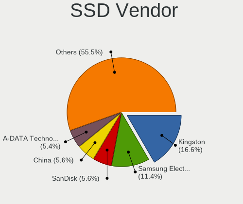
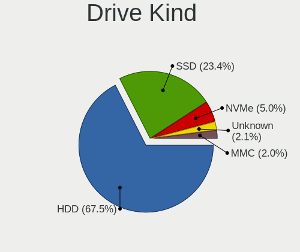
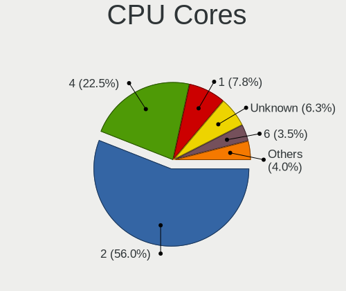
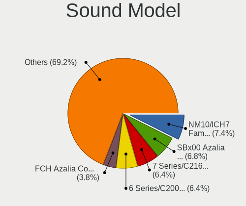
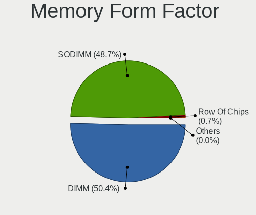

ROSA - Tested Hardware & Statistics
-----------------------------------

A project to collect tested hardware configurations for ROSA.

Anyone can contribute to this report by the [hw-probe](https://github.com/linuxhw/hw-probe) tool:

    sudo -E hw-probe -all -upload

Please contribute! Especially if your hardware is rare.

This is a report for all computer types. See also reports for [desktops](/Dist/ROSA/Desktop/README.md) and [notebooks](/Dist/ROSA/Notebook/README.md).

Contents
--------

* [ Test Cases ](#test-cases)

* [ System ](#system)
  - [ OS                       ](#os)
  - [ OS Family                ](#os-family)
  - [ Kernel                   ](#kernel)
  - [ Kernel Family            ](#kernel-family)
  - [ Kernel Major Ver.        ](#kernel-major-ver)
  - [ Arch                     ](#arch)
  - [ DE                       ](#de)
  - [ Display Server           ](#display-server)
  - [ Display Manager          ](#display-manager)
  - [ OS Lang                  ](#os-lang)
  - [ Boot Mode                ](#boot-mode)
  - [ Filesystem               ](#filesystem)
  - [ Part. scheme             ](#part-scheme)
  - [ Dual Boot with Linux/BSD ](#dual-boot-with-linuxbsd)
  - [ Dual Boot (Win)          ](#dual-boot-win)

* [ Board ](#board)
  - [ Vendor                   ](#vendor)
  - [ Model                    ](#model)
  - [ Model Family             ](#model-family)
  - [ MFG Year                 ](#mfg-year)
  - [ Form Factor              ](#form-factor)
  - [ Secure Boot              ](#secure-boot)
  - [ Coreboot                 ](#coreboot)
  - [ RAM Size                 ](#ram-size)
  - [ RAM Used                 ](#ram-used)
  - [ Total Drives             ](#total-drives)
  - [ Has CD-ROM               ](#has-cd-rom)
  - [ Has Ethernet             ](#has-ethernet)
  - [ Has WiFi                 ](#has-wifi)
  - [ Has Bluetooth            ](#has-bluetooth)

* [ Location ](#location)
  - [ Country                  ](#country)
  - [ City                     ](#city)

* [ Drives ](#drives)
  - [ Drive Vendor             ](#drive-vendor)
  - [ Drive Model              ](#drive-model)
  - [ HDD Vendor               ](#hdd-vendor)
  - [ SSD Vendor               ](#ssd-vendor)
  - [ Drive Kind               ](#drive-kind)
  - [ Drive Connector          ](#drive-connector)
  - [ Drive Size               ](#drive-size)
  - [ Space Total              ](#space-total)
  - [ Space Used               ](#space-used)
  - [ Malfunc. Drives          ](#malfunc-drives)
  - [ Malfunc. Drive Vendor    ](#malfunc-drive-vendor)
  - [ Malfunc. HDD Vendor      ](#malfunc-hdd-vendor)
  - [ Malfunc. Drive Kind      ](#malfunc-drive-kind)
  - [ Failed Drives            ](#failed-drives)
  - [ Failed Drive Vendor      ](#failed-drive-vendor)
  - [ Drive Status             ](#drive-status)

* [ Storage controller ](#storage-controller)
  - [ Storage Vendor           ](#storage-vendor)
  - [ Storage Model            ](#storage-model)
  - [ Storage Kind             ](#storage-kind)

* [ Processor ](#processor)
  - [ CPU Vendor               ](#cpu-vendor)
  - [ CPU Model                ](#cpu-model)
  - [ CPU Model Family         ](#cpu-model-family)
  - [ CPU Cores                ](#cpu-cores)
  - [ CPU Sockets              ](#cpu-sockets)
  - [ CPU Threads              ](#cpu-threads)
  - [ CPU Op-Modes             ](#cpu-op-modes)
  - [ CPU Microcode            ](#cpu-microcode)
  - [ CPU Microarch            ](#cpu-microarch)

* [ Graphics ](#graphics)
  - [ GPU Vendor               ](#gpu-vendor)
  - [ GPU Model                ](#gpu-model)
  - [ GPU Combo                ](#gpu-combo)
  - [ GPU Driver               ](#gpu-driver)
  - [ GPU Memory               ](#gpu-memory)

* [ Monitor ](#monitor)
  - [ Monitor Vendor           ](#monitor-vendor)
  - [ Monitor Model            ](#monitor-model)
  - [ Monitor Resolution       ](#monitor-resolution)
  - [ Monitor Diagonal         ](#monitor-diagonal)
  - [ Monitor Width            ](#monitor-width)
  - [ Aspect Ratio             ](#aspect-ratio)
  - [ Monitor Area             ](#monitor-area)
  - [ Pixel Density            ](#pixel-density)
  - [ Multiple Monitors        ](#multiple-monitors)

* [ Network ](#network)
  - [ Net Controller Vendor    ](#net-controller-vendor)
  - [ Net Controller Model     ](#net-controller-model)
  - [ Wireless Vendor          ](#wireless-vendor)
  - [ Wireless Model           ](#wireless-model)
  - [ Ethernet Vendor          ](#ethernet-vendor)
  - [ Ethernet Model           ](#ethernet-model)
  - [ Net Controller Kind      ](#net-controller-kind)
  - [ Used Controller          ](#used-controller)
  - [ NICs                     ](#nics)
  - [ IPv6                     ](#ipv6)

* [ Bluetooth ](#bluetooth)
  - [ Bluetooth Vendor         ](#bluetooth-vendor)
  - [ Bluetooth Model          ](#bluetooth-model)

* [ Sound ](#sound)
  - [ Sound Vendor             ](#sound-vendor)
  - [ Sound Model              ](#sound-model)

* [ Memory ](#memory)
  - [ Memory Vendor            ](#memory-vendor)
  - [ Memory Model             ](#memory-model)
  - [ Memory Kind              ](#memory-kind)
  - [ Memory Form Factor       ](#memory-form-factor)
  - [ Memory Size              ](#memory-size)
  - [ Memory Speed             ](#memory-speed)

* [ Printers & scanners ](#printers--scanners)
  - [ Printer Vendor           ](#printer-vendor)
  - [ Printer Model            ](#printer-model)
  - [ Scanner Vendor           ](#scanner-vendor)
  - [ Scanner Model            ](#scanner-model)

* [ Camera ](#camera)
  - [ Camera Vendor            ](#camera-vendor)
  - [ Camera Model             ](#camera-model)

* [ Security ](#security)
  - [ Fingerprint Vendor       ](#fingerprint-vendor)
  - [ Fingerprint Model        ](#fingerprint-model)
  - [ Chipcard Vendor          ](#chipcard-vendor)
  - [ Chipcard Model           ](#chipcard-model)

* [ Unsupported ](#unsupported)
  - [ Unsupported Devices      ](#unsupported-devices)
  - [ Unsupported Device Types ](#unsupported-device-types)

Test Cases
----------

Total: 42559

| Vendor        | Model                       | Form-Factor | Probe                                                      | Date         |
|---------------|-----------------------------|-------------|------------------------------------------------------------|--------------|
| Chuwi         | Hi10 pro tablet             | Tablet      | [ac39cc2f2a](https://linux-hardware.org/?probe=ac39cc2f2a) | Jul 01, 2023 |
| Gigabyte      | B550 AORUS ELITE V2         | Desktop     | [0eb501cde5](https://linux-hardware.org/?probe=0eb501cde5) | Jun 30, 2023 |
| Gigabyte      | G33M-S2L                    | Desktop     | [99ffcc407b](https://linux-hardware.org/?probe=99ffcc407b) | Jun 30, 2023 |
| Gigabyte      | B365M DS3H                  | Desktop     | [0272953855](https://linux-hardware.org/?probe=0272953855) | Jun 30, 2023 |
| ASUSTek       | ASUS TUF Gaming F17 FX70... | Notebook    | [4677625b04](https://linux-hardware.org/?probe=4677625b04) | Jun 30, 2023 |
| Gigabyte      | B450M S2H                   | Desktop     | [9a9ca045af](https://linux-hardware.org/?probe=9a9ca045af) | Jun 30, 2023 |
| Gigabyte      | H77N-WIFI                   | Desktop     | [a366d05b2b](https://linux-hardware.org/?probe=a366d05b2b) | Jun 30, 2023 |
| Huanan        | X99-F8 GAMING V5.0          | Desktop     | [6a95d2096d](https://linux-hardware.org/?probe=6a95d2096d) | Jun 29, 2023 |
| Acer          | Aspire E5-531G              | Notebook    | [a6eaac367e](https://linux-hardware.org/?probe=a6eaac367e) | Jun 29, 2023 |
| MSI           | MS-7267 100                 | Desktop     | [3a014aae8a](https://linux-hardware.org/?probe=3a014aae8a) | Jun 29, 2023 |
| ASUSTek       | H81M-C                      | Desktop     | [e12c71fb39](https://linux-hardware.org/?probe=e12c71fb39) | Jun 29, 2023 |
| ASUSTek       | VivoBook_ASUSLaptop M350... | Notebook    | [076e14da35](https://linux-hardware.org/?probe=076e14da35) | Jun 29, 2023 |
| HP            | Pavilion g6                 | Notebook    | [b16b0ced2f](https://linux-hardware.org/?probe=b16b0ced2f) | Jun 28, 2023 |
| HP            | Notebook                    | Notebook    | [d5ab0810e6](https://linux-hardware.org/?probe=d5ab0810e6) | Jun 28, 2023 |
| HP            | Notebook                    | Notebook    | [2b5ac7b339](https://linux-hardware.org/?probe=2b5ac7b339) | Jun 28, 2023 |
| ASUSTek       | M2A-VM                      | Desktop     | [d25910c419](https://linux-hardware.org/?probe=d25910c419) | Jun 28, 2023 |
| Unknown       | Unknown                     | Notebook    | [0ea4bcb3df](https://linux-hardware.org/?probe=0ea4bcb3df) | Jun 28, 2023 |
| ATOPNUC       | MA90                        | Mini pc     | [ed5faedbe1](https://linux-hardware.org/?probe=ed5faedbe1) | Jun 28, 2023 |
| Lenovo        | ThinkPad P17 Gen 1 20SN0... | Notebook    | [5ea6336cb5](https://linux-hardware.org/?probe=5ea6336cb5) | Jun 28, 2023 |
| ASUSTek       | PRIME B550-PLUS             | Desktop     | [6a2c4254e7](https://linux-hardware.org/?probe=6a2c4254e7) | Jun 28, 2023 |
| ASUSTek       | PRIME H510M-K               | Desktop     | [b96f0a3b19](https://linux-hardware.org/?probe=b96f0a3b19) | Jun 27, 2023 |
| MSI           | GL65 Leopard 10SCSR         | Notebook    | [165a76b787](https://linux-hardware.org/?probe=165a76b787) | Jun 27, 2023 |
| Gigabyte      | H410M S2 V2                 | Desktop     | [65794907cc](https://linux-hardware.org/?probe=65794907cc) | Jun 27, 2023 |
| ASUSTek       | PRIME H510M-K               | Desktop     | [a0c358b2b3](https://linux-hardware.org/?probe=a0c358b2b3) | Jun 27, 2023 |
| Acer          | Aspire Z1811                | All in one  | [0115283b1c](https://linux-hardware.org/?probe=0115283b1c) | Jun 27, 2023 |
| Clevo         | NL41MU2                     | Notebook    | [d7e51d1ddb](https://linux-hardware.org/?probe=d7e51d1ddb) | Jun 27, 2023 |
| ASUSTek       | VivoBook_ASUSLaptop M350... | Notebook    | [5336cd4400](https://linux-hardware.org/?probe=5336cd4400) | Jun 27, 2023 |
| Lenovo        | ThinkPad SL410 2842RN9      | Notebook    | [37157ab2f7](https://linux-hardware.org/?probe=37157ab2f7) | Jun 27, 2023 |
| ASUSTek       | P5P41D                      | Desktop     | [cd85f8d99e](https://linux-hardware.org/?probe=cd85f8d99e) | Jun 27, 2023 |
| Dell          | Inspiron N5110              | Notebook    | [ec28913b4e](https://linux-hardware.org/?probe=ec28913b4e) | Jun 27, 2023 |
| 3Logic Gro... | APM Graviton A15i-K2        | Notebook    | [6371ce9a45](https://linux-hardware.org/?probe=6371ce9a45) | Jun 26, 2023 |
| Acer          | Nitro AN515-45              | Notebook    | [674acd96a8](https://linux-hardware.org/?probe=674acd96a8) | Jun 26, 2023 |
| Lenovo        | G780 20138                  | Notebook    | [41cdbe05fe](https://linux-hardware.org/?probe=41cdbe05fe) | Jun 26, 2023 |
| HP            | Pavilion Notebook           | Notebook    | [eb68fc38b0](https://linux-hardware.org/?probe=eb68fc38b0) | Jun 25, 2023 |
| ASUSTek       | P5P41D                      | Desktop     | [aaf9376be5](https://linux-hardware.org/?probe=aaf9376be5) | Jun 25, 2023 |
| ASUSTek       | ZenBook UX435EG_UX435EG     | Notebook    | [a5d8941505](https://linux-hardware.org/?probe=a5d8941505) | Jun 25, 2023 |
| ASUSTek       | ZenBook UX435EG_UX435EG     | Notebook    | [6398806c80](https://linux-hardware.org/?probe=6398806c80) | Jun 25, 2023 |
| ASUSTek       | PRIME H510M-K               | Desktop     | [3f74c8ae6f](https://linux-hardware.org/?probe=3f74c8ae6f) | Jun 25, 2023 |
| ASUSTek       | K53SD                       | Notebook    | [66f2fbfdf4](https://linux-hardware.org/?probe=66f2fbfdf4) | Jun 25, 2023 |
| Lenovo        | G580                        | Notebook    | [daa41583f5](https://linux-hardware.org/?probe=daa41583f5) | Jun 25, 2023 |
| Dell          | Inspiron N5110              | Notebook    | [0a3cfef2ce](https://linux-hardware.org/?probe=0a3cfef2ce) | Jun 25, 2023 |
| ASUSTek       | ROG Maximus X HERO          | Desktop     | [02db87eec4](https://linux-hardware.org/?probe=02db87eec4) | Jun 25, 2023 |
| Gigabyte      | B760M GAMING X AX DDR4      | Desktop     | [9f48465b75](https://linux-hardware.org/?probe=9f48465b75) | Jun 24, 2023 |
| HP            | Pavilion Gaming Laptop 1... | Notebook    | [39719594b9](https://linux-hardware.org/?probe=39719594b9) | Jun 24, 2023 |
| eMachines     | E725                        | Notebook    | [91c6056aff](https://linux-hardware.org/?probe=91c6056aff) | Jun 24, 2023 |
| Toshiba       | Satellite U300              | Notebook    | [2abf629721](https://linux-hardware.org/?probe=2abf629721) | Jun 24, 2023 |
| MSI           | 760GM-P21                   | Desktop     | [a6ab8ab499](https://linux-hardware.org/?probe=a6ab8ab499) | Jun 24, 2023 |
| ASUSTek       | PRIME H510M-K               | Desktop     | [6da517e892](https://linux-hardware.org/?probe=6da517e892) | Jun 23, 2023 |
| Gigabyte      | A320M-S2H V2-CF             | Desktop     | [d4f7477589](https://linux-hardware.org/?probe=d4f7477589) | Jun 23, 2023 |
| HP            | Pavilion Gaming Laptop 1... | Notebook    | [b6bc214e79](https://linux-hardware.org/?probe=b6bc214e79) | Jun 23, 2023 |
| HP            | 530 Notebook PC(KP479AA#... | Notebook    | [0c639de47d](https://linux-hardware.org/?probe=0c639de47d) | Jun 23, 2023 |
| ASUSTek       | M5A88-V EVO                 | Desktop     | [3708ae400f](https://linux-hardware.org/?probe=3708ae400f) | Jun 23, 2023 |
| ASUSTek       | M5A88-V EVO                 | Desktop     | [d447bb1029](https://linux-hardware.org/?probe=d447bb1029) | Jun 23, 2023 |
| ASUSTek       | P5VD2-VM                    | Desktop     | [d6e01ed04d](https://linux-hardware.org/?probe=d6e01ed04d) | Jun 23, 2023 |
| ASUSTek       | P5VD2-VM                    | Desktop     | [ec3da2f6be](https://linux-hardware.org/?probe=ec3da2f6be) | Jun 23, 2023 |
| HP            | Pavilion Aero Laptop 13-... | Notebook    | [610b99a65b](https://linux-hardware.org/?probe=610b99a65b) | Jun 23, 2023 |
| Gigabyte      | G41M-ES2L                   | Desktop     | [d2e49b65bc](https://linux-hardware.org/?probe=d2e49b65bc) | Jun 23, 2023 |
| Gigabyte      | F2A75M-D3H                  | Desktop     | [12fb789329](https://linux-hardware.org/?probe=12fb789329) | Jun 23, 2023 |
| Lenovo        | Legion Y540-15IRH Laptop... | Notebook    | [3f7008d282](https://linux-hardware.org/?probe=3f7008d282) | Jun 22, 2023 |
| Unknown       | Unknown                     | Desktop     | [cac503031c](https://linux-hardware.org/?probe=cac503031c) | Jun 22, 2023 |
| ASRock        | N68-GS4 FX                  | Desktop     | [c665b54f21](https://linux-hardware.org/?probe=c665b54f21) | Jun 22, 2023 |
| MSI           | B360M PRO-VD 2019-01-24     | Desktop     | [a036f44a4c](https://linux-hardware.org/?probe=a036f44a4c) | Jun 22, 2023 |
| ASUSTek       | PRIME B450M-K               | Desktop     | [fcb112b431](https://linux-hardware.org/?probe=fcb112b431) | Jun 22, 2023 |
| HP            | 3048h                       | Desktop     | [e4353bb3d2](https://linux-hardware.org/?probe=e4353bb3d2) | Jun 22, 2023 |
| Acer          | Aspire A315-51              | Notebook    | [0e6960c76b](https://linux-hardware.org/?probe=0e6960c76b) | Jun 22, 2023 |
| Acer          | Aspire A315-51              | Notebook    | [981385c200](https://linux-hardware.org/?probe=981385c200) | Jun 22, 2023 |
| Timi          | RedmiBook Pro 14S           | Notebook    | [f46c865218](https://linux-hardware.org/?probe=f46c865218) | Jun 22, 2023 |
| MSI           | H510M-A PRO                 | Desktop     | [5d9a09395c](https://linux-hardware.org/?probe=5d9a09395c) | Jun 22, 2023 |
| Lenovo        | B590 20206                  | Notebook    | [17fb06c810](https://linux-hardware.org/?probe=17fb06c810) | Jun 21, 2023 |
| HP            | ProLiant ML150 G5           | Desktop     | [9106155d17](https://linux-hardware.org/?probe=9106155d17) | Jun 21, 2023 |
| Gigabyte      | B360M DS3H                  | Desktop     | [f4894017da](https://linux-hardware.org/?probe=f4894017da) | Jun 21, 2023 |
| Packard Be... | EasyNote TE69CX             | Notebook    | [d72fa50a56](https://linux-hardware.org/?probe=d72fa50a56) | Jun 21, 2023 |
| HP            | Unknown                     | Notebook    | [f7a4bc57b0](https://linux-hardware.org/?probe=f7a4bc57b0) | Jun 21, 2023 |
| Gigabyte      | B360M DS3H                  | Desktop     | [f92fdecc78](https://linux-hardware.org/?probe=f92fdecc78) | Jun 21, 2023 |
| Lenovo        | B50-70 20384                | Notebook    | [03450fe3f0](https://linux-hardware.org/?probe=03450fe3f0) | Jun 21, 2023 |
| Lenovo        | 3123 SDK0J40697 WIN 3305... | All in one  | [415c08bfe4](https://linux-hardware.org/?probe=415c08bfe4) | Jun 21, 2023 |
| HP            | 255 G1                      | Notebook    | [f09174c096](https://linux-hardware.org/?probe=f09174c096) | Jun 21, 2023 |
| Quanta        | TWH                         | Notebook    | [5d04c17be4](https://linux-hardware.org/?probe=5d04c17be4) | Jun 21, 2023 |
| Huanan        | B660-D4 V1.0                | Desktop     | [b28fa98f7e](https://linux-hardware.org/?probe=b28fa98f7e) | Jun 21, 2023 |
| Acer          | Nitro AN515-45              | Notebook    | [b34b0bc6e5](https://linux-hardware.org/?probe=b34b0bc6e5) | Jun 20, 2023 |
| Lenovo        | K14 Gen 1 21CSS16E00        | Notebook    | [d60f0418a5](https://linux-hardware.org/?probe=d60f0418a5) | Jun 20, 2023 |
| HP            | Laptop 15-bw0xx             | Notebook    | [2e2c8b4c64](https://linux-hardware.org/?probe=2e2c8b4c64) | Jun 20, 2023 |
| ASUSTek       | TUF Gaming B550-PRO         | Desktop     | [07f19ac996](https://linux-hardware.org/?probe=07f19ac996) | Jun 20, 2023 |
| ASUSTek       | K53SC                       | Notebook    | [1dee87098f](https://linux-hardware.org/?probe=1dee87098f) | Jun 20, 2023 |
| ASUSTek       | P8B75-M LE                  | Desktop     | [8e171dc32b](https://linux-hardware.org/?probe=8e171dc32b) | Jun 20, 2023 |
| Lenovo        | 3130 NOK                    | Mini pc     | [4d78f4e3ca](https://linux-hardware.org/?probe=4d78f4e3ca) | Jun 20, 2023 |
| Acer          | Extensa 5630                | Notebook    | [b3abbec1ca](https://linux-hardware.org/?probe=b3abbec1ca) | Jun 19, 2023 |
| Gigabyte      | B450M DS3H-CF               | Desktop     | [41eb54fba2](https://linux-hardware.org/?probe=41eb54fba2) | Jun 19, 2023 |
| Samsung       | 350V5C/351V5C/3540VC/344... | Notebook    | [2ac629a3ac](https://linux-hardware.org/?probe=2ac629a3ac) | Jun 19, 2023 |
| Apple         | MacBookPro7,1               | Notebook    | [0d56b62a99](https://linux-hardware.org/?probe=0d56b62a99) | Jun 19, 2023 |
| Acer          | AOD257                      | Notebook    | [d3510be962](https://linux-hardware.org/?probe=d3510be962) | Jun 18, 2023 |
| ASUSTek       | X200LA                      | Notebook    | [28ba5d9a3a](https://linux-hardware.org/?probe=28ba5d9a3a) | Jun 18, 2023 |
| ASUSTek       | VivoBook_ASUSLaptop X412... | Notebook    | [f3cbbb121e](https://linux-hardware.org/?probe=f3cbbb121e) | Jun 18, 2023 |
| ASUSTek       | X200LA                      | Notebook    | [5aca48b9ca](https://linux-hardware.org/?probe=5aca48b9ca) | Jun 18, 2023 |
| ASUSTek       | PRIME Z390M-PLUS            | Desktop     | [4be686b049](https://linux-hardware.org/?probe=4be686b049) | Jun 18, 2023 |
| MSI           | B75A-G43                    | Desktop     | [d2399f16bd](https://linux-hardware.org/?probe=d2399f16bd) | Jun 18, 2023 |
| ASUSTek       | M5A78L-M LE/USB3            | Desktop     | [e4eb86f394](https://linux-hardware.org/?probe=e4eb86f394) | Jun 18, 2023 |
| Gigabyte      | B550 GAMING X V2            | Desktop     | [c3b7f0c23e](https://linux-hardware.org/?probe=c3b7f0c23e) | Jun 18, 2023 |
| Lenovo        | IdeaPad S145-15IWL 81MV     | Notebook    | [6b85997420](https://linux-hardware.org/?probe=6b85997420) | Jun 17, 2023 |
| MSI           | GX60 1AC                    | Notebook    | [64c48d22a7](https://linux-hardware.org/?probe=64c48d22a7) | Jun 17, 2023 |
| ASUSTek       | M2A-VM                      | Desktop     | [0d1a4c9975](https://linux-hardware.org/?probe=0d1a4c9975) | Jun 17, 2023 |
| ASUSTek       | TUF Gaming Z590-PLUS WIF... | Desktop     | [2791b66594](https://linux-hardware.org/?probe=2791b66594) | Jun 17, 2023 |
| Acer          | Aspire A315-33              | Notebook    | [c6a929a9ec](https://linux-hardware.org/?probe=c6a929a9ec) | Jun 17, 2023 |
| Acer          | Aspire A315-33              | Notebook    | [d72b8e616f](https://linux-hardware.org/?probe=d72b8e616f) | Jun 17, 2023 |
| Lenovo        | H420                        | Desktop     | [c8d4d2fe1b](https://linux-hardware.org/?probe=c8d4d2fe1b) | Jun 17, 2023 |
| Sony          | SVF1521L1RB                 | Notebook    | [b0dfbb64d0](https://linux-hardware.org/?probe=b0dfbb64d0) | Jun 17, 2023 |
| ASRock        | N68-GS4 FX                  | Desktop     | [10376b9b47](https://linux-hardware.org/?probe=10376b9b47) | Jun 17, 2023 |
| Gigabyte      | GA-MA770-US3                | Desktop     | [c7460aff4f](https://linux-hardware.org/?probe=c7460aff4f) | Jun 16, 2023 |
| MSI           | X470 GAMING PLUS MAX        | Desktop     | [61e45982dc](https://linux-hardware.org/?probe=61e45982dc) | Jun 16, 2023 |
| NCR           | Estoril                     | Desktop     | [d29339575f](https://linux-hardware.org/?probe=d29339575f) | Jun 16, 2023 |
| HIPER Tech... | HIPER WORKBOOK              | Notebook    | [06ce0448f5](https://linux-hardware.org/?probe=06ce0448f5) | Jun 16, 2023 |
| ASUSTek       | P5QL-CM                     | Desktop     | [13f819c2d6](https://linux-hardware.org/?probe=13f819c2d6) | Jun 16, 2023 |
| WeiBu         | OEM                         | Notebook    | [349908e6d0](https://linux-hardware.org/?probe=349908e6d0) | Jun 16, 2023 |
| ASUSTek       | X555LN                      | Notebook    | [1e46ee1872](https://linux-hardware.org/?probe=1e46ee1872) | Jun 16, 2023 |
| HP            | Laptop 15-bw0xx             | Notebook    | [baa9231329](https://linux-hardware.org/?probe=baa9231329) | Jun 15, 2023 |
| ASUSTek       | H97M-E                      | Desktop     | [f3a2b5f30f](https://linux-hardware.org/?probe=f3a2b5f30f) | Jun 15, 2023 |
| HP            | ENVY Notebook               | Notebook    | [ee7a2ae915](https://linux-hardware.org/?probe=ee7a2ae915) | Jun 15, 2023 |
| HP            | ENVY Notebook               | Notebook    | [29828fefe2](https://linux-hardware.org/?probe=29828fefe2) | Jun 15, 2023 |
| MSI           | H81M-P33                    | Desktop     | [49cfb3fdda](https://linux-hardware.org/?probe=49cfb3fdda) | Jun 15, 2023 |
| Unknown       | Unknown                     | Desktop     | [377af23ae8](https://linux-hardware.org/?probe=377af23ae8) | Jun 15, 2023 |
| ASUSTek       | ROG Zephyrus M16 GU603HE... | Notebook    | [ff2a2aeca0](https://linux-hardware.org/?probe=ff2a2aeca0) | Jun 15, 2023 |
| HP            | EliteBook 1040 G4           | Notebook    | [01724286d9](https://linux-hardware.org/?probe=01724286d9) | Jun 15, 2023 |
| ASUSTek       | ROG Strix G731GT_GL731GT    | Notebook    | [fe83d43137](https://linux-hardware.org/?probe=fe83d43137) | Jun 15, 2023 |
| MSI           | MPG B560I GAMING EDGE WI... | Desktop     | [a796ed0ed7](https://linux-hardware.org/?probe=a796ed0ed7) | Jun 14, 2023 |
| ASUSTek       | VivoBook_ASUSLaptop X421... | Notebook    | [eba8248dae](https://linux-hardware.org/?probe=eba8248dae) | Jun 14, 2023 |
| Acer          | Aspire S3-391               | Notebook    | [0547c7bf3a](https://linux-hardware.org/?probe=0547c7bf3a) | Jun 14, 2023 |
| ASUSTek       | VivoBook_ASUSLaptop X421... | Notebook    | [6ef7b87ef5](https://linux-hardware.org/?probe=6ef7b87ef5) | Jun 14, 2023 |
| MSI           | Katana GF66 12UE            | Notebook    | [49026cdaf3](https://linux-hardware.org/?probe=49026cdaf3) | Jun 14, 2023 |
| Toshiba       | Satellite L30               | Notebook    | [0b240892de](https://linux-hardware.org/?probe=0b240892de) | Jun 14, 2023 |
| MAINBRD       | OPS62A-SHA                  | Desktop     | [d7e7c84a43](https://linux-hardware.org/?probe=d7e7c84a43) | Jun 14, 2023 |
| Dell          | Inspiron 15-3573            | Notebook    | [129574e8dc](https://linux-hardware.org/?probe=129574e8dc) | Jun 14, 2023 |
| HP            | 255 G1                      | Notebook    | [a8c4597ccd](https://linux-hardware.org/?probe=a8c4597ccd) | Jun 14, 2023 |
| Gigabyte      | B660M GAMING X DDR4         | Desktop     | [493866d0e6](https://linux-hardware.org/?probe=493866d0e6) | Jun 14, 2023 |
| Dell          | 0V8WGR A02                  | Desktop     | [448fd1711d](https://linux-hardware.org/?probe=448fd1711d) | Jun 12, 2023 |
| Apple         | MacBookPro9,2               | Notebook    | [4a879a147e](https://linux-hardware.org/?probe=4a879a147e) | Jun 12, 2023 |
| MSI           | A68HM-P33 V2                | Desktop     | [23097e912c](https://linux-hardware.org/?probe=23097e912c) | Jun 12, 2023 |
| Dell          | Inspiron N5110              | Notebook    | [dcae82c86f](https://linux-hardware.org/?probe=dcae82c86f) | Jun 12, 2023 |
| Gigabyte      | G31M-ES2L                   | Desktop     | [887dced95a](https://linux-hardware.org/?probe=887dced95a) | Jun 12, 2023 |
| Acer          | Extensa 5220                | Notebook    | [3f547b15a3](https://linux-hardware.org/?probe=3f547b15a3) | Jun 12, 2023 |
| ASUSTek       | X551CAP                     | Notebook    | [4076a43510](https://linux-hardware.org/?probe=4076a43510) | Jun 12, 2023 |
| Lenovo        | IdeaPad S10-2 20027         | Notebook    | [cd1619a50d](https://linux-hardware.org/?probe=cd1619a50d) | Jun 11, 2023 |
| Acer          | Aspire 5920G                | Notebook    | [2a5625ca4c](https://linux-hardware.org/?probe=2a5625ca4c) | Jun 11, 2023 |
| Samsung       | P29/28/26                   | Notebook    | [d7e9b6f2f3](https://linux-hardware.org/?probe=d7e9b6f2f3) | Jun 11, 2023 |
| Acer          | Aspire TC-605               | Desktop     | [d28c61c2a7](https://linux-hardware.org/?probe=d28c61c2a7) | Jun 11, 2023 |
| Samsung       | P29/28/26                   | Notebook    | [6040d56961](https://linux-hardware.org/?probe=6040d56961) | Jun 10, 2023 |
| Gigabyte      | 8I865GVMK-775               | Desktop     | [3d90d76b7b](https://linux-hardware.org/?probe=3d90d76b7b) | Jun 10, 2023 |
| Lenovo        | ThinkPad P16s Gen 1 21CK... | Notebook    | [c768cfa03d](https://linux-hardware.org/?probe=c768cfa03d) | Jun 10, 2023 |
| Gigabyte      | H410M H                     | Desktop     | [dfba5357ee](https://linux-hardware.org/?probe=dfba5357ee) | Jun 10, 2023 |
| WeiBu         | OEM                         | Notebook    | [49bd40f956](https://linux-hardware.org/?probe=49bd40f956) | Jun 10, 2023 |
| Gigabyte      | GA-MA770-US3                | Desktop     | [704cc1c02b](https://linux-hardware.org/?probe=704cc1c02b) | Jun 10, 2023 |
| Huanan        | X99 F8D V2.2                | Desktop     | [1eeaac2701](https://linux-hardware.org/?probe=1eeaac2701) | Jun 10, 2023 |
| ASRock        | H610M-ITX/ac                | Desktop     | [80002221f5](https://linux-hardware.org/?probe=80002221f5) | Jun 10, 2023 |
| MSI           | B250M PRO-VH                | Desktop     | [16b496c21d](https://linux-hardware.org/?probe=16b496c21d) | Jun 10, 2023 |
| Lenovo        | Legion 5 15ARH05 82B5       | Notebook    | [2b4f40f41b](https://linux-hardware.org/?probe=2b4f40f41b) | Jun 09, 2023 |
| Dell          | Inspiron N5110              | Notebook    | [62d37454d3](https://linux-hardware.org/?probe=62d37454d3) | Jun 09, 2023 |
| Acer          | Aspire 5750G                | Notebook    | [69227c0908](https://linux-hardware.org/?probe=69227c0908) | Jun 09, 2023 |
| Lenovo        | Unknown                     | Notebook    | [1842b75de0](https://linux-hardware.org/?probe=1842b75de0) | Jun 08, 2023 |
| INFERIT       | Silver                      | Notebook    | [f6b3fc6762](https://linux-hardware.org/?probe=f6b3fc6762) | Jun 08, 2023 |
| Dell          | Inspiron 3558               | Notebook    | [87b5fd28c2](https://linux-hardware.org/?probe=87b5fd28c2) | Jun 08, 2023 |
| Lenovo        | B590 20208                  | Notebook    | [102b3706f4](https://linux-hardware.org/?probe=102b3706f4) | Jun 08, 2023 |
| ASRock        | A320M-DVS R4.0              | Desktop     | [aaf59358b7](https://linux-hardware.org/?probe=aaf59358b7) | Jun 07, 2023 |
| Samsung       | 355V4C/356V4C/3445VC/354... | Notebook    | [6e2a67c010](https://linux-hardware.org/?probe=6e2a67c010) | Jun 07, 2023 |
| Samsung       | 350V5C/351V5C/3540VC/344... | Notebook    | [2e0b21f8d4](https://linux-hardware.org/?probe=2e0b21f8d4) | Jun 07, 2023 |
| Lenovo        | ThinkPad X61 7674GS3        | Notebook    | [629a290a98](https://linux-hardware.org/?probe=629a290a98) | Jun 07, 2023 |
| ASUSTek       | PRIME Z690M-PLUS D4         | Desktop     | [468f6fe603](https://linux-hardware.org/?probe=468f6fe603) | Jun 06, 2023 |
| Acer          | AOD257                      | Notebook    | [1b75b86659](https://linux-hardware.org/?probe=1b75b86659) | Jun 06, 2023 |
| Gigabyte      | H67MA-USB3-B3               | Desktop     | [c2f52c637b](https://linux-hardware.org/?probe=c2f52c637b) | Jun 06, 2023 |
| AMI           | Aptio CRB                   | Mini pc     | [443550d99f](https://linux-hardware.org/?probe=443550d99f) | Jun 06, 2023 |
| HP            | Pavilion 15                 | Notebook    | [d75a894e8c](https://linux-hardware.org/?probe=d75a894e8c) | Jun 06, 2023 |
| Acer          | Aspire V5-551G              | Notebook    | [7c55457a7e](https://linux-hardware.org/?probe=7c55457a7e) | Jun 06, 2023 |
| MSI           | Delta 15 A5EFK              | Notebook    | [d55fa44834](https://linux-hardware.org/?probe=d55fa44834) | Jun 05, 2023 |
| Unknown       | X79                         | Desktop     | [8c1de0f494](https://linux-hardware.org/?probe=8c1de0f494) | Jun 05, 2023 |
| Lenovo        | 3123 SDK0J40697 WIN 3305... | All in one  | [b5b1c0dd60](https://linux-hardware.org/?probe=b5b1c0dd60) | Jun 05, 2023 |
| Lenovo        | IdeaPad 520-15IKB 81BF      | Notebook    | [2e429d02d1](https://linux-hardware.org/?probe=2e429d02d1) | Jun 05, 2023 |
| ASUSTek       | M5A78L-M LX3 PLUS           | Desktop     | [1f07862108](https://linux-hardware.org/?probe=1f07862108) | Jun 05, 2023 |
| ASUSTek       | SABERTOOTH 55i              | Desktop     | [c208cb2024](https://linux-hardware.org/?probe=c208cb2024) | Jun 05, 2023 |
| Samsung       | N102                        | Notebook    | [c3e402b50d](https://linux-hardware.org/?probe=c3e402b50d) | Jun 04, 2023 |
| HP            | Pavilion 15                 | Notebook    | [944c353c44](https://linux-hardware.org/?probe=944c353c44) | Jun 04, 2023 |
| Intel         | S1200RP_SE G62252-408       | Server      | [887b53c07e](https://linux-hardware.org/?probe=887b53c07e) | Jun 04, 2023 |
| Intel         | S1200RP_SE G62252-408       | Server      | [267a861f0d](https://linux-hardware.org/?probe=267a861f0d) | Jun 04, 2023 |
| Gigabyte      | G41MT-S2P                   | Desktop     | [aa5ed8cbc0](https://linux-hardware.org/?probe=aa5ed8cbc0) | Jun 04, 2023 |
| ASRock        | G31M-GS                     | Desktop     | [558dec9114](https://linux-hardware.org/?probe=558dec9114) | Jun 04, 2023 |
| Samsung       | 305V4A/305V5A/3415VA        | Notebook    | [a0f9cde008](https://linux-hardware.org/?probe=a0f9cde008) | Jun 04, 2023 |
| Maibenben     | MaiBook M                   | Notebook    | [b5d7957b55](https://linux-hardware.org/?probe=b5d7957b55) | Jun 03, 2023 |
| Acer          | Aspire S3                   | Notebook    | [23c1a32b88](https://linux-hardware.org/?probe=23c1a32b88) | Jun 03, 2023 |
| Samsung       | N102                        | Notebook    | [b21ddf3fea](https://linux-hardware.org/?probe=b21ddf3fea) | Jun 03, 2023 |
| ASUSTek       | VivoBook 17_ASUS Laptop ... | Notebook    | [88c3440ff2](https://linux-hardware.org/?probe=88c3440ff2) | Jun 03, 2023 |
| Dell          | Inspiron 1525               | Notebook    | [3160e89723](https://linux-hardware.org/?probe=3160e89723) | Jun 03, 2023 |
| ASRock        | H81M-HDS                    | Desktop     | [248372dd54](https://linux-hardware.org/?probe=248372dd54) | Jun 03, 2023 |
| ASUSTek       | X556UQ                      | Notebook    | [088518df2b](https://linux-hardware.org/?probe=088518df2b) | Jun 02, 2023 |
| ASUSTek       | PRIME B450M-A II            | Desktop     | [11e04db670](https://linux-hardware.org/?probe=11e04db670) | Jun 02, 2023 |
| HP            | ENVY Notebook               | Notebook    | [e7f4c63499](https://linux-hardware.org/?probe=e7f4c63499) | Jun 02, 2023 |
| DEXP          | Aquilon C15                 | Notebook    | [763c923576](https://linux-hardware.org/?probe=763c923576) | Jun 02, 2023 |
| Zvezda        | Arctur test_serv            | Server      | [f728993499](https://linux-hardware.org/?probe=f728993499) | Jun 02, 2023 |
| ASUSTek       | B85M-E                      | Desktop     | [ba95473e9c](https://linux-hardware.org/?probe=ba95473e9c) | Jun 02, 2023 |
| Gigabyte      | GA-880GMA-USB3              | Desktop     | [3feb5e9cb5](https://linux-hardware.org/?probe=3feb5e9cb5) | Jun 02, 2023 |
| Lenovo        | ThinkPad X61 7674GS3        | Notebook    | [194299200c](https://linux-hardware.org/?probe=194299200c) | Jun 01, 2023 |
| ASRock        | J3455M                      | Desktop     | [ca1db2cfb9](https://linux-hardware.org/?probe=ca1db2cfb9) | Jun 01, 2023 |
| ASUSTek       | B85M-E                      | Desktop     | [57f47246aa](https://linux-hardware.org/?probe=57f47246aa) | Jun 01, 2023 |
| ASRock        | H81M-HDS                    | Desktop     | [775913e245](https://linux-hardware.org/?probe=775913e245) | Jun 01, 2023 |
| ATOPNUC       | MA90                        | Mini pc     | [cbab8dd834](https://linux-hardware.org/?probe=cbab8dd834) | Jun 01, 2023 |
| Acer          | WG43M                       | Desktop     | [cdd78e1cac](https://linux-hardware.org/?probe=cdd78e1cac) | May 31, 2023 |
| Lenovo        | K14 Gen 1 21CSS16E00        | Notebook    | [9c95ad4263](https://linux-hardware.org/?probe=9c95ad4263) | May 31, 2023 |
| MSI           | X370 GAMING PLUS            | Desktop     | [ba0b4e2430](https://linux-hardware.org/?probe=ba0b4e2430) | May 31, 2023 |
| Acer          | Aspire 4810T                | Notebook    | [3058ac9018](https://linux-hardware.org/?probe=3058ac9018) | May 31, 2023 |
| ASRock        | FM2A88X-ITX+                | Desktop     | [6a2cd16e95](https://linux-hardware.org/?probe=6a2cd16e95) | May 31, 2023 |
| ASUSTek       | B85M-E                      | Desktop     | [08e31c6634](https://linux-hardware.org/?probe=08e31c6634) | May 31, 2023 |
| Acer          | TravelMate 5744Z            | Notebook    | [bde6d2f364](https://linux-hardware.org/?probe=bde6d2f364) | May 31, 2023 |
| Acer          | Aspire ES1-523              | Notebook    | [d68236f41d](https://linux-hardware.org/?probe=d68236f41d) | May 31, 2023 |
| ASRock        | A320D4-P1                   | Desktop     | [195945844b](https://linux-hardware.org/?probe=195945844b) | May 31, 2023 |
| ASUSTek       | PRIME A320M-K               | Desktop     | [6bcba3e54d](https://linux-hardware.org/?probe=6bcba3e54d) | May 31, 2023 |
| AMD           | AOPW-PLUS                   | Server      | [9e0f4d41e2](https://linux-hardware.org/?probe=9e0f4d41e2) | May 31, 2023 |
| HP            | EliteBook 840 G3            | Notebook    | [384ebf87a3](https://linux-hardware.org/?probe=384ebf87a3) | May 31, 2023 |
| Samsung       | RV410/RV510/S3510/E3510     | Notebook    | [d20ebd68c0](https://linux-hardware.org/?probe=d20ebd68c0) | May 30, 2023 |
| Lenovo        | Legion Y530-15ICH 81FV      | Notebook    | [85a2504037](https://linux-hardware.org/?probe=85a2504037) | May 30, 2023 |
| ASUSTek       | PRIME B450M-A               | Desktop     | [4833d37ec3](https://linux-hardware.org/?probe=4833d37ec3) | May 30, 2023 |
| Biostar       | H610MH                      | Desktop     | [708df29fd6](https://linux-hardware.org/?probe=708df29fd6) | May 30, 2023 |
| HP            | Laptop 15s-fq2xxx           | Notebook    | [7ab8c72481](https://linux-hardware.org/?probe=7ab8c72481) | May 30, 2023 |
| ASRock        | B550 Phantom Gaming 4       | Desktop     | [c23ef58095](https://linux-hardware.org/?probe=c23ef58095) | May 30, 2023 |
| Acer          | Swift SF114-34              | Notebook    | [3722c76b10](https://linux-hardware.org/?probe=3722c76b10) | May 30, 2023 |
| HP            | ProBook 440 G7              | Notebook    | [9da720226e](https://linux-hardware.org/?probe=9da720226e) | May 30, 2023 |
| Lenovo        | Legion Y530-15ICH 81FV      | Notebook    | [c0e9edd453](https://linux-hardware.org/?probe=c0e9edd453) | May 30, 2023 |
| MSI           | GE60 2PC                    | Notebook    | [48c124853f](https://linux-hardware.org/?probe=48c124853f) | May 30, 2023 |
| ASRock        | B450 Gaming K4              | Desktop     | [2ef322a58d](https://linux-hardware.org/?probe=2ef322a58d) | May 29, 2023 |
| ASUSTek       | B85M-E                      | Desktop     | [eea74e88a5](https://linux-hardware.org/?probe=eea74e88a5) | May 29, 2023 |
| Huanan        | X99 F8D V2.2                | Desktop     | [b4e407cdb0](https://linux-hardware.org/?probe=b4e407cdb0) | May 29, 2023 |
| Samsung       | RV410/RV510/S3510/E3510     | Notebook    | [a786eb985d](https://linux-hardware.org/?probe=a786eb985d) | May 29, 2023 |
| ASUSTek       | B85M-G                      | Desktop     | [8f51b4170e](https://linux-hardware.org/?probe=8f51b4170e) | May 29, 2023 |
| Gigabyte      | F2A68HM-S1                  | Desktop     | [9b21df1d8e](https://linux-hardware.org/?probe=9b21df1d8e) | May 29, 2023 |
| ICL-KME CS    | RAYbook                     | Notebook    | [9e976ffc1a](https://linux-hardware.org/?probe=9e976ffc1a) | May 29, 2023 |
| MSI           | 770-C45                     | Desktop     | [dae0d25fcc](https://linux-hardware.org/?probe=dae0d25fcc) | May 29, 2023 |
| Acer          | Swift SF114-34              | Notebook    | [b7be0bf5ad](https://linux-hardware.org/?probe=b7be0bf5ad) | May 29, 2023 |
| Unknown       | X79                         | Desktop     | [cfda28fe65](https://linux-hardware.org/?probe=cfda28fe65) | May 28, 2023 |
| ASUSTek       | PN52                        | Mini pc     | [6f81612c62](https://linux-hardware.org/?probe=6f81612c62) | May 28, 2023 |
| Maibenben     | MaiBook M                   | Notebook    | [fa3f4694ba](https://linux-hardware.org/?probe=fa3f4694ba) | May 28, 2023 |
| ASUSTek       | PN52                        | Mini pc     | [444239084c](https://linux-hardware.org/?probe=444239084c) | May 28, 2023 |
| Gigabyte      | H81M-S1                     | Desktop     | [849ff29f29](https://linux-hardware.org/?probe=849ff29f29) | May 28, 2023 |
| Gigabyte      | H81M-S1                     | Desktop     | [45a2eb8526](https://linux-hardware.org/?probe=45a2eb8526) | May 28, 2023 |
| HIPER Tech... | HIPER WORKBOOK              | Notebook    | [8283b1247f](https://linux-hardware.org/?probe=8283b1247f) | May 28, 2023 |
| LTD Delovo... | EVE 14 C414                 | Notebook    | [d52f6c1303](https://linux-hardware.org/?probe=d52f6c1303) | May 28, 2023 |
| Acer          | Aspire ES1-523              | Notebook    | [bd06482a4e](https://linux-hardware.org/?probe=bd06482a4e) | May 27, 2023 |
| Gigabyte      | GA-78LMT-USB3               | Desktop     | [ac650845ad](https://linux-hardware.org/?probe=ac650845ad) | May 27, 2023 |
| Infinix       | INBOOK X2                   | Notebook    | [1f8b536f4f](https://linux-hardware.org/?probe=1f8b536f4f) | May 27, 2023 |
| ASUSTek       | H81M-PLUS                   | Desktop     | [e43931a1af](https://linux-hardware.org/?probe=e43931a1af) | May 27, 2023 |
| Gigabyte      | F2A55M-DS2                  | Desktop     | [f1bfd18361](https://linux-hardware.org/?probe=f1bfd18361) | May 27, 2023 |
| ASRock        | B450 Gaming K4              | Desktop     | [985e20f0ad](https://linux-hardware.org/?probe=985e20f0ad) | May 27, 2023 |
| Samsung       | N130                        | Notebook    | [bd37239d10](https://linux-hardware.org/?probe=bd37239d10) | May 26, 2023 |
| eMachines     | eME644G                     | Notebook    | [cde4d7b461](https://linux-hardware.org/?probe=cde4d7b461) | May 26, 2023 |
| Infinix       | INBOOK X2                   | Notebook    | [925318e521](https://linux-hardware.org/?probe=925318e521) | May 26, 2023 |
| ASRock        | FM2A68M-DG3+                | Desktop     | [cd4b2a2c6e](https://linux-hardware.org/?probe=cd4b2a2c6e) | May 26, 2023 |
| ASUSTek       | P8H61-M LX3 R2.0            | Desktop     | [4fedff68f1](https://linux-hardware.org/?probe=4fedff68f1) | May 26, 2023 |
| ASUSTek       | VivoBook_ASUSLaptop X512... | Notebook    | [4086fae2a5](https://linux-hardware.org/?probe=4086fae2a5) | May 26, 2023 |
| THUNDEROBO... | IGER F1                     | Notebook    | [d492356b33](https://linux-hardware.org/?probe=d492356b33) | May 25, 2023 |
| ASUSTek       | M5A78L-M PLUS/USB3          | Desktop     | [fc02e21f13](https://linux-hardware.org/?probe=fc02e21f13) | May 25, 2023 |
| ATOPNUC       | MA90                        | Mini pc     | [103a047401](https://linux-hardware.org/?probe=103a047401) | May 25, 2023 |
| HP            | ProBook 4535s               | Notebook    | [bf141ba124](https://linux-hardware.org/?probe=bf141ba124) | May 25, 2023 |
| Gigabyte      | E350N WIN8                  | Desktop     | [3d858aac61](https://linux-hardware.org/?probe=3d858aac61) | May 25, 2023 |
| eMachines     | eME644G                     | Notebook    | [bc740da95e](https://linux-hardware.org/?probe=bc740da95e) | May 25, 2023 |
| ASUSTek       | PRIME B450M-K               | Desktop     | [4670302b3a](https://linux-hardware.org/?probe=4670302b3a) | May 25, 2023 |
| Gigabyte      | Z68MA-D2H-B3                | Desktop     | [a5f7973a09](https://linux-hardware.org/?probe=a5f7973a09) | May 25, 2023 |
| HONOR         | HYM-WXX                     | Notebook    | [00a5e48ef4](https://linux-hardware.org/?probe=00a5e48ef4) | May 25, 2023 |
| Acer          | Aspire 7750G                | Notebook    | [589639a63f](https://linux-hardware.org/?probe=589639a63f) | May 25, 2023 |
| Acer          | Aspire E5-573G              | Notebook    | [c6cc5e2a20](https://linux-hardware.org/?probe=c6cc5e2a20) | May 24, 2023 |
| Gigabyte      | GA-E240N                    | Desktop     | [f538fa3add](https://linux-hardware.org/?probe=f538fa3add) | May 24, 2023 |
| Gigabyte      | GA-770T-USB3                | Desktop     | [60e294f0e6](https://linux-hardware.org/?probe=60e294f0e6) | May 24, 2023 |
| Acer          | Extensa 5630                | Notebook    | [00e8bb4d6a](https://linux-hardware.org/?probe=00e8bb4d6a) | May 24, 2023 |
| Samsung       | R710                        | Notebook    | [a2c199b3cd](https://linux-hardware.org/?probe=a2c199b3cd) | May 24, 2023 |
| Packard Be... | DOT S                       | Notebook    | [a49bbc7aa2](https://linux-hardware.org/?probe=a49bbc7aa2) | May 24, 2023 |
| ASUSTek       | P8H61-MX R2.0               | Desktop     | [0854b7f24a](https://linux-hardware.org/?probe=0854b7f24a) | May 24, 2023 |
| Gigabyte      | G41MT-S2P                   | Desktop     | [edfd6dd6d9](https://linux-hardware.org/?probe=edfd6dd6d9) | May 24, 2023 |
| Gigabyte      | G41MT-S2P                   | Desktop     | [43cf78743a](https://linux-hardware.org/?probe=43cf78743a) | May 24, 2023 |
| ASUSTek       | Maximus V GENE              | Desktop     | [64085de9fe](https://linux-hardware.org/?probe=64085de9fe) | May 24, 2023 |
| Lenovo        | Legion Y530-15ICH 81FV      | Notebook    | [dd1104fc5a](https://linux-hardware.org/?probe=dd1104fc5a) | May 23, 2023 |
| Acer          | Aspire XC-330               | Desktop     | [5d462a687d](https://linux-hardware.org/?probe=5d462a687d) | May 23, 2023 |
| HP            | 255 G8 Notebook PC          | Notebook    | [eb644c96f3](https://linux-hardware.org/?probe=eb644c96f3) | May 23, 2023 |
| Unknown       | Unknown                     | Notebook    | [6680332a54](https://linux-hardware.org/?probe=6680332a54) | May 23, 2023 |
| ASUSTek       | N53SM                       | Notebook    | [95301f4dea](https://linux-hardware.org/?probe=95301f4dea) | May 23, 2023 |
| Dell          | Inspiron N5110              | Notebook    | [a410c18f8c](https://linux-hardware.org/?probe=a410c18f8c) | May 23, 2023 |
| MSI           | MAG B560M BAZOOKA           | Desktop     | [712c1eecdb](https://linux-hardware.org/?probe=712c1eecdb) | May 23, 2023 |
| ASUSTek       | TUF Gaming Z490-PLUS        | Desktop     | [4d067a1511](https://linux-hardware.org/?probe=4d067a1511) | May 22, 2023 |
| ASUSTek       | ROG Zephyrus G15 GA503QS... | Notebook    | [374ccaecd9](https://linux-hardware.org/?probe=374ccaecd9) | May 22, 2023 |
| MSI           | 770-C45                     | Desktop     | [98672fa54c](https://linux-hardware.org/?probe=98672fa54c) | May 22, 2023 |
| Gigabyte      | B560 HD3                    | Desktop     | [5dd26df23e](https://linux-hardware.org/?probe=5dd26df23e) | May 22, 2023 |
| ASUSTek       | Z97-C                       | Desktop     | [e308a2d977](https://linux-hardware.org/?probe=e308a2d977) | May 22, 2023 |
| Unknown       | X133                        | Notebook    | [52cd0be8f5](https://linux-hardware.org/?probe=52cd0be8f5) | May 21, 2023 |
| Dell          | Inspiron N5110              | Notebook    | [279141fa2a](https://linux-hardware.org/?probe=279141fa2a) | May 21, 2023 |
| ASUSTek       | ASUS TUF Gaming A15 FA50... | Notebook    | [47ab72fc6c](https://linux-hardware.org/?probe=47ab72fc6c) | May 20, 2023 |
| GX55          | Standard                    | Mini pc     | [c30cac8dda](https://linux-hardware.org/?probe=c30cac8dda) | May 20, 2023 |
| ASRock        | H61M-HVGS                   | Desktop     | [653f6e9a8e](https://linux-hardware.org/?probe=653f6e9a8e) | May 20, 2023 |
| ASUSTek       | K53SC                       | Notebook    | [d2ddb09cc1](https://linux-hardware.org/?probe=d2ddb09cc1) | May 20, 2023 |
| Gigabyte      | 970A-DS3P                   | Desktop     | [c43eef4a3a](https://linux-hardware.org/?probe=c43eef4a3a) | May 20, 2023 |
| Gigabyte      | G31M-S2L                    | Desktop     | [927345991a](https://linux-hardware.org/?probe=927345991a) | May 20, 2023 |
| MSI           | Z170A TOMAHAWK              | Desktop     | [ab569c8de9](https://linux-hardware.org/?probe=ab569c8de9) | May 19, 2023 |
| ASUSTek       | TUF Gaming FX504GE_FX80G... | Notebook    | [a51baad28a](https://linux-hardware.org/?probe=a51baad28a) | May 19, 2023 |
| ASUSTek       | ROG STRIX B360-G GAMING     | Desktop     | [e1901ac344](https://linux-hardware.org/?probe=e1901ac344) | May 19, 2023 |
| ASUSTek       | PRIME B250M-PLUS            | Desktop     | [d5ffcf1bec](https://linux-hardware.org/?probe=d5ffcf1bec) | May 19, 2023 |
| Gigabyte      | GA-970A-D3                  | Desktop     | [52dbfc4c5a](https://linux-hardware.org/?probe=52dbfc4c5a) | May 19, 2023 |
| Gigabyte      | H510M H                     | Desktop     | [e7949de034](https://linux-hardware.org/?probe=e7949de034) | May 19, 2023 |
| HP            | Laptop 15-bs1xx             | Notebook    | [0517273b27](https://linux-hardware.org/?probe=0517273b27) | May 18, 2023 |
| ASUSTek       | ROG STRIX B360-G GAMING     | Desktop     | [276b10e762](https://linux-hardware.org/?probe=276b10e762) | May 18, 2023 |
| ASUSTek       | P8H61-M LE R2.0             | Desktop     | [286c28d090](https://linux-hardware.org/?probe=286c28d090) | May 18, 2023 |
| ASUSTek       | P8H67-M LE                  | Desktop     | [a6bcd864f3](https://linux-hardware.org/?probe=a6bcd864f3) | May 18, 2023 |
| MSI           | B450M PRO-VDH MAX           | Desktop     | [6c9d197b74](https://linux-hardware.org/?probe=6c9d197b74) | May 18, 2023 |
| HONOR         | HLYL-WXX9                   | Notebook    | [01a49c336d](https://linux-hardware.org/?probe=01a49c336d) | May 18, 2023 |
| ASUSTek       | Maximus IV Extreme-Z        | Desktop     | [4651c937d1](https://linux-hardware.org/?probe=4651c937d1) | May 18, 2023 |
| OEM           | X79G                        | Desktop     | [08ece3d402](https://linux-hardware.org/?probe=08ece3d402) | May 18, 2023 |
| Dell          | 0Y5DDC A00                  | Desktop     | [86b17fb9ff](https://linux-hardware.org/?probe=86b17fb9ff) | May 17, 2023 |
| Gigabyte      | EP41-UD3L                   | Desktop     | [adc188c60b](https://linux-hardware.org/?probe=adc188c60b) | May 17, 2023 |
| ASUSTek       | PRIME A320M-E               | Desktop     | [6688a22b2b](https://linux-hardware.org/?probe=6688a22b2b) | May 17, 2023 |
| ASUSTek       | Z97M-PLUS                   | Desktop     | [1455e60d54](https://linux-hardware.org/?probe=1455e60d54) | May 17, 2023 |
| HP            | 1589                        | Desktop     | [2eb60ba617](https://linux-hardware.org/?probe=2eb60ba617) | May 17, 2023 |
| Acer          | Veriton N4680G              | Desktop     | [c1fc339cf0](https://linux-hardware.org/?probe=c1fc339cf0) | May 17, 2023 |
| ASUSTek       | TUF Gaming X670E-PLUS WI... | Desktop     | [e814f06497](https://linux-hardware.org/?probe=e814f06497) | May 17, 2023 |
| Gigabyte      | H55M-S2H                    | Desktop     | [e571fb4d7d](https://linux-hardware.org/?probe=e571fb4d7d) | May 17, 2023 |
| Intel         | DG41WV AAE90316-101         | Desktop     | [9bef3b952d](https://linux-hardware.org/?probe=9bef3b952d) | May 16, 2023 |
| Gigabyte      | B450M S2H                   | Desktop     | [03316a0819](https://linux-hardware.org/?probe=03316a0819) | May 16, 2023 |
| ASUSTek       | Z97M-PLUS                   | Desktop     | [930e5f69ed](https://linux-hardware.org/?probe=930e5f69ed) | May 16, 2023 |
| ASUSTek       | A88XM-E                     | Desktop     | [81366d4eb1](https://linux-hardware.org/?probe=81366d4eb1) | May 16, 2023 |
| ASUSTek       | K53TA                       | Notebook    | [9700522405](https://linux-hardware.org/?probe=9700522405) | May 16, 2023 |
| Digma         | EVE 11 C422 ES1068EW        | Notebook    | [21255b70aa](https://linux-hardware.org/?probe=21255b70aa) | May 16, 2023 |
| Acer          | AOD257                      | Notebook    | [421fde4e9b](https://linux-hardware.org/?probe=421fde4e9b) | May 16, 2023 |
| Samsung       | R780                        | Notebook    | [5862ae2996](https://linux-hardware.org/?probe=5862ae2996) | May 16, 2023 |
| Samsung       | R780                        | Notebook    | [1fc01590bb](https://linux-hardware.org/?probe=1fc01590bb) | May 16, 2023 |
| Lenovo        | 3145 No DPK                 | All in one  | [4fac5ac06a](https://linux-hardware.org/?probe=4fac5ac06a) | May 16, 2023 |
| ASUSTek       | K53TA                       | Notebook    | [57a36429fe](https://linux-hardware.org/?probe=57a36429fe) | May 15, 2023 |
| ASUSTek       | TUF Gaming Z590-PLUS WIF... | Desktop     | [6586d8eaed](https://linux-hardware.org/?probe=6586d8eaed) | May 15, 2023 |
| Acer          | Aspire TC-705               | Desktop     | [781430f6f0](https://linux-hardware.org/?probe=781430f6f0) | May 15, 2023 |
| Gigabyte      | B550 AORUS PRO AC           | Desktop     | [34e7782996](https://linux-hardware.org/?probe=34e7782996) | May 15, 2023 |
| Toshiba       | Satellite L755              | Notebook    | [ec59045a15](https://linux-hardware.org/?probe=ec59045a15) | May 15, 2023 |
| ASUSTek       | GL703VD                     | Notebook    | [6de826cbe5](https://linux-hardware.org/?probe=6de826cbe5) | May 15, 2023 |
| Lenovo        | IdeaPad S145-15AST 81N3     | Notebook    | [f8f9a6dc69](https://linux-hardware.org/?probe=f8f9a6dc69) | May 15, 2023 |
| ASRock        | H55M-LE                     | Desktop     | [8da2dc07ec](https://linux-hardware.org/?probe=8da2dc07ec) | May 15, 2023 |
| Lenovo        | ThinkPad T420 4236PJ2       | Notebook    | [22a9e8213e](https://linux-hardware.org/?probe=22a9e8213e) | May 14, 2023 |
| HP            | ProBook 6560b               | Notebook    | [e8f24791d1](https://linux-hardware.org/?probe=e8f24791d1) | May 14, 2023 |
| Acer          | TravelMate B113             | Notebook    | [b6a4ef5336](https://linux-hardware.org/?probe=b6a4ef5336) | May 14, 2023 |
| Acer          | TravelMate B113             | Notebook    | [c2e9fe6581](https://linux-hardware.org/?probe=c2e9fe6581) | May 14, 2023 |
| Gigabyte      | A320M-S2H V2-CF             | Desktop     | [08e2dca3fe](https://linux-hardware.org/?probe=08e2dca3fe) | May 14, 2023 |
| Dell          | Inspiron 3520               | Notebook    | [675fc0ce85](https://linux-hardware.org/?probe=675fc0ce85) | May 14, 2023 |
| Irbis         | NB64                        | Notebook    | [a3dc2d6133](https://linux-hardware.org/?probe=a3dc2d6133) | May 13, 2023 |
| Irbis         | NB64                        | Notebook    | [369617cbf6](https://linux-hardware.org/?probe=369617cbf6) | May 13, 2023 |
| ASUSTek       | VivoBook_ASUSLaptop X421... | Notebook    | [dc1c717240](https://linux-hardware.org/?probe=dc1c717240) | May 13, 2023 |
| HP            | Laptop 15-bw0xx             | Notebook    | [10ee4f50b6](https://linux-hardware.org/?probe=10ee4f50b6) | May 13, 2023 |
| Apple         | MacBookPro8,1               | Notebook    | [cd0c59d678](https://linux-hardware.org/?probe=cd0c59d678) | May 13, 2023 |
| Lenovo        | ThinkCentre M71e 3176RV9    | Desktop     | [1f47569d44](https://linux-hardware.org/?probe=1f47569d44) | May 13, 2023 |
| Packard Be... | EasyNote TK85               | Notebook    | [3d4b4e176a](https://linux-hardware.org/?probe=3d4b4e176a) | May 13, 2023 |
| OEM           | X99-Turbo                   | Desktop     | [31cc62203f](https://linux-hardware.org/?probe=31cc62203f) | May 13, 2023 |
| ECS           | IC55H-A                     | Desktop     | [82ad3504a9](https://linux-hardware.org/?probe=82ad3504a9) | May 13, 2023 |
| ASUSTek       | P5B                         | Desktop     | [ef0459f224](https://linux-hardware.org/?probe=ef0459f224) | May 13, 2023 |
| HP            | Pavilion g6                 | Notebook    | [a86469b33f](https://linux-hardware.org/?probe=a86469b33f) | May 12, 2023 |
| ASRock        | A320M-HDV R4.0              | Desktop     | [af60056caa](https://linux-hardware.org/?probe=af60056caa) | May 12, 2023 |
| Gigabyte      | B550 AORUS PRO AC           | Desktop     | [2941682016](https://linux-hardware.org/?probe=2941682016) | May 12, 2023 |
| ASUSTek       | M51Sn                       | Notebook    | [94a426384a](https://linux-hardware.org/?probe=94a426384a) | May 12, 2023 |
| ASUSTek       | PRIME B560M-K               | Desktop     | [5afcbcef75](https://linux-hardware.org/?probe=5afcbcef75) | May 12, 2023 |
| ASUSTek       | TUF Gaming FX504GD_FX80G... | Notebook    | [ee8fe21e76](https://linux-hardware.org/?probe=ee8fe21e76) | May 12, 2023 |
| MSI           | 770-C45                     | Desktop     | [a2b983590a](https://linux-hardware.org/?probe=a2b983590a) | May 12, 2023 |
| MSI           | 770-C45                     | Desktop     | [6f2e35faa1](https://linux-hardware.org/?probe=6f2e35faa1) | May 12, 2023 |
| Lenovo        | IdeaPadFlex 10 20324        | Notebook    | [ac4be1ce4d](https://linux-hardware.org/?probe=ac4be1ce4d) | May 11, 2023 |
| Lenovo        | ThinkPad L15 Gen 1 20U8S... | Notebook    | [5d67743d33](https://linux-hardware.org/?probe=5d67743d33) | May 11, 2023 |
| Notebook      | W250EGQ / W270EGQ           | Notebook    | [7259a9f7fb](https://linux-hardware.org/?probe=7259a9f7fb) | May 11, 2023 |
| ASUSTek       | K53SC                       | Notebook    | [68e25fe72f](https://linux-hardware.org/?probe=68e25fe72f) | May 11, 2023 |
| HP            | Laptop 15-bw0xx             | Notebook    | [11e89ebe3c](https://linux-hardware.org/?probe=11e89ebe3c) | May 11, 2023 |
| Lenovo        | IdeaPad 520-15IKB 80YL      | Notebook    | [3fb4df889e](https://linux-hardware.org/?probe=3fb4df889e) | May 11, 2023 |
| Clevo         | W210CUQ                     | Notebook    | [73f12c473d](https://linux-hardware.org/?probe=73f12c473d) | May 11, 2023 |
| Clevo         | NL41MU2                     | Notebook    | [3fee2052a6](https://linux-hardware.org/?probe=3fee2052a6) | May 11, 2023 |
| ATOPNUC       | MA90                        | Mini pc     | [52259324ea](https://linux-hardware.org/?probe=52259324ea) | May 11, 2023 |
| MSI           | H110M PRO-VD PLUS           | Desktop     | [3eebb3f19d](https://linux-hardware.org/?probe=3eebb3f19d) | May 11, 2023 |
| Lenovo        | B590 20206                  | Notebook    | [b266312b1e](https://linux-hardware.org/?probe=b266312b1e) | May 11, 2023 |
| Gigabyte      | H410M H V3                  | Desktop     | [8726271588](https://linux-hardware.org/?probe=8726271588) | May 11, 2023 |
| Gigabyte      | H410M H V3                  | Desktop     | [ac70f06ddc](https://linux-hardware.org/?probe=ac70f06ddc) | May 11, 2023 |
| ASUSTek       | ASUS TUF Gaming F15 FX50... | Notebook    | [27c35072a3](https://linux-hardware.org/?probe=27c35072a3) | May 10, 2023 |
| Gigabyte      | H61M-S1                     | Desktop     | [54b185860a](https://linux-hardware.org/?probe=54b185860a) | May 10, 2023 |
| HONOR         | BBR-WAX9                    | Notebook    | [e391a674fa](https://linux-hardware.org/?probe=e391a674fa) | May 10, 2023 |
| HP            | 339A                        | Desktop     | [f5a7934b67](https://linux-hardware.org/?probe=f5a7934b67) | May 10, 2023 |
| MSI           | GP60 2OD                    | Notebook    | [910b0f9647](https://linux-hardware.org/?probe=910b0f9647) | May 10, 2023 |
| Packard Be... | DOT S                       | Notebook    | [1ca8df486d](https://linux-hardware.org/?probe=1ca8df486d) | May 10, 2023 |
| Gigabyte      | H97M-D3H                    | Desktop     | [9c9461f26c](https://linux-hardware.org/?probe=9c9461f26c) | May 09, 2023 |
| Clevo         | W210CUQ                     | Notebook    | [afd0fd091b](https://linux-hardware.org/?probe=afd0fd091b) | May 09, 2023 |
| Gigabyte      | 990XA-UD3                   | Desktop     | [d95065a8fa](https://linux-hardware.org/?probe=d95065a8fa) | May 09, 2023 |
| Acer          | Aspire 5100                 | Notebook    | [d12cffdc1d](https://linux-hardware.org/?probe=d12cffdc1d) | May 09, 2023 |
| Gigabyte      | H310M S2H x.x               | Desktop     | [7f25dc4e18](https://linux-hardware.org/?probe=7f25dc4e18) | May 09, 2023 |
| Gigabyte      | GA-MA770T-UD3               | Desktop     | [12c2931180](https://linux-hardware.org/?probe=12c2931180) | May 09, 2023 |
| ASUSTek       | TUF Gaming FX504GD_FX80G... | Notebook    | [b06388c1f4](https://linux-hardware.org/?probe=b06388c1f4) | May 09, 2023 |
| Gigabyte      | GA-MA770T-UD3               | Desktop     | [27ec66031a](https://linux-hardware.org/?probe=27ec66031a) | May 09, 2023 |
| ASRock        | H67DE3/SI                   | Desktop     | [13b1131bef](https://linux-hardware.org/?probe=13b1131bef) | May 08, 2023 |
| Clevo         | W240EL/W250ELQ/W270ELQ      | Notebook    | [f63a54bf5f](https://linux-hardware.org/?probe=f63a54bf5f) | May 08, 2023 |
| HP            | 255 G8 Notebook PC          | Notebook    | [1d61e5da8b](https://linux-hardware.org/?probe=1d61e5da8b) | May 08, 2023 |
| Acer          | Aspire 5733Z                | Notebook    | [5c8c1872e4](https://linux-hardware.org/?probe=5c8c1872e4) | May 08, 2023 |
| Acer          | Aspire 5733Z                | Notebook    | [8394909745](https://linux-hardware.org/?probe=8394909745) | May 08, 2023 |
| MSI           | GF615M-P33                  | Desktop     | [f64f988a79](https://linux-hardware.org/?probe=f64f988a79) | May 08, 2023 |
| Samsung       | 350V5C/351V5C/3540VC/344... | Notebook    | [47f5fe62aa](https://linux-hardware.org/?probe=47f5fe62aa) | May 08, 2023 |
| Samsung       | 300V3A/300V4A/300V5A        | Notebook    | [bb84771a09](https://linux-hardware.org/?probe=bb84771a09) | May 08, 2023 |
| Dell          | Inspiron N5050              | Notebook    | [577e5fe375](https://linux-hardware.org/?probe=577e5fe375) | May 08, 2023 |
| ASUSTek       | P8H61-M LX3                 | Desktop     | [9a420c42de](https://linux-hardware.org/?probe=9a420c42de) | May 07, 2023 |
| Gigabyte      | GA-MA770-US3                | Desktop     | [169b0a5bc0](https://linux-hardware.org/?probe=169b0a5bc0) | May 07, 2023 |
| Lenovo        | V580c 20160                 | Notebook    | [8efa05ada7](https://linux-hardware.org/?probe=8efa05ada7) | May 07, 2023 |
| HP            | Notebook                    | Notebook    | [3467291a26](https://linux-hardware.org/?probe=3467291a26) | May 07, 2023 |
| Sony          | VPCZ23Q9R                   | Notebook    | [38c78ad6b1](https://linux-hardware.org/?probe=38c78ad6b1) | May 07, 2023 |
| ASUSTek       | PRIME A320M-E               | Desktop     | [a241837604](https://linux-hardware.org/?probe=a241837604) | May 07, 2023 |
| ASUSTek       | P5K                         | Desktop     | [d15b9fb438](https://linux-hardware.org/?probe=d15b9fb438) | May 07, 2023 |
| ASUSTek       | P5K                         | Desktop     | [230147ec2f](https://linux-hardware.org/?probe=230147ec2f) | May 07, 2023 |
| MACHINIST     | E5-RS9 V1.11                | Desktop     | [22b0b37a19](https://linux-hardware.org/?probe=22b0b37a19) | May 07, 2023 |
| Sony          | VPCZ23Q9R                   | Notebook    | [fe13bc275e](https://linux-hardware.org/?probe=fe13bc275e) | May 07, 2023 |
| ASUSTek       | ROG STRIX X570-E GAMING     | Desktop     | [b9d976ae11](https://linux-hardware.org/?probe=b9d976ae11) | May 07, 2023 |
| Acer          | Aspire XC-330               | Desktop     | [9369acb33c](https://linux-hardware.org/?probe=9369acb33c) | May 07, 2023 |
| HP            | 255 G8 Notebook PC          | Notebook    | [8ec6bd089d](https://linux-hardware.org/?probe=8ec6bd089d) | May 07, 2023 |
| HP            | ProBook 440 G4              | Notebook    | [ec3ee4b9da](https://linux-hardware.org/?probe=ec3ee4b9da) | May 07, 2023 |
| Dell          | Inspiron 3520               | Notebook    | [00ce6a8f5a](https://linux-hardware.org/?probe=00ce6a8f5a) | May 07, 2023 |
| Lenovo        | V580c 20160                 | Notebook    | [8a0af12a27](https://linux-hardware.org/?probe=8a0af12a27) | May 07, 2023 |
| ASUSTek       | ROG STRIX B550-I GAMING     | Desktop     | [b979325eea](https://linux-hardware.org/?probe=b979325eea) | May 07, 2023 |
| Gigabyte      | H61M-S2PH                   | Desktop     | [fe207b0df1](https://linux-hardware.org/?probe=fe207b0df1) | May 07, 2023 |
| Acer          | Aspire V5-571G              | Notebook    | [e9212685f5](https://linux-hardware.org/?probe=e9212685f5) | May 07, 2023 |
| Lenovo        | ThinkBook 16p Gen 2 20YM    | Notebook    | [30581d3bef](https://linux-hardware.org/?probe=30581d3bef) | May 07, 2023 |
| HP            | Pavilion g4                 | Notebook    | [5e3bd3ea22](https://linux-hardware.org/?probe=5e3bd3ea22) | May 06, 2023 |
| ASRock        | B365M-HDV                   | Desktop     | [b9482229ca](https://linux-hardware.org/?probe=b9482229ca) | May 06, 2023 |
| Unknown       | X133                        | Notebook    | [6ed8dbca4d](https://linux-hardware.org/?probe=6ed8dbca4d) | May 06, 2023 |
| Lenovo        | Legion Y540-17IRH 81Q4      | Notebook    | [678b4ca4ed](https://linux-hardware.org/?probe=678b4ca4ed) | May 06, 2023 |
| HP            | 650                         | Notebook    | [86b80ba835](https://linux-hardware.org/?probe=86b80ba835) | May 05, 2023 |
| Gigabyte      | GA-A55M-S2HP                | Desktop     | [a56cc8ab0e](https://linux-hardware.org/?probe=a56cc8ab0e) | May 05, 2023 |
| MSI           | X570-A PRO                  | Desktop     | [e11b4303d3](https://linux-hardware.org/?probe=e11b4303d3) | May 05, 2023 |
| ASUSTek       | SABERTOOTH 990FX R2.0       | Desktop     | [5d0bae516f](https://linux-hardware.org/?probe=5d0bae516f) | May 05, 2023 |
| Unknown       | Unknown                     | Desktop     | [22d1fbdeee](https://linux-hardware.org/?probe=22d1fbdeee) | May 05, 2023 |
| MSI           | PRO Z690-A                  | Desktop     | [c2956fd204](https://linux-hardware.org/?probe=c2956fd204) | May 05, 2023 |
| ASUSTek       | M4A785D-M PRO               | Desktop     | [904de435c7](https://linux-hardware.org/?probe=904de435c7) | May 05, 2023 |
| Gigabyte      | G41M-Combo                  | Desktop     | [082d8e2007](https://linux-hardware.org/?probe=082d8e2007) | May 05, 2023 |
| Gigabyte      | GA-970A-UD3                 | Desktop     | [f1dec1f586](https://linux-hardware.org/?probe=f1dec1f586) | May 05, 2023 |
| Gigabyte      | B450M S2H                   | Desktop     | [a79a0e564e](https://linux-hardware.org/?probe=a79a0e564e) | May 04, 2023 |
| Gigabyte      | B450M S2H                   | Desktop     | [831fd306fb](https://linux-hardware.org/?probe=831fd306fb) | May 04, 2023 |
| HP            | OMEN Laptop 15-en0xxx       | Notebook    | [2f63d091a0](https://linux-hardware.org/?probe=2f63d091a0) | May 04, 2023 |
| MSI           | GP60 2OD                    | Notebook    | [9dc27339b8](https://linux-hardware.org/?probe=9dc27339b8) | May 04, 2023 |
| Acer          | Aspire A315-55G             | Notebook    | [1af4545239](https://linux-hardware.org/?probe=1af4545239) | May 04, 2023 |
| ASRock        | B450 Gaming K4              | Desktop     | [1a811619bf](https://linux-hardware.org/?probe=1a811619bf) | May 04, 2023 |
| ASUSTek       | H110M-K                     | Desktop     | [b6db5398bf](https://linux-hardware.org/?probe=b6db5398bf) | May 04, 2023 |
| Gigabyte      | GA-970A-UD3                 | Desktop     | [d83f1c354f](https://linux-hardware.org/?probe=d83f1c354f) | May 04, 2023 |
| MSI           | MPG Z390 GAMING EDGE AC     | Desktop     | [586e9d4fec](https://linux-hardware.org/?probe=586e9d4fec) | May 04, 2023 |
| ASUSTek       | P9X79 DELUXE                | Desktop     | [9e96459722](https://linux-hardware.org/?probe=9e96459722) | May 03, 2023 |
| ASUSTek       | PRIME B550-PLUS             | Desktop     | [bae8fe38e4](https://linux-hardware.org/?probe=bae8fe38e4) | May 03, 2023 |
| HP            | ProBook 440 G4              | Notebook    | [7ac58f6955](https://linux-hardware.org/?probe=7ac58f6955) | May 03, 2023 |
| LTD Delovo... | 15CLG1                      | Notebook    | [9e3fbfad28](https://linux-hardware.org/?probe=9e3fbfad28) | May 03, 2023 |
| LTD Delovo... | 15CLG1                      | Notebook    | [0a60804fd0](https://linux-hardware.org/?probe=0a60804fd0) | May 03, 2023 |
| HP            | ProLiant DL380 Gen9         | Server      | [28bd32b178](https://linux-hardware.org/?probe=28bd32b178) | May 03, 2023 |
| MSI           | G41M-P26                    | Desktop     | [19fe6e1910](https://linux-hardware.org/?probe=19fe6e1910) | May 03, 2023 |
| THUNDEROBO... | 911AirXD                    | Notebook    | [a6630cdd1c](https://linux-hardware.org/?probe=a6630cdd1c) | May 03, 2023 |
| Gigabyte      | H410M H V3                  | Desktop     | [343f821e8c](https://linux-hardware.org/?probe=343f821e8c) | May 03, 2023 |
| Gigabyte      | H410M H V3                  | Desktop     | [100acf14e5](https://linux-hardware.org/?probe=100acf14e5) | May 03, 2023 |
| ASRock        | H510M-HDV                   | Desktop     | [af60ddf275](https://linux-hardware.org/?probe=af60ddf275) | May 03, 2023 |
| Lenovo        | E31-80 80MX                 | Notebook    | [90be5f2d6e](https://linux-hardware.org/?probe=90be5f2d6e) | May 03, 2023 |
| ASUSTek       | M5A97 PRO                   | Desktop     | [fda9b0ae93](https://linux-hardware.org/?probe=fda9b0ae93) | May 03, 2023 |
| ASUSTek       | P9X79 DELUXE                | Desktop     | [22fc7d860a](https://linux-hardware.org/?probe=22fc7d860a) | May 03, 2023 |
| Dell          | Inspiron 3537               | Notebook    | [92b0fa6435](https://linux-hardware.org/?probe=92b0fa6435) | May 03, 2023 |
| Lenovo        | B450 1S16800336100N8        | Notebook    | [34e42f6eaa](https://linux-hardware.org/?probe=34e42f6eaa) | May 02, 2023 |
| Dell          | Inspiron 3537               | Notebook    | [9833999b46](https://linux-hardware.org/?probe=9833999b46) | May 02, 2023 |
| Toshiba       | Satellite L850D-BNK         | Notebook    | [525c048249](https://linux-hardware.org/?probe=525c048249) | May 02, 2023 |
| Biostar       | G41-M7                      | Desktop     | [7221b8a2f0](https://linux-hardware.org/?probe=7221b8a2f0) | May 02, 2023 |
| Dell          | Studio 1747                 | Notebook    | [6f140484a6](https://linux-hardware.org/?probe=6f140484a6) | May 02, 2023 |
| Acer          | Aspire 5735                 | Notebook    | [00c2a8eb33](https://linux-hardware.org/?probe=00c2a8eb33) | May 02, 2023 |
| Acer          | Aspire 5735                 | Notebook    | [4463d7323a](https://linux-hardware.org/?probe=4463d7323a) | May 02, 2023 |
| ASRock        | B365M-HDV                   | Desktop     | [35293a227b](https://linux-hardware.org/?probe=35293a227b) | May 02, 2023 |
| ASUSTek       | P8H77-V LE                  | Desktop     | [623ff14300](https://linux-hardware.org/?probe=623ff14300) | May 02, 2023 |
| Gigabyte      | B75M-D2V                    | Desktop     | [5a21b5acb8](https://linux-hardware.org/?probe=5a21b5acb8) | May 02, 2023 |
| HP            | ProBook x360 440 G1         | Convertible | [24a98e5803](https://linux-hardware.org/?probe=24a98e5803) | May 02, 2023 |
| Timi          | Xiaomi Book Pro 14 2022     | Notebook    | [313d9f6e42](https://linux-hardware.org/?probe=313d9f6e42) | May 01, 2023 |
| Intel         | B75                         | Desktop     | [7db60d4b1e](https://linux-hardware.org/?probe=7db60d4b1e) | May 01, 2023 |
| Maibenben     | MaiBook M                   | Notebook    | [920228c05f](https://linux-hardware.org/?probe=920228c05f) | May 01, 2023 |
| Dell          | Inspiron 1090               | Notebook    | [690e8bfe3a](https://linux-hardware.org/?probe=690e8bfe3a) | May 01, 2023 |
| HP            | ProBook 440 G4              | Notebook    | [ebdeafc055](https://linux-hardware.org/?probe=ebdeafc055) | May 01, 2023 |
| ASUSTek       | TUF Gaming B550-PLUS        | Desktop     | [651d1b1a22](https://linux-hardware.org/?probe=651d1b1a22) | May 01, 2023 |
| Dell          | 0Y5DDC A00                  | Desktop     | [9a9a57dd2b](https://linux-hardware.org/?probe=9a9a57dd2b) | May 01, 2023 |
| Notebook      | W250EGQ / W270EGQ           | Notebook    | [e523dbbf78](https://linux-hardware.org/?probe=e523dbbf78) | Apr 30, 2023 |
| ASUSTek       | TUF Gaming B550-PLUS        | Desktop     | [0bf0b828d4](https://linux-hardware.org/?probe=0bf0b828d4) | Apr 30, 2023 |
| ASRock        | B650M PG Riptide            | Desktop     | [236258bd78](https://linux-hardware.org/?probe=236258bd78) | Apr 30, 2023 |
| Lenovo        | ThinkPad L15 Gen 1 20U8S... | Notebook    | [32b3bf20de](https://linux-hardware.org/?probe=32b3bf20de) | Apr 30, 2023 |
| ASUSTek       | P5K                         | Desktop     | [ea70f7298c](https://linux-hardware.org/?probe=ea70f7298c) | Apr 30, 2023 |
| ASUSTek       | PRIME A320M-K               | Desktop     | [4587583e6a](https://linux-hardware.org/?probe=4587583e6a) | Apr 30, 2023 |
| ASUSTek       | VivoBook 15_ASUS Laptop ... | Notebook    | [4470195d38](https://linux-hardware.org/?probe=4470195d38) | Apr 30, 2023 |
| Dell          | Inspiron N5110              | Notebook    | [9f932190c4](https://linux-hardware.org/?probe=9f932190c4) | Apr 30, 2023 |
| MSI           | P67A-C43                    | Desktop     | [68f0d09abd](https://linux-hardware.org/?probe=68f0d09abd) | Apr 30, 2023 |
| HP            | Pavilion Gaming Laptop 1... | Notebook    | [cc7ea9df99](https://linux-hardware.org/?probe=cc7ea9df99) | Apr 30, 2023 |
| HP            | Pavilion g6                 | Notebook    | [6d3e51b808](https://linux-hardware.org/?probe=6d3e51b808) | Apr 29, 2023 |
| ASUSTek       | GL702VMK                    | Notebook    | [a3c0cb6515](https://linux-hardware.org/?probe=a3c0cb6515) | Apr 29, 2023 |
| Lenovo        | G585 20137                  | Notebook    | [f0b4e5c5fd](https://linux-hardware.org/?probe=f0b4e5c5fd) | Apr 29, 2023 |
| Lenovo        | IdeaCentre AIO 3 24IMB05... | Notebook    | [94a285f1f1](https://linux-hardware.org/?probe=94a285f1f1) | Apr 29, 2023 |
| Gigabyte      | GA-A55M-S2HP                | Desktop     | [4a478780d6](https://linux-hardware.org/?probe=4a478780d6) | Apr 29, 2023 |
| HONOR         | HYM-WXX                     | Notebook    | [6923c4c1ce](https://linux-hardware.org/?probe=6923c4c1ce) | Apr 29, 2023 |
| Samsung       | 300E4C/300E5C/300E7C        | Notebook    | [e6257e3e50](https://linux-hardware.org/?probe=e6257e3e50) | Apr 29, 2023 |
| Clevo         | E512xQ/E4129                | Notebook    | [7499c233c9](https://linux-hardware.org/?probe=7499c233c9) | Apr 29, 2023 |
| HUAWEI        | BOM-WXX9                    | Notebook    | [b09f495645](https://linux-hardware.org/?probe=b09f495645) | Apr 29, 2023 |
| Biostar       | A780L3C                     | Desktop     | [056ea662e6](https://linux-hardware.org/?probe=056ea662e6) | Apr 29, 2023 |
| Notebook      | W250EGQ / W270EGQ           | Notebook    | [f25ef6f165](https://linux-hardware.org/?probe=f25ef6f165) | Apr 29, 2023 |
| Dell          | Inspiron 7706 2n1           | Convertible | [06734c942e](https://linux-hardware.org/?probe=06734c942e) | Apr 29, 2023 |
| Notebook      | W250EGQ / W270EGQ           | Notebook    | [e4ab273aac](https://linux-hardware.org/?probe=e4ab273aac) | Apr 29, 2023 |
| ECS           | A740GM-M                    | Desktop     | [9e69523c9f](https://linux-hardware.org/?probe=9e69523c9f) | Apr 28, 2023 |
| ASUSTek       | ASUS TUF Gaming A15 FA50... | Notebook    | [3059eade71](https://linux-hardware.org/?probe=3059eade71) | Apr 28, 2023 |
| ASRock        | Z77 Extreme3                | Desktop     | [b0c7bac447](https://linux-hardware.org/?probe=b0c7bac447) | Apr 28, 2023 |
| Lenovo        | IdeaPad 5 Pro 14ACN6 82L... | Notebook    | [e665e9d318](https://linux-hardware.org/?probe=e665e9d318) | Apr 28, 2023 |
| Samsung       | R528/R728                   | Notebook    | [1e0b02f4c5](https://linux-hardware.org/?probe=1e0b02f4c5) | Apr 28, 2023 |
| Gigabyte      | B550 AORUS MASTER           | Desktop     | [93cf85eecd](https://linux-hardware.org/?probe=93cf85eecd) | Apr 28, 2023 |
| HP            | 0B54h D                     | Desktop     | [49c56c77af](https://linux-hardware.org/?probe=49c56c77af) | Apr 28, 2023 |
| ASUSTek       | GL702VMK                    | Notebook    | [5df53b9f76](https://linux-hardware.org/?probe=5df53b9f76) | Apr 28, 2023 |
| Lenovo        | ThinkPad P16s Gen 1 21CK... | Notebook    | [990335263d](https://linux-hardware.org/?probe=990335263d) | Apr 28, 2023 |
| Acer          | Swift SF314-43              | Notebook    | [9ca9aedf16](https://linux-hardware.org/?probe=9ca9aedf16) | Apr 27, 2023 |
| ASRock        | N68-VS3 UCC                 | Desktop     | [e30ee0a621](https://linux-hardware.org/?probe=e30ee0a621) | Apr 27, 2023 |
| ASRock        | H510M-HDV/M.2               | Desktop     | [c11c9964fa](https://linux-hardware.org/?probe=c11c9964fa) | Apr 27, 2023 |
| Dell          | Latitude D531               | Notebook    | [a6f2e7170f](https://linux-hardware.org/?probe=a6f2e7170f) | Apr 27, 2023 |
| Dell          | Inspiron N5110              | Notebook    | [2a40d09c1a](https://linux-hardware.org/?probe=2a40d09c1a) | Apr 27, 2023 |
| Lenovo        | B590 20208                  | Notebook    | [912acd510d](https://linux-hardware.org/?probe=912acd510d) | Apr 27, 2023 |
| Lenovo        | Legion 5 17ARH05H 82GN      | Notebook    | [e207848340](https://linux-hardware.org/?probe=e207848340) | Apr 27, 2023 |
| ASUSTek       | X55VD                       | Notebook    | [16ef8c0549](https://linux-hardware.org/?probe=16ef8c0549) | Apr 27, 2023 |
| Unknown       | Unknown                     | Desktop     | [59d18b7284](https://linux-hardware.org/?probe=59d18b7284) | Apr 27, 2023 |
| HP            | EliteBook 2560p             | Notebook    | [23b5cbfb33](https://linux-hardware.org/?probe=23b5cbfb33) | Apr 27, 2023 |
| Unknown       | Unknown                     | Desktop     | [8599268159](https://linux-hardware.org/?probe=8599268159) | Apr 27, 2023 |
| Acer          | Aspire 5720G                | Notebook    | [f566395f99](https://linux-hardware.org/?probe=f566395f99) | Apr 27, 2023 |
| ASUSTek       | M4A785D-M PRO               | Desktop     | [ac2a21023c](https://linux-hardware.org/?probe=ac2a21023c) | Apr 27, 2023 |
| ASUSTek       | ASUS TUF Gaming A15 FA50... | Notebook    | [67288f740c](https://linux-hardware.org/?probe=67288f740c) | Apr 27, 2023 |
| ASUSTek       | K501UX                      | Notebook    | [3f46fa9a68](https://linux-hardware.org/?probe=3f46fa9a68) | Apr 26, 2023 |
| Gigabyte      | P75-D3                      | Desktop     | [f9cf28acb8](https://linux-hardware.org/?probe=f9cf28acb8) | Apr 26, 2023 |
| MSI           | A320M PRO-VD/S              | Desktop     | [f147a5df1c](https://linux-hardware.org/?probe=f147a5df1c) | Apr 26, 2023 |
| MSI           | H110M PRO-VD PLUS           | Desktop     | [95bac1f720](https://linux-hardware.org/?probe=95bac1f720) | Apr 26, 2023 |
| Fujitsu Si... | AMILO Pro V2085             | Notebook    | [d577e7c1e8](https://linux-hardware.org/?probe=d577e7c1e8) | Apr 26, 2023 |
| Sony          | SVE1512K1RW                 | Notebook    | [521db31dfc](https://linux-hardware.org/?probe=521db31dfc) | Apr 26, 2023 |
| HP            | Pavilion g6                 | Notebook    | [e1b7d44502](https://linux-hardware.org/?probe=e1b7d44502) | Apr 26, 2023 |
| Gigabyte      | A320M-H-CF                  | Desktop     | [a1ddcc0d4a](https://linux-hardware.org/?probe=a1ddcc0d4a) | Apr 26, 2023 |
| X79P mothe... | KLLISRE V1.0                | Desktop     | [a7a0059437](https://linux-hardware.org/?probe=a7a0059437) | Apr 26, 2023 |
| Acer          | Extensa M2610 V:1.0         | Desktop     | [4a85453666](https://linux-hardware.org/?probe=4a85453666) | Apr 26, 2023 |
| ASUSTek       | M5A78L-M LX3 PLUS           | Desktop     | [8093a43498](https://linux-hardware.org/?probe=8093a43498) | Apr 25, 2023 |
| Lenovo        | IdeaPad S110 20126          | Notebook    | [4defb36760](https://linux-hardware.org/?probe=4defb36760) | Apr 25, 2023 |
| ASUSTek       | P5QL/EPU                    | Desktop     | [a84428c233](https://linux-hardware.org/?probe=a84428c233) | Apr 25, 2023 |
| Lenovo        | H420                        | Desktop     | [265f943a61](https://linux-hardware.org/?probe=265f943a61) | Apr 25, 2023 |
| HP            | 2B43                        | Desktop     | [aa5fb69f7e](https://linux-hardware.org/?probe=aa5fb69f7e) | Apr 25, 2023 |
| Lenovo        | IdeaPad Z580                | Notebook    | [ad5a6d474b](https://linux-hardware.org/?probe=ad5a6d474b) | Apr 25, 2023 |
| Gigabyte      | F2A68HM-DS2                 | Desktop     | [b9b8640409](https://linux-hardware.org/?probe=b9b8640409) | Apr 25, 2023 |
| ASRock        | H61M-VG3                    | Desktop     | [3427383977](https://linux-hardware.org/?probe=3427383977) | Apr 24, 2023 |
| Gigabyte      | B365M DS3H                  | Desktop     | [90747b3b70](https://linux-hardware.org/?probe=90747b3b70) | Apr 24, 2023 |
| Lenovo        | G560 20042                  | Notebook    | [af88bff29f](https://linux-hardware.org/?probe=af88bff29f) | Apr 24, 2023 |
| ASUSTek       | PRIME Z390M-PLUS            | Desktop     | [cac96b2cc9](https://linux-hardware.org/?probe=cac96b2cc9) | Apr 24, 2023 |
| ASUSTek       | PRIME Z390M-PLUS            | Desktop     | [1a7a3be03e](https://linux-hardware.org/?probe=1a7a3be03e) | Apr 23, 2023 |
| HP            | Pavilion g6                 | Notebook    | [1ca41a3608](https://linux-hardware.org/?probe=1ca41a3608) | Apr 23, 2023 |
| ASRock        | A320M-DVS R4.0              | Desktop     | [ba7ae1ec90](https://linux-hardware.org/?probe=ba7ae1ec90) | Apr 23, 2023 |
| Acer          | Aspire A315-56              | Notebook    | [5efcb6cf5d](https://linux-hardware.org/?probe=5efcb6cf5d) | Apr 23, 2023 |
| Gigabyte      | H61M-HD2                    | Desktop     | [dd548a2be5](https://linux-hardware.org/?probe=dd548a2be5) | Apr 23, 2023 |
| Gigabyte      | G41MT-S2P                   | Desktop     | [9f5177c657](https://linux-hardware.org/?probe=9f5177c657) | Apr 23, 2023 |
| Gigabyte      | G41MT-S2P                   | Desktop     | [e263516539](https://linux-hardware.org/?probe=e263516539) | Apr 23, 2023 |
| Lenovo        | Legion 5 15ARH05 82B5       | Notebook    | [803d0798f1](https://linux-hardware.org/?probe=803d0798f1) | Apr 22, 2023 |
| Gigabyte      | AB350-Gaming 3-CF           | Desktop     | [2f62c287fc](https://linux-hardware.org/?probe=2f62c287fc) | Apr 22, 2023 |
| ASUSTek       | X551CAP                     | Notebook    | [96dc0b9b7c](https://linux-hardware.org/?probe=96dc0b9b7c) | Apr 22, 2023 |
| ASUSTek       | F1A75-V                     | Desktop     | [ac602a38ec](https://linux-hardware.org/?probe=ac602a38ec) | Apr 22, 2023 |
| Lenovo        | G560 20042                  | Notebook    | [29bfcf59fa](https://linux-hardware.org/?probe=29bfcf59fa) | Apr 22, 2023 |
| MSI           | GP60 2OD                    | Notebook    | [3504850973](https://linux-hardware.org/?probe=3504850973) | Apr 22, 2023 |
| ASUSTek       | M4A785D-M PRO               | Desktop     | [09791c0d84](https://linux-hardware.org/?probe=09791c0d84) | Apr 22, 2023 |
| ASUSTek       | M4A785D-M PRO               | Desktop     | [62dfd33592](https://linux-hardware.org/?probe=62dfd33592) | Apr 22, 2023 |
| Gigabyte      | P31-S3G                     | Desktop     | [cec5cd32e8](https://linux-hardware.org/?probe=cec5cd32e8) | Apr 21, 2023 |
| Gigabyte      | AB350-Gaming 3-CF           | Desktop     | [ebd7a2d70a](https://linux-hardware.org/?probe=ebd7a2d70a) | Apr 21, 2023 |
| Gigabyte      | H110-D3-CF                  | Desktop     | [bbf67462c7](https://linux-hardware.org/?probe=bbf67462c7) | Apr 21, 2023 |
| Pegatron      | 2A73h                       | Desktop     | [f4578519ad](https://linux-hardware.org/?probe=f4578519ad) | Apr 21, 2023 |
| ASUSTek       | P8H61-M LX R2.0             | Desktop     | [ebc4b3095d](https://linux-hardware.org/?probe=ebc4b3095d) | Apr 21, 2023 |
| ASRock        | H310M-HDV                   | Desktop     | [ee492f099b](https://linux-hardware.org/?probe=ee492f099b) | Apr 21, 2023 |
| ASUSTek       | M4N68T-M LE                 | Desktop     | [4f1e6c6ce7](https://linux-hardware.org/?probe=4f1e6c6ce7) | Apr 21, 2023 |
| Samsung       | 350V5C/351V5C/3540VC/344... | Notebook    | [0658934d69](https://linux-hardware.org/?probe=0658934d69) | Apr 21, 2023 |
| ASRock        | H61M-GE                     | Desktop     | [615c74338c](https://linux-hardware.org/?probe=615c74338c) | Apr 21, 2023 |
| Samsung       | 350V5C/351V5C/3540VC/344... | Notebook    | [87d3a8b29f](https://linux-hardware.org/?probe=87d3a8b29f) | Apr 20, 2023 |
| Toshiba       | Satellite A100              | Notebook    | [f95e411124](https://linux-hardware.org/?probe=f95e411124) | Apr 20, 2023 |
| ASUSTek       | ROG STRIX B550-I GAMING     | Desktop     | [d3cfdb3436](https://linux-hardware.org/?probe=d3cfdb3436) | Apr 20, 2023 |
| Acer          | Aspire One 721              | Notebook    | [672386bd50](https://linux-hardware.org/?probe=672386bd50) | Apr 20, 2023 |
| Aquarius      | AQH410T                     | Desktop     | [ecb27c0ff7](https://linux-hardware.org/?probe=ecb27c0ff7) | Apr 20, 2023 |
| Huanan        | X99 F8D V2.2                | Desktop     | [b8c2462ada](https://linux-hardware.org/?probe=b8c2462ada) | Apr 20, 2023 |
| Gigabyte      | A320M-S2H V2-CF             | Desktop     | [7ac787a4fa](https://linux-hardware.org/?probe=7ac787a4fa) | Apr 20, 2023 |
| Aquarius      | AQH410T                     | Desktop     | [29e8b5bd74](https://linux-hardware.org/?probe=29e8b5bd74) | Apr 20, 2023 |
| HP            | OMEN Laptop 15-en1xxx       | Notebook    | [30caba94a4](https://linux-hardware.org/?probe=30caba94a4) | Apr 20, 2023 |
| Biostar       | H61MHV                      | Desktop     | [7b3d591e47](https://linux-hardware.org/?probe=7b3d591e47) | Apr 20, 2023 |
| Gigabyte      | A320M-H-CF                  | Desktop     | [51afdddffc](https://linux-hardware.org/?probe=51afdddffc) | Apr 20, 2023 |
| EPoX Compu... | nForce3 DDR: 8KDA3I Seri... | Desktop     | [ba684478b5](https://linux-hardware.org/?probe=ba684478b5) | Apr 20, 2023 |
| ASUSTek       | 1011PX                      | Notebook    | [6aa9d32dda](https://linux-hardware.org/?probe=6aa9d32dda) | Apr 19, 2023 |
| ASUSTek       | A8Le                        | Notebook    | [3e4df24741](https://linux-hardware.org/?probe=3e4df24741) | Apr 19, 2023 |
| MACHINIST     | X99-RS9 V3.1                | Desktop     | [492b8bb4d0](https://linux-hardware.org/?probe=492b8bb4d0) | Apr 19, 2023 |
| MSI           | MPG B550 GAMING PLUS        | Desktop     | [ea69ff8c8b](https://linux-hardware.org/?probe=ea69ff8c8b) | Apr 19, 2023 |
| ASRock        | N68-GS4 FX                  | Desktop     | [b01bc53af9](https://linux-hardware.org/?probe=b01bc53af9) | Apr 19, 2023 |
| ASRock        | N68C-GS FX                  | Desktop     | [fc16ea346a](https://linux-hardware.org/?probe=fc16ea346a) | Apr 19, 2023 |
| Acer          | Aspire 5930                 | Notebook    | [0bca303d94](https://linux-hardware.org/?probe=0bca303d94) | Apr 19, 2023 |
| Acer          | Aspire 5930                 | Notebook    | [af833465b4](https://linux-hardware.org/?probe=af833465b4) | Apr 19, 2023 |
| ASUSTek       | B75M-PLUS                   | Desktop     | [33cd5127f2](https://linux-hardware.org/?probe=33cd5127f2) | Apr 19, 2023 |
| Dell          | 0Y5DDC A00                  | Desktop     | [daff249988](https://linux-hardware.org/?probe=daff249988) | Apr 19, 2023 |
| Clevo         | M7x0K                       | Notebook    | [70cb3d8a2a](https://linux-hardware.org/?probe=70cb3d8a2a) | Apr 19, 2023 |
| Lenovo        | IdeaPad Y570 20091          | Notebook    | [14e15479a1](https://linux-hardware.org/?probe=14e15479a1) | Apr 18, 2023 |
| MSI           | G41M-P33 Combo              | Desktop     | [55ead22ec0](https://linux-hardware.org/?probe=55ead22ec0) | Apr 18, 2023 |
| MSI           | G41M-P33 Combo              | Desktop     | [9fc5380d7a](https://linux-hardware.org/?probe=9fc5380d7a) | Apr 18, 2023 |
| Dell          | Precision M6800             | Notebook    | [b39d3f31df](https://linux-hardware.org/?probe=b39d3f31df) | Apr 18, 2023 |
| Gigabyte      | H310M S2                    | Desktop     | [02a81434f0](https://linux-hardware.org/?probe=02a81434f0) | Apr 18, 2023 |
| Acer          | Aspire E5-575G              | Notebook    | [26bce7ac33](https://linux-hardware.org/?probe=26bce7ac33) | Apr 18, 2023 |
| Gigabyte      | 970A-UD3P                   | Desktop     | [38275208cc](https://linux-hardware.org/?probe=38275208cc) | Apr 18, 2023 |
| ASUSTek       | K40AF                       | Notebook    | [f3e1d56dbc](https://linux-hardware.org/?probe=f3e1d56dbc) | Apr 18, 2023 |
| HP            | Pavilion 15                 | Notebook    | [ae147077b1](https://linux-hardware.org/?probe=ae147077b1) | Apr 18, 2023 |
| Gigabyte      | F2A68HM-DS2                 | Desktop     | [d7ebec50bf](https://linux-hardware.org/?probe=d7ebec50bf) | Apr 18, 2023 |
| Acer          | Aspire A315-34              | Notebook    | [06332b53b1](https://linux-hardware.org/?probe=06332b53b1) | Apr 18, 2023 |
| Lenovo        | IdeaPad 510-15ISK 80SR      | Notebook    | [38aeb226af](https://linux-hardware.org/?probe=38aeb226af) | Apr 17, 2023 |
| HP            | OMEN Laptop 15-en1xxx       | Notebook    | [909a9c8c45](https://linux-hardware.org/?probe=909a9c8c45) | Apr 17, 2023 |
| Acer          | Aspire 3820                 | Notebook    | [2be4b1b525](https://linux-hardware.org/?probe=2be4b1b525) | Apr 16, 2023 |
| Lenovo        | IdeaPad Z570 HuronRiver ... | Notebook    | [c59c5c0cdf](https://linux-hardware.org/?probe=c59c5c0cdf) | Apr 16, 2023 |
| Biostar       | H81MHV3                     | Desktop     | [384b42f2e6](https://linux-hardware.org/?probe=384b42f2e6) | Apr 16, 2023 |
| ASRock        | B650M PG Riptide            | Desktop     | [e138e763eb](https://linux-hardware.org/?probe=e138e763eb) | Apr 16, 2023 |
| Gigabyte      | A320M-S2H-CF                | Desktop     | [badd20d374](https://linux-hardware.org/?probe=badd20d374) | Apr 16, 2023 |
| Lenovo        | 367D 31900059 STD           | Desktop     | [e3ebbe3950](https://linux-hardware.org/?probe=e3ebbe3950) | Apr 16, 2023 |
| ASUSTek       | P5K-VM                      | Desktop     | [2c8298a0a8](https://linux-hardware.org/?probe=2c8298a0a8) | Apr 16, 2023 |
| Acer          | Extensa 4220                | Notebook    | [65c0e4f901](https://linux-hardware.org/?probe=65c0e4f901) | Apr 16, 2023 |
| Acer          | Aspire TC-705               | Desktop     | [80bfa42512](https://linux-hardware.org/?probe=80bfa42512) | Apr 16, 2023 |
| MSI           | B450M PRO-M2                | Desktop     | [05ae2ac6e6](https://linux-hardware.org/?probe=05ae2ac6e6) | Apr 16, 2023 |
| Digma         | EVE 11 C422 ES1068EW        | Notebook    | [8f62352864](https://linux-hardware.org/?probe=8f62352864) | Apr 16, 2023 |
| ASRock        | 970 Pro3 R2.0               | Desktop     | [a70cf56038](https://linux-hardware.org/?probe=a70cf56038) | Apr 15, 2023 |
| Lenovo        | IdeaPad 300-15ISK 80Q7      | Notebook    | [a08b6e5824](https://linux-hardware.org/?probe=a08b6e5824) | Apr 15, 2023 |
| Dell          | Inspiron N5110              | Notebook    | [4f65d649d9](https://linux-hardware.org/?probe=4f65d649d9) | Apr 15, 2023 |
| ASUSTek       | P8H61-MX                    | Desktop     | [4ad2b2bcdc](https://linux-hardware.org/?probe=4ad2b2bcdc) | Apr 15, 2023 |
| ASUSTek       | VivoBook 15_ASUS Laptop ... | Notebook    | [162ef2f577](https://linux-hardware.org/?probe=162ef2f577) | Apr 15, 2023 |
| 3Logic Gro... | Graviton N15i               | Notebook    | [12b7711444](https://linux-hardware.org/?probe=12b7711444) | Apr 15, 2023 |
| HP            | EliteBook 8470p             | Notebook    | [69cb1a0781](https://linux-hardware.org/?probe=69cb1a0781) | Apr 15, 2023 |
| 3Logic Gro... | Graviton N15i               | Notebook    | [a61925937f](https://linux-hardware.org/?probe=a61925937f) | Apr 15, 2023 |
| Lenovo        | IdeaPad 300-15ISK 80Q7      | Notebook    | [510bfe2f94](https://linux-hardware.org/?probe=510bfe2f94) | Apr 15, 2023 |
| F-Plus Mob... | FLAPTOP r                   | Notebook    | [0a63354640](https://linux-hardware.org/?probe=0a63354640) | Apr 15, 2023 |
| F-Plus Mob... | FLAPTOP r                   | Notebook    | [1ed54f4477](https://linux-hardware.org/?probe=1ed54f4477) | Apr 15, 2023 |
| MSI           | MPG B550 GAMING CARBON W... | Desktop     | [4f8d3b46f5](https://linux-hardware.org/?probe=4f8d3b46f5) | Apr 15, 2023 |
| HP            | EliteBook 2540p             | Notebook    | [de07820409](https://linux-hardware.org/?probe=de07820409) | Apr 15, 2023 |
| ASUSTek       | P5KPL-AM                    | Desktop     | [f48937493d](https://linux-hardware.org/?probe=f48937493d) | Apr 15, 2023 |
| ASUSTek       | VivoBook 15_ASUS Laptop ... | Notebook    | [ca241d00f8](https://linux-hardware.org/?probe=ca241d00f8) | Apr 15, 2023 |
| UMAX          | VisionBook 15Wg Plus        | Notebook    | [59d15de09e](https://linux-hardware.org/?probe=59d15de09e) | Apr 15, 2023 |
| MSI           | H81M-P33                    | Desktop     | [e0d66aee3a](https://linux-hardware.org/?probe=e0d66aee3a) | Apr 14, 2023 |
| MSI           | B550M PRO-VDH WIFI          | Desktop     | [57e42e5107](https://linux-hardware.org/?probe=57e42e5107) | Apr 14, 2023 |
| MSI           | B550M PRO-VDH WIFI          | Desktop     | [9e1d9ff252](https://linux-hardware.org/?probe=9e1d9ff252) | Apr 14, 2023 |
| Acer          | Swift SF114-34              | Notebook    | [45d963eb7c](https://linux-hardware.org/?probe=45d963eb7c) | Apr 14, 2023 |
| Haier         | U1520HD                     | Notebook    | [3084c84bb6](https://linux-hardware.org/?probe=3084c84bb6) | Apr 14, 2023 |
| Gigabyte      | G31M-S2L                    | Desktop     | [eaccdb6a68](https://linux-hardware.org/?probe=eaccdb6a68) | Apr 14, 2023 |
| Gigabyte      | A320M-H-CF                  | Desktop     | [ae3ba04308](https://linux-hardware.org/?probe=ae3ba04308) | Apr 14, 2023 |
| MSI           | MAG B650 TOMAHAWK WIFI      | Desktop     | [f1f1661f59](https://linux-hardware.org/?probe=f1f1661f59) | Apr 13, 2023 |
| Sony          | VGN-NW24MR                  | Notebook    | [3325bb2781](https://linux-hardware.org/?probe=3325bb2781) | Apr 13, 2023 |
| Lenovo        | V15-IGL 82C3                | Notebook    | [3b24daf87d](https://linux-hardware.org/?probe=3b24daf87d) | Apr 13, 2023 |
| Acer          | Extensa 2519                | Notebook    | [8a555b0d7b](https://linux-hardware.org/?probe=8a555b0d7b) | Apr 13, 2023 |
| ASUSTek       | P5KPL-AM IN/GB              | Desktop     | [c7c00c395f](https://linux-hardware.org/?probe=c7c00c395f) | Apr 13, 2023 |
| ASUSTek       | PRIME B650-PLUS             | Desktop     | [d05eccd5c7](https://linux-hardware.org/?probe=d05eccd5c7) | Apr 13, 2023 |
| Biostar       | G41D3C                      | Desktop     | [96bf9b40ac](https://linux-hardware.org/?probe=96bf9b40ac) | Apr 13, 2023 |
| ASUSTek       | P8H61-M LE R2.0             | Desktop     | [507f555919](https://linux-hardware.org/?probe=507f555919) | Apr 13, 2023 |
| Foxconn       | 2ABF                        | Desktop     | [35a1f24f18](https://linux-hardware.org/?probe=35a1f24f18) | Apr 13, 2023 |
| Gigabyte      | B550 GAMING X V2            | Desktop     | [67fa6790f3](https://linux-hardware.org/?probe=67fa6790f3) | Apr 13, 2023 |
| MSI           | MPG B550 GAMING PLUS        | Desktop     | [71542ed659](https://linux-hardware.org/?probe=71542ed659) | Apr 13, 2023 |
| HONOR         | HYM-WXX                     | Notebook    | [ab8722ddde](https://linux-hardware.org/?probe=ab8722ddde) | Apr 13, 2023 |
| Intel         | D945GCCR AAD78647-301       | Desktop     | [fac1992089](https://linux-hardware.org/?probe=fac1992089) | Apr 13, 2023 |
| Gigabyte      | H61M-DS2 DVI                | Desktop     | [fe00316c95](https://linux-hardware.org/?probe=fe00316c95) | Apr 12, 2023 |
| Acer          | Aspire E1-572G              | Notebook    | [6321e44a81](https://linux-hardware.org/?probe=6321e44a81) | Apr 12, 2023 |
| Gigabyte      | M68MT-D3P                   | Desktop     | [695e9c2a36](https://linux-hardware.org/?probe=695e9c2a36) | Apr 12, 2023 |
| Dell          | Inspiron N5110              | Notebook    | [38bace81f3](https://linux-hardware.org/?probe=38bace81f3) | Apr 12, 2023 |
| HP            | 3048h                       | Desktop     | [c16e3c4fdc](https://linux-hardware.org/?probe=c16e3c4fdc) | Apr 12, 2023 |
| Toshiba       | Satellite A100              | Notebook    | [064df21bd6](https://linux-hardware.org/?probe=064df21bd6) | Apr 12, 2023 |
| ASUSTek       | UX31E                       | Notebook    | [ef65b0b616](https://linux-hardware.org/?probe=ef65b0b616) | Apr 12, 2023 |
| Lenovo        | IdeaPad 530S-14IKB 81EU     | Notebook    | [80c85e1b7c](https://linux-hardware.org/?probe=80c85e1b7c) | Apr 11, 2023 |
| HP            | ProBook 6450b               | Notebook    | [dd6ffb8639](https://linux-hardware.org/?probe=dd6ffb8639) | Apr 11, 2023 |
| HP            | Unknown                     | Notebook    | [abc7d95b62](https://linux-hardware.org/?probe=abc7d95b62) | Apr 11, 2023 |
| Intel         | B85 V2.2A                   | Desktop     | [1ca186850c](https://linux-hardware.org/?probe=1ca186850c) | Apr 11, 2023 |
| Dell          | Inspiron ME051              | Notebook    | [ea73cc4553](https://linux-hardware.org/?probe=ea73cc4553) | Apr 11, 2023 |
| Gigabyte      | GA-78LMT-S2PV               | Desktop     | [a2ddbc2eee](https://linux-hardware.org/?probe=a2ddbc2eee) | Apr 11, 2023 |
| ASUSTek       | 1011PX                      | Notebook    | [77bd102d23](https://linux-hardware.org/?probe=77bd102d23) | Apr 11, 2023 |
| ASUSTek       | Z97-K                       | Desktop     | [8e04d8c50e](https://linux-hardware.org/?probe=8e04d8c50e) | Apr 11, 2023 |
| MSI           | X470 GAMING PRO MAX         | Desktop     | [068934f572](https://linux-hardware.org/?probe=068934f572) | Apr 10, 2023 |
| Gigabyte      | GA-78LMT-S2P                | Desktop     | [6cff2537ae](https://linux-hardware.org/?probe=6cff2537ae) | Apr 10, 2023 |
| Dell          | 0KC9NP A01                  | Desktop     | [fdb331baab](https://linux-hardware.org/?probe=fdb331baab) | Apr 10, 2023 |
| Acer          | Aspire V3-571G              | Notebook    | [bd013771db](https://linux-hardware.org/?probe=bd013771db) | Apr 10, 2023 |
| Intel         | Unknown                     | Notebook    | [2f7f544903](https://linux-hardware.org/?probe=2f7f544903) | Apr 10, 2023 |
| Gigabyte      | H110M-D3H R2-CF             | Desktop     | [4cb2e51f7d](https://linux-hardware.org/?probe=4cb2e51f7d) | Apr 10, 2023 |
| Lenovo        | B590 20206                  | Notebook    | [527adf79f4](https://linux-hardware.org/?probe=527adf79f4) | Apr 10, 2023 |
| Gigabyte      | A320M-S2H V2-CF             | Desktop     | [d2e041bd92](https://linux-hardware.org/?probe=d2e041bd92) | Apr 10, 2023 |
| Biostar       | B250MHC                     | Desktop     | [4fee7821ab](https://linux-hardware.org/?probe=4fee7821ab) | Apr 09, 2023 |
| Acer          | Extensa 4220                | Notebook    | [32504ab636](https://linux-hardware.org/?probe=32504ab636) | Apr 09, 2023 |
| ASUSTek       | K50IJ                       | Notebook    | [b829712e0d](https://linux-hardware.org/?probe=b829712e0d) | Apr 09, 2023 |
| ASRock        | FM2A55M-VG3+                | Desktop     | [f7435e4d65](https://linux-hardware.org/?probe=f7435e4d65) | Apr 09, 2023 |
| Fujitsu       | D3162-A1 S26361-D3162-A1    | Desktop     | [eca06b42fa](https://linux-hardware.org/?probe=eca06b42fa) | Apr 09, 2023 |
| ECS           | H67H2-M3                    | Desktop     | [613fd53405](https://linux-hardware.org/?probe=613fd53405) | Apr 09, 2023 |
| ASUSTek       | M4A785TD-V EVO              | Desktop     | [3af0783523](https://linux-hardware.org/?probe=3af0783523) | Apr 09, 2023 |
| ASRock        | FM2A55M-VG3+                | Desktop     | [53ed0bc068](https://linux-hardware.org/?probe=53ed0bc068) | Apr 09, 2023 |
| Lenovo        | IdeaPad 300-15ISK 80Q7      | Notebook    | [05a8a1a4c7](https://linux-hardware.org/?probe=05a8a1a4c7) | Apr 09, 2023 |
| Intel         | X79M-S                      | Desktop     | [3cec74aa9d](https://linux-hardware.org/?probe=3cec74aa9d) | Apr 09, 2023 |
| MSI           | 2A9C                        | Desktop     | [91d20791c3](https://linux-hardware.org/?probe=91d20791c3) | Apr 09, 2023 |
| HP            | 1495                        | Desktop     | [6a4176bb41](https://linux-hardware.org/?probe=6a4176bb41) | Apr 09, 2023 |
| MSI           | PRO H610M-E DDR4            | Desktop     | [64fbe95b80](https://linux-hardware.org/?probe=64fbe95b80) | Apr 08, 2023 |
| HP            | Pavilion dv6                | Notebook    | [10eeff8916](https://linux-hardware.org/?probe=10eeff8916) | Apr 08, 2023 |
| Dell          | Inspiron 15-3552            | Notebook    | [5c23d1d7f7](https://linux-hardware.org/?probe=5c23d1d7f7) | Apr 08, 2023 |
| ASRock        | H87 Performance             | Desktop     | [bcf217db06](https://linux-hardware.org/?probe=bcf217db06) | Apr 08, 2023 |
| HP            | EliteBook x360 1030 G2      | Convertible | [e24e6944b6](https://linux-hardware.org/?probe=e24e6944b6) | Apr 08, 2023 |
| Gateway       | M-6812M                     | Notebook    | [6101b79a06](https://linux-hardware.org/?probe=6101b79a06) | Apr 08, 2023 |
| ASUSTek       | VivoBook 15_ASUS Laptop ... | Notebook    | [47b0256864](https://linux-hardware.org/?probe=47b0256864) | Apr 08, 2023 |
| ASUSTek       | K53TA                       | Notebook    | [94ce67f7d9](https://linux-hardware.org/?probe=94ce67f7d9) | Apr 08, 2023 |
| ASRock        | B550 Extreme4               | Desktop     | [26350ccd3f](https://linux-hardware.org/?probe=26350ccd3f) | Apr 08, 2023 |
| HP            | Notebook                    | Notebook    | [41f9931a45](https://linux-hardware.org/?probe=41f9931a45) | Apr 07, 2023 |
| Acer          | Nitro AN515-55              | Notebook    | [64f96c6fde](https://linux-hardware.org/?probe=64f96c6fde) | Apr 07, 2023 |
| ASUSTek       | VM40B                       | Desktop     | [f371d84955](https://linux-hardware.org/?probe=f371d84955) | Apr 07, 2023 |
| ASRock        | N68PV-GS                    | Desktop     | [bd8595032e](https://linux-hardware.org/?probe=bd8595032e) | Apr 07, 2023 |
| ASUSTek       | VivoBook 15_ASUS Laptop ... | Notebook    | [426fcd7ee1](https://linux-hardware.org/?probe=426fcd7ee1) | Apr 07, 2023 |
| ASRock        | N68-GS4 FX                  | Desktop     | [347c879912](https://linux-hardware.org/?probe=347c879912) | Apr 07, 2023 |
| ASRock        | N68C-GS4 FX                 | Desktop     | [71c25d2dce](https://linux-hardware.org/?probe=71c25d2dce) | Apr 07, 2023 |
| ECS           | GLKD-I2                     | Desktop     | [ee23104ef2](https://linux-hardware.org/?probe=ee23104ef2) | Apr 07, 2023 |
| Gigabyte      | H310M A-CF x.x              | Desktop     | [e37377d08b](https://linux-hardware.org/?probe=e37377d08b) | Apr 07, 2023 |
| ASUSTek       | M4N98TD EVO                 | Desktop     | [a2423b5193](https://linux-hardware.org/?probe=a2423b5193) | Apr 07, 2023 |
| ASUSTek       | B85M-E/BR                   | Desktop     | [66efb7f634](https://linux-hardware.org/?probe=66efb7f634) | Apr 07, 2023 |
| Samsung       | NC110P/NC108P/NC111P        | Notebook    | [91fcea0b0f](https://linux-hardware.org/?probe=91fcea0b0f) | Apr 07, 2023 |
| Acer          | Swift SF314-41G             | Notebook    | [9906ab0e8b](https://linux-hardware.org/?probe=9906ab0e8b) | Apr 07, 2023 |
| HP            | ProBook 6450b               | Notebook    | [f3c04ce75f](https://linux-hardware.org/?probe=f3c04ce75f) | Apr 06, 2023 |
| khadas        | VIM3                        | Soc         | [ddf24fd076](https://linux-hardware.org/?probe=ddf24fd076) | Apr 06, 2023 |
| Dell          | 0C2KJT A00                  | Desktop     | [1f006c081e](https://linux-hardware.org/?probe=1f006c081e) | Apr 06, 2023 |
| Gigabyte      | C51-MCP51                   | Desktop     | [64a51d5df8](https://linux-hardware.org/?probe=64a51d5df8) | Apr 05, 2023 |
| Gigabyte      | A320M-S2H-CF                | Desktop     | [495ddacc93](https://linux-hardware.org/?probe=495ddacc93) | Apr 05, 2023 |
| Gigabyte      | X570 AORUS ULTRA            | Desktop     | [8b89901dc6](https://linux-hardware.org/?probe=8b89901dc6) | Apr 05, 2023 |
| ASRock        | H87 Performance             | Desktop     | [34f591b007](https://linux-hardware.org/?probe=34f591b007) | Apr 05, 2023 |
| Medion        | BTDD-EAIO                   | All in one  | [2bbf3378ef](https://linux-hardware.org/?probe=2bbf3378ef) | Apr 05, 2023 |
| HP            | Notebook                    | Notebook    | [a344d6edef](https://linux-hardware.org/?probe=a344d6edef) | Apr 05, 2023 |
| Lenovo        | Y520-15IKBN 80WK            | Notebook    | [9d621102fd](https://linux-hardware.org/?probe=9d621102fd) | Apr 05, 2023 |
| Dinson        | Unknown                     | Desktop     | [2cb920a0bd](https://linux-hardware.org/?probe=2cb920a0bd) | Apr 05, 2023 |
| Acer          | Veriton X4110G              | Desktop     | [0acd5d08f8](https://linux-hardware.org/?probe=0acd5d08f8) | Apr 05, 2023 |
| Acer          | Aspire A114-33              | Notebook    | [ad4bc7aa94](https://linux-hardware.org/?probe=ad4bc7aa94) | Apr 05, 2023 |
| Dell          | Vostro 5481                 | Notebook    | [3754935440](https://linux-hardware.org/?probe=3754935440) | Apr 05, 2023 |
| Acer          | Acadia V1.45                | Notebook    | [8aa933f692](https://linux-hardware.org/?probe=8aa933f692) | Apr 05, 2023 |
| Gigabyte      | C51-MCP51                   | Desktop     | [31ee5c7a85](https://linux-hardware.org/?probe=31ee5c7a85) | Apr 05, 2023 |
| ECS           | GLKD-I2                     | Desktop     | [392f907879](https://linux-hardware.org/?probe=392f907879) | Apr 05, 2023 |
| Gigabyte      | H410M H V3                  | Desktop     | [3a3f22e8aa](https://linux-hardware.org/?probe=3a3f22e8aa) | Apr 05, 2023 |
| Gigabyte      | B450 AORUS M                | Desktop     | [ed948ed552](https://linux-hardware.org/?probe=ed948ed552) | Apr 04, 2023 |
| ASUSTek       | Z97-P                       | Desktop     | [24d0950a77](https://linux-hardware.org/?probe=24d0950a77) | Apr 04, 2023 |
| ASUSTek       | P5G41T-M LX2/GB/LPT         | Desktop     | [24ac3864d2](https://linux-hardware.org/?probe=24ac3864d2) | Apr 04, 2023 |
| ASUSTek       | VivoBook_ASUS Laptop X50... | Notebook    | [7d54e77534](https://linux-hardware.org/?probe=7d54e77534) | Apr 04, 2023 |
| ASRock        | N68-GS4 FX                  | Desktop     | [96928ca8af](https://linux-hardware.org/?probe=96928ca8af) | Apr 04, 2023 |
| ASUSTek       | M2N4-SLI                    | Desktop     | [870bba0c09](https://linux-hardware.org/?probe=870bba0c09) | Apr 03, 2023 |
| ASRock        | B450 Gaming K4              | Desktop     | [86b0411adf](https://linux-hardware.org/?probe=86b0411adf) | Apr 03, 2023 |
| MSI           | B360M PRO-VD 2019-01-24     | Desktop     | [64fa944dfd](https://linux-hardware.org/?probe=64fa944dfd) | Apr 03, 2023 |
| ASUSTek       | P7H55-USB3                  | Desktop     | [e6ed8a0215](https://linux-hardware.org/?probe=e6ed8a0215) | Apr 03, 2023 |
| MSI           | GE72 6QC                    | Notebook    | [b697e393ac](https://linux-hardware.org/?probe=b697e393ac) | Apr 03, 2023 |
| ASUSTek       | A7U                         | Notebook    | [3828d5841d](https://linux-hardware.org/?probe=3828d5841d) | Apr 03, 2023 |
| Irbis         | NB283                       | Notebook    | [420a997036](https://linux-hardware.org/?probe=420a997036) | Apr 03, 2023 |
| Lenovo        | B590 20208                  | Notebook    | [b48930da93](https://linux-hardware.org/?probe=b48930da93) | Apr 03, 2023 |
| Huanan        | X99-BD4 V1.33               | Desktop     | [b11d91c675](https://linux-hardware.org/?probe=b11d91c675) | Apr 02, 2023 |
| Dell          | XPS 15 9575                 | Convertible | [57e1b26619](https://linux-hardware.org/?probe=57e1b26619) | Apr 02, 2023 |
| HP            | ProBook 4540s               | Notebook    | [9ace929040](https://linux-hardware.org/?probe=9ace929040) | Apr 02, 2023 |
| ASRock        | H510M-HDV                   | Desktop     | [2cb8a6e1c5](https://linux-hardware.org/?probe=2cb8a6e1c5) | Apr 02, 2023 |
| ASUSTek       | P5KPL-AM                    | Desktop     | [a4e100811d](https://linux-hardware.org/?probe=a4e100811d) | Apr 02, 2023 |
| MSI           | B550M PRO-VDH WIFI          | Desktop     | [2a898637e8](https://linux-hardware.org/?probe=2a898637e8) | Apr 02, 2023 |
| ASUSTek       | P8Z77-M PRO                 | Desktop     | [c2a49fdbe4](https://linux-hardware.org/?probe=c2a49fdbe4) | Apr 02, 2023 |
| MSI           | H81M-P33                    | Desktop     | [cad337e1e8](https://linux-hardware.org/?probe=cad337e1e8) | Apr 02, 2023 |
| ASUSTek       | X551CAP                     | Notebook    | [d197f4a99c](https://linux-hardware.org/?probe=d197f4a99c) | Apr 02, 2023 |
| Gigabyte      | Z590M                       | Desktop     | [0d5e6857b8](https://linux-hardware.org/?probe=0d5e6857b8) | Apr 02, 2023 |
| ASUSTek       | ROG CROSSHAIR X670E HERO    | Desktop     | [9c34c50ec4](https://linux-hardware.org/?probe=9c34c50ec4) | Apr 02, 2023 |
| HP            | ProBook 470 G0              | Notebook    | [64e05fac23](https://linux-hardware.org/?probe=64e05fac23) | Apr 01, 2023 |
| HP            | 8906 SMVB                   | Desktop     | [74430f2160](https://linux-hardware.org/?probe=74430f2160) | Apr 01, 2023 |
| HP            | Presario CQ58               | Notebook    | [e8f8f289ac](https://linux-hardware.org/?probe=e8f8f289ac) | Apr 01, 2023 |
| Gigabyte      | B550 AORUS ELITE V2         | Desktop     | [978a5e2579](https://linux-hardware.org/?probe=978a5e2579) | Apr 01, 2023 |
| Toshiba       | Satellite S50-A-K7M         | Notebook    | [af163d8ec3](https://linux-hardware.org/?probe=af163d8ec3) | Apr 01, 2023 |
| Gigabyte      | G41M-Combo                  | Desktop     | [ac658bcb80](https://linux-hardware.org/?probe=ac658bcb80) | Apr 01, 2023 |
| ASUSTek       | M5A78L LE                   | Desktop     | [af64a32a09](https://linux-hardware.org/?probe=af64a32a09) | Apr 01, 2023 |
| MSI           | H510M-A PRO                 | Desktop     | [a6953d3b96](https://linux-hardware.org/?probe=a6953d3b96) | Apr 01, 2023 |
| Unknown       | X79                         | Desktop     | [d0592836a5](https://linux-hardware.org/?probe=d0592836a5) | Apr 01, 2023 |
| Lenovo        | ThinkPad X201s 514328U      | Notebook    | [011c475758](https://linux-hardware.org/?probe=011c475758) | Apr 01, 2023 |
| Acer          | WG43M                       | Desktop     | [77cb0bf517](https://linux-hardware.org/?probe=77cb0bf517) | Apr 01, 2023 |
| ASUSTek       | P8B75-V                     | Desktop     | [5ed3be8dbc](https://linux-hardware.org/?probe=5ed3be8dbc) | Mar 31, 2023 |
| Notebook      | W54_55SU1,SUW               | Notebook    | [74313ae73b](https://linux-hardware.org/?probe=74313ae73b) | Mar 31, 2023 |
| ASUSTek       | PRIME Z690M-PLUS D4         | Desktop     | [51c601477f](https://linux-hardware.org/?probe=51c601477f) | Mar 31, 2023 |
| Gigabyte      | Z77X-UD5H                   | Desktop     | [323d8881a5](https://linux-hardware.org/?probe=323d8881a5) | Mar 31, 2023 |
| ASRock        | N68-GS4 FX                  | Desktop     | [573f5db37d](https://linux-hardware.org/?probe=573f5db37d) | Mar 31, 2023 |
| ASUSTek       | GL502VMK                    | Notebook    | [fe7f43d2db](https://linux-hardware.org/?probe=fe7f43d2db) | Mar 31, 2023 |
| Dell          | Inspiron N5010              | Notebook    | [4d3e61950f](https://linux-hardware.org/?probe=4d3e61950f) | Mar 31, 2023 |
| ASUSTek       | VivoBook 15_ASUS Laptop ... | Notebook    | [8228733171](https://linux-hardware.org/?probe=8228733171) | Mar 31, 2023 |
| HP            | Spectre x360 Convertible... | Convertible | [6df4368a49](https://linux-hardware.org/?probe=6df4368a49) | Mar 31, 2023 |
| ASUSTek       | X101H                       | Notebook    | [a8a30f0050](https://linux-hardware.org/?probe=a8a30f0050) | Mar 30, 2023 |
| Lenovo        | IdeaPad 520-15IKB 81BF      | Notebook    | [51f6d77f50](https://linux-hardware.org/?probe=51f6d77f50) | Mar 30, 2023 |
| MSI           | H510M-A PRO                 | Desktop     | [49a4903c58](https://linux-hardware.org/?probe=49a4903c58) | Mar 30, 2023 |
| Lenovo        | Legion 5 15ACH6H 82JU       | Notebook    | [8e7a5551df](https://linux-hardware.org/?probe=8e7a5551df) | Mar 30, 2023 |
| Acer          | Aspire E5-573G              | Notebook    | [d68a126b9b](https://linux-hardware.org/?probe=d68a126b9b) | Mar 30, 2023 |
| Toshiba       | Satellite Pro L300          | Notebook    | [04b9e48603](https://linux-hardware.org/?probe=04b9e48603) | Mar 30, 2023 |
| Dell          | Vostro 5468                 | Notebook    | [4ad7375ed0](https://linux-hardware.org/?probe=4ad7375ed0) | Mar 30, 2023 |
| Gigabyte      | GA-A55M-S2V                 | Desktop     | [6bb5f276cd](https://linux-hardware.org/?probe=6bb5f276cd) | Mar 30, 2023 |
| Gigabyte      | H77N-WIFI                   | Desktop     | [fecc161428](https://linux-hardware.org/?probe=fecc161428) | Mar 30, 2023 |
| Huanan        | X99-QD4 V1.0                | Desktop     | [d88393be26](https://linux-hardware.org/?probe=d88393be26) | Mar 30, 2023 |
| Acer          | Aspire TC-605               | Desktop     | [5938e606b6](https://linux-hardware.org/?probe=5938e606b6) | Mar 30, 2023 |
| ASRock        | H110M-DGS R3.0              | Desktop     | [0580e11b2f](https://linux-hardware.org/?probe=0580e11b2f) | Mar 29, 2023 |
| ASRock        | B650M PG Riptide            | Desktop     | [f019265109](https://linux-hardware.org/?probe=f019265109) | Mar 29, 2023 |
| Unknown       | Unknown                     | Desktop     | [e62607df55](https://linux-hardware.org/?probe=e62607df55) | Mar 29, 2023 |
| ASUSTek       | VivoBook_ASUSLaptop X513... | Notebook    | [d7fedcc338](https://linux-hardware.org/?probe=d7fedcc338) | Mar 29, 2023 |
| ASRock        | N68PV-GS                    | Desktop     | [1c473cd5c6](https://linux-hardware.org/?probe=1c473cd5c6) | Mar 29, 2023 |
| Gigabyte      | 945P-S3                     | Desktop     | [8aa985b6fa](https://linux-hardware.org/?probe=8aa985b6fa) | Mar 29, 2023 |
| ASUSTek       | ProArt Z690-CREATOR WIFI    | Desktop     | [55a22382cc](https://linux-hardware.org/?probe=55a22382cc) | Mar 29, 2023 |
| ASRock        | 990FX Extreme3              | Desktop     | [ca172328f1](https://linux-hardware.org/?probe=ca172328f1) | Mar 29, 2023 |
| Lenovo        | ThinkPad X201s 514328U      | Notebook    | [a6dbe138a5](https://linux-hardware.org/?probe=a6dbe138a5) | Mar 29, 2023 |
| Dell          | System XPS L702X            | Notebook    | [2c8aed8334](https://linux-hardware.org/?probe=2c8aed8334) | Mar 29, 2023 |
| Fujitsu Si... | LIFEBOOK S6410              | Notebook    | [607219699e](https://linux-hardware.org/?probe=607219699e) | Mar 29, 2023 |
| ASRock        | H81M-HDS R2.0               | Desktop     | [1f333c98e1](https://linux-hardware.org/?probe=1f333c98e1) | Mar 29, 2023 |
| HONOR         | NBR-WAX9                    | Notebook    | [c0eeee7caf](https://linux-hardware.org/?probe=c0eeee7caf) | Mar 29, 2023 |
| Gigabyte      | H410M H V3                  | Desktop     | [10fd7d1526](https://linux-hardware.org/?probe=10fd7d1526) | Mar 28, 2023 |
| MSI           | X370 GAMING PLUS            | Desktop     | [53543ce276](https://linux-hardware.org/?probe=53543ce276) | Mar 28, 2023 |
| Pegatron      | H36QR                       | Notebook    | [a9f1036ba5](https://linux-hardware.org/?probe=a9f1036ba5) | Mar 28, 2023 |
| Pegatron      | H36QR                       | Notebook    | [c3cf444e89](https://linux-hardware.org/?probe=c3cf444e89) | Mar 28, 2023 |
| HP            | Notebook                    | Notebook    | [f18d14ac70](https://linux-hardware.org/?probe=f18d14ac70) | Mar 28, 2023 |
| HIPER Tech... | HIPER WORKBOOK              | Notebook    | [6e3a79c8b3](https://linux-hardware.org/?probe=6e3a79c8b3) | Mar 28, 2023 |
| MSI           | GE72 6QC                    | Notebook    | [6e593cf965](https://linux-hardware.org/?probe=6e593cf965) | Mar 28, 2023 |
| Gigabyte      | 946GMX-S2                   | Desktop     | [41f98f54fd](https://linux-hardware.org/?probe=41f98f54fd) | Mar 28, 2023 |
| ASUSTek       | VivoBook 15_ASUS Laptop ... | Notebook    | [d97a249a99](https://linux-hardware.org/?probe=d97a249a99) | Mar 28, 2023 |
| ASUSTek       | P8Z77-V LK                  | Desktop     | [b097373c25](https://linux-hardware.org/?probe=b097373c25) | Mar 28, 2023 |
| MSI           | 770-C45                     | Desktop     | [9b23a7e2d0](https://linux-hardware.org/?probe=9b23a7e2d0) | Mar 28, 2023 |
| Aquarius      | NS685U R11                  | Notebook    | [ecd08ca6d1](https://linux-hardware.org/?probe=ecd08ca6d1) | Mar 28, 2023 |
| Samsung       | 350V5C/351V5C/3540VC/344... | Notebook    | [b8a7f41c86](https://linux-hardware.org/?probe=b8a7f41c86) | Mar 28, 2023 |
| MSI           | MPG B550 GAMING PLUS        | Desktop     | [23438353bb](https://linux-hardware.org/?probe=23438353bb) | Mar 28, 2023 |
| MSI           | MPG B550 GAMING PLUS        | Desktop     | [c49cc33482](https://linux-hardware.org/?probe=c49cc33482) | Mar 28, 2023 |
| MSI           | MS-AA721 100                | All in one  | [f2703ea41c](https://linux-hardware.org/?probe=f2703ea41c) | Mar 28, 2023 |
| MACHINIST     | E5-MR9A PRO V1.1            | Desktop     | [727f980b20](https://linux-hardware.org/?probe=727f980b20) | Mar 27, 2023 |
| Dell          | 0WMJ54 A01                  | Desktop     | [0b26a988f6](https://linux-hardware.org/?probe=0b26a988f6) | Mar 27, 2023 |
| Intel         | X79v2.72 KD V2.0            | Desktop     | [7b9dfca8cc](https://linux-hardware.org/?probe=7b9dfca8cc) | Mar 27, 2023 |
| Foxconn       | 2AA9                        | Desktop     | [97192fc35b](https://linux-hardware.org/?probe=97192fc35b) | Mar 27, 2023 |
| Acer          | NB-EX2510G-53DE             | Notebook    | [d331242786](https://linux-hardware.org/?probe=d331242786) | Mar 27, 2023 |
| Haier         | P1510SD                     | Notebook    | [8bba4e9b5f](https://linux-hardware.org/?probe=8bba4e9b5f) | Mar 27, 2023 |
| Pegatron      | A15                         | Notebook    | [2a0a6bdafc](https://linux-hardware.org/?probe=2a0a6bdafc) | Mar 27, 2023 |
| Dell          | Inspiron 5570               | Notebook    | [696a8c86bf](https://linux-hardware.org/?probe=696a8c86bf) | Mar 27, 2023 |
| MSI           | GE72 6QC                    | Notebook    | [e7c328a9f5](https://linux-hardware.org/?probe=e7c328a9f5) | Mar 27, 2023 |
| Lenovo        | B570e HuronRiver Platfor... | Notebook    | [f5274197b8](https://linux-hardware.org/?probe=f5274197b8) | Mar 27, 2023 |
| MSI           | Katana GF76 11UE            | Notebook    | [b82e15f498](https://linux-hardware.org/?probe=b82e15f498) | Mar 27, 2023 |
| Sony          | VPCF13E8R                   | Notebook    | [a9c7f1d8bc](https://linux-hardware.org/?probe=a9c7f1d8bc) | Mar 27, 2023 |
| Dell          | Latitude E6430              | Notebook    | [ec464ade9c](https://linux-hardware.org/?probe=ec464ade9c) | Mar 27, 2023 |
| Unknown       | Unknown                     | Desktop     | [6f77d9be36](https://linux-hardware.org/?probe=6f77d9be36) | Mar 26, 2023 |
| Dell          | 04YP6J A02                  | Desktop     | [797053b2f7](https://linux-hardware.org/?probe=797053b2f7) | Mar 26, 2023 |
| Gigabyte      | Z590 D                      | Desktop     | [095ade7803](https://linux-hardware.org/?probe=095ade7803) | Mar 26, 2023 |
| Gigabyte      | H77-DS3H                    | Desktop     | [36d80a146f](https://linux-hardware.org/?probe=36d80a146f) | Mar 26, 2023 |
| Foxconn       | G41MXE-V                    | Desktop     | [38d87a8061](https://linux-hardware.org/?probe=38d87a8061) | Mar 26, 2023 |
| MSI           | GE72 6QC                    | Notebook    | [83793f19c1](https://linux-hardware.org/?probe=83793f19c1) | Mar 26, 2023 |
| ASUSTek       | TUF Gaming B550-PLUS        | Desktop     | [bbfe5423c9](https://linux-hardware.org/?probe=bbfe5423c9) | Mar 26, 2023 |
| Acer          | Aspire E1-570G              | Notebook    | [9d123ef87d](https://linux-hardware.org/?probe=9d123ef87d) | Mar 26, 2023 |
| ASUSTek       | M5A78L/USB3                 | Desktop     | [732b7b7fab](https://linux-hardware.org/?probe=732b7b7fab) | Mar 26, 2023 |
| Gigabyte      | F2A55M-S1                   | Desktop     | [fff8f87d2a](https://linux-hardware.org/?probe=fff8f87d2a) | Mar 25, 2023 |
| MSI           | PRO H610M-E DDR4            | Desktop     | [c33415cb2b](https://linux-hardware.org/?probe=c33415cb2b) | Mar 25, 2023 |
| MSI           | B360M PRO-VD 2019-01-24     | Desktop     | [71fc8dc05c](https://linux-hardware.org/?probe=71fc8dc05c) | Mar 25, 2023 |
| Gigabyte      | B75M-D2V                    | Desktop     | [c98eac375f](https://linux-hardware.org/?probe=c98eac375f) | Mar 25, 2023 |
| Fanless Mi... | Rev GMLR1                   | Mini pc     | [1879a953b7](https://linux-hardware.org/?probe=1879a953b7) | Mar 25, 2023 |
| HP            | ProLiant DL360 Gen9         | Server      | [9ab6fd4ae0](https://linux-hardware.org/?probe=9ab6fd4ae0) | Mar 25, 2023 |
| Toshiba       | Satellite A500              | Notebook    | [cd79c573c6](https://linux-hardware.org/?probe=cd79c573c6) | Mar 25, 2023 |
| ASUSTek       | ROG Strix G513IH_G513IH     | Notebook    | [f692116967](https://linux-hardware.org/?probe=f692116967) | Mar 25, 2023 |
| Dell          | 01TKCC A01                  | Desktop     | [c250d03840](https://linux-hardware.org/?probe=c250d03840) | Mar 25, 2023 |
| Samsung       | NC10                        | Notebook    | [96a0efc869](https://linux-hardware.org/?probe=96a0efc869) | Mar 25, 2023 |
| Samsung       | 300E4A/300E5A/300E7A/343... | Notebook    | [e9d97f4745](https://linux-hardware.org/?probe=e9d97f4745) | Mar 25, 2023 |
| Sony          | VPCF1390X                   | Notebook    | [328d720f61](https://linux-hardware.org/?probe=328d720f61) | Mar 25, 2023 |
| ASUSTek       | P5KPL-AM SE                 | Desktop     | [357a52fe14](https://linux-hardware.org/?probe=357a52fe14) | Mar 25, 2023 |
| ASUSTek       | N53SN                       | Notebook    | [4150c3835d](https://linux-hardware.org/?probe=4150c3835d) | Mar 24, 2023 |
| Gigabyte      | X470 AORUS ULTRA GAMING-... | Desktop     | [f185ea819d](https://linux-hardware.org/?probe=f185ea819d) | Mar 24, 2023 |
| ASUSTek       | N550JK                      | Notebook    | [b63ec78860](https://linux-hardware.org/?probe=b63ec78860) | Mar 24, 2023 |
| MACHINIST     | X99-RS9 V3.1                | Desktop     | [c1e2b5e7fb](https://linux-hardware.org/?probe=c1e2b5e7fb) | Mar 24, 2023 |
| ASRock        | 990FX Extreme3              | Desktop     | [c310b97b8d](https://linux-hardware.org/?probe=c310b97b8d) | Mar 24, 2023 |
| Packard Be... | EasyNote TE11HC             | Notebook    | [dbea63ed43](https://linux-hardware.org/?probe=dbea63ed43) | Mar 24, 2023 |
| Unknown       | Unknown                     | Notebook    | [17cc340907](https://linux-hardware.org/?probe=17cc340907) | Mar 24, 2023 |
| Unknown       | Unknown                     | Notebook    | [359168b631](https://linux-hardware.org/?probe=359168b631) | Mar 24, 2023 |
| ASUSTek       | VivoBook 15_ASUS Laptop ... | Notebook    | [a021e21c5f](https://linux-hardware.org/?probe=a021e21c5f) | Mar 24, 2023 |
| Gigabyte      | GA-880GM-USB3               | Desktop     | [e6219dd355](https://linux-hardware.org/?probe=e6219dd355) | Mar 24, 2023 |
| Lenovo        | IdeaPad Y560                | Notebook    | [18071acd7e](https://linux-hardware.org/?probe=18071acd7e) | Mar 24, 2023 |
| HP            | 8906 SMVB                   | Desktop     | [ae7d4327f5](https://linux-hardware.org/?probe=ae7d4327f5) | Mar 24, 2023 |
| Lenovo        | Legion 5 15ACH6A 82NW       | Notebook    | [aa102c68bf](https://linux-hardware.org/?probe=aa102c68bf) | Mar 23, 2023 |
| Unknown       | X79M2-Q                     | Desktop     | [f517d6c26d](https://linux-hardware.org/?probe=f517d6c26d) | Mar 23, 2023 |
| ASRock        | H61M-HVGS                   | Desktop     | [8023b22765](https://linux-hardware.org/?probe=8023b22765) | Mar 23, 2023 |
| ASRock        | N68C-GS FX                  | Desktop     | [03da177044](https://linux-hardware.org/?probe=03da177044) | Mar 23, 2023 |
| Packard Be... | EasyNote TS11HR             | Notebook    | [f03dde8b73](https://linux-hardware.org/?probe=f03dde8b73) | Mar 23, 2023 |
| Apple         | MacBookPro9,2               | Notebook    | [4efbf8be88](https://linux-hardware.org/?probe=4efbf8be88) | Mar 23, 2023 |
| Gigabyte      | 970-GAMING                  | Desktop     | [f16afa095b](https://linux-hardware.org/?probe=f16afa095b) | Mar 23, 2023 |
| HP            | 3048h                       | Desktop     | [8cee790d83](https://linux-hardware.org/?probe=8cee790d83) | Mar 23, 2023 |
| ASUSTek       | X556UB                      | Notebook    | [97a85936b2](https://linux-hardware.org/?probe=97a85936b2) | Mar 23, 2023 |
| Gigabyte      | B450M S2H                   | Desktop     | [73d22216c2](https://linux-hardware.org/?probe=73d22216c2) | Mar 23, 2023 |
| MSI           | 760GM-P23                   | Desktop     | [f170457555](https://linux-hardware.org/?probe=f170457555) | Mar 23, 2023 |
| ASUSTek       | K61IC                       | Notebook    | [b16fb0d3c8](https://linux-hardware.org/?probe=b16fb0d3c8) | Mar 23, 2023 |
| ASUSTek       | H97-PLUS                    | Desktop     | [577716237d](https://linux-hardware.org/?probe=577716237d) | Mar 22, 2023 |
| Lenovo        | G560 20042                  | Notebook    | [2df8b64f07](https://linux-hardware.org/?probe=2df8b64f07) | Mar 22, 2023 |
| HP            | 635                         | Notebook    | [fef3dd1785](https://linux-hardware.org/?probe=fef3dd1785) | Mar 22, 2023 |
| ASUSTek       | H97-PLUS                    | Desktop     | [32fa1d46e2](https://linux-hardware.org/?probe=32fa1d46e2) | Mar 22, 2023 |
| Apple         | Mac-F4238CC8 PVT            | All in one  | [59a7093d9b](https://linux-hardware.org/?probe=59a7093d9b) | Mar 22, 2023 |
| ASUSTek       | X550CC                      | Notebook    | [55d3d0217c](https://linux-hardware.org/?probe=55d3d0217c) | Mar 22, 2023 |
| MACHINIST     | X99-k9 V2.0                 | Desktop     | [24377b0218](https://linux-hardware.org/?probe=24377b0218) | Mar 22, 2023 |
| ASUSTek       | X550CC                      | Notebook    | [957e5f5f8d](https://linux-hardware.org/?probe=957e5f5f8d) | Mar 22, 2023 |
| ASUSTek       | M2N-MX                      | Desktop     | [7eead8bd18](https://linux-hardware.org/?probe=7eead8bd18) | Mar 22, 2023 |
| Gigabyte      | Z390 AORUS PRO-CF           | Desktop     | [7d8950b25b](https://linux-hardware.org/?probe=7d8950b25b) | Mar 21, 2023 |
| Gigabyte      | Z390 AORUS PRO-CF           | Desktop     | [c58012d73d](https://linux-hardware.org/?probe=c58012d73d) | Mar 21, 2023 |
| Lenovo        | ThinkBook 15 G2 ITL 20VE    | Notebook    | [a526417aaf](https://linux-hardware.org/?probe=a526417aaf) | Mar 21, 2023 |
| ASUSTek       | VivoBook_ASUSLaptop M350... | Notebook    | [e96b4f9ca9](https://linux-hardware.org/?probe=e96b4f9ca9) | Mar 21, 2023 |
| Gigabyte      | H77N-WIFI                   | Desktop     | [3a70b6918f](https://linux-hardware.org/?probe=3a70b6918f) | Mar 21, 2023 |
| ASRock        | H470M-HDV                   | Desktop     | [52b14963e3](https://linux-hardware.org/?probe=52b14963e3) | Mar 21, 2023 |
| Unknown       | X79M2-Q                     | Desktop     | [11e2caa120](https://linux-hardware.org/?probe=11e2caa120) | Mar 20, 2023 |
| Gigabyte      | B550 AORUS PRO AC           | Desktop     | [e128423a13](https://linux-hardware.org/?probe=e128423a13) | Mar 20, 2023 |
| Lenovo        | G500 20236                  | Notebook    | [cf5df0e653](https://linux-hardware.org/?probe=cf5df0e653) | Mar 20, 2023 |
| Gigabyte      | B360M DS3H                  | Desktop     | [4df457f6bb](https://linux-hardware.org/?probe=4df457f6bb) | Mar 20, 2023 |
| ASUSTek       | P5KPL-AM SE                 | Desktop     | [9a5bfcc056](https://linux-hardware.org/?probe=9a5bfcc056) | Mar 20, 2023 |
| Acer          | Swift SF114-34              | Notebook    | [0648d2d9c3](https://linux-hardware.org/?probe=0648d2d9c3) | Mar 20, 2023 |
| ASUSTek       | ROG STRIX B550-I GAMING     | Desktop     | [9b2ff390f6](https://linux-hardware.org/?probe=9b2ff390f6) | Mar 20, 2023 |
| Acer          | Extensa 2509                | Notebook    | [8e0efd63c5](https://linux-hardware.org/?probe=8e0efd63c5) | Mar 20, 2023 |
| ASRock        | H310CM-DVS                  | Desktop     | [2ef180bad0](https://linux-hardware.org/?probe=2ef180bad0) | Mar 20, 2023 |
| ASUSTek       | VivoBook_ASUSLaptop X712... | Notebook    | [5b1bccd269](https://linux-hardware.org/?probe=5b1bccd269) | Mar 20, 2023 |
| ASUSTek       | PRIME H310M-R R2.0          | Desktop     | [e49b9e39d5](https://linux-hardware.org/?probe=e49b9e39d5) | Mar 20, 2023 |
| ASUSTek       | X751NV                      | Notebook    | [934e232587](https://linux-hardware.org/?probe=934e232587) | Mar 20, 2023 |
| Samsung       | 300E4A/300E5A/300E7A/343... | Notebook    | [470a7a9123](https://linux-hardware.org/?probe=470a7a9123) | Mar 20, 2023 |
| ASUSTek       | Z97-K                       | Desktop     | [a48a2fbdd0](https://linux-hardware.org/?probe=a48a2fbdd0) | Mar 19, 2023 |
| MSI           | B360M PRO-VD 2019-01-24     | Desktop     | [cd708d0e58](https://linux-hardware.org/?probe=cd708d0e58) | Mar 19, 2023 |
| Dell          | 01TKCC A01                  | Desktop     | [fd02c2aade](https://linux-hardware.org/?probe=fd02c2aade) | Mar 19, 2023 |
| ASUSTek       | PRIME H270-PLUS             | Desktop     | [4f56864a63](https://linux-hardware.org/?probe=4f56864a63) | Mar 19, 2023 |
| Soyo          | SY-Classic B660M            | Desktop     | [cebe1d8722](https://linux-hardware.org/?probe=cebe1d8722) | Mar 19, 2023 |
| Lenovo        | ThinkPad T430 23493V2       | Notebook    | [96a7658d91](https://linux-hardware.org/?probe=96a7658d91) | Mar 19, 2023 |
| HP            | 0A54h                       | Desktop     | [6ec15582a7](https://linux-hardware.org/?probe=6ec15582a7) | Mar 19, 2023 |
| Toshiba       | Satellite Pro L300          | Notebook    | [82e7cb9669](https://linux-hardware.org/?probe=82e7cb9669) | Mar 19, 2023 |
| ASRock        | N68C-GS FX                  | Desktop     | [4d50b47e95](https://linux-hardware.org/?probe=4d50b47e95) | Mar 19, 2023 |
| MB            | A320-SF110                  | Desktop     | [588c8f3fe5](https://linux-hardware.org/?probe=588c8f3fe5) | Mar 19, 2023 |
| ASUSTek       | PRIME H310M-R R2.0          | Desktop     | [99096c6a78](https://linux-hardware.org/?probe=99096c6a78) | Mar 19, 2023 |
| ASUSTek       | N56DP                       | Notebook    | [c49dee996b](https://linux-hardware.org/?probe=c49dee996b) | Mar 19, 2023 |
| ASUSTek       | TUF Gaming X570-PLUS        | Desktop     | [e0a2f725e3](https://linux-hardware.org/?probe=e0a2f725e3) | Mar 19, 2023 |
| ASUSTek       | TUF Gaming X570-PLUS        | Desktop     | [a77ff93d75](https://linux-hardware.org/?probe=a77ff93d75) | Mar 19, 2023 |
| ASRock        | B550 Steel Legend           | Desktop     | [8c50fc6c24](https://linux-hardware.org/?probe=8c50fc6c24) | Mar 19, 2023 |
| Supermicro    | X9SRL-F                     | Server      | [eef379bee2](https://linux-hardware.org/?probe=eef379bee2) | Mar 19, 2023 |
| Supermicro    | X9SRL-F                     | Server      | [87f035b169](https://linux-hardware.org/?probe=87f035b169) | Mar 18, 2023 |
| ASRock        | B550 Steel Legend           | Desktop     | [2283637069](https://linux-hardware.org/?probe=2283637069) | Mar 18, 2023 |
| Gigabyte      | H110M-S2V-CF                | Desktop     | [1bedc9be7e](https://linux-hardware.org/?probe=1bedc9be7e) | Mar 18, 2023 |
| HONOR         | HYM-WXX                     | Notebook    | [bdb5c6a4ee](https://linux-hardware.org/?probe=bdb5c6a4ee) | Mar 18, 2023 |
| Gigabyte      | GA-870A-UD3                 | Desktop     | [caf54bddb9](https://linux-hardware.org/?probe=caf54bddb9) | Mar 18, 2023 |
| Positivo      | N6440                       | Notebook    | [98323051b5](https://linux-hardware.org/?probe=98323051b5) | Mar 18, 2023 |
| ASRock        | B550 Steel Legend           | Desktop     | [d7d537c353](https://linux-hardware.org/?probe=d7d537c353) | Mar 18, 2023 |
| ASRock        | B550 Steel Legend           | Desktop     | [213f4f774f](https://linux-hardware.org/?probe=213f4f774f) | Mar 18, 2023 |
| Gigabyte      | B550 AORUS ELITE AX V2      | Desktop     | [b33066c1b7](https://linux-hardware.org/?probe=b33066c1b7) | Mar 18, 2023 |
| HP            | OMEN Laptop 15-en1xxx       | Notebook    | [233610a033](https://linux-hardware.org/?probe=233610a033) | Mar 18, 2023 |
| ASRock        | N68C-GS FX                  | Desktop     | [94b8c06fdd](https://linux-hardware.org/?probe=94b8c06fdd) | Mar 18, 2023 |
| ASUSTek       | X551CAP                     | Notebook    | [e45da01a7e](https://linux-hardware.org/?probe=e45da01a7e) | Mar 18, 2023 |
| Gigabyte      | G41M-Combo                  | Desktop     | [877608b32b](https://linux-hardware.org/?probe=877608b32b) | Mar 18, 2023 |
| Acer          | Aspire 5310                 | Notebook    | [132691cbda](https://linux-hardware.org/?probe=132691cbda) | Mar 18, 2023 |
| Unknown       | X79M2-Q                     | Desktop     | [fe58227748](https://linux-hardware.org/?probe=fe58227748) | Mar 17, 2023 |
| HONOR         | NBR-WAX9                    | Notebook    | [09541b3bdd](https://linux-hardware.org/?probe=09541b3bdd) | Mar 17, 2023 |
| ASUSTek       | VivoBook_ASUS Laptop E21... | Notebook    | [613aec2276](https://linux-hardware.org/?probe=613aec2276) | Mar 17, 2023 |
| Biostar       | G41-M7                      | Desktop     | [7109205ef0](https://linux-hardware.org/?probe=7109205ef0) | Mar 17, 2023 |
| ASRock        | N68C-GS FX                  | Desktop     | [814c2e63c6](https://linux-hardware.org/?probe=814c2e63c6) | Mar 17, 2023 |
| HP            | EliteBook 840 G4            | Notebook    | [bb6be61738](https://linux-hardware.org/?probe=bb6be61738) | Mar 17, 2023 |
| Lenovo        | B590 20208                  | Notebook    | [e151d5d899](https://linux-hardware.org/?probe=e151d5d899) | Mar 17, 2023 |
| Biostar       | G41-M7                      | Desktop     | [b1fe372b7d](https://linux-hardware.org/?probe=b1fe372b7d) | Mar 17, 2023 |
| Gigabyte      | H410M H V3                  | Desktop     | [be0d148aa6](https://linux-hardware.org/?probe=be0d148aa6) | Mar 17, 2023 |
| Gigabyte      | H410M H V3                  | Desktop     | [3b591bcb12](https://linux-hardware.org/?probe=3b591bcb12) | Mar 17, 2023 |
| Gigabyte      | H410M H V3                  | Desktop     | [97ef9205b5](https://linux-hardware.org/?probe=97ef9205b5) | Mar 17, 2023 |
| ASUSTek       | PRIME B250M-K               | Desktop     | [244382a7f5](https://linux-hardware.org/?probe=244382a7f5) | Mar 17, 2023 |
| ASUSTek       | X75VCP                      | Notebook    | [f154cf28db](https://linux-hardware.org/?probe=f154cf28db) | Mar 16, 2023 |
| ASUSTek       | X55A                        | Notebook    | [5cf7c3643d](https://linux-hardware.org/?probe=5cf7c3643d) | Mar 16, 2023 |
| Dell          | 0VRWRC A00                  | Desktop     | [2159ca2389](https://linux-hardware.org/?probe=2159ca2389) | Mar 16, 2023 |
| ASUSTek       | P7H57D-V EVO                | Desktop     | [f93f85e76d](https://linux-hardware.org/?probe=f93f85e76d) | Mar 16, 2023 |
| Lenovo        | ThinkPad X230 23245C8       | Notebook    | [7015f3b169](https://linux-hardware.org/?probe=7015f3b169) | Mar 16, 2023 |
| Lenovo        | ThinkPad X1 Carbon 6th 2... | Notebook    | [4b60a30117](https://linux-hardware.org/?probe=4b60a30117) | Mar 16, 2023 |
| ASUSTek       | N76VB                       | Notebook    | [20afa1889d](https://linux-hardware.org/?probe=20afa1889d) | Mar 15, 2023 |
| Acer          | Aspire A315-42G             | Notebook    | [727c7d3b7b](https://linux-hardware.org/?probe=727c7d3b7b) | Mar 15, 2023 |
| Gigabyte      | A320M-S2H V2-CF             | Desktop     | [dfe927cc13](https://linux-hardware.org/?probe=dfe927cc13) | Mar 15, 2023 |
| ASRock        | Z77 Extreme3                | Desktop     | [e128413357](https://linux-hardware.org/?probe=e128413357) | Mar 15, 2023 |
| ECS           | K8M890M-M                   | Desktop     | [f38e796f51](https://linux-hardware.org/?probe=f38e796f51) | Mar 15, 2023 |
| Toshiba       | Satellite L850D-BJS         | Notebook    | [95fcbd0967](https://linux-hardware.org/?probe=95fcbd0967) | Mar 15, 2023 |
| Gigabyte      | H55-UD3H                    | Desktop     | [bd69e8e59c](https://linux-hardware.org/?probe=bd69e8e59c) | Mar 15, 2023 |
| HP            | Pavilion g6                 | Notebook    | [ee8ba66ff4](https://linux-hardware.org/?probe=ee8ba66ff4) | Mar 15, 2023 |
| ASUSTek       | P5Q SE2                     | Desktop     | [4f76198c2d](https://linux-hardware.org/?probe=4f76198c2d) | Mar 15, 2023 |
| Acer          | Extensa 5630                | Notebook    | [e78d4a3c28](https://linux-hardware.org/?probe=e78d4a3c28) | Mar 14, 2023 |
| ASRock        | B250M Pro4                  | Desktop     | [98382222cd](https://linux-hardware.org/?probe=98382222cd) | Mar 14, 2023 |
| Acer          | Aspire 7110                 | Notebook    | [ec44273fd3](https://linux-hardware.org/?probe=ec44273fd3) | Mar 14, 2023 |
| ASUSTek       | 1215P                       | Notebook    | [7cfe211e09](https://linux-hardware.org/?probe=7cfe211e09) | Mar 14, 2023 |
| Gigabyte      | B450M S2H                   | Desktop     | [31a56518c3](https://linux-hardware.org/?probe=31a56518c3) | Mar 14, 2023 |
| Lenovo        | ThinkPad X230 23245C8       | Notebook    | [5aaf852168](https://linux-hardware.org/?probe=5aaf852168) | Mar 14, 2023 |
| Gigabyte      | GA-A55M-S2V                 | Desktop     | [25f7fa6e96](https://linux-hardware.org/?probe=25f7fa6e96) | Mar 14, 2023 |
| Lenovo        | V110-15AST 80TD             | Notebook    | [a574807ec1](https://linux-hardware.org/?probe=a574807ec1) | Mar 14, 2023 |
| HP            | Laptop 15-bs1xx             | Notebook    | [3d98403721](https://linux-hardware.org/?probe=3d98403721) | Mar 14, 2023 |
| Lenovo        | G500 20236                  | Notebook    | [decf2fb7ba](https://linux-hardware.org/?probe=decf2fb7ba) | Mar 14, 2023 |
| Lenovo        | G500 20236                  | Notebook    | [9084414030](https://linux-hardware.org/?probe=9084414030) | Mar 14, 2023 |
| ASRock        | H55M Pro                    | Desktop     | [fe7531d450](https://linux-hardware.org/?probe=fe7531d450) | Mar 14, 2023 |
| MSI           | 770-C45                     | Desktop     | [ec1fc57db4](https://linux-hardware.org/?probe=ec1fc57db4) | Mar 14, 2023 |
| ASUSTek       | P5K                         | Desktop     | [2257feac11](https://linux-hardware.org/?probe=2257feac11) | Mar 14, 2023 |
| Gigabyte      | E350N WIN8                  | Desktop     | [fd71263100](https://linux-hardware.org/?probe=fd71263100) | Mar 14, 2023 |
| eMachines     | eME730G                     | Notebook    | [ef96ec0313](https://linux-hardware.org/?probe=ef96ec0313) | Mar 14, 2023 |
| Gigabyte      | B550 GAMING X V2            | Desktop     | [72f5663d9d](https://linux-hardware.org/?probe=72f5663d9d) | Mar 13, 2023 |
| Intel         | X79                         | Desktop     | [ae742c13ae](https://linux-hardware.org/?probe=ae742c13ae) | Mar 13, 2023 |
| Gigabyte      | X570 GAMING X               | Desktop     | [d4ebb8d458](https://linux-hardware.org/?probe=d4ebb8d458) | Mar 13, 2023 |
| ASUSTek       | H110M-K                     | Desktop     | [d0e82a7ba0](https://linux-hardware.org/?probe=d0e82a7ba0) | Mar 13, 2023 |
| MSI           | H61M-P32/W8                 | Desktop     | [9eefe8ac8e](https://linux-hardware.org/?probe=9eefe8ac8e) | Mar 13, 2023 |
| ASUSTek       | K56CB                       | Notebook    | [b6d6f5ed8d](https://linux-hardware.org/?probe=b6d6f5ed8d) | Mar 13, 2023 |
| Acer          | Aspire one                  | Notebook    | [60c75cc14d](https://linux-hardware.org/?probe=60c75cc14d) | Mar 13, 2023 |
| Foxconn       | nT-330i                     | Desktop     | [e4b99289c7](https://linux-hardware.org/?probe=e4b99289c7) | Mar 13, 2023 |
| Acer          | Aspire A315-21G             | Notebook    | [84b199bf8b](https://linux-hardware.org/?probe=84b199bf8b) | Mar 13, 2023 |
| Lenovo        | ThinkPad L15 Gen 1 20U8S... | Notebook    | [e78843ce7e](https://linux-hardware.org/?probe=e78843ce7e) | Mar 13, 2023 |
| ECS           | K8M890M-M                   | Desktop     | [5adfeea7d1](https://linux-hardware.org/?probe=5adfeea7d1) | Mar 12, 2023 |
| Acer          | Aspire one                  | Notebook    | [c3d7bc326a](https://linux-hardware.org/?probe=c3d7bc326a) | Mar 12, 2023 |
| MSI           | MPG B550 GAMING PLUS        | Desktop     | [3103d0f0c2](https://linux-hardware.org/?probe=3103d0f0c2) | Mar 12, 2023 |
| Sony          | VPCEB3S1R                   | Notebook    | [0e89d9279d](https://linux-hardware.org/?probe=0e89d9279d) | Mar 12, 2023 |
| Sony          | VPCEB3S1R                   | Notebook    | [8541575b10](https://linux-hardware.org/?probe=8541575b10) | Mar 12, 2023 |
| Fujitsu       | D2778-D1 S26361-D2778-D1    | Desktop     | [092aec6abe](https://linux-hardware.org/?probe=092aec6abe) | Mar 12, 2023 |
| Gigabyte      | B365M H                     | Desktop     | [1f3f97f186](https://linux-hardware.org/?probe=1f3f97f186) | Mar 12, 2023 |
| Lenovo        | ThinkPad Edge 13IAL# 019... | Notebook    | [1d91216d1b](https://linux-hardware.org/?probe=1d91216d1b) | Mar 12, 2023 |
| Pegatron      | C15B                        | Notebook    | [539f4fbf7a](https://linux-hardware.org/?probe=539f4fbf7a) | Mar 12, 2023 |
| MSI           | MPG B550 GAMING PLUS        | Desktop     | [b1df269b3c](https://linux-hardware.org/?probe=b1df269b3c) | Mar 12, 2023 |
| ASUSTek       | GL702VM                     | Notebook    | [62a45a1b6d](https://linux-hardware.org/?probe=62a45a1b6d) | Mar 12, 2023 |
| Dell          | 0M859N A00                  | Desktop     | [4de136eea0](https://linux-hardware.org/?probe=4de136eea0) | Mar 11, 2023 |
| ASUSTek       | GL702VM                     | Notebook    | [ae185a2005](https://linux-hardware.org/?probe=ae185a2005) | Mar 11, 2023 |
| Gigabyte      | H55M-USB3                   | Desktop     | [3633c704cc](https://linux-hardware.org/?probe=3633c704cc) | Mar 11, 2023 |
| Supermicro    | X9SRL-F                     | Server      | [dceb5c3175](https://linux-hardware.org/?probe=dceb5c3175) | Mar 11, 2023 |
| Gigabyte      | H55M-USB3                   | Desktop     | [c249ea9094](https://linux-hardware.org/?probe=c249ea9094) | Mar 11, 2023 |
| Supermicro    | X9SRL-F                     | Server      | [c0880336e5](https://linux-hardware.org/?probe=c0880336e5) | Mar 11, 2023 |
| ASUSTek       | M3400WUA                    | All in one  | [e593179048](https://linux-hardware.org/?probe=e593179048) | Mar 11, 2023 |
| ASUSTek       | SABERTOOTH 990FX            | Desktop     | [70fe849438](https://linux-hardware.org/?probe=70fe849438) | Mar 11, 2023 |
| Lenovo        | ThinkPad L15 Gen 1 20U8S... | Notebook    | [a909644dc4](https://linux-hardware.org/?probe=a909644dc4) | Mar 11, 2023 |
| ASUSTek       | X541NC                      | Notebook    | [d7e16d4472](https://linux-hardware.org/?probe=d7e16d4472) | Mar 11, 2023 |
| Sony          | SVE1713P1RB                 | Notebook    | [efa148ef67](https://linux-hardware.org/?probe=efa148ef67) | Mar 11, 2023 |
| ASUSTek       | N53SV                       | Notebook    | [816307ec8e](https://linux-hardware.org/?probe=816307ec8e) | Mar 11, 2023 |
| HP            | Laptop 15-bw0xx             | Notebook    | [d479ffc245](https://linux-hardware.org/?probe=d479ffc245) | Mar 11, 2023 |
| MSI           | MPG B550 GAMING PLUS        | Desktop     | [c3c00e99aa](https://linux-hardware.org/?probe=c3c00e99aa) | Mar 11, 2023 |
| ASUSTek       | K46CM                       | Notebook    | [e0cce23d86](https://linux-hardware.org/?probe=e0cce23d86) | Mar 11, 2023 |
| Acer          | Aspire E5-771G              | Notebook    | [c9c401bdb5](https://linux-hardware.org/?probe=c9c401bdb5) | Mar 11, 2023 |
| Acer          | Aspire E5-771G              | Notebook    | [849ea0e3dc](https://linux-hardware.org/?probe=849ea0e3dc) | Mar 11, 2023 |
| ASUSTek       | K53SM                       | Notebook    | [aa3efc3683](https://linux-hardware.org/?probe=aa3efc3683) | Mar 11, 2023 |
| ASRock        | B550 Steel Legend           | Desktop     | [811704abe4](https://linux-hardware.org/?probe=811704abe4) | Mar 11, 2023 |
| ASUSTek       | VivoBook_ASUSLaptop X509... | Notebook    | [bd2a89f7c1](https://linux-hardware.org/?probe=bd2a89f7c1) | Mar 11, 2023 |

...

See full list of test cases in the file [Test_Cases.md](</Dist/ROSA/All/Test_Cases.md>).

System
------

OS
--

Installed operating systems

| Name               | Computers | Percent |
|--------------------|-----------|---------|
| ROSA R10           | 4390      | 13.9%   |
| ROSA R11           | 4119      | 13.04%  |
| ROSA R8            | 3637      | 11.51%  |
| ROSA R6            | 3496      | 11.07%  |
| ROSA R7            | 3301      | 10.45%  |
| ROSA R8.1          | 2852      | 9.03%   |
| ROSA R9            | 2549      | 8.07%   |
| ROSA R11.1         | 2298      | 7.27%   |
| ROSA 12.2          | 2001      | 6.33%   |
| ROSA 12.3          | 958       | 3.03%   |
| ROSA R5            | 571       | 1.81%   |
| ROSA 12.4          | 481       | 1.52%   |
| ROSA 12.1          | 350       | 1.11%   |
| ROSA 12            | 206       | 0.65%   |
| ROSA R4            | 121       | 0.38%   |
| ROSA R3            | 86        | 0.27%   |
| ROSA R12           | 71        | 0.22%   |
| ROSA 2019.05       | 21        | 0.07%   |
| ROSA R9-R11        | 16        | 0.05%   |
| ROSA R2            | 16        | 0.05%   |
| ROSA 2012.0        | 12        | 0.04%   |
| ROSA Chrome 2.0    | 7         | 0.02%   |
| ROSA 13.0          | 6         | 0.02%   |
| ROSA 2021.1        | 5         | 0.02%   |
| ROSA R4-R8         | 4         | 0.01%   |
| ROSA DX 1.0        | 4         | 0.01%   |
| ROSA Nickel 2019.0 | 3         | 0.01%   |
| ROSA DX 2.0        | 2         | 0.01%   |
| ROSA 2019.0        | 2         | 0.01%   |
| ROSA SX 1.0        | 1         | 0.003%  |
| ROSA R1            | 1         | 0.003%  |
| ROSA 1.0           | 1         | 0.003%  |

OS Family
---------

OS without a version

| Name | Computers | Percent |
|------|-----------|---------|
| ROSA | 26104     | 100%    |

Kernel
------

Version of the Linux kernel

| Version                             | Computers | Percent |
|-------------------------------------|-----------|---------|
| 4.9.60-nrj-desktop-1rosa-x86_64     | 2054      | 6.03%   |
| 3.14.44-nrj-desktop-2rosa-x86_64    | 1866      | 5.48%   |
| 4.9.20-nrj-desktop-1rosa-x86_64     | 1828      | 5.36%   |
| 4.15.0-desktop-45.1rosa-x86_64      | 1803      | 5.29%   |
| 5.10.74-generic-2rosa2021.1-x86_64  | 1764      | 5.18%   |
| 4.1.25-nrj-desktop-1rosa-x86_64     | 1600      | 4.69%   |
| 4.1.15-nrj-desktop-1rosa-x86_64     | 1381      | 4.05%   |
| 4.1.34-nrj-desktop-2rosa-x86_64     | 971       | 2.85%   |
| 3.14.44-nrj-desktop-2rosa-i586      | 833       | 2.44%   |
| 4.9.124-nrj-desktop-1rosa-x86_64    | 782       | 2.29%   |
| 4.9.9-nrj-desktop-1rosa-x86_64      | 697       | 2.05%   |
| 4.1.38-nrj-desktop-2rosa-x86_64     | 647       | 1.9%    |
| 4.1.25-nrj-desktop-1rosa-i586       | 580       | 1.7%    |
| 4.9.60-nrj-desktop-1rosa-i586       | 549       | 1.61%   |
| 4.9.155-nrj-desktop-1rosa-x86_64    | 519       | 1.52%   |
| 4.9.76-nrj-desktop-1rosa-x86_64     | 502       | 1.47%   |
| 4.9.20-nrj-desktop-1rosa-i586       | 491       | 1.44%   |
| 4.1.16-nrj-desktop-1rosa-x86_64     | 463       | 1.36%   |
| 4.15.0-desktop-68.5rosa-x86_64      | 457       | 1.34%   |
| 4.15.0-desktop-45.1rosa-i586        | 455       | 1.34%   |
| 4.1.15-nrj-desktop-1rosa-i586       | 452       | 1.33%   |
| 4.9.41-nrj-desktop-1rosa-x86_64     | 446       | 1.31%   |
| 5.4.32-generic-2rosa-x86_64         | 443       | 1.3%    |
| 4.15.0-desktop-122.124.1rosa-x86_64 | 431       | 1.26%   |
| 5.4.83-generic-2rosa-x86_64         | 396       | 1.16%   |
| 6.1.20-generic-2rosa2021.1-x86_64   | 380       | 1.12%   |
| 4.1.34-nrj-desktop-2rosa-i586       | 379       | 1.11%   |
| 5.10.118-generic-2rosa2021.1-x86_64 | 362       | 1.06%   |
| 5.15.75-generic-1rosa2021.1-x86_64  | 343       | 1.01%   |
| 4.15.0-desktop-47.2rosa-x86_64      | 340       | 1%      |
| 4.15.0-desktop-94.1rosa-x86_64      | 334       | 0.98%   |
| 4.9.9-nrj-desktop-1rosa-i586        | 311       | 0.91%   |
| 5.15.79-generic-1rosa2021.1-x86_64  | 279       | 0.82%   |
| 4.1.38-nrj-desktop-2rosa-i586       | 278       | 0.82%   |
| 4.9.95-nrj-desktop-2rosa-x86_64     | 270       | 0.79%   |
| 3.14.53-nrj-desktop-1rosa-x86_64    | 270       | 0.79%   |
| 4.1.22-nrj-desktop-2rosa-x86_64     | 258       | 0.76%   |
| 4.1.33-nrj-desktop-1rosa-x86_64     | 250       | 0.73%   |
| 4.15.0-desktop-60.7rosa-x86_64      | 228       | 0.67%   |
| 3.14.25-nrj-desktop-1rosa           | 219       | 0.64%   |

Kernel Family
-------------

Linux kernel without a distro release

| Version  | Computers | Percent |
|----------|-----------|---------|
| 4.15.0   | 4409      | 13.19%  |
| 3.14.44  | 2695      | 8.06%   |
| 4.9.60   | 2595      | 7.76%   |
| 4.9.20   | 2318      | 6.93%   |
| 4.1.25   | 2172      | 6.5%    |
| 4.1.15   | 1832      | 5.48%   |
| 5.10.74  | 1820      | 5.44%   |
| 4.1.34   | 1349      | 4.03%   |
| 4.1.38   | 1110      | 3.32%   |
| 4.9.9    | 1002      | 3%      |
| 4.9.124  | 974       | 2.91%   |
| 4.9.155  | 688       | 2.06%   |
| 4.9.76   | 638       | 1.91%   |
| 4.1.16   | 631       | 1.89%   |
| 5.4.32   | 604       | 1.81%   |
| 4.9.41   | 589       | 1.76%   |
| 5.4.83   | 507       | 1.52%   |
| 5.15.75  | 391       | 1.17%   |
| 4.1.19   | 390       | 1.17%   |
| 6.1.20   | 389       | 1.16%   |
| 3.14.53  | 387       | 1.16%   |
| 5.10.118 | 371       | 1.11%   |
| 4.1.22   | 366       | 1.09%   |
| 4.9.95   | 339       | 1.01%   |
| 4.1.33   | 339       | 1.01%   |
| 4.1.13   | 305       | 0.91%   |
| 5.15.79  | 279       | 0.83%   |
| 4.9.111  | 244       | 0.73%   |
| 3.14.25  | 222       | 0.66%   |
| 3.14.33  | 196       | 0.59%   |
| 5.10.71  | 186       | 0.56%   |
| 4.9.87   | 174       | 0.52%   |
| 3.14.39  | 134       | 0.4%    |
| 4.9.14   | 109       | 0.33%   |
| 5.4.40   | 104       | 0.31%   |
| 5.17.11  | 96        | 0.29%   |
| 5.10.155 | 81        | 0.24%   |
| 5.15.77  | 80        | 0.24%   |
| 4.9.34   | 80        | 0.24%   |
| 4.13.0   | 79        | 0.24%   |

Kernel Major Ver.
-----------------

Linux kernel major version

| Version | Computers | Percent |
|---------|-----------|---------|
| 4.9     | 8442      | 27.9%   |
| 4.1     | 7556      | 24.97%  |
| 4.15    | 4423      | 14.62%  |
| 3.14    | 3541      | 11.7%   |
| 5.10    | 2385      | 7.88%   |
| 5.4     | 1269      | 4.19%   |
| 5.15    | 870       | 2.87%   |
| 6.1     | 424       | 1.4%    |
| 4.4     | 150       | 0.5%    |
| 4.13    | 108       | 0.36%   |
| 3.10    | 101       | 0.33%   |
| 5.17    | 97        | 0.32%   |
| 4.8     | 77        | 0.25%   |
| 5.18    | 76        | 0.25%   |
| 6.0     | 59        | 0.19%   |
| 5.0     | 58        | 0.19%   |
| 4.0     | 48        | 0.16%   |
| 4.7     | 47        | 0.16%   |
| 4.6     | 46        | 0.15%   |
| 4.16    | 44        | 0.15%   |
| 4.19    | 41        | 0.14%   |
| 4.18    | 40        | 0.13%   |
| 3.18    | 38        | 0.13%   |
| 4.14    | 32        | 0.11%   |
| 4.3     | 27        | 0.09%   |
| 5.16    | 26        | 0.09%   |
| 4.2     | 26        | 0.09%   |
| 4.5     | 24        | 0.08%   |
| 4.17    | 21        | 0.07%   |
| 4.11    | 17        | 0.06%   |
| 5.5     | 16        | 0.05%   |
| 4.12    | 15        | 0.05%   |
| 3.0     | 14        | 0.05%   |
| 5.3     | 12        | 0.04%   |
| 5.2     | 12        | 0.04%   |
| 4.10    | 9         | 0.03%   |
| 3.17    | 9         | 0.03%   |
| 6.2     | 7         | 0.02%   |
| 5.9     | 7         | 0.02%   |
| 5.8     | 7         | 0.02%   |

Arch
----

OS architecture (x86_64, i586, etc.)

| Name    | Computers | Percent |
|---------|-----------|---------|
| x86_64  | 20573     | 77%     |
| i686    | 6140      | 22.98%  |
| aarch64 | 4         | 0.01%   |
| e2k     | 1         | 0.004%  |

DE
--

Desktop Environment

| Name       | Computers | Percent |
|------------|-----------|---------|
| KDE4       | 18107     | 64.33%  |
| KDE5       | 6629      | 23.55%  |
| GNOME      | 1585      | 5.63%   |
| LXQt       | 971       | 3.45%   |
| MATE       | 363       | 1.29%   |
| XFCE       | 225       | 0.8%    |
| LXDE       | 165       | 0.59%   |
| Unknown    | 94        | 0.33%   |
| KDE        | 4         | 0.01%   |
| i3         | 2         | 0.01%   |
| Budgie     | 2         | 0.01%   |
| X-Cinnamon | 1         | 0.004%  |
| Cinnamon   | 1         | 0.004%  |

Display Server
--------------

X11 or Wayland

| Name    | Computers | Percent |
|---------|-----------|---------|
| X11     | 23586     | 88.47%  |
| Wayland | 3051      | 11.44%  |
| Tty     | 19        | 0.07%   |
| Unknown | 3         | 0.01%   |

Display Manager
---------------

SDDM, LightDM, etc.

| Name    | Computers | Percent |
|---------|-----------|---------|
| KDM     | 18275     | 65.32%  |
| SDDM    | 7162      | 25.6%   |
| GDM     | 2211      | 7.9%    |
| LightDM | 166       | 0.59%   |
| TDM     | 115       | 0.41%   |
| Unknown | 29        | 0.1%    |
| XDM     | 19        | 0.07%   |
| LXDM    | 1         | 0.004%  |
| LDM     | 1         | 0.004%  |

OS Lang
-------

Language

| Lang        | Computers | Percent |
|-------------|-----------|---------|
| Unknown     | 21108     | 78.04%  |
| ru_RU       | 5250      | 19.41%  |
| en_US       | 181       | 0.67%   |
| de_DE       | 83        | 0.31%   |
| pl_PL       | 77        | 0.28%   |
| es_ES       | 53        | 0.2%    |
| pt_BR       | 45        | 0.17%   |
| fr_FR       | 39        | 0.14%   |
| en_GB       | 38        | 0.14%   |
| it_IT       | 35        | 0.13%   |
| ru_UA       | 23        | 0.09%   |
| ro_RO       | 10        | 0.04%   |
| pt_PT       | 10        | 0.04%   |
| es_PE       | 7         | 0.03%   |
| es_MX       | 7         | 0.03%   |
| C           | 7         | 0.03%   |
| es_CO       | 6         | 0.02%   |
| tr_TR       | 5         | 0.02%   |
| hu_HU       | 5         | 0.02%   |
| es_AR       | 5         | 0.02%   |
| cs_CZ       | 5         | 0.02%   |
| sk_SK       | 4         | 0.01%   |
| fr_BE       | 4         | 0.01%   |
| en_IN       | 3         | 0.01%   |
| bg_BG       | 3         | 0.01%   |
| ru_BY       | 2         | 0.01%   |
| nl_NL       | 2         | 0.01%   |
| lv_LV       | 2         | 0.01%   |
| lt_LT       | 2         | 0.01%   |
| es_VE       | 2         | 0.01%   |
| el_GR       | 2         | 0.01%   |
| de_CH       | 2         | 0.01%   |
| da_DK       | 2         | 0.01%   |
| be_BY       | 2         | 0.01%   |
| tt_RU       | 1         | 0.004%  |
| sv_SE       | 1         | 0.004%  |
| sr_RS@latin | 1         | 0.004%  |
| sr_RS       | 1         | 0.004%  |
| sr_ME       | 1         | 0.004%  |
| ru_KZ       | 1         | 0.004%  |

Boot Mode
---------

EFI or BIOS

| Mode | Computers | Percent |
|------|-----------|---------|
| BIOS | 20687     | 77.48%  |
| EFI  | 6012      | 22.52%  |

Filesystem
----------

Type of filesystem

| Type     | Computers | Percent |
|----------|-----------|---------|
| Unknown  | 16470     | 59.42%  |
| Ext4     | 10680     | 38.53%  |
| Btrfs    | 405       | 1.46%   |
| Ext3     | 68        | 0.25%   |
| Ext2     | 24        | 0.09%   |
| Xfs      | 22        | 0.08%   |
| Aufs     | 15        | 0.05%   |
| F2fs     | 13        | 0.05%   |
| SAMSUNG  | 6         | 0.02%   |
| Reiserfs | 4         | 0.01%   |
| Overlay  | 4         | 0.01%   |
| Jfs      | 1         | 0.004%  |
| Exfat    | 1         | 0.004%  |
| 2G       | 1         | 0.004%  |
| 20G      | 1         | 0.004%  |
| 12G      | 1         | 0.004%  |

Part. scheme
------------

Scheme of partitioning

| Type    | Computers | Percent |
|---------|-----------|---------|
| MBR     | 16469     | 58.63%  |
| GPT     | 6397      | 22.77%  |
| Unknown | 5223      | 18.59%  |

Dual Boot with Linux/BSD
------------------------

Hosting more than one Linux/BSD

| Dual boot | Computers | Percent |
|-----------|-----------|---------|
| No        | 23985     | 89.03%  |
| Yes       | 2956      | 10.97%  |

Dual Boot (Win)
---------------

Hosting Linux and Windows

| Dual boot | Computers | Percent |
|-----------|-----------|---------|
| No        | 21746     | 79.64%  |
| Yes       | 5560      | 20.36%  |

Board
-----

Vendor
------

Motherboard manufacturer

| Name                | Computers | Percent |
|---------------------|-----------|---------|
| ASUSTek Computer    | 6985      | 26.76%  |
| Gigabyte Technology | 3076      | 11.78%  |
| Lenovo              | 2257      | 8.65%   |
| Hewlett-Packard     | 2145      | 8.22%   |
| Acer                | 2109      | 8.08%   |
| MSI                 | 1616      | 6.19%   |
| ASRock              | 1462      | 5.6%    |
| Dell                | 1099      | 4.21%   |
| Samsung Electronics | 929       | 3.56%   |
| Toshiba             | 484       | 1.85%   |
| Intel               | 432       | 1.65%   |
| Sony                | 331       | 1.27%   |
| ECS                 | 294       | 1.13%   |
| Packard Bell        | 265       | 1.02%   |
| Unknown             | 240       | 0.92%   |
| Biostar             | 212       | 0.81%   |
| Pegatron            | 186       | 0.71%   |
| eMachines           | 182       | 0.7%    |
| Foxconn             | 172       | 0.66%   |
| Apple               | 116       | 0.44%   |
| Fujitsu Siemens     | 112       | 0.43%   |
| Notebook            | 103       | 0.39%   |
| Clevo               | 101       | 0.39%   |
| Fujitsu             | 93        | 0.36%   |
| DNS                 | 50        | 0.19%   |
| Quanta              | 43        | 0.16%   |
| Huanan              | 39        | 0.15%   |
| Medion              | 38        | 0.15%   |
| EPoX Computer       | 35        | 0.13%   |
| WinFast             | 33        | 0.13%   |
| DEXP                | 31        | 0.12%   |
| AMI                 | 30        | 0.11%   |
| Irbis               | 26        | 0.1%    |
| Supermicro          | 25        | 0.1%    |
| Aquarius            | 25        | 0.1%    |
| Prestigio           | 24        | 0.09%   |
| Digma               | 24        | 0.09%   |
| IBM                 | 23        | 0.09%   |
| Nvidia              | 18        | 0.07%   |
| ABIT                | 18        | 0.07%   |

Model
-----

Motherboard model

| Name                         | Computers | Percent |
|------------------------------|-----------|---------|
| ASUS All Series              | 366       | 1.4%    |
| Unknown                      | 351       | 1.34%   |
| HP Pavilion g6               | 180       | 0.69%   |
| HP Pavilion dv6              | 109       | 0.42%   |
| HP Notebook                  | 78        | 0.3%    |
| ASUS M5A78L-M LX3            | 78        | 0.3%    |
| MSI MS-7817                  | 76        | 0.29%   |
| ASUS M5A97 R2.0              | 68        | 0.26%   |
| Acer Aspire V3-571G          | 67        | 0.26%   |
| ASRock G31M-S                | 66        | 0.25%   |
| Lenovo G570 20079            | 65        | 0.25%   |
| Gigabyte 970A-DS3P           | 63        | 0.24%   |
| ASRock N68C-S UCC            | 60        | 0.23%   |
| Lenovo B590 20206            | 58        | 0.22%   |
| MSI MS-7529                  | 57        | 0.22%   |
| Gigabyte H61M-S1             | 56        | 0.21%   |
| Gigabyte G31M-ES2L           | 56        | 0.21%   |
| ASUS P5K                     | 55        | 0.21%   |
| MSI MS-7592                  | 54        | 0.21%   |
| HP Pavilion dv7              | 53        | 0.2%    |
| Packard Bell EasyNote TE11HC | 52        | 0.2%    |
| Lenovo G50-30 80G0           | 51        | 0.2%    |
| HP Pavilion g7               | 51        | 0.2%    |
| Lenovo G500 20236            | 49        | 0.19%   |
| ASUS P5KPL-AM                | 49        | 0.19%   |
| ASUS P5B                     | 49        | 0.19%   |
| HP Pavilion 15               | 48        | 0.18%   |
| Dell Inspiron N5110          | 48        | 0.18%   |
| ASUS P8H61-M LX3 R2.0        | 48        | 0.18%   |
| MSI MS-7309                  | 46        | 0.18%   |
| ASUS P8Z77-V LX              | 46        | 0.18%   |
| MSI MS-7788                  | 45        | 0.17%   |
| ASUS P5G41T-M LX2/GB         | 45        | 0.17%   |
| ASUS M5A97 LE R2.0           | 45        | 0.17%   |
| Lenovo G50-45 80E3           | 43        | 0.16%   |
| ASUS P5KPL-AM IN/ROEM/SI     | 43        | 0.16%   |
| Acer Aspire 5750G            | 43        | 0.16%   |
| Acer Aspire 5742G            | 42        | 0.16%   |
| Toshiba Satellite C660       | 41        | 0.16%   |
| ASRock G41M-VS3              | 41        | 0.16%   |

Model Family
------------

Motherboard model prefix

| Name                  | Computers | Percent |
|-----------------------|-----------|---------|
| Acer Aspire           | 1514      | 5.8%    |
| HP Pavilion           | 650       | 2.49%   |
| Lenovo IdeaPad        | 503       | 1.93%   |
| Dell Inspiron         | 501       | 1.92%   |
| Toshiba Satellite     | 439       | 1.68%   |
| ASUS All              | 366       | 1.4%    |
| Lenovo ThinkPad       | 364       | 1.39%   |
| HP Compaq             | 352       | 1.35%   |
| Unknown               | 351       | 1.34%   |
| Packard Bell EasyNote | 208       | 0.8%    |
| ASUS M5A78L-M         | 207       | 0.79%   |
| Dell Latitude         | 203       | 0.78%   |
| ASUS PRIME            | 202       | 0.77%   |
| HP ProBook            | 196       | 0.75%   |
| ASUS P8H61-M          | 189       | 0.72%   |
| Acer Extensa          | 175       | 0.67%   |
| ASUS P5KPL-AM         | 162       | 0.62%   |
| ASUS M5A97            | 155       | 0.59%   |
| Dell OptiPlex         | 147       | 0.56%   |
| ASUS P5K              | 141       | 0.54%   |
| ASUS P8Z77-V          | 132       | 0.51%   |
| ASUS P5G41T-M         | 119       | 0.46%   |
| HP Laptop             | 116       | 0.44%   |
| Dell Vostro           | 108       | 0.41%   |
| ASUS P5Q              | 107       | 0.41%   |
| HP EliteBook          | 102       | 0.39%   |
| Lenovo G580           | 101       | 0.39%   |
| Lenovo B590           | 98        | 0.38%   |
| Acer TravelMate       | 88        | 0.34%   |
| Lenovo ThinkCentre    | 82        | 0.31%   |
| HP Notebook           | 78        | 0.3%    |
| MSI MS-7817           | 76        | 0.29%   |
| ASUS VivoBook         | 74        | 0.28%   |
| ASUS SABERTOOTH       | 71        | 0.27%   |
| Lenovo G570           | 66        | 0.25%   |
| ASRock G31M-S         | 66        | 0.25%   |
| Gigabyte 970A-DS3P    | 64        | 0.25%   |
| ASRock N68C-S         | 62        | 0.24%   |
| HP ENVY               | 59        | 0.23%   |
| MSI MS-7529           | 57        | 0.22%   |

MFG Year
--------

Motherboard manufacture year

| Year    | Computers | Percent |
|---------|-----------|---------|
| 2012    | 3727      | 14.28%  |
| 2011    | 3458      | 13.25%  |
| 2010    | 2769      | 10.61%  |
| 2009    | 2418      | 9.26%   |
| 2013    | 2235      | 8.56%   |
| 2008    | 2124      | 8.14%   |
| 2007    | 1920      | 7.36%   |
| 2014    | 1369      | 5.24%   |
| 2006    | 1146      | 4.39%   |
| 2015    | 989       | 3.79%   |
| 2016    | 818       | 3.13%   |
| 2018    | 690       | 2.64%   |
| 2017    | 610       | 2.34%   |
| 2005    | 424       | 1.62%   |
| 2019    | 390       | 1.49%   |
| 2021    | 315       | 1.21%   |
| 2020    | 304       | 1.16%   |
| 2004    | 149       | 0.57%   |
| 2022    | 98        | 0.38%   |
| 2003    | 80        | 0.31%   |
| Unknown | 46        | 0.18%   |
| 2002    | 15        | 0.06%   |
| 2001    | 5         | 0.02%   |
| 2023    | 4         | 0.02%   |
| 2000    | 1         | 0.004%  |

Form Factor
-----------

Physical design of the computer

| Name           | Computers | Percent |
|----------------|-----------|---------|
| Desktop        | 13204     | 50.58%  |
| Notebook       | 12394     | 47.48%  |
| All in one     | 249       | 0.95%   |
| Mini pc        | 124       | 0.48%   |
| Tablet         | 56        | 0.21%   |
| Server         | 42        | 0.16%   |
| Convertible    | 29        | 0.11%   |
| System on chip | 4         | 0.02%   |
| Stick pc       | 2         | 0.01%   |

Secure Boot
-----------

Enabled or disabled

| State    | Computers | Percent |
|----------|-----------|---------|
| Disabled | 26102     | 99.98%  |
| Enabled  | 5         | 0.02%   |

Coreboot
--------

Have coreboot on board

| Used | Computers | Percent |
|------|-----------|---------|
| No   | 26096     | 99.97%  |
| Yes  | 8         | 0.03%   |

RAM Size
--------

Total RAM memory

| Size in GB      | Computers | Percent |
|-----------------|-----------|---------|
| 3.01-4.0        | 9047      | 32.89%  |
| 8.01-16.0       | 4465      | 16.23%  |
| 4.01-8.0        | 4382      | 15.93%  |
| 1.01-2.0        | 3639      | 13.23%  |
| 2.01-3.0        | 2643      | 9.61%   |
| 16.01-24.0      | 1662      | 6.04%   |
| 0.51-1.0        | 756       | 2.75%   |
| Unknown         | 380       | 1.38%   |
| 32.01-64.0      | 350       | 1.27%   |
| 24.01-32.0      | 98        | 0.36%   |
| 64.01-256.0     | 42        | 0.15%   |
| 0.01-0.5        | 38        | 0.14%   |
| More than 256.0 | 5         | 0.02%   |

RAM Used
--------

Used RAM memory

| Used GB    | Computers | Percent |
|------------|-----------|---------|
| 0.51-1.0   | 13743     | 45.51%  |
| 1.01-2.0   | 11832     | 39.18%  |
| 2.01-3.0   | 2119      | 7.02%   |
| 0.01-0.5   | 1157      | 3.83%   |
| 3.01-4.0   | 506       | 1.68%   |
| Unknown    | 447       | 1.48%   |
| 4.01-8.0   | 353       | 1.17%   |
| 8.01-16.0  | 37        | 0.12%   |
| 16.01-24.0 | 7         | 0.02%   |

Total Drives
------------

Number of drives on board

| Drives  | Computers | Percent |
|---------|-----------|---------|
| 1       | 17980     | 65.11%  |
| 2       | 6363      | 23.04%  |
| 3       | 2044      | 7.4%    |
| 4       | 647       | 2.34%   |
| 5       | 238       | 0.86%   |
| 0       | 205       | 0.74%   |
| 6       | 85        | 0.31%   |
| 7       | 20        | 0.07%   |
| 8       | 12        | 0.04%   |
| Unknown | 10        | 0.04%   |
| 9       | 6         | 0.02%   |
| 10      | 2         | 0.01%   |
| 19      | 1         | 0.004%  |

Has CD-ROM
----------

Has CD-ROM on board

| Presented | Computers | Percent |
|-----------|-----------|---------|
| Yes       | 17239     | 64.42%  |
| No        | 9521      | 35.58%  |

Has Ethernet
------------

Has Ethernet on board

| Presented | Computers | Percent |
|-----------|-----------|---------|
| Yes       | 25254     | 96.69%  |
| No        | 864       | 3.31%   |

Has WiFi
--------

Has WiFi module

| Presented | Computers | Percent |
|-----------|-----------|---------|
| Yes       | 15825     | 59.88%  |
| No        | 10601     | 40.12%  |

Has Bluetooth
-------------

Has Bluetooth module

| Presented | Computers | Percent |
|-----------|-----------|---------|
| No        | 17353     | 65.33%  |
| Yes       | 9210      | 34.67%  |

Location
--------

Country
-------

Geographic location (country)

| Country     | Computers | Percent |
|-------------|-----------|---------|
| Russia      | 14907     | 54.2%   |
| Unknown     | 8003      | 29.1%   |
| Ukraine     | 1093      | 3.97%   |
| Belarus     | 428       | 1.56%   |
| Germany     | 359       | 1.31%   |
| Poland      | 333       | 1.21%   |
| Kazakhstan  | 242       | 0.88%   |
| USA         | 194       | 0.71%   |
| Italy       | 184       | 0.67%   |
| France      | 175       | 0.64%   |
| Brazil      | 131       | 0.48%   |
| Spain       | 111       | 0.4%    |
| UK          | 79        | 0.29%   |
| Canada      | 76        | 0.28%   |
| Moldova     | 69        | 0.25%   |
| Romania     | 66        | 0.24%   |
| Latvia      | 53        | 0.19%   |
| Bulgaria    | 48        | 0.17%   |
| Mexico      | 46        | 0.17%   |
| Serbia      | 42        | 0.15%   |
| Czechia     | 39        | 0.14%   |
| Austria     | 36        | 0.13%   |
| Israel      | 35        | 0.13%   |
| Turkey      | 33        | 0.12%   |
| Estonia     | 32        | 0.12%   |
| Slovakia    | 31        | 0.11%   |
| Belgium     | 30        | 0.11%   |
| Australia   | 29        | 0.11%   |
| Lithuania   | 28        | 0.1%    |
| Uzbekistan  | 26        | 0.09%   |
| Switzerland | 26        | 0.09%   |
| Netherlands | 26        | 0.09%   |
| Finland     | 26        | 0.09%   |
| Colombia    | 25        | 0.09%   |
| Greece      | 23        | 0.08%   |
| Argentina   | 23        | 0.08%   |
| India       | 22        | 0.08%   |
| Hungary     | 22        | 0.08%   |
| Sweden      | 20        | 0.07%   |
| Portugal    | 20        | 0.07%   |

City
----

Geographic location (city)

| City             | Computers | Percent |
|------------------|-----------|---------|
| Unknown          | 8005      | 27.27%  |
| Moscow           | 2418      | 8.24%   |
| St Petersburg    | 1025      | 3.49%   |
| Pecherskoye      | 759       | 2.59%   |
| Novosibirsk      | 527       | 1.8%    |
| Krasnodar        | 461       | 1.57%   |
| Yekaterinburg    | 419       | 1.43%   |
| Samara           | 354       | 1.21%   |
| Nizhniy Novgorod | 343       | 1.17%   |
| Rostov-on-Don    | 300       | 1.02%   |
| Chelyabinsk      | 278       | 0.95%   |
| Perm             | 267       | 0.91%   |
| Voronezh         | 256       | 0.87%   |
| Krasnoyarsk      | 223       | 0.76%   |
| Saratov          | 219       | 0.75%   |
| Omsk             | 181       | 0.62%   |
| Volgograd        | 170       | 0.58%   |
| Kazan         | 163       | 0.56%   |
| Khabarovsk       | 159       | 0.54%   |
| Minsk            | 156       | 0.53%   |
| Tyumen           | 147       | 0.5%    |
| Barnaul          | 146       | 0.5%    |
| Stavropol        | 141       | 0.48%   |
| Ufa              | 136       | 0.46%   |
| Irkutsk          | 123       | 0.42%   |
| Vladivostok      | 122       | 0.42%   |
| Kyiv             | 117       | 0.4%    |
| Kemerovo         | 116       | 0.4%    |
| Yaroslavl        | 115       | 0.39%   |
| Tula             | 107       | 0.36%   |
| Kaliningrad      | 105       | 0.36%   |
| Orenburg         | 102       | 0.35%   |
| Novokuznetsk     | 102       | 0.35%   |
| Bryansk          | 102       | 0.35%   |
| Simferopol       | 101       | 0.34%   |
| Surgut           | 95        | 0.32%   |
| Kirov            | 95        | 0.32%   |
| Belgorod         | 95        | 0.32%   |
| Tomsk            | 88        | 0.3%    |
| Lipetsk          | 88        | 0.3%    |

Drives
------

Drive Vendor
------------

Hard drive vendors

| Vendor              | Computers | Drives | Percent |
|---------------------|-----------|--------|---------|
| Seagate             | 9048      | 14164  | 24.72%  |
| WDC                 | 8591      | 13701  | 23.47%  |
| Hitachi             | 2995      | 4174   | 8.18%   |
| Toshiba             | 2880      | 4043   | 7.87%   |
| Samsung Electronics | 2877      | 4292   | 7.86%   |
| Kingston            | 1457      | 2016   | 3.98%   |
| HGST                | 902       | 1354   | 2.46%   |
| Unknown             | 831       | 1099   | 2.27%   |
| SanDisk             | 563       | 793    | 1.54%   |
| Maxtor              | 479       | 613    | 1.31%   |
| A-DATA Technology   | 411       | 587    | 1.12%   |
| China               | 397       | 527    | 1.08%   |
| SPCC                | 385       | 551    | 1.05%   |
| OCZ                 | 377       | 508    | 1.03%   |
| Intel               | 335       | 515    | 0.92%   |
| Crucial             | 322       | 445    | 0.88%   |
| Fujitsu             | 310       | 376    | 0.85%   |
| HUAWEI              | 285       | 334    | 0.78%   |
| Plextor             | 265       | 396    | 0.72%   |
| Smartbuy            | 175       | 227    | 0.48%   |
| Apacer              | 170       | 235    | 0.46%   |
| Transcend           | 159       | 224    | 0.43%   |
| SK hynix            | 137       | 187    | 0.37%   |
| KingSpec            | 137       | 185    | 0.37%   |
| Corsair             | 134       | 179    | 0.37%   |
| Goodram             | 129       | 169    | 0.35%   |
| AMD                 | 126       | 154    | 0.34%   |
| Patriot             | 122       | 157    | 0.33%   |
| TF CARD             | 72        | 94     | 0.2%    |
| Netac               | 68        | 81     | 0.19%   |
| Micron Technology   | 66        | 83     | 0.18%   |
| KingDian            | 65        | 97     | 0.18%   |
| Gigabyte Technology | 64        | 85     | 0.17%   |
| Apple               | 50        | 63     | 0.14%   |
| ZTE                 | 46        | 53     | 0.13%   |
| Silicon Motion      | 46        | 56     | 0.13%   |
| Kingmax             | 46        | 96     | 0.13%   |
| Unknown             | 40        | 44     | 0.11%   |
| JMicron Technology  | 38        | 40     | 0.1%    |
| XPG                 | 37        | 45     | 0.1%    |

Drive Model
-----------

Hard drive models

| Model                               | Computers | Percent |
|-------------------------------------|-----------|---------|
| Seagate ST500DM002-1BD142 500GB     | 500       | 1.25%   |
| Seagate ST1000LM024 HN-M101MBB 1TB  | 422       | 1.05%   |
| Seagate ST500LT012-1DG142 500GB     | 380       | 0.95%   |
| Seagate ST9500325AS 500GB           | 349       | 0.87%   |
| Seagate ST3500418AS 500GB           | 342       | 0.85%   |
| Toshiba MQ01ABF050 500GB            | 309       | 0.77%   |
| Kingston SV300S37A120G 120GB SSD    | 289       | 0.72%   |
| Toshiba DT01ACA050 500GB            | 285       | 0.71%   |
| Seagate ST1000DM003-1CH162 1TB      | 283       | 0.71%   |
| Toshiba DT01ACA100 1TB              | 240       | 0.6%    |
| Seagate ST9320325AS 320GB           | 237       | 0.59%   |
| HGST HTS545050A7E680 500GB          | 227       | 0.57%   |
| Unknown xD/SD/M.S.                  | 207       | 0.52%   |
| Seagate ST3250410AS 250GB           | 193       | 0.48%   |
| Kingston SA400S37120G 120GB SSD     | 193       | 0.48%   |
| Seagate ST500LT012-9WS142 500GB     | 188       | 0.47%   |
| Hitachi HTS543232A7A384 320GB       | 185       | 0.46%   |
| WDC WD5000AAKX-001CA0 500GB         | 183       | 0.46%   |
| Seagate ST380011A 80GB              | 181       | 0.45%   |
| Seagate ST9250315AS 250GB           | 180       | 0.45%   |
| Seagate ST3160815AS 160GB           | 178       | 0.44%   |
| Seagate ST1000DM010-2EP102 1TB      | 176       | 0.44%   |
| WDC WD5000LPVX-22V0TT0 500GB        | 166       | 0.41%   |
| Seagate ST3250310AS 250GB           | 165       | 0.41%   |
| Seagate ST31000528AS 1TB            | 165       | 0.41%   |
| Toshiba HDWD110 1TB                 | 164       | 0.41%   |
| Seagate ST31000524AS 1TB            | 161       | 0.4%    |
| Toshiba MQ01ABD100 1TB              | 160       | 0.4%    |
| Seagate ST500LM012 HN-M500MBB 500GB | 160       | 0.4%    |
| Kingston SA400S37240G 240GB SSD     | 158       | 0.39%   |
| Seagate ST380815AS 80GB             | 157       | 0.39%   |
| WDC WD10EZEX-08WN4A0 1TB            | 148       | 0.37%   |
| Seagate ST320LT020-9YG142 320GB     | 146       | 0.36%   |
| HGST HTS545050A7E380 500GB          | 146       | 0.36%   |
| Seagate ST1000DM003-1ER162 1TB      | 145       | 0.36%   |
| Hitachi HTS547550A9E384 500GB       | 136       | 0.34%   |
| HUAWEI TF CARD Storage 2GB          | 135       | 0.34%   |
| HUAWEI SD Storage 33GB              | 134       | 0.33%   |
| Hitachi HDS721050CLA362 500GB       | 133       | 0.33%   |
| Hitachi HTS545025B9A300 250GB       | 127       | 0.32%   |

HDD Vendor
----------

Hard disk drive vendors

| Vendor              | Computers | Drives | Percent |
|---------------------|-----------|--------|---------|
| Seagate             | 9022      | 14102  | 33.9%   |
| WDC                 | 8233      | 13008  | 30.93%  |
| Hitachi             | 2995      | 4174   | 11.25%  |
| Toshiba             | 2745      | 3840   | 10.31%  |
| Samsung Electronics | 1747      | 2493   | 6.56%   |
| HGST                | 902       | 1354   | 3.39%   |
| Maxtor              | 476       | 610    | 1.79%   |
| Fujitsu             | 308       | 373    | 1.16%   |
| IBM/Hitachi         | 31        | 36     | 0.12%   |
| Unknown             | 30        | 42     | 0.11%   |
| Apple               | 28        | 35     | 0.11%   |
| Hewlett-Packard     | 12        | 23     | 0.05%   |
| ExcelStor           | 12        | 19     | 0.05%   |
| WD MediaMax         | 8         | 12     | 0.03%   |
| Quantum             | 6         | 6      | 0.02%   |
| IBM                 | 6         | 9      | 0.02%   |
| ASMT                | 6         | 20     | 0.02%   |
| ASMedia             | 5         | 12     | 0.02%   |
| USB3.0              | 4         | 4      | 0.02%   |
| HGST HTS            | 4         | 4      | 0.02%   |
| Magnetic Data       | 3         | 3      | 0.01%   |
| Intenso             | 3         | 3      | 0.01%   |
| PHD 3.0             | 2         | 2      | 0.01%   |
| MARSHAL             | 2         | 3      | 0.01%   |
| JMicron Technology  | 2         | 2      | 0.01%   |
| HPE                 | 2         | 2      | 0.01%   |
| CLOVER              | 2         | 2      | 0.01%   |
| Unknown             | 2         | 2      | 0.01%   |
| ZALMAN              | 1         | 1      | 0.004%  |
| USB 3.0             | 1         | 1      | 0.004%  |
| TPH01204000GB       | 1         | 1      | 0.004%  |
| TPH00100500GB       | 1         | 1      | 0.004%  |
| Speeding            | 1         | 1      | 0.004%  |
| SILICONMOTION       | 1         | 1      | 0.004%  |
| Silicon             | 1         | 1      | 0.004%  |
| SAGE                | 1         | 1      | 0.004%  |
| OEM                 | 1         | 2      | 0.004%  |
| MSCC                | 1         | 1      | 0.004%  |
| MR2020              | 1         | 1      | 0.004%  |
| Lexar               | 1         | 1      | 0.004%  |

SSD Vendor
----------

Solid state drive vendors

| Vendor              | Computers | Drives | Percent |
|---------------------|-----------|--------|---------|
| Kingston            | 1361      | 1875   | 17.5%   |
| Samsung Electronics | 926       | 1416   | 11.91%  |
| SanDisk             | 485       | 696    | 6.24%   |
| WDC                 | 412       | 546    | 5.3%    |
| China               | 395       | 525    | 5.08%   |
| SPCC                | 377       | 540    | 4.85%   |
| OCZ                 | 376       | 507    | 4.84%   |
| A-DATA Technology   | 359       | 495    | 4.62%   |
| Crucial             | 312       | 426    | 4.01%   |
| Intel               | 270       | 417    | 3.47%   |
| Plextor             | 256       | 380    | 3.29%   |
| Smartbuy            | 169       | 220    | 2.17%   |
| Apacer              | 156       | 213    | 2.01%   |
| Transcend           | 151       | 207    | 1.94%   |
| KingSpec            | 137       | 185    | 1.76%   |
| Corsair             | 133       | 177    | 1.71%   |
| GOODRAM             | 126       | 166    | 1.62%   |
| Toshiba             | 121       | 172    | 1.56%   |
| AMD                 | 116       | 139    | 1.49%   |
| Patriot             | 114       | 149    | 1.47%   |
| KingDian            | 64        | 96     | 0.82%   |
| Netac               | 55        | 65     | 0.71%   |
| Kingmax             | 46        | 96     | 0.59%   |
| SK hynix            | 45        | 64     | 0.58%   |
| Gigabyte Technology | 45        | 55     | 0.58%   |
| Micron Technology   | 38        | 49     | 0.49%   |
| LITEONIT            | 33        | 49     | 0.42%   |
| Team                | 30        | 36     | 0.39%   |
| XrayDisk            | 29        | 40     | 0.37%   |
| LITEON              | 26        | 37     | 0.33%   |
| Unknown             | 25        | 28     | 0.32%   |
| KingFast            | 23        | 31     | 0.3%    |
| PNY                 | 22        | 27     | 0.28%   |
| OCZ-VERTEX3         | 22        | 33     | 0.28%   |
| Intenso             | 22        | 30     | 0.28%   |
| Apple               | 21        | 27     | 0.27%   |
| Foxline             | 20        | 27     | 0.26%   |
| Zheino              | 17        | 23     | 0.22%   |
| Qumo                | 15        | 20     | 0.19%   |
| Londisk             | 15        | 17     | 0.19%   |

Drive Kind
----------

HDD or SSD

| Kind    | Computers | Drives | Percent |
|---------|-----------|--------|---------|
| HDD     | 22375     | 40214  | 70.73%  |
| SSD     | 6902      | 10869  | 21.82%  |
| NVMe    | 1018      | 1510   | 3.22%   |
| Unknown | 696       | 838    | 2.2%    |
| MMC     | 644       | 880    | 2.04%   |

Drive Connector
---------------

SATA, SAS, NVMe, etc.

| Type | Computers | Drives | Percent |
|------|-----------|--------|---------|
| SATA | 25252     | 50662  | 90.46%  |
| SAS  | 1026      | 1296   | 3.68%   |
| NVMe | 992       | 1473   | 3.55%   |
| MMC  | 644       | 880    | 2.31%   |

Drive Size
----------

Size of hard drive

| Size in TB      | Computers | Drives | Percent |
|-----------------|-----------|--------|---------|
| 0.01-0.5        | 21715     | 37754  | 72.91%  |
| 0.51-1.0        | 6674      | 11017  | 22.41%  |
| 1.01-2.0        | 1007      | 1678   | 3.38%   |
| 2.01-3.0        | 205       | 318    | 0.69%   |
| 3.01-4.0        | 118       | 203    | 0.4%    |
| 4.01-10.0       | 56        | 101    | 0.19%   |
| More than 100.0 | 6         | 7      | 0.02%   |
| 10.01-20.0      | 4         | 5      | 0.01%   |

Space Total
-----------

Amount of disk space available on the file system

| Size in GB     | Computers | Percent |
|----------------|-----------|---------|
| 101-250        | 7645      | 25.36%  |
| 251-500        | 6621      | 21.97%  |
| 1-20           | 4216      | 13.99%  |
| 51-100         | 3450      | 11.45%  |
| 501-1000       | 3247      | 10.77%  |
| 21-50          | 2607      | 8.65%   |
| 1001-2000      | 1311      | 4.35%   |
| Unknown        | 457       | 1.52%   |
| 2001-3000      | 346       | 1.15%   |
| More than 3000 | 242       | 0.8%    |

Space Used
----------

Amount of used disk space

| Used GB        | Computers | Percent |
|----------------|-----------|---------|
| 1-20           | 19442     | 64.64%  |
| 21-50          | 2874      | 9.56%   |
| 101-250        | 2253      | 7.49%   |
| 51-100         | 1951      | 6.49%   |
| 251-500        | 1531      | 5.09%   |
| 501-1000       | 984       | 3.27%   |
| Unknown        | 457       | 1.52%   |
| 1001-2000      | 407       | 1.35%   |
| 2001-3000      | 97        | 0.32%   |
| More than 3000 | 80        | 0.27%   |

Malfunc. Drives
---------------

Drive models with a malfunction

| Model                              | Computers | Drives | Percent |
|------------------------------------|-----------|--------|---------|
| Seagate ST9500325AS 500GB          | 253       | 347    | 2%      |
| Seagate ST500DM002-1BD142 500GB    | 202       | 265    | 1.59%   |
| Seagate ST500LT012-9WS142 500GB    | 183       | 229    | 1.44%   |
| Seagate ST3500418AS 500GB          | 172       | 236    | 1.36%   |
| Seagate ST9320325AS 320GB          | 139       | 177    | 1.1%    |
| Seagate ST9250315AS 250GB          | 122       | 152    | 0.96%   |
| Seagate ST3250410AS 250GB          | 122       | 156    | 0.96%   |
| Seagate ST1000LM024 HN-M101MBB 1TB | 113       | 132    | 0.89%   |
| Seagate ST3250310AS 250GB          | 110       | 168    | 0.87%   |
| HGST HTS545050A7E680 500GB         | 103       | 139    | 0.81%   |
| Seagate ST500LT012-1DG142 500GB    | 102       | 127    | 0.8%    |
| WDC WD5000AAKX-001CA0 500GB        | 100       | 124    | 0.79%   |
| Seagate ST320LT020-9YG142 320GB    | 90        | 126    | 0.71%   |
| Seagate ST3320613AS 320GB          | 82        | 114    | 0.65%   |
| Seagate ST31000528AS 1TB           | 82        | 109    | 0.65%   |
| Hitachi HTS543232A7A384 320GB      | 82        | 100    | 0.65%   |
| HGST HTS545050A7E380 500GB         | 71        | 112    | 0.56%   |
| Seagate ST3160815AS 160GB          | 70        | 83     | 0.55%   |
| Hitachi HTS545025B9A300 250GB      | 69        | 90     | 0.54%   |
| WDC WD5000AADS-00S9B0 500GB        | 66        | 79     | 0.52%   |
| Samsung Electronics HD080HJ/ 80GB  | 66        | 81     | 0.52%   |
| Seagate ST380011A 80GB             | 65        | 74     | 0.51%   |
| Seagate ST3160811AS 160GB          | 64        | 90     | 0.5%    |
| Seagate ST1000DM003-1CH162 1TB     | 63        | 92     | 0.5%    |
| Seagate ST31000524AS 1TB           | 61        | 88     | 0.48%   |
| Hitachi HTS541612J9SA00 120GB      | 60        | 74     | 0.47%   |
| Hitachi HDS721616PLA380 160GB      | 59        | 77     | 0.47%   |
| Seagate ST320LT012-9WS14C 320GB    | 57        | 82     | 0.45%   |
| Toshiba MQ01ABD050 500GB           | 56        | 72     | 0.44%   |
| Seagate ST1000DM003-9YN162 1TB     | 56        | 68     | 0.44%   |
| Hitachi HTS547550A9E384 500GB      | 56        | 77     | 0.44%   |
| Samsung Electronics HD160JJ 160GB  | 55        | 85     | 0.43%   |
| Hitachi HDP725050GLA360 500GB      | 55        | 73     | 0.43%   |
| Seagate ST3250318AS 250GB          | 54        | 73     | 0.43%   |
| Hitachi HTS545050B9A300 500GB      | 54        | 76     | 0.43%   |
| Hitachi HDS721050CLA362 500GB      | 54        | 69     | 0.43%   |
| Hitachi HTS547575A9E384 752GB      | 53        | 76     | 0.42%   |
| Hitachi HTS545032B9A300 320GB      | 51        | 61     | 0.4%    |
| WDC WD3200AAJS-00L7A0 320GB        | 50        | 59     | 0.39%   |
| WDC WD10EARS-00Y5B1 1TB            | 50        | 82     | 0.39%   |

Malfunc. Drive Vendor
---------------------

Vendors of faulty drives

| Vendor              | Computers | Drives | Percent |
|---------------------|-----------|--------|---------|
| Seagate             | 4144      | 5811   | 34.25%  |
| WDC                 | 2867      | 3993   | 23.69%  |
| Hitachi             | 1623      | 2176   | 13.41%  |
| Samsung Electronics | 942       | 1274   | 7.78%   |
| Toshiba             | 885       | 1168   | 7.31%   |
| HGST                | 296       | 419    | 2.45%   |
| Maxtor              | 282       | 348    | 2.33%   |
| Kingston            | 176       | 217    | 1.45%   |
| Fujitsu             | 132       | 160    | 1.09%   |
| SanDisk             | 83        | 100    | 0.69%   |
| SPCC                | 70        | 88     | 0.58%   |
| OCZ                 | 70        | 98     | 0.58%   |
| Intel               | 64        | 76     | 0.53%   |
| A-DATA Technology   | 50        | 74     | 0.41%   |
| Corsair             | 41        | 51     | 0.34%   |
| Kingmax             | 31        | 58     | 0.26%   |
| Crucial             | 31        | 48     | 0.26%   |
| China               | 28        | 36     | 0.23%   |
| IBM/Hitachi         | 27        | 32     | 0.22%   |
| KingSpec            | 24        | 35     | 0.2%    |
| Plextor             | 18        | 24     | 0.15%   |
| AMD                 | 18        | 22     | 0.15%   |
| SK hynix            | 14        | 19     | 0.12%   |
| LITEONIT            | 12        | 17     | 0.1%    |
| Netac               | 11        | 12     | 0.09%   |
| Transcend           | 9         | 11     | 0.07%   |
| OCZ-VERTEX3         | 8         | 15     | 0.07%   |
| ExcelStor           | 8         | 10     | 0.07%   |
| Apple               | 7         | 8      | 0.06%   |
| Micron Technology   | 6         | 11     | 0.05%   |
| Apacer              | 6         | 11     | 0.05%   |
| Unknown             | 6         | 8      | 0.05%   |
| Patriot             | 5         | 5      | 0.04%   |
| Mushkin             | 5         | 5      | 0.04%   |
| IBM                 | 5         | 7      | 0.04%   |
| Hewlett-Packard     | 5         | 6      | 0.04%   |
| Smartbuy            | 4         | 5      | 0.03%   |
| PNY                 | 4         | 7      | 0.03%   |
| Neo                 | 4         | 4      | 0.03%   |
| KingDian            | 4         | 5      | 0.03%   |

Malfunc. HDD Vendor
-------------------

Vendors of faulty HDD drives

| Vendor              | Computers | Drives | Percent |
|---------------------|-----------|--------|---------|
| Seagate             | 4144      | 5811   | 37.16%  |
| WDC                 | 2825      | 3930   | 25.33%  |
| Hitachi             | 1623      | 2176   | 14.55%  |
| Samsung Electronics | 908       | 1229   | 8.14%   |
| Toshiba             | 879       | 1162   | 7.88%   |
| HGST                | 296       | 419    | 2.65%   |
| Maxtor              | 282       | 348    | 2.53%   |
| Fujitsu             | 132       | 160    | 1.18%   |
| IBM/Hitachi         | 27        | 32     | 0.24%   |
| ExcelStor           | 8         | 10     | 0.07%   |
| IBM                 | 5         | 7      | 0.04%   |
| Apple               | 5         | 6      | 0.04%   |
| WD MediaMax         | 3         | 5      | 0.03%   |
| Hewlett-Packard     | 3         | 4      | 0.03%   |
| Quantum             | 2         | 2      | 0.02%   |
| MARSHAL             | 2         | 3      | 0.02%   |
| ASMT                | 2         | 4      | 0.02%   |
| TPH00100500GB       | 1         | 1      | 0.01%   |
| Magnetic Data       | 1         | 1      | 0.01%   |
| LaCie               | 1         | 1      | 0.01%   |
| HGST HTS            | 1         | 1      | 0.01%   |
| Unknown             | 1         | 1      | 0.01%   |

Malfunc. Drive Kind
-------------------

Kinds of faulty drives

| Kind | Computers | Drives | Percent |
|------|-----------|--------|---------|
| HDD  | 10207     | 15313  | 91.56%  |
| SSD  | 920       | 1230   | 8.25%   |
| NVMe | 21        | 29     | 0.19%   |

Failed Drives
-------------

Failed drive models

| Model                              | Computers | Drives | Percent |
|------------------------------------|-----------|--------|---------|
| Seagate ST3500418AS 500GB          | 13        | 14     | 3.19%   |
| Seagate ST31000528AS 1TB           | 12        | 14     | 2.94%   |
| Seagate ST9500325AS 500GB          | 7         | 9      | 1.72%   |
| Seagate ST31000524AS 1TB           | 7         | 8      | 1.72%   |
| Samsung Electronics HM321HI 320GB  | 7         | 9      | 1.72%   |
| Hitachi HDS721010DLE630 1TB        | 7         | 9      | 1.72%   |
| HGST HTS545050A7E680 500GB         | 7         | 7      | 1.72%   |
| WDC WD3200BEVT-22ZCT0 320GB        | 6         | 7      | 1.47%   |
| Seagate ST3500412AS 500GB          | 6         | 8      | 1.47%   |
| WDC WD1600BEVT-22ZCT0 160GB        | 5         | 6      | 1.23%   |
| Seagate ST9320325AS 320GB          | 5         | 6      | 1.23%   |
| Seagate ST1000LM024 HN-M101MBB 1TB | 5         | 5      | 1.23%   |
| Samsung Electronics HD502HJ 500GB  | 5         | 5      | 1.23%   |
| HGST HTS545050A7E380 500GB         | 5         | 5      | 1.23%   |
| Toshiba MQ01ABD050 500GB           | 4         | 4      | 0.98%   |
| Toshiba MK6465GSX 640GB            | 4         | 6      | 0.98%   |
| Toshiba MK3265GSX 320GB            | 4         | 4      | 0.98%   |
| Seagate ST9250315AS 250GB          | 4         | 4      | 0.98%   |
| Seagate ST500LT012-1DG142 500GB    | 4         | 4      | 0.98%   |
| Seagate ST3500410AS 500GB          | 4         | 5      | 0.98%   |
| Seagate ST31000333AS 1TB           | 4         | 4      | 0.98%   |
| Samsung Electronics SP0411N 40GB   | 4         | 5      | 0.98%   |
| Samsung Electronics HD502IJ 500GB  | 4         | 4      | 0.98%   |
| Samsung Electronics HD322GJ 320GB  | 4         | 5      | 0.98%   |
| Hitachi HTS547550A9E384 500GB      | 4         | 5      | 0.98%   |
| WDC WD5000AAKS-00V1A0 500GB        | 3         | 4      | 0.74%   |
| WDC WD3200BPVT-22JJ5T0 320GB       | 3         | 3      | 0.74%   |
| WDC WD3200AAJS-00L7A0 320GB        | 3         | 4      | 0.74%   |
| WDC WD1600BEVS-22RST0 160GB        | 3         | 4      | 0.74%   |
| WDC WD15EARS-00MVWB0 1TB           | 3         | 6      | 0.74%   |
| Seagate ST3750528AS 752GB          | 3         | 3      | 0.74%   |
| Seagate ST32000542AS 2TB           | 3         | 5      | 0.74%   |
| Samsung Electronics HM160HI 160GB  | 3         | 3      | 0.74%   |
| Maxtor 6Y080L0 82GB                | 3         | 3      | 0.74%   |
| Hitachi HTS547575A9E384 752GB      | 3         | 3      | 0.74%   |
| Hitachi HTS545050A7E380 500GB      | 3         | 3      | 0.74%   |
| Hitachi HDS721050DLE630 500GB      | 3         | 3      | 0.74%   |
| HGST HTS721010A9E630 1TB           | 3         | 4      | 0.74%   |
| WDC WD7501AALS-00J7B0 752GB        | 2         | 2      | 0.49%   |
| WDC WD5000BPVT-00HXZT1 500GB       | 2         | 2      | 0.49%   |

Failed Drive Vendor
-------------------

Failed drive vendors

| Vendor              | Computers | Drives | Percent |
|---------------------|-----------|--------|---------|
| Seagate             | 123       | 150    | 30.3%   |
| WDC                 | 105       | 125    | 25.86%  |
| Samsung Electronics | 63        | 72     | 15.52%  |
| Toshiba             | 40        | 46     | 9.85%   |
| Hitachi             | 40        | 44     | 9.85%   |
| HGST                | 19        | 21     | 4.68%   |
| Maxtor              | 10        | 10     | 2.46%   |
| Fujitsu             | 2         | 2      | 0.49%   |
| Apple               | 2         | 3      | 0.49%   |
| Hewlett-Packard     | 1         | 1      | 0.25%   |
| Corsair             | 1         | 1      | 0.25%   |

Drive Status
------------

Number of failed and malfunc. drives

| Status   | Computers | Drives | Percent |
|----------|-----------|--------|---------|
| Works    | 18250     | 34136  | 57.54%  |
| Malfunc  | 10899     | 16572  | 34.36%  |
| Detected | 2165      | 3128   | 6.83%   |
| Failed   | 403       | 475    | 1.27%   |

Storage controller
------------------

Storage Vendor
--------------

Storage controller vendors

| Vendor                           | Computers | Percent |
|----------------------------------|-----------|---------|
| Intel                            | 18321     | 62.74%  |
| AMD                              | 5572      | 19.08%  |
| Nvidia                           | 1522      | 5.21%   |
| JMicron Technology               | 1101      | 3.77%   |
| Marvell Technology Group         | 594       | 2.03%   |
| ASMedia Technology               | 373       | 1.28%   |
| VIA Technologies                 | 328       | 1.12%   |
| Samsung Electronics              | 278       | 0.95%   |
| Silicon Integrated Systems [SiS] | 189       | 0.65%   |
| SanDisk                          | 116       | 0.4%    |
| Silicon Motion                   | 107       | 0.37%   |
| Kingston Technology Company      | 107       | 0.37%   |
| Phison Electronics               | 72        | 0.25%   |
| SK hynix                         | 70        | 0.24%   |
| ADATA Technology                 | 57        | 0.2%    |
| Silicon Image                    | 55        | 0.19%   |
| Integrated Technology Express    | 42        | 0.14%   |
| Realtek Semiconductor            | 36        | 0.12%   |
| Micron Technology                | 28        | 0.1%    |
| KIOXIA                           | 22        | 0.08%   |
| LSI Logic / Symbios Logic        | 20        | 0.07%   |
| Toshiba America Info Systems     | 18        | 0.06%   |
| Lite-On Technology               | 18        | 0.06%   |
| ULi Electronics                  | 16        | 0.05%   |
| Union Memory (Shenzhen)          | 14        | 0.05%   |
| Micron/Crucial Technology        | 14        | 0.05%   |
| MAXIO Technology (Hangzhou)      | 13        | 0.04%   |
| Adaptec                          | 13        | 0.04%   |
| Solid State Storage Technology   | 12        | 0.04%   |
| Netac Technology                 | 11        | 0.04%   |
| Hewlett-Packard                  | 9         | 0.03%   |
| Promise Technology               | 7         | 0.02%   |
| OCZ Technology Group             | 7         | 0.02%   |
| Shenzhen Longsys Electronics     | 6         | 0.02%   |
| Lite-On IT Corp. / Plextor       | 6         | 0.02%   |
| INNOGRIT                         | 4         | 0.01%   |
| Broadcom / LSI                   | 4         | 0.01%   |
| ATI Technologies                 | 3         | 0.01%   |
| Transcend                        | 2         | 0.01%   |
| Seagate Technology               | 2         | 0.01%   |

Storage Model
-------------

Storage controller models

| Model                                                                                   | Computers | Percent |
|-----------------------------------------------------------------------------------------|-----------|---------|
| AMD FCH SATA Controller [AHCI mode]                                                     | 2140      | 5.46%   |
| Intel NM10/ICH7 Family SATA Controller [IDE mode]                                       | 2060      | 5.26%   |
| Intel 7 Series Chipset Family 6-port SATA Controller [AHCI mode]                        | 1793      | 4.58%   |
| Intel 82801G (ICH7 Family) IDE Controller                                               | 1711      | 4.37%   |
| AMD SB7x0/SB8x0/SB9x0 IDE Controller                                                    | 1664      | 4.25%   |
| AMD SB7x0/SB8x0/SB9x0 SATA Controller [AHCI mode]                                       | 1503      | 3.84%   |
| Intel 6 Series/C200 Series Chipset Family 6 port Mobile SATA AHCI Controller            | 1243      | 3.17%   |
| AMD SB7x0/SB8x0/SB9x0 SATA Controller [IDE mode]                                        | 1194      | 3.05%   |
| Intel 8 Series/C220 Series Chipset Family 6-port SATA Controller 1 [AHCI mode]          | 1088      | 2.78%   |
| Intel 82801IBM/IEM (ICH9M/ICH9M-E) 4 port SATA Controller [AHCI mode]                   | 858       | 2.19%   |
| Intel 5 Series/3400 Series Chipset 4 port SATA AHCI Controller                          | 718       | 1.83%   |
| Intel 6 Series/C200 Series Chipset Family Desktop SATA Controller (IDE mode, ports 4-5) | 715       | 1.82%   |
| Intel 6 Series/C200 Series Chipset Family Desktop SATA Controller (IDE mode, ports 0-3) | 713       | 1.82%   |
| Intel 6 Series/C200 Series Chipset Family 6 port Desktop SATA AHCI Controller           | 687       | 1.75%   |
| Intel NM10/ICH7 Family SATA Controller [AHCI mode]                                      | 677       | 1.73%   |
| Nvidia MCP61 SATA Controller                                                            | 667       | 1.7%    |
| Nvidia MCP61 IDE                                                                        | 622       | 1.59%   |
| Intel 82801HM/HEM (ICH8M/ICH8M-E) IDE Controller                                        | 616       | 1.57%   |
| Intel 7 Series/C210 Series Chipset Family 6-port SATA Controller [AHCI mode]            | 545       | 1.39%   |
| JMicron JMB363 SATA/IDE Controller                                                      | 539       | 1.38%   |
| Intel 82801HM/HEM (ICH8M/ICH8M-E) SATA Controller [AHCI mode]                           | 490       | 1.25%   |
| Intel 8 Series SATA Controller 1 [AHCI mode]                                            | 443       | 1.13%   |
| Intel Q170/Q150/B150/H170/H110/Z170/CM236 Chipset SATA Controller [AHCI Mode]           | 431       | 1.1%    |
| Intel 82801JI (ICH10 Family) 4 port SATA IDE Controller #1                              | 426       | 1.09%   |
| Intel 82801JI (ICH10 Family) 2 port SATA IDE Controller #2                              | 425       | 1.08%   |
| Intel Atom Processor E3800 Series SATA AHCI Controller                                  | 421       | 1.07%   |
| Intel 82801I (ICH9 Family) 2 port SATA Controller [IDE mode]                            | 401       | 1.02%   |
| JMicron JMB368 IDE controller                                                           | 380       | 0.97%   |
| Intel Sunrise Point-LP SATA Controller [AHCI mode]                                      | 378       | 0.96%   |
| ASMedia ASM1062 Serial ATA Controller                                                   | 357       | 0.91%   |
| Intel 82801GBM/GHM (ICH7-M Family) SATA Controller [IDE mode]                           | 333       | 0.85%   |
| Intel 5 Series/3400 Series Chipset 6 port SATA AHCI Controller                          | 324       | 0.83%   |
| AMD SB600 Non-Raid-5 SATA                                                               | 324       | 0.83%   |
| AMD SB600 IDE                                                                           | 321       | 0.82%   |
| AMD FCH IDE Controller                                                                  | 314       | 0.8%    |
| Intel 5 Series/3400 Series Chipset 4 port SATA IDE Controller                           | 312       | 0.8%    |
| Intel 5 Series/3400 Series Chipset 2 port SATA IDE Controller                           | 305       | 0.78%   |
| Intel Atom/Celeron/Pentium Processor x5-E8000/J3xxx/N3xxx Series SATA Controller        | 271       | 0.69%   |
| Intel 82801IB (ICH9) 2 port SATA Controller [IDE mode]                                  | 235       | 0.6%    |
| Intel 7 Series/C210 Series Chipset Family 4-port SATA Controller [IDE mode]             | 232       | 0.59%   |

Storage Kind
------------

Kind of storage controller (IDE, SATA, NVMe, SAS, ...)

| Kind | Computers | Percent |
|------|-----------|---------|
| SATA | 17987     | 58.63%  |
| IDE  | 11005     | 35.87%  |
| NVMe | 997       | 3.25%   |
| RAID | 644       | 2.1%    |
| SCSI | 24        | 0.08%   |
| SAS  | 20        | 0.07%   |

Processor
---------

CPU Vendor
----------

Processor vendors

| Vendor       | Computers | Percent |
|--------------|-----------|---------|
| Intel        | 19202     | 73.55%  |
| AMD          | 6887      | 26.38%  |
| CentaurHauls | 12        | 0.05%   |
| ARM          | 4         | 0.02%   |
| MBE8C-PC     | 1         | 0.004%  |

CPU Model
---------

Processor models

| Model                                       | Computers | Percent |
|---------------------------------------------|-----------|---------|
| Intel Core 2 Duo CPU E8400 @ 3.00GHz        | 242       | 0.92%   |
| Intel Core i5-3210M CPU @ 2.50GHz           | 220       | 0.84%   |
| Intel Pentium 4 CPU 3.00GHz                 | 200       | 0.76%   |
| Intel Atom CPU N450 @ 1.66GHz               | 170       | 0.65%   |
| Intel Pentium CPU B960 @ 2.20GHz            | 161       | 0.61%   |
| Intel Core i5-3230M CPU @ 2.60GHz           | 158       | 0.6%    |
| Intel Atom CPU N270 @ 1.60GHz               | 158       | 0.6%    |
| AMD Athlon II X2 250 Processor              | 155       | 0.59%   |
| Intel Core i3-2350M CPU @ 2.30GHz           | 153       | 0.58%   |
| Intel Core i5-2410M CPU @ 2.30GHz           | 152       | 0.58%   |
| Intel Core i5-2450M CPU @ 2.50GHz           | 146       | 0.55%   |
| AMD FX-6300 Six-Core Processor              | 146       | 0.55%   |
| Intel Celeron CPU N2840 @ 2.16GHz           | 145       | 0.55%   |
| AMD E-450 APU with Radeon HD Graphics       | 140       | 0.53%   |
| Intel Core i3-2120 CPU @ 3.30GHz            | 136       | 0.52%   |
| Intel Core 2 Duo CPU E7500 @ 2.93GHz        | 133       | 0.51%   |
| Intel Core i5-2430M CPU @ 2.40GHz           | 132       | 0.5%    |
| Intel Core i3-2310M CPU @ 2.10GHz           | 131       | 0.5%    |
| Intel Core i3-3110M CPU @ 2.40GHz           | 130       | 0.49%   |
| Intel Core 2 Quad CPU Q6600 @ 2.40GHz       | 130       | 0.49%   |
| Intel Atom CPU N2600 @ 1.60GHz              | 130       | 0.49%   |
| Intel Core i3 CPU M 370 @ 2.40GHz           | 125       | 0.47%   |
| Intel Core i3 CPU M 380 @ 2.53GHz           | 124       | 0.47%   |
| Intel Core i3-2100 CPU @ 3.10GHz            | 122       | 0.46%   |
| Intel Pentium Dual-Core CPU E5300 @ 2.60GHz | 116       | 0.44%   |
| Intel Core i5-3470 CPU @ 3.20GHz            | 116       | 0.44%   |
| Intel Atom CPU N455 @ 1.66GHz               | 114       | 0.43%   |
| Intel Core i3-3220 CPU @ 3.30GHz            | 113       | 0.43%   |
| Intel Core i5-2400 CPU @ 3.10GHz            | 108       | 0.41%   |
| Intel Pentium CPU 2020M @ 2.40GHz           | 105       | 0.4%    |
| Intel Atom CPU N570 @ 1.66GHz               | 105       | 0.4%    |
| AMD FX-8350 Eight-Core Processor            | 105       | 0.4%    |
| Intel Core 2 Duo CPU E8500 @ 3.16GHz        | 103       | 0.39%   |
| Intel Core i5-4210U CPU @ 1.70GHz           | 101       | 0.38%   |
| Intel Core 2 Duo CPU E6550 @ 2.33GHz        | 100       | 0.38%   |
| Intel Pentium Dual-Core CPU T4500 @ 2.30GHz | 97        | 0.37%   |
| Intel Core i3-2330M CPU @ 2.20GHz           | 91        | 0.35%   |
| Intel Pentium Dual-Core CPU E5700 @ 3.00GHz | 90        | 0.34%   |
| Intel Core i3 CPU M 350 @ 2.27GHz           | 85        | 0.32%   |
| AMD Athlon 64 X2 Dual Core Processor 4200+  | 85        | 0.32%   |

CPU Model Family
----------------

Processor model prefix

| Model                   | Computers | Percent |
|-------------------------|-----------|---------|
| Intel Core i5           | 3738      | 14.23%  |
| Intel Core i3           | 2786      | 10.61%  |
| Intel Core 2 Duo        | 2075      | 7.9%    |
| Intel Celeron           | 1962      | 7.47%   |
| Intel Pentium           | 1767      | 6.73%   |
| Intel Core i7           | 1591      | 6.06%   |
| Intel Atom              | 1215      | 4.63%   |
| Intel Pentium Dual-Core | 861       | 3.28%   |
| AMD FX                  | 748       | 2.85%   |
| AMD Athlon 64 X2        | 728       | 2.77%   |
| AMD Athlon II X2        | 516       | 1.96%   |
| Intel Core 2 Quad       | 477       | 1.82%   |
| Intel Pentium 4         | 458       | 1.74%   |
| Intel Xeon              | 432       | 1.64%   |
| Intel Core 2            | 410       | 1.56%   |
| Intel Pentium Dual      | 409       | 1.56%   |
| AMD A6                  | 354       | 1.35%   |
| AMD Ryzen 5             | 346       | 1.32%   |
| AMD A4                  | 335       | 1.28%   |
| AMD A8                  | 327       | 1.25%   |
| AMD Phenom II X4        | 318       | 1.21%   |
| AMD A10                 | 288       | 1.1%    |
| AMD E                   | 277       | 1.05%   |
| Intel Genuine           | 232       | 0.88%   |
| AMD Athlon II X4        | 218       | 0.83%   |
| Other                   | 185       | 0.7%    |
| AMD E1                  | 181       | 0.69%   |
| Intel Pentium D         | 173       | 0.66%   |
| AMD Athlon II X3        | 164       | 0.62%   |
| AMD Athlon 64           | 162       | 0.62%   |
| AMD Ryzen 7             | 142       | 0.54%   |
| Intel Celeron M         | 141       | 0.54%   |
| AMD Ryzen 3             | 133       | 0.51%   |
| Intel Celeron Dual-Core | 118       | 0.45%   |
| AMD Turion 64 X2 Mobile | 118       | 0.45%   |
| AMD Phenom              | 115       | 0.44%   |
| AMD E2                  | 115       | 0.44%   |
| AMD Athlon              | 115       | 0.44%   |
| AMD Sempron             | 112       | 0.43%   |
| AMD Athlon X4           | 103       | 0.39%   |

CPU Cores
---------

Number of processor cores

| Number  | Computers | Percent |
|---------|-----------|---------|
| 2       | 15321     | 57.21%  |
| 4       | 5835      | 21.79%  |
| 1       | 2193      | 8.19%   |
| Unknown | 1870      | 6.98%   |
| 6       | 716       | 2.67%   |
| 3       | 450       | 1.68%   |
| 8       | 297       | 1.11%   |
| 12      | 40        | 0.15%   |
| 10      | 21        | 0.08%   |
| 16      | 13        | 0.05%   |
| 24      | 7         | 0.03%   |
| 20      | 7         | 0.03%   |
| 192     | 2         | 0.01%   |
| 18      | 2         | 0.01%   |
| 14      | 2         | 0.01%   |
| 120     | 1         | 0.004%  |
| 28      | 1         | 0.004%  |
| 5       | 1         | 0.004%  |

CPU Sockets
-----------

Number of sockets

| Number  | Computers | Percent |
|---------|-----------|---------|
| 1       | 25922     | 99%     |
| Unknown | 159       | 0.61%   |
| 2       | 93        | 0.36%   |
| 4       | 7         | 0.03%   |
| 8       | 2         | 0.01%   |

CPU Threads
-----------

Threads per core (Hyper-Threading)

| Number  | Computers | Percent |
|---------|-----------|---------|
| 1       | 14968     | 55.91%  |
| 2       | 9935      | 37.11%  |
| Unknown | 1870      | 6.98%   |

CPU Op-Modes
------------

CPU Operation Modes (32-bit, 64-bit)

| Op mode        | Computers | Percent |
|----------------|-----------|---------|
| 32-bit, 64-bit | 24565     | 93.19%  |
| 32-bit         | 991       | 3.76%   |
| Unknown        | 626       | 2.37%   |
| 64-bit         | 179       | 0.68%   |

CPU Microcode
-------------

Microcode number

| Number     | Computers | Percent |
|------------|-----------|---------|
| 0x206a7    | 2966      | 11.09%  |
| 0x306a9    | 2430      | 9.09%   |
| 0x1067a    | 2189      | 8.19%   |
| Unknown    | 1757      | 6.57%   |
| 0x306c3    | 1290      | 4.82%   |
| 0x6fd      | 1003      | 3.75%   |
| 0x010000c8 | 927       | 3.47%   |
| 0x20655    | 814       | 3.04%   |
| 0x10676    | 616       | 2.3%    |
| 0x106ca    | 552       | 2.06%   |
| 0x06001119 | 514       | 1.92%   |
| 0x30678    | 458       | 1.71%   |
| 0x40651    | 447       | 1.67%   |
| 0x6fb      | 433       | 1.62%   |
| 0x20652    | 339       | 1.27%   |
| 0x506e3    | 338       | 1.26%   |
| 0x6f6      | 285       | 1.07%   |
| 0x03000027 | 268       | 1%      |
| 0x906e9    | 264       | 0.99%   |
| 0x106c2    | 254       | 0.95%   |
| 0x05000119 | 239       | 0.89%   |
| 0x30661    | 229       | 0.86%   |
| 0x10661    | 229       | 0.86%   |
| 0x0600084f | 222       | 0.83%   |
| 0x306d4    | 215       | 0.8%    |
| 0x906ea    | 210       | 0.79%   |
| 0x406c4    | 203       | 0.76%   |
| 0x106e5    | 197       | 0.74%   |
| 0x06000852 | 195       | 0.73%   |
| 0x406e3    | 188       | 0.7%    |
| 0x010000b6 | 185       | 0.69%   |
| 0x07030105 | 170       | 0.64%   |
| 0x6f2      | 167       | 0.62%   |
| 0x406c3    | 163       | 0.61%   |
| 0x010000db | 162       | 0.61%   |
| 0xf41      | 140       | 0.52%   |
| 0x06003106 | 137       | 0.51%   |
| 0x6e8      | 136       | 0.51%   |
| 0xf49      | 134       | 0.5%    |
| 0x806e9    | 131       | 0.49%   |

CPU Microarch
-------------

Microarchitecture

| Name             | Computers | Percent |
|------------------|-----------|---------|
| SandyBridge      | 3044      | 11.57%  |
| Penryn           | 2819      | 10.72%  |
| IvyBridge        | 2493      | 9.48%   |
| Core             | 2316      | 8.8%    |
| K10              | 1872      | 7.12%   |
| Haswell          | 1818      | 6.91%   |
| Westmere         | 1196      | 4.55%   |
| K8 Hammer        | 1146      | 4.36%   |
| Piledriver       | 1129      | 4.29%   |
| Bonnell          | 979       | 3.72%   |
| Silvermont       | 902       | 3.43%   |
| KabyLake         | 888       | 3.38%   |
| NetBurst         | 817       | 3.11%   |
| Skylake          | 556       | 2.11%   |
| Bobcat           | 481       | 1.83%   |
| Unknown          | 428       | 1.63%   |
| P6               | 349       | 1.33%   |
| K10 Llano        | 328       | 1.25%   |
| Nehalem          | 273       | 1.04%   |
| Broadwell        | 234       | 0.89%   |
| Zen+             | 223       | 0.85%   |
| Zen              | 222       | 0.84%   |
| Puma             | 218       | 0.83%   |
| Bulldozer        | 194       | 0.74%   |
| Excavator        | 193       | 0.73%   |
| Jaguar           | 181       | 0.69%   |
| Steamroller      | 157       | 0.6%    |
| Zen 2            | 141       | 0.54%   |
| K8 & K10 hybrid  | 122       | 0.46%   |
| CometLake        | 117       | 0.44%   |
| Goldmont plus    | 113       | 0.43%   |
| Zen 3            | 101       | 0.38%   |
| Goldmont         | 97        | 0.37%   |
| Icelake          | 47        | 0.18%   |
| TigerLake        | 41        | 0.16%   |
| K6               | 26        | 0.1%    |
| Alderlake Hybrid | 25        | 0.1%    |
| Tremont          | 18        | 0.07%   |

Graphics
--------

GPU Vendor
----------

Vendors of graphics cards

| Vendor                           | Computers | Percent |
|----------------------------------|-----------|---------|
| Intel                            | 11340     | 37.65%  |
| Nvidia                           | 10871     | 36.09%  |
| AMD                              | 7743      | 25.7%   |
| Silicon Integrated Systems [SiS] | 61        | 0.2%    |
| VIA Technologies                 | 49        | 0.16%   |
| Matrox Electronics Systems       | 26        | 0.09%   |
| ASPEED Technology                | 17        | 0.06%   |
| ATI Technologies                 | 8         | 0.03%   |
| S3 Graphics                      | 5         | 0.02%   |
| Zhaoxin                          | 1         | 0.003%  |
| Trident Microsystems             | 1         | 0.003%  |
| Huawei Technologies              | 1         | 0.003%  |

GPU Model
---------

Graphics card models

| Model                                                                                    | Computers | Percent |
|------------------------------------------------------------------------------------------|-----------|---------|
| Intel 2nd Generation Core Processor Family Integrated Graphics Controller                | 2088      | 6.45%   |
| Intel 3rd Gen Core processor Graphics Controller                                         | 1409      | 4.35%   |
| Intel Mobile 4 Series Chipset Integrated Graphics Controller                             | 588       | 1.82%   |
| Intel Core Processor Integrated Graphics Controller                                      | 580       | 1.79%   |
| Intel Atom Processor Z36xxx/Z37xxx Series Graphics & Display                             | 525       | 1.62%   |
| Intel Atom Processor D4xx/D5xx/N4xx/N5xx Integrated Graphics Controller                  | 521       | 1.61%   |
| Intel Haswell-ULT Integrated Graphics Controller                                         | 446       | 1.38%   |
| Nvidia GF117M [GeForce 610M/710M/810M/820M / GT 620M/625M/630M/720M]                     | 430       | 1.33%   |
| Intel Xeon E3-1200 v3/4th Gen Core Processor Integrated Graphics Controller              | 385       | 1.19%   |
| Intel Mobile 945GM/GMS/GME, 943/940GML Express Integrated Graphics Controller            | 383       | 1.18%   |
| Nvidia GT218 [GeForce 210]                                                               | 378       | 1.17%   |
| Intel Mobile GM965/GL960 Integrated Graphics Controller (secondary)                      | 375       | 1.16%   |
| Intel Mobile GM965/GL960 Integrated Graphics Controller (primary)                        | 375       | 1.16%   |
| Intel Atom/Celeron/Pentium Processor x5-E8000/J3xxx/N3xxx Integrated Graphics Controller | 373       | 1.15%   |
| Intel 4th Gen Core Processor Integrated Graphics Controller                              | 323       | 1%      |
| Intel Xeon E3-1200 v2/3rd Gen Core processor Graphics Controller                         | 287       | 0.89%   |
| Intel 4 Series Chipset Integrated Graphics Controller                                    | 285       | 0.88%   |
| AMD Seymour [Radeon HD 6400M/7400M Series]                                               | 282       | 0.87%   |
| Nvidia G94 [GeForce 9600 GT]                                                             | 252       | 0.78%   |
| Intel 82G33/G31 Express Integrated Graphics Controller                                   | 248       | 0.77%   |
| AMD Thames [Radeon HD 7500M/7600M Series]                                                | 242       | 0.75%   |
| Nvidia GK107 [GeForce GTX 650]                                                           | 236       | 0.73%   |
| AMD Park [Mobility Radeon HD 5430/5450/5470]                                             | 229       | 0.71%   |
| Nvidia GK208B [GeForce GT 710]                                                           | 223       | 0.69%   |
| Nvidia GF108 [GeForce GT 630]                                                            | 223       | 0.69%   |
| Nvidia GP107 [GeForce GTX 1050 Ti]                                                       | 221       | 0.68%   |
| Nvidia GF116 [GeForce GTX 550 Ti]                                                        | 220       | 0.68%   |
| Intel Atom Processor D2xxx/N2xxx Integrated Graphics Controller                          | 219       | 0.68%   |
| Intel Mobile 945GM/GMS, 943/940GML Express Integrated Graphics Controller                | 214       | 0.66%   |
| Nvidia GF119 [GeForce GT 610]                                                            | 201       | 0.62%   |
| Nvidia GM107 [GeForce GTX 750 Ti]                                                        | 196       | 0.61%   |
| Intel 82945G/GZ Integrated Graphics Controller                                           | 194       | 0.6%    |
| Nvidia GF108M [GeForce GT 540M]                                                          | 188       | 0.58%   |
| AMD RS880M [Mobility Radeon HD 4225/4250]                                                | 181       | 0.56%   |
| Intel HD Graphics 5500                                                                   | 175       | 0.54%   |
| Nvidia GF108 [GeForce GT 440]                                                            | 171       | 0.53%   |
| Intel Mobile 945GSE Express Integrated Graphics Controller                               | 170       | 0.53%   |
| Nvidia GF108M [GeForce GT 620M/630M/635M/640M LE]                                        | 169       | 0.52%   |
| Nvidia GF108 [GeForce GT 430]                                                            | 169       | 0.52%   |
| Nvidia G92 [GeForce GTS 250]                                                             | 168       | 0.52%   |

GPU Combo
---------

Combinations of graphics cards

| Name                          | Computers | Percent |
|-------------------------------|-----------|---------|
| 1 x Nvidia                    | 8084      | 30.49%  |
| 1 x Intel                     | 7769      | 29.3%   |
| 1 x AMD                       | 5922      | 22.33%  |
| Intel + Nvidia                | 2679      | 10.1%   |
| 2 x AMD                       | 1080      | 4.07%   |
| Intel + AMD                   | 688       | 2.59%   |
| AMD + Nvidia                  | 75        | 0.28%   |
| 1 x SiS                       | 61        | 0.23%   |
| 1 x VIA                       | 49        | 0.18%   |
| 2 x Nvidia                    | 33        | 0.12%   |
| 1 x Matrox                    | 18        | 0.07%   |
| Other                         | 16        | 0.06%   |
| 1 x ASPEED                    | 10        | 0.04%   |
| Nvidia + Matrox               | 8         | 0.03%   |
| 1 x S3 Graphics               | 4         | 0.02%   |
| AMD + ASPEED                  | 4         | 0.02%   |
| 3 x AMD                       | 3         | 0.01%   |
| 3 x Nvidia                    | 2         | 0.01%   |
| Nvidia + ASPEED               | 2         | 0.01%   |
| 2 x AMD + 1 x Nvidia          | 1         | 0.004%  |
| 1 x Zhaoxin                   | 1         | 0.004%  |
| 1 x Trident Microsystems      | 1         | 0.004%  |
| Intel + 2 x Nvidia            | 1         | 0.004%  |
| Intel + 2 x AMD               | 1         | 0.004%  |
| Intel + SiS + 1 x S3 Graphics | 1         | 0.004%  |
| Intel + ASPEED                | 1         | 0.004%  |
| 1 x Huawei Technologies       | 1         | 0.004%  |
| AMD + 2 x Nvidia              | 1         | 0.004%  |

GPU Driver
----------

Free vs proprietary

| Driver      | Computers | Percent |
|-------------|-----------|---------|
| Free        | 22215     | 80.73%  |
| Proprietary | 3738      | 13.58%  |
| Unknown     | 1565      | 5.69%   |

GPU Memory
----------

Total video memory

| Size in GB | Computers | Percent |
|------------|-----------|---------|
| 1.01-2.0   | 8429      | 30.25%  |
| 0.01-0.5   | 7371      | 26.46%  |
| Unknown    | 6044      | 21.69%  |
| 0.51-1.0   | 4012      | 14.4%   |
| 3.01-4.0   | 1425      | 5.11%   |
| 7.01-8.0   | 232       | 0.83%   |
| 2.01-3.0   | 163       | 0.59%   |
| 5.01-6.0   | 142       | 0.51%   |
| 8.01-16.0  | 43        | 0.15%   |
| 16.01-24.0 | 1         | 0.004%  |

Monitor
-------

Monitor Vendor
--------------

Monitor vendors

| Vendor                  | Computers | Percent |
|-------------------------|-----------|---------|
| Samsung Electronics     | 5640      | 21.75%  |
| AU Optronics            | 2829      | 10.91%  |
| LG Display              | 2264      | 8.73%   |
| Goldstar                | 2240      | 8.64%   |
| Acer                    | 1539      | 5.94%   |
| Chi Mei Optoelectronics | 1191      | 4.59%   |
| BenQ                    | 1083      | 4.18%   |
| Chimei Innolux          | 999       | 3.85%   |
| Philips                 | 904       | 3.49%   |
| BOE                     | 696       | 2.68%   |
| ViewSonic               | 633       | 2.44%   |
| Dell                    | 551       | 2.13%   |
| Ancor Communications    | 540       | 2.08%   |
| AOC                     | 489       | 1.89%   |
| Hewlett-Packard         | 442       | 1.7%    |
| LG Philips              | 427       | 1.65%   |
| Lenovo                  | 404       | 1.56%   |
| HannStar                | 326       | 1.26%   |
| NEC Computers           | 314       | 1.21%   |
| Sony                    | 217       | 0.84%   |
| CPT                     | 184       | 0.71%   |
| Iiyama                  | 146       | 0.56%   |
| InfoVision              | 131       | 0.51%   |
| Apple                   | 115       | 0.44%   |
| Toshiba                 | 79        | 0.3%    |
| Plain Tree Systems      | 79        | 0.3%    |
| Envision Peripherals    | 58        | 0.22%   |
| Fujitsu Siemens         | 57        | 0.22%   |
| Unknown                 | 53        | 0.2%    |
| InnoLux Display         | 51        | 0.2%    |
| Sharp                   | 50        | 0.19%   |
| Quanta Display          | 48        | 0.19%   |
| Packard Bell            | 48        | 0.19%   |
| ASUSTek Computer        | 45        | 0.17%   |
| ___                     | 42        | 0.16%   |
| MiTAC                   | 41        | 0.16%   |
| PANDA                   | 40        | 0.15%   |
| Panasonic               | 40        | 0.15%   |
| Belinea                 | 30        | 0.12%   |
| MStar                   | 26        | 0.1%    |

Monitor Model
-------------

Monitor models

| Model                                                                     | Computers | Percent |
|---------------------------------------------------------------------------|-----------|---------|
| LG Display LCD Monitor LGD02DC 1366x768 344x194mm 15.5-inch               | 341       | 1.29%   |
| AU Optronics LCD Monitor AUO22EC 1366x768 344x193mm 15.5-inch             | 313       | 1.18%   |
| Chi Mei Optoelectronics LCD Monitor CMO15A7 1366x768 344x193mm 15.5-inch  | 248       | 0.94%   |
| AU Optronics LCD Monitor AUO26EC 1366x768 344x193mm 15.5-inch             | 213       | 0.81%   |
| Samsung Electronics LCD Monitor SEC3245 1366x768 344x194mm 15.5-inch      | 155       | 0.59%   |
| LG Display LCD Monitor LGD033A 1366x768 344x194mm 15.5-inch               | 138       | 0.52%   |
| Samsung Electronics LCD Monitor SEC5441 1366x768 293x165mm 13.2-inch      | 129       | 0.49%   |
| HannStar HSD101PFW2 HSD03E9 1024x600 222x125mm 10.0-inch                  | 122       | 0.46%   |
| AU Optronics LCD Monitor AUO21EC 1366x768 344x193mm 15.5-inch             | 117       | 0.44%   |
| Samsung Electronics SyncMaster SAM01E1 1280x1024 376x301mm 19.0-inch      | 114       | 0.43%   |
| AU Optronics LCD Monitor AUO20EC 1366x768 344x193mm 15.5-inch             | 107       | 0.41%   |
| AU Optronics LCD Monitor AUO8174 1280x800 331x207mm 15.4-inch             | 106       | 0.4%    |
| Samsung Electronics SyncMaster SAM011E 1280x1024 338x270mm 17.0-inch      | 104       | 0.39%   |
| AU Optronics LCD Monitor AUO61D2 1024x600 222x125mm 10.0-inch             | 100       | 0.38%   |
| Samsung Electronics SyncMaster SAM01B7 1280x1024 338x270mm 17.0-inch      | 98        | 0.37%   |
| Samsung Electronics LCD Monitor SEC324A 1366x768 344x194mm 15.5-inch      | 98        | 0.37%   |
| Chi Mei Optoelectronics LCD Monitor CMO1592 1366x768 344x193mm 15.5-inch  | 96        | 0.36%   |
| Lenovo LCD Monitor LEN40B0 1366x768 344x193mm 15.5-inch                   | 93        | 0.35%   |
| LG Display LCD Monitor LGD038E 1366x768 344x194mm 15.5-inch               | 91        | 0.34%   |
| Samsung Electronics SyncMaster SAM036E 1280x1024 376x301mm 19.0-inch      | 80        | 0.3%    |
| Chi Mei Optoelectronics LCD Monitor CMO15A3 1366x768 344x193mm 15.5-inch  | 77        | 0.29%   |
| AU Optronics LCD Monitor AUO45EC 1366x768 344x193mm 15.5-inch             | 77        | 0.29%   |
| AU Optronics LCD Monitor AUO38ED 1920x1080 344x193mm 15.5-inch            | 75        | 0.28%   |
| Acer AL1716 ACRAD46 1280x1024 338x270mm 17.0-inch                         | 72        | 0.27%   |
| LG Display LCD Monitor LGD02F2 1366x768 344x194mm 15.5-inch               | 69        | 0.26%   |
| LG Display LCD Monitor LGD039F 1366x768 345x194mm 15.6-inch               | 66        | 0.25%   |
| Goldstar W1943 GSM4BAD 1360x768 406x229mm 18.4-inch                       | 66        | 0.25%   |
| Chimei Innolux LCD Monitor CMN15DB 1366x768 344x193mm 15.5-inch           | 66        | 0.25%   |
| InfoVision LCD Monitor IVO03F4 1920x1200 263x164mm 12.2-inch              | 62        | 0.23%   |
| Chimei Innolux LCD Monitor CMN1728 1600x900 382x215mm 17.3-inch           | 62        | 0.23%   |
| AU Optronics LCD Monitor AUO139E 1600x900 382x214mm 17.2-inch             | 61        | 0.23%   |
| HannStar HSD121PHW1 HSD04B6 1366x768 270x150mm 12.2-inch                  | 59        | 0.22%   |
| Goldstar W1942 GSM4B6F 1440x900 408x255mm 18.9-inch                       | 59        | 0.22%   |
| AU Optronics LCD Monitor AUO2174 1280x800 331x207mm 15.4-inch             | 58        | 0.22%   |
| Chi Mei Optoelectronics LCD Monitor CMO1720 1920x1080 382x215mm 17.3-inch | 57        | 0.22%   |
| AU Optronics LCD Monitor AUO46EC 1366x768 344x193mm 15.5-inch             | 57        | 0.22%   |
| Samsung Electronics LCD Monitor SEC4252 1366x768 344x194mm 15.5-inch      | 56        | 0.21%   |
| Philips PHL 223V5 PHLC0CF 1920x1080 477x268mm 21.5-inch                   | 56        | 0.21%   |
| LG Display LCD Monitor LGD02AC 1366x768 344x194mm 15.5-inch               | 56        | 0.21%   |
| Chi Mei Optoelectronics LCD Monitor CMO15A2 1366x768 344x193mm 15.5-inch  | 55        | 0.21%   |

Monitor Resolution
------------------

Monitor screen resolution

| Resolution         | Computers | Percent |
|--------------------|-----------|---------|
| 1920x1080 (FHD)    | 7259      | 28.28%  |
| 1366x768 (WXGA)    | 7198      | 28.05%  |
| 1280x1024 (SXGA)   | 3269      | 12.74%  |
| 1600x900 (HD+)     | 1587      | 6.18%   |
| 1280x800 (WXGA)    | 1315      | 5.12%   |
| 1440x900 (WXGA+)   | 1140      | 4.44%   |
| 1680x1050 (WSXGA+) | 1125      | 4.38%   |
| 1024x600           | 603       | 2.35%   |
| 1920x1200 (WUXGA)  | 354       | 1.38%   |
| 3840x2160 (4K)     | 331       | 1.29%   |
| 1024x768 (XGA)     | 294       | 1.15%   |
| 1360x768           | 291       | 1.13%   |
| 2560x1440 (QHD)    | 236       | 0.92%   |
| 1600x1200          | 150       | 0.58%   |
| 2560x1080          | 101       | 0.39%   |
| 1920x540           | 64        | 0.25%   |
| 1280x720 (HD)      | 60        | 0.23%   |
| 1400x1050          | 52        | 0.2%    |
| 1152x864           | 38        | 0.15%   |
| 3440x1440          | 24        | 0.09%   |
| 2288x1287          | 24        | 0.09%   |
| 2560x1600          | 20        | 0.08%   |
| 1680x945           | 20        | 0.08%   |
| 2048x1536          | 16        | 0.06%   |
| 2048x1152          | 13        | 0.05%   |
| 1920x1440          | 12        | 0.05%   |
| 1280x960           | 12        | 0.05%   |
| 2160x1440          | 8         | 0.03%   |
| 1280x768           | 8         | 0.03%   |
| 1024x576           | 8         | 0.03%   |
| 2880x1800          | 5         | 0.02%   |
| Unknown            | 5         | 0.02%   |
| 4093x4093          | 3         | 0.01%   |
| 3200x1800 (QHD+)   | 3         | 0.01%   |
| 2880x1920          | 3         | 0.01%   |
| 2736x1824          | 3         | 0.01%   |
| 832x624            | 1         | 0.004%  |
| 640x480            | 1         | 0.004%  |
| 3840x2560          | 1         | 0.004%  |
| 3840x1200          | 1         | 0.004%  |

Monitor Diagonal
----------------

Diagonal size in inches

| Inches  | Computers | Percent |
|---------|-----------|---------|
| 15      | 8048      | 30.92%  |
| 17      | 2798      | 10.75%  |
| 19      | 2326      | 8.94%   |
| 21      | 2309      | 8.87%   |
| 23      | 1891      | 7.26%   |
| 24      | 1136      | 4.36%   |
| 18      | 1009      | 3.88%   |
| 14      | 886       | 3.4%    |
| 20      | 824       | 3.17%   |
| 13      | 694       | 2.67%   |
| 27      | 692       | 2.66%   |
| 22      | 640       | 2.46%   |
| 10      | 630       | 2.42%   |
| 11      | 323       | 1.24%   |
| 12      | 271       | 1.04%   |
| Unknown | 216       | 0.83%   |
| 31      | 173       | 0.66%   |
| 72      | 132       | 0.51%   |
| 54      | 113       | 0.43%   |
| 40      | 105       | 0.4%    |
| 16      | 104       | 0.4%    |
| 32      | 102       | 0.39%   |
| 34      | 92        | 0.35%   |
| 52      | 62        | 0.24%   |
| 26      | 59        | 0.23%   |
| 25      | 53        | 0.2%    |
| 84      | 51        | 0.2%    |
| 46      | 43        | 0.17%   |
| 8       | 34        | 0.13%   |
| 48      | 30        | 0.12%   |
| 42      | 24        | 0.09%   |
| 43      | 18        | 0.07%   |
| 28      | 15        | 0.06%   |
| 37      | 12        | 0.05%   |
| 29      | 12        | 0.05%   |
| 33      | 11        | 0.04%   |
| 65      | 10        | 0.04%   |
| 55      | 10        | 0.04%   |
| 47      | 10        | 0.04%   |
| 50      | 6         | 0.02%   |

Monitor Width
-------------

Physical width

| Width in mm    | Computers | Percent |
|----------------|-----------|---------|
| 301-350        | 10524     | 40.82%  |
| 401-500        | 5509      | 21.37%  |
| 501-600        | 3619      | 14.04%  |
| 351-400        | 3089      | 11.98%  |
| 201-300        | 1668      | 6.47%   |
| 1001-1500      | 300       | 1.16%   |
| 601-700        | 244       | 0.95%   |
| Unknown        | 216       | 0.84%   |
| 701-800        | 208       | 0.81%   |
| 1501-2000      | 188       | 0.73%   |
| 801-900        | 126       | 0.49%   |
| 901-1000       | 46        | 0.18%   |
| 101-200        | 36        | 0.14%   |
| More than 2000 | 10        | 0.04%   |

Aspect Ratio
------------

Proportional relationship between the width and the height

| Ratio   | Computers | Percent |
|---------|-----------|---------|
| 16/9    | 17089     | 67.78%  |
| 16/10   | 3823      | 15.16%  |
| 5/4     | 3070      | 12.18%  |
| 4/3     | 825       | 3.27%   |
| 3/2     | 192       | 0.76%   |
| 21/9    | 100       | 0.4%    |
| 6/5     | 57        | 0.23%   |
| Unknown | 36        | 0.14%   |
| 32/9    | 11        | 0.04%   |
| 1.00    | 5         | 0.02%   |
| 2.21    | 1         | 0.004%  |
| 2.00    | 1         | 0.004%  |
| 1.96    | 1         | 0.004%  |

Monitor Area
------------

Area in inch

| Area in inch | Computers | Percent |
|----------------|-----------|---------|
| 101-110        | 7782      | 30.05%  |
| 201-250        | 5130      | 19.81%  |
| 151-200        | 3820      | 14.75%  |
| 141-150        | 2341      | 9.04%   |
| 81-90          | 1186      | 4.58%   |
| 121-130        | 942       | 3.64%   |
| 301-350        | 742       | 2.86%   |
| 41-50          | 633       | 2.44%   |
| More than 1000 | 442       | 1.71%   |
| 351-500        | 381       | 1.47%   |
| 251-300        | 373       | 1.44%   |
| 71-80          | 344       | 1.33%   |
| 131-140        | 338       | 1.3%    |
| 51-60          | 323       | 1.25%   |
| 111-120        | 247       | 0.95%   |
| 61-70          | 246       | 0.95%   |
| 501-1000       | 238       | 0.92%   |
| Unknown        | 216       | 0.83%   |
| 91-100         | 141       | 0.54%   |
| 1-40           | 36        | 0.14%   |

Pixel Density
-------------

Pixels per inch

| Density       | Computers | Percent |
|---------------|-----------|---------|
| 51-100        | 12455     | 49.17%  |
| 101-120       | 9604      | 37.91%  |
| 121-160       | 2292      | 9.05%   |
| 1-50          | 567       | 2.24%   |
| Unknown       | 216       | 0.85%   |
| 161-240       | 170       | 0.67%   |
| More than 240 | 28        | 0.11%   |

Multiple Monitors
-----------------

Total monitors connected

| Total | Computers | Percent |
|-------|-----------|---------|
| 1     | 24509     | 92.2%   |
| 2     | 1455      | 5.47%   |
| 0     | 575       | 2.16%   |
| 3     | 44        | 0.17%   |

Network
-------

Net Controller Vendor
---------------------

Controller vendors

| Vendor                                 | Computers | Percent |
|----------------------------------------|-----------|---------|
| Realtek Semiconductor                  | 16021     | 40.04%  |
| Qualcomm Atheros                       | 8015      | 20.03%  |
| Intel                                  | 4654      | 11.63%  |
| Broadcom                               | 2917      | 7.29%   |
| Nvidia                                 | 1250      | 3.12%   |
| Marvell Technology Group               | 1051      | 2.63%   |
| Broadcom Limited                       | 843       | 2.11%   |
| Ralink                                 | 827       | 2.07%   |
| Huawei Technologies                    | 655       | 1.64%   |
| Ralink Technology                      | 606       | 1.51%   |
| VIA Technologies                       | 320       | 0.8%    |
| Qualcomm Atheros Communications        | 240       | 0.6%    |
| D-Link System                          | 211       | 0.53%   |
| TP-Link                                | 194       | 0.48%   |
| D-Link                                 | 192       | 0.48%   |
| JMicron Technology                     | 176       | 0.44%   |
| ASUSTek Computer                       | 165       | 0.41%   |
| Attansic Technology                    | 153       | 0.38%   |
| MediaTek                               | 152       | 0.38%   |
| ZTE WCDMA Technologies MSM             | 135       | 0.34%   |
| Silicon Integrated Systems [SiS]       | 132       | 0.33%   |
| Samsung Electronics                    | 88        | 0.22%   |
| Xiaomi                                 | 77        | 0.19%   |
| Sundance Technology Inc / IC Plus      | 66        | 0.16%   |
| HTC (High Tech Computer)               | 57        | 0.14%   |
| Gemtek                                 | 48        | 0.12%   |
| NetGear                                | 47        | 0.12%   |
| 3Com                                   | 46        | 0.11%   |
| Ericsson Business Mobile Networks      | 39        | 0.1%    |
| Qualcomm                               | 29        | 0.07%   |
| ASIX Electronics                       | 28        | 0.07%   |
| Hewlett-Packard                        | 27        | 0.07%   |
| T & A Mobile Phones                    | 23        | 0.06%   |
| LSI                                    | 22        | 0.05%   |
| IMC Networks                           | 22        | 0.05%   |
| Microsoft                              | 20        | 0.05%   |
| ZyXEL Communications                   | 19        | 0.05%   |
| Sony Ericsson Mobile Communications AB | 19        | 0.05%   |
| Vimtron Electronics                    | 17        | 0.04%   |
| Lenovo                                 | 17        | 0.04%   |

Net Controller Model
--------------------

Controller models

| Model                                                                   | Computers | Percent |
|-------------------------------------------------------------------------|-----------|---------|
| Realtek RTL8111/8168/8411 PCI Express Gigabit Ethernet Controller       | 11379     | 25.55%  |
| Realtek RTL810xE PCI Express Fast Ethernet controller                   | 2897      | 6.5%    |
| Qualcomm Atheros AR9285 Wireless Network Adapter (PCI-Express)          | 2018      | 4.53%   |
| Qualcomm Atheros AR9485 Wireless Network Adapter                        | 1217      | 2.73%   |
| Broadcom BCM4313 802.11bgn Wireless Network Adapter                     | 865       | 1.94%   |
| Realtek RTL-8100/8101L/8139 PCI Fast Ethernet Adapter                   | 863       | 1.94%   |
| Qualcomm Atheros QCA9565 / AR9565 Wireless Network Adapter              | 744       | 1.67%   |
| Qualcomm Atheros AR242x / AR542x Wireless Network Adapter (PCI-Express) | 596       | 1.34%   |
| Qualcomm Atheros AR8151 v2.0 Gigabit Ethernet                           | 592       | 1.33%   |
| Nvidia MCP61 Ethernet                                                   | 590       | 1.32%   |
| Realtek RTL8723BE PCIe Wireless Network Adapter                         | 505       | 1.13%   |
| Intel PRO/Wireless 3945ABG [Golan] Network Connection                   | 461       | 1.04%   |
| Broadcom BCM43142 802.11b/g/n                                           | 389       | 0.87%   |
| Huawei Modem/Networkcard                                                | 361       | 0.81%   |
| Qualcomm Atheros AR8131 Gigabit Ethernet                                | 327       | 0.73%   |
| Qualcomm Atheros AR8121/AR8113/AR8114 Gigabit or Fast Ethernet          | 321       | 0.72%   |
| Broadcom NetLink BCM57785 Gigabit Ethernet PCIe                         | 319       | 0.72%   |
| Ralink MT7601U Wireless Adapter                                         | 298       | 0.67%   |
| Qualcomm Atheros AR8152 v2.0 Fast Ethernet                              | 293       | 0.66%   |
| Qualcomm Atheros AR8161 Gigabit Ethernet                                | 289       | 0.65%   |
| Qualcomm Atheros AR8132 Fast Ethernet                                   | 286       | 0.64%   |
| Qualcomm Atheros Attansic L1 Gigabit Ethernet                           | 279       | 0.63%   |
| Qualcomm Atheros AR9462 Wireless Network Adapter                        | 276       | 0.62%   |
| Ralink RT3290 Wireless 802.11n 1T/1R PCIe                               | 269       | 0.6%    |
| Intel 82579LM Gigabit Network Connection (Lewisville)                   | 268       | 0.6%    |
| Qualcomm Atheros QCA9377 802.11ac Wireless Network Adapter              | 264       | 0.59%   |
| Marvell Group 88E8040 PCI-E Fast Ethernet Controller                    | 261       | 0.59%   |
| Realtek RTL8188CE 802.11b/g/n WiFi Adapter                              | 250       | 0.56%   |
| Realtek RTL8188EUS 802.11n Wireless Network Adapter                     | 243       | 0.55%   |
| Intel 82579V Gigabit Network Connection                                 | 234       | 0.53%   |
| Intel WiFi Link 5100                                                    | 225       | 0.51%   |
| Broadcom BCM4312 802.11b/g LP-PHY                                       | 213       | 0.48%   |
| VIA VT6105/VT6106S [Rhine-III]                                          | 197       | 0.44%   |
| Qualcomm Atheros AR9287 Wireless Network Adapter (PCI-Express)          | 196       | 0.44%   |
| Qualcomm Atheros AR9271 802.11n                                         | 194       | 0.44%   |
| Qualcomm Atheros QCA8172 Fast Ethernet                                  | 177       | 0.4%    |
| Realtek RTL8723AE PCIe Wireless Network Adapter                         | 174       | 0.39%   |
| Ralink RT3090 Wireless 802.11n 1T/1R PCIe                               | 174       | 0.39%   |
| Intel Wireless 7260                                                     | 165       | 0.37%   |
| Marvell Group 88E8056 PCI-E Gigabit Ethernet Controller                 | 163       | 0.37%   |

Wireless Vendor
---------------

Wireless vendors

| Vendor                          | Computers | Percent |
|---------------------------------|-----------|---------|
| Qualcomm Atheros                | 5821      | 35.52%  |
| Intel                           | 3120      | 19.04%  |
| Realtek Semiconductor           | 2429      | 14.82%  |
| Broadcom                        | 1988      | 12.13%  |
| Ralink                          | 827       | 5.05%   |
| Ralink Technology               | 606       | 3.7%    |
| Broadcom Limited                | 382       | 2.33%   |
| Qualcomm Atheros Communications | 240       | 1.46%   |
| TP-Link                         | 187       | 1.14%   |
| D-Link                          | 184       | 1.12%   |
| ASUSTek Computer                | 148       | 0.9%    |
| D-Link System                   | 114       | 0.7%    |
| MediaTek                        | 81        | 0.49%   |
| NetGear                         | 46        | 0.28%   |
| IMC Networks                    | 22        | 0.13%   |
| Microsoft                       | 19        | 0.12%   |
| ZyXEL Communications            | 15        | 0.09%   |
| Mercucys                        | 14        | 0.09%   |
| Edimax Technology               | 13        | 0.08%   |
| Belkin Components               | 12        | 0.07%   |
| Sierra Wireless                 | 9         | 0.05%   |
| Linksys                         | 9         | 0.05%   |
| Marvell Technology Group        | 8         | 0.05%   |
| Dell                            | 8         | 0.05%   |
| ZyDAS                           | 7         | 0.04%   |
| Micro Star International        | 6         | 0.04%   |
| Gemtek                          | 6         | 0.04%   |
| Sitecom Europe                  | 5         | 0.03%   |
| Sagem                           | 5         | 0.03%   |
| Realtek                         | 5         | 0.03%   |
| Qualcomm                        | 5         | 0.03%   |
| Hewlett-Packard                 | 5         | 0.03%   |
| TRENDnet                        | 4         | 0.02%   |
| Fujitsu Siemens Computers       | 4         | 0.02%   |
| Accton Technology               | 4         | 0.02%   |
| Xiaomi                          | 3         | 0.02%   |
| VIA Technologies                | 3         | 0.02%   |
| Texas Instruments               | 3         | 0.02%   |
| BUFFALO                         | 3         | 0.02%   |
| AboCom Systems                  | 3         | 0.02%   |

Wireless Model
--------------

Wireless models

| Model                                                                   | Computers | Percent |
|-------------------------------------------------------------------------|-----------|---------|
| Qualcomm Atheros AR9285 Wireless Network Adapter (PCI-Express)          | 2018      | 12.18%  |
| Qualcomm Atheros AR9485 Wireless Network Adapter                        | 1217      | 7.35%   |
| Broadcom BCM4313 802.11bgn Wireless Network Adapter                     | 865       | 5.22%   |
| Qualcomm Atheros QCA9565 / AR9565 Wireless Network Adapter              | 744       | 4.49%   |
| Qualcomm Atheros AR242x / AR542x Wireless Network Adapter (PCI-Express) | 596       | 3.6%    |
| Realtek RTL8723BE PCIe Wireless Network Adapter                         | 505       | 3.05%   |
| Intel PRO/Wireless 3945ABG [Golan] Network Connection                   | 461       | 2.78%   |
| Broadcom BCM43142 802.11b/g/n                                           | 389       | 2.35%   |
| Ralink MT7601U Wireless Adapter                                         | 298       | 1.8%    |
| Qualcomm Atheros AR9462 Wireless Network Adapter                        | 276       | 1.67%   |
| Ralink RT3290 Wireless 802.11n 1T/1R PCIe                               | 269       | 1.62%   |
| Qualcomm Atheros QCA9377 802.11ac Wireless Network Adapter              | 264       | 1.59%   |
| Realtek RTL8188CE 802.11b/g/n WiFi Adapter                              | 250       | 1.51%   |
| Realtek RTL8188EUS 802.11n Wireless Network Adapter                     | 243       | 1.47%   |
| Intel WiFi Link 5100                                                    | 225       | 1.36%   |
| Broadcom BCM4312 802.11b/g LP-PHY                                       | 213       | 1.29%   |
| Qualcomm Atheros AR9287 Wireless Network Adapter (PCI-Express)          | 196       | 1.18%   |
| Qualcomm Atheros AR9271 802.11n                                         | 194       | 1.17%   |
| Realtek RTL8723AE PCIe Wireless Network Adapter                         | 174       | 1.05%   |
| Ralink RT3090 Wireless 802.11n 1T/1R PCIe                               | 174       | 1.05%   |
| Intel Wireless 7260                                                     | 165       | 1%      |
| Intel PRO/Wireless 4965 AG or AGN [Kedron] Network Connection           | 163       | 0.98%   |
| Realtek RTL8821CE 802.11ac PCIe Wireless Network Adapter                | 160       | 0.97%   |
| Intel Centrino Wireless-N 130                                           | 160       | 0.97%   |
| Broadcom BCM4311 802.11b/g WLAN                                         | 145       | 0.88%   |
| Intel Wireless 7265                                                     | 141       | 0.85%   |
| Realtek RTL8192CU 802.11n WLAN Adapter                                  | 140       | 0.85%   |
| Intel Centrino Advanced-N 6205 [Taylor Peak]                            | 140       | 0.85%   |
| Broadcom Limited BCM4312 802.11b/g LP-PHY                               | 135       | 0.81%   |
| Realtek RTL8188EE Wireless Network Adapter                              | 132       | 0.8%    |
| Ralink RT5370 Wireless Adapter                                          | 131       | 0.79%   |
| Intel Centrino Wireless-N 2230                                          | 126       | 0.76%   |
| Qualcomm Atheros AR928X Wireless Network Adapter (PCI-Express)          | 114       | 0.69%   |
| Intel Wireless 3165                                                     | 110       | 0.66%   |
| Intel WiMAX/WiFi Link 5150                                              | 102       | 0.62%   |
| Qualcomm Atheros AR9227 Wireless Network Adapter                        | 101       | 0.61%   |
| Intel Centrino Wireless-N 100                                           | 97        | 0.59%   |
| Intel Dual Band Wireless-AC 3168NGW [Stone Peak]                        | 92        | 0.56%   |
| Broadcom Limited BCM4313 802.11bgn Wireless Network Adapter             | 92        | 0.56%   |
| Realtek RTL8723DE Wireless Network Adapter                              | 87        | 0.53%   |

Ethernet Vendor
---------------

Ethernet vendors

| Vendor                                 | Computers | Percent |
|----------------------------------------|-----------|---------|
| Realtek Semiconductor                  | 15318     | 57.43%  |
| Qualcomm Atheros                       | 3330      | 12.48%  |
| Intel                                  | 2252      | 8.44%   |
| Nvidia                                 | 1249      | 4.68%   |
| Broadcom                               | 1221      | 4.58%   |
| Marvell Technology Group               | 1044      | 3.91%   |
| Broadcom Limited                       | 479       | 1.8%    |
| VIA Technologies                       | 309       | 1.16%   |
| JMicron Technology                     | 176       | 0.66%   |
| Huawei Technologies                    | 154       | 0.58%   |
| Attansic Technology                    | 153       | 0.57%   |
| Silicon Integrated Systems [SiS]       | 129       | 0.48%   |
| D-Link System                          | 98        | 0.37%   |
| Xiaomi                                 | 74        | 0.28%   |
| MediaTek                               | 68        | 0.25%   |
| Sundance Technology Inc / IC Plus      | 66        | 0.25%   |
| Samsung Electronics                    | 66        | 0.25%   |
| HTC (High Tech Computer)               | 57        | 0.21%   |
| 3Com                                   | 46        | 0.17%   |
| Gemtek                                 | 42        | 0.16%   |
| ASIX Electronics                       | 28        | 0.1%    |
| Qualcomm                               | 24        | 0.09%   |
| T & A Mobile Phones                    | 20        | 0.07%   |
| ZTE WCDMA Technologies MSM             | 19        | 0.07%   |
| ASUSTek Computer                       | 18        | 0.07%   |
| Vimtron Electronics                    | 17        | 0.06%   |
| Sony Ericsson Mobile Communications AB | 17        | 0.06%   |
| GCT Semiconductor                      | 16        | 0.06%   |
| Spreadtrum Communications              | 15        | 0.06%   |
| Lenovo                                 | 15        | 0.06%   |
| NTmore                                 | 14        | 0.05%   |
| ICS Advent                             | 9         | 0.03%   |
| ULi Electronics                        | 8         | 0.03%   |
| Davicom Semiconductor                  | 8         | 0.03%   |
| D-Link                                 | 8         | 0.03%   |
| TP-Link                                | 7         | 0.03%   |
| OPPO Electronics                       | 7         | 0.03%   |
| Motorola PCS                           | 7         | 0.03%   |
| ADMtek                                 | 7         | 0.03%   |
| LG Electronics                         | 6         | 0.02%   |

Ethernet Model
--------------

Ethernet models

| Model                                                             | Computers | Percent |
|-------------------------------------------------------------------|-----------|---------|
| Realtek RTL8111/8168/8411 PCI Express Gigabit Ethernet Controller | 11379     | 42.13%  |
| Realtek RTL810xE PCI Express Fast Ethernet controller             | 2897      | 10.73%  |
| Realtek RTL-8100/8101L/8139 PCI Fast Ethernet Adapter             | 863       | 3.19%   |
| Qualcomm Atheros AR8151 v2.0 Gigabit Ethernet                     | 592       | 2.19%   |
| Nvidia MCP61 Ethernet                                             | 590       | 2.18%   |
| Qualcomm Atheros AR8131 Gigabit Ethernet                          | 327       | 1.21%   |
| Qualcomm Atheros AR8121/AR8113/AR8114 Gigabit or Fast Ethernet    | 321       | 1.19%   |
| Broadcom NetLink BCM57785 Gigabit Ethernet PCIe                   | 319       | 1.18%   |
| Qualcomm Atheros AR8152 v2.0 Fast Ethernet                        | 293       | 1.08%   |
| Qualcomm Atheros AR8161 Gigabit Ethernet                          | 289       | 1.07%   |
| Qualcomm Atheros AR8132 Fast Ethernet                             | 286       | 1.06%   |
| Qualcomm Atheros Attansic L1 Gigabit Ethernet                     | 279       | 1.03%   |
| Intel 82579LM Gigabit Network Connection (Lewisville)             | 268       | 0.99%   |
| Marvell Group 88E8040 PCI-E Fast Ethernet Controller              | 261       | 0.97%   |
| Intel 82579V Gigabit Network Connection                           | 234       | 0.87%   |
| VIA VT6105/VT6106S [Rhine-III]                                    | 197       | 0.73%   |
| Qualcomm Atheros QCA8172 Fast Ethernet                            | 177       | 0.66%   |
| Marvell Group 88E8056 PCI-E Gigabit Ethernet Controller           | 163       | 0.6%    |
| Qualcomm Atheros QCA8171 Gigabit Ethernet                         | 162       | 0.6%    |
| Broadcom NetLink BCM57780 Gigabit Ethernet PCIe                   | 161       | 0.6%    |
| Qualcomm Atheros AR8162 Fast Ethernet                             | 158       | 0.58%   |
| Attansic AR8152 v2.0 Fast Ethernet                                | 153       | 0.57%   |
| Intel Ethernet Connection (2) I219-V                              | 151       | 0.56%   |
| Marvell Group 88E8055 PCI-E Gigabit Ethernet Controller           | 146       | 0.54%   |
| JMicron JMC250 PCI Express Gigabit Ethernet Controller            | 143       | 0.53%   |
| Broadcom NetLink BCM5787M Gigabit Ethernet PCI Express            | 135       | 0.5%    |
| Realtek RTL-8110SC/8169SC Gigabit Ethernet                        | 133       | 0.49%   |
| Realtek RTL8169 PCI Gigabit Ethernet Controller                   | 123       | 0.46%   |
| Qualcomm Atheros Killer E220x Gigabit Ethernet Controller         | 123       | 0.46%   |
| Nvidia MCP77 Ethernet                                             | 116       | 0.43%   |
| Qualcomm Atheros Attansic L2 Fast Ethernet                        | 115       | 0.43%   |
| Broadcom BCM4401-B0 100Base-TX                                    | 115       | 0.43%   |
| Marvell Group 88E8001 Gigabit Ethernet Controller                 | 113       | 0.42%   |
| Nvidia CK804 Ethernet Controller                                  | 111       | 0.41%   |
| Broadcom Limited NetLink BCM57780 Gigabit Ethernet PCIe           | 110       | 0.41%   |
| VIA VT6102/VT6103 [Rhine-II]                                      | 109       | 0.4%    |
| Intel I211 Gigabit Network Connection                             | 107       | 0.4%    |
| Nvidia MCP51 Ethernet Controller                                  | 105       | 0.39%   |
| Qualcomm Atheros AR8151 v1.0 Gigabit Ethernet                     | 98        | 0.36%   |
| Intel 82577LM Gigabit Network Connection                          | 97        | 0.36%   |

Net Controller Kind
-------------------

Ethernet, WiFi or modem

| Kind     | Computers | Percent |
|----------|-----------|---------|
| Ethernet | 25236     | 60.1%   |
| WiFi     | 15822     | 37.68%  |
| Modem    | 897       | 2.14%   |
| Unknown  | 34        | 0.08%   |

Used Controller
---------------

Currently used network controller

| Kind     | Computers | Percent |
|----------|-----------|---------|
| Ethernet | 13995     | 52.48%  |
| WiFi     | 12582     | 47.18%  |
| Modem    | 82        | 0.31%   |
| Unknown  | 10        | 0.04%   |

NICs
----

Total network controllers on board

| Total | Computers | Percent |
|-------|-----------|---------|
| 2     | 14084     | 53.61%  |
| 1     | 11655     | 44.36%  |
| 0     | 341       | 1.3%    |
| 3     | 168       | 0.64%   |
| 4     | 20        | 0.08%   |
| 6     | 2         | 0.01%   |
| 33    | 1         | 0.004%  |
| 16    | 1         | 0.004%  |
| 11    | 1         | 0.004%  |

IPv6
----

IPv6 vs IPv4

| Used    | Computers | Percent |
|---------|-----------|---------|
| No      | 19164     | 69.85%  |
| Unknown | 8003      | 29.17%  |
| Yes     | 270       | 0.98%   |

Bluetooth
---------

Bluetooth Vendor
----------------

Controller vendors

| Vendor                          | Computers | Percent |
|---------------------------------|-----------|---------|
| Qualcomm Atheros Communications | 1402      | 15.04%  |
| Intel                           | 1397      | 14.99%  |
| Broadcom                        | 1032      | 11.07%  |
| Realtek Semiconductor           | 877       | 9.41%   |
| Cambridge Silicon Radio         | 773       | 8.29%   |
| IMC Networks                    | 621       | 6.66%   |
| Lite-On Technology              | 597       | 6.41%   |
| Foxconn / Hon Hai               | 592       | 6.35%   |
| ASUSTek Computer                | 414       | 4.44%   |
| Ralink                          | 269       | 2.89%   |
| Toshiba                         | 234       | 2.51%   |
| Hewlett-Packard                 | 233       | 2.5%    |
| Dell                            | 195       | 2.09%   |
| Foxconn International           | 183       | 1.96%   |
| Apple                           | 119       | 1.28%   |
| Alps Electric                   | 75        | 0.8%    |
| Ralink Technology               | 61        | 0.65%   |
| Integrated System Solution      | 57        | 0.61%   |
| MediaTek                        | 29        | 0.31%   |
| Chicony Electronics             | 21        | 0.23%   |
| Micro Star International        | 18        | 0.19%   |
| Taiyo Yuden                     | 16        | 0.17%   |
| Realtek                         | 12        | 0.13%   |
| Askey Computer                  | 12        | 0.13%   |
| TP-Link                         | 10        | 0.11%   |
| ISSC                            | 10        | 0.11%   |
| USI                             | 9         | 0.1%    |
| Qcom                            | 9         | 0.1%    |
| Roper                           | 8         | 0.09%   |
| Conwise Technology              | 6         | 0.06%   |
| Syntek                          | 4         | 0.04%   |
| Logitech                        | 4         | 0.04%   |
| Samsung Electronics             | 3         | 0.03%   |
| Opticis                         | 3         | 0.03%   |
| Belkin Components               | 3         | 0.03%   |
| Fujitsu                         | 2         | 0.02%   |
| Actions                         | 2         | 0.02%   |
| Smart Modular Technologies      | 1         | 0.01%   |
| Qualcomm Atheros                | 1         | 0.01%   |
| Primax Electronics              | 1         | 0.01%   |

Bluetooth Model
---------------

Controller models

| Model                                               | Computers | Percent |
|-----------------------------------------------------|-----------|---------|
| Cambridge Silicon Radio Bluetooth Dongle (HCI mode) | 773       | 8.29%   |
| Intel Bluetooth wireless interface                  | 601       | 6.44%   |
| Qualcomm Atheros AR3011 Bluetooth                   | 539       | 5.78%   |
| Realtek Bluetooth Radio                             | 482       | 5.17%   |
| Qualcomm Atheros AR3012 Bluetooth 4.0               | 350       | 3.75%   |
| Ralink RT3290 Bluetooth                             | 269       | 2.88%   |
| Qualcomm Atheros  Bluetooth Device                  | 235       | 2.52%   |
| Intel Centrino Advanced-N 6230 Bluetooth adapter    | 209       | 2.24%   |
| Foxconn / Hon Hai Bluetooth Device                  | 203       | 2.18%   |
| Lite-On Atheros AR3012 Bluetooth                    | 200       | 2.14%   |
| Intel Centrino Bluetooth Wireless Transceiver       | 199       | 2.13%   |
| Foxconn International BCM43142A0 Bluetooth module   | 181       | 1.94%   |
| IMC Networks Atheros AR3012 Bluetooth 4.0 Adapter   | 179       | 1.92%   |
| Broadcom BCM2070 Bluetooth Device                   | 162       | 1.74%   |
| Broadcom BCM2070 Bluetooth 2.1 + EDR                | 152       | 1.63%   |
| Broadcom BCM2045 Bluetooth                          | 149       | 1.6%    |
| Lite-On Bluetooth Device                            | 148       | 1.59%   |
| Realtek RTL8723B Bluetooth                          | 138       | 1.48%   |
| Realtek  Bluetooth 4.2 Adapter                      | 132       | 1.42%   |
| IMC Networks Bluetooth Device                       | 132       | 1.42%   |
| HP Bluetooth 2.0 Interface [Broadcom BCM2045]       | 118       | 1.27%   |
| Intel Bluetooth 9460/9560 Jefferson Peak (JfP)      | 114       | 1.22%   |
| HP Broadcom 2070 Bluetooth Combo                    | 104       | 1.11%   |
| Qualcomm Atheros Bluetooth                          | 102       | 1.09%   |
| ASUS BT-183 Bluetooth 2.0+EDR adapter               | 98        | 1.05%   |
| IMC Networks Bluetooth Radio                        | 94        | 1.01%   |
| Toshiba Integrated Bluetooth HCI                    | 93        | 1%      |
| Broadcom BCM2045B (BDC-2.1)                         | 92        | 0.99%   |
| Lite-On Qualcomm Atheros QCA9377 Bluetooth          | 91        | 0.98%   |
| Intel Wireless-AC 3168 Bluetooth                    | 89        | 0.95%   |
| Foxconn / Hon Hai Broadcom Bluetooth 2.1 Device     | 85        | 0.91%   |
| Broadcom HP Portable Valentine                      | 84        | 0.9%    |
| ASUS BT-270 Bluetooth Adapter                       | 78        | 0.84%   |
| Qualcomm Atheros AR9462 Bluetooth                   | 76        | 0.81%   |
| Lite-On Broadcom BCM43142A0 Bluetooth Device        | 74        | 0.79%   |
| IMC Networks Bluetooth Module                       | 71        | 0.76%   |
| ASUS BT-253 Bluetooth Adapter                       | 71        | 0.76%   |
| Foxconn / Hon Hai Bluetooth USB Host Controller     | 70        | 0.75%   |
| Intel AX201 Bluetooth                               | 69        | 0.74%   |
| Intel AX200 Bluetooth                               | 69        | 0.74%   |

Sound
-----

Sound Vendor
------------

Sound card vendors

| Vendor                                          | Computers | Percent |
|-------------------------------------------------|-----------|---------|
| Intel                                           | 18109     | 51.47%  |
| AMD                                             | 7873      | 22.38%  |
| Nvidia                                          | 6951      | 19.76%  |
| C-Media Electronics                             | 596       | 1.69%   |
| Creative Labs                                   | 464       | 1.32%   |
| VIA Technologies                                | 216       | 0.61%   |
| Silicon Integrated Systems [SiS]                | 185       | 0.53%   |
| Creative Technology                             | 84        | 0.24%   |
| Logitech                                        | 71        | 0.2%    |
| JMTek                                           | 47        | 0.13%   |
| Texas Instruments                               | 44        | 0.13%   |
| Generalplus Technology                          | 43        | 0.12%   |
| Plantronics                                     | 26        | 0.07%   |
| Ensoniq                                         | 24        | 0.07%   |
| ASUSTek Computer                                | 21        | 0.06%   |
| Pixart Imaging                                  | 19        | 0.05%   |
| Tenx Technology                                 | 18        | 0.05%   |
| ULi Electronics                                 | 16        | 0.05%   |
| Razer USA                                       | 14        | 0.04%   |
| Yamaha                                          | 11        | 0.03%   |
| Kingston Technology                             | 11        | 0.03%   |
| A4Tech                                          | 11        | 0.03%   |
| Shenzhen Rapoo Technology                       | 10        | 0.03%   |
| M-Audio                                         | 10        | 0.03%   |
| Aureal Semiconductor                            | 10        | 0.03%   |
| iCreate Technologies                            | 9         | 0.03%   |
| ESS Technology                                  | 9         | 0.03%   |
| Asahi Kasei Microsystems                        | 9         | 0.03%   |
| XMOS                                            | 8         | 0.02%   |
| Guillemot                                       | 8         | 0.02%   |
| ATI Technologies                                | 8         | 0.02%   |
| Yealink Network Technology                      | 7         | 0.02%   |
| Samson Technologies                             | 7         | 0.02%   |
| Licensed by Sony Computer Entertainment America | 7         | 0.02%   |
| GYROCOM C&C                                     | 7         | 0.02%   |
| Focusrite-Novation                              | 7         | 0.02%   |
| Sony                                            | 6         | 0.02%   |
| Philips (or NXP)                                | 6         | 0.02%   |
| GN Netcom                                       | 6         | 0.02%   |
| Fortemedia                                      | 6         | 0.02%   |

Sound Model
-----------

Sound card models

| Model                                                                                             | Computers | Percent |
|---------------------------------------------------------------------------------------------------|-----------|---------|
| Intel NM10/ICH7 Family High Definition Audio Controller                                           | 3178      | 7.83%   |
| AMD SBx00 Azalia (Intel HDA)                                                                      | 2912      | 7.17%   |
| Intel 7 Series/C216 Chipset Family High Definition Audio Controller                               | 2705      | 6.66%   |
| Intel 6 Series/C200 Series Chipset Family High Definition Audio Controller                        | 2669      | 6.57%   |
| AMD FCH Azalia Controller                                                                         | 1612      | 3.97%   |
| Intel 82801I (ICH9 Family) HD Audio Controller                                                    | 1459      | 3.59%   |
| Intel 5 Series/3400 Series Chipset High Definition Audio                                          | 1336      | 3.29%   |
| Intel 8 Series/C220 Series Chipset High Definition Audio Controller                               | 1137      | 2.8%    |
| Nvidia GF108 High Definition Audio Controller                                                     | 937       | 2.31%   |
| Intel 82801H (ICH8 Family) HD Audio Controller                                                    | 882       | 2.17%   |
| Nvidia High Definition Audio Controller                                                           | 785       | 1.93%   |
| Intel Xeon E3-1200 v3/4th Gen Core Processor HD Audio Controller                                  | 692       | 1.7%    |
| Nvidia MCP61 High Definition Audio                                                                | 646       | 1.59%   |
| AMD Oland/Hainan/Cape Verde/Pitcairn HDMI Audio [Radeon HD 7000 Series]                           | 606       | 1.49%   |
| Intel 82801JI (ICH10 Family) HD Audio Controller                                                  | 563       | 1.39%   |
| AMD Kabini HDMI/DP Audio                                                                          | 458       | 1.13%   |
| Nvidia GK208 HDMI/DP Audio Controller                                                             | 456       | 1.12%   |
| Intel 8 Series HD Audio Controller                                                                | 453       | 1.12%   |
| Intel Haswell-ULT HD Audio Controller                                                             | 451       | 1.11%   |
| Nvidia GK107 HDMI Audio Controller                                                                | 450       | 1.11%   |
| Intel 100 Series/C230 Series Chipset Family HD Audio Controller                                   | 450       | 1.11%   |
| Intel Atom Processor Z36xxx/Z37xxx Series High Definition Audio Controller                        | 444       | 1.09%   |
| Intel Sunrise Point-LP HD Audio                                                                   | 431       | 1.06%   |
| AMD Trinity HDMI Audio Controller                                                                 | 407       | 1%      |
| AMD Wrestler HDMI Audio                                                                           | 403       | 0.99%   |
| AMD Cedar HDMI Audio [Radeon HD 5400/6300/7300 Series]                                            | 394       | 0.97%   |
| AMD RV710/730 HDMI Audio [Radeon HD 4000 series]                                                  | 369       | 0.91%   |
| AMD Family 17h/19h HD Audio Controller                                                            | 366       | 0.9%    |
| Nvidia GF119 HDMI Audio Controller                                                                | 346       | 0.85%   |
| Nvidia GP107GL High Definition Audio Controller                                                   | 340       | 0.84%   |
| Nvidia GF116 High Definition Audio Controller                                                     | 316       | 0.78%   |
| Nvidia GM107 High Definition Audio Controller [GeForce 940MX]                                     | 305       | 0.75%   |
| Nvidia GK106 HDMI Audio Controller                                                                | 303       | 0.75%   |
| Intel Atom/Celeron/Pentium Processor x5-E8000/J3xxx/N3xxx Series High Definition Audio Controller | 291       | 0.72%   |
| AMD Turks HDMI Audio [Radeon HD 6500/6600 / 6700M Series]                                         | 283       | 0.7%    |
| AMD BeaverCreek HDMI Audio [Radeon HD 6500D and 6400G-6600G series]                               | 254       | 0.63%   |
| AMD Redwood HDMI Audio [Radeon HD 5000 Series]                                                    | 252       | 0.62%   |
| Nvidia GK104 HDMI Audio Controller                                                                | 249       | 0.61%   |
| Intel 200 Series PCH HD Audio                                                                     | 232       | 0.57%   |
| Nvidia GT216 HDMI Audio Controller                                                                | 224       | 0.55%   |

Memory
------

Memory Vendor
-------------

Memory module vendors

| Vendor                | Computers | Percent |
|-----------------------|-----------|---------|
| Unknown               | 9343      | 32.18%  |
| Samsung Electronics   | 4077      | 14.04%  |
| Kingston              | 3931      | 13.54%  |
| SK hynix              | 3341      | 11.51%  |
| Micron Technology     | 1185      | 4.08%   |
| Crucial               | 967       | 3.33%   |
| Elpida                | 813       | 2.8%    |
| Nanya Technology      | 742       | 2.56%   |
| Corsair               | 667       | 2.3%    |
| Ramaxel Technology    | 533       | 1.84%   |
| A-DATA Technology     | 522       | 1.8%    |
| AMD                   | 316       | 1.09%   |
| Patriot               | 288       | 0.99%   |
| ASint Technology      | 181       | 0.62%   |
| GOODRAM               | 163       | 0.56%   |
| Goldkey               | 161       | 0.55%   |
| Transcend             | 138       | 0.48%   |
| 48spaces              | 126       | 0.43%   |
| Silicon Power         | 112       | 0.39%   |
| G.Skill               | 106       | 0.37%   |
| Kingmax               | 98        | 0.34%   |
| Apacer                | 83        | 0.29%   |
| Qimonda               | 80        | 0.28%   |
| SHARETRONIC           | 78        | 0.27%   |
| Qumo                  | 78        | 0.27%   |
| Unifosa               | 72        | 0.25%   |
| Team                  | 71        | 0.24%   |
| Unknown (ABCD)        | 64        | 0.22%   |
| GeIL                  | 62        | 0.21%   |
| Foxline               | 54        | 0.19%   |
| Unknown               | 52        | 0.18%   |
| Kllisre               | 51        | 0.18%   |
| Toshiba               | 31        | 0.11%   |
| KETECH                | 31        | 0.11%   |
| Atermiter             | 22        | 0.08%   |
| Smart                 | 20        | 0.07%   |
| Ramos Technology      | 20        | 0.07%   |
| Kingmax Semiconductor | 18        | 0.06%   |
| TakeMS                | 17        | 0.06%   |
| Hexon                 | 14        | 0.05%   |

Memory Model
------------

Memory module models

| Model                                                                        | Computers | Percent |
|------------------------------------------------------------------------------|-----------|---------|
| Unknown RAM Module 2048MB DIMM DDR2 800MT/s                                  | 487       | 1.48%   |
| Unknown RAM Module 2048MB DIMM SDRAM                                         | 473       | 1.43%   |
| Unknown RAM Module 2048MB DIMM 800MT/s                                       | 443       | 1.34%   |
| Unknown RAM Module 1024MB DIMM SDRAM                                         | 415       | 1.26%   |
| Unknown RAM Module 2048MB DIMM 1333MT/s                                      | 371       | 1.12%   |
| Unknown RAM Module 4096MB DIMM 1333MT/s                                      | 352       | 1.07%   |
| Unknown RAM Module 1024MB DIMM DDR2 800MT/s                                  | 324       | 0.98%   |
| Samsung RAM M471B5273DH0-CH9 4GB SODIMM DDR3 1334MT/s                        | 320       | 0.97%   |
| Unknown RAM Module 1024MB DIMM 800MT/s                                       | 250       | 0.76%   |
| Unknown RAM Module 1024MB DIMM DDR2 667MT/s                                  | 248       | 0.75%   |
| SK hynix RAM HMT351S6CFR8C-PB 4GB SODIMM DDR3 1600MT/s                       | 236       | 0.72%   |
| Samsung RAM M471B5773CHS-CH9 2GB SODIMM DDR3 4199MT/s                        | 226       | 0.69%   |
| Unknown RAM Module 2048MB SODIMM DDR2 667MT/s                                | 222       | 0.67%   |
| Samsung RAM M471B5773DH0-CH9 2GB SODIMM DDR3 1600MT/s                        | 209       | 0.63%   |
| Unknown RAM Module 2048MB DIMM DDR2 667MT/s                                  | 206       | 0.62%   |
| Samsung RAM M471B5273CH0-CH9 4GB SODIMM DDR3 1334MT/s                        | 204       | 0.62%   |
| Unknown RAM Module 2048MB SODIMM DDR2                                        | 201       | 0.61%   |
| Samsung RAM M471B5173DB0-YK0 4GB SODIMM DDR3 1600MT/s                        | 194       | 0.59%   |
| Samsung RAM M471B5273DH0-CK0 4GB SODIMM DDR3 1600MT/s                        | 189       | 0.57%   |
| Unknown RAM Module 1024MB SODIMM DDR2                                        | 179       | 0.54%   |
| Samsung RAM M471B5173QH0-YK0 4GB SODIMM DDR3 1600MT/s                        | 171       | 0.52%   |
| Unknown RAM Module 1024MB DIMM 667MT/s                                       | 164       | 0.5%    |
| Unknown RAM Module 2048MB DIMM 667MT/s                                       | 162       | 0.49%   |
| SK hynix RAM HMT451S6BFR8A-PB 4GB SODIMM DDR3 1600MT/s                       | 161       | 0.49%   |
| Unknown RAM Module 4096MB DIMM DDR3 1333MT/s                                 | 160       | 0.49%   |
| Unknown RAM Module 1024MB SODIMM DDR2 667MT/s                                | 157       | 0.48%   |
| Unknown RAM Module 2048MB DIMM 400MT/s                                       | 146       | 0.44%   |
| Unknown RAM Module 512MB DIMM SDRAM                                          | 144       | 0.44%   |
| Unknown RAM Module 1024MB DIMM                                               | 138       | 0.42%   |
| Elpida RAM EBJ41UF8BCS0-DJ-F 4GB SODIMM DDR3 1334MT/s                        | 136       | 0.41%   |
| Samsung RAM M471B5173EB0-YK0 4096MB SODIMM DDR3 1600MT/s                     | 135       | 0.41%   |
| Unknown RAM Module 4096MB DIMM 1600MT/s                                      | 132       | 0.4%    |
| SK hynix RAM HMT451S6AFR8A-PB 4GB SODIMM DDR3 1600MT/s                       | 131       | 0.4%    |
| Samsung RAM M471B5673FH0-CH9 2GB SODIMM DDR3 1334MT/s                        | 127       | 0.38%   |
| Kingston RAM KHX1600C9D3/4GX 4GB DIMM DDR3 1600MT/s                          | 126       | 0.38%   |
| Unknown RAM Module 2048MB DIMM DDR3 1333MT/s                                 | 123       | 0.37%   |
| Unknown RAM Module 4096MB SODIMM DDR3                                        | 120       | 0.36%   |
| 48spaces RAM 012345678901234567890123456789012345 1024MB SODIMM DDR2 667MT/s | 118       | 0.36%   |
| Nanya RAM NT2GC64B88B0NS-CG 2GB SODIMM DDR3 1334MT/s                         | 110       | 0.33%   |
| A-DATA RAM AD73I1C1674EV 4GB SODIMM DDR3 1334MT/s                            | 106       | 0.32%   |

Memory Kind
-----------

Memory module kinds

| Kind    | Computers | Percent |
|---------|-----------|---------|
| DDR3    | 12449     | 48.67%  |
| DDR2    | 3970      | 15.52%  |
| Unknown | 3122      | 12.21%  |
| DDR4    | 2486      | 9.72%   |
| SDRAM   | 2418      | 9.45%   |
| DDR     | 742       | 2.9%    |
| DRAM    | 201       | 0.79%   |
| LPDDR4  | 142       | 0.56%   |
| LPDDR3  | 33        | 0.13%   |
| DDR5    | 7         | 0.03%   |
| LPDDR5  | 4         | 0.02%   |
| EEPROM  | 3         | 0.01%   |
| SRAM    | 1         | 0.004%  |
| RAM     | 1         | 0.004%  |

Memory Form Factor
------------------

Physical design of the memory module

| Name         | Computers | Percent |
|--------------|-----------|---------|
| DIMM         | 12783     | 51.24%  |
| SODIMM       | 12031     | 48.23%  |
| Row Of Chips | 89        | 0.36%   |
| Chip         | 25        | 0.1%    |
| FB-DIMM      | 10        | 0.04%   |
| Unknown      | 7         | 0.03%   |

Memory Size
-----------

Memory module size

| Size    | Computers | Percent |
|---------|-----------|---------|
| 4096    | 10161     | 34.3%   |
| 2048    | 9776      | 33%     |
| 1024    | 4546      | 15.35%  |
| 8192    | 3507      | 11.84%  |
| 512     | 964       | 3.25%   |
| 16384   | 365       | 1.23%   |
| 256     | 199       | 0.67%   |
| 32768   | 75        | 0.25%   |
| Unknown | 10        | 0.03%   |
| 128     | 6         | 0.02%   |
| 32      | 4         | 0.01%   |
| 1536    | 3         | 0.01%   |
| 16      | 3         | 0.01%   |
| 1       | 3         | 0.01%   |
| 32767   | 1         | 0.003%  |

Memory Speed
------------

Memory module speed

| Speed   | Computers | Percent |
|---------|-----------|---------|
| 1600    | 7050      | 25.18%  |
| 1333    | 3786      | 13.52%  |
| Unknown | 2585      | 9.23%   |
| 800     | 2346      | 8.38%   |
| 667     | 2255      | 8.05%   |
| 1334    | 2119      | 7.57%   |
| 2400    | 818       | 2.92%   |
| 2667    | 751       | 2.68%   |
| 1067    | 548       | 1.96%   |
| 2133    | 519       | 1.85%   |
| 400     | 514       | 1.84%   |
| 533     | 504       | 1.8%    |
| 3200    | 485       | 1.73%   |
| 4199    | 475       | 1.7%    |
| 1066    | 425       | 1.52%   |
| 1867    | 355       | 1.27%   |
| 333     | 307       | 1.1%    |
| 2048    | 257       | 0.92%   |
| 1866    | 196       | 0.7%    |
| 3600    | 137       | 0.49%   |
| 1800    | 133       | 0.48%   |
| 975     | 129       | 0.46%   |
| 266     | 109       | 0.39%   |
| 3266    | 100       | 0.36%   |
| 3400    | 98        | 0.35%   |
| 2933    | 80        | 0.29%   |
| 1639    | 75        | 0.27%   |
| 2666    | 58        | 0.21%   |
| 3000    | 50        | 0.18%   |
| 66      | 49        | 0.18%   |
| 3466    | 43        | 0.15%   |
| 2000    | 43        | 0.15%   |
| 2800    | 38        | 0.14%   |
| 1648    | 38        | 0.14%   |
| 1400    | 36        | 0.13%   |
| 200     | 32        | 0.11%   |
| 2134    | 31        | 0.11%   |
| 3333    | 28        | 0.1%    |
| 49926   | 25        | 0.09%   |
| 3733    | 15        | 0.05%   |

Printers & scanners
-------------------

Printer Vendor
--------------

Printer device vendors

| Vendor                          | Computers | Percent |
|---------------------------------|-----------|---------|
| Hewlett-Packard                 | 520       | 30.86%  |
| Canon                           | 390       | 23.15%  |
| Samsung Electronics             | 282       | 16.74%  |
| Seiko Epson                     | 167       | 9.91%   |
| Brother Industries              | 110       | 6.53%   |
| Xerox                           | 50        | 2.97%   |
| Panasonic (Matsushita)          | 38        | 2.26%   |
| Pantum                          | 26        | 1.54%   |
| Kyocera                         | 25        | 1.48%   |
| Ricoh                           | 20        | 1.19%   |
| Prolific Technology             | 13        | 0.77%   |
| QinHeng Electronics             | 8         | 0.47%   |
| Lexmark International           | 8         | 0.47%   |
| TSC Auto ID Technology          | 4         | 0.24%   |
| WinChipHead                     | 3         | 0.18%   |
| STMicroelectronics              | 2         | 0.12%   |
| Sharp                           | 2         | 0.12%   |
| Custom Engineering SPA          | 2         | 0.12%   |
| cab Produkttechnik GmbH & Co KG | 2         | 0.12%   |
| Yurex                           | 1         | 0.06%   |
| Xiaomi                          | 1         | 0.06%   |
| Toshiba TEC                     | 1         | 0.06%   |
| Samsung Info. Systems America   | 1         | 0.06%   |
| NXP Semiconductors              | 1         | 0.06%   |
| NCR                             | 1         | 0.06%   |
| Konica Minolta                  | 1         | 0.06%   |
| KODAK                           | 1         | 0.06%   |
| iDPRT                           | 1         | 0.06%   |
| Fuji Xerox                      | 1         | 0.06%   |
| Dell                            | 1         | 0.06%   |
| ATEN International              | 1         | 0.06%   |
| Apple                           | 1         | 0.06%   |

Printer Model
-------------

Printer device models

| Model                                 | Computers | Percent |
|---------------------------------------|-----------|---------|
| HP LaserJet 1020                      | 58        | 3.37%   |
| HP LaserJet 1018                      | 48        | 2.79%   |
| HP LaserJet P1102                     | 45        | 2.62%   |
| Samsung SCX-4200 series               | 43        | 2.5%    |
| Canon LBP2900                         | 38        | 2.21%   |
| Seiko Epson Printer                   | 34        | 1.98%   |
| Panasonic (Matsushita) KX-MB1500RU    | 25        | 1.45%   |
| Seiko Epson USB2.0 Printer (Hi-speed) | 24        | 1.4%    |
| Samsung SCX-3400 Series               | 24        | 1.4%    |
| HP LaserJet 1010                      | 24        | 1.4%    |
| Samsung SCX-3200 Series               | 23        | 1.34%   |
| HP LaserJet P1005                     | 23        | 1.34%   |
| Canon MF4410                          | 23        | 1.34%   |
| Canon MF3010                          | 23        | 1.34%   |
| Seiko Epson L210 Series               | 18        | 1.05%   |
| Samsung ML-1640 Series Laser Printer  | 17        | 0.99%   |
| Canon MF4010 series                   | 16        | 0.93%   |
| Canon LBP3010/LBP3018/LBP3050         | 16        | 0.93%   |
| Samsung ML-1210 Printer               | 15        | 0.87%   |
| Canon LBP6000                         | 15        | 0.87%   |
| HP Deskjet 2050 J510                  | 14        | 0.81%   |
| Canon PIXMA MG2500 Series             | 14        | 0.81%   |
| Canon LaserShot LBP-1120 Printer      | 14        | 0.81%   |
| Samsung M2070 Series                  | 13        | 0.76%   |
| Prolific PL2305 Parallel Port         | 13        | 0.76%   |
| Canon LBP810                          | 13        | 0.76%   |
| Canon LBP6020                         | 13        | 0.76%   |
| Canon iP7200 series                   | 13        | 0.76%   |
| Brother HL-2030 Laser Printer         | 13        | 0.76%   |
| Xerox Phaser 3140 and 3155            | 12        | 0.7%    |
| Samsung ML-2010P Mono Laser Printer   | 12        | 0.7%    |
| HP LaserJet 1200                      | 12        | 0.7%    |
| Canon MG2400 series                   | 12        | 0.7%    |
| Brother HL-1110 series                | 12        | 0.7%    |
| Brother DCP-7057 scanner/printer      | 12        | 0.7%    |
| HP LaserJet 1320                      | 11        | 0.64%   |
| HP LaserJet 1022                      | 11        | 0.64%   |
| HP LaserJet 1000                      | 11        | 0.64%   |
| HP DeskJet 2130 series                | 11        | 0.64%   |
| Samsung SCX-4100 Scanner              | 10        | 0.58%   |

Scanner Vendor
--------------

Scanner device vendors

| Vendor                      | Computers | Percent |
|-----------------------------|-----------|---------|
| Canon                       | 173       | 36.19%  |
| Seiko Epson                 | 115       | 24.06%  |
| Hewlett-Packard             | 82        | 17.15%  |
| Mustek Systems              | 50        | 10.46%  |
| Acer Peripherals (now BenQ) | 19        | 3.97%   |
| Ultima Electronics          | 18        | 3.77%   |
| KYE Systems (Mouse Systems) | 7         | 1.46%   |
| Fujitsu                     | 4         | 0.84%   |
| Microtek International      | 2         | 0.42%   |
| Avision                     | 2         | 0.42%   |
| AGFA-Gevaert NV             | 2         | 0.42%   |
| Visioneer                   | 1         | 0.21%   |
| Plustek                     | 1         | 0.21%   |
| Papillon Systems            | 1         | 0.21%   |
| Canon Electronics           | 1         | 0.21%   |

Scanner Model
-------------

Scanner device models

| Model                                                                                 | Computers | Percent |
|---------------------------------------------------------------------------------------|-----------|---------|
| Canon CanoScan LIDE 25                                                                | 31        | 6.47%   |
| Canon CanoScan LiDE 110                                                               | 27        | 5.64%   |
| HP ScanJet 2400c                                                                      | 26        | 5.43%   |
| Canon CanoScan N670U/N676U/LiDE 20                                                    | 21        | 4.38%   |
| Seiko Epson GT-F500/GT-F550 [Perfection 2480/2580 PHOTO]                              | 18        | 3.76%   |
| Canon CanoScan LiDE 120                                                               | 18        | 3.76%   |
| Mustek Systems BearPaw 1200 CU Plus                                                   | 17        | 3.55%   |
| Ultima Artec Ultima 2000 (GT6801 based)/Lifetec LT9385/ScanMagic 1200 UB Plus Scanner | 16        | 3.34%   |
| Seiko Epson GT-F650 [GT-S600/Perfection V10/V100]                                     | 15        | 3.13%   |
| Seiko Epson GT-F730 [GT-S630/Perfection V33/V330 Photo]                               | 14        | 2.92%   |
| Canon CanoScan LiDE 210                                                               | 12        | 2.51%   |
| Canon CanoScan LiDE 60                                                                | 11        | 2.3%    |
| Seiko Epson GT-7400U [Perfection 1270]                                                | 10        | 2.09%   |
| Canon CanoScan LiDE 100                                                               | 10        | 2.09%   |
| Canon CanoScan LiDE 220                                                               | 9         | 1.88%   |
| Seiko Epson GT-8400UF [Perfection 1670/1670 PHOTO]                                    | 8         | 1.67%   |
| Mustek Systems BearPaw 2400 CU Plus                                                   | 8         | 1.67%   |
| Seiko Epson GT-F670 [Perfection V200 Photo]                                           | 7         | 1.46%   |
| Seiko Epson GT-F520/GT-F570 [Perfection 3590 PHOTO]                                   | 7         | 1.46%   |
| Mustek Systems SNAPSCAN e22                                                           | 7         | 1.46%   |
| Seiko Epson Perfection 660                                                            | 6         | 1.25%   |
| Canon CanoScan                                                                        | 6         | 1.25%   |
| Mustek Systems BearPaw 2448 TA Plus                                                   | 5         | 1.04%   |
| Acer Peripherals (now BenQ) Benq 5560                                                 | 5         | 1.04%   |
| Seiko Epson GT-7200U [Perfection 1250/1250 PHOTO]                                     | 4         | 0.84%   |
| Mustek Systems BearPaw 2448 CU Pro                                                    | 4         | 0.84%   |
| HP ScanJet 3800c                                                                      | 4         | 0.84%   |
| HP Scanjet 200                                                                        | 4         | 0.84%   |
| Canon CanoScan LiDE 70                                                                | 4         | 0.84%   |
| Canon CanoScan LiDE 50/LiDE 35/LiDE 40                                                | 4         | 0.84%   |
| Seiko Epson GT-X800 [Perfection 4990 PHOTO]                                           | 3         | 0.63%   |
| Mustek Systems BearPaw 2400 TA Plus                                                   | 3         | 0.63%   |
| HP ScanJet G3010                                                                      | 3         | 0.63%   |
| HP ScanJet 3970c                                                                      | 3         | 0.63%   |
| HP ScanJet 3770                                                                       | 3         | 0.63%   |
| HP ScanJet 3500c                                                                      | 3         | 0.63%   |
| HP ScanJet 2200c                                                                      | 3         | 0.63%   |
| HP PSC 1200                                                                           | 3         | 0.63%   |
| Fujitsu ScanSnap SV600                                                                | 3         | 0.63%   |
| Canon CanoScan N1240U/LiDE 30                                                         | 3         | 0.63%   |

Camera
------

Camera Vendor
-------------

Camera device vendors

| Vendor                                 | Computers | Percent |
|----------------------------------------|-----------|---------|
| Chicony Electronics                    | 3011      | 21.46%  |
| Logitech                               | 1095      | 7.8%    |
| Suyin                                  | 954       | 6.8%    |
| IMC Networks                           | 892       | 6.36%   |
| Z-Star Microelectronics                | 852       | 6.07%   |
| Microdia                               | 823       | 5.86%   |
| Realtek Semiconductor                  | 753       | 5.37%   |
| Silicon Motion                         | 598       | 4.26%   |
| Sunplus Innovation Technology          | 587       | 4.18%   |
| Bison Electronics                      | 519       | 3.7%    |
| Acer                                   | 518       | 3.69%   |
| Alcor Micro                            | 376       | 2.68%   |
| Cheng Uei Precision Industry (Foxlink) | 340       | 2.42%   |
| Syntek                                 | 328       | 2.34%   |
| Quanta                                 | 184       | 1.31%   |
| Microsoft                              | 170       | 1.21%   |
| ALi                                    | 169       | 1.2%    |
| Ricoh                                  | 156       | 1.11%   |
| Apple                                  | 140       | 1%      |
| KYE Systems (Mouse Systems)            | 127       | 0.9%    |
| DigiTech                               | 125       | 0.89%   |
| Cubeternet                             | 108       | 0.77%   |
| Pixart Imaging                         | 106       | 0.76%   |
| Arkmicro Technologies                  | 103       | 0.73%   |
| Aveo Technology                        | 98        | 0.7%    |
| GEMBIRD                                | 93        | 0.66%   |
| Samsung Electronics                    | 82        | 0.58%   |
| Lite-On Technology                     | 68        | 0.48%   |
| Lenovo                                 | 68        | 0.48%   |
| Importek                               | 54        | 0.38%   |
| Primax Electronics                     | 48        | 0.34%   |
| Creative Technology                    | 42        | 0.3%    |
| Genesys Logic                          | 32        | 0.23%   |
| OmniVision Technologies                | 26        | 0.19%   |
| Sunplus Technology                     | 24        | 0.17%   |
| Luxvisions Innotech Limited            | 22        | 0.16%   |
| Guillemot                              | 22        | 0.16%   |
| Nokia Mobile Phones                    | 21        | 0.15%   |
| Image Processor                        | 18        | 0.13%   |
| Philips (or NXP)                       | 17        | 0.12%   |

Camera Model
------------

Camera device models

| Model                                    | Computers | Percent |
|------------------------------------------|-----------|---------|
| Logitech Webcam C270                     | 365       | 2.6%    |
| Chicony HD WebCam                        | 306       | 2.18%   |
| Z-Star Venus USB2.0 Camera               | 284       | 2.02%   |
| Chicony Lenovo EasyCamera                | 275       | 1.96%   |
| IMC Networks UVC VGA Webcam              | 206       | 1.47%   |
| Sunplus HD WebCam                        | 201       | 1.43%   |
| Chicony USB 2.0 camera                   | 197       | 1.4%    |
| Acer Lenovo Integrated Webcam            | 175       | 1.25%   |
| Z-Star A4 TECH USB2.0 PC Camera J        | 166       | 1.18%   |
| Chicony USB2.0 HD UVC WebCam             | 162       | 1.15%   |
| Microdia Camera                          | 150       | 1.07%   |
| Chicony Integrated Camera                | 130       | 0.93%   |
| Suyin Acer/HP Integrated Webcam [CN0314] | 121       | 0.86%   |
| Microdia Sonix USB 2.0 Camera            | 121       | 0.86%   |
| Realtek Lenovo EasyCamera                | 119       | 0.85%   |
| Z-Star A4 TECH USB2.0 PC Camera E        | 118       | 0.84%   |
| Silicon Motion WebCam SC-0311139N        | 115       | 0.82%   |
| Chicony 2.0M UVC Webcam / CNF7129        | 115       | 0.82%   |
| ALi Gateway Webcam                       | 113       | 0.8%    |
| Syntek Lenovo EasyCamera                 | 112       | 0.8%    |
| Alcor Micro Asus Integrated Webcam       | 112       | 0.8%    |
| IMC Networks Integrated Webcam           | 110       | 0.78%   |
| DigiTech USB 2.0 PC Camera               | 104       | 0.74%   |
| Realtek USB Camera                       | 102       | 0.73%   |
| Chicony USB2.0 VGA UVC WebCam            | 98        | 0.7%    |
| Bison Lenovo EasyCamera                  | 98        | 0.7%    |
| Suyin 1.3M HD WebCam                     | 97        | 0.69%   |
| Bison Lenovo Integrated Webcam           | 97        | 0.69%   |
| Sunplus ASUS Webcam                      | 96        | 0.68%   |
| Chicony HP Truevision HD                 | 94        | 0.67%   |
| Arkmicro USB2.0 PC CAMERA                | 93        | 0.66%   |
| Acer Lenovo EasyCamera                   | 93        | 0.66%   |
| Logitech Webcam C170                     | 92        | 0.65%   |
| Bison BisonCam, NB Pro                   | 89        | 0.63%   |
| Logitech Webcam C310                     | 86        | 0.61%   |
| Chicony USB2.0 0.3M UVC WebCam           | 86        | 0.61%   |
| IMC Networks USB2.0 VGA UVC WebCam       | 85        | 0.6%    |
| Chicony HP Webcam                        | 85        | 0.6%    |
| Logitech Webcam C210                     | 84        | 0.6%    |
| Suyin Acer CrystalEye Webcam             | 81        | 0.58%   |

Security
--------

Fingerprint Vendor
------------------

Fingerprint sensor vendors

| Vendor                     | Computers | Percent |
|----------------------------|-----------|---------|
| Validity Sensors           | 435       | 42.69%  |
| AuthenTec                  | 228       | 22.37%  |
| Upek                       | 158       | 15.51%  |
| STMicroelectronics         | 76        | 7.46%   |
| LighTuning Technology      | 64        | 6.28%   |
| Shenzhen Goodix Technology | 19        | 1.86%   |
| Elan Microelectronics      | 17        | 1.67%   |
| Synaptics                  | 16        | 1.57%   |
| Focal-systems.Corp         | 3         | 0.29%   |
| Microsoft                  | 2         | 0.2%    |
| DigitalPersona             | 1         | 0.1%    |

Fingerprint Model
-----------------

Fingerprint sensor models

| Model                                                                      | Computers | Percent |
|----------------------------------------------------------------------------|-----------|---------|
| Upek Biometric Touchchip/Touchstrip Fingerprint Sensor                     | 141       | 13.84%  |
| Validity Sensors Fingerprint scanner                                       | 114       | 11.19%  |
| Validity Sensors VFS5011 Fingerprint Reader                                | 88        | 8.64%   |
| STMicroelectronics Fingerprint Reader                                      | 76        | 7.46%   |
| AuthenTec AES2501 Fingerprint Sensor                                       | 74        | 7.26%   |
| AuthenTec AES1600                                                          | 64        | 6.28%   |
| AuthenTec AES2810                                                          | 55        | 5.4%    |
| Validity Sensors VFS495 Fingerprint Reader                                 | 47        | 4.61%   |
| Validity Sensors VFS451 Fingerprint Reader                                 | 41        | 4.02%   |
| LighTuning Fingerprint Reader                                              | 40        | 3.93%   |
| Validity Sensors VFS301 Fingerprint Reader                                 | 31        | 3.04%   |
| Validity Sensors VFS491                                                    | 27        | 2.65%   |
| Validity Sensors VFS471 Fingerprint Reader                                 | 26        | 2.55%   |
| Validity Sensors VFS101 Fingerprint Reader                                 | 24        | 2.36%   |
| AuthenTec AES1660 Fingerprint Sensor                                       | 20        | 1.96%   |
| LighTuning ES603 Swipe Fingerprint Sensor                                  | 18        | 1.77%   |
| Upek TCS5B Fingerprint sensor                                              | 17        | 1.67%   |
| Shenzhen Goodix  Fingerprint Device                                        | 15        | 1.47%   |
| Elan ELAN:Fingerprint                                                      | 14        | 1.37%   |
| Validity Sensors Swipe Fingerprint Sensor                                  | 12        | 1.18%   |
| Validity Sensors VFS 5011 fingerprint sensor                               | 8         | 0.79%   |
| AuthenTec Fingerprint Sensor                                               | 7         | 0.69%   |
| AuthenTec AES2550 Fingerprint Sensor                                       | 7         | 0.69%   |
| Validity Sensors VFS Fingerprint sensor                                    | 6         | 0.59%   |
| LighTuning EgisTec Touch Fingerprint Sensor                                | 6         | 0.59%   |
| Validity Sensors Synaptics WBDI                                            | 4         | 0.39%   |
| Shenzhen Goodix Fingerprint Reader                                         | 4         | 0.39%   |
| Validity Sensors VFS300 Fingerprint Reader                                 | 3         | 0.29%   |
| Synaptics  WBDI                                                            | 3         | 0.29%   |
| Synaptics Metallica MIS Touch Fingerprint Reader                           | 3         | 0.29%   |
| Focal-systems.Corp FT9201Fingerprint.                                      | 3         | 0.29%   |
| Validity Sensors Synaptics VFS7552 Touch Fingerprint Sensor                | 2         | 0.2%    |
| Synaptics UWP WBDI                                                         | 2         | 0.2%    |
| Synaptics Prometheus MIS Touch Fingerprint Reader                          | 2         | 0.2%    |
| Microsoft Fingerprint Reader                                               | 2         | 0.2%    |
| Elan ELAN:ARM-M4                                                           | 2         | 0.2%    |
| Validity Sensors VFS7500 Touch Fingerprint Sensor                          | 1         | 0.1%    |
| Validity Sensors Synaptics VFS7552 Touch Fingerprint Sensor with PurePrint | 1         | 0.1%    |
| Synaptics WBDI Fingerprint Reader USB 102                                  | 1         | 0.1%    |
| Synaptics WBDI                                                             | 1         | 0.1%    |

Chipcard Vendor
---------------

Chipcard module vendors

| Vendor                                  | Computers | Percent |
|-----------------------------------------|-----------|---------|
| Broadcom                                | 103       | 33.12%  |
| O2 Micro                                | 52        | 16.72%  |
| Alcor Micro                             | 36        | 11.58%  |
| Upek                                    | 27        | 8.68%   |
| Lenovo                                  | 27        | 8.68%   |
| Aladdin Knowledge Systems               | 14        | 4.5%    |
| Advanced Card Systems                   | 11        | 3.54%   |
| OmniKey                                 | 8         | 2.57%   |
| Aktiv                                   | 8         | 2.57%   |
| Realtek Semiconductor                   | 5         | 1.61%   |
| Gemalto (was Gemplus)                   | 5         | 1.61%   |
| Athena Smartcard Solutions              | 4         | 1.29%   |
| Aladdin R.D.                            | 3         | 0.96%   |
| Castles Technology                      | 2         | 0.64%   |
| Reiner SCT Kartensysteme                | 1         | 0.32%   |
| In Focus Systems                        | 1         | 0.32%   |
| Future Technology Devices International | 1         | 0.32%   |
| Cherry                                  | 1         | 0.32%   |
| BIFIT                                   | 1         | 0.32%   |
| Avtor                                   | 1         | 0.32%   |

Chipcard Model
--------------

Chipcard module models

| Model                                                                        | Computers | Percent |
|------------------------------------------------------------------------------|-----------|---------|
| Broadcom BCM5880 Secure Applications Processor                               | 68        | 21.86%  |
| O2 Micro OZ776 CCID Smartcard Reader                                         | 36        | 11.58%  |
| Alcor Micro AU9540 Smartcard Reader                                          | 28        | 9%      |
| Upek TouchChip Fingerprint Coprocessor (WBF advanced mode)                   | 27        | 8.68%   |
| Lenovo Integrated Smart Card Reader                                          | 27        | 8.68%   |
| Broadcom BCM5880 Secure Applications Processor with fingerprint swipe sensor | 26        | 8.36%   |
| O2 Micro Oz776 SmartCard Reader                                              | 16        | 5.14%   |
| Aladdin Knowledge Systems Token JC                                           | 14        | 4.5%    |
| Alcor Micro Watchdata W 1981                                                 | 8         | 2.57%   |
| Broadcom 5880                                                                | 7         | 2.25%   |
| Aktiv Rutoken lite                                                           | 7         | 2.25%   |
| OmniKey CardMan 1021                                                         | 6         | 1.93%   |
| Realtek Semiconductor Smart Card Reader Interface                            | 5         | 1.61%   |
| Athena Smartcard Solutions ASEDrive CCID                                     | 4         | 1.29%   |
| Advanced Card Systems ACR38 SmartCard Reader                                 | 4         | 1.29%   |
| Gemalto (was Gemplus) Compact Smart Card Reader Writer                       | 3         | 0.96%   |
| Aladdin R.D. JaCarta                                                         | 3         | 0.96%   |
| Advanced Card Systems Token USB 64K                                          | 3         | 0.96%   |
| Gemalto (was Gemplus) GemPC Key SmartCard Reader                             | 2         | 0.64%   |
| Castles Technology EZCCID Smart Card Reader                                  | 2         | 0.64%   |
| Broadcom 58200                                                               | 2         | 0.64%   |
| Advanced Card Systems ACR3901U                                               | 2         | 0.64%   |
| Reiner SCT Kartensysteme cyberJack RFID basis contactless smartcard reader   | 1         | 0.32%   |
| OmniKey CardMan 4321                                                         | 1         | 0.32%   |
| OmniKey CardMan 3021 / 3121                                                  | 1         | 0.32%   |
| In Focus Systems EMV Smartcard Reader                                        | 1         | 0.32%   |
| Future Technology Devices International Parsec Desktop Reader PR-EH08        | 1         | 0.32%   |
| Cherry SmartCard Reader Keyboard KC 1000 SC                                  | 1         | 0.32%   |
| BIFIT iBank2Key                                                              | 1         | 0.32%   |
| Avtor SecureToken                                                            | 1         | 0.32%   |
| Aktiv KAZTOKEN                                                               | 1         | 0.32%   |
| Advanced Card Systems ACR39U                                                 | 1         | 0.32%   |
| Advanced Card Systems ACR1281 1S Dual Reader                                 | 1         | 0.32%   |

Unsupported
-----------

Unsupported Devices
-------------------

Total unsupported devices on board

| Total | Computers | Percent |
|-------|-----------|---------|
| 0     | 21305     | 78.42%  |
| 1     | 4894      | 18.01%  |
| 2     | 844       | 3.11%   |
| 3     | 98        | 0.36%   |
| 4     | 21        | 0.08%   |
| 5     | 4         | 0.01%   |
| 9     | 1         | 0.004%  |
| 7     | 1         | 0.004%  |

Unsupported Device Types
------------------------

Types of unsupported devices

| Type                     | Computers | Percent |
|--------------------------|-----------|---------|
| Graphics card            | 3147      | 49%     |
| Fingerprint reader       | 1017      | 15.84%  |
| Net/wireless             | 530       | 8.25%   |
| Bluetooth                | 358       | 5.57%   |
| Chipcard                 | 293       | 4.56%   |
| Communication controller | 240       | 3.74%   |
| Multimedia controller    | 236       | 3.67%   |
| Camera                   | 139       | 2.16%   |
| Storage                  | 125       | 1.95%   |
| Flash memory             | 99        | 1.54%   |
| Unassigned class         | 68        | 1.06%   |
| Sound                    | 36        | 0.56%   |
| Modem                    | 30        | 0.47%   |
| Dvb card                 | 26        | 0.4%    |
| Card reader              | 26        | 0.4%    |
| Net/ethernet             | 16        | 0.25%   |
| Network                  | 13        | 0.2%    |
| Tv card                  | 7         | 0.11%   |
| Video                    | 5         | 0.08%   |
| Storage/raid             | 5         | 0.08%   |
| Storage/ata              | 4         | 0.06%   |
| Wireless                 | 1         | 0.02%   |
| Storage/ide              | 1         | 0.02%   |

