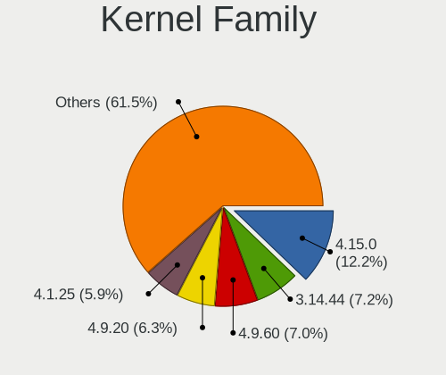
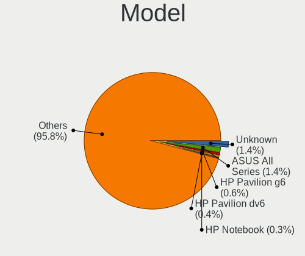
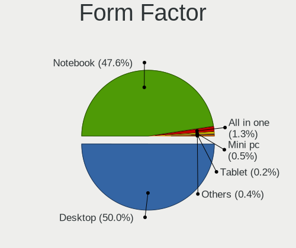
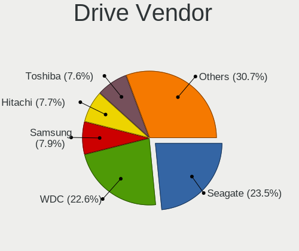
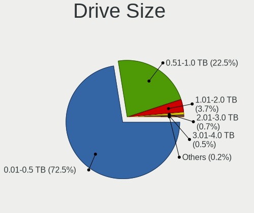
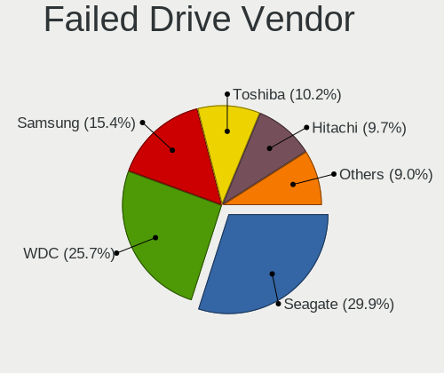
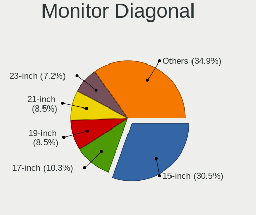
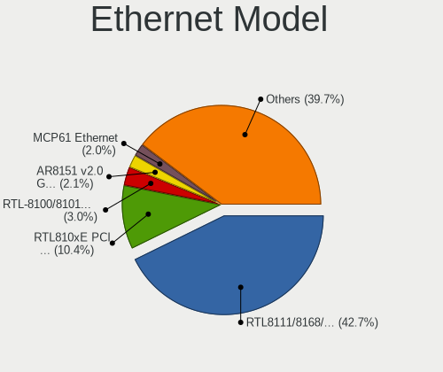
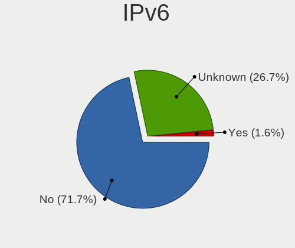
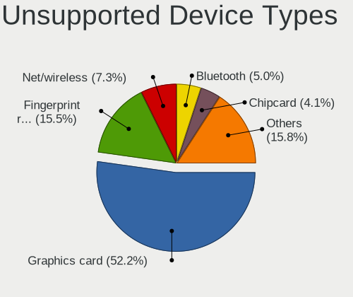

ROSA - Tested Hardware & Statistics
-----------------------------------

A project to collect tested hardware configurations for ROSA.

Anyone can contribute to this report by the [hw-probe](https://github.com/linuxhw/hw-probe) tool:

    sudo -E hw-probe -all -upload

Please contribute! Especially if your hardware is rare.

This is a report for all computer types. See also reports for [desktops](/Dist/ROSA/Desktop/README.md) and [notebooks](/Dist/ROSA/Notebook/README.md).

Contents
--------

* [ Test Cases ](#test-cases)

* [ System ](#system)
  - [ OS                       ](#os)
  - [ OS Family                ](#os-family)
  - [ Kernel                   ](#kernel)
  - [ Kernel Family            ](#kernel-family)
  - [ Kernel Major Ver.        ](#kernel-major-ver)
  - [ Arch                     ](#arch)
  - [ DE                       ](#de)
  - [ Display Server           ](#display-server)
  - [ Display Manager          ](#display-manager)
  - [ OS Lang                  ](#os-lang)
  - [ Boot Mode                ](#boot-mode)
  - [ Filesystem               ](#filesystem)
  - [ Part. scheme             ](#part-scheme)
  - [ Dual Boot with Linux/BSD ](#dual-boot-with-linuxbsd)
  - [ Dual Boot (Win)          ](#dual-boot-win)

* [ Board ](#board)
  - [ Vendor                   ](#vendor)
  - [ Model                    ](#model)
  - [ Model Family             ](#model-family)
  - [ MFG Year                 ](#mfg-year)
  - [ Form Factor              ](#form-factor)
  - [ Secure Boot              ](#secure-boot)
  - [ Coreboot                 ](#coreboot)
  - [ RAM Size                 ](#ram-size)
  - [ RAM Used                 ](#ram-used)
  - [ Total Drives             ](#total-drives)
  - [ Has CD-ROM               ](#has-cd-rom)
  - [ Has Ethernet             ](#has-ethernet)
  - [ Has WiFi                 ](#has-wifi)
  - [ Has Bluetooth            ](#has-bluetooth)

* [ Location ](#location)
  - [ Country                  ](#country)
  - [ City                     ](#city)

* [ Drives ](#drives)
  - [ Drive Vendor             ](#drive-vendor)
  - [ Drive Model              ](#drive-model)
  - [ HDD Vendor               ](#hdd-vendor)
  - [ SSD Vendor               ](#ssd-vendor)
  - [ Drive Kind               ](#drive-kind)
  - [ Drive Connector          ](#drive-connector)
  - [ Drive Size               ](#drive-size)
  - [ Space Total              ](#space-total)
  - [ Space Used               ](#space-used)
  - [ Malfunc. Drives          ](#malfunc-drives)
  - [ Malfunc. Drive Vendor    ](#malfunc-drive-vendor)
  - [ Malfunc. HDD Vendor      ](#malfunc-hdd-vendor)
  - [ Malfunc. Drive Kind      ](#malfunc-drive-kind)
  - [ Failed Drives            ](#failed-drives)
  - [ Failed Drive Vendor      ](#failed-drive-vendor)
  - [ Drive Status             ](#drive-status)

* [ Storage controller ](#storage-controller)
  - [ Storage Vendor           ](#storage-vendor)
  - [ Storage Model            ](#storage-model)
  - [ Storage Kind             ](#storage-kind)

* [ Processor ](#processor)
  - [ CPU Vendor               ](#cpu-vendor)
  - [ CPU Model                ](#cpu-model)
  - [ CPU Model Family         ](#cpu-model-family)
  - [ CPU Cores                ](#cpu-cores)
  - [ CPU Sockets              ](#cpu-sockets)
  - [ CPU Threads              ](#cpu-threads)
  - [ CPU Op-Modes             ](#cpu-op-modes)
  - [ CPU Microcode            ](#cpu-microcode)
  - [ CPU Microarch            ](#cpu-microarch)

* [ Graphics ](#graphics)
  - [ GPU Vendor               ](#gpu-vendor)
  - [ GPU Model                ](#gpu-model)
  - [ GPU Combo                ](#gpu-combo)
  - [ GPU Driver               ](#gpu-driver)
  - [ GPU Memory               ](#gpu-memory)

* [ Monitor ](#monitor)
  - [ Monitor Vendor           ](#monitor-vendor)
  - [ Monitor Model            ](#monitor-model)
  - [ Monitor Resolution       ](#monitor-resolution)
  - [ Monitor Diagonal         ](#monitor-diagonal)
  - [ Monitor Width            ](#monitor-width)
  - [ Aspect Ratio             ](#aspect-ratio)
  - [ Monitor Area             ](#monitor-area)
  - [ Pixel Density            ](#pixel-density)
  - [ Multiple Monitors        ](#multiple-monitors)

* [ Network ](#network)
  - [ Net Controller Vendor    ](#net-controller-vendor)
  - [ Net Controller Model     ](#net-controller-model)
  - [ Wireless Vendor          ](#wireless-vendor)
  - [ Wireless Model           ](#wireless-model)
  - [ Ethernet Vendor          ](#ethernet-vendor)
  - [ Ethernet Model           ](#ethernet-model)
  - [ Net Controller Kind      ](#net-controller-kind)
  - [ Used Controller          ](#used-controller)
  - [ NICs                     ](#nics)
  - [ IPv6                     ](#ipv6)

* [ Bluetooth ](#bluetooth)
  - [ Bluetooth Vendor         ](#bluetooth-vendor)
  - [ Bluetooth Model          ](#bluetooth-model)

* [ Sound ](#sound)
  - [ Sound Vendor             ](#sound-vendor)
  - [ Sound Model              ](#sound-model)

* [ Memory ](#memory)
  - [ Memory Vendor            ](#memory-vendor)
  - [ Memory Model             ](#memory-model)
  - [ Memory Kind              ](#memory-kind)
  - [ Memory Form Factor       ](#memory-form-factor)
  - [ Memory Size              ](#memory-size)
  - [ Memory Speed             ](#memory-speed)

* [ Printers & scanners ](#printers--scanners)
  - [ Printer Vendor           ](#printer-vendor)
  - [ Printer Model            ](#printer-model)
  - [ Scanner Vendor           ](#scanner-vendor)
  - [ Scanner Model            ](#scanner-model)

* [ Camera ](#camera)
  - [ Camera Vendor            ](#camera-vendor)
  - [ Camera Model             ](#camera-model)

* [ Security ](#security)
  - [ Fingerprint Vendor       ](#fingerprint-vendor)
  - [ Fingerprint Model        ](#fingerprint-model)
  - [ Chipcard Vendor          ](#chipcard-vendor)
  - [ Chipcard Model           ](#chipcard-model)

* [ Unsupported ](#unsupported)
  - [ Unsupported Devices      ](#unsupported-devices)
  - [ Unsupported Device Types ](#unsupported-device-types)

Test Cases
----------

Total: 41461

| Vendor        | Model                       | Form-Factor | Probe                                                      | Date         |
|---------------|-----------------------------|-------------|------------------------------------------------------------|--------------|
| Acer          | AOHAPPY2                    | Notebook    | [9bbd271b36](https://linux-hardware.org/?probe=9bbd271b36) | Feb 28, 2023 |
| HP            | ProLiant ML350 G5           | Desktop     | [073427bc3c](https://linux-hardware.org/?probe=073427bc3c) | Feb 28, 2023 |
| HP            | ProLiant ML350 Gen9         | Desktop     | [bbad31d175](https://linux-hardware.org/?probe=bbad31d175) | Feb 28, 2023 |
| HP            | 255 G2                      | Notebook    | [10397efd1b](https://linux-hardware.org/?probe=10397efd1b) | Feb 28, 2023 |
| MSI           | MS-7210 100                 | Desktop     | [5cb2d5ea2c](https://linux-hardware.org/?probe=5cb2d5ea2c) | Feb 28, 2023 |
| MSI           | MS-7210 100                 | Desktop     | [a541b48e4d](https://linux-hardware.org/?probe=a541b48e4d) | Feb 28, 2023 |
| MSI           | MPG B560I GAMING EDGE WI... | Desktop     | [882168458c](https://linux-hardware.org/?probe=882168458c) | Feb 27, 2023 |
| Gigabyte      | GA-970A-UD3                 | Desktop     | [e4bb117847](https://linux-hardware.org/?probe=e4bb117847) | Feb 27, 2023 |
| Gigabyte      | GA-970A-UD3                 | Desktop     | [732f6c8c00](https://linux-hardware.org/?probe=732f6c8c00) | Feb 27, 2023 |
| ASUSTek       | P7H55                       | Desktop     | [394ad3d24f](https://linux-hardware.org/?probe=394ad3d24f) | Feb 27, 2023 |
| Gigabyte      | B365M D2V                   | Desktop     | [aa39313621](https://linux-hardware.org/?probe=aa39313621) | Feb 27, 2023 |
| Apple         | MacBookPro6,2               | Notebook    | [3696f0b49e](https://linux-hardware.org/?probe=3696f0b49e) | Feb 27, 2023 |
| Dell          | 0Y5DDC A00                  | Desktop     | [e3090d9725](https://linux-hardware.org/?probe=e3090d9725) | Feb 27, 2023 |
| Samsung       | 350V5C/351V5C/3540VC/344... | Notebook    | [7936e7db49](https://linux-hardware.org/?probe=7936e7db49) | Feb 27, 2023 |
| Acer          | Aspire 3690                 | Notebook    | [c93af7d4eb](https://linux-hardware.org/?probe=c93af7d4eb) | Feb 27, 2023 |
| Acer          | Aspire 3690                 | Notebook    | [b119bda1a6](https://linux-hardware.org/?probe=b119bda1a6) | Feb 27, 2023 |
| Gigabyte      | B550M AORUS PRO             | Desktop     | [ffdac8fa88](https://linux-hardware.org/?probe=ffdac8fa88) | Feb 27, 2023 |
| Sony          | VPCSB2L1R                   | Notebook    | [6ed9bd210d](https://linux-hardware.org/?probe=6ed9bd210d) | Feb 26, 2023 |
| Gigabyte      | GA-M56S-S3                  | Desktop     | [e8e3f57eef](https://linux-hardware.org/?probe=e8e3f57eef) | Feb 26, 2023 |
| HP            | EliteBook 8540p             | Notebook    | [9f543932d2](https://linux-hardware.org/?probe=9f543932d2) | Feb 26, 2023 |
| Apple         | MacBookAir7,1               | Notebook    | [2986fb12e2](https://linux-hardware.org/?probe=2986fb12e2) | Feb 26, 2023 |
| HP            | Pavilion g6                 | Notebook    | [8d8e5bc41d](https://linux-hardware.org/?probe=8d8e5bc41d) | Feb 26, 2023 |
| ASUSTek       | Z97-K                       | Desktop     | [77a5832b3f](https://linux-hardware.org/?probe=77a5832b3f) | Feb 26, 2023 |
| Dell          | 0UP453                      | Desktop     | [e45bff8252](https://linux-hardware.org/?probe=e45bff8252) | Feb 26, 2023 |
| Acer          | AOHAPPY2                    | Notebook    | [830a1212b7](https://linux-hardware.org/?probe=830a1212b7) | Feb 26, 2023 |
| Apple         | MacBookAir7,1               | Notebook    | [05c92ac080](https://linux-hardware.org/?probe=05c92ac080) | Feb 26, 2023 |
| MSI           | Z77A-G43                    | Desktop     | [2fe5c30b13](https://linux-hardware.org/?probe=2fe5c30b13) | Feb 26, 2023 |
| MSI           | Z77A-G43                    | Desktop     | [4b96538701](https://linux-hardware.org/?probe=4b96538701) | Feb 26, 2023 |
| Acer          | Extensa 2519                | Notebook    | [b80f0bc182](https://linux-hardware.org/?probe=b80f0bc182) | Feb 26, 2023 |
| Acer          | Extensa 2519                | Notebook    | [3ee3fea5eb](https://linux-hardware.org/?probe=3ee3fea5eb) | Feb 26, 2023 |
| ASRock        | 880GM-LE                    | Desktop     | [32366172e4](https://linux-hardware.org/?probe=32366172e4) | Feb 26, 2023 |
| ASRock        | AB350 Pro4                  | Desktop     | [887241ec59](https://linux-hardware.org/?probe=887241ec59) | Feb 26, 2023 |
| eMachines     | Rhine V1.42                 | Notebook    | [c0c7b48991](https://linux-hardware.org/?probe=c0c7b48991) | Feb 26, 2023 |
| Unknown       | Intel X79                   | Desktop     | [0f7920afd6](https://linux-hardware.org/?probe=0f7920afd6) | Feb 26, 2023 |
| Unknown       | Unknown                     | Desktop     | [b4e0540b00](https://linux-hardware.org/?probe=b4e0540b00) | Feb 25, 2023 |
| Acer          | Aspire Z1-601               | All in one  | [dd0dffa557](https://linux-hardware.org/?probe=dd0dffa557) | Feb 25, 2023 |
| HP            | 1497                        | Desktop     | [bd24913452](https://linux-hardware.org/?probe=bd24913452) | Feb 24, 2023 |
| HP            | 1497                        | Desktop     | [ebf580cb5d](https://linux-hardware.org/?probe=ebf580cb5d) | Feb 24, 2023 |
| ASUSTek       | P5Q-EM                      | Desktop     | [3fef9c126a](https://linux-hardware.org/?probe=3fef9c126a) | Feb 24, 2023 |
| ASRock        | 760GM-GS3                   | Desktop     | [5440ad3270](https://linux-hardware.org/?probe=5440ad3270) | Feb 24, 2023 |
| Lenovo        | G50-70 20351                | Notebook    | [8fa16a1dec](https://linux-hardware.org/?probe=8fa16a1dec) | Feb 24, 2023 |
| ASRock        | N68C-GS FX                  | Desktop     | [6b7b16645d](https://linux-hardware.org/?probe=6b7b16645d) | Feb 24, 2023 |
| HP            | Pavilion Gaming Laptop 1... | Notebook    | [9c0b9ff47a](https://linux-hardware.org/?probe=9c0b9ff47a) | Feb 24, 2023 |
| Toshiba       | Satellite U300              | Notebook    | [d5973ad69a](https://linux-hardware.org/?probe=d5973ad69a) | Feb 24, 2023 |
| Lenovo        | ThinkPad X201 3680U6V       | Notebook    | [abcf384939](https://linux-hardware.org/?probe=abcf384939) | Feb 23, 2023 |
| Gigabyte      | B660M DS3H DDR4             | Desktop     | [4cddc9362b](https://linux-hardware.org/?probe=4cddc9362b) | Feb 23, 2023 |
| MSI           | B450M GAMING PLUS           | Desktop     | [accb966ada](https://linux-hardware.org/?probe=accb966ada) | Feb 23, 2023 |
| Acer          | AOHAPPY2                    | Notebook    | [a7a5e4b46c](https://linux-hardware.org/?probe=a7a5e4b46c) | Feb 23, 2023 |
| Gigabyte      | GA-970A-D3                  | Desktop     | [8b1222a755](https://linux-hardware.org/?probe=8b1222a755) | Feb 23, 2023 |
| ASUSTek       | VivoBook 15_ASUS Laptop ... | Notebook    | [e76bd912f8](https://linux-hardware.org/?probe=e76bd912f8) | Feb 23, 2023 |
| MSI           | G31TM-P21                   | Desktop     | [7d6e4cd766](https://linux-hardware.org/?probe=7d6e4cd766) | Feb 23, 2023 |
| ASUSTek       | X541SA                      | Notebook    | [59a1b07ad5](https://linux-hardware.org/?probe=59a1b07ad5) | Feb 23, 2023 |
| Dell          | XPS 15 9575                 | Convertible | [38981fcd34](https://linux-hardware.org/?probe=38981fcd34) | Feb 22, 2023 |
| ASUSTek       | PRIME H510M-K               | Desktop     | [3dab1052d4](https://linux-hardware.org/?probe=3dab1052d4) | Feb 22, 2023 |
| Apple         | MacBookPro8,1               | Notebook    | [b7071da133](https://linux-hardware.org/?probe=b7071da133) | Feb 22, 2023 |
| 3Logic Gro... | Graviton N15i-K2            | Notebook    | [564ecd80d9](https://linux-hardware.org/?probe=564ecd80d9) | Feb 22, 2023 |
| Unknown       | NF-CK804                    | Desktop     | [3dd6239815](https://linux-hardware.org/?probe=3dd6239815) | Feb 22, 2023 |
| MSI           | MPG X570 GAMING EDGE WIF... | Desktop     | [feea587fef](https://linux-hardware.org/?probe=feea587fef) | Feb 22, 2023 |
| Acer          | Aspire V3-771               | Notebook    | [c56e36cd0e](https://linux-hardware.org/?probe=c56e36cd0e) | Feb 22, 2023 |
| ASUSTek       | P8H61-M LX3                 | Desktop     | [af3c7b2459](https://linux-hardware.org/?probe=af3c7b2459) | Feb 22, 2023 |
| Toshiba       | Satellite A300D             | Notebook    | [fd0d9d5ba1](https://linux-hardware.org/?probe=fd0d9d5ba1) | Feb 22, 2023 |
| ASUSTek       | X551CAP                     | Notebook    | [1ed860d561](https://linux-hardware.org/?probe=1ed860d561) | Feb 21, 2023 |
| HP            | Pavilion Notebook           | Notebook    | [caff81fa5f](https://linux-hardware.org/?probe=caff81fa5f) | Feb 20, 2023 |
| Samsung       | N102                        | Notebook    | [736977f523](https://linux-hardware.org/?probe=736977f523) | Feb 20, 2023 |
| ASUSTek       | Z97-K                       | Desktop     | [132a805814](https://linux-hardware.org/?probe=132a805814) | Feb 20, 2023 |
| ASUSTek       | GL703VD                     | Notebook    | [5b0cf6bef1](https://linux-hardware.org/?probe=5b0cf6bef1) | Feb 20, 2023 |
| Haier         | A1410ED                     | Notebook    | [0188ad4a9b](https://linux-hardware.org/?probe=0188ad4a9b) | Feb 20, 2023 |
| Haier         | A1410ED                     | Notebook    | [0551c42cf8](https://linux-hardware.org/?probe=0551c42cf8) | Feb 20, 2023 |
| Huanan        | X99 F8D V2.2                | Desktop     | [c9d8617e08](https://linux-hardware.org/?probe=c9d8617e08) | Feb 20, 2023 |
| AMI           | Aptio CRB                   | Mini pc     | [5bcd20c966](https://linux-hardware.org/?probe=5bcd20c966) | Feb 20, 2023 |
| Intel         | X79M-S                      | Desktop     | [89ac8fc3ce](https://linux-hardware.org/?probe=89ac8fc3ce) | Feb 20, 2023 |
| ASUSTek       | P8H61-M LX3                 | Desktop     | [509f76c7ec](https://linux-hardware.org/?probe=509f76c7ec) | Feb 20, 2023 |
| ASUSTek       | M5A99FX PRO R2.0            | Desktop     | [45e185354c](https://linux-hardware.org/?probe=45e185354c) | Feb 20, 2023 |
| Gigabyte      | 945P-S3                     | Desktop     | [2cdcb107ab](https://linux-hardware.org/?probe=2cdcb107ab) | Feb 20, 2023 |
| DNS           | MB40IA1                     | Notebook    | [9aaf027f52](https://linux-hardware.org/?probe=9aaf027f52) | Feb 20, 2023 |
| ASUSTek       | VivoBook_ASUSLaptop X571... | Notebook    | [c0032d4f0b](https://linux-hardware.org/?probe=c0032d4f0b) | Feb 19, 2023 |
| Gigabyte      | H61M-S1                     | Desktop     | [82ab7aabe2](https://linux-hardware.org/?probe=82ab7aabe2) | Feb 19, 2023 |
| Gigabyte      | P85-D3                      | Desktop     | [970f04658e](https://linux-hardware.org/?probe=970f04658e) | Feb 19, 2023 |
| Gigabyte      | P85-D3                      | Desktop     | [331f606733](https://linux-hardware.org/?probe=331f606733) | Feb 19, 2023 |
| HP            | Unknown                     | Notebook    | [69b276cb01](https://linux-hardware.org/?probe=69b276cb01) | Feb 19, 2023 |
| Dell          | 0Y5DDC A00                  | Desktop     | [87c921a93a](https://linux-hardware.org/?probe=87c921a93a) | Feb 19, 2023 |
| ASUSTek       | VivoBook 15_ASUS Laptop ... | Notebook    | [b27447bfa3](https://linux-hardware.org/?probe=b27447bfa3) | Feb 19, 2023 |
| ASUSTek       | SABERTOOTH Z77              | Desktop     | [b8b41b7a6e](https://linux-hardware.org/?probe=b8b41b7a6e) | Feb 19, 2023 |
| ASUSTek       | M51Sn                       | Notebook    | [999f32a65f](https://linux-hardware.org/?probe=999f32a65f) | Feb 18, 2023 |
| Gigabyte      | H410M S2H                   | Desktop     | [bdb8c0094b](https://linux-hardware.org/?probe=bdb8c0094b) | Feb 18, 2023 |
| Casper        | NIRVANA NOTEBOOK            | Notebook    | [75db698bfd](https://linux-hardware.org/?probe=75db698bfd) | Feb 18, 2023 |
| OEM           | Intel H81                   | Desktop     | [2dc44e8ff2](https://linux-hardware.org/?probe=2dc44e8ff2) | Feb 18, 2023 |
| Lenovo        | Flex 2-14 20404             | Notebook    | [1fc2c6c2f5](https://linux-hardware.org/?probe=1fc2c6c2f5) | Feb 18, 2023 |
| Samsung       | R519/R719                   | Notebook    | [17524cf177](https://linux-hardware.org/?probe=17524cf177) | Feb 18, 2023 |
| Acer          | TravelMate B118-M           | Notebook    | [f70df82711](https://linux-hardware.org/?probe=f70df82711) | Feb 18, 2023 |
| Acer          | Aspire TC-895 V:1.0         | Desktop     | [cbe7b5e34f](https://linux-hardware.org/?probe=cbe7b5e34f) | Feb 18, 2023 |
| Biostar       | H61MLB                      | Desktop     | [b79584c7c9](https://linux-hardware.org/?probe=b79584c7c9) | Feb 18, 2023 |
| Acer          | AOHAPPY2                    | Notebook    | [1f71a1ad75](https://linux-hardware.org/?probe=1f71a1ad75) | Feb 18, 2023 |
| Acer          | Aspire 5920G                | Notebook    | [f9000d049e](https://linux-hardware.org/?probe=f9000d049e) | Feb 17, 2023 |
| ASRock        | 970 Pro3 R2.0               | Desktop     | [55a53738ee](https://linux-hardware.org/?probe=55a53738ee) | Feb 17, 2023 |
| ASUSTek       | X540YA                      | Notebook    | [3faff8d320](https://linux-hardware.org/?probe=3faff8d320) | Feb 17, 2023 |
| MSI           | B460M PRO-VDH               | Desktop     | [38f8f579be](https://linux-hardware.org/?probe=38f8f579be) | Feb 17, 2023 |
| HP            | 3031h                       | Desktop     | [f3d2748999](https://linux-hardware.org/?probe=f3d2748999) | Feb 17, 2023 |
| Acer          | Aspire 5540                 | Notebook    | [ce25cbe4f9](https://linux-hardware.org/?probe=ce25cbe4f9) | Feb 17, 2023 |
| ASUSTek       | VivoBook 15_ASUS Laptop ... | Notebook    | [9187251796](https://linux-hardware.org/?probe=9187251796) | Feb 17, 2023 |
| Gigabyte      | B360M DS3H                  | Desktop     | [1ceaa9af7d](https://linux-hardware.org/?probe=1ceaa9af7d) | Feb 17, 2023 |
| ASRock        | 760GM-GS3                   | Desktop     | [88433e4e24](https://linux-hardware.org/?probe=88433e4e24) | Feb 16, 2023 |
| ASUSTek       | VivoBook 15_ASUS Laptop ... | Notebook    | [650a873a5a](https://linux-hardware.org/?probe=650a873a5a) | Feb 16, 2023 |
| Intel         | DP67BA AAG10219-300         | Desktop     | [8fc0c69640](https://linux-hardware.org/?probe=8fc0c69640) | Feb 16, 2023 |
| ASUSTek       | VivoBook 15_ASUS Laptop ... | Notebook    | [4b78132251](https://linux-hardware.org/?probe=4b78132251) | Feb 16, 2023 |
| MSI           | G41M-P28                    | Desktop     | [85efceb14b](https://linux-hardware.org/?probe=85efceb14b) | Feb 16, 2023 |
| ASUSTek       | 1011PX                      | Notebook    | [f0f2625313](https://linux-hardware.org/?probe=f0f2625313) | Feb 15, 2023 |
| Toshiba       | Satellite U300              | Notebook    | [3925a92635](https://linux-hardware.org/?probe=3925a92635) | Feb 15, 2023 |
| ASRock        | N68C-GS FX                  | Desktop     | [bc0fe319be](https://linux-hardware.org/?probe=bc0fe319be) | Feb 15, 2023 |
| ASRock        | Z77 Pro3                    | Desktop     | [095671c1c9](https://linux-hardware.org/?probe=095671c1c9) | Feb 15, 2023 |
| Dell          | 0Y5DDC A00                  | Desktop     | [261e3ca363](https://linux-hardware.org/?probe=261e3ca363) | Feb 15, 2023 |
| Unknown       | X79A                        | Desktop     | [4cf2d15d70](https://linux-hardware.org/?probe=4cf2d15d70) | Feb 14, 2023 |
| Gigabyte      | Z87-HD3                     | Desktop     | [e856a4629d](https://linux-hardware.org/?probe=e856a4629d) | Feb 14, 2023 |
| ASRock        | AQH410T                     | Desktop     | [9ca03a8dcd](https://linux-hardware.org/?probe=9ca03a8dcd) | Feb 14, 2023 |
| ASUSTek       | X550CL                      | Notebook    | [0da8e9ac4c](https://linux-hardware.org/?probe=0da8e9ac4c) | Feb 14, 2023 |
| Gigabyte      | GA-990XA-UD3                | Desktop     | [da50295fcc](https://linux-hardware.org/?probe=da50295fcc) | Feb 14, 2023 |
| ICL           | RAYbook Si1512              | Notebook    | [d1565e917f](https://linux-hardware.org/?probe=d1565e917f) | Feb 14, 2023 |
| ICL           | RAYbook Si1512              | Notebook    | [aba6ac482b](https://linux-hardware.org/?probe=aba6ac482b) | Feb 14, 2023 |
| Gigabyte      | B450M S2H                   | Desktop     | [2120a2f3b5](https://linux-hardware.org/?probe=2120a2f3b5) | Feb 13, 2023 |
| Gigabyte      | B450M DS3H V2               | Desktop     | [6338542845](https://linux-hardware.org/?probe=6338542845) | Feb 13, 2023 |
| ASUSTek       | GL703VD                     | Notebook    | [409d6e3cb3](https://linux-hardware.org/?probe=409d6e3cb3) | Feb 13, 2023 |
| Gigabyte      | B450 AORUS ELITE            | Desktop     | [c66b51a84d](https://linux-hardware.org/?probe=c66b51a84d) | Feb 13, 2023 |
| Unknown       | X133                        | Notebook    | [537237c180](https://linux-hardware.org/?probe=537237c180) | Feb 13, 2023 |
| AMI           | Aptio CRB E220AQ-600        | Mini pc     | [b93e11cebc](https://linux-hardware.org/?probe=b93e11cebc) | Feb 13, 2023 |
| Gigabyte      | H510M S2H V2                | Desktop     | [e3580e73af](https://linux-hardware.org/?probe=e3580e73af) | Feb 13, 2023 |
| Lenovo        | ThinkBook 15 G3 ACL 21A4    | Notebook    | [55a63c3dce](https://linux-hardware.org/?probe=55a63c3dce) | Feb 13, 2023 |
| ASUSTek       | 1011PX                      | Notebook    | [570fd77e58](https://linux-hardware.org/?probe=570fd77e58) | Feb 13, 2023 |
| Biostar       | A320MH                      | Desktop     | [d51405079c](https://linux-hardware.org/?probe=d51405079c) | Feb 13, 2023 |
| WeiBu         | Aptio CRB                   | Mini pc     | [183e716ff5](https://linux-hardware.org/?probe=183e716ff5) | Feb 13, 2023 |
| ASUSTek       | M2N-E SLI                   | Desktop     | [8bf6aedf43](https://linux-hardware.org/?probe=8bf6aedf43) | Feb 12, 2023 |
| Huanan        | X99 F8D V2.2                | Desktop     | [7b98ade6b1](https://linux-hardware.org/?probe=7b98ade6b1) | Feb 12, 2023 |
| ASRock        | B450M Pro4                  | Desktop     | [8f60713f8a](https://linux-hardware.org/?probe=8f60713f8a) | Feb 12, 2023 |
| Gigabyte      | B550M DS3H                  | Desktop     | [06dc671402](https://linux-hardware.org/?probe=06dc671402) | Feb 12, 2023 |
| Haier         | A1410ED                     | Notebook    | [5c90c9c566](https://linux-hardware.org/?probe=5c90c9c566) | Feb 12, 2023 |
| MSI           | MS-7369                     | Desktop     | [f2d9a7a428](https://linux-hardware.org/?probe=f2d9a7a428) | Feb 12, 2023 |
| ASUSTek       | N61Jv                       | Notebook    | [4b94eea923](https://linux-hardware.org/?probe=4b94eea923) | Feb 12, 2023 |
| ASUSTek       | N61Jv                       | Notebook    | [15b41bf352](https://linux-hardware.org/?probe=15b41bf352) | Feb 12, 2023 |
| Lenovo        | G505 20240                  | Notebook    | [eeda09fb13](https://linux-hardware.org/?probe=eeda09fb13) | Feb 12, 2023 |
| Sony          | SVE14A2V1RWI                | Notebook    | [09509862be](https://linux-hardware.org/?probe=09509862be) | Feb 12, 2023 |
| MSI           | 770-C45                     | Desktop     | [80cd4311f5](https://linux-hardware.org/?probe=80cd4311f5) | Feb 12, 2023 |
| Chuwi         | CoreBook X                  | Notebook    | [faf97ec5ac](https://linux-hardware.org/?probe=faf97ec5ac) | Feb 12, 2023 |
| OEM           | Intel H81                   | Desktop     | [89ca7b56ce](https://linux-hardware.org/?probe=89ca7b56ce) | Feb 12, 2023 |
| Acer          | Aspire 5742G                | Notebook    | [b090683ed1](https://linux-hardware.org/?probe=b090683ed1) | Feb 12, 2023 |
| Unknown       | X79A                        | Desktop     | [d2cdf88906](https://linux-hardware.org/?probe=d2cdf88906) | Feb 12, 2023 |
| Medion        | TJ4105                      | Desktop     | [b9f44d3290](https://linux-hardware.org/?probe=b9f44d3290) | Feb 11, 2023 |
| ASUSTek       | 1025C                       | Notebook    | [a5ae0e6be9](https://linux-hardware.org/?probe=a5ae0e6be9) | Feb 11, 2023 |
| Gigabyte      | B550 AORUS PRO AC           | Desktop     | [0207d4f5eb](https://linux-hardware.org/?probe=0207d4f5eb) | Feb 11, 2023 |
| MSI           | MAG X570S TOMAHAWK MAX W... | Desktop     | [4a3b0fd844](https://linux-hardware.org/?probe=4a3b0fd844) | Feb 11, 2023 |
| HP            | Laptop 14s-dq0xxx           | Notebook    | [2a6b583e08](https://linux-hardware.org/?probe=2a6b583e08) | Feb 11, 2023 |
| MSI           | Alpha 15 A3DDK              | Notebook    | [fc04f9445d](https://linux-hardware.org/?probe=fc04f9445d) | Feb 11, 2023 |
| Huanan        | X99 F8D V2.2                | Desktop     | [226310e919](https://linux-hardware.org/?probe=226310e919) | Feb 10, 2023 |
| MSI           | MAG X570S TOMAHAWK MAX W... | Desktop     | [d88dcef939](https://linux-hardware.org/?probe=d88dcef939) | Feb 10, 2023 |
| IBM           | ThinkPad T41 23731HG        | Notebook    | [3f4c1d8c96](https://linux-hardware.org/?probe=3f4c1d8c96) | Feb 10, 2023 |
| ASUSTek       | PRIME H510M-K               | Desktop     | [ad01ef1c97](https://linux-hardware.org/?probe=ad01ef1c97) | Feb 10, 2023 |
| Lenovo        | G70-80 80FF                 | Notebook    | [ade67f432f](https://linux-hardware.org/?probe=ade67f432f) | Feb 10, 2023 |
| EPoX Compu... | nForce4 DDR: 9NPA3I / 9N... | Desktop     | [978c5bad53](https://linux-hardware.org/?probe=978c5bad53) | Feb 10, 2023 |
| ASUSTek       | VivoBook 15_ASUS Laptop ... | Notebook    | [5e82ed12a7](https://linux-hardware.org/?probe=5e82ed12a7) | Feb 10, 2023 |
| ASUSTek       | M4A785TD-M EVO              | Desktop     | [31d8a68d71](https://linux-hardware.org/?probe=31d8a68d71) | Feb 09, 2023 |
| ASUSTek       | ROG STRIX B550-A GAMING     | Desktop     | [2a366ac100](https://linux-hardware.org/?probe=2a366ac100) | Feb 09, 2023 |
| Acer          | Aspire V3-771               | Notebook    | [5e29ff0071](https://linux-hardware.org/?probe=5e29ff0071) | Feb 09, 2023 |
| Gigabyte      | H61M-S2PV                   | Desktop     | [6cd301542b](https://linux-hardware.org/?probe=6cd301542b) | Feb 09, 2023 |
| HP            | Compaq Presario CQ70        | Notebook    | [5644272d9e](https://linux-hardware.org/?probe=5644272d9e) | Feb 09, 2023 |
| Unknown       | X99H                        | Desktop     | [722aafff41](https://linux-hardware.org/?probe=722aafff41) | Feb 09, 2023 |
| Huanan        | B75 V10.1 376               | Desktop     | [f501974f04](https://linux-hardware.org/?probe=f501974f04) | Feb 09, 2023 |
| Samsung       | 350V5C/351V5C/3540VC/344... | Notebook    | [d0f9bc7752](https://linux-hardware.org/?probe=d0f9bc7752) | Feb 09, 2023 |
| Intel         | DG31PR AAD97573-301         | Desktop     | [665f8e7d81](https://linux-hardware.org/?probe=665f8e7d81) | Feb 09, 2023 |
| Notebook      | W65_67SJ                    | Notebook    | [6f4b26218a](https://linux-hardware.org/?probe=6f4b26218a) | Feb 08, 2023 |
| Lenovo        | G50-80 80E5                 | Notebook    | [ea138517da](https://linux-hardware.org/?probe=ea138517da) | Feb 08, 2023 |
| Notebook      | W65_67SJ                    | Notebook    | [1736d50901](https://linux-hardware.org/?probe=1736d50901) | Feb 08, 2023 |
| ASUSTek       | P5Q DELUXE                  | Desktop     | [6c056321fa](https://linux-hardware.org/?probe=6c056321fa) | Feb 08, 2023 |
| Samsung       | R519/R719                   | Notebook    | [b67d6600ae](https://linux-hardware.org/?probe=b67d6600ae) | Feb 08, 2023 |
| Lenovo        | ThinkBook 16 G4+ ARA 21D... | Notebook    | [cd84a3ed54](https://linux-hardware.org/?probe=cd84a3ed54) | Feb 08, 2023 |
| ASUSTek       | P7H55-USB3                  | Desktop     | [0c02735e75](https://linux-hardware.org/?probe=0c02735e75) | Feb 08, 2023 |
| HUAWEI        | NBLB-WAX9N                  | Notebook    | [5872694b2c](https://linux-hardware.org/?probe=5872694b2c) | Feb 08, 2023 |
| ASRock        | A320M-DVS R4.0              | Desktop     | [8fb4060e1f](https://linux-hardware.org/?probe=8fb4060e1f) | Feb 08, 2023 |
| ASUSTek       | VivoBook 15_ASUS Laptop ... | Notebook    | [c3fd4be797](https://linux-hardware.org/?probe=c3fd4be797) | Feb 08, 2023 |
| ASRock        | B450M Pro4-F                | Desktop     | [133f0c845d](https://linux-hardware.org/?probe=133f0c845d) | Feb 07, 2023 |
| ASUSTek       | TUF B450M-PRO GAMING        | Desktop     | [d7157a7862](https://linux-hardware.org/?probe=d7157a7862) | Feb 07, 2023 |
| ASUSTek       | ROG Zephyrus M16 GU603HE... | Notebook    | [e58b6f75be](https://linux-hardware.org/?probe=e58b6f75be) | Feb 07, 2023 |
| Dell          | Inspiron 5575               | Notebook    | [1620065d9c](https://linux-hardware.org/?probe=1620065d9c) | Feb 07, 2023 |
| ASUSTek       | P7H55-USB3                  | Desktop     | [8d7cca4218](https://linux-hardware.org/?probe=8d7cca4218) | Feb 07, 2023 |
| ASUSTek       | VivoBook 15_ASUS Laptop ... | Notebook    | [2a21f87922](https://linux-hardware.org/?probe=2a21f87922) | Feb 07, 2023 |
| Dell          | 0Y5DDC A00                  | Desktop     | [35c52844f5](https://linux-hardware.org/?probe=35c52844f5) | Feb 07, 2023 |
| Gigabyte      | B550 AORUS ELITE V2         | Desktop     | [b6c83b73c5](https://linux-hardware.org/?probe=b6c83b73c5) | Feb 07, 2023 |
| Pegatron      | 2A73h                       | Desktop     | [6745d62f6e](https://linux-hardware.org/?probe=6745d62f6e) | Feb 07, 2023 |
| THUNDEROBO... | 911 Plus                    | Notebook    | [63fe672aa8](https://linux-hardware.org/?probe=63fe672aa8) | Feb 07, 2023 |
| HP            | 0AA0h                       | Desktop     | [921b7f0d0c](https://linux-hardware.org/?probe=921b7f0d0c) | Feb 07, 2023 |
| Gigabyte      | B450M S2H V2                | Desktop     | [62a01ed1f1](https://linux-hardware.org/?probe=62a01ed1f1) | Feb 07, 2023 |
| Acer          | Aspire E1-570G              | Notebook    | [079f741109](https://linux-hardware.org/?probe=079f741109) | Feb 07, 2023 |
| ASUSTek       | P8B75-V                     | Desktop     | [04d1d12416](https://linux-hardware.org/?probe=04d1d12416) | Feb 07, 2023 |
| Toshiba       | Satellite C870-196          | Notebook    | [85ded7d8d0](https://linux-hardware.org/?probe=85ded7d8d0) | Feb 06, 2023 |
| Gigabyte      | B560 HD3                    | Desktop     | [ab4ab47498](https://linux-hardware.org/?probe=ab4ab47498) | Feb 06, 2023 |
| MSI           | U90/U100                    | Notebook    | [f7dc915782](https://linux-hardware.org/?probe=f7dc915782) | Feb 06, 2023 |
| HONOR         | NBR-WAX9                    | Notebook    | [89ff251118](https://linux-hardware.org/?probe=89ff251118) | Feb 06, 2023 |
| ASUSTek       | P5QL/EPU                    | Desktop     | [32c834326a](https://linux-hardware.org/?probe=32c834326a) | Feb 06, 2023 |
| HONOR         | NBR-WAX9                    | Notebook    | [b045a54f0b](https://linux-hardware.org/?probe=b045a54f0b) | Feb 06, 2023 |
| MSI           | Alpha 15 B5EEK              | Notebook    | [47f300cd75](https://linux-hardware.org/?probe=47f300cd75) | Feb 06, 2023 |
| Lenovo        | IdeaPad 320-15IKB 80XL      | Notebook    | [ebbbcf807a](https://linux-hardware.org/?probe=ebbbcf807a) | Feb 06, 2023 |
| Acer          | Aspire A315-51              | Notebook    | [b644932b49](https://linux-hardware.org/?probe=b644932b49) | Feb 06, 2023 |
| Acer          | FMCP7A-ION-LE               | Desktop     | [4567c6a09c](https://linux-hardware.org/?probe=4567c6a09c) | Feb 06, 2023 |
| Dell          | Inspiron N5110              | Notebook    | [9d66ef100a](https://linux-hardware.org/?probe=9d66ef100a) | Feb 06, 2023 |
| Dell          | Vostro 1015                 | Notebook    | [d93258a6f8](https://linux-hardware.org/?probe=d93258a6f8) | Feb 05, 2023 |
| Gigabyte      | B450M DS3H-CF               | Desktop     | [ebe7e665d6](https://linux-hardware.org/?probe=ebe7e665d6) | Feb 05, 2023 |
| ASUSTek       | PRIME Z270-P                | Desktop     | [8884f6f6dd](https://linux-hardware.org/?probe=8884f6f6dd) | Feb 05, 2023 |
| Huanan        | X79 VAA1                    | Desktop     | [62888124bd](https://linux-hardware.org/?probe=62888124bd) | Feb 05, 2023 |
| Acer          | WG43M                       | Desktop     | [e463181f54](https://linux-hardware.org/?probe=e463181f54) | Feb 05, 2023 |
| ASRock        | G41M-VS3                    | Desktop     | [d6cea67f50](https://linux-hardware.org/?probe=d6cea67f50) | Feb 05, 2023 |
| THUNDEROBO... | 911 Plus                    | Notebook    | [bae8523a8a](https://linux-hardware.org/?probe=bae8523a8a) | Feb 05, 2023 |
| Sony          | VPCY11M1R                   | Notebook    | [2de520036a](https://linux-hardware.org/?probe=2de520036a) | Feb 05, 2023 |
| ASUSTek       | M2N                         | Desktop     | [cc5d457ca6](https://linux-hardware.org/?probe=cc5d457ca6) | Feb 05, 2023 |
| ASRock        | A75M-HVS                    | Desktop     | [74c7bde15c](https://linux-hardware.org/?probe=74c7bde15c) | Feb 05, 2023 |
| HP            | Notebook                    | Notebook    | [ad5aca71c1](https://linux-hardware.org/?probe=ad5aca71c1) | Feb 04, 2023 |
| ASUSTek       | M4A785T-M                   | Desktop     | [5402edfed1](https://linux-hardware.org/?probe=5402edfed1) | Feb 04, 2023 |
| MSI           | Alpha 15 B5EEK              | Notebook    | [b95575866c](https://linux-hardware.org/?probe=b95575866c) | Feb 04, 2023 |
| ASUSTek       | VivoBook 15_ASUS Laptop ... | Notebook    | [b71a6e4da9](https://linux-hardware.org/?probe=b71a6e4da9) | Feb 04, 2023 |
| Lenovo        | 3746 No DPK                 | All in one  | [3b66e6134f](https://linux-hardware.org/?probe=3b66e6134f) | Feb 04, 2023 |
| ASUSTek       | ROG STRIX B550-I GAMING     | Desktop     | [4214ad8f29](https://linux-hardware.org/?probe=4214ad8f29) | Feb 04, 2023 |
| MSI           | GP60 2OD                    | Notebook    | [5c91f4e591](https://linux-hardware.org/?probe=5c91f4e591) | Feb 03, 2023 |
| JGINYUE       | H97I GAMING V1.0            | Desktop     | [d83687e8ea](https://linux-hardware.org/?probe=d83687e8ea) | Feb 03, 2023 |
| Lenovo        | ThinkBook 16 G4+ ARA 21D... | Notebook    | [c26575b761](https://linux-hardware.org/?probe=c26575b761) | Feb 03, 2023 |
| Graviton      | DMB-H610-TMI01              | All in one  | [53c72256da](https://linux-hardware.org/?probe=53c72256da) | Feb 03, 2023 |
| MSI           | GP60 2OD                    | Notebook    | [6820f98769](https://linux-hardware.org/?probe=6820f98769) | Feb 03, 2023 |
| Biostar       | A320MH                      | Desktop     | [61f708d874](https://linux-hardware.org/?probe=61f708d874) | Feb 03, 2023 |
| Gigabyte      | 990XA-UD3                   | Desktop     | [f26da18faa](https://linux-hardware.org/?probe=f26da18faa) | Feb 02, 2023 |
| MSI           | 770-C45                     | Desktop     | [fa06564503](https://linux-hardware.org/?probe=fa06564503) | Feb 02, 2023 |
| MSI           | Z87-GD65 GAMING             | Desktop     | [0021264c10](https://linux-hardware.org/?probe=0021264c10) | Feb 02, 2023 |
| Gigabyte      | X58A-UD3R                   | Desktop     | [e29b47f46f](https://linux-hardware.org/?probe=e29b47f46f) | Feb 02, 2023 |
| ASUSTek       | K50IJ                       | Notebook    | [044d301912](https://linux-hardware.org/?probe=044d301912) | Feb 02, 2023 |
| AMI           | Aptio CRB                   | Mini pc     | [b3fc9704f0](https://linux-hardware.org/?probe=b3fc9704f0) | Feb 02, 2023 |
| Gigabyte      | A320M-S2H-CF                | Desktop     | [3b016839cd](https://linux-hardware.org/?probe=3b016839cd) | Feb 02, 2023 |
| Biostar       | G41-M7                      | Desktop     | [862afd5a70](https://linux-hardware.org/?probe=862afd5a70) | Feb 01, 2023 |
| Gigabyte      | B560 HD3                    | Desktop     | [477504bfc6](https://linux-hardware.org/?probe=477504bfc6) | Feb 01, 2023 |
| MSI           | MS-N0E1 Ver                 | Notebook    | [9c4dcef9c6](https://linux-hardware.org/?probe=9c4dcef9c6) | Feb 01, 2023 |
| ASUSTek       | H110M-R                     | Desktop     | [c790793197](https://linux-hardware.org/?probe=c790793197) | Feb 01, 2023 |
| HP            | Pavilion Gaming Laptop 1... | Notebook    | [de3138b686](https://linux-hardware.org/?probe=de3138b686) | Feb 01, 2023 |
| Acer          | Nitro AN515-52              | Notebook    | [86156a3b50](https://linux-hardware.org/?probe=86156a3b50) | Jan 31, 2023 |
| Unknown       | Unknown                     | Desktop     | [7e53e3c6e8](https://linux-hardware.org/?probe=7e53e3c6e8) | Jan 31, 2023 |
| ASUSTek       | 1011PX                      | Notebook    | [204706229b](https://linux-hardware.org/?probe=204706229b) | Jan 31, 2023 |
| Gigabyte      | A320M-H-CF                  | Desktop     | [f5379a55ea](https://linux-hardware.org/?probe=f5379a55ea) | Jan 31, 2023 |
| ASUSTek       | H110-PLUS                   | Desktop     | [c20a43e3e5](https://linux-hardware.org/?probe=c20a43e3e5) | Jan 31, 2023 |
| ASRock        | B650M PG Riptide            | Desktop     | [260d257a0c](https://linux-hardware.org/?probe=260d257a0c) | Jan 30, 2023 |
| ASUSTek       | P8H61-MX                    | Desktop     | [4830eacf5e](https://linux-hardware.org/?probe=4830eacf5e) | Jan 30, 2023 |
| ASUSTek       | P8H61-MX                    | Desktop     | [0b59b68d55](https://linux-hardware.org/?probe=0b59b68d55) | Jan 30, 2023 |
| MSI           | GL75 Leopard 10SCSR         | Notebook    | [8e30762127](https://linux-hardware.org/?probe=8e30762127) | Jan 30, 2023 |
| ASUSTek       | M4A89GTD-PRO/USB3           | Desktop     | [10c275723f](https://linux-hardware.org/?probe=10c275723f) | Jan 30, 2023 |
| HP            | ProBook x360 11 G5 EE       | Convertible | [8f41c8cf5c](https://linux-hardware.org/?probe=8f41c8cf5c) | Jan 30, 2023 |
| Infinix       | INBOOK X2 GEN11             | Notebook    | [d826805d37](https://linux-hardware.org/?probe=d826805d37) | Jan 30, 2023 |
| Lenovo        | Z50-70 20354                | Notebook    | [54f6c27c09](https://linux-hardware.org/?probe=54f6c27c09) | Jan 30, 2023 |
| ZoomSmart     | A1002                       | Tablet      | [f8733ffc4d](https://linux-hardware.org/?probe=f8733ffc4d) | Jan 30, 2023 |
| HP            | Pavilion g6                 | Notebook    | [d25ed40cf3](https://linux-hardware.org/?probe=d25ed40cf3) | Jan 30, 2023 |
| MSI           | B450M-A PRO MAX             | Desktop     | [a7232f4811](https://linux-hardware.org/?probe=a7232f4811) | Jan 30, 2023 |
| ASUSTek       | 1011PX                      | Notebook    | [7359bcfbfb](https://linux-hardware.org/?probe=7359bcfbfb) | Jan 29, 2023 |
| Acer          | Nitro AN515-52              | Notebook    | [c8c73a9f67](https://linux-hardware.org/?probe=c8c73a9f67) | Jan 29, 2023 |
| HP            | ProBook x360 11 G5 EE       | Convertible | [183bb56595](https://linux-hardware.org/?probe=183bb56595) | Jan 29, 2023 |
| Gigabyte      | B550 GAMING X V2            | Desktop     | [868269808a](https://linux-hardware.org/?probe=868269808a) | Jan 29, 2023 |
| ASRock        | P45DE3                      | Desktop     | [e4c2e737f7](https://linux-hardware.org/?probe=e4c2e737f7) | Jan 29, 2023 |
| Unknown       | Unknown                     | Notebook    | [23d04579d4](https://linux-hardware.org/?probe=23d04579d4) | Jan 29, 2023 |
| ASRock        | Z77M                        | Desktop     | [83a27ed2b5](https://linux-hardware.org/?probe=83a27ed2b5) | Jan 29, 2023 |
| ASRock        | G41M-S3                     | Desktop     | [2196343afa](https://linux-hardware.org/?probe=2196343afa) | Jan 29, 2023 |
| ASUSTek       | P7P55D LE                   | Desktop     | [943a02b7e9](https://linux-hardware.org/?probe=943a02b7e9) | Jan 29, 2023 |
| ASUSTek       | P6T SE                      | Desktop     | [c52b5b3357](https://linux-hardware.org/?probe=c52b5b3357) | Jan 29, 2023 |
| ASRock        | B450 Gaming K4              | Desktop     | [e768563b42](https://linux-hardware.org/?probe=e768563b42) | Jan 29, 2023 |
| Samsung       | RV420/RV520/RV720/E3530/... | Notebook    | [93e0f40842](https://linux-hardware.org/?probe=93e0f40842) | Jan 29, 2023 |
| MSI           | B450M MORTAR MAX            | Desktop     | [017467452c](https://linux-hardware.org/?probe=017467452c) | Jan 29, 2023 |
| Acer          | Nitro AN515-52              | Notebook    | [2fb747792d](https://linux-hardware.org/?probe=2fb747792d) | Jan 29, 2023 |
| ASUSTek       | X550MJ                      | Notebook    | [51fd1f6c24](https://linux-hardware.org/?probe=51fd1f6c24) | Jan 28, 2023 |
| Unknown       | X79                         | Desktop     | [164508bcb4](https://linux-hardware.org/?probe=164508bcb4) | Jan 28, 2023 |
| Gigabyte      | AB350M-DS3H V2-CF           | Desktop     | [8492e549e2](https://linux-hardware.org/?probe=8492e549e2) | Jan 28, 2023 |
| ASUSTek       | ROG STRIX B460-G GAMING     | Desktop     | [836e9a9809](https://linux-hardware.org/?probe=836e9a9809) | Jan 28, 2023 |
| Acer          | Aspire TC-705               | Desktop     | [be48644835](https://linux-hardware.org/?probe=be48644835) | Jan 27, 2023 |
| ASUSTek       | M2N-MX                      | Desktop     | [0920c10a0e](https://linux-hardware.org/?probe=0920c10a0e) | Jan 27, 2023 |
| Gigabyte      | B85M-D3H-A                  | Desktop     | [8289da39ca](https://linux-hardware.org/?probe=8289da39ca) | Jan 27, 2023 |
| ASUSTek       | N56DP                       | Notebook    | [a746d3fd78](https://linux-hardware.org/?probe=a746d3fd78) | Jan 27, 2023 |
| Gigabyte      | 970A-DS3P                   | Desktop     | [547e171057](https://linux-hardware.org/?probe=547e171057) | Jan 27, 2023 |
| ASUSTek       | N56VJ                       | Notebook    | [6ad6470149](https://linux-hardware.org/?probe=6ad6470149) | Jan 27, 2023 |
| Acer          | Aspire 5532                 | Notebook    | [88e8887c6c](https://linux-hardware.org/?probe=88e8887c6c) | Jan 27, 2023 |
| ASRock        | B450 Gaming K4              | Desktop     | [7ce2ff0443](https://linux-hardware.org/?probe=7ce2ff0443) | Jan 27, 2023 |
| ASUSTek       | VivoBook_ASUSLaptop X515... | Notebook    | [acbaa4516c](https://linux-hardware.org/?probe=acbaa4516c) | Jan 27, 2023 |
| Clevo         | M770SUA                     | Notebook    | [3a19bae169](https://linux-hardware.org/?probe=3a19bae169) | Jan 27, 2023 |
| Lenovo        | IdeaPad 320-15IAP 80XR      | Notebook    | [ecd1e46811](https://linux-hardware.org/?probe=ecd1e46811) | Jan 27, 2023 |
| Lenovo        | G480 20156                  | Notebook    | [9e09139dbc](https://linux-hardware.org/?probe=9e09139dbc) | Jan 26, 2023 |
| ASUSTek       | 1201N                       | Notebook    | [ddc52a086f](https://linux-hardware.org/?probe=ddc52a086f) | Jan 26, 2023 |
| MSI           | 770-C45                     | Desktop     | [3da3ee46c2](https://linux-hardware.org/?probe=3da3ee46c2) | Jan 26, 2023 |
| Notebook      | P15SM-A/SM1-A               | Notebook    | [7f70263934](https://linux-hardware.org/?probe=7f70263934) | Jan 26, 2023 |
| Acer          | Nitro AN515-52              | Notebook    | [02dffce8d7](https://linux-hardware.org/?probe=02dffce8d7) | Jan 26, 2023 |
| ASUSTek       | P6T SE                      | Desktop     | [1033fae7e9](https://linux-hardware.org/?probe=1033fae7e9) | Jan 26, 2023 |
| ASUSTek       | VivoBook 15_ASUS Laptop ... | Notebook    | [6290f61a46](https://linux-hardware.org/?probe=6290f61a46) | Jan 26, 2023 |
| ASRock        | B650M PG Riptide            | Desktop     | [e9f4894d6d](https://linux-hardware.org/?probe=e9f4894d6d) | Jan 26, 2023 |
| Acer          | Nitro AN517-51              | Notebook    | [8c568dd8e5](https://linux-hardware.org/?probe=8c568dd8e5) | Jan 26, 2023 |
| ASUSTek       | P7H55-M                     | Desktop     | [34c55ab8ae](https://linux-hardware.org/?probe=34c55ab8ae) | Jan 26, 2023 |
| iRU           | v1.0                        | Desktop     | [5dfa804f74](https://linux-hardware.org/?probe=5dfa804f74) | Jan 26, 2023 |
| ASUSTek       | P5E-VM SE                   | Desktop     | [0b25483160](https://linux-hardware.org/?probe=0b25483160) | Jan 26, 2023 |
| Infinix       | INBOOK X2 GEN11             | Notebook    | [ee7b9f5fd0](https://linux-hardware.org/?probe=ee7b9f5fd0) | Jan 26, 2023 |
| Gigabyte      | AB350M-DS3H V2-CF           | Desktop     | [883b4a1c39](https://linux-hardware.org/?probe=883b4a1c39) | Jan 26, 2023 |
| MSI           | 770-C45                     | Desktop     | [42ffd24c35](https://linux-hardware.org/?probe=42ffd24c35) | Jan 25, 2023 |
| HP            | EliteBook 840 G4            | Notebook    | [ee6e7a2924](https://linux-hardware.org/?probe=ee6e7a2924) | Jan 25, 2023 |
| Lenovo        | V310-15IKB 80T3             | Notebook    | [fe11977488](https://linux-hardware.org/?probe=fe11977488) | Jan 25, 2023 |
| HP            | Laptop 15-bw0xx             | Notebook    | [c2867457c2](https://linux-hardware.org/?probe=c2867457c2) | Jan 25, 2023 |
| MSI           | 770-C45                     | Desktop     | [1991e96ff2](https://linux-hardware.org/?probe=1991e96ff2) | Jan 25, 2023 |
| Lenovo        | V310-15IKB 80T3             | Notebook    | [d56d0b1732](https://linux-hardware.org/?probe=d56d0b1732) | Jan 25, 2023 |
| Acer          | Extensa 2540                | Notebook    | [af5b1ea485](https://linux-hardware.org/?probe=af5b1ea485) | Jan 25, 2023 |
| ASRock        | H310CM-DVS                  | Desktop     | [41b1ad4545](https://linux-hardware.org/?probe=41b1ad4545) | Jan 25, 2023 |
| Gigabyte      | B550 GAMING X V2            | Desktop     | [8a7a7f6b72](https://linux-hardware.org/?probe=8a7a7f6b72) | Jan 25, 2023 |
| HP            | Laptop 15-db0xxx            | Notebook    | [a9dace6356](https://linux-hardware.org/?probe=a9dace6356) | Jan 24, 2023 |
| Acer          | Aspire 5742G                | Notebook    | [e7afbd79e9](https://linux-hardware.org/?probe=e7afbd79e9) | Jan 24, 2023 |
| ZoomSmart     | A1002                       | Tablet      | [9bfc68ab23](https://linux-hardware.org/?probe=9bfc68ab23) | Jan 24, 2023 |
| HIPER Tech... | HIPER WORKBOOK              | Notebook    | [3b1ce8fc77](https://linux-hardware.org/?probe=3b1ce8fc77) | Jan 24, 2023 |
| Alienware     | 18                          | Notebook    | [982870ed1f](https://linux-hardware.org/?probe=982870ed1f) | Jan 24, 2023 |
| Alienware     | 18                          | Notebook    | [afe83f1946](https://linux-hardware.org/?probe=afe83f1946) | Jan 24, 2023 |
| Gigabyte      | B450M S2H V2                | Desktop     | [e8e7a44a2a](https://linux-hardware.org/?probe=e8e7a44a2a) | Jan 24, 2023 |
| Biostar       | G41-M7                      | Desktop     | [3f66a61637](https://linux-hardware.org/?probe=3f66a61637) | Jan 24, 2023 |
| Pegatron      | IPPPV-D3G                   | Desktop     | [770e25fefd](https://linux-hardware.org/?probe=770e25fefd) | Jan 24, 2023 |
| ASUSTek       | M5A97 R2.0                  | Desktop     | [e2d597c046](https://linux-hardware.org/?probe=e2d597c046) | Jan 24, 2023 |
| Gigabyte      | B650 AORUS ELITE AX         | Desktop     | [416a11089a](https://linux-hardware.org/?probe=416a11089a) | Jan 23, 2023 |
| ASRock        | B450 Gaming K4              | Desktop     | [0a7ef9990f](https://linux-hardware.org/?probe=0a7ef9990f) | Jan 23, 2023 |
| Acer          | Extensa 5630                | Notebook    | [ae62db30e8](https://linux-hardware.org/?probe=ae62db30e8) | Jan 23, 2023 |
| ASUSTek       | P5KPL-AM SE                 | Desktop     | [257f3b320c](https://linux-hardware.org/?probe=257f3b320c) | Jan 23, 2023 |
| Gigabyte      | A320M-S2H V2-CF             | Desktop     | [10fa3eeed2](https://linux-hardware.org/?probe=10fa3eeed2) | Jan 23, 2023 |
| ASUSTek       | P5K SE                      | Desktop     | [6d55940af7](https://linux-hardware.org/?probe=6d55940af7) | Jan 23, 2023 |
| Lenovo        | IdeaPad S510p 20298         | Notebook    | [18fdd7a490](https://linux-hardware.org/?probe=18fdd7a490) | Jan 23, 2023 |
| Gigabyte      | B75M-HD3                    | Desktop     | [77d58eb890](https://linux-hardware.org/?probe=77d58eb890) | Jan 23, 2023 |
| Samsung       | N148P/N208P/N218P/NB28P     | Notebook    | [f665dc3839](https://linux-hardware.org/?probe=f665dc3839) | Jan 23, 2023 |
| Lenovo        | ThinkPad P16s Gen 1 21CK... | Notebook    | [37f26b2f10](https://linux-hardware.org/?probe=37f26b2f10) | Jan 23, 2023 |
| ASUSTek       | Z97-C                       | Desktop     | [3a89f39a8f](https://linux-hardware.org/?probe=3a89f39a8f) | Jan 23, 2023 |
| Samsung       | NC10                        | Notebook    | [6bd13301d9](https://linux-hardware.org/?probe=6bd13301d9) | Jan 22, 2023 |
| ASUSTek       | VivoBook_ASUSLaptop X435... | Notebook    | [b1ced07f7b](https://linux-hardware.org/?probe=b1ced07f7b) | Jan 22, 2023 |
| HP            | ProBook 5330m               | Notebook    | [989327864b](https://linux-hardware.org/?probe=989327864b) | Jan 22, 2023 |
| ASUSTek       | N56VJ                       | Notebook    | [167dae47d7](https://linux-hardware.org/?probe=167dae47d7) | Jan 22, 2023 |
| Gigabyte      | F2A55M-DS2                  | Desktop     | [0e1605a304](https://linux-hardware.org/?probe=0e1605a304) | Jan 22, 2023 |
| MSI           | CR500                       | Notebook    | [4aaddddd7f](https://linux-hardware.org/?probe=4aaddddd7f) | Jan 22, 2023 |
| Gigabyte      | H310M H                     | Desktop     | [bd85a7e96e](https://linux-hardware.org/?probe=bd85a7e96e) | Jan 22, 2023 |
| Huanan        | X99-F8 GAMING V5.0          | Desktop     | [ecfd1795a0](https://linux-hardware.org/?probe=ecfd1795a0) | Jan 22, 2023 |
| ASRock        | B360 Pro4                   | Desktop     | [9cd508a59c](https://linux-hardware.org/?probe=9cd508a59c) | Jan 22, 2023 |
| ASUSTek       | P5E-VM SE                   | Desktop     | [a0b3d87534](https://linux-hardware.org/?probe=a0b3d87534) | Jan 22, 2023 |
| Huanan        | H97-ZD3 V2.0                | Desktop     | [afb82fa3cf](https://linux-hardware.org/?probe=afb82fa3cf) | Jan 22, 2023 |
| Dell          | Vostro 3460                 | Notebook    | [569626e023](https://linux-hardware.org/?probe=569626e023) | Jan 22, 2023 |
| MSI           | H97 GAMING 3                | Desktop     | [c861b7e450](https://linux-hardware.org/?probe=c861b7e450) | Jan 22, 2023 |
| Gigabyte      | GA-78LMT-USB3               | Desktop     | [0bf19053f1](https://linux-hardware.org/?probe=0bf19053f1) | Jan 21, 2023 |
| ASUSTek       | VivoBook 15_ASUS Laptop ... | Notebook    | [7d63d494c6](https://linux-hardware.org/?probe=7d63d494c6) | Jan 21, 2023 |
| Samsung       | RV408/RV508                 | Notebook    | [0d5c4881c1](https://linux-hardware.org/?probe=0d5c4881c1) | Jan 21, 2023 |
| ASUSTek       | P5KPL-AM SE                 | Desktop     | [9672c4222a](https://linux-hardware.org/?probe=9672c4222a) | Jan 21, 2023 |
| ASUSTek       | P7H55-M                     | Desktop     | [18efa12cb2](https://linux-hardware.org/?probe=18efa12cb2) | Jan 21, 2023 |
| MSI           | B75MA-E33                   | Desktop     | [df4c3bb4d2](https://linux-hardware.org/?probe=df4c3bb4d2) | Jan 21, 2023 |
| ASUSTek       | P7H55-USB3                  | Desktop     | [3f270588f4](https://linux-hardware.org/?probe=3f270588f4) | Jan 21, 2023 |
| ASRock        | 880GMH/U3S3                 | Desktop     | [f2dff18301](https://linux-hardware.org/?probe=f2dff18301) | Jan 21, 2023 |
| Toshiba       | Satellite P200              | Notebook    | [cdc37dfe5e](https://linux-hardware.org/?probe=cdc37dfe5e) | Jan 20, 2023 |
| Sony          | VGN-FJ3SR_B                 | Notebook    | [4dc8b8d09d](https://linux-hardware.org/?probe=4dc8b8d09d) | Jan 20, 2023 |
| MSI           | Z490-A PRO                  | Desktop     | [712d12e3e9](https://linux-hardware.org/?probe=712d12e3e9) | Jan 20, 2023 |
| ASUSTek       | P5E-VM SE                   | Desktop     | [b3df4a1dfa](https://linux-hardware.org/?probe=b3df4a1dfa) | Jan 20, 2023 |
| Lenovo        | B450                        | Notebook    | [96b87672bf](https://linux-hardware.org/?probe=96b87672bf) | Jan 20, 2023 |
| ASUSTek       | VivoBook 15_ASUS Laptop ... | Notebook    | [459b2e28d0](https://linux-hardware.org/?probe=459b2e28d0) | Jan 20, 2023 |
| Lenovo        | 3111 SDK0J40697 WIN 3305... | Desktop     | [4ebd222ef1](https://linux-hardware.org/?probe=4ebd222ef1) | Jan 20, 2023 |
| ECS           | G41T-M7                     | Desktop     | [e6be57e3c3](https://linux-hardware.org/?probe=e6be57e3c3) | Jan 20, 2023 |
| Acer          | Nitro AN515-52              | Notebook    | [9abd51692e](https://linux-hardware.org/?probe=9abd51692e) | Jan 20, 2023 |
| Gigabyte      | H510M H                     | Desktop     | [f44f319e21](https://linux-hardware.org/?probe=f44f319e21) | Jan 20, 2023 |
| Huanan        | X99-F8D V2.4                | Desktop     | [26bc61b381](https://linux-hardware.org/?probe=26bc61b381) | Jan 19, 2023 |
| AZW           | U59                         | Desktop     | [6621409d8c](https://linux-hardware.org/?probe=6621409d8c) | Jan 19, 2023 |
| Biostar       | A780LB                      | Desktop     | [ffce251f42](https://linux-hardware.org/?probe=ffce251f42) | Jan 19, 2023 |
| Gigabyte      | B660 GAMING X DDR4          | Desktop     | [348a5d1848](https://linux-hardware.org/?probe=348a5d1848) | Jan 19, 2023 |
| Lenovo        | G70-80 80FF                 | Notebook    | [1ce03f27f3](https://linux-hardware.org/?probe=1ce03f27f3) | Jan 19, 2023 |
| Acer          | Aspire E5-573G              | Notebook    | [cfe663eeb9](https://linux-hardware.org/?probe=cfe663eeb9) | Jan 19, 2023 |
| ASUSTek       | P4P800                      | Desktop     | [f37bee349c](https://linux-hardware.org/?probe=f37bee349c) | Jan 18, 2023 |
| Intel         | DG41MJ AAE54659-206         | Desktop     | [98a0ca82de](https://linux-hardware.org/?probe=98a0ca82de) | Jan 18, 2023 |
| Chuwi         | HeroBook Pro                | Notebook    | [42bf8b9a0d](https://linux-hardware.org/?probe=42bf8b9a0d) | Jan 18, 2023 |
| Lenovo        | IdeaPad 330-15IKB 81DE      | Notebook    | [82eea2cc7b](https://linux-hardware.org/?probe=82eea2cc7b) | Jan 18, 2023 |
| Toshiba       | Satellite Pro C660          | Notebook    | [02a6db2951](https://linux-hardware.org/?probe=02a6db2951) | Jan 18, 2023 |
| Lenovo        | ThinkCentre M57e 6305B2U    | Desktop     | [fbd4306314](https://linux-hardware.org/?probe=fbd4306314) | Jan 18, 2023 |
| ASRock        | B75 Pro3-M                  | Desktop     | [a42e9dbc36](https://linux-hardware.org/?probe=a42e9dbc36) | Jan 18, 2023 |
| ASRock        | B75 Pro3-M                  | Desktop     | [d4147630a1](https://linux-hardware.org/?probe=d4147630a1) | Jan 18, 2023 |
| Toshiba       | Satellite Pro C660          | Notebook    | [a9de8742d5](https://linux-hardware.org/?probe=a9de8742d5) | Jan 17, 2023 |
| ASUSTek       | Z97-K                       | Desktop     | [ac58bc440d](https://linux-hardware.org/?probe=ac58bc440d) | Jan 17, 2023 |
| ASRock        | H410M-HVS                   | Desktop     | [2024f1ae76](https://linux-hardware.org/?probe=2024f1ae76) | Jan 17, 2023 |
| Gigabyte      | 970A-DS3P                   | Desktop     | [b01089cba7](https://linux-hardware.org/?probe=b01089cba7) | Jan 17, 2023 |
| Biostar       | A780LB                      | Desktop     | [fe4d79e9f8](https://linux-hardware.org/?probe=fe4d79e9f8) | Jan 17, 2023 |
| Gigabyte      | 970A-DS3P                   | Desktop     | [bffcece8fb](https://linux-hardware.org/?probe=bffcece8fb) | Jan 17, 2023 |
| HP            | Notebook                    | Notebook    | [a998060574](https://linux-hardware.org/?probe=a998060574) | Jan 17, 2023 |
| Lenovo        | Flex 2-14 20404             | Notebook    | [bdfe91e3c9](https://linux-hardware.org/?probe=bdfe91e3c9) | Jan 17, 2023 |
| Acer          | Nitro AN515-52              | Notebook    | [4507d2f32d](https://linux-hardware.org/?probe=4507d2f32d) | Jan 17, 2023 |
| ASUSTek       | P12R-E Series 60SB0A90-S... | Server      | [f4bf235ea8](https://linux-hardware.org/?probe=f4bf235ea8) | Jan 17, 2023 |
| Gigabyte      | B450M H                     | Desktop     | [e3638a2110](https://linux-hardware.org/?probe=e3638a2110) | Jan 17, 2023 |
| Gigabyte      | A320M-S2H-CF                | Desktop     | [df0f33ee66](https://linux-hardware.org/?probe=df0f33ee66) | Jan 16, 2023 |
| Intel         | X99                         | Desktop     | [f966e7aa92](https://linux-hardware.org/?probe=f966e7aa92) | Jan 16, 2023 |
| Lenovo        | G500 20236                  | Notebook    | [37891c1ea9](https://linux-hardware.org/?probe=37891c1ea9) | Jan 16, 2023 |
| Huanan        | H97-ZD3 V2.0                | Desktop     | [aececc6971](https://linux-hardware.org/?probe=aececc6971) | Jan 16, 2023 |
| HP            | Laptop 15-db0xxx            | Notebook    | [363f8daa52](https://linux-hardware.org/?probe=363f8daa52) | Jan 16, 2023 |
| MSI           | 970A-G43                    | Desktop     | [f15370df26](https://linux-hardware.org/?probe=f15370df26) | Jan 16, 2023 |
| ECS           | G41T-M7                     | Desktop     | [51a45a431a](https://linux-hardware.org/?probe=51a45a431a) | Jan 16, 2023 |
| Biostar       | H310MHC2                    | Desktop     | [2ebeb3fa1a](https://linux-hardware.org/?probe=2ebeb3fa1a) | Jan 16, 2023 |
| Unknown       | Unknown                     | Notebook    | [84f591bd6b](https://linux-hardware.org/?probe=84f591bd6b) | Jan 16, 2023 |
| HP            | Notebook                    | Notebook    | [219540f0f7](https://linux-hardware.org/?probe=219540f0f7) | Jan 16, 2023 |
| Gigabyte      | MZBSWMP-00                  | Desktop     | [c1660ab5a4](https://linux-hardware.org/?probe=c1660ab5a4) | Jan 16, 2023 |
| Biostar       | H310MHC2                    | Desktop     | [939ab29431](https://linux-hardware.org/?probe=939ab29431) | Jan 16, 2023 |
| ASUSTek       | VivoBook 15_ASUS Laptop ... | Notebook    | [2ec1685227](https://linux-hardware.org/?probe=2ec1685227) | Jan 15, 2023 |
| Lenovo        | IdeaPad Z580                | Notebook    | [f51c90cadc](https://linux-hardware.org/?probe=f51c90cadc) | Jan 15, 2023 |
| MSI           | 970A-G43                    | Desktop     | [669512ff6c](https://linux-hardware.org/?probe=669512ff6c) | Jan 15, 2023 |
| Acer          | Aspire V3-772G              | Notebook    | [832efe11f1](https://linux-hardware.org/?probe=832efe11f1) | Jan 15, 2023 |
| ASUSTek       | P7H55-USB3                  | Desktop     | [d412197c51](https://linux-hardware.org/?probe=d412197c51) | Jan 15, 2023 |
| ASUSTek       | VivoBook 15_ASUS Laptop ... | Notebook    | [bf4ea0ba42](https://linux-hardware.org/?probe=bf4ea0ba42) | Jan 15, 2023 |
| Kraftway      | ACCORD                      | Notebook    | [63039ae17f](https://linux-hardware.org/?probe=63039ae17f) | Jan 15, 2023 |
| Casper        | NIRVANA NOTEBOOK            | Notebook    | [b5b29198b0](https://linux-hardware.org/?probe=b5b29198b0) | Jan 15, 2023 |
| ASUSTek       | P5KPL-AM SE                 | Desktop     | [fe4b311f78](https://linux-hardware.org/?probe=fe4b311f78) | Jan 15, 2023 |
| ASUSTek       | G75VW                       | Notebook    | [adc92101d7](https://linux-hardware.org/?probe=adc92101d7) | Jan 15, 2023 |
| Gigabyte      | B450 AORUS ELITE            | Desktop     | [a65831f165](https://linux-hardware.org/?probe=a65831f165) | Jan 15, 2023 |
| ASUSTek       | P5E-VM SE                   | Desktop     | [af5169b24d](https://linux-hardware.org/?probe=af5169b24d) | Jan 15, 2023 |
| Irbis         | NB264                       | Notebook    | [ed534a1d30](https://linux-hardware.org/?probe=ed534a1d30) | Jan 15, 2023 |
| HP            | 15                          | Notebook    | [6df03629da](https://linux-hardware.org/?probe=6df03629da) | Jan 15, 2023 |
| Toshiba       | Satellite L300              | Notebook    | [282e0e478f](https://linux-hardware.org/?probe=282e0e478f) | Jan 15, 2023 |
| ASUSTek       | M5A99X EVO R2.0             | Desktop     | [c59c9570d6](https://linux-hardware.org/?probe=c59c9570d6) | Jan 14, 2023 |
| HP            | 84EE 1100                   | All in one  | [79c81fcfb5](https://linux-hardware.org/?probe=79c81fcfb5) | Jan 14, 2023 |
| MECHREVO      | Jiaolong Series GM5ZG0O     | Notebook    | [17487f7b28](https://linux-hardware.org/?probe=17487f7b28) | Jan 14, 2023 |
| Clevo         | W240EL/W250ELQ/W270ELQ      | Notebook    | [fd3560384c](https://linux-hardware.org/?probe=fd3560384c) | Jan 14, 2023 |
| Dell          | Inspiron 15-3552            | Notebook    | [6fc2ac2b48](https://linux-hardware.org/?probe=6fc2ac2b48) | Jan 14, 2023 |
| HP            | Mini 110-3700               | Notebook    | [564cb84405](https://linux-hardware.org/?probe=564cb84405) | Jan 14, 2023 |
| MECHREVO      | Jiaolong Series GM5ZG0O     | Notebook    | [a02f812ef3](https://linux-hardware.org/?probe=a02f812ef3) | Jan 14, 2023 |
| Gigabyte      | B250M-DS3H-CF               | Desktop     | [69819d1ce1](https://linux-hardware.org/?probe=69819d1ce1) | Jan 14, 2023 |
| Fujitsu       | LIFEBOOK A530               | Notebook    | [64e3a1d972](https://linux-hardware.org/?probe=64e3a1d972) | Jan 14, 2023 |
| Dell          | Inspiron ME051              | Notebook    | [853b489238](https://linux-hardware.org/?probe=853b489238) | Jan 14, 2023 |
| Dell          | Inspiron ME051              | Notebook    | [e806b368b7](https://linux-hardware.org/?probe=e806b368b7) | Jan 14, 2023 |
| ASRock        | N68C-S UCC                  | Desktop     | [7c5f173e5c](https://linux-hardware.org/?probe=7c5f173e5c) | Jan 13, 2023 |
| Gigabyte      | GA-MA770T-UD3P              | Desktop     | [7cde78238f](https://linux-hardware.org/?probe=7cde78238f) | Jan 13, 2023 |
| ASUSTek       | P8H77-V LE                  | Desktop     | [ae418043f3](https://linux-hardware.org/?probe=ae418043f3) | Jan 13, 2023 |
| HP            | Notebook                    | Notebook    | [3fc38fa55e](https://linux-hardware.org/?probe=3fc38fa55e) | Jan 13, 2023 |
| HP            | Laptop 14s-dq3xxx           | Notebook    | [19be6bae3d](https://linux-hardware.org/?probe=19be6bae3d) | Jan 12, 2023 |
| Lenovo        | IdeaPad Z510 20287          | Notebook    | [9ebcc90bcf](https://linux-hardware.org/?probe=9ebcc90bcf) | Jan 12, 2023 |
| Lenovo        | IdeaPad Z510 20287          | Notebook    | [71f6d9b711](https://linux-hardware.org/?probe=71f6d9b711) | Jan 12, 2023 |
| Lenovo        | IdeaPad Gaming 3 15ACH6 ... | Notebook    | [c551a35ec7](https://linux-hardware.org/?probe=c551a35ec7) | Jan 12, 2023 |
| Acer          | Aspire ES1-331              | Notebook    | [970c4e185f](https://linux-hardware.org/?probe=970c4e185f) | Jan 12, 2023 |
| Acer          | Aspire A315-41G             | Notebook    | [2bfe8a0134](https://linux-hardware.org/?probe=2bfe8a0134) | Jan 12, 2023 |
| ASUSTek       | P5E-VM SE                   | Desktop     | [feee0755d0](https://linux-hardware.org/?probe=feee0755d0) | Jan 12, 2023 |
| ASUSTek       | TP401CA                     | Convertible | [781a6d0157](https://linux-hardware.org/?probe=781a6d0157) | Jan 11, 2023 |
| ASRock        | B450M Pro4                  | Desktop     | [5b24178097](https://linux-hardware.org/?probe=5b24178097) | Jan 11, 2023 |
| ASUSTek       | P7H55-USB3                  | Desktop     | [ae85db39c6](https://linux-hardware.org/?probe=ae85db39c6) | Jan 11, 2023 |
| Lenovo        | IdeaPad 3 17ADA05 81W2      | Notebook    | [5c4331e8b9](https://linux-hardware.org/?probe=5c4331e8b9) | Jan 11, 2023 |
| ASUSTek       | A8N32-SLI-Deluxe            | Desktop     | [e9a8dfc18e](https://linux-hardware.org/?probe=e9a8dfc18e) | Jan 11, 2023 |
| Clevo         | E512xQ/E4129                | Notebook    | [6c78caccf5](https://linux-hardware.org/?probe=6c78caccf5) | Jan 11, 2023 |
| Acer          | Aspire ES1-512              | Notebook    | [9d614553aa](https://linux-hardware.org/?probe=9d614553aa) | Jan 11, 2023 |
| MSI           | GP60 2OD                    | Notebook    | [dbd191a73b](https://linux-hardware.org/?probe=dbd191a73b) | Jan 11, 2023 |
| Lenovo        | ThinkBook 16 G4+ ARA 21D... | Notebook    | [8d567b585a](https://linux-hardware.org/?probe=8d567b585a) | Jan 10, 2023 |
| Lenovo        | ThinkBook 16 G4+ ARA 21D... | Notebook    | [c4de77365a](https://linux-hardware.org/?probe=c4de77365a) | Jan 10, 2023 |
| Positivo B... | VJFE52F11X-B0611H           | Notebook    | [91caa09e7b](https://linux-hardware.org/?probe=91caa09e7b) | Jan 10, 2023 |
| Acer          | Aspire 5733Z                | Notebook    | [87c8f3902d](https://linux-hardware.org/?probe=87c8f3902d) | Jan 10, 2023 |
| Acer          | Aspire TC-605               | Desktop     | [77ecead5ed](https://linux-hardware.org/?probe=77ecead5ed) | Jan 09, 2023 |
| ASUSTek       | P5E-VM SE                   | Desktop     | [d9f3023575](https://linux-hardware.org/?probe=d9f3023575) | Jan 09, 2023 |
| Samsung       | RV420/RV520/RV720           | Notebook    | [c0697ead47](https://linux-hardware.org/?probe=c0697ead47) | Jan 09, 2023 |
| Intel         | DP43BF AAE78171-302         | Desktop     | [ef4b23a73d](https://linux-hardware.org/?probe=ef4b23a73d) | Jan 09, 2023 |
| ASUSTek       | ROG STRIX B550-I GAMING     | Desktop     | [2f03fd41c1](https://linux-hardware.org/?probe=2f03fd41c1) | Jan 09, 2023 |
| ASUSTek       | K54L                        | Notebook    | [88b71478e6](https://linux-hardware.org/?probe=88b71478e6) | Jan 09, 2023 |
| Intel         | DP43BF AAE78171-302         | Desktop     | [2a22078fe1](https://linux-hardware.org/?probe=2a22078fe1) | Jan 09, 2023 |
| ASUSTek       | K61IC                       | Notebook    | [c593968311](https://linux-hardware.org/?probe=c593968311) | Jan 09, 2023 |
| MSI           | GV72 8RD                    | Notebook    | [5fa5d4ef58](https://linux-hardware.org/?probe=5fa5d4ef58) | Jan 09, 2023 |
| Acer          | TravelMate P278-M           | Notebook    | [6b2be0a8cc](https://linux-hardware.org/?probe=6b2be0a8cc) | Jan 09, 2023 |
| Samsung       | 350V5C/351V5C/3540VC/344... | Notebook    | [71bd754745](https://linux-hardware.org/?probe=71bd754745) | Jan 09, 2023 |
| ASUSTek       | ASUS TUF Gaming F15 FX50... | Notebook    | [505cec778a](https://linux-hardware.org/?probe=505cec778a) | Jan 09, 2023 |
| ASUSTek       | ASUS TUF Gaming F15 FX50... | Notebook    | [9924742c7d](https://linux-hardware.org/?probe=9924742c7d) | Jan 08, 2023 |
| ASUSTek       | M3400WUA                    | All in one  | [25ba18f752](https://linux-hardware.org/?probe=25ba18f752) | Jan 08, 2023 |
| ASRock        | Z77 Extreme3                | Desktop     | [51f731b0f4](https://linux-hardware.org/?probe=51f731b0f4) | Jan 08, 2023 |
| ASRock        | 960GM-VGS3 FX               | Desktop     | [5b64e74a17](https://linux-hardware.org/?probe=5b64e74a17) | Jan 08, 2023 |
| ASUSTek       | PRIME A320M-K               | Desktop     | [49f4c2fbc8](https://linux-hardware.org/?probe=49f4c2fbc8) | Jan 08, 2023 |
| ASUSTek       | P5QL PRO                    | Desktop     | [e5d4ce1aa7](https://linux-hardware.org/?probe=e5d4ce1aa7) | Jan 08, 2023 |
| Dell          | Latitude 5490               | Notebook    | [8fd07b1457](https://linux-hardware.org/?probe=8fd07b1457) | Jan 08, 2023 |
| ASUSTek       | 1003HAG                     | Notebook    | [0b411dbd38](https://linux-hardware.org/?probe=0b411dbd38) | Jan 08, 2023 |
| Lenovo        | B590 20208                  | Notebook    | [e082e7aece](https://linux-hardware.org/?probe=e082e7aece) | Jan 07, 2023 |
| MSI           | B450M MORTAR MAX            | Desktop     | [93957e7a70](https://linux-hardware.org/?probe=93957e7a70) | Jan 07, 2023 |
| Gigabyte      | GA-MA770-UD3                | Desktop     | [b4bf97514d](https://linux-hardware.org/?probe=b4bf97514d) | Jan 07, 2023 |
| ASUSTek       | P8H61-M LX2                 | Desktop     | [9193043004](https://linux-hardware.org/?probe=9193043004) | Jan 07, 2023 |
| ASUSTek       | P8H61-M LX2                 | Desktop     | [a6d1d6523b](https://linux-hardware.org/?probe=a6d1d6523b) | Jan 07, 2023 |
| Lenovo        | 0x36C4                      | All in one  | [cb6d0ac822](https://linux-hardware.org/?probe=cb6d0ac822) | Jan 07, 2023 |
| ASUSTek       | 1003HAG                     | Notebook    | [eb8e81a088](https://linux-hardware.org/?probe=eb8e81a088) | Jan 07, 2023 |
| Lenovo        | G580 20157                  | Notebook    | [57ec88a87b](https://linux-hardware.org/?probe=57ec88a87b) | Jan 07, 2023 |
| MB            | A320-SF110                  | Desktop     | [d23ec63d82](https://linux-hardware.org/?probe=d23ec63d82) | Jan 07, 2023 |
| ASUSTek       | M5A97 R2.0                  | Desktop     | [6893b29920](https://linux-hardware.org/?probe=6893b29920) | Jan 07, 2023 |
| Lenovo        | IdeaPad 330-15IKB 81FE      | Notebook    | [7f2254139c](https://linux-hardware.org/?probe=7f2254139c) | Jan 07, 2023 |
| Gigabyte      | F2A68HM-DS2                 | Desktop     | [a9288e85f6](https://linux-hardware.org/?probe=a9288e85f6) | Jan 06, 2023 |
| ASRock        | 960GM-VGS3 FX               | Desktop     | [633f31b57e](https://linux-hardware.org/?probe=633f31b57e) | Jan 06, 2023 |
| Gigabyte      | GA-A75M-DS2                 | Desktop     | [843dbca31d](https://linux-hardware.org/?probe=843dbca31d) | Jan 06, 2023 |
| MB            | A320-SF110                  | Desktop     | [5b690cf226](https://linux-hardware.org/?probe=5b690cf226) | Jan 06, 2023 |
| Huanan        | X99-F8 NALEX, NALEX         | Desktop     | [e59b16e379](https://linux-hardware.org/?probe=e59b16e379) | Jan 06, 2023 |
| ASRock        | A320D4-P1                   | Desktop     | [b6a61f9d2d](https://linux-hardware.org/?probe=b6a61f9d2d) | Jan 06, 2023 |
| Gigabyte      | H61M-S1                     | Desktop     | [7b61bf12d0](https://linux-hardware.org/?probe=7b61bf12d0) | Jan 06, 2023 |
| ASRock        | D1800M                      | Desktop     | [f70a4786d7](https://linux-hardware.org/?probe=f70a4786d7) | Jan 06, 2023 |
| ASUSTek       | P7H55-USB3                  | Desktop     | [e94f2584b0](https://linux-hardware.org/?probe=e94f2584b0) | Jan 06, 2023 |
| HP            | Compaq 515                  | Notebook    | [6cc60c3d13](https://linux-hardware.org/?probe=6cc60c3d13) | Jan 06, 2023 |
| Acer          | Nitro AN515-44              | Notebook    | [1b36fc58ae](https://linux-hardware.org/?probe=1b36fc58ae) | Jan 05, 2023 |
| Chuwi         | CoreBook X                  | Notebook    | [bf8c10bdca](https://linux-hardware.org/?probe=bf8c10bdca) | Jan 05, 2023 |
| MSI           | H61M-P20                    | Desktop     | [f48c04fe8f](https://linux-hardware.org/?probe=f48c04fe8f) | Jan 05, 2023 |
| ASRock        | Z77M                        | Desktop     | [fe6f6a7b05](https://linux-hardware.org/?probe=fe6f6a7b05) | Jan 05, 2023 |
| Samsung       | 350V5C/351V5C/3540VC/344... | Notebook    | [729add189b](https://linux-hardware.org/?probe=729add189b) | Jan 05, 2023 |
| Lenovo        | IdeaPad S145-15AST 81N3     | Notebook    | [c2df57a53f](https://linux-hardware.org/?probe=c2df57a53f) | Jan 05, 2023 |
| Lenovo        | B570e HuronRiver Platfor... | Notebook    | [5be962cfea](https://linux-hardware.org/?probe=5be962cfea) | Jan 05, 2023 |
| Gigabyte      | H61M-S1                     | Desktop     | [e1b3de18e9](https://linux-hardware.org/?probe=e1b3de18e9) | Jan 05, 2023 |
| HP            | ProBook 640 G1              | Notebook    | [e3fd4121a2](https://linux-hardware.org/?probe=e3fd4121a2) | Jan 04, 2023 |
| ASUSTek       | A55BM-PLUS                  | Desktop     | [8601b7f2e9](https://linux-hardware.org/?probe=8601b7f2e9) | Jan 04, 2023 |
| HUAWEI        | BOM-WXX9                    | Notebook    | [f4631a1285](https://linux-hardware.org/?probe=f4631a1285) | Jan 04, 2023 |
| ASRock        | H510M-HVS                   | Desktop     | [738739788a](https://linux-hardware.org/?probe=738739788a) | Jan 04, 2023 |
| Unknown       | Unknown                     | Desktop     | [5194029152](https://linux-hardware.org/?probe=5194029152) | Jan 04, 2023 |
| ASUSTek       | N551JM                      | Notebook    | [f6de50a76b](https://linux-hardware.org/?probe=f6de50a76b) | Jan 04, 2023 |
| Maibenben     | PC34 V1.0                   | Desktop     | [0ed25644b7](https://linux-hardware.org/?probe=0ed25644b7) | Jan 04, 2023 |
| Gigabyte      | P35-DS3L                    | Desktop     | [c07ba0a973](https://linux-hardware.org/?probe=c07ba0a973) | Jan 04, 2023 |
| Acer          | Swift SF114-32              | Notebook    | [50315135d2](https://linux-hardware.org/?probe=50315135d2) | Jan 04, 2023 |
| ECS           | G41T-M2                     | Desktop     | [8df8f82fb8](https://linux-hardware.org/?probe=8df8f82fb8) | Jan 04, 2023 |
| MSI           | A320M GRENADE               | Desktop     | [5e6f9a181c](https://linux-hardware.org/?probe=5e6f9a181c) | Jan 04, 2023 |
| MSI           | MS-B0A41                    | Desktop     | [f57c26d714](https://linux-hardware.org/?probe=f57c26d714) | Jan 04, 2023 |
| Lenovo        | H420                        | Desktop     | [0765ceb3e8](https://linux-hardware.org/?probe=0765ceb3e8) | Jan 04, 2023 |
| Dell          | Inspiron 1525               | Notebook    | [c3c074f183](https://linux-hardware.org/?probe=c3c074f183) | Jan 03, 2023 |
| Acer          | Aspire 5738                 | Notebook    | [aa99474aec](https://linux-hardware.org/?probe=aa99474aec) | Jan 03, 2023 |
| ASUSTek       | PRIME B450M-A               | Desktop     | [89868317cd](https://linux-hardware.org/?probe=89868317cd) | Jan 03, 2023 |
| ASRock        | H510M-HDV R2.0              | Desktop     | [f75b0a7e71](https://linux-hardware.org/?probe=f75b0a7e71) | Jan 03, 2023 |
| Gigabyte      | G5 KD                       | Notebook    | [b86543e8cf](https://linux-hardware.org/?probe=b86543e8cf) | Jan 03, 2023 |
| ASUSTek       | N551JM                      | Notebook    | [3ba1d0e689](https://linux-hardware.org/?probe=3ba1d0e689) | Jan 03, 2023 |
| Dell          | Precision M6400             | Notebook    | [8f1b979d06](https://linux-hardware.org/?probe=8f1b979d06) | Jan 03, 2023 |
| Acer          | Aspire 5349                 | Notebook    | [b482fc96ea](https://linux-hardware.org/?probe=b482fc96ea) | Jan 03, 2023 |
| Lenovo        | ThinkPad T570 W10DG 20JX... | Notebook    | [63a14c970b](https://linux-hardware.org/?probe=63a14c970b) | Jan 03, 2023 |
| Lenovo        | IdeaPad Gaming 3 15ARH05... | Notebook    | [8eef31a350](https://linux-hardware.org/?probe=8eef31a350) | Jan 03, 2023 |
| Gigabyte      | B550M DS3H                  | Desktop     | [c8618e40a6](https://linux-hardware.org/?probe=c8618e40a6) | Jan 03, 2023 |
| ASRock        | H510M-HDV R2.0              | Desktop     | [ee31a67035](https://linux-hardware.org/?probe=ee31a67035) | Jan 03, 2023 |
| ASRock        | N68-GS4 FX                  | Desktop     | [f55d8b7bc9](https://linux-hardware.org/?probe=f55d8b7bc9) | Jan 03, 2023 |
| Gigabyte      | H470M DS3H                  | Desktop     | [07e46fc5f7](https://linux-hardware.org/?probe=07e46fc5f7) | Jan 03, 2023 |
| ASUSTek       | VivoBook 15_ASUS Laptop ... | Notebook    | [4842e4b3e5](https://linux-hardware.org/?probe=4842e4b3e5) | Jan 03, 2023 |
| Jumper        | EZpad                       | Tablet      | [cfa761d534](https://linux-hardware.org/?probe=cfa761d534) | Jan 03, 2023 |
| ASUSTek       | VivoBook 15_ASUS Laptop ... | Notebook    | [a959b07b66](https://linux-hardware.org/?probe=a959b07b66) | Jan 02, 2023 |
| ASUSTek       | PRIME B560M-A               | Desktop     | [3a801b9e90](https://linux-hardware.org/?probe=3a801b9e90) | Jan 01, 2023 |
| Huanan        | X99 F8D V2.2                | Desktop     | [c1818201ce](https://linux-hardware.org/?probe=c1818201ce) | Jan 01, 2023 |
| ASUSTek       | P8H67                       | Desktop     | [33bf029e5f](https://linux-hardware.org/?probe=33bf029e5f) | Jan 01, 2023 |
| Lenovo        | G500 20236                  | Notebook    | [75f2e6fae1](https://linux-hardware.org/?probe=75f2e6fae1) | Dec 31, 2022 |
| ASUSTek       | PRIME B550M-A               | Desktop     | [2161cbc9a0](https://linux-hardware.org/?probe=2161cbc9a0) | Dec 31, 2022 |
| Lenovo        | G500 20236                  | Notebook    | [0d3ed20685](https://linux-hardware.org/?probe=0d3ed20685) | Dec 31, 2022 |
| Lenovo        | G780 20138                  | Notebook    | [896aeb4e20](https://linux-hardware.org/?probe=896aeb4e20) | Dec 31, 2022 |
| Gigabyte      | F2A68HM-DS2                 | Desktop     | [7b10613c1e](https://linux-hardware.org/?probe=7b10613c1e) | Dec 31, 2022 |
| MSI           | B550M PRO-VDH WIFI          | Desktop     | [92920d8ac2](https://linux-hardware.org/?probe=92920d8ac2) | Dec 31, 2022 |
| Dell          | Inspiron 15-3552            | Notebook    | [e8b804ddd5](https://linux-hardware.org/?probe=e8b804ddd5) | Dec 31, 2022 |
| Samsung       | 300V3A/300V4A/300V5A        | Notebook    | [14b589709d](https://linux-hardware.org/?probe=14b589709d) | Dec 31, 2022 |
| Gigabyte      | H55M-USB3                   | Desktop     | [729e1569a8](https://linux-hardware.org/?probe=729e1569a8) | Dec 30, 2022 |
| MSI           | B360M GAMING PLUS           | Desktop     | [9d4f6afc25](https://linux-hardware.org/?probe=9d4f6afc25) | Dec 30, 2022 |
| HP            | Pavilion g6                 | Notebook    | [6f29ccd86e](https://linux-hardware.org/?probe=6f29ccd86e) | Dec 30, 2022 |
| ASUSTek       | P8Z77-V                     | Desktop     | [b0a607e8d8](https://linux-hardware.org/?probe=b0a607e8d8) | Dec 30, 2022 |
| ASUSTek       | VivoBook 15_ASUS Laptop ... | Notebook    | [5710b93654](https://linux-hardware.org/?probe=5710b93654) | Dec 30, 2022 |
| AZW           | U59                         | Desktop     | [290e34b89a](https://linux-hardware.org/?probe=290e34b89a) | Dec 30, 2022 |
| ASRock        | N68-GS4 FX                  | Desktop     | [379552e4d2](https://linux-hardware.org/?probe=379552e4d2) | Dec 30, 2022 |
| Lenovo        | IdeaPad 330-15IKB 81DE      | Notebook    | [2d63537d23](https://linux-hardware.org/?probe=2d63537d23) | Dec 30, 2022 |
| ASUSTek       | VivoBook_ASUS Laptop E21... | Notebook    | [41da11b027](https://linux-hardware.org/?probe=41da11b027) | Dec 30, 2022 |
| Lenovo        | IdeaPad 330-15IKB 81DE      | Notebook    | [954fdfcd25](https://linux-hardware.org/?probe=954fdfcd25) | Dec 30, 2022 |
| Prestigio     | PSB141C04CGH                | Notebook    | [591f91b689](https://linux-hardware.org/?probe=591f91b689) | Dec 29, 2022 |
| Gigabyte      | B550 GAMING X               | Desktop     | [6e92b3e37b](https://linux-hardware.org/?probe=6e92b3e37b) | Dec 29, 2022 |
| Lenovo        | IdeaPad L340-17IRH Gamin... | Notebook    | [83acd419e0](https://linux-hardware.org/?probe=83acd419e0) | Dec 29, 2022 |
| ASUSTek       | H97-PRO                     | Desktop     | [b96b861fd7](https://linux-hardware.org/?probe=b96b861fd7) | Dec 29, 2022 |
| ASUSTek       | K40IN                       | Notebook    | [1b4a2d0604](https://linux-hardware.org/?probe=1b4a2d0604) | Dec 29, 2022 |
| ASUSTek       | PRIME A320M-A               | Desktop     | [2cdb821b42](https://linux-hardware.org/?probe=2cdb821b42) | Dec 29, 2022 |
| Gigabyte      | B360M HD3                   | Desktop     | [556bc61c51](https://linux-hardware.org/?probe=556bc61c51) | Dec 29, 2022 |
| Gigabyte      | B360M HD3                   | Desktop     | [f0ab6f0649](https://linux-hardware.org/?probe=f0ab6f0649) | Dec 29, 2022 |
| Aquarius      | NS685U R11                  | Notebook    | [d99ae12a0c](https://linux-hardware.org/?probe=d99ae12a0c) | Dec 29, 2022 |
| Lenovo        | V14-IIL 82C4                | Notebook    | [221e9b9fd6](https://linux-hardware.org/?probe=221e9b9fd6) | Dec 28, 2022 |
| ASRock        | B450 Gaming K4              | Desktop     | [1afc5015f1](https://linux-hardware.org/?probe=1afc5015f1) | Dec 28, 2022 |
| ASUSTek       | M4A79XTD EVO                | Desktop     | [91c217e497](https://linux-hardware.org/?probe=91c217e497) | Dec 28, 2022 |
| ASUSTek       | VivoBook 15_ASUS Laptop ... | Notebook    | [e36e85614e](https://linux-hardware.org/?probe=e36e85614e) | Dec 28, 2022 |
| ASUSTek       | M4A785-M                    | Desktop     | [7fb63e4360](https://linux-hardware.org/?probe=7fb63e4360) | Dec 27, 2022 |
| Dell          | 0XHGV1 A01                  | Desktop     | [415c0ff63e](https://linux-hardware.org/?probe=415c0ff63e) | Dec 27, 2022 |
| MSI           | B350 PC MATE                | Desktop     | [3b9dbdb180](https://linux-hardware.org/?probe=3b9dbdb180) | Dec 27, 2022 |
| Toshiba       | Satellite U300              | Notebook    | [88861461c8](https://linux-hardware.org/?probe=88861461c8) | Dec 27, 2022 |
| MSI           | MPG X570 GAMING PLUS        | Desktop     | [1aac1f7eca](https://linux-hardware.org/?probe=1aac1f7eca) | Dec 27, 2022 |
| Gigabyte      | H97-HD3                     | Desktop     | [1707593d6d](https://linux-hardware.org/?probe=1707593d6d) | Dec 27, 2022 |
| HP            | Compaq Presario CQ50        | Notebook    | [802e160a5a](https://linux-hardware.org/?probe=802e160a5a) | Dec 27, 2022 |
| Lenovo        | V14-IIL 82C4                | Notebook    | [2b7f53c989](https://linux-hardware.org/?probe=2b7f53c989) | Dec 27, 2022 |
| ASRock        | H510M-HVS                   | Desktop     | [3733446191](https://linux-hardware.org/?probe=3733446191) | Dec 27, 2022 |
| HP            | Laptop 15s-eq2xxx           | Notebook    | [155c738d10](https://linux-hardware.org/?probe=155c738d10) | Dec 27, 2022 |
| Dell          | Inspiron N4050              | Notebook    | [542b5ae2f6](https://linux-hardware.org/?probe=542b5ae2f6) | Dec 27, 2022 |
| HP            | Compaq Mini CQ10-100        | Notebook    | [8b34b357bb](https://linux-hardware.org/?probe=8b34b357bb) | Dec 27, 2022 |
| Gigabyte      | i1520N                      | Notebook    | [4f94938d1b](https://linux-hardware.org/?probe=4f94938d1b) | Dec 27, 2022 |
| MSI           | Modern 14 B4MW              | Notebook    | [17bd139f0c](https://linux-hardware.org/?probe=17bd139f0c) | Dec 26, 2022 |
| Acer          | Aspire Z1-612               | All in one  | [19582f3331](https://linux-hardware.org/?probe=19582f3331) | Dec 26, 2022 |
| ASUSTek       | N56VZ                       | Notebook    | [1ba62f0fab](https://linux-hardware.org/?probe=1ba62f0fab) | Dec 26, 2022 |
| Dell          | G5 5590                     | Notebook    | [43fbc3b36d](https://linux-hardware.org/?probe=43fbc3b36d) | Dec 26, 2022 |
| Gigabyte      | B365M DS3H                  | Desktop     | [f9d83535bd](https://linux-hardware.org/?probe=f9d83535bd) | Dec 26, 2022 |
| Gigabyte      | F2A55M-DS2                  | Desktop     | [735d3cfda2](https://linux-hardware.org/?probe=735d3cfda2) | Dec 26, 2022 |
| Dell          | 0XHGV1 A01                  | Desktop     | [5d26c7c543](https://linux-hardware.org/?probe=5d26c7c543) | Dec 26, 2022 |
| Acer          | Acadia V1.45                | Notebook    | [2d98a8cef2](https://linux-hardware.org/?probe=2d98a8cef2) | Dec 25, 2022 |
| ASUSTek       | P8H61-MX R2.0               | Desktop     | [5174af9fdd](https://linux-hardware.org/?probe=5174af9fdd) | Dec 25, 2022 |
| ASUSTek       | H81M-K                      | Desktop     | [c702bed39d](https://linux-hardware.org/?probe=c702bed39d) | Dec 25, 2022 |
| Unknown       | Unknown                     | Notebook    | [8f4d031a78](https://linux-hardware.org/?probe=8f4d031a78) | Dec 25, 2022 |
| ASUSTek       | P7H55-M/USB3                | Desktop     | [85b55a267a](https://linux-hardware.org/?probe=85b55a267a) | Dec 25, 2022 |
| Gigabyte      | A320M-S2H V2-CF             | Desktop     | [8994b9a877](https://linux-hardware.org/?probe=8994b9a877) | Dec 25, 2022 |
| Pegatron      | C15B                        | Notebook    | [f838b3f22c](https://linux-hardware.org/?probe=f838b3f22c) | Dec 25, 2022 |
| Acer          | Nitro AN515-52              | Notebook    | [1571f74238](https://linux-hardware.org/?probe=1571f74238) | Dec 25, 2022 |
| HP            | 0AACh                       | Desktop     | [b83da338ee](https://linux-hardware.org/?probe=b83da338ee) | Dec 25, 2022 |
| ASUSTek       | X551CAP                     | Notebook    | [3442037418](https://linux-hardware.org/?probe=3442037418) | Dec 25, 2022 |
| Gigabyte      | B450M DS3H-CF               | Desktop     | [f48ac4aa81](https://linux-hardware.org/?probe=f48ac4aa81) | Dec 25, 2022 |
| MSI           | MAG X570S TOMAHAWK MAX W... | Desktop     | [b98be1b1e7](https://linux-hardware.org/?probe=b98be1b1e7) | Dec 25, 2022 |
| ASRock        | A75M-HVS                    | Desktop     | [5368526dc0](https://linux-hardware.org/?probe=5368526dc0) | Dec 25, 2022 |
| ASRock        | A75M-HVS                    | Desktop     | [fab270a7bf](https://linux-hardware.org/?probe=fab270a7bf) | Dec 25, 2022 |
| ASRock        | B365M-HDV                   | Desktop     | [84ea64b29c](https://linux-hardware.org/?probe=84ea64b29c) | Dec 24, 2022 |
| ASRock        | B365M-HDV                   | Desktop     | [407f76f02f](https://linux-hardware.org/?probe=407f76f02f) | Dec 24, 2022 |
| ASRock        | B450 Gaming K4              | Desktop     | [bb8b44cf69](https://linux-hardware.org/?probe=bb8b44cf69) | Dec 24, 2022 |
| ASRock        | H510M-HDV R2.0              | Desktop     | [70312467b7](https://linux-hardware.org/?probe=70312467b7) | Dec 24, 2022 |
| Gigabyte      | B660M D2H DDR4              | Desktop     | [c34803fb1e](https://linux-hardware.org/?probe=c34803fb1e) | Dec 24, 2022 |
| Gigabyte      | H61M-S2V-B3                 | Desktop     | [6f60f1b6da](https://linux-hardware.org/?probe=6f60f1b6da) | Dec 24, 2022 |
| Dell          | 0Y5DDC A00                  | Desktop     | [c107bb3a14](https://linux-hardware.org/?probe=c107bb3a14) | Dec 24, 2022 |
| ASUSTek       | P8B75-V                     | Desktop     | [cf3882b3f7](https://linux-hardware.org/?probe=cf3882b3f7) | Dec 24, 2022 |
| Gigabyte      | H55M-S2H                    | Desktop     | [7cecfa756a](https://linux-hardware.org/?probe=7cecfa756a) | Dec 24, 2022 |
| HP            | 0AACh                       | Desktop     | [4a7840e1cf](https://linux-hardware.org/?probe=4a7840e1cf) | Dec 24, 2022 |
| Gigabyte      | X470 AORUS GAMING 7 WIFI... | Desktop     | [40c2593694](https://linux-hardware.org/?probe=40c2593694) | Dec 24, 2022 |
| Gigabyte      | A320M-H-CF                  | Desktop     | [81febc2905](https://linux-hardware.org/?probe=81febc2905) | Dec 23, 2022 |
| ASUSTek       | H97-PLUS                    | Desktop     | [0d45265efc](https://linux-hardware.org/?probe=0d45265efc) | Dec 23, 2022 |
| Unknown       | 865GV-ICH5                  | Desktop     | [fe2ef2ef31](https://linux-hardware.org/?probe=fe2ef2ef31) | Dec 23, 2022 |
| ASUSTek       | H81M-C                      | Desktop     | [73dc1109eb](https://linux-hardware.org/?probe=73dc1109eb) | Dec 23, 2022 |
| Intel         | ChiefRiver                  | Notebook    | [a23ea2e43e](https://linux-hardware.org/?probe=a23ea2e43e) | Dec 23, 2022 |
| Acer          | Aspire A315-51              | Notebook    | [b53beddded](https://linux-hardware.org/?probe=b53beddded) | Dec 23, 2022 |
| Gigabyte      | H310M A-CF x.x              | Desktop     | [daf1310bfa](https://linux-hardware.org/?probe=daf1310bfa) | Dec 23, 2022 |
| Lenovo        | B570e HuronRiver Platfor... | Notebook    | [672c320794](https://linux-hardware.org/?probe=672c320794) | Dec 22, 2022 |
| HP            | G62                         | Notebook    | [00b47da7dc](https://linux-hardware.org/?probe=00b47da7dc) | Dec 22, 2022 |
| Lenovo        | G700 20251                  | Notebook    | [1a8f388366](https://linux-hardware.org/?probe=1a8f388366) | Dec 22, 2022 |
| Toshiba       | Satellite A300              | Notebook    | [8981102ebe](https://linux-hardware.org/?probe=8981102ebe) | Dec 22, 2022 |
| Gigabyte      | B550 AORUS ELITE AX V2      | Desktop     | [ae98ccd9c2](https://linux-hardware.org/?probe=ae98ccd9c2) | Dec 22, 2022 |
| Unknown       | 865GV-ICH5                  | Desktop     | [f42b7383f4](https://linux-hardware.org/?probe=f42b7383f4) | Dec 22, 2022 |
| Gigabyte      | B450 AORUS ELITE V2         | Desktop     | [2683bf55bf](https://linux-hardware.org/?probe=2683bf55bf) | Dec 22, 2022 |
| Gigabyte      | B550 AORUS ELITE AX V2      | Desktop     | [c485d688ad](https://linux-hardware.org/?probe=c485d688ad) | Dec 22, 2022 |
| Acer          | Aspire A315-51              | Notebook    | [4fc8630d91](https://linux-hardware.org/?probe=4fc8630d91) | Dec 22, 2022 |
| HP            | ProBook 440 G6              | Notebook    | [ad317dc4fd](https://linux-hardware.org/?probe=ad317dc4fd) | Dec 22, 2022 |
| ASUSTek       | P5K PRO                     | Desktop     | [4088ff40e3](https://linux-hardware.org/?probe=4088ff40e3) | Dec 22, 2022 |
| ASUSTek       | PRIME X370-PRO              | Desktop     | [10a98289bb](https://linux-hardware.org/?probe=10a98289bb) | Dec 21, 2022 |
| Gigabyte      | F2A68HM-DS2                 | Desktop     | [b7311f5a21](https://linux-hardware.org/?probe=b7311f5a21) | Dec 21, 2022 |
| ASUSTek       | P5KPL-AM IN/ROEM/SI         | Desktop     | [c39538e70e](https://linux-hardware.org/?probe=c39538e70e) | Dec 21, 2022 |
| Lenovo        | G700 20251                  | Notebook    | [afac6a5bfa](https://linux-hardware.org/?probe=afac6a5bfa) | Dec 21, 2022 |
| MSI           | Alpha 15 B5EEK              | Notebook    | [d6e55e247a](https://linux-hardware.org/?probe=d6e55e247a) | Dec 21, 2022 |
| ASUSTek       | VivoBook_ASUSLaptop X570... | Notebook    | [cc485cc076](https://linux-hardware.org/?probe=cc485cc076) | Dec 21, 2022 |
| ASRock        | ALiveXFire-eSATA2           | Desktop     | [e7383e309b](https://linux-hardware.org/?probe=e7383e309b) | Dec 21, 2022 |
| eMachines     | E525                        | Notebook    | [8368666118](https://linux-hardware.org/?probe=8368666118) | Dec 21, 2022 |
| ASUSTek       | X555SJ                      | Notebook    | [c580c82fe2](https://linux-hardware.org/?probe=c580c82fe2) | Dec 21, 2022 |
| Lenovo        | G700 20251                  | Notebook    | [ba8b12c87e](https://linux-hardware.org/?probe=ba8b12c87e) | Dec 21, 2022 |
| Samsung       | 350V5C/351V5C/3540VC/344... | Notebook    | [c56023ff15](https://linux-hardware.org/?probe=c56023ff15) | Dec 21, 2022 |
| Pegatron      | A17                         | Notebook    | [f40a055eac](https://linux-hardware.org/?probe=f40a055eac) | Dec 21, 2022 |
| ASUSTek       | M2N-E                       | Desktop     | [d27a2a4e0f](https://linux-hardware.org/?probe=d27a2a4e0f) | Dec 20, 2022 |
| Gigabyte      | EP43-S3L                    | Desktop     | [8a24afa21d](https://linux-hardware.org/?probe=8a24afa21d) | Dec 20, 2022 |
| Intel         | X99                         | Desktop     | [ce9b83b781](https://linux-hardware.org/?probe=ce9b83b781) | Dec 20, 2022 |
| ASUSTek       | TUF Gaming B450-PLUS II     | Desktop     | [e7cfce65f6](https://linux-hardware.org/?probe=e7cfce65f6) | Dec 20, 2022 |
| ASUSTek       | P5QL PRO                    | Desktop     | [44d3238797](https://linux-hardware.org/?probe=44d3238797) | Dec 20, 2022 |
| Gigabyte      | H77N-WIFI                   | Desktop     | [a39b8f54af](https://linux-hardware.org/?probe=a39b8f54af) | Dec 20, 2022 |
| Acer          | Aspire A315-51              | Notebook    | [8777d682b0](https://linux-hardware.org/?probe=8777d682b0) | Dec 20, 2022 |
| ASUSTek       | M4A79XTD EVO                | Desktop     | [7c854ad5e0](https://linux-hardware.org/?probe=7c854ad5e0) | Dec 20, 2022 |
| ASUSTek       | M4A79XTD EVO                | Desktop     | [f82010222c](https://linux-hardware.org/?probe=f82010222c) | Dec 20, 2022 |
| ASRock        | Z77M                        | Desktop     | [33c2afa3e0](https://linux-hardware.org/?probe=33c2afa3e0) | Dec 20, 2022 |
| ASUSTek       | PRIME B450M-K               | Desktop     | [de20614d06](https://linux-hardware.org/?probe=de20614d06) | Dec 19, 2022 |
| Gigabyte      | 970A-DS3P                   | Desktop     | [66e45d9a82](https://linux-hardware.org/?probe=66e45d9a82) | Dec 19, 2022 |
| ASUSTek       | PRIME B450M-K               | Desktop     | [90ea21bd4a](https://linux-hardware.org/?probe=90ea21bd4a) | Dec 19, 2022 |
| ASUSTek       | P7P55D EVO                  | Desktop     | [c8f2df83aa](https://linux-hardware.org/?probe=c8f2df83aa) | Dec 19, 2022 |
| ASRock        | P67 Pro3 SE                 | Desktop     | [5a59282fea](https://linux-hardware.org/?probe=5a59282fea) | Dec 19, 2022 |
| Dell          | 0Y5DDC A00                  | Desktop     | [aa5228e9b8](https://linux-hardware.org/?probe=aa5228e9b8) | Dec 19, 2022 |
| Intel         | MAHOBAY                     | Desktop     | [7f8c2370d4](https://linux-hardware.org/?probe=7f8c2370d4) | Dec 19, 2022 |
| Acer          | Aspire A315-51              | Notebook    | [faf7ad4c29](https://linux-hardware.org/?probe=faf7ad4c29) | Dec 19, 2022 |
| MSI           | X460/X460DX                 | Notebook    | [6fff37a8a5](https://linux-hardware.org/?probe=6fff37a8a5) | Dec 18, 2022 |
| MSI           | X460/X460DX                 | Notebook    | [71ca32ac12](https://linux-hardware.org/?probe=71ca32ac12) | Dec 18, 2022 |
| MSI           | Delta 15 A5EFK              | Notebook    | [c793cb6f38](https://linux-hardware.org/?probe=c793cb6f38) | Dec 18, 2022 |
| Acer          | Nitro AN515-56              | Notebook    | [cac9892365](https://linux-hardware.org/?probe=cac9892365) | Dec 18, 2022 |
| Gigabyte      | GA-K8NE                     | Desktop     | [64adeb3e60](https://linux-hardware.org/?probe=64adeb3e60) | Dec 18, 2022 |
| eMachines     | E525                        | Notebook    | [2a0aeb50bf](https://linux-hardware.org/?probe=2a0aeb50bf) | Dec 18, 2022 |
| Gigabyte      | B550 AORUS ELITE AX V2      | Desktop     | [626b750c51](https://linux-hardware.org/?probe=626b750c51) | Dec 18, 2022 |
| ASUSTek       | P8H61-MX R2.0               | Desktop     | [320ef20ffa](https://linux-hardware.org/?probe=320ef20ffa) | Dec 18, 2022 |
| Acer          | AO533                       | Notebook    | [1639951fe5](https://linux-hardware.org/?probe=1639951fe5) | Dec 18, 2022 |
| ASUSTek       | PRIME X470-PRO              | Desktop     | [7e864dc271](https://linux-hardware.org/?probe=7e864dc271) | Dec 18, 2022 |
| Gigabyte      | P41T-D3P                    | Desktop     | [20f90ee21e](https://linux-hardware.org/?probe=20f90ee21e) | Dec 18, 2022 |
| ASUSTek       | 1201N                       | Notebook    | [214a7002b9](https://linux-hardware.org/?probe=214a7002b9) | Dec 18, 2022 |
| Dell          | Inspiron 15-3552            | Notebook    | [0dc1961e62](https://linux-hardware.org/?probe=0dc1961e62) | Dec 18, 2022 |
| MSI           | MS-B0A41                    | Desktop     | [3eff37d029](https://linux-hardware.org/?probe=3eff37d029) | Dec 18, 2022 |
| HP            | Pavilion g7                 | Notebook    | [6a1a042504](https://linux-hardware.org/?probe=6a1a042504) | Dec 18, 2022 |
| HP            | Pavilion g7                 | Notebook    | [465a08d81a](https://linux-hardware.org/?probe=465a08d81a) | Dec 18, 2022 |
| Lenovo        | G580 20157                  | Notebook    | [c6cce8ff6d](https://linux-hardware.org/?probe=c6cce8ff6d) | Dec 18, 2022 |
| Gigabyte      | H110N-CF                    | Desktop     | [239dcc2a5c](https://linux-hardware.org/?probe=239dcc2a5c) | Dec 18, 2022 |
| Dell          | Inspiron 1525               | Notebook    | [216bedab36](https://linux-hardware.org/?probe=216bedab36) | Dec 18, 2022 |
| ASUSTek       | A88XM-A                     | Desktop     | [e889711ed9](https://linux-hardware.org/?probe=e889711ed9) | Dec 17, 2022 |
| Prestigio     | PSB141C04CGH                | Notebook    | [60f02a4cb4](https://linux-hardware.org/?probe=60f02a4cb4) | Dec 17, 2022 |
| ASUSTek       | M2N-XE                      | Desktop     | [5cf5b3eb1b](https://linux-hardware.org/?probe=5cf5b3eb1b) | Dec 17, 2022 |
| ASRock        | X570 Pro4                   | Desktop     | [09fc64653e](https://linux-hardware.org/?probe=09fc64653e) | Dec 17, 2022 |
| ASUSTek       | ROG STRIX B550-I GAMING     | Desktop     | [00cc810cfc](https://linux-hardware.org/?probe=00cc810cfc) | Dec 17, 2022 |
| MSI           | MAG B550 TOMAHAWK MAX WI... | Desktop     | [74133cd0bd](https://linux-hardware.org/?probe=74133cd0bd) | Dec 17, 2022 |
| ICL           | RAYbook Si1511              | Notebook    | [9994b3ec08](https://linux-hardware.org/?probe=9994b3ec08) | Dec 17, 2022 |
| ASUSTek       | ROG Strix G713QM_G713QM     | Notebook    | [c04b0805ad](https://linux-hardware.org/?probe=c04b0805ad) | Dec 17, 2022 |
| Gigabyte      | X470 AORUS ULTRA GAMING-... | Desktop     | [0eb4a7c919](https://linux-hardware.org/?probe=0eb4a7c919) | Dec 17, 2022 |
| Gigabyte      | F2A55M-DS2                  | Desktop     | [d34f278afd](https://linux-hardware.org/?probe=d34f278afd) | Dec 17, 2022 |
| Gigabyte      | 970A-DS3P                   | Desktop     | [f0303dc0a9](https://linux-hardware.org/?probe=f0303dc0a9) | Dec 17, 2022 |
| Acer          | Aspire C22-820              | All in one  | [3e6cfa25b2](https://linux-hardware.org/?probe=3e6cfa25b2) | Dec 17, 2022 |
| Gigabyte      | H81-D3                      | Desktop     | [547126e9e7](https://linux-hardware.org/?probe=547126e9e7) | Dec 17, 2022 |
| Acer          | Aspire ES1-521              | Notebook    | [4f4f04579a](https://linux-hardware.org/?probe=4f4f04579a) | Dec 17, 2022 |
| Maibenben     | MaiBook M                   | Notebook    | [a216b90cac](https://linux-hardware.org/?probe=a216b90cac) | Dec 17, 2022 |
| Gigabyte      | H110M-M2-CF                 | Desktop     | [11c0643905](https://linux-hardware.org/?probe=11c0643905) | Dec 16, 2022 |
| Graviton      | DMB-H510-MCA01              | Desktop     | [702f634fc4](https://linux-hardware.org/?probe=702f634fc4) | Dec 16, 2022 |
| 3Logic Gro... | Graviton N15i               | Notebook    | [9d85f624db](https://linux-hardware.org/?probe=9d85f624db) | Dec 16, 2022 |
| Gigabyte      | P75-D3                      | Desktop     | [32b4b4d664](https://linux-hardware.org/?probe=32b4b4d664) | Dec 16, 2022 |
| Acer          | Aspire A315-51              | Notebook    | [116b321e68](https://linux-hardware.org/?probe=116b321e68) | Dec 16, 2022 |
| 3Logic Gro... | Graviton N15i-K2            | Notebook    | [a04f7471b9](https://linux-hardware.org/?probe=a04f7471b9) | Dec 16, 2022 |
| Samsung       | 350V5C/351V5C/3540VC/344... | Notebook    | [66d31fc2c8](https://linux-hardware.org/?probe=66d31fc2c8) | Dec 16, 2022 |
| Huanan        | X99-QD4 V1.0                | Desktop     | [a959e56dc8](https://linux-hardware.org/?probe=a959e56dc8) | Dec 15, 2022 |
| Intel         | SHARKBAY                    | Desktop     | [0d07341d58](https://linux-hardware.org/?probe=0d07341d58) | Dec 15, 2022 |
| Acer          | Aspire A315-51              | Notebook    | [5f2e420614](https://linux-hardware.org/?probe=5f2e420614) | Dec 15, 2022 |
| MSI           | K9N6PGM2-V2                 | Desktop     | [c25f374572](https://linux-hardware.org/?probe=c25f374572) | Dec 15, 2022 |
| ASUSTek       | H110M-R                     | Desktop     | [6367cb9215](https://linux-hardware.org/?probe=6367cb9215) | Dec 15, 2022 |
| ASRock        | A520M Pro4                  | Desktop     | [9a6fcc5f1b](https://linux-hardware.org/?probe=9a6fcc5f1b) | Dec 15, 2022 |
| ASUSTek       | PRIME B450M-A               | Desktop     | [766e33e4fb](https://linux-hardware.org/?probe=766e33e4fb) | Dec 15, 2022 |
| ASUSTek       | H110M-R                     | Desktop     | [db904895cc](https://linux-hardware.org/?probe=db904895cc) | Dec 15, 2022 |
| Digma         | EVE 11 C421Y ES1067EW       | Notebook    | [458afe13df](https://linux-hardware.org/?probe=458afe13df) | Dec 14, 2022 |
| Apple         | MacBookPro5,4               | Notebook    | [902c809015](https://linux-hardware.org/?probe=902c809015) | Dec 14, 2022 |
| ASUSTek       | F2A55-M LE                  | Desktop     | [f4c6e3c225](https://linux-hardware.org/?probe=f4c6e3c225) | Dec 14, 2022 |
| ASUSTek       | F7Z                         | Notebook    | [3c42714822](https://linux-hardware.org/?probe=3c42714822) | Dec 14, 2022 |
| Samsung       | 350V5C/351V5C/3540VC/344... | Notebook    | [7040d4353c](https://linux-hardware.org/?probe=7040d4353c) | Dec 14, 2022 |
| Gigabyte      | H77N-WIFI                   | Desktop     | [5093772c0f](https://linux-hardware.org/?probe=5093772c0f) | Dec 14, 2022 |
| ASUSTek       | N73SV                       | Notebook    | [7b729a3a7c](https://linux-hardware.org/?probe=7b729a3a7c) | Dec 14, 2022 |
| Intel         | X79v2.72 KD V2.0            | Desktop     | [0e58af2a59](https://linux-hardware.org/?probe=0e58af2a59) | Dec 14, 2022 |
| Lenovo        | Legion 5 15IMH05H 81Y6      | Notebook    | [1457c2669d](https://linux-hardware.org/?probe=1457c2669d) | Dec 13, 2022 |
| Acer          | Aspire 5720                 | Notebook    | [5940b07034](https://linux-hardware.org/?probe=5940b07034) | Dec 13, 2022 |
| Gigabyte      | B85M-D3V-A                  | Desktop     | [22431e9b10](https://linux-hardware.org/?probe=22431e9b10) | Dec 13, 2022 |
| ASUSTek       | N73SV                       | Notebook    | [c696bac1dd](https://linux-hardware.org/?probe=c696bac1dd) | Dec 13, 2022 |
| Gigabyte      | B85M-D3V-A                  | Desktop     | [0e9eba0773](https://linux-hardware.org/?probe=0e9eba0773) | Dec 13, 2022 |
| Lenovo        | IdeaPad L340-17IRH Gamin... | Notebook    | [b479704ea5](https://linux-hardware.org/?probe=b479704ea5) | Dec 13, 2022 |
| Samsung       | 305V4A/305V5A/3415VA        | Notebook    | [d01e578aa0](https://linux-hardware.org/?probe=d01e578aa0) | Dec 13, 2022 |
| Sony          | VPCEJ1L1R                   | Notebook    | [25ab3e0119](https://linux-hardware.org/?probe=25ab3e0119) | Dec 13, 2022 |
| ASUSTek       | P5KPL-AM EPU                | Desktop     | [af674c6b1b](https://linux-hardware.org/?probe=af674c6b1b) | Dec 13, 2022 |
| MSI           | GF65 Thin 10UE              | Notebook    | [ff4ab808c0](https://linux-hardware.org/?probe=ff4ab808c0) | Dec 13, 2022 |
| Clevo         | M7x0K                       | Notebook    | [08ce94ab11](https://linux-hardware.org/?probe=08ce94ab11) | Dec 13, 2022 |
| ASUSTek       | PRIME H270-PRO              | Desktop     | [dc7d6ae170](https://linux-hardware.org/?probe=dc7d6ae170) | Dec 13, 2022 |
| Intel         | X79v2.72 KD V2.0            | Desktop     | [476f1e7cad](https://linux-hardware.org/?probe=476f1e7cad) | Dec 12, 2022 |
| Lenovo        | V14-IIL 82C4                | Notebook    | [8c4853dba7](https://linux-hardware.org/?probe=8c4853dba7) | Dec 12, 2022 |
| MSI           | K9N6PGM2-V2                 | Desktop     | [f09e3c0e19](https://linux-hardware.org/?probe=f09e3c0e19) | Dec 12, 2022 |
| Sony          | SVE1111M1RW                 | Notebook    | [bc29721da9](https://linux-hardware.org/?probe=bc29721da9) | Dec 12, 2022 |
| Acer          | Aspire 5740                 | Notebook    | [5b35ba45a3](https://linux-hardware.org/?probe=5b35ba45a3) | Dec 12, 2022 |
| Gigabyte      | B450 GAMING X               | Desktop     | [8918608744](https://linux-hardware.org/?probe=8918608744) | Dec 12, 2022 |
| Gigabyte      | H310M A-CF x.x              | Desktop     | [2e0158ba73](https://linux-hardware.org/?probe=2e0158ba73) | Dec 12, 2022 |
| Gigabyte      | H310M A-CF x.x              | Desktop     | [c6e03bcd07](https://linux-hardware.org/?probe=c6e03bcd07) | Dec 12, 2022 |
| HP            | ProBook x360 435 G8 Note... | Convertible | [a096df53ed](https://linux-hardware.org/?probe=a096df53ed) | Dec 12, 2022 |
| Acer          | Aspire A315-42G             | Notebook    | [1d93c8b401](https://linux-hardware.org/?probe=1d93c8b401) | Dec 11, 2022 |
| Lenovo        | IdeaPad Duet 3 10IGL5 82... | Tablet      | [4471c4a012](https://linux-hardware.org/?probe=4471c4a012) | Dec 11, 2022 |
| TUXEDO        | Pulse 15 Gen1               | Notebook    | [f803c32eae](https://linux-hardware.org/?probe=f803c32eae) | Dec 11, 2022 |
| ASUSTek       | ROG Zephyrus M16 GU603HE... | Notebook    | [c90a3cb8c2](https://linux-hardware.org/?probe=c90a3cb8c2) | Dec 11, 2022 |
| Gigabyte      | M61SME-S2                   | Desktop     | [e2932e425c](https://linux-hardware.org/?probe=e2932e425c) | Dec 11, 2022 |
| ASUSTek       | UL30A                       | Notebook    | [f24e02511f](https://linux-hardware.org/?probe=f24e02511f) | Dec 11, 2022 |
| Lenovo        | G700 20251                  | Notebook    | [0400a58c53](https://linux-hardware.org/?probe=0400a58c53) | Dec 11, 2022 |
| ASUSTek       | PRIME B450-PLUS             | Desktop     | [f0fa1101ce](https://linux-hardware.org/?probe=f0fa1101ce) | Dec 11, 2022 |
| ECS           | H61H2-M3                    | Desktop     | [dcd96a2b45](https://linux-hardware.org/?probe=dcd96a2b45) | Dec 11, 2022 |
| ECS           | H61H2-M3                    | Desktop     | [9f9fafa75b](https://linux-hardware.org/?probe=9f9fafa75b) | Dec 11, 2022 |
| Samsung       | SQ45/Q70C/P200              | Notebook    | [4a96589cf5](https://linux-hardware.org/?probe=4a96589cf5) | Dec 11, 2022 |
| ASUSTek       | Z170-K                      | Desktop     | [f883834ef1](https://linux-hardware.org/?probe=f883834ef1) | Dec 11, 2022 |
| HP            | 8860 A                      | Desktop     | [c039452bd4](https://linux-hardware.org/?probe=c039452bd4) | Dec 11, 2022 |
| ASUSTek       | P8H61-M LE/USB3             | Desktop     | [9f72d262ef](https://linux-hardware.org/?probe=9f72d262ef) | Dec 11, 2022 |
| ASUSTek       | Z170-K                      | Desktop     | [8bd005fd95](https://linux-hardware.org/?probe=8bd005fd95) | Dec 11, 2022 |
| ASUSTek       | PRIME B360M-K               | Desktop     | [aac6da2dfb](https://linux-hardware.org/?probe=aac6da2dfb) | Dec 11, 2022 |
| Gigabyte      | H77-DS3H                    | Desktop     | [4c52e333dd](https://linux-hardware.org/?probe=4c52e333dd) | Dec 10, 2022 |
| ASRock        | H81M-HDS R2.0               | Desktop     | [e3c2a2bc54](https://linux-hardware.org/?probe=e3c2a2bc54) | Dec 10, 2022 |
| Lenovo        | IdeaPad Gaming 3 15ARH05... | Notebook    | [bb4615bd96](https://linux-hardware.org/?probe=bb4615bd96) | Dec 10, 2022 |
| Intel         | D2500HN AAG81480-500        | Desktop     | [0963fa0173](https://linux-hardware.org/?probe=0963fa0173) | Dec 10, 2022 |
| Supermicro    | X8DT3                       | Server      | [737f9e5af8](https://linux-hardware.org/?probe=737f9e5af8) | Dec 10, 2022 |
| ASUSTek       | PRIME B350M-A               | Desktop     | [619a4c2f87](https://linux-hardware.org/?probe=619a4c2f87) | Dec 10, 2022 |
| ASRock        | 760GM-HDV                   | Desktop     | [bbd75ce275](https://linux-hardware.org/?probe=bbd75ce275) | Dec 10, 2022 |
| Samsung       | RC530/RC730                 | Notebook    | [4b7783525a](https://linux-hardware.org/?probe=4b7783525a) | Dec 10, 2022 |
| ASUSTek       | M5A99X EVO R2.0             | Desktop     | [941668ad89](https://linux-hardware.org/?probe=941668ad89) | Dec 10, 2022 |
| ASUSTek       | M5A99X EVO R2.0             | Desktop     | [fc07cad186](https://linux-hardware.org/?probe=fc07cad186) | Dec 10, 2022 |
| HP            | 158A                        | Desktop     | [ebcf08f784](https://linux-hardware.org/?probe=ebcf08f784) | Dec 10, 2022 |
| ASRock        | H97 Anniversary             | Desktop     | [3f7aa1b6de](https://linux-hardware.org/?probe=3f7aa1b6de) | Dec 10, 2022 |
| ASUSTek       | PRIME X570-P                | Desktop     | [f064a744ba](https://linux-hardware.org/?probe=f064a744ba) | Dec 10, 2022 |
| ASUSTek       | Z170-A                      | Desktop     | [c9df3386c5](https://linux-hardware.org/?probe=c9df3386c5) | Dec 10, 2022 |
| Lenovo        | IdeaPad 3 15ITL6 82H8       | Notebook    | [fa13871cf9](https://linux-hardware.org/?probe=fa13871cf9) | Dec 10, 2022 |
| Gigabyte      | H61N-USB3                   | Desktop     | [9a8885a88d](https://linux-hardware.org/?probe=9a8885a88d) | Dec 09, 2022 |
| Lenovo        | 3130 NOK                    | Mini pc     | [02df085bd5](https://linux-hardware.org/?probe=02df085bd5) | Dec 09, 2022 |
| ASUSTek       | M5A97 R2.0                  | Desktop     | [75f1600dba](https://linux-hardware.org/?probe=75f1600dba) | Dec 09, 2022 |
| MSI           | Modern 15 B12M              | Notebook    | [b5f43a3075](https://linux-hardware.org/?probe=b5f43a3075) | Dec 09, 2022 |
| ASUSTek       | PRIME B450-PLUS             | Desktop     | [ed30003f61](https://linux-hardware.org/?probe=ed30003f61) | Dec 09, 2022 |
| Gigabyte      | D425TUD                     | Desktop     | [4d8c330a78](https://linux-hardware.org/?probe=4d8c330a78) | Dec 09, 2022 |
| HP            | 18E7                        | Desktop     | [3ae864582a](https://linux-hardware.org/?probe=3ae864582a) | Dec 09, 2022 |
| Aquarius      | AQB560M                     | Desktop     | [b4bd04a5a0](https://linux-hardware.org/?probe=b4bd04a5a0) | Dec 09, 2022 |
| Aquarius      | AQB560M                     | Desktop     | [56a6a749bb](https://linux-hardware.org/?probe=56a6a749bb) | Dec 09, 2022 |
| Acer          | Aspire C22-820              | All in one  | [1fb0e14b70](https://linux-hardware.org/?probe=1fb0e14b70) | Dec 09, 2022 |
| Gigabyte      | G31M-S2L                    | Desktop     | [05707c88e0](https://linux-hardware.org/?probe=05707c88e0) | Dec 08, 2022 |
| ASUSTek       | UX310UQK                    | Notebook    | [c4a573e93c](https://linux-hardware.org/?probe=c4a573e93c) | Dec 08, 2022 |
| Acer          | Aspire F5-571G              | Notebook    | [dedd56f0fe](https://linux-hardware.org/?probe=dedd56f0fe) | Dec 08, 2022 |
| Lenovo        | B590 20206                  | Notebook    | [969ca94bb7](https://linux-hardware.org/?probe=969ca94bb7) | Dec 08, 2022 |
| Gigabyte      | H81M-S1                     | Desktop     | [c2ba58af35](https://linux-hardware.org/?probe=c2ba58af35) | Dec 08, 2022 |
| ASUSTek       | K42F                        | Notebook    | [ee90271b2d](https://linux-hardware.org/?probe=ee90271b2d) | Dec 08, 2022 |
| Biostar       | GF8200C M2+                 | Desktop     | [e42ae4deef](https://linux-hardware.org/?probe=e42ae4deef) | Dec 08, 2022 |
| Gigabyte      | H61M-S2V-B3                 | Desktop     | [4462cb3156](https://linux-hardware.org/?probe=4462cb3156) | Dec 08, 2022 |
| Acer          | Aspire A315-51              | Notebook    | [1b1e1ae174](https://linux-hardware.org/?probe=1b1e1ae174) | Dec 08, 2022 |
| Gigabyte      | P31-ES3G                    | Desktop     | [21c291e1e2](https://linux-hardware.org/?probe=21c291e1e2) | Dec 08, 2022 |
| Huanan        | X99 F8D V2.2                | Desktop     | [d960add854](https://linux-hardware.org/?probe=d960add854) | Dec 08, 2022 |
| ASUSTek       | P5W DH Deluxe               | Desktop     | [bedb81f629](https://linux-hardware.org/?probe=bedb81f629) | Dec 08, 2022 |
| Dell          | Inspiron 3721               | Notebook    | [3bfc5892fe](https://linux-hardware.org/?probe=3bfc5892fe) | Dec 08, 2022 |
| Samsung       | 350V5C/351V5C/3540VC/344... | Notebook    | [c6d0984a2c](https://linux-hardware.org/?probe=c6d0984a2c) | Dec 08, 2022 |
| Aquarius      | AQB560M                     | Desktop     | [3ac41202cf](https://linux-hardware.org/?probe=3ac41202cf) | Dec 08, 2022 |
| ASUSTek       | U24E                        | Notebook    | [e8bdc6be97](https://linux-hardware.org/?probe=e8bdc6be97) | Dec 08, 2022 |
| Acer          | Aspire A114-33              | Notebook    | [0bb6c29bb6](https://linux-hardware.org/?probe=0bb6c29bb6) | Dec 07, 2022 |
| HP            | ENVY x360 Convertible 13... | Convertible | [6160229247](https://linux-hardware.org/?probe=6160229247) | Dec 07, 2022 |
| ASUSTek       | P8Z77-V LE PLUS             | Desktop     | [eafc4dffd4](https://linux-hardware.org/?probe=eafc4dffd4) | Dec 07, 2022 |
| ASUSTek       | PRIME B460M-K               | Desktop     | [ceff27eeef](https://linux-hardware.org/?probe=ceff27eeef) | Dec 07, 2022 |
| Dell          | Inspiron 3137               | Notebook    | [2f74d45567](https://linux-hardware.org/?probe=2f74d45567) | Dec 07, 2022 |
| Lenovo        | IdeaPad 3 15ITL6 82H8       | Notebook    | [fd694a5ddd](https://linux-hardware.org/?probe=fd694a5ddd) | Dec 07, 2022 |
| Pegatron      | C17A                        | Notebook    | [5fc3c61389](https://linux-hardware.org/?probe=5fc3c61389) | Dec 07, 2022 |
| eMachines     | ET1350                      | Desktop     | [2d05a7a068](https://linux-hardware.org/?probe=2d05a7a068) | Dec 07, 2022 |
| ASUSTek       | PRIME B350-PLUS             | Desktop     | [038581b13f](https://linux-hardware.org/?probe=038581b13f) | Dec 07, 2022 |
| ASUSTek       | M2N-XE                      | Desktop     | [663b3c7870](https://linux-hardware.org/?probe=663b3c7870) | Dec 06, 2022 |
| Lenovo        | G700 20251                  | Notebook    | [0613a1c41e](https://linux-hardware.org/?probe=0613a1c41e) | Dec 06, 2022 |
| HP            | Pavilion 15                 | Notebook    | [eb3caff76e](https://linux-hardware.org/?probe=eb3caff76e) | Dec 06, 2022 |
| ASRock        | P67 Pro                     | Desktop     | [74b28c3c76](https://linux-hardware.org/?probe=74b28c3c76) | Dec 06, 2022 |
| Acer          | Nitro AN517-51              | Notebook    | [6b5fd6a48c](https://linux-hardware.org/?probe=6b5fd6a48c) | Dec 05, 2022 |
| ASRock        | B450M-HDV                   | Desktop     | [afeed5f423](https://linux-hardware.org/?probe=afeed5f423) | Dec 05, 2022 |
| Gigabyte      | 970A-DS3P                   | Desktop     | [517e06781a](https://linux-hardware.org/?probe=517e06781a) | Dec 05, 2022 |
| Apple         | MacBookPro5,4               | Notebook    | [bd98ec1bcb](https://linux-hardware.org/?probe=bd98ec1bcb) | Dec 05, 2022 |
| HONOR         | BOHK-WAX9X                  | Notebook    | [543eb800d7](https://linux-hardware.org/?probe=543eb800d7) | Dec 05, 2022 |
| Gigabyte      | B450 GAMING X               | Desktop     | [c8b886d9bf](https://linux-hardware.org/?probe=c8b886d9bf) | Dec 05, 2022 |
| ASUSTek       | PRIME A320M-K               | Desktop     | [0301ad14ee](https://linux-hardware.org/?probe=0301ad14ee) | Dec 05, 2022 |
| Acer          | Aspire A315-51              | Notebook    | [26828f578e](https://linux-hardware.org/?probe=26828f578e) | Dec 05, 2022 |
| MSI           | H97 PC Mate                 | Desktop     | [b8081159ab](https://linux-hardware.org/?probe=b8081159ab) | Dec 05, 2022 |
| Dell          | Inspiron 3521               | Notebook    | [44f8fe348a](https://linux-hardware.org/?probe=44f8fe348a) | Dec 05, 2022 |
| Dell          | Vostro 1310                 | Notebook    | [60bdc28f50](https://linux-hardware.org/?probe=60bdc28f50) | Dec 04, 2022 |
| ASUSTek       | F3Sg                        | Notebook    | [f5ae748125](https://linux-hardware.org/?probe=f5ae748125) | Dec 04, 2022 |
| Lenovo        | ThinkPad L420 7854RP1       | Notebook    | [3216e34b2e](https://linux-hardware.org/?probe=3216e34b2e) | Dec 04, 2022 |
| ASUSTek       | PRIME B450M-A               | Desktop     | [10dd0b119a](https://linux-hardware.org/?probe=10dd0b119a) | Dec 04, 2022 |
| Unknown       | Unknown                     | Desktop     | [bdf0020add](https://linux-hardware.org/?probe=bdf0020add) | Dec 04, 2022 |
| Acer          | Nitro AN515-43              | Notebook    | [f18907cee0](https://linux-hardware.org/?probe=f18907cee0) | Dec 04, 2022 |
| HP            | 2AAC                        | Desktop     | [a6fb7751ed](https://linux-hardware.org/?probe=a6fb7751ed) | Dec 04, 2022 |
| Intel         | DG41CN AAE82429-102         | Desktop     | [8d5cd3253c](https://linux-hardware.org/?probe=8d5cd3253c) | Dec 04, 2022 |
| ASUSTek       | P8H61-M LX2 R2.0            | Desktop     | [d3c99c8d63](https://linux-hardware.org/?probe=d3c99c8d63) | Dec 04, 2022 |
| Intel         | D2500HN AAG34776-404        | Desktop     | [b1ccefe421](https://linux-hardware.org/?probe=b1ccefe421) | Dec 04, 2022 |
| ASUSTek       | H81M-C                      | Desktop     | [0218d4ec25](https://linux-hardware.org/?probe=0218d4ec25) | Dec 03, 2022 |
| Lenovo        | IdeaPad Gaming 3 15ARH05... | Notebook    | [c795306dd2](https://linux-hardware.org/?probe=c795306dd2) | Dec 03, 2022 |
| Gigabyte      | P35-DS3                     | Desktop     | [f4be331a61](https://linux-hardware.org/?probe=f4be331a61) | Dec 03, 2022 |
| Lenovo        | MAHOBAY No DPK              | All in one  | [87db7dbb99](https://linux-hardware.org/?probe=87db7dbb99) | Dec 03, 2022 |
| ASUSTek       | H81M-C                      | Desktop     | [ea7168ab4c](https://linux-hardware.org/?probe=ea7168ab4c) | Dec 03, 2022 |
| Gigabyte      | GA-990FXA-UD3               | Desktop     | [1d881e7756](https://linux-hardware.org/?probe=1d881e7756) | Dec 03, 2022 |
| Dell          | Inspiron 5570               | Notebook    | [c2ee22631f](https://linux-hardware.org/?probe=c2ee22631f) | Dec 03, 2022 |
| ASRock        | K10N78D                     | Desktop     | [7d0d581c7a](https://linux-hardware.org/?probe=7d0d581c7a) | Dec 03, 2022 |
| Lenovo        | IdeaPad 330-15IKB 81DE      | Notebook    | [91bffab1ae](https://linux-hardware.org/?probe=91bffab1ae) | Dec 03, 2022 |
| Lenovo        | IdeaPad 330-14AST 81D5      | Notebook    | [795327c2b7](https://linux-hardware.org/?probe=795327c2b7) | Dec 03, 2022 |
| Gigabyte      | A320M-H-CF                  | Desktop     | [f1e82e8a2a](https://linux-hardware.org/?probe=f1e82e8a2a) | Dec 03, 2022 |
| Gigabyte      | 970A-UD3P                   | Desktop     | [7bb879efed](https://linux-hardware.org/?probe=7bb879efed) | Dec 03, 2022 |
| Gigabyte      | MZBSWMP-00                  | Desktop     | [76ba1ef6f2](https://linux-hardware.org/?probe=76ba1ef6f2) | Dec 03, 2022 |
| MSI           | P67S-C43                    | Desktop     | [9674663124](https://linux-hardware.org/?probe=9674663124) | Dec 03, 2022 |
| Samsung       | 350V5C/351V5C/3540VC/344... | Notebook    | [6cb73d5a1c](https://linux-hardware.org/?probe=6cb73d5a1c) | Dec 03, 2022 |
| ASUSTek       | Z170M-PLUS                  | Desktop     | [a39dbe7189](https://linux-hardware.org/?probe=a39dbe7189) | Dec 03, 2022 |
| MSI           | GE72 6QC                    | Notebook    | [8411668d4d](https://linux-hardware.org/?probe=8411668d4d) | Dec 02, 2022 |
| Intel         | JSL MRD                     | Desktop     | [1a63097a67](https://linux-hardware.org/?probe=1a63097a67) | Dec 02, 2022 |
| ASUSTek       | PRIME B450-PLUS             | Desktop     | [5c0129ab3f](https://linux-hardware.org/?probe=5c0129ab3f) | Dec 02, 2022 |
| Acer          | Aspire 5951G                | Notebook    | [0b1e900a8c](https://linux-hardware.org/?probe=0b1e900a8c) | Dec 02, 2022 |
| ASUSTek       | M5A78L-M LE/USB3            | Desktop     | [eaaeeb57fe](https://linux-hardware.org/?probe=eaaeeb57fe) | Dec 02, 2022 |
| HP            | 635                         | Notebook    | [cf79165440](https://linux-hardware.org/?probe=cf79165440) | Dec 02, 2022 |
| Acer          | Aspire V5-572G              | Notebook    | [638e9873a7](https://linux-hardware.org/?probe=638e9873a7) | Dec 02, 2022 |
| Acer          | Aspire V5-572G              | Notebook    | [711acef394](https://linux-hardware.org/?probe=711acef394) | Dec 02, 2022 |
| HP            | 18E7                        | Desktop     | [37c3c7db33](https://linux-hardware.org/?probe=37c3c7db33) | Dec 02, 2022 |
| Samsung       | R410                        | Notebook    | [7c2a18f2cc](https://linux-hardware.org/?probe=7c2a18f2cc) | Dec 01, 2022 |
| 3Q            | TD2500G-P-Q3 A01            | Desktop     | [46626558f6](https://linux-hardware.org/?probe=46626558f6) | Dec 01, 2022 |
| ASUSTek       | AT3IONT-I DELUXE            | Desktop     | [16680c5211](https://linux-hardware.org/?probe=16680c5211) | Dec 01, 2022 |
| Acer          | Aspire V3-571G              | Notebook    | [bbb0c707bb](https://linux-hardware.org/?probe=bbb0c707bb) | Dec 01, 2022 |
| Acer          | Aspire V3-771               | Notebook    | [38dfcb79d5](https://linux-hardware.org/?probe=38dfcb79d5) | Dec 01, 2022 |
| Gigabyte      | B450 GAMING X               | Desktop     | [ff5aef2f59](https://linux-hardware.org/?probe=ff5aef2f59) | Dec 01, 2022 |
| MSI           | H81M-E33                    | Desktop     | [aa874580d3](https://linux-hardware.org/?probe=aa874580d3) | Dec 01, 2022 |
| Lenovo        | IdeaPad S340-14API 81NB     | Notebook    | [a8156db955](https://linux-hardware.org/?probe=a8156db955) | Dec 01, 2022 |
| Lenovo        | IdeaPad 5 Pro 14ACN6 82L... | Notebook    | [5955142015](https://linux-hardware.org/?probe=5955142015) | Dec 01, 2022 |
| HP            | 8184 X4                     | Desktop     | [2b5ea5e34c](https://linux-hardware.org/?probe=2b5ea5e34c) | Dec 01, 2022 |
| ASUSTek       | PRIME B460M-K               | Desktop     | [c8dd66d6de](https://linux-hardware.org/?probe=c8dd66d6de) | Dec 01, 2022 |
| Lenovo        | 3190 NOK                    | Mini pc     | [b550b6a30e](https://linux-hardware.org/?probe=b550b6a30e) | Dec 01, 2022 |
| Acer          | Aspire 5336                 | Notebook    | [65be105c02](https://linux-hardware.org/?probe=65be105c02) | Dec 01, 2022 |
| ASUSTek       | P8H77-V LE                  | Desktop     | [d82ed03dd9](https://linux-hardware.org/?probe=d82ed03dd9) | Dec 01, 2022 |
| ASUSTek       | SABERTOOTH X58              | Desktop     | [4ae619c728](https://linux-hardware.org/?probe=4ae619c728) | Dec 01, 2022 |
| Acer          | Aspire 5741G                | Notebook    | [0a336099ba](https://linux-hardware.org/?probe=0a336099ba) | Dec 01, 2022 |
| Lenovo        | B450 1S1680033610187        | Notebook    | [e33670a27b](https://linux-hardware.org/?probe=e33670a27b) | Nov 30, 2022 |
| MSI           | GE72 6QC                    | Notebook    | [ba4847397e](https://linux-hardware.org/?probe=ba4847397e) | Nov 30, 2022 |
| Pegatron      | C15B                        | Notebook    | [defacd8748](https://linux-hardware.org/?probe=defacd8748) | Nov 30, 2022 |
| ASUSTek       | ROG STRIX B550-I GAMING     | Desktop     | [4e6ae396d9](https://linux-hardware.org/?probe=4e6ae396d9) | Nov 30, 2022 |
| Lenovo        | IdeaPad Gaming 3 15ARH05... | Notebook    | [65c3211b0a](https://linux-hardware.org/?probe=65c3211b0a) | Nov 30, 2022 |
| Lenovo        | IdeaPad Gaming 3 15ARH05... | Notebook    | [2a8dbc14ef](https://linux-hardware.org/?probe=2a8dbc14ef) | Nov 30, 2022 |
| Lenovo        | G500 20236                  | Notebook    | [43815283d9](https://linux-hardware.org/?probe=43815283d9) | Nov 30, 2022 |
| Lenovo        | Y520-15IKBN 80WK            | Notebook    | [b245f9da58](https://linux-hardware.org/?probe=b245f9da58) | Nov 30, 2022 |
| Dell          | Inspiron 3558               | Notebook    | [481755baa3](https://linux-hardware.org/?probe=481755baa3) | Nov 30, 2022 |
| ASUSTek       | H81M-C                      | Desktop     | [458ea4bd06](https://linux-hardware.org/?probe=458ea4bd06) | Nov 29, 2022 |
| ASUSTek       | M5A78L/USB3                 | Desktop     | [99c33f6741](https://linux-hardware.org/?probe=99c33f6741) | Nov 29, 2022 |
| HP            | 8437                        | Desktop     | [c5bbfc32f6](https://linux-hardware.org/?probe=c5bbfc32f6) | Nov 29, 2022 |
| Lenovo        | 3162 SDK0J40697 WIN 3305... | Desktop     | [296ceaab80](https://linux-hardware.org/?probe=296ceaab80) | Nov 29, 2022 |
| ASRock        | N68C-S UCC                  | Desktop     | [c7bff3d908](https://linux-hardware.org/?probe=c7bff3d908) | Nov 29, 2022 |
| Samsung       | 355V4C/356V4C/3445VC/354... | Notebook    | [8a99ec717f](https://linux-hardware.org/?probe=8a99ec717f) | Nov 29, 2022 |
| ASUSTek       | Q170T                       | Desktop     | [99abcc63ab](https://linux-hardware.org/?probe=99abcc63ab) | Nov 29, 2022 |
| Dell          | 0Y5DDC A00                  | Desktop     | [5d4811b390](https://linux-hardware.org/?probe=5d4811b390) | Nov 29, 2022 |
| Gigabyte      | A320M-H-CF                  | Desktop     | [66fe0c3ddf](https://linux-hardware.org/?probe=66fe0c3ddf) | Nov 29, 2022 |
| ECS           | BSWI-D2                     | Desktop     | [b7e4fbdd31](https://linux-hardware.org/?probe=b7e4fbdd31) | Nov 29, 2022 |
| Lenovo        | G500 20236                  | Notebook    | [6ece9d62e6](https://linux-hardware.org/?probe=6ece9d62e6) | Nov 29, 2022 |
| Lenovo        | G565 20071                  | Notebook    | [659a9a89b9](https://linux-hardware.org/?probe=659a9a89b9) | Nov 28, 2022 |
| MSI           | K9N6PGM2-V2                 | Desktop     | [b2eb1eccbd](https://linux-hardware.org/?probe=b2eb1eccbd) | Nov 28, 2022 |
| Acer          | Aspire ES1-522              | Notebook    | [114c1d0914](https://linux-hardware.org/?probe=114c1d0914) | Nov 28, 2022 |
| Lenovo        | IdeaPad S340-14API 81NB     | Notebook    | [4fbe923ad2](https://linux-hardware.org/?probe=4fbe923ad2) | Nov 28, 2022 |
| Lenovo        | IdeaPad S340-14API 81NB     | Notebook    | [e117f07f42](https://linux-hardware.org/?probe=e117f07f42) | Nov 28, 2022 |
| MSI           | MPG Z390 GAMING EDGE AC     | Desktop     | [245ea45167](https://linux-hardware.org/?probe=245ea45167) | Nov 28, 2022 |
| HP            | 82F1                        | Desktop     | [17ed0cee6a](https://linux-hardware.org/?probe=17ed0cee6a) | Nov 28, 2022 |
| Lenovo        | ThinkPad T460 20FMS07000    | Notebook    | [0c1dece352](https://linux-hardware.org/?probe=0c1dece352) | Nov 28, 2022 |
| MSI           | K9N6PGM2-V2                 | Desktop     | [82b84f846b](https://linux-hardware.org/?probe=82b84f846b) | Nov 27, 2022 |
| Lenovo        | ThinkPad L540 20AVA07BJP    | Notebook    | [cfc9d5c8a2](https://linux-hardware.org/?probe=cfc9d5c8a2) | Nov 27, 2022 |
| Gigabyte      | B550 GAMING X               | Desktop     | [f8979201eb](https://linux-hardware.org/?probe=f8979201eb) | Nov 27, 2022 |
| Unknown       | Unknown                     | Desktop     | [1a24753132](https://linux-hardware.org/?probe=1a24753132) | Nov 27, 2022 |
| Gigabyte      | B450 AORUS ELITE            | Desktop     | [3fda27c7b6](https://linux-hardware.org/?probe=3fda27c7b6) | Nov 27, 2022 |
| Gigabyte      | B450 AORUS ELITE            | Desktop     | [e6a6d0affd](https://linux-hardware.org/?probe=e6a6d0affd) | Nov 27, 2022 |
| Quanta        | JW6H                        | Notebook    | [12c85e1c14](https://linux-hardware.org/?probe=12c85e1c14) | Nov 27, 2022 |
| ASUSTek       | PRIME B450M-A               | Desktop     | [2a77cd8415](https://linux-hardware.org/?probe=2a77cd8415) | Nov 27, 2022 |
| ASUSTek       | PRIME B250M-K               | Desktop     | [73b4c53383](https://linux-hardware.org/?probe=73b4c53383) | Nov 27, 2022 |
| ASUSTek       | P7H55-USB3                  | Desktop     | [ff31791cfb](https://linux-hardware.org/?probe=ff31791cfb) | Nov 27, 2022 |
| ASUSTek       | P7H55-USB3                  | Desktop     | [e09f910876](https://linux-hardware.org/?probe=e09f910876) | Nov 27, 2022 |
| MACHINIST     | X99-RS9 V3.1                | Desktop     | [86cead0335](https://linux-hardware.org/?probe=86cead0335) | Nov 27, 2022 |
| HP            | Notebook                    | Notebook    | [4ff28b891c](https://linux-hardware.org/?probe=4ff28b891c) | Nov 27, 2022 |
| HP            | Pavilion g6                 | Notebook    | [c5f8f3f82b](https://linux-hardware.org/?probe=c5f8f3f82b) | Nov 26, 2022 |
| Acer          | Aspire 5733Z                | Notebook    | [7fc415db1f](https://linux-hardware.org/?probe=7fc415db1f) | Nov 26, 2022 |
| ASUSTek       | H110M-R                     | Desktop     | [f35782a773](https://linux-hardware.org/?probe=f35782a773) | Nov 26, 2022 |
| ASUSTek       | PRIME B450M-A               | Desktop     | [f368bfcbe2](https://linux-hardware.org/?probe=f368bfcbe2) | Nov 26, 2022 |
| Sony          | VGN-P31ZRK_G                | Notebook    | [3c0c707fd4](https://linux-hardware.org/?probe=3c0c707fd4) | Nov 26, 2022 |
| Gigabyte      | B560 HD3                    | Desktop     | [f7915b54fb](https://linux-hardware.org/?probe=f7915b54fb) | Nov 26, 2022 |
| ASUSTek       | PRIME B460M-K               | Desktop     | [7df334aaa0](https://linux-hardware.org/?probe=7df334aaa0) | Nov 26, 2022 |
| AZW           | SER V01                     | Mini pc     | [fa908550bd](https://linux-hardware.org/?probe=fa908550bd) | Nov 26, 2022 |
| Unknown       | PCWARE APMCP68              | Desktop     | [0cb03d53bb](https://linux-hardware.org/?probe=0cb03d53bb) | Nov 26, 2022 |
| ASUSTek       | P8H77-V LE                  | Desktop     | [c17b2fcd65](https://linux-hardware.org/?probe=c17b2fcd65) | Nov 26, 2022 |
| HP            | Notebook                    | Notebook    | [6a8992e3ee](https://linux-hardware.org/?probe=6a8992e3ee) | Nov 26, 2022 |
| Acer          | Aspire E1-570G              | Notebook    | [9c2f530d6a](https://linux-hardware.org/?probe=9c2f530d6a) | Nov 25, 2022 |
| MSI           | K9AG Neo2                   | Desktop     | [a57a6f079b](https://linux-hardware.org/?probe=a57a6f079b) | Nov 25, 2022 |
| Insyde        | CherryTrail                 | Notebook    | [f7728857e6](https://linux-hardware.org/?probe=f7728857e6) | Nov 25, 2022 |
| HP            | Pavilion g7                 | Notebook    | [9b84cb2362](https://linux-hardware.org/?probe=9b84cb2362) | Nov 25, 2022 |
| ASRock        | H55M-LE                     | Desktop     | [75b9a8fb03](https://linux-hardware.org/?probe=75b9a8fb03) | Nov 25, 2022 |
| JGINYUE       | B660M-VDH                   | Desktop     | [bd879c87f8](https://linux-hardware.org/?probe=bd879c87f8) | Nov 25, 2022 |
| ASUSTek       | P5K                         | Desktop     | [87e7a3c0d0](https://linux-hardware.org/?probe=87e7a3c0d0) | Nov 25, 2022 |
| Acer          | Aspire A315-51              | Notebook    | [e08bf40900](https://linux-hardware.org/?probe=e08bf40900) | Nov 25, 2022 |
| ASUSTek       | P8H61-MX                    | Desktop     | [d2e3977693](https://linux-hardware.org/?probe=d2e3977693) | Nov 25, 2022 |
| DEPO Compu... | DPC156                      | Notebook    | [9607de1a9c](https://linux-hardware.org/?probe=9607de1a9c) | Nov 25, 2022 |
| Lenovo        | IdeaPad Y580 20132          | Notebook    | [41fc6614f7](https://linux-hardware.org/?probe=41fc6614f7) | Nov 25, 2022 |
| Samsung       | 530U3BI/530U4BI/530U4BH     | Notebook    | [0bb72a6a2a](https://linux-hardware.org/?probe=0bb72a6a2a) | Nov 25, 2022 |
| MSI           | GE72 6QC                    | Notebook    | [07084dd8f9](https://linux-hardware.org/?probe=07084dd8f9) | Nov 24, 2022 |
| Acer          | Aspire A315-51              | Notebook    | [a636cfb9ff](https://linux-hardware.org/?probe=a636cfb9ff) | Nov 24, 2022 |
| Lenovo        | B590 20208                  | Notebook    | [b1551151f5](https://linux-hardware.org/?probe=b1551151f5) | Nov 24, 2022 |
| Aquarius      | NS685U R11                  | Notebook    | [866e6d043c](https://linux-hardware.org/?probe=866e6d043c) | Nov 24, 2022 |
| ASUSTek       | P5P43TD                     | Desktop     | [324669845a](https://linux-hardware.org/?probe=324669845a) | Nov 24, 2022 |
| ASUSTek       | ROG Zephyrus M16 GU603HE... | Notebook    | [a31935f117](https://linux-hardware.org/?probe=a31935f117) | Nov 24, 2022 |
| ASUSTek       | PRIME X370-PRO              | Desktop     | [8a5a155a45](https://linux-hardware.org/?probe=8a5a155a45) | Nov 24, 2022 |
| Intel         | NUC7i3DNB J57625-508        | Mini pc     | [e65c082f84](https://linux-hardware.org/?probe=e65c082f84) | Nov 24, 2022 |
| eMachines     | Rhine V1.40                 | Notebook    | [0c40e6da00](https://linux-hardware.org/?probe=0c40e6da00) | Nov 24, 2022 |
| ASUSTek       | P5KPL-VM                    | Desktop     | [4e15e21f75](https://linux-hardware.org/?probe=4e15e21f75) | Nov 24, 2022 |
| ASUSTek       | H81M-C                      | Desktop     | [e892605084](https://linux-hardware.org/?probe=e892605084) | Nov 24, 2022 |
| ASUSTek       | P5K Premium                 | Desktop     | [5ff50a49ba](https://linux-hardware.org/?probe=5ff50a49ba) | Nov 23, 2022 |
| HP            | Notebook                    | Notebook    | [f81a524d22](https://linux-hardware.org/?probe=f81a524d22) | Nov 23, 2022 |
| Gigabyte      | GA-78LMT-S2                 | Desktop     | [a17992aaa3](https://linux-hardware.org/?probe=a17992aaa3) | Nov 23, 2022 |
| Gigabyte      | H77N-WIFI                   | Desktop     | [4617b6803a](https://linux-hardware.org/?probe=4617b6803a) | Nov 23, 2022 |
| MSI           | MAG X570 TOMAHAWK WIFI      | Desktop     | [e83d79d385](https://linux-hardware.org/?probe=e83d79d385) | Nov 23, 2022 |
| ASUSTek       | P5KPL-AM IN/ROEM/SI         | Desktop     | [64728372e9](https://linux-hardware.org/?probe=64728372e9) | Nov 23, 2022 |
| HP            | Pavilion dv6                | Notebook    | [e3921e4da9](https://linux-hardware.org/?probe=e3921e4da9) | Nov 23, 2022 |
| Samsung       | 300E4C/300E5C/300E7C        | Notebook    | [2485671def](https://linux-hardware.org/?probe=2485671def) | Nov 23, 2022 |
| Toshiba       | Satellite U300              | Notebook    | [f24a55abbf](https://linux-hardware.org/?probe=f24a55abbf) | Nov 23, 2022 |
| RuggedPC      | RuggedPadC16V               | Tablet      | [20de4fb74a](https://linux-hardware.org/?probe=20de4fb74a) | Nov 22, 2022 |
| Gigabyte      | X470 AORUS GAMING 7 WIFI... | Desktop     | [3a36391d83](https://linux-hardware.org/?probe=3a36391d83) | Nov 22, 2022 |
| MSI           | MS-N051                     | Notebook    | [efb37aedbe](https://linux-hardware.org/?probe=efb37aedbe) | Nov 22, 2022 |
| Gigabyte      | B450 GAMING X               | Desktop     | [c427f12dca](https://linux-hardware.org/?probe=c427f12dca) | Nov 22, 2022 |
| ASUSTek       | PRIME B450M-K               | Desktop     | [2438420107](https://linux-hardware.org/?probe=2438420107) | Nov 22, 2022 |
| ASUSTek       | P8H61-I LX                  | Desktop     | [a537f96848](https://linux-hardware.org/?probe=a537f96848) | Nov 22, 2022 |
| ASUSTek       | VivoBook_ASUSLaptop X571... | Notebook    | [ab91a099a5](https://linux-hardware.org/?probe=ab91a099a5) | Nov 22, 2022 |
| ASUSTek       | TUF Gaming FX505DT_FX505... | Notebook    | [149f57ad9c](https://linux-hardware.org/?probe=149f57ad9c) | Nov 22, 2022 |
| Acer          | Aspire V3-771               | Notebook    | [c0a3895ac4](https://linux-hardware.org/?probe=c0a3895ac4) | Nov 22, 2022 |
| Gigabyte      | 970A-UD3P                   | Desktop     | [2cd736b247](https://linux-hardware.org/?probe=2cd736b247) | Nov 22, 2022 |
| ASUSTek       | PRIME B450M-A               | Desktop     | [49cb3f2e52](https://linux-hardware.org/?probe=49cb3f2e52) | Nov 22, 2022 |
| Biostar       | G41D3+                      | Desktop     | [6ce48937fe](https://linux-hardware.org/?probe=6ce48937fe) | Nov 22, 2022 |
| Notebook      | W65_67SF                    | Notebook    | [91f6aa0bfb](https://linux-hardware.org/?probe=91f6aa0bfb) | Nov 22, 2022 |
| Dell          | 0Y5DDC A00                  | Desktop     | [37808c6686](https://linux-hardware.org/?probe=37808c6686) | Nov 22, 2022 |
| ASRock        | H55M-LE                     | Desktop     | [206082ac3f](https://linux-hardware.org/?probe=206082ac3f) | Nov 22, 2022 |
| Toshiba       | Satellite L45Dt-B           | Notebook    | [9cdcee20dc](https://linux-hardware.org/?probe=9cdcee20dc) | Nov 22, 2022 |
| ASUSTek       | SABERTOOTH 990FX            | Desktop     | [2575d2aab2](https://linux-hardware.org/?probe=2575d2aab2) | Nov 22, 2022 |
| Gigabyte      | B75M-D3V                    | Desktop     | [06396e3088](https://linux-hardware.org/?probe=06396e3088) | Nov 21, 2022 |
| Lenovo        | IdeaPad S145-15IGM 81MX     | Notebook    | [ed6bb8845a](https://linux-hardware.org/?probe=ed6bb8845a) | Nov 21, 2022 |
| Acer          | Extensa 2519                | Notebook    | [1ab63c7353](https://linux-hardware.org/?probe=1ab63c7353) | Nov 21, 2022 |
| Lenovo        | B590 20206                  | Notebook    | [7d8faca25a](https://linux-hardware.org/?probe=7d8faca25a) | Nov 21, 2022 |
| MSI           | PRO H410M-B                 | Desktop     | [a81c612515](https://linux-hardware.org/?probe=a81c612515) | Nov 21, 2022 |
| MSI           | PRO H410M-B                 | Desktop     | [ebc5b13d4e](https://linux-hardware.org/?probe=ebc5b13d4e) | Nov 21, 2022 |
| Biostar       | G41D3+                      | Desktop     | [d1d42fec13](https://linux-hardware.org/?probe=d1d42fec13) | Nov 21, 2022 |
| HP            | Notebook                    | Notebook    | [c8bac5b72d](https://linux-hardware.org/?probe=c8bac5b72d) | Nov 20, 2022 |
| Acer          | Extensa 2519                | Notebook    | [fc5526a30f](https://linux-hardware.org/?probe=fc5526a30f) | Nov 20, 2022 |
| Acer          | Extensa 2519                | Notebook    | [5ae619eb32](https://linux-hardware.org/?probe=5ae619eb32) | Nov 20, 2022 |
| Acer          | Extensa 2540                | Notebook    | [2cd32708f2](https://linux-hardware.org/?probe=2cd32708f2) | Nov 20, 2022 |
| Intel         | DG45ID AAE27729-310         | Desktop     | [81ecca3cd1](https://linux-hardware.org/?probe=81ecca3cd1) | Nov 20, 2022 |
| ASUSTek       | M4A785T-M                   | Desktop     | [451b8a6b52](https://linux-hardware.org/?probe=451b8a6b52) | Nov 20, 2022 |
| HP            | Compaq Presario CQ60        | Notebook    | [3f18cccea5](https://linux-hardware.org/?probe=3f18cccea5) | Nov 20, 2022 |
| HP            | Compaq nx9020 (PG641ES#A... | Notebook    | [ba63296d55](https://linux-hardware.org/?probe=ba63296d55) | Nov 20, 2022 |
| MSI           | X470 GAMING PLUS MAX        | Desktop     | [122a37af55](https://linux-hardware.org/?probe=122a37af55) | Nov 20, 2022 |
| ASUSTek       | X550CC                      | Notebook    | [a2eae9195c](https://linux-hardware.org/?probe=a2eae9195c) | Nov 20, 2022 |
| Lenovo        | G560 20042                  | Notebook    | [e2ea91a4ca](https://linux-hardware.org/?probe=e2ea91a4ca) | Nov 20, 2022 |
| ASUSTek       | M5A78L-M LX3                | Desktop     | [b133dcd886](https://linux-hardware.org/?probe=b133dcd886) | Nov 20, 2022 |
| Acer          | Aspire E5-771G              | Notebook    | [5099a55836](https://linux-hardware.org/?probe=5099a55836) | Nov 20, 2022 |
| ASUSTek       | P7H55                       | Desktop     | [aaaefec31e](https://linux-hardware.org/?probe=aaaefec31e) | Nov 20, 2022 |
| Pegatron      | A15                         | Notebook    | [dea0a0c81e](https://linux-hardware.org/?probe=dea0a0c81e) | Nov 20, 2022 |
| Acer          | Aspire 5750G                | Notebook    | [8b000b014f](https://linux-hardware.org/?probe=8b000b014f) | Nov 20, 2022 |
| ASRock        | P43ME                       | Desktop     | [3b90870750](https://linux-hardware.org/?probe=3b90870750) | Nov 20, 2022 |
| Gigabyte      | B560M AORUS PRO AX          | Desktop     | [5cf9d6d04e](https://linux-hardware.org/?probe=5cf9d6d04e) | Nov 20, 2022 |
| Samsung       | R528/R728                   | Notebook    | [ea586efd66](https://linux-hardware.org/?probe=ea586efd66) | Nov 19, 2022 |
| Acer          | Aspire Z5101                | All in one  | [66f065adce](https://linux-hardware.org/?probe=66f065adce) | Nov 19, 2022 |
| Huanan        | B75                         | Desktop     | [cfc1803ca1](https://linux-hardware.org/?probe=cfc1803ca1) | Nov 19, 2022 |
| Acer          | Aspire 5740                 | Notebook    | [450ca9f243](https://linux-hardware.org/?probe=450ca9f243) | Nov 19, 2022 |
| iRU           | J231                        | All in one  | [4556fb8986](https://linux-hardware.org/?probe=4556fb8986) | Nov 19, 2022 |
| MSI           | H61M-P21                    | Desktop     | [a91ee7dc9d](https://linux-hardware.org/?probe=a91ee7dc9d) | Nov 19, 2022 |
| iRU           | J231                        | All in one  | [3a1fc1760d](https://linux-hardware.org/?probe=3a1fc1760d) | Nov 19, 2022 |
| Acer          | Aspire ES1-331              | Notebook    | [32e06647dd](https://linux-hardware.org/?probe=32e06647dd) | Nov 19, 2022 |
| ASUSTek       | K53SD                       | Notebook    | [7620fe2bdd](https://linux-hardware.org/?probe=7620fe2bdd) | Nov 19, 2022 |
| ASUSTek       | PRIME B460M-K               | Desktop     | [19663894ff](https://linux-hardware.org/?probe=19663894ff) | Nov 18, 2022 |
| ASUSTek       | PRIME B460M-K               | Desktop     | [99a32a02ce](https://linux-hardware.org/?probe=99a32a02ce) | Nov 18, 2022 |
| Dell          | 0RY007                      | Desktop     | [d11a712f82](https://linux-hardware.org/?probe=d11a712f82) | Nov 18, 2022 |
| ASUSTek       | PRIME Z370-P                | Desktop     | [65abbfb38e](https://linux-hardware.org/?probe=65abbfb38e) | Nov 18, 2022 |
| Dell          | Inspiron 1525               | Notebook    | [3e09380a65](https://linux-hardware.org/?probe=3e09380a65) | Nov 18, 2022 |
| Unknown       | Unknown                     | Desktop     | [53f563177d](https://linux-hardware.org/?probe=53f563177d) | Nov 18, 2022 |
| ASUSTek       | PRIME H510M-K               | Desktop     | [c695addaa3](https://linux-hardware.org/?probe=c695addaa3) | Nov 18, 2022 |
| HP            | 8906 SMVB                   | Desktop     | [f644eba622](https://linux-hardware.org/?probe=f644eba622) | Nov 18, 2022 |
| Irbis         | TW103                       | Tablet      | [3f6ebcde0a](https://linux-hardware.org/?probe=3f6ebcde0a) | Nov 18, 2022 |
| Gigabyte      | B550 AORUS PRO              | Desktop     | [ceafbe876d](https://linux-hardware.org/?probe=ceafbe876d) | Nov 18, 2022 |

...

See full list of test cases in the file [Test_Cases.md](</Dist/ROSA/All/Test_Cases.md>).

System
------

OS
--

Installed operating systems

| Name               | Computers | Percent |
|--------------------|-----------|---------|
| ROSA R10           | 4389      | 14.25%  |
| ROSA R11           | 4116      | 13.37%  |
| ROSA R8            | 3637      | 11.81%  |
| ROSA R6            | 3496      | 11.35%  |
| ROSA R7            | 3301      | 10.72%  |
| ROSA R8.1          | 2852      | 9.26%   |
| ROSA R9            | 2548      | 8.27%   |
| ROSA R11.1         | 2262      | 7.35%   |
| ROSA 12.2          | 1984      | 6.44%   |
| ROSA 12.3          | 741       | 2.41%   |
| ROSA R5            | 571       | 1.85%   |
| ROSA 12.1          | 336       | 1.09%   |
| ROSA 12            | 188       | 0.61%   |
| ROSA R4            | 121       | 0.39%   |
| ROSA R3            | 86        | 0.28%   |
| ROSA R12           | 71        | 0.23%   |
| ROSA 2019.05       | 20        | 0.06%   |
| ROSA R9-R11        | 16        | 0.05%   |
| ROSA R2            | 16        | 0.05%   |
| ROSA 2012.0        | 12        | 0.04%   |
| ROSA Chrome 2.0    | 7         | 0.02%   |
| ROSA R4-R8         | 4         | 0.01%   |
| ROSA DX 1.0        | 4         | 0.01%   |
| ROSA Nickel 2019.0 | 3         | 0.01%   |
| ROSA 2021.1        | 3         | 0.01%   |
| ROSA DX 2.0        | 2         | 0.01%   |
| ROSA 2019.0        | 2         | 0.01%   |
| ROSA SX 1.0        | 1         | 0.003%  |
| ROSA R1            | 1         | 0.003%  |
| ROSA 13.0          | 1         | 0.003%  |
| ROSA 1.0           | 1         | 0.003%  |

OS Family
---------

OS without a version

| Name | Computers | Percent |
|------|-----------|---------|
| ROSA | 25528     | 100%    |

Kernel
------

Version of the Linux kernel

| Version                             | Computers | Percent |
|-------------------------------------|-----------|---------|
| 4.9.60-nrj-desktop-1rosa-x86_64     | 2053      | 6.17%   |
| 3.14.44-nrj-desktop-2rosa-x86_64    | 1866      | 5.61%   |
| 4.9.20-nrj-desktop-1rosa-x86_64     | 1827      | 5.49%   |
| 4.15.0-desktop-45.1rosa-x86_64      | 1800      | 5.41%   |
| 5.10.74-generic-2rosa2021.1-x86_64  | 1736      | 5.22%   |
| 4.1.25-nrj-desktop-1rosa-x86_64     | 1600      | 4.81%   |
| 4.1.15-nrj-desktop-1rosa-x86_64     | 1381      | 4.15%   |
| 4.1.34-nrj-desktop-2rosa-x86_64     | 971       | 2.92%   |
| 3.14.44-nrj-desktop-2rosa-i586      | 833       | 2.51%   |
| 4.9.124-nrj-desktop-1rosa-x86_64    | 782       | 2.35%   |
| 4.9.9-nrj-desktop-1rosa-x86_64      | 697       | 2.1%    |
| 4.1.38-nrj-desktop-2rosa-x86_64     | 647       | 1.95%   |
| 4.1.25-nrj-desktop-1rosa-i586       | 580       | 1.74%   |
| 4.9.60-nrj-desktop-1rosa-i586       | 549       | 1.65%   |
| 4.9.155-nrj-desktop-1rosa-x86_64    | 519       | 1.56%   |
| 4.9.76-nrj-desktop-1rosa-x86_64     | 502       | 1.51%   |
| 4.9.20-nrj-desktop-1rosa-i586       | 491       | 1.48%   |
| 4.1.16-nrj-desktop-1rosa-x86_64     | 463       | 1.39%   |
| 4.15.0-desktop-68.5rosa-x86_64      | 457       | 1.37%   |
| 4.15.0-desktop-45.1rosa-i586        | 454       | 1.37%   |
| 4.1.15-nrj-desktop-1rosa-i586       | 452       | 1.36%   |
| 4.9.41-nrj-desktop-1rosa-x86_64     | 446       | 1.34%   |
| 5.4.32-generic-2rosa-x86_64         | 436       | 1.31%   |
| 4.15.0-desktop-122.124.1rosa-x86_64 | 422       | 1.27%   |
| 5.4.83-generic-2rosa-x86_64         | 389       | 1.17%   |
| 4.1.34-nrj-desktop-2rosa-i586       | 379       | 1.14%   |
| 5.10.118-generic-2rosa2021.1-x86_64 | 361       | 1.09%   |
| 4.15.0-desktop-47.2rosa-x86_64      | 340       | 1.02%   |
| 4.15.0-desktop-94.1rosa-x86_64      | 334       | 1%      |
| 4.9.9-nrj-desktop-1rosa-i586        | 311       | 0.94%   |
| 4.1.38-nrj-desktop-2rosa-i586       | 278       | 0.84%   |
| 4.9.95-nrj-desktop-2rosa-x86_64     | 270       | 0.81%   |
| 3.14.53-nrj-desktop-1rosa-x86_64    | 270       | 0.81%   |
| 4.1.22-nrj-desktop-2rosa-x86_64     | 258       | 0.78%   |
| 4.1.33-nrj-desktop-1rosa-x86_64     | 250       | 0.75%   |
| 5.15.75-generic-1rosa2021.1-x86_64  | 247       | 0.74%   |
| 4.15.0-desktop-60.7rosa-x86_64      | 228       | 0.69%   |
| 3.14.25-nrj-desktop-1rosa           | 219       | 0.66%   |
| 5.15.79-generic-1rosa2021.1-x86_64  | 209       | 0.63%   |
| 4.1.13-nrj-desktop-1rosa-x86_64     | 200       | 0.6%    |

Kernel Family
-------------

Linux kernel without a distro release

| Version  | Computers | Percent |
|----------|-----------|---------|
| 4.15.0   | 4395      | 13.48%  |
| 3.14.44  | 2695      | 8.26%   |
| 4.9.60   | 2594      | 7.95%   |
| 4.9.20   | 2317      | 7.1%    |
| 4.1.25   | 2172      | 6.66%   |
| 4.1.15   | 1832      | 5.62%   |
| 5.10.74  | 1789      | 5.49%   |
| 4.1.34   | 1349      | 4.14%   |
| 4.1.38   | 1110      | 3.4%    |
| 4.9.9    | 1002      | 3.07%   |
| 4.9.124  | 973       | 2.98%   |
| 4.9.155  | 687       | 2.11%   |
| 4.9.76   | 638       | 1.96%   |
| 4.1.16   | 631       | 1.93%   |
| 5.4.32   | 595       | 1.82%   |
| 4.9.41   | 589       | 1.81%   |
| 5.4.83   | 494       | 1.51%   |
| 4.1.19   | 390       | 1.2%    |
| 3.14.53  | 387       | 1.19%   |
| 5.10.118 | 369       | 1.13%   |
| 4.1.22   | 366       | 1.12%   |
| 4.9.95   | 339       | 1.04%   |
| 4.1.33   | 339       | 1.04%   |
| 4.1.13   | 305       | 0.94%   |
| 5.15.75  | 281       | 0.86%   |
| 4.9.111  | 244       | 0.75%   |
| 3.14.25  | 222       | 0.68%   |
| 5.15.79  | 210       | 0.64%   |
| 3.14.33  | 196       | 0.6%    |
| 5.10.71  | 184       | 0.56%   |
| 4.9.87   | 174       | 0.53%   |
| 3.14.39  | 134       | 0.41%   |
| 4.9.14   | 109       | 0.33%   |
| 5.4.40   | 104       | 0.32%   |
| 5.17.11  | 88        | 0.27%   |
| 4.9.34   | 80        | 0.25%   |
| 4.13.0   | 79        | 0.24%   |
| 5.15.77  | 71        | 0.22%   |
| 3.14.15  | 66        | 0.2%    |
| 5.10.155 | 61        | 0.19%   |

Kernel Major Ver.
-----------------

Linux kernel major version

| Version | Computers | Percent |
|---------|-----------|---------|
| 4.9     | 8438      | 28.6%   |
| 4.1     | 7556      | 25.61%  |
| 4.15    | 4409      | 14.95%  |
| 3.14    | 3541      | 12%     |
| 5.10    | 2328      | 7.89%   |
| 5.4     | 1246      | 4.22%   |
| 5.15    | 643       | 2.18%   |
| 4.4     | 150       | 0.51%   |
| 4.13    | 108       | 0.37%   |
| 3.10    | 101       | 0.34%   |
| 5.17    | 89        | 0.3%    |
| 4.8     | 77        | 0.26%   |
| 5.18    | 75        | 0.25%   |
| 5.0     | 57        | 0.19%   |
| 4.0     | 48        | 0.16%   |
| 4.7     | 47        | 0.16%   |
| 4.6     | 46        | 0.16%   |
| 4.16    | 44        | 0.15%   |
| 6.0     | 42        | 0.14%   |
| 4.19    | 41        | 0.14%   |
| 4.18    | 40        | 0.14%   |
| 3.18    | 38        | 0.13%   |
| 4.14    | 32        | 0.11%   |
| 6.1     | 27        | 0.09%   |
| 4.3     | 27        | 0.09%   |
| 5.16    | 26        | 0.09%   |
| 4.2     | 26        | 0.09%   |
| 4.5     | 24        | 0.08%   |
| 4.17    | 21        | 0.07%   |
| 4.11    | 17        | 0.06%   |
| 5.5     | 16        | 0.05%   |
| 4.12    | 15        | 0.05%   |
| 3.0     | 14        | 0.05%   |
| 5.3     | 12        | 0.04%   |
| 5.2     | 12        | 0.04%   |
| 4.10    | 9         | 0.03%   |
| 3.17    | 9         | 0.03%   |
| 5.9     | 7         | 0.02%   |
| 5.8     | 7         | 0.02%   |
| 5.6     | 6         | 0.02%   |

Arch
----

OS architecture (x86_64, i586, etc.)

| Name    | Computers | Percent |
|---------|-----------|---------|
| x86_64  | 20035     | 76.66%  |
| i686    | 6097      | 23.33%  |
| aarch64 | 3         | 0.01%   |
| e2k     | 1         | 0.004%  |

DE
--

Desktop Environment

| Name       | Computers | Percent |
|------------|-----------|---------|
| KDE4       | 18081     | 65.77%  |
| KDE5       | 6285      | 22.86%  |
| GNOME      | 1394      | 5.07%   |
| LXQt       | 886       | 3.22%   |
| MATE       | 362       | 1.32%   |
| XFCE       | 222       | 0.81%   |
| LXDE       | 164       | 0.6%    |
| Unknown    | 92        | 0.33%   |
| KDE        | 4         | 0.01%   |
| X-Cinnamon | 1         | 0.004%  |
| Cinnamon   | 1         | 0.004%  |
| Budgie     | 1         | 0.004%  |

Display Server
--------------

X11 or Wayland

| Name    | Computers | Percent |
|---------|-----------|---------|
| X11     | 23437     | 90.07%  |
| Wayland | 2566      | 9.86%   |
| Tty     | 15        | 0.06%   |
| Unknown | 3         | 0.01%   |

Display Manager
---------------

SDDM, LightDM, etc.

| Name    | Computers | Percent |
|---------|-----------|---------|
| KDM     | 18249     | 66.81%  |
| SDDM    | 6812      | 24.94%  |
| GDM     | 1966      | 7.2%    |
| LightDM | 129       | 0.47%   |
| TDM     | 115       | 0.42%   |
| Unknown | 24        | 0.09%   |
| XDM     | 19        | 0.07%   |
| LXDM    | 1         | 0.004%  |
| LDM     | 1         | 0.004%  |

OS Lang
-------

Language

| Lang        | Computers | Percent |
|-------------|-----------|---------|
| Unknown     | 21103     | 79.82%  |
| ru_RU       | 4719      | 17.85%  |
| en_US       | 158       | 0.6%    |
| de_DE       | 74        | 0.28%   |
| pl_PL       | 73        | 0.28%   |
| es_ES       | 45        | 0.17%   |
| pt_BR       | 40        | 0.15%   |
| fr_FR       | 38        | 0.14%   |
| en_GB       | 33        | 0.12%   |
| it_IT       | 31        | 0.12%   |
| ru_UA       | 23        | 0.09%   |
| ro_RO       | 9         | 0.03%   |
| pt_PT       | 9         | 0.03%   |
| es_PE       | 6         | 0.02%   |
| C           | 6         | 0.02%   |
| es_MX       | 5         | 0.02%   |
| es_CO       | 5         | 0.02%   |
| tr_TR       | 4         | 0.02%   |
| hu_HU       | 4         | 0.02%   |
| fr_BE       | 4         | 0.02%   |
| es_AR       | 4         | 0.02%   |
| cs_CZ       | 4         | 0.02%   |
| sk_SK       | 3         | 0.01%   |
| en_IN       | 3         | 0.01%   |
| bg_BG       | 3         | 0.01%   |
| ru_BY       | 2         | 0.01%   |
| nl_NL       | 2         | 0.01%   |
| lv_LV       | 2         | 0.01%   |
| lt_LT       | 2         | 0.01%   |
| es_VE       | 2         | 0.01%   |
| da_DK       | 2         | 0.01%   |
| be_BY       | 2         | 0.01%   |
| tt_RU       | 1         | 0.004%  |
| sv_SE       | 1         | 0.004%  |
| sr_RS@latin | 1         | 0.004%  |
| sr_RS       | 1         | 0.004%  |
| sr_ME       | 1         | 0.004%  |
| ru_KZ       | 1         | 0.004%  |
| ja_JP       | 1         | 0.004%  |
| et_EE       | 1         | 0.004%  |

Boot Mode
---------

EFI or BIOS

| Mode | Computers | Percent |
|------|-----------|---------|
| BIOS | 20403     | 78.16%  |
| EFI  | 5702      | 21.84%  |

Filesystem
----------

Type of filesystem

| Type     | Computers | Percent |
|----------|-----------|---------|
| Unknown  | 16470     | 60.75%  |
| Ext4     | 10117     | 37.32%  |
| Btrfs    | 369       | 1.36%   |
| Ext3     | 67        | 0.25%   |
| Ext2     | 24        | 0.09%   |
| Xfs      | 21        | 0.08%   |
| Aufs     | 14        | 0.05%   |
| F2fs     | 12        | 0.04%   |
| SAMSUNG  | 6         | 0.02%   |
| Reiserfs | 4         | 0.01%   |
| Overlay  | 2         | 0.01%   |
| Jfs      | 1         | 0.004%  |
| Exfat    | 1         | 0.004%  |
| 2G       | 1         | 0.004%  |
| 20G      | 1         | 0.004%  |
| 12G      | 1         | 0.004%  |

Part. scheme
------------

Scheme of partitioning

| Type    | Computers | Percent |
|---------|-----------|---------|
| MBR     | 16233     | 59.06%  |
| GPT     | 6036      | 21.96%  |
| Unknown | 5216      | 18.98%  |

Dual Boot with Linux/BSD
------------------------

Hosting more than one Linux/BSD

| Dual boot | Computers | Percent |
|-----------|-----------|---------|
| No        | 23540     | 89.48%  |
| Yes       | 2767      | 10.52%  |

Dual Boot (Win)
---------------

Hosting Linux and Windows

| Dual boot | Computers | Percent |
|-----------|-----------|---------|
| No        | 21423     | 80.26%  |
| Yes       | 5268      | 19.74%  |

Board
-----

Vendor
------

Motherboard manufacturer

| Name                | Computers | Percent |
|---------------------|-----------|---------|
| ASUSTek Computer    | 6865      | 26.89%  |
| Gigabyte Technology | 3000      | 11.75%  |
| Lenovo              | 2198      | 8.61%   |
| Hewlett-Packard     | 2095      | 8.21%   |
| Acer                | 2060      | 8.07%   |
| MSI                 | 1586      | 6.21%   |
| ASRock              | 1436      | 5.63%   |
| Dell                | 1076      | 4.21%   |
| Samsung Electronics | 918       | 3.6%    |
| Toshiba             | 474       | 1.86%   |
| Intel               | 423       | 1.66%   |
| Sony                | 323       | 1.27%   |
| ECS                 | 289       | 1.13%   |
| Packard Bell        | 261       | 1.02%   |
| Unknown             | 231       | 0.9%    |
| Biostar             | 205       | 0.8%    |
| Pegatron            | 185       | 0.72%   |
| eMachines           | 179       | 0.7%    |
| Foxconn             | 168       | 0.66%   |
| Apple               | 111       | 0.43%   |
| Fujitsu Siemens     | 110       | 0.43%   |
| Notebook            | 102       | 0.4%    |
| Clevo               | 98        | 0.38%   |
| Fujitsu             | 91        | 0.36%   |
| DNS                 | 50        | 0.2%    |
| Quanta              | 42        | 0.16%   |
| Medion              | 38        | 0.15%   |
| Huanan              | 34        | 0.13%   |
| WinFast             | 33        | 0.13%   |
| EPoX Computer       | 33        | 0.13%   |
| DEXP                | 30        | 0.12%   |
| AMI                 | 30        | 0.12%   |
| Supermicro          | 24        | 0.09%   |
| Prestigio           | 24        | 0.09%   |
| Irbis               | 23        | 0.09%   |
| IBM                 | 23        | 0.09%   |
| Digma               | 23        | 0.09%   |
| Aquarius            | 23        | 0.09%   |
| Nvidia              | 18        | 0.07%   |
| ABIT                | 18        | 0.07%   |

Model
-----

Motherboard model

| Name                         | Computers | Percent |
|------------------------------|-----------|---------|
| ASUS All Series              | 359       | 1.41%   |
| Unknown                      | 337       | 1.32%   |
| HP Pavilion g6               | 178       | 0.7%    |
| HP Pavilion dv6              | 108       | 0.42%   |
| ASUS M5A78L-M LX3            | 78        | 0.31%   |
| HP Notebook                  | 77        | 0.3%    |
| MSI MS-7817                  | 75        | 0.29%   |
| ASUS M5A97 R2.0              | 68        | 0.27%   |
| ASRock G31M-S                | 66        | 0.26%   |
| Acer Aspire V3-571G          | 66        | 0.26%   |
| Lenovo G570 20079            | 65        | 0.25%   |
| Gigabyte 970A-DS3P           | 62        | 0.24%   |
| ASRock N68C-S UCC            | 60        | 0.24%   |
| MSI MS-7529                  | 57        | 0.22%   |
| Lenovo B590 20206            | 56        | 0.22%   |
| Gigabyte H61M-S1             | 55        | 0.22%   |
| Gigabyte G31M-ES2L           | 55        | 0.22%   |
| MSI MS-7592                  | 53        | 0.21%   |
| HP Pavilion dv7              | 53        | 0.21%   |
| ASUS P5K                     | 53        | 0.21%   |
| Packard Bell EasyNote TE11HC | 52        | 0.2%    |
| Lenovo G50-30 80G0           | 51        | 0.2%    |
| HP Pavilion g7               | 51        | 0.2%    |
| Lenovo G500 20236            | 48        | 0.19%   |
| ASUS P5B                     | 48        | 0.19%   |
| HP Pavilion 15               | 47        | 0.18%   |
| Dell Inspiron N5110          | 47        | 0.18%   |
| ASUS P8H61-M LX3 R2.0        | 47        | 0.18%   |
| ASUS P5KPL-AM                | 47        | 0.18%   |
| MSI MS-7309                  | 46        | 0.18%   |
| ASUS P8Z77-V LX              | 46        | 0.18%   |
| MSI MS-7788                  | 45        | 0.18%   |
| ASUS P5G41T-M LX2/GB         | 45        | 0.18%   |
| ASUS M5A97 LE R2.0           | 45        | 0.18%   |
| Lenovo G50-45 80E3           | 43        | 0.17%   |
| ASUS P5KPL-AM IN/ROEM/SI     | 43        | 0.17%   |
| Acer Aspire 5750G            | 43        | 0.17%   |
| Acer Aspire 5742G            | 42        | 0.16%   |
| Toshiba Satellite C660       | 41        | 0.16%   |
| ASRock G41M-VS3              | 41        | 0.16%   |

Model Family
------------

Motherboard model prefix

| Name                  | Computers | Percent |
|-----------------------|-----------|---------|
| Acer Aspire           | 1482      | 5.81%   |
| HP Pavilion           | 639       | 2.5%    |
| Dell Inspiron         | 493       | 1.93%   |
| Lenovo IdeaPad        | 489       | 1.92%   |
| Toshiba Satellite     | 430       | 1.68%   |
| ASUS All              | 359       | 1.41%   |
| Lenovo ThinkPad       | 354       | 1.39%   |
| HP Compaq             | 349       | 1.37%   |
| Unknown               | 337       | 1.32%   |
| Packard Bell EasyNote | 206       | 0.81%   |
| ASUS M5A78L-M         | 205       | 0.8%    |
| Dell Latitude         | 201       | 0.79%   |
| HP ProBook            | 190       | 0.74%   |
| ASUS PRIME            | 188       | 0.74%   |
| ASUS P8H61-M          | 186       | 0.73%   |
| Acer Extensa          | 169       | 0.66%   |
| ASUS P5KPL-AM         | 159       | 0.62%   |
| ASUS M5A97            | 155       | 0.61%   |
| Dell OptiPlex         | 140       | 0.55%   |
| ASUS P5K              | 139       | 0.54%   |
| ASUS P8Z77-V          | 131       | 0.51%   |
| ASUS P5G41T-M         | 118       | 0.46%   |
| HP Laptop             | 114       | 0.45%   |
| ASUS P5Q              | 107       | 0.42%   |
| Dell Vostro           | 103       | 0.4%    |
| Lenovo G580           | 100       | 0.39%   |
| HP EliteBook          | 96        | 0.38%   |
| Lenovo B590           | 94        | 0.37%   |
| Acer TravelMate       | 87        | 0.34%   |
| Lenovo ThinkCentre    | 78        | 0.31%   |
| HP Notebook           | 77        | 0.3%    |
| MSI MS-7817           | 75        | 0.29%   |
| ASUS SABERTOOTH       | 68        | 0.27%   |
| ASUS VivoBook         | 67        | 0.26%   |
| Lenovo G570           | 66        | 0.26%   |
| ASRock G31M-S         | 66        | 0.26%   |
| Gigabyte 970A-DS3P    | 63        | 0.25%   |
| ASRock N68C-S         | 62        | 0.24%   |
| HP ENVY               | 58        | 0.23%   |
| MSI MS-7529           | 57        | 0.22%   |

MFG Year
--------

Motherboard manufacture year

| Year    | Computers | Percent |
|---------|-----------|---------|
| 2012    | 3667      | 14.36%  |
| 2011    | 3392      | 13.29%  |
| 2010    | 2743      | 10.75%  |
| 2009    | 2382      | 9.33%   |
| 2013    | 2202      | 8.63%   |
| 2008    | 2106      | 8.25%   |
| 2007    | 1908      | 7.47%   |
| 2014    | 1346      | 5.27%   |
| 2006    | 1120      | 4.39%   |
| 2015    | 952       | 3.73%   |
| 2016    | 820       | 3.21%   |
| 2018    | 651       | 2.55%   |
| 2017    | 591       | 2.32%   |
| 2005    | 422       | 1.65%   |
| 2019    | 359       | 1.41%   |
| 2020    | 266       | 1.04%   |
| 2021    | 242       | 0.95%   |
| 2004    | 149       | 0.58%   |
| 2003    | 80        | 0.31%   |
| 2022    | 63        | 0.25%   |
| Unknown | 46        | 0.18%   |
| 2002    | 15        | 0.06%   |
| 2001    | 5         | 0.02%   |
| 2000    | 1         | 0.004%  |

Form Factor
-----------

Physical design of the computer

| Name           | Computers | Percent |
|----------------|-----------|---------|
| Desktop        | 12932     | 50.66%  |
| Notebook       | 12114     | 47.45%  |
| All in one     | 241       | 0.94%   |
| Mini pc        | 119       | 0.47%   |
| Tablet         | 55        | 0.22%   |
| Server         | 36        | 0.14%   |
| Convertible    | 26        | 0.1%    |
| System on chip | 3         | 0.01%   |
| Stick pc       | 2         | 0.01%   |

Secure Boot
-----------

Enabled or disabled

| State    | Computers | Percent |
|----------|-----------|---------|
| Disabled | 25526     | 99.98%  |
| Enabled  | 5         | 0.02%   |

Coreboot
--------

Have coreboot on board

| Used | Computers | Percent |
|------|-----------|---------|
| No   | 25520     | 99.97%  |
| Yes  | 8         | 0.03%   |

RAM Size
--------

Total RAM memory

| Size in GB      | Computers | Percent |
|-----------------|-----------|---------|
| 3.01-4.0        | 8931      | 33.2%   |
| 8.01-16.0       | 4359      | 16.21%  |
| 4.01-8.0        | 4242      | 15.77%  |
| 1.01-2.0        | 3598      | 13.38%  |
| 2.01-3.0        | 2619      | 9.74%   |
| 16.01-24.0      | 1550      | 5.76%   |
| 0.51-1.0        | 748       | 2.78%   |
| Unknown         | 380       | 1.41%   |
| 32.01-64.0      | 301       | 1.12%   |
| 24.01-32.0      | 90        | 0.33%   |
| 64.01-256.0     | 38        | 0.14%   |
| 0.01-0.5        | 38        | 0.14%   |
| More than 256.0 | 3         | 0.01%   |

RAM Used
--------

Used RAM memory

| Used GB    | Computers | Percent |
|------------|-----------|---------|
| 0.51-1.0   | 13614     | 46.12%  |
| 1.01-2.0   | 11482     | 38.9%   |
| 2.01-3.0   | 1991      | 6.75%   |
| 0.01-0.5   | 1150      | 3.9%    |
| 3.01-4.0   | 474       | 1.61%   |
| Unknown    | 447       | 1.51%   |
| 4.01-8.0   | 318       | 1.08%   |
| 8.01-16.0  | 34        | 0.12%   |
| 16.01-24.0 | 6         | 0.02%   |

Total Drives
------------

Number of drives on board

| Drives  | Computers | Percent |
|---------|-----------|---------|
| 1       | 17637     | 65.36%  |
| 2       | 6196      | 22.96%  |
| 3       | 1975      | 7.32%   |
| 4       | 619       | 2.29%   |
| 5       | 225       | 0.83%   |
| 0       | 202       | 0.75%   |
| 6       | 82        | 0.3%    |
| 7       | 18        | 0.07%   |
| 8       | 12        | 0.04%   |
| Unknown | 10        | 0.04%   |
| 9       | 5         | 0.02%   |
| 10      | 2         | 0.01%   |

Has CD-ROM
----------

Has CD-ROM on board

| Presented | Computers | Percent |
|-----------|-----------|---------|
| Yes       | 17075     | 65.24%  |
| No        | 9098      | 34.76%  |

Has Ethernet
------------

Has Ethernet on board

| Presented | Computers | Percent |
|-----------|-----------|---------|
| Yes       | 24731     | 96.82%  |
| No        | 811       | 3.18%   |

Has WiFi
--------

Has WiFi module

| Presented | Computers | Percent |
|-----------|-----------|---------|
| Yes       | 15428     | 59.72%  |
| No        | 10406     | 40.28%  |

Has Bluetooth
-------------

Has Bluetooth module

| Presented | Computers | Percent |
|-----------|-----------|---------|
| No        | 17051     | 65.64%  |
| Yes       | 8925      | 34.36%  |

Location
--------

Country
-------

Geographic location (country)

| Country     | Computers | Percent |
|-------------|-----------|---------|
| Russia      | 14421     | 53.57%  |
| Unknown     | 8003      | 29.73%  |
| Ukraine     | 1083      | 4.02%   |
| Belarus     | 416       | 1.55%   |
| Germany     | 347       | 1.29%   |
| Poland      | 329       | 1.22%   |
| Kazakhstan  | 238       | 0.88%   |
| USA         | 186       | 0.69%   |
| Italy       | 181       | 0.67%   |
| France      | 173       | 0.64%   |
| Brazil      | 125       | 0.46%   |
| Spain       | 107       | 0.4%    |
| Canada      | 76        | 0.28%   |
| UK          | 75        | 0.28%   |
| Moldova     | 68        | 0.25%   |
| Romania     | 65        | 0.24%   |
| Latvia      | 53        | 0.2%    |
| Bulgaria    | 48        | 0.18%   |
| Mexico      | 43        | 0.16%   |
| Serbia      | 41        | 0.15%   |
| Czechia     | 37        | 0.14%   |
| Austria     | 36        | 0.13%   |
| Israel      | 34        | 0.13%   |
| Turkey      | 32        | 0.12%   |
| Estonia     | 31        | 0.12%   |
| Slovakia    | 30        | 0.11%   |
| Belgium     | 29        | 0.11%   |
| Australia   | 29        | 0.11%   |
| Lithuania   | 28        | 0.1%    |
| Netherlands | 26        | 0.1%    |
| Uzbekistan  | 25        | 0.09%   |
| Switzerland | 25        | 0.09%   |
| Finland     | 25        | 0.09%   |
| Colombia    | 23        | 0.09%   |
| India       | 22        | 0.08%   |
| Greece      | 22        | 0.08%   |
| Argentina   | 22        | 0.08%   |
| Hungary     | 21        | 0.08%   |
| Sweden      | 20        | 0.07%   |
| Portugal    | 19        | 0.07%   |

City
----

Geographic location (city)

| City             | Computers | Percent |
|------------------|-----------|---------|
| Unknown          | 8004      | 27.91%  |
| Moscow           | 2310      | 8.05%   |
| St Petersburg    | 982       | 3.42%   |
| Pecherskoye      | 759       | 2.65%   |
| Novosibirsk      | 507       | 1.77%   |
| Krasnodar        | 443       | 1.54%   |
| Yekaterinburg    | 407       | 1.42%   |
| Samara           | 338       | 1.18%   |
| Nizhniy Novgorod | 336       | 1.17%   |
| Rostov-on-Don    | 288       | 1%      |
| Chelyabinsk      | 269       | 0.94%   |
| Perm             | 262       | 0.91%   |
| Voronezh         | 249       | 0.87%   |
| Krasnoyarsk      | 216       | 0.75%   |
| Saratov          | 211       | 0.74%   |
| Omsk             | 172       | 0.6%    |
| Volgograd        | 162       | 0.56%   |
| Kazan         | 160       | 0.56%   |
| Khabarovsk       | 151       | 0.53%   |
| Minsk            | 149       | 0.52%   |
| Barnaul          | 142       | 0.5%    |
| Tyumen           | 140       | 0.49%   |
| Stavropol        | 136       | 0.47%   |
| Ufa              | 133       | 0.46%   |
| Vladivostok      | 120       | 0.42%   |
| Irkutsk          | 119       | 0.41%   |
| Kemerovo         | 116       | 0.4%    |
| Kyiv             | 115       | 0.4%    |
| Yaroslavl        | 112       | 0.39%   |
| Tula             | 104       | 0.36%   |
| Kaliningrad      | 104       | 0.36%   |
| Novokuznetsk     | 101       | 0.35%   |
| Orenburg         | 98        | 0.34%   |
| Simferopol       | 97        | 0.34%   |
| Bryansk          | 97        | 0.34%   |
| Belgorod         | 94        | 0.33%   |
| Kirov            | 91        | 0.32%   |
| Surgut           | 88        | 0.31%   |
| Astrakhan        | 87        | 0.3%    |
| Lipetsk          | 86        | 0.3%    |

Drives
------

Drive Vendor
------------

Hard drive vendors

| Vendor              | Computers | Drives  | Percent |
|---------------------|-----------|---------|---------|
| Seagate             | 8918      | 13933   | 25.02%  |
| WDC                 | 8438      | 13391   | 23.67%  |
| Hitachi             | 2952      | 4102    | 8.28%   |
| Toshiba             | 2826      | 3962    | 7.93%   |
| Samsung Electronics | 2789      | 4144    | 7.82%   |
| Kingston            | 1402      | 1924    | 3.93%   |
| HGST                | 889       | 1329    | 2.49%   |
| Unknown             | 812       | 1072    | 2.28%   |
| SanDisk             | 539       | 760     | 1.51%   |
| Maxtor              | 474       | 608     | 1.33%   |
| A-DATA Technology   | 387       | 552     | 1.09%   |
| OCZ                 | 372       | 501     | 1.04%   |
| China               | 368       | 489     | 1.03%   |
| SPCC                | 366       | 522     | 1.03%   |
| Intel               | 320       | 489     | 0.9%    |
| Fujitsu             | 307       | 371     | 0.86%   |
| Crucial             | 296       | 409     | 0.83%   |
| HUAWEI              | 285       | 334     | 0.8%    |
| Plextor             | 262       | 391     | 0.73%   |
| Smartbuy            | 169       | 218     | 0.47%   |
| Transcend           | 153       | 216     | 0.43%   |
| Apacer              | 151       | 210     | 0.42%   |
| Corsair             | 134       | 178     | 0.38%   |
| GOODRAM             | 126       | 166     | 0.35%   |
| SK hynix            | 123       | 168     | 0.35%   |
| KingSpec            | 120       | 163     | 0.34%   |
| AMD                 | 114       | 140     | 0.32%   |
| Patriot             | 113       | 143     | 0.32%   |
| TF CARD             | 72        | 94      | 0.2%    |
| KingDian            | 63        | 94      | 0.18%   |
| Micron Technology   | 62        | 78      | 0.17%   |
| Gigabyte Technology | 58        | 75      | 0.16%   |
| Netac               | 51        | 62      | 0.14%   |
| Apple               | 49        | 62      | 0.14%   |
| ZTE                 | 46        | 53      | 0.13%   |
| Kingmax             | 46        | 96      | 0.13%   |
| Silicon Motion      | 40        | 49      | 0.11%   |
| JMicron Technology  | 36        | 38      | 0.1%    |
| Mass                | 34        | Unknown | 0.1%    |
| LITEONIT            | 33        | 49      | 0.09%   |

Drive Model
-----------

Hard drive models

| Model                               | Computers | Percent |
|-------------------------------------|-----------|---------|
| Seagate ST500DM002-1BD142 500GB     | 491       | 1.26%   |
| Seagate ST1000LM024 HN-M101MBB 1TB  | 419       | 1.07%   |
| Seagate ST500LT012-1DG142 500GB     | 375       | 0.96%   |
| Seagate ST9500325AS 500GB           | 342       | 0.88%   |
| Seagate ST3500418AS 500GB           | 339       | 0.87%   |
| Toshiba MQ01ABF050 500GB            | 297       | 0.76%   |
| Kingston SV300S37A120G 120GB SSD    | 285       | 0.73%   |
| Toshiba DT01ACA050 500GB            | 282       | 0.72%   |
| Seagate ST1000DM003-1CH162 1TB      | 279       | 0.72%   |
| Toshiba DT01ACA100 1TB              | 237       | 0.61%   |
| Seagate ST9320325AS 320GB           | 233       | 0.6%    |
| HGST HTS545050A7E680 500GB          | 223       | 0.57%   |
| Unknown xD/SD/M.S.                  | 207       | 0.53%   |
| Seagate ST3250410AS 250GB           | 191       | 0.49%   |
| Kingston SA400S37120G 120GB SSD     | 187       | 0.48%   |
| Seagate ST500LT012-9WS142 500GB     | 183       | 0.47%   |
| Hitachi HTS543232A7A384 320GB       | 182       | 0.47%   |
| WDC WD5000AAKX-001CA0 500GB         | 181       | 0.46%   |
| Seagate ST380011A 80GB              | 181       | 0.46%   |
| Seagate ST9250315AS 250GB           | 178       | 0.46%   |
| Seagate ST3160815AS 160GB           | 176       | 0.45%   |
| Seagate ST1000DM010-2EP102 1TB      | 168       | 0.43%   |
| WDC WD5000LPVX-22V0TT0 500GB        | 166       | 0.43%   |
| Seagate ST3250310AS 250GB           | 162       | 0.42%   |
| Seagate ST31000528AS 1TB            | 162       | 0.42%   |
| Toshiba HDWD110 1TB                 | 160       | 0.41%   |
| Seagate ST31000524AS 1TB            | 160       | 0.41%   |
| Seagate ST500LM012 HN-M500MBB 500GB | 158       | 0.41%   |
| Toshiba MQ01ABD100 1TB              | 156       | 0.4%    |
| Seagate ST380815AS 80GB             | 156       | 0.4%    |
| Kingston SA400S37240G 240GB SSD     | 148       | 0.38%   |
| Seagate ST320LT020-9YG142 320GB     | 145       | 0.37%   |
| Seagate ST1000DM003-1ER162 1TB      | 142       | 0.36%   |
| HGST HTS545050A7E380 500GB          | 142       | 0.36%   |
| WDC WD10EZEX-08WN4A0 1TB            | 141       | 0.36%   |
| HUAWEI TF CARD Storage 16GB         | 135       | 0.35%   |
| HUAWEI SD Storage 128GB             | 134       | 0.34%   |
| Hitachi HTS547550A9E384 500GB       | 133       | 0.34%   |
| Hitachi HDS721050CLA362 500GB       | 132       | 0.34%   |
| HGST HTS541010A9E680 1TB            | 125       | 0.32%   |

HDD Vendor
----------

Hard disk drive vendors

| Vendor              | Computers | Drives | Percent |
|---------------------|-----------|--------|---------|
| Seagate             | 8893      | 13875  | 33.88%  |
| WDC                 | 8105      | 12760  | 30.88%  |
| Hitachi             | 2952      | 4102   | 11.25%  |
| Toshiba             | 2696      | 3766   | 10.27%  |
| Samsung Electronics | 1731      | 2470   | 6.59%   |
| HGST                | 889       | 1329   | 3.39%   |
| Maxtor              | 472       | 606    | 1.8%    |
| Fujitsu             | 305       | 368    | 1.16%   |
| IBM/Hitachi         | 31        | 36     | 0.12%   |
| JMicron Technology  | 29        | 32     | 0.11%   |
| Unknown             | 28        | 38     | 0.11%   |
| Apple               | 27        | 34     | 0.1%    |
| Hewlett-Packard     | 12        | 23     | 0.05%   |
| ExcelStor           | 12        | 19     | 0.05%   |
| WD MediaMax         | 8         | 12     | 0.03%   |
| IBM                 | 6         | 9      | 0.02%   |
| ASMT                | 6         | 18     | 0.02%   |
| Quantum             | 5         | 5      | 0.02%   |
| USB3.0              | 4         | 4      | 0.02%   |
| ASMedia             | 4         | 11     | 0.02%   |
| Magnetic Data       | 3         | 3      | 0.01%   |
| Intenso             | 3         | 3      | 0.01%   |
| HGST HTS            | 3         | 3      | 0.01%   |
| PHD 3.0             | 2         | 2      | 0.01%   |
| HPE                 | 2         | 2      | 0.01%   |
| CLOVER              | 2         | 2      | 0.01%   |
| Unknown             | 2         | 2      | 0.01%   |
| ZALMAN              | 1         | 1      | 0.004%  |
| USB 3.0             | 1         | 1      | 0.004%  |
| USB                 | 1         | 1      | 0.004%  |
| TPH01204000GB       | 1         | 1      | 0.004%  |
| TPH00100500GB       | 1         | 1      | 0.004%  |
| Speeding            | 1         | 1      | 0.004%  |
| SILICONMOTION       | 1         | 1      | 0.004%  |
| Silicon             | 1         | 1      | 0.004%  |
| SAGE                | 1         | 1      | 0.004%  |
| SABRENT             | 1         | 1      | 0.004%  |
| OEM                 | 1         | 2      | 0.004%  |
| MSCC                | 1         | 1      | 0.004%  |
| MR2020              | 1         | 1      | 0.004%  |

SSD Vendor
----------

Solid state drive vendors

| Vendor              | Computers | Drives | Percent |
|---------------------|-----------|--------|---------|
| Kingston            | 1319      | 1807   | 17.87%  |
| Samsung Electronics | 891       | 1356   | 12.07%  |
| SanDisk             | 470       | 674    | 6.37%   |
| WDC                 | 387       | 507    | 5.24%   |
| OCZ                 | 371       | 500    | 5.03%   |
| China               | 367       | 488    | 4.97%   |
| SPCC                | 360       | 514    | 4.88%   |
| A-DATA Technology   | 343       | 473    | 4.65%   |
| Crucial             | 287       | 392    | 3.89%   |
| Intel               | 263       | 404    | 3.56%   |
| Plextor             | 253       | 375    | 3.43%   |
| Smartbuy            | 163       | 211    | 2.21%   |
| Transcend           | 145       | 201    | 1.96%   |
| Apacer              | 141       | 195    | 1.91%   |
| Corsair             | 133       | 176    | 1.8%    |
| GOODRAM             | 123       | 163    | 1.67%   |
| KingSpec            | 120       | 163    | 1.63%   |
| Toshiba             | 118       | 167    | 1.6%    |
| Patriot             | 107       | 137    | 1.45%   |
| AMD                 | 104       | 126    | 1.41%   |
| KingDian            | 62        | 93     | 0.84%   |
| Kingmax             | 46        | 96     | 0.62%   |
| SK hynix            | 42        | 61     | 0.57%   |
| Netac               | 41        | 50     | 0.56%   |
| Gigabyte Technology | 41        | 50     | 0.56%   |
| Micron Technology   | 38        | 49     | 0.51%   |
| LITEONIT            | 33        | 49     | 0.45%   |
| Team                | 29        | 35     | 0.39%   |
| LITEON              | 26        | 37     | 0.35%   |
| XrayDisk            | 25        | 32     | 0.34%   |
| OCZ-VERTEX3         | 22        | 33     | 0.3%    |
| KingFast            | 22        | 30     | 0.3%    |
| Apple               | 21        | 27     | 0.28%   |
| PNY                 | 20        | 24     | 0.27%   |
| Foxline             | 19        | 24     | 0.26%   |
| Unknown             | 19        | 21     | 0.26%   |
| Intenso             | 18        | 22     | 0.24%   |
| Zheino              | 17        | 21     | 0.23%   |
| TO Exter            | 14        | 17     | 0.19%   |
| Londisk             | 14        | 16     | 0.19%   |

Drive Kind
----------

HDD or SSD

| Kind    | Computers | Drives | Percent |
|---------|-----------|--------|---------|
| HDD     | 22057     | 39555  | 71.62%  |
| SSD     | 6581      | 10300  | 21.37%  |
| NVMe    | 843       | 1224   | 2.74%   |
| Unknown | 693       | 832    | 2.25%   |
| MMC     | 625       | 857    | 2.03%   |

Drive Connector
---------------

SATA, SAS, NVMe, etc.

| Type | Computers | Drives | Percent |
|------|-----------|--------|---------|
| SATA | 24767     | 49433  | 90.94%  |
| SAS  | 1008      | 1266   | 3.7%    |
| NVMe | 834       | 1212   | 3.06%   |
| MMC  | 625       | 857    | 2.29%   |

Drive Size
----------

Size of hard drive

| Size in TB      | Computers | Drives | Percent |
|-----------------|-----------|--------|---------|
| 0.01-0.5        | 21301     | 36927  | 73.06%  |
| 0.51-1.0        | 6517      | 10734  | 22.35%  |
| 1.01-2.0        | 968       | 1605   | 3.32%   |
| 2.01-3.0        | 200       | 303    | 0.69%   |
| 3.01-4.0        | 114       | 189    | 0.39%   |
| 4.01-10.0       | 49        | 91     | 0.17%   |
| 10.01-20.0      | 4         | 5      | 0.01%   |
| More than 100.0 | 1         | 1      | 0.003%  |

Space Total
-----------

Amount of disk space available on the file system

| Size in GB     | Computers | Percent |
|----------------|-----------|---------|
| 101-250        | 7417      | 25.19%  |
| 251-500        | 6481      | 22.01%  |
| 1-20           | 4130      | 14.03%  |
| 51-100         | 3397      | 11.54%  |
| 501-1000       | 3164      | 10.75%  |
| 21-50          | 2568      | 8.72%   |
| 1001-2000      | 1280      | 4.35%   |
| Unknown        | 457       | 1.55%   |
| 2001-3000      | 324       | 1.1%    |
| More than 3000 | 228       | 0.77%   |

Space Used
----------

Amount of used disk space

| Used GB        | Computers | Percent |
|----------------|-----------|---------|
| 1-20           | 19028     | 64.75%  |
| 21-50          | 2788      | 9.49%   |
| 101-250        | 2198      | 7.48%   |
| 51-100         | 1901      | 6.47%   |
| 251-500        | 1496      | 5.09%   |
| 501-1000       | 962       | 3.27%   |
| Unknown        | 457       | 1.56%   |
| 1001-2000      | 390       | 1.33%   |
| 2001-3000      | 89        | 0.3%    |
| More than 3000 | 79        | 0.27%   |

Malfunc. Drives
---------------

Drive models with a malfunction

| Model                              | Computers | Drives | Percent |
|------------------------------------|-----------|--------|---------|
| Seagate ST9500325AS 500GB          | 246       | 339    | 1.98%   |
| Seagate ST500DM002-1BD142 500GB    | 196       | 259    | 1.58%   |
| Seagate ST500LT012-9WS142 500GB    | 178       | 224    | 1.43%   |
| Seagate ST3500418AS 500GB          | 169       | 231    | 1.36%   |
| Seagate ST9320325AS 320GB          | 137       | 174    | 1.1%    |
| Seagate ST3250410AS 250GB          | 121       | 155    | 0.97%   |
| Seagate ST9250315AS 250GB          | 120       | 150    | 0.96%   |
| Seagate ST1000LM024 HN-M101MBB 1TB | 112       | 131    | 0.9%    |
| Seagate ST3250310AS 250GB          | 107       | 163    | 0.86%   |
| HGST HTS545050A7E680 500GB         | 101       | 134    | 0.81%   |
| Seagate ST500LT012-1DG142 500GB    | 100       | 124    | 0.8%    |
| WDC WD5000AAKX-001CA0 500GB        | 98        | 122    | 0.79%   |
| Seagate ST320LT020-9YG142 320GB    | 89        | 124    | 0.72%   |
| Seagate ST3320613AS 320GB          | 82        | 112    | 0.66%   |
| Seagate ST31000528AS 1TB           | 81        | 108    | 0.65%   |
| Hitachi HTS543232A7A384 320GB      | 79        | 97     | 0.64%   |
| Seagate ST3160815AS 160GB          | 70        | 83     | 0.56%   |
| HGST HTS545050A7E380 500GB         | 70        | 110    | 0.56%   |
| Hitachi HTS545025B9A300 250GB      | 68        | 88     | 0.55%   |
| WDC WD5000AADS-00S9B0 500GB        | 65        | 78     | 0.52%   |
| Seagate ST380011A 80GB             | 65        | 74     | 0.52%   |
| Samsung Electronics HD080HJ 80GB   | 65        | 80     | 0.52%   |
| Seagate ST3160811AS 160GB          | 64        | 90     | 0.51%   |
| Seagate ST31000524AS 1TB           | 60        | 87     | 0.48%   |
| Seagate ST1000DM003-1CH162 1TB     | 60        | 87     | 0.48%   |
| Hitachi HDS721616PLA380 160GB      | 59        | 77     | 0.47%   |
| Hitachi HTS541612J9SA00 120GB      | 58        | 72     | 0.47%   |
| Seagate ST320LT012-9WS14C 320GB    | 57        | 82     | 0.46%   |
| Toshiba MQ01ABD050 500GB           | 56        | 71     | 0.45%   |
| Hitachi HTS547550A9E384 500GB      | 56        | 77     | 0.45%   |
| Samsung Electronics HD160JJ/ 160GB | 55        | 85     | 0.44%   |
| Seagate ST1000DM003-9YN162 1TB     | 54        | 65     | 0.43%   |
| Hitachi HDS721050CLA362 500GB      | 54        | 69     | 0.43%   |
| Hitachi HDP725050GLA360 500GB      | 54        | 72     | 0.43%   |
| Seagate ST3250318AS 250GB          | 53        | 70     | 0.43%   |
| Hitachi HTS547575A9E384 752GB      | 53        | 76     | 0.43%   |
| Hitachi HTS545050B9A300 500GB      | 53        | 75     | 0.43%   |
| WDC WD3200AAJS-00L7A0 320GB        | 50        | 59     | 0.4%    |
| Seagate ST9500420AS 500GB          | 50        | 72     | 0.4%    |
| Seagate ST3320620AS 320GB          | 50        | 67     | 0.4%    |

Malfunc. Drive Vendor
---------------------

Vendors of faulty drives

| Vendor              | Computers | Drives | Percent |
|---------------------|-----------|--------|---------|
| Seagate             | 4080      | 5716   | 34.35%  |
| WDC                 | 2818      | 3917   | 23.73%  |
| Hitachi             | 1601      | 2142   | 13.48%  |
| Samsung Electronics | 929       | 1255   | 7.82%   |
| Toshiba             | 866       | 1138   | 7.29%   |
| HGST                | 292       | 411    | 2.46%   |
| Maxtor              | 281       | 347    | 2.37%   |
| Kingston            | 172       | 213    | 1.45%   |
| Fujitsu             | 129       | 157    | 1.09%   |
| SanDisk             | 81        | 98     | 0.68%   |
| SPCC                | 68        | 86     | 0.57%   |
| OCZ                 | 67        | 94     | 0.56%   |
| Intel               | 60        | 71     | 0.51%   |
| A-DATA Technology   | 49        | 71     | 0.41%   |
| Corsair             | 41        | 51     | 0.35%   |
| Kingmax             | 31        | 58     | 0.26%   |
| Crucial             | 31        | 48     | 0.26%   |
| IBM/Hitachi         | 27        | 32     | 0.23%   |
| China               | 27        | 35     | 0.23%   |
| KingSpec            | 21        | 30     | 0.18%   |
| Plextor             | 18        | 24     | 0.15%   |
| AMD                 | 14        | 18     | 0.12%   |
| SK hynix            | 13        | 18     | 0.11%   |
| LITEONIT            | 12        | 17     | 0.1%    |
| Transcend           | 9         | 11     | 0.08%   |
| OCZ-VERTEX3         | 8         | 15     | 0.07%   |
| ExcelStor           | 8         | 10     | 0.07%   |
| Apple               | 7         | 8      | 0.06%   |
| Micron Technology   | 6         | 11     | 0.05%   |
| Patriot             | 5         | 5      | 0.04%   |
| Netac               | 5         | 6      | 0.04%   |
| Mushkin             | 5         | 5      | 0.04%   |
| IBM                 | 5         | 7      | 0.04%   |
| Unknown             | 5         | 7      | 0.04%   |
| Smartbuy            | 4         | 4      | 0.03%   |
| Hewlett-Packard     | 4         | 5      | 0.03%   |
| Apacer              | 4         | 9      | 0.03%   |
| WD MediaMax         | 3         | 5      | 0.03%   |
| Team                | 3         | 3      | 0.03%   |
| SSSTC               | 3         | 4      | 0.03%   |

Malfunc. HDD Vendor
-------------------

Vendors of faulty HDD drives

| Vendor              | Computers | Drives | Percent |
|---------------------|-----------|--------|---------|
| Seagate             | 4080      | 5716   | 37.14%  |
| WDC                 | 2783      | 3863   | 25.34%  |
| Hitachi             | 1601      | 2142   | 14.58%  |
| Samsung Electronics | 897       | 1216   | 8.17%   |
| Toshiba             | 861       | 1133   | 7.84%   |
| HGST                | 292       | 411    | 2.66%   |
| Maxtor              | 281       | 347    | 2.56%   |
| Fujitsu             | 129       | 157    | 1.17%   |
| IBM/Hitachi         | 27        | 32     | 0.25%   |
| ExcelStor           | 8         | 10     | 0.07%   |
| IBM                 | 5         | 7      | 0.05%   |
| Apple               | 5         | 6      | 0.05%   |
| WD MediaMax         | 3         | 5      | 0.03%   |
| Hewlett-Packard     | 3         | 4      | 0.03%   |
| Quantum             | 2         | 2      | 0.02%   |
| ASMT                | 2         | 4      | 0.02%   |
| TPH00100500GB       | 1         | 1      | 0.01%   |
| MARSHAL             | 1         | 2      | 0.01%   |
| Magnetic Data       | 1         | 1      | 0.01%   |
| HGST HTS            | 1         | 1      | 0.01%   |
| Unknown             | 1         | 1      | 0.01%   |

Malfunc. Drive Kind
-------------------

Kinds of faulty drives

| Kind | Computers | Drives | Percent |
|------|-----------|--------|---------|
| HDD  | 10057     | 15061  | 91.91%  |
| SSD  | 867       | 1161   | 7.92%   |
| NVMe | 18        | 24     | 0.16%   |

Failed Drives
-------------

Failed drive models

| Model                              | Computers | Drives | Percent |
|------------------------------------|-----------|--------|---------|
| Seagate ST3500418AS 500GB          | 13        | 14     | 3.23%   |
| Seagate ST31000528AS 1TB           | 12        | 14     | 2.98%   |
| Seagate ST9500325AS 500GB          | 7         | 9      | 1.74%   |
| Seagate ST31000524AS 1TB           | 7         | 8      | 1.74%   |
| Samsung Electronics HM321HI 320GB  | 7         | 9      | 1.74%   |
| HGST HTS545050A7E680 500GB         | 7         | 7      | 1.74%   |
| WDC WD3200BEVT-22ZCT0 320GB        | 6         | 7      | 1.49%   |
| Seagate ST3500412AS 500GB          | 6         | 8      | 1.49%   |
| Hitachi HDS721010DLE630 1TB        | 6         | 8      | 1.49%   |
| WDC WD1600BEVT-22ZCT0 160GB        | 5         | 6      | 1.24%   |
| Seagate ST9320325AS 320GB          | 5         | 6      | 1.24%   |
| Seagate ST1000LM024 HN-M101MBB 1TB | 5         | 5      | 1.24%   |
| Samsung Electronics HD502HJ 500GB  | 5         | 5      | 1.24%   |
| HGST HTS545050A7E380 500GB         | 5         | 5      | 1.24%   |
| Toshiba MQ01ABD050 500GB           | 4         | 4      | 0.99%   |
| Toshiba MK6465GSX 640GB            | 4         | 6      | 0.99%   |
| Seagate ST9250315AS 250GB          | 4         | 4      | 0.99%   |
| Seagate ST500LT012-1DG142 500GB    | 4         | 4      | 0.99%   |
| Seagate ST3500410AS 500GB          | 4         | 5      | 0.99%   |
| Seagate ST31000333AS 1TB           | 4         | 4      | 0.99%   |
| Samsung Electronics SP0411N 40GB   | 4         | 5      | 0.99%   |
| Samsung Electronics HD502IJ 500GB  | 4         | 4      | 0.99%   |
| Samsung Electronics HD322GJ 320GB  | 4         | 5      | 0.99%   |
| WDC WD5000AAKS-00V1A0 500GB        | 3         | 4      | 0.74%   |
| WDC WD3200BPVT-22JJ5T0 320GB       | 3         | 3      | 0.74%   |
| WDC WD3200AAJS-00L7A0 320GB        | 3         | 4      | 0.74%   |
| WDC WD1600BEVS-22RST0 160GB        | 3         | 4      | 0.74%   |
| WDC WD15EARS-00MVWB0 1TB           | 3         | 6      | 0.74%   |
| Toshiba MK3265GSX 320GB            | 3         | 3      | 0.74%   |
| Seagate ST3750528AS 752GB          | 3         | 3      | 0.74%   |
| Seagate ST32000542AS 2TB           | 3         | 5      | 0.74%   |
| Samsung Electronics HM160HI 160GB  | 3         | 3      | 0.74%   |
| Maxtor 6Y080L0 81GB                | 3         | 3      | 0.74%   |
| Hitachi HTS547575A9E384 752GB      | 3         | 3      | 0.74%   |
| Hitachi HTS547550A9E384 500GB      | 3         | 4      | 0.74%   |
| Hitachi HTS545050A7E380 500GB      | 3         | 3      | 0.74%   |
| Hitachi HDS721050DLE630 500GB      | 3         | 3      | 0.74%   |
| HGST HTS721010A9E630 1TB           | 3         | 4      | 0.74%   |
| WDC WD7501AALS-00J7B0 752GB        | 2         | 2      | 0.5%    |
| WDC WD5000BPVT-00HXZT1 500GB       | 2         | 2      | 0.5%    |

Failed Drive Vendor
-------------------

Failed drive vendors

| Vendor              | Computers | Drives | Percent |
|---------------------|-----------|--------|---------|
| Seagate             | 122       | 149    | 30.42%  |
| WDC                 | 105       | 124    | 26.18%  |
| Samsung Electronics | 63        | 72     | 15.71%  |
| Toshiba             | 38        | 44     | 9.48%   |
| Hitachi             | 38        | 42     | 9.48%   |
| HGST                | 19        | 21     | 4.74%   |
| Maxtor              | 10        | 10     | 2.49%   |
| Fujitsu             | 2         | 2      | 0.5%    |
| Apple               | 2         | 3      | 0.5%    |
| Hewlett-Packard     | 1         | 1      | 0.25%   |
| Corsair             | 1         | 1      | 0.25%   |

Drive Status
------------

Number of failed and malfunc. drives

| Status   | Computers | Drives | Percent |
|----------|-----------|--------|---------|
| Works    | 17774     | 32993  | 57.34%  |
| Malfunc  | 10706     | 16246  | 34.54%  |
| Detected | 2119      | 3060   | 6.84%   |
| Failed   | 398       | 469    | 1.28%   |

Storage controller
------------------

Storage Vendor
--------------

Storage controller vendors

| Vendor                           | Computers | Percent |
|----------------------------------|-----------|---------|
| Intel                            | 17931     | 63%     |
| AMD                              | 5433      | 19.09%  |
| Nvidia                           | 1509      | 5.3%    |
| JMicron Technology               | 1088      | 3.82%   |
| Marvell Technology Group         | 592       | 2.08%   |
| ASMedia Technology               | 364       | 1.28%   |
| VIA Technologies                 | 325       | 1.14%   |
| Samsung Electronics              | 233       | 0.82%   |
| Silicon Integrated Systems [SiS] | 188       | 0.66%   |
| SanDisk                          | 95        | 0.33%   |
| Silicon Motion                   | 93        | 0.33%   |
| Kingston Technology Company      | 92        | 0.32%   |
| SK hynix                         | 59        | 0.21%   |
| Phison Electronics               | 57        | 0.2%    |
| Silicon Image                    | 55        | 0.19%   |
| ADATA Technology                 | 48        | 0.17%   |
| Integrated Technology Express    | 42        | 0.15%   |
| Realtek Semiconductor            | 31        | 0.11%   |
| Micron Technology                | 24        | 0.08%   |
| LSI Logic / Symbios Logic        | 19        | 0.07%   |
| Lite-On Technology               | 18        | 0.06%   |
| KIOXIA                           | 18        | 0.06%   |
| ULi Electronics                  | 16        | 0.06%   |
| Toshiba America Info Systems     | 15        | 0.05%   |
| Union Memory (Shenzhen)          | 14        | 0.05%   |
| Micron/Crucial Technology        | 13        | 0.05%   |
| Adaptec                          | 13        | 0.05%   |
| Solid State Storage Technology   | 10        | 0.04%   |
| MAXIO Technology (Hangzhou)      | 8         | 0.03%   |
| Promise Technology               | 7         | 0.02%   |
| OCZ Technology Group             | 7         | 0.02%   |
| Netac Technology                 | 7         | 0.02%   |
| Hewlett-Packard                  | 7         | 0.02%   |
| Lite-On IT Corp. / Plextor       | 6         | 0.02%   |
| Shenzhen Longsys Electronics     | 4         | 0.01%   |
| Broadcom / LSI                   | 3         | 0.01%   |
| ATI Technologies                 | 3         | 0.01%   |
| Transcend                        | 2         | 0.01%   |
| Seagate Technology               | 2         | 0.01%   |
| Artop Electronic                 | 2         | 0.01%   |

Storage Model
-------------

Storage controller models

| Model                                                                                   | Computers | Percent |
|-----------------------------------------------------------------------------------------|-----------|---------|
| AMD FCH SATA Controller [AHCI mode]                                                     | 2064      | 5.39%   |
| Intel NM10/ICH7 Family SATA Controller [IDE mode]                                       | 2042      | 5.33%   |
| Intel 7 Series Chipset Family 6-port SATA Controller [AHCI mode]                        | 1759      | 4.59%   |
| Intel 82801G (ICH7 Family) IDE Controller                                               | 1698      | 4.43%   |
| AMD SB7x0/SB8x0/SB9x0 IDE Controller                                                    | 1642      | 4.29%   |
| AMD SB7x0/SB8x0/SB9x0 SATA Controller [AHCI mode]                                       | 1484      | 3.87%   |
| Intel 6 Series/C200 Series Chipset Family 6 port Mobile SATA AHCI Controller            | 1221      | 3.19%   |
| AMD SB7x0/SB8x0/SB9x0 SATA Controller [IDE mode]                                        | 1177      | 3.07%   |
| Intel 8 Series/C220 Series Chipset Family 6-port SATA Controller 1 [AHCI mode]          | 1061      | 2.77%   |
| Intel 82801IBM/IEM (ICH9M/ICH9M-E) 4 port SATA Controller [AHCI mode]                   | 849       | 2.22%   |
| Intel 5 Series/3400 Series Chipset 4 port SATA AHCI Controller                          | 710       | 1.85%   |
| Intel 6 Series/C200 Series Chipset Family Desktop SATA Controller (IDE mode, ports 4-5) | 706       | 1.84%   |
| Intel 6 Series/C200 Series Chipset Family Desktop SATA Controller (IDE mode, ports 0-3) | 704       | 1.84%   |
| Intel 6 Series/C200 Series Chipset Family 6 port Desktop SATA AHCI Controller           | 674       | 1.76%   |
| Intel NM10/ICH7 Family SATA Controller [AHCI mode]                                      | 663       | 1.73%   |
| Nvidia MCP61 SATA Controller                                                            | 661       | 1.73%   |
| Nvidia MCP61 IDE                                                                        | 617       | 1.61%   |
| Intel 82801HM/HEM (ICH8M/ICH8M-E) IDE Controller                                        | 604       | 1.58%   |
| JMicron JMB363 SATA/IDE Controller                                                      | 534       | 1.39%   |
| Intel 7 Series/C210 Series Chipset Family 6-port SATA Controller [AHCI mode]            | 533       | 1.39%   |
| Intel 82801HM/HEM (ICH8M/ICH8M-E) SATA Controller [AHCI mode]                           | 480       | 1.25%   |
| Intel 8 Series SATA Controller 1 [AHCI mode]                                            | 434       | 1.13%   |
| Intel 82801JI (ICH10 Family) 4 port SATA IDE Controller #1                              | 425       | 1.11%   |
| Intel 82801JI (ICH10 Family) 2 port SATA IDE Controller #2                              | 424       | 1.11%   |
| Intel Q170/Q150/B150/H170/H110/Z170/CM236 Chipset SATA Controller [AHCI Mode]           | 421       | 1.1%    |
| Intel Atom Processor E3800 Series SATA AHCI Controller                                  | 419       | 1.09%   |
| Intel 82801I (ICH9 Family) 2 port SATA Controller [IDE mode]                            | 397       | 1.04%   |
| JMicron JMB368 IDE controller                                                           | 376       | 0.98%   |
| Intel Sunrise Point-LP SATA Controller [AHCI mode]                                      | 362       | 0.94%   |
| ASMedia ASM1062 Serial ATA Controller                                                   | 348       | 0.91%   |
| Intel 82801GBM/GHM (ICH7-M Family) SATA Controller [IDE mode]                           | 329       | 0.86%   |
| AMD SB600 Non-Raid-5 SATA                                                               | 320       | 0.84%   |
| AMD SB600 IDE                                                                           | 317       | 0.83%   |
| Intel 5 Series/3400 Series Chipset 6 port SATA AHCI Controller                          | 315       | 0.82%   |
| AMD FCH IDE Controller                                                                  | 310       | 0.81%   |
| Intel 5 Series/3400 Series Chipset 4 port SATA IDE Controller                           | 308       | 0.8%    |
| Intel 5 Series/3400 Series Chipset 2 port SATA IDE Controller                           | 302       | 0.79%   |
| Intel Atom/Celeron/Pentium Processor x5-E8000/J3xxx/N3xxx Series SATA Controller        | 268       | 0.7%    |
| Intel 82801IB (ICH9) 2 port SATA Controller [IDE mode]                                  | 232       | 0.61%   |
| Intel 7 Series/C210 Series Chipset Family 4-port SATA Controller [IDE mode]             | 230       | 0.6%    |

Storage Kind
------------

Kind of storage controller (IDE, SATA, NVMe, SAS, ...)

| Kind | Computers | Percent |
|------|-----------|---------|
| SATA | 17551     | 58.63%  |
| IDE  | 10882     | 36.35%  |
| NVMe | 840       | 2.81%   |
| RAID | 624       | 2.08%   |
| SCSI | 23        | 0.08%   |
| SAS  | 16        | 0.05%   |

Processor
---------

CPU Vendor
----------

Processor vendors

| Vendor       | Computers | Percent |
|--------------|-----------|---------|
| Intel        | 18790     | 73.6%   |
| AMD          | 6724      | 26.34%  |
| CentaurHauls | 12        | 0.05%   |
| ARM          | 3         | 0.01%   |
| MBE8C-PC     | 1         | 0.004%  |

CPU Model
---------

Processor models

| Model                                       | Computers | Percent |
|---------------------------------------------|-----------|---------|
| Intel Core 2 Duo CPU E8400 @ 3.00GHz        | 240       | 0.93%   |
| Intel Core i5-3210M CPU @ 2.50GHz           | 217       | 0.84%   |
| Intel Pentium 4 CPU 3.00GHz                 | 200       | 0.78%   |
| Intel Atom CPU N450 @ 1.66GHz               | 169       | 0.66%   |
| Intel Pentium CPU B960 @ 2.20GHz            | 161       | 0.63%   |
| Intel Atom CPU N270 @ 1.60GHz               | 155       | 0.6%    |
| Intel Core i5-3230M CPU @ 2.60GHz           | 154       | 0.6%    |
| Intel Core i5-2410M CPU @ 2.30GHz           | 152       | 0.59%   |
| Intel Core i3-2350M CPU @ 2.30GHz           | 151       | 0.59%   |
| AMD Athlon II X2 250 Processor              | 151       | 0.59%   |
| Intel Celeron CPU N2840 @ 2.16GHz           | 145       | 0.56%   |
| AMD FX-6300 Six-Core Processor              | 145       | 0.56%   |
| Intel Core i5-2450M CPU @ 2.50GHz           | 143       | 0.56%   |
| AMD E-450 APU with Radeon HD Graphics       | 139       | 0.54%   |
| Intel Core 2 Duo CPU E7500 @ 2.93GHz        | 133       | 0.52%   |
| Intel Core i3-2120 CPU @ 3.30GHz            | 131       | 0.51%   |
| Intel Core i5-2430M CPU @ 2.40GHz           | 130       | 0.51%   |
| Intel Core 2 Quad CPU Q6600 @ 2.40GHz       | 129       | 0.5%    |
| Intel Core i3-2310M CPU @ 2.10GHz           | 128       | 0.5%    |
| Intel Atom CPU N2600 @ 1.60GHz              | 128       | 0.5%    |
| Intel Core i3-3110M CPU @ 2.40GHz           | 127       | 0.49%   |
| Intel Core i3 CPU M 370 @ 2.40GHz           | 125       | 0.49%   |
| Intel Core i3 CPU M 380 @ 2.53GHz           | 123       | 0.48%   |
| Intel Core i3-2100 CPU @ 3.10GHz            | 122       | 0.47%   |
| Intel Pentium Dual-Core CPU E5300 @ 2.60GHz | 116       | 0.45%   |
| Intel Core i5-3470 CPU @ 3.20GHz            | 114       | 0.44%   |
| Intel Atom CPU N455 @ 1.66GHz               | 112       | 0.44%   |
| Intel Core i3-3220 CPU @ 3.30GHz            | 111       | 0.43%   |
| Intel Core i5-2400 CPU @ 3.10GHz            | 106       | 0.41%   |
| AMD FX-8350 Eight-Core Processor            | 105       | 0.41%   |
| Intel Pentium CPU 2020M @ 2.40GHz           | 104       | 0.4%    |
| Intel Core 2 Duo CPU E8500 @ 3.16GHz        | 103       | 0.4%    |
| Intel Atom CPU N570 @ 1.66GHz               | 100       | 0.39%   |
| Intel Core i5-4210U CPU @ 1.70GHz           | 99        | 0.38%   |
| Intel Core 2 Duo CPU E6550 @ 2.33GHz        | 99        | 0.38%   |
| Intel Pentium Dual-Core CPU T4500 @ 2.30GHz | 97        | 0.38%   |
| Intel Pentium Dual-Core CPU E5700 @ 3.00GHz | 89        | 0.35%   |
| Intel Core i3-2330M CPU @ 2.20GHz           | 89        | 0.35%   |
| Intel Core i3 CPU M 350 @ 2.27GHz           | 85        | 0.33%   |
| AMD Athlon 64 X2 Dual Core Processor 4200+  | 85        | 0.33%   |

CPU Model Family
----------------

Processor model prefix

| Model                   | Computers | Percent |
|-------------------------|-----------|---------|
| Intel Core i5           | 3635      | 14.15%  |
| Intel Core i3           | 2720      | 10.59%  |
| Intel Core 2 Duo        | 2054      | 8%      |
| Intel Celeron           | 1924      | 7.49%   |
| Intel Pentium           | 1740      | 6.77%   |
| Intel Core i7           | 1550      | 6.03%   |
| Intel Atom              | 1194      | 4.65%   |
| Intel Pentium Dual-Core | 852       | 3.32%   |
| AMD FX                  | 738       | 2.87%   |
| AMD Athlon 64 X2        | 721       | 2.81%   |
| AMD Athlon II X2        | 510       | 1.99%   |
| Intel Core 2 Quad       | 473       | 1.84%   |
| Intel Pentium 4         | 458       | 1.78%   |
| Intel Pentium Dual      | 407       | 1.58%   |
| Intel Core 2            | 406       | 1.58%   |
| Intel Xeon              | 404       | 1.57%   |
| AMD A6                  | 349       | 1.36%   |
| AMD A4                  | 328       | 1.28%   |
| AMD A8                  | 321       | 1.25%   |
| AMD Phenom II X4        | 316       | 1.23%   |
| AMD Ryzen 5             | 310       | 1.21%   |
| AMD A10                 | 282       | 1.1%    |
| AMD E                   | 272       | 1.06%   |
| Intel Genuine           | 229       | 0.89%   |
| AMD Athlon II X4        | 216       | 0.84%   |
| AMD E1                  | 178       | 0.69%   |
| Intel Pentium D         | 171       | 0.67%   |
| AMD Athlon II X3        | 164       | 0.64%   |
| AMD Athlon 64           | 161       | 0.63%   |
| Other                   | 154       | 0.6%    |
| Intel Celeron M         | 138       | 0.54%   |
| AMD Ryzen 3             | 122       | 0.48%   |
| AMD Turion 64 X2 Mobile | 117       | 0.46%   |
| Intel Celeron Dual-Core | 115       | 0.45%   |
| AMD Ryzen 7             | 115       | 0.45%   |
| AMD Phenom              | 114       | 0.44%   |
| AMD E2                  | 114       | 0.44%   |
| AMD Athlon              | 112       | 0.44%   |
| AMD Sempron             | 111       | 0.43%   |
| AMD Athlon X4           | 102       | 0.4%    |

CPU Cores
---------

Number of processor cores

| Number  | Computers | Percent |
|---------|-----------|---------|
| 2       | 15052     | 57.46%  |
| 4       | 5673      | 21.66%  |
| 1       | 2167      | 8.27%   |
| Unknown | 1870      | 7.14%   |
| 6       | 646       | 2.47%   |
| 3       | 447       | 1.71%   |
| 8       | 267       | 1.02%   |
| 12      | 33        | 0.13%   |
| 10      | 13        | 0.05%   |
| 16      | 9         | 0.03%   |
| 24      | 6         | 0.02%   |
| 20      | 6         | 0.02%   |
| 192     | 2         | 0.01%   |
| 18      | 2         | 0.01%   |
| 120     | 1         | 0.004%  |
| 28      | 1         | 0.004%  |
| 14      | 1         | 0.004%  |
| 5       | 1         | 0.004%  |

CPU Sockets
-----------

Number of sockets

| Number  | Computers | Percent |
|---------|-----------|---------|
| 1       | 25348     | 98.99%  |
| Unknown | 159       | 0.62%   |
| 2       | 90        | 0.35%   |
| 4       | 7         | 0.03%   |
| 8       | 2         | 0.01%   |

CPU Threads
-----------

Threads per core (Hyper-Threading)

| Number  | Computers | Percent |
|---------|-----------|---------|
| 1       | 14735     | 56.25%  |
| 2       | 9589      | 36.61%  |
| Unknown | 1870      | 7.14%   |

CPU Op-Modes
------------

CPU Operation Modes (32-bit, 64-bit)

| Op mode        | Computers | Percent |
|----------------|-----------|---------|
| 32-bit, 64-bit | 23999     | 93.07%  |
| 32-bit         | 981       | 3.8%    |
| Unknown        | 626       | 2.43%   |
| 64-bit         | 179       | 0.69%   |

CPU Microcode
-------------

Microcode number

| Number     | Computers | Percent |
|------------|-----------|---------|
| 0x206a7    | 2920      | 11.17%  |
| 0x306a9    | 2384      | 9.12%   |
| 0x1067a    | 2165      | 8.28%   |
| Unknown    | 1719      | 6.58%   |
| 0x306c3    | 1261      | 4.82%   |
| 0x6fd      | 995       | 3.81%   |
| 0x010000c8 | 921       | 3.52%   |
| 0x20655    | 805       | 3.08%   |
| 0x10676    | 609       | 2.33%   |
| 0x106ca    | 541       | 2.07%   |
| 0x06001119 | 512       | 1.96%   |
| 0x30678    | 457       | 1.75%   |
| 0x40651    | 438       | 1.68%   |
| 0x6fb      | 427       | 1.63%   |
| 0x20652    | 332       | 1.27%   |
| 0x506e3    | 330       | 1.26%   |
| 0x6f6      | 282       | 1.08%   |
| 0x03000027 | 266       | 1.02%   |
| 0x906e9    | 253       | 0.97%   |
| 0x106c2    | 250       | 0.96%   |
| 0x05000119 | 239       | 0.91%   |
| 0x10661    | 228       | 0.87%   |
| 0x30661    | 225       | 0.86%   |
| 0x0600084f | 222       | 0.85%   |
| 0x306d4    | 214       | 0.82%   |
| 0x906ea    | 199       | 0.76%   |
| 0x406c4    | 198       | 0.76%   |
| 0x06000852 | 195       | 0.75%   |
| 0x106e5    | 192       | 0.73%   |
| 0x406e3    | 182       | 0.7%    |
| 0x010000b6 | 182       | 0.7%    |
| 0x07030105 | 168       | 0.64%   |
| 0x6f2      | 165       | 0.63%   |
| 0x406c3    | 163       | 0.62%   |
| 0x010000db | 162       | 0.62%   |
| 0xf41      | 140       | 0.54%   |
| 0xf49      | 134       | 0.51%   |
| 0x6e8      | 134       | 0.51%   |
| 0x06003106 | 133       | 0.51%   |
| 0x806e9    | 125       | 0.48%   |

CPU Microarch
-------------

Microarchitecture

| Name             | Computers | Percent |
|------------------|-----------|---------|
| SandyBridge      | 2992      | 11.63%  |
| Penryn           | 2787      | 10.84%  |
| IvyBridge        | 2444      | 9.5%    |
| Core             | 2296      | 8.93%   |
| K10              | 1852      | 7.2%    |
| Haswell          | 1772      | 6.89%   |
| Westmere         | 1178      | 4.58%   |
| K8 Hammer        | 1134      | 4.41%   |
| Piledriver       | 1109      | 4.31%   |
| Bonnell          | 960       | 3.73%   |
| Silvermont       | 895       | 3.48%   |
| KabyLake         | 827       | 3.22%   |
| NetBurst         | 815       | 3.17%   |
| Skylake          | 541       | 2.1%    |
| Bobcat           | 475       | 1.85%   |
| Unknown          | 418       | 1.63%   |
| P6               | 342       | 1.33%   |
| K10 Llano        | 322       | 1.25%   |
| Nehalem          | 267       | 1.04%   |
| Broadwell        | 231       | 0.9%    |
| Puma             | 216       | 0.84%   |
| Zen              | 214       | 0.83%   |
| Zen+             | 205       | 0.8%    |
| Bulldozer        | 193       | 0.75%   |
| Excavator        | 187       | 0.73%   |
| Jaguar           | 179       | 0.7%    |
| Steamroller      | 152       | 0.59%   |
| K8 & K10 hybrid  | 121       | 0.47%   |
| Zen 2            | 118       | 0.46%   |
| Goldmont plus    | 101       | 0.39%   |
| Goldmont         | 93        | 0.36%   |
| CometLake        | 93        | 0.36%   |
| Zen 3            | 73        | 0.28%   |
| IceLake          | 40        | 0.16%   |
| TigerLake        | 31        | 0.12%   |
| K6               | 26        | 0.1%    |
| Tremont          | 14        | 0.05%   |
| Alderlake Hybrid | 9         | 0.03%   |

Graphics
--------

GPU Vendor
----------

Vendors of graphics cards

| Vendor                           | Computers | Percent |
|----------------------------------|-----------|---------|
| Intel                            | 11080     | 37.64%  |
| Nvidia                           | 10637     | 36.14%  |
| AMD                              | 7554      | 25.67%  |
| Silicon Integrated Systems [SiS] | 61        | 0.21%   |
| VIA Technologies                 | 48        | 0.16%   |
| Matrox Electronics Systems       | 21        | 0.07%   |
| ASPEED Technology                | 16        | 0.05%   |
| ATI Technologies                 | 8         | 0.03%   |
| S3 Graphics                      | 5         | 0.02%   |
| Zhaoxin                          | 1         | 0.003%  |
| Trident Microsystems             | 1         | 0.003%  |
| Huawei Technologies              | 1         | 0.003%  |

GPU Model
---------

Graphics card models

| Model                                                                                    | Computers | Percent |
|------------------------------------------------------------------------------------------|-----------|---------|
| Intel 2nd Generation Core Processor Family Integrated Graphics Controller                | 2054      | 6.49%   |
| Intel 3rd Gen Core processor Graphics Controller                                         | 1388      | 4.39%   |
| Intel Mobile 4 Series Chipset Integrated Graphics Controller                             | 585       | 1.85%   |
| Intel Core Processor Integrated Graphics Controller                                      | 569       | 1.8%    |
| Intel Atom Processor Z36xxx/Z37xxx Series Graphics & Display                             | 523       | 1.65%   |
| Intel Atom Processor D4xx/D5xx/N4xx/N5xx Integrated Graphics Controller                  | 510       | 1.61%   |
| Intel Haswell-ULT Integrated Graphics Controller                                         | 437       | 1.38%   |
| Nvidia GF117M [GeForce 610M/710M/810M/820M / GT 620M/625M/630M/720M]                     | 424       | 1.34%   |
| Intel Xeon E3-1200 v3/4th Gen Core Processor Integrated Graphics Controller              | 377       | 1.19%   |
| Intel Mobile 945GM/GMS/GME, 943/940GML Express Integrated Graphics Controller            | 377       | 1.19%   |
| Nvidia GT218 [GeForce 210]                                                               | 373       | 1.18%   |
| Intel Atom/Celeron/Pentium Processor x5-E8000/J3xxx/N3xxx Integrated Graphics Controller | 368       | 1.16%   |
| Intel Mobile GM965/GL960 Integrated Graphics Controller (secondary)                      | 367       | 1.16%   |
| Intel Mobile GM965/GL960 Integrated Graphics Controller (primary)                        | 367       | 1.16%   |
| Intel 4th Gen Core Processor Integrated Graphics Controller                              | 321       | 1.01%   |
| Intel 4 Series Chipset Integrated Graphics Controller                                    | 281       | 0.89%   |
| AMD Seymour [Radeon HD 6400M/7400M Series]                                               | 277       | 0.88%   |
| Intel Xeon E3-1200 v2/3rd Gen Core processor Graphics Controller                         | 274       | 0.87%   |
| Nvidia G94 [GeForce 9600 GT]                                                             | 249       | 0.79%   |
| Intel 82G33/G31 Express Integrated Graphics Controller                                   | 245       | 0.77%   |
| AMD Thames [Radeon HD 7500M/7600M Series]                                                | 238       | 0.75%   |
| Nvidia GK107 [GeForce GTX 650]                                                           | 236       | 0.75%   |
| AMD Park [Mobility Radeon HD 5430/5450/5470]                                             | 228       | 0.72%   |
| Nvidia GF108 [GeForce GT 630]                                                            | 219       | 0.69%   |
| Nvidia GF116 [GeForce GTX 550 Ti]                                                        | 216       | 0.68%   |
| Nvidia GK208B [GeForce GT 710]                                                           | 215       | 0.68%   |
| Intel Atom Processor D2xxx/N2xxx Integrated Graphics Controller                          | 215       | 0.68%   |
| Nvidia GP107 [GeForce GTX 1050 Ti]                                                       | 214       | 0.68%   |
| Intel Mobile 945GM/GMS, 943/940GML Express Integrated Graphics Controller                | 212       | 0.67%   |
| Nvidia GF119 [GeForce GT 610]                                                            | 198       | 0.63%   |
| Nvidia GM107 [GeForce GTX 750 Ti]                                                        | 194       | 0.61%   |
| Intel 82945G/GZ Integrated Graphics Controller                                           | 193       | 0.61%   |
| Nvidia GF108M [GeForce GT 540M]                                                          | 186       | 0.59%   |
| AMD RS880M [Mobility Radeon HD 4225/4250]                                                | 179       | 0.57%   |
| Intel HD Graphics 5500                                                                   | 174       | 0.55%   |
| Nvidia GF108 [GeForce GT 440]                                                            | 170       | 0.54%   |
| Nvidia GF108 [GeForce GT 430]                                                            | 169       | 0.53%   |
| Nvidia G92 [GeForce GTS 250]                                                             | 167       | 0.53%   |
| Nvidia GF108M [GeForce GT 620M/630M/635M/640M LE]                                        | 166       | 0.52%   |
| Intel Mobile 945GSE Express Integrated Graphics Controller                               | 166       | 0.52%   |

GPU Combo
---------

Combinations of graphics cards

| Name                          | Computers | Percent |
|-------------------------------|-----------|---------|
| 1 x Nvidia                    | 7930      | 30.59%  |
| 1 x Intel                     | 7590      | 29.28%  |
| 1 x AMD                       | 5774      | 22.27%  |
| Intel + Nvidia                | 2618      | 10.1%   |
| 2 x AMD                       | 1063      | 4.1%    |
| Intel + AMD                   | 678       | 2.62%   |
| 1 x SiS                       | 61        | 0.24%   |
| AMD + Nvidia                  | 61        | 0.24%   |
| 1 x VIA                       | 48        | 0.19%   |
| 2 x Nvidia                    | 33        | 0.13%   |
| 1 x Matrox                    | 18        | 0.07%   |
| Other                         | 15        | 0.06%   |
| 1 x ASPEED                    | 9         | 0.03%   |
| 1 x S3 Graphics               | 4         | 0.02%   |
| AMD + ASPEED                  | 4         | 0.02%   |
| 3 x AMD                       | 3         | 0.01%   |
| Nvidia + Matrox               | 3         | 0.01%   |
| 3 x Nvidia                    | 2         | 0.01%   |
| Nvidia + ASPEED               | 2         | 0.01%   |
| 2 x AMD + 1 x Nvidia          | 1         | 0.004%  |
| 1 x Zhaoxin                   | 1         | 0.004%  |
| 1 x Trident Microsystems      | 1         | 0.004%  |
| Intel + 2 x Nvidia            | 1         | 0.004%  |
| Intel + SiS + 1 x S3 Graphics | 1         | 0.004%  |
| Intel + ASPEED                | 1         | 0.004%  |
| 1 x Huawei Technologies       | 1         | 0.004%  |
| AMD + 2 x Nvidia              | 1         | 0.004%  |

GPU Driver
----------

Free vs proprietary

| Driver      | Computers | Percent |
|-------------|-----------|---------|
| Free        | 21692     | 80.6%   |
| Proprietary | 3667      | 13.63%  |
| Unknown     | 1554      | 5.77%   |

GPU Memory
----------

Total video memory

| Size in GB | Computers | Percent |
|------------|-----------|---------|
| 1.01-2.0   | 8343      | 30.64%  |
| 0.01-0.5   | 7268      | 26.69%  |
| Unknown    | 5789      | 21.26%  |
| 0.51-1.0   | 3931      | 14.44%  |
| 3.01-4.0   | 1383      | 5.08%   |
| 7.01-8.0   | 200       | 0.73%   |
| 2.01-3.0   | 161       | 0.59%   |
| 5.01-6.0   | 122       | 0.45%   |
| 8.01-16.0  | 30        | 0.11%   |

Monitor
-------

Monitor Vendor
--------------

Monitor vendors

| Vendor                  | Computers | Percent |
|-------------------------|-----------|---------|
| Samsung Electronics     | 5555      | 21.88%  |
| AU Optronics            | 2789      | 10.99%  |
| LG Display              | 2227      | 8.77%   |
| Goldstar                | 2211      | 8.71%   |
| Acer                    | 1505      | 5.93%   |
| Chi Mei Optoelectronics | 1176      | 4.63%   |
| BenQ                    | 1070      | 4.21%   |
| Chimei Innolux          | 971       | 3.82%   |
| Philips                 | 881       | 3.47%   |
| BOE                     | 648       | 2.55%   |
| ViewSonic               | 616       | 2.43%   |
| Dell                    | 553       | 2.18%   |
| Ancor Communications    | 529       | 2.08%   |
| AOC                     | 475       | 1.87%   |
| Hewlett-Packard         | 425       | 1.67%   |
| LG Philips              | 421       | 1.66%   |
| Lenovo                  | 392       | 1.54%   |
| HannStar                | 321       | 1.26%   |
| NEC Computers           | 313       | 1.23%   |
| Sony                    | 208       | 0.82%   |
| CPT                     | 181       | 0.71%   |
| Iiyama                  | 141       | 0.56%   |
| InfoVision              | 127       | 0.5%    |
| Apple                   | 109       | 0.43%   |
| Plain Tree Systems      | 79        | 0.31%   |
| Toshiba                 | 76        | 0.3%    |
| Envision Peripherals    | 58        | 0.23%   |
| Fujitsu Siemens         | 56        | 0.22%   |
| Unknown                 | 52        | 0.2%    |
| InnoLux Display         | 50        | 0.2%    |
| Quanta Display          | 48        | 0.19%   |
| Packard Bell            | 48        | 0.19%   |
| Sharp                   | 47        | 0.19%   |
| ___                     | 42        | 0.17%   |
| MiTAC                   | 41        | 0.16%   |
| Panasonic               | 40        | 0.16%   |
| ASUSTek Computer        | 37        | 0.15%   |
| PANDA                   | 32        | 0.13%   |
| Belinea                 | 30        | 0.12%   |
| Hitachi                 | 26        | 0.1%    |

Monitor Model
-------------

Monitor models

| Model                                                                     | Computers | Percent |
|---------------------------------------------------------------------------|-----------|---------|
| LG Display LCD Monitor LGD02DC 1366x768 344x194mm 15.5-inch               | 337       | 1.3%    |
| AU Optronics LCD Monitor AUO22EC 1366x768 344x193mm 15.5-inch             | 307       | 1.19%   |
| Chi Mei Optoelectronics LCD Monitor CMO15A7 1366x768 344x193mm 15.5-inch  | 242       | 0.94%   |
| AU Optronics LCD Monitor AUO26EC 1366x768 344x193mm 15.5-inch             | 211       | 0.82%   |
| Samsung Electronics LCD Monitor SEC3245 1366x768 344x194mm 15.5-inch      | 154       | 0.6%    |
| LG Display LCD Monitor LGD033A 1366x768 344x194mm 15.5-inch               | 133       | 0.51%   |
| Samsung Electronics LCD Monitor SEC5441 1366x768 293x165mm 13.2-inch      | 128       | 0.49%   |
| HannStar LCD Monitor HSD03E9 1024x600 220x129mm 10.0-inch                 | 121       | 0.47%   |
| AU Optronics LCD Monitor AUO21EC 1366x768 344x193mm 15.5-inch             | 116       | 0.45%   |
| Samsung Electronics SyncMaster SAM01E1 1280x1024 376x301mm 19.0-inch      | 114       | 0.44%   |
| AU Optronics LCD Monitor AUO20EC 1366x768 344x193mm 15.5-inch             | 106       | 0.41%   |
| AU Optronics LCD Monitor AUO8174 1280x800 331x207mm 15.4-inch             | 104       | 0.4%    |
| Samsung Electronics SyncMaster SAM011E 1280x1024 338x270mm 17.0-inch      | 103       | 0.4%    |
| Samsung Electronics SyncMaster SAM01B7 1280x1024 338x270mm 17.0-inch      | 96        | 0.37%   |
| Samsung Electronics LCD Monitor SEC324A 1366x768 344x194mm 15.5-inch      | 96        | 0.37%   |
| Chi Mei Optoelectronics LCD Monitor CMO1592 1366x768 344x193mm 15.5-inch  | 95        | 0.37%   |
| AU Optronics LCD Monitor AUO61D2 1024x600 222x125mm 10.0-inch             | 95        | 0.37%   |
| Lenovo LCD Monitor LEN40B0 1366x768 345x194mm 15.6-inch                   | 92        | 0.36%   |
| LG Display LCD Monitor LGD038E 1366x768 344x194mm 15.5-inch               | 89        | 0.34%   |
| Samsung Electronics SyncMaster SAM036E 1280x1024 376x301mm 19.0-inch      | 78        | 0.3%    |
| Chi Mei Optoelectronics LCD Monitor CMO15A3 1366x768 344x193mm 15.5-inch  | 75        | 0.29%   |
| AU Optronics LCD Monitor AUO45EC 1366x768 344x193mm 15.5-inch             | 75        | 0.29%   |
| Acer AL1716 ACRAD46 1280x1024 338x270mm 17.0-inch                         | 72        | 0.28%   |
| AU Optronics LCD Monitor AUO38ED 1920x1080 344x193mm 15.5-inch            | 70        | 0.27%   |
| LG Display LCD Monitor LGD02F2 1366x768 344x194mm 15.5-inch               | 69        | 0.27%   |
| LG Display LCD Monitor LGD039F 1366x768 345x194mm 15.6-inch               | 66        | 0.26%   |
| Goldstar W1943 GSM4BAD 1360x768 406x229mm 18.4-inch                       | 66        | 0.26%   |
| Chimei Innolux LCD Monitor CMN15DB 1366x768 344x193mm 15.5-inch           | 65        | 0.25%   |
| InfoVision LCD Monitor IVO03F4 1024x600 223x125mm 10.1-inch               | 62        | 0.24%   |
| Chimei Innolux LCD Monitor CMN1728 1600x900 382x215mm 17.3-inch           | 62        | 0.24%   |
| AU Optronics LCD Monitor AUO139E 1600x900 382x214mm 17.2-inch             | 60        | 0.23%   |
| HannStar HSD121PHW1 HSD04B6 1366x768 270x150mm 12.2-inch                  | 58        | 0.22%   |
| Goldstar W1942 GSM4B6F 1440x900 408x255mm 18.9-inch                       | 57        | 0.22%   |
| Chi Mei Optoelectronics LCD Monitor CMO1720 1920x1080 382x215mm 17.3-inch | 57        | 0.22%   |
| AU Optronics LCD Monitor AUO2174 1280x800 331x207mm 15.4-inch             | 57        | 0.22%   |
| Samsung Electronics LCD Monitor SEC4252 1366x768 344x194mm 15.5-inch      | 56        | 0.22%   |
| Philips PHL 223V5 PHLC0CF 1920x1080 477x268mm 21.5-inch                   | 55        | 0.21%   |
| LG Display LCD Monitor LGD02AC 1366x768 344x194mm 15.5-inch               | 55        | 0.21%   |
| Chi Mei Optoelectronics LCD Monitor CMO15A2 1366x768 344x193mm 15.5-inch  | 55        | 0.21%   |
| AU Optronics LCD Monitor AUO46EC 1366x768 344x193mm 15.5-inch             | 55        | 0.21%   |

Monitor Resolution
------------------

Monitor screen resolution

| Resolution         | Computers | Percent |
|--------------------|-----------|---------|
| 1366x768 (WXGA)    | 7084      | 28.18%  |
| 1920x1080 (FHD)    | 7033      | 27.98%  |
| 1280x1024 (SXGA)   | 3252      | 12.94%  |
| 1600x900 (HD+)     | 1567      | 6.23%   |
| 1280x800 (WXGA)    | 1290      | 5.13%   |
| 1440x900 (WXGA+)   | 1124      | 4.47%   |
| 1680x1050 (WSXGA+) | 1101      | 4.38%   |
| 1024x600           | 591       | 2.35%   |
| 1920x1200 (WUXGA)  | 363       | 1.44%   |
| 3840x2160 (4K)     | 307       | 1.22%   |
| 1024x768 (XGA)     | 290       | 1.15%   |
| 1360x768           | 284       | 1.13%   |
| 2560x1440 (QHD)    | 202       | 0.8%    |
| 1600x1200          | 152       | 0.6%    |
| 2560x1080          | 96        | 0.38%   |
| 1920x540           | 64        | 0.25%   |
| 1280x720 (HD)      | 59        | 0.23%   |
| 1400x1050          | 48        | 0.19%   |
| 1152x864           | 38        | 0.15%   |
| 3440x1440          | 24        | 0.1%    |
| 2288x1287          | 24        | 0.1%    |
| 1680x945           | 20        | 0.08%   |
| 2560x1600          | 17        | 0.07%   |
| 2048x1536          | 16        | 0.06%   |
| 2048x1152          | 13        | 0.05%   |
| 1920x1440          | 12        | 0.05%   |
| 1280x960           | 12        | 0.05%   |
| 2160x1440          | 8         | 0.03%   |
| 1280x768           | 8         | 0.03%   |
| 1024x576           | 8         | 0.03%   |
| 2880x1800          | 4         | 0.02%   |
| 4093x4093          | 3         | 0.01%   |
| 3200x1800 (QHD+)   | 3         | 0.01%   |
| 2880x1920          | 3         | 0.01%   |
| 2736x1824          | 3         | 0.01%   |
| Unknown            | 3         | 0.01%   |
| 832x624            | 1         | 0.004%  |
| 640x480            | 1         | 0.004%  |
| 3840x2560          | 1         | 0.004%  |
| 3840x1200          | 1         | 0.004%  |

Monitor Diagonal
----------------

Diagonal size in inches

| Inches  | Computers | Percent |
|---------|-----------|---------|
| 15      | 7897      | 30.99%  |
| 17      | 2781      | 10.91%  |
| 19      | 2295      | 9%      |
| 21      | 2245      | 8.81%   |
| 23      | 1856      | 7.28%   |
| 24      | 1091      | 4.28%   |
| 18      | 998       | 3.92%   |
| 14      | 858       | 3.37%   |
| 20      | 813       | 3.19%   |
| 13      | 670       | 2.63%   |
| 27      | 662       | 2.6%    |
| 22      | 629       | 2.47%   |
| 10      | 614       | 2.41%   |
| 11      | 319       | 1.25%   |
| 12      | 264       | 1.04%   |
| Unknown | 202       | 0.79%   |
| 31      | 163       | 0.64%   |
| 72      | 129       | 0.51%   |
| 54      | 122       | 0.48%   |
| 40      | 101       | 0.4%    |
| 16      | 99        | 0.39%   |
| 32      | 96        | 0.38%   |
| 34      | 88        | 0.35%   |
| 52      | 59        | 0.23%   |
| 26      | 56        | 0.22%   |
| 25      | 53        | 0.21%   |
| 84      | 51        | 0.2%    |
| 46      | 43        | 0.17%   |
| 8       | 34        | 0.13%   |
| 48      | 30        | 0.12%   |
| 42      | 22        | 0.09%   |
| 43      | 17        | 0.07%   |
| 28      | 15        | 0.06%   |
| 37      | 12        | 0.05%   |
| 55      | 10        | 0.04%   |
| 29      | 10        | 0.04%   |
| 33      | 9         | 0.04%   |
| 65      | 8         | 0.03%   |
| 47      | 7         | 0.03%   |
| 50      | 6         | 0.02%   |

Monitor Width
-------------

Physical width

| Width in mm    | Computers | Percent |
|----------------|-----------|---------|
| 301-350        | 10338     | 40.95%  |
| 401-500        | 5399      | 21.39%  |
| 501-600        | 3515      | 13.92%  |
| 351-400        | 3048      | 12.07%  |
| 201-300        | 1627      | 6.44%   |
| 1001-1500      | 299       | 1.18%   |
| 601-700        | 227       | 0.9%    |
| Unknown        | 202       | 0.8%    |
| 701-800        | 196       | 0.78%   |
| 1501-2000      | 185       | 0.73%   |
| 801-900        | 122       | 0.48%   |
| 901-1000       | 43        | 0.17%   |
| 101-200        | 36        | 0.14%   |
| More than 2000 | 9         | 0.04%   |

Aspect Ratio
------------

Proportional relationship between the width and the height

| Ratio   | Computers | Percent |
|---------|-----------|---------|
| 16/9    | 16680     | 67.53%  |
| 16/10   | 3767      | 15.25%  |
| 5/4     | 3055      | 12.37%  |
| 4/3     | 812       | 3.29%   |
| 3/2     | 188       | 0.76%   |
| 21/9    | 95        | 0.38%   |
| 6/5     | 57        | 0.23%   |
| Unknown | 26        | 0.11%   |
| 32/9    | 11        | 0.04%   |
| 1.00    | 5         | 0.02%   |
| 2.21    | 1         | 0.004%  |
| 2.00    | 1         | 0.004%  |
| 1.96    | 1         | 0.004%  |

Monitor Area
------------

Area in inch

| Area in inch | Computers | Percent |
|----------------|-----------|---------|
| 101-110        | 7631      | 30.09%  |
| 201-250        | 4985      | 19.65%  |
| 151-200        | 3777      | 14.89%  |
| 141-150        | 2334      | 9.2%    |
| 81-90          | 1146      | 4.52%   |
| 121-130        | 924       | 3.64%   |
| 301-350        | 707       | 2.79%   |
| 41-50          | 617       | 2.43%   |
| More than 1000 | 440       | 1.73%   |
| 251-300        | 367       | 1.45%   |
| 351-500        | 358       | 1.41%   |
| 131-140        | 336       | 1.32%   |
| 71-80          | 332       | 1.31%   |
| 51-60          | 319       | 1.26%   |
| 111-120        | 245       | 0.97%   |
| 61-70          | 239       | 0.94%   |
| 501-1000       | 228       | 0.9%    |
| Unknown        | 202       | 0.8%    |
| 91-100         | 140       | 0.55%   |
| 1-40           | 36        | 0.14%   |

Pixel Density
-------------

Pixels per inch

| Density       | Computers | Percent |
|---------------|-----------|---------|
| 51-100        | 12233     | 49.32%  |
| 101-120       | 9423      | 37.99%  |
| 121-160       | 2188      | 8.82%   |
| 1-50          | 564       | 2.27%   |
| Unknown       | 202       | 0.81%   |
| 161-240       | 165       | 0.67%   |
| More than 240 | 27        | 0.11%   |

Multiple Monitors
-----------------

Total monitors connected

| Total | Computers | Percent |
|-------|-----------|---------|
| 1     | 23983     | 92.28%  |
| 2     | 1409      | 5.42%   |
| 0     | 553       | 2.13%   |
| 3     | 43        | 0.17%   |

Network
-------

Net Controller Vendor
---------------------

Controller vendors

| Vendor                                 | Computers | Percent |
|----------------------------------------|-----------|---------|
| Realtek Semiconductor                  | 15629     | 39.92%  |
| Qualcomm Atheros                       | 7894      | 20.16%  |
| Intel                                  | 4491      | 11.47%  |
| Broadcom                               | 2873      | 7.34%   |
| Nvidia                                 | 1243      | 3.17%   |
| Marvell Technology Group               | 1041      | 2.66%   |
| Broadcom Limited                       | 827       | 2.11%   |
| Ralink                                 | 818       | 2.09%   |
| Huawei Technologies                    | 652       | 1.67%   |
| Ralink Technology                      | 589       | 1.5%    |
| VIA Technologies                       | 318       | 0.81%   |
| Qualcomm Atheros Communications        | 239       | 0.61%   |
| D-Link System                          | 208       | 0.53%   |
| D-Link                                 | 190       | 0.49%   |
| JMicron Technology                     | 175       | 0.45%   |
| TP-Link                                | 170       | 0.43%   |
| ASUSTek Computer                       | 164       | 0.42%   |
| Attansic Technology                    | 151       | 0.39%   |
| MediaTek                               | 137       | 0.35%   |
| ZTE WCDMA Technologies MSM             | 134       | 0.34%   |
| Silicon Integrated Systems [SiS]       | 131       | 0.33%   |
| Samsung Electronics                    | 87        | 0.22%   |
| Xiaomi                                 | 74        | 0.19%   |
| Sundance Technology Inc / IC Plus      | 66        | 0.17%   |
| HTC (High Tech Computer)               | 57        | 0.15%   |
| Gemtek                                 | 48        | 0.12%   |
| 3Com                                   | 46        | 0.12%   |
| NetGear                                | 45        | 0.11%   |
| Ericsson Business Mobile Networks      | 39        | 0.1%    |
| Qualcomm                               | 26        | 0.07%   |
| ASIX Electronics                       | 25        | 0.06%   |
| T & A Mobile Phones                    | 23        | 0.06%   |
| Hewlett-Packard                        | 23        | 0.06%   |
| LSI                                    | 22        | 0.06%   |
| IMC Networks                           | 22        | 0.06%   |
| Microsoft                              | 20        | 0.05%   |
| ZyXEL Communications                   | 19        | 0.05%   |
| Sony Ericsson Mobile Communications AB | 19        | 0.05%   |
| Lenovo                                 | 17        | 0.04%   |
| Vimtron Electronics                    | 16        | 0.04%   |

Net Controller Model
--------------------

Controller models

| Model                                                                   | Computers | Percent |
|-------------------------------------------------------------------------|-----------|---------|
| Realtek RTL8111/8168/8411 PCI Express Gigabit Ethernet Controller       | 11083     | 25.45%  |
| Realtek RTL810xE PCI Express Fast Ethernet controller                   | 2857      | 6.56%   |
| Qualcomm Atheros AR9285 Wireless Network Adapter (PCI-Express)          | 1988      | 4.56%   |
| Qualcomm Atheros AR9485 Wireless Network Adapter                        | 1200      | 2.76%   |
| Realtek RTL-8100/8101L/8139 PCI Fast Ethernet Adapter                   | 859       | 1.97%   |
| Broadcom BCM4313 802.11bgn Wireless Network Adapter                     | 859       | 1.97%   |
| Qualcomm Atheros QCA9565 / AR9565 Wireless Network Adapter              | 733       | 1.68%   |
| Qualcomm Atheros AR242x / AR542x Wireless Network Adapter (PCI-Express) | 590       | 1.35%   |
| Nvidia MCP61 Ethernet                                                   | 586       | 1.35%   |
| Qualcomm Atheros AR8151 v2.0 Gigabit Ethernet                           | 583       | 1.34%   |
| Realtek RTL8723BE PCIe Wireless Network Adapter                         | 501       | 1.15%   |
| Intel PRO/Wireless 3945ABG [Golan] Network Connection                   | 453       | 1.04%   |
| Broadcom BCM43142 802.11b/g/n                                           | 384       | 0.88%   |
| Huawei Modem/Networkcard                                                | 361       | 0.83%   |
| Qualcomm Atheros AR8131 Gigabit Ethernet                                | 324       | 0.74%   |
| Qualcomm Atheros AR8121/AR8113/AR8114 Gigabit or Fast Ethernet          | 320       | 0.73%   |
| Broadcom NetLink BCM57785 Gigabit Ethernet PCIe                         | 316       | 0.73%   |
| Qualcomm Atheros AR8152 v2.0 Fast Ethernet                              | 291       | 0.67%   |
| Qualcomm Atheros AR8161 Gigabit Ethernet                                | 286       | 0.66%   |
| Ralink MT7601U Wireless Adapter                                         | 285       | 0.65%   |
| Qualcomm Atheros AR8132 Fast Ethernet                                   | 282       | 0.65%   |
| Qualcomm Atheros Attansic L1 Gigabit Ethernet                           | 276       | 0.63%   |
| Qualcomm Atheros AR9462 Wireless Network Adapter                        | 270       | 0.62%   |
| Ralink RT3290 Wireless 802.11n 1T/1R PCIe                               | 265       | 0.61%   |
| Marvell Group 88E8040 PCI-E Fast Ethernet Controller                    | 260       | 0.6%    |
| Intel 82579LM Gigabit Network Connection (Lewisville)                   | 256       | 0.59%   |
| Qualcomm Atheros QCA9377 802.11ac Wireless Network Adapter              | 252       | 0.58%   |
| Realtek RTL8188CE 802.11b/g/n WiFi Adapter                              | 249       | 0.57%   |
| Realtek RTL8188EUS 802.11n Wireless Network Adapter                     | 238       | 0.55%   |
| Intel 82579V Gigabit Network Connection                                 | 231       | 0.53%   |
| Intel WiFi Link 5100                                                    | 222       | 0.51%   |
| Broadcom BCM4312 802.11b/g LP-PHY                                       | 210       | 0.48%   |
| VIA VT6105/VT6106S [Rhine-III]                                          | 196       | 0.45%   |
| Qualcomm Atheros AR9271 802.11n                                         | 193       | 0.44%   |
| Qualcomm Atheros AR9287 Wireless Network Adapter (PCI-Express)          | 189       | 0.43%   |
| Qualcomm Atheros QCA8172 Fast Ethernet                                  | 176       | 0.4%    |
| Ralink RT3090 Wireless 802.11n 1T/1R PCIe                               | 173       | 0.4%    |
| Realtek RTL8723AE PCIe Wireless Network Adapter                         | 169       | 0.39%   |
| Intel Wireless 7260                                                     | 164       | 0.38%   |
| Marvell Group 88E8056 PCI-E Gigabit Ethernet Controller                 | 163       | 0.37%   |

Wireless Vendor
---------------

Wireless vendors

| Vendor                            | Computers | Percent |
|-----------------------------------|-----------|---------|
| Qualcomm Atheros                  | 5721      | 35.82%  |
| Intel                             | 3003      | 18.8%   |
| Realtek Semiconductor             | 2342      | 14.66%  |
| Broadcom                          | 1961      | 12.28%  |
| Ralink                            | 818       | 5.12%   |
| Ralink Technology                 | 589       | 3.69%   |
| Broadcom Limited                  | 372       | 2.33%   |
| Qualcomm Atheros Communications   | 239       | 1.5%    |
| D-Link                            | 182       | 1.14%   |
| TP-Link                           | 166       | 1.04%   |
| ASUSTek Computer                  | 147       | 0.92%   |
| D-Link System                     | 113       | 0.71%   |
| MediaTek                          | 62        | 0.39%   |
| NetGear                           | 44        | 0.28%   |
| IMC Networks                      | 22        | 0.14%   |
| Microsoft                         | 19        | 0.12%   |
| ZyXEL Communications              | 15        | 0.09%   |
| Edimax Technology                 | 13        | 0.08%   |
| Belkin Components                 | 12        | 0.08%   |
| Mercucys                          | 11        | 0.07%   |
| Sierra Wireless                   | 9         | 0.06%   |
| Linksys                           | 9         | 0.06%   |
| Marvell Technology Group          | 8         | 0.05%   |
| Dell                              | 8         | 0.05%   |
| ZyDAS                             | 7         | 0.04%   |
| Micro Star International          | 6         | 0.04%   |
| Gemtek                            | 6         | 0.04%   |
| Tenda                             | 5         | 0.03%   |
| Sitecom Europe                    | 5         | 0.03%   |
| Sagem                             | 5         | 0.03%   |
| Hewlett-Packard                   | 5         | 0.03%   |
| TRENDnet                          | 4         | 0.03%   |
| Fujitsu Siemens Computers         | 4         | 0.03%   |
| Ericsson Business Mobile Networks | 4         | 0.03%   |
| Accton Technology                 | 4         | 0.03%   |
| Xiaomi                            | 3         | 0.02%   |
| VIA Technologies                  | 3         | 0.02%   |
| Texas Instruments                 | 3         | 0.02%   |
| Qualcomm                          | 3         | 0.02%   |
| BUFFALO                           | 3         | 0.02%   |

Wireless Model
--------------

Wireless models

| Model                                                                   | Computers | Percent |
|-------------------------------------------------------------------------|-----------|---------|
| Qualcomm Atheros AR9285 Wireless Network Adapter (PCI-Express)          | 1988      | 12.35%  |
| Qualcomm Atheros AR9485 Wireless Network Adapter                        | 1200      | 7.46%   |
| Broadcom BCM4313 802.11bgn Wireless Network Adapter                     | 859       | 5.34%   |
| Qualcomm Atheros QCA9565 / AR9565 Wireless Network Adapter              | 733       | 4.55%   |
| Qualcomm Atheros AR242x / AR542x Wireless Network Adapter (PCI-Express) | 590       | 3.67%   |
| Realtek RTL8723BE PCIe Wireless Network Adapter                         | 501       | 3.11%   |
| Intel PRO/Wireless 3945ABG [Golan] Network Connection                   | 453       | 2.81%   |
| Broadcom BCM43142 802.11b/g/n                                           | 384       | 2.39%   |
| Ralink MT7601U Wireless Adapter                                         | 285       | 1.77%   |
| Qualcomm Atheros AR9462 Wireless Network Adapter                        | 270       | 1.68%   |
| Ralink RT3290 Wireless 802.11n 1T/1R PCIe                               | 265       | 1.65%   |
| Qualcomm Atheros QCA9377 802.11ac Wireless Network Adapter              | 252       | 1.57%   |
| Realtek RTL8188CE 802.11b/g/n WiFi Adapter                              | 249       | 1.55%   |
| Realtek RTL8188EUS 802.11n Wireless Network Adapter                     | 238       | 1.48%   |
| Intel WiFi Link 5100                                                    | 222       | 1.38%   |
| Broadcom BCM4312 802.11b/g LP-PHY                                       | 210       | 1.3%    |
| Qualcomm Atheros AR9271 802.11n                                         | 193       | 1.2%    |
| Qualcomm Atheros AR9287 Wireless Network Adapter (PCI-Express)          | 189       | 1.17%   |
| Ralink RT3090 Wireless 802.11n 1T/1R PCIe                               | 173       | 1.07%   |
| Realtek RTL8723AE PCIe Wireless Network Adapter                         | 169       | 1.05%   |
| Intel Wireless 7260                                                     | 164       | 1.02%   |
| Intel PRO/Wireless 4965 AG or AGN [Kedron] Network Connection           | 159       | 0.99%   |
| Intel Centrino Wireless-N 130                                           | 159       | 0.99%   |
| Realtek RTL8821CE 802.11ac PCIe Wireless Network Adapter                | 144       | 0.89%   |
| Broadcom BCM4311 802.11b/g WLAN                                         | 141       | 0.88%   |
| Realtek RTL8192CU 802.11n WLAN Adapter                                  | 136       | 0.84%   |
| Intel Wireless 7265                                                     | 135       | 0.84%   |
| Intel Centrino Advanced-N 6205 [Taylor Peak]                            | 134       | 0.83%   |
| Broadcom Limited BCM4312 802.11b/g LP-PHY                               | 133       | 0.83%   |
| Ralink RT5370 Wireless Adapter                                          | 130       | 0.81%   |
| Realtek RTL8188EE Wireless Network Adapter                              | 129       | 0.8%    |
| Intel Centrino Wireless-N 2230                                          | 126       | 0.78%   |
| Qualcomm Atheros AR928X Wireless Network Adapter (PCI-Express)          | 113       | 0.7%    |
| Intel Wireless 3165                                                     | 106       | 0.66%   |
| Intel WiMAX/WiFi Link 5150                                              | 101       | 0.63%   |
| Qualcomm Atheros AR9227 Wireless Network Adapter                        | 99        | 0.62%   |
| Intel Centrino Wireless-N 100                                           | 94        | 0.58%   |
| Broadcom Limited BCM4313 802.11bgn Wireless Network Adapter             | 91        | 0.57%   |
| Realtek RTL8723DE Wireless Network Adapter                              | 85        | 0.53%   |
| Intel Dual Band Wireless-AC 3168NGW [Stone Peak]                        | 85        | 0.53%   |

Ethernet Vendor
---------------

Ethernet vendors

| Vendor                                 | Computers | Percent |
|----------------------------------------|-----------|---------|
| Realtek Semiconductor                  | 14953     | 56.86%  |
| Qualcomm Atheros                       | 3295      | 12.53%  |
| Intel                                  | 2227      | 8.47%   |
| Nvidia                                 | 1242      | 4.72%   |
| Broadcom                               | 1197      | 4.55%   |
| Marvell Technology Group               | 1034      | 3.93%   |
| Broadcom Limited                       | 472       | 1.79%   |
| VIA Technologies                       | 307       | 1.17%   |
| JMicron Technology                     | 175       | 0.67%   |
| Huawei Technologies                    | 151       | 0.57%   |
| Attansic Technology                    | 151       | 0.57%   |
| Silicon Integrated Systems [SiS]       | 128       | 0.49%   |
| ZTE WCDMA Technologies MSM             | 123       | 0.47%   |
| D-Link System                          | 96        | 0.37%   |
| Samsung Electronics                    | 83        | 0.32%   |
| MediaTek                               | 72        | 0.27%   |
| Xiaomi                                 | 71        | 0.27%   |
| Sundance Technology Inc / IC Plus      | 66        | 0.25%   |
| HTC (High Tech Computer)               | 57        | 0.22%   |
| 3Com                                   | 46        | 0.17%   |
| Gemtek                                 | 42        | 0.16%   |
| ASIX Electronics                       | 25        | 0.1%    |
| Qualcomm                               | 23        | 0.09%   |
| T & A Mobile Phones                    | 20        | 0.08%   |
| ASUSTek Computer                       | 18        | 0.07%   |
| Sony Ericsson Mobile Communications AB | 17        | 0.06%   |
| Vimtron Electronics                    | 16        | 0.06%   |
| GCT Semiconductor                      | 16        | 0.06%   |
| Spreadtrum Communications              | 15        | 0.06%   |
| Lenovo                                 | 15        | 0.06%   |
| NTmore                                 | 14        | 0.05%   |
| ICS Advent                             | 9         | 0.03%   |
| ULi Electronics                        | 8         | 0.03%   |
| Davicom Semiconductor                  | 8         | 0.03%   |
| D-Link                                 | 8         | 0.03%   |
| Motorola PCS                           | 7         | 0.03%   |
| ADMtek                                 | 7         | 0.03%   |
| OPPO                                   | 6         | 0.02%   |
| LG Electronics                         | 6         | 0.02%   |
| Android                                | 6         | 0.02%   |

Ethernet Model
--------------

Ethernet models

| Model                                                             | Computers | Percent |
|-------------------------------------------------------------------|-----------|---------|
| Realtek RTL8111/8168/8411 PCI Express Gigabit Ethernet Controller | 11083     | 41.62%  |
| Realtek RTL810xE PCI Express Fast Ethernet controller             | 2857      | 10.73%  |
| Realtek RTL-8100/8101L/8139 PCI Fast Ethernet Adapter             | 859       | 3.23%   |
| Nvidia MCP61 Ethernet                                             | 586       | 2.2%    |
| Qualcomm Atheros AR8151 v2.0 Gigabit Ethernet                     | 583       | 2.19%   |
| Qualcomm Atheros AR8131 Gigabit Ethernet                          | 324       | 1.22%   |
| Qualcomm Atheros AR8121/AR8113/AR8114 Gigabit or Fast Ethernet    | 320       | 1.2%    |
| Broadcom NetLink BCM57785 Gigabit Ethernet PCIe                   | 316       | 1.19%   |
| Qualcomm Atheros AR8152 v2.0 Fast Ethernet                        | 291       | 1.09%   |
| Qualcomm Atheros AR8161 Gigabit Ethernet                          | 286       | 1.07%   |
| Qualcomm Atheros AR8132 Fast Ethernet                             | 282       | 1.06%   |
| Qualcomm Atheros Attansic L1 Gigabit Ethernet                     | 276       | 1.04%   |
| Marvell Group 88E8040 PCI-E Fast Ethernet Controller              | 260       | 0.98%   |
| Intel 82579LM Gigabit Network Connection (Lewisville)             | 256       | 0.96%   |
| Intel 82579V Gigabit Network Connection                           | 231       | 0.87%   |
| VIA VT6105/VT6106S [Rhine-III]                                    | 196       | 0.74%   |
| Qualcomm Atheros QCA8172 Fast Ethernet                            | 176       | 0.66%   |
| Marvell Group 88E8056 PCI-E Gigabit Ethernet Controller           | 163       | 0.61%   |
| Qualcomm Atheros QCA8171 Gigabit Ethernet                         | 159       | 0.6%    |
| Broadcom NetLink BCM57780 Gigabit Ethernet PCIe                   | 158       | 0.59%   |
| Qualcomm Atheros AR8162 Fast Ethernet                             | 157       | 0.59%   |
| Attansic AR8152 v2.0 Fast Ethernet                                | 151       | 0.57%   |
| Intel Ethernet Connection (2) I219-V                              | 150       | 0.56%   |
| Marvell Group 88E8055 PCI-E Gigabit Ethernet Controller           | 144       | 0.54%   |
| JMicron JMC250 PCI Express Gigabit Ethernet Controller            | 142       | 0.53%   |
| Broadcom NetLink BCM5787M Gigabit Ethernet PCI Express            | 131       | 0.49%   |
| Realtek RTL-8110SC/8169SC Gigabit Ethernet                        | 130       | 0.49%   |
| Qualcomm Atheros Killer E220x Gigabit Ethernet Controller         | 122       | 0.46%   |
| Realtek RTL8169 PCI Gigabit Ethernet Controller                   | 121       | 0.45%   |
| Intel WiMAX Connection 2400m                                      | 120       | 0.45%   |
| Qualcomm Atheros Attansic L2 Fast Ethernet                        | 115       | 0.43%   |
| Nvidia MCP77 Ethernet                                             | 115       | 0.43%   |
| Broadcom BCM4401-B0 100Base-TX                                    | 114       | 0.43%   |
| Marvell Group 88E8001 Gigabit Ethernet Controller                 | 113       | 0.42%   |
| Nvidia CK804 Ethernet Controller                                  | 110       | 0.41%   |
| VIA VT6102/VT6103 [Rhine-II]                                      | 108       | 0.41%   |
| Broadcom Limited NetLink BCM57780 Gigabit Ethernet PCIe           | 108       | 0.41%   |
| ZTE WCDMA MSM USB SCSI CD-ROM                                     | 106       | 0.4%    |
| Nvidia MCP51 Ethernet Controller                                  | 104       | 0.39%   |
| Intel I211 Gigabit Network Connection                             | 104       | 0.39%   |

Net Controller Kind
-------------------

Ethernet, WiFi or modem

| Kind     | Computers | Percent |
|----------|-----------|---------|
| Ethernet | 24713     | 60.36%  |
| WiFi     | 15425     | 37.68%  |
| Modem    | 770       | 1.88%   |
| Unknown  | 34        | 0.08%   |

Used Controller
---------------

Currently used network controller

| Kind     | Computers | Percent |
|----------|-----------|---------|
| Ethernet | 13764     | 52.83%  |
| WiFi     | 12275     | 47.12%  |
| Unknown  | 10        | 0.04%   |
| Modem    | 4         | 0.02%   |

NICs
----

Total network controllers on board

| Total | Computers | Percent |
|-------|-----------|---------|
| 2     | 13794     | 53.69%  |
| 1     | 11381     | 44.3%   |
| 0     | 332       | 1.29%   |
| 3     | 162       | 0.63%   |
| 4     | 18        | 0.07%   |
| 6     | 2         | 0.01%   |
| 33    | 1         | 0.004%  |
| 16    | 1         | 0.004%  |
| 11    | 1         | 0.004%  |

IPv6
----

IPv6 vs IPv4

| Used    | Computers | Percent |
|---------|-----------|---------|
| No      | 18619     | 69.37%  |
| Unknown | 8003      | 29.82%  |
| Yes     | 218       | 0.81%   |

Bluetooth
---------

Bluetooth Vendor
----------------

Controller vendors

| Vendor                          | Computers | Percent |
|---------------------------------|-----------|---------|
| Qualcomm Atheros Communications | 1377      | 15.24%  |
| Intel                           | 1315      | 14.56%  |
| Broadcom                        | 1035      | 11.46%  |
| Realtek Semiconductor           | 838       | 9.28%   |
| Cambridge Silicon Radio         | 741       | 8.2%    |
| IMC Networks                    | 598       | 6.62%   |
| Lite-On Technology              | 582       | 6.44%   |
| Foxconn / Hon Hai               | 575       | 6.37%   |
| ASUSTek Computer                | 410       | 4.54%   |
| Ralink                          | 265       | 2.93%   |
| Hewlett-Packard                 | 228       | 2.52%   |
| Toshiba                         | 227       | 2.51%   |
| Dell                            | 193       | 2.14%   |
| Foxconn International           | 179       | 1.98%   |
| Apple                           | 113       | 1.25%   |
| Alps Electric                   | 74        | 0.82%   |
| Ralink Technology               | 61        | 0.68%   |
| Integrated System Solution      | 57        | 0.63%   |
| MediaTek                        | 25        | 0.28%   |
| Chicony Electronics             | 21        | 0.23%   |
| Micro Star International        | 18        | 0.2%    |
| Taiyo Yuden                     | 15        | 0.17%   |
| Askey Computer                  | 12        | 0.13%   |
| Realtek                         | 10        | 0.11%   |
| USI                             | 9         | 0.1%    |
| Qcom                            | 9         | 0.1%    |
| TP-Link                         | 8         | 0.09%   |
| Roper                           | 8         | 0.09%   |
| Conwise Technology              | 6         | 0.07%   |
| Syntek                          | 4         | 0.04%   |
| Logitech                        | 4         | 0.04%   |
| Samsung Electronics             | 3         | 0.03%   |
| Belkin Components               | 3         | 0.03%   |
| Unknown                         | 2         | 0.02%   |
| Qualcomm Atheros                | 1         | 0.01%   |
| Primax Electronics              | 1         | 0.01%   |
| Opticis                         | 1         | 0.01%   |
| Marvell Semiconductor           | 1         | 0.01%   |
| Fujitsu                         | 1         | 0.01%   |
| D-Link                          | 1         | 0.01%   |

Bluetooth Model
---------------

Controller models

| Model                                                                               | Computers | Percent |
|-------------------------------------------------------------------------------------|-----------|---------|
| Cambridge Silicon Radio Bluetooth Dongle (HCI mode)                                 | 741       | 8.2%    |
| Intel Bluetooth wireless interface                                                  | 577       | 6.38%   |
| Qualcomm Atheros AR3011 Bluetooth                                                   | 528       | 5.84%   |
| Realtek Bluetooth Radio                                                             | 457       | 5.06%   |
| Qualcomm Atheros AR3012 Bluetooth 4.0                                               | 345       | 3.82%   |
| Ralink RT3290 Bluetooth                                                             | 265       | 2.93%   |
| Qualcomm Atheros  Bluetooth Device                                                  | 229       | 2.53%   |
| Intel Centrino Advanced-N 6230 Bluetooth adapter                                    | 207       | 2.29%   |
| Intel Centrino Bluetooth Wireless Transceiver                                       | 199       | 2.2%    |
| Foxconn / Hon Hai Bluetooth Device                                                  | 198       | 2.19%   |
| Lite-On Atheros AR3012 Bluetooth                                                    | 196       | 2.17%   |
| Foxconn International BCM43142A0 Bluetooth module                                   | 177       | 1.96%   |
| IMC Networks Atheros AR3012 Bluetooth 4.0 Adapter                                   | 173       | 1.91%   |
| Broadcom BCM2070 Bluetooth Device                                                   | 162       | 1.79%   |
| Broadcom BCM2070 Bluetooth 2.1 + EDR                                                | 152       | 1.68%   |
| Broadcom BCM2045 Bluetooth                                                          | 147       | 1.63%   |
| Lite-On Bluetooth Device                                                            | 146       | 1.62%   |
| Realtek RTL8723B Bluetooth                                                          | 137       | 1.52%   |
| IMC Networks Bluetooth Device                                                       | 129       | 1.43%   |
| Realtek  Bluetooth 4.2 Adapter                                                      | 127       | 1.4%    |
| HP Bluetooth 2.0 Interface [Broadcom BCM2045]                                       | 118       | 1.31%   |
| Qualcomm Atheros Bluetooth                                                          | 102       | 1.13%   |
| Intel Bluetooth 9460/9560 Jefferson Peak (JfP)                                      | 102       | 1.13%   |
| HP Broadcom 2070 Bluetooth Combo                                                    | 99        | 1.1%    |
| ASUS BT-183 Bluetooth 2.0+EDR adapter                                               | 96        | 1.06%   |
| Toshiba Integrated Bluetooth HCI                                                    | 89        | 0.98%   |
| Broadcom BCM2045B (BDC-2.1)                                                         | 89        | 0.98%   |
| Lite-On Qualcomm Atheros QCA9377 Bluetooth                                          | 86        | 0.95%   |
| IMC Networks Bluetooth Radio                                                        | 85        | 0.94%   |
| Broadcom HP Portable Valentine                                                      | 84        | 0.93%   |
| Intel Wireless-AC 3168 Bluetooth                                                    | 82        | 0.91%   |
| Foxconn / Hon Hai Broadcom Bluetooth 2.1 Device                                     | 82        | 0.91%   |
| ASUS BT-270 Bluetooth Adapter                                                       | 78        | 0.86%   |
| Qualcomm Atheros AR9462 Bluetooth                                                   | 76        | 0.84%   |
| Lite-On Broadcom BCM43142A0 Bluetooth Device                                        | 72        | 0.8%    |
| IMC Networks Bluetooth module                                                       | 70        | 0.77%   |
| ASUS BT-253 Bluetooth Adapter                                                       | 70        | 0.77%   |
| Foxconn / Hon Hai Bluetooth USB Host Controller                                     | 67        | 0.74%   |
| Realtek RTL8723A Bluetooth                                                          | 65        | 0.72%   |
| Foxconn / Hon Hai Foxconn T77H114 BCM2070 [Single-Chip Bluetooth 2.1 + EDR Adapter] | 64        | 0.71%   |

Sound
-----

Sound Vendor
------------

Sound card vendors

| Vendor                                          | Computers | Percent |
|-------------------------------------------------|-----------|---------|
| Intel                                           | 17716     | 51.59%  |
| AMD                                             | 7667      | 22.33%  |
| Nvidia                                          | 6768      | 19.71%  |
| C-Media Electronics                             | 576       | 1.68%   |
| Creative Labs                                   | 456       | 1.33%   |
| VIA Technologies                                | 213       | 0.62%   |
| Silicon Integrated Systems [SiS]                | 184       | 0.54%   |
| Creative Technology                             | 83        | 0.24%   |
| Logitech                                        | 68        | 0.2%    |
| JMTek                                           | 45        | 0.13%   |
| Texas Instruments                               | 43        | 0.13%   |
| Generalplus Technology                          | 35        | 0.1%    |
| Plantronics                                     | 26        | 0.08%   |
| Ensoniq                                         | 24        | 0.07%   |
| ASUSTek Computer                                | 20        | 0.06%   |
| Pixart Imaging                                  | 19        | 0.06%   |
| Tenx Technology                                 | 18        | 0.05%   |
| ULi Electronics                                 | 16        | 0.05%   |
| Razer USA                                       | 14        | 0.04%   |
| Kingston Technology                             | 11        | 0.03%   |
| Yamaha                                          | 10        | 0.03%   |
| Shenzhen Rapoo Technology                       | 10        | 0.03%   |
| M-Audio                                         | 10        | 0.03%   |
| Aureal Semiconductor                            | 10        | 0.03%   |
| A4Tech                                          | 10        | 0.03%   |
| iCreate Technologies                            | 9         | 0.03%   |
| ESS Technology                                  | 9         | 0.03%   |
| Asahi Kasei Microsystems                        | 9         | 0.03%   |
| Guillemot                                       | 8         | 0.02%   |
| ATI Technologies                                | 8         | 0.02%   |
| Yealink Network Technology                      | 7         | 0.02%   |
| XMOS                                            | 7         | 0.02%   |
| Licensed by Sony Computer Entertainment America | 7         | 0.02%   |
| GYROCOM C&C                                     | 7         | 0.02%   |
| Focusrite-Novation                              | 7         | 0.02%   |
| Sony                                            | 6         | 0.02%   |
| Samson Technologies                             | 6         | 0.02%   |
| Philips (or NXP)                                | 6         | 0.02%   |
| Fortemedia                                      | 6         | 0.02%   |
| EGO SYStems                                     | 6         | 0.02%   |

Sound Model
-----------

Sound card models

| Model                                                                                             | Computers | Percent |
|---------------------------------------------------------------------------------------------------|-----------|---------|
| Intel NM10/ICH7 Family High Definition Audio Controller                                           | 3137      | 7.92%   |
| AMD SBx00 Azalia (Intel HDA)                                                                      | 2874      | 7.26%   |
| Intel 7 Series/C216 Chipset Family High Definition Audio Controller                               | 2657      | 6.71%   |
| Intel 6 Series/C200 Series Chipset Family High Definition Audio Controller                        | 2623      | 6.62%   |
| AMD FCH Azalia Controller                                                                         | 1587      | 4.01%   |
| Intel 82801I (ICH9 Family) HD Audio Controller                                                    | 1446      | 3.65%   |
| Intel 5 Series/3400 Series Chipset High Definition Audio                                          | 1314      | 3.32%   |
| Intel 8 Series/C220 Series Chipset High Definition Audio Controller                               | 1110      | 2.8%    |
| Nvidia GF108 High Definition Audio Controller                                                     | 916       | 2.31%   |
| Intel 82801H (ICH8 Family) HD Audio Controller                                                    | 869       | 2.19%   |
| Nvidia High Definition Audio Controller                                                           | 772       | 1.95%   |
| Intel Xeon E3-1200 v3/4th Gen Core Processor HD Audio Controller                                  | 680       | 1.72%   |
| Nvidia MCP61 High Definition Audio                                                                | 641       | 1.62%   |
| AMD Oland/Hainan/Cape Verde/Pitcairn HDMI Audio [Radeon HD 7000 Series]                           | 599       | 1.51%   |
| Intel 82801JI (ICH10 Family) HD Audio Controller                                                  | 560       | 1.41%   |
| AMD Kabini HDMI/DP Audio                                                                          | 455       | 1.15%   |
| Nvidia GK107 HDMI Audio Controller                                                                | 448       | 1.13%   |
| Intel 8 Series HD Audio Controller                                                                | 444       | 1.12%   |
| Nvidia GK208 HDMI/DP Audio Controller                                                             | 443       | 1.12%   |
| Intel Haswell-ULT HD Audio Controller                                                             | 442       | 1.12%   |
| Intel Atom Processor Z36xxx/Z37xxx Series High Definition Audio Controller                        | 442       | 1.12%   |
| Intel 100 Series/C230 Series Chipset Family HD Audio Controller                                   | 439       | 1.11%   |
| Intel Sunrise Point-LP HD Audio                                                                   | 410       | 1.04%   |
| AMD Trinity HDMI Audio Controller                                                                 | 399       | 1.01%   |
| AMD Wrestler HDMI Audio                                                                           | 397       | 1%      |
| AMD Cedar HDMI Audio [Radeon HD 5400/6300/7300 Series]                                            | 388       | 0.98%   |
| AMD RV710/730 HDMI Audio [Radeon HD 4000 series]                                                  | 365       | 0.92%   |
| Nvidia GF119 HDMI Audio Controller                                                                | 342       | 0.86%   |
| Nvidia GP107GL High Definition Audio Controller                                                   | 329       | 0.83%   |
| AMD Family 17h/19h HD Audio Controller                                                            | 318       | 0.8%    |
| Nvidia GF116 High Definition Audio Controller                                                     | 311       | 0.79%   |
| Nvidia GM107 High Definition Audio Controller [GeForce 940MX]                                     | 297       | 0.75%   |
| Nvidia GK106 HDMI Audio Controller                                                                | 295       | 0.74%   |
| Intel Atom/Celeron/Pentium Processor x5-E8000/J3xxx/N3xxx Series High Definition Audio Controller | 288       | 0.73%   |
| AMD Turks HDMI Audio [Radeon HD 6500/6600 / 6700M Series]                                         | 278       | 0.7%    |
| AMD BeaverCreek HDMI Audio [Radeon HD 6500D and 6400G-6600G series]                               | 250       | 0.63%   |
| AMD Redwood HDMI Audio [Radeon HD 5000 Series]                                                    | 248       | 0.63%   |
| Nvidia GK104 HDMI Audio Controller                                                                | 244       | 0.62%   |
| Intel 200 Series PCH HD Audio                                                                     | 221       | 0.56%   |
| Intel Broadwell-U Audio Controller                                                                | 220       | 0.56%   |

Memory
------

Memory Vendor
-------------

Memory module vendors

| Vendor                | Computers | Percent |
|-----------------------|-----------|---------|
| Unknown               | 9225      | 32.54%  |
| Samsung Electronics   | 3961      | 13.97%  |
| Kingston              | 3828      | 13.5%   |
| SK hynix              | 3275      | 11.55%  |
| Micron Technology     | 1146      | 4.04%   |
| Crucial               | 935       | 3.3%    |
| Elpida                | 800       | 2.82%   |
| Nanya Technology      | 731       | 2.58%   |
| Corsair               | 653       | 2.3%    |
| Ramaxel Technology    | 520       | 1.83%   |
| A-DATA Technology     | 497       | 1.75%   |
| AMD                   | 290       | 1.02%   |
| Patriot               | 273       | 0.96%   |
| ASint Technology      | 179       | 0.63%   |
| Goldkey               | 158       | 0.56%   |
| Goodram               | 156       | 0.55%   |
| Transcend             | 138       | 0.49%   |
| 48spaces              | 125       | 0.44%   |
| Silicon Power         | 110       | 0.39%   |
| Kingmax               | 98        | 0.35%   |
| G.Skill               | 98        | 0.35%   |
| Qimonda               | 78        | 0.28%   |
| Apacer                | 78        | 0.28%   |
| SHARETRONIC           | 77        | 0.27%   |
| Qumo                  | 77        | 0.27%   |
| Unifosa               | 71        | 0.25%   |
| Team                  | 68        | 0.24%   |
| GeIL                  | 61        | 0.22%   |
| Unknown (ABCD)        | 55        | 0.19%   |
| Foxline               | 50        | 0.18%   |
| Kllisre               | 49        | 0.17%   |
| Unknown               | 44        | 0.16%   |
| Toshiba               | 31        | 0.11%   |
| KETECH                | 30        | 0.11%   |
| Smart                 | 18        | 0.06%   |
| Ramos Technology      | 18        | 0.06%   |
| TakeMS                | 17        | 0.06%   |
| Kingmax Semiconductor | 17        | 0.06%   |
| Atermiter             | 17        | 0.06%   |
| Hexon                 | 14        | 0.05%   |

Memory Model
------------

Memory module models

| Model                                                                     | Computers | Percent |
|---------------------------------------------------------------------------|-----------|---------|
| Unknown RAM Module 2048MB DIMM DDR2 800MT/s                               | 486       | 1.51%   |
| Unknown RAM Module 2048MB DIMM SDRAM                                      | 473       | 1.47%   |
| Unknown RAM Module 2048MB DIMM 800MT/s                                    | 443       | 1.37%   |
| Unknown RAM Module 1024MB DIMM SDRAM                                      | 415       | 1.29%   |
| Unknown RAM Module 2048MB DIMM 1333MT/s                                   | 371       | 1.15%   |
| Unknown RAM Module 4096MB DIMM 1333MT/s                                   | 350       | 1.09%   |
| Unknown RAM Module 1024MB DIMM DDR2 800MT/s                               | 324       | 1.01%   |
| Samsung RAM M471B5273DH0-CH9 4GB SODIMM DDR3 1334MT/s                     | 313       | 0.97%   |
| Unknown RAM Module 1024MB DIMM 800MT/s                                    | 250       | 0.78%   |
| Unknown RAM Module 1024MB DIMM DDR2 667MT/s                               | 248       | 0.77%   |
| SK hynix RAM HMT351S6CFR8C-PB 4GB SODIMM DDR3 1600MT/s                    | 234       | 0.73%   |
| Samsung RAM M471B5773CHS-CH9 2GB SODIMM DDR3 4199MT/s                     | 224       | 0.7%    |
| Unknown RAM Module 2048MB SODIMM DDR2 667MT/s                             | 221       | 0.69%   |
| Samsung RAM M471B5773DH0-CH9 2GB SODIMM DDR3 1600MT/s                     | 208       | 0.65%   |
| Unknown RAM Module 2048MB DIMM DDR2 667MT/s                               | 206       | 0.64%   |
| Unknown RAM Module 2048MB SODIMM DDR2                                     | 201       | 0.62%   |
| Samsung RAM M471B5273CH0-CH9 4GB SODIMM DDR3 1334MT/s                     | 200       | 0.62%   |
| Samsung RAM M471B5173DB0-YK0 4GB SODIMM DDR3 1600MT/s                     | 193       | 0.6%    |
| Samsung RAM M471B5273DH0-CK0 4GB SODIMM DDR3 1600MT/s                     | 185       | 0.57%   |
| Unknown RAM Module 1024MB SODIMM DDR2                                     | 177       | 0.55%   |
| Samsung RAM M471B5173QH0-YK0 4GB SODIMM DDR3 1600MT/s                     | 169       | 0.52%   |
| Unknown RAM Module 1024MB DIMM 667MT/s                                    | 164       | 0.51%   |
| Unknown RAM Module 2048MB DIMM 667MT/s                                    | 162       | 0.5%    |
| Unknown RAM Module 4096MB DIMM DDR3 1333MT/s                              | 160       | 0.5%    |
| SK hynix RAM HMT451S6BFR8A-PB 4GB SODIMM DDR3 1600MT/s                    | 160       | 0.5%    |
| Unknown RAM Module 1024MB SODIMM DDR2 667MT/s                             | 156       | 0.48%   |
| Unknown RAM Module 2048MB DIMM 400MT/s                                    | 146       | 0.45%   |
| Unknown RAM Module 512MB DIMM SDRAM                                       | 144       | 0.45%   |
| SK hynix RAM HMT325S6CFR8C-PB 2GB SODIMM DDR3 1600MT/s                    | 140       | 0.43%   |
| Unknown RAM Module 1024MB DIMM                                            | 138       | 0.43%   |
| Unknown RAM Module 4096MB DIMM 1600MT/s                                   | 132       | 0.41%   |
| Samsung RAM M471B5173EB0-YK0 4GB SODIMM DDR3 1600MT/s                     | 132       | 0.41%   |
| Elpida RAM EBJ41UF8BCS0-DJ-F 4GB SODIMM DDR3 1334MT/s                     | 132       | 0.41%   |
| SK hynix RAM HMT451S6AFR8A-PB 4GB SODIMM DDR3 1600MT/s                    | 130       | 0.4%    |
| Unknown RAM Module 2048MB DIMM DDR3 1333MT/s                              | 123       | 0.38%   |
| Samsung RAM M471B5673FH0-CH9 2GB SODIMM DDR3 1334MT/s                     | 123       | 0.38%   |
| Kingston RAM KHX1600C9D3/4GX 4GB DIMM DDR3 1600MT/s                       | 123       | 0.38%   |
| Unknown RAM Module 4096MB SODIMM DDR3                                     | 120       | 0.37%   |
| 48spaces RAM 012345678901234567890123456789012345 2GB SODIMM DDR2 667MT/s | 117       | 0.36%   |
| Nanya RAM NT2GC64B88B0NS-CG 2GB SODIMM DDR3 1334MT/s                      | 110       | 0.34%   |

Memory Kind
-----------

Memory module kinds

| Kind    | Computers | Percent |
|---------|-----------|---------|
| DDR3    | 12228     | 48.92%  |
| DDR2    | 3922      | 15.69%  |
| Unknown | 3083      | 12.33%  |
| SDRAM   | 2397      | 9.59%   |
| DDR4    | 2268      | 9.07%   |
| DDR     | 734       | 2.94%   |
| DRAM    | 198       | 0.79%   |
| LPDDR4  | 126       | 0.5%    |
| LPDDR3  | 31        | 0.12%   |
| EEPROM  | 3         | 0.01%   |
| DDR5    | 3         | 0.01%   |
| LPDDR5  | 2         | 0.01%   |
| SRAM    | 1         | 0.004%  |
| RAM     | 1         | 0.004%  |

Memory Form Factor
------------------

Physical design of the memory module

| Name         | Computers | Percent |
|--------------|-----------|---------|
| DIMM         | 12518     | 51.36%  |
| SODIMM       | 11738     | 48.16%  |
| Row Of Chips | 74        | 0.3%    |
| Chip         | 25        | 0.1%    |
| FB-DIMM      | 10        | 0.04%   |
| Unknown      | 7         | 0.03%   |

Memory Size
-----------

Memory module size

| Size    | Computers | Percent |
|---------|-----------|---------|
| 4096    | 9978      | 34.47%  |
| 2048    | 9647      | 33.33%  |
| 1024    | 4506      | 15.57%  |
| 8192    | 3277      | 11.32%  |
| 512     | 956       | 3.3%    |
| 16384   | 298       | 1.03%   |
| 256     | 198       | 0.68%   |
| 32768   | 57        | 0.2%    |
| Unknown | 10        | 0.03%   |
| 128     | 6         | 0.02%   |
| 32      | 4         | 0.01%   |
| 1536    | 3         | 0.01%   |
| 16      | 3         | 0.01%   |
| 1       | 3         | 0.01%   |
| 32767   | 1         | 0.003%  |

Memory Speed
------------

Memory module speed

| Speed   | Computers | Percent |
|---------|-----------|---------|
| 1600    | 6933      | 25.36%  |
| 1333    | 3733      | 13.65%  |
| Unknown | 2560      | 9.36%   |
| 800     | 2325      | 8.5%    |
| 667     | 2227      | 8.15%   |
| 1334    | 2087      | 7.63%   |
| 2400    | 786       | 2.87%   |
| 2667    | 674       | 2.47%   |
| 1067    | 541       | 1.98%   |
| 2133    | 509       | 1.86%   |
| 400     | 509       | 1.86%   |
| 533     | 494       | 1.81%   |
| 4199    | 470       | 1.72%   |
| 1066    | 421       | 1.54%   |
| 3200    | 394       | 1.44%   |
| 1867    | 350       | 1.28%   |
| 333     | 303       | 1.11%   |
| 2048    | 252       | 0.92%   |
| 1866    | 180       | 0.66%   |
| 975     | 125       | 0.46%   |
| 266     | 109       | 0.4%    |
| 3600    | 105       | 0.38%   |
| 3400    | 104       | 0.38%   |
| 1800    | 103       | 0.38%   |
| 3266    | 95        | 0.35%   |
| 2933    | 77        | 0.28%   |
| 1639    | 74        | 0.27%   |
| 2666    | 50        | 0.18%   |
| 66      | 49        | 0.18%   |
| 3466    | 47        | 0.17%   |
| 3000    | 47        | 0.17%   |
| 2000    | 41        | 0.15%   |
| 1648    | 37        | 0.14%   |
| 2800    | 35        | 0.13%   |
| 2134    | 35        | 0.13%   |
| 1400    | 35        | 0.13%   |
| 200     | 32        | 0.12%   |
| 49926   | 25        | 0.09%   |
| 3333    | 24        | 0.09%   |
| 2866    | 24        | 0.09%   |

Printers & scanners
-------------------

Printer Vendor
--------------

Printer device vendors

| Vendor                          | Computers | Percent |
|---------------------------------|-----------|---------|
| Hewlett-Packard                 | 505       | 30.59%  |
| Canon                           | 382       | 23.14%  |
| Samsung Electronics             | 282       | 17.08%  |
| Seiko Epson                     | 164       | 9.93%   |
| Brother Industries              | 109       | 6.6%    |
| Xerox                           | 48        | 2.91%   |
| Panasonic (Matsushita)          | 38        | 2.3%    |
| Kyocera                         | 25        | 1.51%   |
| Pantum                          | 24        | 1.45%   |
| Ricoh                           | 20        | 1.21%   |
| Prolific Technology             | 13        | 0.79%   |
| QinHeng Electronics             | 8         | 0.48%   |
| Lexmark International           | 8         | 0.48%   |
| TSC Auto ID Technology          | 4         | 0.24%   |
| WinChipHead                     | 3         | 0.18%   |
| STMicroelectronics              | 2         | 0.12%   |
| Sharp                           | 2         | 0.12%   |
| cab Produkttechnik GmbH & Co KG | 2         | 0.12%   |
| Yurex                           | 1         | 0.06%   |
| Xiaomi                          | 1         | 0.06%   |
| Toshiba TEC                     | 1         | 0.06%   |
| Samsung Info. Systems America   | 1         | 0.06%   |
| NXP Semiconductors              | 1         | 0.06%   |
| Konica Minolta                  | 1         | 0.06%   |
| KODAK                           | 1         | 0.06%   |
| Fuji Xerox                      | 1         | 0.06%   |
| Dell                            | 1         | 0.06%   |
| Custom Engineering SPA          | 1         | 0.06%   |
| ATEN International              | 1         | 0.06%   |
| Apple                           | 1         | 0.06%   |

Printer Model
-------------

Printer device models

| Model                                 | Computers | Percent |
|---------------------------------------|-----------|---------|
| HP LaserJet 1020                      | 58        | 3.44%   |
| HP LaserJet 1018                      | 45        | 2.67%   |
| HP LaserJet P1102                     | 44        | 2.61%   |
| Samsung SCX-4200 series               | 43        | 2.55%   |
| Canon LBP2900                         | 38        | 2.26%   |
| Seiko Epson Printer                   | 34        | 2.02%   |
| Panasonic (Matsushita) KX-MB1500RU    | 25        | 1.48%   |
| Seiko Epson USB2.0 Printer (Hi-speed) | 24        | 1.42%   |
| Samsung SCX-3400 Series               | 24        | 1.42%   |
| HP LaserJet 1010                      | 24        | 1.42%   |
| Samsung SCX-3200 Series               | 23        | 1.36%   |
| Canon MF4410                          | 23        | 1.36%   |
| Canon MF3010                          | 23        | 1.36%   |
| HP LaserJet P1005                     | 22        | 1.31%   |
| Seiko Epson L210 Series               | 17        | 1.01%   |
| Samsung ML-1640 Series Laser Printer  | 17        | 1.01%   |
| Canon LBP3010/LBP3018/LBP3050         | 16        | 0.95%   |
| Samsung ML-1210 Printer               | 15        | 0.89%   |
| Canon MF4010 series                   | 15        | 0.89%   |
| Canon LBP6000                         | 15        | 0.89%   |
| HP Deskjet 2050 J510                  | 14        | 0.83%   |
| Canon LaserShot LBP-1120 Printer      | 14        | 0.83%   |
| Samsung M2070 Series                  | 13        | 0.77%   |
| Prolific PL2305 Parallel Port         | 13        | 0.77%   |
| Canon PIXMA MG2500 Series             | 13        | 0.77%   |
| Canon LBP810                          | 13        | 0.77%   |
| Canon iP7200 series                   | 13        | 0.77%   |
| Brother HL-2030 Laser Printer         | 13        | 0.77%   |
| Xerox Phaser 3140 and 3155            | 12        | 0.71%   |
| Samsung ML-2010P Mono Laser Printer   | 12        | 0.71%   |
| HP LaserJet 1200                      | 12        | 0.71%   |
| Canon MG2400 series                   | 12        | 0.71%   |
| Brother HL-1110 series                | 12        | 0.71%   |
| Brother DCP-7057 scanner/printer      | 12        | 0.71%   |
| HP LaserJet 1320                      | 11        | 0.65%   |
| HP LaserJet 1000                      | 11        | 0.65%   |
| HP DeskJet 2130 series                | 11        | 0.65%   |
| Canon LBP6020                         | 11        | 0.65%   |
| Samsung SCX-4100 Scanner              | 10        | 0.59%   |
| Samsung M2020 Series                  | 10        | 0.59%   |

Scanner Vendor
--------------

Scanner device vendors

| Vendor                      | Computers | Percent |
|-----------------------------|-----------|---------|
| Canon                       | 172       | 36.21%  |
| Seiko Epson                 | 114       | 24%     |
| Hewlett-Packard             | 82        | 17.26%  |
| Mustek Systems              | 49        | 10.32%  |
| Acer Peripherals (now BenQ) | 19        | 4%      |
| Ultima Electronics          | 18        | 3.79%   |
| KYE Systems (Mouse Systems) | 7         | 1.47%   |
| Fujitsu                     | 4         | 0.84%   |
| Microtek International      | 2         | 0.42%   |
| Avision                     | 2         | 0.42%   |
| AGFA-Gevaert NV             | 2         | 0.42%   |
| Visioneer                   | 1         | 0.21%   |
| Plustek                     | 1         | 0.21%   |
| Papillon Systems            | 1         | 0.21%   |
| Canon Electronics           | 1         | 0.21%   |

Scanner Model
-------------

Scanner device models

| Model                                                                                 | Computers | Percent |
|---------------------------------------------------------------------------------------|-----------|---------|
| Canon CanoScan LIDE 25                                                                | 31        | 6.51%   |
| HP ScanJet 2400c                                                                      | 26        | 5.46%   |
| Canon CanoScan LiDE 110                                                               | 26        | 5.46%   |
| Canon CanoScan N670U/N676U/LiDE 20                                                    | 21        | 4.41%   |
| Seiko Epson GT-F500/GT-F550 [Perfection 2480/2580 PHOTO]                              | 18        | 3.78%   |
| Canon CanoScan LiDE 120                                                               | 18        | 3.78%   |
| Mustek Systems BearPaw 1200 CU Plus                                                   | 17        | 3.57%   |
| Ultima Artec Ultima 2000 (GT6801 based)/Lifetec LT9385/ScanMagic 1200 UB Plus Scanner | 16        | 3.36%   |
| Seiko Epson GT-F650 [GT-S600/Perfection V10/V100]                                     | 15        | 3.15%   |
| Seiko Epson GT-F730 [GT-S630/Perfection V33/V330 Photo]                               | 14        | 2.94%   |
| Canon CanoScan LiDE 210                                                               | 12        | 2.52%   |
| Canon CanoScan LiDE 60                                                                | 11        | 2.31%   |
| Seiko Epson GT-7400U [Perfection 1270]                                                | 10        | 2.1%    |
| Canon CanoScan LiDE 100                                                               | 10        | 2.1%    |
| Canon CanoScan LiDE 220                                                               | 9         | 1.89%   |
| Seiko Epson GT-8400UF [Perfection 1670/1670 PHOTO]                                    | 8         | 1.68%   |
| Mustek Systems BearPaw 2400 CU Plus                                                   | 8         | 1.68%   |
| Seiko Epson GT-F670 [Perfection V200 Photo]                                           | 7         | 1.47%   |
| Seiko Epson GT-F520/GT-F570 [Perfection 3590 PHOTO]                                   | 7         | 1.47%   |
| Seiko Epson Perfection 660                                                            | 6         | 1.26%   |
| Mustek Systems SNAPSCAN e22                                                           | 6         | 1.26%   |
| Canon CanoScan                                                                        | 6         | 1.26%   |
| Mustek Systems BearPaw 2448 TA Plus                                                   | 5         | 1.05%   |
| Acer Peripherals (now BenQ) Benq 5560                                                 | 5         | 1.05%   |
| Seiko Epson GT-7200U [Perfection 1250/1250 PHOTO]                                     | 4         | 0.84%   |
| Mustek Systems BearPaw 2448 CU Pro                                                    | 4         | 0.84%   |
| HP ScanJet 3800c                                                                      | 4         | 0.84%   |
| HP Scanjet 200                                                                        | 4         | 0.84%   |
| Canon CanoScan LiDE 70                                                                | 4         | 0.84%   |
| Canon CanoScan LiDE 50/LiDE 35/LiDE 40                                                | 4         | 0.84%   |
| Seiko Epson GT-X800 [Perfection 4990 PHOTO]                                           | 3         | 0.63%   |
| Mustek Systems BearPaw 2400 TA Plus                                                   | 3         | 0.63%   |
| HP ScanJet G3010                                                                      | 3         | 0.63%   |
| HP ScanJet 3970c                                                                      | 3         | 0.63%   |
| HP ScanJet 3770                                                                       | 3         | 0.63%   |
| HP ScanJet 3500c                                                                      | 3         | 0.63%   |
| HP ScanJet 2200c                                                                      | 3         | 0.63%   |
| HP PSC 1200                                                                           | 3         | 0.63%   |
| Fujitsu ScanSnap SV600                                                                | 3         | 0.63%   |
| Canon CanoScan N1240U/LiDE 30                                                         | 3         | 0.63%   |

Camera
------

Camera Vendor
-------------

Camera device vendors

| Vendor                                 | Computers | Percent |
|----------------------------------------|-----------|---------|
| Chicony Electronics                    | 2952      | 21.51%  |
| Logitech                               | 1079      | 7.86%   |
| Acer                                   | 982       | 7.16%   |
| Suyin                                  | 938       | 6.84%   |
| IMC Networks                           | 866       | 6.31%   |
| Z-Star Microelectronics                | 840       | 6.12%   |
| Microdia                               | 813       | 5.92%   |
| Realtek Semiconductor                  | 733       | 5.34%   |
| Silicon Motion                         | 592       | 4.31%   |
| Sunplus Innovation Technology          | 569       | 4.15%   |
| Alcor Micro                            | 372       | 2.71%   |
| Cheng Uei Precision Industry (Foxlink) | 331       | 2.41%   |
| Syntek                                 | 318       | 2.32%   |
| Quanta                                 | 172       | 1.25%   |
| Microsoft                              | 166       | 1.21%   |
| ALi                                    | 165       | 1.2%    |
| Ricoh                                  | 154       | 1.12%   |
| Apple                                  | 136       | 0.99%   |
| KYE Systems (Mouse Systems)            | 127       | 0.93%   |
| DigiTech                               | 124       | 0.9%    |
| Pixart Imaging                         | 106       | 0.77%   |
| Cubeternet                             | 104       | 0.76%   |
| Arkmicro Technologies                  | 103       | 0.75%   |
| Aveo Technology                        | 98        | 0.71%   |
| GEMBIRD                                | 89        | 0.65%   |
| Samsung Electronics                    | 80        | 0.58%   |
| Lenovo                                 | 67        | 0.49%   |
| Lite-On Technology                     | 63        | 0.46%   |
| Importek                               | 54        | 0.39%   |
| Primax Electronics                     | 46        | 0.34%   |
| Creative Technology                    | 40        | 0.29%   |
| Genesys Logic                          | 32        | 0.23%   |
| Bison Electronics                      | 27        | 0.2%    |
| OmniVision Technologies                | 26        | 0.19%   |
| Sunplus Technology                     | 23        | 0.17%   |
| Nokia Mobile Phones                    | 21        | 0.15%   |
| Guillemot                              | 21        | 0.15%   |
| Image Processor                        | 18        | 0.13%   |
| Philips (or NXP)                       | 17        | 0.12%   |
| Hewlett-Packard                        | 16        | 0.12%   |

Camera Model
------------

Camera device models

| Model                                    | Computers | Percent |
|------------------------------------------|-----------|---------|
| Logitech Webcam C270                     | 363       | 2.64%   |
| Chicony HD Webcam                        | 303       | 2.21%   |
| Z-Star Venus USB2.0 Camera               | 283       | 2.06%   |
| Chicony Lenovo EasyCamera                | 274       | 1.99%   |
| Acer Lenovo Integrated Webcam            | 269       | 1.96%   |
| IMC Networks UVC VGA Webcam              | 203       | 1.48%   |
| Sunplus HD WebCam                        | 198       | 1.44%   |
| Acer Lenovo EasyCamera                   | 196       | 1.43%   |
| Chicony USB 2.0 Camera                   | 194       | 1.41%   |
| Z-Star A4 TECH USB2.0 PC Camera J        | 164       | 1.19%   |
| Acer BisonCam, NB Pro                    | 164       | 1.19%   |
| Chicony USB2.0 HD UVC WebCam             | 159       | 1.16%   |
| Microdia Camera                          | 150       | 1.09%   |
| Chicony Integrated Camera                | 125       | 0.91%   |
| Suyin Acer/HP Integrated Webcam [CN0314] | 120       | 0.87%   |
| Microdia Sonix USB 2.0 Camera            | 120       | 0.87%   |
| Realtek Lenovo EasyCamera                | 118       | 0.86%   |
| Z-Star Vimicro USB Camera (Altair)       | 115       | 0.84%   |
| Chicony 2.0M UVC Webcam / CNF7129        | 113       | 0.82%   |
| Syntek Lenovo EasyCamera                 | 112       | 0.82%   |
| Silicon Motion WebCam SC-0311139N        | 112       | 0.82%   |
| ALi Gateway Webcam                       | 112       | 0.82%   |
| IMC Networks Integrated Webcam           | 109       | 0.79%   |
| Alcor Micro Asus Integrated Webcam       | 109       | 0.79%   |
| DigiTech USB 2.0 PC Camera               | 103       | 0.75%   |
| Realtek USB Camera                       | 100       | 0.73%   |
| Suyin 1.3M HD WebCam                     | 96        | 0.7%    |
| Chicony USB2.0 VGA UVC WebCam            | 96        | 0.7%    |
| Sunplus Asus Webcam                      | 94        | 0.68%   |
| Arkmicro USB2.0 PC CAMERA                | 93        | 0.68%   |
| Chicony HP Truevision HD                 | 92        | 0.67%   |
| Logitech Webcam C170                     | 89        | 0.65%   |
| Chicony USB2.0 0.3M UVC WebCam           | 86        | 0.63%   |
| Logitech Webcam C310                     | 85        | 0.62%   |
| Logitech Webcam C210                     | 84        | 0.61%   |
| Chicony HP Webcam                        | 83        | 0.6%    |
| IMC Networks USB2.0 VGA UVC WebCam       | 82        | 0.6%    |
| Chicony 1.3M Webcam                      | 81        | 0.59%   |
| Suyin Acer CrystalEye Webcam             | 80        | 0.58%   |
| IMC Networks USB2.0 UVC HD Webcam        | 79        | 0.57%   |

Security
--------

Fingerprint Vendor
------------------

Fingerprint sensor vendors

| Vendor                     | Computers | Percent |
|----------------------------|-----------|---------|
| Validity Sensors           | 427       | 43.04%  |
| AuthenTec                  | 225       | 22.68%  |
| Upek                       | 156       | 15.73%  |
| STMicroelectronics         | 74        | 7.46%   |
| LighTuning Technology      | 64        | 6.45%   |
| Elan Microelectronics      | 15        | 1.51%   |
| Shenzhen Goodix Technology | 14        | 1.41%   |
| Synaptics                  | 13        | 1.31%   |
| Microsoft                  | 2         | 0.2%    |
| Focal-systems.Corp         | 1         | 0.1%    |
| DigitalPersona             | 1         | 0.1%    |

Fingerprint Model
-----------------

Fingerprint sensor models

| Model                                                                      | Computers | Percent |
|----------------------------------------------------------------------------|-----------|---------|
| Upek Biometric Touchchip/Touchstrip Fingerprint Sensor                     | 139       | 14.01%  |
| Validity Sensors Fingerprint scanner                                       | 114       | 11.49%  |
| Validity Sensors VFS5011 Fingerprint Reader                                | 87        | 8.77%   |
| STMicroelectronics Fingerprint Reader                                      | 74        | 7.46%   |
| AuthenTec AES2501 Fingerprint Sensor                                       | 73        | 7.36%   |
| AuthenTec AES1600                                                          | 63        | 6.35%   |
| AuthenTec AES2810                                                          | 55        | 5.54%   |
| Validity Sensors VFS495 Fingerprint Reader                                 | 45        | 4.54%   |
| Validity Sensors VFS451 Fingerprint Reader                                 | 40        | 4.03%   |
| LighTuning Fingerprint Reader                                              | 40        | 4.03%   |
| Validity Sensors VFS301 Fingerprint Reader                                 | 31        | 3.13%   |
| Validity Sensors VFS491                                                    | 26        | 2.62%   |
| Validity Sensors VFS471 Fingerprint Reader                                 | 25        | 2.52%   |
| Validity Sensors VFS101 Fingerprint Reader                                 | 24        | 2.42%   |
| AuthenTec AES1660 Fingerprint Sensor                                       | 19        | 1.92%   |
| LighTuning ES603 Swipe Fingerprint Sensor                                  | 18        | 1.81%   |
| Upek TCS5B Fingerprint sensor                                              | 17        | 1.71%   |
| Shenzhen Goodix  FingerPrint Device                                        | 13        | 1.31%   |
| Elan ELAN:Fingerprint                                                      | 13        | 1.31%   |
| Validity Sensors Swipe Fingerprint Sensor                                  | 12        | 1.21%   |
| Validity Sensors VFS 5011 fingerprint sensor                               | 8         | 0.81%   |
| AuthenTec Fingerprint Sensor                                               | 7         | 0.71%   |
| AuthenTec AES2550 Fingerprint Sensor                                       | 7         | 0.71%   |
| Validity Sensors VFS Fingerprint sensor                                    | 6         | 0.6%    |
| LighTuning EgisTec Touch Fingerprint Sensor                                | 6         | 0.6%    |
| Unknown                                                                    | 5         | 0.5%    |
| Validity Sensors Synaptics WBDI                                            | 4         | 0.4%    |
| Validity Sensors VFS300 Fingerprint Reader                                 | 3         | 0.3%    |
| Synaptics  WBDI                                                            | 2         | 0.2%    |
| Synaptics Metallica MIS Touch Fingerprint Reader                           | 2         | 0.2%    |
| Microsoft Fingerprint Reader                                               | 2         | 0.2%    |
| Validity Sensors VFS7500 Touch Fingerprint Sensor                          | 1         | 0.1%    |
| Validity Sensors Synaptics VFS7552 Touch Fingerprint Sensor with PurePrint | 1         | 0.1%    |
| Synaptics  VFS7552 Touch Fingerprint Sensor with PurePrint                 | 1         | 0.1%    |
| Synaptics  FS7604 Touch Fingerprint Sensor with PurePrint                  | 1         | 0.1%    |
| Synaptics Prometheus MIS Touch Fingerprint Reader                          | 1         | 0.1%    |
| Synaptics Metallica MOH Touch Fingerprint Reader                           | 1         | 0.1%    |
| Shenzhen Goodix Fingerprint Reader                                         | 1         | 0.1%    |
| Focal-systems.Corp FT9201Fingerprint.                                      | 1         | 0.1%    |
| Elan fingerprint sensor [FeinTech FPS00200]                                | 1         | 0.1%    |

Chipcard Vendor
---------------

Chipcard module vendors

| Vendor                                  | Computers | Percent |
|-----------------------------------------|-----------|---------|
| Broadcom                                | 101       | 33.01%  |
| O2 Micro                                | 52        | 16.99%  |
| Alcor Micro                             | 35        | 11.44%  |
| Lenovo                                  | 27        | 8.82%   |
| Upek                                    | 26        | 8.5%    |
| Aladdin Knowledge Systems               | 14        | 4.58%   |
| Advanced Card Systems                   | 11        | 3.59%   |
| OmniKey                                 | 8         | 2.61%   |
| Aktiv                                   | 8         | 2.61%   |
| Realtek Semiconductor                   | 5         | 1.63%   |
| Gemalto (was Gemplus)                   | 5         | 1.63%   |
| Athena Smartcard Solutions              | 4         | 1.31%   |
| Castles Technology                      | 2         | 0.65%   |
| Aladdin R.D.                            | 2         | 0.65%   |
| Reiner SCT Kartensysteme                | 1         | 0.33%   |
| In Focus Systems                        | 1         | 0.33%   |
| Future Technology Devices International | 1         | 0.33%   |
| Cherry                                  | 1         | 0.33%   |
| BIFIT                                   | 1         | 0.33%   |
| Avtor                                   | 1         | 0.33%   |

Chipcard Model
--------------

Chipcard module models

| Model                                                                        | Computers | Percent |
|------------------------------------------------------------------------------|-----------|---------|
| Broadcom BCM5880 Secure Applications Processor                               | 67        | 21.9%   |
| O2 Micro OZ776 CCID Smartcard Reader                                         | 36        | 11.76%  |
| Lenovo Integrated Smart Card Reader                                          | 27        | 8.82%   |
| Alcor Micro AU9540 Smartcard Reader                                          | 27        | 8.82%   |
| Upek TouchChip Fingerprint Coprocessor (WBF advanced mode)                   | 26        | 8.5%    |
| Broadcom BCM5880 Secure Applications Processor with fingerprint swipe sensor | 25        | 8.17%   |
| O2 Micro Oz776 SmartCard Reader                                              | 16        | 5.23%   |
| Aladdin Knowledge Systems Token JC                                           | 14        | 4.58%   |
| Alcor Micro Watchdata W 1981                                                 | 8         | 2.61%   |
| Broadcom 5880                                                                | 7         | 2.29%   |
| Aktiv Rutoken lite                                                           | 7         | 2.29%   |
| OmniKey CardMan 1021                                                         | 6         | 1.96%   |
| Realtek Semiconductor Smart Card Reader Interface                            | 5         | 1.63%   |
| Athena Smartcard Solutions ASEDrive CCID                                     | 4         | 1.31%   |
| Advanced Card Systems ACR38 SmartCard Reader                                 | 4         | 1.31%   |
| Gemalto (was Gemplus) Compact Smart Card Reader Writer                       | 3         | 0.98%   |
| Advanced Card Systems Token USB 64K                                          | 3         | 0.98%   |
| Gemalto (was Gemplus) GemPC Key SmartCard Reader                             | 2         | 0.65%   |
| Castles Technology EZCCID Smart Card Reader                                  | 2         | 0.65%   |
| Broadcom 58200                                                               | 2         | 0.65%   |
| Aladdin R.D. JaCarta                                                         | 2         | 0.65%   |
| Advanced Card Systems ACR3901U                                               | 2         | 0.65%   |
| Reiner SCT Kartensysteme cyberJack RFID basis contactless smartcard reader   | 1         | 0.33%   |
| OmniKey CardMan 4321                                                         | 1         | 0.33%   |
| OmniKey CardMan 3021 / 3121                                                  | 1         | 0.33%   |
| In Focus Systems EMV Smartcard Reader                                        | 1         | 0.33%   |
| Future Technology Devices International Parsec Desktop Reader PR-EH08        | 1         | 0.33%   |
| Cherry SmartCard Reader Keyboard KC 1000 SC                                  | 1         | 0.33%   |
| BIFIT iBank2Key                                                              | 1         | 0.33%   |
| Avtor SecureToken                                                            | 1         | 0.33%   |
| Aktiv KAZTOKEN                                                               | 1         | 0.33%   |
| Advanced Card Systems ACR39U                                                 | 1         | 0.33%   |
| Advanced Card Systems ACR1281 1S Dual Reader                                 | 1         | 0.33%   |

Unsupported
-----------

Unsupported Devices
-------------------

Total unsupported devices on board

| Total | Computers | Percent |
|-------|-----------|---------|
| 0     | 20816     | 78.32%  |
| 1     | 4802      | 18.07%  |
| 2     | 831       | 3.13%   |
| 3     | 102       | 0.38%   |
| 4     | 22        | 0.08%   |
| 5     | 3         | 0.01%   |
| 9     | 1         | 0.004%  |
| 7     | 1         | 0.004%  |

Unsupported Device Types
------------------------

Types of unsupported devices

| Type                     | Computers | Percent |
|--------------------------|-----------|---------|
| Graphics card            | 3110      | 49.18%  |
| Fingerprint reader       | 990       | 15.65%  |
| Net/wireless             | 520       | 8.22%   |
| Bluetooth                | 354       | 5.6%    |
| Chipcard                 | 290       | 4.59%   |
| Communication controller | 237       | 3.75%   |
| Multimedia controller    | 235       | 3.72%   |
| Camera                   | 138       | 2.18%   |
| Storage                  | 123       | 1.94%   |
| Flash memory             | 97        | 1.53%   |
| Unassigned class         | 63        | 1%      |
| Sound                    | 36        | 0.57%   |
| Modem                    | 30        | 0.47%   |
| Dvb card                 | 26        | 0.41%   |
| Card reader              | 26        | 0.41%   |
| Net/ethernet             | 15        | 0.24%   |
| Network                  | 13        | 0.21%   |
| Tv card                  | 6         | 0.09%   |
| Video                    | 5         | 0.08%   |
| Storage/raid             | 4         | 0.06%   |
| Storage/ata              | 4         | 0.06%   |
| Wireless                 | 1         | 0.02%   |
| Storage/ide              | 1         | 0.02%   |

