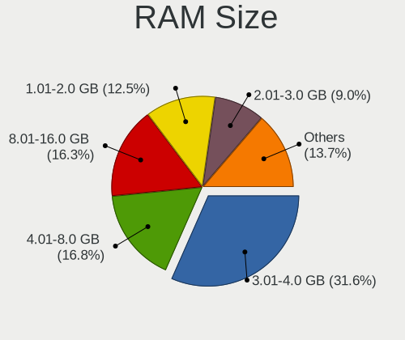
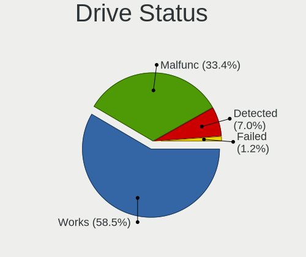
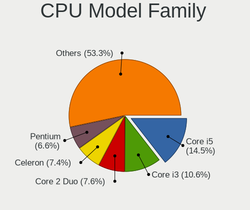
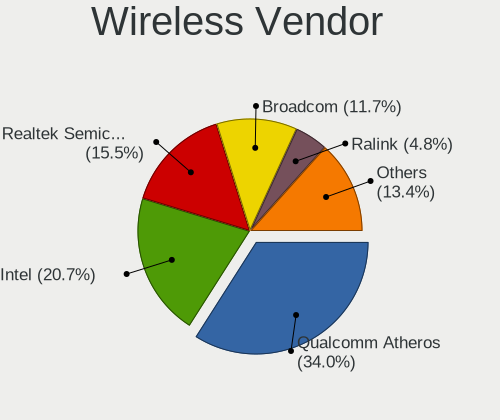
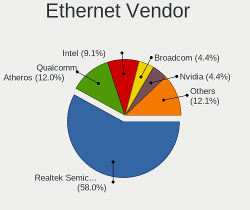
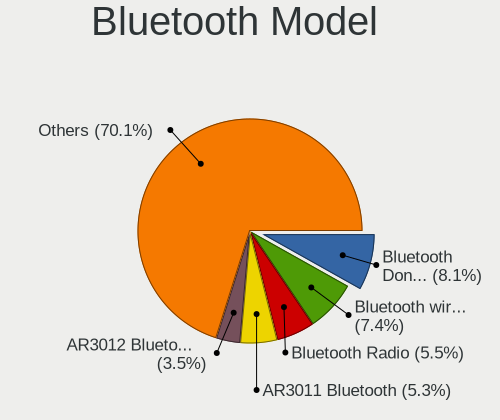
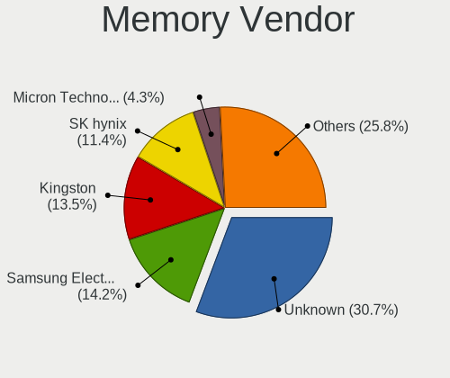

ROSA - Tested Hardware & Statistics
-----------------------------------

A project to collect tested hardware configurations for ROSA.

Anyone can contribute to this report by the [hw-probe](https://github.com/linuxhw/hw-probe) tool:

    sudo -E hw-probe -all -upload

Please contribute! Especially if your hardware is rare.

This is a report for all computer types. See also reports for [desktops](/Dist/ROSA/Desktop/README.md) and [notebooks](/Dist/ROSA/Notebook/README.md).

Contents
--------

* [ Test Cases ](#test-cases)

* [ System ](#system)
  - [ OS                       ](#os)
  - [ OS Family                ](#os-family)
  - [ Kernel                   ](#kernel)
  - [ Kernel Family            ](#kernel-family)
  - [ Kernel Major Ver.        ](#kernel-major-ver)
  - [ Arch                     ](#arch)
  - [ DE                       ](#de)
  - [ Display Server           ](#display-server)
  - [ Display Manager          ](#display-manager)
  - [ OS Lang                  ](#os-lang)
  - [ Boot Mode                ](#boot-mode)
  - [ Filesystem               ](#filesystem)
  - [ Part. scheme             ](#part-scheme)
  - [ Dual Boot with Linux/BSD ](#dual-boot-with-linuxbsd)
  - [ Dual Boot (Win)          ](#dual-boot-win)

* [ Board ](#board)
  - [ Vendor                   ](#vendor)
  - [ Model                    ](#model)
  - [ Model Family             ](#model-family)
  - [ MFG Year                 ](#mfg-year)
  - [ Form Factor              ](#form-factor)
  - [ Secure Boot              ](#secure-boot)
  - [ Coreboot                 ](#coreboot)
  - [ RAM Size                 ](#ram-size)
  - [ RAM Used                 ](#ram-used)
  - [ Total Drives             ](#total-drives)
  - [ Has CD-ROM               ](#has-cd-rom)
  - [ Has Ethernet             ](#has-ethernet)
  - [ Has WiFi                 ](#has-wifi)
  - [ Has Bluetooth            ](#has-bluetooth)

* [ Location ](#location)
  - [ Country                  ](#country)
  - [ City                     ](#city)

* [ Drives ](#drives)
  - [ Drive Vendor             ](#drive-vendor)
  - [ Drive Model              ](#drive-model)
  - [ HDD Vendor               ](#hdd-vendor)
  - [ SSD Vendor               ](#ssd-vendor)
  - [ Drive Kind               ](#drive-kind)
  - [ Drive Connector          ](#drive-connector)
  - [ Drive Size               ](#drive-size)
  - [ Space Total              ](#space-total)
  - [ Space Used               ](#space-used)
  - [ Malfunc. Drives          ](#malfunc-drives)
  - [ Malfunc. Drive Vendor    ](#malfunc-drive-vendor)
  - [ Malfunc. HDD Vendor      ](#malfunc-hdd-vendor)
  - [ Malfunc. Drive Kind      ](#malfunc-drive-kind)
  - [ Failed Drives            ](#failed-drives)
  - [ Failed Drive Vendor      ](#failed-drive-vendor)
  - [ Drive Status             ](#drive-status)

* [ Storage controller ](#storage-controller)
  - [ Storage Vendor           ](#storage-vendor)
  - [ Storage Model            ](#storage-model)
  - [ Storage Kind             ](#storage-kind)

* [ Processor ](#processor)
  - [ CPU Vendor               ](#cpu-vendor)
  - [ CPU Model                ](#cpu-model)
  - [ CPU Model Family         ](#cpu-model-family)
  - [ CPU Cores                ](#cpu-cores)
  - [ CPU Sockets              ](#cpu-sockets)
  - [ CPU Threads              ](#cpu-threads)
  - [ CPU Op-Modes             ](#cpu-op-modes)
  - [ CPU Microcode            ](#cpu-microcode)
  - [ CPU Microarch            ](#cpu-microarch)

* [ Graphics ](#graphics)
  - [ GPU Vendor               ](#gpu-vendor)
  - [ GPU Model                ](#gpu-model)
  - [ GPU Combo                ](#gpu-combo)
  - [ GPU Driver               ](#gpu-driver)
  - [ GPU Memory               ](#gpu-memory)

* [ Monitor ](#monitor)
  - [ Monitor Vendor           ](#monitor-vendor)
  - [ Monitor Model            ](#monitor-model)
  - [ Monitor Resolution       ](#monitor-resolution)
  - [ Monitor Diagonal         ](#monitor-diagonal)
  - [ Monitor Width            ](#monitor-width)
  - [ Aspect Ratio             ](#aspect-ratio)
  - [ Monitor Area             ](#monitor-area)
  - [ Pixel Density            ](#pixel-density)
  - [ Multiple Monitors        ](#multiple-monitors)

* [ Network ](#network)
  - [ Net Controller Vendor    ](#net-controller-vendor)
  - [ Net Controller Model     ](#net-controller-model)
  - [ Wireless Vendor          ](#wireless-vendor)
  - [ Wireless Model           ](#wireless-model)
  - [ Ethernet Vendor          ](#ethernet-vendor)
  - [ Ethernet Model           ](#ethernet-model)
  - [ Net Controller Kind      ](#net-controller-kind)
  - [ Used Controller          ](#used-controller)
  - [ NICs                     ](#nics)
  - [ IPv6                     ](#ipv6)

* [ Bluetooth ](#bluetooth)
  - [ Bluetooth Vendor         ](#bluetooth-vendor)
  - [ Bluetooth Model          ](#bluetooth-model)

* [ Sound ](#sound)
  - [ Sound Vendor             ](#sound-vendor)
  - [ Sound Model              ](#sound-model)

* [ Memory ](#memory)
  - [ Memory Vendor            ](#memory-vendor)
  - [ Memory Model             ](#memory-model)
  - [ Memory Kind              ](#memory-kind)
  - [ Memory Form Factor       ](#memory-form-factor)
  - [ Memory Size              ](#memory-size)
  - [ Memory Speed             ](#memory-speed)

* [ Printers & scanners ](#printers--scanners)
  - [ Printer Vendor           ](#printer-vendor)
  - [ Printer Model            ](#printer-model)
  - [ Scanner Vendor           ](#scanner-vendor)
  - [ Scanner Model            ](#scanner-model)

* [ Camera ](#camera)
  - [ Camera Vendor            ](#camera-vendor)
  - [ Camera Model             ](#camera-model)

* [ Security ](#security)
  - [ Fingerprint Vendor       ](#fingerprint-vendor)
  - [ Fingerprint Model        ](#fingerprint-model)
  - [ Chipcard Vendor          ](#chipcard-vendor)
  - [ Chipcard Model           ](#chipcard-model)

* [ Unsupported ](#unsupported)
  - [ Unsupported Devices      ](#unsupported-devices)
  - [ Unsupported Device Types ](#unsupported-device-types)

Test Cases
----------

Total: 39662

| Vendor        | Model                       | Form-Factor | Probe                                                      | Date         |
|---------------|-----------------------------|-------------|------------------------------------------------------------|--------------|
| ASRock        | 990FX Extreme3              | Desktop     | [1e75cefa31](https://linux-hardware.org/?probe=1e75cefa31) | Sep 01, 2022 |
| Lenovo        | B570e HuronRiver Platfor... | Notebook    | [23e052db95](https://linux-hardware.org/?probe=23e052db95) | Sep 01, 2022 |
| ASUSTek       | P8Z77-V LE PLUS             | Desktop     | [0f7d76d65c](https://linux-hardware.org/?probe=0f7d76d65c) | Sep 01, 2022 |
| Gigabyte      | P55-US3L                    | Desktop     | [93e1829d36](https://linux-hardware.org/?probe=93e1829d36) | Sep 01, 2022 |
| Gigabyte      | GA-E6010N                   | Desktop     | [8daf2205a5](https://linux-hardware.org/?probe=8daf2205a5) | Sep 01, 2022 |
| ASUSTek       | PRIME B350M-K               | Desktop     | [ae0450c52a](https://linux-hardware.org/?probe=ae0450c52a) | Sep 01, 2022 |
| Notebook      | W65_67SB                    | Notebook    | [38393a5559](https://linux-hardware.org/?probe=38393a5559) | Sep 01, 2022 |
| ASUSTek       | PRIME H310M-R R2.0          | Desktop     | [c1ba9218de](https://linux-hardware.org/?probe=c1ba9218de) | Sep 01, 2022 |
| Gigabyte      | 970A-DS3P                   | Desktop     | [1bc16dc2be](https://linux-hardware.org/?probe=1bc16dc2be) | Sep 01, 2022 |
| ASRock        | A320M-DVS R4.0              | Desktop     | [c3ca58ba40](https://linux-hardware.org/?probe=c3ca58ba40) | Sep 01, 2022 |
| Lenovo        | IdeaPad 330-15AST 81D6      | Notebook    | [972c4cb608](https://linux-hardware.org/?probe=972c4cb608) | Sep 01, 2022 |
| ASUSTek       | VivoBook 15_ASUS Laptop ... | Notebook    | [57d535de2e](https://linux-hardware.org/?probe=57d535de2e) | Sep 01, 2022 |
| Lenovo        | IdeaPad 320-15IAP 80XR      | Notebook    | [6aba706c0c](https://linux-hardware.org/?probe=6aba706c0c) | Aug 31, 2022 |
| Lenovo        | G710 20252                  | Notebook    | [37b1f6e81c](https://linux-hardware.org/?probe=37b1f6e81c) | Aug 31, 2022 |
| ASUSTek       | P8H61-MX                    | Desktop     | [52e7588080](https://linux-hardware.org/?probe=52e7588080) | Aug 31, 2022 |
| ASUSTek       | K46CM                       | Notebook    | [742d7047ea](https://linux-hardware.org/?probe=742d7047ea) | Aug 31, 2022 |
| Intel         | X99                         | Desktop     | [8f4cdd5290](https://linux-hardware.org/?probe=8f4cdd5290) | Aug 31, 2022 |
| Gigabyte      | H55M-UD2H                   | Desktop     | [1a72b89675](https://linux-hardware.org/?probe=1a72b89675) | Aug 31, 2022 |
| Gigabyte      | B75M-D3H                    | Desktop     | [0146e0f5c8](https://linux-hardware.org/?probe=0146e0f5c8) | Aug 31, 2022 |
| ASUSTek       | M2A-VM HDMI                 | Desktop     | [9d9462f5a9](https://linux-hardware.org/?probe=9d9462f5a9) | Aug 31, 2022 |
| Lenovo        | IdeaPad 330-15AST 81D6      | Notebook    | [f3877acbd2](https://linux-hardware.org/?probe=f3877acbd2) | Aug 31, 2022 |
| ASUSTek       | VivoBook 15_ASUS Laptop ... | Notebook    | [9da97f5dea](https://linux-hardware.org/?probe=9da97f5dea) | Aug 30, 2022 |
| Lenovo        | ThinkPad Helix 2nd 20CHS... | Tablet      | [d2d55164f0](https://linux-hardware.org/?probe=d2d55164f0) | Aug 30, 2022 |
| ASUSTek       | TUF Gaming X570-PLUS        | Desktop     | [858b04d480](https://linux-hardware.org/?probe=858b04d480) | Aug 30, 2022 |
| ASRock        | B550M-HDV                   | Desktop     | [61f310f2a2](https://linux-hardware.org/?probe=61f310f2a2) | Aug 30, 2022 |
| iRU           | J231                        | All in one  | [7a81465010](https://linux-hardware.org/?probe=7a81465010) | Aug 30, 2022 |
| Lenovo        | Y520-15IKBN 80WK            | Notebook    | [8036c3df64](https://linux-hardware.org/?probe=8036c3df64) | Aug 30, 2022 |
| Gigabyte      | B550M S2H                   | Desktop     | [73a8574652](https://linux-hardware.org/?probe=73a8574652) | Aug 30, 2022 |
| ASUSTek       | P5G41-M LX                  | Desktop     | [ecf64e8d47](https://linux-hardware.org/?probe=ecf64e8d47) | Aug 30, 2022 |
| ASUSTek       | P5G41-M LX                  | Desktop     | [b7e2198026](https://linux-hardware.org/?probe=b7e2198026) | Aug 30, 2022 |
| ASUSTek       | PRIME H310M-R R2.0          | Desktop     | [9d3e935355](https://linux-hardware.org/?probe=9d3e935355) | Aug 30, 2022 |
| Dell          | G3 3579                     | Notebook    | [fd78a1cf65](https://linux-hardware.org/?probe=fd78a1cf65) | Aug 30, 2022 |
| Packard Be... | EasyNote LM85               | Notebook    | [4294f9bdaf](https://linux-hardware.org/?probe=4294f9bdaf) | Aug 30, 2022 |
| Unknown       | Unknown                     | Desktop     | [3f51be2653](https://linux-hardware.org/?probe=3f51be2653) | Aug 30, 2022 |
| Lenovo        | IdeaPad 330-15IKB 81DE      | Notebook    | [339b12ba13](https://linux-hardware.org/?probe=339b12ba13) | Aug 30, 2022 |
| Lenovo        | IdeaPad 330-15AST 81D6      | Notebook    | [3236ef3b00](https://linux-hardware.org/?probe=3236ef3b00) | Aug 30, 2022 |
| Acer          | Aspire V3-731               | Notebook    | [19d7285e0f](https://linux-hardware.org/?probe=19d7285e0f) | Aug 30, 2022 |
| Google        | Rammus                      | Notebook    | [cd31fc11aa](https://linux-hardware.org/?probe=cd31fc11aa) | Aug 29, 2022 |
| Intel         | D525MWV AAE93081-401        | Desktop     | [985d906899](https://linux-hardware.org/?probe=985d906899) | Aug 29, 2022 |
| HP            | Pavilion g6                 | Notebook    | [d127560ff3](https://linux-hardware.org/?probe=d127560ff3) | Aug 29, 2022 |
| Positivo B... | VJFE52F11X-B0611H           | Notebook    | [eedd8fa1eb](https://linux-hardware.org/?probe=eedd8fa1eb) | Aug 29, 2022 |
| Gigabyte      | B450 AORUS ELITE            | Desktop     | [a37d7cae28](https://linux-hardware.org/?probe=a37d7cae28) | Aug 29, 2022 |
| Gigabyte      | B550M S2H                   | Desktop     | [ac1d1ffdba](https://linux-hardware.org/?probe=ac1d1ffdba) | Aug 29, 2022 |
| ASUSTek       | X550LC                      | Notebook    | [3507f6f2ba](https://linux-hardware.org/?probe=3507f6f2ba) | Aug 29, 2022 |
| Dell          | Vostro 1014                 | Notebook    | [bf43d87a11](https://linux-hardware.org/?probe=bf43d87a11) | Aug 29, 2022 |
| HP            | Notebook                    | Notebook    | [e00cfcb387](https://linux-hardware.org/?probe=e00cfcb387) | Aug 29, 2022 |
| ASUSTek       | VivoBook_ASUSLaptop X350... | Notebook    | [bddbedffed](https://linux-hardware.org/?probe=bddbedffed) | Aug 29, 2022 |
| Gigabyte      | F2A88XM-D3H                 | Desktop     | [3b245a809d](https://linux-hardware.org/?probe=3b245a809d) | Aug 28, 2022 |
| Gigabyte      | F2A88XM-D3H                 | Desktop     | [dcb225651d](https://linux-hardware.org/?probe=dcb225651d) | Aug 28, 2022 |
| MSI           | B560M-A PRO                 | Desktop     | [a550031b1d](https://linux-hardware.org/?probe=a550031b1d) | Aug 28, 2022 |
| ASUSTek       | F3E                         | Notebook    | [1314dc63b6](https://linux-hardware.org/?probe=1314dc63b6) | Aug 28, 2022 |
| Gigabyte      | Z170-HD3P-CF                | Desktop     | [3ca98fc058](https://linux-hardware.org/?probe=3ca98fc058) | Aug 28, 2022 |
| ASRock        | 990FX Extreme3              | Desktop     | [ec517dabad](https://linux-hardware.org/?probe=ec517dabad) | Aug 28, 2022 |
| Samsung       | R580/R590                   | Notebook    | [cb30537ee4](https://linux-hardware.org/?probe=cb30537ee4) | Aug 28, 2022 |
| Acer          | Nitro AN515-42              | Notebook    | [a82d7c03b0](https://linux-hardware.org/?probe=a82d7c03b0) | Aug 28, 2022 |
| Lenovo        | Legion 5 Pro 16ACH6H 82J... | Notebook    | [6cd83991d9](https://linux-hardware.org/?probe=6cd83991d9) | Aug 28, 2022 |
| ASUSTek       | P7P55D                      | Desktop     | [4476755d78](https://linux-hardware.org/?probe=4476755d78) | Aug 28, 2022 |
| HP            | Pavilion g6                 | Notebook    | [709d3e19e8](https://linux-hardware.org/?probe=709d3e19e8) | Aug 28, 2022 |
| KupiDesheg... | Intel X79 lga 2011          | Desktop     | [92f097526f](https://linux-hardware.org/?probe=92f097526f) | Aug 28, 2022 |
| Acer          | Aspire E5-573G              | Notebook    | [70ea653c9c](https://linux-hardware.org/?probe=70ea653c9c) | Aug 28, 2022 |
| HP            | Laptop 15-bw0xx             | Notebook    | [90fa9c15ec](https://linux-hardware.org/?probe=90fa9c15ec) | Aug 27, 2022 |
| Dell          | 0RY007                      | Desktop     | [8ff65ac056](https://linux-hardware.org/?probe=8ff65ac056) | Aug 27, 2022 |
| ASUSTek       | PRIME A320M-A               | Desktop     | [517c813c17](https://linux-hardware.org/?probe=517c813c17) | Aug 27, 2022 |
| Gigabyte      | GA-E6010N                   | Desktop     | [5a180519a2](https://linux-hardware.org/?probe=5a180519a2) | Aug 27, 2022 |
| Acer          | Aspire V3-571G              | Notebook    | [e584bee2db](https://linux-hardware.org/?probe=e584bee2db) | Aug 27, 2022 |
| Lenovo        | V14-ADA 82C6                | Notebook    | [46741f4613](https://linux-hardware.org/?probe=46741f4613) | Aug 27, 2022 |
| Lenovo        | IdeaPad 330-15IGM 81D1      | Notebook    | [029246a642](https://linux-hardware.org/?probe=029246a642) | Aug 27, 2022 |
| Gigabyte      | H77N-WIFI                   | Desktop     | [458442867e](https://linux-hardware.org/?probe=458442867e) | Aug 27, 2022 |
| ASUSTek       | F1A75-M-PRO R2.0            | Desktop     | [e7e057dd6d](https://linux-hardware.org/?probe=e7e057dd6d) | Aug 27, 2022 |
| ASUSTek       | M5A97 EVO R2.0              | Desktop     | [0d6eddc581](https://linux-hardware.org/?probe=0d6eddc581) | Aug 27, 2022 |
| ASRock        | N68-GS4 FX                  | Desktop     | [cec8fd2c2a](https://linux-hardware.org/?probe=cec8fd2c2a) | Aug 27, 2022 |
| ASUSTek       | M5A78L-M PLUS/USB3          | Desktop     | [d745245f37](https://linux-hardware.org/?probe=d745245f37) | Aug 27, 2022 |
| ASUSTek       | VivoBook_ASUSLaptop X515... | Notebook    | [2267f01dee](https://linux-hardware.org/?probe=2267f01dee) | Aug 27, 2022 |
| Acer          | Nitro AN515-42              | Notebook    | [063eca4290](https://linux-hardware.org/?probe=063eca4290) | Aug 26, 2022 |
| Intel         | X99                         | Desktop     | [4acddafcc3](https://linux-hardware.org/?probe=4acddafcc3) | Aug 26, 2022 |
| ASUSTek       | P5KPL-AM IN/ROEM/SI         | Desktop     | [8ca59c4893](https://linux-hardware.org/?probe=8ca59c4893) | Aug 26, 2022 |
| Acer          | Aspire 5570Z                | Notebook    | [38fe74cbe3](https://linux-hardware.org/?probe=38fe74cbe3) | Aug 26, 2022 |
| Acer          | Nitro AN517-52              | Notebook    | [8732c0caef](https://linux-hardware.org/?probe=8732c0caef) | Aug 26, 2022 |
| ASUSTek       | K52Dr                       | Notebook    | [aa74e72258](https://linux-hardware.org/?probe=aa74e72258) | Aug 26, 2022 |
| Gigabyte      | B450 AORUS ELITE            | Desktop     | [bb51a9a03b](https://linux-hardware.org/?probe=bb51a9a03b) | Aug 26, 2022 |
| Lenovo        | IdeaPad 330-15IKB 81DE      | Notebook    | [619be9ede9](https://linux-hardware.org/?probe=619be9ede9) | Aug 26, 2022 |
| Positivo B... | VJFE52F11X-B0611H           | Notebook    | [635925265e](https://linux-hardware.org/?probe=635925265e) | Aug 25, 2022 |
| Gigabyte      | Z170X-Gaming 3              | Desktop     | [d1ca2bc878](https://linux-hardware.org/?probe=d1ca2bc878) | Aug 25, 2022 |
| Unknown       | Unknown                     | Notebook    | [b9616ab32f](https://linux-hardware.org/?probe=b9616ab32f) | Aug 25, 2022 |
| Dell          | 0RY007                      | Desktop     | [8dece84856](https://linux-hardware.org/?probe=8dece84856) | Aug 25, 2022 |
| Acer          | AO533                       | Notebook    | [5150a8b326](https://linux-hardware.org/?probe=5150a8b326) | Aug 25, 2022 |
| HP            | Pavilion 17                 | Notebook    | [e252f6b16e](https://linux-hardware.org/?probe=e252f6b16e) | Aug 25, 2022 |
| Gigabyte      | Z170X-Gaming 3              | Desktop     | [8cb82a76c6](https://linux-hardware.org/?probe=8cb82a76c6) | Aug 25, 2022 |
| Gigabyte      | Z170X-Gaming 3              | Desktop     | [faf428d3aa](https://linux-hardware.org/?probe=faf428d3aa) | Aug 25, 2022 |
| 3Logic Gro... | APM Graviton                | Notebook    | [03fd96a27c](https://linux-hardware.org/?probe=03fd96a27c) | Aug 24, 2022 |
| HP            | Compaq 610                  | Notebook    | [538b6ae6f8](https://linux-hardware.org/?probe=538b6ae6f8) | Aug 24, 2022 |
| HP            | Pavilion g6                 | Notebook    | [4c027aa104](https://linux-hardware.org/?probe=4c027aa104) | Aug 24, 2022 |
| ASUSTek       | PRIME H310M-E R2.0          | Desktop     | [bc06f151fa](https://linux-hardware.org/?probe=bc06f151fa) | Aug 24, 2022 |
| Samsung       | NC210/NC110                 | Notebook    | [8063d3ecff](https://linux-hardware.org/?probe=8063d3ecff) | Aug 24, 2022 |
| Lenovo        | IdeaPad Gaming 3 15IMH05... | Notebook    | [37c239f9d1](https://linux-hardware.org/?probe=37c239f9d1) | Aug 24, 2022 |
| HP            | Pavilion g6                 | Notebook    | [96672b6762](https://linux-hardware.org/?probe=96672b6762) | Aug 24, 2022 |
| HP            | Laptop 15s-fq2xxx           | Notebook    | [3c37e04cf3](https://linux-hardware.org/?probe=3c37e04cf3) | Aug 24, 2022 |
| HUAWEI        | KLVD-WXX9                   | Notebook    | [b5dea99797](https://linux-hardware.org/?probe=b5dea99797) | Aug 24, 2022 |
| HP            | Compaq Presario CQ50        | Notebook    | [ca5e35f5fd](https://linux-hardware.org/?probe=ca5e35f5fd) | Aug 24, 2022 |
| ASUSTek       | Z170-A                      | Desktop     | [d3c0ea0334](https://linux-hardware.org/?probe=d3c0ea0334) | Aug 23, 2022 |
| ASUSTek       | Z170-A                      | Desktop     | [257425efde](https://linux-hardware.org/?probe=257425efde) | Aug 23, 2022 |
| ASUSTek       | P8B75-M LX PLUS             | Desktop     | [9f66ff50d5](https://linux-hardware.org/?probe=9f66ff50d5) | Aug 23, 2022 |
| MSI           | Z390-A PRO                  | Desktop     | [f48d5a0a1c](https://linux-hardware.org/?probe=f48d5a0a1c) | Aug 23, 2022 |
| Lenovo        | Legion Y740-17IRHg 81UJ     | Notebook    | [b8859a4f21](https://linux-hardware.org/?probe=b8859a4f21) | Aug 23, 2022 |
| Lenovo        | Legion Y740-17IRHg 81UJ     | Notebook    | [ce734a061a](https://linux-hardware.org/?probe=ce734a061a) | Aug 23, 2022 |
| Dell          | 0T1D10 A01                  | Desktop     | [c67ce079c7](https://linux-hardware.org/?probe=c67ce079c7) | Aug 23, 2022 |
| ASUSTek       | TUF X470-PLUS GAMING        | Desktop     | [ef940d86f4](https://linux-hardware.org/?probe=ef940d86f4) | Aug 23, 2022 |
| Gigabyte      | Z170-HD3P-CF                | Desktop     | [5a6911f8d2](https://linux-hardware.org/?probe=5a6911f8d2) | Aug 23, 2022 |
| Soyo          | SY-Classic B660M            | Desktop     | [7a2731c6bb](https://linux-hardware.org/?probe=7a2731c6bb) | Aug 23, 2022 |
| Soyo          | SY-Classic B660M            | Desktop     | [dcb41473bd](https://linux-hardware.org/?probe=dcb41473bd) | Aug 23, 2022 |
| ASUSTek       | P5QPL-AM                    | Desktop     | [1fdb1ad301](https://linux-hardware.org/?probe=1fdb1ad301) | Aug 23, 2022 |
| ASRock        | N68-GS4 FX                  | Desktop     | [026abd6a11](https://linux-hardware.org/?probe=026abd6a11) | Aug 23, 2022 |
| Gigabyte      | A320M-H-CF                  | Desktop     | [70d138aa2e](https://linux-hardware.org/?probe=70d138aa2e) | Aug 23, 2022 |
| Gigabyte      | F2A88XM-DS2                 | Desktop     | [6c91036286](https://linux-hardware.org/?probe=6c91036286) | Aug 22, 2022 |
| ASUSTek       | P9X79                       | Desktop     | [e279591136](https://linux-hardware.org/?probe=e279591136) | Aug 22, 2022 |
| ASUSTek       | PRIME H310M-E R2.0          | Desktop     | [37af41aa76](https://linux-hardware.org/?probe=37af41aa76) | Aug 22, 2022 |
| Gigabyte      | 970A-DS3                    | Desktop     | [ae71518dcf](https://linux-hardware.org/?probe=ae71518dcf) | Aug 22, 2022 |
| Unknown       | Unknown                     | Notebook    | [40c763302e](https://linux-hardware.org/?probe=40c763302e) | Aug 22, 2022 |
| MSI           | MAG B550M MORTAR            | Desktop     | [441eb14634](https://linux-hardware.org/?probe=441eb14634) | Aug 21, 2022 |
| ASUSTek       | K55DR                       | Notebook    | [3620d3d416](https://linux-hardware.org/?probe=3620d3d416) | Aug 21, 2022 |
| Huanan        | X99 F8D V2.2                | Desktop     | [d12525038d](https://linux-hardware.org/?probe=d12525038d) | Aug 21, 2022 |
| Lenovo        | IdeaPad Gaming 3 15IMH05... | Notebook    | [0d73b91195](https://linux-hardware.org/?probe=0d73b91195) | Aug 21, 2022 |
| HP            | 304Bh                       | Desktop     | [1e3d59e493](https://linux-hardware.org/?probe=1e3d59e493) | Aug 21, 2022 |
| Gigabyte      | G41MT-S2P                   | Desktop     | [6d96e92f0d](https://linux-hardware.org/?probe=6d96e92f0d) | Aug 21, 2022 |
| Gigabyte      | G41MT-S2P                   | Desktop     | [e47aa0a7b1](https://linux-hardware.org/?probe=e47aa0a7b1) | Aug 21, 2022 |
| HP            | Pavilion g6                 | Notebook    | [7e345d980f](https://linux-hardware.org/?probe=7e345d980f) | Aug 21, 2022 |
| Samsung       | 700Z3A/700Z4A/700Z5A/700... | Notebook    | [8756581baa](https://linux-hardware.org/?probe=8756581baa) | Aug 21, 2022 |
| Foxconn       | G31MX Series                | Desktop     | [a68130c719](https://linux-hardware.org/?probe=a68130c719) | Aug 21, 2022 |
| Acer          | Aspire E1-572G              | Notebook    | [d3d75b83d2](https://linux-hardware.org/?probe=d3d75b83d2) | Aug 21, 2022 |
| HP            | Pavilion m6                 | Notebook    | [54fcf9b1b4](https://linux-hardware.org/?probe=54fcf9b1b4) | Aug 21, 2022 |
| Lenovo        | Z710 20250                  | Notebook    | [8c7e567f41](https://linux-hardware.org/?probe=8c7e567f41) | Aug 21, 2022 |
| ASUSTek       | PRIME H510M-K               | Desktop     | [d52c203fc9](https://linux-hardware.org/?probe=d52c203fc9) | Aug 21, 2022 |
| ECS           | B75H2-M3                    | Desktop     | [c42410be8b](https://linux-hardware.org/?probe=c42410be8b) | Aug 21, 2022 |
| Lenovo        | IdeaPad 320-15IKB 80XL      | Notebook    | [8ab10bdcff](https://linux-hardware.org/?probe=8ab10bdcff) | Aug 21, 2022 |
| ASUSTek       | VM45                        | Desktop     | [7d7b99c7f4](https://linux-hardware.org/?probe=7d7b99c7f4) | Aug 21, 2022 |
| HP            | 255 G7 Notebook PC          | Notebook    | [c001653a5a](https://linux-hardware.org/?probe=c001653a5a) | Aug 20, 2022 |
| Acer          | Aspire A315-23              | Notebook    | [cedbeec8c7](https://linux-hardware.org/?probe=cedbeec8c7) | Aug 20, 2022 |
| ASUSTek       | A88XM-A                     | Desktop     | [f8900d8840](https://linux-hardware.org/?probe=f8900d8840) | Aug 20, 2022 |
| Gigabyte      | H61M-S1                     | Desktop     | [a558a229d2](https://linux-hardware.org/?probe=a558a229d2) | Aug 20, 2022 |
| MSI           | MPG X570 GAMING PRO CARB... | Desktop     | [8b871bcdc8](https://linux-hardware.org/?probe=8b871bcdc8) | Aug 20, 2022 |
| Gigabyte      | Z170-D3H-CF                 | Desktop     | [8b3ca4e7d1](https://linux-hardware.org/?probe=8b3ca4e7d1) | Aug 19, 2022 |
| Lenovo        | IdeaPad Gaming 3 15IMH05... | Notebook    | [0008792e11](https://linux-hardware.org/?probe=0008792e11) | Aug 19, 2022 |
| MSI           | Z390-A PRO                  | Desktop     | [4bb68951b6](https://linux-hardware.org/?probe=4bb68951b6) | Aug 19, 2022 |
| Dell          | 0TVR1F A01                  | Desktop     | [1b8906bb20](https://linux-hardware.org/?probe=1b8906bb20) | Aug 19, 2022 |
| Haier         | GG1560XT                    | Notebook    | [6498de51c5](https://linux-hardware.org/?probe=6498de51c5) | Aug 19, 2022 |
| Haier         | GG1560XT                    | Notebook    | [1918cb9aa0](https://linux-hardware.org/?probe=1918cb9aa0) | Aug 19, 2022 |
| Gigabyte      | Z590 UD AC                  | Desktop     | [2709dfd2c3](https://linux-hardware.org/?probe=2709dfd2c3) | Aug 19, 2022 |
| Gigabyte      | Q87M-D2H                    | Desktop     | [8c56960243](https://linux-hardware.org/?probe=8c56960243) | Aug 19, 2022 |
| ASUSTek       | PRIME B460M-K               | Desktop     | [f5f3761418](https://linux-hardware.org/?probe=f5f3761418) | Aug 19, 2022 |
| ASUSTek       | VivoBook_ASUSLaptop M350... | Notebook    | [8fd948229f](https://linux-hardware.org/?probe=8fd948229f) | Aug 19, 2022 |
| Acer          | Nitro AN517-52              | Notebook    | [8a1b401faa](https://linux-hardware.org/?probe=8a1b401faa) | Aug 19, 2022 |
| ASUSTek       | M4A77TD PRO                 | Desktop     | [a93d70f67b](https://linux-hardware.org/?probe=a93d70f67b) | Aug 19, 2022 |
| Chuwi         | UBook X                     | Tablet      | [088a315adf](https://linux-hardware.org/?probe=088a315adf) | Aug 19, 2022 |
| Samsung       | RV411/RV511/E3511/S3511/... | Notebook    | [b1602685e4](https://linux-hardware.org/?probe=b1602685e4) | Aug 19, 2022 |
| eMachines     | E525                        | Notebook    | [90d5ce71fa](https://linux-hardware.org/?probe=90d5ce71fa) | Aug 19, 2022 |
| Acer          | TravelMate B118-M           | Notebook    | [e35887bbe0](https://linux-hardware.org/?probe=e35887bbe0) | Aug 18, 2022 |
| Gigabyte      | H310M H x.x                 | Desktop     | [67f253af6e](https://linux-hardware.org/?probe=67f253af6e) | Aug 18, 2022 |
| ASUSTek       | SABERTOOTH 990FX R2.0       | Desktop     | [334844dd8c](https://linux-hardware.org/?probe=334844dd8c) | Aug 18, 2022 |
| HP            | Compaq 610                  | Notebook    | [2b90520f8f](https://linux-hardware.org/?probe=2b90520f8f) | Aug 18, 2022 |
| Lenovo        | ACLUAB                      | Notebook    | [3dcd5fa41c](https://linux-hardware.org/?probe=3dcd5fa41c) | Aug 18, 2022 |
| ASUSTek       | X551MA                      | Notebook    | [7baf2d8841](https://linux-hardware.org/?probe=7baf2d8841) | Aug 18, 2022 |
| Gigabyte      | F2A88XM-D3H                 | Desktop     | [3d5404aaff](https://linux-hardware.org/?probe=3d5404aaff) | Aug 18, 2022 |
| MSI           | MS-AA721 100                | All in one  | [97971415be](https://linux-hardware.org/?probe=97971415be) | Aug 18, 2022 |
| MSI           | MS-AA721 100                | All in one  | [596afef47d](https://linux-hardware.org/?probe=596afef47d) | Aug 18, 2022 |
| Lenovo        | B590 20206                  | Notebook    | [d2d8a01f80](https://linux-hardware.org/?probe=d2d8a01f80) | Aug 18, 2022 |
| HP            | ProBook 440 G4              | Notebook    | [7bdaf1eeed](https://linux-hardware.org/?probe=7bdaf1eeed) | Aug 18, 2022 |
| HUAWEI        | NBD-WXX9                    | Notebook    | [fa32705b39](https://linux-hardware.org/?probe=fa32705b39) | Aug 18, 2022 |
| ASRock        | 960GM-GS3 FX                | Desktop     | [ea73b0ba84](https://linux-hardware.org/?probe=ea73b0ba84) | Aug 17, 2022 |
| Lenovo        | IdeaPad 320-15IAP 80XR      | Notebook    | [7e5604ed7a](https://linux-hardware.org/?probe=7e5604ed7a) | Aug 17, 2022 |
| Acer          | Aspire TC-705               | Desktop     | [22d9229d27](https://linux-hardware.org/?probe=22d9229d27) | Aug 17, 2022 |
| Lenovo        | ThinkPad T440p 20AWS0VB0... | Notebook    | [0c8e0377e6](https://linux-hardware.org/?probe=0c8e0377e6) | Aug 17, 2022 |
| Apple         | MacBookAir7,2               | Notebook    | [1bbad39284](https://linux-hardware.org/?probe=1bbad39284) | Aug 17, 2022 |
| Lenovo        | G505 20240                  | Notebook    | [fa8889478b](https://linux-hardware.org/?probe=fa8889478b) | Aug 17, 2022 |
| ASUSTek       | VivoBook 15_ASUS Laptop ... | Notebook    | [3f685da542](https://linux-hardware.org/?probe=3f685da542) | Aug 17, 2022 |
| ASUSTek       | STRIX X99 GAMING            | Desktop     | [49872997f2](https://linux-hardware.org/?probe=49872997f2) | Aug 17, 2022 |
| ASRock        | FM2A75M-DGS R2.0            | Desktop     | [f6ff5fc2bf](https://linux-hardware.org/?probe=f6ff5fc2bf) | Aug 17, 2022 |
| Lenovo        | Legion 5 15IMH05H 81Y6      | Notebook    | [5ddc6fd9fe](https://linux-hardware.org/?probe=5ddc6fd9fe) | Aug 16, 2022 |
| MSI           | 870-G45                     | Desktop     | [37a9139281](https://linux-hardware.org/?probe=37a9139281) | Aug 16, 2022 |
| Gigabyte      | 990XA-UD3                   | Desktop     | [6c1d243576](https://linux-hardware.org/?probe=6c1d243576) | Aug 16, 2022 |
| Acer          | AOD260                      | Notebook    | [f9256627d2](https://linux-hardware.org/?probe=f9256627d2) | Aug 16, 2022 |
| ASUSTek       | VivoBook_ASUSLaptop M350... | Notebook    | [8057f74fa1](https://linux-hardware.org/?probe=8057f74fa1) | Aug 16, 2022 |
| Pegatron      | A17                         | Notebook    | [18101d1b69](https://linux-hardware.org/?probe=18101d1b69) | Aug 16, 2022 |
| MSI           | Z170-A PRO                  | Desktop     | [c4a4ad3997](https://linux-hardware.org/?probe=c4a4ad3997) | Aug 16, 2022 |
| Pegatron      | A17                         | Notebook    | [a845e63b56](https://linux-hardware.org/?probe=a845e63b56) | Aug 16, 2022 |
| Sony          | VPCSB1V9R                   | Notebook    | [6c72559c96](https://linux-hardware.org/?probe=6c72559c96) | Aug 16, 2022 |
| Lenovo        | B570e HuronRiver Platfor... | Notebook    | [51cb006bb3](https://linux-hardware.org/?probe=51cb006bb3) | Aug 16, 2022 |
| ASRock        | 970 Pro3 R2.0               | Desktop     | [ca6f08767b](https://linux-hardware.org/?probe=ca6f08767b) | Aug 16, 2022 |
| Sony          | VPCSB1V9R                   | Notebook    | [6aee1e8e96](https://linux-hardware.org/?probe=6aee1e8e96) | Aug 15, 2022 |
| Acer          | AOD260                      | Notebook    | [ba32775bba](https://linux-hardware.org/?probe=ba32775bba) | Aug 15, 2022 |
| Gigabyte      | 965P-S3                     | Desktop     | [46a181ec76](https://linux-hardware.org/?probe=46a181ec76) | Aug 15, 2022 |
| Lenovo        | IdeaPad 320-15IKB 80XL      | Notebook    | [44af3a6839](https://linux-hardware.org/?probe=44af3a6839) | Aug 15, 2022 |
| ASUSTek       | M3A76-CM                    | Desktop     | [710f116ee9](https://linux-hardware.org/?probe=710f116ee9) | Aug 15, 2022 |
| Lenovo        | ThinkPad X220 4291B66       | Notebook    | [4e32cfa8bb](https://linux-hardware.org/?probe=4e32cfa8bb) | Aug 15, 2022 |
| MSI           | B450 TOMAHAWK MAX II        | Desktop     | [0b0efd02ad](https://linux-hardware.org/?probe=0b0efd02ad) | Aug 15, 2022 |
| Positivo B... | VJFE52F11X-B0611H           | Notebook    | [3a6b82f27f](https://linux-hardware.org/?probe=3a6b82f27f) | Aug 15, 2022 |
| Lenovo        | Legion 5 17IMH05H 81Y8      | Notebook    | [f2e01b5017](https://linux-hardware.org/?probe=f2e01b5017) | Aug 14, 2022 |
| Lenovo        | 3130 NOK                    | Mini pc     | [99e6ee2dec](https://linux-hardware.org/?probe=99e6ee2dec) | Aug 14, 2022 |
| Acer          | Nitro AN515-43              | Notebook    | [a7d615e104](https://linux-hardware.org/?probe=a7d615e104) | Aug 14, 2022 |
| HP            | 550                         | Notebook    | [620939b295](https://linux-hardware.org/?probe=620939b295) | Aug 14, 2022 |
| Dell          | Inspiron 3537               | Notebook    | [bcd6162709](https://linux-hardware.org/?probe=bcd6162709) | Aug 14, 2022 |
| ASUSTek       | Basswood                    | Desktop     | [26e4efad3f](https://linux-hardware.org/?probe=26e4efad3f) | Aug 14, 2022 |
| ASUSTek       | STRIX X99 GAMING            | Desktop     | [b326bf9edc](https://linux-hardware.org/?probe=b326bf9edc) | Aug 14, 2022 |
| ASUSTek       | 1215N                       | Notebook    | [40d99f3703](https://linux-hardware.org/?probe=40d99f3703) | Aug 14, 2022 |
| ASUSTek       | PRIME B250-PLUS             | Desktop     | [6dab67810d](https://linux-hardware.org/?probe=6dab67810d) | Aug 14, 2022 |
| ASUSTek       | X550DP                      | Notebook    | [ce42b65252](https://linux-hardware.org/?probe=ce42b65252) | Aug 13, 2022 |
| Gigabyte      | H87-D3H-CF                  | Desktop     | [a37d2f3c90](https://linux-hardware.org/?probe=a37d2f3c90) | Aug 13, 2022 |
| ASRock        | H110M-DGS R3.0              | Desktop     | [5ae618501c](https://linux-hardware.org/?probe=5ae618501c) | Aug 13, 2022 |
| Lenovo        | No DPK                      | All in one  | [35c8c75884](https://linux-hardware.org/?probe=35c8c75884) | Aug 13, 2022 |
| MSI           | B450M GAMING PLUS           | Desktop     | [ac47b6f330](https://linux-hardware.org/?probe=ac47b6f330) | Aug 13, 2022 |
| Dell          | Vostro 15 3515              | Notebook    | [442f64dba9](https://linux-hardware.org/?probe=442f64dba9) | Aug 13, 2022 |
| Lenovo        | IdeaPad Gaming 3 15ARH05... | Notebook    | [4602665059](https://linux-hardware.org/?probe=4602665059) | Aug 13, 2022 |
| ASUSTek       | SABERTOOTH 990FX R2.0       | Desktop     | [c00d2d23cb](https://linux-hardware.org/?probe=c00d2d23cb) | Aug 13, 2022 |
| Gigabyte      | X470 AORUS ULTRA GAMING-... | Desktop     | [f542f6836c](https://linux-hardware.org/?probe=f542f6836c) | Aug 13, 2022 |
| ASRock        | J5040-ITX                   | Desktop     | [acb79396fd](https://linux-hardware.org/?probe=acb79396fd) | Aug 13, 2022 |
| Dell          | Inspiron 7720               | Notebook    | [0435e973e0](https://linux-hardware.org/?probe=0435e973e0) | Aug 13, 2022 |
| Dell          | Precision M6600             | Notebook    | [7fcd14ca35](https://linux-hardware.org/?probe=7fcd14ca35) | Aug 13, 2022 |
| ASRock        | H61M-HVS                    | Desktop     | [12ad08259b](https://linux-hardware.org/?probe=12ad08259b) | Aug 12, 2022 |
| ASUSTek       | K501LB                      | Notebook    | [1e1745d32c](https://linux-hardware.org/?probe=1e1745d32c) | Aug 12, 2022 |
| ASUSTek       | K501LB                      | Notebook    | [a763c682f5](https://linux-hardware.org/?probe=a763c682f5) | Aug 12, 2022 |
| Acer          | Extensa 215-32              | Notebook    | [1a14e5a16b](https://linux-hardware.org/?probe=1a14e5a16b) | Aug 12, 2022 |
| Lenovo        | ThinkPad SL500 2746AA3      | Notebook    | [c4535a80a1](https://linux-hardware.org/?probe=c4535a80a1) | Aug 12, 2022 |
| ASUSTek       | K52Dr                       | Notebook    | [df4d29153d](https://linux-hardware.org/?probe=df4d29153d) | Aug 12, 2022 |
| ASUSTek       | P8Z77-V LK                  | Desktop     | [913f2b20a8](https://linux-hardware.org/?probe=913f2b20a8) | Aug 12, 2022 |
| HP            | 240 G8 Notebook PC          | Notebook    | [65080f426a](https://linux-hardware.org/?probe=65080f426a) | Aug 12, 2022 |
| Lenovo        | IdeaPad S340-14API 81NB     | Notebook    | [27e9575d4e](https://linux-hardware.org/?probe=27e9575d4e) | Aug 11, 2022 |
| Lenovo        | IdeaPad S340-14API 81NB     | Notebook    | [95349038bf](https://linux-hardware.org/?probe=95349038bf) | Aug 11, 2022 |
| ASUSTek       | F5N                         | Notebook    | [27348ad31d](https://linux-hardware.org/?probe=27348ad31d) | Aug 11, 2022 |
| Acer          | Unknown                     | Notebook    | [da56362a7e](https://linux-hardware.org/?probe=da56362a7e) | Aug 11, 2022 |
| MSI           | FX610                       | Notebook    | [60d49d467b](https://linux-hardware.org/?probe=60d49d467b) | Aug 11, 2022 |
| Dell          | Vostro 3460                 | Notebook    | [fbaf8208cb](https://linux-hardware.org/?probe=fbaf8208cb) | Aug 11, 2022 |
| eMachines     | eME728                      | Notebook    | [951d4614b6](https://linux-hardware.org/?probe=951d4614b6) | Aug 11, 2022 |
| Acer          | Aspire 5730                 | Notebook    | [34e252c0e0](https://linux-hardware.org/?probe=34e252c0e0) | Aug 11, 2022 |
| ASUSTek       | H81-PLUS                    | Desktop     | [fd9673005a](https://linux-hardware.org/?probe=fd9673005a) | Aug 10, 2022 |
| Acer          | AOHAPPY2                    | Notebook    | [dbed059d31](https://linux-hardware.org/?probe=dbed059d31) | Aug 10, 2022 |
| Acer          | Extensa 2519                | Notebook    | [674500aced](https://linux-hardware.org/?probe=674500aced) | Aug 10, 2022 |
| Lenovo        | IdeaPad Gaming 3 15ACH6 ... | Notebook    | [4f4d3ac481](https://linux-hardware.org/?probe=4f4d3ac481) | Aug 10, 2022 |
| Gigabyte      | H55M-USB3                   | Desktop     | [505a83fd9d](https://linux-hardware.org/?probe=505a83fd9d) | Aug 10, 2022 |
| ASUSTek       | M5A97 R2.0                  | Desktop     | [4b083cc768](https://linux-hardware.org/?probe=4b083cc768) | Aug 10, 2022 |
| win elemen... | M1K A00                     | Desktop     | [b8fbdf223f](https://linux-hardware.org/?probe=b8fbdf223f) | Aug 10, 2022 |
| ASUSTek       | H81M-K                      | Desktop     | [79d09da66f](https://linux-hardware.org/?probe=79d09da66f) | Aug 10, 2022 |
| win elemen... | M1K A00                     | Desktop     | [06eeaf2405](https://linux-hardware.org/?probe=06eeaf2405) | Aug 10, 2022 |
| HP            | 255 G4                      | Notebook    | [44b5858d14](https://linux-hardware.org/?probe=44b5858d14) | Aug 10, 2022 |
| ASUSTek       | M5A78L LE                   | Desktop     | [e4cf778f69](https://linux-hardware.org/?probe=e4cf778f69) | Aug 09, 2022 |
| Dell          | 0Y5DDC A00                  | Desktop     | [d9058af5e6](https://linux-hardware.org/?probe=d9058af5e6) | Aug 09, 2022 |
| HP            | Compaq Presario CQ60        | Notebook    | [20f30b16e5](https://linux-hardware.org/?probe=20f30b16e5) | Aug 09, 2022 |
| Haier         | GG1560XT                    | Notebook    | [5b42159441](https://linux-hardware.org/?probe=5b42159441) | Aug 09, 2022 |
| ASUSTek       | ASUS TUF Gaming A15 FA50... | Notebook    | [d37a512899](https://linux-hardware.org/?probe=d37a512899) | Aug 09, 2022 |
| Dell          | XPS 15 9550                 | Notebook    | [abf6de9a2d](https://linux-hardware.org/?probe=abf6de9a2d) | Aug 09, 2022 |
| Lenovo        | ThinkPad X220 4291B66       | Notebook    | [e3362a3a9f](https://linux-hardware.org/?probe=e3362a3a9f) | Aug 09, 2022 |
| MSI           | B250M PRO-VD                | Desktop     | [1cc3a005fc](https://linux-hardware.org/?probe=1cc3a005fc) | Aug 09, 2022 |
| Acer          | Aspire ES1-522              | Notebook    | [bcde4c3494](https://linux-hardware.org/?probe=bcde4c3494) | Aug 08, 2022 |
| Gigabyte      | H110M-S2V-CF                | Desktop     | [df0b3c4e19](https://linux-hardware.org/?probe=df0b3c4e19) | Aug 08, 2022 |
| Gigabyte      | B450 GAMING X               | Desktop     | [cb35907248](https://linux-hardware.org/?probe=cb35907248) | Aug 08, 2022 |
| Lenovo        | ThinkPad 13 2nd Gen 20J1... | Notebook    | [06d7313a34](https://linux-hardware.org/?probe=06d7313a34) | Aug 08, 2022 |
| Intel         | X99                         | Desktop     | [7004914e87](https://linux-hardware.org/?probe=7004914e87) | Aug 08, 2022 |
| MSI           | B85-G43                     | Desktop     | [d35fcb0c87](https://linux-hardware.org/?probe=d35fcb0c87) | Aug 08, 2022 |
| Pegatron      | IPX41-D3                    | Desktop     | [2b76b11954](https://linux-hardware.org/?probe=2b76b11954) | Aug 08, 2022 |
| ASUSTek       | TUF Gaming FX505DY_FX505... | Notebook    | [c11322ce1e](https://linux-hardware.org/?probe=c11322ce1e) | Aug 08, 2022 |
| Gigabyte      | X58-USB3                    | Desktop     | [c4b360063d](https://linux-hardware.org/?probe=c4b360063d) | Aug 08, 2022 |
| Lenovo        | G70-80 80FF                 | Notebook    | [495516e19d](https://linux-hardware.org/?probe=495516e19d) | Aug 08, 2022 |
| ASUSTek       | B85M-G                      | Desktop     | [82c2bcc60f](https://linux-hardware.org/?probe=82c2bcc60f) | Aug 07, 2022 |
| ASUSTek       | X101CH                      | Notebook    | [07505fcd44](https://linux-hardware.org/?probe=07505fcd44) | Aug 07, 2022 |
| ASRock        | 960GM-VGS3 FX               | Desktop     | [c5c5963283](https://linux-hardware.org/?probe=c5c5963283) | Aug 07, 2022 |
| ASUSTek       | H110M-R                     | Desktop     | [5c19c69b07](https://linux-hardware.org/?probe=5c19c69b07) | Aug 07, 2022 |
| ASUSTek       | ROG STRIX X570-F GAMING     | Desktop     | [02fcf42041](https://linux-hardware.org/?probe=02fcf42041) | Aug 07, 2022 |
| Lenovo        | B570e HuronRiver Platfor... | Notebook    | [091037a7fb](https://linux-hardware.org/?probe=091037a7fb) | Aug 07, 2022 |
| ASUSTek       | PRIME Z370-P                | Desktop     | [6c9131c742](https://linux-hardware.org/?probe=6c9131c742) | Aug 07, 2022 |
| Acer          | Swift SF114-34              | Notebook    | [12de778ffd](https://linux-hardware.org/?probe=12de778ffd) | Aug 07, 2022 |
| ASUSTek       | Z170-P                      | Desktop     | [8ed3ede567](https://linux-hardware.org/?probe=8ed3ede567) | Aug 06, 2022 |
| ASRock        | N68C-GS UCC                 | Desktop     | [c426402288](https://linux-hardware.org/?probe=c426402288) | Aug 06, 2022 |
| ASUSTek       | F5N                         | Notebook    | [82b1172101](https://linux-hardware.org/?probe=82b1172101) | Aug 06, 2022 |
| PCWare        | IPX3060E                    | Desktop     | [3fc0886f3b](https://linux-hardware.org/?probe=3fc0886f3b) | Aug 06, 2022 |
| eMachines     | eME728                      | Notebook    | [4000a32585](https://linux-hardware.org/?probe=4000a32585) | Aug 06, 2022 |
| ASRock        | 970 Pro3 R2.0               | Desktop     | [3bdcd4ebd0](https://linux-hardware.org/?probe=3bdcd4ebd0) | Aug 06, 2022 |
| Lenovo        | IdeaPad Y580 20132          | Notebook    | [f801b501ae](https://linux-hardware.org/?probe=f801b501ae) | Aug 06, 2022 |
| Lenovo        | G50-80 80L0                 | Notebook    | [eb58813044](https://linux-hardware.org/?probe=eb58813044) | Aug 06, 2022 |
| Gigabyte      | H110M-M2-CF                 | Desktop     | [23e85738fb](https://linux-hardware.org/?probe=23e85738fb) | Aug 06, 2022 |
| Lenovo        | IdeaPad S145-15API 81UT     | Notebook    | [36d7a0a9bd](https://linux-hardware.org/?probe=36d7a0a9bd) | Aug 05, 2022 |
| Dell          | Latitude E5550              | Notebook    | [cecf472493](https://linux-hardware.org/?probe=cecf472493) | Aug 05, 2022 |
| ASUSTek       | P8Z77-V LX                  | Desktop     | [62ec3bce07](https://linux-hardware.org/?probe=62ec3bce07) | Aug 05, 2022 |
| Acer          | Extensa 2509                | Notebook    | [5093176e6c](https://linux-hardware.org/?probe=5093176e6c) | Aug 05, 2022 |
| Acer          | Extensa 5220                | Notebook    | [d9bdf6e628](https://linux-hardware.org/?probe=d9bdf6e628) | Aug 05, 2022 |
| ASUSTek       | P5GC-MX/1333                | Desktop     | [4de0aa7ccf](https://linux-hardware.org/?probe=4de0aa7ccf) | Aug 05, 2022 |
| Gigabyte      | P35-DS3L                    | Desktop     | [8479ed8742](https://linux-hardware.org/?probe=8479ed8742) | Aug 05, 2022 |
| PCWare        | IPX3060E                    | Desktop     | [d5045f1364](https://linux-hardware.org/?probe=d5045f1364) | Aug 04, 2022 |
| Foxconn       | nT-330i                     | Desktop     | [64504a98ed](https://linux-hardware.org/?probe=64504a98ed) | Aug 04, 2022 |
| Lenovo        | IdeaPad S20-30              | Notebook    | [f845cb2e0e](https://linux-hardware.org/?probe=f845cb2e0e) | Aug 04, 2022 |
| ASUSTek       | P8H61-MX R2.0               | Desktop     | [37bbf9a538](https://linux-hardware.org/?probe=37bbf9a538) | Aug 04, 2022 |
| Samsung       | R528/R728                   | Notebook    | [8681847134](https://linux-hardware.org/?probe=8681847134) | Aug 04, 2022 |
| Pegatron      | A17                         | Notebook    | [15db0a3ade](https://linux-hardware.org/?probe=15db0a3ade) | Aug 04, 2022 |
| ASUSTek       | X541UV                      | Notebook    | [feb8312a2c](https://linux-hardware.org/?probe=feb8312a2c) | Aug 04, 2022 |
| HP            | 8430 1000                   | All in one  | [f2d422d956](https://linux-hardware.org/?probe=f2d422d956) | Aug 04, 2022 |
| Lenovo        | B550 20053                  | Notebook    | [e42ac0b420](https://linux-hardware.org/?probe=e42ac0b420) | Aug 03, 2022 |
| Biostar       | TB85                        | Desktop     | [8d00176a54](https://linux-hardware.org/?probe=8d00176a54) | Aug 03, 2022 |
| Gigabyte      | 970A-DS3P                   | Desktop     | [7f6ef3b14a](https://linux-hardware.org/?probe=7f6ef3b14a) | Aug 03, 2022 |
| eMachines     | E725                        | Notebook    | [12668c1e21](https://linux-hardware.org/?probe=12668c1e21) | Aug 03, 2022 |
| ASUSTek       | N56VV                       | Notebook    | [cc6eac0001](https://linux-hardware.org/?probe=cc6eac0001) | Aug 03, 2022 |
| eMachines     | E725                        | Notebook    | [3d751e0afa](https://linux-hardware.org/?probe=3d751e0afa) | Aug 03, 2022 |
| Dell          | 0RY007                      | Desktop     | [2ae37df942](https://linux-hardware.org/?probe=2ae37df942) | Aug 03, 2022 |
| Koloe         | X58                         | Desktop     | [19c2318b39](https://linux-hardware.org/?probe=19c2318b39) | Aug 03, 2022 |
| Koloe         | X58                         | Desktop     | [a98013f216](https://linux-hardware.org/?probe=a98013f216) | Aug 03, 2022 |
| Huanan        | X79 PLUS V6.11              | Desktop     | [a4109a7ce6](https://linux-hardware.org/?probe=a4109a7ce6) | Aug 03, 2022 |
| ASUSTek       | A88XM-A                     | Desktop     | [633c971916](https://linux-hardware.org/?probe=633c971916) | Aug 02, 2022 |
| HP            | Pavilion dv7                | Notebook    | [895d651847](https://linux-hardware.org/?probe=895d651847) | Aug 02, 2022 |
| ASUSTek       | X550LC                      | Notebook    | [e430c69fbc](https://linux-hardware.org/?probe=e430c69fbc) | Aug 02, 2022 |
| ASUSTek       | X301A1                      | Notebook    | [60d9f2bc4d](https://linux-hardware.org/?probe=60d9f2bc4d) | Aug 02, 2022 |
| ASUSTek       | P8H61-M LX2                 | Desktop     | [e1918e04fc](https://linux-hardware.org/?probe=e1918e04fc) | Aug 02, 2022 |
| Acer          | Aspire A315-42              | Notebook    | [7d8e339d92](https://linux-hardware.org/?probe=7d8e339d92) | Aug 02, 2022 |
| Lenovo        | ThinkPad Edge E545 20B2A... | Notebook    | [51fe5d6f47](https://linux-hardware.org/?probe=51fe5d6f47) | Aug 02, 2022 |
| BBEN          | MN9                         | Notebook    | [d6ce556349](https://linux-hardware.org/?probe=d6ce556349) | Aug 02, 2022 |
| HP            | Pavilion dv6                | Notebook    | [28cf5336ab](https://linux-hardware.org/?probe=28cf5336ab) | Aug 02, 2022 |
| Dell          | Latitude 3490               | Notebook    | [3cd8f6d390](https://linux-hardware.org/?probe=3cd8f6d390) | Aug 02, 2022 |
| ASUSTek       | TUF B450M-PRO GAMING        | Desktop     | [afdfe95192](https://linux-hardware.org/?probe=afdfe95192) | Aug 01, 2022 |
| Lenovo        | B560                        | Notebook    | [010fb7ada1](https://linux-hardware.org/?probe=010fb7ada1) | Aug 01, 2022 |
| Shenzhen B... | XN1A                        | Notebook    | [6b1dd20a55](https://linux-hardware.org/?probe=6b1dd20a55) | Aug 01, 2022 |
| Samsung       | R530/R730/R540              | Notebook    | [73f8fb9528](https://linux-hardware.org/?probe=73f8fb9528) | Aug 01, 2022 |
| ASUSTek       | K501LB                      | Notebook    | [462af39f9d](https://linux-hardware.org/?probe=462af39f9d) | Aug 01, 2022 |
| ASUSTek       | 1011PX                      | Notebook    | [c95aa572a4](https://linux-hardware.org/?probe=c95aa572a4) | Aug 01, 2022 |
| ASRock        | G41M-VS3                    | Desktop     | [db7419f5a9](https://linux-hardware.org/?probe=db7419f5a9) | Aug 01, 2022 |
| Gigabyte      | H110M-S2V-CF                | Desktop     | [c82958696b](https://linux-hardware.org/?probe=c82958696b) | Aug 01, 2022 |
| Acer          | Aspire 5830TG               | Notebook    | [7eb001e6b4](https://linux-hardware.org/?probe=7eb001e6b4) | Jul 31, 2022 |
| Gigabyte      | Z370M D3H-CF                | Desktop     | [73f940e59b](https://linux-hardware.org/?probe=73f940e59b) | Jul 31, 2022 |
| Intel         | X99                         | Desktop     | [db7e6016bd](https://linux-hardware.org/?probe=db7e6016bd) | Jul 31, 2022 |
| ASRock        | B450M Pro4                  | Desktop     | [33185c0a98](https://linux-hardware.org/?probe=33185c0a98) | Jul 31, 2022 |
| Intel         | X99                         | Desktop     | [c78ab21f9d](https://linux-hardware.org/?probe=c78ab21f9d) | Jul 31, 2022 |
| Aquarius      | Pro, Std, Elt Series        | Notebook    | [3f08a29e9a](https://linux-hardware.org/?probe=3f08a29e9a) | Jul 31, 2022 |
| Timi          | Mi Laptop Pro 15 2020       | Notebook    | [d27e88a924](https://linux-hardware.org/?probe=d27e88a924) | Jul 31, 2022 |
| ASUSTek       | X550LC                      | Notebook    | [841508c072](https://linux-hardware.org/?probe=841508c072) | Jul 31, 2022 |
| ASUSTek       | P8B75-M LE                  | Desktop     | [2433e8dc49](https://linux-hardware.org/?probe=2433e8dc49) | Jul 31, 2022 |
| ASUSTek       | P8B-E Series                | Server      | [2e3f302546](https://linux-hardware.org/?probe=2e3f302546) | Jul 31, 2022 |
| MSI           | A68HM-P33 V2                | Desktop     | [35aafbb9db](https://linux-hardware.org/?probe=35aafbb9db) | Jul 31, 2022 |
| Lenovo        | G580 20157                  | Notebook    | [a2270894c7](https://linux-hardware.org/?probe=a2270894c7) | Jul 31, 2022 |
| Acer          | Aspire 5730                 | Notebook    | [1541bd94e2](https://linux-hardware.org/?probe=1541bd94e2) | Jul 31, 2022 |
| Gigabyte      | H61MS                       | Desktop     | [45fe0a0e86](https://linux-hardware.org/?probe=45fe0a0e86) | Jul 31, 2022 |
| ASRock        | J5040-ITX                   | Desktop     | [4a45cd058d](https://linux-hardware.org/?probe=4a45cd058d) | Jul 31, 2022 |
| ASUSTek       | P8B75-M LE                  | Desktop     | [d24e7e66b7](https://linux-hardware.org/?probe=d24e7e66b7) | Jul 31, 2022 |
| MSI           | GL65 Leopard 10SCSR         | Notebook    | [2cbf6d3aae](https://linux-hardware.org/?probe=2cbf6d3aae) | Jul 31, 2022 |
| Gigabyte      | B450M DS3H-CF               | Desktop     | [addad8d630](https://linux-hardware.org/?probe=addad8d630) | Jul 31, 2022 |
| Gigabyte      | X570 GAMING X               | Desktop     | [b9feec66d2](https://linux-hardware.org/?probe=b9feec66d2) | Jul 31, 2022 |
| Acer          | Aspire 3610                 | Notebook    | [d56c48ade2](https://linux-hardware.org/?probe=d56c48ade2) | Jul 31, 2022 |
| Gigabyte      | H110M-S2V-CF                | Desktop     | [492fb06d3e](https://linux-hardware.org/?probe=492fb06d3e) | Jul 31, 2022 |
| Acer          | Unknown                     | Notebook    | [99992e8b67](https://linux-hardware.org/?probe=99992e8b67) | Jul 30, 2022 |
| Sony          | VPCEH2E1R                   | Notebook    | [24d621e667](https://linux-hardware.org/?probe=24d621e667) | Jul 30, 2022 |
| ASUSTek       | P8H61-M LE/USB3             | Desktop     | [baa47b4cd4](https://linux-hardware.org/?probe=baa47b4cd4) | Jul 30, 2022 |
| HP            | Laptop 15-db1xxx            | Notebook    | [dcbb6ec79b](https://linux-hardware.org/?probe=dcbb6ec79b) | Jul 30, 2022 |
| ASUSTek       | B85M-G                      | Desktop     | [ef873d3e58](https://linux-hardware.org/?probe=ef873d3e58) | Jul 30, 2022 |
| HP            | OMEN by Laptop 16-c0xxx     | Notebook    | [8ad22205d4](https://linux-hardware.org/?probe=8ad22205d4) | Jul 30, 2022 |
| ECS           | GF8100VM-M5                 | Desktop     | [ddefa755d1](https://linux-hardware.org/?probe=ddefa755d1) | Jul 30, 2022 |
| Gigabyte      | H55M-UD2H                   | Desktop     | [82b5528a51](https://linux-hardware.org/?probe=82b5528a51) | Jul 30, 2022 |
| ASUSTek       | ROG STRIX Z690-F GAMING ... | Desktop     | [9ff7c179fc](https://linux-hardware.org/?probe=9ff7c179fc) | Jul 30, 2022 |
| Acer          | Aspire 5730                 | Notebook    | [8ac8b8a87a](https://linux-hardware.org/?probe=8ac8b8a87a) | Jul 30, 2022 |
| Acer          | Predator G3100              | Desktop     | [f730533a75](https://linux-hardware.org/?probe=f730533a75) | Jul 30, 2022 |
| MSI           | MPG X570S CARBON MAX WIF... | Desktop     | [bace89cd10](https://linux-hardware.org/?probe=bace89cd10) | Jul 30, 2022 |
| Gigabyte      | Z170X-Gaming 3              | Desktop     | [d01440215a](https://linux-hardware.org/?probe=d01440215a) | Jul 29, 2022 |
| ASUSTek       | PRIME B550-PLUS             | Desktop     | [692f1e17ec](https://linux-hardware.org/?probe=692f1e17ec) | Jul 29, 2022 |
| HP            | Pavilion g6                 | Notebook    | [ea628a71ee](https://linux-hardware.org/?probe=ea628a71ee) | Jul 29, 2022 |
| Acer          | Swift SF314-52              | Notebook    | [e9f0b2fcb7](https://linux-hardware.org/?probe=e9f0b2fcb7) | Jul 29, 2022 |
| ASUSTek       | P50IJ                       | Notebook    | [b11ce03a3b](https://linux-hardware.org/?probe=b11ce03a3b) | Jul 29, 2022 |
| Kraftway      | ACCORD                      | Notebook    | [1d694d32ba](https://linux-hardware.org/?probe=1d694d32ba) | Jul 29, 2022 |
| MSI           | FX610                       | Notebook    | [9e545d6a24](https://linux-hardware.org/?probe=9e545d6a24) | Jul 29, 2022 |
| Packard Be... | EasyNote LJ75               | Notebook    | [a883180728](https://linux-hardware.org/?probe=a883180728) | Jul 29, 2022 |
| ASRock        | B450M Steel Legend          | Desktop     | [7cb85f4322](https://linux-hardware.org/?probe=7cb85f4322) | Jul 29, 2022 |
| ASUSTek       | P5QL PRO                    | Desktop     | [d105090c63](https://linux-hardware.org/?probe=d105090c63) | Jul 29, 2022 |
| HP            | Pavilion dv7                | Notebook    | [b22a2df288](https://linux-hardware.org/?probe=b22a2df288) | Jul 29, 2022 |
| HP            | Pavilion dv7                | Notebook    | [f7daa0e3e3](https://linux-hardware.org/?probe=f7daa0e3e3) | Jul 29, 2022 |
| Gigabyte      | A320M-H-CF                  | Desktop     | [4abf7b2771](https://linux-hardware.org/?probe=4abf7b2771) | Jul 29, 2022 |
| ASUSTek       | M2N-E                       | Desktop     | [79286bb1fe](https://linux-hardware.org/?probe=79286bb1fe) | Jul 28, 2022 |
| MSI           | H110M PRO-D                 | Desktop     | [9d4c1e01db](https://linux-hardware.org/?probe=9d4c1e01db) | Jul 28, 2022 |
| ASUSTek       | PRIME B250M-K               | Desktop     | [311e74ba31](https://linux-hardware.org/?probe=311e74ba31) | Jul 28, 2022 |
| Gigabyte      | H77M-D3H                    | Desktop     | [8e2b057fa6](https://linux-hardware.org/?probe=8e2b057fa6) | Jul 28, 2022 |
| HP            | Pavilion dv7                | Notebook    | [649a117385](https://linux-hardware.org/?probe=649a117385) | Jul 28, 2022 |
| Lenovo        | V14-IIL 82C4                | Notebook    | [9be688b59e](https://linux-hardware.org/?probe=9be688b59e) | Jul 28, 2022 |
| ASUSTek       | VivoBook 15_ASUS Laptop ... | Notebook    | [4947baccf9](https://linux-hardware.org/?probe=4947baccf9) | Jul 28, 2022 |
| Sony          | VGN-TT31MR_N                | Notebook    | [b1a4f2a68c](https://linux-hardware.org/?probe=b1a4f2a68c) | Jul 27, 2022 |
| Acer          | Aspire 5741G                | Notebook    | [bb63a4917e](https://linux-hardware.org/?probe=bb63a4917e) | Jul 27, 2022 |
| Dell          | 03CDJK A01                  | All in one  | [a059134b9b](https://linux-hardware.org/?probe=a059134b9b) | Jul 27, 2022 |
| ASUSTek       | P5KPL-AM                    | Desktop     | [4a59fcf1b0](https://linux-hardware.org/?probe=4a59fcf1b0) | Jul 27, 2022 |
| ASUSTek       | PN41                        | Mini pc     | [1aebc1980f](https://linux-hardware.org/?probe=1aebc1980f) | Jul 27, 2022 |
| Gigabyte      | X470 AORUS ULTRA GAMING-... | Desktop     | [b69c800641](https://linux-hardware.org/?probe=b69c800641) | Jul 27, 2022 |
| Unknown       | Unknown                     | Desktop     | [89398a36b1](https://linux-hardware.org/?probe=89398a36b1) | Jul 27, 2022 |
| MSI           | H97M-G43                    | Desktop     | [e220da0122](https://linux-hardware.org/?probe=e220da0122) | Jul 27, 2022 |
| ASUSTek       | TUF Gaming B550M-PLUS WI... | Desktop     | [bc6041d3f7](https://linux-hardware.org/?probe=bc6041d3f7) | Jul 26, 2022 |
| ASUSTek       | P8H61-M PRO                 | Desktop     | [ffb7529fba](https://linux-hardware.org/?probe=ffb7529fba) | Jul 26, 2022 |
| Gigabyte      | A320M-S2H V2-CF             | Desktop     | [62975df2af](https://linux-hardware.org/?probe=62975df2af) | Jul 26, 2022 |
| ASRock        | G41M-VS3                    | Desktop     | [583b5285ac](https://linux-hardware.org/?probe=583b5285ac) | Jul 26, 2022 |
| Gigabyte      | X570 AORUS ELITE            | Desktop     | [76199852e8](https://linux-hardware.org/?probe=76199852e8) | Jul 26, 2022 |
| ASUSTek       | X55A                        | Notebook    | [61d57c4e59](https://linux-hardware.org/?probe=61d57c4e59) | Jul 26, 2022 |
| Toshiba       | Satellite L750D             | Notebook    | [c8e9ea3fdd](https://linux-hardware.org/?probe=c8e9ea3fdd) | Jul 26, 2022 |
| Acer          | Iconia W700                 | Notebook    | [694887391c](https://linux-hardware.org/?probe=694887391c) | Jul 26, 2022 |
| ASUSTek       | X550LC                      | Notebook    | [e38c3e6cb5](https://linux-hardware.org/?probe=e38c3e6cb5) | Jul 26, 2022 |
| Acer          | Aspire 4720Z                | Notebook    | [0233e1c451](https://linux-hardware.org/?probe=0233e1c451) | Jul 26, 2022 |
| ASUSTek       | H110M-A D3                  | Desktop     | [fba82ed085](https://linux-hardware.org/?probe=fba82ed085) | Jul 26, 2022 |
| HP            | ENVY dv6                    | Notebook    | [7f8e688cc4](https://linux-hardware.org/?probe=7f8e688cc4) | Jul 26, 2022 |
| ASUSTek       | P5P43TD                     | Desktop     | [638bc6215a](https://linux-hardware.org/?probe=638bc6215a) | Jul 26, 2022 |
| MB            | A320-SF110                  | Desktop     | [936406dfb2](https://linux-hardware.org/?probe=936406dfb2) | Jul 26, 2022 |
| Acer          | TravelMate 5744Z            | Notebook    | [aa1416d2e3](https://linux-hardware.org/?probe=aa1416d2e3) | Jul 26, 2022 |
| ASRock        | AQB560M                     | Desktop     | [2cf4291e7c](https://linux-hardware.org/?probe=2cf4291e7c) | Jul 25, 2022 |
| Lenovo        | LegionY540-17IRH-PG0 81T... | Notebook    | [22ded313b5](https://linux-hardware.org/?probe=22ded313b5) | Jul 25, 2022 |
| ASRock        | 970M Pro3                   | Desktop     | [940bce56b9](https://linux-hardware.org/?probe=940bce56b9) | Jul 25, 2022 |
| Gigabyte      | AB350M-DS3H V2-CF           | Desktop     | [4a573758de](https://linux-hardware.org/?probe=4a573758de) | Jul 25, 2022 |
| HP            | ENVY dv6                    | Notebook    | [97d752c934](https://linux-hardware.org/?probe=97d752c934) | Jul 25, 2022 |
| Acer          | Aspire A315-51              | Notebook    | [b9d14045a3](https://linux-hardware.org/?probe=b9d14045a3) | Jul 25, 2022 |
| Gigabyte      | GA-78LMT-S2 R2              | Desktop     | [29c648d305](https://linux-hardware.org/?probe=29c648d305) | Jul 25, 2022 |
| MSI           | B450 TOMAHAWK MAX           | Desktop     | [bd776e5a09](https://linux-hardware.org/?probe=bd776e5a09) | Jul 25, 2022 |
| MSI           | MPG B460I GAMING EDGE WI... | Desktop     | [3baa91e586](https://linux-hardware.org/?probe=3baa91e586) | Jul 25, 2022 |
| Acer          | Aspire E5-551G              | Notebook    | [8c94f9bae3](https://linux-hardware.org/?probe=8c94f9bae3) | Jul 25, 2022 |
| Lenovo        | Y520-15IKBN 80WK            | Notebook    | [80334990e7](https://linux-hardware.org/?probe=80334990e7) | Jul 25, 2022 |
| Biostar       | TB85                        | Desktop     | [17b8f1263b](https://linux-hardware.org/?probe=17b8f1263b) | Jul 24, 2022 |
| Biostar       | TB85                        | Desktop     | [6f1bbe8f3a](https://linux-hardware.org/?probe=6f1bbe8f3a) | Jul 24, 2022 |
| ASUSTek       | T200TAC                     | Notebook    | [a8314ae281](https://linux-hardware.org/?probe=a8314ae281) | Jul 24, 2022 |
| ASUSTek       | P5KPL-AM                    | Desktop     | [3428dd60cf](https://linux-hardware.org/?probe=3428dd60cf) | Jul 24, 2022 |
| HP            | Pavilion dv6                | Notebook    | [0a3ef4b5dd](https://linux-hardware.org/?probe=0a3ef4b5dd) | Jul 24, 2022 |
| ASUSTek       | H110M-R                     | Desktop     | [ec3bb5d501](https://linux-hardware.org/?probe=ec3bb5d501) | Jul 24, 2022 |
| ASUSTek       | S300CA                      | Notebook    | [08b3fe2c70](https://linux-hardware.org/?probe=08b3fe2c70) | Jul 24, 2022 |
| ASUSTek       | PRIME Z490-P                | Desktop     | [373007ed4b](https://linux-hardware.org/?probe=373007ed4b) | Jul 24, 2022 |
| ASUSTek       | K53SJ                       | Notebook    | [d8eb4baf45](https://linux-hardware.org/?probe=d8eb4baf45) | Jul 24, 2022 |
| Gigabyte      | GA-78LMT-S2P                | Desktop     | [49edf80315](https://linux-hardware.org/?probe=49edf80315) | Jul 24, 2022 |
| MSI           | H61I-E35 V2/W8              | Desktop     | [2fe8a156ac](https://linux-hardware.org/?probe=2fe8a156ac) | Jul 24, 2022 |
| ASUSTek       | K53SJ                       | Notebook    | [5d5189c2d1](https://linux-hardware.org/?probe=5d5189c2d1) | Jul 24, 2022 |
| Gigabyte      | X470 AORUS ULTRA GAMING-... | Desktop     | [278cc97533](https://linux-hardware.org/?probe=278cc97533) | Jul 24, 2022 |
| Gigabyte      | A320M-S2H-CF                | Desktop     | [ac9e055be0](https://linux-hardware.org/?probe=ac9e055be0) | Jul 24, 2022 |
| Lenovo        | B590 20208                  | Notebook    | [35decc70d1](https://linux-hardware.org/?probe=35decc70d1) | Jul 23, 2022 |
| ASUSTek       | SABERTOOTH Z77              | Desktop     | [a09d9de883](https://linux-hardware.org/?probe=a09d9de883) | Jul 23, 2022 |
| Gigabyte      | G31M-ES2L                   | Desktop     | [2ce8318d14](https://linux-hardware.org/?probe=2ce8318d14) | Jul 23, 2022 |
| ASUSTek       | P8P67 PRO                   | Desktop     | [99558bf48f](https://linux-hardware.org/?probe=99558bf48f) | Jul 23, 2022 |
| ASUSTek       | P8P67 PRO                   | Desktop     | [cc41561533](https://linux-hardware.org/?probe=cc41561533) | Jul 23, 2022 |
| ASUSTek       | PRIME A320M-K               | Desktop     | [e334207c19](https://linux-hardware.org/?probe=e334207c19) | Jul 23, 2022 |
| MSI           | B250M PRO-VD                | Desktop     | [386ad212fa](https://linux-hardware.org/?probe=386ad212fa) | Jul 23, 2022 |
| ASUSTek       | SABERTOOTH Z77              | Desktop     | [90878188d1](https://linux-hardware.org/?probe=90878188d1) | Jul 23, 2022 |
| Gigabyte      | H61MS                       | Desktop     | [0f5ed14a04](https://linux-hardware.org/?probe=0f5ed14a04) | Jul 23, 2022 |
| ASUSTek       | Z97-A                       | Desktop     | [3fe5c6dded](https://linux-hardware.org/?probe=3fe5c6dded) | Jul 23, 2022 |
| ASUSTek       | PRIME B550-PLUS             | Desktop     | [4277e38f9c](https://linux-hardware.org/?probe=4277e38f9c) | Jul 23, 2022 |
| Timi          | TM1701                      | Notebook    | [387e7a36d8](https://linux-hardware.org/?probe=387e7a36d8) | Jul 23, 2022 |
| ASUSTek       | M4A88TD-V EVO/USB3          | Desktop     | [50fb96b70d](https://linux-hardware.org/?probe=50fb96b70d) | Jul 23, 2022 |
| Lenovo        | IdeaPad 3 15IML05 81WB      | Notebook    | [3181f43aef](https://linux-hardware.org/?probe=3181f43aef) | Jul 23, 2022 |
| Intel         | X79 (INTEL Xeon E5/Corei... | Desktop     | [94a1c47910](https://linux-hardware.org/?probe=94a1c47910) | Jul 23, 2022 |
| Huanan        | X99-BD4 V1.1, NALEX         | Desktop     | [321c8cd47c](https://linux-hardware.org/?probe=321c8cd47c) | Jul 23, 2022 |
| Biostar       | J1800NH3                    | Desktop     | [68dcd9c23c](https://linux-hardware.org/?probe=68dcd9c23c) | Jul 23, 2022 |
| Lenovo        | G710 20252                  | Notebook    | [87b375d9cf](https://linux-hardware.org/?probe=87b375d9cf) | Jul 22, 2022 |
| Biostar       | J1800NH3                    | Desktop     | [18aed7d90f](https://linux-hardware.org/?probe=18aed7d90f) | Jul 22, 2022 |
| ASRock        | A320M-DVS R4.0              | Desktop     | [55d3f800e3](https://linux-hardware.org/?probe=55d3f800e3) | Jul 22, 2022 |
| HP            | ProBook 4540s               | Notebook    | [d70dbfeecb](https://linux-hardware.org/?probe=d70dbfeecb) | Jul 22, 2022 |
| ASUSTek       | PRIME B550-PLUS             | Desktop     | [6bcdafc2d6](https://linux-hardware.org/?probe=6bcdafc2d6) | Jul 22, 2022 |
| ASUSTek       | 1215N                       | Notebook    | [5ef0576222](https://linux-hardware.org/?probe=5ef0576222) | Jul 22, 2022 |
| ASUSTek       | ROG Zephyrus M16 GU603HE... | Notebook    | [dd0034072b](https://linux-hardware.org/?probe=dd0034072b) | Jul 22, 2022 |
| ASUSTek       | M4A77TD                     | Desktop     | [80a1ec4ca0](https://linux-hardware.org/?probe=80a1ec4ca0) | Jul 22, 2022 |
| Dell          | XPS 15 9550                 | Notebook    | [b4691ae23b](https://linux-hardware.org/?probe=b4691ae23b) | Jul 22, 2022 |
| ECS           | H110M4-C2H                  | Desktop     | [17dee7ab46](https://linux-hardware.org/?probe=17dee7ab46) | Jul 22, 2022 |
| Gigabyte      | H170-Gaming 3               | Desktop     | [237d2d1e66](https://linux-hardware.org/?probe=237d2d1e66) | Jul 22, 2022 |
| MACHINIST     | B75 PRO V1.0                | Desktop     | [fddf3dc875](https://linux-hardware.org/?probe=fddf3dc875) | Jul 22, 2022 |
| ASUSTek       | P8Z77-V                     | Desktop     | [9643e881e0](https://linux-hardware.org/?probe=9643e881e0) | Jul 22, 2022 |
| ASUSTek       | F5N                         | Notebook    | [5dc4f489d9](https://linux-hardware.org/?probe=5dc4f489d9) | Jul 22, 2022 |
| Gigabyte      | GA-870A-UD3                 | Desktop     | [4f3b1e063a](https://linux-hardware.org/?probe=4f3b1e063a) | Jul 22, 2022 |
| Dell          | Inspiron MM061              | Notebook    | [8e0cd55a28](https://linux-hardware.org/?probe=8e0cd55a28) | Jul 22, 2022 |
| ASUSTek       | 1005HA                      | Notebook    | [5fca7b8752](https://linux-hardware.org/?probe=5fca7b8752) | Jul 21, 2022 |
| Lenovo        | IdeaPad Yoga 13 20175       | Notebook    | [b7d05f361c](https://linux-hardware.org/?probe=b7d05f361c) | Jul 21, 2022 |
| HP            | Pavilion dv7                | Notebook    | [8975495225](https://linux-hardware.org/?probe=8975495225) | Jul 21, 2022 |
| Gigabyte      | H61M-S2PH                   | Desktop     | [88ba417ebb](https://linux-hardware.org/?probe=88ba417ebb) | Jul 21, 2022 |
| ASUSTek       | H110M-A/M.2                 | Desktop     | [97f5b09dd2](https://linux-hardware.org/?probe=97f5b09dd2) | Jul 21, 2022 |
| Lenovo        | ThinkPad T480s 20L7001PA... | Notebook    | [de71ab8780](https://linux-hardware.org/?probe=de71ab8780) | Jul 21, 2022 |
| Lenovo        | IdeaPad S340-15IML 81NA     | Notebook    | [bff95aa218](https://linux-hardware.org/?probe=bff95aa218) | Jul 21, 2022 |
| ASUSTek       | M5A97 R2.0                  | Desktop     | [0401a46931](https://linux-hardware.org/?probe=0401a46931) | Jul 21, 2022 |
| Samsung       | 350V5C/351V5C/3540VC/344... | Notebook    | [81020ca308](https://linux-hardware.org/?probe=81020ca308) | Jul 21, 2022 |
| ASUSTek       | ASUSPRO P1440FAC_P1440FA    | Notebook    | [914c4b3782](https://linux-hardware.org/?probe=914c4b3782) | Jul 21, 2022 |
| Lenovo        | ThinkPad T60 1953D9U        | Notebook    | [1c31cb6b44](https://linux-hardware.org/?probe=1c31cb6b44) | Jul 21, 2022 |
| Dell          | Inspiron N5110              | Notebook    | [30a3da64bf](https://linux-hardware.org/?probe=30a3da64bf) | Jul 20, 2022 |
| MSI           | Z270-A PRO                  | Desktop     | [d76061a5b9](https://linux-hardware.org/?probe=d76061a5b9) | Jul 20, 2022 |
| ASUSTek       | Z97-A                       | Desktop     | [c7ad7491bc](https://linux-hardware.org/?probe=c7ad7491bc) | Jul 20, 2022 |
| ASUSTek       | H81M-D                      | Desktop     | [fdc23ee163](https://linux-hardware.org/?probe=fdc23ee163) | Jul 20, 2022 |
| ASUSTek       | H97-PLUS                    | Desktop     | [e19704214a](https://linux-hardware.org/?probe=e19704214a) | Jul 20, 2022 |
| Dell          | Latitude 3500               | Notebook    | [9f3c591e61](https://linux-hardware.org/?probe=9f3c591e61) | Jul 20, 2022 |
| Acer          | Acadia V1.45                | Notebook    | [73f544e6cb](https://linux-hardware.org/?probe=73f544e6cb) | Jul 20, 2022 |
| ASUSTek       | 1011PX                      | Notebook    | [fd9099b538](https://linux-hardware.org/?probe=fd9099b538) | Jul 20, 2022 |
| Gigabyte      | B550M AORUS ELITE           | Desktop     | [053851058e](https://linux-hardware.org/?probe=053851058e) | Jul 20, 2022 |
| Lenovo        | ThinkBook 15 G3 ACL 21A4    | Notebook    | [1c39715e4d](https://linux-hardware.org/?probe=1c39715e4d) | Jul 20, 2022 |
| Lenovo        | ThinkBook 15 G3 ACL 21A4    | Notebook    | [a85dfe6cdd](https://linux-hardware.org/?probe=a85dfe6cdd) | Jul 20, 2022 |
| Fujitsu Si... | AMILO Pi 3540               | Notebook    | [47c0c1f4eb](https://linux-hardware.org/?probe=47c0c1f4eb) | Jul 19, 2022 |
| ASUSTek       | TUF Gaming FX504GE_FX80G... | Notebook    | [4e1321f550](https://linux-hardware.org/?probe=4e1321f550) | Jul 19, 2022 |
| Supermicro    | C7Q67 V1.01                 | Desktop     | [9f8446c364](https://linux-hardware.org/?probe=9f8446c364) | Jul 19, 2022 |
| Fujitsu Si... | AMILO Pi 3540               | Notebook    | [4efd4113d7](https://linux-hardware.org/?probe=4efd4113d7) | Jul 19, 2022 |
| Lenovo        | IdeaPad S145-15IGM 81MX     | Notebook    | [6dbaa4c42a](https://linux-hardware.org/?probe=6dbaa4c42a) | Jul 19, 2022 |
| ASUSTek       | PRIME B550-PLUS             | Desktop     | [b8d9c889eb](https://linux-hardware.org/?probe=b8d9c889eb) | Jul 19, 2022 |
| Acer          | Aspire 5730                 | Notebook    | [27c09757d3](https://linux-hardware.org/?probe=27c09757d3) | Jul 19, 2022 |
| ASUSTek       | PRIME Z370-P II             | Desktop     | [7006cb0938](https://linux-hardware.org/?probe=7006cb0938) | Jul 19, 2022 |
| ASRock        | H510M-HDV R2.0              | Desktop     | [96716b3d26](https://linux-hardware.org/?probe=96716b3d26) | Jul 19, 2022 |
| Gigabyte      | B450M H                     | Desktop     | [1fccd3aedc](https://linux-hardware.org/?probe=1fccd3aedc) | Jul 19, 2022 |
| Biostar       | N61PC-M2S                   | Desktop     | [fcf3368031](https://linux-hardware.org/?probe=fcf3368031) | Jul 18, 2022 |
| ASRock        | H61M                        | Desktop     | [6a10cdfa42](https://linux-hardware.org/?probe=6a10cdfa42) | Jul 18, 2022 |
| Gigabyte      | AX370-Gaming K3             | Desktop     | [753e334d99](https://linux-hardware.org/?probe=753e334d99) | Jul 18, 2022 |
| ASUSTek       | P8H77-V LE                  | Desktop     | [6fce019adb](https://linux-hardware.org/?probe=6fce019adb) | Jul 18, 2022 |
| Lenovo        | B590 20206                  | Notebook    | [bdd7a06914](https://linux-hardware.org/?probe=bdd7a06914) | Jul 18, 2022 |
| Toshiba       | Satellite C55-B             | Notebook    | [70c17c522d](https://linux-hardware.org/?probe=70c17c522d) | Jul 18, 2022 |
| Packard Be... | EasyNote TJ71               | Notebook    | [9a533d59ac](https://linux-hardware.org/?probe=9a533d59ac) | Jul 18, 2022 |
| ASUSTek       | H81M-C                      | Desktop     | [a647799d18](https://linux-hardware.org/?probe=a647799d18) | Jul 18, 2022 |
| ASUSTek       | M5A78L-M LX V2              | Desktop     | [4dd271969d](https://linux-hardware.org/?probe=4dd271969d) | Jul 18, 2022 |
| Gigabyte      | B550M AORUS PRO-P           | Desktop     | [f75e0f6ba1](https://linux-hardware.org/?probe=f75e0f6ba1) | Jul 18, 2022 |
| ASUSTek       | Leonite2                    | Desktop     | [9097aa6d1c](https://linux-hardware.org/?probe=9097aa6d1c) | Jul 18, 2022 |
| HP            | Notebook                    | Notebook    | [d917f9c8a4](https://linux-hardware.org/?probe=d917f9c8a4) | Jul 18, 2022 |
| Dell          | Vostro 3500                 | Notebook    | [a0599c411c](https://linux-hardware.org/?probe=a0599c411c) | Jul 18, 2022 |
| Intel         | X99                         | Desktop     | [211d5f94be](https://linux-hardware.org/?probe=211d5f94be) | Jul 18, 2022 |
| ASRock        | G31M-GS                     | Desktop     | [67b94e9781](https://linux-hardware.org/?probe=67b94e9781) | Jul 18, 2022 |
| Dell          | 0Y5DDC A00                  | Desktop     | [a251d3536a](https://linux-hardware.org/?probe=a251d3536a) | Jul 17, 2022 |
| Intel         | DG31PR AAD97573-301         | Desktop     | [0ac01b7529](https://linux-hardware.org/?probe=0ac01b7529) | Jul 17, 2022 |
| ASUSTek       | PRIME B550-PLUS             | Desktop     | [ec0b4cc4e3](https://linux-hardware.org/?probe=ec0b4cc4e3) | Jul 17, 2022 |
| Acer          | Aspire 5715Z                | Notebook    | [ee2710b5c5](https://linux-hardware.org/?probe=ee2710b5c5) | Jul 17, 2022 |
| Irbis         | NB660                       | Notebook    | [ca5b5a40a8](https://linux-hardware.org/?probe=ca5b5a40a8) | Jul 17, 2022 |
| HP            | Laptop 15-bw0xx             | Notebook    | [9acefdf3c8](https://linux-hardware.org/?probe=9acefdf3c8) | Jul 17, 2022 |
| ASUSTek       | X55VD                       | Notebook    | [7748a75672](https://linux-hardware.org/?probe=7748a75672) | Jul 17, 2022 |
| ASUSTek       | K501LB                      | Notebook    | [6089dc323f](https://linux-hardware.org/?probe=6089dc323f) | Jul 17, 2022 |
| Lenovo        | G580 20157                  | Notebook    | [20e895d9f0](https://linux-hardware.org/?probe=20e895d9f0) | Jul 17, 2022 |
| Lenovo        | B590 20206                  | Notebook    | [e072d299e3](https://linux-hardware.org/?probe=e072d299e3) | Jul 16, 2022 |
| Gigabyte      | B85-HD3                     | Desktop     | [97f8c4636f](https://linux-hardware.org/?probe=97f8c4636f) | Jul 16, 2022 |
| MSI           | Z370 TOMAHAWK               | Desktop     | [0d8471735a](https://linux-hardware.org/?probe=0d8471735a) | Jul 16, 2022 |
| ASUSTek       | T305CA                      | Tablet      | [b945137346](https://linux-hardware.org/?probe=b945137346) | Jul 16, 2022 |
| ASUSTek       | T305CA                      | Tablet      | [72a76c5416](https://linux-hardware.org/?probe=72a76c5416) | Jul 16, 2022 |
| Gigabyte      | B450M GAMING                | Desktop     | [ecdd88304f](https://linux-hardware.org/?probe=ecdd88304f) | Jul 16, 2022 |
| 3Logic Gro... | APM Graviton A15i-K2        | Notebook    | [01bb777843](https://linux-hardware.org/?probe=01bb777843) | Jul 16, 2022 |
| eMachines     | E525                        | Notebook    | [da97665159](https://linux-hardware.org/?probe=da97665159) | Jul 16, 2022 |
| ASUSTek       | M5A78L-M LX3                | Desktop     | [20ca5341d9](https://linux-hardware.org/?probe=20ca5341d9) | Jul 16, 2022 |
| Gigabyte      | G31M-ES2L                   | Desktop     | [3e417753cb](https://linux-hardware.org/?probe=3e417753cb) | Jul 16, 2022 |
| ASUSTek       | M5A78L-M LX V2              | Desktop     | [6a76cd2ddb](https://linux-hardware.org/?probe=6a76cd2ddb) | Jul 16, 2022 |
| Gigabyte      | G31M-ES2L                   | Desktop     | [24b5ba412b](https://linux-hardware.org/?probe=24b5ba412b) | Jul 16, 2022 |
| HP            | Pavilion g6                 | Notebook    | [3549fb92f1](https://linux-hardware.org/?probe=3549fb92f1) | Jul 15, 2022 |
| Pegatron      | IPPPV-D3G                   | Desktop     | [979b4ac5cb](https://linux-hardware.org/?probe=979b4ac5cb) | Jul 15, 2022 |
| ASUSTek       | X550LC                      | Notebook    | [5ff99910a2](https://linux-hardware.org/?probe=5ff99910a2) | Jul 15, 2022 |
| Gigabyte      | F2A68HM-DS2                 | Desktop     | [76f19b26c3](https://linux-hardware.org/?probe=76f19b26c3) | Jul 15, 2022 |
| Fujitsu       | AMILO Pi 3560               | Notebook    | [aed2d10046](https://linux-hardware.org/?probe=aed2d10046) | Jul 15, 2022 |
| Acer          | Aspire A315-51              | Notebook    | [0ececc803e](https://linux-hardware.org/?probe=0ececc803e) | Jul 15, 2022 |
| Gigabyte      | B660M GAMING X AX           | Desktop     | [9c3731dc13](https://linux-hardware.org/?probe=9c3731dc13) | Jul 15, 2022 |
| Gigabyte      | B660M GAMING X AX           | Desktop     | [8649d7a30c](https://linux-hardware.org/?probe=8649d7a30c) | Jul 15, 2022 |
| Acer          | Aspire ES1-524              | Notebook    | [686edf54b2](https://linux-hardware.org/?probe=686edf54b2) | Jul 15, 2022 |
| ASUSTek       | M5A78L-M LX3                | Desktop     | [cc88f91e8d](https://linux-hardware.org/?probe=cc88f91e8d) | Jul 15, 2022 |
| Dell          | 0HX555                      | Desktop     | [8e7e5d3902](https://linux-hardware.org/?probe=8e7e5d3902) | Jul 15, 2022 |
| Packard Be... | EasyNote TJ71               | Notebook    | [b8e077b663](https://linux-hardware.org/?probe=b8e077b663) | Jul 15, 2022 |
| ASRock        | N68-VS3 UCC                 | Desktop     | [37e5cc640d](https://linux-hardware.org/?probe=37e5cc640d) | Jul 14, 2022 |
| Acer          | Iconia W700                 | Notebook    | [f290f68268](https://linux-hardware.org/?probe=f290f68268) | Jul 14, 2022 |
| Dell          | 500                         | Notebook    | [9c1b1d5349](https://linux-hardware.org/?probe=9c1b1d5349) | Jul 14, 2022 |
| Gigabyte      | H55M-USB3                   | Desktop     | [b0deeb66d6](https://linux-hardware.org/?probe=b0deeb66d6) | Jul 14, 2022 |
| Gigabyte      | H55M-USB3                   | Desktop     | [dc4170aeed](https://linux-hardware.org/?probe=dc4170aeed) | Jul 14, 2022 |
| ASUSTek       | K43SJ                       | Notebook    | [41d331904e](https://linux-hardware.org/?probe=41d331904e) | Jul 14, 2022 |
| ASUSTek       | X553MA                      | Notebook    | [b78b735f01](https://linux-hardware.org/?probe=b78b735f01) | Jul 14, 2022 |
| ASRock        | A320M-DVS R4.0              | Desktop     | [14395a121e](https://linux-hardware.org/?probe=14395a121e) | Jul 14, 2022 |
| ASUSTek       | P8H61-M LX3 R2.0            | Desktop     | [2e7dfda4f6](https://linux-hardware.org/?probe=2e7dfda4f6) | Jul 13, 2022 |
| ASUSTek       | M3N78-VM                    | Desktop     | [cc00e74a6d](https://linux-hardware.org/?probe=cc00e74a6d) | Jul 13, 2022 |
| ASUSTek       | M3N78-VM                    | Desktop     | [e78fb477b9](https://linux-hardware.org/?probe=e78fb477b9) | Jul 13, 2022 |
| ASUSTek       | H110M-R                     | Desktop     | [5af2c9a59e](https://linux-hardware.org/?probe=5af2c9a59e) | Jul 13, 2022 |
| ASUSTek       | PRIME A320M-K               | Desktop     | [65cc11dd3e](https://linux-hardware.org/?probe=65cc11dd3e) | Jul 13, 2022 |
| Quanta        | 2ABB 101                    | Desktop     | [3d241d58b9](https://linux-hardware.org/?probe=3d241d58b9) | Jul 13, 2022 |
| Gigabyte      | B550M S2H                   | Desktop     | [983c7f423d](https://linux-hardware.org/?probe=983c7f423d) | Jul 13, 2022 |
| Huanan        | X99 F8D V2.2                | Desktop     | [775fef826e](https://linux-hardware.org/?probe=775fef826e) | Jul 13, 2022 |
| Gigabyte      | H370M DS3H-CF               | Desktop     | [1ff67f7042](https://linux-hardware.org/?probe=1ff67f7042) | Jul 13, 2022 |
| Toshiba       | Satellite C660              | Notebook    | [fa23f41617](https://linux-hardware.org/?probe=fa23f41617) | Jul 13, 2022 |
| Lenovo        | IdeaPad 330S-14IKB 81F4     | Notebook    | [cf23beb6c1](https://linux-hardware.org/?probe=cf23beb6c1) | Jul 13, 2022 |
| ASUSTek       | X550LC                      | Notebook    | [059c605792](https://linux-hardware.org/?probe=059c605792) | Jul 13, 2022 |
| Lenovo        | Legion Y540-17IRH 81UJ      | Notebook    | [eb06d804a9](https://linux-hardware.org/?probe=eb06d804a9) | Jul 13, 2022 |
| HP            | Pavilion Laptop 15-eg0xx... | Notebook    | [c81bc160f7](https://linux-hardware.org/?probe=c81bc160f7) | Jul 13, 2022 |
| ASUSTek       | P8H61-M LX3 R2.0            | Desktop     | [a8ac58a241](https://linux-hardware.org/?probe=a8ac58a241) | Jul 13, 2022 |
| ASUSTek       | PRIME X470-PRO              | Desktop     | [41274c8964](https://linux-hardware.org/?probe=41274c8964) | Jul 12, 2022 |
| ASUSTek       | K43SJ                       | Notebook    | [26529ab8e3](https://linux-hardware.org/?probe=26529ab8e3) | Jul 12, 2022 |
| Lenovo        | Y50-70 Touch 20349          | Notebook    | [19209d1119](https://linux-hardware.org/?probe=19209d1119) | Jul 12, 2022 |
| Gigabyte      | B560M H                     | Desktop     | [9a929d58ed](https://linux-hardware.org/?probe=9a929d58ed) | Jul 12, 2022 |
| Gigabyte      | A320M-S2H-CF                | Desktop     | [4f48cb70b8](https://linux-hardware.org/?probe=4f48cb70b8) | Jul 12, 2022 |
| Unknown       | X79                         | Desktop     | [023bd2382f](https://linux-hardware.org/?probe=023bd2382f) | Jul 12, 2022 |
| Gigabyte      | H61M-S1                     | Desktop     | [12c6a843df](https://linux-hardware.org/?probe=12c6a843df) | Jul 12, 2022 |
| MSI           | 870-G45                     | Desktop     | [59f1589337](https://linux-hardware.org/?probe=59f1589337) | Jul 12, 2022 |
| Lenovo        | IdeaPad 3 15ADA6 82KR       | Notebook    | [8604a047fc](https://linux-hardware.org/?probe=8604a047fc) | Jul 12, 2022 |
| ASUSTek       | P5P43TD PRO                 | Desktop     | [b29e109f61](https://linux-hardware.org/?probe=b29e109f61) | Jul 11, 2022 |
| ASRock        | B550M-HDV                   | Desktop     | [3f20ad2267](https://linux-hardware.org/?probe=3f20ad2267) | Jul 11, 2022 |
| ASUSTek       | P8Q77-M                     | Desktop     | [8ae6499adf](https://linux-hardware.org/?probe=8ae6499adf) | Jul 11, 2022 |
| Lenovo        | Legion 5 15IMH05H 81Y6      | Notebook    | [7af17249cf](https://linux-hardware.org/?probe=7af17249cf) | Jul 11, 2022 |
| Lenovo        | 3749 WIN SDK0J40688 3424... | All in one  | [29d7b6b4f3](https://linux-hardware.org/?probe=29d7b6b4f3) | Jul 11, 2022 |
| Gigabyte      | P31-ES3G                    | Desktop     | [f66b3a5de5](https://linux-hardware.org/?probe=f66b3a5de5) | Jul 11, 2022 |
| Lenovo        | 3000 G430 4153/200          | Notebook    | [b262119cef](https://linux-hardware.org/?probe=b262119cef) | Jul 11, 2022 |
| ASUSTek       | K501LB                      | Notebook    | [bb760c59ed](https://linux-hardware.org/?probe=bb760c59ed) | Jul 11, 2022 |
| ASUSTek       | PRIME B360M-A               | Desktop     | [692ed35cd1](https://linux-hardware.org/?probe=692ed35cd1) | Jul 11, 2022 |
| HP            | Laptop 15-db1xxx            | Notebook    | [5c94e19aab](https://linux-hardware.org/?probe=5c94e19aab) | Jul 11, 2022 |
| HP            | Laptop 15-db1xxx            | Notebook    | [f843bd9b84](https://linux-hardware.org/?probe=f843bd9b84) | Jul 11, 2022 |
| ECS           | GF8100VM-M5                 | Desktop     | [428124c0e7](https://linux-hardware.org/?probe=428124c0e7) | Jul 11, 2022 |
| Irbis         | NB20                        | Notebook    | [8dc53febc0](https://linux-hardware.org/?probe=8dc53febc0) | Jul 11, 2022 |
| ASRock        | B450 Steel Legend           | Desktop     | [1ba8cb2781](https://linux-hardware.org/?probe=1ba8cb2781) | Jul 11, 2022 |
| Gigabyte      | 946GMX-S2                   | Desktop     | [2b071ab326](https://linux-hardware.org/?probe=2b071ab326) | Jul 10, 2022 |
| ASUSTek       | X51RL                       | Notebook    | [3da6910e57](https://linux-hardware.org/?probe=3da6910e57) | Jul 10, 2022 |
| ASUSTek       | P5G41T-M LX                 | Desktop     | [c813a37eae](https://linux-hardware.org/?probe=c813a37eae) | Jul 10, 2022 |
| ASUSTek       | T305CA                      | Tablet      | [cc36ff820f](https://linux-hardware.org/?probe=cc36ff820f) | Jul 10, 2022 |
| ASUSTek       | N750JK                      | Notebook    | [efede6fbcd](https://linux-hardware.org/?probe=efede6fbcd) | Jul 10, 2022 |
| ASUSTek       | ROG Maximus XI CODE         | Desktop     | [4c5776af5a](https://linux-hardware.org/?probe=4c5776af5a) | Jul 10, 2022 |
| ASUSTek       | M2A-MX                      | Desktop     | [0f3fa9a51b](https://linux-hardware.org/?probe=0f3fa9a51b) | Jul 10, 2022 |
| Lenovo        | ThinkPad L390 20NR0013RK    | Notebook    | [57447f37e2](https://linux-hardware.org/?probe=57447f37e2) | Jul 10, 2022 |
| Dell          | Precision M4800             | Notebook    | [d28fa75d0e](https://linux-hardware.org/?probe=d28fa75d0e) | Jul 10, 2022 |
| ASUSTek       | PRIME B450M-K               | Desktop     | [8caa3e9871](https://linux-hardware.org/?probe=8caa3e9871) | Jul 10, 2022 |
| HP            | Pavilion g6                 | Notebook    | [19081f813f](https://linux-hardware.org/?probe=19081f813f) | Jul 10, 2022 |
| Gigabyte      | Z77-D3H                     | Desktop     | [14e18ec6af](https://linux-hardware.org/?probe=14e18ec6af) | Jul 10, 2022 |
| ASRock        | G41M-VS2                    | Desktop     | [6eacb3b109](https://linux-hardware.org/?probe=6eacb3b109) | Jul 10, 2022 |
| Lenovo        | E31-70 80KX                 | Notebook    | [ba73d295c1](https://linux-hardware.org/?probe=ba73d295c1) | Jul 10, 2022 |
| Intel         | D33217GKE G76540-203        | Desktop     | [57d950e617](https://linux-hardware.org/?probe=57d950e617) | Jul 10, 2022 |
| Acer          | Extensa 2509                | Notebook    | [b6374137c9](https://linux-hardware.org/?probe=b6374137c9) | Jul 09, 2022 |
| ASRock        | B550M-HDV                   | Desktop     | [b7adccb849](https://linux-hardware.org/?probe=b7adccb849) | Jul 09, 2022 |
| Dell          | Inspiron N5110              | Notebook    | [8c9cb805af](https://linux-hardware.org/?probe=8c9cb805af) | Jul 09, 2022 |
| Samsung       | QX310/QX410/QX510/SF310/... | Notebook    | [318bcea56d](https://linux-hardware.org/?probe=318bcea56d) | Jul 09, 2022 |
| Sony          | VGN-FS515BR                 | Notebook    | [d8f67da4b1](https://linux-hardware.org/?probe=d8f67da4b1) | Jul 09, 2022 |
| Toshiba       | Satellite A300              | Notebook    | [0cdf2eabc3](https://linux-hardware.org/?probe=0cdf2eabc3) | Jul 09, 2022 |
| MSI           | B450-A PRO MAX              | Desktop     | [86165b2c7a](https://linux-hardware.org/?probe=86165b2c7a) | Jul 09, 2022 |
| Packard Be... | EasyNote TE11HC             | Notebook    | [5b42305918](https://linux-hardware.org/?probe=5b42305918) | Jul 09, 2022 |
| ASRock        | FM2A88M Pro3+               | Desktop     | [58dad8074b](https://linux-hardware.org/?probe=58dad8074b) | Jul 09, 2022 |
| Dell          | Inspiron N5110              | Notebook    | [efd3d0395b](https://linux-hardware.org/?probe=efd3d0395b) | Jul 09, 2022 |
| ASUSTek       | PRIME H270-PRO              | Desktop     | [05d4c3d3bb](https://linux-hardware.org/?probe=05d4c3d3bb) | Jul 09, 2022 |
| THD           | PX1 01                      | Notebook    | [5da95870c5](https://linux-hardware.org/?probe=5da95870c5) | Jul 09, 2022 |
| Acer          | Swift SF114-34              | Notebook    | [469f6147b8](https://linux-hardware.org/?probe=469f6147b8) | Jul 08, 2022 |
| ASUSTek       | ASUS TUF Gaming A15 FA50... | Notebook    | [499be72aa8](https://linux-hardware.org/?probe=499be72aa8) | Jul 08, 2022 |
| ASUSTek       | PRIME Z370-P II             | Desktop     | [0119a0878a](https://linux-hardware.org/?probe=0119a0878a) | Jul 08, 2022 |
| ASUSTek       | N56VZ                       | Notebook    | [be74c56d76](https://linux-hardware.org/?probe=be74c56d76) | Jul 08, 2022 |
| Acer          | Aspire A315-51              | Notebook    | [6e44a5f157](https://linux-hardware.org/?probe=6e44a5f157) | Jul 08, 2022 |
| Lenovo        | IdeaPad S340-14API 81NB     | Notebook    | [15a618f993](https://linux-hardware.org/?probe=15a618f993) | Jul 08, 2022 |
| Lenovo        | 3190 NOK                    | Mini pc     | [5182cea02a](https://linux-hardware.org/?probe=5182cea02a) | Jul 08, 2022 |
| ASUSTek       | M5A78L-M LX3                | Desktop     | [b6d0798e99](https://linux-hardware.org/?probe=b6d0798e99) | Jul 08, 2022 |
| ASUSTek       | P5Q SE2                     | Desktop     | [0921d27377](https://linux-hardware.org/?probe=0921d27377) | Jul 08, 2022 |
| ASUSTek       | F3JR                        | Notebook    | [9a1e994bcb](https://linux-hardware.org/?probe=9a1e994bcb) | Jul 08, 2022 |
| Aquarius      | NS685U R11                  | Notebook    | [ad52e2f253](https://linux-hardware.org/?probe=ad52e2f253) | Jul 08, 2022 |
| ASRock        | 960GM-GS3 FX                | Desktop     | [f2a2bd39fe](https://linux-hardware.org/?probe=f2a2bd39fe) | Jul 08, 2022 |
| Sony          | SVE1512H1RW                 | Notebook    | [6aa6a13a40](https://linux-hardware.org/?probe=6aa6a13a40) | Jul 07, 2022 |
| Chuwi         | GemiBook Pro                | Notebook    | [f2151c1737](https://linux-hardware.org/?probe=f2151c1737) | Jul 07, 2022 |
| MSI           | MAG B460 TOMAHAWK           | Desktop     | [61c557efad](https://linux-hardware.org/?probe=61c557efad) | Jul 07, 2022 |
| MSI           | MAG B460 TOMAHAWK           | Desktop     | [6b4fa112f7](https://linux-hardware.org/?probe=6b4fa112f7) | Jul 07, 2022 |
| ASRock        | Z590 Phantom Gaming 4       | Desktop     | [25a3de7484](https://linux-hardware.org/?probe=25a3de7484) | Jul 07, 2022 |
| Notebook      | W250EGQ / W270EGQ           | Notebook    | [189e78b17c](https://linux-hardware.org/?probe=189e78b17c) | Jul 07, 2022 |
| MSI           | B75MA-E33                   | Desktop     | [b98db7e4b2](https://linux-hardware.org/?probe=b98db7e4b2) | Jul 07, 2022 |
| Gigabyte      | B85M-HD3                    | Desktop     | [6726ab1368](https://linux-hardware.org/?probe=6726ab1368) | Jul 07, 2022 |
| ASUSTek       | X550LC                      | Notebook    | [d9ce56c2f6](https://linux-hardware.org/?probe=d9ce56c2f6) | Jul 07, 2022 |
| ASUSTek       | K501LB                      | Notebook    | [2ef855cc9c](https://linux-hardware.org/?probe=2ef855cc9c) | Jul 07, 2022 |
| Gigabyte      | H61M-DS2                    | Desktop     | [429afcad43](https://linux-hardware.org/?probe=429afcad43) | Jul 07, 2022 |
| Acer          | Aspire E5-573G              | Notebook    | [cda7a71bd9](https://linux-hardware.org/?probe=cda7a71bd9) | Jul 07, 2022 |
| MSI           | H410M-A PRO                 | Desktop     | [90656c66bf](https://linux-hardware.org/?probe=90656c66bf) | Jul 07, 2022 |
| Dell          | Inspiron 7706 2n1           | Convertible | [f0d72b75c5](https://linux-hardware.org/?probe=f0d72b75c5) | Jul 07, 2022 |
| Biostar       | A58MD                       | Desktop     | [03b59fe9ff](https://linux-hardware.org/?probe=03b59fe9ff) | Jul 07, 2022 |
| ASRock        | 960GM-GS3 FX                | Desktop     | [55c73d32ea](https://linux-hardware.org/?probe=55c73d32ea) | Jul 07, 2022 |
| Gigabyte      | B365M DS3H                  | Desktop     | [ef4a747ba3](https://linux-hardware.org/?probe=ef4a747ba3) | Jul 07, 2022 |
| Acer          | Aspire A315-51              | Notebook    | [4fbcdebde9](https://linux-hardware.org/?probe=4fbcdebde9) | Jul 07, 2022 |
| Gigabyte      | H61M-S1                     | Desktop     | [9648c0aba6](https://linux-hardware.org/?probe=9648c0aba6) | Jul 07, 2022 |
| Gigabyte      | GA-MA790XT-UD4P             | Desktop     | [6a41cd85d1](https://linux-hardware.org/?probe=6a41cd85d1) | Jul 07, 2022 |
| Insyde        | CherryTrail                 | Notebook    | [6e2e30eb92](https://linux-hardware.org/?probe=6e2e30eb92) | Jul 07, 2022 |
| Gigabyte      | AB350M-DS3H V2-CF           | Desktop     | [dc2bfcfb73](https://linux-hardware.org/?probe=dc2bfcfb73) | Jul 06, 2022 |
| Insyde        | CherryTrail                 | Notebook    | [4e8ddb465a](https://linux-hardware.org/?probe=4e8ddb465a) | Jul 06, 2022 |
| ASRock        | K10N78D                     | Desktop     | [86b8ddf9fc](https://linux-hardware.org/?probe=86b8ddf9fc) | Jul 06, 2022 |
| ASUSTek       | ROG Maximus XI CODE         | Desktop     | [748907aeb9](https://linux-hardware.org/?probe=748907aeb9) | Jul 06, 2022 |
| ASUSTek       | PRIME Z270-A                | Desktop     | [66599eb01c](https://linux-hardware.org/?probe=66599eb01c) | Jul 06, 2022 |
| ASUSTek       | PRIME B450M-K               | Desktop     | [2ef60dfefe](https://linux-hardware.org/?probe=2ef60dfefe) | Jul 06, 2022 |
| ASUSTek       | M4A785T-M                   | Desktop     | [c45fe99d74](https://linux-hardware.org/?probe=c45fe99d74) | Jul 06, 2022 |
| Lenovo        | B50-45 20388                | Notebook    | [0012892dd7](https://linux-hardware.org/?probe=0012892dd7) | Jul 06, 2022 |
| HP            | Laptop 15-bw0xx             | Notebook    | [8639a1e63e](https://linux-hardware.org/?probe=8639a1e63e) | Jul 06, 2022 |
| ASUSTek       | P5QL-CM                     | Desktop     | [0402b4f4c9](https://linux-hardware.org/?probe=0402b4f4c9) | Jul 06, 2022 |
| Lenovo        | ACLUAB                      | Notebook    | [2ce2997754](https://linux-hardware.org/?probe=2ce2997754) | Jul 06, 2022 |
| Intel         | HM87                        | Desktop     | [f86bb0ddd0](https://linux-hardware.org/?probe=f86bb0ddd0) | Jul 06, 2022 |
| Biostar       | A320MH                      | Desktop     | [1f7673bcc5](https://linux-hardware.org/?probe=1f7673bcc5) | Jul 06, 2022 |
| HP            | Compaq 610                  | Notebook    | [62287cff21](https://linux-hardware.org/?probe=62287cff21) | Jul 06, 2022 |
| Samsung       | 300E4C/300E5C/300E7C        | Notebook    | [0050f243df](https://linux-hardware.org/?probe=0050f243df) | Jul 06, 2022 |
| Acer          | Aspire E5-573G              | Notebook    | [15a8d7d8f1](https://linux-hardware.org/?probe=15a8d7d8f1) | Jul 06, 2022 |
| Dell          | Vostro 3460                 | Notebook    | [b8795fc256](https://linux-hardware.org/?probe=b8795fc256) | Jul 06, 2022 |
| ASUSTek       | N56VZ                       | Notebook    | [2251ef0947](https://linux-hardware.org/?probe=2251ef0947) | Jul 05, 2022 |
| Acer          | Aspire E5-771G              | Notebook    | [b6ed168d04](https://linux-hardware.org/?probe=b6ed168d04) | Jul 05, 2022 |
| Acer          | Aspire E5-771G              | Notebook    | [22bcdc67e5](https://linux-hardware.org/?probe=22bcdc67e5) | Jul 05, 2022 |
| HP            | Notebook                    | Notebook    | [926fa01485](https://linux-hardware.org/?probe=926fa01485) | Jul 05, 2022 |
| Lenovo        | B50-45 20388                | Notebook    | [94bf23b60a](https://linux-hardware.org/?probe=94bf23b60a) | Jul 05, 2022 |
| Acer          | Extensa 215-22              | Notebook    | [4a13395136](https://linux-hardware.org/?probe=4a13395136) | Jul 05, 2022 |
| HP            | 250 G4                      | Notebook    | [3d629889b2](https://linux-hardware.org/?probe=3d629889b2) | Jul 05, 2022 |
| HP            | 250 G4                      | Notebook    | [e19f8a8485](https://linux-hardware.org/?probe=e19f8a8485) | Jul 05, 2022 |
| Samsung       | 350V5C/351V5C/3540VC/344... | Notebook    | [cb45b5021c](https://linux-hardware.org/?probe=cb45b5021c) | Jul 05, 2022 |
| Gigabyte      | Z68AP-D3                    | Desktop     | [26cbd669e4](https://linux-hardware.org/?probe=26cbd669e4) | Jul 05, 2022 |
| ASUSTek       | X550LC                      | Notebook    | [e8a4f0a550](https://linux-hardware.org/?probe=e8a4f0a550) | Jul 05, 2022 |
| Gigabyte      | Z390 UD                     | Desktop     | [90f1c1255e](https://linux-hardware.org/?probe=90f1c1255e) | Jul 05, 2022 |
| ASUSTek       | SABERTOOTH 990FX R3.0       | Desktop     | [18145a20be](https://linux-hardware.org/?probe=18145a20be) | Jul 05, 2022 |
| Acer          | Aspire C24-320              | All in one  | [f45aa531f3](https://linux-hardware.org/?probe=f45aa531f3) | Jul 05, 2022 |
| Gigabyte      | X58-USB3                    | Desktop     | [f62be90460](https://linux-hardware.org/?probe=f62be90460) | Jul 04, 2022 |
| Acer          | Aspire E1-571G              | Notebook    | [ecdd15dca9](https://linux-hardware.org/?probe=ecdd15dca9) | Jul 04, 2022 |
| Sony          | VPCEL3S1R                   | Notebook    | [e1b8e390a3](https://linux-hardware.org/?probe=e1b8e390a3) | Jul 04, 2022 |
| ASUSTek       | M5A97 R2.0                  | Desktop     | [11107017de](https://linux-hardware.org/?probe=11107017de) | Jul 04, 2022 |
| Gigabyte      | EP41-UD3L                   | Desktop     | [11c91773f2](https://linux-hardware.org/?probe=11c91773f2) | Jul 04, 2022 |
| ASUSTek       | VivoBook_ASUSLaptop X415... | Notebook    | [5e89bab635](https://linux-hardware.org/?probe=5e89bab635) | Jul 04, 2022 |
| ASRock        | B250M Pro4                  | Desktop     | [15a6e579fe](https://linux-hardware.org/?probe=15a6e579fe) | Jul 04, 2022 |
| HONOR         | NBR-WAX9                    | Notebook    | [2fb330049e](https://linux-hardware.org/?probe=2fb330049e) | Jul 04, 2022 |
| Lenovo        | B50-10 80QR                 | Notebook    | [6f7fded495](https://linux-hardware.org/?probe=6f7fded495) | Jul 04, 2022 |
| ECS           | H61H2-M12                   | Desktop     | [e450395aeb](https://linux-hardware.org/?probe=e450395aeb) | Jul 04, 2022 |
| Intel         | X79M-S                      | Desktop     | [06f54dbe3b](https://linux-hardware.org/?probe=06f54dbe3b) | Jul 04, 2022 |
| ASUSTek       | VivoBook_ASUS Laptop E21... | Notebook    | [f63cb64736](https://linux-hardware.org/?probe=f63cb64736) | Jul 03, 2022 |
| ASUSTek       | TUF Gaming FX505DT_FX505... | Notebook    | [dde637ca4d](https://linux-hardware.org/?probe=dde637ca4d) | Jul 03, 2022 |
| Toshiba       | Satellite A200              | Notebook    | [e3faf1f7af](https://linux-hardware.org/?probe=e3faf1f7af) | Jul 03, 2022 |
| Intel         | NUC5PPYB H76558-109         | Mini pc     | [7dab51b02a](https://linux-hardware.org/?probe=7dab51b02a) | Jul 03, 2022 |
| ASUSTek       | TUF Gaming FX505DT_FX505... | Notebook    | [c952fb4747](https://linux-hardware.org/?probe=c952fb4747) | Jul 03, 2022 |
| Dell          | Vostro 3460                 | Notebook    | [ad605672fd](https://linux-hardware.org/?probe=ad605672fd) | Jul 03, 2022 |
| Acer          | RS780HVF                    | Desktop     | [8bae7e5a7e](https://linux-hardware.org/?probe=8bae7e5a7e) | Jul 03, 2022 |
| ASUSTek       | K43SJ                       | Notebook    | [5ce2543cfd](https://linux-hardware.org/?probe=5ce2543cfd) | Jul 03, 2022 |
| Gigabyte      | X38-DS5                     | Desktop     | [3e0cd40392](https://linux-hardware.org/?probe=3e0cd40392) | Jul 03, 2022 |
| Maibenben     | ZiMai Z5                    | Notebook    | [5ce306f1ef](https://linux-hardware.org/?probe=5ce306f1ef) | Jul 03, 2022 |
| MSI           | B450 TOMAHAWK MAX           | Desktop     | [81c0f5f40c](https://linux-hardware.org/?probe=81c0f5f40c) | Jul 03, 2022 |
| ASRock        | B75M-DGS                    | Desktop     | [3675718365](https://linux-hardware.org/?probe=3675718365) | Jul 03, 2022 |
| ASUSTek       | H87-PLUS                    | Desktop     | [0a169988e9](https://linux-hardware.org/?probe=0a169988e9) | Jul 03, 2022 |
| ASRock        | A320M-HDV R4.0              | Desktop     | [d04c4404a6](https://linux-hardware.org/?probe=d04c4404a6) | Jul 03, 2022 |
| ECS           | H61H2-M12                   | Desktop     | [33b81dcd60](https://linux-hardware.org/?probe=33b81dcd60) | Jul 03, 2022 |
| ASUSTek       | M5A78L-M LX3                | Desktop     | [2ed81eecda](https://linux-hardware.org/?probe=2ed81eecda) | Jul 03, 2022 |
| ASUSTek       | X99-E WS/USB                | Desktop     | [9027c6428d](https://linux-hardware.org/?probe=9027c6428d) | Jul 03, 2022 |
| Acer          | Aspire 5741G                | Notebook    | [228eb87fbc](https://linux-hardware.org/?probe=228eb87fbc) | Jul 02, 2022 |
| ASUSTek       | M4A78 PRO                   | Desktop     | [d76404df8d](https://linux-hardware.org/?probe=d76404df8d) | Jul 02, 2022 |
| Insyde        | CherryTrail                 | Notebook    | [d44a4a4b3e](https://linux-hardware.org/?probe=d44a4a4b3e) | Jul 02, 2022 |
| ASUSTek       | P8H77-V LE                  | Desktop     | [25d916f403](https://linux-hardware.org/?probe=25d916f403) | Jul 02, 2022 |
| Unknown       | Unknown                     | Notebook    | [f7dd6e9a70](https://linux-hardware.org/?probe=f7dd6e9a70) | Jul 02, 2022 |
| American M... | E5 Ver:3.2S                 | Desktop     | [b32bdd8a5e](https://linux-hardware.org/?probe=b32bdd8a5e) | Jul 02, 2022 |
| Pegatron      | NARRA3                      | Desktop     | [08eda77022](https://linux-hardware.org/?probe=08eda77022) | Jul 02, 2022 |
| Huanan        | X99-F8 GAMING V2.0          | Desktop     | [b6b37e157c](https://linux-hardware.org/?probe=b6b37e157c) | Jul 02, 2022 |
| ASUSTek       | VivoBook_ASUSLaptop X509... | Notebook    | [f627896a13](https://linux-hardware.org/?probe=f627896a13) | Jul 02, 2022 |
| Samsung       | R530/R730/R540              | Notebook    | [b72926eed2](https://linux-hardware.org/?probe=b72926eed2) | Jul 02, 2022 |
| Acer          | Aspire ES1-731              | Notebook    | [47f63a551b](https://linux-hardware.org/?probe=47f63a551b) | Jul 02, 2022 |
| Sony          | SVE1511B1RW                 | Notebook    | [28f74e1ad4](https://linux-hardware.org/?probe=28f74e1ad4) | Jul 02, 2022 |
| ASUSTek       | H81M-C                      | Desktop     | [4c166046a9](https://linux-hardware.org/?probe=4c166046a9) | Jul 02, 2022 |
| ASUSTek       | X550CL                      | Notebook    | [e1d90279b4](https://linux-hardware.org/?probe=e1d90279b4) | Jul 02, 2022 |
| HP            | Laptop 14s-fq1xxx           | Notebook    | [fb867b18e2](https://linux-hardware.org/?probe=fb867b18e2) | Jul 02, 2022 |
| ASRock        | H61M-HVGS                   | Desktop     | [2b31833bfe](https://linux-hardware.org/?probe=2b31833bfe) | Jul 02, 2022 |
| Gigabyte      | F2A68HM-HD2                 | Desktop     | [b9bb349f68](https://linux-hardware.org/?probe=b9bb349f68) | Jul 02, 2022 |
| ASUSTek       | PRIME X470-PRO              | Desktop     | [cac54bd273](https://linux-hardware.org/?probe=cac54bd273) | Jul 02, 2022 |
| Acer          | RS780HVF                    | Desktop     | [6c76b26692](https://linux-hardware.org/?probe=6c76b26692) | Jul 02, 2022 |
| Dell          | 0U649C                      | Desktop     | [3d43c77453](https://linux-hardware.org/?probe=3d43c77453) | Jul 02, 2022 |
| Lenovo        | IdeaPad Gaming 3 15ARH05... | Notebook    | [665117ea47](https://linux-hardware.org/?probe=665117ea47) | Jul 01, 2022 |
| Gigabyte      | X470 AORUS GAMING 7 WIFI... | Desktop     | [47f8ea8d1d](https://linux-hardware.org/?probe=47f8ea8d1d) | Jul 01, 2022 |
| Intel         | X99 V3.0                    | Desktop     | [278a8cf70a](https://linux-hardware.org/?probe=278a8cf70a) | Jul 01, 2022 |
| Gigabyte      | B450 GAMING X               | Desktop     | [b381e9b1fe](https://linux-hardware.org/?probe=b381e9b1fe) | Jul 01, 2022 |
| Intel         | X99 V3.0                    | Desktop     | [c697bf23dd](https://linux-hardware.org/?probe=c697bf23dd) | Jul 01, 2022 |
| ASUSTek       | P5G41T-M LX2/GB             | Desktop     | [faf850bb00](https://linux-hardware.org/?probe=faf850bb00) | Jul 01, 2022 |
| Acer          | Aspire A315-51              | Notebook    | [8febe62da6](https://linux-hardware.org/?probe=8febe62da6) | Jul 01, 2022 |
| Intel         | H510SB-TM v2.0              | All in one  | [a1f664db17](https://linux-hardware.org/?probe=a1f664db17) | Jul 01, 2022 |
| ASUSTek       | STRIX Z270H GAMING          | Desktop     | [48ff25c4d2](https://linux-hardware.org/?probe=48ff25c4d2) | Jul 01, 2022 |
| HP            | ProBook 4545s               | Notebook    | [d743bf83fe](https://linux-hardware.org/?probe=d743bf83fe) | Jul 01, 2022 |
| Gigabyte      | AB350-Gaming-CF             | Desktop     | [6b1b522b7e](https://linux-hardware.org/?probe=6b1b522b7e) | Jul 01, 2022 |
| Gigabyte      | B550M DS3H                  | Desktop     | [36ea7e26d0](https://linux-hardware.org/?probe=36ea7e26d0) | Jul 01, 2022 |
| ASRock        | H270 Pro4                   | Desktop     | [729a9705aa](https://linux-hardware.org/?probe=729a9705aa) | Jul 01, 2022 |
| Intel         | MAHOBAY                     | Desktop     | [7df5adcb79](https://linux-hardware.org/?probe=7df5adcb79) | Jul 01, 2022 |
| Aquarius      | NS685U R11                  | Notebook    | [1b9ecf0aba](https://linux-hardware.org/?probe=1b9ecf0aba) | Jul 01, 2022 |
| Gigabyte      | GA-MA770T-UD3P              | Desktop     | [50ef3e22eb](https://linux-hardware.org/?probe=50ef3e22eb) | Jul 01, 2022 |
| Gigabyte      | A320M-S2H V2-CF             | Desktop     | [a045d05273](https://linux-hardware.org/?probe=a045d05273) | Jul 01, 2022 |
| Gigabyte      | H110M-S2-CF                 | Desktop     | [8146084972](https://linux-hardware.org/?probe=8146084972) | Jul 01, 2022 |
| Aquarius      | NS685U R11                  | Notebook    | [3ec207409f](https://linux-hardware.org/?probe=3ec207409f) | Jul 01, 2022 |
| Gigabyte      | X58-USB3                    | Desktop     | [d8289501d0](https://linux-hardware.org/?probe=d8289501d0) | Jul 01, 2022 |
| Lenovo        | IdeaPad 3 15IML05 81WB      | Notebook    | [93d3e2daba](https://linux-hardware.org/?probe=93d3e2daba) | Jul 01, 2022 |
| ASRock        | Z97 Anniversary             | Desktop     | [1e650b504d](https://linux-hardware.org/?probe=1e650b504d) | Jul 01, 2022 |
| ASRock        | P67 Pro3 SE                 | Desktop     | [4243c2b021](https://linux-hardware.org/?probe=4243c2b021) | Jun 30, 2022 |
| ASUSTek       | VivoBook E14 E402WA         | Notebook    | [1ba6fe4840](https://linux-hardware.org/?probe=1ba6fe4840) | Jun 30, 2022 |
| ASUSTek       | PRIME Z590-A                | Desktop     | [c119afc3de](https://linux-hardware.org/?probe=c119afc3de) | Jun 30, 2022 |
| ASUSTek       | M5A78L-M LX3                | Desktop     | [9b58b7a4a5](https://linux-hardware.org/?probe=9b58b7a4a5) | Jun 30, 2022 |
| Lenovo        | V14-IIL 82C4                | Notebook    | [3bfb8980e3](https://linux-hardware.org/?probe=3bfb8980e3) | Jun 30, 2022 |
| Toshiba       | Satellite R630              | Notebook    | [1caa1a1d65](https://linux-hardware.org/?probe=1caa1a1d65) | Jun 30, 2022 |
| ASUSTek       | M3A78                       | Desktop     | [e478c0f488](https://linux-hardware.org/?probe=e478c0f488) | Jun 30, 2022 |
| Lenovo        | ThinkBook 15 G2 ARE 20VG    | Notebook    | [18646c06d9](https://linux-hardware.org/?probe=18646c06d9) | Jun 30, 2022 |
| Aquarius      | NS685U R11                  | Notebook    | [339dc3db60](https://linux-hardware.org/?probe=339dc3db60) | Jun 30, 2022 |
| ASRock        | H270 Pro4                   | Desktop     | [06005e844d](https://linux-hardware.org/?probe=06005e844d) | Jun 30, 2022 |
| ASRock        | H270 Pro4                   | Desktop     | [c45e976ae1](https://linux-hardware.org/?probe=c45e976ae1) | Jun 30, 2022 |
| Fujitsu       | LIFEBOOK S760               | Notebook    | [f17241857a](https://linux-hardware.org/?probe=f17241857a) | Jun 30, 2022 |
| ASRock        | ALiveXFire-eSATA2           | Desktop     | [f8d5c0bcd3](https://linux-hardware.org/?probe=f8d5c0bcd3) | Jun 30, 2022 |
| Gigabyte      | H110M-S2V-CF                | Desktop     | [a12936e2d1](https://linux-hardware.org/?probe=a12936e2d1) | Jun 29, 2022 |
| Acer          | Aspire A315-55KG            | Notebook    | [223d853d4e](https://linux-hardware.org/?probe=223d853d4e) | Jun 29, 2022 |
| ASUSTek       | P8H61-M LX3 PLUS R2.0       | Desktop     | [fcd0308b18](https://linux-hardware.org/?probe=fcd0308b18) | Jun 29, 2022 |
| Gigabyte      | GA-880GMA-USB3              | Desktop     | [4f8c462b4b](https://linux-hardware.org/?probe=4f8c462b4b) | Jun 29, 2022 |
| ASUSTek       | P5LD2-SE                    | Desktop     | [883ce9ac34](https://linux-hardware.org/?probe=883ce9ac34) | Jun 29, 2022 |
| Lenovo        | B590 20208                  | Notebook    | [9ca2d03c70](https://linux-hardware.org/?probe=9ca2d03c70) | Jun 29, 2022 |
| Gigabyte      | H110M-S2V-CF                | Desktop     | [92a81791a4](https://linux-hardware.org/?probe=92a81791a4) | Jun 29, 2022 |
| Dell          | Vostro 3500                 | Notebook    | [3cc5f6458d](https://linux-hardware.org/?probe=3cc5f6458d) | Jun 29, 2022 |
| ASUSTek       | VivoBook_ASUSLaptop X509... | Notebook    | [dbc366f6a0](https://linux-hardware.org/?probe=dbc366f6a0) | Jun 29, 2022 |
| Acer          | Aspire 5750G                | Notebook    | [da7d8da0cd](https://linux-hardware.org/?probe=da7d8da0cd) | Jun 28, 2022 |
| Lenovo        | MAHOBAY No DPK              | All in one  | [76fb0765bf](https://linux-hardware.org/?probe=76fb0765bf) | Jun 28, 2022 |
| Acer          | Aspire M3910                | Desktop     | [ad06b5a93e](https://linux-hardware.org/?probe=ad06b5a93e) | Jun 28, 2022 |
| Lenovo        | IdeaPad S145-15IWL 81MV     | Notebook    | [c8b32a6fb0](https://linux-hardware.org/?probe=c8b32a6fb0) | Jun 28, 2022 |
| HONOR         | NBR-WAX9                    | Notebook    | [8cb88942e3](https://linux-hardware.org/?probe=8cb88942e3) | Jun 28, 2022 |
| ASUSTek       | P5KPL-AM SE                 | Desktop     | [3ee15448fc](https://linux-hardware.org/?probe=3ee15448fc) | Jun 28, 2022 |
| ASUSTek       | M4A785T-M                   | Desktop     | [aa1cb0ee66](https://linux-hardware.org/?probe=aa1cb0ee66) | Jun 28, 2022 |
| ASUSTek       | M5A78L-M LX3                | Desktop     | [0ea9a6be3a](https://linux-hardware.org/?probe=0ea9a6be3a) | Jun 28, 2022 |
| Samsung       | N150P/N210P/N220P           | Notebook    | [5174eabd5a](https://linux-hardware.org/?probe=5174eabd5a) | Jun 28, 2022 |
| Dell          | 0KWVT8 A03                  | Desktop     | [36ff1ef4b8](https://linux-hardware.org/?probe=36ff1ef4b8) | Jun 28, 2022 |
| Lenovo        | Y720-15IKB 80VR             | Notebook    | [ccc6ab3c14](https://linux-hardware.org/?probe=ccc6ab3c14) | Jun 28, 2022 |
| Unknown       | Intel X79                   | Desktop     | [926d1b6b4e](https://linux-hardware.org/?probe=926d1b6b4e) | Jun 28, 2022 |
| Lenovo        | IdeaPad S340-14API 81NB     | Notebook    | [2e863ded46](https://linux-hardware.org/?probe=2e863ded46) | Jun 28, 2022 |
| Acer          | Aspire V3-551G              | Notebook    | [ab6075e45b](https://linux-hardware.org/?probe=ab6075e45b) | Jun 28, 2022 |
| Aquarius      | NS685U R11                  | Notebook    | [c8318bcb67](https://linux-hardware.org/?probe=c8318bcb67) | Jun 28, 2022 |
| ASUSTek       | M3A78-VM                    | Desktop     | [7f5cd79da9](https://linux-hardware.org/?probe=7f5cd79da9) | Jun 28, 2022 |
| Aquarius      | NS685U R11                  | Notebook    | [43b69d89b7](https://linux-hardware.org/?probe=43b69d89b7) | Jun 28, 2022 |
| Acer          | TravelMate P214-52          | Notebook    | [54b175aa82](https://linux-hardware.org/?probe=54b175aa82) | Jun 28, 2022 |
| Acer          | Aspire A315-42G             | Notebook    | [c45842ef33](https://linux-hardware.org/?probe=c45842ef33) | Jun 28, 2022 |
| Huanan        | X99 F8D V2.2                | Desktop     | [e6a457b28f](https://linux-hardware.org/?probe=e6a457b28f) | Jun 28, 2022 |
| Gigabyte      | H55M-USB3                   | Desktop     | [3dbf4d1f1b](https://linux-hardware.org/?probe=3dbf4d1f1b) | Jun 28, 2022 |
| Gigabyte      | F2A88XM-D3H                 | Desktop     | [0ea209fffe](https://linux-hardware.org/?probe=0ea209fffe) | Jun 28, 2022 |
| Gigabyte      | H410M H V3                  | Desktop     | [aa87f3d3d5](https://linux-hardware.org/?probe=aa87f3d3d5) | Jun 28, 2022 |
| Samsung       | R519/R719                   | Notebook    | [bc5bf3743f](https://linux-hardware.org/?probe=bc5bf3743f) | Jun 27, 2022 |
| Lenovo        | IdeaPad 510S-13IKB 80V0     | Notebook    | [38cab35ece](https://linux-hardware.org/?probe=38cab35ece) | Jun 27, 2022 |
| Lenovo        | B50-30 20382                | Notebook    | [dad63dd3da](https://linux-hardware.org/?probe=dad63dd3da) | Jun 27, 2022 |
| ASUSTek       | X551MA                      | Notebook    | [9800cbde2d](https://linux-hardware.org/?probe=9800cbde2d) | Jun 27, 2022 |
| Unknown       | Intel X79                   | Desktop     | [62c601ed0c](https://linux-hardware.org/?probe=62c601ed0c) | Jun 27, 2022 |
| Notebook      | W35xSS_370SS                | Notebook    | [eede186ef3](https://linux-hardware.org/?probe=eede186ef3) | Jun 27, 2022 |
| ASUSTek       | M3A78-VM                    | Desktop     | [ac7220ad8a](https://linux-hardware.org/?probe=ac7220ad8a) | Jun 27, 2022 |
| ASUSTek       | TUF B450M-PLUS GAMING       | Desktop     | [b882a17100](https://linux-hardware.org/?probe=b882a17100) | Jun 27, 2022 |
| HP            | EliteBook 840 G4            | Notebook    | [e5a87b27d0](https://linux-hardware.org/?probe=e5a87b27d0) | Jun 27, 2022 |
| ASUSTek       | VivoBook_ASUSLaptop X415... | Notebook    | [409bdabffc](https://linux-hardware.org/?probe=409bdabffc) | Jun 27, 2022 |
| Gigabyte      | B550 GAMING X V2            | Desktop     | [cdb4149eba](https://linux-hardware.org/?probe=cdb4149eba) | Jun 27, 2022 |
| Gigabyte      | Z77-D3H                     | Desktop     | [b254ec4f3b](https://linux-hardware.org/?probe=b254ec4f3b) | Jun 27, 2022 |
| Samsung       | 350V5C/351V5C/3540VC/344... | Notebook    | [fefda691b3](https://linux-hardware.org/?probe=fefda691b3) | Jun 27, 2022 |
| Acer          | Aspire V3-571G              | Notebook    | [c1db22f033](https://linux-hardware.org/?probe=c1db22f033) | Jun 27, 2022 |
| MSI           | MPG Z490 GAMING PLUS        | Desktop     | [6273ae596d](https://linux-hardware.org/?probe=6273ae596d) | Jun 27, 2022 |
| Aquarius      | NS685U R11                  | Notebook    | [723c063c03](https://linux-hardware.org/?probe=723c063c03) | Jun 27, 2022 |
| Samsung       | R710                        | Notebook    | [621908f2d7](https://linux-hardware.org/?probe=621908f2d7) | Jun 27, 2022 |
| Gigabyte      | A320M-S2H-CF                | Desktop     | [29f3baba59](https://linux-hardware.org/?probe=29f3baba59) | Jun 27, 2022 |
| Gigabyte      | H97-HD3                     | Desktop     | [139fcd002b](https://linux-hardware.org/?probe=139fcd002b) | Jun 26, 2022 |
| ASUSTek       | X551MA                      | Notebook    | [29e4ae4b60](https://linux-hardware.org/?probe=29e4ae4b60) | Jun 26, 2022 |
| Intel         | X99 V102                    | Desktop     | [558af313dc](https://linux-hardware.org/?probe=558af313dc) | Jun 26, 2022 |
| Intel         | X79M-S                      | Desktop     | [63e6dc6bdf](https://linux-hardware.org/?probe=63e6dc6bdf) | Jun 26, 2022 |
| Gigabyte      | G41M-Combo                  | Desktop     | [fa52090141](https://linux-hardware.org/?probe=fa52090141) | Jun 26, 2022 |
| Gigabyte      | MMLP5AP-SI                  | Mini pc     | [3be80da7d8](https://linux-hardware.org/?probe=3be80da7d8) | Jun 26, 2022 |
| Intel         | NUC5i3RYB H41000-502        | Mini pc     | [c1ad674856](https://linux-hardware.org/?probe=c1ad674856) | Jun 26, 2022 |
| MSI           | H81M-E33                    | Desktop     | [d79b11186c](https://linux-hardware.org/?probe=d79b11186c) | Jun 26, 2022 |
| ASUSTek       | P8P67 LE                    | Desktop     | [7b29a5b83e](https://linux-hardware.org/?probe=7b29a5b83e) | Jun 26, 2022 |
| ASRock        | 960GM-GS3 FX                | Desktop     | [9b4fb7cef1](https://linux-hardware.org/?probe=9b4fb7cef1) | Jun 26, 2022 |
| Samsung       | R530/R730/R540              | Notebook    | [d0f7e87445](https://linux-hardware.org/?probe=d0f7e87445) | Jun 26, 2022 |
| MSI           | Alpha 15 B5EEK              | Notebook    | [c1115c4710](https://linux-hardware.org/?probe=c1115c4710) | Jun 26, 2022 |
| ASUSTek       | P7H55-M PRO                 | Desktop     | [5708a69dc1](https://linux-hardware.org/?probe=5708a69dc1) | Jun 26, 2022 |
| Acer          | TDPS05                      | Desktop     | [8b52d664dc](https://linux-hardware.org/?probe=8b52d664dc) | Jun 26, 2022 |
| ASRock        | X300TM-ITX                  | Desktop     | [f66ec5082b](https://linux-hardware.org/?probe=f66ec5082b) | Jun 25, 2022 |
| ASUSTek       | H87-PLUS                    | Desktop     | [debe353a61](https://linux-hardware.org/?probe=debe353a61) | Jun 25, 2022 |
| HP            | Compaq 6830s                | Notebook    | [7a323c5f1e](https://linux-hardware.org/?probe=7a323c5f1e) | Jun 25, 2022 |
| Acer          | Aspire V5-471PG             | Notebook    | [c256b0463a](https://linux-hardware.org/?probe=c256b0463a) | Jun 25, 2022 |
| ASUSTek       | M5A97 R2.0                  | Desktop     | [1748712ed7](https://linux-hardware.org/?probe=1748712ed7) | Jun 25, 2022 |
| MSI           | H110M GAMING                | Desktop     | [457fcb5bc2](https://linux-hardware.org/?probe=457fcb5bc2) | Jun 25, 2022 |
| ASRock        | 960GM-GS3 FX                | Desktop     | [8aa941a2f2](https://linux-hardware.org/?probe=8aa941a2f2) | Jun 25, 2022 |
| ASUSTek       | P7H55-M                     | Desktop     | [86bf06f080](https://linux-hardware.org/?probe=86bf06f080) | Jun 25, 2022 |
| MSI           | B450M BAZOOKA V2            | Desktop     | [3e6272b0d3](https://linux-hardware.org/?probe=3e6272b0d3) | Jun 25, 2022 |
| Lenovo        | IdeaPad Z570 HuronRiver ... | Notebook    | [83c0821672](https://linux-hardware.org/?probe=83c0821672) | Jun 25, 2022 |
| HP            | 87D6 SMVB                   | Desktop     | [2a0ab0d9c7](https://linux-hardware.org/?probe=2a0ab0d9c7) | Jun 25, 2022 |
| MSI           | A68HM-P33 V2                | Desktop     | [a30e2e5ef8](https://linux-hardware.org/?probe=a30e2e5ef8) | Jun 25, 2022 |
| MSI           | B450M BAZOOKA V2            | Desktop     | [c9cd26e7d8](https://linux-hardware.org/?probe=c9cd26e7d8) | Jun 25, 2022 |
| ASUSTek       | H110M-R                     | Desktop     | [b40661fa72](https://linux-hardware.org/?probe=b40661fa72) | Jun 25, 2022 |
| MSI           | PH67S-C43                   | Desktop     | [5b02982c0d](https://linux-hardware.org/?probe=5b02982c0d) | Jun 25, 2022 |
| Gigabyte      | X470 AORUS ULTRA GAMING-... | Desktop     | [5a6c3b93e5](https://linux-hardware.org/?probe=5a6c3b93e5) | Jun 25, 2022 |
| ASRock        | G41M-S                      | Desktop     | [5dffa4e729](https://linux-hardware.org/?probe=5dffa4e729) | Jun 25, 2022 |
| eMachines     | E525                        | Notebook    | [a0e6d57ea8](https://linux-hardware.org/?probe=a0e6d57ea8) | Jun 25, 2022 |
| Acer          | Aspire 5349                 | Notebook    | [91d7b9ccba](https://linux-hardware.org/?probe=91d7b9ccba) | Jun 25, 2022 |
| Acer          | Aspire 5349                 | Notebook    | [004766f468](https://linux-hardware.org/?probe=004766f468) | Jun 25, 2022 |
| Dell          | Vostro 3460                 | Notebook    | [f3c9818cba](https://linux-hardware.org/?probe=f3c9818cba) | Jun 25, 2022 |
| HP            | 87D6 SMVB                   | Desktop     | [7920a7f8c3](https://linux-hardware.org/?probe=7920a7f8c3) | Jun 25, 2022 |
| ASUSTek       | TUF B450M-PRO GAMING        | Desktop     | [9070302331](https://linux-hardware.org/?probe=9070302331) | Jun 24, 2022 |
| ASUSTek       | Maximus VIII GENE           | Desktop     | [af189c58fe](https://linux-hardware.org/?probe=af189c58fe) | Jun 24, 2022 |
| eMachines     | E525                        | Notebook    | [b98232f6f3](https://linux-hardware.org/?probe=b98232f6f3) | Jun 24, 2022 |
| Haier         | A1410ED                     | Notebook    | [20d950b152](https://linux-hardware.org/?probe=20d950b152) | Jun 24, 2022 |
| Gigabyte      | Z590 GAMING X               | Desktop     | [be3aa4b61a](https://linux-hardware.org/?probe=be3aa4b61a) | Jun 24, 2022 |
| Samsung       | RV411/RV511/E3511/S3511/... | Notebook    | [4e82139350](https://linux-hardware.org/?probe=4e82139350) | Jun 24, 2022 |
| ASRock        | B560 Steel Legend           | Desktop     | [3813dc8fc9](https://linux-hardware.org/?probe=3813dc8fc9) | Jun 24, 2022 |
| Acer          | Aspire 5734Z                | Notebook    | [e038e7c37a](https://linux-hardware.org/?probe=e038e7c37a) | Jun 24, 2022 |
| Gigabyte      | 946GMX-S2                   | Desktop     | [e0f9811057](https://linux-hardware.org/?probe=e0f9811057) | Jun 24, 2022 |
| MSI           | Z77A-G45                    | Desktop     | [0209024ac5](https://linux-hardware.org/?probe=0209024ac5) | Jun 24, 2022 |
| ASRock        | H310CM-HDV                  | Desktop     | [4a4dfe4bcc](https://linux-hardware.org/?probe=4a4dfe4bcc) | Jun 24, 2022 |
| Dell          | Inspiron 1520               | Notebook    | [91f73d22d2](https://linux-hardware.org/?probe=91f73d22d2) | Jun 24, 2022 |
| Gigabyte      | H410M S2H V3                | Desktop     | [4546010140](https://linux-hardware.org/?probe=4546010140) | Jun 24, 2022 |
| Gigabyte      | 946GMX-S2                   | Desktop     | [0477f0b546](https://linux-hardware.org/?probe=0477f0b546) | Jun 24, 2022 |
| HP            | 250 G2                      | Notebook    | [ed31c94ab8](https://linux-hardware.org/?probe=ed31c94ab8) | Jun 24, 2022 |
| MSI           | B450M PRO-VDH               | Desktop     | [99f9ec9bce](https://linux-hardware.org/?probe=99f9ec9bce) | Jun 23, 2022 |
| Samsung       | 530U3C/530U4C               | Notebook    | [700079e455](https://linux-hardware.org/?probe=700079e455) | Jun 23, 2022 |
| Lenovo        | B590 20206                  | Notebook    | [81212258ee](https://linux-hardware.org/?probe=81212258ee) | Jun 23, 2022 |
| Dell          | Inspiron 5575               | Notebook    | [100eb0939f](https://linux-hardware.org/?probe=100eb0939f) | Jun 23, 2022 |
| Lenovo        | B590 20206                  | Notebook    | [209f6078dd](https://linux-hardware.org/?probe=209f6078dd) | Jun 23, 2022 |
| MSI           | Z270-A PRO                  | Desktop     | [12ec14ff5d](https://linux-hardware.org/?probe=12ec14ff5d) | Jun 23, 2022 |
| Acer          | Aspire 5920G                | Notebook    | [fd11e393df](https://linux-hardware.org/?probe=fd11e393df) | Jun 23, 2022 |
| Acer          | AOHAPPY2                    | Notebook    | [e88637c901](https://linux-hardware.org/?probe=e88637c901) | Jun 23, 2022 |
| ASUSTek       | P8H61-M LX3 R2.0            | Desktop     | [f586dd4875](https://linux-hardware.org/?probe=f586dd4875) | Jun 23, 2022 |
| Lenovo        | V580 20147                  | Notebook    | [7d0c9814e9](https://linux-hardware.org/?probe=7d0c9814e9) | Jun 23, 2022 |
| Samsung       | 305V4A/305V5A/3415VA        | Notebook    | [9d37021c42](https://linux-hardware.org/?probe=9d37021c42) | Jun 23, 2022 |
| ASUSTek       | X200MA                      | Notebook    | [129875660c](https://linux-hardware.org/?probe=129875660c) | Jun 23, 2022 |
| Yadro         | YadroB560                   | Desktop     | [efadaa270a](https://linux-hardware.org/?probe=efadaa270a) | Jun 23, 2022 |
| HP            | ENVY m6                     | Notebook    | [f81957bc82](https://linux-hardware.org/?probe=f81957bc82) | Jun 23, 2022 |
| Acer          | Aspire 5920G                | Notebook    | [6a7ca052b8](https://linux-hardware.org/?probe=6a7ca052b8) | Jun 23, 2022 |
| ASUSTek       | PRIME A320M-K               | Desktop     | [04ef9c01b3](https://linux-hardware.org/?probe=04ef9c01b3) | Jun 23, 2022 |
| Gigabyte      | H410M S2H V3                | Desktop     | [90636e552f](https://linux-hardware.org/?probe=90636e552f) | Jun 23, 2022 |
| Acer          | Aspire E1-571G              | Notebook    | [852f6ab490](https://linux-hardware.org/?probe=852f6ab490) | Jun 23, 2022 |
| Acer          | Aspire E1-571G              | Notebook    | [26145bf603](https://linux-hardware.org/?probe=26145bf603) | Jun 23, 2022 |
| TUXEDO        | Pulse 15 Gen1               | Notebook    | [69e0965863](https://linux-hardware.org/?probe=69e0965863) | Jun 23, 2022 |
| ASUSTek       | M5A97 R2.0                  | Desktop     | [ff4273d578](https://linux-hardware.org/?probe=ff4273d578) | Jun 23, 2022 |
| Dell          | 0Y5DDC A00                  | Desktop     | [52102c6b9f](https://linux-hardware.org/?probe=52102c6b9f) | Jun 23, 2022 |
| Acer          | Aspire XC-885 V:1.1         | Desktop     | [340110a4d2](https://linux-hardware.org/?probe=340110a4d2) | Jun 23, 2022 |
| Lenovo        | Y720-15IKB 80VR             | Notebook    | [2a4f688e8f](https://linux-hardware.org/?probe=2a4f688e8f) | Jun 23, 2022 |
| Dell          | 0PGMR1 A00                  | All in one  | [bf057e65d8](https://linux-hardware.org/?probe=bf057e65d8) | Jun 22, 2022 |
| Gigabyte      | GA-870A-UD3                 | Desktop     | [32c7077904](https://linux-hardware.org/?probe=32c7077904) | Jun 22, 2022 |
| Dell          | Inspiron N5050              | Notebook    | [64750b947a](https://linux-hardware.org/?probe=64750b947a) | Jun 22, 2022 |
| Gigabyte      | GA-78LMT-S2P                | Desktop     | [831bf3c892](https://linux-hardware.org/?probe=831bf3c892) | Jun 22, 2022 |
| Kraftway      | KWH310-TI                   | Desktop     | [f44bb09a90](https://linux-hardware.org/?probe=f44bb09a90) | Jun 22, 2022 |
| Edelweiss     | TF307-MB-S-D                | Soc         | [1ff18a82b8](https://linux-hardware.org/?probe=1ff18a82b8) | Jun 22, 2022 |
| Gigabyte      | H110M-S2V-CF                | Desktop     | [535c0e756b](https://linux-hardware.org/?probe=535c0e756b) | Jun 22, 2022 |
| Intel         | X79M-S                      | Desktop     | [fbfc5ee5eb](https://linux-hardware.org/?probe=fbfc5ee5eb) | Jun 22, 2022 |
| Acer          | Aspire V3-571G              | Notebook    | [67a57849ee](https://linux-hardware.org/?probe=67a57849ee) | Jun 22, 2022 |
| Gigabyte      | P35-S3G                     | Desktop     | [2b40eb9a40](https://linux-hardware.org/?probe=2b40eb9a40) | Jun 21, 2022 |
| Dell          | Vostro 3400                 | Notebook    | [c3d590bd27](https://linux-hardware.org/?probe=c3d590bd27) | Jun 21, 2022 |
| Gigabyte      | B550M AORUS ELITE           | Desktop     | [20cd8be0b7](https://linux-hardware.org/?probe=20cd8be0b7) | Jun 21, 2022 |
| Gigabyte      | F2A88XM-HD3                 | Desktop     | [6e34269277](https://linux-hardware.org/?probe=6e34269277) | Jun 21, 2022 |
| HP            | ENVY dv7                    | Notebook    | [7a80e9049e](https://linux-hardware.org/?probe=7a80e9049e) | Jun 21, 2022 |
| ASUSTek       | ROG Strix G513IE_G513IE     | Notebook    | [6249fe17fd](https://linux-hardware.org/?probe=6249fe17fd) | Jun 21, 2022 |
| Lenovo        | 3141 SDK0J40679 WIN 3273... | Desktop     | [7ebf46f8dc](https://linux-hardware.org/?probe=7ebf46f8dc) | Jun 21, 2022 |
| Acer          | Aspire E1-531               | Notebook    | [204d8fb3ca](https://linux-hardware.org/?probe=204d8fb3ca) | Jun 21, 2022 |
| Gigabyte      | Z77-D3H                     | Desktop     | [544005b983](https://linux-hardware.org/?probe=544005b983) | Jun 21, 2022 |
| Acer          | Aspire A315-51              | Notebook    | [b5723d34ff](https://linux-hardware.org/?probe=b5723d34ff) | Jun 21, 2022 |
| Toshiba       | Satellite L850-B5K          | Notebook    | [05fac5d561](https://linux-hardware.org/?probe=05fac5d561) | Jun 20, 2022 |
| Lenovo        | MAHOBAY No DPK              | All in one  | [bf9807904f](https://linux-hardware.org/?probe=bf9807904f) | Jun 20, 2022 |
| ASRock        | G31M-S                      | Desktop     | [315b922402](https://linux-hardware.org/?probe=315b922402) | Jun 20, 2022 |
| ASUSTek       | P5G41T-M LX2/GB             | Desktop     | [d10101ec7b](https://linux-hardware.org/?probe=d10101ec7b) | Jun 20, 2022 |
| ASRock        | K10N750SLI-110dB            | Desktop     | [dbadca367d](https://linux-hardware.org/?probe=dbadca367d) | Jun 20, 2022 |
| ASUSTek       | G1Sn                        | Notebook    | [284239158a](https://linux-hardware.org/?probe=284239158a) | Jun 20, 2022 |
| Gigabyte      | P31-S3G                     | Desktop     | [00823b7eda](https://linux-hardware.org/?probe=00823b7eda) | Jun 20, 2022 |
| Gigabyte      | AB350-Gaming-CF             | Desktop     | [17fb59a98d](https://linux-hardware.org/?probe=17fb59a98d) | Jun 20, 2022 |
| ASUSTek       | P5G41T-M LX2/GB             | Desktop     | [a62f39293b](https://linux-hardware.org/?probe=a62f39293b) | Jun 20, 2022 |
| Lenovo        | IdeaPad 120S-14IAP 81A5     | Notebook    | [9f6660d3fc](https://linux-hardware.org/?probe=9f6660d3fc) | Jun 20, 2022 |
| Huanan        | H97-ZD3 V2.0                | Desktop     | [11b099b1f5](https://linux-hardware.org/?probe=11b099b1f5) | Jun 20, 2022 |
| ASRock        | N68C-S UCC                  | Desktop     | [cc4d2fff62](https://linux-hardware.org/?probe=cc4d2fff62) | Jun 19, 2022 |
| MSI           | 760GM-P23                   | Desktop     | [52f937a3b7](https://linux-hardware.org/?probe=52f937a3b7) | Jun 19, 2022 |
| HP            | 625                         | Notebook    | [11b46ad2b3](https://linux-hardware.org/?probe=11b46ad2b3) | Jun 19, 2022 |
| Lenovo        | E31-70 80KX                 | Notebook    | [bb7a3db2e4](https://linux-hardware.org/?probe=bb7a3db2e4) | Jun 19, 2022 |
| ASUSTek       | ROG Strix G513IE_G513IE     | Notebook    | [06331aceb5](https://linux-hardware.org/?probe=06331aceb5) | Jun 19, 2022 |
| HP            | Pavilion dv6                | Notebook    | [8c7537ccea](https://linux-hardware.org/?probe=8c7537ccea) | Jun 19, 2022 |
| Lenovo        | B590 20208                  | Notebook    | [dbcc6b988f](https://linux-hardware.org/?probe=dbcc6b988f) | Jun 19, 2022 |
| HP            | Pavilion dv6                | Notebook    | [1a2d23f03e](https://linux-hardware.org/?probe=1a2d23f03e) | Jun 18, 2022 |
| Samsung       | R59P/R60P/R61P              | Notebook    | [2cb85fc1c3](https://linux-hardware.org/?probe=2cb85fc1c3) | Jun 18, 2022 |
| Gigabyte      | GA-MA770-UD3                | Desktop     | [ff4a97aa9c](https://linux-hardware.org/?probe=ff4a97aa9c) | Jun 18, 2022 |
| ECS           | G31T-M7                     | Desktop     | [eabde27eeb](https://linux-hardware.org/?probe=eabde27eeb) | Jun 18, 2022 |
| Gigabyte      | B450 GAMING X               | Desktop     | [780990a9b4](https://linux-hardware.org/?probe=780990a9b4) | Jun 18, 2022 |
| Lenovo        | C200                        | All in one  | [f5e3b18b7b](https://linux-hardware.org/?probe=f5e3b18b7b) | Jun 18, 2022 |
| Gigabyte      | G41MT-S2PT                  | Desktop     | [4f6d7afd3f](https://linux-hardware.org/?probe=4f6d7afd3f) | Jun 18, 2022 |
| Acer          | TravelMate P259-MG          | Notebook    | [1609af3673](https://linux-hardware.org/?probe=1609af3673) | Jun 18, 2022 |
| Samsung       | R710                        | Notebook    | [27a4304395](https://linux-hardware.org/?probe=27a4304395) | Jun 18, 2022 |
| Toshiba       | Satellite C670D-11G         | Notebook    | [758d3e3f2c](https://linux-hardware.org/?probe=758d3e3f2c) | Jun 18, 2022 |
| HP            | ProBook 4540s               | Notebook    | [ef091179ce](https://linux-hardware.org/?probe=ef091179ce) | Jun 17, 2022 |
| MSI           | Z390-A PRO                  | Desktop     | [71ce08eac1](https://linux-hardware.org/?probe=71ce08eac1) | Jun 17, 2022 |
| Gigabyte      | B450 AORUS PRO-CF           | Desktop     | [7449ef9056](https://linux-hardware.org/?probe=7449ef9056) | Jun 17, 2022 |
| MSI           | GE70 2OC\2OD\2OE            | Notebook    | [bfa60b33dc](https://linux-hardware.org/?probe=bfa60b33dc) | Jun 17, 2022 |
| Samsung       | R430/P430/R480              | Notebook    | [8156495900](https://linux-hardware.org/?probe=8156495900) | Jun 17, 2022 |
| Lenovo        | G560 20042                  | Notebook    | [47e1bd42d7](https://linux-hardware.org/?probe=47e1bd42d7) | Jun 17, 2022 |
| Huanan        | X99 F8D V2.2                | Desktop     | [810a24a7bb](https://linux-hardware.org/?probe=810a24a7bb) | Jun 17, 2022 |
| Unknown       | X79                         | Desktop     | [e8f620c43b](https://linux-hardware.org/?probe=e8f620c43b) | Jun 17, 2022 |
| ASUSTek       | P5KPL-AM IN/ROEM/SI         | Desktop     | [5370a90d33](https://linux-hardware.org/?probe=5370a90d33) | Jun 17, 2022 |
| Gigabyte      | B450 AORUS PRO-CF           | Desktop     | [defce7d898](https://linux-hardware.org/?probe=defce7d898) | Jun 16, 2022 |
| Sony          | VPCF12Z1R                   | Notebook    | [9a9acd5415](https://linux-hardware.org/?probe=9a9acd5415) | Jun 16, 2022 |
| ASUSTek       | P8H61-M LX3 R2.0            | Desktop     | [90f6e1ea11](https://linux-hardware.org/?probe=90f6e1ea11) | Jun 16, 2022 |
| MSI           | Z270-A PRO                  | Desktop     | [0d78267c59](https://linux-hardware.org/?probe=0d78267c59) | Jun 16, 2022 |
| MSI           | H81M-E33                    | Desktop     | [0d2ace0dde](https://linux-hardware.org/?probe=0d2ace0dde) | Jun 16, 2022 |
| MSI           | H81M-E33                    | Desktop     | [52dbd6f482](https://linux-hardware.org/?probe=52dbd6f482) | Jun 16, 2022 |
| MSI           | X570-A PRO                  | Desktop     | [721350acb3](https://linux-hardware.org/?probe=721350acb3) | Jun 16, 2022 |
| ASRock        | B450M Pro4                  | Desktop     | [aaca81f8aa](https://linux-hardware.org/?probe=aaca81f8aa) | Jun 15, 2022 |
| Dell          | Vostro 3400                 | Notebook    | [4e86c697fe](https://linux-hardware.org/?probe=4e86c697fe) | Jun 15, 2022 |
| Acer          | Aspire C24-320              | All in one  | [4f70014b65](https://linux-hardware.org/?probe=4f70014b65) | Jun 15, 2022 |
| ASUSTek       | VivoBook_ASUSLaptop M350... | Notebook    | [0e5041320e](https://linux-hardware.org/?probe=0e5041320e) | Jun 15, 2022 |
| mtech         | MTL1578                     | Notebook    | [7a3f2f0890](https://linux-hardware.org/?probe=7a3f2f0890) | Jun 15, 2022 |
| Gigabyte      | B365M DS3H                  | Desktop     | [dffc8d229a](https://linux-hardware.org/?probe=dffc8d229a) | Jun 15, 2022 |
| HP            | x2 210                      | Notebook    | [8f6739cda0](https://linux-hardware.org/?probe=8f6739cda0) | Jun 15, 2022 |
| ASRock        | B460 Phantom Gaming 4       | Desktop     | [3c8af14670](https://linux-hardware.org/?probe=3c8af14670) | Jun 15, 2022 |
| ASUSTek       | 1011PX                      | Notebook    | [0d6fcb60fc](https://linux-hardware.org/?probe=0d6fcb60fc) | Jun 15, 2022 |
| Toshiba       | Satellite L775D             | Notebook    | [1e8d5767fe](https://linux-hardware.org/?probe=1e8d5767fe) | Jun 14, 2022 |
| Packard Be... | EasyNote MH36               | Notebook    | [4e44e76243](https://linux-hardware.org/?probe=4e44e76243) | Jun 14, 2022 |
| ASUSTek       | VivoBook_ASUSLaptop M350... | Notebook    | [2b2eaf5172](https://linux-hardware.org/?probe=2b2eaf5172) | Jun 14, 2022 |
| Acer          | Aspire V3-571G              | Notebook    | [ec8fb6ad13](https://linux-hardware.org/?probe=ec8fb6ad13) | Jun 14, 2022 |
| ASUSTek       | PRIME B550M-A               | Desktop     | [82bc90d0ff](https://linux-hardware.org/?probe=82bc90d0ff) | Jun 14, 2022 |
| Acer          | Aspire 5680                 | Notebook    | [4bd016b9f7](https://linux-hardware.org/?probe=4bd016b9f7) | Jun 14, 2022 |
| Dell          | 02YYK5 A01                  | Desktop     | [bd3336efcb](https://linux-hardware.org/?probe=bd3336efcb) | Jun 14, 2022 |
| ASUSTek       | PRIME X470-PRO              | Desktop     | [1ca18bd07c](https://linux-hardware.org/?probe=1ca18bd07c) | Jun 14, 2022 |
| Lenovo        | IdeaPad 330-15IKB 81DE      | Notebook    | [9fb99a6e14](https://linux-hardware.org/?probe=9fb99a6e14) | Jun 14, 2022 |
| Gigabyte      | H77-DS3H                    | Desktop     | [ab224c8bd2](https://linux-hardware.org/?probe=ab224c8bd2) | Jun 13, 2022 |
| HP            | 87D6 SMVB                   | Desktop     | [2cce781654](https://linux-hardware.org/?probe=2cce781654) | Jun 13, 2022 |
| HP            | 87D6 SMVB                   | Desktop     | [b9d9581f23](https://linux-hardware.org/?probe=b9d9581f23) | Jun 13, 2022 |
| HP            | Pavilion g6                 | Notebook    | [c43a328a7d](https://linux-hardware.org/?probe=c43a328a7d) | Jun 13, 2022 |
| Dell          | Inspiron 1501               | Notebook    | [9e919b7385](https://linux-hardware.org/?probe=9e919b7385) | Jun 13, 2022 |
| ASUSTek       | P5GC-MX                     | Desktop     | [42602061fe](https://linux-hardware.org/?probe=42602061fe) | Jun 13, 2022 |
| ASRock        | H110M-HDV R3.0              | Desktop     | [6b7dd54165](https://linux-hardware.org/?probe=6b7dd54165) | Jun 13, 2022 |
| MSI           | Z77A-G45                    | Desktop     | [a9e8adf221](https://linux-hardware.org/?probe=a9e8adf221) | Jun 13, 2022 |
| Biostar       | A320MH                      | Desktop     | [5559fb859c](https://linux-hardware.org/?probe=5559fb859c) | Jun 13, 2022 |
| ASRock        | A520M Pro4                  | Desktop     | [bc4694c0ff](https://linux-hardware.org/?probe=bc4694c0ff) | Jun 13, 2022 |
| ASRock        | 970 Pro3 R2.0               | Desktop     | [3f14fb0ee8](https://linux-hardware.org/?probe=3f14fb0ee8) | Jun 12, 2022 |
| Intel         | X99 V1.0                    | Desktop     | [09570959b3](https://linux-hardware.org/?probe=09570959b3) | Jun 12, 2022 |
| MSI           | B450-A PRO MAX              | Desktop     | [71aeea3747](https://linux-hardware.org/?probe=71aeea3747) | Jun 12, 2022 |
| ASUSTek       | K501LX                      | Notebook    | [7d93bbc1da](https://linux-hardware.org/?probe=7d93bbc1da) | Jun 12, 2022 |
| ASUSTek       | M5A99X EVO R2.0             | Desktop     | [0ad8a12713](https://linux-hardware.org/?probe=0ad8a12713) | Jun 12, 2022 |
| Huanan        | X99 F8D V2.2                | Desktop     | [971d811ae2](https://linux-hardware.org/?probe=971d811ae2) | Jun 12, 2022 |
| Gigabyte      | B450M DS3H V2               | Desktop     | [5690c0a01b](https://linux-hardware.org/?probe=5690c0a01b) | Jun 12, 2022 |
| Acer          | Acadia V1.45                | Notebook    | [6e6fbafec9](https://linux-hardware.org/?probe=6e6fbafec9) | Jun 12, 2022 |
| HP            | Pavilion g6                 | Notebook    | [bd8a6d4061](https://linux-hardware.org/?probe=bd8a6d4061) | Jun 12, 2022 |
| Gigabyte      | H110M-S2V-CF                | Desktop     | [3e33aeeff6](https://linux-hardware.org/?probe=3e33aeeff6) | Jun 11, 2022 |
| HP            | Pavilion dv6                | Notebook    | [032ec21bdc](https://linux-hardware.org/?probe=032ec21bdc) | Jun 11, 2022 |
| Unknown       | Intel X79                   | Desktop     | [e59708e6d6](https://linux-hardware.org/?probe=e59708e6d6) | Jun 11, 2022 |
| HP            | Pavilion g6                 | Notebook    | [6b908f6a76](https://linux-hardware.org/?probe=6b908f6a76) | Jun 11, 2022 |
| Acer          | Aspire 7220                 | Notebook    | [96d9953572](https://linux-hardware.org/?probe=96d9953572) | Jun 11, 2022 |
| Unknown       | X79                         | Desktop     | [684b5a9d22](https://linux-hardware.org/?probe=684b5a9d22) | Jun 11, 2022 |
| ASRock        | P43ME                       | Desktop     | [d14ef5c703](https://linux-hardware.org/?probe=d14ef5c703) | Jun 11, 2022 |
| Unknown       | Unknown                     | Desktop     | [f8072bfd45](https://linux-hardware.org/?probe=f8072bfd45) | Jun 11, 2022 |
| HP            | 250 G1                      | Notebook    | [9d2c5546d4](https://linux-hardware.org/?probe=9d2c5546d4) | Jun 11, 2022 |
| Lenovo        | G505 20240                  | Notebook    | [7bea2eae2b](https://linux-hardware.org/?probe=7bea2eae2b) | Jun 11, 2022 |
| ASUSTek       | H87-PLUS                    | Desktop     | [078c8bf9c7](https://linux-hardware.org/?probe=078c8bf9c7) | Jun 11, 2022 |
| Acer          | Aspire 5740                 | Notebook    | [bb074dc5f2](https://linux-hardware.org/?probe=bb074dc5f2) | Jun 10, 2022 |
| ASRock        | ALiveXFire-eSATA2           | Desktop     | [ea869ce702](https://linux-hardware.org/?probe=ea869ce702) | Jun 10, 2022 |
| ASUSTek       | PRIME A320M-K               | Desktop     | [9fd04054b2](https://linux-hardware.org/?probe=9fd04054b2) | Jun 10, 2022 |
| ASUSTek       | PRIME B450M-A               | Desktop     | [a70d89a8b9](https://linux-hardware.org/?probe=a70d89a8b9) | Jun 10, 2022 |
| ASRock        | ALiveXFire-eSATA2           | Desktop     | [5c7d129205](https://linux-hardware.org/?probe=5c7d129205) | Jun 10, 2022 |
| Lenovo        | G700 20251                  | Notebook    | [6ea834ef43](https://linux-hardware.org/?probe=6ea834ef43) | Jun 10, 2022 |
| Lenovo        | G505s 20255                 | Notebook    | [b9128cc049](https://linux-hardware.org/?probe=b9128cc049) | Jun 10, 2022 |
| ASUSTek       | TUF Gaming FX504GE_FX80G... | Notebook    | [58d62f94d4](https://linux-hardware.org/?probe=58d62f94d4) | Jun 09, 2022 |
| Acer          | Aspire A715-72G             | Notebook    | [e1b95e1466](https://linux-hardware.org/?probe=e1b95e1466) | Jun 09, 2022 |
| Acer          | Aspire C24-320              | All in one  | [51c6f8d71f](https://linux-hardware.org/?probe=51c6f8d71f) | Jun 09, 2022 |
| ASUSTek       | ROG Zephyrus M16 GU603HE... | Notebook    | [80be12d19f](https://linux-hardware.org/?probe=80be12d19f) | Jun 09, 2022 |
| Gigabyte      | 965P-S3                     | Desktop     | [d65ac78f7e](https://linux-hardware.org/?probe=d65ac78f7e) | Jun 09, 2022 |
| ASUSTek       | H61M-K                      | Desktop     | [f6cd37577f](https://linux-hardware.org/?probe=f6cd37577f) | Jun 09, 2022 |
| ASRock        | H310CM-HDV                  | Desktop     | [f67072c62a](https://linux-hardware.org/?probe=f67072c62a) | Jun 09, 2022 |
| Acer          | Aspire A315-56              | Notebook    | [595e4c8656](https://linux-hardware.org/?probe=595e4c8656) | Jun 09, 2022 |
| eMachines     | eME528                      | Notebook    | [1a6f2ee67f](https://linux-hardware.org/?probe=1a6f2ee67f) | Jun 09, 2022 |
| Acer          | Aspire A315-56              | Notebook    | [0ee020dd5a](https://linux-hardware.org/?probe=0ee020dd5a) | Jun 09, 2022 |
| HP            | Laptop 15-bw0xx             | Notebook    | [61f440fc00](https://linux-hardware.org/?probe=61f440fc00) | Jun 08, 2022 |
| Gigabyte      | GA-MA78G-DS3H               | Desktop     | [80614713b9](https://linux-hardware.org/?probe=80614713b9) | Jun 08, 2022 |
| ASUSTek       | VivoBook_ASUSLaptop M350... | Notebook    | [942439b935](https://linux-hardware.org/?probe=942439b935) | Jun 08, 2022 |
| HP            | Pavilion dv6                | Notebook    | [ad1d8befb8](https://linux-hardware.org/?probe=ad1d8befb8) | Jun 08, 2022 |
| Gigabyte      | H55M-S2H                    | Desktop     | [ee621d7569](https://linux-hardware.org/?probe=ee621d7569) | Jun 08, 2022 |
| MSI           | Z77A-G45                    | Desktop     | [280a410a24](https://linux-hardware.org/?probe=280a410a24) | Jun 08, 2022 |
| HP            | EliteBook 850 G1            | Notebook    | [7a86a2071b](https://linux-hardware.org/?probe=7a86a2071b) | Jun 08, 2022 |
| HP            | EliteBook 850 G1            | Notebook    | [04ba105e6a](https://linux-hardware.org/?probe=04ba105e6a) | Jun 08, 2022 |
| ASUSTek       | TUF B450M-PRO GAMING        | Desktop     | [e61e60d1e5](https://linux-hardware.org/?probe=e61e60d1e5) | Jun 08, 2022 |
| Gigabyte      | P55-UD3R                    | Desktop     | [83d6bee9d2](https://linux-hardware.org/?probe=83d6bee9d2) | Jun 08, 2022 |
| ASUSTek       | X550LC                      | Notebook    | [159be6208f](https://linux-hardware.org/?probe=159be6208f) | Jun 07, 2022 |
| JGINYUE       | B85I PLUS V2.1              | Desktop     | [209b270579](https://linux-hardware.org/?probe=209b270579) | Jun 07, 2022 |
| Acer          | Swift SF314-59              | Notebook    | [e057e3b6d8](https://linux-hardware.org/?probe=e057e3b6d8) | Jun 07, 2022 |
| Acer          | Aspire C24-320              | All in one  | [03800d1471](https://linux-hardware.org/?probe=03800d1471) | Jun 07, 2022 |
| Unknown       | Intel X79                   | Desktop     | [21cbd8251a](https://linux-hardware.org/?probe=21cbd8251a) | Jun 07, 2022 |
| HP            | Mini 110-4100               | Notebook    | [62932d62d5](https://linux-hardware.org/?probe=62932d62d5) | Jun 07, 2022 |
| Gigabyte      | Z170X-Gaming 3              | Desktop     | [f89849cd70](https://linux-hardware.org/?probe=f89849cd70) | Jun 07, 2022 |
| Acer          | Veriton Z4630G              | All in one  | [0b0d526e89](https://linux-hardware.org/?probe=0b0d526e89) | Jun 07, 2022 |
| Lenovo        | Z50-70 20354                | Notebook    | [c397479885](https://linux-hardware.org/?probe=c397479885) | Jun 07, 2022 |
| ASUSTek       | VivoBook_ASUSLaptop X403... | Notebook    | [9d15b74c5c](https://linux-hardware.org/?probe=9d15b74c5c) | Jun 06, 2022 |
| MSI           | MPG X570 GAMING PRO CARB... | Desktop     | [7d11ebf752](https://linux-hardware.org/?probe=7d11ebf752) | Jun 06, 2022 |
| Gigabyte      | M68M-S2P                    | Desktop     | [9578cbf860](https://linux-hardware.org/?probe=9578cbf860) | Jun 06, 2022 |
| Samsung       | QX310/QX410/QX510/SF310/... | Notebook    | [ef9bba37b4](https://linux-hardware.org/?probe=ef9bba37b4) | Jun 06, 2022 |
| Acer          | Aspire V3-571G              | Notebook    | [0378d12eb6](https://linux-hardware.org/?probe=0378d12eb6) | Jun 06, 2022 |
| Gigabyte      | M61PME-S2P                  | Desktop     | [670e13360c](https://linux-hardware.org/?probe=670e13360c) | Jun 06, 2022 |
| ASUSTek       | VivoBook_ASUSLaptop M350... | Notebook    | [7451ec17f4](https://linux-hardware.org/?probe=7451ec17f4) | Jun 06, 2022 |
| ASUSTek       | X550LC                      | Notebook    | [a0bbe7d854](https://linux-hardware.org/?probe=a0bbe7d854) | Jun 06, 2022 |
| Gigabyte      | M61PME-S2P                  | Desktop     | [eb30d4c40b](https://linux-hardware.org/?probe=eb30d4c40b) | Jun 06, 2022 |
| HP            | ProBook 6460b               | Notebook    | [af9529c9ce](https://linux-hardware.org/?probe=af9529c9ce) | Jun 06, 2022 |
| HP            | ProBook 6460b               | Notebook    | [9c541ffc6f](https://linux-hardware.org/?probe=9c541ffc6f) | Jun 06, 2022 |
| Gigabyte      | M61PME-S2P                  | Desktop     | [df74ef3654](https://linux-hardware.org/?probe=df74ef3654) | Jun 06, 2022 |
| ASUSTek       | X550LC                      | Notebook    | [21ef2421ba](https://linux-hardware.org/?probe=21ef2421ba) | Jun 06, 2022 |
| ASUSTek       | X550LC                      | Notebook    | [2a030df2db](https://linux-hardware.org/?probe=2a030df2db) | Jun 05, 2022 |
| Lenovo        | Z50-70 20354                | Notebook    | [63e15ced1e](https://linux-hardware.org/?probe=63e15ced1e) | Jun 05, 2022 |
| Lenovo        | Legion 5 15ARH05H 82B1      | Notebook    | [77b282aaaa](https://linux-hardware.org/?probe=77b282aaaa) | Jun 05, 2022 |
| Lenovo        | Legion 5 15ARH05H 82B1      | Notebook    | [b320ea6050](https://linux-hardware.org/?probe=b320ea6050) | Jun 05, 2022 |
| Gigabyte      | H110M-M2-CF                 | Desktop     | [c65eb1f673](https://linux-hardware.org/?probe=c65eb1f673) | Jun 05, 2022 |
| HUAWEI        | NBLK-WAX9X                  | Notebook    | [8ed2e0756c](https://linux-hardware.org/?probe=8ed2e0756c) | Jun 05, 2022 |
| ASRock        | Z77 Extreme4                | Desktop     | [589c6c05f0](https://linux-hardware.org/?probe=589c6c05f0) | Jun 05, 2022 |
| Gigabyte      | Z77-D3H                     | Desktop     | [59b4c8dbd9](https://linux-hardware.org/?probe=59b4c8dbd9) | Jun 05, 2022 |
| ASRock        | B450 Gaming K4              | Desktop     | [cfc53ced7b](https://linux-hardware.org/?probe=cfc53ced7b) | Jun 05, 2022 |
| ASRock        | B450 Gaming K4              | Desktop     | [3dbea7fee1](https://linux-hardware.org/?probe=3dbea7fee1) | Jun 05, 2022 |
| ASUSTek       | P5B                         | Desktop     | [9a41359a26](https://linux-hardware.org/?probe=9a41359a26) | Jun 05, 2022 |
| Packard Be... | EasyNote TE11HC             | Notebook    | [e05de3ca90](https://linux-hardware.org/?probe=e05de3ca90) | Jun 05, 2022 |
| Intel         | Unknown                     | Notebook    | [59c013da2a](https://linux-hardware.org/?probe=59c013da2a) | Jun 04, 2022 |
| HP            | OMEN by Laptop 15-dh0xxx    | Notebook    | [843bf80512](https://linux-hardware.org/?probe=843bf80512) | Jun 04, 2022 |
| ASUSTek       | M5A99X EVO R2.0             | Desktop     | [11c13be5ab](https://linux-hardware.org/?probe=11c13be5ab) | Jun 04, 2022 |
| ASUSTek       | P5QC                        | Desktop     | [23554c353a](https://linux-hardware.org/?probe=23554c353a) | Jun 04, 2022 |
| ASRock        | N68C-S UCC                  | Desktop     | [44419ee16a](https://linux-hardware.org/?probe=44419ee16a) | Jun 04, 2022 |
| ASUSTek       | P5KR                        | Desktop     | [793310120c](https://linux-hardware.org/?probe=793310120c) | Jun 04, 2022 |
| ASUSTek       | ROG STRIX B550-A GAMING     | Desktop     | [0a3e4e91a0](https://linux-hardware.org/?probe=0a3e4e91a0) | Jun 04, 2022 |
| Acer          | Aspire V3-731               | Notebook    | [42533f3a73](https://linux-hardware.org/?probe=42533f3a73) | Jun 04, 2022 |
| Dell          | Precision M4800             | Notebook    | [23f6c97301](https://linux-hardware.org/?probe=23f6c97301) | Jun 04, 2022 |
| Acer          | Aspire V3-731               | Notebook    | [fbbcc29b05](https://linux-hardware.org/?probe=fbbcc29b05) | Jun 04, 2022 |
| ASUSTek       | K55VD                       | Notebook    | [7fa5d36a45](https://linux-hardware.org/?probe=7fa5d36a45) | Jun 04, 2022 |
| Dell          | Latitude E6440              | Notebook    | [dd05b883a6](https://linux-hardware.org/?probe=dd05b883a6) | Jun 04, 2022 |
| Gigabyte      | Z77-D3H                     | Desktop     | [1568169ef4](https://linux-hardware.org/?probe=1568169ef4) | Jun 04, 2022 |
| Lenovo        | IdeaPad Z500 20202          | Notebook    | [a6b13cfb1d](https://linux-hardware.org/?probe=a6b13cfb1d) | Jun 04, 2022 |
| MSI           | GE70 2OC\2OD\2OE            | Notebook    | [742e021a09](https://linux-hardware.org/?probe=742e021a09) | Jun 04, 2022 |
| eMachines     | E525                        | Notebook    | [29ad47d982](https://linux-hardware.org/?probe=29ad47d982) | Jun 04, 2022 |
| ECS           | H61H2-MV                    | Desktop     | [917bca9152](https://linux-hardware.org/?probe=917bca9152) | Jun 04, 2022 |
| ASUSTek       | ROG STRIX Z590-F GAMING ... | Desktop     | [49c5364599](https://linux-hardware.org/?probe=49c5364599) | Jun 04, 2022 |
| Biostar       | X470GTA                     | Desktop     | [e3a1995eb2](https://linux-hardware.org/?probe=e3a1995eb2) | Jun 04, 2022 |
| Acer          | AO756                       | Notebook    | [cdb1685f46](https://linux-hardware.org/?probe=cdb1685f46) | Jun 04, 2022 |
| Huanan        | X99-F8 Gaming 2021, NALE... | Desktop     | [3f5769ccf9](https://linux-hardware.org/?probe=3f5769ccf9) | Jun 04, 2022 |
| Dell          | Vostro 1000                 | Notebook    | [6f9968b80c](https://linux-hardware.org/?probe=6f9968b80c) | Jun 03, 2022 |
| Lenovo        | ThinkBook 15 G3 ACL 21A4    | Notebook    | [6cfad6bf9b](https://linux-hardware.org/?probe=6cfad6bf9b) | Jun 03, 2022 |
| HP            | ENVY m6                     | Notebook    | [bb514b64c2](https://linux-hardware.org/?probe=bb514b64c2) | Jun 03, 2022 |
| Gigabyte      | Z77X-UD5H                   | Desktop     | [43a0009cad](https://linux-hardware.org/?probe=43a0009cad) | Jun 03, 2022 |
| ASUSTek       | VivoBook_ASUSLaptop M350... | Notebook    | [cb0b4fcb93](https://linux-hardware.org/?probe=cb0b4fcb93) | Jun 03, 2022 |
| Foxconn       | H77M/H77M-S                 | Desktop     | [eb5f9f873a](https://linux-hardware.org/?probe=eb5f9f873a) | Jun 03, 2022 |
| ASRock        | P43DE3                      | Desktop     | [385af31593](https://linux-hardware.org/?probe=385af31593) | Jun 03, 2022 |
| ASUSTek       | M2N-MX                      | Desktop     | [8d81b428d3](https://linux-hardware.org/?probe=8d81b428d3) | Jun 03, 2022 |
| ICL           | RAYbook Si1514              | Notebook    | [55e1a899eb](https://linux-hardware.org/?probe=55e1a899eb) | Jun 03, 2022 |
| Acer          | Aspire A315-51              | Notebook    | [b0af67de88](https://linux-hardware.org/?probe=b0af67de88) | Jun 03, 2022 |
| ASRock        | B450M Pro4-F                | Desktop     | [1ae763c246](https://linux-hardware.org/?probe=1ae763c246) | Jun 03, 2022 |
| Sony          | VGN-CS240T                  | Notebook    | [b25cbd1a6b](https://linux-hardware.org/?probe=b25cbd1a6b) | Jun 03, 2022 |
| Gigabyte      | X470 AORUS ULTRA GAMING-... | Desktop     | [c14c89cd69](https://linux-hardware.org/?probe=c14c89cd69) | Jun 03, 2022 |
| Lenovo        | B50-70 20384                | Notebook    | [6cc14ea394](https://linux-hardware.org/?probe=6cc14ea394) | Jun 03, 2022 |
| ASUSTek       | F2A55-M LK                  | Desktop     | [b4570d9df1](https://linux-hardware.org/?probe=b4570d9df1) | Jun 02, 2022 |
| Samsung       | R40/R41                     | Notebook    | [f9140ae1d5](https://linux-hardware.org/?probe=f9140ae1d5) | Jun 02, 2022 |
| ASUSTek       | STRIX B250F GAMING          | Desktop     | [7cb777a285](https://linux-hardware.org/?probe=7cb777a285) | Jun 02, 2022 |
| Lenovo        | 3190 NOK                    | Mini pc     | [e73f335406](https://linux-hardware.org/?probe=e73f335406) | Jun 02, 2022 |
| Gigabyte      | X99-Gaming 5                | Desktop     | [40238d42f6](https://linux-hardware.org/?probe=40238d42f6) | Jun 02, 2022 |
| MSI           | G31TM-P35                   | Desktop     | [eab7818a4f](https://linux-hardware.org/?probe=eab7818a4f) | Jun 02, 2022 |
| MSI           | Z390-A PRO                  | Desktop     | [1818f6fb72](https://linux-hardware.org/?probe=1818f6fb72) | Jun 02, 2022 |
| HP            | 255 G6 Notebook PC          | Notebook    | [6e67a29156](https://linux-hardware.org/?probe=6e67a29156) | Jun 02, 2022 |
| MSI           | GP72 2QE                    | Notebook    | [0584648cad](https://linux-hardware.org/?probe=0584648cad) | Jun 01, 2022 |
| ASUSTek       | VivoBook 15_ASUS Laptop ... | Notebook    | [77997723a4](https://linux-hardware.org/?probe=77997723a4) | Jun 01, 2022 |
| ASUSTek       | ROG STRIX Z590-F GAMING ... | Desktop     | [1b2b655cd6](https://linux-hardware.org/?probe=1b2b655cd6) | Jun 01, 2022 |
| Gigabyte      | 965P-S3                     | Desktop     | [4cb61e4d85](https://linux-hardware.org/?probe=4cb61e4d85) | Jun 01, 2022 |
| Samsung       | 355V4C/356V4C/3445VC/354... | Notebook    | [ed4b2cf0c3](https://linux-hardware.org/?probe=ed4b2cf0c3) | Jun 01, 2022 |
| HP            | Laptop 14s-fq0xxx           | Notebook    | [ab444cb5f3](https://linux-hardware.org/?probe=ab444cb5f3) | Jun 01, 2022 |
| MSI           | B75MA-E33                   | Desktop     | [7deedcc941](https://linux-hardware.org/?probe=7deedcc941) | Jun 01, 2022 |
| ASUSTek       | P7H55-M/USB3                | Desktop     | [d54cb7b6a7](https://linux-hardware.org/?probe=d54cb7b6a7) | Jun 01, 2022 |
| Lenovo        | 3190 NOK                    | Mini pc     | [af5da0b946](https://linux-hardware.org/?probe=af5da0b946) | Jun 01, 2022 |
| ASRock        | A320M-HDV R4.0              | Desktop     | [341e488a1f](https://linux-hardware.org/?probe=341e488a1f) | Jun 01, 2022 |
| ASUSTek       | ROG Zephyrus M16 GU603HE... | Notebook    | [7ea50ffaa9](https://linux-hardware.org/?probe=7ea50ffaa9) | Jun 01, 2022 |
| ASUSTek       | ROG Zephyrus M16 GU603HE... | Notebook    | [91aa5f8d3a](https://linux-hardware.org/?probe=91aa5f8d3a) | Jun 01, 2022 |
| Gigabyte      | B250M-D3H-CF                | Desktop     | [3c61171710](https://linux-hardware.org/?probe=3c61171710) | Jun 01, 2022 |
| Lenovo        | FFFF SDK0J40697 WIN 3305... | All in one  | [b5dbe70538](https://linux-hardware.org/?probe=b5dbe70538) | Jun 01, 2022 |
| Gigabyte      | X58A-UD3R                   | Desktop     | [4436cf8db6](https://linux-hardware.org/?probe=4436cf8db6) | Jun 01, 2022 |
| ASUSTek       | PRIME Z370-P II             | Desktop     | [3729d094dc](https://linux-hardware.org/?probe=3729d094dc) | Jun 01, 2022 |
| Lenovo        | 3190 NOK                    | Mini pc     | [5f6f023f22](https://linux-hardware.org/?probe=5f6f023f22) | Jun 01, 2022 |
| Acer          | Aspire ES1-522              | Notebook    | [60eba56233](https://linux-hardware.org/?probe=60eba56233) | Jun 01, 2022 |
| Huanan        | X99-F8 NALEX                | Desktop     | [5c3c77a5a0](https://linux-hardware.org/?probe=5c3c77a5a0) | May 31, 2022 |
| Acer          | AO756                       | Notebook    | [dd33104b58](https://linux-hardware.org/?probe=dd33104b58) | May 31, 2022 |
| Huanan        | X99-F8 NALEX                | Desktop     | [11d242c4f4](https://linux-hardware.org/?probe=11d242c4f4) | May 31, 2022 |
| ASUSTek       | H110M-A/M.2                 | Desktop     | [990cfd2d12](https://linux-hardware.org/?probe=990cfd2d12) | May 31, 2022 |
| Gigabyte      | P31-S3L                     | Desktop     | [329c96c5af](https://linux-hardware.org/?probe=329c96c5af) | May 31, 2022 |
| ASUSTek       | P8Z68-V GEN3                | Desktop     | [139f0688be](https://linux-hardware.org/?probe=139f0688be) | May 31, 2022 |
| Acer          | TravelMate 5760             | Notebook    | [6d4b89571e](https://linux-hardware.org/?probe=6d4b89571e) | May 31, 2022 |
| Dell          | Inspiron 3180               | Notebook    | [ee18866cf0](https://linux-hardware.org/?probe=ee18866cf0) | May 31, 2022 |
| Intel         | MAHOBAY                     | Desktop     | [2d6ef8ef23](https://linux-hardware.org/?probe=2d6ef8ef23) | May 31, 2022 |
| ASUSTek       | VivoBook_ASUSLaptop M350... | Notebook    | [ec1c8e7378](https://linux-hardware.org/?probe=ec1c8e7378) | May 31, 2022 |
| Acer          | Aspire 5738                 | Notebook    | [ce5695fd2a](https://linux-hardware.org/?probe=ce5695fd2a) | May 31, 2022 |
| ASUSTek       | B85M-G                      | Desktop     | [451572720e](https://linux-hardware.org/?probe=451572720e) | May 31, 2022 |
| ASUSTek       | P5L-VM 1394                 | Desktop     | [5f44d47258](https://linux-hardware.org/?probe=5f44d47258) | May 31, 2022 |
| ASUSTek       | P8Z77-V LX                  | Desktop     | [0368b3543a](https://linux-hardware.org/?probe=0368b3543a) | May 31, 2022 |
| Acer          | Aspire V5-571G              | Notebook    | [b1c8a97e57](https://linux-hardware.org/?probe=b1c8a97e57) | May 31, 2022 |
| Gigabyte      | H77-DS3H                    | Desktop     | [d593c93e62](https://linux-hardware.org/?probe=d593c93e62) | May 30, 2022 |
| Lenovo        | ThinkBook 15p 20V3          | Notebook    | [e63df7d890](https://linux-hardware.org/?probe=e63df7d890) | May 30, 2022 |
| Gigabyte      | EP45C-DS3R                  | Desktop     | [dc6dbe40d9](https://linux-hardware.org/?probe=dc6dbe40d9) | May 30, 2022 |
| Huanan        | X99-F8 NALEX                | Desktop     | [d6de670b16](https://linux-hardware.org/?probe=d6de670b16) | May 30, 2022 |
| Lenovo        | Legion Y540-15IRH 81SX      | Notebook    | [ed0b412ea1](https://linux-hardware.org/?probe=ed0b412ea1) | May 30, 2022 |
| Dell          | 0Y5DDC A00                  | Desktop     | [1a67c11533](https://linux-hardware.org/?probe=1a67c11533) | May 30, 2022 |
| ASUSTek       | F1A75-M-PRO R2.0            | Desktop     | [070e59ce1e](https://linux-hardware.org/?probe=070e59ce1e) | May 30, 2022 |
| Intel         | MAHOBAY                     | Desktop     | [90c386e917](https://linux-hardware.org/?probe=90c386e917) | May 30, 2022 |
| ASUSTek       | VivoBook_ASUSLaptop M350... | Notebook    | [217b497fa9](https://linux-hardware.org/?probe=217b497fa9) | May 30, 2022 |
| Acer          | Aspire A315-51              | Notebook    | [6a48092da4](https://linux-hardware.org/?probe=6a48092da4) | May 30, 2022 |
| ASUSTek       | VM40B                       | Desktop     | [7ca55e50b4](https://linux-hardware.org/?probe=7ca55e50b4) | May 30, 2022 |
| Intel         | DH55TC AAE70932-204         | Desktop     | [774da6cf18](https://linux-hardware.org/?probe=774da6cf18) | May 30, 2022 |
| Apple         | Mac-F22C86C8                | Mini pc     | [28bb098deb](https://linux-hardware.org/?probe=28bb098deb) | May 30, 2022 |
| Samsung       | 300E4A/300E5A/300E7A/343... | Notebook    | [cc7ddb2cbc](https://linux-hardware.org/?probe=cc7ddb2cbc) | May 30, 2022 |
| Lenovo        | IdeaPad 330-15IKB 81DE      | Notebook    | [7b22d97da7](https://linux-hardware.org/?probe=7b22d97da7) | May 30, 2022 |
| Toshiba       | Satellite U400              | Notebook    | [cbcfeeeb48](https://linux-hardware.org/?probe=cbcfeeeb48) | May 30, 2022 |
| ASUSTek       | ROG STRIX Z590-F GAMING ... | Desktop     | [f1ed3c6a46](https://linux-hardware.org/?probe=f1ed3c6a46) | May 30, 2022 |
| HP            | Laptop 15-ra0xx             | Notebook    | [dab3ef3dee](https://linux-hardware.org/?probe=dab3ef3dee) | May 30, 2022 |
| Lenovo        | 3129 SDK0J40679 WIN 3273... | Desktop     | [0314182c7f](https://linux-hardware.org/?probe=0314182c7f) | May 29, 2022 |
| Dell          | Studio XPS 1645             | Notebook    | [5fdf8e3100](https://linux-hardware.org/?probe=5fdf8e3100) | May 29, 2022 |
| HP            | 250 G6 Notebook PC          | Notebook    | [5d2f3565ff](https://linux-hardware.org/?probe=5d2f3565ff) | May 29, 2022 |
| HP            | Laptop 15-da2xxx            | Notebook    | [b261adaa93](https://linux-hardware.org/?probe=b261adaa93) | May 29, 2022 |
| Gigabyte      | G31M-S2C                    | Desktop     | [458bf7fd6d](https://linux-hardware.org/?probe=458bf7fd6d) | May 29, 2022 |
| Chuwi         | LarkBook                    | Notebook    | [46e805f477](https://linux-hardware.org/?probe=46e805f477) | May 29, 2022 |
| ASUSTek       | PRIME A320M-R               | Desktop     | [70e20c1143](https://linux-hardware.org/?probe=70e20c1143) | May 29, 2022 |
| Gigabyte      | B250-HD3-CF                 | Desktop     | [75d42068ac](https://linux-hardware.org/?probe=75d42068ac) | May 29, 2022 |
| Gigabyte      | B250-HD3-CF                 | Desktop     | [f4a35d313c](https://linux-hardware.org/?probe=f4a35d313c) | May 29, 2022 |
| HP            | Pavilion g6                 | Notebook    | [49471ad092](https://linux-hardware.org/?probe=49471ad092) | May 29, 2022 |
| ASUSTek       | ROG STRIX Z590-F GAMING ... | Desktop     | [bcc7398945](https://linux-hardware.org/?probe=bcc7398945) | May 29, 2022 |
| Acer          | Acadia V1.45                | Notebook    | [3734fbcb7d](https://linux-hardware.org/?probe=3734fbcb7d) | May 29, 2022 |
| ASUSTek       | P5KPL-AM IN/ROEM/SI         | Desktop     | [4647f374ee](https://linux-hardware.org/?probe=4647f374ee) | May 28, 2022 |
| HP            | ProBook 4540s               | Notebook    | [bb0ac4bfa9](https://linux-hardware.org/?probe=bb0ac4bfa9) | May 28, 2022 |
| Notebook      | W65_67SF                    | Notebook    | [c8ba646143](https://linux-hardware.org/?probe=c8ba646143) | May 28, 2022 |
| Dell          | Vostro 5468                 | Notebook    | [2784f8c927](https://linux-hardware.org/?probe=2784f8c927) | May 28, 2022 |
| ASUSTek       | TUF B450M-PRO GAMING        | Desktop     | [7e68528d56](https://linux-hardware.org/?probe=7e68528d56) | May 28, 2022 |
| Gigabyte      | 965P-S3                     | Desktop     | [2058a25c1e](https://linux-hardware.org/?probe=2058a25c1e) | May 28, 2022 |
| Intel         | X79 V2.72B                  | Desktop     | [15d19c724b](https://linux-hardware.org/?probe=15d19c724b) | May 28, 2022 |
| Gigabyte      | AB350M-DS3H V2-CF           | Desktop     | [c7eceb86c2](https://linux-hardware.org/?probe=c7eceb86c2) | May 28, 2022 |
| ASRock        | H87 Pro4                    | Desktop     | [c2bbd20120](https://linux-hardware.org/?probe=c2bbd20120) | May 28, 2022 |
| MACHINIST     | X99-K9 V2.0                 | Desktop     | [6c8e83728c](https://linux-hardware.org/?probe=6c8e83728c) | May 28, 2022 |
| MACHINIST     | X99-K9 V2.0                 | Desktop     | [11bdd69dc0](https://linux-hardware.org/?probe=11bdd69dc0) | May 28, 2022 |
| Lenovo        | 3000 G410                   | Notebook    | [e745b05a55](https://linux-hardware.org/?probe=e745b05a55) | May 28, 2022 |
| ASUSTek       | X541UVK                     | Notebook    | [af4a83b898](https://linux-hardware.org/?probe=af4a83b898) | May 28, 2022 |
| ASUSTek       | P8H61                       | Desktop     | [45ec66aa68](https://linux-hardware.org/?probe=45ec66aa68) | May 28, 2022 |
| Intel         | X79 V2.72B                  | Desktop     | [a1a4ad8594](https://linux-hardware.org/?probe=a1a4ad8594) | May 28, 2022 |
| MSI           | B450-A PRO                  | Desktop     | [a634794de3](https://linux-hardware.org/?probe=a634794de3) | May 28, 2022 |
| ASRock        | H110M-HDV R3.0              | Desktop     | [2540080e55](https://linux-hardware.org/?probe=2540080e55) | May 28, 2022 |
| Toshiba       | Satellite U300              | Notebook    | [1635f05f8d](https://linux-hardware.org/?probe=1635f05f8d) | May 28, 2022 |
| Gigabyte      | GA-870A-USB3                | Desktop     | [f61c44c7b4](https://linux-hardware.org/?probe=f61c44c7b4) | May 28, 2022 |
| Gigabyte      | X570 GAMING X               | Desktop     | [2dba625d78](https://linux-hardware.org/?probe=2dba625d78) | May 28, 2022 |
| Acer          | Veriton X2665G              | Desktop     | [b07be0c2aa](https://linux-hardware.org/?probe=b07be0c2aa) | May 27, 2022 |
| ASUSTek       | PRIME A320M-R               | Desktop     | [93de227774](https://linux-hardware.org/?probe=93de227774) | May 27, 2022 |
| ASUSTek       | 1001PX                      | Notebook    | [8cdbd043a4](https://linux-hardware.org/?probe=8cdbd043a4) | May 27, 2022 |
| Dell          | 0Y5DDC A00                  | Desktop     | [e5dd5ddffe](https://linux-hardware.org/?probe=e5dd5ddffe) | May 27, 2022 |
| ASUSTek       | X75A1                       | Notebook    | [59159b4b05](https://linux-hardware.org/?probe=59159b4b05) | May 27, 2022 |
| Lenovo        | ThinkPad L460 20FVS14V00    | Notebook    | [63b7b8022c](https://linux-hardware.org/?probe=63b7b8022c) | May 27, 2022 |
| Lenovo        | G575 20081                  | Notebook    | [14e84df65f](https://linux-hardware.org/?probe=14e84df65f) | May 27, 2022 |
| Lenovo        | IdeaPad 330-15IKB 81DE      | Notebook    | [4728993173](https://linux-hardware.org/?probe=4728993173) | May 27, 2022 |
| ONDA          | OBOOK 20 PLUS               | Notebook    | [c0152b04cb](https://linux-hardware.org/?probe=c0152b04cb) | May 27, 2022 |
| MSI           | MPG X570 GAMING PRO CARB... | Desktop     | [2cca2a7979](https://linux-hardware.org/?probe=2cca2a7979) | May 27, 2022 |
| HP            | 0B54h D                     | Desktop     | [d36988a09b](https://linux-hardware.org/?probe=d36988a09b) | May 26, 2022 |
| Lenovo        | 3000 G410                   | Notebook    | [3ebbe29445](https://linux-hardware.org/?probe=3ebbe29445) | May 26, 2022 |
| ASRock        | B85M Pro3                   | Desktop     | [661f30003c](https://linux-hardware.org/?probe=661f30003c) | May 26, 2022 |
| Dell          | Latitude E6430              | Notebook    | [5a914a9c89](https://linux-hardware.org/?probe=5a914a9c89) | May 26, 2022 |
| Intel         | DH55TC AAE70932-204         | Desktop     | [63c6e6a359](https://linux-hardware.org/?probe=63c6e6a359) | May 26, 2022 |
| ASUSTek       | H87-PLUS                    | Desktop     | [b3abdcf25f](https://linux-hardware.org/?probe=b3abdcf25f) | May 26, 2022 |
| Gigabyte      | P61A-D3                     | Desktop     | [2ec61142d0](https://linux-hardware.org/?probe=2ec61142d0) | May 26, 2022 |
| ASUSTek       | P8H77-M                     | Desktop     | [a34b43d64c](https://linux-hardware.org/?probe=a34b43d64c) | May 25, 2022 |
| Acer          | Extensa 5630                | Notebook    | [9728bad307](https://linux-hardware.org/?probe=9728bad307) | May 25, 2022 |
| ASUSTek       | VivoBook_ASUSLaptop M350... | Notebook    | [30207c3cdc](https://linux-hardware.org/?probe=30207c3cdc) | May 25, 2022 |
| HP            | Pavilion g7                 | Notebook    | [e038c828f9](https://linux-hardware.org/?probe=e038c828f9) | May 25, 2022 |
| Gigabyte      | P75-D3                      | Desktop     | [becf8cce19](https://linux-hardware.org/?probe=becf8cce19) | May 25, 2022 |
| Samsung       | 530U3C/530U4C               | Notebook    | [a52fc8f40a](https://linux-hardware.org/?probe=a52fc8f40a) | May 25, 2022 |
| ASUSTek       | TUF Gaming FX504GE_FX80G... | Notebook    | [ed4df544d6](https://linux-hardware.org/?probe=ed4df544d6) | May 24, 2022 |
| Acer          | Aspire TC-705               | Desktop     | [57bd3c5501](https://linux-hardware.org/?probe=57bd3c5501) | May 24, 2022 |
| ASUSTek       | ROG STRIX B550-I GAMING     | Desktop     | [f680d813d7](https://linux-hardware.org/?probe=f680d813d7) | May 24, 2022 |
| HPE           | ProLiant DL160 Gen10        | Server      | [dc086873ea](https://linux-hardware.org/?probe=dc086873ea) | May 24, 2022 |
| Acer          | Acadia V1.45                | Notebook    | [f99b47321c](https://linux-hardware.org/?probe=f99b47321c) | May 24, 2022 |
| HP            | Mini 110-4100               | Notebook    | [c09a467c25](https://linux-hardware.org/?probe=c09a467c25) | May 24, 2022 |
| ASRock        | N68-S3 UCC                  | Desktop     | [068b759d6e](https://linux-hardware.org/?probe=068b759d6e) | May 24, 2022 |
| HP            | 0B54h D                     | Desktop     | [9dc982847a](https://linux-hardware.org/?probe=9dc982847a) | May 24, 2022 |
| Acer          | Aspire C24-865              | All in one  | [e61762236d](https://linux-hardware.org/?probe=e61762236d) | May 23, 2022 |
| Lenovo        | IdeaPad 330-15ARR 81D2      | Notebook    | [7200a39439](https://linux-hardware.org/?probe=7200a39439) | May 23, 2022 |
| Gigabyte      | A320M-H-CF                  | Desktop     | [13c83f5c47](https://linux-hardware.org/?probe=13c83f5c47) | May 23, 2022 |
| Gigabyte      | B450M DS3H-CF               | Desktop     | [6d2738eb29](https://linux-hardware.org/?probe=6d2738eb29) | May 23, 2022 |
| HP            | 8523 A01                    | Mini pc     | [d3affbbdf4](https://linux-hardware.org/?probe=d3affbbdf4) | May 23, 2022 |
| ASUSTek       | C60M1-I                     | Desktop     | [169d96b73b](https://linux-hardware.org/?probe=169d96b73b) | May 23, 2022 |
| HP            | Notebook                    | Notebook    | [3e5ee0fcbb](https://linux-hardware.org/?probe=3e5ee0fcbb) | May 23, 2022 |
| ASUSTek       | Z87-A                       | Desktop     | [861da6e999](https://linux-hardware.org/?probe=861da6e999) | May 23, 2022 |
| Dell          | G7 7588                     | Notebook    | [6224d3a656](https://linux-hardware.org/?probe=6224d3a656) | May 23, 2022 |
| ASUSTek       | VivoBook_ASUSLaptop X415... | Notebook    | [be23737ca8](https://linux-hardware.org/?probe=be23737ca8) | May 22, 2022 |
| Dell          | Vostro 3400                 | Notebook    | [bee7a3bfc6](https://linux-hardware.org/?probe=bee7a3bfc6) | May 22, 2022 |
| Gigabyte      | H55M-USB3                   | Desktop     | [08e7d1f0d2](https://linux-hardware.org/?probe=08e7d1f0d2) | May 22, 2022 |
| ASUSTek       | M4A88TD-V EVO/USB3          | Desktop     | [ed2bf9256c](https://linux-hardware.org/?probe=ed2bf9256c) | May 22, 2022 |
| Intel         | X79                         | Desktop     | [904bf5297c](https://linux-hardware.org/?probe=904bf5297c) | May 22, 2022 |
| Unknown       | Intel X79                   | Desktop     | [52d19fdb12](https://linux-hardware.org/?probe=52d19fdb12) | May 22, 2022 |
| ASUSTek       | N53Jq                       | Notebook    | [f8e79d7221](https://linux-hardware.org/?probe=f8e79d7221) | May 22, 2022 |
| ASRock        | B550M-HDV                   | Desktop     | [b64b85418b](https://linux-hardware.org/?probe=b64b85418b) | May 22, 2022 |
| Acer          | Aspire 5734Z                | Notebook    | [6c47938031](https://linux-hardware.org/?probe=6c47938031) | May 22, 2022 |
| Gigabyte      | GA-MA770-UD3                | Desktop     | [58dcd147b7](https://linux-hardware.org/?probe=58dcd147b7) | May 22, 2022 |
| HP            | Pavilion 17                 | Notebook    | [d2dbdbd444](https://linux-hardware.org/?probe=d2dbdbd444) | May 22, 2022 |
| Gigabyte      | GA-MA770-UD3                | Desktop     | [aeb22efb30](https://linux-hardware.org/?probe=aeb22efb30) | May 22, 2022 |
| ASUSTek       | N61Da                       | Notebook    | [e96feda0f9](https://linux-hardware.org/?probe=e96feda0f9) | May 22, 2022 |
| Gigabyte      | B365M DS3H                  | Desktop     | [092f8be315](https://linux-hardware.org/?probe=092f8be315) | May 22, 2022 |
| Samsung       | 530U3C/530U4C               | Notebook    | [cd12ece868](https://linux-hardware.org/?probe=cd12ece868) | May 22, 2022 |
| ASUSTek       | N61Da                       | Notebook    | [406255b638](https://linux-hardware.org/?probe=406255b638) | May 22, 2022 |
| Intel         | Unknown                     | Notebook    | [9f704ad203](https://linux-hardware.org/?probe=9f704ad203) | May 22, 2022 |
| ASUSTek       | P5KPL-AM IN/ROEM/SI         | Desktop     | [0e14154fc0](https://linux-hardware.org/?probe=0e14154fc0) | May 22, 2022 |
| Dell          | Vostro 3400                 | Notebook    | [27be8e7d2f](https://linux-hardware.org/?probe=27be8e7d2f) | May 21, 2022 |
| ASUSTek       | P5KPL-AM IN/ROEM/SI         | Desktop     | [a94464dc7e](https://linux-hardware.org/?probe=a94464dc7e) | May 21, 2022 |
| Clevo         | W251EFQ/W270EFQ             | Notebook    | [bd3a571c95](https://linux-hardware.org/?probe=bd3a571c95) | May 21, 2022 |
| Lenovo        | B590 20206                  | Notebook    | [77ba979b27](https://linux-hardware.org/?probe=77ba979b27) | May 21, 2022 |
| ASUSTek       | N53Jq                       | Notebook    | [a0d24cad99](https://linux-hardware.org/?probe=a0d24cad99) | May 21, 2022 |
| Samsung       | R59P/R60P/R61P              | Notebook    | [12aa7cac29](https://linux-hardware.org/?probe=12aa7cac29) | May 21, 2022 |
| ASUSTek       | K56CB                       | Notebook    | [299fbf792e](https://linux-hardware.org/?probe=299fbf792e) | May 21, 2022 |
| HP            | Compaq 6735s                | Notebook    | [bcd9db6031](https://linux-hardware.org/?probe=bcd9db6031) | May 20, 2022 |
| HP            | Pavilion Power Laptop 15... | Notebook    | [91fe66d159](https://linux-hardware.org/?probe=91fe66d159) | May 20, 2022 |
| Gigabyte      | B560M H                     | Desktop     | [193e7d05a0](https://linux-hardware.org/?probe=193e7d05a0) | May 20, 2022 |
| ASRock        | A320M-HDV R4.0              | Desktop     | [71797f9336](https://linux-hardware.org/?probe=71797f9336) | May 20, 2022 |
| ASUSTek       | H110M-K                     | Desktop     | [25cf1b1ec9](https://linux-hardware.org/?probe=25cf1b1ec9) | May 20, 2022 |
| Gigabyte      | GA-MA770-UD3                | Desktop     | [afce6e6cee](https://linux-hardware.org/?probe=afce6e6cee) | May 20, 2022 |
| ASUSTek       | P8H67-M PRO                 | Desktop     | [da744c49fd](https://linux-hardware.org/?probe=da744c49fd) | May 20, 2022 |
| Acer          | Unknown                     | Notebook    | [c8e97c31be](https://linux-hardware.org/?probe=c8e97c31be) | May 20, 2022 |
| ASUSTek       | M5A97 LE R2.0               | Desktop     | [696932f291](https://linux-hardware.org/?probe=696932f291) | May 20, 2022 |
| ASUSTek       | M5A97 LE R2.0               | Desktop     | [be0659ce93](https://linux-hardware.org/?probe=be0659ce93) | May 20, 2022 |
| HP            | ENVY x360 Convertible 15... | Convertible | [acbead429c](https://linux-hardware.org/?probe=acbead429c) | May 20, 2022 |
| Lenovo        | Legion 5 17IMH05H 81Y8      | Notebook    | [88882c2c94](https://linux-hardware.org/?probe=88882c2c94) | May 19, 2022 |
| Lenovo        | Legion 5 17IMH05H 81Y8      | Notebook    | [08638290ff](https://linux-hardware.org/?probe=08638290ff) | May 19, 2022 |
| Gigabyte      | GA-78LMT-S2P                | Desktop     | [73fdd642c6](https://linux-hardware.org/?probe=73fdd642c6) | May 19, 2022 |
| Lenovo        | G585 20137                  | Notebook    | [5eae6b5a34](https://linux-hardware.org/?probe=5eae6b5a34) | May 19, 2022 |
| ASUSTek       | F5RL                        | Notebook    | [30e7f880d5](https://linux-hardware.org/?probe=30e7f880d5) | May 19, 2022 |
| HP            | Pavilion dv6                | Notebook    | [50fc292dd2](https://linux-hardware.org/?probe=50fc292dd2) | May 19, 2022 |
| ASUSTek       | VivoBook_ASUSLaptop M350... | Notebook    | [d61129ec0f](https://linux-hardware.org/?probe=d61129ec0f) | May 19, 2022 |
| ASUSTek       | P6T WS PRO                  | Desktop     | [1064f07721](https://linux-hardware.org/?probe=1064f07721) | May 19, 2022 |
| Lenovo        | B590 20206                  | Notebook    | [d5649e5a3a](https://linux-hardware.org/?probe=d5649e5a3a) | May 19, 2022 |
| ASUSTek       | N53Jq                       | Notebook    | [b8c3bdc3de](https://linux-hardware.org/?probe=b8c3bdc3de) | May 19, 2022 |
| Apple         | MacBookPro8,1               | Notebook    | [7a6f957def](https://linux-hardware.org/?probe=7a6f957def) | May 18, 2022 |
| ASUSTek       | ROG STRIX X570-E GAMING     | Desktop     | [63acfbdc55](https://linux-hardware.org/?probe=63acfbdc55) | May 18, 2022 |
| Gigabyte      | B365 HD3                    | Desktop     | [82bd3dbfe9](https://linux-hardware.org/?probe=82bd3dbfe9) | May 18, 2022 |
| HP            | 82A5                        | Mini pc     | [4390094fd8](https://linux-hardware.org/?probe=4390094fd8) | May 18, 2022 |
| Gigabyte      | H55-UD3H                    | Desktop     | [e766ad4581](https://linux-hardware.org/?probe=e766ad4581) | May 18, 2022 |
| ASUSTek       | P5E                         | Desktop     | [4038be4f49](https://linux-hardware.org/?probe=4038be4f49) | May 18, 2022 |
| Gigabyte      | AB350M-DS3H-CF              | Desktop     | [cc38925ca1](https://linux-hardware.org/?probe=cc38925ca1) | May 18, 2022 |
| Lenovo        | ThinkPad L520 5017BK4       | Notebook    | [087884b808](https://linux-hardware.org/?probe=087884b808) | May 18, 2022 |
| Gigabyte      | E350N WIN8                  | Desktop     | [31923a075f](https://linux-hardware.org/?probe=31923a075f) | May 18, 2022 |
| Gigabyte      | P61A-D3                     | Desktop     | [dd4b8bf4e7](https://linux-hardware.org/?probe=dd4b8bf4e7) | May 18, 2022 |
| Gigabyte      | H61M-DS2                    | Desktop     | [01dc038814](https://linux-hardware.org/?probe=01dc038814) | May 18, 2022 |
| ASRock        | N68-S3 UCC                  | Desktop     | [5f2fb2e8bd](https://linux-hardware.org/?probe=5f2fb2e8bd) | May 17, 2022 |
| ASUSTek       | X550CC                      | Notebook    | [1f15f778fd](https://linux-hardware.org/?probe=1f15f778fd) | May 17, 2022 |
| ASUSTek       | Z97M-PLUS                   | Desktop     | [a54f021132](https://linux-hardware.org/?probe=a54f021132) | May 17, 2022 |
| ASUSTek       | GL703VD                     | Notebook    | [4e6962ed18](https://linux-hardware.org/?probe=4e6962ed18) | May 17, 2022 |
| ASUSTek       | Z97M-PLUS                   | Desktop     | [5feb18b37b](https://linux-hardware.org/?probe=5feb18b37b) | May 17, 2022 |
| HP            | Pavilion g6                 | Notebook    | [9a7ac94310](https://linux-hardware.org/?probe=9a7ac94310) | May 17, 2022 |
| EPoX Compu... | nForce3 DDR: 8KDA3I Seri... | Desktop     | [4b38991c7a](https://linux-hardware.org/?probe=4b38991c7a) | May 17, 2022 |
| HP            | ProBook 450 G7              | Notebook    | [0d1a3da50a](https://linux-hardware.org/?probe=0d1a3da50a) | May 17, 2022 |
| Foxconn       | 945 7MD Series              | Desktop     | [523af6afbd](https://linux-hardware.org/?probe=523af6afbd) | May 17, 2022 |
| MSI           | H310M PRO-VDH PLUS          | Desktop     | [7fe3dc4301](https://linux-hardware.org/?probe=7fe3dc4301) | May 17, 2022 |
| Fujitsu       | LIFEBOOK S760               | Notebook    | [63fd31813f](https://linux-hardware.org/?probe=63fd31813f) | May 17, 2022 |
| ASUSTek       | A68HM-K                     | Desktop     | [a3b4c84c89](https://linux-hardware.org/?probe=a3b4c84c89) | May 17, 2022 |
| ASUSTek       | P5L-VM 1394                 | Desktop     | [1589892eec](https://linux-hardware.org/?probe=1589892eec) | May 17, 2022 |
| ASUSTek       | A68HM-K                     | Desktop     | [a38bac0479](https://linux-hardware.org/?probe=a38bac0479) | May 17, 2022 |
| Gigabyte      | H67N-USB3-B3                | Desktop     | [8feeed71b7](https://linux-hardware.org/?probe=8feeed71b7) | May 17, 2022 |
| Packard Be... | EasyNote TV44HC             | Notebook    | [5186d57b24](https://linux-hardware.org/?probe=5186d57b24) | May 17, 2022 |
| ASUSTek       | P5L-VM 1394                 | Desktop     | [aee504bd13](https://linux-hardware.org/?probe=aee504bd13) | May 17, 2022 |
| Gigabyte      | P61A-D3                     | Desktop     | [d495e3aa63](https://linux-hardware.org/?probe=d495e3aa63) | May 17, 2022 |
| Toshiba       | Satellite L750D             | Notebook    | [6a84eb18c8](https://linux-hardware.org/?probe=6a84eb18c8) | May 16, 2022 |
| ASUSTek       | VivoBook_ASUS Laptop E41... | Notebook    | [909b5d9be4](https://linux-hardware.org/?probe=909b5d9be4) | May 16, 2022 |
| ASUSTek       | VivoBook_ASUSLaptop X521... | Notebook    | [4487dba8aa](https://linux-hardware.org/?probe=4487dba8aa) | May 16, 2022 |
| Samsung       | 355V4C/356V4C/3445VC/354... | Notebook    | [934bd75010](https://linux-hardware.org/?probe=934bd75010) | May 16, 2022 |
| MSI           | GL62M 7REX                  | Notebook    | [767733bb1e](https://linux-hardware.org/?probe=767733bb1e) | May 16, 2022 |
| ASUSTek       | ROG Strix G713QM_G713QM     | Notebook    | [cad77c8a2c](https://linux-hardware.org/?probe=cad77c8a2c) | May 16, 2022 |
| Samsung       | RV411/RV511/E3511/S3511/... | Notebook    | [b7466ace8a](https://linux-hardware.org/?probe=b7466ace8a) | May 16, 2022 |
| Acer          | Aspire TC-705               | Desktop     | [b0873a64d2](https://linux-hardware.org/?probe=b0873a64d2) | May 16, 2022 |
| Acer          | Extensa 2519                | Notebook    | [e07a5704a8](https://linux-hardware.org/?probe=e07a5704a8) | May 16, 2022 |
| Gigabyte      | H81M-S2V                    | Desktop     | [9646d7027f](https://linux-hardware.org/?probe=9646d7027f) | May 16, 2022 |
| ASUSTek       | 1011PX                      | Notebook    | [fb414ad293](https://linux-hardware.org/?probe=fb414ad293) | May 16, 2022 |
| ASUSTek       | VivoBook_ASUSLaptop M350... | Notebook    | [633d4d525b](https://linux-hardware.org/?probe=633d4d525b) | May 16, 2022 |
| ASUSTek       | K52JT                       | Notebook    | [66067f39a0](https://linux-hardware.org/?probe=66067f39a0) | May 16, 2022 |
| Gigabyte      | Z97-HD3                     | Desktop     | [2c91bb6c51](https://linux-hardware.org/?probe=2c91bb6c51) | May 16, 2022 |
| ASUSTek       | K52JT                       | Notebook    | [68862e338e](https://linux-hardware.org/?probe=68862e338e) | May 16, 2022 |
| Sony          | SVE1512H1RW                 | Notebook    | [0a75cef1f7](https://linux-hardware.org/?probe=0a75cef1f7) | May 16, 2022 |
| ASUSTek       | M51Sr                       | Notebook    | [ebcb6315c9](https://linux-hardware.org/?probe=ebcb6315c9) | May 16, 2022 |
| MSI           | GL62M 7REX                  | Notebook    | [79f61f478d](https://linux-hardware.org/?probe=79f61f478d) | May 16, 2022 |
| HP            | EliteBook 830 G5            | Notebook    | [1cabcd1318](https://linux-hardware.org/?probe=1cabcd1318) | May 16, 2022 |
| Foxconn       | A9DA                        | Desktop     | [ab3ac79470](https://linux-hardware.org/?probe=ab3ac79470) | May 16, 2022 |
| ASUSTek       | VivoBook_ASUSLaptop X521... | Notebook    | [040dc0a951](https://linux-hardware.org/?probe=040dc0a951) | May 16, 2022 |
| Gigabyte      | B450M S2H                   | Desktop     | [44da55727f](https://linux-hardware.org/?probe=44da55727f) | May 16, 2022 |
| Foxconn       | A9DA                        | Desktop     | [e950ffe8d9](https://linux-hardware.org/?probe=e950ffe8d9) | May 16, 2022 |
| Acer          | Aspire A715-75G             | Notebook    | [ea483c055f](https://linux-hardware.org/?probe=ea483c055f) | May 16, 2022 |
| HP            | Compaq 6830s                | Notebook    | [edca070359](https://linux-hardware.org/?probe=edca070359) | May 15, 2022 |
| ASUSTek       | P8H61-MX R2.0               | Desktop     | [45da577bc5](https://linux-hardware.org/?probe=45da577bc5) | May 15, 2022 |
| ECS           | BSWI-D2                     | Desktop     | [f5ad79fb60](https://linux-hardware.org/?probe=f5ad79fb60) | May 15, 2022 |
| Packard Be... | EasyNote TS11HR             | Notebook    | [a777a043ac](https://linux-hardware.org/?probe=a777a043ac) | May 15, 2022 |
| MSI           | B450-A PRO                  | Desktop     | [e5121153f7](https://linux-hardware.org/?probe=e5121153f7) | May 15, 2022 |
| Acer          | Acadia V1.45                | Notebook    | [778c730721](https://linux-hardware.org/?probe=778c730721) | May 15, 2022 |
| Samsung       | SQ45S70S                    | Notebook    | [fd62971ba0](https://linux-hardware.org/?probe=fd62971ba0) | May 15, 2022 |
| ASUSTek       | M5A97 PRO                   | Desktop     | [18cf20e9a2](https://linux-hardware.org/?probe=18cf20e9a2) | May 15, 2022 |
| ASUSTek       | M5A97 PRO                   | Desktop     | [15d32c7578](https://linux-hardware.org/?probe=15d32c7578) | May 15, 2022 |
| Gigabyte      | Z370M D3H-CF                | Desktop     | [eab1bcc17e](https://linux-hardware.org/?probe=eab1bcc17e) | May 15, 2022 |
| ASUSTek       | X550CC                      | Notebook    | [59b99933d2](https://linux-hardware.org/?probe=59b99933d2) | May 14, 2022 |
| Dell          | Precision M6800             | Notebook    | [65d5a77965](https://linux-hardware.org/?probe=65d5a77965) | May 14, 2022 |
| Unknown       | GB01                        | Stick pc    | [8bbc53c60c](https://linux-hardware.org/?probe=8bbc53c60c) | May 14, 2022 |
| HP            | Pavilion g6                 | Notebook    | [6106cdb29d](https://linux-hardware.org/?probe=6106cdb29d) | May 14, 2022 |
| ASUSTek       | PRIME Z370-P                | Desktop     | [5fb1304e59](https://linux-hardware.org/?probe=5fb1304e59) | May 14, 2022 |
| ASUSTek       | X550CL                      | Notebook    | [b202236bb9](https://linux-hardware.org/?probe=b202236bb9) | May 14, 2022 |
| Unknown       | Unknown                     | Notebook    | [2cb841c94e](https://linux-hardware.org/?probe=2cb841c94e) | May 14, 2022 |
| ASUSTek       | N53SV                       | Notebook    | [1e48c58c4d](https://linux-hardware.org/?probe=1e48c58c4d) | May 14, 2022 |
| Gigabyte      | F2A55M-S1                   | Desktop     | [ecacfd48de](https://linux-hardware.org/?probe=ecacfd48de) | May 14, 2022 |
| Gigabyte      | P61A-D3                     | Desktop     | [5abe5033c6](https://linux-hardware.org/?probe=5abe5033c6) | May 14, 2022 |
| Acer          | Aspire 5349                 | Notebook    | [17c18c2202](https://linux-hardware.org/?probe=17c18c2202) | May 14, 2022 |
| Samsung       | RC530/RC730                 | Notebook    | [c4a3491741](https://linux-hardware.org/?probe=c4a3491741) | May 14, 2022 |
| ASRock        | G41M-VS2                    | Desktop     | [9cf93ac497](https://linux-hardware.org/?probe=9cf93ac497) | May 14, 2022 |
| Samsung       | RC530/RC730                 | Notebook    | [abbad40394](https://linux-hardware.org/?probe=abbad40394) | May 14, 2022 |
| Lenovo        | Z50-70 20354                | Notebook    | [9fece02922](https://linux-hardware.org/?probe=9fece02922) | May 14, 2022 |
| ASRock        | B75M-DGS R2.0               | Desktop     | [1d61892cb0](https://linux-hardware.org/?probe=1d61892cb0) | May 14, 2022 |
| MSI           | B350M PRO-VDH               | Desktop     | [a8033573ef](https://linux-hardware.org/?probe=a8033573ef) | May 14, 2022 |
| Lenovo        | ThinkPad X200 7455FPG       | Notebook    | [9c403ef686](https://linux-hardware.org/?probe=9c403ef686) | May 13, 2022 |
| Unknown       | GB01                        | Stick pc    | [68de5db99f](https://linux-hardware.org/?probe=68de5db99f) | May 13, 2022 |
| Dell          | 02YYK5 A01                  | Desktop     | [a068dc57c8](https://linux-hardware.org/?probe=a068dc57c8) | May 13, 2022 |
| T-Platform... | TF307-MB-S-C                | Soc         | [9c8a709fe8](https://linux-hardware.org/?probe=9c8a709fe8) | May 13, 2022 |
| Gigabyte      | AB350-Gaming-CF             | Desktop     | [30085d6f41](https://linux-hardware.org/?probe=30085d6f41) | May 13, 2022 |
| Dell          | Inspiron 3521               | Notebook    | [4aeb51ba34](https://linux-hardware.org/?probe=4aeb51ba34) | May 13, 2022 |
| Acer          | Aspire ES1-511              | Notebook    | [0b5faf442b](https://linux-hardware.org/?probe=0b5faf442b) | May 13, 2022 |
| eMachines     | eME732ZG                    | Notebook    | [459bdc2a9c](https://linux-hardware.org/?probe=459bdc2a9c) | May 13, 2022 |
| Gigabyte      | X470 AORUS GAMING 7 WIFI... | Desktop     | [531749d46b](https://linux-hardware.org/?probe=531749d46b) | May 12, 2022 |
| eMachines     | eME732ZG                    | Notebook    | [6304ba86ef](https://linux-hardware.org/?probe=6304ba86ef) | May 12, 2022 |
| ASUSTek       | X550LC                      | Notebook    | [e50b53ba02](https://linux-hardware.org/?probe=e50b53ba02) | May 12, 2022 |
| Samsung       | 355V4C/356V4C/3445VC/354... | Notebook    | [a53ce6039b](https://linux-hardware.org/?probe=a53ce6039b) | May 12, 2022 |
| Gigabyte      | F2A68HM-S1                  | Desktop     | [5674fc5620](https://linux-hardware.org/?probe=5674fc5620) | May 12, 2022 |
| ASUSTek       | H110-PLUS                   | Desktop     | [56b6d0f154](https://linux-hardware.org/?probe=56b6d0f154) | May 12, 2022 |
| ASRock        | H310CM-HDV                  | Desktop     | [319f70da4e](https://linux-hardware.org/?probe=319f70da4e) | May 12, 2022 |
| ASUSTek       | H110-PLUS                   | Desktop     | [cf7ae5c07b](https://linux-hardware.org/?probe=cf7ae5c07b) | May 12, 2022 |
| Gigabyte      | B550M S2H                   | Desktop     | [41c7fd7bcc](https://linux-hardware.org/?probe=41c7fd7bcc) | May 12, 2022 |
| ASUSTek       | GL503VD                     | Notebook    | [c0b6c60fb0](https://linux-hardware.org/?probe=c0b6c60fb0) | May 12, 2022 |
| Samsung       | 355V4C/356V4C/3445VC/354... | Notebook    | [4cd5815707](https://linux-hardware.org/?probe=4cd5815707) | May 12, 2022 |
| ASUSTek       | PRIME B250M-PLUS            | Desktop     | [a4f4e7c199](https://linux-hardware.org/?probe=a4f4e7c199) | May 12, 2022 |
| ASUSTek       | H110M-R                     | Desktop     | [e4107f3e84](https://linux-hardware.org/?probe=e4107f3e84) | May 12, 2022 |
| Compaq        | Presario CQ-25              | Notebook    | [581b490f0c](https://linux-hardware.org/?probe=581b490f0c) | May 12, 2022 |
| MSI           | B450 TOMAHAWK               | Desktop     | [d14b68d592](https://linux-hardware.org/?probe=d14b68d592) | May 11, 2022 |
| Acer          | Nitro AN515-52              | Notebook    | [c37decd47b](https://linux-hardware.org/?probe=c37decd47b) | May 11, 2022 |
| ASRock        | B450 Gaming K4              | Desktop     | [a6873c7d7b](https://linux-hardware.org/?probe=a6873c7d7b) | May 11, 2022 |
| ASUSTek       | B75M-A                      | Desktop     | [70ef1387b3](https://linux-hardware.org/?probe=70ef1387b3) | May 11, 2022 |
| ASUSTek       | GL503VD                     | Notebook    | [819ca99934](https://linux-hardware.org/?probe=819ca99934) | May 11, 2022 |
| Fujitsu       | D3041-A1 S26361-D3041-A1    | Desktop     | [bc84347b65](https://linux-hardware.org/?probe=bc84347b65) | May 11, 2022 |
| ASUSTek       | X540SAA                     | Notebook    | [610c48d5c2](https://linux-hardware.org/?probe=610c48d5c2) | May 11, 2022 |
| Acer          | Aspire A315-51              | Notebook    | [67db373009](https://linux-hardware.org/?probe=67db373009) | May 11, 2022 |
| ASRock        | FM2A68M-DG3+                | Desktop     | [4060102b0d](https://linux-hardware.org/?probe=4060102b0d) | May 11, 2022 |
| ASRock        | B365M-HDV                   | Desktop     | [06a97b74c2](https://linux-hardware.org/?probe=06a97b74c2) | May 11, 2022 |
| ASRock        | B365M-HDV                   | Desktop     | [e118437b55](https://linux-hardware.org/?probe=e118437b55) | May 11, 2022 |
| ASRock        | N68-S3 UCC                  | Desktop     | [083ee33b93](https://linux-hardware.org/?probe=083ee33b93) | May 11, 2022 |
| ASUSTek       | A68HM-K                     | Desktop     | [657c27be04](https://linux-hardware.org/?probe=657c27be04) | May 10, 2022 |
| Huanan        | X99 F8D V2.2                | Desktop     | [af98aacde1](https://linux-hardware.org/?probe=af98aacde1) | May 10, 2022 |
| MSI           | Z370 TOMAHAWK               | Desktop     | [89222d6d5a](https://linux-hardware.org/?probe=89222d6d5a) | May 10, 2022 |
| HP            | ProBook 440 G4              | Notebook    | [0b131ecdc3](https://linux-hardware.org/?probe=0b131ecdc3) | May 10, 2022 |
| ASUSTek       | Q170T                       | Desktop     | [7b142a9bf8](https://linux-hardware.org/?probe=7b142a9bf8) | May 10, 2022 |
| MSI           | X99A SLI PLUS               | Desktop     | [d329ab7f27](https://linux-hardware.org/?probe=d329ab7f27) | May 10, 2022 |
| Acer          | Nitro AN515-56              | Notebook    | [897ae85fd2](https://linux-hardware.org/?probe=897ae85fd2) | May 10, 2022 |
| HP            | Pavilion g6                 | Notebook    | [7b42128ef0](https://linux-hardware.org/?probe=7b42128ef0) | May 10, 2022 |
| ASUSTek       | M4A88TD-V EVO/USB3          | Desktop     | [38838b0da0](https://linux-hardware.org/?probe=38838b0da0) | May 10, 2022 |
| ASUSTek       | P5L-VM 1394                 | Desktop     | [b0a089f59e](https://linux-hardware.org/?probe=b0a089f59e) | May 10, 2022 |
| ASRock        | FM2A55M-VG3+                | Desktop     | [43c813fe70](https://linux-hardware.org/?probe=43c813fe70) | May 10, 2022 |
| ASUSTek       | M5A78L-M LE/USB3            | Desktop     | [21b06f22da](https://linux-hardware.org/?probe=21b06f22da) | May 09, 2022 |
| Chuwi         | Hi10 X                      | Tablet      | [876ec3c7c3](https://linux-hardware.org/?probe=876ec3c7c3) | May 09, 2022 |
| ASUSTek       | M2N-VM HDMI                 | Desktop     | [28ef8fe01d](https://linux-hardware.org/?probe=28ef8fe01d) | May 09, 2022 |
| ASRock        | 960GM-GS3 FX                | Desktop     | [36fe76c490](https://linux-hardware.org/?probe=36fe76c490) | May 09, 2022 |
| HP            | Pavilion Gaming Laptop 1... | Notebook    | [c3da40525e](https://linux-hardware.org/?probe=c3da40525e) | May 09, 2022 |
| HP            | Laptop 14s-fq0xxx           | Notebook    | [5fbac11232](https://linux-hardware.org/?probe=5fbac11232) | May 09, 2022 |
| Gigabyte      | Z87P-D3                     | Desktop     | [2a916e3eb5](https://linux-hardware.org/?probe=2a916e3eb5) | May 09, 2022 |
| ASRock        | H81M-ITX                    | Desktop     | [7da59c1f4c](https://linux-hardware.org/?probe=7da59c1f4c) | May 09, 2022 |
| Timi          | TM1607                      | Notebook    | [3cdd16d975](https://linux-hardware.org/?probe=3cdd16d975) | May 09, 2022 |
| Acer          | Aspire TC-710 V:1.1         | Desktop     | [bc95d94be6](https://linux-hardware.org/?probe=bc95d94be6) | May 08, 2022 |
| Gigabyte      | P31-S3G                     | Desktop     | [98c00acfd0](https://linux-hardware.org/?probe=98c00acfd0) | May 08, 2022 |
| Unknown       | Unknown                     | Notebook    | [ff7a5266e3](https://linux-hardware.org/?probe=ff7a5266e3) | May 08, 2022 |
| HP            | Notebook                    | Notebook    | [3e346da5bf](https://linux-hardware.org/?probe=3e346da5bf) | May 08, 2022 |
| ASRock        | B560M Pro4                  | Desktop     | [c7e61a8776](https://linux-hardware.org/?probe=c7e61a8776) | May 08, 2022 |
| ASRock        | B560M Pro4                  | Desktop     | [b532438c73](https://linux-hardware.org/?probe=b532438c73) | May 08, 2022 |
| Lenovo        | G580 20150                  | Notebook    | [05b35ee0cc](https://linux-hardware.org/?probe=05b35ee0cc) | May 08, 2022 |
| ASRock        | 960GM-GS3 FX                | Desktop     | [ee12f03755](https://linux-hardware.org/?probe=ee12f03755) | May 08, 2022 |
| Gigabyte      | B450M DS3H-CF               | Desktop     | [9127ce17dc](https://linux-hardware.org/?probe=9127ce17dc) | May 08, 2022 |
| Dell          | Inspiron N5050              | Notebook    | [61776a02d4](https://linux-hardware.org/?probe=61776a02d4) | May 07, 2022 |
| K-Systems     | Crestline+ICH8M             | Notebook    | [e94aa3f1ff](https://linux-hardware.org/?probe=e94aa3f1ff) | May 07, 2022 |
| MSI           | 970A-G43                    | Desktop     | [3338da03cc](https://linux-hardware.org/?probe=3338da03cc) | May 07, 2022 |
| Dell          | 0M858N A00                  | Desktop     | [a864f8a7c4](https://linux-hardware.org/?probe=a864f8a7c4) | May 07, 2022 |
| Gigabyte      | H77-DS3H                    | Desktop     | [7a595e57da](https://linux-hardware.org/?probe=7a595e57da) | May 07, 2022 |
| HP            | Pavilion Gaming Laptop 1... | Notebook    | [6e0ebf856b](https://linux-hardware.org/?probe=6e0ebf856b) | May 07, 2022 |
| MSI           | MAG Z690 TOMAHAWK WIFI D... | Desktop     | [38c0346cf7](https://linux-hardware.org/?probe=38c0346cf7) | May 07, 2022 |
| Gigabyte      | B450M DS3H-CF               | Desktop     | [4f8a4f6d1d](https://linux-hardware.org/?probe=4f8a4f6d1d) | May 07, 2022 |
| Gigabyte      | EP45-UD3LR                  | Desktop     | [1f6748931c](https://linux-hardware.org/?probe=1f6748931c) | May 07, 2022 |
| ASUSTek       | H110M-R                     | Desktop     | [720be5218f](https://linux-hardware.org/?probe=720be5218f) | May 07, 2022 |
| ASUSTek       | PRIME B450M-K II            | Desktop     | [f115d870eb](https://linux-hardware.org/?probe=f115d870eb) | May 07, 2022 |
| Samsung       | R530/R730/P530              | Notebook    | [d209735fd8](https://linux-hardware.org/?probe=d209735fd8) | May 07, 2022 |
| ASUSTek       | P5QL-E                      | Desktop     | [7847a3091b](https://linux-hardware.org/?probe=7847a3091b) | May 07, 2022 |
| Acer          | Aspire TC-391               | Desktop     | [ec090fb244](https://linux-hardware.org/?probe=ec090fb244) | May 07, 2022 |
| MSI           | GP60 2QE                    | Notebook    | [50a45201e9](https://linux-hardware.org/?probe=50a45201e9) | May 07, 2022 |
| Notebook      | NLx0MU                      | Notebook    | [addef0004e](https://linux-hardware.org/?probe=addef0004e) | May 06, 2022 |
| Lenovo        | 3000 G410                   | Notebook    | [1865fb9b1c](https://linux-hardware.org/?probe=1865fb9b1c) | May 06, 2022 |
| Acer          | Extensa 2519                | Notebook    | [86f643f1bb](https://linux-hardware.org/?probe=86f643f1bb) | May 06, 2022 |
| ASUSTek       | VivoBook S15 X530UF         | Notebook    | [3d6fe0b407](https://linux-hardware.org/?probe=3d6fe0b407) | May 06, 2022 |
| Lenovo        | B50-70 20384                | Notebook    | [a395b8eda0](https://linux-hardware.org/?probe=a395b8eda0) | May 06, 2022 |
| Acer          | Aspire A715-75G             | Notebook    | [d0e53387f7](https://linux-hardware.org/?probe=d0e53387f7) | May 05, 2022 |
| Lenovo        | IdeaPad L340-17IRH Gamin... | Notebook    | [24e9a90d68](https://linux-hardware.org/?probe=24e9a90d68) | May 05, 2022 |
| Huanan        | X99-F8                      | Desktop     | [f9699aaa3e](https://linux-hardware.org/?probe=f9699aaa3e) | May 05, 2022 |
| MSI           | H410I PRO WIFI              | Desktop     | [bc1d89fabc](https://linux-hardware.org/?probe=bc1d89fabc) | May 05, 2022 |
| Acer          | Swift SF314-57              | Notebook    | [e533455f48](https://linux-hardware.org/?probe=e533455f48) | May 05, 2022 |
| HP            | Pavilion Laptop 14-ce1xx... | Notebook    | [5c730dc365](https://linux-hardware.org/?probe=5c730dc365) | May 05, 2022 |
| MSI           | A520M-A PRO                 | Desktop     | [ab6c74c421](https://linux-hardware.org/?probe=ab6c74c421) | May 05, 2022 |
| ASUSTek       | 1005P                       | Notebook    | [ef0e05c7aa](https://linux-hardware.org/?probe=ef0e05c7aa) | May 05, 2022 |
| HP            | Pavilion Laptop 14-ce1xx... | Notebook    | [cc78e4f439](https://linux-hardware.org/?probe=cc78e4f439) | May 05, 2022 |
| Lenovo        | ThinkPad T480s 20L7001PA... | Notebook    | [a6a0d2276e](https://linux-hardware.org/?probe=a6a0d2276e) | May 05, 2022 |
| Gigabyte      | IMB1900N                    | Desktop     | [8ed8cb17d5](https://linux-hardware.org/?probe=8ed8cb17d5) | May 04, 2022 |
| ASUSTek       | X550LC                      | Notebook    | [61c02ee0e9](https://linux-hardware.org/?probe=61c02ee0e9) | May 04, 2022 |
| MSI           | 970A-G43                    | Desktop     | [8b6588eada](https://linux-hardware.org/?probe=8b6588eada) | May 04, 2022 |
| Gigabyte      | B75-D3V                     | Desktop     | [08bd0f2662](https://linux-hardware.org/?probe=08bd0f2662) | May 04, 2022 |
| Gigabyte      | P67A-D3-B3                  | Desktop     | [506ffac23c](https://linux-hardware.org/?probe=506ffac23c) | May 04, 2022 |
| ASUSTek       | H81M-K                      | Desktop     | [c25a0f8526](https://linux-hardware.org/?probe=c25a0f8526) | May 04, 2022 |
| Acer          | Aspire E1-532               | Notebook    | [c89b45b9ad](https://linux-hardware.org/?probe=c89b45b9ad) | May 04, 2022 |
| Lenovo        | ThinkCentre M55 8795B1G     | Desktop     | [295fe2b588](https://linux-hardware.org/?probe=295fe2b588) | May 04, 2022 |
| Lenovo        | ThinkCentre M55 8795B1G     | Desktop     | [b88ff00133](https://linux-hardware.org/?probe=b88ff00133) | May 04, 2022 |
| Unknown       | RS690-SB600                 | Desktop     | [a5a63d87df](https://linux-hardware.org/?probe=a5a63d87df) | May 04, 2022 |
| MSI           | B450M MORTAR MAX            | Desktop     | [5e1f408239](https://linux-hardware.org/?probe=5e1f408239) | May 04, 2022 |
| ASUSTek       | M5A97 EVO R2.0              | Desktop     | [256b7b7658](https://linux-hardware.org/?probe=256b7b7658) | May 03, 2022 |
| Lenovo        | ThinkPad T480 20L5000ART    | Notebook    | [f4cd0ce06c](https://linux-hardware.org/?probe=f4cd0ce06c) | May 03, 2022 |
| Lenovo        | ThinkPad T480 20L5000ART    | Notebook    | [4360d63d4a](https://linux-hardware.org/?probe=4360d63d4a) | May 03, 2022 |
| Unknown       | RS690-SB600                 | Desktop     | [cdda671470](https://linux-hardware.org/?probe=cdda671470) | May 03, 2022 |
| Irbis         | TW39                        | Notebook    | [38844a7f5e](https://linux-hardware.org/?probe=38844a7f5e) | May 03, 2022 |
| Gigabyte      | H57M-USB3                   | Desktop     | [2f061f5e18](https://linux-hardware.org/?probe=2f061f5e18) | May 03, 2022 |
| Lenovo        | G500 20236                  | Notebook    | [ee0d654e52](https://linux-hardware.org/?probe=ee0d654e52) | May 03, 2022 |
| ASRock        | B450 Gaming K4              | Desktop     | [2010f5f8cc](https://linux-hardware.org/?probe=2010f5f8cc) | May 03, 2022 |
| ASUSTek       | PRIME X370-PRO              | Desktop     | [aed319bae8](https://linux-hardware.org/?probe=aed319bae8) | May 03, 2022 |
| Unknown       | Unknown                     | Desktop     | [755bcaa97c](https://linux-hardware.org/?probe=755bcaa97c) | May 03, 2022 |
| ABIT          | F-I90HD                     | Desktop     | [a76a1e15a0](https://linux-hardware.org/?probe=a76a1e15a0) | May 03, 2022 |
| Gigabyte      | H110M-S2V-CF                | Desktop     | [73358636b6](https://linux-hardware.org/?probe=73358636b6) | May 03, 2022 |
| ASUSTek       | PRIME X370-PRO              | Desktop     | [fd61db399b](https://linux-hardware.org/?probe=fd61db399b) | May 03, 2022 |
| MSI           | B550-A PRO                  | Desktop     | [6b961e699a](https://linux-hardware.org/?probe=6b961e699a) | May 03, 2022 |
| ASUSTek       | B150-PRO D3                 | Desktop     | [1620040802](https://linux-hardware.org/?probe=1620040802) | May 02, 2022 |
| Gigabyte      | 970A-DS3P                   | Desktop     | [68a966265b](https://linux-hardware.org/?probe=68a966265b) | May 02, 2022 |
| ASUSTek       | X551CAP                     | Notebook    | [c4f8ae2abf](https://linux-hardware.org/?probe=c4f8ae2abf) | May 02, 2022 |
| MSI           | NF520T-C35                  | Desktop     | [626f45376a](https://linux-hardware.org/?probe=626f45376a) | May 02, 2022 |
| ASUSTek       | TUF Gaming FX504GE_FX80G... | Notebook    | [ab4b021f1b](https://linux-hardware.org/?probe=ab4b021f1b) | May 02, 2022 |
| Dell          | Vostro A860                 | Notebook    | [c314c4b269](https://linux-hardware.org/?probe=c314c4b269) | May 02, 2022 |
| Huanan        | X79 INTEL (INTEL Xeon E5... | Desktop     | [f776c43073](https://linux-hardware.org/?probe=f776c43073) | May 02, 2022 |
| Gigabyte      | GA-78LMT-S2P                | Desktop     | [e0983f2b8c](https://linux-hardware.org/?probe=e0983f2b8c) | May 02, 2022 |
| ASRock        | B450M-HDV                   | Desktop     | [1e0e1acbd3](https://linux-hardware.org/?probe=1e0e1acbd3) | May 02, 2022 |
| ICL           | RAYbook Si1507              | Notebook    | [eaf9bd7ea3](https://linux-hardware.org/?probe=eaf9bd7ea3) | May 02, 2022 |
| Gigabyte      | H77N-WIFI                   | Desktop     | [fa46d0866b](https://linux-hardware.org/?probe=fa46d0866b) | May 02, 2022 |
| Acer          | Aspire E5-573G              | Notebook    | [ccabd73c80](https://linux-hardware.org/?probe=ccabd73c80) | May 02, 2022 |
| Lenovo        | B71-80 80RJ                 | Notebook    | [e6a2ee3ec5](https://linux-hardware.org/?probe=e6a2ee3ec5) | May 02, 2022 |
| MSI           | Z390-A PRO                  | Desktop     | [f77de23642](https://linux-hardware.org/?probe=f77de23642) | May 02, 2022 |
| Gigabyte      | A320M-S2H V2-CF             | Desktop     | [c19f2858f0](https://linux-hardware.org/?probe=c19f2858f0) | May 01, 2022 |
| ASUSTek       | SABERTOOTH 990FX R2.0       | Desktop     | [8532d4b88f](https://linux-hardware.org/?probe=8532d4b88f) | May 01, 2022 |
| ASRock        | Z270 Gaming K4              | Desktop     | [c497e3c5a9](https://linux-hardware.org/?probe=c497e3c5a9) | May 01, 2022 |
| Intel         | Unknown                     | Notebook    | [8353c6d487](https://linux-hardware.org/?probe=8353c6d487) | May 01, 2022 |
| ASUSTek       | M5A78L-M LE/USB3            | Desktop     | [57d77dbfdd](https://linux-hardware.org/?probe=57d77dbfdd) | May 01, 2022 |
| ASUSTek       | TUF Gaming FX504GE_FX80G... | Notebook    | [67404fab24](https://linux-hardware.org/?probe=67404fab24) | May 01, 2022 |
| Gigabyte      | H310M S2P                   | Desktop     | [c5303ab540](https://linux-hardware.org/?probe=c5303ab540) | May 01, 2022 |
| ECS           | H61H2-M13                   | Desktop     | [c7ac6032f5](https://linux-hardware.org/?probe=c7ac6032f5) | May 01, 2022 |
| Acer          | Aspire TC-705               | Desktop     | [0e4b8cfff4](https://linux-hardware.org/?probe=0e4b8cfff4) | May 01, 2022 |
| Supermicro    | X11SSE-F                    | Mini pc     | [01c5f4fe66](https://linux-hardware.org/?probe=01c5f4fe66) | May 01, 2022 |
| Lenovo        | H420                        | Desktop     | [2f22f32e19](https://linux-hardware.org/?probe=2f22f32e19) | May 01, 2022 |
| HP            | Pavilion Gaming Laptop 1... | Notebook    | [467c181d49](https://linux-hardware.org/?probe=467c181d49) | May 01, 2022 |
| MSI           | 760GM-P23                   | Desktop     | [95d109769d](https://linux-hardware.org/?probe=95d109769d) | May 01, 2022 |
| ASUSTek       | P8H61-M LX3 R2.0            | Desktop     | [8538f5cbeb](https://linux-hardware.org/?probe=8538f5cbeb) | May 01, 2022 |
| Dell          | Vostro 3400                 | Notebook    | [da9df39f8c](https://linux-hardware.org/?probe=da9df39f8c) | Apr 30, 2022 |
| Dell          | Vostro 3400                 | Notebook    | [72ea7f5155](https://linux-hardware.org/?probe=72ea7f5155) | Apr 30, 2022 |
| Gigabyte      | F2A68HM-S1                  | Desktop     | [23a77acbe8](https://linux-hardware.org/?probe=23a77acbe8) | Apr 30, 2022 |
| Lenovo        | ThinkPad T61 7659A39        | Notebook    | [e5c32846e2](https://linux-hardware.org/?probe=e5c32846e2) | Apr 30, 2022 |
| ASRock        | B560 Pro4                   | Desktop     | [a788b08450](https://linux-hardware.org/?probe=a788b08450) | Apr 30, 2022 |
| ASUSTek       | PRIME Z490-P                | Desktop     | [b6658c2ada](https://linux-hardware.org/?probe=b6658c2ada) | Apr 30, 2022 |
| Acer          | Aspire A517-51G             | Notebook    | [a7e637b1af](https://linux-hardware.org/?probe=a7e637b1af) | Apr 30, 2022 |
| Acer          | Aspire A315-53              | Notebook    | [24faa6d3b2](https://linux-hardware.org/?probe=24faa6d3b2) | Apr 30, 2022 |
| ASUSTek       | CROSSHAIR VI HERO           | Desktop     | [5220d21e84](https://linux-hardware.org/?probe=5220d21e84) | Apr 30, 2022 |
| Acer          | Nitro AN517-51              | Notebook    | [81d7fd8d2e](https://linux-hardware.org/?probe=81d7fd8d2e) | Apr 30, 2022 |
| ASUSTek       | H81M-K                      | Desktop     | [d5d92c2890](https://linux-hardware.org/?probe=d5d92c2890) | Apr 30, 2022 |
| HP            | ProBook 440 G7              | Notebook    | [6bba4f2274](https://linux-hardware.org/?probe=6bba4f2274) | Apr 30, 2022 |
| ASUSTek       | PRIME B450M-A               | Desktop     | [a53000596e](https://linux-hardware.org/?probe=a53000596e) | Apr 30, 2022 |
| ASUSTek       | X553MA                      | Notebook    | [3d56136487](https://linux-hardware.org/?probe=3d56136487) | Apr 30, 2022 |
| Gigabyte      | H610I DDR4                  | Desktop     | [b9ee954651](https://linux-hardware.org/?probe=b9ee954651) | Apr 30, 2022 |
| Gigabyte      | H610I DDR4                  | Desktop     | [ead878ad96](https://linux-hardware.org/?probe=ead878ad96) | Apr 29, 2022 |
| Acer          | Aspire A315-42G             | Notebook    | [56fabb8cec](https://linux-hardware.org/?probe=56fabb8cec) | Apr 29, 2022 |
| HP            | Laptop 15-db1xxx            | Notebook    | [442670a18f](https://linux-hardware.org/?probe=442670a18f) | Apr 29, 2022 |
| ASUSTek       | K52N                        | Notebook    | [29f3f98ad0](https://linux-hardware.org/?probe=29f3f98ad0) | Apr 29, 2022 |
| ASUSTek       | X553MA                      | Notebook    | [2c284d0f8c](https://linux-hardware.org/?probe=2c284d0f8c) | Apr 29, 2022 |
| Acer          | TravelMate 2490             | Notebook    | [8cc2cf84f4](https://linux-hardware.org/?probe=8cc2cf84f4) | Apr 29, 2022 |
| ASUSTek       | M4N68T                      | Desktop     | [8113a96dff](https://linux-hardware.org/?probe=8113a96dff) | Apr 29, 2022 |
| ASUSTek       | TUF Gaming FX504GE_FX80G... | Notebook    | [d5828a8f9f](https://linux-hardware.org/?probe=d5828a8f9f) | Apr 29, 2022 |
| Dell          | Latitude 3420               | Notebook    | [d1239521b9](https://linux-hardware.org/?probe=d1239521b9) | Apr 29, 2022 |
| Lite-On       | 08FCh E01                   | Desktop     | [876d70350c](https://linux-hardware.org/?probe=876d70350c) | Apr 29, 2022 |
| Gigabyte      | X570 AORUS ULTRA            | Desktop     | [d3872db37e](https://linux-hardware.org/?probe=d3872db37e) | Apr 29, 2022 |
| Gigabyte      | B550 AORUS PRO              | Desktop     | [9686556653](https://linux-hardware.org/?probe=9686556653) | Apr 29, 2022 |
| Gigabyte      | H55M-UD2H                   | Desktop     | [12e326fab8](https://linux-hardware.org/?probe=12e326fab8) | Apr 28, 2022 |
| ASUSTek       | CROSSHAIR VI HERO           | Desktop     | [c4fc81307d](https://linux-hardware.org/?probe=c4fc81307d) | Apr 28, 2022 |
| Gigabyte      | A320M-S2H V2-CF             | Desktop     | [02b4a9bd72](https://linux-hardware.org/?probe=02b4a9bd72) | Apr 28, 2022 |
| ASUSTek       | X550LC                      | Notebook    | [22369d04ff](https://linux-hardware.org/?probe=22369d04ff) | Apr 28, 2022 |
| ASUSTek       | P5KPL-AM                    | Desktop     | [7669e97557](https://linux-hardware.org/?probe=7669e97557) | Apr 28, 2022 |
| HP            | Laptop 15-db1xxx            | Notebook    | [7050d2a05f](https://linux-hardware.org/?probe=7050d2a05f) | Apr 28, 2022 |
| ECS           | A780LM-M2                   | Desktop     | [ae8fabafb3](https://linux-hardware.org/?probe=ae8fabafb3) | Apr 28, 2022 |
| ASUSTek       | X550LC                      | Notebook    | [c5f3191403](https://linux-hardware.org/?probe=c5f3191403) | Apr 27, 2022 |
| Matsushita... | CF-30CTQAZBG                | Notebook    | [7935a074aa](https://linux-hardware.org/?probe=7935a074aa) | Apr 27, 2022 |
| Acer          | Aspire 6930G                | Notebook    | [f0c8ad777d](https://linux-hardware.org/?probe=f0c8ad777d) | Apr 27, 2022 |
| Gigabyte      | B450 GAMING X               | Desktop     | [155297b5da](https://linux-hardware.org/?probe=155297b5da) | Apr 27, 2022 |
| ASUSTek       | PRIME H570-PLUS             | Desktop     | [217e24d827](https://linux-hardware.org/?probe=217e24d827) | Apr 27, 2022 |
| HP            | Laptop 15-da0xxx            | Notebook    | [8332dfca0b](https://linux-hardware.org/?probe=8332dfca0b) | Apr 27, 2022 |
| Lenovo        | SHARKBAY 31900059 STD       | All in one  | [910be59af9](https://linux-hardware.org/?probe=910be59af9) | Apr 27, 2022 |
| Acer          | Aspire 5625G                | Notebook    | [654e51fb7c](https://linux-hardware.org/?probe=654e51fb7c) | Apr 27, 2022 |
| Gigabyte      | F2A68HM-S1                  | Desktop     | [e1f76d9f38](https://linux-hardware.org/?probe=e1f76d9f38) | Apr 27, 2022 |
| HP            | 2000                        | Notebook    | [65891d90cc](https://linux-hardware.org/?probe=65891d90cc) | Apr 27, 2022 |
| ASUSTek       | K50IE                       | Notebook    | [5d8cdec08c](https://linux-hardware.org/?probe=5d8cdec08c) | Apr 27, 2022 |
| MSI           | B85M-P33                    | Desktop     | [b18d0beead](https://linux-hardware.org/?probe=b18d0beead) | Apr 27, 2022 |
| Gigabyte      | H61M-S1                     | Desktop     | [32fd06793f](https://linux-hardware.org/?probe=32fd06793f) | Apr 27, 2022 |
| Biostar       | H410MH S2                   | Desktop     | [2670b60f3c](https://linux-hardware.org/?probe=2670b60f3c) | Apr 27, 2022 |
| Pegatron      | 2A73h                       | Desktop     | [a756a0148d](https://linux-hardware.org/?probe=a756a0148d) | Apr 27, 2022 |
| ASUSTek       | PRIME H510M-K               | Desktop     | [67c03df307](https://linux-hardware.org/?probe=67c03df307) | Apr 27, 2022 |
| MSI           | H510M-A PRO                 | Desktop     | [7630e097d9](https://linux-hardware.org/?probe=7630e097d9) | Apr 27, 2022 |
| Acer          | Aspire 5625G                | Notebook    | [6dfe24b002](https://linux-hardware.org/?probe=6dfe24b002) | Apr 26, 2022 |
| Acer          | Aspire V3-571               | Notebook    | [65d778f931](https://linux-hardware.org/?probe=65d778f931) | Apr 26, 2022 |
| ASUSTek       | M5A78L-M LX3                | Desktop     | [9fc1163ba6](https://linux-hardware.org/?probe=9fc1163ba6) | Apr 26, 2022 |
| Lenovo        | B450 1S16800336100RT        | Notebook    | [ddaca02cbd](https://linux-hardware.org/?probe=ddaca02cbd) | Apr 26, 2022 |
| Acer          | Aspire 7736                 | Notebook    | [a0b8522191](https://linux-hardware.org/?probe=a0b8522191) | Apr 26, 2022 |
| ASUSTek       | PRIME B450M-K               | Desktop     | [458eb421b9](https://linux-hardware.org/?probe=458eb421b9) | Apr 26, 2022 |
| ZoomSmart     | A8006                       | Tablet      | [988bb3eda7](https://linux-hardware.org/?probe=988bb3eda7) | Apr 26, 2022 |
| ASUSTek       | ZenBook UX434FQ_UX434FQ     | Notebook    | [9f8c80ed7d](https://linux-hardware.org/?probe=9f8c80ed7d) | Apr 26, 2022 |
| Apple         | Mac-FC02E91DDD3FA6A4 iMa... | All in one  | [26a7e61215](https://linux-hardware.org/?probe=26a7e61215) | Apr 26, 2022 |
| ZoomSmart     | A8006                       | Tablet      | [fcc5f522b3](https://linux-hardware.org/?probe=fcc5f522b3) | Apr 26, 2022 |
| ASUSTek       | B85M-G                      | Desktop     | [a8934b94b8](https://linux-hardware.org/?probe=a8934b94b8) | Apr 26, 2022 |
| ASUSTek       | K50ID                       | Notebook    | [7d7776358b](https://linux-hardware.org/?probe=7d7776358b) | Apr 26, 2022 |
| Acer          | Aspire E5-575G              | Notebook    | [b48dc21646](https://linux-hardware.org/?probe=b48dc21646) | Apr 26, 2022 |
| ASUSTek       | PRIME H510M-K               | Desktop     | [7e8c222029](https://linux-hardware.org/?probe=7e8c222029) | Apr 26, 2022 |
| ASRock        | B550M Pro4                  | Desktop     | [feea6c0d76](https://linux-hardware.org/?probe=feea6c0d76) | Apr 25, 2022 |
| Lenovo        | 3132 SDK0J40697 WIN 3305... | Desktop     | [c26bb7d11c](https://linux-hardware.org/?probe=c26bb7d11c) | Apr 25, 2022 |
| Gigabyte      | X570S AORUS MASTER          | Desktop     | [5ac12e226f](https://linux-hardware.org/?probe=5ac12e226f) | Apr 25, 2022 |
| Sony          | SVE1712V1RB                 | Notebook    | [e63891da73](https://linux-hardware.org/?probe=e63891da73) | Apr 25, 2022 |
| Gigabyte      | Z390 UD                     | Desktop     | [f7290e5680](https://linux-hardware.org/?probe=f7290e5680) | Apr 25, 2022 |
| ASUSTek       | M5A78L-M LX3                | Desktop     | [5991a49238](https://linux-hardware.org/?probe=5991a49238) | Apr 25, 2022 |
| iRU           | LPGR.469559.001             | Notebook    | [3758808bc5](https://linux-hardware.org/?probe=3758808bc5) | Apr 25, 2022 |
| ASUSTek       | M2N-MX SE Plus              | Desktop     | [7c068a38f3](https://linux-hardware.org/?probe=7c068a38f3) | Apr 25, 2022 |
| Fujitsu       | LIFEBOOK AH531              | Notebook    | [f0f822fa1b](https://linux-hardware.org/?probe=f0f822fa1b) | Apr 25, 2022 |
| ASUSTek       | H81M-C                      | Desktop     | [643eb9c031](https://linux-hardware.org/?probe=643eb9c031) | Apr 25, 2022 |
| Toshiba       | Satellite U300              | Notebook    | [1fa01f4156](https://linux-hardware.org/?probe=1fa01f4156) | Apr 25, 2022 |
| Dell          | Inspiron 3501               | Notebook    | [99bd45c11d](https://linux-hardware.org/?probe=99bd45c11d) | Apr 25, 2022 |
| ASUSTek       | H81M-PLUS                   | Desktop     | [4479bed84f](https://linux-hardware.org/?probe=4479bed84f) | Apr 25, 2022 |
| ASUSTek       | H81M-PLUS                   | Desktop     | [4fd4202535](https://linux-hardware.org/?probe=4fd4202535) | Apr 25, 2022 |
| HP            | Pavilion dv6000             | Notebook    | [f41a09331b](https://linux-hardware.org/?probe=f41a09331b) | Apr 24, 2022 |
| ASUSTek       | S400CA                      | Notebook    | [b9b3e314e5](https://linux-hardware.org/?probe=b9b3e314e5) | Apr 24, 2022 |
| Notebook      | W65_67SF                    | Notebook    | [37712c1d2b](https://linux-hardware.org/?probe=37712c1d2b) | Apr 24, 2022 |
| Lenovo        | G510 20238                  | Notebook    | [906f1626d7](https://linux-hardware.org/?probe=906f1626d7) | Apr 24, 2022 |
| ASUSTek       | P8H61-M LE                  | Desktop     | [9d244bbdcc](https://linux-hardware.org/?probe=9d244bbdcc) | Apr 24, 2022 |
| HP            | Pavilion dv6000 (RE386EA... | Notebook    | [9d00048a2d](https://linux-hardware.org/?probe=9d00048a2d) | Apr 24, 2022 |
| ASUSTek       | UX32A                       | Notebook    | [0cbf3a6f80](https://linux-hardware.org/?probe=0cbf3a6f80) | Apr 24, 2022 |
| Toshiba       | Satellite L655              | Notebook    | [a4c9b28b0f](https://linux-hardware.org/?probe=a4c9b28b0f) | Apr 24, 2022 |
| Gigabyte      | H310M H                     | Desktop     | [5c94950753](https://linux-hardware.org/?probe=5c94950753) | Apr 24, 2022 |
| Acer          | Aspire V3-571G              | Notebook    | [6dad6af75e](https://linux-hardware.org/?probe=6dad6af75e) | Apr 24, 2022 |
| ASRock        | B550 Taichi                 | Desktop     | [12060212f8](https://linux-hardware.org/?probe=12060212f8) | Apr 24, 2022 |
| Gigabyte      | X570S AORUS MASTER          | Desktop     | [fee9fe1263](https://linux-hardware.org/?probe=fee9fe1263) | Apr 24, 2022 |
| ASRock        | B560 Pro4                   | Desktop     | [734fbc9db6](https://linux-hardware.org/?probe=734fbc9db6) | Apr 24, 2022 |
| MSI           | GF63 Thin 9SC               | Notebook    | [c3e874826b](https://linux-hardware.org/?probe=c3e874826b) | Apr 24, 2022 |
| Acer          | Aspire ES1-521              | Notebook    | [0d1857219f](https://linux-hardware.org/?probe=0d1857219f) | Apr 24, 2022 |
| Acer          | Aspire TC-390               | Desktop     | [69a7263b5a](https://linux-hardware.org/?probe=69a7263b5a) | Apr 24, 2022 |
| Gigabyte      | B560M H                     | Desktop     | [fa2c44bf71](https://linux-hardware.org/?probe=fa2c44bf71) | Apr 24, 2022 |
| Haier         | U1520SD                     | Notebook    | [a546af91bb](https://linux-hardware.org/?probe=a546af91bb) | Apr 24, 2022 |
| Acer          | AOD270                      | Notebook    | [50198f1c2f](https://linux-hardware.org/?probe=50198f1c2f) | Apr 24, 2022 |
| Haier         | S424                        | Notebook    | [9dcf76fcf7](https://linux-hardware.org/?probe=9dcf76fcf7) | Apr 24, 2022 |
| Gigabyte      | H61M-S1                     | Desktop     | [0ca4241f02](https://linux-hardware.org/?probe=0ca4241f02) | Apr 23, 2022 |
| ASUSTek       | M5A97 R2.0                  | Desktop     | [d68949ed95](https://linux-hardware.org/?probe=d68949ed95) | Apr 23, 2022 |
| ASUSTek       | AM1I-A                      | Desktop     | [b041f2cde0](https://linux-hardware.org/?probe=b041f2cde0) | Apr 23, 2022 |
| Fujitsu       | LIFEBOOK AH531              | Notebook    | [0324fe4cc6](https://linux-hardware.org/?probe=0324fe4cc6) | Apr 23, 2022 |
| Acer          | Aspire E1-531               | Notebook    | [c1cd0a61e1](https://linux-hardware.org/?probe=c1cd0a61e1) | Apr 23, 2022 |
| Sony          | SVE1512H1RW                 | Notebook    | [0fc6ea9996](https://linux-hardware.org/?probe=0fc6ea9996) | Apr 23, 2022 |
| ASUSTek       | N550JV                      | Notebook    | [acbc0ffb3b](https://linux-hardware.org/?probe=acbc0ffb3b) | Apr 23, 2022 |
| Samsung       | 355V4C/355V4X/355V5C/355... | Notebook    | [5d81eb4631](https://linux-hardware.org/?probe=5d81eb4631) | Apr 23, 2022 |
| Gigabyte      | 990XA-UD3                   | Desktop     | [d01bcb69ea](https://linux-hardware.org/?probe=d01bcb69ea) | Apr 23, 2022 |
| Gigabyte      | E2500N                      | Desktop     | [92784cd549](https://linux-hardware.org/?probe=92784cd549) | Apr 23, 2022 |
| ASUSTek       | PRIME H310M-R R2.0          | Desktop     | [661b8cc46d](https://linux-hardware.org/?probe=661b8cc46d) | Apr 23, 2022 |
| Toshiba       | Satellite U300              | Notebook    | [9db41e52eb](https://linux-hardware.org/?probe=9db41e52eb) | Apr 23, 2022 |
| ASRock        | H410M-HVS                   | Desktop     | [5357a4e149](https://linux-hardware.org/?probe=5357a4e149) | Apr 23, 2022 |
| ASRock        | H410M-HVS                   | Desktop     | [97f2c666ff](https://linux-hardware.org/?probe=97f2c666ff) | Apr 23, 2022 |
| Lenovo        | IdeaPad Z470                | Notebook    | [0033f5692b](https://linux-hardware.org/?probe=0033f5692b) | Apr 23, 2022 |
| Lenovo        | ThinkPad T520 4243RT9       | Notebook    | [a10fb9fe10](https://linux-hardware.org/?probe=a10fb9fe10) | Apr 23, 2022 |
| ASRock        | QC5000M                     | Desktop     | [b9341a0704](https://linux-hardware.org/?probe=b9341a0704) | Apr 23, 2022 |
| Acer          | AOD257                      | Notebook    | [9b11649bce](https://linux-hardware.org/?probe=9b11649bce) | Apr 22, 2022 |
| Acer          | Aspire 7110                 | Notebook    | [6e46dbc582](https://linux-hardware.org/?probe=6e46dbc582) | Apr 22, 2022 |
| Lenovo        | ThinkPad X230 2325I63       | Notebook    | [22522f125f](https://linux-hardware.org/?probe=22522f125f) | Apr 22, 2022 |
| ASUSTek       | P8H61-M LX3 R2.0            | Desktop     | [1d8b10f388](https://linux-hardware.org/?probe=1d8b10f388) | Apr 22, 2022 |
| Acer          | AOD257                      | Notebook    | [e321b17ef8](https://linux-hardware.org/?probe=e321b17ef8) | Apr 22, 2022 |
| MSI           | MS-7267                     | Desktop     | [d0d0dc78d5](https://linux-hardware.org/?probe=d0d0dc78d5) | Apr 22, 2022 |
| ASUSTek       | M5A78L-M/USB3               | Desktop     | [4033356f39](https://linux-hardware.org/?probe=4033356f39) | Apr 22, 2022 |
| ASRock        | H110M-DVS R2.0              | Desktop     | [f682ddf4ed](https://linux-hardware.org/?probe=f682ddf4ed) | Apr 22, 2022 |
| MSI           | B250M BAZOOKA               | Desktop     | [36386a3115](https://linux-hardware.org/?probe=36386a3115) | Apr 22, 2022 |
| Gigabyte      | B360M H                     | Desktop     | [ec4003c77d](https://linux-hardware.org/?probe=ec4003c77d) | Apr 22, 2022 |
| ASUSTek       | H110M-K                     | Desktop     | [c80263e88a](https://linux-hardware.org/?probe=c80263e88a) | Apr 22, 2022 |
| Gigabyte      | A320M-S2H-CF                | Desktop     | [4bb685c310](https://linux-hardware.org/?probe=4bb685c310) | Apr 22, 2022 |
| ASUSTek       | P5B                         | Desktop     | [00f8e07a8d](https://linux-hardware.org/?probe=00f8e07a8d) | Apr 22, 2022 |
| Dell          | 0T10XW A00                  | Desktop     | [508d41c597](https://linux-hardware.org/?probe=508d41c597) | Apr 22, 2022 |
| ASUSTek       | Z87-A                       | Desktop     | [ef07d8d824](https://linux-hardware.org/?probe=ef07d8d824) | Apr 22, 2022 |
| Pegatron      | A15W8                       | Notebook    | [93ddbc3b82](https://linux-hardware.org/?probe=93ddbc3b82) | Apr 22, 2022 |
| Colorful T... | C.H81A-BTC V20              | Desktop     | [1f0dab0203](https://linux-hardware.org/?probe=1f0dab0203) | Apr 22, 2022 |
| Pegatron      | A15W8                       | Notebook    | [c02c5b8796](https://linux-hardware.org/?probe=c02c5b8796) | Apr 22, 2022 |
| Gigabyte      | U2152                       | Notebook    | [0226fcddee](https://linux-hardware.org/?probe=0226fcddee) | Apr 22, 2022 |
| Dell          | 0T10XW A00                  | Desktop     | [de27893552](https://linux-hardware.org/?probe=de27893552) | Apr 22, 2022 |
| ASUSTek       | P8H77-M                     | Desktop     | [1b5a8b5542](https://linux-hardware.org/?probe=1b5a8b5542) | Apr 21, 2022 |
| Gigabyte      | 970A-UD3P                   | Desktop     | [98eb9909d0](https://linux-hardware.org/?probe=98eb9909d0) | Apr 21, 2022 |
| Acer          | Aspire 7540                 | Notebook    | [0700a2eb31](https://linux-hardware.org/?probe=0700a2eb31) | Apr 21, 2022 |
| Samsung       | 300V3A/300V4A/300V5A/200... | Notebook    | [7ab5ec522c](https://linux-hardware.org/?probe=7ab5ec522c) | Apr 21, 2022 |
| Dell          | 02X6YT A01                  | Desktop     | [f672bdbf0e](https://linux-hardware.org/?probe=f672bdbf0e) | Apr 21, 2022 |
| Kllisre       | X99-B5 V1.1                 | Desktop     | [14e557ad2d](https://linux-hardware.org/?probe=14e557ad2d) | Apr 21, 2022 |
| MSI           | 0A48                        | Desktop     | [1e73c16d0c](https://linux-hardware.org/?probe=1e73c16d0c) | Apr 21, 2022 |
| HP            | Laptop 15-db1xxx            | Notebook    | [725dad09bf](https://linux-hardware.org/?probe=725dad09bf) | Apr 21, 2022 |
| ASUSTek       | F5SL                        | Notebook    | [a5cf2fd4ca](https://linux-hardware.org/?probe=a5cf2fd4ca) | Apr 21, 2022 |
| MSI           | Sword 15 A11UE              | Notebook    | [c9316aedb8](https://linux-hardware.org/?probe=c9316aedb8) | Apr 21, 2022 |
| Gigabyte      | H310M S2                    | Desktop     | [0f18c98ee7](https://linux-hardware.org/?probe=0f18c98ee7) | Apr 21, 2022 |
| Gigabyte      | H61M-DS2 DVI                | Desktop     | [8ed5a0f97a](https://linux-hardware.org/?probe=8ed5a0f97a) | Apr 21, 2022 |
| MSI           | Z97-G43 GAMING              | Desktop     | [a4d2dc6c95](https://linux-hardware.org/?probe=a4d2dc6c95) | Apr 21, 2022 |
| Gigabyte      | H110M-M2-CF                 | Desktop     | [089f66bac4](https://linux-hardware.org/?probe=089f66bac4) | Apr 20, 2022 |
| ASUSTek       | U35JC                       | Notebook    | [d5ba4e2fdf](https://linux-hardware.org/?probe=d5ba4e2fdf) | Apr 20, 2022 |
| Digma         | CITI 10 C402T CS1044EW      | Tablet      | [c9719f58e9](https://linux-hardware.org/?probe=c9719f58e9) | Apr 20, 2022 |
| Dell          | Precision M2300             | Notebook    | [05928bee5f](https://linux-hardware.org/?probe=05928bee5f) | Apr 20, 2022 |
| Gigabyte      | H310M H                     | Desktop     | [9a462cda5a](https://linux-hardware.org/?probe=9a462cda5a) | Apr 20, 2022 |
| Gigabyte      | 945GCM-S2L                  | Desktop     | [76bcd3a380](https://linux-hardware.org/?probe=76bcd3a380) | Apr 20, 2022 |
| Samsung       | 530U3BI/530U4BI/530U4BH     | Notebook    | [1d8b7fa1f2](https://linux-hardware.org/?probe=1d8b7fa1f2) | Apr 20, 2022 |
| Gigabyte      | P31-ES3G                    | Desktop     | [96e7ccb1b4](https://linux-hardware.org/?probe=96e7ccb1b4) | Apr 20, 2022 |
| Unknown       | RS690-SB600                 | Desktop     | [0cb86e267f](https://linux-hardware.org/?probe=0cb86e267f) | Apr 20, 2022 |
| ASUSTek       | PRIME B450M-K               | Desktop     | [f1881dec46](https://linux-hardware.org/?probe=f1881dec46) | Apr 20, 2022 |
| ASUSTek       | M5A78L-M/USB3               | Desktop     | [b09a55b7ad](https://linux-hardware.org/?probe=b09a55b7ad) | Apr 19, 2022 |
| ASUSTek       | X301A1                      | Notebook    | [b935ecb34c](https://linux-hardware.org/?probe=b935ecb34c) | Apr 19, 2022 |
| HP            | 8437                        | Desktop     | [f359fffed7](https://linux-hardware.org/?probe=f359fffed7) | Apr 19, 2022 |
| Dell          | 02YYK5 A01                  | Desktop     | [a3bf1cf766](https://linux-hardware.org/?probe=a3bf1cf766) | Apr 19, 2022 |
| Huanan        | X79 V2.47                   | Desktop     | [7441d98b6a](https://linux-hardware.org/?probe=7441d98b6a) | Apr 19, 2022 |
| ASUSTek       | H61M-K                      | Desktop     | [4fd2fa24e4](https://linux-hardware.org/?probe=4fd2fa24e4) | Apr 19, 2022 |
| MSI           | MS-7388                     | Desktop     | [2d133cd746](https://linux-hardware.org/?probe=2d133cd746) | Apr 19, 2022 |
| Gigabyte      | H77N-WIFI                   | Desktop     | [80950d86dc](https://linux-hardware.org/?probe=80950d86dc) | Apr 19, 2022 |
| Lenovo        | 312F NOK                    | Mini pc     | [98fdf4128a](https://linux-hardware.org/?probe=98fdf4128a) | Apr 19, 2022 |
| Lenovo        | ThinkPad X230 2324A15       | Notebook    | [8ff57cadde](https://linux-hardware.org/?probe=8ff57cadde) | Apr 19, 2022 |
| ASUSTek       | 1011PX                      | Notebook    | [264d31f34e](https://linux-hardware.org/?probe=264d31f34e) | Apr 19, 2022 |
| Gigabyte      | B250M-D3H-CF                | Desktop     | [72972fdcd8](https://linux-hardware.org/?probe=72972fdcd8) | Apr 19, 2022 |
| ASUSTek       | M5A78L-M LX                 | Desktop     | [10f79ec4bc](https://linux-hardware.org/?probe=10f79ec4bc) | Apr 19, 2022 |
| Lenovo        | IdeaPad L340-17IRH Gamin... | Notebook    | [26c006e6e3](https://linux-hardware.org/?probe=26c006e6e3) | Apr 19, 2022 |
| MSI           | Z97-G43 GAMING              | Desktop     | [927a1a0b8d](https://linux-hardware.org/?probe=927a1a0b8d) | Apr 18, 2022 |
| Lenovo        | G780 20138                  | Notebook    | [ec0d75d365](https://linux-hardware.org/?probe=ec0d75d365) | Apr 18, 2022 |
| MSI           | Z390-A PRO                  | Desktop     | [3ebe403371](https://linux-hardware.org/?probe=3ebe403371) | Apr 18, 2022 |
| AMI           | Intel                       | Convertible | [ed2743ce85](https://linux-hardware.org/?probe=ed2743ce85) | Apr 18, 2022 |
| Acer          | P7YE0                       | Notebook    | [5e81ff3f2e](https://linux-hardware.org/?probe=5e81ff3f2e) | Apr 18, 2022 |
| HP            | EliteBook 840 G4            | Notebook    | [8d13032194](https://linux-hardware.org/?probe=8d13032194) | Apr 18, 2022 |
| Lenovo        | G580 20150                  | Notebook    | [e3a29e4f7f](https://linux-hardware.org/?probe=e3a29e4f7f) | Apr 18, 2022 |
| ASUSTek       | ROG Zephyrus M16 GU603HE... | Notebook    | [f8696ef7df](https://linux-hardware.org/?probe=f8696ef7df) | Apr 18, 2022 |
| ASUSTek       | N56VV                       | Notebook    | [2e4a4c394e](https://linux-hardware.org/?probe=2e4a4c394e) | Apr 18, 2022 |
| Sony          | SVF1521L1RB                 | Notebook    | [1bfd1d7042](https://linux-hardware.org/?probe=1bfd1d7042) | Apr 18, 2022 |
| ASUSTek       | N56VV                       | Notebook    | [2ad328ebc8](https://linux-hardware.org/?probe=2ad328ebc8) | Apr 18, 2022 |
| ASUSTek       | H97M-PLUS                   | Desktop     | [71ace683c7](https://linux-hardware.org/?probe=71ace683c7) | Apr 18, 2022 |
| ASUSTek       | M4A88T-I DELUXE             | Desktop     | [24d5e6293f](https://linux-hardware.org/?probe=24d5e6293f) | Apr 18, 2022 |
| Acer          | RS780HVF                    | Desktop     | [cfccb88227](https://linux-hardware.org/?probe=cfccb88227) | Apr 18, 2022 |
| Lenovo        | ThinkPad T520 4243RT9       | Notebook    | [d948d987b4](https://linux-hardware.org/?probe=d948d987b4) | Apr 18, 2022 |
| Biostar       | A320MH                      | Desktop     | [9beb151bac](https://linux-hardware.org/?probe=9beb151bac) | Apr 18, 2022 |
| Toshiba       | Satellite Pro L300          | Notebook    | [6b08a26a10](https://linux-hardware.org/?probe=6b08a26a10) | Apr 18, 2022 |
| ASUSTek       | P5QL-E                      | Desktop     | [f5e7c2d5a1](https://linux-hardware.org/?probe=f5e7c2d5a1) | Apr 18, 2022 |
| HP            | Laptop 14s-fq0xxx           | Notebook    | [0e97aa77b4](https://linux-hardware.org/?probe=0e97aa77b4) | Apr 17, 2022 |
| ASUSTek       | UX303LB                     | Notebook    | [104779add9](https://linux-hardware.org/?probe=104779add9) | Apr 17, 2022 |
| Packard Be... | EasyNote TS11HR             | Notebook    | [28836e512c](https://linux-hardware.org/?probe=28836e512c) | Apr 17, 2022 |
| HP            | 250 G2                      | Notebook    | [eafcfe8215](https://linux-hardware.org/?probe=eafcfe8215) | Apr 17, 2022 |
| Sony          | SVF1521L1RB                 | Notebook    | [e2034a7617](https://linux-hardware.org/?probe=e2034a7617) | Apr 17, 2022 |
| ASUSTek       | X541NC                      | Notebook    | [d1dc342eb9](https://linux-hardware.org/?probe=d1dc342eb9) | Apr 17, 2022 |
| ASUSTek       | X550EP                      | Notebook    | [fbc44882a3](https://linux-hardware.org/?probe=fbc44882a3) | Apr 17, 2022 |
| Gigabyte      | M61PME-S2P                  | Desktop     | [a245e4681b](https://linux-hardware.org/?probe=a245e4681b) | Apr 17, 2022 |
| HP            | Laptop 15-db1xxx            | Notebook    | [b3dd50d275](https://linux-hardware.org/?probe=b3dd50d275) | Apr 17, 2022 |
| Samsung       | R425D/R525D                 | Notebook    | [84fdb88779](https://linux-hardware.org/?probe=84fdb88779) | Apr 17, 2022 |
| ASUSTek       | M4A785-M                    | Desktop     | [25526ee77d](https://linux-hardware.org/?probe=25526ee77d) | Apr 17, 2022 |
| MACHINIST     | B75 PRO V1.0                | Desktop     | [bc17af5881](https://linux-hardware.org/?probe=bc17af5881) | Apr 17, 2022 |
| ASUSTek       | P8Z77-V LX2                 | Desktop     | [a61fc6c54e](https://linux-hardware.org/?probe=a61fc6c54e) | Apr 17, 2022 |
| HP            | EliteBook 8560w             | Notebook    | [1c7ab231f3](https://linux-hardware.org/?probe=1c7ab231f3) | Apr 17, 2022 |
| ASUSTek       | TUF Gaming H570-PRO         | Desktop     | [94b69dd7bc](https://linux-hardware.org/?probe=94b69dd7bc) | Apr 17, 2022 |
| Gigabyte      | A320M-S2H V2-CF             | Desktop     | [1675f1f8a1](https://linux-hardware.org/?probe=1675f1f8a1) | Apr 17, 2022 |
| Acer          | Aspire F5-571G              | Notebook    | [16518ad895](https://linux-hardware.org/?probe=16518ad895) | Apr 17, 2022 |
| ASUSTek       | M5A99X EVO R2.0             | Desktop     | [211859a28f](https://linux-hardware.org/?probe=211859a28f) | Apr 17, 2022 |
| Acer          | Aspire C24-865              | All in one  | [873c58a401](https://linux-hardware.org/?probe=873c58a401) | Apr 17, 2022 |
| ASUSTek       | M5A99X EVO R2.0             | Desktop     | [ae0700c71c](https://linux-hardware.org/?probe=ae0700c71c) | Apr 17, 2022 |
| Gigabyte      | GA-MA69VM-S2                | Desktop     | [5aa8ec8c7e](https://linux-hardware.org/?probe=5aa8ec8c7e) | Apr 17, 2022 |
| Acer          | Aspire 5720Z                | Notebook    | [e8155eac20](https://linux-hardware.org/?probe=e8155eac20) | Apr 16, 2022 |
| Dell          | 02YYK5 A01                  | Desktop     | [f2e4d7052d](https://linux-hardware.org/?probe=f2e4d7052d) | Apr 16, 2022 |
| ASUSTek       | P8B75-M                     | Desktop     | [861c47b139](https://linux-hardware.org/?probe=861c47b139) | Apr 16, 2022 |
| ASUSTek       | H61M-K                      | Desktop     | [c2a4357527](https://linux-hardware.org/?probe=c2a4357527) | Apr 16, 2022 |
| Lenovo        | IdeaPad Z565 20066          | Notebook    | [258c94f58b](https://linux-hardware.org/?probe=258c94f58b) | Apr 16, 2022 |
| Acer          | IPISB-AG                    | All in one  | [e263b7e641](https://linux-hardware.org/?probe=e263b7e641) | Apr 16, 2022 |
| DNS           | W510LU                      | Notebook    | [b3f74317f2](https://linux-hardware.org/?probe=b3f74317f2) | Apr 16, 2022 |
| Dell          | Precision M6800             | Notebook    | [a632e8de16](https://linux-hardware.org/?probe=a632e8de16) | Apr 16, 2022 |
| ASUSTek       | H61M-K                      | Desktop     | [690867d18c](https://linux-hardware.org/?probe=690867d18c) | Apr 16, 2022 |
| Samsung       | NB30P                       | Notebook    | [a64bf01edf](https://linux-hardware.org/?probe=a64bf01edf) | Apr 16, 2022 |
| Dell          | 0Y5DDC A00                  | Desktop     | [c9510b64e8](https://linux-hardware.org/?probe=c9510b64e8) | Apr 16, 2022 |
| ASUSTek       | K53SD                       | Notebook    | [559213734d](https://linux-hardware.org/?probe=559213734d) | Apr 16, 2022 |
| Lenovo        | G780 20138                  | Notebook    | [c20f1de565](https://linux-hardware.org/?probe=c20f1de565) | Apr 16, 2022 |
| Gigabyte      | M61PME-S2P                  | Desktop     | [cb64383c99](https://linux-hardware.org/?probe=cb64383c99) | Apr 16, 2022 |
| MSI           | Z270-A PRO                  | Desktop     | [55c72a253b](https://linux-hardware.org/?probe=55c72a253b) | Apr 16, 2022 |
| Acer          | Aspire C24-865              | All in one  | [961f1373a2](https://linux-hardware.org/?probe=961f1373a2) | Apr 16, 2022 |
| Gigabyte      | G1.Sniper A88X-CF           | Desktop     | [5971999c12](https://linux-hardware.org/?probe=5971999c12) | Apr 16, 2022 |
| ASUSTek       | PRIME H410M-R               | Desktop     | [c8146beb84](https://linux-hardware.org/?probe=c8146beb84) | Apr 16, 2022 |
| Gigabyte      | B450M DS3H V2               | Desktop     | [b097841482](https://linux-hardware.org/?probe=b097841482) | Apr 16, 2022 |
| ASUSTek       | K50IJ                       | Notebook    | [ad5a24dbb3](https://linux-hardware.org/?probe=ad5a24dbb3) | Apr 15, 2022 |
| Gigabyte      | EP31-DS3L                   | Desktop     | [13324a7aea](https://linux-hardware.org/?probe=13324a7aea) | Apr 15, 2022 |
| Gigabyte      | GA-MA785GM-US2H             | Desktop     | [3e7ec0a1bb](https://linux-hardware.org/?probe=3e7ec0a1bb) | Apr 15, 2022 |
| Gigabyte      | 970A-DS3P                   | Desktop     | [a01b211bb4](https://linux-hardware.org/?probe=a01b211bb4) | Apr 15, 2022 |
| Gigabyte      | H61M-S2PV                   | Desktop     | [83edb7e224](https://linux-hardware.org/?probe=83edb7e224) | Apr 15, 2022 |
| ASUSTek       | TUF B450-PRO GAMING         | Desktop     | [c58a4b9726](https://linux-hardware.org/?probe=c58a4b9726) | Apr 15, 2022 |
| Lenovo        | IdeaPad 330-15IKB 81DE      | Notebook    | [cc6e57929e](https://linux-hardware.org/?probe=cc6e57929e) | Apr 15, 2022 |
| MSI           | G31TM-P35                   | Desktop     | [f5aba83efe](https://linux-hardware.org/?probe=f5aba83efe) | Apr 15, 2022 |
| ASRock        | 960GM-GS3 FX                | Desktop     | [4cf37abd8d](https://linux-hardware.org/?probe=4cf37abd8d) | Apr 15, 2022 |
| Unknown       | Unknown                     | Desktop     | [c9c0498d72](https://linux-hardware.org/?probe=c9c0498d72) | Apr 15, 2022 |
| Unknown       | Unknown                     | Desktop     | [0735862439](https://linux-hardware.org/?probe=0735862439) | Apr 15, 2022 |
| Dell          | Inspiron 5567               | Notebook    | [a9e2d5e0ef](https://linux-hardware.org/?probe=a9e2d5e0ef) | Apr 15, 2022 |
| Dell          | XPS 15 9550                 | Notebook    | [8b4c83d150](https://linux-hardware.org/?probe=8b4c83d150) | Apr 15, 2022 |
| MSI           | X470 GAMING PLUS            | Desktop     | [72af1b2afe](https://linux-hardware.org/?probe=72af1b2afe) | Apr 15, 2022 |
| ASUSTek       | TUF B450M-PLUS GAMING       | Desktop     | [0b5246a205](https://linux-hardware.org/?probe=0b5246a205) | Apr 15, 2022 |
| Gigabyte      | B450 AORUS ELITE            | Desktop     | [90559719b1](https://linux-hardware.org/?probe=90559719b1) | Apr 15, 2022 |
| HP            | Compaq Mini CQ10-100        | Notebook    | [89c92e2cf7](https://linux-hardware.org/?probe=89c92e2cf7) | Apr 15, 2022 |
| ASUSTek       | PRIME B450M-A               | Desktop     | [2aac95b872](https://linux-hardware.org/?probe=2aac95b872) | Apr 15, 2022 |
| HP            | Compaq 8710w                | Notebook    | [cd5964d073](https://linux-hardware.org/?probe=cd5964d073) | Apr 14, 2022 |
| MSI           | Z390-A PRO                  | Desktop     | [1e26bb146f](https://linux-hardware.org/?probe=1e26bb146f) | Apr 14, 2022 |
| ASUSTek       | P5G41T-M LX                 | Desktop     | [3a0df7b88f](https://linux-hardware.org/?probe=3a0df7b88f) | Apr 14, 2022 |
| Dell          | 0YR541 A01                  | Desktop     | [f206c3667e](https://linux-hardware.org/?probe=f206c3667e) | Apr 14, 2022 |
| MSI           | Z370-A PRO                  | Desktop     | [d23bd1d06f](https://linux-hardware.org/?probe=d23bd1d06f) | Apr 14, 2022 |
| Acer          | Aspire 5739G                | Notebook    | [46b7178535](https://linux-hardware.org/?probe=46b7178535) | Apr 14, 2022 |
| Toshiba       | Satellite L655              | Notebook    | [3a04e2b5f2](https://linux-hardware.org/?probe=3a04e2b5f2) | Apr 14, 2022 |
| Gigabyte      | Z270P-D3-CF                 | Desktop     | [155e5c0ef5](https://linux-hardware.org/?probe=155e5c0ef5) | Apr 14, 2022 |
| Gigabyte      | Z390 UD                     | Desktop     | [5f4832051e](https://linux-hardware.org/?probe=5f4832051e) | Apr 14, 2022 |
| Samsung       | 350V5C/351V5C/3540VC/344... | Notebook    | [14eacf8520](https://linux-hardware.org/?probe=14eacf8520) | Apr 14, 2022 |
| ASUSTek       | ASUS TUF Gaming A17 FA70... | Notebook    | [a4da99355b](https://linux-hardware.org/?probe=a4da99355b) | Apr 14, 2022 |
| HP            | Pavilion m6                 | Notebook    | [2886b9d0c1](https://linux-hardware.org/?probe=2886b9d0c1) | Apr 13, 2022 |
| Dell          | 0C2XKD A00                  | Desktop     | [4ece5fe0b7](https://linux-hardware.org/?probe=4ece5fe0b7) | Apr 13, 2022 |
| Acer          | Extensa 5620                | Notebook    | [b19ed102e0](https://linux-hardware.org/?probe=b19ed102e0) | Apr 13, 2022 |
| Gigabyte      | GA-A55M-S2HP                | Desktop     | [68c70673ef](https://linux-hardware.org/?probe=68c70673ef) | Apr 13, 2022 |
| HPE           | ProLiant MicroServer Gen... | Server      | [3c0b8415b8](https://linux-hardware.org/?probe=3c0b8415b8) | Apr 13, 2022 |
| ASUSTek       | PRIME B550-PLUS             | Desktop     | [26a879283d](https://linux-hardware.org/?probe=26a879283d) | Apr 13, 2022 |
| ASUSTek       | P8Z77-V LX                  | Desktop     | [fcc2e4ef69](https://linux-hardware.org/?probe=fcc2e4ef69) | Apr 13, 2022 |
| MSI           | B360M PRO-VDH               | Desktop     | [33af7f8008](https://linux-hardware.org/?probe=33af7f8008) | Apr 13, 2022 |
| ONDA          | OBOOK 20 PLUS               | Notebook    | [f4f58931b7](https://linux-hardware.org/?probe=f4f58931b7) | Apr 13, 2022 |
| ASUSTek       | H97M-PLUS                   | Desktop     | [f420769b88](https://linux-hardware.org/?probe=f420769b88) | Apr 13, 2022 |
| Lenovo        | ThinkPad E480 20KN001VRT    | Notebook    | [43b93d84fd](https://linux-hardware.org/?probe=43b93d84fd) | Apr 13, 2022 |
| Intel         | X79 V1.3                    | Desktop     | [7f3431a44d](https://linux-hardware.org/?probe=7f3431a44d) | Apr 13, 2022 |
| MSI           | C847IS-P33                  | Desktop     | [1d421862e1](https://linux-hardware.org/?probe=1d421862e1) | Apr 13, 2022 |
| Gigabyte      | Z68XP-UD3                   | Desktop     | [e517f230fa](https://linux-hardware.org/?probe=e517f230fa) | Apr 13, 2022 |
| HP            | Notebook                    | Notebook    | [e15febc7e4](https://linux-hardware.org/?probe=e15febc7e4) | Apr 13, 2022 |
| Medion        | BTDD-EAIO                   | All in one  | [8de03f374b](https://linux-hardware.org/?probe=8de03f374b) | Apr 13, 2022 |
| ASUSTek       | M5A78L-M LX3                | Desktop     | [ce4447422d](https://linux-hardware.org/?probe=ce4447422d) | Apr 13, 2022 |
| Haier         | S424                        | Notebook    | [c0b23cd835](https://linux-hardware.org/?probe=c0b23cd835) | Apr 13, 2022 |
| ASRock        | B560 Steel Legend           | Desktop     | [2b96c77aae](https://linux-hardware.org/?probe=2b96c77aae) | Apr 12, 2022 |
| Gigabyte      | H97-HD3                     | Desktop     | [9d1d134940](https://linux-hardware.org/?probe=9d1d134940) | Apr 12, 2022 |
| ASUSTek       | N56VJ                       | Notebook    | [02581c1388](https://linux-hardware.org/?probe=02581c1388) | Apr 12, 2022 |
| Gigabyte      | U2152                       | Notebook    | [f668079691](https://linux-hardware.org/?probe=f668079691) | Apr 12, 2022 |
| HP            | 250 G6 Notebook PC          | Notebook    | [deda69fa6d](https://linux-hardware.org/?probe=deda69fa6d) | Apr 12, 2022 |
| ASUSTek       | P5K Premium                 | Desktop     | [93ea12ef83](https://linux-hardware.org/?probe=93ea12ef83) | Apr 12, 2022 |
| Lenovo        | M5400 20281                 | Notebook    | [dd1a23fe3f](https://linux-hardware.org/?probe=dd1a23fe3f) | Apr 12, 2022 |
| Gigabyte      | B75M-D2V                    | Desktop     | [07de6c8eb6](https://linux-hardware.org/?probe=07de6c8eb6) | Apr 12, 2022 |
| MSI           | X99A SLI PLUS               | Desktop     | [eae6b5ed56](https://linux-hardware.org/?probe=eae6b5ed56) | Apr 12, 2022 |
| Lenovo        | V570c HuronRiver Platfor... | Notebook    | [0858e6ff56](https://linux-hardware.org/?probe=0858e6ff56) | Apr 12, 2022 |
| Acer          | Aspire 7745G                | Notebook    | [7ea9773813](https://linux-hardware.org/?probe=7ea9773813) | Apr 12, 2022 |
| Fujitsu       | D3062-A1 S26361-D3062-A1    | Desktop     | [6b70f0a384](https://linux-hardware.org/?probe=6b70f0a384) | Apr 12, 2022 |
| ASUSTek       | P8H61-M LE                  | Desktop     | [6273f8eefb](https://linux-hardware.org/?probe=6273f8eefb) | Apr 12, 2022 |
| ASRock        | A320M-DVS R4.0              | Desktop     | [0025682d7d](https://linux-hardware.org/?probe=0025682d7d) | Apr 12, 2022 |
| Gigabyte      | B450M DS3H-CF               | Desktop     | [d751a52423](https://linux-hardware.org/?probe=d751a52423) | Apr 11, 2022 |
| eMachines     | E725                        | Notebook    | [cd03638757](https://linux-hardware.org/?probe=cd03638757) | Apr 11, 2022 |
| Acer          | Aspire 5734Z                | Notebook    | [982dccf136](https://linux-hardware.org/?probe=982dccf136) | Apr 11, 2022 |
| Lenovo        | IdeaPad Z570 HuronRiver ... | Notebook    | [3b949d56a9](https://linux-hardware.org/?probe=3b949d56a9) | Apr 11, 2022 |
| MSI           | Z390-A PRO                  | Desktop     | [259f72f743](https://linux-hardware.org/?probe=259f72f743) | Apr 11, 2022 |
| HP            | Laptop 15-bw0xx             | Notebook    | [c2de5fcfd5](https://linux-hardware.org/?probe=c2de5fcfd5) | Apr 11, 2022 |
| ASUSTek       | PRIME H270-PRO              | Desktop     | [5cc893af9c](https://linux-hardware.org/?probe=5cc893af9c) | Apr 11, 2022 |
| ASRock        | B450M Pro4-F                | Desktop     | [1dff7e3c31](https://linux-hardware.org/?probe=1dff7e3c31) | Apr 11, 2022 |
| ASUSTek       | M5A78L-M LE/USB3            | Desktop     | [816c91bfcd](https://linux-hardware.org/?probe=816c91bfcd) | Apr 11, 2022 |
| Intel         | Tiger Hill                  | Desktop     | [1fbea29754](https://linux-hardware.org/?probe=1fbea29754) | Apr 11, 2022 |
| ASRock        | N68-VGS3 FX                 | Desktop     | [292cc244de](https://linux-hardware.org/?probe=292cc244de) | Apr 11, 2022 |
| Gigabyte      | GA-870A-UD3                 | Desktop     | [d43f5778b1](https://linux-hardware.org/?probe=d43f5778b1) | Apr 11, 2022 |
| Gigabyte      | GA-970A-DS3                 | Desktop     | [a52c5e98af](https://linux-hardware.org/?probe=a52c5e98af) | Apr 11, 2022 |
| Gigabyte      | H77-DS3H                    | Desktop     | [cb60e697d1](https://linux-hardware.org/?probe=cb60e697d1) | Apr 11, 2022 |
| ASUSTek       | PRIME X370-PRO              | Desktop     | [1b2b5e921d](https://linux-hardware.org/?probe=1b2b5e921d) | Apr 11, 2022 |
| ASUSTek       | B85M-E                      | Desktop     | [95ae38af4e](https://linux-hardware.org/?probe=95ae38af4e) | Apr 11, 2022 |
| Gigabyte      | 970A-DS3P                   | Desktop     | [eb62b9de81](https://linux-hardware.org/?probe=eb62b9de81) | Apr 11, 2022 |
| Gigabyte      | Z390 UD                     | Desktop     | [ef0b36db62](https://linux-hardware.org/?probe=ef0b36db62) | Apr 11, 2022 |
| Kllisre       | X99-B5 V1.1                 | Desktop     | [5c1d47d9c9](https://linux-hardware.org/?probe=5c1d47d9c9) | Apr 11, 2022 |
| ASRock        | A320M-DVS R4.0              | Desktop     | [5de4abca91](https://linux-hardware.org/?probe=5de4abca91) | Apr 11, 2022 |
| Gigabyte      | G41MT-S2P                   | Desktop     | [67018740b8](https://linux-hardware.org/?probe=67018740b8) | Apr 11, 2022 |
| Gigabyte      | B75-D3V                     | Desktop     | [ea939b5214](https://linux-hardware.org/?probe=ea939b5214) | Apr 10, 2022 |
| ASUSTek       | PRIME B450M-A               | Desktop     | [335125845e](https://linux-hardware.org/?probe=335125845e) | Apr 10, 2022 |
| Intel         | X99                         | Desktop     | [ecea2585e1](https://linux-hardware.org/?probe=ecea2585e1) | Apr 10, 2022 |
| Dell          | Inspiron 5759               | Notebook    | [315fcfc017](https://linux-hardware.org/?probe=315fcfc017) | Apr 10, 2022 |
| ASUSTek       | PRIME H310M-K R2.0          | Desktop     | [5abfaa2b99](https://linux-hardware.org/?probe=5abfaa2b99) | Apr 10, 2022 |
| HP            | 3048h                       | Desktop     | [c55f6bc20c](https://linux-hardware.org/?probe=c55f6bc20c) | Apr 10, 2022 |
| MSI           | MPG Z390 GAMING EDGE AC     | Desktop     | [071e82f576](https://linux-hardware.org/?probe=071e82f576) | Apr 10, 2022 |
| Gigabyte      | M61PME-S2P                  | Desktop     | [f4b5ca3229](https://linux-hardware.org/?probe=f4b5ca3229) | Apr 10, 2022 |
| Gigabyte      | A320M-S2H V2-CF             | Desktop     | [63aaae3d92](https://linux-hardware.org/?probe=63aaae3d92) | Apr 10, 2022 |
| Gigabyte      | 945GCM-S2L                  | Desktop     | [8737781637](https://linux-hardware.org/?probe=8737781637) | Apr 10, 2022 |
| Samsung       | NC210/NC110                 | Notebook    | [a71131cba6](https://linux-hardware.org/?probe=a71131cba6) | Apr 10, 2022 |
| Lenovo        | Legion Y540-17IRH 81UJ      | Notebook    | [d29d125641](https://linux-hardware.org/?probe=d29d125641) | Apr 10, 2022 |
| ASUSTek       | F5RL                        | Notebook    | [c4f44cce57](https://linux-hardware.org/?probe=c4f44cce57) | Apr 10, 2022 |
| ASUSTek       | P8H77-V                     | Desktop     | [9014595f74](https://linux-hardware.org/?probe=9014595f74) | Apr 10, 2022 |
| Lenovo        | G505 20240                  | Notebook    | [dd55fda409](https://linux-hardware.org/?probe=dd55fda409) | Apr 10, 2022 |
| ASUSTek       | K50IN                       | Notebook    | [97e92ead43](https://linux-hardware.org/?probe=97e92ead43) | Apr 10, 2022 |
| Sony          | VGN-TT31MR_N                | Notebook    | [d8eb5d22da](https://linux-hardware.org/?probe=d8eb5d22da) | Apr 10, 2022 |
| Lenovo        | IdeaPad 320-15IAP 80XR      | Notebook    | [ad84faeb49](https://linux-hardware.org/?probe=ad84faeb49) | Apr 09, 2022 |
| Irbis         | NB211                       | Notebook    | [75ad10cc68](https://linux-hardware.org/?probe=75ad10cc68) | Apr 09, 2022 |
| ASUSTek       | PRIME B250M-A               | Desktop     | [43c15ac73b](https://linux-hardware.org/?probe=43c15ac73b) | Apr 09, 2022 |
| Acer          | Aspire E5-532               | Notebook    | [d2135748fe](https://linux-hardware.org/?probe=d2135748fe) | Apr 09, 2022 |
| ECS           | H61H2-M13                   | Desktop     | [d19ae9b1d5](https://linux-hardware.org/?probe=d19ae9b1d5) | Apr 09, 2022 |
| Lenovo        | B590 20206                  | Notebook    | [01bc8ef97c](https://linux-hardware.org/?probe=01bc8ef97c) | Apr 09, 2022 |
| ASUSTek       | H110M-C                     | Desktop     | [0326b913dd](https://linux-hardware.org/?probe=0326b913dd) | Apr 09, 2022 |
| ASRock        | P43DE3                      | Desktop     | [21eed63d16](https://linux-hardware.org/?probe=21eed63d16) | Apr 09, 2022 |
| Acer          | Nitro AN515-56              | Notebook    | [c46bf4b738](https://linux-hardware.org/?probe=c46bf4b738) | Apr 09, 2022 |
| Intel         | DP35DP AAD81073-206         | Desktop     | [b257e3cf76](https://linux-hardware.org/?probe=b257e3cf76) | Apr 09, 2022 |
| Acer          | Nitro AN515-56              | Notebook    | [3c444ad400](https://linux-hardware.org/?probe=3c444ad400) | Apr 09, 2022 |
| Gigabyte      | Z87P-D3                     | Desktop     | [9ea9a7e8ef](https://linux-hardware.org/?probe=9ea9a7e8ef) | Apr 09, 2022 |
| Acer          | Aspire A315-56              | Notebook    | [a096b22b37](https://linux-hardware.org/?probe=a096b22b37) | Apr 09, 2022 |
| ASUSTek       | TUF B450M-PRO GAMING        | Desktop     | [457adc950f](https://linux-hardware.org/?probe=457adc950f) | Apr 09, 2022 |
| MSI           | X99A SLI PLUS               | Desktop     | [f0045560de](https://linux-hardware.org/?probe=f0045560de) | Apr 09, 2022 |
| Gigabyte      | 970A-DS3P                   | Desktop     | [ea4da8fb23](https://linux-hardware.org/?probe=ea4da8fb23) | Apr 09, 2022 |
| ASUSTek       | SABERTOOTH 990FX            | Desktop     | [bb210a31b5](https://linux-hardware.org/?probe=bb210a31b5) | Apr 09, 2022 |
| MSI           | B450M PRO-VDH MAX           | Desktop     | [09946e9edf](https://linux-hardware.org/?probe=09946e9edf) | Apr 09, 2022 |
| DNS           | Unknown                     | Notebook    | [ce4a6e5c43](https://linux-hardware.org/?probe=ce4a6e5c43) | Apr 09, 2022 |
| Gigabyte      | GA-MA785GM-US2H             | Desktop     | [387e498dfc](https://linux-hardware.org/?probe=387e498dfc) | Apr 09, 2022 |
| Acer          | Aspire 5740                 | Notebook    | [f5ee5fd187](https://linux-hardware.org/?probe=f5ee5fd187) | Apr 09, 2022 |
| ASUSTek       | ZenBook UX534FTC_UX534FT    | Notebook    | [b40816245c](https://linux-hardware.org/?probe=b40816245c) | Apr 09, 2022 |
| ASUSTek       | 1011PX                      | Notebook    | [3d06c8719d](https://linux-hardware.org/?probe=3d06c8719d) | Apr 08, 2022 |
| Acer          | Aspire C24-320              | All in one  | [54cb792966](https://linux-hardware.org/?probe=54cb792966) | Apr 08, 2022 |
| ASUSTek       | P8H61-M LE                  | Desktop     | [f2af37f520](https://linux-hardware.org/?probe=f2af37f520) | Apr 08, 2022 |
| ASRock        | H61M-S                      | Desktop     | [7f0b28837f](https://linux-hardware.org/?probe=7f0b28837f) | Apr 08, 2022 |
| ASRock        | N68C-S UCC                  | Desktop     | [be7a7cb25f](https://linux-hardware.org/?probe=be7a7cb25f) | Apr 08, 2022 |
| Lenovo        | IdeaPad Z570 HuronRiver ... | Notebook    | [74c07daf2f](https://linux-hardware.org/?probe=74c07daf2f) | Apr 08, 2022 |
| Acer          | Aspire 1830T                | Notebook    | [b5348b2c70](https://linux-hardware.org/?probe=b5348b2c70) | Apr 08, 2022 |
| Acer          | Aspire A315-42              | Notebook    | [ac9ab2383f](https://linux-hardware.org/?probe=ac9ab2383f) | Apr 08, 2022 |
| Packard Be... | EasyNote LM85               | Notebook    | [56cf496cf2](https://linux-hardware.org/?probe=56cf496cf2) | Apr 08, 2022 |
| HP            | Pavilion 13 x360 PC         | Notebook    | [5da93676f7](https://linux-hardware.org/?probe=5da93676f7) | Apr 08, 2022 |
| ASUSTek       | P5Q DELUXE                  | Desktop     | [8ab0db4e45](https://linux-hardware.org/?probe=8ab0db4e45) | Apr 08, 2022 |
| Acer          | Batman A01                  | Desktop     | [a102f85d9d](https://linux-hardware.org/?probe=a102f85d9d) | Apr 08, 2022 |
| Packard Be... | EasyNote LM85               | Notebook    | [32140f5b90](https://linux-hardware.org/?probe=32140f5b90) | Apr 08, 2022 |
| ASUSTek       | ROG Zephyrus M16 GU603HE... | Notebook    | [bce81d50a8](https://linux-hardware.org/?probe=bce81d50a8) | Apr 08, 2022 |
| Gigabyte      | B550M AORUS PRO-P           | Desktop     | [8986d7abf1](https://linux-hardware.org/?probe=8986d7abf1) | Apr 08, 2022 |
| eMachines     | eM355                       | Notebook    | [76ddd795cc](https://linux-hardware.org/?probe=76ddd795cc) | Apr 08, 2022 |
| Apple         | MacBook7,1                  | Notebook    | [304330a609](https://linux-hardware.org/?probe=304330a609) | Apr 08, 2022 |
| Intel         | X79 (INTEL Xeon E5/Corei... | Desktop     | [263621f796](https://linux-hardware.org/?probe=263621f796) | Apr 08, 2022 |
| Acer          | AOD255                      | Notebook    | [f1a5682c95](https://linux-hardware.org/?probe=f1a5682c95) | Apr 08, 2022 |
| Lenovo        | Legion 5 15ARH05 82B5       | Notebook    | [7e98fd7db9](https://linux-hardware.org/?probe=7e98fd7db9) | Apr 08, 2022 |
| Lenovo        | G780 20138                  | Notebook    | [0cabea6484](https://linux-hardware.org/?probe=0cabea6484) | Apr 08, 2022 |
| Gigabyte      | A320M-H-CF                  | Desktop     | [256bfd0a56](https://linux-hardware.org/?probe=256bfd0a56) | Apr 08, 2022 |
| ASUSTek       | ZenBook UX534FTC_UX534FT    | Notebook    | [043d63cc06](https://linux-hardware.org/?probe=043d63cc06) | Apr 08, 2022 |
| MSI           | Z270 TOMAHAWK               | Desktop     | [4063e06462](https://linux-hardware.org/?probe=4063e06462) | Apr 07, 2022 |
| ASUSTek       | ASUS TUF Gaming F15 FX50... | Notebook    | [bc8934f133](https://linux-hardware.org/?probe=bc8934f133) | Apr 07, 2022 |
| MSI           | Z87-G41 PC Mate             | Desktop     | [f1f94d1273](https://linux-hardware.org/?probe=f1f94d1273) | Apr 07, 2022 |
| HP            | 250 G6 Notebook PC          | Notebook    | [7b41cf9275](https://linux-hardware.org/?probe=7b41cf9275) | Apr 07, 2022 |
| Digma         | EVE 10 C301 ES1050EW        | Notebook    | [7db1a321e8](https://linux-hardware.org/?probe=7db1a321e8) | Apr 07, 2022 |
| MSI           | X370 GAMING PLUS            | Desktop     | [1c1830c301](https://linux-hardware.org/?probe=1c1830c301) | Apr 07, 2022 |
| ASUSTek       | ASUS TUF Gaming A15 FA50... | Notebook    | [2dce0bfd4f](https://linux-hardware.org/?probe=2dce0bfd4f) | Apr 07, 2022 |
| Acer          | Swift SF314-43              | Notebook    | [0b8ce7d654](https://linux-hardware.org/?probe=0b8ce7d654) | Apr 07, 2022 |
| HP            | Pavilion Notebook           | Notebook    | [f8b24828c3](https://linux-hardware.org/?probe=f8b24828c3) | Apr 07, 2022 |
| Lenovo        | IdeaPad 330-15IKB 81DC      | Notebook    | [0579a9b7d8](https://linux-hardware.org/?probe=0579a9b7d8) | Apr 07, 2022 |
| ASUSTek       | 1015B                       | Notebook    | [e271b0d0f3](https://linux-hardware.org/?probe=e271b0d0f3) | Apr 07, 2022 |
| ASUSTek       | H110M-K                     | Desktop     | [5d846383e8](https://linux-hardware.org/?probe=5d846383e8) | Apr 07, 2022 |
| Dell          | Inspiron 1525               | Notebook    | [9e7f22efa7](https://linux-hardware.org/?probe=9e7f22efa7) | Apr 07, 2022 |
| Maibenben     | DaMai E series              | Notebook    | [3a37c71f1e](https://linux-hardware.org/?probe=3a37c71f1e) | Apr 07, 2022 |
| HP            | ProBook 440 G4              | Notebook    | [49c1cb4d2b](https://linux-hardware.org/?probe=49c1cb4d2b) | Apr 07, 2022 |
| HP            | 550                         | Notebook    | [5b302acef8](https://linux-hardware.org/?probe=5b302acef8) | Apr 07, 2022 |
| ASUSTek       | VivoBook_ASUSLaptop M350... | Notebook    | [6e12ed717c](https://linux-hardware.org/?probe=6e12ed717c) | Apr 07, 2022 |
| Gigabyte      | GA-870A-UD3                 | Desktop     | [c049a4a3a5](https://linux-hardware.org/?probe=c049a4a3a5) | Apr 07, 2022 |
| HP            | ProBook 4520s               | Notebook    | [938de7402b](https://linux-hardware.org/?probe=938de7402b) | Apr 07, 2022 |
| Samsung       | N150/N210/N220              | Notebook    | [d431ef7f66](https://linux-hardware.org/?probe=d431ef7f66) | Apr 07, 2022 |
| ASUSTek       | TUF Gaming FX505DY_FX505... | Notebook    | [1097c7afa9](https://linux-hardware.org/?probe=1097c7afa9) | Apr 07, 2022 |
| Samsung       | R519/R719                   | Notebook    | [4bc0e89e19](https://linux-hardware.org/?probe=4bc0e89e19) | Apr 07, 2022 |
| Acer          | TravelMate 5620             | Notebook    | [fe6508476e](https://linux-hardware.org/?probe=fe6508476e) | Apr 07, 2022 |
| HP            | 250 G6 Notebook PC          | Notebook    | [b30a3c00f9](https://linux-hardware.org/?probe=b30a3c00f9) | Apr 07, 2022 |
| Gigabyte      | X570 AORUS ULTRA            | Desktop     | [1b6a57154d](https://linux-hardware.org/?probe=1b6a57154d) | Apr 07, 2022 |
| Lenovo        | IdeaPad 300-15ISK 80Q7      | Notebook    | [632f031e00](https://linux-hardware.org/?probe=632f031e00) | Apr 07, 2022 |
| ASRock        | H61M-VS                     | Desktop     | [92e741954d](https://linux-hardware.org/?probe=92e741954d) | Apr 07, 2022 |
| Packard Be... | EasyNote TE69KB             | Notebook    | [db01c6669b](https://linux-hardware.org/?probe=db01c6669b) | Apr 07, 2022 |
| ASRock        | A520M Pro4                  | Desktop     | [28320f2e89](https://linux-hardware.org/?probe=28320f2e89) | Apr 07, 2022 |
| HP            | Pavilion Gaming Laptop 1... | Notebook    | [b8b32cb958](https://linux-hardware.org/?probe=b8b32cb958) | Apr 07, 2022 |
| Acer          | AOD255                      | Notebook    | [20bbc537d6](https://linux-hardware.org/?probe=20bbc537d6) | Apr 07, 2022 |
| Acer          | Aspire 1830T                | Notebook    | [5517b27bee](https://linux-hardware.org/?probe=5517b27bee) | Apr 07, 2022 |
| Acer          | Swift SF314-59              | Notebook    | [bcbdedc21a](https://linux-hardware.org/?probe=bcbdedc21a) | Apr 07, 2022 |
| Toshiba       | QOSMIO F60                  | Notebook    | [225135dedb](https://linux-hardware.org/?probe=225135dedb) | Apr 07, 2022 |
| ASRock        | A520M Pro4                  | Desktop     | [1eecc7b812](https://linux-hardware.org/?probe=1eecc7b812) | Apr 07, 2022 |
| Gigabyte      | B450 AORUS ELITE            | Desktop     | [b925472f54](https://linux-hardware.org/?probe=b925472f54) | Apr 07, 2022 |
| Acer          | Aspire A315-51              | Notebook    | [f488ae3a24](https://linux-hardware.org/?probe=f488ae3a24) | Apr 07, 2022 |
| Acer          | Aspire E5-573G              | Notebook    | [aa5806bcd5](https://linux-hardware.org/?probe=aa5806bcd5) | Apr 07, 2022 |
| Gigabyte      | B450 AORUS ELITE            | Desktop     | [3cb9a7fe16](https://linux-hardware.org/?probe=3cb9a7fe16) | Apr 07, 2022 |
| Lenovo        | V570c HuronRiver Platfor... | Notebook    | [b39c0569bb](https://linux-hardware.org/?probe=b39c0569bb) | Apr 07, 2022 |
| MSI           | B450 TOMAHAWK MAX           | Desktop     | [9f6e1da5bd](https://linux-hardware.org/?probe=9f6e1da5bd) | Apr 07, 2022 |
| Lenovo        | IdeaPad L340-15IRH Gamin... | Notebook    | [ba5fa5ac1d](https://linux-hardware.org/?probe=ba5fa5ac1d) | Apr 07, 2022 |
| Gigabyte      | AB350M-DS3H-CF              | Desktop     | [91c32e3a92](https://linux-hardware.org/?probe=91c32e3a92) | Apr 07, 2022 |
| ASUSTek       | P5BV-C/4L                   | Desktop     | [b1eba1811a](https://linux-hardware.org/?probe=b1eba1811a) | Apr 07, 2022 |
| ASUSTek       | P5G41C-M                    | Desktop     | [438a8f1001](https://linux-hardware.org/?probe=438a8f1001) | Apr 07, 2022 |
| Lenovo        | IdeaPad 330-14IGM 81D0      | Notebook    | [d61b85b58c](https://linux-hardware.org/?probe=d61b85b58c) | Apr 07, 2022 |
| Acer          | Nitro AN515-42              | Notebook    | [8cf7fd2319](https://linux-hardware.org/?probe=8cf7fd2319) | Apr 07, 2022 |
| Gigabyte      | B450M DS3H V2               | Desktop     | [c5b2bc51dc](https://linux-hardware.org/?probe=c5b2bc51dc) | Apr 06, 2022 |
| Dell          | Latitude 7480               | Notebook    | [b088dbb113](https://linux-hardware.org/?probe=b088dbb113) | Apr 06, 2022 |
| MSI           | B360-A PRO                  | Desktop     | [9db9a23b5d](https://linux-hardware.org/?probe=9db9a23b5d) | Apr 06, 2022 |
| MSI           | Z87I GAMING AC              | Desktop     | [f9596aa625](https://linux-hardware.org/?probe=f9596aa625) | Apr 06, 2022 |
| ASUSTek       | X541NC                      | Notebook    | [a7af7e79fd](https://linux-hardware.org/?probe=a7af7e79fd) | Apr 06, 2022 |
| MSI           | MS-N0E1 Ver                 | Notebook    | [95f1378c78](https://linux-hardware.org/?probe=95f1378c78) | Apr 06, 2022 |
| MSI           | G41M-P28                    | Desktop     | [b19249859b](https://linux-hardware.org/?probe=b19249859b) | Apr 06, 2022 |
| Lenovo        | IdeaPad Z580                | Notebook    | [f26f24743f](https://linux-hardware.org/?probe=f26f24743f) | Apr 06, 2022 |
| Biostar       | H61MHV2                     | Desktop     | [c14aa9ce1a](https://linux-hardware.org/?probe=c14aa9ce1a) | Apr 06, 2022 |
| HP            | ProBook 440 G4              | Notebook    | [91224772eb](https://linux-hardware.org/?probe=91224772eb) | Apr 06, 2022 |
| Unknown       | H510I                       | Desktop     | [ff0188e03f](https://linux-hardware.org/?probe=ff0188e03f) | Apr 06, 2022 |
| Samsung       | R19/R20/R21                 | Notebook    | [77b19cd7c5](https://linux-hardware.org/?probe=77b19cd7c5) | Apr 06, 2022 |
| ASUSTek       | X540YA                      | Notebook    | [f25aa95e78](https://linux-hardware.org/?probe=f25aa95e78) | Apr 06, 2022 |
| Gigabyte      | B550M AORUS PRO-P           | Desktop     | [6e2067ac48](https://linux-hardware.org/?probe=6e2067ac48) | Apr 06, 2022 |
| ASUSTek       | K8N-VM                      | Desktop     | [ec2a4f7170](https://linux-hardware.org/?probe=ec2a4f7170) | Apr 06, 2022 |
| SYWZ          | S200 Series                 | Desktop     | [8c4c52cd9b](https://linux-hardware.org/?probe=8c4c52cd9b) | Apr 06, 2022 |
| ASUSTek       | P8B75-M                     | Desktop     | [39ab6f56fb](https://linux-hardware.org/?probe=39ab6f56fb) | Apr 06, 2022 |
| ASUSTek       | F5SL                        | Notebook    | [76272ce111](https://linux-hardware.org/?probe=76272ce111) | Apr 06, 2022 |
| ASUSTek       | Z87-K                       | Desktop     | [41f654dc20](https://linux-hardware.org/?probe=41f654dc20) | Apr 06, 2022 |
| Dell          | Vostro A860                 | Notebook    | [72c05fd9ee](https://linux-hardware.org/?probe=72c05fd9ee) | Apr 06, 2022 |
| ASUSTek       | P8B75-M LE                  | Desktop     | [e5cdfad4e6](https://linux-hardware.org/?probe=e5cdfad4e6) | Apr 06, 2022 |
| Gigabyte      | B550M DS3H                  | Desktop     | [0cca11beab](https://linux-hardware.org/?probe=0cca11beab) | Apr 05, 2022 |
| Unknown       | RS690-SB600                 | Desktop     | [19ae42107e](https://linux-hardware.org/?probe=19ae42107e) | Apr 05, 2022 |
| ASUSTek       | 1011CX                      | Notebook    | [39035efe16](https://linux-hardware.org/?probe=39035efe16) | Apr 05, 2022 |
| Gigabyte      | GA-970A-DS3                 | Desktop     | [200d7fafb9](https://linux-hardware.org/?probe=200d7fafb9) | Apr 05, 2022 |
| ASRock        | B365M-HDV                   | Desktop     | [55622262b1](https://linux-hardware.org/?probe=55622262b1) | Apr 05, 2022 |
| Dell          | Latitude 5590               | Notebook    | [6e22c70e48](https://linux-hardware.org/?probe=6e22c70e48) | Apr 05, 2022 |
| Gigabyte      | 970A-DS3P                   | Desktop     | [1a090182c2](https://linux-hardware.org/?probe=1a090182c2) | Apr 05, 2022 |
| ASUSTek       | Z170-A                      | Desktop     | [68512f2b49](https://linux-hardware.org/?probe=68512f2b49) | Apr 05, 2022 |
| ASUSTek       | VivoBook 15_ASUS Laptop ... | Notebook    | [011cc4e8f8](https://linux-hardware.org/?probe=011cc4e8f8) | Apr 05, 2022 |
| ASUSTek       | M5A78L-M LX3                | Desktop     | [b642303f8e](https://linux-hardware.org/?probe=b642303f8e) | Apr 05, 2022 |
| ASUSTek       | Z170-A                      | Desktop     | [a3d0521e54](https://linux-hardware.org/?probe=a3d0521e54) | Apr 05, 2022 |
| MSI           | G41M-P33 Combo              | Desktop     | [2290edabe7](https://linux-hardware.org/?probe=2290edabe7) | Apr 05, 2022 |
| ASUSTek       | B560M-A PRIME               | Desktop     | [1aff04b3de](https://linux-hardware.org/?probe=1aff04b3de) | Apr 05, 2022 |
| Acer          | Swift SF314-59              | Notebook    | [6d2f9e0fce](https://linux-hardware.org/?probe=6d2f9e0fce) | Apr 05, 2022 |
| ASUSTek       | M2N-SLI DELUXE              | Desktop     | [6c25d1250d](https://linux-hardware.org/?probe=6c25d1250d) | Apr 05, 2022 |
| ASUSTek       | K8N-VM                      | Desktop     | [d914bc84e9](https://linux-hardware.org/?probe=d914bc84e9) | Apr 05, 2022 |
| HP            | ENVY 17                     | Notebook    | [060904cd87](https://linux-hardware.org/?probe=060904cd87) | Apr 05, 2022 |
| Unknown       | Unknown                     | Desktop     | [d57ec60736](https://linux-hardware.org/?probe=d57ec60736) | Apr 05, 2022 |
| Acer          | Aspire Z3730                | All in one  | [6fdf5d94d7](https://linux-hardware.org/?probe=6fdf5d94d7) | Apr 05, 2022 |
| ONDA          | OBOOK 20 PLUS               | Notebook    | [1b39269806](https://linux-hardware.org/?probe=1b39269806) | Apr 05, 2022 |
| Gigabyte      | G31M-S2L                    | Desktop     | [7842a96018](https://linux-hardware.org/?probe=7842a96018) | Apr 05, 2022 |
| ONDA          | OBOOK 20 PLUS               | Notebook    | [279c2a3de8](https://linux-hardware.org/?probe=279c2a3de8) | Apr 05, 2022 |
| ASUSTek       | P5Q SE PLUS                 | Desktop     | [bb16122030](https://linux-hardware.org/?probe=bb16122030) | Apr 05, 2022 |
| Acer          | Aspire 5734Z                | Notebook    | [12ff3844f5](https://linux-hardware.org/?probe=12ff3844f5) | Apr 05, 2022 |
| Gigabyte      | F2A68HM-HD2                 | Desktop     | [cb0794850f](https://linux-hardware.org/?probe=cb0794850f) | Apr 05, 2022 |
| ASUSTek       | M3A78-EH                    | Desktop     | [4298b6c9dc](https://linux-hardware.org/?probe=4298b6c9dc) | Apr 05, 2022 |
| HP            | Pavilion 15                 | Notebook    | [470ca0bc41](https://linux-hardware.org/?probe=470ca0bc41) | Apr 05, 2022 |
| Unknown       | Unknown                     | Desktop     | [8f491b9fc2](https://linux-hardware.org/?probe=8f491b9fc2) | Apr 05, 2022 |
| Lenovo        | IdeaPad 110S-11IBR 80WG     | Notebook    | [75da1802c3](https://linux-hardware.org/?probe=75da1802c3) | Apr 05, 2022 |
| ASUSTek       | P5Q DELUXE                  | Desktop     | [1c37d5b9ed](https://linux-hardware.org/?probe=1c37d5b9ed) | Apr 04, 2022 |
| Acer          | Aspire 5732Z                | Notebook    | [c474b8d1a2](https://linux-hardware.org/?probe=c474b8d1a2) | Apr 04, 2022 |
| Gigabyte      | X470 AORUS GAMING 7 WIFI... | Desktop     | [bc5ffea6a3](https://linux-hardware.org/?probe=bc5ffea6a3) | Apr 04, 2022 |
| ASUSTek       | P8H61-M LE                  | Desktop     | [1167744ae0](https://linux-hardware.org/?probe=1167744ae0) | Apr 04, 2022 |
| Dell          | Inspiron 5567               | Notebook    | [0134ef08d6](https://linux-hardware.org/?probe=0134ef08d6) | Apr 04, 2022 |
| ASUSTek       | P8H67-M                     | Desktop     | [e49282700d](https://linux-hardware.org/?probe=e49282700d) | Apr 04, 2022 |
| Gigabyte      | H67A-UD3H-B3                | Desktop     | [5ccef6f1fe](https://linux-hardware.org/?probe=5ccef6f1fe) | Apr 04, 2022 |
| Dell          | Precision M6800             | Notebook    | [d3510b5479](https://linux-hardware.org/?probe=d3510b5479) | Apr 04, 2022 |
| ASUSTek       | P5B                         | Desktop     | [fd9454ab7a](https://linux-hardware.org/?probe=fd9454ab7a) | Apr 04, 2022 |
| Gigabyte      | G41M-ES2L                   | Desktop     | [864d69baab](https://linux-hardware.org/?probe=864d69baab) | Apr 04, 2022 |
| Acer          | Aspire A317-32              | Notebook    | [8980c8b316](https://linux-hardware.org/?probe=8980c8b316) | Apr 04, 2022 |
| MSI           | G41M-P28                    | Desktop     | [afb7898d63](https://linux-hardware.org/?probe=afb7898d63) | Apr 04, 2022 |
| Unknown       | Unknown                     | Desktop     | [214ae5185b](https://linux-hardware.org/?probe=214ae5185b) | Apr 04, 2022 |
| HP            | ProBook 4535s               | Notebook    | [89adb58230](https://linux-hardware.org/?probe=89adb58230) | Apr 04, 2022 |
| Gigabyte      | GA-78LMT-S2P                | Desktop     | [eae759532b](https://linux-hardware.org/?probe=eae759532b) | Apr 04, 2022 |
| MSI           | Sword 15 A11UE              | Notebook    | [dfc5aa7490](https://linux-hardware.org/?probe=dfc5aa7490) | Apr 04, 2022 |
| Lenovo        | IdeaPad S145-15API 81UT     | Notebook    | [2904ae2343](https://linux-hardware.org/?probe=2904ae2343) | Apr 03, 2022 |
| ASUSTek       | PRIME B450M-A               | Desktop     | [4368fb5c23](https://linux-hardware.org/?probe=4368fb5c23) | Apr 03, 2022 |
| Acer          | Aspire 7110                 | Notebook    | [eb141ad92d](https://linux-hardware.org/?probe=eb141ad92d) | Apr 03, 2022 |
| Acer          | Aspire 5739G                | Notebook    | [60bc55e587](https://linux-hardware.org/?probe=60bc55e587) | Apr 03, 2022 |
| ASUSTek       | P5G41T-M LX                 | Desktop     | [2de94117ab](https://linux-hardware.org/?probe=2de94117ab) | Apr 03, 2022 |
| Samsung       | RV411/RV511/E3511/S3511/... | Notebook    | [68793d8d5a](https://linux-hardware.org/?probe=68793d8d5a) | Apr 03, 2022 |
| Gigabyte      | H310M S2H x.x               | Desktop     | [d2abd78cfc](https://linux-hardware.org/?probe=d2abd78cfc) | Apr 03, 2022 |
| Gigabyte      | P41-ES3G                    | Desktop     | [3db559b0cb](https://linux-hardware.org/?probe=3db559b0cb) | Apr 03, 2022 |
| ASUSTek       | B85M-G                      | Desktop     | [c6cb4c0d83](https://linux-hardware.org/?probe=c6cb4c0d83) | Apr 03, 2022 |
| Gigabyte      | P41-ES3G                    | Desktop     | [ba5297b664](https://linux-hardware.org/?probe=ba5297b664) | Apr 03, 2022 |
| ASRock        | B450M Pro4-F                | Desktop     | [45f577da9e](https://linux-hardware.org/?probe=45f577da9e) | Apr 03, 2022 |
| MSI           | B360M PRO-VDH               | Desktop     | [b2da2d7cc2](https://linux-hardware.org/?probe=b2da2d7cc2) | Apr 03, 2022 |
| Jumper        | EZpad                       | Notebook    | [4ebe3328db](https://linux-hardware.org/?probe=4ebe3328db) | Apr 03, 2022 |
| ASUSTek       | B75M-A                      | Desktop     | [06415c4f91](https://linux-hardware.org/?probe=06415c4f91) | Apr 02, 2022 |
| ASUSTek       | P5P41T-LE                   | Desktop     | [1ccfd166ec](https://linux-hardware.org/?probe=1ccfd166ec) | Apr 02, 2022 |
| Digma         | EVE 10 C301 ES1050EW        | Notebook    | [21b48c0c97](https://linux-hardware.org/?probe=21b48c0c97) | Apr 02, 2022 |
| Acer          | Swift SF314-43              | Notebook    | [49aec76409](https://linux-hardware.org/?probe=49aec76409) | Apr 02, 2022 |
| HP            | ProBook 455 G1              | Notebook    | [2b9c6b4b05](https://linux-hardware.org/?probe=2b9c6b4b05) | Apr 02, 2022 |
| Intel         | D2500CC AAG81477-401        | Desktop     | [5beb419727](https://linux-hardware.org/?probe=5beb419727) | Apr 02, 2022 |
| eMachines     | E625                        | Notebook    | [d2e61292e0](https://linux-hardware.org/?probe=d2e61292e0) | Apr 02, 2022 |
| Acer          | Aspire 3820                 | Notebook    | [c7cc0b8ae7](https://linux-hardware.org/?probe=c7cc0b8ae7) | Apr 02, 2022 |
| ASUSTek       | M5A99X EVO                  | Desktop     | [9bc98bf38e](https://linux-hardware.org/?probe=9bc98bf38e) | Apr 02, 2022 |
| ASUSTek       | M5A78L-M LE                 | Desktop     | [2054f135d4](https://linux-hardware.org/?probe=2054f135d4) | Apr 02, 2022 |
| Sony          | VGN-P688E                   | Notebook    | [bd0b916fe7](https://linux-hardware.org/?probe=bd0b916fe7) | Apr 02, 2022 |
| Lenovo        | IdeaPad 330S-15ARR 81FB     | Notebook    | [044dde3226](https://linux-hardware.org/?probe=044dde3226) | Apr 02, 2022 |
| MSI           | P55M-SD40                   | Desktop     | [3232f9fb77](https://linux-hardware.org/?probe=3232f9fb77) | Apr 02, 2022 |
| eMachines     | Unknown                     | Notebook    | [177156159a](https://linux-hardware.org/?probe=177156159a) | Apr 02, 2022 |
| ASUSTek       | M5A99X EVO                  | Desktop     | [f5a5374d7f](https://linux-hardware.org/?probe=f5a5374d7f) | Apr 02, 2022 |
| ASUSTek       | 1005P                       | Notebook    | [df93928fb7](https://linux-hardware.org/?probe=df93928fb7) | Apr 02, 2022 |
| ASUSTek       | K40IJ                       | Notebook    | [f05cdebfd9](https://linux-hardware.org/?probe=f05cdebfd9) | Apr 02, 2022 |
| Samsung       | 350V5C/351V5C/3540VC/344... | Notebook    | [8ed3394de0](https://linux-hardware.org/?probe=8ed3394de0) | Apr 02, 2022 |
| ASUSTek       | P7P55D                      | Desktop     | [626d7d9cf9](https://linux-hardware.org/?probe=626d7d9cf9) | Apr 02, 2022 |
| ECS           | G31T-M7                     | Desktop     | [c6f5fbd8ff](https://linux-hardware.org/?probe=c6f5fbd8ff) | Apr 02, 2022 |
| HP            | Laptop 15s-eq1xxx           | Notebook    | [cd49e5d099](https://linux-hardware.org/?probe=cd49e5d099) | Apr 02, 2022 |
| ASRock        | H61M-VS                     | Desktop     | [609849a9e7](https://linux-hardware.org/?probe=609849a9e7) | Apr 02, 2022 |
| ASUSTek       | PRIME H270-PRO              | Desktop     | [80007d3994](https://linux-hardware.org/?probe=80007d3994) | Apr 02, 2022 |
| Dell          | Inspiron MM061              | Notebook    | [a6f8e740aa](https://linux-hardware.org/?probe=a6f8e740aa) | Apr 02, 2022 |
| Gigabyte      | B450M H                     | Desktop     | [ae5976d302](https://linux-hardware.org/?probe=ae5976d302) | Apr 01, 2022 |
| Dell          | Inspiron 1521               | Notebook    | [ddd74ed487](https://linux-hardware.org/?probe=ddd74ed487) | Apr 01, 2022 |
| Gigabyte      | AX370-Gaming K7             | Desktop     | [0b410c35cf](https://linux-hardware.org/?probe=0b410c35cf) | Apr 01, 2022 |
| HP            | Notebook                    | Notebook    | [dd28d6de9b](https://linux-hardware.org/?probe=dd28d6de9b) | Apr 01, 2022 |
| ASRock        | B450M Pro4                  | Desktop     | [fe5fe3040c](https://linux-hardware.org/?probe=fe5fe3040c) | Apr 01, 2022 |
| Gigabyte      | GA-A55M-S2HP                | Desktop     | [6655b05056](https://linux-hardware.org/?probe=6655b05056) | Apr 01, 2022 |
| Packard Be... | EasyNote TE11HC             | Notebook    | [ce851fba8f](https://linux-hardware.org/?probe=ce851fba8f) | Apr 01, 2022 |
| Fujitsu       | D3062-A1 S26361-D3062-A1    | Desktop     | [198fed544f](https://linux-hardware.org/?probe=198fed544f) | Apr 01, 2022 |
| MSI           | MAG X570S TOMAHAWK MAX W... | Desktop     | [86b685b176](https://linux-hardware.org/?probe=86b685b176) | Apr 01, 2022 |
| ASUSTek       | VivoBook_ASUSLaptop X712... | Notebook    | [bd224d9eb3](https://linux-hardware.org/?probe=bd224d9eb3) | Apr 01, 2022 |
| ASUSTek       | TUF B450-PRO GAMING         | Desktop     | [ee8cf37d90](https://linux-hardware.org/?probe=ee8cf37d90) | Apr 01, 2022 |
| Dell          | Inspiron N5050              | Notebook    | [0eb7c0d9b2](https://linux-hardware.org/?probe=0eb7c0d9b2) | Apr 01, 2022 |
| ASUSTek       | K42F                        | Notebook    | [29766a27d6](https://linux-hardware.org/?probe=29766a27d6) | Apr 01, 2022 |
| ASRock        | H55M-LE                     | Desktop     | [6284bd7200](https://linux-hardware.org/?probe=6284bd7200) | Apr 01, 2022 |
| ASUSTek       | PRIME H270-PRO              | Desktop     | [7c61bf8ce7](https://linux-hardware.org/?probe=7c61bf8ce7) | Apr 01, 2022 |
| Fujitsu       | D3062-A1 S26361-D3062-A1    | Desktop     | [7cba7f428a](https://linux-hardware.org/?probe=7cba7f428a) | Apr 01, 2022 |
| ASUSTek       | P5K                         | Desktop     | [544e656548](https://linux-hardware.org/?probe=544e656548) | Apr 01, 2022 |
| ASUSTek       | P5KPL-AM                    | Desktop     | [0190cbbd27](https://linux-hardware.org/?probe=0190cbbd27) | Apr 01, 2022 |
| ASUSTek       | X55VD                       | Notebook    | [36e2e9943a](https://linux-hardware.org/?probe=36e2e9943a) | Mar 31, 2022 |
| ASUSTek       | PRIME Z490-P                | Desktop     | [667310c4b8](https://linux-hardware.org/?probe=667310c4b8) | Mar 31, 2022 |
| Fujitsu       | D3061-A1 S26361-D3061-A1    | Desktop     | [4153c10d0b](https://linux-hardware.org/?probe=4153c10d0b) | Mar 31, 2022 |
| MSI           | P67A-C45                    | Desktop     | [5ec0cd08a4](https://linux-hardware.org/?probe=5ec0cd08a4) | Mar 31, 2022 |
| AMI           | Aptio CRB                   | Mini pc     | [18f5f3d92a](https://linux-hardware.org/?probe=18f5f3d92a) | Mar 31, 2022 |
| Intel         | ChiefRiver                  | Notebook    | [619464014d](https://linux-hardware.org/?probe=619464014d) | Mar 31, 2022 |
| HP            | 250 G6 Notebook PC          | Notebook    | [e4059f2c1d](https://linux-hardware.org/?probe=e4059f2c1d) | Mar 31, 2022 |
| Gigabyte      | H110M-S2V-CF                | Desktop     | [fe17eb0fec](https://linux-hardware.org/?probe=fe17eb0fec) | Mar 31, 2022 |
| ASRock        | B450M Pro4-F                | Desktop     | [96487ebeb0](https://linux-hardware.org/?probe=96487ebeb0) | Mar 31, 2022 |
| Gigabyte      | B450 AORUS ELITE            | Desktop     | [efae9a6cb7](https://linux-hardware.org/?probe=efae9a6cb7) | Mar 31, 2022 |
| ASRock        | Z170 Pro4/D3                | Desktop     | [275edd1533](https://linux-hardware.org/?probe=275edd1533) | Mar 31, 2022 |
| MSI           | GT72 2QE                    | Notebook    | [ff49dc0593](https://linux-hardware.org/?probe=ff49dc0593) | Mar 31, 2022 |
| ASUSTek       | PRIME H270-PRO              | Desktop     | [fd66ebbeee](https://linux-hardware.org/?probe=fd66ebbeee) | Mar 31, 2022 |
| Dell          | Latitude E6430              | Notebook    | [a045dc014b](https://linux-hardware.org/?probe=a045dc014b) | Mar 31, 2022 |
| ASUSTek       | PRIME B450M-A               | Desktop     | [8781d04da2](https://linux-hardware.org/?probe=8781d04da2) | Mar 31, 2022 |
| Packard Be... | EasyNote TE11HC             | Notebook    | [1f74cc9211](https://linux-hardware.org/?probe=1f74cc9211) | Mar 31, 2022 |
| Lenovo        | E43                         | Notebook    | [356aa25045](https://linux-hardware.org/?probe=356aa25045) | Mar 30, 2022 |
| Acer          | Aspire E5-573G              | Notebook    | [e9508b7cce](https://linux-hardware.org/?probe=e9508b7cce) | Mar 30, 2022 |
| HP            | Pavilion dv6                | Notebook    | [b456c7a1a3](https://linux-hardware.org/?probe=b456c7a1a3) | Mar 30, 2022 |
| ASRock        | H61MV-ITX                   | Desktop     | [da935498ad](https://linux-hardware.org/?probe=da935498ad) | Mar 30, 2022 |
| ASUSTek       | P5Q-PRO                     | Desktop     | [75a190fb7c](https://linux-hardware.org/?probe=75a190fb7c) | Mar 30, 2022 |
| ASUSTek       | M2N                         | Desktop     | [1d11c3c0f9](https://linux-hardware.org/?probe=1d11c3c0f9) | Mar 30, 2022 |
| MSI           | MS-7346                     | Desktop     | [207eda5f34](https://linux-hardware.org/?probe=207eda5f34) | Mar 30, 2022 |
| ASUSTek       | Z170-K                      | Desktop     | [d783ed375d](https://linux-hardware.org/?probe=d783ed375d) | Mar 30, 2022 |
| HP            | EliteBook 840 G4            | Notebook    | [03f276b46f](https://linux-hardware.org/?probe=03f276b46f) | Mar 30, 2022 |
| ASUSTek       | H81M-K                      | Desktop     | [4374d376e6](https://linux-hardware.org/?probe=4374d376e6) | Mar 30, 2022 |
| ASUSTek       | P8Z77-V                     | Desktop     | [0fa8cd8737](https://linux-hardware.org/?probe=0fa8cd8737) | Mar 30, 2022 |
| Fujitsu Si... | AMILO Pi 2550               | Notebook    | [2ab7c6e8e9](https://linux-hardware.org/?probe=2ab7c6e8e9) | Mar 30, 2022 |
| Toshiba       | Satellite Pro L300          | Notebook    | [ee5a484f5e](https://linux-hardware.org/?probe=ee5a484f5e) | Mar 30, 2022 |
| Samsung       | R519/R719                   | Notebook    | [2d46b53c07](https://linux-hardware.org/?probe=2d46b53c07) | Mar 29, 2022 |
| ASUSTek       | P5Q-PRO                     | Desktop     | [a220b7b7cc](https://linux-hardware.org/?probe=a220b7b7cc) | Mar 29, 2022 |
| ASUSTek       | M5A78L-M LE/USB3            | Desktop     | [c0d1cdbeaf](https://linux-hardware.org/?probe=c0d1cdbeaf) | Mar 29, 2022 |
| ASUSTek       | Z170-K                      | Desktop     | [1b4b237c62](https://linux-hardware.org/?probe=1b4b237c62) | Mar 29, 2022 |
| ASUSTek       | X550CL                      | Notebook    | [a015b46fec](https://linux-hardware.org/?probe=a015b46fec) | Mar 29, 2022 |
| Packard Be... | EasyNote TS11HR             | Notebook    | [c29c76ec93](https://linux-hardware.org/?probe=c29c76ec93) | Mar 29, 2022 |
| Gigabyte      | B250M-D3H-CF                | Desktop     | [8b6f847c8e](https://linux-hardware.org/?probe=8b6f847c8e) | Mar 29, 2022 |
| eMachines     | E725                        | Notebook    | [b248c29df3](https://linux-hardware.org/?probe=b248c29df3) | Mar 29, 2022 |
| ASUSTek       | M5A78L-M LX3                | Desktop     | [5c10e8ed7d](https://linux-hardware.org/?probe=5c10e8ed7d) | Mar 29, 2022 |
| ASRock        | B365M-HDV                   | Desktop     | [ce8992d4dd](https://linux-hardware.org/?probe=ce8992d4dd) | Mar 29, 2022 |
| ASUSTek       | TUF Gaming FX505DT_FX505... | Notebook    | [16e1a01da4](https://linux-hardware.org/?probe=16e1a01da4) | Mar 29, 2022 |
| Dell          | Inspiron 3558               | Notebook    | [66daa065a8](https://linux-hardware.org/?probe=66daa065a8) | Mar 29, 2022 |
| ASUSTek       | P8H61-I                     | Desktop     | [2e1b862b8b](https://linux-hardware.org/?probe=2e1b862b8b) | Mar 28, 2022 |
| ECS           | H67H2-M3                    | Desktop     | [d6abbba502](https://linux-hardware.org/?probe=d6abbba502) | Mar 28, 2022 |
| HP            | Laptop 15-bw0xx             | Notebook    | [6d4270f045](https://linux-hardware.org/?probe=6d4270f045) | Mar 28, 2022 |
| ASRock        | H110M-DGS R3.0              | Desktop     | [c785b6b54b](https://linux-hardware.org/?probe=c785b6b54b) | Mar 28, 2022 |
| Dell          | 500                         | Notebook    | [885884468f](https://linux-hardware.org/?probe=885884468f) | Mar 28, 2022 |
| Gigabyte      | A320M-S2H V2-CF             | Desktop     | [2b900adf8e](https://linux-hardware.org/?probe=2b900adf8e) | Mar 28, 2022 |
| ECS           | G41T-M7                     | Desktop     | [9bd8c1ef5a](https://linux-hardware.org/?probe=9bd8c1ef5a) | Mar 28, 2022 |
| ASUSTek       | M4A88T-M                    | Desktop     | [4cfedd9c7a](https://linux-hardware.org/?probe=4cfedd9c7a) | Mar 28, 2022 |
| Lenovo        | H420                        | Desktop     | [3da1375d85](https://linux-hardware.org/?probe=3da1375d85) | Mar 28, 2022 |
| Gigabyte      | X470 AORUS GAMING 7 WIFI... | Desktop     | [45513b120d](https://linux-hardware.org/?probe=45513b120d) | Mar 28, 2022 |
| Acer          | Aspire ES1-531              | Notebook    | [915761391f](https://linux-hardware.org/?probe=915761391f) | Mar 28, 2022 |
| HP            | Compaq 615                  | Notebook    | [77439caf8f](https://linux-hardware.org/?probe=77439caf8f) | Mar 28, 2022 |
| ASUSTek       | P8H61-M PRO                 | Desktop     | [870dc37754](https://linux-hardware.org/?probe=870dc37754) | Mar 28, 2022 |
| Gigabyte      | 945GCM-S2L                  | Desktop     | [c9cc022a93](https://linux-hardware.org/?probe=c9cc022a93) | Mar 28, 2022 |
| ASRock        | AB350M-HDV R3.0             | Desktop     | [7024cc263a](https://linux-hardware.org/?probe=7024cc263a) | Mar 28, 2022 |
| Packard Be... | EasyNote TE69KB             | Notebook    | [c9368e5a4a](https://linux-hardware.org/?probe=c9368e5a4a) | Mar 28, 2022 |
| ASUSTek       | ROG STRIX B360-F GAMING     | Desktop     | [11d32dddf9](https://linux-hardware.org/?probe=11d32dddf9) | Mar 28, 2022 |
| ASRock        | G41C-GS R2.0                | Desktop     | [7829bdde58](https://linux-hardware.org/?probe=7829bdde58) | Mar 28, 2022 |
| ECS           | G41T-M7                     | Desktop     | [cdeda3b238](https://linux-hardware.org/?probe=cdeda3b238) | Mar 27, 2022 |
| Acer          | Aspire Z3101                | All in one  | [180a248108](https://linux-hardware.org/?probe=180a248108) | Mar 27, 2022 |
| ASRock        | A785GXH/128M                | Desktop     | [e644d9e545](https://linux-hardware.org/?probe=e644d9e545) | Mar 27, 2022 |
| MSI           | 970A-G46                    | Desktop     | [c1543a34cf](https://linux-hardware.org/?probe=c1543a34cf) | Mar 27, 2022 |
| ASRock        | B250 Pro4                   | Desktop     | [052897615f](https://linux-hardware.org/?probe=052897615f) | Mar 27, 2022 |
| Gigabyte      | X470 AORUS ULTRA GAMING-... | Desktop     | [b2884ac582](https://linux-hardware.org/?probe=b2884ac582) | Mar 27, 2022 |
| ASUSTek       | K52F                        | Notebook    | [37baf143fa](https://linux-hardware.org/?probe=37baf143fa) | Mar 27, 2022 |
| ASUSTek       | P5G41T-M LX2/GB             | Desktop     | [1727b6bd44](https://linux-hardware.org/?probe=1727b6bd44) | Mar 27, 2022 |
| MSI           | B450M PRO-VDH MAX           | Desktop     | [7a70776029](https://linux-hardware.org/?probe=7a70776029) | Mar 27, 2022 |
| HP            | 09F8h                       | Desktop     | [dbfc9b9f29](https://linux-hardware.org/?probe=dbfc9b9f29) | Mar 27, 2022 |
| Gigabyte      | P55-USB3                    | Desktop     | [a79e7dc9c5](https://linux-hardware.org/?probe=a79e7dc9c5) | Mar 27, 2022 |
| Lenovo        | Legion 5 15ARH05 82B5       | Notebook    | [450dae5049](https://linux-hardware.org/?probe=450dae5049) | Mar 27, 2022 |
| ASUSTek       | N56VJ                       | Notebook    | [e5a80caf47](https://linux-hardware.org/?probe=e5a80caf47) | Mar 27, 2022 |
| Gigabyte      | Z77X-D3H                    | Desktop     | [6ca9c192ee](https://linux-hardware.org/?probe=6ca9c192ee) | Mar 27, 2022 |
| Gigabyte      | B450 AORUS ELITE            | Desktop     | [0a94255553](https://linux-hardware.org/?probe=0a94255553) | Mar 27, 2022 |
| ASUSTek       | P8P67 LE                    | Desktop     | [f7eb22bcfc](https://linux-hardware.org/?probe=f7eb22bcfc) | Mar 27, 2022 |
| Lenovo        | Yoga Slim 7 14ARE05 82A2    | Notebook    | [026a52c3bf](https://linux-hardware.org/?probe=026a52c3bf) | Mar 27, 2022 |
| Gigabyte      | 970A-DS3P                   | Desktop     | [4d4d8a247d](https://linux-hardware.org/?probe=4d4d8a247d) | Mar 27, 2022 |
| Gigabyte      | B450 AORUS M                | Desktop     | [e7211c8a24](https://linux-hardware.org/?probe=e7211c8a24) | Mar 27, 2022 |
| Gigabyte      | H61M-S2PV                   | Desktop     | [c5dac7978e](https://linux-hardware.org/?probe=c5dac7978e) | Mar 27, 2022 |
| Dell          | Inspiron 3537               | Notebook    | [bbb38ea950](https://linux-hardware.org/?probe=bbb38ea950) | Mar 27, 2022 |
| Gigabyte      | Z370M D3H-CF                | Desktop     | [ab14b95970](https://linux-hardware.org/?probe=ab14b95970) | Mar 27, 2022 |
| HP            | Laptop 15-da0xxx            | Notebook    | [ddd1434a1d](https://linux-hardware.org/?probe=ddd1434a1d) | Mar 27, 2022 |
| Acer          | Aspire V3-571G              | Notebook    | [2e240346e4](https://linux-hardware.org/?probe=2e240346e4) | Mar 27, 2022 |
| ECS           | H61H2-M2                    | Desktop     | [b055956ef9](https://linux-hardware.org/?probe=b055956ef9) | Mar 27, 2022 |
| Dell          | Latitude D630               | Notebook    | [1aef88fee8](https://linux-hardware.org/?probe=1aef88fee8) | Mar 27, 2022 |
| Gigabyte      | B450M DS3H-CF               | Desktop     | [a8f5aed110](https://linux-hardware.org/?probe=a8f5aed110) | Mar 27, 2022 |
| Gigabyte      | GA-E6010N                   | Desktop     | [92e299d57a](https://linux-hardware.org/?probe=92e299d57a) | Mar 27, 2022 |
| Acer          | Aspire 5930                 | Notebook    | [0cfc174313](https://linux-hardware.org/?probe=0cfc174313) | Mar 26, 2022 |
| Acer          | Aspire C24-320              | All in one  | [34813dfad2](https://linux-hardware.org/?probe=34813dfad2) | Mar 26, 2022 |
| Acer          | Aspire 5930                 | Notebook    | [792fcd62f8](https://linux-hardware.org/?probe=792fcd62f8) | Mar 26, 2022 |
| Gigabyte      | P41T-D3P                    | Desktop     | [3952f72348](https://linux-hardware.org/?probe=3952f72348) | Mar 26, 2022 |
| HP            | Pavilion Gaming Laptop 1... | Notebook    | [01a39ed63c](https://linux-hardware.org/?probe=01a39ed63c) | Mar 26, 2022 |
| ASRock        | B560M Pro4                  | Desktop     | [0e02af9ab7](https://linux-hardware.org/?probe=0e02af9ab7) | Mar 26, 2022 |
| ASRock        | N68C-S UCC                  | Desktop     | [80db7a4eb7](https://linux-hardware.org/?probe=80db7a4eb7) | Mar 26, 2022 |
| ASUSTek       | K54C                        | Notebook    | [07db23bedc](https://linux-hardware.org/?probe=07db23bedc) | Mar 26, 2022 |
| HP            | ProBook 430 G4              | Notebook    | [e37db9015b](https://linux-hardware.org/?probe=e37db9015b) | Mar 26, 2022 |
| Lenovo        | G50-30 80G0                 | Notebook    | [733309bfe7](https://linux-hardware.org/?probe=733309bfe7) | Mar 26, 2022 |
| ASRock        | 970M Pro3                   | Desktop     | [5baa3973a9](https://linux-hardware.org/?probe=5baa3973a9) | Mar 26, 2022 |
| Gigabyte      | B550 AORUS ELITE V2         | Desktop     | [a1b46c124a](https://linux-hardware.org/?probe=a1b46c124a) | Mar 26, 2022 |
| ECS           | G31T-M7                     | Desktop     | [6ae60fc846](https://linux-hardware.org/?probe=6ae60fc846) | Mar 26, 2022 |
| Gigabyte      | EP31-DS3L                   | Desktop     | [349383626b](https://linux-hardware.org/?probe=349383626b) | Mar 26, 2022 |
| ASUSTek       | GL553VE                     | Notebook    | [819be626ab](https://linux-hardware.org/?probe=819be626ab) | Mar 26, 2022 |
| Lenovo        | IdeaPad 330-15IKB 81FE      | Notebook    | [a7d9a4a0de](https://linux-hardware.org/?probe=a7d9a4a0de) | Mar 26, 2022 |
| ASUSTek       | P5G41T-M LX3                | Desktop     | [10b27986c9](https://linux-hardware.org/?probe=10b27986c9) | Mar 26, 2022 |
| Gigabyte      | B450M DS3H-CF               | Desktop     | [6690115e22](https://linux-hardware.org/?probe=6690115e22) | Mar 25, 2022 |
| MSI           | H61M-P31                    | Desktop     | [0b50659b44](https://linux-hardware.org/?probe=0b50659b44) | Mar 25, 2022 |
| ASUSTek       | VivoBook_ASUSLaptop X540... | Notebook    | [fa8d5965d7](https://linux-hardware.org/?probe=fa8d5965d7) | Mar 25, 2022 |
| Lenovo        | B590 20208                  | Notebook    | [419c6047da](https://linux-hardware.org/?probe=419c6047da) | Mar 25, 2022 |
| ASUSTek       | F2A55-M LE                  | Desktop     | [e027562517](https://linux-hardware.org/?probe=e027562517) | Mar 25, 2022 |
| Infomash      | MS-163A                     | Notebook    | [90c92e916b](https://linux-hardware.org/?probe=90c92e916b) | Mar 25, 2022 |
| Gigabyte      | 990FXA-UD5                  | Desktop     | [9fb63e991c](https://linux-hardware.org/?probe=9fb63e991c) | Mar 25, 2022 |
| Lenovo        | B590 20208                  | Notebook    | [a955ba8b71](https://linux-hardware.org/?probe=a955ba8b71) | Mar 25, 2022 |
| ASUSTek       | P8H61-M LE                  | Desktop     | [77f39ed5ef](https://linux-hardware.org/?probe=77f39ed5ef) | Mar 25, 2022 |
| ASRock        | B550M-HDV                   | Desktop     | [00e8da8c29](https://linux-hardware.org/?probe=00e8da8c29) | Mar 25, 2022 |
| Lenovo        | IdeaPad 330-15IKB 81DC      | Notebook    | [811ccad24d](https://linux-hardware.org/?probe=811ccad24d) | Mar 25, 2022 |
| Gigabyte      | A320M-S2H V2-CF             | Desktop     | [1381f81018](https://linux-hardware.org/?probe=1381f81018) | Mar 25, 2022 |
| Acer          | Aspire E5-573G              | Notebook    | [3ff575d2e1](https://linux-hardware.org/?probe=3ff575d2e1) | Mar 25, 2022 |
| Acer          | Extensa 2540                | Notebook    | [15f6f446ee](https://linux-hardware.org/?probe=15f6f446ee) | Mar 25, 2022 |
| Unknown       | YL-J1900-V1                 | Desktop     | [835f68900c](https://linux-hardware.org/?probe=835f68900c) | Mar 25, 2022 |
| ASUSTek       | PRIME H270-PRO              | Desktop     | [d60719a932](https://linux-hardware.org/?probe=d60719a932) | Mar 25, 2022 |
| ASUSTek       | PRIME H270-PRO              | Desktop     | [36f716cd9b](https://linux-hardware.org/?probe=36f716cd9b) | Mar 25, 2022 |
| Gigabyte      | X470 AORUS GAMING 7 WIFI... | Desktop     | [1a9b30af2a](https://linux-hardware.org/?probe=1a9b30af2a) | Mar 25, 2022 |
| Infomash      | MS-163A                     | Notebook    | [d620350f18](https://linux-hardware.org/?probe=d620350f18) | Mar 25, 2022 |
| ASRock        | A300M-STX                   | Desktop     | [2a059657b4](https://linux-hardware.org/?probe=2a059657b4) | Mar 24, 2022 |
| HP            | Compaq 615                  | Notebook    | [c61f5e75c7](https://linux-hardware.org/?probe=c61f5e75c7) | Mar 24, 2022 |
| Acer          | Aspire C22-760              | All in one  | [212ddc6fe7](https://linux-hardware.org/?probe=212ddc6fe7) | Mar 24, 2022 |
| ASUSTek       | VivoBook 15_ASUS Laptop ... | Notebook    | [150e438d6e](https://linux-hardware.org/?probe=150e438d6e) | Mar 24, 2022 |
| ASUSTek       | K53U                        | Notebook    | [71a6293088](https://linux-hardware.org/?probe=71a6293088) | Mar 24, 2022 |
| Intel         | B75                         | Desktop     | [e536726a62](https://linux-hardware.org/?probe=e536726a62) | Mar 24, 2022 |
| Gigabyte      | X570S AORUS MASTER          | Desktop     | [b4c23c72de](https://linux-hardware.org/?probe=b4c23c72de) | Mar 24, 2022 |
| ASUSTek       | K53SM                       | Notebook    | [4e1401bc98](https://linux-hardware.org/?probe=4e1401bc98) | Mar 24, 2022 |
| Gigabyte      | B550M S2H                   | Desktop     | [29ede999bb](https://linux-hardware.org/?probe=29ede999bb) | Mar 24, 2022 |
| Acer          | Aspire C24-320              | All in one  | [a41d66f593](https://linux-hardware.org/?probe=a41d66f593) | Mar 24, 2022 |
| ASUSTek       | P5Q SE                      | Desktop     | [926ae629bd](https://linux-hardware.org/?probe=926ae629bd) | Mar 24, 2022 |
| HP            | ProBook 455 G1              | Notebook    | [9e554de092](https://linux-hardware.org/?probe=9e554de092) | Mar 24, 2022 |
| Sony          | VPCF13E1R                   | Notebook    | [361546db94](https://linux-hardware.org/?probe=361546db94) | Mar 24, 2022 |
| MSI           | Z270-A PRO                  | Desktop     | [d9e98611b8](https://linux-hardware.org/?probe=d9e98611b8) | Mar 23, 2022 |
| ASUSTek       | VivoBook_ASUS Laptop E41... | Notebook    | [ebd44c18a4](https://linux-hardware.org/?probe=ebd44c18a4) | Mar 23, 2022 |
| ASRock        | H510M-HVS                   | Desktop     | [f47c9449b9](https://linux-hardware.org/?probe=f47c9449b9) | Mar 23, 2022 |
| Acer          | TravelMate B118-M           | Notebook    | [30b2718a46](https://linux-hardware.org/?probe=30b2718a46) | Mar 23, 2022 |
| MSI           | Z270-A PRO                  | Desktop     | [e0fefdb7c8](https://linux-hardware.org/?probe=e0fefdb7c8) | Mar 23, 2022 |
| Dell          | G3 3590                     | Notebook    | [2181ac62a9](https://linux-hardware.org/?probe=2181ac62a9) | Mar 23, 2022 |
| Dell          | 0M858N A00                  | Desktop     | [b5b6beaa5d](https://linux-hardware.org/?probe=b5b6beaa5d) | Mar 23, 2022 |
| MSI           | B350 PC MATE                | Desktop     | [4bef3efcae](https://linux-hardware.org/?probe=4bef3efcae) | Mar 23, 2022 |
| Dell          | G3 3590                     | Notebook    | [8081671504](https://linux-hardware.org/?probe=8081671504) | Mar 23, 2022 |
| Acer          | Aspire A315-51              | Notebook    | [8f801104d1](https://linux-hardware.org/?probe=8f801104d1) | Mar 23, 2022 |
| ASUSTek       | K84L                        | Notebook    | [4c12e53ed1](https://linux-hardware.org/?probe=4c12e53ed1) | Mar 23, 2022 |
| ASUSTek       | PRIME B360M-A               | Desktop     | [61a3132b66](https://linux-hardware.org/?probe=61a3132b66) | Mar 23, 2022 |
| ASRock        | N68-VS3 FX                  | Desktop     | [c675421a82](https://linux-hardware.org/?probe=c675421a82) | Mar 23, 2022 |
| ASRock        | A320M-HDV R4.0              | Desktop     | [66d2a3d28a](https://linux-hardware.org/?probe=66d2a3d28a) | Mar 23, 2022 |
| Lenovo        | ThinkPad L450 20DT0013RT    | Notebook    | [3feee1f95c](https://linux-hardware.org/?probe=3feee1f95c) | Mar 23, 2022 |
| Lenovo        | IdeaPad 330-15IKB 81DC      | Notebook    | [42e6c66cbd](https://linux-hardware.org/?probe=42e6c66cbd) | Mar 23, 2022 |
| ASUSTek       | M5A97                       | Desktop     | [ea157e214f](https://linux-hardware.org/?probe=ea157e214f) | Mar 23, 2022 |
| Lenovo        | Legion 5 15ACH6A 82NW       | Notebook    | [26443633b7](https://linux-hardware.org/?probe=26443633b7) | Mar 23, 2022 |
| Gigabyte      | B450 AORUS ELITE            | Desktop     | [ae49c43f44](https://linux-hardware.org/?probe=ae49c43f44) | Mar 23, 2022 |
| Samsung       | 530U3BI/530U4BI/530U4BH     | Notebook    | [d9fc74e94c](https://linux-hardware.org/?probe=d9fc74e94c) | Mar 23, 2022 |
| Lenovo        | 3000 G430 4153/200          | Notebook    | [19a8b8118b](https://linux-hardware.org/?probe=19a8b8118b) | Mar 23, 2022 |
| Lenovo        | IdeaPad L340-15IWL 81LG     | Notebook    | [6ae3b7ae99](https://linux-hardware.org/?probe=6ae3b7ae99) | Mar 23, 2022 |
| ASUSTek       | PRIME B450M-K II            | Desktop     | [27b65f8212](https://linux-hardware.org/?probe=27b65f8212) | Mar 23, 2022 |
| Lenovo        | MAHOBAY Win8 Pro DPK TPG    | Desktop     | [7b835e9a57](https://linux-hardware.org/?probe=7b835e9a57) | Mar 23, 2022 |
| ASUSTek       | P8B75-M LE                  | Desktop     | [a2055267ff](https://linux-hardware.org/?probe=a2055267ff) | Mar 23, 2022 |
| HP            | Laptop 15-bs1xx             | Notebook    | [1564427e82](https://linux-hardware.org/?probe=1564427e82) | Mar 23, 2022 |
| Unknown       | YL-J1900-V1                 | Desktop     | [add4b942ef](https://linux-hardware.org/?probe=add4b942ef) | Mar 23, 2022 |
| MSI           | H61M-P21                    | Desktop     | [99db7fcf53](https://linux-hardware.org/?probe=99db7fcf53) | Mar 23, 2022 |
| ASUSTek       | M5A78L-M LX3                | Desktop     | [305ac1dddd](https://linux-hardware.org/?probe=305ac1dddd) | Mar 23, 2022 |
| ASUSTek       | M2N-MX                      | Desktop     | [6d2cb7a6f5](https://linux-hardware.org/?probe=6d2cb7a6f5) | Mar 22, 2022 |
| Acer          | Aspire XC-885 V:1.1         | Desktop     | [3625536523](https://linux-hardware.org/?probe=3625536523) | Mar 22, 2022 |
| Gigabyte      | P55-UD3L                    | Desktop     | [ee3e9ec967](https://linux-hardware.org/?probe=ee3e9ec967) | Mar 22, 2022 |
| ASUSTek       | STRIX Z270H GAMING          | Desktop     | [1b06197c8b](https://linux-hardware.org/?probe=1b06197c8b) | Mar 22, 2022 |
| HP            | Pavilion Laptop 14-ce0xx... | Notebook    | [59daba0b8a](https://linux-hardware.org/?probe=59daba0b8a) | Mar 22, 2022 |
| ASUSTek       | P8B75-M                     | Desktop     | [6788522a8a](https://linux-hardware.org/?probe=6788522a8a) | Mar 22, 2022 |
| ASRock        | B550M-HDV                   | Desktop     | [22983e54a4](https://linux-hardware.org/?probe=22983e54a4) | Mar 22, 2022 |
| HP            | ProBook 430 G1              | Notebook    | [0a9892ebf9](https://linux-hardware.org/?probe=0a9892ebf9) | Mar 22, 2022 |
| HP            | 859C                        | Desktop     | [4c598fdb6d](https://linux-hardware.org/?probe=4c598fdb6d) | Mar 22, 2022 |
| Unknown       | YL-J1900-V1                 | Desktop     | [396ac36ac2](https://linux-hardware.org/?probe=396ac36ac2) | Mar 22, 2022 |
| ASUSTek       | PRIME H310M-R R2.0          | Desktop     | [378bbcd029](https://linux-hardware.org/?probe=378bbcd029) | Mar 22, 2022 |
| ASUSTek       | P5K                         | Desktop     | [da0019c5d0](https://linux-hardware.org/?probe=da0019c5d0) | Mar 22, 2022 |
| ASUSTek       | PRIME H310M-R R2.0          | Desktop     | [6ede510a1b](https://linux-hardware.org/?probe=6ede510a1b) | Mar 22, 2022 |
| MSI           | MS-7250                     | Desktop     | [c115855cc4](https://linux-hardware.org/?probe=c115855cc4) | Mar 22, 2022 |
| ASRock        | 970 Pro3 R2.0               | Desktop     | [7662478d56](https://linux-hardware.org/?probe=7662478d56) | Mar 22, 2022 |
| Lenovo        | B5400 20278                 | Notebook    | [ef29445841](https://linux-hardware.org/?probe=ef29445841) | Mar 22, 2022 |
| HP            | Laptop 15s-eq1xxx           | Notebook    | [416808d28d](https://linux-hardware.org/?probe=416808d28d) | Mar 22, 2022 |
| HP            | Laptop 15s-eq1xxx           | Notebook    | [8d1459408f](https://linux-hardware.org/?probe=8d1459408f) | Mar 22, 2022 |
| Acer          | Iconia W700                 | Notebook    | [e4ed6bd52d](https://linux-hardware.org/?probe=e4ed6bd52d) | Mar 22, 2022 |
| Apple         | MacBookAir7,2               | Notebook    | [6f9fd785de](https://linux-hardware.org/?probe=6f9fd785de) | Mar 21, 2022 |
| ASRock        | G41C-GS R2.0                | Desktop     | [6cd511ea30](https://linux-hardware.org/?probe=6cd511ea30) | Mar 21, 2022 |
| Toshiba       | Satellite L40               | Notebook    | [273b204272](https://linux-hardware.org/?probe=273b204272) | Mar 21, 2022 |
| Samsung       | 530U4E/540U4E               | Notebook    | [2a013dea90](https://linux-hardware.org/?probe=2a013dea90) | Mar 21, 2022 |
| ASRock        | H61M-VS                     | Desktop     | [c795f0ba68](https://linux-hardware.org/?probe=c795f0ba68) | Mar 21, 2022 |
| HP            | ProBook 430 G1              | Notebook    | [a9acd08c72](https://linux-hardware.org/?probe=a9acd08c72) | Mar 21, 2022 |
| Gigabyte      | Z97-HD3                     | Desktop     | [46c12ec623](https://linux-hardware.org/?probe=46c12ec623) | Mar 21, 2022 |
| Acer          | Aspire ES1-521              | Notebook    | [7c8de8440e](https://linux-hardware.org/?probe=7c8de8440e) | Mar 21, 2022 |
| ASUSTek       | M5A78L-M LX3                | Desktop     | [80ef8b623c](https://linux-hardware.org/?probe=80ef8b623c) | Mar 21, 2022 |
| ASUSTek       | PRIME B560M-A               | Desktop     | [0b69dcafad](https://linux-hardware.org/?probe=0b69dcafad) | Mar 21, 2022 |
| Samsung       | 530U4E/540U4E               | Notebook    | [95b1b45b99](https://linux-hardware.org/?probe=95b1b45b99) | Mar 21, 2022 |
| MSI           | Sword 15 A11UE              | Notebook    | [c9d9ef0d26](https://linux-hardware.org/?probe=c9d9ef0d26) | Mar 21, 2022 |
| ASUSTek       | B150 PRO GAMING             | Desktop     | [fce8e3cc98](https://linux-hardware.org/?probe=fce8e3cc98) | Mar 21, 2022 |
| ASUSTek       | X542UA                      | Notebook    | [37f9251b2d](https://linux-hardware.org/?probe=37f9251b2d) | Mar 20, 2022 |
| Gigabyte      | B560M H                     | Desktop     | [dad19ddec6](https://linux-hardware.org/?probe=dad19ddec6) | Mar 20, 2022 |
| ASRock        | G41C-GS                     | Desktop     | [baab4934ee](https://linux-hardware.org/?probe=baab4934ee) | Mar 20, 2022 |
| Pegatron      | A15                         | Notebook    | [624909f9a0](https://linux-hardware.org/?probe=624909f9a0) | Mar 20, 2022 |
| MSI           | B450 TOMAHAWK MAX           | Desktop     | [f8f92ef73d](https://linux-hardware.org/?probe=f8f92ef73d) | Mar 20, 2022 |
| Gigabyte      | Z77-DS3H                    | Desktop     | [d9a23e9bfb](https://linux-hardware.org/?probe=d9a23e9bfb) | Mar 20, 2022 |
| HP            | Pavilion 15                 | Notebook    | [dc84500611](https://linux-hardware.org/?probe=dc84500611) | Mar 20, 2022 |
| Lenovo        | B590 20206                  | Notebook    | [d54a831153](https://linux-hardware.org/?probe=d54a831153) | Mar 20, 2022 |
| Intel         | B75                         | Desktop     | [242c4cde30](https://linux-hardware.org/?probe=242c4cde30) | Mar 20, 2022 |
| HP            | Notebook                    | Notebook    | [e15e8a7e88](https://linux-hardware.org/?probe=e15e8a7e88) | Mar 20, 2022 |
| Acer          | Aspire E5-575G              | Notebook    | [739ed6ff81](https://linux-hardware.org/?probe=739ed6ff81) | Mar 20, 2022 |
| Lenovo        | V570c HuronRiver Platfor... | Notebook    | [bcbde01649](https://linux-hardware.org/?probe=bcbde01649) | Mar 20, 2022 |
| Dell          | Inspiron 7720               | Notebook    | [eed3c9f6e5](https://linux-hardware.org/?probe=eed3c9f6e5) | Mar 20, 2022 |
| HP            | Pavilion Laptop 14-ce0xx... | Notebook    | [7247904393](https://linux-hardware.org/?probe=7247904393) | Mar 20, 2022 |
| Unknown       | Unknown                     | Desktop     | [a9ac1b42ff](https://linux-hardware.org/?probe=a9ac1b42ff) | Mar 20, 2022 |
| Gigabyte      | B450 AORUS ELITE            | Desktop     | [15e53dcce2](https://linux-hardware.org/?probe=15e53dcce2) | Mar 20, 2022 |
| HP            | Laptop 15s-fq2xxx           | Notebook    | [bee5c791e6](https://linux-hardware.org/?probe=bee5c791e6) | Mar 20, 2022 |
| Fujitsu       | D3041-A1 S26361-D3041-A1    | Desktop     | [e2d7611daa](https://linux-hardware.org/?probe=e2d7611daa) | Mar 20, 2022 |
| HP            | G62                         | Notebook    | [5a5a9ce935](https://linux-hardware.org/?probe=5a5a9ce935) | Mar 20, 2022 |
| Prestigio     | PSB133S01ZFH                | Notebook    | [c1e54c7eab](https://linux-hardware.org/?probe=c1e54c7eab) | Mar 20, 2022 |
| HP            | ENVY x360 Convertible 13... | Convertible | [8847624b97](https://linux-hardware.org/?probe=8847624b97) | Mar 20, 2022 |
| Gigabyte      | GA-MA69VM-S2                | Desktop     | [5b7201b789](https://linux-hardware.org/?probe=5b7201b789) | Mar 20, 2022 |
| ASRock        | B560 Steel Legend           | Desktop     | [29e1abc7b1](https://linux-hardware.org/?probe=29e1abc7b1) | Mar 20, 2022 |
| ASRock        | 890GX Extreme4              | Desktop     | [3c57e1ac31](https://linux-hardware.org/?probe=3c57e1ac31) | Mar 20, 2022 |
| Foxconn       | H67M-S/H67M-V/H67M          | Desktop     | [ced87dc2b5](https://linux-hardware.org/?probe=ced87dc2b5) | Mar 20, 2022 |
| MSI           | Z390-A PRO                  | Desktop     | [a6674cd472](https://linux-hardware.org/?probe=a6674cd472) | Mar 20, 2022 |
| ASUSTek       | PRIME Z590-A                | Desktop     | [bb400c5756](https://linux-hardware.org/?probe=bb400c5756) | Mar 20, 2022 |
| Lenovo        | B50-45 20388                | Notebook    | [ca3ab5bf1d](https://linux-hardware.org/?probe=ca3ab5bf1d) | Mar 20, 2022 |
| Lenovo        | B50-45 20388                | Notebook    | [5269284471](https://linux-hardware.org/?probe=5269284471) | Mar 20, 2022 |
| ASUSTek       | K53SC                       | Notebook    | [7f0fe8a60c](https://linux-hardware.org/?probe=7f0fe8a60c) | Mar 20, 2022 |
| ASRock        | 890GX Extreme4              | Desktop     | [8c38c582bf](https://linux-hardware.org/?probe=8c38c582bf) | Mar 20, 2022 |
| Acer          | Nitro AN515-43              | Notebook    | [779e8733bd](https://linux-hardware.org/?probe=779e8733bd) | Mar 20, 2022 |
| Gigabyte      | Z590 VISION G               | Desktop     | [8740fa2680](https://linux-hardware.org/?probe=8740fa2680) | Mar 20, 2022 |
| Dell          | 0F3KHR A00                  | Desktop     | [b312650d8d](https://linux-hardware.org/?probe=b312650d8d) | Mar 20, 2022 |
| Samsung       | R59P/R60P/R61P              | Notebook    | [2ec6236c3a](https://linux-hardware.org/?probe=2ec6236c3a) | Mar 20, 2022 |
| Gigabyte      | B450 GAMING X               | Desktop     | [2fd6e0b6e8](https://linux-hardware.org/?probe=2fd6e0b6e8) | Mar 20, 2022 |
| Unknown       | Unknown                     | Desktop     | [ba50ffd3f8](https://linux-hardware.org/?probe=ba50ffd3f8) | Mar 20, 2022 |
| ASUSTek       | 1015BX                      | Notebook    | [e0b95ee4e6](https://linux-hardware.org/?probe=e0b95ee4e6) | Mar 19, 2022 |
| ASRock        | H55M-LE                     | Desktop     | [f789f4563a](https://linux-hardware.org/?probe=f789f4563a) | Mar 19, 2022 |
| Lenovo        | ThinkPad X250 20CLS2JX00    | Notebook    | [c70a6de9d2](https://linux-hardware.org/?probe=c70a6de9d2) | Mar 19, 2022 |
| Samsung       | R528/R728                   | Notebook    | [0c8e6339bc](https://linux-hardware.org/?probe=0c8e6339bc) | Mar 19, 2022 |
| ASUSTek       | K50IJ                       | Notebook    | [5ee99a6dc2](https://linux-hardware.org/?probe=5ee99a6dc2) | Mar 19, 2022 |
| ASUSTek       | P8Z68-V LX                  | Desktop     | [2b99f73675](https://linux-hardware.org/?probe=2b99f73675) | Mar 19, 2022 |
| Acer          | Aspire A715-42G             | Notebook    | [29e36c8581](https://linux-hardware.org/?probe=29e36c8581) | Mar 19, 2022 |
| ASUSTek       | PRIME X570-PRO              | Desktop     | [90adc19337](https://linux-hardware.org/?probe=90adc19337) | Mar 19, 2022 |
| Acer          | Aspire A315-42G             | Notebook    | [3ca3cc710d](https://linux-hardware.org/?probe=3ca3cc710d) | Mar 19, 2022 |
| HP            | 8906 SMVB                   | Desktop     | [da9b5fc00d](https://linux-hardware.org/?probe=da9b5fc00d) | Mar 19, 2022 |
| ASRock        | Z270 Gaming K4              | Desktop     | [fd96a47e75](https://linux-hardware.org/?probe=fd96a47e75) | Mar 19, 2022 |
| HP            | 8906 SMVB                   | Desktop     | [b07f0b09c6](https://linux-hardware.org/?probe=b07f0b09c6) | Mar 19, 2022 |
| ASUSTek       | B150M-PLUS D3               | Desktop     | [3ab8a178e9](https://linux-hardware.org/?probe=3ab8a178e9) | Mar 19, 2022 |
| Toshiba       | Satellite P500              | Notebook    | [7ea81d88f5](https://linux-hardware.org/?probe=7ea81d88f5) | Mar 19, 2022 |
| Acer          | Aspire XC-885 V:1.1         | Desktop     | [97e0d86243](https://linux-hardware.org/?probe=97e0d86243) | Mar 19, 2022 |
| Lenovo        | G50-45 80E3                 | Notebook    | [db1d7d479d](https://linux-hardware.org/?probe=db1d7d479d) | Mar 19, 2022 |
| Gigabyte      | H97-HD3                     | Desktop     | [92215486d6](https://linux-hardware.org/?probe=92215486d6) | Mar 19, 2022 |
| ASUSTek       | X551CAP                     | Notebook    | [c0a4d8f9b3](https://linux-hardware.org/?probe=c0a4d8f9b3) | Mar 19, 2022 |
| Gigabyte      | GA-78LMT-S2 R2              | Desktop     | [550ded7f81](https://linux-hardware.org/?probe=550ded7f81) | Mar 19, 2022 |
| Acer          | Aspire V5-572PG             | Notebook    | [71bde2a34c](https://linux-hardware.org/?probe=71bde2a34c) | Mar 19, 2022 |
| Lenovo        | 3000 G410                   | Notebook    | [4ed6a8bd15](https://linux-hardware.org/?probe=4ed6a8bd15) | Mar 19, 2022 |
| Biostar       | H61MHV2                     | Desktop     | [7215b0c338](https://linux-hardware.org/?probe=7215b0c338) | Mar 18, 2022 |
| Gigabyte      | B560M GAMING HD             | Desktop     | [7fb3161cf4](https://linux-hardware.org/?probe=7fb3161cf4) | Mar 18, 2022 |
| Acer          | TravelMate B117-M           | Notebook    | [7cc2868a61](https://linux-hardware.org/?probe=7cc2868a61) | Mar 18, 2022 |
| Gigabyte      | B560M H                     | Desktop     | [e1abb8fa21](https://linux-hardware.org/?probe=e1abb8fa21) | Mar 18, 2022 |
| HP            | Laptop 15s-fq0xxx           | Notebook    | [520707aa61](https://linux-hardware.org/?probe=520707aa61) | Mar 18, 2022 |
| Gigabyte      | H110M-H-CF                  | Desktop     | [a164112f8d](https://linux-hardware.org/?probe=a164112f8d) | Mar 18, 2022 |
| Gigabyte      | H81M-S2PV                   | Desktop     | [5f407ad359](https://linux-hardware.org/?probe=5f407ad359) | Mar 18, 2022 |
| Lenovo        | IdeaPad 330-15IGM 81D1      | Notebook    | [e9e34594e8](https://linux-hardware.org/?probe=e9e34594e8) | Mar 18, 2022 |
| Gigabyte      | F2A88XM-DS2                 | Desktop     | [b8ad1b22aa](https://linux-hardware.org/?probe=b8ad1b22aa) | Mar 18, 2022 |
| ASUSTek       | P8Z77-V LX                  | Desktop     | [4b2329edf6](https://linux-hardware.org/?probe=4b2329edf6) | Mar 18, 2022 |
| ASUSTek       | P50IJ                       | Notebook    | [1c1bbe3dad](https://linux-hardware.org/?probe=1c1bbe3dad) | Mar 18, 2022 |
| HP            | Presario CQ57               | Notebook    | [d5985051c5](https://linux-hardware.org/?probe=d5985051c5) | Mar 18, 2022 |
| Dell          | G5 5590                     | Notebook    | [459123608b](https://linux-hardware.org/?probe=459123608b) | Mar 18, 2022 |
| ASUSTek       | PRIME B450M-K II            | Desktop     | [406c69d7cd](https://linux-hardware.org/?probe=406c69d7cd) | Mar 18, 2022 |
| Gigabyte      | P31-ES3G                    | Desktop     | [f2011ec78e](https://linux-hardware.org/?probe=f2011ec78e) | Mar 18, 2022 |
| Lenovo        | ThinkPad E470 20H2S17C00    | Notebook    | [10ad5ccfbe](https://linux-hardware.org/?probe=10ad5ccfbe) | Mar 18, 2022 |
| Lenovo        | IdeaPad 5 Pro 14ACN6 82L... | Notebook    | [dc42360c90](https://linux-hardware.org/?probe=dc42360c90) | Mar 18, 2022 |
| Lenovo        | H420                        | Desktop     | [b6aa4d1454](https://linux-hardware.org/?probe=b6aa4d1454) | Mar 18, 2022 |
| Unknown       | Unknown                     | Notebook    | [58912ced73](https://linux-hardware.org/?probe=58912ced73) | Mar 18, 2022 |
| Samsung       | 300V3A/300V4A/300V5A/200... | Notebook    | [9f2b618c06](https://linux-hardware.org/?probe=9f2b618c06) | Mar 17, 2022 |
| MSI           | H81M-P33                    | Desktop     | [3cfbfd5eae](https://linux-hardware.org/?probe=3cfbfd5eae) | Mar 17, 2022 |
| Acer          | Veriton S2610G              | Desktop     | [f386a19d48](https://linux-hardware.org/?probe=f386a19d48) | Mar 17, 2022 |
| ASUSTek       | TUF Gaming FX705DY_FX705... | Notebook    | [6848ceabc3](https://linux-hardware.org/?probe=6848ceabc3) | Mar 17, 2022 |
| MSI           | B450M PRO-VDH PLUS          | Desktop     | [a40f7ff51b](https://linux-hardware.org/?probe=a40f7ff51b) | Mar 17, 2022 |
| Gigabyte      | GA-78LMT-S2 R2              | Desktop     | [715a4f0c38](https://linux-hardware.org/?probe=715a4f0c38) | Mar 17, 2022 |
| Dell          | Precision 7510              | Notebook    | [b245b3fbbe](https://linux-hardware.org/?probe=b245b3fbbe) | Mar 17, 2022 |
| Acer          | Veriton N4660G              | Desktop     | [d388b291e1](https://linux-hardware.org/?probe=d388b291e1) | Mar 17, 2022 |
| Acer          | TravelMate P259-MG          | Notebook    | [cff272c0eb](https://linux-hardware.org/?probe=cff272c0eb) | Mar 17, 2022 |
| Gigabyte      | MZBSWMP-00                  | Desktop     | [7067f88bee](https://linux-hardware.org/?probe=7067f88bee) | Mar 17, 2022 |
| ASRock        | J3455-ITX                   | Desktop     | [9b36863bd5](https://linux-hardware.org/?probe=9b36863bd5) | Mar 17, 2022 |
| HP            | 876C SMVB                   | Desktop     | [70e0a9f8cd](https://linux-hardware.org/?probe=70e0a9f8cd) | Mar 17, 2022 |
| HP            | 876C SMVB                   | Desktop     | [f077c079e1](https://linux-hardware.org/?probe=f077c079e1) | Mar 17, 2022 |
| Lenovo        | IdeaPad 330-15IGM 81D1      | Notebook    | [d011070d04](https://linux-hardware.org/?probe=d011070d04) | Mar 17, 2022 |
| Apple         | MacBookAir7,2               | Notebook    | [fdc892fa82](https://linux-hardware.org/?probe=fdc892fa82) | Mar 16, 2022 |
| Samsung       | N150P/N210P/N220P           | Notebook    | [a524460989](https://linux-hardware.org/?probe=a524460989) | Mar 16, 2022 |
| Toshiba       | Satellite A300              | Notebook    | [43a66e755d](https://linux-hardware.org/?probe=43a66e755d) | Mar 16, 2022 |
| ASUSTek       | PRIME H610M-K D4            | Desktop     | [5dc9563e82](https://linux-hardware.org/?probe=5dc9563e82) | Mar 16, 2022 |
| Lenovo        | Legion Y730-17ICH 81HG      | Notebook    | [f351aaa28f](https://linux-hardware.org/?probe=f351aaa28f) | Mar 16, 2022 |
| Acer          | AOD260                      | Notebook    | [a2c202021a](https://linux-hardware.org/?probe=a2c202021a) | Mar 16, 2022 |
| Gigabyte      | AX370-Gaming K7             | Desktop     | [bde043ea5f](https://linux-hardware.org/?probe=bde043ea5f) | Mar 16, 2022 |
| ASUSTek       | K53SM                       | Notebook    | [8b4b50fef2](https://linux-hardware.org/?probe=8b4b50fef2) | Mar 16, 2022 |
| ASUSTek       | M2N68-AM Plus               | Desktop     | [0a84cfb575](https://linux-hardware.org/?probe=0a84cfb575) | Mar 16, 2022 |
| Acer          | AOD260                      | Notebook    | [ad3082d89c](https://linux-hardware.org/?probe=ad3082d89c) | Mar 16, 2022 |
| ASRock        | M3A770DE                    | Desktop     | [5d198542ea](https://linux-hardware.org/?probe=5d198542ea) | Mar 16, 2022 |
| Gigabyte      | H270-HD3-CF                 | Desktop     | [1137a7fe46](https://linux-hardware.org/?probe=1137a7fe46) | Mar 16, 2022 |
| Gigabyte      | H510M H                     | Desktop     | [58397d6bc1](https://linux-hardware.org/?probe=58397d6bc1) | Mar 16, 2022 |
| MSI           | MS-7346                     | Desktop     | [2c94f0863d](https://linux-hardware.org/?probe=2c94f0863d) | Mar 16, 2022 |
| Gigabyte      | MZBSWMP-00                  | Desktop     | [8016ca75e5](https://linux-hardware.org/?probe=8016ca75e5) | Mar 16, 2022 |
| ASUSTek       | P8B75-V                     | Desktop     | [a72345ecaa](https://linux-hardware.org/?probe=a72345ecaa) | Mar 16, 2022 |
| Samsung       | N150P/N210P/N220P           | Notebook    | [1d88facac1](https://linux-hardware.org/?probe=1d88facac1) | Mar 16, 2022 |
| HP            | Pavilion g7                 | Notebook    | [7b01e72658](https://linux-hardware.org/?probe=7b01e72658) | Mar 16, 2022 |
| ASUSTek       | X75VD                       | Notebook    | [e4e91f90ab](https://linux-hardware.org/?probe=e4e91f90ab) | Mar 15, 2022 |
| Lenovo        | IdeaPad Gaming 3 15ARH05... | Notebook    | [6fb5a4b51e](https://linux-hardware.org/?probe=6fb5a4b51e) | Mar 15, 2022 |
| Gigabyte      | E3000N                      | Desktop     | [10118ff80d](https://linux-hardware.org/?probe=10118ff80d) | Mar 15, 2022 |
| Lenovo        | B50-70 20384                | Notebook    | [0d18f0227e](https://linux-hardware.org/?probe=0d18f0227e) | Mar 15, 2022 |
| HP            | Notebook                    | Notebook    | [2a54a0b644](https://linux-hardware.org/?probe=2a54a0b644) | Mar 15, 2022 |
| Lenovo        | G505 20240                  | Notebook    | [16371f42e1](https://linux-hardware.org/?probe=16371f42e1) | Mar 15, 2022 |
| Gigabyte      | B365M DS3H                  | Desktop     | [84a794e739](https://linux-hardware.org/?probe=84a794e739) | Mar 15, 2022 |
| ECS           | GeForce6100PM-M2            | Desktop     | [ebabbc9e72](https://linux-hardware.org/?probe=ebabbc9e72) | Mar 15, 2022 |
| ASUSTek       | K53U                        | Notebook    | [e2c08bf0fd](https://linux-hardware.org/?probe=e2c08bf0fd) | Mar 15, 2022 |
| ASUSTek       | P5K                         | Desktop     | [28f94dd7f7](https://linux-hardware.org/?probe=28f94dd7f7) | Mar 15, 2022 |
| ASUSTek       | X551CA                      | Notebook    | [9f824eb133](https://linux-hardware.org/?probe=9f824eb133) | Mar 15, 2022 |
| MSI           | A320M PRO-VD/S              | Desktop     | [f1844c7ecb](https://linux-hardware.org/?probe=f1844c7ecb) | Mar 15, 2022 |
| ASUSTek       | Z87M-PLUS                   | Desktop     | [2a0c9b98d8](https://linux-hardware.org/?probe=2a0c9b98d8) | Mar 15, 2022 |
| ASUSTek       | P5KPL-AM IN/GB              | Desktop     | [ccc391b2d8](https://linux-hardware.org/?probe=ccc391b2d8) | Mar 15, 2022 |
| Gigabyte      | X570 GAMING X               | Desktop     | [8e0a8d6f39](https://linux-hardware.org/?probe=8e0a8d6f39) | Mar 15, 2022 |
| Gigabyte      | X570 GAMING X               | Desktop     | [0bfaf3176d](https://linux-hardware.org/?probe=0bfaf3176d) | Mar 14, 2022 |
| Fujitsu       | LIFEBOOK A512               | Notebook    | [b7592d46e1](https://linux-hardware.org/?probe=b7592d46e1) | Mar 14, 2022 |
| Gigabyte      | G31M-S2L                    | Desktop     | [834e2eaf27](https://linux-hardware.org/?probe=834e2eaf27) | Mar 14, 2022 |
| ASUSTek       | PRIME H310M-R R2.0          | Desktop     | [7e9674d806](https://linux-hardware.org/?probe=7e9674d806) | Mar 14, 2022 |
| Gigabyte      | GA-78LMT-S2P                | Desktop     | [893a0b24ad](https://linux-hardware.org/?probe=893a0b24ad) | Mar 14, 2022 |
| ASUSTek       | VivoBook_ASUSLaptop M350... | Notebook    | [9ec78dcd40](https://linux-hardware.org/?probe=9ec78dcd40) | Mar 14, 2022 |
| Gigabyte      | GA-78LMT-S2P                | Desktop     | [2720add6c2](https://linux-hardware.org/?probe=2720add6c2) | Mar 14, 2022 |
| ASUSTek       | Maximus IX FORMULA          | Desktop     | [29373ba448](https://linux-hardware.org/?probe=29373ba448) | Mar 14, 2022 |
| ASRock        | B75M-DGS                    | Desktop     | [2d0363d0ee](https://linux-hardware.org/?probe=2d0363d0ee) | Mar 14, 2022 |
| Sony          | VPCEJ3L1R                   | Notebook    | [dbe66e9e9c](https://linux-hardware.org/?probe=dbe66e9e9c) | Mar 14, 2022 |
| ASUSTek       | X542UA                      | Notebook    | [60343e7f21](https://linux-hardware.org/?probe=60343e7f21) | Mar 13, 2022 |
| Dell          | 0V6XGW A01                  | Desktop     | [7b091c2035](https://linux-hardware.org/?probe=7b091c2035) | Mar 13, 2022 |
| Acer          | Swift SF113-31              | Notebook    | [52d4aeefe6](https://linux-hardware.org/?probe=52d4aeefe6) | Mar 13, 2022 |
| Acer          | Aspire 5720Z                | Notebook    | [722af64178](https://linux-hardware.org/?probe=722af64178) | Mar 13, 2022 |
| MSI           | B450 TOMAHAWK MAX           | Desktop     | [368bf3c9c6](https://linux-hardware.org/?probe=368bf3c9c6) | Mar 13, 2022 |
| ASUSTek       | S551LN                      | Notebook    | [801998f12b](https://linux-hardware.org/?probe=801998f12b) | Mar 13, 2022 |
| Dell          | Inspiron N4050              | Notebook    | [f4746b80f4](https://linux-hardware.org/?probe=f4746b80f4) | Mar 13, 2022 |
| Gigabyte      | P55-USB3                    | Desktop     | [a4e0cb6c6e](https://linux-hardware.org/?probe=a4e0cb6c6e) | Mar 13, 2022 |
| ASRock        | M3A785GM-LE/128M            | Desktop     | [c975b33785](https://linux-hardware.org/?probe=c975b33785) | Mar 13, 2022 |
| HUAWEI        | NBLK-WAX9X                  | Notebook    | [35a45d8ad1](https://linux-hardware.org/?probe=35a45d8ad1) | Mar 13, 2022 |
| ASUSTek       | M5A78L LE                   | Desktop     | [a1d347d586](https://linux-hardware.org/?probe=a1d347d586) | Mar 13, 2022 |
| ASUSTek       | K43SJ                       | Notebook    | [e761c99715](https://linux-hardware.org/?probe=e761c99715) | Mar 13, 2022 |
| MSI           | X570-A PRO                  | Desktop     | [2012897e8d](https://linux-hardware.org/?probe=2012897e8d) | Mar 13, 2022 |
| ASRock        | M3A785GM-LE/128M            | Desktop     | [f53d1d8915](https://linux-hardware.org/?probe=f53d1d8915) | Mar 13, 2022 |
| Dell          | Latitude 3490               | Notebook    | [1dba55d488](https://linux-hardware.org/?probe=1dba55d488) | Mar 13, 2022 |
| Q87IX-06 1... | Unknown                     | Desktop     | [76207bc752](https://linux-hardware.org/?probe=76207bc752) | Mar 13, 2022 |
| Gigabyte      | H110M-M2-CF                 | Desktop     | [4ff0a96ca0](https://linux-hardware.org/?probe=4ff0a96ca0) | Mar 13, 2022 |
| ASUSTek       | X542UQ                      | Notebook    | [420374cb35](https://linux-hardware.org/?probe=420374cb35) | Mar 13, 2022 |
| ASUSTek       | H81M-D PLUS                 | Desktop     | [ac0b0cf98a](https://linux-hardware.org/?probe=ac0b0cf98a) | Mar 13, 2022 |
| Gigabyte      | A320M-S2H V2-CF             | Desktop     | [91c5ac0437](https://linux-hardware.org/?probe=91c5ac0437) | Mar 13, 2022 |
| Unknown       | Unknown                     | Notebook    | [65301eac1a](https://linux-hardware.org/?probe=65301eac1a) | Mar 13, 2022 |
| MSI           | MS-7388                     | Desktop     | [fdd664b3fe](https://linux-hardware.org/?probe=fdd664b3fe) | Mar 13, 2022 |
| MSI           | MS-7346                     | Desktop     | [0be963d491](https://linux-hardware.org/?probe=0be963d491) | Mar 13, 2022 |
| Sony          | VPCSA3Z9R                   | Notebook    | [3a61548567](https://linux-hardware.org/?probe=3a61548567) | Mar 12, 2022 |
| HP            | EliteBook 2170p             | Notebook    | [7e8c13d66a](https://linux-hardware.org/?probe=7e8c13d66a) | Mar 12, 2022 |
| MSI           | H510M-A PRO                 | Desktop     | [dc8b7b9927](https://linux-hardware.org/?probe=dc8b7b9927) | Mar 12, 2022 |
| HP            | Pavilion Power Laptop 15... | Notebook    | [0198690333](https://linux-hardware.org/?probe=0198690333) | Mar 12, 2022 |
| ASRock        | Z68 Pro3-M                  | Desktop     | [2a053f027f](https://linux-hardware.org/?probe=2a053f027f) | Mar 12, 2022 |
| MSI           | H81M-P33                    | Desktop     | [95d1b63c52](https://linux-hardware.org/?probe=95d1b63c52) | Mar 12, 2022 |
| Sony          | VPCEB2M1R                   | Notebook    | [aa365b6983](https://linux-hardware.org/?probe=aa365b6983) | Mar 12, 2022 |
| Dell          | Inspiron MM061              | Notebook    | [1aa06e7b53](https://linux-hardware.org/?probe=1aa06e7b53) | Mar 12, 2022 |
| ASUSTek       | M2A74-AM SE                 | Desktop     | [7b20c55003](https://linux-hardware.org/?probe=7b20c55003) | Mar 12, 2022 |
| ASUSTek       | H81M-R                      | Desktop     | [2894a9c0be](https://linux-hardware.org/?probe=2894a9c0be) | Mar 12, 2022 |
| ASUSTek       | X551CA                      | Notebook    | [6822444b1c](https://linux-hardware.org/?probe=6822444b1c) | Mar 12, 2022 |
| Dell          | Inspiron 3521               | Notebook    | [01c90d7554](https://linux-hardware.org/?probe=01c90d7554) | Mar 12, 2022 |
| MSI           | Z490-A PRO                  | Desktop     | [5f10f7d1af](https://linux-hardware.org/?probe=5f10f7d1af) | Mar 12, 2022 |
| Dell          | Inspiron M5040              | Notebook    | [d765287ece](https://linux-hardware.org/?probe=d765287ece) | Mar 12, 2022 |
| ASUSTek       | K50IJ                       | Notebook    | [c378755487](https://linux-hardware.org/?probe=c378755487) | Mar 12, 2022 |
| Gigabyte      | AB350M-DS3H-CF              | Desktop     | [33a860d059](https://linux-hardware.org/?probe=33a860d059) | Mar 12, 2022 |
| Lenovo        | ThinkPad E580 20KS004GRT    | Notebook    | [4b3ecbe68e](https://linux-hardware.org/?probe=4b3ecbe68e) | Mar 11, 2022 |
| ASUSTek       | Z170I PRO GAMING            | Desktop     | [30fd47f18c](https://linux-hardware.org/?probe=30fd47f18c) | Mar 11, 2022 |
| ASUSTek       | Z170I PRO GAMING            | Desktop     | [7297101144](https://linux-hardware.org/?probe=7297101144) | Mar 11, 2022 |
| ASUSTek       | P5G41-M LE                  | Desktop     | [b6f7044980](https://linux-hardware.org/?probe=b6f7044980) | Mar 11, 2022 |
| Unknown       | Intel X79                   | Desktop     | [c848063fc1](https://linux-hardware.org/?probe=c848063fc1) | Mar 11, 2022 |
| Acer          | Aspire A315-42G             | Notebook    | [5a356066ca](https://linux-hardware.org/?probe=5a356066ca) | Mar 11, 2022 |
| ASUSTek       | P8H61-V                     | Desktop     | [566a8ae873](https://linux-hardware.org/?probe=566a8ae873) | Mar 11, 2022 |
| Lenovo        | 20208                       | Notebook    | [533a09b178](https://linux-hardware.org/?probe=533a09b178) | Mar 11, 2022 |
| ASUSTek       | PRIME Z690M-PLUS D4         | Desktop     | [a6560af3a5](https://linux-hardware.org/?probe=a6560af3a5) | Mar 11, 2022 |
| Acer          | Aspire V5-571G              | Notebook    | [10a01b6a76](https://linux-hardware.org/?probe=10a01b6a76) | Mar 11, 2022 |
| ASRock        | H110M-DGS R3.0              | Desktop     | [0da436fc26](https://linux-hardware.org/?probe=0da436fc26) | Mar 11, 2022 |
| Clevo         | M770SUA                     | Notebook    | [25b6849aa9](https://linux-hardware.org/?probe=25b6849aa9) | Mar 11, 2022 |
| AZW           | Gemini J45                  | Desktop     | [6705e1afd9](https://linux-hardware.org/?probe=6705e1afd9) | Mar 11, 2022 |
| MSI           | GP60 2OD                    | Notebook    | [14ec7ffbca](https://linux-hardware.org/?probe=14ec7ffbca) | Mar 11, 2022 |
| Gigabyte      | F2A75M-D3H                  | Desktop     | [093ff734b6](https://linux-hardware.org/?probe=093ff734b6) | Mar 11, 2022 |
| Toshiba       | Satellite C660              | Notebook    | [725cbb4998](https://linux-hardware.org/?probe=725cbb4998) | Mar 11, 2022 |
| Toshiba       | Satellite C660              | Notebook    | [f6068483ce](https://linux-hardware.org/?probe=f6068483ce) | Mar 11, 2022 |
| HP            | Laptop 15s-fq0xxx           | Notebook    | [5c45b0b08a](https://linux-hardware.org/?probe=5c45b0b08a) | Mar 11, 2022 |
| ASUSTek       | P8H61-M LX                  | Desktop     | [2b68e9fabf](https://linux-hardware.org/?probe=2b68e9fabf) | Mar 11, 2022 |
| ASUSTek       | P8Z77-V LX                  | Desktop     | [cb8afcb315](https://linux-hardware.org/?probe=cb8afcb315) | Mar 11, 2022 |
| Acer          | Aspire V5-571G              | Notebook    | [e909e31559](https://linux-hardware.org/?probe=e909e31559) | Mar 11, 2022 |
| ASUSTek       | P5Q                         | Desktop     | [59a21d0aa2](https://linux-hardware.org/?probe=59a21d0aa2) | Mar 11, 2022 |
| Acer          | IPISB-AG                    | All in one  | [520a9bc6a0](https://linux-hardware.org/?probe=520a9bc6a0) | Mar 11, 2022 |
| Gigabyte      | B550M AORUS PRO-P           | Desktop     | [dab731fd45](https://linux-hardware.org/?probe=dab731fd45) | Mar 11, 2022 |
| ASUSTek       | P8H61-MX R2.0               | Desktop     | [1a144a142f](https://linux-hardware.org/?probe=1a144a142f) | Mar 11, 2022 |
| ASRock        | H110M-DGS R3.0              | Desktop     | [0a534cf272](https://linux-hardware.org/?probe=0a534cf272) | Mar 11, 2022 |
| ASUSTek       | P8H61-MX R2.0               | Desktop     | [f58bb47a42](https://linux-hardware.org/?probe=f58bb47a42) | Mar 11, 2022 |
| ASUSTek       | M4N68T V2                   | Desktop     | [5b061fa374](https://linux-hardware.org/?probe=5b061fa374) | Mar 11, 2022 |
| ASUSTek       | N56VJ                       | Notebook    | [a1d8d94b5f](https://linux-hardware.org/?probe=a1d8d94b5f) | Mar 11, 2022 |
| ASRock        | B75M-DGS                    | Desktop     | [01d3e72fe4](https://linux-hardware.org/?probe=01d3e72fe4) | Mar 11, 2022 |
| Apple         | MacBookPro9,2               | Notebook    | [2ab16bfcee](https://linux-hardware.org/?probe=2ab16bfcee) | Mar 10, 2022 |
| ASUSTek       | P8H77-M                     | Desktop     | [b5a4e6051e](https://linux-hardware.org/?probe=b5a4e6051e) | Mar 10, 2022 |
| ASUSTek       | P8H77-M                     | Desktop     | [95b79e0953](https://linux-hardware.org/?probe=95b79e0953) | Mar 10, 2022 |
| ASUSTek       | P8H61-M LX3 R2.0            | Desktop     | [8bbf7f5495](https://linux-hardware.org/?probe=8bbf7f5495) | Mar 10, 2022 |
| MSI           | B350 PC MATE                | Desktop     | [b4738fcf35](https://linux-hardware.org/?probe=b4738fcf35) | Mar 10, 2022 |
| ASUSTek       | X550CC                      | Notebook    | [0a1f5e9bed](https://linux-hardware.org/?probe=0a1f5e9bed) | Mar 10, 2022 |
| ASUSTek       | ROG STRIX X570-E GAMING     | Desktop     | [74aa64e60f](https://linux-hardware.org/?probe=74aa64e60f) | Mar 10, 2022 |
| Toshiba       | Satellite C650              | Notebook    | [73d930be97](https://linux-hardware.org/?probe=73d930be97) | Mar 10, 2022 |
| Lenovo        | IdeaPad Z580                | Notebook    | [e8e38c1cf0](https://linux-hardware.org/?probe=e8e38c1cf0) | Mar 10, 2022 |
| HP            | Presario CQ58               | Notebook    | [2d71998513](https://linux-hardware.org/?probe=2d71998513) | Mar 10, 2022 |
| ASUSTek       | X541UA                      | Notebook    | [629d92121b](https://linux-hardware.org/?probe=629d92121b) | Mar 10, 2022 |
| ASUSTek       | B85M-G                      | Desktop     | [45beec1b7c](https://linux-hardware.org/?probe=45beec1b7c) | Mar 10, 2022 |
| JW Technol... | JW-A61PM-D3 Ver1.0          | Desktop     | [36d5ff9438](https://linux-hardware.org/?probe=36d5ff9438) | Mar 10, 2022 |
| ASUSTek       | K53U                        | Notebook    | [262bd2b6b5](https://linux-hardware.org/?probe=262bd2b6b5) | Mar 10, 2022 |
| ASUSTek       | P8H61-M LE                  | Desktop     | [a6fc7b9f12](https://linux-hardware.org/?probe=a6fc7b9f12) | Mar 10, 2022 |
| ASRock        | G31M-GS                     | Desktop     | [fffba31b29](https://linux-hardware.org/?probe=fffba31b29) | Mar 10, 2022 |
| Gigabyte      | B460M DS3H                  | Desktop     | [f07a9bd206](https://linux-hardware.org/?probe=f07a9bd206) | Mar 10, 2022 |
| Samsung       | 350V5C/350V5X/350V4C/350... | Notebook    | [57531c7393](https://linux-hardware.org/?probe=57531c7393) | Mar 10, 2022 |
| ASUSTek       | 1005P                       | Notebook    | [e138dde726](https://linux-hardware.org/?probe=e138dde726) | Mar 09, 2022 |
| Dell          | Latitude E5550              | Notebook    | [38404c5760](https://linux-hardware.org/?probe=38404c5760) | Mar 09, 2022 |
| Intel         | D945GCLF2 AAE46416-101      | Desktop     | [800bc08dbd](https://linux-hardware.org/?probe=800bc08dbd) | Mar 09, 2022 |
| Toshiba       | Satellite A660              | Notebook    | [d52ba5f273](https://linux-hardware.org/?probe=d52ba5f273) | Mar 09, 2022 |
| Dell          | 0RJ291                      | Desktop     | [52526b4a77](https://linux-hardware.org/?probe=52526b4a77) | Mar 09, 2022 |
| Lenovo        | ThinkPad T410 2537VGY       | Notebook    | [4601c3aa77](https://linux-hardware.org/?probe=4601c3aa77) | Mar 09, 2022 |
| ASUSTek       | PRIME A320M-K               | Desktop     | [8bb70cc1a1](https://linux-hardware.org/?probe=8bb70cc1a1) | Mar 09, 2022 |
| Gigabyte      | G31M-S2L                    | Desktop     | [17dd3a82ae](https://linux-hardware.org/?probe=17dd3a82ae) | Mar 09, 2022 |
| Dell          | Latitude E6430s             | Notebook    | [2af2bba8da](https://linux-hardware.org/?probe=2af2bba8da) | Mar 09, 2022 |
| Gigabyte      | H61M-S2PV                   | Desktop     | [e8e64665a6](https://linux-hardware.org/?probe=e8e64665a6) | Mar 09, 2022 |
| Notebook      | W517GU1                     | Notebook    | [6a4971b810](https://linux-hardware.org/?probe=6a4971b810) | Mar 09, 2022 |
| Samsung       | R425D/R525D                 | Notebook    | [7e3a87a955](https://linux-hardware.org/?probe=7e3a87a955) | Mar 09, 2022 |
| MSI           | G41M-P26                    | Desktop     | [b6af52fe64](https://linux-hardware.org/?probe=b6af52fe64) | Mar 09, 2022 |
| ASUSTek       | P5K                         | Desktop     | [1232b6173b](https://linux-hardware.org/?probe=1232b6173b) | Mar 09, 2022 |
| Apple         | MacBookAir7,2               | Notebook    | [2f29bf2f45](https://linux-hardware.org/?probe=2f29bf2f45) | Mar 09, 2022 |
| Apple         | MacBookAir7,2               | Notebook    | [6f9fd5c747](https://linux-hardware.org/?probe=6f9fd5c747) | Mar 09, 2022 |
| MSI           | H97 PC Mate                 | Desktop     | [0f042a9f94](https://linux-hardware.org/?probe=0f042a9f94) | Mar 08, 2022 |
| ASUSTek       | H81M-D                      | Desktop     | [4a77df037b](https://linux-hardware.org/?probe=4a77df037b) | Mar 08, 2022 |
| Acer          | Aspire TC-391               | Desktop     | [146505adee](https://linux-hardware.org/?probe=146505adee) | Mar 08, 2022 |
| Lenovo        | H420                        | Desktop     | [79b5590711](https://linux-hardware.org/?probe=79b5590711) | Mar 08, 2022 |
| Lenovo        | G580                        | Notebook    | [b9824d8702](https://linux-hardware.org/?probe=b9824d8702) | Mar 08, 2022 |
| HP            | 15                          | Notebook    | [5b2f656c49](https://linux-hardware.org/?probe=5b2f656c49) | Mar 08, 2022 |
| Gigabyte      | 970A-DS3P                   | Desktop     | [c28b8c26c1](https://linux-hardware.org/?probe=c28b8c26c1) | Mar 08, 2022 |
| ASRock        | H55M-LE                     | Desktop     | [e8067701ed](https://linux-hardware.org/?probe=e8067701ed) | Mar 08, 2022 |
| MSI           | G31M2                       | Desktop     | [b801fd62b9](https://linux-hardware.org/?probe=b801fd62b9) | Mar 08, 2022 |
| Gigabyte      | GA-970A-DS3                 | Desktop     | [21926a008c](https://linux-hardware.org/?probe=21926a008c) | Mar 08, 2022 |
| ASUSTek       | M2N-MX SE                   | Desktop     | [6b9596628e](https://linux-hardware.org/?probe=6b9596628e) | Mar 08, 2022 |
| ASUSTek       | P8B75-V                     | Desktop     | [ced72ee9f4](https://linux-hardware.org/?probe=ced72ee9f4) | Mar 08, 2022 |
| MSI           | B450 TOMAHAWK MAX           | Desktop     | [2704174c66](https://linux-hardware.org/?probe=2704174c66) | Mar 07, 2022 |
| ASUSTek       | PRIME Z370-P                | Desktop     | [061074980c](https://linux-hardware.org/?probe=061074980c) | Mar 07, 2022 |
| ASUSTek       | PRIME Z370-P                | Desktop     | [826909597b](https://linux-hardware.org/?probe=826909597b) | Mar 07, 2022 |
| ASUSTek       | M5A97 LE R2.0               | Desktop     | [a013213da6](https://linux-hardware.org/?probe=a013213da6) | Mar 07, 2022 |
| Lenovo        | IdeaPad 320-15ISK 80XH      | Notebook    | [5af22f3639](https://linux-hardware.org/?probe=5af22f3639) | Mar 07, 2022 |
| Gigabyte      | P35C-DS3R                   | Desktop     | [20a55aa1f3](https://linux-hardware.org/?probe=20a55aa1f3) | Mar 07, 2022 |
| HP            | Mini 110-4100               | Notebook    | [2c1bf1951f](https://linux-hardware.org/?probe=2c1bf1951f) | Mar 07, 2022 |
| Lenovo        | G505 20240                  | Notebook    | [c42d057b96](https://linux-hardware.org/?probe=c42d057b96) | Mar 07, 2022 |
| Lenovo        | IdeaPad 100-15IBD 80QQ      | Notebook    | [7d4fb351f4](https://linux-hardware.org/?probe=7d4fb351f4) | Mar 07, 2022 |
| ASUSTek       | M2N-MX SE                   | Desktop     | [439d12c6fc](https://linux-hardware.org/?probe=439d12c6fc) | Mar 07, 2022 |
| Gigabyte      | B550M S2H                   | Desktop     | [ba45148aae](https://linux-hardware.org/?probe=ba45148aae) | Mar 07, 2022 |
| Acer          | Aspire 3650                 | Notebook    | [29dcfad748](https://linux-hardware.org/?probe=29dcfad748) | Mar 07, 2022 |
| Gigabyte      | 970A-DS3P                   | Desktop     | [7df453dfd2](https://linux-hardware.org/?probe=7df453dfd2) | Mar 07, 2022 |
| GTZS          | Unknown                     | Notebook    | [7fe0316acf](https://linux-hardware.org/?probe=7fe0316acf) | Mar 07, 2022 |
| ASUSTek       | PRIME H270-PLUS             | Desktop     | [9e62e2e6d8](https://linux-hardware.org/?probe=9e62e2e6d8) | Mar 07, 2022 |
| MSI           | Z77A-G43                    | Desktop     | [cca7575f29](https://linux-hardware.org/?probe=cca7575f29) | Mar 07, 2022 |
| Gigabyte      | F2A68HM-DS2                 | Desktop     | [1f42efe596](https://linux-hardware.org/?probe=1f42efe596) | Mar 07, 2022 |
| Gateway       | M-6307                      | Notebook    | [046587a2d1](https://linux-hardware.org/?probe=046587a2d1) | Mar 07, 2022 |
| ASUSTek       | P8H67-M LE                  | Desktop     | [be99e3e64a](https://linux-hardware.org/?probe=be99e3e64a) | Mar 07, 2022 |
| Gigabyte      | Z590 GAMING X               | Desktop     | [b3d65c3dfe](https://linux-hardware.org/?probe=b3d65c3dfe) | Mar 07, 2022 |
| Packard Be... | EasyNote TE11HC             | Notebook    | [7535a8d317](https://linux-hardware.org/?probe=7535a8d317) | Mar 06, 2022 |
| ASUSTek       | Z87-K                       | Desktop     | [4e3d7eb078](https://linux-hardware.org/?probe=4e3d7eb078) | Mar 06, 2022 |
| MSI           | B450 TOMAHAWK MAX           | Desktop     | [8170747d86](https://linux-hardware.org/?probe=8170747d86) | Mar 06, 2022 |
| Gigabyte      | U2442                       | Notebook    | [24abf055f8](https://linux-hardware.org/?probe=24abf055f8) | Mar 06, 2022 |
| ASRock        | P43DE                       | Desktop     | [08da43be7f](https://linux-hardware.org/?probe=08da43be7f) | Mar 06, 2022 |
| Gigabyte      | H61M-D2H                    | Desktop     | [de63f89d08](https://linux-hardware.org/?probe=de63f89d08) | Mar 06, 2022 |
| GTZS          | Unknown                     | Notebook    | [c6cfedc194](https://linux-hardware.org/?probe=c6cfedc194) | Mar 06, 2022 |
| Gigabyte      | H55-UD3H                    | Desktop     | [d95c52bff7](https://linux-hardware.org/?probe=d95c52bff7) | Mar 06, 2022 |
| MSI           | GF63 Thin 9SCXR             | Notebook    | [b371240959](https://linux-hardware.org/?probe=b371240959) | Mar 06, 2022 |
| HP            | Laptop 15s-fq0xxx           | Notebook    | [80b844d396](https://linux-hardware.org/?probe=80b844d396) | Mar 06, 2022 |
| HP            | Notebook                    | Notebook    | [57ce8d33b8](https://linux-hardware.org/?probe=57ce8d33b8) | Mar 06, 2022 |
| Gigabyte      | B450M S2H                   | Desktop     | [8a30ea3dc6](https://linux-hardware.org/?probe=8a30ea3dc6) | Mar 06, 2022 |
| Dell          | Vostro 3400                 | Notebook    | [3210667e8d](https://linux-hardware.org/?probe=3210667e8d) | Mar 06, 2022 |
| Acer          | Swift SF114-34              | Notebook    | [18486d2474](https://linux-hardware.org/?probe=18486d2474) | Mar 06, 2022 |
| ASUSTek       | PRIME B360M-A               | Desktop     | [7301ac3b25](https://linux-hardware.org/?probe=7301ac3b25) | Mar 06, 2022 |
| HP            | 650                         | Notebook    | [7b018f66df](https://linux-hardware.org/?probe=7b018f66df) | Mar 06, 2022 |
| ASUSTek       | PRIME B250M-PLUS            | Desktop     | [85a405bce4](https://linux-hardware.org/?probe=85a405bce4) | Mar 06, 2022 |
| Dell          | Inspiron 3537               | Notebook    | [9a0f2a2848](https://linux-hardware.org/?probe=9a0f2a2848) | Mar 06, 2022 |
| ASRock        | 960GM-GS3 FX                | Desktop     | [8d2f324da4](https://linux-hardware.org/?probe=8d2f324da4) | Mar 06, 2022 |
| Sony          | SVS1512U1RW                 | Notebook    | [a8c9c44e7d](https://linux-hardware.org/?probe=a8c9c44e7d) | Mar 06, 2022 |
| MSI           | B450 TOMAHAWK MAX           | Desktop     | [8512aba5f1](https://linux-hardware.org/?probe=8512aba5f1) | Mar 05, 2022 |
| Lenovo        | IdeaPad S20-30              | Notebook    | [d1282ebbca](https://linux-hardware.org/?probe=d1282ebbca) | Mar 05, 2022 |
| Sony          | SVS1512U1RW                 | Notebook    | [007a73bc6e](https://linux-hardware.org/?probe=007a73bc6e) | Mar 05, 2022 |
| Acer          | Aspire A315-34              | Notebook    | [6f53445c9d](https://linux-hardware.org/?probe=6f53445c9d) | Mar 05, 2022 |
| Gigabyte      | H110M-S2-CF                 | Desktop     | [18b6ca38b8](https://linux-hardware.org/?probe=18b6ca38b8) | Mar 05, 2022 |
| AIO           | H61H-G11                    | Desktop     | [0d7e8c7568](https://linux-hardware.org/?probe=0d7e8c7568) | Mar 05, 2022 |
| Lenovo        | G50-70 20351                | Notebook    | [eeb665e3dc](https://linux-hardware.org/?probe=eeb665e3dc) | Mar 05, 2022 |
| Lenovo        | IdeaPad 500-15ISK 80NT      | Notebook    | [2a1c30169a](https://linux-hardware.org/?probe=2a1c30169a) | Mar 05, 2022 |
| MSI           | A320M PRO-VD/S              | Desktop     | [fb109e5618](https://linux-hardware.org/?probe=fb109e5618) | Mar 05, 2022 |
| ASRock        | FM2A68M-HD+                 | Desktop     | [30ff404b05](https://linux-hardware.org/?probe=30ff404b05) | Mar 05, 2022 |
| ASRock        | N68C-S UCC                  | Desktop     | [19345d9a81](https://linux-hardware.org/?probe=19345d9a81) | Mar 04, 2022 |
| ASRock        | Q370M vPro                  | Desktop     | [4f6fe9951a](https://linux-hardware.org/?probe=4f6fe9951a) | Mar 04, 2022 |
| ASRock        | H55M-LE                     | Desktop     | [7ba52b85fe](https://linux-hardware.org/?probe=7ba52b85fe) | Mar 04, 2022 |
| ASRock        | B450M Pro4                  | Desktop     | [87f171aaf2](https://linux-hardware.org/?probe=87f171aaf2) | Mar 04, 2022 |
| ASRock        | G31M-S                      | Desktop     | [f4f545a858](https://linux-hardware.org/?probe=f4f545a858) | Mar 04, 2022 |
| ASUSTek       | 1201T                       | Notebook    | [0c5ab272e7](https://linux-hardware.org/?probe=0c5ab272e7) | Mar 04, 2022 |
| ASUSTek       | F3E                         | Notebook    | [67c210b75c](https://linux-hardware.org/?probe=67c210b75c) | Mar 04, 2022 |
| Samsung       | 300E4C/300E5C/300E7C        | Notebook    | [a93cb7c85e](https://linux-hardware.org/?probe=a93cb7c85e) | Mar 04, 2022 |
| Apple         | MacBookAir7,2               | Notebook    | [eb84a61b0d](https://linux-hardware.org/?probe=eb84a61b0d) | Mar 03, 2022 |
| Gigabyte      | H110M-S2V-CF                | Desktop     | [0d5303fc1a](https://linux-hardware.org/?probe=0d5303fc1a) | Mar 03, 2022 |
| HP            | 635                         | Notebook    | [0d571de480](https://linux-hardware.org/?probe=0d571de480) | Mar 03, 2022 |
| MSI           | GF63 Thin 9SCXR             | Notebook    | [1dd9830ab5](https://linux-hardware.org/?probe=1dd9830ab5) | Mar 03, 2022 |
| Gigabyte      | F2A55-DS3                   | Desktop     | [a1086c2436](https://linux-hardware.org/?probe=a1086c2436) | Mar 03, 2022 |
| ASUSTek       | G752VSK                     | Notebook    | [f4e226bea7](https://linux-hardware.org/?probe=f4e226bea7) | Mar 03, 2022 |
| Biostar       | P4M90-M7 Ver:1.0            | Desktop     | [9e310a9389](https://linux-hardware.org/?probe=9e310a9389) | Mar 03, 2022 |
| ASUSTek       | P5B-V                       | Desktop     | [2bca34990f](https://linux-hardware.org/?probe=2bca34990f) | Mar 03, 2022 |
| MSI           | B450-A PRO                  | Desktop     | [75a505dc2e](https://linux-hardware.org/?probe=75a505dc2e) | Mar 03, 2022 |
| HP            | G62                         | Notebook    | [5cb594a70d](https://linux-hardware.org/?probe=5cb594a70d) | Mar 02, 2022 |
| Gigabyte      | GA-MA780G-UD3H              | Desktop     | [312b86f0cc](https://linux-hardware.org/?probe=312b86f0cc) | Mar 02, 2022 |
| Lenovo        | ThinkPad W530 243857U       | Notebook    | [21c4433bf2](https://linux-hardware.org/?probe=21c4433bf2) | Mar 02, 2022 |
| ASUSTek       | P5BV-C/4L                   | Desktop     | [d05dbacfb2](https://linux-hardware.org/?probe=d05dbacfb2) | Mar 02, 2022 |
| Gigabyte      | AB350M-DS3H-CF              | Desktop     | [4dd2db58c8](https://linux-hardware.org/?probe=4dd2db58c8) | Mar 02, 2022 |
| Gigabyte      | H310M S2                    | Desktop     | [af747fddc7](https://linux-hardware.org/?probe=af747fddc7) | Mar 02, 2022 |
| Apple         | MacBookAir7,2               | Notebook    | [c272aff72c](https://linux-hardware.org/?probe=c272aff72c) | Mar 02, 2022 |
| Acer          | P5WE0                       | Notebook    | [c79056479e](https://linux-hardware.org/?probe=c79056479e) | Mar 01, 2022 |
| Irbis         | G04NB6602812000702          | Desktop     | [9aca90e6d5](https://linux-hardware.org/?probe=9aca90e6d5) | Mar 01, 2022 |
| Gigabyte      | GA-MA780G-UD3H              | Desktop     | [d200cdb05c](https://linux-hardware.org/?probe=d200cdb05c) | Mar 01, 2022 |
| Acer          | Extensa 5635ZG              | Notebook    | [f26f40aa50](https://linux-hardware.org/?probe=f26f40aa50) | Mar 01, 2022 |
| ASRock        | 990FX Extreme9              | Desktop     | [408514b026](https://linux-hardware.org/?probe=408514b026) | Mar 01, 2022 |
| Gigabyte      | 970A-DS3P                   | Desktop     | [6708cd0723](https://linux-hardware.org/?probe=6708cd0723) | Mar 01, 2022 |
| ASUSTek       | M4A785D-M PRO               | Desktop     | [36e3089b38](https://linux-hardware.org/?probe=36e3089b38) | Mar 01, 2022 |
| ASUSTek       | F5SL                        | Notebook    | [f9f7087cdf](https://linux-hardware.org/?probe=f9f7087cdf) | Mar 01, 2022 |
| MSI           | H55M-P31                    | Desktop     | [cde1b92fdc](https://linux-hardware.org/?probe=cde1b92fdc) | Mar 01, 2022 |
| ASUSTek       | PRIME H270-PRO              | Desktop     | [a40ff918fe](https://linux-hardware.org/?probe=a40ff918fe) | Mar 01, 2022 |
| ASUSTek       | VivoBook 15_ASUS Laptop ... | Notebook    | [7b08a801d1](https://linux-hardware.org/?probe=7b08a801d1) | Mar 01, 2022 |
| Lenovo        | B560                        | Notebook    | [a860ecebe5](https://linux-hardware.org/?probe=a860ecebe5) | Feb 28, 2022 |
| ASUSTek       | P5P43TD                     | Desktop     | [c11fd047fb](https://linux-hardware.org/?probe=c11fd047fb) | Feb 28, 2022 |
| ASUSTek       | F5SL                        | Notebook    | [01accf63ad](https://linux-hardware.org/?probe=01accf63ad) | Feb 28, 2022 |
| ASUSTek       | P8H61-M LX3                 | Desktop     | [6cf3696f35](https://linux-hardware.org/?probe=6cf3696f35) | Feb 28, 2022 |
| Lenovo        | IdeaPad S145-15AST 81N3     | Notebook    | [4d274afb4a](https://linux-hardware.org/?probe=4d274afb4a) | Feb 28, 2022 |
| Dell          | Inspiron 3558               | Notebook    | [e6b604b9dc](https://linux-hardware.org/?probe=e6b604b9dc) | Feb 28, 2022 |
| ASUSTek       | P8H61-M LX3                 | Desktop     | [dccdb6871d](https://linux-hardware.org/?probe=dccdb6871d) | Feb 28, 2022 |
| Gigabyte      | H77-DS3H                    | Desktop     | [eb150521bc](https://linux-hardware.org/?probe=eb150521bc) | Feb 28, 2022 |
| Samsung       | Q310                        | Notebook    | [88aa731039](https://linux-hardware.org/?probe=88aa731039) | Feb 28, 2022 |
| ASRock        | N68-S                       | Desktop     | [56c03860e3](https://linux-hardware.org/?probe=56c03860e3) | Feb 28, 2022 |
| Lenovo        | ThinkPad X230 2330A17       | Notebook    | [ed014e00c8](https://linux-hardware.org/?probe=ed014e00c8) | Feb 27, 2022 |
| Dell          | Latitude E6540              | Notebook    | [cb7e492cd9](https://linux-hardware.org/?probe=cb7e492cd9) | Feb 27, 2022 |
| Toshiba       | QOSMIO F60                  | Notebook    | [71e17539c9](https://linux-hardware.org/?probe=71e17539c9) | Feb 27, 2022 |
| Apple         | MacBook4,1                  | Notebook    | [c08be74242](https://linux-hardware.org/?probe=c08be74242) | Feb 27, 2022 |
| MSI           | B450 TOMAHAWK               | Desktop     | [9ae863d68c](https://linux-hardware.org/?probe=9ae863d68c) | Feb 27, 2022 |
| Lenovo        | Legion 5 15ACH6A 82NW       | Notebook    | [9ffeec636e](https://linux-hardware.org/?probe=9ffeec636e) | Feb 26, 2022 |
| ASRock        | P4i65G                      | Desktop     | [aa7a236464](https://linux-hardware.org/?probe=aa7a236464) | Feb 26, 2022 |
| Lenovo        | ThinkPad X240 20AL0067RT    | Notebook    | [f246d643b4](https://linux-hardware.org/?probe=f246d643b4) | Feb 26, 2022 |
| Unknown       | Unknown                     | Notebook    | [ed1b593603](https://linux-hardware.org/?probe=ed1b593603) | Feb 26, 2022 |
| Samsung       | NC110P/NC108P/NC111P        | Notebook    | [fd3aa1b379](https://linux-hardware.org/?probe=fd3aa1b379) | Feb 26, 2022 |
| Gigabyte      | B560M H                     | Desktop     | [441141c87d](https://linux-hardware.org/?probe=441141c87d) | Feb 26, 2022 |
| Lenovo        | G50-70 20351                | Notebook    | [4722b6373e](https://linux-hardware.org/?probe=4722b6373e) | Feb 26, 2022 |
| ASUSTek       | N53SV                       | Notebook    | [d7b0ae17c0](https://linux-hardware.org/?probe=d7b0ae17c0) | Feb 26, 2022 |
| MSI           | MS-7346                     | Desktop     | [369821f3f9](https://linux-hardware.org/?probe=369821f3f9) | Feb 26, 2022 |
| ASRock        | N68-GS3 UCC                 | Desktop     | [b2ba0fabdc](https://linux-hardware.org/?probe=b2ba0fabdc) | Feb 25, 2022 |
| Packard Be... | Veriton M275                | Desktop     | [4957ee6cb9](https://linux-hardware.org/?probe=4957ee6cb9) | Feb 25, 2022 |
| ASUSTek       | 1005PXD                     | Notebook    | [600a38a244](https://linux-hardware.org/?probe=600a38a244) | Feb 25, 2022 |
| Gigabyte      | A320M-S2H V2-CF             | Desktop     | [65eae3fe4c](https://linux-hardware.org/?probe=65eae3fe4c) | Feb 25, 2022 |
| Lenovo        | IdeaPad S145-15AST 81N3     | Notebook    | [c3347258f5](https://linux-hardware.org/?probe=c3347258f5) | Feb 24, 2022 |
| ASUSTek       | M4A785D-M PRO               | Desktop     | [cfb97398c6](https://linux-hardware.org/?probe=cfb97398c6) | Feb 24, 2022 |
| ASUSTek       | B85M-G                      | Desktop     | [1c753ca45b](https://linux-hardware.org/?probe=1c753ca45b) | Feb 24, 2022 |
| Unknown       | Unknown                     | Desktop     | [ff0c4fc3a1](https://linux-hardware.org/?probe=ff0c4fc3a1) | Feb 24, 2022 |
| Unknown       | Unknown                     | Desktop     | [604009e029](https://linux-hardware.org/?probe=604009e029) | Feb 24, 2022 |
| HP            | 84DE                        | All in one  | [43184fd6bf](https://linux-hardware.org/?probe=43184fd6bf) | Feb 23, 2022 |
| Lenovo        | ThinkPad T500 2056Y2Z       | Notebook    | [fcf18af227](https://linux-hardware.org/?probe=fcf18af227) | Feb 23, 2022 |
| Dell          | 0Y5DDC A00                  | Desktop     | [db8b03c5b3](https://linux-hardware.org/?probe=db8b03c5b3) | Feb 23, 2022 |
| Acer          | Extensa 5620                | Notebook    | [d814497f9a](https://linux-hardware.org/?probe=d814497f9a) | Feb 23, 2022 |
| Lenovo        | IdeaPad S10-2 20027         | Notebook    | [35ffcaed33](https://linux-hardware.org/?probe=35ffcaed33) | Feb 23, 2022 |
| Lenovo        | ThinkPad T420 42367A4       | Notebook    | [8a65b38196](https://linux-hardware.org/?probe=8a65b38196) | Feb 23, 2022 |
| Apple         | MacBookAir2,1               | Notebook    | [70a8d35e9e](https://linux-hardware.org/?probe=70a8d35e9e) | Feb 23, 2022 |
| Packard Be... | DOT S                       | Notebook    | [337bbf93b3](https://linux-hardware.org/?probe=337bbf93b3) | Feb 23, 2022 |
| HP            | Laptop 15-bw0xx             | Notebook    | [30a18704d2](https://linux-hardware.org/?probe=30a18704d2) | Feb 23, 2022 |
| ASUSTek       | X55A                        | Notebook    | [2549eae4a5](https://linux-hardware.org/?probe=2549eae4a5) | Feb 23, 2022 |
| ASUSTek       | PRIME X370-PRO              | Desktop     | [6cbbd9a058](https://linux-hardware.org/?probe=6cbbd9a058) | Feb 23, 2022 |
| Acer          | Aspire M1470                | Desktop     | [1bbfd129de](https://linux-hardware.org/?probe=1bbfd129de) | Feb 23, 2022 |
| eMachines     | E725                        | Notebook    | [312a83e700](https://linux-hardware.org/?probe=312a83e700) | Feb 23, 2022 |
| Sony          | SVE1412E1RW                 | Notebook    | [3e0ba8aacd](https://linux-hardware.org/?probe=3e0ba8aacd) | Feb 23, 2022 |
| HP            | ProBook 4520s               | Notebook    | [c60e1c19e1](https://linux-hardware.org/?probe=c60e1c19e1) | Feb 23, 2022 |
| Dell          | Latitude E5520              | Notebook    | [323ea2506d](https://linux-hardware.org/?probe=323ea2506d) | Feb 23, 2022 |
| ASUSTek       | VivoBook 15_ASUS Laptop ... | Notebook    | [2dc15462eb](https://linux-hardware.org/?probe=2dc15462eb) | Feb 23, 2022 |
| Samsung       | N150/N210/N220              | Notebook    | [c0ce4da770](https://linux-hardware.org/?probe=c0ce4da770) | Feb 22, 2022 |
| ASUSTek       | P5P800-VM                   | Desktop     | [134186f7a6](https://linux-hardware.org/?probe=134186f7a6) | Feb 22, 2022 |
| Acer          | Aspire M1470                | Desktop     | [216efdea1e](https://linux-hardware.org/?probe=216efdea1e) | Feb 22, 2022 |
| Lenovo        | ThinkCentre M90p 5485AG8    | Desktop     | [413a69681a](https://linux-hardware.org/?probe=413a69681a) | Feb 22, 2022 |
| Intel         | HuronRiver Platform         | Notebook    | [a2763becf2](https://linux-hardware.org/?probe=a2763becf2) | Feb 22, 2022 |
| Lenovo        | 3130 NOK                    | Mini pc     | [cc222d78b9](https://linux-hardware.org/?probe=cc222d78b9) | Feb 22, 2022 |
| ASUSTek       | TUF B450M-PLUS GAMING       | Desktop     | [e5706d5397](https://linux-hardware.org/?probe=e5706d5397) | Feb 22, 2022 |
| Pegatron      | 2A99                        | Desktop     | [f6351515fa](https://linux-hardware.org/?probe=f6351515fa) | Feb 22, 2022 |
| eMachines     | eM250                       | Notebook    | [ebd724598b](https://linux-hardware.org/?probe=ebd724598b) | Feb 21, 2022 |
| Acer          | Aspire V3-571G              | Notebook    | [035b0766cc](https://linux-hardware.org/?probe=035b0766cc) | Feb 21, 2022 |
| Gigabyte      | H57M-USB3                   | Desktop     | [4c10662fd3](https://linux-hardware.org/?probe=4c10662fd3) | Feb 21, 2022 |
| Gigabyte      | E2500N                      | Desktop     | [ca6fbcaf48](https://linux-hardware.org/?probe=ca6fbcaf48) | Feb 21, 2022 |
| ASUSTek       | Leonite2                    | Desktop     | [a90bf8db74](https://linux-hardware.org/?probe=a90bf8db74) | Feb 21, 2022 |
| Gigabyte      | H61M-DS2                    | Desktop     | [c98a25e545](https://linux-hardware.org/?probe=c98a25e545) | Feb 21, 2022 |
| Gigabyte      | 970A-DS3P                   | Desktop     | [aabaad1b1e](https://linux-hardware.org/?probe=aabaad1b1e) | Feb 20, 2022 |
| ASUSTek       | M5A78L-M LX3                | Desktop     | [90a12c2aa1](https://linux-hardware.org/?probe=90a12c2aa1) | Feb 20, 2022 |
| ASUSTek       | U24E                        | Notebook    | [c11b6b6a56](https://linux-hardware.org/?probe=c11b6b6a56) | Feb 20, 2022 |
| ASRock        | FM2A58M-DG3+                | Desktop     | [2164cfa14f](https://linux-hardware.org/?probe=2164cfa14f) | Feb 20, 2022 |
| Lenovo        | E43                         | Notebook    | [4af9ba3590](https://linux-hardware.org/?probe=4af9ba3590) | Feb 20, 2022 |
| Acer          | Aspire ES1-522              | Notebook    | [51b531d8e7](https://linux-hardware.org/?probe=51b531d8e7) | Feb 20, 2022 |
| ASUSTek       | X45U                        | Notebook    | [41f11e9487](https://linux-hardware.org/?probe=41f11e9487) | Feb 20, 2022 |
| MSI           | H55M-P31                    | Desktop     | [f87bc52ff4](https://linux-hardware.org/?probe=f87bc52ff4) | Feb 20, 2022 |
| ASUSTek       | K50IJ                       | Notebook    | [f20c485a7b](https://linux-hardware.org/?probe=f20c485a7b) | Feb 20, 2022 |
| ASUSTek       | K50IJ                       | Notebook    | [4482b4bb18](https://linux-hardware.org/?probe=4482b4bb18) | Feb 20, 2022 |
| ASUSTek       | N76VZ                       | Notebook    | [2f54a2ead3](https://linux-hardware.org/?probe=2f54a2ead3) | Feb 19, 2022 |
| ASUSTek       | P8H67-M PRO                 | Desktop     | [263d909f47](https://linux-hardware.org/?probe=263d909f47) | Feb 19, 2022 |
| ASRock        | 970 Pro3 R2.0               | Desktop     | [fde5d3aa86](https://linux-hardware.org/?probe=fde5d3aa86) | Feb 19, 2022 |
| ASUSTek       | TP401CA                     | Convertible | [47c03e4dee](https://linux-hardware.org/?probe=47c03e4dee) | Feb 19, 2022 |
| Intel         | D945GCLF2 AAE46416-101      | Desktop     | [4f5fc5f5da](https://linux-hardware.org/?probe=4f5fc5f5da) | Feb 19, 2022 |
| Dell          | 0Y5DDC A00                  | Desktop     | [8233027724](https://linux-hardware.org/?probe=8233027724) | Feb 19, 2022 |
| HP            | Pavilion dv6                | Notebook    | [5c76391813](https://linux-hardware.org/?probe=5c76391813) | Feb 19, 2022 |
| Lenovo        | IdeaPad Z580                | Notebook    | [124b030ac3](https://linux-hardware.org/?probe=124b030ac3) | Feb 19, 2022 |
| Pegatron      | 2A73h                       | Desktop     | [018ca406e2](https://linux-hardware.org/?probe=018ca406e2) | Feb 19, 2022 |
| MSI           | 970A-G43 PLUS               | Desktop     | [c3c6ed6429](https://linux-hardware.org/?probe=c3c6ed6429) | Feb 19, 2022 |
| Medion        | P7612                       | Notebook    | [7a8dc95cc8](https://linux-hardware.org/?probe=7a8dc95cc8) | Feb 18, 2022 |
| MSI           | PH61-P33                    | Desktop     | [1bddbbedba](https://linux-hardware.org/?probe=1bddbbedba) | Feb 18, 2022 |
| ASRock        | N68-VS3 UCC                 | Desktop     | [f5b5daa4cb](https://linux-hardware.org/?probe=f5b5daa4cb) | Feb 18, 2022 |
| Gigabyte      | GA-MA78G-DS3H               | Desktop     | [d799c9b2f2](https://linux-hardware.org/?probe=d799c9b2f2) | Feb 18, 2022 |
| MSI           | X370 GAMING PLUS            | Desktop     | [63a5e1d0ad](https://linux-hardware.org/?probe=63a5e1d0ad) | Feb 18, 2022 |
| Huanan        | X99 F8D V2.2                | Desktop     | [b024b95162](https://linux-hardware.org/?probe=b024b95162) | Feb 18, 2022 |
| Toshiba       | Satellite L775D             | Notebook    | [ed8a6eb12f](https://linux-hardware.org/?probe=ed8a6eb12f) | Feb 17, 2022 |
| Gigabyte      | 970A-DS3P                   | Desktop     | [866eb72e69](https://linux-hardware.org/?probe=866eb72e69) | Feb 17, 2022 |
| Acer          | Aspire 7745G                | Notebook    | [b32ffb9adc](https://linux-hardware.org/?probe=b32ffb9adc) | Feb 17, 2022 |
| Packard Be... | EasyNote TE69KB             | Notebook    | [ac7c6763e3](https://linux-hardware.org/?probe=ac7c6763e3) | Feb 17, 2022 |
| Gigabyte      | AB350M-DS3H V2-CF           | Desktop     | [e3f921b6a5](https://linux-hardware.org/?probe=e3f921b6a5) | Feb 17, 2022 |
| Gigabyte      | Z77-DS3H                    | Desktop     | [7652292ba2](https://linux-hardware.org/?probe=7652292ba2) | Feb 17, 2022 |
| Dell          | 0FXD80 A00                  | Desktop     | [46450d22d3](https://linux-hardware.org/?probe=46450d22d3) | Feb 17, 2022 |
| HP            | 255 G4                      | Notebook    | [52e97dffc1](https://linux-hardware.org/?probe=52e97dffc1) | Feb 17, 2022 |
| ASUSTek       | H81M-K                      | Desktop     | [86257153d8](https://linux-hardware.org/?probe=86257153d8) | Feb 17, 2022 |
| Gigabyte      | H61M-S1                     | Desktop     | [1b648c8fc9](https://linux-hardware.org/?probe=1b648c8fc9) | Feb 16, 2022 |
| Lenovo        | IdeaPad 320-15IAP 80XR      | Notebook    | [b9aeffa5f3](https://linux-hardware.org/?probe=b9aeffa5f3) | Feb 16, 2022 |
| Notebook      | W54_W94_W955TU,-T,-C        | Notebook    | [6228810562](https://linux-hardware.org/?probe=6228810562) | Feb 16, 2022 |
| ASRock        | G31M-GS                     | Desktop     | [8968aa239b](https://linux-hardware.org/?probe=8968aa239b) | Feb 16, 2022 |
| ASUSTek       | 1005PXD                     | Notebook    | [b454702c84](https://linux-hardware.org/?probe=b454702c84) | Feb 16, 2022 |
| HP            | ENVY dv7                    | Notebook    | [64d7869867](https://linux-hardware.org/?probe=64d7869867) | Feb 16, 2022 |
| Gigabyte      | A320M-H-CF                  | Desktop     | [e5e7379587](https://linux-hardware.org/?probe=e5e7379587) | Feb 16, 2022 |
| ASUSTek       | F2A55-M LK                  | Desktop     | [131de7d020](https://linux-hardware.org/?probe=131de7d020) | Feb 15, 2022 |
| iRU           | J231                        | All in one  | [8259fb58ce](https://linux-hardware.org/?probe=8259fb58ce) | Feb 15, 2022 |
| ASUSTek       | M5A97 PRO                   | Desktop     | [28c2882750](https://linux-hardware.org/?probe=28c2882750) | Feb 15, 2022 |
| ASUSTek       | V221ID                      | All in one  | [ef42b78dc5](https://linux-hardware.org/?probe=ef42b78dc5) | Feb 15, 2022 |
| ASUSTek       | ASUS TUF Gaming A15 FA50... | Notebook    | [e8455d8225](https://linux-hardware.org/?probe=e8455d8225) | Feb 15, 2022 |
| ECS           | A740GM-M                    | Desktop     | [f8ac8fed60](https://linux-hardware.org/?probe=f8ac8fed60) | Feb 15, 2022 |
| BESSTAR Te... | UM270 V1.0                  | Desktop     | [a2ee2f6a38](https://linux-hardware.org/?probe=a2ee2f6a38) | Feb 15, 2022 |
| ASUSTek       | M4A785T-M                   | Desktop     | [f5e313fff6](https://linux-hardware.org/?probe=f5e313fff6) | Feb 14, 2022 |
| Fujitsu Si... | LIFEBOOK S7110              | Notebook    | [e9fdc5bbc4](https://linux-hardware.org/?probe=e9fdc5bbc4) | Feb 14, 2022 |
| ASRock        | J3455-ITX                   | Desktop     | [40f0863805](https://linux-hardware.org/?probe=40f0863805) | Feb 14, 2022 |
| Gigabyte      | B250M-DS3H-CF               | Desktop     | [4fb06cfe97](https://linux-hardware.org/?probe=4fb06cfe97) | Feb 14, 2022 |
| Gigabyte      | H81M-HD3                    | Desktop     | [13989d56ec](https://linux-hardware.org/?probe=13989d56ec) | Feb 14, 2022 |
| ASUSTek       | P5E-VM SE                   | Desktop     | [bfadfad800](https://linux-hardware.org/?probe=bfadfad800) | Feb 14, 2022 |
| ASUSTek       | M2NPV-VM                    | Desktop     | [1c60918a3d](https://linux-hardware.org/?probe=1c60918a3d) | Feb 14, 2022 |
| Gigabyte      | A320M-H-CF                  | Desktop     | [2effd1e9c6](https://linux-hardware.org/?probe=2effd1e9c6) | Feb 14, 2022 |
| Pegatron      | 2A73h                       | Desktop     | [ca29e05afe](https://linux-hardware.org/?probe=ca29e05afe) | Feb 14, 2022 |
| Pegatron      | 2A73h                       | Desktop     | [fa19ca0049](https://linux-hardware.org/?probe=fa19ca0049) | Feb 14, 2022 |
| Dell          | Inspiron 3558               | Notebook    | [9a70b72ce5](https://linux-hardware.org/?probe=9a70b72ce5) | Feb 13, 2022 |
| HP            | EliteBook 8470p             | Notebook    | [eb68a95d51](https://linux-hardware.org/?probe=eb68a95d51) | Feb 13, 2022 |
| ASUSTek       | 1011PX                      | Notebook    | [81437151b6](https://linux-hardware.org/?probe=81437151b6) | Feb 13, 2022 |
| ECS           | G41T-R3                     | Desktop     | [ad4ba21957](https://linux-hardware.org/?probe=ad4ba21957) | Feb 13, 2022 |
| Gigabyte      | H61M-S1                     | Desktop     | [7a19abc29f](https://linux-hardware.org/?probe=7a19abc29f) | Feb 13, 2022 |
| Acer          | Aspire 7250G                | Notebook    | [92eab3e301](https://linux-hardware.org/?probe=92eab3e301) | Feb 13, 2022 |
| HP            | G7000                       | Notebook    | [77d8f165c0](https://linux-hardware.org/?probe=77d8f165c0) | Feb 13, 2022 |
| Fujitsu       | CELSIUS H700                | Notebook    | [80008ebc38](https://linux-hardware.org/?probe=80008ebc38) | Feb 13, 2022 |
| Gigabyte      | Z77-DS3H                    | Desktop     | [39b082fe06](https://linux-hardware.org/?probe=39b082fe06) | Feb 13, 2022 |
| Gigabyte      | Z77-DS3H                    | Desktop     | [085add9a8c](https://linux-hardware.org/?probe=085add9a8c) | Feb 13, 2022 |
| Samsung       | 355V4C/355V4X/355V5C/355... | Notebook    | [ab412a55d6](https://linux-hardware.org/?probe=ab412a55d6) | Feb 13, 2022 |
| ASUSTek       | M5A97 PRO                   | Desktop     | [cebe791ff7](https://linux-hardware.org/?probe=cebe791ff7) | Feb 13, 2022 |
| Gigabyte      | H510M S2H V2                | Desktop     | [25ae1cdef0](https://linux-hardware.org/?probe=25ae1cdef0) | Feb 13, 2022 |
| Dell          | 0Y5DDC A00                  | Desktop     | [c970d00ddd](https://linux-hardware.org/?probe=c970d00ddd) | Feb 12, 2022 |
| ASUSTek       | P5K                         | Desktop     | [b6d1577be5](https://linux-hardware.org/?probe=b6d1577be5) | Feb 12, 2022 |
| HP            | Pavilion 15                 | Notebook    | [01960d4a72](https://linux-hardware.org/?probe=01960d4a72) | Feb 12, 2022 |
| Dell          | Vostro 5490                 | Notebook    | [39e19c2b14](https://linux-hardware.org/?probe=39e19c2b14) | Feb 12, 2022 |
| Acer          | Extensa 2511G               | Notebook    | [c1cd812a42](https://linux-hardware.org/?probe=c1cd812a42) | Feb 12, 2022 |
| Dell          | Latitude E5420              | Notebook    | [f016e9f3ad](https://linux-hardware.org/?probe=f016e9f3ad) | Feb 12, 2022 |
| Dell          | Latitude E5420              | Notebook    | [8843a735a0](https://linux-hardware.org/?probe=8843a735a0) | Feb 12, 2022 |
| HP            | 09F8h                       | Desktop     | [a3d99bd1ad](https://linux-hardware.org/?probe=a3d99bd1ad) | Feb 12, 2022 |
| Acer          | Aspire E5-571G              | Notebook    | [2c41d85640](https://linux-hardware.org/?probe=2c41d85640) | Feb 12, 2022 |
| ASUSTek       | P5P43TD                     | Desktop     | [d1aaa12f3c](https://linux-hardware.org/?probe=d1aaa12f3c) | Feb 12, 2022 |
| ASRock        | P43DE3                      | Desktop     | [a90b00597e](https://linux-hardware.org/?probe=a90b00597e) | Feb 12, 2022 |
| Gigabyte      | H61M-S1                     | Desktop     | [469a5d773b](https://linux-hardware.org/?probe=469a5d773b) | Feb 12, 2022 |
| Pegatron      | E60                         | Desktop     | [ea6a720ebf](https://linux-hardware.org/?probe=ea6a720ebf) | Feb 11, 2022 |
| Pegatron      | E60                         | Desktop     | [cb064b517f](https://linux-hardware.org/?probe=cb064b517f) | Feb 11, 2022 |
| MSI           | B560M PRO-VDH               | Desktop     | [a814e7ba37](https://linux-hardware.org/?probe=a814e7ba37) | Feb 11, 2022 |
| ASRock        | 970 Pro3 R2.0               | Desktop     | [c8ff899a05](https://linux-hardware.org/?probe=c8ff899a05) | Feb 11, 2022 |
| Lenovo        | ThinkPad SL410 2842RN9      | Notebook    | [c0180c17d9](https://linux-hardware.org/?probe=c0180c17d9) | Feb 11, 2022 |
| ASUSTek       | N61Vn                       | Notebook    | [a933b77b15](https://linux-hardware.org/?probe=a933b77b15) | Feb 11, 2022 |
| MSI           | GP60 2OD                    | Notebook    | [dce2436e3a](https://linux-hardware.org/?probe=dce2436e3a) | Feb 11, 2022 |
| Samsung       | 350V5C/351V5C/3540VC/344... | Notebook    | [3055523150](https://linux-hardware.org/?probe=3055523150) | Feb 11, 2022 |
| ASUSTek       | A58M-K                      | Desktop     | [340256ddb2](https://linux-hardware.org/?probe=340256ddb2) | Feb 10, 2022 |
| ASUSTek       | PRO H410M-C                 | Desktop     | [e0619a1fd7](https://linux-hardware.org/?probe=e0619a1fd7) | Feb 10, 2022 |
| ASUSTek       | VivoBook_ASUS Laptop E51... | Notebook    | [3fe8db326e](https://linux-hardware.org/?probe=3fe8db326e) | Feb 10, 2022 |
| ASUSTek       | VivoBook_ASUS Laptop E51... | Notebook    | [b6494cc86c](https://linux-hardware.org/?probe=b6494cc86c) | Feb 10, 2022 |
| Gigabyte      | H77N-WIFI                   | Desktop     | [c010a2df07](https://linux-hardware.org/?probe=c010a2df07) | Feb 10, 2022 |
| Acer          | Aspire E5-573G              | Notebook    | [40808dc413](https://linux-hardware.org/?probe=40808dc413) | Feb 08, 2022 |
| ASRock        | H55M-LE                     | Desktop     | [4d4434a1ae](https://linux-hardware.org/?probe=4d4434a1ae) | Feb 08, 2022 |
| ASUSTek       | Z170-A                      | Desktop     | [d0e07d420c](https://linux-hardware.org/?probe=d0e07d420c) | Feb 08, 2022 |
| Acer          | Aspire V5-121               | Notebook    | [d0e38ff5e5](https://linux-hardware.org/?probe=d0e38ff5e5) | Feb 08, 2022 |
| HP            | Pavilion g6                 | Notebook    | [ea7fe617bc](https://linux-hardware.org/?probe=ea7fe617bc) | Feb 08, 2022 |
| MSI           | MPG B560I GAMING EDGE WI... | Desktop     | [0600816ba9](https://linux-hardware.org/?probe=0600816ba9) | Feb 08, 2022 |
| MSI           | MPG B560I GAMING EDGE WI... | Desktop     | [4b6abf8148](https://linux-hardware.org/?probe=4b6abf8148) | Feb 08, 2022 |
| Gigabyte      | A320M-H-CF                  | Desktop     | [7c09c25b46](https://linux-hardware.org/?probe=7c09c25b46) | Feb 08, 2022 |
| HP            | Laptop 15-db1xxx            | Notebook    | [5b8ad7499b](https://linux-hardware.org/?probe=5b8ad7499b) | Feb 07, 2022 |
| ASUSTek       | AM1I-A                      | Desktop     | [5f6867fad7](https://linux-hardware.org/?probe=5f6867fad7) | Feb 07, 2022 |
| Lenovo        | IdeaPad 330-15IGM 81D1      | Notebook    | [2e1512ed5d](https://linux-hardware.org/?probe=2e1512ed5d) | Feb 07, 2022 |
| Gigabyte      | H77N-WIFI                   | Desktop     | [b1d68da487](https://linux-hardware.org/?probe=b1d68da487) | Feb 07, 2022 |
| Notebook      | WA50SRQ                     | Notebook    | [d7188c65fe](https://linux-hardware.org/?probe=d7188c65fe) | Feb 07, 2022 |
| MSI           | B450I GAMING PLUS AC        | Desktop     | [3aa5fa2d91](https://linux-hardware.org/?probe=3aa5fa2d91) | Feb 06, 2022 |
| Chuwi         | Hero Book                   | Notebook    | [b5dbc15bbf](https://linux-hardware.org/?probe=b5dbc15bbf) | Feb 06, 2022 |
| Foxconn       | M61PMV FAB A1               | Desktop     | [1a31d1ca9f](https://linux-hardware.org/?probe=1a31d1ca9f) | Feb 06, 2022 |
| Lenovo        | IdeaPad S110 20126          | Notebook    | [1d55b1f711](https://linux-hardware.org/?probe=1d55b1f711) | Feb 06, 2022 |
| Unknown       | Unknown                     | Notebook    | [fcff45ddb4](https://linux-hardware.org/?probe=fcff45ddb4) | Feb 06, 2022 |
| Unknown       | Unknown                     | Notebook    | [b75541868b](https://linux-hardware.org/?probe=b75541868b) | Feb 06, 2022 |
| Samsung       | 300E4Z/300E5Z/300E7Z        | Notebook    | [b9e58087b7](https://linux-hardware.org/?probe=b9e58087b7) | Feb 05, 2022 |
| ASUSTek       | VivoBook_ASUSLaptop X515... | Notebook    | [a41632fc91](https://linux-hardware.org/?probe=a41632fc91) | Feb 05, 2022 |
| Lenovo        | IdeaPad 3 17ALC6 82KV       | Notebook    | [cced3f9eec](https://linux-hardware.org/?probe=cced3f9eec) | Feb 05, 2022 |
| MSI           | B450I GAMING PLUS AC        | Desktop     | [0b905c31b5](https://linux-hardware.org/?probe=0b905c31b5) | Feb 05, 2022 |
| Gigabyte      | P35-DS3R                    | Desktop     | [3164a5ed5b](https://linux-hardware.org/?probe=3164a5ed5b) | Feb 05, 2022 |
| HP            | Pavilion dv6                | Notebook    | [9d6680df17](https://linux-hardware.org/?probe=9d6680df17) | Feb 05, 2022 |
| Lenovo        | IdeaPad S110 20126          | Notebook    | [b7ae05b6a1](https://linux-hardware.org/?probe=b7ae05b6a1) | Feb 05, 2022 |
| Acer          | Extensa 2519                | Notebook    | [6ac9948350](https://linux-hardware.org/?probe=6ac9948350) | Feb 05, 2022 |
| Acer          | Aspire 5610                 | Notebook    | [fb5b6d4c90](https://linux-hardware.org/?probe=fb5b6d4c90) | Feb 05, 2022 |
| Gigabyte      | GA-78LMT-S2P                | Desktop     | [731f4c84e6](https://linux-hardware.org/?probe=731f4c84e6) | Feb 05, 2022 |
| Gigabyte      | B450M S2H                   | Desktop     | [b3ba3d3112](https://linux-hardware.org/?probe=b3ba3d3112) | Feb 04, 2022 |
| HP            | Mini 110-3500               | Notebook    | [c64c9ca5ce](https://linux-hardware.org/?probe=c64c9ca5ce) | Feb 04, 2022 |
| Samsung       | R40/R41                     | Notebook    | [b53c8e5ef4](https://linux-hardware.org/?probe=b53c8e5ef4) | Feb 04, 2022 |
| ASUSTek       | P5P41D                      | Desktop     | [d7264306f6](https://linux-hardware.org/?probe=d7264306f6) | Feb 04, 2022 |
| Gigabyte      | H81M-HD3                    | Desktop     | [d554447e6b](https://linux-hardware.org/?probe=d554447e6b) | Feb 04, 2022 |
| MSI           | B450M-A PRO MAX             | Desktop     | [fa05c49b58](https://linux-hardware.org/?probe=fa05c49b58) | Feb 04, 2022 |
| Samsung       | QX310/QX410/QX510/SF310/... | Notebook    | [adb5d9b8b9](https://linux-hardware.org/?probe=adb5d9b8b9) | Feb 04, 2022 |
| Gigabyte      | H61M-S2PV                   | Desktop     | [075f4c7c9d](https://linux-hardware.org/?probe=075f4c7c9d) | Feb 03, 2022 |
| Acer          | AOA110                      | Notebook    | [3290f1de93](https://linux-hardware.org/?probe=3290f1de93) | Feb 02, 2022 |
| ASUSTek       | P5L1394                     | Desktop     | [4969e4fecb](https://linux-hardware.org/?probe=4969e4fecb) | Feb 02, 2022 |
| Fujitsu Si... | MS-7504VP-PV                | Desktop     | [8b92af27e3](https://linux-hardware.org/?probe=8b92af27e3) | Feb 02, 2022 |
| MSI           | B560M PRO-VDH               | Desktop     | [edcd28a541](https://linux-hardware.org/?probe=edcd28a541) | Feb 02, 2022 |
| Pegatron      | 2A73h                       | Desktop     | [b31d0806f5](https://linux-hardware.org/?probe=b31d0806f5) | Feb 02, 2022 |
| ASUSTek       | PRIME B460M-A R2.0          | Desktop     | [bb7c4c5854](https://linux-hardware.org/?probe=bb7c4c5854) | Feb 02, 2022 |
| Dell          | 0200DY A00                  | Desktop     | [824ae3f413](https://linux-hardware.org/?probe=824ae3f413) | Feb 02, 2022 |
| Dell          | 0200DY A00                  | Desktop     | [e5f15a17d5](https://linux-hardware.org/?probe=e5f15a17d5) | Feb 02, 2022 |
| Toshiba       | Satellite C850-C3K          | Notebook    | [9b7c25ddbc](https://linux-hardware.org/?probe=9b7c25ddbc) | Feb 02, 2022 |
| HP            | Compaq Presario CQ71        | Notebook    | [436407f045](https://linux-hardware.org/?probe=436407f045) | Feb 01, 2022 |
| ASUSTek       | P8H67                       | Desktop     | [443b05e506](https://linux-hardware.org/?probe=443b05e506) | Feb 01, 2022 |
| ASUSTek       | P8H67                       | Desktop     | [5d4dc0566d](https://linux-hardware.org/?probe=5d4dc0566d) | Feb 01, 2022 |
| ASUSTek       | VivoBook_ASUSLaptop X515... | Notebook    | [d3a9e62b95](https://linux-hardware.org/?probe=d3a9e62b95) | Feb 01, 2022 |
| Biostar       | NF560-A2G                   | Desktop     | [49802d698d](https://linux-hardware.org/?probe=49802d698d) | Feb 01, 2022 |
| Lenovo        | IdeaPad Z470                | Notebook    | [63443cfe31](https://linux-hardware.org/?probe=63443cfe31) | Feb 01, 2022 |
| ASUSTek       | P8H61-M LX3                 | Desktop     | [6ab247def8](https://linux-hardware.org/?probe=6ab247def8) | Feb 01, 2022 |
| Dell          | 0MN1TX A02                  | Desktop     | [c22ec93e89](https://linux-hardware.org/?probe=c22ec93e89) | Feb 01, 2022 |
| ASUSTek       | H81M-A                      | Desktop     | [8fba4698c9](https://linux-hardware.org/?probe=8fba4698c9) | Feb 01, 2022 |
| ASUSTek       | N60Dp                       | Notebook    | [2ddb4635f8](https://linux-hardware.org/?probe=2ddb4635f8) | Jan 31, 2022 |
| Huanan        | X99-BD4 V1.31               | Desktop     | [a0bdb67b8a](https://linux-hardware.org/?probe=a0bdb67b8a) | Jan 31, 2022 |
| ASRock        | 970 Pro3 R2.0               | Desktop     | [53ea0036b1](https://linux-hardware.org/?probe=53ea0036b1) | Jan 31, 2022 |
| ASRock        | 970 Pro3 R2.0               | Desktop     | [2609297f16](https://linux-hardware.org/?probe=2609297f16) | Jan 31, 2022 |
| HP            | ProBook 450 G7              | Notebook    | [1e1667b837](https://linux-hardware.org/?probe=1e1667b837) | Jan 31, 2022 |
| ASUSTek       | VivoBook_ASUSLaptop X509... | Notebook    | [662c007223](https://linux-hardware.org/?probe=662c007223) | Jan 31, 2022 |
| Gigabyte      | B365M H                     | Desktop     | [a66c49ed35](https://linux-hardware.org/?probe=a66c49ed35) | Jan 31, 2022 |
| Gigabyte      | B365M H                     | Desktop     | [c9af7240b9](https://linux-hardware.org/?probe=c9af7240b9) | Jan 31, 2022 |
| Clevo         | W240EL/W250ELQ/W270ELQ      | Notebook    | [8ca99b238c](https://linux-hardware.org/?probe=8ca99b238c) | Jan 30, 2022 |
| Unknown       | Unknown                     | Desktop     | [07e2f38566](https://linux-hardware.org/?probe=07e2f38566) | Jan 30, 2022 |
| YJKC          | vBOOK Plus RVP7             | Notebook    | [5d3328d8a8](https://linux-hardware.org/?probe=5d3328d8a8) | Jan 30, 2022 |
| HP            | Pavilion x360 Convertibl... | Convertible | [50fae55964](https://linux-hardware.org/?probe=50fae55964) | Jan 30, 2022 |
| HP            | Pavilion x360 Convertibl... | Convertible | [5f679efaa1](https://linux-hardware.org/?probe=5f679efaa1) | Jan 30, 2022 |
| Fujitsu       | D2812-A2 S26361-D2812-A2    | Desktop     | [5f6a8cf57f](https://linux-hardware.org/?probe=5f6a8cf57f) | Jan 29, 2022 |
| Fujitsu       | D2812-A2 S26361-D2812-A2    | Desktop     | [9ff78b6d13](https://linux-hardware.org/?probe=9ff78b6d13) | Jan 29, 2022 |
| EVOO          | EVC156-1                    | Notebook    | [d6818d7d1d](https://linux-hardware.org/?probe=d6818d7d1d) | Jan 28, 2022 |
| MSI           | MPG B560I GAMING EDGE WI... | Desktop     | [d2acef09e9](https://linux-hardware.org/?probe=d2acef09e9) | Jan 28, 2022 |
| Acer          | TravelMate B118-M           | Notebook    | [649bc8e7c0](https://linux-hardware.org/?probe=649bc8e7c0) | Jan 28, 2022 |
| Dell          | 0M9KCM A00                  | Desktop     | [8ce5fcb03f](https://linux-hardware.org/?probe=8ce5fcb03f) | Jan 27, 2022 |
| Gigabyte      | B450 AORUS PRO-CF           | Desktop     | [ae15cd3df6](https://linux-hardware.org/?probe=ae15cd3df6) | Jan 27, 2022 |
| ASUSTek       | F5SL                        | Notebook    | [5c64f7d8d6](https://linux-hardware.org/?probe=5c64f7d8d6) | Jan 27, 2022 |
| Acer          | Extensa 215-32              | Notebook    | [7eae690bd4](https://linux-hardware.org/?probe=7eae690bd4) | Jan 27, 2022 |
| Lenovo        | IdeaPad 100-15IBD 80QQ      | Notebook    | [742b413a15](https://linux-hardware.org/?probe=742b413a15) | Jan 27, 2022 |
| HP            | Presario CQ57               | Notebook    | [6a8428a112](https://linux-hardware.org/?probe=6a8428a112) | Jan 27, 2022 |
| ECS           | G31T-M7                     | Desktop     | [7c1b175bd1](https://linux-hardware.org/?probe=7c1b175bd1) | Jan 27, 2022 |
| HP            | ProBook 6560b               | Notebook    | [e61fbcfd64](https://linux-hardware.org/?probe=e61fbcfd64) | Jan 27, 2022 |
| ASUSTek       | M5A78L-M LX3                | Desktop     | [f34ec65c4f](https://linux-hardware.org/?probe=f34ec65c4f) | Jan 27, 2022 |
| ASRock        | Z270M Pro4                  | Desktop     | [dcd0c78f98](https://linux-hardware.org/?probe=dcd0c78f98) | Jan 27, 2022 |
| ASUSTek       | Leonite2                    | Desktop     | [c63a40538a](https://linux-hardware.org/?probe=c63a40538a) | Jan 27, 2022 |
| MSI           | 870-C45                     | Desktop     | [7234642cde](https://linux-hardware.org/?probe=7234642cde) | Jan 26, 2022 |
| HP            | Pavilion g6                 | Notebook    | [0030f5a26d](https://linux-hardware.org/?probe=0030f5a26d) | Jan 26, 2022 |
| ASUSTek       | S551LN                      | Notebook    | [934ebdf176](https://linux-hardware.org/?probe=934ebdf176) | Jan 26, 2022 |
| EVOO          | EVC156-1                    | Notebook    | [6b5bb91221](https://linux-hardware.org/?probe=6b5bb91221) | Jan 26, 2022 |
| Lenovo        | G70-80 80FF                 | Notebook    | [0771453742](https://linux-hardware.org/?probe=0771453742) | Jan 25, 2022 |
| ASUSTek       | Z77-A                       | Desktop     | [310162f4cd](https://linux-hardware.org/?probe=310162f4cd) | Jan 25, 2022 |
| Acer          | Aspire TC-391               | Desktop     | [bf81a4069a](https://linux-hardware.org/?probe=bf81a4069a) | Jan 25, 2022 |
| ASUSTek       | H110M-C                     | Desktop     | [4235bc9196](https://linux-hardware.org/?probe=4235bc9196) | Jan 24, 2022 |
| Lenovo        | V110-15ISK 80TL             | Notebook    | [826facb133](https://linux-hardware.org/?probe=826facb133) | Jan 24, 2022 |
| Gigabyte      | H61M-S1                     | Desktop     | [aff3eafa53](https://linux-hardware.org/?probe=aff3eafa53) | Jan 24, 2022 |
| Intel         | NUC7i3DNB J57625-508        | Mini pc     | [0261508ba5](https://linux-hardware.org/?probe=0261508ba5) | Jan 24, 2022 |
| ASRock        | A320M-DVS R3.0              | Desktop     | [e84d3eedbc](https://linux-hardware.org/?probe=e84d3eedbc) | Jan 23, 2022 |
| Irbis         | NB248                       | Notebook    | [3dce59fcf8](https://linux-hardware.org/?probe=3dce59fcf8) | Jan 23, 2022 |
| Lenovo        | G700 20251                  | Notebook    | [41f8a4a3fb](https://linux-hardware.org/?probe=41f8a4a3fb) | Jan 23, 2022 |
| Gigabyte      | GA-78LMT-S2P                | Desktop     | [6728b7369a](https://linux-hardware.org/?probe=6728b7369a) | Jan 23, 2022 |
| Medion        | BTDD-EAIO                   | All in one  | [19e17713b3](https://linux-hardware.org/?probe=19e17713b3) | Jan 22, 2022 |
| MSI           | B560M PRO-VDH               | Desktop     | [f15cbbcef7](https://linux-hardware.org/?probe=f15cbbcef7) | Jan 22, 2022 |
| ASUSTek       | AM1I-A                      | Desktop     | [3928ad3bfc](https://linux-hardware.org/?probe=3928ad3bfc) | Jan 22, 2022 |
| ASUSTek       | AM1I-A                      | Desktop     | [fc51118bc1](https://linux-hardware.org/?probe=fc51118bc1) | Jan 22, 2022 |
| HP            | Pavilion dv6                | Notebook    | [6ff7329a99](https://linux-hardware.org/?probe=6ff7329a99) | Jan 22, 2022 |
| ASUSTek       | K42Jc                       | Notebook    | [a6a5772c7f](https://linux-hardware.org/?probe=a6a5772c7f) | Jan 22, 2022 |
| Gigabyte      | Z97-HD3                     | Desktop     | [0206126edb](https://linux-hardware.org/?probe=0206126edb) | Jan 22, 2022 |
| Intel         | DG35EC AAE29266-203         | Desktop     | [de1f1438cb](https://linux-hardware.org/?probe=de1f1438cb) | Jan 22, 2022 |
| Toshiba       | Satellite L670D             | Notebook    | [51fb2a4a10](https://linux-hardware.org/?probe=51fb2a4a10) | Jan 22, 2022 |
| ASRock        | Z87 Killer                  | Desktop     | [0be767a418](https://linux-hardware.org/?probe=0be767a418) | Jan 22, 2022 |
| Gigabyte      | B450M S2H                   | Desktop     | [8fd6a325ec](https://linux-hardware.org/?probe=8fd6a325ec) | Jan 21, 2022 |
| Intel         | DG35EC AAE29266-203         | Desktop     | [11f6273e6d](https://linux-hardware.org/?probe=11f6273e6d) | Jan 21, 2022 |
| Acer          | AOD260                      | Notebook    | [f6f4250ae1](https://linux-hardware.org/?probe=f6f4250ae1) | Jan 21, 2022 |
| MSI           | H410M PRO-VH                | Desktop     | [3f64c5903b](https://linux-hardware.org/?probe=3f64c5903b) | Jan 21, 2022 |
| Acer          | Aspire 3820                 | Notebook    | [ba082175be](https://linux-hardware.org/?probe=ba082175be) | Jan 21, 2022 |
| Medion        | BTDD-EAIO                   | All in one  | [acee4deb32](https://linux-hardware.org/?probe=acee4deb32) | Jan 21, 2022 |
| Lenovo        | IdeaPad Z580                | Notebook    | [ed04c0200e](https://linux-hardware.org/?probe=ed04c0200e) | Jan 20, 2022 |
| ASUSTek       | P5KPL-AM                    | Desktop     | [a97bcb6c80](https://linux-hardware.org/?probe=a97bcb6c80) | Jan 20, 2022 |
| Dell          | Inspiron 3542               | Notebook    | [d787ff9850](https://linux-hardware.org/?probe=d787ff9850) | Jan 20, 2022 |
| MSI           | A320M PRO-VD/S              | Desktop     | [62117934f0](https://linux-hardware.org/?probe=62117934f0) | Jan 20, 2022 |
| ASUSTek       | U31SD                       | Notebook    | [f0c1dbbf81](https://linux-hardware.org/?probe=f0c1dbbf81) | Jan 20, 2022 |
| ASUSTek       | PRIME H310-PLUS R2.0        | Desktop     | [bcd74bd272](https://linux-hardware.org/?probe=bcd74bd272) | Jan 20, 2022 |
| ASUSTek       | U31SD                       | Notebook    | [40dfca6e1b](https://linux-hardware.org/?probe=40dfca6e1b) | Jan 20, 2022 |
| ASUSTek       | H81M-C                      | Desktop     | [0b7b3544b2](https://linux-hardware.org/?probe=0b7b3544b2) | Jan 20, 2022 |
| Samsung       | 350V5C/351V5C/3540VC/344... | Notebook    | [d63cfb2c70](https://linux-hardware.org/?probe=d63cfb2c70) | Jan 20, 2022 |
| Supermicro    | C7Q67 V1.01                 | Desktop     | [0160b3ff00](https://linux-hardware.org/?probe=0160b3ff00) | Jan 20, 2022 |
| ASUSTek       | X201EP                      | Notebook    | [5bac2a4ba7](https://linux-hardware.org/?probe=5bac2a4ba7) | Jan 20, 2022 |
| ASUSTek       | F5Z                         | Notebook    | [a329bd2dfc](https://linux-hardware.org/?probe=a329bd2dfc) | Jan 19, 2022 |
| Gigabyte      | GA-78LMT-S2P                | Desktop     | [dc5f20ce86](https://linux-hardware.org/?probe=dc5f20ce86) | Jan 19, 2022 |
| Gigabyte      | 970A-DS3P                   | Desktop     | [d4e8219651](https://linux-hardware.org/?probe=d4e8219651) | Jan 19, 2022 |
| Acer          | eMachine V1.45              | Notebook    | [3ac730a19e](https://linux-hardware.org/?probe=3ac730a19e) | Jan 19, 2022 |
| Shuttle       | DS68U                       | Notebook    | [5ac4aed9d9](https://linux-hardware.org/?probe=5ac4aed9d9) | Jan 19, 2022 |
| ASUSTek       | P5G41T-M LX2/GB             | Desktop     | [b8829db8e1](https://linux-hardware.org/?probe=b8829db8e1) | Jan 19, 2022 |
| ASUSTek       | Q170T                       | Desktop     | [5712025f97](https://linux-hardware.org/?probe=5712025f97) | Jan 19, 2022 |
| Lenovo        | ThinkCentre Edge71 1583C... | Desktop     | [8f1ed70aa6](https://linux-hardware.org/?probe=8f1ed70aa6) | Jan 19, 2022 |
| ASUSTek       | P8H61-M LX2                 | Desktop     | [722709c052](https://linux-hardware.org/?probe=722709c052) | Jan 19, 2022 |
| ASUSTek       | ROG Strix G513QY_G513QY     | Notebook    | [fca800793f](https://linux-hardware.org/?probe=fca800793f) | Jan 18, 2022 |
| ASUSTek       | P8P67 DELUXE                | Desktop     | [96b920990c](https://linux-hardware.org/?probe=96b920990c) | Jan 18, 2022 |
| ASUSTek       | P9X79                       | Desktop     | [bfb8f77808](https://linux-hardware.org/?probe=bfb8f77808) | Jan 18, 2022 |
| ASUSTek       | H81M-E                      | Desktop     | [0cf59407cd](https://linux-hardware.org/?probe=0cf59407cd) | Jan 17, 2022 |
| ASUSTek       | P5KPL-AM                    | Desktop     | [4f313ddd6a](https://linux-hardware.org/?probe=4f313ddd6a) | Jan 17, 2022 |
| ASRock        | Z87 Killer                  | Desktop     | [6931f1ca2f](https://linux-hardware.org/?probe=6931f1ca2f) | Jan 17, 2022 |
| Lenovo        | G70-80 80FF                 | Notebook    | [c69ec5ad5b](https://linux-hardware.org/?probe=c69ec5ad5b) | Jan 17, 2022 |
| ASUSTek       | VivoBook_ASUSLaptop X509... | Notebook    | [2e60d849ec](https://linux-hardware.org/?probe=2e60d849ec) | Jan 16, 2022 |
| ASUSTek       | J1800I-C                    | Desktop     | [17e652ed06](https://linux-hardware.org/?probe=17e652ed06) | Jan 16, 2022 |
| HP            | 09F8h                       | Desktop     | [9c088ae8dc](https://linux-hardware.org/?probe=9c088ae8dc) | Jan 16, 2022 |
| HP            | 09F8h                       | Desktop     | [a3769a7ca0](https://linux-hardware.org/?probe=a3769a7ca0) | Jan 16, 2022 |
| ASRock        | P43DE3                      | Desktop     | [40ef64d720](https://linux-hardware.org/?probe=40ef64d720) | Jan 16, 2022 |
| Lenovo        | B50-70 20384                | Notebook    | [5d6c02a6e1](https://linux-hardware.org/?probe=5d6c02a6e1) | Jan 16, 2022 |
| Lenovo        | B50-70 20384                | Notebook    | [a72e344e07](https://linux-hardware.org/?probe=a72e344e07) | Jan 16, 2022 |
| Toshiba       | Satellite A300              | Notebook    | [c3f3665555](https://linux-hardware.org/?probe=c3f3665555) | Jan 16, 2022 |
| Gigabyte      | P31-DS3L                    | Desktop     | [7d922415df](https://linux-hardware.org/?probe=7d922415df) | Jan 16, 2022 |
| ASRock        | 760GM-S3                    | Desktop     | [effb341d7c](https://linux-hardware.org/?probe=effb341d7c) | Jan 16, 2022 |
| Gigabyte      | P31-DS3L                    | Desktop     | [856f1716c9](https://linux-hardware.org/?probe=856f1716c9) | Jan 16, 2022 |
| MSI           | B450 GAMING PLUS MAX        | Desktop     | [7fd773a8f9](https://linux-hardware.org/?probe=7fd773a8f9) | Jan 15, 2022 |
| ASUSTek       | Q170T                       | Desktop     | [6538d8f8be](https://linux-hardware.org/?probe=6538d8f8be) | Jan 15, 2022 |
| ASUSTek       | P5P43TD                     | Desktop     | [d3bf3d7ad7](https://linux-hardware.org/?probe=d3bf3d7ad7) | Jan 15, 2022 |
| ASUSTek       | P5P43TD                     | Desktop     | [290161508a](https://linux-hardware.org/?probe=290161508a) | Jan 15, 2022 |
| Acer          | TravelMate B118-M           | Notebook    | [49fb79c000](https://linux-hardware.org/?probe=49fb79c000) | Jan 15, 2022 |
| Intel         | X79G V2.x                   | Desktop     | [8e0e9f89bd](https://linux-hardware.org/?probe=8e0e9f89bd) | Jan 15, 2022 |
| ASUSTek       | P5G41T-M LX                 | Desktop     | [a0f722b3aa](https://linux-hardware.org/?probe=a0f722b3aa) | Jan 14, 2022 |
| Gigabyte      | H61M-S1                     | Desktop     | [d06eaa03f6](https://linux-hardware.org/?probe=d06eaa03f6) | Jan 14, 2022 |
| ASRock        | G31M-VS                     | Desktop     | [d456869dd7](https://linux-hardware.org/?probe=d456869dd7) | Jan 14, 2022 |
| Dell          | 0RY007                      | Desktop     | [7c76fda071](https://linux-hardware.org/?probe=7c76fda071) | Jan 14, 2022 |
| Gigabyte      | F2A68HM-DS2                 | Desktop     | [291a3e234b](https://linux-hardware.org/?probe=291a3e234b) | Jan 14, 2022 |
| ASRock        | Z87 Killer                  | Desktop     | [268b4e1ed2](https://linux-hardware.org/?probe=268b4e1ed2) | Jan 14, 2022 |
| MSI           | B450M BAZOOKA V2            | Desktop     | [6779dfb408](https://linux-hardware.org/?probe=6779dfb408) | Jan 14, 2022 |
| Gigabyte      | GA-78LMT-S2PV               | Desktop     | [69ba359c54](https://linux-hardware.org/?probe=69ba359c54) | Jan 13, 2022 |
| ASRock        | B450M-HDV R4.0              | Desktop     | [2ee1f74170](https://linux-hardware.org/?probe=2ee1f74170) | Jan 13, 2022 |
| eMachines     | E625                        | Notebook    | [7ff6bcac68](https://linux-hardware.org/?probe=7ff6bcac68) | Jan 13, 2022 |
| Lenovo        | IdeaPad Z580                | Notebook    | [abd0e9203d](https://linux-hardware.org/?probe=abd0e9203d) | Jan 13, 2022 |
| HP            | Pavilion Laptop 15-cs2xx... | Notebook    | [b0fa30c056](https://linux-hardware.org/?probe=b0fa30c056) | Jan 13, 2022 |
| Gigabyte      | Z390 UD V2                  | Desktop     | [e9207f1244](https://linux-hardware.org/?probe=e9207f1244) | Jan 13, 2022 |
| Dell          | Latitude E4300              | Notebook    | [0d0020f062](https://linux-hardware.org/?probe=0d0020f062) | Jan 12, 2022 |
| Acer          | TravelMate B118-M           | Notebook    | [950b54f965](https://linux-hardware.org/?probe=950b54f965) | Jan 12, 2022 |
| ASUSTek       | P5P41D                      | Desktop     | [fda05ec433](https://linux-hardware.org/?probe=fda05ec433) | Jan 12, 2022 |
| ASUSTek       | M5A78L-M LX3                | Desktop     | [9046bc1e4a](https://linux-hardware.org/?probe=9046bc1e4a) | Jan 11, 2022 |
| Gigabyte      | B450 GAMING X               | Desktop     | [4e745131e9](https://linux-hardware.org/?probe=4e745131e9) | Jan 11, 2022 |
| ASUSTek       | P5P43TD                     | Desktop     | [a904228b9d](https://linux-hardware.org/?probe=a904228b9d) | Jan 11, 2022 |
| MSI           | MS-7430 0A                  | Desktop     | [fc801d2c87](https://linux-hardware.org/?probe=fc801d2c87) | Jan 10, 2022 |
| HP            | ProBook 5310m               | Notebook    | [e3c8188e1e](https://linux-hardware.org/?probe=e3c8188e1e) | Jan 10, 2022 |
| Gigabyte      | G41MT-USB3                  | Desktop     | [e68dfeaed6](https://linux-hardware.org/?probe=e68dfeaed6) | Jan 10, 2022 |
| Acer          | Aspire V5-572G              | Notebook    | [9257745e1c](https://linux-hardware.org/?probe=9257745e1c) | Jan 10, 2022 |
| ASUSTek       | P5Q SE2                     | Desktop     | [2ac94caa52](https://linux-hardware.org/?probe=2ac94caa52) | Jan 10, 2022 |
| MSI           | 870-C45                     | Desktop     | [c93f681412](https://linux-hardware.org/?probe=c93f681412) | Jan 09, 2022 |
| Acer          | Ferrari5                    | Notebook    | [7381cf9c0f](https://linux-hardware.org/?probe=7381cf9c0f) | Jan 09, 2022 |
| ASRock        | Z590 Phantom Gaming 4       | Desktop     | [2213b9d944](https://linux-hardware.org/?probe=2213b9d944) | Jan 09, 2022 |
| Acer          | AOD260                      | Notebook    | [fbd7c92891](https://linux-hardware.org/?probe=fbd7c92891) | Jan 09, 2022 |
| MB            | A320-SF110                  | Desktop     | [a7e48dafce](https://linux-hardware.org/?probe=a7e48dafce) | Jan 09, 2022 |
| Acer          | Aspire V3-571G              | Notebook    | [1d54af3923](https://linux-hardware.org/?probe=1d54af3923) | Jan 09, 2022 |
| Unknown       | Intel X79                   | Desktop     | [fb3cd8e89f](https://linux-hardware.org/?probe=fb3cd8e89f) | Jan 09, 2022 |
| Unknown       | Intel X79                   | Desktop     | [f11e53c43f](https://linux-hardware.org/?probe=f11e53c43f) | Jan 09, 2022 |
| ASUSTek       | M2N32 WS Professional       | Desktop     | [55570a4caf](https://linux-hardware.org/?probe=55570a4caf) | Jan 09, 2022 |
| ASUSTek       | P7H55-M SI                  | Desktop     | [e5a3dd58b4](https://linux-hardware.org/?probe=e5a3dd58b4) | Jan 08, 2022 |
| MSI           | A68HM-P33 V2                | Desktop     | [6f850c21dd](https://linux-hardware.org/?probe=6f850c21dd) | Jan 08, 2022 |
| ASUSTek       | 1001PQD                     | Notebook    | [f820362ec8](https://linux-hardware.org/?probe=f820362ec8) | Jan 08, 2022 |
| ASUSTek       | PRIME A320M-K               | Desktop     | [e540f5490c](https://linux-hardware.org/?probe=e540f5490c) | Jan 08, 2022 |
| Pegatron      | IPPPV-D3G                   | Desktop     | [7d91f4b386](https://linux-hardware.org/?probe=7d91f4b386) | Jan 08, 2022 |
| ASUSTek       | X201EP                      | Notebook    | [c7c03f84b3](https://linux-hardware.org/?probe=c7c03f84b3) | Jan 08, 2022 |
| HP            | 1497                        | Desktop     | [adfca54c7c](https://linux-hardware.org/?probe=adfca54c7c) | Jan 07, 2022 |
| ASUSTek       | K50IJ                       | Notebook    | [5121cfd7d6](https://linux-hardware.org/?probe=5121cfd7d6) | Jan 07, 2022 |
| Samsung       | NC210/NC110                 | Notebook    | [4f250b5f81](https://linux-hardware.org/?probe=4f250b5f81) | Jan 07, 2022 |
| HP            | Pavilion dv5                | Notebook    | [5934fe650f](https://linux-hardware.org/?probe=5934fe650f) | Jan 06, 2022 |
| ASUSTek       | P8H77-V                     | Desktop     | [4cffd63b02](https://linux-hardware.org/?probe=4cffd63b02) | Jan 06, 2022 |
| Unknown       | Intel X79                   | Desktop     | [68f9084f74](https://linux-hardware.org/?probe=68f9084f74) | Jan 06, 2022 |
| Packard Be... | EasyNote TE11HC             | Notebook    | [75d88ef705](https://linux-hardware.org/?probe=75d88ef705) | Jan 06, 2022 |
| Gigabyte      | B250M-D3H-CF                | Desktop     | [c2c863f82a](https://linux-hardware.org/?probe=c2c863f82a) | Jan 06, 2022 |
| Gigabyte      | A320M-S2H-CF                | Desktop     | [865394b031](https://linux-hardware.org/?probe=865394b031) | Jan 06, 2022 |
| ASUSTek       | VivoBook_ASUSLaptop X510... | Notebook    | [cf754c071b](https://linux-hardware.org/?probe=cf754c071b) | Jan 05, 2022 |
| ASUSTek       | VivoBook_ASUSLaptop X510... | Notebook    | [67487c4d3d](https://linux-hardware.org/?probe=67487c4d3d) | Jan 05, 2022 |
| MSI           | B450M MORTAR MAX            | Desktop     | [da41cecf9e](https://linux-hardware.org/?probe=da41cecf9e) | Jan 05, 2022 |
| IBM           | ThinkPad T43p 2668H9K       | Notebook    | [230290ea58](https://linux-hardware.org/?probe=230290ea58) | Jan 05, 2022 |
| IBM           | ThinkPad T43p 2668H9K       | Notebook    | [d091be7bdc](https://linux-hardware.org/?probe=d091be7bdc) | Jan 05, 2022 |
| Acer          | Aspire V3-551G              | Notebook    | [ec9cd18ee2](https://linux-hardware.org/?probe=ec9cd18ee2) | Jan 04, 2022 |
| ASUSTek       | M50Vc                       | Notebook    | [4d89c46c4f](https://linux-hardware.org/?probe=4d89c46c4f) | Jan 04, 2022 |
| ASRock        | ALiveXFire-eSATA2           | Desktop     | [ecdbfe9b1d](https://linux-hardware.org/?probe=ecdbfe9b1d) | Jan 04, 2022 |
| Dell          | Inspiron 3537               | Notebook    | [13999054c0](https://linux-hardware.org/?probe=13999054c0) | Jan 04, 2022 |
| MB            | A320-SF110                  | Desktop     | [7c1330f6a5](https://linux-hardware.org/?probe=7c1330f6a5) | Jan 04, 2022 |
| Gigabyte      | B85M-HD3                    | Desktop     | [a5cdfc2911](https://linux-hardware.org/?probe=a5cdfc2911) | Jan 03, 2022 |
| Dell          | Latitude E5550              | Notebook    | [ad5349f18a](https://linux-hardware.org/?probe=ad5349f18a) | Jan 03, 2022 |
| ASRock        | P43DE3                      | Desktop     | [b5593246f1](https://linux-hardware.org/?probe=b5593246f1) | Jan 03, 2022 |
| ASUSTek       | P5G41T-M LX                 | Desktop     | [667fd8b37d](https://linux-hardware.org/?probe=667fd8b37d) | Jan 03, 2022 |
| Gigabyte      | P67A-D3-B3                  | Desktop     | [ad4a117f64](https://linux-hardware.org/?probe=ad4a117f64) | Jan 03, 2022 |
| Apple         | MacBookAir2,1               | Notebook    | [225c657246](https://linux-hardware.org/?probe=225c657246) | Jan 03, 2022 |
| Unknown       | X79                         | Desktop     | [c3b10952db](https://linux-hardware.org/?probe=c3b10952db) | Jan 03, 2022 |
| ASUSTek       | VivoBook_ASUSLaptop X513... | Notebook    | [e87dc26de6](https://linux-hardware.org/?probe=e87dc26de6) | Jan 02, 2022 |
| ASUSTek       | H110M-A D3                  | Desktop     | [e97344283c](https://linux-hardware.org/?probe=e97344283c) | Jan 02, 2022 |
| ASUSTek       | P7H55-M SI                  | Desktop     | [d42022e33e](https://linux-hardware.org/?probe=d42022e33e) | Jan 02, 2022 |
| HP            | 8184 X4                     | Desktop     | [3394545f42](https://linux-hardware.org/?probe=3394545f42) | Jan 02, 2022 |
| HP            | 8184 X4                     | Desktop     | [a5132121e1](https://linux-hardware.org/?probe=a5132121e1) | Jan 02, 2022 |
| ASUSTek       | H110M-A D3                  | Desktop     | [8259411656](https://linux-hardware.org/?probe=8259411656) | Jan 02, 2022 |
| Biostar       | A55MH                       | Desktop     | [3b3b92074f](https://linux-hardware.org/?probe=3b3b92074f) | Jan 02, 2022 |
| Lenovo        | G70-80 80FF                 | Notebook    | [b1279c6db3](https://linux-hardware.org/?probe=b1279c6db3) | Jan 02, 2022 |
| ASUSTek       | VivoBook 15_ASUS Laptop ... | Notebook    | [188b0e95e0](https://linux-hardware.org/?probe=188b0e95e0) | Jan 01, 2022 |
| MSI           | MS-AC151 100                | All in one  | [76b99f17c7](https://linux-hardware.org/?probe=76b99f17c7) | Jan 01, 2022 |
| Intel         | NUC8i7HVB J68196-504        | Mini pc     | [9f93f2dd73](https://linux-hardware.org/?probe=9f93f2dd73) | Jan 01, 2022 |
| Dell          | 0XC7MM A01                  | Desktop     | [731572496c](https://linux-hardware.org/?probe=731572496c) | Jan 01, 2022 |
| ASRock        | 760GM-S3                    | Desktop     | [410f2a617f](https://linux-hardware.org/?probe=410f2a617f) | Jan 01, 2022 |
| ASUSTek       | P7H55-M PRO                 | Desktop     | [5ae8552af0](https://linux-hardware.org/?probe=5ae8552af0) | Jan 01, 2022 |
| ASRock        | G41C-GS                     | Desktop     | [2fe51370fe](https://linux-hardware.org/?probe=2fe51370fe) | Dec 31, 2021 |
| HP            | Cario CQ57                  | Notebook    | [5ac4e3101c](https://linux-hardware.org/?probe=5ac4e3101c) | Dec 31, 2021 |
| MSI           | GS63 7RD                    | Notebook    | [1566fa00e5](https://linux-hardware.org/?probe=1566fa00e5) | Dec 31, 2021 |
| Lenovo        | IdeaPad 3 15ARE05 81W4      | Notebook    | [c5384c403d](https://linux-hardware.org/?probe=c5384c403d) | Dec 30, 2021 |
| Samsung       | NC210/NC110                 | Notebook    | [07cc3676cf](https://linux-hardware.org/?probe=07cc3676cf) | Dec 30, 2021 |
| Lenovo        | G580 20157                  | Notebook    | [881f6198e2](https://linux-hardware.org/?probe=881f6198e2) | Dec 30, 2021 |
| ASRock        | ALiveXFire-eSATA2           | Desktop     | [fd1407e384](https://linux-hardware.org/?probe=fd1407e384) | Dec 30, 2021 |
| QIYIDA        | X99-H9 V2.0                 | Desktop     | [56da257cb5](https://linux-hardware.org/?probe=56da257cb5) | Dec 29, 2021 |
| HP            | Notebook                    | Notebook    | [398d69b2ac](https://linux-hardware.org/?probe=398d69b2ac) | Dec 29, 2021 |
| ASUSTek       | P7H55-M SI                  | Desktop     | [c863a88fdf](https://linux-hardware.org/?probe=c863a88fdf) | Dec 28, 2021 |
| ASRock        | G31M-GS                     | Desktop     | [d31b2036c2](https://linux-hardware.org/?probe=d31b2036c2) | Dec 28, 2021 |
| Dell          | 0KH290                      | Desktop     | [e8c0e16dfb](https://linux-hardware.org/?probe=e8c0e16dfb) | Dec 28, 2021 |
| MSI           | P55-GD65                    | Desktop     | [37da95512b](https://linux-hardware.org/?probe=37da95512b) | Dec 28, 2021 |
| HP            | 843C                        | Desktop     | [f822738421](https://linux-hardware.org/?probe=f822738421) | Dec 28, 2021 |
| ECS           | GF8100VM-M5                 | Desktop     | [674ce5ec9c](https://linux-hardware.org/?probe=674ce5ec9c) | Dec 28, 2021 |
| Dell          | Vostro 1510                 | Notebook    | [38a24e373f](https://linux-hardware.org/?probe=38a24e373f) | Dec 28, 2021 |
| MSI           | 970A SLI Krait Edition      | Desktop     | [af3c225e1b](https://linux-hardware.org/?probe=af3c225e1b) | Dec 28, 2021 |
| Intel         | Unknown                     | Notebook    | [8bcebe35ef](https://linux-hardware.org/?probe=8bcebe35ef) | Dec 27, 2021 |
| ASUSTek       | PRIME A320M-A               | Desktop     | [bee2c521b1](https://linux-hardware.org/?probe=bee2c521b1) | Dec 27, 2021 |
| ASUSTek       | P7H55-M SI                  | Desktop     | [267bc3ffbd](https://linux-hardware.org/?probe=267bc3ffbd) | Dec 27, 2021 |
| Gigabyte      | N3050ND3H                   | Desktop     | [3b5551f0df](https://linux-hardware.org/?probe=3b5551f0df) | Dec 26, 2021 |
| EPoX Compu... | i915PL DDR : 5ELA3I         | Desktop     | [eed50d7d0b](https://linux-hardware.org/?probe=eed50d7d0b) | Dec 26, 2021 |
| Lenovo        | G70-80 80FF                 | Notebook    | [4210ac05a8](https://linux-hardware.org/?probe=4210ac05a8) | Dec 26, 2021 |
| ASUSTek       | PRIME A320M-A               | Desktop     | [61630a987b](https://linux-hardware.org/?probe=61630a987b) | Dec 25, 2021 |
| ASRock        | J5040-ITX                   | Desktop     | [a3599c2da5](https://linux-hardware.org/?probe=a3599c2da5) | Dec 25, 2021 |
| ASUSTek       | ROG Strix G513QY_G513QY     | Notebook    | [cb2ae92d82](https://linux-hardware.org/?probe=cb2ae92d82) | Dec 25, 2021 |
| HP            | Presario CQ57               | Notebook    | [0294a92fd1](https://linux-hardware.org/?probe=0294a92fd1) | Dec 25, 2021 |
| HP            | EliteBook 840 G4            | Notebook    | [8dda1bd936](https://linux-hardware.org/?probe=8dda1bd936) | Dec 24, 2021 |
| HP            | 87A4 10100                  | All in one  | [fcc6f8ec82](https://linux-hardware.org/?probe=fcc6f8ec82) | Dec 24, 2021 |
| ASRock        | H61M                        | Desktop     | [6326fff611](https://linux-hardware.org/?probe=6326fff611) | Dec 24, 2021 |
| HP            | 1905                        | Desktop     | [9e2637fa00](https://linux-hardware.org/?probe=9e2637fa00) | Dec 23, 2021 |
| HP            | 87A4 10100                  | All in one  | [71b9f56317](https://linux-hardware.org/?probe=71b9f56317) | Dec 23, 2021 |
| ASUSTek       | M5A97 PRO                   | Desktop     | [d8aa2ff291](https://linux-hardware.org/?probe=d8aa2ff291) | Dec 23, 2021 |
| ASRock        | N68-VS3 UCC                 | Desktop     | [b6cffe86a0](https://linux-hardware.org/?probe=b6cffe86a0) | Dec 23, 2021 |
| ASUSTek       | Z87-DELUXE                  | Desktop     | [efdf9bd8ec](https://linux-hardware.org/?probe=efdf9bd8ec) | Dec 23, 2021 |
| Samsung       | 300V3A/300V4A/300V5A/200... | Notebook    | [3a7331c884](https://linux-hardware.org/?probe=3a7331c884) | Dec 22, 2021 |
| ASUSTek       | H81M-PLUS                   | Desktop     | [66cd7cb6e5](https://linux-hardware.org/?probe=66cd7cb6e5) | Dec 22, 2021 |
| MSI           | B360M PRO-VD 2019-01-24     | Desktop     | [7ded80ebab](https://linux-hardware.org/?probe=7ded80ebab) | Dec 22, 2021 |
| Sony          | SVE1412E1RW                 | Notebook    | [0a5b673fb5](https://linux-hardware.org/?probe=0a5b673fb5) | Dec 22, 2021 |

...

See full list of test cases in the file [Test_Cases.md](</Dist/ROSA/All/Test_Cases.md>).

System
------

OS
--

Installed operating systems

| Name               | Computers | Percent |
|--------------------|-----------|---------|
| ROSA R10           | 4389      | 14.87%  |
| ROSA R11           | 4106      | 13.91%  |
| ROSA R8            | 3637      | 12.32%  |
| ROSA R6            | 3496      | 11.84%  |
| ROSA R7            | 3301      | 11.18%  |
| ROSA R8.1          | 2852      | 9.66%   |
| ROSA R9            | 2548      | 8.63%   |
| ROSA R11.1         | 2179      | 7.38%   |
| ROSA 12.2          | 1579      | 5.35%   |
| ROSA R5            | 571       | 1.93%   |
| ROSA 12.1          | 316       | 1.07%   |
| ROSA 12            | 180       | 0.61%   |
| ROSA R4            | 121       | 0.41%   |
| ROSA R3            | 86        | 0.29%   |
| ROSA R12           | 71        | 0.24%   |
| ROSA 2019.05       | 20        | 0.07%   |
| ROSA R2            | 16        | 0.05%   |
| ROSA R9-R11        | 15        | 0.05%   |
| ROSA 2012.0        | 12        | 0.04%   |
| ROSA Chrome 2.0    | 7         | 0.02%   |
| ROSA R4-R8         | 4         | 0.01%   |
| ROSA DX 1.0        | 4         | 0.01%   |
| ROSA Nickel 2019.0 | 3         | 0.01%   |
| ROSA DX 2.0        | 2         | 0.01%   |
| ROSA 2019.0        | 2         | 0.01%   |
| ROSA SX 1.0        | 1         | 0.003%  |
| ROSA R1            | 1         | 0.003%  |

OS Family
---------

OS without a version

| Name | Computers | Percent |
|------|-----------|---------|
| ROSA | 24557     | 100%    |

Kernel
------

Version of the Linux kernel

| Version                             | Computers | Percent |
|-------------------------------------|-----------|---------|
| 4.9.60-nrj-desktop-1rosa-x86_64     | 2053      | 6.44%   |
| 3.14.44-nrj-desktop-2rosa-x86_64    | 1866      | 5.86%   |
| 4.9.20-nrj-desktop-1rosa-x86_64     | 1827      | 5.73%   |
| 4.15.0-desktop-45.1rosa-x86_64      | 1793      | 5.63%   |
| 4.1.25-nrj-desktop-1rosa-x86_64     | 1600      | 5.02%   |
| 5.10.74-generic-2rosa2021.1-x86_64  | 1507      | 4.73%   |
| 4.1.15-nrj-desktop-1rosa-x86_64     | 1381      | 4.33%   |
| 4.1.34-nrj-desktop-2rosa-x86_64     | 971       | 3.05%   |
| 3.14.44-nrj-desktop-2rosa-i586      | 833       | 2.61%   |
| 4.9.124-nrj-desktop-1rosa-x86_64    | 782       | 2.45%   |
| 4.9.9-nrj-desktop-1rosa-x86_64      | 697       | 2.19%   |
| 4.1.38-nrj-desktop-2rosa-x86_64     | 647       | 2.03%   |
| 4.1.25-nrj-desktop-1rosa-i586       | 580       | 1.82%   |
| 4.9.60-nrj-desktop-1rosa-i586       | 549       | 1.72%   |
| 4.9.155-nrj-desktop-1rosa-x86_64    | 508       | 1.59%   |
| 4.9.76-nrj-desktop-1rosa-x86_64     | 502       | 1.58%   |
| 4.9.20-nrj-desktop-1rosa-i586       | 491       | 1.54%   |
| 4.1.16-nrj-desktop-1rosa-x86_64     | 463       | 1.45%   |
| 4.15.0-desktop-68.5rosa-x86_64      | 457       | 1.43%   |
| 4.1.15-nrj-desktop-1rosa-i586       | 452       | 1.42%   |
| 4.15.0-desktop-45.1rosa-i586        | 450       | 1.41%   |
| 4.9.41-nrj-desktop-1rosa-x86_64     | 446       | 1.4%    |
| 5.4.32-generic-2rosa-x86_64         | 419       | 1.31%   |
| 4.15.0-desktop-122.124.1rosa-x86_64 | 407       | 1.28%   |
| 4.1.34-nrj-desktop-2rosa-i586       | 379       | 1.19%   |
| 5.4.83-generic-2rosa-x86_64         | 370       | 1.16%   |
| 4.15.0-desktop-47.2rosa-x86_64      | 340       | 1.07%   |
| 4.15.0-desktop-94.1rosa-x86_64      | 334       | 1.05%   |
| 4.9.9-nrj-desktop-1rosa-i586        | 311       | 0.98%   |
| 4.1.38-nrj-desktop-2rosa-i586       | 278       | 0.87%   |
| 4.9.95-nrj-desktop-2rosa-x86_64     | 270       | 0.85%   |
| 3.14.53-nrj-desktop-1rosa-x86_64    | 270       | 0.85%   |
| 4.1.22-nrj-desktop-2rosa-x86_64     | 258       | 0.81%   |
| 4.1.33-nrj-desktop-1rosa-x86_64     | 250       | 0.78%   |
| 4.15.0-desktop-60.7rosa-x86_64      | 228       | 0.72%   |
| 3.14.25-nrj-desktop-1rosa           | 219       | 0.69%   |
| 5.10.118-generic-2rosa2021.1-x86_64 | 206       | 0.65%   |
| 4.1.13-nrj-desktop-1rosa-x86_64     | 200       | 0.63%   |
| 4.9.111-nrj-desktop-2rosa-x86_64    | 195       | 0.61%   |
| 3.14.33-nrj-desktop-1rosa           | 190       | 0.6%    |
| 4.9.124-nrj-desktop-1rosa-i586      | 189       | 0.59%   |
| 5.10.71-generic-1rosa2021.1-x86_64  | 175       | 0.55%   |
| 4.1.16-nrj-desktop-1rosa-i586       | 164       | 0.51%   |
| 4.1.38-nrj-desktop-1rosa-x86_64     | 158       | 0.5%    |
| 5.4.32-generic-2rosa-i586           | 152       | 0.48%   |
| 4.9.155-nrj-desktop-1rosa-i586      | 152       | 0.48%   |
| 4.1.19-nrj-desktop-3rosa-x86_64     | 152       | 0.48%   |
| 4.9.41-nrj-desktop-1rosa-i586       | 141       | 0.44%   |
| 4.1.19-nrj-desktop-2rosa-x86_64     | 138       | 0.43%   |
| 4.9.87-nrj-desktop-2rosa-x86_64     | 137       | 0.43%   |
| 4.9.76-nrj-desktop-1rosa-i586       | 131       | 0.41%   |
| 4.15.0-desktop-51.4rosa-x86_64      | 111       | 0.35%   |
| 3.14.53-nrj-desktop-1rosa-i586      | 107       | 0.34%   |
| 4.15.0-desktop-54.1rosa-x86_64      | 104       | 0.33%   |
| 4.1.22-nrj-desktop-2rosa-i586       | 101       | 0.32%   |
| 4.15.0-desktop-68.5rosa-i586        | 99        | 0.31%   |
| 4.1.13-nrj-desktop-1rosa-i586       | 98        | 0.31%   |
| 3.14.39-nrj-desktop-4rosa-x86_64    | 96        | 0.3%    |
| 5.4.83-generic-2rosa-i586           | 92        | 0.29%   |
| 5.4.40-generic-1rosa-x86_64         | 89        | 0.28%   |

Kernel Family
-------------

Linux kernel without a distro release

| Version  | Computers | Percent |
|----------|-----------|---------|
| 4.15.0   | 4369      | 13.99%  |
| 3.14.44  | 2695      | 8.63%   |
| 4.9.60   | 2594      | 8.31%   |
| 4.9.20   | 2317      | 7.42%   |
| 4.1.25   | 2172      | 6.95%   |
| 4.1.15   | 1832      | 5.87%   |
| 5.10.74  | 1551      | 4.97%   |
| 4.1.34   | 1349      | 4.32%   |
| 4.1.38   | 1110      | 3.55%   |
| 4.9.9    | 1002      | 3.21%   |
| 4.9.124  | 973       | 3.12%   |
| 4.9.155  | 674       | 2.16%   |
| 4.9.76   | 638       | 2.04%   |
| 4.1.16   | 631       | 2.02%   |
| 4.9.41   | 589       | 1.89%   |
| 5.4.32   | 570       | 1.82%   |
| 5.4.83   | 467       | 1.5%    |
| 4.1.19   | 390       | 1.25%   |
| 3.14.53  | 387       | 1.24%   |
| 4.1.22   | 366       | 1.17%   |
| 4.9.95   | 339       | 1.09%   |
| 4.1.33   | 339       | 1.09%   |
| 4.1.13   | 305       | 0.98%   |
| 4.9.111  | 244       | 0.78%   |
| 3.14.25  | 222       | 0.71%   |
| 5.10.118 | 211       | 0.68%   |
| 3.14.33  | 196       | 0.63%   |
| 5.10.71  | 175       | 0.56%   |
| 4.9.87   | 174       | 0.56%   |
| 3.14.39  | 134       | 0.43%   |
| 4.9.14   | 109       | 0.35%   |
| 5.4.40   | 104       | 0.33%   |
| 4.9.34   | 80        | 0.26%   |
| 4.13.0   | 79        | 0.25%   |
| 3.14.15  | 66        | 0.21%   |
| 3.14.22  | 59        | 0.19%   |
| 5.15.32  | 56        | 0.18%   |
| 3.10.34  | 54        | 0.17%   |
| 5.0.0    | 53        | 0.17%   |
| 4.4.1    | 50        | 0.16%   |
| 4.4.16   | 34        | 0.11%   |
| 4.1.10   | 34        | 0.11%   |
| 5.17.11  | 31        | 0.1%    |
| 4.18.0   | 31        | 0.1%    |
| 5.15.43  | 30        | 0.1%    |
| 4.16.18  | 30        | 0.1%    |
| 4.19.0   | 29        | 0.09%   |
| 5.4.72   | 26        | 0.08%   |
| 4.8.14   | 25        | 0.08%   |
| 4.1.6    | 23        | 0.07%   |
| 3.10.42  | 21        | 0.07%   |
| 4.8.17   | 19        | 0.06%   |
| 5.4.60   | 18        | 0.06%   |
| 4.9.7    | 18        | 0.06%   |
| 4.6.2    | 17        | 0.05%   |
| 4.1.4    | 17        | 0.05%   |
| 5.4.0    | 16        | 0.05%   |
| 5.18.8   | 16        | 0.05%   |
| 4.9.5    | 16        | 0.05%   |
| 4.5.7    | 16        | 0.05%   |

Kernel Major Ver.
-----------------

Linux kernel major version

| Version | Computers | Percent |
|---------|-----------|---------|
| 4.9     | 8428      | 29.82%  |
| 4.1     | 7556      | 26.73%  |
| 4.15    | 4383      | 15.51%  |
| 3.14    | 3541      | 12.53%  |
| 5.10    | 1882      | 6.66%   |
| 5.4     | 1196      | 4.23%   |
| 4.4     | 150       | 0.53%   |
| 4.13    | 108       | 0.38%   |
| 3.10    | 101       | 0.36%   |
| 5.15    | 92        | 0.33%   |
| 4.8     | 77        | 0.27%   |
| 5.0     | 57        | 0.2%    |
| 5.18    | 56        | 0.2%    |
| 4.0     | 48        | 0.17%   |
| 4.7     | 47        | 0.17%   |
| 4.6     | 46        | 0.16%   |
| 4.16    | 44        | 0.16%   |
| 4.19    | 41        | 0.15%   |
| 4.18    | 40        | 0.14%   |
| 3.18    | 38        | 0.13%   |
| 5.17    | 32        | 0.11%   |
| 4.14    | 32        | 0.11%   |
| 4.3     | 27        | 0.1%    |
| 4.2     | 26        | 0.09%   |
| 4.5     | 24        | 0.08%   |
| 5.16    | 23        | 0.08%   |
| 4.17    | 21        | 0.07%   |
| 4.11    | 17        | 0.06%   |
| 4.12    | 15        | 0.05%   |
| 5.5     | 14        | 0.05%   |
| 3.0     | 14        | 0.05%   |
| 5.3     | 12        | 0.04%   |
| 5.2     | 12        | 0.04%   |
| 4.10    | 9         | 0.03%   |
| 3.17    | 9         | 0.03%   |
| 5.9     | 7         | 0.02%   |
| 5.8     | 7         | 0.02%   |
| 5.6     | 6         | 0.02%   |
| 3.19    | 6         | 0.02%   |
| 5.13    | 4         | 0.01%   |
| 5.11    | 4         | 0.01%   |
| 3.15    | 3         | 0.01%   |
| 5.7     | 2         | 0.01%   |
| 4.20    | 2         | 0.01%   |
| 5.14    | 1         | 0.004%  |
| 5.12    | 1         | 0.004%  |
| 3.8     | 1         | 0.004%  |
| 3.12    | 1         | 0.004%  |
| 2.6     | 1         | 0.004%  |

Arch
----

OS architecture (x86_64, i586, etc.)

| Name    | Computers | Percent |
|---------|-----------|---------|
| x86_64  | 19124     | 76.02%  |
| i686    | 6029      | 23.97%  |
| aarch64 | 3         | 0.01%   |
| e2k     | 1         | 0.004%  |

DE
--

Desktop Environment

| Name       | Computers | Percent |
|------------|-----------|---------|
| KDE4       | 18028     | 68.33%  |
| KDE5       | 5733      | 21.73%  |
| GNOME      | 1035      | 3.92%   |
| LXQt       | 751       | 2.85%   |
| MATE       | 358       | 1.36%   |
| XFCE       | 220       | 0.83%   |
| LXDE       | 164       | 0.62%   |
| Unknown    | 87        | 0.33%   |
| KDE        | 4         | 0.02%   |
| X-Cinnamon | 1         | 0.004%  |
| Cinnamon   | 1         | 0.004%  |
| Budgie     | 1         | 0.004%  |

Display Server
--------------

X11 or Wayland

| Name    | Computers | Percent |
|---------|-----------|---------|
| X11     | 23176     | 92.99%  |
| Wayland | 1735      | 6.96%   |
| Tty     | 11        | 0.04%   |
| Unknown | 2         | 0.01%   |

Display Manager
---------------

SDDM, LightDM, etc.

| Name    | Computers | Percent |
|---------|-----------|---------|
| KDM     | 18196     | 69.42%  |
| SDDM    | 6269      | 23.92%  |
| GDM     | 1514      | 5.78%   |
| TDM     | 115       | 0.44%   |
| LightDM | 81        | 0.31%   |
| XDM     | 19        | 0.07%   |
| Unknown | 14        | 0.05%   |
| LXDM    | 1         | 0.004%  |
| LDM     | 1         | 0.004%  |

OS Lang
-------

Language

| Lang        | Computers | Percent |
|-------------|-----------|---------|
| Unknown     | 21093     | 83.04%  |
| ru_RU       | 3780      | 14.88%  |
| en_US       | 132       | 0.52%   |
| pl_PL       | 68        | 0.27%   |
| de_DE       | 66        | 0.26%   |
| es_ES       | 39        | 0.15%   |
| pt_BR       | 36        | 0.14%   |
| fr_FR       | 30        | 0.12%   |
| en_GB       | 30        | 0.12%   |
| it_IT       | 25        | 0.1%    |
| ru_UA       | 21        | 0.08%   |
| ro_RO       | 7         | 0.03%   |
| pt_PT       | 6         | 0.02%   |
| C           | 6         | 0.02%   |
| es_CO       | 5         | 0.02%   |
| es_PE       | 4         | 0.02%   |
| es_MX       | 4         | 0.02%   |
| cs_CZ       | 4         | 0.02%   |
| sk_SK       | 3         | 0.01%   |
| hu_HU       | 3         | 0.01%   |
| fr_BE       | 3         | 0.01%   |
| es_AR       | 3         | 0.01%   |
| bg_BG       | 3         | 0.01%   |
| tr_TR       | 2         | 0.01%   |
| nl_NL       | 2         | 0.01%   |
| lv_LV       | 2         | 0.01%   |
| es_VE       | 2         | 0.01%   |
| en_IN       | 2         | 0.01%   |
| be_BY       | 2         | 0.01%   |
| tt_RU       | 1         | 0.004%  |
| sv_SE       | 1         | 0.004%  |
| sr_RS@latin | 1         | 0.004%  |
| sr_RS       | 1         | 0.004%  |
| ru_KZ       | 1         | 0.004%  |
| ru_BY       | 1         | 0.004%  |
| lt_LT       | 1         | 0.004%  |
| ja_JP       | 1         | 0.004%  |
| es_UY       | 1         | 0.004%  |
| en_AU       | 1         | 0.004%  |
| el_GR       | 1         | 0.004%  |
| de_AT       | 1         | 0.004%  |
| Default     | 1         | 0.004%  |
| da_DK       | 1         | 0.004%  |
| ca_AD       | 1         | 0.004%  |
| ba_RU       | 1         | 0.004%  |
| ar_DZ       | 1         | 0.004%  |

Boot Mode
---------

EFI or BIOS

| Mode | Computers | Percent |
|------|-----------|---------|
| BIOS | 19940     | 79.42%  |
| EFI  | 5167      | 20.58%  |

Filesystem
----------

Type of filesystem

| Type     | Computers | Percent |
|----------|-----------|---------|
| Unknown  | 16470     | 63.11%  |
| Ext4     | 9164      | 35.12%  |
| Btrfs    | 317       | 1.21%   |
| Ext3     | 65        | 0.25%   |
| Ext2     | 23        | 0.09%   |
| Xfs      | 20        | 0.08%   |
| Aufs     | 14        | 0.05%   |
| F2fs     | 7         | 0.03%   |
| SAMSUNG  | 6         | 0.02%   |
| Reiserfs | 4         | 0.02%   |
| Overlay  | 2         | 0.01%   |
| Jfs      | 1         | 0.004%  |
| Exfat    | 1         | 0.004%  |
| 2G       | 1         | 0.004%  |
| 20G      | 1         | 0.004%  |
| 12G      | 1         | 0.004%  |

Part. scheme
------------

Scheme of partitioning

| Type    | Computers | Percent |
|---------|-----------|---------|
| MBR     | 15852     | 59.93%  |
| GPT     | 5388      | 20.37%  |
| Unknown | 5212      | 19.7%   |

Dual Boot with Linux/BSD
------------------------

Hosting more than one Linux/BSD

| Dual boot | Computers | Percent |
|-----------|-----------|---------|
| No        | 22832     | 90.39%  |
| Yes       | 2428      | 9.61%   |

Dual Boot (Win)
---------------

Hosting Linux and Windows

| Dual boot | Computers | Percent |
|-----------|-----------|---------|
| No        | 20854     | 81.32%  |
| Yes       | 4791      | 18.68%  |

Board
-----

Vendor
------

Motherboard manufacturer

| Name                           | Computers | Percent |
|--------------------------------|-----------|---------|
| ASUSTek Computer               | 6655      | 27.1%   |
| Gigabyte Technology            | 2867      | 11.67%  |
| Lenovo                         | 2119      | 8.63%   |
| Hewlett-Packard                | 2022      | 8.23%   |
| Acer                           | 1977      | 8.05%   |
| MSI                            | 1507      | 6.14%   |
| ASRock                         | 1390      | 5.66%   |
| Dell                           | 1046      | 4.26%   |
| Samsung Electronics            | 897       | 3.65%   |
| Toshiba                        | 461       | 1.88%   |
| Intel                          | 405       | 1.65%   |
| Sony                           | 311       | 1.27%   |
| ECS                            | 282       | 1.15%   |
| Packard Bell                   | 261       | 1.06%   |
| Unknown                        | 210       | 0.86%   |
| Biostar                        | 193       | 0.79%   |
| Pegatron                       | 179       | 0.73%   |
| eMachines                      | 173       | 0.7%    |
| Foxconn                        | 165       | 0.67%   |
| Fujitsu Siemens                | 109       | 0.44%   |
| Apple                          | 106       | 0.43%   |
| Notebook                       | 100       | 0.41%   |
| Clevo                          | 93        | 0.38%   |
| Fujitsu                        | 86        | 0.35%   |
| DNS                            | 49        | 0.2%    |
| Quanta                         | 40        | 0.16%   |
| Medion                         | 36        | 0.15%   |
| WinFast                        | 33        | 0.13%   |
| EPoX Computer                  | 32        | 0.13%   |
| DEXP                           | 29        | 0.12%   |
| AMI                            | 28        | 0.11%   |
| Huanan                         | 25        | 0.1%    |
| Supermicro                     | 24        | 0.1%    |
| Prestigio                      | 23        | 0.09%   |
| IBM                            | 22        | 0.09%   |
| Irbis                          | 21        | 0.09%   |
| Digma                          | 20        | 0.08%   |
| Nvidia                         | 18        | 0.07%   |
| ABIT                           | 18        | 0.07%   |
| LG Electronics                 | 15        | 0.06%   |
| Insyde                         | 15        | 0.06%   |
| Infomash                       | 15        | 0.06%   |
| Compal                         | 15        | 0.06%   |
| Alienware                      | 15        | 0.06%   |
| ZOTAC                          | 13        | 0.05%   |
| BenQ                           | 13        | 0.05%   |
| Aquarius                       | 13        | 0.05%   |
| Shuttle                        | 12        | 0.05%   |
| SiS Technology                 | 11        | 0.04%   |
| Matsushita Electric Industrial | 11        | 0.04%   |
| Gateway                        | 11        | 0.04%   |
| Hampoo                         | 10        | 0.04%   |
| AMD                            | 10        | 0.04%   |
| JW Technology                  | 9         | 0.04%   |
| DEPO Computers                 | 9         | 0.04%   |
| Chuwi                          | 9         | 0.04%   |
| Timi                           | 8         | 0.03%   |
| Positivo                       | 7         | 0.03%   |
| OEM                            | 7         | 0.03%   |
| Compaq                         | 7         | 0.03%   |

Model
-----

Motherboard model

| Name                                       | Computers | Percent |
|--------------------------------------------|-----------|---------|
| ASUS All Series                            | 348       | 1.42%   |
| Unknown                                    | 314       | 1.28%   |
| HP Pavilion g6                             | 173       | 0.7%    |
| HP Pavilion dv6                            | 107       | 0.44%   |
| ASUS M5A78L-M LX3                          | 76        | 0.31%   |
| MSI MS-7817                                | 73        | 0.3%    |
| HP Notebook                                | 71        | 0.29%   |
| ASUS M5A97 R2.0                            | 66        | 0.27%   |
| Lenovo G570 20079                          | 65        | 0.26%   |
| ASRock G31M-S                              | 65        | 0.26%   |
| Acer Aspire V3-571G                        | 65        | 0.26%   |
| Gigabyte 970A-DS3P                         | 61        | 0.25%   |
| ASRock N68C-S UCC                          | 59        | 0.24%   |
| MSI MS-7529                                | 56        | 0.23%   |
| Lenovo B590 20206                          | 55        | 0.22%   |
| Gigabyte G31M-ES2L                         | 55        | 0.22%   |
| Gigabyte H61M-S1                           | 54        | 0.22%   |
| MSI MS-7592                                | 53        | 0.22%   |
| Packard Bell EasyNote TE11HC               | 52        | 0.21%   |
| ASUS P5K                                   | 51        | 0.21%   |
| Lenovo G50-30 80G0                         | 50        | 0.2%    |
| HP Pavilion g7                             | 50        | 0.2%    |
| HP Pavilion dv7                            | 50        | 0.2%    |
| Lenovo G500 20236                          | 48        | 0.2%    |
| ASUS P5B                                   | 48        | 0.2%    |
| HP Pavilion 15                             | 47        | 0.19%   |
| ASUS P8H61-M LX3 R2.0                      | 47        | 0.19%   |
| ASUS P5KPL-AM                              | 47        | 0.19%   |
| ASUS P8Z77-V LX                            | 46        | 0.19%   |
| Dell Inspiron N5110                        | 45        | 0.18%   |
| ASUS P5G41T-M LX2/GB                       | 45        | 0.18%   |
| ASUS M5A97 LE R2.0                         | 45        | 0.18%   |
| MSI MS-7788                                | 43        | 0.18%   |
| MSI MS-7309                                | 43        | 0.18%   |
| Lenovo G50-45 80E3                         | 43        | 0.18%   |
| Acer Aspire 5750G                          | 43        | 0.18%   |
| ASUS P5KPL-AM IN/ROEM/SI                   | 42        | 0.17%   |
| MSI MS-7721                                | 40        | 0.16%   |
| MSI MS-7693                                | 40        | 0.16%   |
| Acer Aspire 5742G                          | 40        | 0.16%   |
| Toshiba Satellite C660                     | 39        | 0.16%   |
| ASRock G41M-VS3                            | 39        | 0.16%   |
| ASUS SABERTOOTH 990FX R2.0                 | 38        | 0.15%   |
| Gigabyte G41M-Combo                        | 37        | 0.15%   |
| ASUS X101CH                                | 37        | 0.15%   |
| ASUS M5A78L-M/USB3                         | 37        | 0.15%   |
| ASUS K53U                                  | 37        | 0.15%   |
| ASUS H110M-R                               | 37        | 0.15%   |
| MSI MS-7369                                | 36        | 0.15%   |
| Lenovo G580 20157                          | 36        | 0.15%   |
| Lenovo G580 20150                          | 36        | 0.15%   |
| Lenovo B570e HuronRiver Platform           | 36        | 0.15%   |
| HP G62                                     | 36        | 0.15%   |
| Gigabyte H61M-S2PV                         | 36        | 0.15%   |
| ASUS P5GC-MX/1333                          | 35        | 0.14%   |
| HP Laptop 15-bw0xx                         | 34        | 0.14%   |
| ASUS P5Q SE2                               | 34        | 0.14%   |
| Samsung 300V3A/300V4A/300V5A/200A4B/200A5B | 33        | 0.13%   |
| Lenovo B590 20208                          | 33        | 0.13%   |
| HP 15                                      | 33        | 0.13%   |

Model Family
------------

Motherboard model prefix

| Name                  | Computers | Percent |
|-----------------------|-----------|---------|
| Acer Aspire           | 1418      | 5.77%   |
| HP Pavilion           | 623       | 2.54%   |
| Dell Inspiron         | 474       | 1.93%   |
| Lenovo IdeaPad        | 459       | 1.87%   |
| Toshiba Satellite     | 417       | 1.7%    |
| ASUS All              | 348       | 1.42%   |
| Lenovo ThinkPad       | 345       | 1.4%    |
| HP Compaq             | 337       | 1.37%   |
| Unknown               | 314       | 1.28%   |
| Packard Bell EasyNote | 206       | 0.84%   |
| ASUS M5A78L-M         | 202       | 0.82%   |
| Dell Latitude         | 200       | 0.81%   |
| HP ProBook            | 184       | 0.75%   |
| ASUS P8H61-M          | 180       | 0.73%   |
| ASUS PRIME            | 167       | 0.68%   |
| Acer Extensa          | 165       | 0.67%   |
| ASUS P5KPL-AM         | 154       | 0.63%   |
| ASUS M5A97            | 151       | 0.61%   |
| Dell OptiPlex         | 137       | 0.56%   |
| ASUS P5K              | 136       | 0.55%   |
| ASUS P8Z77-V          | 129       | 0.53%   |
| ASUS P5G41T-M         | 118       | 0.48%   |
| ASUS P5Q              | 105       | 0.43%   |
| HP Laptop             | 103       | 0.42%   |
| Dell Vostro           | 100       | 0.41%   |
| Lenovo G580           | 98        | 0.4%    |
| HP EliteBook          | 93        | 0.38%   |
| Lenovo B590           | 91        | 0.37%   |
| Acer TravelMate       | 85        | 0.35%   |
| MSI MS-7817           | 73        | 0.3%    |
| Lenovo ThinkCentre    | 73        | 0.3%    |
| HP Notebook           | 71        | 0.29%   |
| Lenovo G570           | 66        | 0.27%   |
| ASRock G31M-S         | 65        | 0.26%   |
| ASUS SABERTOOTH       | 64        | 0.26%   |
| Gigabyte 970A-DS3P    | 62        | 0.25%   |
| ASRock N68C-S         | 61        | 0.25%   |
| HP ENVY               | 57        | 0.23%   |
| MSI MS-7529           | 56        | 0.23%   |
| ASUS P5B              | 56        | 0.23%   |
| Gigabyte G31M-ES2L    | 55        | 0.22%   |
| ASUS VivoBook         | 55        | 0.22%   |
| ASUS P5GC-MX          | 55        | 0.22%   |
| Gigabyte H61M-S1      | 54        | 0.22%   |
| Samsung 355V4C        | 53        | 0.22%   |
| MSI MS-7592           | 53        | 0.22%   |
| Lenovo G50-30         | 50        | 0.2%    |
| HP Presario           | 49        | 0.2%    |
| HP Mini               | 49        | 0.2%    |
| Lenovo G500           | 48        | 0.2%    |
| Fujitsu LIFEBOOK      | 47        | 0.19%   |
| ASUS P8B75-M          | 47        | 0.19%   |
| Notebook W65          | 46        | 0.19%   |
| ASRock 970            | 46        | 0.19%   |
| Lenovo G50-45         | 45        | 0.18%   |
| Samsung 300V3A        | 43        | 0.18%   |
| MSI MS-7788           | 43        | 0.18%   |
| MSI MS-7309           | 43        | 0.18%   |
| Dell Precision        | 43        | 0.18%   |
| ASUS M2N-MX           | 43        | 0.18%   |

MFG Year
--------

Motherboard manufacture year

| Year    | Computers | Percent |
|---------|-----------|---------|
| 2012    | 3584      | 14.59%  |
| 2011    | 3291      | 13.4%   |
| 2010    | 2676      | 10.9%   |
| 2009    | 2314      | 9.42%   |
| 2013    | 2149      | 8.75%   |
| 2008    | 2055      | 8.37%   |
| 2007    | 1909      | 7.77%   |
| 2014    | 1310      | 5.33%   |
| 2006    | 1076      | 4.38%   |
| 2015    | 914       | 3.72%   |
| 2016    | 799       | 3.25%   |
| 2018    | 580       | 2.36%   |
| 2017    | 559       | 2.28%   |
| 2005    | 414       | 1.69%   |
| 2019    | 284       | 1.16%   |
| 2020    | 191       | 0.78%   |
| 2004    | 146       | 0.59%   |
| 2021    | 144       | 0.59%   |
| 2003    | 79        | 0.32%   |
| Unknown | 46        | 0.19%   |
| 2022    | 16        | 0.07%   |
| 2002    | 15        | 0.06%   |
| 2001    | 5         | 0.02%   |
| 2000    | 1         | 0.004%  |

Form Factor
-----------

Physical design of the computer

| Name           | Computers | Percent |
|----------------|-----------|---------|
| Desktop        | 12430     | 50.62%  |
| Notebook       | 11681     | 47.57%  |
| All in one     | 227       | 0.92%   |
| Mini pc        | 111       | 0.45%   |
| Tablet         | 47        | 0.19%   |
| Server         | 34        | 0.14%   |
| Convertible    | 22        | 0.09%   |
| System on chip | 3         | 0.01%   |
| Stick pc       | 2         | 0.01%   |

Secure Boot
-----------

Enabled or disabled

| State    | Computers | Percent |
|----------|-----------|---------|
| Disabled | 24555     | 99.98%  |
| Enabled  | 5         | 0.02%   |

Coreboot
--------

Have coreboot on board

| Used | Computers | Percent |
|------|-----------|---------|
| No   | 24549     | 99.97%  |
| Yes  | 8         | 0.03%   |

RAM Size
--------

Total RAM memory

| Size in GB      | Computers | Percent |
|-----------------|-----------|---------|
| 3.01-4.0        | 8717      | 33.7%   |
| 8.01-16.0       | 4177      | 16.15%  |
| 4.01-8.0        | 4000      | 15.46%  |
| 1.01-2.0        | 3519      | 13.6%   |
| 2.01-3.0        | 2586      | 10%     |
| 16.01-24.0      | 1361      | 5.26%   |
| 0.51-1.0        | 736       | 2.85%   |
| Unknown         | 380       | 1.47%   |
| 32.01-64.0      | 247       | 0.95%   |
| 24.01-32.0      | 75        | 0.29%   |
| 0.01-0.5        | 38        | 0.15%   |
| 64.01-256.0     | 28        | 0.11%   |
| More than 256.0 | 3         | 0.01%   |

RAM Used
--------

Used RAM memory

| Used GB    | Computers | Percent |
|------------|-----------|---------|
| 0.51-1.0   | 13347     | 47.08%  |
| 1.01-2.0   | 10898     | 38.44%  |
| 2.01-3.0   | 1788      | 6.31%   |
| 0.01-0.5   | 1134      | 4%      |
| Unknown    | 447       | 1.58%   |
| 3.01-4.0   | 424       | 1.5%    |
| 4.01-8.0   | 280       | 0.99%   |
| 8.01-16.0  | 29        | 0.1%    |
| 16.01-24.0 | 5         | 0.02%   |

Total Drives
------------

Number of drives on board

| Drives  | Computers | Percent |
|---------|-----------|---------|
| 1       | 17075     | 65.83%  |
| 2       | 5904      | 22.76%  |
| 3       | 1864      | 7.19%   |
| 4       | 571       | 2.2%    |
| 5       | 213       | 0.82%   |
| 0       | 198       | 0.76%   |
| 6       | 73        | 0.28%   |
| 7       | 16        | 0.06%   |
| 8       | 11        | 0.04%   |
| Unknown | 10        | 0.04%   |
| 9       | 4         | 0.02%   |

Has CD-ROM
----------

Has CD-ROM on board

| Presented | Computers | Percent |
|-----------|-----------|---------|
| Yes       | 16749     | 66.53%  |
| No        | 8427      | 33.47%  |

Has Ethernet
------------

Has Ethernet on board

| Presented | Computers | Percent |
|-----------|-----------|---------|
| Yes       | 23841     | 97.03%  |
| No        | 729       | 2.97%   |

Has WiFi
--------

Has WiFi module

| Presented | Computers | Percent |
|-----------|-----------|---------|
| Yes       | 14792     | 59.53%  |
| No        | 10057     | 40.47%  |

Has Bluetooth
-------------

Has Bluetooth module

| Presented | Computers | Percent |
|-----------|-----------|---------|
| No        | 16545     | 66.24%  |
| Yes       | 8434      | 33.76%  |

Location
--------

Country
-------

Geographic location (country)

| Country      | Computers | Percent |
|--------------|-----------|---------|
| Russia       | 13592     | 52.4%   |
| Unknown      | 8003      | 30.86%  |
| Ukraine      | 1057      | 4.08%   |
| Belarus      | 402       | 1.55%   |
| Germany      | 331       | 1.28%   |
| Poland       | 322       | 1.24%   |
| Kazakhstan   | 229       | 0.88%   |
| USA          | 180       | 0.69%   |
| Italy        | 176       | 0.68%   |
| France       | 167       | 0.64%   |
| Brazil       | 119       | 0.46%   |
| Spain        | 105       | 0.4%    |
| Canada       | 75        | 0.29%   |
| UK           | 72        | 0.28%   |
| Romania      | 64        | 0.25%   |
| Moldova      | 64        | 0.25%   |
| Latvia       | 49        | 0.19%   |
| Bulgaria     | 47        | 0.18%   |
| Mexico       | 42        | 0.16%   |
| Serbia       | 40        | 0.15%   |
| Austria      | 36        | 0.14%   |
| Israel       | 34        | 0.13%   |
| Czechia      | 32        | 0.12%   |
| Turkey       | 30        | 0.12%   |
| Slovakia     | 30        | 0.12%   |
| Estonia      | 29        | 0.11%   |
| Lithuania    | 28        | 0.11%   |
| Australia    | 28        | 0.11%   |
| Belgium      | 27        | 0.1%    |
| Netherlands  | 26        | 0.1%    |
| Uzbekistan   | 24        | 0.09%   |
| Switzerland  | 24        | 0.09%   |
| Finland      | 24        | 0.09%   |
| Greece       | 22        | 0.08%   |
| Colombia     | 22        | 0.08%   |
| India        | 21        | 0.08%   |
| Argentina    | 21        | 0.08%   |
| Sweden       | 20        | 0.08%   |
| Portugal     | 18        | 0.07%   |
| Hungary      | 18        | 0.07%   |
| Peru         | 15        | 0.06%   |
| Kyrgyzstan   | 15        | 0.06%   |
| Chile        | 14        | 0.05%   |
| Venezuela    | 13        | 0.05%   |
| Indonesia    | 13        | 0.05%   |
| Azerbaijan   | 13        | 0.05%   |
| Ireland      | 12        | 0.05%   |
| Japan        | 11        | 0.04%   |
| China        | 11        | 0.04%   |
| South Africa | 10        | 0.04%   |
| Egypt        | 10        | 0.04%   |
| Georgia      | 9         | 0.03%   |
| Denmark      | 8         | 0.03%   |
| Croatia      | 7         | 0.03%   |
| South Korea  | 6         | 0.02%   |
| Saudi Arabia | 6         | 0.02%   |
| Norway       | 6         | 0.02%   |
| Algeria      | 6         | 0.02%   |
| Senegal      | 5         | 0.02%   |
| New Zealand  | 5         | 0.02%   |

City
----

Geographic location (city)

| City             | Computers | Percent |
|------------------|-----------|---------|
| Unknown          | 8003      | 29.01%  |
| Moscow           | 2153      | 7.8%    |
| St Petersburg    | 916       | 3.32%   |
| Pecherskoye      | 759       | 2.75%   |
| Novosibirsk      | 479       | 1.74%   |
| Krasnodar        | 411       | 1.49%   |
| Yekaterinburg    | 377       | 1.37%   |
| Samara           | 317       | 1.15%   |
| Nizhniy Novgorod | 316       | 1.15%   |
| Rostov-on-Don    | 272       | 0.99%   |
| Chelyabinsk      | 253       | 0.92%   |
| Perm             | 251       | 0.91%   |
| Voronezh         | 230       | 0.83%   |
| Saratov          | 205       | 0.74%   |
| Krasnoyarsk      | 204       | 0.74%   |
| Omsk             | 163       | 0.59%   |
| Kazan         | 154       | 0.56%   |
| Volgograd        | 150       | 0.54%   |
| Khabarovsk       | 145       | 0.53%   |
| Minsk            | 144       | 0.52%   |
| Barnaul          | 135       | 0.49%   |
| Tyumen           | 134       | 0.49%   |
| Ufa              | 122       | 0.44%   |
| Stavropol        | 119       | 0.43%   |
| Kyiv             | 112       | 0.41%   |
| Irkutsk          | 112       | 0.41%   |
| Kemerovo         | 111       | 0.4%    |
| Vladivostok      | 110       | 0.4%    |
| Yaroslavl        | 109       | 0.4%    |
| Kaliningrad      | 102       | 0.37%   |
| Tula             | 100       | 0.36%   |
| Bryansk          | 95        | 0.34%   |
| Simferopol       | 93        | 0.34%   |
| Novokuznetsk     | 93        | 0.34%   |
| Orenburg         | 92        | 0.33%   |
| Belgorod         | 88        | 0.32%   |
| Surgut           | 85        | 0.31%   |
| Ryazan           | 84        | 0.3%    |
| Astrakhan        | 83        | 0.3%    |
| Ulyanovsk        | 82        | 0.3%    |
| Lipetsk          | 82        | 0.3%    |
| Kirov            | 82        | 0.3%    |
| Tomsk            | 81        | 0.29%   |
| Izhevsk          | 81        | 0.29%   |
| Penza            | 78        | 0.28%   |
| Sevastopol       | 76        | 0.28%   |
| Tolyatti         | 75        | 0.27%   |
| Vitebsk          | 73        | 0.26%   |
| Ivanovo          | 71        | 0.26%   |
| Murmansk         | 69        | 0.25%   |
| Kharkiv          | 66        | 0.24%   |
| Abakan           | 66        | 0.24%   |
| Warsaw           | 65        | 0.24%   |
| Kaluga           | 65        | 0.24%   |
| Smolensk         | 64        | 0.23%   |
| Tver             | 63        | 0.23%   |
| Donetsk          | 62        | 0.22%   |
| Kurgan           | 60        | 0.22%   |
| Arkhangelsk      | 60        | 0.22%   |
| Chita            | 59        | 0.21%   |

Drives
------

Drive Vendor
------------

Hard drive vendors

| Vendor              | Computers | Drives  | Percent |
|---------------------|-----------|---------|---------|
| Seagate             | 8676      | 13483   | 25.49%  |
| WDC                 | 8135      | 12859   | 23.9%   |
| Hitachi             | 2871      | 3962    | 8.44%   |
| Toshiba             | 2706      | 3787    | 7.95%   |
| Samsung Electronics | 2669      | 3949    | 7.84%   |
| Kingston            | 1290      | 1766    | 3.79%   |
| HGST                | 865       | 1276    | 2.54%   |
| Unknown             | 775       | 1015    | 2.28%   |
| SanDisk             | 511       | 712     | 1.5%    |
| Maxtor              | 465       | 597     | 1.37%   |
| OCZ                 | 363       | 491     | 1.07%   |
| A-DATA Technology   | 340       | 486     | 1%      |
| SPCC                | 339       | 475     | 1%      |
| China               | 325       | 427     | 0.95%   |
| Fujitsu             | 301       | 364     | 0.88%   |
| Intel               | 298       | 443     | 0.88%   |
| HUAWEI              | 284       | 333     | 0.83%   |
| Crucial             | 271       | 376     | 0.8%    |
| Plextor             | 255       | 377     | 0.75%   |
| Smartbuy            | 161       | 204     | 0.47%   |
| Transcend           | 140       | 199     | 0.41%   |
| Corsair             | 132       | 174     | 0.39%   |
| Apacer              | 122       | 166     | 0.36%   |
| Goodram             | 120       | 157     | 0.35%   |
| KingSpec            | 104       | 142     | 0.31%   |
| SK hynix            | 103       | 137     | 0.3%    |
| Patriot             | 92        | 119     | 0.27%   |
| AMD                 | 92        | 106     | 0.27%   |
| TF CARD             | 72        | 94      | 0.21%   |
| KingDian            | 59        | 86      | 0.17%   |
| Apple               | 48        | 61      | 0.14%   |
| ZTE                 | 46        | 53      | 0.14%   |
| Micron Technology   | 46        | 57      | 0.14%   |
| Kingmax             | 46        | 91      | 0.14%   |
| Gigabyte Technology | 46        | 55      | 0.14%   |
| Mass                | 33        | Unknown | 0.1%    |
| JMicron Technology  | 32        | 34      | 0.09%   |
| Silicon Motion      | 31        | 37      | 0.09%   |
| LITEONIT            | 31        | 47      | 0.09%   |
| IBM/Hitachi         | 31        | 36      | 0.09%   |
| Netac               | 30        | 35      | 0.09%   |
| LITEON              | 26        | 37      | 0.08%   |
| XPG                 | 25        | 29      | 0.07%   |
| Team                | 25        | 31      | 0.07%   |
| KingFast            | 22        | 29      | 0.06%   |
| OCZ-VERTEX3         | 19        | 29      | 0.06%   |
| Intenso             | 19        | 24      | 0.06%   |
| Hewlett-Packard     | 19        | 38      | 0.06%   |
| PNY                 | 18        | 22      | 0.05%   |
| Foxline             | 18        | 22      | 0.05%   |
| XrayDisk            | 16        | 23      | 0.05%   |
| Zheino              | 14        | 18      | 0.04%   |
| Londisk             | 14        | 16      | 0.04%   |
| Unknown             | 14        | 15      | 0.04%   |
| Phison              | 13        | 15      | 0.04%   |
| TO Exter            | 12        | 15      | 0.04%   |
| ExcelStor           | 12        | 19      | 0.04%   |
| Qumo                | 9         | 12      | 0.03%   |
| Mushkin             | 9         | 10      | 0.03%   |
| KIOXIA              | 9         | 9       | 0.03%   |

Drive Model
-----------

Hard drive models

| Model                               | Computers | Percent |
|-------------------------------------|-----------|---------|
| Seagate ST500DM002-1BD142 500GB     | 478       | 1.28%   |
| Seagate ST1000LM024 HN-M101MBB 1TB  | 409       | 1.1%    |
| Seagate ST500LT012-1DG142 500GB     | 364       | 0.98%   |
| Seagate ST9500325AS 500GB           | 337       | 0.91%   |
| Seagate ST3500418AS 500GB           | 332       | 0.89%   |
| Kingston SV300S37A120G 120GB SSD    | 283       | 0.76%   |
| Toshiba MQ01ABF050 500GB            | 282       | 0.76%   |
| Toshiba DT01ACA050 500GB            | 273       | 0.73%   |
| Seagate ST1000DM003-1CH162 1TB      | 270       | 0.73%   |
| Seagate ST9320325AS 320GB           | 229       | 0.62%   |
| Toshiba DT01ACA100 1TB              | 228       | 0.61%   |
| HGST HTS545050A7E680 500GB          | 215       | 0.58%   |
| Unknown xD/SD/M.S.                  | 207       | 0.56%   |
| Seagate ST3250410AS 250GB           | 185       | 0.5%    |
| Seagate ST380011A 80GB              | 181       | 0.49%   |
| Hitachi HTS543232A7A384 320GB       | 178       | 0.48%   |
| WDC WD5000AAKX-001CA0 500GB         | 177       | 0.48%   |
| Seagate ST500LT012-9WS142 500GB     | 177       | 0.48%   |
| Kingston SA400S37120G 120GB SSD     | 175       | 0.47%   |
| Seagate ST9250315AS 250GB           | 174       | 0.47%   |
| Seagate ST3160815AS 160GB           | 172       | 0.46%   |
| WDC WD5000LPVX-22V0TT0 500GB        | 162       | 0.44%   |
| Seagate ST31000528AS 1TB            | 161       | 0.43%   |
| Seagate ST31000524AS 1TB            | 157       | 0.42%   |
| Seagate ST3250310AS 250GB           | 156       | 0.42%   |
| Seagate ST500LM012 HN-M500MBB 500GB | 154       | 0.41%   |
| Toshiba MQ01ABD100 1TB              | 151       | 0.41%   |
| Seagate ST380815AS 80GB             | 151       | 0.41%   |
| Seagate ST1000DM010-2EP102 1TB      | 148       | 0.4%    |
| Toshiba HDWD110 1TB                 | 146       | 0.39%   |
| Seagate ST320LT020-9YG142 320GB     | 140       | 0.38%   |
| HGST HTS545050A7E380 500GB          | 140       | 0.38%   |
| Seagate ST1000DM003-1ER162 1TB      | 139       | 0.37%   |
| WDC WD10EZEX-08WN4A0 1TB            | 134       | 0.36%   |
| HUAWEI TF CARD Storage 16GB         | 134       | 0.36%   |
| HUAWEI SD Storage 8GB               | 134       | 0.36%   |
| Hitachi HTS547550A9E384 500GB       | 132       | 0.35%   |
| Hitachi HDS721050CLA362 500GB       | 128       | 0.34%   |
| HGST HTS541010A9E680 1TB            | 124       | 0.33%   |
| WDC WD3200BPVT-22JJ5T0 320GB        | 122       | 0.33%   |
| Kingston SA400S37240G 240GB SSD     | 122       | 0.33%   |
| Seagate ST3500413AS 500GB           | 121       | 0.33%   |
| Hitachi HTS545025B9A300 250GB       | 121       | 0.33%   |
| SPCC Solid State Disk 120GB         | 114       | 0.31%   |
| WDC WD5000AADS-00S9B0 500GB         | 112       | 0.3%    |
| Kingston SV300S37A60G 64GB SSD      | 111       | 0.3%    |
| HGST HTS721010A9E630 1TB            | 110       | 0.3%    |
| Hitachi HTS547575A9E384 752GB       | 109       | 0.29%   |
| Seagate ST3320620AS 320GB           | 106       | 0.28%   |
| Samsung HD080HJ 80GB                | 104       | 0.28%   |
| Hitachi HDS721010CLA332 1TB         | 103       | 0.28%   |
| HGST HTS725050A7E630 500GB          | 103       | 0.28%   |
| WDC WD5000AAKX-00ERMA0 500GB        | 101       | 0.27%   |
| Toshiba MQ01ABD050 500GB            | 101       | 0.27%   |
| Hitachi HTS545032B9A300 320GB       | 100       | 0.27%   |
| Seagate ST3320613AS 320GB           | 99        | 0.27%   |
| Seagate ST1000DM003-9YN162 1TB      | 99        | 0.27%   |
| Hitachi HTS545050A7E380 500GB       | 99        | 0.27%   |
| WDC WDS240G2G0A-00JH30 240GB SSD    | 97        | 0.26%   |
| Seagate ST2000DM001-1CH164 2TB      | 97        | 0.26%   |

HDD Vendor
----------

Hard disk drive vendors

| Vendor              | Computers | Drives | Percent |
|---------------------|-----------|--------|---------|
| Seagate             | 8653      | 13433  | 33.96%  |
| WDC                 | 7860      | 12334  | 30.85%  |
| Hitachi             | 2871      | 3962   | 11.27%  |
| Toshiba             | 2586      | 3604   | 10.15%  |
| Samsung Electronics | 1707      | 2440   | 6.7%    |
| HGST                | 865       | 1276   | 3.39%   |
| Maxtor              | 463       | 595    | 1.82%   |
| Fujitsu             | 299       | 361    | 1.17%   |
| IBM/Hitachi         | 31        | 36     | 0.12%   |
| Apple               | 27        | 34     | 0.11%   |
| Unknown             | 23        | 32     | 0.09%   |
| ExcelStor           | 12        | 19     | 0.05%   |
| Hewlett-Packard     | 11        | 15     | 0.04%   |
| WD MediaMax         | 8         | 12     | 0.03%   |
| ASMT                | 8         | 17     | 0.03%   |
| IBM                 | 6         | 9      | 0.02%   |
| Quantum             | 5         | 5      | 0.02%   |
| ASMedia             | 5         | 12     | 0.02%   |
| USB3.0              | 4         | 4      | 0.02%   |
| PHD 3.0             | 2         | 2      | 0.01%   |
| Magnetic Data       | 2         | 2      | 0.01%   |
| JMicron Technology  | 2         | 2      | 0.01%   |
| Intenso             | 2         | 2      | 0.01%   |
| HPE                 | 2         | 2      | 0.01%   |
| HGST HTS            | 2         | 2      | 0.01%   |
| CLOVER              | 2         | 2      | 0.01%   |
| ZALMAN              | 1         | 1      | 0.004%  |
| USB 3.0             | 1         | 1      | 0.004%  |
| USB                 | 1         | 1      | 0.004%  |
| TPH01204000GB       | 1         | 1      | 0.004%  |
| TPH00100500GB       | 1         | 1      | 0.004%  |
| Speeding            | 1         | 1      | 0.004%  |
| SILICONMOTION       | 1         | 1      | 0.004%  |
| Silicon             | 1         | 1      | 0.004%  |
| SATAFIRM            | 1         | 1      | 0.004%  |
| SAGE                | 1         | 1      | 0.004%  |
| SABRENT             | 1         | 1      | 0.004%  |
| OEM                 | 1         | 2      | 0.004%  |
| MSCC                | 1         | 1      | 0.004%  |
| MR2020              | 1         | 1      | 0.004%  |
| MARSHAL             | 1         | 2      | 0.004%  |
| Lexar               | 1         | 1      | 0.004%  |
| FC-1307             | 1         | 1      | 0.004%  |
| External            | 1         | 1      | 0.004%  |
| Ext Hard            | 1         | 1      | 0.004%  |
| China               | 1         | 1      | 0.004%  |
| Unknown             | 1         | 1      | 0.004%  |

SSD Vendor
----------

Solid state drive vendors

| Vendor              | Computers | Drives | Percent |
|---------------------|-----------|--------|---------|
| Kingston            | 1236      | 1689   | 18.21%  |
| Samsung Electronics | 835       | 1265   | 12.3%   |
| SanDisk             | 448       | 633    | 6.6%    |
| OCZ                 | 362       | 490    | 5.33%   |
| SPCC                | 334       | 468    | 4.92%   |
| WDC                 | 329       | 431    | 4.85%   |
| China               | 324       | 426    | 4.77%   |
| A-DATA Technology   | 303       | 421    | 4.46%   |
| Crucial             | 264       | 363    | 3.89%   |
| Intel               | 258       | 387    | 3.8%    |
| Plextor             | 246       | 362    | 3.62%   |
| Smartbuy            | 157       | 199    | 2.31%   |
| Transcend           | 136       | 191    | 2%      |
| Corsair             | 131       | 173    | 1.93%   |
| GOODRAM             | 117       | 154    | 1.72%   |
| Apacer              | 117       | 159    | 1.72%   |
| Toshiba             | 111       | 158    | 1.64%   |
| KingSpec            | 104       | 142    | 1.53%   |
| Patriot             | 88        | 115    | 1.3%    |
| AMD                 | 84        | 97     | 1.24%   |
| KingDian            | 58        | 85     | 0.85%   |
| Kingmax             | 46        | 91     | 0.68%   |
| SK hynix            | 40        | 57     | 0.59%   |
| Micron Technology   | 34        | 45     | 0.5%    |
| Gigabyte Technology | 34        | 39     | 0.5%    |
| LITEONIT            | 31        | 47     | 0.46%   |
| Netac               | 27        | 32     | 0.4%    |
| LITEON              | 25        | 36     | 0.37%   |
| JMicron Technology  | 25        | 28     | 0.37%   |
| Team                | 23        | 28     | 0.34%   |
| KingFast            | 22        | 29     | 0.32%   |
| Apple               | 20        | 26     | 0.29%   |
| OCZ-VERTEX3         | 19        | 29     | 0.28%   |
| PNY                 | 18        | 22     | 0.27%   |
| Intenso             | 17        | 22     | 0.25%   |
| Foxline             | 17        | 21     | 0.25%   |
| Zheino              | 14        | 18     | 0.21%   |
| XrayDisk            | 14        | 21     | 0.21%   |
| Londisk             | 14        | 16     | 0.21%   |
| TO Exter            | 12        | 15     | 0.18%   |
| Seagate             | 10        | 15     | 0.15%   |
| Qumo                | 9         | 12     | 0.13%   |
| Mushkin             | 9         | 10     | 0.13%   |
| Unknown             | 9         | 10     | 0.13%   |
| Palit               | 8         | 10     | 0.12%   |
| OCZ-VERTEX          | 8         | 12     | 0.12%   |
| FASTDISK            | 8         | 10     | 0.12%   |
| e2e4                | 8         | 14     | 0.12%   |
| ASUS-PHISON         | 8         | 21     | 0.12%   |
| GLOWAY              | 7         | 7      | 0.1%    |
| GeIL                | 7         | 7      | 0.1%    |
| CHN25SATAS1         | 7         | 15     | 0.1%    |
| Verbatim            | 6         | 8      | 0.09%   |
| FORESEE             | 6         | 6      | 0.09%   |
| Faspeed             | 6         | 6      | 0.09%   |
| Unknown             | 5         | 8      | 0.07%   |
| LDLC                | 5         | 8      | 0.07%   |
| Hewlett-Packard     | 5         | 11     | 0.07%   |
| walram              | 4         | 4      | 0.06%   |
| Teclast             | 4         | 4      | 0.06%   |

Drive Kind
----------

HDD or SSD

| Kind    | Computers | Drives | Percent |
|---------|-----------|--------|---------|
| HDD     | 21438     | 38237  | 72.89%  |
| SSD     | 6087      | 9439   | 20.69%  |
| Unknown | 684       | 825    | 2.33%   |
| NVMe    | 614       | 866    | 2.09%   |
| MMC     | 590       | 807    | 2.01%   |

Drive Connector
---------------

SATA, SAS, NVMe, etc.

| Type | Computers | Drives | Percent |
|------|-----------|--------|---------|
| SATA | 23922     | 47293  | 91.69%  |
| SAS  | 969       | 1216   | 3.71%   |
| NVMe | 609       | 858    | 2.33%   |
| MMC  | 590       | 807    | 2.26%   |

Drive Size
----------

Size of hard drive

| Size in TB      | Computers | Drives | Percent |
|-----------------|-----------|--------|---------|
| 0.01-0.5        | 20590     | 35536  | 73.49%  |
| 0.51-1.0        | 6185      | 10115  | 22.08%  |
| 1.01-2.0        | 908       | 1494   | 3.24%   |
| 2.01-3.0        | 187       | 286    | 0.67%   |
| 3.01-4.0        | 114       | 185    | 0.41%   |
| 4.01-10.0       | 30        | 57     | 0.11%   |
| 10.01-20.0      | 2         | 2      | 0.01%   |
| More than 100.0 | 1         | 1      | 0.004%  |

Space Total
-----------

Amount of disk space available on the file system

| Size in GB     | Computers | Percent |
|----------------|-----------|---------|
| 101-250        | 7050      | 24.91%  |
| 251-500        | 6247      | 22.08%  |
| 1-20           | 3992      | 14.11%  |
| 51-100         | 3306      | 11.68%  |
| 501-1000       | 3028      | 10.7%   |
| 21-50          | 2509      | 8.87%   |
| 1001-2000      | 1204      | 4.25%   |
| Unknown        | 457       | 1.61%   |
| 2001-3000      | 301       | 1.06%   |
| More than 3000 | 204       | 0.72%   |

Space Used
----------

Amount of used disk space

| Used GB        | Computers | Percent |
|----------------|-----------|---------|
| 1-20           | 18340     | 64.95%  |
| 21-50          | 2656      | 9.41%   |
| 101-250        | 2117      | 7.5%    |
| 51-100         | 1801      | 6.38%   |
| 251-500        | 1439      | 5.1%    |
| 501-1000       | 916       | 3.24%   |
| Unknown        | 457       | 1.62%   |
| 1001-2000      | 358       | 1.27%   |
| 2001-3000      | 81        | 0.29%   |
| More than 3000 | 70        | 0.25%   |

Malfunc. Drives
---------------

Drive models with a malfunction

| Model                              | Computers | Drives | Percent |
|------------------------------------|-----------|--------|---------|
| Seagate ST9500325AS 500GB          | 242       | 334    | 2.01%   |
| Seagate ST500DM002-1BD142 500GB    | 188       | 248    | 1.56%   |
| Seagate ST500LT012-9WS142 500GB    | 172       | 218    | 1.43%   |
| Seagate ST3500418AS 500GB          | 164       | 225    | 1.36%   |
| Seagate ST9320325AS 320GB          | 135       | 170    | 1.12%   |
| Seagate ST9250315AS 250GB          | 118       | 147    | 0.98%   |
| Seagate ST3250410AS 250GB          | 116       | 149    | 0.96%   |
| Seagate ST1000LM024 HN-M101MBB 1TB | 107       | 126    | 0.89%   |
| Seagate ST3250310AS 250GB          | 102       | 152    | 0.85%   |
| WDC WD5000AAKX-001CA0 500GB        | 94        | 118    | 0.78%   |
| Seagate ST500LT012-1DG142 500GB    | 94        | 116    | 0.78%   |
| HGST HTS545050A7E680 500GB         | 94        | 125    | 0.78%   |
| Seagate ST320LT020-9YG142 320GB    | 85        | 120    | 0.71%   |
| Seagate ST31000528AS 1TB           | 80        | 107    | 0.67%   |
| Seagate ST3320613AS 320GB          | 77        | 106    | 0.64%   |
| Hitachi HTS543232A7A384 320GB      | 77        | 95     | 0.64%   |
| Seagate ST3160815AS 160GB          | 69        | 82     | 0.57%   |
| HGST HTS545050A7E380 500GB         | 69        | 108    | 0.57%   |
| Hitachi HTS545025B9A300 250GB      | 66        | 86     | 0.55%   |
| WDC WD5000AADS-00S9B0 500GB        | 65        | 78     | 0.54%   |
| Seagate ST380011A 80GB             | 65        | 74     | 0.54%   |
| Samsung Electronics HD080HJ 80GB   | 65        | 80     | 0.54%   |
| Seagate ST3160811AS 160GB          | 64        | 90     | 0.53%   |
| Seagate ST31000524AS 1TB           | 59        | 86     | 0.49%   |
| Seagate ST1000DM003-1CH162 1TB     | 57        | 84     | 0.47%   |
| Seagate ST320LT012-9WS14C 320GB    | 56        | 77     | 0.47%   |
| Hitachi HDS721616PLA380 160GB      | 56        | 73     | 0.47%   |
| Samsung Electronics HD160JJ 160GB  | 55        | 85     | 0.46%   |
| Hitachi HTS547550A9E384 500GB      | 55        | 73     | 0.46%   |
| Hitachi HTS541612J9SA00 120GB      | 55        | 68     | 0.46%   |
| Toshiba MQ01ABD050 500GB           | 53        | 68     | 0.44%   |
| Hitachi HTS547575A9E384 752GB      | 52        | 73     | 0.43%   |
| Hitachi HDS721050CLA362 500GB      | 52        | 66     | 0.43%   |
| Seagate ST3250318AS 250GB          | 51        | 68     | 0.42%   |
| Seagate ST1000DM003-9YN162 1TB     | 51        | 62     | 0.42%   |
| Hitachi HTS545050B9A300 500GB      | 51        | 72     | 0.42%   |
| Hitachi HDP725050GLA360 500GB      | 51        | 69     | 0.42%   |
| Seagate ST31500341AS 1TB           | 50        | 71     | 0.42%   |
| Seagate ST9500420AS 500GB          | 49        | 70     | 0.41%   |
| Seagate ST380815AS 80GB            | 49        | 62     | 0.41%   |
| WDC WD3200AAJS-00L7A0 320GB        | 48        | 57     | 0.4%    |
| WDC WD10EARS-00Y5B1 1TB            | 48        | 80     | 0.4%    |
| Hitachi HTS545032B9A300 320GB      | 48        | 58     | 0.4%    |
| Seagate ST3320620AS 320GB          | 47        | 63     | 0.39%   |
| Samsung Electronics HM160HI 160GB  | 47        | 57     | 0.39%   |
| Hitachi HTS542512K9SA00 120GB      | 47        | 59     | 0.39%   |
| Hitachi HDS721010CLA332 1TB        | 47        | 59     | 0.39%   |
| Hitachi HTS545050A7E380 500GB      | 46        | 59     | 0.38%   |
| Seagate ST3500413AS 500GB          | 44        | 48     | 0.37%   |
| Seagate ST3500320AS 500GB          | 44        | 58     | 0.37%   |
| Samsung Electronics HD321KJ 320GB  | 44        | 53     | 0.37%   |
| Toshiba MQ01ABF050 500GB           | 42        | 47     | 0.35%   |
| Hitachi HTS541680J9SA00 80GB       | 42        | 56     | 0.35%   |
| Toshiba MK3265GSX 320GB            | 41        | 54     | 0.34%   |
| Seagate ST9160821AS 160GB          | 41        | 50     | 0.34%   |
| Samsung Electronics HD161HJ 160GB  | 41        | 51     | 0.34%   |
| Kingston SV300S37A120G 120GB SSD   | 41        | 46     | 0.34%   |
| Kingston SHFS37A120G 120GB SSD     | 40        | 53     | 0.33%   |
| Maxtor STM3250310AS 250GB          | 39        | 52     | 0.32%   |
| Seagate ST250DM000-1BD141 250GB    | 38        | 51     | 0.32%   |

Malfunc. Drive Vendor
---------------------

Vendors of faulty drives

| Vendor              | Computers | Drives | Percent |
|---------------------|-----------|--------|---------|
| Seagate             | 3966      | 5542   | 34.51%  |
| WDC                 | 2720      | 3775   | 23.67%  |
| Hitachi             | 1548      | 2064   | 13.47%  |
| Samsung Electronics | 914       | 1232   | 7.95%   |
| Toshiba             | 833       | 1098   | 7.25%   |
| HGST                | 283       | 397    | 2.46%   |
| Maxtor              | 275       | 340    | 2.39%   |
| Kingston            | 165       | 206    | 1.44%   |
| Fujitsu             | 126       | 153    | 1.1%    |
| SanDisk             | 79        | 95     | 0.69%   |
| SPCC                | 66        | 84     | 0.57%   |
| OCZ                 | 66        | 93     | 0.57%   |
| Intel               | 59        | 69     | 0.51%   |
| A-DATA Technology   | 46        | 67     | 0.4%    |
| Corsair             | 41        | 51     | 0.36%   |
| Kingmax             | 31        | 55     | 0.27%   |
| Crucial             | 30        | 47     | 0.26%   |
| IBM/Hitachi         | 27        | 32     | 0.23%   |
| China               | 23        | 28     | 0.2%    |
| KingSpec            | 18        | 25     | 0.16%   |
| Plextor             | 17        | 22     | 0.15%   |
| LITEONIT            | 12        | 17     | 0.1%    |
| SK hynix            | 11        | 16     | 0.1%    |
| AMD                 | 11        | 15     | 0.1%    |
| ExcelStor           | 8         | 10     | 0.07%   |
| Transcend           | 7         | 9      | 0.06%   |
| Apple               | 7         | 8      | 0.06%   |
| Micron Technology   | 6         | 11     | 0.05%   |
| OCZ-VERTEX3         | 5         | 11     | 0.04%   |
| Mushkin             | 5         | 5      | 0.04%   |
| IBM                 | 5         | 7      | 0.04%   |
| Smartbuy            | 4         | 4      | 0.03%   |
| Patriot             | 4         | 4      | 0.03%   |
| WD MediaMax         | 3         | 5      | 0.03%   |
| SSSTC               | 3         | 4      | 0.03%   |
| Qumo                | 3         | 5      | 0.03%   |
| PNY                 | 3         | 5      | 0.03%   |
| Netac               | 3         | 4      | 0.03%   |
| KingDian            | 3         | 4      | 0.03%   |
| Intenso             | 3         | 5      | 0.03%   |
| Hewlett-Packard     | 3         | 4      | 0.03%   |
| Apacer              | 3         | 7      | 0.03%   |
| Unknown             | 2         | 2      | 0.02%   |
| Team                | 2         | 2      | 0.02%   |
| Silicon Motion      | 2         | 3      | 0.02%   |
| Quantum             | 2         | 2      | 0.02%   |
| LITEON              | 2         | 2      | 0.02%   |
| KingFast            | 2         | 2      | 0.02%   |
| Espada              | 2         | 3      | 0.02%   |
| ASMT                | 2         | 4      | 0.02%   |
| Unknown             | 2         | 3      | 0.02%   |
| Zheino              | 1         | 1      | 0.01%   |
| XPG                 | 1         | 1      | 0.01%   |
| walram              | 1         | 1      | 0.01%   |
| Verbatim            | 1         | 1      | 0.01%   |
| TPH00100500GB       | 1         | 1      | 0.01%   |
| TopSunligt          | 1         | 1      | 0.01%   |
| SMI                 | 1         | 1      | 0.01%   |
| SemsoTai            | 1         | 1      | 0.01%   |
| SandForce           | 1         | 1      | 0.01%   |

Malfunc. HDD Vendor
-------------------

Vendors of faulty HDD drives

| Vendor              | Computers | Drives | Percent |
|---------------------|-----------|--------|---------|
| Seagate             | 3966      | 5542   | 37.2%   |
| WDC                 | 2694      | 3733   | 25.27%  |
| Hitachi             | 1548      | 2064   | 14.52%  |
| Samsung Electronics | 884       | 1199   | 8.29%   |
| Toshiba             | 828       | 1093   | 7.77%   |
| HGST                | 283       | 397    | 2.65%   |
| Maxtor              | 275       | 340    | 2.58%   |
| Fujitsu             | 126       | 153    | 1.18%   |
| IBM/Hitachi         | 27        | 32     | 0.25%   |
| ExcelStor           | 8         | 10     | 0.08%   |
| IBM                 | 5         | 7      | 0.05%   |
| Apple               | 5         | 6      | 0.05%   |
| WD MediaMax         | 3         | 5      | 0.03%   |
| Hewlett-Packard     | 3         | 4      | 0.03%   |
| Quantum             | 2         | 2      | 0.02%   |
| ASMT                | 2         | 4      | 0.02%   |
| TPH00100500GB       | 1         | 1      | 0.01%   |
| MARSHAL             | 1         | 2      | 0.01%   |
| HGST HTS            | 1         | 1      | 0.01%   |

Malfunc. Drive Kind
-------------------

Kinds of faulty drives

| Kind | Computers | Drives | Percent |
|------|-----------|--------|---------|
| HDD  | 9766      | 14595  | 92.23%  |
| SSD  | 810       | 1084   | 7.65%   |
| NVMe | 13        | 15     | 0.12%   |

Failed Drives
-------------

Failed drive models

| Model                              | Computers | Drives | Percent |
|------------------------------------|-----------|--------|---------|
| Seagate ST3500418AS 500GB          | 13        | 14     | 3.31%   |
| Seagate ST31000528AS 1TB           | 12        | 14     | 3.05%   |
| Seagate ST9500325AS 500GB          | 7         | 8      | 1.78%   |
| Seagate ST31000524AS 1TB           | 7         | 8      | 1.78%   |
| Samsung Electronics HM321HI 320GB  | 7         | 9      | 1.78%   |
| HGST HTS545050A7E680 500GB         | 7         | 7      | 1.78%   |
| WDC WD3200BEVT-22ZCT0 320GB        | 6         | 7      | 1.53%   |
| Seagate ST3500412AS 500GB          | 6         | 8      | 1.53%   |
| Hitachi HDS721010DLE630 1TB        | 6         | 8      | 1.53%   |
| WDC WD1600BEVT-22ZCT0 160GB        | 5         | 6      | 1.27%   |
| Seagate ST9320325AS 320GB          | 5         | 6      | 1.27%   |
| Seagate ST1000LM024 HN-M101MBB 1TB | 5         | 5      | 1.27%   |
| Samsung Electronics HD502HJ 500GB  | 5         | 5      | 1.27%   |
| Toshiba MQ01ABD050 500GB           | 4         | 4      | 1.02%   |
| Toshiba MK6465GSX 640GB            | 4         | 6      | 1.02%   |
| Seagate ST9250315AS 250GB          | 4         | 4      | 1.02%   |
| Seagate ST500LT012-1DG142 500GB    | 4         | 4      | 1.02%   |
| Seagate ST3500410AS 500GB          | 4         | 5      | 1.02%   |
| Seagate ST31000333AS 1TB           | 4         | 4      | 1.02%   |
| Samsung Electronics SP0411N 40GB   | 4         | 5      | 1.02%   |
| Samsung Electronics HD502IJ 500GB  | 4         | 4      | 1.02%   |
| Samsung Electronics HD322GJ 320GB  | 4         | 5      | 1.02%   |
| HGST HTS545050A7E380 500GB         | 4         | 4      | 1.02%   |
| WDC WD5000AAKS-00V1A0 500GB        | 3         | 4      | 0.76%   |
| WDC WD3200BPVT-22JJ5T0 320GB       | 3         | 3      | 0.76%   |
| WDC WD3200AAJS-00L7A0 320GB        | 3         | 4      | 0.76%   |
| WDC WD1600BEVS-22RST0 160GB        | 3         | 4      | 0.76%   |
| WDC WD15EARS-00MVWB0 1TB           | 3         | 6      | 0.76%   |
| Toshiba MK3265GSX 320GB            | 3         | 3      | 0.76%   |
| Seagate ST3750528AS 752GB          | 3         | 3      | 0.76%   |
| Seagate ST32000542AS 2TB           | 3         | 5      | 0.76%   |
| Maxtor 6Y080L0 82GB                | 3         | 3      | 0.76%   |
| Hitachi HTS547575A9E384 752GB      | 3         | 3      | 0.76%   |
| Hitachi HTS547550A9E384 500GB      | 3         | 4      | 0.76%   |
| HGST HTS721010A9E630 1TB           | 3         | 4      | 0.76%   |
| WDC WD5000BPVT-00HXZT1 500GB       | 2         | 2      | 0.51%   |
| WDC WD2500JS-22NCB1 250GB          | 2         | 3      | 0.51%   |
| Toshiba MK3259GSXP 320GB           | 2         | 2      | 0.51%   |
| Toshiba MK2565GSX 250GB            | 2         | 2      | 0.51%   |
| Toshiba MK1059GSM 1TB              | 2         | 3      | 0.51%   |
| Toshiba DT01ACA050 500GB           | 2         | 2      | 0.51%   |
| Seagate STM3500418AS 499GB         | 2         | 2      | 0.51%   |
| Seagate ST500DM002-1BD142 500GB    | 2         | 2      | 0.51%   |
| Seagate ST3640323AS 640GB          | 2         | 2      | 0.51%   |
| Seagate ST3320613AS 320GB          | 2         | 3      | 0.51%   |
| Seagate ST3250318AS 250GB          | 2         | 6      | 0.51%   |
| Seagate ST320LT020-9YG142 320GB    | 2         | 2      | 0.51%   |
| Seagate ST3160318AS 160GB          | 2         | 2      | 0.51%   |
| Seagate ST31500341AS 1TB           | 2         | 3      | 0.51%   |
| Samsung Electronics HM250HI 250GB  | 2         | 2      | 0.51%   |
| Samsung Electronics HM160HI 160GB  | 2         | 2      | 0.51%   |
| Samsung Electronics HD252HJ 250GB  | 2         | 6      | 0.51%   |
| Samsung Electronics HD251HJ 249GB  | 2         | 2      | 0.51%   |
| Samsung Electronics HD204UI 2TB    | 2         | 2      | 0.51%   |
| Samsung Electronics HD105SI 1TB    | 2         | 2      | 0.51%   |
| Hitachi HTS545050A7E380 500GB      | 2         | 2      | 0.51%   |
| Hitachi HTS543232A7A384 320GB      | 2         | 2      | 0.51%   |
| Hitachi HTS543225A7A384 250GB      | 2         | 3      | 0.51%   |
| Hitachi HDT721032SLA380 320GB      | 2         | 2      | 0.51%   |
| Hitachi HDS721050DLE630 500GB      | 2         | 2      | 0.51%   |

Failed Drive Vendor
-------------------

Failed drive vendors

| Vendor              | Computers | Drives | Percent |
|---------------------|-----------|--------|---------|
| Seagate             | 122       | 148    | 31.12%  |
| WDC                 | 101       | 119    | 25.77%  |
| Samsung Electronics | 61        | 70     | 15.56%  |
| Toshiba             | 38        | 43     | 9.69%   |
| Hitachi             | 36        | 40     | 9.18%   |
| HGST                | 18        | 20     | 4.59%   |
| Maxtor              | 10        | 10     | 2.55%   |
| Fujitsu             | 2         | 2      | 0.51%   |
| Apple               | 2         | 3      | 0.51%   |
| Hewlett-Packard     | 1         | 1      | 0.26%   |
| Corsair             | 1         | 1      | 0.26%   |

Drive Status
------------

Number of failed and malfunc. drives

| Status   | Computers | Drives | Percent |
|----------|-----------|--------|---------|
| Works    | 16985     | 31076  | 57.03%  |
| Malfunc  | 10369     | 15694  | 34.82%  |
| Detected | 2038      | 2947   | 6.84%   |
| Failed   | 389       | 457    | 1.31%   |

Storage controller
------------------

Storage Vendor
--------------

Storage controller vendors

| Vendor                           | Computers | Percent |
|----------------------------------|-----------|---------|
| Intel                            | 17263     | 63.39%  |
| AMD                              | 5213      | 19.14%  |
| Nvidia                           | 1472      | 5.41%   |
| JMicron Technology               | 1064      | 3.91%   |
| Marvell Technology Group         | 575       | 2.11%   |
| ASMedia Technology               | 348       | 1.28%   |
| VIA Technologies                 | 318       | 1.17%   |
| Silicon Integrated Systems [SiS] | 187       | 0.69%   |
| Samsung Electronics              | 183       | 0.67%   |
| Silicon Motion                   | 70        | 0.26%   |
| SanDisk                          | 68        | 0.25%   |
| Kingston Technology Company      | 60        | 0.22%   |
| Silicon Image                    | 53        | 0.19%   |
| Phison Electronics               | 42        | 0.15%   |
| SK hynix                         | 41        | 0.15%   |
| Integrated Technology Express    | 41        | 0.15%   |
| ADATA Technology                 | 37        | 0.14%   |
| Realtek Semiconductor            | 27        | 0.1%    |
| LSI Logic / Symbios Logic        | 18        | 0.07%   |
| Lite-On Technology               | 18        | 0.07%   |
| ULi Electronics                  | 16        | 0.06%   |
| Union Memory (Shenzhen)          | 13        | 0.05%   |
| Adaptec                          | 13        | 0.05%   |
| Micron Technology                | 12        | 0.04%   |
| KIOXIA                           | 11        | 0.04%   |
| Toshiba America Info Systems     | 10        | 0.04%   |
| Micron/Crucial Technology        | 10        | 0.04%   |
| Solid State Storage Technology   | 7         | 0.03%   |
| Promise Technology               | 7         | 0.03%   |
| OCZ Technology Group             | 7         | 0.03%   |
| Lite-On IT Corp. / Plextor       | 6         | 0.02%   |
| Hewlett-Packard                  | 5         | 0.02%   |
| ATI Technologies                 | 3         | 0.01%   |
| Shenzhen Longsys Electronics     | 2         | 0.01%   |
| Broadcom / LSI                   | 2         | 0.01%   |
| Artop Electronic                 | 2         | 0.01%   |
| Unknown                          | 1         | 0.004%  |
| Tekram Technology                | 1         | 0.004%  |
| Seagate Technology               | 1         | 0.004%  |
| MCST                             | 1         | 0.004%  |
| Lenovo                           | 1         | 0.004%  |
| Broadcom                         | 1         | 0.004%  |
| Apple                            | 1         | 0.004%  |

Storage Model
-------------

Storage controller models

| Model                                                                                   | Computers | Percent |
|-----------------------------------------------------------------------------------------|-----------|---------|
| Intel NM10/ICH7 Family SATA Controller [IDE mode]                                       | 2011      | 5.46%   |
| AMD FCH SATA Controller [AHCI mode]                                                     | 1942      | 5.28%   |
| Intel 7 Series Chipset Family 6-port SATA Controller [AHCI mode]                        | 1725      | 4.69%   |
| Intel 82801G (ICH7 Family) IDE Controller                                               | 1671      | 4.54%   |
| AMD SB7x0/SB8x0/SB9x0 IDE Controller                                                    | 1604      | 4.36%   |
| AMD SB7x0/SB8x0/SB9x0 SATA Controller [AHCI mode]                                       | 1450      | 3.94%   |
| Intel 6 Series/C200 Series Chipset Family 6 port Mobile SATA AHCI Controller            | 1189      | 3.23%   |
| AMD SB7x0/SB8x0/SB9x0 SATA Controller [IDE mode]                                        | 1155      | 3.14%   |
| Intel 8 Series/C220 Series Chipset Family 6-port SATA Controller 1 [AHCI mode]          | 1017      | 2.76%   |
| Intel 82801IBM/IEM (ICH9M/ICH9M-E) 4 port SATA Controller [AHCI mode]                   | 825       | 2.24%   |
| Intel 5 Series/3400 Series Chipset 4 port SATA AHCI Controller                          | 689       | 1.87%   |
| Intel 6 Series/C200 Series Chipset Family Desktop SATA Controller (IDE mode, ports 4-5) | 684       | 1.86%   |
| Intel 6 Series/C200 Series Chipset Family Desktop SATA Controller (IDE mode, ports 0-3) | 682       | 1.85%   |
| Intel 6 Series/C200 Series Chipset Family 6 port Desktop SATA AHCI Controller           | 651       | 1.77%   |
| Nvidia MCP61 SATA Controller                                                            | 649       | 1.76%   |
| Intel NM10/ICH7 Family SATA Controller [AHCI mode]                                      | 643       | 1.75%   |
| Nvidia MCP61 IDE                                                                        | 605       | 1.64%   |
| Intel 82801HM/HEM (ICH8M/ICH8M-E) IDE Controller                                        | 584       | 1.59%   |
| JMicron JMB363 SATA/IDE Controller                                                      | 522       | 1.42%   |
| Intel 7 Series/C210 Series Chipset Family 6-port SATA Controller [AHCI mode]            | 513       | 1.39%   |
| Intel 82801HM/HEM (ICH8M/ICH8M-E) SATA Controller [AHCI mode]                           | 463       | 1.26%   |
| Intel 8 Series SATA Controller 1 [AHCI mode]                                            | 420       | 1.14%   |
| Intel 82801JI (ICH10 Family) 4 port SATA IDE Controller #1                              | 412       | 1.12%   |
| Intel 82801JI (ICH10 Family) 2 port SATA IDE Controller #2                              | 410       | 1.11%   |
| Intel Atom Processor E3800 Series SATA AHCI Controller                                  | 405       | 1.1%    |
| Intel Q170/Q150/B150/H170/H110/Z170/CM236 Chipset SATA Controller [AHCI Mode]           | 403       | 1.09%   |
| Intel 82801I (ICH9 Family) 2 port SATA Controller [IDE mode]                            | 387       | 1.05%   |
| JMicron JMB368 IDE controller                                                           | 368       | 1%      |
| Intel Sunrise Point-LP SATA Controller [AHCI mode]                                      | 346       | 0.94%   |
| ASMedia ASM1062 Serial ATA Controller                                                   | 332       | 0.9%    |
| Intel 82801GBM/GHM (ICH7-M Family) SATA Controller [IDE mode]                           | 327       | 0.89%   |
| AMD SB600 Non-Raid-5 SATA                                                               | 314       | 0.85%   |
| Intel 5 Series/3400 Series Chipset 6 port SATA AHCI Controller                          | 311       | 0.84%   |
| AMD SB600 IDE                                                                           | 311       | 0.84%   |
| AMD FCH IDE Controller                                                                  | 306       | 0.83%   |
| Intel 5 Series/3400 Series Chipset 4 port SATA IDE Controller                           | 301       | 0.82%   |
| Intel 5 Series/3400 Series Chipset 2 port SATA IDE Controller                           | 295       | 0.8%    |
| Intel Atom/Celeron/Pentium Processor x5-E8000/J3xxx/N3xxx Series SATA Controller        | 257       | 0.7%    |
| Intel 82801IB (ICH9) 2 port SATA Controller [IDE mode]                                  | 224       | 0.61%   |
| Intel 7 Series/C210 Series Chipset Family 4-port SATA Controller [IDE mode]             | 222       | 0.6%    |
| Intel 7 Series/C210 Series Chipset Family 2-port SATA Controller [IDE mode]             | 222       | 0.6%    |
| AMD FCH SATA Controller [IDE mode]                                                      | 218       | 0.59%   |
| Intel 82801 Mobile SATA Controller [RAID mode]                                          | 210       | 0.57%   |
| Intel Wildcat Point-LP SATA Controller [AHCI Mode]                                      | 196       | 0.53%   |
| Intel 200 Series PCH SATA controller [AHCI mode]                                        | 192       | 0.52%   |
| Intel 82801HM/HEM (ICH8M/ICH8M-E) SATA Controller [IDE mode]                            | 190       | 0.52%   |
| Intel 82801H (ICH8 Family) 4 port SATA Controller [IDE mode]                            | 176       | 0.48%   |
| Silicon Integrated Systems [SiS] 5513 IDE Controller                                    | 169       | 0.46%   |
| Intel 82801HR/HO/HH (ICH8R/DO/DH) 2 port SATA Controller [IDE mode]                     | 164       | 0.45%   |
| Intel 82801IR/IO/IH (ICH9R/DO/DH) 4 port SATA Controller [IDE mode]                     | 163       | 0.44%   |
| Intel 82801JI (ICH10 Family) SATA AHCI Controller                                       | 160       | 0.43%   |
| Intel 82801FB/FBM/FR/FW/FRW (ICH6 Family) IDE Controller                                | 159       | 0.43%   |
| Marvell Group 88SE6111/6121 SATA II / PATA Controller                                   | 157       | 0.43%   |
| AMD 400 Series Chipset SATA Controller                                                  | 156       | 0.42%   |
| Intel 82801EB/ER (ICH5/ICH5R) IDE Controller                                            | 152       | 0.41%   |
| Intel 82801GBM/GHM (ICH7-M Family) SATA Controller [AHCI mode]                          | 149       | 0.4%    |
| VIA VT82C586A/B/VT82C686/A/B/VT823x/A/C PIPC Bus Master IDE                             | 141       | 0.38%   |
| Marvell Group 88SE6101/6102 single-port PATA133 interface                               | 141       | 0.38%   |
| Intel 9 Series Chipset Family SATA Controller [AHCI Mode]                               | 141       | 0.38%   |
| Intel 7 Series Chipset Family 4-port SATA Controller [IDE mode]                         | 130       | 0.35%   |

Storage Kind
------------

Kind of storage controller (IDE, SATA, NVMe, SAS, ...)

| Kind | Computers | Percent |
|------|-----------|---------|
| SATA | 16769     | 58.47%  |
| IDE  | 10662     | 37.17%  |
| NVMe | 614       | 2.14%   |
| RAID | 599       | 2.09%   |
| SCSI | 23        | 0.08%   |
| SAS  | 15        | 0.05%   |

Processor
---------

CPU Vendor
----------

Processor vendors

| Vendor       | Computers | Percent |
|--------------|-----------|---------|
| Intel        | 18095     | 73.68%  |
| AMD          | 6449      | 26.26%  |
| CentaurHauls | 11        | 0.04%   |
| ARM          | 3         | 0.01%   |
| MBE8C-PC     | 1         | 0.004%  |

CPU Model
---------

Processor models

| Model                                       | Computers | Percent |
|---------------------------------------------|-----------|---------|
| Intel Core 2 Duo CPU E8400 @ 3.00GHz        | 234       | 0.95%   |
| Intel Core i5-3210M CPU @ 2.50GHz           | 214       | 0.86%   |
| Intel Pentium 4 CPU 3.00GHz                 | 199       | 0.8%    |
| Intel Atom CPU N450 @ 1.66GHz               | 164       | 0.66%   |
| Intel Pentium CPU B960 @ 2.20GHz            | 156       | 0.63%   |
| Intel Atom CPU N270 @ 1.60GHz               | 153       | 0.62%   |
| Intel Core i5-3230M CPU @ 2.60GHz           | 152       | 0.61%   |
| AMD Athlon II X2 250 Processor              | 149       | 0.6%    |
| Intel Core i3-2350M CPU @ 2.30GHz           | 147       | 0.59%   |
| Intel Core i5-2410M CPU @ 2.30GHz           | 145       | 0.59%   |
| Intel Core i5-2450M CPU @ 2.50GHz           | 143       | 0.58%   |
| Intel Celeron CPU N2840 @ 2.16GHz           | 141       | 0.57%   |
| AMD FX-6300 Six-Core Processor              | 139       | 0.56%   |
| AMD E-450 APU with Radeon HD Graphics       | 137       | 0.55%   |
| Intel Core 2 Duo CPU E7500 @ 2.93GHz        | 132       | 0.53%   |
| Intel Core i3-2120 CPU @ 3.30GHz            | 128       | 0.52%   |
| Intel Atom CPU N2600 @ 1.60GHz              | 127       | 0.51%   |
| Intel Core i5-2430M CPU @ 2.40GHz           | 126       | 0.51%   |
| Intel Core i3-3110M CPU @ 2.40GHz           | 125       | 0.5%    |
| Intel Core 2 Quad CPU Q6600 @ 2.40GHz       | 124       | 0.5%    |
| Intel Core i3-2310M CPU @ 2.10GHz           | 122       | 0.49%   |
| Intel Core i3 CPU M 380 @ 2.53GHz           | 121       | 0.49%   |
| Intel Core i3 CPU M 370 @ 2.40GHz           | 121       | 0.49%   |
| Intel Core i3-2100 CPU @ 3.10GHz            | 118       | 0.48%   |
| Intel Pentium Dual-Core CPU E5300 @ 2.60GHz | 114       | 0.46%   |
| Intel Atom CPU N455 @ 1.66GHz               | 110       | 0.44%   |
| Intel Core i5-3470 CPU @ 3.20GHz            | 108       | 0.44%   |
| Intel Core i3-3220 CPU @ 3.30GHz            | 106       | 0.43%   |
| AMD FX-8350 Eight-Core Processor            | 104       | 0.42%   |
| Intel Pentium CPU 2020M @ 2.40GHz           | 102       | 0.41%   |
| Intel Core i5-2400 CPU @ 3.10GHz            | 100       | 0.4%    |
| Intel Core 2 Duo CPU E8500 @ 3.16GHz        | 100       | 0.4%    |
| Intel Atom CPU N570 @ 1.66GHz               | 99        | 0.4%    |
| Intel Core i5-4210U CPU @ 1.70GHz           | 97        | 0.39%   |
| Intel Core 2 Duo CPU E6550 @ 2.33GHz        | 97        | 0.39%   |
| Intel Pentium Dual-Core CPU T4500 @ 2.30GHz | 92        | 0.37%   |
| Intel Pentium Dual-Core CPU E5700 @ 3.00GHz | 87        | 0.35%   |
| Intel Core i3-2330M CPU @ 2.20GHz           | 87        | 0.35%   |
| AMD Athlon 64 X2 Dual Core Processor 4200+  | 85        | 0.34%   |
| Intel Core i3 CPU M 350 @ 2.27GHz           | 83        | 0.34%   |
| Intel Pentium Dual-Core CPU E5200 @ 2.50GHz | 81        | 0.33%   |
| AMD FX-8320 Eight-Core Processor            | 80        | 0.32%   |
| Intel Pentium Dual-Core CPU T4300 @ 2.10GHz | 78        | 0.32%   |
| AMD FX-4300 Quad-Core Processor             | 78        | 0.32%   |
| AMD A10-4600M APU with Radeon HD Graphics   | 78        | 0.32%   |
| Intel Core i7-3630QM CPU @ 2.40GHz          | 77        | 0.31%   |
| Intel Core i7-2670QM CPU @ 2.20GHz          | 77        | 0.31%   |
| Intel Celeron CPU N3050 @ 1.60GHz           | 77        | 0.31%   |
| Intel Core i3-3217U CPU @ 1.80GHz           | 76        | 0.31%   |
| Intel Core 2 Duo CPU E4500 @ 2.20GHz        | 76        | 0.31%   |
| Intel Pentium Dual-Core CPU T4400 @ 2.20GHz | 75        | 0.3%    |
| Intel Pentium CPU P6200 @ 2.13GHz           | 75        | 0.3%    |
| AMD Athlon II X2 240 Processor              | 75        | 0.3%    |
| AMD Athlon 64 X2 Dual Core Processor 6000+  | 75        | 0.3%    |
| Intel Core i5-4460 CPU @ 3.20GHz            | 74        | 0.3%    |
| Intel Core i3-3120M CPU @ 2.50GHz           | 74        | 0.3%    |
| Intel Core i5-3337U CPU @ 1.80GHz           | 72        | 0.29%   |
| Intel Core i3 CPU 540 @ 3.07GHz             | 72        | 0.29%   |
| Intel Core i7-3770 CPU @ 3.40GHz            | 70        | 0.28%   |
| Intel Core i5-2520M CPU @ 2.50GHz           | 70        | 0.28%   |

CPU Model Family
----------------

Processor model prefix

| Model                          | Computers | Percent |
|--------------------------------|-----------|---------|
| Intel Core i5                  | 3458      | 14%     |
| Intel Core i3                  | 2612      | 10.57%  |
| Intel Core 2 Duo               | 2008      | 8.13%   |
| Intel Celeron                  | 1851      | 7.49%   |
| Intel Pentium                  | 1689      | 6.84%   |
| Intel Core i7                  | 1494      | 6.05%   |
| Intel Atom                     | 1159      | 4.69%   |
| Intel Pentium Dual-Core        | 833       | 3.37%   |
| AMD FX                         | 719       | 2.91%   |
| AMD Athlon 64 X2               | 709       | 2.87%   |
| AMD Athlon II X2               | 500       | 2.02%   |
| Intel Pentium 4                | 457       | 1.85%   |
| Intel Core 2 Quad              | 457       | 1.85%   |
| Intel Core 2                   | 402       | 1.63%   |
| Intel Pentium Dual             | 401       | 1.62%   |
| Intel Xeon                     | 366       | 1.48%   |
| AMD A6                         | 343       | 1.39%   |
| AMD A4                         | 324       | 1.31%   |
| AMD A8                         | 312       | 1.26%   |
| AMD Phenom II X4               | 305       | 1.23%   |
| AMD A10                        | 274       | 1.11%   |
| AMD E                          | 265       | 1.07%   |
| AMD Ryzen 5                    | 232       | 0.94%   |
| Intel Genuine                  | 224       | 0.91%   |
| AMD Athlon II X4               | 214       | 0.87%   |
| AMD E1                         | 172       | 0.7%    |
| Intel Pentium D                | 170       | 0.69%   |
| AMD Athlon II X3               | 161       | 0.65%   |
| AMD Athlon 64                  | 158       | 0.64%   |
| Intel Celeron M                | 135       | 0.55%   |
| AMD Turion 64 X2 Mobile        | 116       | 0.47%   |
| Other                          | 114       | 0.46%   |
| AMD Phenom                     | 111       | 0.45%   |
| Intel Celeron Dual-Core        | 110       | 0.45%   |
| AMD Sempron                    | 110       | 0.45%   |
| AMD Ryzen 3                    | 108       | 0.44%   |
| AMD E2                         | 108       | 0.44%   |
| AMD Athlon                     | 104       | 0.42%   |
| AMD Phenom II                  | 100       | 0.4%    |
| AMD Athlon X4                  | 100       | 0.4%    |
| Intel Pentium M                | 94        | 0.38%   |
| AMD Phenom II X6               | 93        | 0.38%   |
| AMD Athlon II                  | 92        | 0.37%   |
| AMD Ryzen 7                    | 86        | 0.35%   |
| AMD Athlon X2                  | 66        | 0.27%   |
| AMD C-60                       | 61        | 0.25%   |
| AMD Phenom II X2               | 59        | 0.24%   |
| Intel Celeron D                | 53        | 0.21%   |
| Intel Core Duo                 | 45        | 0.18%   |
| AMD C-50                       | 44        | 0.18%   |
| Intel Pentium Gold             | 43        | 0.17%   |
| AMD Turion X2 Dual-Core Mobile | 33        | 0.13%   |
| Intel Pentium Silver           | 31        | 0.13%   |
| AMD Turion II Dual-Core        | 29        | 0.12%   |
| AMD Turion II                  | 29        | 0.12%   |
| AMD Turion 64 Mobile           | 25        | 0.1%    |
| AMD Athlon II Dual-Core        | 25        | 0.1%    |
| AMD Phenom II X3               | 24        | 0.1%    |
| AMD Athlon Dual Core           | 19        | 0.08%   |
| AMD Athlon XP                  | 18        | 0.07%   |

CPU Cores
---------

Number of processor cores

| Number  | Computers | Percent |
|---------|-----------|---------|
| 2       | 14625     | 57.99%  |
| 4       | 5372      | 21.3%   |
| 1       | 2123      | 8.42%   |
| Unknown | 1870      | 7.41%   |
| 6       | 521       | 2.07%   |
| 3       | 431       | 1.71%   |
| 8       | 223       | 0.88%   |
| 12      | 27        | 0.11%   |
| 10      | 9         | 0.04%   |
| 16      | 8         | 0.03%   |
| 24      | 4         | 0.02%   |
| 192     | 2         | 0.01%   |
| 20      | 2         | 0.01%   |
| 120     | 1         | 0.004%  |
| 28      | 1         | 0.004%  |
| 5       | 1         | 0.004%  |

CPU Sockets
-----------

Number of sockets

| Number  | Computers | Percent |
|---------|-----------|---------|
| 1       | 24385     | 98.99%  |
| Unknown | 159       | 0.65%   |
| 2       | 82        | 0.33%   |
| 4       | 7         | 0.03%   |
| 8       | 2         | 0.01%   |

CPU Threads
-----------

Threads per core (Hyper-Threading)

| Number  | Computers | Percent |
|---------|-----------|---------|
| 1       | 14279     | 56.62%  |
| 2       | 9071      | 35.97%  |
| Unknown | 1870      | 7.41%   |

CPU Op-Modes
------------

CPU Operation Modes (32-bit, 64-bit)

| Op mode        | Computers | Percent |
|----------------|-----------|---------|
| 32-bit, 64-bit | 23041     | 92.86%  |
| 32-bit         | 967       | 3.9%    |
| Unknown        | 626       | 2.52%   |
| 64-bit         | 179       | 0.72%   |

CPU Microcode
-------------

Microcode number

| Number     | Computers | Percent |
|------------|-----------|---------|
| 0x206a7    | 2839      | 11.29%  |
| 0x306a9    | 2325      | 9.25%   |
| 0x1067a    | 2114      | 8.41%   |
| Unknown    | 1672      | 6.65%   |
| 0x306c3    | 1210      | 4.81%   |
| 0x6fd      | 974       | 3.87%   |
| 0x010000c8 | 904       | 3.6%    |
| 0x20655    | 787       | 3.13%   |
| 0x10676    | 594       | 2.36%   |
| 0x106ca    | 527       | 2.1%    |
| 0x06001119 | 503       | 2%      |
| 0x30678    | 443       | 1.76%   |
| 0x40651    | 425       | 1.69%   |
| 0x6fb      | 415       | 1.65%   |
| 0x20652    | 322       | 1.28%   |
| 0x506e3    | 319       | 1.27%   |
| 0x6f6      | 280       | 1.11%   |
| 0x03000027 | 261       | 1.04%   |
| 0x106c2    | 242       | 0.96%   |
| 0x906e9    | 240       | 0.95%   |
| 0x05000119 | 237       | 0.94%   |
| 0x0600084f | 222       | 0.88%   |
| 0x10661    | 221       | 0.88%   |
| 0x30661    | 218       | 0.87%   |
| 0x306d4    | 206       | 0.82%   |
| 0x06000852 | 191       | 0.76%   |
| 0x106e5    | 189       | 0.75%   |
| 0x406c4    | 188       | 0.75%   |
| 0x406e3    | 176       | 0.7%    |
| 0x010000b6 | 175       | 0.7%    |
| 0x906ea    | 170       | 0.68%   |
| 0x6f2      | 163       | 0.65%   |
| 0x07030105 | 162       | 0.64%   |
| 0x010000db | 161       | 0.64%   |
| 0x406c3    | 156       | 0.62%   |
| 0xf41      | 139       | 0.55%   |
| 0xf49      | 133       | 0.53%   |
| 0x6e8      | 130       | 0.52%   |
| 0x06003106 | 129       | 0.51%   |
| 0x010000c7 | 119       | 0.47%   |
| 0x806e9    | 118       | 0.47%   |
| 0x6d8      | 117       | 0.47%   |
| 0x0700010f | 109       | 0.43%   |
| 0xf65      | 107       | 0.43%   |
| 0x6ec      | 97        | 0.39%   |
| 0x0600063d | 97        | 0.39%   |
| 0x10677    | 92        | 0.37%   |
| 0x806ea    | 84        | 0.33%   |
| 0x506c9    | 83        | 0.33%   |
| 0xf29      | 82        | 0.33%   |
| 0x05000101 | 82        | 0.33%   |
| 0x06000822 | 79        | 0.31%   |
| 0x05000029 | 77        | 0.31%   |
| 0x010000dc | 75        | 0.3%    |
| 0xf43      | 68        | 0.27%   |
| 0x0700010b | 68        | 0.27%   |
| 0x0800820d | 67        | 0.27%   |
| 0x01000098 | 67        | 0.27%   |
| 0x106a5    | 66        | 0.26%   |
| 0x06006705 | 61        | 0.24%   |

CPU Microarch
-------------

Microarchitecture

| Name             | Computers | Percent |
|------------------|-----------|---------|
| SandyBridge      | 2907      | 11.75%  |
| Penryn           | 2721      | 11%     |
| IvyBridge        | 2381      | 9.62%   |
| Core             | 2249      | 9.09%   |
| K10              | 1816      | 7.34%   |
| Haswell          | 1693      | 6.84%   |
| Westmere         | 1147      | 4.64%   |
| K8 Hammer        | 1115      | 4.51%   |
| Piledriver       | 1082      | 4.37%   |
| Bonnell          | 930       | 3.76%   |
| Silvermont       | 864       | 3.49%   |
| NetBurst         | 810       | 3.27%   |
| KabyLake         | 732       | 2.96%   |
| Skylake          | 520       | 2.1%    |
| Bobcat           | 466       | 1.88%   |
| Unknown          | 394       | 1.59%   |
| P6               | 333       | 1.35%   |
| K10 Llano        | 315       | 1.27%   |
| Nehalem          | 263       | 1.06%   |
| Broadwell        | 221       | 0.89%   |
| Puma             | 207       | 0.84%   |
| Zen              | 190       | 0.77%   |
| Bulldozer        | 189       | 0.76%   |
| Jaguar           | 177       | 0.72%   |
| Excavator        | 176       | 0.71%   |
| Zen+             | 165       | 0.67%   |
| Steamroller      | 148       | 0.6%    |
| K8 & K10 hybrid  | 115       | 0.46%   |
| Zen 2            | 91        | 0.37%   |
| Goldmont         | 86        | 0.35%   |
| Goldmont plus    | 73        | 0.29%   |
| CometLake        | 55        | 0.22%   |
| Zen 3            | 34        | 0.14%   |
| K6               | 26        | 0.11%   |
| TigerLake        | 23        | 0.09%   |
| Icelake          | 23        | 0.09%   |
| Tremont          | 7         | 0.03%   |
| Alderlake Hybrid | 2         | 0.01%   |

Graphics
--------

GPU Vendor
----------

Vendors of graphics cards

| Vendor                           | Computers | Percent |
|----------------------------------|-----------|---------|
| Intel                            | 10640     | 37.62%  |
| Nvidia                           | 10224     | 36.15%  |
| AMD                              | 7263      | 25.68%  |
| Silicon Integrated Systems [SiS] | 61        | 0.22%   |
| VIA Technologies                 | 48        | 0.17%   |
| Matrox Electronics Systems       | 19        | 0.07%   |
| ASPEED Technology                | 15        | 0.05%   |
| ATI Technologies                 | 7         | 0.02%   |
| S3 Graphics                      | 5         | 0.02%   |
| Trident Microsystems             | 1         | 0.004%  |

GPU Model
---------

Graphics card models

| Model                                                                                    | Computers | Percent |
|------------------------------------------------------------------------------------------|-----------|---------|
| Intel 2nd Generation Core Processor Family Integrated Graphics Controller                | 1997      | 6.57%   |
| Intel 3rd Gen Core processor Graphics Controller                                         | 1363      | 4.48%   |
| Intel Mobile 4 Series Chipset Integrated Graphics Controller                             | 569       | 1.87%   |
| Intel Core Processor Integrated Graphics Controller                                      | 553       | 1.82%   |
| Intel Atom Processor Z36xxx/Z37xxx Series Graphics & Display                             | 510       | 1.68%   |
| Intel Atom Processor D4xx/D5xx/N4xx/N5xx Integrated Graphics Controller                  | 496       | 1.63%   |
| Intel Haswell-ULT Integrated Graphics Controller                                         | 424       | 1.39%   |
| Nvidia GF117M [GeForce 610M/710M/810M/820M / GT 620M/625M/630M/720M]                     | 412       | 1.35%   |
| Intel Mobile 945GM/GMS/GME, 943/940GML Express Integrated Graphics Controller            | 371       | 1.22%   |
| Nvidia GT218 [GeForce 210]                                                               | 367       | 1.21%   |
| Intel Xeon E3-1200 v3/4th Gen Core Processor Integrated Graphics Controller              | 364       | 1.2%    |
| Intel Mobile GM965/GL960 Integrated Graphics Controller (secondary)                      | 355       | 1.17%   |
| Intel Mobile GM965/GL960 Integrated Graphics Controller (primary)                        | 355       | 1.17%   |
| Intel Atom/Celeron/Pentium Processor x5-E8000/J3xxx/N3xxx Integrated Graphics Controller | 351       | 1.15%   |
| Intel 4th Gen Core Processor Integrated Graphics Controller                              | 309       | 1.02%   |
| Intel 4 Series Chipset Integrated Graphics Controller                                    | 271       | 0.89%   |
| AMD Seymour [Radeon HD 6400M/7400M Series]                                               | 271       | 0.89%   |
| Intel Xeon E3-1200 v2/3rd Gen Core processor Graphics Controller                         | 262       | 0.86%   |
| Nvidia G94 [GeForce 9600 GT]                                                             | 245       | 0.81%   |
| Intel 82G33/G31 Express Integrated Graphics Controller                                   | 240       | 0.79%   |
| AMD Thames [Radeon HD 7500M/7600M Series]                                                | 235       | 0.77%   |
| Nvidia GK107 [GeForce GTX 650]                                                           | 232       | 0.76%   |
| AMD Park [Mobility Radeon HD 5430/5450/5470]                                             | 223       | 0.73%   |
| Nvidia GF108 [GeForce GT 630]                                                            | 215       | 0.71%   |
| Nvidia GF116 [GeForce GTX 550 Ti]                                                        | 208       | 0.68%   |
| Intel Mobile 945GM/GMS, 943/940GML Express Integrated Graphics Controller                | 208       | 0.68%   |
| Intel Atom Processor D2xxx/N2xxx Integrated Graphics Controller                          | 207       | 0.68%   |
| Nvidia GK208B [GeForce GT 710]                                                           | 203       | 0.67%   |
| Nvidia GF119 [GeForce GT 610]                                                            | 194       | 0.64%   |
| Intel 82945G/GZ Integrated Graphics Controller                                           | 192       | 0.63%   |
| Nvidia GM107 [GeForce GTX 750 Ti]                                                        | 189       | 0.62%   |
| Nvidia GP107 [GeForce GTX 1050 Ti]                                                       | 188       | 0.62%   |
| Nvidia GF108M [GeForce GT 540M]                                                          | 180       | 0.59%   |
| AMD RS880M [Mobility Radeon HD 4225/4250]                                                | 178       | 0.59%   |
| Intel HD Graphics 5500                                                                   | 169       | 0.56%   |
| Nvidia GF108 [GeForce GT 440]                                                            | 166       | 0.55%   |
| Nvidia G92 [GeForce GTS 250]                                                             | 164       | 0.54%   |
| Intel Mobile 945GSE Express Integrated Graphics Controller                               | 164       | 0.54%   |
| Nvidia GF108M [GeForce GT 620M/630M/635M/640M LE]                                        | 163       | 0.54%   |
| Nvidia GF108 [GeForce GT 430]                                                            | 160       | 0.53%   |
| Nvidia G84 [GeForce 8600 GT]                                                             | 159       | 0.52%   |
| Nvidia G96C [GeForce 9500 GT]                                                            | 155       | 0.51%   |
| Intel Skylake GT2 [HD Graphics 520]                                                      | 154       | 0.51%   |
| Nvidia GK106 [GeForce GTX 660]                                                           | 149       | 0.49%   |
| AMD RV710/M92 [Mobility Radeon HD 4530/4570/545v]                                        | 146       | 0.48%   |
| Nvidia G92 [GeForce 9800 GT]                                                             | 139       | 0.46%   |
| AMD Sun XT [Radeon HD 8670A/8670M/8690M / R5 M330 / M430 / Radeon 520 Mobile]            | 139       | 0.46%   |
| Nvidia GT215 [GeForce GT 240]                                                            | 131       | 0.43%   |
| AMD Wrestler [Radeon HD 6320]                                                            | 130       | 0.43%   |
| AMD RS780L [Radeon 3000]                                                                 | 129       | 0.42%   |
| AMD Cedar [Radeon HD 5000/6000/7350/8350 Series]                                         | 129       | 0.42%   |
| Nvidia GK208B [GeForce GT 730]                                                           | 126       | 0.41%   |
| AMD Ellesmere [Radeon RX 470/480/570/570X/580/580X/590]                                  | 122       | 0.4%    |
| AMD Whistler [Radeon HD 6630M/6650M/6750M/7670M/7690M]                                   | 120       | 0.39%   |
| Nvidia GM108M [GeForce 840M]                                                             | 119       | 0.39%   |
| Nvidia GK107 [GeForce GT 640]                                                            | 119       | 0.39%   |
| AMD Wrestler [Radeon HD 6310]                                                            | 119       | 0.39%   |
| Intel HD Graphics 620                                                                    | 118       | 0.39%   |
| AMD Mullins [Radeon R4/R5 Graphics]                                                      | 117       | 0.38%   |
| Nvidia GK104 [GeForce GTX 760]                                                           | 116       | 0.38%   |

GPU Combo
---------

Combinations of graphics cards

| Name                          | Computers | Percent |
|-------------------------------|-----------|---------|
| 1 x Nvidia                    | 7645      | 30.67%  |
| 1 x Intel                     | 7293      | 29.25%  |
| 1 x AMD                       | 5544      | 22.24%  |
| Intel + Nvidia                | 2507      | 10.06%  |
| 2 x AMD                       | 1036      | 4.16%   |
| Intel + AMD                   | 658       | 2.64%   |
| 1 x SiS                       | 61        | 0.24%   |
| 1 x VIA                       | 48        | 0.19%   |
| AMD + Nvidia                  | 45        | 0.18%   |
| 2 x Nvidia                    | 31        | 0.12%   |
| 1 x Matrox                    | 17        | 0.07%   |
| Other                         | 14        | 0.06%   |
| 1 x ASPEED                    | 9         | 0.04%   |
| 1 x S3 Graphics               | 4         | 0.02%   |
| AMD + ASPEED                  | 4         | 0.02%   |
| 3 x AMD                       | 3         | 0.01%   |
| 3 x Nvidia                    | 2         | 0.01%   |
| Nvidia + Matrox               | 2         | 0.01%   |
| Nvidia + ASPEED               | 2         | 0.01%   |
| 2 x AMD + 1 x Nvidia          | 1         | 0.004%  |
| 1 x Trident Microsystems      | 1         | 0.004%  |
| Intel + 2 x Nvidia            | 1         | 0.004%  |
| Intel + SiS + 1 x S3 Graphics | 1         | 0.004%  |
| AMD + 2 x Nvidia              | 1         | 0.004%  |

GPU Driver
----------

Free vs proprietary

| Driver      | Computers | Percent |
|-------------|-----------|---------|
| Free        | 20812     | 80.4%   |
| Proprietary | 3558      | 13.75%  |
| Unknown     | 1515      | 5.85%   |

GPU Memory
----------

Total video memory

| Size in GB | Computers | Percent |
|------------|-----------|---------|
| 1.01-2.0   | 8192      | 31.33%  |
| 0.01-0.5   | 7100      | 27.15%  |
| Unknown    | 5344      | 20.44%  |
| 0.51-1.0   | 3792      | 14.5%   |
| 3.01-4.0   | 1297      | 4.96%   |
| 7.01-8.0   | 162       | 0.62%   |
| 2.01-3.0   | 145       | 0.55%   |
| 5.01-6.0   | 101       | 0.39%   |
| 8.01-16.0  | 14        | 0.05%   |

Monitor
-------

Monitor Vendor
--------------

Monitor vendors

| Vendor                  | Computers | Percent |
|-------------------------|-----------|---------|
| Samsung Electronics     | 5404      | 22.13%  |
| AU Optronics            | 2692      | 11.02%  |
| LG Display              | 2162      | 8.85%   |
| Goldstar                | 2134      | 8.74%   |
| Acer                    | 1451      | 5.94%   |
| Chi Mei Optoelectronics | 1149      | 4.71%   |
| BenQ                    | 1028      | 4.21%   |
| Chimei Innolux          | 919       | 3.76%   |
| Philips                 | 835       | 3.42%   |
| ViewSonic               | 602       | 2.47%   |
| BOE                     | 575       | 2.35%   |
| Dell                    | 528       | 2.16%   |
| Ancor Communications    | 513       | 2.1%    |
| AOC                     | 438       | 1.79%   |
| LG Philips              | 410       | 1.68%   |
| Hewlett-Packard         | 405       | 1.66%   |
| Lenovo                  | 383       | 1.57%   |
| HannStar                | 313       | 1.28%   |
| NEC Computers           | 307       | 1.26%   |
| Sony                    | 201       | 0.82%   |
| CPT                     | 179       | 0.73%   |
| Iiyama                  | 133       | 0.54%   |
| InfoVision              | 119       | 0.49%   |
| Apple                   | 103       | 0.42%   |
| Plain Tree Systems      | 79        | 0.32%   |
| Toshiba                 | 75        | 0.31%   |
| Envision Peripherals    | 56        | 0.23%   |
| Fujitsu Siemens         | 53        | 0.22%   |
| InnoLux Display         | 50        | 0.2%    |
| Quanta Display          | 48        | 0.2%    |
| Unknown                 | 47        | 0.19%   |
| Packard Bell            | 47        | 0.19%   |
| Sharp                   | 41        | 0.17%   |
| ___                     | 40        | 0.16%   |
| MiTAC                   | 40        | 0.16%   |
| Panasonic               | 39        | 0.16%   |
| Belinea                 | 29        | 0.12%   |
| PANDA                   | 27        | 0.11%   |
| ASUSTek Computer        | 27        | 0.11%   |
| Hitachi                 | 26        | 0.11%   |
| Medion                  | 23        | 0.09%   |
| MStar                   | 21        | 0.09%   |
| KTC                     | 21        | 0.09%   |
| Eizo                    | 21        | 0.09%   |
| VIE                     | 19        | 0.08%   |
| JRY                     | 19        | 0.08%   |
| HKC                     | 19        | 0.08%   |
| Nvidia                  | 18        | 0.07%   |
| Haier                   | 16        | 0.07%   |
| CVT                     | 16        | 0.07%   |
| eMachines               | 15        | 0.06%   |
| IBM                     | 14        | 0.06%   |
| BBK                     | 14        | 0.06%   |
| LSC                     | 13        | 0.05%   |
| Hyundai ImageQuest      | 12        | 0.05%   |
| MSI                     | 11        | 0.05%   |
| RoverScan               | 10        | 0.04%   |
| Daewoo                  | 10        | 0.04%   |
| CHR                     | 10        | 0.04%   |
| Sceptre Tech            | 9         | 0.04%   |

Monitor Model
-------------

Monitor models

| Model                                                                     | Computers | Percent |
|---------------------------------------------------------------------------|-----------|---------|
| LG Display LCD Monitor LGD02DC 1366x768 344x194mm 15.5-inch               | 332       | 1.33%   |
| AU Optronics LCD Monitor AUO22EC 1366x768 344x193mm 15.5-inch             | 300       | 1.21%   |
| Chi Mei Optoelectronics LCD Monitor CMO15A7 1366x768 344x193mm 15.5-inch  | 237       | 0.95%   |
| AU Optronics LCD Monitor AUO26EC 1366x768 344x193mm 15.5-inch             | 206       | 0.83%   |
| Samsung Electronics LCD Monitor SEC3245 1366x768 344x194mm 15.5-inch      | 147       | 0.59%   |
| LG Display LCD Monitor LGD033A 1366x768 344x194mm 15.5-inch               | 132       | 0.53%   |
| Samsung Electronics LCD Monitor SEC5441 1366x768 344x194mm 15.5-inch      | 127       | 0.51%   |
| HannStar LCD Monitor HSD03E9 1024x600 220x129mm 10.0-inch                 | 119       | 0.48%   |
| AU Optronics LCD Monitor AUO21EC 1366x768 340x190mm 15.3-inch             | 114       | 0.46%   |
| Samsung Electronics SyncMaster SAM01E1 1280x1024 376x301mm 19.0-inch      | 112       | 0.45%   |
| Samsung Electronics SyncMaster SAM011E 1280x1024 338x270mm 17.0-inch      | 102       | 0.41%   |
| AU Optronics LCD Monitor AUO8174 1280x800 331x207mm 15.4-inch             | 101       | 0.41%   |
| AU Optronics LCD Monitor AUO20EC 1366x768 344x193mm 15.5-inch             | 101       | 0.41%   |
| Samsung Electronics SyncMaster SAM01B7 1280x1024 338x270mm 17.0-inch      | 95        | 0.38%   |
| Samsung Electronics LCD Monitor SEC324A 1366x768 344x194mm 15.5-inch      | 93        | 0.37%   |
| AU Optronics LCD Monitor AUO61D2 1024x600 222x125mm 10.0-inch             | 93        | 0.37%   |
| Lenovo LCD Monitor LEN40B0 1366x768 344x193mm 15.5-inch                   | 92        | 0.37%   |
| Chi Mei Optoelectronics LCD Monitor CMO1592 1366x768 350x190mm 15.7-inch  | 92        | 0.37%   |
| LG Display LCD Monitor LGD038E 1366x768 344x194mm 15.5-inch               | 88        | 0.35%   |
| Samsung Electronics SyncMaster SAM036E 1280x1024 376x301mm 19.0-inch      | 75        | 0.3%    |
| AU Optronics LCD Monitor AUO45EC 1366x768 344x193mm 15.5-inch             | 73        | 0.29%   |
| Chi Mei Optoelectronics LCD Monitor CMO15A3 1366x768 344x193mm 15.5-inch  | 72        | 0.29%   |
| AU Optronics LCD Monitor AUO38ED 1920x1080 344x193mm 15.5-inch            | 68        | 0.27%   |
| LG Display LCD Monitor LGD02F2 1366x768 344x194mm 15.5-inch               | 67        | 0.27%   |
| Acer AL1716 ACRAD46 1280x1024 338x270mm 17.0-inch                         | 67        | 0.27%   |
| Goldstar W1943 GSM4BAD 1360x768 406x229mm 18.4-inch                       | 66        | 0.27%   |
| LG Display LCD Monitor LGD039F 1366x768 345x194mm 15.6-inch               | 64        | 0.26%   |
| Chimei Innolux LCD Monitor CMN15DB 1366x768 344x193mm 15.5-inch           | 63        | 0.25%   |
| Chimei Innolux LCD Monitor CMN1728 1600x900 382x215mm 17.3-inch           | 62        | 0.25%   |
| InfoVision LCD Monitor IVO03F4 1024x600 223x125mm 10.1-inch               | 60        | 0.24%   |
| AU Optronics LCD Monitor AUO139E 1600x900 382x214mm 17.2-inch             | 58        | 0.23%   |
| Goldstar W1942 GSM4B6F 1440x900 408x255mm 18.9-inch                       | 57        | 0.23%   |
| AU Optronics LCD Monitor AUO2174 1280x800 331x207mm 15.4-inch             | 57        | 0.23%   |
| Samsung Electronics LCD Monitor SEC4252 1366x768 344x194mm 15.5-inch      | 55        | 0.22%   |
| HannStar HSD121PHW1 HSD04B6 1366x768 270x150mm 12.2-inch                  | 55        | 0.22%   |
| AU Optronics LCD Monitor AUO46EC 1366x768 344x193mm 15.5-inch             | 55        | 0.22%   |
| Chi Mei Optoelectronics LCD Monitor CMO1720 1920x1080 382x215mm 17.3-inch | 54        | 0.22%   |
| Philips PHL 223V5 PHLC0CF 1920x1080 477x268mm 21.5-inch                   | 53        | 0.21%   |
| Chi Mei Optoelectronics LCD Monitor CMO15A2 1366x768 344x193mm 15.5-inch  | 53        | 0.21%   |
| LG Display LCD Monitor LGD02AC 1366x768 344x194mm 15.5-inch               | 52        | 0.21%   |
| LG Display LCD Monitor LGD0250 1366x768 345x194mm 15.6-inch               | 51        | 0.21%   |
| Chimei Innolux LCD Monitor CMN15BE 1366x768 344x193mm 15.5-inch           | 50        | 0.2%    |
| Chi Mei Optoelectronics LCD Monitor CMO1526 1280x800 331x207mm 15.4-inch  | 50        | 0.2%    |
| Samsung Electronics LCD Monitor SEC3945 1280x800 331x207mm 15.4-inch      | 49        | 0.2%    |
| LG Display LP156WH2-TLAA LGD0230 1366x768 344x194mm 15.5-inch             | 49        | 0.2%    |
| BOE LCD Monitor BOE06A5 1366x768 344x194mm 15.5-inch                      | 49        | 0.2%    |
| Samsung Electronics LCD Monitor SEC544B 1600x900 382x215mm 17.3-inch      | 48        | 0.19%   |
| Samsung Electronics LCD Monitor SEC3046 1366x768 344x193mm 15.5-inch      | 48        | 0.19%   |
| LG Display LCD Monitor LGD01E8 1366x768 344x194mm 15.5-inch               | 48        | 0.19%   |
| Chimei Innolux LCD Monitor CMN15C9 1366x768 344x193mm 15.5-inch           | 48        | 0.19%   |
| Samsung Electronics SME1920NR SAM06A4 1280x1024 376x301mm 19.0-inch       | 47        | 0.19%   |
| Samsung Electronics LCD Monitor SEC4251 1366x768 344x194mm 15.5-inch      | 47        | 0.19%   |
| Samsung Electronics LCD Monitor SEC3152 1366x768 344x194mm 15.5-inch      | 46        | 0.18%   |
| Samsung Electronics LCD Monitor SDC4852 1366x768 344x194mm 15.5-inch      | 46        | 0.18%   |
| Samsung Electronics LCD Monitor SAM0902 1920x1080 890x500mm 40.2-inch     | 46        | 0.18%   |
| Samsung Electronics SyncMaster SAM02AD 1440x900 410x257mm 19.1-inch       | 45        | 0.18%   |
| Samsung Electronics SyncMaster SAM022B 1280x1024 340x270mm 17.1-inch      | 44        | 0.18%   |
| Samsung Electronics LCD Monitor SEC5541 1366x768 344x193mm 15.5-inch      | 44        | 0.18%   |
| AU Optronics LCD Monitor AUO23EC 1366x768 344x193mm 15.5-inch             | 44        | 0.18%   |
| Acer AL1916 ACRAD49 1280x1024 376x301mm 19.0-inch                         | 44        | 0.18%   |

Monitor Resolution
------------------

Monitor screen resolution

| Resolution         | Computers | Percent |
|--------------------|-----------|---------|
| 1366x768 (WXGA)    | 6895      | 28.5%   |
| 1920x1080 (FHD)    | 6617      | 27.35%  |
| 1280x1024 (SXGA)   | 3181      | 13.15%  |
| 1600x900 (HD+)     | 1521      | 6.29%   |
| 1280x800 (WXGA)    | 1261      | 5.21%   |
| 1440x900 (WXGA+)   | 1095      | 4.53%   |
| 1680x1050 (WSXGA+) | 1078      | 4.46%   |
| 1024x600           | 583       | 2.41%   |
| 1920x1200 (WUXGA)  | 347       | 1.43%   |
| 1024x768 (XGA)     | 285       | 1.18%   |
| 1360x768           | 278       | 1.15%   |
| 3840x2160 (4K)     | 271       | 1.12%   |
| 2560x1440 (QHD)    | 172       | 0.71%   |
| 1600x1200          | 148       | 0.61%   |
| 2560x1080          | 92        | 0.38%   |
| 1920x540           | 61        | 0.25%   |
| 1280x720 (HD)      | 57        | 0.24%   |
| 1400x1050          | 47        | 0.19%   |
| 1152x864           | 37        | 0.15%   |
| 2288x1287          | 23        | 0.1%    |
| 1680x945           | 20        | 0.08%   |
| 2048x1536          | 16        | 0.07%   |
| 3440x1440          | 15        | 0.06%   |
| 2048x1152          | 13        | 0.05%   |
| 1920x1440          | 12        | 0.05%   |
| 1280x960           | 12        | 0.05%   |
| 2560x1600          | 11        | 0.05%   |
| 1280x768           | 8         | 0.03%   |
| 1024x576           | 8         | 0.03%   |
| 2160x1440          | 7         | 0.03%   |
| 3200x1800 (QHD+)   | 3         | 0.01%   |
| 2880x1920          | 3         | 0.01%   |
| 2880x1800          | 3         | 0.01%   |
| 2736x1824          | 3         | 0.01%   |
| Unknown            | 2         | 0.01%   |
| 832x624            | 1         | 0.004%  |
| 640x480            | 1         | 0.004%  |
| 3840x2560          | 1         | 0.004%  |
| 3840x1200          | 1         | 0.004%  |
| 1920x1280          | 1         | 0.004%  |
| 1792x768           | 1         | 0.004%  |
| 1792x1344          | 1         | 0.004%  |
| 1360x765           | 1         | 0.004%  |

Monitor Diagonal
----------------

Diagonal size in inches

| Inches  | Computers | Percent |
|---------|-----------|---------|
| 15      | 7629      | 31.12%  |
| 17      | 2707      | 11.04%  |
| 19      | 2231      | 9.1%    |
| 21      | 2146      | 8.76%   |
| 23      | 1777      | 7.25%   |
| 24      | 1030      | 4.2%    |
| 18      | 971       | 3.96%   |
| 14      | 820       | 3.35%   |
| 20      | 791       | 3.23%   |
| 13      | 631       | 2.57%   |
| 27      | 622       | 2.54%   |
| 22      | 616       | 2.51%   |
| 10      | 604       | 2.46%   |
| 11      | 308       | 1.26%   |
| 12      | 256       | 1.04%   |
| Unknown | 190       | 0.78%   |
| 31      | 149       | 0.61%   |
| 72      | 123       | 0.5%    |
| 54      | 116       | 0.47%   |
| 16      | 93        | 0.38%   |
| 32      | 91        | 0.37%   |
| 40      | 77        | 0.31%   |
| 34      | 77        | 0.31%   |
| 52      | 55        | 0.22%   |
| 25      | 50        | 0.2%    |
| 84      | 47        | 0.19%   |
| 26      | 46        | 0.19%   |
| 46      | 43        | 0.18%   |
| 8       | 34        | 0.14%   |
| 48      | 30        | 0.12%   |
| 42      | 19        | 0.08%   |
| 43      | 16        | 0.07%   |
| 28      | 14        | 0.06%   |
| 37      | 12        | 0.05%   |
| 55      | 10        | 0.04%   |
| 29      | 9         | 0.04%   |
| 65      | 7         | 0.03%   |
| 47      | 7         | 0.03%   |
| 33      | 7         | 0.03%   |
| 41      | 6         | 0.02%   |
| 39      | 6         | 0.02%   |
| 50      | 5         | 0.02%   |
| 9       | 5         | 0.02%   |
| 99      | 4         | 0.02%   |
| 57      | 4         | 0.02%   |
| 142     | 3         | 0.01%   |
| 36      | 3         | 0.01%   |
| 74      | 2         | 0.01%   |
| 60      | 2         | 0.01%   |
| 59      | 2         | 0.01%   |
| 49      | 2         | 0.01%   |
| 115     | 1         | 0.004%  |
| 95      | 1         | 0.004%  |
| 75      | 1         | 0.004%  |
| 69      | 1         | 0.004%  |
| 64      | 1         | 0.004%  |
| 30      | 1         | 0.004%  |

Monitor Width
-------------

Physical width

| Width in mm    | Computers | Percent |
|----------------|-----------|---------|
| 301-350        | 9977      | 41.09%  |
| 401-500        | 5213      | 21.47%  |
| 501-600        | 3338      | 13.75%  |
| 351-400        | 2966      | 12.21%  |
| 201-300        | 1577      | 6.49%   |
| 1001-1500      | 283       | 1.17%   |
| 601-700        | 207       | 0.85%   |
| Unknown        | 190       | 0.78%   |
| 701-800        | 176       | 0.72%   |
| 1501-2000      | 175       | 0.72%   |
| 801-900        | 98        | 0.4%    |
| 901-1000       | 39        | 0.16%   |
| 101-200        | 36        | 0.15%   |
| More than 2000 | 8         | 0.03%   |

Aspect Ratio
------------

Proportional relationship between the width and the height

| Ratio   | Computers | Percent |
|---------|-----------|---------|
| 16/9    | 15986     | 67.23%  |
| 16/10   | 3658      | 15.38%  |
| 5/4     | 2980      | 12.53%  |
| 4/3     | 796       | 3.35%   |
| 3/2     | 181       | 0.76%   |
| 21/9    | 83        | 0.35%   |
| 6/5     | 56        | 0.24%   |
| Unknown | 21        | 0.09%   |
| 32/9    | 9         | 0.04%   |
| 1.00    | 4         | 0.02%   |
| 2.21    | 1         | 0.004%  |
| 2.00    | 1         | 0.004%  |
| 1.96    | 1         | 0.004%  |

Monitor Area
------------

Area in inch

| Area in inch | Computers | Percent |
|----------------|-----------|---------|
| 101-110        | 7365      | 30.19%  |
| 201-250        | 4764      | 19.53%  |
| 151-200        | 3685      | 15.1%   |
| 141-150        | 2278      | 9.34%   |
| 81-90          | 1086      | 4.45%   |
| 121-130        | 892       | 3.66%   |
| 301-350        | 661       | 2.71%   |
| 41-50          | 607       | 2.49%   |
| More than 1000 | 413       | 1.69%   |
| 251-300        | 339       | 1.39%   |
| 351-500        | 326       | 1.34%   |
| 131-140        | 326       | 1.34%   |
| 71-80          | 317       | 1.3%    |
| 51-60          | 308       | 1.26%   |
| 111-120        | 239       | 0.98%   |
| 61-70          | 232       | 0.95%   |
| 501-1000       | 198       | 0.81%   |
| Unknown        | 190       | 0.78%   |
| 91-100         | 136       | 0.56%   |
| 1-40           | 36        | 0.15%   |

Pixel Density
-------------

Pixels per inch

| Density       | Computers | Percent |
|---------------|-----------|---------|
| 51-100        | 11824     | 49.55%  |
| 101-120       | 9127      | 38.25%  |
| 121-160       | 2014      | 8.44%   |
| 1-50          | 539       | 2.26%   |
| Unknown       | 190       | 0.8%    |
| 161-240       | 144       | 0.6%    |
| More than 240 | 26        | 0.11%   |

Multiple Monitors
-----------------

Total monitors connected

| Total | Computers | Percent |
|-------|-----------|---------|
| 1     | 23134     | 92.55%  |
| 2     | 1347      | 5.39%   |
| 0     | 475       | 1.9%    |
| 3     | 39        | 0.16%   |

Network
-------

Net Controller Vendor
---------------------

Controller vendors

| Vendor                                 | Computers | Percent |
|----------------------------------------|-----------|---------|
| Realtek Semiconductor                  | 14956     | 39.67%  |
| Qualcomm Atheros                       | 7667      | 20.34%  |
| Intel                                  | 4253      | 11.28%  |
| Broadcom                               | 2805      | 7.44%   |
| Nvidia                                 | 1216      | 3.23%   |
| Marvell Technology Group               | 1017      | 2.7%    |
| Broadcom Limited                       | 804       | 2.13%   |
| Ralink                                 | 803       | 2.13%   |
| Huawei Technologies                    | 645       | 1.71%   |
| Ralink Technology                      | 558       | 1.48%   |
| VIA Technologies                       | 313       | 0.83%   |
| Qualcomm Atheros Communications        | 236       | 0.63%   |
| D-Link System                          | 204       | 0.54%   |
| D-Link                                 | 189       | 0.5%    |
| JMicron Technology                     | 169       | 0.45%   |
| ASUSTek Computer                       | 158       | 0.42%   |
| Attansic Technology                    | 149       | 0.4%    |
| TP-Link                                | 145       | 0.38%   |
| ZTE WCDMA Technologies MSM             | 133       | 0.35%   |
| Silicon Integrated Systems [SiS]       | 130       | 0.34%   |
| MediaTek                               | 112       | 0.3%    |
| Samsung Electronics                    | 79        | 0.21%   |
| Sundance Technology Inc / IC Plus      | 66        | 0.18%   |
| Xiaomi                                 | 64        | 0.17%   |
| HTC (High Tech Computer)               | 57        | 0.15%   |
| Gemtek                                 | 48        | 0.13%   |
| NetGear                                | 45        | 0.12%   |
| 3Com                                   | 45        | 0.12%   |
| Ericsson Business Mobile Networks      | 38        | 0.1%    |
| Qualcomm                               | 24        | 0.06%   |
| ASIX Electronics                       | 24        | 0.06%   |
| Hewlett-Packard                        | 23        | 0.06%   |
| T & A Mobile Phones                    | 22        | 0.06%   |
| LSI                                    | 22        | 0.06%   |
| IMC Networks                           | 21        | 0.06%   |
| Microsoft                              | 20        | 0.05%   |
| ZyXEL Communications                   | 18        | 0.05%   |
| Sony Ericsson Mobile Communications AB | 18        | 0.05%   |
| Lenovo                                 | 17        | 0.05%   |
| GCT Semiconductor                      | 16        | 0.04%   |
| Spreadtrum Communications              | 15        | 0.04%   |
| AMD                                    | 15        | 0.04%   |
| Vimtron Electronics                    | 14        | 0.04%   |
| NTmore                                 | 14        | 0.04%   |
| Dell                                   | 14        | 0.04%   |
| Edimax Technology                      | 13        | 0.03%   |
| Belkin Components                      | 13        | 0.03%   |
| Nokia Mobile Phones                    | 12        | 0.03%   |
| U-Blox                                 | 10        | 0.03%   |
| ULi Electronics                        | 9         | 0.02%   |
| Sierra Wireless                        | 9         | 0.02%   |
| Realtek                                | 9         | 0.02%   |
| Mercucys                               | 9         | 0.02%   |
| Linksys                                | 9         | 0.02%   |
| ICS Advent                             | 9         | 0.02%   |
| ZyDAS                                  | 8         | 0.02%   |
| Motorola PCS                           | 8         | 0.02%   |
| LG Electronics                         | 8         | 0.02%   |
| Davicom Semiconductor                  | 8         | 0.02%   |
| Android                                | 7         | 0.02%   |

Net Controller Model
--------------------

Controller models

| Model                                                                   | Computers | Percent |
|-------------------------------------------------------------------------|-----------|---------|
| Realtek RTL8111/8168/8411 PCI Express Gigabit Ethernet Controller       | 10610     | 25.31%  |
| Realtek RTL810xE PCI Express Fast Ethernet controller                   | 2779      | 6.63%   |
| Qualcomm Atheros AR9285 Wireless Network Adapter (PCI-Express)          | 1940      | 4.63%   |
| Qualcomm Atheros AR9485 Wireless Network Adapter                        | 1166      | 2.78%   |
| Realtek RTL-8100/8101L/8139 PCI Fast Ethernet Adapter                   | 850       | 2.03%   |
| Broadcom BCM4313 802.11bgn Wireless Network Adapter                     | 840       | 2%      |
| Qualcomm Atheros QCA9565 / AR9565 Wireless Network Adapter              | 704       | 1.68%   |
| Qualcomm Atheros AR242x / AR542x Wireless Network Adapter (PCI-Express) | 580       | 1.38%   |
| Nvidia MCP61 Ethernet                                                   | 575       | 1.37%   |
| Qualcomm Atheros AR8151 v2.0 Gigabit Ethernet                           | 568       | 1.35%   |
| Realtek RTL8723BE PCIe Wireless Network Adapter                         | 482       | 1.15%   |
| Intel PRO/Wireless 3945ABG [Golan] Network Connection                   | 446       | 1.06%   |
| Broadcom BCM43142 802.11b/g/n                                           | 379       | 0.9%    |
| Huawei Modem/Networkcard                                                | 360       | 0.86%   |
| Qualcomm Atheros AR8131 Gigabit Ethernet                                | 322       | 0.77%   |
| Broadcom NetLink BCM57785 Gigabit Ethernet PCIe                         | 312       | 0.74%   |
| Qualcomm Atheros AR8121/AR8113/AR8114 Gigabit or Fast Ethernet          | 307       | 0.73%   |
| Qualcomm Atheros AR8152 v2.0 Fast Ethernet                              | 282       | 0.67%   |
| Qualcomm Atheros AR8132 Fast Ethernet                                   | 279       | 0.67%   |
| Qualcomm Atheros AR8161 Gigabit Ethernet                                | 277       | 0.66%   |
| Qualcomm Atheros Attansic L1 Gigabit Ethernet                           | 269       | 0.64%   |
| Qualcomm Atheros AR9462 Wireless Network Adapter                        | 264       | 0.63%   |
| Ralink RT3290 Wireless 802.11n 1T/1R PCIe                               | 263       | 0.63%   |
| Ralink MT7601U Wireless Adapter                                         | 260       | 0.62%   |
| Marvell Group 88E8040 PCI-E Fast Ethernet Controller                    | 252       | 0.6%    |
| Intel 82579LM Gigabit Network Connection (Lewisville)                   | 252       | 0.6%    |
| Realtek RTL8188CE 802.11b/g/n WiFi Adapter                              | 242       | 0.58%   |
| Qualcomm Atheros QCA9377 802.11ac Wireless Network Adapter              | 230       | 0.55%   |
| Realtek RTL8188EUS 802.11n Wireless Network Adapter                     | 226       | 0.54%   |
| Intel 82579V Gigabit Network Connection                                 | 225       | 0.54%   |
| Intel WiFi Link 5100                                                    | 216       | 0.52%   |
| Broadcom BCM4312 802.11b/g LP-PHY                                       | 203       | 0.48%   |
| VIA VT6105/VT6106S [Rhine-III]                                          | 192       | 0.46%   |
| Qualcomm Atheros AR9271 802.11n                                         | 190       | 0.45%   |
| Qualcomm Atheros AR9287 Wireless Network Adapter (PCI-Express)          | 188       | 0.45%   |
| Qualcomm Atheros QCA8172 Fast Ethernet                                  | 176       | 0.42%   |
| Realtek RTL8723AE PCIe Wireless Network Adapter                         | 167       | 0.4%    |
| Ralink RT3090 Wireless 802.11n 1T/1R PCIe                               | 166       | 0.4%    |
| Marvell Group 88E8056 PCI-E Gigabit Ethernet Controller                 | 160       | 0.38%   |
| Qualcomm Atheros QCA8171 Gigabit Ethernet                               | 155       | 0.37%   |
| Intel Wireless 7260                                                     | 155       | 0.37%   |
| Intel PRO/Wireless 4965 AG or AGN [Kedron] Network Connection           | 155       | 0.37%   |
| Intel Centrino Wireless-N 130                                           | 155       | 0.37%   |
| Qualcomm Atheros AR8162 Fast Ethernet                                   | 152       | 0.36%   |
| Broadcom NetLink BCM57780 Gigabit Ethernet PCIe                         | 152       | 0.36%   |
| Attansic AR8152 v2.0 Fast Ethernet                                      | 149       | 0.36%   |
| Intel Ethernet Connection (2) I219-V                                    | 141       | 0.34%   |
| Marvell Group 88E8055 PCI-E Gigabit Ethernet Controller                 | 140       | 0.33%   |
| JMicron JMC250 PCI Express Gigabit Ethernet Controller                  | 138       | 0.33%   |
| Broadcom BCM4311 802.11b/g WLAN                                         | 137       | 0.33%   |
| Intel Centrino Advanced-N 6205 [Taylor Peak]                            | 133       | 0.32%   |
| Broadcom Limited BCM4312 802.11b/g LP-PHY                               | 131       | 0.31%   |
| Realtek RTL8192CU 802.11n WLAN Adapter                                  | 130       | 0.31%   |
| Ralink RT5370 Wireless Adapter                                          | 128       | 0.31%   |
| Broadcom NetLink BCM5787M Gigabit Ethernet PCI Express                  | 128       | 0.31%   |
| Intel Centrino Wireless-N 2230                                          | 126       | 0.3%    |
| Realtek RTL-8110SC/8169SC Gigabit Ethernet                              | 125       | 0.3%    |
| Realtek RTL8188EE Wireless Network Adapter                              | 123       | 0.29%   |
| Realtek RTL8821CE 802.11ac PCIe Wireless Network Adapter                | 119       | 0.28%   |
| Qualcomm Atheros Killer E220x Gigabit Ethernet Controller               | 117       | 0.28%   |

Wireless Vendor
---------------

Wireless vendors

| Vendor                                | Computers | Percent |
|---------------------------------------|-----------|---------|
| Qualcomm Atheros                      | 5549      | 36.23%  |
| Intel                                 | 2827      | 18.46%  |
| Realtek Semiconductor                 | 2189      | 14.29%  |
| Broadcom                              | 1918      | 12.52%  |
| Ralink                                | 803       | 5.24%   |
| Ralink Technology                     | 558       | 3.64%   |
| Broadcom Limited                      | 364       | 2.38%   |
| Qualcomm Atheros Communications       | 236       | 1.54%   |
| D-Link                                | 181       | 1.18%   |
| TP-Link                               | 141       | 0.92%   |
| ASUSTek Computer                      | 141       | 0.92%   |
| D-Link System                         | 111       | 0.72%   |
| MediaTek                              | 45        | 0.29%   |
| NetGear                               | 44        | 0.29%   |
| IMC Networks                          | 21        | 0.14%   |
| Microsoft                             | 19        | 0.12%   |
| ZyXEL Communications                  | 14        | 0.09%   |
| Edimax Technology                     | 13        | 0.08%   |
| Belkin Components                     | 12        | 0.08%   |
| Realtek                               | 9         | 0.06%   |
| Mercucys                              | 9         | 0.06%   |
| Linksys                               | 9         | 0.06%   |
| Marvell Technology Group              | 8         | 0.05%   |
| Dell                                  | 8         | 0.05%   |
| ZyDAS                                 | 7         | 0.05%   |
| Sierra Wireless                       | 7         | 0.05%   |
| Micro Star International              | 6         | 0.04%   |
| Gemtek                                | 6         | 0.04%   |
| Sitecom Europe                        | 5         | 0.03%   |
| Sagem                                 | 5         | 0.03%   |
| Hewlett-Packard                       | 5         | 0.03%   |
| TRENDnet                              | 4         | 0.03%   |
| Fujitsu Siemens Computers             | 4         | 0.03%   |
| Ericsson Business Mobile Networks     | 4         | 0.03%   |
| Xiaomi                                | 3         | 0.02%   |
| VIA Technologies                      | 3         | 0.02%   |
| Texas Instruments                     | 3         | 0.02%   |
| BUFFALO                               | 3         | 0.02%   |
| Accton Technology                     | 3         | 0.02%   |
| AboCom Systems                        | 3         | 0.02%   |
| Wacom                                 | 2         | 0.01%   |
| Qualcomm                              | 2         | 0.01%   |
| Qcom                                  | 2         | 0.01%   |
| ASUSTek Computer (wrong ID)           | 2         | 0.01%   |
| Z-Com                                 | 1         | 0.01%   |
| Silicon Integrated Systems [SiS]      | 1         | 0.01%   |
| Philips (or NXP)                      | 1         | 0.01%   |
| Guillemot                             | 1         | 0.01%   |
| Chu Yuen Enterprise                   | 1         | 0.01%   |
| AVM                                   | 1         | 0.01%   |
| 802.11g Adapter [Linksys WUSB54GC v3] | 1         | 0.01%   |

Wireless Model
--------------

Wireless models

| Model                                                                         | Computers | Percent |
|-------------------------------------------------------------------------------|-----------|---------|
| Qualcomm Atheros AR9285 Wireless Network Adapter (PCI-Express)                | 1940      | 12.57%  |
| Qualcomm Atheros AR9485 Wireless Network Adapter                              | 1166      | 7.56%   |
| Broadcom BCM4313 802.11bgn Wireless Network Adapter                           | 840       | 5.44%   |
| Qualcomm Atheros QCA9565 / AR9565 Wireless Network Adapter                    | 704       | 4.56%   |
| Qualcomm Atheros AR242x / AR542x Wireless Network Adapter (PCI-Express)       | 580       | 3.76%   |
| Realtek RTL8723BE PCIe Wireless Network Adapter                               | 482       | 3.12%   |
| Intel PRO/Wireless 3945ABG [Golan] Network Connection                         | 446       | 2.89%   |
| Broadcom BCM43142 802.11b/g/n                                                 | 379       | 2.46%   |
| Qualcomm Atheros AR9462 Wireless Network Adapter                              | 264       | 1.71%   |
| Ralink RT3290 Wireless 802.11n 1T/1R PCIe                                     | 263       | 1.7%    |
| Ralink MT7601U Wireless Adapter                                               | 260       | 1.68%   |
| Realtek RTL8188CE 802.11b/g/n WiFi Adapter                                    | 242       | 1.57%   |
| Qualcomm Atheros QCA9377 802.11ac Wireless Network Adapter                    | 230       | 1.49%   |
| Realtek RTL8188EUS 802.11n Wireless Network Adapter                           | 226       | 1.46%   |
| Intel WiFi Link 5100                                                          | 216       | 1.4%    |
| Broadcom BCM4312 802.11b/g LP-PHY                                             | 203       | 1.32%   |
| Qualcomm Atheros AR9271 802.11n                                               | 190       | 1.23%   |
| Qualcomm Atheros AR9287 Wireless Network Adapter (PCI-Express)                | 188       | 1.22%   |
| Realtek RTL8723AE PCIe Wireless Network Adapter                               | 167       | 1.08%   |
| Ralink RT3090 Wireless 802.11n 1T/1R PCIe                                     | 166       | 1.08%   |
| Intel Wireless 7260                                                           | 155       | 1%      |
| Intel PRO/Wireless 4965 AG or AGN [Kedron] Network Connection                 | 155       | 1%      |
| Intel Centrino Wireless-N 130                                                 | 155       | 1%      |
| Broadcom BCM4311 802.11b/g WLAN                                               | 137       | 0.89%   |
| Intel Centrino Advanced-N 6205 [Taylor Peak]                                  | 133       | 0.86%   |
| Broadcom Limited BCM4312 802.11b/g LP-PHY                                     | 131       | 0.85%   |
| Realtek RTL8192CU 802.11n WLAN Adapter                                        | 130       | 0.84%   |
| Ralink RT5370 Wireless Adapter                                                | 128       | 0.83%   |
| Intel Centrino Wireless-N 2230                                                | 126       | 0.82%   |
| Realtek RTL8188EE Wireless Network Adapter                                    | 123       | 0.8%    |
| Realtek RTL8821CE 802.11ac PCIe Wireless Network Adapter                      | 119       | 0.77%   |
| Intel Wireless 7265                                                           | 112       | 0.73%   |
| Qualcomm Atheros AR928X Wireless Network Adapter (PCI-Express)                | 108       | 0.7%    |
| Intel WiMAX/WiFi Link 5150                                                    | 99        | 0.64%   |
| Intel Wireless 3165                                                           | 98        | 0.64%   |
| Qualcomm Atheros AR9227 Wireless Network Adapter                              | 97        | 0.63%   |
| Intel Centrino Wireless-N 100                                                 | 93        | 0.6%    |
| Broadcom Limited BCM4313 802.11bgn Wireless Network Adapter                   | 90        | 0.58%   |
| Realtek RTL8723DE Wireless Network Adapter                                    | 83        | 0.54%   |
| Ralink RT2870/RT3070 Wireless Adapter                                         | 81        | 0.52%   |
| Ralink RT5390 Wireless 802.11n 1T/1R PCIe                                     | 79        | 0.51%   |
| Qualcomm Atheros AR2413/AR2414 Wireless Network Adapter [AR5005G(S) 802.11bg] | 77        | 0.5%    |
| Intel Dual Band Wireless-AC 3168NGW [Stone Peak]                              | 74        | 0.48%   |
| Intel Centrino Wireless-N 1000 [Condor Peak]                                  | 70        | 0.45%   |
| Intel Centrino Advanced-N 6235                                                | 70        | 0.45%   |
| Broadcom BCM43228 802.11a/b/g/n                                               | 70        | 0.45%   |
| Intel Centrino Advanced-N 6200                                                | 69        | 0.45%   |
| Ralink RT3060 Wireless 802.11n 1T/1R                                          | 68        | 0.44%   |
| Realtek RTL8191SEvB Wireless LAN Controller                                   | 67        | 0.43%   |
| Intel PRO/Wireless 2200BG [Calexico2] Network Connection                      | 64        | 0.41%   |
| Broadcom BCM43227 802.11b/g/n                                                 | 63        | 0.41%   |
| Realtek RTL8188CUS 802.11n WLAN Adapter                                       | 62        | 0.4%    |
| Ralink RT2561/RT61 rev B 802.11g                                              | 61        | 0.4%    |
| Intel Dual Band Wireless-AC 3165 Plus Bluetooth                               | 61        | 0.4%    |
| Qualcomm Atheros AR5212/5213/2414 Wireless Network Adapter                    | 60        | 0.39%   |
| Intel PRO/Wireless 5100 AGN [Shiloh] Network Connection                       | 60        | 0.39%   |
| Realtek RTL8821AE 802.11ac PCIe Wireless Network Adapter                      | 59        | 0.38%   |
| Intel Wireless 3160                                                           | 56        | 0.36%   |
| D-Link 802.11 n WLAN                                                          | 52        | 0.34%   |
| Qualcomm Atheros QCA6174 802.11ac Wireless Network Adapter                    | 48        | 0.31%   |

Ethernet Vendor
---------------

Ethernet vendors

| Vendor                                 | Computers | Percent |
|----------------------------------------|-----------|---------|
| Realtek Semiconductor                  | 14349     | 56.83%  |
| Qualcomm Atheros                       | 3218      | 12.74%  |
| Intel                                  | 2123      | 8.41%   |
| Nvidia                                 | 1215      | 4.81%   |
| Broadcom                               | 1166      | 4.62%   |
| Marvell Technology Group               | 1010      | 4%      |
| Broadcom Limited                       | 457       | 1.81%   |
| VIA Technologies                       | 302       | 1.2%    |
| JMicron Technology                     | 169       | 0.67%   |
| Attansic Technology                    | 149       | 0.59%   |
| Huawei Technologies                    | 145       | 0.57%   |
| Silicon Integrated Systems [SiS]       | 127       | 0.5%    |
| D-Link System                          | 94        | 0.37%   |
| Samsung Electronics                    | 75        | 0.3%    |
| Sundance Technology Inc / IC Plus      | 66        | 0.26%   |
| MediaTek                               | 65        | 0.26%   |
| Xiaomi                                 | 61        | 0.24%   |
| HTC (High Tech Computer)               | 52        | 0.21%   |
| 3Com                                   | 45        | 0.18%   |
| Gemtek                                 | 42        | 0.17%   |
| ASIX Electronics                       | 24        | 0.1%    |
| Qualcomm                               | 22        | 0.09%   |
| T & A Mobile Phones                    | 19        | 0.08%   |
| ZTE WCDMA Technologies MSM             | 18        | 0.07%   |
| ASUSTek Computer                       | 18        | 0.07%   |
| Sony Ericsson Mobile Communications AB | 17        | 0.07%   |
| GCT Semiconductor                      | 16        | 0.06%   |
| Spreadtrum Communications              | 15        | 0.06%   |
| Lenovo                                 | 15        | 0.06%   |
| Vimtron Electronics                    | 14        | 0.06%   |
| NTmore                                 | 14        | 0.06%   |
| ICS Advent                             | 9         | 0.04%   |
| ULi Electronics                        | 8         | 0.03%   |
| Davicom Semiconductor                  | 8         | 0.03%   |
| D-Link                                 | 8         | 0.03%   |
| Motorola PCS                           | 7         | 0.03%   |
| ADMtek                                 | 7         | 0.03%   |
| LG Electronics                         | 6         | 0.02%   |
| Android                                | 6         | 0.02%   |
| HMD Global                             | 5         | 0.02%   |
| ZyXEL Communications                   | 4         | 0.02%   |
| TP-Link                                | 4         | 0.02%   |
| Research In Motion                     | 4         | 0.02%   |
| OPPO Electronics                       | 3         | 0.01%   |
| LSI                                    | 3         | 0.01%   |
| Hewlett-Packard                        | 3         | 0.01%   |
| TOMTOM                                 | 2         | 0.01%   |
| SysKonnect                             | 2         | 0.01%   |
| Sierra Wireless                        | 2         | 0.01%   |
| National Semiconductor                 | 2         | 0.01%   |
| Lite-On Communications                 | 2         | 0.01%   |
| FS406                                  | 2         | 0.01%   |
| DisplayLink                            | 2         | 0.01%   |
| Digitech Systems                       | 2         | 0.01%   |
| Aquantia                               | 2         | 0.01%   |
| Accton Technology                      | 2         | 0.01%   |
| Yulong                                 | 1         | 0.004%  |
| Unknown                                | 1         | 0.004%  |
| Reply Group                            | 1         | 0.004%  |
| Prestigio                              | 1         | 0.004%  |

Ethernet Model
--------------

Ethernet models

| Model                                                                          | Computers | Percent |
|--------------------------------------------------------------------------------|-----------|---------|
| Realtek RTL8111/8168/8411 PCI Express Gigabit Ethernet Controller              | 10610     | 41.49%  |
| Realtek RTL810xE PCI Express Fast Ethernet controller                          | 2779      | 10.87%  |
| Realtek RTL-8100/8101L/8139 PCI Fast Ethernet Adapter                          | 850       | 3.32%   |
| Nvidia MCP61 Ethernet                                                          | 575       | 2.25%   |
| Qualcomm Atheros AR8151 v2.0 Gigabit Ethernet                                  | 568       | 2.22%   |
| Qualcomm Atheros AR8131 Gigabit Ethernet                                       | 322       | 1.26%   |
| Broadcom NetLink BCM57785 Gigabit Ethernet PCIe                                | 312       | 1.22%   |
| Qualcomm Atheros AR8121/AR8113/AR8114 Gigabit or Fast Ethernet                 | 307       | 1.2%    |
| Qualcomm Atheros AR8152 v2.0 Fast Ethernet                                     | 282       | 1.1%    |
| Qualcomm Atheros AR8132 Fast Ethernet                                          | 279       | 1.09%   |
| Qualcomm Atheros AR8161 Gigabit Ethernet                                       | 277       | 1.08%   |
| Qualcomm Atheros Attansic L1 Gigabit Ethernet                                  | 269       | 1.05%   |
| Marvell Group 88E8040 PCI-E Fast Ethernet Controller                           | 252       | 0.99%   |
| Intel 82579LM Gigabit Network Connection (Lewisville)                          | 252       | 0.99%   |
| Intel 82579V Gigabit Network Connection                                        | 225       | 0.88%   |
| VIA VT6105/VT6106S [Rhine-III]                                                 | 192       | 0.75%   |
| Qualcomm Atheros QCA8172 Fast Ethernet                                         | 176       | 0.69%   |
| Marvell Group 88E8056 PCI-E Gigabit Ethernet Controller                        | 160       | 0.63%   |
| Qualcomm Atheros QCA8171 Gigabit Ethernet                                      | 155       | 0.61%   |
| Qualcomm Atheros AR8162 Fast Ethernet                                          | 152       | 0.59%   |
| Broadcom NetLink BCM57780 Gigabit Ethernet PCIe                                | 152       | 0.59%   |
| Attansic AR8152 v2.0 Fast Ethernet                                             | 149       | 0.58%   |
| Intel Ethernet Connection (2) I219-V                                           | 141       | 0.55%   |
| Marvell Group 88E8055 PCI-E Gigabit Ethernet Controller                        | 140       | 0.55%   |
| JMicron JMC250 PCI Express Gigabit Ethernet Controller                         | 138       | 0.54%   |
| Broadcom NetLink BCM5787M Gigabit Ethernet PCI Express                         | 128       | 0.5%    |
| Realtek RTL-8110SC/8169SC Gigabit Ethernet                                     | 125       | 0.49%   |
| Qualcomm Atheros Killer E220x Gigabit Ethernet Controller                      | 117       | 0.46%   |
| Realtek RTL8169 PCI Gigabit Ethernet Controller                                | 116       | 0.45%   |
| Qualcomm Atheros Attansic L2 Fast Ethernet                                     | 115       | 0.45%   |
| Intel WiMAX Connection 2400m                                                   | 115       | 0.45%   |
| Marvell Group 88E8001 Gigabit Ethernet Controller                              | 112       | 0.44%   |
| Broadcom BCM4401-B0 100Base-TX                                                 | 111       | 0.43%   |
| Nvidia MCP77 Ethernet                                                          | 110       | 0.43%   |
| VIA VT6102/VT6103 [Rhine-II]                                                   | 107       | 0.42%   |
| Nvidia CK804 Ethernet Controller                                               | 105       | 0.41%   |
| Nvidia MCP51 Ethernet Controller                                               | 104       | 0.41%   |
| Broadcom Limited NetLink BCM57780 Gigabit Ethernet PCIe                        | 104       | 0.41%   |
| Intel I211 Gigabit Network Connection                                          | 100       | 0.39%   |
| Qualcomm Atheros AR8151 v1.0 Gigabit Ethernet                                  | 94        | 0.37%   |
| Intel 82577LM Gigabit Network Connection                                       | 93        | 0.36%   |
| Nvidia MCP55 Ethernet                                                          | 91        | 0.36%   |
| Huawei E353/E3131                                                              | 90        | 0.35%   |
| Intel Ethernet Connection I217-V                                               | 86        | 0.34%   |
| Broadcom NetLink BCM5906M Fast Ethernet PCI Express                            | 78        | 0.31%   |
| Silicon Integrated Systems [SiS] 191 Gigabit Ethernet Adapter                  | 77        | 0.3%    |
| Nvidia MCP67 Ethernet                                                          | 77        | 0.3%    |
| Intel 82567LM Gigabit Network Connection                                       | 77        | 0.3%    |
| Intel 82566DM-2 Gigabit Network Connection                                     | 76        | 0.3%    |
| Qualcomm Atheros AR8152 v1.1 Fast Ethernet                                     | 75        | 0.29%   |
| Intel 82567LM-3 Gigabit Network Connection                                     | 75        | 0.29%   |
| Marvell Group 88E8053 PCI-E Gigabit Ethernet Controller                        | 71        | 0.28%   |
| Intel Ethernet Connection (2) I218-V                                           | 69        | 0.27%   |
| Marvell Group Yukon Optima 88E8059 [PCIe Gigabit Ethernet Controller with AVB] | 67        | 0.26%   |
| Broadcom NetLink BCM5784M Gigabit Ethernet PCIe                                | 64        | 0.25%   |
| Sundance Inc / IC Plus IC Plus IP100A Integrated 10/100 Ethernet MAC + PHY     | 63        | 0.25%   |
| Nvidia MCP79 Ethernet                                                          | 58        | 0.23%   |
| D-Link System DGE-528T Gigabit Ethernet Adapter                                | 57        | 0.22%   |
| Samsung Galaxy series, misc. (tethering mode)                                  | 54        | 0.21%   |
| Intel Ethernet Connection I217-LM                                              | 54        | 0.21%   |

Net Controller Kind
-------------------

Ethernet, WiFi or modem

| Kind     | Computers | Percent |
|----------|-----------|---------|
| Ethernet | 23825     | 60.3%   |
| WiFi     | 14791     | 37.44%  |
| Modem    | 863       | 2.18%   |
| Unknown  | 31        | 0.08%   |

Used Controller
---------------

Currently used network controller

| Kind     | Computers | Percent |
|----------|-----------|---------|
| Ethernet | 13205     | 52.68%  |
| WiFi     | 11770     | 46.96%  |
| Modem    | 81        | 0.32%   |
| Unknown  | 10        | 0.04%   |

NICs
----

Total network controllers on board

| Total | Computers | Percent |
|-------|-----------|---------|
| 2     | 13320     | 53.9%   |
| 1     | 10909     | 44.14%  |
| 0     | 310       | 1.25%   |
| 3     | 154       | 0.62%   |
| 4     | 16        | 0.06%   |
| 6     | 2         | 0.01%   |
| 33    | 1         | 0.004%  |
| 16    | 1         | 0.004%  |
| 11    | 1         | 0.004%  |

IPv6
----

IPv6 vs IPv4

| Used    | Computers | Percent |
|---------|-----------|---------|
| No      | 17702     | 68.48%  |
| Unknown | 8003      | 30.96%  |
| Yes     | 145       | 0.56%   |

Bluetooth
---------

Bluetooth Vendor
----------------

Controller vendors

| Vendor                          | Computers | Percent |
|---------------------------------|-----------|---------|
| Qualcomm Atheros Communications | 1317      | 15.42%  |
| Intel                           | 1178      | 13.8%   |
| Broadcom                        | 1017      | 11.91%  |
| Realtek Semiconductor           | 772       | 9.04%   |
| Cambridge Silicon Radio         | 682       | 7.99%   |
| IMC Networks                    | 566       | 6.63%   |
| Foxconn / Hon Hai               | 557       | 6.52%   |
| Lite-On Technology              | 553       | 6.48%   |
| ASUSTek Computer                | 394       | 4.61%   |
| Ralink                          | 263       | 3.08%   |
| Hewlett-Packard                 | 222       | 2.6%    |
| Toshiba                         | 218       | 2.55%   |
| Dell                            | 191       | 2.24%   |
| Foxconn International           | 175       | 2.05%   |
| Apple                           | 108       | 1.26%   |
| Alps Electric                   | 73        | 0.85%   |
| Ralink Technology               | 60        | 0.7%    |
| Integrated System Solution      | 56        | 0.66%   |
| Chicony Electronics             | 20        | 0.23%   |
| Micro Star International        | 18        | 0.21%   |
| Taiyo Yuden                     | 15        | 0.18%   |
| MediaTek                        | 14        | 0.16%   |
| Askey Computer                  | 11        | 0.13%   |
| Qcom                            | 9         | 0.11%   |
| Roper                           | 8         | 0.09%   |
| USI                             | 7         | 0.08%   |
| Realtek                         | 5         | 0.06%   |
| Conwise Technology              | 5         | 0.06%   |
| Syntek                          | 4         | 0.05%   |
| Logitech                        | 4         | 0.05%   |
| Samsung Electronics             | 3         | 0.04%   |
| Belkin Components               | 3         | 0.04%   |
| Unknown                         | 2         | 0.02%   |
| TP-Link                         | 2         | 0.02%   |
| Qualcomm Atheros                | 1         | 0.01%   |
| Primax Electronics              | 1         | 0.01%   |
| Marvell Semiconductor           | 1         | 0.01%   |
| Fujitsu                         | 1         | 0.01%   |
| D-Link                          | 1         | 0.01%   |
| Actiontec Electronics           | 1         | 0.01%   |
| AboCom Systems                  | 1         | 0.01%   |

Bluetooth Model
---------------

Controller models

| Model                                                                               | Computers | Percent |
|-------------------------------------------------------------------------------------|-----------|---------|
| Cambridge Silicon Radio Bluetooth Dongle (HCI mode)                                 | 682       | 7.98%   |
| Intel Bluetooth wireless interface                                                  | 528       | 6.18%   |
| Qualcomm Atheros AR3011 Bluetooth                                                   | 506       | 5.92%   |
| Realtek Bluetooth Radio                                                             | 404       | 4.73%   |
| Qualcomm Atheros AR3012 Bluetooth 4.0                                               | 339       | 3.97%   |
| Ralink RT3290 Bluetooth                                                             | 263       | 3.08%   |
| Qualcomm Atheros  Bluetooth Device                                                  | 211       | 2.47%   |
| Intel Centrino Advanced-N 6230 Bluetooth adapter                                    | 201       | 2.35%   |
| Intel Centrino Bluetooth Wireless Transceiver                                       | 198       | 2.32%   |
| Foxconn / Hon Hai Bluetooth Device                                                  | 194       | 2.27%   |
| Lite-On Atheros AR3012 Bluetooth                                                    | 191       | 2.24%   |
| Foxconn International BCM43142A0 Bluetooth module                                   | 173       | 2.02%   |
| IMC Networks Atheros AR3012 Bluetooth 4.0 Adapter                                   | 167       | 1.95%   |
| Broadcom BCM2070 Bluetooth Device                                                   | 157       | 1.84%   |
| Broadcom BCM2070 Bluetooth 2.1 + EDR                                                | 149       | 1.74%   |
| Broadcom BCM2045 Bluetooth                                                          | 142       | 1.66%   |
| Lite-On Bluetooth Device                                                            | 138       | 1.61%   |
| Realtek RTL8723B Bluetooth                                                          | 135       | 1.58%   |
| IMC Networks Bluetooth Device                                                       | 123       | 1.44%   |
| Realtek  Bluetooth 4.2 Adapter                                                      | 118       | 1.38%   |
| HP Bluetooth 2.0 Interface [Broadcom BCM2045]                                       | 115       | 1.35%   |
| Qualcomm Atheros Bluetooth                                                          | 99        | 1.16%   |
| HP Broadcom 2070 Bluetooth Combo                                                    | 96        | 1.12%   |
| ASUS BT-183 Bluetooth 2.0+EDR adapter                                               | 94        | 1.1%    |
| Broadcom BCM2045B (BDC-2.1)                                                         | 89        | 1.04%   |
| Toshiba Integrated Bluetooth HCI                                                    | 84        | 0.98%   |
| Broadcom HP Portable Valentine                                                      | 84        | 0.98%   |
| Foxconn / Hon Hai Broadcom Bluetooth 2.1 Device                                     | 82        | 0.96%   |
| Lite-On Qualcomm Atheros QCA9377 Bluetooth                                          | 77        | 0.9%    |
| Intel Bluetooth 9460/9560 Jefferson Peak (JfP)                                      | 76        | 0.89%   |
| ASUS BT-270 Bluetooth Adapter                                                       | 76        | 0.89%   |
| IMC Networks Bluetooth Radio                                                        | 74        | 0.87%   |
| Qualcomm Atheros AR9462 Bluetooth                                                   | 73        | 0.85%   |
| Lite-On Broadcom BCM43142A0 Bluetooth Device                                        | 71        | 0.83%   |
| Intel Wireless-AC 3168 Bluetooth                                                    | 71        | 0.83%   |
| IMC Networks Bluetooth module                                                       | 69        | 0.81%   |
| ASUS BT-253 Bluetooth Adapter                                                       | 69        | 0.81%   |
| Realtek RTL8723A Bluetooth                                                          | 65        | 0.76%   |
| Foxconn / Hon Hai Bluetooth USB Host Controller                                     | 65        | 0.76%   |
| Foxconn / Hon Hai Foxconn T77H114 BCM2070 [Single-Chip Bluetooth 2.1 + EDR Adapter] | 61        | 0.71%   |
| ASUS Broadcom BCM20702A0 Bluetooth                                                  | 48        | 0.56%   |
| Ralink Motorola BC4 Bluetooth 3.0+HS Adapter                                        | 43        | 0.5%    |
| Intel AX200 Bluetooth                                                               | 43        | 0.5%    |
| Dell Wireless 360 Bluetooth                                                         | 42        | 0.49%   |
| Apple Bluetooth USB Host Controller                                                 | 42        | 0.49%   |
| Toshiba Askey Bluetooth Module                                                      | 41        | 0.48%   |
| Dell Wireless 355 Bluetooth                                                         | 41        | 0.48%   |
| Broadcom BCM20702A0                                                                 | 40        | 0.47%   |
| Realtek RTL8821A Bluetooth                                                          | 39        | 0.46%   |
| IMC Networks Bluetooth                                                              | 39        | 0.46%   |
| Apple Bluetooth Host Controller                                                     | 38        | 0.44%   |
| IMC Networks Bluetooth USB Host Controller                                          | 37        | 0.43%   |
| Integrated System Solution Bluetooth Device                                         | 36        | 0.42%   |
| Foxconn / Hon Hai Broadcom BCM20702 Bluetooth                                       | 36        | 0.42%   |
| ASUS Bluetooth Adapter                                                              | 36        | 0.42%   |
| Toshiba RT Bluetooth Radio                                                          | 34        | 0.4%    |
| Broadcom BCM43142A0 Bluetooth 4.0                                                   | 34        | 0.4%    |
| Broadcom BCM2045B (BDC-2) [Bluetooth Controller]                                    | 34        | 0.4%    |
| Alps Electric BCM2046 Bluetooth Device                                              | 34        | 0.4%    |
| Qualcomm Atheros Bluetooth (AR3011)                                                 | 33        | 0.39%   |

Sound
-----

Sound Vendor
------------

Sound card vendors

| Vendor                                          | Computers | Percent |
|-------------------------------------------------|-----------|---------|
| Intel                                           | 17049     | 51.79%  |
| AMD                                             | 7339      | 22.3%   |
| Nvidia                                          | 6444      | 19.58%  |
| C-Media Electronics                             | 556       | 1.69%   |
| Creative Labs                                   | 442       | 1.34%   |
| VIA Technologies                                | 211       | 0.64%   |
| Silicon Integrated Systems [SiS]                | 183       | 0.56%   |
| Creative Technology                             | 78        | 0.24%   |
| Logitech                                        | 64        | 0.19%   |
| JMTek                                           | 38        | 0.12%   |
| Texas Instruments                               | 37        | 0.11%   |
| Generalplus Technology                          | 27        | 0.08%   |
| Plantronics                                     | 25        | 0.08%   |
| Ensoniq                                         | 23        | 0.07%   |
| ASUSTek Computer                                | 19        | 0.06%   |
| Tenx Technology                                 | 18        | 0.05%   |
| Pixart Imaging                                  | 18        | 0.05%   |
| ULi Electronics                                 | 16        | 0.05%   |
| Razer USA                                       | 13        | 0.04%   |
| Yamaha                                          | 10        | 0.03%   |
| Shenzhen Rapoo Technology                       | 10        | 0.03%   |
| Aureal Semiconductor                            | 10        | 0.03%   |
| A4Tech                                          | 10        | 0.03%   |
| M-Audio                                         | 9         | 0.03%   |
| iCreate Technologies                            | 9         | 0.03%   |
| ESS Technology                                  | 9         | 0.03%   |
| Asahi Kasei Microsystems                        | 9         | 0.03%   |
| Kingston Technology                             | 8         | 0.02%   |
| Guillemot                                       | 8         | 0.02%   |
| ATI Technologies                                | 8         | 0.02%   |
| Yealink Network Technology                      | 7         | 0.02%   |
| GYROCOM C&C                                     | 7         | 0.02%   |
| Focusrite-Novation                              | 7         | 0.02%   |
| Samson Technologies                             | 6         | 0.02%   |
| Philips (or NXP)                                | 6         | 0.02%   |
| Licensed by Sony Computer Entertainment America | 6         | 0.02%   |
| Fortemedia                                      | 6         | 0.02%   |
| EGO SYStems                                     | 6         | 0.02%   |
| DigiTech                                        | 6         | 0.02%   |
| XMOS                                            | 5         | 0.02%   |
| Sony                                            | 5         | 0.02%   |
| Roland                                          | 5         | 0.02%   |
| Microsoft                                       | 5         | 0.02%   |
| Dell                                            | 5         | 0.02%   |
| Corsair                                         | 5         | 0.02%   |
| Conexant Systems                                | 5         | 0.02%   |
| Unknown                                         | 4         | 0.01%   |
| Thesycon Systemsoftware & Consulting            | 4         | 0.01%   |
| Veho                                            | 3         | 0.01%   |
| Syntek                                          | 3         | 0.01%   |
| SteelSeries ApS                                 | 3         | 0.01%   |
| Sennheiser Communications                       | 3         | 0.01%   |
| SAVITECH                                        | 3         | 0.01%   |
| Realtek Semiconductor                           | 3         | 0.01%   |
| QinHeng Electronics                             | 3         | 0.01%   |
| Micro Star International                        | 3         | 0.01%   |
| GN Netcom                                       | 3         | 0.01%   |
| Elite Silicon                                   | 3         | 0.01%   |
| BEHRINGER International                         | 3         | 0.01%   |
| Xilinx                                          | 2         | 0.01%   |

Sound Model
-----------

Sound card models

| Model                                                                                             | Computers | Percent |
|---------------------------------------------------------------------------------------------------|-----------|---------|
| Intel NM10/ICH7 Family High Definition Audio Controller                                           | 3081      | 8.12%   |
| AMD SBx00 Azalia (Intel HDA)                                                                      | 2813      | 7.41%   |
| Intel 7 Series/C216 Chipset Family High Definition Audio Controller                               | 2592      | 6.83%   |
| Intel 6 Series/C200 Series Chipset Family High Definition Audio Controller                        | 2545      | 6.71%   |
| AMD FCH Azalia Controller                                                                         | 1554      | 4.1%    |
| Intel 82801I (ICH9 Family) HD Audio Controller                                                    | 1409      | 3.71%   |
| Intel 5 Series/3400 Series Chipset High Definition Audio                                          | 1283      | 3.38%   |
| Intel 8 Series/C220 Series Chipset High Definition Audio Controller                               | 1064      | 2.8%    |
| Nvidia GF108 High Definition Audio Controller                                                     | 882       | 2.32%   |
| Intel 82801H (ICH8 Family) HD Audio Controller                                                    | 848       | 2.24%   |
| Nvidia High Definition Audio Controller                                                           | 759       | 2%      |
| Intel Xeon E3-1200 v3/4th Gen Core Processor HD Audio Controller                                  | 655       | 1.73%   |
| Nvidia MCP61 High Definition Audio                                                                | 629       | 1.66%   |
| AMD Oland/Hainan/Cape Verde/Pitcairn HDMI Audio [Radeon HD 7000 Series]                           | 584       | 1.54%   |
| Intel 82801JI (ICH10 Family) HD Audio Controller                                                  | 540       | 1.42%   |
| AMD Kabini HDMI/DP Audio                                                                          | 443       | 1.17%   |
| Nvidia GK107 HDMI Audio Controller                                                                | 437       | 1.15%   |
| Intel 8 Series HD Audio Controller                                                                | 430       | 1.13%   |
| Intel Haswell-ULT HD Audio Controller                                                             | 428       | 1.13%   |
| Intel Atom Processor Z36xxx/Z37xxx Series High Definition Audio Controller                        | 428       | 1.13%   |
| Intel 100 Series/C230 Series Chipset Family HD Audio Controller                                   | 419       | 1.1%    |
| Nvidia GK208 HDMI/DP Audio Controller                                                             | 414       | 1.09%   |
| Intel Sunrise Point-LP HD Audio                                                                   | 391       | 1.03%   |
| AMD Trinity HDMI Audio Controller                                                                 | 390       | 1.03%   |
| AMD Wrestler HDMI Audio                                                                           | 389       | 1.03%   |
| AMD Cedar HDMI Audio [Radeon HD 5400/6300/7300 Series]                                            | 380       | 1%      |
| AMD RV710/730 HDMI Audio [Radeon HD 4000 series]                                                  | 354       | 0.93%   |
| Nvidia GF119 HDMI Audio Controller                                                                | 331       | 0.87%   |
| Nvidia GF116 High Definition Audio Controller                                                     | 299       | 0.79%   |
| Nvidia GP107GL High Definition Audio Controller                                                   | 292       | 0.77%   |
| Nvidia GK106 HDMI Audio Controller                                                                | 289       | 0.76%   |
| Nvidia GM107 High Definition Audio Controller [GeForce 940MX]                                     | 288       | 0.76%   |
| Intel Atom/Celeron/Pentium Processor x5-E8000/J3xxx/N3xxx Series High Definition Audio Controller | 276       | 0.73%   |
| AMD Turks HDMI Audio [Radeon HD 6500/6600 / 6700M Series]                                         | 271       | 0.71%   |
| AMD Redwood HDMI Audio [Radeon HD 5000 Series]                                                    | 245       | 0.65%   |
| AMD BeaverCreek HDMI Audio [Radeon HD 6500D and 6400G-6600G series]                               | 245       | 0.65%   |
| AMD Family 17h/19h HD Audio Controller                                                            | 240       | 0.63%   |
| Nvidia GK104 HDMI Audio Controller                                                                | 237       | 0.62%   |
| Intel Broadwell-U Audio Controller                                                                | 212       | 0.56%   |
| Nvidia GT216 HDMI Audio Controller                                                                | 211       | 0.56%   |
| Intel Wildcat Point-LP High Definition Audio Controller                                           | 210       | 0.55%   |
| Intel 200 Series PCH HD Audio                                                                     | 203       | 0.54%   |
| AMD Caicos HDMI Audio [Radeon HD 6450 / 7450/8450/8490 OEM / R5 230/235/235X OEM]                 | 201       | 0.53%   |
| AMD Juniper HDMI Audio [Radeon HD 5700 Series]                                                    | 196       | 0.52%   |
| C-Media Electronics CMI8738/CMI8768 PCI Audio                                                     | 192       | 0.51%   |
| AMD RS880 HDMI Audio [Radeon HD 4200 Series]                                                      | 181       | 0.48%   |
| AMD Family 15h (Models 60h-6fh) Audio Controller                                                  | 173       | 0.46%   |
| AMD Family 17h (Models 00h-0fh) HD Audio Controller                                               | 169       | 0.45%   |
| Intel 82801EB/ER (ICH5/ICH5R) AC'97 Audio Controller                                              | 164       | 0.43%   |
| Nvidia GF114 HDMI Audio Controller                                                                | 160       | 0.42%   |
| AMD Raven/Raven2/Fenghuang HDMI/DP Audio Controller                                               | 148       | 0.39%   |
| Intel 9 Series Chipset Family HD Audio Controller                                                 | 143       | 0.38%   |
| C-Media Electronics CMI8788 [Oxygen HD Audio]                                                     | 143       | 0.38%   |
| Intel Cannon Lake PCH cAVS                                                                        | 136       | 0.36%   |
| Nvidia GF106 High Definition Audio Controller                                                     | 133       | 0.35%   |
| Nvidia GP106 High Definition Audio Controller                                                     | 132       | 0.35%   |
| Nvidia MCP72XE/MCP72P/MCP78U/MCP78S High Definition Audio                                         | 129       | 0.34%   |
| AMD Ellesmere HDMI Audio [Radeon RX 470/480 / 570/580/590]                                        | 125       | 0.33%   |
| Nvidia MCP79 High Definition Audio                                                                | 122       | 0.32%   |
| Creative Labs CA0106/CA0111 [SB Live!/Audigy/X-Fi Series]                                         | 121       | 0.32%   |

Memory
------

Memory Vendor
-------------

Memory module vendors

| Vendor                | Computers | Percent |
|-----------------------|-----------|---------|
| Unknown               | 8998      | 33.09%  |
| Samsung Electronics   | 3793      | 13.95%  |
| Kingston              | 3643      | 13.4%   |
| SK hynix              | 3149      | 11.58%  |
| Micron Technology     | 1097      | 4.03%   |
| Crucial               | 884       | 3.25%   |
| Elpida                | 779       | 2.87%   |
| Nanya Technology      | 710       | 2.61%   |
| Corsair               | 624       | 2.29%   |
| Ramaxel Technology    | 503       | 1.85%   |
| A-DATA Technology     | 477       | 1.75%   |
| Patriot               | 243       | 0.89%   |
| AMD                   | 234       | 0.86%   |
| ASint Technology      | 178       | 0.65%   |
| Goldkey               | 154       | 0.57%   |
| Goodram               | 146       | 0.54%   |
| Transcend             | 135       | 0.5%    |
| 48spaces              | 122       | 0.45%   |
| Silicon Power         | 108       | 0.4%    |
| Kingmax               | 92        | 0.34%   |
| G.Skill               | 91        | 0.33%   |
| Qimonda               | 77        | 0.28%   |
| SHARETRONIC           | 76        | 0.28%   |
| Qumo                  | 74        | 0.27%   |
| Team                  | 68        | 0.25%   |
| Unifosa               | 67        | 0.25%   |
| Apacer                | 66        | 0.24%   |
| GeIL                  | 59        | 0.22%   |
| Kllisre               | 46        | 0.17%   |
| Unknown (ABCD)        | 37        | 0.14%   |
| Foxline               | 32        | 0.12%   |
| Toshiba               | 30        | 0.11%   |
| KETECH                | 29        | 0.11%   |
| Unknown               | 26        | 0.1%    |
| TakeMS                | 17        | 0.06%   |
| Smart                 | 17        | 0.06%   |
| Kingmax Semiconductor | 16        | 0.06%   |
| Ramos Technology      | 15        | 0.06%   |
| Hexon                 | 13        | 0.05%   |
| Exceleram             | 12        | 0.04%   |
| OCZ                   | 11        | 0.04%   |
| Atermiter             | 10        | 0.04%   |
| TwinMOS               | 9         | 0.03%   |
| pqi                   | 8         | 0.03%   |
| PNY                   | 8         | 0.03%   |
| Aeneon                | 8         | 0.03%   |
| Infineon              | 7         | 0.03%   |
| Super Talent          | 6         | 0.02%   |
| SGS/Thomson           | 6         | 0.02%   |
| Kreton                | 6         | 0.02%   |
| Avant                 | 6         | 0.02%   |
| Teikon                | 5         | 0.02%   |
| Swissbit              | 4         | 0.01%   |
| Netlist               | 4         | 0.01%   |
| MLLSE                 | 4         | 0.01%   |
| KingTiger             | 4         | 0.01%   |
| High Bridge           | 4         | 0.01%   |
| Hewlett-Packard       | 4         | 0.01%   |
| Axiom                 | 4         | 0.01%   |
| V-Color               | 3         | 0.01%   |

Memory Model
------------

Memory module models

| Model                                                                        | Computers | Percent |
|------------------------------------------------------------------------------|-----------|---------|
| Unknown RAM Module 2048MB DIMM DDR2 800MT/s                                  | 484       | 1.57%   |
| Unknown RAM Module 2048MB DIMM SDRAM                                         | 473       | 1.53%   |
| Unknown RAM Module 2048MB DIMM 800MT/s                                       | 442       | 1.43%   |
| Unknown RAM Module 1024MB DIMM SDRAM                                         | 413       | 1.34%   |
| Unknown RAM Module 2048MB DIMM 1333MT/s                                      | 370       | 1.2%    |
| Unknown RAM Module 4096MB DIMM 1333MT/s                                      | 350       | 1.13%   |
| Unknown RAM Module 1024MB DIMM DDR2 800MT/s                                  | 321       | 1.04%   |
| Samsung RAM M471B5273DH0-CH9 4096MB SODIMM DDR3 1334MT/s                     | 309       | 1%      |
| Unknown RAM Module 1024MB DIMM DDR2 667MT/s                                  | 248       | 0.8%    |
| Unknown RAM Module 1024MB DIMM 800MT/s                                       | 248       | 0.8%    |
| SK hynix RAM HMT351S6CFR8C-PB 4GB SODIMM DDR3 1600MT/s                       | 229       | 0.74%   |
| Unknown RAM Module 2048MB SODIMM DDR2 667MT/s                                | 219       | 0.71%   |
| Samsung RAM M471B5773CHS-CH9 2GB SODIMM DDR3 4199MT/s                        | 218       | 0.71%   |
| Unknown RAM Module 2048MB DIMM DDR2 667MT/s                                  | 206       | 0.67%   |
| Samsung RAM M471B5773DH0-CH9 2048MB SODIMM DDR3 1600MT/s                     | 206       | 0.67%   |
| Unknown RAM Module 2048MB SODIMM DDR2                                        | 201       | 0.65%   |
| Samsung RAM M471B5273CH0-CH9 4096MB SODIMM DDR3 1334MT/s                     | 194       | 0.63%   |
| Samsung RAM M471B5173DB0-YK0 4096MB SODIMM DDR3 1600MT/s                     | 190       | 0.61%   |
| Samsung RAM M471B5273DH0-CK0 4GB SODIMM DDR3 1600MT/s                        | 182       | 0.59%   |
| Unknown RAM Module 1024MB SODIMM DDR2                                        | 176       | 0.57%   |
| Samsung RAM M471B5173QH0-YK0 4GB SODIMM DDR3 1600MT/s                        | 166       | 0.54%   |
| Unknown RAM Module 1024MB DIMM 667MT/s                                       | 163       | 0.53%   |
| Unknown RAM Module 2048MB DIMM 667MT/s                                       | 160       | 0.52%   |
| Unknown RAM Module 4096MB DIMM DDR3 1333MT/s                                 | 159       | 0.51%   |
| Unknown RAM Module 1024MB SODIMM DDR2 667MT/s                                | 156       | 0.5%    |
| SK hynix RAM HMT451S6BFR8A-PB 4GB SODIMM DDR3 1600MT/s                       | 156       | 0.5%    |
| Unknown RAM Module 2048MB DIMM 400MT/s                                       | 146       | 0.47%   |
| Unknown RAM Module 512MB DIMM SDRAM                                          | 141       | 0.46%   |
| Unknown RAM Module 1024MB DIMM                                               | 138       | 0.45%   |
| SK hynix RAM HMT325S6CFR8C-PB 2GB SODIMM DDR3 1600MT/s                       | 135       | 0.44%   |
| Unknown RAM Module 4096MB DIMM 1600MT/s                                      | 131       | 0.42%   |
| Elpida RAM EBJ41UF8BCS0-DJ-F 4GB SODIMM DDR3 1334MT/s                        | 129       | 0.42%   |
| SK hynix RAM HMT451S6AFR8A-PB 4096MB SODIMM DDR3 1600MT/s                    | 125       | 0.4%    |
| Samsung RAM M471B5173EB0-YK0 4GB SODIMM DDR3 1600MT/s                        | 125       | 0.4%    |
| Unknown RAM Module 2048MB DIMM DDR3 1333MT/s                                 | 123       | 0.4%    |
| Samsung RAM M471B5673FH0-CH9 2GB SODIMM DDR3 1334MT/s                        | 122       | 0.39%   |
| Unknown RAM Module 4096MB SODIMM DDR3                                        | 120       | 0.39%   |
| Kingston RAM KHX1600C9D3/4GX 4GB DIMM DDR3 2400MT/s                          | 120       | 0.39%   |
| 48spaces RAM 012345678901234567890123456789012345 2048MB SODIMM DDR2 667MT/s | 114       | 0.37%   |
| Nanya RAM NT2GC64B88B0NS-CG 2GB SODIMM DDR3 1334MT/s                         | 109       | 0.35%   |
| A-DATA RAM AD73I1C1674EV 4GB SODIMM DDR3 1334MT/s                            | 106       | 0.34%   |
| Unknown RAM Module 2048MB SODIMM DDR2 800MT/s                                | 102       | 0.33%   |
| Unknown RAM Module 4096MB DIMM 400MT/s                                       | 101       | 0.33%   |
| Unknown RAM Module 2048MB DIMM DDR 1333MT/s                                  | 100       | 0.32%   |
| Unknown RAM Module 1024MB DIMM DDR2 333MT/s                                  | 100       | 0.32%   |
| Unknown RAM Module 1024MB DIMM DDR2                                          | 100       | 0.32%   |
| Samsung RAM M471B5673FH0-CF8 2048MB SODIMM DDR3 1067MT/s                     | 99        | 0.32%   |
| Unknown RAM Module 4096MB DIMM DDR3 1600MT/s                                 | 96        | 0.31%   |
| Unknown RAM Module 1024MB SODIMM DDR                                         | 94        | 0.3%    |
| Unknown RAM Module 2048MB SODIMM SDRAM                                       | 92        | 0.3%    |
| Unknown RAM Module 1024MB SODIMM DRAM                                        | 90        | 0.29%   |
| Samsung RAM M471B5773DH0-CK0 2GB SODIMM DDR3 1600MT/s                        | 90        | 0.29%   |
| Unknown RAM Module 2048MB DIMM 1066MT/s                                      | 87        | 0.28%   |
| Elpida RAM EBJ40UG8BBU0-GN-F 4GB SODIMM DDR3 1600MT/s                        | 84        | 0.27%   |
| Unknown RAM Module 2048MB DIMM                                               | 82        | 0.27%   |
| Nanya RAM NT4GC64B8HB0NS-CG 4GB SODIMM DDR3 1334MT/s                         | 82        | 0.27%   |
| Elpida RAM EBJ21UE8BFU0-DJ-F 2GB SODIMM DDR3 1334MT/s                        | 82        | 0.27%   |
| Unknown RAM Module 1024MB SODIMM SDRAM                                       | 80        | 0.26%   |
| SK hynix RAM HMT451S6MFR8C-PB 4GB SODIMM DDR3 1600MT/s                       | 78        | 0.25%   |
| SK hynix RAM HMT351S6EFR8A-PB 4GB SODIMM DDR3 1600MT/s                       | 78        | 0.25%   |

Memory Kind
-----------

Memory module kinds

| Kind    | Computers | Percent |
|---------|-----------|---------|
| DDR3    | 11893     | 49.56%  |
| DDR2    | 3835      | 15.98%  |
| Unknown | 3024      | 12.6%   |
| SDRAM   | 2303      | 9.6%    |
| DDR4    | 1905      | 7.94%   |
| DDR     | 713       | 2.97%   |
| DRAM    | 193       | 0.8%    |
| LPDDR4  | 97        | 0.4%    |
| LPDDR3  | 30        | 0.13%   |
| EEPROM  | 3         | 0.01%   |
| SRAM    | 1         | 0.004%  |
| RAM     | 1         | 0.004%  |

Memory Form Factor
------------------

Physical design of the memory module

| Name         | Computers | Percent |
|--------------|-----------|---------|
| DIMM         | 12024     | 51.38%  |
| SODIMM       | 11290     | 48.24%  |
| Row Of Chips | 49        | 0.21%   |
| Chip         | 23        | 0.1%    |
| FB-DIMM      | 9         | 0.04%   |
| Unknown      | 7         | 0.03%   |

Memory Size
-----------

Memory module size

| Size    | Computers | Percent |
|---------|-----------|---------|
| 4096    | 9720      | 34.93%  |
| 2048    | 9427      | 33.88%  |
| 1024    | 4429      | 15.92%  |
| 8192    | 2829      | 10.17%  |
| 512     | 941       | 3.38%   |
| 16384   | 222       | 0.8%    |
| 256     | 193       | 0.69%   |
| 32768   | 37        | 0.13%   |
| Unknown | 10        | 0.04%   |
| 128     | 6         | 0.02%   |
| 32      | 4         | 0.01%   |
| 1       | 3         | 0.01%   |
| 16      | 2         | 0.01%   |
| 32767   | 1         | 0.004%  |
| 1536    | 1         | 0.004%  |

Memory Speed
------------

Memory module speed

| Speed   | Computers | Percent |
|---------|-----------|---------|
| 1600    | 6659      | 25.4%   |
| 1333    | 3685      | 14.06%  |
| Unknown | 2516      | 9.6%    |
| 800     | 2268      | 8.65%   |
| 667     | 2176      | 8.3%    |
| 1334    | 2047      | 7.81%   |
| 2400    | 725       | 2.77%   |
| 2667    | 575       | 2.19%   |
| 1067    | 549       | 2.09%   |
| 400     | 501       | 1.91%   |
| 2133    | 496       | 1.89%   |
| 533     | 480       | 1.83%   |
| 4199    | 425       | 1.62%   |
| 1066    | 409       | 1.56%   |
| 1867    | 340       | 1.3%    |
| 3200    | 321       | 1.22%   |
| 333     | 297       | 1.13%   |
| 2048    | 237       | 0.9%    |
| 1866    | 164       | 0.63%   |
| 975     | 123       | 0.47%   |
| 266     | 108       | 0.41%   |
| 1800    | 102       | 0.39%   |
| 2933    | 73        | 0.28%   |
| 1639    | 73        | 0.28%   |
| 3600    | 71        | 0.27%   |
| 3266    | 57        | 0.22%   |
| 66      | 49        | 0.19%   |
| 2666    | 46        | 0.18%   |
| 3466    | 45        | 0.17%   |
| 3400    | 45        | 0.17%   |
| 3000    | 42        | 0.16%   |
| 2000    | 40        | 0.15%   |
| 1400    | 37        | 0.14%   |
| 2134    | 35        | 0.13%   |
| 200     | 31        | 0.12%   |
| 2800    | 30        | 0.11%   |
| 49926   | 24        | 0.09%   |
| 2866    | 21        | 0.08%   |
| 3066    | 17        | 0.06%   |
| 1648    | 15        | 0.06%   |
| 2187    | 14        | 0.05%   |
| 2733    | 12        | 0.05%   |
| 133     | 12        | 0.05%   |
| 65535   | 11        | 0.04%   |
| 3334    | 11        | 0.04%   |
| 2200    | 11        | 0.04%   |
| 3733    | 9         | 0.03%   |
| 3500    | 9         | 0.03%   |
| 50410   | 8         | 0.03%   |
| 3333    | 8         | 0.03%   |
| 5354    | 7         | 0.03%   |
| 3151    | 7         | 0.03%   |
| 2747    | 6         | 0.02%   |
| 4267    | 5         | 0.02%   |
| 3007    | 5         | 0.02%   |
| 2934    | 5         | 0.02%   |
| 1776    | 5         | 0.02%   |
| 933     | 5         | 0.02%   |
| 100     | 5         | 0.02%   |
| 3100    | 4         | 0.02%   |

Printers & scanners
-------------------

Printer Vendor
--------------

Printer device vendors

| Vendor                          | Computers | Percent |
|---------------------------------|-----------|---------|
| Hewlett-Packard                 | 493       | 30.77%  |
| Canon                           | 373       | 23.28%  |
| Samsung Electronics             | 273       | 17.04%  |
| Seiko Epson                     | 159       | 9.93%   |
| Brother Industries              | 105       | 6.55%   |
| Xerox                           | 46        | 2.87%   |
| Panasonic (Matsushita)          | 38        | 2.37%   |
| Kyocera                         | 23        | 1.44%   |
| Ricoh                           | 20        | 1.25%   |
| Pantum                          | 19        | 1.19%   |
| Prolific Technology             | 13        | 0.81%   |
| QinHeng Electronics             | 8         | 0.5%    |
| Lexmark International           | 8         | 0.5%    |
| TSC Auto ID Technology          | 4         | 0.25%   |
| WinChipHead                     | 3         | 0.19%   |
| Sharp                           | 2         | 0.12%   |
| cab Produkttechnik GmbH & Co KG | 2         | 0.12%   |
| Yurex                           | 1         | 0.06%   |
| Xiaomi                          | 1         | 0.06%   |
| Toshiba TEC                     | 1         | 0.06%   |
| STMicroelectronics              | 1         | 0.06%   |
| Samsung Info. Systems America   | 1         | 0.06%   |
| NXP Semiconductors              | 1         | 0.06%   |
| Konica Minolta                  | 1         | 0.06%   |
| KODAK                           | 1         | 0.06%   |
| Fuji Xerox                      | 1         | 0.06%   |
| Dell                            | 1         | 0.06%   |
| Custom Engineering SPA          | 1         | 0.06%   |
| ATEN International              | 1         | 0.06%   |
| Apple                           | 1         | 0.06%   |

Printer Model
-------------

Printer device models

| Model                                                        | Computers | Percent |
|--------------------------------------------------------------|-----------|---------|
| HP LaserJet 1020                                             | 58        | 3.55%   |
| HP LaserJet P1102                                            | 43        | 2.63%   |
| HP LaserJet 1018                                             | 43        | 2.63%   |
| Samsung SCX-4200 series                                      | 42        | 2.57%   |
| Canon LBP2900                                                | 37        | 2.26%   |
| Seiko Epson Printer                                          | 34        | 2.08%   |
| Panasonic (Matsushita) KX-MB1500UC                           | 25        | 1.53%   |
| Seiko Epson USB2.0 Printer (Hi-speed)                        | 24        | 1.47%   |
| Samsung SCX-3400 Series                                      | 24        | 1.47%   |
| HP LaserJet 1010                                             | 24        | 1.47%   |
| Canon MF4410                                                 | 23        | 1.41%   |
| Samsung SCX-3200 Series                                      | 22        | 1.34%   |
| Canon MF3010                                                 | 22        | 1.34%   |
| HP LaserJet P1005                                            | 19        | 1.16%   |
| Seiko Epson L210 Series                                      | 17        | 1.04%   |
| Samsung ML-1640 Series Laser Printer                         | 17        | 1.04%   |
| Canon LBP3010/LBP3018/LBP3050                                | 16        | 0.98%   |
| Samsung ML-1210 Printer                                      | 15        | 0.92%   |
| HP Deskjet 2050 J510                                         | 14        | 0.86%   |
| Canon MF4010 series                                          | 14        | 0.86%   |
| Canon LBP6000                                                | 14        | 0.86%   |
| Canon LaserShot LBP-1120 Printer                             | 14        | 0.86%   |
| Prolific PL2305 Parallel Port                                | 13        | 0.79%   |
| Canon LBP810                                                 | 13        | 0.79%   |
| Canon iP7200 series                                          | 13        | 0.79%   |
| Brother HL-2030 Laser Printer                                | 13        | 0.79%   |
| Samsung ML-2010P Mono Laser Printer                          | 12        | 0.73%   |
| HP LaserJet 1200                                             | 12        | 0.73%   |
| Canon PIXMA MG2500 Series                                    | 12        | 0.73%   |
| Canon MG2400 series                                          | 12        | 0.73%   |
| Brother HL-1110 series                                       | 12        | 0.73%   |
| Xerox Phaser 3140 and 3155                                   | 11        | 0.67%   |
| Samsung M2070 Series                                         | 11        | 0.67%   |
| HP LaserJet 1000                                             | 11        | 0.67%   |
| HP DeskJet 2130 series                                       | 11        | 0.67%   |
| Canon LBP6020                                                | 11        | 0.67%   |
| Samsung SCX-4100 Scanner                                     | 10        | 0.61%   |
| Samsung M2020 Series                                         | 10        | 0.61%   |
| Panasonic (Matsushita) KX-MB2030 Multifunction Laser Printer | 10        | 0.61%   |
| HP LaserJet 1320                                             | 10        | 0.61%   |
| HP LaserJet 1022                                             | 10        | 0.61%   |
| Canon PIXMA MP250                                            | 10        | 0.61%   |
| Brother DCP-7057 scanner/printer                             | 10        | 0.61%   |
| Seiko Epson ME 340 Series/Stylus NX130 Series                | 9         | 0.55%   |
| Seiko Epson L110 Series                                      | 9         | 0.55%   |
| HP LaserJet P1006                                            | 9         | 0.55%   |
| Canon MF3200 series                                          | 9         | 0.55%   |
| Xerox Phaser 3010                                            | 8         | 0.49%   |
| Samsung SCX-4300 Series                                      | 8         | 0.49%   |
| Samsung ML-1865                                              | 8         | 0.49%   |
| QinHeng CH340S                                               | 8         | 0.49%   |
| Canon PIXMA MP280                                            | 8         | 0.49%   |
| Canon PIXMA MP230                                            | 8         | 0.49%   |
| Canon LBP7010C/7018C                                         | 8         | 0.49%   |
| Canon iP2700 series                                          | 8         | 0.49%   |
| Brother Printer                                              | 8         | 0.49%   |
| Xerox WorkCentre 3119 Series                                 | 7         | 0.43%   |
| Pantum P2200 series                                          | 7         | 0.43%   |
| Pantum M6500 series                                          | 7         | 0.43%   |
| HP LaserJet 1300                                             | 7         | 0.43%   |

Scanner Vendor
--------------

Scanner device vendors

| Vendor                      | Computers | Percent |
|-----------------------------|-----------|---------|
| Canon                       | 170       | 36.4%   |
| Seiko Epson                 | 111       | 23.77%  |
| Hewlett-Packard             | 80        | 17.13%  |
| Mustek Systems              | 49        | 10.49%  |
| Ultima Electronics          | 18        | 3.85%   |
| Acer Peripherals (now BenQ) | 18        | 3.85%   |
| KYE Systems (Mouse Systems) | 7         | 1.5%    |
| Fujitsu                     | 4         | 0.86%   |
| Microtek International      | 2         | 0.43%   |
| Avision                     | 2         | 0.43%   |
| AGFA-Gevaert NV             | 2         | 0.43%   |
| Visioneer                   | 1         | 0.21%   |
| Plustek                     | 1         | 0.21%   |
| Papillon Systems            | 1         | 0.21%   |
| Canon Electronics           | 1         | 0.21%   |

Scanner Model
-------------

Scanner device models

| Model                                                                                 | Computers | Percent |
|---------------------------------------------------------------------------------------|-----------|---------|
| Canon CanoScan LIDE 25                                                                | 31        | 6.62%   |
| Canon CanoScan LiDE 110                                                               | 26        | 5.56%   |
| HP ScanJet 2400c                                                                      | 25        | 5.34%   |
| Canon CanoScan N670U/N676U/LiDE 20                                                    | 21        | 4.49%   |
| Seiko Epson GT-F500/GT-F550 [Perfection 2480/2580 PHOTO]                              | 17        | 3.63%   |
| Mustek Systems BearPaw 1200 CU Plus                                                   | 17        | 3.63%   |
| Canon CanoScan LiDE 120                                                               | 17        | 3.63%   |
| Ultima Artec Ultima 2000 (GT6801 based)/Lifetec LT9385/ScanMagic 1200 UB Plus Scanner | 16        | 3.42%   |
| Seiko Epson GT-F730 [GT-S630/Perfection V33/V330 Photo]                               | 14        | 2.99%   |
| Seiko Epson GT-F650 [GT-S600/Perfection V10/V100]                                     | 13        | 2.78%   |
| Canon CanoScan LiDE 60                                                                | 11        | 2.35%   |
| Canon CanoScan LiDE 210                                                               | 11        | 2.35%   |
| Seiko Epson GT-7400U [Perfection 1270]                                                | 10        | 2.14%   |
| Canon CanoScan LiDE 100                                                               | 10        | 2.14%   |
| Canon CanoScan LiDE 220                                                               | 9         | 1.92%   |
| Seiko Epson GT-8400UF [Perfection 1670/1670 PHOTO]                                    | 8         | 1.71%   |
| Mustek Systems BearPaw 2400 CU Plus                                                   | 8         | 1.71%   |
| Seiko Epson GT-F670 [Perfection V200 Photo]                                           | 7         | 1.5%    |
| Seiko Epson GT-F520/GT-F570 [Perfection 3590 PHOTO]                                   | 7         | 1.5%    |
| Seiko Epson Perfection 660                                                            | 6         | 1.28%   |
| Mustek Systems SNAPSCAN e22                                                           | 6         | 1.28%   |
| Canon CanoScan                                                                        | 6         | 1.28%   |
| Mustek Systems BearPaw 2448 TA Plus                                                   | 5         | 1.07%   |
| Seiko Epson GT-7200U [Perfection 1250/1250 PHOTO]                                     | 4         | 0.85%   |
| Mustek Systems BearPaw 2448 CU Pro                                                    | 4         | 0.85%   |
| HP ScanJet 3800c                                                                      | 4         | 0.85%   |
| HP Scanjet 200                                                                        | 4         | 0.85%   |
| Canon CanoScan LiDE 70                                                                | 4         | 0.85%   |
| Canon CanoScan LiDE 50/LiDE 35/LiDE 40                                                | 4         | 0.85%   |
| Acer Peripherals (now BenQ) Benq 5560                                                 | 4         | 0.85%   |
| Seiko Epson GT-X800 [Perfection 4990 PHOTO]                                           | 3         | 0.64%   |
| Mustek Systems BearPaw 2400 TA Plus                                                   | 3         | 0.64%   |
| HP ScanJet G3010                                                                      | 3         | 0.64%   |
| HP ScanJet 3970c                                                                      | 3         | 0.64%   |
| HP ScanJet 3770                                                                       | 3         | 0.64%   |
| HP ScanJet 3500c                                                                      | 3         | 0.64%   |
| HP PSC 1200                                                                           | 3         | 0.64%   |
| Fujitsu ScanSnap SV600                                                                | 3         | 0.64%   |
| Canon CanoScan N1240U/LiDE 30                                                         | 3         | 0.64%   |
| Canon CanoScan LiDE 90                                                                | 3         | 0.64%   |
| Canon CanoScan LiDE 600F                                                              | 3         | 0.64%   |
| Canon CanoScan 4400F                                                                  | 3         | 0.64%   |
| Acer Peripherals (now BenQ) S2W 3300U/4300U                                           | 3         | 0.64%   |
| Acer Peripherals (now BenQ) Benq 5150/5250                                            | 3         | 0.64%   |
| Acer Peripherals (now BenQ) Benq 5000                                                 | 3         | 0.64%   |
| Seiko Epson GT-X820 [Perfection V600 Photo]                                           | 2         | 0.43%   |
| Seiko Epson GT-X750 [Perfection 4490 Photo]                                           | 2         | 0.43%   |
| Seiko Epson GT-F720 [GT-S620/Perfection V30/V300 Photo]                               | 2         | 0.43%   |
| Seiko Epson GT-F700 [Perfection V350]                                                 | 2         | 0.43%   |
| Seiko Epson GT-9300UF [Perfection 2400 PHOTO]                                         | 2         | 0.43%   |
| Seiko Epson GT-7300U [Perfection 1260/1260 PHOTO]                                     | 2         | 0.43%   |
| Mustek Systems BearPaw 1200 TA/CS                                                     | 2         | 0.43%   |
| Microtek International USB1200 Scanner                                                | 2         | 0.43%   |
| KYE Systems (Mouse Systems) ColorPage-Vivid4                                          | 2         | 0.43%   |
| KYE Systems (Mouse Systems) ColorPage-Vivid 1200 XE                                   | 2         | 0.43%   |
| HP ScanJet G4050                                                                      | 2         | 0.43%   |
| HP ScanJet G4010                                                                      | 2         | 0.43%   |
| HP ScanJet G3110                                                                      | 2         | 0.43%   |
| HP ScanJet 6300c                                                                      | 2         | 0.43%   |
| HP ScanJet 5590                                                                       | 2         | 0.43%   |

Camera
------

Camera Vendor
-------------

Camera device vendors

| Vendor                                 | Computers | Percent |
|----------------------------------------|-----------|---------|
| Chicony Electronics                    | 2852      | 21.58%  |
| Logitech                               | 1039      | 7.86%   |
| Acer                                   | 960       | 7.26%   |
| Suyin                                  | 915       | 6.92%   |
| Z-Star Microelectronics                | 826       | 6.25%   |
| IMC Networks                           | 821       | 6.21%   |
| Microdia                               | 780       | 5.9%    |
| Realtek Semiconductor                  | 712       | 5.39%   |
| Silicon Motion                         | 578       | 4.37%   |
| Sunplus Innovation Technology          | 553       | 4.18%   |
| Alcor Micro                            | 359       | 2.72%   |
| Cheng Uei Precision Industry (Foxlink) | 320       | 2.42%   |
| Syntek                                 | 306       | 2.32%   |
| ALi                                    | 161       | 1.22%   |
| Microsoft                              | 159       | 1.2%    |
| Ricoh                                  | 149       | 1.13%   |
| Quanta                                 | 149       | 1.13%   |
| Apple                                  | 126       | 0.95%   |
| KYE Systems (Mouse Systems)            | 125       | 0.95%   |
| DigiTech                               | 121       | 0.92%   |
| Pixart Imaging                         | 105       | 0.79%   |
| Cubeternet                             | 101       | 0.76%   |
| Arkmicro Technologies                  | 101       | 0.76%   |
| Aveo Technology                        | 95        | 0.72%   |
| GEMBIRD                                | 85        | 0.64%   |
| Samsung Electronics                    | 77        | 0.58%   |
| Lenovo                                 | 66        | 0.5%    |
| Lite-On Technology                     | 59        | 0.45%   |
| Importek                               | 54        | 0.41%   |
| Primax Electronics                     | 46        | 0.35%   |
| Creative Technology                    | 38        | 0.29%   |
| Genesys Logic                          | 32        | 0.24%   |
| OmniVision Technologies                | 26        | 0.2%    |
| Sunplus Technology                     | 23        | 0.17%   |
| Nokia Mobile Phones                    | 21        | 0.16%   |
| Guillemot                              | 21        | 0.16%   |
| Philips (or NXP)                       | 17        | 0.13%   |
| Image Processor                        | 16        | 0.12%   |
| Hewlett-Packard                        | 16        | 0.12%   |
| Luxvisions Innotech Limited            | 12        | 0.09%   |
| Sonix Technology                       | 11        | 0.08%   |
| SiGma Micro                            | 11        | 0.08%   |
| Generalplus Technology                 | 10        | 0.08%   |
| Foxconn / Hon Hai                      | 8         | 0.06%   |
| Canon                                  | 8         | 0.06%   |
| Unknown                                | 8         | 0.06%   |
| Unknown                                | 7         | 0.05%   |
| Vimicro                                | 6         | 0.05%   |
| Trust                                  | 6         | 0.05%   |
| O2 Micro                               | 6         | 0.05%   |
| HTC (High Tech Computer)               | 6         | 0.05%   |
| Fitipower Integrated Technology        | 6         | 0.05%   |
| A4Tech                                 | 5         | 0.04%   |
| Nikon                                  | 4         | 0.03%   |
| Nebraska Furniture Mart                | 4         | 0.03%   |
| lihappe8                               | 4         | 0.03%   |
| LG Electronics                         | 4         | 0.03%   |
| Google                                 | 4         | 0.03%   |
| Sweex                                  | 3         | 0.02%   |
| Sony                                   | 3         | 0.02%   |

Camera Model
------------

Camera device models

| Model                                                       | Computers | Percent |
|-------------------------------------------------------------|-----------|---------|
| Logitech Webcam C270                                        | 344       | 2.6%    |
| Chicony HD WebCam                                           | 292       | 2.21%   |
| Z-Star Venus USB2.0 Camera                                  | 279       | 2.11%   |
| Chicony Lenovo EasyCamera                                   | 270       | 2.04%   |
| Acer Lenovo Integrated Webcam                               | 257       | 1.94%   |
| IMC Networks UVC VGA Webcam                                 | 200       | 1.51%   |
| Sunplus HD WebCam                                           | 194       | 1.47%   |
| Acer Lenovo EasyCamera                                      | 191       | 1.44%   |
| Chicony USB 2.0 Camera                                      | 187       | 1.41%   |
| Z-Star A4 TECH USB2.0 PC Camera J                           | 161       | 1.22%   |
| Acer BisonCam, NB Pro                                       | 159       | 1.2%    |
| Chicony USB2.0 HD UVC WebCam                                | 151       | 1.14%   |
| Microdia Camera                                             | 144       | 1.09%   |
| Realtek USB Camera                                          | 138       | 1.04%   |
| Realtek Lenovo EasyCamera                                   | 118       | 0.89%   |
| Microdia Sonix USB 2.0 Camera                               | 117       | 0.88%   |
| Suyin Acer/HP Integrated Webcam [CN0314]                    | 116       | 0.88%   |
| Z-Star A4 TECH USB2.0 PC Camera E                           | 114       | 0.86%   |
| Chicony Integrated Camera                                   | 114       | 0.86%   |
| Silicon Motion WebCam SC-0311139N                           | 111       | 0.84%   |
| Chicony 2.0M UVC Webcam / CNF7129                           | 111       | 0.84%   |
| Syntek Lenovo EasyCamera                                    | 110       | 0.83%   |
| ALi Gateway Webcam                                          | 110       | 0.83%   |
| IMC Networks Integrated Webcam                              | 108       | 0.82%   |
| Alcor Micro Asus Integrated Webcam                          | 106       | 0.8%    |
| DigiTech USB 2.0 PC Camera                                  | 100       | 0.76%   |
| Suyin 1.3M HD WebCam                                        | 94        | 0.71%   |
| Chicony USB2.0 VGA UVC WebCam                               | 91        | 0.69%   |
| Arkmicro USB2.0 PC CAMERA                                   | 91        | 0.69%   |
| Chicony HP Truevision HD                                    | 90        | 0.68%   |
| Logitech Webcam C170                                        | 87        | 0.66%   |
| Chicony USB2.0 0.3M UVC WebCam                              | 84        | 0.63%   |
| Logitech Webcam C310                                        | 83        | 0.63%   |
| Logitech Webcam C210                                        | 82        | 0.62%   |
| Chicony HP Webcam                                           | 82        | 0.62%   |
| Sunplus ASUS USB2.0 Webcam                                  | 80        | 0.6%    |
| Pixart Imaging GE 1.3 MP MiniCam Pro                        | 78        | 0.59%   |
| Suyin Acer CrystalEye Webcam                                | 77        | 0.58%   |
| IMC Networks USB 2.0 UVC VGA WebCam                         | 77        | 0.58%   |
| Chicony 1.3M Webcam                                         | 77        | 0.58%   |
| IMC Networks USB2.0 UVC HD Webcam                           | 76        | 0.57%   |
| Chicony WebCam                                              | 75        | 0.57%   |
| Samsung Galaxy series, misc. (MTP mode)                     | 73        | 0.55%   |
| Suyin 1.3M WebCam (notebook emachines E730, Acer sub-brand) | 72        | 0.54%   |
| IMC Networks USB2.0 VGA UVC WebCam                          | 72        | 0.54%   |
| Chicony VGA Webcam                                          | 72        | 0.54%   |
| Silicon Motion WebCam SCB-1100N                             | 71        | 0.54%   |
| Suyin HP TrueVision HD                                      | 70        | 0.53%   |
| Silicon Motion WebCam SCB-0355N                             | 70        | 0.53%   |
| Chicony CNF9055 Toshiba Webcam                              | 68        | 0.51%   |
| Microdia USB 2.0 Camera                                     | 66        | 0.5%    |
| Logitech HD Webcam C525                                     | 66        | 0.5%    |
| Cheng Uei Precision Industry (Foxlink) HP Webcam-101        | 65        | 0.49%   |
| Suyin HD WebCam                                             | 63        | 0.48%   |
| Silicon Motion WebCam SC-03FFL11939N                        | 62        | 0.47%   |
| Z-Star Webcam                                               | 60        | 0.45%   |
| Cheng Uei Precision Industry (Foxlink) Webcam               | 57        | 0.43%   |
| Microdia Lenovo EasyCamera                                  | 56        | 0.42%   |
| Microdia Integrated_Webcam_HD                               | 56        | 0.42%   |
| Realtek USB2.0 HD UVC WebCam                                | 54        | 0.41%   |

Security
--------

Fingerprint Vendor
------------------

Fingerprint sensor vendors

| Vendor                     | Computers | Percent |
|----------------------------|-----------|---------|
| Validity Sensors           | 421       | 43.63%  |
| AuthenTec                  | 222       | 23.01%  |
| Upek                       | 153       | 15.85%  |
| STMicroelectronics         | 74        | 7.67%   |
| LighTuning Technology      | 61        | 6.32%   |
| Elan Microelectronics      | 14        | 1.45%   |
| Synaptics                  | 8         | 0.83%   |
| Shenzhen Goodix Technology | 8         | 0.83%   |
| Microsoft                  | 2         | 0.21%   |
| Focal-systems.Corp         | 1         | 0.1%    |
| DigitalPersona             | 1         | 0.1%    |

Fingerprint Model
-----------------

Fingerprint sensor models

| Model                                                                      | Computers | Percent |
|----------------------------------------------------------------------------|-----------|---------|
| Upek Biometric Touchchip/Touchstrip Fingerprint Sensor                     | 138       | 14.3%   |
| Validity Sensors Fingerprint scanner                                       | 113       | 11.71%  |
| Validity Sensors VFS5011 Fingerprint Reader                                | 85        | 8.81%   |
| STMicroelectronics Fingerprint Reader                                      | 74        | 7.67%   |
| AuthenTec AES2501 Fingerprint Sensor                                       | 73        | 7.56%   |
| AuthenTec AES1600                                                          | 62        | 6.42%   |
| AuthenTec AES2810                                                          | 53        | 5.49%   |
| Validity Sensors VFS495 Fingerprint Reader                                 | 45        | 4.66%   |
| Validity Sensors VFS451 Fingerprint Reader                                 | 39        | 4.04%   |
| LighTuning Fingerprint Reader                                              | 39        | 4.04%   |
| Validity Sensors VFS301 Fingerprint Reader                                 | 30        | 3.11%   |
| Validity Sensors VFS491                                                    | 26        | 2.69%   |
| Validity Sensors VFS471 Fingerprint Reader                                 | 25        | 2.59%   |
| Validity Sensors VFS101 Fingerprint Reader                                 | 24        | 2.49%   |
| AuthenTec AES1660 Fingerprint Sensor                                       | 19        | 1.97%   |
| LighTuning ES603 Swipe Fingerprint Sensor                                  | 17        | 1.76%   |
| Upek TCS5B Fingerprint sensor                                              | 15        | 1.55%   |
| Validity Sensors Swipe Fingerprint Sensor                                  | 12        | 1.24%   |
| Elan ELAN:Fingerprint                                                      | 12        | 1.24%   |
| Validity Sensors VFS 5011 fingerprint sensor                               | 8         | 0.83%   |
| Shenzhen Goodix  Fingerprint Device                                        | 8         | 0.83%   |
| AuthenTec Fingerprint Sensor                                               | 7         | 0.73%   |
| AuthenTec AES2550 Fingerprint Sensor                                       | 7         | 0.73%   |
| Validity Sensors VFS Fingerprint sensor                                    | 5         | 0.52%   |
| LighTuning EgisTec Touch Fingerprint Sensor                                | 5         | 0.52%   |
| Validity Sensors Synaptics WBDI                                            | 4         | 0.41%   |
| Validity Sensors VFS300 Fingerprint Reader                                 | 3         | 0.31%   |
| Synaptics  WBDI                                                            | 2         | 0.21%   |
| Synaptics Metallica MIS Touch Fingerprint Reader                           | 2         | 0.21%   |
| Microsoft Fingerprint Reader                                               | 2         | 0.21%   |
| Unknown                                                                    | 2         | 0.21%   |
| Validity Sensors VFS7500 Touch Fingerprint Sensor                          | 1         | 0.1%    |
| Validity Sensors Synaptics VFS7552 Touch Fingerprint Sensor with PurePrint | 1         | 0.1%    |
| Synaptics  FS7604 Touch Fingerprint Sensor with PurePrint                  | 1         | 0.1%    |
| Synaptics Metallica MOH Touch Fingerprint Reader                           | 1         | 0.1%    |
| Focal-systems.Corp FT9201Fingerprint.                                      | 1         | 0.1%    |
| Elan fingerprint sensor [FeinTech FPS00200]                                | 1         | 0.1%    |
| Elan ELAN:ARM-M4                                                           | 1         | 0.1%    |
| DigitalPersona Fingerprint Scanner, U.are.U 2000                           | 1         | 0.1%    |
| AuthenTec AES2501                                                          | 1         | 0.1%    |

Chipcard Vendor
---------------

Chipcard module vendors

| Vendor                                  | Computers | Percent |
|-----------------------------------------|-----------|---------|
| Broadcom                                | 99        | 33.22%  |
| O2 Micro                                | 52        | 17.45%  |
| Alcor Micro                             | 32        | 10.74%  |
| Lenovo                                  | 27        | 9.06%   |
| Upek                                    | 25        | 8.39%   |
| Aladdin Knowledge Systems               | 14        | 4.7%    |
| Advanced Card Systems                   | 11        | 3.69%   |
| OmniKey                                 | 8         | 2.68%   |
| Aktiv                                   | 6         | 2.01%   |
| Realtek Semiconductor                   | 5         | 1.68%   |
| Gemalto (was Gemplus)                   | 5         | 1.68%   |
| Athena Smartcard Solutions              | 4         | 1.34%   |
| Castles Technology                      | 2         | 0.67%   |
| Aladdin R.D.                            | 2         | 0.67%   |
| Reiner SCT Kartensysteme                | 1         | 0.34%   |
| In Focus Systems                        | 1         | 0.34%   |
| Future Technology Devices International | 1         | 0.34%   |
| Cherry                                  | 1         | 0.34%   |
| BIFIT                                   | 1         | 0.34%   |
| Avtor                                   | 1         | 0.34%   |

Chipcard Model
--------------

Chipcard module models

| Model                                                                        | Computers | Percent |
|------------------------------------------------------------------------------|-----------|---------|
| Broadcom BCM5880 Secure Applications Processor                               | 66        | 22.15%  |
| O2 Micro OZ776 CCID Smartcard Reader                                         | 36        | 12.08%  |
| Lenovo Integrated Smart Card Reader                                          | 27        | 9.06%   |
| Upek TouchChip Fingerprint Coprocessor (WBF advanced mode)                   | 25        | 8.39%   |
| Broadcom BCM5880 Secure Applications Processor with fingerprint swipe sensor | 25        | 8.39%   |
| Alcor Micro AU9540 Smartcard Reader                                          | 24        | 8.05%   |
| O2 Micro Oz776 SmartCard Reader                                              | 16        | 5.37%   |
| Aladdin Knowledge Systems Token JC                                           | 14        | 4.7%    |
| Alcor Micro Watchdata W 1981                                                 | 8         | 2.68%   |
| OmniKey CardMan 1021                                                         | 6         | 2.01%   |
| Broadcom 5880                                                                | 6         | 2.01%   |
| Realtek Semiconductor Smart Card Reader Interface                            | 5         | 1.68%   |
| Aktiv Rutoken lite                                                           | 5         | 1.68%   |
| Athena Smartcard Solutions ASEDrive CCID                                     | 4         | 1.34%   |
| Advanced Card Systems ACR38 SmartCard Reader                                 | 4         | 1.34%   |
| Gemalto (was Gemplus) Compact Smart Card Reader Writer                       | 3         | 1.01%   |
| Advanced Card Systems Token USB 64K                                          | 3         | 1.01%   |
| Gemalto (was Gemplus) GemPC Key SmartCard Reader                             | 2         | 0.67%   |
| Castles Technology EZCCID Smart Card Reader                                  | 2         | 0.67%   |
| Broadcom 58200                                                               | 2         | 0.67%   |
| Aladdin R.D. JaCarta                                                         | 2         | 0.67%   |
| Advanced Card Systems ACR3901U                                               | 2         | 0.67%   |
| Reiner SCT Kartensysteme cyberJack RFID basis contactless smartcard reader   | 1         | 0.34%   |
| OmniKey CardMan 4321                                                         | 1         | 0.34%   |
| OmniKey CardMan 3021 / 3121                                                  | 1         | 0.34%   |
| In Focus Systems EMV Smartcard Reader                                        | 1         | 0.34%   |
| Future Technology Devices International Parsec Desktop Reader PR-EH08        | 1         | 0.34%   |
| Cherry SmartCard Reader Keyboard KC 1000 SC                                  | 1         | 0.34%   |
| BIFIT iBank2Key                                                              | 1         | 0.34%   |
| Avtor SecureToken                                                            | 1         | 0.34%   |
| Aktiv KAZTOKEN                                                               | 1         | 0.34%   |
| Advanced Card Systems ACR39U                                                 | 1         | 0.34%   |
| Advanced Card Systems ACR1281 1S Dual Reader                                 | 1         | 0.34%   |

Unsupported
-----------

Unsupported Devices
-------------------

Total unsupported devices on board

| Total | Computers | Percent |
|-------|-----------|---------|
| 0     | 20108     | 78.66%  |
| 1     | 4548      | 17.79%  |
| 2     | 788       | 3.08%   |
| 3     | 95        | 0.37%   |
| 4     | 21        | 0.08%   |
| 5     | 2         | 0.01%   |
| 9     | 1         | 0.004%  |
| 7     | 1         | 0.004%  |

Unsupported Device Types
------------------------

Types of unsupported devices

| Type                     | Computers | Percent |
|--------------------------|-----------|---------|
| Graphics card            | 2868      | 47.9%   |
| Fingerprint reader       | 963       | 16.08%  |
| Net/wireless             | 499       | 8.33%   |
| Bluetooth                | 351       | 5.86%   |
| Chipcard                 | 285       | 4.76%   |
| Multimedia controller    | 229       | 3.82%   |
| Communication controller | 228       | 3.81%   |
| Camera                   | 135       | 2.25%   |
| Storage                  | 118       | 1.97%   |
| Flash memory             | 96        | 1.6%    |
| Unassigned class         | 51        | 0.85%   |
| Sound                    | 35        | 0.58%   |
| Modem                    | 30        | 0.5%    |
| Card reader              | 26        | 0.43%   |
| Dvb card                 | 25        | 0.42%   |
| Net/ethernet             | 14        | 0.23%   |
| Network                  | 13        | 0.22%   |
| Tv card                  | 6         | 0.1%    |
| Video                    | 5         | 0.08%   |
| Storage/raid             | 4         | 0.07%   |
| Storage/ata              | 4         | 0.07%   |
| Wireless                 | 1         | 0.02%   |
| Storage/ide              | 1         | 0.02%   |

