Reborn OS - Tested Hardware & Statistics
----------------------------------------

A project to collect tested hardware configurations for Reborn OS.

Anyone can contribute to this report by the [hw-probe](https://github.com/linuxhw/hw-probe) tool:

    sudo -E hw-probe -all -upload

Please submit a probe of your configuration if it's not presented on the page or is rare.

This is a report for all computer types. See also reports for [desktops](/Dist/Reborn_OS/Desktop/README.md) and [notebooks](/Dist/Reborn_OS/Notebook/README.md).

Full-feature report is available here: https://linux-hardware.org/?view=trends

Contents
--------

* [ Test Cases ](#test-cases)

* [ System ](#system)
  - [ Kernel                   ](#kernel)
  - [ Kernel Family            ](#kernel-family)
  - [ Kernel Major Ver.        ](#kernel-major-ver)
  - [ Arch                     ](#arch)
  - [ DE                       ](#de)
  - [ Display Server           ](#display-server)
  - [ Display Manager          ](#display-manager)
  - [ OS Lang                  ](#os-lang)
  - [ Boot Mode                ](#boot-mode)
  - [ Filesystem               ](#filesystem)
  - [ Part. scheme             ](#part-scheme)
  - [ Dual Boot with Linux/BSD ](#dual-boot-with-linuxbsd)
  - [ Dual Boot (Win)          ](#dual-boot-win)

* [ Board ](#board)
  - [ Vendor                   ](#vendor)
  - [ Model                    ](#model)
  - [ Model Family             ](#model-family)
  - [ MFG Year                 ](#mfg-year)
  - [ Form Factor              ](#form-factor)
  - [ Secure Boot              ](#secure-boot)
  - [ Coreboot                 ](#coreboot)
  - [ RAM Size                 ](#ram-size)
  - [ RAM Used                 ](#ram-used)
  - [ Total Drives             ](#total-drives)
  - [ Has CD-ROM               ](#has-cd-rom)
  - [ Has Ethernet             ](#has-ethernet)
  - [ Has WiFi                 ](#has-wifi)
  - [ Has Bluetooth            ](#has-bluetooth)

* [ Location ](#location)
  - [ Country                  ](#country)
  - [ City                     ](#city)

* [ Drives ](#drives)
  - [ Drive Vendor             ](#drive-vendor)
  - [ Drive Model              ](#drive-model)
  - [ HDD Vendor               ](#hdd-vendor)
  - [ SSD Vendor               ](#ssd-vendor)
  - [ Drive Kind               ](#drive-kind)
  - [ Drive Connector          ](#drive-connector)
  - [ Drive Size               ](#drive-size)
  - [ Space Total              ](#space-total)
  - [ Space Used               ](#space-used)
  - [ Malfunc. Drives          ](#malfunc-drives)
  - [ Malfunc. Drive Vendor    ](#malfunc-drive-vendor)
  - [ Malfunc. HDD Vendor      ](#malfunc-hdd-vendor)
  - [ Malfunc. Drive Kind      ](#malfunc-drive-kind)
  - [ Failed Drives            ](#failed-drives)
  - [ Failed Drive Vendor      ](#failed-drive-vendor)
  - [ Drive Status             ](#drive-status)

* [ Storage controller ](#storage-controller)
  - [ Storage Vendor           ](#storage-vendor)
  - [ Storage Model            ](#storage-model)
  - [ Storage Kind             ](#storage-kind)

* [ Processor ](#processor)
  - [ CPU Vendor               ](#cpu-vendor)
  - [ CPU Model                ](#cpu-model)
  - [ CPU Model Family         ](#cpu-model-family)
  - [ CPU Cores                ](#cpu-cores)
  - [ CPU Sockets              ](#cpu-sockets)
  - [ CPU Threads              ](#cpu-threads)
  - [ CPU Op-Modes             ](#cpu-op-modes)
  - [ CPU Microcode            ](#cpu-microcode)
  - [ CPU Microarch            ](#cpu-microarch)

* [ Graphics ](#graphics)
  - [ GPU Vendor               ](#gpu-vendor)
  - [ GPU Model                ](#gpu-model)
  - [ GPU Combo                ](#gpu-combo)
  - [ GPU Driver               ](#gpu-driver)
  - [ GPU Memory               ](#gpu-memory)

* [ Monitor ](#monitor)
  - [ Monitor Vendor           ](#monitor-vendor)
  - [ Monitor Model            ](#monitor-model)
  - [ Monitor Resolution       ](#monitor-resolution)
  - [ Monitor Diagonal         ](#monitor-diagonal)
  - [ Monitor Width            ](#monitor-width)
  - [ Aspect Ratio             ](#aspect-ratio)
  - [ Monitor Area             ](#monitor-area)
  - [ Pixel Density            ](#pixel-density)
  - [ Multiple Monitors        ](#multiple-monitors)

* [ Network ](#network)
  - [ Net Controller Vendor    ](#net-controller-vendor)
  - [ Net Controller Model     ](#net-controller-model)
  - [ Wireless Vendor          ](#wireless-vendor)
  - [ Wireless Model           ](#wireless-model)
  - [ Ethernet Vendor          ](#ethernet-vendor)
  - [ Ethernet Model           ](#ethernet-model)
  - [ Net Controller Kind      ](#net-controller-kind)
  - [ Used Controller          ](#used-controller)
  - [ NICs                     ](#nics)
  - [ IPv6                     ](#ipv6)

* [ Bluetooth ](#bluetooth)
  - [ Bluetooth Vendor         ](#bluetooth-vendor)
  - [ Bluetooth Model          ](#bluetooth-model)

* [ Sound ](#sound)
  - [ Sound Vendor             ](#sound-vendor)
  - [ Sound Model              ](#sound-model)

* [ Memory ](#memory)
  - [ Memory Vendor            ](#memory-vendor)
  - [ Memory Model             ](#memory-model)
  - [ Memory Kind              ](#memory-kind)
  - [ Memory Form Factor       ](#memory-form-factor)
  - [ Memory Size              ](#memory-size)
  - [ Memory Speed             ](#memory-speed)

* [ Printers & scanners ](#printers--scanners)
  - [ Printer Vendor           ](#printer-vendor)
  - [ Printer Model            ](#printer-model)
  - [ Scanner Vendor           ](#scanner-vendor)
  - [ Scanner Model            ](#scanner-model)

* [ Camera ](#camera)
  - [ Camera Vendor            ](#camera-vendor)
  - [ Camera Model             ](#camera-model)

* [ Security ](#security)
  - [ Fingerprint Vendor       ](#fingerprint-vendor)
  - [ Fingerprint Model        ](#fingerprint-model)
  - [ Chipcard Vendor          ](#chipcard-vendor)
  - [ Chipcard Model           ](#chipcard-model)

* [ Unsupported ](#unsupported)
  - [ Unsupported Devices      ](#unsupported-devices)
  - [ Unsupported Device Types ](#unsupported-device-types)

Test Cases
----------

| Vendor        | Model                       | Form-Factor | Probe                                                      | Date         |
|---------------|-----------------------------|-------------|------------------------------------------------------------|--------------|
| ASUSTek       | ROG STRIX X570-I GAMING     | Desktop     | [bc31f5f2bd](https://linux-hardware.org/?probe=bc31f5f2bd) | Jan 17, 2022 |
| Dell          | 0V8DVD A01                  | All in one  | [1645dd96fd](https://linux-hardware.org/?probe=1645dd96fd) | Jan 04, 2022 |
| HP            | ProBook 6550b               | Notebook    | [c09879cfcd](https://linux-hardware.org/?probe=c09879cfcd) | Dec 15, 2021 |
| HUAWEI        | MRC-WX0                     | Notebook    | [714f759476](https://linux-hardware.org/?probe=714f759476) | Dec 06, 2021 |
| ASUSTek       | PRIME H310M-K R2.0          | Desktop     | [7dba1540ad](https://linux-hardware.org/?probe=7dba1540ad) | Dec 06, 2021 |
| Lenovo        | IdeaPad 5 Pro 16ACH6 82L... | Notebook    | [5dbef9a6a7](https://linux-hardware.org/?probe=5dbef9a6a7) | Nov 09, 2021 |
| Lenovo        | IdeaPad 5 Pro 16ACH6 82L... | Notebook    | [a2d1a17ff1](https://linux-hardware.org/?probe=a2d1a17ff1) | Nov 09, 2021 |
| Digma         | EVE 10 C301T ES1043EW       | Tablet      | [66c592a074](https://linux-hardware.org/?probe=66c592a074) | Nov 05, 2021 |
| Lenovo        | Yoga Book C930 ZA3S         | Convertible | [6b0d6d003d](https://linux-hardware.org/?probe=6b0d6d003d) | Nov 03, 2021 |
| Lenovo        | Yoga Book C930 ZA3S         | Convertible | [9fd4c9e3a2](https://linux-hardware.org/?probe=9fd4c9e3a2) | Nov 03, 2021 |
| ASUSTek       | VivoBook_ASUSLaptop X509... | Notebook    | [de36837a42](https://linux-hardware.org/?probe=de36837a42) | Nov 02, 2021 |
| Medion        | Cattle24 1M                 | Desktop     | [fd68d44a6a](https://linux-hardware.org/?probe=fd68d44a6a) | Oct 16, 2021 |
| Lenovo        | IdeaPad Y580                | Notebook    | [409fb80ae5](https://linux-hardware.org/?probe=409fb80ae5) | Sep 10, 2021 |
| Acer          | Aspire V3-111P              | Notebook    | [8c38c04148](https://linux-hardware.org/?probe=8c38c04148) | Sep 05, 2021 |
| Acer          | Aspire V3-111P              | Notebook    | [af61c27b54](https://linux-hardware.org/?probe=af61c27b54) | Sep 05, 2021 |
| Lenovo        | ThinkPad T410 253725G       | Notebook    | [779374b300](https://linux-hardware.org/?probe=779374b300) | Aug 05, 2021 |
| Lenovo        | IdeaPad S145-15API 81UT     | Notebook    | [13aee77624](https://linux-hardware.org/?probe=13aee77624) | Jun 30, 2021 |
| Lenovo        | IdeaPad 330-17IKB 81DM      | Notebook    | [19226582d9](https://linux-hardware.org/?probe=19226582d9) | May 31, 2021 |
| Medion        | Cattle24 1M                 | Desktop     | [dd4a0707ba](https://linux-hardware.org/?probe=dd4a0707ba) | May 19, 2021 |
| HP            | EliteBook 8460p             | Notebook    | [6f3d7a9d3f](https://linux-hardware.org/?probe=6f3d7a9d3f) | May 15, 2021 |
| HP            | EliteBook 8460p             | Notebook    | [634f320f1e](https://linux-hardware.org/?probe=634f320f1e) | May 14, 2021 |
| HP            | EliteBook 8460p             | Notebook    | [426f99f758](https://linux-hardware.org/?probe=426f99f758) | May 14, 2021 |
| Dell          | 0200DY A01                  | Desktop     | [426fc0381c](https://linux-hardware.org/?probe=426fc0381c) | May 08, 2021 |
| ASUSTek       | PRIME Z270-A                | Desktop     | [58fbf7553b](https://linux-hardware.org/?probe=58fbf7553b) | May 03, 2021 |
| ASUSTek       | PRIME Z270-A                | Desktop     | [27595787eb](https://linux-hardware.org/?probe=27595787eb) | Apr 26, 2021 |
| ASUSTek       | PRIME Z270-A                | Desktop     | [ec119e020d](https://linux-hardware.org/?probe=ec119e020d) | Apr 26, 2021 |
| Lenovo        | Y50-70 20378                | Notebook    | [18ec5d54a4](https://linux-hardware.org/?probe=18ec5d54a4) | Apr 02, 2021 |
| Lenovo        | Y50-70 20378                | Notebook    | [3bb0e32d6c](https://linux-hardware.org/?probe=3bb0e32d6c) | Apr 02, 2021 |
| Lenovo        | IdeaPad L340-17API 81LY     | Notebook    | [989604544a](https://linux-hardware.org/?probe=989604544a) | Apr 02, 2021 |
| Lenovo        | IdeaPad L340-17API 81LY     | Notebook    | [1b1d0bc44f](https://linux-hardware.org/?probe=1b1d0bc44f) | Mar 27, 2021 |
| CyberPower... | Tracer Series               | Notebook    | [295977bfa3](https://linux-hardware.org/?probe=295977bfa3) | Mar 24, 2021 |
| HP            | 3048h                       | Desktop     | [b61eb90220](https://linux-hardware.org/?probe=b61eb90220) | Mar 20, 2021 |
| Acer          | Extensa 5635Z               | Notebook    | [890d530c6a](https://linux-hardware.org/?probe=890d530c6a) | Mar 18, 2021 |
| Gigabyte      | X570 AORUS ELITE            | Desktop     | [0e8f323e0f](https://linux-hardware.org/?probe=0e8f323e0f) | Mar 18, 2021 |
| Gigabyte      | X570 AORUS ELITE            | Desktop     | [a949911df6](https://linux-hardware.org/?probe=a949911df6) | Mar 18, 2021 |
| Gigabyte      | B450 AORUS M                | Desktop     | [4a76fb93d3](https://linux-hardware.org/?probe=4a76fb93d3) | Mar 16, 2021 |
| Dell          | Latitude E6320              | Notebook    | [9439943a67](https://linux-hardware.org/?probe=9439943a67) | Mar 15, 2021 |
| Gigabyte      | F2A85X-UP4                  | Desktop     | [926ae13f69](https://linux-hardware.org/?probe=926ae13f69) | Mar 09, 2021 |
| Avell High... | A62 LIV                     | Notebook    | [1f0a994797](https://linux-hardware.org/?probe=1f0a994797) | Mar 08, 2021 |
| ASUSTek       | ROG STRIX X570-I GAMING     | Desktop     | [6c98f8666d](https://linux-hardware.org/?probe=6c98f8666d) | Feb 24, 2021 |
| Dell          | Inspiron 5584               | Notebook    | [16fca1f86b](https://linux-hardware.org/?probe=16fca1f86b) | Feb 24, 2021 |
| ASRock        | X570 Taichi                 | Desktop     | [e6476ce804](https://linux-hardware.org/?probe=e6476ce804) | Feb 05, 2021 |
| ASUSTek       | PRIME B450M-A               | Desktop     | [6042185966](https://linux-hardware.org/?probe=6042185966) | Feb 05, 2021 |
| ASUSTek       | PRIME B450M-A               | Desktop     | [8c4549fed4](https://linux-hardware.org/?probe=8c4549fed4) | Feb 05, 2021 |
| Dell          | Precision M4600             | Notebook    | [661670d030](https://linux-hardware.org/?probe=661670d030) | Jan 27, 2021 |
| ASUSTek       | ROG STRIX B350-F GAMING     | Desktop     | [0bb6c600d0](https://linux-hardware.org/?probe=0bb6c600d0) | Jan 25, 2021 |
| HP            | EliteBook 2560p             | Notebook    | [8289f3c10b](https://linux-hardware.org/?probe=8289f3c10b) | Jan 24, 2021 |
| Acer          | Aspire E1-572               | Notebook    | [cb03a43d6b](https://linux-hardware.org/?probe=cb03a43d6b) | Jan 18, 2021 |
| ASUSTek       | Q87M-E                      | Desktop     | [e95dad9e90](https://linux-hardware.org/?probe=e95dad9e90) | Jan 14, 2021 |
| Dell          | Studio 1747                 | Notebook    | [b07052df59](https://linux-hardware.org/?probe=b07052df59) | Jan 13, 2021 |
| Dell          | Inspiron 5584               | Notebook    | [6917b5bc30](https://linux-hardware.org/?probe=6917b5bc30) | Jan 11, 2021 |
| MSI           | MEG X570 ACE                | Desktop     | [5b061048ce](https://linux-hardware.org/?probe=5b061048ce) | Jan 11, 2021 |
| Dell          | Inspiron 5584               | Notebook    | [cfa1367cf6](https://linux-hardware.org/?probe=cfa1367cf6) | Jan 10, 2021 |
| Dell          | Inspiron 5584               | Notebook    | [60a171b505](https://linux-hardware.org/?probe=60a171b505) | Jan 10, 2021 |
| Dell          | 02YYK5 A01                  | Desktop     | [f50fd232e1](https://linux-hardware.org/?probe=f50fd232e1) | Jan 06, 2021 |
| MSI           | A320M PRO-VD/S V2           | Desktop     | [5d05e8d607](https://linux-hardware.org/?probe=5d05e8d607) | Jan 04, 2021 |
| ASUSTek       | PRIME H310M-K R2.0          | Desktop     | [ed3e1cc88a](https://linux-hardware.org/?probe=ed3e1cc88a) | Jan 04, 2021 |
| ASUSTek       | PRIME H310M-K R2.0          | Desktop     | [fb77017d74](https://linux-hardware.org/?probe=fb77017d74) | Jan 04, 2021 |
| ASUSTek       | P8B75-V                     | Desktop     | [a8ba58ce8d](https://linux-hardware.org/?probe=a8ba58ce8d) | Jan 03, 2021 |
| Acer          | Aspire E5-523               | Notebook    | [99c0e6fe8e](https://linux-hardware.org/?probe=99c0e6fe8e) | Jan 03, 2021 |
| ASUSTek       | ROG STRIX B450-F GAMING     | Desktop     | [60d4c9b8f1](https://linux-hardware.org/?probe=60d4c9b8f1) | Jan 02, 2021 |
| ASUSTek       | ROG STRIX B450-F GAMING     | Desktop     | [bab82e261e](https://linux-hardware.org/?probe=bab82e261e) | Jan 02, 2021 |
| ASUSTek       | P7H55-M PRO                 | Desktop     | [253b9e5126](https://linux-hardware.org/?probe=253b9e5126) | Jan 01, 2021 |
| ASUSTek       | P7H55-M PRO                 | Desktop     | [016282f72d](https://linux-hardware.org/?probe=016282f72d) | Jan 01, 2021 |
| Dell          | 084J0R A00                  | Desktop     | [45b5f0850b](https://linux-hardware.org/?probe=45b5f0850b) | Dec 30, 2020 |
| HP            | Pavilion g7                 | Notebook    | [4df7168c54](https://linux-hardware.org/?probe=4df7168c54) | Dec 27, 2020 |
| HP            | Pavilion g7                 | Notebook    | [e2b98139df](https://linux-hardware.org/?probe=e2b98139df) | Dec 27, 2020 |
| Acer          | Aspire E5-523               | Notebook    | [ff03816a1e](https://linux-hardware.org/?probe=ff03816a1e) | Dec 16, 2020 |
| Lenovo        | ThinkPad E570 20H50048US    | Notebook    | [db0d5b5a47](https://linux-hardware.org/?probe=db0d5b5a47) | Dec 15, 2020 |
| MSI           | FM2-A75MA-E35               | Desktop     | [c537d4854e](https://linux-hardware.org/?probe=c537d4854e) | Dec 14, 2020 |
| MSI           | FM2-A75MA-E35               | Desktop     | [f1f14b545e](https://linux-hardware.org/?probe=f1f14b545e) | Dec 13, 2020 |
| Dell          | 096JG8 A01                  | Desktop     | [d0fc564ec7](https://linux-hardware.org/?probe=d0fc564ec7) | Dec 11, 2020 |
| Acer          | Swift SF314-42              | Notebook    | [c5a5070a6f](https://linux-hardware.org/?probe=c5a5070a6f) | Dec 10, 2020 |
| Acer          | Swift SF314-42              | Notebook    | [f5429557cc](https://linux-hardware.org/?probe=f5429557cc) | Dec 10, 2020 |
| Dell          | 096JG8 A01                  | Desktop     | [2385d54def](https://linux-hardware.org/?probe=2385d54def) | Dec 09, 2020 |
| Lenovo        | IdeaPad 1 14IGL05 81VU      | Notebook    | [6ea56336d8](https://linux-hardware.org/?probe=6ea56336d8) | Dec 03, 2020 |
| Lenovo        | IdeaPad 1 14IGL05 81VU      | Notebook    | [a4e4cd792d](https://linux-hardware.org/?probe=a4e4cd792d) | Dec 02, 2020 |
| Lenovo        | IdeaPad Y450                | Notebook    | [a5ec379304](https://linux-hardware.org/?probe=a5ec379304) | Dec 01, 2020 |
| Lenovo        | IdeaPad 1 14IGL05 81VU      | Notebook    | [67aeba9d99](https://linux-hardware.org/?probe=67aeba9d99) | Dec 01, 2020 |
| Lenovo        | Y50-70 20378                | Notebook    | [07c05e281b](https://linux-hardware.org/?probe=07c05e281b) | Nov 29, 2020 |
| Lenovo        | IdeaPad Y450                | Notebook    | [300a14fb31](https://linux-hardware.org/?probe=300a14fb31) | Nov 29, 2020 |
| HP            | ProBook 640 G5              | Notebook    | [fc9abd07f4](https://linux-hardware.org/?probe=fc9abd07f4) | Nov 20, 2020 |
| Lenovo        | G470 20078                  | Notebook    | [98c4778da6](https://linux-hardware.org/?probe=98c4778da6) | Nov 18, 2020 |
| OEM           | G41 775 ICH7 8712           | Desktop     | [a135ed4b82](https://linux-hardware.org/?probe=a135ed4b82) | Nov 08, 2020 |
| OEM           | G41 775 ICH7 8712           | Desktop     | [151ca5d99e](https://linux-hardware.org/?probe=151ca5d99e) | Nov 08, 2020 |
| ASRock        | 960GM-VGS3 FX               | Desktop     | [5c51163253](https://linux-hardware.org/?probe=5c51163253) | Nov 05, 2020 |
| Acer          | Aspire F5-573G              | Notebook    | [9153f43376](https://linux-hardware.org/?probe=9153f43376) | Nov 02, 2020 |
| Gigabyte      | EP43-UD3L                   | Desktop     | [d6fd55eee0](https://linux-hardware.org/?probe=d6fd55eee0) | Nov 01, 2020 |
| Acer          | Aspire E5-571G              | Notebook    | [9d695214a4](https://linux-hardware.org/?probe=9d695214a4) | Oct 27, 2020 |
| Lenovo        | Board                       | Desktop     | [a1896b3549](https://linux-hardware.org/?probe=a1896b3549) | Oct 26, 2020 |
| Dell          | Latitude 5500               | Notebook    | [b1f5e9ea7a](https://linux-hardware.org/?probe=b1f5e9ea7a) | Oct 25, 2020 |
| Sony          | VPCEH10EB                   | Notebook    | [167720fe57](https://linux-hardware.org/?probe=167720fe57) | Oct 25, 2020 |
| ASUSTek       | PRIME H110M-P               | Desktop     | [5f4ab6b326](https://linux-hardware.org/?probe=5f4ab6b326) | Oct 18, 2020 |
| Foxconn       | H61S                        | Desktop     | [0fd947c658](https://linux-hardware.org/?probe=0fd947c658) | Oct 12, 2020 |
| Razer         | Blade                       | Notebook    | [14ed46b628](https://linux-hardware.org/?probe=14ed46b628) | Oct 04, 2020 |
| Dell          | 096JG8 A01                  | Desktop     | [337abf3073](https://linux-hardware.org/?probe=337abf3073) | Sep 30, 2020 |
| Lenovo        | ThinkPad Edge E431 62775... | Notebook    | [6141f19045](https://linux-hardware.org/?probe=6141f19045) | Sep 17, 2020 |
| Lenovo        | ThinkPad Edge E431 62775... | Notebook    | [a34a40a5ff](https://linux-hardware.org/?probe=a34a40a5ff) | Sep 17, 2020 |
| Dell          | Latitude E6430              | Notebook    | [4fcaaadd6e](https://linux-hardware.org/?probe=4fcaaadd6e) | Sep 12, 2020 |
| Huanan        | X79-8D VAA31                | Desktop     | [e0551a0a1c](https://linux-hardware.org/?probe=e0551a0a1c) | Sep 10, 2020 |
| Microsoft     | Surface Pro 4               | Tablet      | [69b6d5e2e2](https://linux-hardware.org/?probe=69b6d5e2e2) | Sep 08, 2020 |
| Huanan        | X79-8D VAA31                | Desktop     | [66006c461d](https://linux-hardware.org/?probe=66006c461d) | Sep 06, 2020 |
| ASUSTek       | PRIME X370-PRO              | Desktop     | [524f57a765](https://linux-hardware.org/?probe=524f57a765) | Sep 06, 2020 |
| ASUSTek       | Z87-PLUS                    | Desktop     | [3fe15728ad](https://linux-hardware.org/?probe=3fe15728ad) | Sep 06, 2020 |
| ASUSTek       | Z87-PLUS                    | Desktop     | [e3f12cdd9b](https://linux-hardware.org/?probe=e3f12cdd9b) | Sep 05, 2020 |
| Dell          | 0Y2MRG A00                  | Desktop     | [8af1b0565b](https://linux-hardware.org/?probe=8af1b0565b) | Sep 03, 2020 |
| Acer          | Aspire TC-885 V:1.1         | Desktop     | [c90b90e1a8](https://linux-hardware.org/?probe=c90b90e1a8) | Aug 21, 2020 |
| HP            | 630                         | Notebook    | [baf66f73a2](https://linux-hardware.org/?probe=baf66f73a2) | Aug 14, 2020 |
| ASRock        | B450M Pro4                  | Desktop     | [49170a6643](https://linux-hardware.org/?probe=49170a6643) | Aug 12, 2020 |
| HP            | 630                         | Notebook    | [1f0b52b96d](https://linux-hardware.org/?probe=1f0b52b96d) | Aug 12, 2020 |
| ASUSTek       | M5A99X EVO                  | Desktop     | [6aae8e8b65](https://linux-hardware.org/?probe=6aae8e8b65) | Aug 12, 2020 |
| Dell          | Inspiron 5520               | Notebook    | [27ed844469](https://linux-hardware.org/?probe=27ed844469) | Aug 08, 2020 |
| MSI           | IONA                        | Desktop     | [0510d0f8ef](https://linux-hardware.org/?probe=0510d0f8ef) | Aug 06, 2020 |
| MSI           | IONA                        | Desktop     | [446e406f22](https://linux-hardware.org/?probe=446e406f22) | Aug 06, 2020 |
| Dell          | Inspiron 5520               | Notebook    | [d40ce43d66](https://linux-hardware.org/?probe=d40ce43d66) | Jul 31, 2020 |
| ASUSTek       | P5KPL-AM SE                 | Desktop     | [9c79ef0e1c](https://linux-hardware.org/?probe=9c79ef0e1c) | Jul 31, 2020 |
| ASUSTek       | P5KPL-AM SE                 | Desktop     | [242b101828](https://linux-hardware.org/?probe=242b101828) | Jul 31, 2020 |
| Toshiba       | Satellite C850-C1S          | Notebook    | [3b431d9c9a](https://linux-hardware.org/?probe=3b431d9c9a) | Jul 31, 2020 |
| Dell          | Inspiron 5520               | Notebook    | [3fea05b48d](https://linux-hardware.org/?probe=3fea05b48d) | Jul 30, 2020 |
| ASUSTek       | STRIX H270F GAMING          | Desktop     | [52b8fcb9b0](https://linux-hardware.org/?probe=52b8fcb9b0) | Jul 26, 2020 |
| Dell          | Latitude E6430              | Notebook    | [d14e88e089](https://linux-hardware.org/?probe=d14e88e089) | Jul 15, 2020 |
| HP            | Pavilion Laptop 15-cw0xx... | Notebook    | [56cc69c796](https://linux-hardware.org/?probe=56cc69c796) | Jun 27, 2020 |
| Gigabyte      | Z87-HD3                     | Desktop     | [3eff281cc0](https://linux-hardware.org/?probe=3eff281cc0) | Jun 27, 2020 |
| ASUSTek       | X540SA                      | Notebook    | [a1aaa82c04](https://linux-hardware.org/?probe=a1aaa82c04) | Jun 25, 2020 |
| ASUSTek       | X540SA                      | Notebook    | [1bab33423f](https://linux-hardware.org/?probe=1bab33423f) | Jun 25, 2020 |
| HP            | ENVY x360 m6 Convertible    | Convertible | [9db3e10b4f](https://linux-hardware.org/?probe=9db3e10b4f) | Jun 21, 2020 |
| Lenovo        | ThinkPad T510 4349BS9       | Notebook    | [c525e8d7d2](https://linux-hardware.org/?probe=c525e8d7d2) | May 18, 2020 |
| ASUSTek       | UX430UAR                    | Notebook    | [acc88c72e9](https://linux-hardware.org/?probe=acc88c72e9) | May 06, 2020 |
| ASUSTek       | UX430UAR                    | Notebook    | [34b28c7178](https://linux-hardware.org/?probe=34b28c7178) | May 06, 2020 |
| Lenovo        | ThinkPad T440p 20AWS0Y80... | Notebook    | [cd1f7d692d](https://linux-hardware.org/?probe=cd1f7d692d) | May 01, 2020 |
| HP            | ENVY x360 m6 Convertible    | Convertible | [7f1a8c200a](https://linux-hardware.org/?probe=7f1a8c200a) | Apr 26, 2020 |
| Lenovo        | ThinkPad T440p 20AWS0Y80... | Notebook    | [ddff2712b8](https://linux-hardware.org/?probe=ddff2712b8) | Apr 17, 2020 |
| Dell          | G7 7588                     | Notebook    | [68c487eb50](https://linux-hardware.org/?probe=68c487eb50) | Apr 15, 2020 |
| Lenovo        | ThinkPad 10 20C10026UK      | Tablet      | [6460dcf515](https://linux-hardware.org/?probe=6460dcf515) | Apr 13, 2020 |
| Gigabyte      | F2A75-D3H                   | Desktop     | [59a8d5230f](https://linux-hardware.org/?probe=59a8d5230f) | Apr 09, 2020 |
| Pegatron      | 2A99                        | Desktop     | [f01c0c56e7](https://linux-hardware.org/?probe=f01c0c56e7) | Apr 08, 2020 |
| Lenovo        | Z70-80 80FG                 | Notebook    | [c27fa8aa9c](https://linux-hardware.org/?probe=c27fa8aa9c) | Apr 06, 2020 |
| ASRock        | X570 Phantom Gaming 4       | Desktop     | [97ffeec17e](https://linux-hardware.org/?probe=97ffeec17e) | Mar 23, 2020 |
| Dell          | Latitude E6410              | Notebook    | [9d64ff0beb](https://linux-hardware.org/?probe=9d64ff0beb) | Mar 22, 2020 |
| Dell          | Inspiron 5421               | Notebook    | [2d8871e6ac](https://linux-hardware.org/?probe=2d8871e6ac) | Mar 19, 2020 |
| Lenovo        | MAHOBAY NOK                 | Desktop     | [aaac6f9d4d](https://linux-hardware.org/?probe=aaac6f9d4d) | Mar 17, 2020 |
| ASRock        | X570 Phantom Gaming 4       | Desktop     | [63b8db155d](https://linux-hardware.org/?probe=63b8db155d) | Mar 02, 2020 |
| ASRock        | X570 Phantom Gaming 4       | Desktop     | [ed0b979970](https://linux-hardware.org/?probe=ed0b979970) | Mar 01, 2020 |
| ASRock        | X570 Phantom Gaming 4       | Desktop     | [cf634b4bfa](https://linux-hardware.org/?probe=cf634b4bfa) | Mar 01, 2020 |
| ASRock        | X570 Phantom Gaming 4       | Desktop     | [85c6480266](https://linux-hardware.org/?probe=85c6480266) | Mar 01, 2020 |
| ASRock        | H81M-HDS                    | Desktop     | [0f180375d6](https://linux-hardware.org/?probe=0f180375d6) | Feb 25, 2020 |
| HP            | Pavilion 17                 | Notebook    | [5d3ccb9ed7](https://linux-hardware.org/?probe=5d3ccb9ed7) | Feb 24, 2020 |
| ASRock        | H81M-HDS                    | Desktop     | [55c569be56](https://linux-hardware.org/?probe=55c569be56) | Feb 23, 2020 |
| ASRock        | H81M-HDS                    | Desktop     | [98ae2a8227](https://linux-hardware.org/?probe=98ae2a8227) | Feb 22, 2020 |
| HP            | Pavilion dm1                | Notebook    | [e2e4a2c41f](https://linux-hardware.org/?probe=e2e4a2c41f) | Feb 13, 2020 |
| HP            | Pavilion 17                 | Notebook    | [26bdca3832](https://linux-hardware.org/?probe=26bdca3832) | Feb 09, 2020 |
| HP            | Pavilion Gaming Laptop 1... | Notebook    | [48487463eb](https://linux-hardware.org/?probe=48487463eb) | Feb 09, 2020 |
| Gigabyte      | GA-880GM-UD2H               | Desktop     | [b189e00138](https://linux-hardware.org/?probe=b189e00138) | Jan 16, 2020 |
| Gigabyte      | GA-880GM-UD2H               | Desktop     | [486c4324ce](https://linux-hardware.org/?probe=486c4324ce) | Jan 16, 2020 |
| Gigabyte      | GA-880GM-UD2H               | Desktop     | [ecb6ade802](https://linux-hardware.org/?probe=ecb6ade802) | Jan 16, 2020 |
| Lenovo        | IdeaPad S145-15IWL 81MV     | Notebook    | [9c202df9eb](https://linux-hardware.org/?probe=9c202df9eb) | Jan 14, 2020 |
| Lenovo        | IdeaPad S145-15IWL 81MV     | Notebook    | [461cbdb5c5](https://linux-hardware.org/?probe=461cbdb5c5) | Jan 12, 2020 |
| Lenovo        | IdeaPad S145-15IWL 81MV     | Notebook    | [12d0a26c62](https://linux-hardware.org/?probe=12d0a26c62) | Jan 12, 2020 |
| HP            | Pavilion 17                 | Notebook    | [baeaa7afdc](https://linux-hardware.org/?probe=baeaa7afdc) | Jan 11, 2020 |
| Acer          | Aspire E1-571               | Notebook    | [3b1545354e](https://linux-hardware.org/?probe=3b1545354e) | Jan 08, 2020 |
| Acer          | Aspire E1-571               | Notebook    | [8d913c63e5](https://linux-hardware.org/?probe=8d913c63e5) | Jan 08, 2020 |
| Acer          | Aspire E1-571               | Notebook    | [25229b0eaf](https://linux-hardware.org/?probe=25229b0eaf) | Jan 08, 2020 |
| Acer          | Aspire E1-571               | Notebook    | [3d68993148](https://linux-hardware.org/?probe=3d68993148) | Jan 08, 2020 |
| Avell High... | G1550 FOX                   | Notebook    | [b2380e6e7a](https://linux-hardware.org/?probe=b2380e6e7a) | Dec 30, 2019 |
| Intel         | DH55HC AAE70933-501         | Desktop     | [64266b67a2](https://linux-hardware.org/?probe=64266b67a2) | Dec 26, 2019 |
| HP            | 82F2 A01                    | Desktop     | [0b8306e086](https://linux-hardware.org/?probe=0b8306e086) | Nov 18, 2019 |
| Dell          | 0773VG A00                  | Desktop     | [adf2d5daca](https://linux-hardware.org/?probe=adf2d5daca) | Oct 31, 2019 |
| Dell          | 0773VG A00                  | Desktop     | [05df3b6227](https://linux-hardware.org/?probe=05df3b6227) | Oct 31, 2019 |
| Dell          | 0773VG A00                  | Desktop     | [2f3044da6d](https://linux-hardware.org/?probe=2f3044da6d) | Oct 31, 2019 |
| MSI           | C236A WORKSTATION           | Desktop     | [fcc16b2804](https://linux-hardware.org/?probe=fcc16b2804) | Oct 11, 2019 |
| MSI           | C236A WORKSTATION           | Desktop     | [f68bc503a9](https://linux-hardware.org/?probe=f68bc503a9) | Oct 11, 2019 |
| ASUSTek       | X555YI                      | Notebook    | [728d78c48c](https://linux-hardware.org/?probe=728d78c48c) | Sep 25, 2019 |
| Dell          | Inspiron 5520               | Notebook    | [26951086cf](https://linux-hardware.org/?probe=26951086cf) | Aug 29, 2019 |
| Gigabyte      | H61M-DS2                    | Desktop     | [2560a1cb4e](https://linux-hardware.org/?probe=2560a1cb4e) | Aug 28, 2019 |
| Gigabyte      | H61M-DS2                    | Desktop     | [b013eab87a](https://linux-hardware.org/?probe=b013eab87a) | Aug 27, 2019 |
| ASUSTek       | Z8NA-D6                     | Desktop     | [81c929f40d](https://linux-hardware.org/?probe=81c929f40d) | Jan 23, 2019 |
| ASUSTek       | P8Z77-V DELUXE              | Desktop     | [2180eb318a](https://linux-hardware.org/?probe=2180eb318a) | Dec 30, 2018 |
| Lenovo        | G570 20079                  | Notebook    | [b1b5baaf85](https://linux-hardware.org/?probe=b1b5baaf85) | Dec 12, 2018 |
| ASRock        | H97M Pro4                   | Desktop     | [2e4984a12a](https://linux-hardware.org/?probe=2e4984a12a) | Nov 27, 2018 |
| Lenovo        | Board                       | Desktop     | [812afde3d9](https://linux-hardware.org/?probe=812afde3d9) | Nov 21, 2018 |

System
------

Kernel
------

Version of the Linux kernel

| Version              | Computers | Percent |
|----------------------|-----------|---------|
| 5.9.14-arch1-1       | 8         | 6.2%    |
| 5.9.1-arch1-1        | 4         | 3.1%    |
| 5.7.12-arch1-1       | 4         | 3.1%    |
| 5.5.9-arch1-2        | 4         | 3.1%    |
| 5.10.3-arch1-1       | 4         | 3.1%    |
| 5.9.10-arch1-1       | 3         | 2.33%   |
| 5.8.5-arch1-1        | 3         | 2.33%   |
| 5.5.2-arch1-1        | 3         | 2.33%   |
| 5.4.10-arch1-1       | 3         | 2.33%   |
| 5.9.13-arch1-1       | 2         | 1.55%   |
| 5.9.11-arch2-1       | 2         | 1.55%   |
| 5.8.7-arch1-1        | 2         | 1.55%   |
| 5.7.11-arch1-1       | 2         | 1.55%   |
| 5.7.10-arch1-1       | 2         | 1.55%   |
| 5.6.4-arch1-1        | 2         | 1.55%   |
| 5.6.3-arch1-1        | 2         | 1.55%   |
| 5.2.9-arch1-1-ARCH   | 2         | 1.55%   |
| 5.14.16-arch1-1      | 2         | 1.55%   |
| 5.11.7-arch1-1       | 2         | 1.55%   |
| 5.11.6-arch1-1       | 2         | 1.55%   |
| 5.11.10-arch1-1      | 2         | 1.55%   |
| 5.11.1-arch1-1       | 2         | 1.55%   |
| 5.10.4-arch2-1       | 2         | 1.55%   |
| 5.10.13-arch1-1      | 2         | 1.55%   |
| 5.9.6-arch1-1        | 1         | 0.78%   |
| 5.9.3-arch1-1        | 1         | 0.78%   |
| 5.9.2-zen1-1-zen     | 1         | 0.78%   |
| 5.9.2-arch1-1        | 1         | 0.78%   |
| 5.9.12-arch1-1       | 1         | 0.78%   |
| 5.9.10-zen1-1-zen    | 1         | 0.78%   |
| 5.8.8-arch1-1        | 1         | 0.78%   |
| 5.8.6-arch1-1        | 1         | 0.78%   |
| 5.8.14-arch1-1       | 1         | 0.78%   |
| 5.8.13-arch1-1       | 1         | 0.78%   |
| 5.8.12-arch1-1       | 1         | 0.78%   |
| 5.8.1-arch1-1        | 1         | 0.78%   |
| 5.7.8-arch1-1        | 1         | 0.78%   |
| 5.7.6-arch1-1-custom | 1         | 0.78%   |
| 5.7.6-arch1-1        | 1         | 0.78%   |
| 5.7.5-arch1-1        | 1         | 0.78%   |
| 5.6.6-arch1-1        | 1         | 0.78%   |
| 5.6.2-arch1-2        | 1         | 0.78%   |
| 5.6.13-arch1-1       | 1         | 0.78%   |
| 5.6.10-arch1-1       | 1         | 0.78%   |
| 5.5.5-arch1-1        | 1         | 0.78%   |
| 5.5.11-arch1-1       | 1         | 0.78%   |
| 5.4.8-arch1-1        | 1         | 0.78%   |
| 5.4.78-1-lts         | 1         | 0.78%   |
| 5.4.77-1-lts         | 1         | 0.78%   |
| 5.4.72-1-lts         | 1         | 0.78%   |
| 5.4.6-arch3-1        | 1         | 0.78%   |
| 5.3.7-arch1-2-ARCH   | 1         | 0.78%   |
| 5.3.5-arch1-1-ARCH   | 1         | 0.78%   |
| 5.3.11-arch1-1       | 1         | 0.78%   |
| 5.3.1-arch1-1-ARCH   | 1         | 0.78%   |
| 5.16.0-zen1-1-zen    | 1         | 0.78%   |
| 5.15.7-arch1-1       | 1         | 0.78%   |
| 5.15.6-arch2-1       | 1         | 0.78%   |
| 5.14.7-arch1-1       | 1         | 0.78%   |
| 5.14.15-arch1-1      | 1         | 0.78%   |

Kernel Family
-------------

Linux kernel without a distro release

| Version | Computers | Percent |
|---------|-----------|---------|
| 5.9.14  | 8         | 6.25%   |
| 5.9.10  | 4         | 3.13%   |
| 5.9.1   | 4         | 3.13%   |
| 5.7.12  | 4         | 3.13%   |
| 5.5.9   | 4         | 3.13%   |
| 5.10.3  | 4         | 3.13%   |
| 5.8.5   | 3         | 2.34%   |
| 5.5.2   | 3         | 2.34%   |
| 5.4.10  | 3         | 2.34%   |
| 5.9.2   | 2         | 1.56%   |
| 5.9.13  | 2         | 1.56%   |
| 5.9.11  | 2         | 1.56%   |
| 5.8.7   | 2         | 1.56%   |
| 5.7.6   | 2         | 1.56%   |
| 5.7.11  | 2         | 1.56%   |
| 5.7.10  | 2         | 1.56%   |
| 5.6.4   | 2         | 1.56%   |
| 5.6.3   | 2         | 1.56%   |
| 5.2.9   | 2         | 1.56%   |
| 5.14.16 | 2         | 1.56%   |
| 5.11.7  | 2         | 1.56%   |
| 5.11.6  | 2         | 1.56%   |
| 5.11.10 | 2         | 1.56%   |
| 5.11.1  | 2         | 1.56%   |
| 5.10.4  | 2         | 1.56%   |
| 5.10.13 | 2         | 1.56%   |
| 5.9.6   | 1         | 0.78%   |
| 5.9.3   | 1         | 0.78%   |
| 5.9.12  | 1         | 0.78%   |
| 5.8.8   | 1         | 0.78%   |
| 5.8.6   | 1         | 0.78%   |
| 5.8.14  | 1         | 0.78%   |
| 5.8.13  | 1         | 0.78%   |
| 5.8.12  | 1         | 0.78%   |
| 5.8.1   | 1         | 0.78%   |
| 5.7.8   | 1         | 0.78%   |
| 5.7.5   | 1         | 0.78%   |
| 5.6.6   | 1         | 0.78%   |
| 5.6.2   | 1         | 0.78%   |
| 5.6.13  | 1         | 0.78%   |
| 5.6.10  | 1         | 0.78%   |
| 5.5.5   | 1         | 0.78%   |
| 5.5.11  | 1         | 0.78%   |
| 5.4.8   | 1         | 0.78%   |
| 5.4.78  | 1         | 0.78%   |
| 5.4.77  | 1         | 0.78%   |
| 5.4.72  | 1         | 0.78%   |
| 5.4.6   | 1         | 0.78%   |
| 5.3.7   | 1         | 0.78%   |
| 5.3.5   | 1         | 0.78%   |
| 5.3.11  | 1         | 0.78%   |
| 5.3.1   | 1         | 0.78%   |
| 5.16.0  | 1         | 0.78%   |
| 5.15.7  | 1         | 0.78%   |
| 5.15.6  | 1         | 0.78%   |
| 5.14.7  | 1         | 0.78%   |
| 5.14.15 | 1         | 0.78%   |
| 5.14.14 | 1         | 0.78%   |
| 5.13.13 | 1         | 0.78%   |
| 5.13.10 | 1         | 0.78%   |

Kernel Major Ver.
-----------------

Linux kernel major version

| Version | Computers | Percent |
|---------|-----------|---------|
| 5.9     | 25        | 19.84%  |
| 5.10    | 16        | 12.7%   |
| 5.7     | 12        | 9.52%   |
| 5.8     | 11        | 8.73%   |
| 5.11    | 11        | 8.73%   |
| 5.5     | 9         | 7.14%   |
| 5.6     | 8         | 6.35%   |
| 5.4     | 8         | 6.35%   |
| 5.14    | 5         | 3.97%   |
| 5.3     | 4         | 3.17%   |
| 5.12    | 4         | 3.17%   |
| 4.19    | 4         | 3.17%   |
| 5.2     | 2         | 1.59%   |
| 5.15    | 2         | 1.59%   |
| 5.13    | 2         | 1.59%   |
| 5.16    | 1         | 0.79%   |
| 4.20    | 1         | 0.79%   |
| 4.18    | 1         | 0.79%   |

Arch
----

OS architecture (x86_64, i586, etc.)

| Name   | Computers | Percent |
|--------|-----------|---------|
| x86_64 | 121       | 100%    |

DE
--

Desktop Environment

| Name              | Computers | Percent |
|-------------------|-----------|---------|
| GNOME             | 29        | 23.77%  |
| KDE               | 17        | 13.93%  |
| X-Cinnamon        | 16        | 13.11%  |
| Deepin            | 16        | 13.11%  |
| XFCE              | 14        | 11.48%  |
| Unknown           | 10        | 8.2%    |
| LXQt              | 4         | 3.28%   |
| KDE5              | 4         | 3.28%   |
| MATE              | 3         | 2.46%   |
| i3                | 3         | 2.46%   |
| Budgie            | 3         | 2.46%   |
| Yaru:ubuntu:GNOME | 1         | 0.82%   |
| Enlightenment     | 1         | 0.82%   |
| Cinnamon          | 1         | 0.82%   |

Display Server
--------------

X11 or Wayland

| Name    | Computers | Percent |
|---------|-----------|---------|
| X11     | 102       | 83.61%  |
| Wayland | 20        | 16.39%  |

Display Manager
---------------

SDDM, LightDM, etc.

| Name    | Computers | Percent |
|---------|-----------|---------|
| Unknown | 106       | 86.89%  |
| TDM     | 6         | 4.92%   |
| LightDM | 5         | 4.1%    |
| SDDM    | 2         | 1.64%   |
| GDM     | 2         | 1.64%   |
| XDM     | 1         | 0.82%   |

OS Lang
-------

Language

| Lang    | Computers | Percent |
|---------|-----------|---------|
| en_US   | 41        | 33.88%  |
| Unknown | 10        | 8.26%   |
| pt_BR   | 9         | 7.44%   |
| de_DE   | 9         | 7.44%   |
| en_AU   | 8         | 6.61%   |
| es_ES   | 7         | 5.79%   |
| en_GB   | 7         | 5.79%   |
| ru_RU   | 5         | 4.13%   |
| es_MX   | 3         | 2.48%   |
| en_CA   | 3         | 2.48%   |
| pl_PL   | 2         | 1.65%   |
| nl_NL   | 2         | 1.65%   |
| es_AR   | 2         | 1.65%   |
| sv_SE   | 1         | 0.83%   |
| ru_UA   | 1         | 0.83%   |
| pt_PT   | 1         | 0.83%   |
| fr_FR   | 1         | 0.83%   |
| fr_BE   | 1         | 0.83%   |
| fi_FI   | 1         | 0.83%   |
| es_PA   | 1         | 0.83%   |
| es_CL   | 1         | 0.83%   |
| en_PH   | 1         | 0.83%   |
| en_DK   | 1         | 0.83%   |
| el_GR   | 1         | 0.83%   |
| de_AT   | 1         | 0.83%   |
| cs_CZ   | 1         | 0.83%   |

Boot Mode
---------

EFI or BIOS

| Mode | Computers | Percent |
|------|-----------|---------|
| BIOS | 87        | 71.31%  |
| EFI  | 35        | 28.69%  |

Filesystem
----------

Type of filesystem

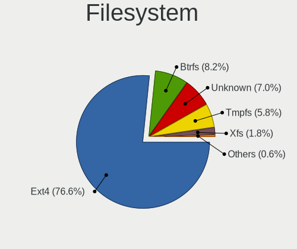

| Type    | Computers | Percent |
|---------|-----------|---------|
| Ext4    | 94        | 77.05%  |
| Unknown | 11        | 9.02%   |
| Tmpfs   | 9         | 7.38%   |
| Btrfs   | 4         | 3.28%   |
| Xfs     | 3         | 2.46%   |
| Ext3    | 1         | 0.82%   |

Part. scheme
------------

Scheme of partitioning

| Type    | Computers | Percent |
|---------|-----------|---------|
| Unknown | 106       | 87.6%   |
| GPT     | 11        | 9.09%   |
| MBR     | 4         | 3.31%   |

Dual Boot with Linux/BSD
------------------------

Hosting more than one Linux/BSD

| Dual boot | Computers | Percent |
|-----------|-----------|---------|
| No        | 116       | 95.87%  |
| Yes       | 5         | 4.13%   |

Dual Boot (Win)
---------------

Hosting Linux and Windows

| Dual boot | Computers | Percent |
|-----------|-----------|---------|
| No        | 115       | 94.26%  |
| Yes       | 7         | 5.74%   |

Board
-----

Vendor
------

Motherboard manufacturer

| Name                   | Computers | Percent |
|------------------------|-----------|---------|
| Lenovo                 | 24        | 19.83%  |
| ASUSTek Computer       | 21        | 17.36%  |
| Dell                   | 20        | 16.53%  |
| Hewlett-Packard        | 11        | 9.09%   |
| Acer                   | 9         | 7.44%   |
| Gigabyte Technology    | 8         | 6.61%   |
| ASRock                 | 7         | 5.79%   |
| MSI                    | 6         | 4.96%   |
| Avell High Performance | 2         | 1.65%   |
| Toshiba                | 1         | 0.83%   |
| Sony                   | 1         | 0.83%   |
| Razer                  | 1         | 0.83%   |
| Pegatron               | 1         | 0.83%   |
| OEM                    | 1         | 0.83%   |
| Microsoft              | 1         | 0.83%   |
| Medion                 | 1         | 0.83%   |
| Intel                  | 1         | 0.83%   |
| HUAWEI                 | 1         | 0.83%   |
| Huanan                 | 1         | 0.83%   |
| Foxconn                | 1         | 0.83%   |
| Digma                  | 1         | 0.83%   |
| CyberPowerPC           | 1         | 0.83%   |

Model
-----

Motherboard model

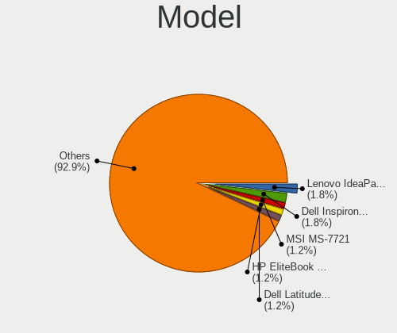

| Name                              | Computers | Percent |
|-----------------------------------|-----------|---------|
| Lenovo IdeaPad 1 14IGL05 81VU     | 3         | 2.48%   |
| Dell Inspiron 5520                | 3         | 2.48%   |
| MSI MS-7721                       | 2         | 1.65%   |
| Dell Latitude E6430               | 2         | 1.65%   |
| ASRock X570 Phantom Gaming 4      | 2         | 1.65%   |
| Toshiba Satellite C850-C1S        | 1         | 0.83%   |
| Sony VPCEH10EB                    | 1         | 0.83%   |
| Razer Blade                       | 1         | 0.83%   |
| Pegatron CQ3476L                  | 1         | 0.83%   |
| OEM G41 775 ICH7 8712             | 1         | 0.83%   |
| MSI WK711AA-ACB HPE-110ru         | 1         | 0.83%   |
| MSI MS-7C35                       | 1         | 0.83%   |
| MSI MS-7A36                       | 1         | 0.83%   |
| MSI MS-7998                       | 1         | 0.83%   |
| Microsoft Surface Pro 4           | 1         | 0.83%   |
| Medion P961x                      | 1         | 0.83%   |
| Lenovo Z70-80 80FG                | 1         | 0.83%   |
| Lenovo Yoga Book C930 ZA3S        | 1         | 0.83%   |
| Lenovo Y50-70 20378               | 1         | 0.83%   |
| Lenovo ThinkPad T510 4349BS9      | 1         | 0.83%   |
| Lenovo ThinkPad T440p 20AWS0Y800  | 1         | 0.83%   |
| Lenovo ThinkPad T410 253725G      | 1         | 0.83%   |
| Lenovo ThinkPad Edge E431 62775AU | 1         | 0.83%   |
| Lenovo ThinkPad E570 20H50048US   | 1         | 0.83%   |
| Lenovo ThinkPad 10 20C10026UK     | 1         | 0.83%   |
| Lenovo ThinkCentre M92 32071F5    | 1         | 0.83%   |
| Lenovo ThinkCentre M91p 0266RZ1   | 1         | 0.83%   |
| Lenovo ThinkCentre M58 6258WCY    | 1         | 0.83%   |
| Lenovo IdeaPad Y580               | 1         | 0.83%   |
| Lenovo IdeaPad Y450               | 1         | 0.83%   |
| Lenovo IdeaPad S145-15IWL 81MV    | 1         | 0.83%   |
| Lenovo IdeaPad S145-15API 81UT    | 1         | 0.83%   |
| Lenovo IdeaPad L340-17API 81LY    | 1         | 0.83%   |
| Lenovo IdeaPad 5 Pro 16ACH6 82L5  | 1         | 0.83%   |
| Lenovo IdeaPad 330-17IKB 81DM     | 1         | 0.83%   |
| Lenovo G570 20079                 | 1         | 0.83%   |
| Lenovo G470 20078                 | 1         | 0.83%   |
| Intel DH55HC AAE70933-501         | 1         | 0.83%   |
| HUAWEI MRC-WX0                    | 1         | 0.83%   |
| Huanan X79-8D VAA31               | 1         | 0.83%   |
| HP ProBook 6550b                  | 1         | 0.83%   |
| HP ProBook 640 G5                 | 1         | 0.83%   |
| HP Pavilion Laptop 15-cw0xxx      | 1         | 0.83%   |
| HP Pavilion g7                    | 1         | 0.83%   |
| HP Pavilion dm1                   | 1         | 0.83%   |
| HP Pavilion Desktop PC 570-p0XX   | 1         | 0.83%   |
| HP Pavilion 17                    | 1         | 0.83%   |
| HP ENVY x360 m6 Convertible       | 1         | 0.83%   |
| HP EliteBook 8460p                | 1         | 0.83%   |
| HP EliteBook 2560p                | 1         | 0.83%   |
| HP Compaq 6000 Pro MT PC          | 1         | 0.83%   |
| Gigabyte Z87-HD3                  | 1         | 0.83%   |
| Gigabyte X570 AORUS ELITE         | 1         | 0.83%   |
| Gigabyte H61M-DS2                 | 1         | 0.83%   |
| Gigabyte GA-880GM-UD2H            | 1         | 0.83%   |
| Gigabyte F2A85X-UP4               | 1         | 0.83%   |
| Gigabyte F2A75-D3H                | 1         | 0.83%   |
| Gigabyte EP43-UD3L                | 1         | 0.83%   |
| Gigabyte B450 AORUS M             | 1         | 0.83%   |
| Foxconn H61S                      | 1         | 0.83%   |

Model Family
------------

Motherboard model prefix

| Name                         | Computers | Percent |
|------------------------------|-----------|---------|
| Lenovo IdeaPad               | 10        | 8.26%   |
| Acer Aspire                  | 7         | 5.79%   |
| Lenovo ThinkPad              | 6         | 4.96%   |
| Dell Inspiron                | 6         | 4.96%   |
| HP Pavilion                  | 5         | 4.13%   |
| Dell OptiPlex                | 5         | 4.13%   |
| Dell Latitude                | 5         | 4.13%   |
| ASUS PRIME                   | 5         | 4.13%   |
| Lenovo ThinkCentre           | 3         | 2.48%   |
| ASUS ROG                     | 3         | 2.48%   |
| ASRock X570                  | 3         | 2.48%   |
| MSI MS-7721                  | 2         | 1.65%   |
| HP ProBook                   | 2         | 1.65%   |
| HP EliteBook                 | 2         | 1.65%   |
| Toshiba Satellite            | 1         | 0.83%   |
| Sony VPCEH10EB               | 1         | 0.83%   |
| Razer Blade                  | 1         | 0.83%   |
| Pegatron CQ3476L             | 1         | 0.83%   |
| OEM G41                      | 1         | 0.83%   |
| MSI WK711AA-ACB              | 1         | 0.83%   |
| MSI MS-7C35                  | 1         | 0.83%   |
| MSI MS-7A36                  | 1         | 0.83%   |
| MSI MS-7998                  | 1         | 0.83%   |
| Microsoft Surface            | 1         | 0.83%   |
| Medion P961x                 | 1         | 0.83%   |
| Lenovo Z70-80                | 1         | 0.83%   |
| Lenovo Yoga                  | 1         | 0.83%   |
| Lenovo Y50-70                | 1         | 0.83%   |
| Lenovo G570                  | 1         | 0.83%   |
| Lenovo G470                  | 1         | 0.83%   |
| Intel DH55HC                 | 1         | 0.83%   |
| HUAWEI MRC-WX0               | 1         | 0.83%   |
| Huanan X79-8D                | 1         | 0.83%   |
| HP ENVY                      | 1         | 0.83%   |
| HP Compaq                    | 1         | 0.83%   |
| Gigabyte Z87-HD3             | 1         | 0.83%   |
| Gigabyte X570                | 1         | 0.83%   |
| Gigabyte H61M-DS2            | 1         | 0.83%   |
| Gigabyte GA-880GM-UD2H       | 1         | 0.83%   |
| Gigabyte F2A85X-UP4          | 1         | 0.83%   |
| Gigabyte F2A75-D3H           | 1         | 0.83%   |
| Gigabyte EP43-UD3L           | 1         | 0.83%   |
| Gigabyte B450                | 1         | 0.83%   |
| Foxconn H61S                 | 1         | 0.83%   |
| Digma EVE                    | 1         | 0.83%   |
| Dell XPS                     | 1         | 0.83%   |
| Dell Studio                  | 1         | 0.83%   |
| Dell Precision               | 1         | 0.83%   |
| Dell G7                      | 1         | 0.83%   |
| CyberPowerPC Tracer          | 1         | 0.83%   |
| Avell High Performance G1550 | 1         | 0.83%   |
| Avell High Performance A62   | 1         | 0.83%   |
| ASUS Z8NA-D6                 | 1         | 0.83%   |
| ASUS X555YI                  | 1         | 0.83%   |
| ASUS X540SA                  | 1         | 0.83%   |
| ASUS VivoBook                | 1         | 0.83%   |
| ASUS UX430UAR                | 1         | 0.83%   |
| ASUS STRIX                   | 1         | 0.83%   |
| ASUS Q87M-XA                 | 1         | 0.83%   |
| ASUS P8Z77-V                 | 1         | 0.83%   |

MFG Year
--------

Motherboard manufacture year

| Year | Computers | Percent |
|------|-----------|---------|
| 2019 | 17        | 14.05%  |
| 2012 | 16        | 13.22%  |
| 2013 | 12        | 9.92%   |
| 2018 | 11        | 9.09%   |
| 2011 | 10        | 8.26%   |
| 2010 | 10        | 8.26%   |
| 2009 | 9         | 7.44%   |
| 2016 | 8         | 6.61%   |
| 2014 | 8         | 6.61%   |
| 2020 | 7         | 5.79%   |
| 2017 | 6         | 4.96%   |
| 2015 | 5         | 4.13%   |
| 2021 | 1         | 0.83%   |
| 2008 | 1         | 0.83%   |

Form Factor
-----------

Physical design of the computer

| Name        | Computers | Percent |
|-------------|-----------|---------|
| Notebook    | 59        | 48.76%  |
| Desktop     | 56        | 46.28%  |
| Tablet      | 3         | 2.48%   |
| Convertible | 2         | 1.65%   |
| All in one  | 1         | 0.83%   |

Secure Boot
-----------

Enabled or disabled

| State    | Computers | Percent |
|----------|-----------|---------|
| Disabled | 121       | 100%    |

Coreboot
--------

Have coreboot on board

| Used | Computers | Percent |
|------|-----------|---------|
| No   | 121       | 100%    |

RAM Size
--------

Total RAM memory

| Size in GB  | Computers | Percent |
|-------------|-----------|---------|
| 4.01-8.0    | 40        | 32.52%  |
| 8.01-16.0   | 28        | 22.76%  |
| 16.01-24.0  | 21        | 17.07%  |
| 3.01-4.0    | 19        | 15.45%  |
| 32.01-64.0  | 12        | 9.76%   |
| 2.01-3.0    | 1         | 0.81%   |
| 64.01-256.0 | 1         | 0.81%   |
| 1.01-2.0    | 1         | 0.81%   |

RAM Used
--------

Used RAM memory

| Used GB   | Computers | Percent |
|-----------|-----------|---------|
| 1.01-2.0  | 56        | 44.44%  |
| 2.01-3.0  | 40        | 31.75%  |
| 3.01-4.0  | 12        | 9.52%   |
| 4.01-8.0  | 9         | 7.14%   |
| 0.51-1.0  | 6         | 4.76%   |
| 8.01-16.0 | 3         | 2.38%   |

Total Drives
------------

Number of drives on board

| Drives | Computers | Percent |
|--------|-----------|---------|
| 1      | 69        | 55.65%  |
| 2      | 34        | 27.42%  |
| 3      | 9         | 7.26%   |
| 4      | 7         | 5.65%   |
| 0      | 2         | 1.61%   |
| 7      | 1         | 0.81%   |
| 6      | 1         | 0.81%   |
| 5      | 1         | 0.81%   |

Has CD-ROM
----------

Has CD-ROM on board

| Presented | Computers | Percent |
|-----------|-----------|---------|
| No        | 65        | 53.28%  |
| Yes       | 57        | 46.72%  |

Has Ethernet
------------

Has Ethernet on board

| Presented | Computers | Percent |
|-----------|-----------|---------|
| Yes       | 103       | 85.12%  |
| No        | 18        | 14.88%  |

Has WiFi
--------

Has WiFi module

| Presented | Computers | Percent |
|-----------|-----------|---------|
| Yes       | 93        | 76.86%  |
| No        | 28        | 23.14%  |

Has Bluetooth
-------------

Has Bluetooth module

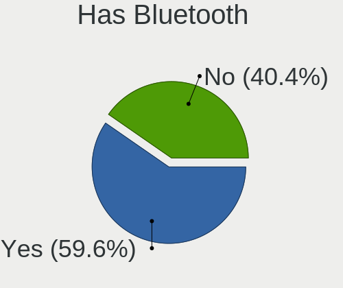

| Presented | Computers | Percent |
|-----------|-----------|---------|
| Yes       | 66        | 54.55%  |
| No        | 55        | 45.45%  |

Location
--------

Country
-------

Geographic location (country)

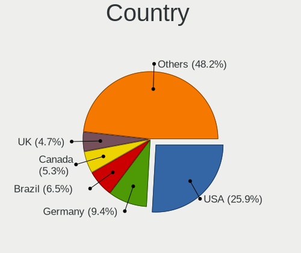

| Country     | Computers | Percent |
|-------------|-----------|---------|
| USA         | 29        | 23.97%  |
| Germany     | 11        | 9.09%   |
| Brazil      | 10        | 8.26%   |
| Spain       | 8         | 6.61%   |
| UK          | 6         | 4.96%   |
| Russia      | 6         | 4.96%   |
| Canada      | 6         | 4.96%   |
| Australia   | 6         | 4.96%   |
| Netherlands | 5         | 4.13%   |
| Mexico      | 3         | 2.48%   |
| Turkey      | 2         | 1.65%   |
| Thailand    | 2         | 1.65%   |
| Portugal    | 2         | 1.65%   |
| Poland      | 2         | 1.65%   |
| Panama      | 2         | 1.65%   |
| India       | 2         | 1.65%   |
| Greece      | 2         | 1.65%   |
| Estonia     | 2         | 1.65%   |
| Argentina   | 2         | 1.65%   |
| Ukraine     | 1         | 0.83%   |
| Sweden      | 1         | 0.83%   |
| Philippines | 1         | 0.83%   |
| Hungary     | 1         | 0.83%   |
| Finland     | 1         | 0.83%   |
| Czechia     | 1         | 0.83%   |
| Costa Rica  | 1         | 0.83%   |
| Colombia    | 1         | 0.83%   |
| Chile       | 1         | 0.83%   |
| Benin       | 1         | 0.83%   |
| Belgium     | 1         | 0.83%   |
| Azerbaijan  | 1         | 0.83%   |
| Austria     | 1         | 0.83%   |

City
----

Geographic location (city)

| City                | Computers | Percent |
|---------------------|-----------|---------|
| Melbourne           | 3         | 2.38%   |
| Aleksandrov         | 3         | 2.38%   |
| Tallinn             | 2         | 1.59%   |
| So Paulo          | 2         | 1.59%   |
| Miami               | 2         | 1.59%   |
| Madrid              | 2         | 1.59%   |
| Lelystad            | 2         | 1.59%   |
| Irun                | 2         | 1.59%   |
| Essen               | 2         | 1.59%   |
| David               | 2         | 1.59%   |
| Cologne             | 2         | 1.59%   |
| Buffalo             | 2         | 1.59%   |
| Athens              | 2         | 1.59%   |
| Ankara              | 2         | 1.59%   |
| Zutphen             | 1         | 0.79%   |
| Zabrze              | 1         | 0.79%   |
| Yadrin              | 1         | 0.79%   |
| Winsted             | 1         | 0.79%   |
| Watford             | 1         | 0.79%   |
| Warsaw              | 1         | 0.79%   |
| Waren               | 1         | 0.79%   |
| Vitria            | 1         | 0.79%   |
| Villahermosa        | 1         | 0.79%   |
| Villa Martelli      | 1         | 0.79%   |
| Vienna              | 1         | 0.79%   |
| Ullastrell          | 1         | 0.79%   |
| Toronto             | 1         | 0.79%   |
| The Hague           | 1         | 0.79%   |
| Szekszrd          | 1         | 0.79%   |
| Sydney              | 1         | 0.79%   |
| Surrey              | 1         | 0.79%   |
| Stabroek            | 1         | 0.79%   |
| Southampton         | 1         | 0.79%   |
| Smithfield          | 1         | 0.79%   |
| Seville             | 1         | 0.79%   |
| Schorndorf          | 1         | 0.79%   |
| Sattahip            | 1         | 0.79%   |
| San Miguel          | 1         | 0.79%   |
| Salt Lake City      | 1         | 0.79%   |
| Reno                | 1         | 0.79%   |
| Queens              | 1         | 0.79%   |
| Puente Alto         | 1         | 0.79%   |
| Portsmouth          | 1         | 0.79%   |
| Porto Unio        | 1         | 0.79%   |
| Phoenix             | 1         | 0.79%   |
| Perth               | 1         | 0.79%   |
| Orem                | 1         | 0.79%   |
| Novosibirsk         | 1         | 0.79%   |
| North Fort Myers    | 1         | 0.79%   |
| North Bay           | 1         | 0.79%   |
| Newport News        | 1         | 0.79%   |
| Newcastle           | 1         | 0.79%   |
| New Orleans         | 1         | 0.79%   |
| Nava de la Asuncion | 1         | 0.79%   |
| Mogi Mirim          | 1         | 0.79%   |
| Mexico City         | 1         | 0.79%   |
| Mascouche           | 1         | 0.79%   |
| Littleton           | 1         | 0.79%   |
| Limeira             | 1         | 0.79%   |
| Launceston          | 1         | 0.79%   |

Drives
------

Drive Vendor
------------

Hard drive vendors

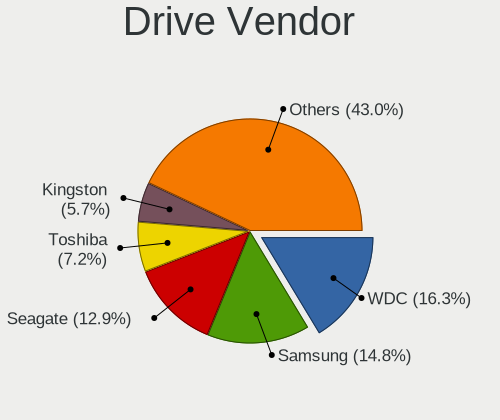

| Vendor              | Computers | Drives | Percent |
|---------------------|-----------|--------|---------|
| WDC                 | 37        | 43     | 19.79%  |
| Seagate             | 27        | 35     | 14.44%  |
| Samsung Electronics | 25        | 31     | 13.37%  |
| Toshiba             | 16        | 18     | 8.56%   |
| Unknown             | 10        | 12     | 5.35%   |
| Kingston            | 8         | 9      | 4.28%   |
| Crucial             | 8         | 9      | 4.28%   |
| SanDisk             | 7         | 9      | 3.74%   |
| Phison              | 6         | 7      | 3.21%   |
| Hitachi             | 6         | 6      | 3.21%   |
| Intel               | 4         | 4      | 2.14%   |
| HGST                | 4         | 4      | 2.14%   |
| SPCC                | 2         | 3      | 1.07%   |
| PNY                 | 2         | 2      | 1.07%   |
| Patriot             | 2         | 2      | 1.07%   |
| EMTEC               | 2         | 3      | 1.07%   |
| Dell                | 2         | 2      | 1.07%   |
| ZOTAC               | 1         | 1      | 0.53%   |
| Transcend           | 1         | 1      | 0.53%   |
| SK Hynix            | 1         | 1      | 0.53%   |
| Phison Electronics  | 1         | 2      | 0.53%   |
| oyunkey             | 1         | 1      | 0.53%   |
| OCZ                 | 1         | 2      | 0.53%   |
| Micron Technology   | 1         | 1      | 0.53%   |
| LITEONIT            | 1         | 1      | 0.53%   |
| KingSpec            | 1         | 1      | 0.53%   |
| JMicron             | 1         | 1      | 0.53%   |
| Hewlett-Packard     | 1         | 2      | 0.53%   |
| Gigabyte Technology | 1         | 2      | 0.53%   |
| DREVO               | 1         | 1      | 0.53%   |
| ASMT                | 1         | 1      | 0.53%   |
| AMD                 | 1         | 1      | 0.53%   |
| addlink             | 1         | 1      | 0.53%   |
| ADATA Technology    | 1         | 1      | 0.53%   |
| A-DATA Technology   | 1         | 1      | 0.53%   |
| Unknown             | 1         | 1      | 0.53%   |

Drive Model
-----------

Hard drive models

| Model                              | Computers | Percent |
|------------------------------------|-----------|---------|
| Unknown MMC Card  64GB             | 5         | 2.44%   |
| Seagate ST1000LM024 HN-M101MBB 1TB | 3         | 1.46%   |
| Samsung SSD 860 EVO 500GB          | 3         | 1.46%   |
| Intel NVMe SSD Drive 512GB         | 3         | 1.46%   |
| WDC WD10JPVT-08A1YT2 1TB           | 2         | 0.98%   |
| WDC WD10EZEX-08WN4A0 1TB           | 2         | 0.98%   |
| WDC WD1002FAEX-00Z3A0 1TB          | 2         | 0.98%   |
| WDC WD1001FALS-403AA0 1TB          | 2         | 0.98%   |
| Unknown SD/MMC/MS PRO 128GB        | 2         | 0.98%   |
| Toshiba NVMe SSD Drive 512GB       | 2         | 0.98%   |
| Toshiba DT01ACA100 1TB             | 2         | 0.98%   |
| Seagate ST9500325AS 500GB          | 2         | 0.98%   |
| Seagate ST500LT012-1DG142 500GB    | 2         | 0.98%   |
| Seagate ST3500312CS 500GB          | 2         | 0.98%   |
| Seagate ST2000DM006-2DM164 2TB     | 2         | 0.98%   |
| Seagate ST1000DM003-1CH162 1TB     | 2         | 0.98%   |
| Samsung SSD 850 EVO 500GB          | 2         | 0.98%   |
| Samsung SSD 850 EVO 250GB          | 2         | 0.98%   |
| Samsung NVMe SSD Drive 512GB       | 2         | 0.98%   |
| Samsung NVMe SSD Drive 500GB       | 2         | 0.98%   |
| PNY CS900 120GB SSD                | 2         | 0.98%   |
| Phison NVMe SSD Drive 960GB        | 2         | 0.98%   |
| Phison NVMe SSD Drive 240GB        | 2         | 0.98%   |
| Phison NVMe SSD Drive 1TB          | 2         | 0.98%   |
| Kingston SA400S37480G 480GB SSD    | 2         | 0.98%   |
| HGST HTS725050A7E630 500GB         | 2         | 0.98%   |
| ZOTAC ZTSSD-S11-120G-P 120GB       | 1         | 0.49%   |
| WDC WDS500G2X0C-00L350 500GB       | 1         | 0.49%   |
| WDC WDS500G2B0A-00SM50 500GB SSD   | 1         | 0.49%   |
| WDC WDS240G2G0B-00EPW0 240GB SSD   | 1         | 0.49%   |
| WDC WDS240G2G0A-00JH30 240GB SSD   | 1         | 0.49%   |
| WDC WD7500LPCX-60HWST0 752GB       | 1         | 0.49%   |
| WDC WD6400AAKS-22A7B0 640GB        | 1         | 0.49%   |
| WDC WD6400AAKS-00A7B2 640GB        | 1         | 0.49%   |
| WDC WD5000LPVX-22V0TT0 500GB       | 1         | 0.49%   |
| WDC WD5000LPVX-00V0TT0 500GB       | 1         | 0.49%   |
| WDC WD5000LPCX-00VHAT0 500GB       | 1         | 0.49%   |
| WDC WD5000AZLX-00JKKA0 500GB       | 1         | 0.49%   |
| WDC WD5000AVDS-63U7B1 500GB        | 1         | 0.49%   |
| WDC WD5000AAKX-753CA1 500GB        | 1         | 0.49%   |
| WDC WD5000AADS-00S9B0 500GB        | 1         | 0.49%   |
| WDC WD3200BEVT-22ZCT0 320GB        | 1         | 0.49%   |
| WDC WD3200AAKS-00UU3A0 320GB       | 1         | 0.49%   |
| WDC WD30PURX-64P6ZY0 3TB           | 1         | 0.49%   |
| WDC WD2500JS-00MHB0 250GB          | 1         | 0.49%   |
| WDC WD20EZRX-00D8PB0 2TB           | 1         | 0.49%   |
| WDC WD20EURX-63T0FY0 2TB           | 1         | 0.49%   |
| WDC WD2003FZEX-00SRLA0 2TB         | 1         | 0.49%   |
| WDC WD2003FYPS-27Y2B0 2TB          | 1         | 0.49%   |
| WDC WD15EADS-65P8B1 1TB            | 1         | 0.49%   |
| WDC WD10SPZX-22Z10T0 1TB           | 1         | 0.49%   |
| WDC WD10JPVX-22JC3T0 1TB           | 1         | 0.49%   |
| WDC WD10JPCX-24UE4T0 1TB           | 1         | 0.49%   |
| WDC WD10EZRX-00L4HB0 1TB           | 1         | 0.49%   |
| WDC WD10EZEX-22MFCA0 1TB           | 1         | 0.49%   |
| WDC WD10EZEX-21WN4A0 1TB           | 1         | 0.49%   |
| WDC WD10EZEX-00BN5A0 1TB           | 1         | 0.49%   |
| WDC WD10EARS-00Y5B1 1TB            | 1         | 0.49%   |
| WDC WD10EADS-65M2B1 1TB            | 1         | 0.49%   |
| WDC WD1002FAEX-00Y9A0 1TB          | 1         | 0.49%   |

HDD Vendor
----------

Hard disk drive vendors

| Vendor              | Computers | Drives | Percent |
|---------------------|-----------|--------|---------|
| WDC                 | 33        | 38     | 38.82%  |
| Seagate             | 27        | 35     | 31.76%  |
| Toshiba             | 9         | 10     | 10.59%  |
| Hitachi             | 6         | 6      | 7.06%   |
| HGST                | 4         | 4      | 4.71%   |
| Samsung Electronics | 3         | 3      | 3.53%   |
| Unknown             | 2         | 2      | 2.35%   |
| JMicron             | 1         | 1      | 1.18%   |

SSD Vendor
----------

Solid state drive vendors

| Vendor              | Computers | Drives | Percent |
|---------------------|-----------|--------|---------|
| Samsung Electronics | 16        | 19     | 27.12%  |
| Kingston            | 8         | 9      | 13.56%  |
| Crucial             | 7         | 8      | 11.86%  |
| SanDisk             | 6         | 8      | 10.17%  |
| WDC                 | 3         | 3      | 5.08%   |
| Toshiba             | 2         | 2      | 3.39%   |
| PNY                 | 2         | 2      | 3.39%   |
| Patriot             | 2         | 2      | 3.39%   |
| ZOTAC               | 1         | 1      | 1.69%   |
| Transcend           | 1         | 1      | 1.69%   |
| SPCC                | 1         | 2      | 1.69%   |
| OCZ                 | 1         | 2      | 1.69%   |
| LITEONIT            | 1         | 1      | 1.69%   |
| KingSpec            | 1         | 1      | 1.69%   |
| Hewlett-Packard     | 1         | 2      | 1.69%   |
| Gigabyte Technology | 1         | 2      | 1.69%   |
| Emtec               | 1         | 1      | 1.69%   |
| DREVO               | 1         | 1      | 1.69%   |
| ASMT                | 1         | 1      | 1.69%   |
| AMD                 | 1         | 1      | 1.69%   |
| A-DATA Technology   | 1         | 1      | 1.69%   |

Drive Kind
----------

HDD or SSD

| Kind    | Computers | Drives | Percent |
|---------|-----------|--------|---------|
| HDD     | 69        | 99     | 42.86%  |
| SSD     | 50        | 70     | 31.06%  |
| NVMe    | 30        | 37     | 18.63%  |
| MMC     | 7         | 10     | 4.35%   |
| Unknown | 5         | 6      | 3.11%   |

Drive Connector
---------------

SATA, SAS, NVMe, etc.

| Type | Computers | Drives | Percent |
|------|-----------|--------|---------|
| SATA | 100       | 164    | 68.97%  |
| NVMe | 30        | 37     | 20.69%  |
| SAS  | 8         | 11     | 5.52%   |
| MMC  | 7         | 10     | 4.83%   |

Drive Size
----------

Size of hard drive

| Size in TB | Computers | Drives | Percent |
|------------|-----------|--------|---------|
| 0.01-0.5   | 73        | 97     | 54.89%  |
| 0.51-1.0   | 48        | 56     | 36.09%  |
| 1.01-2.0   | 7         | 9      | 5.26%   |
| 2.01-3.0   | 3         | 4      | 2.26%   |
| 3.01-4.0   | 1         | 1      | 0.75%   |
| 4.01-10.0  | 1         | 2      | 0.75%   |

Space Total
-----------

Amount of disk space available on the file system

| Size in GB     | Computers | Percent |
|----------------|-----------|---------|
| 251-500        | 37        | 29.6%   |
| 101-250        | 28        | 22.4%   |
| 501-1000       | 25        | 20%     |
| 51-100         | 12        | 9.6%    |
| 1001-2000      | 7         | 5.6%    |
| More than 3000 | 6         | 4.8%    |
| Unknown        | 6         | 4.8%    |
| 21-50          | 2         | 1.6%    |
| 2001-3000      | 2         | 1.6%    |

Space Used
----------

Amount of used disk space

| Used GB   | Computers | Percent |
|-----------|-----------|---------|
| 1-20      | 47        | 36.72%  |
| 21-50     | 32        | 25%     |
| 101-250   | 14        | 10.94%  |
| 51-100    | 13        | 10.16%  |
| 251-500   | 8         | 6.25%   |
| Unknown   | 6         | 4.69%   |
| 501-1000  | 4         | 3.13%   |
| 2001-3000 | 3         | 2.34%   |
| 1001-2000 | 1         | 0.78%   |

Malfunc. Drives
---------------

Drive models with a malfunction

Zero info for selected period =(

Malfunc. Drive Vendor
---------------------

Vendors of faulty drives

Zero info for selected period =(

Malfunc. HDD Vendor
-------------------

Vendors of faulty HDD drives

Zero info for selected period =(

Malfunc. Drive Kind
-------------------

Kinds of faulty drives

Zero info for selected period =(

Failed Drives
-------------

Failed drive models

Zero info for selected period =(

Failed Drive Vendor
-------------------

Failed drive vendors

Zero info for selected period =(

Drive Status
------------

Number of failed and malfunc. drives

| Status   | Computers | Drives | Percent |
|----------|-----------|--------|---------|
| Detected | 110       | 192    | 89.43%  |
| Works    | 13        | 30     | 10.57%  |

Storage controller
------------------

Storage Vendor
--------------

Storage controller vendors

| Vendor                       | Computers | Percent |
|------------------------------|-----------|---------|
| Intel                        | 83        | 56.85%  |
| AMD                          | 29        | 19.86%  |
| Samsung Electronics          | 9         | 6.16%   |
| Phison Electronics           | 8         | 5.48%   |
| Toshiba America Info Systems | 5         | 3.42%   |
| JMicron Technology           | 3         | 2.05%   |
| Sandisk                      | 2         | 1.37%   |
| ADATA Technology             | 2         | 1.37%   |
| SK Hynix                     | 1         | 0.68%   |
| Nvidia                       | 1         | 0.68%   |
| Micron/Crucial Technology    | 1         | 0.68%   |
| Micron Technology            | 1         | 0.68%   |
| ASMedia Technology           | 1         | 0.68%   |

Storage Model
-------------

Storage controller models

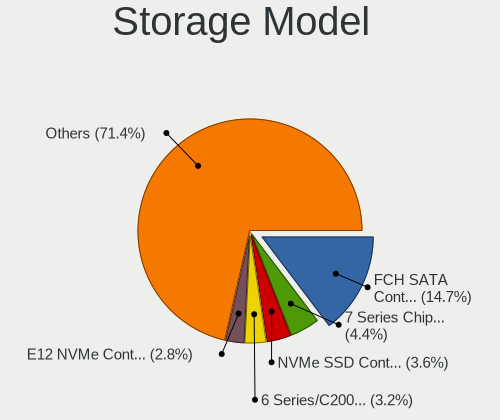

| Model                                                                                   | Computers | Percent |
|-----------------------------------------------------------------------------------------|-----------|---------|
| AMD FCH SATA Controller [AHCI mode]                                                     | 25        | 14.37%  |
| Intel 7 Series Chipset Family 6-port SATA Controller [AHCI mode]                        | 8         | 4.6%    |
| Intel 6 Series/C200 Series Chipset Family 6 port Mobile SATA AHCI Controller            | 7         | 4.02%   |
| Samsung NVMe SSD Controller SM981/PM981/PM983                                           | 6         | 3.45%   |
| Phison E12 NVMe Controller                                                              | 5         | 2.87%   |
| Intel Sunrise Point-LP SATA Controller [AHCI mode]                                      | 5         | 2.87%   |
| Intel 8 Series/C220 Series Chipset Family 6-port SATA Controller 1 [AHCI mode]          | 5         | 2.87%   |
| Intel SATA Controller [RAID mode]                                                       | 4         | 2.3%    |
| Intel Cannon Point-LP SATA Controller [AHCI Mode]                                       | 4         | 2.3%    |
| Intel 7 Series/C210 Series Chipset Family 6-port SATA Controller [AHCI mode]            | 4         | 2.3%    |
| Intel 5 Series/3400 Series Chipset 6 port SATA AHCI Controller                          | 4         | 2.3%    |
| Intel 200 Series PCH SATA controller [AHCI mode]                                        | 4         | 2.3%    |
| AMD SB7x0/SB8x0/SB9x0 SATA Controller [AHCI mode]                                       | 4         | 2.3%    |
| AMD 400 Series Chipset SATA Controller                                                  | 4         | 2.3%    |
| Intel Q170/Q150/B150/H170/H110/Z170/CM236 Chipset SATA Controller [AHCI Mode]           | 3         | 1.72%   |
| Intel 82801IBM/IEM (ICH9M/ICH9M-E) 4 port SATA Controller [AHCI mode]                   | 3         | 1.72%   |
| Intel 82801 Mobile SATA Controller [RAID mode]                                          | 3         | 1.72%   |
| Intel 4 Series Chipset PT IDER Controller                                               | 3         | 1.72%   |
| Toshiba America Info Systems BG3 NVMe SSD Controller                                    | 2         | 1.15%   |
| Samsung NVMe SSD Controller SM961/PM961/SM963                                           | 2         | 1.15%   |
| Phison E16 PCIe4 NVMe Controller                                                        | 2         | 1.15%   |
| JMicron JMB368 IDE controller                                                           | 2         | 1.15%   |
| Intel SSD 660P Series                                                                   | 2         | 1.15%   |
| Intel NM10/ICH7 Family SATA Controller [IDE mode]                                       | 2         | 1.15%   |
| Intel Cannon Lake Mobile PCH SATA AHCI Controller                                       | 2         | 1.15%   |
| Intel 82801JI (ICH10 Family) 4 port SATA IDE Controller #1                              | 2         | 1.15%   |
| Intel 82801JI (ICH10 Family) 2 port SATA IDE Controller #2                              | 2         | 1.15%   |
| Intel 82801JD/DO (ICH10 Family) SATA AHCI Controller                                    | 2         | 1.15%   |
| Intel 82801G (ICH7 Family) IDE Controller                                               | 2         | 1.15%   |
| Intel 8 Series/C220 Series Chipset Family 4-port SATA Controller 1 [IDE mode]           | 2         | 1.15%   |
| Intel 8 Series SATA Controller 1 [AHCI mode]                                            | 2         | 1.15%   |
| Intel 6 Series/C200 Series Chipset Family Desktop SATA Controller (IDE mode, ports 4-5) | 2         | 1.15%   |
| Intel 6 Series/C200 Series Chipset Family Desktop SATA Controller (IDE mode, ports 0-3) | 2         | 1.15%   |
| Intel 6 Series/C200 Series Chipset Family 6 port Desktop SATA AHCI Controller           | 2         | 1.15%   |
| Intel 5 Series/3400 Series Chipset 4 port SATA IDE Controller                           | 2         | 1.15%   |
| Intel 5 Series/3400 Series Chipset 2 port SATA IDE Controller                           | 2         | 1.15%   |
| AMD SB7x0/SB8x0/SB9x0 IDE Controller                                                    | 2         | 1.15%   |
| Toshiba America Info Systems XG6 NVMe SSD Controller                                    | 1         | 0.57%   |
| Toshiba America Info Systems XG4 NVMe SSD Controller                                    | 1         | 0.57%   |
| Toshiba America Info Systems Toshiba America Info Non-Volatile memory controller        | 1         | 0.57%   |
| SK Hynix BC501 NVMe Solid State Drive                                                   | 1         | 0.57%   |
| Sandisk WD Blue SN550 NVMe SSD                                                          | 1         | 0.57%   |
| Sandisk WD Black 2018/SN750 / PC SN720 NVMe SSD                                         | 1         | 0.57%   |
| Samsung NVMe SSD Controller 980                                                         | 1         | 0.57%   |
| Phison PS5013 E13 NVMe Controller                                                       | 1         | 0.57%   |
| Phison E7 NVMe Controller                                                               | 1         | 0.57%   |
| Nvidia MCP61 SATA Controller                                                            | 1         | 0.57%   |
| Micron/Crucial P1 NVMe PCIe SSD                                                         | 1         | 0.57%   |
| Micron Non-Volatile memory controller                                                   | 1         | 0.57%   |
| JMicron JMB362 SATA Controller                                                          | 1         | 0.57%   |
| Intel Wildcat Point-LP SATA Controller [AHCI Mode]                                      | 1         | 0.57%   |
| Intel SSD 600P Series                                                                   | 1         | 0.57%   |
| Intel HM170/QM170 Chipset SATA Controller [AHCI Mode]                                   | 1         | 0.57%   |
| Intel Celeron N3350/Pentium N4200/Atom E3900 Series SATA AHCI Controller                | 1         | 0.57%   |
| Intel C600/X79 series chipset 6-Port SATA AHCI Controller                               | 1         | 0.57%   |
| Intel Atom/Celeron/Pentium Processor x5-E8000/J3xxx/N3xxx Series SATA Controller        | 1         | 0.57%   |
| Intel Atom Processor E3800 Series SATA AHCI Controller                                  | 1         | 0.57%   |
| Intel 9 Series Chipset Family SATA Controller [AHCI Mode]                               | 1         | 0.57%   |
| Intel 82801IBM/IEM (ICH9M/ICH9M-E) 2 port SATA Controller [IDE mode]                    | 1         | 0.57%   |
| Intel 8 Series/C220 Series Chipset Family 2-port SATA Controller 2 [IDE mode]           | 1         | 0.57%   |

Storage Kind
------------

Kind of storage controller (IDE, SATA, NVMe, SAS, ...)

| Kind | Computers | Percent |
|------|-----------|---------|
| SATA | 92        | 62.59%  |
| NVMe | 29        | 19.73%  |
| IDE  | 19        | 12.93%  |
| RAID | 7         | 4.76%   |

Processor
---------

CPU Vendor
----------

Processor vendors

| Vendor | Computers | Percent |
|--------|-----------|---------|
| Intel  | 89        | 73.55%  |
| AMD    | 32        | 26.45%  |

CPU Model
---------

Processor models

| Model                                       | Computers | Percent |
|---------------------------------------------|-----------|---------|
| Intel Core 2 Duo CPU E7500 @ 2.93GHz        | 4         | 3.28%   |
| Intel Core i5-2520M CPU @ 2.50GHz           | 3         | 2.46%   |
| Intel Celeron N4020 CPU @ 1.10GHz           | 3         | 2.46%   |
| Intel Core i7-8565U CPU @ 1.80GHz           | 2         | 1.64%   |
| Intel Core i7-4770S CPU @ 3.10GHz           | 2         | 1.64%   |
| Intel Core i7-3632QM CPU @ 2.20GHz          | 2         | 1.64%   |
| Intel Core i5-8250U CPU @ 1.60GHz           | 2         | 1.64%   |
| Intel Core i5-3470 CPU @ 3.20GHz            | 2         | 1.64%   |
| Intel Core i5-3230M CPU @ 2.60GHz           | 2         | 1.64%   |
| Intel Core i5-3210M CPU @ 2.50GHz           | 2         | 1.64%   |
| Intel Core i5 CPU M 520 @ 2.40GHz           | 2         | 1.64%   |
| AMD Ryzen 7 2700X Eight-Core Processor      | 2         | 1.64%   |
| AMD Ryzen 5 3600 6-Core Processor           | 2         | 1.64%   |
| AMD Ryzen 5 2600 Six-Core Processor         | 2         | 1.64%   |
| AMD A4-5300 APU with Radeon HD Graphics     | 2         | 1.64%   |
| AMD A10-5800K APU with Radeon HD Graphics   | 2         | 1.64%   |
| Intel Xeon CPU E5530 @ 2.40GHz              | 1         | 0.82%   |
| Intel Xeon CPU E5-2697 v2 @ 2.70GHz         | 1         | 0.82%   |
| Intel Xeon CPU E3-1270 V2 @ 3.50GHz         | 1         | 0.82%   |
| Intel Xeon CPU E3-1225 v5 @ 3.30GHz         | 1         | 0.82%   |
| Intel Pentium Dual-Core CPU T4500 @ 2.30GHz | 1         | 0.82%   |
| Intel Pentium Dual-Core CPU T4300 @ 2.10GHz | 1         | 0.82%   |
| Intel Pentium CPU N3530 @ 2.16GHz           | 1         | 0.82%   |
| Intel Pentium CPU G620 @ 2.60GHz            | 1         | 0.82%   |
| Intel Pentium CPU G3258 @ 3.20GHz           | 1         | 0.82%   |
| Intel Pentium CPU 5405U @ 2.30GHz           | 1         | 0.82%   |
| Intel Core m3-7Y30 CPU @ 1.00GHz            | 1         | 0.82%   |
| Intel Core i7-9750H CPU @ 2.60GHz           | 1         | 0.82%   |
| Intel Core i7-8750H CPU @ 2.20GHz           | 1         | 0.82%   |
| Intel Core i7-8550U CPU @ 1.80GHz           | 1         | 0.82%   |
| Intel Core i7-7700 CPU @ 3.60GHz            | 1         | 0.82%   |
| Intel Core i7-7500U CPU @ 2.70GHz           | 1         | 0.82%   |
| Intel Core i7-6700HQ CPU @ 2.60GHz          | 1         | 0.82%   |
| Intel Core i7-6700 CPU @ 3.40GHz            | 1         | 0.82%   |
| Intel Core i7-4770 CPU @ 3.40GHz            | 1         | 0.82%   |
| Intel Core i7-4710HQ CPU @ 2.50GHz          | 1         | 0.82%   |
| Intel Core i7-4600M CPU @ 2.90GHz           | 1         | 0.82%   |
| Intel Core i7-3770K CPU @ 3.50GHz           | 1         | 0.82%   |
| Intel Core i7-3740QM CPU @ 2.70GHz          | 1         | 0.82%   |
| Intel Core i7-3520M CPU @ 2.90GHz           | 1         | 0.82%   |
| Intel Core i7-2720QM CPU @ 2.20GHz          | 1         | 0.82%   |
| Intel Core i7-10750H CPU @ 2.60GHz          | 1         | 0.82%   |
| Intel Core i7 CPU Q 720 @ 1.60GHz           | 1         | 0.82%   |
| Intel Core i7 CPU M 620 @ 2.67GHz           | 1         | 0.82%   |
| Intel Core i5-9400F CPU @ 2.90GHz           | 1         | 0.82%   |
| Intel Core i5-9400 CPU @ 2.90GHz            | 1         | 0.82%   |
| Intel Core i5-8365U CPU @ 1.60GHz           | 1         | 0.82%   |
| Intel Core i5-8300H CPU @ 2.30GHz           | 1         | 0.82%   |
| Intel Core i5-7400 CPU @ 3.00GHz            | 1         | 0.82%   |
| Intel Core i5-7200U CPU @ 2.50GHz           | 1         | 0.82%   |
| Intel Core i5-6500T CPU @ 2.50GHz           | 1         | 0.82%   |
| Intel Core i5-6300U CPU @ 2.40GHz           | 1         | 0.82%   |
| Intel Core i5-4590 CPU @ 3.30GHz            | 1         | 0.82%   |
| Intel Core i5-4570T CPU @ 2.90GHz           | 1         | 0.82%   |
| Intel Core i5-4570 CPU @ 3.20GHz            | 1         | 0.82%   |
| Intel Core i5-3340 CPU @ 3.10GHz            | 1         | 0.82%   |
| Intel Core i5-3337U CPU @ 1.80GHz           | 1         | 0.82%   |
| Intel Core i5-2430M CPU @ 2.40GHz           | 1         | 0.82%   |
| Intel Core i5-2410M CPU @ 2.30GHz           | 1         | 0.82%   |
| Intel Core i5-2400S CPU @ 2.50GHz           | 1         | 0.82%   |

CPU Model Family
----------------

Processor model prefix

| Model                   | Computers | Percent |
|-------------------------|-----------|---------|
| Intel Core i5           | 33        | 27.05%  |
| Intel Core i7           | 23        | 18.85%  |
| AMD Ryzen 5             | 10        | 8.2%    |
| Intel Core 2 Duo        | 8         | 6.56%   |
| Intel Core i3           | 7         | 5.74%   |
| Intel Celeron           | 7         | 5.74%   |
| AMD Ryzen 7             | 6         | 4.92%   |
| Intel Xeon              | 4         | 3.28%   |
| Intel Pentium           | 4         | 3.28%   |
| AMD FX                  | 3         | 2.46%   |
| Intel Pentium Dual-Core | 2         | 1.64%   |
| AMD Ryzen 3             | 2         | 1.64%   |
| AMD A8                  | 2         | 1.64%   |
| AMD A4                  | 2         | 1.64%   |
| AMD A10                 | 2         | 1.64%   |
| Other                   | 1         | 0.82%   |
| Intel Core m3           | 1         | 0.82%   |
| Intel Atom              | 1         | 0.82%   |
| AMD Ryzen 9             | 1         | 0.82%   |
| AMD Phenom II X4        | 1         | 0.82%   |
| AMD E                   | 1         | 0.82%   |
| AMD Athlon II X2        | 1         | 0.82%   |

CPU Cores
---------

Number of processor cores

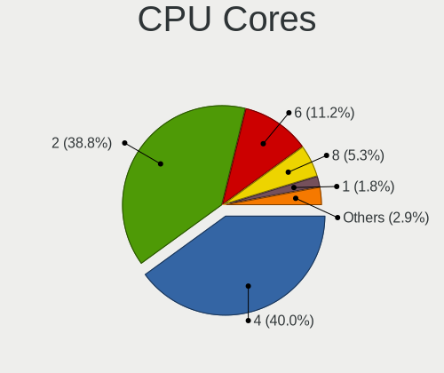

| Number | Computers | Percent |
|--------|-----------|---------|
| 2      | 55        | 45.45%  |
| 4      | 42        | 34.71%  |
| 6      | 13        | 10.74%  |
| 8      | 6         | 4.96%   |
| 1      | 2         | 1.65%   |
| 24     | 1         | 0.83%   |
| 12     | 1         | 0.83%   |
| 3      | 1         | 0.83%   |

CPU Sockets
-----------

Number of sockets

| Number | Computers | Percent |
|--------|-----------|---------|
| 1      | 119       | 98.35%  |
| 2      | 2         | 1.65%   |

CPU Threads
-----------

Threads per core (Hyper-Threading)

| Number | Computers | Percent |
|--------|-----------|---------|
| 2      | 80        | 66.12%  |
| 1      | 41        | 33.88%  |

CPU Op-Modes
------------

CPU Operation Modes (32-bit, 64-bit)

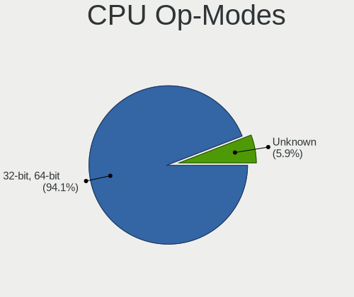

| Op mode        | Computers | Percent |
|----------------|-----------|---------|
| 32-bit, 64-bit | 111       | 91.74%  |
| Unknown        | 10        | 8.26%   |

CPU Microcode
-------------

Microcode number

| Number     | Computers | Percent |
|------------|-----------|---------|
| Unknown    | 34        | 27.64%  |
| 0x306a9    | 11        | 8.94%   |
| 0x206a7    | 9         | 7.32%   |
| 0x306c3    | 7         | 5.69%   |
| 0x906ea    | 4         | 3.25%   |
| 0x1067a    | 4         | 3.25%   |
| 0x0800820d | 4         | 3.25%   |
| 0x06001119 | 4         | 3.25%   |
| 0x906e9    | 3         | 2.44%   |
| 0x806e9    | 3         | 2.44%   |
| 0x506e3    | 3         | 2.44%   |
| 0x20652    | 3         | 2.44%   |
| 0x806ec    | 2         | 1.63%   |
| 0x806eb    | 2         | 1.63%   |
| 0x40651    | 2         | 1.63%   |
| 0x20655    | 2         | 1.63%   |
| 0x106e5    | 2         | 1.63%   |
| 0x806ea    | 1         | 0.81%   |
| 0x6fb      | 1         | 0.81%   |
| 0x406e3    | 1         | 0.81%   |
| 0x406c3    | 1         | 0.81%   |
| 0x306e4    | 1         | 0.81%   |
| 0x306d4    | 1         | 0.81%   |
| 0x30678    | 1         | 0.81%   |
| 0x106a5    | 1         | 0.81%   |
| 0x10676    | 1         | 0.81%   |
| 0x0a201016 | 1         | 0.81%   |
| 0x0a201009 | 1         | 0.81%   |
| 0x08701021 | 1         | 0.81%   |
| 0x08600102 | 1         | 0.81%   |
| 0x08108109 | 1         | 0.81%   |
| 0x0810100b | 1         | 0.81%   |
| 0x08001138 | 1         | 0.81%   |
| 0x07030106 | 1         | 0.81%   |
| 0x06006704 | 1         | 0.81%   |
| 0x06006113 | 1         | 0.81%   |
| 0x0600081c | 1         | 0.81%   |
| 0x06000817 | 1         | 0.81%   |
| 0x05000119 | 1         | 0.81%   |
| 0x010000c8 | 1         | 0.81%   |
| 0x010000b6 | 1         | 0.81%   |

CPU Microarch
-------------

Microarchitecture

| Name          | Computers | Percent |
|---------------|-----------|---------|
| KabyLake      | 18        | 14.88%  |
| IvyBridge     | 15        | 12.4%   |
| SandyBridge   | 13        | 10.74%  |
| Haswell       | 11        | 9.09%   |
| Zen+          | 9         | 7.44%   |
| Penryn        | 8         | 6.61%   |
| Westmere      | 6         | 4.96%   |
| Piledriver    | 6         | 4.96%   |
| Zen 2         | 5         | 4.13%   |
| Skylake       | 5         | 4.13%   |
| Zen           | 3         | 2.48%   |
| Silvermont    | 3         | 2.48%   |
| Nehalem       | 3         | 2.48%   |
| Goldmont plus | 3         | 2.48%   |
| Zen 3         | 2         | 1.65%   |
| Puma          | 2         | 1.65%   |
| K10           | 2         | 1.65%   |
| Excavator     | 2         | 1.65%   |
| Goldmont      | 1         | 0.83%   |
| Core          | 1         | 0.83%   |
| CometLake     | 1         | 0.83%   |
| Broadwell     | 1         | 0.83%   |
| Bobcat        | 1         | 0.83%   |

Graphics
--------

GPU Vendor
----------

Vendors of graphics cards

| Vendor            | Computers | Percent |
|-------------------|-----------|---------|
| Intel             | 64        | 45.71%  |
| Nvidia            | 39        | 27.86%  |
| AMD               | 36        | 25.71%  |
| ASPEED Technology | 1         | 0.71%   |

GPU Model
---------

Graphics card models

| Model                                                                       | Computers | Percent |
|-----------------------------------------------------------------------------|-----------|---------|
| Intel 2nd Generation Core Processor Family Integrated Graphics Controller   | 12        | 8.28%   |
| Intel 3rd Gen Core processor Graphics Controller                            | 8         | 5.52%   |
| Nvidia GK208B [GeForce GT 710]                                              | 4         | 2.76%   |
| Intel Core Processor Integrated Graphics Controller                         | 4         | 2.76%   |
| AMD Picasso/Raven 2 [Radeon Vega Series / Radeon Vega Mobile Series]        | 4         | 2.76%   |
| AMD Ellesmere [Radeon RX 470/480/570/570X/580/580X/590]                     | 4         | 2.76%   |
| Nvidia GP108 [GeForce GT 1030]                                              | 3         | 2.07%   |
| Nvidia GF108 [GeForce GT 730]                                               | 3         | 2.07%   |
| Intel Xeon E3-1200 v3/4th Gen Core Processor Integrated Graphics Controller | 3         | 2.07%   |
| Intel WhiskeyLake-U GT2 [UHD Graphics 620]                                  | 3         | 2.07%   |
| Intel UHD Graphics 620                                                      | 3         | 2.07%   |
| Intel GeminiLake [UHD Graphics 600]                                         | 3         | 2.07%   |
| Intel CoffeeLake-H GT2 [UHD Graphics 630]                                   | 3         | 2.07%   |
| AMD Thames [Radeon HD 7500M/7600M Series]                                   | 3         | 2.07%   |
| Nvidia GP104 [GeForce GTX 1080]                                             | 2         | 1.38%   |
| Intel Xeon E3-1200 v2/3rd Gen Core processor Graphics Controller            | 2         | 1.38%   |
| Intel HD Graphics 620                                                       | 2         | 1.38%   |
| Intel HD Graphics 530                                                       | 2         | 1.38%   |
| Intel Haswell-ULT Integrated Graphics Controller                            | 2         | 1.38%   |
| Intel Atom Processor Z36xxx/Z37xxx Series Graphics & Display                | 2         | 1.38%   |
| Intel 4th Gen Core Processor Integrated Graphics Controller                 | 2         | 1.38%   |
| AMD Trinity [Radeon HD 7660D]                                               | 2         | 1.38%   |
| AMD Mullins [Radeon R4/R5 Graphics]                                         | 2         | 1.38%   |
| AMD Curacao XT / Trinidad XT [Radeon R7 370 / R9 270X/370X]                 | 2         | 1.38%   |
| Nvidia TU117M                                                               | 1         | 0.69%   |
| Nvidia TU116 [GeForce GTX 1660]                                             | 1         | 0.69%   |
| Nvidia TU106M [GeForce RTX 2070 Mobile]                                     | 1         | 0.69%   |
| Nvidia TU106 [GeForce RTX 2070 Rev. A]                                      | 1         | 0.69%   |
| Nvidia GT218M [NVS 3100M]                                                   | 1         | 0.69%   |
| Nvidia GT218 [GeForce 210]                                                  | 1         | 0.69%   |
| Nvidia GT216M [GeForce GT 330M]                                             | 1         | 0.69%   |
| Nvidia GT200GL [Quadro FX 4800]                                             | 1         | 0.69%   |
| Nvidia GP108M [GeForce MX150]                                               | 1         | 0.69%   |
| Nvidia GP107M [GeForce GTX 1050 Ti Mobile]                                  | 1         | 0.69%   |
| Nvidia GP107 [GeForce GTX 1050]                                             | 1         | 0.69%   |
| Nvidia GP106M [GeForce GTX 1060 Mobile]                                     | 1         | 0.69%   |
| Nvidia GP106 [GeForce GTX 1060 3GB]                                         | 1         | 0.69%   |
| Nvidia GP102 [GeForce GTX 1080 Ti]                                          | 1         | 0.69%   |
| Nvidia GM206M [GeForce GTX 965M]                                            | 1         | 0.69%   |
| Nvidia GM204 [GeForce GTX 980]                                              | 1         | 0.69%   |
| Nvidia GM107M [GeForce GTX 860M]                                            | 1         | 0.69%   |
| Nvidia GM107 [GeForce GTX 750 Ti]                                           | 1         | 0.69%   |
| Nvidia GM107 [GeForce 940MX]                                                | 1         | 0.69%   |
| Nvidia GK208M [GeForce GT 730M]                                             | 1         | 0.69%   |
| Nvidia GK106 [GeForce GTX 660]                                              | 1         | 0.69%   |
| Nvidia GK104GL [Tesla K10]                                                  | 1         | 0.69%   |
| Nvidia GF119 [NVS 310]                                                      | 1         | 0.69%   |
| Nvidia GF119 [GeForce GT 610]                                               | 1         | 0.69%   |
| Nvidia GF117M [GeForce 610M/710M/810M/820M / GT 620M/625M/630M/720M]        | 1         | 0.69%   |
| Nvidia GF108GLM [Quadro 1000M]                                              | 1         | 0.69%   |
| Nvidia GF108GLM [NVS 5200M]                                                 | 1         | 0.69%   |
| Nvidia GF108 [GeForce GT 630]                                               | 1         | 0.69%   |
| Nvidia GF108 [GeForce GT 420]                                               | 1         | 0.69%   |
| Nvidia G96CM [GeForce GT 130M]                                              | 1         | 0.69%   |
| Intel Skylake GT2 [HD Graphics 520]                                         | 1         | 0.69%   |
| Intel Mobile 4 Series Chipset Integrated Graphics Controller                | 1         | 0.69%   |
| Intel HD Graphics P530                                                      | 1         | 0.69%   |
| Intel HD Graphics 630                                                       | 1         | 0.69%   |
| Intel HD Graphics 615                                                       | 1         | 0.69%   |
| Intel HD Graphics 610                                                       | 1         | 0.69%   |

GPU Combo
---------

Combinations of graphics cards

| Name           | Computers | Percent |
|----------------|-----------|---------|
| 1 x Intel      | 45        | 37.19%  |
| 1 x AMD        | 29        | 23.97%  |
| 1 x Nvidia     | 27        | 22.31%  |
| Intel + Nvidia | 11        | 9.09%   |
| Intel + AMD    | 5         | 4.13%   |
| 2 x AMD        | 2         | 1.65%   |
| 3 x Nvidia     | 1         | 0.83%   |
| 1 x ASPEED     | 1         | 0.83%   |

GPU Driver
----------

Free vs proprietary

| Driver      | Computers | Percent |
|-------------|-----------|---------|
| Free        | 106       | 86.18%  |
| Proprietary | 16        | 13.01%  |
| Unknown     | 1         | 0.81%   |

GPU Memory
----------

Total video memory

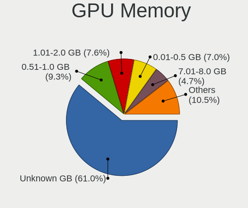

| Size in GB | Computers | Percent |
|------------|-----------|---------|
| Unknown    | 70        | 57.85%  |
| 0.51-1.0   | 13        | 10.74%  |
| 1.01-2.0   | 11        | 9.09%   |
| 0.01-0.5   | 9         | 7.44%   |
| 7.01-8.0   | 7         | 5.79%   |
| 3.01-4.0   | 5         | 4.13%   |
| 8.01-16.0  | 3         | 2.48%   |
| 2.01-3.0   | 2         | 1.65%   |
| 5.01-6.0   | 1         | 0.83%   |

Monitor
-------

Monitor Vendor
--------------

Monitor vendors

| Vendor                  | Computers | Percent |
|-------------------------|-----------|---------|
| Samsung Electronics     | 21        | 16.15%  |
| AU Optronics            | 21        | 16.15%  |
| LG Display              | 14        | 10.77%  |
| Hewlett-Packard         | 7         | 5.38%   |
| Dell                    | 7         | 5.38%   |
| BOE                     | 7         | 5.38%   |
| Chimei Innolux          | 6         | 4.62%   |
| BenQ                    | 6         | 4.62%   |
| Goldstar                | 5         | 3.85%   |
| Acer                    | 5         | 3.85%   |
| Philips                 | 4         | 3.08%   |
| Chi Mei Optoelectronics | 4         | 3.08%   |
| AOC                     | 3         | 2.31%   |
| Ancor Communications    | 3         | 2.31%   |
| MSI                     | 2         | 1.54%   |
| Vizio                   | 1         | 0.77%   |
| Vestel                  | 1         | 0.77%   |
| Unknown                 | 1         | 0.77%   |
| Sony                    | 1         | 0.77%   |
| Sharp                   | 1         | 0.77%   |
| Sceptre Tech            | 1         | 0.77%   |
| Plain Tree Systems      | 1         | 0.77%   |
| Microstep               | 1         | 0.77%   |
| Medion                  | 1         | 0.77%   |
| Lenovo                  | 1         | 0.77%   |
| InfoVision              | 1         | 0.77%   |
| Iiyama                  | 1         | 0.77%   |
| GRM                     | 1         | 0.77%   |
| CSO                     | 1         | 0.77%   |
| ASUSTek Computer        | 1         | 0.77%   |

Monitor Model
-------------

Monitor models

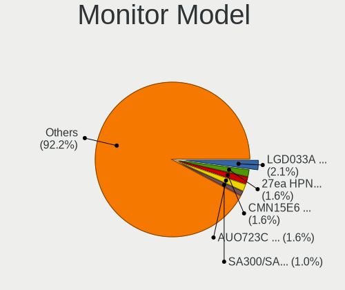

| Model                                                                    | Computers | Percent |
|--------------------------------------------------------------------------|-----------|---------|
| LG Display LCD Monitor LGD033A 1366x768 344x194mm 15.5-inch              | 4         | 2.88%   |
| AU Optronics LCD Monitor AUO723C 1366x768 309x173mm 13.9-inch            | 3         | 2.16%   |
| Samsung Electronics SA300/SA350 SAM0791 1920x1080 510x287mm 23.0-inch    | 2         | 1.44%   |
| MSI Optix MAG27CQ MSI1462 2560x1440 597x336mm 27.0-inch                  | 2         | 1.44%   |
| Chimei Innolux LCD Monitor CMN15E6 1366x768 344x193mm 15.5-inch          | 2         | 1.44%   |
| Chi Mei Optoelectronics LCD Monitor CMO1592 1366x768 344x193mm 15.5-inch | 2         | 1.44%   |
| BOE LCD Monitor BOE0685 1600x900 382x215mm 17.3-inch                     | 2         | 1.44%   |
| Vizio D55-D2 VIZ1004 1920x1080 477x268mm 21.5-inch                       | 1         | 0.72%   |
| Vestel LCD Monitor 32W_LCD_TV                                            | 1         | 0.72%   |
| Unknown LCD Monitor DAC Moniter 5760x1080                                | 1         | 0.72%   |
| Sony TV SNYF301 1920x1080 1600x900mm 72.3-inch                           | 1         | 0.72%   |
| Sharp LQ156M1JW08 SHP14D4 1920x1080 344x194mm 15.5-inch                  | 1         | 0.72%   |
| Sceptre Tech Sceptre M25 SPT0A05 1920x1080 698x393mm 31.5-inch           | 1         | 0.72%   |
| Samsung Electronics SyncMaster SAM0593 1920x1080 477x268mm 21.5-inch     | 1         | 0.72%   |
| Samsung Electronics SyncMaster SAM037B 1680x1050 474x296mm 22.0-inch     | 1         | 0.72%   |
| Samsung Electronics SyncMaster SAM036F 1440x900 428x255mm 19.6-inch      | 1         | 0.72%   |
| Samsung Electronics SyncMaster SAM0254 1680x1050 474x296mm 22.0-inch     | 1         | 0.72%   |
| Samsung Electronics SMB1930N SAM0632 1366x768 410x230mm 18.5-inch        | 1         | 0.72%   |
| Samsung Electronics SA300/SA350 SAM078E 1920x1080 477x268mm 21.5-inch    | 1         | 0.72%   |
| Samsung Electronics S22F350 SAM0D1A 1920x1080 477x268mm 21.5-inch        | 1         | 0.72%   |
| Samsung Electronics S22D300 SAM0B3E 1920x1080 477x268mm 21.5-inch        | 1         | 0.72%   |
| Samsung Electronics LU28R55 SAM1016 3840x2160 632x360mm 28.6-inch        | 1         | 0.72%   |
| Samsung Electronics LCD Monitor SEC544B 1600x900 344x194mm 15.5-inch     | 1         | 0.72%   |
| Samsung Electronics LCD Monitor SEC4149 1366x768 292x174mm 13.4-inch     | 1         | 0.72%   |
| Samsung Electronics LCD Monitor SEC3551 1366x768 344x194mm 15.5-inch     | 1         | 0.72%   |
| Samsung Electronics LCD Monitor SDC5744 1920x1080 344x194mm 15.5-inch    | 1         | 0.72%   |
| Samsung Electronics LCD Monitor SDC464C 1366x768 309x174mm 14.0-inch     | 1         | 0.72%   |
| Samsung Electronics LCD Monitor SDC3853 2736x1824 260x173mm 12.3-inch    | 1         | 0.72%   |
| Samsung Electronics LCD Monitor SAM0DF7 3840x2160 950x540mm 43.0-inch    | 1         | 0.72%   |
| Samsung Electronics LCD Monitor SAM094E 1920x1080 700x390mm 31.5-inch    | 1         | 0.72%   |
| Samsung Electronics LCD Monitor SAM0902 1920x1080 890x500mm 40.2-inch    | 1         | 0.72%   |
| Samsung Electronics LCD Monitor SAM07BA 1920x1080 480x270mm 21.7-inch    | 1         | 0.72%   |
| Samsung Electronics LCD Monitor S24D300 1920x1080                        | 1         | 0.72%   |
| Plain Tree Systems TFT19DXP PTS03A0 1280x1024 376x301mm 19.0-inch        | 1         | 0.72%   |
| Philips PHL 276E8V PHLC18F 3840x2160 600x340mm 27.2-inch                 | 1         | 0.72%   |
| Philips PHL 273V5 PHLC0D2 1920x1080 600x340mm 27.2-inch                  | 1         | 0.72%   |
| Philips PHL 246E9Q PHLC17C 1920x1080 527x296mm 23.8-inch                 | 1         | 0.72%   |
| Philips LCD Monitor PHL 276E8V 7680x2160                                 | 1         | 0.72%   |
| Philips LCD Monitor PHL 276E8V                                           | 1         | 0.72%   |
| MSI MPG341CQR MSI3DA0 3440x1440 797x334mm 34.0-inch                      | 1         | 0.72%   |
| MSI MAG341CQ MSI1462 3440x1440 800x330mm 34.1-inch                       | 1         | 0.72%   |
| Microstep LCD Monitor Optix MAG24C 3840x1200                             | 1         | 0.72%   |
| Medion LCD Monitor MEDB603 1920x1080 480x270mm 21.7-inch                 | 1         | 0.72%   |
| LG Display LCD Monitor LGD05FF 1920x1080 344x194mm 15.5-inch             | 1         | 0.72%   |
| LG Display LCD Monitor LGD05C0 1920x1080 344x194mm 15.5-inch             | 1         | 0.72%   |
| LG Display LCD Monitor LGD053F 1920x1080 344x194mm 15.5-inch             | 1         | 0.72%   |
| LG Display LCD Monitor LGD046F 1920x1080 340x190mm 15.3-inch             | 1         | 0.72%   |
| LG Display LCD Monitor LGD0469 1920x1080 382x215mm 17.3-inch             | 1         | 0.72%   |
| LG Display LCD Monitor LGD02E9 1366x768 309x174mm 14.0-inch              | 1         | 0.72%   |
| LG Display LCD Monitor LGD02DC 1366x768 344x194mm 15.5-inch              | 1         | 0.72%   |
| LG Display LCD Monitor LGD02CA 1366x768 345x194mm 15.6-inch              | 1         | 0.72%   |
| LG Display LCD Monitor LGD027A 1600x900 382x215mm 17.3-inch              | 1         | 0.72%   |
| LG Display LCD Monitor LGD0259 1920x1080 350x190mm 15.7-inch             | 1         | 0.72%   |
| Lenovo LCD Monitor LEN4036 1440x900 303x190mm 14.1-inch                  | 1         | 0.72%   |
| InfoVision LCD Monitor IVO0579 1366x768 310x170mm 13.9-inch              | 1         | 0.72%   |
| Iiyama PL2493H IVM6148 1920x1080 527x296mm 23.8-inch                     | 1         | 0.72%   |
| Hewlett-Packard x23LED HWP2912 1920x1080 509x286mm 23.0-inch             | 1         | 0.72%   |
| Hewlett-Packard w2228h HWP2810 1680x1050 473x296mm 22.0-inch             | 1         | 0.72%   |
| Hewlett-Packard w2207 HWP26A8 1680x1050 473x296mm 22.0-inch              | 1         | 0.72%   |
| Hewlett-Packard vs19x HWP2658 1280x1024 376x301mm 19.0-inch              | 1         | 0.72%   |

Monitor Resolution
------------------

Monitor screen resolution

| Resolution         | Computers | Percent |
|--------------------|-----------|---------|
| 1920x1080 (FHD)    | 50        | 39.06%  |
| 1366x768 (WXGA)    | 35        | 27.34%  |
| 1600x900 (HD+)     | 8         | 6.25%   |
| 1680x1050 (WSXGA+) | 7         | 5.47%   |
| 3840x2160 (4K)     | 4         | 3.13%   |
| 1440x900 (WXGA+)   | 4         | 3.13%   |
| Unknown            | 4         | 3.13%   |
| 1280x1024 (SXGA)   | 3         | 2.34%   |
| 7680x2160          | 2         | 1.56%   |
| 3440x1440          | 2         | 1.56%   |
| 2560x1440 (QHD)    | 2         | 1.56%   |
| 1920x1200 (WUXGA)  | 2         | 1.56%   |
| 5760x1080          | 1         | 0.78%   |
| 3840x1200          | 1         | 0.78%   |
| 2736x1824          | 1         | 0.78%   |
| 2560x1600          | 1         | 0.78%   |
| 1360x768           | 1         | 0.78%   |

Monitor Diagonal
----------------

Diagonal size in inches

| Inches  | Computers | Percent |
|---------|-----------|---------|
| 15      | 33        | 25%     |
| 23      | 13        | 9.85%   |
| 14      | 11        | 8.33%   |
| 21      | 10        | 7.58%   |
| Unknown | 8         | 6.06%   |
| 17      | 7         | 5.3%    |
| 22      | 6         | 4.55%   |
| 13      | 6         | 4.55%   |
| 27      | 5         | 3.79%   |
| 24      | 5         | 3.79%   |
| 19      | 5         | 3.79%   |
| 18      | 4         | 3.03%   |
| 34      | 2         | 1.52%   |
| 31      | 2         | 1.52%   |
| 20      | 2         | 1.52%   |
| 11      | 2         | 1.52%   |
| 84      | 1         | 0.76%   |
| 72      | 1         | 0.76%   |
| 54      | 1         | 0.76%   |
| 49      | 1         | 0.76%   |
| 46      | 1         | 0.76%   |
| 40      | 1         | 0.76%   |
| 33      | 1         | 0.76%   |
| 28      | 1         | 0.76%   |
| 16      | 1         | 0.76%   |
| 12      | 1         | 0.76%   |
| 10      | 1         | 0.76%   |

Monitor Width
-------------

Physical width

| Width in mm | Computers | Percent |
|-------------|-----------|---------|
| 301-350     | 49        | 37.69%  |
| 401-500     | 24        | 18.46%  |
| 501-600     | 20        | 15.38%  |
| 351-400     | 10        | 7.69%   |
| Unknown     | 8         | 6.15%   |
| 201-300     | 6         | 4.62%   |
| 601-700     | 4         | 3.08%   |
| 701-800     | 3         | 2.31%   |
| 1001-1500   | 3         | 2.31%   |
| 1501-2000   | 2         | 1.54%   |
| 801-900     | 1         | 0.77%   |

Aspect Ratio
------------

Proportional relationship between the width and the height

| Ratio   | Computers | Percent |
|---------|-----------|---------|
| 16/9    | 95        | 77.87%  |
| 16/10   | 13        | 10.66%  |
| Unknown | 8         | 6.56%   |
| 5/4     | 3         | 2.46%   |
| 21/9    | 2         | 1.64%   |
| 3/2     | 1         | 0.82%   |

Monitor Area
------------

Area in inch

| Area in inch | Computers | Percent |
|----------------|-----------|---------|
| 101-110        | 33        | 25.58%  |
| 201-250        | 28        | 21.71%  |
| 81-90          | 15        | 11.63%  |
| 151-200        | 10        | 7.75%   |
| Unknown        | 8         | 6.2%    |
| 121-130        | 7         | 5.43%   |
| 351-500        | 5         | 3.88%   |
| 301-350        | 5         | 3.88%   |
| More than 1000 | 4         | 3.1%    |
| 141-150        | 4         | 3.1%    |
| 71-80          | 2         | 1.55%   |
| 51-60          | 2         | 1.55%   |
| 501-1000       | 2         | 1.55%   |
| 61-70          | 1         | 0.78%   |
| 41-50          | 1         | 0.78%   |
| 251-300        | 1         | 0.78%   |
| 111-120        | 1         | 0.78%   |

Pixel Density
-------------

Pixels per inch

| Density       | Computers | Percent |
|---------------|-----------|---------|
| 101-120       | 44        | 33.85%  |
| 51-100        | 44        | 33.85%  |
| 121-160       | 26        | 20%     |
| Unknown       | 8         | 6.15%   |
| 1-50          | 4         | 3.08%   |
| 161-240       | 3         | 2.31%   |
| More than 240 | 1         | 0.77%   |

Multiple Monitors
-----------------

Total monitors connected

| Total | Computers | Percent |
|-------|-----------|---------|
| 1     | 105       | 86.07%  |
| 2     | 14        | 11.48%  |
| 0     | 2         | 1.64%   |
| 3     | 1         | 0.82%   |

Network
-------

Net Controller Vendor
---------------------

Controller vendors

| Vendor                            | Computers | Percent |
|-----------------------------------|-----------|---------|
| Realtek Semiconductor             | 64        | 34.97%  |
| Intel                             | 58        | 31.69%  |
| Qualcomm Atheros                  | 25        | 13.66%  |
| Broadcom                          | 8         | 4.37%   |
| Ralink Technology                 | 4         | 2.19%   |
| TP-Link                           | 3         | 1.64%   |
| Microsoft                         | 3         | 1.64%   |
| Huawei Technologies               | 3         | 1.64%   |
| Xiaomi                            | 2         | 1.09%   |
| Spreadtrum Communications         | 1         | 0.55%   |
| Sierra Wireless                   | 1         | 0.55%   |
| Samsung Electronics               | 1         | 0.55%   |
| Ralink                            | 1         | 0.55%   |
| Qualcomm Atheros Communications   | 1         | 0.55%   |
| Nvidia                            | 1         | 0.55%   |
| NetXen Incorporated               | 1         | 0.55%   |
| Marvell Technology Group          | 1         | 0.55%   |
| Ericsson Business Mobile Networks | 1         | 0.55%   |
| DisplayLink                       | 1         | 0.55%   |
| Dell                              | 1         | 0.55%   |
| Broadcom Limited                  | 1         | 0.55%   |
| Belkin Components                 | 1         | 0.55%   |

Net Controller Model
--------------------

Controller models

| Model                                                                   | Computers | Percent |
|-------------------------------------------------------------------------|-----------|---------|
| Realtek RTL8111/8168/8411 PCI Express Gigabit Ethernet Controller       | 42        | 19.72%  |
| Realtek RTL810xE PCI Express Fast Ethernet controller                   | 10        | 4.69%   |
| Intel I211 Gigabit Network Connection                                   | 9         | 4.23%   |
| Intel 82579LM Gigabit Network Connection (Lewisville)                   | 9         | 4.23%   |
| Intel Wi-Fi 6 AX200                                                     | 8         | 3.76%   |
| Qualcomm Atheros AR9285 Wireless Network Adapter (PCI-Express)          | 6         | 2.82%   |
| Qualcomm Atheros AR9485 Wireless Network Adapter                        | 5         | 2.35%   |
| Intel Centrino Ultimate-N 6300                                          | 5         | 2.35%   |
| Realtek RTL8821CE 802.11ac PCIe Wireless Network Adapter                | 4         | 1.88%   |
| Qualcomm Atheros QCA9565 / AR9565 Wireless Network Adapter              | 4         | 1.88%   |
| Qualcomm Atheros QCA9377 802.11ac Wireless Network Adapter              | 4         | 1.88%   |
| Intel Ethernet Connection I217-LM                                       | 4         | 1.88%   |
| Realtek RTL88x2bu [AC1200 Techkey]                                      | 3         | 1.41%   |
| Intel Wireless 8265 / 8275                                              | 3         | 1.41%   |
| Intel Gemini Lake PCH CNVi WiFi                                         | 3         | 1.41%   |
| Intel Centrino Advanced-N 6205 [Taylor Peak]                            | 3         | 1.41%   |
| Intel 82577LM Gigabit Network Connection                                | 3         | 1.41%   |
| Intel 82567LM-3 Gigabit Network Connection                              | 3         | 1.41%   |
| Huawei E353/E3131                                                       | 3         | 1.41%   |
| Broadcom BCM43142 802.11b/g/n                                           | 3         | 1.41%   |
| Realtek RTL8723BE PCIe Wireless Network Adapter                         | 2         | 0.94%   |
| Realtek RTL8192EE PCIe Wireless Network Adapter                         | 2         | 0.94%   |
| Ralink RT5572 Wireless Adapter                                          | 2         | 0.94%   |
| Ralink MT7601U Wireless Adapter                                         | 2         | 0.94%   |
| Qualcomm Atheros AR928X Wireless Network Adapter (PCI-Express)          | 2         | 0.94%   |
| Qualcomm Atheros AR8152 v2.0 Fast Ethernet                              | 2         | 0.94%   |
| Intel Wireless-AC 9260                                                  | 2         | 0.94%   |
| Intel Wireless 7265                                                     | 2         | 0.94%   |
| Intel Ethernet Connection (2) I219-V                                    | 2         | 0.94%   |
| Intel Cannon Lake PCH CNVi WiFi                                         | 2         | 0.94%   |
| Xiaomi Mi/Redmi series (RNDIS)                                          | 1         | 0.47%   |
| Xiaomi Mi/Redmi series (RNDIS + ADB)                                    | 1         | 0.47%   |
| TP-Link TL-WN822N Version 4 RTL8192EU                                   | 1         | 0.47%   |
| TP-Link TL-WN722N v2/v3 [Realtek RTL8188EUS]                            | 1         | 0.47%   |
| TP-Link Archer T4U v2 [Realtek RTL8812AU]                               | 1         | 0.47%   |
| Spreadtrum Nokia C30                                                    | 1         | 0.47%   |
| Sierra Wireless EM7345 4G LTE                                           | 1         | 0.47%   |
| Samsung GT-I9070 (network tethering, USB debugging enabled)             | 1         | 0.47%   |
| Realtek RTL8852AE 802.11ax PCIe Wireless Network Adapter                | 1         | 0.47%   |
| Realtek RTL8723BU 802.11b/g/n WLAN Adapter                              | 1         | 0.47%   |
| Realtek RTL8192EU 802.11b/g/n WLAN Adapter                              | 1         | 0.47%   |
| Realtek RTL8191SEvB Wireless LAN Controller                             | 1         | 0.47%   |
| Realtek RTL8188EUS 802.11n Wireless Network Adapter                     | 1         | 0.47%   |
| Realtek RTL8188EE Wireless Network Adapter                              | 1         | 0.47%   |
| Realtek RTL8153 Gigabit Ethernet Adapter                                | 1         | 0.47%   |
| Realtek RTL8125 2.5GbE Controller                                       | 1         | 0.47%   |
| Ralink RT5390 Wireless 802.11n 1T/1R PCIe                               | 1         | 0.47%   |
| Qualcomm Atheros QCA6174 802.11ac Wireless Network Adapter              | 1         | 0.47%   |
| Qualcomm Atheros Killer E2400 Gigabit Ethernet Controller               | 1         | 0.47%   |
| Qualcomm Atheros AR9271 802.11n                                         | 1         | 0.47%   |
| Qualcomm Atheros AR8161 Gigabit Ethernet                                | 1         | 0.47%   |
| Qualcomm Atheros AR8151 v2.0 Gigabit Ethernet                           | 1         | 0.47%   |
| Qualcomm Atheros AR8131 Gigabit Ethernet                                | 1         | 0.47%   |
| Qualcomm Atheros AR242x / AR542x Wireless Network Adapter (PCI-Express) | 1         | 0.47%   |
| Nvidia MCP61 Ethernet                                                   | 1         | 0.47%   |
| NetXen Incorporated NX3031 Multifunction 1/10-Gigabit Server Adapter    | 1         | 0.47%   |
| Microsoft XBOX ACC                                                      | 1         | 0.47%   |
| Microsoft Xbox 360 Wireless Adapter                                     | 1         | 0.47%   |
| Microsoft RTL8153 GigE [Surface Ethernet Adapter]                       | 1         | 0.47%   |
| Marvell Group 88W8897 [AVASTAR] 802.11ac Wireless                       | 1         | 0.47%   |

Wireless Vendor
---------------

Wireless vendors

| Vendor                          | Computers | Percent |
|---------------------------------|-----------|---------|
| Intel                           | 38        | 39.18%  |
| Qualcomm Atheros                | 23        | 23.71%  |
| Realtek Semiconductor           | 16        | 16.49%  |
| Broadcom                        | 5         | 5.15%   |
| Ralink Technology               | 4         | 4.12%   |
| TP-Link                         | 3         | 3.09%   |
| Microsoft                       | 2         | 2.06%   |
| Sierra Wireless                 | 1         | 1.03%   |
| Ralink                          | 1         | 1.03%   |
| Qualcomm Atheros Communications | 1         | 1.03%   |
| Marvell Technology Group        | 1         | 1.03%   |
| Broadcom Limited                | 1         | 1.03%   |
| Belkin Components               | 1         | 1.03%   |

Wireless Model
--------------

Wireless models

| Model                                                                   | Computers | Percent |
|-------------------------------------------------------------------------|-----------|---------|
| Intel Wi-Fi 6 AX200                                                     | 8         | 8.16%   |
| Qualcomm Atheros AR9285 Wireless Network Adapter (PCI-Express)          | 6         | 6.12%   |
| Qualcomm Atheros AR9485 Wireless Network Adapter                        | 5         | 5.1%    |
| Intel Centrino Ultimate-N 6300                                          | 5         | 5.1%    |
| Realtek RTL8821CE 802.11ac PCIe Wireless Network Adapter                | 4         | 4.08%   |
| Qualcomm Atheros QCA9565 / AR9565 Wireless Network Adapter              | 4         | 4.08%   |
| Qualcomm Atheros QCA9377 802.11ac Wireless Network Adapter              | 4         | 4.08%   |
| Realtek RTL88x2bu [AC1200 Techkey]                                      | 3         | 3.06%   |
| Intel Wireless 8265 / 8275                                              | 3         | 3.06%   |
| Intel Gemini Lake PCH CNVi WiFi                                         | 3         | 3.06%   |
| Intel Centrino Advanced-N 6205 [Taylor Peak]                            | 3         | 3.06%   |
| Broadcom BCM43142 802.11b/g/n                                           | 3         | 3.06%   |
| Realtek RTL8723BE PCIe Wireless Network Adapter                         | 2         | 2.04%   |
| Realtek RTL8192EE PCIe Wireless Network Adapter                         | 2         | 2.04%   |
| Ralink RT5572 Wireless Adapter                                          | 2         | 2.04%   |
| Ralink MT7601U Wireless Adapter                                         | 2         | 2.04%   |
| Qualcomm Atheros AR928X Wireless Network Adapter (PCI-Express)          | 2         | 2.04%   |
| Intel Wireless-AC 9260                                                  | 2         | 2.04%   |
| Intel Wireless 7265                                                     | 2         | 2.04%   |
| Intel Cannon Lake PCH CNVi WiFi                                         | 2         | 2.04%   |
| TP-Link TL-WN822N Version 4 RTL8192EU                                   | 1         | 1.02%   |
| TP-Link TL-WN722N v2/v3 [Realtek RTL8188EUS]                            | 1         | 1.02%   |
| TP-Link Archer T4U v2 [Realtek RTL8812AU]                               | 1         | 1.02%   |
| Sierra Wireless EM7345 4G LTE                                           | 1         | 1.02%   |
| Realtek RTL8852AE 802.11ax PCIe Wireless Network Adapter                | 1         | 1.02%   |
| Realtek RTL8723BU 802.11b/g/n WLAN Adapter                              | 1         | 1.02%   |
| Realtek RTL8192EU 802.11b/g/n WLAN Adapter                              | 1         | 1.02%   |
| Realtek RTL8191SEvB Wireless LAN Controller                             | 1         | 1.02%   |
| Realtek RTL8188EUS 802.11n Wireless Network Adapter                     | 1         | 1.02%   |
| Realtek RTL8188EE Wireless Network Adapter                              | 1         | 1.02%   |
| Ralink RT5390 Wireless 802.11n 1T/1R PCIe                               | 1         | 1.02%   |
| Qualcomm Atheros QCA6174 802.11ac Wireless Network Adapter              | 1         | 1.02%   |
| Qualcomm Atheros AR9271 802.11n                                         | 1         | 1.02%   |
| Qualcomm Atheros AR242x / AR542x Wireless Network Adapter (PCI-Express) | 1         | 1.02%   |
| Microsoft XBOX ACC                                                      | 1         | 1.02%   |
| Microsoft Xbox 360 Wireless Adapter                                     | 1         | 1.02%   |
| Marvell Group 88W8897 [AVASTAR] 802.11ac Wireless                       | 1         | 1.02%   |
| Intel Wireless 7260                                                     | 1         | 1.02%   |
| Intel PRO/Wireless 5100 AGN [Shiloh] Network Connection                 | 1         | 1.02%   |
| Intel Dual Band Wireless-AC 3168NGW [Stone Peak]                        | 1         | 1.02%   |
| Intel Dual Band Wireless-AC 3165 Plus Bluetooth                         | 1         | 1.02%   |
| Intel Comet Lake PCH CNVi WiFi                                          | 1         | 1.02%   |
| Intel Centrino Wireless-N 2230                                          | 1         | 1.02%   |
| Intel Centrino Wireless-N 2200                                          | 1         | 1.02%   |
| Intel Centrino Advanced-N 6235                                          | 1         | 1.02%   |
| Intel Centrino Advanced-N 6200                                          | 1         | 1.02%   |
| Intel Cannon Point-LP CNVi [Wireless-AC]                                | 1         | 1.02%   |
| Broadcom Limited BCM4312 802.11b/g LP-PHY                               | 1         | 1.02%   |
| Broadcom BCM43217 802.11b/g/n                                           | 1         | 1.02%   |
| Broadcom BCM4313 802.11bgn Wireless Network Adapter                     | 1         | 1.02%   |
| Belkin Components F5D8053 N Wireless USB Adapter v3000 [Ralink RT2870]  | 1         | 1.02%   |

Ethernet Vendor
---------------

Ethernet vendors

| Vendor                    | Computers | Percent |
|---------------------------|-----------|---------|
| Realtek Semiconductor     | 54        | 47.79%  |
| Intel                     | 39        | 34.51%  |
| Qualcomm Atheros          | 6         | 5.31%   |
| Huawei Technologies       | 3         | 2.65%   |
| Broadcom                  | 3         | 2.65%   |
| Xiaomi                    | 2         | 1.77%   |
| Spreadtrum Communications | 1         | 0.88%   |
| Samsung Electronics       | 1         | 0.88%   |
| Nvidia                    | 1         | 0.88%   |
| NetXen Incorporated       | 1         | 0.88%   |
| Microsoft                 | 1         | 0.88%   |
| DisplayLink               | 1         | 0.88%   |

Ethernet Model
--------------

Ethernet models

| Model                                                                | Computers | Percent |
|----------------------------------------------------------------------|-----------|---------|
| Realtek RTL8111/8168/8411 PCI Express Gigabit Ethernet Controller    | 42        | 37.17%  |
| Realtek RTL810xE PCI Express Fast Ethernet controller                | 10        | 8.85%   |
| Intel I211 Gigabit Network Connection                                | 9         | 7.96%   |
| Intel 82579LM Gigabit Network Connection (Lewisville)                | 9         | 7.96%   |
| Intel Ethernet Connection I217-LM                                    | 4         | 3.54%   |
| Intel 82577LM Gigabit Network Connection                             | 3         | 2.65%   |
| Intel 82567LM-3 Gigabit Network Connection                           | 3         | 2.65%   |
| Huawei E353/E3131                                                    | 3         | 2.65%   |
| Qualcomm Atheros AR8152 v2.0 Fast Ethernet                           | 2         | 1.77%   |
| Intel Ethernet Connection (2) I219-V                                 | 2         | 1.77%   |
| Xiaomi Mi/Redmi series (RNDIS)                                       | 1         | 0.88%   |
| Xiaomi Mi/Redmi series (RNDIS + ADB)                                 | 1         | 0.88%   |
| Spreadtrum Nokia C30                                                 | 1         | 0.88%   |
| Samsung GT-I9070 (network tethering, USB debugging enabled)          | 1         | 0.88%   |
| Realtek RTL8153 Gigabit Ethernet Adapter                             | 1         | 0.88%   |
| Realtek RTL8125 2.5GbE Controller                                    | 1         | 0.88%   |
| Qualcomm Atheros Killer E2400 Gigabit Ethernet Controller            | 1         | 0.88%   |
| Qualcomm Atheros AR8161 Gigabit Ethernet                             | 1         | 0.88%   |
| Qualcomm Atheros AR8151 v2.0 Gigabit Ethernet                        | 1         | 0.88%   |
| Qualcomm Atheros AR8131 Gigabit Ethernet                             | 1         | 0.88%   |
| Nvidia MCP61 Ethernet                                                | 1         | 0.88%   |
| NetXen Incorporated NX3031 Multifunction 1/10-Gigabit Server Adapter | 1         | 0.88%   |
| Microsoft RTL8153 GigE [Surface Ethernet Adapter]                    | 1         | 0.88%   |
| Intel Ethernet Connection I217-V                                     | 1         | 0.88%   |
| Intel Ethernet Connection (6) I219-V                                 | 1         | 0.88%   |
| Intel Ethernet Connection (6) I219-LM                                | 1         | 0.88%   |
| Intel Ethernet Connection (2) I219-LM                                | 1         | 0.88%   |
| Intel Ethernet Connection (2) I218-V                                 | 1         | 0.88%   |
| Intel 82579V Gigabit Network Connection                              | 1         | 0.88%   |
| Intel 82578DC Gigabit Network Connection                             | 1         | 0.88%   |
| Intel 82577LC Gigabit Network Connection                             | 1         | 0.88%   |
| Intel 82574L Gigabit Network Connection                              | 1         | 0.88%   |
| DisplayLink Dell Universal Dock D6000                                | 1         | 0.88%   |
| Broadcom NetXtreme BCM57786 Gigabit Ethernet PCIe                    | 1         | 0.88%   |
| Broadcom NetLink BCM5784M Gigabit Ethernet PCIe                      | 1         | 0.88%   |
| Broadcom NetLink BCM57788 Gigabit Ethernet PCIe                      | 1         | 0.88%   |

Net Controller Kind
-------------------

Ethernet, WiFi or modem

| Kind     | Computers | Percent |
|----------|-----------|---------|
| Ethernet | 103       | 52.02%  |
| WiFi     | 93        | 46.97%  |
| Modem    | 2         | 1.01%   |

Used Controller
---------------

Currently used network controller

| Kind     | Computers | Percent |
|----------|-----------|---------|
| Ethernet | 96        | 53.04%  |
| WiFi     | 85        | 46.96%  |

NICs
----

Total network controllers on board

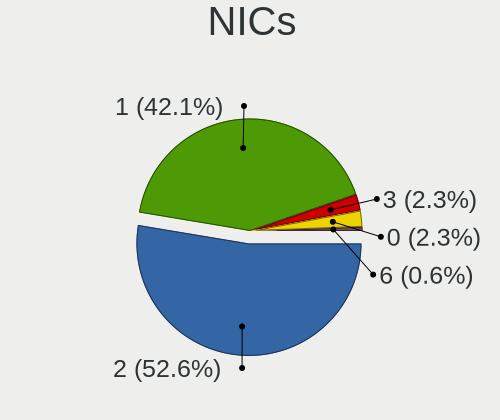

| Total | Computers | Percent |
|-------|-----------|---------|
| 2     | 62        | 51.24%  |
| 1     | 52        | 42.98%  |
| 0     | 4         | 3.31%   |
| 3     | 2         | 1.65%   |
| 6     | 1         | 0.83%   |

IPv6
----

IPv6 vs IPv4

| Used | Computers | Percent |
|------|-----------|---------|
| No   | 113       | 92.62%  |
| Yes  | 9         | 7.38%   |

Bluetooth
---------

Bluetooth Vendor
----------------

Controller vendors

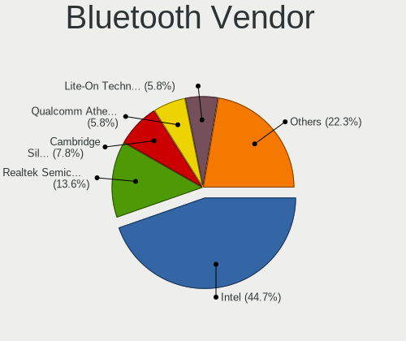

| Vendor                          | Computers | Percent |
|---------------------------------|-----------|---------|
| Intel                           | 26        | 39.39%  |
| Cambridge Silicon Radio         | 7         | 10.61%  |
| Realtek Semiconductor           | 6         | 9.09%   |
| Qualcomm Atheros Communications | 6         | 9.09%   |
| Lite-On Technology              | 5         | 7.58%   |
| IMC Networks                    | 3         | 4.55%   |
| Dell                            | 3         | 4.55%   |
| Broadcom                        | 3         | 4.55%   |
| Foxconn / Hon Hai               | 2         | 3.03%   |
| ASUSTek Computer                | 2         | 3.03%   |
| Marvell Semiconductor           | 1         | 1.52%   |
| Hewlett-Packard                 | 1         | 1.52%   |
| Foxconn International           | 1         | 1.52%   |

Bluetooth Model
---------------

Controller models

| Model                                               | Computers | Percent |
|-----------------------------------------------------|-----------|---------|
| Intel Bluetooth Device                              | 13        | 19.7%   |
| Cambridge Silicon Radio Bluetooth Dongle (HCI mode) | 7         | 10.61%  |
| Intel Bluetooth 9460/9560 Jefferson Peak (JfP)      | 5         | 7.58%   |
| Realtek Bluetooth Radio                             | 4         | 6.06%   |
| Qualcomm Atheros  Bluetooth Device                  | 4         | 6.06%   |
| Intel Bluetooth wireless interface                  | 3         | 4.55%   |
| Lite-On Atheros AR3012 Bluetooth                    | 2         | 3.03%   |
| Intel Wireless-AC 9260 Bluetooth Adapter            | 2         | 3.03%   |
| Intel Centrino Bluetooth Wireless Transceiver       | 2         | 3.03%   |
| Dell BCM20702A0 Bluetooth Module                    | 2         | 3.03%   |
| Realtek RTL8723B Bluetooth                          | 1         | 1.52%   |
| Realtek  Bluetooth 4.2 Adapter                      | 1         | 1.52%   |
| Qualcomm Atheros Bluetooth USB Host Controller      | 1         | 1.52%   |
| Qualcomm Atheros AR3011 Bluetooth                   | 1         | 1.52%   |
| Marvell Bluetooth and Wireless LAN Composite Device | 1         | 1.52%   |
| Lite-On Qualcomm Atheros QCA9377 Bluetooth          | 1         | 1.52%   |
| Lite-On Qualcomm Atheros Bluetooth                  | 1         | 1.52%   |
| Lite-On BCM43142A0                                  | 1         | 1.52%   |
| Intel Wireless-AC 3168 Bluetooth                    | 1         | 1.52%   |
| IMC Networks Bluetooth Radio                        | 1         | 1.52%   |
| IMC Networks Bluetooth Module                       | 1         | 1.52%   |
| IMC Networks Bluetooth Device                       | 1         | 1.52%   |
| HP Broadcom 2070 Bluetooth Combo                    | 1         | 1.52%   |
| Foxconn International BCM43142A0 Bluetooth module   | 1         | 1.52%   |
| Foxconn / Hon Hai Broadcom Bluetooth 2.1 Device     | 1         | 1.52%   |
| Foxconn / Hon Hai Broadcom BCM20702 Bluetooth       | 1         | 1.52%   |
| Dell DW375 Bluetooth Module                         | 1         | 1.52%   |
| Broadcom BCM43142 Bluetooth 4.0                     | 1         | 1.52%   |
| Broadcom BCM2046 Bluetooth Device                   | 1         | 1.52%   |
| Broadcom BCM2045B (BDC-2.1)                         | 1         | 1.52%   |
| ASUS Broadcom BCM20702A0 Bluetooth                  | 1         | 1.52%   |
| ASUS BCM20702A0                                     | 1         | 1.52%   |

Sound
-----

Sound Vendor
------------

Sound card vendors

| Vendor                 | Computers | Percent |
|------------------------|-----------|---------|
| Intel                  | 87        | 49.71%  |
| AMD                    | 39        | 22.29%  |
| Nvidia                 | 33        | 18.86%  |
| C-Media Electronics    | 4         | 2.29%   |
| JMTek                  | 2         | 1.14%   |
| GN Netcom              | 2         | 1.14%   |
| Plantronics            | 1         | 0.57%   |
| Microsoft              | 1         | 0.57%   |
| Logitech               | 1         | 0.57%   |
| Generalplus Technology | 1         | 0.57%   |
| Focusrite-Novation     | 1         | 0.57%   |
| Creative Labs          | 1         | 0.57%   |
| Blue Microphones       | 1         | 0.57%   |
| Alesis                 | 1         | 0.57%   |

Sound Model
-----------

Sound card models

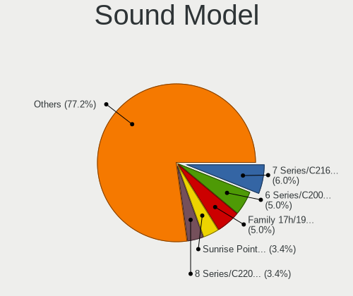

| Model                                                                                             | Computers | Percent |
|---------------------------------------------------------------------------------------------------|-----------|---------|
| Intel 7 Series/C216 Chipset Family High Definition Audio Controller                               | 14        | 6.76%   |
| Intel 6 Series/C200 Series Chipset Family High Definition Audio Controller                        | 12        | 5.8%    |
| Intel 8 Series/C220 Series Chipset High Definition Audio Controller                               | 8         | 3.86%   |
| Intel 5 Series/3400 Series Chipset High Definition Audio                                          | 8         | 3.86%   |
| Intel Sunrise Point-LP HD Audio                                                                   | 7         | 3.38%   |
| AMD Family 17h (Models 10h-1fh) HD Audio Controller                                               | 7         | 3.38%   |
| AMD Family 17h (Models 00h-0fh) HD Audio Controller                                               | 7         | 3.38%   |
| Nvidia GF108 High Definition Audio Controller                                                     | 6         | 2.9%    |
| AMD FCH Azalia Controller                                                                         | 6         | 2.9%    |
| Intel Xeon E3-1200 v3/4th Gen Core Processor HD Audio Controller                                  | 5         | 2.42%   |
| AMD Starship/Matisse HD Audio Controller                                                          | 5         | 2.42%   |
| AMD Raven/Raven2/Fenghuang HDMI/DP Audio Controller                                               | 5         | 2.42%   |
| AMD Ellesmere HDMI Audio [Radeon RX 470/480 / 570/580/590]                                        | 5         | 2.42%   |
| Nvidia GK208 HDMI/DP Audio Controller                                                             | 4         | 1.93%   |
| Intel Cannon Point-LP High Definition Audio Controller                                            | 4         | 1.93%   |
| Intel Cannon Lake PCH cAVS                                                                        | 4         | 1.93%   |
| Intel 200 Series PCH HD Audio                                                                     | 4         | 1.93%   |
| Intel 100 Series/C230 Series Chipset Family HD Audio Controller                                   | 4         | 1.93%   |
| AMD SBx00 Azalia (Intel HDA)                                                                      | 4         | 1.93%   |
| Nvidia GP108 High Definition Audio Controller                                                     | 3         | 1.45%   |
| Nvidia GF119 HDMI Audio Controller                                                                | 3         | 1.45%   |
| Intel Celeron/Pentium Silver Processor High Definition Audio                                      | 3         | 1.45%   |
| Intel 82801JD/DO (ICH10 Family) HD Audio Controller                                               | 3         | 1.45%   |
| Intel 82801I (ICH9 Family) HD Audio Controller                                                    | 3         | 1.45%   |
| AMD Kabini HDMI/DP Audio                                                                          | 3         | 1.45%   |
| Nvidia TU106 High Definition Audio Controller                                                     | 2         | 0.97%   |
| Nvidia High Definition Audio Controller                                                           | 2         | 0.97%   |
| Nvidia GP107GL High Definition Audio Controller                                                   | 2         | 0.97%   |
| Nvidia GP104 High Definition Audio Controller                                                     | 2         | 0.97%   |
| Nvidia GM107 High Definition Audio Controller [GeForce 940MX]                                     | 2         | 0.97%   |
| JMTek USB PnP Audio Device                                                                        | 2         | 0.97%   |
| Intel NM10/ICH7 Family High Definition Audio Controller                                           | 2         | 0.97%   |
| Intel Haswell-ULT HD Audio Controller                                                             | 2         | 0.97%   |
| Intel 82801JI (ICH10 Family) HD Audio Controller                                                  | 2         | 0.97%   |
| Intel 8 Series HD Audio Controller                                                                | 2         | 0.97%   |
| AMD Trinity HDMI Audio Controller                                                                 | 2         | 0.97%   |
| AMD RV710/730 HDMI Audio [Radeon HD 4000 series]                                                  | 2         | 0.97%   |
| AMD Renoir Radeon High Definition Audio Controller                                                | 2         | 0.97%   |
| AMD Oland/Hainan/Cape Verde/Pitcairn HDMI Audio [Radeon HD 7000 Series]                           | 2         | 0.97%   |
| AMD Family 15h (Models 60h-6fh) Audio Controller                                                  | 2         | 0.97%   |
| Plantronics RIG 800HD                                                                             | 1         | 0.48%   |
| Nvidia TU116 High Definition Audio Controller                                                     | 1         | 0.48%   |
| Nvidia TU107 GeForce GTX 1650 High Definition Audio Controller                                    | 1         | 0.48%   |
| Nvidia MCP61 High Definition Audio                                                                | 1         | 0.48%   |
| Nvidia GT216 HDMI Audio Controller                                                                | 1         | 0.48%   |
| Nvidia GP106 High Definition Audio Controller                                                     | 1         | 0.48%   |
| Nvidia GP102 HDMI Audio Controller                                                                | 1         | 0.48%   |
| Nvidia GM204 High Definition Audio Controller                                                     | 1         | 0.48%   |
| Nvidia GK106 HDMI Audio Controller                                                                | 1         | 0.48%   |
| Microsoft Surface Pro 3 Docking Station Audio Device                                              | 1         | 0.48%   |
| Logitech H600 [Wireless Headset]                                                                  | 1         | 0.48%   |
| Intel Wildcat Point-LP High Definition Audio Controller                                           | 1         | 0.48%   |
| Intel Comet Lake PCH cAVS                                                                         | 1         | 0.48%   |
| Intel Celeron N3350/Pentium N4200/Atom E3900 Series Audio Cluster                                 | 1         | 0.48%   |
| Intel C600/X79 series chipset High Definition Audio Controller                                    | 1         | 0.48%   |
| Intel Broadwell-U Audio Controller                                                                | 1         | 0.48%   |
| Intel Atom/Celeron/Pentium Processor x5-E8000/J3xxx/N3xxx Series High Definition Audio Controller | 1         | 0.48%   |
| Intel Atom Processor Z36xxx/Z37xxx Series High Definition Audio Controller                        | 1         | 0.48%   |
| Intel 9 Series Chipset Family HD Audio Controller                                                 | 1         | 0.48%   |
| GN Netcom Jabra Link 370                                                                          | 1         | 0.48%   |

Memory
------

Memory Vendor
-------------

Memory module vendors

| Vendor              | Computers | Percent |
|---------------------|-----------|---------|
| SK Hynix            | 3         | 15.79%  |
| Samsung Electronics | 3         | 15.79%  |
| Unknown             | 2         | 10.53%  |
| Team                | 2         | 10.53%  |
| Kingston            | 2         | 10.53%  |
| Crucial             | 2         | 10.53%  |
| Smart               | 1         | 5.26%   |
| Ramaxel Technology  | 1         | 5.26%   |
| Micron Technology   | 1         | 5.26%   |
| G.Skill             | 1         | 5.26%   |
| Corsair             | 1         | 5.26%   |

Memory Model
------------

Memory module models

| Model                                                        | Computers | Percent |
|--------------------------------------------------------------|-----------|---------|
| Team RAM TEAMGROUP-SD4-2666 8GB SODIMM DDR4 2667MT/s         | 2         | 9.09%   |
| Unknown RAM Module 4096MB DIMM DDR3 1600MT/s                 | 1         | 4.55%   |
| Unknown RAM Module 2GB SODIMM 800MT/s                        | 1         | 4.55%   |
| Smart RAM SH564128FJ8NZRNSDR 4096MB SODIMM DDR3 1600MT/s     | 1         | 4.55%   |
| SK Hynix RAM HMT451S6CFR6A-PB 4GB SODIMM DDR3 1600MT/s       | 1         | 4.55%   |
| SK Hynix RAM HMT41GS6AFR8A-PB 8GB SODIMM DDR3 1600MT/s       | 1         | 4.55%   |
| SK Hynix RAM HMA851S6AFR6N-UH 4096MB SODIMM DDR4 2667MT/s    | 1         | 4.55%   |
| Samsung RAM M471A5244CB0-CRC 4096MB SODIMM DDR4 2667MT/s     | 1         | 4.55%   |
| Samsung RAM M471A1K43EB1-CWE 8192MB SODIMM DDR4 3200MT/s     | 1         | 4.55%   |
| Samsung RAM M378B5773CH0-CH9 2GB DIMM 1867MT/s               | 1         | 4.55%   |
| Samsung RAM K3QF3F30BM-AGCF 2GB Row Of Chips LPDDR3 1867MT/s | 1         | 4.55%   |
| Ramaxel RAM RMT1970ED48E8F1066 2048MB SODIMM DDR3 1066MT/s   | 1         | 4.55%   |
| Micron RAM 4ATF11G64HZ-3G2E1 8GB Row Of Chips DDR4 3200MT/s  | 1         | 4.55%   |
| Kingston RAM 99P5471-002.A00LF 2GB DIMM DDR3 1600MT/s        | 1         | 4.55%   |
| Kingston RAM 99P5471-001.A01LF 2GB DIMM DDR3 1333MT/s        | 1         | 4.55%   |
| Kingston RAM 99P5471-001.A00LF 2GB DIMM DDR3 1333MT/s        | 1         | 4.55%   |
| Kingston RAM 9905584-023.A00LF 4096MB DIMM DDR3 1600MT/s     | 1         | 4.55%   |
| G.Skill RAM F4-3600C16-8GVKC 8GB DIMM DDR4 3600MT/s          | 1         | 4.55%   |
| Crucial RAM BLT4G3D1869DT 4096MB DIMM DDR3 1333MT/s          | 1         | 4.55%   |
| Crucial RAM BL16G36C16U4W.M16FE1 16GB DIMM DDR4 3733MT/s     | 1         | 4.55%   |
| Corsair RAM CMK64GX4M2D3000C16 32GB DIMM DDR4 3000MT/s       | 1         | 4.55%   |

Memory Kind
-----------

Memory module kinds

| Kind    | Computers | Percent |
|---------|-----------|---------|
| DDR3    | 8         | 44.44%  |
| DDR4    | 7         | 38.89%  |
| LPDDR4  | 1         | 5.56%   |
| LPDDR3  | 1         | 5.56%   |
| Unknown | 1         | 5.56%   |

Memory Form Factor
------------------

Physical design of the memory module

| Name         | Computers | Percent |
|--------------|-----------|---------|
| SODIMM       | 8         | 47.06%  |
| DIMM         | 7         | 41.18%  |
| Row Of Chips | 2         | 11.76%  |

Memory Size
-----------

Memory module size

| Size  | Computers | Percent |
|-------|-----------|---------|
| 4096  | 7         | 35%     |
| 8192  | 5         | 25%     |
| 2048  | 4         | 20%     |
| 32768 | 3         | 15%     |
| 16384 | 1         | 5%      |

Memory Speed
------------

Memory module speed

| Speed | Computers | Percent |
|-------|-----------|---------|
| 1600  | 6         | 30%     |
| 2667  | 3         | 15%     |
| 3200  | 2         | 10%     |
| 1867  | 2         | 10%     |
| 1333  | 2         | 10%     |
| 3733  | 1         | 5%      |
| 3600  | 1         | 5%      |
| 3000  | 1         | 5%      |
| 1066  | 1         | 5%      |
| 800   | 1         | 5%      |

Printers & scanners
-------------------

Printer Vendor
--------------

Printer device vendors

| Vendor          | Computers | Percent |
|-----------------|-----------|---------|
| Hewlett-Packard | 3         | 50%     |
| Canon           | 2         | 33.33%  |
| Seiko Epson     | 1         | 16.67%  |

Printer Model
-------------

Printer device models

| Model                              | Computers | Percent |
|------------------------------------|-----------|---------|
| Seiko Epson L120 Series            | 1         | 16.67%  |
| HP LaserJet 1300                   | 1         | 16.67%  |
| HP DeskJet 3830 series             | 1         | 16.67%  |
| HP DeskJet 2620 All-in-One Printer | 1         | 16.67%  |
| Canon PIXMA MX920 Series           | 1         | 16.67%  |
| Canon PIXMA MG2500 Series          | 1         | 16.67%  |

Scanner Vendor
--------------

Scanner device vendors

Zero info for selected period =(

Scanner Model
-------------

Scanner device models

Zero info for selected period =(

Camera
------

Camera Vendor
-------------

Camera device vendors

| Vendor                                 | Computers | Percent |
|----------------------------------------|-----------|---------|
| Chicony Electronics                    | 13        | 19.4%   |
| Microdia                               | 10        | 14.93%  |
| IMC Networks                           | 7         | 10.45%  |
| Realtek Semiconductor                  | 6         | 8.96%   |
| Acer                                   | 6         | 8.96%   |
| Logitech                               | 4         | 5.97%   |
| Syntek                                 | 3         | 4.48%   |
| Suyin                                  | 3         | 4.48%   |
| Cheng Uei Precision Industry (Foxlink) | 3         | 4.48%   |
| Samsung Electronics                    | 2         | 2.99%   |
| Quanta                                 | 2         | 2.99%   |
| Alcor Micro                            | 2         | 2.99%   |
| Sunplus Innovation Technology          | 1         | 1.49%   |
| Ricoh                                  | 1         | 1.49%   |
| Lite-On Technology                     | 1         | 1.49%   |
| Lenovo                                 | 1         | 1.49%   |
| KYE Systems (Mouse Systems)            | 1         | 1.49%   |
| GEMBIRD                                | 1         | 1.49%   |

Camera Model
------------

Camera device models

| Model                                                                      | Computers | Percent |
|----------------------------------------------------------------------------|-----------|---------|
| Chicony HD WebCam                                                          | 5         | 7.46%   |
| Microdia Laptop_Integrated_Webcam_HD                                       | 3         | 4.48%   |
| Logitech HD Pro Webcam C920                                                | 3         | 4.48%   |
| Chicony Integrated Camera                                                  | 3         | 4.48%   |
| Acer EasyCamera                                                            | 3         | 4.48%   |
| Syntek Integrated Camera                                                   | 2         | 2.99%   |
| Samsung Galaxy A5 (MTP)                                                    | 2         | 2.99%   |
| Microdia Integrated_Webcam_HD                                              | 2         | 2.99%   |
| IMC Networks Integrated Camera                                             | 2         | 2.99%   |
| Chicony Integrated HP HD Webcam                                            | 2         | 2.99%   |
| Cheng Uei Precision Industry (Foxlink) HP Wide Vision HD Integrated Webcam | 2         | 2.99%   |
| Acer Lenovo EasyCamera                                                     | 2         | 2.99%   |
| Syntek Lenovo EasyCamera                                                   | 1         | 1.49%   |
| Suyin Sony Visual Communication Camera                                     | 1         | 1.49%   |
| Suyin Lenovo EasyCamera                                                    | 1         | 1.49%   |
| Suyin Acer/HP Integrated Webcam [CN0314]                                   | 1         | 1.49%   |
| Sunplus HD WebCam                                                          | 1         | 1.49%   |
| Ricoh HD Webcam                                                            | 1         | 1.49%   |
| Realtek USB2.0 VGA UVC WebCam                                              | 1         | 1.49%   |
| Realtek USB Camera                                                         | 1         | 1.49%   |
| Realtek Laptop_Integrated_Webcam_HD                                        | 1         | 1.49%   |
| Realtek Integrated_Webcam_HD                                               | 1         | 1.49%   |
| Realtek HP "Truevision HD" laptop camera                                   | 1         | 1.49%   |
| Realtek HD WebCam                                                          | 1         | 1.49%   |
| Quanta hm1091_techfront                                                    | 1         | 1.49%   |
| Quanta HD User Facing                                                      | 1         | 1.49%   |
| Microdia Laptop_Integrated_Webcam_E4HD                                     | 1         | 1.49%   |
| Microdia Laptop_Integrated_Webcam_2M                                       | 1         | 1.49%   |
| Microdia Laptop Integrated Webcam HD (Composite Device)                    | 1         | 1.49%   |
| Microdia Integrated_Webcam_FHD                                             | 1         | 1.49%   |
| Microdia Dell Integrated HD Webcam                                         | 1         | 1.49%   |
| Logitech C922 Pro Stream Webcam                                            | 1         | 1.49%   |
| Lite-On HP Wide Vision HD Camera                                           | 1         | 1.49%   |
| Lenovo Integrated Webcam [R5U877]                                          | 1         | 1.49%   |
| KYE Systems (Mouse Systems) Slim 1322AF                                    | 1         | 1.49%   |
| IMC Networks XHC Camera                                                    | 1         | 1.49%   |
| IMC Networks USB2.0 VGA UVC WebCam                                         | 1         | 1.49%   |
| IMC Networks USB2.0 HD UVC WebCam                                          | 1         | 1.49%   |
| IMC Networks Lenovo EasyCamera                                             | 1         | 1.49%   |
| IMC Networks EasyCamera                                                    | 1         | 1.49%   |
| GEMBIRD USB2.0 PC CAMERA                                                   | 1         | 1.49%   |
| Chicony TOSHIBA Web Camera                                                 | 1         | 1.49%   |
| Chicony Lenovo EasyCamera                                                  | 1         | 1.49%   |
| Chicony HD WebCam (Acer)                                                   | 1         | 1.49%   |
| Cheng Uei Precision Industry (Foxlink) HP TrueVision HD                    | 1         | 1.49%   |
| Alcor Micro USB 2.0 PC Camera                                              | 1         | 1.49%   |
| Alcor Micro HP Webcam-101                                                  | 1         | 1.49%   |
| Acer HD Webcam                                                             | 1         | 1.49%   |

Security
--------

Fingerprint Vendor
------------------

Fingerprint sensor vendors

| Vendor                | Computers | Percent |
|-----------------------|-----------|---------|
| Validity Sensors      | 6         | 66.67%  |
| Elan Microelectronics | 2         | 22.22%  |
| Synaptics             | 1         | 11.11%  |

Fingerprint Model
-----------------

Fingerprint sensor models

| Model                                                      | Computers | Percent |
|------------------------------------------------------------|-----------|---------|
| Validity Sensors VFS5011 Fingerprint Reader                | 2         | 22.22%  |
| Validity Sensors VFS471 Fingerprint Reader                 | 2         | 22.22%  |
| Elan ELAN:Fingerprint                                      | 2         | 22.22%  |
| Validity Sensors VFS451 Fingerprint Reader                 | 1         | 11.11%  |
| Validity Sensors VFS 5011 fingerprint sensor               | 1         | 11.11%  |
| Synaptics  VFS7552 Touch Fingerprint Sensor with PurePrint | 1         | 11.11%  |

Chipcard Vendor
---------------

Chipcard module vendors

| Vendor      | Computers | Percent |
|-------------|-----------|---------|
| Broadcom    | 5         | 83.33%  |
| Alcor Micro | 1         | 16.67%  |

Chipcard Model
--------------

Chipcard module models

| Model                                                                        | Computers | Percent |
|------------------------------------------------------------------------------|-----------|---------|
| Broadcom BCM5880 Secure Applications Processor with fingerprint swipe sensor | 3         | 50%     |
| Broadcom BCM5880 Secure Applications Processor                               | 1         | 16.67%  |
| Broadcom 58200                                                               | 1         | 16.67%  |
| Alcor Micro AU9540 Smartcard Reader                                          | 1         | 16.67%  |

Unsupported
-----------

Unsupported Devices
-------------------

Total unsupported devices on board

| Total | Computers | Percent |
|-------|-----------|---------|
| 0     | 88        | 72.73%  |
| 1     | 27        | 22.31%  |
| 2     | 6         | 4.96%   |

Unsupported Device Types
------------------------

Types of unsupported devices

| Type                     | Computers | Percent |
|--------------------------|-----------|---------|
| Net/wireless             | 10        | 26.32%  |
| Fingerprint reader       | 9         | 23.68%  |
| Chipcard                 | 6         | 15.79%  |
| Multimedia controller    | 4         | 10.53%  |
| Graphics card            | 4         | 10.53%  |
| Storage                  | 2         | 5.26%   |
| Tv card                  | 1         | 2.63%   |
| Communication controller | 1         | 2.63%   |
| Camera                   | 1         | 2.63%   |

