Reborn OS - Tested Hardware & Statistics
----------------------------------------

A project to collect tested hardware configurations for Reborn OS.

Anyone can contribute to this report by the [hw-probe](https://github.com/linuxhw/hw-probe) tool:

    sudo -E hw-probe -all -upload

Please contribute! Especially if your hardware is rare.

This is a report for all computer types. See also reports for [desktops](/Dist/Reborn_OS/Desktop/README.md) and [notebooks](/Dist/Reborn_OS/Notebook/README.md).

Contents
--------

* [ Test Cases ](#test-cases)

* [ System ](#system)
  - [ OS                       ](#os)
  - [ OS Family                ](#os-family)
  - [ Kernel                   ](#kernel)
  - [ Kernel Family            ](#kernel-family)
  - [ Kernel Major Ver.        ](#kernel-major-ver)
  - [ Arch                     ](#arch)
  - [ DE                       ](#de)
  - [ Display Server           ](#display-server)
  - [ Display Manager          ](#display-manager)
  - [ OS Lang                  ](#os-lang)
  - [ Boot Mode                ](#boot-mode)
  - [ Filesystem               ](#filesystem)
  - [ Part. scheme             ](#part-scheme)
  - [ Dual Boot with Linux/BSD ](#dual-boot-with-linuxbsd)
  - [ Dual Boot (Win)          ](#dual-boot-win)

* [ Board ](#board)
  - [ Vendor                   ](#vendor)
  - [ Model                    ](#model)
  - [ Model Family             ](#model-family)
  - [ MFG Year                 ](#mfg-year)
  - [ Form Factor              ](#form-factor)
  - [ Secure Boot              ](#secure-boot)
  - [ Coreboot                 ](#coreboot)
  - [ RAM Size                 ](#ram-size)
  - [ RAM Used                 ](#ram-used)
  - [ Total Drives             ](#total-drives)
  - [ Has CD-ROM               ](#has-cd-rom)
  - [ Has Ethernet             ](#has-ethernet)
  - [ Has WiFi                 ](#has-wifi)
  - [ Has Bluetooth            ](#has-bluetooth)

* [ Location ](#location)
  - [ Country                  ](#country)
  - [ City                     ](#city)

* [ Drives ](#drives)
  - [ Drive Vendor             ](#drive-vendor)
  - [ Drive Model              ](#drive-model)
  - [ HDD Vendor               ](#hdd-vendor)
  - [ SSD Vendor               ](#ssd-vendor)
  - [ Drive Kind               ](#drive-kind)
  - [ Drive Connector          ](#drive-connector)
  - [ Drive Size               ](#drive-size)
  - [ Space Total              ](#space-total)
  - [ Space Used               ](#space-used)
  - [ Malfunc. Drives          ](#malfunc-drives)
  - [ Malfunc. Drive Vendor    ](#malfunc-drive-vendor)
  - [ Malfunc. HDD Vendor      ](#malfunc-hdd-vendor)
  - [ Malfunc. Drive Kind      ](#malfunc-drive-kind)
  - [ Failed Drives            ](#failed-drives)
  - [ Failed Drive Vendor      ](#failed-drive-vendor)
  - [ Drive Status             ](#drive-status)

* [ Storage controller ](#storage-controller)
  - [ Storage Vendor           ](#storage-vendor)
  - [ Storage Model            ](#storage-model)
  - [ Storage Kind             ](#storage-kind)

* [ Processor ](#processor)
  - [ CPU Vendor               ](#cpu-vendor)
  - [ CPU Model                ](#cpu-model)
  - [ CPU Model Family         ](#cpu-model-family)
  - [ CPU Cores                ](#cpu-cores)
  - [ CPU Sockets              ](#cpu-sockets)
  - [ CPU Threads              ](#cpu-threads)
  - [ CPU Op-Modes             ](#cpu-op-modes)
  - [ CPU Microcode            ](#cpu-microcode)
  - [ CPU Microarch            ](#cpu-microarch)

* [ Graphics ](#graphics)
  - [ GPU Vendor               ](#gpu-vendor)
  - [ GPU Model                ](#gpu-model)
  - [ GPU Combo                ](#gpu-combo)
  - [ GPU Driver               ](#gpu-driver)
  - [ GPU Memory               ](#gpu-memory)

* [ Monitor ](#monitor)
  - [ Monitor Vendor           ](#monitor-vendor)
  - [ Monitor Model            ](#monitor-model)
  - [ Monitor Resolution       ](#monitor-resolution)
  - [ Monitor Diagonal         ](#monitor-diagonal)
  - [ Monitor Width            ](#monitor-width)
  - [ Aspect Ratio             ](#aspect-ratio)
  - [ Monitor Area             ](#monitor-area)
  - [ Pixel Density            ](#pixel-density)
  - [ Multiple Monitors        ](#multiple-monitors)

* [ Network ](#network)
  - [ Net Controller Vendor    ](#net-controller-vendor)
  - [ Net Controller Model     ](#net-controller-model)
  - [ Wireless Vendor          ](#wireless-vendor)
  - [ Wireless Model           ](#wireless-model)
  - [ Ethernet Vendor          ](#ethernet-vendor)
  - [ Ethernet Model           ](#ethernet-model)
  - [ Net Controller Kind      ](#net-controller-kind)
  - [ Used Controller          ](#used-controller)
  - [ NICs                     ](#nics)
  - [ IPv6                     ](#ipv6)

* [ Bluetooth ](#bluetooth)
  - [ Bluetooth Vendor         ](#bluetooth-vendor)
  - [ Bluetooth Model          ](#bluetooth-model)

* [ Sound ](#sound)
  - [ Sound Vendor             ](#sound-vendor)
  - [ Sound Model              ](#sound-model)

* [ Memory ](#memory)
  - [ Memory Vendor            ](#memory-vendor)
  - [ Memory Model             ](#memory-model)
  - [ Memory Kind              ](#memory-kind)
  - [ Memory Form Factor       ](#memory-form-factor)
  - [ Memory Size              ](#memory-size)
  - [ Memory Speed             ](#memory-speed)

* [ Printers & scanners ](#printers--scanners)
  - [ Printer Vendor           ](#printer-vendor)
  - [ Printer Model            ](#printer-model)
  - [ Scanner Vendor           ](#scanner-vendor)
  - [ Scanner Model            ](#scanner-model)

* [ Camera ](#camera)
  - [ Camera Vendor            ](#camera-vendor)
  - [ Camera Model             ](#camera-model)

* [ Security ](#security)
  - [ Fingerprint Vendor       ](#fingerprint-vendor)
  - [ Fingerprint Model        ](#fingerprint-model)
  - [ Chipcard Vendor          ](#chipcard-vendor)
  - [ Chipcard Model           ](#chipcard-model)

* [ Unsupported ](#unsupported)
  - [ Unsupported Devices      ](#unsupported-devices)
  - [ Unsupported Device Types ](#unsupported-device-types)

Test Cases
----------

Total: 229

| Vendor        | Model                       | Form-Factor | Probe                                                      | Date         |
|---------------|-----------------------------|-------------|------------------------------------------------------------|--------------|
| ASUSTek       | TUF Gaming X670E-PLUS WI... | Desktop     | [10d6846920](https://linux-hardware.org/?probe=10d6846920) | May 01, 2024 |
| ASRock        | H81 Pro BTC                 | Desktop     | [93fdc2cae0](https://linux-hardware.org/?probe=93fdc2cae0) | Apr 22, 2024 |
| ASRock        | B460M Pro4                  | Desktop     | [431b8beccc](https://linux-hardware.org/?probe=431b8beccc) | Apr 21, 2024 |
| Dell          | Inspiron 5577               | Notebook    | [e3f9a3a5ad](https://linux-hardware.org/?probe=e3f9a3a5ad) | Apr 20, 2024 |
| Dell          | Inspiron 5577               | Notebook    | [f328c7d8f4](https://linux-hardware.org/?probe=f328c7d8f4) | Apr 19, 2024 |
| Acer          | Aspire A315-42              | Notebook    | [a91a8f1789](https://linux-hardware.org/?probe=a91a8f1789) | Mar 25, 2024 |
| Gigabyte      | X570S AORUS PRO AX          | Desktop     | [9dbfe4a6eb](https://linux-hardware.org/?probe=9dbfe4a6eb) | Mar 04, 2024 |
| Dell          | Latitude 7285               | Tablet      | [3c7af58daf](https://linux-hardware.org/?probe=3c7af58daf) | Dec 25, 2023 |
| ASRock        | H310CM-HG4                  | Desktop     | [425eac625e](https://linux-hardware.org/?probe=425eac625e) | Dec 10, 2023 |
| Lenovo        | Z50-70 20354                | Notebook    | [ba354037ff](https://linux-hardware.org/?probe=ba354037ff) | Dec 07, 2023 |
| HP            | EliteBook 8460p             | Notebook    | [a8792eb2aa](https://linux-hardware.org/?probe=a8792eb2aa) | Nov 07, 2023 |
| Apple         | MacBookPro9,2               | Notebook    | [01c73b9338](https://linux-hardware.org/?probe=01c73b9338) | Oct 18, 2023 |
| Dell          | Inspiron 3537               | Notebook    | [2b79052692](https://linux-hardware.org/?probe=2b79052692) | Aug 28, 2023 |
| HP            | 8619                        | Desktop     | [00c3a60e4c](https://linux-hardware.org/?probe=00c3a60e4c) | Aug 11, 2023 |
| HP            | 2B26 A01                    | All in one  | [41de8f48f0](https://linux-hardware.org/?probe=41de8f48f0) | Jul 20, 2023 |
| HP            | Pavilion Notebook           | Notebook    | [8c5385a962](https://linux-hardware.org/?probe=8c5385a962) | Jul 17, 2023 |
| Lenovo        | ThinkPad X13 Yoga Gen 2 ... | Convertible | [dc36b0a5e7](https://linux-hardware.org/?probe=dc36b0a5e7) | Jun 24, 2023 |
| HP            | EliteBook Folio 9470m       | Notebook    | [8503c5d0fe](https://linux-hardware.org/?probe=8503c5d0fe) | Jun 21, 2023 |
| HP            | EliteBook Folio 9470m       | Notebook    | [ab83a7d817](https://linux-hardware.org/?probe=ab83a7d817) | Jun 11, 2023 |
| Gigabyte      | X570 AORUS ELITE            | Desktop     | [8173a6e67f](https://linux-hardware.org/?probe=8173a6e67f) | Jun 08, 2023 |
| Chuwi         | GemiBook Pro                | Notebook    | [772d1f8765](https://linux-hardware.org/?probe=772d1f8765) | Jun 03, 2023 |
| ASUSTek       | PRIME B450M-A II            | Desktop     | [54bddcb324](https://linux-hardware.org/?probe=54bddcb324) | May 24, 2023 |
| MSI           | MAG B560M MORTAR            | Desktop     | [db1ad69341](https://linux-hardware.org/?probe=db1ad69341) | May 06, 2023 |
| MSI           | MAG B560M MORTAR            | Desktop     | [8c41580881](https://linux-hardware.org/?probe=8c41580881) | May 06, 2023 |
| Timi          | A35S                        | Notebook    | [92022a5fa2](https://linux-hardware.org/?probe=92022a5fa2) | Mar 25, 2023 |
| Dell          | XPS 13 9380                 | Notebook    | [9bfb72d26a](https://linux-hardware.org/?probe=9bfb72d26a) | Mar 21, 2023 |
| HP            | 18E7                        | Desktop     | [9f4d303ffa](https://linux-hardware.org/?probe=9f4d303ffa) | Mar 18, 2023 |
| HP            | Pavilion Laptop 15-cc6xx    | Notebook    | [bd0af3660b](https://linux-hardware.org/?probe=bd0af3660b) | Mar 12, 2023 |
| HP            | Pavilion Laptop 15-cc6xx    | Notebook    | [12d1ccac8d](https://linux-hardware.org/?probe=12d1ccac8d) | Mar 09, 2023 |
| Lenovo        | IdeaPad Gaming 3 15ACH6 ... | Notebook    | [57edb37217](https://linux-hardware.org/?probe=57edb37217) | Mar 08, 2023 |
| HP            | Spectre x360 Convertible... | Convertible | [72b8072c9a](https://linux-hardware.org/?probe=72b8072c9a) | Feb 20, 2023 |
| Medion        | X6816                       | Notebook    | [3f05d06600](https://linux-hardware.org/?probe=3f05d06600) | Feb 18, 2023 |
| Medion        | X6816                       | Notebook    | [fe99854800](https://linux-hardware.org/?probe=fe99854800) | Feb 17, 2023 |
| Radxa         | ROCK 5B                     | Soc         | [7037d37121](https://linux-hardware.org/?probe=7037d37121) | Feb 05, 2023 |
| HP            | 8460                        | Desktop     | [078e151afc](https://linux-hardware.org/?probe=078e151afc) | Jan 29, 2023 |
| HP            | 8460                        | Desktop     | [2bfad5b267](https://linux-hardware.org/?probe=2bfad5b267) | Jan 24, 2023 |
| Biostar       | A320MH                      | Desktop     | [3fb3a04230](https://linux-hardware.org/?probe=3fb3a04230) | Jan 14, 2023 |
| HP            | 8460                        | Desktop     | [6089c30228](https://linux-hardware.org/?probe=6089c30228) | Dec 07, 2022 |
| Dell          | G15 5511                    | Notebook    | [d2c2cb8454](https://linux-hardware.org/?probe=d2c2cb8454) | Nov 30, 2022 |
| Dell          | G15 5511                    | Notebook    | [f9e456efd0](https://linux-hardware.org/?probe=f9e456efd0) | Nov 30, 2022 |
| ASUSTek       | ROG STRIX X670E-E GAMING... | Desktop     | [d9af542480](https://linux-hardware.org/?probe=d9af542480) | Nov 08, 2022 |
| Pegatron      | 2AD5                        | Desktop     | [0b91ee456b](https://linux-hardware.org/?probe=0b91ee456b) | Nov 02, 2022 |
| Pegatron      | 2AD5                        | Desktop     | [5f90d4e478](https://linux-hardware.org/?probe=5f90d4e478) | Nov 02, 2022 |
| HP            | 8460                        | Desktop     | [d74207aa28](https://linux-hardware.org/?probe=d74207aa28) | Sep 08, 2022 |
| BESSTAR Te... | B550                        | Desktop     | [f4a5cc4ace](https://linux-hardware.org/?probe=f4a5cc4ace) | Sep 04, 2022 |
| HP            | 81B7 1101                   | All in one  | [7b1f1044ae](https://linux-hardware.org/?probe=7b1f1044ae) | Aug 18, 2022 |
| Lenovo        | 3130 SDK0J40697 WIN 3305... | Mini pc     | [6d014552aa](https://linux-hardware.org/?probe=6d014552aa) | Aug 15, 2022 |
| Dell          | Latitude 3410               | Notebook    | [8dd3e52620](https://linux-hardware.org/?probe=8dd3e52620) | Jul 21, 2022 |
| Biostar       | A320MH                      | Desktop     | [7580882598](https://linux-hardware.org/?probe=7580882598) | Jul 10, 2022 |
| HP            | ProBook 6565b               | Notebook    | [2d35057d85](https://linux-hardware.org/?probe=2d35057d85) | Jul 03, 2022 |
| HP            | ProBook 6565b               | Notebook    | [947c54ac42](https://linux-hardware.org/?probe=947c54ac42) | Jul 03, 2022 |
| ASUSTek       | VivoBook_ASUSLaptop X509... | Notebook    | [58e0a1814b](https://linux-hardware.org/?probe=58e0a1814b) | Apr 21, 2022 |
| Gigabyte      | H110M-S2PT-CF               | Desktop     | [506afdf9c7](https://linux-hardware.org/?probe=506afdf9c7) | Mar 09, 2022 |
| Shuttle       | FZ270                       | Desktop     | [ed3e018227](https://linux-hardware.org/?probe=ed3e018227) | Mar 09, 2022 |
| Lenovo        | 3151 SDK0J40697 WIN 3305... | Mini pc     | [5ac6cdc8fb](https://linux-hardware.org/?probe=5ac6cdc8fb) | Feb 15, 2022 |
| Lenovo        | ThinkPad E490 20N8CTO1WW    | Notebook    | [cf4fbc7ab1](https://linux-hardware.org/?probe=cf4fbc7ab1) | Feb 09, 2022 |
| ASUSTek       | ROG STRIX X570-I GAMING     | Desktop     | [bc31f5f2bd](https://linux-hardware.org/?probe=bc31f5f2bd) | Jan 17, 2022 |
| Dell          | 0V8DVD A01                  | All in one  | [1645dd96fd](https://linux-hardware.org/?probe=1645dd96fd) | Jan 04, 2022 |
| HP            | ProBook 6550b               | Notebook    | [c09879cfcd](https://linux-hardware.org/?probe=c09879cfcd) | Dec 15, 2021 |
| HUAWEI        | MRC-WX0                     | Notebook    | [714f759476](https://linux-hardware.org/?probe=714f759476) | Dec 06, 2021 |
| ASUSTek       | PRIME H310M-K R2.0          | Desktop     | [7dba1540ad](https://linux-hardware.org/?probe=7dba1540ad) | Dec 06, 2021 |
| Lenovo        | IdeaPad 5 Pro 16ACH6 82L... | Notebook    | [5dbef9a6a7](https://linux-hardware.org/?probe=5dbef9a6a7) | Nov 09, 2021 |
| Lenovo        | IdeaPad 5 Pro 16ACH6 82L... | Notebook    | [a2d1a17ff1](https://linux-hardware.org/?probe=a2d1a17ff1) | Nov 09, 2021 |
| Digma         | EVE 10 C301T ES1043EW       | Tablet      | [66c592a074](https://linux-hardware.org/?probe=66c592a074) | Nov 05, 2021 |
| Lenovo        | Yoga Book C930 ZA3S         | Convertible | [6b0d6d003d](https://linux-hardware.org/?probe=6b0d6d003d) | Nov 03, 2021 |
| Lenovo        | Yoga Book C930 ZA3S         | Convertible | [9fd4c9e3a2](https://linux-hardware.org/?probe=9fd4c9e3a2) | Nov 03, 2021 |
| ASUSTek       | VivoBook_ASUSLaptop X509... | Notebook    | [de36837a42](https://linux-hardware.org/?probe=de36837a42) | Nov 02, 2021 |
| Medion        | Cattle24 1M                 | Desktop     | [fd68d44a6a](https://linux-hardware.org/?probe=fd68d44a6a) | Oct 16, 2021 |
| Lenovo        | IdeaPad Y580                | Notebook    | [409fb80ae5](https://linux-hardware.org/?probe=409fb80ae5) | Sep 10, 2021 |
| Acer          | Aspire V3-111P              | Notebook    | [8c38c04148](https://linux-hardware.org/?probe=8c38c04148) | Sep 05, 2021 |
| Acer          | Aspire V3-111P              | Notebook    | [af61c27b54](https://linux-hardware.org/?probe=af61c27b54) | Sep 05, 2021 |
| Lenovo        | ThinkPad T410 253725G       | Notebook    | [779374b300](https://linux-hardware.org/?probe=779374b300) | Aug 05, 2021 |
| Lenovo        | IdeaPad S145-15API 81UT     | Notebook    | [13aee77624](https://linux-hardware.org/?probe=13aee77624) | Jun 30, 2021 |
| Lenovo        | IdeaPad 330-17IKB 81DM      | Notebook    | [19226582d9](https://linux-hardware.org/?probe=19226582d9) | May 31, 2021 |
| Medion        | Cattle24 1M                 | Desktop     | [dd4a0707ba](https://linux-hardware.org/?probe=dd4a0707ba) | May 19, 2021 |
| HP            | EliteBook 8460p             | Notebook    | [6f3d7a9d3f](https://linux-hardware.org/?probe=6f3d7a9d3f) | May 15, 2021 |
| HP            | EliteBook 8460p             | Notebook    | [426f99f758](https://linux-hardware.org/?probe=426f99f758) | May 14, 2021 |
| Dell          | 0200DY A01                  | Desktop     | [426fc0381c](https://linux-hardware.org/?probe=426fc0381c) | May 08, 2021 |
| ASUSTek       | PRIME Z270-A                | Desktop     | [58fbf7553b](https://linux-hardware.org/?probe=58fbf7553b) | May 03, 2021 |
| ASUSTek       | PRIME Z270-A                | Desktop     | [27595787eb](https://linux-hardware.org/?probe=27595787eb) | Apr 26, 2021 |
| ASUSTek       | PRIME Z270-A                | Desktop     | [ec119e020d](https://linux-hardware.org/?probe=ec119e020d) | Apr 26, 2021 |
| Lenovo        | Y50-70 20378                | Notebook    | [18ec5d54a4](https://linux-hardware.org/?probe=18ec5d54a4) | Apr 02, 2021 |
| Lenovo        | IdeaPad L340-17API 81LY     | Notebook    | [989604544a](https://linux-hardware.org/?probe=989604544a) | Apr 02, 2021 |
| Lenovo        | IdeaPad L340-17API 81LY     | Notebook    | [1b1d0bc44f](https://linux-hardware.org/?probe=1b1d0bc44f) | Mar 27, 2021 |
| CyberPower... | Tracer Series               | Notebook    | [295977bfa3](https://linux-hardware.org/?probe=295977bfa3) | Mar 24, 2021 |
| HP            | 3048h                       | Desktop     | [b61eb90220](https://linux-hardware.org/?probe=b61eb90220) | Mar 20, 2021 |
| Acer          | Extensa 5635Z               | Notebook    | [890d530c6a](https://linux-hardware.org/?probe=890d530c6a) | Mar 18, 2021 |
| Gigabyte      | X570 AORUS ELITE            | Desktop     | [0e8f323e0f](https://linux-hardware.org/?probe=0e8f323e0f) | Mar 18, 2021 |
| Gigabyte      | X570 AORUS ELITE            | Desktop     | [a949911df6](https://linux-hardware.org/?probe=a949911df6) | Mar 18, 2021 |
| Gigabyte      | B450 AORUS M                | Desktop     | [4a76fb93d3](https://linux-hardware.org/?probe=4a76fb93d3) | Mar 16, 2021 |
| Dell          | Latitude E6320              | Notebook    | [9439943a67](https://linux-hardware.org/?probe=9439943a67) | Mar 15, 2021 |
| Gigabyte      | F2A85X-UP4                  | Desktop     | [926ae13f69](https://linux-hardware.org/?probe=926ae13f69) | Mar 09, 2021 |
| Avell High... | A62 LIV                     | Notebook    | [1f0a994797](https://linux-hardware.org/?probe=1f0a994797) | Mar 08, 2021 |
| ASUSTek       | ROG STRIX X570-I GAMING     | Desktop     | [6c98f8666d](https://linux-hardware.org/?probe=6c98f8666d) | Feb 24, 2021 |
| Dell          | Inspiron 5584               | Notebook    | [16fca1f86b](https://linux-hardware.org/?probe=16fca1f86b) | Feb 24, 2021 |
| ASRock        | X570 Taichi                 | Desktop     | [e6476ce804](https://linux-hardware.org/?probe=e6476ce804) | Feb 05, 2021 |
| ASUSTek       | PRIME B450M-A               | Desktop     | [6042185966](https://linux-hardware.org/?probe=6042185966) | Feb 05, 2021 |
| ASUSTek       | PRIME B450M-A               | Desktop     | [8c4549fed4](https://linux-hardware.org/?probe=8c4549fed4) | Feb 05, 2021 |
| Dell          | Precision M4600             | Notebook    | [661670d030](https://linux-hardware.org/?probe=661670d030) | Jan 27, 2021 |
| ASUSTek       | ROG STRIX B350-F GAMING     | Desktop     | [0bb6c600d0](https://linux-hardware.org/?probe=0bb6c600d0) | Jan 25, 2021 |
| HP            | EliteBook 2560p             | Notebook    | [8289f3c10b](https://linux-hardware.org/?probe=8289f3c10b) | Jan 24, 2021 |
| Acer          | Aspire E1-572               | Notebook    | [cb03a43d6b](https://linux-hardware.org/?probe=cb03a43d6b) | Jan 18, 2021 |
| ASUSTek       | Q87M-E                      | Desktop     | [e95dad9e90](https://linux-hardware.org/?probe=e95dad9e90) | Jan 14, 2021 |
| Dell          | Studio 1747                 | Notebook    | [b07052df59](https://linux-hardware.org/?probe=b07052df59) | Jan 13, 2021 |
| Dell          | Inspiron 5584               | Notebook    | [6917b5bc30](https://linux-hardware.org/?probe=6917b5bc30) | Jan 11, 2021 |
| MSI           | MEG X570 ACE                | Desktop     | [5b061048ce](https://linux-hardware.org/?probe=5b061048ce) | Jan 11, 2021 |
| Dell          | Inspiron 5584               | Notebook    | [cfa1367cf6](https://linux-hardware.org/?probe=cfa1367cf6) | Jan 10, 2021 |
| Dell          | Inspiron 5584               | Notebook    | [60a171b505](https://linux-hardware.org/?probe=60a171b505) | Jan 10, 2021 |
| Dell          | 02YYK5 A01                  | Desktop     | [f50fd232e1](https://linux-hardware.org/?probe=f50fd232e1) | Jan 06, 2021 |
| MSI           | A320M PRO-VD/S V2           | Desktop     | [5d05e8d607](https://linux-hardware.org/?probe=5d05e8d607) | Jan 04, 2021 |
| ASUSTek       | PRIME H310M-K R2.0          | Desktop     | [ed3e1cc88a](https://linux-hardware.org/?probe=ed3e1cc88a) | Jan 04, 2021 |
| ASUSTek       | PRIME H310M-K R2.0          | Desktop     | [fb77017d74](https://linux-hardware.org/?probe=fb77017d74) | Jan 04, 2021 |
| ASUSTek       | P8B75-V                     | Desktop     | [a8ba58ce8d](https://linux-hardware.org/?probe=a8ba58ce8d) | Jan 03, 2021 |
| Acer          | Aspire E5-523               | Notebook    | [99c0e6fe8e](https://linux-hardware.org/?probe=99c0e6fe8e) | Jan 03, 2021 |
| ASUSTek       | ROG STRIX B450-F GAMING     | Desktop     | [60d4c9b8f1](https://linux-hardware.org/?probe=60d4c9b8f1) | Jan 02, 2021 |
| ASUSTek       | ROG STRIX B450-F GAMING     | Desktop     | [bab82e261e](https://linux-hardware.org/?probe=bab82e261e) | Jan 02, 2021 |
| ASUSTek       | P7H55-M PRO                 | Desktop     | [253b9e5126](https://linux-hardware.org/?probe=253b9e5126) | Jan 01, 2021 |
| ASUSTek       | P7H55-M PRO                 | Desktop     | [016282f72d](https://linux-hardware.org/?probe=016282f72d) | Jan 01, 2021 |
| Dell          | 084J0R A00                  | Desktop     | [45b5f0850b](https://linux-hardware.org/?probe=45b5f0850b) | Dec 30, 2020 |
| HP            | Pavilion g7                 | Notebook    | [4df7168c54](https://linux-hardware.org/?probe=4df7168c54) | Dec 27, 2020 |
| HP            | Pavilion g7                 | Notebook    | [e2b98139df](https://linux-hardware.org/?probe=e2b98139df) | Dec 27, 2020 |
| Acer          | Aspire E5-523               | Notebook    | [ff03816a1e](https://linux-hardware.org/?probe=ff03816a1e) | Dec 16, 2020 |
| Lenovo        | ThinkPad E570 20H50048US    | Notebook    | [db0d5b5a47](https://linux-hardware.org/?probe=db0d5b5a47) | Dec 15, 2020 |
| MSI           | FM2-A75MA-E35               | Desktop     | [c537d4854e](https://linux-hardware.org/?probe=c537d4854e) | Dec 14, 2020 |
| MSI           | FM2-A75MA-E35               | Desktop     | [f1f14b545e](https://linux-hardware.org/?probe=f1f14b545e) | Dec 13, 2020 |
| Dell          | 096JG8 A01                  | Desktop     | [d0fc564ec7](https://linux-hardware.org/?probe=d0fc564ec7) | Dec 11, 2020 |
| Acer          | Swift SF314-42              | Notebook    | [c5a5070a6f](https://linux-hardware.org/?probe=c5a5070a6f) | Dec 10, 2020 |
| Acer          | Swift SF314-42              | Notebook    | [f5429557cc](https://linux-hardware.org/?probe=f5429557cc) | Dec 10, 2020 |
| Dell          | 096JG8 A01                  | Desktop     | [2385d54def](https://linux-hardware.org/?probe=2385d54def) | Dec 09, 2020 |
| Lenovo        | IdeaPad 1 14IGL05 81VU      | Notebook    | [6ea56336d8](https://linux-hardware.org/?probe=6ea56336d8) | Dec 03, 2020 |
| Lenovo        | IdeaPad 1 14IGL05 81VU      | Notebook    | [a4e4cd792d](https://linux-hardware.org/?probe=a4e4cd792d) | Dec 02, 2020 |
| Lenovo        | IdeaPad Y450                | Notebook    | [a5ec379304](https://linux-hardware.org/?probe=a5ec379304) | Dec 01, 2020 |
| Lenovo        | IdeaPad 1 14IGL05 81VU      | Notebook    | [67aeba9d99](https://linux-hardware.org/?probe=67aeba9d99) | Dec 01, 2020 |
| Lenovo        | Y50-70 20378                | Notebook    | [07c05e281b](https://linux-hardware.org/?probe=07c05e281b) | Nov 29, 2020 |
| Lenovo        | IdeaPad Y450                | Notebook    | [300a14fb31](https://linux-hardware.org/?probe=300a14fb31) | Nov 29, 2020 |
| HP            | ProBook 640 G5              | Notebook    | [fc9abd07f4](https://linux-hardware.org/?probe=fc9abd07f4) | Nov 20, 2020 |
| Lenovo        | G470 20078                  | Notebook    | [98c4778da6](https://linux-hardware.org/?probe=98c4778da6) | Nov 18, 2020 |
| OEM           | G41 775 ICH7 8712           | Desktop     | [a135ed4b82](https://linux-hardware.org/?probe=a135ed4b82) | Nov 08, 2020 |
| OEM           | G41 775 ICH7 8712           | Desktop     | [151ca5d99e](https://linux-hardware.org/?probe=151ca5d99e) | Nov 08, 2020 |
| ASRock        | 960GM-VGS3 FX               | Desktop     | [5c51163253](https://linux-hardware.org/?probe=5c51163253) | Nov 05, 2020 |
| Acer          | Aspire F5-573G              | Notebook    | [9153f43376](https://linux-hardware.org/?probe=9153f43376) | Nov 02, 2020 |
| Gigabyte      | EP43-UD3L                   | Desktop     | [d6fd55eee0](https://linux-hardware.org/?probe=d6fd55eee0) | Nov 01, 2020 |
| Acer          | Aspire E5-571G              | Notebook    | [9d695214a4](https://linux-hardware.org/?probe=9d695214a4) | Oct 27, 2020 |
| Lenovo        | ThinkCentre M58 6258WCY     | Desktop     | [a1896b3549](https://linux-hardware.org/?probe=a1896b3549) | Oct 26, 2020 |
| Dell          | Latitude 5500               | Notebook    | [b1f5e9ea7a](https://linux-hardware.org/?probe=b1f5e9ea7a) | Oct 25, 2020 |
| Sony          | VPCEH10EB                   | Notebook    | [167720fe57](https://linux-hardware.org/?probe=167720fe57) | Oct 25, 2020 |
| ASUSTek       | PRIME H110M-P               | Desktop     | [5f4ab6b326](https://linux-hardware.org/?probe=5f4ab6b326) | Oct 18, 2020 |
| Foxconn       | H61S                        | Desktop     | [0fd947c658](https://linux-hardware.org/?probe=0fd947c658) | Oct 12, 2020 |
| Razer         | Blade                       | Notebook    | [14ed46b628](https://linux-hardware.org/?probe=14ed46b628) | Oct 04, 2020 |
| Dell          | 096JG8 A01                  | Desktop     | [337abf3073](https://linux-hardware.org/?probe=337abf3073) | Sep 30, 2020 |
| Lenovo        | ThinkPad Edge E431 62775... | Notebook    | [6141f19045](https://linux-hardware.org/?probe=6141f19045) | Sep 17, 2020 |
| Lenovo        | ThinkPad Edge E431 62775... | Notebook    | [a34a40a5ff](https://linux-hardware.org/?probe=a34a40a5ff) | Sep 17, 2020 |
| Dell          | Latitude E6430              | Notebook    | [4fcaaadd6e](https://linux-hardware.org/?probe=4fcaaadd6e) | Sep 12, 2020 |
| Huanan        | X79-8D VAA31                | Desktop     | [e0551a0a1c](https://linux-hardware.org/?probe=e0551a0a1c) | Sep 10, 2020 |
| Microsoft     | Surface Pro 4               | Tablet      | [69b6d5e2e2](https://linux-hardware.org/?probe=69b6d5e2e2) | Sep 08, 2020 |
| Huanan        | X79-8D VAA31                | Desktop     | [66006c461d](https://linux-hardware.org/?probe=66006c461d) | Sep 06, 2020 |
| ASUSTek       | PRIME X370-PRO              | Desktop     | [524f57a765](https://linux-hardware.org/?probe=524f57a765) | Sep 06, 2020 |
| ASUSTek       | Z87-PLUS                    | Desktop     | [3fe15728ad](https://linux-hardware.org/?probe=3fe15728ad) | Sep 06, 2020 |
| ASUSTek       | Z87-PLUS                    | Desktop     | [e3f12cdd9b](https://linux-hardware.org/?probe=e3f12cdd9b) | Sep 05, 2020 |
| Dell          | 0Y2MRG A00                  | Desktop     | [8af1b0565b](https://linux-hardware.org/?probe=8af1b0565b) | Sep 03, 2020 |
| Acer          | Aspire TC-885 V:1.1         | Desktop     | [c90b90e1a8](https://linux-hardware.org/?probe=c90b90e1a8) | Aug 21, 2020 |
| HP            | 630                         | Notebook    | [baf66f73a2](https://linux-hardware.org/?probe=baf66f73a2) | Aug 14, 2020 |
| ASRock        | B450M Pro4                  | Desktop     | [49170a6643](https://linux-hardware.org/?probe=49170a6643) | Aug 12, 2020 |
| HP            | 630                         | Notebook    | [1f0b52b96d](https://linux-hardware.org/?probe=1f0b52b96d) | Aug 12, 2020 |
| ASUSTek       | M5A99X EVO                  | Desktop     | [6aae8e8b65](https://linux-hardware.org/?probe=6aae8e8b65) | Aug 12, 2020 |
| Dell          | Inspiron 5520               | Notebook    | [27ed844469](https://linux-hardware.org/?probe=27ed844469) | Aug 08, 2020 |
| MSI           | IONA                        | Desktop     | [0510d0f8ef](https://linux-hardware.org/?probe=0510d0f8ef) | Aug 06, 2020 |
| MSI           | IONA                        | Desktop     | [446e406f22](https://linux-hardware.org/?probe=446e406f22) | Aug 06, 2020 |
| Dell          | Inspiron 5520               | Notebook    | [d40ce43d66](https://linux-hardware.org/?probe=d40ce43d66) | Jul 31, 2020 |
| ASUSTek       | P5KPL-AM SE                 | Desktop     | [9c79ef0e1c](https://linux-hardware.org/?probe=9c79ef0e1c) | Jul 31, 2020 |
| ASUSTek       | P5KPL-AM SE                 | Desktop     | [242b101828](https://linux-hardware.org/?probe=242b101828) | Jul 31, 2020 |
| Toshiba       | Satellite C850-C1S          | Notebook    | [3b431d9c9a](https://linux-hardware.org/?probe=3b431d9c9a) | Jul 31, 2020 |
| Dell          | Inspiron 5520               | Notebook    | [3fea05b48d](https://linux-hardware.org/?probe=3fea05b48d) | Jul 30, 2020 |
| ASUSTek       | STRIX H270F GAMING          | Desktop     | [52b8fcb9b0](https://linux-hardware.org/?probe=52b8fcb9b0) | Jul 26, 2020 |
| Dell          | Latitude E6430              | Notebook    | [d14e88e089](https://linux-hardware.org/?probe=d14e88e089) | Jul 15, 2020 |
| HP            | Pavilion Laptop 15-cw0xx... | Notebook    | [56cc69c796](https://linux-hardware.org/?probe=56cc69c796) | Jun 27, 2020 |
| Gigabyte      | Z87-HD3                     | Desktop     | [3eff281cc0](https://linux-hardware.org/?probe=3eff281cc0) | Jun 27, 2020 |
| ASUSTek       | X540SA                      | Notebook    | [a1aaa82c04](https://linux-hardware.org/?probe=a1aaa82c04) | Jun 25, 2020 |
| ASUSTek       | X540SA                      | Notebook    | [1bab33423f](https://linux-hardware.org/?probe=1bab33423f) | Jun 25, 2020 |
| HP            | ENVY x360 m6 Convertible    | Convertible | [9db3e10b4f](https://linux-hardware.org/?probe=9db3e10b4f) | Jun 21, 2020 |
| Lenovo        | ThinkPad T510 4349BS9       | Notebook    | [c525e8d7d2](https://linux-hardware.org/?probe=c525e8d7d2) | May 18, 2020 |
| ASUSTek       | UX430UAR                    | Notebook    | [acc88c72e9](https://linux-hardware.org/?probe=acc88c72e9) | May 06, 2020 |
| ASUSTek       | UX430UAR                    | Notebook    | [34b28c7178](https://linux-hardware.org/?probe=34b28c7178) | May 06, 2020 |
| Lenovo        | ThinkPad T440p 20AWS0Y80... | Notebook    | [cd1f7d692d](https://linux-hardware.org/?probe=cd1f7d692d) | May 01, 2020 |
| HP            | ENVY x360 m6 Convertible    | Convertible | [7f1a8c200a](https://linux-hardware.org/?probe=7f1a8c200a) | Apr 26, 2020 |
| Lenovo        | ThinkPad T440p 20AWS0Y80... | Notebook    | [ddff2712b8](https://linux-hardware.org/?probe=ddff2712b8) | Apr 17, 2020 |
| Dell          | G7 7588                     | Notebook    | [68c487eb50](https://linux-hardware.org/?probe=68c487eb50) | Apr 15, 2020 |
| Lenovo        | ThinkPad 10 20C10026UK      | Tablet      | [6460dcf515](https://linux-hardware.org/?probe=6460dcf515) | Apr 13, 2020 |
| Gigabyte      | F2A75-D3H                   | Desktop     | [59a8d5230f](https://linux-hardware.org/?probe=59a8d5230f) | Apr 09, 2020 |
| Pegatron      | 2A99                        | Desktop     | [f01c0c56e7](https://linux-hardware.org/?probe=f01c0c56e7) | Apr 08, 2020 |
| Lenovo        | Z70-80 80FG                 | Notebook    | [c27fa8aa9c](https://linux-hardware.org/?probe=c27fa8aa9c) | Apr 06, 2020 |
| ASRock        | X570 Phantom Gaming 4       | Desktop     | [97ffeec17e](https://linux-hardware.org/?probe=97ffeec17e) | Mar 23, 2020 |
| Dell          | Latitude E6410              | Notebook    | [9d64ff0beb](https://linux-hardware.org/?probe=9d64ff0beb) | Mar 22, 2020 |
| Dell          | Inspiron 5421               | Notebook    | [2d8871e6ac](https://linux-hardware.org/?probe=2d8871e6ac) | Mar 19, 2020 |
| Lenovo        | MAHOBAY NOK                 | Desktop     | [aaac6f9d4d](https://linux-hardware.org/?probe=aaac6f9d4d) | Mar 17, 2020 |
| ASRock        | X570 Phantom Gaming 4       | Desktop     | [63b8db155d](https://linux-hardware.org/?probe=63b8db155d) | Mar 02, 2020 |
| ASRock        | X570 Phantom Gaming 4       | Desktop     | [ed0b979970](https://linux-hardware.org/?probe=ed0b979970) | Mar 01, 2020 |
| ASRock        | X570 Phantom Gaming 4       | Desktop     | [85c6480266](https://linux-hardware.org/?probe=85c6480266) | Mar 01, 2020 |
| ASRock        | H81M-HDS                    | Desktop     | [0f180375d6](https://linux-hardware.org/?probe=0f180375d6) | Feb 25, 2020 |
| HP            | Pavilion 17                 | Notebook    | [5d3ccb9ed7](https://linux-hardware.org/?probe=5d3ccb9ed7) | Feb 24, 2020 |
| ASRock        | H81M-HDS                    | Desktop     | [55c569be56](https://linux-hardware.org/?probe=55c569be56) | Feb 23, 2020 |
| ASRock        | H81M-HDS                    | Desktop     | [98ae2a8227](https://linux-hardware.org/?probe=98ae2a8227) | Feb 22, 2020 |
| HP            | Pavilion dm1                | Notebook    | [e2e4a2c41f](https://linux-hardware.org/?probe=e2e4a2c41f) | Feb 13, 2020 |
| HP            | Pavilion 17                 | Notebook    | [26bdca3832](https://linux-hardware.org/?probe=26bdca3832) | Feb 09, 2020 |
| HP            | Pavilion Gaming Laptop 1... | Notebook    | [48487463eb](https://linux-hardware.org/?probe=48487463eb) | Feb 09, 2020 |
| Gigabyte      | GA-880GM-UD2H               | Desktop     | [b189e00138](https://linux-hardware.org/?probe=b189e00138) | Jan 16, 2020 |
| Gigabyte      | GA-880GM-UD2H               | Desktop     | [ecb6ade802](https://linux-hardware.org/?probe=ecb6ade802) | Jan 16, 2020 |
| Lenovo        | IdeaPad S145-15IWL 81MV     | Notebook    | [9c202df9eb](https://linux-hardware.org/?probe=9c202df9eb) | Jan 14, 2020 |
| Lenovo        | IdeaPad S145-15IWL 81MV     | Notebook    | [12d0a26c62](https://linux-hardware.org/?probe=12d0a26c62) | Jan 12, 2020 |
| HP            | Pavilion 17                 | Notebook    | [baeaa7afdc](https://linux-hardware.org/?probe=baeaa7afdc) | Jan 11, 2020 |
| Acer          | Aspire E1-571               | Notebook    | [3b1545354e](https://linux-hardware.org/?probe=3b1545354e) | Jan 08, 2020 |
| Acer          | Aspire E1-571               | Notebook    | [25229b0eaf](https://linux-hardware.org/?probe=25229b0eaf) | Jan 08, 2020 |
| Acer          | Aspire E1-571               | Notebook    | [3d68993148](https://linux-hardware.org/?probe=3d68993148) | Jan 08, 2020 |
| Avell High... | G1550 FOX                   | Notebook    | [b2380e6e7a](https://linux-hardware.org/?probe=b2380e6e7a) | Dec 30, 2019 |
| Intel         | DH55HC AAE70933-501         | Desktop     | [64266b67a2](https://linux-hardware.org/?probe=64266b67a2) | Dec 26, 2019 |
| HP            | 82F2 A01                    | Desktop     | [0b8306e086](https://linux-hardware.org/?probe=0b8306e086) | Nov 18, 2019 |
| Dell          | 0773VG A00                  | Desktop     | [adf2d5daca](https://linux-hardware.org/?probe=adf2d5daca) | Oct 31, 2019 |
| Dell          | 0773VG A00                  | Desktop     | [2f3044da6d](https://linux-hardware.org/?probe=2f3044da6d) | Oct 31, 2019 |
| MSI           | C236A WORKSTATION           | Desktop     | [fcc16b2804](https://linux-hardware.org/?probe=fcc16b2804) | Oct 11, 2019 |
| MSI           | C236A WORKSTATION           | Desktop     | [f68bc503a9](https://linux-hardware.org/?probe=f68bc503a9) | Oct 11, 2019 |
| ASUSTek       | X555YI                      | Notebook    | [728d78c48c](https://linux-hardware.org/?probe=728d78c48c) | Sep 25, 2019 |
| Dell          | Inspiron 5520               | Notebook    | [26951086cf](https://linux-hardware.org/?probe=26951086cf) | Aug 29, 2019 |
| Gigabyte      | H61M-DS2                    | Desktop     | [2560a1cb4e](https://linux-hardware.org/?probe=2560a1cb4e) | Aug 28, 2019 |
| Gigabyte      | H61M-DS2                    | Desktop     | [b013eab87a](https://linux-hardware.org/?probe=b013eab87a) | Aug 27, 2019 |
| ASUSTek       | Z8NA-D6                     | Desktop     | [81c929f40d](https://linux-hardware.org/?probe=81c929f40d) | Jan 23, 2019 |
| ASUSTek       | P8Z77-V DELUXE              | Desktop     | [2180eb318a](https://linux-hardware.org/?probe=2180eb318a) | Dec 30, 2018 |
| Lenovo        | G570 20079                  | Notebook    | [b1b5baaf85](https://linux-hardware.org/?probe=b1b5baaf85) | Dec 12, 2018 |
| ASRock        | H97M Pro4                   | Desktop     | [2e4984a12a](https://linux-hardware.org/?probe=2e4984a12a) | Nov 27, 2018 |
| Lenovo        | ThinkCentre M91p 0266RZ1    | Desktop     | [812afde3d9](https://linux-hardware.org/?probe=812afde3d9) | Nov 21, 2018 |

System
------

OS
--

Installed operating systems

| Name              | Computers | Percent |
|-------------------|-----------|---------|
| Reborn OS         | 131       | 80.37%  |
| Reborn OS Rolling | 32        | 19.63%  |

OS Family
---------

OS without a version

| Name      | Computers | Percent |
|-----------|-----------|---------|
| Reborn OS | 162       | 100%    |

Kernel
------

Version of the Linux kernel

| Version            | Computers | Percent |
|--------------------|-----------|---------|
| 5.9.14-arch1-1     | 8         | 4.65%   |
| 5.9.1-arch1-1      | 4         | 2.33%   |
| 5.7.12-arch1-1     | 4         | 2.33%   |
| 5.5.9-arch1-2      | 4         | 2.33%   |
| 5.10.3-arch1-1     | 4         | 2.33%   |
| 6.8.7-arch1-1      | 3         | 1.74%   |
| 5.9.10-arch1-1     | 3         | 1.74%   |
| 5.8.5-arch1-1      | 3         | 1.74%   |
| 5.5.2-arch1-1      | 3         | 1.74%   |
| 5.4.10-arch1-1     | 3         | 1.74%   |
| 6.4.3-arch1-2      | 2         | 1.16%   |
| 6.1.12-arch1-1     | 2         | 1.16%   |
| 5.9.13-arch1-1     | 2         | 1.16%   |
| 5.9.11-arch2-1     | 2         | 1.16%   |
| 5.8.7-arch1-1      | 2         | 1.16%   |
| 5.7.11-arch1-1     | 2         | 1.16%   |
| 5.7.10-arch1-1     | 2         | 1.16%   |
| 5.6.4-arch1-1      | 2         | 1.16%   |
| 5.6.3-arch1-1      | 2         | 1.16%   |
| 5.2.9-arch1-1-ARCH | 2         | 1.16%   |
| 5.16.9-arch1-1     | 2         | 1.16%   |
| 5.16.12-arch1-1    | 2         | 1.16%   |
| 5.14.16-arch1-1    | 2         | 1.16%   |
| 5.11.7-arch1-1     | 2         | 1.16%   |
| 5.11.6-arch1-1     | 2         | 1.16%   |
| 5.11.1-arch1-1     | 2         | 1.16%   |
| 5.10.4-arch2-1     | 2         | 1.16%   |
| 5.10.13-arch1-1    | 2         | 1.16%   |
| 6.8.8-arch1-1      | 1         | 0.58%   |
| 6.7.8-zen1-1-zen   | 1         | 0.58%   |
| 6.7.1-zen1-1-zen   | 1         | 0.58%   |
| 6.6.8-arch1-1      | 1         | 0.58%   |
| 6.6.4-zen1-1-zen   | 1         | 0.58%   |
| 6.5.7-arch1-1      | 1         | 0.58%   |
| 6.4.9-arch1-1      | 1         | 0.58%   |
| 6.4.12-zen1-1-zen  | 1         | 0.58%   |
| 6.3.9-arch1-1      | 1         | 0.58%   |
| 6.3.4-arch1-1      | 1         | 0.58%   |
| 6.3.3-arch1-1      | 1         | 0.58%   |
| 6.2.8-arch1-1      | 1         | 0.58%   |

Kernel Family
-------------

Linux kernel without a distro release

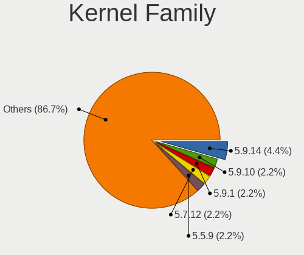

| Version | Computers | Percent |
|---------|-----------|---------|
| 5.9.14  | 8         | 4.68%   |
| 5.9.10  | 4         | 2.34%   |
| 5.9.1   | 4         | 2.34%   |
| 5.7.12  | 4         | 2.34%   |
| 5.5.9   | 4         | 2.34%   |
| 5.10.3  | 4         | 2.34%   |
| 6.8.7   | 3         | 1.75%   |
| 5.8.5   | 3         | 1.75%   |
| 5.5.2   | 3         | 1.75%   |
| 5.4.10  | 3         | 1.75%   |
| 6.4.3   | 2         | 1.17%   |
| 6.2.2   | 2         | 1.17%   |
| 6.1.12  | 2         | 1.17%   |
| 5.9.2   | 2         | 1.17%   |
| 5.9.13  | 2         | 1.17%   |
| 5.9.11  | 2         | 1.17%   |
| 5.8.7   | 2         | 1.17%   |
| 5.7.6   | 2         | 1.17%   |
| 5.7.11  | 2         | 1.17%   |
| 5.7.10  | 2         | 1.17%   |
| 5.6.4   | 2         | 1.17%   |
| 5.6.3   | 2         | 1.17%   |
| 5.2.9   | 2         | 1.17%   |
| 5.16.9  | 2         | 1.17%   |
| 5.16.12 | 2         | 1.17%   |
| 5.14.16 | 2         | 1.17%   |
| 5.11.7  | 2         | 1.17%   |
| 5.11.6  | 2         | 1.17%   |
| 5.11.11 | 2         | 1.17%   |
| 5.11.1  | 2         | 1.17%   |
| 5.10.4  | 2         | 1.17%   |
| 5.10.13 | 2         | 1.17%   |
| 6.8.8   | 1         | 0.58%   |
| 6.7.8   | 1         | 0.58%   |
| 6.7.1   | 1         | 0.58%   |
| 6.6.8   | 1         | 0.58%   |
| 6.6.4   | 1         | 0.58%   |
| 6.5.7   | 1         | 0.58%   |
| 6.4.9   | 1         | 0.58%   |
| 6.4.12  | 1         | 0.58%   |

Kernel Major Ver.
-----------------

Linux kernel major version

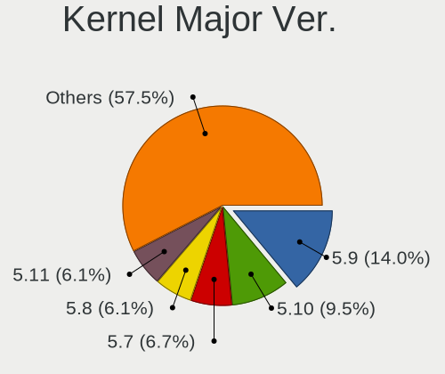

| Version | Computers | Percent |
|---------|-----------|---------|
| 5.9     | 25        | 14.79%  |
| 5.10    | 17        | 10.06%  |
| 5.7     | 12        | 7.1%    |
| 5.8     | 11        | 6.51%   |
| 5.11    | 11        | 6.51%   |
| 5.5     | 9         | 5.33%   |
| 5.6     | 8         | 4.73%   |
| 5.4     | 8         | 4.73%   |
| 6.2     | 5         | 2.96%   |
| 6.1     | 5         | 2.96%   |
| 5.16    | 5         | 2.96%   |
| 5.14    | 5         | 2.96%   |
| 6.8     | 4         | 2.37%   |
| 6.4     | 4         | 2.37%   |
| 5.3     | 4         | 2.37%   |
| 5.19    | 4         | 2.37%   |
| 5.15    | 4         | 2.37%   |
| 5.12    | 4         | 2.37%   |
| 4.19    | 4         | 2.37%   |
| 6.3     | 3         | 1.78%   |
| 6.0     | 3         | 1.78%   |
| 5.18    | 3         | 1.78%   |
| 6.7     | 2         | 1.18%   |
| 6.6     | 2         | 1.18%   |
| 5.2     | 2         | 1.18%   |
| 5.13    | 2         | 1.18%   |
| 6.5     | 1         | 0.59%   |
| 4.20    | 1         | 0.59%   |
| 4.18    | 1         | 0.59%   |

Arch
----

OS architecture (x86_64, i586, etc.)

| Name    | Computers | Percent |
|---------|-----------|---------|
| x86_64  | 161       | 99.38%  |
| aarch64 | 1         | 0.62%   |

DE
--

Desktop Environment

| Name              | Computers | Percent |
|-------------------|-----------|---------|
| GNOME             | 35        | 21.47%  |
| KDE5              | 23        | 14.11%  |
| X-Cinnamon        | 20        | 12.27%  |
| XFCE              | 17        | 10.43%  |
| KDE               | 17        | 10.43%  |
| Deepin            | 16        | 9.82%   |
| Unknown           | 10        | 6.13%   |
| Budgie            | 8         | 4.91%   |
| LXQt              | 4         | 2.45%   |
| KDE6              | 4         | 2.45%   |
| MATE              | 3         | 1.84%   |
| i3                | 3         | 1.84%   |
| Yaru:ubuntu:GNOME | 1         | 0.61%   |
| Enlightenment     | 1         | 0.61%   |
| Cinnamon          | 1         | 0.61%   |

Display Server
--------------

X11 or Wayland

| Name    | Computers | Percent |
|---------|-----------|---------|
| X11     | 128       | 78.53%  |
| Wayland | 34        | 20.86%  |
| Tty     | 1         | 0.61%   |

Display Manager
---------------

SDDM, LightDM, etc.

| Name    | Computers | Percent |
|---------|-----------|---------|
| Unknown | 127       | 77.44%  |
| LightDM | 15        | 9.15%   |
| SDDM    | 12        | 7.32%   |
| TDM     | 6         | 3.66%   |
| GDM     | 3         | 1.83%   |
| XDM     | 1         | 0.61%   |

OS Lang
-------

Language

| Lang    | Computers | Percent |
|---------|-----------|---------|
| en_US   | 62        | 38.27%  |
| de_DE   | 13        | 8.02%   |
| en_GB   | 11        | 6.79%   |
| Unknown | 11        | 6.79%   |
| pt_BR   | 9         | 5.56%   |
| en_AU   | 9         | 5.56%   |
| es_ES   | 7         | 4.32%   |
| ru_RU   | 5         | 3.09%   |
| es_MX   | 4         | 2.47%   |
| en_CA   | 4         | 2.47%   |
| pl_PL   | 2         | 1.23%   |
| nl_NL   | 2         | 1.23%   |
| it_IT   | 2         | 1.23%   |
| es_AR   | 2         | 1.23%   |
| en_AG   | 2         | 1.23%   |
| tr_TR   | 1         | 0.62%   |
| sv_SE   | 1         | 0.62%   |
| ru_UA   | 1         | 0.62%   |
| pt_PT   | 1         | 0.62%   |
| fr_FR   | 1         | 0.62%   |
| fr_BE   | 1         | 0.62%   |
| fi_FI   | 1         | 0.62%   |
| es_PA   | 1         | 0.62%   |
| es_CO   | 1         | 0.62%   |
| es_CL   | 1         | 0.62%   |
| en_PH   | 1         | 0.62%   |
| en_IE   | 1         | 0.62%   |
| en_DK   | 1         | 0.62%   |
| el_GR   | 1         | 0.62%   |
| de_CH   | 1         | 0.62%   |
| de_AT   | 1         | 0.62%   |
| cs_CZ   | 1         | 0.62%   |

Boot Mode
---------

EFI or BIOS

| Mode | Computers | Percent |
|------|-----------|---------|
| BIOS | 111       | 67.68%  |
| EFI  | 53        | 32.32%  |

Filesystem
----------

Type of filesystem

| Type    | Computers | Percent |
|---------|-----------|---------|
| Ext4    | 123       | 75.46%  |
| Btrfs   | 14        | 8.59%   |
| Unknown | 12        | 7.36%   |
| Tmpfs   | 10        | 6.13%   |
| Xfs     | 3         | 1.84%   |
| Ext3    | 1         | 0.61%   |

Part. scheme
------------

Scheme of partitioning

| Type    | Computers | Percent |
|---------|-----------|---------|
| Unknown | 127       | 77.91%  |
| GPT     | 32        | 19.63%  |
| MBR     | 4         | 2.45%   |

Dual Boot with Linux/BSD
------------------------

Hosting more than one Linux/BSD

| Dual boot | Computers | Percent |
|-----------|-----------|---------|
| No        | 153       | 94.44%  |
| Yes       | 9         | 5.56%   |

Dual Boot (Win)
---------------

Hosting Linux and Windows

| Dual boot | Computers | Percent |
|-----------|-----------|---------|
| No        | 145       | 88.96%  |
| Yes       | 18        | 11.04%  |

Board
-----

Vendor
------

Motherboard manufacturer

| Name                   | Computers | Percent |
|------------------------|-----------|---------|
| Lenovo                 | 30        | 18.52%  |
| Dell                   | 26        | 16.05%  |
| ASUSTek Computer       | 25        | 15.43%  |
| Hewlett-Packard        | 22        | 13.58%  |
| Gigabyte Technology    | 10        | 6.17%   |
| Acer                   | 10        | 6.17%   |
| ASRock                 | 9         | 5.56%   |
| MSI                    | 6         | 3.7%    |
| Pegatron               | 2         | 1.23%   |
| Medion                 | 2         | 1.23%   |
| Avell High Performance | 2         | 1.23%   |
| Toshiba                | 1         | 0.62%   |
| Timi                   | 1         | 0.62%   |
| Sony                   | 1         | 0.62%   |
| Shuttle                | 1         | 0.62%   |
| Razer                  | 1         | 0.62%   |
| Radxa                  | 1         | 0.62%   |
| OEM                    | 1         | 0.62%   |
| Microsoft              | 1         | 0.62%   |
| Intel                  | 1         | 0.62%   |
| HUAWEI                 | 1         | 0.62%   |
| Huanan                 | 1         | 0.62%   |
| Foxconn                | 1         | 0.62%   |
| Digma                  | 1         | 0.62%   |
| CyberPowerPC           | 1         | 0.62%   |
| Chuwi                  | 1         | 0.62%   |
| Biostar                | 1         | 0.62%   |
| BESSTAR Tech           | 1         | 0.62%   |
| Apple                  | 1         | 0.62%   |

Model
-----

Motherboard model

| Name                                      | Computers | Percent |
|-------------------------------------------|-----------|---------|
| Lenovo IdeaPad 1 14IGL05 81VU             | 3         | 1.85%   |
| Dell Inspiron 5520                        | 3         | 1.85%   |
| MSI MS-7721                               | 2         | 1.23%   |
| HP EliteBook 8460p                        | 2         | 1.23%   |
| Dell Latitude E6430                       | 2         | 1.23%   |
| ASUS VivoBook_ASUSLaptop X509DA_M509DA    | 2         | 1.23%   |
| ASRock X570 Phantom Gaming 4              | 2         | 1.23%   |
| Toshiba Satellite C850-C1S                | 1         | 0.62%   |
| Timi A35S                                 | 1         | 0.62%   |
| Sony VPCEH10EB                            | 1         | 0.62%   |
| Shuttle SZ270                             | 1         | 0.62%   |
| Razer Blade                               | 1         | 0.62%   |
| Radxa ROCK 5B                             | 1         | 0.62%   |
| Pegatron Elite 7500 Series MT             | 1         | 0.62%   |
| Pegatron CQ3476L                          | 1         | 0.62%   |
| OEM G41 775 ICH7 8712                     | 1         | 0.62%   |
| MSI WK711AA-ACB HPE-110ru                 | 1         | 0.62%   |
| MSI MS-7C35                               | 1         | 0.62%   |
| MSI MS-7A36                               | 1         | 0.62%   |
| MSI MS-7998                               | 1         | 0.62%   |
| Microsoft Surface Pro 4                   | 1         | 0.62%   |
| Medion X6816                              | 1         | 0.62%   |
| Medion P961x                              | 1         | 0.62%   |
| Lenovo Z70-80 80FG                        | 1         | 0.62%   |
| Lenovo Z50-70 20354                       | 1         | 0.62%   |
| Lenovo Yoga Book C930 ZA3S                | 1         | 0.62%   |
| Lenovo Y50-70 20378                       | 1         | 0.62%   |
| Lenovo ThinkPad X13 Yoga Gen 2 20W8001TUS | 1         | 0.62%   |
| Lenovo ThinkPad T510 4349BS9              | 1         | 0.62%   |
| Lenovo ThinkPad T440p 20AWS0Y800          | 1         | 0.62%   |
| Lenovo ThinkPad T410 253725G              | 1         | 0.62%   |
| Lenovo ThinkPad Edge E431 62775AU         | 1         | 0.62%   |
| Lenovo ThinkPad E570 20H50048US           | 1         | 0.62%   |
| Lenovo ThinkPad E490 20N8CTO1WW           | 1         | 0.62%   |
| Lenovo ThinkPad 10 20C10026UK             | 1         | 0.62%   |
| Lenovo ThinkCentre M92 32071F5            | 1         | 0.62%   |
| Lenovo ThinkCentre M91p 0266RZ1           | 1         | 0.62%   |
| Lenovo ThinkCentre M75q-1 11A4001WUS      | 1         | 0.62%   |
| Lenovo ThinkCentre M715q 10VGCTO1WW       | 1         | 0.62%   |
| Lenovo ThinkCentre M58 6258WCY            | 1         | 0.62%   |

Model Family
------------

Motherboard model prefix

| Name               | Computers | Percent |
|--------------------|-----------|---------|
| Lenovo IdeaPad     | 11        | 6.79%   |
| Lenovo ThinkPad    | 8         | 4.94%   |
| Dell Inspiron      | 8         | 4.94%   |
| Acer Aspire        | 8         | 4.94%   |
| HP Pavilion        | 7         | 4.32%   |
| Dell Latitude      | 7         | 4.32%   |
| ASUS PRIME         | 6         | 3.7%    |
| Lenovo ThinkCentre | 5         | 3.09%   |
| Dell OptiPlex      | 5         | 3.09%   |
| HP EliteBook       | 4         | 2.47%   |
| ASUS ROG           | 4         | 2.47%   |
| HP ProBook         | 3         | 1.85%   |
| ASRock X570        | 3         | 1.85%   |
| MSI MS-7721        | 2         | 1.23%   |
| HP EliteDesk       | 2         | 1.23%   |
| Dell XPS           | 2         | 1.23%   |
| ASUS VivoBook      | 2         | 1.23%   |
| Toshiba Satellite  | 1         | 0.62%   |
| Timi A35S          | 1         | 0.62%   |
| Sony VPCEH10EB     | 1         | 0.62%   |
| Shuttle SZ270      | 1         | 0.62%   |
| Razer Blade        | 1         | 0.62%   |
| Radxa ROCK         | 1         | 0.62%   |
| Pegatron Elite     | 1         | 0.62%   |
| Pegatron CQ3476L   | 1         | 0.62%   |
| OEM G41            | 1         | 0.62%   |
| MSI WK711AA-ACB    | 1         | 0.62%   |
| MSI MS-7C35        | 1         | 0.62%   |
| MSI MS-7A36        | 1         | 0.62%   |
| MSI MS-7998        | 1         | 0.62%   |
| Microsoft Surface  | 1         | 0.62%   |
| Medion X6816       | 1         | 0.62%   |
| Medion P961x       | 1         | 0.62%   |
| Lenovo Z70-80      | 1         | 0.62%   |
| Lenovo Z50-70      | 1         | 0.62%   |
| Lenovo Yoga        | 1         | 0.62%   |
| Lenovo Y50-70      | 1         | 0.62%   |
| Lenovo G570        | 1         | 0.62%   |
| Lenovo G470        | 1         | 0.62%   |
| Intel DH55HC       | 1         | 0.62%   |

MFG Year
--------

Motherboard manufacture year

| Year    | Computers | Percent |
|---------|-----------|---------|
| 2019    | 20        | 12.35%  |
| 2012    | 20        | 12.35%  |
| 2018    | 18        | 11.11%  |
| 2020    | 14        | 8.64%   |
| 2011    | 14        | 8.64%   |
| 2013    | 13        | 8.02%   |
| 2016    | 11        | 6.79%   |
| 2014    | 10        | 6.17%   |
| 2009    | 10        | 6.17%   |
| 2010    | 8         | 4.94%   |
| 2021    | 7         | 4.32%   |
| 2017    | 6         | 3.7%    |
| 2022    | 4         | 2.47%   |
| 2015    | 4         | 2.47%   |
| 2008    | 2         | 1.23%   |
| Unknown | 1         | 0.62%   |

Form Factor
-----------

Physical design of the computer

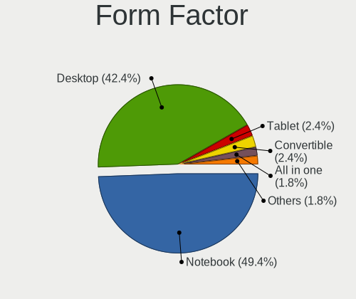

| Name           | Computers | Percent |
|----------------|-----------|---------|
| Notebook       | 78        | 48.15%  |
| Desktop        | 70        | 43.21%  |
| Tablet         | 4         | 2.47%   |
| Convertible    | 4         | 2.47%   |
| All in one     | 3         | 1.85%   |
| Mini pc        | 2         | 1.23%   |
| System on chip | 1         | 0.62%   |

Secure Boot
-----------

Enabled or disabled

| State    | Computers | Percent |
|----------|-----------|---------|
| Disabled | 162       | 100%    |

Coreboot
--------

Have coreboot on board

| Used | Computers | Percent |
|------|-----------|---------|
| No   | 162       | 100%    |

RAM Size
--------

Total RAM memory

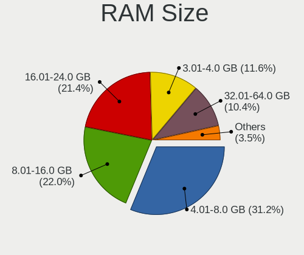

| Size in GB  | Computers | Percent |
|-------------|-----------|---------|
| 4.01-8.0    | 51        | 31.1%   |
| 8.01-16.0   | 37        | 22.56%  |
| 16.01-24.0  | 35        | 21.34%  |
| 3.01-4.0    | 20        | 12.2%   |
| 32.01-64.0  | 16        | 9.76%   |
| 64.01-256.0 | 2         | 1.22%   |
| 24.01-32.0  | 1         | 0.61%   |
| 2.01-3.0    | 1         | 0.61%   |
| 1.01-2.0    | 1         | 0.61%   |

RAM Used
--------

Used RAM memory

| Used GB   | Computers | Percent |
|-----------|-----------|---------|
| 1.01-2.0  | 63        | 37.06%  |
| 2.01-3.0  | 52        | 30.59%  |
| 4.01-8.0  | 23        | 13.53%  |
| 3.01-4.0  | 21        | 12.35%  |
| 0.51-1.0  | 7         | 4.12%   |
| 8.01-16.0 | 4         | 2.35%   |

Total Drives
------------

Number of drives on board

| Drives | Computers | Percent |
|--------|-----------|---------|
| 1      | 92        | 55.76%  |
| 2      | 46        | 27.88%  |
| 3      | 12        | 7.27%   |
| 4      | 9         | 5.45%   |
| 6      | 2         | 1.21%   |
| 0      | 2         | 1.21%   |
| 7      | 1         | 0.61%   |
| 5      | 1         | 0.61%   |

Has CD-ROM
----------

Has CD-ROM on board

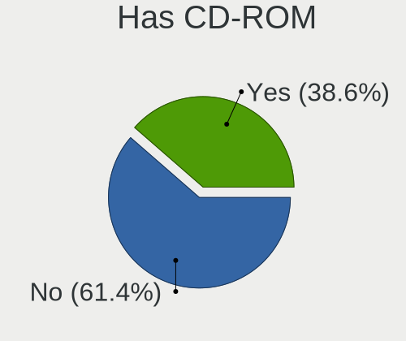

| Presented | Computers | Percent |
|-----------|-----------|---------|
| No        | 97        | 59.51%  |
| Yes       | 66        | 40.49%  |

Has Ethernet
------------

Has Ethernet on board

| Presented | Computers | Percent |
|-----------|-----------|---------|
| Yes       | 138       | 85.19%  |
| No        | 24        | 14.81%  |

Has WiFi
--------

Has WiFi module

| Presented | Computers | Percent |
|-----------|-----------|---------|
| Yes       | 127       | 78.4%   |
| No        | 35        | 21.6%   |

Has Bluetooth
-------------

Has Bluetooth module

| Presented | Computers | Percent |
|-----------|-----------|---------|
| Yes       | 94        | 58.02%  |
| No        | 68        | 41.98%  |

Location
--------

Country
-------

Geographic location (country)

| Country     | Computers | Percent |
|-------------|-----------|---------|
| USA         | 41        | 25.31%  |
| Germany     | 16        | 9.88%   |
| Brazil      | 11        | 6.79%   |
| UK          | 8         | 4.94%   |
| Spain       | 8         | 4.94%   |
| Canada      | 8         | 4.94%   |
| Australia   | 7         | 4.32%   |
| Russia      | 6         | 3.7%    |
| Netherlands | 5         | 3.09%   |
| Mexico      | 4         | 2.47%   |
| Turkey      | 3         | 1.85%   |
| Estonia     | 3         | 1.85%   |
| Thailand    | 2         | 1.23%   |
| Portugal    | 2         | 1.23%   |
| Poland      | 2         | 1.23%   |
| Panama      | 2         | 1.23%   |
| India       | 2         | 1.23%   |
| Hungary     | 2         | 1.23%   |
| Greece      | 2         | 1.23%   |
| Colombia    | 2         | 1.23%   |
| Austria     | 2         | 1.23%   |
| Argentina   | 2         | 1.23%   |
| Ukraine     | 1         | 0.62%   |
| UAE         | 1         | 0.62%   |
| Switzerland | 1         | 0.62%   |
| Sweden      | 1         | 0.62%   |
| Serbia      | 1         | 0.62%   |
| Romania     | 1         | 0.62%   |
| Philippines | 1         | 0.62%   |
| Norway      | 1         | 0.62%   |
| Malaysia    | 1         | 0.62%   |
| Italy       | 1         | 0.62%   |
| Ireland     | 1         | 0.62%   |
| France      | 1         | 0.62%   |
| Finland     | 1         | 0.62%   |
| Egypt       | 1         | 0.62%   |
| Czechia     | 1         | 0.62%   |
| Costa Rica  | 1         | 0.62%   |
| Chile       | 1         | 0.62%   |
| Bulgaria    | 1         | 0.62%   |

City
----

Geographic location (city)

| City              | Computers | Percent |
|-------------------|-----------|---------|
| Tallinn           | 3         | 1.79%   |
| Sao Paulo         | 3         | 1.79%   |
| Melbourne         | 3         | 1.79%   |
| Aleksandrov       | 3         | 1.79%   |
| Tres Cantos       | 2         | 1.19%   |
| Toronto           | 2         | 1.19%   |
| Sydney            | 2         | 1.19%   |
| Santa Clara       | 2         | 1.19%   |
| Miami             | 2         | 1.19%   |
| Mexico City       | 2         | 1.19%   |
| Lelystad          | 2         | 1.19%   |
| Cupertino         | 2         | 1.19%   |
| Cologne           | 2         | 1.19%   |
| Buffalo           | 2         | 1.19%   |
| Bogot           | 2         | 1.19%   |
| Athens            | 2         | 1.19%   |
| Zutphen           | 1         | 0.6%    |
| Zabrze            | 1         | 0.6%    |
| Yadrin            | 1         | 0.6%    |
| Wuppertal         | 1         | 0.6%    |
| Winsted           | 1         | 0.6%    |
| Weil im Schonbuch | 1         | 0.6%    |
| Watford           | 1         | 0.6%    |
| Warsaw            | 1         | 0.6%    |
| Villahermosa      | 1         | 0.6%    |
| Verwood           | 1         | 0.6%    |
| Toledo            | 1         | 0.6%    |
| The Hague         | 1         | 0.6%    |
| Tatabnya        | 1         | 0.6%    |
| Szekszrd        | 1         | 0.6%    |
| Surrey            | 1         | 0.6%    |
| Subotica          | 1         | 0.6%    |
| Stuttgart         | 1         | 0.6%    |
| Streatham         | 1         | 0.6%    |
| St Louis          | 1         | 0.6%    |
| Spremberg         | 1         | 0.6%    |
| Southampton       | 1         | 0.6%    |
| Smithfield        | 1         | 0.6%    |
| Silverton         | 1         | 0.6%    |
| Si Racha          | 1         | 0.6%    |

Drives
------

Drive Vendor
------------

Hard drive vendors

| Vendor                      | Computers | Drives | Percent |
|-----------------------------|-----------|--------|---------|
| WDC                         | 42        | 50     | 16.8%   |
| Samsung Electronics         | 36        | 44     | 14.4%   |
| Seagate                     | 32        | 42     | 12.8%   |
| Toshiba                     | 18        | 20     | 7.2%    |
| Kingston                    | 15        | 17     | 6%      |
| Unknown                     | 14        | 16     | 5.6%    |
| SanDisk                     | 10        | 12     | 4%      |
| Crucial                     | 10        | 11     | 4%      |
| Hitachi                     | 8         | 8      | 3.2%    |
| Phison                      | 6         | 7      | 2.4%    |
| Intel                       | 5         | 5      | 2%      |
| HGST                        | 5         | 5      | 2%      |
| SPCC                        | 4         | 5      | 1.6%    |
| Phison Electronics          | 4         | 5      | 1.6%    |
| SK hynix                    | 3         | 3      | 1.2%    |
| ZOTAC                       | 2         | 2      | 0.8%    |
| Transcend                   | 2         | 2      | 0.8%    |
| PNY                         | 2         | 2      | 0.8%    |
| Patriot                     | 2         | 2      | 0.8%    |
| Micron Technology           | 2         | 2      | 0.8%    |
| KIOXIA                      | 2         | 2      | 0.8%    |
| Gigabyte Technology         | 2         | 4      | 0.8%    |
| Emtec                       | 2         | 3      | 0.8%    |
| Dell                        | 2         | 2      | 0.8%    |
| ADATA Technology            | 2         | 2      | 0.8%    |
| A-DATA Technology           | 2         | 3      | 0.8%    |
| XPG                         | 1         | 1      | 0.4%    |
| OYUNKEY                     | 1         | 1      | 0.4%    |
| OCZ                         | 1         | 2      | 0.4%    |
| Netac                       | 1         | 1      | 0.4%    |
| Micron/Crucial Technology   | 1         | 1      | 0.4%    |
| LITEONIT                    | 1         | 1      | 0.4%    |
| Kingston Technology Company | 1         | 1      | 0.4%    |
| KingSpec                    | 1         | 1      | 0.4%    |
| JMicron Technology          | 1         | 1      | 0.4%    |
| Hewlett-Packard             | 1         | 2      | 0.4%    |
| Drevo                       | 1         | 1      | 0.4%    |
| ASMT                        | 1         | 1      | 0.4%    |
| Apple                       | 1         | 1      | 0.4%    |
| AMD                         | 1         | 1      | 0.4%    |

Drive Model
-----------

Hard drive models

| Model                              | Computers | Percent |
|------------------------------------|-----------|---------|
| Unknown MMC Card  64GB             | 6         | 2.21%   |
| Samsung SSD 860 EVO 500GB          | 4         | 1.47%   |
| Kingston SA400S37480G 480GB SSD    | 4         | 1.47%   |
| Intel NVMe SSD Drive 512GB         | 4         | 1.47%   |
| Unknown SD/MMC/MS PRO 128GB        | 3         | 1.1%    |
| Seagate ST1000LM024 HN-M101MBB 1TB | 3         | 1.1%    |
| HGST HTS725050A7E630 500GB         | 3         | 1.1%    |
| WDC WD5000LPVX-22V0TT0 500GB       | 2         | 0.74%   |
| WDC WD10JPVT-08A1YT2 1TB           | 2         | 0.74%   |
| WDC WD10EZEX-08WN4A0 1TB           | 2         | 0.74%   |
| WDC WD1002FAEX-00Z3A0 1TB          | 2         | 0.74%   |
| WDC WD1001FALS-403AA0 1TB          | 2         | 0.74%   |
| Toshiba NVMe SSD Drive 512GB       | 2         | 0.74%   |
| Toshiba DT01ACA100 1TB             | 2         | 0.74%   |
| SPCC Solid State Disk 512GB        | 2         | 0.74%   |
| SK hynix NVMe SSD Drive 256GB      | 2         | 0.74%   |
| Seagate ST9500325AS 500GB          | 2         | 0.74%   |
| Seagate ST500LT012-1DG142 500GB    | 2         | 0.74%   |
| Seagate ST3500312CS 500GB          | 2         | 0.74%   |
| Seagate ST2000DX002-2DV164 2TB     | 2         | 0.74%   |
| Seagate ST2000DM006-2DM164 2TB     | 2         | 0.74%   |
| Seagate ST1000DM003-1CH162 1TB     | 2         | 0.74%   |
| Seagate Expansion+ Desk 4TB        | 2         | 0.74%   |
| Samsung SSD 850 EVO 500GB          | 2         | 0.74%   |
| Samsung SSD 850 EVO 250GB          | 2         | 0.74%   |
| Samsung NVMe SSD Drive 512GB       | 2         | 0.74%   |
| Samsung NVMe SSD Drive 500GB       | 2         | 0.74%   |
| PNY CS900 120GB SSD                | 2         | 0.74%   |
| Phison NVMe SSD Drive 960GB        | 2         | 0.74%   |
| Phison NVMe SSD Drive 240GB        | 2         | 0.74%   |
| Phison NVMe SSD Drive 1TB          | 2         | 0.74%   |
| Phison E12 NVMe Controller 2TB     | 2         | 0.74%   |
| Kingston SA400S37240G 240GB SSD    | 2         | 0.74%   |
| Crucial CT480BX500SSD1 480GB       | 2         | 0.74%   |
| Crucial CT1000MX500SSD1 1TB        | 2         | 0.74%   |
| ZOTAC ZTSSD-S11-120G-P 120GB       | 1         | 0.37%   |
| ZOTAC ZTSSD-A4P-120G               | 1         | 0.37%   |
| XPG NVMe SSD Drive 1TB             | 1         | 0.37%   |
| WDC WDS500G2X0C-00L350 500GB       | 1         | 0.37%   |
| WDC WDS500G2B0A-00SM50 500GB SSD   | 1         | 0.37%   |

HDD Vendor
----------

Hard disk drive vendors

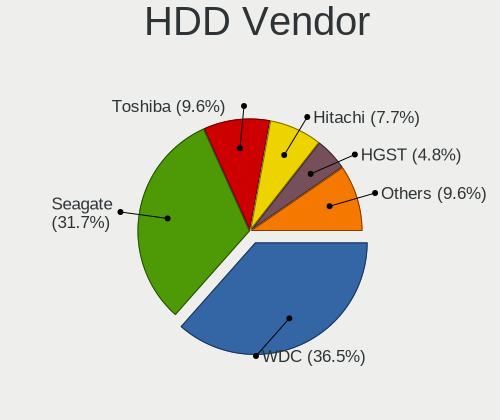

| Vendor              | Computers | Drives | Percent |
|---------------------|-----------|--------|---------|
| WDC                 | 37        | 44     | 37.37%  |
| Seagate             | 31        | 41     | 31.31%  |
| Toshiba             | 9         | 10     | 9.09%   |
| Hitachi             | 8         | 8      | 8.08%   |
| HGST                | 5         | 5      | 5.05%   |
| Samsung Electronics | 4         | 4      | 4.04%   |
| Unknown             | 3         | 3      | 3.03%   |
| JMicron Technology  | 1         | 1      | 1.01%   |
| Apple               | 1         | 1      | 1.01%   |

SSD Vendor
----------

Solid state drive vendors

| Vendor              | Computers | Drives | Percent |
|---------------------|-----------|--------|---------|
| Samsung Electronics | 22        | 25     | 27.5%   |
| Kingston            | 13        | 14     | 16.25%  |
| Crucial             | 9         | 10     | 11.25%  |
| SanDisk             | 7         | 9      | 8.75%   |
| WDC                 | 3         | 3      | 3.75%   |
| SPCC                | 3         | 4      | 3.75%   |
| ZOTAC               | 2         | 2      | 2.5%    |
| Transcend           | 2         | 2      | 2.5%    |
| Toshiba             | 2         | 2      | 2.5%    |
| PNY                 | 2         | 2      | 2.5%    |
| Patriot             | 2         | 2      | 2.5%    |
| Gigabyte Technology | 2         | 4      | 2.5%    |
| A-DATA Technology   | 2         | 3      | 2.5%    |
| OCZ                 | 1         | 2      | 1.25%   |
| Netac               | 1         | 1      | 1.25%   |
| LITEONIT            | 1         | 1      | 1.25%   |
| KingSpec            | 1         | 1      | 1.25%   |
| Hewlett-Packard     | 1         | 2      | 1.25%   |
| Emtec               | 1         | 1      | 1.25%   |
| Drevo               | 1         | 1      | 1.25%   |
| ASMT                | 1         | 1      | 1.25%   |
| AMD                 | 1         | 1      | 1.25%   |

Drive Kind
----------

HDD or SSD

| Kind    | Computers | Drives | Percent |
|---------|-----------|--------|---------|
| HDD     | 80        | 117    | 36.7%   |
| SSD     | 70        | 93     | 32.11%  |
| NVMe    | 53        | 65     | 24.31%  |
| MMC     | 10        | 13     | 4.59%   |
| Unknown | 5         | 6      | 2.29%   |

Drive Connector
---------------

SATA, SAS, NVMe, etc.

| Type | Computers | Drives | Percent |
|------|-----------|--------|---------|
| SATA | 125       | 203    | 63.13%  |
| NVMe | 53        | 65     | 26.77%  |
| SAS  | 10        | 13     | 5.05%   |
| MMC  | 10        | 13     | 5.05%   |

Drive Size
----------

Size of hard drive

| Size in TB | Computers | Drives | Percent |
|------------|-----------|--------|---------|
| 0.01-0.5   | 93        | 119    | 56.02%  |
| 0.51-1.0   | 55        | 65     | 33.13%  |
| 1.01-2.0   | 9         | 15     | 5.42%   |
| 3.01-4.0   | 4         | 5      | 2.41%   |
| 2.01-3.0   | 4         | 5      | 2.41%   |
| 4.01-10.0  | 1         | 1      | 0.6%    |

Space Total
-----------

Amount of disk space available on the file system

| Size in GB     | Computers | Percent |
|----------------|-----------|---------|
| 251-500        | 45        | 27.11%  |
| 101-250        | 37        | 22.29%  |
| 501-1000       | 34        | 20.48%  |
| 51-100         | 13        | 7.83%   |
| 1001-2000      | 12        | 7.23%   |
| More than 3000 | 11        | 6.63%   |
| Unknown        | 7         | 4.22%   |
| 2001-3000      | 4         | 2.41%   |
| 21-50          | 3         | 1.81%   |

Space Used
----------

Amount of used disk space

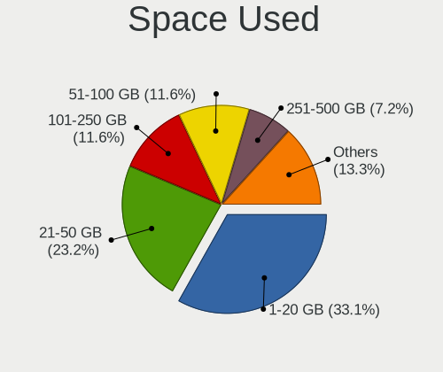

| Used GB        | Computers | Percent |
|----------------|-----------|---------|
| 1-20           | 56        | 32.75%  |
| 21-50          | 40        | 23.39%  |
| 101-250        | 21        | 12.28%  |
| 51-100         | 20        | 11.7%   |
| 251-500        | 13        | 7.6%    |
| 501-1000       | 8         | 4.68%   |
| Unknown        | 7         | 4.09%   |
| 2001-3000      | 3         | 1.75%   |
| More than 3000 | 2         | 1.17%   |
| 1001-2000      | 1         | 0.58%   |

Malfunc. Drives
---------------

Drive models with a malfunction

| Model                           | Computers | Drives | Percent |
|---------------------------------|-----------|--------|---------|
| Seagate ST500DM009-2F110A 500GB | 1         | 1      | 100%    |

Malfunc. Drive Vendor
---------------------

Vendors of faulty drives

| Vendor  | Computers | Drives | Percent |
|---------|-----------|--------|---------|
| Seagate | 1         | 1      | 100%    |

Malfunc. HDD Vendor
-------------------

Vendors of faulty HDD drives

| Vendor  | Computers | Drives | Percent |
|---------|-----------|--------|---------|
| Seagate | 1         | 1      | 100%    |

Malfunc. Drive Kind
-------------------

Kinds of faulty drives

| Kind | Computers | Drives | Percent |
|------|-----------|--------|---------|
| HDD  | 1         | 1      | 100%    |

Failed Drives
-------------

Failed drive models

Zero info for selected period =(

Failed Drive Vendor
-------------------

Failed drive vendors

Zero info for selected period =(

Drive Status
------------

Number of failed and malfunc. drives

| Status   | Computers | Drives | Percent |
|----------|-----------|--------|---------|
| Detected | 135       | 240    | 81.33%  |
| Works    | 30        | 53     | 18.07%  |
| Malfunc  | 1         | 1      | 0.6%    |

Storage controller
------------------

Storage Vendor
--------------

Storage controller vendors

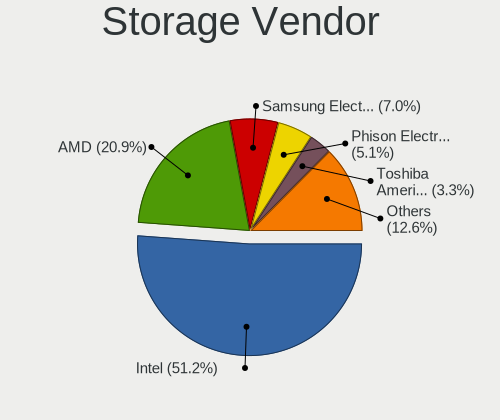

| Vendor                       | Computers | Percent |
|------------------------------|-----------|---------|
| Intel                        | 103       | 50.24%  |
| AMD                          | 45        | 21.95%  |
| Samsung Electronics          | 13        | 6.34%   |
| Phison Electronics           | 11        | 5.37%   |
| Toshiba America Info Systems | 7         | 3.41%   |
| SanDisk                      | 5         | 2.44%   |
| ADATA Technology             | 4         | 1.95%   |
| SK hynix                     | 3         | 1.46%   |
| JMicron Technology           | 3         | 1.46%   |
| Micron/Crucial Technology    | 2         | 0.98%   |
| Micron Technology            | 2         | 0.98%   |
| KIOXIA                       | 2         | 0.98%   |
| Kingston Technology Company  | 2         | 0.98%   |
| Seagate Technology           | 1         | 0.49%   |
| Nvidia                       | 1         | 0.49%   |
| ASMedia Technology           | 1         | 0.49%   |

Storage Model
-------------

Storage controller models

| Model                                                                                   | Computers | Percent |
|-----------------------------------------------------------------------------------------|-----------|---------|
| AMD FCH SATA Controller [AHCI mode]                                                     | 37        | 15.48%  |
| Intel 7 Series Chipset Family 6-port SATA Controller [AHCI mode]                        | 10        | 4.18%   |
| Intel 6 Series/C200 Series Chipset Family 6 port Mobile SATA AHCI Controller            | 8         | 3.35%   |
| Samsung NVMe SSD Controller SM981/PM981/PM983                                           | 7         | 2.93%   |
| Phison E12 NVMe Controller                                                              | 7         | 2.93%   |
| Intel 8 Series/C220 Series Chipset Family 6-port SATA Controller 1 [AHCI mode]          | 7         | 2.93%   |
| Intel Sunrise Point-LP SATA Controller [AHCI mode]                                      | 6         | 2.51%   |
| AMD 400 Series Chipset SATA Controller                                                  | 6         | 2.51%   |
| Intel Q170/Q150/B150/H170/H110/Z170/CM236 Chipset SATA Controller [AHCI Mode]           | 5         | 2.09%   |
| Intel Cannon Point-LP SATA Controller [AHCI Mode]                                       | 5         | 2.09%   |
| Intel 7 Series/C210 Series Chipset Family 6-port SATA Controller [AHCI mode]            | 5         | 2.09%   |
| Intel 200 Series PCH SATA controller [AHCI mode]                                        | 5         | 2.09%   |
| Intel SATA Controller [RAID mode]                                                       | 4         | 1.67%   |
| Intel 8 Series SATA Controller 1 [AHCI mode]                                            | 4         | 1.67%   |
| Intel 5 Series/3400 Series Chipset 6 port SATA AHCI Controller                          | 4         | 1.67%   |
| AMD SB7x0/SB8x0/SB9x0 SATA Controller [AHCI mode]                                       | 4         | 1.67%   |
| Toshiba America Info Systems BG3 x2 NVMe SSD Controller (DRAM-less)                     | 3         | 1.26%   |
| Samsung NVMe SSD Controller 980 (DRAM-less)                                             | 3         | 1.26%   |
| Intel SSD 660P Series                                                                   | 3         | 1.26%   |
| Intel 82801IBM/IEM (ICH9M/ICH9M-E) 4 port SATA Controller [AHCI mode]                   | 3         | 1.26%   |
| Intel 82801 Mobile SATA Controller [RAID mode]                                          | 3         | 1.26%   |
| Intel 4 Series Chipset PT IDER Controller                                               | 3         | 1.26%   |
| Toshiba America Info Systems XG6 NVMe SSD Controller                                    | 2         | 0.84%   |
| SK hynix BC501 NVMe Solid State Drive                                                   | 2         | 0.84%   |
| SanDisk Extreme Pro / WD Black SN750 / PC SN730 / Red SN700 NVMe SSD                    | 2         | 0.84%   |
| Samsung NVMe SSD Controller SM961/PM961/SM963                                           | 2         | 0.84%   |
| Phison E16 PCIe4 NVMe Controller                                                        | 2         | 0.84%   |
| Kingston Company KC3000/FURY Renegade NVMe SSD E18                                      | 2         | 0.84%   |
| JMicron JMB368 IDE controller                                                           | 2         | 0.84%   |
| Intel NM10/ICH7 Family SATA Controller [IDE mode]                                       | 2         | 0.84%   |
| Intel HM170/QM170 Chipset SATA Controller [AHCI Mode]                                   | 2         | 0.84%   |
| Intel Cannon Lake Mobile PCH SATA AHCI Controller                                       | 2         | 0.84%   |
| Intel 82801JI (ICH10 Family) 4 port SATA IDE Controller #1                              | 2         | 0.84%   |
| Intel 82801JI (ICH10 Family) 2 port SATA IDE Controller #2                              | 2         | 0.84%   |
| Intel 82801JD/DO (ICH10 Family) SATA AHCI Controller                                    | 2         | 0.84%   |
| Intel 82801G (ICH7 Family) IDE Controller                                               | 2         | 0.84%   |
| Intel 8 Series/C220 Series Chipset Family 4-port SATA Controller 1 [IDE mode]           | 2         | 0.84%   |
| Intel 6 Series/C200 Series Chipset Family Mobile SATA Controller (IDE mode, ports 4-5)  | 2         | 0.84%   |
| Intel 6 Series/C200 Series Chipset Family Mobile SATA Controller (IDE mode, ports 0-3)  | 2         | 0.84%   |
| Intel 6 Series/C200 Series Chipset Family Desktop SATA Controller (IDE mode, ports 4-5) | 2         | 0.84%   |

Storage Kind
------------

Kind of storage controller (IDE, SATA, NVMe, SAS, ...)

| Kind | Computers | Percent |
|------|-----------|---------|
| SATA | 126       | 61.17%  |
| NVMe | 52        | 25.24%  |
| IDE  | 21        | 10.19%  |
| RAID | 7         | 3.4%    |

Processor
---------

CPU Vendor
----------

Processor vendors

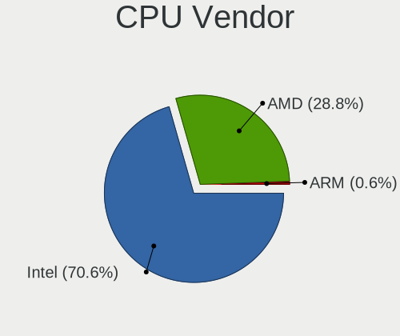

| Vendor | Computers | Percent |
|--------|-----------|---------|
| Intel  | 112       | 69.14%  |
| AMD    | 49        | 30.25%  |
| ARM    | 1         | 0.62%   |

CPU Model
---------

Processor models

| Model                                         | Computers | Percent |
|-----------------------------------------------|-----------|---------|
| Intel Core i7-8565U CPU @ 1.80GHz             | 4         | 2.45%   |
| Intel Core i5-2520M CPU @ 2.50GHz             | 4         | 2.45%   |
| Intel Core 2 Duo CPU E7500 @ 2.93GHz          | 4         | 2.45%   |
| Intel Core i5-8250U CPU @ 1.60GHz             | 3         | 1.84%   |
| Intel Core i5-3210M CPU @ 2.50GHz             | 3         | 1.84%   |
| Intel Celeron N4020 CPU @ 1.10GHz             | 3         | 1.84%   |
| AMD Ryzen 7 3700U with Radeon Vega Mobile Gfx | 3         | 1.84%   |
| Intel Core i7-6700T CPU @ 2.80GHz             | 2         | 1.23%   |
| Intel Core i7-4770S CPU @ 3.10GHz             | 2         | 1.23%   |
| Intel Core i7-3632QM CPU @ 2.20GHz            | 2         | 1.23%   |
| Intel Core i5-3470 CPU @ 3.20GHz              | 2         | 1.23%   |
| Intel Core i5-3230M CPU @ 2.60GHz             | 2         | 1.23%   |
| Intel Core i5 CPU M 520 @ 2.40GHz             | 2         | 1.23%   |
| Intel Core i3-4010U CPU @ 1.70GHz             | 2         | 1.23%   |
| AMD Ryzen 7 2700X Eight-Core Processor        | 2         | 1.23%   |
| AMD Ryzen 5 5600H with Radeon Graphics        | 2         | 1.23%   |
| AMD Ryzen 5 3600 6-Core Processor             | 2         | 1.23%   |
| AMD Ryzen 5 2600 Six-Core Processor           | 2         | 1.23%   |
| AMD A4-5300 APU with Radeon HD Graphics       | 2         | 1.23%   |
| AMD A10-5800K APU with Radeon HD Graphics     | 2         | 1.23%   |
| Intel Xeon CPU E5530 @ 2.40GHz                | 1         | 0.61%   |
| Intel Xeon CPU E5-2697 v2 @ 2.70GHz           | 1         | 0.61%   |
| Intel Xeon CPU E3-1270 V2 @ 3.50GHz           | 1         | 0.61%   |
| Intel Xeon CPU E3-1225 v5 @ 3.30GHz           | 1         | 0.61%   |
| Intel Pentium Dual-Core CPU T4500 @ 2.30GHz   | 1         | 0.61%   |
| Intel Pentium Dual-Core CPU T4300 @ 2.10GHz   | 1         | 0.61%   |
| Intel Pentium CPU N3530 @ 2.16GHz             | 1         | 0.61%   |
| Intel Pentium CPU G620 @ 2.60GHz              | 1         | 0.61%   |
| Intel Pentium CPU G3258 @ 3.20GHz             | 1         | 0.61%   |
| Intel Pentium CPU 5405U @ 2.30GHz             | 1         | 0.61%   |
| Intel Core m3-7Y30 CPU @ 1.00GHz              | 1         | 0.61%   |
| Intel Core i7-9750H CPU @ 2.60GHz             | 1         | 0.61%   |
| Intel Core i7-8750H CPU @ 2.20GHz             | 1         | 0.61%   |
| Intel Core i7-8550U CPU @ 1.80GHz             | 1         | 0.61%   |
| Intel Core i7-7Y75 CPU @ 1.30GHz              | 1         | 0.61%   |
| Intel Core i7-7700 CPU @ 3.60GHz              | 1         | 0.61%   |
| Intel Core i7-7500U CPU @ 2.70GHz             | 1         | 0.61%   |
| Intel Core i7-6700HQ CPU @ 2.60GHz            | 1         | 0.61%   |
| Intel Core i7-6700 CPU @ 3.40GHz              | 1         | 0.61%   |
| Intel Core i7-4770 CPU @ 3.40GHz              | 1         | 0.61%   |

CPU Model Family
----------------

Processor model prefix

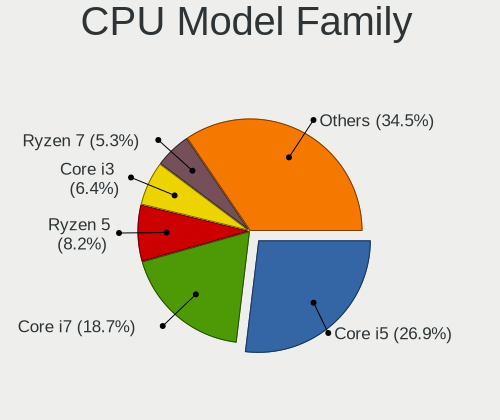

| Model                   | Computers | Percent |
|-------------------------|-----------|---------|
| Intel Core i5           | 42        | 25.77%  |
| Intel Core i7           | 30        | 18.4%   |
| AMD Ryzen 5             | 14        | 8.59%   |
| Intel Core i3           | 11        | 6.75%   |
| AMD Ryzen 7             | 9         | 5.52%   |
| Intel Core 2 Duo        | 8         | 4.91%   |
| Intel Celeron           | 8         | 4.91%   |
| Other                   | 4         | 2.45%   |
| Intel Xeon              | 4         | 2.45%   |
| Intel Pentium           | 4         | 2.45%   |
| AMD Ryzen 9             | 3         | 1.84%   |
| AMD FX                  | 3         | 1.84%   |
| AMD A4                  | 3         | 1.84%   |
| Intel Pentium Dual-Core | 2         | 1.23%   |
| AMD Ryzen 5 PRO         | 2         | 1.23%   |
| AMD Ryzen 3             | 2         | 1.23%   |
| AMD A8                  | 2         | 1.23%   |
| AMD A6                  | 2         | 1.23%   |
| AMD A10                 | 2         | 1.23%   |
| Intel Core m3           | 1         | 0.61%   |
| Intel Atom              | 1         | 0.61%   |
| AMD Ryzen 7 PRO         | 1         | 0.61%   |
| AMD PRO A10             | 1         | 0.61%   |
| AMD Phenom II X4        | 1         | 0.61%   |
| AMD E                   | 1         | 0.61%   |
| AMD Athlon II X2        | 1         | 0.61%   |
| AMD A12                 | 1         | 0.61%   |

CPU Cores
---------

Number of processor cores

| Number | Computers | Percent |
|--------|-----------|---------|
| 2      | 65        | 40.12%  |
| 4      | 62        | 38.27%  |
| 6      | 18        | 11.11%  |
| 8      | 9         | 5.56%   |
| 1      | 3         | 1.85%   |
| 12     | 2         | 1.23%   |
| 24     | 1         | 0.62%   |
| 16     | 1         | 0.62%   |
| 3      | 1         | 0.62%   |

CPU Sockets
-----------

Number of sockets

| Number | Computers | Percent |
|--------|-----------|---------|
| 1      | 159       | 98.15%  |
| 2      | 3         | 1.85%   |

CPU Threads
-----------

Threads per core (Hyper-Threading)

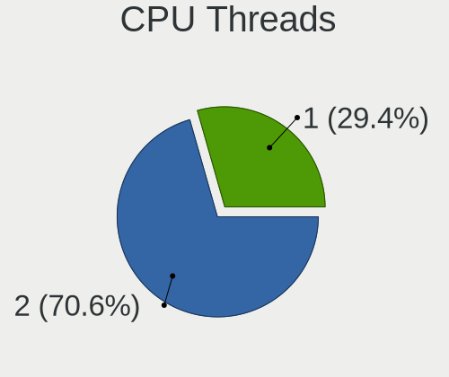

| Number | Computers | Percent |
|--------|-----------|---------|
| 2      | 114       | 70.37%  |
| 1      | 48        | 29.63%  |

CPU Op-Modes
------------

CPU Operation Modes (32-bit, 64-bit)

| Op mode        | Computers | Percent |
|----------------|-----------|---------|
| 32-bit, 64-bit | 152       | 93.83%  |
| Unknown        | 10        | 6.17%   |

CPU Microcode
-------------

Microcode number

| Number     | Computers | Percent |
|------------|-----------|---------|
| Unknown    | 62        | 37.58%  |
| 0x306a9    | 11        | 6.67%   |
| 0x206a7    | 9         | 5.45%   |
| 0x306c3    | 7         | 4.24%   |
| 0x506e3    | 5         | 3.03%   |
| 0x0800820d | 5         | 3.03%   |
| 0x906ea    | 4         | 2.42%   |
| 0x1067a    | 4         | 2.42%   |
| 0x06001119 | 4         | 2.42%   |
| 0x906e9    | 3         | 1.82%   |
| 0x806eb    | 3         | 1.82%   |
| 0x806e9    | 3         | 1.82%   |
| 0x20652    | 3         | 1.82%   |
| 0x08108109 | 3         | 1.82%   |
| 0x806ec    | 2         | 1.21%   |
| 0x40651    | 2         | 1.21%   |
| 0x20655    | 2         | 1.21%   |
| 0x106e5    | 2         | 1.21%   |
| 0x07030106 | 2         | 1.21%   |
| 0x806ea    | 1         | 0.61%   |
| 0x806d1    | 1         | 0.61%   |
| 0x6fb      | 1         | 0.61%   |
| 0x406e3    | 1         | 0.61%   |
| 0x406c3    | 1         | 0.61%   |
| 0x306e4    | 1         | 0.61%   |
| 0x306d4    | 1         | 0.61%   |
| 0x30678    | 1         | 0.61%   |
| 0x106a5    | 1         | 0.61%   |
| 0x10676    | 1         | 0.61%   |
| 0x0a601203 | 1         | 0.61%   |
| 0x0a50000d | 1         | 0.61%   |
| 0x0a50000c | 1         | 0.61%   |
| 0x0a20120a | 1         | 0.61%   |
| 0x0a201016 | 1         | 0.61%   |
| 0x0a201009 | 1         | 0.61%   |
| 0x08701021 | 1         | 0.61%   |
| 0x08600102 | 1         | 0.61%   |
| 0x0810100b | 1         | 0.61%   |
| 0x08001138 | 1         | 0.61%   |
| 0x06006704 | 1         | 0.61%   |

CPU Microarch
-------------

Microarchitecture

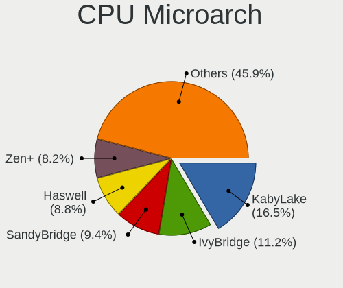

| Name          | Computers | Percent |
|---------------|-----------|---------|
| KabyLake      | 25        | 15.43%  |
| IvyBridge     | 18        | 11.11%  |
| SandyBridge   | 15        | 9.26%   |
| Haswell       | 15        | 9.26%   |
| Zen+          | 14        | 8.64%   |
| Skylake       | 8         | 4.94%   |
| Penryn        | 8         | 4.94%   |
| Zen 3         | 7         | 4.32%   |
| Westmere      | 6         | 3.7%    |
| Piledriver    | 6         | 3.7%    |
| Zen 2         | 5         | 3.09%   |
| Goldmont plus | 4         | 2.47%   |
| Excavator     | 4         | 2.47%   |
| Zen           | 3         | 1.85%   |
| Silvermont    | 3         | 1.85%   |
| Puma          | 3         | 1.85%   |
| Nehalem       | 3         | 1.85%   |
| Unknown       | 3         | 1.85%   |
| K10           | 2         | 1.23%   |
| CometLake     | 2         | 1.23%   |
| TigerLake     | 1         | 0.62%   |
| Steamroller   | 1         | 0.62%   |
| K10 Llano     | 1         | 0.62%   |
| Icelake       | 1         | 0.62%   |
| Goldmont      | 1         | 0.62%   |
| Core          | 1         | 0.62%   |
| Broadwell     | 1         | 0.62%   |
| Bobcat        | 1         | 0.62%   |

Graphics
--------

GPU Vendor
----------

Vendors of graphics cards

| Vendor            | Computers | Percent |
|-------------------|-----------|---------|
| Intel             | 82        | 43.16%  |
| AMD               | 55        | 28.95%  |
| Nvidia            | 52        | 27.37%  |
| ASPEED Technology | 1         | 0.53%   |

GPU Model
---------

Graphics card models

| Model                                                                       | Computers | Percent |
|-----------------------------------------------------------------------------|-----------|---------|
| Intel 2nd Generation Core Processor Family Integrated Graphics Controller   | 13        | 6.63%   |
| Intel 3rd Gen Core processor Graphics Controller                            | 10        | 5.1%    |
| AMD Picasso/Raven 2 [Radeon Vega Series / Radeon Vega Mobile Series]        | 8         | 4.08%   |
| Intel WhiskeyLake-U GT2 [UHD Graphics 620]                                  | 6         | 3.06%   |
| Nvidia GK208B [GeForce GT 710]                                              | 4         | 2.04%   |
| Intel UHD Graphics 620                                                      | 4         | 2.04%   |
| Intel HD Graphics 530                                                       | 4         | 2.04%   |
| Intel Haswell-ULT Integrated Graphics Controller                            | 4         | 2.04%   |
| Intel GeminiLake [UHD Graphics 600]                                         | 4         | 2.04%   |
| Intel Core Processor Integrated Graphics Controller                         | 4         | 2.04%   |
| AMD Ellesmere [Radeon RX 470/480/570/570X/580/580X/590]                     | 4         | 2.04%   |
| AMD Cezanne [Radeon Vega Series / Radeon Vega Mobile Series]                | 4         | 2.04%   |
| Nvidia GP108 [GeForce GT 1030]                                              | 3         | 1.53%   |
| Nvidia GF108 [GeForce GT 730]                                               | 3         | 1.53%   |
| Intel Xeon E3-1200 v3/4th Gen Core Processor Integrated Graphics Controller | 3         | 1.53%   |
| Intel CoffeeLake-H GT2 [UHD Graphics 630]                                   | 3         | 1.53%   |
| AMD Wani [Radeon R5/R6/R7 Graphics]                                         | 3         | 1.53%   |
| AMD Thames [Radeon HD 7500M/7600M Series]                                   | 3         | 1.53%   |
| Nvidia TU117M [GeForce GTX 1650 Mobile / Max-Q]                             | 2         | 1.02%   |
| Nvidia GP108M [GeForce MX150]                                               | 2         | 1.02%   |
| Nvidia GP104 [GeForce GTX 1080]                                             | 2         | 1.02%   |
| Nvidia GF119 [GeForce GT 610]                                               | 2         | 1.02%   |
| Nvidia GA106 [GeForce RTX 3060 Lite Hash Rate]                              | 2         | 1.02%   |
| Intel Xeon E3-1200 v2/3rd Gen Core processor Graphics Controller            | 2         | 1.02%   |
| Intel HD Graphics 630                                                       | 2         | 1.02%   |
| Intel HD Graphics 620                                                       | 2         | 1.02%   |
| Intel HD Graphics 615                                                       | 2         | 1.02%   |
| Intel Atom Processor Z36xxx/Z37xxx Series Graphics & Display                | 2         | 1.02%   |
| Intel 4th Gen Core Processor Integrated Graphics Controller                 | 2         | 1.02%   |
| AMD Trinity [Radeon HD 7660D]                                               | 2         | 1.02%   |
| AMD Raphael                                                                 | 2         | 1.02%   |
| AMD Mullins [Radeon R4/R5 Graphics]                                         | 2         | 1.02%   |
| AMD Curacao XT / Trinidad XT [Radeon R7 370 / R9 270X/370X]                 | 2         | 1.02%   |
| Nvidia TU116 [GeForce GTX 1660]                                             | 1         | 0.51%   |
| Nvidia TU106M [GeForce RTX 2070 Mobile]                                     | 1         | 0.51%   |
| Nvidia TU106 [GeForce RTX 2070 Rev. A]                                      | 1         | 0.51%   |
| Nvidia GT218M [NVS 3100M]                                                   | 1         | 0.51%   |
| Nvidia GT218 [GeForce 210]                                                  | 1         | 0.51%   |
| Nvidia GT216M [GeForce GT 330M]                                             | 1         | 0.51%   |
| Nvidia GT200GL [Quadro FX 4800]                                             | 1         | 0.51%   |

GPU Combo
---------

Combinations of graphics cards

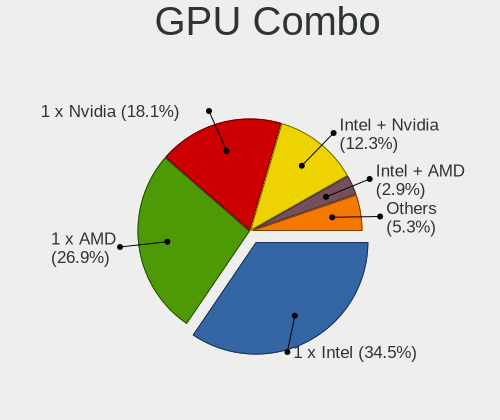

| Name           | Computers | Percent |
|----------------|-----------|---------|
| 1 x Intel      | 56        | 34.57%  |
| 1 x AMD        | 45        | 27.78%  |
| 1 x Nvidia     | 30        | 18.52%  |
| Intel + Nvidia | 18        | 11.11%  |
| Intel + AMD    | 5         | 3.09%   |
| 2 x AMD        | 3         | 1.85%   |
| AMD + Nvidia   | 2         | 1.23%   |
| Other          | 1         | 0.62%   |
| 3 x Nvidia     | 1         | 0.62%   |
| 1 x ASPEED     | 1         | 0.62%   |

GPU Driver
----------

Free vs proprietary

| Driver      | Computers | Percent |
|-------------|-----------|---------|
| Free        | 137       | 84.05%  |
| Proprietary | 24        | 14.72%  |
| Unknown     | 2         | 1.23%   |

GPU Memory
----------

Total video memory

| Size in GB | Computers | Percent |
|------------|-----------|---------|
| Unknown    | 97        | 59.51%  |
| 0.51-1.0   | 16        | 9.82%   |
| 1.01-2.0   | 13        | 7.98%   |
| 0.01-0.5   | 12        | 7.36%   |
| 7.01-8.0   | 8         | 4.91%   |
| 3.01-4.0   | 7         | 4.29%   |
| 8.01-16.0  | 4         | 2.45%   |
| 5.01-6.0   | 2         | 1.23%   |
| 2.01-3.0   | 2         | 1.23%   |
| 16.01-24.0 | 2         | 1.23%   |

Monitor
-------

Monitor Vendor
--------------

Monitor vendors

| Vendor                  | Computers | Percent |
|-------------------------|-----------|---------|
| Samsung Electronics     | 28        | 16%     |
| AU Optronics            | 28        | 16%     |
| LG Display              | 18        | 10.29%  |
| Hewlett-Packard         | 13        | 7.43%   |
| BOE                     | 11        | 6.29%   |
| Dell                    | 9         | 5.14%   |
| Chimei Innolux          | 8         | 4.57%   |
| Goldstar                | 7         | 4%      |
| BenQ                    | 6         | 3.43%   |
| Acer                    | 6         | 3.43%   |
| Philips                 | 4         | 2.29%   |
| Chi Mei Optoelectronics | 4         | 2.29%   |
| Sharp                   | 3         | 1.71%   |
| AOC                     | 3         | 1.71%   |
| Ancor Communications    | 3         | 1.71%   |
| Sony                    | 2         | 1.14%   |
| MSI                     | 2         | 1.14%   |
| Lenovo                  | 2         | 1.14%   |
| Vizio                   | 1         | 0.57%   |
| Vestel                  | 1         | 0.57%   |
| Unknown                 | 1         | 0.57%   |
| Sceptre Tech            | 1         | 0.57%   |
| Plain Tree Systems      | 1         | 0.57%   |
| ONN                     | 1         | 0.57%   |
| MStar                   | 1         | 0.57%   |
| Microstep               | 1         | 0.57%   |
| Mi                      | 1         | 0.57%   |
| Medion                  | 1         | 0.57%   |
| Insignia                | 1         | 0.57%   |
| InfoVision              | 1         | 0.57%   |
| Iiyama                  | 1         | 0.57%   |
| Hitachi                 | 1         | 0.57%   |
| GRM                     | 1         | 0.57%   |
| CSO                     | 1         | 0.57%   |
| ASUSTek Computer        | 1         | 0.57%   |
| Apple                   | 1         | 0.57%   |

Monitor Model
-------------

Monitor models

| Model                                                                    | Computers | Percent |
|--------------------------------------------------------------------------|-----------|---------|
| LG Display LCD Monitor LGD033A 1366x768 344x194mm 15.5-inch              | 4         | 2.17%   |
| Hewlett-Packard 27ea HPN3395 1920x1080 527x296mm 23.8-inch               | 3         | 1.63%   |
| Chimei Innolux LCD Monitor CMN15E6 1366x768 344x193mm 15.5-inch          | 3         | 1.63%   |
| AU Optronics LCD Monitor AUO723C 1366x768 309x173mm 13.9-inch            | 3         | 1.63%   |
| Samsung Electronics SA300/SA350 SAM0791 1920x1080 510x287mm 23.0-inch    | 2         | 1.09%   |
| MSI Optix MAG24C MSI1462 1920x1080 521x293mm 23.5-inch                   | 2         | 1.09%   |
| LG Display LCD Monitor LGD02DC 1366x768 344x194mm 15.5-inch              | 2         | 1.09%   |
| Chi Mei Optoelectronics LCD Monitor CMO1592 1366x768 344x193mm 15.5-inch | 2         | 1.09%   |
| BOE LCD Monitor BOE0685 1600x900 382x215mm 17.3-inch                     | 2         | 1.09%   |
| Vizio E500i-A1 VIZ1004 1920x1080 1095x616mm 49.5-inch                    | 1         | 0.54%   |
| Vestel LCD Monitor 32W_LCD_TV                                            | 1         | 0.54%   |
| Unknown LCD Monitor DAC Moniter 5760x1080                                | 1         | 0.54%   |
| Sony TV SNYF301 1920x1080                                                | 1         | 0.54%   |
| Sony TV *30 SNY7105 3840x2160 1439x809mm 65.0-inch                       | 1         | 0.54%   |
| Sharp LQ156M1JW08 SHP14D4 1920x1080 344x194mm 15.5-inch                  | 1         | 0.54%   |
| Sharp LCD Monitor SHP14AD 3840x2160 294x165mm 13.3-inch                  | 1         | 0.54%   |
| Sharp LCD Monitor SHP1482 2880x1920 259x173mm 12.3-inch                  | 1         | 0.54%   |
| Sceptre Tech Sceptre M25 SPT0A05 1920x1080 597x336mm 27.0-inch           | 1         | 0.54%   |
| Samsung Electronics U28D590 SAM0B80 3840x2160 607x345mm 27.5-inch        | 1         | 0.54%   |
| Samsung Electronics SyncMaster SAM0593 1920x1080 477x268mm 21.5-inch     | 1         | 0.54%   |
| Samsung Electronics SyncMaster SAM037B 1680x1050 474x296mm 22.0-inch     | 1         | 0.54%   |
| Samsung Electronics SyncMaster SAM036F 1440x900 428x255mm 19.6-inch      | 1         | 0.54%   |
| Samsung Electronics SyncMaster SAM0254 1680x1050 474x296mm 22.0-inch     | 1         | 0.54%   |
| Samsung Electronics SMB1930N SAM0632 1360x768 410x230mm 18.5-inch        | 1         | 0.54%   |
| Samsung Electronics SA300/SA350 SAM078E 1920x1080 477x268mm 21.5-inch    | 1         | 0.54%   |
| Samsung Electronics S22F350 SAM0D1A 1920x1080 477x268mm 21.5-inch        | 1         | 0.54%   |
| Samsung Electronics S22D300 SAM0B3E 1920x1080 477x268mm 21.5-inch        | 1         | 0.54%   |
| Samsung Electronics LU28R55 SAM1016 3840x2160 632x360mm 28.6-inch        | 1         | 0.54%   |
| Samsung Electronics LCD Monitor SEC544B 1600x900 310x174mm 14.0-inch     | 1         | 0.54%   |
| Samsung Electronics LCD Monitor SEC4149 1366x768 292x174mm 13.4-inch     | 1         | 0.54%   |
| Samsung Electronics LCD Monitor SEC3551 1366x768 344x194mm 15.5-inch     | 1         | 0.54%   |
| Samsung Electronics LCD Monitor SEC325A 1366x768 344x194mm 15.5-inch     | 1         | 0.54%   |
| Samsung Electronics LCD Monitor SDC5744 1920x1080 344x194mm 15.5-inch    | 1         | 0.54%   |
| Samsung Electronics LCD Monitor SDC464C 1366x768 309x174mm 14.0-inch     | 1         | 0.54%   |
| Samsung Electronics LCD Monitor SDC4150 3456x2160 336x210mm 15.6-inch    | 1         | 0.54%   |
| Samsung Electronics LCD Monitor SDC3853 2736x1824 260x173mm 12.3-inch    | 1         | 0.54%   |
| Samsung Electronics LCD Monitor SAM0DF7 3840x2160 1872x1053mm 84.6-inch  | 1         | 0.54%   |
| Samsung Electronics LCD Monitor SAM0C3C 1366x768 609x347mm 27.6-inch     | 1         | 0.54%   |
| Samsung Electronics LCD Monitor SAM094E 1920x1080 890x500mm 40.2-inch    | 1         | 0.54%   |
| Samsung Electronics LCD Monitor SAM0902 1920x1080 890x500mm 40.2-inch    | 1         | 0.54%   |

Monitor Resolution
------------------

Monitor screen resolution

| Resolution         | Computers | Percent |
|--------------------|-----------|---------|
| 1920x1080 (FHD)    | 66        | 38.6%   |
| 1366x768 (WXGA)    | 41        | 23.98%  |
| 3840x2160 (4K)     | 12        | 7.02%   |
| 1600x900 (HD+)     | 10        | 5.85%   |
| 1680x1050 (WSXGA+) | 7         | 4.09%   |
| 1440x900 (WXGA+)   | 5         | 2.92%   |
| 1920x1200 (WUXGA)  | 4         | 2.34%   |
| 1280x1024 (SXGA)   | 4         | 2.34%   |
| Unknown            | 4         | 2.34%   |
| 3440x1440          | 3         | 1.75%   |
| 2560x1440 (QHD)    | 3         | 1.75%   |
| 7680x2160          | 2         | 1.17%   |
| 1360x768           | 2         | 1.17%   |
| 5760x1080          | 1         | 0.58%   |
| 3840x1200          | 1         | 0.58%   |
| 3456x2160          | 1         | 0.58%   |
| 2880x1920          | 1         | 0.58%   |
| 2736x1824          | 1         | 0.58%   |
| 2560x1600          | 1         | 0.58%   |
| 2160x1440          | 1         | 0.58%   |
| 1280x800 (WXGA)    | 1         | 0.58%   |

Monitor Diagonal
----------------

Diagonal size in inches

| Inches  | Computers | Percent |
|---------|-----------|---------|
| 15      | 45        | 25.42%  |
| 14      | 15        | 8.47%   |
| 23      | 13        | 7.34%   |
| 24      | 11        | 6.21%   |
| 21      | 11        | 6.21%   |
| 13      | 10        | 5.65%   |
| 27      | 9         | 5.08%   |
| 17      | 9         | 5.08%   |
| Unknown | 9         | 5.08%   |
| 22      | 6         | 3.39%   |
| 19      | 6         | 3.39%   |
| 31      | 5         | 2.82%   |
| 18      | 4         | 2.26%   |
| 54      | 3         | 1.69%   |
| 34      | 3         | 1.69%   |
| 84      | 2         | 1.13%   |
| 20      | 2         | 1.13%   |
| 12      | 2         | 1.13%   |
| 11      | 2         | 1.13%   |
| 75      | 1         | 0.56%   |
| 72      | 1         | 0.56%   |
| 52      | 1         | 0.56%   |
| 46      | 1         | 0.56%   |
| 40      | 1         | 0.56%   |
| 36      | 1         | 0.56%   |
| 33      | 1         | 0.56%   |
| 28      | 1         | 0.56%   |
| 16      | 1         | 0.56%   |
| 10      | 1         | 0.56%   |

Monitor Width
-------------

Physical width

| Width in mm | Computers | Percent |
|-------------|-----------|---------|
| 301-350     | 66        | 37.71%  |
| 501-600     | 29        | 16.57%  |
| 401-500     | 26        | 14.86%  |
| 351-400     | 11        | 6.29%   |
| 201-300     | 11        | 6.29%   |
| Unknown     | 9         | 5.14%   |
| 601-700     | 8         | 4.57%   |
| 701-800     | 5         | 2.86%   |
| 1001-1500   | 5         | 2.86%   |
| 1501-2000   | 4         | 2.29%   |
| 801-900     | 1         | 0.57%   |

Aspect Ratio
------------

Proportional relationship between the width and the height

| Ratio   | Computers | Percent |
|---------|-----------|---------|
| 16/9    | 127       | 77.44%  |
| 16/10   | 18        | 10.98%  |
| Unknown | 9         | 5.49%   |
| 5/4     | 4         | 2.44%   |
| 3/2     | 3         | 1.83%   |
| 21/9    | 3         | 1.83%   |

Monitor Area
------------

Area in inch

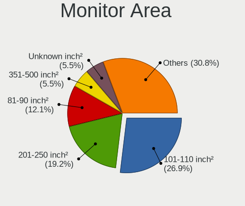

| Area in inch | Computers | Percent |
|----------------|-----------|---------|
| 101-110        | 45        | 26.01%  |
| 201-250        | 35        | 20.23%  |
| 81-90          | 21        | 12.14%  |
| 351-500        | 9         | 5.2%    |
| 301-350        | 9         | 5.2%    |
| 151-200        | 9         | 5.2%    |
| Unknown        | 9         | 5.2%    |
| More than 1000 | 8         | 4.62%   |
| 121-130        | 8         | 4.62%   |
| 141-150        | 5         | 2.89%   |
| 71-80          | 4         | 2.31%   |
| 501-1000       | 3         | 1.73%   |
| 61-70          | 2         | 1.16%   |
| 51-60          | 2         | 1.16%   |
| 251-300        | 2         | 1.16%   |
| 41-50          | 1         | 0.58%   |
| 111-120        | 1         | 0.58%   |

Pixel Density
-------------

Pixels per inch

| Density       | Computers | Percent |
|---------------|-----------|---------|
| 51-100        | 56        | 31.82%  |
| 101-120       | 54        | 30.68%  |
| 121-160       | 38        | 21.59%  |
| Unknown       | 9         | 5.11%   |
| 1-50          | 8         | 4.55%   |
| 161-240       | 6         | 3.41%   |
| More than 240 | 5         | 2.84%   |

Multiple Monitors
-----------------

Total monitors connected

| Total | Computers | Percent |
|-------|-----------|---------|
| 1     | 139       | 85.28%  |
| 2     | 20        | 12.27%  |
| 0     | 3         | 1.84%   |
| 3     | 1         | 0.61%   |

Network
-------

Net Controller Vendor
---------------------

Controller vendors

| Vendor                            | Computers | Percent |
|-----------------------------------|-----------|---------|
| Realtek Semiconductor             | 92        | 38.02%  |
| Intel                             | 78        | 32.23%  |
| Qualcomm Atheros                  | 29        | 11.98%  |
| Broadcom                          | 10        | 4.13%   |
| Ralink Technology                 | 4         | 1.65%   |
| TP-Link                           | 3         | 1.24%   |
| Microsoft                         | 3         | 1.24%   |
| MediaTek                          | 3         | 1.24%   |
| Huawei Technologies               | 3         | 1.24%   |
| Xiaomi                            | 2         | 0.83%   |
| Ralink                            | 2         | 0.83%   |
| Dell                              | 2         | 0.83%   |
| Spreadtrum Communications         | 1         | 0.41%   |
| Sierra Wireless                   | 1         | 0.41%   |
| Samsung Electronics               | 1         | 0.41%   |
| Qualcomm Atheros Communications   | 1         | 0.41%   |
| Nvidia                            | 1         | 0.41%   |
| NetXen Incorporated               | 1         | 0.41%   |
| Marvell Technology Group          | 1         | 0.41%   |
| Ericsson Business Mobile Networks | 1         | 0.41%   |
| DisplayLink                       | 1         | 0.41%   |
| Broadcom Limited                  | 1         | 0.41%   |
| Belkin Components                 | 1         | 0.41%   |

Net Controller Model
--------------------

Controller models

| Model                                                                  | Computers | Percent |
|------------------------------------------------------------------------|-----------|---------|
| Realtek RTL8111/8168/8211/8411 PCI Express Gigabit Ethernet Controller | 61        | 21.25%  |
| Realtek RTL810xE PCI Express Fast Ethernet controller                  | 12        | 4.18%   |
| Intel 82579LM Gigabit Network Connection (Lewisville)                  | 11        | 3.83%   |
| Intel I211 Gigabit Network Connection                                  | 10        | 3.48%   |
| Intel Wi-Fi 6 AX200                                                    | 9         | 3.14%   |
| Realtek RTL8821CE 802.11ac PCIe Wireless Network Adapter               | 6         | 2.09%   |
| Qualcomm Atheros AR9485 Wireless Network Adapter                       | 6         | 2.09%   |
| Qualcomm Atheros AR9285 Wireless Network Adapter (PCI-Express)         | 6         | 2.09%   |
| Intel Centrino Ultimate-N 6300                                         | 6         | 2.09%   |
| Realtek RTL88x2bu [AC1200 Techkey]                                     | 5         | 1.74%   |
| Qualcomm Atheros QCA9377 802.11ac Wireless Network Adapter             | 5         | 1.74%   |
| Intel Wireless 8265 / 8275                                             | 5         | 1.74%   |
| Intel Ethernet Connection I217-LM                                      | 5         | 1.74%   |
| Qualcomm Atheros QCA9565 / AR9565 Wireless Network Adapter             | 4         | 1.39%   |
| Intel Wi-Fi 5(802.11ac) Wireless-AC 9x6x [Thunder Peak]                | 4         | 1.39%   |
| Realtek RTL8723BE PCIe Wireless Network Adapter                        | 3         | 1.05%   |
| Realtek RTL8188EE Wireless Network Adapter                             | 3         | 1.05%   |
| Realtek RTL8153 Gigabit Ethernet Adapter                               | 3         | 1.05%   |
| Realtek RTL8125 2.5GbE Controller                                      | 3         | 1.05%   |
| MediaTek MT7921K (RZ608) Wi-Fi 6E 80MHz                                | 3         | 1.05%   |
| Intel Wireless 7265                                                    | 3         | 1.05%   |
| Intel Gemini Lake PCH CNVi WiFi                                        | 3         | 1.05%   |
| Intel Ethernet Controller I225-V                                       | 3         | 1.05%   |
| Intel Centrino Advanced-N 6205 [Taylor Peak]                           | 3         | 1.05%   |
| Intel 82577LM Gigabit Network Connection                               | 3         | 1.05%   |
| Intel 82567LM-3 Gigabit Network Connection                             | 3         | 1.05%   |
| Huawei E353/E3131                                                      | 3         | 1.05%   |
| Broadcom BCM43142 802.11b/g/n                                          | 3         | 1.05%   |
| Realtek RTL8852AE 802.11ax PCIe Wireless Network Adapter               | 2         | 0.7%    |
| Realtek RTL8723BU 802.11b/g/n WLAN Adapter                             | 2         | 0.7%    |
| Realtek RTL8192EE PCIe Wireless Network Adapter                        | 2         | 0.7%    |
| Ralink RT5572 Wireless Adapter                                         | 2         | 0.7%    |
| Ralink MT7601U Wireless Adapter                                        | 2         | 0.7%    |
| Qualcomm Atheros QCA6174 802.11ac Wireless Network Adapter             | 2         | 0.7%    |
| Qualcomm Atheros AR928X Wireless Network Adapter (PCI-Express)         | 2         | 0.7%    |
| Qualcomm Atheros AR8161 Gigabit Ethernet                               | 2         | 0.7%    |
| Qualcomm Atheros AR8152 v2.0 Fast Ethernet                             | 2         | 0.7%    |
| Intel Ethernet Connection (2) I219-V                                   | 2         | 0.7%    |
| Intel Dual Band Wireless-AC 3168NGW [Stone Peak]                       | 2         | 0.7%    |
| Intel Centrino Advanced-N 6235                                         | 2         | 0.7%    |

Wireless Vendor
---------------

Wireless vendors

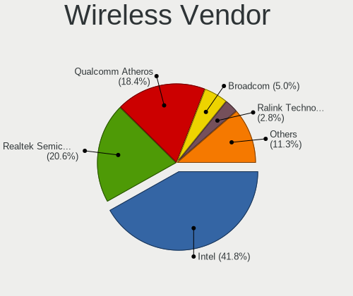

| Vendor                          | Computers | Percent |
|---------------------------------|-----------|---------|
| Intel                           | 54        | 40.6%   |
| Realtek Semiconductor           | 26        | 19.55%  |
| Qualcomm Atheros                | 26        | 19.55%  |
| Broadcom                        | 7         | 5.26%   |
| Ralink Technology               | 4         | 3.01%   |
| TP-Link                         | 3         | 2.26%   |
| MediaTek                        | 3         | 2.26%   |
| Ralink                          | 2         | 1.5%    |
| Microsoft                       | 2         | 1.5%    |
| Sierra Wireless                 | 1         | 0.75%   |
| Qualcomm Atheros Communications | 1         | 0.75%   |
| Marvell Technology Group        | 1         | 0.75%   |
| Dell                            | 1         | 0.75%   |
| Broadcom Limited                | 1         | 0.75%   |
| Belkin Components               | 1         | 0.75%   |

Wireless Model
--------------

Wireless models

| Model                                                          | Computers | Percent |
|----------------------------------------------------------------|-----------|---------|
| Intel Wi-Fi 6 AX200                                            | 9         | 6.67%   |
| Realtek RTL8821CE 802.11ac PCIe Wireless Network Adapter       | 6         | 4.44%   |
| Qualcomm Atheros AR9485 Wireless Network Adapter               | 6         | 4.44%   |
| Qualcomm Atheros AR9285 Wireless Network Adapter (PCI-Express) | 6         | 4.44%   |
| Intel Centrino Ultimate-N 6300                                 | 6         | 4.44%   |
| Realtek RTL88x2bu [AC1200 Techkey]                             | 5         | 3.7%    |
| Qualcomm Atheros QCA9377 802.11ac Wireless Network Adapter     | 5         | 3.7%    |
| Intel Wireless 8265 / 8275                                     | 5         | 3.7%    |
| Qualcomm Atheros QCA9565 / AR9565 Wireless Network Adapter     | 4         | 2.96%   |
| Intel Wi-Fi 5(802.11ac) Wireless-AC 9x6x [Thunder Peak]        | 4         | 2.96%   |
| Realtek RTL8723BE PCIe Wireless Network Adapter                | 3         | 2.22%   |
| Realtek RTL8188EE Wireless Network Adapter                     | 3         | 2.22%   |
| MediaTek MT7921K (RZ608) Wi-Fi 6E 80MHz                        | 3         | 2.22%   |
| Intel Wireless 7265                                            | 3         | 2.22%   |
| Intel Gemini Lake PCH CNVi WiFi                                | 3         | 2.22%   |
| Intel Centrino Advanced-N 6205 [Taylor Peak]                   | 3         | 2.22%   |
| Broadcom BCM43142 802.11b/g/n                                  | 3         | 2.22%   |
| Realtek RTL8852AE 802.11ax PCIe Wireless Network Adapter       | 2         | 1.48%   |
| Realtek RTL8723BU 802.11b/g/n WLAN Adapter                     | 2         | 1.48%   |
| Realtek RTL8192EE PCIe Wireless Network Adapter                | 2         | 1.48%   |
| Ralink RT5572 Wireless Adapter                                 | 2         | 1.48%   |
| Ralink MT7601U Wireless Adapter                                | 2         | 1.48%   |
| Qualcomm Atheros QCA6174 802.11ac Wireless Network Adapter     | 2         | 1.48%   |
| Qualcomm Atheros AR928X Wireless Network Adapter (PCI-Express) | 2         | 1.48%   |
| Intel Dual Band Wireless-AC 3168NGW [Stone Peak]               | 2         | 1.48%   |
| Intel Centrino Advanced-N 6235                                 | 2         | 1.48%   |
| Intel Cannon Point-LP CNVi [Wireless-AC]                       | 2         | 1.48%   |
| Intel Cannon Lake PCH CNVi WiFi                                | 2         | 1.48%   |
| Broadcom BCM4313 802.11bgn Wireless Network Adapter            | 2         | 1.48%   |
| TP-Link TL-WN822N Version 4 RTL8192EU                          | 1         | 0.74%   |
| TP-Link TL-WN722N v2/v3 [Realtek RTL8188EUS]                   | 1         | 0.74%   |
| TP-Link Archer T4U v2 [Realtek RTL8812AU]                      | 1         | 0.74%   |
| Sierra Wireless Sierra Wireless EM7345 4G LTE                  | 1         | 0.74%   |
| Realtek RTL8852BE PCIe 802.11ax Wireless Network Controller    | 1         | 0.74%   |
| Realtek RTL8192EU 802.11b/g/n WLAN Adapter                     | 1         | 0.74%   |
| Realtek RTL8191SEvB Wireless LAN Controller                    | 1         | 0.74%   |
| Realtek RTL8188EUS 802.11n Wireless Network Adapter            | 1         | 0.74%   |
| Realtek 802.11ac NIC                                           | 1         | 0.74%   |
| Ralink RT5390 Wireless 802.11n 1T/1R PCIe                      | 1         | 0.74%   |
| Ralink RT3062 Wireless 802.11n 2T/2R                           | 1         | 0.74%   |

Ethernet Vendor
---------------

Ethernet vendors

| Vendor                    | Computers | Percent |
|---------------------------|-----------|---------|
| Realtek Semiconductor     | 79        | 53.38%  |
| Intel                     | 47        | 31.76%  |
| Qualcomm Atheros          | 7         | 4.73%   |
| Broadcom                  | 4         | 2.7%    |
| Huawei Technologies       | 3         | 2.03%   |
| Xiaomi                    | 2         | 1.35%   |
| Spreadtrum Communications | 1         | 0.68%   |
| Samsung Electronics       | 1         | 0.68%   |
| Nvidia                    | 1         | 0.68%   |
| NetXen Incorporated       | 1         | 0.68%   |
| Microsoft                 | 1         | 0.68%   |
| DisplayLink               | 1         | 0.68%   |

Ethernet Model
--------------

Ethernet models

| Model                                                                  | Computers | Percent |
|------------------------------------------------------------------------|-----------|---------|
| Realtek RTL8111/8168/8211/8411 PCI Express Gigabit Ethernet Controller | 61        | 40.67%  |
| Realtek RTL810xE PCI Express Fast Ethernet controller                  | 12        | 8%      |
| Intel 82579LM Gigabit Network Connection (Lewisville)                  | 11        | 7.33%   |
| Intel I211 Gigabit Network Connection                                  | 10        | 6.67%   |
| Intel Ethernet Connection I217-LM                                      | 5         | 3.33%   |
| Realtek RTL8153 Gigabit Ethernet Adapter                               | 3         | 2%      |
| Realtek RTL8125 2.5GbE Controller                                      | 3         | 2%      |
| Intel Ethernet Controller I225-V                                       | 3         | 2%      |
| Intel 82577LM Gigabit Network Connection                               | 3         | 2%      |
| Intel 82567LM-3 Gigabit Network Connection                             | 3         | 2%      |
| Huawei E353/E3131                                                      | 3         | 2%      |
| Qualcomm Atheros AR8161 Gigabit Ethernet                               | 2         | 1.33%   |
| Qualcomm Atheros AR8152 v2.0 Fast Ethernet                             | 2         | 1.33%   |
| Intel Ethernet Connection (2) I219-V                                   | 2         | 1.33%   |
| Xiaomi Mi/Redmi series (RNDIS)                                         | 1         | 0.67%   |
| Xiaomi Mi/Redmi series (RNDIS + ADB)                                   | 1         | 0.67%   |
| Spreadtrum Unisoc Phone                                                | 1         | 0.67%   |
| Samsung GT-I9070 (network tethering, USB debugging enabled)            | 1         | 0.67%   |
| Realtek USB 10/100/1G/2.5G LAN                                         | 1         | 0.67%   |
| Realtek Killer E2600 GbE Controller                                    | 1         | 0.67%   |
| Qualcomm Atheros Killer E2400 Gigabit Ethernet Controller              | 1         | 0.67%   |
| Qualcomm Atheros AR8151 v2.0 Gigabit Ethernet                          | 1         | 0.67%   |
| Qualcomm Atheros AR8131 Gigabit Ethernet                               | 1         | 0.67%   |
| Nvidia MCP61 Ethernet                                                  | 1         | 0.67%   |
| NetXen Incorporated NX3031 Multifunction 1/10-Gigabit Server Adapter   | 1         | 0.67%   |
| Microsoft RTL8153 GigE [Surface Ethernet Adapter]                      | 1         | 0.67%   |
| Intel Ethernet Connection I217-V                                       | 1         | 0.67%   |
| Intel Ethernet Connection (6) I219-V                                   | 1         | 0.67%   |
| Intel Ethernet Connection (6) I219-LM                                  | 1         | 0.67%   |
| Intel Ethernet Connection (2) I219-LM                                  | 1         | 0.67%   |
| Intel Ethernet Connection (2) I218-V                                   | 1         | 0.67%   |
| Intel Ethernet Connection (12) I219-V                                  | 1         | 0.67%   |
| Intel 82579V Gigabit Network Connection                                | 1         | 0.67%   |
| Intel 82578DC Gigabit Network Connection                               | 1         | 0.67%   |
| Intel 82577LC Gigabit Network Connection                               | 1         | 0.67%   |
| Intel 82574L Gigabit Network Connection                                | 1         | 0.67%   |
| DisplayLink Dell Universal Dock D6000                                  | 1         | 0.67%   |
| Broadcom NetXtreme BCM57786 Gigabit Ethernet PCIe                      | 1         | 0.67%   |
| Broadcom NetXtreme BCM57765 Gigabit Ethernet PCIe                      | 1         | 0.67%   |
| Broadcom NetLink BCM5784M Gigabit Ethernet PCIe                        | 1         | 0.67%   |

Net Controller Kind
-------------------

Ethernet, WiFi or modem

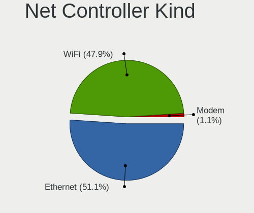

| Kind     | Computers | Percent |
|----------|-----------|---------|
| Ethernet | 138       | 51.69%  |
| WiFi     | 127       | 47.57%  |
| Modem    | 2         | 0.75%   |

Used Controller
---------------

Currently used network controller

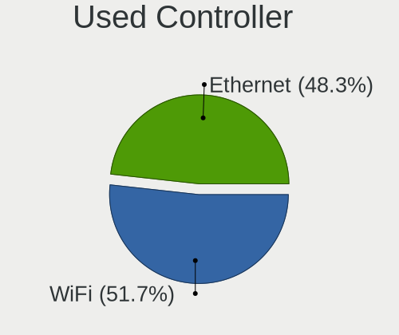

| Kind     | Computers | Percent |
|----------|-----------|---------|
| WiFi     | 84        | 50.6%   |
| Ethernet | 82        | 49.4%   |

NICs
----

Total network controllers on board

| Total | Computers | Percent |
|-------|-----------|---------|
| 2     | 85        | 52.47%  |
| 1     | 68        | 41.98%  |
| 3     | 4         | 2.47%   |
| 0     | 4         | 2.47%   |
| 6     | 1         | 0.62%   |

IPv6
----

IPv6 vs IPv4

| Used | Computers | Percent |
|------|-----------|---------|
| No   | 144       | 88.34%  |
| Yes  | 19        | 11.66%  |

Bluetooth
---------

Bluetooth Vendor
----------------

Controller vendors

| Vendor                          | Computers | Percent |
|---------------------------------|-----------|---------|
| Intel                           | 41        | 43.62%  |
| Realtek Semiconductor           | 11        | 11.7%   |
| Cambridge Silicon Radio         | 8         | 8.51%   |
| Qualcomm Atheros Communications | 6         | 6.38%   |
| Lite-On Technology              | 6         | 6.38%   |
| MediaTek                        | 3         | 3.19%   |
| IMC Networks                    | 3         | 3.19%   |
| Hewlett-Packard                 | 3         | 3.19%   |
| Dell                            | 3         | 3.19%   |
| Broadcom                        | 3         | 3.19%   |
| Foxconn / Hon Hai               | 2         | 2.13%   |
| ASUSTek Computer                | 2         | 2.13%   |
| Marvell Semiconductor           | 1         | 1.06%   |
| Foxconn International           | 1         | 1.06%   |
| Apple                           | 1         | 1.06%   |

Bluetooth Model
---------------

Controller models

| Model                                               | Computers | Percent |
|-----------------------------------------------------|-----------|---------|
| Intel AX200 Bluetooth                               | 9         | 9.57%   |
| Realtek Bluetooth Radio                             | 8         | 8.51%   |
| Cambridge Silicon Radio Bluetooth Dongle (HCI mode) | 8         | 8.51%   |
| Intel Bluetooth wireless interface                  | 6         | 6.38%   |
| Intel Bluetooth 9460/9560 Jefferson Peak (JfP)      | 6         | 6.38%   |
| Intel Bluetooth Device                              | 5         | 5.32%   |
| Qualcomm Atheros  Bluetooth Device                  | 4         | 4.26%   |
| Intel Wireless-AC 9260 Bluetooth Adapter            | 4         | 4.26%   |
| Intel AX201 Bluetooth                               | 4         | 4.26%   |
| MediaTek Wireless_Device                            | 3         | 3.19%   |
| Intel Centrino Bluetooth Wireless Transceiver       | 3         | 3.19%   |
| HP Broadcom 2070 Bluetooth Combo                    | 3         | 3.19%   |
| Realtek RTL8723B Bluetooth                          | 2         | 2.13%   |
| Lite-On Qualcomm Atheros QCA9377 Bluetooth          | 2         | 2.13%   |
| Lite-On Atheros AR3012 Bluetooth                    | 2         | 2.13%   |
| Intel Wireless-AC 3168 Bluetooth                    | 2         | 2.13%   |
| Dell BCM20702A0 Bluetooth Module                    | 2         | 2.13%   |
| Realtek  Bluetooth 4.2 Adapter                      | 1         | 1.06%   |
| Qualcomm Atheros Bluetooth USB Host Controller      | 1         | 1.06%   |
| Qualcomm Atheros AR3011 Bluetooth                   | 1         | 1.06%   |
| Marvell Bluetooth and Wireless LAN Composite        | 1         | 1.06%   |
| Lite-On Qualcomm Atheros Bluetooth                  | 1         | 1.06%   |
| Lite-On BCM43142A0                                  | 1         | 1.06%   |
| Intel Centrino Advanced-N 6230 Bluetooth adapter    | 1         | 1.06%   |
| Intel AX210 Bluetooth                               | 1         | 1.06%   |
| IMC Networks Bluetooth Radio                        | 1         | 1.06%   |
| IMC Networks Bluetooth Module                       | 1         | 1.06%   |
| IMC Networks Bluetooth Device                       | 1         | 1.06%   |
| Foxconn International BCM43142A0 Bluetooth module   | 1         | 1.06%   |
| Foxconn / Hon Hai Broadcom Bluetooth 2.1 Device     | 1         | 1.06%   |
| Foxconn / Hon Hai Broadcom BCM20702 Bluetooth       | 1         | 1.06%   |
| Dell DW375 Bluetooth Module                         | 1         | 1.06%   |
| Broadcom BCM43142 Bluetooth 4.0                     | 1         | 1.06%   |
| Broadcom BCM2046 Bluetooth Device                   | 1         | 1.06%   |
| Broadcom BCM2045B (BDC-2.1)                         | 1         | 1.06%   |
| ASUS Broadcom BCM20702A0 Bluetooth                  | 1         | 1.06%   |
| ASUS BCM20702A0                                     | 1         | 1.06%   |
| Apple Bluetooth USB Host Controller                 | 1         | 1.06%   |

Sound
-----

Sound Vendor
------------

Sound card vendors

| Vendor                 | Computers | Percent |
|------------------------|-----------|---------|
| Intel                  | 110       | 47.21%  |
| AMD                    | 59        | 25.32%  |
| Nvidia                 | 41        | 17.6%   |
| C-Media Electronics    | 5         | 2.15%   |
| Logitech               | 2         | 0.86%   |
| JMTek                  | 2         | 0.86%   |
| GN Netcom              | 2         | 0.86%   |
| XMOS                   | 1         | 0.43%   |
| Sony                   | 1         | 0.43%   |
| Plantronics            | 1         | 0.43%   |
| Microsoft              | 1         | 0.43%   |
| Kingston Technology    | 1         | 0.43%   |
| Generalplus Technology | 1         | 0.43%   |
| Focusrite-Novation     | 1         | 0.43%   |
| DCMT Technology        | 1         | 0.43%   |
| Creative Labs          | 1         | 0.43%   |
| Blue Microphones       | 1         | 0.43%   |
| ASUSTek Computer       | 1         | 0.43%   |
| Alesis                 | 1         | 0.43%   |

Sound Model
-----------

Sound card models

| Model                                                                      | Computers | Percent |
|----------------------------------------------------------------------------|-----------|---------|
| Intel 7 Series/C216 Chipset Family High Definition Audio Controller        | 17        | 5.99%   |
| AMD Family 17h/19h HD Audio Controller                                     | 15        | 5.28%   |
| Intel 6 Series/C200 Series Chipset Family High Definition Audio Controller | 14        | 4.93%   |
| Intel 8 Series/C220 Series Chipset High Definition Audio Controller        | 10        | 3.52%   |
| Intel Sunrise Point-LP HD Audio                                            | 9         | 3.17%   |
| AMD Raven/Raven2/Fenghuang HDMI/DP Audio Controller                        | 9         | 3.17%   |
| AMD FCH Azalia Controller                                                  | 9         | 3.17%   |
| Intel 5 Series/3400 Series Chipset High Definition Audio                   | 8         | 2.82%   |
| AMD Family 17h (Models 00h-0fh) HD Audio Controller                        | 8         | 2.82%   |
| Intel Cannon Point-LP High Definition Audio Controller                     | 7         | 2.46%   |
| AMD Starship/Matisse HD Audio Controller                                   | 7         | 2.46%   |
| Nvidia GF108 High Definition Audio Controller                              | 6         | 2.11%   |
| Intel Xeon E3-1200 v3/4th Gen Core Processor HD Audio Controller           | 6         | 2.11%   |
| Intel 100 Series/C230 Series Chipset Family HD Audio Controller            | 6         | 2.11%   |
| AMD Kabini HDMI/DP Audio                                                   | 6         | 2.11%   |
| Intel 200 Series PCH HD Audio                                              | 5         | 1.76%   |
| AMD Renoir Radeon High Definition Audio Controller                         | 5         | 1.76%   |
| AMD Ellesmere HDMI Audio [Radeon RX 470/480 / 570/580/590]                 | 5         | 1.76%   |
| Nvidia GK208 HDMI/DP Audio Controller                                      | 4         | 1.41%   |
| Nvidia GF119 HDMI Audio Controller                                         | 4         | 1.41%   |
| Intel Haswell-ULT HD Audio Controller                                      | 4         | 1.41%   |
| Intel Celeron/Pentium Silver Processor High Definition Audio               | 4         | 1.41%   |
| Intel Cannon Lake PCH cAVS                                                 | 4         | 1.41%   |
| Intel 8 Series HD Audio Controller                                         | 4         | 1.41%   |
| AMD SBx00 Azalia (Intel HDA)                                               | 4         | 1.41%   |
| AMD Family 15h (Models 60h-6fh) Audio Controller                           | 4         | 1.41%   |
| Nvidia GP108 High Definition Audio Controller                              | 3         | 1.06%   |
| Nvidia GP104 High Definition Audio Controller                              | 3         | 1.06%   |
| Nvidia GA106 High Definition Audio Controller                              | 3         | 1.06%   |
| Intel 82801JD/DO (ICH10 Family) HD Audio Controller                        | 3         | 1.06%   |
| Intel 82801I (ICH9 Family) HD Audio Controller                             | 3         | 1.06%   |
| Nvidia TU106 High Definition Audio Controller                              | 2         | 0.7%    |
| Nvidia High Definition Audio Controller                                    | 2         | 0.7%    |
| Nvidia GP107GL High Definition Audio Controller                            | 2         | 0.7%    |
| Nvidia GM204 High Definition Audio Controller                              | 2         | 0.7%    |
| Nvidia GM107 High Definition Audio Controller [GeForce 940MX]              | 2         | 0.7%    |
| JMTek USB PnP Audio Device                                                 | 2         | 0.7%    |
| Intel NM10/ICH7 Family High Definition Audio Controller                    | 2         | 0.7%    |
| Intel 82801JI (ICH10 Family) HD Audio Controller                           | 2         | 0.7%    |
| C-Media Electronics Audio Adapter (Unitek Y-247A)                          | 2         | 0.7%    |

Memory
------

Memory Vendor
-------------

Memory module vendors

| Vendor              | Computers | Percent |
|---------------------|-----------|---------|
| Samsung Electronics | 9         | 20.93%  |
| SK hynix            | 6         | 13.95%  |
| Micron Technology   | 6         | 13.95%  |
| Kingston            | 5         | 11.63%  |
| Corsair             | 4         | 9.3%    |
| Unknown             | 3         | 6.98%   |
| Crucial             | 3         | 6.98%   |
| Team                | 2         | 4.65%   |
| Unknown (ABCD)      | 1         | 2.33%   |
| Smart               | 1         | 2.33%   |
| Ramaxel Technology  | 1         | 2.33%   |
| PNY                 | 1         | 2.33%   |
| G.Skill             | 1         | 2.33%   |

Memory Model
------------

Memory module models

| Model                                                            | Computers | Percent |
|------------------------------------------------------------------|-----------|---------|
| Team RAM TEAMGROUP-SD4-2666 8GB SODIMM DDR4 2667MT/s             | 2         | 4.26%   |
| Unknown RAM Module 8GB DIMM DDR4 2667MT/s                        | 1         | 2.13%   |
| Unknown RAM Module 4096MB DIMM DDR3 1600MT/s                     | 1         | 2.13%   |
| Unknown RAM Module 2GB SODIMM 800MT/s                            | 1         | 2.13%   |
| Unknown (ABCD) RAM 123456789012345678 2GB SODIMM LPDDR4 2400MT/s | 1         | 2.13%   |
| Smart RAM SH564128FJ8NZRNSDR 4GB SODIMM DDR3 1600MT/s            | 1         | 2.13%   |
| SK hynix RAM HMT451S6CFR6A-PB 4GB SODIMM DDR3 1600MT/s           | 1         | 2.13%   |
| SK hynix RAM HMT451S6BFR8A-PB 4GB SODIMM DDR3 1600MT/s           | 1         | 2.13%   |
| SK hynix RAM HMT425S6CFR6A-PB 2GB SODIMM DDR3 1600MT/s           | 1         | 2.13%   |
| SK hynix RAM HMT41GS6AFR8A-PB 8GB SODIMM DDR3 1600MT/s           | 1         | 2.13%   |
| SK hynix RAM HMAA1GS6CJR6N-XN 8GB SODIMM DDR4 3200MT/s           | 1         | 2.13%   |
| SK hynix RAM HMA851S6AFR6N-UH 4GB SODIMM DDR4 2667MT/s           | 1         | 2.13%   |
| SK hynix RAM HMA81GS6CJR8N-VK 8GB SODIMM DDR4 2667MT/s           | 1         | 2.13%   |
| Samsung RAM M471B5173DB0-YK0 4GB SODIMM DDR3 1600MT/s            | 1         | 2.13%   |
| Samsung RAM M471B1G73QH0-YK0 8GB SODIMM DDR3 1600MT/s            | 1         | 2.13%   |
| Samsung RAM M471A5244CB0-CRC 4GB SODIMM DDR4 2667MT/s            | 1         | 2.13%   |
| Samsung RAM M471A1K43EB1-CWE 8GB SODIMM DDR4 3200MT/s            | 1         | 2.13%   |
| Samsung RAM M471A1K43CB1-CRC 8GB SODIMM DDR4 2667MT/s            | 1         | 2.13%   |
| Samsung RAM M471A1G44AB0-CWE 8GB Row Of Chips DDR4 3200MT/s      | 1         | 2.13%   |
| Samsung RAM M378B5773CH0-CH9 2048MB DIMM DDR3 1867MT/s           | 1         | 2.13%   |
| Samsung RAM M378A1K43CB2-CRC 8GB DIMM DDR4 3500MT/s              | 1         | 2.13%   |
| Samsung RAM K4EBE304EC-EGCG 8GB Row Of Chips LPDDR3 2133MT/s     | 1         | 2.13%   |
| Samsung RAM K3QF3F30BM-AGCF 2GB Row Of Chips LPDDR3 1867MT/s     | 1         | 2.13%   |
| Ramaxel RAM RMT1970ED48E8F1066 2GB SODIMM DDR3 1067MT/s          | 1         | 2.13%   |
| PNY RAM 8GBU1X08QJLL42-12-K 8GB SODIMM DDR4 3200MT/s             | 1         | 2.13%   |
| Micron RAM Module 16GB SODIMM DDR4 3200MT/s                      | 1         | 2.13%   |
| Micron RAM 8ATF1G64HZ-3G2J1 8GB SODIMM DDR4 3200MT/s             | 1         | 2.13%   |
| Micron RAM 8ATF1G64HZ-2G6E1 8GB SODIMM DDR4 2667MT/s             | 1         | 2.13%   |
| Micron RAM 4ATF11G64HZ-3G2E1 8GB Row Of Chips DDR4 3200MT/s      | 1         | 2.13%   |
| Micron RAM 16KTF1G64HZ-1G6E1 8GB SODIMM DDR3 1600MT/s            | 1         | 2.13%   |
| Micron RAM 16ATF1G64AZ-2G1A2 8GB DIMM DDR4 2400MT/s              | 1         | 2.13%   |
| Kingston RAM Module 8GB DIMM DDR4 2667MT/s                       | 1         | 2.13%   |
| Kingston RAM KHX2133C14/8G 8GB DIMM DDR4 2666MT/s                | 1         | 2.13%   |
| Kingston RAM HX426C16FB2/8 8GB DIMM DDR4 2667MT/s                | 1         | 2.13%   |
| Kingston RAM 99P5471-002.A00LF 2GB DIMM DDR3 1600MT/s            | 1         | 2.13%   |
| Kingston RAM 99P5471-001.A01LF 2GB DIMM DDR3 1333MT/s            | 1         | 2.13%   |
| Kingston RAM 99P5471-001.A00LF 2GB DIMM DDR3 1333MT/s            | 1         | 2.13%   |
| Kingston RAM 9905584-023.A00LF 4GB DIMM DDR3 1600MT/s            | 1         | 2.13%   |
| G.Skill RAM F4-3600C16-8GVKC 8GB DIMM DDR4 3600MT/s              | 1         | 2.13%   |
| Crucial RAM CT8G4SFD8213.C16FHP 8GB SODIMM DDR4 2133MT/s         | 1         | 2.13%   |

Memory Kind
-----------

Memory module kinds

| Kind    | Computers | Percent |
|---------|-----------|---------|
| DDR4    | 21        | 53.85%  |
| DDR3    | 11        | 28.21%  |
| LPDDR4  | 2         | 5.13%   |
| LPDDR3  | 2         | 5.13%   |
| SDRAM   | 1         | 2.56%   |
| DDR5    | 1         | 2.56%   |
| Unknown | 1         | 2.56%   |

Memory Form Factor
------------------

Physical design of the memory module

| Name         | Computers | Percent |
|--------------|-----------|---------|
| SODIMM       | 19        | 51.35%  |
| DIMM         | 14        | 37.84%  |
| Row Of Chips | 4         | 10.81%  |

Memory Size
-----------

Memory module size

| Size  | Computers | Percent |
|-------|-----------|---------|
| 8192  | 21        | 51.22%  |
| 4096  | 8         | 19.51%  |
| 2048  | 5         | 12.2%   |
| 16384 | 4         | 9.76%   |
| 32768 | 3         | 7.32%   |

Memory Speed
------------

Memory module speed

| Speed | Computers | Percent |
|-------|-----------|---------|
| 3200  | 9         | 20.93%  |
| 2667  | 9         | 20.93%  |
| 1600  | 9         | 20.93%  |
| 2400  | 2         | 4.65%   |
| 2133  | 2         | 4.65%   |
| 1867  | 2         | 4.65%   |
| 1333  | 2         | 4.65%   |
| 6400  | 1         | 2.33%   |
| 3733  | 1         | 2.33%   |
| 3600  | 1         | 2.33%   |
| 3500  | 1         | 2.33%   |
| 3000  | 1         | 2.33%   |
| 2666  | 1         | 2.33%   |
| 1067  | 1         | 2.33%   |
| 800   | 1         | 2.33%   |

Printers & scanners
-------------------

Printer Vendor
--------------

Printer device vendors

| Vendor          | Computers | Percent |
|-----------------|-----------|---------|
| Hewlett-Packard | 3         | 50%     |
| Canon           | 2         | 33.33%  |
| Seiko Epson     | 1         | 16.67%  |

Printer Model
-------------

Printer device models

| Model                     | Computers | Percent |
|---------------------------|-----------|---------|
| Seiko Epson L120 Series   | 1         | 16.67%  |
| HP LaserJet 1300          | 1         | 16.67%  |
| HP DeskJet 3830 series    | 1         | 16.67%  |
| HP DeskJet 2600 series    | 1         | 16.67%  |
| Canon PIXMA MX920 Series  | 1         | 16.67%  |
| Canon PIXMA MG2500 Series | 1         | 16.67%  |

Scanner Vendor
--------------

Scanner device vendors

Zero info for selected period =(

Scanner Model
-------------

Scanner device models

Zero info for selected period =(

Camera
------

Camera Vendor
-------------

Camera device vendors

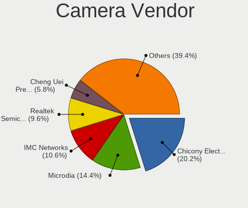

| Vendor                                 | Computers | Percent |
|----------------------------------------|-----------|---------|
| Chicony Electronics                    | 20        | 20.62%  |
| Microdia                               | 15        | 15.46%  |
| Realtek Semiconductor                  | 9         | 9.28%   |
| IMC Networks                           | 8         | 8.25%   |
| Logitech                               | 5         | 5.15%   |
| Cheng Uei Precision Industry (Foxlink) | 5         | 5.15%   |
| Acer                                   | 5         | 5.15%   |
| Syntek                                 | 4         | 4.12%   |
| Suyin                                  | 3         | 3.09%   |
| Sunplus Innovation Technology          | 3         | 3.09%   |
| Samsung Electronics                    | 2         | 2.06%   |
| Quanta                                 | 2         | 2.06%   |
| Generalplus Technology                 | 2         | 2.06%   |
| Bison Electronics                      | 2         | 2.06%   |
| Alcor Micro                            | 2         | 2.06%   |
| Z-Star Microelectronics                | 1         | 1.03%   |
| Ricoh                                  | 1         | 1.03%   |
| Lite-On Technology                     | 1         | 1.03%   |
| Lenovo                                 | 1         | 1.03%   |
| KYE Systems (Mouse Systems)            | 1         | 1.03%   |
| GEMBIRD                                | 1         | 1.03%   |
| Cubeternet                             | 1         | 1.03%   |
| Creative Technology                    | 1         | 1.03%   |
| Apple                                  | 1         | 1.03%   |
| 2M UVC CAMERA                          | 1         | 1.03%   |

Camera Model
------------

Camera device models

| Model                                                                      | Computers | Percent |
|----------------------------------------------------------------------------|-----------|---------|
| Chicony HD WebCam                                                          | 5         | 5.15%   |
| Microdia Integrated_Webcam_HD                                              | 4         | 4.12%   |
| Chicony Integrated Camera                                                  | 4         | 4.12%   |
| Logitech HD Pro Webcam C920                                                | 3         | 3.09%   |
| Chicony Integrated HP HD Webcam                                            | 3         | 3.09%   |
| Acer EasyCamera                                                            | 3         | 3.09%   |
| Syntek Lenovo EasyCamera                                                   | 2         | 2.06%   |
| Syntek Integrated Camera                                                   | 2         | 2.06%   |
| Samsung Galaxy series, misc. (MTP mode)                                    | 2         | 2.06%   |
| Realtek Integrated_Webcam_HD                                               | 2         | 2.06%   |
| Microdia USB 2.0 Camera                                                    | 2         | 2.06%   |
| Microdia Laptop_Integrated_Webcam_HD                                       | 2         | 2.06%   |
| IMC Networks Integrated Camera                                             | 2         | 2.06%   |
| Generalplus 808 Camera                                                     | 2         | 2.06%   |
| Cheng Uei Precision Industry (Foxlink) HP Wide Vision HD Integrated Webcam | 2         | 2.06%   |
| Z-Star Venus USB2.0 Camera                                                 | 1         | 1.03%   |
| Suyin Sony Visual Communication Camera                                     | 1         | 1.03%   |
| Suyin Lenovo EasyCamera                                                    | 1         | 1.03%   |
| Suyin Acer/HP Integrated Webcam [CN0314]                                   | 1         | 1.03%   |
| Sunplus USB 2.0 Camera                                                     | 1         | 1.03%   |
| Sunplus Integrated_Webcam_HD                                               | 1         | 1.03%   |
| Sunplus HD WebCam                                                          | 1         | 1.03%   |
| Ricoh HD Webcam                                                            | 1         | 1.03%   |
| Realtek USB2.0 VGA UVC WebCam                                              | 1         | 1.03%   |
| Realtek USB Camera                                                         | 1         | 1.03%   |
| Realtek Lenovo EasyCamera                                                  | 1         | 1.03%   |
| Realtek Laptop_Integrated_Webcam_HD                                        | 1         | 1.03%   |
| Realtek HP Truevision HD                                                   | 1         | 1.03%   |
| Realtek HP "Truevision HD" laptop camera                                   | 1         | 1.03%   |
| Realtek HD WebCam                                                          | 1         | 1.03%   |
| Quanta hm1091_techfront                                                    | 1         | 1.03%   |
| Quanta HD User Facing                                                      | 1         | 1.03%   |
| Microdia Webcam Vitade AF                                                  | 1         | 1.03%   |
| Microdia Laptop_Integrated_Webcam_E4HD                                     | 1         | 1.03%   |
| Microdia Laptop_Integrated_Webcam_2M                                       | 1         | 1.03%   |
| Microdia Laptop Integrated Webcam HD (Composite Device)                    | 1         | 1.03%   |
| Microdia Integrated_Webcam_FHD                                             | 1         | 1.03%   |
| Microdia Dell Laptop Integrated Webcam HD                                  | 1         | 1.03%   |
| Microdia Dell Integrated HD Webcam                                         | 1         | 1.03%   |
| Logitech Webcam C110                                                       | 1         | 1.03%   |

Security
--------

Fingerprint Vendor
------------------

Fingerprint sensor vendors

| Vendor                | Computers | Percent |
|-----------------------|-----------|---------|
| Validity Sensors      | 9         | 56.25%  |
| Synaptics             | 4         | 25%     |
| Elan Microelectronics | 2         | 12.5%   |
| Upek                  | 1         | 6.25%   |

Fingerprint Model
-----------------

Fingerprint sensor models

| Model                                                  | Computers | Percent |
|--------------------------------------------------------|-----------|---------|
| Validity Sensors VFS471 Fingerprint Reader             | 4         | 25%     |
| Validity Sensors VFS5011 Fingerprint Reader            | 2         | 12.5%   |
| Elan ELAN:Fingerprint                                  | 2         | 12.5%   |
| Validity Sensors VFS491                                | 1         | 6.25%   |
| Validity Sensors VFS451 Fingerprint Reader             | 1         | 6.25%   |
| Validity Sensors VFS 5011 fingerprint sensor           | 1         | 6.25%   |
| Upek Biometric Touchchip/Touchstrip Fingerprint Sensor | 1         | 6.25%   |
| Synaptics WBDI Fingerprint Reader USB 102              | 1         | 6.25%   |
| Synaptics UWP WBDI Device                              | 1         | 6.25%   |
| Synaptics Metallica MOH Touch Fingerprint Reader       | 1         | 6.25%   |
| Synaptics Fingerprint reader [HP G6]                   | 1         | 6.25%   |

Chipcard Vendor
---------------

Chipcard module vendors

| Vendor      | Computers | Percent |
|-------------|-----------|---------|
| Broadcom    | 5         | 83.33%  |
| Alcor Micro | 1         | 16.67%  |

Chipcard Model
--------------

Chipcard module models

| Model                                                                        | Computers | Percent |
|------------------------------------------------------------------------------|-----------|---------|
| Broadcom BCM5880 Secure Applications Processor with fingerprint swipe sensor | 3         | 50%     |
| Broadcom BCM5880 Secure Applications Processor                               | 1         | 16.67%  |
| Broadcom 58200                                                               | 1         | 16.67%  |
| Alcor Micro AU9540 Smartcard Reader                                          | 1         | 16.67%  |

Unsupported
-----------

Unsupported Devices
-------------------

Total unsupported devices on board

| Total | Computers | Percent |
|-------|-----------|---------|
| 0     | 114       | 70.37%  |
| 1     | 41        | 25.31%  |
| 2     | 7         | 4.32%   |

Unsupported Device Types
------------------------

Types of unsupported devices

| Type                     | Computers | Percent |
|--------------------------|-----------|---------|
| Fingerprint reader       | 16        | 30.19%  |
| Net/wireless             | 13        | 24.53%  |
| Graphics card            | 7         | 13.21%  |
| Chipcard                 | 6         | 11.32%  |
| Multimedia controller    | 5         | 9.43%   |
| Storage                  | 2         | 3.77%   |
| Tv card                  | 1         | 1.89%   |
| Net/ethernet             | 1         | 1.89%   |
| Communication controller | 1         | 1.89%   |
| Camera                   | 1         | 1.89%   |

