Reborn OS - Tested Hardware & Statistics (Desktops)
---------------------------------------------------

A project to collect tested hardware configurations for Reborn OS.

Anyone can contribute to this report by the [hw-probe](https://github.com/linuxhw/hw-probe) tool:

    sudo -E hw-probe -all -upload

Please contribute! Especially if your hardware is rare.

Contents
--------

* [ Test Cases ](#test-cases)

* [ System ](#system)
  - [ OS                       ](#os)
  - [ OS Family                ](#os-family)
  - [ Kernel                   ](#kernel)
  - [ Kernel Family            ](#kernel-family)
  - [ Kernel Major Ver.        ](#kernel-major-ver)
  - [ Arch                     ](#arch)
  - [ DE                       ](#de)
  - [ Display Server           ](#display-server)
  - [ Display Manager          ](#display-manager)
  - [ OS Lang                  ](#os-lang)
  - [ Boot Mode                ](#boot-mode)
  - [ Filesystem               ](#filesystem)
  - [ Part. scheme             ](#part-scheme)
  - [ Dual Boot with Linux/BSD ](#dual-boot-with-linuxbsd)
  - [ Dual Boot (Win)          ](#dual-boot-win)

* [ Board ](#board)
  - [ Vendor                   ](#vendor)
  - [ Model                    ](#model)
  - [ Model Family             ](#model-family)
  - [ MFG Year                 ](#mfg-year)
  - [ Form Factor              ](#form-factor)
  - [ Secure Boot              ](#secure-boot)
  - [ Coreboot                 ](#coreboot)
  - [ RAM Size                 ](#ram-size)
  - [ RAM Used                 ](#ram-used)
  - [ Total Drives             ](#total-drives)
  - [ Has CD-ROM               ](#has-cd-rom)
  - [ Has Ethernet             ](#has-ethernet)
  - [ Has WiFi                 ](#has-wifi)
  - [ Has Bluetooth            ](#has-bluetooth)

* [ Location ](#location)
  - [ Country                  ](#country)
  - [ City                     ](#city)

* [ Drives ](#drives)
  - [ Drive Vendor             ](#drive-vendor)
  - [ Drive Model              ](#drive-model)
  - [ HDD Vendor               ](#hdd-vendor)
  - [ SSD Vendor               ](#ssd-vendor)
  - [ Drive Kind               ](#drive-kind)
  - [ Drive Connector          ](#drive-connector)
  - [ Drive Size               ](#drive-size)
  - [ Space Total              ](#space-total)
  - [ Space Used               ](#space-used)
  - [ Malfunc. Drives          ](#malfunc-drives)
  - [ Malfunc. Drive Vendor    ](#malfunc-drive-vendor)
  - [ Malfunc. HDD Vendor      ](#malfunc-hdd-vendor)
  - [ Malfunc. Drive Kind      ](#malfunc-drive-kind)
  - [ Failed Drives            ](#failed-drives)
  - [ Failed Drive Vendor      ](#failed-drive-vendor)
  - [ Drive Status             ](#drive-status)

* [ Storage controller ](#storage-controller)
  - [ Storage Vendor           ](#storage-vendor)
  - [ Storage Model            ](#storage-model)
  - [ Storage Kind             ](#storage-kind)

* [ Processor ](#processor)
  - [ CPU Vendor               ](#cpu-vendor)
  - [ CPU Model                ](#cpu-model)
  - [ CPU Model Family         ](#cpu-model-family)
  - [ CPU Cores                ](#cpu-cores)
  - [ CPU Sockets              ](#cpu-sockets)
  - [ CPU Threads              ](#cpu-threads)
  - [ CPU Op-Modes             ](#cpu-op-modes)
  - [ CPU Microcode            ](#cpu-microcode)
  - [ CPU Microarch            ](#cpu-microarch)

* [ Graphics ](#graphics)
  - [ GPU Vendor               ](#gpu-vendor)
  - [ GPU Model                ](#gpu-model)
  - [ GPU Combo                ](#gpu-combo)
  - [ GPU Driver               ](#gpu-driver)
  - [ GPU Memory               ](#gpu-memory)

* [ Monitor ](#monitor)
  - [ Monitor Vendor           ](#monitor-vendor)
  - [ Monitor Model            ](#monitor-model)
  - [ Monitor Resolution       ](#monitor-resolution)
  - [ Monitor Diagonal         ](#monitor-diagonal)
  - [ Monitor Width            ](#monitor-width)
  - [ Aspect Ratio             ](#aspect-ratio)
  - [ Monitor Area             ](#monitor-area)
  - [ Pixel Density            ](#pixel-density)
  - [ Multiple Monitors        ](#multiple-monitors)

* [ Network ](#network)
  - [ Net Controller Vendor    ](#net-controller-vendor)
  - [ Net Controller Model     ](#net-controller-model)
  - [ Wireless Vendor          ](#wireless-vendor)
  - [ Wireless Model           ](#wireless-model)
  - [ Ethernet Vendor          ](#ethernet-vendor)
  - [ Ethernet Model           ](#ethernet-model)
  - [ Net Controller Kind      ](#net-controller-kind)
  - [ Used Controller          ](#used-controller)
  - [ NICs                     ](#nics)
  - [ IPv6                     ](#ipv6)

* [ Bluetooth ](#bluetooth)
  - [ Bluetooth Vendor         ](#bluetooth-vendor)
  - [ Bluetooth Model          ](#bluetooth-model)

* [ Sound ](#sound)
  - [ Sound Vendor             ](#sound-vendor)
  - [ Sound Model              ](#sound-model)

* [ Memory ](#memory)
  - [ Memory Vendor            ](#memory-vendor)
  - [ Memory Model             ](#memory-model)
  - [ Memory Kind              ](#memory-kind)
  - [ Memory Form Factor       ](#memory-form-factor)
  - [ Memory Size              ](#memory-size)
  - [ Memory Speed             ](#memory-speed)

* [ Printers & scanners ](#printers--scanners)
  - [ Printer Vendor           ](#printer-vendor)
  - [ Printer Model            ](#printer-model)
  - [ Scanner Vendor           ](#scanner-vendor)
  - [ Scanner Model            ](#scanner-model)

* [ Camera ](#camera)
  - [ Camera Vendor            ](#camera-vendor)
  - [ Camera Model             ](#camera-model)

* [ Security ](#security)
  - [ Fingerprint Vendor       ](#fingerprint-vendor)
  - [ Fingerprint Model        ](#fingerprint-model)
  - [ Chipcard Vendor          ](#chipcard-vendor)
  - [ Chipcard Model           ](#chipcard-model)

* [ Unsupported ](#unsupported)
  - [ Unsupported Devices      ](#unsupported-devices)
  - [ Unsupported Device Types ](#unsupported-device-types)

Test Cases
----------

Total: 88

| Vendor        | Model                    | Probe                                                      | Date         |
|---------------|--------------------------|------------------------------------------------------------|--------------|
| Pegatron      | 2AD5                     | [0b91ee456b](https://linux-hardware.org/?probe=0b91ee456b) | Nov 02, 2022 |
| Pegatron      | 2AD5                     | [5f90d4e478](https://linux-hardware.org/?probe=5f90d4e478) | Nov 02, 2022 |
| HP            | 8460                     | [d74207aa28](https://linux-hardware.org/?probe=d74207aa28) | Sep 08, 2022 |
| BESSTAR Te... | B550                     | [f4a5cc4ace](https://linux-hardware.org/?probe=f4a5cc4ace) | Sep 04, 2022 |
| Biostar       | A320MH                   | [7580882598](https://linux-hardware.org/?probe=7580882598) | Jul 10, 2022 |
| Gigabyte      | H110M-S2PT-CF            | [506afdf9c7](https://linux-hardware.org/?probe=506afdf9c7) | Mar 09, 2022 |
| Shuttle       | FZ270                    | [ed3e018227](https://linux-hardware.org/?probe=ed3e018227) | Mar 09, 2022 |
| ASUSTek       | ROG STRIX X570-I GAMING  | [bc31f5f2bd](https://linux-hardware.org/?probe=bc31f5f2bd) | Jan 17, 2022 |
| ASUSTek       | PRIME H310M-K R2.0       | [7dba1540ad](https://linux-hardware.org/?probe=7dba1540ad) | Dec 06, 2021 |
| Medion        | Cattle24 1M              | [fd68d44a6a](https://linux-hardware.org/?probe=fd68d44a6a) | Oct 16, 2021 |
| Medion        | Cattle24 1M              | [dd4a0707ba](https://linux-hardware.org/?probe=dd4a0707ba) | May 19, 2021 |
| Dell          | 0200DY A01               | [426fc0381c](https://linux-hardware.org/?probe=426fc0381c) | May 08, 2021 |
| ASUSTek       | PRIME Z270-A             | [58fbf7553b](https://linux-hardware.org/?probe=58fbf7553b) | May 03, 2021 |
| ASUSTek       | PRIME Z270-A             | [27595787eb](https://linux-hardware.org/?probe=27595787eb) | Apr 26, 2021 |
| ASUSTek       | PRIME Z270-A             | [ec119e020d](https://linux-hardware.org/?probe=ec119e020d) | Apr 26, 2021 |
| HP            | 3048h                    | [b61eb90220](https://linux-hardware.org/?probe=b61eb90220) | Mar 20, 2021 |
| Gigabyte      | X570 AORUS ELITE         | [0e8f323e0f](https://linux-hardware.org/?probe=0e8f323e0f) | Mar 18, 2021 |
| Gigabyte      | X570 AORUS ELITE         | [a949911df6](https://linux-hardware.org/?probe=a949911df6) | Mar 18, 2021 |
| Gigabyte      | B450 AORUS M             | [4a76fb93d3](https://linux-hardware.org/?probe=4a76fb93d3) | Mar 16, 2021 |
| Gigabyte      | F2A85X-UP4               | [926ae13f69](https://linux-hardware.org/?probe=926ae13f69) | Mar 09, 2021 |
| ASUSTek       | ROG STRIX X570-I GAMING  | [6c98f8666d](https://linux-hardware.org/?probe=6c98f8666d) | Feb 24, 2021 |
| ASRock        | X570 Taichi              | [e6476ce804](https://linux-hardware.org/?probe=e6476ce804) | Feb 05, 2021 |
| ASUSTek       | PRIME B450M-A            | [6042185966](https://linux-hardware.org/?probe=6042185966) | Feb 05, 2021 |
| ASUSTek       | PRIME B450M-A            | [8c4549fed4](https://linux-hardware.org/?probe=8c4549fed4) | Feb 05, 2021 |
| ASUSTek       | ROG STRIX B350-F GAMING  | [0bb6c600d0](https://linux-hardware.org/?probe=0bb6c600d0) | Jan 25, 2021 |
| ASUSTek       | Q87M-E                   | [e95dad9e90](https://linux-hardware.org/?probe=e95dad9e90) | Jan 14, 2021 |
| MSI           | MEG X570 ACE             | [5b061048ce](https://linux-hardware.org/?probe=5b061048ce) | Jan 11, 2021 |
| Dell          | 02YYK5 A01               | [f50fd232e1](https://linux-hardware.org/?probe=f50fd232e1) | Jan 06, 2021 |
| MSI           | A320M PRO-VD/S V2        | [5d05e8d607](https://linux-hardware.org/?probe=5d05e8d607) | Jan 04, 2021 |
| ASUSTek       | PRIME H310M-K R2.0       | [ed3e1cc88a](https://linux-hardware.org/?probe=ed3e1cc88a) | Jan 04, 2021 |
| ASUSTek       | PRIME H310M-K R2.0       | [fb77017d74](https://linux-hardware.org/?probe=fb77017d74) | Jan 04, 2021 |
| ASUSTek       | P8B75-V                  | [a8ba58ce8d](https://linux-hardware.org/?probe=a8ba58ce8d) | Jan 03, 2021 |
| ASUSTek       | ROG STRIX B450-F GAMING  | [60d4c9b8f1](https://linux-hardware.org/?probe=60d4c9b8f1) | Jan 02, 2021 |
| ASUSTek       | ROG STRIX B450-F GAMING  | [bab82e261e](https://linux-hardware.org/?probe=bab82e261e) | Jan 02, 2021 |
| ASUSTek       | P7H55-M PRO              | [253b9e5126](https://linux-hardware.org/?probe=253b9e5126) | Jan 01, 2021 |
| ASUSTek       | P7H55-M PRO              | [016282f72d](https://linux-hardware.org/?probe=016282f72d) | Jan 01, 2021 |
| Dell          | 084J0R A00               | [45b5f0850b](https://linux-hardware.org/?probe=45b5f0850b) | Dec 30, 2020 |
| MSI           | FM2-A75MA-E35            | [c537d4854e](https://linux-hardware.org/?probe=c537d4854e) | Dec 14, 2020 |
| MSI           | FM2-A75MA-E35            | [f1f14b545e](https://linux-hardware.org/?probe=f1f14b545e) | Dec 13, 2020 |
| Dell          | 096JG8 A01               | [d0fc564ec7](https://linux-hardware.org/?probe=d0fc564ec7) | Dec 11, 2020 |
| Dell          | 096JG8 A01               | [2385d54def](https://linux-hardware.org/?probe=2385d54def) | Dec 09, 2020 |
| OEM           | G41 775 ICH7 8712        | [a135ed4b82](https://linux-hardware.org/?probe=a135ed4b82) | Nov 08, 2020 |
| OEM           | G41 775 ICH7 8712        | [151ca5d99e](https://linux-hardware.org/?probe=151ca5d99e) | Nov 08, 2020 |
| ASRock        | 960GM-VGS3 FX            | [5c51163253](https://linux-hardware.org/?probe=5c51163253) | Nov 05, 2020 |
| Gigabyte      | EP43-UD3L                | [d6fd55eee0](https://linux-hardware.org/?probe=d6fd55eee0) | Nov 01, 2020 |
| Lenovo        | ThinkCentre M58 6258WCY  | [a1896b3549](https://linux-hardware.org/?probe=a1896b3549) | Oct 26, 2020 |
| ASUSTek       | PRIME H110M-P            | [5f4ab6b326](https://linux-hardware.org/?probe=5f4ab6b326) | Oct 18, 2020 |
| Foxconn       | H61S                     | [0fd947c658](https://linux-hardware.org/?probe=0fd947c658) | Oct 12, 2020 |
| Dell          | 096JG8 A01               | [337abf3073](https://linux-hardware.org/?probe=337abf3073) | Sep 30, 2020 |
| Huanan        | X79-8D VAA31             | [e0551a0a1c](https://linux-hardware.org/?probe=e0551a0a1c) | Sep 10, 2020 |
| Huanan        | X79-8D VAA31             | [66006c461d](https://linux-hardware.org/?probe=66006c461d) | Sep 06, 2020 |
| ASUSTek       | PRIME X370-PRO           | [524f57a765](https://linux-hardware.org/?probe=524f57a765) | Sep 06, 2020 |
| ASUSTek       | Z87-PLUS                 | [3fe15728ad](https://linux-hardware.org/?probe=3fe15728ad) | Sep 06, 2020 |
| ASUSTek       | Z87-PLUS                 | [e3f12cdd9b](https://linux-hardware.org/?probe=e3f12cdd9b) | Sep 05, 2020 |
| Dell          | 0Y2MRG A00               | [8af1b0565b](https://linux-hardware.org/?probe=8af1b0565b) | Sep 03, 2020 |
| Acer          | Aspire TC-885 V:1.1      | [c90b90e1a8](https://linux-hardware.org/?probe=c90b90e1a8) | Aug 21, 2020 |
| ASRock        | B450M Pro4               | [49170a6643](https://linux-hardware.org/?probe=49170a6643) | Aug 12, 2020 |
| ASUSTek       | M5A99X EVO               | [6aae8e8b65](https://linux-hardware.org/?probe=6aae8e8b65) | Aug 12, 2020 |
| MSI           | IONA                     | [0510d0f8ef](https://linux-hardware.org/?probe=0510d0f8ef) | Aug 06, 2020 |
| MSI           | IONA                     | [446e406f22](https://linux-hardware.org/?probe=446e406f22) | Aug 06, 2020 |
| ASUSTek       | P5KPL-AM SE              | [9c79ef0e1c](https://linux-hardware.org/?probe=9c79ef0e1c) | Jul 31, 2020 |
| ASUSTek       | P5KPL-AM SE              | [242b101828](https://linux-hardware.org/?probe=242b101828) | Jul 31, 2020 |
| ASUSTek       | STRIX H270F GAMING       | [52b8fcb9b0](https://linux-hardware.org/?probe=52b8fcb9b0) | Jul 26, 2020 |
| Gigabyte      | Z87-HD3                  | [3eff281cc0](https://linux-hardware.org/?probe=3eff281cc0) | Jun 27, 2020 |
| Gigabyte      | F2A75-D3H                | [59a8d5230f](https://linux-hardware.org/?probe=59a8d5230f) | Apr 09, 2020 |
| Pegatron      | 2A99                     | [f01c0c56e7](https://linux-hardware.org/?probe=f01c0c56e7) | Apr 08, 2020 |
| ASRock        | X570 Phantom Gaming 4    | [97ffeec17e](https://linux-hardware.org/?probe=97ffeec17e) | Mar 23, 2020 |
| Lenovo        | MAHOBAY NOK              | [aaac6f9d4d](https://linux-hardware.org/?probe=aaac6f9d4d) | Mar 17, 2020 |
| ASRock        | X570 Phantom Gaming 4    | [63b8db155d](https://linux-hardware.org/?probe=63b8db155d) | Mar 02, 2020 |
| ASRock        | X570 Phantom Gaming 4    | [ed0b979970](https://linux-hardware.org/?probe=ed0b979970) | Mar 01, 2020 |
| ASRock        | X570 Phantom Gaming 4    | [85c6480266](https://linux-hardware.org/?probe=85c6480266) | Mar 01, 2020 |
| ASRock        | H81M-HDS                 | [0f180375d6](https://linux-hardware.org/?probe=0f180375d6) | Feb 25, 2020 |
| ASRock        | H81M-HDS                 | [55c569be56](https://linux-hardware.org/?probe=55c569be56) | Feb 23, 2020 |
| ASRock        | H81M-HDS                 | [98ae2a8227](https://linux-hardware.org/?probe=98ae2a8227) | Feb 22, 2020 |
| Gigabyte      | GA-880GM-UD2H            | [b189e00138](https://linux-hardware.org/?probe=b189e00138) | Jan 16, 2020 |
| Gigabyte      | GA-880GM-UD2H            | [ecb6ade802](https://linux-hardware.org/?probe=ecb6ade802) | Jan 16, 2020 |
| Intel         | DH55HC AAE70933-501      | [64266b67a2](https://linux-hardware.org/?probe=64266b67a2) | Dec 26, 2019 |
| HP            | 82F2 A01                 | [0b8306e086](https://linux-hardware.org/?probe=0b8306e086) | Nov 18, 2019 |
| Dell          | 0773VG A00               | [adf2d5daca](https://linux-hardware.org/?probe=adf2d5daca) | Oct 31, 2019 |
| Dell          | 0773VG A00               | [2f3044da6d](https://linux-hardware.org/?probe=2f3044da6d) | Oct 31, 2019 |
| MSI           | C236A WORKSTATION        | [fcc16b2804](https://linux-hardware.org/?probe=fcc16b2804) | Oct 11, 2019 |
| MSI           | C236A WORKSTATION        | [f68bc503a9](https://linux-hardware.org/?probe=f68bc503a9) | Oct 11, 2019 |
| Gigabyte      | H61M-DS2                 | [2560a1cb4e](https://linux-hardware.org/?probe=2560a1cb4e) | Aug 28, 2019 |
| Gigabyte      | H61M-DS2                 | [b013eab87a](https://linux-hardware.org/?probe=b013eab87a) | Aug 27, 2019 |
| ASUSTek       | Z8NA-D6                  | [81c929f40d](https://linux-hardware.org/?probe=81c929f40d) | Jan 23, 2019 |
| ASUSTek       | P8Z77-V DELUXE           | [2180eb318a](https://linux-hardware.org/?probe=2180eb318a) | Dec 30, 2018 |
| ASRock        | H97M Pro4                | [2e4984a12a](https://linux-hardware.org/?probe=2e4984a12a) | Nov 27, 2018 |
| Lenovo        | ThinkCentre M91p 0266RZ1 | [812afde3d9](https://linux-hardware.org/?probe=812afde3d9) | Nov 21, 2018 |

System
------

OS
--

Installed operating systems

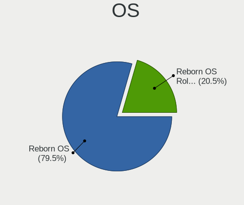

| Name              | Desktops | Percent |
|-------------------|----------|---------|
| Reborn OS         | 51       | 82.26%  |
| Reborn OS Rolling | 11       | 17.74%  |

OS Family
---------

OS without a version

| Name      | Desktops | Percent |
|-----------|----------|---------|
| Reborn OS | 62       | 100%    |

Kernel
------

Version of the Linux kernel

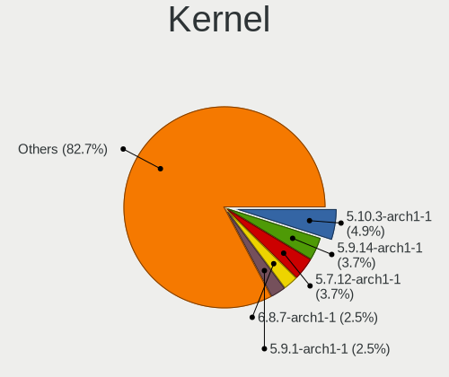

| Version              | Desktops | Percent |
|----------------------|----------|---------|
| 5.10.3-arch1-1       | 4        | 5.97%   |
| 5.9.14-arch1-1       | 3        | 4.48%   |
| 5.7.12-arch1-1       | 3        | 4.48%   |
| 5.9.1-arch1-1        | 2        | 2.99%   |
| 5.8.7-arch1-1        | 2        | 2.99%   |
| 5.16.12-arch1-1      | 2        | 2.99%   |
| 5.11.7-arch1-1       | 2        | 2.99%   |
| 5.10.4-arch2-1       | 2        | 2.99%   |
| 5.10.13-arch1-1      | 2        | 2.99%   |
| 6.0.6-arch1-1        | 1        | 1.49%   |
| 5.9.6-arch1-1        | 1        | 1.49%   |
| 5.9.3-arch1-1        | 1        | 1.49%   |
| 5.9.2-arch1-1        | 1        | 1.49%   |
| 5.9.13-arch1-1       | 1        | 1.49%   |
| 5.9.12-arch1-1       | 1        | 1.49%   |
| 5.9.11-arch2-1       | 1        | 1.49%   |
| 5.8.6-arch1-1        | 1        | 1.49%   |
| 5.8.5-arch1-1        | 1        | 1.49%   |
| 5.8.14-arch1-1       | 1        | 1.49%   |
| 5.8.12-arch1-1       | 1        | 1.49%   |
| 5.8.1-arch1-1        | 1        | 1.49%   |
| 5.7.6-arch1-1-custom | 1        | 1.49%   |
| 5.7.11-arch1-1       | 1        | 1.49%   |
| 5.7.10-arch1-1       | 1        | 1.49%   |
| 5.6.3-arch1-1        | 1        | 1.49%   |
| 5.6.2-arch1-2        | 1        | 1.49%   |
| 5.5.9-arch1-2        | 1        | 1.49%   |
| 5.5.5-arch1-1        | 1        | 1.49%   |
| 5.5.2-arch1-1        | 1        | 1.49%   |
| 5.5.11-arch1-1       | 1        | 1.49%   |
| 5.4.6-arch3-1        | 1        | 1.49%   |
| 5.4.10-arch1-1       | 1        | 1.49%   |
| 5.3.7-arch1-2-ARCH   | 1        | 1.49%   |
| 5.3.5-arch1-1-ARCH   | 1        | 1.49%   |
| 5.3.11-arch1-1       | 1        | 1.49%   |
| 5.2.9-arch1-1-ARCH   | 1        | 1.49%   |
| 5.19.7-arch1-1       | 1        | 1.49%   |
| 5.19.6-arch1-1       | 1        | 1.49%   |
| 5.18.9-arch1-1       | 1        | 1.49%   |
| 5.16.0-zen1-1-zen    | 1        | 1.49%   |

Kernel Family
-------------

Linux kernel without a distro release

| Version | Desktops | Percent |
|---------|----------|---------|
| 5.10.3  | 4        | 6.06%   |
| 5.9.14  | 3        | 4.55%   |
| 5.7.12  | 3        | 4.55%   |
| 5.9.1   | 2        | 3.03%   |
| 5.8.7   | 2        | 3.03%   |
| 5.16.12 | 2        | 3.03%   |
| 5.11.7  | 2        | 3.03%   |
| 5.10.4  | 2        | 3.03%   |
| 5.10.13 | 2        | 3.03%   |
| 6.0.6   | 1        | 1.52%   |
| 5.9.6   | 1        | 1.52%   |
| 5.9.3   | 1        | 1.52%   |
| 5.9.2   | 1        | 1.52%   |
| 5.9.13  | 1        | 1.52%   |
| 5.9.12  | 1        | 1.52%   |
| 5.9.11  | 1        | 1.52%   |
| 5.8.6   | 1        | 1.52%   |
| 5.8.5   | 1        | 1.52%   |
| 5.8.14  | 1        | 1.52%   |
| 5.8.12  | 1        | 1.52%   |
| 5.8.1   | 1        | 1.52%   |
| 5.7.6   | 1        | 1.52%   |
| 5.7.11  | 1        | 1.52%   |
| 5.7.10  | 1        | 1.52%   |
| 5.6.3   | 1        | 1.52%   |
| 5.6.2   | 1        | 1.52%   |
| 5.5.9   | 1        | 1.52%   |
| 5.5.5   | 1        | 1.52%   |
| 5.5.2   | 1        | 1.52%   |
| 5.5.11  | 1        | 1.52%   |
| 5.4.6   | 1        | 1.52%   |
| 5.4.10  | 1        | 1.52%   |
| 5.3.7   | 1        | 1.52%   |
| 5.3.5   | 1        | 1.52%   |
| 5.3.11  | 1        | 1.52%   |
| 5.2.9   | 1        | 1.52%   |
| 5.19.7  | 1        | 1.52%   |
| 5.19.6  | 1        | 1.52%   |
| 5.18.9  | 1        | 1.52%   |
| 5.16.0  | 1        | 1.52%   |

Kernel Major Ver.
-----------------

Linux kernel major version

| Version | Desktops | Percent |
|---------|----------|---------|
| 5.9     | 11       | 16.92%  |
| 5.10    | 9        | 13.85%  |
| 5.8     | 7        | 10.77%  |
| 5.7     | 6        | 9.23%   |
| 5.11    | 6        | 9.23%   |
| 5.5     | 4        | 6.15%   |
| 5.3     | 3        | 4.62%   |
| 5.16    | 3        | 4.62%   |
| 5.6     | 2        | 3.08%   |
| 5.4     | 2        | 3.08%   |
| 5.19    | 2        | 3.08%   |
| 5.12    | 2        | 3.08%   |
| 4.19    | 2        | 3.08%   |
| 6.0     | 1        | 1.54%   |
| 5.2     | 1        | 1.54%   |
| 5.18    | 1        | 1.54%   |
| 5.14    | 1        | 1.54%   |
| 4.20    | 1        | 1.54%   |
| 4.18    | 1        | 1.54%   |

Arch
----

OS architecture (x86_64, i586, etc.)

| Name   | Desktops | Percent |
|--------|----------|---------|
| x86_64 | 62       | 100%    |

DE
--

Desktop Environment

| Name       | Desktops | Percent |
|------------|----------|---------|
| GNOME      | 11       | 17.74%  |
| X-Cinnamon | 10       | 16.13%  |
| KDE        | 8        | 12.9%   |
| XFCE       | 7        | 11.29%  |
| Deepin     | 7        | 11.29%  |
| Unknown    | 7        | 11.29%  |
| KDE5       | 4        | 6.45%   |
| Budgie     | 3        | 4.84%   |
| LXQt       | 2        | 3.23%   |
| MATE       | 1        | 1.61%   |
| i3         | 1        | 1.61%   |
| Cinnamon   | 1        | 1.61%   |

Display Server
--------------

X11 or Wayland

| Name    | Desktops | Percent |
|---------|----------|---------|
| X11     | 54       | 87.1%   |
| Wayland | 8        | 12.9%   |

Display Manager
---------------

SDDM, LightDM, etc.

| Name    | Desktops | Percent |
|---------|----------|---------|
| Unknown | 51       | 80.95%  |
| TDM     | 4        | 6.35%   |
| LightDM | 4        | 6.35%   |
| GDM     | 3        | 4.76%   |
| SDDM    | 1        | 1.59%   |

OS Lang
-------

Language

| Lang    | Desktops | Percent |
|---------|----------|---------|
| en_US   | 23       | 37.1%   |
| Unknown | 8        | 12.9%   |
| de_DE   | 7        | 11.29%  |
| es_ES   | 5        | 8.06%   |
| en_GB   | 5        | 8.06%   |
| es_AR   | 2        | 3.23%   |
| en_AU   | 2        | 3.23%   |
| ru_UA   | 1        | 1.61%   |
| ru_RU   | 1        | 1.61%   |
| pt_BR   | 1        | 1.61%   |
| fr_FR   | 1        | 1.61%   |
| es_PA   | 1        | 1.61%   |
| en_PH   | 1        | 1.61%   |
| en_CA   | 1        | 1.61%   |
| en_AG   | 1        | 1.61%   |
| el_GR   | 1        | 1.61%   |
| de_AT   | 1        | 1.61%   |

Boot Mode
---------

EFI or BIOS

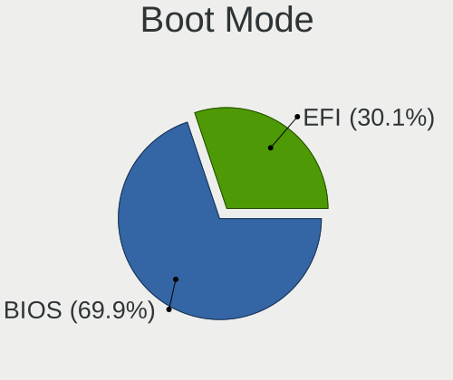

| Mode | Desktops | Percent |
|------|----------|---------|
| BIOS | 43       | 69.35%  |
| EFI  | 19       | 30.65%  |

Filesystem
----------

Type of filesystem

| Type    | Desktops | Percent |
|---------|----------|---------|
| Ext4    | 47       | 75.81%  |
| Unknown | 8        | 12.9%   |
| Tmpfs   | 4        | 6.45%   |
| Xfs     | 3        | 4.84%   |

Part. scheme
------------

Scheme of partitioning

| Type    | Desktops | Percent |
|---------|----------|---------|
| Unknown | 50       | 80.65%  |
| GPT     | 11       | 17.74%  |
| MBR     | 1        | 1.61%   |

Dual Boot with Linux/BSD
------------------------

Hosting more than one Linux/BSD

| Dual boot | Desktops | Percent |
|-----------|----------|---------|
| No        | 57       | 91.94%  |
| Yes       | 5        | 8.06%   |

Dual Boot (Win)
---------------

Hosting Linux and Windows

| Dual boot | Desktops | Percent |
|-----------|----------|---------|
| No        | 56       | 88.89%  |
| Yes       | 7        | 11.11%  |

Board
-----

Vendor
------

Motherboard manufacturer

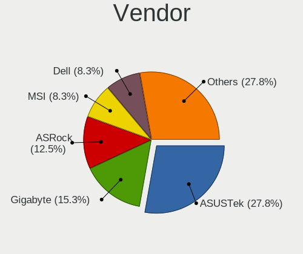

| Name                | Desktops | Percent |
|---------------------|----------|---------|
| ASUSTek Computer    | 17       | 27.42%  |
| Gigabyte Technology | 9        | 14.52%  |
| ASRock              | 7        | 11.29%  |
| MSI                 | 6        | 9.68%   |
| Dell                | 6        | 9.68%   |
| Lenovo              | 3        | 4.84%   |
| Hewlett-Packard     | 3        | 4.84%   |
| Pegatron            | 2        | 3.23%   |
| Shuttle             | 1        | 1.61%   |
| OEM                 | 1        | 1.61%   |
| Medion              | 1        | 1.61%   |
| Intel               | 1        | 1.61%   |
| Huanan              | 1        | 1.61%   |
| Foxconn             | 1        | 1.61%   |
| Biostar             | 1        | 1.61%   |
| BESSTAR Tech        | 1        | 1.61%   |
| Acer                | 1        | 1.61%   |

Model
-----

Motherboard model

| Name                            | Desktops | Percent |
|---------------------------------|----------|---------|
| MSI MS-7721                     | 2        | 3.23%   |
| ASRock X570 Phantom Gaming 4    | 2        | 3.23%   |
| Shuttle SZ270                   | 1        | 1.61%   |
| Pegatron Elite 7500 Series MT   | 1        | 1.61%   |
| Pegatron CQ3476L                | 1        | 1.61%   |
| OEM G41 775 ICH7 8712           | 1        | 1.61%   |
| MSI WK711AA-ACB HPE-110ru       | 1        | 1.61%   |
| MSI MS-7C35                     | 1        | 1.61%   |
| MSI MS-7A36                     | 1        | 1.61%   |
| MSI MS-7998                     | 1        | 1.61%   |
| Medion P961x                    | 1        | 1.61%   |
| Lenovo ThinkCentre M92 32071F5  | 1        | 1.61%   |
| Lenovo ThinkCentre M91p 0266RZ1 | 1        | 1.61%   |
| Lenovo ThinkCentre M58 6258WCY  | 1        | 1.61%   |
| Intel DH55HC AAE70933-501       | 1        | 1.61%   |
| Huanan X79-8D VAA31             | 1        | 1.61%   |
| HP Pavilion Desktop PC 570-p0XX | 1        | 1.61%   |
| HP EliteDesk 705 G4 MT          | 1        | 1.61%   |
| HP Compaq 6000 Pro MT PC        | 1        | 1.61%   |
| Gigabyte Z87-HD3                | 1        | 1.61%   |
| Gigabyte X570 AORUS ELITE       | 1        | 1.61%   |
| Gigabyte H61M-DS2               | 1        | 1.61%   |
| Gigabyte H110M-S2PT-CF          | 1        | 1.61%   |
| Gigabyte GA-880GM-UD2H          | 1        | 1.61%   |
| Gigabyte F2A85X-UP4             | 1        | 1.61%   |
| Gigabyte F2A75-D3H              | 1        | 1.61%   |
| Gigabyte EP43-UD3L              | 1        | 1.61%   |
| Gigabyte B450 AORUS M           | 1        | 1.61%   |
| Foxconn H61S                    | 1        | 1.61%   |
| Dell XPS 8300                   | 1        | 1.61%   |
| Dell OptiPlex 780               | 1        | 1.61%   |
| Dell OptiPlex 7040              | 1        | 1.61%   |
| Dell OptiPlex 7020              | 1        | 1.61%   |
| Dell OptiPlex 7010              | 1        | 1.61%   |
| Dell Inspiron 660               | 1        | 1.61%   |
| Biostar A320MH                  | 1        | 1.61%   |
| BESSTAR Tech B550               | 1        | 1.61%   |
| ASUS Z8NA-D6                    | 1        | 1.61%   |
| ASUS STRIX H270F GAMING         | 1        | 1.61%   |
| ASUS ROG STRIX X570-I GAMING    | 1        | 1.61%   |

Model Family
------------

Motherboard model prefix

| Name                   | Desktops | Percent |
|------------------------|----------|---------|
| ASUS PRIME             | 5        | 8.06%   |
| Dell OptiPlex          | 4        | 6.45%   |
| Lenovo ThinkCentre     | 3        | 4.84%   |
| ASUS ROG               | 3        | 4.84%   |
| ASRock X570            | 3        | 4.84%   |
| MSI MS-7721            | 2        | 3.23%   |
| Shuttle SZ270          | 1        | 1.61%   |
| Pegatron Elite         | 1        | 1.61%   |
| Pegatron CQ3476L       | 1        | 1.61%   |
| OEM G41                | 1        | 1.61%   |
| MSI WK711AA-ACB        | 1        | 1.61%   |
| MSI MS-7C35            | 1        | 1.61%   |
| MSI MS-7A36            | 1        | 1.61%   |
| MSI MS-7998            | 1        | 1.61%   |
| Medion P961x           | 1        | 1.61%   |
| Intel DH55HC           | 1        | 1.61%   |
| Huanan X79-8D          | 1        | 1.61%   |
| HP Pavilion            | 1        | 1.61%   |
| HP EliteDesk           | 1        | 1.61%   |
| HP Compaq              | 1        | 1.61%   |
| Gigabyte Z87-HD3       | 1        | 1.61%   |
| Gigabyte X570          | 1        | 1.61%   |
| Gigabyte H61M-DS2      | 1        | 1.61%   |
| Gigabyte H110M-S2PT-CF | 1        | 1.61%   |
| Gigabyte GA-880GM-UD2H | 1        | 1.61%   |
| Gigabyte F2A85X-UP4    | 1        | 1.61%   |
| Gigabyte F2A75-D3H     | 1        | 1.61%   |
| Gigabyte EP43-UD3L     | 1        | 1.61%   |
| Gigabyte B450          | 1        | 1.61%   |
| Foxconn H61S           | 1        | 1.61%   |
| Dell XPS               | 1        | 1.61%   |
| Dell Inspiron          | 1        | 1.61%   |
| Biostar A320MH         | 1        | 1.61%   |
| BESSTAR Tech B550      | 1        | 1.61%   |
| ASUS Z8NA-D6           | 1        | 1.61%   |
| ASUS STRIX             | 1        | 1.61%   |
| ASUS Q87M-XA           | 1        | 1.61%   |
| ASUS P8Z77-V           | 1        | 1.61%   |
| ASUS P8B75-V           | 1        | 1.61%   |
| ASUS P7H55-M           | 1        | 1.61%   |

MFG Year
--------

Motherboard manufacture year

| Year | Desktops | Percent |
|------|----------|---------|
| 2019 | 10       | 16.13%  |
| 2012 | 9        | 14.52%  |
| 2018 | 7        | 11.29%  |
| 2013 | 7        | 11.29%  |
| 2016 | 5        | 8.06%   |
| 2010 | 5        | 8.06%   |
| 2009 | 5        | 8.06%   |
| 2017 | 4        | 6.45%   |
| 2011 | 3        | 4.84%   |
| 2014 | 2        | 3.23%   |
| 2008 | 2        | 3.23%   |
| 2022 | 1        | 1.61%   |
| 2020 | 1        | 1.61%   |
| 2015 | 1        | 1.61%   |

Form Factor
-----------

Physical design of the computer

| Name    | Desktops | Percent |
|---------|----------|---------|
| Desktop | 62       | 100%    |

Secure Boot
-----------

Enabled or disabled

| State    | Desktops | Percent |
|----------|----------|---------|
| Disabled | 62       | 100%    |

Coreboot
--------

Have coreboot on board

| Used | Desktops | Percent |
|------|----------|---------|
| No   | 62       | 100%    |

RAM Size
--------

Total RAM memory

| Size in GB  | Desktops | Percent |
|-------------|----------|---------|
| 16.01-24.0  | 18       | 28.13%  |
| 8.01-16.0   | 16       | 25%     |
| 4.01-8.0    | 13       | 20.31%  |
| 32.01-64.0  | 10       | 15.63%  |
| 3.01-4.0    | 5        | 7.81%   |
| 64.01-256.0 | 1        | 1.56%   |
| 1.01-2.0    | 1        | 1.56%   |

RAM Used
--------

Used RAM memory

| Used GB   | Desktops | Percent |
|-----------|----------|---------|
| 1.01-2.0  | 25       | 38.46%  |
| 2.01-3.0  | 19       | 29.23%  |
| 4.01-8.0  | 9        | 13.85%  |
| 3.01-4.0  | 8        | 12.31%  |
| 8.01-16.0 | 2        | 3.08%   |
| 0.51-1.0  | 2        | 3.08%   |

Total Drives
------------

Number of drives on board

| Drives | Desktops | Percent |
|--------|----------|---------|
| 1      | 22       | 34.92%  |
| 2      | 19       | 30.16%  |
| 4      | 9        | 14.29%  |
| 3      | 8        | 12.7%   |
| 0      | 2        | 3.17%   |
| 7      | 1        | 1.59%   |
| 6      | 1        | 1.59%   |
| 5      | 1        | 1.59%   |

Has CD-ROM
----------

Has CD-ROM on board

| Presented | Desktops | Percent |
|-----------|----------|---------|
| No        | 33       | 52.38%  |
| Yes       | 30       | 47.62%  |

Has Ethernet
------------

Has Ethernet on board

| Presented | Desktops | Percent |
|-----------|----------|---------|
| Yes       | 58       | 93.55%  |
| No        | 4        | 6.45%   |

Has WiFi
--------

Has WiFi module

| Presented | Desktops | Percent |
|-----------|----------|---------|
| Yes       | 32       | 51.61%  |
| No        | 30       | 48.39%  |

Has Bluetooth
-------------

Has Bluetooth module

| Presented | Desktops | Percent |
|-----------|----------|---------|
| No        | 39       | 62.9%   |
| Yes       | 23       | 37.1%   |

Location
--------

Country
-------

Geographic location (country)

| Country     | Desktops | Percent |
|-------------|----------|---------|
| USA         | 17       | 27.42%  |
| Germany     | 8        | 12.9%   |
| UK          | 5        | 8.06%   |
| Spain       | 5        | 8.06%   |
| Canada      | 4        | 6.45%   |
| Netherlands | 3        | 4.84%   |
| Thailand    | 2        | 3.23%   |
| Panama      | 2        | 3.23%   |
| India       | 2        | 3.23%   |
| Greece      | 2        | 3.23%   |
| Argentina   | 2        | 3.23%   |
| Ukraine     | 1        | 1.61%   |
| Russia      | 1        | 1.61%   |
| Philippines | 1        | 1.61%   |
| Hungary     | 1        | 1.61%   |
| Egypt       | 1        | 1.61%   |
| Colombia    | 1        | 1.61%   |
| Brazil      | 1        | 1.61%   |
| Azerbaijan  | 1        | 1.61%   |
| Austria     | 1        | 1.61%   |
| Australia   | 1        | 1.61%   |

City
----

Geographic location (city)

| City           | Desktops | Percent |
|----------------|----------|---------|
| Miami          | 2        | 3.13%   |
| Lelystad       | 2        | 3.13%   |
| Cologne        | 2        | 3.13%   |
| Athens         | 2        | 3.13%   |
| Zutphen        | 1        | 1.56%   |
| Wuppertal      | 1        | 1.56%   |
| Winsted        | 1        | 1.56%   |
| Watford        | 1        | 1.56%   |
| Verwood        | 1        | 1.56%   |
| Tres Cantos    | 1        | 1.56%   |
| Toledo         | 1        | 1.56%   |
| Szekszárd     | 1        | 1.56%   |
| Sydney         | 1        | 1.56%   |
| Surrey         | 1        | 1.56%   |
| Stuttgart      | 1        | 1.56%   |
| Streatham      | 1        | 1.56%   |
| Spremberg      | 1        | 1.56%   |
| Southampton    | 1        | 1.56%   |
| Smithfield     | 1        | 1.56%   |
| Si Racha       | 1        | 1.56%   |
| Seville        | 1        | 1.56%   |
| Sao Paulo      | 1        | 1.56%   |
| Santa Clara    | 1        | 1.56%   |
| Salt Lake City | 1        | 1.56%   |
| Reno           | 1        | 1.56%   |
| Redding        | 1        | 1.56%   |
| Quezon City    | 1        | 1.56%   |
| Queens         | 1        | 1.56%   |
| Purdon         | 1        | 1.56%   |
| Pont-y-clun    | 1        | 1.56%   |
| Phoenix        | 1        | 1.56%   |
| Novosibirsk    | 1        | 1.56%   |
| Newcastle      | 1        | 1.56%   |
| New Delhi      | 1        | 1.56%   |
| Mascouche      | 1        | 1.56%   |
| Ludwigsburg    | 1        | 1.56%   |
| Lehigh Acres   | 1        | 1.56%   |
| Kyiv           | 1        | 1.56%   |
| Kochi          | 1        | 1.56%   |
| Kentville      | 1        | 1.56%   |

Drives
------

Drive Vendor
------------

Hard drive vendors

| Vendor              | Desktops | Drives | Percent |
|---------------------|----------|--------|---------|
| WDC                 | 28       | 36     | 23.53%  |
| Seagate             | 17       | 23     | 14.29%  |
| Samsung Electronics | 17       | 19     | 14.29%  |
| Toshiba             | 8        | 9      | 6.72%   |
| Phison              | 6        | 7      | 5.04%   |
| Hitachi             | 6        | 6      | 5.04%   |
| Crucial             | 5        | 6      | 4.2%    |
| Kingston            | 4        | 4      | 3.36%   |
| SanDisk             | 3        | 4      | 2.52%   |
| ZOTAC               | 2        | 2      | 1.68%   |
| Unknown             | 2        | 2      | 1.68%   |
| PNY                 | 2        | 2      | 1.68%   |
| Phison Electronics  | 2        | 3      | 1.68%   |
| Intel               | 2        | 2      | 1.68%   |
| SPCC                | 1        | 1      | 0.84%   |
| Patriot             | 1        | 1      | 0.84%   |
| OCZ                 | 1        | 2      | 0.84%   |
| KingSpec            | 1        | 1      | 0.84%   |
| JMicron Technology  | 1        | 1      | 0.84%   |
| HGST                | 1        | 1      | 0.84%   |
| Hewlett-Packard     | 1        | 2      | 0.84%   |
| Gigabyte Technology | 1        | 2      | 0.84%   |
| Emtec               | 1        | 1      | 0.84%   |
| Drevo               | 1        | 1      | 0.84%   |
| Dell                | 1        | 1      | 0.84%   |
| ASMT                | 1        | 1      | 0.84%   |
| AMD                 | 1        | 1      | 0.84%   |
| addlink             | 1        | 1      | 0.84%   |
| A-DATA Technology   | 1        | 1      | 0.84%   |

Drive Model
-----------

Hard drive models

| Model                            | Desktops | Percent |
|----------------------------------|----------|---------|
| Samsung SSD 860 EVO 500GB        | 3        | 2.24%   |
| WDC WD10EZEX-08WN4A0 1TB         | 2        | 1.49%   |
| WDC WD1002FAEX-00Z3A0 1TB        | 2        | 1.49%   |
| WDC WD1001FALS-403AA0 1TB        | 2        | 1.49%   |
| Toshiba DT01ACA100 1TB           | 2        | 1.49%   |
| Seagate ST3500312CS 500GB        | 2        | 1.49%   |
| Seagate ST2000DM006-2DM164 2TB   | 2        | 1.49%   |
| Seagate ST1000DM003-1CH162 1TB   | 2        | 1.49%   |
| Seagate Expansion Desk 8TB       | 2        | 1.49%   |
| Samsung SSD 850 EVO 500GB        | 2        | 1.49%   |
| PNY CS900 120GB SSD              | 2        | 1.49%   |
| Phison NVMe SSD Drive 960GB      | 2        | 1.49%   |
| Phison NVMe SSD Drive 240GB      | 2        | 1.49%   |
| Phison NVMe SSD Drive 1TB        | 2        | 1.49%   |
| Crucial CT1000MX500SSD1 1TB      | 2        | 1.49%   |
| ZOTAC ZTSSD-S11-120G-P 120GB     | 1        | 0.75%   |
| ZOTAC ZTSSD-A4P-120G             | 1        | 0.75%   |
| WDC WDS500G2X0C-00L350 500GB     | 1        | 0.75%   |
| WDC WDS240G2G0A-00JH30 240GB SSD | 1        | 0.75%   |
| WDC WDS100T3X0C-00SJG0 1TB       | 1        | 0.75%   |
| WDC WD6400AAKS-22A7B0 640GB      | 1        | 0.75%   |
| WDC WD6400AAKS-00A7B2 640GB      | 1        | 0.75%   |
| WDC WD6400AAKS-00A7B0 640GB      | 1        | 0.75%   |
| WDC WD60EZRZ-00GZ5B1 6TB         | 1        | 0.75%   |
| WDC WD5000LPVX-00V0TT0 500GB     | 1        | 0.75%   |
| WDC WD5000AZLX-00JKKA0 500GB     | 1        | 0.75%   |
| WDC WD5000AVDS-63U7B1 500GB      | 1        | 0.75%   |
| WDC WD5000AAKX-753CA1 500GB      | 1        | 0.75%   |
| WDC WD5000AADS-00S9B0 500GB      | 1        | 0.75%   |
| WDC WD3200AAKS-00UU3A0 320GB     | 1        | 0.75%   |
| WDC WD30PURX-64P6ZY0 3TB         | 1        | 0.75%   |
| WDC WD2500JS-00MHB0 250GB        | 1        | 0.75%   |
| WDC WD20EZRX-00D8PB0 2TB         | 1        | 0.75%   |
| WDC WD20EURX-63T0FY0 2TB         | 1        | 0.75%   |
| WDC WD2003FZEX-00SRLA0 2TB       | 1        | 0.75%   |
| WDC WD2003FYPS-27Y2B0 2TB        | 1        | 0.75%   |
| WDC WD15EADS-65P8B1 1TB          | 1        | 0.75%   |
| WDC WD10EZRX-00L4HB0 1TB         | 1        | 0.75%   |
| WDC WD10EZRX-00A8LB0 1TB         | 1        | 0.75%   |
| WDC WD10EZEX-21WN4A0 1TB         | 1        | 0.75%   |

HDD Vendor
----------

Hard disk drive vendors

| Vendor              | Desktops | Drives | Percent |
|---------------------|----------|--------|---------|
| WDC                 | 25       | 32     | 43.1%   |
| Seagate             | 17       | 23     | 29.31%  |
| Hitachi             | 6        | 6      | 10.34%  |
| Toshiba             | 5        | 5      | 8.62%   |
| Samsung Electronics | 2        | 2      | 3.45%   |
| Unknown             | 1        | 1      | 1.72%   |
| JMicron Technology  | 1        | 1      | 1.72%   |
| HGST                | 1        | 1      | 1.72%   |

SSD Vendor
----------

Solid state drive vendors

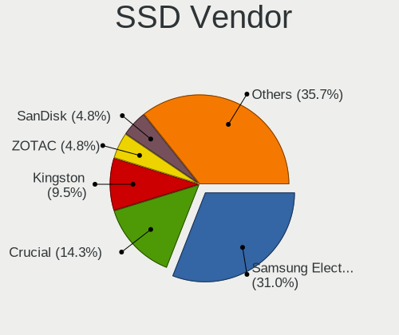

| Vendor              | Desktops | Drives | Percent |
|---------------------|----------|--------|---------|
| Samsung Electronics | 13       | 13     | 33.33%  |
| Kingston            | 4        | 4      | 10.26%  |
| Crucial             | 4        | 5      | 10.26%  |
| ZOTAC               | 2        | 2      | 5.13%   |
| SanDisk             | 2        | 3      | 5.13%   |
| PNY                 | 2        | 2      | 5.13%   |
| WDC                 | 1        | 1      | 2.56%   |
| Toshiba             | 1        | 1      | 2.56%   |
| Patriot             | 1        | 1      | 2.56%   |
| OCZ                 | 1        | 2      | 2.56%   |
| KingSpec            | 1        | 1      | 2.56%   |
| Hewlett-Packard     | 1        | 2      | 2.56%   |
| Gigabyte Technology | 1        | 2      | 2.56%   |
| Emtec               | 1        | 1      | 2.56%   |
| Drevo               | 1        | 1      | 2.56%   |
| ASMT                | 1        | 1      | 2.56%   |
| AMD                 | 1        | 1      | 2.56%   |
| A-DATA Technology   | 1        | 1      | 2.56%   |

Drive Kind
----------

HDD or SSD

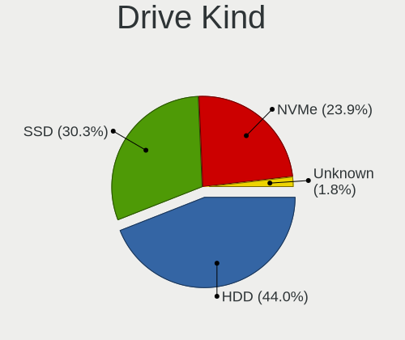

| Kind    | Desktops | Drives | Percent |
|---------|----------|--------|---------|
| HDD     | 41       | 71     | 44.09%  |
| SSD     | 30       | 44     | 32.26%  |
| NVMe    | 20       | 26     | 21.51%  |
| Unknown | 2        | 2      | 2.15%   |

Drive Connector
---------------

SATA, SAS, NVMe, etc.

| Type | Desktops | Drives | Percent |
|------|----------|--------|---------|
| SATA | 54       | 110    | 67.5%   |
| NVMe | 20       | 26     | 25%     |
| SAS  | 6        | 7      | 7.5%    |

Drive Size
----------

Size of hard drive

| Size in TB | Desktops | Drives | Percent |
|------------|----------|--------|---------|
| 0.01-0.5   | 41       | 61     | 48.24%  |
| 0.51-1.0   | 31       | 37     | 36.47%  |
| 1.01-2.0   | 6        | 8      | 7.06%   |
| 2.01-3.0   | 3        | 4      | 3.53%   |
| 4.01-10.0  | 3        | 4      | 3.53%   |
| 3.01-4.0   | 1        | 1      | 1.18%   |

Space Total
-----------

Amount of disk space available on the file system

| Size in GB     | Desktops | Percent |
|----------------|----------|---------|
| 501-1000       | 17       | 27.42%  |
| 101-250        | 11       | 17.74%  |
| 251-500        | 10       | 16.13%  |
| More than 3000 | 7        | 11.29%  |
| 1001-2000      | 5        | 8.06%   |
| 51-100         | 4        | 6.45%   |
| 2001-3000      | 3        | 4.84%   |
| Unknown        | 3        | 4.84%   |
| 21-50          | 2        | 3.23%   |

Space Used
----------

Amount of used disk space

| Used GB        | Desktops | Percent |
|----------------|----------|---------|
| 21-50          | 20       | 30.77%  |
| 1-20           | 20       | 30.77%  |
| 251-500        | 5        | 7.69%   |
| 501-1000       | 5        | 7.69%   |
| 51-100         | 4        | 6.15%   |
| 2001-3000      | 3        | 4.62%   |
| 101-250        | 3        | 4.62%   |
| Unknown        | 3        | 4.62%   |
| More than 3000 | 1        | 1.54%   |
| 1001-2000      | 1        | 1.54%   |

Malfunc. Drives
---------------

Drive models with a malfunction

Zero info for selected period =(

Malfunc. Drive Vendor
---------------------

Vendors of faulty drives

Zero info for selected period =(

Malfunc. HDD Vendor
-------------------

Vendors of faulty HDD drives

Zero info for selected period =(

Malfunc. Drive Kind
-------------------

Kinds of faulty drives

Zero info for selected period =(

Failed Drives
-------------

Failed drive models

Zero info for selected period =(

Failed Drive Vendor
-------------------

Failed drive vendors

Zero info for selected period =(

Drive Status
------------

Number of failed and malfunc. drives

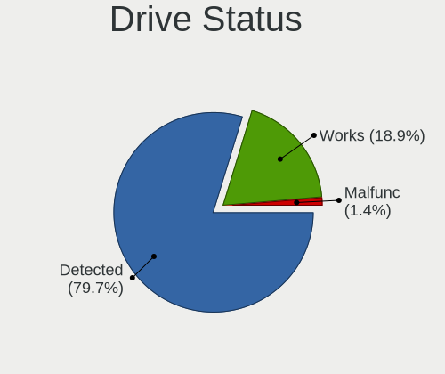

| Status   | Desktops | Drives | Percent |
|----------|----------|--------|---------|
| Detected | 51       | 114    | 83.61%  |
| Works    | 10       | 29     | 16.39%  |

Storage controller
------------------

Storage Vendor
--------------

Storage controller vendors

| Vendor                       | Desktops | Percent |
|------------------------------|----------|---------|
| Intel                        | 38       | 44.19%  |
| AMD                          | 22       | 25.58%  |
| Phison Electronics           | 9        | 10.47%  |
| Samsung Electronics          | 5        | 5.81%   |
| SanDisk                      | 3        | 3.49%   |
| JMicron Technology           | 3        | 3.49%   |
| Toshiba America Info Systems | 2        | 2.33%   |
| Nvidia                       | 1        | 1.16%   |
| Micron/Crucial Technology    | 1        | 1.16%   |
| ASMedia Technology           | 1        | 1.16%   |
| ADATA Technology             | 1        | 1.16%   |

Storage Model
-------------

Storage controller models

| Model                                                                                   | Desktops | Percent |
|-----------------------------------------------------------------------------------------|----------|---------|
| AMD FCH SATA Controller [AHCI mode]                                                     | 19       | 16.38%  |
| Phison E12 NVMe Controller                                                              | 6        | 5.17%   |
| Intel 7 Series/C210 Series Chipset Family 6-port SATA Controller [AHCI mode]            | 5        | 4.31%   |
| Intel 200 Series PCH SATA controller [AHCI mode]                                        | 5        | 4.31%   |
| Samsung NVMe SSD Controller SM981/PM981/PM983                                           | 4        | 3.45%   |
| Intel Q170/Q150/B150/H170/H110/Z170/CM236 Chipset SATA Controller [AHCI Mode]           | 4        | 3.45%   |
| AMD 400 Series Chipset SATA Controller                                                  | 4        | 3.45%   |
| Intel SATA Controller [RAID mode]                                                       | 3        | 2.59%   |
| Intel 8 Series/C220 Series Chipset Family 6-port SATA Controller 1 [AHCI mode]          | 3        | 2.59%   |
| Intel 4 Series Chipset PT IDER Controller                                               | 3        | 2.59%   |
| AMD SB7x0/SB8x0/SB9x0 SATA Controller [AHCI mode]                                       | 3        | 2.59%   |
| Phison E16 PCIe4 NVMe Controller                                                        | 2        | 1.72%   |
| JMicron JMB368 IDE controller                                                           | 2        | 1.72%   |
| Intel NM10/ICH7 Family SATA Controller [IDE mode]                                       | 2        | 1.72%   |
| Intel 82801JI (ICH10 Family) 4 port SATA IDE Controller #1                              | 2        | 1.72%   |
| Intel 82801JI (ICH10 Family) 2 port SATA IDE Controller #2                              | 2        | 1.72%   |
| Intel 82801JD/DO (ICH10 Family) SATA AHCI Controller                                    | 2        | 1.72%   |
| Intel 82801G (ICH7 Family) IDE Controller                                               | 2        | 1.72%   |
| Intel 8 Series/C220 Series Chipset Family 4-port SATA Controller 1 [IDE mode]           | 2        | 1.72%   |
| Intel 6 Series/C200 Series Chipset Family Desktop SATA Controller (IDE mode, ports 4-5) | 2        | 1.72%   |
| Intel 6 Series/C200 Series Chipset Family Desktop SATA Controller (IDE mode, ports 0-3) | 2        | 1.72%   |
| Intel 6 Series/C200 Series Chipset Family 6 port Desktop SATA AHCI Controller           | 2        | 1.72%   |
| Intel 5 Series/3400 Series Chipset 4 port SATA IDE Controller                           | 2        | 1.72%   |
| Intel 5 Series/3400 Series Chipset 2 port SATA IDE Controller                           | 2        | 1.72%   |
| AMD SB7x0/SB8x0/SB9x0 IDE Controller                                                    | 2        | 1.72%   |
| AMD FCH SATA Controller D                                                               | 2        | 1.72%   |
| AMD 300 Series Chipset SATA Controller                                                  | 2        | 1.72%   |
| Toshiba America Info Systems XG4 NVMe SSD Controller                                    | 1        | 0.86%   |
| Toshiba America Info Systems Toshiba America Info Non-Volatile memory controller        | 1        | 0.86%   |
| SanDisk WD Blue SN550 NVMe SSD                                                          | 1        | 0.86%   |
| SanDisk WD Black SN750 / PC SN730 NVMe SSD                                              | 1        | 0.86%   |
| SanDisk WD Black 2018/SN750 / PC SN720 NVMe SSD                                         | 1        | 0.86%   |
| Samsung NVMe SSD Controller SM961/PM961/SM963                                           | 1        | 0.86%   |
| Phison PS5013 E13 NVMe Controller                                                       | 1        | 0.86%   |
| Phison E7 NVMe Controller                                                               | 1        | 0.86%   |
| Nvidia MCP61 SATA Controller                                                            | 1        | 0.86%   |
| Micron/Crucial P1 NVMe PCIe SSD                                                         | 1        | 0.86%   |
| JMicron JMB362 SATA Controller                                                          | 1        | 0.86%   |
| Intel SSD 660P Series                                                                   | 1        | 0.86%   |
| Intel SSD 600P Series                                                                   | 1        | 0.86%   |

Storage Kind
------------

Kind of storage controller (IDE, SATA, NVMe, SAS, ...)

| Kind | Desktops | Percent |
|------|----------|---------|
| SATA | 46       | 52.87%  |
| NVMe | 20       | 22.99%  |
| IDE  | 18       | 20.69%  |
| RAID | 3        | 3.45%   |

Processor
---------

CPU Vendor
----------

Processor vendors

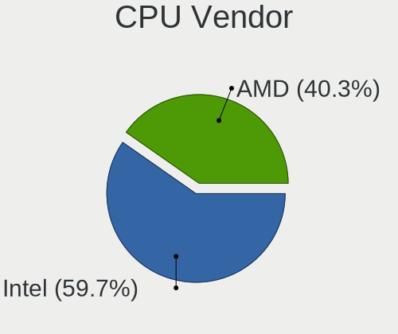

| Vendor | Desktops | Percent |
|--------|----------|---------|
| Intel  | 38       | 61.29%  |
| AMD    | 24       | 38.71%  |

CPU Model
---------

Processor models

| Model                                       | Desktops | Percent |
|---------------------------------------------|----------|---------|
| Intel Core 2 Duo CPU E7500 @ 2.93GHz        | 4        | 6.35%   |
| Intel Core i5-3470 CPU @ 3.20GHz            | 2        | 3.17%   |
| AMD Ryzen 7 2700X Eight-Core Processor      | 2        | 3.17%   |
| AMD Ryzen 5 3600 6-Core Processor           | 2        | 3.17%   |
| AMD Ryzen 5 2600 Six-Core Processor         | 2        | 3.17%   |
| AMD A4-5300 APU with Radeon HD Graphics     | 2        | 3.17%   |
| AMD A10-5800K APU with Radeon HD Graphics   | 2        | 3.17%   |
| Intel Xeon CPU E5530 @ 2.40GHz              | 1        | 1.59%   |
| Intel Xeon CPU E5-2697 v2 @ 2.70GHz         | 1        | 1.59%   |
| Intel Xeon CPU E3-1270 V2 @ 3.50GHz         | 1        | 1.59%   |
| Intel Xeon CPU E3-1225 v5 @ 3.30GHz         | 1        | 1.59%   |
| Intel Pentium Dual-Core CPU T4500 @ 2.30GHz | 1        | 1.59%   |
| Intel Pentium CPU G620 @ 2.60GHz            | 1        | 1.59%   |
| Intel Pentium CPU G3258 @ 3.20GHz           | 1        | 1.59%   |
| Intel Core i7-7700 CPU @ 3.60GHz            | 1        | 1.59%   |
| Intel Core i7-6700T CPU @ 2.80GHz           | 1        | 1.59%   |
| Intel Core i7-6700 CPU @ 3.40GHz            | 1        | 1.59%   |
| Intel Core i7-4770S CPU @ 3.10GHz           | 1        | 1.59%   |
| Intel Core i7-4770 CPU @ 3.40GHz            | 1        | 1.59%   |
| Intel Core i7-3770K CPU @ 3.50GHz           | 1        | 1.59%   |
| Intel Core i5-9400F CPU @ 2.90GHz           | 1        | 1.59%   |
| Intel Core i5-9400 CPU @ 2.90GHz            | 1        | 1.59%   |
| Intel Core i5-7400 CPU @ 3.00GHz            | 1        | 1.59%   |
| Intel Core i5-6500T CPU @ 2.50GHz           | 1        | 1.59%   |
| Intel Core i5-6500 CPU @ 3.20GHz            | 1        | 1.59%   |
| Intel Core i5-4590 CPU @ 3.30GHz            | 1        | 1.59%   |
| Intel Core i5-4570T CPU @ 2.90GHz           | 1        | 1.59%   |
| Intel Core i5-4570 CPU @ 3.20GHz            | 1        | 1.59%   |
| Intel Core i5-3570 CPU @ 3.40GHz            | 1        | 1.59%   |
| Intel Core i5-3340 CPU @ 3.10GHz            | 1        | 1.59%   |
| Intel Core i5-2400S CPU @ 2.50GHz           | 1        | 1.59%   |
| Intel Core i5-2400 CPU @ 3.10GHz            | 1        | 1.59%   |
| Intel Core i5 CPU 750 @ 2.67GHz             | 1        | 1.59%   |
| Intel Core i5 CPU 650 @ 3.20GHz             | 1        | 1.59%   |
| Intel Core i3-2120 CPU @ 3.30GHz            | 1        | 1.59%   |
| Intel Core i3 CPU 540 @ 3.07GHz             | 1        | 1.59%   |
| Intel Core 2 Duo CPU P8600 @ 2.40GHz        | 1        | 1.59%   |
| Intel Core 2 Duo CPU E7200 @ 2.53GHz        | 1        | 1.59%   |
| Intel Core 2 Duo CPU E6750 @ 2.66GHz        | 1        | 1.59%   |
| Intel Celeron CPU G3930 @ 2.90GHz           | 1        | 1.59%   |

CPU Model Family
----------------

Processor model prefix

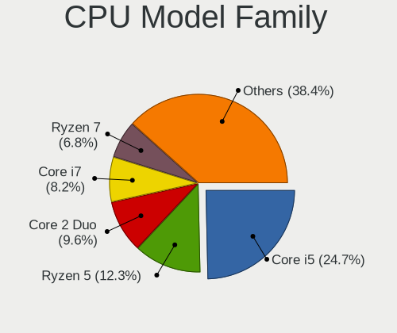

| Model                   | Desktops | Percent |
|-------------------------|----------|---------|
| Intel Core i5           | 16       | 25.4%   |
| Intel Core 2 Duo        | 7        | 11.11%  |
| AMD Ryzen 5             | 7        | 11.11%  |
| Intel Core i7           | 6        | 9.52%   |
| AMD Ryzen 7             | 5        | 7.94%   |
| Intel Xeon              | 4        | 6.35%   |
| Intel Pentium           | 2        | 3.17%   |
| Intel Core i3           | 2        | 3.17%   |
| AMD FX                  | 2        | 3.17%   |
| AMD A4                  | 2        | 3.17%   |
| AMD A10                 | 2        | 3.17%   |
| Intel Pentium Dual-Core | 1        | 1.59%   |
| Intel Celeron           | 1        | 1.59%   |
| AMD Ryzen 9             | 1        | 1.59%   |
| AMD Ryzen 7 PRO         | 1        | 1.59%   |
| AMD Ryzen 3             | 1        | 1.59%   |
| AMD Phenom II X4        | 1        | 1.59%   |
| AMD Athlon II X2        | 1        | 1.59%   |
| AMD A12                 | 1        | 1.59%   |

CPU Cores
---------

Number of processor cores

| Number | Desktops | Percent |
|--------|----------|---------|
| 4      | 23       | 37.1%   |
| 2      | 18       | 29.03%  |
| 6      | 9        | 14.52%  |
| 8      | 7        | 11.29%  |
| 1      | 2        | 3.23%   |
| 24     | 1        | 1.61%   |
| 12     | 1        | 1.61%   |
| 3      | 1        | 1.61%   |

CPU Sockets
-----------

Number of sockets

| Number | Desktops | Percent |
|--------|----------|---------|
| 1      | 60       | 96.77%  |
| 2      | 2        | 3.23%   |

CPU Threads
-----------

Threads per core (Hyper-Threading)

| Number | Desktops | Percent |
|--------|----------|---------|
| 2      | 34       | 54.84%  |
| 1      | 28       | 45.16%  |

CPU Op-Modes
------------

CPU Operation Modes (32-bit, 64-bit)

| Op mode        | Desktops | Percent |
|----------------|----------|---------|
| 32-bit, 64-bit | 55       | 88.71%  |
| Unknown        | 7        | 11.29%  |

CPU Microcode
-------------

Microcode number

| Number     | Desktops | Percent |
|------------|----------|---------|
| Unknown    | 12       | 19.05%  |
| 0x506e3    | 5        | 7.94%   |
| 0x306c3    | 5        | 7.94%   |
| 0x306a9    | 5        | 7.94%   |
| 0x0800820d | 5        | 7.94%   |
| 0x206a7    | 4        | 6.35%   |
| 0x06001119 | 4        | 6.35%   |
| 0x906e9    | 3        | 4.76%   |
| 0x20652    | 2        | 3.17%   |
| 0x1067a    | 2        | 3.17%   |
| 0x906ea    | 1        | 1.59%   |
| 0x6fb      | 1        | 1.59%   |
| 0x306e4    | 1        | 1.59%   |
| 0x106e5    | 1        | 1.59%   |
| 0x106a5    | 1        | 1.59%   |
| 0x10676    | 1        | 1.59%   |
| 0x0a50000d | 1        | 1.59%   |
| 0x0a201016 | 1        | 1.59%   |
| 0x0a201009 | 1        | 1.59%   |
| 0x08701021 | 1        | 1.59%   |
| 0x08108109 | 1        | 1.59%   |
| 0x08001138 | 1        | 1.59%   |
| 0x0600081c | 1        | 1.59%   |
| 0x06000817 | 1        | 1.59%   |
| 0x010000c8 | 1        | 1.59%   |
| 0x010000b6 | 1        | 1.59%   |

CPU Microarch
-------------

Microarchitecture

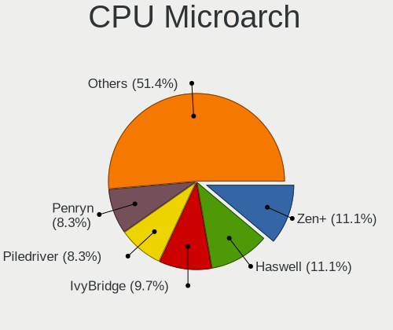

| Name        | Desktops | Percent |
|-------------|----------|---------|
| Zen+        | 7        | 11.29%  |
| IvyBridge   | 7        | 11.29%  |
| Piledriver  | 6        | 9.68%   |
| Penryn      | 6        | 9.68%   |
| Haswell     | 6        | 9.68%   |
| Skylake     | 5        | 8.06%   |
| KabyLake    | 5        | 8.06%   |
| Zen 2       | 4        | 6.45%   |
| SandyBridge | 4        | 6.45%   |
| Zen 3       | 2        | 3.23%   |
| Zen         | 2        | 3.23%   |
| Westmere    | 2        | 3.23%   |
| Nehalem     | 2        | 3.23%   |
| K10         | 2        | 3.23%   |
| Excavator   | 1        | 1.61%   |
| Core        | 1        | 1.61%   |

Graphics
--------

GPU Vendor
----------

Vendors of graphics cards

| Vendor            | Desktops | Percent |
|-------------------|----------|---------|
| Nvidia            | 27       | 40.91%  |
| AMD               | 23       | 34.85%  |
| Intel             | 15       | 22.73%  |
| ASPEED Technology | 1        | 1.52%   |

GPU Model
---------

Graphics card models

| Model                                                                       | Desktops | Percent |
|-----------------------------------------------------------------------------|----------|---------|
| Nvidia GK208B [GeForce GT 710]                                              | 4        | 5.8%    |
| AMD Ellesmere [Radeon RX 470/480/570/570X/580/580X/590]                     | 4        | 5.8%    |
| Nvidia GP108 [GeForce GT 1030]                                              | 3        | 4.35%   |
| Nvidia GF108 [GeForce GT 730]                                               | 3        | 4.35%   |
| Intel 2nd Generation Core Processor Family Integrated Graphics Controller   | 3        | 4.35%   |
| Nvidia GP104 [GeForce GTX 1080]                                             | 2        | 2.9%    |
| Intel Xeon E3-1200 v3/4th Gen Core Processor Integrated Graphics Controller | 2        | 2.9%    |
| Intel Xeon E3-1200 v2/3rd Gen Core processor Graphics Controller            | 2        | 2.9%    |
| Intel HD Graphics 530                                                       | 2        | 2.9%    |
| AMD Trinity [Radeon HD 7660D]                                               | 2        | 2.9%    |
| AMD Curacao XT / Trinidad XT [Radeon R7 370 / R9 270X/370X]                 | 2        | 2.9%    |
| Nvidia TU116 [GeForce GTX 1660]                                             | 1        | 1.45%   |
| Nvidia TU106 [GeForce RTX 2070 Rev. A]                                      | 1        | 1.45%   |
| Nvidia GT218 [GeForce 210]                                                  | 1        | 1.45%   |
| Nvidia GT216M [GeForce GT 330M]                                             | 1        | 1.45%   |
| Nvidia GT200GL [Quadro FX 4800]                                             | 1        | 1.45%   |
| Nvidia GP107 [GeForce GTX 1050]                                             | 1        | 1.45%   |
| Nvidia GP106 [GeForce GTX 1060 3GB]                                         | 1        | 1.45%   |
| Nvidia GP104 [GeForce GTX 1070]                                             | 1        | 1.45%   |
| Nvidia GP102 [GeForce GTX 1080 Ti]                                          | 1        | 1.45%   |
| Nvidia GM204 [GeForce GTX 980]                                              | 1        | 1.45%   |
| Nvidia GM204 [GeForce GTX 970]                                              | 1        | 1.45%   |
| Nvidia GM107 [GeForce GTX 750 Ti]                                           | 1        | 1.45%   |
| Nvidia GK106 [GeForce GTX 660]                                              | 1        | 1.45%   |
| Nvidia GK104GL [Tesla K10]                                                  | 1        | 1.45%   |
| Nvidia GF119 [NVS 310]                                                      | 1        | 1.45%   |
| Nvidia GF119 [GeForce GT 610]                                               | 1        | 1.45%   |
| Nvidia GF108 [GeForce GT 630]                                               | 1        | 1.45%   |
| Nvidia GF108 [GeForce GT 420]                                               | 1        | 1.45%   |
| Intel HD Graphics P530                                                      | 1        | 1.45%   |
| Intel HD Graphics 630                                                       | 1        | 1.45%   |
| Intel HD Graphics 610                                                       | 1        | 1.45%   |
| Intel Core Processor Integrated Graphics Controller                         | 1        | 1.45%   |
| Intel 82G33/G31 Express Integrated Graphics Controller                      | 1        | 1.45%   |
| Intel 4 Series Chipset Integrated Graphics Controller                       | 1        | 1.45%   |
| ASPEED Technology ASPEED Graphics Family                                    | 1        | 1.45%   |
| AMD Wani [Radeon R5/R6/R7 Graphics]                                         | 1        | 1.45%   |
| AMD Vega 20 [Radeon VII]                                                    | 1        | 1.45%   |
| AMD Vega 10 XL/XT [Radeon RX Vega 56/64]                                    | 1        | 1.45%   |
| AMD Turks PRO [Radeon HD 7570]                                              | 1        | 1.45%   |

GPU Combo
---------

Combinations of graphics cards

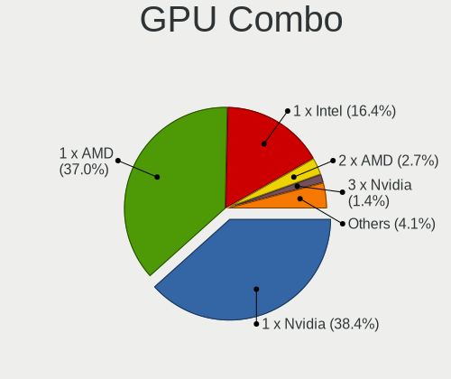

| Name           | Desktops | Percent |
|----------------|----------|---------|
| 1 x Nvidia     | 25       | 40.32%  |
| 1 x AMD        | 23       | 37.1%   |
| 1 x Intel      | 11       | 17.74%  |
| 3 x Nvidia     | 1        | 1.61%   |
| Intel + Nvidia | 1        | 1.61%   |
| 1 x ASPEED     | 1        | 1.61%   |

GPU Driver
----------

Free vs proprietary

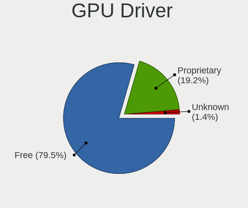

| Driver      | Desktops | Percent |
|-------------|----------|---------|
| Free        | 50       | 79.37%  |
| Proprietary | 12       | 19.05%  |
| Unknown     | 1        | 1.59%   |

GPU Memory
----------

Total video memory

| Size in GB | Desktops | Percent |
|------------|----------|---------|
| Unknown    | 24       | 38.71%  |
| 1.01-2.0   | 10       | 16.13%  |
| 7.01-8.0   | 7        | 11.29%  |
| 3.01-4.0   | 6        | 9.68%   |
| 0.51-1.0   | 5        | 8.06%   |
| 0.01-0.5   | 4        | 6.45%   |
| 8.01-16.0  | 3        | 4.84%   |
| 2.01-3.0   | 2        | 3.23%   |
| 5.01-6.0   | 1        | 1.61%   |

Monitor
-------

Monitor Vendor
--------------

Monitor vendors

| Vendor               | Desktops | Percent |
|----------------------|----------|---------|
| Samsung Electronics  | 13       | 19.4%   |
| Hewlett-Packard      | 7        | 10.45%  |
| BenQ                 | 7        | 10.45%  |
| Dell                 | 6        | 8.96%   |
| Acer                 | 6        | 8.96%   |
| Philips              | 4        | 5.97%   |
| Goldstar             | 4        | 5.97%   |
| Ancor Communications | 3        | 4.48%   |
| MSI                  | 2        | 2.99%   |
| AOC                  | 2        | 2.99%   |
| Vizio                | 1        | 1.49%   |
| Vestel               | 1        | 1.49%   |
| Unknown              | 1        | 1.49%   |
| Sony                 | 1        | 1.49%   |
| Sceptre Tech         | 1        | 1.49%   |
| Plain Tree Systems   | 1        | 1.49%   |
| ONN                  | 1        | 1.49%   |
| Microstep            | 1        | 1.49%   |
| Medion               | 1        | 1.49%   |
| Iiyama               | 1        | 1.49%   |
| Hitachi              | 1        | 1.49%   |
| GRM                  | 1        | 1.49%   |
| ASUSTek Computer     | 1        | 1.49%   |

Monitor Model
-------------

Monitor models

| Model                                                                   | Desktops | Percent |
|-------------------------------------------------------------------------|----------|---------|
| Samsung Electronics SA300/SA350 SAM0791 1920x1080 510x287mm 23.0-inch   | 2        | 2.67%   |
| MSI G241VC MSI1462 1920x1080 521x294mm 23.6-inch                        | 2        | 2.67%   |
| Vizio E500i-B1 VIZ1004 1920x1080 1095x616mm 49.5-inch                   | 1        | 1.33%   |
| Vestel LCD Monitor 32W_LCD_TV                                           | 1        | 1.33%   |
| Unknown LCD Monitor DAC Moniter 5760x1080                               | 1        | 1.33%   |
| Sony TV SNYF301 1920x1080                                               | 1        | 1.33%   |
| Sceptre Tech Sceptre M25 SPT0A05 1920x1080 597x336mm 27.0-inch          | 1        | 1.33%   |
| Samsung Electronics SyncMaster SAM0593 1920x1080 477x268mm 21.5-inch    | 1        | 1.33%   |
| Samsung Electronics SyncMaster SAM036F 1440x900 428x255mm 19.6-inch     | 1        | 1.33%   |
| Samsung Electronics SMB1930N SAM0632 1366x768 410x230mm 18.5-inch       | 1        | 1.33%   |
| Samsung Electronics S22F350 SAM0D1A 1920x1080 480x270mm 21.7-inch       | 1        | 1.33%   |
| Samsung Electronics S22D300 SAM0B3E 1920x1080 477x268mm 21.5-inch       | 1        | 1.33%   |
| Samsung Electronics LU28R55 SAM1016 3840x2160 632x360mm 28.6-inch       | 1        | 1.33%   |
| Samsung Electronics LCD Monitor SAM0DF7 3840x2160 1872x1053mm 84.6-inch | 1        | 1.33%   |
| Samsung Electronics LCD Monitor SAM094E 1920x1080 1020x570mm 46.0-inch  | 1        | 1.33%   |
| Samsung Electronics LCD Monitor SAM07BA 1920x1080 480x270mm 21.7-inch   | 1        | 1.33%   |
| Samsung Electronics LCD Monitor S24D300 1920x1080                       | 1        | 1.33%   |
| Samsung Electronics LCD Monitor S22D300 1920x1080                       | 1        | 1.33%   |
| Plain Tree Systems TFT19DXP PTS03A0 1280x1024 376x301mm 19.0-inch       | 1        | 1.33%   |
| Philips PHL 276E8V PHLC18F 3840x2160 597x336mm 27.0-inch                | 1        | 1.33%   |
| Philips PHL 273V5 PHLC0D2 1920x1080 598x336mm 27.0-inch                 | 1        | 1.33%   |
| Philips PHL 246E9Q PHLC17C 1920x1080 527x296mm 23.8-inch                | 1        | 1.33%   |
| Philips LCD Monitor PHL 276E8V 7680x2160                                | 1        | 1.33%   |
| Philips LCD Monitor PHL 276E8V                                          | 1        | 1.33%   |
| ONN onn. TV ONN007D 3840x2160 800x450mm 36.1-inch                       | 1        | 1.33%   |
| MSI Optix MAG27C MSI1462 1920x1080 590x350mm 27.0-inch                  | 1        | 1.33%   |
| MSI MPG341CQR MSI3DA0 3440x1440 797x334mm 34.0-inch                     | 1        | 1.33%   |
| Microstep LCD Monitor Optix MAG24C 3840x1200                            | 1        | 1.33%   |
| Medion Medion23.6 PC MEDB603 1920x1080 477x268mm 21.5-inch              | 1        | 1.33%   |
| Iiyama PL2493H IVM6148 1920x1080 527x296mm 23.8-inch                    | 1        | 1.33%   |
| Hitachi HISENSE HEC002F 3840x2160 1872x1053mm 84.6-inch                 | 1        | 1.33%   |
| Hewlett-Packard x23LED HWP2912 1920x1080 510x290mm 23.1-inch            | 1        | 1.33%   |
| Hewlett-Packard w2228h HWP2810 1680x1050 473x296mm 22.0-inch            | 1        | 1.33%   |
| Hewlett-Packard w2207 HWP26A8 1680x1050 473x296mm 22.0-inch             | 1        | 1.33%   |
| Hewlett-Packard vs19x HWP2658 1280x1024 376x301mm 19.0-inch             | 1        | 1.33%   |
| Hewlett-Packard LCD Monitor x23LED 1920x1080                            | 1        | 1.33%   |
| Hewlett-Packard Compaq S1922 HWP290B 1366x768 413x234mm 18.7-inch       | 1        | 1.33%   |
| Hewlett-Packard 27ea HPN3395 1920x1080 527x296mm 23.8-inch              | 1        | 1.33%   |
| Hewlett-Packard 2159 HWP282A 1920x1080 479x269mm 21.6-inch              | 1        | 1.33%   |
| GRM Q19 cinema GRM2730 1360x768 410x230mm 18.5-inch                     | 1        | 1.33%   |

Monitor Resolution
------------------

Monitor screen resolution

| Resolution         | Desktops | Percent |
|--------------------|----------|---------|
| 1920x1080 (FHD)    | 33       | 49.25%  |
| 3840x2160 (4K)     | 6        | 8.96%   |
| 1680x1050 (WSXGA+) | 4        | 5.97%   |
| 1280x1024 (SXGA)   | 4        | 5.97%   |
| Unknown            | 4        | 5.97%   |
| 1366x768 (WXGA)    | 3        | 4.48%   |
| 7680x2160          | 2        | 2.99%   |
| 3440x1440          | 2        | 2.99%   |
| 2560x1440 (QHD)    | 2        | 2.99%   |
| 1440x900 (WXGA+)   | 2        | 2.99%   |
| 5760x1080          | 1        | 1.49%   |
| 3840x1200          | 1        | 1.49%   |
| 1920x1200 (WUXGA)  | 1        | 1.49%   |
| 1600x900 (HD+)     | 1        | 1.49%   |
| 1360x768           | 1        | 1.49%   |

Monitor Diagonal
----------------

Diagonal size in inches

| Inches  | Desktops | Percent |
|---------|----------|---------|
| 23      | 10       | 14.71%  |
| Unknown | 9        | 13.24%  |
| 24      | 8        | 11.76%  |
| 21      | 8        | 11.76%  |
| 27      | 5        | 7.35%   |
| 19      | 5        | 7.35%   |
| 18      | 4        | 5.88%   |
| 22      | 3        | 4.41%   |
| 84      | 2        | 2.94%   |
| 34      | 2        | 2.94%   |
| 31      | 2        | 2.94%   |
| 20      | 2        | 2.94%   |
| 72      | 1        | 1.47%   |
| 54      | 1        | 1.47%   |
| 49      | 1        | 1.47%   |
| 46      | 1        | 1.47%   |
| 36      | 1        | 1.47%   |
| 33      | 1        | 1.47%   |
| 28      | 1        | 1.47%   |
| 17      | 1        | 1.47%   |

Monitor Width
-------------

Physical width

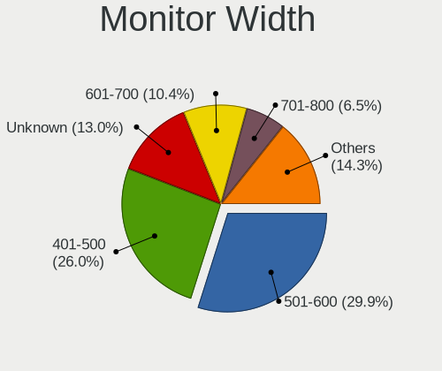

| Width in mm | Desktops | Percent |
|-------------|----------|---------|
| 501-600     | 20       | 30.3%   |
| 401-500     | 19       | 28.79%  |
| Unknown     | 9        | 13.64%  |
| 701-800     | 4        | 6.06%   |
| 601-700     | 4        | 6.06%   |
| 351-400     | 3        | 4.55%   |
| 1501-2000   | 3        | 4.55%   |
| 1001-1500   | 3        | 4.55%   |
| 301-350     | 1        | 1.52%   |

Aspect Ratio
------------

Proportional relationship between the width and the height

| Ratio   | Desktops | Percent |
|---------|----------|---------|
| 16/9    | 42       | 66.67%  |
| Unknown | 9        | 14.29%  |
| 16/10   | 6        | 9.52%   |
| 5/4     | 4        | 6.35%   |
| 21/9    | 2        | 3.17%   |

Monitor Area
------------

Area in inch²

| Area in inch² | Desktops | Percent |
|----------------|----------|---------|
| 201-250        | 23       | 35.38%  |
| 151-200        | 9        | 13.85%  |
| Unknown        | 9        | 13.85%  |
| More than 1000 | 5        | 7.69%   |
| 351-500        | 5        | 7.69%   |
| 301-350        | 5        | 7.69%   |
| 141-150        | 5        | 7.69%   |
| 251-300        | 2        | 3.08%   |
| 501-1000       | 2        | 3.08%   |

Pixel Density
-------------

Pixels per inch

| Density | Desktops | Percent |
|---------|----------|---------|
| 51-100  | 38       | 58.46%  |
| 101-120 | 10       | 15.38%  |
| Unknown | 9        | 13.85%  |
| 1-50    | 4        | 6.15%   |
| 121-160 | 3        | 4.62%   |
| 161-240 | 1        | 1.54%   |

Multiple Monitors
-----------------

Total monitors connected

| Total | Desktops | Percent |
|-------|----------|---------|
| 1     | 52       | 82.54%  |
| 2     | 8        | 12.7%   |
| 0     | 2        | 3.17%   |
| 3     | 1        | 1.59%   |

Network
-------

Net Controller Vendor
---------------------

Controller vendors

| Vendor                          | Desktops | Percent |
|---------------------------------|----------|---------|
| Realtek Semiconductor           | 36       | 41.38%  |
| Intel                           | 30       | 34.48%  |
| Qualcomm Atheros                | 5        | 5.75%   |
| Ralink Technology               | 3        | 3.45%   |
| TP-Link                         | 2        | 2.3%    |
| Microsoft                       | 2        | 2.3%    |
| Broadcom                        | 2        | 2.3%    |
| Xiaomi                          | 1        | 1.15%   |
| Ralink                          | 1        | 1.15%   |
| Qualcomm Atheros Communications | 1        | 1.15%   |
| Nvidia                          | 1        | 1.15%   |
| NetXen Incorporated             | 1        | 1.15%   |
| MediaTek                        | 1        | 1.15%   |
| Belkin Components               | 1        | 1.15%   |

Net Controller Model
--------------------

Controller models

| Model                                                                   | Desktops | Percent |
|-------------------------------------------------------------------------|----------|---------|
| Realtek RTL8111/8168/8411 PCI Express Gigabit Ethernet Controller       | 27       | 27.55%  |
| Intel I211 Gigabit Network Connection                                   | 10       | 10.2%   |
| Intel Wi-Fi 6 AX200                                                     | 5        | 5.1%    |
| Realtek RTL88x2bu [AC1200 Techkey]                                      | 3        | 3.06%   |
| Intel 82579LM Gigabit Network Connection (Lewisville)                   | 3        | 3.06%   |
| Intel 82567LM-3 Gigabit Network Connection                              | 3        | 3.06%   |
| Realtek RTL8192EE PCIe Wireless Network Adapter                         | 2        | 2.04%   |
| Realtek RTL810xE PCI Express Fast Ethernet controller                   | 2        | 2.04%   |
| Ralink RT5572 Wireless Adapter                                          | 2        | 2.04%   |
| Intel Wireless-AC 9260                                                  | 2        | 2.04%   |
| Intel Ethernet Connection I217-LM                                       | 2        | 2.04%   |
| Intel Ethernet Connection (2) I219-V                                    | 2        | 2.04%   |
| Xiaomi Mi/Redmi series (RNDIS)                                          | 1        | 1.02%   |
| TP-Link TL-WN822N Version 4 RTL8192EU                                   | 1        | 1.02%   |
| TP-Link 802.11n NIC                                                     | 1        | 1.02%   |
| Realtek RTL8192EU 802.11b/g/n WLAN Adapter                              | 1        | 1.02%   |
| Realtek RTL8191SEvB Wireless LAN Controller                             | 1        | 1.02%   |
| Realtek RTL8188EE Wireless Network Adapter                              | 1        | 1.02%   |
| Realtek RTL8153 Gigabit Ethernet Adapter                                | 1        | 1.02%   |
| Realtek RTL8125 2.5GbE Controller                                       | 1        | 1.02%   |
| Realtek 802.11ac NIC                                                    | 1        | 1.02%   |
| Ralink MT7601U Wireless Adapter                                         | 1        | 1.02%   |
| Ralink RT3062 Wireless 802.11n 2T/2R                                    | 1        | 1.02%   |
| Qualcomm Atheros AR9271 802.11n                                         | 1        | 1.02%   |
| Qualcomm Atheros AR9485 Wireless Network Adapter                        | 1        | 1.02%   |
| Qualcomm Atheros AR928X Wireless Network Adapter (PCI-Express)          | 1        | 1.02%   |
| Qualcomm Atheros AR8161 Gigabit Ethernet                                | 1        | 1.02%   |
| Qualcomm Atheros AR8151 v2.0 Gigabit Ethernet                           | 1        | 1.02%   |
| Qualcomm Atheros AR242x / AR542x Wireless Network Adapter (PCI-Express) | 1        | 1.02%   |
| Nvidia MCP61 Ethernet                                                   | 1        | 1.02%   |
| NetXen Incorporated NX3031 Multifunction 1/10-Gigabit Server Adapter    | 1        | 1.02%   |
| Microsoft XBOX ACC                                                      | 1        | 1.02%   |
| Microsoft Xbox 360 Wireless Adapter                                     | 1        | 1.02%   |
| MediaTek MT7921K (RZ608) Wi-Fi 6E 80MHz                                 | 1        | 1.02%   |
| Intel Wireless 8265 / 8275                                              | 1        | 1.02%   |
| Intel Ethernet Controller I225-V                                        | 1        | 1.02%   |
| Intel Ethernet Connection I217-V                                        | 1        | 1.02%   |
| Intel Ethernet Connection (2) I219-LM                                   | 1        | 1.02%   |
| Intel Ethernet Connection (2) I218-V                                    | 1        | 1.02%   |
| Intel Dual Band Wireless-AC 3168NGW [Stone Peak]                        | 1        | 1.02%   |

Wireless Vendor
---------------

Wireless vendors

| Vendor                          | Desktops | Percent |
|---------------------------------|----------|---------|
| Intel                           | 10       | 29.41%  |
| Realtek Semiconductor           | 9        | 26.47%  |
| Ralink Technology               | 3        | 8.82%   |
| Qualcomm Atheros                | 3        | 8.82%   |
| TP-Link                         | 2        | 5.88%   |
| Microsoft                       | 2        | 5.88%   |
| Ralink                          | 1        | 2.94%   |
| Qualcomm Atheros Communications | 1        | 2.94%   |
| MediaTek                        | 1        | 2.94%   |
| Broadcom                        | 1        | 2.94%   |
| Belkin Components               | 1        | 2.94%   |

Wireless Model
--------------

Wireless models

| Model                                                                   | Desktops | Percent |
|-------------------------------------------------------------------------|----------|---------|
| Intel Wi-Fi 6 AX200                                                     | 5        | 14.71%  |
| Realtek RTL88x2bu [AC1200 Techkey]                                      | 3        | 8.82%   |
| Realtek RTL8192EE PCIe Wireless Network Adapter                         | 2        | 5.88%   |
| Ralink RT5572 Wireless Adapter                                          | 2        | 5.88%   |
| Intel Wireless-AC 9260                                                  | 2        | 5.88%   |
| TP-Link TL-WN822N Version 4 RTL8192EU                                   | 1        | 2.94%   |
| TP-Link 802.11n NIC                                                     | 1        | 2.94%   |
| Realtek RTL8192EU 802.11b/g/n WLAN Adapter                              | 1        | 2.94%   |
| Realtek RTL8191SEvB Wireless LAN Controller                             | 1        | 2.94%   |
| Realtek RTL8188EE Wireless Network Adapter                              | 1        | 2.94%   |
| Realtek 802.11ac NIC                                                    | 1        | 2.94%   |
| Ralink MT7601U Wireless Adapter                                         | 1        | 2.94%   |
| Ralink RT3062 Wireless 802.11n 2T/2R                                    | 1        | 2.94%   |
| Qualcomm Atheros AR9271 802.11n                                         | 1        | 2.94%   |
| Qualcomm Atheros AR9485 Wireless Network Adapter                        | 1        | 2.94%   |
| Qualcomm Atheros AR928X Wireless Network Adapter (PCI-Express)          | 1        | 2.94%   |
| Qualcomm Atheros AR242x / AR542x Wireless Network Adapter (PCI-Express) | 1        | 2.94%   |
| Microsoft XBOX ACC                                                      | 1        | 2.94%   |
| Microsoft Xbox 360 Wireless Adapter                                     | 1        | 2.94%   |
| MediaTek MT7921K (RZ608) Wi-Fi 6E 80MHz                                 | 1        | 2.94%   |
| Intel Wireless 8265 / 8275                                              | 1        | 2.94%   |
| Intel Dual Band Wireless-AC 3168NGW [Stone Peak]                        | 1        | 2.94%   |
| Intel Cannon Lake PCH CNVi WiFi                                         | 1        | 2.94%   |
| Broadcom BCM43217 802.11b/g/n                                           | 1        | 2.94%   |
| Belkin Components F5D8053 N Wireless USB Adapter v3000 [Ralink RT2870]  | 1        | 2.94%   |

Ethernet Vendor
---------------

Ethernet vendors

| Vendor                | Desktops | Percent |
|-----------------------|----------|---------|
| Realtek Semiconductor | 31       | 48.44%  |
| Intel                 | 27       | 42.19%  |
| Qualcomm Atheros      | 2        | 3.13%   |
| Xiaomi                | 1        | 1.56%   |
| Nvidia                | 1        | 1.56%   |
| NetXen Incorporated   | 1        | 1.56%   |
| Broadcom              | 1        | 1.56%   |

Ethernet Model
--------------

Ethernet models

| Model                                                                | Desktops | Percent |
|----------------------------------------------------------------------|----------|---------|
| Realtek RTL8111/8168/8411 PCI Express Gigabit Ethernet Controller    | 27       | 42.19%  |
| Intel I211 Gigabit Network Connection                                | 10       | 15.63%  |
| Intel 82579LM Gigabit Network Connection (Lewisville)                | 3        | 4.69%   |
| Intel 82567LM-3 Gigabit Network Connection                           | 3        | 4.69%   |
| Realtek RTL810xE PCI Express Fast Ethernet controller                | 2        | 3.13%   |
| Intel Ethernet Connection I217-LM                                    | 2        | 3.13%   |
| Intel Ethernet Connection (2) I219-V                                 | 2        | 3.13%   |
| Xiaomi Mi/Redmi series (RNDIS)                                       | 1        | 1.56%   |
| Realtek RTL8153 Gigabit Ethernet Adapter                             | 1        | 1.56%   |
| Realtek RTL8125 2.5GbE Controller                                    | 1        | 1.56%   |
| Qualcomm Atheros AR8161 Gigabit Ethernet                             | 1        | 1.56%   |
| Qualcomm Atheros AR8151 v2.0 Gigabit Ethernet                        | 1        | 1.56%   |
| Nvidia MCP61 Ethernet                                                | 1        | 1.56%   |
| NetXen Incorporated NX3031 Multifunction 1/10-Gigabit Server Adapter | 1        | 1.56%   |
| Intel Ethernet Controller I225-V                                     | 1        | 1.56%   |
| Intel Ethernet Connection I217-V                                     | 1        | 1.56%   |
| Intel Ethernet Connection (2) I219-LM                                | 1        | 1.56%   |
| Intel Ethernet Connection (2) I218-V                                 | 1        | 1.56%   |
| Intel 82579V Gigabit Network Connection                              | 1        | 1.56%   |
| Intel 82578DC Gigabit Network Connection                             | 1        | 1.56%   |
| Intel 82574L Gigabit Network Connection                              | 1        | 1.56%   |
| Broadcom NetLink BCM57788 Gigabit Ethernet PCIe                      | 1        | 1.56%   |

Net Controller Kind
-------------------

Ethernet, WiFi or modem

| Kind     | Desktops | Percent |
|----------|----------|---------|
| Ethernet | 58       | 64.44%  |
| WiFi     | 32       | 35.56%  |

Used Controller
---------------

Currently used network controller

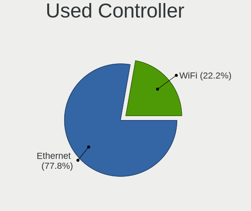

| Kind     | Desktops | Percent |
|----------|----------|---------|
| Ethernet | 47       | 74.6%   |
| WiFi     | 16       | 25.4%   |

NICs
----

Total network controllers on board

| Total | Desktops | Percent |
|-------|----------|---------|
| 1     | 39       | 62.9%   |
| 2     | 17       | 27.42%  |
| 3     | 3        | 4.84%   |
| 0     | 2        | 3.23%   |
| 6     | 1        | 1.61%   |

IPv6
----

IPv6 vs IPv4

| Used | Desktops | Percent |
|------|----------|---------|
| No   | 57       | 90.48%  |
| Yes  | 6        | 9.52%   |

Bluetooth
---------

Bluetooth Vendor
----------------

Controller vendors

| Vendor                  | Desktops | Percent |
|-------------------------|----------|---------|
| Intel                   | 10       | 43.48%  |
| Cambridge Silicon Radio | 8        | 34.78%  |
| ASUSTek Computer        | 2        | 8.7%    |
| Realtek Semiconductor   | 1        | 4.35%   |
| MediaTek                | 1        | 4.35%   |
| IMC Networks            | 1        | 4.35%   |

Bluetooth Model
---------------

Controller models

| Model                                               | Desktops | Percent |
|-----------------------------------------------------|----------|---------|
| Cambridge Silicon Radio Bluetooth Dongle (HCI mode) | 8        | 34.78%  |
| Intel AX200 Bluetooth                               | 5        | 21.74%  |
| Intel Wireless-AC 9260 Bluetooth Adapter            | 2        | 8.7%    |
| Realtek Bluetooth Radio                             | 1        | 4.35%   |
| MediaTek Wireless_Device                            | 1        | 4.35%   |
| Intel Wireless-AC 3168 Bluetooth                    | 1        | 4.35%   |
| Intel Bluetooth wireless interface                  | 1        | 4.35%   |
| Intel Bluetooth 9460/9560 Jefferson Peak (JfP)      | 1        | 4.35%   |
| IMC Networks Bluetooth Module                       | 1        | 4.35%   |
| ASUS Broadcom BCM20702A0 Bluetooth                  | 1        | 4.35%   |
| ASUS BCM20702A0                                     | 1        | 4.35%   |

Sound
-----

Sound Vendor
------------

Sound card vendors

| Vendor                 | Desktops | Percent |
|------------------------|----------|---------|
| Intel                  | 37       | 33.94%  |
| AMD                    | 31       | 28.44%  |
| Nvidia                 | 28       | 25.69%  |
| C-Media Electronics    | 5        | 4.59%   |
| Plantronics            | 1        | 0.92%   |
| Logitech               | 1        | 0.92%   |
| JMTek                  | 1        | 0.92%   |
| Generalplus Technology | 1        | 0.92%   |
| Focusrite-Novation     | 1        | 0.92%   |
| Creative Labs          | 1        | 0.92%   |
| Blue Microphones       | 1        | 0.92%   |
| Alesis                 | 1        | 0.92%   |

Sound Model
-----------

Sound card models

| Model                                                                      | Desktops | Percent |
|----------------------------------------------------------------------------|----------|---------|
| AMD Family 17h (Models 00h-0fh) HD Audio Controller                        | 8        | 6.3%    |
| Intel 8 Series/C220 Series Chipset High Definition Audio Controller        | 5        | 3.94%   |
| Intel 7 Series/C216 Chipset Family High Definition Audio Controller        | 5        | 3.94%   |
| Intel 200 Series PCH HD Audio                                              | 5        | 3.94%   |
| AMD Starship/Matisse HD Audio Controller                                   | 5        | 3.94%   |
| AMD Ellesmere HDMI Audio [Radeon RX 470/480 / 570/580/590]                 | 5        | 3.94%   |
| Nvidia GK208 HDMI/DP Audio Controller                                      | 4        | 3.15%   |
| Nvidia GF108 High Definition Audio Controller                              | 4        | 3.15%   |
| Intel 6 Series/C200 Series Chipset Family High Definition Audio Controller | 4        | 3.15%   |
| Intel 100 Series/C230 Series Chipset Family HD Audio Controller            | 4        | 3.15%   |
| AMD FCH Azalia Controller                                                  | 4        | 3.15%   |
| Nvidia GP108 High Definition Audio Controller                              | 3        | 2.36%   |
| Nvidia GP104 High Definition Audio Controller                              | 3        | 2.36%   |
| Nvidia GF119 HDMI Audio Controller                                         | 3        | 2.36%   |
| Intel 82801JD/DO (ICH10 Family) HD Audio Controller                        | 3        | 2.36%   |
| Intel 5 Series/3400 Series Chipset High Definition Audio                   | 3        | 2.36%   |
| AMD SBx00 Azalia (Intel HDA)                                               | 3        | 2.36%   |
| Nvidia GM204 High Definition Audio Controller                              | 2        | 1.57%   |
| Intel Xeon E3-1200 v3/4th Gen Core Processor HD Audio Controller           | 2        | 1.57%   |
| Intel NM10/ICH7 Family High Definition Audio Controller                    | 2        | 1.57%   |
| Intel 82801JI (ICH10 Family) HD Audio Controller                           | 2        | 1.57%   |
| C-Media Electronics Audio Adapter (Unitek Y-247A)                          | 2        | 1.57%   |
| AMD Trinity HDMI Audio Controller                                          | 2        | 1.57%   |
| AMD Oland/Hainan/Cape Verde/Pitcairn HDMI Audio [Radeon HD 7000 Series]    | 2        | 1.57%   |
| AMD Family 17h/19h HD Audio Controller                                     | 2        | 1.57%   |
| Plantronics RIG 800HD                                                      | 1        | 0.79%   |
| Nvidia TU116 High Definition Audio Controller                              | 1        | 0.79%   |
| Nvidia TU106 High Definition Audio Controller                              | 1        | 0.79%   |
| Nvidia MCP61 High Definition Audio                                         | 1        | 0.79%   |
| Nvidia High Definition Audio Controller                                    | 1        | 0.79%   |
| Nvidia GT216 HDMI Audio Controller                                         | 1        | 0.79%   |
| Nvidia GP107GL High Definition Audio Controller                            | 1        | 0.79%   |
| Nvidia GP106 High Definition Audio Controller                              | 1        | 0.79%   |
| Nvidia GP102 HDMI Audio Controller                                         | 1        | 0.79%   |
| Nvidia GM107 High Definition Audio Controller [GeForce 940MX]              | 1        | 0.79%   |
| Nvidia GK106 HDMI Audio Controller                                         | 1        | 0.79%   |
| Logitech H600 [Wireless Headset]                                           | 1        | 0.79%   |
| JMTek USB PnP Audio Device                                                 | 1        | 0.79%   |
| Intel Cannon Lake PCH cAVS                                                 | 1        | 0.79%   |
| Intel C600/X79 series chipset High Definition Audio Controller             | 1        | 0.79%   |

Memory
------

Memory Vendor
-------------

Memory module vendors

| Vendor              | Desktops | Percent |
|---------------------|----------|---------|
| Kingston            | 4        | 26.67%  |
| Samsung Electronics | 2        | 13.33%  |
| Crucial             | 2        | 13.33%  |
| Unknown             | 1        | 6.67%   |
| Team                | 1        | 6.67%   |
| SK hynix            | 1        | 6.67%   |
| PNY                 | 1        | 6.67%   |
| Micron Technology   | 1        | 6.67%   |
| G.Skill             | 1        | 6.67%   |
| Corsair             | 1        | 6.67%   |

Memory Model
------------

Memory module models

| Model                                                       | Desktops | Percent |
|-------------------------------------------------------------|----------|---------|
| Unknown RAM Module 4096MB DIMM DDR3 1600MT/s                | 1        | 5.88%   |
| Team RAM TEAMGROUP-SD4-2666 8GB SODIMM DDR4 2667MT/s        | 1        | 5.88%   |
| SK hynix RAM HMA851S6AFR6N-UH 4GB SODIMM DDR4 2667MT/s      | 1        | 5.88%   |
| Samsung RAM M378B5773CH0-CH9 2GB DIMM DDR3 1867MT/s         | 1        | 5.88%   |
| Samsung RAM M378A1K43CB2-CRC 8192MB DIMM DDR4 3500MT/s      | 1        | 5.88%   |
| PNY RAM 8GBU1X08QJLL42-12-K 8GB SODIMM DDR4 3200MT/s        | 1        | 5.88%   |
| Micron RAM 16ATF1G64AZ-2G1A2 8GB DIMM DDR4 2400MT/s         | 1        | 5.88%   |
| Kingston RAM Module 8GB DIMM DDR4 2667MT/s                  | 1        | 5.88%   |
| Kingston RAM KHX2133C14/8G 8GB DIMM DDR4 2400MT/s           | 1        | 5.88%   |
| Kingston RAM 99P5471-002.A00LF 2GB DIMM DDR3 1600MT/s       | 1        | 5.88%   |
| Kingston RAM 99P5471-001.A01LF 2GB DIMM DDR3 1333MT/s       | 1        | 5.88%   |
| Kingston RAM 99P5471-001.A00LF 2GB DIMM DDR3 1333MT/s       | 1        | 5.88%   |
| Kingston RAM 9905584-023.A00LF 4096MB DIMM DDR3 1600MT/s    | 1        | 5.88%   |
| G.Skill RAM F4-3600C16-8GVKC 8GB DIMM DDR4 3600MT/s         | 1        | 5.88%   |
| Crucial RAM BLT4G3D1869DT 4096MB DIMM DDR3 1333MT/s         | 1        | 5.88%   |
| Crucial RAM BL16G36C16U4W.M16FE1 16384MB DIMM DDR4 3733MT/s | 1        | 5.88%   |
| Corsair RAM CMK64GX4M2D3000C16 32GB DIMM DDR4 3000MT/s      | 1        | 5.88%   |

Memory Kind
-----------

Memory module kinds

| Kind   | Desktops | Percent |
|--------|----------|---------|
| DDR4   | 8        | 57.14%  |
| DDR3   | 4        | 28.57%  |
| SDRAM  | 1        | 7.14%   |
| LPDDR4 | 1        | 7.14%   |

Memory Form Factor
------------------

Physical design of the memory module

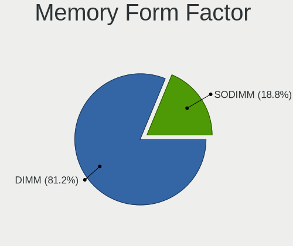

| Name   | Desktops | Percent |
|--------|----------|---------|
| DIMM   | 10       | 83.33%  |
| SODIMM | 2        | 16.67%  |

Memory Size
-----------

Memory module size

| Size  | Desktops | Percent |
|-------|----------|---------|
| 8192  | 7        | 50%     |
| 4096  | 3        | 21.43%  |
| 32768 | 2        | 14.29%  |
| 16384 | 1        | 7.14%   |
| 2048  | 1        | 7.14%   |

Memory Speed
------------

Memory module speed

| Speed | Desktops | Percent |
|-------|----------|---------|
| 1600  | 3        | 20%     |
| 2667  | 2        | 13.33%  |
| 2400  | 2        | 13.33%  |
| 1333  | 2        | 13.33%  |
| 3733  | 1        | 6.67%   |
| 3600  | 1        | 6.67%   |
| 3500  | 1        | 6.67%   |
| 3200  | 1        | 6.67%   |
| 3000  | 1        | 6.67%   |
| 1867  | 1        | 6.67%   |

Printers & scanners
-------------------

Printer Vendor
--------------

Printer device vendors

| Vendor          | Desktops | Percent |
|-----------------|----------|---------|
| Hewlett-Packard | 3        | 60%     |
| Seiko Epson     | 1        | 20%     |
| Canon           | 1        | 20%     |

Printer Model
-------------

Printer device models

| Model                              | Desktops | Percent |
|------------------------------------|----------|---------|
| Seiko Epson L120 Series            | 1        | 20%     |
| HP LaserJet 1300                   | 1        | 20%     |
| HP DeskJet 3830 series             | 1        | 20%     |
| HP DeskJet 2620 All-in-One Printer | 1        | 20%     |
| Canon PIXMA MG2500 Series          | 1        | 20%     |

Scanner Vendor
--------------

Scanner device vendors

Zero info for selected period =(

Scanner Model
-------------

Scanner device models

Zero info for selected period =(

Camera
------

Camera Vendor
-------------

Camera device vendors

| Vendor                      | Desktops | Percent |
|-----------------------------|----------|---------|
| Logitech                    | 3        | 30%     |
| Samsung Electronics         | 1        | 10%     |
| Microdia                    | 1        | 10%     |
| KYE Systems (Mouse Systems) | 1        | 10%     |
| IMC Networks                | 1        | 10%     |
| Generalplus Technology      | 1        | 10%     |
| GEMBIRD                     | 1        | 10%     |
| Alcor Micro                 | 1        | 10%     |

Camera Model
------------

Camera device models

| Model                                   | Desktops | Percent |
|-----------------------------------------|----------|---------|
| Logitech HD Pro Webcam C920             | 2        | 20%     |
| Samsung Galaxy series, misc. (MTP mode) | 1        | 10%     |
| Microdia USB 2.0 Camera                 | 1        | 10%     |
| Logitech C922 Pro Stream Webcam         | 1        | 10%     |
| KYE Systems (Mouse Systems) Slim 1322AF | 1        | 10%     |
| IMC Networks XHC Camera                 | 1        | 10%     |
| Generalplus 808 Camera                  | 1        | 10%     |
| GEMBIRD USB2.0 PC CAMERA                | 1        | 10%     |
| Alcor Micro USB 2.0 PC Camera           | 1        | 10%     |

Security
--------

Fingerprint Vendor
------------------

Fingerprint sensor vendors

Zero info for selected period =(

Fingerprint Model
-----------------

Fingerprint sensor models

Zero info for selected period =(

Chipcard Vendor
---------------

Chipcard module vendors

Zero info for selected period =(

Chipcard Model
--------------

Chipcard module models

Zero info for selected period =(

Unsupported
-----------

Unsupported Devices
-------------------

Total unsupported devices on board

| Total | Desktops | Percent |
|-------|----------|---------|
| 0     | 53       | 85.48%  |
| 1     | 7        | 11.29%  |
| 2     | 2        | 3.23%   |

Unsupported Device Types
------------------------

Types of unsupported devices

| Type                  | Desktops | Percent |
|-----------------------|----------|---------|
| Net/wireless          | 6        | 66.67%  |
| Tv card               | 1        | 11.11%  |
| Multimedia controller | 1        | 11.11%  |
| Graphics card         | 1        | 11.11%  |

