Reborn OS - Tested Hardware & Statistics (Desktops)
---------------------------------------------------

A project to collect tested hardware configurations for Reborn OS.

Anyone can contribute to this report by the [hw-probe](https://github.com/linuxhw/hw-probe) tool:

    sudo -E hw-probe -all -upload

Please contribute! Especially if your hardware is rare.

Contents
--------

* [ Test Cases ](#test-cases)

* [ System ](#system)
  - [ OS                       ](#os)
  - [ OS Family                ](#os-family)
  - [ Kernel                   ](#kernel)
  - [ Kernel Family            ](#kernel-family)
  - [ Kernel Major Ver.        ](#kernel-major-ver)
  - [ Arch                     ](#arch)
  - [ DE                       ](#de)
  - [ Display Server           ](#display-server)
  - [ Display Manager          ](#display-manager)
  - [ OS Lang                  ](#os-lang)
  - [ Boot Mode                ](#boot-mode)
  - [ Filesystem               ](#filesystem)
  - [ Part. scheme             ](#part-scheme)
  - [ Dual Boot with Linux/BSD ](#dual-boot-with-linuxbsd)
  - [ Dual Boot (Win)          ](#dual-boot-win)

* [ Board ](#board)
  - [ Vendor                   ](#vendor)
  - [ Model                    ](#model)
  - [ Model Family             ](#model-family)
  - [ MFG Year                 ](#mfg-year)
  - [ Form Factor              ](#form-factor)
  - [ Secure Boot              ](#secure-boot)
  - [ Coreboot                 ](#coreboot)
  - [ RAM Size                 ](#ram-size)
  - [ RAM Used                 ](#ram-used)
  - [ Total Drives             ](#total-drives)
  - [ Has CD-ROM               ](#has-cd-rom)
  - [ Has Ethernet             ](#has-ethernet)
  - [ Has WiFi                 ](#has-wifi)
  - [ Has Bluetooth            ](#has-bluetooth)

* [ Location ](#location)
  - [ Country                  ](#country)
  - [ City                     ](#city)

* [ Drives ](#drives)
  - [ Drive Vendor             ](#drive-vendor)
  - [ Drive Model              ](#drive-model)
  - [ HDD Vendor               ](#hdd-vendor)
  - [ SSD Vendor               ](#ssd-vendor)
  - [ Drive Kind               ](#drive-kind)
  - [ Drive Connector          ](#drive-connector)
  - [ Drive Size               ](#drive-size)
  - [ Space Total              ](#space-total)
  - [ Space Used               ](#space-used)
  - [ Malfunc. Drives          ](#malfunc-drives)
  - [ Malfunc. Drive Vendor    ](#malfunc-drive-vendor)
  - [ Malfunc. HDD Vendor      ](#malfunc-hdd-vendor)
  - [ Malfunc. Drive Kind      ](#malfunc-drive-kind)
  - [ Failed Drives            ](#failed-drives)
  - [ Failed Drive Vendor      ](#failed-drive-vendor)
  - [ Drive Status             ](#drive-status)

* [ Storage controller ](#storage-controller)
  - [ Storage Vendor           ](#storage-vendor)
  - [ Storage Model            ](#storage-model)
  - [ Storage Kind             ](#storage-kind)

* [ Processor ](#processor)
  - [ CPU Vendor               ](#cpu-vendor)
  - [ CPU Model                ](#cpu-model)
  - [ CPU Model Family         ](#cpu-model-family)
  - [ CPU Cores                ](#cpu-cores)
  - [ CPU Sockets              ](#cpu-sockets)
  - [ CPU Threads              ](#cpu-threads)
  - [ CPU Op-Modes             ](#cpu-op-modes)
  - [ CPU Microcode            ](#cpu-microcode)
  - [ CPU Microarch            ](#cpu-microarch)

* [ Graphics ](#graphics)
  - [ GPU Vendor               ](#gpu-vendor)
  - [ GPU Model                ](#gpu-model)
  - [ GPU Combo                ](#gpu-combo)
  - [ GPU Driver               ](#gpu-driver)
  - [ GPU Memory               ](#gpu-memory)

* [ Monitor ](#monitor)
  - [ Monitor Vendor           ](#monitor-vendor)
  - [ Monitor Model            ](#monitor-model)
  - [ Monitor Resolution       ](#monitor-resolution)
  - [ Monitor Diagonal         ](#monitor-diagonal)
  - [ Monitor Width            ](#monitor-width)
  - [ Aspect Ratio             ](#aspect-ratio)
  - [ Monitor Area             ](#monitor-area)
  - [ Pixel Density            ](#pixel-density)
  - [ Multiple Monitors        ](#multiple-monitors)

* [ Network ](#network)
  - [ Net Controller Vendor    ](#net-controller-vendor)
  - [ Net Controller Model     ](#net-controller-model)
  - [ Wireless Vendor          ](#wireless-vendor)
  - [ Wireless Model           ](#wireless-model)
  - [ Ethernet Vendor          ](#ethernet-vendor)
  - [ Ethernet Model           ](#ethernet-model)
  - [ Net Controller Kind      ](#net-controller-kind)
  - [ Used Controller          ](#used-controller)
  - [ NICs                     ](#nics)
  - [ IPv6                     ](#ipv6)

* [ Bluetooth ](#bluetooth)
  - [ Bluetooth Vendor         ](#bluetooth-vendor)
  - [ Bluetooth Model          ](#bluetooth-model)

* [ Sound ](#sound)
  - [ Sound Vendor             ](#sound-vendor)
  - [ Sound Model              ](#sound-model)

* [ Memory ](#memory)
  - [ Memory Vendor            ](#memory-vendor)
  - [ Memory Model             ](#memory-model)
  - [ Memory Kind              ](#memory-kind)
  - [ Memory Form Factor       ](#memory-form-factor)
  - [ Memory Size              ](#memory-size)
  - [ Memory Speed             ](#memory-speed)

* [ Printers & scanners ](#printers--scanners)
  - [ Printer Vendor           ](#printer-vendor)
  - [ Printer Model            ](#printer-model)
  - [ Scanner Vendor           ](#scanner-vendor)
  - [ Scanner Model            ](#scanner-model)

* [ Camera ](#camera)
  - [ Camera Vendor            ](#camera-vendor)
  - [ Camera Model             ](#camera-model)

* [ Security ](#security)
  - [ Fingerprint Vendor       ](#fingerprint-vendor)
  - [ Fingerprint Model        ](#fingerprint-model)
  - [ Chipcard Vendor          ](#chipcard-vendor)
  - [ Chipcard Model           ](#chipcard-model)

* [ Unsupported ](#unsupported)
  - [ Unsupported Devices      ](#unsupported-devices)
  - [ Unsupported Device Types ](#unsupported-device-types)

Test Cases
----------

Total: 108

| Vendor        | Model                       | Probe                                                      | Date         |
|---------------|-----------------------------|------------------------------------------------------------|--------------|
| Gigabyte      | EG41MFT-US2H                | [b4c078505a](https://linux-hardware.org/?probe=b4c078505a) | Nov 18, 2024 |
| ASRock        | H170M Pro4                  | [aec2dc4bb0](https://linux-hardware.org/?probe=aec2dc4bb0) | Nov 10, 2024 |
| HP            | 8619                        | [14fd63b11d](https://linux-hardware.org/?probe=14fd63b11d) | Sep 03, 2024 |
| ASUSTek       | TUF Gaming X670E-PLUS WI... | [41b190e88c](https://linux-hardware.org/?probe=41b190e88c) | Jul 28, 2024 |
| Intel         | DQ67SW AAG12527-310         | [3b679b773b](https://linux-hardware.org/?probe=3b679b773b) | Jun 14, 2024 |
| ASUSTek       | TUF Gaming X670E-PLUS WI... | [10d6846920](https://linux-hardware.org/?probe=10d6846920) | May 01, 2024 |
| ASRock        | H81 Pro BTC                 | [93fdc2cae0](https://linux-hardware.org/?probe=93fdc2cae0) | Apr 22, 2024 |
| ASRock        | B460M Pro4                  | [431b8beccc](https://linux-hardware.org/?probe=431b8beccc) | Apr 21, 2024 |
| Gigabyte      | X570S AORUS PRO AX          | [9dbfe4a6eb](https://linux-hardware.org/?probe=9dbfe4a6eb) | Mar 04, 2024 |
| ASRock        | H310CM-HG4                  | [425eac625e](https://linux-hardware.org/?probe=425eac625e) | Dec 10, 2023 |
| HP            | 8619                        | [00c3a60e4c](https://linux-hardware.org/?probe=00c3a60e4c) | Aug 11, 2023 |
| Gigabyte      | X570 AORUS ELITE            | [8173a6e67f](https://linux-hardware.org/?probe=8173a6e67f) | Jun 08, 2023 |
| ASUSTek       | PRIME B450M-A II            | [54bddcb324](https://linux-hardware.org/?probe=54bddcb324) | May 24, 2023 |
| MSI           | MAG B560M MORTAR            | [db1ad69341](https://linux-hardware.org/?probe=db1ad69341) | May 06, 2023 |
| MSI           | MAG B560M MORTAR            | [8c41580881](https://linux-hardware.org/?probe=8c41580881) | May 06, 2023 |
| HP            | 18E7                        | [9f4d303ffa](https://linux-hardware.org/?probe=9f4d303ffa) | Mar 18, 2023 |
| HP            | 8460                        | [078e151afc](https://linux-hardware.org/?probe=078e151afc) | Jan 29, 2023 |
| HP            | 8460                        | [2bfad5b267](https://linux-hardware.org/?probe=2bfad5b267) | Jan 24, 2023 |
| HP            | 8460                        | [6089c30228](https://linux-hardware.org/?probe=6089c30228) | Dec 07, 2022 |
| ASUSTek       | ROG STRIX X670E-E GAMING... | [d9af542480](https://linux-hardware.org/?probe=d9af542480) | Nov 08, 2022 |
| Pegatron      | 2AD5                        | [0b91ee456b](https://linux-hardware.org/?probe=0b91ee456b) | Nov 02, 2022 |
| Pegatron      | 2AD5                        | [5f90d4e478](https://linux-hardware.org/?probe=5f90d4e478) | Nov 02, 2022 |
| HP            | 8460                        | [d74207aa28](https://linux-hardware.org/?probe=d74207aa28) | Sep 08, 2022 |
| BESSTAR Te... | B550                        | [f4a5cc4ace](https://linux-hardware.org/?probe=f4a5cc4ace) | Sep 04, 2022 |
| Biostar       | A320MH                      | [7580882598](https://linux-hardware.org/?probe=7580882598) | Jul 10, 2022 |
| Gigabyte      | H110M-S2PT-CF               | [506afdf9c7](https://linux-hardware.org/?probe=506afdf9c7) | Mar 09, 2022 |
| Shuttle       | FZ270                       | [ed3e018227](https://linux-hardware.org/?probe=ed3e018227) | Mar 09, 2022 |
| ASUSTek       | ROG STRIX X570-I GAMING     | [bc31f5f2bd](https://linux-hardware.org/?probe=bc31f5f2bd) | Jan 17, 2022 |
| ASUSTek       | PRIME H310M-K R2.0          | [7dba1540ad](https://linux-hardware.org/?probe=7dba1540ad) | Dec 06, 2021 |
| Medion        | Cattle24 1M                 | [fd68d44a6a](https://linux-hardware.org/?probe=fd68d44a6a) | Oct 16, 2021 |
| Medion        | Cattle24 1M                 | [dd4a0707ba](https://linux-hardware.org/?probe=dd4a0707ba) | May 19, 2021 |
| Dell          | 0200DY A01                  | [426fc0381c](https://linux-hardware.org/?probe=426fc0381c) | May 08, 2021 |
| ASUSTek       | PRIME Z270-A                | [58fbf7553b](https://linux-hardware.org/?probe=58fbf7553b) | May 03, 2021 |
| ASUSTek       | PRIME Z270-A                | [27595787eb](https://linux-hardware.org/?probe=27595787eb) | Apr 26, 2021 |
| ASUSTek       | PRIME Z270-A                | [ec119e020d](https://linux-hardware.org/?probe=ec119e020d) | Apr 26, 2021 |
| HP            | 3048h                       | [b61eb90220](https://linux-hardware.org/?probe=b61eb90220) | Mar 20, 2021 |
| Gigabyte      | X570 AORUS ELITE            | [0e8f323e0f](https://linux-hardware.org/?probe=0e8f323e0f) | Mar 18, 2021 |
| Gigabyte      | X570 AORUS ELITE            | [a949911df6](https://linux-hardware.org/?probe=a949911df6) | Mar 18, 2021 |
| Gigabyte      | B450 AORUS M                | [4a76fb93d3](https://linux-hardware.org/?probe=4a76fb93d3) | Mar 16, 2021 |
| Gigabyte      | F2A85X-UP4                  | [926ae13f69](https://linux-hardware.org/?probe=926ae13f69) | Mar 09, 2021 |
| ASUSTek       | ROG STRIX X570-I GAMING     | [6c98f8666d](https://linux-hardware.org/?probe=6c98f8666d) | Feb 24, 2021 |
| ASRock        | X570 Taichi                 | [e6476ce804](https://linux-hardware.org/?probe=e6476ce804) | Feb 05, 2021 |
| ASUSTek       | PRIME B450M-A               | [6042185966](https://linux-hardware.org/?probe=6042185966) | Feb 05, 2021 |
| ASUSTek       | PRIME B450M-A               | [8c4549fed4](https://linux-hardware.org/?probe=8c4549fed4) | Feb 05, 2021 |
| ASUSTek       | ROG STRIX B350-F GAMING     | [0bb6c600d0](https://linux-hardware.org/?probe=0bb6c600d0) | Jan 25, 2021 |
| ASUSTek       | Q87M-E                      | [e95dad9e90](https://linux-hardware.org/?probe=e95dad9e90) | Jan 14, 2021 |
| MSI           | MEG X570 ACE                | [5b061048ce](https://linux-hardware.org/?probe=5b061048ce) | Jan 11, 2021 |
| Dell          | 02YYK5 A01                  | [f50fd232e1](https://linux-hardware.org/?probe=f50fd232e1) | Jan 06, 2021 |
| MSI           | A320M PRO-VD/S V2           | [5d05e8d607](https://linux-hardware.org/?probe=5d05e8d607) | Jan 04, 2021 |
| ASUSTek       | PRIME H310M-K R2.0          | [ed3e1cc88a](https://linux-hardware.org/?probe=ed3e1cc88a) | Jan 04, 2021 |
| ASUSTek       | PRIME H310M-K R2.0          | [fb77017d74](https://linux-hardware.org/?probe=fb77017d74) | Jan 04, 2021 |
| ASUSTek       | P8B75-V                     | [a8ba58ce8d](https://linux-hardware.org/?probe=a8ba58ce8d) | Jan 03, 2021 |
| ASUSTek       | ROG STRIX B450-F GAMING     | [60d4c9b8f1](https://linux-hardware.org/?probe=60d4c9b8f1) | Jan 02, 2021 |
| ASUSTek       | ROG STRIX B450-F GAMING     | [bab82e261e](https://linux-hardware.org/?probe=bab82e261e) | Jan 02, 2021 |
| ASUSTek       | P7H55-M PRO                 | [253b9e5126](https://linux-hardware.org/?probe=253b9e5126) | Jan 01, 2021 |
| ASUSTek       | P7H55-M PRO                 | [016282f72d](https://linux-hardware.org/?probe=016282f72d) | Jan 01, 2021 |
| Dell          | 084J0R A00                  | [45b5f0850b](https://linux-hardware.org/?probe=45b5f0850b) | Dec 30, 2020 |
| MSI           | FM2-A75MA-E35               | [c537d4854e](https://linux-hardware.org/?probe=c537d4854e) | Dec 14, 2020 |
| MSI           | FM2-A75MA-E35               | [f1f14b545e](https://linux-hardware.org/?probe=f1f14b545e) | Dec 13, 2020 |
| Dell          | 096JG8 A01                  | [d0fc564ec7](https://linux-hardware.org/?probe=d0fc564ec7) | Dec 11, 2020 |
| Dell          | 096JG8 A01                  | [2385d54def](https://linux-hardware.org/?probe=2385d54def) | Dec 09, 2020 |
| OEM           | G41 775 ICH7 8712           | [a135ed4b82](https://linux-hardware.org/?probe=a135ed4b82) | Nov 08, 2020 |
| OEM           | G41 775 ICH7 8712           | [151ca5d99e](https://linux-hardware.org/?probe=151ca5d99e) | Nov 08, 2020 |
| ASRock        | 960GM-VGS3 FX               | [5c51163253](https://linux-hardware.org/?probe=5c51163253) | Nov 05, 2020 |
| Gigabyte      | EP43-UD3L                   | [d6fd55eee0](https://linux-hardware.org/?probe=d6fd55eee0) | Nov 01, 2020 |
| Lenovo        | ThinkCentre M58 6258WCY     | [a1896b3549](https://linux-hardware.org/?probe=a1896b3549) | Oct 26, 2020 |
| ASUSTek       | PRIME H110M-P               | [5f4ab6b326](https://linux-hardware.org/?probe=5f4ab6b326) | Oct 18, 2020 |
| Foxconn       | H61S                        | [0fd947c658](https://linux-hardware.org/?probe=0fd947c658) | Oct 12, 2020 |
| Dell          | 096JG8 A01                  | [337abf3073](https://linux-hardware.org/?probe=337abf3073) | Sep 30, 2020 |
| Huanan        | X79-8D VAA31                | [e0551a0a1c](https://linux-hardware.org/?probe=e0551a0a1c) | Sep 10, 2020 |
| Huanan        | X79-8D VAA31                | [66006c461d](https://linux-hardware.org/?probe=66006c461d) | Sep 06, 2020 |
| ASUSTek       | PRIME X370-PRO              | [524f57a765](https://linux-hardware.org/?probe=524f57a765) | Sep 06, 2020 |
| ASUSTek       | Z87-PLUS                    | [3fe15728ad](https://linux-hardware.org/?probe=3fe15728ad) | Sep 06, 2020 |
| ASUSTek       | Z87-PLUS                    | [e3f12cdd9b](https://linux-hardware.org/?probe=e3f12cdd9b) | Sep 05, 2020 |
| Dell          | 0Y2MRG A00                  | [8af1b0565b](https://linux-hardware.org/?probe=8af1b0565b) | Sep 03, 2020 |
| Acer          | Aspire TC-885 V:1.1         | [c90b90e1a8](https://linux-hardware.org/?probe=c90b90e1a8) | Aug 21, 2020 |
| ASRock        | B450M Pro4                  | [49170a6643](https://linux-hardware.org/?probe=49170a6643) | Aug 12, 2020 |
| ASUSTek       | M5A99X EVO                  | [6aae8e8b65](https://linux-hardware.org/?probe=6aae8e8b65) | Aug 12, 2020 |
| MSI           | IONA                        | [0510d0f8ef](https://linux-hardware.org/?probe=0510d0f8ef) | Aug 06, 2020 |
| MSI           | IONA                        | [446e406f22](https://linux-hardware.org/?probe=446e406f22) | Aug 06, 2020 |
| ASUSTek       | P5KPL-AM SE                 | [9c79ef0e1c](https://linux-hardware.org/?probe=9c79ef0e1c) | Jul 31, 2020 |
| ASUSTek       | P5KPL-AM SE                 | [242b101828](https://linux-hardware.org/?probe=242b101828) | Jul 31, 2020 |
| ASUSTek       | STRIX H270F GAMING          | [52b8fcb9b0](https://linux-hardware.org/?probe=52b8fcb9b0) | Jul 26, 2020 |
| Gigabyte      | Z87-HD3                     | [3eff281cc0](https://linux-hardware.org/?probe=3eff281cc0) | Jun 27, 2020 |
| Gigabyte      | F2A75-D3H                   | [59a8d5230f](https://linux-hardware.org/?probe=59a8d5230f) | Apr 09, 2020 |
| Pegatron      | 2A99                        | [f01c0c56e7](https://linux-hardware.org/?probe=f01c0c56e7) | Apr 08, 2020 |
| ASRock        | X570 Phantom Gaming 4       | [97ffeec17e](https://linux-hardware.org/?probe=97ffeec17e) | Mar 23, 2020 |
| Lenovo        | MAHOBAY NOK                 | [aaac6f9d4d](https://linux-hardware.org/?probe=aaac6f9d4d) | Mar 17, 2020 |
| ASRock        | X570 Phantom Gaming 4       | [63b8db155d](https://linux-hardware.org/?probe=63b8db155d) | Mar 02, 2020 |
| ASRock        | X570 Phantom Gaming 4       | [ed0b979970](https://linux-hardware.org/?probe=ed0b979970) | Mar 01, 2020 |
| ASRock        | X570 Phantom Gaming 4       | [85c6480266](https://linux-hardware.org/?probe=85c6480266) | Mar 01, 2020 |
| ASRock        | H81M-HDS                    | [0f180375d6](https://linux-hardware.org/?probe=0f180375d6) | Feb 25, 2020 |
| ASRock        | H81M-HDS                    | [55c569be56](https://linux-hardware.org/?probe=55c569be56) | Feb 23, 2020 |
| ASRock        | H81M-HDS                    | [98ae2a8227](https://linux-hardware.org/?probe=98ae2a8227) | Feb 22, 2020 |
| Gigabyte      | GA-880GM-UD2H               | [b189e00138](https://linux-hardware.org/?probe=b189e00138) | Jan 16, 2020 |
| Gigabyte      | GA-880GM-UD2H               | [ecb6ade802](https://linux-hardware.org/?probe=ecb6ade802) | Jan 16, 2020 |
| Intel         | DH55HC AAE70933-501         | [64266b67a2](https://linux-hardware.org/?probe=64266b67a2) | Dec 26, 2019 |
| HP            | 82F2 A01                    | [0b8306e086](https://linux-hardware.org/?probe=0b8306e086) | Nov 18, 2019 |
| Dell          | 0773VG A00                  | [adf2d5daca](https://linux-hardware.org/?probe=adf2d5daca) | Oct 31, 2019 |
| Dell          | 0773VG A00                  | [2f3044da6d](https://linux-hardware.org/?probe=2f3044da6d) | Oct 31, 2019 |
| MSI           | C236A WORKSTATION           | [fcc16b2804](https://linux-hardware.org/?probe=fcc16b2804) | Oct 11, 2019 |
| MSI           | C236A WORKSTATION           | [f68bc503a9](https://linux-hardware.org/?probe=f68bc503a9) | Oct 11, 2019 |
| Gigabyte      | H61M-DS2                    | [2560a1cb4e](https://linux-hardware.org/?probe=2560a1cb4e) | Aug 28, 2019 |
| Gigabyte      | H61M-DS2                    | [b013eab87a](https://linux-hardware.org/?probe=b013eab87a) | Aug 27, 2019 |
| ASUSTek       | Z8NA-D6                     | [81c929f40d](https://linux-hardware.org/?probe=81c929f40d) | Jan 23, 2019 |
| ASUSTek       | P8Z77-V DELUXE              | [2180eb318a](https://linux-hardware.org/?probe=2180eb318a) | Dec 30, 2018 |
| ASRock        | H97M Pro4                   | [2e4984a12a](https://linux-hardware.org/?probe=2e4984a12a) | Nov 27, 2018 |
| Lenovo        | ThinkCentre M91p 0266RZ1    | [812afde3d9](https://linux-hardware.org/?probe=812afde3d9) | Nov 21, 2018 |

System
------

OS
--

Installed operating systems

| Name              | Desktops | Percent |
|-------------------|----------|---------|
| Reborn OS         | 58       | 79.45%  |
| Reborn OS Rolling | 15       | 20.55%  |

OS Family
---------

OS without a version

| Name      | Desktops | Percent |
|-----------|----------|---------|
| Reborn OS | 72       | 100%    |

Kernel
------

Version of the Linux kernel

| Version              | Desktops | Percent |
|----------------------|----------|---------|
| 5.10.3-arch1-1       | 4        | 4.94%   |
| 5.9.14-arch1-1       | 3        | 3.7%    |
| 5.7.12-arch1-1       | 3        | 3.7%    |
| 6.8.7-arch1-1        | 2        | 2.47%   |
| 5.9.1-arch1-1        | 2        | 2.47%   |
| 5.8.7-arch1-1        | 2        | 2.47%   |
| 5.16.12-arch1-1      | 2        | 2.47%   |
| 5.11.7-arch1-1       | 2        | 2.47%   |
| 5.10.4-arch2-1       | 2        | 2.47%   |
| 5.10.13-arch1-1      | 2        | 2.47%   |
| 6.9.4-arch1-1        | 1        | 1.23%   |
| 6.8.8-arch1-1        | 1        | 1.23%   |
| 6.7.8-zen1-1-zen     | 1        | 1.23%   |
| 6.4.9-arch1-1        | 1        | 1.23%   |
| 6.3.3-arch1-1        | 1        | 1.23%   |
| 6.2.6-arch1-1        | 1        | 1.23%   |
| 6.11.8-arch1-2       | 1        | 1.23%   |
| 6.10.6-zen1-1-zen    | 1        | 1.23%   |
| 6.10.1-arch1-1       | 1        | 1.23%   |
| 6.1.7-arch1-1        | 1        | 1.23%   |
| 6.0.6-arch1-1        | 1        | 1.23%   |
| 6.0.11-arch1-1       | 1        | 1.23%   |
| 5.9.6-arch1-1        | 1        | 1.23%   |
| 5.9.3-arch1-1        | 1        | 1.23%   |
| 5.9.2-arch1-1        | 1        | 1.23%   |
| 5.9.13-arch1-1       | 1        | 1.23%   |
| 5.9.12-arch1-1       | 1        | 1.23%   |
| 5.9.11-arch2-1       | 1        | 1.23%   |
| 5.8.6-arch1-1        | 1        | 1.23%   |
| 5.8.5-arch1-1        | 1        | 1.23%   |
| 5.8.14-arch1-1       | 1        | 1.23%   |
| 5.8.12-arch1-1       | 1        | 1.23%   |
| 5.8.1-arch1-1        | 1        | 1.23%   |
| 5.7.6-arch1-1-custom | 1        | 1.23%   |
| 5.7.11-arch1-1       | 1        | 1.23%   |
| 5.7.10-arch1-1       | 1        | 1.23%   |
| 5.6.3-arch1-1        | 1        | 1.23%   |
| 5.6.2-arch1-2        | 1        | 1.23%   |
| 5.5.9-arch1-2        | 1        | 1.23%   |
| 5.5.5-arch1-1        | 1        | 1.23%   |

Kernel Family
-------------

Linux kernel without a distro release

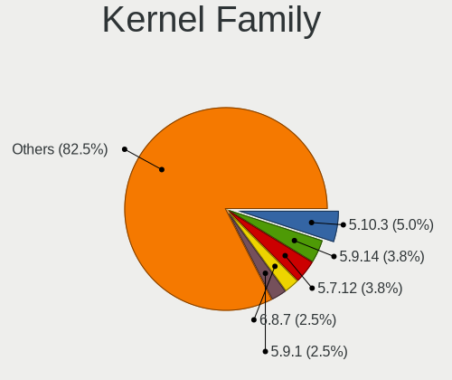

| Version | Desktops | Percent |
|---------|----------|---------|
| 5.10.3  | 4        | 5%      |
| 5.9.14  | 3        | 3.75%   |
| 5.7.12  | 3        | 3.75%   |
| 6.8.7   | 2        | 2.5%    |
| 5.9.1   | 2        | 2.5%    |
| 5.8.7   | 2        | 2.5%    |
| 5.16.12 | 2        | 2.5%    |
| 5.11.7  | 2        | 2.5%    |
| 5.10.4  | 2        | 2.5%    |
| 5.10.13 | 2        | 2.5%    |
| 6.9.4   | 1        | 1.25%   |
| 6.8.8   | 1        | 1.25%   |
| 6.7.8   | 1        | 1.25%   |
| 6.4.9   | 1        | 1.25%   |
| 6.3.3   | 1        | 1.25%   |
| 6.2.6   | 1        | 1.25%   |
| 6.11.8  | 1        | 1.25%   |
| 6.10.6  | 1        | 1.25%   |
| 6.10.1  | 1        | 1.25%   |
| 6.1.7   | 1        | 1.25%   |
| 6.0.6   | 1        | 1.25%   |
| 6.0.11  | 1        | 1.25%   |
| 5.9.6   | 1        | 1.25%   |
| 5.9.3   | 1        | 1.25%   |
| 5.9.2   | 1        | 1.25%   |
| 5.9.13  | 1        | 1.25%   |
| 5.9.12  | 1        | 1.25%   |
| 5.9.11  | 1        | 1.25%   |
| 5.8.6   | 1        | 1.25%   |
| 5.8.5   | 1        | 1.25%   |
| 5.8.14  | 1        | 1.25%   |
| 5.8.12  | 1        | 1.25%   |
| 5.8.1   | 1        | 1.25%   |
| 5.7.6   | 1        | 1.25%   |
| 5.7.11  | 1        | 1.25%   |
| 5.7.10  | 1        | 1.25%   |
| 5.6.3   | 1        | 1.25%   |
| 5.6.2   | 1        | 1.25%   |
| 5.5.9   | 1        | 1.25%   |
| 5.5.5   | 1        | 1.25%   |

Kernel Major Ver.
-----------------

Linux kernel major version

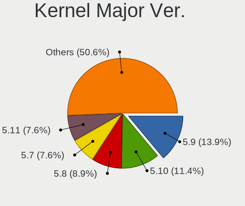

| Version | Desktops | Percent |
|---------|----------|---------|
| 5.9     | 11       | 13.92%  |
| 5.10    | 9        | 11.39%  |
| 5.8     | 7        | 8.86%   |
| 5.7     | 6        | 7.59%   |
| 5.11    | 6        | 7.59%   |
| 5.5     | 4        | 5.06%   |
| 6.8     | 3        | 3.8%    |
| 5.3     | 3        | 3.8%    |
| 5.16    | 3        | 3.8%    |
| 6.10    | 2        | 2.53%   |
| 6.0     | 2        | 2.53%   |
| 5.6     | 2        | 2.53%   |
| 5.4     | 2        | 2.53%   |
| 5.19    | 2        | 2.53%   |
| 5.12    | 2        | 2.53%   |
| 4.19    | 2        | 2.53%   |
| 6.9     | 1        | 1.27%   |
| 6.7     | 1        | 1.27%   |
| 6.4     | 1        | 1.27%   |
| 6.3     | 1        | 1.27%   |
| 6.2     | 1        | 1.27%   |
| 6.11    | 1        | 1.27%   |
| 6.1     | 1        | 1.27%   |
| 5.2     | 1        | 1.27%   |
| 5.18    | 1        | 1.27%   |
| 5.15    | 1        | 1.27%   |
| 5.14    | 1        | 1.27%   |
| 4.20    | 1        | 1.27%   |
| 4.18    | 1        | 1.27%   |

Arch
----

OS architecture (x86_64, i586, etc.)

| Name   | Desktops | Percent |
|--------|----------|---------|
| x86_64 | 72       | 100%    |

DE
--

Desktop Environment

| Name       | Desktops | Percent |
|------------|----------|---------|
| GNOME      | 13       | 18.06%  |
| X-Cinnamon | 10       | 13.89%  |
| KDE        | 8        | 11.11%  |
| XFCE       | 7        | 9.72%   |
| Deepin     | 7        | 9.72%   |
| Unknown    | 7        | 9.72%   |
| KDE5       | 6        | 8.33%   |
| Budgie     | 5        | 6.94%   |
| KDE6       | 4        | 5.56%   |
| LXQt       | 2        | 2.78%   |
| MATE       | 1        | 1.39%   |
| i3         | 1        | 1.39%   |
| Cinnamon   | 1        | 1.39%   |

Display Server
--------------

X11 or Wayland

| Name    | Desktops | Percent |
|---------|----------|---------|
| X11     | 58       | 80.56%  |
| Wayland | 14       | 19.44%  |

Display Manager
---------------

SDDM, LightDM, etc.

| Name    | Desktops | Percent |
|---------|----------|---------|
| Unknown | 58       | 78.38%  |
| LightDM | 5        | 6.76%   |
| TDM     | 4        | 5.41%   |
| SDDM    | 4        | 5.41%   |
| GDM     | 3        | 4.05%   |

OS Lang
-------

Language

| Lang    | Desktops | Percent |
|---------|----------|---------|
| en_US   | 26       | 36.11%  |
| Unknown | 8        | 11.11%  |
| de_DE   | 7        | 9.72%   |
| es_ES   | 5        | 6.94%   |
| en_GB   | 5        | 6.94%   |
| ru_RU   | 3        | 4.17%   |
| en_AU   | 3        | 4.17%   |
| es_AR   | 2        | 2.78%   |
| en_AG   | 2        | 2.78%   |
| tr_TR   | 1        | 1.39%   |
| ru_UA   | 1        | 1.39%   |
| pt_BR   | 1        | 1.39%   |
| it_IT   | 1        | 1.39%   |
| fr_FR   | 1        | 1.39%   |
| es_PA   | 1        | 1.39%   |
| en_PH   | 1        | 1.39%   |
| en_IE   | 1        | 1.39%   |
| en_CA   | 1        | 1.39%   |
| el_GR   | 1        | 1.39%   |
| de_AT   | 1        | 1.39%   |

Boot Mode
---------

EFI or BIOS

| Mode | Desktops | Percent |
|------|----------|---------|
| BIOS | 51       | 69.86%  |
| EFI  | 22       | 30.14%  |

Filesystem
----------

Type of filesystem

| Type    | Desktops | Percent |
|---------|----------|---------|
| Ext4    | 52       | 72.22%  |
| Unknown | 8        | 11.11%  |
| Btrfs   | 5        | 6.94%   |
| Tmpfs   | 4        | 5.56%   |
| Xfs     | 3        | 4.17%   |

Part. scheme
------------

Scheme of partitioning

| Type    | Desktops | Percent |
|---------|----------|---------|
| Unknown | 57       | 78.08%  |
| GPT     | 15       | 20.55%  |
| MBR     | 1        | 1.37%   |

Dual Boot with Linux/BSD
------------------------

Hosting more than one Linux/BSD

| Dual boot | Desktops | Percent |
|-----------|----------|---------|
| No        | 66       | 91.67%  |
| Yes       | 6        | 8.33%   |

Dual Boot (Win)
---------------

Hosting Linux and Windows

| Dual boot | Desktops | Percent |
|-----------|----------|---------|
| No        | 64       | 87.67%  |
| Yes       | 9        | 12.33%  |

Board
-----

Vendor
------

Motherboard manufacturer

| Name                | Desktops | Percent |
|---------------------|----------|---------|
| ASUSTek Computer    | 20       | 27.78%  |
| Gigabyte Technology | 11       | 15.28%  |
| ASRock              | 9        | 12.5%   |
| MSI                 | 6        | 8.33%   |
| Dell                | 6        | 8.33%   |
| Hewlett-Packard     | 5        | 6.94%   |
| Lenovo              | 3        | 4.17%   |
| Pegatron            | 2        | 2.78%   |
| Intel               | 2        | 2.78%   |
| Shuttle             | 1        | 1.39%   |
| OEM                 | 1        | 1.39%   |
| Medion              | 1        | 1.39%   |
| Huanan              | 1        | 1.39%   |
| Foxconn             | 1        | 1.39%   |
| Biostar             | 1        | 1.39%   |
| BESSTAR Tech        | 1        | 1.39%   |
| Acer                | 1        | 1.39%   |

Model
-----

Motherboard model

| Name                             | Desktops | Percent |
|----------------------------------|----------|---------|
| MSI MS-7721                      | 2        | 2.78%   |
| ASRock X570 Phantom Gaming 4     | 2        | 2.78%   |
| Shuttle SZ270                    | 1        | 1.39%   |
| Pegatron Elite 7500 Series MT    | 1        | 1.39%   |
| Pegatron CQ3476L                 | 1        | 1.39%   |
| OEM G41 775 ICH7 8712            | 1        | 1.39%   |
| MSI WK711AA-ACB HPE-110ru        | 1        | 1.39%   |
| MSI MS-7C35                      | 1        | 1.39%   |
| MSI MS-7A36                      | 1        | 1.39%   |
| MSI MS-7998                      | 1        | 1.39%   |
| Medion P961x                     | 1        | 1.39%   |
| Lenovo ThinkCentre M92 32071F5   | 1        | 1.39%   |
| Lenovo ThinkCentre M91p 0266RZ1  | 1        | 1.39%   |
| Lenovo ThinkCentre M58 6258WCY   | 1        | 1.39%   |
| Intel DQ67SW AAG12527-310        | 1        | 1.39%   |
| Intel DH55HC AAE70933-501        | 1        | 1.39%   |
| Huanan X79-8D VAA31              | 1        | 1.39%   |
| HP ProDesk 600 G1 SFF            | 1        | 1.39%   |
| HP Pavilion Desktop PC 570-p0XX  | 1        | 1.39%   |
| HP EliteDesk 705 G5 Desktop Mini | 1        | 1.39%   |
| HP EliteDesk 705 G4 MT           | 1        | 1.39%   |
| HP Compaq 6000 Pro MT PC         | 1        | 1.39%   |
| Gigabyte Z87-HD3                 | 1        | 1.39%   |
| Gigabyte X570S AORUS PRO AX      | 1        | 1.39%   |
| Gigabyte X570 AORUS ELITE        | 1        | 1.39%   |
| Gigabyte H61M-DS2                | 1        | 1.39%   |
| Gigabyte H110M-S2PT-CF           | 1        | 1.39%   |
| Gigabyte GA-880GM-UD2H           | 1        | 1.39%   |
| Gigabyte F2A85X-UP4              | 1        | 1.39%   |
| Gigabyte F2A75-D3H               | 1        | 1.39%   |
| Gigabyte EP43-UD3L               | 1        | 1.39%   |
| Gigabyte EG41MFT-US2H            | 1        | 1.39%   |
| Gigabyte B450 AORUS M            | 1        | 1.39%   |
| Foxconn H61S                     | 1        | 1.39%   |
| Dell XPS 8300                    | 1        | 1.39%   |
| Dell OptiPlex 780                | 1        | 1.39%   |
| Dell OptiPlex 7040               | 1        | 1.39%   |
| Dell OptiPlex 7020               | 1        | 1.39%   |
| Dell OptiPlex 7010               | 1        | 1.39%   |
| Dell Inspiron 660                | 1        | 1.39%   |

Model Family
------------

Motherboard model prefix

| Name                   | Desktops | Percent |
|------------------------|----------|---------|
| ASUS PRIME             | 6        | 8.33%   |
| Dell OptiPlex          | 4        | 5.56%   |
| ASUS ROG               | 4        | 5.56%   |
| Lenovo ThinkCentre     | 3        | 4.17%   |
| ASRock X570            | 3        | 4.17%   |
| MSI MS-7721            | 2        | 2.78%   |
| HP EliteDesk           | 2        | 2.78%   |
| Shuttle SZ270          | 1        | 1.39%   |
| Pegatron Elite         | 1        | 1.39%   |
| Pegatron CQ3476L       | 1        | 1.39%   |
| OEM G41                | 1        | 1.39%   |
| MSI WK711AA-ACB        | 1        | 1.39%   |
| MSI MS-7C35            | 1        | 1.39%   |
| MSI MS-7A36            | 1        | 1.39%   |
| MSI MS-7998            | 1        | 1.39%   |
| Medion P961x           | 1        | 1.39%   |
| Intel DQ67SW           | 1        | 1.39%   |
| Intel DH55HC           | 1        | 1.39%   |
| Huanan X79-8D          | 1        | 1.39%   |
| HP ProDesk             | 1        | 1.39%   |
| HP Pavilion            | 1        | 1.39%   |
| HP Compaq              | 1        | 1.39%   |
| Gigabyte Z87-HD3       | 1        | 1.39%   |
| Gigabyte X570S         | 1        | 1.39%   |
| Gigabyte X570          | 1        | 1.39%   |
| Gigabyte H61M-DS2      | 1        | 1.39%   |
| Gigabyte H110M-S2PT-CF | 1        | 1.39%   |
| Gigabyte GA-880GM-UD2H | 1        | 1.39%   |
| Gigabyte F2A85X-UP4    | 1        | 1.39%   |
| Gigabyte F2A75-D3H     | 1        | 1.39%   |
| Gigabyte EP43-UD3L     | 1        | 1.39%   |
| Gigabyte EG41MFT-US2H  | 1        | 1.39%   |
| Gigabyte B450          | 1        | 1.39%   |
| Foxconn H61S           | 1        | 1.39%   |
| Dell XPS               | 1        | 1.39%   |
| Dell Inspiron          | 1        | 1.39%   |
| Biostar A320MH         | 1        | 1.39%   |
| BESSTAR Tech B550      | 1        | 1.39%   |
| ASUS Z8NA-D6           | 1        | 1.39%   |
| ASUS TUF               | 1        | 1.39%   |

MFG Year
--------

Motherboard manufacture year

| Year | Desktops | Percent |
|------|----------|---------|
| 2019 | 9        | 12.5%   |
| 2012 | 9        | 12.5%   |
| 2018 | 8        | 11.11%  |
| 2013 | 8        | 11.11%  |
| 2016 | 6        | 8.33%   |
| 2010 | 6        | 8.33%   |
| 2009 | 5        | 6.94%   |
| 2020 | 4        | 5.56%   |
| 2017 | 4        | 5.56%   |
| 2011 | 4        | 5.56%   |
| 2022 | 3        | 4.17%   |
| 2014 | 2        | 2.78%   |
| 2008 | 2        | 2.78%   |
| 2021 | 1        | 1.39%   |
| 2015 | 1        | 1.39%   |

Form Factor
-----------

Physical design of the computer

| Name    | Desktops | Percent |
|---------|----------|---------|
| Desktop | 72       | 100%    |

Secure Boot
-----------

Enabled or disabled

| State    | Desktops | Percent |
|----------|----------|---------|
| Disabled | 72       | 100%    |

Coreboot
--------

Have coreboot on board

| Used | Desktops | Percent |
|------|----------|---------|
| No   | 72       | 100%    |

RAM Size
--------

Total RAM memory

| Size in GB  | Desktops | Percent |
|-------------|----------|---------|
| 16.01-24.0  | 20       | 26.67%  |
| 8.01-16.0   | 17       | 22.67%  |
| 4.01-8.0    | 14       | 18.67%  |
| 32.01-64.0  | 13       | 17.33%  |
| 3.01-4.0    | 6        | 8%      |
| 24.01-32.0  | 2        | 2.67%   |
| 64.01-256.0 | 2        | 2.67%   |
| 1.01-2.0    | 1        | 1.33%   |

RAM Used
--------

Used RAM memory

| Used GB   | Desktops | Percent |
|-----------|----------|---------|
| 1.01-2.0  | 27       | 34.62%  |
| 2.01-3.0  | 21       | 26.92%  |
| 4.01-8.0  | 15       | 19.23%  |
| 3.01-4.0  | 10       | 12.82%  |
| 8.01-16.0 | 3        | 3.85%   |
| 0.51-1.0  | 2        | 2.56%   |

Total Drives
------------

Number of drives on board

| Drives | Desktops | Percent |
|--------|----------|---------|
| 1      | 26       | 35.14%  |
| 2      | 22       | 29.73%  |
| 3      | 11       | 14.86%  |
| 4      | 9        | 12.16%  |
| 6      | 2        | 2.7%    |
| 0      | 2        | 2.7%    |
| 7      | 1        | 1.35%   |
| 5      | 1        | 1.35%   |

Has CD-ROM
----------

Has CD-ROM on board

| Presented | Desktops | Percent |
|-----------|----------|---------|
| No        | 43       | 58.9%   |
| Yes       | 30       | 41.1%   |

Has Ethernet
------------

Has Ethernet on board

| Presented | Desktops | Percent |
|-----------|----------|---------|
| Yes       | 68       | 94.44%  |
| No        | 4        | 5.56%   |

Has WiFi
--------

Has WiFi module

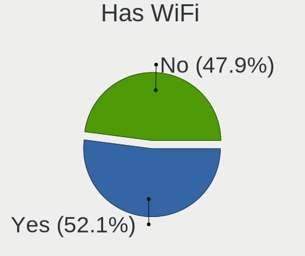

| Presented | Desktops | Percent |
|-----------|----------|---------|
| Yes       | 38       | 52.05%  |
| No        | 35       | 47.95%  |

Has Bluetooth
-------------

Has Bluetooth module

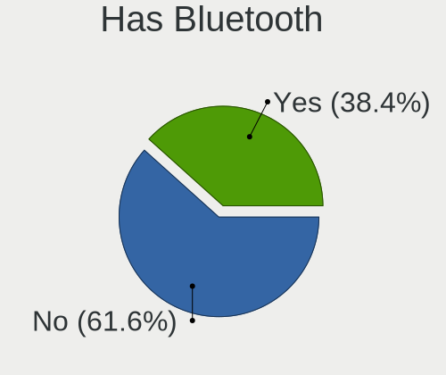

| Presented | Desktops | Percent |
|-----------|----------|---------|
| No        | 45       | 61.64%  |
| Yes       | 28       | 38.36%  |

Location
--------

Country
-------

Geographic location (country)

| Country     | Desktops | Percent |
|-------------|----------|---------|
| USA         | 18       | 25%     |
| Germany     | 8        | 11.11%  |
| UK          | 5        | 6.94%   |
| Spain       | 5        | 6.94%   |
| Canada      | 4        | 5.56%   |
| Russia      | 3        | 4.17%   |
| Netherlands | 3        | 4.17%   |
| Thailand    | 2        | 2.78%   |
| Panama      | 2        | 2.78%   |
| India       | 2        | 2.78%   |
| Greece      | 2        | 2.78%   |
| Australia   | 2        | 2.78%   |
| Argentina   | 2        | 2.78%   |
| Ukraine     | 1        | 1.39%   |
| UAE         | 1        | 1.39%   |
| Turkey      | 1        | 1.39%   |
| Serbia      | 1        | 1.39%   |
| Philippines | 1        | 1.39%   |
| Norway      | 1        | 1.39%   |
| Italy       | 1        | 1.39%   |
| Hungary     | 1        | 1.39%   |
| Estonia     | 1        | 1.39%   |
| Egypt       | 1        | 1.39%   |
| Colombia    | 1        | 1.39%   |
| Brazil      | 1        | 1.39%   |
| Azerbaijan  | 1        | 1.39%   |
| Austria     | 1        | 1.39%   |

City
----

Geographic location (city)

| City              | Desktops | Percent |
|-------------------|----------|---------|
| Sydney            | 2        | 2.6%    |
| Santa Clara       | 2        | 2.6%    |
| Miami             | 2        | 2.6%    |
| Lelystad          | 2        | 2.6%    |
| Cologne           | 2        | 2.6%    |
| Athens            | 2        | 2.6%    |
| Zutphen           | 1        | 1.3%    |
| Wuppertal         | 1        | 1.3%    |
| Winsted           | 1        | 1.3%    |
| Weil im Schonbuch | 1        | 1.3%    |
| Watford           | 1        | 1.3%    |
| Vladivostok       | 1        | 1.3%    |
| Verwood           | 1        | 1.3%    |
| Tres Cantos       | 1        | 1.3%    |
| Toledo            | 1        | 1.3%    |
| Tallinn           | 1        | 1.3%    |
| Szekszárd        | 1        | 1.3%    |
| Surrey            | 1        | 1.3%    |
| Subotica          | 1        | 1.3%    |
| Stuttgart         | 1        | 1.3%    |
| Streatham         | 1        | 1.3%    |
| Spremberg         | 1        | 1.3%    |
| Southampton       | 1        | 1.3%    |
| Smithfield        | 1        | 1.3%    |
| Si Racha          | 1        | 1.3%    |
| Seville           | 1        | 1.3%    |
| Sao Paulo         | 1        | 1.3%    |
| Salt Lake City    | 1        | 1.3%    |
| Reno              | 1        | 1.3%    |
| Redding           | 1        | 1.3%    |
| Quezon City       | 1        | 1.3%    |
| Queens            | 1        | 1.3%    |
| Purdon            | 1        | 1.3%    |
| Pont-y-clun       | 1        | 1.3%    |
| Phoenix           | 1        | 1.3%    |
| Novosibirsk       | 1        | 1.3%    |
| Newcastle         | 1        | 1.3%    |
| New Delhi         | 1        | 1.3%    |
| Mascouche         | 1        | 1.3%    |
| Ludwigsburg       | 1        | 1.3%    |

Drives
------

Drive Vendor
------------

Hard drive vendors

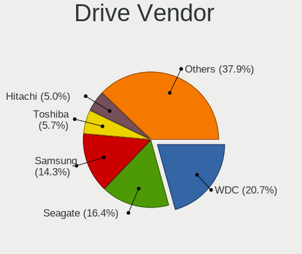

| Vendor                      | Desktops | Drives | Percent |
|-----------------------------|----------|--------|---------|
| WDC                         | 29       | 37     | 20.71%  |
| Seagate                     | 23       | 34     | 16.43%  |
| Samsung Electronics         | 20       | 24     | 14.29%  |
| Toshiba                     | 8        | 9      | 5.71%   |
| Hitachi                     | 7        | 8      | 5%      |
| Crucial                     | 7        | 8      | 5%      |
| Phison                      | 6        | 7      | 4.29%   |
| Kingston                    | 6        | 9      | 4.29%   |
| Sandisk                     | 4        | 5      | 2.86%   |
| Phison Electronics          | 3        | 4      | 2.14%   |
| ZOTAC                       | 2        | 2      | 1.43%   |
| Unknown                     | 2        | 2      | 1.43%   |
| PNY                         | 2        | 2      | 1.43%   |
| KingSpec                    | 2        | 2      | 1.43%   |
| Intel                       | 2        | 2      | 1.43%   |
| Gigabyte Technology         | 2        | 4      | 1.43%   |
| SPCC                        | 1        | 1      | 0.71%   |
| Patriot                     | 1        | 1      | 0.71%   |
| OCZ                         | 1        | 2      | 0.71%   |
| KIOXIA                      | 1        | 1      | 0.71%   |
| Kingston Technology Company | 1        | 1      | 0.71%   |
| JMicron Technology          | 1        | 1      | 0.71%   |
| HGST                        | 1        | 1      | 0.71%   |
| Hewlett-Packard             | 1        | 2      | 0.71%   |
| Emtec                       | 1        | 1      | 0.71%   |
| Drevo                       | 1        | 1      | 0.71%   |
| Dell                        | 1        | 1      | 0.71%   |
| ASMT                        | 1        | 1      | 0.71%   |
| AMD                         | 1        | 1      | 0.71%   |
| addlink                     | 1        | 1      | 0.71%   |
| A-DATA Technology           | 1        | 1      | 0.71%   |

Drive Model
-----------

Hard drive models

| Model                                               | Desktops | Percent |
|-----------------------------------------------------|----------|---------|
| Samsung SSD 860 EVO 500GB                           | 3        | 1.92%   |
| WDC WD10EZEX-08WN4A0 1TB                            | 2        | 1.28%   |
| WDC WD1002FAEX-00Z3A0 1TB                           | 2        | 1.28%   |
| WDC WD1001FALS-403AA0 1TB                           | 2        | 1.28%   |
| Toshiba DT01ACA100 1TB                              | 2        | 1.28%   |
| Seagate ST3500312CS 500GB                           | 2        | 1.28%   |
| Seagate ST2000DX002-2DV164 2TB                      | 2        | 1.28%   |
| Seagate ST2000DM006-2DM164 2TB                      | 2        | 1.28%   |
| Seagate ST1000DM003-1CH162 1TB                      | 2        | 1.28%   |
| Seagate Expansion Desk 5TB                          | 2        | 1.28%   |
| Samsung SSD 850 EVO 500GB                           | 2        | 1.28%   |
| Samsung NVMe SSD Controller SM981/PM981/PM983 512GB | 2        | 1.28%   |
| PNY CS900 120GB SSD                                 | 2        | 1.28%   |
| Phison NVMe SSD Drive 960GB                         | 2        | 1.28%   |
| Phison NVMe SSD Drive 240GB                         | 2        | 1.28%   |
| Phison NVMe SSD Drive 1TB                           | 2        | 1.28%   |
| Crucial CT480BX500SSD1 480GB                        | 2        | 1.28%   |
| Crucial CT1000MX500SSD1 1TB                         | 2        | 1.28%   |
| ZOTAC ZTSSD-S11-120G-P 120GB                        | 1        | 0.64%   |
| ZOTAC ZTSSD-A4P-120G                                | 1        | 0.64%   |
| WDC WDS500G2X0C-00L350 500GB                        | 1        | 0.64%   |
| WDC WDS240G2G0A-00JH30 240GB SSD                    | 1        | 0.64%   |
| WDC WDS100T3X0C-00SJG0 1TB                          | 1        | 0.64%   |
| WDC WD6400AAKS-22A7B0 640GB                         | 1        | 0.64%   |
| WDC WD6400AAKS-00A7B2 640GB                         | 1        | 0.64%   |
| WDC WD6400AAKS-00A7B0 640GB                         | 1        | 0.64%   |
| WDC WD60EZRZ-00GZ5B1 6TB                            | 1        | 0.64%   |
| WDC WD5000LPVX-00V0TT0 500GB                        | 1        | 0.64%   |
| WDC WD5000AZLX-00JKKA0 500GB                        | 1        | 0.64%   |
| WDC WD5000AVDS-63U7B1 500GB                         | 1        | 0.64%   |
| WDC WD5000AAKX-753CA1 500GB                         | 1        | 0.64%   |
| WDC WD5000AADS-00S9B0 500GB                         | 1        | 0.64%   |
| WDC WD3200AAKS-00UU3A0 320GB                        | 1        | 0.64%   |
| WDC WD30PURX-64P6ZY0 3TB                            | 1        | 0.64%   |
| WDC WD2500JS-00MHB0 250GB                           | 1        | 0.64%   |
| WDC WD2500AAKX-001CA0 250GB                         | 1        | 0.64%   |
| WDC WD20EZRX-00D8PB0 2TB                            | 1        | 0.64%   |
| WDC WD20EURX-63T0FY0 2TB                            | 1        | 0.64%   |
| WDC WD2003FZEX-00SRLA0 2TB                          | 1        | 0.64%   |
| WDC WD2003FYPS-27Y2B0 2TB                           | 1        | 0.64%   |

HDD Vendor
----------

Hard disk drive vendors

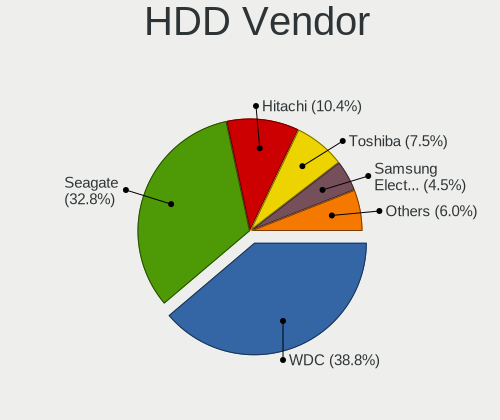

| Vendor              | Desktops | Drives | Percent |
|---------------------|----------|--------|---------|
| WDC                 | 26       | 33     | 38.81%  |
| Seagate             | 22       | 33     | 32.84%  |
| Hitachi             | 7        | 8      | 10.45%  |
| Toshiba             | 5        | 5      | 7.46%   |
| Samsung Electronics | 3        | 3      | 4.48%   |
| Unknown             | 1        | 1      | 1.49%   |
| JMicron Technology  | 1        | 1      | 1.49%   |
| HGST                | 1        | 1      | 1.49%   |
| ASMT                | 1        | 1      | 1.49%   |

SSD Vendor
----------

Solid state drive vendors

| Vendor              | Desktops | Drives | Percent |
|---------------------|----------|--------|---------|
| Samsung Electronics | 13       | 13     | 30.95%  |
| Crucial             | 6        | 7      | 14.29%  |
| Kingston            | 4        | 4      | 9.52%   |
| ZOTAC               | 2        | 2      | 4.76%   |
| SanDisk             | 2        | 3      | 4.76%   |
| PNY                 | 2        | 2      | 4.76%   |
| KingSpec            | 2        | 2      | 4.76%   |
| Gigabyte Technology | 2        | 4      | 4.76%   |
| WDC                 | 1        | 1      | 2.38%   |
| Toshiba             | 1        | 1      | 2.38%   |
| Patriot             | 1        | 1      | 2.38%   |
| OCZ                 | 1        | 2      | 2.38%   |
| Hewlett-Packard     | 1        | 2      | 2.38%   |
| Emtec               | 1        | 1      | 2.38%   |
| Drevo               | 1        | 1      | 2.38%   |
| AMD                 | 1        | 1      | 2.38%   |
| A-DATA Technology   | 1        | 1      | 2.38%   |

Drive Kind
----------

HDD or SSD

| Kind    | Desktops | Drives | Percent |
|---------|----------|--------|---------|
| HDD     | 48       | 86     | 44.04%  |
| SSD     | 33       | 48     | 30.28%  |
| NVMe    | 26       | 40     | 23.85%  |
| Unknown | 2        | 2      | 1.83%   |

Drive Connector
---------------

SATA, SAS, NVMe, etc.

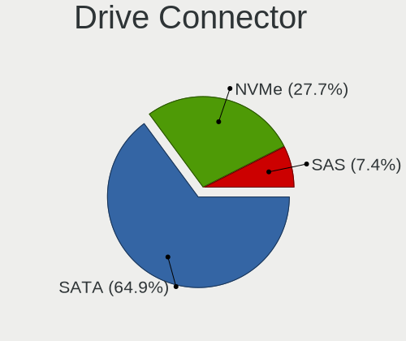

| Type | Desktops | Drives | Percent |
|------|----------|--------|---------|
| SATA | 61       | 128    | 64.89%  |
| NVMe | 26       | 40     | 27.66%  |
| SAS  | 7        | 8      | 7.45%   |

Drive Size
----------

Size of hard drive

| Size in TB | Desktops | Drives | Percent |
|------------|----------|--------|---------|
| 0.01-0.5   | 46       | 70     | 50%     |
| 0.51-1.0   | 29       | 36     | 31.52%  |
| 1.01-2.0   | 8        | 17     | 8.7%    |
| 2.01-3.0   | 4        | 5      | 4.35%   |
| 4.01-10.0  | 4        | 5      | 4.35%   |
| 3.01-4.0   | 1        | 1      | 1.09%   |

Space Total
-----------

Amount of disk space available on the file system

| Size in GB     | Desktops | Percent |
|----------------|----------|---------|
| 501-1000       | 18       | 25%     |
| 101-250        | 12       | 16.67%  |
| More than 3000 | 11       | 15.28%  |
| 251-500        | 10       | 13.89%  |
| 1001-2000      | 7        | 9.72%   |
| 51-100         | 5        | 6.94%   |
| 2001-3000      | 4        | 5.56%   |
| Unknown        | 3        | 4.17%   |
| 21-50          | 2        | 2.78%   |

Space Used
----------

Amount of used disk space

| Used GB        | Desktops | Percent |
|----------------|----------|---------|
| 1-20           | 24       | 30.38%  |
| 21-50          | 20       | 25.32%  |
| 251-500        | 7        | 8.86%   |
| 501-1000       | 6        | 7.59%   |
| 51-100         | 6        | 7.59%   |
| More than 3000 | 4        | 5.06%   |
| 101-250        | 4        | 5.06%   |
| 2001-3000      | 3        | 3.8%    |
| Unknown        | 3        | 3.8%    |
| 1001-2000      | 2        | 2.53%   |

Malfunc. Drives
---------------

Drive models with a malfunction

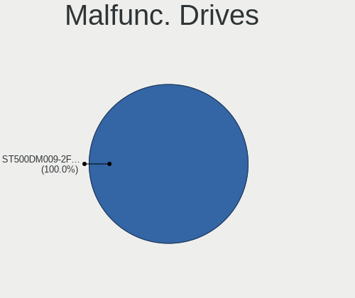

| Model                           | Desktops | Drives | Percent |
|---------------------------------|----------|--------|---------|
| Seagate ST500DM009-2F110A 500GB | 1        | 1      | 100%    |

Malfunc. Drive Vendor
---------------------

Vendors of faulty drives

| Vendor  | Desktops | Drives | Percent |
|---------|----------|--------|---------|
| Seagate | 1        | 1      | 100%    |

Malfunc. HDD Vendor
-------------------

Vendors of faulty HDD drives

| Vendor  | Desktops | Drives | Percent |
|---------|----------|--------|---------|
| Seagate | 1        | 1      | 100%    |

Malfunc. Drive Kind
-------------------

Kinds of faulty drives

| Kind | Desktops | Drives | Percent |
|------|----------|--------|---------|
| HDD  | 1        | 1      | 100%    |

Failed Drives
-------------

Failed drive models

Zero info for selected period =(

Failed Drive Vendor
-------------------

Failed drive vendors

Zero info for selected period =(

Drive Status
------------

Number of failed and malfunc. drives

| Status   | Desktops | Drives | Percent |
|----------|----------|--------|---------|
| Detected | 59       | 139    | 79.73%  |
| Works    | 14       | 36     | 18.92%  |
| Malfunc  | 1        | 1      | 1.35%   |

Storage controller
------------------

Storage Vendor
--------------

Storage controller vendors

| Vendor                       | Desktops | Percent |
|------------------------------|----------|---------|
| Intel                        | 43       | 41.35%  |
| AMD                          | 27       | 25.96%  |
| Phison Electronics           | 10       | 9.62%   |
| Samsung Electronics          | 7        | 6.73%   |
| SanDisk                      | 4        | 3.85%   |
| JMicron Technology           | 3        | 2.88%   |
| Toshiba America Info Systems | 2        | 1.92%   |
| Kingston Technology Company  | 2        | 1.92%   |
| Seagate Technology           | 1        | 0.96%   |
| Nvidia                       | 1        | 0.96%   |
| Micron/Crucial Technology    | 1        | 0.96%   |
| KIOXIA                       | 1        | 0.96%   |
| ASMedia Technology           | 1        | 0.96%   |
| ADATA Technology             | 1        | 0.96%   |

Storage Model
-------------

Storage controller models

| Model                                                                                   | Desktops | Percent |
|-----------------------------------------------------------------------------------------|----------|---------|
| AMD FCH SATA Controller [AHCI mode]                                                     | 20       | 14.71%  |
| Phison E12 NVMe Controller                                                              | 6        | 4.41%   |
| AMD 400 Series Chipset SATA Controller                                                  | 6        | 4.41%   |
| Samsung NVMe SSD Controller SM981/PM981/PM983                                           | 5        | 3.68%   |
| Intel 8 Series/C220 Series Chipset Family 6-port SATA Controller 1 [AHCI mode]          | 5        | 3.68%   |
| Intel 7 Series/C210 Series Chipset Family 6-port SATA Controller [AHCI mode]            | 5        | 3.68%   |
| Intel 200 Series PCH SATA controller [AHCI mode]                                        | 5        | 3.68%   |
| Intel Q170/Q150/B150/H170/H110/Z170/CM236 Chipset SATA Controller [AHCI Mode]           | 4        | 2.94%   |
| Intel SATA Controller [RAID mode]                                                       | 3        | 2.21%   |
| Intel NM10/ICH7 Family SATA Controller [IDE mode]                                       | 3        | 2.21%   |
| Intel 6 Series/C200 Series Chipset Family 6 port Desktop SATA AHCI Controller           | 3        | 2.21%   |
| Intel 4 Series Chipset PT IDER Controller                                               | 3        | 2.21%   |
| AMD SB7x0/SB8x0/SB9x0 SATA Controller [AHCI mode]                                       | 3        | 2.21%   |
| Phison E16 PCIe4 NVMe Controller                                                        | 2        | 1.47%   |
| Kingston Company KC3000/FURY Renegade NVMe SSD [E18]                                    | 2        | 1.47%   |
| JMicron JMB368 IDE controller                                                           | 2        | 1.47%   |
| Intel 82801JI (ICH10 Family) 4 port SATA IDE Controller #1                              | 2        | 1.47%   |
| Intel 82801JI (ICH10 Family) 2 port SATA IDE Controller #2                              | 2        | 1.47%   |
| Intel 82801JD/DO (ICH10 Family) SATA AHCI Controller                                    | 2        | 1.47%   |
| Intel 82801G (ICH7 Family) IDE Controller                                               | 2        | 1.47%   |
| Intel 8 Series/C220 Series Chipset Family 4-port SATA Controller 1 [IDE mode]           | 2        | 1.47%   |
| Intel 6 Series/C200 Series Chipset Family Desktop SATA Controller (IDE mode, ports 4-5) | 2        | 1.47%   |
| Intel 6 Series/C200 Series Chipset Family Desktop SATA Controller (IDE mode, ports 0-3) | 2        | 1.47%   |
| Intel 5 Series/3400 Series Chipset 4 port SATA IDE Controller                           | 2        | 1.47%   |
| Intel 5 Series/3400 Series Chipset 2 port SATA IDE Controller                           | 2        | 1.47%   |
| AMD SB7x0/SB8x0/SB9x0 IDE Controller                                                    | 2        | 1.47%   |
| AMD A320 Chipset SATA Controller [AHCI mode]                                            | 2        | 1.47%   |
| AMD 600 Series Chipset SATA Controller                                                  | 2        | 1.47%   |
| AMD 300 Series Chipset SATA Controller                                                  | 2        | 1.47%   |
| Toshiba America Info Systems XG5 NVMe SSD Controller                                    | 1        | 0.74%   |
| Toshiba America Info Systems XG4 NVMe SSD Controller                                    | 1        | 0.74%   |
| Seagate E18 PCIe SSD                                                                    | 1        | 0.74%   |
| SanDisk WD PC SN810 / Black SN850 NVMe SSD                                              | 1        | 0.74%   |
| SanDisk Ultra 3D / WD PC SN530, IX SN530, Blue SN550 NVMe SSD (DRAM-less)               | 1        | 0.74%   |
| SanDisk Extreme Pro / WD Black SN750 / PC SN730 / Red SN700 NVMe SSD                    | 1        | 0.74%   |
| SanDisk Extreme Pro / WD Black 2018/SN750/PC SN720 NVMe SSD                             | 1        | 0.74%   |
| Samsung NVMe SSD Controller SM961/PM961/SM963                                           | 1        | 0.74%   |
| Samsung NVMe SSD Controller PM9A1/PM9A3/980PRO                                          | 1        | 0.74%   |
| Phison PS5019-E19 PCIe4 NVMe Controller (DRAM-less)                                     | 1        | 0.74%   |
| Phison PS5013-E13 PCIe3 NVMe Controller (DRAM-less)                                     | 1        | 0.74%   |

Storage Kind
------------

Kind of storage controller (IDE, SATA, NVMe, SAS, ...)

| Kind | Desktops | Percent |
|------|----------|---------|
| SATA | 55       | 52.88%  |
| NVMe | 26       | 25%     |
| IDE  | 20       | 19.23%  |
| RAID | 3        | 2.88%   |

Processor
---------

CPU Vendor
----------

Processor vendors

| Vendor | Desktops | Percent |
|--------|----------|---------|
| Intel  | 43       | 59.72%  |
| AMD    | 29       | 40.28%  |

CPU Model
---------

Processor models

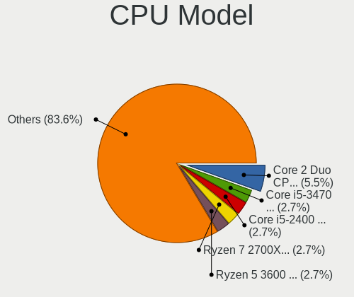

| Model                                       | Desktops | Percent |
|---------------------------------------------|----------|---------|
| Intel Core 2 Duo CPU E7500 @ 2.93GHz        | 4        | 5.48%   |
| Intel Core i5-3470 CPU @ 3.20GHz            | 2        | 2.74%   |
| Intel Core i5-2400 CPU @ 3.10GHz            | 2        | 2.74%   |
| AMD Ryzen 7 2700X Eight-Core Processor      | 2        | 2.74%   |
| AMD Ryzen 5 3600 6-Core Processor           | 2        | 2.74%   |
| AMD Ryzen 5 2600 Six-Core Processor         | 2        | 2.74%   |
| AMD A4-5300 APU with Radeon HD Graphics     | 2        | 2.74%   |
| AMD A10-5800K APU with Radeon HD Graphics   | 2        | 2.74%   |
| Intel Xeon CPU E5530 @ 2.40GHz              | 1        | 1.37%   |
| Intel Xeon CPU E5-2697 v2 @ 2.70GHz         | 1        | 1.37%   |
| Intel Xeon CPU E3-1270 V2 @ 3.50GHz         | 1        | 1.37%   |
| Intel Xeon CPU E3-1225 v5 @ 3.30GHz         | 1        | 1.37%   |
| Intel Pentium Dual-Core CPU T4500 @ 2.30GHz | 1        | 1.37%   |
| Intel Pentium CPU G620 @ 2.60GHz            | 1        | 1.37%   |
| Intel Pentium CPU G3258 @ 3.20GHz           | 1        | 1.37%   |
| Intel Core i7-7700 CPU @ 3.60GHz            | 1        | 1.37%   |
| Intel Core i7-6700T CPU @ 2.80GHz           | 1        | 1.37%   |
| Intel Core i7-6700 CPU @ 3.40GHz            | 1        | 1.37%   |
| Intel Core i7-4770S CPU @ 3.10GHz           | 1        | 1.37%   |
| Intel Core i7-4770 CPU @ 3.40GHz            | 1        | 1.37%   |
| Intel Core i7-3770K CPU @ 3.50GHz           | 1        | 1.37%   |
| Intel Core i5-9400F CPU @ 2.90GHz           | 1        | 1.37%   |
| Intel Core i5-9400 CPU @ 2.90GHz            | 1        | 1.37%   |
| Intel Core i5-7400 CPU @ 3.00GHz            | 1        | 1.37%   |
| Intel Core i5-6500T CPU @ 2.50GHz           | 1        | 1.37%   |
| Intel Core i5-6500 CPU @ 3.20GHz            | 1        | 1.37%   |
| Intel Core i5-4590 CPU @ 3.30GHz            | 1        | 1.37%   |
| Intel Core i5-4570T CPU @ 2.90GHz           | 1        | 1.37%   |
| Intel Core i5-4570 CPU @ 3.20GHz            | 1        | 1.37%   |
| Intel Core i5-3570 CPU @ 3.40GHz            | 1        | 1.37%   |
| Intel Core i5-3340 CPU @ 3.10GHz            | 1        | 1.37%   |
| Intel Core i5-2400S CPU @ 2.50GHz           | 1        | 1.37%   |
| Intel Core i5-10400F CPU @ 2.90GHz          | 1        | 1.37%   |
| Intel Core i5 CPU 750 @ 2.67GHz             | 1        | 1.37%   |
| Intel Core i5 CPU 650 @ 3.20GHz             | 1        | 1.37%   |
| Intel Core i3-4330TE CPU @ 2.40GHz          | 1        | 1.37%   |
| Intel Core i3-4130 CPU @ 3.40GHz            | 1        | 1.37%   |
| Intel Core i3-2120 CPU @ 3.30GHz            | 1        | 1.37%   |
| Intel Core i3 CPU 540 @ 3.07GHz             | 1        | 1.37%   |
| Intel Core 2 Quad CPU Q6600 @ 2.40GHz       | 1        | 1.37%   |

CPU Model Family
----------------

Processor model prefix

| Model                   | Desktops | Percent |
|-------------------------|----------|---------|
| Intel Core i5           | 18       | 24.66%  |
| AMD Ryzen 5             | 9        | 12.33%  |
| Intel Core 2 Duo        | 7        | 9.59%   |
| Intel Core i7           | 6        | 8.22%   |
| AMD Ryzen 7             | 5        | 6.85%   |
| Intel Xeon              | 4        | 5.48%   |
| Intel Core i3           | 4        | 5.48%   |
| AMD Ryzen 9             | 3        | 4.11%   |
| Intel Pentium           | 2        | 2.74%   |
| AMD FX                  | 2        | 2.74%   |
| AMD A4                  | 2        | 2.74%   |
| AMD A10                 | 2        | 2.74%   |
| Intel Pentium Dual-Core | 1        | 1.37%   |
| Intel Core 2 Quad       | 1        | 1.37%   |
| Intel Celeron           | 1        | 1.37%   |
| AMD Ryzen 7 PRO         | 1        | 1.37%   |
| AMD Ryzen 5 PRO         | 1        | 1.37%   |
| AMD Ryzen 3             | 1        | 1.37%   |
| AMD Phenom II X4        | 1        | 1.37%   |
| AMD Athlon II X2        | 1        | 1.37%   |
| AMD A12                 | 1        | 1.37%   |

CPU Cores
---------

Number of processor cores

| Number | Desktops | Percent |
|--------|----------|---------|
| 4      | 26       | 36.11%  |
| 2      | 20       | 27.78%  |
| 6      | 12       | 16.67%  |
| 8      | 7        | 9.72%   |
| 12     | 2        | 2.78%   |
| 1      | 2        | 2.78%   |
| 24     | 1        | 1.39%   |
| 16     | 1        | 1.39%   |
| 3      | 1        | 1.39%   |

CPU Sockets
-----------

Number of sockets

| Number | Desktops | Percent |
|--------|----------|---------|
| 1      | 70       | 97.22%  |
| 2      | 2        | 2.78%   |

CPU Threads
-----------

Threads per core (Hyper-Threading)

| Number | Desktops | Percent |
|--------|----------|---------|
| 2      | 42       | 58.33%  |
| 1      | 30       | 41.67%  |

CPU Op-Modes
------------

CPU Operation Modes (32-bit, 64-bit)

| Op mode        | Desktops | Percent |
|----------------|----------|---------|
| 32-bit, 64-bit | 65       | 90.28%  |
| Unknown        | 7        | 9.72%   |

CPU Microcode
-------------

Microcode number

| Number     | Desktops | Percent |
|------------|----------|---------|
| Unknown    | 21       | 28%     |
| 0x506e3    | 5        | 6.67%   |
| 0x306c3    | 5        | 6.67%   |
| 0x306a9    | 5        | 6.67%   |
| 0x0800820d | 5        | 6.67%   |
| 0x206a7    | 4        | 5.33%   |
| 0x06001119 | 4        | 5.33%   |
| 0x906e9    | 3        | 4%      |
| 0x20652    | 2        | 2.67%   |
| 0x1067a    | 2        | 2.67%   |
| 0x08108109 | 2        | 2.67%   |
| 0x906ea    | 1        | 1.33%   |
| 0x6fb      | 1        | 1.33%   |
| 0x306e4    | 1        | 1.33%   |
| 0x106e5    | 1        | 1.33%   |
| 0x106a5    | 1        | 1.33%   |
| 0x10676    | 1        | 1.33%   |
| 0x0a601203 | 1        | 1.33%   |
| 0x0a50000d | 1        | 1.33%   |
| 0x0a20120a | 1        | 1.33%   |
| 0x0a201016 | 1        | 1.33%   |
| 0x0a201009 | 1        | 1.33%   |
| 0x08701021 | 1        | 1.33%   |
| 0x08001138 | 1        | 1.33%   |
| 0x0600081c | 1        | 1.33%   |
| 0x06000817 | 1        | 1.33%   |
| 0x010000c8 | 1        | 1.33%   |
| 0x010000b6 | 1        | 1.33%   |

CPU Microarch
-------------

Microarchitecture

| Name        | Desktops | Percent |
|-------------|----------|---------|
| Zen+        | 8        | 11.11%  |
| Haswell     | 8        | 11.11%  |
| IvyBridge   | 7        | 9.72%   |
| Piledriver  | 6        | 8.33%   |
| Penryn      | 6        | 8.33%   |
| Skylake     | 5        | 6.94%   |
| SandyBridge | 5        | 6.94%   |
| KabyLake    | 5        | 6.94%   |
| Zen 3       | 4        | 5.56%   |
| Zen 2       | 4        | 5.56%   |
| Zen         | 2        | 2.78%   |
| Westmere    | 2        | 2.78%   |
| Nehalem     | 2        | 2.78%   |
| K10         | 2        | 2.78%   |
| Core        | 2        | 2.78%   |
| Unknown     | 2        | 2.78%   |
| Excavator   | 1        | 1.39%   |
| CometLake   | 1        | 1.39%   |

Graphics
--------

GPU Vendor
----------

Vendors of graphics cards

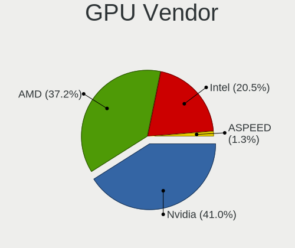

| Vendor            | Desktops | Percent |
|-------------------|----------|---------|
| Nvidia            | 32       | 41.03%  |
| AMD               | 29       | 37.18%  |
| Intel             | 16       | 20.51%  |
| ASPEED Technology | 1        | 1.28%   |

GPU Model
---------

Graphics card models

| Model                                                                       | Desktops | Percent |
|-----------------------------------------------------------------------------|----------|---------|
| Nvidia GK208B [GeForce GT 710]                                              | 4        | 4.82%   |
| AMD Ellesmere [Radeon RX 470/480/570/570X/580/580X/590]                     | 4        | 4.82%   |
| Nvidia GP108 [GeForce GT 1030]                                              | 3        | 3.61%   |
| Nvidia GF108 [GeForce GT 730]                                               | 3        | 3.61%   |
| Intel 2nd Generation Core Processor Family Integrated Graphics Controller   | 3        | 3.61%   |
| Nvidia GP104 [GeForce GTX 1080]                                             | 2        | 2.41%   |
| Nvidia GF119 [GeForce GT 610]                                               | 2        | 2.41%   |
| Nvidia GA106 [GeForce RTX 3060 Lite Hash Rate]                              | 2        | 2.41%   |
| Intel Xeon E3-1200 v3/4th Gen Core Processor Integrated Graphics Controller | 2        | 2.41%   |
| Intel Xeon E3-1200 v2/3rd Gen Core processor Graphics Controller            | 2        | 2.41%   |
| Intel HD Graphics 530                                                       | 2        | 2.41%   |
| AMD Trinity [Radeon HD 7660D]                                               | 2        | 2.41%   |
| AMD Raphael                                                                 | 2        | 2.41%   |
| AMD Picasso/Raven 2 [Radeon Vega Series / Radeon Vega Mobile Series]        | 2        | 2.41%   |
| AMD Curacao XT / Trinidad XT [Radeon R7 370 / R9 270X/370X]                 | 2        | 2.41%   |
| AMD Baffin [Radeon RX 550 640SP / RX 560/560X]                              | 2        | 2.41%   |
| Nvidia TU116 [GeForce GTX 1660]                                             | 1        | 1.2%    |
| Nvidia TU106 [GeForce RTX 2070 Rev. A]                                      | 1        | 1.2%    |
| Nvidia GT218 [GeForce 210]                                                  | 1        | 1.2%    |
| Nvidia GT216M [GeForce GT 330M]                                             | 1        | 1.2%    |
| Nvidia GT200GL [Quadro FX 4800]                                             | 1        | 1.2%    |
| Nvidia GP107 [GeForce GTX 1050]                                             | 1        | 1.2%    |
| Nvidia GP106 [GeForce GTX 1060 3GB]                                         | 1        | 1.2%    |
| Nvidia GP104 [GeForce GTX 1070]                                             | 1        | 1.2%    |
| Nvidia GP102 [GeForce GTX 1080 Ti]                                          | 1        | 1.2%    |
| Nvidia GM204 [GeForce GTX 980]                                              | 1        | 1.2%    |
| Nvidia GM204 [GeForce GTX 970]                                              | 1        | 1.2%    |
| Nvidia GM107 [GeForce GTX 750 Ti]                                           | 1        | 1.2%    |
| Nvidia GK107 [GeForce GT 640]                                               | 1        | 1.2%    |
| Nvidia GK106 [GeForce GTX 660]                                              | 1        | 1.2%    |
| Nvidia GK104GL [Tesla K10]                                                  | 1        | 1.2%    |
| Nvidia GF119 [NVS 310]                                                      | 1        | 1.2%    |
| Nvidia GF108 [GeForce GT 630]                                               | 1        | 1.2%    |
| Nvidia GF108 [GeForce GT 420]                                               | 1        | 1.2%    |
| Nvidia AD102 [GeForce RTX 4090]                                             | 1        | 1.2%    |
| Intel HD Graphics P530                                                      | 1        | 1.2%    |
| Intel HD Graphics 630                                                       | 1        | 1.2%    |
| Intel HD Graphics 610                                                       | 1        | 1.2%    |
| Intel Core Processor Integrated Graphics Controller                         | 1        | 1.2%    |
| Intel 82G33/G31 Express Integrated Graphics Controller                      | 1        | 1.2%    |

GPU Combo
---------

Combinations of graphics cards

| Name           | Desktops | Percent |
|----------------|----------|---------|
| 1 x Nvidia     | 28       | 38.36%  |
| 1 x AMD        | 27       | 36.99%  |
| 1 x Intel      | 12       | 16.44%  |
| 2 x AMD        | 2        | 2.74%   |
| 3 x Nvidia     | 1        | 1.37%   |
| Intel + Nvidia | 1        | 1.37%   |
| 1 x ASPEED     | 1        | 1.37%   |
| AMD + Nvidia   | 1        | 1.37%   |

GPU Driver
----------

Free vs proprietary

| Driver      | Desktops | Percent |
|-------------|----------|---------|
| Free        | 58       | 79.45%  |
| Proprietary | 14       | 19.18%  |
| Unknown     | 1        | 1.37%   |

GPU Memory
----------

Total video memory

| Size in GB | Desktops | Percent |
|------------|----------|---------|
| Unknown    | 31       | 41.89%  |
| 1.01-2.0   | 11       | 14.86%  |
| 7.01-8.0   | 7        | 9.46%   |
| 3.01-4.0   | 7        | 9.46%   |
| 0.51-1.0   | 5        | 6.76%   |
| 8.01-16.0  | 4        | 5.41%   |
| 0.01-0.5   | 4        | 5.41%   |
| 2.01-3.0   | 2        | 2.7%    |
| 16.01-24.0 | 2        | 2.7%    |
| 5.01-6.0   | 1        | 1.35%   |

Monitor
-------

Monitor Vendor
--------------

Monitor vendors

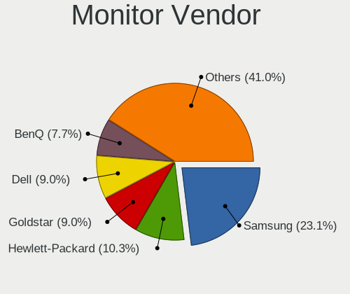

| Vendor               | Desktops | Percent |
|----------------------|----------|---------|
| Samsung Electronics  | 18       | 23.08%  |
| Hewlett-Packard      | 8        | 10.26%  |
| Goldstar             | 7        | 8.97%   |
| Dell                 | 7        | 8.97%   |
| BenQ                 | 6        | 7.69%   |
| Acer                 | 6        | 7.69%   |
| Philips              | 4        | 5.13%   |
| Ancor Communications | 3        | 3.85%   |
| MSI                  | 2        | 2.56%   |
| AOC                  | 2        | 2.56%   |
| Vizio                | 1        | 1.28%   |
| Vestel               | 1        | 1.28%   |
| Unknown              | 1        | 1.28%   |
| Sony                 | 1        | 1.28%   |
| Sceptre Tech         | 1        | 1.28%   |
| Plain Tree Systems   | 1        | 1.28%   |
| ONN                  | 1        | 1.28%   |
| Microstep            | 1        | 1.28%   |
| Mi                   | 1        | 1.28%   |
| Medion               | 1        | 1.28%   |
| Lenovo               | 1        | 1.28%   |
| Iiyama               | 1        | 1.28%   |
| Hitachi              | 1        | 1.28%   |
| GRM                  | 1        | 1.28%   |
| ASUSTek Computer     | 1        | 1.28%   |

Monitor Model
-------------

Monitor models

| Model                                                                  | Desktops | Percent |
|------------------------------------------------------------------------|----------|---------|
| Samsung Electronics SA300/SA350 SAM0791 1920x1080 510x287mm 23.0-inch  | 2        | 2.33%   |
| MSI Optix MAG27CQ MSI1462 2560x1440 597x336mm 27.0-inch                | 2        | 2.33%   |
| Hewlett-Packard 27ea HPN3395 1920x1080 527x296mm 23.8-inch             | 2        | 2.33%   |
| Vizio D48-D0 VIZ1004 1920x1080 1070x610mm 48.5-inch                    | 1        | 1.16%   |
| Vestel LCD Monitor 32W_LCD_TV                                          | 1        | 1.16%   |
| Unknown LCD Monitor DAC Moniter 5760x1080                              | 1        | 1.16%   |
| Sony TV SNYF301 1920x1080                                              | 1        | 1.16%   |
| Sceptre Tech Sceptre M25 SPT0A05 1920x1080 698x393mm 31.5-inch         | 1        | 1.16%   |
| Samsung Electronics U28D590 SAM0B80 3840x2160 607x345mm 27.5-inch      | 1        | 1.16%   |
| Samsung Electronics SyncMaster SAM0593 1920x1080 477x268mm 21.5-inch   | 1        | 1.16%   |
| Samsung Electronics SyncMaster SAM036F 1440x900 428x255mm 19.6-inch    | 1        | 1.16%   |
| Samsung Electronics SMB1930N SAM0632 1360x768 410x230mm 18.5-inch      | 1        | 1.16%   |
| Samsung Electronics S22F350 SAM0D1A 1920x1080 477x268mm 21.5-inch      | 1        | 1.16%   |
| Samsung Electronics S22D300 SAM0B3E 1920x1080 477x268mm 21.5-inch      | 1        | 1.16%   |
| Samsung Electronics LU28R55 SAM1016 3840x2160 632x360mm 28.6-inch      | 1        | 1.16%   |
| Samsung Electronics LCD Monitor SAM0DF7 3840x2160 1210x680mm 54.6-inch | 1        | 1.16%   |
| Samsung Electronics LCD Monitor SAM0C3C 1366x768 609x347mm 27.6-inch   | 1        | 1.16%   |
| Samsung Electronics LCD Monitor SAM094E 1920x1080 700x390mm 31.5-inch  | 1        | 1.16%   |
| Samsung Electronics LCD Monitor SAM07BA 1920x1080 480x270mm 21.7-inch  | 1        | 1.16%   |
| Samsung Electronics LCD Monitor SAM05EA 1920x1080                      | 1        | 1.16%   |
| Samsung Electronics LCD Monitor SAM0297 1360x768 885x498mm 40.0-inch   | 1        | 1.16%   |
| Samsung Electronics LCD Monitor S24D300 1920x1080                      | 1        | 1.16%   |
| Samsung Electronics LCD Monitor S22D300 1920x1080                      | 1        | 1.16%   |
| Samsung Electronics LC27G7xT SAM105C 2560x1440 597x336mm 27.0-inch     | 1        | 1.16%   |
| Plain Tree Systems TFT19DXP PTS03A0 1280x1024 376x301mm 19.0-inch      | 1        | 1.16%   |
| Philips PHL 276E8V PHLC18F 3840x2160 600x340mm 27.2-inch               | 1        | 1.16%   |
| Philips PHL 273V5 PHLC0D2 1920x1080 598x336mm 27.0-inch                | 1        | 1.16%   |
| Philips PHL 246E9Q PHLC17C 1920x1080 527x296mm 23.8-inch               | 1        | 1.16%   |
| Philips LCD Monitor PHL 276E8V 7680x2160                               | 1        | 1.16%   |
| Philips LCD Monitor PHL 276E8V                                         | 1        | 1.16%   |
| ONN onn. TV ONN007D 3840x2160 800x450mm 36.1-inch                      | 1        | 1.16%   |
| MSI Optix MAG27CQ MSI1462 2560x1440 590x350mm 27.0-inch                | 1        | 1.16%   |
| MSI MPG341CQR MSI3DA0 3440x1440 797x334mm 34.0-inch                    | 1        | 1.16%   |
| Microstep LCD Monitor Optix MAG24C 3840x1200                           | 1        | 1.16%   |
| Mi Monitor XMI3444 3440x1440 800x330mm 34.1-inch                       | 1        | 1.16%   |
| Medion Medion23.6 PC MEDB603 1920x1080 477x268mm 21.5-inch             | 1        | 1.16%   |
| Lenovo G24-20 LEN66CF 1920x1080 527x296mm 23.8-inch                    | 1        | 1.16%   |
| Iiyama PL2493H IVM6148 1920x1080 527x296mm 23.8-inch                   | 1        | 1.16%   |
| Hitachi HISENSE HEC002F 3840x2160 1872x1053mm 84.6-inch                | 1        | 1.16%   |
| Hewlett-Packard x23LED HWP2912 1920x1080 509x286mm 23.0-inch           | 1        | 1.16%   |

Monitor Resolution
------------------

Monitor screen resolution

| Resolution         | Desktops | Percent |
|--------------------|----------|---------|
| 1920x1080 (FHD)    | 35       | 45.45%  |
| 3840x2160 (4K)     | 8        | 10.39%  |
| 2560x1440 (QHD)    | 4        | 5.19%   |
| 1680x1050 (WSXGA+) | 4        | 5.19%   |
| 1366x768 (WXGA)    | 4        | 5.19%   |
| 1280x1024 (SXGA)   | 4        | 5.19%   |
| Unknown            | 4        | 5.19%   |
| 3440x1440          | 3        | 3.9%    |
| 7680x2160          | 2        | 2.6%    |
| 1920x1200 (WUXGA)  | 2        | 2.6%    |
| 1440x900 (WXGA+)   | 2        | 2.6%    |
| 1360x768           | 2        | 2.6%    |
| 5760x1080          | 1        | 1.3%    |
| 3840x1200          | 1        | 1.3%    |
| 1600x900 (HD+)     | 1        | 1.3%    |

Monitor Diagonal
----------------

Diagonal size in inches

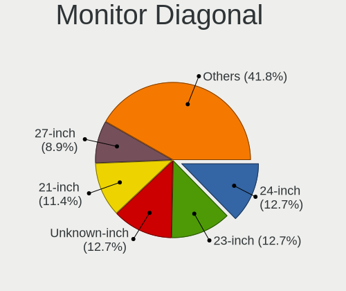

| Inches  | Desktops | Percent |
|---------|----------|---------|
| 24      | 10       | 12.66%  |
| 23      | 10       | 12.66%  |
| Unknown | 10       | 12.66%  |
| 21      | 9        | 11.39%  |
| 27      | 7        | 8.86%   |
| 31      | 5        | 6.33%   |
| 19      | 5        | 6.33%   |
| 18      | 4        | 5.06%   |
| 34      | 3        | 3.8%    |
| 22      | 3        | 3.8%    |
| 84      | 2        | 2.53%   |
| 54      | 2        | 2.53%   |
| 20      | 2        | 2.53%   |
| 72      | 1        | 1.27%   |
| 46      | 1        | 1.27%   |
| 40      | 1        | 1.27%   |
| 36      | 1        | 1.27%   |
| 33      | 1        | 1.27%   |
| 28      | 1        | 1.27%   |
| 17      | 1        | 1.27%   |

Monitor Width
-------------

Physical width

| Width in mm | Desktops | Percent |
|-------------|----------|---------|
| 501-600     | 23       | 29.87%  |
| 401-500     | 20       | 25.97%  |
| Unknown     | 10       | 12.99%  |
| 601-700     | 8        | 10.39%  |
| 701-800     | 5        | 6.49%   |
| 351-400     | 3        | 3.9%    |
| 1501-2000   | 3        | 3.9%    |
| 1001-1500   | 3        | 3.9%    |
| 801-900     | 1        | 1.3%    |
| 301-350     | 1        | 1.3%    |

Aspect Ratio
------------

Proportional relationship between the width and the height

| Ratio   | Desktops | Percent |
|---------|----------|---------|
| 16/9    | 49       | 68.06%  |
| Unknown | 9        | 12.5%   |
| 16/10   | 7        | 9.72%   |
| 5/4     | 4        | 5.56%   |
| 21/9    | 3        | 4.17%   |

Monitor Area
------------

Area in inch²

| Area in inch² | Desktops | Percent |
|----------------|----------|---------|
| 201-250        | 26       | 34.67%  |
| Unknown        | 10       | 13.33%  |
| 351-500        | 9        | 12%     |
| 151-200        | 8        | 10.67%  |
| 301-350        | 7        | 9.33%   |
| More than 1000 | 5        | 6.67%   |
| 141-150        | 5        | 6.67%   |
| 501-1000       | 3        | 4%      |
| 251-300        | 2        | 2.67%   |

Pixel Density
-------------

Pixels per inch

| Density | Desktops | Percent |
|---------|----------|---------|
| 51-100  | 41       | 53.25%  |
| 101-120 | 13       | 16.88%  |
| Unknown | 10       | 12.99%  |
| 1-50    | 6        | 7.79%   |
| 121-160 | 5        | 6.49%   |
| 161-240 | 2        | 2.6%    |

Multiple Monitors
-----------------

Total monitors connected

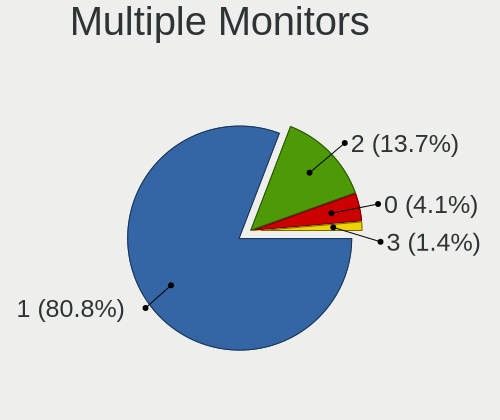

| Total | Desktops | Percent |
|-------|----------|---------|
| 1     | 59       | 80.82%  |
| 2     | 10       | 13.7%   |
| 0     | 3        | 4.11%   |
| 3     | 1        | 1.37%   |

Network
-------

Net Controller Vendor
---------------------

Controller vendors

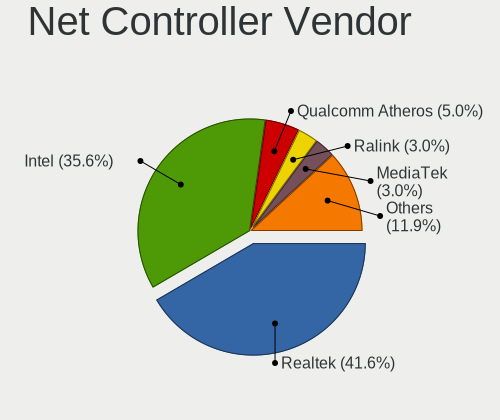

| Vendor                          | Desktops | Percent |
|---------------------------------|----------|---------|
| Realtek Semiconductor           | 42       | 41.58%  |
| Intel                           | 36       | 35.64%  |
| Qualcomm Atheros                | 5        | 4.95%   |
| Ralink Technology               | 3        | 2.97%   |
| MediaTek                        | 3        | 2.97%   |
| TP-Link                         | 2        | 1.98%   |
| Microsoft                       | 2        | 1.98%   |
| Broadcom                        | 2        | 1.98%   |
| Xiaomi                          | 1        | 0.99%   |
| Ralink                          | 1        | 0.99%   |
| Qualcomm Atheros Communications | 1        | 0.99%   |
| Nvidia                          | 1        | 0.99%   |
| NetXen Incorporated             | 1        | 0.99%   |
| Belkin Components               | 1        | 0.99%   |

Net Controller Model
--------------------

Controller models

| Model                                                                   | Desktops | Percent |
|-------------------------------------------------------------------------|----------|---------|
| Realtek RTL8111/8168/8211/8411 PCI Express Gigabit Ethernet Controller  | 31       | 27.19%  |
| Intel I211 Gigabit Network Connection                                   | 10       | 8.77%   |
| Intel Wi-Fi 6 AX200                                                     | 5        | 4.39%   |
| Intel 82579LM Gigabit Network Connection (Lewisville)                   | 4        | 3.51%   |
| Realtek RTL88x2bu [AC1200 Techkey]                                      | 3        | 2.63%   |
| MediaTek MT7921K (RZ608) Wi-Fi 6E 80MHz                                 | 3        | 2.63%   |
| Intel Ethernet Controller I225-V                                        | 3        | 2.63%   |
| Intel Ethernet Connection I217-LM                                       | 3        | 2.63%   |
| Intel 82567LM-3 Gigabit Network Connection                              | 3        | 2.63%   |
| Realtek RTL8192EE PCIe Wireless Network Adapter                         | 2        | 1.75%   |
| Realtek RTL8125 2.5GbE Controller                                       | 2        | 1.75%   |
| Realtek RTL810xE PCI Express Fast Ethernet controller                   | 2        | 1.75%   |
| Ralink RT5572 Wireless Adapter                                          | 2        | 1.75%   |
| Intel Wi-Fi 6E(802.11ax) AX210/AX1675* 2x2 [Typhoon Peak]               | 2        | 1.75%   |
| Intel Wi-Fi 5(802.11ac) Wireless-AC 9x6x [Thunder Peak]                 | 2        | 1.75%   |
| Intel Ethernet Connection (2) I219-V                                    | 2        | 1.75%   |
| Xiaomi Mi/Redmi series (RNDIS)                                          | 1        | 0.88%   |
| TP-Link TL-WN822N Version 4 RTL8192EU                                   | 1        | 0.88%   |
| TP-Link Archer T4U v2 [Realtek RTL8812AU]                               | 1        | 0.88%   |
| Realtek RTL8723BU 802.11b/g/n WLAN Adapter                              | 1        | 0.88%   |
| Realtek RTL8192EU 802.11b/g/n WLAN Adapter                              | 1        | 0.88%   |
| Realtek RTL8191SEvB Wireless LAN Controller                             | 1        | 0.88%   |
| Realtek RTL8188FTV 802.11b/g/n 1T1R 2.4G WLAN Adapter                   | 1        | 0.88%   |
| Realtek RTL8188EE Wireless Network Adapter                              | 1        | 0.88%   |
| Realtek RTL8153 Gigabit Ethernet Adapter                                | 1        | 0.88%   |
| Realtek 802.11ac NIC                                                    | 1        | 0.88%   |
| Ralink MT7601U Wireless Adapter                                         | 1        | 0.88%   |
| Ralink RT3062 Wireless 802.11n 2T/2R                                    | 1        | 0.88%   |
| Qualcomm Atheros AR9271 802.11n                                         | 1        | 0.88%   |
| Qualcomm Atheros AR9485 Wireless Network Adapter                        | 1        | 0.88%   |
| Qualcomm Atheros AR928X Wireless Network Adapter (PCI-Express)          | 1        | 0.88%   |
| Qualcomm Atheros AR8161 Gigabit Ethernet                                | 1        | 0.88%   |
| Qualcomm Atheros AR8151 v2.0 Gigabit Ethernet                           | 1        | 0.88%   |
| Qualcomm Atheros AR242x / AR542x Wireless Network Adapter (PCI-Express) | 1        | 0.88%   |
| Nvidia MCP61 Ethernet                                                   | 1        | 0.88%   |
| NetXen Incorporated NX3031 Multifunction 1/10-Gigabit Server Adapter    | 1        | 0.88%   |
| Microsoft Xbox Wireless Adapter for Windows                             | 1        | 0.88%   |
| Microsoft Xbox 360 Wireless Adapter                                     | 1        | 0.88%   |
| Intel Wireless 8265 / 8275                                              | 1        | 0.88%   |
| Intel Ethernet Connection I217-V                                        | 1        | 0.88%   |

Wireless Vendor
---------------

Wireless vendors

| Vendor                          | Desktops | Percent |
|---------------------------------|----------|---------|
| Intel                           | 12       | 30%     |
| Realtek Semiconductor           | 11       | 27.5%   |
| Ralink Technology               | 3        | 7.5%    |
| Qualcomm Atheros                | 3        | 7.5%    |
| MediaTek                        | 3        | 7.5%    |
| TP-Link                         | 2        | 5%      |
| Microsoft                       | 2        | 5%      |
| Ralink                          | 1        | 2.5%    |
| Qualcomm Atheros Communications | 1        | 2.5%    |
| Broadcom                        | 1        | 2.5%    |
| Belkin Components               | 1        | 2.5%    |

Wireless Model
--------------

Wireless models

| Model                                                                   | Desktops | Percent |
|-------------------------------------------------------------------------|----------|---------|
| Intel Wi-Fi 6 AX200                                                     | 5        | 12.5%   |
| Realtek RTL88x2bu [AC1200 Techkey]                                      | 3        | 7.5%    |
| MediaTek MT7921K (RZ608) Wi-Fi 6E 80MHz                                 | 3        | 7.5%    |
| Realtek RTL8192EE PCIe Wireless Network Adapter                         | 2        | 5%      |
| Ralink RT5572 Wireless Adapter                                          | 2        | 5%      |
| Intel Wi-Fi 6E(802.11ax) AX210/AX1675* 2x2 [Typhoon Peak]               | 2        | 5%      |
| Intel Wi-Fi 5(802.11ac) Wireless-AC 9x6x [Thunder Peak]                 | 2        | 5%      |
| TP-Link TL-WN822N Version 4 RTL8192EU                                   | 1        | 2.5%    |
| TP-Link Archer T4U v2 [Realtek RTL8812AU]                               | 1        | 2.5%    |
| Realtek RTL8723BU 802.11b/g/n WLAN Adapter                              | 1        | 2.5%    |
| Realtek RTL8192EU 802.11b/g/n WLAN Adapter                              | 1        | 2.5%    |
| Realtek RTL8191SEvB Wireless LAN Controller                             | 1        | 2.5%    |
| Realtek RTL8188FTV 802.11b/g/n 1T1R 2.4G WLAN Adapter                   | 1        | 2.5%    |
| Realtek RTL8188EE Wireless Network Adapter                              | 1        | 2.5%    |
| Realtek 802.11ac NIC                                                    | 1        | 2.5%    |
| Ralink MT7601U Wireless Adapter                                         | 1        | 2.5%    |
| Ralink RT3062 Wireless 802.11n 2T/2R                                    | 1        | 2.5%    |
| Qualcomm Atheros AR9271 802.11n                                         | 1        | 2.5%    |
| Qualcomm Atheros AR9485 Wireless Network Adapter                        | 1        | 2.5%    |
| Qualcomm Atheros AR928X Wireless Network Adapter (PCI-Express)          | 1        | 2.5%    |
| Qualcomm Atheros AR242x / AR542x Wireless Network Adapter (PCI-Express) | 1        | 2.5%    |
| Microsoft Xbox Wireless Adapter for Windows                             | 1        | 2.5%    |
| Microsoft Xbox 360 Wireless Adapter                                     | 1        | 2.5%    |
| Intel Wireless 8265 / 8275                                              | 1        | 2.5%    |
| Intel Dual Band Wireless-AC 3168NGW [Stone Peak]                        | 1        | 2.5%    |
| Intel Cannon Lake PCH CNVi WiFi                                         | 1        | 2.5%    |
| Broadcom BCM43217 802.11b/g/n                                           | 1        | 2.5%    |
| Belkin Components F5D8053 N Wireless USB Adapter v3000 [Ralink RT2870]  | 1        | 2.5%    |

Ethernet Vendor
---------------

Ethernet vendors

| Vendor                | Desktops | Percent |
|-----------------------|----------|---------|
| Realtek Semiconductor | 36       | 48.65%  |
| Intel                 | 32       | 43.24%  |
| Qualcomm Atheros      | 2        | 2.7%    |
| Xiaomi                | 1        | 1.35%   |
| Nvidia                | 1        | 1.35%   |
| NetXen Incorporated   | 1        | 1.35%   |
| Broadcom              | 1        | 1.35%   |

Ethernet Model
--------------

Ethernet models

| Model                                                                  | Desktops | Percent |
|------------------------------------------------------------------------|----------|---------|
| Realtek RTL8111/8168/8211/8411 PCI Express Gigabit Ethernet Controller | 31       | 41.89%  |
| Intel I211 Gigabit Network Connection                                  | 10       | 13.51%  |
| Intel 82579LM Gigabit Network Connection (Lewisville)                  | 4        | 5.41%   |
| Intel Ethernet Controller I225-V                                       | 3        | 4.05%   |
| Intel Ethernet Connection I217-LM                                      | 3        | 4.05%   |
| Intel 82567LM-3 Gigabit Network Connection                             | 3        | 4.05%   |
| Realtek RTL8125 2.5GbE Controller                                      | 2        | 2.7%    |
| Realtek RTL810xE PCI Express Fast Ethernet controller                  | 2        | 2.7%    |
| Intel Ethernet Connection (2) I219-V                                   | 2        | 2.7%    |
| Xiaomi Mi/Redmi series (RNDIS)                                         | 1        | 1.35%   |
| Realtek RTL8153 Gigabit Ethernet Adapter                               | 1        | 1.35%   |
| Qualcomm Atheros AR8161 Gigabit Ethernet                               | 1        | 1.35%   |
| Qualcomm Atheros AR8151 v2.0 Gigabit Ethernet                          | 1        | 1.35%   |
| Nvidia MCP61 Ethernet                                                  | 1        | 1.35%   |
| NetXen Incorporated NX3031 Multifunction 1/10-Gigabit Server Adapter   | 1        | 1.35%   |
| Intel Ethernet Connection I217-V                                       | 1        | 1.35%   |
| Intel Ethernet Connection (2) I219-LM                                  | 1        | 1.35%   |
| Intel Ethernet Connection (2) I218-V                                   | 1        | 1.35%   |
| Intel Ethernet Connection (12) I219-V                                  | 1        | 1.35%   |
| Intel 82579V Gigabit Network Connection                                | 1        | 1.35%   |
| Intel 82578DC Gigabit Network Connection                               | 1        | 1.35%   |
| Intel 82574L Gigabit Network Connection                                | 1        | 1.35%   |
| Broadcom NetLink BCM57788 Gigabit Ethernet PCIe                        | 1        | 1.35%   |

Net Controller Kind
-------------------

Ethernet, WiFi or modem

| Kind     | Desktops | Percent |
|----------|----------|---------|
| Ethernet | 68       | 64.15%  |
| WiFi     | 38       | 35.85%  |

Used Controller
---------------

Currently used network controller

| Kind     | Desktops | Percent |
|----------|----------|---------|
| Ethernet | 56       | 77.78%  |
| WiFi     | 16       | 22.22%  |

NICs
----

Total network controllers on board

| Total | Desktops | Percent |
|-------|----------|---------|
| 1     | 46       | 63.01%  |
| 2     | 21       | 28.77%  |
| 3     | 3        | 4.11%   |
| 0     | 2        | 2.74%   |
| 6     | 1        | 1.37%   |

IPv6
----

IPv6 vs IPv4

| Used | Desktops | Percent |
|------|----------|---------|
| No   | 66       | 90.41%  |
| Yes  | 7        | 9.59%   |

Bluetooth
---------

Bluetooth Vendor
----------------

Controller vendors

| Vendor                  | Desktops | Percent |
|-------------------------|----------|---------|
| Intel                   | 12       | 41.38%  |
| Cambridge Silicon Radio | 8        | 27.59%  |
| MediaTek                | 3        | 10.34%  |
| Realtek Semiconductor   | 2        | 6.9%    |
| ASUSTek Computer        | 2        | 6.9%    |
| IMC Networks            | 1        | 3.45%   |
| Actions                 | 1        | 3.45%   |

Bluetooth Model
---------------

Controller models

| Model                                               | Desktops | Percent |
|-----------------------------------------------------|----------|---------|
| Cambridge Silicon Radio Bluetooth Dongle (HCI mode) | 8        | 27.59%  |
| Intel AX200 Bluetooth                               | 5        | 17.24%  |
| MediaTek Wireless_Device                            | 3        | 10.34%  |
| Realtek Bluetooth Radio                             | 2        | 6.9%    |
| Intel Wireless-AC 9260 Bluetooth Adapter            | 2        | 6.9%    |
| Intel AX210 Bluetooth                               | 2        | 6.9%    |
| Intel Wireless-AC 3168 Bluetooth                    | 1        | 3.45%   |
| Intel Bluetooth wireless interface                  | 1        | 3.45%   |
| Intel Bluetooth 9460/9560 Jefferson Peak (JfP)      | 1        | 3.45%   |
| IMC Networks Bluetooth Module                       | 1        | 3.45%   |
| ASUS Broadcom BCM20702A0 Bluetooth                  | 1        | 3.45%   |
| ASUS BCM20702A0                                     | 1        | 3.45%   |
| Actions general adapter                             | 1        | 3.45%   |

Sound
-----

Sound Vendor
------------

Sound card vendors

| Vendor                 | Desktops | Percent |
|------------------------|----------|---------|
| Intel                  | 42       | 31.58%  |
| AMD                    | 38       | 28.57%  |
| Nvidia                 | 33       | 24.81%  |
| C-Media Electronics    | 5        | 3.76%   |
| Logitech               | 2        | 1.5%    |
| XMOS                   | 1        | 0.75%   |
| Sony                   | 1        | 0.75%   |
| Razer USA              | 1        | 0.75%   |
| Plantronics            | 1        | 0.75%   |
| KTMicro                | 1        | 0.75%   |
| Kingston Technology    | 1        | 0.75%   |
| JMTek                  | 1        | 0.75%   |
| Generalplus Technology | 1        | 0.75%   |
| Focusrite-Novation     | 1        | 0.75%   |
| Creative Labs          | 1        | 0.75%   |
| Blue Microphones       | 1        | 0.75%   |
| ASUSTek Computer       | 1        | 0.75%   |
| Alesis                 | 1        | 0.75%   |

Sound Model
-----------

Sound card models

| Model                                                                      | Desktops | Percent |
|----------------------------------------------------------------------------|----------|---------|
| AMD Family 17h (Models 00h-0fh) HD Audio Controller                        | 8        | 5.1%    |
| Intel 8 Series/C220 Series Chipset High Definition Audio Controller        | 7        | 4.46%   |
| AMD Starship/Matisse HD Audio Controller                                   | 7        | 4.46%   |
| Intel 7 Series/C216 Chipset Family High Definition Audio Controller        | 5        | 3.18%   |
| Intel 6 Series/C200 Series Chipset Family High Definition Audio Controller | 5        | 3.18%   |
| Intel 200 Series PCH HD Audio                                              | 5        | 3.18%   |
| AMD Ellesmere HDMI Audio [Radeon RX 470/480 / 570/580/590]                 | 5        | 3.18%   |
| Nvidia GK208 HDMI/DP Audio Controller                                      | 4        | 2.55%   |
| Nvidia GF119 HDMI Audio Controller                                         | 4        | 2.55%   |
| Nvidia GF108 High Definition Audio Controller                              | 4        | 2.55%   |
| Intel 100 Series/C230 Series Chipset Family HD Audio Controller            | 4        | 2.55%   |
| AMD FCH Azalia Controller                                                  | 4        | 2.55%   |
| AMD Family 17h/19h/1ah HD Audio Controller                                 | 4        | 2.55%   |
| Nvidia GP108 High Definition Audio Controller                              | 3        | 1.91%   |
| Nvidia GP104 High Definition Audio Controller                              | 3        | 1.91%   |
| Intel Xeon E3-1200 v3/4th Gen Core Processor HD Audio Controller           | 3        | 1.91%   |
| Intel NM10/ICH7 Family High Definition Audio Controller                    | 3        | 1.91%   |
| Intel 82801JD/DO (ICH10 Family) HD Audio Controller                        | 3        | 1.91%   |
| Intel 5 Series/3400 Series Chipset High Definition Audio                   | 3        | 1.91%   |
| AMD SBx00 Azalia (Intel HDA)                                               | 3        | 1.91%   |
| AMD Baffin HDMI/DP Audio [Radeon RX 550 640SP / RX 560/560X]               | 3        | 1.91%   |
| Nvidia GM204 High Definition Audio Controller                              | 2        | 1.27%   |
| Nvidia GA106 High Definition Audio Controller                              | 2        | 1.27%   |
| Intel 82801JI (ICH10 Family) HD Audio Controller                           | 2        | 1.27%   |
| C-Media Electronics Audio Adapter (Unitek Y-247A)                          | 2        | 1.27%   |
| AMD Trinity HDMI Audio Controller                                          | 2        | 1.27%   |
| AMD Rembrandt Radeon High Definition Audio Controller                      | 2        | 1.27%   |
| AMD Raven/Raven2/Fenghuang HDMI/DP Audio Controller                        | 2        | 1.27%   |
| AMD Oland/Hainan/Cape Verde/Pitcairn HDMI Audio [Radeon HD 7000 Series]    | 2        | 1.27%   |
| AMD Navi 21/23 HDMI/DP Audio Controller                                    | 2        | 1.27%   |
| XMOS X1S USB DAC                                                           | 1        | 0.64%   |
| Sony DualShock 4 [CUH-ZCT2x]                                               | 1        | 0.64%   |
| Razer USA Kraken 7.1                                                       | 1        | 0.64%   |
| Plantronics RIG 800HD                                                      | 1        | 0.64%   |
| Nvidia TU116 High Definition Audio Controller                              | 1        | 0.64%   |
| Nvidia TU106 High Definition Audio Controller                              | 1        | 0.64%   |
| Nvidia MCP61 High Definition Audio                                         | 1        | 0.64%   |
| Nvidia High Definition Audio Controller                                    | 1        | 0.64%   |
| Nvidia GT216 HDMI Audio Controller                                         | 1        | 0.64%   |
| Nvidia GP107GL High Definition Audio Controller                            | 1        | 0.64%   |

Memory
------

Memory Vendor
-------------

Memory module vendors

| Vendor              | Desktops | Percent |
|---------------------|----------|---------|
| Kingston            | 4        | 21.05%  |
| Corsair             | 4        | 21.05%  |
| Samsung Electronics | 2        | 10.53%  |
| Micron Technology   | 2        | 10.53%  |
| Crucial             | 2        | 10.53%  |
| Unknown             | 1        | 5.26%   |
| Team                | 1        | 5.26%   |
| SK hynix            | 1        | 5.26%   |
| PNY                 | 1        | 5.26%   |
| G.Skill             | 1        | 5.26%   |

Memory Model
------------

Memory module models

| Model                                                    | Desktops | Percent |
|----------------------------------------------------------|----------|---------|
| Unknown RAM Module 4096MB DIMM DDR3 1600MT/s             | 1        | 4.76%   |
| Team RAM TEAMGROUP-SD4-2666 16GB SODIMM DDR4 2667MT/s    | 1        | 4.76%   |
| SK hynix RAM HMA851S6AFR6N-UH 4GB SODIMM DDR4 2667MT/s   | 1        | 4.76%   |
| Samsung RAM M378B5773CH0-CH9 2GB DIMM DDR3 1867MT/s      | 1        | 4.76%   |
| Samsung RAM M378A1K43CB2-CRC 8GB DIMM DDR4 3500MT/s      | 1        | 4.76%   |
| PNY RAM 8GBU1X08QJLL42-12-K 8GB SODIMM DDR4 3200MT/s     | 1        | 4.76%   |
| Micron RAM Module 16GB SODIMM DDR4 3200MT/s              | 1        | 4.76%   |
| Micron RAM 16ATF1G64AZ-2G1A2 8GB DIMM DDR4 2400MT/s      | 1        | 4.76%   |
| Kingston RAM Module 8GB DIMM DDR4 2667MT/s               | 1        | 4.76%   |
| Kingston RAM KHX2133C14/8G 8GB DIMM DDR4 2666MT/s        | 1        | 4.76%   |
| Kingston RAM 99P5471-002.A00LF 2GB DIMM DDR3 1600MT/s    | 1        | 4.76%   |
| Kingston RAM 99P5471-001.A01LF 2GB DIMM DDR3 1333MT/s    | 1        | 4.76%   |
| Kingston RAM 99P5471-001.A00LF 2GB DIMM DDR3 1333MT/s    | 1        | 4.76%   |
| Kingston RAM 9905584-023.A00LF 4GB DIMM DDR3 1600MT/s    | 1        | 4.76%   |
| G.Skill RAM F4-3600C16-8GVKC 8GB DIMM DDR4 3600MT/s      | 1        | 4.76%   |
| Crucial RAM BLT4G3D1869DT 4096MB DIMM DDR3 1333MT/s      | 1        | 4.76%   |
| Crucial RAM BL16G36C16U4W.M16FE1 16GB DIMM DDR4 3733MT/s | 1        | 4.76%   |
| Corsair RAM CMWX16GC3200C16W2E 16GB DIMM DDR4 3200MT/s   | 1        | 4.76%   |
| Corsair RAM CMT32GX5M2X6200C36 16GB DIMM DDR5 6400MT/s   | 1        | 4.76%   |
| Corsair RAM CMK64GX4M2D3000C16 32GB DIMM DDR4 3000MT/s   | 1        | 4.76%   |
| Corsair RAM CMK16GX4M2E3200C16 8GB DIMM DDR4 3466MT/s    | 1        | 4.76%   |

Memory Kind
-----------

Memory module kinds

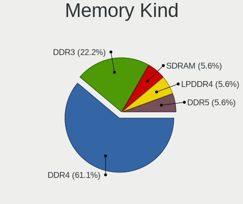

| Kind   | Desktops | Percent |
|--------|----------|---------|
| DDR4   | 11       | 61.11%  |
| DDR3   | 4        | 22.22%  |
| SDRAM  | 1        | 5.56%   |
| LPDDR4 | 1        | 5.56%   |
| DDR5   | 1        | 5.56%   |

Memory Form Factor
------------------

Physical design of the memory module

| Name   | Desktops | Percent |
|--------|----------|---------|
| DIMM   | 13       | 81.25%  |
| SODIMM | 3        | 18.75%  |

Memory Size
-----------

Memory module size

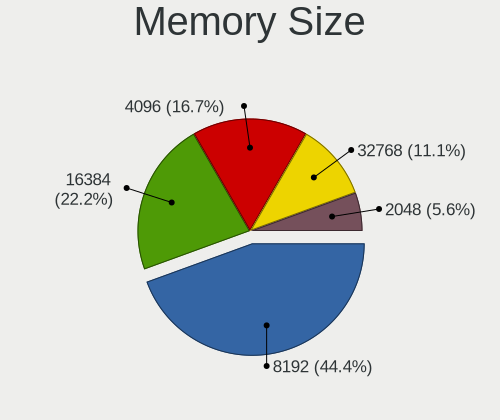

| Size  | Desktops | Percent |
|-------|----------|---------|
| 8192  | 8        | 44.44%  |
| 16384 | 4        | 22.22%  |
| 4096  | 3        | 16.67%  |
| 32768 | 2        | 11.11%  |
| 2048  | 1        | 5.56%   |

Memory Speed
------------

Memory module speed

| Speed | Desktops | Percent |
|-------|----------|---------|
| 3200  | 3        | 15.79%  |
| 1600  | 3        | 15.79%  |
| 2667  | 2        | 10.53%  |
| 1333  | 2        | 10.53%  |
| 6400  | 1        | 5.26%   |
| 3733  | 1        | 5.26%   |
| 3600  | 1        | 5.26%   |
| 3500  | 1        | 5.26%   |
| 3466  | 1        | 5.26%   |
| 3000  | 1        | 5.26%   |
| 2666  | 1        | 5.26%   |
| 2400  | 1        | 5.26%   |
| 1867  | 1        | 5.26%   |

Printers & scanners
-------------------

Printer Vendor
--------------

Printer device vendors

| Vendor          | Desktops | Percent |
|-----------------|----------|---------|
| Hewlett-Packard | 3        | 60%     |
| Seiko Epson     | 1        | 20%     |
| Canon           | 1        | 20%     |

Printer Model
-------------

Printer device models

| Model                              | Desktops | Percent |
|------------------------------------|----------|---------|
| Seiko Epson L120 Series            | 1        | 20%     |
| HP LaserJet 1300                   | 1        | 20%     |
| HP DeskJet 3830 series             | 1        | 20%     |
| HP DeskJet 2620 All-in-One Printer | 1        | 20%     |
| Canon PIXMA MG2500 Series          | 1        | 20%     |

Scanner Vendor
--------------

Scanner device vendors

Zero info for selected period =(

Scanner Model
-------------

Scanner device models

Zero info for selected period =(

Camera
------

Camera Vendor
-------------

Camera device vendors

| Vendor                      | Desktops | Percent |
|-----------------------------|----------|---------|
| Logitech                    | 3        | 23.08%  |
| Samsung Electronics         | 1        | 7.69%   |
| Microdia                    | 1        | 7.69%   |
| KYE Systems (Mouse Systems) | 1        | 7.69%   |
| IMC Networks                | 1        | 7.69%   |
| Generalplus Technology      | 1        | 7.69%   |
| GEMBIRD                     | 1        | 7.69%   |
| Creative Technology         | 1        | 7.69%   |
| Apple                       | 1        | 7.69%   |
| Alcor Micro                 | 1        | 7.69%   |
| 2M UVC CAMERA               | 1        | 7.69%   |

Camera Model
------------

Camera device models

| Model                                      | Desktops | Percent |
|--------------------------------------------|----------|---------|
| Logitech HD Pro Webcam C920                | 2        | 15.38%  |
| Samsung Galaxy series, misc. (MTP mode)    | 1        | 7.69%   |
| Microdia USB 2.0 Camera                    | 1        | 7.69%   |
| Logitech C922 Pro Stream Webcam            | 1        | 7.69%   |
| KYE Systems (Mouse Systems) Slim 1322AF    | 1        | 7.69%   |
| IMC Networks HD Camera                     | 1        | 7.69%   |
| Generalplus 808 Camera #9 (web-cam mode)   | 1        | 7.69%   |
| GEMBIRD USB2.0 PC CAMERA                   | 1        | 7.69%   |
| Creative Live! Cam Chat HD [VF0700/VF0790] | 1        | 7.69%   |
| Apple iPhone 5/5C/5S/6/SE/7/8/X/XR         | 1        | 7.69%   |
| Alcor Micro USB 2.0 PC Camera              | 1        | 7.69%   |
| 2M UVC CAMERA NexiGo N60 FHD Webcam        | 1        | 7.69%   |

Security
--------

Fingerprint Vendor
------------------

Fingerprint sensor vendors

Zero info for selected period =(

Fingerprint Model
-----------------

Fingerprint sensor models

Zero info for selected period =(

Chipcard Vendor
---------------

Chipcard module vendors

Zero info for selected period =(

Chipcard Model
--------------

Chipcard module models

Zero info for selected period =(

Unsupported
-----------

Unsupported Devices
-------------------

Total unsupported devices on board

| Total | Desktops | Percent |
|-------|----------|---------|
| 0     | 61       | 84.72%  |
| 1     | 9        | 12.5%   |
| 2     | 2        | 2.78%   |

Unsupported Device Types
------------------------

Types of unsupported devices

| Type                  | Desktops | Percent |
|-----------------------|----------|---------|
| Net/wireless          | 7        | 63.64%  |
| Graphics card         | 2        | 18.18%  |
| Tv card               | 1        | 9.09%   |
| Multimedia controller | 1        | 9.09%   |

