Reborn OS - Tested Hardware & Statistics (Notebooks)
----------------------------------------------------

A project to collect tested hardware configurations for Reborn OS.

Anyone can contribute to this report by the [hw-probe](https://github.com/linuxhw/hw-probe) tool:

    sudo -E hw-probe -all -upload

Please contribute! Especially if your hardware is rare.

Contents
--------

* [ Test Cases ](#test-cases)

* [ System ](#system)
  - [ OS                       ](#os)
  - [ OS Family                ](#os-family)
  - [ Kernel                   ](#kernel)
  - [ Kernel Family            ](#kernel-family)
  - [ Kernel Major Ver.        ](#kernel-major-ver)
  - [ Arch                     ](#arch)
  - [ DE                       ](#de)
  - [ Display Server           ](#display-server)
  - [ Display Manager          ](#display-manager)
  - [ OS Lang                  ](#os-lang)
  - [ Boot Mode                ](#boot-mode)
  - [ Filesystem               ](#filesystem)
  - [ Part. scheme             ](#part-scheme)
  - [ Dual Boot with Linux/BSD ](#dual-boot-with-linuxbsd)
  - [ Dual Boot (Win)          ](#dual-boot-win)

* [ Board ](#board)
  - [ Vendor                   ](#vendor)
  - [ Model                    ](#model)
  - [ Model Family             ](#model-family)
  - [ MFG Year                 ](#mfg-year)
  - [ Form Factor              ](#form-factor)
  - [ Secure Boot              ](#secure-boot)
  - [ Coreboot                 ](#coreboot)
  - [ RAM Size                 ](#ram-size)
  - [ RAM Used                 ](#ram-used)
  - [ Total Drives             ](#total-drives)
  - [ Has CD-ROM               ](#has-cd-rom)
  - [ Has Ethernet             ](#has-ethernet)
  - [ Has WiFi                 ](#has-wifi)
  - [ Has Bluetooth            ](#has-bluetooth)

* [ Location ](#location)
  - [ Country                  ](#country)
  - [ City                     ](#city)

* [ Drives ](#drives)
  - [ Drive Vendor             ](#drive-vendor)
  - [ Drive Model              ](#drive-model)
  - [ HDD Vendor               ](#hdd-vendor)
  - [ SSD Vendor               ](#ssd-vendor)
  - [ Drive Kind               ](#drive-kind)
  - [ Drive Connector          ](#drive-connector)
  - [ Drive Size               ](#drive-size)
  - [ Space Total              ](#space-total)
  - [ Space Used               ](#space-used)
  - [ Malfunc. Drives          ](#malfunc-drives)
  - [ Malfunc. Drive Vendor    ](#malfunc-drive-vendor)
  - [ Malfunc. HDD Vendor      ](#malfunc-hdd-vendor)
  - [ Malfunc. Drive Kind      ](#malfunc-drive-kind)
  - [ Failed Drives            ](#failed-drives)
  - [ Failed Drive Vendor      ](#failed-drive-vendor)
  - [ Drive Status             ](#drive-status)

* [ Storage controller ](#storage-controller)
  - [ Storage Vendor           ](#storage-vendor)
  - [ Storage Model            ](#storage-model)
  - [ Storage Kind             ](#storage-kind)

* [ Processor ](#processor)
  - [ CPU Vendor               ](#cpu-vendor)
  - [ CPU Model                ](#cpu-model)
  - [ CPU Model Family         ](#cpu-model-family)
  - [ CPU Cores                ](#cpu-cores)
  - [ CPU Sockets              ](#cpu-sockets)
  - [ CPU Threads              ](#cpu-threads)
  - [ CPU Op-Modes             ](#cpu-op-modes)
  - [ CPU Microcode            ](#cpu-microcode)
  - [ CPU Microarch            ](#cpu-microarch)

* [ Graphics ](#graphics)
  - [ GPU Vendor               ](#gpu-vendor)
  - [ GPU Model                ](#gpu-model)
  - [ GPU Combo                ](#gpu-combo)
  - [ GPU Driver               ](#gpu-driver)
  - [ GPU Memory               ](#gpu-memory)

* [ Monitor ](#monitor)
  - [ Monitor Vendor           ](#monitor-vendor)
  - [ Monitor Model            ](#monitor-model)
  - [ Monitor Resolution       ](#monitor-resolution)
  - [ Monitor Diagonal         ](#monitor-diagonal)
  - [ Monitor Width            ](#monitor-width)
  - [ Aspect Ratio             ](#aspect-ratio)
  - [ Monitor Area             ](#monitor-area)
  - [ Pixel Density            ](#pixel-density)
  - [ Multiple Monitors        ](#multiple-monitors)

* [ Network ](#network)
  - [ Net Controller Vendor    ](#net-controller-vendor)
  - [ Net Controller Model     ](#net-controller-model)
  - [ Wireless Vendor          ](#wireless-vendor)
  - [ Wireless Model           ](#wireless-model)
  - [ Ethernet Vendor          ](#ethernet-vendor)
  - [ Ethernet Model           ](#ethernet-model)
  - [ Net Controller Kind      ](#net-controller-kind)
  - [ Used Controller          ](#used-controller)
  - [ NICs                     ](#nics)
  - [ IPv6                     ](#ipv6)

* [ Bluetooth ](#bluetooth)
  - [ Bluetooth Vendor         ](#bluetooth-vendor)
  - [ Bluetooth Model          ](#bluetooth-model)

* [ Sound ](#sound)
  - [ Sound Vendor             ](#sound-vendor)
  - [ Sound Model              ](#sound-model)

* [ Memory ](#memory)
  - [ Memory Vendor            ](#memory-vendor)
  - [ Memory Model             ](#memory-model)
  - [ Memory Kind              ](#memory-kind)
  - [ Memory Form Factor       ](#memory-form-factor)
  - [ Memory Size              ](#memory-size)
  - [ Memory Speed             ](#memory-speed)

* [ Printers & scanners ](#printers--scanners)
  - [ Printer Vendor           ](#printer-vendor)
  - [ Printer Model            ](#printer-model)
  - [ Scanner Vendor           ](#scanner-vendor)
  - [ Scanner Model            ](#scanner-model)

* [ Camera ](#camera)
  - [ Camera Vendor            ](#camera-vendor)
  - [ Camera Model             ](#camera-model)

* [ Security ](#security)
  - [ Fingerprint Vendor       ](#fingerprint-vendor)
  - [ Fingerprint Model        ](#fingerprint-model)
  - [ Chipcard Vendor          ](#chipcard-vendor)
  - [ Chipcard Model           ](#chipcard-model)

* [ Unsupported ](#unsupported)
  - [ Unsupported Devices      ](#unsupported-devices)
  - [ Unsupported Device Types ](#unsupported-device-types)

Test Cases
----------

Total: 86

| Vendor        | Model                       | Probe                                                      | Date         |
|---------------|-----------------------------|------------------------------------------------------------|--------------|
| ASUSTek       | VivoBook_ASUSLaptop X509... | [58e0a1814b](https://linux-hardware.org/?probe=58e0a1814b) | Apr 21, 2022 |
| Lenovo        | ThinkPad E490 20N8CTO1WW    | [cf4fbc7ab1](https://linux-hardware.org/?probe=cf4fbc7ab1) | Feb 09, 2022 |
| HP            | ProBook 6550b               | [c09879cfcd](https://linux-hardware.org/?probe=c09879cfcd) | Dec 15, 2021 |
| HUAWEI        | MRC-WX0                     | [714f759476](https://linux-hardware.org/?probe=714f759476) | Dec 06, 2021 |
| Lenovo        | IdeaPad 5 Pro 16ACH6 82L... | [5dbef9a6a7](https://linux-hardware.org/?probe=5dbef9a6a7) | Nov 09, 2021 |
| Lenovo        | IdeaPad 5 Pro 16ACH6 82L... | [a2d1a17ff1](https://linux-hardware.org/?probe=a2d1a17ff1) | Nov 09, 2021 |
| ASUSTek       | VivoBook_ASUSLaptop X509... | [de36837a42](https://linux-hardware.org/?probe=de36837a42) | Nov 02, 2021 |
| Lenovo        | IdeaPad Y580                | [409fb80ae5](https://linux-hardware.org/?probe=409fb80ae5) | Sep 10, 2021 |
| Acer          | Aspire V3-111P              | [8c38c04148](https://linux-hardware.org/?probe=8c38c04148) | Sep 05, 2021 |
| Acer          | Aspire V3-111P              | [af61c27b54](https://linux-hardware.org/?probe=af61c27b54) | Sep 05, 2021 |
| Lenovo        | ThinkPad T410 253725G       | [779374b300](https://linux-hardware.org/?probe=779374b300) | Aug 05, 2021 |
| Lenovo        | IdeaPad S145-15API 81UT     | [13aee77624](https://linux-hardware.org/?probe=13aee77624) | Jun 30, 2021 |
| Lenovo        | IdeaPad 330-17IKB 81DM      | [19226582d9](https://linux-hardware.org/?probe=19226582d9) | May 31, 2021 |
| HP            | EliteBook 8460p             | [6f3d7a9d3f](https://linux-hardware.org/?probe=6f3d7a9d3f) | May 15, 2021 |
| HP            | EliteBook 8460p             | [426f99f758](https://linux-hardware.org/?probe=426f99f758) | May 14, 2021 |
| Lenovo        | Y50-70 20378                | [18ec5d54a4](https://linux-hardware.org/?probe=18ec5d54a4) | Apr 02, 2021 |
| Lenovo        | IdeaPad L340-17API 81LY     | [989604544a](https://linux-hardware.org/?probe=989604544a) | Apr 02, 2021 |
| Lenovo        | IdeaPad L340-17API 81LY     | [1b1d0bc44f](https://linux-hardware.org/?probe=1b1d0bc44f) | Mar 27, 2021 |
| CyberPower... | Tracer Series               | [295977bfa3](https://linux-hardware.org/?probe=295977bfa3) | Mar 24, 2021 |
| Acer          | Extensa 5635Z               | [890d530c6a](https://linux-hardware.org/?probe=890d530c6a) | Mar 18, 2021 |
| Dell          | Latitude E6320              | [9439943a67](https://linux-hardware.org/?probe=9439943a67) | Mar 15, 2021 |
| Avell High... | A62 LIV                     | [1f0a994797](https://linux-hardware.org/?probe=1f0a994797) | Mar 08, 2021 |
| Dell          | Inspiron 5584               | [16fca1f86b](https://linux-hardware.org/?probe=16fca1f86b) | Feb 24, 2021 |
| Dell          | Precision M4600             | [661670d030](https://linux-hardware.org/?probe=661670d030) | Jan 27, 2021 |
| HP            | EliteBook 2560p             | [8289f3c10b](https://linux-hardware.org/?probe=8289f3c10b) | Jan 24, 2021 |
| Acer          | Aspire E1-572               | [cb03a43d6b](https://linux-hardware.org/?probe=cb03a43d6b) | Jan 18, 2021 |
| Dell          | Studio 1747                 | [b07052df59](https://linux-hardware.org/?probe=b07052df59) | Jan 13, 2021 |
| Dell          | Inspiron 5584               | [6917b5bc30](https://linux-hardware.org/?probe=6917b5bc30) | Jan 11, 2021 |
| Dell          | Inspiron 5584               | [cfa1367cf6](https://linux-hardware.org/?probe=cfa1367cf6) | Jan 10, 2021 |
| Dell          | Inspiron 5584               | [60a171b505](https://linux-hardware.org/?probe=60a171b505) | Jan 10, 2021 |
| Acer          | Aspire E5-523               | [99c0e6fe8e](https://linux-hardware.org/?probe=99c0e6fe8e) | Jan 03, 2021 |
| HP            | Pavilion g7                 | [4df7168c54](https://linux-hardware.org/?probe=4df7168c54) | Dec 27, 2020 |
| HP            | Pavilion g7                 | [e2b98139df](https://linux-hardware.org/?probe=e2b98139df) | Dec 27, 2020 |
| Acer          | Aspire E5-523               | [ff03816a1e](https://linux-hardware.org/?probe=ff03816a1e) | Dec 16, 2020 |
| Lenovo        | ThinkPad E570 20H50048US    | [db0d5b5a47](https://linux-hardware.org/?probe=db0d5b5a47) | Dec 15, 2020 |
| Acer          | Swift SF314-42              | [c5a5070a6f](https://linux-hardware.org/?probe=c5a5070a6f) | Dec 10, 2020 |
| Acer          | Swift SF314-42              | [f5429557cc](https://linux-hardware.org/?probe=f5429557cc) | Dec 10, 2020 |
| Lenovo        | IdeaPad 1 14IGL05 81VU      | [6ea56336d8](https://linux-hardware.org/?probe=6ea56336d8) | Dec 03, 2020 |
| Lenovo        | IdeaPad 1 14IGL05 81VU      | [a4e4cd792d](https://linux-hardware.org/?probe=a4e4cd792d) | Dec 02, 2020 |
| Lenovo        | IdeaPad Y450                | [a5ec379304](https://linux-hardware.org/?probe=a5ec379304) | Dec 01, 2020 |
| Lenovo        | IdeaPad 1 14IGL05 81VU      | [67aeba9d99](https://linux-hardware.org/?probe=67aeba9d99) | Dec 01, 2020 |
| Lenovo        | Y50-70 20378                | [07c05e281b](https://linux-hardware.org/?probe=07c05e281b) | Nov 29, 2020 |
| Lenovo        | IdeaPad Y450                | [300a14fb31](https://linux-hardware.org/?probe=300a14fb31) | Nov 29, 2020 |
| HP            | ProBook 640 G5              | [fc9abd07f4](https://linux-hardware.org/?probe=fc9abd07f4) | Nov 20, 2020 |
| Lenovo        | G470 20078                  | [98c4778da6](https://linux-hardware.org/?probe=98c4778da6) | Nov 18, 2020 |
| Acer          | Aspire F5-573G              | [9153f43376](https://linux-hardware.org/?probe=9153f43376) | Nov 02, 2020 |
| Acer          | Aspire E5-571G              | [9d695214a4](https://linux-hardware.org/?probe=9d695214a4) | Oct 27, 2020 |
| Dell          | Latitude 5500               | [b1f5e9ea7a](https://linux-hardware.org/?probe=b1f5e9ea7a) | Oct 25, 2020 |
| Sony          | VPCEH10EB                   | [167720fe57](https://linux-hardware.org/?probe=167720fe57) | Oct 25, 2020 |
| Razer         | Blade                       | [14ed46b628](https://linux-hardware.org/?probe=14ed46b628) | Oct 04, 2020 |
| Lenovo        | ThinkPad Edge E431 62775... | [6141f19045](https://linux-hardware.org/?probe=6141f19045) | Sep 17, 2020 |
| Lenovo        | ThinkPad Edge E431 62775... | [a34a40a5ff](https://linux-hardware.org/?probe=a34a40a5ff) | Sep 17, 2020 |
| Dell          | Latitude E6430              | [4fcaaadd6e](https://linux-hardware.org/?probe=4fcaaadd6e) | Sep 12, 2020 |
| HP            | 630                         | [baf66f73a2](https://linux-hardware.org/?probe=baf66f73a2) | Aug 14, 2020 |
| HP            | 630                         | [1f0b52b96d](https://linux-hardware.org/?probe=1f0b52b96d) | Aug 12, 2020 |
| Dell          | Inspiron 5520               | [27ed844469](https://linux-hardware.org/?probe=27ed844469) | Aug 08, 2020 |
| Dell          | Inspiron 5520               | [d40ce43d66](https://linux-hardware.org/?probe=d40ce43d66) | Jul 31, 2020 |
| Toshiba       | Satellite C850-C1S          | [3b431d9c9a](https://linux-hardware.org/?probe=3b431d9c9a) | Jul 31, 2020 |
| Dell          | Inspiron 5520               | [3fea05b48d](https://linux-hardware.org/?probe=3fea05b48d) | Jul 30, 2020 |
| Dell          | Latitude E6430              | [d14e88e089](https://linux-hardware.org/?probe=d14e88e089) | Jul 15, 2020 |
| HP            | Pavilion Laptop 15-cw0xx... | [56cc69c796](https://linux-hardware.org/?probe=56cc69c796) | Jun 27, 2020 |
| ASUSTek       | X540SA                      | [a1aaa82c04](https://linux-hardware.org/?probe=a1aaa82c04) | Jun 25, 2020 |
| ASUSTek       | X540SA                      | [1bab33423f](https://linux-hardware.org/?probe=1bab33423f) | Jun 25, 2020 |
| Lenovo        | ThinkPad T510 4349BS9       | [c525e8d7d2](https://linux-hardware.org/?probe=c525e8d7d2) | May 18, 2020 |
| ASUSTek       | UX430UAR                    | [acc88c72e9](https://linux-hardware.org/?probe=acc88c72e9) | May 06, 2020 |
| ASUSTek       | UX430UAR                    | [34b28c7178](https://linux-hardware.org/?probe=34b28c7178) | May 06, 2020 |
| Lenovo        | ThinkPad T440p 20AWS0Y80... | [cd1f7d692d](https://linux-hardware.org/?probe=cd1f7d692d) | May 01, 2020 |
| Lenovo        | ThinkPad T440p 20AWS0Y80... | [ddff2712b8](https://linux-hardware.org/?probe=ddff2712b8) | Apr 17, 2020 |
| Dell          | G7 7588                     | [68c487eb50](https://linux-hardware.org/?probe=68c487eb50) | Apr 15, 2020 |
| Lenovo        | Z70-80 80FG                 | [c27fa8aa9c](https://linux-hardware.org/?probe=c27fa8aa9c) | Apr 06, 2020 |
| Dell          | Latitude E6410              | [9d64ff0beb](https://linux-hardware.org/?probe=9d64ff0beb) | Mar 22, 2020 |
| Dell          | Inspiron 5421               | [2d8871e6ac](https://linux-hardware.org/?probe=2d8871e6ac) | Mar 19, 2020 |
| HP            | Pavilion 17                 | [5d3ccb9ed7](https://linux-hardware.org/?probe=5d3ccb9ed7) | Feb 24, 2020 |
| HP            | Pavilion dm1                | [e2e4a2c41f](https://linux-hardware.org/?probe=e2e4a2c41f) | Feb 13, 2020 |
| HP            | Pavilion 17                 | [26bdca3832](https://linux-hardware.org/?probe=26bdca3832) | Feb 09, 2020 |
| HP            | Pavilion Gaming Laptop 1... | [48487463eb](https://linux-hardware.org/?probe=48487463eb) | Feb 09, 2020 |
| Lenovo        | IdeaPad S145-15IWL 81MV     | [9c202df9eb](https://linux-hardware.org/?probe=9c202df9eb) | Jan 14, 2020 |
| Lenovo        | IdeaPad S145-15IWL 81MV     | [12d0a26c62](https://linux-hardware.org/?probe=12d0a26c62) | Jan 12, 2020 |
| HP            | Pavilion 17                 | [baeaa7afdc](https://linux-hardware.org/?probe=baeaa7afdc) | Jan 11, 2020 |
| Acer          | Aspire E1-571               | [3b1545354e](https://linux-hardware.org/?probe=3b1545354e) | Jan 08, 2020 |
| Acer          | Aspire E1-571               | [25229b0eaf](https://linux-hardware.org/?probe=25229b0eaf) | Jan 08, 2020 |
| Acer          | Aspire E1-571               | [3d68993148](https://linux-hardware.org/?probe=3d68993148) | Jan 08, 2020 |
| Avell High... | G1550 FOX                   | [b2380e6e7a](https://linux-hardware.org/?probe=b2380e6e7a) | Dec 30, 2019 |
| ASUSTek       | X555YI                      | [728d78c48c](https://linux-hardware.org/?probe=728d78c48c) | Sep 25, 2019 |
| Dell          | Inspiron 5520               | [26951086cf](https://linux-hardware.org/?probe=26951086cf) | Aug 29, 2019 |
| Lenovo        | G570 20079                  | [b1b5baaf85](https://linux-hardware.org/?probe=b1b5baaf85) | Dec 12, 2018 |

System
------

OS
--

Installed operating systems

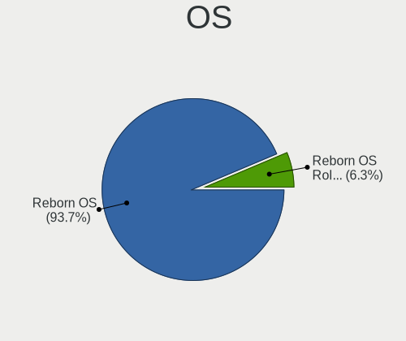

| Name              | Notebooks | Percent |
|-------------------|-----------|---------|
| Reborn OS         | 57        | 93.44%  |
| Reborn OS Rolling | 4         | 6.56%   |

OS Family
---------

OS without a version

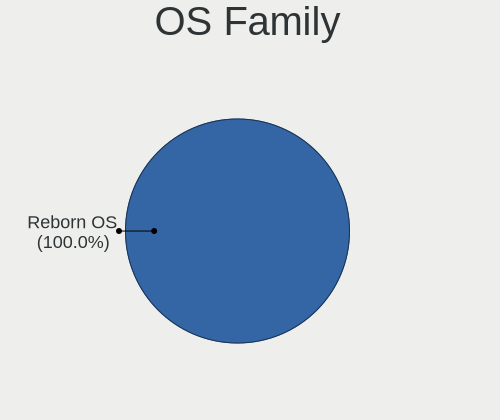

| Name      | Notebooks | Percent |
|-----------|-----------|---------|
| Reborn OS | 61        | 100%    |

Kernel
------

Version of the Linux kernel

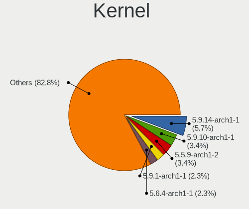

| Version             | Notebooks | Percent |
|---------------------|-----------|---------|
| 5.9.14-arch1-1      | 5         | 7.81%   |
| 5.9.10-arch1-1      | 3         | 4.69%   |
| 5.5.9-arch1-2       | 3         | 4.69%   |
| 5.9.1-arch1-1       | 2         | 3.13%   |
| 5.6.4-arch1-1       | 2         | 3.13%   |
| 5.5.2-arch1-1       | 2         | 3.13%   |
| 5.4.10-arch1-1      | 2         | 3.13%   |
| 5.9.2-zen1-1-zen    | 1         | 1.56%   |
| 5.9.13-arch1-1      | 1         | 1.56%   |
| 5.9.11-arch2-1      | 1         | 1.56%   |
| 5.9.10-zen1-1-zen   | 1         | 1.56%   |
| 5.8.8-arch1-1       | 1         | 1.56%   |
| 5.8.5-arch1-1       | 1         | 1.56%   |
| 5.8.13-arch1-1      | 1         | 1.56%   |
| 5.7.8-arch1-1       | 1         | 1.56%   |
| 5.7.6-arch1-1       | 1         | 1.56%   |
| 5.7.5-arch1-1       | 1         | 1.56%   |
| 5.7.12-arch1-1      | 1         | 1.56%   |
| 5.7.11-arch1-1      | 1         | 1.56%   |
| 5.7.10-arch1-1      | 1         | 1.56%   |
| 5.6.13-arch1-1      | 1         | 1.56%   |
| 5.6.10-arch1-1      | 1         | 1.56%   |
| 5.4.8-arch1-1       | 1         | 1.56%   |
| 5.4.78-1-lts        | 1         | 1.56%   |
| 5.4.77-1-lts        | 1         | 1.56%   |
| 5.4.72-1-lts        | 1         | 1.56%   |
| 5.3.1-arch1-1-ARCH  | 1         | 1.56%   |
| 5.2.9-arch1-1-ARCH  | 1         | 1.56%   |
| 5.16.9-arch1-1      | 1         | 1.56%   |
| 5.15.7-arch1-1      | 1         | 1.56%   |
| 5.15.6-arch2-1      | 1         | 1.56%   |
| 5.15.21-1-lts       | 1         | 1.56%   |
| 5.14.16-arch1-1     | 1         | 1.56%   |
| 5.14.14-arch1-1     | 1         | 1.56%   |
| 5.13.13-arch1-1     | 1         | 1.56%   |
| 5.13.10-arch1-1     | 1         | 1.56%   |
| 5.12.8-arch1-1      | 1         | 1.56%   |
| 5.12.3-arch1-1      | 1         | 1.56%   |
| 5.11.6-arch1-1      | 1         | 1.56%   |
| 5.11.2-arch1-1      | 1         | 1.56%   |
| 5.11.11-zen1-1-zen  | 1         | 1.56%   |
| 5.11.11-arch1-1     | 1         | 1.56%   |
| 5.11.10-arch1-1     | 1         | 1.56%   |
| 5.11.1-arch1-1      | 1         | 1.56%   |
| 5.10.9-arch1-1      | 1         | 1.56%   |
| 5.10.7-arch1-1      | 1         | 1.56%   |
| 5.10.56-1-lts       | 1         | 1.56%   |
| 5.10.42-1-lts       | 1         | 1.56%   |
| 5.10.23-1-lts       | 1         | 1.56%   |
| 5.10.10-arch1-1     | 1         | 1.56%   |
| 4.19.91-1-lts       | 1         | 1.56%   |
| 4.19.4-arch1-1-ARCH | 1         | 1.56%   |

Kernel Family
-------------

Linux kernel without a distro release

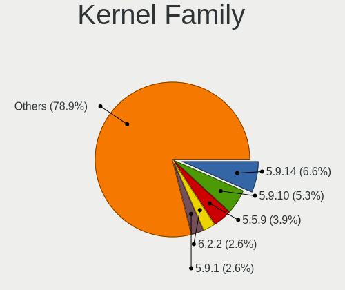

| Version | Notebooks | Percent |
|---------|-----------|---------|
| 5.9.14  | 5         | 7.81%   |
| 5.9.10  | 4         | 6.25%   |
| 5.5.9   | 3         | 4.69%   |
| 5.9.1   | 2         | 3.13%   |
| 5.6.4   | 2         | 3.13%   |
| 5.5.2   | 2         | 3.13%   |
| 5.4.10  | 2         | 3.13%   |
| 5.11.11 | 2         | 3.13%   |
| 5.9.2   | 1         | 1.56%   |
| 5.9.13  | 1         | 1.56%   |
| 5.9.11  | 1         | 1.56%   |
| 5.8.8   | 1         | 1.56%   |
| 5.8.5   | 1         | 1.56%   |
| 5.8.13  | 1         | 1.56%   |
| 5.7.8   | 1         | 1.56%   |
| 5.7.6   | 1         | 1.56%   |
| 5.7.5   | 1         | 1.56%   |
| 5.7.12  | 1         | 1.56%   |
| 5.7.11  | 1         | 1.56%   |
| 5.7.10  | 1         | 1.56%   |
| 5.6.13  | 1         | 1.56%   |
| 5.6.10  | 1         | 1.56%   |
| 5.4.8   | 1         | 1.56%   |
| 5.4.78  | 1         | 1.56%   |
| 5.4.77  | 1         | 1.56%   |
| 5.4.72  | 1         | 1.56%   |
| 5.3.1   | 1         | 1.56%   |
| 5.2.9   | 1         | 1.56%   |
| 5.16.9  | 1         | 1.56%   |
| 5.15.7  | 1         | 1.56%   |
| 5.15.6  | 1         | 1.56%   |
| 5.15.21 | 1         | 1.56%   |
| 5.14.16 | 1         | 1.56%   |
| 5.14.14 | 1         | 1.56%   |
| 5.13.13 | 1         | 1.56%   |
| 5.13.10 | 1         | 1.56%   |
| 5.12.8  | 1         | 1.56%   |
| 5.12.3  | 1         | 1.56%   |
| 5.11.6  | 1         | 1.56%   |
| 5.11.2  | 1         | 1.56%   |
| 5.11.10 | 1         | 1.56%   |
| 5.11.1  | 1         | 1.56%   |
| 5.10.9  | 1         | 1.56%   |
| 5.10.7  | 1         | 1.56%   |
| 5.10.56 | 1         | 1.56%   |
| 5.10.42 | 1         | 1.56%   |
| 5.10.23 | 1         | 1.56%   |
| 5.10.10 | 1         | 1.56%   |
| 4.19.91 | 1         | 1.56%   |
| 4.19.4  | 1         | 1.56%   |

Kernel Major Ver.
-----------------

Linux kernel major version

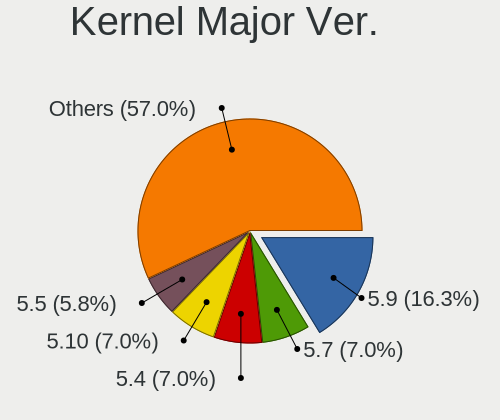

| Version | Notebooks | Percent |
|---------|-----------|---------|
| 5.9     | 14        | 22.22%  |
| 5.7     | 6         | 9.52%   |
| 5.4     | 6         | 9.52%   |
| 5.10    | 6         | 9.52%   |
| 5.5     | 5         | 7.94%   |
| 5.11    | 5         | 7.94%   |
| 5.6     | 4         | 6.35%   |
| 5.8     | 3         | 4.76%   |
| 5.15    | 3         | 4.76%   |
| 5.14    | 2         | 3.17%   |
| 5.13    | 2         | 3.17%   |
| 5.12    | 2         | 3.17%   |
| 4.19    | 2         | 3.17%   |
| 5.3     | 1         | 1.59%   |
| 5.2     | 1         | 1.59%   |
| 5.16    | 1         | 1.59%   |

Arch
----

OS architecture (x86_64, i586, etc.)

| Name   | Notebooks | Percent |
|--------|-----------|---------|
| x86_64 | 61        | 100%    |

DE
--

Desktop Environment

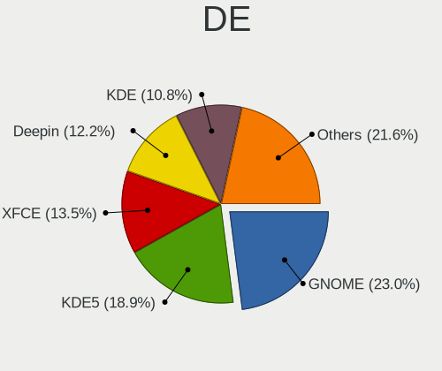

| Name              | Notebooks | Percent |
|-------------------|-----------|---------|
| GNOME             | 16        | 25.81%  |
| Deepin            | 9         | 14.52%  |
| XFCE              | 8         | 12.9%   |
| KDE               | 8         | 12.9%   |
| X-Cinnamon        | 5         | 8.06%   |
| KDE5              | 5         | 8.06%   |
| Unknown           | 3         | 4.84%   |
| MATE              | 2         | 3.23%   |
| i3                | 2         | 3.23%   |
| Yaru:ubuntu:GNOME | 1         | 1.61%   |
| LXQt              | 1         | 1.61%   |
| Enlightenment     | 1         | 1.61%   |
| Budgie            | 1         | 1.61%   |

Display Server
--------------

X11 or Wayland

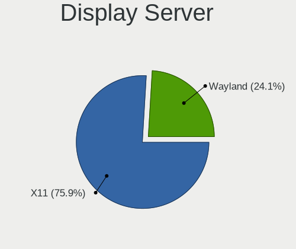

| Name    | Notebooks | Percent |
|---------|-----------|---------|
| X11     | 49        | 79.03%  |
| Wayland | 13        | 20.97%  |

Display Manager
---------------

SDDM, LightDM, etc.

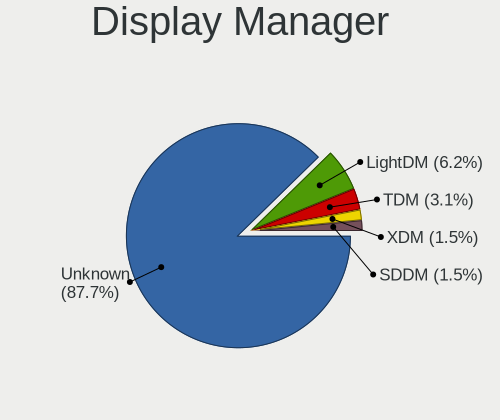

| Name    | Notebooks | Percent |
|---------|-----------|---------|
| Unknown | 54        | 88.52%  |
| LightDM | 3         | 4.92%   |
| TDM     | 2         | 3.28%   |
| XDM     | 1         | 1.64%   |
| SDDM    | 1         | 1.64%   |

OS Lang
-------

Language

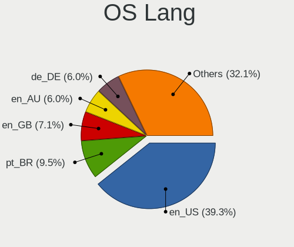

| Lang    | Notebooks | Percent |
|---------|-----------|---------|
| en_US   | 18        | 29.51%  |
| pt_BR   | 8         | 13.11%  |
| en_AU   | 5         | 8.2%    |
| de_DE   | 4         | 6.56%   |
| ru_RU   | 3         | 4.92%   |
| en_CA   | 3         | 4.92%   |
| Unknown | 3         | 4.92%   |
| pl_PL   | 2         | 3.28%   |
| nl_NL   | 2         | 3.28%   |
| es_MX   | 2         | 3.28%   |
| es_ES   | 2         | 3.28%   |
| en_GB   | 2         | 3.28%   |
| sv_SE   | 1         | 1.64%   |
| fr_BE   | 1         | 1.64%   |
| fi_FI   | 1         | 1.64%   |
| es_CL   | 1         | 1.64%   |
| en_DK   | 1         | 1.64%   |
| de_CH   | 1         | 1.64%   |
| cs_CZ   | 1         | 1.64%   |

Boot Mode
---------

EFI or BIOS

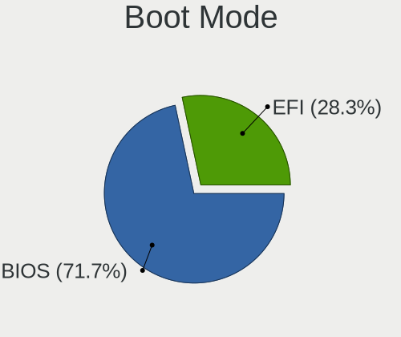

| Mode | Notebooks | Percent |
|------|-----------|---------|
| BIOS | 45        | 72.58%  |
| EFI  | 17        | 27.42%  |

Filesystem
----------

Type of filesystem

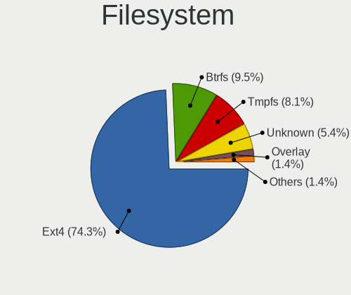

| Type    | Notebooks | Percent |
|---------|-----------|---------|
| Ext4    | 49        | 79.03%  |
| Tmpfs   | 5         | 8.06%   |
| Btrfs   | 4         | 6.45%   |
| Unknown | 3         | 4.84%   |
| Ext3    | 1         | 1.61%   |

Part. scheme
------------

Scheme of partitioning

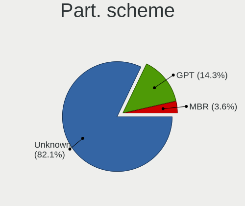

| Type    | Notebooks | Percent |
|---------|-----------|---------|
| Unknown | 54        | 88.52%  |
| GPT     | 4         | 6.56%   |
| MBR     | 3         | 4.92%   |

Dual Boot with Linux/BSD
------------------------

Hosting more than one Linux/BSD

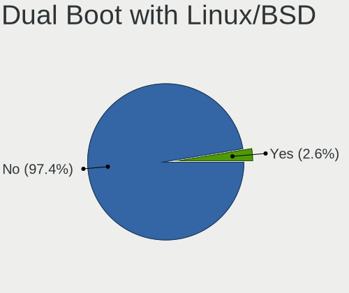

| Dual boot | Notebooks | Percent |
|-----------|-----------|---------|
| No        | 60        | 98.36%  |
| Yes       | 1         | 1.64%   |

Dual Boot (Win)
---------------

Hosting Linux and Windows

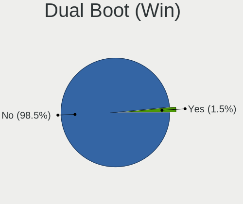

| Dual boot | Notebooks | Percent |
|-----------|-----------|---------|
| No        | 61        | 100%    |

Board
-----

Vendor
------

Motherboard manufacturer

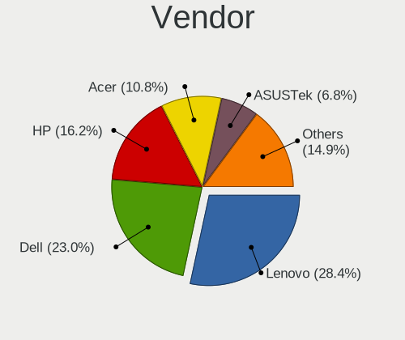

| Name                   | Notebooks | Percent |
|------------------------|-----------|---------|
| Lenovo                 | 20        | 32.79%  |
| Dell                   | 13        | 21.31%  |
| Hewlett-Packard        | 8         | 13.11%  |
| Acer                   | 8         | 13.11%  |
| ASUSTek Computer       | 5         | 8.2%    |
| Avell High Performance | 2         | 3.28%   |
| Toshiba                | 1         | 1.64%   |
| Sony                   | 1         | 1.64%   |
| Razer                  | 1         | 1.64%   |
| HUAWEI                 | 1         | 1.64%   |
| CyberPowerPC           | 1         | 1.64%   |

Model
-----

Motherboard model

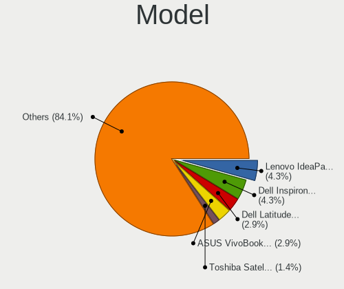

| Name                                   | Notebooks | Percent |
|----------------------------------------|-----------|---------|
| Lenovo IdeaPad 1 14IGL05 81VU          | 3         | 4.92%   |
| Dell Inspiron 5520                     | 3         | 4.92%   |
| Dell Latitude E6430                    | 2         | 3.28%   |
| ASUS VivoBook_ASUSLaptop X509DA_M509DA | 2         | 3.28%   |
| Toshiba Satellite C850-C1S             | 1         | 1.64%   |
| Sony VPCEH10EB                         | 1         | 1.64%   |
| Razer Blade                            | 1         | 1.64%   |
| Lenovo Z70-80 80FG                     | 1         | 1.64%   |
| Lenovo Y50-70 20378                    | 1         | 1.64%   |
| Lenovo ThinkPad T510 4349BS9           | 1         | 1.64%   |
| Lenovo ThinkPad T440p 20AWS0Y800       | 1         | 1.64%   |
| Lenovo ThinkPad T410 253725G           | 1         | 1.64%   |
| Lenovo ThinkPad Edge E431 62775AU      | 1         | 1.64%   |
| Lenovo ThinkPad E570 20H50048US        | 1         | 1.64%   |
| Lenovo ThinkPad E490 20N8CTO1WW        | 1         | 1.64%   |
| Lenovo IdeaPad Y580                    | 1         | 1.64%   |
| Lenovo IdeaPad Y450                    | 1         | 1.64%   |
| Lenovo IdeaPad S145-15IWL 81MV         | 1         | 1.64%   |
| Lenovo IdeaPad S145-15API 81UT         | 1         | 1.64%   |
| Lenovo IdeaPad L340-17API 81LY         | 1         | 1.64%   |
| Lenovo IdeaPad 5 Pro 16ACH6 82L5       | 1         | 1.64%   |
| Lenovo IdeaPad 330-17IKB 81DM          | 1         | 1.64%   |
| Lenovo G570 20079                      | 1         | 1.64%   |
| Lenovo G470 20078                      | 1         | 1.64%   |
| HUAWEI MRC-WX0                         | 1         | 1.64%   |
| HP ProBook 6550b                       | 1         | 1.64%   |
| HP ProBook 640 G5                      | 1         | 1.64%   |
| HP Pavilion Laptop 15-cw0xxx           | 1         | 1.64%   |
| HP Pavilion g7                         | 1         | 1.64%   |
| HP Pavilion dm1                        | 1         | 1.64%   |
| HP Pavilion 17                         | 1         | 1.64%   |
| HP EliteBook 8460p                     | 1         | 1.64%   |
| HP EliteBook 2560p                     | 1         | 1.64%   |
| Dell Studio 1747                       | 1         | 1.64%   |
| Dell Precision M4600                   | 1         | 1.64%   |
| Dell Latitude E6410                    | 1         | 1.64%   |
| Dell Latitude E6320                    | 1         | 1.64%   |
| Dell Latitude 5500                     | 1         | 1.64%   |
| Dell Inspiron 5584                     | 1         | 1.64%   |
| Dell Inspiron 5421                     | 1         | 1.64%   |
| Dell G7 7588                           | 1         | 1.64%   |
| CyberPowerPC Tracer Series             | 1         | 1.64%   |
| Avell High Performance G1550 FOX       | 1         | 1.64%   |
| Avell High Performance A62 LIV         | 1         | 1.64%   |
| ASUS X555YI                            | 1         | 1.64%   |
| ASUS X540SA                            | 1         | 1.64%   |
| ASUS UX430UAR                          | 1         | 1.64%   |
| Acer Swift SF314-42                    | 1         | 1.64%   |
| Acer Extensa 5635Z                     | 1         | 1.64%   |
| Acer Aspire V3-111P                    | 1         | 1.64%   |
| Acer Aspire F5-573G                    | 1         | 1.64%   |
| Acer Aspire E5-571G                    | 1         | 1.64%   |
| Acer Aspire E5-523                     | 1         | 1.64%   |
| Acer Aspire E1-572                     | 1         | 1.64%   |
| Acer Aspire E1-571                     | 1         | 1.64%   |

Model Family
------------

Motherboard model prefix

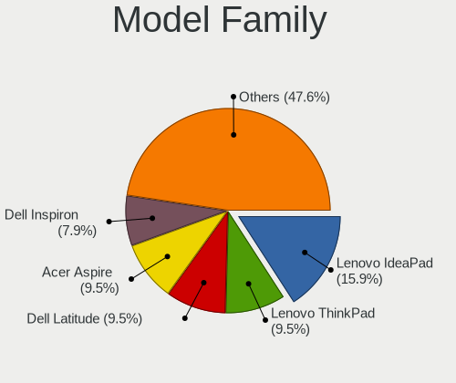

| Name                         | Notebooks | Percent |
|------------------------------|-----------|---------|
| Lenovo IdeaPad               | 10        | 16.39%  |
| Lenovo ThinkPad              | 6         | 9.84%   |
| Acer Aspire                  | 6         | 9.84%   |
| Dell Latitude                | 5         | 8.2%    |
| Dell Inspiron                | 5         | 8.2%    |
| HP Pavilion                  | 4         | 6.56%   |
| HP ProBook                   | 2         | 3.28%   |
| HP EliteBook                 | 2         | 3.28%   |
| ASUS VivoBook                | 2         | 3.28%   |
| Toshiba Satellite            | 1         | 1.64%   |
| Sony VPCEH10EB               | 1         | 1.64%   |
| Razer Blade                  | 1         | 1.64%   |
| Lenovo Z70-80                | 1         | 1.64%   |
| Lenovo Y50-70                | 1         | 1.64%   |
| Lenovo G570                  | 1         | 1.64%   |
| Lenovo G470                  | 1         | 1.64%   |
| HUAWEI MRC-WX0               | 1         | 1.64%   |
| Dell Studio                  | 1         | 1.64%   |
| Dell Precision               | 1         | 1.64%   |
| Dell G7                      | 1         | 1.64%   |
| CyberPowerPC Tracer          | 1         | 1.64%   |
| Avell High Performance G1550 | 1         | 1.64%   |
| Avell High Performance A62   | 1         | 1.64%   |
| ASUS X555YI                  | 1         | 1.64%   |
| ASUS X540SA                  | 1         | 1.64%   |
| ASUS UX430UAR                | 1         | 1.64%   |
| Acer Swift                   | 1         | 1.64%   |
| Acer Extensa                 | 1         | 1.64%   |

MFG Year
--------

Motherboard manufacture year

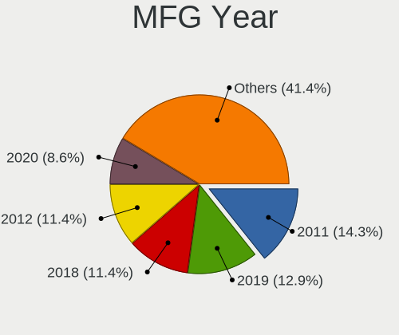

| Year | Notebooks | Percent |
|------|-----------|---------|
| 2019 | 9         | 14.75%  |
| 2012 | 8         | 13.11%  |
| 2011 | 8         | 13.11%  |
| 2018 | 6         | 9.84%   |
| 2020 | 5         | 8.2%    |
| 2013 | 5         | 8.2%    |
| 2009 | 5         | 8.2%    |
| 2016 | 4         | 6.56%   |
| 2015 | 3         | 4.92%   |
| 2014 | 3         | 4.92%   |
| 2010 | 3         | 4.92%   |
| 2021 | 1         | 1.64%   |
| 2017 | 1         | 1.64%   |

Form Factor
-----------

Physical design of the computer

| Name     | Notebooks | Percent |
|----------|-----------|---------|
| Notebook | 61        | 100%    |

Secure Boot
-----------

Enabled or disabled

| State    | Notebooks | Percent |
|----------|-----------|---------|
| Disabled | 61        | 100%    |

Coreboot
--------

Have coreboot on board

| Used | Notebooks | Percent |
|------|-----------|---------|
| No   | 61        | 100%    |

RAM Size
--------

Total RAM memory

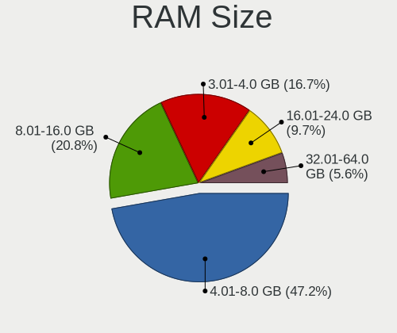

| Size in GB | Notebooks | Percent |
|------------|-----------|---------|
| 4.01-8.0   | 28        | 45.9%   |
| 3.01-4.0   | 12        | 19.67%  |
| 8.01-16.0  | 12        | 19.67%  |
| 16.01-24.0 | 5         | 8.2%    |
| 32.01-64.0 | 4         | 6.56%   |

RAM Used
--------

Used RAM memory

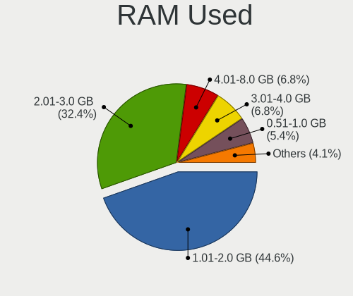

| Used GB   | Notebooks | Percent |
|-----------|-----------|---------|
| 1.01-2.0  | 30        | 46.88%  |
| 2.01-3.0  | 21        | 32.81%  |
| 3.01-4.0  | 5         | 7.81%   |
| 0.51-1.0  | 4         | 6.25%   |
| 4.01-8.0  | 3         | 4.69%   |
| 8.01-16.0 | 1         | 1.56%   |

Total Drives
------------

Number of drives on board

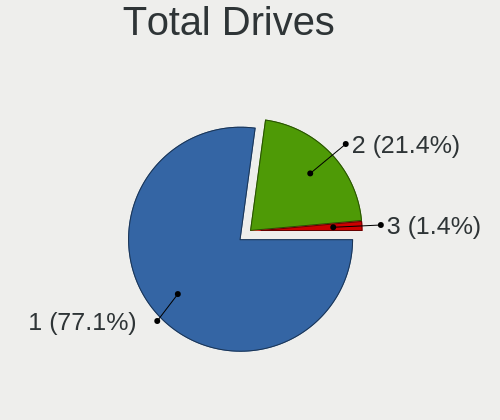

| Drives | Notebooks | Percent |
|--------|-----------|---------|
| 1      | 48        | 77.42%  |
| 2      | 13        | 20.97%  |
| 3      | 1         | 1.61%   |

Has CD-ROM
----------

Has CD-ROM on board

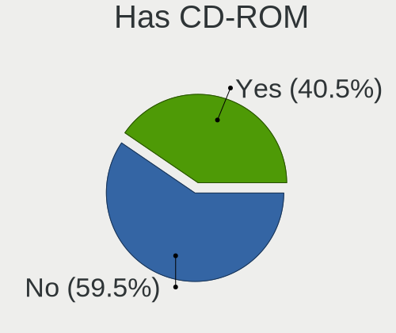

| Presented | Notebooks | Percent |
|-----------|-----------|---------|
| No        | 33        | 54.1%   |
| Yes       | 28        | 45.9%   |

Has Ethernet
------------

Has Ethernet on board

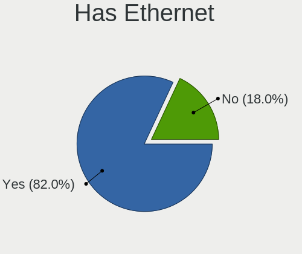

| Presented | Notebooks | Percent |
|-----------|-----------|---------|
| Yes       | 50        | 81.97%  |
| No        | 11        | 18.03%  |

Has WiFi
--------

Has WiFi module

| Presented | Notebooks | Percent |
|-----------|-----------|---------|
| Yes       | 61        | 100%    |

Has Bluetooth
-------------

Has Bluetooth module

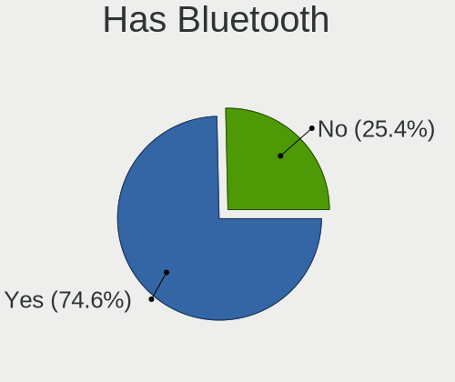

| Presented | Notebooks | Percent |
|-----------|-----------|---------|
| Yes       | 44        | 72.13%  |
| No        | 17        | 27.87%  |

Location
--------

Country
-------

Geographic location (country)

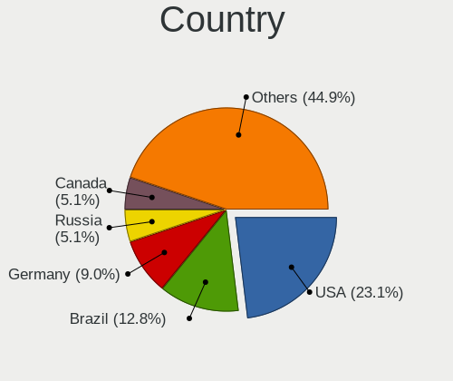

| Country     | Notebooks | Percent |
|-------------|-----------|---------|
| USA         | 13        | 21.31%  |
| Brazil      | 9         | 14.75%  |
| Germany     | 5         | 8.2%    |
| Russia      | 4         | 6.56%   |
| Australia   | 4         | 6.56%   |
| Spain       | 3         | 4.92%   |
| Canada      | 3         | 4.92%   |
| Turkey      | 2         | 3.28%   |
| Poland      | 2         | 3.28%   |
| Netherlands | 2         | 3.28%   |
| Mexico      | 2         | 3.28%   |
| Estonia     | 2         | 3.28%   |
| UK          | 1         | 1.64%   |
| Switzerland | 1         | 1.64%   |
| Sweden      | 1         | 1.64%   |
| Portugal    | 1         | 1.64%   |
| Finland     | 1         | 1.64%   |
| Czechia     | 1         | 1.64%   |
| Costa Rica  | 1         | 1.64%   |
| Chile       | 1         | 1.64%   |
| Benin       | 1         | 1.64%   |
| Belgium     | 1         | 1.64%   |

City
----

Geographic location (city)

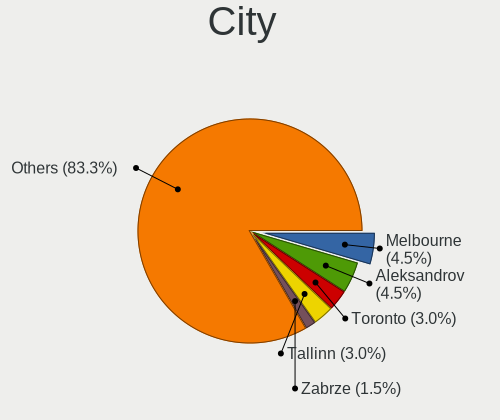

| City              | Notebooks | Percent |
|-------------------|-----------|---------|
| Melbourne         | 3         | 4.84%   |
| Aleksandrov       | 3         | 4.84%   |
| Toronto           | 2         | 3.23%   |
| Tallinn           | 2         | 3.23%   |
| Zabrze            | 1         | 1.61%   |
| Yadrin            | 1         | 1.61%   |
| Warsaw            | 1         | 1.61%   |
| Villahermosa      | 1         | 1.61%   |
| Tres Cantos       | 1         | 1.61%   |
| The Hague         | 1         | 1.61%   |
| Sao Paulo         | 1         | 1.61%   |
| Santiago          | 1         | 1.61%   |
| Roebel            | 1         | 1.61%   |
| Potts Camp        | 1         | 1.61%   |
| Portsmouth        | 1         | 1.61%   |
| Porto Uniao       | 1         | 1.61%   |
| Orem              | 1         | 1.61%   |
| North Bay         | 1         | 1.61%   |
| Nijmegen          | 1         | 1.61%   |
| Newport News      | 1         | 1.61%   |
| New Orleans       | 1         | 1.61%   |
| Mogi Mirim        | 1         | 1.61%   |
| Mexico City       | 1         | 1.61%   |
| Madrid            | 1         | 1.61%   |
| Limeira           | 1         | 1.61%   |
| Lagoa Santa       | 1         | 1.61%   |
| Kestel            | 1         | 1.61%   |
| Kapellen          | 1         | 1.61%   |
| Jonschwil         | 1         | 1.61%   |
| Jever             | 1         | 1.61%   |
| Jacksonville      | 1         | 1.61%   |
| Itauna            | 1         | 1.61%   |
| Istanbul          | 1         | 1.61%   |
| Irvine            | 1         | 1.61%   |
| Hobart            | 1         | 1.61%   |
| Heredia           | 1         | 1.61%   |
| Helsinki          | 1         | 1.61%   |
| Havlíčkův Brod | 1         | 1.61%   |
| Garden Grove      | 1         | 1.61%   |
| Freudenstadt      | 1         | 1.61%   |
| Erie              | 1         | 1.61%   |
| Embu              | 1         | 1.61%   |
| Elorrio           | 1         | 1.61%   |
| Eksjoe            | 1         | 1.61%   |
| Darmstadt         | 1         | 1.61%   |
| Cotonou           | 1         | 1.61%   |
| Columbus          | 1         | 1.61%   |
| Chagrin Falls     | 1         | 1.61%   |
| Cariacica         | 1         | 1.61%   |
| Cardenas          | 1         | 1.61%   |
| Buffalo           | 1         | 1.61%   |
| Brasília         | 1         | 1.61%   |
| Binghamton        | 1         | 1.61%   |
| Berlin            | 1         | 1.61%   |
| Barrow            | 1         | 1.61%   |
| Albufeira         | 1         | 1.61%   |

Drives
------

Drive Vendor
------------

Hard drive vendors

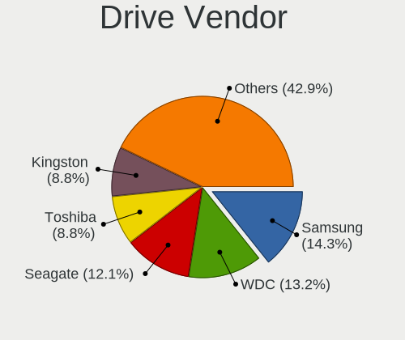

| Vendor              | Notebooks | Drives | Percent |
|---------------------|-----------|--------|---------|
| WDC                 | 11        | 11     | 15.07%  |
| Seagate             | 11        | 13     | 15.07%  |
| Samsung Electronics | 11        | 15     | 15.07%  |
| Toshiba             | 7         | 8      | 9.59%   |
| Unknown             | 4         | 4      | 5.48%   |
| Kingston            | 4         | 5      | 5.48%   |
| Crucial             | 4         | 4      | 5.48%   |
| SanDisk             | 3         | 3      | 4.11%   |
| Intel               | 3         | 3      | 4.11%   |
| HGST                | 3         | 3      | 4.11%   |
| SK hynix            | 2         | 2      | 2.74%   |
| Transcend           | 1         | 1      | 1.37%   |
| SPCC                | 1         | 2      | 1.37%   |
| Patriot             | 1         | 1      | 1.37%   |
| OYUNKEY             | 1         | 1      | 1.37%   |
| Micron Technology   | 1         | 1      | 1.37%   |
| LITEONIT            | 1         | 1      | 1.37%   |
| Hitachi             | 1         | 1      | 1.37%   |
| EMTEC               | 1         | 2      | 1.37%   |
| Dell                | 1         | 1      | 1.37%   |
| ADATA Technology    | 1         | 1      | 1.37%   |

Drive Model
-----------

Hard drive models

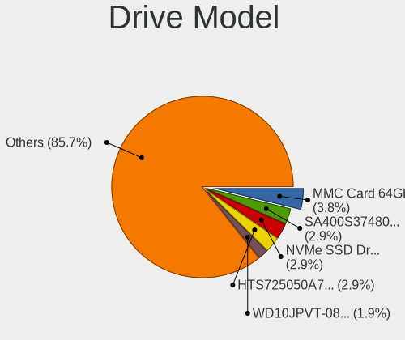

| Model                                  | Notebooks | Percent |
|----------------------------------------|-----------|---------|
| Unknown MMC Card  64GB                 | 3         | 3.95%   |
| Intel NVMe SSD Drive 512GB             | 3         | 3.95%   |
| WDC WD10JPVT-08A1YT2 1TB               | 2         | 2.63%   |
| SK hynix NVMe SSD Drive 256GB          | 2         | 2.63%   |
| Seagate ST9500325AS 500GB              | 2         | 2.63%   |
| Seagate ST500LT012-1DG142 500GB        | 2         | 2.63%   |
| Seagate ST1000LM024 HN-M101MBB 1TB     | 2         | 2.63%   |
| Kingston SA400S37480G 480GB SSD        | 2         | 2.63%   |
| HGST HTS725050A7E630 500GB             | 2         | 2.63%   |
| WDC WDS500G2B0A-00SM50 500GB SSD       | 1         | 1.32%   |
| WDC WDS240G2G0B-00EPW0 240GB SSD       | 1         | 1.32%   |
| WDC WD7500LPCX-60HWST0 752GB           | 1         | 1.32%   |
| WDC WD5000LPVX-22V0TT0 500GB           | 1         | 1.32%   |
| WDC WD5000LPCX-00VHAT0 500GB           | 1         | 1.32%   |
| WDC WD3200BEVT-22ZCT0 320GB            | 1         | 1.32%   |
| WDC WD10SPZX-22Z10T0 1TB               | 1         | 1.32%   |
| WDC WD10JPVX-22JC3T0 1TB               | 1         | 1.32%   |
| WDC WD10JPCX-24UE4T0 1TB               | 1         | 1.32%   |
| Unknown SD/MMC/MS PRO 128GB            | 1         | 1.32%   |
| Transcend TS1TSSD230S 1024GB           | 1         | 1.32%   |
| Toshiba TR200 240GB SSD                | 1         | 1.32%   |
| Toshiba NVMe SSD Drive 512GB           | 1         | 1.32%   |
| Toshiba MQ01ABD100M 1TB                | 1         | 1.32%   |
| Toshiba MQ01ABD075 752GB               | 1         | 1.32%   |
| Toshiba MK5065GSXN 500GB               | 1         | 1.32%   |
| Toshiba MK3265GSX 320GB                | 1         | 1.32%   |
| Toshiba KBG30ZMS256G NVMe 256GB        | 1         | 1.32%   |
| SPCC Solid State Disk 256GB            | 1         | 1.32%   |
| Seagate ST9500420AS 500GB              | 1         | 1.32%   |
| Seagate ST9320423AS 320GB              | 1         | 1.32%   |
| Seagate ST500LT012-9WS142 500GB        | 1         | 1.32%   |
| Seagate ST1000LX015-1U7172 1TB         | 1         | 1.32%   |
| Seagate ST1000LM035-1RK1 1TB           | 1         | 1.32%   |
| Seagate Expansion 1TB                  | 1         | 1.32%   |
| SanDisk SSD PLUS 240 GB                | 1         | 1.32%   |
| SanDisk SD9SN8W512G1002 512GB SSD      | 1         | 1.32%   |
| SanDisk SD8SBBU480G1122 480GB SSD      | 1         | 1.32%   |
| Samsung SSD 860 PRO 512GB              | 1         | 1.32%   |
| Samsung SSD 860 PRO 1TB                | 1         | 1.32%   |
| Samsung SSD 850 EVO 250GB              | 1         | 1.32%   |
| Samsung SSD 840 PRO Series 128GB       | 1         | 1.32%   |
| Samsung SSD 840 EVO 750GB              | 1         | 1.32%   |
| Samsung SSD 840 EVO 120GB              | 1         | 1.32%   |
| Samsung SM963 2.5" NVMe PCIe SSD 500GB | 1         | 1.32%   |
| Samsung NVMe SSD Drive 512GB           | 1         | 1.32%   |
| Samsung NVMe SSD Drive 256GB           | 1         | 1.32%   |
| Samsung NVMe SSD Drive 1024GB          | 1         | 1.32%   |
| Samsung MZVLB512HBJQ-000L2 512GB       | 1         | 1.32%   |
| Samsung MZNLN128HAHQ-000H1 128GB SSD   | 1         | 1.32%   |
| Samsung HM321HI 320GB                  | 1         | 1.32%   |
| Patriot Burst 480GB SSD                | 1         | 1.32%   |
| OYUNKEY 480GB                          | 1         | 1.32%   |
| Micron NVMe SSD Drive 256GB            | 1         | 1.32%   |
| LITEONIT LCS-256M6S 256GB SSD          | 1         | 1.32%   |
| Kingston SV300S37A240G 240GB SSD       | 1         | 1.32%   |
| Kingston SA400S37960G 960GB SSD        | 1         | 1.32%   |
| Hitachi HTS725032A9A364 320GB          | 1         | 1.32%   |
| HGST HTS541010B7E610 1TB               | 1         | 1.32%   |
| EMTEC X200 256GB                       | 1         | 1.32%   |
| Dell SD1-U0250 256GB                   | 1         | 1.32%   |

HDD Vendor
----------

Hard disk drive vendors

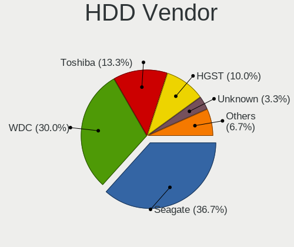

| Vendor              | Notebooks | Drives | Percent |
|---------------------|-----------|--------|---------|
| Seagate             | 11        | 13     | 36.67%  |
| WDC                 | 9         | 9      | 30%     |
| Toshiba             | 4         | 5      | 13.33%  |
| HGST                | 3         | 3      | 10%     |
| Unknown             | 1         | 1      | 3.33%   |
| Samsung Electronics | 1         | 1      | 3.33%   |
| Hitachi             | 1         | 1      | 3.33%   |

SSD Vendor
----------

Solid state drive vendors

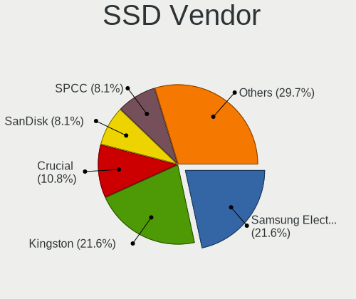

| Vendor              | Notebooks | Drives | Percent |
|---------------------|-----------|--------|---------|
| Samsung Electronics | 6         | 9      | 25%     |
| Kingston            | 4         | 5      | 16.67%  |
| Crucial             | 4         | 4      | 16.67%  |
| SanDisk             | 3         | 3      | 12.5%   |
| WDC                 | 2         | 2      | 8.33%   |
| Transcend           | 1         | 1      | 4.17%   |
| Toshiba             | 1         | 1      | 4.17%   |
| SPCC                | 1         | 2      | 4.17%   |
| Patriot             | 1         | 1      | 4.17%   |
| LITEONIT            | 1         | 1      | 4.17%   |

Drive Kind
----------

HDD or SSD

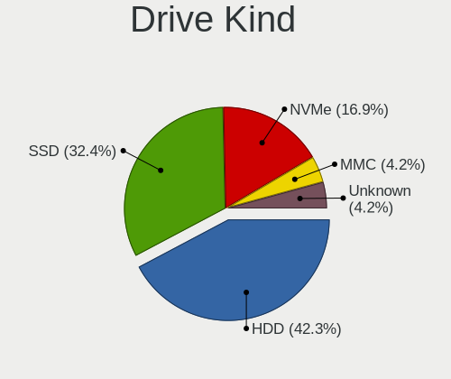

| Kind    | Notebooks | Drives | Percent |
|---------|-----------|--------|---------|
| HDD     | 30        | 33     | 41.67%  |
| SSD     | 23        | 29     | 31.94%  |
| NVMe    | 13        | 14     | 18.06%  |
| MMC     | 3         | 3      | 4.17%   |
| Unknown | 3         | 4      | 4.17%   |

Drive Connector
---------------

SATA, SAS, NVMe, etc.

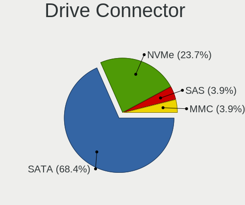

| Type | Notebooks | Drives | Percent |
|------|-----------|--------|---------|
| SATA | 48        | 61     | 71.64%  |
| NVMe | 13        | 14     | 19.4%   |
| SAS  | 3         | 5      | 4.48%   |
| MMC  | 3         | 3      | 4.48%   |

Drive Size
----------

Size of hard drive

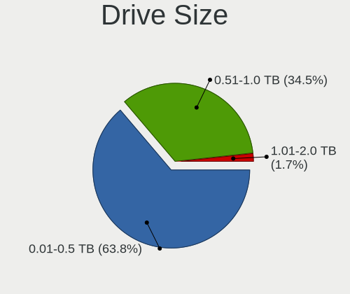

| Size in TB | Notebooks | Drives | Percent |
|------------|-----------|--------|---------|
| 0.01-0.5   | 34        | 37     | 61.82%  |
| 0.51-1.0   | 19        | 22     | 34.55%  |
| 1.01-2.0   | 2         | 3      | 3.64%   |

Space Total
-----------

Amount of disk space available on the file system

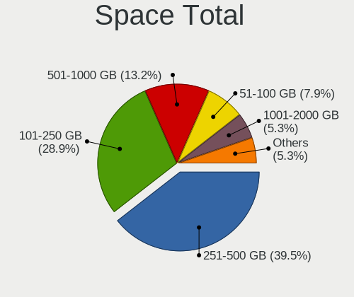

| Size in GB | Notebooks | Percent |
|------------|-----------|---------|
| 251-500    | 27        | 41.54%  |
| 101-250    | 17        | 26.15%  |
| 501-1000   | 9         | 13.85%  |
| 51-100     | 6         | 9.23%   |
| 1001-2000  | 3         | 4.62%   |
| Unknown    | 3         | 4.62%   |

Space Used
----------

Amount of used disk space

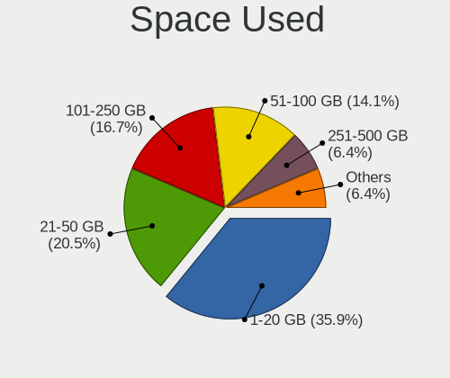

| Used GB  | Notebooks | Percent |
|----------|-----------|---------|
| 1-20     | 24        | 36.92%  |
| 21-50    | 13        | 20%     |
| 101-250  | 12        | 18.46%  |
| 51-100   | 8         | 12.31%  |
| 251-500  | 4         | 6.15%   |
| Unknown  | 3         | 4.62%   |
| 501-1000 | 1         | 1.54%   |

Malfunc. Drives
---------------

Drive models with a malfunction

Zero info for selected period =(

Malfunc. Drive Vendor
---------------------

Vendors of faulty drives

Zero info for selected period =(

Malfunc. HDD Vendor
-------------------

Vendors of faulty HDD drives

Zero info for selected period =(

Malfunc. Drive Kind
-------------------

Kinds of faulty drives

Zero info for selected period =(

Failed Drives
-------------

Failed drive models

Zero info for selected period =(

Failed Drive Vendor
-------------------

Failed drive vendors

Zero info for selected period =(

Drive Status
------------

Number of failed and malfunc. drives

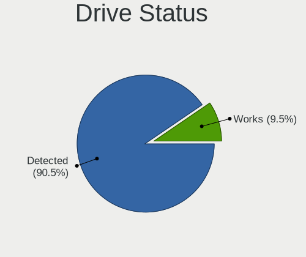

| Status   | Notebooks | Drives | Percent |
|----------|-----------|--------|---------|
| Detected | 57        | 76     | 90.48%  |
| Works    | 6         | 7      | 9.52%   |

Storage controller
------------------

Storage Vendor
--------------

Storage controller vendors

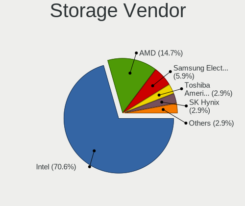

| Vendor                       | Notebooks | Percent |
|------------------------------|-----------|---------|
| Intel                        | 48        | 70.59%  |
| AMD                          | 10        | 14.71%  |
| Samsung Electronics          | 4         | 5.88%   |
| Toshiba America Info Systems | 2         | 2.94%   |
| SK hynix                     | 2         | 2.94%   |
| Micron Technology            | 1         | 1.47%   |
| ADATA Technology             | 1         | 1.47%   |

Storage Model
-------------

Storage controller models

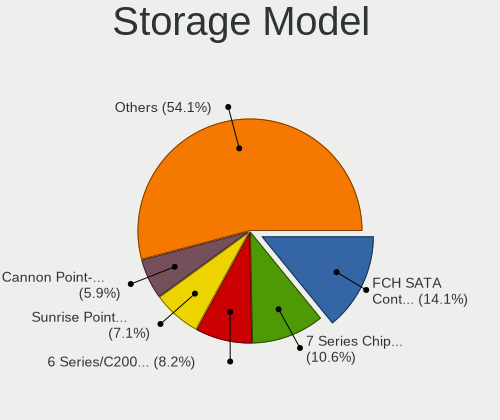

| Model                                                                                  | Notebooks | Percent |
|----------------------------------------------------------------------------------------|-----------|---------|
| AMD FCH SATA Controller [AHCI mode]                                                    | 9         | 13.04%  |
| Intel 7 Series Chipset Family 6-port SATA Controller [AHCI mode]                       | 8         | 11.59%  |
| Intel 6 Series/C200 Series Chipset Family 6 port Mobile SATA AHCI Controller           | 7         | 10.14%  |
| Intel Sunrise Point-LP SATA Controller [AHCI mode]                                     | 5         | 7.25%   |
| Intel Cannon Point-LP SATA Controller [AHCI Mode]                                      | 5         | 7.25%   |
| Intel 5 Series/3400 Series Chipset 6 port SATA AHCI Controller                         | 4         | 5.8%    |
| Samsung NVMe SSD Controller SM981/PM981/PM983                                          | 3         | 4.35%   |
| Intel 82801 Mobile SATA Controller [RAID mode]                                         | 3         | 4.35%   |
| SK hynix BC501 NVMe Solid State Drive                                                  | 2         | 2.9%    |
| Intel SSD 660P Series                                                                  | 2         | 2.9%    |
| Intel Cannon Lake Mobile PCH SATA AHCI Controller                                      | 2         | 2.9%    |
| Intel 82801IBM/IEM (ICH9M/ICH9M-E) 4 port SATA Controller [AHCI mode]                  | 2         | 2.9%    |
| Intel 8 Series/C220 Series Chipset Family 6-port SATA Controller 1 [AHCI mode]         | 2         | 2.9%    |
| Intel 8 Series SATA Controller 1 [AHCI mode]                                           | 2         | 2.9%    |
| Toshiba America Info Systems XG6 NVMe SSD Controller                                   | 1         | 1.45%   |
| Toshiba America Info Systems BG3 NVMe SSD Controller                                   | 1         | 1.45%   |
| Samsung NVMe SSD Controller 980                                                        | 1         | 1.45%   |
| Micron Non-Volatile memory controller                                                  | 1         | 1.45%   |
| Intel Wildcat Point-LP SATA Controller [AHCI Mode]                                     | 1         | 1.45%   |
| Intel HM170/QM170 Chipset SATA Controller [AHCI Mode]                                  | 1         | 1.45%   |
| Intel Atom/Celeron/Pentium Processor x5-E8000/J3xxx/N3xxx Series SATA Controller       | 1         | 1.45%   |
| Intel Atom Processor E3800 Series SATA AHCI Controller                                 | 1         | 1.45%   |
| Intel 6 Series/C200 Series Chipset Family Mobile SATA Controller (IDE mode, ports 4-5) | 1         | 1.45%   |
| Intel 6 Series/C200 Series Chipset Family Mobile SATA Controller (IDE mode, ports 0-3) | 1         | 1.45%   |
| Intel 400 Series Chipset Family SATA AHCI Controller                                   | 1         | 1.45%   |
| AMD SB7x0/SB8x0/SB9x0 SATA Controller [AHCI mode]                                      | 1         | 1.45%   |
| ADATA Non-Volatile memory controller                                                   | 1         | 1.45%   |

Storage Kind
------------

Kind of storage controller (IDE, SATA, NVMe, SAS, ...)

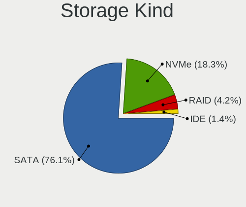

| Kind | Notebooks | Percent |
|------|-----------|---------|
| SATA | 52        | 76.47%  |
| NVMe | 12        | 17.65%  |
| RAID | 3         | 4.41%   |
| IDE  | 1         | 1.47%   |

Processor
---------

CPU Vendor
----------

Processor vendors

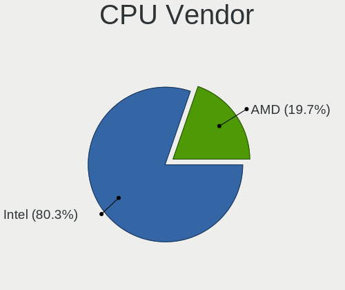

| Vendor | Notebooks | Percent |
|--------|-----------|---------|
| Intel  | 50        | 81.97%  |
| AMD    | 11        | 18.03%  |

CPU Model
---------

Processor models

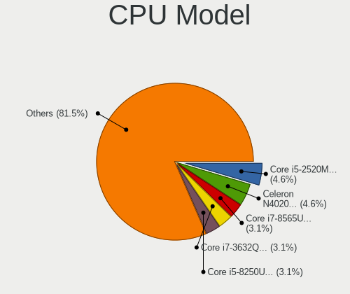

| Model                                         | Notebooks | Percent |
|-----------------------------------------------|-----------|---------|
| Intel Core i5-2520M CPU @ 2.50GHz             | 3         | 4.92%   |
| Intel Celeron N4020 CPU @ 1.10GHz             | 3         | 4.92%   |
| Intel Core i7-8565U CPU @ 1.80GHz             | 2         | 3.28%   |
| Intel Core i7-3632QM CPU @ 2.20GHz            | 2         | 3.28%   |
| Intel Core i5-8250U CPU @ 1.60GHz             | 2         | 3.28%   |
| Intel Core i5-3230M CPU @ 2.60GHz             | 2         | 3.28%   |
| Intel Core i5-3210M CPU @ 2.50GHz             | 2         | 3.28%   |
| Intel Core i5 CPU M 520 @ 2.40GHz             | 2         | 3.28%   |
| AMD Ryzen 7 3700U with Radeon Vega Mobile Gfx | 2         | 3.28%   |
| Intel Pentium Dual-Core CPU T4300 @ 2.10GHz   | 1         | 1.64%   |
| Intel Pentium CPU N3530 @ 2.16GHz             | 1         | 1.64%   |
| Intel Pentium CPU 5405U @ 2.30GHz             | 1         | 1.64%   |
| Intel Core i7-9750H CPU @ 2.60GHz             | 1         | 1.64%   |
| Intel Core i7-8750H CPU @ 2.20GHz             | 1         | 1.64%   |
| Intel Core i7-8550U CPU @ 1.80GHz             | 1         | 1.64%   |
| Intel Core i7-7500U CPU @ 2.70GHz             | 1         | 1.64%   |
| Intel Core i7-6700HQ CPU @ 2.60GHz            | 1         | 1.64%   |
| Intel Core i7-4710HQ CPU @ 2.50GHz            | 1         | 1.64%   |
| Intel Core i7-4600M CPU @ 2.90GHz             | 1         | 1.64%   |
| Intel Core i7-3740QM CPU @ 2.70GHz            | 1         | 1.64%   |
| Intel Core i7-3520M CPU @ 2.90GHz             | 1         | 1.64%   |
| Intel Core i7-2720QM CPU @ 2.20GHz            | 1         | 1.64%   |
| Intel Core i7-10750H CPU @ 2.60GHz            | 1         | 1.64%   |
| Intel Core i7 CPU Q 720 @ 1.60GHz             | 1         | 1.64%   |
| Intel Core i7 CPU M 620 @ 2.67GHz             | 1         | 1.64%   |
| Intel Core i5-8365U CPU @ 1.60GHz             | 1         | 1.64%   |
| Intel Core i5-8300H CPU @ 2.30GHz             | 1         | 1.64%   |
| Intel Core i5-8265U CPU @ 1.60GHz             | 1         | 1.64%   |
| Intel Core i5-7200U CPU @ 2.50GHz             | 1         | 1.64%   |
| Intel Core i5-3337U CPU @ 1.80GHz             | 1         | 1.64%   |
| Intel Core i5-2430M CPU @ 2.40GHz             | 1         | 1.64%   |
| Intel Core i5-2410M CPU @ 2.30GHz             | 1         | 1.64%   |
| Intel Core i5 CPU M 540 @ 2.53GHz             | 1         | 1.64%   |
| Intel Core i3-5005U CPU @ 2.00GHz             | 1         | 1.64%   |
| Intel Core i3-4010U CPU @ 1.70GHz             | 1         | 1.64%   |
| Intel Core i3-4005U CPU @ 1.70GHz             | 1         | 1.64%   |
| Intel Core i3-2330M CPU @ 2.20GHz             | 1         | 1.64%   |
| Intel Core i3-2310M CPU @ 2.10GHz             | 1         | 1.64%   |
| Intel Core 2 Duo CPU T6500 @ 2.10GHz          | 1         | 1.64%   |
| Intel Celeron CPU N3050 @ 1.60GHz             | 1         | 1.64%   |
| Intel Celeron CPU B820 @ 1.70GHz              | 1         | 1.64%   |
| AMD Ryzen 5 5600H with Radeon Graphics        | 1         | 1.64%   |
| AMD Ryzen 5 4500U with Radeon Graphics        | 1         | 1.64%   |
| AMD Ryzen 5 3500U with Radeon Vega Mobile Gfx | 1         | 1.64%   |
| AMD Ryzen 5 2500U with Radeon Vega Mobile Gfx | 1         | 1.64%   |
| AMD Ryzen 3 3200U with Radeon Vega Mobile Gfx | 1         | 1.64%   |
| AMD E-300 APU with Radeon HD Graphics         | 1         | 1.64%   |
| AMD A9-9410 RADEON R5, 5 COMPUTE CORES 2C+3G  | 1         | 1.64%   |
| AMD A8-7410 APU with AMD Radeon R5 Graphics   | 1         | 1.64%   |
| AMD A8-6410 APU with AMD Radeon R5 Graphics   | 1         | 1.64%   |

CPU Model Family
----------------

Processor model prefix

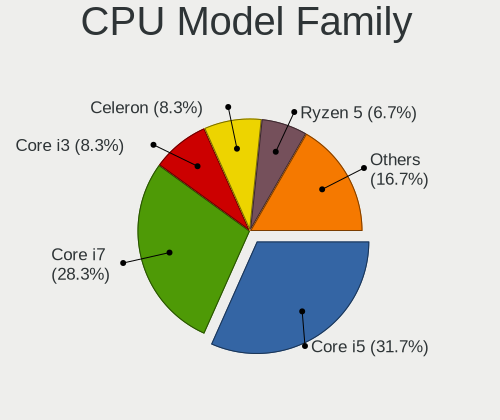

| Model                   | Notebooks | Percent |
|-------------------------|-----------|---------|
| Intel Core i5           | 19        | 31.15%  |
| Intel Core i7           | 17        | 27.87%  |
| Intel Core i3           | 5         | 8.2%    |
| Intel Celeron           | 5         | 8.2%    |
| AMD Ryzen 5             | 4         | 6.56%   |
| Intel Pentium           | 2         | 3.28%   |
| AMD Ryzen 7             | 2         | 3.28%   |
| AMD A8                  | 2         | 3.28%   |
| Other                   | 1         | 1.64%   |
| Intel Pentium Dual-Core | 1         | 1.64%   |
| Intel Core 2 Duo        | 1         | 1.64%   |
| AMD Ryzen 3             | 1         | 1.64%   |
| AMD E                   | 1         | 1.64%   |

CPU Cores
---------

Number of processor cores

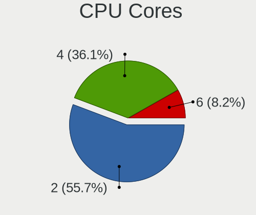

| Number | Notebooks | Percent |
|--------|-----------|---------|
| 2      | 34        | 55.74%  |
| 4      | 22        | 36.07%  |
| 6      | 5         | 8.2%    |

CPU Sockets
-----------

Number of sockets

| Number | Notebooks | Percent |
|--------|-----------|---------|
| 1      | 61        | 100%    |

CPU Threads
-----------

Threads per core (Hyper-Threading)

| Number | Notebooks | Percent |
|--------|-----------|---------|
| 2      | 48        | 78.69%  |
| 1      | 13        | 21.31%  |

CPU Op-Modes
------------

CPU Operation Modes (32-bit, 64-bit)

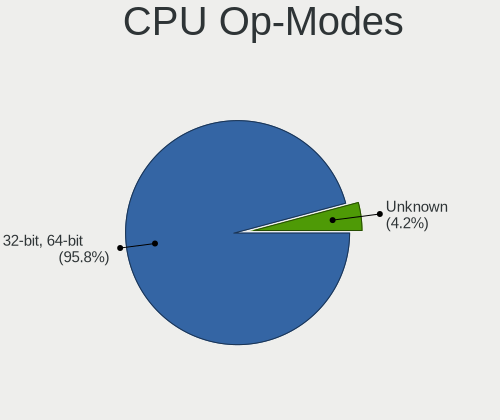

| Op mode        | Notebooks | Percent |
|----------------|-----------|---------|
| 32-bit, 64-bit | 58        | 95.08%  |
| Unknown        | 3         | 4.92%   |

CPU Microcode
-------------

Microcode number

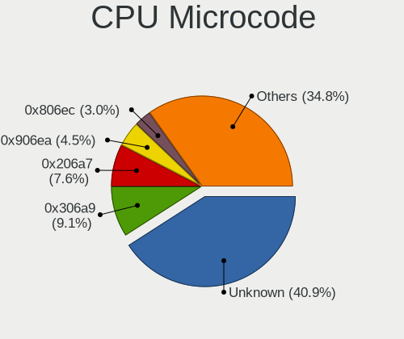

| Number     | Notebooks | Percent |
|------------|-----------|---------|
| Unknown    | 24        | 38.71%  |
| 0x306a9    | 6         | 9.68%   |
| 0x206a7    | 5         | 8.06%   |
| 0x906ea    | 3         | 4.84%   |
| 0x806ec    | 2         | 3.23%   |
| 0x806eb    | 2         | 3.23%   |
| 0x806e9    | 2         | 3.23%   |
| 0x40651    | 2         | 3.23%   |
| 0x306c3    | 2         | 3.23%   |
| 0x20655    | 2         | 3.23%   |
| 0x1067a    | 2         | 3.23%   |
| 0x806ea    | 1         | 1.61%   |
| 0x406c3    | 1         | 1.61%   |
| 0x306d4    | 1         | 1.61%   |
| 0x20652    | 1         | 1.61%   |
| 0x106e5    | 1         | 1.61%   |
| 0x08600102 | 1         | 1.61%   |
| 0x0810100b | 1         | 1.61%   |
| 0x07030106 | 1         | 1.61%   |
| 0x06006704 | 1         | 1.61%   |
| 0x05000119 | 1         | 1.61%   |

CPU Microarch
-------------

Microarchitecture

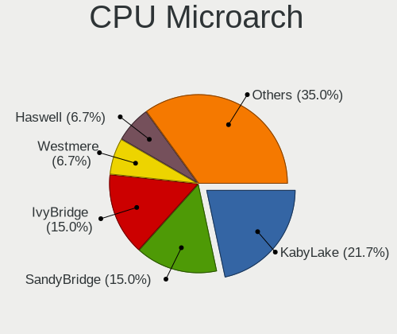

| Name          | Notebooks | Percent |
|---------------|-----------|---------|
| KabyLake      | 13        | 21.31%  |
| SandyBridge   | 9         | 14.75%  |
| IvyBridge     | 9         | 14.75%  |
| Zen+          | 4         | 6.56%   |
| Westmere      | 4         | 6.56%   |
| Haswell       | 4         | 6.56%   |
| Goldmont plus | 3         | 4.92%   |
| Silvermont    | 2         | 3.28%   |
| Puma          | 2         | 3.28%   |
| Penryn        | 2         | 3.28%   |
| Zen 3         | 1         | 1.64%   |
| Zen 2         | 1         | 1.64%   |
| Zen           | 1         | 1.64%   |
| Skylake       | 1         | 1.64%   |
| Nehalem       | 1         | 1.64%   |
| Excavator     | 1         | 1.64%   |
| CometLake     | 1         | 1.64%   |
| Broadwell     | 1         | 1.64%   |
| Bobcat        | 1         | 1.64%   |

Graphics
--------

GPU Vendor
----------

Vendors of graphics cards

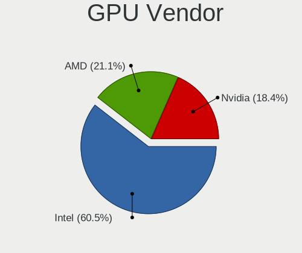

| Vendor | Notebooks | Percent |
|--------|-----------|---------|
| Intel  | 46        | 60.53%  |
| AMD    | 16        | 21.05%  |
| Nvidia | 14        | 18.42%  |

GPU Model
---------

Graphics card models

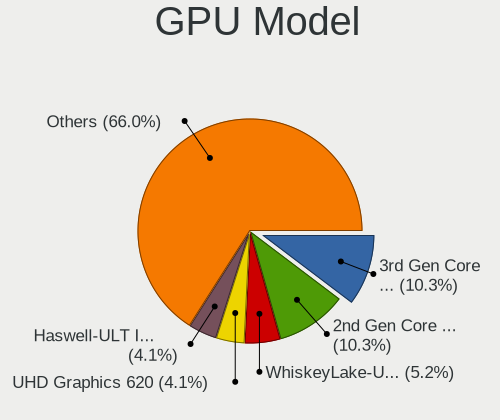

| Model                                                                                    | Notebooks | Percent |
|------------------------------------------------------------------------------------------|-----------|---------|
| Intel 2nd Generation Core Processor Family Integrated Graphics Controller                | 9         | 11.54%  |
| Intel 3rd Gen Core processor Graphics Controller                                         | 8         | 10.26%  |
| Intel WhiskeyLake-U GT2 [UHD Graphics 620]                                               | 4         | 5.13%   |
| AMD Picasso/Raven 2 [Radeon Vega Series / Radeon Vega Mobile Series]                     | 4         | 5.13%   |
| Intel UHD Graphics 620                                                                   | 3         | 3.85%   |
| Intel GeminiLake [UHD Graphics 600]                                                      | 3         | 3.85%   |
| Intel Core Processor Integrated Graphics Controller                                      | 3         | 3.85%   |
| Intel CoffeeLake-H GT2 [UHD Graphics 630]                                                | 3         | 3.85%   |
| AMD Thames [Radeon HD 7500M/7600M Series]                                                | 3         | 3.85%   |
| Intel HD Graphics 620                                                                    | 2         | 2.56%   |
| Intel Haswell-ULT Integrated Graphics Controller                                         | 2         | 2.56%   |
| Intel 4th Gen Core Processor Integrated Graphics Controller                              | 2         | 2.56%   |
| AMD Mullins [Radeon R4/R5 Graphics]                                                      | 2         | 2.56%   |
| Nvidia TU117M                                                                            | 1         | 1.28%   |
| Nvidia TU106M [GeForce RTX 2070 Mobile]                                                  | 1         | 1.28%   |
| Nvidia GT218M [NVS 3100M]                                                                | 1         | 1.28%   |
| Nvidia GP108M [GeForce MX150]                                                            | 1         | 1.28%   |
| Nvidia GP107M [GeForce GTX 1050 Ti Mobile]                                               | 1         | 1.28%   |
| Nvidia GP106M [GeForce GTX 1060 Mobile]                                                  | 1         | 1.28%   |
| Nvidia GM206M [GeForce GTX 965M]                                                         | 1         | 1.28%   |
| Nvidia GM107M [GeForce GTX 860M]                                                         | 1         | 1.28%   |
| Nvidia GM107 [GeForce 940MX]                                                             | 1         | 1.28%   |
| Nvidia GK208M [GeForce GT 730M]                                                          | 1         | 1.28%   |
| Nvidia GF117M [GeForce 610M/710M/810M/820M / GT 620M/625M/630M/720M]                     | 1         | 1.28%   |
| Nvidia GF108GLM [Quadro 1000M]                                                           | 1         | 1.28%   |
| Nvidia GF108GLM [NVS 5200M]                                                              | 1         | 1.28%   |
| Nvidia G96CM [GeForce GT 130M]                                                           | 1         | 1.28%   |
| Intel Mobile 4 Series Chipset Integrated Graphics Controller                             | 1         | 1.28%   |
| Intel HD Graphics 5500                                                                   | 1         | 1.28%   |
| Intel HD Graphics 530                                                                    | 1         | 1.28%   |
| Intel CometLake-H GT2 [UHD Graphics]                                                     | 1         | 1.28%   |
| Intel Coffee Lake UHD 610 Graphics Controller                                            | 1         | 1.28%   |
| Intel Atom/Celeron/Pentium Processor x5-E8000/J3xxx/N3xxx Integrated Graphics Controller | 1         | 1.28%   |
| Intel Atom Processor Z36xxx/Z37xxx Series Graphics & Display                             | 1         | 1.28%   |
| AMD Wrestler [Radeon HD 6310]                                                            | 1         | 1.28%   |
| AMD Topaz XT [Radeon R7 M260/M265 / M340/M360 / M440/M445 / 530/535 / 620/625 Mobile]    | 1         | 1.28%   |
| AMD Stoney [Radeon R2/R3/R4/R5 Graphics]                                                 | 1         | 1.28%   |
| AMD RV730/M96 [Mobility Radeon HD 4650/5165]                                             | 1         | 1.28%   |
| AMD Robson CE [Radeon HD 6370M/7370M]                                                    | 1         | 1.28%   |
| AMD Renoir                                                                               | 1         | 1.28%   |
| AMD Raven Ridge [Radeon Vega Series / Radeon Vega Mobile Series]                         | 1         | 1.28%   |
| AMD Jet PRO [Radeon R5 M230 / R7 M260DX / Radeon 520 Mobile]                             | 1         | 1.28%   |
| AMD Cezanne                                                                              | 1         | 1.28%   |

GPU Combo
---------

Combinations of graphics cards

| Name           | Notebooks | Percent |
|----------------|-----------|---------|
| 1 x Intel      | 31        | 50.82%  |
| Intel + Nvidia | 11        | 18.03%  |
| 1 x AMD        | 10        | 16.39%  |
| Intel + AMD    | 4         | 6.56%   |
| 1 x Nvidia     | 3         | 4.92%   |
| 2 x AMD        | 2         | 3.28%   |

GPU Driver
----------

Free vs proprietary

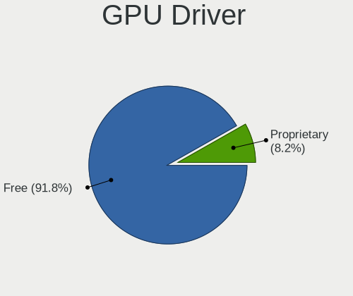

| Driver      | Notebooks | Percent |
|-------------|-----------|---------|
| Free        | 56        | 91.8%   |
| Proprietary | 5         | 8.2%    |

GPU Memory
----------

Total video memory

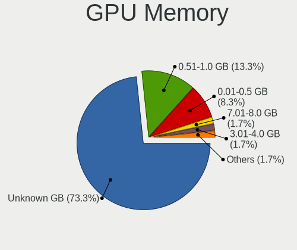

| Size in GB | Notebooks | Percent |
|------------|-----------|---------|
| Unknown    | 45        | 73.77%  |
| 0.51-1.0   | 8         | 13.11%  |
| 0.01-0.5   | 5         | 8.2%    |
| 7.01-8.0   | 1         | 1.64%   |
| 3.01-4.0   | 1         | 1.64%   |
| 1.01-2.0   | 1         | 1.64%   |

Monitor
-------

Monitor Vendor
--------------

Monitor vendors

| Vendor                  | Notebooks | Percent |
|-------------------------|-----------|---------|
| AU Optronics            | 20        | 29.41%  |
| LG Display              | 14        | 20.59%  |
| BOE                     | 8         | 11.76%  |
| Samsung Electronics     | 7         | 10.29%  |
| Chimei Innolux          | 7         | 10.29%  |
| Chi Mei Optoelectronics | 4         | 5.88%   |
| Sharp                   | 1         | 1.47%   |
| Lenovo                  | 1         | 1.47%   |
| InfoVision              | 1         | 1.47%   |
| Hewlett-Packard         | 1         | 1.47%   |
| Goldstar                | 1         | 1.47%   |
| Dell                    | 1         | 1.47%   |
| CSO                     | 1         | 1.47%   |
| AOC                     | 1         | 1.47%   |

Monitor Model
-------------

Monitor models

| Model                                                                    | Notebooks | Percent |
|--------------------------------------------------------------------------|-----------|---------|
| LG Display LCD Monitor LGD033A 1366x768 344x194mm 15.5-inch              | 4         | 5.8%    |
| Chimei Innolux LCD Monitor CMN15E6 1366x768 344x193mm 15.5-inch          | 3         | 4.35%   |
| AU Optronics LCD Monitor AUO723C 1366x768 309x173mm 13.9-inch            | 3         | 4.35%   |
| Chi Mei Optoelectronics LCD Monitor CMO1592 1366x768 344x193mm 15.5-inch | 2         | 2.9%    |
| BOE LCD Monitor BOE0685 1600x900 382x215mm 17.3-inch                     | 2         | 2.9%    |
| Sharp LQ156M1JW08 SHP14D4 1920x1080 344x194mm 15.5-inch                  | 1         | 1.45%   |
| Samsung Electronics SyncMaster SAM037B 1680x1050 474x296mm 22.0-inch     | 1         | 1.45%   |
| Samsung Electronics SyncMaster SAM0254 1680x1050 474x296mm 22.0-inch     | 1         | 1.45%   |
| Samsung Electronics SA300/SA350 SAM078E 1920x1080 477x268mm 21.5-inch    | 1         | 1.45%   |
| Samsung Electronics LCD Monitor SEC544B 1600x900 310x174mm 14.0-inch     | 1         | 1.45%   |
| Samsung Electronics LCD Monitor SEC4149 1366x768 292x174mm 13.4-inch     | 1         | 1.45%   |
| Samsung Electronics LCD Monitor SEC3551 1366x768 344x194mm 15.5-inch     | 1         | 1.45%   |
| Samsung Electronics LCD Monitor SDC464C 1366x768 309x174mm 14.0-inch     | 1         | 1.45%   |
| Samsung Electronics LCD Monitor SAM0902 1920x1080 890x500mm 40.2-inch    | 1         | 1.45%   |
| LG Display LCD Monitor LGD05FF 1920x1080 344x194mm 15.5-inch             | 1         | 1.45%   |
| LG Display LCD Monitor LGD05C0 1920x1080 344x194mm 15.5-inch             | 1         | 1.45%   |
| LG Display LCD Monitor LGD053F 1920x1080 344x194mm 15.5-inch             | 1         | 1.45%   |
| LG Display LCD Monitor LGD046F 1920x1080 344x194mm 15.5-inch             | 1         | 1.45%   |
| LG Display LCD Monitor LGD0469 1920x1080 382x215mm 17.3-inch             | 1         | 1.45%   |
| LG Display LCD Monitor LGD02E9 1366x768 309x174mm 14.0-inch              | 1         | 1.45%   |
| LG Display LCD Monitor LGD02DC 1366x768 344x194mm 15.5-inch              | 1         | 1.45%   |
| LG Display LCD Monitor LGD02CA 1366x768 345x194mm 15.6-inch              | 1         | 1.45%   |
| LG Display LCD Monitor LGD027A 1600x900 382x215mm 17.3-inch              | 1         | 1.45%   |
| LG Display LCD Monitor LGD0259 1920x1080 345x194mm 15.6-inch             | 1         | 1.45%   |
| Lenovo LCD Monitor LEN4036 1440x900 304x190mm 14.1-inch                  | 1         | 1.45%   |
| InfoVision LCD Monitor IVO0579 1366x768 310x170mm 13.9-inch              | 1         | 1.45%   |
| Hewlett-Packard LA2205 HWP2847 1680x1050 473x296mm 22.0-inch             | 1         | 1.45%   |
| Goldstar 27EA63 GSM598B 1920x1080 600x340mm 27.2-inch                    | 1         | 1.45%   |
| Dell ST2220L DELA065 1920x1080 477x268mm 21.5-inch                       | 1         | 1.45%   |
| CSO LCD Monitor CSO1602 2560x1600 344x215mm 16.0-inch                    | 1         | 1.45%   |
| Chimei Innolux LCD Monitor CMN15F5 1920x1080 344x193mm 15.5-inch         | 1         | 1.45%   |
| Chimei Innolux LCD Monitor CMN15C9 1366x768 344x193mm 15.5-inch          | 1         | 1.45%   |
| Chimei Innolux LCD Monitor CMN15C4 1920x1080 344x193mm 15.5-inch         | 1         | 1.45%   |
| Chimei Innolux LCD Monitor CMN14D4 1920x1080 309x173mm 13.9-inch         | 1         | 1.45%   |
| Chi Mei Optoelectronics LCD Monitor CMO1467 1366x768 309x174mm 14.0-inch | 1         | 1.45%   |
| Chi Mei Optoelectronics LCD Monitor CMO1107 1366x768 256x144mm 11.6-inch | 1         | 1.45%   |
| BOE LCD Monitor BOE0812 1920x1080 344x194mm 15.5-inch                    | 1         | 1.45%   |
| BOE LCD Monitor BOE0747 1920x1080 344x194mm 15.5-inch                    | 1         | 1.45%   |
| BOE LCD Monitor BOE0742 1920x1080 309x173mm 13.9-inch                    | 1         | 1.45%   |
| BOE LCD Monitor BOE0718 1920x1080 309x173mm 13.9-inch                    | 1         | 1.45%   |
| BOE LCD Monitor BOE06B0 1366x768 344x194mm 15.5-inch                     | 1         | 1.45%   |
| BOE LCD Monitor BOE0672 1366x768 344x194mm 15.5-inch                     | 1         | 1.45%   |
| AU Optronics LCD Monitor AUO48EC 1366x768 344x193mm 15.5-inch            | 1         | 1.45%   |
| AU Optronics LCD Monitor AUO45EC 1366x768 344x193mm 15.5-inch            | 1         | 1.45%   |
| AU Optronics LCD Monitor AUO41EC 1366x768 344x193mm 15.5-inch            | 1         | 1.45%   |
| AU Optronics LCD Monitor AUO4147 1440x900 303x189mm 14.1-inch            | 1         | 1.45%   |
| AU Optronics LCD Monitor AUO36ED 1920x1080 344x193mm 15.5-inch           | 1         | 1.45%   |
| AU Optronics LCD Monitor AUO325C 1366x768 256x144mm 11.6-inch            | 1         | 1.45%   |
| AU Optronics LCD Monitor AUO313E 1600x900 309x174mm 14.0-inch            | 1         | 1.45%   |
| AU Optronics LCD Monitor AUO312C 1366x768 293x164mm 13.2-inch            | 1         | 1.45%   |
| AU Optronics LCD Monitor AUO2E3C 1366x768 309x173mm 13.9-inch            | 1         | 1.45%   |
| AU Optronics LCD Monitor AUO25ED 1920x1080 344x194mm 15.5-inch           | 1         | 1.45%   |
| AU Optronics LCD Monitor AUO233E 1600x900 309x174mm 14.0-inch            | 1         | 1.45%   |
| AU Optronics LCD Monitor AUO21ED 1920x1080 344x193mm 15.5-inch           | 1         | 1.45%   |
| AU Optronics LCD Monitor AUO21EC 1366x768 344x193mm 15.5-inch            | 1         | 1.45%   |
| AU Optronics LCD Monitor AUO20EC 1366x768 344x193mm 15.5-inch            | 1         | 1.45%   |
| AU Optronics LCD Monitor AUO159E 1600x900 382x214mm 17.2-inch            | 1         | 1.45%   |
| AU Optronics LCD Monitor AUO149D 1920x1080 381x214mm 17.2-inch           | 1         | 1.45%   |
| AU Optronics LCD Monitor AUO103C 1366x768 309x173mm 13.9-inch            | 1         | 1.45%   |
| AOC 2369M AOC2369 1920x1080 509x286mm 23.0-inch                          | 1         | 1.45%   |

Monitor Resolution
------------------

Monitor screen resolution

| Resolution         | Notebooks | Percent |
|--------------------|-----------|---------|
| 1366x768 (WXGA)    | 33        | 50%     |
| 1920x1080 (FHD)    | 20        | 30.3%   |
| 1600x900 (HD+)     | 7         | 10.61%  |
| 1680x1050 (WSXGA+) | 3         | 4.55%   |
| 1440x900 (WXGA+)   | 2         | 3.03%   |
| 2560x1600          | 1         | 1.52%   |

Monitor Diagonal
----------------

Diagonal size in inches

| Inches | Notebooks | Percent |
|--------|-----------|---------|
| 15     | 33        | 47.83%  |
| 14     | 11        | 15.94%  |
| 17     | 7         | 10.14%  |
| 13     | 7         | 10.14%  |
| 22     | 3         | 4.35%   |
| 21     | 2         | 2.9%    |
| 11     | 2         | 2.9%    |
| 54     | 1         | 1.45%   |
| 27     | 1         | 1.45%   |
| 23     | 1         | 1.45%   |
| 16     | 1         | 1.45%   |

Monitor Width
-------------

Physical width

| Width in mm | Notebooks | Percent |
|-------------|-----------|---------|
| 301-350     | 50        | 72.46%  |
| 351-400     | 7         | 10.14%  |
| 401-500     | 5         | 7.25%   |
| 201-300     | 4         | 5.8%    |
| 501-600     | 2         | 2.9%    |
| 1001-1500   | 1         | 1.45%   |

Aspect Ratio
------------

Proportional relationship between the width and the height

| Ratio | Notebooks | Percent |
|-------|-----------|---------|
| 16/9  | 58        | 90.63%  |
| 16/10 | 6         | 9.38%   |

Monitor Area
------------

Area in inch²

| Area in inch² | Notebooks | Percent |
|----------------|-----------|---------|
| 101-110        | 33        | 47.83%  |
| 81-90          | 16        | 23.19%  |
| 121-130        | 7         | 10.14%  |
| 201-250        | 5         | 7.25%   |
| 71-80          | 2         | 2.9%    |
| 51-60          | 2         | 2.9%    |
| More than 1000 | 1         | 1.45%   |
| 301-350        | 1         | 1.45%   |
| 151-200        | 1         | 1.45%   |
| 111-120        | 1         | 1.45%   |

Pixel Density
-------------

Pixels per inch

| Density | Notebooks | Percent |
|---------|-----------|---------|
| 101-120 | 35        | 50.72%  |
| 121-160 | 24        | 34.78%  |
| 51-100  | 8         | 11.59%  |
| 1-50    | 1         | 1.45%   |
| 161-240 | 1         | 1.45%   |

Multiple Monitors
-----------------

Total monitors connected

| Total | Notebooks | Percent |
|-------|-----------|---------|
| 1     | 54        | 88.52%  |
| 2     | 7         | 11.48%  |

Network
-------

Net Controller Vendor
---------------------

Controller vendors

| Vendor                            | Notebooks | Percent |
|-----------------------------------|-----------|---------|
| Realtek Semiconductor             | 32        | 32%     |
| Intel                             | 28        | 28%     |
| Qualcomm Atheros                  | 21        | 21%     |
| Broadcom                          | 6         | 6%      |
| Huawei Technologies               | 3         | 3%      |
| Xiaomi                            | 1         | 1%      |
| TP-Link                           | 1         | 1%      |
| Spreadtrum Communications         | 1         | 1%      |
| Samsung Electronics               | 1         | 1%      |
| Ralink Technology                 | 1         | 1%      |
| Ralink                            | 1         | 1%      |
| Ericsson Business Mobile Networks | 1         | 1%      |
| DisplayLink                       | 1         | 1%      |
| Dell                              | 1         | 1%      |
| Broadcom Limited                  | 1         | 1%      |

Net Controller Model
--------------------

Controller models

| Model                                                             | Notebooks | Percent |
|-------------------------------------------------------------------|-----------|---------|
| Realtek RTL8111/8168/8411 PCI Express Gigabit Ethernet Controller | 19        | 15.83%  |
| Realtek RTL810xE PCI Express Fast Ethernet controller             | 8         | 6.67%   |
| Qualcomm Atheros AR9285 Wireless Network Adapter (PCI-Express)    | 6         | 5%      |
| Intel 82579LM Gigabit Network Connection (Lewisville)             | 6         | 5%      |
| Realtek RTL8821CE 802.11ac PCIe Wireless Network Adapter          | 5         | 4.17%   |
| Intel Centrino Ultimate-N 6300                                    | 5         | 4.17%   |
| Qualcomm Atheros QCA9565 / AR9565 Wireless Network Adapter        | 4         | 3.33%   |
| Qualcomm Atheros QCA9377 802.11ac Wireless Network Adapter        | 4         | 3.33%   |
| Qualcomm Atheros AR9485 Wireless Network Adapter                  | 4         | 3.33%   |
| Intel Wi-Fi 6 AX200                                               | 3         | 2.5%    |
| Intel Gemini Lake PCH CNVi WiFi                                   | 3         | 2.5%    |
| Intel Centrino Advanced-N 6205 [Taylor Peak]                      | 3         | 2.5%    |
| Intel 82577LM Gigabit Network Connection                          | 3         | 2.5%    |
| Huawei E353/E3131                                                 | 3         | 2.5%    |
| Broadcom BCM43142 802.11b/g/n                                     | 3         | 2.5%    |
| Realtek RTL8723BE PCIe Wireless Network Adapter                   | 2         | 1.67%   |
| Qualcomm Atheros AR8152 v2.0 Fast Ethernet                        | 2         | 1.67%   |
| Intel Wireless 8265 / 8275                                        | 2         | 1.67%   |
| Xiaomi Mi/Redmi series (RNDIS + ADB)                              | 1         | 0.83%   |
| TP-Link TL-WN722N v2/v3 [Realtek RTL8188EUS]                      | 1         | 0.83%   |
| Spreadtrum Unisoc Phone                                           | 1         | 0.83%   |
| Samsung GT-I9070 (network tethering, USB debugging enabled)       | 1         | 0.83%   |
| Realtek RTL8852AE 802.11ax PCIe Wireless Network Adapter          | 1         | 0.83%   |
| Realtek RTL8188EUS 802.11n Wireless Network Adapter               | 1         | 0.83%   |
| Ralink MT7601U Wireless Adapter                                   | 1         | 0.83%   |
| Ralink RT5390 Wireless 802.11n 1T/1R PCIe                         | 1         | 0.83%   |
| Qualcomm Atheros QCA6174 802.11ac Wireless Network Adapter        | 1         | 0.83%   |
| Qualcomm Atheros Killer E2400 Gigabit Ethernet Controller         | 1         | 0.83%   |
| Qualcomm Atheros AR928X Wireless Network Adapter (PCI-Express)    | 1         | 0.83%   |
| Qualcomm Atheros AR8161 Gigabit Ethernet                          | 1         | 0.83%   |
| Qualcomm Atheros AR8131 Gigabit Ethernet                          | 1         | 0.83%   |
| Intel Wireless-AC 9260                                            | 1         | 0.83%   |
| Intel Wireless 7265                                               | 1         | 0.83%   |
| Intel Wireless 7260                                               | 1         | 0.83%   |
| Intel PRO/Wireless 5100 AGN [Shiloh] Network Connection           | 1         | 0.83%   |
| Intel Ethernet Connection I217-LM                                 | 1         | 0.83%   |
| Intel Ethernet Connection (6) I219-V                              | 1         | 0.83%   |
| Intel Ethernet Connection (6) I219-LM                             | 1         | 0.83%   |
| Intel Dual Band Wireless-AC 3165 Plus Bluetooth                   | 1         | 0.83%   |
| Intel Comet Lake PCH CNVi WiFi                                    | 1         | 0.83%   |
| Intel Centrino Wireless-N 2230                                    | 1         | 0.83%   |
| Intel Centrino Wireless-N 2200                                    | 1         | 0.83%   |
| Intel Centrino Advanced-N 6200                                    | 1         | 0.83%   |
| Intel Cannon Point-LP CNVi [Wireless-AC]                          | 1         | 0.83%   |
| Intel Cannon Lake PCH CNVi WiFi                                   | 1         | 0.83%   |
| Intel 82577LC Gigabit Network Connection                          | 1         | 0.83%   |
| Ericsson Business Mobile Networks N5321 gw                        | 1         | 0.83%   |
| DisplayLink Dell Universal Dock D6000                             | 1         | 0.83%   |
| Dell DW5560 miniPCIe HSPA+ Mobile Broadband Modem                 | 1         | 0.83%   |
| Broadcom NetXtreme BCM57786 Gigabit Ethernet PCIe                 | 1         | 0.83%   |
| Broadcom NetLink BCM5784M Gigabit Ethernet PCIe                   | 1         | 0.83%   |
| Broadcom Limited BCM4312 802.11b/g LP-PHY                         | 1         | 0.83%   |
| Broadcom BCM4313 802.11bgn Wireless Network Adapter               | 1         | 0.83%   |

Wireless Vendor
---------------

Wireless vendors

| Vendor                | Notebooks | Percent |
|-----------------------|-----------|---------|
| Intel                 | 27        | 42.86%  |
| Qualcomm Atheros      | 20        | 31.75%  |
| Realtek Semiconductor | 8         | 12.7%   |
| Broadcom              | 4         | 6.35%   |
| TP-Link               | 1         | 1.59%   |
| Ralink Technology     | 1         | 1.59%   |
| Ralink                | 1         | 1.59%   |
| Broadcom Limited      | 1         | 1.59%   |

Wireless Model
--------------

Wireless models

| Model                                                          | Notebooks | Percent |
|----------------------------------------------------------------|-----------|---------|
| Qualcomm Atheros AR9285 Wireless Network Adapter (PCI-Express) | 6         | 9.38%   |
| Realtek RTL8821CE 802.11ac PCIe Wireless Network Adapter       | 5         | 7.81%   |
| Intel Centrino Ultimate-N 6300                                 | 5         | 7.81%   |
| Qualcomm Atheros QCA9565 / AR9565 Wireless Network Adapter     | 4         | 6.25%   |
| Qualcomm Atheros QCA9377 802.11ac Wireless Network Adapter     | 4         | 6.25%   |
| Qualcomm Atheros AR9485 Wireless Network Adapter               | 4         | 6.25%   |
| Intel Wi-Fi 6 AX200                                            | 3         | 4.69%   |
| Intel Gemini Lake PCH CNVi WiFi                                | 3         | 4.69%   |
| Intel Centrino Advanced-N 6205 [Taylor Peak]                   | 3         | 4.69%   |
| Broadcom BCM43142 802.11b/g/n                                  | 3         | 4.69%   |
| Realtek RTL8723BE PCIe Wireless Network Adapter                | 2         | 3.13%   |
| Intel Wireless 8265 / 8275                                     | 2         | 3.13%   |
| TP-Link TL-WN722N v2/v3 [Realtek RTL8188EUS]                   | 1         | 1.56%   |
| Realtek RTL8852AE 802.11ax PCIe Wireless Network Adapter       | 1         | 1.56%   |
| Realtek RTL8188EUS 802.11n Wireless Network Adapter            | 1         | 1.56%   |
| Ralink MT7601U Wireless Adapter                                | 1         | 1.56%   |
| Ralink RT5390 Wireless 802.11n 1T/1R PCIe                      | 1         | 1.56%   |
| Qualcomm Atheros QCA6174 802.11ac Wireless Network Adapter     | 1         | 1.56%   |
| Qualcomm Atheros AR928X Wireless Network Adapter (PCI-Express) | 1         | 1.56%   |
| Intel Wireless-AC 9260                                         | 1         | 1.56%   |
| Intel Wireless 7265                                            | 1         | 1.56%   |
| Intel Wireless 7260                                            | 1         | 1.56%   |
| Intel PRO/Wireless 5100 AGN [Shiloh] Network Connection        | 1         | 1.56%   |
| Intel Dual Band Wireless-AC 3165 Plus Bluetooth                | 1         | 1.56%   |
| Intel Comet Lake PCH CNVi WiFi                                 | 1         | 1.56%   |
| Intel Centrino Wireless-N 2230                                 | 1         | 1.56%   |
| Intel Centrino Wireless-N 2200                                 | 1         | 1.56%   |
| Intel Centrino Advanced-N 6200                                 | 1         | 1.56%   |
| Intel Cannon Point-LP CNVi [Wireless-AC]                       | 1         | 1.56%   |
| Intel Cannon Lake PCH CNVi WiFi                                | 1         | 1.56%   |
| Broadcom Limited BCM4312 802.11b/g LP-PHY                      | 1         | 1.56%   |
| Broadcom BCM4313 802.11bgn Wireless Network Adapter            | 1         | 1.56%   |

Ethernet Vendor
---------------

Ethernet vendors

| Vendor                    | Notebooks | Percent |
|---------------------------|-----------|---------|
| Realtek Semiconductor     | 27        | 50%     |
| Intel                     | 13        | 24.07%  |
| Qualcomm Atheros          | 5         | 9.26%   |
| Huawei Technologies       | 3         | 5.56%   |
| Broadcom                  | 2         | 3.7%    |
| Xiaomi                    | 1         | 1.85%   |
| Spreadtrum Communications | 1         | 1.85%   |
| Samsung Electronics       | 1         | 1.85%   |
| DisplayLink               | 1         | 1.85%   |

Ethernet Model
--------------

Ethernet models

| Model                                                             | Notebooks | Percent |
|-------------------------------------------------------------------|-----------|---------|
| Realtek RTL8111/8168/8411 PCI Express Gigabit Ethernet Controller | 19        | 35.19%  |
| Realtek RTL810xE PCI Express Fast Ethernet controller             | 8         | 14.81%  |
| Intel 82579LM Gigabit Network Connection (Lewisville)             | 6         | 11.11%  |
| Intel 82577LM Gigabit Network Connection                          | 3         | 5.56%   |
| Huawei E353/E3131                                                 | 3         | 5.56%   |
| Qualcomm Atheros AR8152 v2.0 Fast Ethernet                        | 2         | 3.7%    |
| Xiaomi Mi/Redmi series (RNDIS + ADB)                              | 1         | 1.85%   |
| Spreadtrum Unisoc Phone                                           | 1         | 1.85%   |
| Samsung GT-I9070 (network tethering, USB debugging enabled)       | 1         | 1.85%   |
| Qualcomm Atheros Killer E2400 Gigabit Ethernet Controller         | 1         | 1.85%   |
| Qualcomm Atheros AR8161 Gigabit Ethernet                          | 1         | 1.85%   |
| Qualcomm Atheros AR8131 Gigabit Ethernet                          | 1         | 1.85%   |
| Intel Ethernet Connection I217-LM                                 | 1         | 1.85%   |
| Intel Ethernet Connection (6) I219-V                              | 1         | 1.85%   |
| Intel Ethernet Connection (6) I219-LM                             | 1         | 1.85%   |
| Intel 82577LC Gigabit Network Connection                          | 1         | 1.85%   |
| DisplayLink Dell Universal Dock D6000                             | 1         | 1.85%   |
| Broadcom NetXtreme BCM57786 Gigabit Ethernet PCIe                 | 1         | 1.85%   |
| Broadcom NetLink BCM5784M Gigabit Ethernet PCIe                   | 1         | 1.85%   |

Net Controller Kind
-------------------

Ethernet, WiFi or modem

| Kind     | Notebooks | Percent |
|----------|-----------|---------|
| WiFi     | 61        | 53.98%  |
| Ethernet | 50        | 44.25%  |
| Modem    | 2         | 1.77%   |

Used Controller
---------------

Currently used network controller

| Kind     | Notebooks | Percent |
|----------|-----------|---------|
| WiFi     | 45        | 71.43%  |
| Ethernet | 18        | 28.57%  |

NICs
----

Total network controllers on board

| Total | Notebooks | Percent |
|-------|-----------|---------|
| 2     | 47        | 77.05%  |
| 1     | 14        | 22.95%  |

IPv6
----

IPv6 vs IPv4

| Used | Notebooks | Percent |
|------|-----------|---------|
| No   | 57        | 93.44%  |
| Yes  | 4         | 6.56%   |

Bluetooth
---------

Bluetooth Vendor
----------------

Controller vendors

| Vendor                          | Notebooks | Percent |
|---------------------------------|-----------|---------|
| Intel                           | 15        | 34.09%  |
| Realtek Semiconductor           | 6         | 13.64%  |
| Qualcomm Atheros Communications | 6         | 13.64%  |
| Lite-On Technology              | 5         | 11.36%  |
| Dell                            | 3         | 6.82%   |
| Broadcom                        | 3         | 6.82%   |
| IMC Networks                    | 2         | 4.55%   |
| Foxconn / Hon Hai               | 2         | 4.55%   |
| Hewlett-Packard                 | 1         | 2.27%   |
| Foxconn International           | 1         | 2.27%   |

Bluetooth Model
---------------

Controller models

| Model                                             | Notebooks | Percent |
|---------------------------------------------------|-----------|---------|
| Intel Bluetooth wireless interface                | 5         | 11.36%  |
| Realtek Bluetooth Radio                           | 4         | 9.09%   |
| Qualcomm Atheros  Bluetooth Device                | 4         | 9.09%   |
| Intel Bluetooth 9460/9560 Jefferson Peak (JfP)    | 4         | 9.09%   |
| Intel AX200 Bluetooth                             | 3         | 6.82%   |
| Lite-On Atheros AR3012 Bluetooth                  | 2         | 4.55%   |
| Dell BCM20702A0 Bluetooth Module                  | 2         | 4.55%   |
| Realtek RTL8723B Bluetooth                        | 1         | 2.27%   |
| Realtek  Bluetooth 4.2 Adapter                    | 1         | 2.27%   |
| Qualcomm Atheros Bluetooth USB Host Controller    | 1         | 2.27%   |
| Qualcomm Atheros AR3011 Bluetooth                 | 1         | 2.27%   |
| Lite-On Qualcomm Atheros QCA9377 Bluetooth        | 1         | 2.27%   |
| Lite-On Qualcomm Atheros Bluetooth                | 1         | 2.27%   |
| Lite-On BCM43142A0                                | 1         | 2.27%   |
| Intel Wireless-AC 9260 Bluetooth Adapter          | 1         | 2.27%   |
| Intel Centrino Bluetooth Wireless Transceiver     | 1         | 2.27%   |
| Intel Bluetooth Device                            | 1         | 2.27%   |
| IMC Networks Bluetooth Radio                      | 1         | 2.27%   |
| IMC Networks Bluetooth Device                     | 1         | 2.27%   |
| HP Broadcom 2070 Bluetooth Combo                  | 1         | 2.27%   |
| Foxconn International BCM43142A0 Bluetooth module | 1         | 2.27%   |
| Foxconn / Hon Hai Broadcom Bluetooth 2.1 Device   | 1         | 2.27%   |
| Foxconn / Hon Hai Broadcom BCM20702 Bluetooth     | 1         | 2.27%   |
| Dell DW375 Bluetooth Module                       | 1         | 2.27%   |
| Broadcom BCM43142 Bluetooth 4.0                   | 1         | 2.27%   |
| Broadcom BCM2046 Bluetooth Device                 | 1         | 2.27%   |
| Broadcom BCM2045B (BDC-2.1)                       | 1         | 2.27%   |

Sound
-----

Sound Vendor
------------

Sound card vendors

| Vendor    | Notebooks | Percent |
|-----------|-----------|---------|
| Intel     | 50        | 69.44%  |
| AMD       | 12        | 16.67%  |
| Nvidia    | 7         | 9.72%   |
| GN Netcom | 2         | 2.78%   |
| JMTek     | 1         | 1.39%   |

Sound Model
-----------

Sound card models

| Model                                                                                             | Notebooks | Percent |
|---------------------------------------------------------------------------------------------------|-----------|---------|
| Intel 7 Series/C216 Chipset Family High Definition Audio Controller                               | 10        | 11.36%  |
| Intel 6 Series/C200 Series Chipset Family High Definition Audio Controller                        | 8         | 9.09%   |
| AMD Family 17h/19h HD Audio Controller                                                            | 7         | 7.95%   |
| Intel Sunrise Point-LP HD Audio                                                                   | 5         | 5.68%   |
| Intel Cannon Point-LP High Definition Audio Controller                                            | 5         | 5.68%   |
| Intel 5 Series/3400 Series Chipset High Definition Audio                                          | 5         | 5.68%   |
| AMD Raven/Raven2/Fenghuang HDMI/DP Audio Controller                                               | 5         | 5.68%   |
| Intel Celeron/Pentium Silver Processor High Definition Audio                                      | 3         | 3.41%   |
| Intel Cannon Lake PCH cAVS                                                                        | 3         | 3.41%   |
| Nvidia GF108 High Definition Audio Controller                                                     | 2         | 2.27%   |
| Intel Xeon E3-1200 v3/4th Gen Core Processor HD Audio Controller                                  | 2         | 2.27%   |
| Intel Haswell-ULT HD Audio Controller                                                             | 2         | 2.27%   |
| Intel 82801I (ICH9 Family) HD Audio Controller                                                    | 2         | 2.27%   |
| Intel 8 Series/C220 Series Chipset High Definition Audio Controller                               | 2         | 2.27%   |
| Intel 8 Series HD Audio Controller                                                                | 2         | 2.27%   |
| AMD Renoir Radeon High Definition Audio Controller                                                | 2         | 2.27%   |
| AMD Kabini HDMI/DP Audio                                                                          | 2         | 2.27%   |
| AMD FCH Azalia Controller                                                                         | 2         | 2.27%   |
| Nvidia TU107 GeForce GTX 1650 High Definition Audio Controller                                    | 1         | 1.14%   |
| Nvidia TU106 High Definition Audio Controller                                                     | 1         | 1.14%   |
| Nvidia High Definition Audio Controller                                                           | 1         | 1.14%   |
| Nvidia GP107GL High Definition Audio Controller                                                   | 1         | 1.14%   |
| Nvidia GM107 High Definition Audio Controller [GeForce 940MX]                                     | 1         | 1.14%   |
| JMTek USB PnP Audio Device                                                                        | 1         | 1.14%   |
| Intel Wildcat Point-LP High Definition Audio Controller                                           | 1         | 1.14%   |
| Intel Comet Lake PCH cAVS                                                                         | 1         | 1.14%   |
| Intel Broadwell-U Audio Controller                                                                | 1         | 1.14%   |
| Intel Atom/Celeron/Pentium Processor x5-E8000/J3xxx/N3xxx Series High Definition Audio Controller | 1         | 1.14%   |
| Intel Atom Processor Z36xxx/Z37xxx Series High Definition Audio Controller                        | 1         | 1.14%   |
| Intel 100 Series/C230 Series Chipset Family HD Audio Controller                                   | 1         | 1.14%   |
| GN Netcom Jabra Link 370                                                                          | 1         | 1.14%   |
| GN Netcom Jabra Evolve2 40                                                                        | 1         | 1.14%   |
| AMD Wrestler HDMI Audio                                                                           | 1         | 1.14%   |
| AMD SBx00 Azalia (Intel HDA)                                                                      | 1         | 1.14%   |
| AMD RV710/730 HDMI Audio [Radeon HD 4000 series]                                                  | 1         | 1.14%   |
| AMD High Definition Audio Controller                                                              | 1         | 1.14%   |
| AMD Family 15h (Models 60h-6fh) Audio Controller                                                  | 1         | 1.14%   |

Memory
------

Memory Vendor
-------------

Memory module vendors

| Vendor              | Notebooks | Percent |
|---------------------|-----------|---------|
| SK hynix            | 2         | 25%     |
| Unknown             | 1         | 12.5%   |
| Team                | 1         | 12.5%   |
| Smart               | 1         | 12.5%   |
| Samsung Electronics | 1         | 12.5%   |
| Ramaxel Technology  | 1         | 12.5%   |
| Micron Technology   | 1         | 12.5%   |

Memory Model
------------

Memory module models

| Model                                                       | Notebooks | Percent |
|-------------------------------------------------------------|-----------|---------|
| Unknown RAM Module 2GB SODIMM 800MT/s                       | 1         | 11.11%  |
| Team RAM TEAMGROUP-SD4-2666 32GB SODIMM DDR4 2667MT/s       | 1         | 11.11%  |
| Smart RAM SH564128FJ8NZRNSDR 4GB SODIMM DDR3 1600MT/s       | 1         | 11.11%  |
| SK hynix RAM HMT451S6CFR6A-PB 4096MB SODIMM DDR3 1600MT/s   | 1         | 11.11%  |
| SK hynix RAM HMT41GS6AFR8A-PB 8192MB SODIMM DDR3 1600MT/s   | 1         | 11.11%  |
| Samsung RAM M471A5244CB0-CRC 4GB SODIMM DDR4 2667MT/s       | 1         | 11.11%  |
| Samsung RAM M471A1K43EB1-CWE 8GB SODIMM DDR4 3200MT/s       | 1         | 11.11%  |
| Ramaxel RAM RMT1970ED48E8F1066 2GB SODIMM DDR3 1067MT/s     | 1         | 11.11%  |
| Micron RAM 4ATF11G64HZ-3G2E1 8GB Row Of Chips DDR4 3200MT/s | 1         | 11.11%  |

Memory Kind
-----------

Memory module kinds

| Kind    | Notebooks | Percent |
|---------|-----------|---------|
| DDR3    | 4         | 50%     |
| DDR4    | 3         | 37.5%   |
| Unknown | 1         | 12.5%   |

Memory Form Factor
------------------

Physical design of the memory module

| Name         | Notebooks | Percent |
|--------------|-----------|---------|
| SODIMM       | 7         | 87.5%   |
| Row Of Chips | 1         | 12.5%   |

Memory Size
-----------

Memory module size

| Size  | Notebooks | Percent |
|-------|-----------|---------|
| 8192  | 3         | 33.33%  |
| 4096  | 3         | 33.33%  |
| 2048  | 2         | 22.22%  |
| 32768 | 1         | 11.11%  |

Memory Speed
------------

Memory module speed

| Speed | Notebooks | Percent |
|-------|-----------|---------|
| 1600  | 3         | 33.33%  |
| 3200  | 2         | 22.22%  |
| 2667  | 2         | 22.22%  |
| 1067  | 1         | 11.11%  |
| 800   | 1         | 11.11%  |

Printers & scanners
-------------------

Printer Vendor
--------------

Printer device vendors

| Vendor | Notebooks | Percent |
|--------|-----------|---------|
| Canon  | 1         | 100%    |

Printer Model
-------------

Printer device models

| Model                    | Notebooks | Percent |
|--------------------------|-----------|---------|
| Canon PIXMA MX920 Series | 1         | 100%    |

Scanner Vendor
--------------

Scanner device vendors

Zero info for selected period =(

Scanner Model
-------------

Scanner device models

Zero info for selected period =(

Camera
------

Camera Vendor
-------------

Camera device vendors

| Vendor                                 | Notebooks | Percent |
|----------------------------------------|-----------|---------|
| Chicony Electronics                    | 14        | 24.14%  |
| Microdia                               | 9         | 15.52%  |
| Realtek Semiconductor                  | 6         | 10.34%  |
| IMC Networks                           | 6         | 10.34%  |
| Acer                                   | 6         | 10.34%  |
| Syntek                                 | 3         | 5.17%   |
| Suyin                                  | 3         | 5.17%   |
| Quanta                                 | 2         | 3.45%   |
| Cheng Uei Precision Industry (Foxlink) | 2         | 3.45%   |
| Sunplus Innovation Technology          | 1         | 1.72%   |
| Samsung Electronics                    | 1         | 1.72%   |
| Ricoh                                  | 1         | 1.72%   |
| Logitech                               | 1         | 1.72%   |
| Lite-On Technology                     | 1         | 1.72%   |
| Lenovo                                 | 1         | 1.72%   |
| Alcor Micro                            | 1         | 1.72%   |

Camera Model
------------

Camera device models

| Model                                                                      | Notebooks | Percent |
|----------------------------------------------------------------------------|-----------|---------|
| Chicony HD WebCam                                                          | 5         | 8.62%   |
| Chicony Integrated Camera                                                  | 3         | 5.17%   |
| Acer EasyCamera                                                            | 3         | 5.17%   |
| Syntek Integrated Camera                                                   | 2         | 3.45%   |
| Microdia Laptop_Integrated_Webcam_HD                                       | 2         | 3.45%   |
| Microdia Integrated_Webcam_HD                                              | 2         | 3.45%   |
| IMC Networks Integrated Camera                                             | 2         | 3.45%   |
| Chicony Integrated HP HD Webcam                                            | 2         | 3.45%   |
| Acer Lenovo EasyCamera                                                     | 2         | 3.45%   |
| Syntek Lenovo EasyCamera                                                   | 1         | 1.72%   |
| Suyin Sony Visual Communication Camera                                     | 1         | 1.72%   |
| Suyin Lenovo EasyCamera                                                    | 1         | 1.72%   |
| Suyin Acer/HP Integrated Webcam [CN0314]                                   | 1         | 1.72%   |
| Sunplus HD WebCam                                                          | 1         | 1.72%   |
| Samsung Galaxy series, misc. (MTP mode)                                    | 1         | 1.72%   |
| Ricoh HD Webcam                                                            | 1         | 1.72%   |
| Realtek USB2.0 VGA UVC WebCam                                              | 1         | 1.72%   |
| Realtek USB Camera                                                         | 1         | 1.72%   |
| Realtek Laptop_Integrated_Webcam_HD                                        | 1         | 1.72%   |
| Realtek Integrated_Webcam_HD                                               | 1         | 1.72%   |
| Realtek HP "Truevision HD" laptop camera                                   | 1         | 1.72%   |
| Realtek HD WebCam                                                          | 1         | 1.72%   |
| Quanta hm1091_techfront                                                    | 1         | 1.72%   |
| Quanta HD User Facing                                                      | 1         | 1.72%   |
| Microdia Laptop_Integrated_Webcam_E4HD                                     | 1         | 1.72%   |
| Microdia Laptop_Integrated_Webcam_2M                                       | 1         | 1.72%   |
| Microdia Laptop Integrated Webcam HD (Composite Device)                    | 1         | 1.72%   |
| Microdia Dell Laptop Integrated Webcam HD                                  | 1         | 1.72%   |
| Microdia Dell Integrated HD Webcam                                         | 1         | 1.72%   |
| Logitech HD Pro Webcam C920                                                | 1         | 1.72%   |
| Lite-On HP Wide Vision HD Camera                                           | 1         | 1.72%   |
| Lenovo Integrated Webcam [R5U877]                                          | 1         | 1.72%   |
| IMC Networks USB2.0 VGA UVC WebCam                                         | 1         | 1.72%   |
| IMC Networks USB2.0 HD UVC WebCam                                          | 1         | 1.72%   |
| IMC Networks Lenovo EasyCamera                                             | 1         | 1.72%   |
| IMC Networks EasyCamera                                                    | 1         | 1.72%   |
| Chicony TOSHIBA Web Camera                                                 | 1         | 1.72%   |
| Chicony Lenovo EasyCamera                                                  | 1         | 1.72%   |
| Chicony Integrated Camera (1280x720@30)                                    | 1         | 1.72%   |
| Chicony HD WebCam (Acer)                                                   | 1         | 1.72%   |
| Cheng Uei Precision Industry (Foxlink) HP Wide Vision HD Integrated Webcam | 1         | 1.72%   |
| Cheng Uei Precision Industry (Foxlink) HP TrueVision HD                    | 1         | 1.72%   |
| Alcor Micro HP Webcam-101                                                  | 1         | 1.72%   |
| Acer HD Webcam                                                             | 1         | 1.72%   |

Security
--------

Fingerprint Vendor
------------------

Fingerprint sensor vendors

| Vendor                | Notebooks | Percent |
|-----------------------|-----------|---------|
| Validity Sensors      | 6         | 60%     |
| Synaptics             | 2         | 20%     |
| Elan Microelectronics | 2         | 20%     |

Fingerprint Model
-----------------

Fingerprint sensor models

| Model                                                      | Notebooks | Percent |
|------------------------------------------------------------|-----------|---------|
| Validity Sensors VFS5011 Fingerprint Reader                | 2         | 20%     |
| Validity Sensors VFS471 Fingerprint Reader                 | 2         | 20%     |
| Elan ELAN:Fingerprint                                      | 2         | 20%     |
| Validity Sensors VFS451 Fingerprint Reader                 | 1         | 10%     |
| Validity Sensors VFS 5011 fingerprint sensor               | 1         | 10%     |
| Synaptics  VFS7552 Touch Fingerprint Sensor with PurePrint | 1         | 10%     |
| Synaptics Metallica MOH Touch Fingerprint Reader           | 1         | 10%     |

Chipcard Vendor
---------------

Chipcard module vendors

| Vendor      | Notebooks | Percent |
|-------------|-----------|---------|
| Broadcom    | 5         | 83.33%  |
| Alcor Micro | 1         | 16.67%  |

Chipcard Model
--------------

Chipcard module models

| Model                                                                        | Notebooks | Percent |
|------------------------------------------------------------------------------|-----------|---------|
| Broadcom BCM5880 Secure Applications Processor with fingerprint swipe sensor | 3         | 50%     |
| Broadcom BCM5880 Secure Applications Processor                               | 1         | 16.67%  |
| Broadcom 58200                                                               | 1         | 16.67%  |
| Alcor Micro AU9540 Smartcard Reader                                          | 1         | 16.67%  |

Unsupported
-----------

Unsupported Devices
-------------------

Total unsupported devices on board

| Total | Notebooks | Percent |
|-------|-----------|---------|
| 0     | 37        | 60.66%  |
| 1     | 20        | 32.79%  |
| 2     | 4         | 6.56%   |

Unsupported Device Types
------------------------

Types of unsupported devices

| Type                  | Notebooks | Percent |
|-----------------------|-----------|---------|
| Fingerprint reader    | 10        | 34.48%  |
| Chipcard              | 6         | 20.69%  |
| Net/wireless          | 5         | 17.24%  |
| Graphics card         | 3         | 10.34%  |
| Storage               | 2         | 6.9%    |
| Multimedia controller | 2         | 6.9%    |
| Camera                | 1         | 3.45%   |

